```mermaid
flowchart TD
    Success[✅ Success]
    Rejection[❌ Rejection]
    
    style Success fill:#d4edda,stroke:#28a745,stroke-width:2px
    style Rejection fill:#f8d7da,stroke:#dc3545,stroke-width:2px
```

# Enhanced Process Visualization Guide

**Purpose**: This guide extends the base visualization rules with **production-ready patterns** for comprehensive MaKo process documentation.

**When to use**: Implementation guides, developer documentation, complex multi-phase processes.

---

## 🎨 Table of Contents

- [Overview](#overview)
- [Enhanced Sequence Diagram Pattern](#-enhanced-sequence-diagram-pattern)
- [Key Features](#-enhanced-pattern-features)
- [Pattern Selection Guide](#-pattern-selection-guide)
- [Color Palette Reference](#-color-palette-reference)
- [Templates](#-template-examples)
- [Implementation Guidelines](#-implementation-guidelines)
- [Best Practices](#-best-practices-summary)

---

## Overview

### Standard Pattern (Base) vs. Enhanced Pattern

| Feature | Standard Pattern | Enhanced Pattern |
|---|---|---|
| **Complexity** | Simple (3-5 steps) | Complex (5+ steps) |
| **BO4E Objects** | ❌ Not shown | ✅ Detailed structures |
| **Color Coding** | ❌ None | ✅ System boundaries |
| **Phase Grouping** | ❌ Linear flow | ✅ Grouped by lifecycle |
| **Emojis** | ❌ None | ✅ Quick scanning |
| **Validation Steps** | ❌ Implicit | ✅ Explicit EBD references |
| **Follow-up Processes** | ❌ Not shown | ✅ Complete lifecycle |
| **Use Case** | Quick reference | Production documentation |

---

## 🚀 Enhanced Sequence Diagram Pattern

### Standard Pattern Example


### ✨ Enhanced Pattern Example

```mermaid
sequenceDiagram
    autonumber
    
    title Feed-In MaLo Registration: BO4E Data Flow (Erzeugende Marktlokation)

    box "Internal System" #f8fafc
        participant B as Backend (LF)
        participant C as Conuti (Gateway)
    end
    
    box "Market Communication (External)" #fffcf0
        participant NB as Network Operator
        participant MSB as Meter Operator
    end

    Note over B, NB: Phase 1: Lieferbeginn - Generating MaLo (55077)
    
    B->>+C: 🚀 START_LIEFERBEGINN
    Note right of B: 📦 PI_55077 (erz. MaLo)<br/>═══════════════════════<br/>📦 MARKTLOKATION<br/> └─ energierichtung: EINSP<br/> └─ sparte: STROM<br/> └─ erforderlichesProduktpaket:<br/>    • Bilanzkreis (9991000002082)<br/>    • Veräußerungsform (9991000002404)<br/> └─ umsetzungsgradvorgabe<br/><br/>📦 NETZNUTZUNGSVERTRAG<br/> └─ vertragsbeginn: 2025-11-01<br/><br/>📄 transaktionsdaten<br/> └─ transaktionsgrund: E03<br/> └─ transaktionsgrundergaenzung: ZW3<br/> └─ pruefidentifikator: 55077
    
    C->>+NB: 📡 EDIFACT 55077 (erz. MaLo)
    Note right of C: 🔄 Transform:<br/>BO4E JSON → EDIFACT
    
    opt Existing Supplier Found (LFA exists)
        NB-->>C: 📡 EDIFACT 55036
        C-->>B: 🔔 Webhook 55036
        Note right of C: ℹ️ Information Message<br/>📦 MARKTLOKATION<br/> └─ Existing LFA assignment<br/> └─ Need termination first?
    end
    
    Note over NB: 🔍 Validation (EBD)<br/>E_0622: Pre-check ✅<br/>E_0623: Full validation ✅
    
    alt ✅ Success Case (55078)
        NB-->>C: 📡 EDIFACT 55078
        C-->>B: 🔔 Webhook 55078
        Note right of C: 📦 PI_55078 Response<br/>═══════════════════════<br/>📦 MARKTLOKATION (Confirmed)<br/> └─ marktrollen (NB, LF roles)<br/>📦 MESSLOKATION<br/> └─ marktrollen (MSB role)<br/>📦 NETZLOKATION<br/>📦 NETZNUTZUNGSVERTRAG<br/> └─ vertragsbeginn<br/>📦 TRANCHE (if applicable)<br/>📦 STEUERBARE_RESSOURCE (if applicable)<br/><br/>📄 transaktionsdaten<br/> └─ antwortstatus: A51<br/> └─ antwortstatusCodeliste: E_0623<br/> └─ geplantesProduktpaket: 1
    else ❌ Rejection (55080 - erz. MaLo)
        NB-->>-C: 📡 EDIFACT 55080
        C-->>-B: 🔔 Webhook 55080
        Note right of C: ⚠️ PI_55080 Response<br/>═══════════════════════<br/>❌ NO stammdaten objects!<br/><br/>📄 transaktionsdaten only:<br/> └─ antwortstatus: A01-A99<br/> └─ antwortstatusCodeliste: E_0622/E_0623<br/> └─ freitext (1-5 lines)<br/> └─ naechsteBearbeitung (retry date)<br/> └─ lieferbeginndatuminbearbeitung<br/> └─ antwortstatusdritter (if 3rd party)
    end

    Note over B, MSB: Phase 2: Master Data Sync from NB (Stammdatenänderung)
    
    rect rgb(240, 245, 255)
        Note right of NB: 📊 Network Operator (NB) Updates<br/>(unverzüglich = immediately)
        
        NB-->>+C: 📡 55616 (MaLo Change)
        C-->>B: 🔔 Webhook 55616
        Note right of C: 📦 MARKTLOKATION<br/>📦 BILANZIERUNG<br/>📦 NETZNUTZUNGSVERTRAG<br/>📦 VERWENDUNGSZEITRAUM<br/><br/>📄 Grund: Lieferbeginn
        
        NB-->>C: 📡 55615 (NeLo Change)
        C-->>B: 🔔 Webhook 55615
        Note right of C: 📦 NETZLOKATION<br/>📦 VERWENDUNGSZEITRAUM
        
        NB-->>C: 📡 55620 (MeLo Change)
        C-->>-B: 🔔 Webhook 55620
        Note right of C: 📦 MESSLOKATION<br/>📦 MESSSTELLENBETRIEBSVERTRAG<br/>📦 VERWENDUNGSZEITRAUM
    end

    Note over B, MSB: Phase 3: Master Data Sync from MSB (Stammdatenänderung)
    
    rect rgb(255, 252, 240)
        Note right of MSB: 📊 Meter Operator (MSB) Updates<br/>(within processing time)
        
        MSB-->>+C: 📡 55650 (MaLo Change)
        C-->>B: 🔔 Webhook 55650
        Note right of C: 📦 MARKTLOKATION<br/>📦 MESSSTELLENBETRIEBSVERTRAG<br/>📦 VERWENDUNGSZEITRAUM
        
        MSB-->>C: 📡 55653 (MeLo Change)
        C-->>-B: 🔔 Webhook 55653
        Note right of C: 📦 MESSLOKATION<br/>📦 ZAEHLER<br/> └─ Zählernummer<br/> └─ Zählertyp<br/>📦 MESSSTELLENBETRIEBSVERTRAG<br/>📦 VERWENDUNGSZEITRAUM
    end

    Note over B, MSB: Phase 4: Billing Data (Abrechnungsdaten)

    NB-->>+C: 📡 55672 (Bilanzkreisabrechnung)
    C-->>-B: 🔔 Webhook 55672
    Note right of C: 📦 BILANZIERUNG<br/> └─ Bilanzkreis<br/> └─ Bilanzierungsmethode<br/>📦 MARKTLOKATION<br/>📦 TRANCHE (if applicable)<br/>📦 VERWENDUNGSZEITRAUM

    Note over B, MSB: Phase 5: Meter Readings & Energy Data (MSCONS)
    
    rect rgb(235, 255, 235)
        Note right of MSB: 📈 Transactional Energy Data<br/>(ongoing operational data)
        
        MSB-->>+C: 📡 13017 (Zählerstand)
        C-->>B: 🔔 Webhook 13017
        Note right of C: 📦 ZAEHLER<br/> └─ zaehlernummer<br/>📦 ENERGIEMENGE<br/> └─ wert<br/> └─ obiskennzahl<br/> └─ wertermittlungsverfahren
        
        MSB-->>C: 📡 13019 (Energiemenge)
        C-->>B: 🔔 Webhook 13019
        Note right of C: 📦 ENERGIEMENGE<br/> └─ Aggregated values
        
        MSB-->>C: 📡 13025 (Lastgang)
        C-->>-B: 🔔 Webhook 13025
        Note right of C: 📦 ENERGIEMENGE<br/> └─ Lastprofil (15-min)<br/> └─ Zeitreihe
    end

    Note over B, MSB: ✅ System Ready for Energy Feed-In Operations
```



---

## 🎯 Enhanced Pattern Features

### 1. Box Grouping - System Boundaries

```mermaid
box "Internal System" #f8fafc
    participant Backend as Backend (LF)
    participant Conuti as Conuti (Gateway)
end

box "Market Communication (External)" #fffcf0
    participant NB as Network Operator
    participant MSB as Meter Operator
end
```

**Benefits**:
- ✅ Clear visual separation of internal vs. external systems
- ✅ Easy to understand security boundaries
- ✅ Color-coded for quick recognition

**Usage**:
- Wrap related participants in `box "Description" #color`
- Use consistent colors (see Color Palette section)

### 2. BO4E Object Annotations - Data Structure Visibility

```mermaid
Note right of B: 📦 PI_55077 (erz. MaLo)<br/>═══════════════════════<br/>📦 MARKTLOKATION<br/> └─ energierichtung: EINSP<br/> └─ sparte: STROM<br/> └─ erforderlichesProduktpaket:<br/>    • Bilanzkreis (9991000002082)<br/>    • Veräußerungsform (9991000002404)
```

**Benefits**:
- ✅ Developers see actual data structures they'll work with
- ✅ Clear understanding of payload contents
- ✅ Field hierarchy with visual symbols (`└─`, `•`)
- ✅ Critical enum values highlighted (EINSP, STROM)

**Guidelines**:
- Use 📦 for BO4E objects (MARKTLOKATION, MESSLOKATION, etc.)
- Use 📄 for metadata (transaktionsdaten)
- Use `═══` separator for visual clarity
- Show 2-3 levels of hierarchy (not full depth)
- Include critical enum values

### 3. Emoji Icons - Quick Scanning

| Emoji | Meaning | Usage |
|---|---|---|
| 🚀 | Outbound trigger | Backend initiating process |
| 📡 | EDIFACT message | Market communication protocol |
| 🔔 | Webhook/Callback | Inbound response to backend |
| 📦 | BO4E Object | Data structure/entity |
| 📄 | Metadata | Transaction data, headers |
| 🔄 | Transformation | Format conversion (BO4E↔EDIFACT) |
| 🔍 | Validation | EBD decision tree validation |
| ✅ | Success path | Positive outcome |
| ❌ | Rejection path | Negative outcome |
| ⚠️ | Warning/Alert | Important note or exception |
| ℹ️ | Information | Informational message |
| 📊 | Data update | Master data synchronization |
| 📈 | Transactional data | Ongoing operational data |

**Benefits**:
- ✅ Instant visual recognition
- ✅ Language-independent understanding
- ✅ Professional yet approachable

**Best Practices**:
- Use 1-2 emojis per message (maximum)
- Don't overuse - keep it professional
- Provide text alternatives for accessibility

### 4. Phase Grouping - Lifecycle Stages

```mermaid
Note over B, NB: Phase 1: Lieferbeginn - Generating MaLo (55077)

rect rgb(240, 245, 255)
    Note right of NB: 📊 Network Operator (NB) Updates<br/>(unverzüglich = immediately)
    
    NB-->>C: 📡 55616 (MaLo Change)
    NB-->>C: 📡 55615 (NeLo Change)
    NB-->>C: 📡 55620 (MeLo Change)
end

Note over B, MSB: Phase 2: Master Data Sync from NB
```

**Benefits**:
- ✅ Clear separation of process stages
- ✅ Understand timing and dependencies
- ✅ See what happens in parallel vs. sequential

**Guidelines**:
- Use `Note over` for phase headers
- Use `rect rgb(...)` for grouping related messages
- Number phases (Phase 1, Phase 2, etc.)
- Add timing notes (unverzüglich, within processing time)

### 5. Validation Visualization - EBD Integration

```mermaid
Note over NB: 🔍 Validation (EBD)<br/>E_0622: Pre-check ✅<br/>E_0623: Full validation ✅
```

**Benefits**:
- ✅ Show where validation happens
- ✅ Reference specific EBD codes
- ✅ Clear validation stages (pre-check vs. full)

**Guidelines**:
- Always reference EBD codes (E_0622, E_0623, etc.)
- Show validation stage (pre-check, full validation)
- Link to EBD documentation when needed

### 6. Transform Notation - Format Conversion

```mermaid
Note right of C: 🔄 Transform:<br/>BO4E JSON → EDIFACT
```

**Benefits**:
- ✅ Clear understanding of format changes
- ✅ Shows gateway responsibility
- ✅ Technical implementation detail

**Guidelines**:
- Use 🔄 for transformations
- Show direction: `BO4E → EDIFACT` or `EDIFACT → BO4E`
- Indicate which component handles transformation

---

## 📐 Pattern Selection Guide

### Use Standard Pattern When:

✅ Simple process (3-5 steps)  
✅ Single system interaction  
✅ No follow-up processes  
✅ Quick reference needed  
✅ Internal notes  
✅ Conceptual explanations  

**Example Use Cases**:
- Quick lookup of message flow
- Simple API documentation
- Internal team discussions
- High-level overviews

### Use Enhanced Pattern When:

✅ Complex multi-phase process (5+ steps)  
✅ Multiple actors (NB, MSB, LF)  
✅ Follow-up processes involved  
✅ Implementation guide / documentation  
✅ Need to show BO4E object structures  
✅ Production-ready documentation  
✅ Developer-facing documentation  

**Example Use Cases**:
- Complete implementation guides
- Developer onboarding documentation
- System architecture documentation
- Production deployment guides
- API integration tutorials

---

## 🎨 Color Palette Reference

### System Boundaries (Boxes)

```
Internal System:      #f8fafc  (Light gray/blue)
External Market:      #fffcf0  (Light yellow)
```

**Example**:
```mermaid
box "Internal System" #f8fafc
    participant Backend
end

box "Market Communication (External)" #fffcf0
    participant NB
end
```

### Process Phases (Rectangles)

```
NB Processes:         rgb(240, 245, 255)  (Light blue)
MSB Processes:        rgb(255, 252, 240)  (Light yellow)
Operational Data:     rgb(235, 255, 235)  (Light green)
Error Scenarios:      rgb(255, 240, 240)  (Light red)
Optional Processes:   rgb(248, 248, 248)  (Light gray)
```

**Example**:
```mermaid
rect rgb(240, 245, 255)
    Note right of NB: NB Updates
    NB-->>C: Message
end

rect rgb(255, 252, 240)
    Note right of MSB: MSB Updates
    MSB-->>C: Message
end
```

### Status Colors (Flowcharts)

```
Success:              fill:#d4edda,stroke:#28a745,stroke-width:2px
Rejection:            fill:#f8d7da,stroke:#dc3545,stroke-width:2px
Warning:              fill:#fff3cd,stroke:#ffc107,stroke-width:2px
Information:          fill:#d1ecf1,stroke:#17a2b8,stroke-width:2px
Processing:           fill:#e7f3ff,stroke:#0066cc,stroke-width:2px
```

**Example**:


---

## 📝 Template Examples

### Template 1: Single Process Implementation

**Use for**: Simple processes with request → validation → response flow

```mermaid
sequenceDiagram
    autonumber
    title [Process Name]: BO4E Data Flow

    box "Internal System" #f8fafc
        participant B as Backend (LF)
        participant C as Conuti (Gateway)
    end
    
    box "Market Communication" #fffcf0
        participant NB as Network Operator
    end

    Note over B, NB: [Process Description]
    
    B->>+C: 🚀 START_[PROCESS]
    Note right of B: 📦 PI_[ID]<br/>═══════════════<br/>📦 [BO4E Objects]<br/> └─ [Critical fields]
    
    C->>+NB: 📡 EDIFACT [ID]
    Note right of C: 🔄 BO4E → EDIFACT
    
    Note over NB: 🔍 Validation<br/>E_[CODE]: [Name]
    
    alt ✅ Success
        NB-->>C: 📡 EDIFACT [SUCCESS_ID]
        C-->>B: 🔔 Webhook [SUCCESS_ID]
        Note right of C: 📦 [Response Objects]<br/> └─ [Key fields]
    else ❌ Rejection
        NB-->>-C: 📡 EDIFACT [REJECT_ID]
        C-->>-B: 🔔 Webhook [REJECT_ID]
        Note right of C: ⚠️ [Error Info]<br/> └─ antwortstatus<br/> └─ freitext
    end
```



### Template 2: Process with Follow-ups

**Use for**: Processes that trigger multiple follow-up messages

```mermaid
sequenceDiagram
    autonumber
    title [Process Name] with Follow-up Processes

    box "Internal System" #f8fafc
        participant B as Backend (LF)
        participant C as Conuti (Gateway)
    end
    
    box "Market Communication" #fffcf0
        participant NB as Network Operator
        participant MSB as Meter Operator
    end

    Note over B, NB: Phase 1: Initial Process
    
    B->>+C: 🚀 START_[PROCESS]
    C->>+NB: 📡 EDIFACT [ID]
    
    alt ✅ Success
        NB-->>C: 📡 EDIFACT [SUCCESS_ID]
        C-->>B: 🔔 Webhook [SUCCESS_ID]
    else ❌ Rejection
        NB-->>-C: 📡 EDIFACT [REJECT_ID]
        C-->>-B: 🔔 Webhook [REJECT_ID]
    end
    
    Note over B, MSB: Phase 2: Follow-up Processes
    
    rect rgb(240, 245, 255)
        Note right of NB: [NB Follow-up Description]
        
        NB-->>+C: 📡 [PRUEFI_1]
        C-->>B: 🔔 Webhook [PRUEFI_1]
        
        NB-->>C: 📡 [PRUEFI_2]
        C-->>-B: 🔔 Webhook [PRUEFI_2]
    end
    
    rect rgb(255, 252, 240)
        Note right of MSB: [MSB Follow-up Description]
        
        MSB-->>+C: 📡 [PRUEFI_3]
        C-->>-B: 🔔 Webhook [PRUEFI_3]
    end
    
    Note over B, MSB: ✅ Process Complete
```



### Template 3: Error Scenario Focus

**Use for**: Documentation focused on error handling and rejection scenarios

```mermaid
sequenceDiagram
    autonumber
    title [Process Name]: Error Handling

    box "Internal System" #f8fafc
        participant B as Backend (LF)
        participant C as Conuti (Gateway)
    end
    
    box "Market Communication" #fffcf0
        participant NB as Network Operator
    end

    B->>+C: 🚀 START_[PROCESS]
    C->>+NB: 📡 EDIFACT [ID]
    
    Note over NB: 🔍 Validation Failed
    
    rect rgb(255, 240, 240)
        Note right of NB: ❌ Common Rejection Scenarios
        
        alt [Error Code 1]: [Description]
            NB-->>C: 📡 EDIFACT [REJECT_ID]
            C-->>B: 🔔 Webhook [REJECT_ID]
            Note right of C: ⚠️ antwortstatus: [CODE]<br/>[Additional info]
        else [Error Code 2]: [Description]
            NB-->>C: 📡 EDIFACT [REJECT_ID]
            C-->>B: 🔔 Webhook [REJECT_ID]
            Note right of C: ⚠️ antwortstatus: [CODE]<br/>[Additional info]
        else [Error Code 3]: [Description]
            NB-->>-C: 📡 EDIFACT [REJECT_ID]
            C-->>-B: 🔔 Webhook [REJECT_ID]
            Note right of C: ⚠️ antwortstatus: [CODE]<br/>[Additional info]
        end
    end
```



---

## 🔧 Implementation Guidelines

### Step-by-Step Creation Process

#### 1. Start with Context


**Best Practices**:
- Use descriptive titles that explain the business context
- Include key identifiers (Prüfidentifikator, process name)
- Mention the data format (BO4E Data Flow)

#### 2. Define System Boundaries

```mermaid
box "Internal System" #f8fafc
    participant B as Backend (LF)
    participant C as Conuti (Gateway)
end

box "Market Communication (External)" #fffcf0
    participant NB as Network Operator
    participant MSB as Meter Operator
end
```

**Best Practices**:
- Group related systems in boxes
- Use consistent colors (see Color Palette)
- Keep participant names short but descriptive
- Add role clarification in parentheses (LF, NB, MSB)

#### 3. Add Phase Markers

```mermaid
Note over B, NB: Phase 1: [Description]
```

**Best Practices**:
- Number phases sequentially
- Provide clear descriptions
- Span across relevant participants

#### 4. Show Message Flow with Data Structures

```mermaid
B->>+C: 🚀 START_PROCESS
Note right of B: 📦 PI_[ID]<br/>═══════════<br/>📦 BO4E Objects<br/> └─ Critical fields

C->>+NB: 📡 EDIFACT [ID]
Note right of C: 🔄 Transform
```

**Best Practices**:
- Use emojis sparingly (1-2 per message)
- Show 2-3 levels of BO4E object hierarchy
- Include critical field values
- Use visual separators (`═══`)

#### 5. Include Validation Steps

```mermaid
Note over NB: 🔍 Validation (EBD)<br/>E_[CODE]: [Name]
```

**Best Practices**:
- Reference specific EBD codes
- Show validation stages
- Link to documentation when available

#### 6. Show Both Success and Failure Paths

```mermaid
alt ✅ Success
    NB-->>C: 📡 EDIFACT [SUCCESS_ID]
    C-->>B: 🔔 Webhook [SUCCESS_ID]
else ❌ Rejection
    NB-->>-C: 📡 EDIFACT [REJECT_ID]
    C-->>-B: 🔔 Webhook [REJECT_ID]
end
```

**Best Practices**:
- Always show both paths
- Use descriptive labels
- Include response details in notes

#### 7. Group Related Messages

```mermaid
rect rgb(240, 245, 255)
    Note right of NB: [Group Description]
    
    NB-->>C: Message 1
    NB-->>C: Message 2
    NB-->>C: Message 3
end
```

**Best Practices**:
- Use colored rectangles for visual grouping
- Add descriptive notes
- Include timing information

### Accessibility Considerations

#### Text Alternatives

**DO**: Provide text descriptions alongside visual elements
```mermaid
Note right of B: 🚀 START_PROCESS<br/>Initiates supplier registration
```

**DON'T**: Rely solely on emojis
```mermaid
Note right of B: 🚀
```

#### Color Independence

**DO**: Use emojis and text labels in addition to color
```mermaid
alt ✅ Success (Green background)
    [Success path]
else ❌ Rejection (Red background)
    [Rejection path]
end
```

**DON'T**: Rely only on color to convey information
```mermaid
alt Case 1
    [Some path]
else Case 2
    [Other path]
end
```

#### Alternative Formats

For critical documentation, provide:
1. **Mermaid diagram** (visual)
2. **Text-based summary** (screen reader friendly)
3. **Table format** (structured data)

**Example**:

```markdown
## Process Flow (Visual)

[Mermaid diagram here]

## Process Flow (Text)

1. Backend sends START_LIEFERBEGINN (PI_55077) to Conuti
2. Conuti transforms BO4E JSON to EDIFACT
3. Conuti sends EDIFACT 55077 to Network Operator
4. Network Operator validates request (EBD E_0622, E_0623)
5. Network Operator responds:
   - Success: EDIFACT 55078 (with BO4E objects)
   - Rejection: EDIFACT 55080 (with error details)

## Process Flow (Table)

| Step | Actor | Action | Data Format | Response |
|---|---|---|---|---|
| 1 | Backend → Conuti | START_LIEFERBEGINN | BO4E JSON | 201 Created |
| 2 | Conuti → NB | EDIFACT 55077 | EDIFACT | - |
| 3 | NB | Validate | EBD E_0622, E_0623 | - |
| 4 | NB → Conuti | Response | EDIFACT 55078/55080 | - |
| 5 | Conuti → Backend | Webhook | BO4E JSON | 200 OK |
```

---

## 📊 Enhanced Flowchart Patterns

### Standard Flowchart

```mermaid
flowchart TD
    A[Start] --> B{Decision?}
    B -->|Yes| C[Action]
    B -->|No| D[Alternative]
```

### Enhanced Flowchart with Styling

```mermaid
flowchart TD
    Start([User: Register as Supplier])
    
    Start --> CheckPrereq{Do we have<br/>marktlokationsId?}
    
    CheckPrereq -->|No| MALOIDENT[Run MALOIDENT first<br/>PI_55594 or PI_55595]
    MALOIDENT --> CheckResult{MALOIDENT<br/>successful?}
    CheckResult -->|No| EndError([Cannot proceed])
    CheckResult -->|Yes| Prepare
    
    CheckPrereq -->|Yes| Prepare[Prepare PI_55077 data:<br/>- marktlokationsId<br/>- vertragsbeginn<br/>- produktpaket]
    
    Prepare --> Trigger[POST START_LIEFERBEGINN<br/>to Conuti API]
    
    Trigger --> WaitResponse[Wait for webhook]
    
    WaitResponse --> Response{Response type?}
    
    Response -->|55078 Success| Success[✅ Supplier assigned!]
    Response -->|55080 Rejection| Rejection[❌ Assignment rejected]
    
    Success --> FollowUp[Handle follow-up processes]
    
    Rejection --> ParseError[Parse rejection codes]
    ParseError --> Retry{Can retry?}
    Retry -->|Yes| Prepare
    Retry -->|No| End([Report error])
    
    FollowUp --> End
    
    style Success fill:#d4edda,stroke:#28a745,stroke-width:2px
    style Rejection fill:#f8d7da,stroke:#dc3545,stroke-width:2px
    style MALOIDENT fill:#fff3cd,stroke:#ffc107,stroke-width:2px
    style End fill:#e7f3ff,stroke:#0066cc,stroke-width:2px
    style EndError fill:#f8d7da,stroke:#dc3545,stroke-width:2px
```

**Enhanced Features**:
- Rounded rectangles for start/end: `([Text])`
- Multi-line labels with `<br/>`
- Color styling for outcomes
- Visual hierarchy with stroke widths
- Descriptive node labels with context

---

## 📚 Best Practices Summary

### ✅ DO

1. **Use enhanced pattern for production documentation**
   - Complete implementation guides
   - Developer onboarding materials
   - Production deployment guides

2. **Show BO4E objects in notes** (2-3 levels deep)
   - Include critical fields
   - Show data types and enum values
   - Use visual hierarchy (`└─`, `•`)

3. **Color-code system boundaries** (internal vs. external)
   - Consistent color scheme
   - Clear visual separation
   - Professional appearance

4. **Group related messages** with `rect rgb()`
   - Phase grouping
   - Parallel processes
   - Follow-up sequences

5. **Add phase markers** for complex processes
   - Number phases sequentially
   - Provide clear descriptions
   - Span across relevant participants

6. **Include validation steps** (EBD references)
   - Show where validation happens
   - Reference specific EBD codes
   - Link to documentation

7. **Show both success and failure paths**
   - Use `alt` for branching
   - Include response details
   - Document error scenarios

8. **Use emojis for quick scanning** (but sparingly)
   - 1-2 per message maximum
   - Consistent meanings
   - Provide text alternatives

9. **Add transformation notes** (BO4E ↔ EDIFACT)
   - Show format conversions
   - Indicate responsible component
   - Technical implementation detail

10. **Include timing information** (unverzüglich, etc.)
    - Processing time expectations
    - Sequence dependencies
    - Parallel vs. sequential

### ❌ DON'T

1. **Overuse colors** - keep it professional
   - Stick to defined palette
   - Don't use random colors
   - Consider accessibility

2. **Show full BO4E depth** - summarize critical fields only
   - 2-3 levels maximum
   - Focus on essential fields
   - Avoid overwhelming detail

3. **Skip error paths** - always show rejections
   - Document common errors
   - Show error codes
   - Include resolution steps

4. **Forget autonumbering** - helps with step references
   - Always use `autonumber`
   - Easy to reference specific steps
   - Improves documentation

5. **Use emojis excessively** - 1-2 per message maximum
   - Maintain professional appearance
   - Don't distract from content
   - Provide text alternatives

6. **Mix patterns** - stay consistent within a document
   - Choose standard or enhanced
   - Apply consistently
   - Maintain style guide

7. **Omit data structures** - developers need to see payloads
   - Show critical BO4E objects
   - Include field types
   - Provide examples

8. **Ignore follow-ups** - show the complete lifecycle
   - Document all phases
   - Show dependencies
   - Complete picture

9. **Use unclear abbreviations** - spell out on first use
   - MaLo → Marktlokation (first use)
   - NB → Network Operator (always clear)
   - Define domain-specific terms

10. **Forget accessibility** - provide text alternatives
    - Text summaries
    - Table formats
    - Screen reader friendly

---

## 🎓 Learning Examples

### Example 1: Basic Process (Standard Pattern)

**Use Case**: Quick reference documentation, simple API overview

```mermaid
sequenceDiagram
    participant Backend
    participant Conuti
    participant NB
    
    Backend->>Conuti: START_PROCESS (ID)
    Conuti->>NB: EDIFACT
    NB-->>Conuti: Response
    Conuti->>Backend: Webhook
```

**When to Use**:
- Internal team discussions
- Quick API reference
- High-level overview
- Conceptual explanations

### Example 2: Production Documentation (Enhanced Pattern)

**Use Case**: Complete implementation guide for developers

```mermaid
sequenceDiagram
    autonumber
    title Process Name: BO4E Data Flow

    box "Internal System" #f8fafc
        participant B as Backend (LF)
        participant C as Conuti (Gateway)
    end
    
    box "Market Communication" #fffcf0
        participant NB as Network Operator
    end

    Note over B, NB: Phase 1: Initial Request
    
    B->>+C: 🚀 START_PROCESS
    Note right of B: 📦 PI_[ID]<br/>═══════════<br/>📦 BO4E Objects<br/> └─ Critical fields
    
    C->>+NB: 📡 EDIFACT [ID]
    Note right of C: 🔄 BO4E → EDIFACT
    
    Note over NB: 🔍 Validation<br/>E_[CODE]
    
    alt ✅ Success
        NB-->>C: 📡 EDIFACT [SUCCESS_ID]
        C-->>B: 🔔 Webhook [SUCCESS_ID]
        Note right of C: 📦 Response objects
    else ❌ Rejection
        NB-->>-C: 📡 EDIFACT [REJECT_ID]
        C-->>-B: 🔔 Webhook [REJECT_ID]
        Note right of C: ⚠️ Error info
    end
```

**When to Use**:
- Production implementation guides
- Developer onboarding
- System architecture documentation
- Complete API integration tutorials

### Example 3: Error-Focused Documentation

**Use Case**: Troubleshooting guide, error handling reference

```mermaid
sequenceDiagram
    autonumber
    title Process Name: Common Error Scenarios

    box "Internal System" #f8fafc
        participant B as Backend (LF)
        participant C as Conuti (Gateway)
    end
    
    box "Market Communication" #fffcf0
        participant NB as Network Operator
    end

    B->>+C: 🚀 START_PROCESS
    C->>+NB: 📡 EDIFACT [ID]
    
    rect rgb(255, 240, 240)
        Note right of NB: ❌ Validation Failed
        
        alt A07: Lead Time Not Met
            NB-->>C: 📡 EDIFACT [REJECT_ID]
            C-->>B: 🔔 Webhook [REJECT_ID]
            Note right of C: ⚠️ Retry after naechsteBearbeitung
        else A57: Third-Party Conflict
            NB-->>C: 📡 EDIFACT [REJECT_ID]
            C-->>B: 🔔 Webhook [REJECT_ID]
            Note right of C: ⚠️ Existing LFA must be terminated
        else A99: Generic Error
            NB-->>-C: 📡 EDIFACT [REJECT_ID]
            C-->>-B: 🔔 Webhook [REJECT_ID]
            Note right of C: ⚠️ Check freitext for details
        end
    end
```

**When to Use**:
- Error handling documentation
- Troubleshooting guides
- Support documentation
- QA testing scenarios

---

## 🔗 Integration with Base Rules

This enhanced guide **extends** the base visualization rules from `.cursor/rules/visualization-rules/process-visualization-mandatory-always.mdc`:

### What Stays the Same

✅ All base requirements still apply:
- ALWAYS create visualizations for processes
- Include sequence diagrams
- Show message types and directions
- Reference example files
- Cite sources

### What's Enhanced

✅ Additional features for production documentation:
- BO4E object annotations
- Color-coded system boundaries
- Phase grouping
- Emoji icon system
- Enhanced templates
- Accessibility guidelines

### When to Use Which

| Situation | Pattern | Reason |
|---|---|---|
| Quick lookup | Standard | Fast, minimal |
| Internal discussion | Standard | Simple, clear |
| High-level overview | Standard | Conceptual |
| Implementation guide | Enhanced | Complete, detailed |
| Developer docs | Enhanced | Shows data structures |
| Production guide | Enhanced | Professional, comprehensive |
| Error scenarios | Enhanced | Detailed error handling |
| System architecture | Enhanced | Multi-phase, complex |

**Rule of Thumb**:
- If audience is **developers** → Use Enhanced
- If purpose is **implementation** → Use Enhanced
- If process is **complex** (5+ steps) → Use Enhanced
- If you need to show **BO4E objects** → Use Enhanced
- Otherwise → Standard is fine

---

## 📖 Version History

- **v2.0.0** (2026-01-13): Initial enhanced edition
  - Added BO4E object annotations pattern
  - Introduced color-coded system boundaries
  - Phase grouping with `rect rgb()`
  - Emoji icon system defined
  - Enhanced templates created
  - Production-ready examples added
  - Accessibility guidelines included
  - Complete pattern selection guide

---

## 📎 Related Documentation

- **Base Rules**: `.cursor/rules/visualization-rules/process-visualization-mandatory-always.mdc`
- **Context**: `.cursor/rules/global-rules/maco-workspace-context-always.mdc`
- **Verification**: `.cursor/rules/validation-rules/pruefidentifikator-verification-mandatory-always.mdc`
- **Example Implementation**: `PROCESS_55077_LIEFERBEGINN_IMPLEMENTATION.md`
- **Error Scenarios**: `PROCESS_55080_ERROR_SCENARIOS.md`

---

**Document Version**: 2.0.0  
**Last Updated**: 2026-01-13  
**Author**: Based on production implementation patterns  
**Status**: Active - Recommended for all new documentation
