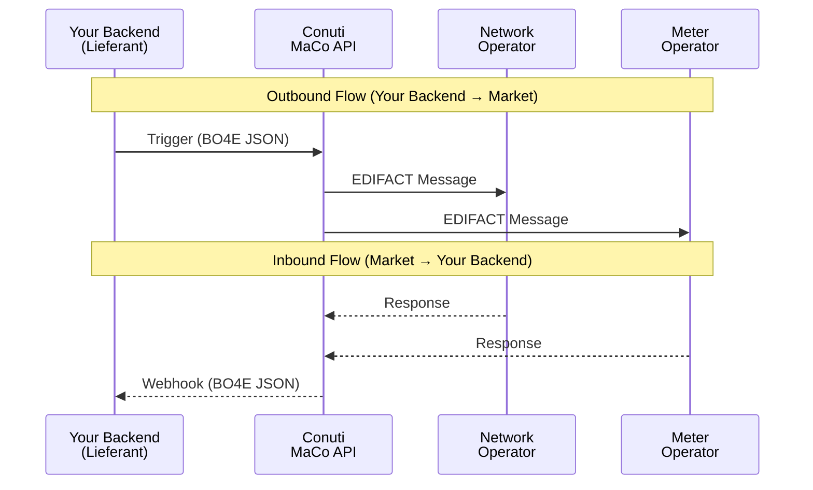

# MaCo API Documentation Workspace

> **Your complete toolkit for German electricity market communication via the Conuti MaCo API**

[](#-ai-powered-development)
[](#-documentation)
[](#-file-reference)

---

## What is this?

This workspace enables **Lieferanten (electricity suppliers)** to integrate with Germany's electricity market through the **Conuti MaCo API**. It provides:

- 📚 **Complete documentation** for all MaKo (Marktkommunikation) processes
- 🤖 **AI-powered assistance** with pre-configured Cursor IDE rules
- 📋 **Real message examples** for testing and validation
- 🔧 **Schemas and business rules** for building compliant messages

```
Your Backend  ──▶  Conuti MaCo API  ──▶  Network Operators (NB) / Meter Operators (MSB)
     ◀── webhooks ◀──────────────────────────────── responses ◀──
```

---

## Table of Contents

- [Quick Start](#-quick-start)
- [Who Should Use This](#-who-should-use-this)
- [AI-Powered Development](#-ai-powered-development)
- [Two Entry Points](#-two-entry-points)
- [Architecture](#-architecture)
- [Documentation](#-documentation)
- [File Reference](#-file-reference)
- [Common Tasks](#-common-tasks)
- [Troubleshooting](#-troubleshooting)
- [Contributing](#-contributing)
- [License](#-license)

---

## 🚀 Quick Start

### One-Liner Setup

```bash
git clone <repository-url> && cd maco_agent_workspace && ./scripts/setup-workspace.sh
```

### Step-by-Step

```bash
# 1. Clone the repository
git clone <repository-url>
cd maco_agent_workspace

# 2. Run setup (initializes submodules, downloads docs, builds schemas)
./scripts/setup-workspace.sh

# 3. Open in Cursor IDE - AI rules load automatically!
cursor .
```

### Verify Installation

```bash
# Check key files exist
ls docs/entry-points/BUSINESS_PROCESS_MAP.md    # Business discovery guide
ls maco-api-documentation/_build/*.min.json      # API schemas
ls maco-edi-testfiles/outbound/v202510/          # Example messages
```

**That's it!** Open Cursor and ask: *"What processes do I need to register a new customer?"*

---

## 👥 Who Should Use This

| You are... | Start with... |
|------------|---------------|
| **Backend developer** implementing MaKo integration | [AI_AGENT_SETUP.md](docs/entry-points/AI_AGENT_SETUP.md) |
| **Product owner** understanding market processes | [BUSINESS_PROCESS_MAP.md](docs/entry-points/BUSINESS_PROCESS_MAP.md) |
| **Technical architect** designing API integrations | [Architecture section](#-architecture) |
| **QA engineer** validating message formats | [maco-edi-testfiles/](maco-edi-testfiles/) |

### Prerequisites

- **Cursor IDE** 0.45+ (for AI agent support)
- **Git** (to clone and sync)
- **Python 3** (optional, for sync scripts)

---

## 🤖 AI-Powered Development

This workspace includes **pre-configured AI rules** that make Cursor your MaKo expert.

### What the AI Agent Does

| Feature | Description |
|---------|-------------|
| 📊 **Auto-visualizations** | Creates Mermaid sequence diagrams and flowcharts |
| ✅ **Schema validation** | Checks messages against official schemas |
| 📖 **Source verification** | Always reads docs before answering—no hallucination |
| 🔗 **Cross-referencing** | Links business rules, schemas, and examples |

### Try It Now

Open Cursor chat (`Cmd+L` / `Ctrl+L`) and ask:

```
"I want to register a new customer, what processes do I need?"
```

The AI will:
1. Reference `BUSINESS_PROCESS_MAP.md` for the workflow
2. Create sequence diagrams showing the message flow
3. List required fields from schemas
4. Point to example messages in `maco-edi-testfiles/`

### Rule Categories

```
.cursor/rules/
├── global-rules/        # Always-applied core context
├── domain-rules/        # Business discovery & technical workflows
├── validation-rules/    # Message validation & building
└── visualization-rules/ # Mermaid diagram requirements
```

> 📖 See [`.cursor/README.md`](.cursor/README.md) for detailed rule documentation.

---

## 🎯 Two Entry Points

Choose your path based on what you have:

### Entry Point 1: Business Goal → Implementation

**When**: You have a business goal like *"register customer"* or *"cancel contract"*

```
📄 docs/entry-points/BUSINESS_PROCESS_MAP.md
```

**Example Scenarios**:
- New customer signs up for electricity
- Customer moves to a new address
- Customer terminates contract
- Supplier switch

### Entry Point 2: Specific Message → Implementation

**When**: You have a BDEW process ID like `55077` or a trigger like `START_LIEFERBEGINN`

```
📄 docs/entry-points/AI_AGENT_SETUP.md
```

**Implementation Steps**:
1. Find your process in `PROCESS_GRAPH.json`
2. Check schema: `PI_{ID}.yml`
3. Check rules: `yaml_output/{ID}.yaml`
4. Reference example: `maco-edi-testfiles/outbound/v202510/`

---

## 🏗 Architecture

### Message Flow



### Key Concepts

| Concept | Description |
|---------|-------------|
| **Role** | You are a **Lieferant (LF)** — electricity supplier |
| **Outbound** | Your backend → Conuti API (BO4E JSON format) |
| **Inbound** | Conuti → Your webhooks (BO4E JSON, converted from EDIFACT) |
| **Process IDs** | 5-digit BDEW Prüfidentifikatoren (e.g., `55077`) |
| **Async** | All processes are asynchronous; responses come via webhooks |

### Message Formats

| Direction | Format | Example Path |
|-----------|--------|--------------|
| **Outbound** | BO4E JSON | `maco-edi-testfiles/outbound/v202510/*.json` |
| **Inbound** | EDIFACT | `maco-edi-testfiles/inbound/v202510/*.edi` |

> ⚠️ **Always use `v202510`** — the `v202404` directory is outdated.

---

## 📚 Documentation

### Documentation Types

| Type | Purpose | Location |
|------|---------|----------|
| **Markdown** | Business context (WHY) | `docs-offline/*.md` |
| **PNG diagrams** | Technical flow (HOW) | `docs-offline/prozessdiagramme-png/` |
| **EBD files** | Validation logic (WHAT to validate) | `ebd-diagrams/FV{YYMM}/` |
| **YAML schemas** | Required fields | `maco-api-documentation/...yaml_output/` |
| **Test files** | Real message examples | `maco-edi-testfiles/v202510/` |

### Finding Documentation

1. **Start with the index**: `docs/llm.txt` (237 entries)
2. **Use process lookup**: `docs/entry-points/PROCESS_GRAPH.json`
3. **Read source docs**: `docs-offline/{process-name}.md`

---

## 📁 File Reference

### Quick Reference

| File | Purpose |
|------|---------|
| [`BUSINESS_PROCESS_MAP.md`](docs/entry-points/BUSINESS_PROCESS_MAP.md) | Business goal → Process mapping |
| [`AI_AGENT_SETUP.md`](docs/entry-points/AI_AGENT_SETUP.md) | Technical implementation guide |
| [`PROCESS_GRAPH.json`](docs/entry-points/PROCESS_GRAPH.json) | Process dependency graph |
| [`llm.txt`](docs/llm.txt) | Documentation index (237 entries) |

### Directory Structure

```
maco_agent_workspace/
│
├── 📄 README.md                    # You are here
│
├── 📁 docs/
│   ├── entry-points/               # ⭐ Start here
│   │   ├── BUSINESS_PROCESS_MAP.md #    Business discovery
│   │   ├── AI_AGENT_SETUP.md       #    Technical implementation
│   │   └── PROCESS_GRAPH.json      #    Process dependencies
│   └── llm.txt                     # Documentation index
│
├── 📁 .cursor/rules/               # AI agent rules
│
├── 📁 docs-offline/                # 232 offline documentation files
│   └── prozessdiagramme-png/       # 54 process diagrams
│
├── 📁 maco-api-documentation/      # API schemas & rules
│   ├── _build/*.min.json           #    Compiled schemas
│   └── yaml_output/                #    Business rules (136 files)
│
├── 📁 maco-edi-testfiles/          # 2,549+ test files
│   ├── outbound/v202510/           #    JSON examples (send)
│   └── inbound/v202510/            #    EDI examples (receive)
│
├── 📁 ebd-diagrams/                # EBD validation trees
│   └── FV{YYMM}/                   #    By format version
│
└── 📁 scripts/                     # Setup & sync scripts
    ├── setup-workspace.sh          #    Initial setup
    └── update-workspace.sh         #    Update documentation
```

---

## 🎯 Common Tasks

| Task | Solution |
|------|----------|
| Register a new customer | `BUSINESS_PROCESS_MAP.md` → Scenario 1 |
| Find required fields for process 55078 | `yaml_output/55078.yaml` + `PI_55078.yml` |
| Implement Kündigung workflow | `BUSINESS_PROCESS_MAP.md` → Kündigung scenario |
| Validate a message before sending | Check against `PI_{ID}.yml` schema |
| Handle an incoming webhook | Find process in `AI_AGENT_SETUP.md` → implement handler |
| Update to latest documentation | Run `./scripts/update-workspace.sh` |

---

## ❓ Troubleshooting

<details>
<summary><strong>AI Agent Rules Not Loading</strong></summary>

1. Ensure Cursor version is **0.45+**
2. Restart Cursor after cloning
3. Verify `.cursor/rules/` directory exists
4. See [`.cursor/SETUP.md`](.cursor/SETUP.md) for details

</details>

<details>
<summary><strong>Documentation Not Found</strong></summary>

1. Run `./scripts/setup-workspace.sh` to initialize everything
2. Check that `docs-offline/` exists
3. Run `./scripts/download-docs.sh` if docs are missing

</details>

<details>
<summary><strong>Submodules Empty After Clone</strong></summary>

```bash
# Initialize all submodules
./scripts/setup-workspace.sh

# Or manually:
git submodule update --init --recursive
```

</details>

<details>
<summary><strong>Scripts Not Executable</strong></summary>

```bash
chmod +x scripts/*.sh scripts/sync/*.sh
```

</details>

<details>
<summary><strong>Example Files Not Found</strong></summary>

Always use `v202510` directory (not `v202404`):
- Outbound: `maco-edi-testfiles/outbound/v202510/` (JSON)
- Inbound: `maco-edi-testfiles/inbound/v202510/` (EDI)

</details>

---

## 🔄 Keeping Up to Date

```bash
# Update all documentation and schemas
./scripts/update-workspace.sh
```

This syncs changes from external repositories (`maco-api-documentation`, `maco-edi-testfiles`) and rebuilds schemas.

> 📖 See [`scripts/sync/README.md`](scripts/sync/README.md) for detailed sync workflow.

---

## 🤝 Contributing

Contributions are welcome! Here's how you can help:

1. **Report issues**: Found a bug or missing documentation? Open an issue
2. **Improve documentation**: PRs for clearer explanations are appreciated
3. **Add examples**: More test files help everyone
4. **Enhance AI rules**: Improvements to `.cursor/rules/` benefit all users

### Development Setup

```bash
# Clone with full history
git clone <repository-url>
cd maco_agent_workspace
./scripts/setup-workspace.sh

# Make changes and test with Cursor
cursor .
```

---

## 📜 License

This workspace aggregates documentation and schemas from official German energy market sources. See individual file headers for specific licensing information.

---

## 💬 Support

- **Documentation issues**: Check `docs/llm.txt` for the right file
- **Schema questions**: Reference `maco-api-documentation/_build/`
- **AI agent issues**: See [`.cursor/README.md`](.cursor/README.md)

---

<div align="center">

**Built for German electricity market integration with ❤️**

[Get Started](#-quick-start) · [Documentation](#-documentation) · [Common Tasks](#-common-tasks)

</div>
