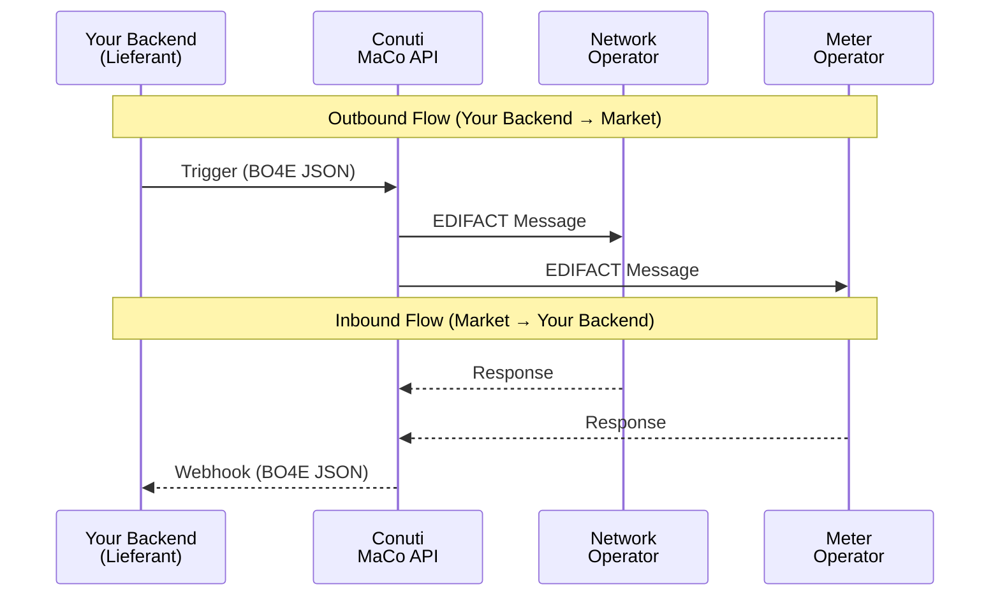

# MaCo API Documentation Workspace

> **Scope:** This workspace supports Strom market communication. `docs-offline/` mirrors the new Conuti documentation for format versions 202604 and 202610; Gas-specific Markdown pages are excluded. `docs-supplemental/` retains relevant older Mermaid diagrams, architecture PNGs, and operational details. The two indexes are separate, and `PROCESS_GRAPH.json` points to both sources. See [documentation sources](docs/README.md).

> **Your complete toolkit for German electricity market communication via the Conuti MaCo API**

[](#-documentation)
[](#-file-reference)

---

## What is this?

This workspace enables **Lieferanten (electricity suppliers)** to integrate with Germany's electricity market through the **Conuti MaCo API**. It provides:

- 📚 **Versioned Strom process and interface documentation** with a separate older supplement
- 🤖 **Agent instructions** for Codex, Claude Code, and Cursor
- 📋 **Real message examples** for testing and validation
- 🔧 **Schemas and business rules** for building compliant messages
- 📄 **Parsed BDEW source documents** for GPKE, WiM, LFW24, APERAK, MIGs, and codelists
- 🔁 **EDIFACT ↔ BO4E mappings** by format version and message type

```
Your Backend  ──▶  Conuti MaCo API  ──▶  Network Operators (NB) / Meter Operators (MSB)
     ◀── webhooks ◀──────────────────────────────── responses ◀──
```

---

## Table of Contents

- [Quick Start](#-quick-start)
- [Who Should Use This](#-who-should-use-this)
- [AI-Powered Development](#-ai-powered-development)
- [Agent Skills](#-agent-skills)
- [Two Entry Points](#-two-entry-points)
- [Architecture](#-architecture)
- [Documentation](#-documentation)
- [Source Guide](#-source-guide)
- [File Reference](#-file-reference)
- [Common Tasks](#-common-tasks)
- [Troubleshooting](#-troubleshooting)
- [Contributing](#-contributing)
- [License](#-license)

---

## 🚀 Quick Start

### One-Liner Setup

```bash
git clone https://github.com/adriansprk/conuti-maco-app.git && cd conuti-maco-app && ./scripts/setup-workspace.sh
```

### Step-by-Step

```bash
# 1. Clone the repository
git clone https://github.com/adriansprk/conuti-maco-app.git
cd conuti-maco-app

# 2. Run setup (initializes submodules, downloads docs, builds schemas)
./scripts/setup-workspace.sh

# 3. Open in your editor (Cursor example)
cursor .
```

### Verify Installation

```bash
# Check key files exist
ls docs/entry-points/BUSINESS_PROCESS_MAP.md    # Business discovery guide
ls maco-api-documentation/_build/*.min.json      # API schemas
ls maco-edi-testfiles/outbound/v202610/          # Example messages for FV 202610
python3 scripts/find-documentation.py --pi 55077 --version 202610 --role LF
bash scripts/validate-workspace.sh               # Check indexes and discovery
ls bdew-docs/INDEX.md                            # Parsed BDEW source guide
ls bo4e-mapping/2510/UTILMD_Strom.csv            # EDIFACT ↔ BO4E mapping
ls .agents/skills/bo4e-essentials/SKILL.md       # Deterministic BO4E doc agent
```

Then ask your agent: *"Which Strom processes do I need to register a new customer under format version 202610?"*

---

## 👥 Who Should Use This

| You are... | Start with... |
|------------|---------------|
| **Backend developer** implementing MaKo integration | [AI_AGENT_SETUP.md](docs/entry-points/AI_AGENT_SETUP.md) |
| **Product owner** understanding market processes | [BUSINESS_PROCESS_MAP.md](docs/entry-points/BUSINESS_PROCESS_MAP.md) |
| **Technical architect** designing API integrations | [Architecture section](#-architecture) |
| **QA engineer** validating message formats | [maco-edi-testfiles/](maco-edi-testfiles/) |

### Prerequisites

- **Git** (to clone and sync)
- **Python 3** and **curl** (for setup, refresh, and validation scripts)
- An agent-enabled editor or CLI is optional for using the source files directly

---

## 🤖 AI-Powered Development

This workspace provides shared [agent instructions](AGENTS.md), task-specific Cursor rules, and reusable skills. Agents still need to read the selected-version sources before making process or payload claims.

### What the AI Agent Does

| Feature | Description |
|---------|-------------|
| 📊 **Process visualizations** | Creates diagrams when a full process explanation benefits from them |
| ✅ **Schema validation** | Checks messages against official schemas |
| 📖 **Source verification** | Uses the selected source pages rather than inferring process facts from an index |
| 🔗 **Cross-referencing** | Links BDEW sources, business rules, schemas, mappings, and examples |
| 🧪 **Deterministic gates** | Bundled scripts verify BO4E Essentials evidence artifacts and final markdown shape |

### Try It Now

Open Cursor chat (`Cmd+L` / `Ctrl+L`) and ask:

```
"I want to register a new customer, what processes do I need?"
```

A source-grounded answer should identify the applicable version, read its Strom process view, check the relevant Prüfis and response roles, and use AHB, mapping, schema, and EBD evidence where the question needs them. Diagrams and fixtures help explain a verified flow; fixtures remain examples for their own version.

### Rule Categories

```
.cursor/rules/
├── global-rules/        # Short shared source and scope rules
├── domain-rules/        # Business discovery & technical workflows
├── validation-rules/    # Message validation & building
└── visualization-rules/ # Diagram guidance for full process briefs
```

> 📖 See [`.cursor/README.md`](.cursor/README.md) for detailed rule documentation.

---

## 🧩 Agent Skills

The repo ships reusable agent workflows under `.agents/skills/`. The most important one is [`bo4e-essentials`](.agents/skills/bo4e-essentials/SKILL.md), which creates ticket-ready BO4E implementation docs for a Prüfi or composite `START_*` flow.

The value is the deterministic verification layer:

```bash
SKILL_DIR=.agents/skills/bo4e-essentials
python3 "$SKILL_DIR/scripts/verify-bo4e-essentials.py" --repo-root "$PWD" --stage sources --strict-evidence <PI>
python3 "$SKILL_DIR/scripts/verify-bo4e-essentials.py" --repo-root "$PWD" --stage final --strict-evidence <PI>
"$SKILL_DIR/scripts/lint-essentials.sh" --repo-root "$PWD" <PI>
```

The verifier checks structured run artifacts in `your-requests/.runs/<PI>/`, including source hashes, exact excerpts, format-version agreement, and request/response relationship proofs. The linter checks the final markdown's required sections and citations. Passing these gates confirms the evidence artifacts and document structure; interpreting the cited sources still requires judgment.

This avoids relying on the LLM to self-police its own checklist. A BO4E Essentials doc is not considered ticket-ready until the bundled scripts pass.

---

## 🎯 Two Entry Points

Choose your path based on what you have:

### Entry Point 1: Business Goal → Implementation

**When**: You have a business goal like *"register customer"* or *"cancel contract"*

```
📄 docs/entry-points/BUSINESS_PROCESS_MAP.md
```

**Example Scenarios**:
- New customer signs up for electricity
- Customer moves to a new address
- Customer terminates contract
- Supplier switch

### Entry Point 2: Specific Message → Implementation

**When**: You have a BDEW process ID like `55077` or a trigger like `START_LIEFERBEGINN`

```
📄 docs/entry-points/AI_AGENT_SETUP.md
```

**Implementation Steps**:
1. Select the format version and run `python3 scripts/find-documentation.py --pi 55077 --version 202610 --role LF` (or use `--process` / `--trigger`).
2. Read the returned Strom process and Prüfi pages. Add `--perspective LFN` or `LFA` when that view matters.
3. Check the matching AHB, EBD, trigger, request schema, and BO4E mapping for the claim you need to make.
4. Use fixtures from the same version when available; label any older example.
5. For a ticket-ready brief, use `bo4e-essentials` and its strict verifier and linter.

---

## 🏗 Architecture

### Message Flow


```mermaid
sequenceDiagram
    participant LF as Your Backend<br/>(Lieferant)
    participant API as Conuti<br/>MaCo API
    participant NB as Network<br/>Operator
    participant MSB as Meter<br/>Operator

    Note over LF,MSB: Outbound Flow (Your Backend → Market)
    LF->>API: Trigger (BO4E JSON)
    API->>NB: EDIFACT Message
    API->>MSB: EDIFACT Message

    Note over LF,MSB: Inbound Flow (Market → Your Backend)
    NB-->>API: Response
    MSB-->>API: Response
    API-->>LF: Webhook (BO4E JSON)
```

### Key Concepts

| Concept | Description |
|---------|-------------|
| **Role** | You are a **Lieferant (LF)** — electricity supplier |
| **Outbound** | Your backend → Conuti API (BO4E JSON format) |
| **Inbound** | Conuti → Your webhooks (BO4E JSON, converted from EDIFACT) |
| **Process IDs** | 5-digit BDEW Prüfidentifikatoren (e.g., `55077`) |
| **Async** | All processes are asynchronous; responses come via webhooks |
| **BDEW sources** | Parsed regulatory/process and EDIFACT source documents in `bdew-docs/` |
| **Mappings** | CSV mappings from EDIFACT segments and Prüfidentifikatoren to BO4E fields in `bo4e-mapping/` |

### Message Formats

| Direction | Format | Example Path |
|-----------|--------|--------------|
| **Outbound fixture** | BO4E JSON | `maco-edi-testfiles/outbound/v202610/<message>/<PI>/*.json` |
| **Inbound fixture** | EDIFACT | `maco-edi-testfiles/inbound/v202610/<message>/<PI>/*.edi` |
| **Mapping** | CSV | `bo4e-mapping/2510/*.csv`, `bo4e-mapping/2604/*.csv` |

> Fixtures are examples for their own version. Select a version matching the process when available; label older fixtures when used for illustration.

---

## 📚 Documentation

### Documentation Types

| Type | Purpose | Location |
|------|---------|----------|
| **New documentation** | Versioned process and interface reference | `docs-offline/<site-path>.md` |
| **Older supplement** | Mermaid branches and operational history | `docs-supplemental/*.md` |
| **BDEW Markdown** | Parsed source documents and MIG/AHB context | `bdew-docs/*.md` |
| **PNG diagrams** | Technical flow (HOW) | `docs-supplemental/prozessdiagramme-png/` |
| **EBD files** | Validation logic (WHAT to validate) | `ebd-diagrams/FV{YYMM}/` |
| **YAML schemas** | Request shape and generated business rules; cross-check requiredness with AHB | `maco-api-documentation/.../yaml_output/` |
| **BO4E mappings** | EDIFACT segment/field ↔ BO4E field mapping | `bo4e-mapping/{2510,2604}/*.csv` |
| **Test files** | Versioned message examples | `maco-edi-testfiles/{outbound,inbound}/vYYYYMM/` |

### Finding Documentation

1. **Select a format version and find the source**: `python3 scripts/find-documentation.py --process lieferbeginn --version 202610 --role LF`. Use `--pi` or `--trigger` for other starting points.
2. **Read the returned page** in `docs-offline/`. Use `--perspective LFN` or `LFA` for a particular supplier view and `--include-supplemental` when older branch or architecture details are relevant.
3. **Treat `PROCESS_GRAPH.json` as a source index**; it does not establish process order or decision logic.
4. **For BDEW source context**: `bdew-docs/INDEX.md`
5. **For EDIFACT ↔ BO4E fields**: `bo4e-mapping/{2510,2604}/{message-type}.csv`

---

## 📄 Source Guide

### BDEW Documents

`bdew-docs/` contains parsed Markdown versions of key BDEW and BNetzA source documents. Start with [`bdew-docs/INDEX.md`](bdew-docs/INDEX.md), then open the linked source document before making process, deadline, EDIFACT, or field claims.

| Topic | Start with |
|-------|------------|
| GPKE, Lieferbeginn, Lieferende, Kündigung, Ersatz-/Grundversorgung | `bdew-docs/bk620160_gpke.md` |
| Lieferantenwechsel 24h and operational examples | `bdew-docs/BDEW_AWH_LFW24_V1_7_20251208.md` |
| WiM base processes and metering-operator workflows | `bdew-docs/BK6-24-174_WiM_Teil1_Lesefassung.md` |
| WiM value transmission and meter-value workflows | `bdew-docs/BK6-24-174_WiM_Teil2_Lesefassung.md` |
| APERAK/CONTRL acknowledgements and error handling | `bdew-docs/APERAK_AHB_1_1_Konsultationsfassung_20260202.md` |
| EDIFACT structure for UTILMD, MSCONS, INVOIC, ORDERS | Matching `*_MIG_*.md` file in `bdew-docs/` |
| OBIS and media identifiers | `bdew-docs/Codeliste-OBIS-Kennzahlen_Medien_2_5c_Konsultationsfassung_20250801.md` |

### BO4E Mapping

`bo4e-mapping/` contains EDIFACT-to-BO4E mapping tables grouped by format version:

| Format version | Location | Coverage |
|----------------|----------|----------|
| `2510` | `bo4e-mapping/2510/` | 22 CSV files including UTILMD Strom/Gas, MSCONS, ORDERS, INVOIC, APERAK, CONTRL, MaLoIdent, and more |
| `2604` | `bo4e-mapping/2604/` | 15 CSV files for the next format cycle |

Use these CSVs after identifying the message type and Prüfidentifikator. The columns combine EDIFACT segment positions, BO4E object/field names, mapping notes, and per-Prüfidentifikator applicability.

---

## 📁 File Reference

### Quick Reference

| File | Purpose |
|------|---------|
| [`BUSINESS_PROCESS_MAP.md`](docs/entry-points/BUSINESS_PROCESS_MAP.md) | Business goal → Process mapping |
| [`AI_AGENT_SETUP.md`](docs/entry-points/AI_AGENT_SETUP.md) | Technical implementation guide |
| [`PROCESS_GRAPH.json`](docs/entry-points/PROCESS_GRAPH.json) | Source discovery index, with version and role metadata |
| [`llms.txt`](docs/dokumentation/llms.txt) | New site's curated documentation index |
| [`llms-index.txt`](docs/dokumentation/llms-index.txt) | 3,447 Strom and shared documentation pages |
| [`llm.txt`](docs-supplemental/llm.txt) | Older site's separate index |

### Directory Structure

```
conuti-maco-app/
│
├── 📄 README.md                    # You are here
│
├── 📁 docs/
│   ├── entry-points/               # ⭐ Start here
│   │   ├── BUSINESS_PROCESS_MAP.md #    Business discovery
│   │   ├── AI_AGENT_SETUP.md       #    Technical implementation
│   │   └── PROCESS_GRAPH.json      #    Source discovery index
│   └── dokumentation/              # Strom-scoped new-site indexes
│
├── 📁 bdew-docs/                   # Parsed BDEW/BNetzA source documents
│   ├── INDEX.md                    #    Source routing guide
│   └── *_MIG_*.md / *_AHB_*.md     #    EDIFACT guides and application handbooks
│
├── 📁 bo4e-mapping/                # EDIFACT ↔ BO4E mapping CSVs
│   ├── 2510/                       #    Format version 2025-10 mappings
│   └── 2604/                       #    Format version 2026-04 mappings
│
├── 📁 .cursor/rules/               # AI agent rules
│
├── 📁 .agents/skills/              # Reusable agent workflows
│   └── bo4e-essentials/            #    Deterministic BO4E Essentials doc generator
│       ├── scripts/                #    Verifier + linter
│       └── reference/              #    Output format and evidence contracts
│
├── 📁 docs-offline/                # 3,447 Strom/shared versioned Markdown pages
│
├── 📁 docs-supplemental/           # 346 older Strom/shared Markdown pages
│   └── prozessdiagramme-png/       # 54 process diagrams
│
├── 📁 maco-api-documentation/      # API schemas & rules
│   ├── _build/*.min.json           #    Compiled schemas
│   └── yaml_output/                #    Business rules (136 files)
│
├── 📁 maco-edi-testfiles/          # 4,055+ test files
│   ├── outbound/v202610/           #    JSON examples for FV 202610
│   └── inbound/v202610/            #    EDI examples for FV 202610
│
├── 📁 ebd-diagrams/                # EBD validation trees
│   └── FV{YYMM}/                   #    By format version
│
├── 📁 scripts/                     # Setup & sync scripts
│   ├── setup-workspace.sh          #    Initial setup
│   ├── fetch-llm-index.sh          #    Refresh docs-supplemental/llm.txt from doc.macoapp.de/llms.txt
│   ├── download-dokumentation.sh   #    Refresh the new site mirror and its indexes
│   ├── download-docs.sh            #    Download docs listed in docs-supplemental/llm.txt
│   ├── find-documentation.py       #    Versioned Strom lookup
│   ├── validate-workspace.sh       #    Deterministic documentation checks
│   └── update-workspace.sh         #    Update documentation
│
└── 📁 message-downloader/          # Conuti message pipeline
    ├── bin/                        #    Scripts (download, convert, split, clean)
    ├── config/                     #    API tokens & config (gitignored)
    ├── data/                       #    Downloaded MaLo data (gitignored)
    ├── docs/                       #    Pipeline findings & plans
    └── tests/                      #    Splitter tests & fixtures
```

---

## 🎯 Common Tasks

| Task | Solution |
|------|----------|
| Register a new customer | `BUSINESS_PROCESS_MAP.md` → Scenario 1 |
| Find process and Prüfi sources | `python3 scripts/find-documentation.py --pi 55078 --version 202610 --role LF` |
| Find required fields for Prüfi 55078 | Match the versioned AHB with `PI_55078.yml`, `yaml_output/55078.yaml`, and mapping |
| Map an EDIFACT field to BO4E | Use the CSV for the selected version in `bo4e-mapping/` |
| Check original BDEW process or EDIFACT source | `bdew-docs/INDEX.md` → matching source document |
| Create a ticket-ready BO4E Essentials doc | `.agents/skills/bo4e-essentials/` + bundled verifier/linter |
| Implement Kündigung workflow | `BUSINESS_PROCESS_MAP.md` → Kündigung scenario |
| Validate a message before sending | Check against `PI_{ID}.yml` schema |
| Handle an incoming webhook | Find process in `AI_AGENT_SETUP.md` → implement handler |
| Update to latest documentation | Run `./scripts/update-workspace.sh` |
| Refresh the new documentation mirror and indexes | Run `./scripts/download-dokumentation.sh` |
| Refresh the older supplemental index only | Run `./scripts/fetch-llm-index.sh` |
| Validate local documentation indexes | Run `bash scripts/validate-workspace.sh` |
| Convert EDIFACT to BO4E | Run `python message-downloader/bin/convert.py --file message.edi --token YOUR_TOKEN` |

---

## ❓ Troubleshooting

<details>
<summary><strong>AI Agent Rules Not Loading</strong></summary>

1. Verify `.cursor/rules/` exists in the opened workspace
2. Restart Cursor after cloning or changing rules
3. See [`.cursor/README.md`](.cursor/README.md) for rule loading details

</details>

<details>
<summary><strong>Documentation Not Found</strong></summary>

1. Run `./scripts/setup-workspace.sh` to initialize everything
2. Check that `docs-offline/` exists
3. Run `./scripts/download-dokumentation.sh` if new docs are missing
4. Run `python3 scripts/rebuild-documentation-indexes.py` after either documentation source changes, then `bash scripts/validate-workspace.sh`

</details>

<details>
<summary><strong>Submodules Empty After Clone</strong></summary>

```bash
# Initialize all submodules
./scripts/setup-workspace.sh

# Or manually:
git submodule update --init --recursive
```

</details>

<details>
<summary><strong>Scripts Not Executable</strong></summary>

```bash
chmod +x scripts/*.sh scripts/sync/*.sh
```

</details>

<details>
<summary><strong>Example Files Not Found</strong></summary>

Initialize the `maco-edi-testfiles` submodule with `git submodule update --init --recursive`. Check `outbound/` and `inbound/` for a fixture version matching your selected process version. The repository includes `v202604` and `v202610` examples; older examples must be labelled as such.

</details>

---

## 🔄 Keeping Up to Date

```bash
# Update all documentation and schemas
./scripts/update-workspace.sh
```

This checks and updates submodules, refreshes the new and older documentation mirrors, and rebuilds schemas and indexes. The refresh compares each selected Markdown page with its local copy and removes Gas-specific pages from the offline documentation. `SKIP_LLM_FETCH=1` skips fetching the older portal's index; the new-site refresh still uses the network. Run `bash scripts/validate-workspace.sh` afterward.

> 📖 See [`scripts/sync/README.md`](scripts/sync/README.md) for detailed sync workflow.

---

## 🤝 Contributing

Contributions are welcome! Here's how you can help:

1. **Report issues**: Found a bug or missing documentation? Open an issue
2. **Improve documentation**: PRs for clearer explanations are appreciated
3. **Add examples**: More test files help everyone
4. **Enhance AI rules**: Improvements to `.cursor/rules/` benefit all users

### Development Setup

```bash
# Clone with full history
git clone https://github.com/adriansprk/conuti-maco-app.git
cd conuti-maco-app
./scripts/setup-workspace.sh

# Open in an editor (Cursor example)
cursor .
```

---

## 📜 License

This workspace aggregates documentation and schemas from official German energy market sources. See individual file headers for specific licensing information.

---

## 💬 Support

- **Documentation issues**: Use `scripts/find-documentation.py` for versioned Strom pages; check `docs/README.md` for the two source indexes
- **Schema questions**: Reference `maco-api-documentation/_build/`
- **AI agent issues**: See [`.cursor/README.md`](.cursor/README.md)

---

<div align="center">

**Built for German electricity market integration with ❤️**

[Get Started](#-quick-start) · [Documentation](#-documentation) · [Common Tasks](#-common-tasks)

</div>
