# MaCo API Documentation Workspace

This workspace helps you enable your backend to use the MaCo API to communicate MaKo (Market Communication) messages into the market and receive results from the market.

## 🗺️ Architecture Overview

This workspace is a comprehensive knowledge base for MaKo (Market Communication) processes. Here's how everything connects:

```mermaid
graph TB
    subgraph "Entry Points"
        EP1[BUSINESS_PROCESS_MAP.md<br/>Business Goals → Processes]
        EP2[AI_AGENT_SETUP.md<br/>Technical Implementation]
        EP3[PROCESS_GRAPH.json<br/>Process Dependencies]
    end
    
    subgraph "Discovery Layer"
        LLM[llm.txt<br/>Documentation Index<br/>237 entries]
        DOCS[docs-offline/<br/>232 Process Docs<br/>Workflows & Diagrams]
    end
    
    subgraph "Schema Layer"
        BO4E[_build/bo4e-openapi.min.json<br/>BO4E Data Structures]
        TRIGGER[_build/macoapp-trigger.min.json<br/>Trigger Events]
        WRITE[_build/macoapp-schreiben.min.json<br/>Write Operations]
        READ[_build/macoapp-lesen.min.json<br/>Read Operations]
        MALO[_build/maloident-*.min.json<br/>MaloIdent APIs]
    end
    
    subgraph "Business Rules"
        YAML["yaml_output/(ID).yaml<br/>136 Business Rules<br/>Mandatory Fields"]
        PI["PIs/PI_(ID).yml<br/>Process Schemas<br/>API Structure"]
    end
    
    subgraph "Examples"
        EXAMPLES[maco-edi-testfiles/<br/>2,549 Test Files<br/>v202510: JSON/EDI]
    end
    
    subgraph "AI Agent"
        RULES[.cursor/rules/<br/>BMAD-METHOD Structure<br/>Auto-loaded in Cursor]
    end
    
    EP1 --> LLM
    EP2 --> LLM
    EP3 --> LLM
    LLM --> DOCS
    DOCS --> YAML
    DOCS --> PI
    YAML --> BO4E
    PI --> BO4E
    YAML --> EXAMPLES
    PI --> EXAMPLES
    EXAMPLES --> BO4E
    RULES -.-> EP1
    RULES -.-> EP2
    RULES -.-> EP3
    RULES -.-> DOCS
    RULES -.-> YAML
    RULES -.-> PI
    
    style EP1 fill:#e1f5ff
    style EP2 fill:#e1f5ff
    style EP3 fill:#e1f5ff
    style RULES fill:#fff4e1
```



## 🔗 How Everything Connects

### The Information Flow

When you need to implement a MaKo process, information flows through these layers:


### Component Relationships

| Component | Purpose | Connects To | Why It Matters |
|-----------|---------|-------------|----------------|
| **Entry Points** | Starting point for discovery | → `llm.txt` → `docs-offline/` | Guides you to the right documentation |
| **llm.txt** | Documentation index (237 entries) | → `docs-offline/` files | Maps BDEW IDs to specific documentation |
| **docs-offline/** | Process workflows & diagrams | → `yaml_output/` + `PIs/` | Explains business logic and sequence |
| **yaml_output/** | Business rules (136 files) | → `PIs/` + `bo4e-openapi.min.json` | Defines mandatory fields & validation |
| **PIs/** | Process API schemas | → `bo4e-openapi.min.json` | Shows exact API request structure |
| **maco-edi-testfiles/** | Real-world examples (2,549 files) | → All schemas | Validates your understanding |
| **AI Agent Rules** | Auto-validation & visualization | → All components | Ensures accuracy & creates diagrams |

### Data Flow Example: Implementing "New Customer Registration"


## 🎓 Quick Start Guide

### Your Role & Context
- **Role**: Lieferant (LF) - Electricity Supplier
- **Outbound**: Your backend → Conuti API (JSON format)
- **Inbound**: Conuti → Your backend webhooks (EDIFACT format)

### Choose Your Entry Point

**Business Goal?** (e.g., "register customer", "cancel contract")
→ Start with [`BUSINESS_PROCESS_MAP.md`](docs/entry-points/BUSINESS_PROCESS_MAP.md)

**Specific Process ID?** (e.g., "55077", "START_LIEFERBEGINN")
→ Start with [`AI_AGENT_SETUP.md`](docs/entry-points/AI_AGENT_SETUP.md)

### Using the AI Agent (Recommended)

Open Cursor chat and ask:
- "I want to register a new customer, what processes do I need?"
- "Show me the sequence diagram for process 55077"
- "What fields are required for START_LIEFERBEGINN?"

The AI agent automatically reads documentation, creates visualizations, validates against schemas, and cites sources.

## 📊 Workspace Statistics

| Category | Count | Purpose |
|----------|-------|---------|
| **Entry Points** | 3 files | Starting points for discovery |
| **Documentation Files** | 232 files | Process workflows & descriptions |
| **Business Rules** | 136 files | Mandatory fields & validation |
| **Process Schemas** | 136+ files | API request/response structures |
| **Test Examples** | 2,549 files | Real-world message examples |
| **AI Agent Rules** | 6 rule files | Auto-validation & visualization |
| **Documentation Index** | 237 entries | Maps IDs to documentation |

## 🤖 AI Agent Context (Git-Based + BMAD-METHOD Structure)

This workspace includes an **Agentic Context** that enables AI assistants (like Cursor) to understand MaKo processes, dependencies, and implementation patterns. The context is organized using **BMAD-METHOD's subdirectory structure** for scalability and specialization.

**Setup**: When you clone this repository, Cursor will automatically load the agent rules. No additional configuration needed!

**Rule Structure** (in `.cursor/rules/`):
- **Global Rules** (`global-rules/`): Always applied core context
- **Domain Rules** (`domain-rules/`): Business discovery & technical implementation workflows
- **Validation Rules** (`validation-rules/`): Message validation & building agents
- **Visualization Rules** (`visualization-rules/`): Mandatory Mermaid diagram requirements

**Key Features**: Mandatory visualizations, validation against schemas, message building from database entries, future-ready for Conuti API testing

**What's Included**:
- Entry point documentation (`docs/entry-points/`):
  - Process dependency graph (`PROCESS_GRAPH.json`)
  - Business process mapping (`BUSINESS_PROCESS_MAP.md`)
  - Technical setup guide (`AI_AGENT_SETUP.md`)
- Documentation index (`docs/llm.txt`)
- 232 offline documentation files (`docs-offline/`)
- 2,549 EDI test files (`maco-edi-testfiles/`)
- Sync system (`scripts/sync/`) for tracking external repo changes

**For Teams**: 
- Rules are version-controlled and shared automatically via Git
- Organized by category for easy maintenance and discovery
- Scalable structure supports adding specialized agents
- See [`.cursor/README.md`](.cursor/README.md) for detailed documentation

## 🎯 Goal

**Enable your backend to:**
- Send MaKo messages to the market via Conuti MaCo API (outbound)
- Receive results/responses from the market via webhooks (inbound)
- Handle both business-driven scenarios and specific message types

## 🚀 Getting Started

### Prerequisites

- **Cursor IDE** (version 0.45+) - For AI agent support
- **Git** - To clone and sync the repository
- **Python 3** - For sync scripts (optional, only if updating documentation)
- **jq** and **npx** - For schema rebuilding (optional, only if updating schemas)

### Initial Setup

1. **Clone the repository**:
   ```bash
   git clone <repository-url>
   cd maco_agent_workspace
   ```

2. **Open in Cursor**:
   - Open the workspace folder in Cursor IDE
   - Cursor will automatically load the AI agent rules (no configuration needed!)
   - If rules don't load, restart Cursor

3. **Verify setup** (optional):
   ```bash
   # Check that key files exist
   ls docs/entry-points/BUSINESS_PROCESS_MAP.md
   ls docs/entry-points/AI_AGENT_SETUP.md
   ls docs/entry-points/PROCESS_GRAPH.json
   ```

### Quick Start Examples

#### Example 1: Using AI Agent (Recommended)

**With Cursor AI Agent**:
1. Open Cursor chat (Cmd/Ctrl+L) or use Cmd/Ctrl+K
2. Ask: *"I want to register a new customer, what processes do I need?"*
   - The AI agent will reference `BUSINESS_PROCESS_MAP.md` and show you the workflow
3. Ask: *"Show me the sequence diagram for process 55077"*
   - The AI agent will create Mermaid visualizations automatically
4. Ask: *"What fields are required for START_LIEFERBEGINN?"*
   - The AI agent will check schemas and business rules for you


#### Example 2: Manual Discovery

**For Business Goals**:
1. Read [`docs/entry-points/BUSINESS_PROCESS_MAP.md`](docs/entry-points/BUSINESS_PROCESS_MAP.md)
2. Find your business scenario (e.g., "New Customer Signs Up")
3. Follow the workflow steps
4. Use `docs/llm.txt` to find specific documentation files
5. Check example messages in `maco-edi-testfiles/`

**For Specific Messages**:
1. Read [`docs/entry-points/AI_AGENT_SETUP.md`](docs/entry-points/AI_AGENT_SETUP.md)
2. Find your BDEW process ID (e.g., "55077")
3. Check schema: `maco-api-documentation/macoapp-schreiben/components/requestBodies/PIs/PI_55077.yml`
4. Check business rules: `maco-api-documentation/pythons/createPiFromTemplater/templater/yaml_output/55077.yaml`
5. Review example: `maco-edi-testfiles/outbound/v202510/utilmd/55077/1.json` (⚠️ Always use v202510)

### Key Concepts

- **Process IDs**: BDEW Prüfidentifikatoren (5-digit numbers like "55077")
- **Message Formats**:
  - **Outbound**: `maco-edi-testfiles/outbound/v202510/` (JSON format)
  - **Inbound**: `maco-edi-testfiles/inbound/v202510/` (EDI format)
  - ⚠️ **Always use v202510** version directory, never v202404 (outdated)

### Verification Steps

**Test AI Agent Setup**:
1. Open Cursor chat
2. Ask: *"What is the workspace role?"*
   - Should mention: Lieferant (LF), MaCo API, MaKo messages
3. Ask: *"Show me process 55077"*
   - Should create sequence diagram and flowchart
4. Ask: *"What fields are required for START_LIEFERBEGINN?"*
   - Should reference schemas and business rules

**Test Documentation Access**:
```bash
# Check entry points exist
ls docs/entry-points/*.md

# Check schemas exist
ls maco-api-documentation/_build/*.min.json

# Check example files exist
ls maco-edi-testfiles/outbound/v202510/utilmd/55077/
```

### Next Steps

1. **Explore the documentation**: Use `docs/llm.txt` to find relevant files, read `docs-offline/`, check `maco-edi-testfiles/`
2. **Implement your backend**: Follow workflows in entry point guides, use schemas and business rules
3. **Keep documentation updated** (optional): See [`scripts/sync/README.md`](scripts/sync/README.md) for syncing external repos

### Troubleshooting

**AI Agent Rules Not Loading**:
- Ensure Cursor version is 0.45+
- Restart Cursor after cloning
- Check `.cursor/rules/` directory exists
- See [`.cursor/SETUP.md`](.cursor/SETUP.md) for detailed troubleshooting

**Documentation Not Found**:
- Ensure you cloned the full repository (including submodules if any)
- Check that `docs-offline/` and `maco-api-documentation/` directories exist
- Run `./scripts/download-docs.sh` if documentation is missing

**Example Files Not Found**:
- ⚠️ Always use `v202510` directory (see [Understanding the Workspace](#understanding-the-workspace) above)
- Check `maco-edi-testfiles/outbound/v202510/` for outbound examples (JSON)
- Check `maco-edi-testfiles/inbound/v202510/` for inbound examples (EDI)


## 📁 Key Files & Their Relationships

| File | Purpose | Connects To | When to Use |
|------|---------|-------------|-------------|
| **Entry Points** |
| `BUSINESS_PROCESS_MAP.md` | Business concept → Process mapping | → `llm.txt` → `docs-offline/` | **Business goal discovery, backend design** |
| `AI_AGENT_SETUP.md` | Technical setup guide | → `PROCESS_GRAPH.json` → `llm.txt` | **Technical implementation, specific messages** |
| `PROCESS_GRAPH.json` | Process dependencies & sequences | → `docs-offline/` (via `llm.txt`) | **Fast lookup of prerequisites & triggers** |
| **Discovery Layer** |
| `llm.txt` | Documentation index (237 entries) | → `docs-offline/` files | **Find which documentation you need** |
| `docs-offline/` | 232 offline documentation files | → `yaml_output/` + `PIs/` | **Read workflow docs and process descriptions** |
| **Schema & Rules** |
| `_build/bo4e-openapi.min.json` | Complete BO4E schemas | ← Referenced by `yaml_output/` + `PIs/` | **Data structure reference** |
| `yaml_output/[ID].yaml` | Business rules (136 files) | → `PIs/PI_[ID].yml` + `bo4e-openapi.min.json` | **Mandatory fields, validation** |
| `PIs/PI_[ID].yml` | Process API schemas | → `bo4e-openapi.min.json` | **API request/response structure** |
| `_build/macoapp-trigger.min.json` | Trigger events schema | → `bo4e-openapi.min.json` | **Outbound trigger events** |
| `_build/maloident-*.min.json` | MaloIdent API schemas | → `bo4e-openapi.min.json` | **MaloIdent requests/responses** |
| **Examples** |
| `maco-edi-testfiles/` | 2,549 test files | ← Validates `yaml_output/` + `PIs/` | **Real-world message examples (inbound/outbound)** |
| **AI Agent** |
| `.cursor/rules/` | AI agent rules (BMAD-METHOD) | → All components | **Auto-validation & visualization** |


## 🔄 Typical Workflow

**From Business Goal**: `BUSINESS_PROCESS_MAP.md` → `llm.txt` → `docs-offline/` → `yaml_output/` + `PIs/` → `maco-edi-testfiles/` → `bo4e-openapi.min.json` → Implement

**From Process ID**: `AI_AGENT_SETUP.md` → `PROCESS_GRAPH.json` → `llm.txt` → `docs-offline/` → `yaml_output/[ID].yaml` → `PIs/PI_[ID].yml` → `maco-edi-testfiles/` → `bo4e-openapi.min.json` → Implement

## 📚 Structure

```
maco_agent_workspace/
├── docs/
│   ├── entry-points/          ⭐ Entry point documentation
│   │   ├── BUSINESS_PROCESS_MAP.md    # Business goal discovery
│   │   ├── AI_AGENT_SETUP.md          # Technical implementation
│   │   └── PROCESS_GRAPH.json         # Process dependency graph
│   └── llm.txt                ⭐ Documentation index
├── .cursor/rules/             ⭐ AI agent rules (BMAD-METHOD structure)
├── scripts/sync/              ⭐ Sync system for external repos
├── maco-api-documentation/    # External repo (tracked)
│   ├── _build/                ⭐ Formatted JSON schemas
│   ├── yaml_output/           ⭐ Business rules (136 files)
│   └── macoapp-schreiben/components/requestBodies/PIs/
│       └── PI_[ID].yml        ⭐ Process schemas
├── docs-offline/              ⭐ 232 offline documentation files
└── maco-edi-testfiles/        ⭐ 2,549 EDI test files (real-world examples)
```

## 🎯 Common Tasks & Solutions

| Task | Solution Path | Files Involved |
|------|---------------|---------------|
| "I want to register a new customer" | Business Goal → Process Discovery | `BUSINESS_PROCESS_MAP.md` → `llm.txt` → `docs-offline/` → `yaml_output/55077.yaml` → `PIs/PI_55077.yml` → Examples |
| "What data do I need for process 55078?" | Process ID → Field Discovery | `AI_AGENT_SETUP.md` → `PROCESS_GRAPH.json` → `yaml_output/55078.yaml` → `PIs/PI_55078.yml` → `bo4e-openapi.min.json` |
| "How do I implement Kündigung workflow?" | Business Goal → Workflow Discovery | `BUSINESS_PROCESS_MAP.md` → Find Kündigung → `llm.txt` → `docs-offline/prozessübersicht-860885m0.md` → `yaml_output/55016.yaml` |
| "I received a specific MaKo message, what do I do?" | Message Type → Handler Implementation | `AI_AGENT_SETUP.md` → Find message type → `PIs/PI_[ID].yml` → `bo4e-openapi.min.json` → Examples → Implement handler |

### Concrete Example: "Register New Customer"

Here's exactly how the components work together for a real scenario:

```mermaid
sequenceDiagram
    participant You
    participant BP as BUSINESS_PROCESS_MAP.md
    participant LLM as llm.txt
    participant DOCS as docs-offline/
    participant YAML as yaml_output/55077.yaml
    participant PI as PIs/PI_55077.yml
    participant BO4E as bo4e-openapi.min.json
    participant EXAMPLES as maco-edi-testfiles/
    participant AI as AI Agent
    
    You->>BP: "Register new customer"
    BP->>You: Scenario: MaloIdent → Lieferbeginn
    You->>LLM: Search "Lieferbeginn"
    LLM->>You: Points to prozessübersicht-853953m0.md
    You->>DOCS: Read prozessübersicht-853953m0.md
    DOCS->>You: Shows workflow: START_LIEFERBEGINN (55077)
    You->>YAML: Check yaml_output/55077.yaml
    YAML->>You: Required: marktlokationsId, lieferbeginn
    You->>PI: Check PIs/PI_55077.yml
    PI->>You: API structure: POST /trigger/START_LIEFERBEGINN
    You->>BO4E: Verify Marktlokation type
    BO4E->>You: Confirms: string, required
    You->>EXAMPLES: Check maco-edi-testfiles/outbound/v202510/utilmd/55077/1.json
    EXAMPLES->>You: Shows real message format
    AI->>You: Auto-generates sequence diagram<br/>& validates all fields
    You->>You: Implement backend endpoint
```




## 📖 Documentation

- **Offline**: All 232 documentation pages are available in `docs-offline/`
- **Index**: Use `llm.txt` to find which documentation file you need
- **Workflows**: Prozessübersicht files show step-by-step API call sequences
- **Schemas**: All API schemas are in `_build/` directory (formatted JSON)

## 🔧 Backend Requirements

Your backend needs to support:

**Outbound (Your Backend → Conuti MaCo API)**:
- Trigger events (START_LIEFERBEGINN, START_KUENDIGUNG, etc.)
- Send MaloIdent requests
- Store process data

**Inbound (Conuti MaCo API → Your Backend)**:
- Webhook endpoints for MaloIdent responses
- Webhook endpoints for process data updates
- Read operations (if needed)

See `BUSINESS_PROCESS_MAP.md` and `AI_AGENT_SETUP.md` for detailed requirements.
