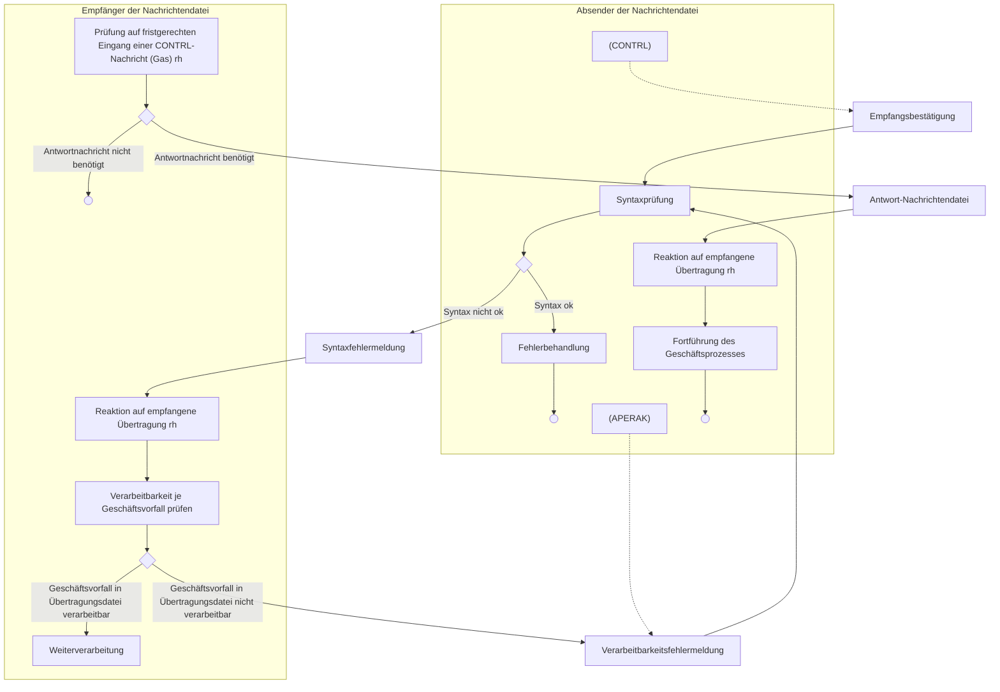
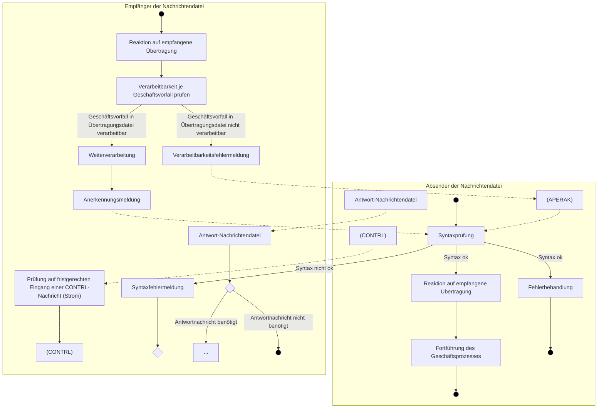

## **Konsultationsfassung**

# **APERAK Anwendungshandbuch**


|Version:|1.1|
|-|-|
|Stand MIG:|2.2|
|Publikationsdatum:|02.02.2026|
|Autor:|BDEW|


***

APERAK Anwendungshandbuch 

# **Disclaimer**

Die PDF-Datei ist das allein gültige Dokument.

Die zusätzlich veröffentlichte Word-Datei dient als informatorische Lesefassung und entspricht inhaltlich der PDF-Datei. Diese Word-Datei wird bis auf Weiteres rein informatorisch und ergänzend veröffentlicht unter dem Vorbehalt, zukünftig eine kostenpflichtige Veröffentlichung der Word-Datei einzuführen.

Zusätzlich werden zur PDF-Datei auch XML-Dateien als optionale Unterstützung gegen Entgelt veröffentlicht.

Version: 1.1 02.02.2026 Seite 2 von 58

APERAK Anwendungshandbuch 

# Inhaltsverzeichnis

1 Grundlegende Regelungen 5
1.1 Abgrenzung 5
1.2 Verantwortlichkeiten und Rahmenbedingungen bei der Kommunikation zwischen Absender und Empfänger 5
1.3 Regelungen bei Fehlern in der Marktkommunikation 7
1.4 Auswirkung einer Syntaxfehlermeldung auf den Geschäftsprozess 22
2.5 Regeln zum Einsatz der APERAK in der Sparte Strom 23
2.5.1 Fristen zur Übermittlung der APERAK 24

Version: 1.1 02.02.2026 Seite 3 von 58

APERAK Anwendungshandbuch


## 2.6 Regeln zum Einsatz der APERAK bei spartenübergreifenden Datenaustausch 25

# **3 Tabellarische Darstellung der APERAK** 26

# **4 Anhang** 32

## 4.1 Übersicht über die Rückmeldungen in der Sparte Gas 32

## 4.2 Übersicht über die Rückmeldungen in der Sparte Strom 33

## 4.3 Fehlercodes in ERC-Segment einer APERAK-Nachricht 34

# **5 Änderungshistorie** 50

Version: 1.1 02.02.2026 Seite 4 von 58

APERAK Anwendungshandbuch


# 1 Grundlegende Regelungen

Die in diesem Dokument dargestellten Prozesse beschreiben die Anwendung der APERAK auf die EDIFACT-Nachrichten, die durch den BDEW und DVGW beschrieben sind (auch wenn ggf. nur von BDEW die Rede ist).

Werden in Beispielen Ausschnitte aus EDIFACT-Dateien genutzt, so wird in diesen die Standard-Vorgabe zur Trennzeichen-Vereinbarung verwendet.

In diesem Kapitel inklusive all seiner Unterkapitel sind allgemeingültige Regeln beschrieben, wobei auch auf die Nutzung der CONTRL eingegangen wird, um es vollständig und verständlich darstellen zu können. Dieses Kapitel ist mit dem identisch, welches mit derselben Überschrift im CONTRL-Anwendungshandbuch enthalten ist.

Am Ende des Dokuments ist für jede Sparte jeweils in einem Aktivitätsdiagramm die Anwendung von CONTRL und APERAK auf die EDIFACT-Nachrichten beschrieben. Auch dies ist identisch im CONTRL-Anwendungshandbuch enthalten.

## 1.1 Abgrenzung

Die in diesem Dokument getroffenen Regelungen beziehen sich ausschließlich auf den elektronischen Datenaustausch. Vor- und nachgelagerte Aktivitäten werden nur soweit dies nötig ist, erwähnt. Es wird nicht auf die rechtlichen Konsequenzen eingegangen, die aufgrund von im Rahmen der Marktkommunikation begangener Fehler von Markteilnehmern zu tragen sind (z. B. ob sich aus einem nicht fristgerecht erfolgten Datenaustausch Schadensersatzansprüche ableiten lassen).

## 1.2 Verantwortlichkeiten und Rahmenbedingungen bei der Kommunikation zwischen Absender und Empfänger

Es sind eine Reihe von Bedingungen zu erfüllen, die im Folgenden konkretisiert werden. Dies bedingt insbesondere, dass die beteiligten Parteien beim elektronischen Datenaustausch<sup>1</sup>

> sich über die Kommunikationsparameter im Vorfeld verständigt haben (Kommunikationsweg, Adressen, Signaturen etc.) und frühzeitig Regelungen bei Veränderungen dieser treffen.

> den Betrieb sowie die Verfügbarkeit der Kommunikationssysteme gewährleisten.

Die exakten Regelungen zum Aufbau und Betrieb des Übertragungswegs sind in den BDEW-Dokumenten „Allgemeine Festlegungen“, „Regelungen zum Übertragungsweg“ und „Regelungen zum Übertragungsweg für AS4“ festgehalten.

In der folgenden Prozessbeschreibung wird von den Parteien immer eine Funktion, entweder als Absender oder Empfänger wahrgenommen. Die Parteien müssen in der Lage sein, sowohl als

<sup>1</sup> Weitergehende Informationen zu diesem Thema sind den BDEW-Dokumenten „Allgemeine Festlegungen“, „Regelungen zum Übertragungsweg“ und „Regelungen zum Übertragungsweg für AS4“ in der jeweils aktuellen Version zu entnehmen.

Version: 1.1 02.02.2026 Seite 5 von 58

APERAK Anwendungshandbuch 

Absender als auch als Empfänger die nachfolgend beschriebenen Verantwortungen zu übernehmen:

* Der Absender ist verantwortlich für eine plausible, inhaltlich und syntaktisch richtige sowie vollständig gefüllte Übertragungsdatei für den jeweiligen Geschäftsprozess. Tritt ein Fehler auf, ist er für die Identifizierung der Fehlerursache sowie für deren Beseitigung in seinem Zuständigkeitsbereich verantwortlich.

* Enthalten vom Absender erstellte Übertragungsdateien dennoch Fehler, die ihm per Syntaxfehlermeldung (in einer CONTRL) oder per Verarbeitbarkeitsfehlermeldung (in einer APERAK) gemeldet werden, so hat er ohne schuldhaftes Verzögern dafür Sorge zu tragen die gemeldeten Fehler schnellstmöglich zu bereinigen, sowie die Ursachen, die zur Fehlermeldung führten zu erforschen und abzustellen. Des Weiteren hat der ursprüngliche Absender eine, um den Fehler bereinigte, Übertragungsdatei zu übermitteln, da er weiterhin verpflichtet bleibt, die gültigen Prozess- und Rückmeldefristen gegenüber allen anderen Beteiligten einzuhalten.

Enthält die Übertragungsdatei fehlerfreie und fehlerhafte Geschäftsvorfälle, so kann der Absender diese für das erneute Versenden auch auf zwei Übertragungsdateien aufteilen, um auf diese Weise die fehlerfreien Geschäftsvorfälle unverzüglich übermitteln zu können.

Hierbei ist zu beachten, dass bei Syntaxfehlern alle in der Übertragungsdatei enthaltenen Geschäftsvorfälle vom Empfänger nicht verarbeitet wurden, aber durch Verarbeitbarkeitsfehlermeldungen nur die als fehlerhaft gemeldeten Geschäftsvorfälle einer Übertragungsdatei nicht verarbeitet werden.

* Der Empfänger ist dafür verantwortlich, empfangene Übertragungsdateien rechtzeitig zu prüfen und den Absender über das Ergebnis der Prüfungen unverzüglich zu informieren.

* In der Sparte Gas hat der Empfänger auf jede eingehende Übertragungsdatei immer eine CONTRL (entweder in der Ausprägung Empfangsbestätigung (UCI DE0083 = 7) oder Syntaxfehlermeldung (UCI DE0083 = 4)) zu versenden, außer als Reaktion auf eine CONTRL.

* In der Sparte Strom hat der Empfänger nur dann auf eine eingehende Übertragungsdatei eine CONTRL in der Ausprägung Syntaxfehlermeldung zu versenden, wenn diese syntaktisch falsch ist.

* Nach Erhalt einer Syntaxfehlermeldung per CONTRL hat der Absender der Übertragungsdatei davon auszugehen, dass die darin enthaltenen Daten/Geschäftsvorfälle beim Empfänger der Übertragungsdatei nicht weiterverarbeitet wurden. Der Absender der Übertragungsdatei hat ggf. einen Klärungsprozess anzustoßen, falls er weitere Informationen vom Empfänger der Übertragungsdatei benötigt, um seinen Fehler beheben zu können. Falls er den/die per CONTRL gemeldeten Fehler nicht akzeptiert, ist der Empfänger der Übertragungsdatei außerhalb der EDIFACT-Kommunikation zu kontaktieren.

* Nach Erhalt einer Empfangsbestätigung (erfolgreicher Syntaxprüfung) kann der Empfänger in der Sparte Gas von der ordnungsgemäßen Weiterverarbeitung seiner Übertragungsdatei beim Empfänger ausgehen, solange er keine Verarbeitbarkeitsfehlermeldung per APERAK erhält. Erhält er eine Verarbeitbarkeitsfehlermeldung, so kann er nur von einer ordnungsge-

Version: 1.1 02.02.2026 Seite 6 von 58

APERAK Anwendungshandbuch


mäßen Verarbeitung der Geschäftsvorfälle seiner Übertragungsdatei ausgehen, auf die sich kein Verarbeitbarkeitsfehler bezieht.

* In den Prozessen der Sparte Strom wird ihm die weitere Verarbeitung explizit durch Übersendung der Anerkennungsmeldung per APERAK mitgeteilt. Er kann nur von einer ordnungsgemäßen Verarbeitung der Geschäftsvorfälle seiner Übertragungsdatei ausgehen, für die er eine Anerkennungsmeldung erhält. Hinweis: Auch das Feststellen, dass ein Geschäftsvorfall nicht fristgerecht eintraf, stellt eine Verarbeitung des Geschäftsvorfalls im Sinne der Verwendung dieses Begriffs in diesem Dokument dar, da das Feststellen einer Fristverletzung nach der Verarbeitbarkeitsfehlerprüfung stattfindet.

* Nach Erhalt einer geschäftsvorfallbezogenen Verarbeitbarkeitsfehlermeldung per APERAK hat der Absender der Übertragungsdatei davon auszugehen, dass die beanstandeten Geschäftsvorfälle beim Empfänger der Übertragungsdatei nicht weiterverarbeitet wurden. Der Absender der Übertragungsdatei hat einen Klärungsprozess anzustoßen. Falls er weitere Informationen vom Empfänger der Übertragungsdatei benötigt, um seinen Fehler beheben zu können oder wenn er den/die per APERAK gemeldeten Fehler nicht akzeptiert, ist der Empfänger der Übertragungsdatei außerhalb der EDIFACT-Kommunikation zu kontaktieren.

## 1.3 Regelungen bei Fehlern in der Marktkommunikation

Der Absender der Übertragungsdatei ist für die fristgerechte Übermittlung verantwortlich. Bleibt in der Sparte Gas eine Empfangsbestätigung durch den Empfänger aus oder weist eine empfangene CONTRL auf einen Syntaxfehler hin, ist es die Initiativ-Aufgabe des Absenders der Übertragungsdatei, die Ursache der misslungenen Marktkommunikation zu ermitteln.

Sofern die Ursache für das Misslingen auf Seiten des Empfängers liegt, hat dieser die ursprüngliche Übertragungsdatei in die fristgerechte Verarbeitung aufzunehmen, sofern die jeweiligen Prozesse dies noch ermöglichen<sup>2</sup>. Die Übertragungsdatei des Absenders wird in diesem Fall als fristgerecht beim Empfänger eingetroffen behandelt.

Liegt die Ursache für das Misslingen auf Seiten des Absenders und führt eine erneute Sendung mit einer entsprechend korrigierten, neuen Übertragungsdatei zum Erfolg, dann gilt für die in der Übertragungsdatei enthaltenen Geschäftsvorfälle die zum erneuten Sendedatum gelten Bearbeitungs- bzw. Antwortfristen gemäß den jeweiligen Prozessen.

In der Sparte Gas muss der Absender nach Erhalt einer Empfangsbestätigung, solange er keine Fehlermeldung per APERAK erhalten hat, davon ausgehen, dass der Empfänger seine Nachricht ordnungsgemäß in dessen Bearbeitungsprozess übernommen hat.

In der Sparte Strom muss der Absender eine Anerkennungsmitteilung erhalten haben, um davon ausgehen zu können, dass der Empfänger seine Nachricht ordnungsgemäß in dessen Bearbeitungsprozess übernommen hat.

<sup>2</sup> Wie zu verfahren ist, falls die ursprüngliche Übertragungsdatei beim Empfänger nicht mehr fristgerecht verarbeitet werden kann, ist entsprechend dem Ausschluss aus Abschnitt „Abgrenzung“ hier nicht beschrieben.

Version: 1.1 | 02.02.2026 | Seite 7 von 58

APERAK Anwendungshandbuch 

Erfolgte der Import der Übertragungsdatei fehlerfrei, so ist der Empfänger dann verpflichtet, soweit der Prozess eine inhaltliche Antwort erfordert, diese mit dem vorgesehenen Antwortnachrichtentypen (z. B. UTILMD, REMADV) in den vorgesehenen Fristen zu übermitteln.

**1.4 Auswirkung einer Syntaxfehlermeldung auf den Geschäftsprozess**

In Bezug auf sämtliche sich ergebende rechtliche Folgewirkungen (etwa Fristeinhaltung, Fälligkeits- oder Verzugseintritt etc.) gilt eine gerechtfertigt abgelehnte Übertragungsdatei, und somit alle darin enthaltenen Geschäftsvorfälle, als dem Empfänger nicht zugegangen.

**1.5 Auswirkung einer Verarbeitbarkeitsfehlermeldung auf den Geschäftsprozess**

In Bezug auf sämtliche sich ergebende rechtliche Folgewirkungen (etwa Fristeinhaltung, Fälligkeits- oder Verzugseintritt etc.) gilt ein gerechtfertigt abgelehnter Geschäftsvorfall einer Übertragungsdatei als dem Empfänger nicht zugegangen.

Version: 1.1 02.02.2026 Seite 8 von 58

APERAK Anwendungshandbuch


# 2 Einsatz der APERAK-Nachricht

Es gelten die im Folgenden genannten Regeln zum Einsatz der APERAK:

* Der Nachrichtentyp APERAK dient als Rückmeldung aus einer Prüfung, die für alle Geschäftsvorfälle gültig ist.

* In der Ausprägung „Verarbeitbarkeitsfehlermeldung“ (DE1001 = 313 „Anwendungssystemfehlermeldung“) informiert die APERAK den Absender eines Geschäftsvorfalls darüber, dass die Prüfung der Inhalte dieses Geschäftsvorfalls zu einem Fehler geführt hat.

* In der Ausprägung „Anerkennungsmeldung“ (DE1001 = 312 „Anerkennungsmeldung“) informiert die APERAK den Absender eines Geschäftsvorfalls, dass dieser Geschäftsvorfall keine Fehler enthält, er somit diesen Geschäftsvorfall anerkennt und er diesen Geschäftsvorfall in die weitere Verarbeitung überführt.

* Wird im Rahmen der Prüfung ein Fehler festgestellt, so wird <u>nur der betroffene Geschäftsvorfall</u> der Übertragungsdatei abgelehnt. Es erfolgt keine Weiterverarbeitung des fehlerhaften Geschäftsvorfalls beim Empfänger der Übertragungsdatei und damit auch keine Antwort aus dem Geschäftsprozess auf diesen Geschäftsvorfall.

Alle anderen, fehlerfreien Geschäftsvorfälle der Übertragungsdatei werden weiterverarbeitet und abhängig vom Geschäftsprozess ggf. mit einer fachlichen Antwort quittiert.

* Es wird keine APERAK auf eine APERAK gesendet.

* Es wird keine APERAK auf eine CONTRL gesendet.

Fehler, die nicht mittels der in der APERAK zur Verfügung gestellten Codes übermittelt werden können, sind über einen anderen Weg als per APERAK zu kommunizieren.

## 2.1 APERAK Verarbeitbarkeitsfehler

Die Verarbeitbarkeitsfehler werden in der Nachricht mittels BGM+313 (Anwendungssystemfehlermeldung) übermittelt.

Es wird jeder Geschäftsvorfall einzeln geprüft, ob er vom Empfänger verarbeitet werden kann. Es wird nur der Geschäftsvorfall nicht verarbeitet und somit abgelehnt, der nicht verarbeitet werden kann.

Es werden dabei vier Arten von Fehlern unterschieden:

* „AHB-Fehler“ (= AHB)
* „Zuordnungsfehler“ (= ZO)
* „Objekteigenschaftsfehler“ (= OE)
* „Übernahmefehler“ (= ÜN)

Die Zuordnungsfehler werden in zwei Unterkategorien unterteilt:

* „Zuordnung des Geschäftsvorfalls zu einem Objekt im IT-System des Empfängers nicht möglich“ (= ZO Objekt) oder

Version: 1.1
02.02.2026
Seite 9 von 58

APERAK Anwendungshandbuch 

* „Zuordnung des Geschäftsvorfalls zu einem vorausgegangenen Geschäftsvorfall nicht möglich“ (= ZO Geschäftsvorfall).

## 2.1.1 Prüfreihenfolge und -tiefe

Es wird jeder Geschäftsvorfall vollständig geprüft.

Wird während der AHB-Prüfung ein oder mehrere AHB-Fehler festgestellt, wird der Geschäftsvorfall bereits in diesem Schritt per APERAK abgelehnt. Es sind alle AHB-Fehler anzugeben. Auf die Prüfung von Zuordnungs-, Objekteigenschafts- und Übernahmefehlern wird an dieser Stelle verzichtet.

Wird kein AHB-Fehler festgestellt, erfolgt die Prüfung der Zuordnung und falls es sich bei der Prüfung der Zuordnung um die Zuordnung zu einem Objekt handelte, ggf. anschließend entweder, die Prüfung, ob das Objekt die nötige Eigenschaft aufweist oder die Prüfung, ob die Daten übernommen werden können. Wird ein Zuordnungsfehler festgestellt, wird dies per APERAK gemeldet und es erfolgt keine Objektprüfung bzw. keine Übernahmeprüfung.

## 2.1.2 AHB-Prüfung

Jeder Geschäftsvorfall einer Übertragungsdatei muss den entsprechenden Prüfidentifikator enthalten. Über die Spalte des AHB mit dem jeweiligen Prüfidentifikator ist für den Anwendungsfall festgelegt, welche Informationen (von der Segmentgruppe über das Datenelement bis zum Code/Qualifier) der Geschäftsvorfall mindestens enthalten muss und ggf. welche Formatdefinitionen für die Inhalte einzelner Datenelemente gelten. Somit wird mittels des Prüfidentifikators die sogenannte Prüfschablone für den Anwendungsfall festgelegt. Die Prüfschablone beinhaltet auch die externen Codelisten, welche über die in den Nachrichtenbeschreibungen enthaltenen Bedingungen eingebunden sind. In diesem Zusammenhang ist die ggf. dort beschriebene Einschränkung auf einzelne Anwendungsfälle zu berücksichtigen, die durch Angabe des entsprechenden Prüfidentifikators in der Codeliste erfolgt. Darüber hinaus kann die Codeliste Abhängigkeiten beschreiben, wie z. B. die Nutzung von **QTY+136** in der Tabelle des Kapitels „Codeliste der Artikelnummern“ in dem Dokument „**EDI@Energy-Codeliste der Artikelnummern und Artikel-ID**“. Sollten im Anwendungshandbuch noch Einschränkungen der für den jeweiligen Anwendungsfall erlaubten Werte einer Codeliste erfolgen, so sind diese im Rahmen der AHB-Prüfung zu berücksichtigen.

Die Prüfschablone bildet die Basis für die AHB-Prüfung durch den Empfänger des Geschäftsvorfalls.

Um die AHB-Prüfung vornehmen zu können, ist im ersten Schritt der Prüfidentifikator des Geschäftsvorfalls auszulesen<sup>3</sup> und anhand dessen die Prüfschablone auszuwählen, gegen die anschließend der Geschäftsvorfall geprüft wird.

<sup>3</sup> Würde ein Geschäftsvorfall keinen bzw. einen ungültigen Prüfidentifikator enthalten, so wäre die Übertragungsdatei, die diesen Geschäftsvorfall enthält, bereits im Rahmen der Syntaxprüfung abgelehnt worden. Die Werteliste für das Datenelement 1154 im RFF+Z13 ergibt sich aus allen aufgeführten Prüfidentifikatoren eines Nachrichtentyps, welche der Zeile „Prüfidenti-

Version: 1.1 02.02.2026 Seite 10 von 58

APERAK Anwendungshandbuch


Somit ergibt sich folgende Definition für die Prüfschablone:

Der Mindestumfang setzt sich zusammen aus:

* den mit „Muss“ und „Muss mit erfüllter Vorraussetzung“ gekennzeichneten Segmentgruppen und Segmenten,
* den Codes/Qualifiern dieser Segmente gemäß den definierten Paketen, unter Beachtung von ggf. angegebenen Paketvoraussetzungen,
* den Codes/Qualifiern dieser Segmente unter Beachtung von ggf. angegebenen Voraussetzungen,
* den mit den Operanden „X“ und „M mit erfüllter Voraussetzung“ gekennzeichneten Datenelementen.

Somit kann beispielsweise ein Soll mit Bedingung in der AHB-Prüfung niemals zu einem AHB-Fehler führen.

Enthält ein Geschäftsvorfall weniger Informationen, als er gemäß der AHB-Vorgabe enthalten muss, so ist er abzulehnen. Hier ist zu beachten, dass Informationen, die gemäß des Prüfidentifikators nicht enthalten sein sollten, vom Empfänger des Geschäftsvorfalls zu ignorieren sind. Ist aufgrund des Prüfidentifikators die für den Anwendungsfall beschriebene Ausgestaltung der Prüfschablone aufgrund der im Geschäftsvorfall enthaltenen Informationen und der Abhängigkeiten nicht eindeutig, so entscheidet der Empfänger des Geschäftsvorfalls welche Informationen des Geschäftsvorfalls er ignoriert und welche er zur Ausgestaltung der Prüfschablone und somit zur AHB-Prüfung verwendet. Sollte sich aus den im Geschäftsvorfall enthaltenen Informationen, die den Umfang für den Anwendungsfall überschreiten und dem Ignorieren der zu viel übertragenen Informationen, ein vom Absender des Geschäftsvorfalls ungewünschtes Verhalten des Empfängers ergeben, so hat der Absender des Geschäftsvorfalls die sich daraus ergebenden Konsequenzen zu tragen.

Tritt bei der AHB-Prüfung ein Fehler auf Nachrichtenkopfebene (z. B. bei UTILMD vor SG4 oder bei INSRPT vor SG3) auf, wird die gesamte Nachricht mit genau einer APERAK abgelehnt und keine Prüfung auf Vorgangsebene vorgenommen. In der APERAK wird in diesen Fällen kein SG4 RFF+TN übermittelt.

<u>Hinweis zum Prüfidentifikator:</u> Der Prüfidentifikator dient ausschließlich zur Durchführung der AHB-Prüfung. Eine weitere Nutzung des Prüfidentifikators, als im Rahmen der AHB-Prüfung ist nicht zulässig.

**2.1.2.1 Ortsangabe des AHB-Fehlers**

Enthält ein Geschäftsvorfall einen AHB-Fehler, der mit dem Fehlercode

* Z21 Geschäftsvorfallinterne Referenzierung fehlerhaft

fikator“ in den zugehörigen AHB-Tabellen aller für den Nachrichtentyp relevanten Anwendungshandbüchern zu entnehmen ist.

Version: 1.1 | 02.02.2026 | Seite 11 von 58

APERAK Anwendungshandbuch


* Z29 Erforderliche Angabe für diesen Anwendungsfall fehlt
* Z35 Format nicht eingehalten
* Z38 Anzahl der übermittelten Codes überschreitet Paketdefinition
* Z39 Code nicht aus erlaubtem Wertebereich
* Z40 Segment- bzw. Segmentgruppenwiederholbarkeit überschritten oder
* Z41 Zeitangabe unplausibel

gemeldet wird, so reicht in vielen Fällen die Angabe des fehlerhaften Geschäftsvorfalls nicht aus, sondern es ist das Segment anzugeben, das diesen Fehler aufweist.

Der Absender einer entsprechenden APERAK kennt in diesen Fällen den Fehlerort sehr exakt. Da nicht ausgeschlossen werden kann, dass derartige Prüfungen erst dann erfolgen, wenn die Original-EDIFACT-Datei beim Empfänger des Geschäftsvorfalls nicht mehr vorhanden ist, kann der Fehlerort nicht analog dem in der CONTRL eingesetzten Zählen von Segmenten, Datenelementen etc. erfolgen.

Die Prüfschablone basiert auf der BDEW-Nachrichtenbeschreibung, so dass diese Informationen die Basis für die AHB-Prüfung bilden. Somit kann immer auf die in der Nachrichtenbeschreibung verwendeten fachlichen Bezeichnungen zurückgegriffen werden. Aus diesem Grund ist in der Ortsangabe des AHB-Fehlers die Bezeichnung des fehlerhaften bzw. fehlenden Segments obligatorisch anzugeben. Zusätzlich kann der Absender der APERAK noch das fehlerhafte Segment aus dem Geschäftsvorfall, so wie es in der fehlerhaften EDIFACT-Übertragungsdatei steht 1:1 optional in die APERAK übernehmen.

### 2.1.2.2 Übertragung der Ortsangabe des AHB-Fehlers und Fehlerinformation in der APERAK

Die obligatorische und die optionale Ortsangabe des AHB-Fehlers müssen im FTX-Segment „Ortsangabe des AHB-Fehlers“ in den Datenelementen 4440 angegeben werden, wenn einer der sieben Fehlercodes

* Z21 Geschäftsvorfallinterne Referenzierung fehlerhaft
* Z29 Erforderliche Angabe für diesen Anwendungsfall fehlt
* Z35 Format nicht eingehalten
* Z38 Anzahl der übermittelten Codes überschreitet Paketdefinition
* Z39 Code nicht aus erlaubtem Wertebereich
* Z40 Segment- bzw. Segmentgruppenwiederholbarkeit überschritten oder
* Z41 Zeitangabe unplausibel

genutzt wird. Bei Nutzung von Z40 aufgrund der Überschreitung der Segmentgruppenwiederholbarkeit ist das die Segmentgruppe eröffnende Segment zu nennen.

Der obligatorische Teil der Ortsangabe des AHB-Fehlers wird im ersten Datenelement 4440 des FTX-Segments angegeben, der optionale Teil der Ortsangabe des AHB-Fehlers wird im zweiten Datenelement 4440 des FTX-Segments angegeben.

Version: 1.1 02.02.2026 Seite 12 von 58

APERAK Anwendungshandbuch 

### 2.1.2.3 Beispiele für die Ortsangabe des AHB-Fehlers

Eine Nachricht enthält im Segment DTM+137 einen AHB-Fehler, wobei die entsprechende Stelle in der Übertragungsdatei wie folgt aussieht (in diesem Beispiel wird vorausgesetzt, dass die Standardtrennzeichen (:+.? ‘) benutzt werden):

DTM+137::303‘


|Zähler|Nr|Bez|Standard<br/>St|Standard<br/>MaxWdh|BDEW<br/>St|BDEW<br/>MaxWdh|Ebene|Name|
|-|-|-|-|-|-|-|-|-|
|0030|00003|**DTM**|C|9|R|1|1|Dokumentendatum|

|Bez|Name|Standard<br/>St Format|BDEW<br/>St Format|Anwendung / Bemerkung|
|-|-|-|-|-|
|DTM|||||
|C507|Datum/Uhrzeit/Zeitspanne|M|M||
|2005|Datums- oder Uhrzeit- oder Zeitspannen-Funktion, Qualifier|M an..3|M an..3|**137 Dokumenten-/Nachrichtendatum/-zeit**|
|2380|Datum oder Uhrzeit oder Zeitspanne, Wert|C an..35|R an..15||
|2379|Datums- oder Uhrzeit- oder Zeitspannen-Format, Code|C an..3|R an..3|**303 CCYYMMDDHHMMZZZ**|


Abbildung 1: Ausschnitt aus einer Beispiel-Nachrichtenbeschreibung

Folgende Information ist in der APERAK zu übermitteln:

* Dokumentendatum

Folgende Information kann in der APERAK zusätzlich übermittelt werden:

* DTM+137::303

Somit sieht das FTX-Segment wie folgt aus, wenn sowohl die obligatorischen als auch die optionalen Informationen angegeben werden:

* FTX+Z02+++ Dokumentendatum: DTM?+137?:?:303‘

### 2.1.3 Zuordnungsprüfung

Grundsätzlich ist für jeden Geschäftsvorfall definiert,

* ob er einem Objekt, das im IT-System des Empfängers vorhanden sein muss,

* oder einem Vorgänger-Geschäftsvorfall, der dem Empfänger vorliegt,

* oder sowohl einem Objekt, das im IT-System des Empfängers vorhanden sein muss, als auch einem Vorgänger-Geschäftsvorfall, der dem Empfänger vorliegt,

* oder weder einem Objekt, das im IT-System des Empfängers vorhanden sein muss, noch einem Vorgänger-Geschäftsvorfall, der dem Empfänger vorliegt

zugeordnet werden kann.

Hinweis: Geschäftsvorfälle, die unter den letzten Aufzählungspunkt fallen, d. h. die weder einem Objekt noch einem Vorgänger-Geschäftsvorfall zugeordnet werden können, werden nicht der in diesem Kapitel beschriebenen Zuordnungsprüfung unterzogen.

Version: 1.1 02.02.2026 Seite 13 von 58

APERAK Anwendungshandbuch


Dem EDI@Energy-Dokument „Anwendungsübersicht der Prüfidentifikatoren“ ist für jeden Anwendungsfall zu entnehmen, anhand welcher im jeweiligen Geschäftsvorfall enthaltenen Informationen der Empfänger den Geschäftsvorfall zuzuordnen hat. Diese Vorgaben sind den Spalten

* „Zuordnung zu einem Objekt“,
* „Zuordnung zu einem Geschäftsvorfall“ und
* „Erweiterte Zuordnung“
zu entnehmen.

Nur mit den darin genannten Inhalten des Geschäftsvorfalls darf der Empfänger die Zuordnung vornehmen und nur dann darf er diese Informationen im Rahmen seiner als Bestandteil der Verarbeitbarkeitsprüfung durchgeführten Zuordnungsprüfung nutzen, wenn im EDI@Energy-Dokument „Anwendungsübersicht der Prüfidentifikatoren“ in der Tabelle „Prüfidentifikator zu Prozessschritt / API Webservice zu Prozessschritt“ die Spalte „Stelle der Zuordnungsprüfung“ mit „V“ gefüllt ist. Nur wenn mit diesen Informationen die Zuordnung des Geschäftsvorfalls scheitert, kann und muss er dies unter Nutzung des passenden Codes dem Absender mit der APERAK / Zuordnungsfehler melden, so dies nicht durch eine Nutzungseinschränkung des entsprechenden Codes für diesen Geschäftsvorfall ausgeschlossen ist. Die Codes, über die Zuordnungsfehler gemeldet werden können, sind in der Tabelle des Kapitels „Fehlercodes in ERC-Segment einer APERAK-Nachricht“ daran zu erkennen, dass der Text der Spalte „Art“ mit den zwei Buchstaben „ZO“ beginnt.

Hinweis: Ist die Spalte „Stelle der Zuordnungsprüfung“ mit „E“ oder „--“<sup>4</sup> gefüllt, so ist es nicht zulässig einen derartigen Geschäftsvorfall im Rahmen der Verarbeitbarkeitsprüfung einer Zuordnungsprüfung zu unterziehen. Im Rahmen der Verarbeitbarkeitsprüfung darf ein derartiger Geschäftsvorfall nur der AHB-Prüfung unterzogen werden. Übersteht er diese, so ist der Geschäftsvorfall verarbeitbar, was bedeutet, dass in der Sparte Strom für diesen eine Anerkennungsmeldung zu versenden ist. Alle weiteren Informationen, wie zu verfahren ist, wenn die Spalte „Stelle der Zuordnungsprüfung“ mit „E“ oder „--“ gefüllt ist, sind dem EDI@Energy-Dokument „Anwendungsübersicht der Prüfidentifikatoren“ zu entnehmen.

Der Empfänger eines Geschäftsvorfalls hat im Rahmen der als Teil der Verarbeitbarkeitsprüfung durchgeführten Zuordnungsprüfung zu prüfen, ob diese Zuordnung möglich ist. Die folgenden Kapitel beschreiben, wie die Zuordnung im Rahmen der Verarbeitbarkeitsprüfung zu

* einem Objekt und gegebenenfalls zu Unterobjekten
* einem Geschäftsvorfall
* einem Geschäftsvorfall und Objekten (im Weiteren als „Erweiterte Zuordnung“ bezeichnet)
erfolgt.

<sup>4</sup> Die Bedeutung dieser Spalteninhalte ist dem Abschnitt ‚Spalte "Stelle der Zuordnungsprüfung"‘ des EDI@Energy-Dokuments „Anwendungsübersicht der Prüfidentifikatoren“ zu entnehmen.

Version: 1.1 02.02.2026 Seite 14 von 58

APERAK Anwendungshandbuch


Treten dabei Fehler auf, erhält der Absender für diese eine Verarbeitbarkeitsfehlermeldung via APERAK. Andernfalls wird der Geschäftsvorfall beim Empfänger in die weitere Verarbeitung überführt.

### **2.1.3.1 Zuordnung zu einem Objekt und gegebenenfalls zu Unterobjekten**

Die Zuordnung eines Geschäftsvorfalls zu einem Objekt erfolgt durch den im Geschäftsvorfall enthaltenen Code, der das Objekt repräsentiert. Ein Beispiel für einen solchen Code ist die Marktlokations-ID einer Marktlokation, die eine Marktlokation repräsentiert. Nicht jedes Objekt, dem ein Geschäftsvorfall zugeordnet werden soll, wird eindeutig durch einen einzigen Code identifiziert. In einigen Fällen sorgen erst mehrere Angaben in Kombination für die Eindeutigkeit eines Objekts.

Allgemeingültig lässt sich somit ein Objekt durch die Angabe eines sogenannten n-Tupels eindeutig benennen, wobei n eine natürliche Zahl ist, die die Anzahl der Elemente des Tupels angibt. Die übliche Schreibweise für ein n-Tupel ist: (x<sub>1</sub>, x<sub>2</sub>, ..., x<sub>n</sub>), wobei x<sub>1</sub> bis x<sub>n</sub> die n Elemente des n-Tupels sind.

Prinzipiell könnte man somit alle Zuordnungsfehler über die Aussage melden, dass das Objekt zum im Geschäftsvorfall angegebenen n-Tupel nicht vorhanden ist bzw. nicht gefunden wurde. Aufgrund der im Rahmen der „Zuordnung zu einem Objekt“ besonderen Bedeutung

* der Marktlokation bzw.
* der Tranche bzw.
* der Messlokation bzw.
* der MaBiS-ZP bzw.
* der Technischen Ressource bzw.
* der Steuerbaren Ressource bzw.
* der Netzlokation

wird zwischen der Zuordnung, die mit Hilfe der jeweiligen ID entweder

* Marktlokations-ID oder
* Zählpunktbezeichnung oder
* Technische Ressourcen-ID oder
* Steuerbaren Ressourcen-ID oder
* Netzlokations-ID

und der Zuordnung, die mit Hilfe der sonstigen n-Tupel erfolgen, in den Fehlercodes unterschieden.

Aus diesem Grund sind beispielsweise die folgende n-Tupel in den Folgeprozessen für die Zuordnung von Geschäftsvorfällen zu Objekten relevant, wobei bei gescheiterter Zuordnung die Fehlercodes Z24, Z25 und Z26 genutzt werden:

Version: 1.1
02.02.2026
Seite 15 von 58

APERAK Anwendungshandbuch


* 4-Tupel der EEG-Überführungszeitreihen der MaBiS: (Bilanzierungsgebiet, EEG-Zeitreihentyp, Bilanzkreis-an, Bilanzkreis-von)

* 2-Tupel der normierten Profile gemäß MaBiS: (Profilbezeichnung, Netzbetreiber)

* 3-Tupel der Allokationsmeldung gemäß GABi Gas: (Bilanzkreis, Netzbetreiber, Zeitreihentyp)

* 2-Tupel der Mehrmindermengenmeldung Gas gemäß GABi Gas: (Netzkonto, Netzbetreiber)

Es wird nur auf das gesamte Tupel (x<sub>1</sub>, x<sub>2</sub>, ..., x<sub>n</sub>) geprüft. Sollte eines oder mehrere Elemente des Tupels im IT-System des Empfängers vorhanden sein, nicht aber alle Elemente des Tupels, wird dies als ein Zuordnungsfehler gemeldet. In diesem Fall wird das vollständige Tupel (aus dem Geschäftsvorfall), mit dem keine Zuordnung möglich war in der APERAK mitgeteilt. Es wird nicht mitgeteilt, welche Elemente des Tupels bekannt sind, und welche nicht.

# Unterobjekte

In einigen Fällen wird der empfangene Geschäftsvorfall einem Objekt (im Nachfolgenden als Unterobjekt bezeichnet) zugeordnet, welches selbst einem Objekt zugeordnet ist. Ein Beispiel für ein solches Unterobjekt ist das Gerät. Bezüglich der Zuordnung eines Geschäftsvorfalls zu einem Objekt bedeutet dies, dass eine mehrstufige Zuordnung des Geschäftsvorfalls zu Objekten erfolgt.

Die Zuordnungsreihenfolge, und damit die Definition, was das Objekt, und was das Unterobjekt und ggf. das Unterobjekt des Unterobjekts etc. ist, ist der Spalte „Zuordnung zu einem Objekt“ in der „EDI@Energy Anwendungsübersicht der Prüfidentifikatoren“ zu entnehmen. Der Identifikator des Objekts steht im Feld oben, der Identifikator des ersten Unterobjekts darunter und unter diesem der Identifikator des zweiten Unterobjekts usw. Die Reihenfolge von Objekt zu den Unterobjekten kann in den einzelnen Anwendungsfällen unterschiedlich sein.


|Objekt (= Objekt)|1. Unterobjekt (= 1. Unterobjekt)|2. Unterobjekt (= 2. Unterobjekt)|
|-|-|-|
|Messlokation|Gerät|Register|
|Marktlokation|Register 1||
||Register 2||
|Konfigurations-ID|Register 1||
||Register 2||


Version: 1.1 02.02.2026 Seite 16 von 58

APERAK Anwendungshandbuch


Beispiel 1: Einer Messlokation ist ein Gerät (kME ohne RLM/mME) und dem Gerät ist ein Register zugeordnet

Beispiel 2: Einer Marktlokation sind zwei unterschiedliche Register zugeordnet

Beispiel 3: Einer Konfigurations-ID sind zwei unterschiedliche Register zugeordnet

**Abbildung 2: Illustration von Objekt und Unterobjekt(en) anhand von drei Beispielen**

In der Zuordnungsprüfung zu einem Objekt wird im ersten Schritt geprüft, ob der Geschäftsvorfall dem angegebenen Objekt zugeordnet werden kann. Ist dies möglich, wird im zweiten Schritt geprüft, ob eine Zuordnung des Geschäftsvorfalls zum ersten Unterobjekt möglich ist und falls dies möglich ist, ob eine Zuordnung zum zweiten Unterobjekt möglich ist, etc. Sobald die erste Zuordnung zu einem Objekt/Unterobjekt scheitert, wird die Zuordnung abgebrochen und dies dem Absender des Geschäftsvorfalls per Zuordnungsfehlermeldung unter Nutzung des passenden Fehlercodes mitgeteilt.

<u>Beispiel:</u> In einem Geschäftsvorfall ist die Zählpunktbezeichnung der Messlokation des Objekts Messlokation, die Gerätenummer des Unterobjekts Gerät und die OBIS-Kennzahl des Unterobjekts Register vorhanden. Die Zuordnung zum Objekt ist erfolgreich, jedoch kann an dieser Messlokation keine Zuordnung des Geschäftsvorfalls zu einem der Geräte der Messlokation erfolgen, da keine Gerätenummer der Messlokation mit der im Geschäftsvorfall enthaltenen Gerätenummer übereinstimmt. Der Empfänger teilt dies dem Absender des Geschäftsvorfalls unter Nutzung des Fehlercodes Z19 (= Gerätenummer in der Messlokation nicht bekannt) mit.

<u>Abgrenzung:</u> Die mehrstufige Zuordnung zu Objekt und Unterobjekt ist nicht zu verwechseln mit der Zuordnung zu einem Objekt, das mittels n-Tupel (n > 1) identifiziert wird. Ein n-Tupel identifiziert immer genau ein Objekt.

### 2.1.3.2 Zuordnung zu einem Geschäftsvorfall

Die Zuordnung eines Geschäftsvorfalls zu einem vorausgegangenen Geschäftsvorfall erfolgt in der Regel durch die in diesem enthaltene Geschäftsvorfallnummer<sup>5</sup>. Nicht jeder vorausgegangene Geschäftsvorfall wird eindeutig durch eine Geschäftsvorfallnummer identifiziert. In einigen Fällen sorgen erst mehrere Angaben in Kombination dafür, dass eindeutig der Vorgänger-Geschäftsvorfall beschrieben ist und somit genau diesem der eingehende Geschäftsvorfall zugeordnet werden kann. Somit kann es auch bei der Zuordnung zu einem Geschäftsvorfall nötig sein ein n-Tupel anzugeben, um den Geschäftsvorfall, auf den sich der eingehende Geschäftsvorfall bezieht, zu identifizieren.

Die folgenden, beispielhaft genannten n-Tupel sind in den Folgeprozessen für die Zuordnung von Geschäftsvorfällen zu einem vorausgegangenen Geschäftsvorfall relevant, wobei bei gescheiterter Zuordnung der Fehlercode Z33 genutzt wird:

<sup>5</sup> Die Geschäftsvorfallnummer ist nachrichtentypabhängig. Beispielsweise in der UTILMD ist es die Vorgangsnummer, in der INVOIC die Rechnungsnummer.

Version: 1.1 02.02.2026 Seite 17 von 58

APERAK Anwendungshandbuch 

* 1-Tupel Vorgangsnummer in der Anfragenachricht zur Netznutzungsanmeldung gemäß GPKE und GeLi Gas:(Vorgangsnummer)

* 3-Tupel Versionstupel in der MaBiS:(Versionsangabe der betrachteten Summenzeitreihe, Betrachtungszeitintervall, MaBiS-ZPB)

* 1-Tupel des Allokationsclearings gemäß GABi Gas:(Clearingnummer)

Es wird nur auf das gesamte Tupel (x<sub>1</sub>, x<sub>2</sub>, ..., x<sub>n</sub>) geprüft. Sollte kein Geschäftsvorfall mit genau diesem Tupel beim Empfänger vorhanden sein, wird dies als ein Zuordnungsfehler gemeldet. In diesem Fall wird das vollständige Tupel (aus dem Geschäftsvorfall), mit dem keine Zuordnung zu einem Vorgänger-Geschäftsvorfall möglich war, in der APERAK mitgeteilt. Es wird nicht mitgeteilt, welche Elemente des Tupels bekannt sind, und welche nicht.

## 2.1.3.3 Erweiterte Zuordnung

In manchen Fällen wird ein Geschäftsvorfall sowohl einem vorausgegangenen Geschäftsvorfall als auch einem Objekt und gegebenenfalls Unterobjekten zugeordnet.

Die Zuordnung eines Geschäftsvorfalls zu einem vorausgegangenen Geschäftsvorfall erfolgt durch die im empfangenen Geschäftsvorfall (nachfolgend als „diesem Geschäftsvorfall“ bzw. „dieses Geschäftsvorfalls“ bezeichnet) enthaltene Geschäftsvorfallnummer des vorausgegangenen Geschäftsvorfalls. Die Zuordnung dieses Geschäftsvorfalls zu einem Objekt und gegebenenfalls den Unterobjekten erfolgt durch die im empfangenen Geschäftsvorfall enthaltenen Codes, die die Objekte repräsentieren.

Die Zuordnungsprüfung erfolgt auch hier sequenziell anhand der durch die im empfangenen Geschäftsvorfall enthaltenen Geschäftsvorfallnummer des vorausgegangenen Geschäftsvorfalls und durch die im empfangenen Geschäftsvorfall enthaltenen Codes, die die Objekte repräsentieren. Für jeden Geschäftsvorfall ist die Reihenfolge der nacheinander durchzuführenden Zuordnungsprüfschritte, über das in der Spalte „Erweiterte Zuordnung Referenz“ genannte Kürzel vorgegeben, welches in der Spalte „Erweiterte Zuordnung“ des entsprechenden Anwendungsfalls der Tabelle 1 „Prüfidentifikator zu Prozessschritt“ des EDI@Energy-Dokuments „Anwendungsübersicht der Prüfidentifikatoren“ enthalten ist. Die Bedeutung, und damit die Reihenfolge der durchzuführenden Zuordnungsprüfungen, jedes einzelnen dieser Kürzel ist in der Tabelle 4 „Erweiterte Zuordnungslogik“ des EDI@Energy-Dokuments „Anwendungsübersicht der Prüfidentifikatoren“ definiert.

Ist über Kürzel beispielsweise festgelegt, dass ein Geschäftsvorfall zuerst zu einem Geschäftsvorfall und anschließend zu einem Objekt und dann zu einem Unterobjekt zuzuordnen ist, dann muss im ersten Schritt versucht werden diesen, d. h. den vorausgegangenen Geschäftsvorfall anhand der im empfangenen Geschäftsvorfall enthaltenen Geschäftsvorfallnummer zu finden. War diese Zuordnung erfolgreich, muss versucht werden das Objekt anhand des im empfangenen Geschäftsvorfall enthaltenen Codes zu finden. Erst wenn auch diese Zuordnung erfolgreich war, wird versucht das Unterobjekt zu finden, und zwar anhand des im empfangenen Geschäftsvorfall enthaltenen Codes des Unterobjekts. Diese Zuordnungsprüfungen erfolgen streng sequenziell. Sobald in diesem sequenziellen Vorgehen die erste Zuordnung nicht möglich ist,

Version: 1.1 02.02.2026 Seite 18 von 58

APERAK Anwendungshandbuch 

wird die Zuordnungsprüfung für diesen Geschäftsvorfall abgebrochen und dies als Fehler, unter Nutzung des entsprechenden Fehlercodes per APERAK, dem Absender des Geschäftsvorfalls mitgeteilt. Das bedeutet, dass alle Zuordnungsprüfungen, die nach dem Scheitern der ersten Zuordnung noch nicht durchgeführt wurden, auch nicht mehr durchgeführt werden und in der APERAK der Fehlercode enthalten ist, der beschreibt, welche Zuordnungsprüfung die erste war, die nicht erfolgreich durchgeführt werden konnte.

#### 2.1.3.4 Zuordnungsprüfung eines Geschäftsvorfalls

Ob ein Geschäftsvorfall einer Zuordnungsprüfung unterzogen wird, ergibt sich aus den Inhalten der Spalten „Zuordnung zu einem Objekt“, „Zuordnung zu einem Geschäftsvorfall“ und „Erweiterte Zuordnung“ der jeweils gültigen Version der Anwendungsübersicht der Prüfidentifikatoren. Wenn der Geschäftsvorfall einer entsprechenden Prüfung unterzogen werden kann, sind dort die jeweiligen Tupel genannt, über die das Objekt oder der Geschäftsvorfall identifiziert werden oder es ist dort das Kürzel der erweiterten Zuordnung genannt. Der String „--“ bedeutet, dass die Zuordnungsprüfung für diesen Geschäftsvorfall nicht durchgeführt werden darf. Steht für einen Geschäftsvorfall in allen drei Spalten „--“ bedeutet dies, dass dieser Geschäftsvorfall keiner Zuordnungsprüfung im Rahmen der Verarbeitbarkeitsprüfung unterzogen werden darf. Überstehen diese Geschäftsvorfälle die AHB-Prüfung, sind sie vom Empfänger zu verarbeiten und alle ggf. dabei festgestellten Fehler sind in der zu diesem Geschäftsvorfall gehörenden Antwortnachricht zu übertragen. Sollte es in dieser keinen dafür geeigneten Code geben, oder gar keine Antwortnachricht existieren, ist das Problem dem Absender auf einem anderen Weg als via APERAK zu melden.

#### 2.1.3.5 Vermeidung von Zuordnungsfehlern

Damit nur berechtigte Zuordnungsfehler gemeldet werden, sind alle Marktpartner verpflichtet, eine zeitnahe Pflege (Aufbau, Aktualisierung etc.) der Objekte in ihrem IT-System durchzuführen und eingehende Geschäftsvorfälle unmittelbar so abzulegen, dass diesen die neu eintreffenden Geschäftsvorfälle zugeordnet werden können.

Zur Vermeidung von unnötigen, aber berechtigten Zuordnungsfehlermeldungen wird insbesondere dem Absender von Geschäftsvorfällen, die sich auf einen anderen von ihm versandten Geschäftsvorfall beziehen, empfohlen, einen ausreichenden zeitlichen Abstand zwischen beiden Versendevorgängen einzuhalten.

#### 2.1.3.6 Zuordnungsprüfung im Rahmen der GPKE, GeLi Gas und WiM

Die Weiteren im Zusammenhang mit der Zuordnung zu einem Objekt prüfbaren Situationen ergeben sich aus den zur Verfügung stehenden Fehlercodes.

Dabei sind für die Initialprozessschritte der GeLi Gas, GPKE und WiM die Identifizierungsvorgaben der jeweiligen Festlegungen anzuwenden, wobei diese Prozessschritte im EDI@Energy-Dokument „Anwendungsübersicht der Prüfidentifikatoren“ daran zu erkennen sind, dass in der Spalte „Zuordnung zu einem Objekt“ die Tupel-Kennzeichnung den (Teil-)String „ZO-F“ enthält. In den Folgeprozessen wird ausschließlich über die ID der Markt- oder Messlokation identifiziert. Wird gegen diese Kriterien verstoßen, ist dies dem Nachrichtenabsender per APERAK mitzuteilen.

Version: 1.1 02.02.2026 Seite 19 von 58

APERAK Anwendungshandbuch


### 2.1.4 Objekteigenschaftsprüfung

Für jeden Anwendungsfall ist im EDI@Energy-Dokument „Anwendungsübersicht der Prüfidentifikatoren“ festgelegt, ob für ihn die Objekteigenschaftsprüfung angewendet oder nicht angewendet wird. Nur wenn in der Tabelle 1: Prüfidentifikator zu Prozessschritt / API Webservice zu Prozessschritt die Spalte „Objekteigenschaft“ mit dem Kürzel der Objekteigenschaft, die für die Prüfung benötigt wird, gefüllt ist, kann ein derartiger Geschäftsvorfall dieses Anwendungsfalls der Objekteigenschaftsprüfung unterzogen werden.

Damit ein derartiger Geschäftsvorfall der Objekteigenschaftsprüfung unterzogen werden kann, muss er die Zuordnungsprüfung erfolgreich durchlaufen haben. Ist das der Fall, ermittelt der Empfänger die Eigenschaft des Objekts, dem der Geschäftsvorfall zugeordnet werden würde und nur wenn diese mit der Objekteigenschaft übereinstimmt, die für diesen Geschäftsvorfall über das EDI@Energy-Dokument „Anwendungsübersicht der Prüfidentifikatoren“ festgelegt ist, wird er dem Objekt zugeordnet und der weiteren Verarbeitung zugeführt; andernfalls wird er nicht weiterverarbeitet und der Absender des Geschäftsvorfalls wird vom Empfänger des Geschäftsvorfalls über den von ihm festgestellten Objekteigenschaftsfehler informiert.

Im Rahmen der Objekteigenschaftsprüfung sind zwei Fälle zu unterscheiden:

1. Der Anwendungsfall ist für genau eine Objekteigenschaft spezifiziert: Die Objekteigenschaft, für die der empfangene Geschäftsvorfall spezifiziert ist, ergibt sich direkt aus dem Anwendungsfall, der sich aus dem im Geschäftsvorfall enthaltenen Prüfidentifikator ergibt.
2. Der Anwendungsfall ist für mehr als eine Objekteigenschaft spezifiziert: Die Objekteigenschaft, für die der empfangene Geschäftsvorfall spezifiziert ist, ergibt sich aus dem im Geschäftsvorfall enthaltenen Prüfidentifikator (zur Identifikation des Anwendungsfalls) und dem im empfangenen Geschäftsvorfall enthaltenen Code, der mit einem der Codes übereinstimmen muss, die für diesen Anwendungsfall die erlaubten Objekteigenschaften festlegt.

Scheitert die Objekteigenschaftsprüfung im ersten Fall, so wird dies durch Nutzung des Codes Z43 „Geschäftsvorfall für Objekt mit der Eigenschaft nicht erlaubt“ mitgeteilt. Scheitert die Objekteigenschaftsprüfung im zweiten Fall, so wird dies durch Nutzung des Codes Z44 „Eigenschaft des Objekts weicht von der im Geschäftsvorfall codierten Eigenschaft ab“ mitgeteilt.

## 2.2 APERAK Anerkennungsmeldung

Soll dem Absender eines Geschäftsvorfalls mitgeteilt werden, dass dieser keinen Verarbeitbarkeitsfehler enthält, erfolgt dies mittels einer APERAK der Ausprägung „Anerkennungsmeldung“. Es wird für jeden Geschäftsvorfall einer Übertragungsdatei, der keinen Verarbeitbarkeitsfehler enthält, eine APERAK-Nachricht erstellt.

Anerkennungsmeldungen werden in der Nachricht mittels BGM+312 (Anerkennungsmeldung) übermittelt.

Version: 1.1
02.02.2026
Seite 20 von 58

APERAK Anwendungshandbuch


## 2.3 Bündeln von Informationen

Eine APERAK-Nachricht bezieht sich immer auf genau einen Geschäftsvorfall, egal, ob es sich dabei um eine APERAK-Nachricht der Ausprägung Anerkennungsmeldung oder Verarbeitbarkeitsfehlermeldung handelt.

Vor dem Versand sind APERAK-Nachrichten sinnvoll zu einer Übertragungsdatei zu bündeln. Die in einer APERAK-Übertragungsdatei enthaltenen APERAK-Nachrichten können sich dabei auf die Geschäftsvorfälle unterschiedlicher Übertragungsdateien des selben Absenders beziehen. In der Sparte Strom können in einer APERAK-Übertragungsdatei sowohl APERAK-Nachrichten der Ausprägung Anerkennungsmeldung als auch der Ausprägung Verarbeitbarkeitsfehlermeldung enthalten sein. Für das Bündeln der APERAK-Nachrichten finden die Regelungen des Kapitels „Bündeln von Informationen“ aus dem Dokument „Allgemeine Festlegungen“ Anwendung.

## 2.4 Regeln zum Einsatz der APERAK in der Sparte Gas

In der Sparte Gas wird dem Absender eines Geschäftsvorfalls vom Empfänger dieses Geschäftsvorfalls nur eines der beiden Ergebnisse der mit diesem Geschäftsvorfall durchgeführten Verarbeitbarkeitsprüfung via APERAK mitgeteilt: Das Ergebnis, dass der geprüfte Geschäftsvorfall einen Verarbeitbarkeitsfehler enthält.

Dass ein Geschäftsvorfall einer syntaxfehlerfreien Übertragungsdatei, verarbeitbar ist und vom Empfänger der entsprechenden Übertragungsdatei verarbeitet wird, ergibt sich für den Absender der Übertragungsdatei daraus, dass er innerhalb der für den jeweiligen Nachrichtentyp vorgeschriebenen Frist, innerhalb der eine Verarbeitbarkeitsfehlermeldung für den Geschäftsvorfall hätte eintreffen müssen, verstrichen ist, ohne dass eine entsprechende Verarbeitbarkeitsfehlermeldung eingetroffen ist.

Es gelten somit in der Sparte Gas folgende Regeln für den Einsatz der APERAK:

* Die APERAK informiert den Absender eines Geschäftsvorfalls ausschließlich darüber, dass im Rahmen der Verarbeitbarkeitsprüfung der Inhalte dieses Geschäftsvorfalls Fehler gefunden wurden.

* Verstreicht die Frist, innerhalb derer eine Verarbeitbarkeitsfehlermeldung zu senden ist, bedeutet dies, dass alle Geschäftsvorfälle, für die keine Verarbeitbarkeitsfehlermeldung vom Absender der Geschäftsvorfälle empfangen wurde, vom Empfänger der Geschäftsvorfälle verarbeitet werden.

* Auf eine APERAK ist immer eine CONTRL zu senden.

Folgende Darstellung veranschaulicht diese Regelungen. Die Erläuterungen zur Verarbeitbarkeitsfehlerprüfung sind Kapitel 2.1 zu entnehmen.

Version: 1.1&#9;&#9;&#9;&#9;02.02.2026&#9;&#9;&#9;&#9;Seite 21 von 58

APERAK Anwendungshandbuch




Abbildung 3: APERAK-Einsatz in Sparte Gas

### 2.4.1 Fristen zur Übermittlung der APERAK

Bei Verarbeitbarkeitsfehlern in Geschäftsvorfällen von Folgeprozessen teilt der Empfänger der Übertragungsdatei dem Absender unverzüglich, jedoch spätestens bis zum nächsten Werktag 12 Uhr gesetzlicher deutscher Zeit nach Eingang des Geschäftsvorfalls, diesen per APERAK mit.

Bei Verarbeitbarkeitsfehlern in Geschäftsvorfällen von Initialprozessen teilt der Empfänger der Übertragungsdatei dem Absender unverzüglich, jedoch spätestens 3 Werktage nach Eingang des Geschäftsvorfalls, diesen per APERAK mit.

Abweichungen von diesen Fristen sind von den Marktpartnern zu akzeptieren im Zeitraum der Formatumstellung vom 31.3. 18.00 Uhr bis 2.4. 00:00 Uhr gesetzlicher deutscher Zeit (bei einer Formatumstellung zum 01.04. 00:00 Uhr gesetzlicher deutscher Zeit) bzw. vom 30.9. 18.00 Uhr bis 2.10. 00:00 Uhr gesetzlicher deutscher Zeit (bei einer Formatumstellung zum 01.10. 00:00 Uhr gesetzlicher deutscher Zeit) bzw. falls von der BNetzA ein vom 01.04. oder 01.10. abweichender Tag für die Formatumstellung festgelegt ist, ab 6 Stunden vor Beginn des dafür festgelegten Tages bis einschließlich Ablauf des dafür festgelegten Tages. Die Zeitpunktangaben in diesem Kapitel beziehen sich jeweils auf die gesetzliche deutsche Zeit.

Version: 1.1                                                                    02.02.2026                                                                    Seite 22 von 58

APERAK Anwendungshandbuch


## **2.5 Regeln zum Einsatz der APERAK in der Sparte Strom**

In der Sparte Strom wird dem Absender eines Geschäftsvorfalls vom Empfänger dieses Geschäftsvorfalls das Ergebnis der mit diesem Geschäftsvorfall durchgeführten Verarbeitbarkeitsprüfung via APERAK mitgeteilt: Ist der Geschäftsvorfall verarbeitbar, so wird diese Information über eine Anerkennungsmeldung mitgeteilt; ist der Geschäftsvorfall nicht verarbeitbar, so wird diese Information über eine Verarbeitbarkeitsfehlermeldung mitgeteilt.

Es gelten somit in der Sparte Strom folgende Regeln für den Einsatz der APERAK:

* Die APERAK informiert den Absender eines Geschäftsvorfalls, dass die Prüfung der Inhalte dieses Geschäftsvorfalls zu einem Fehler geführt hat, oder dass dieser Geschäftsvorfall keine Fehler enthält, er somit diesen Geschäftsvorfall anerkennt und er diesen Geschäftsvorfall in die weitere Verarbeitung<sup>6</sup> überführt.

* Es ist nur dann eine CONTRL zu senden, wenn die APERAK syntaktisch falsch ist. Die CONTRL muss dann die Ausprägung Syntaxfehlermeldung haben.

Folgende Darstellung veranschaulicht diese Regelungen. Die Erläuterungen zur Verarbeitbarkeitsfehlerprüfung sind Kapitel 2.1 und die zur Anerkennungsmeldung sind Kapitel 2.2 zu entnehmen.

<sup>6</sup> Bereits die Prüfung, ob ein Geschäftsvorfall fristgerecht eingetroffen ist, stellt eine Verarbeitung dieses Geschäftsvorfalls nach erfolgter Verarbeitbarkeitsprüfung dar.

Version: 1.1
02.02.2026
Seite 23 von 58

APERAK Anwendungshandbuch 



Abbildung 4: APERAK-Einsatz in der Sparte Strom

## 2.5.1 Fristen zur Übermittlung der APERAK

Das Ergebnis der Verarbeitbarkeitsprüfung aller in einer Übertragungsdatei enthaltenen Geschäftsvorfälle hat der Empfänger der Übertragungsdatei dem Absender unverzüglich, jedoch spätestens bis zum nächsten Werktag 12 Uhr gesetzlicher deutscher Zeit nach Eingang der Übertragungsdatei, per APERAK mitzuteilen, wobei er sicherzustellen hat, dass zu jedem Geschäftsvorfall, der in der Übertragungsdatei enthalten ist, entweder eine Anerkennungs- meldung oder Verarbeitbarkeitsfehlermeldung innerhalb dieser Frist übermittelt wurde.

Wird eine UTILMD oder ORDERS übertragen, so ist der Empfänger der entsprechenden Übertragungsdatei verpflichtet, dem Absender unverzüglich, jedoch spätestens 45 Minuten nach Eingang der Übertragungsdatei das Ergebnis der Verarbeitbarkeitsprüfung per APERAK mitzuteilen, wobei er sicherzustellen hat, dass zu jedem Geschäftsvorfall, der in der Übertragungsdatei enthalten ist, entweder eine Anerkennungsmeldung oder Verarbeitbarkeitsfehlermeldung innerhalb dieser Frist übermittelt wurde. Wird an Samstagen eine UTILMD oder ORDERS übertragen, so ist der Empfänger der entsprechenden Übertragungsdatei verpflichtet, dem Absender unverzüglich, jedoch spätestens bis zum Sonntag, 12 Uhr gesetzlicher deutscher Zeit eine APERAK zu senden, wobei er sicherzustellen hat, dass zu jedem Geschäftsvorfall, der in der Übertragungs-

Version: 1.1                      02.02.2026                      Seite 24 von 58

APERAK Anwendungshandbuch 

datei enthalten ist, entweder eine Anerkennungsmeldung oder Verarbeitbarkeitsfehlermeldung innerhalb dieser Frist übermittelt wurde.

Abweichungen von diesen Fristen sind von den Marktpartnern zu akzeptieren im Zeitraum der Formatumstellung vom 31.3. 18.00 Uhr bis 2.4. 00:00 Uhr gesetzlicher deutscher Zeit (bei einer Formatumstellung zum 01.04. 00:00 Uhr gesetzlicher deutscher Zeit) bzw. vom 30.9. 18.00 Uhr bis 2.10. 00:00 Uhr gesetzlicher deutscher Zeit (bei einer Formatumstellung zum 01.10. 00:00 Uhr gesetzlicher deutscher Zeit) bzw. falls von der BNetzA ein vom 01.04. oder 01.10. abweichender Tag für die Formatumstellung festgelegt ist, ab 6 Stunden vor Beginn des dafür festgelegten Tages bis einschließlich Ablauf des dafür festgelegten Tages. Die Zeitpunktangaben in diesem Kapitel beziehen sich jeweils auf die gesetzliche deutsche Zeit.

## **2.6 Regeln zum Einsatz der APERAK bei spartenübergreifenden Datenaustausch**

› Für alle Prozesse, bei denen Absender und Empfänger jeweils unterschiedlichen Sparten zugeordnet sind, gilt:

* Ist der Empfänger des Geschäftsvorfalls in der Sparte Gas: Für den Einsatz der APERAK gelten die Regeln, die in diesem Dokument für alle Prozesse in der Sparte Gas beschrieben sind.

* Ist der Empfänger des Geschäftsvorfalls in der Sparte Strom: Für den Einsatz der APERAK gelten die Regeln, die in diesem Dokument für alle Prozesse in der Sparte Strom beschrieben sind.

Version: 1.1 02.02.2026 Seite 25 von 58

APERAK Anwendungshandbuch


# 3 Tabellarische Darstellung der APERAK


|EDIFACT Struktur|Beschreibung|Fehlermeldung|Anerkennungs- meldung|Bedingung|Bedingung|Bedingung|
|-|-|-|-|-|-|-|
|Nachrichten-Kopfsegment|||||||
|**UNH**|00001||Muss|Muss|||
|UNH|**0062**|Nachrichten-Referenznummer|X|X|||
|UNH|**0065**|**APERAK** Anwendungsfehler- und Bestätigungs-Nachricht|X|X|||
|UNH|**0052**|**D** Entwurfs-Version|X|X|||
|UNH|**0054**|**07B** Ausgabe 2007 - B|X|X|||
|UNH|**0051**|**UN** UN/CEFACT|X|X|||
|UNH|**0057**|**2.2** Versionsnummer der zugrundeliegenden BDEW-Nachrichtenbeschreibung|X|X|||
|Beginn der Nachricht|||||||
|**BGM**|00002||Muss|Muss|||
|BGM|**1001**|**312** Anerkennungsmeldung||X|||
|||**313** Anwendungssystemfehlermeldung|X||||
|BGM|**1004**|Dokumentennummer|X|X|||
|Dokumentendatum|||||||
|**DTM**|00003||Muss|Muss|||
|DTM|**2005**|**137** Dokumenten-/Nachrichtendatum/-zeit|X|X|||
|DTM|**2380**|Datum oder Uhrzeit oder Zeitspanne, Wert|X \[931] \[494]|X \[931] \[494]|\[494] Das hier genannte Datum muss der Zeitpunkt sein, zu dem das Dokument erstellt wurde, oder ein Zeitpunkt, der davor liegt<br/>\[931] Format: ZZZ = +00||
|DTM|**2379**|**303** CCYYMMDDHHMMZZZ|X|X|||
|Referenzangaben|||||||
|**SG2**|||Muss|Muss|||
|**SG2**|**RFF**|00004|Muss|Muss|||
|SG2|RFF|**1153**|**ACE** Nummer des zugehörigen Dokuments|X|X||
|SG2|RFF|**1154**|Referenz, Identifikation|X|X||
|Referenzdatum|||||||
|**SG2**|||||||
|**SG2**|**DTM**|00005|Muss|Muss|||
|SG2|DTM|**2005**|**171** Referenzdatum/-zeit|X|X||
|SG2|DTM|**2380**|Datum oder Uhrzeit oder Zeitspanne, Wert|X \[931]|X \[931]|\[931] Format: ZZZ = +00|
|SG2|DTM|**2379**|**303** CCYYMMDDHHMMZZZ|X|X||
|Dokumentennummer der referenzierten Nachricht|||||||
|**SG2**|||Muss|Muss|||
|**SG2**|**RFF**|00006|Muss|Muss|||
|SG2|RFF|**1153**|**AGO** Absenderreferenz für die Original-Nachricht|X|X||
|SG2|RFF|**1154**|Dokumentennummer der referenzierten Nachricht|X|X||
|Referenznummer des Vorgangs|||||||


Version: 1.1 02.02.2026 Seite 26 von 58

APERAK Anwendungshandbuch


|EDIFACT Struktur|Beschreibung|Fehlermeldung|Anerkennungsmeldung|Bedingung|
|-|-|-|-|-|
|**SG2**||**Soll \[6]**|**Soll \[16]**|\[6] Wenn Fehler innerhalb der Vorgangsebene von IFTSTA, INSRPT, UTILMD oder UTILTS vorhanden.<br/>\[16] Wenn der referenzierte Nachrichtentyp IFTSTA, INSRPT, UTILMD oder UTILTS ist.|
|SG2 **RFF** 00007||**Muss**|**Muss**||
|SG2 RFF **1153**|**TN** Transaktions-Referenznummer|X|X||
|SG2 RFF **1154**|Vorgangsnummer des referenzierten Vorgangs|X|X||
|MP-ID Absender|||||
|**SG3**||**Muss**|**Muss**||
|SG3 **NAD** 00008||**Muss**|**Muss**||
|SG3 NAD **3035**|**MS** Dokumenten-/Nachrichtenaussteller bzw. -absender|X|X||
|SG3 NAD **3039**|MP-ID|X|X||
|SG3 NAD **3055**|**9** GS1|X|X||
||**293** DE, BDEW (Bundesverband der Energie- und Wasserwirtschaft e.V.)|X|X||
||**332** DE, DVGW Service & Consult GmbH|X|||
|MP-ID Empfänger|||||
|**SG3**||**Muss**|**Muss**||
|SG3 **NAD** 00009||**Muss**|**Muss**||
|SG3 NAD **3035**|**MR** Nachrichtenempfänger|X|X||
|SG3 NAD **3039**|MP-ID|X|X||
|SG3 NAD **3055**|**9** GS1|X|X||
||**293** DE, BDEW (Bundesverband der Energie- und Wasserwirtschaft e.V.)|X|X||
||**332** DE, DVGW Service & Consult GmbH|X|X||
|Fehlercode|||||
|**SG4**||**Muss**|||
|SG4 **ERC** 00010||**Muss**|||


Version: 1.1 02.02.2026 Seite 27 von 58

APERAK Anwendungshandbuch


|SG4|ERC|9321|Z10|ID unbekannt|X \[500]|\[500] Hinweis: Für<br/>Folgeprozesse.|
|-|-|-|-|-|-|-|
||||Z17|Absender ist zum angegebenen Zeitintervall / Zeitpunkt dem Objekt nicht zugeordnet|X \[500]|\[501] Hinweis: Für<br/>Initialprozesse.|
||||Z18|Empfänger ist zum angegebenen Zeitintervall / Zeitpunkt dem Objekt nicht zugeordnet|X \[500]||
||||Z19|Gerätenummer zum angegebenen Zeitintervall / Zeitpunkt an der Messlokation nicht bekannt|X \[500]||
||||Z20|OBIS-Kennzahl zum angegebenen Zeitintervall / Zeitpunkt am Objekt nicht bekannt|X \[500]||
||||Z21|Geschäftsvorfallinterne Referenzierung fehlerhaft|X \[500]||
||||Z24|Zuordnungs-Tupel unbekannt|X \[500]||
||||Z25|Absender ist zum angegebenen Zeitintervall / Zeitpunkt dem durch das Zuordnungs-Tupel identifizierten Objekt nicht zugeordnet|X \[500]||
||||Z26|Empfänger ist zum angegebenen Zeitintervall / Zeitpunkt dem durch das Zuordnungs-Tupel identifizierten Objekt nicht zugeordnet|X \[500]||
||||Z27|Vorkomma-Stellenzahl des Zählwertes ist zu lang|X \[500]||
||||Z30|Zeitreihe unvollständig|X \[500]||
||||Z33|Referenziertes Geschäftsvorfall-Tupel nicht vorhanden|X \[500]||
||||Z42|Konfigurations-ID zum angegebenen Zeitintervall / Zeitpunkt nicht bekannt|X \[500]||
||||Z43|Geschäftsvorfall für Objekt mit der Eigenschaft nicht erlaubt|X \[500]||
||||Z44|Eigenschaft des Objekts weicht von der im Geschäftsvorfall codierten Eigenschaft ab|X \[500]||
||||Z14|Objekt im IT-System nicht gefunden|X \[501]||
||||Z15|Objekt im IT-System nicht eindeutig|X \[501]||
||||Z16|Objekt nicht mehr im Netzgebiet|X||
||||Z29|Erforderliche Angabe für diesen Anwendungsfall fehlt|X||
||||Z31|Geschäftsvorfall wird|X||


Version: 1.1 02.02.2026 Seite 28 von 58

APERAK Anwendungshandbuch


|EDIFACT Struktur|Beschreibung|Fehlermeldung|Anerkennungsmeldung|Bedingung|Bedingung|Bedingung|
|-|-|-|-|-|-|-|
||vom Empfänger zurückgewiesen||||||
||Z34|Zeitintervall negativ oder Null|X||||
||Z35|Format nicht eingehalten|X||||
||Z37|Geschäftsvorfall darf vom Sender nicht gesendet werden|X||||
||Z38|Anzahl der übermittelten Codes überschreitet Paketdefinition|X||||
||Z39|Code nicht aus erlaubtem Wertebereich|X||||
||Z40|Segment- bzw. Segmentgruppenwiederholbarkeit überschritten|X||||
||Z41|Zeitangabe unplausibel|X||||
|Freier Text|||||||
|SG4|||||||
|SG4|FTX|00011||Soll \[2]|\[2] Wenn fehlerhafter Inhalt vorhanden.||
|SG4|FTX|4451|ABO|Information über Abweichung|X||
|SG4|FTX|4440|Freier Text|X|||
|Dokumentennummer der referenzierten Nachricht|||||||
|SG5|||Muss \[17] ∧ (\[5] ∨ \[9] ∨ \[10] ∨ \[11] ∨ \[12] ∨ \[13])<br/>Soll \[3] ∧ \[17]|\[3] Wenn für weitere Fehlerangabe benötigt.<br/>\[5] Wenn SG4 ERC+Z29 vorhanden.<br/>\[9] Wenn SG4 ERC+Z35 vorhanden.<br/>\[10] Wenn SG4 ERC+Z38 vorhanden.<br/>\[11] Wenn SG4 ERC+Z39 vorhanden.<br/>\[12] Wenn SG4 ERC+Z41 vorhanden.<br/>\[13] Wenn SG4 ERC+Z40 vorhanden.<br/>\[17] Wenn SG2 RFF+TN (Referenznummer des Vorgangs) nicht vorhanden.|||
|SG5|RFF|00012||Muss|||
|SG5|RFF|1153|AGO|Absenderreferenz für die Original-Nachricht|X||
|SG5|RFF|1154|Referenz, Identifikation|X \[19]|\[19] Wert muss identisch sein mit dem aus SG2 RFF+AGO (Dokumentennummer der referenzierten Nachricht), DE1154||
|Fehlerbeschreibung|||||||
|SG5|||||||
|SG5|FTX|00013||Soll \[3]|\[3] Wenn für weitere Fehlerangabe benötigt.||
|SG5|FTX|4451|AAO|Fehlerbeschreibung (Freier Text)|X||
|SG5|FTX|4440|Freier Text|X|||
|Ortsangabe des AHB-Fehlers|||||||
|SG5|||||||


Version: 1.1
02.02.2026
Seite 29 von 58

APERAK Anwendungshandbuch


|EDIFACT Struktur|Beschreibung|Fehlermeldung|Anerkennungs- meldung|Bedingung|
|-|-|-|-|-|
|SG5 FTX 00014||||\[5] Wenn SG4 ERC+Z29 vorhanden.<br/>\[9] Wenn SG4 ERC+Z35 vorhanden.<br/>\[10] Wenn SG4 ERC+Z38 vorhanden.<br/>\[11] Wenn SG4 ERC+Z39 vorhanden.<br/>\[12] Wenn SG4 ERC+Z41 vorhanden.<br/>\[13] Wenn SG4 ERC+Z40 vorhanden.|
|SG5 FTX **4451**|Z02 Ortsangabe des AHB-Fehlers|Ortsangabe des AHB-Fehlers|||
|SG5 FTX **4440**|||X||
|Referenznummer des Vorgangs **SG5**||||\[3] Wenn für weitere Fehlerangabe benötigt.<br/>\[5] Wenn SG4 ERC+Z29 vorhanden.<br/>\[7] Wenn SG4 ERC+Z21 vorhanden.<br/>\[9] Wenn SG4 ERC+Z35 vorhanden.<br/>\[10] Wenn SG4 ERC+Z38 vorhanden.<br/>\[11] Wenn SG4 ERC+Z39 vorhanden.<br/>\[12] Wenn SG4 ERC+Z41 vorhanden.<br/>\[13] Wenn SG4 ERC+Z40 vorhanden.<br/>\[18] Wenn SG2 RFF+TN (Referenznummer des Vorgangs) vorhanden.|
|SG5 RFF 00015|||||
|SG5 RFF **1153**|TN Transaktions-Referenznummer|X|||
|SG5 RFF **1154**|||X \[20]|\[20] Wert muss identisch sein mit dem aus SG2 RFF+TN (Referenznummer des Vorgangs), DE1154|
|Fehlerbeschreibung **SG5**|||||
|SG5 FTX 00016|||||
|SG5 FTX **4451**|AAO Fehlerbeschreibung (Freier Text)|X|||
|SG5 FTX **4440**|||X||
|Ortsangabe des AHB-Fehlers **SG5**|||||


Version: 1.1
02.02.2026
Seite 30 von 58

APERAK Anwendungshandbuch


|EDIFACT Struktur|EDIFACT Struktur|EDIFACT Struktur|Beschreibung|Beschreibung|Fehlermeldung|Anerkennungs-meldung|Bedingung|
|-|-|-|-|-|-|-|-|
|SG5|FTX|00017|||Muss \[5] ∨ \[7] ∨ \[9] ∨ \[10] ∨ \[11] ∨ \[12] ∨ \[13]||\[5] Wenn SG4 ERC+Z29 vorhanden.<br/>\[7] Wenn SG4 ERC+Z21 vorhanden.<br/>\[9] Wenn SG4 ERC+Z35 vorhanden.<br/>\[10] Wenn SG4 ERC+Z38 vorhanden.<br/>\[11] Wenn SG4 ERC+Z39 vorhanden.<br/>\[12] Wenn SG4 ERC+Z41 vorhanden.<br/>\[13] Wenn SG4 ERC+Z40 vorhanden.|
|SG5|FTX|4451|Z02|Ortsangabe des AHB-Fehlers|X|||
|SG5|FTX|4440||Freier Text|X|||
|Netzbetreiber||||||||
|SG5|||||Muss \[8]||\[8] Wenn SG4 ERC+Z16 vorhanden.|
|SG5|RFF|00018|||Muss|||
|SG5|RFF|1153|Z08|MP-ID des nachfolgenden Netzbetreibers|X|||
|SG5|RFF|1154||MP-ID|X|||
|Nachrichten-Endesegment||||||||
||UNT|00019|||Muss|Muss||
||UNT|0074||Anzahl der Segmente in einer Nachricht|X|X||
||UNT|0062||Nachrichten-Referenznummer|X|X||


Version: 1.1 02.02.2026 Seite 31 von 58

APERAK Anwendungshandbuch


# 4 Anhang

## 4.1 Übersicht über die Rückmeldungen in der Sparte Gas

```mermaid
graph TD
    subgraph "activity Übersicht über die Rückmeldungen Gas"
        subgraph "Absender der Übertragungsdatei"
            Start(( )) --> CreateFile[Übertragungsdatei erstellen und versenden]
            CreateFile --> ErrorHandling1[Fehlerbehandlung]
            ErrorHandling1 --> End1((( )))
            
            SyntaxCheck2[Syntaxprüfung] --> ErrorHandling2[Fehlerbehandlung]
            ErrorHandling2 --> End2((( )))
            
            Reaction[Reaktion auf empfangende Übertragungsdatei Gas] --> Continuation[Fortführung des Geschäftsprozesses]
            Continuation --> End3((( )))
        end

        subgraph "Empfänger der Übertragungsdatei"
            CreateFile -- Übertragungsdatei --> SyntaxCheck1[Syntaxprüfung]
            SyntaxCheck1 -- Syntax nicht ok --> SyntaxError1[Syntaxfehlermeldung]
            SyntaxError1 -- (CONTRL) -.-> ErrorHandling1
            
            SyntaxCheck1 -- Syntax ok --> Fork1[ ]
            Fork1 --> CheckProcessability[Verarbeitbarkeit je Geschäftsvorfall prüfen]
            
            CheckProcessability -- Geschäftsvorfall in Übertragungsdatei nicht verarbeitbar --> ProcessabilityError[Verarbeitsbarkeitsfehlermeldung]
            ProcessabilityError -- (APERAK) -.-> SyntaxCheck2
            
            CheckProcessability -- Geschäftsvorfall in Übertragungsdatei verarbeitbar --> FurtherProcessing[Weiterverarbeitung]
            
            SyntaxCheck2 -- Syntax nicht ok --> SyntaxError2[Syntaxfehlermeldung]
            SyntaxError2 -- (CONTRL) -.-> ErrorHandling2
            
            SyntaxCheck2 -- Syntax ok --> Fork2[ ]
            Fork2 --> Confirmation2[Empfangsbestätigung]
            
            SyntaxError1 --> Confirmation1[Empfangsbestätigung]
            Confirmation1 --> End4((( )))
            
            ProcessabilityError --> Confirmation2
            
            Confirmation2 --> CheckContrl[Prüfung auf fristgerechten Eingang einer CONTRL-Nachricht (Gas)]
            CheckContrl --> End5((( )))
            
            CheckContrl -- Antwortnachricht benötigt --> ResponseFile[Antwort-Nachrichtendatei]
            ResponseFile --> Reaction
            
            FurtherProcessing --> End6((( )))
            FurtherProcessing -- Antwortnachricht nicht benötigt --> End6
        end
    end
```

Abbildung 5: Übersicht über die Rückmeldungen in der Sparte Gas

Version: 1.1 02.02.2026 Seite 32 von 58

APERAK Anwendungshandbuch


## 4.2 Übersicht über die Rückmeldungen in der Sparte Strom

```mermaid
graph TD
    subgraph "activity Übersicht über die Rückmeldungen Strom"
        subgraph "Absender der Übertragungsdatei"
            Start(( )) --> Create[Übertragungsdateierstellenund versenden]
            Error1[Fehlerbehandlung]
            End1((( )))
            Error1 --> End1
            
            SyntaxCheck1[Syntaxprüfung]
            Error2[Fehlerbehandlung]
            End2((( )))
            Error2 --> End2
            
            Reaction[Reaktion aufempfangeneÜbertragungsdatei Strom]
            Continue[Fortführung desGeschäftsprozesses]
            End3((( )))
            Reaction --> Continue --> End3
        end

        subgraph "Empfänger der Übertragungsdatei"
            SyntaxCheck2[Syntaxprüfung]
            Decision1{ }
            Process[Verarbeitbarkeit jeGeschäftsvorfallprüfen]
            Decision2{ }
            FurtherProcess[Weiterverarbeitung]
            CheckDeadline[Prüfung auffristgerechtenEingang einerCONTRL-Nachricht(Strom)]
            End4((( )))
            CheckDeadline --> End4
            Decision3{ }
            End5((( )))
        end

        Create -- Übertragungsdatei --> SyntaxCheck2
        SyntaxCheck2 --> Decision1
        Decision1 -- Syntax nicht ok --> SyntaxError1[Syntaxfehlermeldung]
        Decision1 -- Syntax ok --> Process
        SyntaxError1 --> Error1
        
        Process --> Decision2
        Decision2 -- Geschäftsvorfall in Übertragungsdateinicht verarbeitbar --> ProcessingError[Verarbeitbarkeitsfehlermeldung]
        Decision2 -- Geschäftsvorfall inÜbertragungsdateiverarbeitbar --> Sync[ ]
        
        ProcessingError --> SyntaxCheck1
        Sync --> Ack[Anerkennungsmeldung]
        Ack --> SyntaxCheck3[Syntaxprüfung]
        SyntaxCheck3 --> Decision4{ }
        Decision4 -- Syntax nicht ok --> SyntaxError2[Syntaxfehlermeldung]
        Decision4 -- Syntax ok --> Sync2[ ]
        
        Sync2 --> Decision5{ }
        Decision5 -- Syntax nicht ok --> SyntaxError3[Syntaxfehlermeldung]
        Decision5 -- Syntax ok --> Error2
        
        Sync --> FurtherProcess
        FurtherProcess --> CheckDeadline
        FurtherProcess --> Decision3
        
        Decision3 -- Antwortnachricht benötigt --> ResponseFile[Antwort-Nachrichtendatei]
        Decision3 -- Antwortnachrichtnicht benötigt --> End5
        
        ResponseFile --> Reaction
        
        note1[CONTRL] -.-> SyntaxError1
        note2[APERAK] -.-> ProcessingError
        note3[CONTRL] -.-> SyntaxError2
        note3 -.-> SyntaxError3
    end
```

**Abbildung 6: Übersicht über die Rückmeldungen in der Sparte Strom**

Version: 1.1 | 02.02.2026 | Seite 33 von 58

APERAK Anwendungshandbuch


# 4.3 Fehlercodes in ERC-Segment einer APERAK-Nachricht

Folgende Fehlercodes sind als Ablehnungsgründe zu nutzen und in DE9321 des ERC-Segments anzugeben. In der Spalte „Art“ ist angegeben, ob der Fehlercode zur Mitteilung eines AHB-, Zuordnungs- oder Übernahmefehlers dient. In der Spalte „Prozess“ ist angegeben, ob der Fehlercode in einem Initial (= I) oder / und Folgeprozess (= F) genutzt werden kann:


|Code|Art|Pro- zess|Bedeutung|Erläuterung|
|-|-|-|-|-|
|Z10|ZO Ob- jekt|F|ID unbekannt|Die im Geschäftsvorfall angegebene ID des Objekts, dem der Geschäftsvorfall zugeordnet werden soll, beispielsweise die Marktlokations-ID einer Tranche, ist im IT-System des Empfängers des Geschäftsvorfalls nicht vorhanden.<br/>Diese ID wird in SG4 FTX+ABO angegeben.<br/>**Hinweis:** Ist die ID des Objekts im IT-System des Empfängers vorhanden, aber der Absender oder Empfänger sind im / zum im Geschäftsvorfall angegebenen Zeitintervall / Zeitpunkt dem Objekt nicht aktiv oder dem Objekt nicht zugeordnet, so ist dieser Fehler mit den weiter unten genannten Codes Z17 und Z18 zu übermitteln.<br/>**Nutzungseinschränkung:**<br/>1. Es erfolgt keine Anwendung auf die INVOIC.<br/>2. In der Sparte Gas: Die Prüfungen, die zur Anwendung dieses Codes führen, sind nicht anzuwenden, wenn eine UTILMD mit dem BGM+E35 und NAD+MR in der Rolle LF empfangen wird.<br/>3. In der Sparte Gas: Die Prüfungen, die zur Anwendung dieses Codes führen, sind nicht anzuwenden, wenn eine UTILMD mit dem BGM+E01, NAD+MR in der Rolle NB und NAD+MS in der Rolle LF empfangen wird.|
|Z14|ZO Ob- jekt|I|Objekt im IT-System nicht gefunden|Der Empfänger hat mit den zur Verfügung gestellten Informationen keine Markt- oder Messlokation oder Tranche ermitteln können.<br/>**Nutzungseinschränkung:** Es erfolgt keine Anwendung auf die INVOIC.|


Version: 1.1 02.02.2026 Seite 34 von 58

APERAK Anwendungshandbuch


|Code|Art|Prozess|Bedeutung|Erläuterung|
|-|-|-|-|-|
|Z15|ZO Objekt|I|Objekt im IT-System nicht eindeutig|Der Empfänger hat mit den zur Verfügung gestellten Informationen mehr als eine Markt- oder Messlokation oder Tranche ermitteln können.<br/>**Hinweis:** Die Prüfungen, die zur Anwendung dieses Codes führen, sind ausschließlich bei Anfragen anzuwenden.<br/>**Nutzungseinschränkung:** Es erfolgt keine Anwendung auf die INVOIC.|
|Z16|ZO Objekt|I, F|Objekt nicht mehr im Netzgebiet|Der Netzbetreiber lehnt die Meldung ab, da die Markt- oder Messlokation oder Tranche7 nicht mehr in seinem Netzgebiet liegt; die Markt- oder Messlokation oder Tranche wurde bereits an einen neuen Netzbetreiber übertragen.<br/>Die ID der Markt- oder Messlokation oder Tranche und das Zeitintervall / Zeitpunkt werden in SG4 FTX+ABO angegeben.<br/>**Hinweis:** Bei Verwendung des Codes Z16 ist das SG5 RFF+Z08 mit der MP-ID des Netzbetreibers zu füllen, an den der angefragte Netzbetreiber das Netzgebiet übergeben hat.<br/>**Nutzungseinschränkung:**<br/>1. In der Sparte Gas: Die Prüfungen, die zur Anwendung dieses Codes führen, sind nicht anzuwenden, wenn eine UTILMD mit dem BGM+E01, NAD+MR in der Rolle NB und NAD+MS in der Rolle LF empfangen wird.|
|Z17|ZO Objekt|F|Absender ist zum angegebenen Zeitintervall / Zeitpunkt dem Objekt nicht|Der Absender der Ursprungsnachricht ist zu dem im Geschäftsvorfall angegebenen Zeitintervall / Zeitpunkt8 nicht am Objekt|


<sup>7</sup> Für Tranchen kann dieser Code nur in Folgeprozessen verwendet werden.

<sup>8</sup> Zeitintervall / Zeitpunkt ist eine in dem Geschäftsvorfall genannte prozessuale Zeitangabe (z. B. in der UTILMD: An- / Abmeldedatum, Änderungsdatum oder in der MSCONS: Zeitintervalle wie Beginn Messperiode und Ende Messperiode). Ist in dem Geschäftsvorfall keine prozessuale Zeitangabe vorhanden (z.B. in der ORDERS: Entsperrauftrag oder in der IFTSTA: Statusmeldung eines Zählers), so ist das Datum der Erstellung der Nachricht (aus dem DTM+137 der Ursprungsnachricht) heranzuziehen.

Version: 1.1 02.02.2026 Seite 35 von 58

APERAK Anwendungshandbuch


|Code|Art|Pro-zess|Bedeutung|Erläuterung|
|-|-|-|-|-|
||||zugeordnet|aktiv / dem Objekt zugeordnet, das mit der im Geschäftsvorfall genannten ID identifiziert wird.<br/>Diese ID und das Zeitintervall / Zeitpunkt werden in SG4 FTX+ABO angegeben.<br/>**Hinweis:** Beim Empfänger der Ursprungsnachricht muss der im Geschäftsvorfall genannte Absender dem im Geschäftsvorfall angegebenen Objekt im angegebenen Zeitintervall zugeordnet sein. Beginnt das im Geschäftsvorfall genannte Zeitintervall zu einem Zeitpunkt, der vor dem Beginn der Zuordnung des Absenders zum Objekt liegt, oder endet das im Geschäftsvorfall genannte Zeitintervall zu einem Zeitpunkt, der nach dem Ende der Zuordnung des Absenders zum Objekt liegt, so ist dies unter Nutzung dieses Codes dem Absender zu melden.<br/>**Nutzungseinschränkung:**<br/>1. Es erfolgt keine Anwendung auf die INVOIC.<br/>2. Die Prüfungen, die zur Anwendung dieses Codes führen, sind nicht anzuwenden, wenn eine ORDERS mit dem BGM+7 und IMD+Z10/Z11/Z12/Z35 empfangen wird, oder eine ORDERS mit dem BGM+Z28 oder BGM+Z48 empfangen wird, oder eine ORDERS mit dem BGM+Z12 und NAD+MS in der Rolle LF empfangen wird.<br/>3. Die Prüfungen, die zur Anwendung dieses Codes führen, sind nicht anzuwenden, wenn eine UTILTS empfangen wird, bei der SG5 DTM+157 Gültigkeit, Beginndatum mit einem Datum gefüllt ist, das vor der Zuordnung des NB zu der Marktlokation liegt.<br/>Hinweis: Liegt bei einer empfangenen UTILTS das in SG5 DTM+157 Gültigkeit, Beginndatum enthaltene Datum nach dem MSB-Wechsel gescheitert), so ist als Zeitpunkt das Nachrichtendatum / Dokumentendatum (DTM+137) zu verwenden.|


(z. B. MSB-Wechsel gescheitert), so ist als Zeitpunkt das Nachrichtendatum / Dokumentendatum (DTM+137) zu verwenden.

Version: 1.1
02.02.2026
Seite 36 von 58

APERAK Anwendungshandbuch


|Code|Art|Pro- zess|Bedeutung|Erläuterung|
|-|-|-|-|-|
|||||Zeitpunkt, zu dem die Zuordnung des NB zu der Marktlokation beendet wurde, kann dieser Code gesendet werden.<br/>4. Die Prüfungen, die zur Anwendung dieses Codes führen, sind nicht anzuwenden, wenn eine REQOTE mit dem BGM+Z57, NAD+MR in der Rolle MSB und NAD+MS in der Rolle ESA empfangen wird, oder wenn eine REQOTE mit dem BGM+Z93, NAD+MR in der Rolle MSB und NAD+MS in der Rolle LF empfangen wird.<br/>5. Die Prüfungen, die zur Anwendung dieses Codes führen sind nicht anzuwenden, wenn eine MSCONS mit dem BGM+Z27, NAD+MR in der Rolle LF und NAD+MS in der Rolle NB empfangen wird.<br/>6. Die Prüfungen, die zur Anwendung dieses Codes führen sind nicht anzuwenden, wenn eine MSCONS mit dem BGM+Z85, NAD+MR in der Rolle MSB und NAD+MS in der Rolle NB empfangen wird.<br/>7. In der Sparte Strom: Die Prüfungen, die zur Anwendung dieses Codes führen sind nicht anzuwenden, wenn eine UTILMD mit dem BGM+E03 oder BGM+Z88 empfangen wird.<br/>8. In der Sparte Strom: Die Prüfungen, die zur Anwendung dieses Codes führen, sind nicht anzuwenden, wenn eine UTILMD mit dem BGM+E35 und NAD+MR in der Rolle LF empfangen wird.<br/>9. Die Prüfungen, die zur Anwendung dieses Codes führen sind nicht anzuwenden, wenn eine UTILTS mit dem BGM+Z36 empfangen wird.<br/>10. In der Sparte Strom: Die Prüfungen, die zur Anwendung dieses Codes führen, sind nicht anzuwenden, wenn eine UTILMD mit dem BGM+E01 empfangen wird.|
|Z18|ZO Ob- jekt|F|Empfänger ist zum angegebenen Zeitintervall / Zeitpunkt dem Objekt nicht zugeordnet|Der Empfänger der Ursprungsnachricht ist zu dem im Geschäftsvorfall angegebenen Zeitintervall / Zeitpunkt⁸ nicht am Objekt aktiv / dem Objekt zugeordnet, das mit der im|


Version: 1.1&#9;&#9;&#9;&#9;&#9;02.02.2026&#9;&#9;&#9;&#9;&#9;Seite 37 von 58

APERAK Anwendungshandbuch


|Code|Art|Prozess|Bedeutung|Erläuterung|
|-|-|-|-|-|
|||||Geschäftsvorfall genannten ID identifiziert wird.<br/>Diese ID und das Zeitintervall / Zeitpunkt werden in SG4 FTX+ABO angegeben.<br/>**Hinweis:** Der Empfänger der Ursprungsnachricht muss dem im Geschäftsvorfall angegebenen Objekt im gesamten im Geschäftsvorfall angegebenen Zeitintervall zugeordnet sein. Beginnt das im Geschäftsvorfall genannte Zeitintervall zu einem Zeitpunkt, der vor dem Beginn der Zuordnung des Empfängers zum Objekt liegt, oder endet das im Geschäftsvorfall genannte Zeitintervall zu einem Zeitpunkt, der nach dem Ende der Zuordnung des Empfängers zum Objekt liegt, so ist dies unter Nutzung dieses Codes dem Absender zu melden.<br/>Handelt es sich beim Empfänger des Geschäftsvorfalls um einen Marktteilnehmer in der Rolle NB und dem Objekt um eine Marktlokation oder Tranche, ist diese Prüfung erst dann durchzuführen, wenn die Prüfung, deren Scheitern mit Code Z16 mitgeteilt wird, erfolgreich durchlaufen wurde.<br/>**Nutzungseinschränkung:**<br/>1. Es erfolgt keine Anwendung auf die INVOIC.<br/>2. In der Sparte Gas: Die Prüfungen, die zur Anwendung dieses Codes führen, sind nicht anzuwenden, wenn eine UTILMD mit dem BGM+E35 und NAD+MR in der Rolle LF empfangen wird.<br/>3. In der Sparte Gas: Die Prüfungen, die zur Anwendung dieses Codes führen, sind nicht anzuwenden, wenn eine UTILMD mit dem BGM+E01, NAD+MR in der Rolle NB und NAD+MS in der Rolle LF empfangen wird.<br/>4. Die Prüfungen, die zur Anwendung dieses Codes führen, sind nicht anzuwenden, wenn eine UTILTS empfangen wird, bei der SG5 DTM+157 Gültigkeit, Beginndatum Gültigkeitsdatum mit einem Zeitpunkt|


Version: 1.1 02.02.2026 Seite 38 von 58

APERAK Anwendungshandbuch


|Code|Art|Prozess|Bedeutung|Erläuterung|
|-|-|-|-|-|
|||||gefüllt ist, der vor der Zuordnung des LF zu der Marktlokation liegt bzw. der vor der Zuordnung des MSB zu einer dem Lokationsbündel zugehörigen Messlokation liegt, der auch die Marktlokation angehört, die in der UTILTS genannt wird. Damit gilt diese Gültigkeitseinschränkung auch für den MSB der Marktlokation, da er auch der MSB mindestens einer Messlokation des Lokationsbündels ist.<br/><br/>Hinweis: Liegt bei einer empfangenen UTILTS der in SG5 DTM+157 Gültigkeit, Beginndatum enthaltene Zeitpunkt nach dem Zeitpunkt, zu dem die oben beschriebene Zuordnung des LF zu der Marktlokation beendet wurde bzw. die oben beschriebene Zuordnung des MSB zur Messlokation des Lokationsbündels beendet wurde, kann dieser Code gesendet werden.<br/>5. Die Prüfungen, die zur Anwendung dieses Codes führen sind nicht anzuwenden, wenn eine MSCONS mit dem BGM+Z27, NAD+MR in der Rolle LF und NAD+MS in der Rolle NB empfangen wird.<br/>6. Die Prüfungen, die zur Anwendung dieses Codes führen sind nicht anzuwenden, wenn eine MSCONS mit dem BGM+Z85, NAD+MR in der Rolle MSB und NAD+MS in der Rolle NB empfangen wird.<br/>7. In der Sparte Strom: Die Prüfungen, die zur Anwendung dieses Codes führen sind nicht anzuwenden, wenn eine UTILMD mit dem BGM+E03 oder BGM+E35 oder BGM+Z88 empfangen wird.<br/>8. Die Prüfungen, die zur Anwendung dieses Codes führen sind nicht anzuwenden, wenn eine UTILTS mit dem BGM+Z36 empfangen wird.|
|Z19|ZO<br/>Objekt|F|Gerätenummer zum angegebenen Zeitintervall / Zeitpunkt an der Messlokation nicht bekannt|Im Geschäftsvorfall der MSCONS der Ausprägung VL ist zu einer beim Empfänger bekannten Messlokation eine Gerätenummer enthalten, die im / zum im Geschäftsvorfall genannten Zeitintervall / Zeitpunkt8 dem|


Version: 1.1 02.02.2026 Seite 39 von 58

APERAK Anwendungshandbuch


|Code|Art|Prozess|Bedeutung|Erläuterung|
|-|-|-|-|-|
|||||Empfänger nicht bekannt ist, da sie nicht in einem vorhergehenden Stammdatenaustausch übermittelt wurde.<br/>Die dem Empfänger unbekannte Gerätenummer wird in SG4 FTX+ABO angegeben.<br/>**Hinweis:** Der Absender einer solchen Fehlermeldung hat sicher zu stellen, dass die entsprechenden UTILMD-Geschäftsvorfälle zu dieser Messlokation erfolgreich verarbeitet sind.<br/>**Nutzungseinschränkung:** Die Prüfungen, die zur Anwendung dieses Codes führen, sind ausschließlich bei MSCONS-Eingang zulässig.|
|Z20|ZO<br/>Ob-jekt|F|OBIS-Kennzahl zum angegebenen Zeitintervall / Zeitpunkt am Objekt nicht bekannt|Der MSCONS-Geschäftsvorfall zu einem beim Empfänger bekannten Objekt enthält (einen) Wert(e) zu einer OBIS-Kennzahl oder dem Medium Ausfallarbeit (Code AUA), die im / zum im Geschäftsvorfall genannten Zeitintervall / Zeitpunkt8 nicht in einem vorhergehenden Stammdatenaustausch übermittelt wurde.<br/>Pro nicht vorhandener OBIS-Kennzahl oder Code des Mediums Ausfallarbeit wird eine eigene SG4 begonnen und in FTX+ABO übermittelt.<br/>**Hinweis:** Der Absender einer solchen Fehlermeldung hat sicher zu stellen, dass die entsprechenden UTILMD-Geschäftsvorfälle zu diesem Objekt erfolgreich verarbeitet sind.<br/>**Nutzungseinschränkung:** Die Prüfungen, die zur Anwendung dieses Codes führen, sind ausschließlich bei MSCONS-Eingang zulässig.|
|Z21|AHB|F|Geschäftsvorfallinterne Referenzierung fehlerhaft|Innerhalb des Geschäftsvorfalls gibt es Referenzen, auf andere Inhalte desselben Geschäftsvorfalls. Mindestens eine dieser Referenzen ist fehlerhaft. Es werden lediglich Referenzen geprüft, welche laut dem AHB im Anwendungsfall auch vorkommen können.<br/>**Beispiel:**<br/>Die in der Anmeldebestätigung einer verbrauchenden Marktlokation angegebene Referenz auf die ID der Markt- oder|


Version: 1.1 02.02.2026 Seite 40 von 58

APERAK Anwendungshandbuch


|Code|Art|Prozess|Bedeutung|Erläuterung|
|-|-|-|-|-|
|||||Messlokation, Zählernummer oder OBIS-Kennzahl ist nicht im Geschäftsvorfall enthalten.<br/><br/>**Nutzungseinschränkung:**<br/>1. Die Prüfungen, die zur Anwendung dieses Codes führen, sind ausschließlich bei UTILMD-Eingang zulässig.<br/>2. Die Prüfungen, die zur Anwendung dieses Codes führen, sind nicht anzuwenden, wenn eine UTILMD mit dem BGM+ E03 ((Stammdaten-)Änderungsmeldungen) empfangen wird.<br/><br/>**Hinweis:** Weitere Details zur Angabe des AHB-Fehlerortes siehe Abschnitt „AHB-Prüfung“.|
|Z24|ZO<br/>Ob-<br/>jekt|F|Zuordnungs-Tupel unbekannt|Das im Geschäftsvorfall angegebene Zuordnungs-Tupel ist im IT-System des Empfängers des Geschäftsvorfalls nicht vorhanden.<br/>Das Zuordnungs-Tupel wird in SG4 FTX+ABO angegeben, und zwar in der Schreibweise (x1, x2, ..., xn), wobei x1 bis xn die $n$ Elemente des $n$-Tupels sind.<br/>**Hinweis:** Ist das Zuordnungs-Tupel im IT-System des Empfängers vorhanden, aber der Absender oder Empfänger sind im / zum im Geschäftsvorfall angegebenen Zeitintervall / Zeitpunkt am Zuordnungs-Tupel nicht aktiv / dem Zuordnungs-Tupel nicht zugeordnet, so ist dieser Fehler mit den weiter unten genannten Codes Z25 und Z26 zu übermitteln.<br/>**Nutzungseinschränkung:** Die Prüfungen, die zur Anwendung dieses Codes führen, sind nicht anzuwenden, wenn das Objekt mit einem 1-Tupel identifiziert wird, d. h., wenn die Zuordnung somit beispielsweise via Marktlokations-ID (im Falle einer Marktlokation oder Tranche) oder TR-ID (im Falle einer Technischen Ressource) oder Zählpunktbezeichnung (im Falle einer Messlokation oder eines MaBiS-Zählpunkts) erfolgt.|


Version: 1.1
02.02.2026
Seite 41 von 58

APERAK Anwendungshandbuch  Datenformate Strom &amp; Gas

|Code|Art|Prozess|Bedeutung|Erläuterung|
|-|-|-|-|-|
|Z25|ZO<br/>Ob-<br/>jekt|F|Absender ist zum angegebenen Zeitintervall / Zeitpunkt dem durch das Zuordnungs-Tupel identifizierten Objekt nicht zugeordnet|Der Absender der Ursprungsnachricht ist zu dem im Geschäftsvorfall angegebenen Zeitintervall / Zeitpunkt8 nicht am Zuordnungs-Tupel aktiv / dem Zuordnungs-Tupel zugeordnet.<br/>Das Zuordnungs-Tupel und das Zeitintervall / Zeitpunkt werden in SG4 FTX+ABO angegeben.<br/>**Hinweis:** Weitere Details zum Zuordnungs-Tupel siehe oben unter Z24|
|Z26|ZO<br/>Ob-<br/>jekt|F|Empfänger ist zum angegebenen Zeitintervall / Zeitpunkt dem durch das Zuordnungs-Tupel identifizierten Objekt nicht zugeordnet|Der Empfänger der Ursprungsnachricht ist zu dem im Geschäftsvorfall angegebenen Zeitintervall / Zeitpunkt8 nicht am Zuordnungs-Tupel aktiv / dem Zuordnungs-Tupel zugeordnet.<br/>Das Zuordnungs-Tupel und das Zeitintervall / Zeitpunkt werden in SG4 FTX+ABO angegeben.<br/>**Hinweis:** Weitere Details zum Zuordnungs-Tupel siehe oben unter Z24|
|Z27|ÜN|F|Vorkomma-Stellenzahl des Zählwertes ist zu lang|Im Geschäftsvorfall der MSCONS der Ausprägung VL hat der angegebene Wert zum Register mehr Ziffern vor dem Komma, als über die UTILMD (in SG10 CCI+11++Z33 CAV) im Vorfeld zu diesem Register zwischen den Marktpartnern im Rahmen des Stammdatenaustauschs für den im Geschäftsvorfall genannten Zeitpunkt vereinbart wurden.<br/>**Nutzungseinschränkung:** Die Prüfungen, die zur Anwendung dieses Codes führen, sind ausschließlich bei MSCONS-Eingang zulässig.|
|Z29|AHB|I, F|Erforderliche Angabe für diesen Anwendungsfall fehlt|In dem Anwendungsfall, der sich aus dem im Geschäftsvorfall angegebenen Prüfidentifikator ergibt, fehlt an der angegebenen Stelle die Segmentgruppe oder das Segment oder die Datenelementgruppe oder das Datenelement laut zugehöriger Spalte (inklusive Muss-Voraussetzung bzw. Paketdefinition) aus dem AHB.<br/>**Hinweis:** Weitere Details zur Angabe des AHB-Fehlerortes siehe Abschnitt „AHB-Prüfung“.|


Version: 1.1 02.02.2026 Seite 42 von 58

APERAK Anwendungshandbuch


|Code|Art|Pro-<br/>zess|Bedeutung|Erläuterung|
|-|-|-|-|-|
|Z30|AHB|F|Zeitreihe unvollständig|Die übermittelte Zeitreihe für ein fest definiertes Zeitintervall ist unvollständig.<br/>**Nutzungseinschränkung:** Prüfungen, die zur Nutzung dieses Codes führen sind ausschließlich bei ALOCAT, IMBNOT, MSCONS (mit Prüfidentifikator 13003, 13005, 13007, 13008; 13010, 13011, 13012, 13018; 13020, 13021, 13022, 13023; 13025 und 13026) und TRANOT Eingang zulässig.<br/>**Hinweise:**<br/>1. Dieser Code ist ausschließlich auf die Segmente anwendbar, die zur Übermittlung der Energiemenge inkl. aller ggf. zusätzlichen Statusinformationen genutzt wird.<br/>2. Der Zeitraum, der vollständig mit Werten gefüllt sein muss, ergibt sich aus dem im SG6 Bilanzierungsmonat angegebenen Monat bzw. durch die DTM-Segmente „Beginn Messperiode Übertragungszeitraum“ und „Ende Messperiode Übertragungszeitraum“ der SG6.|
|Z31|AHB|I, F|Geschäftsvorfall wird vom Empfänger zurückgewiesen|Der Geschäftsvorfall mit dem genannten Prüfidentifikator wird vom Empfänger nicht verarbeitet.<br/>Entsprechend seiner Marktrolle verarbeitet der Empfänger Geschäftsvorfälle mit dem angegebenen Prüfidentifikator nicht. In diesem Fall wird keine weitere Prüfung des Geschäftsvorfalls durchgeführt.<br/>**Nutzungsregel:** Die Prüfungen, die zur Anwendung dieses Codes führen, sind immer vor einer Prüfung, die zur Nutzung des Codes Z37 führen würden, durchzuführen.<br/>**Hinweis:** Ein Missbrauch dieses Codes liegt beispielsweise dann vor, wenn der fehlerfreie Geschäftsvorfall von Empfänger verarbeitet werden würde, aber dieser einen Fehler enthält, für den es (noch) keinen Fehlercode gibt.<br/>**Beispiel:**|


Version: 1.1 02.02.2026 Seite 43 von 58

APERAK Anwendungshandbuch


|Code|Art|Pro-zess|Bedeutung|Erläuterung|
|-|-|-|-|-|
|||||Ein Messstellenbetreiber empfängt von einem Lieferanten eine Abmeldung einer Netznutzung.|
|Z33|ZO Geschäftsvorfall|F|Referenziertes Geschäftsvorfall-Tupel nicht vorhanden|Der betrachtete Geschäftsvorfall bezieht sich mittels der im n-Tupel angegebenen Referenzangaben auf einen Geschäftsvorfall, der beim Empfänger nicht vorliegt. Das Zuordnungs-Tupel wird in SG4 FTX+ABO angegeben.<br/><br/>**Beispiele:**<br/>\* Der UTILMD-Vorgang, auf den sich die Antwort auf eine Anfrage mittels der Transaktions-Referenznummer (RFF+TN) bezieht, ist beim Empfänger nicht vorhanden.<br/>\* Die MSCONS (= Geschäftsvorfall), auf den sich eine IFTSTA bezieht, ist beim Empfänger nicht vorhanden.<br/>\* Die in der ALOCAT angegebene Clearingnummer ist beim Empfänger nicht vorhanden.<br/>\* Der Geschäftsvorfall, auf den sich ein Storno-Geschäftsvorfall bezieht, ist beim Empfänger nicht vorhanden.<br/>\* Die ORDERS, auf die sich die ORDRSP (RFF+ON) bezieht, ist beim Empfänger nicht vorhanden.<br/>\* Die in REMADV (DOC+380/389/457/Z25) angegebene Rechnungsnummer ist beim Rechnungssteller nicht bekannt.<br/><br/>**Nutzungseinschränkung:** Es erfolgt keine Anwendung auf die INVOIC.|
|Z34|AHB|I, F|Zeitintervall negativ oder Null|Das im Geschäftsvorfall übermittelte Zeitintervall ist negativ oder Null, das heißt, dass der Beginnzeitpunkt eines Zeitintervalls nach dem Endezeitpunkt desselben Zeitintervalls liegt, oder der Beginn- und Endezeitpunkt zusammenfallen und somit von einem Zeitpunkt und nicht von einem Zeitintervall die Rede ist.|


Version: 1.1 02.02.2026 Seite 44 von 58

APERAK Anwendungshandbuch


|Code|Art|Pro-zess|Bedeutung|Erläuterung|
|-|-|-|-|-|
|||||Hierbei ist zu beachten, dass zwei unterschiedliche Arten der Übermittlung von Zeitintervallen genutzt werden:<br/>› Übermittlung in einen DTM-Segment: In diesem Fall steht im DE2380 sowohl der Beginn als auch das Ende des Zeitintervalls, wobei die erste Hälfte der Zeichenkette der Beginn und die zweite Hälfte das Ende des Zeitintervalls darstellt.<br/>› Übermittlung in zwei DTM-Segmenten: In diesem Fall gibt der Code des DE2005 an, ob der Inhalt von DE2380 der Beginn, oder das Ende des Zeitintervalls darstellt.<br/>Das negative Zeitintervall wird in SG4 FTX+ABO wie folgt angegeben:<br/>› Bei Angabe des Zeitintervalls in einem Segment wird im ersten DE4440 das Segment des negativen Zeitintervalls angegeben.<br/>› Bei Angabe des Zeitintervalls in zwei Segmenten wird im ersten DE4440 das Segment des Beginns des Zeitintervalls angegeben. Das Segment des Endes des Zeitintervalls wird im zweiten DE4440 angegeben.<br/>Hinweise:<br/>› Unter Beginndatum und Endedatum sind auch DTM-Segmente zu verstehen, deren Bezeichnungen „ab“ und „bis“ enthalten.<br/>› Ein Geschäftsvorfall kann mehrere Zeitintervalle enthalten. Die Prüfung erfolgt sequenziell für jedes einzelne im Geschäftsvorfall enthaltene Zeitintervall.<br/>› Der Ersteller einer solchen Fehlermeldung muss in den Fällen, in denen das Zeitintervall in zwei DTM-Segmenten übertragen wird, sicherstellen, dass nicht DTM-Segmente unterschiedlicher Zeitintervalle miteinander verglichen werden.<br/>Beispiele:|


Version: 1.1 02.02.2026 Seite 45 von 58

APERAK Anwendungshandbuch 

|Code|Art|Prozess|Bedeutung|Erläuterung|
|-|-|-|-|-|
|||||Bei der Anforderung von Messwerten per<br/>ORDERS, in der in SG29 DTM+163 (Beginn) der<br/>Zeitpunkt: 01.01.2016 07:00 und in SG29<br/>DTM+164 (Ende) der Zeitpunkt 01.01.2016<br/>06:00 angegeben ist.<br/>Eine Nachricht enthält dieses DTM-Segment:<br/>DTM+Z01:201609160400201609090400:719'<br/>Eine MSCONS enthält in SG10 zu einem QTY<br/>diese beiden DTM-Segmente:<br/>DTM+163:201010310215?+00:303'<br/>DTM+164:201010310200?+00:303'<br/>Eine UTILMD enthält in SG4 diese beiden<br/>DTM-Segmente:<br/>DTM+Z25:201906012200+00:303'<br/>DTM+Z26:201904012200+00:303'|
|Z35|AHB|I, F|Format nicht eingehalten|Der im Geschäftsvorfall angegebene Wert eines Datenelements erfüllt nicht die dafür festgelegte Formatdefinition. Hinweise: › Weitere Details zur Angabe des AHB-Fehlerortes siehe Abschnitt „AHB-Prüfung“. › Der Nummernkreis für die Formatdefinitionen liegt zwischen \[901] und \[999]. Weitere Details zur Formatdefinition sind dem entsprechenden Kapitel der Allgemeinen Festlegungen zu entnehmen. Beispiel: Im QTY-Segment des Anwendungsfalls ist für das DE6060 folgendes angegeben: X \[906] \[906] Format: max. 3 Nachkommastellen Die Nachricht enthält: QTY+220:23.8976‘|
|Z37|AHB|I, F|Geschäftsvorfall darf vom<br/>Sender nicht gesendet<br/>werden|Der Geschäftsvorfall mit dem genannten Prüfidentifikator wird vom Empfänger nicht verarbeitet. Der Geschäftsvorfall ist anhand der Anwendungsübersicht der Prüfidentifikatoren|


Version: 1.1 02.02.2026 Seite 46 von 58

APERAK Anwendungshandbuch


|Code|Art|Pro-zess|Bedeutung|Erläuterung|
|-|-|-|-|-|
|||||zwischen sendender und empfangender Marktrolle nicht auszutauschen. In diesem Fall wird keine weitere Prüfung des Geschäftsvorfalls durchgeführt.<br/>**Nutzungsregel:** Die Prüfungen, die zur Anwendung dieses Codes führen, sind ausnahmslos erst nach einer erfolglosen Prüfung, die zur Nutzung des Codes Z31 führen würden, durchzuführen.|
|Z38|AHB|I, F|Anzahl der übermittelten Codes überschreitet Paketdefinition|Das Paket bzw. die Pakete des Daten- / Gruppendatenelements legt die maximale Anzahl an Codes und die maximale Anzahl jedes einzelnen Codes fest. Diese Obergrenze wird im Geschäftsvorfall überschritten.|
|Z39|AHB|I, F|Code nicht aus erlaubtem Wertebereich|In dem Anwendungsfall, der sich aus dem im Geschäftsvorfall angegebenen Prüfidentifikator ergibt, wird im Geschäftsvorfall im angegebenen Gruppendatenelement oder Datenelement ein Code genutzt, der laut zugehöriger Spalte (inklusive Muss-Voraussetzung bzw. Paketdefinition) nicht erlaubt ist.<br/>**Hinweis:** Weitere Details zur Angabe des AHB-Fehlerortes siehe Abschnitt „AHB-Prüfung“|
|Z40|AHB|I, F|Segment- bzw. Segmentgruppenwiederholbarkeit überschritten|Im Geschäftsvorfall ist das Segment oder die Segmentgruppe öfter enthalten, als es für diesen Anwendungsfall über eine Wiederholbarkeit (Bedingung aus dem Nummernkreis 2000 bis 2499) erlaubt ist, oder als sich aus einer Paketdefinition ergibt.<br/>**Hinweis:** Weitere Details zur Angabe des AHB-Fehlerortes siehe Abschnitt „AHB-Prüfung“|
|Z41|AHB|I, F|Zeitangabe unplausibel|Der im Geschäftsvorfall angegebene Zeitpunkt bzw. Zeitraum ist nicht plausibel. Dabei sind die für das entsprechende Datenelement festgelegten Bedingungen zu berücksichtigen.<br/>**Hinweis:** Weitere Details zur Angabe des AHB-Fehlerortes siehe Abschnitt „AHB-Prüfung“.<br/>**Beispiele:**|


Version: 1.1 02.02.2026 Seite 47 von 58

APERAK Anwendungshandbuch


|Code|Art|Pro-zess|Bedeutung|Erläuterung|
|-|-|-|-|-|
|||||› Liegt beispielsweise das Nachrichten- bzw. Dokumentendatum zum Zeitpunkt, zu dem die Nachricht bzw. das Dokument beim Empfänger eintrifft, in der Zukunft, so muss diese Zeitangabe falsch sein.<br/>› Jeder in einer MSCONS genannte Zeitraum / Zeitpunkt muss älter als das Nachrichtendatum der MSCONS sein, da über die MSCONS nur gemessene, oder auf gemessenen Werten basierende Werte übertragen werden (Ersatzwerte etc. werden nur dann gebildet, wenn für einen in der Vergangenheit liegenden Zeitpunkt / Zeitraum keine Werte erfasst wurden, oder diese unplausibel waren, so dass sie durch Ersatzwerte ersetzt werden mussten).|
|Z42|ZO Ob-jekt|F|Konfigurations-ID zum angegebenen Zeitintervall / Zeitpunkt nicht bekannt|Im Geschäftsvorfall der MSCONS der Ausprägung VL ist eine Konfigurations-ID enthalten, die dem Empfänger zum angegebenen Zeitintervall / Zeitpunkt8 nicht bekannt ist, da sie nicht in einem vorhergehenden Stammdatenaustausch übermittelt wurde.<br/>Die dem Empfänger unbekannte Konfigurations-ID wird in SG4 FTX+ABO angegeben.<br/><br/>**Hinweis:** Der Absender einer solchen Fehlermeldung hat sicher zu stellen, dass die entsprechenden UTILMD-Geschäftsvorfälle zu dieser Messlokation erfolgreich verarbeitet sind.<br/><br/>**Nutzungseinschränkung:** Die Prüfungen, die zur Anwendung dieses Codes führen, sind ausschließlich bei MSCONS-Eingang mit Ausprägung VL und BGM+7 in der Sparte Strom zulässig.|


Version: 1.1 02.02.2026 Seite 48 von 58

APERAK Anwendungshandbuch


|Code|Art|Pro- zess|Bedeutung|Erläuterung|
|-|-|-|-|-|
|Z43|OE|F|Geschäftsvorfall für Objekt mit der Eigenschaft nicht erlaubt|Mit den Werten des Tupels, das in der Anwendungsübersicht der Prüfidentifikatoren für diesen Geschäftsvorfall festgelegt ist, um das Objekt zu identifizieren, wurde der Geschäftsvorfall erfolgreich dem Objekt zugeordnet, das Objekt besitzt aber nicht die Eigenschaft, die nötig ist, dass ein Geschäftsvorfall dieses Anwendungsfalls diesem Objekt zugeordnet werden darf.|
|Z44|OE|F|Eigenschaft des Objekts weicht von der im Geschäftsvorfall codierten Eigenschaft ab|Mit den Werten des Tupels, das in der Anwendungsübersicht der Prüfidentifikatoren für diesen Geschäftsvorfall festgelegt ist, um das Objekt zu identifizieren, wurde der Geschäftsvorfall erfolgreich dem Objekt zugeordnet, das Objekt besitzt aber nicht die im Geschäftsvorfall codierte Eigenschaft, die nötig ist, dass ein Geschäftsvorfall dieses Anwendungsfalls diesem Objekt zugeordnet werden darf.|


Version: 1.1
02.02.2026
Seite 49 von 58

APERAK Anwendungshandbuch


# **5 Änderungshistorie**

Version: 1.1 02.02.2026 Seite 50 von 58

APERAK Anwendungshandbuch


|Änd-ID|Ort|Änderungen|Änderungen<br/>Bisher|Grund der Anpassung|Status|Status|Status|Neu|||
|-|-|-|-|-|-|-|-|-|-|-|
|10000||Version 1.0|Version 1.1|Version aktualisiert. Zusätzlich wurden Schreibfehler, Layout, Struktur etc. geändert, die keinen Einfluss auf die inhaltliche Aussage haben.|Liegt dem Markt zur Konsultation vor||||||
|26159|Kapitel "Verantwortlichkeiten und Rahmenbedingungen bei der Kommunikation zwischen Absender und Empfänger"|› In den Prozessen der Sparte Strom wird ihm die weitere Verarbeitung explizit durch Übersendung der Anerkennungsmeldung per APERAK mitgeteilt. Er kann nur von einer ordnungsgemäßen Verarbeitung der Geschäftsvorfälle seiner Übertragungsdatei ausgehen, für die er eine Anerkennungsmeldung erhält|› In den Prozessen der Sparte Strom wird ihm die weitere Verarbeitung explizit durch Übersendung der Anerkennungsmeldung per APERAK mitgeteilt. Er kann nur von einer ordnungsgemäßen Verarbeitung der Geschäftsvorfälle seiner Übertragungsdatei ausgehen, für die er eine Anerkennungsmeldung erhält (Hinweis: Auch das Feststellen, dass ein Geschäftsvorfall nicht fristgerecht eintraf, stellt eine Verarbeitung des Geschäftsvorfalls im Sinne der Verwendung dieses Begriffs in diesem Dokument dar, da das Feststellen einer Fristverletzung nach der Verarbeitbarkeitsfehlerprüfung stattfindet).|Ergänzung, da es Marktteilnehmer gibt, die meinen nicht durch die Vorgaben legitimierte, Interpretationen zum APERAK-Einsatz in der Sparte leben zu können.|Liegt dem Markt zur Konsultation vor||||||
|26160|Kapitel "Einsatz der APERAK-Nachricht"|› Wird im Rahmen der Prüfung ein Fehler festgestellt, so wird nur der betroffene Geschäftsvorfall der Übertragungsdatei abgelehnt. Es erfolgt keine Weiterverarbeitung des Geschäftsvorfalls beim Empfänger der Übertragungsdatei und damit auch keine Antwort aus dem Geschäftsprozess auf diesen Geschäftsvorfall.|› Wird im Rahmen der Prüfung ein Fehler festgestellt, so wird nur der betroffene Geschäftsvorfall der Übertragungsdatei abgelehnt. Es erfolgt keine Weiterverarbeitung des fehlerhaften Geschäftsvorfalls beim Empfänger der Übertragungsdatei und damit auch keine Antwort aus dem Geschäftsprozess auf diesen Geschäftsvorfall.|Präzisierung|Liegt dem Markt zur Konsultation vor||||||
|26161|Kapitel "Zuordnungsprüfung"|Nur mit den darin genannten Inhalten des Geschäftsvorfalls darf der Empfänger die Zuordnung vornehmen und nur diese Informationen darf er im Rahmen seiner Zuordnungsprüfung nutzen. Nur wenn mit diesen Informationen die Zuordnung des Geschäftsvorfalls scheitert, kann und muss er dies unter Nutzung des passenden Codes dem Absender melden. Die Codes, über die Zuordnungsfehler gemeldet werden können, sind in der Tabelle des Kapitels „Fehlercodes in ERC-Segment einer APERAK-Nachricht“ daran zu erkennen, dass der Text der Spalte „Art“ mit den|Nur mit den darin genannten Inhalten des Geschäftsvorfalls darf der Empfänger die Zuordnung vornehmen und nur dann darf er diese Informationen im Rahmen seiner als Bestandteil der Verarbeitbarkeitsprüfung durchgeführten Zuordnungsprüfung nutzen, wenn im EDI\@Energy-Dokument „Anwendungsübersicht der Prüfidentifikatoren“ in der Tabelle „Prüfidentifikator zu Prozessschritt / API Webservice zu Prozessschritt“ die Spalte „Stelle der Zuordnungsprüfung“ mit „V“ gefüllt ist. Nur wenn mit diesen Informationen die Zuordnung|Anpassung aufgrund der entsprechenden Präzisierungen und Ergänzungen im EDI\@Energy-Dokument "Anwendungsübersicht der Prüfidentifikatoren"|Liegt dem Markt zur Konsultation vor||||||


Version: 1.1
02.02.2026
Seite 51 von 58

APERAK Anwendungshandbuch


|Änd-ID|Ort|Änderungen<br/>Bisher|Änderungen<br/>Neu|Grund der Anpassung|Status|
|-|-|-|-|-|-|
|||zwei Buchstaben „ZO“ beginnt.|des Geschäftsvorfalls scheitert, kann und muss er dies unter Nutzung des passenden Codes dem Absender mit der APERAK / Zuordnungsfehler melden, so dies nicht durch eine Nutzungsein-schränkung des entsprechenden Codes für diesen Geschäftsvorfall ausgeschlossen ist. Die Codes, über die Zuordnungsfehler gemeldet werden können, sind in der Tabelle des Kapitels „Fehlercodes in ERC-Segment einer APERAK-Nachricht“ daran zu erkennen, dass der Text der Spalte „Art“ mit den zwei Buchstaben „ZO“ beginnt.|||
|26162|Kapitel<br/>"Zuordnungsprüfung"|\[...] beginnt.<br/><br/>Der Empfänger \[...]|\[...] beginnt.<br/>Hinweis: Ist die Spalte „Stelle der Zuordnungsprüfung“ mit „E“ oder „--“(Fußnote) gefüllt, so ist es nicht zulässig einen derartigen Geschäftsvorfall im Rahmen der Verarbeitbarkeitsprüfung einer Zuordnungsprüfung zu unterziehen. Im Rahmen der Verarbeitbarkeitsprüfung darf ein derartiger Geschäftsvorfall nur der AHB-Prüfung unterzogen werden. Übersteht er diese, so ist der Geschäftsvorfall verarbeitbar, was bedeutet, dass in der Sparte Strom für diesen eine Anerkennungsmeldung zu versenden ist. Alle weiteren Informationen, wie zu verfahren ist, wenn die Spalte „Stelle der Zuordnungsprüfung“ mit „E“ oder „--“ gefüllt ist, sind dem EDI\@Energy-Dokument „Anwendungsübersicht der Prüfidentifikatoren“ zu entnehmen.<br/>Der Empfänger \[...]<br/><br/>Fußnote: Die Bedeutung dieser Spalteninhalte ist dem Abschnitt ‚Spalte "Stelle der Zuordnungsprüfung"‘ des EDI\@Energy-Dokuments „Anwendungsübersicht der Prüfidentifikatoren“ zu entnehmen|Anpassung aufgrund der entsprechenden Präzisierungen und Ergänzungen im EDI\@Energy-Dokument "Anwendungsübersicht der Prüfidentifikatoren"|Liegt dem Markt zur Konsultation vor|
|26163|Kapitel<br/>"Zuordnungsprüfung"|Der Empfänger eines Geschäftsvorfalls hat im Rahmen der Zuordnungsprüfung zu prüfen, ob diese Zuordnung möglich ist. Die folgenden|Der Empfänger eines Geschäftsvorfalls hat im Rahmen der als Teil der Verarbeitbarkeitsprüfung durchgeführten|Präzisierende Ergänzung|Liegt dem Markt zur Konsultation vor|


Version: 1.1 02.02.2026 Seite 52 von 58

APERAK Anwendungshandbuch 

# 

|Änd-ID|Ort|Änderungen|Änderungen<br/>Bisher|Grund der Anpassung|Status|Status|Status|Neu|||
|-|-|-|-|-|-|-|-|-|-|-|
|||Kapitel beschreiben, wie die Zuordnung zu \[...]|Zuordnungsprüfung zu prüfen, ob diese Zuordnung möglich ist. Die folgenden Kapitel beschreiben, wie die Zuordnung im Rahmen der Verarbeitbarkeitsprüfung zu \[...]||||||||
|26164|Kapitel "Zuordnungsprüfung"|Außerdem existiert die Möglichkeit, dass es sich um einen Geschäftsvorfall eines Prozessschritts handelt, der keiner Zuordnungsprüfung im Rahmen der Verarbeitbarkeitsprüfung unterzogen wird. In der Verarbeitbarkeitsprüfung entfällt für diese die Zuordnungsprüfung. Diese Ge-schäftsvorfälle sind im EDI\@Energy-Dokument „Anwendungsübersicht der Prüfidentifikatoren“ daran zu erkennen, dass in jeder der drei Spalten<br/>› „Zuordnung zu einem Objekt“,<br/>› „Zuordnung zu einem Geschäftsvorfall“ und<br/>› „Erweiterte Zuordnung“<br/>des entsprechenden Anwendungsfalls die zwei Zeichen „--“ stehen.||Aussage ist im Kapitel "Zuordnungsprüfung eines Geschäftsvorfalls" enthalten|Liegt dem Markt zur Konsultation vor||||||
|26165|Kapitel "Bündeln von Informationen" des Kapitels "APERAK Verarbeitbarkeitsfehler"|Kapitel "Bündeln von Informationen" vorhanden|Kapitel "Bündeln von Informationen" nicht vorhanden|Die relevanten Aussagen sind im neuene Kapitel "Bündeln von Informationen" auf Ebene 2, nach Kapitel "APERAK Anerkennungsmeldung" überführt.|Liegt dem Markt zur Konsultation vor||||||
|27063|Kapitel "APERAK Anerkennungsmeldung"|Soll dem Absender eines Geschäftsvorfalls mitgeteilt werden, dass dieser keinen Verarbeitbarkeitsfehler enthält, erfolgt dies mittels einer APERAK der Ausprägung „Anerkennungsmeldung“. Es wird für jeden Geschäftsvorfall einer Übertragungsdatei, der keinen Verarbeitbarkeitsfehler enthält, eine APERAK-Nachricht erstellt. Würde für einen Geschäftsvorfall eine Anerkennungsmeldung versandt, so ist dieser vom Empfänger des Geschäftsvorfalls weiter zu verarbeiten.<br/>Anerkennungsmeldungen werden in der Nachricht mittels BGM+312 (Anerkennungsmeldung) übermittelt.|Soll dem Absender eines Geschäftsvorfalls mitgeteilt werden, dass dieser keinen Verarbeitbarkeitsfehler enthält, erfolgt dies mittels einer APERAK der Ausprägung „Anerkennungsmeldung“. Es wird für jeden Geschäftsvorfall einer Übertragungsdatei, der keinen Verarbeitbarkeitsfehler enthält, eine APERAK-Nachricht erstellt.<br/>Anerkennungsmeldungen werden in der Nachricht mittels BGM+312 (Anerkennungsmeldung) übermittelt.|Präzisierung:<br/>Aufgrund des gelöschten Satzes interpretierten Marktteilnehmer, dass sie für Geschäftsvorfälle, welche z. B. außerhalb der First eingehen, keine Anerkennungsmeldung versenden müssen.<br/>Da für jeden Geschäftsvorfall, dessen Übertragungsdatei nicht mit einem Syntaxfehler abgelehnt wurde, immer eine APERAK (Verarbeitbarkeitsfehler- oder Anerkennungsmeldung) zu|Liegt dem Markt zur Konsultation vor||||||


26164 Kapitel "Zuordnungsprüfung eines Geschäftsvorfalls"

26165 Kapitel "Bündeln von Informationen" des Kapitels "APERAK Verarbeitbarkeitsfehler"

27063 Kapitel "APERAK Anerkennungsmeldung"

# Änderungen

Außerdem existiert die Möglichkeit, dass es sich um einen Geschäftsvorfall eines Prozessschritts handelt, der keiner Zuordnungsprüfung im Rahmen der Verarbeitbarkeitsprüfung unterzogen wird. In der Verarbeitbarkeitsprüfung entfällt für diese die Zuordnungsprüfung. Diese Geschäftsvorfälle sind im EDI@Energy-Dokument „Anwendungsübersicht der Prüfidentifikatoren“ daran zu erkennen, dass in jeder der drei Spalten „Zuordnung zu einem Objekt“, „Zuordnung zu einem Geschäftsvorfall“ und „Erweiterte Zuordnung" des entsprechenden Anwendungsfalls die zwei Zeichen „--“ stehen.

Kapitel "Bündeln von Informationen" vorhanden

Soll dem Absender eines Geschäftsvorfalls mitgeteilt werden, dass dieser keinen Verarbeitbarkeitsfehler enthält, erfolgt dies mittels einer APERAK der Ausprägung „Anerkennungsmeldung“. Es wird für jeden Geschäftsvorfall einer Übertragungsdatei, der keinen Verarbeitbarkeitsfehler enthält, eine APERAK-Nachricht erstellt. Würde für einen Geschäftsvorfall eine Anerkennungsmeldung versandt, so ist dieser vom Empfänger des Geschäftsvorfalls weiter zu verarbeiten. Anerkennungsmeldungen werden in der Nachricht mittels BGM+312 (Anerkennungsmeldung) übermittelt.

# Grund der Anpassung

Kapitel "Bündeln von Informationen" nicht vorhanden

Soll dem Absender eines Geschäftsvorfalls mitgeteilt werden, dass dieser keinen Verarbeitbarkeitsfehler enthält, erfolgt dies mittels einer APERAK der Ausprägung „Anerkennungsmeldung“. Es wird für jeden Geschäftsvorfall einer Übertragungsdatei, der keinen Verarbeitbarkeitsfehler enthält, eine APERAK-Nachricht erstellt.Anerkennungsmeldungen werden in der Nachricht mittels BGM+312 (Anerkennungsmeldung) übermittelt.

# Status

Aussage ist im Kapitel "Zuordnungsprüfung eines Geschäftsvorfalls" enthalten

Die relevanten Aussagen sind im neuen Kapitel "Bündeln von Informationen" auf Ebene 2, nach Kapitel "APERAK Anerkennungsmeldung" überführt.

Präzisierung:Aufgrund des gelöschten Satzes interpretierten Marktteilnehmer, dass sie für Geschäftsvorfälle, welche z. B. außerhalb der Frist eingehen, keine Anerkennungsmeldung versenden müssen.Da für jeden Geschäftsvorfall, dessen Übertragungsdatei nicht mit einem Syntaxfehler abgelehnt wurde, immer eine APERAK (Verarbeitbarkeitsfehler- oder Anerkennungsmeldung) zu

# Column 5

Liegt dem Markt zur Konsultation vor

Liegt dem Markt zur Konsultation vor

Liegt dem Markt zur Konsultation vor

Version: 1.1 02.02.2026 Seite 53 von 58

APERAK Anwendungshandbuch


Datenformate Strom &amp; Gas


|Änd-ID|Ort|Änderungen<br/>Bisher|Änderungen<br/>Neu|Grund der Anpassung|Status|
|-|-|-|-|-|-|
|||||Da die APERAK keine Bestätigungsmeldung ist, die innerhalb einer Frist zu senden ist, wurde der Satz entfernt. Im Übrigen muss erst eine Nachricht verarbeiten, d. h. deren fachliche Inhalte ausgelesen werden, um prüfen zu können, ob diese fristgerecht eingetroffen ist.||
|26166|Kapitel "Bündeln von Informationen" des Kapitels "APERAK Anerkennungsmeldung"|Kapitel "Bündeln von Informationen" vorhanden|Kapitel "Bündeln von Informationen" nicht vorhanden|Die relevanten Aussagen sind im neuene Kapitel "Bündeln von Informationen" auf Ebene 2, nach Kapitel "APERAK Anerkennungsmeldung" überführt.|Liegt dem Markt zur Konsultation vor|
|26158|Kapitel "Bündeln von Informationen" des Kapitels "Einsatz der APERAK-Nachricht"|Kapitel "Bündeln von Informationen" nicht vorhanden|Kapitel "Bündeln von Informationen" vorhanden|Aufgrund der Vereinheitlichung der Strukturen der APERAK-Ausprägungen "Verarbeitbarkeitsfehlermeldung" und "Anerkennungsmeldung" sind die Bündelungsregelungen für beide Ausprägungen identisch und können somit in einem einzigen Kapitel beschrieben werden.|Liegt dem Markt zur Konsultation vor|
|26167|Kapitel "Regeln zum Einsatz der APERAK in der Sparte Strom"|› Die APERAK informiert den Absender eines Geschäftsvorfalls, dass die Prüfung der Inhalte dieses Geschäftsvorfalls zu einem Fehler geführt hat, oder dass dieser Geschäftsvorfall keine Fehler enthält, er somit diesen Geschäftsvorfall anerkennt und er diesen Geschäftsvorfall in die weitere Verarbeitung überführt.|› Die APERAK informiert den Absender eines Geschäftsvorfalls, dass die Prüfung der Inhalte dieses Geschäftsvorfalls zu einem Fehler geführt hat, oder dass dieser Geschäftsvorfall keine Fehler enthält, er somit diesen Geschäftsvorfall anerkennt und er diesen Geschäftsvorfall in die weitere Verarbeitung(Fußnote) überführt.<br/><br/>Fußnote: Bereits die Prüfung, ob ein Geschäftsvorfall fristgerecht eingetroffen ist, stellt eine Verarbeitung dieses Geschäftsvorfalls nach erfolgter Verarbeitbarkeitsprüfung dar.|Ergänzung, da es Marktteilnehmer gibt, die meinen nicht durch die Vorgaben legitimierte, Interpretationen zum APERAK-Einsatz in der Sparte leben zu können.|Liegt dem Markt zur Konsultation vor|
|26169|Kapitel "Fristen zur Übermittlung der APERAK" des Kapitels|Das Ergebnis der Verarbeitbarkeitsprüfung aller in einer Übertragungsdatei enthaltenen Geschäftsvorfälle hat der Empfänger der Übertragungsdatei dem Absender unverzüglich mitzuteilen.|Das Ergebnis der Verarbeitbarkeitsprüfung aller in einer Übertragungsdatei enthaltenen Geschäftsvorfälle hat der Empfänger der Übertragungsdatei dem Absender unverzüglich mitzuteilen.|Ergänzung, da es Marktteilnehmer gibt, die meinen nicht durch die Vorgaben legitimierte, Interpretationen zum APERAK-Einsatz in der Sparte leben zu können.|Liegt dem Markt zur Konsultation vor|


Version: 1.1 &#9; &#9; &#9; &#9; 02.02.2026 &#9; &#9; &#9; &#9; Seite 54 von 58

APERAK Anwendungshandbuch


|Änd-ID|Ort|Änderungen<br/>Bisher|Änderungen<br/>Neu|Grund der Anpassung|Status|
|-|-|-|-|-|-|
||"Regeln zum Einsatz der APERAK in der Sparte Strom"|Übertragungsdatei dem Absender unverzüglich, jedoch spätestens bis zum nächsten Werktag 12 Uhr gesetzlicher deutscher Zeit nach Eingang der Übertragungsdatei, per APERAK mitzuteilen.|Übertragungsdatei dem Absender unverzüglich, jedoch spätestens bis zum nächsten Werktag 12 Uhr gesetzlicher deutscher Zeit nach Eingang der Übertragungsdatei, per APERAK mitzuteilen, wobei er sicherzustellen hat, dass zu jedem Geschäftsvorfall, der in der Übertragungsdatei enthalten ist, entweder eine Anerkennungsmeldung oder Verarbeitbarkeitsfehlermeldung innerhalb dieser Frist übermittelt wurde.|Vorgaben legitimierte, Interpretationen zum APERAK-Einsatz in der Sparte leben zu können.||
|26102|Kapitel 3<br/>Tabellarische Darstellung|3 Tabellarische Darstellung<br/>Das Kapitel enthält die tabellarischen Darstellungen des Nachrichtentyps APERAK. Aus Gründen der besseren Lesbarkeit beginnt jeder Abschnitt dieses Kapitels mit einer neuen Seite.<br/>3.1 Übersicht der Pakete in der APERAK<br/>\[...]<br/>3.2 Tabellarische Darstellung der APERAK<br/>\[...]|3 Tabellarische Darstellung der APERAK<br/>\[...]|Die Umsetzung des Konsultationsergebnisses des Konzepts „zur Nutzung der Kontaktinformationen des Senders in den EDI\@Energy Nachrichtentypen“ führte dazu, dass das COM-Segment entfernt wurde, welches das einzige Segment in der APERAK war, in dem Pakete benötigt wurden.|Liegt dem Markt zur Konsultation vor|
|26800|Tabellarische Darstellung der APERAK|Unterschiedliche Ausprägung / Struktur für die beiden APERAK-Ausprägungen<br/>Anerkennungsmeldung (DE1001 = 312) und Anwendungssystemfehlermeldung (DE1001 = 313)|Eine einzige Ausprägung / Struktur für die beiden APERAK-Ausprägungen<br/>Anerkennungsmeldung (DE1001 = 312) und Anwendungssystemfehlermeldung (DE1001 = 313)|Die unterschiedliche Struktur verkompliziert den Informationsaustausch. Entstanden ist dies als die Anerkennungsmeldung nur für die Sparte Strom eingeführt wurde, um seitens der Sparte Gas keinen Umsetzungsaufwand zu generieren. Um zukünftig die Informationen einfacher auszutauschen, erfolgt jetzt die Vereinheitlichung der APERAK-Struktur.|Liegt dem Markt zur Konsultation vor|
|26092|SG2 Dokumentennumme r der referenzierten Nachricht|SG2 "Dokumentennummer der referenzierten Nachricht" nicht vorhanden|SG2 "Dokumentennummer der referenzierten Nachricht" vorhanden|Vereinheitlichung der APERAK-Struktur|Liegt dem Markt zur Konsultation vor|


Version: 1.1 02.02.2026 Seite 55 von 58

APERAK Anwendungshandbuch


|Änd-ID|Ort|Änderungen<br/>Bisher|Änderungen<br/>Neu|Grund der Anpassung|Status|
|-|-|-|-|-|-|
|26094|Anwendungsfall<br/>"Fehlermeldung"<br/>SG2<br/>Referenznummer<br/>des Vorgangs<br/><br/>Anwendungsfall<br/>"Fehlermeldung"|SG2 "Referenznummer des Vorgangs" nicht vorhanden|SG2 "Referenznummer des Vorgangs" mit Bedingung vorhanden|Vereinheitlichung der APERAK-Struktur|Liegt dem Markt zur Konsultation vor|
|26943|Anwendungsfall<br/>"Fehlermeldung"<br/>SG3 MP-ID Absender|CTA-Segment "Ansprechpartner" und COM-Segment "Kommunikationsverbindung" vorhanden|CTA-Segment "Ansprechpartner" und COM-Segment "Kommunikationsverbindung" nicht vorhanden|Umsetzung des Konsultationsergebnisses des Konzepts „zur Nutzung der Kontaktinformationen des Senders in den EDI\@Energy Nachrichtentypen“|Liegt dem Markt zur Konsultation vor|
|26096|SG4<br/>Fehlerbeschreibung<br/>SG5 Information zur<br/>fehlerhaften<br/>Nachricht<br/><br/>Anwendungsfall<br/>"Fehlermeldung"|Muss|Muss \[17] ∧ (\[5] ∨ \[9] ∨ \[10] ∨ \[11] ∨ \[12] ∨ \[13])<br/>Soll \[3] ∧ \[17]<br/><br/>\[3] Wenn für weitere Fehlerangabe benötigt.<br/>\[5] Wenn SG4 ERC+Z29 vorhanden.<br/>\[9] Wenn SG4 ERC+Z35 vorhanden.<br/>\[10] Wenn SG4 ERC+Z38 vorhanden.<br/>\[11] Wenn SG4 ERC+Z39 vorhanden.<br/>\[12] Wenn SG4 ERC+Z41 vorhanden.<br/>\[13] Wenn SG4 ERC+Z40 vorhanden.<br/>\[17] Wenn SG2 RFF+TN (Referenznummer des Vorgangs) nicht vorhanden.|Vereinheitlichung der APERAK-Struktur|Liegt dem Markt zur Konsultation vor|
|26097|SG4<br/>Fehlerbeschreibung<br/>SG5 Information zur<br/>fehlerhaften<br/>Nachricht<br/>DE1154<br/><br/>Anwendungsfall<br/>"Fehlermeldung"|X|X \[19]<br/><br/>\[19] Wert muss identisch sein mit dem aus SG2 RFF+AGO (Dokumentennummer der referenzierten Nachricht), DE1154|Vereinheitlichung der APERAK-Struktur|Liegt dem Markt zur Konsultation vor|
|26098|Anwendungsfall<br/>"Fehlermeldung"<br/>SG4<br/>Fehlerbeschreibung<br/>SG5 Information zur<br/>fehlerhaften|Soll \[3] ∧ \[4]<br/><br/>\[3] Wenn für weitere Fehlerangabe benötigt.<br/>\[4] Wenn in dieser SG4, RFF+TN nicht vorhanden.|Soll \[3]<br/><br/>\[3] Wenn für weitere Fehlerangabe benötigt.|Vereinheitlichung der APERAK-Struktur|Liegt dem Markt zur Konsultation vor|


Version: 1.1 02.02.2026 Seite 56 von 58

APERAK Anwendungshandbuch


|Änd-ID|Ort|Änderungen<br/>Bisher|Änderungen<br/>Neu|Grund der Anpassung|Status|
|-|-|-|-|-|-|
||Nachricht<br/>FTX<br/>Fehlerbeschreibung<br/><br/>Anwendungsfall<br/>"Fehlermeldung"|vorhanden.||||
|26099|SG4<br/>Fehlerbeschreibung<br/>SG5 Information zur<br/>fehlerhaften<br/>Nachricht<br/>FTX Ortsangabe des<br/>AHB-Fehlers<br/><br/>Anwendungsfall<br/>"Fehlermeldung"|Muss \[4] ∧ (\[5] ∨ \[9] ∨ \[10] ∨ \[11] ∨ \[12] ∨ \[13])<br/><br/>\[4] Wenn in dieser SG4, RFF+TN nicht vorhanden<br/>\[5] Wenn SG4 ERC+Z29 vorhanden.<br/>\[9] Wenn SG4 ERC+Z35 vorhanden.<br/>\[10] Wenn SG4 ERC+Z38 vorhanden.<br/>\[11] Wenn SG4 ERC+Z39 vorhanden.<br/>\[12] Wenn SG4 ERC+Z41 vorhanden.<br/>\[13] Wenn SG4 ERC+Z40 vorhanden.|Muss (\[5] ∨ \[9] ∨ \[10] ∨ \[11] ∨ \[12] ∨ \[13])<br/><br/>\[5] Wenn SG4 ERC+Z29 vorhanden.<br/>\[9] Wenn SG4 ERC+Z35 vorhanden.<br/>\[10] Wenn SG4 ERC+Z38 vorhanden.<br/>\[11] Wenn SG4 ERC+Z39 vorhanden.<br/>\[12] Wenn SG4 ERC+Z41 vorhanden.<br/>\[13] Wenn SG4 ERC+Z40 vorhanden.|Vereinheitlichung der<br/>APERAK-Struktur|Liegt dem Markt zur<br/>Konsultation vor|
|26100|SG4<br/>Fehlerbeschreibung<br/>SG5 Informationen<br/>zum fehlerhaften<br/>Vorgang<br/><br/>Anwendungsfall<br/>"Fehlermeldung"|Soll \[6]<br/><br/>\[6] Wenn Fehler innerhalb der Vorgangsebene<br/>von IFTSTA, INSRPT, UTILMD oder UTILTS<br/>vorhanden.|Muss \[18] ∧ (\[5] ∨ \[7] ∨ \[9] ∨ \[10] ∨ \[11] ∨ \[12]<br/>∨ \[13])<br/>Soll \[3] ∧ \[18]<br/><br/>\[3] Wenn für weitere Fehlerangabe benötigt.<br/>\[5] Wenn SG4 ERC+Z29 vorhanden.<br/>\[7] Wenn SG4 ERC+Z21 vorhanden.<br/>\[9] Wenn SG4 ERC+Z35 vorhanden.<br/>\[10] Wenn SG4 ERC+Z38 vorhanden.<br/>\[11] Wenn SG4 ERC+Z39 vorhanden.<br/>\[12] Wenn SG4 ERC+Z41 vorhanden.<br/>\[13] Wenn SG4 ERC+Z40 vorhanden.<br/>\[18] Wenn SG2 RFF+TN (Referenznummer des<br/>Vorgangs) vorhanden.|Vereinheitlichung der<br/>APERAK-Struktur|Liegt dem Markt zur<br/>Konsultation vor|
|26101|SG4<br/>Fehlerbeschreibung<br/>SG5 Informationen<br/>zum fehlerhaften<br/>Vorgang<br/>RFF<br/>Referenznummer<br/>des Vorgang<br/>DE1154|X|X \[20]<br/><br/>\[20] Wert muss identisch sein mit dem aus SG2<br/>RFF+TN (Referenznummer des Vorgangs),<br/>DE1154|Vereinheitlichung der<br/>APERAK-Struktur|Liegt dem Markt zur<br/>Konsultation vor|


Version: 1.1
02.02.2026
Seite 57 von 58

APERAK Anwendungshandbuch 

|Änd-ID|Ort|Änderungen<br/>Bisher|Änderungen<br/>Neu|Grund der Anpassung|Status|
|-|-|-|-|-|-|
||Anwendungsfall<br/>"Fehlermeldung"|||||
|26901|Kapitel Fehlercodes in ERC-Segment einer APERAK-Nachricht|Zeile mit Code: Z18:<br/><br/>Spalte "Erläuterung":<br/>\[...]<br/>Nutzungseinschränkung:<br/>\[...]<br/>7. In der Sparte Strom: Die Prüfungen, die zur Anwendung dieses Codes führen sind nicht anzuwenden, wenn eine UTILMD mit dem BGM+E03 oder BGM+Z88 empfangen wird.<br/>\[...]|Zeile mit Code: Z18:<br/><br/>Spalte "Erläuterung":<br/>\[...]<br/>Nutzungseinschränkung:<br/>\[...]<br/>7. In der Sparte Strom: Die Prüfungen, die zur Anwendung dieses Codes führen sind nicht anzuwenden, wenn eine UTILMD mit dem BGM+E03 oder BGM+E35 oder BGM+Z88 empfangen wird.<br/>\[...]|Diese Ausnahme muss erfolgen, da andernfalls die Vorgabe "Liegt dem LFA bereits eine wirksame Kündigung vor (durch einen LFN oder den Letztverbraucher) sind die entsprechenden Antwort-Konstellationen im Kapitel 1. 2.3 'Antwort LFA bei Kündigung eines bereits wirksam gekündigten Vertrages' beschrieben. " aus GPKE Teil 2 nicht erfüllt werden kann.|Fehler (30.09.2025)|


Version: 1.1 02.02.2026 Seite 58 von 58