Berlin, 30. Oktober 2025

**BDEW Bundesverband der Energie- und Wasserwirtschaft e.V.**

Reinhardtstraße 32
10117 Berlin

www.bdew.de

# Anwendungshilfe

# <mark>Marktprozesse Netzbetreiberwechsel Sparte Strom</mark>

## Version: 1.2

**Die vorliegende Anwendungshilfe ist frühestens ab dem 01. August 2025 für einen Netzbetreiberwechsel zum 01. Januar 2026 anzuwenden. Eine Paket-ID kann bereits vor diesem Datum beantragt werden.**

Der Bundesverband der Energie- und Wasserwirtschaft (BDEW), Berlin, und seine Landesorganisationen vertreten mehr als 2.000 Unternehmen. Das Spektrum der Mitglieder reicht von lokalen und kommunalen über regionale bis hin zu überregionalen Unternehmen. Sie repräsentieren rund 90 Prozent des Strom- und gut 60 Prozent des Nah- und Fernwärmeabsatzes, über 90 Prozent des Erdgasabsatzes, über 95 Prozent der Energienetze sowie 80 Prozent der Trinkwasser-Förderung und rund ein Drittel der Abwasser-Entsorgung in Deutschland.

Der BDEW ist im Lobbyregister für die Interessenvertretung gegenüber dem Deutschen Bundestag und der Bundesregierung sowie im europäischen Transparenzregister für die Interessenvertretung gegenüber den EU-Institutionen eingetragen. Bei der Interessenvertretung legt er neben dem anerkannten Verhaltenskodex nach § 5 Absatz 3 Satz 1 LobbyRG, dem Verhaltenskodex nach dem Register der Interessenvertreter (europa.eu) auch zusätzlich die BDEW-interne Compliance Richtlinie im Sinne einer professionellen und transparenten Tätigkeit zugrunde. Registereintrag national: R000888. Registereintrag europäisch: 20457441380-38

Marktprozesse Netzbetreiberwechsel Sparte Strom

# Inhaltsverzeichnis

**1 Einführung** 4
1.1 Einordnung 4
1.2 Abgrenzung 4

**2 Beteiligte Rollen, Gebiete, Objekte und Begriffsbestimmungen** 5
2.1 Rollen, Gebiete und Objekte 5
2.2 Begriffsbestimmungen 5

**3 Paket-ID** 6

**4 Rahmenbedingungen** 7

**5 Prozess- und Fristenübersicht** 9

**6 Übermittlung von Daten zwischen NBA und NBN** 12
6.1 Kommunikationsdaten zwischen NBA und NBN 12
6.2 Use-Case: Liste der Lokationen von NBA an NBN 12
6.2.1 UC: Liste der Lokationen von NBA an NBN 12
6.2.2 SD: Liste der Lokationen von NBA an NBN 13
6.2.3 AD: Liste der Lokationen von NBA an NBN 14
6.3 Use-Case: Lokationsbündelstruktur und DB von NBA an NBN 14
6.3.1 UC: Lokationsbündelstruktur und DB von NBA an NBN 14
6.3.2 SD: Lokationsbündelstruktur und DB von NBA an NBN 16
6.3.3 AD: Lokationsbündelstruktur und DB von NBA an NBN 17
6.4 Use-Case: Ergänzende Daten zum Lokationsbündel von NBA an NBN 17
6.4.1 UC: Ergänzende Daten zum Lokationsbündel von NBA an NBN 18
6.4.2 SD: Ergänzende Daten zum Lokationsbündel von NBA an NBN 20
6.4.3 AD: Ergänzende Daten zum Lokationsbündel von NBA an NBN 21

**7 Übermittlung von Daten von NB an DB** 22

www.bdew.de Seite 2 von 36

Marktprozesse Netzbetreiberwechsel Sparte Strom

7.1 Paket-ID von NBA an LF, MSB und ÜNB 22
7.2 Kommunikationsdaten zwischen NBN und DB 22
7.3 Basisdaten von NBN an DB 22
7.4 Use-Case: Information von NB an weiteren Datenberechtigten 23
7.4.1 UC: Information von NB an weiteren Datenberechtigten 23
7.4.2 SD: Information von NB an weiteren Datenberechtigten 24
7.4.3 AD: Information von NB an weiteren Datenberechtigten 25
7.5 Ergänzende Daten zum Lokationsbündel von NB an LF, MSB, ÜNB 27

**8 Ergänzende Daten zum Lokationsbündel von LF bzw. MSB an NBN 28**

**9 Grundzuständigkeit des Messstellenbetriebs 28**
9.1 Use-Case: Liste der Lokationen von gMSBA an gMSBN 28
9.1.1 UC: Liste der Lokationen von gMSBA an gMSBN 28
9.1.2 SD: Liste der Lokationen von gMSBA an gMSBN 29
9.1.3 AD: Liste der Lokationen von gMSBA an gMSBN 30
9.2 Übergang der Grundzuständigkeit des Messstellenbetriebs 30

**10 Regelungen zur Übermittlung von Abrechnungs-, Stamm- oder Bewegungsdaten 30**

**11 Regelungen zu den Zuordnungsprozessen GPKE und WiM Strom 31**

**12 Abkürzungsverzeichnis 34**

**13 Änderungshistorie 35**

www.bdew.de Seite 3 von 36

Marktprozesse Netzbetreiberwechsel Sparte Strom

# 1 Einführung

## 1.1 Einordnung
Die BDEW-Prozessbeschreibung „Marktprozesse Netzbetreiberwechsel Sparte Strom“ beschreibt die durchzuführenden Marktprozesse, wenn die Verantwortung eines Netzbetreibers (NB) für eine Lokation z.B. Marktlokation, Messlokation auf einen anderen NB übergeht.

Dies bedeutet: Wird sich die Marktpartner-Identifikationsnummer (MP-ID) eines NB an einer Lokation ändern, ist die nachfolgende Prozessbeschreibung anzuwenden. Hierzu zählen z. B. Netzbetreiberwechsel (NB-Wechsel) durch Konzessionsübergänge, Netzverkäufe oder Ausgründungen von Tochtergesellschaften.

Des Weiteren werden notwendige Folgeprozesse beschrieben.

## 1.2 Abgrenzung
Nicht durchzuführen ist die nachfolgende Prozessbeschreibung
* für eine Lokation, bei der sich die MP-ID des NB nicht ändert.
* wenn sich die MP-ID des NB nicht ändert (z. B. reine Namensänderung des Marktpartners).
* wenn sich die MP-ID eines NB ausschließlich aufgrund eines Wechsels der codevergebenden Stelle ändert (z. B. Wechsel von der Globalen Lokationsnummer (GLN) auf BDEW-Codenummer).
* bei einer Fusion.
* bei einer Ausgründung einer Tochtergesellschaft, sofern der NB dieser Tochtergesellschaft die Verantwortung für die von der Ausgründung betroffenen Lokationen für Zeiträume vor dem Änderungszeitpunkt (siehe hierzu Kapitel 2.2) übernimmt.

Hintergrund ist, dass sich in den ersten drei Fällen keine Abrechnungs-, Stamm- oder Bewegungsdaten einer Lokation ändern und in den beiden letzten Fällen die Prozessbeschreibung nicht für den Sachverhalt NB-Wechsel ausgelegt ist.

Die Übergabe vertraglicher Regelungen z. B. zwischen Kommunen und NB, zwischen Lieferanten (LF) und NB, zwischen Erzeugern (EZ) bzw. Letztverbrauchern (LV) und NB sowie zwischen Messstellenbetreibern (MSB) und NB sowie die Übergabe von Asset-Daten, Netzplänen und netztechnischen Sachdaten sowie Dokumente zu Bau- und Planungsmaßnahmen, als auch die Regelungen zur Eröffnung bzw. Schließung von Bilanzierungsgebieten, sind nicht Gegenstand dieser Prozessbeschreibung.

www.bdew.de Seite 4 von 36

Marktprozesse Netzbetreiberwechsel Sparte Strom

# 2 Beteiligte Rollen, Gebiete, Objekte und Begriffsbestimmungen

Die Rollen, Gebiete und Objekte basieren auf den Definitionen der BDEW-Anwendungshilfe „Rollenmodell für die Marktkommunikation im deutschen Energiemarkt“, Version 2.1.

## 2.1 Rollen, Gebiete und Objekte

**Rollen:** LF, MSB, NB, Bilanzkreisverantwortlicher (BKV), Bilanzkoordinator (BIKO), Übertragungsnetzbetreiber (ÜNB), Registerbetreiber (RB)1, Einsatzverantwortlicher (EIV)

**Objekte:** Marktlokation, Messlokation, Bilanzkreis, Netzlokation, Steuerbare Ressource, Technische Ressource

**Gebiete:** Bilanzierungsgebiet, Regelzone

<u>Ergänzender Hinweis zur Information weiterer Marktpartner:</u>

LV mit Netznutzungsvertrag und EZ werden im Rahmen des Use-Cases „Information von NB an weiteren Datenberechtigten“ (Kapitel 7.4) informiert. In diesem Use-Case werden diese Marktpartner als Rolle gelistet.

## 2.2 Begriffsbestimmungen

**Datenberechtigter (DB):**

Ein DB kann eine unter Kapitel 2.1 genannte Rolle sein und verarbeitet und nutzt Abrechnungs-, Stamm- und Bewegungsdaten einer Lokation, die zur Erfüllung seiner vertraglichen bzw. gesetzlichen Verpflichtungen erforderlich sind. Diese Aufgabe kann aufgrund vertraglicher bzw. gesetzlicher Verpflichtungen zeitlich begrenzt sein. Je Abrechnungs-, Stamm- bzw. Bewegungsdatum und Zeitpunkt kann es mehrere DB geben, welche die Daten einer Lokation nutzen.

**Netzbetreiber alt (NBA):**

Der NBA ist der Netzbetreiber alt, der die Verantwortung für eine betroffene Lokation bis zum Zuordnungsende trägt, auch nach dem zeitlichen Erreichen des Zuordnungsendes.

***

1 Hier: Umweltbundesamt (UBA).

www.bdew.de Seite 5 von 36

Marktprozesse Netzbetreiberwechsel Sparte Strom

**Netzbetreiber neu (NBN):**

Der NBN ist der Netzbetreiber neu, der die Verantwortung für eine betroffene Lokation ab dem Zuordnungsbeginn trägt.

**Paket-ID:**

Die Paket-ID identifiziert die von einem NB-Wechsel betroffenen Lokationen und wird an den vom NB-Wechsel betroffenen Marktlokationen kommuniziert. Eine Paket-ID kann somit einer Marktlokation bis zu allen Marktlokationen des NBA zugeordnet sein.

**Änderungszeitpunkt:**

Das Zuordnungsende eines NBA und der Zuordnungsbeginn eines NBN zu einer Lokation fallen bei einer vom NB-Wechsel betroffenen Lokation auf denselben Zeitpunkt. Im nachfolgenden Dokument wird für eine bessere Lesbarkeit dieser Zeitpunkt "**Änderungszeitpunkt**" bezeichnet.

Der Änderungszeitpunkt ist für alle Lokationen einer Paket-ID derselbe Zeitpunkt und im Sinne dieser Prozessbeschreibung nur in die Zukunft zum Monatsersten unter Einhaltung der in den nachfolgenden Prozessen beschriebenen Vorlauffristen zulässig.

### 3 Paket-ID

Die Paket-ID beantragt der NBA bei der Energie Codes & Services GmbH **spätestens 6 Monate vor dem geplanten Änderungszeitpunkt (Hinweis:** Bei Konzessionsübergängen entspricht dies 18 Monate nach der Bekanntgabe des Ablaufs von Verträgen nach § 46 Absatz 3 des Energiewirtschaftsgesetzes).

*   Ist der NBN dabei noch nicht bekannt, gibt der NBA für die Paket-ID einen sprechenden Namen, die MP-ID des NBA und den „geplanten Änderungszeitpunkt“ an.
*   Ist der NBN bereits bekannt und nicht identisch mit dem NBA (siehe dazu auch Kapitel 1.2 „Abgrenzung“), gibt der NBA für die Paket-ID einen sprechenden Namen, die MP-ID des NBA, die MP-ID des NBN und den „Änderungszeitpunkt“ an.
*   Ist der NBN bereits bekannt und identisch mit dem NBA (siehe dazu auch Kapitel 1.2 „Abgrenzung“) ist keine Paket-ID anzulegen. Dieser Aufzählungspunkt wird im nachfolgenden Dokument nicht weiter betrachtet.

Ist die Paket-ID angelegt, wird diese dem NBA durch die Energie Codes & Services GmbH mitgeteilt.

Der NBA teilt wiederum dem NBN die Paket-ID mit, sobald dieser bekannt ist.

www.bdew.de Seite 6 von 36

Marktprozesse Netzbetreiberwechsel Sparte Strom

Jede von der Energie Codes & Services GmbH angelegte Paket-ID wird mit deren zusätzlichen Informationen in einer allgemein zugänglichen Liste veröffentlicht. Marktpartner haben damit die Möglichkeit sich über bevorstehende NB-Wechsel frühzeitig zu informieren.

Ist bei der Beantragung der Paket-ID der NBN noch nicht bekannt gewesen, wird dieser der Energie Codes & Services GmbH unverzüglich nach Festlegung des NBN vom NBA oder NBN gemeldet, jedoch im Sinne der nachfolgenden Prozessbeschreibung **spätestens 4 Monate vor dem Änderungszeitpunkt**. Die MP-ID des NBN wird erfasst und der „geplante Änderungszeitpunkt“ ist durch den „Änderungszeitpunkt“ zu ersetzen. Die Angaben zur Paket-ID werden in der allgemein zugänglichen Liste aktualisiert. Der NBN ist der Energie Codes & Services GmbH auch dann zu melden, wenn NBA und NBN identisch sind. In der Liste ist somit für die Paket-ID ersichtlich, dass kein NB-Wechsel stattfinden wird.

## 4 Rahmenbedingungen

1. Der NBN steht fest und hat eine MP-ID.
2. Der Änderungszeitpunkt ist bekannt.
3. Eine Paket-ID liegt dem NBA und dem NBN vor.
4. Im Rahmen eines NB-Wechsels darf der Identifikator einer vom NB-Wechsel betroffenen Lokation nicht geändert werden.
5. Im Rahmen dieser Prozessbeschreibung sind nur die Marktpartner DB, die zum Änderungszeitpunkt oder zeitlich nachfolgend eine Zuordnung zu einer vom NB-Wechsel betroffenen Lokation haben und im entsprechenden Use-Case bzw. Kapitel als Rolle gelistet sind.
6. Bei einem NB-Wechsel im Sinne der Prozessbeschreibung sind immer Schlussrechnungen für alle vom NB-Wechsel betroffenen Marktlokationen vom NBA zum Änderungszeitpunkt zu erstellen.
7. Sollte es im Zuge eines NB-Wechsels zu einer Neugründung eines Bilanzierungsgebiets beim NBN bzw. Beendigung eines Bilanzierungsgebiets beim NBA kommen, so sind unabhängig hiervon zusätzlich die Vorlauffristen und Prozesse der MaBiS2 einzuhalten.
8. In den Fällen, in denen am Prozess Beteiligte aufgrund von Personenidentität „mit sich selbst“ zu kommunizieren hätten, bleibt für die davon betroffenen Prozessschritte eine Abweichung in Bezug auf die prozessuale Ausgestaltung oder des zu verwendenden

***

2 Marktprozesse für die Bilanzkreisabrechnung Strom (Siehe hierzu die BNetzA-Festlegung BK6-20-160 „Marktkommunikation 2022“, Anlage 4)

www.bdew.de Seite 7 von 36

Marktprozesse Netzbetreiberwechsel Sparte Strom

Datenformats zulässig, soweit sich aus geltendem Recht oder aus behördlichen Entscheidungen nichts Abweichendes ergibt.

9. Die Grundzuständigkeit des Messstellenbetriebs geht zum Änderungszeitpunkt für die dem gMSB des NBA (im Nachfolgenden zur besseren Lesbarkeit als gMSBA bezeichnet) zugeordneten Lokationen an den gMSB des NBN (im Nachfolgenden zur besseren Lesbarkeit als gMSBN bezeichnet) über.

www.bdew.de
Seite 8 von 36

Marktprozesse Netzbetreiberwechsel Sparte Strom

# 5 Prozess- und Fristenübersicht

|Thema|Ka- pi- tel|Prozess|Beteiligte Rol- len|eine (erstmalige) Übermittlung sollte spätestens stattfin- den|vorab durch zufüh- ren (Kapi- tel- Nr.)|Kom- muni- kation auf Lo- kati- onse- bene|
|-|-|-|-|-|-|-|
|Kommunikationsdaten NBA/NBN|6.1|Übermittlung von Informationen|NB (NBA) und NB (NBN)|4 Monate vor dem Änderungszeitpunkt.|--|nein|
|Lokationen einer Paket-ID|6.2|Liste der Lokationen von NBA an NBN (NON-EDIFACT)|NB (NBA) an NB (NBN)|4 Monate vor dem Änderungszeitpunkt.|--|nein|
||7.1|Stammdatenänderung vom NB verantwortlich (ausgehend)|NB (NBA) an LF, MSB, ÜNB|4 Monate vor dem Änderungszeitpunkt.|--|ja|
||9.1|Liste der Lokationen von gMSBA an gMSBN (NON-EDIFACT)|MSB (gMSBA) an MSB (gMSBN)|4 Monate vor dem Änderungszeitpunkt.|7.1|nein|
|Lokationsbündelstruktur und DB|6.3|Lokationsbündelstruktur und DB von NBA an NBN|NB (NBA) an NB (NBN)|4 Monate vor dem Änderungszeitpunkt.|6.1|ja|
|Kommunikationsdaten NBN/DB|7.2|Übermittlung von Informationen|NB (NBN) und DB|3 Monate vor dem Änderungszeitpunkt.|6.3|nein|
|Basisdaten|7.3|Übermittlung der Liste der Profildefinitionen vom NB an LF|NB (NBN) an LF|3 Monate vor dem Änderungszeitpunkt.|6.3, ggf. 7.2|nein|

www.bdew.de Seite 9 von 36

Marktprozesse Netzbetreiberwechsel Sparte Strom

||7.3 7.3 7.3 7.3|Übermittlung von normierten Profilen und Profilscharen vom NB an LF Übermittlung der Liste der Profildefinitionen vom NB an MSB Übermittlung von normierten Profilen vom NB an MSB Übermittlung Preisblatt NB an LF|NB (NBN) an LF NB (NBN) an MSB NB (NBN) an MSB NB (NBN) an LF|3 Monate vor dem Änderungszeitpunkt. 3 Monate vor dem Änderungszeitpunkt. 3 Monate vor dem Änderungszeitpunkt. 3 Monate vor dem Änderungszeitpunkt.|6.3,ggf. 7.2 6.3,ggf. 7.2 6.3,ggf. 7.2 6.3,ggf. 7.2|nein nein nein nein|
|-|-|-|-|-|-|-|
|Information an DB (NON-EDIFACT)|7.4|Information von NB an weiteren Datenberechtigten (NON-EDIFACT)|NB (NBA) und NB (NBN) an weiteren DB|3 Monate vor dem Änderungszeitpunkt.|6.3|abhängig vom DB|
|Ergänzende Daten zum Lokationsbündel|6.4|Ergänzende Daten zum Lokationsbündel von NBA an NBN|NB (NBA) an NB (NBN)|2 Monate vor dem Änderungszeitpunkt.|6.3|ja|
||7.5|Abrechnungsdaten Netznutzungsabrechnung|NB (NBA) und NB (NBN) an LF|2 Monate vor dem Änderungszeitpunkt.|6.4, 7.1, ggf. 7.2, teilw. 7.3|ja|
||7.5|Abrechnungsdaten Bilanzkreisabrechnung|NB (NBA) und NB (NBN) an LF, ÜNB|2 Monate vor dem Änderungszeitpunkt.|6.4, 7.1, ggf. 7.2, teilw. 7.3|ja|

www.bdew.de Seite 10 von 36

Marktprozesse Netzbetreiberwechsel Sparte Strom

||7.5 7.5 7.5 8 8|Stammdaten zur Bilanzkreistreue Stammdatenänderung vom NB verantwortlich (ausgehend) Berechnungsformel Stammdatenänderung vom LF verantwortlich (ausgehend) Stammdatenänderung vom MSB verantwortlich (ausgehend)|NB (NBA) und NB (NBN) an ÜNB NB (NBN) an LF, MSB, ÜNB NB (NBN) an LF, MSB LF an NB (NBN) MSB an NB (NBN)|2 Monate vor dem Änderungszeitpunkt. 2 Monate vor dem Änderungszeitpunkt. 2 Monate vor dem Änderungszeitpunkt. 1 Monat vor dem Änderungszeitpunkt. 1 Monat vor dem Änderungszeitpunkt.|6.4,7.1,ggf.7.2 6.4,7.1,ggf.7.2 6.4,7.1,ggf.7.2 7.5 7.5|ja ja ja ja ja|
|-|-|-|-|-|-|-|
|Übergang Grundzuständigkeit Messstellenbetrieb|9.2|Ende Messstellenbetrieb|MSB (gMSBA) an NB (NBN)|--|6.3, 7.1, ggf. 7.2|ja|

www.bdew.de Seite 11 von 36

Marktprozesse Netzbetreiberwechsel Sparte Strom

# 6 Übermittlung von Daten zwischen NBA und NBN

## 6.1 Kommunikationsdaten zwischen NBA und NBN

Der **Use-Case „Übermittlung von Informationen“** (GPKE3 Teil 4) wird für die Initialübermittlung und Aktualisierung von Kommunikationsdaten zwischen dem NBA und dem NBN angewendet. Die Initialübermittlung ist unverzüglich nach Feststehen des NBN vorzunehmen.

## 6.2 Use-Case: Liste der Lokationen von NBA an NBN

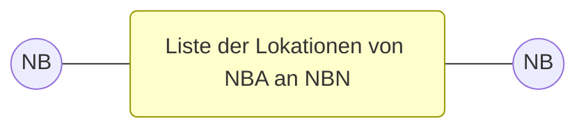

### 6.2.1 UC: Liste der Lokationen von NBA an NBN

|Use-Case-Name|Liste der Lokationen von NBA an NBN|
|-|-|
|Prozessziel|Dem NBN liegt eine Liste über alle vom NB-Wechsel betroffenen Lokationen zum ÜZ vor.|
|Use-Case-Beschreibung|Der NBA versendet die Liste der Lokationen an den NBN. Die Liste der Lokationen enthält alle vom NB-Wechsel betroffenen Lokationen einschließlich der Angabe der Paket-ID.|
|Rollen|\* NB|
|Vorbedingung|\* Die vom NB-Wechsel betroffenen Lokationen sind vom NBA identifiziert und der Paket-ID zugeordnet.  Auslöser: \* Die Liste liegt dem NBN noch nicht vor.|

***

3 Geschäftsprozesse zur Kundenbelieferung mit Elektrizität (Siehe hierzu die BNetzA-Festlegung BK6-22-024 „LFW24“, GPKE Teil 1 bis 4)

www.bdew.de [colspan=2] Seite 12 von 36

Marktprozesse Netzbetreiberwechsel Sparte Strom

|Nachbedingung im Erfolgsfall Nachbedingung im Fehlerfall Fehlerfälle Weitere Anforderungen|-- -- -- \* Der in diesem Prozess beschriebene Informationsaustausch erfolgt nicht in einem standardisierten, durch EDI\@Energy beschrieben Datenaustauschformat.\* Hinweis: Diese Liste dient als erster Überblick der vom NB-Wechsel betroffenen Lokationen.|
|-|-|

### 6.2.2 SD: Liste der Lokationen von NBA an NBN

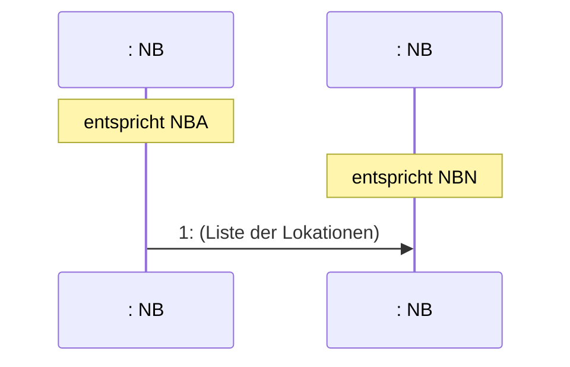

TABLE_PLACE_HOLDER_TOP_LEFT_0

|Nr.|Aktion|Frist|Hinweis / Bemerkung|
|-|-|-|-|
|1|(Liste der Lokationen)|Unverzüglich.|--|

www.bdew.de Seite 13 von 36

Marktprozesse Netzbetreiberwechsel Sparte Strom

### 6.2.3 AD: Liste der Lokationen von NBA an NBN

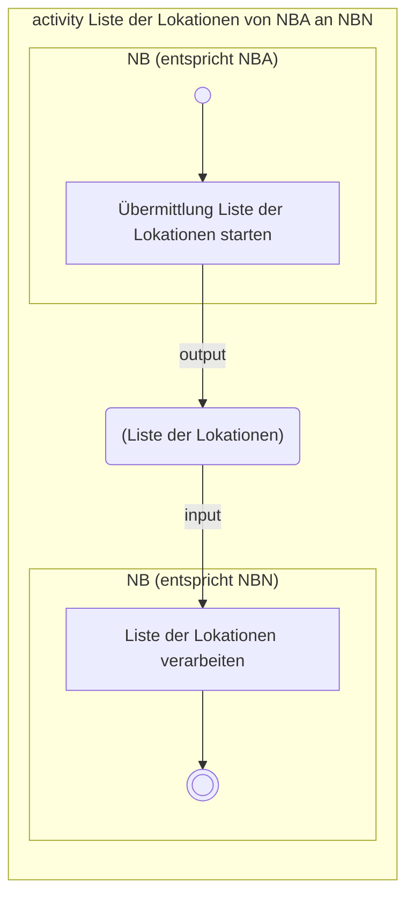

### 6.3 Use-Case: Lokationsbündelstruktur und DB von NBA an NBN

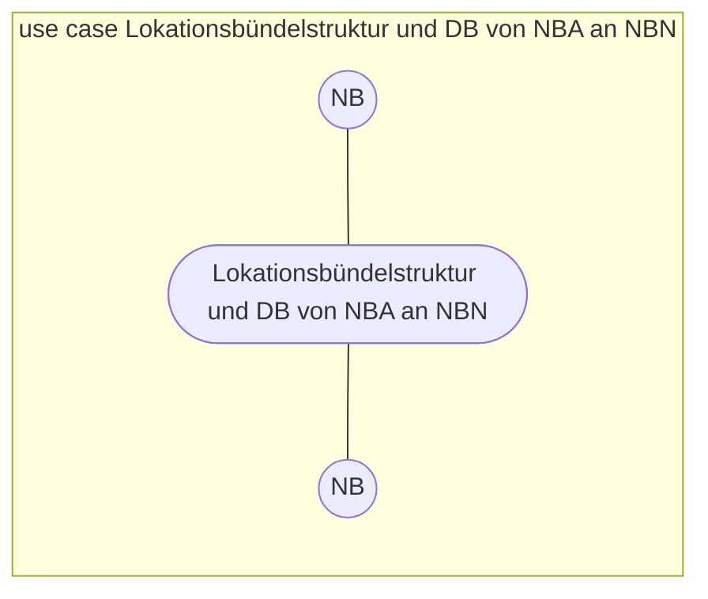

### 6.3.1 UC: Lokationsbündelstruktur und DB von NBA an NBN

|Use-Case-Name|Lokationsbündelstruktur und DB von NBA an NBN|
|-|-|
|Prozessziel|Der NBN kennt die Lokationsbündelstruktur und DB für eine vom NB-Wechsel betroffene Marktlokation.|
|Use-Case-Beschreibung|Der NBA übermittelt dem NBN die Lokationsbündelstruktur und DB für eine vom NB-Wechsel betroffene Marktlokation einschließlich dem Verwendungszeitraum der Daten und der Angabe der Paket-ID.|

www.bdew.de Seite 14 von 36

Marktprozesse Netzbetreiberwechsel Sparte Strom

|Rollen Vorbedingung Nachbedingung im Erfolgsfall Nachbedingung im Fehlerfall Fehlerfälle Weitere Anforderungen|\* NB \* Die EDIFACT-Kommunikation ist aufgebaut.\* Die vom NB-Wechsel betroffene Marktlokation ist vom NBA identifiziert und der Paket-ID zugeordnet.Auslöser:\* Die Daten liegen dem NBN noch nicht vor.\* Die bereits übermittelten Daten haben sich geändert. \* Der NBN kann die Daten in seinem System hinterlegen.\* Der NBN kann die EDIFACT-Kommunikation mit einem DB aufbauen, sofern diese mit dem DB noch nicht besteht.\* Der NBN kann DB über Basisdaten wie z.B. Profildefinitionen und Preisblätter informieren und z.B. die LV und EZ über den NB-Wechsel in Textform informieren.\* Der NBA führt den Use-Case „Ergänzende Daten zum Lokationsbündel von NBA an NBN“ aus. -- -- \* Auf Anforderung des NBN sind dem NBN vom NBA Testdatensätze zur Verfügung zu stellen. Details des weiteren Vorgehens sind bilateral abzustimmen.\* Ist eine NON-EDIFACT-Kommunikation bilateral vereinbart, sind die zu diesem Use-Case beschriebenen Fristen und die von EDI\@Energy vorgegebenen Inhalte mindestens einzuhalten.|
|-|-|

www.bdew.de Seite 15 von 36

Marktprozesse Netzbetreiberwechsel Sparte Strom

### 6.3.2 SD: Lokationsbündelstruktur und DB von NBA an NBN

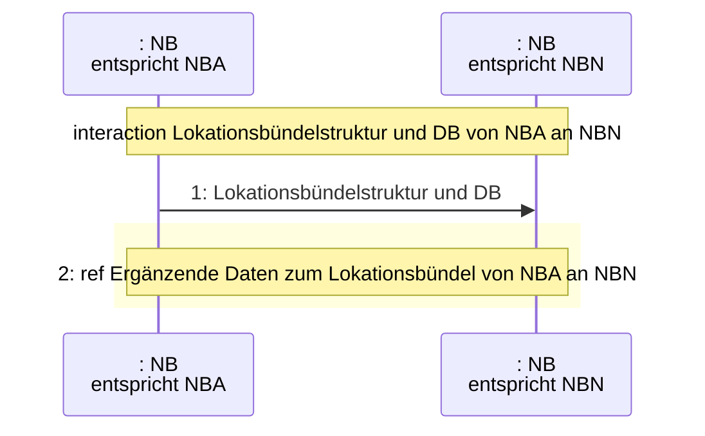

|Nr.|Aktion|Frist|Hinweis / Bemerkung|
|-|-|-|-|
|1|Lokationsbündelstruktur und DB|Unverzüglich.|--|
|2|ref Ergänzende Daten zum Lokationsbündel von NBA an NBN|--|--|

www.bdew.de Seite 16 von 36

Marktprozesse Netzbetreiberwechsel Sparte Strom

### 6.3.3 AD: Lokationsbündelstruktur und DB von NBA an NBN

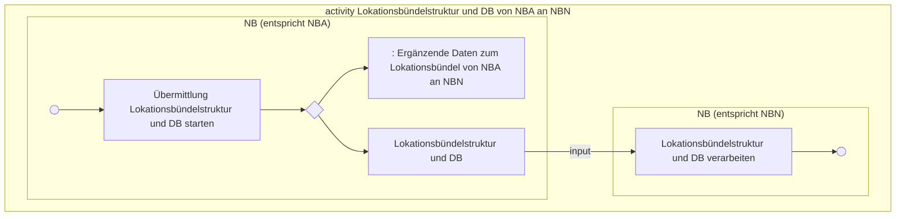

### 6.4 Use-Case: Ergänzende Daten zum Lokationsbündel von NBA an NBN

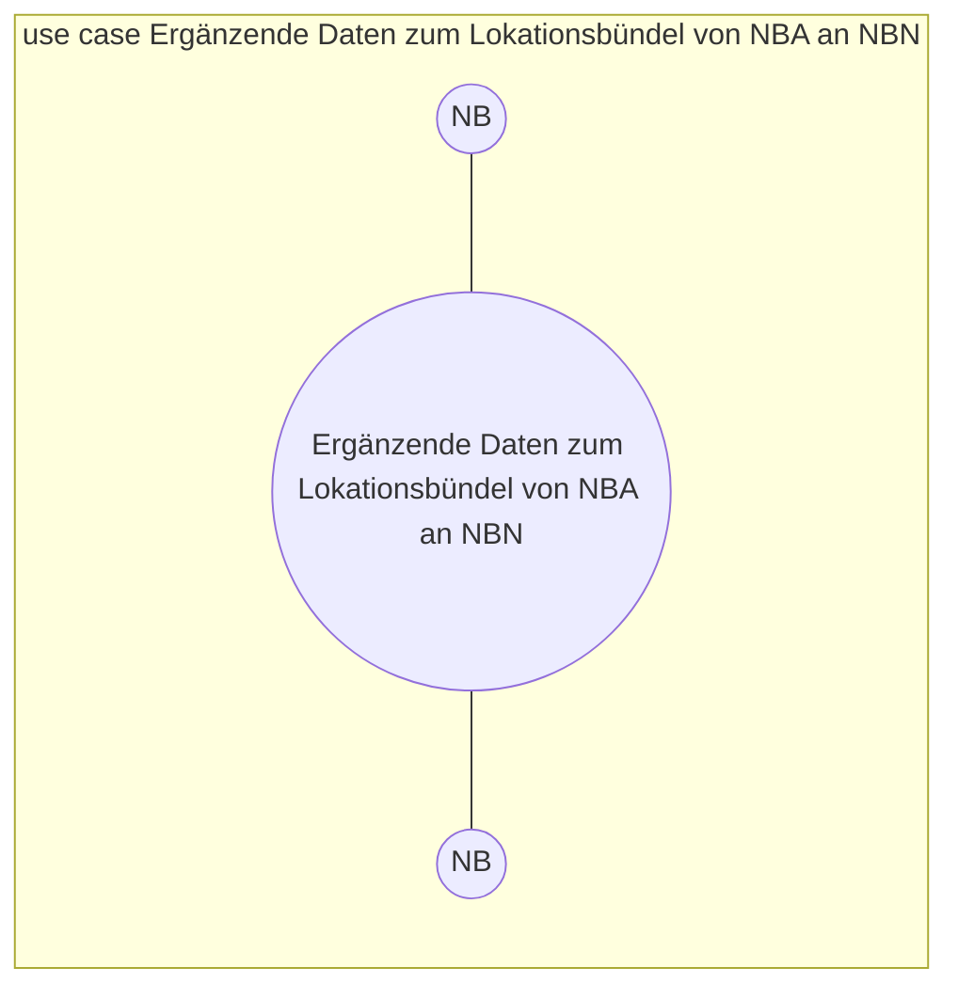

www.bdew.de Seite 17 von 36

Marktprozesse Netzbetreiberwechsel Sparte Strom

### 6.4.1 UC: Ergänzende Daten zum Lokationsbündel von NBA an NBN

|Use-Case-Name|Ergänzende Daten zum Lokationsbündel von NBA an NBN|
|-|-|
|Prozessziel|Der NBN kennt die ergänzenden Daten zu einem Lokationsbündel für eine vom NB-Wechsel betroffene Marktlokation.|
|Use-Case-Beschreibung|Der NBA übermittelt dem NBN die ergänzenden Daten zu einem Lokationsbündel für eine vom NB-Wechsel betroffene Marktlokation einschließlich dem Verwendungszeitraum der Daten. Bei den Daten handelt es sich um: • Abrechnungsdaten Netznutzungsabrechnung • Abrechnungsdaten Bilanzkreisabrechnung • Stammdaten im Rahmen einer Stammdatenänderungen vom NB verantwortlich (ausgehend) • Berechnungsformel|
|Rollen|• NB|
|Vorbedingung|• Dem NBN liegt die Lokationsbündelstruktur und liegen die DB vor.  Auslöser: • Die Abrechnungsdaten Netznutzungsabrechnung, die Abrechnungsdaten Bilanzkreisabrechnung, die Stammdaten zu den Lokationen sowie die Berechnungsformel liegen dem NBN noch nicht vor. • Die bereits übermittelten Daten haben sich geändert, darunter fällt auch zum Beispiel, wenn einer Marktlokation eine Paket-ID zugeordnet wurde und diese wieder gelöscht werden soll, da sie nicht unter den genannten NB-Wechsel fällt|
|Nachbedingung im Erfolgsfall|• Der NBN kann die Daten in seinem System hinterlegen. • Der NBA und der NBN führen die Use-Cases o „Abrechnungsdaten Netznutzungsabrechnung“ (GPKE Teil 2), o „Abrechnungsdaten Bilanzkreisabrechnung“ (GPKE Teil 2) aus. Der NBN führt zudem die Use-Cases o „Stammdatenänderung vom NB verantwortlich (ausgehend)“ (GPKE Teil 4)|

www.bdew.de Seite 18 von 36

Marktprozesse Netzbetreiberwechsel Sparte Strom

||o "Übermittlung der Berechnungsformel" (WiM Strom Teil 2) aus.|
|-|-|
|Nachbedingung im Fehlerfall|--|
|Fehlerfälle|--|
|Weitere Anforderungen|\* Auf Anforderung des NBN sind dem NBN vom NBA Testdatensätze zur Verfügung zu stellen. Details des weiteren Vorgehens sind bilateral abzustimmen. \* Ist eine NON-EDIFACT-Kommunikation bilateral vereinbart, sind die zu diesem Use-Case beschriebenen Fristen und die von EDI\@Energy vorgegebenen Inhalte mindestens einzuhalten.|

***

4 Wechselprozesse im Messwesen Strom (Siehe hierzu die BNetzA-Festlegung BK6-22-024 „LFW24“, WiM Strom Teil 1 und 2)

www.bdew.de Seite 19 von 36

Marktprozesse Netzbetreiberwechsel Sparte Strom

## 6.4.2 SD: Ergänzende Daten zum Lokationsbündel von NBA an NBN

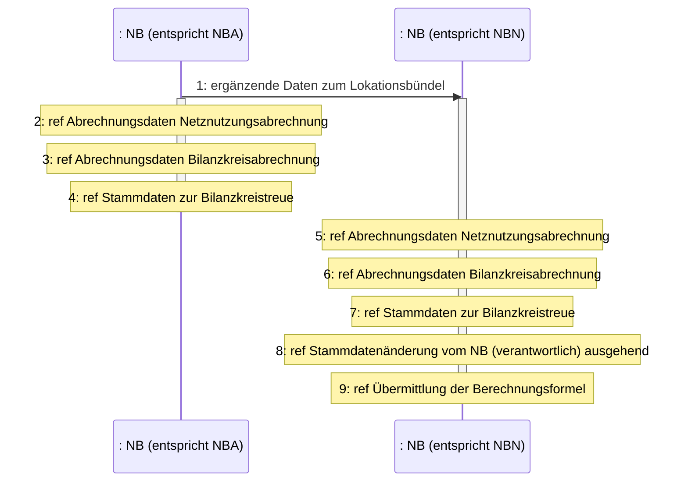

|Nr.|Aktion|Frist|Hinweis / Bemerkung|
|-|-|-|-|
|1|ergänzende Daten zum Lokationsbündel|Unverzüglich.|--|
|2|ref Abrechnungsdaten Netznutzungsabrechnung|--|--|
|3|ref Abrechnungsdaten Bilanzkreisabrechnung|--|--|
|4|ref Stammdaten zur Bilanzkreistreue|--|--|

www.bdew.de Seite 20 von 36

Marktprozesse Netzbetreiberwechsel Sparte Strom

|5|ref Abrechnungsdaten Netznutzungsabrechnung|--|--|
|-|-|-|-|
|6|ref Abrechnungsdaten Bilanzkreisabrechnung|--|--|
|7|ref Stammdaten zur Bilanzkreistreue|--|--|
|8|ref Stammdatenänderung vom NB verantwortlich (ausgehend)|--|--|
|9|ref Berechnungsformel|--|--|

### 6.4.3 AD: Ergänzende Daten zum Lokationsbündel von NBA an NBN

```mermaid
graph TD
    subgraph "activity Ergänzende Daten zum Lokationsbündel von NBA an NBN"
        subgraph NBA ["NB (entspricht NBA)"]
            Start(( )) --> StartAction[Übermittlung ergänzende Daten zum Lokationsbündel starten]
            StartAction --> Fork1[ ]
            Fork1 --> SD_BK_NBA[": Stammdaten zur Bilanzkreistreue"]
            Fork1 --> AD_BK_NBA[": Abrechnungsdaten Bilanzkreisabrechnung"]
            Fork1 --> AD_NN_NBA[": Abrechnungsdaten Netznutzungsabrechnung"]
            Fork1 --> ED_LB[ergänzende Daten zum Lokationsbündel]
        end

        subgraph NBN ["NB (entspricht NBN)"]
            ED_LB -- input --> Process[ergänzende Daten zum Lokationsbündel verarbeiten]
            Process --> Fork2[ ]
            Fork2 --> AD_NN_NBN[": Abrechnungsdaten Netznutzungsabrechnung"]
            Fork2 --> AD_BK_NBN[": Abrechnungsdaten Bilanzkreisabrechnung"]
            Fork2 --> SD_BK_NBN[": Stammdaten zur Bilanzkreistreue"]
            Fork2 --> SD_A_NBN[": Stammdatenänderung vom NB (verantwortlich) ausgehend"]
            Fork2 --> U_BF_NBN[": Übermittlung der Berechnungsformel"]
        end
    end

    style Start fill:#000,stroke:#000
    style Fork1 fill:#000,stroke:#000,shape:rect,height:5px,width:100px
    style Fork2 fill:#000,stroke:#000,shape:rect,height:5px,width:100px
```

www.bdew.de Seite 21 von 36

Marktprozesse Netzbetreiberwechsel Sparte Strom

# 7 Übermittlung von Daten von NB an DB

## 7.1 Paket-ID von NBA an LF, MSB und ÜNB
Der **Use-Case „Stammdatenänderung vom NB verantwortlich (ausgehend)“** (GPKE Teil 4) wird für die Übermittlung der Paket-ID für jede vom NB-Wechsel betroffene Marktlokation vom NBA an den DB (hier: LF, MSB (auch nicht aktive gMSB im Lokationsbündel), ÜNB) angewendet. Die Übermittlung ist unverzüglich, nachdem die vom NB-Wechsel betroffene Marktlokation vom NBA identifiziert und der Paket-ID zugeordnet wurde, vorzunehmen.

## 7.2 Kommunikationsdaten zwischen NBN und DB
Der **Use-Case „Übermittlung von Informationen“** (GPKE Teil 4) wird für die Initialübermittlung und Aktualisierung von Kommunikationsdaten zwischen dem NBN und DB angewendet. Die Initialübermittlung ist unverzüglich nach dem Use-Case „Lokationsbündelstruktur und DB von NBA an NBN“ mit einem DB vorzunehmen, sofern die EDIFACT-Kommunikation zu diesem DB noch nicht aufgebaut ist.

## 7.3 Basisdaten von NBN an DB
Die **Use-Cases**
* „Übermittlung der Liste der Profildefinitionen vom NB an LF“ (MaBiS)
* „Übermittlung von normierten Profilen und Profilscharen vom NB an LF“ (MaBiS)
* „Übermittlung der Liste der Profildefinitionen vom NB an MSB“ (MaBiS)
* „Übermittlung von normierten Profilen vom NB an MSB“ (MaBiS)
* „Übermittlung Preisblatt NB an LF“ (GPKE Teil 2)
werden vom NBN angewendet.

Die Übermittlung ist unverzüglich nach dem Use-Case „Lokationsbündelstruktur und DB von NBA an NBN“ vorzunehmen, sofern nicht bereits mit dem DB durchgeführt.

Vom NBN sind zudem die weiteren **Prozesse der MaBiS** und deren Fristen zu beachten.

www.bdew.de Seite 22 von 36

Marktprozesse Netzbetreiberwechsel Sparte Strom

## 7.4 Use-Case: Information von NB an weiteren Datenberechtigten

### 7.4.1 UC: Information von NB an weiteren Datenberechtigten

|Use-Case-Name|Information von NB an weiteren Datenberechtigten|
|-|-|
|Prozessziel|Der BIKO, BKV, RB, EIV, LV, EZ (nachfolgend als „weiterer DB“ bezeichnet) ist vom NBA und NBN über den anstehenden NB-Wechsel informiert.|
|Use-Case-Beschreibung|Der NBA und NBN informieren den weiteren DB \*\*in Textform\*\* über den anstehenden NB-Wechsel.|
|Rollen|\* BIKO \* BKV \* RB \* EIV \* LV \* EZ|
|Vorbedingung|\* Die Kontaktdaten des weiteren DB liegen vor. \* Im Fall der Neugründung eines Bilanzierungsgebiets des NBN im Zuge eines NB-Wechsels: Das Bilanzierungsgebiet wurde fristgerecht angemeldet.  Auslöser NBA: \* Die Information liegt dem weiteren DB noch nicht vor.  Auslöser NBN: \* Im Fall, dass ein neues Bilanzierungsgebiet benötigt wird: o Die Information liegt dem weiteren DB noch nicht vor und o der EIC für das neue Bilanzierungsgebiet liegt dem NBN vor. \* Im Fall, dass kein neues Bilanzierungsgebiet benötigt wird:|

www.bdew.de Seite 23 von 36

Marktprozesse Netzbetreiberwechsel Sparte Strom

|||○ Die Information liegt dem weiteren DB noch nicht vor.|
|-|-|-|
|Nachbedingung im Erfolgsfall|\* Der weitere DB ist über den NB-Wechsel informiert und kann die notwendigen Informationen ggf. in seinem System hinterlegen. \* Der BKV des LF einer vom NB-Wechsel betroffenen Marktlokation hat darauf zu achten, dass die Zuordnungsermächtigung fristgerecht vom BKV beim NBN aktiviert wird, wenn diese nicht bereits vom BKV beim NBN aktiviert ist.||
|Nachbedingung im Fehlerfall|--||
|Fehlerfälle|--||
|Weitere Anforderungen|\* Der in diesem Prozess beschriebene Informationsaustausch erfolgt nicht in einem standardisierten, durch EDI\@Energy beschrieben Datenaustauschformat. \* NBA und NBN können auch ein gemeinsames Informationsschreiben an den weiteren DB versenden.||

### 7.4.2 SD: Information von NB an weiteren Datenberechtigten

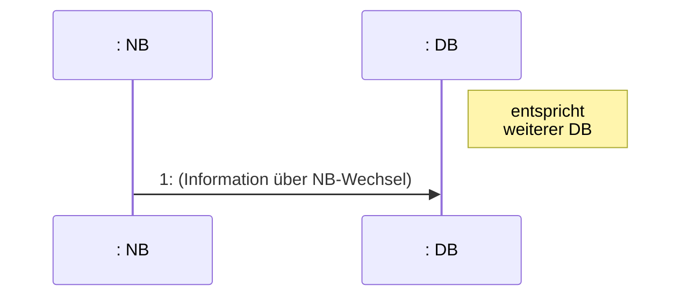

|Nr.|Aktion|Frist|Hinweis / Bemerkung|
|-|-|-|-|
|1|(Information über NB-Wechsel)|Unverzüglich.|--|

www.bdew.de Seite 24 von 36

Marktprozesse Netzbetreiberwechsel Sparte Strom

### 7.4.3 AD: Information von NB an weiteren Datenberechtigten

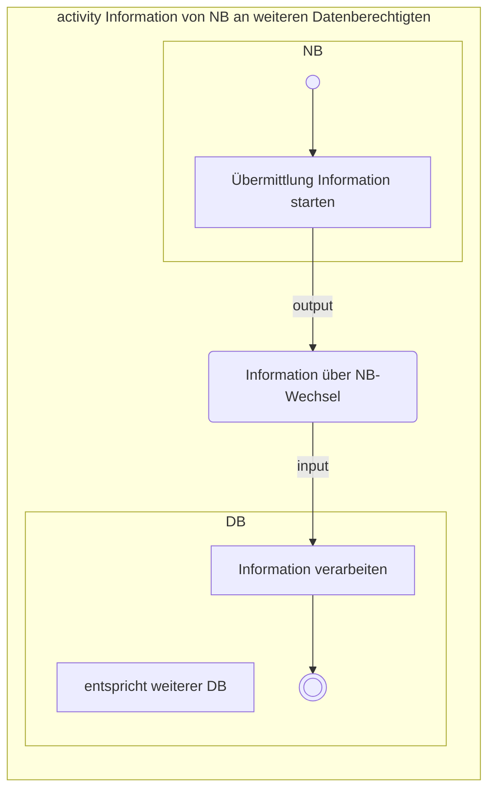

www.bdew.de
Seite 25 von 36

Marktprozesse Netzbetreiberwechsel Sparte Strom

### 7.4.3.1 Mindestens zu übergebende Informationen von NB an BIKO, BKV und RB

|Mindestens zu übergebende Informationen vom NBA|Mindestens zu übergebende Informationen vom NBN|
|-|-|
|Stand zum Änderungszeitpunkt|Stand zum Änderungszeitpunkt|
|\* MP-ID NBA \* Name NBA \* Anschrift NBA \* Handelsregisternummer NBA \* Steuer- und Umsatzsteuer-ID NBA \* Stromnetz \* Regelzone \* Ansprechpartner \* Paket-ID inkl. Bezeichnung \* Änderungszeitpunkt \* Gesamt- oder Teilabgabe \* Betroffenes Bilanzierungsgebiet NBA (EIC) \* Abgrenzung des übergehenden Bilanzierungsgebiets (z. B. über PLZ) \* Beendigung Bilanzierungsgebiet (Ja oder Nein) \* MP-ID NBN \* Name NBN \* Anschrift NBN|\* MP-ID NBN \* Name NBN \* Anschrift NBN \* Handelsregisternummer NBN \* Steuer- und Umsatzsteuer-ID NBN \* Stromnetz \* Regelzone \* Ansprechpartner \* Paket-ID inkl. Bezeichnung \* Änderungszeitpunkt \* Gesamt- oder Teilübernahme \* Betroffenes Bilanzierungsgebiet NBN (EIC) \* Abgrenzung des übernehmenden Bilanzierungsgebiets (z. B. über PLZ) \* Eröffnung Bilanzierungsgebiet (Ja oder Nein) \* MP-ID NBA \* Name NBA \* Anschrift NBA \* MP-ID und Name des im Netzgebiet zuständigen gMSBN|

### 7.4.3.2 Mindestens zu übergebende Informationen von NB an EIV, LV, und EZ

|Mindestens zu übergebende Informationen vom NBA|Mindestens zu übergebende Informationen vom NBN|
|-|-|
|Stand zum Änderungszeitpunkt|Stand zum Änderungszeitpunkt|
|\* Name NBA \* Anschrift NBA \* Stromnetz \* Änderungszeitpunkt \* Name NBN \* Anschrift NBN|\* Name NBN \* Anschrift NBN \* Stromnetz \* Änderungszeitpunkt \* Name NBA \* Anschrift NBA|

www.bdew.de Seite 26 von 36

Marktprozesse Netzbetreiberwechsel Sparte Strom

## 7.5 Ergänzende Daten zum Lokationsbündel von NB an LF, MSB, ÜNB

Die **Use-Cases**

*   **„Abrechnungsdaten Netznutzungsabrechnung“** (GPKE Teil 2)
*   **„Abrechnungsdaten Bilanzkreisabrechnung“** (GPKE Teil 2)
*   **„Stammdaten zur Bilanzkreistreue“** (GPKE Teil 4)

werden vom NBA und NBN angewendet. Dabei ist folgendes Vorgehen zu beachten:

*   Der NBA beendet den Verwendungszeitraum der Daten, dessen Gültigkeit vor dem Änderungszeitpunkt beginnt und über den Änderungszeitpunkt hinausgeht, mit Gültigkeit zum Änderungszeitpunkt.
*   Der NBN beginnt den vom NBA an den NBN mitgeteilten Verwendungszeitraum der Daten, dessen Gültigkeit vor dem Änderungszeitpunkt beginnt und über den Änderungszeitpunkt hinausgeht, mit Gültigkeit zum Änderungszeitpunkt.
*   Der NBN beginnt den vom NBA an den NBN mitgeteilten Verwendungszeitraum der Daten, dessen Gültigkeit nach dem Änderungszeitpunkt beginnt, mit Gültigkeit zum vom NBA gemeldeten Zeitpunkt. Dementsprechend übermittelt der NBN für den davor liegenden Verwendungszeitraum keine Daten.

Die **Use-Cases**

*   **„Stammdatenänderung vom NB verantwortlich (ausgehend)“** (GPKE Teil 4) (z.B. Lokationsbündelstruktur)
*   **"Übermittlung der Berechnungsformel“** (WiM Strom5 Teil 2)

werden vom NBN angewendet. Dabei ist folgendes Vorgehen zu beachten:

*   Ein DB, dessen Zuordnungsbeginn zu einer Lokation vor oder zu dem Änderungszeitpunkt ist, erhält die Nachrichten mit Gültigkeit zum Änderungszeitpunkt, sofern diese ab diesem Zeitpunkt für den DB eine Relevanz haben.
*   Ein DB, dessen Zuordnungsbeginn zu einer Lokation nach dem Änderungszeitpunkt ist, erhält Nachrichten mit Gültigkeit zum Zuordnungsbeginn, sofern diese ab diesem Zeitpunkt für den DB eine Relevanz haben.

Übermittlungen sind unverzüglich nach SD-Schritt Nr. 1 des Use-Cases „Ergänzende Daten zum Lokationsbündel von NBA an NBN“ vorzunehmen.

***

5 Wechselprozesse im Messwesen Strom (Siehe hierzu die BNetzA-Festlegung BK6-22-024 „LFW24“, WiM Strom Teil 1 und 2)

www.bdew.de Seite 27 von 36

Marktprozesse Netzbetreiberwechsel Sparte Strom

# 8 Ergänzende Daten zum Lokationsbündel von LF bzw. MSB an NBN

Der **Use-Case „Stammdatenänderung vom LF verantwortlich (ausgehend)“** (GPKE Teil 4) wird vom LF an den NBN und der Use-Case **„Stammdatenänderung vom MSB verantwortlich (ausgehend)“** wird vom MSB an den NBN angewendet. Die Übermittlung ist unverzüglich nach der Übermittlung der Lokationsbündelstruktur vom NBN an den LF bzw. MSB vorzunehmen.

Die im Rahmen des Use-Cases **„Stammdatenänderung vom MSB verantwortlich (ausgehend)“** durchzuführende Übermittlung von Werten bezieht sich auf den Änderungszeitpunkt.

# 9 Grundzuständigkeit des Messstellenbetriebs

## 9.1 Use-Case: Liste der Lokationen von gMSBA an gMSBN

### 9.1.1 UC: Liste der Lokationen von gMSBA an gMSBN

|Use-Case-Name|Liste der Lokationen von gMSBA an gMSBN|
|-|-|
|Prozessziel|Dem gMSBN liegt eine Liste über alle vom NB-Wechsel betroffenen Lokationen vor, einschließlich der Information an welchen Lokationen von einem Übergang der Grundzuständigkeit auszugehen ist.|
|Use-Case-Beschreibung|Der gMSBA versendet die Liste der Lokationen an den gMSBN. Die Liste der Lokationen enthält alle vom NB-Wechsel betroffenen Lokationen einschließlich der Angabe der Paket-ID und an welcher Lokation der gMSBA zum Änderungszeitpunkt aktiv und nicht aktiv zugeordnet ist.|
|Rollen|\* MSB|
|Vorbedingung|\* Die vom NB-Wechsel betroffenen Lokationen liegen dem gMSBA vom NBA vor (siehe Kapitel 7.1).|

www.bdew.de Seite 28 von 36

Marktprozesse Netzbetreiberwechsel Sparte Strom

||Auslöser: \* Die Liste liegt dem gMSBN noch nicht vor.||
|-|-|-|
|Nachbedingung im Erfolgsfall|--||
|Nachbedingung im Fehlerfall|--||
|Fehlerfälle|--||
|Weitere Anforderungen|\* Der in diesem Prozess beschriebene Informationsaustausch erfolgt nicht in einem standardisierten, durch EDI\@Energy beschrieben Datenaustauschformat.||
|||\* Hinweis: Diese Liste dient als erster Überblick der vom NB-Wechsel betroffenen Lokationen, einschließlich einem ersten Überblick an welchen Lokationen von einem Übergang der Grundzuständigkeit auszugehen ist.|

### 9.1.2 SD: Liste der Lokationen von gMSBA an gMSBN

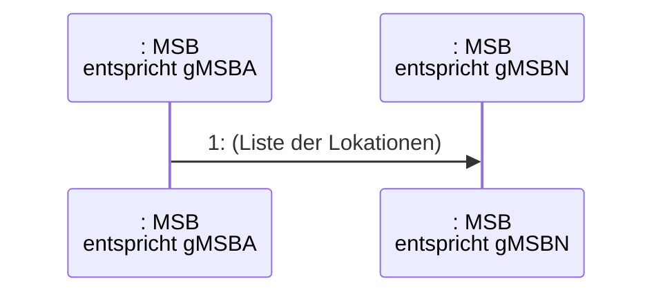

|Nr.|Aktion|Frist|Hinweis / Bemerkung|
|-|-|-|-|
|1|(Liste der Lokationen)|Unverzüglich.|--|

www.bdew.de Seite 29 von 36

Marktprozesse Netzbetreiberwechsel Sparte Strom

### 9.1.3 AD: Liste der Lokationen von gMSBA an gMSBN

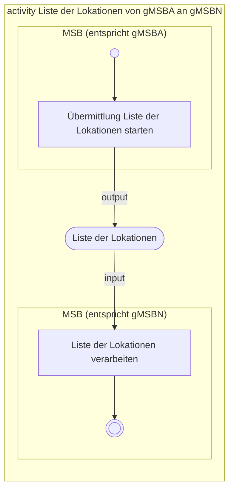

### 9.2 Übergang der Grundzuständigkeit des Messstellenbetriebs

Der Use-Case „Ende Messstellenbetrieb“ (WiM Strom Teil 1) wird vom gMSBA gegenüber dem NBN angewendet. Die Verpflichtungsanfrage ist an den gMSBN zu richten.

Der gMSBA tritt somit im Use-Case „Ende Messstellenbetrieb“ und den Folgeprozessen als MSBA am Objekt Messlokation auf und der gMSBN tritt als gMSB am Objekt Messlokation auf.

Das gewünschte Zuordnungsende ist der Änderungszeitpunkt.

### 10 Regelungen zur Übermittlung von Abrechnungs-, Stamm- oder Bewegungsdaten

*   Ab dem Zeitpunkt, zu dem der NBA an den NBN die ergänzenden Daten zum Lokationsbündel erstmalig übermittelt (siehe Kapitel 6.4 und in Folge Kapitel 7.5), hat der
    *   NBA Daten (Abrechnungsdaten, Stammdaten, Bewegungsdaten) mit Relevanz bis zum Änderungszeitpunkt an den DB zu übermitteln.
    *   NBN Daten (Abrechnungsdaten, Stammdaten, Bewegungsdaten) mit Relevanz ab dem Änderungszeitpunkt an den DB zu übermitteln.
*   Ab dem Zeitpunkt, zu dem der NBN dem DB die Zuordnung des NBN in der Lokationsbündelstruktur im Rahmen der Stammdatenänderung erstmalig mitteilt (siehe in Kapitel 7.5

www.bdew.de Seite 30 von 36

Marktprozesse Netzbetreiberwechsel Sparte Strom

Use-Case „Stammdatenänderung vom NB verantwortlich (ausgehend) und in Folge Kapitel 8), hat der DB Daten (z. B. Stammdaten, Bewegungsdaten) mit Relevanz bis zum Änderungszeitpunkt an den NBA und Daten mit Relevanz ab dem Änderungszeitpunkt an den NBN zu übermitteln. Daten, die den Zeitraum vor und nach dem Änderungszeitraum betreffen, werden vom DB sowohl an den NBA wie auch den NBN übermittelt.

*   Ab dem Zeitpunkt, zu dem der NBN dem ÜNB die Zuordnung des NBN im Rahmen des Use-Cases „Abrechnungsdaten Bilanzkreisabrechnung“ und „Stammdaten zur Bilanzkreistreue“ erstmalig mitteilt (siehe Kapitel 7.5), hat der ÜNB Daten (z. B. Stammdaten) mit Relevanz bis zum Änderungszeitpunkt an den NBA und Daten mit Relevanz ab dem Änderungszeitpunkt an den NBN zu übermitteln. Daten, die den Zeitraum vor und nach dem Änderungszeitraum betreffen, werden vom ÜNB sowohl an den NBA wie auch den NBN übermittelt.

## 11 Regelungen zu den Zuordnungsprozessen GPKE und WiM Strom

<u>Use-Case „Lieferbeginn“ und „Neuanlage“ (GPKE Teil 2):</u>

*   Anmeldungen sind bis zum Erreichen des Änderungszeitpunkts an den NBA zu übermitteln und nicht an den NBN, unabhängig davon, ob der Zuordnungsbeginn (Use-Case „Lieferbeginn“) bzw. voraussichtliche Zuordnungsbeginn (Use-Case „Neuanlage“) vor, zum oder nach dem Änderungszeitpunkt liegt. Hinweis: Ab dem Erreichen des Änderungszeitpunkts sind alle Anmeldungen an den NBN zu übermitteln.
*   Die Bestätigung der Anmeldung an den LFN und die Beendigungsnachricht an den LFA (Beendigung nur im Use-Case „Lieferbeginn“) enthalten nie ein durch den NB-Wechsel begründetes Zuordnungsende. Dem LF werden zusätzlich zum üblichen Umfang der Meldung Angaben zum NB-Wechsel (z.B. Paket-ID, MP-ID des NBN, Änderungszeitpunkt) informativ mitgeteilt.
*   Der NBA wendet für die Marktlokation den Use-Case „Lokationsbündelstruktur und DB von NBA an NBN“ an, um dem NBN die Änderung der Zuordnung mitzuteilen. Dementsprechend sind die in diesem Dokument beschriebenen Folgeprozesse durchzuführen. Hat der NBA im Zuge des NB-Wechsels die Use-Cases „Abrechnungsdaten Netznutzungsabrechnung“ (GPKE Teil 2), „Abrechnungsdaten Bilanzkreisabrechnung“ (GPKE Teil 2) und „Stammdaten zur Bilanzkreistreue“ (GPKE Teil 4) bereits mit Beendigung zum Änderungszeitpunkt an die DB übermittelt (siehe Kapitel 7.5), sind diese Use-Cases im Rahmen des Use-Cases „Lieferbeginn“ bzw. „Neuanlage“ mit einem Ende zum Änderungszeitpunkt an die DB (einschließlich dem neu zugeordneten LF) zu übermitteln. In diesem Fall kann der NBA auf die Übermittlung dieser Use-Cases im Rahmen des NB-Wechsels (siehe Kapitel 7.5) für den hier beschriebenen Sachverhalt verzichten.

www.bdew.de Seite 31 von 36

Marktprozesse Netzbetreiberwechsel Sparte Strom

<u>Use-Case „Lieferende von LF an NB“ (GPKE Teil 2):</u>

*   Abmeldungen sind bis zum Erreichen des Änderungszeitpunkts an den NBA zu übermitteln und nicht an den NBN, unabhängig davon, ob das Zuordnungsende vor, zum oder nach dem Änderungszeitpunkt liegt. Hinweis: Ab dem Erreichen des Änderungszeitpunkts sind alle Abmeldungen an den NBN zu übermitteln.
*   Die Bestätigung der Abmeldung an den LF enthält nie ein durch den NB-Wechsel begründetes Zuordnungsende. Dem LF werden zusätzlich zum üblichen Umfang der Meldung Angaben zum NB-Wechsel (z.B. Paket-ID, MP-ID des NBN, Änderungszeitpunkt) informativ mitgeteilt.
*   Der NBA wendet für die Marktlokation den Use-Case „Lokationsbündelstruktur und DB von NBA an NBN“ an, um dem NBN die Änderung der Zuordnung mitzuteilen. Dementsprechend sind die in diesem Dokument beschriebenen Folgeprozesse durchzuführen. Hat der NBA im Zuge des NB-Wechsels die Use-Cases „Abrechnungsdaten Netznutzungsabrechnung“ (GPKE Teil 2), „Abrechnungsdaten Bilanzkreisabrechnung“ (GPKE Teil 2) und „Stammdaten zur Bilanzkreistreue“ (GPKE Teil 4) bereits mit Beendigung zum Änderungszeitpunkt an die DB übermittelt (siehe Kapitel 7.5), sind diese Use-Cases im Rahmen des Use-Cases „Lieferende von LF an NB“ mit einem Ende zum Änderungszeitpunkt an die DB zu übermitteln. In diesem Fall kann der NBA auf die Übermittlung dieser Use-Cases im Rahmen des NB-Wechsels (siehe Kapitel 7.5) für den hier beschriebenen Sachverhalt verzichten.

<u>Use-Case „Beginn der Ersatz-/Grundversorgung“ und „Herstellung einer 100% LF-Zuordnung zu einer erzeugenden Marktlokation“ (GPKE Teil 2):</u>

*   Ankündigungen sind bis zum Erreichen des Änderungszeitpunkts vom NBA zu übermitteln und nicht vom NBN, unabhängig davon, ob der Zuordnungsbeginn vor, zum oder nach dem Änderungszeitpunkt liegt.
*   Ankündigungen sind nach dem Erreichen des Änderungszeitpunkts
    - weiterhin vom NBA zu übermitteln und nicht vom NBN, sofern der Zuordnungsbeginn vor dem Änderungszeitpunkt liegt.
    - vom NBN zu übermitteln, sofern der Zuordnungsbeginn dem Änderungszeitpunkt entspricht oder nach dem Änderungszeitpunkt liegt.
*   Die Ankündigung enthält nie ein durch den NB-Wechsel begründetes Zuordnungsende. Dem LF werden zusätzlich zum üblichen Umfang der Meldung Angaben zum NB-Wechsel (z.B. Paket-ID, MP-ID des NBN, Änderungszeitpunkt) informativ mitgeteilt.
*   Der NBA wendet für die Marktlokation den Use-Case „Lokationsbündelstruktur und DB von NBA an NBN“ an, um dem NBN die Änderung der Zuordnung mitzuteilen.

www.bdew.de Seite 32 von 36

Marktprozesse Netzbetreiberwechsel Sparte Strom

Dementsprechend sind die in diesem Dokument beschriebenen Folgeprozesse durchzuführen. Hat der NBA im Zuge des NB-Wechsels die Use-Cases „Abrechnungsdaten Netznutzungsabrechnung“ (GPKE Teil 2), „Abrechnungsdaten Bilanzkreisabrechnung“ (GPKE Teil 2) und „Stammdaten zur Bilanzkreistreue“ (GPKE Teil 4) bereits mit Beendigung zum Änderungszeitpunkt an die DB übermittelt (siehe Kapitel 7.5), sind diese Use-Cases im Rahmen des Use-Cases „Beginn der Ersatz-/Grundversorgung“ bzw. „Herstellung einer 100% LF-Zuordnung zu einer erzeugenden Marktlokation“ mit einem Ende zum Änderungszeitpunkt an die DB (einschließlich dem neu zugeordneten LF) zu übermitteln. In diesem Fall kann der NBA auf die Übermittlung dieser Use-Cases im Rahmen des NB-Wechsels (siehe Kapitel 7.5) für den hier beschriebenen Sachverhalt verzichten.

<u>Use-Case „Lieferende von NB an LF“ (GPKE Teil 2):</u>

*   Ankündigungen sind bis zum Erreichen des Änderungszeitpunkts vom NBA zu übermitteln und nicht vom NBN, unabhängig davon, ob das Zuordnungsende vor, zum oder nach dem Änderungszeitpunkt liegt. Hinweis: Ab dem Erreichen des Änderungszeitpunkts erfolgt die Übermittlung durch den NBN.
*   Die Ankündigung enthält nie ein durch den NB-Wechsel begründetes Zuordnungsende. Dem LF werden zusätzlich zum üblichen Umfang der Meldung Angaben zum NB-Wechsel (z.B. Paket-ID, MP-ID des NBN, Änderungszeitpunkt) informativ mitgeteilt.
*   Der NBA wendet für die Marktlokation den Use-Case „Lokationsbündelstruktur und DB von NBA an NBN“ an, um dem NBN die Änderung der Zuordnung mitzuteilen. Dementsprechend sind die in diesem Dokument beschriebenen Folgeprozesse durchzuführen. Hat der NBA im Zuge des NB-Wechsels die Use-Cases „Abrechnungsdaten Netznutzungsabrechnung“ (GPKE Teil 2), „Abrechnungsdaten Bilanzkreisabrechnung“ (GPKE Teil 2) und „Stammdaten zur Bilanzkreistreue“ (GPKE Teil 4) bereits mit Beendigung zum Änderungszeitpunkt an die DB übermittelt (siehe Kapitel 7.5), sind diese Use-Cases im Rahmen des Use-Cases „Lieferende von NB an LF“ mit einem Ende zum Änderungszeitpunkt an die DB zu übermitteln. In diesem Fall kann der NBA auf die Übermittlung dieser Use-Cases im Rahmen des NB-Wechsels (siehe Kapitel 7.5) für den hier beschriebenen Sachverhalt verzichten.

<u>Use-Case „Beginn Messstellenbetrieb“ (WiM Strom Teil 1):</u>

*   Ein wMSB übermittelt eine Anmeldung mit einem gewünschtem Zuordnungsbeginn vor dem Änderungszeitpunkt an den NBA.

<u>Use-Case „Ende Messstellenbetrieb“ (WiM Strom Teil 1):</u>

*   Ein wMSB übermittelt eine Abmeldung mit einem gewünschtem Zuordnungsende vor dem Änderungszeitpunkt an den NBA.

www.bdew.de Seite 33 von 36

Marktprozesse Netzbetreiberwechsel Sparte Strom

# 12 Abkürzungsverzeichnis

**AD** Aktivitätsdiagramm
**AN** Anschlussnutzer
**BDEW** BDEW Bundesverband der Energie- und Wasserwirtschaft e.V.
**BIKO** Bilanzkoordinator
**BKV** Bilanzkreisverantwortlicher
**DB** Datenberechtigter
**EIC** Energy Identification Code
**EIV** Einsatzverantwortlicher
**EZ** Erzeuger
**GLN** Globale Lokationsnummer
**gMSB** Grundzuständiger Messstellenbetreiber
**gMSBA** Grundzuständiger Messstellenbetreiber alt
**gMSBN** Grundzuständiger Messstellenbetreiber neu
**GPKE** Geschäftsprozesse zur Kundenbelieferung mit Elektrizität (BK6-18-032)
**LF** Lieferant
**LFA** Lieferant alt
**LFN** Lieferant neu
**LV** Letztverbraucher mit Netznutzungsvertrag
**MaBiS** Marktprozesse für die Bilanzkreisabrechnung Strom (BK6-20-160)
**MP-ID** Marktpartner-Identifikationsnummer
**MSB** Messstellenbetreiber
**NB** Netzbetreiber
**NB-Wechsel** Netzbetreiberwechsel
**NBA** Netzbetreiber alt
**NBN** Netzbetreiber neu

www.bdew.de Seite 34 von 36

Marktprozesse Netzbetreiberwechsel Sparte Strom

PLZ Postleitzahl
RB Registerbetreiber
SD Sequenzdiagramm
UBA Umweltbundesamt
UC Use-Case
ÜNB Übertragungsnetzbetreiber
ÜZ Zeitpunkt des Empfangs der Übertragungsdatei
WiM Strom Wechselprozesse im Messwesen Strom (BK6-18-032)
wMSB wettbewerblicher MSB

# 13 Änderungshistorie

|Version|Datum|Änderungsbeschreibung|
|-|-|-|
|1.0|01.07.2024|Die Prozessbeschreibung wird für die Sparten Strom und Gas aufgeteilt; die Prozessbeschreibung für die Sparte Gas besteht unter dem Titel „BDEW/VKU/GEODE-Leitfaden „Marktprozesse Netzbetreibwechsel“, Version 1.3.|
|1.1|28.11.2024|\* Ergänzung des Anwendungsdatums \* Kapitel 5 „Prozess- und Fristenübersicht“, Basisdaten sowie Kapitel 7.3 „Basisdaten von NBN an DB“: Streichung des ÜNB aufgrund des BNetzA-Festlegungsverfahrens zur Anpassung der Marktkommunikation zur Realisierung der nach dem Messstellenbetriebsgesetz geforderten Übermittlung von Zählerstandsgängen (Datenübermittlung ZSG) – BK6-24-174 \* Kapitel 7.4.1. „UC: Information von NB an weiteren Datenberechtigten“ – Nachbedingung im Erfolgsfall: Ergänzung des zweiten Aufzählungspunktes \* Kapitel 10 „Regelungen zur Übermittlung von Abrechnungs-, Stamm- oder Bewegungsdaten“: Ergänzung des letzten Aufzählungspunktes \* Redaktionelle Konkretisierungen|

www.bdew.de Seite 35 von 36

Marktprozesse Netzbetreiberwechsel Sparte Strom

|Version|Datum|Änderungsbeschreibung|
|-|-|-|
|1.2|30.10.2025|Konkretisierung von Kapitel 6.4.1 UC: Ergänzende Daten zum Lokationsbündel von NBA an NBN|

www.bdew.de
Seite 36 von 36