Anlage 1b zur Festlegung BK6-24-174

 * Bundesnetzagentur

# Geschäftsprozesse zur Kundenbelieferung mit Elektrizität (GPKE)
## GPKE Teil 2 – Fokus Zuordnungsprozesse

BK6-24-174
Lesefassung

Seite 1 von 115

|1|Vorbereitende Prozesse|5|
|-|-|-|
|1.1|Use-Case: Ermittlung der MaLo-ID der Marktlokation|5|
|1.1.1|UC: Ermittlung der MaLo-ID der Marktlokation|5|
|1.1.2|SD: Ermittlung der MaLo-ID der Marktlokation|6|
|1.2|Use-Case: Kündigung|7|
|1.2.1|UC: Kündigung|7|
|1.2.2|SD: Kündigung|9|
|1.2.3|Antwort LFA bei Kündigung eines bereits wirksam gekündigten Vertrages|11|
|2|Zuordnungsprozesse|12|
|2.1|Use-Case: Lieferbeginn|12|
|2.1.1|UC: Lieferbeginn|12|
||Fristen für die Anmeldung (Prozessschritt 1) bei EEG-Marktlokationen und Tranchen von EEG-Marktlokationen|15|
|2.1.2|SD: Lieferbeginn|16|
|2.2|Use-Case: Neuanlage|25|
|2.2.1|UC: Neuanlage|25|
|2.2.2|SD: Neuanlage|28|
|2.3|Ersatz-/Grundversorgung|33|
|2.3.1|Allgemeines|33|
|2.3.2|Use-Case: Beginn der Ersatz-/Grundversorgung|33|
|2.3.2.1|UC: Beginn der Ersatz-/Grundversorgung|33|
|2.3.2.2|SD: Beginn der Ersatz-/Grundversorgung|35|
|2.4|Herstellung einer 100% LF-Zuordnung zu einer erzeugenden Marktlokation|38|
|2.4.1|Allgemeines|38|
|2.4.2|Use-Case: Herstellung einer 100% LF-Zuordnung zu einer erzeugenden Marktlokation|38|
|2.4.2.1|UC: Herstellung einer 100% LF-Zuordnung zu einer erzeugenden Marktlokation|38|
|2.4.2.2|SD: Fall 1: LF-Zuordnung bei EEG-Marktlokation ohne DV-Pflicht bzw. KWKG-Marktlokation ohne DV-Pflicht|41|
|2.4.2.3|SD: Fall 2: LF-Zuordnung bei EEG-Marktlokation mit DV-Pflicht|44|
|2.4.2.4|SD: Fall 3: LF-Zuordnung bei KWKG-Marktlokation mit DV-Pflicht bzw. Nicht-EEG-/Nicht-KWKG-Marktlokation und Marktlokation wird nicht-tranchiert abgebildet|47|
|2.4.2.5|SD: Fall 4: LF-Zuordnung bei KWKG-Marktlokation mit DV-Pflicht bzw. Nicht-EEG-/Nicht-KWKG-Marktlokation und Marktlokation wird tranchiert abgebildet|50|
|2.5|Prozesse zum Lieferende|53|

Seite 2 von **115**

|2.5.1|Use-Case: Lieferende von LF an NB|53|
|-|-|-|
|2.5.1.1|UC: Lieferende von LF an NB|53|
|2.5.1.2|SD: Lieferende von LF an NB|55|
|2.5.2|Use-Case: Lieferende von NB an LF|57|
|2.5.2.1|UC: Lieferende von NB an LF|57|
|2.5.2.2|SD: Lieferende von NB an LF|59|
|3|Ergänzende Prozesse|65|
|3.1|Prozesse zu Abrechnungsdaten|65|
|3.1.1|Use-Case: Abrechnungsdaten Netznutzungsabrechnung|65|
|3.1.1.1|UC: Abrechnungsdaten Netznutzungsabrechnung|65|
|3.1.1.2|SD: Abrechnungsdaten Netznutzungsabrechnung|66|
|3.1.2|Use-Case: Abrechnungsdaten Bilanzkreisabrechnung|69|
|3.1.2.1|UC: Abrechnungsdaten Bilanzkreisabrechnung|69|
|3.1.2.2|SD: Abrechnungsdaten Bilanzkreisabrechnung|71|
|3.1.3|Use-Case: Bestellung einer Änderung von Abrechnungsdaten|77|
|3.1.3.1|UC: Bestellung einer Änderung von Abrechnungsdaten|77|
|3.1.3.2|SD: Bestellung einer Änderung von Abrechnungsdaten von LF an NB|80|
|3.1.3.3|SD: Bestellung einer Änderung von Abrechnungsdaten zur Bilanzkreisabrechnung von ÜNB an NB|81|
|3.2|Übermittlung der bisher gemessenen Arbeits- und Leistungswerte sowie des Lieferscheins zur Netznutzungsabrechnung|82|
|3.2.1|Use-Case: Übermittlung der bisher gemessenen Arbeits- und Leistungswerte|82|
|3.2.1.1|UC: Übermittlung der bisher gemessenen Arbeits- und Leistungswerte|82|
|3.2.1.2|SD: Übermittlung der bisher gemessenen Arbeits- und Leistungswerte|83|
|3.2.2|Lieferschein für verbrauchende Marktlokationen|84|
|3.2.3|Use-Case: Übermittlung des Lieferscheins zur Netznutzungsabrechnung|84|
|3.2.3.1|UC: Übermittlung des Lieferscheins zur Netznutzungsabrechnung|84|
|3.2.3.2|SD: Übermittlung des Lieferscheins zur Netznutzungsabrechnung|86|
|3.3|Use-Case: Netznutzungsabrechnung|87|
|3.3.1|UC: Netznutzungsabrechnung|87|
|3.3.2|SD: Netznutzungsabrechnung|90|
|3.4|Prozessbeschreibungen zu den Preisblättern des NB|93|
|3.4.1|Allgemeines|93|
|3.4.2|Begriffsbestimmungen|93|
|3.4.3|Rahmenbedingungen der Preisblätter|95|
|3.4.4|Use-Case: Übermittlung Preisblatt NB an LF|97|
|3.4.4.1|UC: Übermittlung Preisblatt NB an LF|97|

Seite 3 von **115**

|3.4.4.2|SD: Übermittlung Preisblatt NB an LF|97|
|-|-|-|
|3.4.5|Use-Case: Abrechnung einer sonstigen Leistung|98|
|3.4.5.1|UC: Abrechnung einer sonstigen Leistung|98|
|3.4.5.2|SD: Abrechnung einer sonstigen Leistung|100|
|3.5|Prozesse zur Unterbrechung/Wiederherstellung der Anschlussnutzung (Sperren/Entsperren)|103|
|3.5.1|Use-Case: Unterbrechung der Anschlussnutzung (Sperren) auf Anweisung des LF|103|
|3.5.1.1|UC: Unterbrechung der Anschlussnutzung (Sperren) auf Anweisung des LF|103|
|3.5.1.2|SD: Unterbrechung der Anschlussnutzung (Sperren) auf Anweisung des LF|105|
|3.5.2|Use-Case: Wiederherstellung der Anschlussnutzung (Entsperren) auf Anweisung des LF|109|
|3.5.2.1|UC: Wiederherstellung der Anschlussnutzung (Entsperren) auf Anweisung des LF|109|
|3.5.2.2|SD: Wiederherstellung der Anschlussnutzung (Entsperren) auf Anweisung des LF|110|
|3.5.3|Use-Case: Stornieren der Unterbrechung und Wiederherstellung der Anschlussnutzung auf Anweisung des LF|111|
|3.5.3.1|UC: Stornieren der Unterbrechung und Wiederherstellung der Anschlussnutzung auf Anweisung des LF|111|
|3.5.3.2|SD: Stornieren der Unterbrechung und Wiederherstellung der Anschlussnutzung auf Anweisung des LF|113|
|3.5.4|Use-Case: Wiederherstellung der Anschlussnutzung bei Lieferbeginn|114|
|3.5.4.1|UC: Wiederherstellung der Anschlussnutzung bei Lieferbeginn|114|
|3.5.4.2|SD: Wiederherstellung der Anschlussnutzung bei Lieferbeginn|115|

Seite 4 von **115**

# **1 Vorbereitende Prozesse**

## **1.1 Use-Case: Ermittlung der MaLo-ID der Marktlokation**

### **1.1.1 UC: Ermittlung der MaLo-ID der Marktlokation**

|**Use-Case-Name**|Ermittlung der MaLo-ID der Marktlokation|
|-|-|
|Prozessziel|Dem LF liegen die MaLo-ID der Marktlokation sowie ergänzende Informationen (z.B. MaLo-ID der Tranche) vom NB vor.|
|Use-Case Beschreibung|Der LF fragt beim NB die MaLo-ID der Marktlokation an. Der LF gibt dabei Informationen an, die zur Identifikation der Marktlokation dienen. Der NB prüft die Anfrage und meldet dem LF im Erfolgsfall die MaLo-ID der Marktlokation sowie ergänzende Informationen zurück.|
|Rollen|• LF • NB|
|Vorbedingung|• Im Fall einer verbrauchenden Marktlokation: Der LF besitzt die Vollmacht des Letztverbrauchers in dessen Namen die Anfrage vornehmen zu dürfen. • Im Fall einer erzeugenden Marktlokation bzw. einer Tranche: Der LF besitzt die Vollmacht des EZ in dessen Namen die Anfrage vornehmen zu dürfen.  Auslöser: • Dem LF liegen die MaLo-ID der Marktlokation oder ergänzende Informationen wie z.B. die Malo-ID der Tranche nicht vor, um bei Bedarf den ○ Use-Case „Kündigung“ ○ Use-Case „Lieferbeginn“ ○ Use-Case „Geschäftsdatenanfrage“ zu starten.|
|Nachbedingung im Erfolgsfall|Der LF kann bei Bedarf den • Use-Case „Kündigung“ • Use-Case „Lieferbeginn“ • Use-Case „Geschäftsdatenanfrage“ starten.|
|Nachbedingung im Fehlerfall|Der LF geht mit dem Letztverbraucher bzw. EZ in ein bilaterales Clearing, ggf. startet der LF den Use-Case erneut.|
|Fehlerfälle|Die Marktlokation kann nicht oder nicht eindeutig durch den NB identifiziert werden|
|Weitere Anforderungen|Dieser Use-Case ist über API-Webdienste zu realisieren.|

Seite 5 von **115**

## 1.1.2 SD: Ermittlung der MaLo-ID der Marktlokation

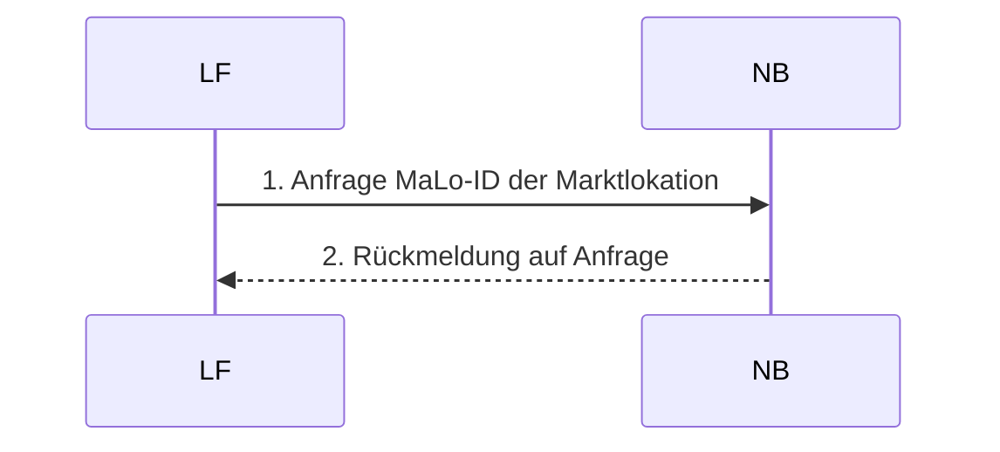
```mermaid
sequenceDiagram
    participant LF
    participant NB
    LF->>NB: 1. Anfrage MaLo-ID der Marktlokation
    NB-->>LF: 2. Rückmeldung auf Anfrage
```

|Nr.|Aktion|Frist|Hinweis/Bemerkung|
|-|-|-|-|
|1|Anfrage MaLo-ID der Marktlokation|--|Der LF gibt neben dem Zeitpunkt (00:00 Uhr), auf den sich die Prüfung beziehen soll, entsprechend dem Kapitel 6 der GPKE Teil 1 (s. insbesondere b) und c)) Informationen an, die zur Identifikation der Marktlokation dienen.|
|2|Rückmeldung auf Anfrage|Unverzüglich, jedoch spätester ÜZ ist 2 Stunden nach dem ÜZ von Nr. 1.|Der NB prüft unter Anwendung mindestens der normierten Identifikationsvorgaben (unter Berücksichtigung des Kapitels 6. der GPKE Teil 1 (s. insbesondere b) und c))), ob die Marktlokation zum angefragten Zeitpunkt eindeutig identifiziert werden kann. Im Erfolgsfall meldet der NB dem LF insbesondere • die MaLo-ID der betroffenen Marktlokation • alle ID der Messlokationen, die für die Ermittlung der Energiemengen der Marktlokation erforderlich sind, sowie die MP-ID der MSB dieser Messlokationen • bei einer tranchierten Marktlokation zudem: die MaLo-ID der Tranchen sowie, sofern die Basis zur Bildung der Tranchengröße prozentual ist, die jeweilige Tranchengröße • ggf. NeLo-ID, TR-ID, SR-ID • sofern der Marktlokation bzw. Tranche für den vom LF angefragten Zeitpunkt einem LF zugeordnet ist: die MP-ID des zugeordneten LF  Sofern die Prüfung nicht eineindeutig verlaufen ist (s. insbesondere Kapitel 6. c) der GPKE Teil 1), meldet der NB dies dem LF unter Angabe von Gründen zurück.|

Seite 6 von 115

## 1.2 **Use-Case: Kündigung**

## 1.2.1 **UC: Kündigung**

|Use-Case-Name|Kündigung|
|-|-|
|Prozessziel|• Der zwischen Letztverbraucher und LFA abgeschlossene Stromliefervertrag für die genannte, verbrauchende Marktlokation ist gekündigt bzw. • der zwischen EZ und LFA abgeschlossene Stromabnahmevertrag für die genannte erzeugende Marktlokation bzw. die genannte Tranche ist gekündigt.|
|Use-Case Beschreibung|Der LFN sendet an den LFA eine Kündigung. Der LFA prüft die Kündigung und teilt dem LFN das Ergebnis mit.|
|Rollen|• LF|
|Vorbedingung|• Im Fall einer verbrauchenden Marktlokation: Der LFN besitzt die Vollmacht des Letztverbrauchers in dessen Namen die Kündigung vornehmen zu dürfen. • Im Fall einer erzeugenden Marktlokation bzw. einer Tranche: Der LFN besitzt die Vollmacht des EZ in dessen Namen die Kündigung vornehmen zu dürfen. • Die MaLo-ID der Marktlokation ist bekannt bzw. im Falleiner tranchierten Marktlokation ist die MaLo-ID der Tranche bekannt.  Auslöser: • Im Fall einer verbrauchenden Marktlokation: Der LFN erhält vom Letztverbraucher den Auftrag zur Kündigung des bestehenden Stromliefervertrags. • Im Fall einer erzeugenden Marktlokation bzw. einer Tranche: Der LFN erhält vom EZ den Auftrag zur Kündigung des bestehenden Stromabnahmevertrags.|
|Nachbedingung im Erfolgsfall|Der LFA ist verpflichtet, unmittelbar mit Bestätigung der Kündigung gegenüber dem LFN auch den Use-Case „Lieferende von LF an NB“ gegenüber dem NB anzustoßen.|
|Nachbedingung im Fehlerfall|• Im Fall einer verbrauchenden Marktlokation: Der zwischen Letztverbraucher und LFA abgeschlossene Stromliefervertrag für die genannte verbrauchende Marktlokation ist nicht gekündigt. • Im Fall einer erzeugenden Marktlokation bzw. einer Tranche: der zwischen EZ und LFA abgeschlossene Stromabnahmevertrag für die genannte, erzeugende Marktlokation bzw. die genannte Tranche ist nicht gekündigt. • Der LFN sendet bei Bedarf erneut eine Kündigung an den LFA.|
|Fehlerfälle|• Der LFA ist der vom LFN angegebenen Marktlokation bzw. Tranche zum Kündigungstermin nicht zugeordnet. • Die Vertragssituation des LFA lässt die gewünschte Kündigung des LFN nicht zu.|
|Weitere Anforderungen|• Im Fall einer verbrauchenden Marktlokation: o Bei einer Ersatzversorgung handelt es sich um kein kündigungspflichtiges Vertragsverhältnis; es ist daher keine Kündigung erforderlich (vgl. § 38 Abs. 4 EnWG). Sofern ein LFN dem E/G trotzdem eine Kündigung zum nächstmöglichen Zeitpunkt oder zu einem fixen|

Seite 7 von **115**

|Use-Case-Name|Kündigung|
|-|-|
||Zeitpunkt in die Zukunft übermittelt, stimmt der E/G der Kündigung zu, sofern keine Ablehnungsgründe vorliegen. o Ungeachtet der jederzeit bestehenden Möglichkeit des Letztverbrauchers, seinen Stromliefervertrag schriftlich zu kündigen, darf der LFA eine nach diesem Use-Case gemeldete Kündigung nicht allein unter Berufung auf die fehlende Einhaltung einer vertraglich vereinbarten Form zurückweisen. In diesem Fall hat er eine Kündigung auch in elektronischer Form unter Anwendung dieses Use-Case entgegenzunehmen und zu bearbeiten. o *Hinweis:&#x20;*&#x44;er Use-Case behandelt nicht den Fall, dass der Letztverbraucher selbst gegenüber dem LFA den Stromliefervertrag kündigt. Wenn der Letztverbraucher vorab selbst kündigt, ist der Use-Case „Lieferende von LF an NB“ vom LFA gegenüber dem NB unmittelbar mit Verfassen der Kündigungsbestätigung an den Letztverbraucher anzustoßen. • Im Fall einer erzeugenden Marktlokation bzw. einer Tranche: o Ungeachtet der jederzeit bestehenden Möglichkeit des EZ, seinen Stromabnahmevertrag schriftlich zu kündigen, darf der LFA eine nach diesem Use-Case gemeldete Kündigung nicht allein unter Berufung auf die fehlende Einhaltung einer vertraglich vereinbarten Form zurückweisen. In diesem Fall hat er eine Kündigung auch in elektronischer Form unter Anwendung dieses Use-Case entgegenzunehmen und zu bearbeiten. o *Hinweis:&#x20;*&#x44;er Use-Case behandelt nicht den Fall, dass der EZ selbst gegenüber dem LFA den Stromabnahmevertrag kündigt. Wenn der EZ vorab selbst kündigt, ist der Use-Case „Lieferende von LF an NB“ vom LFA gegenüber dem NB unmittelbar mit Verfassen der Kündigungsbestätigung an den EZ anzustoßen. • Im Sinne eines reibungslosen Wechselprozesses und zur Vermeidung von späteren Klärungsfällen empfiehlt es sich, den Use-Case „Kündigung“ generell einem Use-Case „Lieferbeginn“ vorzuschalten.|

Seite 8 von 115

## 1.2.2 SD: Kündigung

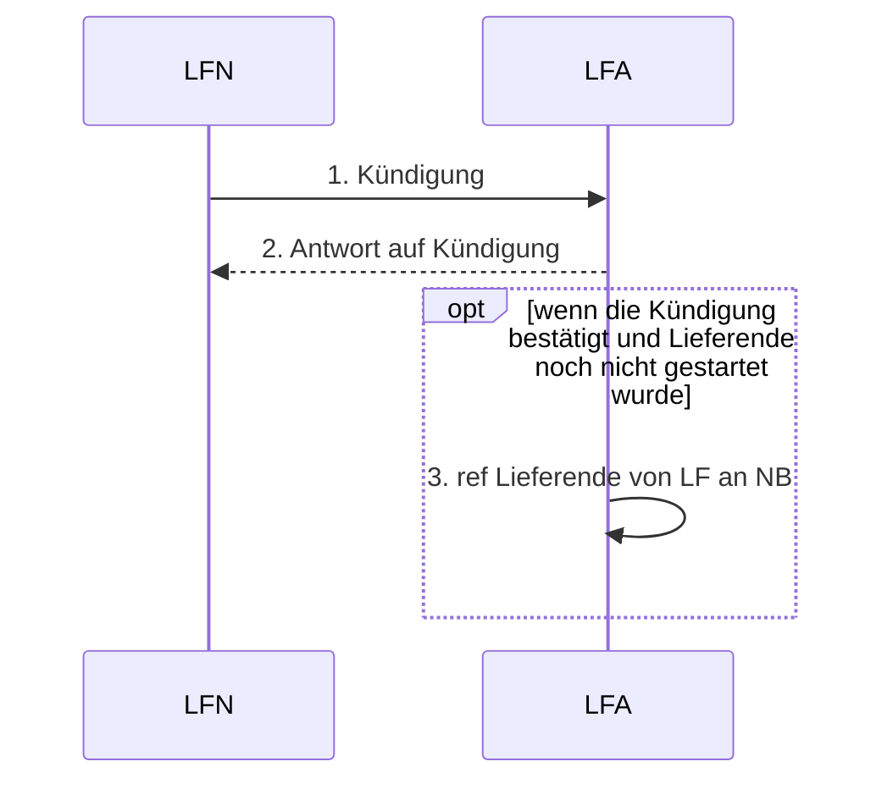
```mermaid
sequenceDiagram
    participant LFN
    participant LFA
    LFN->>LFA: 1. Kündigung
    LFA-->>LFN: 2. Antwort auf Kündigung
    opt wenn die Kündigung bestätigt und Lieferende noch nicht gestartet wurde
        LFA->>LFA: 3. ref Lieferende von LF an NB
    end
```

|Nr.|Aktion|Frist|Hinweis/Bemerkung|
|-|-|-|-|
|1|Kündigung|--|Bei einer Kündigung auf Ebene der • verbrauchenden Marktlokation ist einzig die MaLo-ID der Marktlokation anzugeben. • erzeugenden Marktlokation ist einzig die MaLo-ID der Marktlokation anzugeben. • Tranche, ist einzig die MaLo-ID der Tranche anzugeben (Geschäftsvorfall 2).  In der Kündigung kann ein beliebiger in der Zukunft liegender Kündigungstermin (auch untermonatlich) angegeben werden. Der Kündigungstermin kann sich • auf einen fixen Zeitpunkt 00:00 Uhr oder • auf einen nächstmöglichen Zeitpunkt 00:00 Uhr beziehen.  Handelt es sich um die Ausübung eines Sonderkündigungsrechts, so muss der Kündigungstermin nicht in der Zukunft liegen, sondern kann identisch mit dem ÜT von Prozessschritt 1 sein.|
|2|Antwort auf Kündigung|Unverzüglich, jedoch spätester ÜT ist der 1. WT nach dem ÜT von Nr. 1.|Der LFA prüft die Kündigung und teilt dem LFN das Ergebnis mit. Dabei sind folgende Regeln einzuhalten: • Hat der LFN auf einen fixen Zeitpunkt gekündigt und wird dieser vom LFA nicht bestätigt, so teilt der LFA den nächstmöglichen Zeitpunkt, zu dem eine Kündigung erfolgen kann, und|

Seite 9 von **115**

|Nr.|Aktion|Frist|Hinweis/Bemerkung|
|-|-|-|-|
||||die Kündigungsfrist in der Ablehnung mit. • Hat der LFN auf den nächstmöglichen Zeitpunkt gekündigt, so bestätigt der LFA die Kündigung unter Angabe dieses Zeitpunkts. • Liegt dem LFA bereits eine wirksame Kündigung vor (durch einen LFN oder den Letztverbraucher) sind die entsprechenden Antwort- Konstellationen im Kapitel 1.2.3 „Antwort LFA bei Kündigung eines bereits wirksam gekündigten Vertrages“ beschrieben. • Im Fall einer verbrauchenden Marktlokation: Leitet der LFN den Use-Case „Kündigung“ gegenüber einem E/G ein und befindet sich die zu kündigende Marktlokation in Ersatzversorgung gem. § 38 EnWG, so findet durch den E/G keine Prüfung auf Mindestvertragslaufzeiten bzw. Kündigungsfristen statt.  Falls der LFA die Kündigung des LFN ablehnt, teilt er den Grund oder die Gründe für die Ablehnung mit.  Falls der LFA die Kündigung gegenüber dem LFN bestätigt, kann es sich um eine Bestätigung handeln, die a) ohne inhaltliche Änderung erteilt wird oder b) die mit Abänderungen erteilt wird.  Im Fall einer verbrauchenden Marktlokation teilt der LFA dem LFN mit Bestätigung der Kündigung ferner den Vorjahresverbrauch des Letztverbrauchers mit.|
|3|ref Lieferende von LF an NB|--|--|

Seite **10** von **115**

## 1.2.3 Antwort LFA bei Kündigung eines bereits wirksam gekündigten Vertrages

**Prozesssituation:**

Kündigung wurde bereits ausgesprochen (z. B. unmittelbar durch den Kunden), Stromliefervertrag bzw. Stromabnahmevertrag zwischen LFA und Kunde endet dementsprechend zum Tag X zu 00:00 Uhr (nachfolgend als „Vertragsende“ bezeichnet).

|Kündigung durch LFN...|Antwort LFA|Erläuterung|
|-|-|-|
|... auf denselben Termin|Bestätigung der Kündigung||
|...auf einen fixen Termin, der früher als das Vertragsende liegt|Fall 1: Vertragssituation lässt eine noch frühere Kündigung zu  → Kündigungsbestätigung für neuen (früheren) Kündigungstermin an LFN|Sollte der LFA für das bereits wirksam gekündigte Vertragsverhältnis aufgrund der Vertragslage ein noch früheres Vertragsende akzeptieren, so teilt er dies als Kündigungsbestätigung für diesen früheren Kündigungstermin mit.|
||Fall 2: Vertragssituation lässt keine frühere Kündigung zu  → Kündigungsablehnung an LFN, Hinweis auf Kündigungstermin aus der früheren wirksamen Kündigung|Wenn der LFA das noch frühere Vertragsende nicht akzeptiert, weist er darauf hin, dass das Vertragsverhältnis bereits zuvor wirksam gekündigt wurde und benennt das maßgebliche Vertragsende-Datum.|
|...auf einen fixen Termin, der später als das Vertragsende liegt|→ Ablehnung der Kündigung, Hinweis auf Kündigungstermin aus der früheren wirksamen Kündigung|Ein bereits wirksam gekündigtes Vertragsverhältnis kann nicht – auch nicht bei Zustimmung des LFA – durch eine schlichte Kündigung zu einem späteren Zeitpunkt wieder verlängert werden.|
|...auf den nächstmöglichen Kündigungstermin|Fall 1: Vertragssituation lässt eine noch frühere Kündigung zu  → Kündigungsbestätigung für neuen (früheren) Kündigungstermin an LFN|Sollte der LFA für das bereits wirksam gekündigte Vertragsverhältnis aufgrund der Vertragslage ein noch früheres Vertragsende akzeptieren, so teilt er dies als Kündigungsbestätigung für diesen früheren Kündigungstermin mit.|
||Fall 2: Vertragssituation lässt keine frühere Kündigung zu  → Kündigungsablehnung an LFN, Hinweis auf Kündigungstermin aus der früheren wirksamen Kündigung.|Wenn der LFA das noch frühere Vertragsende nicht akzeptiert, weist er darauf hin, dass das Vertragsverhältnis bereits zuvor wirksam gekündigt wurde und benennt das maßgebliche Vertragsende-Datum.|

Seite 11 von 115

## **2 Zuordnungsprozesse**

## **2.1 Use-Case: Lieferbeginn**

### <u>**2.1.1 UC: Lieferbeginn**</u>

|Use-Case-Name|Lieferbeginn|
|-|-|
|Prozessziel|Der LFN ist der Marktlokation bzw. Tranche zugeordnet.|
|Use-Case Beschreibung|Ein LFN meldet beim NB eine Zuordnung des LFN zu einer Marktlokation bzw. Tranche an.  Im Zuge des Prozesses • beendet der NB ggf. die Zuordnung des LFA zur Marktlokation bzw. Tranche. • hebt der NB ggf. die Zuordnung des LFZ zur Marktlokation bzw. Tranche auf.|
|Rollen|• LF • NB|
|Vorbedingung|• Im Fall einer verbrauchenden Marktlokation: o Abschluss eines Energieliefervertrags zwischen LFN und dem Letztverbraucher. • Im Fall einer erzeugenden Marktlokation bzw. einer Tranche: o Abschluss eines Stromabnahmevertrags zwischen LFN und dem EZ. Es werden dabei drei Geschäftsvorfälle betrachtet: ▪ Geschäftsvorfall 1: Der LFN wird einer Marktlokation vollständig zugeordnet (vollständige (100%ige) Zuordnung). Dieser Geschäftsvorfall ist auch für die Änderung von einer tranchierten Marktlokation in eine nicht tranchierte Marktlokation anzuwenden. ▪ Geschäftsvorfall 2: Der LFN wird einer bestehenden Tranche vollständig zugeordnet (vollständige (100%ige) Zuordnung). Dieser Geschäftsvorfall ist bei einem direkten Übergang, d. h. lückenlosem Zuordnungsende und -beginn und unter Beibehaltung der Tranche, anzuwenden. ▪ Geschäftsvorfall 3: Der LFN wird einer neu zu bildenden Tranche zugeordnet (anteiliger Zuordnungsvorgang unter Bildung neuer Tranchen). Zudem ist eine Änderung der dem LF zugeordneten Tranchengröße mit diesem Prozess/Geschäftsvorfall 3 zu melden. o Der bisherige und neue EZ müssen identisch sein. o Die Energie einer Marktlokation, die vollständig oder anteilig zur Veräußerungsform einer DV zugeordnet werden soll, ist mit einer viertelstündlichen Auflösung zu messen. o Der Use-Case ist nicht durch das Unternehmen Netzbetreiber in seiner Rolle als LF zu starten.|

Seite **12** von **115**

|Use-Case-Name|Lieferbeginn|
|-|-|
||• Eine Zuordnungsermächtigung nach den Prozessen der MaBiS für den vom LFN genutzten BK liegt beim NB vor. • Es handelt sich nicht um die erstmalige Inbetriebnahme einer Marktlokation (Neuanlage). • Die MaLo-ID der Marktlokation ist bekannt bzw. im Geschäftsvorfall 2 ist die MaLo-ID der Tranche bekannt.  Auslöser: • Im Fall einer verbrauchenden Marktlokation: o Lieferantenwechsel ohne gleichzeitigen Einzug des Letztverbrauchers o Lieferantenwechsel mit gleichzeitigem Einzug des Letztverbrauchers o Zuordnung des bisherigen LF ohne gleichzeitigen Einzug des Letztverbrauchers (nach einer Beendigung der Zuordnung des LF zur Marktlokation, z.B. aufgrund des Use-Cases "Lieferende von LF an NB") o Zuordnung des bisherigen LF mit gleichzeitigem Einzug des Letztverbrauchers. • Im Fall einer erzeugenden Marktlokation bzw. einer Tranche: o Lieferantenwechsel ohne Erzeugerwechsel o Zuordnung des bisherigen LF ohne Erzeugerwechsel (nach einer Beendigung der Zuordnung des LF zur Marktlokation bzw. Tranche, z.B. aufgrund des Use-Cases "Lieferende von LF an NB").|
|Nachbedingung im Erfolgsfall|• Im Fall einer verbrauchenden Marktlokation: o Der NB führt die Use-Cases „Abrechnungsdaten Netznutzungsabrechnung“ und „Abrechnungsdaten Bilanzkreisabrechnung“ aus. o Etwa entstehende Zuordnungslücken werden vom NB durch Zuordnung des E/G zur Marktlokation in Anwendung des Use-Cases „Beginn der Ersatz-/Grundversorgung“ geschlossen. o Sofern die Marktlokation gesperrt ist, führt der NB den Use-Case „Wiederherstellung der Anschlussnutzung bei Lieferbeginn“ aus.  • Im Fall einer erzeugenden Marktlokation bzw. einer Tranche: o Der NB führt den Use-Case „Abrechnungsdaten Bilanzkreisabrechnung“ aus. o Etwa entstehende Zuordnungslücken werden vom NB im Rahmen des Use-Cases „Herstellung einer 100% LF-Zuordnung zu einer erzeugenden Marktlokation“ geschlossen. • Der NB führt den Use-Case „Stammdatenänderung“ (hier: SD „Stammdatenänderung vom NB (verantwortlich) ausgehend“) (GPKE Teil 4) durch. • Der NB versendet die Berechnungsformel an den LFN. • Der NB führt den Use-Case „Einrichtung der Konfigurationen aufgrund einer Zuordnung eines LF zu einer Marktlokation bzw. Tranche“ (GPKE Teil 3) aus.|

Seite **13** von **115**

|Use-Case-Name|Lieferbeginn|
|-|-|
||• Der LFN führt den Use-Case „Stammdatenänderung“ (hier: SD „Stammdatenänderung vom LF (verantwortlich) ausgehend“) (GPKE Teil 4) durch.|
|Nachbedingung im Fehlerfall|• Der LFN wurde der Marktlokation bzw. Tranche nicht zugeordnet. • Der LFA bleibt der Marktlokation bzw. Tranche zugeordnet, sofern für diesen nicht bereits die Zuordnung im Rahmen eines anderen Use-Cases (z.B. „Lieferende von LF an NB) beendet wurde. • Im Fall einer verbrauchenden Marktlokation: Der NB führt ggf. den Use-Case „Beginn der Ersatz-/Grundversorgung“ aus. • Im Fall einer erzeugenden Marktlokation bzw. einer Tranche: Der NB führt ggf. den Use-Case „Herstellung einer 100% LF-Zuordnung zu einer erzeugenden Marktlokation“ aus. • Der LFN sendet bei Bedarf erneut eine Anmeldung an den NB.|
|Fehlerfälle|• Es handelt sich um die erstmalige Inbetriebnahme einer Marktlokation (Neuanlage). • Im Fall einer erzeugenden Marktlokation bzw. einer Tranche: o Der bisherige und neue EZ sind nicht identisch. o Die Energie einer Marktlokation, die vollständig oder anteilig zur Veräußerungsform einer DV zugeordnet werden soll, ist nicht mit einer viertelstündlichen Auflösung messbar. o Der Use-Case wird durch das Unternehmen Netzbetreiber in seiner Rolle als LF gestartet. • Eine Zuordnungsermächtigung nach den Prozessen der MaBiS für den vom LFN genutzten BK liegt beim NB nicht vor.|
|Weitere Anforderungen|• Zuordnungslücken sind dadurch zu vermeiden, dass An- und Abmeldung zeitlich aufeinander abgestimmt werden. • Hinweis: Ein Erzeugerwechsel an einer erzeugenden Marktlokation oder Anlagenbetreiberwechsel an einer technischen Ressource wird nicht im Rahmen der hier beschriebenen Prozesse abgewickelt. Deren bilaterale Abwicklung zwischen NB und EZ erfolgt gemäß den einschlägigen Bestimmungen der NB. • Hinweis: Die Zuordnung des LF zur Marktlokation bzw. Tranche bei einer Inbetriebnahme einer Marktlokation (Neuanlage) findet über den Use-Case „Neuanlage“, „Beginn der Ersatz-/Grundversorgung“ oder „Herstellung einer 100% LF-Zuordnung zu einer erzeugenden Marktlokation“ statt. • Hinweis: Sofern die zum Zuordnungsbeginn vorhandene Gerätetechnik die Anmeldung nicht ermöglicht, ist eine entsprechende Änderung der Gerätetechnik durch den LFN bzw. Letztverbraucher bzw. EZ beim MSB zu veranlassen. Der LFN kann die Änderung der Gerätetechnik über den WiM-Use-Case zur Messlokationsänderung (WiM Teil 1) beauftragen. • Hinweis zu erzeugenden Marktlokationen bzw. zu Tranchen: Der LF wendet für eine Änderung der Veräußerungsform (ohne gleichzeitige Zuordnung des LF zur erzeugenden|

Seite **14** von **115**

|Use-Case-Name|Lieferbeginn|
|-|-|
||Marktlokation bzw. zur Tranche) den Use-Case "Bestellung einer Änderung von Abrechnungsdaten" an.|

Fristen für die Anmeldung (Prozessschritt 1) bei EEG-Marktlokationen und Tranchen von EEG-Marktlokationen

|Geschäfts-vorfall|Bestehende Veräußerungsform (zum Zuordnungs-beginn)|angemeldete Veräußerungsfo rm|Zuordnungsbeginn und Frist|
|-|-|-|-|
|1 und 2|DV mit Marktprämie|DV mit Marktprämie|Der Zuordnungsbeginn darf ein Monatserster oder untermonatlich sein. Spätester ÜT ist der Tag vor dem letzten WT vor dem Zuordnungsbeginn.|
|1 und 2|sonstige DV|sonstige DV||
|1 und 2|DV mit Marktprämie|sonstige DV|Der Zuordnungsbeginn darf nur ein Monatserster sein. Spätester ÜT liegt 1 Monat vor dem Zuordnungsbeginn.|
|1 und 2|sonstige DV|DV mit Marktprämie||
|1 und 2|Einspeisevergütung nach § 37 EEG 2014 bzw. uneingeschränkte Einspeisevergütung nach § 21 Abs. 1 Nr. 1 EEG 2017, EEG 2021 bzw. EEG 2023|DV mit Marktprämie oder sonstige DV||
|3|Einspeisevergütung nach § 37 EEG 2014 bzw. nach § 21 Abs. 1 Nr. 1 EEG 2017, EEG 2021 bzw. EEG 2023, sonstige oder geförderte DV (ggf. aufgeteilt auf Tranchen)|DV mit Marktprämie oder sonstige DV (Tranchen-größe < 100 %)||
|1|Einspeisevergütung nach § 38 EEG 2014 (100 %) bzw. Ausfallvergütung nach § 21 Abs. 1 Nr. 2 EEG 2017, EEG 2021 bzw. EEG 2023 (100 %)|DV mit Marktprämie oder sonstige DV|Der Zuordnungsbeginn darf nur ein Monatserster sein. Spätester ÜT ist der 5. WT vor dem Zuordnungsbeginn.|
|3|Einspeisevergütung nach § 38 EEG 2014 (100 %) bzw. Ausfallvergütung nach § 21 Abs. 1 Nr. 2 EEG 2017, EEG 2021 bzw. EEG 2023 (100 %)|DV mit Marktprämie oder sonstige DV (Tranchen-größe < 100 %)||

Seite **15** von **115**

## 2.1.2 SD: Lieferbeginn

Seite 16 von 115

Seite **17** von **115**

|Nr.|Aktion|Frist|Hinweis/Bemerkung|
|-|-|-|-|
|1|Anmeldung einer Zuordnung des LFN zur Marktlokation bzw. Tranche|Bei EEG-Marktlokationen und Tranchen von EEG-Marktlokationen gilt: Unverzüglich nach Vorliegen des Anmeldegrundes, jedoch unter Einhaltung der in der obigen Tabelle „Fristen für die Anmeldung (Prozessschritt 1) bei EEG-Marktlokationen und Tranchen von EEG-Marktlokationen“ genannten Fristen.  Bei allen anderen Marktlokationen und Tranchen gilt: Unverzüglich nach Vorliegen des Anmeldegrundes, jedoch spätester ÜT ist der Tag vor dem letzten WT vor dem Zuordnungsbeginn.|Zur Identifikation der • verbrauchenden Marktlokation ist einzig die MaLo-ID der Marktlokation zu verwenden. • erzeugenden Marktlokation nach Geschäftsvorfall 1 und 3 ist einzig die MaLo-ID der Marktlokation zu verwenden. • Tranche nach Geschäftsvorfall 2 ist einzig die MaLo-ID der Tranche zu verwenden.  Der LFN gibt in der Anmeldung zudem insbesondere an: • den Zuordnungsbeginn und, sofern vertraglich mit dem Letztverbraucher bzw. EZ vereinbart und vom LFN gewünscht, das Zuordnungsende • den BK • den Grund der Anmeldung • bei einer verbrauchenden Marktlokation: o ob der Letztverbraucher ein „Haushaltskunde“ ist o welche Anforderungen im Rahmen der Netznutzung und Bilanzierung zwingend notwendig und welche wünschenswert sind (z.B. Zahler der Netznutzung, Netznutzungsabrechnungsmodell (Arbeitspreis/Grundpreis, Arbeitspreis/Leistungspreis)), mit der Konsequenz, dass die Anmeldung abgelehnt wird, sofern zwingend notwendige Anforderungen vom NB nicht erfüllt werden können • welche Konfigurationen (z.B. Messprodukte) im Rahmen der Netznutzung und Bilanzierung (z.B. für die Abbildung des Bilanzierungsverfahrens) gewünscht sind • bei Geschäftsvorfall 1: die Tranchengröße mit 100 % • bei Geschäftsvorfall 3: die neue Tranchengröße mit kleiner 100 % und größer 0 %, sofern die Basis zur Bildung der Tranchengröße prozentual ist.|

Seite **18** von **115**

|Nr.|Aktion|Frist|Hinweis/Bemerkung|
|-|-|-|-|
||||Der NB prüft die Anmeldung wie folgt: 1. Wurde die Vorlauffrist zum Zuordnungsbeginn nicht eingehalten, fährt der NB mit Prozessschritt 6, ansonsten mit Prüfschritt 2 fort. 2. Im Fall einer verbrauchenden Marktlokation bzw. im Fall von Geschäftsvorfall 1 und 2: Liegt dem NB vor dem ÜZ der Anmeldung (Anmeldung 1) bereits eine Anmeldung (Anmeldung 0) (aufgrund des Use-Cases „Lieferbeginn“) zu derselben Marktlokation bzw. Tranche vor, für die die fristgerechte Antwort des NB noch aussteht, fährt der NB für Anmeldung 1 mit Prozessschritt 6 fort und teilt in der Ablehnung mit, - dass sich derzeit eine Anmeldung (hier: Anmeldung 0) in Bearbeitung befindet, - auf welchen Zuordnungsbeginn die derzeit in Bearbeitung befindliche Anmeldung gerichtet ist sowie - ab welchem Zeitpunkt der NB nach dem vorgegebenen Fristlauf des Use-Cases „Lieferbeginn“ spätestens wieder Anmeldungen für diese Marktlokation bzw. Tranche entgegennimmt. Ansonsten fährt der NB mit Prüfschritt 3 fort. 3. Sind nicht alle sonstigen Voraussetzungen, die der NB zu verantworten hat, erfüllt, fährt der NB mit Prozessschritt 6, ansonsten mit Prüfschritt 4 fort. Hinweis: Der NB verantwortet die Richtigkeit der Angabe des LF zur angemeldeten Veräußerungsform bei einer erzeugenden Marktlokation bzw. einer Tranche nicht. Diese Angabe darf daher nicht zu einer Ablehnung der Anmeldung führen. 4. Prüfung, ob die Versendung einer Anfrage zur Beendigung der|

Seite **19** von **115**

|Nr.|Aktion|Frist|Hinweis/Bemerkung|
|-|-|-|-|
||||Zuordnung des LFA zur Marktlokation bzw. Tranche erforderlich ist. - Im Fall von Geschäftsvorfall 3: Ist aufgrund der vom LFN gewünschten Tranchengröße die Summe aller Tranchen der Marktlokation zum Zuordnungsbeginn in der DV > 100 %, fährt der NB mit Prozessschritt 2, ansonsten mit Prozessschritt 5 fort. - In allen anderen Fällen: Ist die Marktlokation bzw. Tranche zum Zuordnungsbeginn einem LF zugeordnet, fährt der NB mit Prozessschritt 2, ansonsten mit Prozessschritt 5 fort.|
|2|Information über existierende Zuordnung|Unverzüglich, jedoch spätester ÜZ ist 07:00 Uhr des 1. WT nach dem ÜT von Nr. 1.|Der NB informiert den LFN darüber, dass zum Zuordnungsbeginn eine Zuordnung zu einem LFA existiert.  Hierbei teilt der NB dem LFN insbesondere die Identität des LFA an der Marktlokation bzw. Tranche (bei Geschäftsvorfall 2) bzw. in Geschäftsvorfall 3 die Identitäten aller der Marktlokation zugeordneten LFA und deren Tranchengrößen mit.  Hinweis: Die Information ist auch dann zu versenden, sofern LFA und LFN identisch sind.|
|3|Anfrage zur Beendigung der Zuordnung des LFA zur Marktlokation bzw. Tranche|Parallel zu Nr. 2.|Der NB teilt dem LFA bzw. im Fall von Geschäftsvorfall 3 allen LFA mit, dass eine Anmeldung vorliegt, verbunden mit der Anfrage, ob der LFA die Zuordnung zur Marktlokation bzw. Tranche zum Zuordnungsbeginn des LFN beendet. Der NB teilt dem LFA den ÜT der Anmeldung mit (somit kann der LFA insbesondere die Frist für die Antwort auf die Anfrage ermitteln).  Hinweis: Die Anfrage ist auch dann zu versenden, sofern LFA und LFN identisch sind.|
|4|Antwort auf Anfrage zur Beendigung der|Unverzüglich, jedoch spätester ÜZ ist|Die Anfrage aus Prozessschritt 3 dient der Behebung eines möglichen|

Seite **20** von **115**

|Nr.|Aktion|Frist|Hinweis/Bemerkung|
|-|-|-|-|
||Zuordnung des LFA zur Marktlokation bzw. Tranche|09:00 Uhr des 1. WT nach dem ÜT von Nr. 1.|Abmeldeversäumnisses des LFA. Der LFA überprüft diesen Sachverhalt.  • Bei einer verbrauchenden Marktlokation sind entsprechend der Vertragslage zwischen LFA und Letztverbraucher folgende Reaktionen des LFA möglich: o Der LFA bestätigt die Anfrage zum Zuordnungsbeginn des LFN (Fall a) oder o der LFA bestätigt die Anfrage zu einem Zuordnungsende, das vor dem Zuordnungsbeginn des LFN liegt (Fall b), dabei gilt, dass das Zuordnungsende mindestens 1 WT nach dem ÜT der Anmeldung liegen muss oder o der LFA widerspricht der Anfrage und nennt kein Zuordnungsende. Hierbei übermittelt der LFA eine Begründung für den Widerspruch. In diesem Fall fährt der NB mit Prozessschritt 6 fort. Hinweis: Sofern der LFA und der LFN identisch sind, ist dieser Sachverhalt keine Begründung für einen Widerspruch. • Bei einer erzeugenden Marktlokation bzw. einer Tranche sind entsprechend der Vertragslage zwischen LFA und EZ folgende Reaktionen des LFA möglich: o Der LFA bestätigt die Anfrage zum Zuordnungsbeginn (Fall a) oder o der LFA widerspricht der Anfrage. Hierbei übermittelt der LFA eine Begründung für den Widerspruch. Hinweis: Sofern der LFA und der LFN identisch sind, ist dieser Sachverhalt keine Begründung für einen Widerspruch. Als Ergebnis sind folgende Situationen denkbar: 1) Durch Bestätigung der Anfrage durch mindestens|

Seite **21** von **115**

|Nr.|Aktion|Frist|Hinweis/Bemerkung|
|-|-|-|-|
||||einen LFA wird ein prozentualer Anteil frei, der gleich oder größer als der vom LFN angemeldete Anteil ist. In diesem Fall fährt der NB mit Prozessschritt 5 fort. 2) Durch die Ablehnung der Anfrage durch mindestens einen LFA wird kein ausreichend großer prozentualer Anteil frei. In diesem Fall fährt der NB mit Prozessschritt 6 fort.  Hinweis: Verstreicht die Frist, ohne dass eine Antwort beim NB eingeht, gilt dies als Bestätigung nach Fall a). Nach Ablauf der Frist eingehende Antworten sind für den Fortlauf dieses Prozesses unerheblich.|
|5|Zuordnung des LFN zur Marktlokation bzw. Tranche|Unverzüglich, jedoch spätester ÜZ ist 11:00 Uhr des 1. WT nach dem ÜT von Nr. 1.|Der NB stimmt der Anmeldung zu und ordnet den LFN der Marktlokation bzw. Tranche unverzüglich zum Zuordnungsbeginn zu.  In der Nachricht teilt der NB dem LFN insbesondere folgende Daten mit: • den Zuordnungsbeginn • die Adresse der Marktlokation • die MaLo-ID der betroffenen Marktlokation • alle ID der Messlokationen, die für die Ermittlung der Energiemengen der Marktlokation erforderlich sind • bei Geschäftsvorfall 2 und 3 zudem: die MaLo-ID der Tranche • zugeordnete Marktpartner wie MSB und ÜNB Hinweis: Der vom LFN in der Anmeldung angegebene BK ist in Prozessschritt 8 „ref Abrechnungsdaten Bilanzkreisabrechnung“ dem LFN vom NB mitzuteilen.|
|6|Ablehnung der Anmeldung einer Zuordnung des LFN zur Marktlokation bzw. Tranche|Unverzüglich, jedoch spätester ÜZ ist 11:00 Uhr des 1. WT nach dem ÜT von Nr. 1.|Der NB lehnt die Anmeldung ab. Der Grund der Ablehnung ist anzugeben. Der NB gibt zusätzlich den Grund der Ablehnung des LFA an, sofern dieser in Prozessschritt 4 die Anfrage abgelehnt hat.|
|7|ref Abrechnungsdaten Netznutzungsabrechnung|--|Der NB übermittelt dem LFN die Abrechnungsdaten zur Netznutzungsabrechnung für die verbrauchende Marktlokation mit Gültigkeit zum Zuordnungsbeginn oder teilt dem LFN|

Seite **22** von **115**

|Nr.|Aktion|Frist|Hinweis/Bemerkung|
|-|-|-|-|
||||mit, dass die Netznutzung für die verbrauchende Marktlokation zum Zuordnungsbeginn nicht über den LFN abgerechnet wird (dies ist der Fall, wenn der Letztverbraucher Zahler der Netznutzung ist).|
|8|ref Abrechnungsdaten Bilanzkreis- abrechnung|--|Der NB übermittelt dem LFN und ggf. dem ÜNB die Abrechnungsdaten zur Bilanzkreisabrechnung für die Marktlokation bzw. Tranche mit Gültigkeit zum Zuordnungsbeginn.|
|9|ref Stammdaten- änderung vom NB (verantwortlich) ausgehend|--|Der NB übermittelt dem LFN die relevanten Stammdaten mit Gültigkeit zum Zuordnungsbeginn.|
|10|Beendigung der Zuordnung des LFA zur Marktlokation bzw. Tranche|Unverzüglich nach dem ÜZ von Nr. 5, jedoch spätester ÜZ ist 12:00 Uhr des 1. WT nach dem ÜT von Nr. 1.|Der NB beendet die Zuordnung des LFA zu der Marktlokation bzw. Tranche unverzüglich zum Zuordnungsende.  In der Nachricht teilt der NB dem LFA insbesondere den Grund der Beendigung sowie das Zuordnungsende mit. Das Zuordnungsende - ist im Fall eines zulässigen Zuordnungsendes in der Antwort des LFA in Prozessschritt 4 das vom LFA in Prozessschritt 4 bestätigte Zuordnungsende (Fall a oder b) (Hinweis: Fall b tritt nur bei verbrauchenden Marktlokationen ein).
- entspricht im Fall eines nicht zulässigen Zuordnungsendes in der Antwort des LFA in Prozessschritt 4 dem Zuordnungsbeginn der Anmeldung. Hinweis: Ein nicht zulässiges Zuordnungsende ist ein Zuordnungsende, das weiter in der Zukunft liegt als der Zuordnungsbeginn der Anmeldung oder im Fall b ein Zuordnungsende, das nicht mindestens 1 WT nach dem ÜT der Anmeldung liegt.
- entspricht im Fall der nicht fristgerechten Rückmeldung des LFA in Prozessschritt 4 dem Zuordnungsbeginn der Anmeldung. Die Beendigung der Zuordnung des LFA zu einer|

Seite **23** von **115**

|Nr.|Aktion|Frist|Hinweis/Bemerkung|
|-|-|-|-|
||||* Marktlokation erfolgt mit der MaLo-ID der Marktlokation.
* Tranche erfolgt mit der MaLo-ID der Tranche.|
|11|ref Abrechnungsdaten Netznutzungs- abrechnung|--|Der NB teilt dem LFA mit, dass die Netznutzung mit dem LFA zu der verbrauchenden Marktlokation zum Zuordnungsende endet.|
|12|ref Abrechnungsdaten Bilanzkreis- abrechnung|--|Der NB teilt dem LFA und ggf. dem ÜNB mit, dass die Bilanzierung mit dem LFA zu der Marktlokation bzw. Tranche zum Zuordnungsende endet.|
|13|Aufhebung der Zuordnung des LFZ zur Marklokation bzw. Tranche|Unverzüglich nach dem ÜZ von Nr. 5, jedoch spätester ÜZ ist 12:00 Uhr des 1. WT nach dem ÜT von Nr. 1.|Der NB hebt die Zuordnung des LFZ zu der Marktlokation bzw. Tranche unverzüglich auf.  In der Nachricht teilt der NB dem LFZ insbesondere den Grund der Aufhebung mit. Die Aufhebung der Zuordnung des LFZ zu einer * Marktlokation erfolgt mit der MaLo-ID der Marktlokation.
* Tranche erfolgt mit der MaLo-ID der Tranche. Hinweis: Enthält die Anmeldung des LFN ein Zuordnungsende, ist die Zuordnung des LFZ nur aufzuheben, wenn der Zuordnungsbeginn des LFZ kleiner dem Zuordnungsende des LFN ist.|
|14|ref Abrechnungsdaten Netznutzungs- abrechnung|--|Der NB teilt dem LFZ mit, dass die Netznutzung mit dem LFZ zu der verbrauchenden Marktlokation nicht stattfinden wird.|
|15|ref Abrechnungsdaten Bilanzkreis- abrechnung|--|Der NB teilt dem LFZ und ggf. dem ÜNB mit, dass die Bilanzierung mit dem LFZ zu der Marktlokation bzw. Tranche nicht stattfinden wird.|
|16|ref Übermittlung der Berechnungsformel|--|Der NB übermittelt dem LFN die Berechnungsformel der Marktlokation.|
|17|ref Einrichtung der Konfigurationen aufgrund einer Zuordnung eines LF zu einer Markt- lokation bzw. Tranche|--|--|
|18|ref Beginn der Ersatz- /Grundversorgung|--|--|
|19|ref Wiederherstellung der Anschluss- nutzung bei Lieferbeginn|--|--|

Seite **24** von **115**

|Nr.|Aktion|Frist|Hinweis/Bemerkung|
|-|-|-|-|
|20|ref Herstellung einer 100% LF-Zuordnung zu einer erzeugenden Marktlokation|--|--|
|21|ref Stammdatenänderung vom LF (verantwortlich) ausgehend|--|Hinweis: Unverzügliche Übermittlung, jedoch frühester ÜZ ist 19:00 Uhr am WT vor dem Zuordnungsbeginn.|

## 2.2 **Use-Case: Neuanlage**

### 2.2.1 **UC: Neuanlage**

|**Use-Case-Name**|Neuanlage|
|-|-|
|Prozessziel|Der LF ist der Marktlokation bzw. Tranche zum Inbetriebnahmedatum der Marktlokation zugeordnet.|
|Use-Case Beschreibung|Ein LF meldet beim NB eine Zuordnung des LF zu einer Marktlokation bzw. Tranche an.|
|Rollen|• LF • NB|
|Vorbedingung|• Im Fall einer verbrauchenden Marktlokation: Abschluss eines Energieliefervertrags zwischen LF und dem Letztverbraucher. • Im Fall einer erzeugenden Marktlokation bzw. einer Tranche: ○ Abschluss eines Stromabnahmevertrags zwischen LF und dem EZ. Es werden dabei zwei Geschäftsvorfälle betrachtet: ▪ Geschäftsvorfall A: Der LF wird einer Marktlokation vollständig zugeordnet. ▪ Geschäftsvorfall B: Der LF wird einer Tranche (entsprechend der gewünschten Tranchengröße) zugeordnet. ○ Die Energie einer Marktlokation, die vollständig oder anteilig zur Veräußerungsform einer DV zugeordnet werden soll, ist mit einer viertelstündlichen Auflösung zu messen. ○ Der Use-Case ist nicht durch das Unternehmen Netzbetreiber in seiner Rolle als LF zu starten. • Es handelt sich um die erstmalige Inbetriebnahme einer Marktlokation (Neuanlage). Dies bedeutet ○ im Fall einer verbrauchenden Marktlokation oder im Fall von Geschäftsvorfall A: Ein LF ist der neu angelegten Marktlokation noch nicht zugeordnet. ○ im Fall von Geschäftsvorfall B: Eine 100% LF-Zuordnung zu der neu angelegten Marktlokation wurde noch nicht hergestellt. • Eine Zuordnungsermächtigung nach den Prozessen der MaBiS für den vom LF genutzten BK liegt beim NB vor.|
|Nachbedingung im Erfolgsfall|• Im Fall einer verbrauchenden Marktlokation: Der NB führt die Use-Cases „Abrechnungsdaten Netznutzungsabrechnung“ und „Abrechnungsdaten Bilanzkreisabrechnung“ aus.|

Seite 25 von 115

|Use-Case-Name|Neuanlage|
|-|-|
||* Im Fall einer erzeugenden Marktlokation bzw. einer Tranche: Der NB führt den Use-Case „Abrechnungsdaten Bilanzkreisabrechnung“ aus.
* Der NB führt den Use-Case „Stammdatenänderung“ (hier: SD „Stammdatenänderung vom NB (verantwortlich) ausgehend“) (GPKE Teil 4) durch.
* Der NB versendet die Berechnungsformel an den LF.
* Der NB führt den Use-Case „Einrichtung der Konfigurationen aufgrund einer Zuordnung eines LF zu einer Marktlokation bzw. Tranche“ (GPKE Teil 3) aus.
* Im Fall einer Tranche: Etwa entstehende Zuordnungslücken werden vom NB im Rahmen des Use-Cases „Herstellung einer 100% LF-Zuordnung zu einer erzeugenden Marktlokation“ geschlossen.
* Der LF führt den Use-Case „Stammdatenänderung“ (hier: SD „Stammdatenänderung vom LF (verantwortlich) ausgehend“) (GPKE Teil 4) durch.|
|Nachbedingung im Fehlerfall|- Der LF wurde der Marktlokation bzw. Tranche nicht zugeordnet.

- Bei nicht-Identifikation der Marktlokation: Der LF geht mit dem Letztverbraucher bzw. EZ in ein bilaterales Clearing.

- Der LF startet bei Bedarf den Use-Case „Neuanlage“ erneut oder

- der LF startet bei Bedarf den Use-Case „Lieferbeginn“, sofern dem LF in der Ablehnung mitgeteilt wurde, dass

  * im Fall einer verbrauchenden Marktlokation oder im Fall von Geschäftsvorfall A bereits ein LF der Marktlokation zugeordnet ist.
  * im Fall von Geschäftsvorfall B bereits eine 100% LF-Zuordnung zur Marktlokation hergestellt wurde.

- Im Fall einer verbrauchenden Marktlokation: Der NB führt ggf. den Use-Case „Beginn der Ersatz-/Grundversorgung“ aus.

- Im Fall einer erzeugenden Marktlokation bzw. einer Tranche: Der NB führt ggf. den Use-Case „Herstellung einer 100% LF-Zuordnung zu einer erzeugenden Marktlokation“ aus.|
|Fehlerfälle|* Es handelt sich nicht um eine erstmalige Inbetriebnahme einer Marktlokation (Neuanlage). Dies bedeutet

  * im Fall einer verbrauchenden Marktlokation oder im Fall von Geschäftsvorfall A: Ein LF (dies schließt einen E/G mit ein) ist der Marktlokation bereits zugeordnet.
  * im Fall von Geschäftsvorfall B: Eine 100% LF-Zuordnung zur Marktlokation wurde bereits hergestellt (wobei ein LF auch das Unternehmen Netzbetreiber in seiner Rolle als LF sein kann).

* Die Marktlokation kann nicht oder nicht eindeutig durch den NB identifiziert werden.

* Im Fall einer erzeugenden Marktlokation bzw. einer Tranche:

  * Die Energie einer Marktlokation, die vollständig oder anteilig zur Veräußerungsform einer DV zugeordnet werden soll, ist nicht mit einer viertelstündlichen Auflösung messbar.
  * Der Use-Case wird durch das Unternehmen Netzbetreiber in seiner Rolle als LF gestartet.|

Seite **26** von **115**

|Use-Case-Name|Neuanlage|
|-|-|
||• Eine Zuordnungsermächtigung nach den Prozessen der MaBiS für den vom LF genutzten BK liegt beim NB nicht vor.|
|Weitere Anforderungen|• Hinweis: Sofern die zum Zuordnungsbeginn vorhandene Gerätetechnik die Anmeldung nicht ermöglicht, ist eine entsprechende Änderung der Gerätetechnik durch den LF bzw. Letztverbraucher bzw. EZ beim MSB zu veranlassen. Der LF kann die Änderung der Gerätetechnik über den WiM-Use-Case zur Messlokationsänderung (WiM Teil 1) beauftragen. • Hinweis: Im Fall einer erzeugenden Marktlokation bzw. einer Tranche: Das Formular nach Anlage 4 zum Beschluss BK6-16-200 kann für Clearingfälle weiterhin verwendet werden.|

Seite **27** von **115**

## 2.2.2 SD: Neuanlage

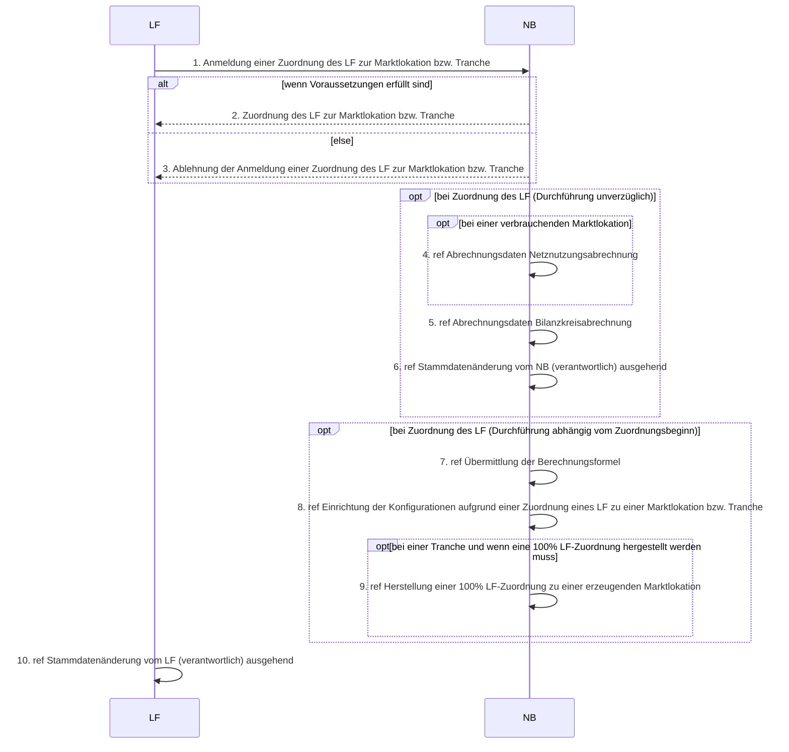
```mermaid
sequenceDiagram
    participant LF
    participant NB

    LF->>NB: 1. Anmeldung einer Zuordnung des LF zur Marktlokation bzw. Tranche
    alt wenn Voraussetzungen erfüllt sind
        NB-->>LF: 2. Zuordnung des LF zur Marktlokation bzw. Tranche
    else else
        NB-->>LF: 3. Ablehnung der Anmeldung einer Zuordnung des LF zur Marktlokation bzw. Tranche
    end

    opt bei Zuordnung des LF (Durchführung unverzüglich)
        opt bei einer verbrauchenden Marktlokation
            NB->>NB: 4. ref Abrechnungsdaten Netznutzungsabrechnung
        end
        NB->>NB: 5. ref Abrechnungsdaten Bilanzkreisabrechnung
        NB->>NB: 6. ref Stammdatenänderung vom NB (verantwortlich) ausgehend
    end

    opt bei Zuordnung des LF (Durchführung abhängig vom Zuordnungsbeginn)
        NB->>NB: 7. ref Übermittlung der Berechnungsformel
        NB->>NB: 8. ref Einrichtung der Konfigurationen aufgrund einer Zuordnung eines LF zu einer Marktlokation bzw. Tranche
        opt bei einer Tranche und wenn eine 100% LF-Zuordnung hergestellt werden muss
            NB->>NB: 9. ref Herstellung einer 100% LF-Zuordnung zu einer erzeugenden Marktlokation
        end
    end

    LF->>LF: 10. ref Stammdatenänderung vom LF (verantwortlich) ausgehend
```

|Nr.|Aktion|Frist|Hinweis/Bemerkung|
|-|-|-|-|
|1|Anmeldung einer Zuordnung des LF zur Marktlokation bzw. Tranche|Bei DV ab Inbetriebnahmedatum gilt: Unverzüglich nach Vorliegen des Anmeldegrundes, jedoch spätester ÜT liegt 1 Monat vor dem voraussichtlichen Zuordnungsbeginn.|Der LF gibt entsprechend dem Kapitel 6 der GPKE Teil 1 (s. insbesondere b) und c)) Informationen an, die zur Identifikation der Marktlokation dienen. Der LF gibt in der Anmeldung zudem insbesondere an: • den voraussichtlichen Zuordnungsbeginn und, sofern vertraglich mit dem Letztverbraucher bzw. EZ vereinbart und vom LF gewünscht, das Zuordnungsende|

Seite 28 von 115

|Nr.|Aktion|Frist|Hinweis/Bemerkung|
|-|-|-|-|
|||(Hinweis: Der voraussichtliche Zuordnungsbeginn darf ein Monatserster oder untermonatlich sein.)  Bei allen anderen Marktlokationen und Tranchen gilt: Unverzüglich nach Vorliegen des Anmeldegrundes, jedoch spätester ÜT ist der Tag vor dem letzten WT vor dem voraussichtlichen Zuordnungsbeginn.|• den BK • bei einer verbrauchenden Marktlokation: o ob der Letztverbraucher ein „Haushaltskunde“ ist o welche Anforderungen im Rahmen der Netznutzung und Bilanzierung zwingend notwendig und welche wünschenswert sind (z.B. Zahler der Netznutzung, Netznutzungsabrechnungsmodell (Arbeitspreis/Grundpreis, Arbeitspreis/Leistungspreis)), mit der Konsequenz, dass die Anmeldung abgelehnt wird, sofern zwingend notwendige Anforderungen vom NB nicht erfüllt werden können • welche Konfigurationen (z.B. Messprodukte) im Rahmen der Netznutzung und Bilanzierung (z.B. für die Abbildung des Bilanzierungsverfahrens) gewünscht sind • bei Geschäftsvorfall A: die Tranchengröße mit 100 % • bei Geschäftsvorfall B: die Tranchengröße mit kleiner 100% und größer 0%, sofern die Basis zur Bildung der Tranchengröße prozentual ist  Der NB prüft die Anmeldung wie folgt: 1. Wurde die Vorlauffrist zum voraussichtlichen Zuordnungsbeginn nicht eingehalten, fährt der NB mit Prozessschritt 3, ansonsten mit Prüfschritt 2 fort. 2. Der NB prüft unter Anwendung mindestens der normierten Identifikationsvorgaben (unter Berücksichtigung des Kapitels 6. der GPKE Teil 1 (s. insbesondere b) und c))), ob die Marktlokation eindeutig identifiziert werden kann. Ist eine erstmalige Identifikation der Marktlokation unverzüglich nach Eingang der Anmeldung • möglich, fährt der NB mit Prüfschritt 3 fort.|

Seite 29 von 115

|Nr.|Aktion|Frist|Hinweis/Bemerkung|
|-|-|-|-|
||||• nicht möglich, darf keine Ablehnung wegen Nichtidentifikation in Prozessschritt 3 versendet werden. Der NB muss innerhalb der nächsten 60 WT nach dem ÜT der Anmeldung täglich prüfen (im nachfolgenden „täglicher Prüflauf“ genannt), ob die Marktlokation identifiziert werden kann. Ist dies innerhalb der Frist nicht gelungen, fährt der NB mit Prozessschritt 3, ansonsten mit Prüfschritt 3 fort.|
|3.|||Im Fall einer verbrauchenden Marktlokation bzw. im Fall von Geschäftsvorfall A: Ist ein LF der Marktlokation bereits zugeordnet, fährt der NB mit Prozessschritt 3, ansonsten mit Prüfschritt 4 fort. Im Fall von Geschäftsvorfall B: Ist eine 100% LF-Zuordnung zur Marktlokation bereits hergestellt, fährt der NB mit Prozessschritt 3, ansonsten mit Prüfschritt 4 fort.|
|4.|||Sind nicht alle sonstigen Voraussetzungen, die der NB zu verantworten hat, erfüllt, fährt der NB mit Prozessschritt 3, ansonsten mit Prüfschritt 5 fort. Hinweis: Der NB verantwortet die Richtigkeit der Angabe des LF zur angemeldeten Veräußerungsform bei einer erzeugenden Marktlokation bzw. einer Tranche nicht. Diese Angabe darf daher nicht zu einer Ablehnung der Anmeldung führen.|
|5.|||Im Fall einer verbrauchenden Marktlokation bzw. im Fall von Geschäftsvorfall A: Liegt (ggf. nach dem täglichen Prüflauf) nur eine Anmeldung für die identifizierte Marktlokation vor, die aufgrund der vorherigen Prüfschritte nicht bereits abgelehnt wurde, fährt der NB mit Prozessschritt 2 fort. Liegt (ggf. nach dem täglichen Prüflauf) mehr als eine Anmeldung|

Seite **30** von **115**

|Nr.|Aktion|Frist|Hinweis/Bemerkung|
|-|-|-|-|
||||vor, die aufgrund der vorherigen Prüfschritte nicht bereits abgelehnt wurden, fährt der NB - für die Anmeldung mit dem frühesten ÜZ mit Prozessschritt 2 und
- für die anderen Anmeldungen mit Prozessschritt 3 fort. Im Fall von Geschäftsvorfall B: Liegt (ggf. nach dem täglichen Prüflauf) nur eine Anmeldung für die identifizierte Marktlokation vor, die aufgrund der vorherigen Prüfschritte nicht bereits abgelehnt wurde und deren Tranchengröße nicht zu einer Summe aller Tranchen > 100 % führt, fährt der NB mit Prozessschritt 2, ansonsten mit Prozessschritt 3 fort.  Liegt (ggf. nach dem täglichen Prüflauf) mehr als eine Anmeldung vor, die aufgrund der vorherigen Prüfschritte nicht bereits abgelehnt wurden, fährt der NB abhängig vom ÜZ der Anmeldung (beginnend mit dem frühestens ÜZ), für die jeweilige Anmeldung mit Prozessschritt 2 fort, sofern die in der jeweiligen Anmeldung genannte Tranchengröße in Summe mit den Tranchengrößen der bereits angelegten Tranchen nicht > 100 % ergibt. Ansonsten fährt der NB für die jeweilige Anmeldung mit Prozessschritt 3 fort.|
|2|Zuordnung des LF zur Marktlokation bzw. Tranche|Unverzüglich, jedoch spätester ÜZ ist 00:00 Uhr des 61. WT nach dem ÜT von Nr. 1.|Der NB ersetzt den vom LF genannten voraussichtlichen Zuordnungsbeginn durch das Inbetriebnahmedatum der Marktlokation zu 00:00 Uhr (im nachfolgenden „Zuordnungsbeginn“ genannt).  Der NB stimmt der Anmeldung zu und ordnet den LF der Marktlokation bzw. Tranche unverzüglich zum Zuordnungsbeginn zu.  In der Nachricht teilt der NB dem LF insbesondere folgende Daten mit: - den Zuordnungsbeginn
- die Adresse der Marktlokation|

Seite **31** von **115**

|Nr.|Aktion|Frist|Hinweis/Bemerkung|
|-|-|-|-|
||||* die MaLo-ID der betroffenen Marktlokation
* alle ID der Messlokationen, die für die Ermittlung der Energiemengen der Marktlokation erforderlich sind
* bei Geschäftsvorfall B zudem: die MaLo-ID der Tranche
* zugeordnete Marktpartner wie MSB und ÜNB Hinweis: Der vom LF in der Anmeldung angegebene BK ist in Prozessschritt 5 „ref Abrechnungsdaten Bilanzkreisabrechnung“ dem LF vom NB mitzuteilen.|
|3|Ablehnung der Anmeldung einer Zuordnung des LF zur Marktlokation bzw. Tranche|Unverzüglich, jedoch spätester ÜZ ist 00:00 Uhr des 61. WT nach dem ÜT von Nr. 1.|Der NB lehnt die Anmeldung ab.  Der Grund der Ablehnung ist anzugeben.|
|4|ref Abrechnungsdaten Netznutzungsabrechnung|--|Der NB übermittelt dem LF die Abrechnungsdaten zur Netznutzungsabrechnung für die verbrauchende Marktlokation mit Gültigkeit zum Zuordnungsbeginn oder teilt dem LF mit, dass die Netznutzung für die verbrauchende Marktlokation zum Zuordnungsbeginn nicht über den LF abgerechnet wird (dies ist der Fall, wenn der Letztverbraucher Zahler der Netznutzung ist).|
|5|ref Abrechnungsdaten Bilanzkreisabrechnung|--|Der NB übermittelt dem LF und ggf. dem ÜNB die Abrechnungsdaten zur Bilanzkreisabrechnung für die Marktlokation bzw. Tranche mit Gültigkeit zum Zuordnungsbeginn.|
|6|ref Stammdatenänderung vom NB (verantwortlich) ausgehend|--|Der NB übermittelt dem LF die relevanten Stammdaten mit Gültigkeit zum Zuordnungsbeginn.|
|7|ref Übermittlung der Berechnungsformel|--|Der NB übermittelt dem LF die Berechnungsformel der Marktlokation.|
|8|ref Einrichtung der Konfigurationen aufgrund einer Zuordnung eines LF zu einer Marktlokation bzw. Tranche|--|--|
|9|ref Herstellung einer 100% LF-Zuordnung zu einer erzeugenden Marktlokation|--|--|

Seite **32** von **115**

|Nr.|Aktion|Frist|Hinweis/Bemerkung|
|-|-|-|-|
|10|ref Stammdaten-änderung vom LF (verantwortlich) ausgehend|--|Hinweis: Sofern der Zuordnungsbeginn des LF in der Zukunft liegt gilt: Unverzügliche Übermittlung, jedoch frühester ÜZ ist 19:00 Uhr am WT vor dem Zuordnungsbeginn.|

## 2.3 **Ersatz-/Grundversorgung**

### 2.3.1 **Allgemeines**
Jede verbrauchende Marktlokation muss zu jedem Zeitpunkt genau einem BK zugeordnet sein. Ist dies nicht der Fall, stellt der NB dies im Rahmen des Use-Cases „Beginn der Ersatz-/Grundversorgung“ sicher, indem er den E/G der Marktlokation zuordnet. Die Zuordnung des E/G zu einer verbrauchenden Marktlokation kann dabei untermonatlich und sowohl in die Zukunft als auch in die Vergangenheit (einschließlich Netznutzung und Bilanzierung synchron) stattfinden.

Die Voraussetzungen und Rechtsfolgen der Ersatz- und Grundversorgungspflicht ergeben sich aus den einschlägigen Gesetzen und Verordnungen.

## 2.3.2 **Use-Case: Beginn der Ersatz-/Grundversorgung**

### <u>2.3.2.1 **UC: Beginn der**</u> Ersatz-/Grundversorgung

|Use-Case-Name|Beginn der Ersatz-/Grundversorgung|
|-|-|
|Prozessziel|Der LF (im Nachfolgenden E/G genannt) ist der Marktlokation zugeordnet.|
|Use-Case Beschreibung|Der NB kündigt dem E/G die Zuordnung des E/G zur Marktlokation an.|
|Rollen|• LF • NB|
|Vorbedingung|• Es handelt sich um eine verbrauchende Marktlokation. • Für die Marktlokation besteht eine **gesetzliche **Ersatzversorgungspflicht**** oder • für die Marktlokation besteht eine **gesetzliche **Grundversorgungspflicht.****  • Eine Zuordnungsermächtigung nach den Prozessen der MaBiS für die vom E/G genutzten BK liegt beim NB vor.  Auslöser: • Der Marktlokation ist kein LF zugeordnet.  Gründe können insbesondere sein: • Beendigung der Zuordnung des LF zur Marktlokation aufgrund ○ Abmeldung der Zuordnung des LF zur Marklokation wegen Kündigung des Energieliefervertrages; ohne Folgebelieferung ○ Kündigung des Lieferantenrahmenvertrags|

Seite 33 von 115

|Use-Case-Name|Beginn der Ersatz-/Grundversorgung|
|-|-|
||* Information über die erfolgte Kündigung des Bilanzkreisvertrags durch den ÜNB
* Erlöschen der durch den BKV gegenüber dem LF erteilten Zuordnungsermächtigung
* geändertem Zeitreihentyp und keiner gültigen Zuordnungsermächtigung für den neuen Zeitreihentyp
* erstmalige Inbetriebnahme einer Marktlokation (Neuanlage)|
|Nachbedingung im Erfolgsfall|- Der NB versendet die Berechnungsformel an den E/G.
- Der NB führt die Use-Cases „Abrechnungsdaten Netznutzungsabrechnung“ und „Abrechnungsdaten Bilanzkreisabrechnung“ aus.
- Der NB führt den Use-Case „Stammdatenänderung“ (hier: SD „Stammdatenänderung vom NB (verantwortlich) ausgehend“) (GPKE Teil 4) durch.
- Der NB führt den Use-Case „Einrichtung der Konfigurationen aufgrund einer Zuordnung eines LF zu einer Marktlokation bzw. Tranche“ (GPKE Teil 3) aus.
- Der LF führt den Use-Case „Stammdatenänderung“ (hier: SD „Stammdatenänderung vom LF (verantwortlich) ausgehend“) (GPKE Teil 4) durch.|
|Nachbedingung im Fehlerfall|Der E/G wurde der Marktlokation nicht zugeordnet:- Der NB muss sicherstellen, dass die von der Marktlokation entnommene Energie einem BK zugeordnet ist oder
- der NB muss die Unterbrechung der Anschlussnutzung an der Marktlokation durchführen.
-|
|Fehlerfälle|* Es handelt sich um eine erzeugende Marktlokation bzw. eine Tranche.|
|Weitere Anforderungen|- Hat der NB ein Zuordnungsende eines LF erfasst, dem ein Zuordnungsbeginn eines LF folgt, wobei Zuordnungsende und Zuordnungsbeginn nicht kongruent sind, ist die Lücke zwischen dem Zuordnungsende und dem Zuordnungsbeginn durch eine befristete Zuordnung des E/G zur Marktlokation zu schließen. Dies kann z.B. aus der Versendung einer „Anfrage zur Beendigung der Zuordnung des LFA zur Marktlokation bzw. Tranche“ im Rahmen des Use-Cases „Lieferbeginn“ resultieren.
- Hinweis: Der Wechsel von der Ersatzversorgung in die Grundversorgung findet nach drei Monaten automatisch statt, sofern der E/G zu diesem Zeitpunkt der Marktlokation noch zugeordnet ist. Die Angabe, ob sich der Kunde in einer Ersatzversorgung oder Grundversorgung befindet, ist keine stammdatenänderungsrelevante Angabe, so dass durch den Wechsel von der Ersatzversorgung in die Grundversorgung keine Stammdatenänderung vom E/G an den NB erfolgt.
- Hinweis: Der E/G kann mit Hilfe des Use-Cases „Lieferende von LF an NB“ das Grundversorgungsverhältnis bzw. Ersatzversorgungsverhältnis beenden.
- Für Fälle der vertraglich vereinbarten Ersatzbelieferung oder der vertraglich vereinbarten Fortsetzung der Ersatzversorgung (Ersatzfolgeversorgung) ist dieser Prozess analog anwendbar.|

Seite **34** von **115**

## **2.3.2.2 SD: Beginn der Ersatz-/Grundversorgung**

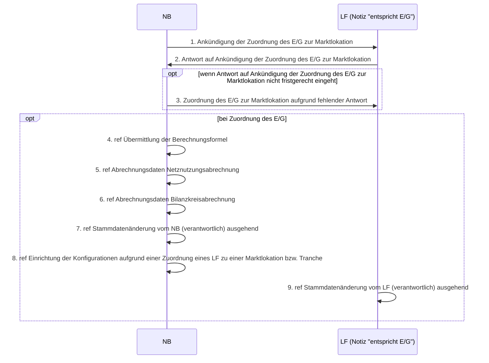
```mermaid
sequenceDiagram
    participant NB
    participant LF as LF (Notiz "entspricht E/G")

    NB->>LF: 1. Ankündigung der Zuordnung des E/G zur Marktlokation
    LF->>NB: 2. Antwort auf Ankündigung der Zuordnung des E/G zur Marktlokation
    
    opt wenn Antwort auf Ankündigung der Zuordnung des E/G zur Marktlokation nicht fristgerecht eingeht
        NB->>LF: 3. Zuordnung des E/G zur Marktlokation aufgrund fehlender Antwort
    end

    opt bei Zuordnung des E/G
        NB->>NB: 4. ref Übermittlung der Berechnungsformel
        NB->>NB: 5. ref Abrechnungsdaten Netznutzungsabrechnung
        NB->>NB: 6. ref Abrechnungsdaten Bilanzkreisabrechnung
        NB->>NB: 7. ref Stammdatenänderung vom NB (verantwortlich) ausgehend
        NB->>NB: 8. ref Einrichtung der Konfigurationen aufgrund einer Zuordnung eines LF zu einer Marktlokation bzw. Tranche
        LF->>LF: 9. ref Stammdatenänderung vom LF (verantwortlich) ausgehend
    end
```

|Nr.|Aktion|Frist|Hinweis/Bemerkung|
|-|-|-|-|
|1|Ankündigung der Zuordnung des E/G zur Marktlokation|Nach Vorliegen des Zuordnungsgrundes des E/G zur Marktlokation und I.) sofern der Zuordnungsbeginn des E/G in der Zukunft liegt, gilt: Frühester ÜZ ist 00:00 Uhr und spätester 13:00 Uhr des letzten WT vor dem Zuordnungsbeginn des E/G.|Der NB teilt dem E/G den Grund der Zuordnung mit. Folgende Gründe stehen insbesondere zur Auswahl: • Kündigung des Energieliefervertrages ohne Folgebelieferung (Frist I. und nur in Fehlersituationen Frist II. möglich) • Kündigung des Lieferantenrahmenvertrags (Frist I. und Frist II. möglich) • Kündigung des Bilanzkreisvertrags (Frist I. und Frist II. möglich) • erstmalige Inbetriebnahme der Marktlokation (Neuanlage) (Frist I. und Frist II. möglich)|

Seite **35** von **115**

|Nr.|Aktion|Frist|Hinweis/Bemerkung|
|-|-|-|-|
|||II.) sofern der Zuordnungsbeginn des E/G nicht in der Zukunft liegt, gilt: Unverzüglich.|Des Weiteren teilt der NB insbesondere mit: • den Zuordnungsbeginn und ggf. das Zuordnungsende • die Adresse der Marktlokation • die MaLo-ID der betroffenen Marktlokation • alle ID der Messlokationen, die für die Ermittlung der Energiemengen der Marktlokation erforderlich sind • die zugeordneten Marktpartner wie MSB und ÜNB • die Namen und Adressen des ANN und AN, sofern bekannt • ob der an der Marktlokation versorgte Letztverbraucher ein „Haushaltskunde“ ist. (Hinweis: Im Fall der erstmaligen Inbetriebnahme einer Marktlokation (Neuanlage) ist die Angabe nur möglich, sofern diese bekannt ist.)|
|2|Antwort auf Ankündigung der Zuordnung des E/G zur Marktlokation|I.) Sofern der Zuordnungsbeginn des E/G in der Zukunft liegt, gilt: Unverzüglich, jedoch spätester ÜZ ist 15:00 Uhr am ÜT von Nr. 1.  II.) Sofern der Zuordnungsbeginn des E/G nicht in der Zukunft liegt, gilt: Unverzüglich, jedoch spätester ÜZ ist 15:00 Uhr des 1. WT nach dem ÜT von Nr. 1.|Der E/G stimmt der Ankündigung zu oder lehnt diese ab. Der Grund der Ablehnung ist anzugeben.  Im Fall der Zustimmung teilt der E/G in der Antwort insbesondere • mit, ob sich der Kunde ab dem Zuordnungsbeginn in Ersatzversorgung oder Grundversorgung befindet. • den BK mit.  Im Fall der Zustimmung des E/G ordnet der NB den E/G der Marktlokation unverzüglich zum Zuordnungsbeginn zu.  Hinweis: Der vom E/G in diesem Prozessschritt angegebene BK ist in Prozessschritt 6 „ref Abrechnungsdaten Bilanzkreisabrechnung“ dem E/G vom NB mitzuteilen.|
|3|Zuordnung des E/G zur Marktlokation aufgrund fehlender Antwort|I.) Sofern der Zuordnungsbeginn des E/G in der Zukunft liegt, gilt: Unverzüglich, jedoch frühester ÜZ ist 15:00 Uhr und spätester 16:00 Uhr am ÜT von Nr. 1.|Antwortet der E/G in Prozessschritt 2 nicht fristgerecht, ordnet der NB den E/G der Marktlokation unverzüglich zum Zuordnungsbeginn zu.  In der Nachricht teilt der NB dem E/G insbesondere folgende Daten mit: s. unter Prozessschritt 1  Hinweis: Der NB verwendet im Fall der fehlenden Antwort, den vom E/G für|

Seite **36** von **115**

|Nr.|Aktion|Frist|Hinweis/Bemerkung|
|-|-|-|-|
|||II.) Sofern der Zuordnungsbeginn des E/G nicht in der Zukunft liegt, gilt: Unverzüglich, jedoch frühester ÜZ ist 15:00 Uhr und spätester 16:00 Uhr des 1. WT nach dem ÜT von Nr. 1.|konkret diesen Sachverhalt über das SD „Übermittlung von Informationen-“ (GPKE Teil 4) an den NB kommunizierten BK des E/G und teilt diesen in Prozessschritt 6 „ref Abrechnungsdaten Bilanzkreisabrechnung“ dem E/G mit.|
|4|ref Übermittlung der Berechnungsformel|--|Der NB übermittelt dem E/G die Berechnungsformel der Marktlokation.|
|5|ref Abrechnungsdaten Netznutzungs- abrechnung|--|Der NB übermittelt dem E/G die Abrechnungsdaten zur Netznutzungsabrechnung für die Marktlokation mit Gültigkeit zum Zuordnungsbeginn oder teilt dem E/G mit, dass die Netznutzung für die Marktlokation zum Zuordnungsbeginn nicht über den E/G abgerechnet wird (dies ist der Fall, wenn der Letztverbraucher Zahler der Netznutzung ist).  Hinweis: Der Zuordnungsbeginn liegt im Fall von Frist II. nicht in der Zukunft.|
|6|ref Abrechnungsdaten Bilanzkreis- abrechnung|--|Der NB übermittelt dem E/G und ggf. dem ÜNB die Abrechnungsdaten zur Bilanzkreisabrechnung für die Marktlokation mit Gültigkeit zum Zuordnungsbeginn.  Hinweis: Der Zuordnungsbeginn liegt im Fall von Frist II. nicht in der Zukunft.|
|7|ref Stammdaten- änderung vom NB (verantwortlich) ausgehend|--|Der NB übermittelt dem E/G die relevanten Stammdaten mit Gültigkeit zum Zuordnungsbeginn.|
|8|ref Einrichtung der Konfigurationen aufgrund einer Zuordnung eines LF zu einer Marktlokation bzw. Tranche|--|--|
|9|ref Stammdaten- änderung vom LF (verantwortlich) ausgehend|--|Hinweis: Sofern der Zuordnungsbeginn des EG in der Zukunft liegt gilt: Unverzügliche Übermittlung, jedoch frühester ÜZ ist 19:00 Uhr am WT vor dem Zuordnungsbeginn.|

Seite **37** von **115**

## **2.4   Herstellung einer 100% LF-Zuordnung zu einer erzeugenden**
## **      Marktlokation**

### **2.4.1 Allgemeines**

Jede erzeugende Marktlokation bzw. jede Tranche ist zu jedem Zeitpunkt genau einem BK
zugeordnet. Ist dies nicht der Fall, stellt der NB dies im Rahmen des Use-Cases „Herstellung
einer 100% LF-Zuordnung zu einer erzeugenden Marktlokation“ sicher, indem er einen LF
der erzeugenden Marktlokation bzw. Tranche zuordnet. Die Zuordnung des LF zu einer
erzeugenden Marktlokation bzw. Tranche kann dabei sowohl in die Zukunft als auch in die
Vergangenheit (einschließlich Bilanzierung) stattfinden.

## **2.4.2 Use-Case: Herstellung einer 100% LF-Zuordnung zu einer**
## **      erzeugenden Marktlokation**

## **2.4.2.1 UC: Herstellung einer 100% LF-Zuordnung zu einer erzeugenden**
## **        Marktlokation**

|**Use-Case-Name**|Herstellung einer 100% LF-Zuordnung zu einer erzeugenden Marktlokation|
|-|-|
|Prozessziel|Der LFN ist der Marktlokation bzw. Tranche zugeordnet. Im Fall einer tranchierten Marktlokation ist jede Tranche einem LF zugeordnet.|
|Use-Case Beschreibung|Der NB kündigt dem LFN bei • einer EEG-Marktlokation ohne DV-Pflicht bzw. KWKG-Marktlokation ohne DV-Pflicht die Zuordnung des LFN (hier: LF des Unternehmens Netzbetreiber) zur Marktlokation bzw. Tranche (Restmenge) an (s. Fall 1 der SD). • einer EEG-Marktlokation mit DV-Pflicht die Zuordnung des LFN (hier: LF des Unternehmens Netzbetreiber) zur Marktlokation an (s. Fall 2 der SD). Im Fall einer bisher tranchierten Marktlokation beendet der NB die Zuordnung der LFA zur jeweiligen Tranche aufgrund des Verbots der anteiligen Zuordnung zu § 38 EEG 2014 bzw. zu § 21 Abs. 1 Nr. 2 EEG 2017, 21b Abs. 2 Satz 2 EEG 2021 bzw. EEG 2023. • einer KWKG-Marktlokation mit DV-Pflicht bzw. Nicht-EEG-/Nicht-KWKG-Marktlokation nach der bilateralen Klärung o die Zuordnung des LFN zur Marktlokation an (s. Fall 3 der SD) oder o die Zuordnung des LFN zur Tranche an (s. Fall 4 der SD). Hierbei muss Fall 4 der SD je LFN zu einer Tranche der Marktlokation separat durchgeführt werden. Im Zuge des Prozesses beendet der NB ggf. die Zuordnung eines LFA zu einer Tranche. Hinweis: Der LFN kann nach der bilateralen Klärung der LF des Unternehmens Netzbetreiber sein.|
|Rollen|• LF • NB|
|Vorbedingung|• Es handelt sich um eine erzeugende Marktlokation bzw. eine Tranche.|

Seite **38** von **115**

|Use-Case-Name|Herstellung einer 100% LF-Zuordnung zu einer erzeugenden Marktlokation|
|-|-|
||* Die Energie einer Marktlokation, die vollständig oder anteilig zur Veräußerungsform einer DV zugeordnet werden soll, ist mit einer viertelstündlichen Auflösung zu messen.
* Eine Zuordnungsermächtigung nach den Prozessen der MaBiS für den vom LFN genutzten BK liegt beim NB vor.Auslöser:* Bei einer EEG-Marktlokation ohne DV-Pflicht bzw. KWKG-Marktlokation ohne DV-Pflicht bzw. EEG-Marktlokation mit DV-Pflicht ergibt sich:

  * Der nicht-tranchierten Marktlokation ist kein LF zugeordnet oder
  * die Tranchen einer Marktlokation sind in Summe nicht genau 100% LF zugeordnet.

* Bei einer KWKG-Marktlokation mit DV-Pflicht bzw. einer Nicht-EEG-/Nicht-KWKG-Marktlokation ergibt sich:

  * Der nicht-tranchierten Marktlokation ist kein LF zugeordnet oder
  * die Tranchen einer Marktlokation sind in Summe nicht genau 100% LF zugeordnet

  und die bilaterale Klärung des NB mit dem EZ ergibt, dass der NB

  * die (tranchierte oder nicht-tranchierte) Marktlokation nicht-tranchiert abbildet oder
  * die (tranchierte oder nicht-tranchierte) Marktlokation tranchiert abbildet.Gründe können insbesondere sein:* Beendigung der Zuordnung des LF zur Marktlokation bzw. Tranche aufgrund

  * Abmeldung der Zuordnung des LF zur Marklokation bzw. Tranche wegen Kündigung des Stromabnahmevertrags; ohne Folgebelieferung
  * Information über die erfolgte Kündigung des Bilanzkreisvertrags durch den ÜNB
  * Erlöschen der durch den BKV gegenüber dem LF erteilten Zuordnungsermächtigung
  * geändertem Zeitreihentyp und keiner gültigen Zuordnungsermächtigung für den neuen Zeitreihentyp

* erstmalige Inbetriebnahme einer Marktlokation (Neuanlage)|
|Nachbedingung im Erfolgsfall|- Der NB versendet die Berechnungsformel an den LFN.
- Der NB führt den Use-Case „Abrechnungsdaten Bilanzkreisabrechnung“ aus.
- Der NB führt den Use-Case „Stammdatenänderung“ (hier: SD „Stammdatenänderung vom NB (verantwortlich) ausgehend“) (GPKE Teil 4) durch.
- Der NB führt den Use-Case „Einrichtung der Konfigurationen aufgrund einer Zuordnung eines LF zu einer Marktlokation bzw. Tranche“ (GPKE Teil 3) aus.
- Der LF führt den Use-Case „Stammdatenänderung“ (hier: SD „Stammdatenänderung vom LF (verantwortlich) ausgehend“) (GPKE Teil 4) durch.|

Seite **39** von **115**

|Use-Case-Name|Herstellung einer 100% LF-Zuordnung zu einer erzeugenden Marktlokation|
|-|-|
|Nachbedingung im Fehlerfall|• Der NB muss sicherstellen, dass die von der Marktlokation erzeugte Energie einem BK zugeordnet ist oder • der NB muss die Unterbrechung der Anschlussnutzung an der Marktlokation durchführen. • Der LFN wurde der Marktlokation bzw. Tranche nicht zugeordnet. Im Fall einer tranchierten Marktlokation ist nicht jede Tranche einem LF zugeordnet.|
|Fehlerfälle|• Es handelt sich um eine verbrauchende Marktlokation. • Die Energie einer Marktlokation, die vollständig oder anteilig zur Veräußerungsform einer DV zugeordnet werden soll, ist nicht mit einer viertelstündlichen Auflösung messbar. • Eine Zuordnungsermächtigung nach den Prozessen der MaBiS für den vom LFN genutzten BK liegt beim NB nicht vor.|
|Weitere Anforderungen|• Bei einer KWKG-Marktlokation mit DV-Pflicht bzw. Nicht-EEG-/Nicht-KWKG-Marktlokation kann im Rahmen der bilateralen Klärung auch die Unterbrechung der Anschlussnutzung an der Marktlokation durch den NB in Betracht gezogen werden. Eine Pflicht des NB zur kaufmännischen Abnahme der elektrischen Energie besteht nicht. • Im Fall das LFZ der Marktlokation bzw. Tranche zugeordnet sind, gilt: Das Zuordnungsende des LFN wird von dem Zuordnungsbeginn des LFZ bestimmt, dessen Zuordnungsbeginn dem Zuordnungsbeginn des LFN zeitlich am nächsten liegt und dessen Anteil (hier: 1 bis 100 %) der Energiemenge der erzeugenden Marktlokation von dem Anteil des LFN betroffen ist. Das Zuordnungsende des LFN entspricht in diesem Fall dem Zuordnungsbeginn dieses LFZ.|

Seite **40** von **115**

# **2.4.2.2  SD: Fall 1: LF-Zuordnung bei EEG-Marktlokation ohne DV-Pflicht**
# **bzw. KWKG-Marktlokation ohne DV-Pflicht**

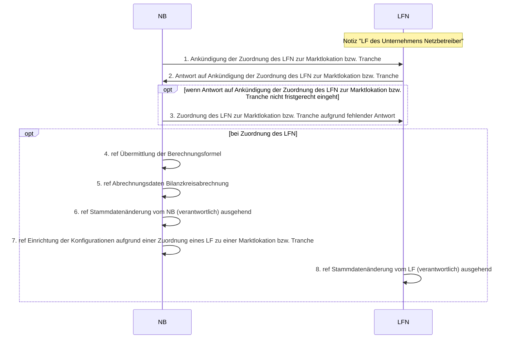
```mermaid
sequenceDiagram
    participant NB
    participant LFN

    Note over LFN: Notiz "LF des Unternehmens Netzbetreiber"

    NB->>LFN: 1. Ankündigung der Zuordnung des LFN zur Marktlokation bzw. Tranche
    LFN->>NB: 2. Antwort auf Ankündigung der Zuordnung des LFN zur Marktlokation bzw. Tranche

    opt wenn Antwort auf Ankündigung der Zuordnung des LFN zur Marktlokation bzw. Tranche nicht fristgerecht eingeht
        NB->>LFN: 3. Zuordnung des LFN zur Marktlokation bzw. Tranche aufgrund fehlender Antwort
    end

    opt bei Zuordnung des LFN
        NB->>NB: 4. ref Übermittlung der Berechnungsformel
        NB->>NB: 5. ref Abrechnungsdaten Bilanzkreisabrechnung
        NB->>NB: 6. ref Stammdatenänderung vom NB (verantwortlich) ausgehend
        NB->>NB: 7. ref Einrichtung der Konfigurationen aufgrund einer Zuordnung eines LF zu einer Marktlokation bzw. Tranche
        LFN->>LFN: 8. ref Stammdatenänderung vom LF (verantwortlich) ausgehend
    end
```

|Nr.|Aktion|Frist|Hinweis/Bemerkung|
|-|-|-|-|
|1|Ankündigung der Zuordnung des LFN zur Marktlokation bzw. Tranche|Nach Vorliegen des Zuordnungsgrundes des LFN zur Marktlokation bzw. Tranche und  I.) sofern der Zuordnungsbeginn des LFN in der Zukunft liegt, gilt: Frühester ÜZ ist 00:00 Uhr und spätester 13:00 Uhr des letzten WT vor|Der NB teilt dem LFN (hier: LF des Unternehmens Netzbetreiber) den Grund der Zuordnung mit. Folgende Gründe stehen insbesondere zur Auswahl: • Kündigung des Stromabnahmevertrags ohne Folgebelieferung (Frist I. und nur in Fehlersituationen Frist II. möglich) • Kündigung des Bilanzkreisvertrags (Frist I. und Frist II. möglich) • erstmalige Inbetriebnahme der Marktlokation (Neuanlage) (Frist I. und Frist II. möglich)|

Seite **41** von **115**

|Nr.|Aktion|Frist|Hinweis/Bemerkung|
|-|-|-|-|
|||dem Zuordnungsbeginn des LFN.  II.) sofern der Zuordnungsbeginn des LFN nicht in der Zukunft liegt, gilt: Unverzüglich.|Des Weiteren teilt der NB insbesondere mit: • den Zuordnungsbeginn und ggf. das Zuordnungsende • die Adresse der Marktlokation • die MaLo-ID der betroffenen Marktlokation bzw. MaLo-ID der betroffenen Tranche und MaLo-ID der Marktlokation der die Tranche zugeordnet ist • alle ID der Messlokationen, die für die Ermittlung der Energiemengen der Marktlokation erforderlich sind • die zugeordneten Marktpartner wie MSB und ÜNB|
|2|Antwort auf Ankündigung der Zuordnung des LFN zur Marktlokation bzw. Tranche|I.) Sofern der Zuordnungsbeginn des LFN in der Zukunft liegt, gilt: Unverzüglich, jedoch spätester ÜZ ist 15:00 Uhr am ÜT von Nr. 1.  II.) Sofern der Zuordnungsbeginn des LFN nicht in der Zukunft liegt, gilt: Unverzüglich, jedoch spätester ÜZ ist 15:00 Uhr des 1. WT nach dem ÜT von Nr. 1.|Der LFN stimmt der Ankündigung zu oder lehnt diese ab. Der Grund der Ablehnung ist anzugeben.  Im Fall der Zustimmung teilt der LFN in der Antwort insbesondere den BK mit: • Bei einer EEG-Marktlokation ohne DV-Pflicht ist dies der EEG-BK. • Bei einer KWKG-Marktlokation ohne DV-Pflicht ist dies der KWKG-BK.  Im Fall der Zustimmung des LFN ordnet der NB den LFN der Marktlokation bzw. Tranche unverzüglich zum Zuordnungsbeginn zu.  Hinweis: Der vom LFN in diesem Schritt angegebene BK ist in Prozessschritt 5 „ref Abrechnungsdaten Bilanzkreisabrechnung“ dem LFN vom NB mitzuteilen.|
|3|Zuordnung des LFN zur Marktlokation bzw. Tranche aufgrund fehlender Antwort|I.) Sofern der Zuordnungsbeginn des LFN in der Zukunft liegt, gilt: Unverzüglich, jedoch frühester ÜZ ist 15:00 Uhr und spätester 16:00 Uhr am ÜT von Nr. 1.  II.) Sofern der Zuordnungsbeginn des LFN nicht in der Zukunft liegt, gilt: Unverzüglich, jedoch frühester ÜZ ist 15:00 Uhr und spätester 16:00 Uhr am ÜT von Nr. 1.|Antwortet der LFN in Prozessschritt 2 nicht fristgerecht, ordnet der NB den LFN der Marktlokation bzw. Tranche unverzüglich zum Zuordnungsbeginn zu.  In der Nachricht teilt der NB dem LFN insbesondere folgende Daten mit: s. unter Prozessschritt 1  Hinweis: Der NB verwendet im Fall der fehlenden Antwort, den vom LFN für konkret diesen Sachverhalt über das SD „Übermittlung von Informationen“ (GPKE Teil 4) an den NB kommunizierten BK des LFN und teilt diesen in Prozessschritt 5 „ref Abrechnungsdaten Bilanzkreisabrechnung“ dem LFN mit.|

Seite 42 von 115

|Nr.|Aktion|Frist|Hinweis/Bemerkung|
|-|-|-|-|
|||spätester 16:00 Uhr des 1. WT nach dem ÜT von Nr. 1.|• Bei einer EEG-Marktlokation ohne DV-Pflicht ist dies der EEG-BK. • Bei einer KWKG-Marktlokation ohne DV-Pflicht ist dies der KWKG-BK.|
|4|ref Übermittlung der Berechnungsformel|--|Der NB übermittelt dem LFN die Berechnungsformel der Marktlokation.|
|5|ref Abrechnungsdaten Bilanzkreisabrechnung|--|Der NB übermittelt dem LFN und ggf. dem ÜNB die Abrechnungsdaten zur Bilanzkreisabrechnung für die Marktlokation bzw. Tranche mit Gültigkeit zum Zuordnungsbeginn.  Hinweis: Der Zuordnungsbeginn liegt im Fall von Frist II. nicht in der Zukunft.|
|6|ref Stammdatenänderung vom NB (verantwortlich) ausgehend|--|Der NB übermittelt dem LFN die relevanten Stammdaten mit Gültigkeit zum Zuordnungsbeginn.|
|7|ref Einrichtung der Konfigurationen aufgrund einer Zuordnung eines LF zu einer Marktlokation bzw. Tranche|--|--|
|8|ref Stammdatenänderung vom LF (verantwortlich) ausgehend|--|Hinweis: Sofern der Zuordnungsbeginn des LFN in der Zukunft liegt gilt: Unverzügliche Übermittlung, jedoch frühester ÜZ ist 19:00 Uhr am WT vor dem Zuordnungsbeginn.|

Seite **43** von **115**

## 2.4.2.3 **SD: Fall 2: LF-Zuordnung bei EEG-Marktlokation mit DV-Pflicht**

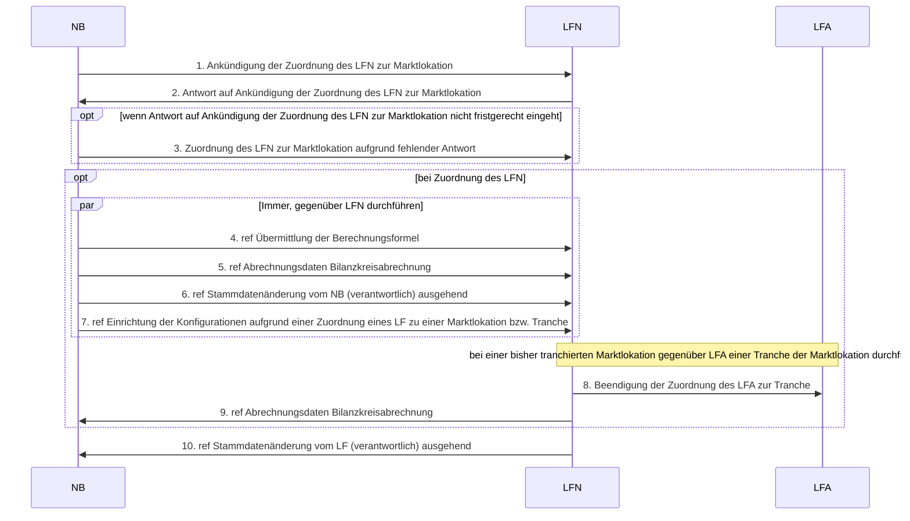
```mermaid
sequenceDiagram
    participant NB
    participant LFN
    participant LFA

    NB->>LFN: 1. Ankündigung der Zuordnung des LFN zur Marktlokation
    LFN->>NB: 2. Antwort auf Ankündigung der Zuordnung des LFN zur Marktlokation
    
    opt wenn Antwort auf Ankündigung der Zuordnung des LFN zur Marktlokation nicht fristgerecht eingeht
        NB->>LFN: 3. Zuordnung des LFN zur Marktlokation aufgrund fehlender Antwort
    end

    opt bei Zuordnung des LFN
        par Immer, gegenüber LFN durchführen
            NB->>LFN: 4. ref Übermittlung der Berechnungsformel
            NB->>LFN: 5. ref Abrechnungsdaten Bilanzkreisabrechnung
            NB->>LFN: 6. ref Stammdatenänderung vom NB (verantwortlich) ausgehend
            NB->>LFN: 7. ref Einrichtung der Konfigurationen aufgrund einer Zuordnung eines LF zu einer Marktlokation bzw. Tranche
        end
        
        Note over LFN, LFA: bei einer bisher tranchierten Marktlokation gegenüber LFA einer Tranche der Marktlokation durchführen
        LFN->>LFA: 8. Beendigung der Zuordnung des LFA zur Tranche
        LFN->>NB: 9. ref Abrechnungsdaten Bilanzkreisabrechnung
    end

    LFN->>NB: 10. ref Stammdatenänderung vom LF (verantwortlich) ausgehend
```

|Nr.|Aktion|Frist|Hinweis/Bemerkung|
|-|-|-|-|
|1|Ankündigung der Zuordnung des LFN zur Marktlokation|Nach Vorliegen des Zuordnungsgrundes des LFN zur Marktlokation und  I.) sofern der Zuordnungsbeginn des LFN in der Zukunft liegt, gilt: Frühester ÜZ ist 00:00 Uhr und spätester 13:00 Uhr des letzten WT vor dem|Der NB teilt dem LFN (hier: LF des Unternehmens Netzbetreiber) den Grund der Zuordnung mit. Folgende Gründe stehen insbesondere zur Auswahl: • Kündigung des Stromabnahmevertrags ohne Folgebelieferung (Frist I. und nur in Fehlersituationen Frist II. möglich) • Kündigung des Bilanzkreisvertrags (Frist I. und Frist II. möglich) • erstmalige Inbetriebnahme der Marktlokation (Neuanlage) (Frist I. und Frist II. möglich)|

Seite **44** von **115**

|Nr.|Aktion|Frist|Hinweis/Bemerkung|
|-|-|-|-|
|||Zuordnungsbeginn des LFN. II.) sofern der Zuordnungsbeginn des LFN nicht in der Zukunft liegt, gilt: Unverzüglich.|Des Weiteren teilt der NB insbesondere mit: • den Zuordnungsbeginn und, ggf. das Zuordnungsende • die Adresse der Marktlokation • die MaLo-ID der betroffenen Marktlokation • alle ID der Messlokationen, die für die Ermittlung der Energiemengen der Marktlokation erforderlich sind • die zugeordneten Marktpartner wie MSB und ÜNB|
|2|Antwort auf Ankündigung der Zuordnung des LFN zur Marktlokation|I.) Sofern der Zuordnungsbeginn des LFN in der Zukunft liegt, gilt: Unverzüglich, jedoch spätester ÜZ ist 15:00 Uhr am ÜT von Nr. 1. II.) Sofern der Zuordnungsbeginn des LFN nicht in der Zukunft liegt, gilt: Unverzüglich, jedoch spätester ÜZ ist 15:00 Uhr des 1. WT nach dem ÜT von Nr. 1.|Der LFN stimmt der Ankündigung zu oder lehnt diese ab. Der Grund der Ablehnung ist anzugeben.  Im Fall der Zustimmung teilt der LFN in der Antwort insbesondere den EEG-BK mit.  Im Fall der Zustimmung des LFN ordnet der NB den LFN der Marktlokation unverzüglich zum Zuordnungsbeginn zu.  Hinweis: Der vom LFN in diesem Schritt angegebene BK ist in Prozessschritt 5 „ref Abrechnungsdaten Bilanzkreisabrechnung“ dem LFN vom NB mitzuteilen.|
|3|Zuordnung des LFN zur Marktlokation aufgrund fehlender Antwort|I.) Sofern der Zuordnungsbeginn des LFN in der Zukunft liegt, gilt: Unverzüglich, jedoch frühester ÜZ ist 15:00 Uhr und spätester 16:00 Uhr am ÜT von Nr. 1. II.) Sofern der Zuordnungsbeginn des LFN nicht in der Zukunft liegt, gilt: Unverzüglich, jedoch frühester ÜZ ist 15:00 Uhr und spätester 16:00 Uhr des 1. WT nach dem ÜT von Nr. 1.|Antwortet der LFN in Prozessschritt 2 nicht fristgerecht, ordnet der NB den LFN der Marktlokation unverzüglich zum Zuordnungsbeginn zu.  In der Nachricht teilt der NB dem LFN insbesondere folgende Daten mit: s. unter Prozessschritt 1  Hinweis: Der NB verwendet im Fall der fehlenden Antwort, den vom LFN für konkret diesen Sachverhalt über das SD „Übermittlung von Informationen“ (GPKE Teil 4) an den NB kommunizierten EEG-BK des LFN und teilt diesen in Prozessschritt 5 „ref Abrechnungsdaten Bilanzkreisabrechnung“ dem LFN mit.|
|4|ref Übermittlung der Berechnungsformel|--|Der NB übermittelt dem LFN die Berechnungsformel der Marktlokation.|
|5|ref Abrechnungsdaten|--|Der NB übermittelt dem LFN und ggf. dem ÜNB die Abrechnungsdaten zur|

Seite **45** von **115**

|Nr.|Aktion|Frist|Hinweis/Bemerkung|
|-|-|-|-|
||Bilanzkreis-abrechnung||Bilanzkreisabrechnung für die Marktlokation mit Gültigkeit zum Zuordnungsbeginn.  Hinweis: Der Zuordnungsbeginn liegt im Fall von Frist II. nicht in der Zukunft.|
|6|ref Stammdaten-änderung vom NB (verantwortlich) ausgehend|--|Der NB übermittelt dem LFN die relevanten Stammdaten mit Gültigkeit zum Zuordnungsbeginn.|
|7|ref Einrichtung der Konfigurationen aufgrund einer Zuordnung eines LF zu einer Marktlokation bzw. Tranche|--|--|
|8|Beendigung der Zuordnung des LFA zur Tranche|I.) Sofern der Zuordnungsbeginn des LFN in der Zukunft liegt, gilt: Unverzüglich nach dem ÜZ von Nr. 2, sofern es sich um eine Zustimmung handelt, bzw. nach dem ÜZ von Nr. 3, jedoch spätester ÜZ ist 17:00 Uhr am ÜT von Nr. 1.  II.) Sofern der Zuordnungsbeginn des LFN nicht in der Zukunft liegt, gilt: Unverzüglich nach dem ÜZ von Nr. 2, sofern es sich um eine Zustimmung handelt, bzw. nach dem ÜZ von Nr. 3, jedoch spätester ÜZ ist 17:00 Uhr des 1. WT nach dem ÜT von Nr. 1.|Der NB beendet die Zuordnung des LFA zu der Tranche unverzüglich zum Zuordnungsende. In der Nachricht teilt der NB dem LFA insbesondere den Grund der Beendigung sowie das Zuordnungsende mit. Das Zuordnungsende ist der Zeitpunkt des Zuordnungsbeginns des LFN.  Die Beendigung der Zuordnung des LFA zu einer Tranche erfolgt mit der MaLo-ID der Tranche.|
|9|ref Abrechnungsdaten Bilanzkreis-abrechnung|--|Der NB teilt dem LFA und ggf. dem ÜNB mit, dass die Bilanzierung mit dem LFA zu der Tranche zum Zuordnungsende endet.|
|10|ref Stammdaten-änderung vom LF (verantwortlich) ausgehend|--|Hinweis: Sofern der Zuordnungsbeginn des LFN in der Zukunft liegt gilt: Unverzügliche Übermittlung, jedoch frühester ÜZ ist 19:00 Uhr am WT vor dem Zuordnungsbeginn.|

Seite **46** von **115**

# **2.4.2.4 SD: Fall 3: LF-Zuordnung bei KWKG-Marktlokation mit DV-Pflicht bzw. Nicht-EEG-/Nicht-KWKG-Marktlokation und Marktlokation wird nicht-tranchiert abgebildet**

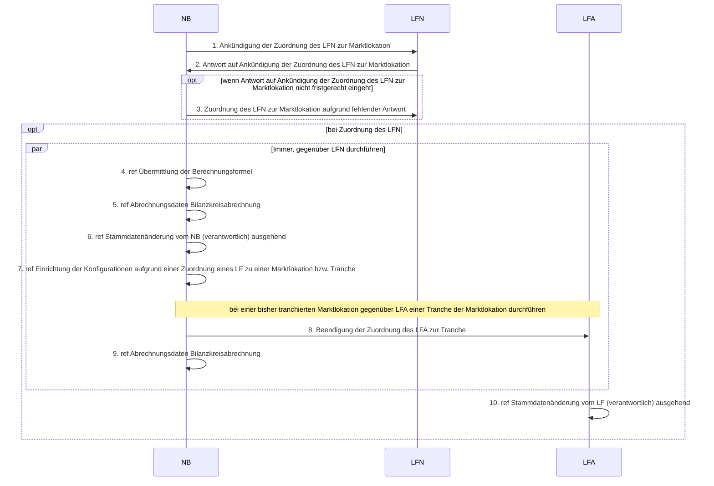
```mermaid
sequenceDiagram
    participant NB
    participant LFN
    participant LFA

    NB->>LFN: 1. Ankündigung der Zuordnung des LFN zur Marktlokation
    LFN->>NB: 2. Antwort auf Ankündigung der Zuordnung des LFN zur Marktlokation
    opt wenn Antwort auf Ankündigung der Zuordnung des LFN zur Marktlokation nicht fristgerecht eingeht
        NB->>LFN: 3. Zuordnung des LFN zur Marktlokation aufgrund fehlender Antwort
    end

    opt bei Zuordnung des LFN
        par Immer, gegenüber LFN durchführen
            NB->>NB: 4. ref Übermittlung der Berechnungsformel
            NB->>NB: 5. ref Abrechnungsdaten Bilanzkreisabrechnung
            NB->>NB: 6. ref Stammdatenänderung vom NB (verantwortlich) ausgehend
            NB->>NB: 7. ref Einrichtung der Konfigurationen aufgrund einer Zuordnung eines LF zu einer Marktlokation bzw. Tranche
            rect rgb(255, 255, 255)
                note over NB, LFA: bei einer bisher tranchierten Marktlokation gegenüber LFA einer Tranche der Marktlokation durchführen
                NB->>LFA: 8. Beendigung der Zuordnung des LFA zur Tranche
            end
            NB->>NB: 9. ref Abrechnungsdaten Bilanzkreisabrechnung
        end
        LFA->>LFA: 10. ref Stammdatenänderung vom LF (verantwortlich) ausgehend
    end
```

|Nr.|Aktion|Frist|Hinweis/Bemerkung|
|-|-|-|-|
|1|Ankündigung der Zuordnung des LFN zur Marktlokation|Nach Vorliegen des Zuordnungsgrundes des LFN zur Marktlokation und  I.) sofern der Zuordnungsbeginn des LFN in der Zukunft liegt, gilt:|Der NB teilt dem LFN den Grund der Zuordnung mit. Folgende Gründe stehen insbesondere zur Auswahl: • Kündigung des Stromabnahmevertrags ohne Folgebelieferung (Frist I. und nur in Fehlersituationen Frist II. möglich) • Kündigung des Bilanzkreisvertrags (Frist I. und Frist II. möglich)|

Seite 47 von 115

|Nr.|Aktion|Frist|Hinweis/Bemerkung|
|-|-|-|-|
|||Frühester ÜZ ist 00:00 Uhr und spätester 13:00 Uhr des letzten WT vor dem Zuordnungsbeginn des LFN. II.) sofern der Zuordnungsbeginn des LFN nicht in der Zukunft liegt, gilt: Unverzüglich.|• erstmalige Inbetriebnahme der Marktlokation (Neuanlage) (Frist I. und Frist II. möglich)  Des Weiteren teilt der NB insbesondere mit: • den Zuordnungsbeginn und, ggf. das Zuordnungsende • die Adresse der Marktlokation • die MaLo-ID der betroffenen Marktlokation • alle ID der Messlokationen, die für die Ermittlung der Energiemengen der Marktlokation erforderlich sind • die zugeordneten Marktpartner wie MSB und ÜNB|
|2|Antwort auf Ankündigung der Zuordnung des LFN zur Marktlokation|I.) Sofern der Zuordnungsbeginn des LFN in der Zukunft liegt, gilt: Unverzüglich, jedoch spätester ÜZ ist 15:00 Uhr am ÜT von Nr. 1. II.) Sofern der Zuordnungsbeginn des LFN nicht in der Zukunft liegt, gilt: Unverzüglich, jedoch spätester ÜZ ist 15:00 Uhr des 1. WT nach dem ÜT von Nr. 1.|Der LFN stimmt der Ankündigung zu oder lehnt diese ab. Der Grund der Ablehnung ist anzugeben.  Im Fall der Zustimmung teilt der LFN in der Antwort insbesondere den BK mit.  Im Fall der Zustimmung des LFN ordnet der NB den LFN der Marktlokation unverzüglich zum Zuordnungsbeginn zu.  Hinweis: Der vom LFN in diesem Schritt angegebene BK ist in Prozessschritt 5 „ref Abrechnungsdaten Bilanzkreisabrechnung“ dem LFN vom NB mitzuteilen.|
|3|Zuordnung des LFN zur Marktlokation aufgrund fehlender Antwort|I.) Sofern der Zuordnungsbeginn des LFN in der Zukunft liegt, gilt: Unverzüglich, jedoch frühester ÜZ ist 15:00 Uhr und spätester 16:00 Uhr am ÜT von Nr. 1.  II.) Sofern der Zuordnungsbeginn des LFN nicht in der Zukunft liegt, gilt: Unverzüglich, jedoch frühester ÜZ ist 15:00 Uhr und spätester 16:00 Uhr des 1. WT nach dem ÜT von Nr. 1.|Antwortet der LFN in Prozessschritt 2 nicht fristgerecht, ordnet der NB den LFN der Marktlokation unverzüglich zum Zuordnungsbeginn zu.  In der Nachricht teilt der NB dem LFN insbesondere folgende Daten mit: s. unter Prozessschritt 1  Hinweis: Der NB verwendet im Fall der fehlenden Antwort, den vom LFN für konkret diesen Sachverhalt über das SD „Übermittlung von Informationen“ (GPKE Teil 4) an den NB kommunizierten BK des LFN und teilt diesen in Prozessschritt 5 „ref Abrechnungsdaten Bilanzkreisabrechnung“ dem LFN mit.|

Seite 48 von 115

|Nr.|Aktion|Frist|Hinweis/Bemerkung|
|-|-|-|-|
|4|ref Übermittlung der Berechnungsformel|--|Der NB übermittelt dem LFN die Berechnungsformel der Marktlokation.|
|5|ref Abrechnungsdaten Bilanzkreis-abrechnung|--|Der NB übermittelt dem LFN und ggf. dem ÜNB die Abrechnungsdaten zur Bilanzkreisabrechnung für die Marktlokation mit Gültigkeit zum Zuordnungsbeginn.  Hinweis: Der Zuordnungsbeginn liegt im Fall von Frist II. nicht in der Zukunft.|
|6|ref Stammdaten-änderung vom NB (verantwortlich) ausgehend|--|Der NB übermittelt dem LFN die relevanten Stammdaten mit Gültigkeit zum Zuordnungsbeginn.|
|7|ref Einrichtung der Konfigurationen aufgrund einer Zuordnung eines LF zu einer Marktlokation bzw. Tranche|--|--|
|8|Beendigung der Zuordnung des LFA zur Tranche|I.) Sofern der Zuordnungsbeginn des LFN in der Zukunft liegt, gilt: Unverzüglich nach dem ÜZ von Nr. 2, sofern es sich um eine Zustimmung handelt, bzw. nach dem ÜZ von Nr. 3, jedoch spätester ÜZ ist 17:00 Uhr am ÜT von Nr. 1.  II.) Sofern der Zuordnungsbeginn des LFN nicht in der Zukunft liegt, gilt: Unverzüglich nach dem ÜZ von Nr. 2, sofern es sich um eine Zustimmung handelt, bzw. nach dem ÜZ von Nr. 3, jedoch spätester ÜZ ist 17:00 Uhr des 1. WT nach dem ÜT von Nr. 1.|Der NB beendet die Zuordnung des LFA zu der Tranche unverzüglich zum Zuordnungsende. In der Nachricht teilt der NB dem LFA insbesondere den Grund der Beendigung sowie das Zuordnungsende mit. Das Zuordnungsende ist der Zeitpunktdes Zuordnungsbeginns des LFN.  Die Beendigung der Zuordnung des LFA zu einer Tranche erfolgt mit der MaLo-ID der Tranche.|
|9|ref Abrechnungsdaten Bilanzkreis-abrechnung|--|Der NB teilt dem LFA und ggf. dem ÜNB mit, dass die Bilanzierung mit dem LFA zu der Tranche zum Zuordnungsende endet.|

Seite **49** von **115**

|Nr.|Aktion|Frist|Hinweis/Bemerkung|
|-|-|-|-|
|10|ref Stammdaten-änderung vom LF (verantwortlich) ausgehend|--|Hinweis: Sofern der Zuordnungsbeginn des LFN in der Zukunft liegt gilt: Unverzügliche Übermittlung, jedoch frühester ÜZ ist 19:00 Uhr am WT vor dem Zuordnungsbeginn.|

## **2.4.2.5 SD: Fall 4: LF-Zuordnung bei KWKG-Marktlokation mit DV-**
## **Pflicht bzw. Nicht-EEG-/Nicht-KWKG-Marktlokation und**
## **Marktlokation wird tranchiert abgebildet**

Seite 50 von 115

|Nr.|Aktion|Frist|Hinweis/Bemerkung|
|-|-|-|-|
|1|Ankündigung der Zuordnung des LFN zur Tranche|Nach Vorliegen des Zuordnungsgrundes des LFN zur Tranche und I.) sofern der Zuordnungsbeginn des LFN in der Zukunft liegt, gilt: Frühester ÜZ ist 00:00 Uhr und spätester 13:00 Uhr des letzten WT vor dem Zuordnungsbeginn des LFN. II.) sofern der Zuordnungsbeginn des LFN nicht in der Zukunft liegt, gilt: Unverzüglich.|Der NB teilt dem LFN den Grund der Zuordnung mit. Folgende Gründe stehen insbesondere zur Auswahl: • Kündigung des Stromabnahmevertrags ohne Folgebelieferung (Frist I. und nur in Fehlersituationen Frist II. möglich) • Kündigung des Bilanzkreisvertrags (Frist I. und Frist II. möglich) • erstmalige Inbetriebnahme der Marktlokation (Neuanlage) (Frist I. und Frist II. möglich)  Des Weiteren teilt der NB insbesondere mit:  • den Zuordnungsbeginn und ggfs. das Zuordnungsende • die Adresse der Marktlokation • die MaLo-ID der betroffenen Tranche und MaLo-ID der Marktlokation der die Tranche zugeordnet ist • alle ID der Messlokationen der Messlokationen, die für die Ermittlung der Energiemengen der Marktlokation erforderlich sind • die zugeordneten Marktpartner wie MSB und ÜNB|
|2|Antwort auf Ankündigung der Zuordnung des LFN zur Tranche|I.) Sofern der Zuordnungsbeginn des LFN in der Zukunft liegt, gilt: Unverzüglich, jedoch spätester ÜZ ist 15:00 Uhr am ÜT von Nr. 1. II.) Sofern der Zuordnungsbeginn des LFN nicht in der Zukunft liegt, gilt: Unverzüglich, jedoch spätester ÜZ ist 15:00 Uhr des 1. WT nach dem ÜT von Nr. 1.|Der LFN stimmt der Ankündigung zu oder lehnt diese ab. Der Grund der Ablehnung ist anzugeben.  Im Fall der Zustimmung teilt der LFN in der Antwort insbesondere den BK mit.  Im Fall der Zustimmung des LFN ordnet der NB den LFN der Tranche unverzüglich zum Zuordnungsbeginn zu.  Hinweis: Der vom LFN in diesem Schritt angegebene BK ist in Prozessschritt 5 „ref Abrechnungsdaten Bilanzkreisabrechnung“ dem LFN vom NB mitzuteilen.|
|3|Zuordnung des LFN zur Tranche aufgrund fehlender Antwort|I.) Sofern der Zuordnungsbeginn des LFN in der Zukunft liegt, gilt: Unverzüglich, jedoch frühester ÜZ ist 15:00 Uhr und spätester 16:00 Uhr am ÜT von Nr. 1.|Antwortet der LFN in Prozessschritt 2 nicht fristgerecht, ordnet der NB den LFN der Tranche unverzüglich zum Zuordnungsbeginn zu.  In der Nachricht teilt der NB dem LFN insbesondere folgende Daten mit: s. unter Prozessschritt 1|

Seite **51** von **115**

|Nr.|Aktion|Frist|Hinweis/Bemerkung|
|-|-|-|-|
|||II.) Sofern der Zuordnungsbeginn des LFN nicht in der Zukunft liegt, gilt: Unverzüglich, jedoch frühester ÜZ ist 15:00 Uhr und spätester 16:00 Uhr des 1. WT nach dem ÜT von Nr. 1.|Hinweis: Der NB verwendet im Fall der fehlenden Antwort, den vom LFN für konkret diesen Sachverhalt über das SD „Übermittlung von Informationen“ (GPKE Teil 4) an den NB kommunizierten BK des LFN und teilt diesen in Prozessschritt 5 „ref Abrechnungsdaten Bilanzkreisabrechnung“ dem LFN mit.|
|4|ref Übermittlung der Berechnungsformel|--|Der NB übermittelt dem LFN die Berechnungsformel der Marktlokation.|
|5|ref Abrechnungsdaten Bilanzkreisabrechnung|--|Der NB übermittelt dem LFN und ggf. dem ÜNB die Abrechnungsdaten zur Bilanzkreisabrechnung für die Tranche mit Gültigkeit zum Zuordnungsbeginn.  Hinweis: Der Zuordnungsbeginn liegt im Fall von Frist II. nicht in der Zukunft.|
|6|ref Stammdatenänderung vom NB (verantwortlich) ausgehend|--|Der NB übermittelt dem LFN die relevanten Stammdaten mit Gültigkeit zum Zuordnungsbeginn.|
|7|ref Einrichtung der Konfigurationen aufgrund einer Zuordnung eines LF zu einer Marktlokation bzw. Tranche|--|--|
|8|Beendigung der Zuordnung des LFA zur Tranche|I.) Sofern der Zuordnungsbeginn des LFN in der Zukunft liegt, gilt: Unverzüglich nach dem ÜZ von Nr. 2, sofern es sich um eine Zustimmung handelt, bzw. nach dem ÜZ von Nr. 3, jedoch spätester ÜZ ist 17:00 Uhr am ÜT von Nr. 1.  II.) Sofern der Zuordnungsbeginn des LFN nicht in der Zukunft liegt, gilt: Unverzüglich nach dem ÜZ von Nr. 2, sofern es sich um eine Zustimmung handelt, bzw. nach|Der NB beendet die Zuordnung des LFA zu der Tranche unverzüglich zum Zuordnungsende. In der Nachricht teilt der NB dem LFA insbesondere den Grund der Beendigung sowie das Zuordnungsende mit. Das Zuordnungsende ist der Zeitpunktdes Zuordnungsbeginns des LFN.  Die Beendigung der Zuordnung des LFA zu einer Tranche erfolgt mit der MaLo-ID der Tranche.|

Seite **52** von **115**

|Nr.|Aktion|Frist|Hinweis/Bemerkung|
|-|-|-|-|
|||dem ÜZ von Nr. 3, jedoch spätester ÜZ ist 17:00 Uhr des 1. WT nach dem ÜT von Nr. 1.||
|9|ref Abrechnungsdaten Bilanzkreis- abrechnung|--|Der NB teilt dem LFA und ggf. dem ÜNB mit, dass die Bilanzierung mit dem LFA zu der Tranche zum Zuordnungsende endet.|
|10|ref Stammdaten- änderung vom LF (verantwortlich) ausgehend|--|Hinweis: Sofern der Zuordnungsbeginn des LFN in der Zukunft liegt gilt: Unverzügliche Übermittlung, jedoch frühester ÜZ ist 19:00 Uhr am WT vor dem Zuordnungsbeginn.|

## **2.5 Prozesse zum Lieferende**

## **2.5.1 Use-Case: Lieferende von LF an NB**

### <u>**2.5.1.1 UC: Lieferende</u> von LF an NB**

|**Use-Case-Name**|Lieferende von LF an NB|
|-|-|
|Prozessziel|Die Zuordnung des LF zur Marktlokation bzw. Tranche ist beendet.|
|Use-Case Beschreibung|Ein LF meldet beim NB eine Zuordnung des LF zu einer Marktlokation bzw. Tranche ab.|
|Rollen|• LF • NB|
|Vorbedingung|• Im Fall einer verbrauchenden Marktlokation: o Der LF ist der Marktlokation zugeordnet. o Beendigung eines Energieliefervertrags zwischen LF und dem Letztverbraucher. • Im Fall einer erzeugenden Marktlokation bzw. einer Tranche: o Der LF ist der Marktlokation bzw. Tranche zugeordnet. o Beendigung eines Stromabnahmevertrags zwischen LF und dem EZ. Die folgenden Fälle sind dabei möglich: ▪ Abmeldung der Zuordnung des LF zu einer Marktlokation ▪ Abmeldung der Zuordnung des LF zu einer Tranche einer Marktlokation o Der Use-Case ist nicht durch das Unternehmen Netzbetreiber in seiner Rolle als LF zu starten.  Auslöser können insbesondere sein: • Im Fall einer verbrauchenden Marktlokation: o Bestätigung der Kündigung des Energieliefervertrags gegenüber dem LFN im Rahmen des Use-Cases „Kündigung“ o Bestätigung der Kündigung des Energieliefervertrags gegenüber dem Letztverbraucher (z.B. aufgrund Auszug|

Seite **53** von **115**

|Use-Case-Name|Lieferende von LF an NB|
|-|-|
||des Letztverbrauchers aus der Marktlokation, Lieferantenwechsel, Stilllegung der Marktlokation) • Im Fall einer erzeugenden Marktlokation bzw. einer Tranche: ○ Bestätigung der Kündigung des Stromabnahmevertrags gegenüber dem LFN im Rahmen des Use-Cases „Kündigung“ ○ Bestätigung der Kündigung des Stromabnahmevertrags gegenüber dem EZ (z.B. aufgrund Lieferantenwechsel, Stilllegung der Marktlokation)|
|Nachbedingung im Erfolgsfall|• Im Fall einer verbrauchenden Marktlokation: ○ Der NB führt die Use-Cases „Abrechnungsdaten Netznutzungsabrechnung“ und „Abrechnungsdaten Bilanzkreisabrechnung“ aus. ○ Der NB führt ggf. den Use-Case „Beginn der Ersatz-/Grundversorgung“ aus. • Im Fall einer erzeugenden Marktlokation bzw. einer Tranche: ○ Der NB führt den Use-Case „Abrechnungsdaten Bilanzkreisabrechnung“ aus. ○ Der NB führt ggf. den Use-Case „Herstellung einer 100% LF-Zuordnung zu einer erzeugenden Marktlokation“ aus. • Sofern eine Stilllegung der Marktlokation vorliegen sollte, führt der NB den Use-Case „Lieferende von NB an LF“ durch.|
|Nachbedingung im Fehlerfall|• Der LF bleibt der Marktlokation bzw. Tranche zugeordnet. • Der LF sendet bei Bedarf erneut eine Abmeldung an den NB.|
|Fehlerfälle|• Im Fall einer erzeugenden Marktlokation bzw. einer Tranche: Der Use-Case wird durch das Unternehmen Netzbetreiber in seiner Rolle als LF gestartet.|
|Weitere Anforderungen|• Hinweis: Eine Marktlokation, die keinem LF zugeordnet werden kann und für die eine gesetzliche Grund- oder Ersatzversorgungspflicht nach § 36 und § 38 EnWG bestehen kann, ordnet der NB über den Use-Case „Beginn der Ersatz-/Grundversorgung“ dem E/G zu. • Wenn eine Marktlokation infolge der Beendigung der Zuordnung künftig weder dem E/G noch einem vertraglich bestimmten Ersatzbelieferer oder einem sonstigen LF zuordenbar ist, hat eine Unterbrechung der Anschlussnutzung an der Marktlokation durch den NB zu erfolgen.|

Seite **54** von **115**

## 2.5.1.2 SD: Lieferende von LF an NB

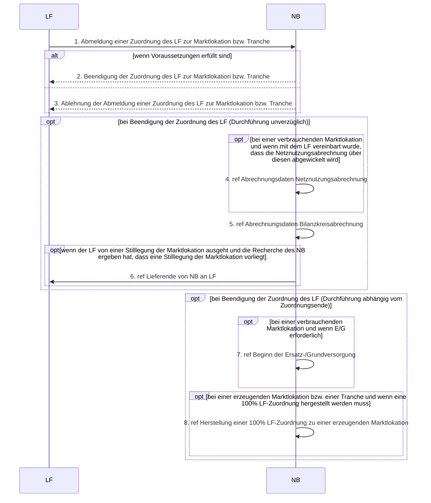
```mermaid
sequenceDiagram
    participant LF
    participant NB

    LF->>NB: 1. Abmeldung einer Zuordnung des LF zur Marktlokation bzw. Tranche
    alt wenn Voraussetzungen erfüllt sind
        NB-->>LF: 2. Beendigung der Zuordnung des LF zur Marktlokation bzw. Tranche
    else
        NB-->>LF: 3. Ablehnung der Abmeldung einer Zuordnung des LF zur Marktlokation bzw. Tranche
    end

    opt bei Beendigung der Zuordnung des LF (Durchführung unverzüglich)
        opt bei einer verbrauchenden Marktlokation und wenn mit dem LF vereinbart wurde, dass die Netznutzungsabrechnung über diesen abgewickelt wird
            NB->>NB: 4. ref Abrechnungsdaten Netznutzungsabrechnung
        end
        NB->>NB: 5. ref Abrechnungsdaten Bilanzkreisabrechnung
        opt wenn der LF von einer Stilllegung der Marktlokation ausgeht und die Recherche des NB ergeben hat, dass eine Stilllegung der Marktlokation vorliegt
            NB->>LF: 6. ref Lieferende von NB an LF
        end
    end

    opt bei Beendigung der Zuordnung des LF (Durchführung abhängig vom Zuordnungsende)
        opt bei einer verbrauchenden Marktlokation und wenn E/G erforderlich
            NB->>NB: 7. ref Beginn der Ersatz-/Grundversorgung
        end
        opt bei einer erzeugenden Marktlokation bzw. einer Tranche und wenn eine 100% LF-Zuordnung hergestellt werden muss
            NB->>NB: 8. ref Herstellung einer 100% LF-Zuordnung zu einer erzeugenden Marktlokation
        end
    end
```

Seite 55 von 115

|Nr.|Aktion|Frist|Hinweis/Bemerkung|
|-|-|-|-|
|1|Abmeldung einer Zuordnung des LF zur Marktlokation bzw. Tranche|Bei EEG-Marktlokationen und Tranchen von EEG-Marktlokationen gilt: Unverzüglich nach Vorliegen des Abmeldegrundes, jedoch spätester ÜT liegt 1 Monat vor dem Zuordnungsende.  Bei allen anderen Marktlokationen und Tranchen gilt: Unverzüglich nach Vorliegen des Abmeldegrundes, jedoch spätester ÜT ist der Tag vor dem letzten WT vor dem Zuordnungsende.|• Die Abmeldung einer Zuordnung des LF zu einer Marktlokation erfolgt mit der MaLo-ID der Marktlokation. • Die Abmeldung einer Zuordnung des LF zu einer Tranche erfolgt mit der MaLo-ID der Tranche.  Der LF gibt in der Abmeldung zudem insbesondere an: • das Zuordnungsende; dabei gilt im Fall von EEG-Marktlokationen und Tranchen von EEG-Marktlokationen: Das Zuordnungsende muss ein Monatserster sein. Hinweis: Im Rahmen des Use-Cases „Lieferbeginn“ sind abhängig der Veräußerungsform z.T. kürzere Fristen möglich. Diese kürzeren Fristen werden jedoch in dem hier beschriebenen Prozessschritt (Use-Case) nicht abgebildet, da nicht übermittelt werden kann, in welcher Veräußerungsform die Marktlokation bzw. Tranche weiter betrieben wird. Die Nutzung der verkürzten Fristen ist über den Use-Case „Lieferbeginn“ möglich. • den Grund der Abmeldung (z.B. Lieferantenwechsel, Stilllegung einer Marktlokation) • Sofern der LF von einer Stilllegung der Marktlokation ausgeht: die Vermutung, dass eine Stilllegung vorliegt. Hinweis: Die Angabe ist für die Beendigung der Zuordnung des LF nicht relevant. Die Angabe dient dem NB als Information zur weiteren Recherche des Sachverhalts.|
|2|Beendigung der Zuordnung des LF zur Marktlokation bzw. Tranche|Unverzüglich, jedoch spätester ÜZ ist 06:00 Uhr des 1. WT nach dem ÜT von Nr. 1.|Der NB stimmt der Abmeldung zu und beendet die Zuordnung des LF zur Marktlokation bzw. Tranche unverzüglich zum Zuordnungsende.|
|3|Ablehnung der Abmeldung einer Zuordnung des LF zur Marktlokation bzw. Tranche|Unverzüglich, jedoch spätester ÜZ ist 06:00 Uhr des 1. WT nach dem ÜT von Nr. 1.|Der NB lehnt die Abmeldung ab. Der Grund der Ablehnung ist anzugeben.|
|4|ref Abrechnungsdaten Netznutzungsabrechnung|--|Der NB teilt dem LF mit, dass die Netznutzung mit dem LF zu der verbrauchenden Marktlokation zum Zuordnungsende endet.|

Seite **56** von **115**

|Nr.|Aktion|Frist|Hinweis/Bemerkung|
|-|-|-|-|
|5|ref Abrechnungsdaten Bilanzkreis-abrechnung|--|Der NB teilt dem LF und ggf. dem ÜNB mit, dass die Bilanzierung mit dem LF zu der Marktlokation bzw. Tranche zum Zuordnungsende endet.|
|6|ref Lieferende von NB an LF|--|--|
|7|ref Beginn der Ersatz-/Grundversorgung|--|--|
|8|ref Herstellung einer 100% LF-Zuordnung zu einer erzeugenden Marktlokation|--|--|

## **2.5.2 Use-Case: Lieferende von NB an LF**

## <u>**2.5.2.1 UC: Lieferende</u> von NB an LF**

|**Use-Case-Name**|Lieferende von NB an LF|
|-|-|
|Prozessziel|Die Zuordnung des LF zur Marktlokation bzw. Tranche ist beendet.|
|Use-Case Beschreibung|Der NB kündigt dem LF die Beendigung der Zuordnung des LF zur Marktlokation bzw. Tranche an. Im Zuge des Prozesses • beendet der NB bei einer Stilllegung der Marktlokation die Zuordnung des MSB zur Marktlokation bzw. Messlokation. • hebt der NB bei einer Stilllegung der Marktlokation ○ ggf. die Zuordnung des LFZ zur Marktlokation bzw. Tranche auf. ○ ggf. die Zuordnung des MSBZ zur Marktlokation bzw. Messlokation auf.|
|Rollen|• LF • NB • MSB|
|Vorbedingung|• Im Fall einer verbrauchenden Marktlokation: Der LF ist der Marktlokation zugeordnet. • Im Fall einer erzeugenden Marktlokation bzw. einer Tranche: Der LF ist der Marktlokation bzw. Tranche zugeordnet. Die folgenden Fälle sind dabei möglich: ○ Beendigung der Zuordnung des LF zu einer Marktlokation ○ Beendigung der Zuordnung des LF zu einer Tranche einer Marktlokation ○ Beendigung der Zuordnung der LF zu allen Tranchen einer Marktlokation. Hierbei muss der Use-Case „Lieferende von NB an LF“ je Tranche separat durchgeführt werden.  Auslöser können insbesondere sein: • Stilllegung einer Marktlokation • der Use-Case „Deaktivierung einer Zuordnungsermächtigung des BKV beim NB“ wurde durchgeführt und für die betroffene Marktlokation bzw. Tranche liegt für den Zeitraum, der sich|

Seite 57 von **115**

|Use-Case-Name|Lieferende von NB an LF|
|-|-|
||unmittelbar an die Deaktivierung anschließt, keine Zuordnung zu einem BK vor, für den eine aktive Zuordnungsermächtigung vorhanden ist • für die Marktlokation hat sich ab dem genannten Zeitpunkt der Zeitreihentyp geändert, für den keine gültige Zuordnungsermächtigung vorhanden ist|
|Nachbedingung im Erfolgsfall|• Im Fall einer verbrauchenden Marktlokation: o Der NB führt die Use-Cases „Abrechnungsdaten Netznutzungsabrechnung“ und „Abrechnungsdaten Bilanzkreisabrechnung“ aus. o Der NB führt ggf. den Use-Case „Beginn der Ersatz-/Grundversorgung“ aus. o Im Fall der Stilllegung: Wenn die Marktlokation dem Modell 2 zugeordnet ist, beendet der NB den Zählpunkt für die NGZ. • Im Fall einer erzeugenden Marktlokation bzw. einer Tranche: o Der NB führt den Use-Case „Abrechnungsdaten Bilanzkreisabrechnung“ aus. o Der NB führt ggf. den Use-Case „Herstellung einer 100% LF-Zuordnung zu einer erzeugenden Marktlokation“ aus. • Im Fall der Stilllegung einer Marktlokation: Sofern das Lokationsbündel nicht stillgelegt wird, informiert der NB die Marktpartner der weiterhin aktiven Lokationen über die Änderung des Lokationsbündels mit dem Use-Case "Stammdatenänderung" (hier: „Stammdatenänderung vom NB (verantwortlich) ausgehend“) (GPKE Teil 4).|
|Nachbedingung im Fehlerfall|Der LF bleibt der Marktlokation bzw. Tranche zugeordnet.|
|Fehlerfälle|--|
|Weitere Anforderungen|• Hinweis: Eine Marktlokation, die keinem LF zugeordnet werden kann und für die eine gesetzliche Grund- oder Ersatzversorgungspflicht nach § 36 und § 38 EnWG bestehen kann, ordnet der NB über den Use-Case „Beginn der Ersatz-/Grundversorgung“ dem E/G zu. • Wenn eine Marktlokation infolge der Beendigung der Zuordnung künftig weder dem E/G noch einem vertraglich bestimmten Ersatzbelieferer oder einem sonstigen LF zuordenbar ist, hat eine Unterbrechung der Anschlussnutzung an der Marktlokation durch den NB zu erfolgen.|

Seite **58** von **115**

## 2.5.2.2 SD: Lieferende von NB an LF

Seite 59 von 115

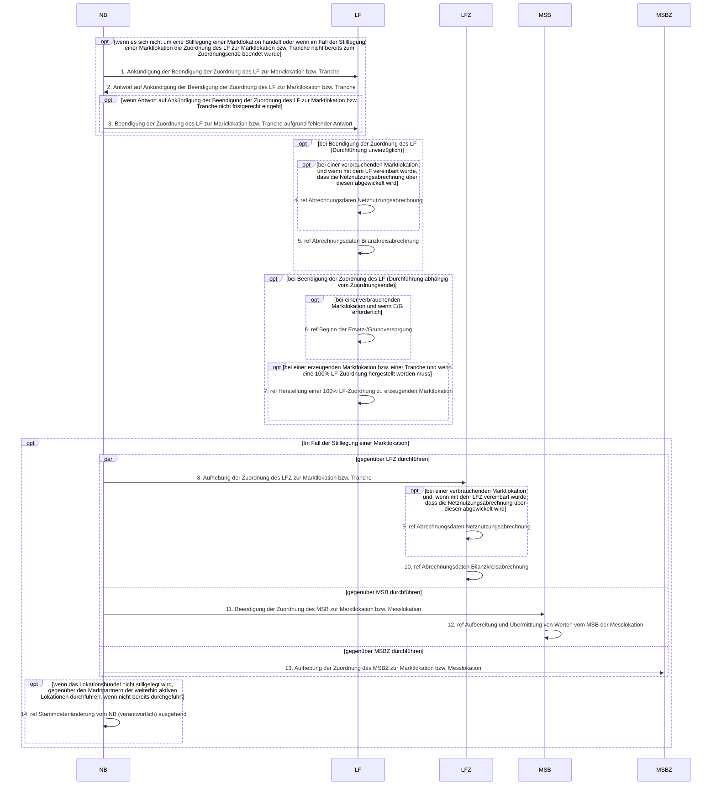
```mermaid
sequenceDiagram
    participant NB
    participant LF
    participant LFZ
    participant MSB
    participant MSBZ

    rect rgb(255, 255, 255)
    opt wenn es sich nicht um eine Stilllegung einer Marktlokation handelt oder wenn im Fall der Stilllegung einer Marktlokation die Zuordnung des LF zur Marktlokation bzw. Tranche nicht bereits zum Zuordnungsende beendet wurde
        NB->>LF: 1. Ankündigung der Beendigung der Zuordnung des LF zur Marktlokation bzw. Tranche
        LF->>NB: 2. Antwort auf Ankündigung der Beendigung der Zuordnung des LF zur Marktlokation bzw. Tranche
        opt wenn Antwort auf Ankündigung der Beendigung der Zuordnung des LF zur Marktlokation bzw. Tranche nicht fristgerecht eingeht
            NB->>LF: 3. Beendigung der Zuordnung des LF zur Marktlokation bzw. Tranche aufgrund fehlender Antwort
        end
    end

    opt bei Beendigung der Zuordnung des LF (Durchführung unverzüglich)
        opt bei einer verbrauchenden Marktlokation und wenn mit dem LF vereinbart wurde, dass die Netznutzungsabrechnung über diesen abgewickelt wird
            LF->>LF: 4. ref Abrechnungsdaten Netznutzungsabrechnung
        end
        LF->>LF: 5. ref Abrechnungsdaten Bilanzkreisabrechnung
    end

    opt bei Beendigung der Zuordnung des LF (Durchführung abhängig vom Zuordnungsende)
        opt bei einer verbrauchenden Marktlokation und wenn E/G erforderlich
            LF->>LF: 6. ref Beginn der Ersatz-/Grundversorgung
        end
        opt bei einer erzeugenden Marktlokation bzw. einer Tranche und wenn eine 100% LF-Zuordnung hergestellt werden muss
            LF->>LF: 7. ref Herstellung einer 100% LF-Zuordnung zu erzeugenden Marktlokation
        end
    end
    end

    rect rgb(255, 255, 255)
    opt Im Fall der Stilllegung einer Marktlokation
        par gegenüber LFZ durchführen
            NB->>LFZ: 8. Aufhebung der Zuordnung des LFZ zur Marktlokation bzw. Tranche
            opt bei einer verbrauchenden Marktlokation und, wenn mit dem LFZ vereinbart wurde, dass die Netznutzungsabrechnung über diesen abgewickelt wird
                LFZ->>LFZ: 9. ref Abrechnungsdaten Netznutzungsabrechnung
            end
            LFZ->>LFZ: 10. ref Abrechnungsdaten Bilanzkreisabrechnung
        and gegenüber MSB durchführen
            NB->>MSB: 11. Beendigung der Zuordnung des MSB zur Marktlokation bzw. Messlokation
            MSB->>MSB: 12. ref Aufbereitung und Übermittlung von Werten vom MSB der Messlokation
        and gegenüber MSBZ durchführen
            NB->>MSBZ: 13. Aufhebung der Zuordnung des MSBZ zur Marktlokation bzw. Messlokation
        end
        opt wenn das Lokationsbündel nicht stillgelegt wird, gegenüber den Marktpartnern der weiterhin aktiven Lokationen durchführen, wenn nicht bereits durchgeführt
            NB->>NB: 14. ref Stammdatenänderung vom NB (verantwortlich) ausgehend
        end
    end
    end
```

Seite **60** von **115**

|Nr.|Aktion|Frist|Hinweis/Bemerkung|
|-|-|-|-|
|1|Ankündigung der Beendigung der Zuordnung des LF zur Marktlokation bzw. Tranche|Bei Ankündigung aufgrund • Deaktivierung der Zuordnungsermächtigung gilt: Unverzüglich, jedoch spätester ÜT ist der 1. WT nach dem ÜT der Deaktivierungsmeldung, jedoch, wenn die Deaktivierung ihre Gültigkeit weiter als einen Monat in die Zukunft hat, ist der früheste ÜT in dem Monat, in dem die Zuordnungsermächtigung endet, jedoch spätester ÜT ist der 5. WT des Monats, in dem die Zuordnungsermächtigung endet. • geändertem Zeitreihentyp und keiner gültigen Zuordnungsermächtigung für den neuen Zeitreihentyp gilt: Unverzüglich nach dem ÜZ der Stammdatenänderung zum Umbau der Messgeräte vom MSB der Messlokation an den NB, jedoch spätester ÜT ist der Tag vor dem letzten WT vor dem Zuordnungsende.|• Die Ankündigung der Beendigung der Zuordnung des LF zu einer Marktlokation erfolgt mit der MaLo-ID der Marktlokation. • Die Ankündigung der Beendigung der Zuordnung des LF zu einer Tranche erfolgt mit der MaLo-ID der Tranche.  Der NB gibt in der Ankündigung zudem insbesondere an: • das Zuordnungsende • den Grund der Abmeldung (z.B. Stilllegung einer Marktlokation) • Im Fall der Stilllegung einer Marktlokation: den Geräteausbauzeitpunkt der Messlokation, deren Stilllegung die Stilllegung der Marktlokation zur Folge hat. Hinweis: Der Zeitpunkt ist für die Beendigung der Zuordnung des LF nicht relevant, der LF kann jedoch die Übermittlung von Nullwerten ab diesem Zeitpunkt nachvollziehen. Somit werden unnötige Reklamationen vom LF an den MSB der Marktlokation verhindert. In nachfolgenden Prozessschritten erhalten die weiteren Marktpartner, den Zeitpunkt ebenfalls: • die MSB für die ggf. notwendige Ersatzwertbildung • zur Vermeidung von unnötigen Reklamationen von Werten beim MSB|

Seite **61** von **115**

|Nr.|Aktion|Frist|Hinweis/Bemerkung|
|-|-|-|-|
|||Bei allen anderen Gründen gilt: • Bei EEG-Marktlokationen und Tranchen von EEG-Marktlokationen: Unverzüglich nach Vorliegen des Beendigungsgrundes, jedoch spätester ÜT liegt 1 Monat vor dem Zuordnungsende. • Bei allen anderen Marktlokationen und Tranchen gilt: Unverzüglich nach Vorliegen des Beendigungsgrundes, jedoch spätester ÜT ist der Tag vor dem letzten WT vor dem Zuordnungsende.||
|2|Antwort auf Ankündigung der Beendigung der Zuordnung des LF zur Marktlokation bzw. Tranche|Unverzüglich, jedoch spätester ÜZ ist 05:00 Uhr des 1. WT nach dem ÜT von Nr. 1.|Der LF stimmt der Ankündigung zu oder lehnt diese ab. Der Grund der Ablehnung ist anzugeben.  Im Fall der Zustimmung des LF beendet der NB die Zuordnung des LF zur Marktlokation bzw. Tranche unverzüglich zum Zuordnungsende.|
|3|Beendigung der Zuordnung des LF zur Marktlokation bzw. Tranche aufgrund fehlender Antwort|Unverzüglich, jedoch frühester ÜZ ist 05:00 Uhr und spätester 06:00 Uhr des 1. WT nach dem ÜT von Nr. 1.|Antwortet der LF in Prozessschritt 2 nicht fristgerecht, beendet der NB die Zuordnung des LF zur Marktlokation bzw. Tranche unverzüglich zum Zuordnungsende.  In der Nachricht teilt der NB dem LF insbesondere die bereits in Prozessschritt 1 genannten Daten mit.|
|4|ref Abrechnungsdaten Netznutzungsabrechnung|--|Der NB teilt dem LF mit, dass die Netznutzung mit dem LF zu der verbrauchenden Marktlokation zum Zuordnungsende endet.|

Seite **62** von **115**

|Nr.|Aktion|Frist|Hinweis/Bemerkung|
|-|-|-|-|
|5|ref Abrechnungsdaten Bilanzkreis- abrechnung|--|Der NB teilt dem LF und ggf. dem ÜNB mit, dass die Bilanzierung mit dem LF zu der Marktlokation bzw. Tranche zum Zuordnungsende endet.  Sofern es sich um eine Stilllegung handelt, teilt dies der NB dem ÜNB zudem mit.|
|6|ref Beginn der Ersatz- /Grundversorgung|--|--|
|7|ref Herstellung einer 100% LF-Zuordnung zu einer erzeugenden Marktlokation|--|--|
|8|Aufhebung der Zuordnung des LFZ zur Marklokation bzw. Tranche|Unverzüglich nach dem ÜZ von Nr. 2, sofern es sich um eine Zustimmung handelt, bzw. nach dem ÜZ von Nr. 3, jedoch spätester ÜZ ist 07:00 Uhr des 1. WT nach dem ÜT von Nr. 1.|Der NB hebt die Zuordnung des LFZ zu der Marktlokation bzw. Tranche unverzüglich auf. In der Nachricht teilt der NB dem LFZ insbesondere den Grund der Aufhebung (hier: Stilllegung) mit. Die Aufhebung der Zuordnung des LFZ zu einer • Marktlokation erfolgt mit der MaLo-ID der Marktlokation. • Tranche erfolgt mit der MaLo-ID der Tranche.|
|9|ref Abrechnungsdaten Netznutzungs- abrechnung|--|Der NB teilt dem LFZ mit, dass die Netznutzung mit dem LFZ zu der verbrauchenden Marktlokation nicht stattfinden wird.|
|10|ref Abrechnungsdaten Bilanzkreis- abrechnung|--|Der NB teilt dem LFZ und ggf. dem ÜNB mit, dass die Bilanzierung mit dem LFZ zu der Marktlokation bzw. Tranche nicht stattfinden wird.  Dem ÜNB wird zudem der Grund der Aufhebung (hier: Stilllegung) mitgeteilt.|
|11|Beendigung der Zuordnung des MSB zur Marklokation bzw. Messlokation|Unverzüglich nach dem ÜZ von Nr. 2, sofern es sich um eine Zustimmung handelt, bzw. nach dem ÜZ von Nr. 3, jedoch spätester ÜZ ist 07:00 Uhr des 1. WT nach dem ÜT von Nr. 1.|Der NB beendet die Zuordnung des MSB zu der Marktlokation bzw. Messlokation unverzüglich zum Zuordnungsende. Hierbei teilt er den Grund der Beendigung (hier: Stilllegung) sowie das Zuordnungsende mit.|
|12|ref Aufbereitung und Übermittlung von Werten vom MSB der Messlokation|--|siehe Übermittlung der Werte für das Zuordnungsende entsprechend Nr. 3 der Tabelle „Darstellung der zu übermittelnden Werte" (Kapitel 2.5.5. WiM Teil 2). Hinweis: Die Werte bis zum Zuordnungsende übermittelt der MSB weiterhin nach den Vorgaben von Nr. 1|

Seite **63** von **115**

|Nr.|Aktion|Frist|Hinweis/Bemerkung|
|-|-|-|-|
||||der Tabelle des Kapitels 2.5.5. „Darstellung der zu übermittelnden Werte“ (WiM Teil 2).|
|13|Aufhebung der Zuordnung des MSBZ zur Marktlokation bzw. Messlokation|Unverzüglich nach dem ÜZ von Nr. 2, sofern es sich um eine Zustimmung handelt, bzw. nach dem ÜZ von Nr. 3, jedoch spätester ÜZ ist 07:00 Uhr des 1. WT nach dem ÜT von Nr. 1.|Der NB hebt die Zuordnung des MSBZ zu der Marktlokation bzw. Messlokation unverzüglich auf. In der Nachricht teilt der NB dem MSBZ insbesondere den Grund der Aufhebung (hier: Stilllegung) mit.|
|14|ref Stammdatenänderung vom NB (verantwortlich) ausgehend|--|Information über die Änderung des Lokationsbündels an die Marktpartner der weiterhin aktiven Lokationen.|

Seite **64** von **115**

## **3 Ergänzende Prozesse**

## **3.1 Prozesse zu Abrechnungsdaten**

## **3.1.1 Use-Case: Abrechnungsdaten Netznutzungsabrechnung**

## **3.1.1.1 UC: Abrechnungsdaten Netznutzungsabrechnung**

|**Use-Case-Name**|Abrechnungsdaten Netznutzungsabrechnung|
|-|-|
|Prozessziel|Die Abrechnungsdaten zur Netznutzungsabrechnung sind ausgetauscht.|
|Use-Case Beschreibung|Der NB übermittelt dem LF die Abrechnungsdaten zur Netznutzungsabrechnung.  Der LF prüft die Daten und gibt dem NB eine Qualitätsrückmeldung zum Inhalt der Daten. Sofern der LF einen anderen Inhalt der Daten erwartet, gibt er dies in der Rückmeldung an. Der NB teilt dem LF in diesem Fall den Bearbeitungstand zu dessen Rückmeldung mit.|
|Rollen|• NB • LF|
|Vorbedingung|• Es handelt sich um eine verbrauchende Marktlokation.  Auslöser: • Durchführung nach dem Prozessschritt o zur Zuordnung des LFN zur Marktlokation im Rahmen des Use-Cases „Lieferbeginn“ (Fall a). o zur Zuordnung des LF zur Marktlokation im Rahmen des Use-Cases „Neuanlage“ (Fall a). o zur Zuordnung des E/G zur Marktlokation im Rahmen des Use-Cases „Beginn der Ersatz-/Grundversorgung“ (Fall a). o zur Beendigung der Zuordnung des LF zur Marktlokation im Rahmen des Use-Cases „Lieferende von LF an NB“ (Fall a). o zur Beendigung der Zuordnung des LF zur Marktlokation im Rahmen des Use-Cases „Lieferende von NB an LF“ (Fall a). o zum Bearbeitungsstand zur Bestellung im Rahmen des SD „Bestellung einer Änderung von Abrechnungsdaten von LF an NB“, sofern eine Änderung der Abrechnungsdaten zur Netznutzungsabrechnung vorzunehmen ist (Fall b). • Durchführung unabhängig der obigen Prozesse, o sofern der NB selbst feststellt, dass sich Abrechnungsdaten zur Netznutzungsabrechnung gegenüber dem LF geändert haben (Fall b) (z.B. Änderung des Netznutzungsabrechnungsmodells von Arbeitspreis/Grundpreis auf Arbeitspreis/Leistungspreis). o sofern der NB davon ausgeht, dass ein Datenschiefstand zwischen NB und LF vorliegt (Fall b).|
|Nachbedingung im Erfolgsfall|Sofern eine Netznutzungsabrechnung gegenüber dem LF stattfindet,|

Seite 65 von 115

|Use-Case-Name|Abrechnungsdaten Netznutzungsabrechnung|
|-|-|
||führt der NB bei unterjähriger Zuordnung des LFN bzw. E/G zur Marktlokation (über Use-Case „Lieferbeginn“ bzw. „Beginn der Ersatz-/Grundversorgung“) und wenn die Marktlokation mit Arbeits- und Leistungspreis im Rahmen der Netznutzungsabrechnung abgerechnet wird, den Use-Case "Übermittlung der bisher gemessenen Arbeits- und Leistungswerte" durch.|
|Nachbedingung im Fehlerfall|--|
|Fehlerfälle|Es handelt sich um eine erzeugende Marktlokation bzw. eine Tranche.|
|Weitere Anforderungen|*Hinweis:* Es gibt Situationen, bei denen eine Rechnungskorrektur aufgrund des Austauschs der Abrechnungsdaten zur Netznutzungsabrechnung vorkommen kann. Dies ist z.B. der Fall, wenn bei einer Änderung (Fall b) in die Vergangenheit der Zeitraum einer Rechnung betroffen ist.|

## 3.1.1.2 SD: **Abrechnungsdaten Netznutzungsabrechnung**

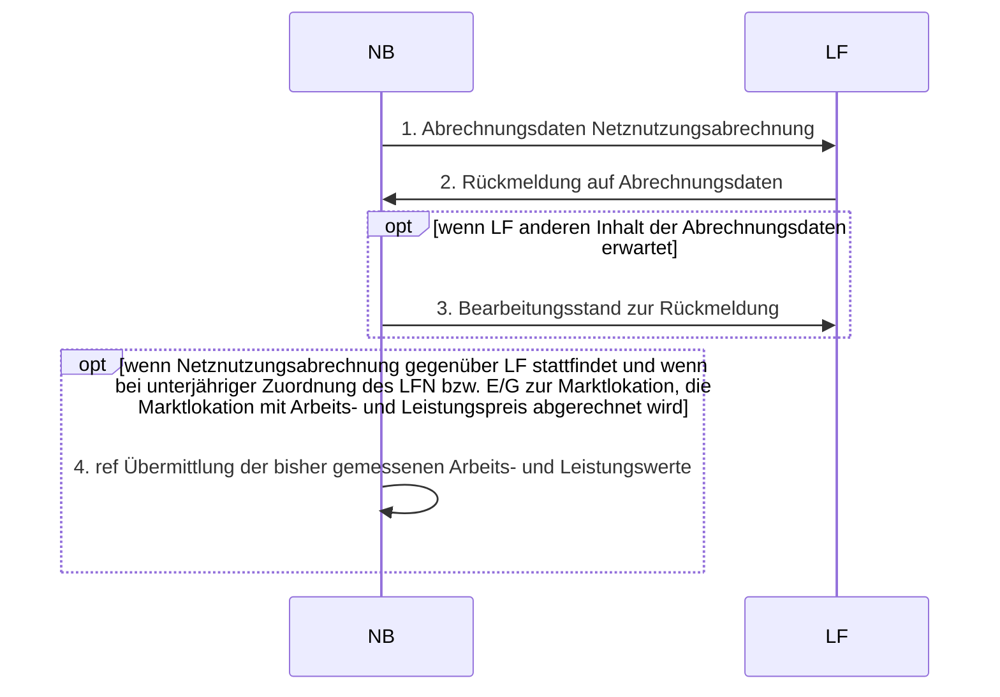
```mermaid
sequenceDiagram
    participant NB
    participant LF

    NB->>LF: 1. Abrechnungsdaten Netznutzungsabrechnung
    LF->>NB: 2. Rückmeldung auf Abrechnungsdaten
    opt wenn LF anderen Inhalt der Abrechnungsdaten erwartet
        NB->>LF: 3. Bearbeitungsstand zur Rückmeldung
    end
    opt wenn Netznutzungsabrechnung gegenüber LF stattfindet und wenn bei unterjähriger Zuordnung des LFN bzw. E/G zur Marktlokation, die Marktlokation mit Arbeits- und Leistungspreis abgerechnet wird
        NB->>NB: 4. ref Übermittlung der bisher gemessenen Arbeits- und Leistungswerte
    end
```

|Nr.|Aktion|Frist|Hinweis/Bemerkung|
|-|-|-|-|
|1|Abrechnungsdaten Netznutzungs- abrechnung|Bei Fall a gilt: Unverzüglich nach dem ÜZ des Prozessschritts zur Zuordnung bzw. Beendigung der Zuordnung des LF im Rahmen des entsprechenden Use-Cases, jedoch spätester ÜZ ist 00:00 Uhr des 1. Tages nach dem ÜT des Prozessschritts zur Zuordnung bzw.|Bei Fall a gilt: • Im Fall der Zuordnung des LFN zur Marktlokation im Rahmen des Use-Cases „Lieferbeginn“: Der NB teilt o dem LFN die Abrechnungsdaten zur Netznutzungsabrechnung der Marktlokation mit Gültigkeit zum Zuordnungsbeginn mit. o dem LFA (sofern eine Anfrage zur Beendigung der Zuordnung des LFA zur Marktlokation bzw. Tranche versandt wurde) mit, dass die Netznutzung mit dem LFA zu|

Seite **66** von **115**

|Nr.|Aktion|Frist|Hinweis/Bemerkung|
|-|-|-|-|
|||Beendigung der Zuordnung des entsprechenden LF.  Bei Fall b gilt: Unverzüglich nach Kenntnisnahme einer Änderung,|der Marktlokation zum Zuordnungsende endet. ○ Dem LFZ (sofern eine überholende Zuordnung vorliegt) mit, dass die Netznutzung mit dem LFZ zu der Marktlokation nicht stattfinden wird. • Im Fall der Zuordnung des LF zur Marktlokation im Rahmen des Use-Cases „Neuanlage“: Der NB teilt dem LF die Abrechnungsdaten zur Netznutzungsabrechnung der Marktlokation mit Gültigkeit zum Zuordnungsbeginn mit. • Im Fall der Zuordnung des E/G zur Marktlokation im Rahmen des Use-Cases „Beginn der Ersatz-/Grundversorgung“: Der NB teilt dem E/G die Abrechnungsdaten zur Netznutzungsabrechnung der Marktlokation mit Gültigkeit zum Zuordnungsbeginn mit. • Im Fall der Beendigung der Zuordnung des LF zur Marktlokation im Rahmen des Use-Cases „Lieferende von LF an NB“: Der NB teilt dem LF mit, dass die Netznutzung mit dem LF zu der Marktlokation zum Zuordnungsende endet. • Im Fall der Beendigung der Zuordnung des LF zur Marktlokation im Rahmen des Use-Cases „Lieferende von NB an LF“: Der NB teilt ○ dem LF mit, dass die Netznutzung mit dem LF zu der Marktlokation zum Zuordnungsende endet. ○ Dem LFZ im Fall der Stilllegung mit, dass die Netznutzung mit dem LFZ zu der Marktlokation nicht stattfinden wird.  Bei Fall b gilt: • Der NB teilt dem LF die Abrechnungsdaten zur Netznutzungsabrechnung der Marktlokation mit Gültigkeit zum Änderungsdatum 00:00 Uhr mit, ggf. unter Berücksichtigung des Änderungsdatums aus dem SD|

Seite **67** von **115**

|Nr.|Aktion|Frist|Hinweis/Bemerkung|
|-|-|-|-|
||||„Bestellung einer Abrechnungsdaten  Hinweis: Über diesen Prozessschritt wird dem LF auch mitgeteilt, ob die Netznutzung für die Marktlokation nicht über den LF abgerechnet wird (dies ist der Fall, wenn der Letztverbraucher Zahler der Netznutzung ist). In diesem Fall werden dem LF in der Nachricht keine weiteren Abrechnungsdaten übermittelt.|
|2|Rückmeldung auf Abrechnungsdaten|Unverzüglich, jedoch spätester ÜT ist der 2. WT nach dem ÜT von Nr. 1.|Der LF prüft die Daten und gibt dem NB eine Qualitätsrückmeldung. Erwartet der LF zu einem Datum einen anderen Inhalt, so teilt der LF dies in der Rückmeldung mit Änderungsvorschlag mit. Unabhängig davon sind die Daten ab dem in Prozessschritt 1 genannten Termin gültig, solange keine Änderung der Daten im Rahmen dieses Prozessschritt 1 mit Gültigkeit zum selben Termin versendet wurde. Verstreicht die Frist, ohne dass eine Rückmeldung eingeht, gilt die Qualitätsrückmeldung als nicht erfolgt bei Erwartung abweichender Inhalte. Nach Ablauf der Frist eingehende Rückmeldungen sind für den Fortlauf dieses Prozesses unerheblich.|
|3|Bearbeitungsstand zur Rückmeldung|Unverzüglich, jedoch spätester ÜT ist der 2. WT nach dem ÜT von Nr. 2.|Der NB teilt dem LF mit, in welchen Fällen die Rückmeldung unbegründet ist und in welchen eine Änderung vorgenommen wird. Unabhängig davon sind die Daten ab dem in Prozessschritt 1 genannten Termin gültig, solange keine Änderung der Daten im Rahmen dieses Use-Cases mit Prozessschritt 1 mit Gültigkeit zum selben Termin versendet wurde.|
|4|ref Übermittlung der bisher gemessenen Arbeits- und Leistungswerte|--|--|

Seite **68** von **115**

## 3.1.2 **Use-Case: Abrechnungsdaten Bilanzkreisabrechnung**

## 3.1.2.1 **UC: Abrechnungsdaten Bilanzkreisabrechnung**

|Use-Case-Name|Abrechnungsdaten Bilanzkreisabrechnung|
|-|-|
|Prozessziel|Die Abrechnungsdaten zur Bilanzkreisabrechnung sind ausgetauscht.|
|Use-Case Beschreibung|Der NB übermittelt dem LF und ggf. dem ÜNB die Abrechnungsdaten zur Bilanzkreisabrechnung.  Der LF bzw. ÜNB prüft die Daten und gibt dem NB eine Qualitätsrückmeldung zum Inhalt der Daten. Sofern der LF bzw. ÜNB einen anderen Inhalt der Daten erwartet, gibt er dies in der Rückmeldung an. Der NB teilt dem LF bzw. ÜNB in diesem Fall den Bearbeitungstand zu dessen Rückmeldung mit.|
|Rollen|• NB • LF • ÜNB|
|Vorbedingung|• Für die Übermittlung der Abrechnungsdaten zur Bilanzkreisabrechnung an den ÜNB gilt: Übermittlung, sofern die Aggregationsverantwortung o vom NB auf den ÜNB übergeht oder o beim ÜNB liegt und die Daten für den ÜNB relevant sind oder o vom ÜNB auf den NB übergeht.  Auslöser: • Durchführung nach dem Prozessschritt o zur Zuordnung des LFN zur Marktlokation bzw. Tranche im Rahmen des Use-Cases „Lieferbeginn“ (Fall a). o zur Zuordnung des LF zur Marktlokation bzw. Tranche im Rahmen des Use-Cases „Neuanlage“ (Fall a). o zur Zuordnung des E/G zur verbrauchenden Marktlokation im Rahmen des Use-Cases „Beginn der Ersatz-/Grundversorgung“ (Fall a). o zur Zuordnung des LFN zur erzeugenden Marktlokation bzw. zur Tranche im Rahmen des Use-Cases „Herstellung einer 100% LF-Zuordnung zu einer erzeugenden Marktlokation“ (Fall a). o zur Beendigung der Zuordnung des LF zur Marktlokation bzw. Tranche im Rahmen des Use-Cases „Lieferende von LF an NB“ (Fall a). o zur Beendigung der Zuordnung des LF zur Marktlokation bzw. Tranche im Rahmen des Use-Cases „Lieferende von NB an LF“ (Fall a). o zum Bearbeitungsstand zur Bestellung im Rahmen des SD „Bestellung einer Änderung von Abrechnungsdaten von LF an NB“, sofern eine Änderung der Abrechnungsdaten zur Bilanzkreisabrechnung vorzunehmen ist (Fall b). o zum Bearbeitungsstand zur Bestellung im Rahmen des SD „Bestellung einer Änderung von|

Seite 69 von 115

|Use-Case-Name|Abrechnungsdaten Bilanzkreisabrechnung|
|-|-|
||Abrechnungsdaten zur Bilanzkreisabrechnung von ÜNB an NB“, sofern eine Änderung der Abrechnungsdaten zur Bilanzkreisabrechnung vorzunehmen ist (Fall b). • Durchführung unabhängig der obigen Prozesse, o sofern der NB selbst feststellt, dass sich Abrechnungsdaten zur Bilanzkreisabrechnung geändert haben (Fall b) (z.B. Änderung der Jahresverbrauchprognose). Dies gilt nicht für einen Wechsel des MSB im Rahmen der WiM Teil1. o sofern der NB davon ausgeht, dass ein Datenschiefstand zwischen NB und LF bzw. NB und ÜNB vorliegt (Fall b). o sofern der NB die Aggregationsverantwortung auf den ÜNB überträgt (Fall b). o sofern der NB die Aggregationsverantwortung auf den NB überträgt (Fall b).|
|Nachbedingung im Erfolgsfall|• Evtl. ist die Aktivierung von MaBiS-Zählpunkten für die Übermittlung von Summenzeitreihen nach MaBiS erforderlich. • Sofern eine Stammdatenänderung erforderlich ist, führt der NB den Use-Case "Stammdatenänderung" (hier: SD „Stammdatenänderung vom NB (verantwortlich) ausgehend“) (GPKE Teil 4) aus. • Sofern es sich um eine Marktlokation bzw. Tranche mit Bilanzierung auf Basis von Viertelstundenwerten handelt: Der NB führt den Use-Case „Stammdaten zur Bilanzkreistreue“ (GPKE Teil 4) aus.|
|Nachbedingung im Fehlerfall|--|
|Fehlerfälle|--|
|Weitere Anforderungen|--|

Seite 70 von 115

## 3.1.2.2 **SD: Abrechnungsdaten Bilanzkreisabrechnung**

|Nr.|Aktion|Frist|Hinweis/Bemerkung|
|-|-|-|-|
|1|Abrechnungsdaten Bilanzkreis-abrechnung vom NB an LF|Bei Fall a gilt: Unverzüglich nach dem ÜZ des Prozessschritts zur Zuordnung bzw. Beendigung der Zuordnung des LF im Rahmen des entsprechenden Use-Cases, jedoch spätester ÜZ ist 00:00 Uhr des 1. Tages nach dem ÜT des Prozessschritts zur Zuordnung bzw. Beendigung der Zuordnung des entsprechenden LF.  Bei Fall b gilt • sofern die Änderung kritischer Daten|Bei Fall a gilt: • Im Fall einer Zuordnung des LFN zur Marktlokation bzw. Tranche im Rahmen des Use-Cases „Lieferbeginn“: Der NB teilt o dem LFN die Abrechnungsdaten zur Bilanzkreisabrechnung der Marktlokation bzw. Tranche mit Gültigkeit zum Zuordnungsbeginn mit. o dem LFA (sofern eine Anfrage zur Beendigung der Zuordnung des LFA zur Marktlokation bzw. Tranche versandt wurde) mit, dass die Bilanzierung mit dem LFA zu der Marktlokation bzw. Tranche zum Zuordnungsende endet. o Dem LFZ (sofern eine überholende Zuordnung vorliegt) mit, dass die|

Seite **71** von **115**

|Nr.|Aktion|Frist|Hinweis/Bemerkung|
|-|-|-|-|
|||vorgesehen ist: Unverzüglich nach Kenntnisnahme einer Änderung, jedoch spätester ÜT ist der 5. WT vor dem Änderungsdatum • sofern nur die Änderung nicht-kritischer Daten vorgesehen ist: Unverzüglich nach Kenntnisnahme einer Änderung.  Ausgenommen von den Fristvorgaben von Fall b sind: • EEG-Marktlokationen und Tranchen von EEG-Marktlokationen für die eine Änderung der Veräußerungsform vorgenommen werden soll. Für diese bleiben die Fristigkeiten des § 21c EEG 2017 bzw. EEG 2021 oder EEG 2023 in jedem Fall unberührt. • Änderungen kritischer Daten, die als Korrektur gekennzeichnet sind (z.B. zur Korrektur von Datenschiefständen im Rahmen des MaBiS-Clearings). Diese sind unverzüglich nach Feststellung des|Bilanzierung mit dem LFZ zu der Marktlokation bzw. Tranche nicht stattfinden wird. • Im Fall der Zuordnung des LF zur Marktlokation bzw. Tranche im Rahmen des Use-Cases „Neuanlage“: Der NB teilt dem LF die Abrechnungsdaten zur Bilanzkreisabrechnung der Marktlokation bzw. Tranche mit Gültigkeit zum Zuordnungsbeginn mit. • Im Fall der Zuordnung des E/G zur verbrauchenden Marktlokation im Rahmen des Use-Cases „Beginn der Ersatz-/Grundversorgung“: Der NB teilt dem E/G die Abrechnungsdaten zur Bilanzkreisabrechnung der verbrauchenden Marktlokation mit Gültigkeit zum Zuordnungsbeginn mit. • Im Fall der Zuordnung des LFN zur erzeugenden Marktlokation bzw. zur Tranche im Rahmen des Use-Cases „Herstellung einer 100% LF-Zuordnung zu einer erzeugenden Marktlokation“: Der NB teilt o dem LFN die Abrechnungsdaten zur Bilanzkreisabrechnung der erzeugenden Marktlokation bzw. der Tranche mit Gültigkeit zum Zuordnungsbeginn mit. o dem LFA (sofern eine Beendigung der Zuordnung des LFA zur Tranche versandt wurde) mit, dass die Bilanzierung mit dem LFA zu der Tranche zum Zuordnungsende endet. • Im Fall der Beendigung der Zuordnung des LF zur Marktlokation bzw. Tranche im Rahmen des Use-Cases „Lieferende von LF an NB“: Der NB teilt dem LF mit, dass die Bilanzierung mit dem LF zu der Marktlokation bzw. Tranche zum Zuordnungsende endet. • Im Fall der Beendigung der Zuordnung des LF zur Marktlokation bzw. Tranche im Rahmen des Use-Cases „Lieferende von NB an LF“: Der NB teilt o dem LF mit, dass die Bilanzierung mit dem LF zu|

Seite **72** von **115**

|Nr.|Aktion|Frist|Hinweis/Bemerkung|
|-|-|-|-|
|||Korrekturbedarfs zu übermitteln.|der Marktlokation bzw. Tranche zum Zuordnungsende endet. o Dem LFZ im Fall der Stilllegung mit, dass die Bilanzierung mit dem LFZ zu der Marktlokation bzw. Tranche zum Zuordnungsende nicht stattfinden wird.  Bei Fall b gilt: • Der NB teilt dem LF die Abrechnungsdaten zur Bilanzkreisabrechnung der Marktlokation bzw. Tranche mit Gültigkeit zum Änderungsdatum 00:00 Uhr mit, ggf. unter Berücksichtigung des Änderungsdatums aus dem Use-Case „Bestellung einer Änderung von Abrechnungsdaten“.  Hinweis: Über diesen Prozessschritt wird dem LF auch mitgeteilt, wenn die Aggregationsverantwortung vom NB auf den ÜNB übergeht oder vom ÜNB auf den NB übergeht.|
|2|Rückmeldung auf Abrechnungsdaten|Unverzüglich, jedoch spätester ÜT ist der 2. WT nach dem ÜT von Nr. 1.|Der LF prüft die Daten und gibt dem NB eine Qualitätsrückmeldung. Erwartet der LF zu einem Datum einen anderen Inhalt, so teilt der LF dies in der Rückmeldung mit Änderungsvorschlag mit. Unabhängig davon sind die Daten ab dem in Prozessschritt 1 genannten Termin gültig, solange keine Änderung der Daten im Rahmen dieses Use-Cases mit Prozessschritt 1 mit Gültigkeit zum selben Termin versendet wurde. Verstreicht die Frist, ohne dass eine Rückmeldung eingeht, gilt dies als Qualitätsrückmeldung ohne die Erwartung abweichender Inhalte. Nach Ablauf der Frist eingehende Rückmeldungen sind für den Fortlauf dieses Prozesses unerheblich.|
|3|Bearbeitungsstand zur Rückmeldung|Unverzüglich, jedoch spätester ÜT ist der 2. WT nach dem ÜT von Nr. 2.|Der NB teilt dem LF mit, in welchen Fällen die Rückmeldung unbegründet ist und in welchen eine Änderung der Daten vorgenommen wird. Unabhängig davon sind die Daten ab dem in Prozessschritt 1 genannten Termin gültig, solange keine Änderung der Daten im Rahmen dieses Use-Cases mit Prozessschritt 1 mit|

Seite **73** von **115**

|Nr.|Aktion|Frist|Hinweis/Bemerkung|
|-|-|-|-|
||||Gültigkeit zum selben Termin versendet wurde.|
|4|Abrechnungsdaten Bilanzkreis-abrechnung vom NB an ÜNB|Bei Fall a gilt: Unverzüglich nach dem ÜZ des Prozessschritts zur Zuordnung bzw. Beendigung der Zuordnung eines LF im Rahmen des entsprechenden Use-Cases, jedoch spätester ÜZ ist 00:00 Uhr des 1. Tages nach dem ÜT des Prozessschritts zur Zuordnung bzw. Beendigung der Zuordnung des entsprechenden LF.  Bei Fall b gilt • sofern die Änderung kritischer Daten vorgesehen ist: Unverzüglich nach Kenntnisnahme einer Änderung, jedoch spätester ÜT ist der 5. WT vor dem Änderungsdatum. • sofern nur die Änderung nicht-kritischer Daten vorgesehen ist: Unverzüglich nach Kenntnisnahme einer Änderung.  Ausgenommen von den Fristvorgaben von Fall b sind: • EEG-Marktlokationen und Tranchen von EEG-Marktlokationen für die eine Änderung der Veräußerungs-|Bei Fall a gilt: • Im Fall einer Zuordnung des LFN zur Marktlokation bzw. Tranche im Rahmen des Use-Cases „Lieferbeginn“: Der NB teilt o dem ÜNB die Abrechnungsdaten zur Bilanzkreisabrechnung der Marktlokation bzw. Tranche mit Gültigkeit zum Zuordnungsbeginn mit. o dem ÜNB (sofern eine Anfrage zur Beendigung der Zuordnung des LFA zur Marktlokation bzw. Tranche versandt wurde) mit, dass die Bilanzierung mit dem LFA zu der Marktlokation bzw. Tranche zum Zuordnungsende endet. o dem ÜNB (sofern eine überholende Zuordnung vorliegt) mit, dass die Bilanzierung mit dem LFZ zu der Marktlokation bzw. Tranche nicht stattfinden wird. • Im Fall der Zuordnung des LF zur Marktlokation bzw. Tranche im Rahmen des Use-Cases „Neuanlage“: Der NB teilt dem ÜNB die Abrechnungsdaten zur Bilanzkreisabrechnung der Marktlokation bzw. Tranche mit Gültigkeit zum Zuordnungsbeginn mit. • Im Fall der Zuordnung des E/G zur verbrauchenden Marktlokation im Rahmen des Use-Cases „Beginn der Ersatz-/Grundversorgung“: Der NB teilt dem ÜNB die Abrechnungsdaten zur Bilanzkreisabrechnung der verbrauchenden Marktlokation mit Gültigkeit zum Zuordnungsbeginn mit. • Im Fall der Zuordnung des LFN zur erzeugenden Marktlokation bzw. zur Tranche im Rahmen des Use-Cases „Herstellung einer 100% LF-Zuordnung zu einer erzeugenden Marktlokation“: Der NB teilt o dem ÜNB die Abrechnungsdaten zur Bilanzkreisabrechnung der erzeugenden Marktlokation|

Seite **74** von **115**

|Nr.|Aktion|Frist|Hinweis/Bemerkung|
|-|-|-|-|
|||form vorgenommen werden soll. Für diese bleiben die Fristigkeiten des § 21c EEG 2017 bzw. EEG 2021 oder EEG 2023 in jedem Fall unberührt. • Änderungen kritischer Daten, die als Korrektur gekennzeichnet sind (z.B. zur Korrektur von Datenschiefständen im Rahmen des MaBiS-Clearings). Diese sind unverzüglich nach Feststellung des Korrekturbedarfs zu übermitteln.|bzw. der Tranche mit Gültigkeit zum Zuordnungsbeginn mit. ○ dem ÜNB (sofern eine Beendigung der Zuordnung des LFA zur Tranche versandt wurde) mit, dass die Bilanzierung mit dem LFA zu der Tranche zum Zuordnungsende endet. • Im Fall der Beendigung der Zuordnung des LF zur Marktlokation bzw. Tranche im Rahmen des Use-Cases „Lieferende von LF an NB“: Der NB teilt dem ÜNB mit, dass die Bilanzierung mit dem LF zu der Marktlokation bzw. Tranche zum Zuordnungsende endet. • Im Fall der Beendigung der Zuordnung des LF zur Marktlokation bzw. Tranche im Rahmen des Use-Cases „Lieferende von NB an LF“: Der NB teilt ○ dem ÜNB mit, dass die Bilanzierung mit dem LF zu der Marktlokation bzw. Tranche zum Zuordnungsende endet. ○ dem ÜNB im Fall der Stilllegung mit, dass die Bilanzierung mit dem LFZ zu der Marktlokation bzw. Tranche zum Zuordnungsende nicht stattfinden wird.  Bei Fall b gilt: • Der NB teilt dem ÜNB die Abrechnungsdaten zur Bilanzkreisabrechnung der Marktlokation bzw. Tranche mit Gültigkeit zum Änderungsdatum 00:00 Uhr mit, ggf. unter Berücksichtigung des Änderungsdatums aus dem Use-Case „Bestellung einer Änderung von Abrechnungsdaten“.  Hinweis: Über diesen Prozessschritt wird dem ÜNB auch mitgeteilt, wenn die Aggregationsverantwortung vom NB auf den ÜNB übergeht oder vom ÜNB auf den NB übergeht.  Des Weiteren teilt der NB dem ÜNB in der Nachricht|

Seite **75** von **115**

|Nr.|Aktion|Frist|Hinweis/Bemerkung|
|-|-|-|-|
||||• die MP-ID des LF der Marktlokation bzw. Tranche mit • die MP-ID des MSB der Marktlokation informativ mit.|
|5|Rückmeldung auf Abrechnungsdaten|Unverzüglich, jedoch spätester ÜT ist der 2. WT nach dem ÜT von Nr. 4.|Der ÜNB prüft die Daten und gibt dem NB eine Qualitätsrückmeldung. Erwartet der ÜNB zu einem Datum einen anderen Inhalt, so teilt der ÜNB dies in der Rückmeldung soweit möglich mit Änderungsvorschlag mit. Unabhängig davon sind die Daten ab dem in Prozessschritt 4 genannten Termin gültig, solange keine Änderung der Daten im Rahmen dieses Use-Cases mit Prozessschritt 4 mit Gültigkeit zum selben Termin versendet wurde. Verstreicht die Frist, ohne dass eine Rückmeldung eingeht, gilt dies als Qualitätsrückmeldung ohne die Erwartung abweichender Inhalte. Nach Ablauf der Frist eingehende Rückmeldungen sind für den Fortlauf dieses Prozesses unerheblich. Der ÜNB baut anhand der verwendbaren Daten die Zuordnung der Marktlokation zur BG-SZR (Kategorie B) und LF-SZR (Kategorie B) respektive BK-SZR (Kategorie B) auf, soweit die empfangenen Daten dies zulassen. Auch bei aus der Sicht des ÜNB nicht verwendbaren Daten, verbleibt die Aggregationsverantwortung beim ÜNB und geht nicht auf den NB über. Folgende Sachverhalte können dazu führen, dass eine Zuordnung der Marktlokation zu entsprechenden Summenzeitreihen durch den ÜNB nicht möglich ist: • nicht verwendbare Daten (z. B. Übermittlung eines zum genannten Änderungsdatum nicht gültigen BK), • eine zuvor gültige Angabe wird ungültig (z. B. Beendigung des BK) Im Ergebnis kann dies bedeuten, dass: • keine Zuordnungen bestehen oder • neue Zuordnungen aufgebaut werden. Um daraus resultierenden Konsequenzen zu verhindern, muss nach der Qualitätsrückmeldung des ÜNB an den NB, durch den NB unverzüglich ein Clearing der Daten zwischen den Beteiligten gestartet werden. Kommt der|

Seite 76 von 115

|Nr.|Aktion|Frist|Hinweis/Bemerkung|
|-|-|-|-|
||||NB im Rahmen des Clearings zu dem Ergebnis, dass eine Angabe angepasst werden muss, ist durch den NB die Übermittlung einer neuen, die korrigierten Daten enthaltenden Nachricht notwendig. Erfolgt keine Bereinigung, führt es dazu, dass die Energiemenge der Marktlokation im Rahmen der DZÜ, DZR oder DBA berücksichtigt wird.|
|6|Bearbeitungsstand zur Rückmeldung|Unverzüglich, jedoch spätester ÜT ist der 2. WT nach dem ÜT von Nr. 5.|Der NB teilt dem ÜNB mit, in welchen Fällen die Rückmeldung unbegründet ist und in welchen eine Änderung der Daten vorgenommen wird. Unabhängig davon sind die Daten ab dem in Prozessschritt 4 genannten Termin gültig, solange keine Änderung der Daten im Rahmen dieses Use-Cases mit Prozessschritt 4 mit Gültigkeit zum selben Termin versendet wurde.|
|7|ref Stammdatenänderung vom NB (verantwortlich) ausgehend|--|Durchführung der Stammdatenänderung vom NB an MSB, sofern sich Daten ändern, die für die Ersatzwertbildung benötigt werden, wie z.B. Jahresverbrauchsprognose oder Profildaten.|
|8|ref Stammdaten zur Bilanzkreistreue||Bei Fall a gilt: Der NB teilt dem ÜNB die Stammdaten, • sofern es sich um eine Zuordnung eines LF handelt, mit Gültigkeit zum Zuordnungsbeginn mit. • sofern es sich um eine Stilllegung einer Marktlokation handelt, mit Gültigkeit zum Zuordnungsende mit.  Bei Fall b gilt: Der NB teilt dem ÜNB die Stammdaten zum Änderungsdatum 00:00 Uhr mit.|

## **3.1.3 Use-Case: Bestellung einer Änderung von Abrechnungsdaten**

## **3.1.3.1 UC: Bestellung einer Änderung von Abrechnungsdaten**

|**Use-Case-Name**|Bestellung einer Änderung von Abrechnungsdaten|
|-|-|
|Prozessziel|Der Bearbeitungsstand zur vom LF bzw. ÜNB bestellten Änderung von Abrechnungsdaten liegt dem LF bzw. ÜNB vom NB vor.|
|Use-Case Beschreibung|Der LF bzw. ÜNB übermittelt dem NB die Bestellung einer Änderung von Abrechnungsdaten. Der NB prüft die Bestellung und teilt dem LF bzw. ÜNB den Bearbeitungsstand mit.|
|Rollen|• LF|

Seite 77 von 115

|Use-Case-Name|Bestellung einer Änderung von Abrechnungsdaten|
|-|-|
||• ÜNB • NB|
|Vorbedingung|• Die zum bestellten Zeitpunkt vorhandene Gerätetechnik ermöglicht die Änderung. • Im Fall der Bestellung einer Änderung von Abrechnungsdaten zur Netznutzungsabrechnung: o Sofern der Bedarf der Anwendung einer Zählzeitdefinition des NB mit Zählzeitenanwendungszweck „Netznutzung“ vorliegt, muss eine entsprechende Konfiguration fristgerecht und erfolgreich über die Use-Cases im Kapitel „Bestellung einer Konfiguration“ (GPKE Teil 3) eingerichtet worden sein. o Es handelt sich um eine verbrauchende Marktlokation. o Dem LF liegen Abrechnungsdaten aufgrund des Use-Cases „Abrechnungsdaten Netznutzungsabrechnung“ vor. o Im Fall der Bestellung einer Änderung der Konzessionsabgabe: ▪ Im Fall der Bestellung einer Schwachlast-Konzessionsabgabe: • Es besteht ein Stromliefervertrag, der die Voraussetzungen zur Abrechnung der niedrigen Konzessionsabgabe an der Marktlokation erfüllt. ▪ Im Fall einer Schwachlast-Konzessionsabgabe, für die die vertragliche Voraussetzung für die Schwachlast-Konzessionsabgabe zwischen LF und Letztverbraucher entfallen wird/ist, muss der LF eine Änderung der Konzessionsabgabe ungleich der Schwachlast-Konzessionsabgabe bestellen. • Im Fall der Bestellung einer Änderung von Abrechnungsdaten zur Bilanzkreisabrechnung: o Dem LF liegen Abrechnungsdaten aufgrund des Use-Cases „Abrechnungsdaten Bilanzkreisabrechnung“ vor bzw. o dem ÜNB liegen Abrechnungsdaten aufgrund des Use-Cases „Abrechnungsdaten Bilanzkreisabrechnung“ vor.|
|Auslöser:|• Der LF hat den Bedarf einer Änderung von Abrechnungsdaten zur Netznutzungsabrechnung (z.B. Änderung des Netznutzungsabrechnungsmodells von Arbeitspreis/Grundpreis auf Arbeitspreis/Leistungspreis oder Änderung des Zahlers der Netznutzung von Letztverbraucher auf LF). • Der LF hat den Bedarf einer Änderung von Abrechnungsdaten zur Bilanzkreisabrechnung (z.B. Änderung der Jahresverbrauchprognose oder Änderung der Veräußerungsform)|

Seite **78** von **115**

|Use-Case-Name|Bestellung einer Änderung von Abrechnungsdaten|
|-|-|
||• Der ÜNB hat den Bedarf einer Änderung von Abrechnungsdaten zur Bilanzkreisabrechnung. • Der LF bzw. ÜNB geht von einem Datenschiefstand aus.|
|Nachbedingung im Erfolgsfall|• Im Fall der Bestellung einer Änderung von Abrechnungsdaten zur Netznutzungsabrechnung: Der NB führt den Use-Case „Abrechnungsdaten Netznutzungsabrechnung“ aus. • Im Fall der Bestellung einer Änderung von Abrechnungsdaten zur Bilanzkreisabrechnung: Der NB führt den Use-Case „Abrechnungsdaten Bilanzkreisabrechnung“ aus.|
|Nachbedingung im Fehlerfall|Der LF bzw. ÜNB prüft, ob eine erneute Bestellung erforderlich ist.|
|Fehlerfälle|• Die zum bestellten Zeitpunkt vorhandene Gerätetechnik ermöglicht die Änderung nicht. • Im Fall der Bestellung einer Änderung von Abrechnungsdaten zur Netznutzungsabrechnung: Es handelt sich um eine erzeugende Marktlokation bzw. eine Tranche.|
|Weitere Anforderungen|• Hinweis: Die Bestellung einer Änderung des Bilanzierungsverfahrens ist nicht über diesen Use-Case, sondern über den Use-Case „Bestellung einer Konfiguration vom LF an NB“ (GPKE Teil 3) zu bestellen. • Hinweise zu erzeugenden Marktlokationen bzw. zu Tranchen: o Der LF wendet für eine Änderung der Veräußerungsform und gleichzeitiger Zuordnung des LF zur Marktlokation bzw. Tranche den Use-Case “Lieferbeginn“ an. o Der LF wendet für eine Änderung der Tranchengröße den Use-Case “Lieferbeginn“ (s. Geschäftsvorfall 3) an. • Hinweis: Sofern die zum bestellten Zeitpunkt vorhandene Gerätetechnik die Bestellung nicht ermöglicht, ist die Änderung der Gerätetechnik nicht über diesen Use-Case zu bestellen. Eine entsprechende Änderung der Gerätetechnik kann im Rahmen eines Gerätewechsels bzw. über die Use-Cases zur Messlokationsänderung (WiM Teil 1) beauftragt werden. • Bzgl. der Festlegung zu Netzentgelten für steuerbare Anschlüsse und Verbrauchseinrichtungen (NSAVER) nach § 14a EnWG (BK8-22/010-A) gilt: Im Fall der Bestellung einer Änderung von Abrechnungsdaten zur Netznutzungsabrechnung werden ergänzende Vorgaben (wie z.B. Vorbedingungen und Fristen) durch die beim BDEW angesiedelte Expertengruppe EDI\@Energy unter Beteiligung der Bundesnetzagentur veröffentlicht und gepflegt.|

Seite **79** von **115**

# 3.1.3.2 **SD: Bestellung einer Änderung von Abrechnungsdaten von LF**
**an NB**

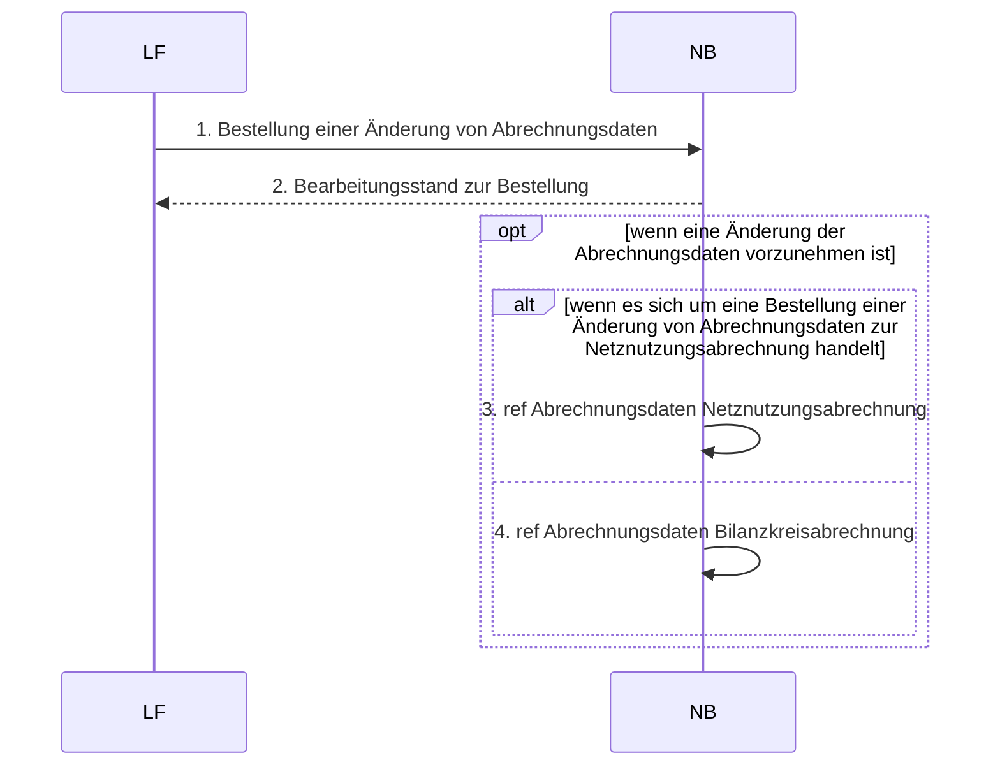
```mermaid
sequenceDiagram
    participant LF
    participant NB
    LF->>NB: 1. Bestellung einer Änderung von Abrechnungsdaten
    NB-->>LF: 2. Bearbeitungsstand zur Bestellung
    opt wenn eine Änderung der Abrechnungsdaten vorzunehmen ist
        alt wenn es sich um eine Bestellung einer Änderung von Abrechnungsdaten zur Netznutzungsabrechnung handelt
            NB->>NB: 3. ref Abrechnungsdaten Netznutzungsabrechnung
        else
            NB->>NB: 4. ref Abrechnungsdaten Bilanzkreisabrechnung
        end
    end
```

|Nr.|Aktion|Frist|Hinweis/Bemerkung|
|-|-|-|-|
|1|Bestellung einer Änderung von Abrechnungsdaten|Im Fall der Bestellung einer Änderung von Abrechnungsdaten zur Netznutzungsabrechnung gilt: Unverzüglich nach Kenntnisnahme einer Änderung.  Im Fall der Bestellung einer Änderung von Abrechnungsdaten zur Bilanzkreisabrechnung gilt: Abhängig der Änderung, sind die Fristen von Nr. 1 des SD „Abrechnungsdaten Bilanzkreisabrechnung“ zu berücksichtigen.|Die Bestellung einer Änderung enthält • entweder Abrechnungsdaten zur Netznutzungsabrechnung • oder Abrechnungsdaten zur Bilanzkreisabrechnung.  Das Änderungsdatum des LF kann sich • auf einen fixen Zeitpunkt 00:00 Uhr oder • auf einen nächstmöglichen Zeitpunkt 00:00 Uhr beziehen.  Im Fall der Bestellung einer Änderung von Abrechnungsdaten für die • Netznutzungsabrechnung kann das Änderungsdatum in der Vergangenheit liegen. • Bilanzkreisabrechnung kann das Änderungsdatum für die Änderung o nicht kritischer Daten sowie o kritischer Daten die als Korrektur gekennzeichnet sind in der Vergangenheit liegen.|

Seite **80** von **115**

|Nr.|Aktion|Frist|Hinweis/Bemerkung|
|-|-|-|-|
||||Der LF gibt insbesondere den Soll- und Ist-Zustand an, so dass der NB evtl. Datenschiefstände erkennen kann.|
|2|Bearbeitungsstand zur Bestellung|Unverzüglich, jedoch spätester ÜT ist der 2. WT nach dem ÜT von Nr. 1.|Der NB teilt dem LF mit, in welchen Fällen keine Änderung der Abrechnungsdaten vorgenommen wird und in welchen eine Änderung der Daten vorgenommen wird. Unabhängig davon sind die vom NB bereits übermittelten Abrechnungsdaten an den LF gültig, solange keine Änderung der Daten im Rahmen des Use-Cases „Abrechnungsdaten Netznutzungsabrechnung“ bzw. „Abrechnungsdaten Bilanzkreisabrechnung“ versendet wurde.|
|3|ref Abrechnungsdaten Netznutzungs- abrechnung|--|--|
|4|ref Abrechnungsdaten Bilanzkreis- abrechnung|--|--|

## 3.1.3.3 SD: Bestellung einer Änderung von Abrechnungsdaten zur Bilanzkreisabrechnung von ÜNB an NB

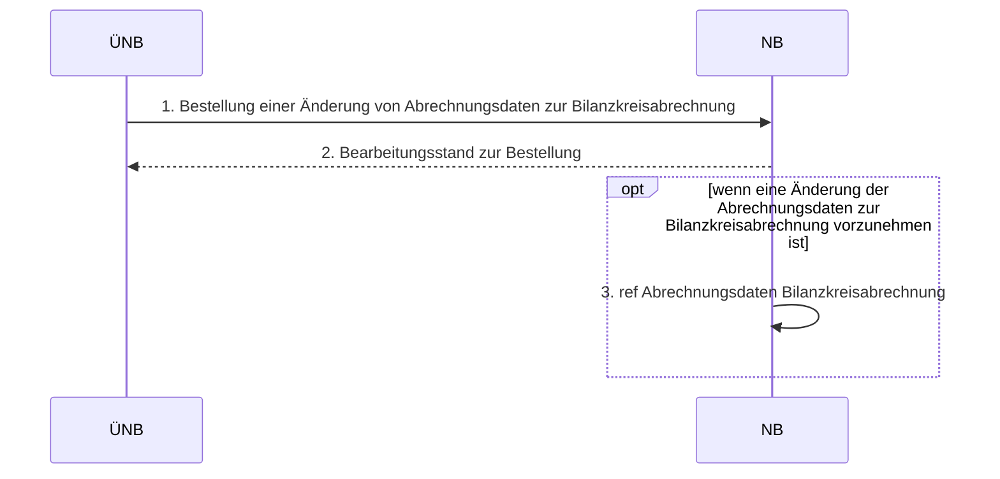
```mermaid
sequenceDiagram
    participant ÜNB
    participant NB
    ÜNB->>NB: 1. Bestellung einer Änderung von Abrechnungsdaten zur Bilanzkreisabrechnung
    NB-->>ÜNB: 2. Bearbeitungsstand zur Bestellung
    opt wenn eine Änderung der Abrechnungsdaten zur Bilanzkreisabrechnung vorzunehmen ist
        NB->>NB: 3. ref Abrechnungsdaten Bilanzkreisabrechnung
    end
```

|Nr.|Aktion|Frist|Hinweis/Bemerkung|
|-|-|-|-|
|1|Bestellung einer Änderung von Abrechnungsdaten zur Bilanzkreis-abrechnung|Abhängig der Änderung, sind die Fristen von Nr. 4 des SD „Abrechnungsdaten Bilanzkreis-|Das Änderungsdatum des ÜNB kann sich • auf einen fixen Zeitpunkt 00:00 Uhr oder • auf einen nächstmöglichen Zeitpunkt 00:00 Uhr beziehen.|

Seite **81** von **115**

|Nr.|Aktion|Frist|Hinweis/Bemerkung|
|-|-|-|-|
|||abrechnung“ zu berücksichtigen.|Das Änderungsdatum kann für die Änderung o nicht kritischer Daten sowie o kritischer Daten die als Korrektur gekennzeichnet sind in der Vergangenheit liegen. Der ÜNB gibt insbesondere den Soll- und Ist-Zustand an, so dass der NB evtl. Datenschiefstände erkennen kann.|
|2|Bearbeitungsstand zur Bestellung|Unverzüglich, jedoch spätester ÜT ist der 2. WT nach dem ÜT von Nr. 1.|Der NB teilt dem ÜNB mit, in welchen Fällen keine Änderung der Abrechnungsdaten vorgenommen wird und in welchen eine Änderung der Daten vorgenommen wird. Unabhängig davon sind die vom NB bereits übermittelten Abrechnungsdaten an den ÜNB gültig, solange keine Änderung der Daten im Rahmen des Use-Cases „Abrechnungsdaten Bilanzkreisabrechnung“ versendet wurde.|
|3|ref Abrechnungsdaten Bilanzkreis- abrechnung|--|--|

## 3.2 **Übermittlung der bisher gemessenen Arbeits- und Leistungswerte**
## **sowie des Lieferscheins zur Netznutzungsabrechnung**

Die Übermittlung der bisher gemessenen Arbeits- und Leistungswerte sowie Lieferscheine werden ausschließlich für verbrauchende Marktlokationen erstellt.

## 3.2.1 **Use-Case: Übermittlung der bisher gemessenen Arbeits- und**
## **Leistungswerte**

## 3.2.1.1 UC: Übermittlung der bisher gemessenen Arbeits- und
## Leistungswerte

|Use-Case-Name|Übermittlung der bisher gemessenen Arbeits- und Leistungswerte|
|-|-|
|Prozessziel|Dem LF liegen die bis zu seinem Zuordnungsbeginn zur Marktlokation gemessenen Arbeitswerte und zwei höchsten Monatsmaximalleistungswerte der Marktlokation des laufenden Kalenderjahres vor.|
|Use-Case Beschreibung|Der NB übermittelt nach Erreichen des unterjährigen Zuordnungsbeginns des LF zu einer Marktlokation die bis zu dem unterjährigen Zuordnungsbeginn gemessenen Arbeitswerte und zwei höchsten Monatsmaximalleistungswerte der Marktlokation des laufenden Kalenderjahres an den LF.  Hinweis: Ist der unterjährige Zuordnungsbeginn bereits vor dem 2. Februar, wird nur ein Monatsmaximalleistungswert für den Januar übermittelt.|
|Rollen|• NB|

Seite 82 von 115

|Use-Case-Name|Übermittlung der bisher gemessenen Arbeits- und Leistungswerte|
|-|-|
||• LF|
|Vorbedingung|• Es handelt sich um eine verbrauchende Marktlokation. • Der LF ist Zahler der Netznutzung. • Werte vom MSB liegen beim NB vor. • Der unterjährige Zuordnungsbeginn (über Use-Case „Lieferbeginn“ oder „Beginn der Ersatz-/Grundversorgung“) ist erreicht. • Die Netznutzungsabrechnung erfolgt auf Basis von Arbeits- und Leistungspreis. • Die für die Netznutzungsabrechnung notwendigen Informationen wurden über den Use-Case „Abrechnungsdaten Netznutzungsabrechnung“ übermittelt.|
|Nachbedingung im Erfolgsfall|Der Versand eines Lieferscheins ist möglich.|
|Nachbedingung im Fehlerfall|--|
|Fehlerfälle|--|
|Weitere Anforderungen|--|

## 3.2.1.2 SD: **Übermittlung der bisher gemessenen Arbeits- und Leistungswerte**

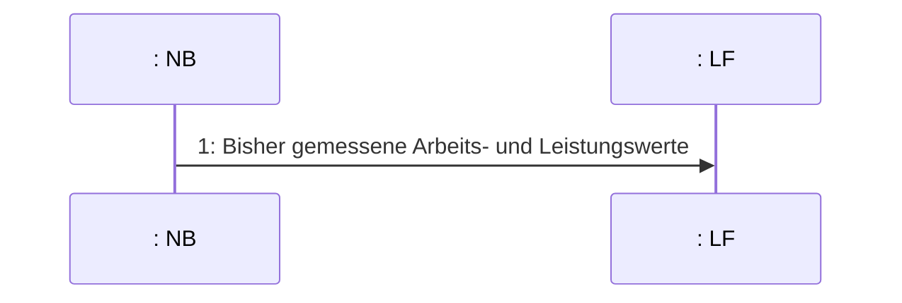
```mermaid
sequenceDiagram
    participant NB as : NB
    participant LF as : LF
    NB->>LF: 1: Bisher gemessene Arbeits- und Leistungswerte
```

|Nr.|Aktion|Frist|Hinweis/Bemerkung|
|-|-|-|-|
|1|Bisher gemessene Arbeits- und Leistungswerte|Unverzüglich, jedoch spätester ÜT ist der 10. WT des Folgemonats auf den unterjährigen Zuordnungsbeginn, jedoch vor dem Versand des Lieferscheins.|Es muss sich um abrechnungsrelevante Werte (wahre Werte oder Ersatzwerte) handeln.|

Seite **83** von **115**

## 3.2.2 **Lieferschein für verbrauchende Marktlokationen**

Der Lieferschein beinhaltet die Abrechnungsenergiemengen des Abrechnungszeitraums der Netznutzungsrechnung und falls erforderlich, alle notwendigen Leistungswerte.

Werte der Marktlokation und aller zu ihrer Ermittlung notwendigen Messlokationen werden dem NB vom für die Marktlokation verantwortlichen MSB elektronisch mitgeteilt (siehe WiM Teil 2, Kapitel 2.4.), sofern es sich nicht um eine Pauschalanlage handelt. Der NB berechnet vor der Erstellung der Netznutzungsrechnung auf Basis dieser Werte die Abrechnungsenergiemenge(n) für den Abrechnungszeitraum. Im Fall von Pauschalanlagen ermittelt der NB die Abrechnungsenergiemenge rechnerisch. Die Abrechnungsenergiemenge und ggf. Leistungswerte werden auf Ebene der Marktlokation als Lieferschein vom NB an den LF übermittelt und ist/sind Grundlage für die Netznutzungsabrechnung. Der Versand des Lieferscheins auf Ebene der Marktlokation muss vor dem Versand der Netznutzungsrechnung erfolgen und die angegebenen Abrechnungsenergiemengen des Abrechnungszeitraums der Netznutzungsrechnung müssen in ihrer Höhe und über den Zeitraum mit den vorher auf Ebene der Marktlokation vom NB im Lieferschein übermittelten Abrechnungsenergiemengen des Abrechnungszeitraums übereinstimmen. Werden in der Netznutzungsrechnung auch Leistungswerte abgerechnet, so müssen sich diese auch aus dem/den zuvor vom NB im Lieferschein übermittelten Leistungswerten ergeben bzw. berechnen lassen. Die sich ergebenden Abrechnungsenergiemengen eines Abrechnungszeitraums werden in einer Nachricht übermittelt.

Eine Zwischenablesung oder ein Austausch der Messeinrichtung stellt keinen Auslöser für eine Netznutzungsabrechnung dar und löst somit auch keinen Versand eines Lieferscheins aus.

In seltenen Fällen wird die Netznutzung für Marktlokationen aufgrund vertraglicher Vereinbarungen z. B. mit dem AN, abweichend der vorab beschriebenen Regelungen abgerechnet. In diesen Fällen ist eine Erstellung des Lieferscheins nicht auf Basis der Werte vom MSB möglich. Diese Marktlokationen sind im Rahmen des Use-Cases „Abrechnungsdaten Netznutzungsabrechnung“ zu kennzeichnen und die Erstellungslogik des Lieferscheins ist zwischen NB und LF bilateral auszutauschen.

## 3.2.3 **Use-Case: Übermittlung des Lieferscheins zur**
## **Netznutzungsabrechnung**

## 3.2.3.1 **UC: Übermittlung des Lieferscheins zur**
## **Netznutzungsabrechnung**

|Use-Case-Name|Übermittlung des Lieferscheins zurNetznutzungsabrechnung|
|-|-|
|Prozessziel|Dem LF liegt der Lieferschein der Abrechnungsenergiemengen/Leistungswerte vor, welcher eine der Grundlagen für die Netznutzungsabrechnung bildet.|
|Use-Case Beschreibung|Vor dem Versand der Netznutzungsrechnung übermittelt der NB an den LF die zugrundeliegenden Werte der Netznutzungsrechnung auf Ebene der Marktlokation.  Je nach Auslöser kann es sich dabei um einen turnusmäßigen oder ereignisgesteuerten Versand eines Lieferscheines handeln.|

Seite 84 von 115

|Use-Case-Name|Übermittlung des Lieferscheins zurNetznutzungsabrechnung|
|-|-|
||Sollten sich für den Zeitraum, der von einem Lieferschein umfasst wird, für den Lieferschein relevante Werte ändern, ist der bereits versendete Lieferschein, der die entsprechende Abrechnungsenergiemenge/Leistungswert enthält, vom NB zu stornieren.  Anschließend ist ein neuer Lieferschein mit korrigierter Abrechnungsenergiemenge und ggf. korrigierten Leistungswerten an den LF zu versenden. Der Lieferschein enthält die Energiemenge(n) und das aufgetretene Jahresleistungsmaximum, welche auf der zugehörigen Netznutzungsrechnung abgerechnet werden. Ist nur die Abrechnungsenergiemenge oder der Leistungswert zu korrigieren, hat der neue Lieferschein die weiterhin richtige, nicht korrigierte Größe zu enthalten.|
|Rollen|• NB • LF|
|Vorbedingung|• Es handelt sich um eine verbrauchende Marktlokation. • Der LF ist Zahler der Netznutzung. • Werte vom MSB liegen vor. • Die bisher gemessenen Arbeits- und Leistungswerte bei unterjährigem Zuordnungsbeginn und wenn die Marktlokation mit Arbeits- und Leistungspreis abgerechnet wird, sind vom NB an den LF übermittelt.  • Die Abrechnung der Netznutzung soll gestellt werden. • Sofern der Bedarf der Anwendung einer Zählzeitdefinition des NB mit Zählzeitenanwendungszweck „Netznutzung“ vorliegt, muss eine entsprechende Konfiguration fristgerecht und erfolgreich über die Use-Cases im Kapitel „Bestellung einer Konfiguration“ (GPKE Teil 3) eingerichtet worden sein. Dies gilt nur, wenn die bestellte Einrichtung einer Konfiguration in den abrechnungsrelevanten Zeitraum des zu erstellenden Lieferscheines fällt. • Die für die Netznutzungsabrechnung notwendigen Informationen wurden über den Use-Case „Abrechnungsdaten Netznutzungsabrechnung“ übermittelt.  Auslöser sind unter anderem: • Das Ende des Abrechnungszeitraums ist erreicht oder • ein Lieferendeprozess wurde durchgeführt oder • eine Änderung des Zahlers der Netznutzung liegt vor oder • ein Netzbetreiberwechsel wurde durchgeführt oder • der Wechsel zwischen dem Modell Grundpreis/Arbeitspreis und Arbeitspreis/Leistungspreis wurde vorgenommen.|
|Nachbedingung im Erfolgsfall|Eine Netznutzungsrechnung kann gestellt werden.|
|Nachbedingung im Fehlerfall|Ein Lieferschein muss erneut übermittelt werden.|
|Fehlerfälle|--|
|Weitere Anforderungen|Eine Position in der Netznutzungsrechnung muss durch eine Position oder durch Addition von mehreren Positionen aus dem Lieferschein zeitlich eindeutig zugeordnet und geprüft werden|

Seite **85** von **115**

|**Use-Case-Name**|Übermittlung des Lieferscheins zur Netznutzungsabrechnung|
|-|-|
||können. Dies ist vom NB beim Aufbau des Lieferscheins zu berücksichtigen.|

## 3.2.3.2 SD: **Übermittlung des Lieferscheins zur**
## **Netznutzungsabrechnung**

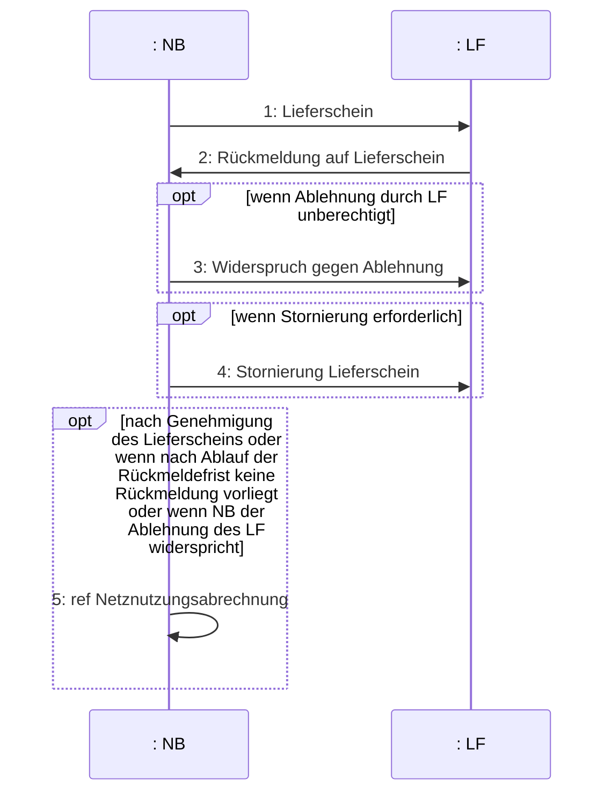
```mermaid
sequenceDiagram
    participant NB as : NB
    participant LF as : LF

    NB->>LF: 1: Lieferschein
    LF->>NB: 2: Rückmeldung auf Lieferschein

    opt wenn Ablehnung durch LF unberechtigt
        NB->>LF: 3: Widerspruch gegen Ablehnung
    end

    opt wenn Stornierung erforderlich
        NB->>LF: 4: Stornierung Lieferschein
    end

    opt nach Genehmigung des Lieferscheins oder wenn nach Ablauf der Rückmeldefrist keine Rückmeldung vorliegt oder wenn NB der Ablehnung des LF widerspricht
        NB->>NB: 5: ref Netznutzungsabrechnung
    end
```

|Nr.|Aktion|Frist|Hinweis/Bemerkung|
|-|-|-|-|
|1|Lieferschein|ÜZ ist vor dem Versand der Netznutzungs- rechnung.|--|
|2|Rückmeldung auf Lieferschein|Unverzüglich, jedoch spätester ÜT ist der|Der LF gibt eine Rückmeldung an den NB, ob er den Inhalt des Lieferscheins als|

Seite **86** von **115**

|Nr.|Aktion|Frist|Hinweis/Bemerkung|
|-|-|-|-|
|||2. WT nach dem ÜT von Nr. 1.|korrekt ansieht. Bei Ablehnung hat er den Grund konkret zu benennen.|
|3|Widerspruch gegen Ablehnung|Unverzüglich nach dem ÜZ von Nr. 2, sofern es sich um eine Ablehnung des Lieferscheins handelt.|Der NB prüft, ob die Ablehnung des Lieferscheins berechtigt ist.  Der NB prüft die Ablehnung anhand des mitgeteilten Ablehnungsgrunds auf Berechtigung und nimmt bei Unklarheiten Kontakt mit dem LF auf.  Im Fall, dass der NB feststellt, dass der ursprünglich vom LF reklamierte Lieferschein korrekt ist, teilt der NB dies dem LF mit. Der NB begründet die Richtigkeit der mitgeteilten Energiemenge und ggf. Leistungswerte und entkräftet die Ablehnungsgründe des LF.  Da dadurch der im Prozessschritt 1 versendete Lieferschein weiterhin Bestand hat, ist kein neuer Lieferschein zu versenden.|
|4|Stornierung Lieferschein|Unverzüglich nach Kenntnisnahme von Fehlern.|--|
|5|ref Netznutzungs-abrechnung|--|--|

## 3.3 **Use-Case: Netznutzungsabrechnung**

## 3.3.1 **UC: Netznutzungsabrechnung**

|Use-Case-Name|Netznutzungsabrechnung|
|-|-|
|Prozessziel|Der NB ist informiert, dass der LF die Netznutzungsrechnung akzeptiert.|
|Use-Case Beschreibung|Der Prozess beschreibt die Kommunikation zwischen NB und LF zur Abrechnung der Netznutzung und ggf. dem automatisierten Reklamationsfall. Eine Rechnungskorrektur umfasst immer eine Stornorechnung und eine neue Rechnung.  Insbesondere in den nachfolgend genannten Fällen kann eine Jahresrechnung korrigiert oder ergänzt werden, ohne dass dies durch Stornierung erfolgt:  • Änderung der Konzessionsabgabe durch Einreichung eines Testates: Prüfung des Grenzpreisvergleichs nach KAV • Korrektur der Netzentgelte Strom aufgrund individueller Vereinbarung für atypische und energieintensive Netznutzung nach StromNEV • Korrektur der Netzentgelte Strom aufgrund individueller Vereinbarung für singuläre Netznutzung nach StromNEV • KWKG-Umlage|

Seite **87** von **115**

|Use-Case-Name|Netznutzungsabrechnung|
|-|-|
||• Offshore-Netzumlage.  In diesen Fällen kann eine separate, entsprechend gekennzeichnete Rechnung gestellt werden, in der die für das Abrechnungsjahr zu viel oder zu wenig gezahlten Entgelte korrigiert und gemäß Testat, individueller Vereinbarung oder Nachweis erhoben werden. Diese Rechnung hat sich eindeutig auf die Jahresrechnung zu beziehen, deren Position bzw. Positionen sie korrigiert.|
|Rollen|• NB • LF|
|Vorbedingung|• Es handelt sich um eine verbrauchende Marktlokation. • Die aktuellen Netznutzungsentgelte sind vom NB veröffentlicht und wurden im Rahmen des Use Cases „Übermittlung Preisblatt NB an LF“ im Preisblatt Netznutzung an den LF übermittelt • Der LF ist der Marktlokation zugeordnet. • Die Netznutzungsrechnung enthält nur Positionen, die o als Artikel-ID im Preisblatt Netznutzung enthalten sind oder o als Zu-/Abschlag zu einer Artikel-ID des Preisblatts Netznutzung des NB vorab im Rahmen des Use-Cases „Abrechnungsdaten Netznutzungsabrechnung“ übermittelt wurden. • Die für die Netznutzungsabrechnung notwendigen Informationen wurden über den Use-Case „Abrechnungsdaten Netznutzungsabrechnung“ übermittelt. • Die Abrechnung der Netznutzung ist fällig (Turnus-, Abschlags- oder Schlussrechnung bzw. ereignisgesteuert). • Der Lieferschein wurde vorher übermittelt (außer bei Abschlagsrechnungen) und im Fall der Ablehnung mit konkretem Grund durch den LF, wurde die Reklamation vom NB entkräftet. • Der LF ist Zahler der Netznutzung.|
|Nachbedingung im Erfolgsfall|Der LF wird die vom NB gestellte Netznutzungsrechnung bezahlen.|
|Nachbedingung im Fehlerfall|--|
|Fehlerfälle|• Die Netznutzungsrechnung enthält Positionen, die nicht o als Artikel-ID im Preisblatt Netznutzung des NB enthalten sind oder o als Zu-/Abschlag zu einer Artikel-ID des Preisblatts Netznutzung des NB vorab im Rahmen des Use-Cases „Abrechnungsdaten Netznutzungsabrechnung“ übermittelt wurden. • Die für die Netznutzungsabrechnung notwendigen Informationen wurden nicht über den Use-Case „Abrechnungsdaten Netznutzungsabrechnung“ übermittelt. • Die für die Netznutzungsabrechnung notwendigen Informationen wurden über den Use-Case „Abrechnungsdaten Netznutzungsabrechnung“ übermittelt, wurden jedoch in der Netznutzungsrechnung nicht entsprechend berücksichtigt.|

Seite 88 von 115

|Use-Case-Name|Netznutzungsabrechnung|
|-|-|
||* Die Abrechnungsenergiemengen/Leistungswerte der Netznutzungsrechnung entsprechen nicht denen des Lieferscheins.
* Der in der Netznutzungsrechnung angegebene Preis einer Artikel-ID entspricht nicht dem im Preisblatt Netznutzung des NB angegebenen Preis der entsprechenden Artikel-ID.|
|Weitere Anforderungen|- Der Fall einer reklamierten oder sich als falsch erweisenden Netznutzungsrechnung (Storno der ursprünglichen Rechnung wird ohne vorherige Reklamation des LF oder auf Grund einer vorherigen Reklamation des LF durchgeführt) stellt einen Teil des Regelprozesses dar und muss abgesehen von Klärungen vollumfänglich automatisch abgewickelt werden. Im Reklamationsfall kommt das sog. „Alles-oder-Nichts-Prinzip“ zur Anwendung, nach dem eine Rechnung entweder vollumfänglich als richtig akzeptiert oder vollumfänglich abgelehnt wird.  Im Fall einer sich falsch erweisenden Netznutzungsrechnung (Storno der ursprünglichen Rechnung wird ohne vorherige Reklamation des LF oder auf Grund einer vorherigen Reklamation des LF durchgeführt) ist in diesem Zusammenhang auch der korrespondierende Lieferschein zu stornieren und ein korrigierter Lieferschein vor dem Versand der neuen Rechnung an den LF zu übermitteln, sofern die Korrektur der Abrechnungsenergie-mengen/Leistungswerte notwendig ist. Die im Konfliktfall abzuwickelnden Prozesse im Rahmen des Forderungsmanagements bzw. Mahnablaufs sind nicht dargestellt und sind bilateral zu lösen.
- Die Netznutzungsrechnung kann eindeutig über eine Referenz dem zuvor ausgetauschten Lieferschein zugeordnet werden.
- Die Schlussrechnung/ Jahresrechnung weist nachvollziehbar alle enthaltenen Abschlagsrechnungen der Abrechnungsperiode unter Bezeichnung der Rechnungsnummer aus.
- Eine Position in der Netznutzungsrechnung muss durch eine Position oder durch Addition von mehreren Positionen aus dem Lieferschein zeitlich eindeutig zugeordnet und geprüft werden können.|

Seite **89** von **115**

## 3.3.2 SD: Netznutzungsabrechnung

|Nr.|Aktion|Frist|Hinweis/Bemerkung|
|-|-|-|-|
|1|Netznutzungs- rechnung|Unverzüglich, jedoch frühester ÜZ ist nach ausdrücklicher oder aufgrund Fristablaufs erteilter Genehmigung des Lieferscheins oder nach Entkräftung der unberechtigten Reklamation des Lieferscheins durch den NB.|Das Zahlungsziel darf 10 WT nach Empfang der Rechnung nicht unterschreiten.  Vom LF geleistete Zahlungen werden in der Netznutzungsrechnung in Summe und nicht positionsbezogen in Abzug gebracht (dadurch kann sich auch eine Rückerstattung ergeben).  Der NB fasst im Falle mehrerer Rechnungen die Nachrichten zu einer Datei zusammen und versendet diese (entspricht Sammelanforderung mit marktlokationsbezogenen Einzelrechnungen) an den LF.  Bei einer korrigierten Netznutzungs- rechnung:|

Seite **90** von **115**

|Nr.|Aktion|Frist|Hinweis/Bemerkung|
|-|-|-|-|
||||Der NB erstellt eine korrigierte Netznutzungsrechnung und sendet diese an den LF. Das Zahlungsziel darf 10 WT nach Empfang der Rechnung nicht unterschreiten.|
|2|Antwort|Unverzüglich nach dem ÜZ von Nr. 1, jedoch spätester ÜT ist der 4. WT vor dem Zahlungsziel in der Netznutzungsrechnung.|Der LF prüft die Rechnung und teilt dem NB das Ergebnis mit. Abweichungen zwischen Rechnung und Lieferschein führen zur Rechnungsablehnung. Bei Unklarheiten und/oder geringfügigen Abweichungen soll vor einer Zahlungsablehnung Kontakt mit dem NB aufgenommen werden.  Zahlungsavis: Der LF bestätigt die Zahlung der Netznutzungsrechnung in Form eines Zahlungsavises.  Die Bestätigung der Zahlung einzelner Rechnungen wird zusammengefasst. Eine Bestätigungsnachricht wird in einer Datei versendet. Im Falle der Bestätigung der Zahlung durch den LF veranlasst der LF parallel die Zahlung der Summe der akzeptierten Rechnungen an den NB.  Zahlungsablehnung: Der LF lehnt die Zahlung der Netznutzungsrechnung ab.  Eine Ablehnung der Zahlung wird durch den LF begründet. Die Ablehnung der Zahlung einzelner Rechnungen wird zu einer zusammengefasst. Eine Ablehnungsnachricht wird in einer Datei versendet.|
|3|Mitteilung, dass die ursprüngliche Netznutzungsrechnung korrekt war|Unverzüglich nach dem ÜZ von Nr. 2, sofern es sich um eine Zahlungsablehnung handelt, jedoch spätester ÜT ist der 2. WT vor dem Zahlungsziel in der Netznutzungsrechnung.|Der NB prüft, ob die Zahlungsablehnung berechtigt ist.  Der NB prüft die Ablehnung anhand des mitgeteilten Ablehnungsgrunds auf Berechtigung und nimmt bei Unklarheiten Kontakt mit dem LF auf.  Im Fall, dass der NB feststellt, dass die ursprüngliche vom LF reklamierte Netznutzungsrechnung korrekt ist, teilt der NB dies dem LF mit. Der NB begründet die Richtigkeit der gestellten Netznutzungsrechnung und entkräftet die Ablehnungsgründe des LF.  Da dadurch die im Prozessschritt 1 versendete Netznutzungsrechnung|

Seite **91** von **115**

|Nr.|Aktion|Frist|Hinweis/Bemerkung|
|-|-|-|-|
||||weiterhin Bestand hat, ist keine neue Rechnung zu versenden.|
|4|Antwort|Unverzüglich nach dem ÜZ von Nr. 3, jedoch spätester ÜT ist zum Zahlungsziel in der Netznutzungs- rechnung.|Der LF prüft die Rechnung und teilt dem NB das Ergebnis mit. Abweichungen zwischen Rechnung und Lieferschein führen zur Rechnungsablehnung. Bei Unklarheiten und/oder geringfügigen Abweichungen soll vor einer Zahlungsablehnung Kontakt mit dem NB aufgenommen werden.  Zahlungsavis: Der LF bestätigt die Zahlung der Netznutzungsrechnung in Form eines Zahlungsavises.  Die Bestätigung der Zahlung einzelner Rechnungen wird zusammengefasst. Eine Bestätigungsnachricht wird in einer Datei versendet. Im Falle der Bestätigung der Zahlung durch den LF veranlasst der LF parallel die Zahlung der Summe der akzeptierten Rechnungen an den NB.  Zahlungsablehnung: Der LF lehnt die Zahlung der Netznutzungsrechnung ab.  Eine Ablehnung der Zahlung wird durch den LF begründet. Die Ablehnung der Zahlung einzelner Rechnungen wird zu einer zusammengefasst. Eine Ablehnungsnachricht wird in einer Datei versendet.  Kommt es zu einer erneuten Ablehnung durch den LF, ist eine bilaterale Klärung notwendig. Hierbei ist das weitere Vorgehen im Rahmen der Netznutzungsabrechnung abzustimmen.|
|5|Storno der ursprünglichen Rechnung|Unverzüglich nach Feststellung des Stornierungsbedarfs.|Der NB stellt fest, dass die ursprüngliche Netznutzungsrechnung nicht korrekt war und sendet eine Stornierung der ursprünglichen Rechnung an den LF. Anschließend führt der NB die nötigen Korrekturen durch und erstellt eine neue Rechnung. Eine Rechnungskorrektur umfasst immer eine Stornorechnung und eine neue Rechnung.  Sofern die Zahlung der Rechnung vom LF bestätigt worden war (Schritt 2 oder Schritt 4), wird der gezahlte Betrag im Zahlungsverkehr berücksichtigt.|

Seite 92 von 115

|Nr.|Aktion|Frist|Hinweis/Bemerkung|
|-|-|-|-|
||||Sofern die Zahlung der Rechnung vom LF abgelehnt worden war (Schritt 2 oder Schritt 4) und der Ablehnungsgrund vom NB akzeptiert wurde, darf sich der LF den Stornobetrag nicht gutschreiben.|
|6|Antwort|Unverzüglich nach dem ÜZ von Nr. 5, sofern in Nr. 2 oder Nr. 4 die Zahlung bestätigt wurde.|Hat der LF dem NB in Schritt 2 oder Schritt 4 die Zahlung der Netznutzungsrechnung in Form eines Zahlungsavises bestätigt und geht daraufhin eine Stornierung dieser Netznutzungsrechnung vom NB beim LF ein, muss der LF dem NB die Stornierung in einer Antwort bestätigen.|
|7|ref Übermittlung des Lieferscheins zur Netznutzungsabrechnung|--|Ist die Korrektur der Abrechnungsenergiemengen/Leistungswerte notwendig, ist zudem der korrespondierende Lieferschein zu stornieren und ein korrigierter Lieferschein vor dem Versand der neuen Rechnung an den LF zu übermitteln.|

## 3.4 **Prozessbeschreibungen zu den Preisblättern des NB**

### 3.4.1 **Allgemeines**

Das elektronische Preisblatt ermöglicht dem LF eine automatisierte und damit massengeschäftsfähige Rechnungsprüfung.

Der NB übermittelt zu diesem Zweck vorab und vollständig die auf den Preisblättern enthaltenen Informationen elektronisch an die LF.

Die Abrechnung des Messstellenbetriebes ist bei kME, wenn der Messstellenbetrieb vom gMSB durchgeführt wird, Bestandteil der Netznutzungsrechnung und der nachfolgende Prozess zum Preisblatt ist anzuwenden. Für alle anderen Fälle wird auf die entsprechenden Prozesse zur Abrechnung des Messstellenbetriebes in der WiM Teil 1, Kapitel 3.6. verwiesen.

### 3.4.2 **Begriffsbestimmungen**

#### <u>Elektronisches Preisblatt</u>

Ein elektronisches Preisblatt, im folgenden Preisblatt genannt, enthält die vom NB angebotenen Leistungen und die dazugehörigen Preise.

Um eine sachgerechte Darstellung der Leistungen und Preise zu gewährleisten, unterschiedliche Preiszyklen zu berücksichtigen und das auszutauschende Datenvolumen zu minimieren, sind für nachfolgende Sachverhalte unterschiedliche Preisblätter zu bilden:

Seite 93 von 115

•   Preisblatt (bzw. Preisblätter1) Netznutzung
•   Preisblatt Sperrkosten und Verzugskosten
•   Preisblatt Blindarbeit
•   (…)

Hinweis: Leistungen der Preisblätter Sperrkosten, Verzugskosten, und Blindarbeit werden im nachfolgenden Dokument auch unter dem Begriff „sonstige Leistungen“ zusammengefasst.

## <u>Gruppenartikel-ID und Artikel-ID</u>

Mit einer Artikel-ID wird die abzurechnende Leistung sachgerecht und eindeutig dargestellt. Die Eindeutigkeit wird durch eine Beschreibung anhand fachlicher und technischer Informationen im Preisblatt erreicht. Jeder Artikel-ID kann ein Preis zugeordnet werden.

Eine Gruppenartikel-ID fasst mehrere Artikel-IDs zu einem übergreifenden Sachverhalt zusammen, sofern diese benötigt wird.

## <u>Preis </u>

Jeder Artikel-ID ist für jeden Zeitpunkt im elektronischen Preisblatt genau ein Preis zuzuordnen. Ausgenommen hiervon sind z.B. individuelle Netzentgelte sowie Preisbestandteile, deren Höhe aufgrund gesetzlicher Vorgaben durch Dritte jährlich ermittelt und veröffentlicht werden. Diese Fälle sind gesondert im Preisblatt gekennzeichnet und es ist dort lediglich die Artikel-ID anzugeben und kein Preis. Im Rahmen der Netznutzungsrechnung bzw. Abrechnung einer sonstigen Leistung sind dann die Preise der jeweiligen Marktlokation anzugeben.

Alle Preise sind Nettopreise. Zu jeder Artikel-ID im elektronischen Preisblatt wird vorgegeben, ob der Preis in Euro oder Cent und mit welcher Maßeinheit (z. B. pro Tag, pro Auftrag, pro kWh) abzurechnen ist.

Ein Preis darf auch mit "0,00" angegeben werden.

## <u>Preiskomponente </u>

Als Preiskomponente wird jede inhaltliche Information des Preisblatts als Sammelbegriff verstanden. Dies sind:

a)  Gruppenartikel-ID
b)  Artikel-ID
c)  Preis

__________________________________________________
1 Vorübergehend im Fall von Netzübergängen.

Seite **94** von **115**

## **3.4.3 Rahmenbedingungen der Preisblätter**

1. Neben der gesetzlichen Verpflichtung zur Veröffentlichung und Mitteilung des Preisblatts gemäß § 20 Abs. 1 EnWG und § 27 StromNEV muss der NB alle Preisblätter auf dem Wege des elektronischen Datenaustauschs im Sinne der vorliegenden Prozessbeschreibung übermitteln. Es sind dabei in den Preisblättern des NB nur die Artikel-ID anzugeben, die beim NB Anwendung finden. Möchte der NB zu einem Preisblatt keine einzige Artikel-ID anwenden (z.B. die unter Preisblatt Blindarbeit gelisteten Artikel-ID), so hat der NB dieses Preisblatt mit der Information „leeres Preisblatt“ im Sinne der vorliegenden Prozessbeschreibungen zu übermitteln.

2. Die Preisblätter sind eindeutig zu versionieren. Auf den Preisblättern sind die aktuelle Versionskennzeichnung, der Gültigkeitsbeginn und die Kennzeichnung der Vorgängerversion (sofern eine Vorgängerversion vorhanden ist) des Preisblatts anzugeben.

3. Ein übermitteltes Preisblatt wird ungültig durch die Übermittlung eines Preisblattes mit identischem Gültigkeitsbeginn und einer höheren Versionskennzeichnung. Die Gültigkeit eines Preisblatts endet mit dem Inkrafttreten eines Preisblatts mit einem späteren Gültigkeitsbeginn und einer höheren Versionskennzeichnung. Ein Preisblatt beginnt und endet immer zu 00:00 Uhr eines Kalendertages.

4. Das Preisblatt ist nachfolgender Hierarchie aufgebaut:

   Preisblatt (1:n Gruppenartikel-ID) 1:n Artikel-ID 1:1 Preis.

5. Preiskomponenten, die nicht mit einer Artikel-ID im Preisblatt des NB angegeben sind, können nicht über den Use-Case „Netznutzungsabrechnung“ bzw. den Use-Case „Abrechnung einer sonstigen Leistung“ abgerechnet werden. Sie sind im Fall der Netznutzungsabrechnung über den Use-Case „Abrechnungsdaten Netznutzungsabrechnung“ mitzuteilen und ggf. bilateral abzurechnen und im Fall einer sonstigen Leistung über die Prozesse zur Stammdatenänderung (GPKE Teil 4) bzw. im Fall von Sperrkosten im Rahmen des Use-Case „Unterbrechung der Anschlussnutzung (Sperren) auf Anweisung des LF“ mitzuteilen und ggf. bilateral abzurechnen. Der NB kann nur in dem vorgegebenen Rahmen der Konzessionsabgaben bei Bedarf eigene Artikel-ID im Preisblatt Netznutzung vergeben. Darüber hinaus kann kein Preisblatt durch eigene Artikel-ID o.ä. erweitert werden.

6. Jeder Preis muss im Preisblatt eindeutig hinsichtlich seiner Verwendung, anhand fachlicher und technischer Informationen, beschrieben sein.

7. Preise, die aufgrund gesetzlicher oder vertraglicher Vorgaben Monats- oder Jahrespreise (z.B. Jahresleistungspreis gem. § 19 Absatz 4 StromNEV etc.) sind, werden lediglich für das elektronische Preisblatt zur Abrechnung in der kleinsten Einheit ausgewiesen. So können z.B. bei einer untermonatlichen Zuordnung eines LF zu einer Marktlokation Preiskomponenten tagesscharf unabhängig von der Anzahl der Tage des jeweiligen Monats eindeutig ausgewiesen werden und es werden Clearingfälle reduziert. Der für Abrechnungszwecke optimierte Ausweis im

Seite **95** von **115**

elektronischen Preisblatt ändert nichts an der gesetzlich oder vertraglich vorgesehenen
Bezugsgröße und führt zu keinen Mehr- oder Mindereinnahmen.

8. Zu- und Abschläge einer Artikel-ID werden nicht in den Preisblättern abgebildet.
   Werden zu einzelnen Artikel-ID Zu- und/oder Abschläge (wie z.B. der Kommunalrabatt)
   erhoben, so werden diese im Fall der Netznutzungsabrechnung über den Use-Case
   „Abrechnungsdaten Netznutzungsabrechnung“ bekanntgegeben und im Fall einer
   sonstigen Leistung über die Prozesse zur Stammdatenänderung (GPKE Teil 4)
   bekanntgegeben. Zu- und Abschläge sind prozentual auszuweisen und der
   entsprechenden Artikel-ID zuzuordnen.

9. Für individuelle Netzentgelte (insbesondere atypische Netznutzung, intensive
   Netznutzung und individuell vereinbartes Entgelt für allein genutzte Betriebsmittel nach
   § 19 Abs. 2 und 3 StromNEV)) sind lediglich Artikel-ID im Preisblatt Netznutzung
   anzugeben und keine Preise. Im Rahmen der Netznutzungsrechnung sind dann die
   Preise der jeweiligen Marktlokation anzugeben. Auch für Preisbestandteile, deren
   Höhe aufgrund gesetzlicher Vorgaben durch Dritte jährlich ermittelt und veröffentlicht
   werden (z. B. Offshore-Netzumlage nach § 17f. EnWG) und weitere diesbezüglich in
   einem Preisblatt gekennzeichnete Leistungen sind lediglich Artikel-ID im Preisblatt und
   keine Preise anzugeben. Im Rahmen der Netznutzungsrechnung bzw. Abrechnung
   einer sonstigen Leistung sind dann die Preise der jeweiligen Marktlokation anzugeben.

10. Im Rahmen der Netznutzungsabrechnung können nur Artikel-ID des Preisblatts
    Netznutzung abgerechnet werden. Artikel-ID der Preisblätter Sperrkosten,
    Verzugskosten und Blindarbeit werden stets über den Use-Case „Abrechnung einer
    sonstigen Leistung“ in Rechnung gestellt.

11. Im Use-Case „Abrechnungsdaten Netznutzungsabrechnung“ müssen die für die
    Marktlokation relevanten Gruppenartikel-ID bzw. Artikel-ID des Preisblatts
    Netznutzung angegeben werden. Wenn eine Gruppenartikel-ID vorhanden ist, muss
    diese genannt werden, ansonsten wird direkt die Artikel-ID angegeben.

12. Die Abrechnung des Messstellenbetriebs umfasst insbesondere die für die
    Messeinrichtung, den Wandler sowie vorhandene Telekommunikationseinrichtungen
    zu entrichtenden Kosten. Folglich kann der NB diese Komponenten ausschließlich für
    kME über das Preisblatt Netznutzung abrechnen. Der Wandler, die
    Telekommunikationseinrichtungen sowie Schaltgeräte werden über die jeweilige
    Artikel-ID gesondert abgerechnet. Für alle anderen Fälle wird auf die entsprechenden
    Prozesse zur Abrechnung des Messstellenbetriebes in der WiM Teil 1, Kapitel 3.6.
    verwiesen.

13. Mit dem Preisblatt Blindarbeit kann Blindarbeit zwischen NB und LF
    massengeschäftstauglich abgerechnet werden. Diese Position wird eigentlich direkt
    zwischen NB und AN abgerechnet. Sofern der NB offen für eine Abrechnung über den
    LF ist, zeigt er das über eine Artikel-ID im Preisblatt Blindarbeit an. Falls auch der LF
    (freiwillig) die Abrechnung gegenüber den AN durchführen möchte, teilt er dies dem
    NB über die Prozesse zur Stammdatenänderung (GPKE Teil 4) mit.

Seite **96** von **115**

## 3.4.4 **Use-Case: Übermittlung Preisblatt NB an LF**

### 3.4.4.1 **UC: Übermittlung Preisblatt NB an LF**

|**Use-Case-Name**|Übermittlung Preisblatt NB an LF|
|-|-|
|Prozessziel|Dem LF liegt das elektronische Preisblatt des NB vor. Im Fall von Netzübergängen liegen dem LF ggf. die Preisblätter vor.|
|Use-Case Beschreibung|Der NB übermittelt dem LF sein elektronisches Preisblatt, wenn dem LF das elektronische Preisblatt nicht vorliegt oder sich mindestens eine Preiskomponente des Preisblatts geändert hat.|
|Rollen|• NB • LF|
|Vorbedingung|• Die EDIFACT-Kommunikation zwischen NB und LF ist aufgebaut. • Dem LF liegt das aktuelle oder aktualisierte Preisblatt des NB nicht vor.|
|Nachbedingung im Erfolgsfall|• Die Abrechnung einer sonstigen Leistung kann erstellt werden oder • die Netznutzungsrechnung kann erstellt werden.|
|Nachbedingung im Fehlerfall|In den Fehlerfällen erfolgt eine erneute Übermittlung des Preisblatts.|
|Fehlerfälle|• Preisblatt enthält einen Fehler • Preisblatt wurde nicht in der aktuellen Version übermittelt • Preisblatt wurde nicht vollständig übermittelt • Preisblatt beginnt nicht um 00:00 Uhr eines Kalendertages|
|Weitere Anforderungen|Hinweise: • Erfolgt keine Korrektur der vorläufigen Netzentgelte eines Jahres (gültig ab 1. Januar des Folgejahres) werden diese ab dem 1. Januar des Folgejahres automatisch angewendet und es erfolgt kein erneuter Versand an den LF. • Erfolgt eine Korrektur der vorläufigen Netzentgelte eines Jahres (gültig ab 1. Januar des Folgejahres), wird vom NB eine neue Version mit Gültigkeit zum 1. Januar des Folgejahres an den LF gesendet. • Preisblätter sind auch an den Letztverbraucher in seiner Rolle als LF zu übermitteln, wenn im Rahmen der Netznutzungsabrechnung (inkl. möglich anfallender Mahnkosten in diesem Zusammenhang) der Letztverbraucher selbst Netznutzer (= Netznutzer ohne All-Inklusiv-Vertrag) ist und in die Rolle des LF i. S. dieser Prozessbeschreibung tritt, soweit diese Regelungen sinngemäß auf ihn anwendbar sind.|

### 3.4.4.2 **SD: Übermittlung Preisblatt NB an LF**

Seite 97 von 115

|Nr.|Aktion|Frist|Hinweis/Bemerkung|
|-|-|-|-|
|1|Preisblatt|Bei initialer Übermittlung: Unverzüglich, jedoch spätester ÜT ist der 3. WT, nachdem die EDIFACT-Kommunikation aufgebaut wurde.  Bei Übermittlung aufgrund einer Änderung:  *Preisblatt Netznutzung:* Unverzüglich, jedoch spätester ÜT ist parallel zur Veröffentlichung nach § 20 Abs. 1 EnWG  im Falle aller *anderen Preisblätter des NB:* Unverzüglich, jedoch spätester ÜT ist der 20. WT vor Inkrafttreten des/der geänderten Preise(s) im entsprechenden Preisblatt|--|

## **3.4.5 Use-Case: Abrechnung einer sonstigen Leistung**

### **3.4.5.1 UC: Abrechnung einer sonstigen Leistung**

|**Use-Case-Name**|Abrechnung einer sonstigen Leistung|
|-|-|
|Prozessziel|Der NB ist informiert, dass der LF die Rechnung der sonstigen Leistung akzeptiert.|
|Use-Case Beschreibung|Der Prozess beschreibt die Kommunikation zwischen NB und LF zur Abrechnung einer sonstigen Leistung, die in den Preisblättern Sperrkosten, Verzugskosten oder Blindarbeit des NB enthalten ist und ggf. den automatisierten Reklamationsfall. Eine Rechnungskorrektur umfasst immer eine Stornorechnung und eine neue Rechnung.|
|Rollen|• NB • LF|
|Vorbedingung|• Die aktuellen Entgelte für sonstige Leistungen (Preisblätter Sperrkosten, Verzugskosten und Blindarbeit) wurden vom NB|

Seite 98 von 115

|Use-Case-Name|Abrechnung einer sonstigen Leistung|
|-|-|
||im Rahmen des Use Cases „Übermittlung Preisblatt NB an LF“ an den LF übermittelt. • Eine sonstige Leistung ist mit einer der Artikel-ID der Preisblätter Sperrkosten, Verzugskosten oder Blindarbeit des NB abbildbar.  Auslöser: • Eine sonstige Leistung wurde über den Use-Case „Unterbrechung der Anschlussnutzung (Sperren) auf Anweisung des LF“ beauftragt oder • es sind bei dem NB Verzugskosten entstanden oder • der LF übernimmt freiwillig die Abrechnung der Artikel-ID Blindarbeit gegenüber dem AN.|
|Nachbedingung im Erfolgsfall|Der LF wird die vom NB gestellte Rechnung der sonstigen Leistung bezahlen.|
|Nachbedingung im Fehlerfall|--|
|Fehlerfälle|• Die Rechnung enthält Positionen, die nicht als Artikel-ID in einem der Preisblätter Sperrkosten, Verzugskosten oder Blindarbeit des NB enthalten sind. • Der in der Rechnung angegebene Preis einer Artikel-ID entspricht nicht dem im relevanten Preisblatt angegebenen Preis der entsprechenden Artikel-ID.|
|Weitere Anforderungen|• Der Fall einer reklamierten oder sich als falsch erweisenden Rechnung der sonstigen Leistung (Storno der ursprünglichen Rechnung wird ohne vorherige Reklamation des LF oder auf Grund einer vorherigen Reklamation des LF durchgeführt) stellt einen Teil des Regelprozesses dar und muss abgesehen von Klärungen vollumfänglich automatisch abgewickelt werden. Im Reklamationsfall kommt das sog. „Alles-oder- Nichts-Prinzip“ zur Anwendung, nach dem eine Rechnung entweder vollumfänglich als richtig akzeptiert oder vollumfänglich abgelehnt wird. Die im Konfliktfall abzuwickelnden Prozesse im Rahmen des Forderungsmanagements bzw. Mahnablaufs sind nicht dargestellt und sind bilateral zu lösen. • Eine Rechnung im Rahmen der Unterbrechung und Wiederherstellung der Anschlussnutzung referenziert auf den zugrundeliegenden Sperrauftrag. • Über den Use-Case „Abrechnung einer sonstigen Leistung“ können Verzugskosten, o die im Zusammenhang mit einer Netznutzungsrechnung entstanden sind, o als auch im Zusammenhang mit einer Rechnung einer sonstigen Leistung entstanden sind, in Rechnung gestellt werden. Eine eindeutige Referenz auf die zugrundeliegende Rechnung ist anzugeben. • Ist der Letztverbraucher selbst Netznutzer (= Netznutzer ohne All-Inklusiv-Vertrag), so tritt er in die Rolle des LF i. S. dieser Prozessbeschreibung, soweit diese Regelungen sinngemäß auf ihn anwendbar sind.|

Seite **99** von **115**

# **3.4.5.2 SD: Abrechnung einer sonstigen Leistung**

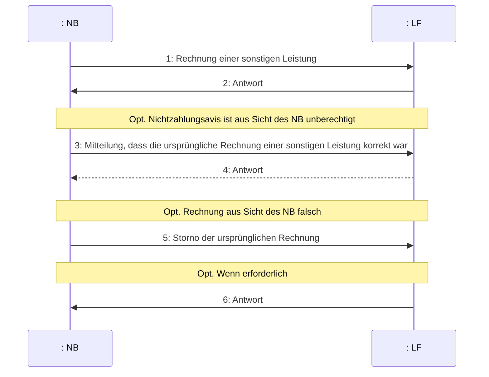
```mermaid
sequenceDiagram
    participant NB as : NB
    participant LF as : LF

    NB->>LF: 1: Rechnung einer sonstigen Leistung
    LF->>NB: 2: Antwort

    rect rgb(255, 255, 255)
    note over NB, LF: Opt. Nichtzahlungsavis ist aus Sicht des NB unberechtigt
    NB->>LF: 3: Mitteilung, dass die ursprüngliche Rechnung einer sonstigen Leistung korrekt war
    LF-->>NB: 4: Antwort
    end

    rect rgb(255, 255, 255)
    note over NB, LF: Opt. Rechnung aus Sicht des NB falsch
    NB->>LF: 5: Storno der ursprünglichen Rechnung
    rect rgb(255, 255, 255)
    note over NB, LF: Opt. Wenn erforderlich
    LF->>NB: 6: Antwort
    end
    end
```

|Nr.|Aktion|Frist|Hinweis/Bemerkung|
|-|-|-|-|
|1|Rechnung einer sonstigen Leistung|Unverzüglich nach Durchführung der sonstigen Leistung.|Das Zahlungsziel darf 10 WT nach Empfang der Rechnung nicht unterschreiten.  Der NB fasst im Falle mehrerer Rechnungen die Nachrichten zu einer Datei zusammen und versendet diese (entspricht Sammelanforderung mit lokationsbezogenen Einzelrechnungen) an den LF.  Bei einer korrigierten Rechnung einer sonstigen Leistung: Der NB erstellt eine korrigierte Rechnung einer sonstigen Leistung und sendet diese an den LF. Das Zahlungsziel darf 10 WT nach Empfang der Rechnung nicht unterschreiten.|
|2|Antwort|Unverzüglich nach dem ÜZ von Nr. 1, jedoch spätester ÜT ist der 4. WT vor dem Zahlungsziel in der Rechnung einer sonstigen Leistung.|Der LF prüft die Rechnung und teilt dem NB das Ergebnis mit. Bei Unklarheiten und/oder geringfügigen Abweichungen soll vor einer Zahlungsablehnung Kontakt mit dem NB aufgenommen werden.  Zahlungsavis: Der LF bestätigt die Zahlung der Rechnung einer sonstigen Leistung in Form eines Zahlungsavises.|

Seite **100** von **115**

|Nr.|Aktion|Frist|Hinweis/Bemerkung|
|-|-|-|-|
||||Die Bestätigung der Zahlung einzelner Rechnungen wird zusammengefasst. Eine Bestätigungsnachricht wird in einer Datei versendet. Im Falle der Bestätigung der Zahlung durch den LF veranlasst der LF parallel die Zahlung der Summe der akzeptierten Rechnungen an den NB.  Zahlungsablehnung: Der LF lehnt die Zahlung der Rechnung einer sonstigen Leistung ab.  Eine Ablehnung der Zahlung wird durch den LF begründet. Die Ablehnung der Zahlung einzelner Rechnungen wird zu einer zusammengefasst. Eine Ablehnungsnachricht wird in einer Datei versendet.|
|3|Mitteilung, dass die ursprüngliche Rechnung einer sonstigen Leistung korrekt war|Unverzüglich nach dem ÜZ von Nr. 2, sofern es sich um eine Zahlungsablehnung handelt, jedoch spätester ÜT ist der 2. WT vor dem Zahlungsziel in der Rechnung einer sonstigen Leistung.|Der NB prüft, ob die Zahlungsablehnung berechtigt ist.  Der NB prüft die Ablehnung anhand des mitgeteilten Ablehnungsgrunds auf Berechtigung und nimmt bei Unklarheiten Kontakt mit dem LF auf.  Im Fall, dass der NB feststellt, dass die ursprüngliche vom LF reklamierte Rechnung einer sonstigen Leistung korrekt ist, teilt der NB dies dem LF mit. Der NB begründet die Richtigkeit der gestellten Rechnung einer sonstigen Leistung und entkräftet die Ablehnungsgründe des LF.  Da dadurch, die im Prozessschritt 1 versendete Rechnung einer sonstigen Leistung weiterhin Bestand hat, ist keine neue Rechnung zu versenden.|
|4|Antwort|Unverzüglich nach dem ÜZ von Nr. 3, jedoch spätester ÜT ist zum Zahlungsziel in der Rechnung einer sonstigen Leistung.|Der LF prüft die Rechnung und teilt dem NB das Ergebnis mit. Bei Unklarheiten und/oder geringfügigen Abweichungen soll vor einer Zahlungsablehnung Kontakt mit dem NB aufgenommen werden.  Zahlungsavis: Der LF bestätigt die Zahlung der Rechnung einer sonstigen Leistung in Form eines Zahlungsavises.  Die Bestätigung der Zahlung einzelner Rechnungen wird zusammengefasst. Eine Bestätigungsnachricht wird in einer Datei versendet. Im Falle der Bestätigung|

Seite 101 von 115

|Nr.|Aktion|Frist|Hinweis/Bemerkung|
|-|-|-|-|
||||der Zahlung durch den LF veranlasst der LF parallel die Zahlung der Summe der akzeptierten Rechnungen an den NB.  Zahlungsablehnung: Der LF lehnt die Zahlung der Rechnung einer sonstigen Leistung ab.  Eine Ablehnung der Zahlung wird durch den LF begründet. Die Ablehnung der Zahlung einzelner Rechnungen wird zu einer zusammengefasst. Eine Ablehnungsnachricht wird in einer Datei versendet.  Kommt es zu einer erneuten Ablehnung durch den LF, ist eine bilaterale Klärung notwendig. Hierbei ist das weitere Vorgehen im Rahmen der Abrechnung einer sonstigen Leistung abzustimmen.|
|5|Storno der ursprünglichen Rechnung|Unverzüglich nach Feststellung des Stornierungsbedarfs|Der NB stellt fest, dass die ursprüngliche Netznutzungsrechnung nicht korrekt war und sendet eine Stornierung der ursprünglichen Rechnung an den LF. Anschließend führt der NB die nötigen Korrekturen durch und erstellt eine neue Rechnung. Eine Rechnungskorrektur umfasst immer eine Stornorechnung und eine neue Rechnung.  Sofern die Zahlung der Rechnung vom LF bestätigt worden war (Schritt 2 oder Schritt 4), wird der gezahlte Betrag im Zahlungsverkehr berücksichtigt.  Sofern die Zahlung der Rechnung vom LF abgelehnt worden war (Schritt 2 oder Schritt 4) und der Ablehnungsgrund vom NB akzeptiert wurde, darf sich der LF den Stornobetrag nicht gutschreiben.|
|6|Antwort|Unverzüglich nach dem ÜZ von Nr. 5, sofern in Nr. 2 oder Nr. 4 die Zahlung bestätigt wurde.|Hat der LF dem NB in Schritt 2 oder Schritt 4 die Zahlung der Rechnung einer sonstigen Leistung in Form eines Zahlungsavises bestätigt und geht daraufhin eine Stornierung dieser Rechnung einer sonstigen Leistung vom NB beim LF ein, muss der LF dem NB die Stornierung in einer Antwort bestätigen.|

Seite **102** von **115**

## 3.5 **Prozesse zur Unterbrechung/Wiederherstellung der Anschlussnutzung (Sperren/Entsperren)**

## 3.5.1 **Use-Case: Unterbrechung der Anschlussnutzung (Sperren) auf Anweisung des LF**

## 3.5.1.1 **UC: Unterbrechung der Anschlussnutzung (Sperren) auf Anweisung des LF**

|**Use-Case-Name**|Unterbrechung der Anschlussnutzung (Sperren) auf Anweisung des LF|
|-|-|
|Prozessziel|Die Anschlussnutzung über die betroffene Marktlokation ist nicht mehr möglich.|
|Use-Case Beschreibung|Der LF beauftragt den NB nach Maßgabe des zwischen LF und NB geschlossen Netznutzungsvertrags (Lieferantenrahmenvertrags) die Anschlussnutzung an der genannten Marktlokation des vom LF belieferten AN zu unterbrechen. Die Anzahl der Sperrversuche je Sperrauftrag richtet sich nach den allgemeinen Geschäftsbedingungen des NB.  Der LF kündigt die Sperrung dem AN an. Der NB prüft, ob die notwendigen Voraussetzungen für eine Sperrung vorliegen und führt diese bei Vorliegen der Voraussetzungen durch. Sofern der MSB dem NB keine generelle Zustimmung für die Durchführung der Sperrung/Entsperrung erteilt hat, wird der MSB angefragt.  Der NB informiert den LF, ggf. den MSB und ggf. den ÜNB über das Sperrergebnis.|
|Rollen|• LF • NB • MSB • ÜNB|
|Vorbedingung|• Es handelt sich um eine verbrauchende Marktlokation. Falls die verbrauchende Marktlokation elektrisch so mit einer oder mehreren erzeugenden Marktlokation zu verbunden ist, dass sich die Unterbrechung der Anschlussnutzung auch auf diese erzeugende Marktlokation(en) auswirkt, ist dieser UC trotzdem anwendbar. • Die zu sperrende Marktlokation ist dem LF zugeordnet. • Die Marktlokation ist nicht bereits gesperrt. • Die zu sperrende Marktlokation befindet sich in der Niederspannung.  • Der Messstellenbetrieb wird an allen Messlokationen der zu sperrenden Marktlokation vom selben MSB durchgeführt; d.h. der MSB der Marktlokation ist der MSB der Messlokation(en).|
|Nachbedingung im Erfolgsfall|• Die Marktlokation ist gesperrt. • Die Abrechnung kann über den Use-Case „Abrechnung einer sonstigen Leistung" erfolgen. Auch die Kosten der Entsperrung werden dem LF berechnet, der die erfolgreiche Sperrung der Marktlokation beauftragt hat.|
|Nachbedingung im Fehlerfall|• Die Anschlussnutzung über die betroffene Marktlokation ist weiterhin möglich. • Der Sperrauftrag wurde ohne Erfolg beendet (Gründe: z. B. Marktlokation vor Ort nicht identifizierbar, Zugang zur|

Seite 103 von 115

|Use-Case-Name|Unterbrechung der Anschlussnutzung (Sperren) auf Anweisung des LF|
|-|-|
||Marktlokation nicht möglich, passive Zutrittsverweigerung oder aktive Zutrittsverweigerung). Hinweis: Bis dahin angefallene Kosten aufgrund einer erfolglosen Unterbrechung können über den Use-Case „Abrechnung einer sonstigen Leistung" erfolgen." • Der LF kann bei Bedarf den Use-Case „Unterbrechung der Anschlussnutzung (Sperren) auf Anweisung des LF“ ggf. unter Einbeziehung eines Gerichtsvollziehers erneut starten.|
|Fehlerfälle|• Es handelt sich um eine erzeugende Marktlokation bzw. eine Tranche. • Die zu sperrende Marktlokation befindet sich nicht in der Niederspannung. • Der MSB der Marktlokation ist nicht der MSB der Messlokationen.|
|Weitere Anforderungen|• Eine Sperrung einer Marktlokation ist nicht mit einer Stilllegung gleichzusetzen. Der MSB muss im Falle einer Sperrung seinen Verpflichtungen weiter nachkommen, insbesondere mit der Übermittlung von Werten an die Berechtigten. Dies bedeutet, dass der MSB für den Zeitraum der Sperrung, den Sperrzählerstand bzw. "Null-Verbrauchsersatzwerte" übermittelt bzw. anwendet. • Eine gesperrte Marktlokation ist weiterhin Bestandteil in der Bilanzierung. • Wenn die Sperrung der Marklokation unter der Mitwirkung des MSB durchgeführt wird, erfolgen diese Schritte bilateral außerhalb dieser Prozessstandardisierung. • Die Stornierung eines Sperrauftrags ist im Use-Case „Stornieren der Unterbrechung und Wiederherstellung der Anschlussnutzung auf Anweisung des LF“ dargestellt. Bei einer erfolgreichen Stornierung eines Sperrauftrags wird der hier beschriebene Use-Case „Unterbrechung der Anschlussnutzung (Sperren) auf Anweisung des LF“ mit dem SD-Schritt "ref Abrechnung einer sonstigen Leistung" fortgesetzt, um die bis dahin angefallenen Leistungen abrechnen zu können. • Nach einer aktiven Zutrittsverweigerung erfolgt kein weiterer Sperrversuch innerhalb eines Sperrauftrags. • Die Sperrung einer Marktlokation unter Einbeziehung eines Gerichtsvollziehers ist stets separat zu beauftragen. • Sofern sich die betroffene Marktlokation nicht in der Niederspannung befindet und/oder der MSB der Marktlokation nicht gleichzeitig der MSB aller Messlokationen der Marktlokation ist, erfolgt die Kommunikation NON-EDIFACT. • *Hinweis:* Falls die verbrauchende Marktlokation elektrisch so mit einer oder mehreren erzeugenden Marktlokation(en) verbunden ist, dass sich die Unterbrechung der Anschlussnutzung auch auf diese erzeugende Marktlokation(en) auswirkt, ist der Sperrauftrag des LF der verbrauchenden Marktlokation nicht deshalb abzulehnen, weil dadurch die Einspeisung der erzeugten Strommengen in das Netz verhindert wird.|

Seite **104** von **115**

## **3.5.1.2 SD: Unterbrechung der Anschlussnutzung (Sperren) auf Anweisung des LF**

|Nr.|Aktion|Frist|Hinweis/Bemerkung|
|-|-|-|-|
|1|Sperrauftrag|*Auftrag ist nicht termingebunden:*  Unverzüglich, jedoch spätester ÜT ist der 6. WT vor dem frühestmöglichen Sperrtermin.|Der LF beauftragt den NB mit der Sperrung der Anschlussnutzung einer Marktlokation und gibt den frühestmöglichen Sperrtermin an. Die Sperrung der Marktlokation ist durch den NB spätestens innerhalb von 6 WT nach dem frühestmöglichen Sperrtermin durchzuführen.|
|1|Sperrauftrag|*Auftrag ist termingebunden* (z.B. der Gerichtsvollzieher gibt den Sperrtermin (Datum, Uhrzeit, Ort) vor):  Unverzüglich, jedoch spätester ÜT ist der|Der LF teilt den frühestmöglichen Sperrtermin dem AN bilateral fristgerecht mit.  Der LF teilt dem NB optional ergänzende Informationen zur Marklokation mit, die für die Durchführung einer Sperrung notwendig sind. Sofern der LF bei Widerspruch des AN kurzfristig eine qualifizierte Rücksprache ermöglichen möchte oder weitere Informationen z.B.|

Seite **105** von **115**

|Nr.|Aktion|Frist|Hinweis/Bemerkung|
|-|-|-|-|
|||12. WT vor dem Sperrtermin.|zur Einbeziehung des Gerichtsvollziehers erforderlich sind, teilt er die dafür notwendigen Informationen (z.B. Telefonnummer des LF, etc.) mit. Diese Informationen sind ggf. dem Monteur vor Ort zu übermitteln.|
|2|Antwort auf Sperrauftrag|Unverzüglich, jedoch spätester ÜT ist der 1. WT nach dem ÜT von Nr. 1.|Der NB prüft, ob die Marktlokation dem LF zugeordnet ist, ob die Marktlokation identifiziert werden kann und die Zusicherung der Berechtigung nach Netznutzungsvertrag vorliegt.  Im Falle einer Zustimmung legt der NB den Sperrtermin fest.  Sofern keine generelle Zustimmung des MSB zur Durchführung der Sperrung/Entsperrung durch den NB vorliegt, ist der Sperrtermin vom NB so festzulegen, dass dem MSB noch eine fristgerechte Antwort auf Anfrage vor dem Sperrtermin möglich ist (s. dazu Fristen der SD-Schritte 3 und 4).  Im Falle einer Ablehnung endet der Prozess hier und der NB nennt die Gründe für die Ablehnung. Sofern der LF weiterhin eine Unterbrechung der Anschlussnutzung erreichen möchte, kann er den Prozess erneut starten.  Sofern ein Sperrauftrag Sachverhalte betrifft, die nicht über das elektronische Preisblatt pauschal abgebildet werden können (z.B. Einbindung Leitstelle wg. Schaltungen, Dachständersperrung), teilt der NB im Fall einer Zustimmung mit, dass die Sperr-/Entsperrkosten bilateral und nicht über den Use-Case „Abrechnung einer sonstigen Leistung“ stattfindet. Sofern zu einem solchen Sachverhalt bereits eine mögliche, unverbindliche Preisinformation (z.B. Preisspanne) vom NB angegeben werden kann, kann diese in der Zustimmung in einem Freitextfeld an den LF übermittelt werden.|
|3|Anfrage|Unverzüglich, jedoch spätester ÜT ist der 3. WT vor dem Sperrtermin.|Sofern keine generelle Zustimmung des MSB zur Sperrung/Entsperrung durch den NB erteilt wurde, fragt der NB die Zustimmung des MSB zur Sperrung (und für eine spätere Entsperrung) durch den NB bzw. dessen Mitwirkung ab. Der NB|

Seite **106** von **115**

|Nr.|Aktion|Frist|Hinweis/Bemerkung|
|-|-|-|-|
||||teilt dem MSB den Zeitpunkt des Sperrversuchs mit.|
|4|Antwort auf Anfrage|Unverzüglich, jedoch spätester ÜT ist der 3. WT nach dem ÜT von Nr. 3.|Der MSB kann der Anfrage des NB antworten mit: • „MSB hat Durchführung der Sperrung und Entsperrung durch NB zugestimmt“, • „MSB hat Durchführung der Sperrung und Entsperrung unter Mitwirkung des MSB zugestimmt“, wobei die Zustimmung der Durchführung für den Sperr- wie Entsperrvorgang gilt.  *Hinweis:* Im Fall „MSB hat Durchführung der Sperrung und Entsperrung unter Mitwirkung des MSB zugestimmt“ erfolgt die Kommunikation mit dem MSB zur Durchführung der Sperrung nicht standardisiert (NON-EDIFACT) und wird in diesem SD nicht abgebildet. Die nachfolgenden Prozessschritte und deren Fristvorgaben sind jedoch auch in diesem Fall einzuhalten.  Der MSB kann die Anfrage des NB unter Angabe der Gründe ablehnen.  Verstreicht die Frist, ohne dass die Antwort auf die Anfrage beim NB eingeht, gilt dies als Zustimmung im Sinne „MSB hat Durchführung der Sperrung und Entsperrung durch NB zugestimmt“. Nach Ablauf der Frist eingehende Antworten sind für den Fortlauf dieses Prozesses unerheblich.  Sofern der MSB trotz Zustimmung zur Mitwirkung bei einer Sperrung/Entsperrung am Termin der Sperrung nicht anwesend ist, wird die Marktlokation durch den NB ohne Beisein des MSB gesperrt.|
|5|Ergebnis des Sperrauftrags|Unverzüglich, jedoch spätester ÜT ist der 1. WT nach dem Abschluss des Sperrauftrags.|Der NB führt bis zu zwei Sperrversuche innerhalb eines Sperrauftrags durch.  Die Anzahl der Sperrversuche richtet sich nach den allgemeinen Geschäftsbedingungen des NB. Die Kosten für den Sperr-/Entsperrauftrag können dem Preisblatt Sperrkosten des NB entnommen werden.|

Seite **107** von **115**

|Nr.|Aktion|Frist|Hinweis/Bemerkung|
|-|-|-|-|
||||Ist eine Sperrung aus rechtlichen oder tatsächlichen Gründen nicht möglich, informiert der NB den LF hierüber unverzüglich. Als solcher Grund gilt insbesondere eine gerichtliche Verfügung, welche die Sperrung der Marktlokation untersagt.  Ein weiterer Grund liegt auch vor, sofern der AN entgegen der Versicherung des LF im Vorwege Verhinderungsgründe einer Sperrung gegenüber dem NB glaubhaft geltend gemacht hat (z. B. Betrieb lebenserhaltender medizinischer Geräte). Der NB weist den LF in diesem Fall an, diese Verhinderungsgründe zu klären.  Liegen nach der Klärung durch den LF die Verhinderungsgründe nicht mehr vor, ist der NB durch den LF bilateral darüber zu informieren. Sofern der LF weiterhin eine Unterbrechung der Anschlussnutzung erreichen möchte, kann er den Use-Case „Unterbrechung der Anschlussnutzung (Sperren) auf Anweisung des LF“ erneut starten.  Der NB teilt dem LF nach Durchführung des Sperrauftrags mit, ob die Marktlokation gesperrt ist. Falls die Marktlokation nicht gesperrt wurde, teilt der NB dem LF die Gründe dafür mit.  Das Datum der erfolgreichen Sperrung bzw. des Sperrversuchs ist jeweils mitzuteilen.  Sofern es sich um eine Marktlokation mit mehr als einer Messlokation handelt und eine bzw. mehrere Messlokationen einer Marktlokation nicht gesperrt werden konnten, ist dies explizit mitzuteilen.  Sofern der Sperrauftrag erfolglos war, kann der LF ggf. den Use-Case „Unterbrechung der Anschlussnutzung (Sperren) auf Anweisung des LF“ neu starten.|
|6|Ergebnis des Sperrauftrags|Parallel zu Nr. 5.|Wenn Sperrung erfolgreich.|
|7|Ergebnis des Sperrauftrags|Parallel zu Nr. 5.|Wenn Sperrung erfolgreich und für ÜNB relevant.|

Seite **108** von **115**

|Nr.|Aktion|Frist|Hinweis/Bemerkung|
|-|-|-|-|
|8|ref Übermittlung von Zählerständen vom NB|--|--|
|9|ref Abrechnung einer sonstigen Leistung|--|--|

## **3.5.2 Use-Case: Wiederherstellung der Anschlussnutzung (Entsperren)**
## **auf Anweisung des LF**

## **3.5.2.1 UC: Wiederherstellung der Anschlussnutzung (Entsperren) auf**
## **Anweisung des LF**

|**Use-Case-Name**|Wiederherstellung der Anschlussnutzung (Entsperren) auf Anweisung des LF|
|-|-|
|Prozessziel|Die Anschlussnutzung über die betroffene Marktlokation ist wieder möglich.|
|Use-Case Beschreibung|Der LF beauftragt den NB nach Maßgabe des zwischen LF und NB geschlossenen Netznutzungsvertrags (Lieferanten- rahmenvertrags) die Anschlussnutzung an der genannten Marktlokation des vom LF belieferten AN unverzüglich wiederherzustellen. Der NB überprüft die Gegebenheiten am Tag der Entsperrung vor Ort und führt ggf. mehrere Versuche durch, die Anschlussnutzung wiederherzustellen.  Der NB informiert den LF, ggf. den MSB und ggf. den ÜNB über das Ergebnis des Entsperrauftrags.|
|Rollen|• LF • NB • MSB • ÜNB|
|Vorbedingung|• Die gesperrte Marktlokation ist dem LF zugeordnet. • Die Anschlussnutzung ist mittels des Use-Cases „Unterbrechung der Anschlussnutzung (Sperren) auf Anweisung des LF“ unterbrochen. Es handelt sich somit um eine verbrauchende Marktlokation. • Die Kosten der Entsperrung werden dem LF im Rahmen der Sperrung berechnet.|
|Nachbedingung im Erfolgsfall|Die Anschlussnutzung über die betroffene Marktlokation ist wieder möglich.|
|Nachbedingung im Fehlerfall|• Die Anschlussnutzung über die betroffene Marktlokation ist weiterhin nicht möglich. • LF und NB klären das weitere Vorgehen bilateral, ggf. startet der LF den Use-Case „Wiederherstellung der Anschlussnutzung (Entsperren) auf Anweisung des LF“ erneut.|
|Fehlerfälle|Die Anschlussnutzung ist nicht mittels des Use-Cases „Unterbrechung der Anschlussnutzung (Sperren) auf Anweisung des LF“ unterbrochen.|
|Weitere Anforderungen|• Die Wiederstellung der Anschlussnutzung bei einem Lieferbeginn erfolgt über den Use-Case "Wiederherstellung der Anschlussnutzung bei Lieferbeginn".|

Seite **109** von **115**

|Use-Case-Name|Wiederherstellung der Anschlussnutzung (Entsperren) auf Anweisung des LF|
|-|-|
||• Inwieweit der MSB bei der Durchführung der Entsperrung mitwirkt, hängt davon ab, ob der MSB dem NB eine generelle Zustimmung zur Durchführung der Sperrung/Entsperrung erteilt hat und sofern diese nicht erteilt wurde, hängt dies vom Inhalt der Zustimmung aus Prozessschritt 4 „Antwort auf Anfrage“ des Use-Cases „Unterbrechung der Anschlussnutzung (Sperren) auf Anweisung des LF“ ab. Wenn die Entsperrung der Marktlokation unter Mitwirkung des MSB durchgeführt wird, erfolgen diese Schritte bilateral außerhalb dieser Prozessstandardisierung. • Stornierungen eines Entsperrauftrags sind im Use-Case „Stornieren der Unterbrechung und Wiederherstellung der Anschlussnutzung auf Anweisung des LF“ dargestellt. Eine erfolgreiche Stornierung eines Entsperrauftrags beendet den hier beschriebenen Use-Case.|

## 3.5.2.2 SD: **Wiederherstellung der Anschlussnutzung (Entsperren) auf Anweisung des LF**

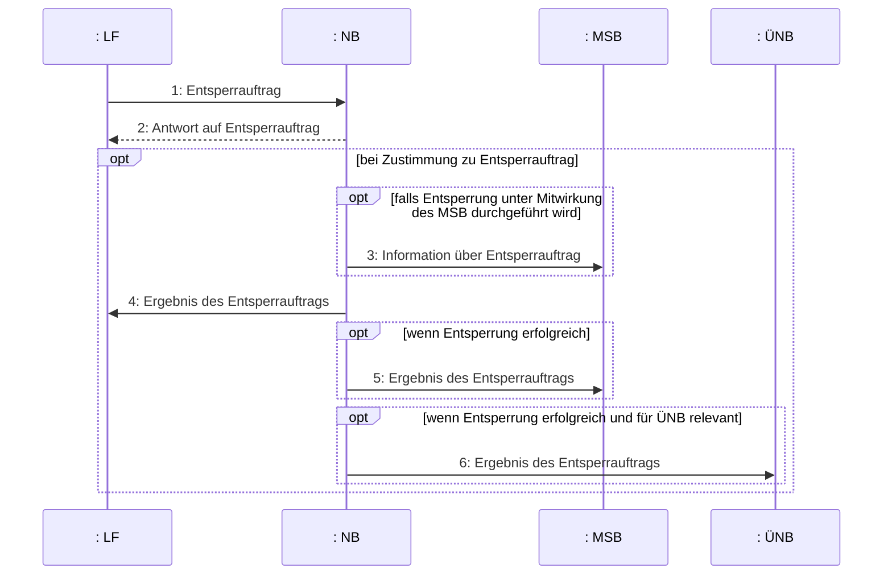
```mermaid
sequenceDiagram
    participant LF as : LF
    participant NB as : NB
    participant MSB as : MSB
    participant ÜNB as : ÜNB

    LF->>NB: 1: Entsperrauftrag
    NB-->>LF: 2: Antwort auf Entsperrauftrag
    
    opt bei Zustimmung zu Entsperrauftrag
        opt falls Entsperrung unter Mitwirkung des MSB durchgeführt wird
            NB->>MSB: 3: Information über Entsperrauftrag
        end
        NB->>LF: 4: Ergebnis des Entsperrauftrags
        opt wenn Entsperrung erfolgreich
            NB->>MSB: 5: Ergebnis des Entsperrauftrags
        end
        opt wenn Entsperrung erfolgreich und für ÜNB relevant
            NB->>ÜNB: 6: Ergebnis des Entsperrauftrags
        end
    end
```

|Nr.|Aktion|Frist|Hinweis/Bemerkung|
|-|-|-|-|
|1|Entsperrauftrag|Unverzüglich|Der LF beauftragt den NB mit der Entsperrung der Anschlussnutzung einer Marktlokation. Der LF teilt dem NB weitere Informationen mit, die für die Durchführung einer Entsperrung|

Seite **110** von **115**

|Nr.|Aktion|Frist|Hinweis/Bemerkung|
|-|-|-|-|
||||notwendig sind. Diese Informationen sind ggf. dem Monteur vor Ort zu übermitteln.|
|2|Antwort auf Entsperrauftrag|Unverzüglich, jedoch spätester ÜT ist der 1. WT nach dem ÜT von Nr. 1.|Im Falle einer Ablehnung teilt der NB dies dem LF unter der Angabe der Ablehnungsgründe mit und der Use-Case endet hier.|
|3|Information über Entsperrauftrag|Parallel zu Nr. 2|Im Fall einer Zustimmung in Prozessschritt 2: Sofern im Use-Case „Unterbrechung der Anschlussnutzung (Sperren) auf Anweisung des LF“ die Mitwirkung des MSB bei der Sperrung/ Entsperrung vereinbart wurde, wird der MSB entsprechend beteiligt. Sofern der MSB trotz Zustimmung zur Mitwirkung bei der Sperrung/Entsperrung am Termin der Entsperrung nicht anwesend ist, wird die Marktlokation durch den NB ohne Beisein des MSB entsperrt.|
|4|Ergebnis des Entsperrauftrags|Unverzüglich, jedoch spätester ÜT ist der 1. WT nach dem Abschluss des Entsperrauftrags.|Falls erforderlich, unternimmt der NB mehrere Entsperrversuche und hinterlässt eine Kontaktmöglichkeit zur Terminabsprache. Ist eine Entsperrung aus rechtlichen oder tatsächlichen Gründen nicht möglich, informiert der NB den LF hierüber und stimmt mit ihm evtl. weitere Schritte ab.  Das Datum der erfolgreichen Entsperrung ist mitzuteilen.|
|5|Ergebnis des Entsperrauftrags|Parallel zu Nr. 4|Wenn Entsperrung erfolgreich.|
|6|Ergebnis des Entsperrauftrags|Parallel zu Nr. 4|Wenn Entsperrung erfolgreich und für ÜNB relevant.|

## **3.5.3 Use-Case: Stornieren der Unterbrechung und Wiederherstellung**
## **der Anschlussnutzung auf Anweisung des LF**

## **3.5.3.1 UC: Stornieren der Unterbrechung und Wiederherstellung der**
## **Anschlussnutzung auf Anweisung des LF**

|**Use-Case-Name**|Stornieren der Unterbrechung und Wiederherstellung der Anschlussnutzung auf Anweisung des LF|
|-|-|
|Prozessziel|Der LF storniert einen Auftrag zur Sperrung oder Entsperrung einer Marktlokation, bevor dieser vom NB ausgeführt wurde.|
|Use-Case Beschreibung|Der LF sendet • eine Stornierung des Auftrags zur Sperrung (Fall a) oder • eine Stornierung des Auftrags zur Entsperrung (Fall b) einer Marktlokation, so dass • die Anschlussnutzung an der Marktlokation weiterhin möglich ist (erfolgreiche Stornierung von Fall a) bzw.|

Seite 111 von 115

|**Use-Case-Name**|**Stornieren der Unterbrechung und Wiederherstellung der** **Anschlussnutzung auf Anweisung des LF** • die Marktlokation weiterhin gesperrt bleibt (erfolgreiche Stornierung von Fall b). Sofern der MSB bereits eingebunden war, ist dieser ebenfalls zu informieren.|
|-|-|
|Rollen|• NB • MSB • LF|
|Vorbedingung|• Die betroffene Marktlokation ist dem LF zugeordnet. • Der LF hat den NB nach Maßgabe des zwischen LF und NB geschlossenen Netznutzungsvertrags (Lieferantenrahmenvertrags) beauftragt, die Anschlussnutzung an der genannten Marktlokation des vom LF belieferten AN o zu unterbrechen (Fall a: Use-Case „Unterbrechung der Anschlussnutzung (Sperren) auf Anweisung des LF“) oder o zu entsperren (Fall b: Use-Case „Wiederherstellung der Anschlussnutzung (Entsperren) auf Anweisung des LF“). • Es handelt sich somit um eine verbrauchende Marktlokation. • Der Grund für den Sperrauftrag bzw. Entsperrauftrag ist entfallen, da z. B. der Kunde die Forderung des LF ausgeglichen hat oder der LF den Widerspruch des AN akzeptiert hat. • Die Unterbrechung der Anschlussnutzung (Fall a) oder Wiederherstellung der Anschlussnutzung (Fall b) über die betroffene Marktlokation ist bislang noch nicht erfolgt.|
|Nachbedingung im Erfolgsfall|• Die Anschlussnutzung über die betroffene Marktlokation ist weiterhin möglich (erfolgreiche Stornierung von Fall a: Sperrauftrag wurde erfolgreich storniert) oder • die Marktlokation ist weiterhin gesperrt (erfolgreiche Stornierung von Fall b: Entsperrauftrag wurde erfolgreich storniert).|
|Nachbedingung im Fehlerfall|• Bei erfolgloser Stornierung von Fall a: o Um die Sperrung der Marktlokation aufzuheben, startet der LF den Use-Case „Wiederherstellung der Anschlussnutzung (Entsperren) auf Anweisung des LF“ (Fall b). • Bei erfolgloser Stornierung von Fall b: o Für die Sperrung der Marktlokation, startet der LF den Use-Case „Unterbrechung der Anschlussnutzung (Sperren) auf Anweisung des LF“ (Fall a).|
|Fehlerfälle|--|
|Weitere Anforderungen|• Die Stornierung eines Auftrags kann jederzeit durch den LF unabhängig des Status beim NB erfolgen, solange der Sperrauftrag bzw. Entsperrauftrag vom NB beim AN noch nicht durchgeführt wurde. • Bei einer erfolgreichen Stornierung eines Sperrauftrags wird der Use-Case „Unterbrechung der Anschlussnutzung (Sperren) auf Anweisung des LF“ mit dem SD-Schritt "ref Abrechnung einer sonstigen Leistung" fortgesetzt, um die bis dahin ggf. angefallenen Leistungen abrechnen zu können.|

Seite **112** von **115**

## **3.5.3.2 SD: Stornieren der Unterbrechung und Wiederherstellung der Anschlussnutzung auf Anweisung des LF**

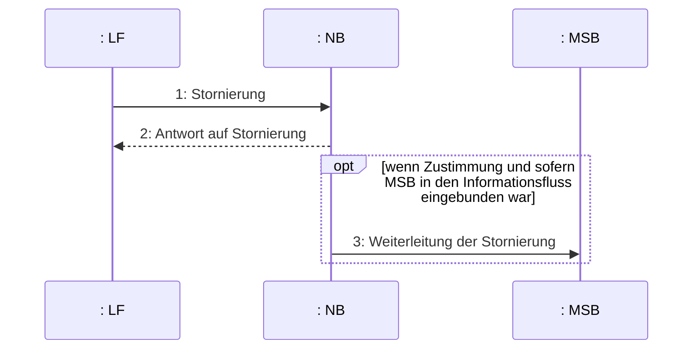
```mermaid
sequenceDiagram
    participant LF as : LF
    participant NB as : NB
    participant MSB as : MSB

    LF->>NB: 1: Stornierung
    NB-->>LF: 2: Antwort auf Stornierung
    opt wenn Zustimmung und sofern MSB in den Informationsfluss eingebunden war
        NB->>MSB: 3: Weiterleitung der Stornierung
    end
```

|Nr.|Aktion|Frist|Hinweis/Bemerkung|
|-|-|-|-|
|1|Stornierung|Unverzüglich nach dem der Grund für den ursprünglichen Auftrag entfallen ist.|--|
|2|Antwort auf Stornierung|Unverzüglich, jedoch spätester ÜT ist der 1. WT nach dem ÜT von Nr. 1.|Wenn der Sperrauftrag bzw. der Entsperrauftrag bereits durchgeführt wurde, ist die Stornierung abzulehnen. Dies gilt auch, wenn der Sperrauftrag bzw. der Entsperrauftrag bereits durchgeführt wurde, jedoch noch nicht über den • Prozessschritt 5 „Ergebnis der Sperrung“ im Use-Case „Unterbrechung der Anschlussnutzung (Sperren) auf Anweisung des LF“ bzw. • Prozessschritt 4 „Ergebnis Entsperrung“ im Use-Case „Wiederherstellung der Anschlussnutzung (Entsperren) auf Anweisung des LF“ an den LF kommuniziert wurde.|
|3|Weiterleitung der Stornierung|Unverzüglich|--|

Seite **113** von **115**

## **3.5.4 Use-Case: Wiederherstellung der Anschlussnutzung bei Lieferbeginn**

## **3.5.4.1 UC: Wiederherstellung der Anschlussnutzung bei Lieferbeginn**

|**Use-Case-Name**|Wiederherstellung der Anschlussnutzung bei Lieferbeginn|
|-|-|
|Prozessziel|Die Anschlussnutzung über die betroffene Marktlokation ist wieder möglich.|
|Use-Case Beschreibung|Der NB stößt bei einer gesperrten Marktlokation die Wiederherstellung der Anschlussnutzung an. Der NB informiert ggf. den MSB und ggf. den ÜNB über das Ergebnis des Entsperrauftrags.|
|Rollen|• NB • MSB • ÜNB|
|Vorbedingung|• Im Fall der Zuordnung des LFN zur Marktlokation im Rahmen des Use-Cases „Lieferbeginn“ stellt der NB fest, dass sich die Anmeldung auf eine gesperrte Marktlokation bezieht. • Die Anschlussnutzung ist mittels des Use-Case „Unterbrechung der Anschlussnutzung (Sperren) auf Anweisung des LF“ unterbrochen. Es handelt sich somit um eine verbrauchende Marktlokation.|
|Nachbedingung im Erfolgsfall|Die Anschlussnutzung über die betroffene Marktlokation ist wieder möglich.|
|Nachbedingung im Fehlerfall|• Die Anschlussnutzung über die betroffene Marktlokation ist weiterhin nicht möglich. • Die Beteiligten klären das weitere Vorgehen bilateral.|
|Fehlerfälle|Die Anschlussnutzung ist nicht mittels des Use-Cases „Unterbrechung der Anschlussnutzung (Sperren) auf Anweisung des LF“ unterbrochen.|
|Weitere Anforderungen|Wenn die Entsperrung der Marktlokation unter Mitwirkung des MSB durchgeführt wird, erfolgen diese Schritte bilateral außerhalb dieser Prozessstandardisierung.|

Seite **114** von **115**

## **3.5.4.2 SD: Wiederherstellung der Anschlussnutzung bei Lieferbeginn**

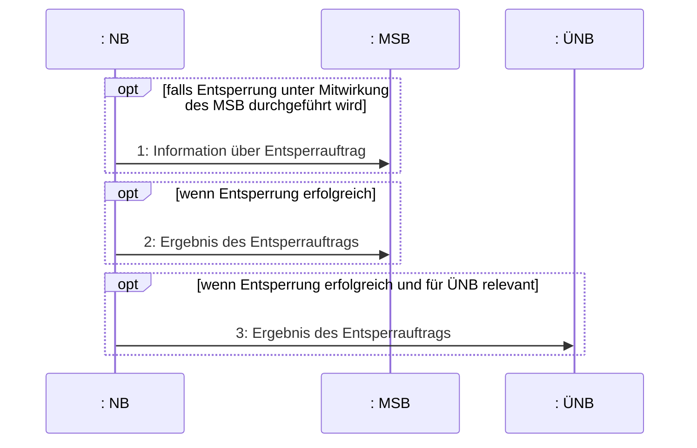
```mermaid
sequenceDiagram
    participant NB as : NB
    participant MSB as : MSB
    participant ÜNB as : ÜNB

    opt falls Entsperrung unter Mitwirkung des MSB durchgeführt wird
        NB->>MSB: 1: Information über Entsperrauftrag
    end

    opt wenn Entsperrung erfolgreich
        NB->>MSB: 2: Ergebnis des Entsperrauftrags
    end

    opt wenn Entsperrung erfolgreich und für ÜNB relevant
        NB->>ÜNB: 3: Ergebnis des Entsperrauftrags
    end
```

|Nr.|Aktion|Frist|Hinweis/Bemerkung|
|-|-|-|-|
|1|Information über Entsperrauftrag|Unverzüglich|Der erste Versuch zur Entsperrung ist zum Zuordnungsbeginn des LFN zur Marktlokation im Rahmen des Use-Cases „Lieferbeginn“ durchzuführen, sofern es sich bei dem Zuordnungsbeginn um einen WT handelt, ansonsten am nächsten, dem Zuordnungsbeginn folgenden WT.|
|2|Ergebnis des Entsperrauftrags|Unverzüglich, jedoch spätester ÜT ist der 1. WT nach dem Abschluss des Entsperrauftrags.|Wenn Entsperrung erfolgreich.|
|3|Ergebnis des Entsperrauftrags|Parallel zu Nr. 2.|Wenn Entsperrung erfolgreich und für ÜNB relevant.|

Seite **115** von **115**