Anlage 2a zur Festlegung BK6-24-174


# Wechselprozesse im Messwesen Strom
# (WiM Strom)
## WiM Teil 1 – Fokus Basis-Prozesse

> BK6-24-174
>
> Lesefassung

Seite 1 von 91

1. Einführende Prozessbeschreibung 5
1.1. Allgemeines 5
1.2. Abkürzungen und Definitionen 6
1.3. Beteiligte Rollen, Objekte und Begriffsbestimmungen 14
1.4. Datenaustausch, Datenformate und Nachrichtentypen 14
1.5. Vollmachten und sonstige Erklärungen des Anschlussnutzers 14
1.6. Identifizierung einer Messlokation 14
1.7. Fristenberechnung 15
2. Basis-Prozesse 16
2.1. Grundregeln für die Abwicklung der Prozesse zum Zugang zum Messstellenbetrieb 16
2.1.1. Unterbrechungsfreie Zuordnung einer einzelnen Messlokation zu einem MSB 16
2.1.2. Zuständigkeit für die Ermittlung von Energiemengen für Marktlokationen bei Lokationsbündeln 16
2.1.3. Grundsätze bezüglich der Herbeiführung eines Wechsels des MSB 16
2.2. Use-Case: Kündigung Messstellenbetrieb 18
2.2.1. UC: Kündigung Messstellenbetrieb 18
2.2.2. SD: Kündigung Messstellenbetrieb 19
2.2.3. Antwort MSBA bei Kündigung eines bereits wirksam gekündigten Vertrages 21
2.3. Use-Case: Beginn Messstellenbetrieb 22
2.3.1. UC: Beginn Messstellenbetrieb 22
2.3.2. SD: Beginn Messstellenbetrieb 23
2.4. Use-Case: Ende Messstellenbetrieb 30
2.4.1. UC: Ende Messstellenbetrieb 30
2.4.2. SD: Ende Messstellenbetrieb 31
2.5. Use-Case: Verpflichtung gMSB 35
2.5.1. UC: Verpflichtung gMSB 35
2.5.2. SD: Verpflichtung gMSB 37
3. Ergänzende Prozesse 41
3.1. Use-Case: Gerätewechsel 41
3.1.1. UC: Gerätewechsel 41
3.1.2. SD: Gerätewechsel 43
3.2. Use-Case: Geräteübernahme 48
3.2.1. UC: Geräteübernahme 48
3.2.2. SD: Geräteübernahme 49
3.3. Use-Case: Messlokationsänderung bei kME, mME inkl. iMS-Einbau, Erweiterung und Parametrierung 51
3.3.1. Use Case: Messlokationsänderung vom NB an MSB 51

Seite **2** von **91**

3.3.1.1. UC: Messlokationsänderung vom NB an MSB 51
3.3.1.2. SD: Messlokationsänderung vom NB an MSB 53
3.3.2. Use Case: Messlokationsänderung vom LF an MSB 54
3.3.2.1. UC: Messlokationsänderung vom LF an MSB 54
3.3.2.2. SD: Messlokationsänderung vom LF an MSB 56
3.4. Use-Case: Ersteinbau einer mME in eine bestehende Messlokation 57
3.4.1. UC: Ersteinbau einer mME in eine bestehende Messlokation 57
3.4.2. SD: Ersteinbau einer mME in eine bestehende Messlokation 58
3.5. Use-Case: Ersteinbau eines iMS in eine bestehende Messlokation 59
3.5.1. UC: Ersteinbau eines iMS in eine bestehende Messlokation 59
3.5.2. SD: Ersteinbau eines iMS in eine bestehende Messlokation 61
3.6. Use-Case: Abrechnung des Messstellenbetriebes 65
3.6.1. Abgrenzung 65
3.6.2. Prozessbeschreibungen zum Preisblatt für mME und iMS 65
3.6.2.1. Begriffsbestimmungen 65
3.6.2.2. Einleitende Beschreibung zu den Austauschprozessen des Preisblattkataloges 67
3.6.2.3. Use-Case: Übermittlung Preisblatt MSB an LF 67
3.6.2.3.1. UC: Übermittlung Preisblatt MSB an LF 67
3.6.2.3.2. SD: Übermittlung Preisblatt MSB an LF 67
3.6.3. Abrechnung Messstellenbetrieb für iMS und mME 68
3.6.3.1. Ermittlung der POG 68
3.6.3.2. Abrechnung des Messstellenbetriebes vom MSB an den LF 69
3.6.3.3. Grundsätzliches 69
3.6.3.4. Use-Case: Angebot zur Rechnungsabwicklung des Messstellenbetriebes über den LF durch den MSB 70
3.6.3.4.1. UC: Angebot zur Rechnungsabwicklung des Messstellenbetriebes über den LF durch den MSB 70
3.6.3.4.2. SD: Angebot zur Rechnungsabwicklung des Messstellenbetriebes über den LF durch den MSB 71
3.6.3.5. Use-Case: Beendigung Rechnungsabwicklung des Messstellenbetriebes über den LF durch den MSB 72
3.6.3.5.1. UC: Beendigung Rechnungsabwicklung des Messstellenbetriebes über den LF durch den MSB 72
3.6.3.5.2. SD: Beendigung Rechnungsabwicklung des Messstellenbetriebes über den LF durch den MSB 73
3.6.3.6. Use-Case: Anfrage zur Rechnungsabwicklung des Messstellenbetriebes über den LF durch den LF 74

Seite **3** von **91**

3.6.3.6.1. UC: Anfrage zur Rechnungsabwicklung des Messstellenbetriebes über den LF durch den LF 74
3.6.3.6.2. SD: Anfrage zur Rechnungsabwicklung des Messstellenbetriebes über den LF durch den LF 75
3.6.3.7. Use-Case: Beendigung Rechnungsabwicklung des Messstellenbetriebes über den LF durch den LF 76
3.6.3.7.1. UC: Beendigung Rechnungsabwicklung des Messstellenbetriebes über den LF durch den LF 76
3.6.3.7.2. SD: Beendigung Rechnungsabwicklung des Messstellenbetriebes über den LF durch den LF 77
3.6.3.8. Use-Case: Abrechnung Messstellenbetrieb gegenüber dem LF 77
3.6.3.8.1. UC: Abrechnung Messstellenbetrieb gegenüber dem LF 77
3.6.3.8.2. SD: Abrechnung Messstellenbetrieb gegenüber dem LF 78
3.7. Use-Case: Abrechnung von Dienstleistungen 79
3.7.1. UC: Abrechnung von Dienstleistungen 79
3.7.2. SD: Abrechnung von Dienstleistungen 80
4. Prozessbeschreibungen zum Preisblatt „Messstellenbetrieb mit iMS gegenüber dem NB“ des MSB 82
4.1. Allgemeines 82
4.2. Begriffsbestimmungen 82
4.3. Rahmenbedingungen des Preisblatts 83
5. Use-Case: Übermittlung Preisblatt „Messstellenbetrieb mit iMS gegenüber dem NB“ vom MSB an NB 84
5.1. UC: Übermittlung Preisblatt „Messstellenbetrieb mit iMS gegenüber dem NB“ vom MSB an NB 84
5.2. SD: Übermittlung Preisblatt „Messstellenbetrieb mit iMS gegenüber dem NB“ vom MSB an NB 85
6. Use-Case: Abrechnung Messstellenbetrieb mit iMS gegenüber dem NB 86
6.1. UC: Abrechnung Messstellenbetrieb mit iMS gegenüber dem NB 86
6.2. SD: Abrechnung Messstellenbetrieb mit iMS gegenüber dem NB 88

Seite 4 von 91

# 1. Einführende Prozessbeschreibung

## 1.1. Allgemeines

In der WiM sind die zentralen Prozesse und der dazugehörende elektronische Datenaustausch im Zusammenhang mit der Durchführung des Messstellenbetriebes bei der leitungsgebundenen Versorgung mit Strom beschrieben. Einige Prozesse werden in der GPKE beschrieben und sind in der WiM nur mit Referenz erwähnt.

Die genannten Bearbeitungsfristen sind Höchstfristen, die sich am maximalen Arbeitsaufwand für den jeweiligen Prozessschritt orientieren.

Die Prozesse sind für Messlokationen aller Marktlokationen – sowohl für Erzeugung als auch für Verbrauch – anzuwenden. Pauschale Marktlokationen und öffentliche Verbrauchseinrichtungen, bei denen entsprechend den Beschreibungen des § 72 Messstellenbetriebsgesetz (MsbG) vorgegangen wird, sind von den Regelungen der WiM ausgenommen.

Die Prozesse finden auch dann Anwendung, wenn das Unternehmen Netzbetreiber selbst als MSB Aufgaben des Messstellenbetriebes im Rahmen seiner Grundzuständigkeit gem. der §§ 3 und 4 MsbG an einer Messlokation wahrnimmt. In diesem Fall tritt das Unternehmen Netzbetreiber neben seiner Rolle NB zudem in die Rolle eines MSB.

Soweit die in den Geschäftsprozessbeschreibungen bezeichneten Beteiligten aufgrund von Personenidentität „mit sich selbst“ im eigenen Unternehmen zu kommunizieren hätten, bleibt für die davon betroffenen Prozessschritte eine Abweichung in Bezug auf die prozessuale Ausgestaltung oder das zu verwendende Datenformat zulässig, soweit sich aus geltendem Recht oder aus behördlichen Entscheidungen nichts Abweichendes ergibt.

Seite **5** von **91**

## 1.2. Abkürzungen und Definitionen

|Abkürzung|Definition|
|-|-|
|AB|Anlagenbetreiber|
|Ableseturnus|Siehe hierzu WiM Teil 2, Kapitel 2.2.3. „Bestimmung des Ableseturnus und Intervalls bei kME ohne RLM und bei mME“.|
|AD|Aktivitätsdiagramm|
|Aggregationsverantwortung|Zu unterscheiden ist die Aggregationsverantwortung des NB und diejenige des ÜNB.<br/><br/>Unter die Aggregationsverantwortung des NB fallen die Energiemengen aller Marktlokationen, deren Energiemengen mit Hilfe von Messlokationen ermittelt werden,<br/>\* die alle mit iMS ausgestattet sind, auf Basis von Viertelstundenwerten bilanziert werden und vom NB noch nicht zur Aggregation an den ÜNB übertragen wurden,<br/>\* die alle mit iMS ausgestattet sind und noch nicht auf Basis von Viertelstundenwerten bilanziert werden,<br/>\* die alle mit konventionellen Messeinrichtungen (kME) ausgestattet sind,<br/>\* die alle mit modernen Messeinrichtungen (mME) ausgestattet sind,<br/>\* die nicht mit einer einheitlichen Messtechnik ausgestattet sind,<br/>sowie die Energiemengen von pauschalen Marktlokationen.<br/><br/>Unter die Aggregationsverantwortung des ÜNB fallen die Energiemengen aller Marktlokationen, deren Energiemengen mit Hilfe von Messlokationen ermittelt werden, die alle mit iMS ausgestattet sind, auf Basis von Viertelstundenwerten bilanziert werden und vom NB unter Einhaltung der Vorgaben der GPKE zur Aggregation an den ÜNB übertragen wurden.|
|AHB|Anwendungshandbuch|
|AN|Anschlussnutzer|
|ANN|Anschlussnehmer|
|APERAK|Application Error and Acknowledgement Message|
|BAS|Bilanzkreisabweichungssaldo|
|BDEW|BDEW Bundesverband der Energie- und Wasserwirtschaft e.V.|
|BG|Bilanzierungsgebiet|
|BG-SZR|Bilanzierungsgebietssummenzeitreihe|
|BG-CL|Bilanzierungsgebietsclearingliste|
|BIKO|Bilanzkoordinator|
|Bilanzierungsmonat|Der Bilanzierungsmonat stellt einen Kalendermonat dar, für den eine Bilanzkreisabrechnung durchgeführt wird.|
|Bilanzkreisabrechnung|Abrechnung der Bilanzkreise durch den Bilanzkoordinator (Strom)|
|BK|Bilanzkreis|
|BK-SZR|Bilanzkreissummenzeitreihe|
|BK-Zuordnung|Bilanzkreiszuordnung|
|BKA|Bilanzkreisabrechnung|
|BKA (ohne KBKA)|BKA (ohne KBKA) beinhaltet die Bilanzkreisabrechnung zum 42. WT.|
|BKV|Bilanzkreisverantwortlicher|
|BNetzA|Bundesnetzagentur|
|CONTRL|Control Message|


Seite **6** von **91**

|Abkürzung|Definition|
|-|-|
|Datenaggregation|siehe \*Aggregationsverantwortung\*|
|DBA|Differenzbilanzaggregat (Differenzzeitreihe)|
|DV|Direktvermarktung|
|DZÜ|Deltazeitreihenübertrag|
|EEG|Erneuerbare Energien Gesetz|
|E/G|Ersatz-/Grundversorger bzw. Ersatz-/Grundversorgung|
|EDIFACT|Electronic Data Interchange for Administration, Commerce and Transport|
|EIC|Energy Identification Code|
|elektronisches Preisblatt|Das von einem Sender (z.B. NB) übermittelte elektronische Preisblatt, auch nur Preisblatt genannt, ermöglicht dem Empfänger des Preisblatts (z.B. LF) eine automatisierte und damit massengeschäftsfähige Rechnungsprüfung von Leistungen des Senders (z.B. Rechnungsprüfung einer Netznutzungsrechnung des NB durch den LF).|
|Ersatzversorgung|Ersatzversorgung gemäß § 38 EnWG|
|ESA|Energieserviceanbieter des Anschlussnutzers<br/>Der Energieserviceanbieter des Anschlussnutzers fragt im Auftrag des Anschlussnutzers Werte an und verarbeitet diese.<br/><br/>Zusatzinformation:<br/>Der Energieserviceanbieter des Anschlussnutzers verfügt über eine den gesetzlichen Anforderungen entsprechende Einwilligung des Anschlussnutzers.<br/>Der Energieserviceanbieter des Anschlussnutzers nutzt die angefragten Werte ausschließlich im Verhältnis mit dem Anschlussnutzer.|
|EZ|Der Erzeuger (EZ) ist der Verantwortliche für die erzeugende Marktlokation. Besteht eine erzeugende Marktlokation aus mehreren Technischen Ressourcen, die von verschiedenen Anlagenbetreibern betrieben werden, so übernimmt der Erzeuger die Aufgaben im Sinne dieser Prozessbeschreibung für alle diese Anlagenbetreiber.|
|FPE|Fahrplanexport (Fahrplanentnahmesumme)|
|FPI|Fahrplanimport (Fahrplaneinspeisesumme)|
|gMSB|Grundzuständiger Messstellenbetreiber i.S.d. § 2 Nr. 4 MsbG (entspricht der Rolle Messstellenbetreiber in der Marktkommunikation)|
|GPKE|Geschäftsprozesse zur Kundenbelieferung mit Elektrizität|
|Grundversorgung|Grundversorgung gem. § 36 EnWG|
|Haushaltskunde|Haushaltskunde i.S.d. § 3 Nr. 22 EnWG|
|HS|Hochspannung|
|HöS|Höchstspannung|
|ID|Identifikation|
|iMS|intelligentes Messsystem|
|JVP|Jahresverbrauchsprognose|
|KBKA|Korrekturbilanzkreisabrechnung; beinhaltet die Bilanzkreisabrechnung zum Ende des 8. Monats.|
|kME|konventionelle Messeinrichtung; Synonym für bisherige Messtechnik (nicht mME und nicht iMS)|
|kWh|Kilowattstunde|
|kWh/a|Kilowattstunde pro Jahr|


Seite 7 von 91

|Abkürzung|Definition|
|-|-|
|KWK|Kraft-Wärme-Kopplung|
|KWKG|Kraft-Wärme-Kopplungsgesetz|
|Leistungskurvendefinition|Die Leistungskurvendefinition beinhaltet im Kalenderjahr ausgerollt die Information, zu welchen Zeiten und inwieweit an einer Lokation die Leistung z. B. über-/unterschritten werden darf. Die Leistungskurvendefinition stellt den langfristig geplanten Leistungsverlauf unter Angabe von definierten Parametern dar.|
|LF|Lieferant|
|LF-CL|Lieferantenclearingliste|
|LF-SZR|Lieferantensummenzeitreihe|
|LFA|Lieferant alt bzw. alter Lieferant (entspricht der Rolle Lieferant in der Marktkommunikation)<br/>Dabei gilt: Der LF, der zum<br/>\* vom LFN gewünschten Kündigungstermin der Marktlokation bzw. Tranche (Use-Case "Kündigung", GPKE Teil 2)<br/>\* vom LFN gewünschten Zuordnungsbeginn der Marktlokation bzw. Tranche (Use-Case "Lieferbeginn", GPKE Teil 2)<br/>\* vom NB angekündigten Zuordnungsbeginn einer zu beendenden Tranche (Use-Case "Herstellung einer 100% LF-Zuordnung zu einer erzeugenden Marktlokation", GPKE Teil 2)<br/>zugeordnet ist, ist der LFA.|
|LFN|Lieferant neu bzw. neuer Lieferant (entspricht der Rolle Lieferant in der Marktkommunikation)|
|LFZ|Lieferant zukünftig bzw. zukünftiger Lieferant (entspricht der Rolle Lieferant in der Marktkommunikation).<br/>Das bedeutet für:<br/>\* die Use Cases "Lieferbeginn" und "Herstellung einer 100% LF-Zuordnung zu einer erzeugenden Marktlokation" (GPKE Teil 2):<br/>Ordnet der NB den LFN der Marktlokation bzw. Tranche zum Zuordnungsbeginn zu und ist zeitlich nach diesem Zuordnungsbeginn bereits ein LF der Marktlokation bzw. einer Tranche der Marktlokation zugeordnet, ist dieser LF ein LFZ.<br/>\* den Use Case "Lieferende von NB an LF" im Fall der Stilllegung einer Marktlokation (GPKE Teil 2):<br/>Beendet der NB die Zuordnung des LF zu der Marktlokation bzw. Tranche zum Zuordnungsende und ist zeitlich zum oder nach diesem Zuordnungsende bereits ein LF der Marktlokation bzw. einer Tranche der Marktlokation zugeordnet, ist dieser LF ein LFZ.<br/>\* die Prozesse der Stammdatenänderung (GPKE Teil 4):<br/>Ein LFZ ist nach dem Zeitpunkt, zu dem die Stammdatenänderung in Kraft tritt, der Lokation zugeordnet.|
|Lieferschein|Als Lieferschein wird das Dokument bezeichnet, in dem der NB dem LF vor Übermittlung der Netznutzungsrechnung die Abrechnungsenergiemengen und ggf. Leistungswerte zur Verfügung stellt, die in dem Zeitraum verbraucht und ermittelt wurden, für den die Netznutzungsrechnung erstellt wird.|


Seite **8** von **91**

|Abkürzung|Definition|
|-|-|
|Lokation|Sammelbegriff für Mess-, Markt- und Netzlokation, Technische Ressource und Steuerbare Ressource|
|Lokationsbündel|Bündel messtechnisch abhängiger Lokationen; siehe hierzu unter GPKE Teil 1, Kapitel 3.7. „Lokationsbündel“|
|MaBiS|Marktregeln für die Durchführung der Bilanzkreisabrechnung Strom|
|MaBiS-ZP|MaBiS-Zählpunkt|
|MaLo-ID|Marktlokations-Identifikationsnummer|
|Marktakteur|Unter dem Begriff Marktakteur werden alle Marktteilnehmer und die Teilnehmer (z.B. AN und ANN) gefasst, mit denen eine Kommunikation in diesen Prozessen stattfindet.|
|Marktlokation|Siehe hierzu unter GPKE Teil 1, Kapitel 3.2. „Marktlokation“|
|Marktpartner|Als ein Marktpartner wird ein Marktteilnehmer in einer Rolle bezeichnet.|
|Marktteilnehmer|Unter dem Begriff Marktteilnehmer wird eine natürliche oder juristische Person verstanden, die eine oder mehrere Rollen einnimmt.|
|Messeinrichtung|Gemäß E VDE-AR-N 4400: „Messgerät, das allein oder in Verbindung mit anderen Messgeräten für die Gewinnung eines oder mehrerer Messwerte eingesetzt wird“.|
|Messlokation|Siehe hierzu unter GPKE Teil 1, Kapitel 3.3. „Messlokation“|
|Messstellenbetrieb|Siehe hierzu unter § 3 Abs. 2 MsbG|
|Messung|Siehe hierzu unter § 3 Nr. 26 d. EnWG|
|MIG|Nachrichtentypbeschreibung|
|mME|moderne Messeinrichtung|
|MMMA|Mehr-/Mindermengen-Abrechnung|
|Modell 2|Das Modell 2 "Bilanzierung im Bilanzierungsgebiet (BG) des Ladepunktbetreibers“ (Ladepunktbetreiber auch CPO: Charge Point Operator genannt) ermöglicht eine ladevorgangscharfe bilanzielle Energiemengenzuordnung für den speziellen Anwendungsfall der Elektromobilität. Das Modell 2 wird in der BDEW Anwendungshilfe „Zum Modell 2 zur ladevorgangscharfen bilanziellen Energiemengenzuordnungsmöglichkeit“ konkretisiert.|
|MS|Mittelspannung|
|MSB|Messstellenbetreiber|
|MSBA|Messstellenbetreiber alt (entspricht der Rolle Messstellenbetreiber in der Marktkommunikation)|
|MsbG|Messstellenbetriebsgesetz|
|MSBN|Messstellenbetreiber neu (entspricht der Rolle Messstellenbetreiber in der Marktkommunikation)|
|MSBZ|MSB zukünftig bzw. zukünftiger Messstellenbetreiber (entspricht der Rolle Messstellenbetreiber in der Marktkommunikation)<br/>Dabei gilt:<br/>\* im Use-Case "Lieferende von NB an LF" im Fall der Stilllegung einer Marktlokation (GPKE Teil 2):<br/>Beendet der NB die Zuordnung des MSB zu einer Marktlokation bzw. Messlokation zum Zuordnungsende und ist zeitlich zum oder nach diesem Zuordnungsende bereits ein MSB der Marktlokation bzw. Messlokation zugeordnet, ist dieser MSB ein MSBZ.<br/>\* für die Prozesse der Stammdatenänderung (GPKE Teil 4):|


Seite **9** von **91**

|Abkürzung|Definition|
|-|-|
||Ein MSBZ ist nach dem Zeitpunkt, zu dem die Stammdatenänderung in Kraft tritt, der Lokation zugeordnet.|
|NB|Netzbetreiber|
|NB-DZR|Netzbetreiber-Deltazeitreihe|
|NBA|Netzbetreiber alt (\*entspricht der Rolle Netzbetreiber in der Marktkommunikation\*)|
|NeLo-ID|Netzlokations-Identifikationsnummer|
|Netzlokation|Siehe hierzu unter GPKE Teil 1, Kapitel 3.6. „Netzlokation“|
|Netznutzungsrechnung|Unter dem Begriff „Netznutzungsrechnung“ werden Abschlags-, Turnus-, Zwischen- und Schlussrechnungen zusammengefasst.|
|NGZ|Eine Netzgangzeitreihe ist eine gemessene Netzübergabe zur Abgrenzung zum benachbarten Bilanzierungsgebiet.|
|NN|Netznutzung|
|NS|Niederspannung|
|NZR|Netzzeitreihe|
|POG|Preisobergrenze|
|RLM|Registrierende Leistungsmessung|
|Rolle|Aufgaben und Verantwortlichkeiten von natürlichen bzw. juristischen Personen werden Rollen zugeordnet. Jede einzelne Aufgabe und jede Verantwortung, die in der Marktkommunikation benötigt wird, ist genau einer Marktrolle zugeordnet, bspw. LF, NB, MSB.|
|RZ|Regelzone|
|Saldo|Differenzmenge, die sich nach getrennter Aufrechnung der Einspeisung und Entnahme ergibt. Der Saldo wird als Ausgleichsmenge auf die Seite des Energiekontos (Bilanzierungsgebiets-, Bilanzkreis- oder Regelzonenkonto) eingesetzt, die nach Aufrechnung aller Einzelpositionen die geringere Energiemenge aufweist.|
|Schaltzeitdefinition|Die Schaltzeitdefinition beinhaltet im Kalenderjahr ausgerollt die Information, zu welchen Zeiten an einer Lokation eine Schaltung vorgenommen wird. Die Schaltzeitdefinition stellt den \*\*langfristig\*\* geplanten Schaltverlauf unter Angabe von definierten Parametern dar.|
|SD|Sequenzdiagramm|
|SEP|Standardeinspeiseprofil|
|SLP|Standardlastprofil; im weiteren Verlauf inklusive temperaturabhängiger Lastprofile zu verstehen|
|SMGW|Smart-Meter-Gateway|
|SRE|Überführungszeitreihe Sekundärregelleistung/Export|
|SRI|Überführungszeitreihe Sekundärregelleistung/Import|
|Steuererlaubnis|Bestellbare Konfiguration für ein iMS (hier: inkl. Steuerungseinrichtung, die über das SMGW kommuniziert), dass eine Steuerung auf Basis von \*\*einzelnen\*\* Steuerbefehlen mit einem iMS erlaubt und darüber das Absetzen von Steuerbefehlen mit dem iMS ermöglicht.|
|StromGVV|Stromgrundversorgungsverordnung|
|T|Tag; dies beinhaltet sämtliche Werktage, Samstage, Sonntage und gesetzliche Feiertage.|
|TEP|tagesparameterabhängiges Einspeiseprofil|
|TLP|temperaturabhängiges Lastprofil|
|Übermittlung von Werten nach Typ 1|Werte, die im Rahmen der Netznutzungs-, Bilanzkreis- und Mehr-/Mindermengenabrechnung (einschließlich Bilanzkreistreue,|


Seite 10 von 91

|Abkürzung|Definition|
|-|-|
||Herkunftsnachweisregister, Blindarbeitsabrechnung und Betriebsführung) oder bei einer Zählzeitdefinition des LF (mit dem Zählzeitenanwendungszweck "Endkundenabrechnung") Anwendung finden (s. WiM Teil 2, Kapitel 2. „Prozesse Anforderung und Übermittlung von Werten“).<br/>Handelt es sich um eine Übermittlung von Werten nach Typ 1, muss „nach Typ 1“ im Dokument nicht angegeben werden.|
|Übermittlung von Werten nach Typ 2|Werte, die nicht im Rahmen der Netznutzungs-, Bilanzkreis- und Mehr-/Mindermengenabrechnung und nicht bei einer Zählzeitdefinition des LF Anwendung finden (s. u.a. WiM Teil 2, Kapitel 3. „Übermittlung von Werten nach Typ 2“ und WiM Teil 2, Kapitel 4. „Anfrage und Übermittlung von Werten durch und an den ESA“).<br/>Handelt es sich um eine Übermittlung von Werten nach Typ 2, ist „nach Typ 2“ im entsprechenden Kapitel oder Use-Case anzugeben.|
|UC|Use-Case|
|ÜNB|Übertragungsnetzbetreiber|
|ÜNB-DZR|Übertragungsnetzbetreiber-Deltazeitreihe|
|ÜT|Tag des Empfangs der Übertragungsdatei.<br/>Dieser Tag ist aus der AS4-Zustellquittung zu entnehmen, die der Empfänger der Übertragungsdatei an den Sender der Übertragungsdatei übermittelt.<br/>Im Fall der API-Webdienste ist der Tag der Übertragung aus der Response-Nachricht zu entnehmen, die sich auf den vom Sender beim Empfänger aufgerufenen API-Webdienst bezieht.|
|ÜZ|Zeitpunkt des Empfangs der Übertragungsdatei.<br/>Dieser Zeitpunkt (d. h. der Tag inkl. der Uhrzeit der Übertragung) ist aus der AS4-Zustellquittung zu entnehmen, die der Empfänger der Übertragungsdatei an den Sender der Übertragungsdatei übermittelt.<br/>- Im Fall der API-Webdienste ist der Zeitpunkt der Übertragung (d. h. der Tag inkl. der Uhrzeit der Übertragung) aus der Response-Nachricht zu entnehmen, die sich auf den vom Sender beim Empfänger aufgerufenen API-Webdienst bezieht.|
|VZR|Verlustzeitreihe|
|WiM Strom|Wechselprozesse im Messwesen Strom|
|wMSB|Messstellenbetreiber, der den Messstellenbetrieb auf Wunsch des Anschlussnutzers gemäß § 5 MsbG oder nach Wahl des Anschlussnehmers gemäß § 6 MsbG nicht im Rahmen der Grundzuständigkeit erbringt (entspricht der Rolle Messstellenbetreiber in der Marktkommunikation).|
|WT|Werktag; darunter sind alle Tage zu verstehen, die kein Samstag, Sonntag oder gesetzlicher Feiertag sind. Wenn in einem Bundesland ein Tag als Feiertag ausgewiesen wird, gilt dieser Tag bundesweit als Feiertag. Der 24.12. und der 31.12. eines jeden Jahres gelten als Feiertage.|
|ZPB|Zählpunktbezeichnung|
|ZRT|Zeitreihentyp|
|Zuordnungsbeginn|Mit Zuordnungsbeginn wird der Zeitpunkt bezeichnet, ab dem ein Unternehmen in der jeweiligen Rolle bzw. ein Kunde einem Objekt, wie beispielsweise einer Marktlokation, zugeordnet ist. Dies ist immer 00:00 Uhr eines Tages.|


Seite 11 von 91

|Abkürzung|Definition|
|-|-|
|Zuordnungsende|Mit Zuordnungsende wird der Zeitpunkt bezeichnet, bis zu dem ein Unternehmen in der jeweiligen Rolle bzw. ein Kunde einem Objekt, wie beispielsweise einer Marktlokation, zugeordnet ist. Dies ist immer 00:00 Uhr eines Tages.|
|Zuordnungsermächtigung|Umschreibung für die rechtlich/vertraglich abgesicherte Möglichkeit eines Marktakteurs, rechtswirksame Geschäfte abzuwickeln (z. B. durch Nachweis über Vollmachten).|
|Zählpunktbezeichnung|Eine eindeutige, nicht temporäre, alphanumerische Bezeichnung, die den Zählpunkt identifiziert.<br/>Die Bildung der Zählpunktbezeichnung erfolgt nach der „FNN Anwendungsregel Messwesen Strom (Metering Code) E VDE-AR-N 4400“ in der jeweils geltenden Fassung.|
|Zählzeitdefinition|Die Zählzeitdefinition beinhaltet im Kalenderjahr ausgerollt die Information, zu welcher Zeit welches Register an einer Marktlokation (und dementsprechend an der/den Messlokation(en)) die geflossene Energie erfasst.|
|Zählzeitenanwendungszwecke|Die Zählzeitenanwendungszwecke sind folgendermaßen definiert:<br/><br/>\* Zählzeitenanwendungszweck „Netznutzung“, wenn nicht abweichend inklusive Zählzeitenanwendungszweck „Endkunde“:<br/>Zählzeitdefinitionen, die die Basis für die Verwendungszwecke aus der UTILMD (Netznutzungsabrechnung, Bilanzkreisabrechnung, MMMA, Übermittlung an HKNR, Endkundenabrechnung (ggf. eingeschränkt auf den Netzentgeltanteil der Rechnung an den Kunden), Ermittlung der Ausgeglichenheit von Bilanzkreisen) bilden und vom NB und LF bestellt werden können.<br/><br/>\* Zählzeitenanwendungszweck „Endkunde“, wenn abweichend zum Zählzeitenanwendungszweck „Netznutzung“:<br/>Zählzeitdefinitionen, die die Basis für den Verwendungszweck aus der UTILMD (Endkundenabrechnung, wenn abweichend zur Netznutzungsabrechnung) bilden und ausschließlich vom LF bestellt werden können.<br/><br/>Für die prozessuale Umsetzung des Zählzeitenanwendungszwecks „Netznutzung“ bedeutet dies folgendes:<br/>Werte zu Kanälen, die mit dieser Zählzeitdefinition markiert sind und die Verwendungszwecke aus der UTILMD (Netznutzungsabrechnung, Bilanzkreisabrechnung, MMMA, Übermittlung an HKNR, Endkundenabrechnung (ggf. eingeschränkt auf den Netzentgeltanteil der Rechnung an den Kunden), Ermittlung der Ausgeglichenheit von Bilanzkreisen) haben, sind den in der WiM Teil 2, Kapitel 2. aufgeführten Zwecken Netznutzungs-, Bilanzkreis- oder Mehr-/Mindermengenabrechnung zuzuordnen.|


Seite **12** von **91**

|Abkürzung|Definition|
|-|-|
||Für die prozessuale Umsetzung des Zählzeitenanwendungszwecks „Endkunde“ bedeutet dies folgendes:<br/>Werte zu Kanälen, die mit dieser Zählzeitdefinition markiert sind und den Verwendungszweck aus der UTILMD (Endkundenabrechnung, (wenn abweichend zur Netznutzungsabrechnung)) haben, sind dem WiM Teil 2, Kapitel 2. ebenfalls zuzuordnen. Im Fall des Zählzeitenanwendungszwecks „Endkunde“ findet die Übermittlung der Werte für diesen Zählzeitenanwendungszweck nur zwischen dem MSB der Messlokation, dem MSB der Marktlokation und dem LF statt.|


Seite **13** von **91**

## 1.3. Beteiligte Rollen, Objekte und Begriffsbestimmungen

<u>Beteiligte Rollen:</u>

* Lieferant (LF)
* Netzbetreiber (NB)
* Messstellenbetreiber (MSB)
* Übertragungsnetzbetreiber (ÜNB)
* Energieserviceanbieter des Anschlussnutzers (ESA)

<u>Objekte:</u>

* Marktlokation
* Messlokation
* Technische Ressource
* Steuerbare Ressource
* Netzlokation

## 1.4. Datenaustausch, Datenformate und Nachrichtentypen
Siehe entsprechendes Kapitel in dem Dokument „Geschäftsprozesse zur Kundenbelieferung mit Elektrizität“ (GPKE Teil 1).

## 1.5. Vollmachten und sonstige Erklärungen des Anschlussnutzers
Siehe entsprechendes Kapitel in dem Dokument „Geschäftsprozesse zur Kundenbelieferung mit Elektrizität“ (GPKE Teil 1).

## 1.6. Identifizierung einer Messlokation
Für den Austausch von messlokationsbezogenen Daten ist die Identifizierung der Messlokation zur fristgerechten und automatischen Abwicklung der Prozesse notwendig. Die nachfolgenden Regelungen gelten grundsätzlich für alle durchzuführenden Identifizierungen:

a) Grundsätzlich ist eine Messlokation durch den Sender anhand der postalischen Adresse und der ID der Messlokation eindeutig zu benennen.

b) Ist die ID der Messlokation dem Sender noch nicht bekannt oder hat der Sender eine ID der Messlokation mitgeteilt, die der Empfänger nicht zuordnen kann, so ist entweder eine ID einer zugeordneten Marktlokation zu nennen oder alternativ eine Kombination aus postalischer Adresse einer zugeordneten Markt- oder Messlokation und der Zählernummer der aktuell in der Messlokation eingebauten Messeinrichtung zur Identifikation heranzuziehen. Die Zählernummer ist hierbei die auf der Messeinrichtung angebrachte Nummer.

Seite **14** von **91**

c) Handelt es sich um die erstmalige Inbetriebnahme einer Messlokation, so erfolgt die Identifizierung mittels postalischer Adresse, dem Namen des AN oder des ANN sowie erforderlichenfalls weiterer Zusatzangaben zur Konkretisierung, falls mehrere Marktlokationen derselben postalischen Adresse vorhanden sind.

Die Identifizierung darf durch den Empfänger nur dann abgelehnt werden, wenn ihm auch bei Wahrung der gebotenen Sorgfalt dennoch keine eindeutige Identifizierung möglich war. Dies bedeutet im Fall, dass eine der vorgenannten Datenkombinationen nicht vollständig mitgeteilt wird, dies nicht automatisch zu einer Ablehnung führt.

Sobald die Messlokation identifiziert ist, ist die ID der Messlokation in allen nachfolgenden Nachrichten und Folgeprozessen zu verwenden.

Die vorgenannten Voraussetzungen und Prozessschritte zur Identifizierung einer Messlokation sind allgemeingültig und in den Prozessen immer dann anzuwenden, wenn eine konkrete Messlokation zu bezeichnen ist.

## 1.7. Fristenberechnung
Siehe entsprechendes Kapitel in dem Dokument „Geschäftsprozesse zur Kundenbelieferung mit Elektrizität“ (GPKE Teil 1).

Seite **15** von **91**

# 2. Basis-Prozesse

## 2.1. Grundregeln für die Abwicklung der Prozesse zum Zugang zum Messstellenbetrieb

### 2.1.1. Unterbrechungsfreie Zuordnung einer einzelnen Messlokation zu einem MSB
Der NB stellt sicher, dass eine einzelne Messlokation unabhängig von den unter den MSB zu regelnden Eigentumsverhältnissen an den technischen Einrichtungen der einzelnen Messlokation zu jedem Zeitpunkt eindeutig einem MSB zugeordnet ist.

Ist eine Messlokation zu einem Zeitpunkt in Bezug auf den Messstellenbetrieb nicht einem wMSB zugeordnet, so ist sie dem gMSB zuzuordnen. Dies gilt etwa in den Fällen,

* in denen eine Messlokation erstmals in Betrieb genommen werden soll und dem NB in Bezug auf den Messstellenbetrieb kein wMSB für die einzelne Messlokation benannt worden ist oder
* in denen dem NB ein Ende des Messstellenbetriebes gemeldet worden ist und keine zeitlich korrespondierende Nachfolgezuordnung eines wMSB vorliegt.

Im Fall der Use-Cases „Beginn Messstellenbetrieb“ und „Verpflichtung gMSB“ ordnet der NB den MSBN/gMSB der Messlokation und ggf. der Marktlokation (sowie ggf. weiteren, zugehörigen Lokationen) zu dem Tag des vom MSBN/gMSB mitgeteilten Termins des erfolgreichen Abschlusses des Gesamtvorgangs im Use-Case „Gerätewechsel“ und/oder „Geräteübernahme“ mit dem Zeitpunkt 00:00 Uhr zu. Die Zuordnung des MSBA endet entsprechend zu diesem Zeitpunkt.

### 2.1.2. Zuständigkeit für die Ermittlung von Energiemengen für Marktlokationen bei Lokationsbündeln
Die Zuständigkeit für die Ermittlung von Energiemengen für Marktlokationen bei Lokalisationsbündeln wird im Kapitel „Bestimmung des MSB der Marktlokation“ in dem Dokument „Geschäftsprozesse zur Kundenbelieferung mit Elektrizität“ (GPKE Teil 1) detailliert erläutert.

### 2.1.3. Grundsätze bezüglich der Herbeiführung eines Wechsels des MSB
Für die Herbeiführung eines Wechsels des für eine einzelne Messlokation zuständigen MSB finden die nachfolgenden Grundsätze Anwendung.

* Ein Wechsel kann allein durch die erfolgreiche Durchführung des Use-Cases „Beginn Messstellenbetrieb“ zwischen MSBN und NB herbeigeführt werden. Sind die Voraussetzungen der genannten Prozesse erfüllt, so hat der NB die einzelne Messlokation dem anmeldenden MSB zum betreffenden Zeitpunkt zuzuordnen. Eine zu diesem Zeitpunkt noch bestehende anderweitige Zuordnung der einzelnen Messlokation wird zum Wechselzeitpunkt beendet.

Seite 16 von 91

* Für den Vollzug des Wechsels ist es nicht relevant, ob dem NB für den Zeitpunkt der Zuordnung zum MSBN zugleich auch eine Abmeldung von Seiten des MSBA mittels des Use-Cases „Ende Messstellenbetrieb“ vorliegt. Mit den vorgenannten Prozessen wird dem MSBA lediglich die Möglichkeit gegeben, seinerseits gegenüber dem NB anzuzeigen, dass die Zuständigkeit dieses MSB zu einem bestimmten Zeitpunkt endet (etwa wegen Vertragskündigung durch AN oder wegen Vertragskündigung durch den MSB selbst).

* Die Durchführung des Use-Cases „Kündigung Messstellenbetrieb“ ist ebenfalls kein konstitutiver Bestandteil zur Herbeiführung eines MSB-Wechsels. Sie dient den beteiligten Marktpartnern allein dazu, in einer massengeschäftstauglichen Art und Weise auf die Zivilrechtslage Einfluss zu nehmen: Sofern etwa der AN im Rahmen der Veranlassung eines MSB-Wechsels nicht bereits selbst sein zivilrechtliches Vertragsverhältnis mit dem MSBA beendet hat, so hat der MSBN mit diesen Prozessen die Möglichkeit, in Vertretung des AN die Dienstleistung zu kündigen.

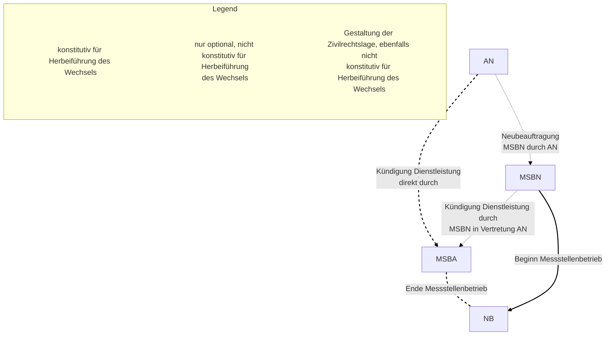
```mermaid
graph TD
    AN[AN]
    MSBA[MSBA]
    NB[NB]
    MSBN[MSBN]

    AN -.->|Kündigung Dienstleistung<br/>direkt durch| MSBA
    AN -.->|Neubeauftragung<br/>MSBN durch AN| MSBN
    MSBA -.-|Ende Messstellenbetrieb| NB
    MSBN -->|Beginn Messstellenbetrieb| NB
    MSBN -.->|Kündigung Dienstleistung durch<br/>MSBN in Vertretung AN| MSBA

    subgraph Legend
    direction TB
    L1[konstitutiv für Herbeiführung des Wechsels]
    L2[nur optional, nicht konstitutiv für Herbeiführung<br/>des Wechsels]
    L3[Gestaltung der Zivilrechtslage, ebenfalls nicht<br/>konstitutiv für Herbeiführung des Wechsels]
    
    style L1 fill:none,stroke:none
    style L2 fill:none,stroke:none
    style L3 fill:none,stroke:none
    end

    %% Legend connectors representation
    linkStyle 3 stroke:#000,stroke-width:2px;
    linkStyle 0,2 stroke:#000,stroke-width:2px,stroke-dasharray: 5 5;
    linkStyle 1,4 stroke:#000,stroke-width:1px,stroke-dasharray: 1 2;
```

```description
Legende zum Diagramm:
- Durchgezogener Pfeil: konstitutiv für Herbeiführung des Wechsels
- Gestrichelter Pfeil: nur optional, nicht konstitutiv für Herbeiführung des Wechsels
- Gepunkteter Pfeil: Gestaltung der Zivilrechtslage, ebenfalls nicht konstitutiv für Herbeiführung des Wechsels
```

Seite **17** von **91**

## 2.2. Use-Case: Kündigung Messstellenbetrieb

### 2.2.1. UC: Kündigung Messstellenbetrieb

|Use-Case-Name|Kündigung Messstellenbetrieb|
|-|-|
|Prozessziel|Der zwischen AN bzw. ANN und MSBA abgeschlossene Messstellenbetriebsvertrag für die genannte Messlokation ist gekündigt.|
|Use-Case Beschreibung|Der MSBN kündigt im Auftrag des AN bzw. ANN den für die genannte Messlokation bestehenden Messstellenbetriebsvertrag.<br/><br/>In der Kündigung kann ein beliebiger in der Zukunft liegender Kündigungstermin (auch untermonatlich) angegeben werden. Der Kündigungstermin kann sich<br/>\* auf einen fixen Zeitpunkt 00:00 Uhr oder<br/>\* auf einen nächstmöglichen Zeitpunkt 00:00 Uhr<br/>beziehen.<br/><br/>Der Kündigungstermin ist der Zeitpunkt, zu dem die zu kündigende Dienstleistung enden soll.<br/><br/>Der MSBA prüft die Kündigung und teilt dem MSBN das Ergebnis mit.<br/>Dabei sind folgende Regeln einzuhalten:<br/>\* Hat der MSBN auf einen fixen Zeitpunkt gekündigt und wird dieser vom MSBA nicht bestätigt, so teilt der MSBA den nächstmöglichen Zeitpunkt, zu dem eine Kündigung erfolgen kann, und die Kündigungsfrist in der Ablehnung mit.<br/>\* Hat der MSBN auf den nächstmöglichen Zeitpunktgekündigt, so bestätigt der MSBA die Kündigung unter Angabe dieses Zeitpunkts.<br/>\* Liegt dem MSBA bereits eine wirksame Kündigung vor (durch einen MSBN oder den AN bzw. ANN) sind die entsprechenden Konstellationen im Kapitel 2.2.3 „Antwort MSBA bei Kündigung eines bereits wirksam gekündigten Vertrages“ beschrieben.|
|Rollen|MSB|
|Vorbedingung|Der MSBN besitzt die Vollmacht des AN bzw. ANN in dessen Namen die Kündigung vornehmen zu dürfen.|
|Nachbedingung im Erfolgsfall|\* Bestätigung der Kündigung:<br/>- Der MSBA ist verpflichtet, unmittelbar mit Bestätigung der Kündigung gegenüber dem MSBN auch den Use-Case „Ende Messstellenbetrieb“ gegenüber dem NB anzustoßen.<br/>- Sofern die Übermittlung von Werten an den ESA durchgeführt wird, beendet der MSBA die Übermittlung von Werten an den ESA.<br/><br/>\* Ablehnung der Kündigung: MSBA sieht den Messstellenbetriebsvertrag als nicht wirksam gekündigt an.|
|Nachbedingung im Fehlerfall|--|


Seite **18** von **91**

|Use-Case-Name|Kündigung Messstellenbetrieb|
|-|-|
|Fehlerfälle|--|
|Weitere Anforderungen|\* Ungeachtet der jederzeit bestehenden Möglichkeit des AN bzw. ANN, seinen Messstellenbetriebsvertrag schriftlich zu kündigen, darf der MSBA eine nach diesem Use-Case gemeldete Kündigung nicht allein unter Berufung auf die fehlende Einhaltung einer vertraglich vereinbarten Form zurückweisen. In diesem Fall hat er eine Kündigung auch in elektronischer Form unter Anwendung dieses Use-Case entgegenzunehmen und zu bearbeiten.<br/><br/>Hinweis:<br/>\* Der Use-Case behandelt nicht den Fall, dass der AN bzw. ANN selbst gegenüber dem MSBA den Messstellenbetriebsvertrag kündigt.<br/>\* Wenn der AN bzw. ANN vorab selbst kündigt, ist der Use-Case „Ende Messstellenbetrieb“ vom MSBA gegenüber dem NB unmittelbar mit Verfassen der Kündigungsbestätigung an den AN bzw. ANN anzustoßen.|


## 2.2.2. SD: Kündigung Messstellenbetrieb

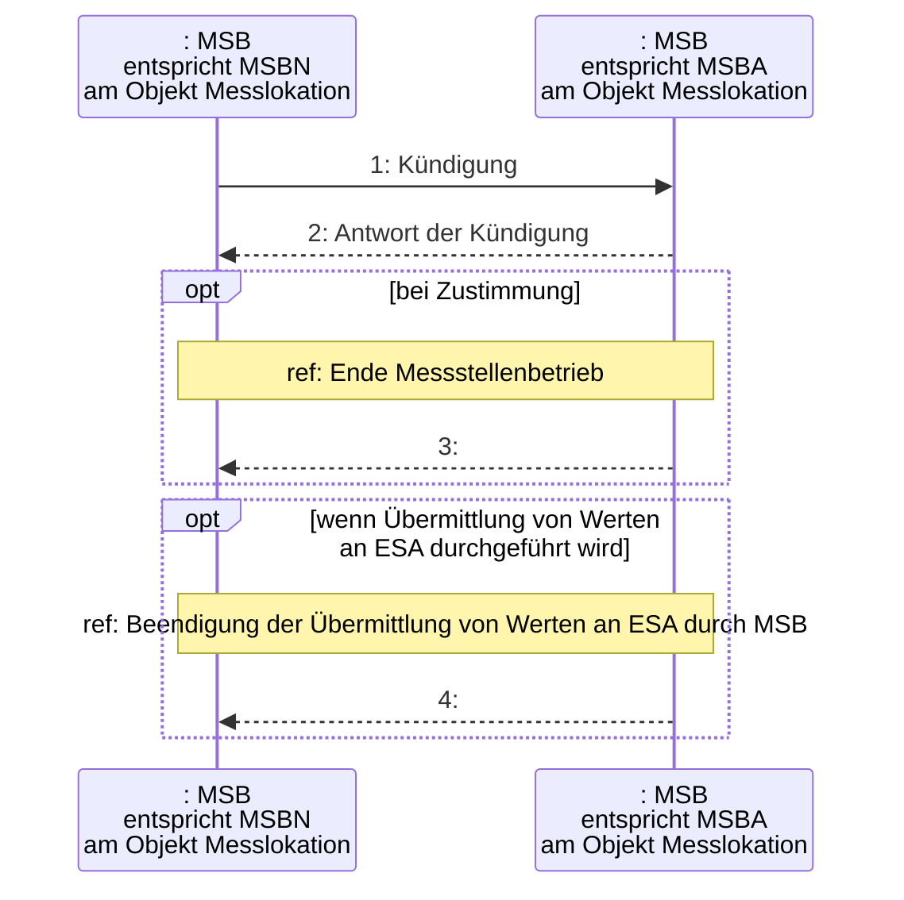
```mermaid
sequenceDiagram
    participant MSBN as : MSB <br/> entspricht MSBN <br/> am Objekt Messlokation
    participant MSBA as : MSB <br/> entspricht MSBA <br/> am Objekt Messlokation

    MSBN->>MSBA: 1: Kündigung
    MSBA-->>MSBN: 2: Antwort der Kündigung

    opt bei Zustimmung
        Note over MSBN, MSBA: ref: Ende Messstellenbetrieb
        MSBA-->>MSBN: 3:
    end

    opt wenn Übermittlung von Werten an ESA durchgeführt wird
        Note over MSBN, MSBA: ref: Beendigung der Übermittlung von Werten an ESA durch MSB
        MSBA-->>MSBN: 4:
    end
```

Seite **19** von **91**

|Nr.|Aktion|Frist|Hinweis/Bemerkung|
|-|-|-|-|
|1|Kündigung|--|--|
|2|Antwort der Kündigung|Unverzüglich, jedoch spätester ÜT ist der 3. WT nach dem ÜT von Nr. 1.|Falls der MSBA die Kündigung des MSBN ablehnt, teilt er den Grund oder die Gründe für die Ablehnung mit.<br/>Falls der MSBA die Kündigung gegenüber dem MSBN bestätigt, kann es sich um eine Bestätigung handeln, die<br/>• ohne inhaltliche Änderung erteilt wird oder<br/>• die mit Abänderungen erteilt wird.|
|3|ref Ende Messstellenbetrieb|--|--|
|4|ref Beendigung der Übermittlung von Werten an ESA durch MSB|--|--|


Seite **20** von **91**

### 2.2.3. Antwort MSBA bei Kündigung eines bereits wirksam gekündigten Vertrages

<u>Prozesssituation:</u>

Kündigung wurde bereits ausgesprochen (z. B. unmittelbar durch den ANN/AN), Messstellenbetriebsvertrag zwischen MSBA und ANN/AN endet dementsprechend zum Tag X zu 00:00 Uhr (nachfolgend als „Vertragsende“ bezeichnet).

|Kündigung durch MSBN ...|Antwort MSBA|Erläuterungen|||
|-|-|-|-|-|
|... auf denselben Termin|Bestätigung der Kündigung|--|||
|...auf einen fixen Termin, der früher als das Vertragsende liegt|Fall 1:<br/><br/>Vertragssituation lässt eine noch frühere Kündigung zu<br/><br/>\* Kündigungsbestätigung für neuen (früheren) Kündigungstermin an MSBN|Sollte der MSBA für das bereits wirksam gekündigte Vertragsverhältnis aufgrund der Vertragslage ein noch früheres Vertragsende akzeptieren, so teilt er dies als Kündigungsbestätigung für diesen früheren Kündigungstermin mit.|||
||||Fall 2:<br/><br/>Vertragssituation lässt keine frühere Kündigung zu<br/><br/>\* Kündigungsablehnung an MSBN, Hinweis auf Kündigungstermin aus der früheren wirksamen Kündigung|Wenn der MSBA das noch frühere Vertragsende nicht akzeptiert, weist er darauf hin, dass das Vertragsverhältnis bereits zuvor wirksam gekündigt wurde und benennt das maßgebliche Vertragsende-Datum.|
|...auf einen fixen Termin, der später als das Vertragsende liegt|\* Ablehnung der Kündigung, Hinweis auf Kündigungstermin aus der früheren wirksamen Kündigung|Ein bereits wirksam gekündigtes Vertragsverhältnis kann nicht – auch nicht bei Zustimmung des MSBA – durch eine schlichte Kündigung zu einem späteren Zeitpunkt wieder verlängert werden.|||
|...auf den nächstmöglichen Kündigungstermin|Fall 1:<br/><br/>Vertragssituation lässt eine noch frühere Kündigung zu<br/><br/>\* Kündigungsbestätigung für neuen (früheren) Kündigungstermin an MSBN|Sollte der MSBA für das bereits wirksam gekündigte Vertragsverhältnis aufgrund der Vertragslage ein noch früheres Vertragsende akzeptieren, so teilt er dies als Kündigungsbestätigung für diesen früheren Kündigungstermin mit.|||
||||Fall 2:<br/><br/>Vertragssituation lässt keine frühere Kündigung zu<br/><br/>\* Kündigungsablehnung an MSBN, Hinweis auf Kündigungstermin aus der früheren wirksamen Kündigung.|Wenn der MSBA das noch frühere Vertragsende nicht akzeptiert, weist er darauf hin, dass das Vertragsverhältnis bereits zuvor wirksam gekündigt wurde und benennt das maßgebliche Vertragsende-Datum.|


Seite **21** von **91**

## 2.3. Use-Case: Beginn Messstellenbetrieb

### 2.3.1. UC: Beginn Messstellenbetrieb

|Use-Case-Name|Beginn Messstellenbetrieb|
|-|-|
|Prozessziel|Der MSB ist einer Messlokation (als Bestandteil eines Lokationsbündels) zugeordnet.|
|Use-Case Beschreibung|Der Prozess beschreibt die Interaktionen zwischen den Marktteilnehmern für den Fall, dass eine einzelne Messlokation dem anmeldenden MSB für die Durchführung des Messstellenbetriebes zugeordnet werden soll.<br/><br/>Dies gilt insbesondere, wenn<br/>\* es sich um die erstmalige Inbetriebnahme oder um die Wiederinbetriebnahme einer einzelnen Messlokation handelt,<br/>\* der Messstellenbetrieb für diese Messlokation erstmals einem wMSB zugeordnet werden soll oder<br/>\* die einzelne Messlokation einem anderen als dem bisherigen MSB zugeordnet werden soll.|
|Rollen|\* NB<br/>\* MSB<br/>\* LF|
|Vorbedingung|Abschluss eines MSB-Vertrages.|
|Nachbedingung im Erfolgsfall|\* Der NB kann die daraus veränderten Stammdaten an der Mess- bzw. Marktlokation eines Lokationsbündels an die Berechtigten verteilen.<br/>\* Der NB versendet die Berechnungsformel an den MSBN.<br/>\* Sofern die Übermittlung von Werten an den ESA durchgeführt wird, beendet der MSBA die Übermittlung von Werten an den ESA.<br/>\* Sofern der MSBA eine von einem NB oder LF bestellte Konfiguration zu beenden hat,<br/>o und der MSBA der MSB der direkt betroffenen Lokation der zu beendenden Konfiguration ist, führt der MSBA den Use-Case „Beendigung einer Konfiguration vom MSB“ (GPKE Teil 3) aus.<br/>o und im Fall, dass der MSBA ein „weiterer MSB“ der zu beendenden Konfiguration ist, führt der MSBA den Use-Case „Bestellung Beendigung einer Konfiguration an MSB“ (GPKE Teil 3) aus.|
|Nachbedingung im Fehlerfall|--|
|Fehlerfälle|--|
|Weitere Anforderungen|--|


Seite **22** von **91**

# 2.3.2. SD: Beginn Messstellenbetrieb

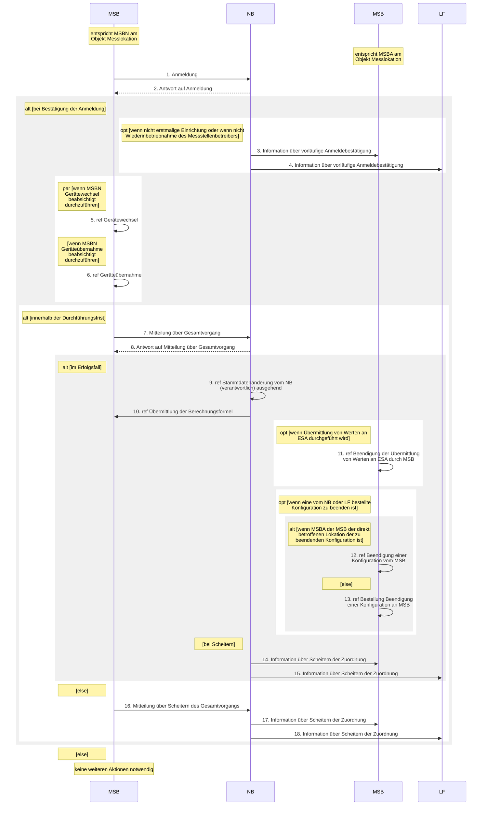
```mermaid
sequenceDiagram
    participant MSBN as MSB
    participant NB as NB
    participant MSBA as MSB
    participant LF as LF

    Note over MSBN: entspricht MSBN am<br/>Objekt Messlokation
    Note over MSBA: entspricht MSBA am<br/>Objekt Messlokation

    MSBN->>NB: 1. Anmeldung
    NB-->>MSBN: 2. Antwort auf Anmeldung

    rect rgb(240, 240, 240)
        Note left of MSBN: alt [bei Bestätigung der Anmeldung]
        
        rect rgb(255, 255, 255)
            Note left of NB: opt [wenn nicht erstmalige Einrichtung oder wenn nicht<br/>Wiederinbetriebnahme des Messstellenbetreibers]
            NB->>MSBA: 3. Information über vorläufige Anmeldebestätigung
            NB->>LF: 4. Information über vorläufige Anmeldebestätigung
        end

        rect rgb(255, 255, 255)
            Note left of MSBN: par [wenn MSBN<br/>Gerätewechsel<br/>beabsichtigt<br/>durchzuführen]
            MSBN->>MSBN: 5. ref Gerätewechsel
            
            Note left of MSBN: [wenn MSBN<br/>Geräteübernahme<br/>beabsichtigt<br/>durchzuführen]
            MSBN->>MSBN: 6. ref Geräteübernahme
        end

        rect rgb(255, 255, 255)
            Note left of MSBN: alt [innerhalb der Durchführungsfrist]
            MSBN->>NB: 7. Mitteilung über Gesamtvorgang
            NB-->>MSBN: 8. Antwort auf Mitteilung über Gesamtvorgang

            rect rgb(240, 240, 240)
                Note left of MSBN: alt [im Erfolgsfall]
                NB->>NB: 9. ref Stammdatenänderung vom NB<br/>(verantwortlich) ausgehend
                NB->>MSBN: 10. ref Übermittlung der Berechnungsformel

                rect rgb(255, 255, 255)
                    Note left of MSBA: opt [wenn Übermittlung von Werten an<br/>ESA durchgeführt wird]
                    MSBA->>MSBA: 11. ref Beendigung der Übermittlung<br/>von Werten an ESA durch MSB
                end

                rect rgb(255, 255, 255)
                    Note left of MSBA: opt [wenn eine vom NB oder LF bestellte<br/>Konfiguration zu beenden ist]
                    
                    rect rgb(240, 240, 240)
                        Note left of MSBA: alt [wenn MSBA der MSB der direkt<br/>betroffenen Lokation der zu<br/>beendenden Konfiguration ist]
                        MSBA->>MSBA: 12. ref Beendigung einer<br/>Konfiguration vom MSB
                        
                        Note left of MSBA: [else]
                        MSBA->>MSBA: 13. ref Bestellung Beendigung<br/>einer Konfiguration an MSB
                    end
                end

                Note left of NB: [bei Scheitern]
                NB->>MSBA: 14. Information über Scheitern der Zuordnung
                NB->>LF: 15. Information über Scheitern der Zuordnung
            end

            Note left of MSBN: [else]
            MSBN->>NB: 16. Mitteilung über Scheitern des Gesamtvorgangs
            NB->>MSBA: 17. Information über Scheitern der Zuordnung
            NB->>LF: 18. Information über Scheitern der Zuordnung
        end
    end

    Note left of MSBN: [else]
    Note over MSBN: keine weiteren Aktionen notwendig
```

Seite **23** von **91**

|Nr.|Aktion|Frist|Hinweis/Bemerkung|
|-|-|-|-|
|1|Anmeldung|Spätester ÜT ist der 15. WT vor dem vom MSBN gewünschten Zuordnungsbeginn.<br/><br/>Bei erstmaliger Einrichtung des Messstellenbetriebes: spätester ÜT ist der 7. WT vor dem vom MSBN gewünschten Zuordnungsbeginn.|Der MSBN meldet für eine einzelne Messlokation den Beginn des Messstellenbetriebes beim NB an.<br/>In der Anmeldung teilt der MSBN mit:<br/>1. Identität des AN<br/>2. Versicherung des MSBN,<br/>a. dass ihm die Erklärung des AN über seine Beauftragung vorliegt<br/>oder<br/>b. dass die Messlokation auf Grund des Umbaus auf iMS übernommen wird (gilt nur für gMSB).<br/><br/>3. Information, ob es sich um<br/>a. die erstmalige Einrichtung,<br/>b. die Wiederinbetriebnahme<br/>oder<br/>c. einen bereits bestehenden Messstellenbetrieb an dieser Messlokation handelt.<br/><br/>4. Gewünschter Zuordnungsbeginn|
|2|Antwort auf Anmeldung|Unverzüglich, jedoch spätester ÜT ist der 5. WT nach dem ÜT von Nr. 1.|Der NB prüft die eingegangene Anmeldung auf Vollständigkeit der übermittelten Angaben. Weiter prüft er:<br/><br/>1. Vorliegen der Versicherung über die Beauftragung des MSBN durch den AN.<br/><br/>2. Zulässiger Zuordnungsbeginn: Einhaltung der Mindestvorlaufzeit gem. Prozessschritt 1.<br/><br/>3. Vorliegen eines Vertrages nach §9 Abs.1 Nr. 3 MsbG mit dem MSBN.<br/><br/>Der NB bestätigt dem MSBN, dass nach Maßgabe der von ihm geprüften formellen Voraussetzungen einem Wechsel zum gewünschten Zuordnungsbeginn nichts entgegensteht.<br/><br/>Der NB teilt dem MSBN u.a. zugleich mit:<br/>• für welche Marktlokation/en der MSBN im Lokationsbündel für die Ermittlung von Energiemengen zukünftig verantwortlich ist;<br/>• den/die verantwortlichen MSB der Marktlokation(en), sofern|


Seite **24** von **91**

|Nr.|Aktion|Frist|Hinweis/Bemerkung||||
|-|-|-|-|-|-|-|
||||Marktlokationen im Lokationsbündel enthalten sind, für die der MSBN zukünftig nicht die Verantwortung für die Ermittlung der Energiemengen der Marktlokation hat;<br/>\* die Identität des zuvor an der prozessual behandelten Messlokation zugeordneten MSB und die zu sämtlichen Marktlokationen zugeordneten Marktpartner;<br/>\* die für die Übermittlung von Werten nach Typ 1 erforderlichen Mindestparameter für die betroffenen Lokationen;<br/><br/>ob an einer der Messlokationen gegenwärtig ein Wandlersatz eingebaut ist;<br/>\* den derzeit geltenden Ableseturnus für die Durchführung der turnusmäßigen/regelmäßigen Ablesung (Ableseterminierung) sowie den Abstand zwischen turnusmäßigen/regelmäßigen Ablesungen (Intervall).<br/><br/>Eine an einer betreffenden Marktlokation bestehende Unterbrechung der Anschlussnutzung bleibt von der Neuzuordnung des MSB unberührt. Sofern eine Sperrung derzeit mittels der Messeinrichtung erfolgt, hat der NB dem MSBN das Erfordernis der Aufrechterhaltung der Unterbrechung für die entsprechende/n Messlokation(en) mitzuteilen, damit der MSBN dies im weiteren Verlauf entsprechend berücksichtigen kann.<br/>Handelt es sich um die erstmalige Einrichtung des Messstellenbetriebes, so teilt NB mit, ob die Inbetriebsetzung der Marktlokation(en) zu dem vom MSBN gewünschten Zuordnungsbeginn bereits erfolgt sein wird. Anderenfalls teilt der NB mit, ab welchen Zeitpunkt mit der erfolgten Inbetriebsetzung zu rechnen ist.<br/>Eine Ablehnung wird unter Darlegung der Ablehnungsgründe mitgeteilt.||||
||||3|Information über vorläufige Anmeldebestätigung|Parallel zu Nr. 2.|Der NB informiert den MSBA darüber, dass dem MSBN eine vorläufige Anmeldebestätigung übermittelt worden ist. Hierbei teilt der NB mit:<br/>\* Identität des MSBN,|


Seite 25 von 91

|Nr.|Aktion|Frist|Hinweis/Bemerkung||||
|-|-|-|-|-|-|-|
||||\* den gewünschten Zuordnungsbeginn des MSBN,<br/>\* Übernahme der einzelnen Messlokation auf Grund des Umbaus auf iMS,<br/>\* die betroffene Messlokation sowie ggf. die dem MSB zugeordnete Marktlokation des Lokationsbündels.<br/><br/>Die Mitteilung hat den Zweck, den MSBA darüber zu informieren, dass zum genannten Zuordnungsbeginn eine Änderung in der Zuordnung ansteht. Der MSBA wird hierdurch in die Lage versetzt, Kontakt mit dem MSBN zwecks Klärung aufzunehmen, falls MSBA der Auffassung ist, die Neuzuordnung sei unberechtigt.<br/><br/>Zugleich kündigt diese Informationsmeldung die bevorstehende Kontaktaufnahme durch den MSBN zwecks Durchführung einer Geräteübernahme und/oder eines Gerätewechsels an.||||
||||4|Information über vorläufige Anmeldebestätigung|Parallel zu Nr. 2|Der NB informiert den zum vorläufigen Zuordnungsbeginn zugeordneten LF über die vorläufige Anmeldebestätigung. Der NB teilt dem LF dabei den MSBN sowie den vorläufigen Zuordnungsbeginn mit.|
||||5|ref Gerätewechsel|--|Durchführung der Geräteübernahme nach dem Use-Case „Geräteübernahme“ und/oder Durchführung des Gerätewechsels nach dem Use-Case „Gerätewechsel“<br/><br/>Der MSBN hat die Möglichkeit, nur einen oder beide der genannten Prozesse zu nutzen. Es ist möglich, beide Prozesse parallel oder nacheinander anzustoßen. Es ist dem MSBN überlassen, welchen Prozess er zuerst anstößt. Das Scheitern eines der Prozesse schließt nicht aus, dass der jeweils andere in der Folge noch angestoßen wird.<br/><br/>Im Rahmen der Durchführung der Use-Cases „Geräteübernahme“ bzw. „Gerätewechsel“ muss der jeweils vom MSBN anzugebende gewünschte Übernahme- bzw. Wechselzeitpunkt in einem Zeitraum vom 9. WT vor bis zum|


Seite **26** von **91**

|Nr.|Aktion|Frist|Hinweis/Bemerkung||||
|-|-|-|-|-|-|-|
||||9. WT nach dem oben in Prozessschritt 2 vom NB bestätigten Zuordnungsbeginn liegen (Realisierungskorridor).<br/><br/>Im Fall der erstmaligen Einrichtung des Messstellenbetriebes an der einzelnen Messlokation erfolgt der Einbau der Messeinrichtung in entsprechender Anwendung des Use-Cases „Gerätewechsel“.<br/><br/>Weiter bei Prozessschritt 7, sobald der Gesamtvorgang in Bezug auf die einzelne Messlokation aus Sicht des MSBN gescheitert ist.<br/>Weiter bei Prozessschritt 7, sobald der Gesamtvorgang in Bezug auf die einzelne Messlokation aus Sicht des MSBN erfolgreich abgeschlossen ist.<br/><br/>„Erfolgreicher Abschluss des Gesamtvorgangs“ bezeichnet die Situation, dass sich MSBA und MSBN bezüglich aller für den weiteren Messstellenbetrieb durch den MSBN erforderlichen technischen Einrichtungen der einzelnen Messlokation im Sinne einer erfolgreichen Geräteübernahme und/oder eines erfolgreichen Gerätewechsels verständigt haben.||||
||||6|ref Geräteübernahme|--|Durchführung der Geräteübernahme nach dem Use-Case „Geräteübernahme“ und/oder Durchführung des Gerätewechsels nach dem Use-Case „Gerätewechsel“<br/><br/>Der MSBN hat die Möglichkeit, nur einen oder beide der genannten Prozesse zu nutzen. Es ist möglich, beide Prozesse parallel oder nacheinander anzustoßen. Es ist dem MSBN überlassen, welchen Prozess er zuerst anstößt. Das Scheitern eines der Prozesse schließt nicht aus, dass der jeweils andere in der Folge noch angestoßen wird.<br/><br/>Im Rahmen der Durchführung der Use-Cases „Geräteübernahme“ bzw. „Gerätewechsel“ muss der jeweils vom MSBN anzugebende gewünschte Übernahme- bzw. Wechselzeitpunkt in einem Zeitraum vom 9. WT vor bis zum 9. WT nach dem oben in Prozessschritt 2|


Seite **27** von **91**

|Nr.|Aktion|Frist|Hinweis/Bemerkung||
|-|-|-|-|-|
|||||vom NB bestätigten Zuordnungsbeginn liegen (Realisierungskorridor).<br/><br/>Im Fall der erstmaligen Einrichtung des Messstellenbetriebes an der einzelnen Messlokation erfolgt der Einbau der Messeinrichtung in entsprechender Anwendung des Use-Cases „Gerätewechsel“.<br/><br/>Weiter bei Prozessschritt 7, sobald der Gesamtvorgang in Bezug auf die einzelne Messlokation aus Sicht des MSBN gescheitert ist.<br/><br/>Weiter bei Prozessschritt 7, sobald der Gesamtvorgang in Bezug auf die einzelne Messlokation aus Sicht des MSBN erfolgreich abgeschlossen ist.<br/><br/>„Erfolgreicher Abschluss des Gesamtvorgangs“ bezeichnet die Situation, dass sich MSBA und MSBN bezüglich aller für den weiteren Messstellenbetrieb durch den MSBN erforderlichen technischen Einrichtungen der einzelnen Messlokation im Sinne einer erfolgreichen Geräteübernahme und/oder eines erfolgreichen Gerätewechsels verständigt haben.|
|7|Mitteilung über Gesamtvorgang|Unverzüglich, jedoch spätester ÜT ist der 10. WT nach dem in Nr. 2 vom NB bestätigten Zuordnungsbeginn.|Der MSBN teilt den Termin mit, an dem der Gesamtvorgang erfolgreich abgeschlossen wurde<br/><br/>oder<br/><br/>der MSBN teilt mit, dass der Gesamtvorgang gescheitert ist.<br/><br/>Bei Mitteilung des Scheiterns des Gesamtvorgangs bleibt der MSBA der einzelnen Messlokation bzw. der Marktlokation zugeordnet.<br/><br/>Dies erfolgt auch, wenn der gMSB die einzelne Messlokation aufgrund des Rollouts beabsichtigt zu übernehmen, der vollständige Umbau auf iMS aber scheitert.||
|8|Antwort auf Mitteilung über Gesamtvorgang|Unverzüglich, jedoch spätester ÜT ist der 1. WT nach dem ÜT von Nr. 7.|Bei Scheitern der Zuordnung weiter mit Prozessschritt 14.<br/><br/>Bei Zuordnung des MSBN:||


Seite 28 von 91

|Nr.|Aktion|Frist|Hinweis/Bemerkung||||
|-|-|-|-|-|-|-|
||||Der NB ordnet den MSBN der prozessual behandelten Messlokation und ggf. einer oder mehreren Marktlokation(en) im Lokationsbündel zu. Der Zuordnungsbeginn des MSBN an der Messlokation und ggf. an der Marktlokation ist der Tag des vom MSBN der Messlokation mitgeteilten Termins des erfolgreichen Abschlusses des Gesamtvorgangs im Use-Case „Gerätewechsel“ und/oder „Geräteübernahme“ mit dem Zeitpunkt 00:00 Uhr.<br/><br/>Mit Vornahme der Zuordnung beendet der NB zugleich die Zuordnung des MSBA für den selben Zeitpunkt.<br/><br/>Der NB bestätigt dem MSBN die erfolgte Zuordnung des MSBN zur einzelnen Messlokation in Bezug auf den Messstellenbetrieb.<br/><br/>Dabei teilt der NB den Zuordnungsbeginn mit.||||
||||9|ref Stammdatenänderung vom NB (verantwortlich) ausgehend|--|Mitteilung an Berechtigte über erfolgte Zuordnung des MSBN zur einzelnen Messlokation in Bezug auf Messstellenbetrieb. Außerdem Mitteilung des Zuordnungsbeginns.|
||||10|ref Übermittlung der Berechnungsformel|--|Der NB übermittelt dem MSBN die Berechnungsformeln für jede Marktlokation und ggf. Netzlokation im Lokationsbündel.|
||||11|ref Beendigung der Übermittlung von Werten an ESA durch MSB|--|--|
|12|ref Beendigung einer Konfiguration vom MSB|--|--||||
|13|ref Bestellung Beendigung einer Konfiguration an MSB|--|--||||
|14|Information über Scheitern der Zuordnung|Unverzüglich nach dem ÜZ von Nr. 8, wenn Gesamtvorgang gescheitert.|Der MSBA bleibt der einzelnen Messlokation bzw. Marktlokation zugeordnet. Er setzt den Messstellenbetrieb an der einzelnen Messlokation fort oder er stößt zur Beendigung der Zuordnung den Use-Case „Ende Messstellenbetrieb“ an.||||


Seite 29 von 91

|Nr.|Aktion|Frist|Hinweis/Bemerkung|
|-|-|-|-|
|15|Information über Scheitern der Zuordnung|Parallel zu Nr. 14|Der MSBA bleibt der einzelnen Messlokation bzw. Marktlokation zugeordnet. Er setzt den Messstellenbetrieb an der einzelnen Messlokation fort oder er stößt zur Beendigung der Zuordnung den Use-Case „Ende Messstellenbetrieb“ an.|
|16|Mitteilung über das Scheitern des Gesamtvorgangs|Spätester ÜT ist der 11. WT nach dem in Nr. 2 vom NB bestätigten Zuordnungsbeginn.|Es liegt nach maximaler Frist des Gesamtvorgangs zu Geräteübernahme/Gerätewechsel keine Meldung des MSBN beim NB vor.<br/><br/>Der MSBA bleibt der einzelnen Messlokation zugeordnet.|
|17|Information über Scheitern der Zuordnung|Parallel zu Nr. 16.|Der MSBA bleibt der einzelnen Messlokation bzw. Marktlokation zugeordnet. Er setzt den Messstellenbetrieb an der einzelnen Messlokation fort oder er stößt zur Beendigung der Zuordnung den Use-Case „Ende Messstellenbetrieb“ an.|
|18|Information über Scheitern der Zuordnung|Parallel zu Nr. 17|Der MSBA bleibt der einzelnen Messlokation bzw. Marktlokation zugeordnet. Er setzt den Messstellenbetrieb an der einzelnen Messlokation fort oder er stößt zur Beendigung der Zuordnung den Use-Case „Ende Messstellenbetrieb“ an.|


## 2.4. Use-Case: Ende Messstellenbetrieb

### 2.4.1. UC: Ende Messstellenbetrieb

**Use-Case-Name**: Ende Messstellenbetrieb
**Prozessziel**: Der MSB ist einer Messlokation nicht mehr zugeordnet oder wurde verpflichtet den Messstellenbetrieb weiter durchzuführen.
**Use-Case Beschreibung**: Der Use-Case beschreibt die Interaktionen zwischen den Marktteilnehmern anlässlich einer vom MSB zu initiierenden Beendigung des Messstellenbetriebes. Der Prozess ist auch bei Außerbetriebnahme einer einzelnen Messlokation von einem wMSB und gMSB anzuwenden.

Der NB hat mittels rechtzeitiger Einbindung des gMSB eine lückenlose Messung sicherzustellen.
**Rollen**: 
* NB
* MSB
**Vorbedingung**: Beendigung eines MSB-Vertrages
**Nachbedingung im Erfolgsfall**: 
* Der NB kann die daraus veränderten Stammdaten an der Mess- bzw. Marktlokation eines Lokationsbündels an die Berechtigten verteilen (z.B. der wMSB ist in einer Weiterverpflichtung) oder

Seite 30 von 91

**Use-Case-Name**: **Ende Messstellenbetrieb**
- **der gMSB kann den Use-Case „Verpflichtung gMSB“ bedienen.**
**Nachbedingung im Fehlerfall**: --
**Fehlerfälle**: Die Messlokation war dem MSB nicht zugeordnet.
**Weitere Anforderungen**: --

### 2.4.2. SD: Ende Messstellenbetrieb

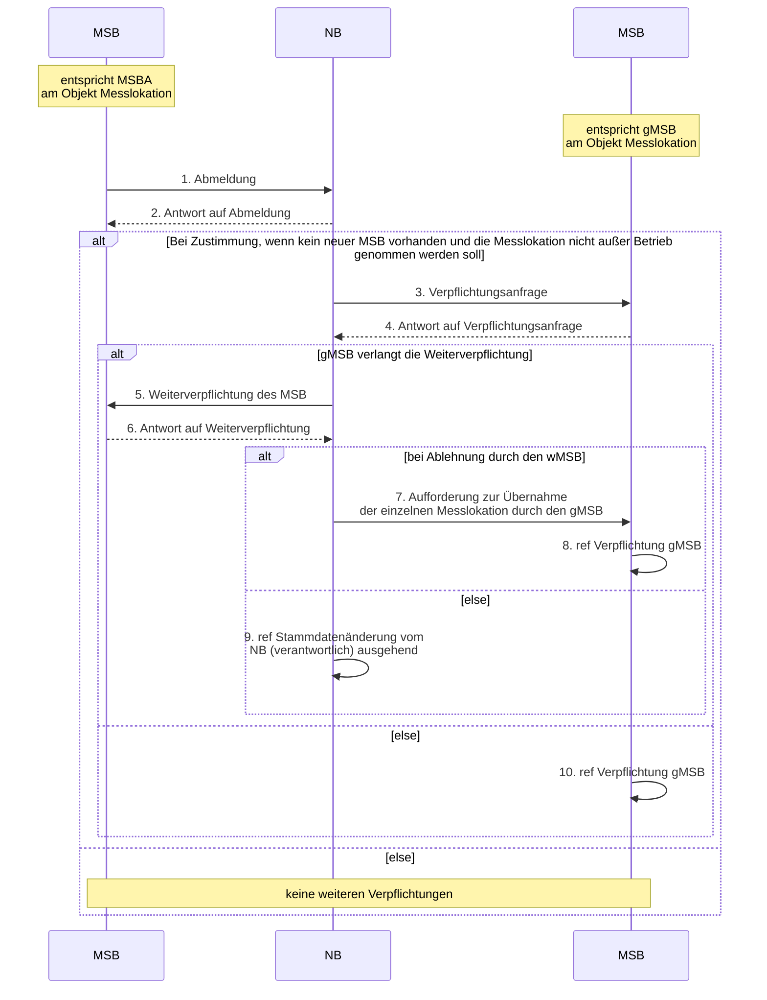
```mermaid
sequenceDiagram
    participant MSB_A as MSB
    participant NB as NB
    participant gMSB as MSB

    Note over MSB_A: entspricht MSBA<br/>am Objekt Messlokation
    Note over gMSB: entspricht gMSB<br/>am Objekt Messlokation

    MSB_A->>NB: 1. Abmeldung
    NB-->>MSB_A: 2. Antwort auf Abmeldung

    alt Bei Zustimmung, wenn kein neuer MSB vorhanden und die Messlokation nicht außer Betrieb genommen werden soll
        NB->>gMSB: 3. Verpflichtungsanfrage
        gMSB-->>NB: 4. Antwort auf Verpflichtungsanfrage
        
        alt gMSB verlangt die Weiterverpflichtung
            NB->>MSB_A: 5. Weiterverpflichtung des MSB
            MSB_A-->>NB: 6. Antwort auf Weiterverpflichtung
            
            alt bei Ablehnung durch den wMSB
                NB->>gMSB: 7. Aufforderung zur Übernahme<br/>der einzelnen Messlokation durch den gMSB
                gMSB->>gMSB: 8. ref Verpflichtung gMSB
            else else
                NB->>NB: 9. ref Stammdatenänderung vom<br/>NB (verantwortlich) ausgehend
            end
        else else
            gMSB->>gMSB: 10. ref Verpflichtung gMSB
        end
    else else
        Note over MSB_A, gMSB: keine weiteren Verpflichtungen
    end
```

|Nr.|Aktion|Frist|Hinweis/Bemerkung|
|-|-|-|-|
|1|Abmeldung|Spätester ÜT ist der 20. WT vor dem gewünschten Zuordnungsende.|Der MSB meldet für eine einzelne Messlokation und der ggf. zugehörigen Marktlokation des betroffenen|


Seite 31 von 91

|Nr.|Aktion|Frist|Hinweis/Bemerkung|||
|-|-|-|-|-|-|
|||Bei Außerbetriebnahme der Messlokation (Stilllegung) gilt:<br/><br/>Unverzüglich nach Außerbetriebnahme der Messlokation.|Lokationsbündels den Messstellenbetrieb beim NB ab.<br/><br/>In der Abmeldung teilt der MSB mit:<br/>1. Abmeldegrund, z. B.:<br/>a. Ende aufgrund AN-Wechsel,<br/>b. Beendigung MSB-Vertrag,<br/>c. Außerbetriebnahme der Messlokation<br/>2. Gewünschtes Zuordnungsende<br/>Hinweis: Im Fall von 1.c. ist das gewünschte Zuordnungsende der Folgetag 00:00 des Geräteausbaudatums.|||
|||2|Antwort auf Abmeldung|Unverzüglich, jedoch spätester ÜT ist der 7. WT nach dem ÜT von Nr. 1.|Im Fall, dass der Abmeldegrund 1.c. ist:<br/>Der NB prüft die eingegangene Abmeldung auf Vollständigkeit der übermittelten Angaben. Weiter prüft er:<br/><br/>Zulässiges Zuordnungsende:<br/>Einhaltung der Mindestvorlaufzeit gem. Prozessschritt 1.<br/>Hat der MSB ein Zuordnungsende benannt, das die Mindestvorlauffrist nach Prozessschritt 1 unterschreitet, so setzt der NB das Zuordnungsende auf das nächstmögliche Zuordnungsende unter Beachtung der Mindestvorlauffrist.<br/><br/>Bei vorläufiger Bestätigung der Abmeldung:<br/><br/>Der NB bestätigt die Abmeldung vorläufig zu dem vom MSB gewünschten bzw. zu dem vom NB festgesetzten Zuordnungsende (s. dazu oben unter „Zulässiges Zuordnungsende“).<br/><br/>Eine spätere Abweichung zum hier vorläufig bestätigten Zuordnungsende kann sich insbesondere aus folgenden Umständen ergeben:<br/><br/>\* Anmeldung \*Beginn Messstellenbetrieb\* durch einen MSBN mit Zuordnung der einzelnen Messlokation noch vor Erreichen des hier vorläufig bestätigten Zuordnungsendes.|


Seite **32** von **91**

|Nr.|Aktion|Frist|Hinweis/Bemerkung|
|-|-|-|-|
||||Aufgrund der Vorrangwirkung des Beginn-Prozesses kann sich hieraus für das Zuordnungsende eine grundsätzlich unbegrenzte zeitliche Vorverlagerung ergeben,<br/>\* vorverlagertes oder nach hinten verlagertes (jeweils bis zu 9 WT) Zuordnungsende des MSBA im Rahmen des Realisierungskorridors beim regulären Übergang der einzelnen Messlokation auf einen nachfolgenden MSBN oder im Rahmen der Übernahme der einzelnen Messlokation durch den gMSB oder<br/>\* zum vorläufig gegenüber dem MSBA bestätigten Zuordnungsende liegt noch keine Anmeldung eines MSBN vor und deshalb erfolgt eine vorübergehende Weiterverpflichtung des MSBA durch den NB (siehe nachfolgenden Prozessschritt).<br/><br/>Bei einer Ablehnung wird die Ablehnung unter Darlegung der Ablehnungsgründe mitgeteilt.<br/><br/>*Im Fall, dass der Abmeldegrund 1.c. ist:*<br/>Der NB prüft die eingegangene Abmeldung.<br/><br/>Bei Bestätigung der Abmeldung<br/>\* und sofern die Stilllegung der Messlokation nicht die Stilllegung der Marktlokation zur Folge hat: Der NB bestätigt die Abmeldung zu dem vom MSB der Messlokation gewünschten Zuordnungsende.<br/><br/>\* und sofern die Stilllegung der Messlokation die Stilllegung der Marktlokation zur Folge hat: Der NB bestätigt die Abmeldung ohne Angabe eines Zuordnungsendes. Die Beendigung der Zuordnung des MSB zur Messlokation erfolgt über den Use-Case "Lieferende von NB an LF" (GPKE Teil 2) aufgrund Stilllegung der Marktlokation.|


Seite **33** von **91**

|Nr.|Aktion|Frist|Hinweis/Bemerkung|||
|-|-|-|-|-|-|
||||Hinweis: Bis zur Beendigung der Zuordnung sind nach den Vorgaben des Kapitels 2.5.5. „Darstellung der zu übermittelnden Werte“ (Tabelle in WiM Teil 2) ggf. Nullwerte vom MSB der Messlokation zu übermitteln. Unabhängig davon hat der MSB der Messlokation entsprechend den Vorgaben von Nr. 5 der Tabelle, die Übermittlung des Zählerstands/der Zählerstände zum Geräteausbauzeitpunkt vorzunehmen.|||
||||||Bei einer Ablehnung wird die Ablehnung unter Darlegung der Ablehnungsgründe mitgeteilt.|
|3|Verpflichtungs-anfrage|Frühester ÜT ist der 8. WT und spätester der 5. WT vor dem vorläufig bestätigten Zuordnungsende.|Der NB stellt gegenüber dem gMSB die Anfrage, ob der gMSB selbst zum genannten Termin den Messstellenbetrieb übernimmt oder er eine Weiterverpflichtung des MSBA wünscht.<br/><br/>Hat der NB bis zum Beginn des 8. WT vor dem gegenüber dem MSBA vorläufig bestätigten Zuordnungsende noch keine Anmeldebestätigung nach Prozessschritt 2 des Use-Cases „Beginn Messstellenbetrieb“ zugunsten eines MSBN ausgesprochen, wird aufgrund der entsprechenden Fristenläufe im Rahmen der Use-Cases „Beginn Messstellenbetrieb“, „Gerätewechsel“ bzw. „Geräteübernahme“ das Entstehen einer Zuordnungslücke für die betreffende Messlokation absehbar.|||
|4|Antwort auf Verpflichtungs-anfrage|Unverzüglich, jedoch spätester ÜT ist der 1. WT nach dem ÜT von Nr. 3.|Der gMSB hat nach eigenem Ermessen erforderliche vorbereitende Maßnahmen zu ergreifen, um im Falle des Ausbleibens einer entsprechenden Nachfolgezuordnung ab dem vorläufig bestätigen Zuordnungsende<br/>\* den MSBA im Falle eines AN-Wechsels für einen Zeitraum von längstens drei Monaten zur Weiterführung des Messstellenbetriebes weiter zu verpflichten,<br/>\* den MSBA in allen sonstigen Fällen für einen Zeitraum von längstens einem Monat zur Weiterführung des|||


Seite **34** von **91**

|Nr.|Aktion|Frist|Hinweis/Bemerkung||||
|-|-|-|-|-|-|-|
||||Messstellenbetriebes weiter zu verpflichten oder<br/>\* den Messstellenbetrieb im Rahmen der gesetzlichen Grundzuständigkeit selbst zu übernehmen.<br/>Der gMSB teilt mit, ob er selbst den Messstellenbetrieb übernimmt oder ob eine Weiterverpflichtung des MSBA erforderlich ist.||||
||||5|Weiterverpflichtung des MSB|Unverzüglich, jedoch spätester ÜT ist der 1. WT nach dem ÜT von Nr. 4.|Im Fall der Weiterverpflichtung des MSBA teilt der NB dem MSBA den Termin mit, bis zu dem der gMSB den MSBA zur Fortführung des Messstellenbetriebs verpflichtet (verschobenes Zuordnungsende).|
|6|Antwort auf Weiterverpflichtung|Unverzüglich, jedoch spätester ÜT ist der 1. WT nach dem ÜT von Nr. 5.|Der MSBA beantwortet den Auftrag des NB. Bei Bestätigung entspricht der Zuordnungsbeginn für die Weiterbeauftragung des MSB durch den NB dem vorläufig bestätigten Zuordnungsende gemäß Prozessschritt 2.||||
|7|Aufforderung zur Übernahme der einzelnen Messlokation durch den gMSB|Unverzüglich, wenn kein MSB der Messlokation zugeordnet wäre.|--||||
|8|ref Verpflichtung gMSB|--|--||||
|9|ref Stammdatenänderung vom NB (verantwortlich) ausgehend|--|--||||
|10|ref Verpflichtung gMSB|--|--||||


## 2.5. Use-Case: Verpflichtung gMSB

### 2.5.1. UC: Verpflichtung gMSB

|Use-Case-Name|Verpflichtung gMSB|
|-|-|
|Prozessziel|Der gMSB ist einer Messlokation und ggf. der Marktlokation (für die Ermittlung der Energiemengen der Marktlokation) in einem Lokationsbündel zugeordnet.|
|Use-Case Beschreibung|Der NB verpflichtet den gMSB zur Übernahme der einzelnen Messlokation und ggf. zugeordneten Marktlokation.<br/><br/>Der gMSB entscheidet, ob dieser einen Gerätewechsel und/oder eine Geräteübernahme durchführen möchte und bestätigt nach Durchführung dem NB die Übernahme des Messstellenbetriebs. Die Use-Case „Gerätewechsel“ und „Geräteübernahme“ können vom gMSB parallel oder nacheinander angestoßen werden.|


Seite 35 von 91

|Use-Case-Name|\*\*Verpflichtung gMSB\*\*||
|-|-|-|
||Der NB informiert nachfolgend den wMSB über die Neuzuordnung.||
||Rollen|\* NB<br/>\* MSB|
|Vorbedingung|\* Die maximale Laufzeit zur Weiterverpflichtung des abmeldenden wMSB im Rahmen des Use-Cases „Ende Messstellenbetrieb“ ist abgelaufen und es ist kein neuer MSB für die Messlokation bzw. Marktlokation vorhanden oder<br/>\* der NB strebt im Rahmen des Use-Cases „Ende Messstellenbetrieb“ eine Zuordnung des gMSB an.||
|Nachbedingung im Erfolgsfall|\* Der NB kann die daraus veränderten Stammdaten an der Mess- und ggf. Marktlokation eines Lokationsbündels an die Berechtigten verteilen.<br/>\* Der NB versendet die Berechnungsformel an den gMSB.<br/>\* Sofern die Übermittlung von Werten an den ESA durchgeführt wird, beendet der MSBA die Übermittlung von Werten an den ESA.<br/>\* Sofern der MSBA eine von einem NB oder LF bestellte Konfiguration zu beenden hat,<br/>- und der MSBA der MSB der direkt betroffenen Lokation der zu beendenden Konfiguration ist, führt der MSBA den Use-Case „Beendigung einer Konfiguration vom MSB“ (GPKE Teil 3) aus.<br/>- und im Fall, dass der MSBA ein „weiterer MSB“ der zu beendenden Konfiguration ist, führt der MSBA den Use-Case „Bestellung Beendigung einer Konfiguration an MSB“ (GPKE Teil 3) aus.||
|Nachbedingung im Fehlerfall|--||
|Fehlerfälle|--||
|Weitere Anforderungen|Wenn vor Bestätigung der „Übernahme des Messstellenbetriebs“ im Use-Case „Verpflichtung gMSB“ ein wMSB den Messstellebetrieb anmeldet, ist in diesem Fall der Use-Case „Beginn Messstellenbetrieb“ durchzuführen und der Use-Case „Verpflichtung gMSB“ abzubrechen.||


Seite **36** von **91**

## 2.5.2. SD: Verpflichtung gMSB

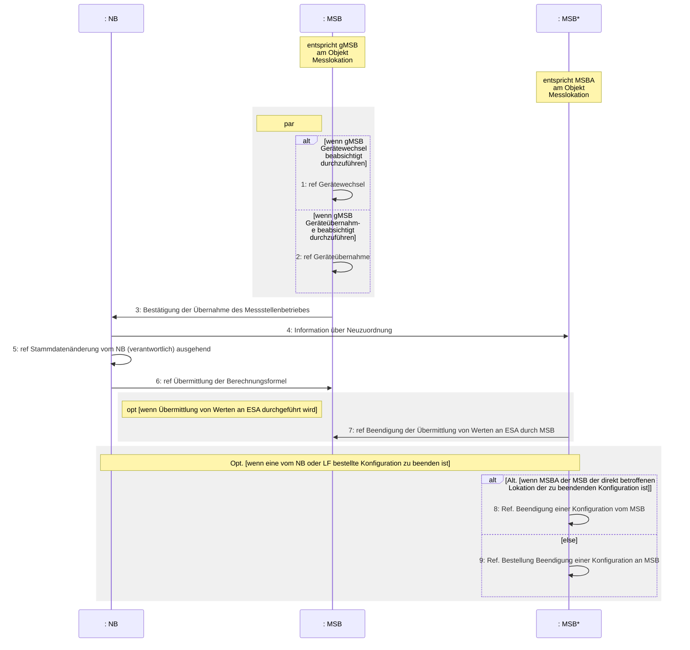
```mermaid
sequenceDiagram
    participant NB as : NB
    participant MSB as : MSB
    participant MSB_star as : MSB*

    Note over MSB: entspricht gMSB<br/>am Objekt<br/>Messlokation
    Note over MSB_star: entspricht MSBA<br/>am Objekt<br/>Messlokation

    rect rgb(240, 240, 240)
        Note left of MSB: par
        alt wenn gMSB Gerätewechsel beabsichtigt durchzuführen
            MSB->>MSB: 1: ref Gerätewechsel
        else wenn gMSB Geräteübernahme beabsichtigt durchzuführen
            MSB->>MSB: 2: ref Geräteübernahme
        end
    end

    MSB->>NB: 3: Bestätigung der Übernahme des Messstellenbetriebes
    NB->>MSB_star: 4: Information über Neuzuordnung
    NB->>NB: 5: ref Stammdatenänderung vom NB (verantwortlich) ausgehend
    NB->>MSB: 6: ref Übermittlung der Berechnungsformel

    rect rgb(240, 240, 240)
        Note left of MSB: opt [wenn Übermittlung von Werten an ESA durchgeführt wird]
        MSB_star->>MSB: 7: ref Beendigung der Übermittlung von Werten an ESA durch MSB
    end

    rect rgb(240, 240, 240)
        Note over NB, MSB_star: Opt. [wenn eine vom NB oder LF bestellte Konfiguration zu beenden ist]
        alt Alt. [wenn MSBA der MSB der direkt betroffenen Lokation der zu beendenden Konfiguration ist]
            MSB_star->>MSB_star: 8: Ref. Beendigung einer Konfiguration vom MSB
        else else
            MSB_star->>MSB_star: 9: Ref. Bestellung Beendigung einer Konfiguration an MSB
        end
    end
```

Seite **37** von **91**

|Nr.|Aktion|Frist|Hinweis/Bemerkung|
|-|-|-|-|
|1|ref Gerätewechsel|Spätester ÜT ist der 4. WT vor dem vorläufig bestätigten Zuordnungsende bzw. dem verschobenen Zuordnungsende gem. der Weiterverpflichtung des MSB.|Durchführung der Geräteübernahme nach dem Use-Case „Geräteübernahme“ und/oder Durchführung des Gerätewechsels nach dem Use-Case „Gerätewechsel“.<br/><br/>Es erfolgt die Durchführung einer Geräteübernahme und/oder eines Gerätewechsels in entsprechender Anwendung der jeweiligen Use-Cases, wobei der gMSB insofern als MSBN agiert.<br/><br/>Es besteht die Möglichkeit, nur einen oder beide der genannten Use-Cases zu nutzen.<br/><br/>Es ist möglich, beide Prozesse parallel oder nacheinander anzustoßen. Es ist dem gMSB überlassen, welchen Prozess er zuerst anstößt. Das Scheitern eines der Prozesse schließt nicht aus, dass der jeweils andere in der Folge noch angestoßen wird.<br/><br/>Im Rahmen der Durchführung von Use-Case „Geräteübernahme“ bzw. „Gerätewechsel“ kann der jeweils vom gMSB anzugebende gewünschte Übernahme- bzw. Wechselzeitpunkt in einem Zeitraum vom 9. WT vor bis zum 9. WT nach dem vorläufig bestätigten bzw. verschobenen Zuordnungsende liegen (Realisierungskorridor).<br/><br/>Weiter bei Prozessschritt 3, nachdem der Gesamtvorgang in Bezug auf die einzelnen Messlokationen erfolgreich abgeschlossen ist.|
|2|ref Geräteübernahme|Spätester ÜT ist der 4. WT vor dem vorläufig bestätigten Zuordnungsende bzw. dem verschobenen Zuordnungsende gem. der Weiterverpflichtung des MSB.|Durchführung der Geräteübernahme nach dem Use-Case „Geräteübernahme“ und/oder Durchführung des Gerätewechsels nach dem Use-Case „Gerätewechsel“.<br/><br/>Es erfolgt die Durchführung einer Geräteübernahme und/oder eines Gerätewechsels in entsprechender Anwendung der jeweiligen Use Cases, wobei der gMSB insofern als MSBN agiert.|


Seite **38** von **91**

|Nr.|Aktion|Frist|Hinweis/Bemerkung||||
|-|-|-|-|-|-|-|
||||Es besteht die Möglichkeit, nur einen oder beide der genannten Use-Cases zu nutzen.<br/><br/>Es ist möglich, beide Prozesse parallel oder nacheinander anzustoßen. Es ist dem gMSB überlassen, welchen Prozess er zuerst anstößt. Das Scheitern eines der Prozesse schließt nicht aus, dass der jeweils andere in der Folge noch angestoßen wird.<br/><br/>Im Rahmen der Durchführung der Use-Cases „Geräteübernahme“ bzw. „Gerätewechsel“ kann der jeweils vom gMSB anzugebende gewünschte Übernahme- bzw. Wechselzeitpunkt in einem Zeitraum vom 9. WT vor bis zum 9. WT nach dem vorläufig bestätigten bzw. verschobenen Zuordnungsende liegen (Realisierungskorridor).<br/><br/>Weiter bei Prozessschritt 3, nachdem der Gesamtvorgang in Bezug auf die einzelnen Messlokationen erfolgreich abgeschlossen ist.||||
||||3|Bestätigung der Übernahme des Messstellenbetriebes|Unverzüglich nachdem der Gesamtvorgang in Bezug auf die einzelnen Messlokationen erfolgreich abgeschlossen ist.|Bestätigung der Übernahme der einzelnen Messlokation bzw. der Marktlokation eines Lokationsbündels durch den gMSB.<br/><br/>Ist ein Gerätewechsel innerhalb des Realisierungskorridors in besonderen Ausnahmefällen nicht möglich und eine Geräteübernahme kommt nicht in Frage, so ist in der Bestätigung der Übernahme der letztmögliche Termin des Realisierungskorridors durch den gMSB zu bestätigen. Ab dem bestätigten Termin bis zur Durchführung des Gerätewechsels vor Ort sind durch den gMSB Ersatzwerte zu bilden, wenn die Beschaffung der Werte des Messgerätes nicht möglich ist.|
||||4|Information über Neuzuordnung|Unmittelbar nach Nr. 3.|Der NB informiert den MSBA darüber, zu welchem Zuordnungsende dessen Zuordnung zur einzelnen Messlokation in Bezug auf Messstellenbetrieb endete. Zugleich informiert er den MSB über den Umstand, dass der gMSB die einzelne Messlokation in Bezug auf Messstellenbetrieb im Rahmen seiner Grundzuständigkeit übernommen hat und zu welchem Zuordnungsbeginn.|


Seite **39** von **91**

|Nr.|Aktion|Frist|Hinweis/Bemerkung|
|-|-|-|-|
|5|ref Stammdatenänderung vom NB (verantwortlich) ausgehend|--|Mitteilung an Berechtigte über erfolgte Zuordnung des gMSB zur einzelnen Messlokation in Bezug auf Messstellenbetrieb. Außerdem Mitteilung des Zuordnungsbeginns.|
|6|ref Übermittlung der Berechnungsformel|--|Der NB übermittelt dem gMSB die Berechnungsformeln für jede Marktlokation und ggf. Netzlokation im Lokationsbündel.|
|7|ref Beendigung der Übermittlung von Werten an ESA durch MSB|--|--|
|8|ref Beendigung einer Konfiguration vom MSB|--|--|
|9|Bestellung Beendigung einer Konfiguration an MSB|--|--|


Seite **40** von **91**

# 3. Ergänzende Prozesse

Die Use-Cases „Gerätewechsel“ und „Geräteübernahme“ ergänzen die Use-Cases „Beginn Messstellenbetrieb“ und „Verpflichtung gMSB“. Sie regeln die im Rahmen dieser Prozesse nötigen Schritte zum Austausch bzw. zur Übernahme der an der Messlokation fest eingebauten Geräte und zum Aktualisieren der Stammdaten.

## 3.1. Use-Case: Gerätewechsel

### 3.1.1. UC: Gerätewechsel

|Use-Case-Name|Gerätewechsel|
|-|-|
|Prozessziel|Die Interaktionen zur Vorbereitung und Durchführung eines Gerätewechsels zwischen dem MSBN der Messlokation und dem MSBA der Messlokation sind durchgeführt.|
|Use-Case Beschreibung|Der MSBN der Messlokation informiert den MSBA der Messlokation über seine Gerätewechselabsicht. Der MSBA der Messlokation teilt dem MSBN der Messlokation in seiner Antwort mit, ob er den Geräteausbau selbst durchführen möchte oder dies durch den MSBN der Messlokation stattfinden soll.<br/><br/>Der MSBN der Messlokation informiert den MSBA der Messlokation über den Zeitpunkt, zu welchem der Messstellenbetrieb übernommen wurde und informiert die relevanten Marktrollen mittels Stammdatenänderung über den erfolgten Gerätewechsel.<br/><br/>Sofern die Messeinrichtung selbst vom Wechsel betroffen ist, übermittelt der MSBN der Messlokation im Fall, dass der MSBA der Messlokation den Eigenausbau nicht selbst vornimmt, bei einer kME oder mME mit Wirkarbeitsmessung den Zählerstand und Zeitpunkt des Geräteausbaus an den MSBA der Messlokation und bei einer kME mit registrierender Lastgang-/ Einspeisegangmessung oder einem iMS den Zeitpunkt des Geräteausbaus.<br/><br/>Der Zeitpunkt bestimmt sich durch den Beginn für den ersten vollständig gemessenen Viertelstundenwert.|
|Rollen|MSB|
|Vorbedingung|\* In Folge eines MSB-Wechsels (Use-Case „Beginn Messstellenbetrieb“ oder Use-Case „Verpflichtung gMSB“) beabsichtigt der MSBN der Messlokation bzw. gMSB der Messlokation (in diesem Use-Case als MSBN dargestellt) fest eingebaute Geräte auszuwechseln.<br/>\* Der Use-Case ist unabhängig davon anwendbar, ob hierdurch beispielsweise sämtliche für den MSBN der Messlokation relevanten technischen Einrichtungen der einzelnen Messlokation, nur die Messeinrichtung selbst oder etwa nur sonstige technische Einrichtungen (z.B. Wandler, SMGW) ausgewechselt werden sollen.|


Seite 41 von 91

|Use-Case-Name|Gerätewechsel|
|-|-|
|Nachbedingung im Erfolgsfall|Sofern die Messeinrichtung selbst vom Wechsel betroffen ist, führt der MSBA der Messlokation und MSBN der Messlokation das SD „Aufbereitung und Übermittlung von Werten vom MSB der Messlokation“ (WiM Teil 2) durch.|
|Nachbedingung im Fehlerfall|--|
|Fehlerfälle|--|
|Weitere Anforderungen|\* *Hinweis*: Sofern MSB anderer Sparten durch technische Änderungen eines SMGW betroffen sind, werden diese durch den MSB des SMGW informiert, da sie nicht im Rahmen der festgelegten Marktkommunikation informiert werden (Diese Information kann in einem anderen Format als EDIFACT stattfinden).<br/>\* *Hinweis*: Sofern die Messeinrichtung selbst vom Wechsel betroffen ist, übermittelt der MSB der Marktlokation Werte an den NB, LF und ÜNB (WiM Teil 2, Kapitel 2.4.3. „SD: Aufbereitung und Übermittlung von Werten vom MSB der Marktlokation“). Hat eine Marktlokation mehrere Messlokationen und nicht alle Messlokationen sind vom Gerätewechsel und/oder einer Geräteübernahme betroffen, so muss der MSB der Marktlokation zur Ermittlung der Energiemenge der Marktlokation, für die nicht vom Gerätewechsel/der Geräteübernahme betroffenen Messlokation, Werte erheben und ggf. vom MSB der Messlokation anfordern.|


Seite **42** von **91**

# 3.1.2. SD: Gerätewechsel

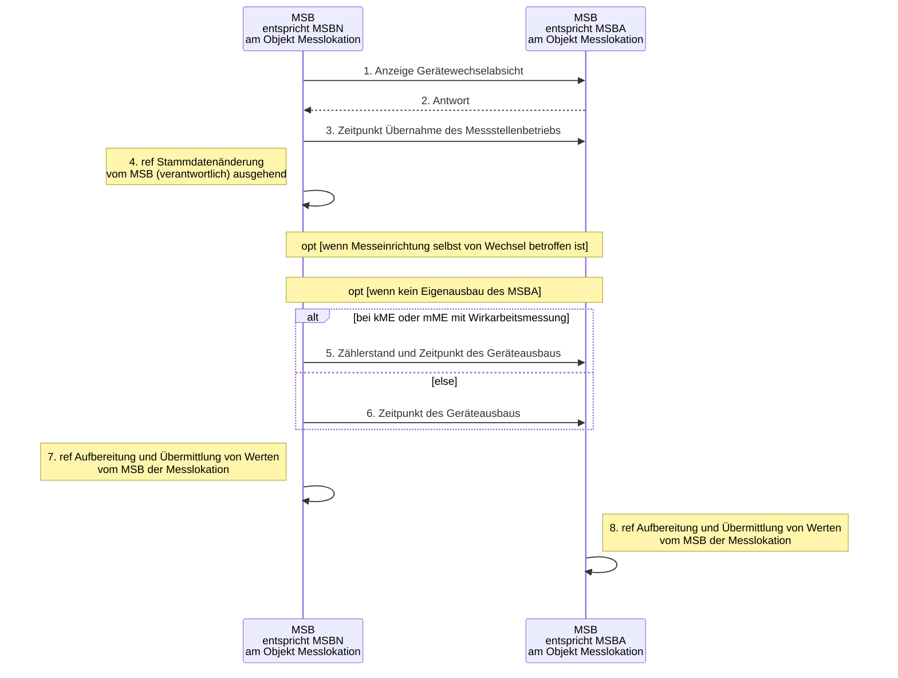
```mermaid
sequenceDiagram
    participant MSBN as MSB<br/>entspricht MSBN<br/>am Objekt Messlokation
    participant MSBA as MSB<br/>entspricht MSBA<br/>am Objekt Messlokation

    MSBN->>MSBA: 1. Anzeige Gerätewechselabsicht
    MSBA-->>MSBN: 2. Antwort
    MSBN->>MSBA: 3. Zeitpunkt Übernahme des Messstellenbetriebs
    
    Note left of MSBN: 4. ref Stammdatenänderung<br/>vom MSB (verantwortlich) ausgehend
    MSBN->>MSBN: 

    rect rgb(255, 255, 255)
        Note over MSBN, MSBA: opt [wenn Messeinrichtung selbst von Wechsel betroffen ist]
        
        rect rgb(255, 255, 255)
            Note over MSBN, MSBA: opt [wenn kein Eigenausbau des MSBA]
            
            alt bei kME oder mME mit Wirkarbeitsmessung
                MSBN->>MSBA: 5. Zählerstand und Zeitpunkt des Geräteausbaus
            else else
                MSBN->>MSBA: 6. Zeitpunkt des Geräteausbaus
            end
        end

        Note left of MSBN: 7. ref Aufbereitung und Übermittlung von Werten<br/>vom MSB der Messlokation
        MSBN->>MSBN: 

        Note right of MSBA: 8. ref Aufbereitung und Übermittlung von Werten<br/>vom MSB der Messlokation
        MSBA->>MSBA: 
    end
```

|Nr.|Aktion|Frist|Hinweis/Bemerkung|
|-|-|-|-|
|1|Anzeige Gerätewechselabsicht|--|Der MSBN der Messlokation übermittelt eine Gerätewechselabsicht für die Messlokation. Hierbei teilt er mit:<br/>• Auf welche technischen Einrichtungen der Messlokation sich die Gerätewechselabsicht bezieht; hat der MSBN der Messlokation den Umfang der Gerätewechselabsicht nicht näher spezifiziert, so hat der MSBA der Messlokation davon auszugehen, dass sich der Gerätewechsel auf sämtliche technische Einrichtungen der einzelnen Messlokation bezieht;<br/>• Ob die einzelne Messlokation auf Grund des Umbaus auf iMS übernommen wird;|


Seite 43 von 91

|Nr.|Aktion|Frist|Hinweis/Bemerkung||||
|-|-|-|-|-|-|-|
||||\* Zu welchem Zeitpunkt (Tag, Uhrzeit) die Durchführung des Gerätewechsels beabsichtigt ist. Der Tag muss in einem Zeitraum vom 9. WT vor, bis zum 9. WT nach dem in Prozessschritt 2 des Use-Cases „Beginn Messstellenbetrieb“ vom NB bestätigten Zuordnungsbeginn liegen.<br/><br/>Der Zeitpunkt des Gerätewechsels ist frühestens am 4. auf diese Aktion „Anzeige Gerätewechselabsicht“ folgenden WT möglich.<br/><br/>(Prozessschritt entfällt bei erstmaliger Einrichtung des Messstellenbetriebs sowie bei Stilllegung des Messstellenbetriebs.)||||
||||2|Antwort|Unverzüglich, jedoch spätester ÜT ist der 2. WT vor dem Gerätewechseltermin.|\* \*\*Ankündigung Eigenausbau:\*\* Der MSBA der Messlokation teilt mit, dass er die vom Gerätewechsel betroffenen Altgeräte selbst ausbauen wird.<br/><br/>Der Eigenausbau hat zu dem vom MSBN der Messlokation nach Prozessschritt 1 genannten Zeitpunkt zu erfolgen.<br/><br/>\* \*\*Mitteilung kein Eigenausbau:\*\* Mitteilung des MSBA der Messlokation, dass von einem Eigenausbau durch den MSBA der Messlokation kein Gebrauch gemacht werden soll.<br/><br/>(Prozessschritt entfällt bei erstmaliger Einrichtung des Messstellenbetriebs sowie bei Stilllegung des Messstellenbetriebs)<br/><br/>Nachfolgend ergeben sich folgende Tätigkeiten:<br/><br/>*Endablesung der alten Messeinrichtung:*<br/>\* Bei kME oder mME mit Wirkarbeitsmessung:<br/>Die Endablesung erfolgt unmittelbar vor Ausbau des Altgerätes durch diejenige Person, die auch den Ausbau des Altgerätes vornimmt, also|


Seite 44 von 91

|Nr.|Aktion|Frist|Hinweis/Bemerkung|
|-|-|-|-|
||||entweder MSBN der Messlokation oder MSBA der Messlokation.<br/><br/>\* Bei kME mit registrierender Last-/ Einspeisegangmessung oder iMS:<br/>Die Endablesung erfolgt zeitnah zum Ausbau des Altgerätes durch den MSBA der Messlokation. Dieser stellt sicher, dass rechtzeitig vor dem vom MSBN der Messlokation mitgeteilten Wechselzeitpunkt die Endablesung durch außerordentliche elektronische Auslesung erfolgt. Erforderlichenfalls hat der MSBN der Messlokation den MSBA der Messlokation hierzu unmittelbar vor Ausbau telefonisch zu kontaktieren. Diese Tätigkeit ist bei erstmaliger Einrichtung des Messstellenbetriebs nicht zu beachten und findet nur dann Anwendung, wenn die Messeinrichtung selbst vom Wechsel betroffen ist.<br/><br/>*Ausbau der Altgeräte:*<br/>Ausbau der Altgeräte nach Maßgabe der vorherigen Abstimmungen zwischen dem MSBN der Messlokation und MSBA der Messlokation gem. dem Prozessschritt 2.<br/><br/>Hierbei gilt:<br/>\* Ist im Falle einer auszubauenden kME mit registrierender Last-/ Einspeisegangmessung oder eines iMS die erforderliche vorherige Endablesung durch den MSBA der Messlokation aus Gründen nicht erfolgt, die der MSBN der Messlokation nicht zu vertreten hat, so hindert die Nichtdurchführung der Endablesung nicht den Ausbau der alten Messeinrichtung. In diesem Fall sind entsprechende Ersatzwerte durch den MSBA der Messlokation zu bilden.<br/><br/>\* Hat der MSBA der Messlokation in Prozessschritt 2 den Eigenausbau der alten Messeinrichtung angekündigt, erscheint aber nicht zu dem vom MSBN der Messlokation genannten Zeitpunkt an der einzelnen Messlokation oder hat der MSBA der Messlokation Prozessschritt 2 nicht|


Seite 45 von 91

|Nr.|Aktion|Frist|Hinweis/Bemerkung||||
|-|-|-|-|-|-|-|
||||fristgerecht durchgeführt, so ist der MSBN der Messlokation zum Ausbau der Alteinrichtung auch in Abwesenheit des MSBA der Messlokation berechtigt.<br/><br/>\* Hat MSBA der Messlokation fristgerecht gem. Prozessschritt 2 einen Eigenausbau angekündigt und erscheint zu dem vom MSBN der Messlokation genannten Zeitpunkt an der einzelnen Messlokation, während der MSBN der Messlokation nicht zum genannten Zeitpunkt dort erscheint, so ist der MSBA der Messlokation nicht zum Ausbau der Messeinrichtung berechtigt.<br/><br/>\* Handelt es sich bei der alten Messeinrichtung um eine kME mit registrierender Last-/Einspeisegangmessung oder ein iMS und wird deren Ausbau nicht durch den MSBA der Messlokation vorgenommen, so ist der Ausbau nicht vor Eintritt des in Prozessschritt 1 durch den MSBN der Messlokation mitgeteilten Wechselzeitpunktes gestattet.<br/><br/>Die Tätigkeit entfällt bei erstmaliger Einrichtung des Messstellenbetriebs.<br/><br/>*Einbau der neuen Geräte:*<br/>Der MSBN der Messlokation baut die neuen Geräte ein und nimmt die einzelne Messlokation in Betrieb.<br/>Die Tätigkeit entfällt bei Stilllegung des Messstellenbetriebs.<br/><br/>*Auslesung Einbauzählerstand:*<br/>Auslesung des Einbauzählerstands bzw. Einbauzählerstände der neuen Messeinrichtung/en durch den MSBN der Messlokation.<br/><br/>Die Tätigkeit entfällt bei Stilllegung des Messstellenbetriebs und findet nur dann Anwendung, wenn die Messeinrichtung selbst vom Wechsel betroffen ist.||||
||||3|Zeitpunkt Übernahme des Messstellenbetriebs|Unverzüglich nach Übernahme des Messstellenbetriebs|Der MSBN der Messlokation informiert den MSBA der Messlokation über den Zeitpunkt der Übernahme des Messstellenbetriebs. Der Zeitpunkt gibt|


Seite 46 von 91

|Nr.|Aktion|Frist|Hinweis/Bemerkung||||
|-|-|-|-|-|-|-|
||||den Tag und die Uhrzeit an, ab der die Messwerterfassung nach dem Gerätewechsel erfolgreich stattgefunden hat, auch wenn diese noch nicht der vom Markt geforderten Tarifierung entspricht (ggf. müssen vom MSBN der Messlokation Ersatzwerte ab diesem Zeitpunkt gebildet werden). Der Zeitpunkt bestimmt sich durch den Beginn für den ersten vollständig gemessen ¼ Stunden Wert. Der Zeitpunkt bestimmt damit<br/>\* die Uhrzeit, ab der der MSBN der Messlokation für die Aufbereitung und Übermittlung von Werten zuständig ist. Für den Zeitraum bis zu diesem Zeitpunkt, ist der MSBA der Messlokation für die Aufbereitung und Übermittlung von Werten zuständig.<br/>\* den Tag, ab dem der MSBN der Marktlokation für die Aufbereitung und Übermittlung von Werten zuständig ist.<br/><br/>Dies bedeutet,<br/>\* dass der MSBA der Messlokation und MSBN der Messlokation für diesen Tag ihre Werte an den MSBN der Marktlokation übermitteln (SD-Schritt 7 und 8).<br/>\* dass bei Reklamationen von Werten (WiM Teil 2, Kapitel 2.7. „Use-Case: Reklamation von Werten beim MSB“), die sich auf diesen Tag beziehen, der MSBN der Marktlokation entsprechend der Uhrzeit aus dem übermittelten Zeitpunkt, die Reklamation entweder an den MSBA der Messlokation oder MSBN der Messlokation weiterleiten muss.||||
||||4|ref Stammdatenänderung vom MSB (verantwortlich) ausgehend|--|In diesem Zusammenhang übermittelt der MSBN der Messlokation den Tag aus dem im SD-Schritt 3 übermittelten Zeitpunkt. Auf Basis dessen ordnet der NB den MSBN der Messlokation der Messlokation und ggf. der zugehörigen Marktlokation diesem Tag ab 00:00 Uhr zu.|
|5|. Zählerstand und Zeitpunkt des Geräteausbaus|Unverzüglich, jedoch spätester ÜT ist der 3. WT vor dem Ablauf des 28. T|Im Zeitraum zwischen dem Zeitpunkt des Geräteausbaus (SD-Schritt 5) und dem „Zeitpunkt Übernahme des Messstellenbetriebs“ (SD-Schritt 3) ist der||||


Seite 47 von 91

|Nr.|Aktion|Frist|Hinweis/Bemerkung||
|-|-|-|-|-|
|||nach dem Geräteausbau.|MSBA der Messlokation für die Aufbereitung und Übermittlung von Werten zuständig.||
|6||Zeitpunkt des Geräteausbaus|Unverzüglich, jedoch spätester ÜT ist der 3. WT nach dem Geräteausbau.|Im Zeitraum zwischen dem „Zeitpunkt des Geräteausbaus“ (SD-Schritt 6) und dem „Zeitpunkt Übernahme des Messstellenbetriebs“ (SD-Schritt 3) ist der MSBA der Messlokation für die Aufbereitung und Übermittlung von Werten zuständig.|
|7|ref Aufbereitung und Übermittlung von Werten vom MSB der Messlokation|--|Der MSBN der Messlokation übermittelt die Werte an den MSBN der Marktlokation.||
|8|ref Aufbereitung und Übermittlung von Werten vom MSB der Messlokation|--|Der MSBA der Messlokation übermittelt für den Tag aus dem im SD-Schritt 3 übermittelten Zeitpunkt, die Werte an den MSBN der Marktlokation, für den davorliegenden Zeitraum an den MSBA der Marktlokation.||


## 3.2. Use-Case: Geräteübernahme

### 3.2.1. UC: Geräteübernahme

**Use-Case-Name**: Geräteübernahme

**Prozessziel**: Die Interaktionen zur Vorbereitung und Durchführung einer Geräteübernahme zwischen dem MSBN der Messlokation und dem MSBA der Messlokation sind durchgeführt.

**Use-Case Beschreibung**: Der MSBN der Messlokation fordert beim MSBA der Messlokation ein Geräteübernahmeangebot an. Der MSBA der Messlokation übermittelt entgeltfrei ein Angebot zum Kauf oder zur Nutzung der vom MSBN der Messlokation angefragten technischen Einrichtungen der einzelnen Messlokation zu dem vom MSBN der Messlokation gewünschten Übernahmetermin. Die Bestandteile der Messeinrichtungen können einzeln oder vollständig angeboten werden.

Der MSBN der Messlokation nimmt das Gesamtangebot oder Angebote zu einzelnen technischen Einrichtungen im Rahmen einer Bestellung an. Die Annahme hinsichtlich einzelner technischer Einrichtungen bildet zugleich die konkludente Ablehnung hinsichtlich der restlichen vom MSBA der Messlokation angebotenen technischen Einrichtungen. Der MSBA der Messlokation bestätigt die bestellte Geräteübernahme.

Sofern die Messeinrichtung selbst von der Geräteübernahme betroffen ist, übermittelt der MSBA der Messlokation bei einer kME oder mME mit Wirkarbeitsmessung den Zählerstand zur Geräteübernahme an den MSBN der Messlokation.

**Rollen**: MSB

Seite 48 von 91

|Use-Case-Name|Geräteübernahme|
|-|-|
|Vorbedingung|In Folge eines MSB-Wechsels (Use-Case „Beginn Messstellenbetrieb“ oder Use-Case „Verpflichtung gMSB“) beabsichtigt der MSBN der Messlokation bzw. gMSB (in diesem Use-Case als MSBN dargestellt) der Messlokation eine Geräteübernahme.|
|Nachbedingung im Erfolgsfall|Sofern die Messeinrichtung selbst von der Geräteübernahme betroffen ist, führt der MSBA der Messlokation und MSBN der Messlokation das SD „Aufbereitung und Übermittlung von Werten vom MSB der Messlokation“ (WiM Teil 2) durch.|
|Nachbedingung im Fehlerfall|--|
|Fehlerfälle|--|
|Weitere Anforderungen|*Hinweis:* Sofern die Messeinrichtung selbst von der Geräteübernahme betroffen ist, übermittelt der MSB der Marktlokation Werte an den NB, LF und ÜNB (WiM Teil 2, Kapitel 2.4.3. „SD: Aufbereitung und Übermittlung von Werten vom MSB der Marktlokation“). Hat eine Marktlokation mehrere Messlokationen und nicht alle Messlokationen sind vom Gerätewechsel und/oder einer Geräteübernahme betroffen, so muss der MSB der Marktlokation zur Ermittlung der Energiemenge der Marktlokation, für die nicht vom Gerätewechsel/der Geräteübernahme betroffenen Messlokationen, Werte erheben und ggf. vom MSB der Messlokation anfordern.|


### 3.2.2. SD: Geräteübernahme

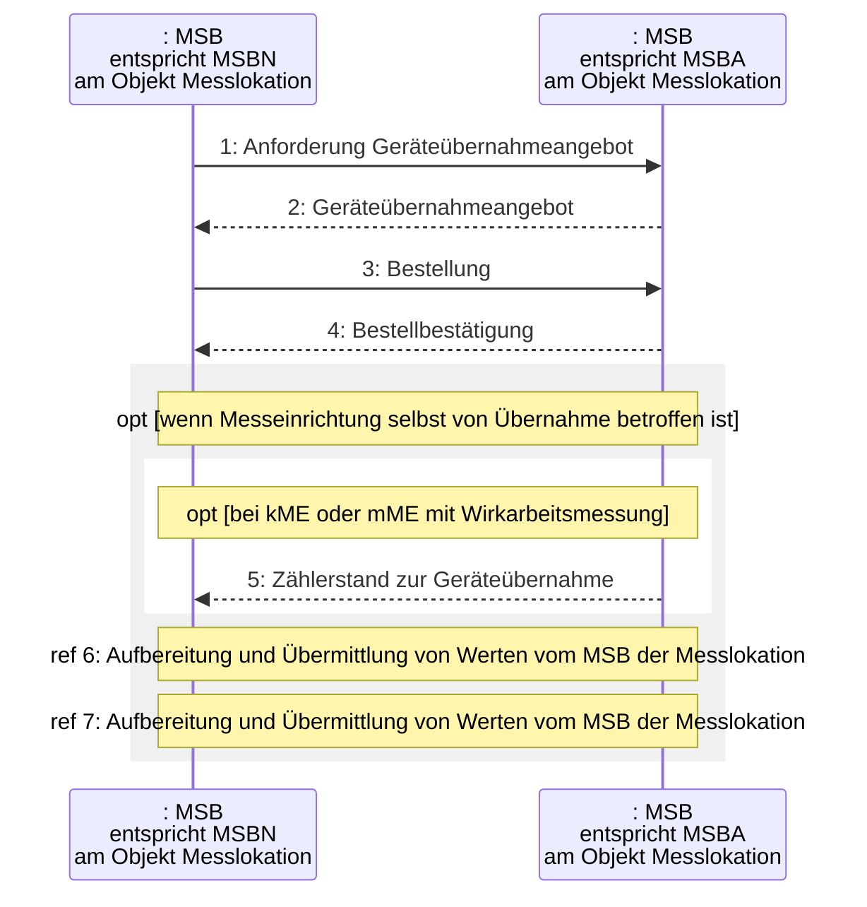
```mermaid
sequenceDiagram
    participant MSBN as : MSB<br/>entspricht MSBN<br/>am Objekt Messlokation
    participant MSBA as : MSB<br/>entspricht MSBA<br/>am Objekt Messlokation

    MSBN->>MSBA: 1: Anforderung Geräteübernahmeangebot
    MSBA-->>MSBN: 2: Geräteübernahmeangebot
    MSBN->>MSBA: 3: Bestellung
    MSBA-->>MSBN: 4: Bestellbestätigung

    rect rgb(240, 240, 240)
        Note over MSBN, MSBA: opt [wenn Messeinrichtung selbst von Übernahme betroffen ist]
        rect rgb(255, 255, 255)
            Note over MSBN, MSBA: opt [bei kME oder mME mit Wirkarbeitsmessung]
            MSBA-->>MSBN: 5: Zählerstand zur Geräteübernahme
        end
        
        Note over MSBN, MSBA: ref 6: Aufbereitung und Übermittlung von Werten vom MSB der Messlokation
        Note over MSBN, MSBA: ref 7: Aufbereitung und Übermittlung von Werten vom MSB der Messlokation
    end
```

Seite 49 von 91

|Nr.|Aktion|Frist|Hinweis/Bemerkung|
|-|-|-|-|
|1|Anforderung Geräteübernahmeangebot|--|Der MSBN übermittelt einen Geräteübernahmewunsch für die einzelne Messlokation. Hierbei teilt er mit:<br/><br/>1.) Auf welche technischen Einrichtungen der Messlokation/en sich der Übernahmewunsch bezieht. Hat der MSBN den Umfang seines Übernahmewunsches nicht näher spezifiziert, so hat der MSBA davon auszugehen, dass sich der Übernahmewunsch auf sämtliche technischen Einrichtungen der Messlokation/en bezieht.<br/><br/>2.) Zu welchem Datum die Übernahme gewünscht ist. Der Tag muss in einem Zeitraum vom 9. WT vor bis zum 9. WT nach dem in Prozessschritt 2 des Use-Case „Beginn Messstellenbetrieb“ vom NB bestätigten Zuordnungsbeginn liegen. Die Uhrzeit ist mit 00:00 Uhr anzugeben.|
|2|Geräteübernahmeangebot|Unverzüglich, jedoch spätester ÜT ist der 4. WT nach dem ÜT von Nr. 1.|Der MSBA gibt ein Angebot mit Einzelpositionen zu allen angefragten technischen Einrichtungen ab. Für jede Einzelposition benennt der MSBA ein separates Entgelt.|
|3|Bestellung|Unverzüglich, jedoch spätester ÜT ist der 3. WT nach dem ÜT von Nr. 2.|--|
|4|Bestellbestätigung|Unverzüglich, jedoch spätester ÜT ist der 2. WT nach dem ÜT von Nr. 3.|Mit der Bestellbestätigung übermittelt der MSBA in Bezug auf diejenigen technischen Einrichtungen, bei denen der MSBN das Übernahmeangebot angenommen hat, sämtliche für den Weiterbetrieb notwendigen Stammdaten an den MSBN.|
|5|Zählerstand zur Geräteübernahme|Unverzüglich, jedoch spätester ÜT ist der 3. WT vor dem Ablauf des 28. T nach der Geräteübernahme.|Hinweis:<br/>Dem MSBA der Messlokation wird empfohlen, eine Endablesung mit einem wahren Wert unmittelbar vor der Geräteübernahme durchzuführen und wenn möglich keinen Ersatzwert zu bilden, um Reklamationen und ggf. daraus folgenden Korrekturen z. B. von Netznutzungsabrechnungen zu vermeiden.|
|6|ref Aufbereitung und Übermittlung von|--|--|


Seite **50** von **91**

|Nr.|Aktion|Frist|Hinweis/Bemerkung|
|-|-|-|-|
||Werten vom MSB der Messlokation|||
|7|ref Aufbereitung und Übermittlung von Werten vom MSB der Messlokation|--|--|


## 3.3. Use-Case: Messlokationsänderung bei kME, mME inkl. iMS-Einbau, Erweiterung und Parametrierung

### 3.3.1. Use Case: Messlokationsänderung vom NB an MSB

#### 3.3.1.1. UC: Messlokationsänderung vom NB an MSB

* **Use-Case-Name**: Messlokationsänderung vom NB an MSB
* **Prozessziel**: Die vom NB beauftragte Änderung an der Messlokation ist vom MSB der Messlokation durchgeführt.
* **Use-Case Beschreibung**: Der Prozess beschreibt die Interaktionen zwischen dem NB und MSB der Messlokation für den Fall, dass der NB die Änderung technischer Einrichtungen der Messlokation beauftragt, ohne dass es zugleich zu einem Wechsel des MSB kommt.<br/><br/>Der MSB der Messlokation prüft, ob aufgrund der Beauftragung des NB eine Messlokationsänderung vorzunehmen ist. Der MSB der Messlokation prüft auch unverzüglich, ob der mit der Beauftragung genannte gewünschte Änderungstermin aus technischen oder betriebsbedingten Gründen eingehalten werden kann. Er hat hierzu ggf. unverzüglich einen Termin mit dem AN abzustimmen.<br/><br/>Kann der Termin absehbar nicht eingehalten werden, so ermittelt er, zu welchem nächstmöglichen Termin die gewünschte Änderung möglich ist.<br/><br/>Nach erfolgten Prüfungen antwortet der MSB der Messlokation dem NB fristgerecht mit einer Auftragsbestätigung oder Ablehnung.
* **Rollen**: 
    * NB
    * MSB
* **Vorbedingung**: Der NB kann eine Änderung der Messlokation vom MSB der Messlokation verlangen, wenn und soweit er hierzu aufgrund rechtlicher Bestimmungen oder aufgrund bilateraler Vereinbarungen mit dem MSB der Messlokation berechtigt ist. Mögliche Gründe können u.a. sein:<br/><br/>a) Geänderte Anforderungen an die Messeinrichtungen gemäß den auf die Messlokation anzuwendenden technischen Mindestanforderungen des NB wegen:<br/>    a. Änderung des Netznutzungsvertrages zwischen NB und Netznutzer (LF bzw. AN),<br/>    b. Änderung des Verbrauchsverhaltens des AN,

Seite 51 von 91

|Use-Case-Name|\*\*Messlokationsänderung vom NB an MSB\*\*|
|-|-|
||c. baulichen Veränderungen mit Auswirkungen auf die Messlokation;|
||b) Änderung der technischen Mindestanforderungen des NB aufgrund geänderter rechtlicher Vorgaben.|
|Nachbedingung im Erfolgsfall|\* Wenn die Beauftragung durch den MSB der Messlokation bestätigt und die Änderung an der Messlokation erfolgreich durchgeführt wurde, versendet der MSB der Messlokation die geänderten Stammdaten.<br/>\* Durch die in diesem Use-Case durchgeführten Änderungen kann es unter anderem dazu kommen, dass eine Wertübermittlung erforderlich ist. Hierzu wird das SD „Aufbereitung und Übermittlung von Werten vom MSB der Messlokation“ (WiM Teil 2) durchgeführt. Die Beauftragung der Werteübermittlung ergibt sich aus den Werten des entsprechenden Stammdatums. Es erfolgt keine weitere Beauftragung gegenüber dem MSB.|
|Nachbedingung im Fehlerfall|War der MSB der Messlokation nicht in der Lage, die Änderung fristgerecht durchzuführen (z.B. wegen dauerhafter Nichterreichbarkeit der Messeinrichtung), so teilt er das Scheitern der Änderung dem NB mit.|
|Fehlerfälle|--|
|Weitere Anforderungen|*Hinweis:*<br/>Die notwendigen Prozessschritte bei der Bestellung einer Konfiguration (z.B. Bilanzierungsverfahrenswechsel, Zählzeitdefinition des NB) sind nicht über diesen Prozess anzustoßen, sondern müssen über die Use-Cases des Kapitels „Bestellung einer Konfiguration“ (GPKE Teil 3) angestoßen werden. Die Schaffung der gerätetechnischen Voraussetzungen für die Bestellung einer Konfiguration über diese GPKE-Use-Cases können ggf. über die hier beschriebenen Use-Cases zur Messlokationsänderung oder im Rahmen des Gerätewechsels beauftragt werden.|


Seite **52** von **91**

### 3.3.1.2. SD: Messlokationsänderung vom NB an MSB

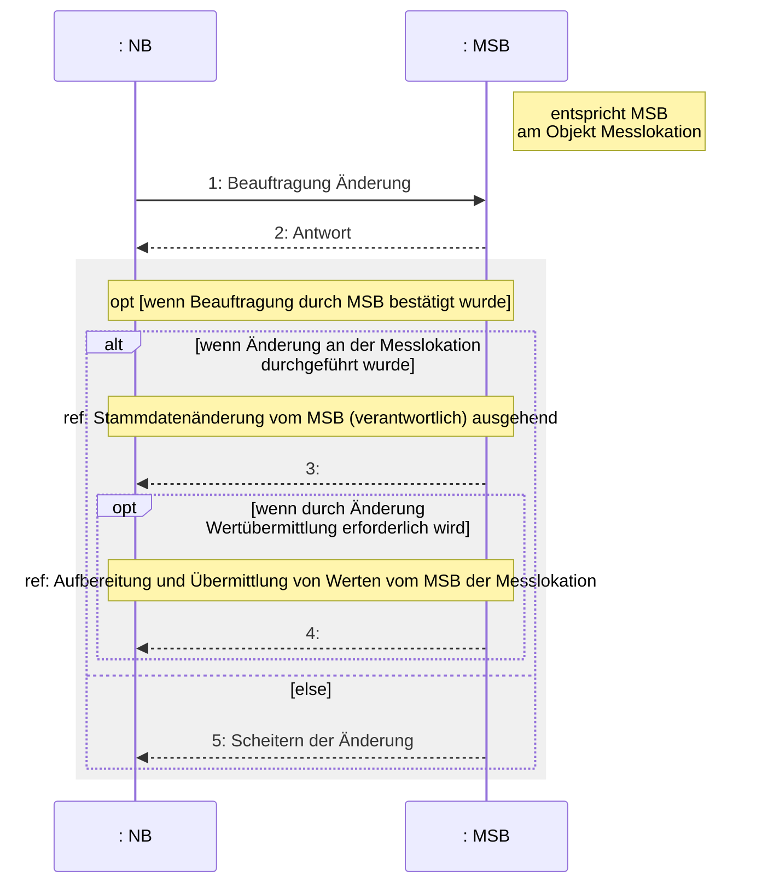
```mermaid
sequenceDiagram
    participant NB as : NB
    participant MSB as : MSB
    Note right of MSB: entspricht MSB<br/>am Objekt Messlokation

    NB->>MSB: 1: Beauftragung Änderung
    MSB-->>NB: 2: Antwort

    rect rgb(240, 240, 240)
        Note over NB, MSB: opt [wenn Beauftragung durch MSB bestätigt wurde]
        
        alt wenn Änderung an der Messlokation durchgeführt wurde
            Note over NB, MSB: ref: Stammdatenänderung vom MSB (verantwortlich) ausgehend
            MSB-->>NB: 3:
            
            opt wenn durch Änderung Wertübermittlung erforderlich wird
                Note over NB, MSB: ref: Aufbereitung und Übermittlung von Werten vom MSB der Messlokation
                MSB-->>NB: 4:
            end
            
        else else
            MSB-->>NB: 5: Scheitern der Änderung
        end
    end
```

|Nr.|Aktion|Frist|Hinweis/Bemerkung|
|-|-|-|-|
|1|Beauftragung Änderung|Spätester ÜT ist der 20. WT vor dem gewünschten Änderungstermin.|Der NB teilt dem MSB der Messlokation den Umfang der Beauftragung und den gewünschten Änderungstermin mit.|
|2|Antwort|Unverzüglich, jedoch spätester ÜT ist der 10. WT nach dem ÜT von Nr. 1.|\* Hat sich im Rahmen der Prüfung des MSB der Messlokation ein abweichender nächstmöglicher Änderungstermin ergeben, so teilt er diesen in der Auftragsbestätigung mit.<br/>\* Mögliche Ablehnungsgründe können u.a. sein:<br/>- MSB ist zum gewünschten Termin nicht mehr Betreiber der Messlokation,<br/>- der NB ist aufgrund gesetzlicher Bestimmungen oder bilateraler Vereinbarungen mit dem MSB der Messlokation nicht zur Forderung der Änderung berechtigt,<br/>- zwingende technische Gründe stehen der gewünschten Änderung der Messlokation entgegen.|


Seite **53** von **91**

|Nr.|Aktion|Frist|Hinweis/Bemerkung|
|-|-|-|-|
|3|ref Stammdatenänderung vom MSB (verantwortlich) ausgehend|Unverzüglich, jedoch spätester ÜT ist der 3. WT nach erfolgreicher Änderung an der Messlokation.|--|
|4|ref Aufbereitung und Übermittlung von Werten vom MSB der Messlokation|Die Fristen für die Übermittlung der Werte vom MSB der Messlokation an den verantwortlichen MSB der Marktlokation und vom verantwortlichen MSB der Marktlokation an die Berechtigten beschreibt die Tabelle im Kapitel "Darstellung der zu übermittelnden Werte" (WiM Teil 2).|--|
|5|Scheitern der Änderung|Unverzüglich, jedoch spätester ÜT ist der 3. WT nach dem ursprünglich bestätigten Änderungstermin.|--|


### 3.3.2. Use Case: Messlokationsänderung vom LF an MSB

#### 3.3.2.1. UC: Messlokationsänderung vom LF an MSB

|Use-Case-Name|Messlokationsänderung vom LF an MSB|
|-|-|
|Prozessziel|Die vom LF beauftragte Änderung an der Messlokation ist vom MSB der Messlokation durchgeführt.|
|Use-Case Beschreibung|Der Prozess beschreibt die Interaktionen zwischen dem LF und MSB der Messlokation für den Fall, dass der LF die Änderung technischer Einrichtungen der Messlokation beauftragt, ohne dass es zugleich zu einem Wechsel des MSB kommt.<br/>Der MSB der Messlokation prüft, ob aufgrund der Beauftragung des LF eine Messlokationsänderung vorzunehmen ist.<br/><br/>Der MSB der Messlokation prüft auch unverzüglich, ob der mit der Beauftragung genannte gewünschte Änderungstermin aus technischen oder betriebsbedingten Gründen eingehalten werden kann. Er hat hierzu ggf. unverzüglich einen Termin mit dem AN abzustimmen.|


Seite **54** von **91**

* **Use-Case-Name**: **Messlokationsänderung vom LF an MSB**
* **Description**: Kann der Termin absehbar nicht eingehalten werden, so ermittelt er, zu welchem nächstmöglichen Termin die gewünschte Änderung möglich ist.
  Nach erfolgten Prüfungen antwortet der MSB der Messlokation dem LF fristgerecht mit einer Auftragsbestätigung oder Ablehnung.
* **Rollen**:
    * LF
    * MSB
* **Vorbedingung**:
    * Der LF kann eine Änderung der Messlokation vom MSB verlangen, wenn und soweit er hierzu aufgrund rechtlicher Bestimmungen oder aufgrund bilateraler Vereinbarungen mit dem MSB berechtigt ist.
    * Use-Cases Lieferbeginn und Neuanlage (GPKE Teil 2): Sofern die zu einem Zuordnungsbeginn vorhandene Gerätetechnik die Anmeldung nicht ermöglicht und der LFN bzw. LF die Änderung der Gerätetechnik über den hier beschriebenen Use-Case beauftragen möchte,
        * besitzt der LFN bzw. LF eine gültige Vollmacht des Letztverbrauchers bzw. EZ in dessen Namen die Änderung beauftragen zu dürfen und
        * die Vollmacht liegt beim MSB der Messlokation vor.
* **Nachbedingung im Erfolgsfall**:
    * Wenn die Beauftragung durch den MSB der Messlokation bestätigt und die Änderung an der Messlokation erfolgreich durchgeführt wurde, versendet der MSB der Messlokation die geänderten Stammdaten.
    * Durch die in diesem Use-Case durchgeführten Änderungen kann es unter anderem dazu kommen, dass eine Wertübermittlung erforderlich ist. Hierzu wird das SD „Aufbereitung und Übermittlung von Werten vom MSB der Messlokation“ (WiM Teil 2) durchgeführt. Die Beauftragung der Werteübermittlung ergibt sich aus den Werten des entsprechenden Stammdatums. Es erfolgt keine weitere Beauftragung gegenüber dem MSB.
* **Nachbedingung im Fehlerfall**: War der MSB der Messlokation nicht in der Lage, die Änderung fristgerecht durchzuführen (z.B. wegen dauerhafter Nichterreichbarkeit der Messeinrichtung), so teilt er das Scheitern der Änderung dem LF mit.
* **Fehlerfälle**: --
* **Weitere Anforderungen**: <u>Hinweis:</u>
  Die notwendigen Prozessschritte bei der Bestellung einer Konfiguration (z.B. Bilanzierungsverfahrenswechsel, sofern alle Messlokationen der Marktlokation mit kME mit RLM ausgestattet sind, Zählzeitdefinition des NB vom LF (z.B. als Voraussetzung für die Bestellung der Schwachlastkonzessionsabgabe) oder Zählzeitdefinition des LF vom LF, sofern alle Messlokationen der Marktlokation mit iMS ausgestattet sind) sind nicht über diesen Prozess anzustoßen, sondern müssen über die Use-Cases des Kapitels „Bestellung einer Konfiguration“ (GPKE Teil 3) angestoßen werden. Die Schaffung der gerätetechnischen Voraussetzungen für die Bestellung einer Konfiguration über diese GPKE-Use-Cases können ggf. über die hier beschriebenen

Seite 55 von 91

|Use-Case-Name|Messlokationsänderung vom LF an MSB|
|-|-|
||Use-Cases zur Messlokationsänderung oder im Rahmen des Gerätewechsels beauftragt werden.|


### 3.3.2.2. SD: Messlokationsänderung vom LF an MSB

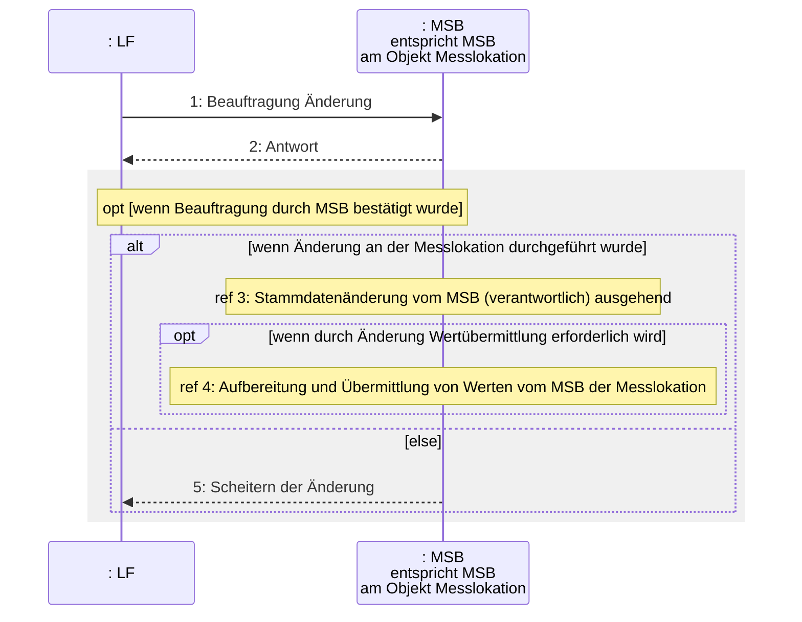
```mermaid
sequenceDiagram
    participant LF as : LF
    participant MSB as : MSB<br/>entspricht MSB<br/>am Objekt Messlokation

    LF->>MSB: 1: Beauftragung Änderung
    MSB-->>LF: 2: Antwort

    rect rgb(240, 240, 240)
        Note over LF, MSB: opt [wenn Beauftragung durch MSB bestätigt wurde]
        
        alt wenn Änderung an der Messlokation durchgeführt wurde
            Note over MSB: ref 3: Stammdatenänderung vom MSB (verantwortlich) ausgehend
            
            opt wenn durch Änderung Wertübermittlung erforderlich wird
                Note over MSB: ref 4: Aufbereitung und Übermittlung von Werten vom MSB der Messlokation
            end
        else else
            MSB-->>LF: 5: Scheitern der Änderung
        end
    end
```

|Nr.|Aktion|Frist|Hinweis/Bemerkung|
|-|-|-|-|
|1|Beauftragung Änderung|Spätester ÜT ist der 20. WT vor dem gewünschten Änderungstermin.|Der LF teilt dem MSB der Messlokation den Umfang der Beauftragung und den gewünschten Änderungstermin mit.|
|2|Antwort|Unverzüglich, jedoch spätester ÜT ist der 10. WT nach dem ÜT von Nr. 1.|\* Hat sich im Rahmen der Prüfung des MSB der Messlokation ein abweichender nächstmöglicher Änderungstermin ergeben, so teilt er diesen in der Auftragsbestätigung mit.<br/>\* Mögliche Ablehnungsgründe können u. a. sein:<br/>- MSB ist zum gewünschten Termin nicht mehr Betreiber der Messlokation,<br/>- der LF ist aufgrund gesetzlicher Bestimmungen oder bilateraler Vereinbarungen mit dem MSB der Messlokation nicht zur Forderung der Änderung berechtigt,<br/>- zwingende technische Gründe stehen der gewünschten|


Seite **56** von **91**

|Nr.|Aktion|Frist|Hinweis/Bemerkung|
|-|-|-|-|
||||Änderung der Messlokation entgegen.|
|3|ref Stammdatenänderung vom MSB (verantwortlich) ausgehend|Unverzüglich, jedoch spätester ÜT ist der 3. WT nach erfolgreicher Änderung an der Messlokation.|--|
|4|ref Aufbereitung und Übermittlung von Werten vom MSB der Messlokation|Die Fristen für die Übermittlung der Werte vom MSB der Messlokation an den verantwortlichen MSB der Marktlokation und vom verantwortlichen MSB der Marktlokation an die Berechtigten beschreibt die Tabelle im Kapitel "Darstellung der zu übermittelnden Werte" (WiM Teil 2).|--|
|5|Scheitern der Änderung|Unverzüglich, jedoch spätester ÜT ist der 3. WT nach dem ursprünglich bestätigten Änderungstermin.|--|


## 3.4. Use-Case: Ersteinbau einer mME in eine bestehende Messlokation

### 3.4.1. UC: Ersteinbau einer mME in eine bestehende Messlokation

* **Use-Case-Name**: Ersteinbau einer mME in eine bestehende Messlokation
* **Prozessziel**: Alle LF sind über den anvisierten Ersteinbau einer mME in eine bestehende Messlokation im Vorfeld informiert.
* **Use-Case Beschreibung**: Der gMSB informiert den LF über die Absicht und den geplanten Zeitraum des erstmaligen Gerätewechsels auf eine mME. In dem geplanten Einbauzeitfenster von maximal zwölf Monaten wird der Gerätewechsel erfolgen.
  Abgrenzung:
  Der Prozess findet keine Anwendung für den Fall, dass
  * der Ersteinbau aufgrund eines Kundenwunsches (nicht wg. Roll-Out) initiiert wird oder
  * eine technisch bedingte Auswechslung wegen Störung an der Messlokation vorliegt oder
  * der Tausch aufgrund einer kurzfristigen (d.h. abweichend vom planbaren Turnus) eichrechtlichen Vorgabe oder im Rahmen gescheiterter Stichproben erfolgt.

Seite **57** von **91**

|Use-Case-Name|Ersteinbau einer mME in eine bestehende Messlokation|
|-|-|
|Rollen|\* MSB<br/>\* LF|
|Vorbedingung|--|
|Nachbedingung im Erfolgsfall|--|
|Nachbedingung im Fehlerfall|Konnte innerhalb des Einbauzeitfensters der Ersteinbau der mME nicht erfolgen und ist dieser weiterhin beabsichtigt, ist diese Information für einen erneuten Ersteinbau zu starten.|
|Fehlerfälle|z.B.:<br/>\* Zutritt zur Messlokation innerhalb des Zeitraums nicht möglich|
|Weitere Anforderungen|Die Informationspflichten des § 37 Abs. 2 MsbG bleiben unberührt.|


### 3.4.2. SD: Ersteinbau einer mME in eine bestehende Messlokation

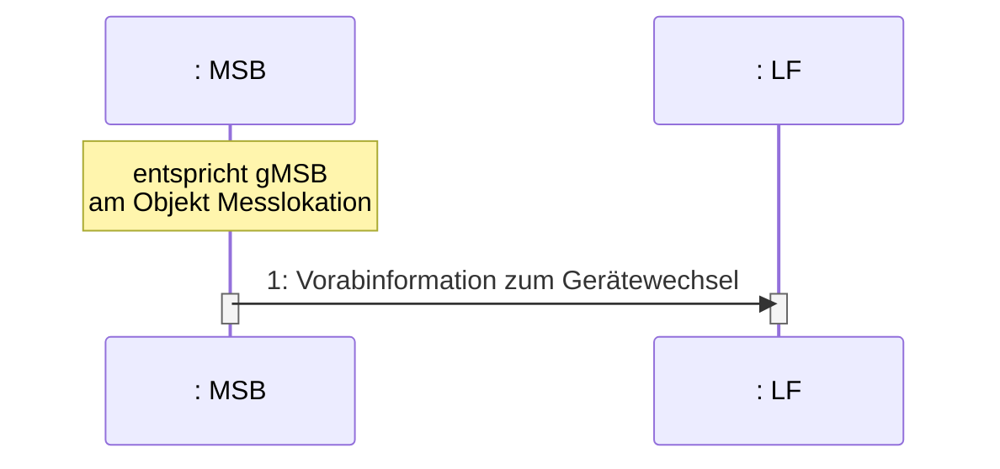
```mermaid
sequenceDiagram
    participant MSB as : MSB
    participant LF as : LF
    
    Note over MSB: entspricht gMSB<br/>am Objekt Messlokation
    
    MSB->>LF: 1: Vorabinformation zum Gerätewechsel
    activate MSB
    activate LF
    deactivate MSB
    deactivate LF
```

|Nr.|Aktion|Frist|Hinweis/Bemerkung|
|-|-|-|-|
|1|Vorabinformation zum Gerätewechsel|Spätester ÜT liegt 3 Monate vor Ausstattung der Messlokation und frühster ÜT liegt 15 Monate vor geplantem Einbau.<br/><br/>Bei einem nach dem erstmaligen Übermitteln dieser Information erfolgten LF-Wechsel an einer betroffenen Marktlokation wird der neue LF|Inhalt der Nachricht:<br/>\* ID der Messlokation,<br/>\* Zeitraum, in dem die Umstellung geplant ist,<br/>\* Referenz der ID der Marktlokation<br/><br/>Der zum Zeitpunkt des Versandes aktuelle LF und alle zu diesem Zeitpunkt bekannten zukünftig zugeordneten LF sind zu informieren.|


Seite **58** von **91**

|Nr.|Aktion|Frist|Hinweis/Bemerkung|
|-|-|-|-|
||||unverzüglich über den beabsichtigten mME-Einbau und den beabsichtigten Zeitraum informiert, wenn die mME noch nicht eingebaut wurde.|


## 3.5. Use-Case: Ersteinbau eines iMS in eine bestehende Messlokation

### 3.5.1. UC: Ersteinbau eines iMS in eine bestehende Messlokation

**Use-Case-Name**: Ersteinbau eines iMS in eine bestehende Messlokation

**Prozessziel**: Alle beteiligten Marktpartner sind über den anvisierten Ersteinbau eines iMS in eine bestehende Messlokation im Vorfeld und am Ende über das Ergebnis des Prozesses des Einbaus eines iMS informiert.

**Use-Case Beschreibung**: Der gMSB informiert den MSB, den NB und den LF über die Absicht und den geplanten Zeitpunkt des erstmaligen Gerätewechsels auf ein iMS. Ab dem geplanten Zeitpunkt erfolgt der Gerätewechsel innerhalb von acht Wochen. Dieser sich somit ergebende Zeitraum wird nachfolgend als „geplanter Zeitraum“ bezeichnet.

Folgende Fälle werden differenziert:
*   <u>Erfolgreicher Einbau innerhalb des geplanten Zeitraums:</u>
    Nach erfolgtem Gerätewechsel auf ein iMS informiert der MSB den NB, LF und gMSB über den Prozess der Stammdatenänderung über den Gerätewechsel.

    Sofern ein wMSB den Gerätewechsel auf ein iMS an einer Messlokation nicht umsetzt, übernimmt der gMSB den Messstellenbetrieb an der Messlokation unter Anwendung des Use-Cases „Beginn Messstellenbetrieb“ und der entsprechenden Folgeprozesse gemäß WiM Strom. Hierbei gibt der gMSB den Grund „Übernahme aufgrund nicht erfolgtem iMS-Einbau“ an. Dem MSBA steht in diesem Fall kein Ablehnungsrecht zu.

*   <u>Erfolgreicher Einbau nach zeitlicher Verschiebung des geplanten Zeitraums:</u>
    Wenn eine Verlängerung des Zeitraums für den Einbau eines iMS erforderlich wird, da dieser im ursprünglich geplanten Zeitraum nicht möglich war, beginnt der Prozess nochmals ohne erneute Berücksichtigung der Ankündigungsfrist von 3 Monaten.

*   <u>Gerätewechsel nicht möglich:</u>
    Sofern im geplanten Zeitraum kein Gerätewechsel auf ein iMS möglich ist oder sofern während des Prozesses zum Gerätewechsel auf ein iMS festgestellt wurde, dass kein

Seite 59 von 91

|Use-Case-Name|\*\*Ersteinbau eines iMS in eine bestehende Messlokation\*\*||
|-|-|-|
||Einbau möglich ist, informiert der gMSB den NB und den LF, dass keine Gerätewechselabsicht mehr besteht.<br/><br/>Sieht der gMSB die Messlokation zu einem späteren Zeitpunkt erneut für einen Ersteinbau mit einem iMS vor, beginnt der Prozess erneut.<br/><br/>*Abgrenzung:*<br/>Der Prozess findet keine Anwendung für den Fall, dass der Ersteinbau aufgrund eines Kundenwunsches (nicht wg. Roll-Out) initiiert wird.||
||Rollen|\* MSB<br/>\* NB<br/>\* LF|
||Vorbedingung|--|
|Nachbedingung im Erfolgsfall|\* Der NB muss überprüfen, ob ein Bilanzierungsverfahrenswechsel der betroffenen Marktlokation notwendig ist.<br/>\* Der NB muss prüfen, ob die betroffene Marktlokation zur Aggregation an den ÜNB gemeldet werden muss.||
|Nachbedingung im Fehlerfall|--||
|Fehlerfälle|--||
|Weitere Anforderungen|--||


Seite **60** von **91**

# 3.5.2. SD: Ersteinbau eines iMS in eine bestehende Messlokation

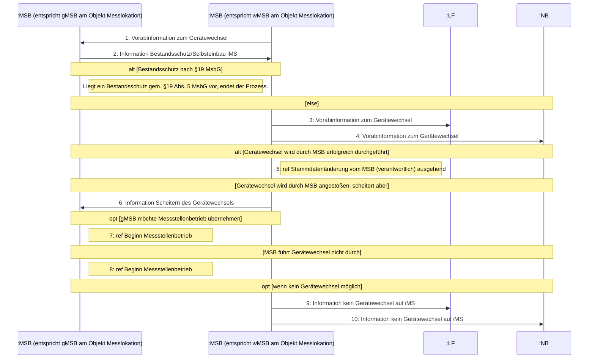
```mermaid
sequenceDiagram
    participant MSB1 as :MSB (entspricht gMSB am Objekt Messlokation)
    participant MSB2 as :MSB (entspricht wMSB am Objekt Messlokation)
    participant LF as :LF
    participant NB as :NB

    MSB2->>MSB1: 1: Vorabinformation zum Gerätewechsel
    MSB1->>MSB2: 2: Information Bestandsschutz/Selbsteinbau iMS
    
    Note over MSB1, MSB2: alt [Bestandsschutz nach §19 MsbG]
    Note right of MSB1: Liegt ein Bestandsschutz gem. §19 Abs. 5 MsbG vor, endet der Prozess.
    
    Note over MSB1, NB: [else]
    MSB2->>LF: 3: Vorabinformation zum Gerätewechsel
    MSB2->>NB: 4: Vorabinformation zum Gerätewechsel
    
    Note over MSB1, NB: alt [Gerätewechsel wird durch MSB erfolgreich durchgeführt]
    Note right of MSB2: 5: ref Stammdatenänderung vom MSB (verantwortlich) ausgehend
    
    Note over MSB1, NB: [Gerätewechsel wird durch MSB angestoßen, scheitert aber]
    MSB2->>MSB1: 6: Information Scheitern des Gerätewechsels
    
    Note over MSB1, MSB2: opt [gMSB möchte Messstellenbetrieb übernehmen]
    Note right of MSB1: 7: ref Beginn Messstellenbetrieb
    
    Note over MSB1, NB: [MSB führt Gerätewechsel nicht durch]
    Note right of MSB1: 8: ref Beginn Messstellenbetrieb
    
    Note over MSB1, NB: opt [wenn kein Gerätewechsel möglich]
    MSB2->>LF: 9: Information kein Gerätewechsel auf iMS
    MSB2->>NB: 10: Information kein Gerätewechsel auf iMS
```

|Nr.|Aktion|Frist|Hinweis/Bemerkung|
|-|-|-|-|
|1|Vorabinformation zum Gerätewechsel|Spätester ÜT liegt 3 Monate und 3 WT vor geplantem Zeitpunkt der Ausstattung der Messlokation.<br/><br/>Die Frist von 3 Monaten und 3 WT kann im Fall einer Umbauverpflichtung aufgrund einer negativen eichrechtlichen Stichprobe oder im Fall eines Gerätedefektes unterschritten werden.|Inhalt der Nachricht:<br/>• ID der Messlokation,<br/>• Zeitpunkt, ab dem die Umstellung geplant ist.<br/><br/>Dieser Prozessschritt erfolgt nur, sofern der MSB ein wMSB ist (MSB ungleich gMSB).<br/><br/>Der MSB prüft, ob er den Gerätewechsel auf iMS realisieren will.<br/><br/>Wurde der Gerätewechsel durch den MSB erfolgreich realisiert, folgt Prozessschritt 5.<br/><br/>Ist ein Gerätewechsel gescheitert, folgt Prozessschritt 6.|


Seite 61 von 91

|Nr.|Aktion|Frist|Hinweis/Bemerkung||||
|-|-|-|-|-|-|-|
||||Realisiert der wMSB den Gerätewechsel auf ein iMS nicht, erfolgt die weitere Behandlung gemäß Prozessschritt 8.<br/><br/>Dieser Prozessschritt wird nicht benötigt, wenn es sich um die Fortsetzung des Ersteinbauversuchs handelt, ohne dass ein Scheitern gem. Prozessschritte 9 und 10 zuvor erklärt wurde oder nach Prozessschritt 6, wenn vom MSB die Fortsetzung eines Ersteinbauversuchs gewünscht ist.||||
||||2|Information Bestandsschutz / Eigenausbau iMS|Unverzüglich, jedoch spätester ÜT ist der 3. WT nach dem ÜT von Nr. 1.|Der MSB prüft,<br/>a) Ob für die für den Ersteinbau mit einem iMS vorgesehene Messlokation ein Bestandsschutz gem. § 19 Abs. 5 MsbG vorliegt. Wenn in dieser Meldung auf die Nutzung des Bestandsschutzes verzichtet wird, kann dieser nachträglich nicht mehr eingefordert werden.<br/><br/>b) Ob er auf den Selbsteinbau eines iMS verzichtet, bzw.<br/><br/>c) einen Selbsteinbau plant oder<br/><br/>d) zum jetzigen Zeitpunkt noch keine Aussage treffen kann.<br/><br/>Das Ergebnis der Prüfung teilt der MSB dem gMSB mit.<br/><br/>Liegt ein Bestandsschutz gem. § 19 Abs. 5 MsbG vor, endet der Prozess.<br/><br/>Liegt kein Bestandsschutz gem. § 19 Abs. 5 MsbG vor, folgt Prozessschritt 3.|
|3|Vorabinformation zum Gerätewechsel|a) Spätester ÜT liegt 3 Monate vor geplantem Zeitpunkt der Ausstattung der Messlokation.<br/><br/>Die Frist von 3 Monaten kann im Fall einer Umbauverpflichtung aufgrund einer negativen eichrechtlichen Stichprobe oder im Fall eines|Inhalt der Nachricht:<br/>\* ID der Messlokation,<br/>\* Zeitpunkt, ab dem die Umstellung geplant ist,<br/>\* Referenz der ID der Marktlokation und Angabe der POG.<br/><br/>Der zum Zeitpunkt des Versandes aktuelle LF und alle zu diesem Zeitpunkt bekannten zukünftig zugeordneten LF sind zu informieren.<br/><br/>a) Frist bei einem Neustart des Prozesses.||||


Seite 62 von 91

|Nr.|Aktion|Frist|Hinweis/Bemerkung||
|-|-|-|-|-|
|||Gerätedefektes unterschritten werden.|b) Frist bei einer Fortsetzung des Einbauversuchs ohne Erklärung des Scheiterns in Schritt 9 oder nach Prozessschritt 6, wenn vom MSB die Fortsetzung eines Ersteinbauversuchs gewünscht ist.||
||||b) Unverzüglich innerhalb der 8 Wochen in denen der Umbau nicht erfolgreich gewesen ist (keine 3 Monatsfrist notwendig).||
|4|Vorabinformation zum Gerätewechsel|a) Spätester ÜT liegt 3 Monate vor geplantem Zeitpunkt der Ausstattung der Messlokation. Die Frist von 3 Monaten kann im Fall einer Umbauverpflichtung aufgrund einer negativen eichrechtlichen Stichprobe oder im Fall eines Gerätedefektes unterschritten werden.<br/>b) Unverzüglich innerhalb der 8 Wochen, in denen der Umbau nicht erfolgreich gewesen ist (keine 3 Monatsfrist notwendig).|Inhalt der Nachricht:<br/>\* ID der Messlokation,<br/>\* Zeitpunkt, ab dem die Umstellung geplant ist.<br/><br/>a) Frist bei einem Neustart des Prozesses.<br/>b) Frist bei einer Fortsetzung des Einbauversuchs ohne Erklärung des Scheiterns in Schritt 10 oder nach Prozessschritt 6, wenn vom MSB die Fortsetzung eines Ersteinbauversuchs gewünscht ist.||
|5|ref Stammdatenänderung vom MSB (verantwortlich) ausgehend|--|Falls Prozessschritt 2 zu dem Ergebnis kommt, dass ein Wechsel auf ein iMS erfolgt:<br/>Nach durchgeführtem Gerätewechsel erfolgt die Übermittlung der durch den Gerätewechsel geänderten Stammdaten.||
|6|Information über Scheitern des Gerätewechsels|Unverzüglich nach Feststellen des Scheiterns.|Der MSB teilt das Scheitern seines Gerätewechsels auf ein iMS mit Benennung des Grundes mit.||
|7|ref Beginn Messstellenbetrieb|--|Der gMSB prüft, ob er im Ergebnis der übermittelten Information über das||


Seite 63 von 91

|Nr.|Aktion|Frist|Hinweis/Bemerkung||
|-|-|-|-|-|
|||||Scheitern des Gerätewechsels den Messstellenbetrieb übernehmen will.<br/><br/>Will der gMSB den Messstellenbetrieb übernehmen, realisiert er dies über den Prozess „Beginn Messstellenbetrieb“ und dessen Folgeprozesse.|
|8|ref Beginn Messstellenbetrieb|--|Dieser Prozessschritt erfolgt nur, sofern der MSB ein wMSB ist (MSB ungleich gMSB).<br/><br/>Sofern die Messlokation durch den wMSB nicht mit einem iMS ausgestattet wurde, übernimmt der gMSB den Messstellenbetrieb der Messlokation.<br/><br/>Hierzu führt der gMSB den Prozess „Beginn Messstellenbetrieb“ gem. Kapitel 2.3. und die beschriebenen Folgeprozesse aus.<br/><br/>Bei dem Use-Case „Beginn Messstellenbetrieb“ wird als Grund „Übernahme aufgrund nicht erfolgtem iMS-Einbau“ angegeben.||
|9|Information kein Gerätewechsel auf iMS|Nach der Erkenntnis, dass kein Gerätewechsel auf iMS möglich oder geplant ist: Unverzüglich, jedoch spätester ÜT liegt 8 Wochen nach dem Zeitpunkt, ab dem die Umstellung geplant war.|Übermittlung der Information, dass kein Einbau eines iMS mehr geplant ist. Sofern im geplanten Zeitraum kein Gerätewechsel auf ein iMS möglich ist oder sofern während des Prozesses zum Gerätewechsel auf ein iMS festgestellt wurde, dass kein Einbau möglich ist. (z.B. technische Hindernisse)<br/><br/>*Hinweis:*<br/>a) Sieht der gMSB die Messlokation erneut für einen Rollout außerhalb der 8-Wochen-Frist vor, entfällt dieser Schritt und stattdessen wird mit Prozessschritt 3 fortgesetzt.<br/>b) Ist das Scheitern erklärt worden und es kommt dazu, dass der gMSB doch den Einbau vornehmen will, startet der Prozess wieder neu bei Prozessschritt 1.||
|10|Information kein Gerätewechsel auf iMS|Nach der Erkenntnis, dass kein Gerätewechsel auf iMS möglich oder geplant ist: Unverzüglich, jedoch spätester ÜT liegt 8 Wochen nach dem Zeitpunkt, ab dem|Übermittlung der Information, dass kein Einbau eines iMS mehr geplant ist. Sofern im geplanten Zeitraum kein Gerätewechsel auf ein iMS möglich ist oder sofern während des Prozesses zum Gerätewechsel auf ein iMS festgestellt wurde, dass kein Einbau möglich ist. (z. B. technische Hindernisse)||


Seite 64 von 91

|Nr.|Aktion|Frist|Hinweis/Bemerkung|
|-|-|-|-|
|||die Umstellung geplant war.|*Hinweis:*<br/>a) Sieht der gMSB die Messlokation erneut für einen Rollout außerhalb der 8-Wochen-Frist vor, entfällt dieser Schritt und stattdessen wird mit Prozessschritt 3 fortgesetzt.<br/>b) Ist das Scheitern erklärt worden und es kommt dazu, dass der gMSB doch den Einbau vornehmen will, startet der Prozess wieder neu bei Prozessschritt 1.|


## 3.6. Use-Case: Abrechnung des Messstellenbetriebes

### 3.6.1. Abgrenzung
Die nachfolgend beschriebenen Prozesse kommen ausschließlich für Messlokationen mit iMS und mME beim MSB zur Anwendung. Sie finden keine Anwendung bei kME, wenn der Messstellenbetrieb vom gMSB durchgeführt wird. In der Regel wird diese über die Netznutzung vom NB gegenüber dem LF abgerechnet. Die Abrechnung des Messstellenbetriebes ist dann Bestandteil der Netznutzungsrechnung, für die der Prozess Netznutzungsabrechnung der GPKE Teil 2 anzuwenden ist.

Der wMSB kann auf die Verwendung des Prozesses zur Übermittlung des Preisblatts verzichten. In diesem Fall übermittelt er in dem Prozess Abrechnung, für den Fall eines Angebotes gegenüber dem LF, das mit dem AN vereinbarte Entgelt für den Messstellenbetrieb.

### 3.6.2. Prozessbeschreibungen zum Preisblatt für mME und iMS

#### 3.6.2.1. Begriffsbestimmungen
<u>Elektronisches Preisblatt</u>

Ein elektronisches Preisblatt, im folgenden Preisblatt genannt, enthält die vom MSB angebotenen Leistungen und die dazugehörigen Preise.

Um eine sachgerechte Darstellung der Leistungen und Preise zu gewährleisten, unterschiedliche Preisänderungszyklen zu berücksichtigen und das auszutauschende Datenvolumen zu minimieren, können unterschiedliche Preisblätter gebildet werden.

<u>Gruppenartikel-ID und Artikel-ID</u>

Mit einer Artikel-ID wird die abzurechnende Leistung sachgerecht und eindeutig dargestellt. Die Eindeutigkeit wird durch eine Beschreibung anhand fachlicher und technischer Informationen im Preisblatt erreicht. Jeder Artikel-ID kann ein Preis zugeordnet werden. Eine Gruppenartikel-ID fasst mehrere Artikel-IDs zu einem übergreifenden Sachverhalt zusammen, sofern diese benötigt wird.

Seite **65** von **91**

<u>Preis</u>

Jeder Artikel-ID ist für jeden Zeitpunkt genau ein Preis zuzuordnen. Alle Preise sind Nettopreise und in Euro anzugeben Zu jeder Artikel-ID im elektronischen Preisblatt wird vorgegeben, ob der Preis in Euro oder Cent und mit welcher Maßeinheit (z.B. pro Tag, pro Auftrag) abzurechnen ist.

Ein Preis darf auch mit "0,00" angegeben werden.

<u>Preiskomponente</u>

Als Preiskomponente wird jede inhaltliche Information des Preisblatts als Sammelbegriff verstanden. Dies sind:

*   Gruppenartikel-ID
*   Artikel-ID
*   Preis

<u>Rahmenbedingungen</u>

1. Neben der gesetzlichen Verpflichtung zur Veröffentlichung und Mitteilung der Preisblätter gemäß § 37 Abs. 1 MsbG muss der gMSB seine Preisblätter auch auf dem Wege des elektronischen Datenaustauschs im Sinne der vorliegenden Prozessbeschreibung übermitteln.
2. Die Preisblätter sind eindeutig zu versionieren. Auf den Preisblättern sind die aktuelle Versionskennzeichnung, der Gültigkeitsbeginn und die Kennzeichnung der Vorgängerversion des Preisblatts anzugeben.
3. Ein übermitteltes Preisblatt wird ungültig durch Übermittlung eines Preisblattes mit identischem Gültigkeitsbeginn und einer höheren Versionskennzeichnung. Die Gültigkeit eines Preisblatts endet mit dem Inkrafttreten eines Preisblatts mit einem späteren Gültigkeitsbeginn und einer höheren Versionskennzeichnung. Ein Preisblatt beginnt und endet immer zu 00:00 Uhr eines Kalendertages.
4. Das Preisblatt ist nachfolgender Hierarchie aufgebaut:
    > Preisblatt (1:n Gruppenartikel-ID) 1:n Artikel-ID 1:1 Preis.
5. Die im Preisblatt verwendeten Artikel-ID müssen in der EDI@Energy-Codeliste Artikelnummern und Artikel-ID aufgeführt sein. Darüber hinaus kann ein Preisblatt nicht durch eigene Artikel-ID o.ä. erweitert werden.
6. Jeder Preis muss im Preisblatt eindeutig hinsichtlich seiner Verwendung, anhand fachlicher und technischer Informationen, beschrieben sein.

Seite **66** von **91**

### 3.6.2.2. Einleitende Beschreibung zu den Austauschprozessen des Preisblattkataloges

Um eine automatisierte Überprüfung eingehender Rechnungen zu ermöglichen, ist es erforderlich, die Prozesse zum Preisblattkatalog, zum Angebotsprozess und zur Rechnungslegung im Gesamtkontext zu betrachten:

1. Versand des Preisblatts initial oder fortlaufend bei Änderung.
2. Angebot und Angebotsannahme unter Referenzierung auf das Preisblatt.
3. Übermittlung der Rechnung unter Angabe der Artikel-ID.

### 3.6.2.3. Use-Case: Übermittlung Preisblatt MSB an LF

#### 3.6.2.3.1. UC: Übermittlung Preisblatt MSB an LF

|Use-Case-Name|Übermittlung Preisblatt MSB an LF|
|-|-|
|Prozessziel|Dem LF liegt das elektronische Preisblatt des MSB vor.|
|Use-Case Beschreibung|Der MSB übermittelt dem LF sein elektronisches Preisblatt, wenn dem LF das elektronische Preisblatt nicht vorliegt oder sich mindestens eine Preiskomponente des Preisblatts geändert hat.|
|Rollen|\* MSB<br/>\* LF|
|Vorbedingung|\* Die EDIFACT-Kommunikation zwischen MSB und LF ist aufgebaut.<br/>\* Dem LF liegt das aktuelle oder aktualisierte Preisblatt des MSB nicht vor.|
|Nachbedingung im Erfolgsfall|Die Abrechnung des Messstellenbetriebs kann erstellt werden.|
|Nachbedingung im Fehlerfall|In den Fehlerfällen erfolgt eine erneute Übermittlung des Preisblatts.|
|Fehlerfälle|\* Preisblatt enthält einen Fehler<br/>\* Preisblatt wurde nicht in der aktuellen Version übermittelt<br/>\* Preisblatt wurde nicht vollständig übermittelt<br/>Preisblatt beginnt nicht um 00:00 Uhr eines Kalendertages.|
|Weitere Anforderungen|--|


#### 3.6.2.3.2. SD: Übermittlung Preisblatt MSB an LF

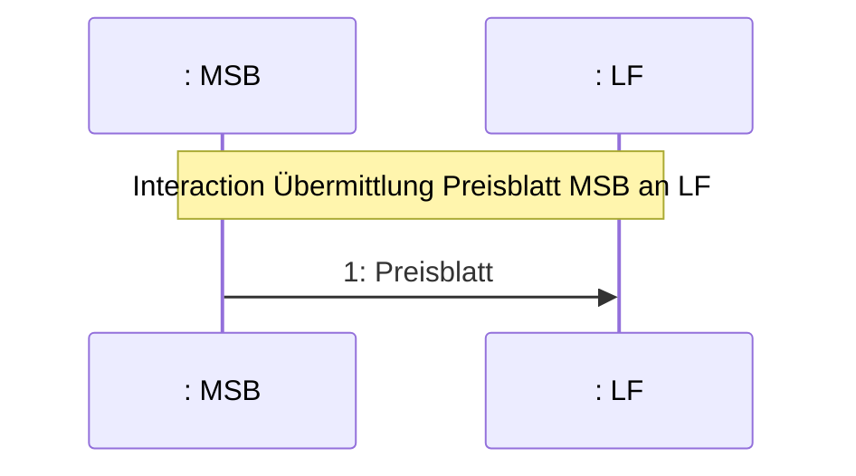
```mermaid
sequenceDiagram
    participant MSB as : MSB
    participant LF as : LF
    Note over MSB, LF: Interaction Übermittlung Preisblatt MSB an LF
    MSB->>LF: 1: Preisblatt
```

Seite 67 von 91

|Nr.|Aktion|Frist|Hinweis/Bemerkung|
|-|-|-|-|
|1|Preisblatt|Unverzüglich, jedoch spätester ÜT liegt 3 Monate vor dem Wirksamwerden der geänderten Preise zu bestehenden Preisschlüsselstämmen.<br/><br/>Unverzüglich bei Aufnahme eines neuen Preisschlüsselstamms in das Preisblatt.|Übermittlung des geänderten Preisblatts<br/><br/>Die Mindestfrist von 3 Monaten vor der Übermittlung der ersten Rechnung, in der die geänderte Komponente zur Anwendung kommt, dient dem LF lediglich dazu, die Änderungen im Systemen zu hinterlegen und anschließend eine automatisierte Rechnungsprüfung durchführen zu können.<br/><br/>*Ergänzender Hinweis:*<br/>Die unterschiedlichen Fristen bedeuten, dass falls ein MSB in einem Preisblatt sowohl Preisänderungen bei bestehenden Preisschlüsselstämmen durchführen als auch neue Preisschlüsselstämme aufnehmen möchte, muss der MSB zuerst eine Preisblattaktualisierung mit der Hinzufügung der Preisschlüsselstämme durchführen und im Anschluss zu einem späteren Zeitpunkt mit der oben genannten Vorlauffrist ein neues Preisblatt mit der Anpassung der Preise übermitteln.|


### 3.6.3. Abrechnung Messstellenbetrieb für iMS und mME
Gemäß MsbG sind folgende Konstellationen für die Abrechnung des Messstellenbetriebes denkbar:

a. Abrechnung des Messstellenbetriebes vom MSB ggü. dem ANN

b. Abrechnung des Messstellenbetriebes vom MSB ggü. dem AN

c. Separate Abrechnung des Messstellenbetriebes vom MSB ggü. dem LF und Weiterverrechnung des Messstellenbetriebes von LF ggü. dem AN.

### 3.6.3.1. Ermittlung der POG
Die Ermittlung der POG nach § 31 MsbG erfolgt durch den gMSB. Bei der Ermittlung der POG ist es nicht ausreichend, eine einzelne Messlokation zu bewerten. Die POG wird für einen AN innerhalb eines Gebäudes erhoben, unabhängig wie viele Messlokationen für die Ermittlung der Energie seiner durch Ihn genutzten Marktlokationen vorhanden sind. Somit kann ein LF, der eine Marktlokation des AN beliefert, nicht automatisch durch das Verbrauchsverhalten an der einzelnen Marktlokation einen Rückschluss auf die POG ziehen. Nutzt ein AN mehrere Marktlokationen in einem Gebäude, die durch unterschiedliche LF beliefert werden, kann somit

Seite **68** von **91**

nur maximal ein LF (bzw. bei vorhandener Marktlokation, die Energie erzeugt, ggf. der NB) die POG in seiner Rechnung gegenüber dem Kunden abrechnen.

### 3.6.3.2. Abrechnung des Messstellenbetriebes vom MSB an den LF
Voraussetzung hierfür ist der Abschluss eines Messstellenvertrags zwischen den beteiligten Unternehmen MSB und LF, der den Mindestanforderungen des MsbG genügt.

### 3.6.3.3. Grundsätzliches
Für die Abrechnung des Messstellenbetriebes wird als Grundeinstellung angenommen, dass die Rechnungsabwicklung vom gMSB an den AN erfolgt. Auch im Falle eines Lieferbeginnprozesses wird davon ausgegangen, dass die Abrechnung des Messstellenbetriebes über den AN erfolgt.

Wenn der gMSB von einer neuen Lieferantenzuordnung auf einer Marktlokation vom NB erfährt und kein exklusiv geschlossenes Vertragsverhältnis des gMSB mit dem AN oder dem ANN vorliegt, ist er verpflichtet, dem LF ein Angebot zur Übernahme des Entgelts für den Messstellenbetrieb vorzulegen, wenn der Messstellenbetrieb über den LF abgerechnet werden kann. Im Falle der Bestätigung des Angebotes kommt im Rahmen eines Messstellenvertrages mit dem LF eine Vereinbarung zur Rechnungsabwicklung über den LF zustande. Darüber hinaus kann der LF eine Anfrage zur Übernahme des Entgelts jederzeit nach Ablauf der Erstaufschlagsfrist des gMSB starten.

Im Fall, dass der LF einen „all inclusive“ Vertrag mit dem AN geschlossen hat, wird bei einer Meldung des LF gegenüber dem MSB davon ausgegangen, dass der LF die entsprechenden Vollmachten besitzt, ein ggf. direktes Vertragsverhältnis zwischen MSB und AN aufzuheben.

Im laufenden Prozess ist es beiden Seiten immer möglich, durch entsprechende Prozesse die Abwicklung der Rechnung für das Entgelt des Messstellenbetriebes zu verändern.

Der MSB beendet automatisch die Rechnungsabwicklung des Messstellenbetriebes bei Vorliegen der Mitteilung des NB an den MSB über die Zuordnung eines neuen LF an der Marktlokation (ohne das der MSB in diesem Fall den Use-Case "Beendigung Rechnungsabwicklung des Messstellenbetriebes über den LF durch den MSB" anwendet). In allen anderen Fällen, in denen die Abrechnung durch den MSB bzw. LF beendet werden soll, geschieht dies über die Prozesse "Beendigung Rechnungsabwicklung des Messstellenbetriebes über den LF durch den MSB" bzw. "Beendigung Rechnungsabwicklung des Messstellenbetriebes über den LF durch den LF". Rückwirkende Änderungen des Entgeltes für den Messstellenbetrieb sind nur mit gegenseitigem Einverständnis möglich.

Änderungen des Entgelts für den Messstellenbetrieb bei gleichbleibendem Messumfang sind dem LF ausschließlich über eine Preisblattänderung mit einer Mindestvorlauffrist von 3 Monaten mitzuteilen.

Seite 69 von 91

### 3.6.3.4. Use-Case: Angebot zur Rechnungsabwicklung des Messstellenbetriebes über den LF durch den MSB

#### 3.6.3.4.1. UC: Angebot zur Rechnungsabwicklung des Messstellenbetriebes über den LF durch den MSB

|Use-Case-Name|Angebot zur Rechnungsabwicklung des Messstellenbetriebes über den LF durch den MSB|
|-|-|
|Prozessziel|Der LF ist Zahler des Messstellenbetriebes oder der LF ist nicht Zahler des Messstellenbetriebes.|
|Use-Case Beschreibung|Der MSB der Marktlokation hat die Möglichkeit,<br/>\* nach erfolgtem Gerätewechsel, in dessen Rahmen ein iMS oder mME in die Messlokation/en einer Marktlokation eingebaut wurde, oder<br/>\* nachdem ein neuer LF der Marklokation zugeordnet ist, für dessen Messlokation/en der MSB den Messstellenbetrieb mittels iMS oder mME durchführt, oder<br/>\* wenn sich die Anzahl der Leistungen bzw. die Verbrauchsgruppe der POG für den Messstellenbetrieb, der mit iMS oder mME ausgestattet ist, ändert oder<br/>\* als gMSB im Fall, dass er den bisherigen wMSB weiterverpflichtet hat (Hinweis: der wMSB rechnet direkt mit dem gMSB ab)<br/>dem LF ein Angebot über die Abwicklung der Abrechnung über den LF vorzulegen.<br/><br/>Macht der MSB der Marktlokation von dieser Möglichkeit Gebrauch, hat der LF das Angebot innerhalb von 8 WT entweder anzunehmen oder abzulehnen.|
|Rollen|\* LF<br/>\* MSB|
|Vorbedingung|\* Bei einer Marktlokation mit einer zugeordneten Messlokation muss diese mit einer mME oder iMS ausgestattet sein.<br/>\* Bei einer Marktlokation mit mindestens zwei zugeordneten Messlokationen muss mindestens eine Messlokation mit einer mME/einem iMS ausgestattet sein<br/>\* Der LF ist der Marktlokation der Messlokation/en zugeordnet.<br/>\* Es besteht noch keine Vereinbarung zum Zeitpunkt der Angebotsgültigkeit.|
|Nachbedingung im Erfolgsfall|\* Der MSB der Marktlokation kann dem LF den Messstellenbetrieb in Rechnung stellen oder<br/>\* der MSB der Marktlokation kann Kontakt zum AN aufnehmen oder<br/>\* bei iMS hat der MSB der Marktlokation die Abrechnung des Messstellenbetriebes bereits über einem anderen LF einer von der POG Ermittlung betroffenen Marktlokation aufgebaut.<br/>\* Die Rechnungsabwicklung gilt ab der Bestätigung des Angebotes, mit Wirkung zum angefragten Abrechnungsbeginn, unbefristet. Ggf. bereits vorher bestätigte Rechnungsabwicklungen gegenüber demselben LF, welche nach dem Abrechnungsbeginn beginnen würden, sind somit gegenstandslos.|
|Nachbedingung im Fehlerfall|--|


Seite 70 von 91

|Use-Case-Name|\*\*Angebot zur Rechnungsabwicklung des Messstellenbetriebes über den LF durch den MSB\*\*|
|-|-|
|Fehlerfälle|\* Die Messlokation konnte nicht identifiziert werden.<br/>\* Der LF ist nicht der Marktlokation zugeordnet.|
|Weitere Anforderungen|Ändert sich im Rahmen eines Lieferbeginn- bzw. E/G-Prozesses (GPKE Teil 2) der AN, jedoch nicht der LF, wird auf Grund dieses Sachverhalts durch den MSB der Marktlokation kein neues Angebot an den LF versendet, da diese Änderung für den MSB der Marktlokation nicht ersichtlich ist.|


### 3.6.3.4.2. SD: Angebot zur Rechnungsabwicklung des Messstellenbetriebes über den LF durch den MSB

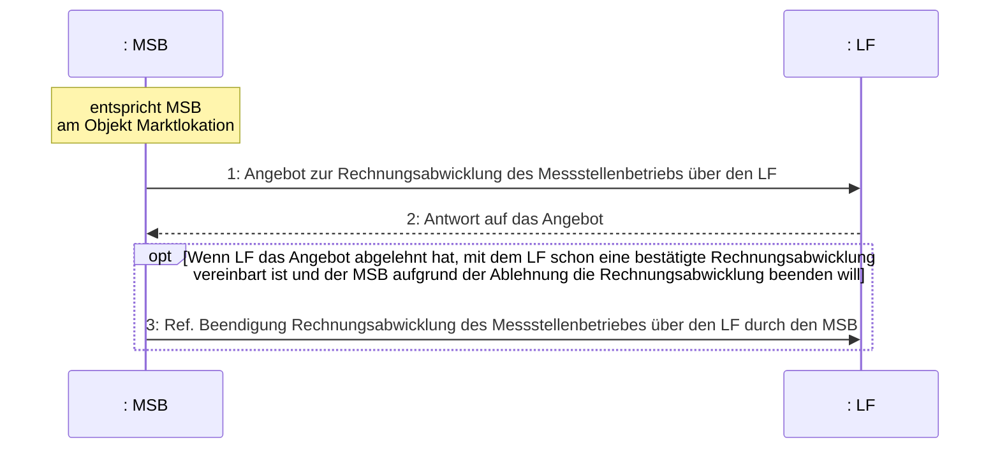
```mermaid
sequenceDiagram
    participant MSB as : MSB
    participant LF as : LF
    
    Note over MSB: entspricht MSB<br/>am Objekt Marktlokation
    
    MSB->>LF: 1: Angebot zur Rechnungsabwicklung des Messstellenbetriebs über den LF
    LF-->>MSB: 2: Antwort auf das Angebot
    
    opt Wenn LF das Angebot abgelehnt hat, mit dem LF schon eine bestätigte Rechnungsabwicklung vereinbart ist und der MSB aufgrund der Ablehnung die Rechnungsabwicklung beenden will
        MSB->>LF: 3: Ref. Beendigung Rechnungsabwicklung des Messstellenbetriebes über den LF durch den MSB
    end
```

|Nr.|Aktion|Frist|Hinweis/Bemerkung|
|-|-|-|-|
|1|Angebot zur Rechnungsabwicklung des Messstellenbetriebes über den LF|a) Unverzüglich nach Stammdatenänderung über Mitteilung des Ersteinbaus einer mME oder iMS oder der Zuordnung eines neuen LF, jedoch im Fall der Zuordnung eines neuen LF: spätester ÜT ist der 3. WT nach dem ÜT der Mitteilung einer neuen LF-Zuordnung vom NB an den MSB der Marktlokation.|Im Fall von b): Es wird wieder ein komplettes Angebot über den Messstellenbetrieb abgegeben.|


Seite **71** von **91**

|Nr.|Aktion|Frist|Hinweis/Bemerkung||
|-|-|-|-|-|
|||b) Geändertes Angebot im lfd. Betrieb:<br/>Unverzüglich bei Veränderung Vertragsverhältnisses zwischen MSB der Marktlokation und dem AN.|||
|2||Antwort auf das Angebot|Unverzüglich, jedoch spätester ÜT ist der 8. WT nach dem ÜT von Nr. 1.|Der LF teilt dem MSB der Marktlokation mit, ob er das Angebot vollständig annimmt oder ablehnt. Eine inhaltliche Änderung durch die Angebotsannahme erfolgt nicht.<br/><br/>Erfolgt im Fall b) aus Schritt 1 eine Ablehnung durch den LF, so ist die Abwicklung der gesamten Entgelte für den Messstellenbetrieb über den LF zum genannten Termin aus Schritt 1 abgelehnt. Die Abwicklung des Messstellenbetriebes über den LF wird mit einer Abschlussrechnung vom MSB der Marktlokation an den LF beendet.|
|3|ref Beendigung Rechnungsabwicklung des Messstellenbetriebes über den LF durch den MSB|--|--||


### 3.6.3.5. Use-Case: Beendigung Rechnungsabwicklung des Messstellenbetriebes über den LF durch den MSB

#### 3.6.3.5.1. UC: Beendigung Rechnungsabwicklung des Messstellenbetriebes über den LF durch den MSB

* **Use-Case-Name**: Beendigung Rechnungsabwicklung des Messstellenbetriebes über den LF durch den MSB
* **Prozessziel**: Die Vereinbarung zwischen MSB der Marktlokation und LF über die Abrechnung des Messstellenbetriebes an den LF ist zum genannten Zeitpunkt beendet.
* **Use-Case Beschreibung**: Der MSB der Marktlokation stellt eine Beendigungsanfrage und erhält nach Prüfung durch den LF eine Antwort.
* **Rollen**:
    * MSB
    * LF
* **Vorbedingung**: Der LF ist der Marktlokation zum Anfragetermin der Nachricht zugeordnet. Es besteht zwischen LF und MSB der Marktlokation eine Vereinbarung über die Abrechnung des Messstellenbetriebes über den LF. Auslöser sind unter anderem:

Seite 72 von 91

|Use-Case-Name|\*\*Beendigung Rechnungsabwicklung des Messstellenbetriebes über den LF durch den MSB\*\*|
|-|-|
||\* Abschluss eines direkten Vertrags zwischen MSB der Marktlokation und AN,|
||\* Abschluss eines direkten Vertrags zwischen MSB der Marktlokation und ANN,|
||\* Aufgrund von Änderungen im Lokationsbündel erfolgt die Abrechnung der Messentgelte über eine andere Marktlokation im Lokationsbündel.|
|Nachbedingung im Erfolgsfall|Der LF ist bzgl. der Abwicklung des Entgelts für den Messstellenbetrieb der Messlokation nicht mehr zugeordnet. Ggf. wird eine Endrechnung gestellt.|
|Nachbedingung im Fehlerfall|Der LF ist als Zahler des Entgelts für den Messstellenbetrieb weiterhin zugeordnet.|
|Fehlerfälle|--|
|Weitere Anforderungen|Hinweis: Die Beendigung der Rechnungsabwicklung kann auch eine zukünftig beginnende Abrechnung des MSB der Marktlokation betreffen, welche zum Abrechnungsbeginn obsolet wird.|


### 3.6.3.5.2. SD: Beendigung Rechnungsabwicklung des Messstellenbetriebes über den LF durch den MSB

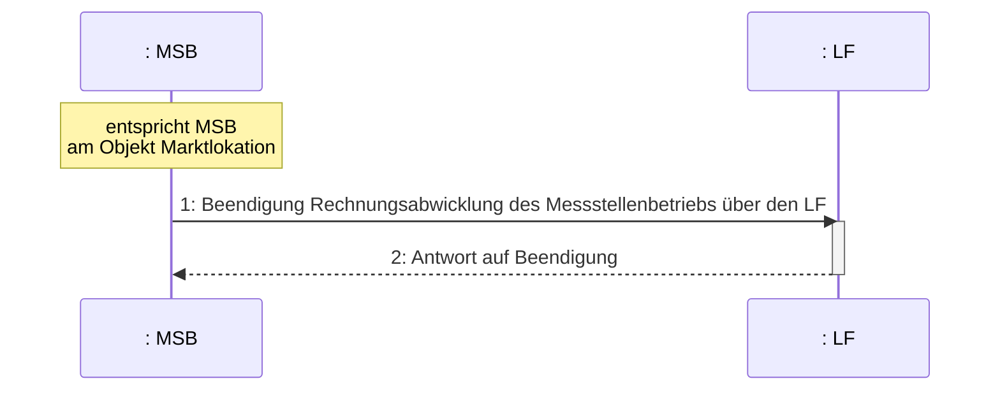
```mermaid
sequenceDiagram
    participant MSB as : MSB
    participant LF as : LF
    Note over MSB: entspricht MSB<br/>am Objekt Marktlokation
    MSB->>LF: 1: Beendigung Rechnungsabwicklung des Messstellenbetriebs über den LF
    activate LF
    LF-->>MSB: 2: Antwort auf Beendigung
    deactivate LF
```

|Nr.|Aktion|Frist|Hinweis/Bemerkung|
|-|-|-|-|
|1|Beendigung Rechnungsabwicklung des Messstellenbetriebes über den LF|Unverzüglich bei Eintreten einer Veränderung|--|
|2|Antwort auf Beendigung|Unverzüglich, jedoch spätester ÜT ist der 8. WT nach dem ÜT von Nr. 1.|--|


Seite 73 von 91

### 3.6.3.6. Use-Case: Anfrage zur Rechnungsabwicklung des Messstellenbetriebes über den LF durch den LF

#### 3.6.3.6.1. UC: Anfrage zur Rechnungsabwicklung des Messstellenbetriebes über den LF durch den LF

|Use-Case-Name|Anfrage zur Rechnungsabwicklung des Messstellenbetriebes über den LF durch den LF|
|-|-|
|Prozessziel|Der LF ist Zahler des Messstellenbetriebes.|
|Use-Case Beschreibung|Der LF hat die Möglichkeit, bspw. im Nachgang eines Gerätewechsels auf das mME, iMS oder im Nachgang zur Zuordnung eines LF oder im laufenden Betrieb, die Grundeinstellung für die Rechnungsabwicklung des Messstellenbetriebes per Bestellung zu ändern. Der LF bestätigt dabei implizit, dass er aus dem Liefervertrag mit dem AN berechtigt ist, die Abrechnung des Messentgelts in seinem Verhältnis zum MSB der Marktlokation zu verlangen.|
|Rollen|\* LF<br/>\* MSB|
|Vorbedingung|\* Bei einer Marktlokation mit einer zugeordneten Messlokation muss diese mit einer mME oder iMS ausgestattet sein.<br/>\* Bei einer Marktlokation mit mindestens zwei zugeordneten Messlokationen muss mindestens eine Messlokation mit einer mME/einem iMS ausgestattet sein.<br/>\* Der LF ist der Marktlokation der Messlokation/en zugeordnet.<br/>\* LF ist nicht Zahler des Messstellenbetriebes.|
|Nachbedingung im Erfolgsfall|Bestellung: Der LF ist beim MSB der Marktlokation als Zahler des Messstellenbetriebes zugeordnet.|
|Nachbedingung im Fehlerfall|Der LF ist beim MSB der Marktlokation nicht als Zahler des Messstellenbetriebes zugeordnet<br/>oder<br/>bei iMS hat der MSB der Marktlokation die Abrechnung des Messstellenbetriebes bereits über einem anderen LF einer von der POG-Ermittlung betroffenen Marktlokation aufgebaut und der anfragende LF ist nicht Zahler.<br/>Die Rechnungsabwicklung gilt ab der Bestätigung des Angebotes, mit Wirkung zum angefragten Abrechnungsbeginn, unbefristet. Ggf. bereits vorher bestätigte Rechnungsabwicklungen gegenüber demselben LF, welche nach dem Abrechnungsbeginn beginnen würden, sind somit gegenstandslos.|
|Fehlerfälle|Die Messlokation konnte nicht identifiziert werden, oder der LF hat keine Berechtigung.|
|Weitere Anforderungen|--|


Seite **74** von **91**

### 3.6.3.6.2. SD: Anfrage zur Rechnungsabwicklung des Messstellenbetriebes über den LF durch den LF

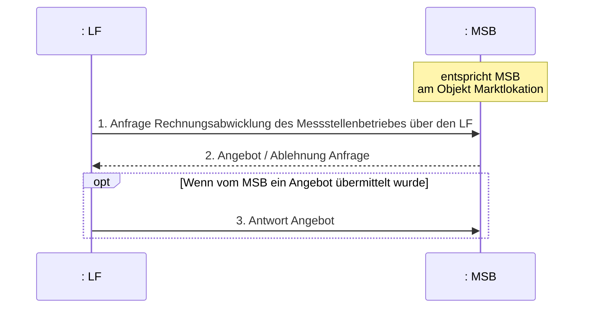
```mermaid
sequenceDiagram
    participant LF as : LF
    participant MSB as : MSB
    Note over MSB: entspricht MSB<br/>am Objekt Marktlokation
    LF->>MSB: 1. Anfrage Rechnungsabwicklung des Messstellenbetriebes über den LF
    MSB-->>LF: 2. Angebot / Ablehnung Anfrage
    opt Wenn vom MSB ein Angebot übermittelt wurde
        LF->>MSB: 3. Antwort Angebot
    end
```

|Nr.|Aktion|Frist|Hinweis/Bemerkung|
|-|-|-|-|
|1|Anfrage Rechnungsabwicklung des Messstellenbetriebes über den LF|a) Bei Zuordnung eines neuen LF oder Ersteinbau mME oder iMS und fehlendem Angebot vom MSB der Marktlokation:<br/><br/>frühester ÜT ist der 9. WT.<br/><br/>b) Im lfd. Betrieb An-/Abmeldung:<br/><br/>unverzüglich bei Veränderung des Liefervertrages mit dem AN bzgl. des „all inclusive“ Entgelts des Messstellenbetriebes.|ID der Marktlokation und Starttermin|
|2|Angebot /Ablehnung Anfrage|Unverzüglich, jedoch spätester ÜT ist der 5. WT nach dem ÜT von Nr. 1.|Der MSB der Marktlokation lehnt die Anfrage u.a. in folgenden Fällen ab:<br/>\* Sofern der AN durch den MSB der Marktlokation zum angefragten Zeitpunkt bereits abgerechnet|


Seite **75** von **91**

|Nr.|Aktion|Frist|Hinweis/Bemerkung||||
|-|-|-|-|-|-|-|
||||wurde. In diesem Fall ist eine Umstellung der Rechnungsabwicklung zum angefragten Zeitpunkt durch den MSB der Marktlokation nicht mehr möglich.<br/>\* Sofern die Abrechnung des Messstellenbetriebes über eine andere Marktlokation erfolgt (z.B. Zweirichtungszähler). In diesem Fall darf der MSB dem anfragenden LF kein Angebot für die Rechnungsabwicklung des Messstellenbetriebes unterbreiten und lehnt die Anfrage mit „Entgelt wird durch erzeugende Marktlokation abgerechnet“ bzw. „Entgelt wird über eine andere Marktlokation abgerechnet“ ab.||||
||||3|Antwort Angebot|Unverzüglich, jedoch spätester ÜT ist der 8. WT nach dem ÜT von Nr. 2.|--|


### 3.6.3.7. Use-Case: Beendigung Rechnungsabwicklung des Messstellenbetriebes über den LF durch den LF

#### 3.6.3.7.1. UC: Beendigung Rechnungsabwicklung des Messstellenbetriebes über den LF durch den LF

* **Use-Case-Name**: Beendigung Rechnungsabwicklung des Messstellenbetriebes über den LF durch den LF
* **Prozessziel**: Die Abrechnungsabwicklung für den Messstellenbetrieb über den LF ist aufgehoben.
* **Use-Case Beschreibung**: Der LF stellt eine Beendigungsanfrage und erhält nach Prüfung durch den MSB der Marktlokation eine Antwort.
* **Rollen**:
    * MSB
    * LF
* **Vorbedingung**:
    * Der LF ist der Marktlokation zum Anfragetermin der Nachricht zugeordnet.
    * LF ist Zahler des Messstellenbetriebes.
* **Nachbedingung im Erfolgsfall**: Der LF ist bzgl. der Abwicklung des Entgelts für den Messstellenbetrieb der Messlokation nicht mehr zugeordnet. Ggf. wird eine Endrechnung gestellt. Der MSB der Marktlokation nimmt Kontakt zum AN auf.
* **Nachbedingung im Fehlerfall**: Der LF ist bzgl. der Abwicklung des Entgelts für den Messstellenbetrieb der Messlokation weiterhin zugeordnet.
* **Fehlerfälle**: --
* **Weitere Anforderungen**: --

Seite **76** von **91**

### 3.6.3.7.2. SD: Beendigung Rechnungsabwicklung des Messstellenbetriebes über den LF durch den LF

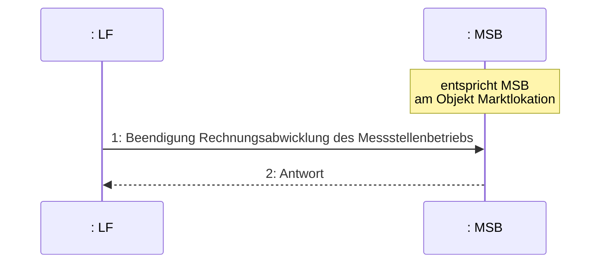
```mermaid
sequenceDiagram
    participant LF as : LF
    participant MSB as : MSB
    Note over MSB: entspricht MSB<br/>am Objekt Marktlokation
    LF->>MSB: 1: Beendigung Rechnungsabwicklung des Messstellenbetriebs
    MSB-->>LF: 2: Antwort
```

|Nr.|Aktion|Frist|Hinweis/Bemerkung|
|-|-|-|-|
|1|Beendigung Rechnungsabwicklung des Messstellenbetriebes über den LF|Unverzüglich nach Wegfall des Grundes. Die Aufhebung der Rechnungsübernahme erfolgt zu dem vom LF benannten Datum jedoch bis maximal 6 Wochen + 5 WT in die Vergangenheit.|ID der Marktlokation und Start- bzw. Endtermin.<br/><br/>Die Maximalfrist in die Vergangenheit wird wie folgt berechnet:<br/><br/>Frühester Tag = ÜT – (6 Wochen + 5 WT)|
|2|Antwort auf Beendigung|Unverzüglich, jedoch spätester ÜT ist der 8. WT nach dem ÜT von Nr. 1.|ID der Marktlokation und Endtermin.|


### 3.6.3.8. Use-Case: Abrechnung Messstellenbetrieb gegenüber dem LF

#### 3.6.3.8.1. UC: Abrechnung Messstellenbetrieb gegenüber dem LF

|Use-Case-Name|Abrechnung Messstellenbetrieb gegenüber dem LF|
|-|-|
|Prozessziel|Der MSB der Marktlokation hat vom LF die Entgelte für den Messstellenbetrieb erhalten.|
|Use-Case Beschreibung|Der Prozess beinhaltet den Austausch der die Abrechnung des Messstellenbetriebes unterstützenden Informationen.|
|Rollen|\* MSB<br/>\* LF|
|Vorbedingung|Es liegt eine gültige Vereinbarung zwischen MSB der Marktlokation und LF über die Abrechnung des Messstellenbetriebes vor.|


Seite **77** von **91**

|Use-Case-Name|Abrechnung Messstellenbetrieb gegenüber dem LF|
|-|-|
|Der LF ist Zahler für den Messstellenbetrieb.||
|Nachbedingung im Erfolgsfall|Die Rechnung für den Messstellenbetrieb ist durch den LF bezahlt.|
|Nachbedingung im Fehlerfall|Die Rechnung für den Messstellenbetrieb wird durch den LF nicht bezahlt.|
|Fehlerfälle|Der LF hat eine fehlerhafte Rechnung erhalten (Rechnungsempfänger oder Rechnungsinhalt falsch).|
|Weitere Anforderungen|--|


### 3.6.3.8.2. SD: Abrechnung Messstellenbetrieb gegenüber dem LF

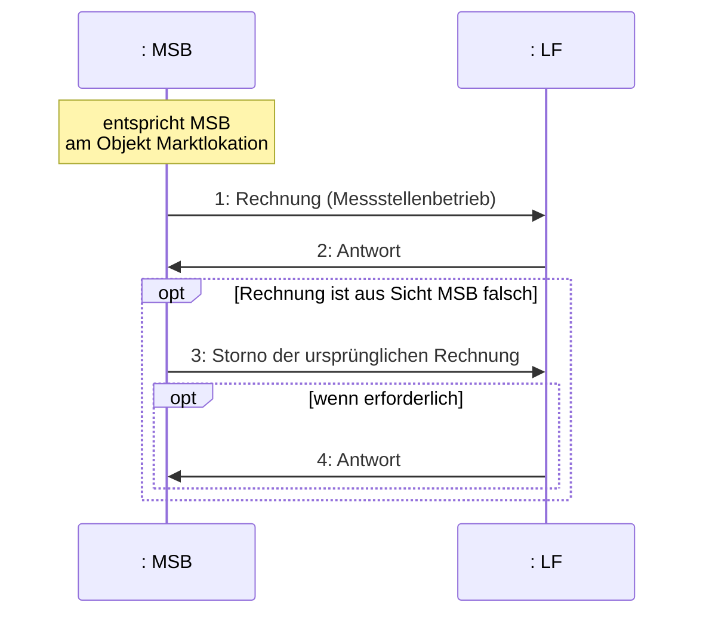
```mermaid
sequenceDiagram
    participant MSB as : MSB
    participant LF as : LF
    
    Note over MSB: entspricht MSB<br/>am Objekt Marktlokation
    
    MSB->>LF: 1: Rechnung (Messstellenbetrieb)
    LF->>MSB: 2: Antwort
    
    opt Rechnung ist aus Sicht MSB falsch
        MSB->>LF: 3: Storno der ursprünglichen Rechnung
        opt wenn erforderlich
            LF->>MSB: 4: Antwort
        end
    end
```

|Nr.|Aktion|Frist|Hinweis/Bemerkung|
|-|-|-|-|
|1|Rechnung (Messstellenbetrieb)|Gemäß Rahmenvertrag.|Die Rechnung für den Messstellenbetrieb wird vom MSB der Marktlokation an den LF übermittelt.<br/>Das Zahlungsziel darf 10 WT nach Empfang der Rechnung nicht unterschreiten.<br/>Der MSB der Marktlokation fasst im Falle mehrerer Rechnungen die Rechnungen zu einer Datei zusammen und versendet diese an den LF.|
|2|Antwort|Spätester ÜT ist zum Zahlungsziel in der Rechnung.|--|


Seite 78 von 91

|Nr.|Aktion|Frist|Hinweis/Bemerkung|
|-|-|-|-|
|3|Storno der ursprünglichen Rechnung|--|--|
|4|Antwort|Spätester ÜT ist zum Zahlungsziel in der Rechnung.|--|


## 3.7. Use-Case: Abrechnung von Dienstleistungen

### 3.7.1. UC: Abrechnung von Dienstleistungen

**Use-Case-Name**: Abrechnung von Dienstleistungen

**Prozessziel**: Der MSBN der Messlokation oder der gMSB der Messlokation hat vom MSBA der Messlokation die Entgelte für die Dienstleistungen erhalten.

**Use-Case Beschreibung**: Der Prozess beschreibt die Abrechnung der Entgelte für:

* die temporäre Fortführung des Messstellenbetriebes
* die Geräteübernahme (Nutzungsüberlassung durch Pacht oder Miete)
* die Geräteübernahme (Kauf) oder
* Zusatz- bzw. Kontrollablesungen.

Der MSBN der Messlokation oder der gMSB der Messlokation prüft die Rechnung (z.B. auf Bezugnahme zur korrekten Messlokation und zutreffenden Zeitraum des Messstellenbetriebes). Bei positiver Prüfung ist eine Bestätigung der Zahlung mitzuteilen. Bestätigungen, die sich auf mehrere Rechnungen beziehen, sind zusammenzufassen.

Im Fall der negativen Prüfung (Reklamationsfall) kommt das sog. „Alles-oder-Nichts-Prinzip“ zur Anwendung, nach dem eine einzelne Rechnung innerhalb einer Rechnungs-Datei, die mehrere Rechnungen enthalten kann, entweder vollumfänglich als richtig akzeptiert oder vollumfänglich abgelehnt wird. Eine Rechnungskorrektur umfasst immer eine Stornorechnung und eine neue Rechnung. Sowohl die stornierte(n), als auch die erneut abgerechnete(n) Rechnung(en) werden zu einer Datei zusammengefasst. Eine Ablehnung der Zahlung ist zu begründen. Ablehnungen, die sich auf mehrere Rechnungen beziehen, sind zusammenzufassen.

Die im Konfliktfall abzuwickelnden Prozesse im Rahmen des Forderungsmanagements bzw. Mahnablaufs werden hier nicht dargestellt. Ebenso wird die Abbildung der Weiterverrechnung gegenüber dem AN oder ANN nicht dargestellt.

**Rollen**: MSB

**Vorbedingung**: Es liegt eine gültige Vereinbarung zwischen den MSB über die Abrechnung des Abrechnungsgegenstandes vor.

**Nachbedingung im Erfolgsfall**: Die Rechnung für das Gerät bzw. der Sonderablesung wurde bezahlt.

Seite 79 von 91

**Use-Case-Name**: Abrechnung von Dienstleistungen
**Nachbedingung im Fehlerfall**: Die Rechnung für das Gerät bzw. die Sonderablesung wurde nicht bezahlt.
**Fehlerfälle**: Der MSBN der Messlokation oder der gMSB der Messlokation hat eine fehlerhafte Rechnung erhalten.
**Weitere Anforderungen**: --

### 3.7.2. SD: Abrechnung von Dienstleistungen

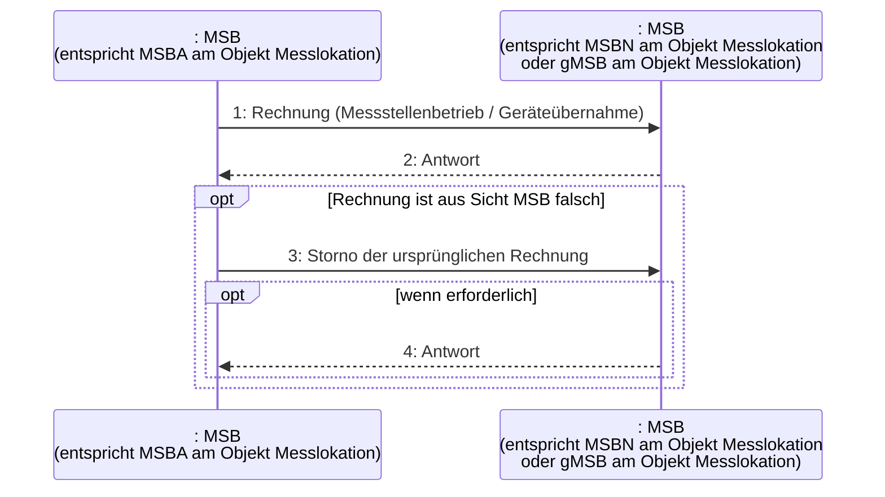
```mermaid
sequenceDiagram
    participant MSB_A as : MSB<br/>(entspricht MSBA am Objekt Messlokation)
    participant MSB_N as : MSB<br/>(entspricht MSBN am Objekt Messlokation<br/>oder gMSB am Objekt Messlokation)

    MSB_A->>MSB_N: 1: Rechnung (Messstellenbetrieb / Geräteübernahme)
    MSB_N-->>MSB_A: 2: Antwort

    opt Rechnung ist aus Sicht MSB falsch
        MSB_A->>MSB_N: 3: Storno der ursprünglichen Rechnung
        opt wenn erforderlich
            MSB_N-->>MSB_A: 4: Antwort
        end
    end
```

|Nr.|Aktion|Frist|Hinweis/Bemerkung|
|-|-|-|-|
|1|Rechnung (Messstellenbetrieb / Geräteübernahme)|*Bei Abrechnung Messstellenbetrieb:*<br/><br/>Unverzüglich, jedoch spätester ÜT ist der 20. WT nach Beendigung der Durchführung der temporären Fortführung des Messstellenbetriebes.<br/><br/>*Bei Abrechnung Geräteübernahme:*<br/><br/>Unverzüglich, jedoch<br/>\* bei Kauf: spätester ÜT ist der 20. WT|*Bei Abrechnung Messstellenbetrieb:*<br/><br/>Übermittlung der Rechnung für die temporäre Fortführung des Messstellenbetriebes<br/><br/>Das Zahlungsziel darf 10 WT nach Empfang der Rechnung nicht unterschreiten.<br/><br/>*Bei Abrechnung Geräteübernahme:*<br/><br/>Übermittlung der Rechnung für die Geräteübernahme<br/><br/>Kann sowohl für die Abrechnung einer singulären Forderung (z.B. Kaufpreis für eine Messeinrichtung) als auch wiederkehrend bei Nutzungsüberlassung Anwendung finden.|


Seite **80** von **91**

|Nr.|Aktion|Frist|Hinweis/Bemerkung||
|-|-|-|-|-|
|||nach Überlassung der Einrichtung<br/>\* bei Nutzungsüberlassung: mindestens einmal pro Jahr, jedoch spätester ÜT ist der 20. WT nach Ende des jeweiligen Abrechnungszeitraums.|Das Zahlungsziel darf 10 WT nach Empfang der Rechnung nicht unterschreiten.<br/><br/>*Bei Abrechnung Zusatz- bzw. Kontrollablesungen:*<br/><br/>Das Zahlungsziel darf 10 WT nach Empfang der Rechnung nicht unterschreiten.||
||||*Bei Abrechnung Zusatz- bzw. Kontrollablesungen:*<br/><br/>Unverzüglich, jedoch spätester ÜT ist der 20. WT nach Versand der Zusatz- bzw. Kontrollablesung.||
|2|Antwort|Spätester ÜT ist zum angegebenen Zahlungsziel.|Der Empfänger prüft die Rechnung (z.B. auf Bezugnahme zur korrekten Messlokation und zutreffenden Zeitraum des Messstellenbetriebes).||
|3|Storno der ursprünglichen Rechnung|Spätester ÜT ist zum angegebenen Zahlungsziel.|--||
|4|Antwort|Spätester ÜT ist zum angegebenen Zahlungsziel.|--||


Seite **81** von **91**

# 4. Prozessbeschreibungen zum Preisblatt „Messstellenbetrieb mit iMS gegenüber dem NB“ des MSB

## 4.1. Allgemeines
Das elektronische Preisblatt ermöglicht dem NB eine automatisierte und damit massengeschäftsfähige Rechnungsprüfung. Der MSB übermittelt zu diesem Zweck vorab und vollständig die auf dem Preisblatt „Messstellenbetrieb mit iMS gegenüber dem NB“ enthaltenen Informationen elektronisch an die NB.

## 4.2. Begriffsbestimmungen
<u>Elektronisches Preisblatt</u>

Ein elektronisches Preisblatt, im folgenden Preisblatt genannt, enthält die vom MSB angebotenen Leistungen und die dazugehörigen Preise.

Im Fall des Preisblatts „Messstellenbetrieb mit iMS gegenüber dem NB“ sind dies die im § 30 MsbG beschriebenen Teile der Abrechnung des Messstellenbetriebs, die vom MSB gegenüber dem NB abgerechnet werden können.

<u>Gruppenartikel-ID und Artikel-ID</u>

Mit einer Artikel-ID wird die abzurechnende Leistung sachgerecht und eindeutig dargestellt. Die Eindeutigkeit wird durch eine Beschreibung anhand fachlicher und technischer Informationen im Preisblatt erreicht. Jeder Artikel-ID kann ein Preis zugeordnet werden.

Eine Gruppenartikel-ID fasst mehrere Artikel-ID zu einem übergreifenden Sachverhalt zusammen, sofern diese benötigt wird.

<u>Preis</u>

Jeder Artikel-ID ist für jeden Zeitpunkt im elektronischen Preisblatt genau ein Preis zuzuordnen.

Alle Preise sind Nettopreise. Zu jeder Artikel-ID im elektronischen Preisblatt wird vorgegeben, ob der Preis in Euro oder Cent und mit welcher Maßeinheit (z. B. pro Tag, pro Auftrag, pro kWh) abzurechnen ist.

Ein Preis darf auch mit "0,00" angegeben werden.

<u>Preiskomponente</u>

Als Preiskomponente wird jede inhaltliche Information des Preisblatts als Sammelbegriff verstanden. Dies sind:

Seite **82** von **91**

a) Artikel-ID
b) Preis

## 4.3. Rahmenbedingungen des Preisblatts

1. Der MSB muss dem NB das Preisblatt „Messstellenbetrieb mit iMS gegenüber dem NB“ auf dem Wege des elektronischen Datenaustauschs im Sinne der vorliegenden Prozessbeschreibung übermitteln. Es sind dabei im Preisblatt nur die Artikel-ID anzugeben, die beim MSB Anwendung finden. Möchte der MSB keine einzige Artikel-ID anwenden, so hat der MSB dieses Preisblatt mit der Information „leeres Preisblatt“ im Sinne der vorliegenden Prozessbeschreibungen zu übermitteln.

2. Das Preisblatt ist eindeutig zu versionieren. Auf dem Preisblatt sind die aktuelle Versionskennzeichnung, der Gültigkeitsbeginn und die Kennzeichnung der Vorgängerversion (sofern eine Vorgängerversion vorhanden ist) des Preisblatts anzugeben.

3. Ein übermitteltes Preisblatt wird ungültig durch die Übermittlung eines Preisblattes mit identischem Gültigkeitsbeginn und einer höheren Versionskennzeichnung. Die Gültigkeit eines Preisblatts endet mit dem Inkrafttreten eines Preisblatts mit einem späteren Gültigkeitsbeginn und einer höheren Versionskennzeichnung. Ein Preisblatt beginnt und endet immer zu 00:00 Uhr eines Kalendertages.

4. Das Preisblatt ist nach folgender Hierarchie aufgebaut:
   Preisblatt 1:n Artikel-ID 1:1 Preis.

5. Das Preisblatt enthält nur Artikel-ID, die in einer EDI@Energy-Code-Liste aufgeführt und darin für die Anwendung für das Preisblatt „Messstellenbetrieb mit iMS gegenüber dem NB“ deklariert sind. Das Preisblatt kann nicht durch eigene Artikel-ID o.ä. erweitert werden.

6. Artikel-ID des Preisblatt „Messstellenbetrieb mit iMS gegenüber dem NB“ werden stets über den Use-Case „Abrechnung Messstellenbetrieb mit iMS gegenüber dem NB“ in Rechnung gestellt. Preiskomponenten, die nicht mit einer Artikel-ID im Preisblatt „Messstellenbetrieb mit iMS gegenüber dem NB“ angegeben sind, können nicht über den Use-Case „Abrechnung Messstellenbetrieb mit iMS gegenüber dem NB“ abgerechnet werden.

7. Jeder Preis muss im Preisblatt eindeutig hinsichtlich seiner Verwendung, anhand fachlicher und technischer Informationen, beschrieben sein.

8. Preise, die aufgrund gesetzlicher oder vertraglicher Vorgaben Monats- oder Jahrespreise sind, werden für das elektronische Preisblatt zur Abrechnung in der kleinsten Einheit ausgewiesen. So können z.B. bei untermonatlichen Messstellenbetreiberwechseln Preiskomponenten tagesscharf unabhängig von der Anzahl der Tage des jeweiligen Monats eindeutig ausgewiesen werden und es werden Clearingfälle reduziert. Der für Abrechnungszwecke optimierte Ausweis im elektronischen Preisblatt ändert nichts an der

Seite 83 von 91

gesetzlich oder vertraglich vorgesehenen Bezugsgröße und führt zu keinen Mehr- oder Mindereinnahmen.

9. Im Rahmen des Use-Cases „Stammdatenänderung vom MSB (verantwortlich) ausgehend“ (GPKE Teil 4) müssen die für die Marktlokation relevanten Gruppenartikel-ID bzw. Artikel-ID des Preisblatts „Messstellenbetrieb mit iMS gegenüber dem NB“ vorab angegeben werden. Wenn eine Gruppenartikel-ID vorhanden ist, muss diese im Use-Case „Stammdatenänderung vom MSB (verantwortlich) ausgehend“ genannt werden, ansonsten wird direkt die Artikel-ID angegeben.

# 5. Use-Case: Übermittlung Preisblatt „Messstellenbetrieb mit iMS gegenüber dem NB“ vom MSB an NB

## 5.1. UC: Übermittlung Preisblatt „Messstellenbetrieb mit iMS gegenüber dem NB“ vom MSB an NB

|Use-Case-Name|Übermittlung Preisblatt „Messstellenbetrieb mit iMS gegenüber dem NB“ vom MSB an NB|
|-|-|
|Prozessziel|Dem NB liegt das elektronische Preisblatt „Messstellenbetrieb mit iMS gegenüber dem NB“ des MSB vor.|
|Use-Case Beschreibung|Der MSB übermittelt dem NB sein elektronisches Preisblatt, wenn dem NB das elektronische Preisblatt nicht vorliegt oder sich mindestens eine Preiskomponente des Preisblatts geändert hat.|
|Rollen|\* MSB<br/>\* NB|
|Vorbedingung|\* Die EDIFACT-Kommunikation zwischen MSB und NB ist aufgebaut.<br/>\* Dem NB liegt das aktuelle oder aktualisierte Preisblatt des MSB nicht vor.|
|Nachbedingung im Erfolgsfall|Die Abrechnung des Messstellenbetriebs mit iMS gegenüber dem NB kann erstellt werden.|
|Nachbedingung im Fehlerfall|In den Fehlerfällen erfolgt eine erneute Übermittlung des Preisblatts.|
|Fehlerfälle|\* Preisblatt enthält einen Fehler<br/>\* Preisblatt wurde nicht in der aktuellen Version übermittelt<br/>\* Preisblatt wurde nicht vollständig übermittelt<br/>\* Preisblatt beginnt nicht um 00:00 Uhr eines Kalendertages.|
|Weitere Anforderungen|--|


Seite **84** von **91**

## 5.2. SD: Übermittlung Preisblatt „Messstellenbetrieb mit iMS gegenüber dem NB“ vom MSB an NB

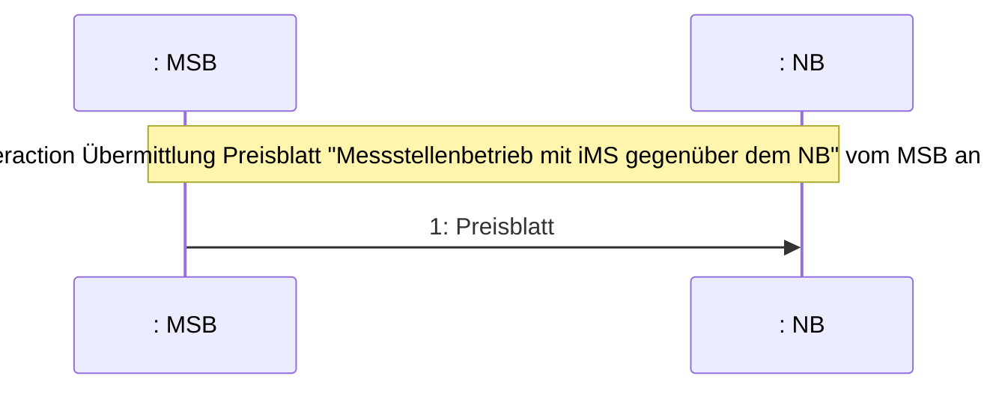
```mermaid
sequenceDiagram
    participant MSB as : MSB
    participant NB as : NB
    Note over MSB, NB: interaction Übermittlung Preisblatt "Messstellenbetrieb mit iMS gegenüber dem NB" vom MSB an NB
    MSB->>NB: 1: Preisblatt
```

|Nr.|Aktion|Frist|Hinweis/Bemerkung|
|-|-|-|-|
|1|Preisblatt|Bei initialer Übermittlung:<br/>Unverzüglich, jedoch spätester ÜT ist der 3. WT, nachdem die EDIFACT-Kommunikation aufgebaut wurde.<br/>Bei Übermittlung aufgrund einer Änderung:<br/>Unverzüglich, jedoch spätester ÜT ist der 20. WT vor Inkrafttreten des geänderten Preisblatts. Ist aufgrund einer gesetzlichen Vorgabe eine andere Frist anzuwenden, gilt diese Frist für die Übermittlung des Preisblatts.|--|


Seite 85 von 91

# 6. Use-Case: Abrechnung Messstellenbetrieb mit iMS gegenüber dem NB

## 6.1. UC: Abrechnung Messstellenbetrieb mit iMS gegenüber dem NB

|Use-Case-Name|Abrechnung Messstellenbetrieb mit iMS gegenüber dem NB|
|-|-|
|Prozessziel|Der MSB der Marktlokation ist informiert, dass der NB die Rechnung akzeptiert.|
|Use-Case Beschreibung|Der Prozess beschreibt die Kommunikation zwischen dem MSB der Marktlokation und dem NB zur anteiligen Abrechnung des Messstellenbetriebs mit iMS gegenüber dem NB und ggf. dem automatisierten Reklamationsfall. Eine Rechnungskorrektur umfasst immer eine Stornorechnung und eine neue Rechnung.|
|Rollen|\* MSB\<br/>\* NB|
|Vorbedingung|\* Die aktuellen für den NB geltenden Entgelte für den Messstellenbetrieb mit iMS wurden vom MSB der Marktlokation im Rahmen des Use Cases „Übermittlung Preisblatt „Messstellenbetrieb mit iMS gegenüber dem NB“ vom MSB an NB“ an den NB übermittelt.\<br/>\* Der MSB ist der MSB der Marktlokation.\<br/>\* Bei einer Marktlokation mit einer zugeordneten Messlokation muss diese mit einem iMS ausgestattet sein.\<br/>\* Bei einer Marktlokation mit mindestens zwei zugeordneten Messlokationen muss mindestens eine Messlokation mit einem iMS ausgestattet sein.\<br/>\* Die an der Marktlokation durch den MSB erbrachten Leistungen sind unter Nutzung der (Gruppen-)Artikel-ID zwischen MSB und NB im Rahmen der Stammdatenprozesse ausgetauscht.\<br/>\<br/>\<u>Auslöser:\</u>\<br/>Die Rechnungstellung des Messstellenbetriebs ist vom MSB der Marktlokation gegenüber dem NB fällig.|
|Nachbedingung im Erfolgsfall|Der NB wird die vom MSB der Marktlokation gestellte Rechnung bezahlen.|
|Nachbedingung im Fehlerfall|--|
|Fehlerfälle|\* Der MSB ist nicht der MSB der Marktlokation.\<br/>\* Der Prozess kommt für eine Messlokation mit mME oder kME zur Anwendung.\<br/>\* Der Prozess kommt für eine Messlokation mit iMS zur Anwendung, wobei diese Messlokation für die Energiemengenermittlung der Marktlokation nicht relevant ist.\<br/>\* Die für die Rechnung notwendigen Informationen wurden nicht über die Stammdatenprozesse übermittelt.\<br/>\* Die für die Rechnung notwendigen Informationen wurden über die Stammdatenprozesse übermittelt, wurden jedoch in der Rechnung nicht entsprechend berücksichtigt.|


Seite 86 von 91

|Use-Case-Name|\*\*Abrechnung Messstellenbetrieb mit iMS gegenüber dem NB\*\*|
|-|-|
||\* Die Rechnung enthält Positionen, die nicht als Artikel-ID im Preisblatt „Messstellenbetrieb mit iMS gegenüber dem NB“ enthalten sind.|
||\* Der in der Rechnung angegebene Preis einer Artikel-ID entspricht nicht dem im Preisblatt „Messstellenbetrieb mit iMS gegenüber dem NB“ angegebenen Preis der entsprechenden Artikel-ID.|
||\* Die Artikel-ID der Rechnung berücksichtigen nicht die vom MSB der Marktlokation für die Abrechnung des Messstellenbetriebs mit iMS gegenüber dem NB übermittelten Stammdaten.|
||\* An der Marktlokation wird eine mit iMS ausgestattete Messlokation abgerechnet, die bereits über eine weitere Marktlokation abgerechnet wurde.|
|Weitere Anforderungen|\* Der Fall einer reklamierten oder sich als falsch erweisenden Rechnung (Storno der ursprünglichen Rechnung wird ohne vorherige Reklamation des NB oder auf Grund einer vorherigen Reklamation des NB durchgeführt) stellt einen Teil des Regelprozesses dar und muss abgesehen von Klärungen vollumfänglich automatisch abgewickelt werden. Im Reklamationsfall kommt das sog. „Alles-oder-Nichts-Prinzip“ zur Anwendung, nach dem eine Rechnung entweder vollumfänglich als richtig akzeptiert oder vollumfänglich abgelehnt wird. Die im Konfliktfall abzuwickelnden Prozesse im Rahmen des Forderungsmanagements bzw. Mahnablaufs sind nicht dargestellt und sind bilateral zu lösen.|


Seite **87** von **91**

## 6.2. SD: Abrechnung Messstellenbetrieb mit iMS gegenüber dem NB

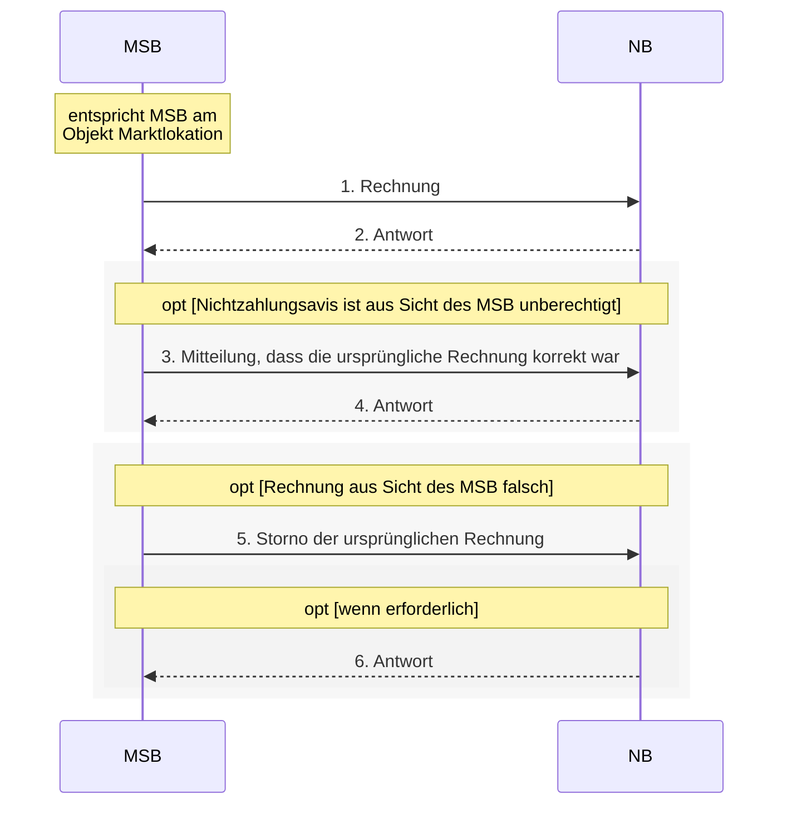
```mermaid
sequenceDiagram
    participant MSB
    participant NB

    Note over MSB: entspricht MSB am<br/>Objekt Marktlokation

    MSB->>NB: 1. Rechnung
    NB-->>MSB: 2. Antwort

    rect rgba(240, 240, 240, 0.5)
    Note over MSB, NB: opt [Nichtzahlungsavis ist aus Sicht des MSB unberechtigt]
    MSB->>NB: 3. Mitteilung, dass die ursprüngliche Rechnung korrekt war
    NB-->>MSB: 4. Antwort
    end

    rect rgba(240, 240, 240, 0.5)
    Note over MSB, NB: opt [Rechnung aus Sicht des MSB falsch]
    MSB->>NB: 5. Storno der ursprünglichen Rechnung
    
    rect rgba(240, 240, 240, 0.5)
    Note over MSB, NB: opt [wenn erforderlich]
    NB-->>MSB: 6. Antwort
    end
    end
```

|Nr.|Aktion|Frist|Hinweis/Bemerkung|
|-|-|-|-|
|1|Rechnung|Unverzüglich|Das Zahlungsziel darf 10 WT nach Empfang der Rechnung nicht unterschreiten.<br/>Der MSB der Marktlokation fasst im Falle mehrerer Rechnungen die Nachrichten zu einer Datei zusammen und versendet diese (entspricht Sammelanforderung mit marktlokationsbezogenen Einzelrechnungen) an den NB.<br/>Bei einer korrigierten Rechnung:<br/>Der MSB der Marktlokation erstellt eine korrigierte Rechnung und sendet diese an den NB. Das Zahlungsziel darf 10 WT nach Empfang der Rechnung nicht unterschreiten.|
|2|Antwort|Unverzüglich nach dem ÜZ von Nr. 1, jedoch spätester ÜT ist der 4. WT vor dem Zahlungsziel in der Rechnung.|Der NB prüft die Rechnung und teilt dem MSB der Marktlokation das Ergebnis mit. Bei Unklarheiten und/oder geringfügigen Abweichungen soll vor einer Zahlungsablehnung Kontakt mit dem|


Seite **88** von **91**

|Nr.|Aktion|Frist|Hinweis/Bemerkung|
|-|-|-|-|
||||MSB der Marktlokation aufgenommen werden.<br/><br/>Zahlungsavis: Der NB bestätigt die Zahlung der Rechnung in Form eines Zahlungsavises.<br/><br/>Die Bestätigung der Zahlung einzelner Rechnungen wird zusammengefasst. Eine Bestätigungsnachricht wird in einer Datei versendet. Im Falle der Bestätigung der Zahlung durch den NB veranlasst der NB parallel die Zahlung der Summe der akzeptierten Rechnungen an den MSB der Marktlokation.<br/><br/>Zahlungsablehnung: Der NB lehnt die Zahlung der Rechnung ab.<br/><br/>Eine Ablehnung der Zahlung wird durch den NB begründet. Die Ablehnung der Zahlung einzelner Rechnungen wird zu einer zusammengefasst. Eine Ablehnungsnachricht wird in einer Datei versendet.|
|3|Mitteilung, dass die ursprüngliche Rechnung korrekt war|Unverzüglich nach dem ÜZ von Nr. 2, sofern es sich um eine Zahlungsablehnung handelt, jedoch spätester ÜT ist der 2. WT vor dem Zahlungsziel in der Rechnung.|Der MSB der Marktlokation prüft, ob die Zahlungsablehnung berechtigt ist.<br/><br/>Der MSB der Marktlokation prüft die Ablehnung anhand des mitgeteilten Ablehnungsgrunds auf Berechtigung und nimmt bei Unklarheiten Kontakt mit dem NB auf.<br/><br/>Im Fall, dass der MSB der Marktlokation feststellt, dass die ursprüngliche vom NB reklamierte Rechnung korrekt ist, teilt der MSB der Marktlokation dies dem NB mit. Der MSB der Marktlokation begründet die Richtigkeit der gestellten Rechnung und entkräftet die Ablehnungsgründe des NB.<br/><br/>Da dadurch die im Prozessschritt 1 versendete Rechnung weiterhin Bestand hat, ist keine neue Rechnung zu versenden.|
|4|Antwort|Unverzüglich nach dem ÜZ von Nr. 3, jedoch spätester ÜT ist zum Zahlungsziel in der Rechnung.|Der NB prüft die Rechnung und teilt dem MSB der Marktlokation das Ergebnis mit. Bei Unklarheiten und/oder geringfügigen Abweichungen soll vor einer Zahlungsablehnung Kontakt mit dem MSB der Marktlokation aufgenommen werden.|


Seite **89** von **91**

|Nr.|Aktion|Frist|Hinweis/Bemerkung||||
|-|-|-|-|-|-|-|
||||Zahlungsavis: Der NB bestätigt die Zahlung der Rechnung in Form eines Zahlungsavises.<br/>Die Bestätigung der Zahlung einzelner Rechnungen wird zusammengefasst. Eine Bestätigungsnachricht wird in einer Datei versendet. Im Falle der Bestätigung der Zahlung durch den NB veranlasst der NB parallel die Zahlung der Summe der akzeptierten Rechnungen an den MSB der Marktlokation.<br/><br/>Zahlungsablehnung: Der NB lehnt die Zahlung der Rechnung ab.<br/>Eine Ablehnung der Zahlung wird durch den NB begründet. Die Ablehnung der Zahlung einzelner Rechnungen wird zu einer zusammengefasst. Eine Ablehnungsnachricht wird in einer Datei versendet.<br/><br/>Kommt es zu einer erneuten Ablehnung durch den NB, ist eine bilaterale Klärung notwendig. Hierbei ist das weitere Vorgehen im Rahmen der Rechnung abzustimmen.||||
||||5|Storno der ursprünglichen Rechnung|Unverzüglich nach Feststellung des Stornierungsbedarfs.|Der MSB der Marktlokation stellt fest, dass die ursprüngliche Rechnung nicht korrekt war und sendet eine Stornierung der ursprünglichen Rechnung an den NB. Anschließend führt der MSB der Marktlokation die nötigen Korrekturen durch und erstellt eine neue Rechnung. Eine Rechnungskorrektur umfasst immer eine Stornorechnung und eine neue Rechnung.<br/><br/>Sofern die Zahlung der Rechnung vom NB bestätigt worden war (Schritt 2 oder Schritt 4), wird der gezahlte Betrag im Zahlungsverkehr berücksichtigt.<br/><br/>Sofern die Zahlung der Rechnung vom NB abgelehnt worden war (Schritt 2 oder Schritt 4), und der Ablehnungsgrund vom MSB der Marktlokation akzeptiert wurde, darf sich der NB den Stornobetrag nicht gutschreiben.|
||||6|Antwort|Unverzüglich nach dem ÜZ von Nr. 5, sofern in Nr. 2 oder Nr. 4 die Zahlung bestätigt wurde.|Hat der NB dem MSB der Marktlokation in Schritt 2 oder Schritt 4 die Zahlung der Rechnung in Form eines Zahlungsavises bestätigt und geht daraufhin eine Stornierung dieser Rechnung vom MSB der Marktlokation beim NB ein, muss der|


Seite 90 von 91

|Nr.|Aktion|Frist|Hinweis/Bemerkung|
|-|-|-|-|
||||NB dem MSB der Marktlokation die Stornierung in einer Antwort bestätigen.|


Seite **91** von **91**