Anlage 2b zur Festlegung BK6-24-174

# Wechselprozesse im Messwesen Strom
# (WiM Strom)
## WiM Teil 2 – Fokus Übermittlung von Werten

> BK6-24-174
>
> Lesefassung

Seite 1 von 80

1. Use-Case: Störungsbehebung in der Messlokation 5
1.1. UC: Störungsbehebung in der Messlokation 5
1.2. SD: Störungsbehebung in der Messlokation 6
2. Prozesse Anforderung und Übermittlung von Werten 10
2.1. Begriffsbestimmungen 11
2.2. Allgemeines zur Erhebung, Aufbereitung und Übermittlung von Werten 11
2.2.1. Erhebung von Werten und deren Stornierung 11
2.2.2. Aufbereitung und Übermittlung von Werten 12
2.2.3. Bestimmung des Ableseturnus und Intervalls (bei kME ohne RLM und mME) 14
2.2.4. Bestimmung der Konfiguration des iMS 15
2.2.5. Regeln für erzeugende Marktlokationen 15
2.2.6. Regeln für verbrauchende und erzeugende Marktlokationen 15
2.3. Use-Case: Übermittlung der Berechnungsformel 16
2.3.1. UC: Übermittlung der Berechnungsformel 16
2.3.2. SD: Übermittlung der Berechnungsformel 17
2.4. Use-Case: Aufbereitung und Übermittlung von Werten 19
2.4.1. UC: Aufbereitung und Übermittlung von Werten 19
2.4.2. SD: Aufbereitung und Übermittlung von Werten vom MSB der Messlokation 20
2.4.3. SD: Aufbereitung und Übermittlung von Werten vom MSB der Marktlokation 22
2.5. Zu übermittelnde Werte 27
2.5.1. Geltungsbereich der Tabelle „Darstellung der zu übermittelnden Werte“ 27
2.5.2. Erläuterungen zur Tabelle „Darstellung der zu übermittelnden Werte“ 28
2.5.3. Prinzipien für die Übermittlung aufbereiteter Werte 30
2.5.4. Prinzipien zur Nutzung „Vorläufiger Wert“ 30
2.5.5. Darstellung der zu übermittelnden Werte 32
2.6. Use-Case: Anforderung und Übermittlung von Zwischenablesungswerten 38
2.6.1. UC: Anforderung von Zwischenablesungswerten 38
2.6.2. SD: Anforderung von Zwischenablesungswerten 39
2.6.3. SD: Anforderung Wert vom NB 40
2.6.4. SD: Anforderung Wert vom LF 42
2.6.5. SD: Anforderung Wert vom MSB der Marktlokation 43
2.7. Use-Case: Reklamation von Werten beim MSB 44
2.7.1. UC: Reklamation von Werten beim MSB 44
2.7.2. SD: Reklamation von Werten beim MSB 46
2.7.3. SD: Reklamation vom NB 47
2.7.4. SD: Reklamation vom LF 49

Seite **2** von **80**

2.7.5. SD: Reklamation vom ÜNB 51
2.7.6. SD: MSB der Messlokation stellt selbst Reklamationsbedarf fest 53
2.7.7. SD: MSB der Marktlokation stellt selbst Reklamationsbedarf fest 54
2.8. Use-Case: Stornieren von Werten 55
2.8.1. UC: Stornieren von Werten 55
2.8.2. SD: Stornierung Werte vom MSB der Messlokation 56
2.8.3. SD: Stornierung Werte vom MSB der Marktlokation 57
2.9. Übermittlung und Stornierung von Zählerständen bei kME (ohne RLM) und mME von einem LF oder NB an den MSB der Messlokation 58
2.9.1. Use-Case: Übermittlung von Zählerständen vom LF oder NB an MSB 58
2.9.1.1. UC: Übermittlung von Zählerständen vom LF oder NB an MSB 58
2.9.1.2. SD: Übermittlung von Zählerständen vom LF oder NB an MSB 59
2.9.1.3. SD: Übermittlung von Zählerständen vom LF 60
2.9.1.4. SD: Übermittlung von Zählerständen vom NB 61
2.9.2. Use-Case: Stornierung von Zählerständen vom LF oder NB an MSB 62
2.9.2.1. UC: Stornierung von Zählerständen vom LF oder NB an MSB 62
2.9.2.2. SD: Stornierung von Zählerständen vom LF oder NB an MSB 63
2.9.2.3. SD: Stornierung von Zählerständen vom LF 64
2.9.2.4. SD: Stornierung von Zählerständen vom NB 64
3. Übermittlung von Werten nach Typ 2 66
3.1. Übermittlung von Werten aus einem iMS an den ÜNB 66
3.2. Use-Case: Übermittlung von Werten nach Typ 2 vom MSB an NB oder LF 66
3.2.1. UC: Übermittlung von Werten nach Typ 2 vom MSB an NB oder LF 66
3.2.2. SD: Übermittlung von Werten nach Typ 2 vom MSB an NB oder LF 68
4. Anfrage und Übermittlung von Werten durch und an den ESA 69
4.1. Use-Case: Anfrage und Bestellung von Werten durch den ESA 69
4.1.1. UC: Anfrage und Bestellung von Werten durch den ESA 69
4.1.2. SD: Anfrage und Bestellung von Werten durch den ESA 71
4.2. Use-Case: Übermittlung von Werten vom MSB an ESA 73
4.2.1. UC: Übermittlung von Werten vom MSB an ESA 73
4.2.2. SD: Übermittlung von Werten vom MSB an ESA 74
4.3. Use-Case: Beendigung der Übermittlung von Werten an ESA durch ESA 74
4.3.1. UC: Beendigung der Übermittlung von Werten an ESA durch ESA 74
4.3.2. SD: Beendigung der Übermittlung von Werten an ESA durch ESA 75
4.4. Use-Case: Beendigung der Übermittlung von Werten an ESA durch MSB 76
4.4.1. UC: Beendigung der Übermittlung von Werten an ESA durch MSB 76
4.4.2. SD: Beendigung der Übermittlung von Werten an ESA durch MSB 77

Seite **3** von **80**

4.5. Use-Case: Abrechnung einer für den ESA erbrachten Leistung 77
4.5.1. UC: Abrechnung einer für den ESA erbrachten Leistung 77
4.5.2. SD: Abrechnung einer für den ESA erbrachten Leistung 78

Seite **4** von **80**

# 1. Use-Case: Störungsbehebung in der Messlokation

## 1.1. UC: Störungsbehebung in der Messlokation

|Use-Case-Name|Störungsbehebung in der Messlokation|
|-|-|
|Prozessziel|Behebung einer Störung an den technischen Einrichtungen der Messlokation.|
|Use-Case Beschreibung|Der Prozess beschreibt die Interaktionen zwischen den Marktakteuren im Falle einer festgestellten oder vermuteten Störung an den technischen Einrichtungen der Messlokation.  Der Störungsmelder teilt dem MSB der Messlokation eine Störung der Messung mit. Der MSB der Messlokation informiert bei einer vorhandenen Störung die MSB der betroffenen Marktlokationen. Der MSB der jeweilig betroffenen Marktlokation muss nach Vorliegen der Informationen alle berechtigten Rollen für diese Marktlokation berechtigten Marktteilnehmer über die Störung informieren.  Der MSB ist verpflichtet, die Störung an der Messlokation unverzüglich zu beseitigen und so einen den Regeln der Technik entsprechenden Betrieb derselben zu gewährleisten. Das gleiche Prozedere ist ebenfalls durchzuführen, nachdem die Störung behoben wurde.|
|Rollen|\* Störungsmelder \* MSB \* NB \* LF \* ÜNB|
|Vorbedingung|Der Störungsmelder stellt eine Störung fest.|
|Nachbedingung im Erfolgsfall|Funktionierende technische Einrichtung der Messlokation.|
|Nachbedingung im Fehlerfall|--|
|Fehlerfälle|--|
|Weitere Anforderungen|Ergänzende Hinweise: \* Dieser Prozess ist auch zu durchlaufen, wenn der MSB der Messlokation die Störung selbst feststellt. Dabei werden die Prozessschritte 1, 2 und 7 nicht durchlaufen.  \* Sofern dem ÜNB Werte fehlen, findet nicht der Use-Case „Störungsbehebung in der Messlokation“ statt, sondern der Use-Case „Reklamation von Werten beim MSB“.  \* Ergänzender Hinweis: Liegt bei einer kME oder einer mME ein Zählwerksfehler (z. B. Zählwerksstillstand, -verlangsamung, -manipulation) vor, ist für den zu korrigierenden Verbrauch vom MSB eine Korrekturenergiemenge auf Ebene der Messlokation zu übermitteln. Die Ersatzwertbildung zur Ermittlung der Korrekturenergiemenge erfolgt nach der VDE-AR-N 4400 („Metering Code“). Der von der Messeinrichtung abgelesene Zählerstand wird nicht korrigiert. Es werden|

Seite 5 von 80

|Use-Case-Name|Störungsbehebung in der Messlokation|
|-|-|
||der abgelesene Zählerstand und die Korrekturenergiemengen nach den Vorgaben des Use-Cases „Aufbereitung und Übermittlung von Werten“ übermittelt. Außerdem ist vom MSB der Marktlokation eine Energiemenge für die abzurechnende Energiemenge auf Ebene der Marktlokation zu übermitteln.|

## 1.2. SD: Störungsbehebung in der Messlokation

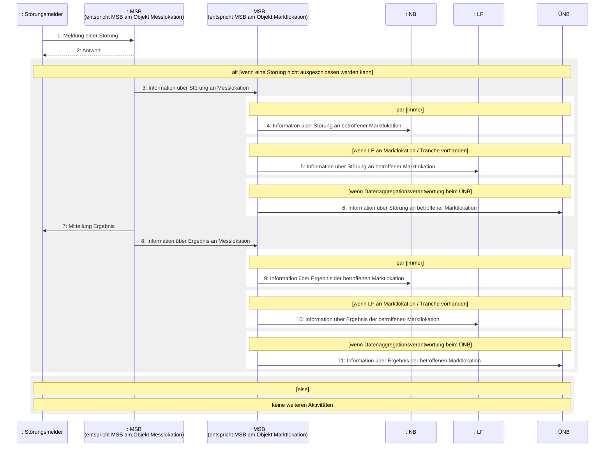
```mermaid
sequenceDiagram
    participant SM as : Störungsmelder
    participant MSB_MeLo as : MSB<br/>(entspricht MSB am Objekt Messlokation)
    participant MSB_MaLo as : MSB<br/>(entspricht MSB am Objekt Marktlokation)
    participant NB as : NB
    participant LF as : LF
    participant UNB as : ÜNB

    SM->>MSB_MeLo: 1: Meldung einer Störung
    MSB_MeLo-->>SM: 2: Antwort

    rect rgb(240, 240, 240)
        Note over SM, UNB: alt [wenn eine Störung nicht ausgeschlossen werden kann]
        MSB_MeLo->>MSB_MaLo: 3: Information über Störung an Messlokation
        
        rect rgb(255, 255, 255)
            Note over MSB_MaLo, UNB: par [immer]
            MSB_MaLo->>NB: 4: Information über Störung an betroffener Marktlokation
        end
        
        rect rgb(255, 255, 255)
            Note over MSB_MaLo, UNB: [wenn LF an Marktlokation / Tranche vorhanden]
            MSB_MaLo->>LF: 5: Information über Störung an betroffener Marktlokation
        end
        
        rect rgb(255, 255, 255)
            Note over MSB_MaLo, UNB: [wenn Datenaggregationsverantwortung beim ÜNB]
            MSB_MaLo->>UNB: 6: Information über Störung an betroffener Marktlokation
        end

        MSB_MeLo->>SM: 7: Mitteilung Ergebnis
        MSB_MeLo->>MSB_MaLo: 8: Information über Ergebnis an Messlokation

        rect rgb(255, 255, 255)
            Note over MSB_MaLo, UNB: par [immer]
            MSB_MaLo->>NB: 9: Information über Ergebnis der betroffenen Marktlokation
        end

        rect rgb(255, 255, 255)
            Note over MSB_MaLo, UNB: [wenn LF an Marktlokation / Tranche vorhanden]
            MSB_MaLo->>LF: 10: Information über Ergebnis der betroffenen Marktlokation
        end

        rect rgb(255, 255, 255)
            Note over MSB_MaLo, UNB: [wenn Datenaggregationsverantwortung beim ÜNB]
            MSB_MaLo->>UNB: 11: Information über Ergebnis der betroffenen Marktlokation
        end
    end

    rect rgb(240, 240, 240)
        Note over SM, UNB: [else]
        Note over SM, UNB: keine weiteren Aktivitäten
    end
```

|Nr.|Aktion|Frist|Hinweis/Bemerkung|
|-|-|-|-|
|1|Meldung einer Störung|--|Der Störungsmelder meldet dem MSB der Messlokation eine Störung.  In der Störungsmeldung werden die vermutete bzw. festgestellte Störungsart und ggf. weitere Zusatzdaten übermittelt.  Wird die Störung weder vom NB noch vom MSB der Marktlokation oder vom LF gemeldet, so kann die Meldung einer Störung auf einem anderen Format als per EDIFACT stattfinden.|
|2|Antwort|*Bei kME ohne RLM, mME:*|Konnte die Störungsprüfung bis zum Ablauf der Frist bearbeitet werden, teilt|

Seite 6 von 80

|Nr.|Aktion|Frist|Hinweis/Bemerkung|||
|-|-|-|-|-|-|
|||Unverzüglich, jedoch spätester ÜT ist der 3. WT nach dem ÜT von Nr. 1.  *Bei kME mit RLM, iMS:* Unverzüglich, jedoch spätester ÜT ist der 1. WT nach dem ÜT von Nr. 1.|dies der MSB der Messlokation in diesem Schritt mit. \* Bei Vorliegen der Störung sind soweit möglich die Störungsursache, der voraussichtliche Zeitpunkt der Störungsbehebung und ggf. die Störungsauswirkungen mitzuteilen. \* Wenn keine Störung vorliegt, teilt dies der MSB der Messlokation dem Störungsmelder mit.  Konnte die Störungsprüfung bis zum Ablauf der Frist nicht abschließend bearbeitet werden, teilt dies der MSB der Messlokation in diesem Schritt mit. Ist die Störung weder vom NB, noch vom MSB der Marktlokation oder vom LF gemeldet worden, so kann die Antwort auf einem anderen Format als per EDIFACT stattfinden.|||
|||3|Information über Störung an Messlokation|Zeitgleich mit Nr. 2.|Nur bei Bestätigung der Störungsmeldung ist eine Informationsmeldung an den MSB der Marktlokation zu senden.  Soweit möglich werden die Störungsursache, der voraussichtliche Zeitpunkt der Störungsbehebung und ggf. die Störungsauswirkungen mitgeteilt.|
|4|Information über Störung an betroffener Marktlokation|Unverzüglich, jedoch spätester ÜT ist der 1. WT nach dem ÜT von Nr. 3.|Mindestens der in Schritt 3 erhaltene Informationsumfang|||
|5|Information über Störung an betroffener Marktlokation|Unverzüglich, jedoch spätester ÜT ist der 1. WT nach dem ÜT von Nr. 3.|Mindestens der in Schritt 3 erhaltene Informationsumfang|||
|6|Information über Störung an betroffener Marktlokation|Unverzüglich, jedoch spätester ÜT ist der 1. WT nach dem ÜT von Nr. 3.|Mindestens der in Schritt 3 erhaltene Informationsumfang|||
|7|Mitteilung Ergebnis|*Bei kME ohne RLM, mME (NS) und bei iMS ohne Bilanzierung auf Basis von Viertelstundenwerten (NS):*  Unverzüglich, jedoch spätester ÜT ist der 7. WT nach|Der MSB der Messlokation behebt die Störung an der Messeinrichtung.  Ist für die Störungsbehebung der Austausch technischer Einrichtungen der Messlokation erforderlich, so sind die SD-Schritte 3 und 4 des Use-Case „Messlokationsänderung“ ist der SD-Schritt 5 der Use-Cases zur Messlokationsänderung durchzuführen, soweit dieser sinngemäß anwendbar ist.|||

Seite **7** von **80**

|Nr.|Aktion|Frist|Hinweis/Bemerkung|||
|-|-|-|-|-|-|
|||dem ÜT von Nr. 2.  *Bei kME mit RLM und bei iMS mit Bilanzierung auf Basis von Viertelstundenwerten (NS):* Unverzüglich, jedoch spätester ÜT ist der 4. WT nach dem ÜT von Nr. 2.  *Bei kME mit RLM (MS/HS) und bei iMS (MS/HS):*  Unverzüglich, jedoch spätester ÜT ist der 2. WT nach dem ÜT von Nr. 2.|Die übermittelte Meldung beschreibt folgende Fälle: \* Störung behoben (mit Gerätewechsel) \* Störung behoben (ohne Gerätewechsel) \* Keine Störung in der Messlokation festgestellt  Ist die Störung weder vom NB noch vom MSB der Marktlokation oder vom LF gemeldet worden, so kann die Mitteilung des Ergebnisses auf einem anderen Format als per EDIFACT stattfinden.  Hinweis zur Aussage „bei iMS ohne Bilanzierung auf Basis von Viertelstundenwerten“ in der Spalte „Frist“: *Dieser Sachverhalt liegt bei einer messtechnischen Einordnung aus Sicht der Marktlokation mit „kME/mME“* vor, sofern mindestens eine Messlokation der Marktlokation mit iMS ausgestattet ist, die Bilanzierung auf Basis von Profilen stattfindet und die Störungsmeldung das/eines der iMS betrifft. Ist das betroffene iMS für die Erfassung der Energie mehrerer Marktlokationen erforderlich, liegt dieser Sachverhalt nur vor, wenn alle diese Marktlokationen auf Basis von Profilen bilanziert werden. Wird eine der Marktlokationen auf Basis von Viertelstundenwerten bilanziert, gilt die *Fristvorgabe mit der Aussage „bei iMS mit Bilanzierung auf Basis von Viertelstundenwerten“.*|||
|||8|Information über Ergebnis an Messlokation|Zeitgleich mit Nr. 7.|Die übermittelte Meldung beschreibt folgende Fälle: \* Störung behoben (mit Gerätewechsel) \* Störung behoben (ohne Gerätewechsel)|
|||9|Information über Ergebnis der betroffenen Marktlokation|Unverzüglich, jedoch spätester ÜT ist der 1. WT nach dem ÜT von Nr. 8.|Mindestens der in Schritt 8 erhaltene Informationsumfang|
|10|Information über Ergebnis der betroffenen Marktlokation|Unverzüglich, jedoch spätester ÜT ist der 1. WT nach dem ÜT von Nr. 8.|Mindestens der in Schritt 8 erhaltene Informationsumfang|||
|11|Information über Ergebnis|Unverzüglich, jedoch spätester ÜT ist der|Mindestens der in Schritt 8 erhaltene Informationsumfang|||

Seite 8 von 80

|Nr.|Aktion|Frist|Hinweis/Bemerkung|
|-|-|-|-|
||betroffenen Marktlokation|1. WT nach dem ÜT von Nr. 8.||

Seite **9** von **80**

# 2. Prozesse Anforderung und Übermittlung von Werten

Dieses Kapitel beschreibt die Prozesse rund um die Anforderung, Erhebung, Aufbereitung und Übermittlung von Werten, die auf an Messlokationen erhobenen Messwerten basieren, oder aufgrund fehlender Messwerte gebildet wurden. Mit Werte sind Messwerte, Ersatzwerte und vorläufige Werte, auf den Ebenen Mess- oder Marktlokation gemeint. Die Details ergeben sich aus den entsprechenden Use-Cases. Die Werte finden im Sinne dieser Beschreibung Verwendung in den nachgelagerten Prozessen: Netznutzungs-, Bilanzkreis- und Mehr-/Mindermengenabrechnung (in den nachfolgenden Prozessbeschreibungen jeweils einschließlich der Bilanzkreistreue, HKNR und Blindarbeitsabrechnung/Betriebsführung).

Dieses Kapitel findet auch im Fall einer Zählzeitdefinition des LF mit dem Zählzeitenanwendungszweck "Endkunde" und der Voraussetzung, dass alle Messlokationen der Marktlokation mit iMS ausgestattet sind, Anwendung.

<u>Hinweis:</u> Die mit dem Zählzeitenanwendungszweck „Netznutzung“ übermittelten Werte sind für die Durchführung der Netznutzungsabrechnung, Bilanzkreisabrechnung und Mehr-/Mindermengenabrechnung anzuwenden. Eine Übermittlung von Werten mit dem Zählzeitenanwendungszweck „Endkunde“ dient ausschließlich der Endkundenabrechnung durch den LF.

<u>Im Fall der Abrechnung von Blindarbeit zwischen NB und LF (Blindarbeitsabrechnung):</u>

Im Fall der <u>Blindarbeitsabrechnung</u> gilt dieses Kapitel auch für die Übermittlung von Blindarbeit auf Ebene der Netzlokation. Die Information zur Übermittlung von Blindarbeit auf Ebene der Netzlokation erhält der MSB vom NB je nach prozessualer Konstellation

* über die Mindestparameter im Rahmen des Use-Cases „Beginn Messstellenbetrieb“ bzw. „Verpflichtung gMSB“ (WiM Teil 1) oder
* im Rahmen des Use-Cases „Bestellung einer Konfiguration vom NB oder LF an MSB“ (GPKE Teil 3).

Im Fall der Blindarbeitsabrechnung gelten Aussagen, die in diesem Kapitel zur Marktlokation getätigt werden, sinngemäß auch für die Netzlokation. Dies bedeutet u.a.:

* Der MSB der Messlokation übermittelt dem MSB der Netzlokation die relevanten Blindwerte auf Ebene der Messlokation. Nachfolgend übermittelt der MSB der Netzlokation diese dem NB und LF.
* Zudem übermittelt der MSB der Netzlokation dem NB und LF die relevanten Blindwerte auf Ebene der Netzlokation (im Kapitel 2.5.5. wurde die Netzlokation zur Verdeutlichung in die Tabelle aufgenommen).
* Die Berechnungsformel ist für die Netzlokation vom NB an die Berechtigten zu übermitteln.

Seite 10 von 80

## 2.1. Begriffsbestimmungen

|Sammelbegriffe|Spezifizierung|Spezifizierung|Ausgetauschte Werte bei ... Messlokation|Ausgetauschte Werte bei ... Marktlokation|
|-|-|-|-|-|
|Werte|Energiemenge|Zählerstand|x|--|
|||Lastgang|x|x|
|||Arbeitsmengen (Energiemenge auf Basis von Einzelzählerständen)|--|x|
|||Korrekturenergiemengen|x|--|

|Status von Werten|Definition/ Erläuterung|
|-|-|
|Vorläufiger Wert\1\|Ein vorläufiger Wert ist der Wert, der für einen gestörten, fehlenden oder nicht plausiblen Messwert übermittelt wird, bis zur Ermittlung eines wahren Messwertes oder Ersatzwerts. Er wird gebildet unter Anwendung der Methoden zur Ersatzwertbildung, soweit dies automatisiert möglich ist. Ein vorläufiger Wert ist nicht abrechnungsrelevant.|
|Ersatzwert\2\|Ein Ersatzwert ist ein plausibler Wert, der unter Verwendung aller verfügbaren Informationen anstelle eines fehlenden wahren Werts oder eines unplausiblen wahren Wertes gebildet wird. Ein Ersatzwert an der Marktlokation ist abrechnungsrelevant.|
|Wahrer Wert|Ein wahrer Wert ist ein plausibler Wert, der aus der Messeinrichtung einer Messlokation ausgelesen oder auf Basis ausgelesener Werte für eine Marktlokation errechnet wurde. Ein wahrer Wert einer Marktlokation ist abrechnungsrelevant.|
## 2.2. Allgemeines zur Erhebung, Aufbereitung und Übermittlung von Werten
Die Erhebung, Aufbereitung und Übermittlung von Werten richten sich nach den folgenden Grundsätzen:

### 2.2.1. Erhebung von Werten und deren Stornierung
Werte sind im Rahmen der gesetzlichen Regelungen zu erheben

* vom MSB (bei kME, mME, iMS)

und können optional erhoben werden

* vom LF (nur bei kME ohne RLM, mME)
* vom NB (nur bei kME ohne RLM, mME).

Ein vom LF oder NB erhobener Wert muss damit, dass dieser für die Netznutzungs-, Bilanzkreis- oder Mehr-/Mindermengenabrechnung verwendet werden kann, im Rahmen der Marktkommunikation dem MSB zugesendet werden. Ein erhobener Wert wird nur dann in der

***

1 Vorläufige Werte werden gemäß den Bildungsregeln der VDE-AR-N 4400 (Metering Code) in der jeweils gültigen Fassung bzw. in entsprechenden Folgedokumenten gebildet.
2 Ersatzwerte werden gemäß den Bildungsregeln der VDE-AR-N 4400 (Metering Code) in der jeweils gültigen Fassung bzw. in entsprechenden Folgedokumenten gebildet.

Seite 11 von 80

Netznutzungs-, Bilanzkreis- oder Mehr-/Mindermengenabrechnung berücksichtigt, wenn er vom MSB im Rahmen der Marktkommunikation an alle Berechtigten übermittelt wurde.

Für das weitere Vorgehen in oben genannten Fällen bzw. der Stornierung dieser Werte wird auf die Prozesse zur Übermittlung und Stornierung von Zählerständen bei kME (ohne RLM) und mME von einem LF oder NB an den MSB der Messlokation (Kapitel 2.9.) verwiesen.

### 2.2.2. Aufbereitung und Übermittlung von Werten
Unabhängig von der Erhebung sind Werte, die für Netzentgeltabrechnung, Mehr-/Mindermengenabrechnung, Bilanzkreisabrechnung Verwendung finden, durch den MSB sowohl auf der Ebene der Messlokation, als auch auf der Ebene der Marktlokation aufzubereiten. In diese Abrechnungen fließen ausschließlich die vom MSB auf Ebene der Marktlokation zur Verfügung gestellten Werte ein, die ggf. zusätzlich auf Ebene der Messlokation/en von ihm zur Verfügung gestellten Werte dienen lediglich zur Plausibilisierung3 der Werte auf Ebene der Marktlokation. Hierzu sind dem für die Energiemengenermittlungen der Marktlokation verantwortlichen MSB die Werte der Messlokationen, die er nicht selbst verantwortet vom entsprechenden MSB unverzüglich nach Erhebung zuzuleiten. Die Aufbereitung durch den MSB umfasst insbesondere die Plausibilisierung und die Bildung von vorläufigen Werten bzw. Ersatzwerten. Werte, die im Rahmen der Aufbereitung durch den MSB verändert werden, sind kenntlich zu machen. Der MSB hat die Werte nach Durchführung der Aufbereitung im Rahmen der Geschäftsprozesse dieser Festlegung weiter an alle Berechtigten zu übermitteln.

Die Aufbereitung von Werten umfasst auch den Fall der Erzeugung eines Wertes durch rechnerische Aufteilung der ermittelten Energiemenge eines Zeitintervalls auf zwei oder mehrere Teilzeiträume dieses Zeitintervalls durch den MSB der Marktlokation (Abgrenzung).

Im Rahmen der Netznutzungsabrechnung sind für gemessene Marktlokationen, deren Messlokationen mit kME mit Wirkarbeitsmessung oder mME ausgestattet sind, in allen Fällen,

* in denen sich ein zur Abrechnung gebrachter, energiemengenabhängiger Preis innerhalb des abgerechneten Zeitintervalls ändert und
* für alle Zeitpunkte, zu denen sich der Preis in dem Abrechnungszeitraum ändert,

Abgrenzungen durch den NB beim MSB der Marktlokation zu bestellen, sofern der NB alternativ für eine solchen Fall nicht einen Zählerstand beim MSB der Marktlokation bestellt.

Der Bedarf der Abgrenzung von Energiemengen ergibt sich regelmäßig, typischerweise am 01.01. eines Jahres auf Grund von Preisänderungen der Netznutzungspreise bzw. Anpassungen von Preiskomponenten in diesem Zusammenhang, wie z.B. KWKG- oder EEG-Umlage.

3 Plausibilisierung erfolgt gemäß der VDE-AR-N 4400 (Metering Code) in der jeweils gültigen Fassung bzw. in entsprechenden Folgedokumenten.
Seite **12** von **80**

Sieht der NB eine Abgrenzung im Rahmen der Netznutzungsabrechnung vor, so muss er mit Hilfe des Use-Cases „Anforderung von Zwischenablesungswerten“ je betroffener Marktlokation bei dem MSB der Marktlokation, der zu der Zeit des Abgrenzungstermins der Marktlokation zugeordnet ist, die Abgrenzung bestellen. Dabei teilt der NB dem MSB der Marktlokation mit, dass er die Energiemengen zur nächsten regulären Ablesung nach dem Abgrenzungstermin, z.B. Lieferantenwechsel oder Turnusablesung, benötigt. Da es Situationen im Markt gibt, die eine Notwendigkeit einer Abgrenzung nicht mit ausreichendem Vorlauf erkennen lassen, kann der NB die Abgrenzung beim MSB der Marktlokation kurzfristig oder zu einem Datum in die Vergangenheit bestellen.

Der MSB der Marktlokation beantwortet die Bestellung der Abgrenzung mit der entsprechenden Lieferung der Werte an die Berechtigten. Der MSB der Marktlokation hat die Möglichkeit, auf Basis des nächsten regulären Ablesewertes die Abgrenzungsmengen zu ermitteln. Es werden ausschließlich die Abgrenzungsmengen in den Markt versendet. Die abgegrenzten Mengen sind entsprechend zu kennzeichnen, dass sie nur zusammenhängend in die Prüfung zu den Zählerständen einfließen dürfen.

Hat der MSB der Messlokation zu dem geforderten Abgrenzungstermin einen Zählerstand vorliegen, teilt er diesen dem MSB der Marktlokation mit. Der MSB der Marktlokation berücksichtigt diesen beim Erstellen der Abgrenzungsmenge und teilt den Zählerstand den Berechtigten mit.

Wird, nachdem Abgrenzungsmengen verschickt wurden, ein Zählerstand vom MSB der Messlokation an den MSB der Marktlokation übermittelt, der die Abgrenzungsmengen beeinflusst, sind diese entsprechend vom MSB der Marktlokation anzupassen. Die neuen Abgrenzungsmengen als auch der neue Zählerstand werden an die Berechtigten versendet.

Für den Fall, dass die Bestellung zur Abgrenzung

*   vor dem Termin des nächsten regulären Ablesewertes (z.B. Zwischenablesung, Lieferbeginn, Lieferende) beim MSB der Marktlokation eingeht, so gilt die Frist des Versands ab dem Termin des nächsten regulären Ablesewertes gemäß dem Kapitel 2.5.5. „Darstellung der zu übermittelnden Werte“, gemäß des Auslösers des nächsten regulären Ablesewertes.
*   nach dem Termin des nächsten regulären Ablesewertes (z.B. Zwischenablesung, Lieferbeginn, Lieferende) beim MSB der Marktlokation eingeht, so gilt die Frist des Versands ab Eingang der Bestellung zur Abgrenzung beim MSB der Marktlokation gemäß Kapitel 2.5.5. „Darstellung der zu übermittelnden Werte“, gemäß Auslöser Nr. 4 „Zwischenablesung“.

In den nachfolgenden Kapiteln, in denen der Austausch von Werten und deren Weiterverarbeitung beschrieben sind, sind folgende Grundsätze zu berücksichtigen:

Plausibilisierung, Aufbereitung und Übermittlung von Werten im Rahmen der Netznutzungs-, Bilanzkreis- oder Mehr-/Mindermengenabrechnung erfolgt ausschließlich im und aus dem Backend des MSB.

Es erfolgen keine arithmetischen Operationen zur Bildung der Energiemenge einer Marktlokation in einem SMGW.

Seite 13 von 80

Eine direkte Übermittlung von Werten von einem SMGW an weitere Marktrollen als den MSB der Messlokation erfolgt in den im Kapitel 2. beschriebenen Sachverhalten nicht.

Hinweis: Eine direkte Übermittlung von Werten von einem SMGW an weitere Marktrollen als den MSB der Messlokation erfolgt ausschließlich in Abhängigkeit von der konkreten Konfiguration z.B. im Kapitel 3. "Übermittlung von Werten nach Typ 2" oder Kapitel 4. "Anfrage und Übermittlung von Werten durch und an den ESA".

Dieses Kapitel findet auch im Fall einer Zählzeitdefinition des LF mit dem Zählzeitenanwendungszweck "Endkundenabrechnung" und der Voraussetzung, dass alle Messlokationen der Marktlokation mit iMS ausgestattet sind, Anwendung. Ausgenommen davon sind Aussagen zum Thema Abgrenzung.

### 2.2.3. Bestimmung des Ableseturnus und Intervalls (bei kME ohne RLM und mME)

<u>Ableseturnus:</u>

Der MSB legt den „Ableseturnus für die Durchführung der turnusmäßigen/regelmäßigen Ablesung“ (Ableseterminierung) fest. LF und NB übernehmen für ihren Abrechnungsturnus den vom MSB vorgegeben Ableseturnus für die Durchführung der turnusmäßigen/regelmäßigen Ablesung. Möchte der NB bzw. LF diesen Ableseturnus nicht für seinen Abrechnungsturnus verwenden, muss er eine ggf. kostenpflichtige Zwischenablesung über den Use-Case „Anforderung und Übermittlung von Zwischenablesungswerten“ beim MSB bestellen.

Hinweis: Die Übermittlung von Werten zum vom MSB kommunizierten „Ableseturnus für die Durchführung der turnusmäßigen/regelmäßigen Ablesung“ ist vom MSB einzuhalten, unabhängig davon, ob dem MSB zu diesem Ableseturnus wahre Werte vorliegen. Liegen dem MSB keine wahren Werte vor, sind Ersatzwerte zu bilden. Siehe hierzu Nr. 1 der Tabelle in Kapitel 2.5.5. "Darstellung der zu übermittelnden Werte" für die messtechnische Einordnung "kME/mME" der Kategorie "Wirkarbeitsmessung".

<u>Intervall:</u>

Der MSB sieht einen jährlichen Abstand zwischen turnusmäßigen/regelmäßigen Ablesungen (jährliches Intervall) vor. Will der LF von seinem Recht zur Bestimmung eines anderen Intervalls für die turnusmäßigen/regelmäßigen Ablesungen Gebrauch machen (z.B. halbjährliches Intervall), so hat er dem NB dies rechtzeitig mitzuteilen. Dem LF fällt das Bestimmungsrecht für einen monatlichen, vierteljährlichen, halbjährlichen oder jährlichen Ableseturnus zu, wenn er mit seinem Kunden ein entsprechendes Intervall vereinbart hat. Möchte der LF schon bei einer Zuordnung des LF zu einer Marktlokation ein Intervall vorgeben, so teilt er dem NB das entsprechende Messprodukt im Rahmen des Use-Cases „Lieferbeginn“ bzw. „Neuanlage“ (GPKE Teil 2) mit. Möchte er das Intervall für die turnusmäßigen/regelmäßigen Ablesungen gegenüber dem NB erst zu einem späteren Zeitpunkt als dem Zuordnungsbeginn ändern, so bestellt er das entsprechende Messprodukt im Rahmen des Use-Cases „Bestellung einer Konfiguration vom LF an NB“ (GPKE Teil 3).

Bei Neuzuordnung eines MSB zu einer einzelnen Messlokation erhält der MSBN durch den NB im Rahmen des Use-Cases „Beginn Messstellenbetrieb“ (WiM Teil 1) bzw. der gMSB durch

Seite 14 von 80

den NB im Rahmen des Use-Cases „Verpflichtung gMSB“ (WiM Teil 1) die vom LF geltenden Vorgaben.

Hinweis: Der LF kann nur das Intervall der turnusmäßigen/regelmäßigen Ablesung vorgeben, nicht aber den „Ableseturnus für die Durchführung der turnusmäßigen/regelmäßigen Ablesung“. Diesen legt der MSB fest.

Unabhängig einer tatsächlichen Ablesung zum genannten Zeitpunkt bzw. im genannten Zeitraum, muss der MSB einen Zählerstand zum übermittelten Stichtag oder Zeitraum versenden. Dies gilt auch, wenn kein (abgelesener) Zählerstand zum Termin vorliegt. In diesem Fall muss der MSB entsprechend einen Ersatzwert bilden und an den NB/LF versenden.

### 2.2.4. Bestimmung der Konfiguration des iMS
Beim Einbau eines iMS (Ersetzen eines alten iMS durch ein neues iMS) übernimmt der MSB die Konfiguration des ausgebauten Geräts (dies gilt auch für die Zählzeitdefinition des LF mit dem Zählzeitenanwendungszweck "Endkunde") oder beim Einbau eines iMS (Ersetzen einer kME bzw. mME durch ein iMS) übernimmt der MSB die Konfiguration des ausgebauten Geräts bzw. beim MSB-Wechsel erhält dieser die Vorgaben durch den NB im Rahmen der Mindestparameter im Use-Case „Beginn Messstellenbetrieb“ bzw. „Verpflichtung gMSB“ (WiM Teil 1).

Eine Änderung der Konfiguration erfolgt vom NB bzw. LF per Bestellung an den MSB über die Use-Cases im Kapitel „Bestellung einer Konfiguration“ der GPKE Teil 3.

### 2.2.5. Regeln für erzeugende Marktlokationen
Für erzeugende Marktlokationen gelten alle Regeln des Kapitels Use-Case „Anforderung und Übermittlung von Werten“. Insbesondere erhalten die der Marktlokation zugeordneten Rollen auch die Werte auf Ebene der Messlokation, so dies im Kapitel „Prozesse Anforderung und Übermittlung von Werten“ festgelegt ist.

Falls die Energie einer Marktlokation in Tranchen aufgeteilt wird, gelten für den Werteaustausch zwischen den MSB und die Aufgaben der MSB auf den Ebenen der Markt- und Messlokation die im Kapitel „Prozesse Anforderung und Übermittlung von Werten“ beschriebenen Prozesse. Der MSB der Marktlokation ist zusätzlich zur dort beschriebenen Ermittlung der Energie der Marktlokation auch verpflichtet, die Energie aller Tranchen der Marktlokation zu bilden und diese an die der jeweiligen Tranche zugeordneten Rollen zu übertragen. Eine Übermittlung der Werte auf Ebene der Messlokation an diese Rollen entfällt in diesem Fall nicht.

### 2.2.6. Regeln für verbrauchende und erzeugende Marktlokationen
Im Fall von unter-/oberspannungsseitigen Messlokationen zur Erfassung der Wirkenergie werden diese Werte für die Marktlokation inklusive der Berücksichtigung von Trafoverlusten an die Berechtigten übermittelt. Diese für die Marktlokation ermittelten Werte werden weiterhin für die Energiemengenbilanzierung verwendet.

Seite **15** von **80**

## 2.3. Use-Case: Übermittlung der Berechnungsformel

### 2.3.1. UC: Übermittlung der Berechnungsformel

|Use-Case-Name|Übermittlung der Berechnungsformel|
|-|-|
|Prozessziel|Jedem dem Lokationsbündel zugeordneten MSB liegt die Berechnungsformel für jede Marktlokation des Lokationsbündels vor.  Dem LF liegt die gültige Berechnungsformel für die ihm zugeordneten Marktlokationen vor.|
|Use-Case Beschreibung|Die Berechnungsformel wird für alle Marktlokationen übermittelt, unabhängig der Anzahl der für die Berechnung der Energie auf Ebene der Marktlokationen relevanten Messlokationen. Der NB übermittelt jedem MSB, der einer Messlokation des Lokationsbündels zugeordnet ist, für jede Marktlokation des Lokationsbündels die Berechnungsformel zur Ermittlung der Werte der jeweiligen Marktlokation.  Der NB übermittelt dem LF, der einer Marktlokation zugeordnet ist, die zugehörige Berechnungsformel, auch dann, wenn dieser Marktlokation keine Messlokation und damit kein MSB zugeordnet ist.  In dem Fall, dass die Berechnungsformel nicht im Rahmen des elektronischen Datenaustauschs übermittelt werden kann, ist an dieser Stelle der entsprechende Kontakt des NB anzugeben, um eine bilaterale Übermittlung der Berechnungsformel durchführen zu können.  Die Berechnungsformel stellt die Formel zur Berechnung der Werte der Marktlokation mit der Angabe der notwendigen Messlokationen und deren Messgrößen dar. Dabei wird angegeben wie die ermittelten Werte der einzelnen Messlokationen zur Bildung der Werte der Marktlokation zu verrechnen sind.|
|Rollen|\* NB \* MSB \* LF|
|Vorbedingung|*Vorbedingung für den Versand der Berechnungsformeln an einen MSB:* \* Der MSB ist einer Messlokation des Lokationsbündels zugeordnet.  *Auslöser:* \* Neuzuordnung des MSB zu einer Messlokation des Lokationsbündels oder \* bei Änderung einer Berechnungsformel oder \* Erweiterung des Lokationsbündels um eine Marktlokation.|

Seite **16** von **80**

|Use-Case-Name|Übermittlung der Berechnungsformel||
|-|-|-|
||*Vorbedingung für den Versand der Berechnungsformeln an den LF:* \* Der LF ist der Marktlokation zugeordnet.  *Auslöser:* \* Neuzuordnung des LF zu einer Marktlokation oder \* bei Änderung der Berechnungsformel für die Marktlokation (wobei die Berechnungsformel sowohl an den aktuell zugeordneten als auch an alle zukünftig der Marktlokation zugeordnete LF zu senden ist).||
||Nachbedingung im Erfolgsfall|\* Die MSB der Messlokationen sind in der Lage dem MSB der Marklokation die erforderlichen Werte zum erforderlichen Zeitpunkt bereitstellen. \* Der MSB der Marktlokation ist in der Lage, die Werte der Marktlokation zu ermitteln. \* Der LF der Marktlokation ist in der Lage, die ihm übermittelten Werte der Marktlokation zu überprüfen.|
|Nachbedingung im Fehlerfall|Der NB hat die Möglichkeit, wenn die Ablehnung der Berechnungsformel vom MSB als Ursache asynchrone Stammdaten des NB hat, dies mit Hilfe des Use-Cases Stammdatenänderung (hier SD „Stammdatenänderung vom NB (verantwortlich) ausgehend“) (GPKE Teil 4) zu korrigieren, um danach die Berechnungsformel erneut an alle Berechtigten versenden zu können.||
|Fehlerfälle|\* Berechnungsformel ist fehlerhaft oder unvollständig \* Fehlende Berechnungsformel||
|Weitere Anforderungen|--||

### 2.3.2. SD: Übermittlung der Berechnungsformel

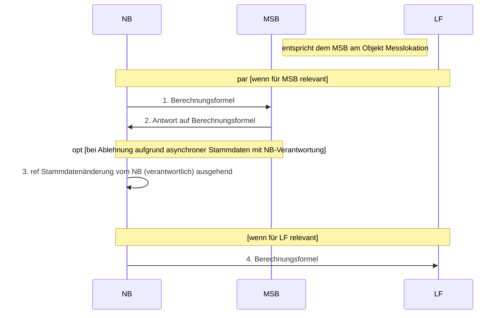
```mermaid
sequenceDiagram
    participant NB
    participant MSB
    participant LF

    Note right of MSB: entspricht dem MSB am Objekt Messlokation

    rect rgb(255, 255, 255)
        Note over NB, LF: par [wenn für MSB relevant]
        NB->>MSB: 1. Berechnungsformel
        MSB->>NB: 2. Antwort auf Berechnungsformel
        
        rect rgb(255, 255, 255)
            Note over NB, MSB: opt [bei Ablehnung aufgrund asynchroner Stammdaten mit NB-Verantwortung]
            NB->>NB: 3. ref Stammdatenänderung vom NB (verantwortlich) ausgehend
        end
    end

    rect rgb(255, 255, 255)
        Note over NB, LF: [wenn für LF relevant]
        NB->>LF: 4. Berechnungsformel
    end
```

Seite 17 von 80

|Nr.|Aktion|Frist|Hinweis/Bemerkung|
|-|-|-|-|
|1|Berechnungsformel|Unverzüglich, jedoch spätester ÜT ist der 3. WT nach einem der beiden folgenden Ereignisse: Zuordnung des MSB zur Messlokation im Lokationsbündel oder Bekanntwerden der Veränderung der Berechnungsformel.|Bei Änderung einer Berechnungsformel des Lokationsbündels oder der Lokationsbündelstruktur werden alle Berechnungsformeln im Lokationsbündel jeweils an alle MSB des Lokationsbündels erneut versendet.  Bei Neuzuordnung eines MSB zu einer Messlokation im Lokationsbündel werden im Rahmen des Use-Cases „Beginn Messstellenbetrieb“ oder „Verpflichtung gMSB“ (WiM Teil 1) dem neuzugeordneten MSB (MSBN bzw. gMSB) alle Berechnungsformeln im Lokationsbündel übermittelt.  Bei der Veränderung einer Berechnungsformel wird das „Gültig Ab“-Datum der Berechnungsformel mitgeteilt. Bei Versand der Berechnungsformel auf Grund einer Zuordnung eines neuen MSB kann das „Gültig Ab“-Datum der Berechnungsformel vor der Zuordnung des MSB zur Messlokation liegen.|
|2|Antwort auf Berechnungsformel|Unverzüglich, jedoch spätester ÜT ist der 5. WT nach dem ÜT von Nr. 1.|Verstreicht die Frist, ohne dass eine Antwort eingeht, gilt dies als Zustimmung.|
|3|ref Stammdatenänderung vom NB (verantwortlich) ausgehend|--|--|
|4|Berechnungsformel|Bei der Zuordnung des LF zur Marktlokation bzw. Tranche: I.) Sofern der Zuordnungsbeginn des LF in der Zukunft liegt, gilt: Unverzüglich, jedoch frühester ÜT ist der 13. WT vor dem Zuordnungsbeginn, jedoch spätester ÜZ ist 17:00 Uhr am WT vor dem Zuordnungsbeginn. II.) Sofern der Zuordnungsbeginn des LF nicht in der|Bei der Veränderung einer Berechnungsformel wird das „Gültig Ab“-Datum der Berechnungsformel mitgeteilt.|

Seite 18 von 80

|Nr.|Aktion|Frist|Hinweis/Bemerkung|
|-|-|-|-|
|||Zukunft liegt, gilt: Unverzüglich.  Bei Bekanntwerden der Veränderung der Berechnungsformel: Unverzüglich, jedoch spätester ÜT ist der 3. WT nach Bekanntwerden der Veränderung der Berechnungsformel.||

## 2.4. Use-Case: Aufbereitung und Übermittlung von Werten

### 2.4.1. UC: Aufbereitung und Übermittlung von Werten
* **Use-Case-Name**: Aufbereitung und Übermittlung von Werten
* **Prozessziel**: Die Werte sind an alle Berechtigten gem. der Tabelle „Darstellung der zu übermittelnden Werte“ übermittelt.
* **Use-Case Beschreibung**: Der MSB der Messlokation übermittelt dem verantwortlichen MSB der Marktlokation die aufbereiteten Werte der Messlokation. Der Prozessschritt findet nur Anwendung, wenn ein oder mehrere MSB der Messlokation, abweichend zum MSB der Marktlokation zugeordnet ist/sind.
  
  Der MSB der Marktlokation ermittelt auf Basis der Werte der Messlokation die Werte der Marktlokation. Der MSB der Marktlokation übermittelt dem LF, NB und ÜNB die aufbereiteten Werte der Marktlokation und je nach Sachverhalt die Werte der Messlokation.
* **Rollen**:
  * MSB
  * NB
  * LF
  * ÜNB
* **Vorbedingung**:
  * Der MSB kennt die Messlokationen und Marktlokation
  * Der MSB kennt die Berechnungsvorschriften zur Bildung der Werte der Marktlokation
  * Der MSB kennt die berechtigten Messwertempfänger
  
  <u>Auslöser:</u>
  * Ein in der Tabelle „Darstellung der zu übermittelnden Werte“ genannter Auslöser liegt vor oder
  * ein Bedarf für die Änderung von Werten im Rahmen der Aufbereitung von Werten liegt vor oder
  * eine Anforderung von Werten liegt vor oder
  * eine Reklamation von Werten liegt vor.
* **Nachbedingung im Erfolgsfall**:
  * Die Werte liegen bei den Berechtigten fristgerecht vor.
  * Beim Versand von korrigierten Werten ist zu prüfen, ob auf Basis der fehlerhaften Werte erstellte Dokumente zu korrigieren sind.

Seite 19 von 80

|Use-Case-Name|Aufbereitung und Übermittlung von Werten|
|-|-|
|Nachbedingung im Fehlerfall|Die angeforderten Werte liegen beim Berechtigten nicht fristgerecht vor.|
|Fehlerfälle|--|
|Weitere Anforderungen|--|
### 2.4.2. SD: Aufbereitung und Übermittlung von Werten vom MSB der Messlokation

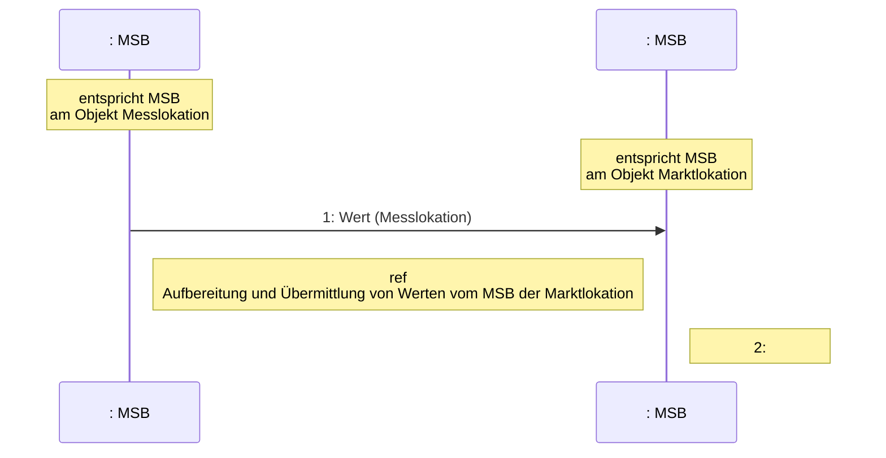
```mermaid
sequenceDiagram
    participant MSB1 as : MSB
    participant MSB2 as : MSB
    
    Note over MSB1: entspricht MSB<br/>am Objekt Messlokation
    Note over MSB2: entspricht MSB<br/>am Objekt Marktlokation
    
    MSB1->>MSB2: 1: Wert (Messlokation)
    
    rect rgb(255, 255, 255)
        Note right of MSB1: ref<br/>Aufbereitung und Übermittlung von Werten vom MSB der Marktlokation
    end
    Note right of MSB2: 2:
```

|Nr.|Aktion|Frist|Hinweis/Bemerkung|
|-|-|-|-|
|1|Wert (Messlokation)|Die Fristen für die Übermittlung der Werte vom MSB der Messlokation an den verantwortlichen MSB der Marktlokation beschreibt die Tabelle im Kapitel „Darstellung der zu übermittelnden Werte“  oder  Übermittlung der Werte vom MSB der Messlokation an den verantwortlichen MSB der Marktlokation unverzüglich nach Vorliegen korrigierter Werte bzw. nach Kenntnisnahme,|Den Umfang der zu übermittelnden Werte der Messlokation vom MSB der Messlokation an den verantwortlichen MSB der Marktlokation beschreibt die Tabelle im Kapitel “Darstellung der zu übermittelnden Werte“.  Sofern zu korrigierende Werte stornorelevant sind, sind diese vor dem Versand der korrigierten Werte zu stornieren.|

Seite **20** von **80**

|Nr.|Aktion|Frist|Hinweis/Bemerkung|
|-|-|-|-|
|||dass zu versendende Werte nicht versendet wurden.  Im Fall der Reklamation von Werten vom MSB der Marktlokation an den MSB der Messlokation im Rahmen des Use-Cases „Reklamation von Werten beim MSB“ gilt: Übermittlung der Werte unverzüglich, jedoch spätester ÜT ist der 4. WT nach dem ÜT der Reklamation beim MSB der Messlokation vom MSB der Marktlokation.||
|2|ref Aufbereitung und Übermittlung von Werten vom MSB der Marktlokation|--|--|

Seite **21** von **80**

### 2.4.3. SD: Aufbereitung und Übermittlung von Werten vom MSB der Marktlokation

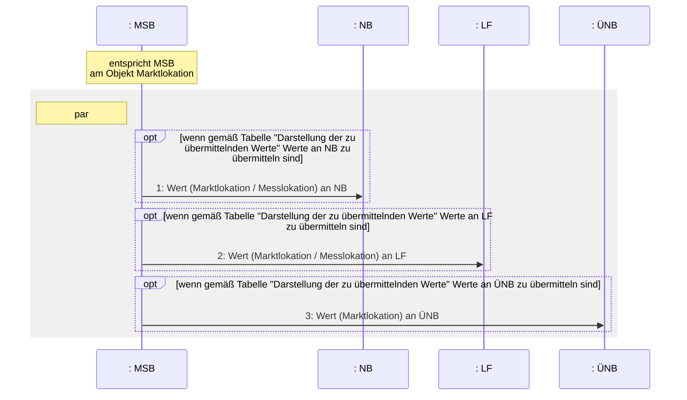
```mermaid
sequenceDiagram
    participant MSB as : MSB
    participant NB as : NB
    participant LF as : LF
    participant UNB as : ÜNB

    Note over MSB: entspricht MSB<br/>am Objekt Marktlokation

    rect rgb(240, 240, 240)
        Note left of MSB: par
        
        opt wenn gemäß Tabelle "Darstellung der zu übermittelnden Werte" Werte an NB zu übermitteln sind
            MSB->>NB: 1: Wert (Marktlokation / Messlokation) an NB
        end

        opt wenn gemäß Tabelle "Darstellung der zu übermittelnden Werte" Werte an LF zu übermitteln sind
            MSB->>LF: 2: Wert (Marktlokation / Messlokation) an LF
        end

        opt wenn gemäß Tabelle "Darstellung der zu übermittelnden Werte" Werte an ÜNB zu übermitteln sind
            MSB->>UNB: 3: Wert (Marktlokation) an ÜNB
        end
    end
```

|Nr.|Aktion|Frist|Hinweis/Bemerkung|
|-|-|-|-|
|1|Wert (Marktlokation / Messlokation) an NB|Die Fristen für die Übermittlung der Werte vom verantwortlichen MSB der Marktlokation an den NB beschreibt die Tabelle im Kapitel „Darstellung der zu übermittelnden Werte“  oder  Übermittlung der Werte vom verantwortlichen MSB der Marktlokation an den NB unverzüglich nach Vorliegen korrigierter Werte bzw. nach Kenntnisnahme, dass zu versendete Werte nicht versendet wurden.  Im Fall der Reklamation von Werten eines Berechtigten an den|Den Umfang der zu übermittelnden Werte der Messlokation und Marktlokation vom verantwortlichen MSB der Marktlokation an den NB beschreibt die Tabelle im Kapitel „Darstellung der zu übermittelnden Werte“. Sofern zu korrigierende Werte stornorelevant sind, sind diese vor dem Versand der korrigierten Werte zu stornieren.|

Seite **22** von **80**

|Nr.|Aktion|Frist|Hinweis/Bemerkung|||
|-|-|-|-|-|-|
|||MSB der Marktlokation im Rahmen des Use-Cases „Reklamation von Werten beim MSB“ gilt: \* Kann der MSB der Marktlokation den Wert ohne das Hinzuziehen des MSB der Messlokation zur Verfügung stellen: Übermittlung der Werte unverzüglich, jedoch spätester ÜT ist der 4. WT nach dem ÜT der Reklamation durch einen Berechtigten. \* Kann der MSB der Marktlokation den Wert nur durch Hinzuziehen des MSB der Messlokation zur Verfügung stellen: Übermittlung der Werte unverzüglich, jedoch spätester ÜT ist der 8. WT nach dem ÜT der Reklamation durch einen Berechtigten.||||
|||2|Wert (Marktlokation / Messlokation) an LF|Die Fristen für die Übermittlung der Werte vom verantwortlichen|Den Umfang der zu übermittelnden Werte der Messlokation und Marktlokation vom verantwortlichen MSB der Marktlokation an den LF beschreibt die Tabelle im|

Seite **23** von **80**

|Nr.|Aktion|Frist|Hinweis/Bemerkung|
|-|-|-|-|
|||MSB der Marktlokation an den LF beschreibt die Tabelle im Kapitel „Darstellung der zu übermittelnden Werte“  oder  Übermittlung der Werte vom verantwortlichen MSB der Marktlokation an den LF unverzüglich nach Vorliegen korrigierter Werte bzw. nach Kenntnisnahme, dass zu versendende Werte nicht versendet wurden.  Im Fall der Reklamation von Werten eines Berechtigten an den MSB der Marktlokation im Rahmen des Use-Cases „Reklamation von Werten beim MSB“ gilt: \* Kann der MSB der Marktlokation den Wert ohne das Hinzuziehen des MSB der Messlokation zur Verfügung stellen: Übermittlung der Werte unverzüglich, jedoch spätester ÜT ist der 4. WT nach dem ÜT der|Kapitel „Darstellung der zu übermittelnden Werte“. Sofern zu korrigierende Werte stornorelevant sind, sind diese vor dem Versand der korrigierten Werte zu stornieren.|

Seite **24** von **80**

|Nr.|Aktion|Frist|Hinweis/Bemerkung||
|-|-|-|-|-|
|||Reklamation durch einen Berechtigten. \* Kann der MSB der Marktlokation den Wert nur durch Hinzuziehen des MSB der Messlokation zur Verfügung stellen: Übermittlung der Werte unverzüglich, jedoch spätester ÜT ist der 8. WT nach dem ÜT der Reklamation durch einen Berechtigten.|||
|3||Wert (Marktlokation) an ÜNB|Die Fristen für die Übermittlung der Werte vom verantwortlichen MSB der Marktlokation an den ÜNB beschreibt die Tabelle im Kapitel „Darstellung der zu übermittelnden Werte“  oder  Übermittlung der Werte vom verantwortlichen MSB der Marktlokation an den ÜNB unverzüglich nach Vorliegen korrigierter Werte bzw. nach Kenntnisnahme, dass zu versendete Werte nicht versendet wurden.|Den Umfang der zu übermittelnden Werte der Marktlokation vom verantwortlichen MSB der Marktlokation an den ÜNB beschreibt die Tabelle im Kapitel „Darstellung der zu übermittelnden Werte“.  Sofern zu korrigierende Werte stornorelevant sind, sind diese vor dem Versand der korrigierten Werte zu stornieren.|

Seite **25** von **80**

|Nr.|Aktion|Frist|Hinweis/Bemerkung|
|-|-|-|-|
|||Im Fall der Reklamation von Werten eines Berechtigten an den MSB der Marktlokation im Rahmen des Use-Cases „Reklamation von Werten beim MSB“ gilt: \* Kann der MSB der Marktlokation den Wert ohne das Hinzuziehen des MSB der Messlokation zur Verfügung stellen: \* Übermittlung der Werte unverzüglich, jedoch spätester ÜT ist der 4. WT nach dem ÜT der Reklamation durch einen Berechtigten. \* Kann der MSB der Marktlokation den Wert nur durch Hinzuziehen des MSB der Messlokation zur Verfügung stellen: Übermittlung der Werte unverzüglich, jedoch spätester ÜT ist der 8. WT nach dem ÜT der Reklamation||

Seite **26** von **80**

|Nr.|Aktion|Frist|Hinweis/Bemerkung|
|-|-|-|-|
|||durch einen Berechtigten.||

### 2.5. Zu übermittelnde Werte
In der Tabelle „Darstellung der zu übermittelnden Werte“ wird die Art, der Umfang, das Intervall und die Fristen für die vom MSB an die einzelnen Marktrollen zu übermittelnden Werte, beschrieben. In den nachfolgenden Kapiteln werden zu dieser Tabelle der Geltungsbereich und die Lesart sowie die Prinzipien zum Werteaustausch zuvor erläutert.

Die einleitenden Erklärungen beschreiben die grundsätzliche Lesart der Tabelle. Die für die Marktkommunikation verbindliche Werteübermittlung ist ausschließlich aus der Tabelle in Kapitel 2.5.5. zu entnehmen.

#### 2.5.1. Geltungsbereich der Tabelle „Darstellung der zu übermittelnden Werte“
* Die Tabelle beschreibt den Umfang der auszutauschenden Werte, die im Rahmen der Netznutzungs-, Bilanzkreis- oder Mehr-/Mindermengenabrechnung benötigt werden.

* Diese Tabelle findet auch im Fall einer Zählzeitdefinition des LF mit dem Zählzeitanwendungszweck "Endkunde" und der Voraussetzung, dass alle Messlokationen der Marktlokation mit iMS ausgestattet sind, Anwendung. In diesem Fall findet der Austausch der Werte für diesen Zählzeitenanwendungszweck nur zwischen dem MSB der Messlokation, dem MSB der Marktlokation und dem LF statt.

* Nicht beschrieben ist die Übermittlung der Werte, die von einer Marktrolle wie z. B. NB oder LF für andere als oben beschriebene Zwecke, benötigt werden. Dies bedeutet, dass diese für andere Zwecke versendeten Werte vom MSB nicht für die Bildung von Werten einer Marktlokation für den Zweck Netznutzungs-, Bilanzkreis- oder Mehr-/Mindermengenabrechnung herangezogen werden, sowie nicht für den Zweck der Endkundenabrechnung entsprechend der oben beschriebenen Konfiguration mit dem Zählzeitenanwendungszweck „Endkunde“ herangezogen werden.

Seite **27** von **80**

### 2.5.2. Erläuterungen zur Tabelle „Darstellung der zu übermittelnden Werte“

**Erläuterungen zur Lesart der Tabelle:**

Die Tabelle „Darstellung der zu übermittelnden Werte“ muss ganz links beginnend, spaltenweise gelesen werden. Das bedeutet insbesondere, dass je weiter man nach rechts geht, wird die Fachlichkeit verfeinert und der Inhalt der links davon stehenden Spalten weiter zu berücksichtigen ist, um eine Fehlinterpretation zu verhindern.

Die Aussagen zur Übermittlung der Werte in der Tabelle konkretisieren sich beginnend von Spalte 1 mit einer Nummerierung, die sich auf die zweite Spalte, dem Auslöser der Werteübermittlung bezieht.

In der dritten Spalte wird je Auslöser zwischen der messtechnischen Einordnung aus Sicht der Marktlokation "iMS" und "kME/mME" unterschieden und in der vierten Spalte „Kategorie aus Sicht der Marktlokation“ weiter verfeinert.

Für jede Kategorie wird in den nachfolgenden Spalten der Werteversand für die Marktlokation und Messlokation bzgl. Art und Umfang, Intervall, Fristen, Beziehung zwischen Markt- zu Messlokation (Spalte „Typ“) und Empfänger dargestellt. Dabei ist zu beachten, dass die Einträge in der Spalte „Kategorie aus Sicht der Marktlokation“ nicht aussagen welche Messtechnik (z. B. iMS) eingebaut werden muss (Pflichteinbaufälle gem. MsbG), sondern nur beschreibt, wenn eine messtechnische Einordnung aus Sicht der Marktlokation gem. Spalte 3 existiert, wie dann in der Werteübermittlung vorzugehen ist.

Hinweis: Für die Ermittlung der messtechnischen Einordnung aus Sicht der Marktlokation sind alle Messlokationen zu bewerten, deren Werte für die Netznutzungs-, Bilanzkreis- oder Mehr-/Mindermengenabrechnung erforderlich sind. Dies schließt z.B. Messlokationen im Lokationsbündel aus, die ausschließlich für die Eigenverbrauchsabrechnungen verwendet werden.

**Erläuterung zur Spalte „Typ“:**

In der Tabelle wird zwischen zwei Typen von Beziehungen der Markt- zu Messlokationen unterschieden:

Seite **28** von **80**

|Typ|Beschreibung|
|-|-|
|A|Für die Ermittlung der Marktlokation sind nur die Werte *\*\*einer\*\** Messlokation (ggf. inklusive Wandlerfaktor an der Messlokation und ggf. inklusive Umlagerung an der Marktlokation (Wärme zu Kraft/Licht) erforderlich.|
|B|Für die Ermittlung der Marktlokation sind die Werte  *\*\*mehrerer\*\** Messlokationen (ggf. inklusive Wandlerfaktor und ggf. Umlagerung an der Marktlokation (Wärme zu Kraft/Licht)) ggf. inkl. Umrechnungsfaktor (z.B. Leitungs-, Trafoverluste)  oder *\*\*einer\*\** Messlokation (ggf. inklusive Wandlerfaktor und ggf. Umlagerung an der Marktlokation (Wärme zu Kraft/Licht)) und ein Umrechnungsfaktor (z. B. Leitungs-, Trafoverluste) erforderlich.|

Darüber hinaus wird zwischen Typ A und B differenziert, welche Werte mit welchem Status zu übermitteln sind.

Die in der Spalte „Typ“ verwendeten Abkürzungen sind:

* E für Ersatzwert
* V für Vorläufiger Wert
* W für Wahrer Wert

**Erläuterung zur Spalte „Empfänger“:**

In der Spalte „Empfänger“ ist mit einem „X“ dargestellt, an welche Marktrollen die in der jeweiligen Zeile beschriebenen Werte zu übermitteln sind. Dabei ist zu beachten:

* Der Empfänger „MSB“ ist jeweils der MSB, der aufgrund von Typ B Werte von einem unterlagerten MSB für die Ermittlung der Marktlokation erhält.

* Der ÜNB erhält bei der messtechnischen Einordnung „iMS“ nur Energiemengen, ab dem Moment, zu dem die Aggregationsverantwortung für die Marktlokation an ihn übergegangen ist4, auch wenn ein „X“ in der Spalte „ÜNB“ vorhanden ist.

* Im Fall des Zählzeitenanwendungszwecks „Endkunde“ sind die Spalten „NB“ und „ÜNB“ nicht zu berücksichtigen, auch wenn ein „X“ in der Spalte „NB“ oder „ÜNB“ vorhanden ist. Die Übermittlung der Werte für den Zählzeitenanwendungszweck „Endkunde“ findet damit zwischen dem MSB der Messlokation, dem MSB der Marktlokation und dem LF statt.

4 ÜNB-Aggregationsverantwortung: siehe Begriffsdefinition in der MaBiS
Seite **29** von **80**

**Erläuterung zur Spalte „Art und Umfang der vom MSB zu übermittelnden Werte“:**

Die Aussage „Arbeitsmenge zwischen *[Ereignis]* und letztem Ablesetermin“ in der Spalte „Art und Umfang der vom MSB zu übermittelnden Werte“ ist wie folgt zu verstehen:

*   *[Ereignis]* entspricht einem zum Auslöser (Spalte 2) passenden Ereignis (z. B. bei einer Zwischenablesung, das Ereignis „Zwischenablesetermin“).
*   Regel für die Bestimmung des Zeitraums zur Ermittlung der Arbeitsmenge:
    Die zu bestimmende Arbeitsmenge wird immer für den Zeitraum gemäß dem Auslöser ermittelten Wert(en) und den davor ermittelten Wert(en) zur Netznutzungs-, Bilanzkreis- oder Mehr-/Mindermengenabrechnung berechnet, sowie dem unter 2.5.1 beschriebenen Zweck der "Endkundenabrechnung" entsprechend der dort beschriebenen Konfiguration mit dem Zählzeitenanwendungszweck „Endkunde“. Weitere zusätzliche Ablesungen zu anderen als oben beschriebenen Zwecken für LF, NB oder sonstige Marktpartner werden dabei nicht berücksichtigt.

### 2.5.3. Prinzipien für die Übermittlung aufbereiteter Werte
Für den in der Tabelle beschriebenen Werteaustausch gelten die in diesem Kapitel aufgeführten Prinzipien:

*   Bei der Erfassung von Zählerständen (nicht ¼ h-Zählerstandsgang) wird für die
    *   Marktlokation die Arbeitsmenge und
    *   Messlokation der Zählerstand übermittelt.

*   Bei der Erfassung von Zählerstands-/Lastgängen wird für die
    *   Marktlokation der Lastgang und
    *   Messlokation
        *   bei Typ A: **kein Wert**
        *   bei Typ B: der Lastgang übermittelt

*   Bei der Erfassung von Zählerstandsgängen aus dem iMS erhält der NB und LF für die Marktlokation die Arbeitsmenge und Maximalleistung für den Verwendungszweck der Netznutzungsrechnung.
*   Es sind alle Zählerstände der erforderlichen Register zu übermitteln.

*   Korrekturenergiemengen an der Messlokation werden bei Bedarf ausgetauscht. Dies gilt auch bei einem Zählwerksfehler (z.B. Zählwerksstillstand, -verlangsamung, -manipulation). Bei einem Zählwerksfehler wird vom MSB der Messlokation der erfasste/abgelesene Zählerstand sowie für den zu korrigierenden Verbrauch eine Korrekturenergiemenge auf Ebene der Messlokation übermittelt.

### 2.5.4. Prinzipien zur Nutzung „Vorläufiger Wert“
*   Der „Vorläufige Wert“ kann nur bei Marktlokationen, deren Messlokationen mit einer kME mit RLM ausgestattet sind oder welche mit einem iMS ausgestattet sind, vorkommen. Bei Messlokationen mit mME und kME ohne RLM wird der Status „Vorläufiger Wert“ nicht genutzt.

Seite **30** von **80**

* Die angegebenen Fristen bis z. B. zur endgültigen Bildung eines Ersatzwertes sind Maximalfristen. Die Bereitstellung der wahren Werte und ggf. Ersatzwerte erfolgen unverzüglich.

* Wenn ein Fehler in den Geräten der Messlokation bekannt ist, aufgrund dessen keine wahren Werte für ein bestimmtes Zeitintervall mehr zu erwarten sind, ist unverzüglich mit der Ersatzwertbildung zu beginnen.

* Bei Nichterreichbarkeit einer Messlokation unternimmt der MSB laufend Versuche, die fehlenden Messwerte zu erhalten bzw. bei wiederholter Nichterreichbarkeit ist die Störung zu beseitigen und für eine stabile Kommunikationsverbindung zu sorgen

* Der nachfolgenden Tabelle ist zu entnehmen, bei welchen Statusveränderungen von Werten die bereits ausgetauschten Werte ersetzt werden dürfen und in welchen der erlaubten Veränderungen zusätzlich zu den neuen Werten verbindliche Zusatzinformationen zu übermitteln sind. Die verbindlichen Zusatzinformationen sollen den Empfänger über den Grund („Begründung“) und die Methode der Werteaufbereitung („Bildungsregel“) in Kenntnis setzen.

|VON Vorläufige Werte Ersatzwerte Wahre Werte|AUF|Vorläufige Werte Nicht zulässig Nicht zulässig Nicht zulässig|Ersatzwerte Zulässig, mit Begründungund Bildungsregel Zulässig, mit Begründungund Bildungsregel Zulässig, mit Begründungund Bildungsregel|Wahre Werte ZulässigOhne Begründung ZulässigOhne Begründung ZulässigMit Begründung|
|-|-|-|-|-|

Seite **31** von **80**

### 2.5.5. Darstellung der zu übermittelnden Werte

Legende zur nachfolgenden Tabelle „Darstellung der zu übermittelnden Werte“

[1] Liegen bis zur genannten Frist keine wahren Werte oder Ersatzwerte aus dem iMS oder vom unterlagerten MSB vor und sind auch nicht mehr zu erwarten, bildet und übermittelt der MSB Ersatzwerte.

[2] Liegen bis zur genannten Frist keine wahren Werte oder Ersatzwerte vor aber können noch erwartet werden, bildet und übermittelt der MSB vorläufige Werte.

[3] Liegen bis zur genannten Frist keine wahren Werte vor und wurden zuvor vorläufige Werte gebildet, bildet und übermittelt der MSB Ersatzwerte.

[4] Hinweis: ggf. kürzeres Intervall als jährlich nach Vereinbarung möglich (siehe Kapitel 2.2.3 zum Thema Intervall).

[5] Hinweis: Der Zeitstempel der Zählerstandserfassung ist mindestens viertelstundengenau.

[6] Liegen bis zur genannten Frist wahre Werte vor und wurden zuvor Ersatzwerte gebildet, übermittelt der MSB wahre Werte.

[7] Hinweis: Die Frist-Vorgaben im Kapitel „Aufbereitung und Übermittlung von Werten“ (Kapitel 2.2.2.) zum Thema Abgrenzung sind entsprechend zu berücksichtigen.

[8] Hinweis zur Spalte "Frist": Sofern das Bestelldatum in der Vergangenheit bzw. im Rahmen eines Abgrenzungsverfahrens nach dem Termin des nächsten regulären Ablesewertes liegt (siehe Kapitel 2.2.2. zum Thema Abgrenzung), so ist in der Spalte "Frist" die Aussage "nach dem Datum der beauftragten Werteübermittlung" durch die Aussage "nach dem ÜT der Bestellung" zu ersetzen. [9] Hinweis zur Spalte "Frist": Liegt der Zuordnungsbeginn bzw. das Zuordnungsende nicht in der Zukunft, so ist für die Fristermittlung anstelle des Zuordnungsbeginns bzw. Zuordnungsendes der ÜT der „Einrichtung der Konfigurationen" (SD-Schritt 1 bzw. 2) des Use-Cases „Einrichtung der Konfigurationen aufgrund einer Zuordnung eines LF zu einer Marktlokation bzw. Tranche“ (GPKE Teil 3) zu verwenden.

[10] Übermittlung der Werte im Fall der Abrechnung von Blindarbeit zwischen NB und LF (Blindarbeitsabrechnung).

Seite **32** von **80**

M.E. = Messtechnische Einordnung aus Sicht der Marktlokation

|Nr.|Auslöser|M.E.|Kategorie aus Sicht der Marktlokation|Lokation|Art und Umfang der vom MSB zu übermittelnden Werte|Intervall|Frist\[7]|Typ||Empfänger||||
|-|-|-|-|-|-|-|-|-|-|-|-|-|-|
|||||||||A|B|NB|LF|ÜNB|MSB|
|1|Turnusmäßige/ regelmäßige Ablesung|iMS|\* Verbrauch \* Erzeugung|Marktlokation|Lastgang für den Vortag bzw. die Vortage|täglich|unverzüglich, jedoch spätester ÜZ ist 11:00 Uhr|W/E\[1]/V\[2]|W/E\[1]/V\[2]|x|x|x|--|
|||||||unverzüglich, jedoch spätester ÜT ist der 8. T des Folgemonats|W\[6]/E\[3]|W\[6]/E\[3]|x|x|x|--||
||||||Monatsarbeitsmenge und Maximalleistung des Vormonats|monatlich|unverzüglich, jedoch spätester ÜT ist der 5. T des Folgemonats|W/E\[1]/V\[2]|W/E\[1]/V\[2]|x|x|--|--|
||||||||unverzüglich, jedoch spätester ÜT ist der 8. T des Folgemonats|W\[6]/E\[3]|W\[6]/E\[3]|x|x|--|--|
||||Netzlokation|Lastgang für den Vortag bzw. die Vortage\[10]|täglich|unverzüglich, jedoch spätester ÜZ ist 11:00 Uhr|W/E\[1]/V\[2]|W/E\[1]/V\[2]|x|x|--|--||
|||||||unverzüglich, jedoch spätester ÜT ist der 8. T des Folgemonats|W\[6]/E\[3]|W\[6]/E\[3]|x|x|--|--||
||||Messlokation|Lastgang für den Vortag bzw. die Vortage|täglich|unverzüglich, jedoch spätester ÜZ ist 9:30 Uhr|--|W/E\[1]/V\[2]|--|--|--|x||
|||||||unverzüglich, jedoch spätester ÜZ ist 11:00 Uhr|--|W/E\[1]/V\[2]|x|x|--|--||
|||||||unverzüglich, jedoch spätester ÜT ist der 7. T des Folgemonats|--|W\[6]/E\[3]|--|--|--|x||
|||||||unverzüglich, jedoch spätester ÜT ist der 8. T des Folgemonats|--|W\[6]/E\[3]|x|x|--|--||
|||||Zählerstand des Monatsersten 00:00 Uhr (Monatswechsel)|monatlich|unverzüglich, jedoch spätester ÜZ ist 10:00 Uhr des 1. T des Monats|--|W/E\[1]/V\[2]|--|--|--|x||
|||||||unverzüglich, jedoch spätester ÜZ ist 12:00 Uhr des 1. T des Monats|W/E\[1]/V\[2]|W/E\[1]/V\[2]|x|x|--|--||
|||unverzüglich, jedoch spätester ÜT ist der 7. T des Monats|--|W\[6]/E\[3]|--|--|--|x||||||
|||unverzüglich, jedoch spätester ÜT ist der 8. T des Monats|W\[6]/E\[3]|W\[6]/E\[3]|x|x|--|--||||||
||kME/ mME|\* registrierende Lastgangmessung|Marktlokation|Lastgang für den Vortag bzw. die Vortage|täglich|unverzüglich, jedoch spätester ÜZ ist 11:00 Uhr|W/E\[1]/V\[2]|W/E\[1]/V\[2]|x|x|x|--||
|||||||unverzüglich, jedoch spätester ÜT ist der 8. T des Folgemonats|W\[6]/E\[3]|W\[6]/E\[3]|x|x|x|--||

Seite 33 von 80

|Nr.|Auslöser|M.E.|Kategorie aus Sicht der Marktlokation|Lokation|Art und Umfang der vom MSB zu übermittelnden Werte|Intervall|Frist\[7]|Typ||Empfänger|||||||||||
|-|-|-|-|-|-|-|-|-|-|-|-|-|-|-|-|-|-|-|-|-|
|||||||||A|B|NB|LF|ÜNB|MSB||||||||
||||\* registrierende Einspeisegangmessung|Netzlokation|Lastgang für den Vortag bzw. die Vortage\[10]|täglich|unverzüglich, jedoch spätester ÜZ ist 11:00 Uhr|W/E\[1]/V\[2]|W/E\[1]/V\[2]|x|x|--|--||||||||
||||||||||||||unverzüglich, jedoch spätester ÜT ist der 8. T des Folgemonats|W\[6]/E\[3]|W\[6]/E\[3]|x|x|--|--||
||||||||Messlokation|Lastgang für den Vortag bzw. die Vortage|täglich|unverzüglich, jedoch spätester ÜZ ist 09:30 Uhr|--|W/E\[1]/V\[2]|--|--|--|x|||||
|||||||||||||unverzüglich, jedoch spätester ÜZ ist 12:00 Uhr|--|W/E\[1]/V\[2]|x|x|--|--|||
|||||||||||||unverzüglich, jedoch spätester ÜT ist der 7. T des Folgemonats|--|W\[6]/E\[3]|--|--|--|x|||
|||||||||||||unverzüglich, jedoch spätester ÜT ist der 8. T des Folgemonats|--|W\[6]/E\[3]|x|x|--|--|||
||||||\* Wirkarbeitsmessung|Marktlokation|Arbeitsmenge zwischen aktuellem Sollablesetermin 00:00 Uhr und letztem Ablesetermin|jährlich\[4]|unverzüglich, jedoch spätester ÜT ist der 28. T nach Sollablesetermin|W/E|W/E|x|x|--|--||||||
|||||||Messlokation|Zählerstand des Sollablesetermins 00:00 Uhr|jährlich\[4]|unverzüglich, jedoch spätester ÜT ist der 2. WT vor dem Ablauf des 28. T nach Sollablesetermin|--|W/E|--|--|--|x||||||
|||||||||||||unverzüglich, jedoch spätester ÜT ist der 28. T nach Sollablesetermin|W/E|W/E|x|x|--|--|||
||||2\[9]|Lieferbeginn/ Neuanlage/ Beginn der Ersatz-/ Grundversorgung/ Herstellung einer 100% LF-Zuordnung zu einer erzeugenden|||||iMS|\* Verbrauch \* Erzeugung|Messlokation|Zählerstand 00:00 Uhr des bestätigten Zuordnungsbeginns|einmal für Auslöser|unverzüglich, jedoch spätester ÜT ist der 4. T nach dem bestätigten Zuordnungsbeginn|--|W/E\[1]/V\[2]|--|--|--|x|
||||||||unverzüglich, jedoch spätester ÜT ist der 5. T nach dem bestätigten Zuordnungsbeginn|W/E\[1]/V\[2]||||||W/E\[1]/V\[2]|x|x|--|--|||
||||||||unverzüglich, jedoch spätester ÜT ist der 7. T nach dem bestätigten Zuordnungsbeginn|--||||||W\[6]/E\[3]|--|--|--|x|||
||||||||unverzüglich, jedoch spätester ÜT ist der 8. T nach dem bestätigten Zuordnungsbeginn|W\[6]/E\[3]||||||W\[6]/E\[3]|x|x|--|--|||
|||kME/mME|\* Wirkarbeitsmessung||Messlokation|Zählerstand 00:00 Uhr des bestätigten|einmal für Auslöser|unverzüglich, jedoch spätester ÜT ist der 2. WT vor dem Ablauf des 28. T nach dem bestätigten Zuordnungsbeginn|--|W/E|--|--|--|x|||||||

Seite **34** von **80**

|Nr.|Auslöser|M.E.|Kategorie aus Sicht der Marktlokation|Lokation|Art und Umfang der vom MSB zu übermittelnden Werte|Intervall|Frist\[7]|Typ||Empfänger|||||||
|-|-|-|-|-|-|-|-|-|-|-|-|-|-|-|-|-|
|||||||||A|B|NB|LF|ÜNB|MSB||||
||Marktlokation||||Zuordnungsbeginns||unverzüglich, jedoch spätester ÜT ist der 28. T nach dem bestätigten Zuordnungsbeginn|W/E|W/E|x|x|--|--||||
|3\[9]|Lieferende / Anfrage zur Beendigung der Zuordnung des LFA zur Marktlokation bzw. Tranche|iMS|\* Verbrauch \* Erzeugung|Marktlokation|Arbeitsmenge und Maximalleistung zwischen dem letzten Ablesetermin und dem bestätigten Zuordnungsende|einmal für Auslöser|unverzüglich, jedoch spätester ÜT ist der 5. T nach dem bestätigten Zuordnungsende|W/E\[1]/V\[2]|W/E\[1]/V\[2]|x|x|--|--||||
||||||||unverzüglich, jedoch spätester ÜT ist der 8. T nach dem bestätigten Zuordnungsende|W\[6]/E\[3]|W\[6]/E\[3]|x|x|--|--||||
||||||||Messlokation|Zählerstand 00:00 Uhr des bestätigten Zuordnungsendes|einmal für Auslöser|unverzüglich, jedoch spätester ÜT ist der 4. T nach dem bestätigten Zuordnungsende|--|W/E\[1]/V\[2]|--|--|--|x|
|||||||||||unverzüglich, jedoch spätester ÜT ist der 5. T nach dem bestätigten Zuordnungsende|W/E\[1]/V\[2]|W/E\[1]/V\[2]|x|x|--|--|
|||||||||||unverzüglich, jedoch spätester ÜT ist der 7. T nach dem bestätigten Zuordnungsende|--|W\[6]/E\[3]|--|--|--|x|
|||||||||||unverzüglich, jedoch spätester ÜT ist der 8. T nach dem bestätigten Zuordnungsende|W\[6]/E\[3]|W\[6]/E\[3]|x|x|--|--|
|||kME/mME|\* Wirkarbeitsmessung|Marktlokation|Arbeitsmenge zwischen dem bestätigten Zuordnungsende und dem letzten Ablesetermin|einmal für Auslöser|unverzüglich, jedoch spätester ÜT ist der 28. T nach dem bestätigten Zuordnungsende|W/E|W/E|x|x|--|--||||
||||Messlokation|Zählerstand 00:00 Uhr des bestätigten Zuordnungsendes|einmal für Auslöser|unverzüglich, jedoch spätester ÜT ist der 2. WT vor dem Ablauf des 28. T nach dem bestätigten Zuordnungsende|--|W/E|--|--|--|x|||||
|||||unverzüglich, jedoch spätester ÜT ist der 28. T nach dem bestätigten Zuordnungsende|W/E|W/E|x|x|--|--|||||||
|4\[8]|Zwischenablesung|iMS|\* Verbrauch \* Erzeugung|Marktlokation|Arbeitsmenge zwischen dem Zwischenablesetermin 00:00 Uhr und dem letzten Ablesetermin|einmal je Anforderung|unverzüglich, jedoch spätester ÜT ist der 5. T nach dem Datum der beauftragten Werteerhebung|W/E\[1]/V\[2]|W/E\[1]/V\[2]|x|x|--|--||||
||||||||unverzüglich, jedoch spätester ÜT ist der 8. T nach dem Datum der beauftragten Werteerhebung|W\[6]/E\[3]|W\[6]/E\[3]|x|x|--|--||||

Seite 35 von 80

|Nr.|Auslöser|M.E.|Kategorie aus Sicht der Marktlokation|Lokation|Art und Umfang der vom MSB zu übermittelnden Werte|Intervall|Frist\[7]|Typ||Empfänger||||||||||||||||||||||||||||||||
|-|-|-|-|-|-|-|-|-|-|-|-|-|-|-|-|-|-|-|-|-|-|-|-|-|-|-|-|-|-|-|-|-|-|-|-|-|-|-|-|-|-|
|||||||||A|B|NB|LF|ÜNB|MSB|||||||||||||||||||||||||||||
|||||Messlokation|Zählerstand des Zwischenablesetermins 00:00 Uhr|einmal je Anforderung|unverzüglich, jedoch spätester ÜT ist der 4. T nach dem Datum der beauftragten Werteerhebung|--|W/E\[1]/ V\[2]|--|--|--|x|||||||||||||||||||||||||||||
||||||||||||unverzüglich, jedoch spätester ÜT ist der 5. T nach dem Datum der beauftragten Werteerhebung|W/E\[1]/ V\[2]|W/E\[1]/ V\[2]|x|x|--|--|||||||||||||||||||||||||
||||||||||||||||||unverzüglich, jedoch spätester ÜT ist der 7. T nach dem Datum der beauftragten Werteerhebung|--|W\[6]/ E\[3]|--|--|--|x|||||||||||||||||||
||||||||||||||||||||||||unverzüglich, jedoch spätester ÜT ist der 8. T nach dem Datum der beauftragten Werteerhebung|W\[6]/ E\[3]|W\[6]/ E\[3]|x|x|--|--|||||||||||||
|||||||||kME/mME|||||||||||||||\* Wirkarbeitsmessung|Marktlokation|Arbeitsmenge zwischen dem Zwischenablesetermin 00:00 Uhr und dem letzten Ablesetermin|einmal je Anforderung|unverzüglich, jedoch spätester ÜT ist der 28. T nach dem Datum der beauftragten Werteerhebung|W/E|W/E|x|x|--|--|||||||||
|||||||||||||||||||||||||Messlokation|Zählerstand des Zwischenablesetermins 00:00 Uhr|einmal je Anforderung|unverzüglich, jedoch spätester ÜT ist der 2. WT vor dem Ablauf des 28. T nach dem Datum der beauftragten Werteerhebung|--|W/E|--|--|--|x|||||||||
||||||||||||||||||||||||||||||||unverzüglich, jedoch spätester ÜT ist der 28. T nach dem Datum der beauftragten Werteerhebung|W/E|W/E|x|x|--|--|||||
|5|Gerätewechsel, Geräteübernahme und Änderung der Konfiguration|iMS|\* Verbrauch \* Erzeugung|||||||||Marktlokation|Arbeitsmenge und Maximalleistung zwischen dem Geräteeinbaudatum 00:00 Uhr, Geräteübernahmedatum 00:00 Uhr oder der Änderung der Konfiguration 00:00 Uhr und dem letzten Ablesetermin bzw. bei Stilllegung zwischen dem Folgetag 00:00 Uhr des Geräteausbau-||||||||||||||||||einmal je Auslöser|unverzüglich, jedoch spätester ÜT ist der 5. T nach dem Auslöser|W/E\[1]/ V\[2]|W/E\[1]/ V\[2]|x|x|--|--||||
|||||||||||||||unverzüglich, jedoch spätester ÜT ist der 8. T nach dem Auslöser|W\[6]/ E\[3]|W\[6]/ E\[3]|x|x|||||||||||||||--|--||||||||

Seite **36** von **80**

|Nr.|Auslöser|M.E.|Kategorie aus Sicht der Marktlokation|Lokation|Art und Umfang der vom MSB zu übermittelnden Werte|Intervall|Frist\[7]|Typ||Empfänger|||||||||||||||||
|-|-|-|-|-|-|-|-|-|-|-|-|-|-|-|-|-|-|-|-|-|-|-|-|-|-|-|
|||||||||A|B|NB|LF|ÜNB|MSB||||||||||||||
||||||||datums und dem letzten Ablesetermin||||||||||||||||||||
||||||||Messlokation|||||||||Zählerstand zum Geräteausbauzeitpunkt, Geräteeinbauzeitpunkt, Geräteübernahmedatum 00:00 Uhr oder zur Änderung der Konfiguration 00:00 Uhr|einmal je Auslöser|unverzüglich, jedoch spätester ÜT ist der 4. T nach dem Auslöser|--|W/E\[1]/ V\[2]|--|--|--|x|||
||||||||||||||||||unverzüglich, jedoch spätester ÜT ist der 5. T nach dem Auslöser|W/E\[1]/ V\[2]|W/E\[1]/ V\[2]|x|x|--|--||||
||||||||||||||||||unverzüglich, jedoch spätester ÜT ist der 7. T nach dem Auslöser|--|W\[6]/ E\[3]|--|--|--|x||||
||||||||||||||||||unverzüglich, jedoch spätester ÜT ist der 8. T nach dem Auslöser|W\[6]/ E\[3]|W\[6]/ E\[3]|x|x|--|--||||
||||||||kME/m ME|||||||||\* Wirkarbeitsmessung|Marktlokation|Arbeitsmenge zwischen dem Geräteeinbaudatums 00:00 Uhr, Geräteübernahmedatum 00:00 Uhr oder Änderung der Konfiguration 00:00 Uhr und dem letzten Ablesetermin bzw. bei Stilllegung zwischen dem Folgetag 00:00 Uhr des Geräteausbaudatums und dem letzten Ablesetermin|einmal je Auslöser|unverzüglich, jedoch spätester ÜT ist der 28. T nach dem Auslöser|W/E|W/E|x|x|--|--|
||||||||Messlokation|||||||||Zählerstand\[5] zum Geräteausbauzeitpunkt, Geräteeinbauzeitpunkt, Geräteübernahmedatum 00:00 Uhr oder zur Änderung der Konfiguration 00:00 Uhr|einmal je Auslöser|unverzüglich, jedoch spätester ÜT ist der 2. WT vor dem Ablauf des 28. T nach dem Auslöser|--|W/E|--|--|--|x|||
||||||||||||||||||unverzüglich, jedoch spätester ÜT ist der 28. T nach dem Auslöser|W/E|W/E|x|x|--|--||||

Tabelle 1: Darstellung der zu übermittelnden Werte

Seite **37** von **80**

## 2.6. Use-Case: Anforderung und Übermittlung von Zwischenablesungswerten

### 2.6.1. UC: Anforderung von Zwischenablesungswerten

|Use-Case-Name|Anforderung von Zwischenablesungswerten|
|-|-|
|Prozessziel|Der NB oder LF hat Zwischenablesungswerte beim MSB der Marktlokation angefordert  oder  der MSB der Marktlokation hat Zwischenablesungswerte beim MSB der Messlokation angefordert.|
|Use-Case Beschreibung|Der NB oder LF fordert über einen Bestellprozess Zwischenablesungswerte beim MSB der Marktlokation an, der zu dem Zeitraum, für den die Werte benötigt werden, der Marktlokation zugeordnet war. Der MSB der Marktlokation prüft die Anforderung und erfüllt diese oder lehnt diese ggf. ab.  Der MSB der Marktlokation fordert über einen Bestellprozess Zwischenablesungswerte der Messlokation bei dem MSB der Messlokation an, der zu dem Zeitraum, für den die Werte benötigt werden, der Messlokation zugeordnet war. Der MSB der Messlokation prüft die Anforderung und erfüllt diese oder lehnt diese ggf. ab.|
|Rollen|\* NB \* LF \* MSB|
|Vorbedingung|\* Der MSB kennt die Messlokationen und Marktlokation. \* Der Anfragende ist berechtigt, zur Anfrage und zum Erhalt von Zwischenablesungswerten.  *Auslöser:* Auslöser einer Bestellung \*\*vom NB oder LF\*\* an den MSB der Marktlokation kann für Marktlokationen, deren Messlokationen mit kME mit Wirkarbeitsmessung, mME oder iMS ausgestattet sind, eine Zwischenablesung (s. dazu unter Nr. 4 in der Tabelle „Darstellung der zu übermittelnden Werte“) sein.  Auslöser einer Bestellung \*\*vom NB\*\* an den MSB der Marktlokation kann für gemessene Marktlokationen, deren Messlokationen mit kME mit Wirkarbeitsmessung oder mME ausgestattet sind, ein Abgrenzungsverfahren sein (s. dazu die Vorgaben des Kapitels 2.2.2. „Aufbereitung und Übermittlung von Werten“ zum Thema Abgrenzung).|
|Nachbedingung im Erfolgsfall|Übermittlung der Zwischenablesungswerte an die Berechtigten.|
|Nachbedingung im Fehlerfall|--|
|Fehlerfälle|--|
|Weitere Anforderungen|Findet bei einer in die Zukunft gerichteten Bestellung bis zum Bestelldatum ein Wechsel des MSB statt, ist die versendete Bestellung obsolet. Die Bestellung muss erneut an den dann zuständigen MSB versendet werden.|

Seite **38** von **80**

## 2.6.2. SD: Anforderung von Zwischenablesungswerten

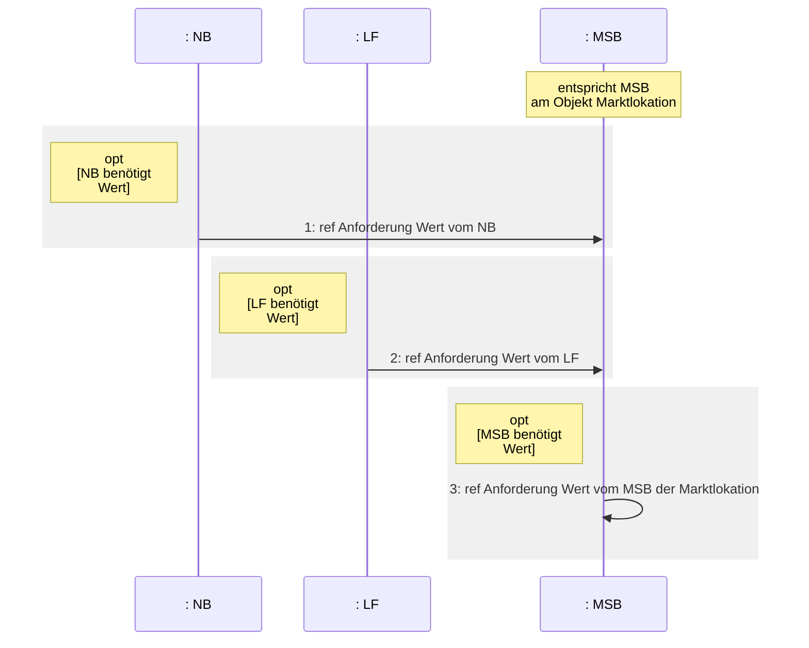
```mermaid
sequenceDiagram
    participant NB as : NB
    participant LF as : LF
    participant MSB as : MSB
    
    Note over MSB: entspricht MSB<br/>am Objekt Marktlokation

    rect rgb(240, 240, 240)
        Note left of NB: opt<br/>[NB benötigt<br/>Wert]
        NB->>MSB: 1: ref Anforderung Wert vom NB
    end

    rect rgb(240, 240, 240)
        Note left of LF: opt<br/>[LF benötigt<br/>Wert]
        LF->>MSB: 2: ref Anforderung Wert vom LF
    end

    rect rgb(240, 240, 240)
        Note left of MSB: opt<br/>[MSB benötigt<br/>Wert]
        MSB->>MSB: 3: ref Anforderung Wert vom MSB der Marktlokation
    end
```

|Nr.|Aktion|Frist|Hinweis/Bemerkung|
|-|-|-|-|
|1|ref Anforderung Wert vom NB|--|--|
|2|ref Anforderung Wert vom LF|--|--|
|3|ref Anforderung Wert vom MSB der Marktlokation|--|--|

Seite **39** von **80**

### 2.6.3. SD: Anforderung Wert vom NB

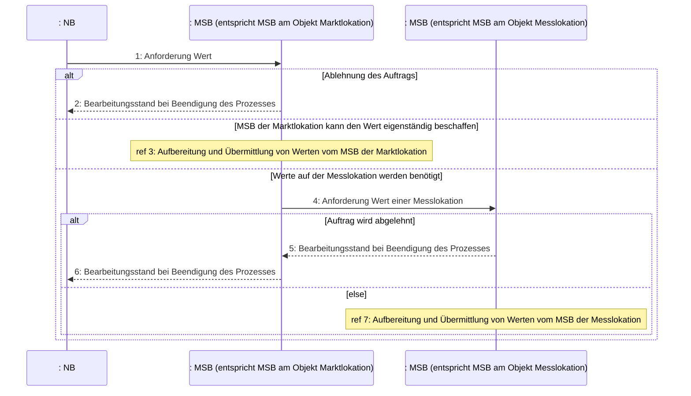
```mermaid
sequenceDiagram
    participant NB as : NB
    participant MSB_MaLo as : MSB (entspricht MSB am Objekt Marktlokation)
    participant MSB_MeLo as : MSB (entspricht MSB am Objekt Messlokation)

    NB->>MSB_MaLo: 1: Anforderung Wert
    
    alt Ablehnung des Auftrags
        MSB_MaLo-->>NB: 2: Bearbeitungsstand bei Beendigung des Prozesses
    else MSB der Marktlokation kann den Wert eigenständig beschaffen
        Note over MSB_MaLo: ref 3: Aufbereitung und Übermittlung von Werten vom MSB der Marktlokation
    else Werte auf der Messlokation werden benötigt
        MSB_MaLo->>MSB_MeLo: 4: Anforderung Wert einer Messlokation
        alt Auftrag wird abgelehnt
            MSB_MeLo-->>MSB_MaLo: 5: Bearbeitungsstand bei Beendigung des Prozesses
            MSB_MaLo-->>NB: 6: Bearbeitungsstand bei Beendigung des Prozesses
        else else
            Note over MSB_MeLo: ref 7: Aufbereitung und Übermittlung von Werten vom MSB der Messlokation
        end
    end
```

|Nr.|Aktion|Frist|Hinweis/Bemerkung|
|-|-|-|-|
|1|Anforderung Wert|--|--|
|2|Bearbeitungsstand bei Beendigung des Prozesses|Unverzüglich, jedoch spätester ÜT ist der 2. WT nach dem ÜT von Nr. 1.|Der MSB der Marktlokation lehnt die Anforderung des NB ab. Der Grund der Ablehnung wird mitgeteilt. In Abhängigkeit des Ablehnungsgrundes findet eine bilaterale Klärung statt.|
|3|ref Aufbereitung und Übermittlung von Werten vom MSB der Marktlokation|Die Fristen für die Übermittlung der Werte vom verantwortlichen MSB der Marktlokation an die Berechtigten beschreibt die Tabelle im Kapitel "Darstellung der zu übermittelnden Werte".|Im Fall, dass der MSB der Marktlokation die Werte ohne das hinzuziehen des MSB der Messlokation zur Verfügung stellen kann.|
|4|Anforderung Wert einer Messlokation|Unverzüglich, jedoch spätester ÜT ist der 2. WT nach dem ÜT von Nr. 1.|Im Fall, dass der MSB der Marktlokation die Werte nicht ohne das hinzuziehen des MSB der Messlokation zur Verfügung stellen kann und dieser daher Werte beim MSB der Messlokation anfordern muss.|

Seite 40 von 80

|Nr.|Aktion|Frist|Hinweis/Bemerkung|
|-|-|-|-|
|5|Bearbeitungsstand bei Beendigung des Prozesses|Unverzüglich, jedoch spätester ÜT ist der 2. WT nach dem ÜT von Nr. 4.|Der MSB der Messlokation lehnt die Anforderung des MSB der Marktlokation ab. Der Grund der Ablehnung wird mitgeteilt.  In Abhängigkeit des Ablehnungsgrundes findet eine bilaterale Klärung statt.|
|6|Bearbeitungsstand bei Beendigung des Prozesses|Unverzüglich, jedoch spätester ÜT ist der 1. WT nach dem ÜT von Nr. 5.|Der MSB der Marktlokation hat den Ablehnungsgrund gegenüber dem NB mitzuteilen.  In Abhängigkeit des Ablehnungsgrundes findet eine bilaterale Klärung statt.|
|7|ref Aufbereitung und Übermittlung von Werten vom MSB der Messlokation|Die Fristen für die Übermittlung der Werte vom MSB der Messlokation an den verantwortlichen MSB der Marktlokation und vom verantwortlichen MSB der Marktlokation an die Berechtigten beschreibt die Tabelle im Kapitel "Darstellung der zu übermittelnden Werte".|--|

Seite **41** von **80**

### 2.6.4. SD: Anforderung Wert vom LF

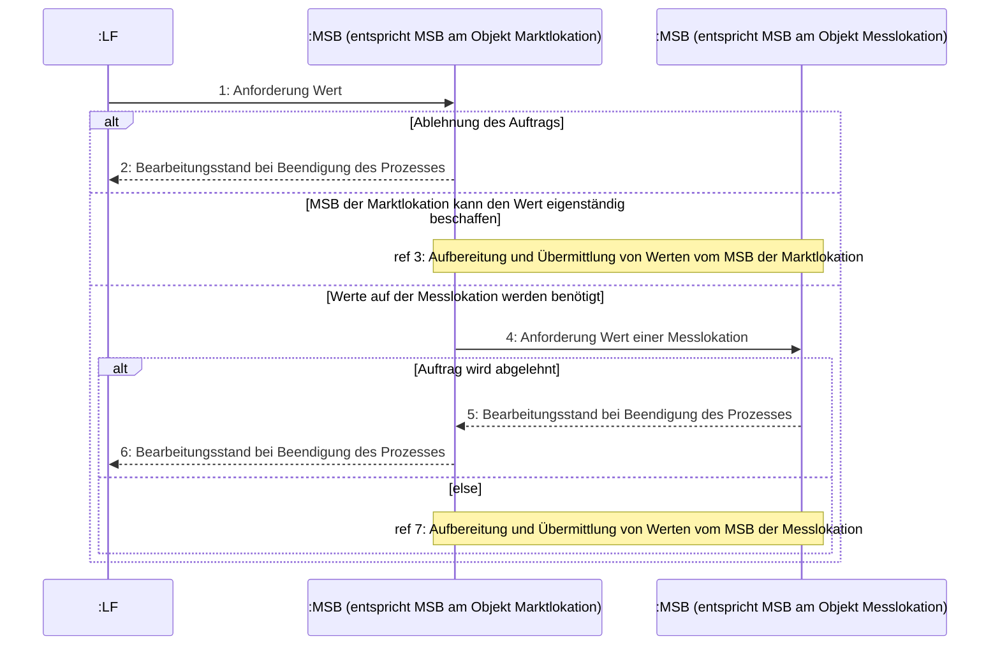
```mermaid
sequenceDiagram
    participant LF as :LF
    participant MSB_MaLo as :MSB (entspricht MSB am Objekt Marktlokation)
    participant MSB_MeLo as :MSB (entspricht MSB am Objekt Messlokation)

    LF->>MSB_MaLo: 1: Anforderung Wert
    
    alt Ablehnung des Auftrags
        MSB_MaLo-->>LF: 2: Bearbeitungsstand bei Beendigung des Prozesses
    else MSB der Marktlokation kann den Wert eigenständig beschaffen
        Note over MSB_MaLo, MSB_MeLo: ref 3: Aufbereitung und Übermittlung von Werten vom MSB der Marktlokation
    else Werte auf der Messlokation werden benötigt
        MSB_MaLo->>MSB_MeLo: 4: Anforderung Wert einer Messlokation
        alt Auftrag wird abgelehnt
            MSB_MeLo-->>MSB_MaLo: 5: Bearbeitungsstand bei Beendigung des Prozesses
            MSB_MaLo-->>LF: 6: Bearbeitungsstand bei Beendigung des Prozesses
        else else
            Note over MSB_MaLo, MSB_MeLo: ref 7: Aufbereitung und Übermittlung von Werten vom MSB der Messlokation
        end
    end
```

|Nr.|Aktion|Frist|Hinweis/Bemerkung|
|-|-|-|-|
|1|Anforderung Wert|--|--|
|2|Bearbeitungsstand bei Beendigung des Prozesses|Unverzüglich, jedoch spätester ÜT ist der 2. WT nach dem ÜT von Nr. 1.|Der MSB der Marktlokation lehnt die Anforderung des LF ab. Der Grund der Ablehnung wird mitgeteilt. In Abhängigkeit des Ablehnungsgrundes findet eine bilaterale Klärung statt.|
|3|ref Aufbereitung und Übermittlung von Werten vom MSB der Marktlokation|Die Fristen für die Übermittlung der Werte vom verantwortlichen MSB der Marktlokation an die Berechtigten beschreibt die Tabelle im Kapitel "Darstellung der zu übermittelnden Werte".|Im Fall, dass der MSB der Marktlokation die Werte ohne das hinzuziehen des MSB der Messlokation zur Verfügung stellen kann.|
|4|Anforderung Wert einer Messlokation|Unverzüglich, jedoch spätester ÜT ist der 2. WT nach dem ÜT von Nr. 1.|Im Fall, dass der MSB der Marktlokation die Werte nicht ohne das hinzuziehen des MSB der Messlokation zur Verfügung stellen kann und dieser daher Werte beim MSB der Messlokation anfordern muss.|
|5|Bearbeitungsstand bei Beendigung des Prozesses|Unverzüglich, jedoch spätester ÜT ist der 2. WT nach dem ÜT von Nr. 4.|Der MSB der Messlokation lehnt die Anforderung des MSB der Marktlokation ab. Der Grund der Ablehnung wird mitgeteilt. Abhängig des Ablehnungsgrundes findet eine bilaterale Klärung statt.|

Seite 42 von 80

|Nr.|Aktion|Frist|Hinweis/Bemerkung|
|-|-|-|-|
|6|Bearbeitungsstand bei Beendigung des Prozesses|Unverzüglich, jedoch spätester ÜT ist der 1. WT nach dem ÜT von Nr. 5.|Der MSB der Marktlokation hat den Ablehnungsgrund gegenüber dem LF mitzuteilen. In Abhängigkeit des Ablehnungsgrundes findet eine bilaterale Klärung statt.|
|7|ref Aufbereitung und Übermittlung von Werten vom MSB der Messlokation|Die Fristen für die Übermittlung der Werte vom MSB der Messlokation an den verantwortlichen MSB der Marktlokation und vom verantwortlichen MSB der Marktlokation an die Berechtigten beschreibt die Tabelle im Kapitel "Darstellung der zu übermittelnden Werte".|--|

### 2.6.5. SD: Anforderung Wert vom MSB der Marktlokation

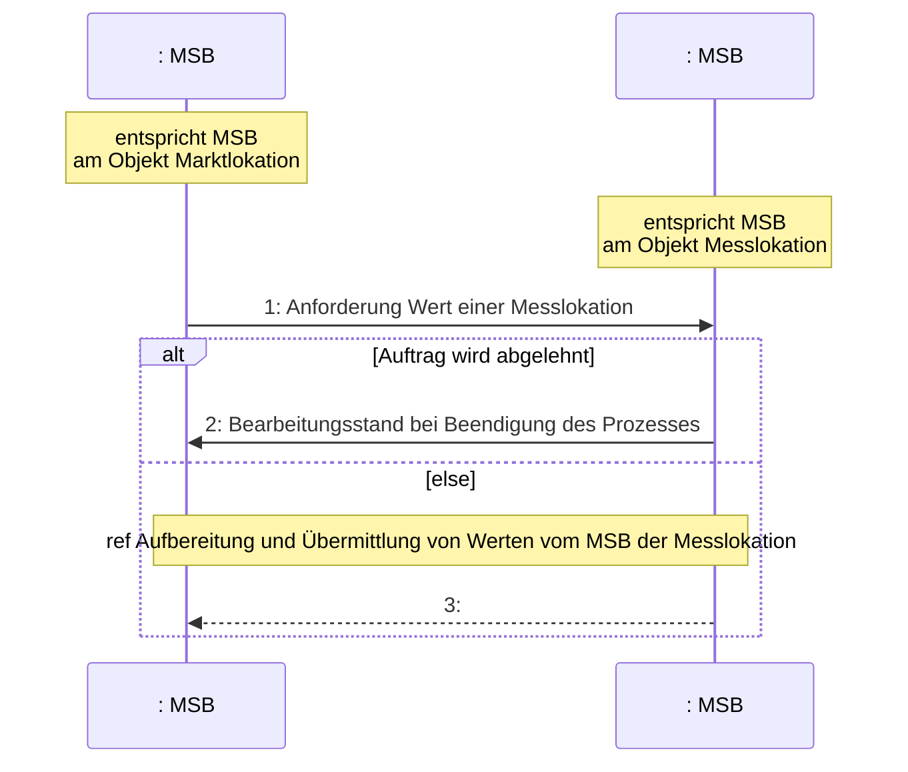
```mermaid
sequenceDiagram
    participant MSB_MaLo as : MSB
    participant MSB_MeLo as : MSB

    Note over MSB_MaLo: entspricht MSB<br/>am Objekt Marktlokation
    Note over MSB_MeLo: entspricht MSB<br/>am Objekt Messlokation

    MSB_MaLo->>MSB_MeLo: 1: Anforderung Wert einer Messlokation
    
    alt Auftrag wird abgelehnt
        MSB_MeLo->>MSB_MaLo: 2: Bearbeitungsstand bei Beendigung des Prozesses
    else else
        Note over MSB_MaLo, MSB_MeLo: ref Aufbereitung und Übermittlung von Werten vom MSB der Messlokation
        MSB_MeLo-->>MSB_MaLo: 3:
    end
```

Seite **43** von **80**

|Nr.|Aktion|Frist|Hinweis/Bemerkung|
|-|-|-|-|
|1|Anforderung Wert einer Messlokation|--|--|
|2|Bearbeitungsstand bei Beendigung des Prozesses|Unverzüglich, jedoch spätester ÜT ist der 2. WT nach dem ÜT von Nr. 1.|Der MSB der Messlokation lehnt die Anforderung des MSB der Marktlokation ab. Der Grund der Ablehnung wird mitgeteilt. In Abhängigkeit des Ablehnungsgrundes findet eine bilaterale Klärung statt.|
|3|ref Aufbereitung und Übermittlung von Werten vom MSB der Messlokation|Die Fristen für die Übermittlung der Werte vom MSB der Messlokation an den verantwortlichen MSB der Marktlokation und vom verantwortlichen MSB der Marktlokation an die Berechtigten beschreibt die Tabelle im Kapitel "Darstellung der zu übermittelnden Werte".|--|

## 2.7. Use-Case: Reklamation von Werten beim MSB

### 2.7.1. UC: Reklamation von Werten beim MSB

|Use-Case-Name|Reklamation von Werten beim MSB|
|-|-|
|Prozessziel|Der NB, LF oder ÜNB hat unplausible oder fehlende Werte beim MSB der Marktlokation reklamiert oder  der MSB der Marktlokation hat unplausible oder fehlende Werte beim MSB der Messlokation reklamiert oder  der MSB der Marktlokation bzw. der MSB der Messlokation hat erkannt, dass Werte durch ihn nicht versendet wurden oder durch ihn korrigiert werden müssen, ohne dass eine Reklamation einer anderen Marktrolle eingegangen ist.|
|Use-Case Beschreibung|Der NB, LF oder ÜNB reklamiert bei dem MSB der Marktlokation unplausible oder fehlende Werte (Marktlokation / Messlokation), der zu dem Zeitraum, für den die Werte zu reklamieren sind, der Marktlokation zugeordnet war oder  der MSB der Marktlokation reklamiert bei dem MSB der Messlokation unplausible oder fehlende Werte der Messlokation, der zu dem Zeitraum, für den die Werte zu reklamieren sind, der Messlokation zugeordnet war oder|

Seite **44** von **80**

|Use-Case-Name|Reklamation von Werten beim MSB||
|-|-|-|
||der MSB der Marktlokation bzw. der MSB der Messlokation erkennt, dass Werte durch ihn nicht versendet wurden oder durch ihn korrigiert werden müssen, ohne dass eine Reklamation einer anderen Marktrolle eingegangen ist.  Der entsprechende MSB prüft die Reklamation der betroffenen Werte.  Entsprechend der Prüfergebnisse übermittelt der MSB Werte (inklusive verbindlicher Information zur Begründung der Änderung der Werte), sofern diese noch nicht übermittelt wurden (bei nichtvorhandenen Werten) bzw. korrigierte Werte (bei fehlerhaften Werten) und storniert ggf. fehlerhafte Werte oder lehnt die Reklamation ab.||
||Rollen|\* MSB \* NB \* LF \* ÜNB|
||Vorbedingung|\* Der MSB kennt die Messlokationen und Marktlokation \* Der MSB kennt die Berechnungsvorschriften zur Bildung der Werte der Marklokation. \* LF, NB, ÜNB bzw. MSB ist zur Reklamation von Werten berechtigt.  *Auslöser:* \* Dem LF, NB, ÜNB oder MSB erscheint ein vorliegender Wert unplausibel oder \* dem LF, NB, ÜNB oder MSB liegen erforderliche Werte in der entsprechenden Qualität nicht fristgerecht vor oder \* dem LF liegen zur Prüfung des Lieferscheins keine Energiemengen für die betroffene Marktlokation vor.|
|Nachbedingung im Erfolgsfall|Übermittlung der Werte an die Berechtigten.||
|Nachbedingung im Fehlerfall|--||
|Fehlerfälle|--||
|Weitere Anforderungen|\* Sofern der MSB der Marktlokation bei fehlenden Werten feststellt, dass diese Werte nur an einzelne Berechtigte nicht versendet wurden, müssen die Werte auch nur an diese Berechtigten übermittelt werden. \* Der GPKE Use-Case "Geschäftsdatenanfrage" (GPKE Teil 4) darf nicht für die Reklamation unplausibler oder fehlender Werte verwendet werden. \* Eine Reklamation fehlender Werte ist erst möglich, wenn die Frist der zu übermittelnden Werte aus der Tabelle 2.5.5 überschritten ist. Ausgenommen davon ist folgender Sachverhalt: Geht beim LF ein Lieferschein vom NB ein und hat der LF vom MSB der Marktlokation noch keine Energiemengen für den Lieferscheinzeitraum erhalten, ist unabhängig der Fristen der Tabelle 2.5.5 unverzüglich eine Reklamation zu fehlenden Werten vom LF an den MSB der Marktlokation durchzuführen.||

Seite **45** von **80**

### 2.7.2. SD: Reklamation von Werten beim MSB

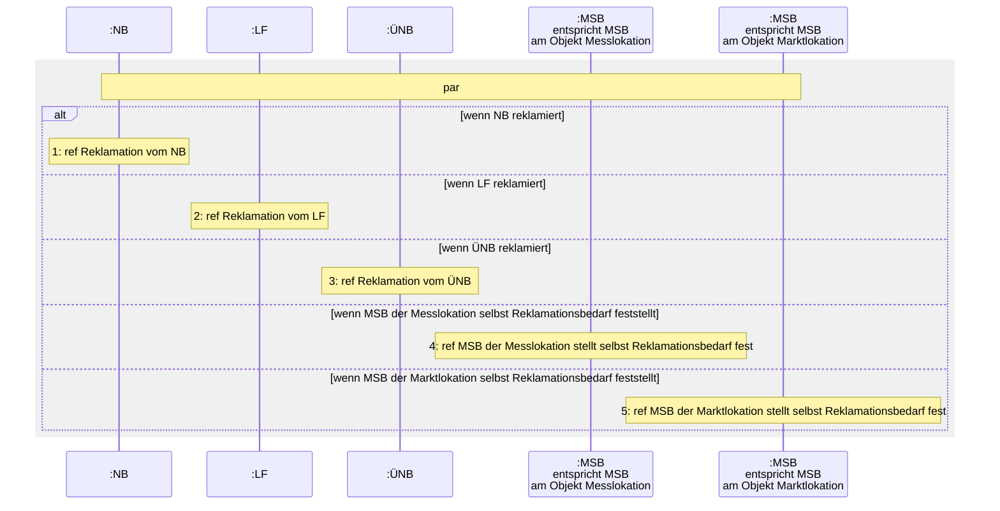
```mermaid
sequenceDiagram
    participant NB as :NB
    participant LF as :LF
    participant UNB as :ÜNB
    participant MSB_MeLo as :MSB<br/>entspricht MSB<br/>am Objekt Messlokation
    participant MSB_MaLo as :MSB<br/>entspricht MSB<br/>am Objekt Marktlokation

    rect rgb(240, 240, 240)
        Note over NB, MSB_MaLo: par
        
        alt wenn NB reklamiert
            Note over NB: 1: ref Reklamation vom NB
        else wenn LF reklamiert
            Note over LF: 2: ref Reklamation vom LF
        else wenn ÜNB reklamiert
            Note over UNB: 3: ref Reklamation vom ÜNB
        else wenn MSB der Messlokation selbst Reklamationsbedarf feststellt
            Note over MSB_MeLo: 4: ref MSB der Messlokation stellt selbst Reklamationsbedarf fest
        else wenn MSB der Marktlokation selbst Reklamationsbedarf feststellt
            Note over MSB_MaLo: 5: ref MSB der Marktlokation stellt selbst Reklamationsbedarf fest
        end
    end
```

|Nr.|Aktion|Frist|Hinweis/Bemerkung|
|-|-|-|-|
|1|ref Reklamation vom NB|--|--|
|2|ref Reklamation vom LF|--|--|
|3|ref Reklamation vom ÜNB ref MSB der Messlokation stellt selbst|--|--|
|4|ref MSB der Messlokation stellt selbst Reklamationsbedarf fest|--|--|
|5|ref MSB der Marktlokation stellt selbst Reklamationsbedarf fest|--|--|

Seite **46** von **80**

2.7.3. SD: Reklamation vom NB

```mermaid
sequenceDiagram
    participant NB as : NB
    participant MSB_MaLo as : MSB <br/> (entspricht MSB am Objekt Marktlokation)
    participant MSB_MeLo as : MSB <br/> (entspricht MSB am Objekt Messlokation)

    NB->>MSB_MaLo: 1: Reklamation Wert
    
    rect alt
        Note over NB, MSB_MaLo: [Auftrag wird abgelehnt]
        MSB_MaLo-->>NB: 2: Bearbeitungsstand bei Beendigung des Prozesses
    else [MSB der Marktlokation kann den Wert eigenständig beschaffen]
        rect opt
            Note over MSB_MaLo: [wenn bereits versendete Werte falsch und zu stornieren sind]
            MSB_MaLo->>MSB_MaLo: 3: ref Stornierung Werte vom MSB der Marktlokation
        end
        MSB_MaLo->>MSB_MaLo: 4: ref Aufbereitung und Übermittlung von Werten vom MSB der Marktlokation
    else [Werte auf der Messlokation werden benötigt]
        MSB_MaLo->>MSB_MeLo: 5: Reklamation Wert einer Messlokation
        rect alt
            Note over MSB_MaLo, MSB_MeLo: [Auftrag wird abgelehnt]
            MSB_MeLo-->>MSB_MaLo: 6: Bearbeitungsstand bei Beendigung des Prozesses
            MSB_MaLo-->>NB: 7: Bearbeitungsstand bei Beendigung des Prozesses
        else [else]
            rect opt
                Note over MSB_MeLo: [wenn bereits versendete Werte falsch und zu stornieren sind]
                MSB_MeLo->>MSB_MeLo: 8: ref Stornierung Werte vom MSB der Messlokation
            end
            MSB_MeLo->>MSB_MeLo: 9: ref Aufbereitung und Übermittlung von Werten vom MSB der Messlokation
        end
    end
```

|Nr.|Aktion|Frist|Hinweis/Bemerkung|
|-|-|-|-|
|1|Reklamation Wert|Unverzüglich nach Kenntnisnahme.|Bei der Reklamation muss ein Hinweis auf den Grund der Reklamation mitgegeben werden.|
|2|Bearbeitungsstand bei Beendigung des Prozesses|Unverzüglich, jedoch spätester ÜT ist der 3. WT nach dem ÜT von Nr. 1.|Der MSB der Marktlokation lehnt die Reklamation des NB ab. In der Ablehnung der Reklamation wird mitgeteilt, dass a) keine Wertänderung durchgeführt wird oder b) ein weiterführender Prüfprozess zur Klärung des Sachverhalts veranlasst wurde.  Im Falle von b) erfolgt der weitere Ablauf außerhalb des hier beschriebenen Reklamationsprozesses.|

Seite 47 von 80

|Nr.|Aktion|Frist|Hinweis/Bemerkung|
|-|-|-|-|
|3|ref Stornierung Werte vom MSB der Marktlokation|--|Im Fall, dass der MSB der Marktlokation die Werte ohne das hinzuziehen des MSB der Messlokation zur Verfügung stellen kann und Werte bereits versendet wurden und storniert werden müssen.|
|4|ref Aufbereitung und Übermittlung von Werten vom MSB der Marktlokation|--|Im Fall, dass der MSB der Marktlokation die Werte ohne das hinzuziehen des MSB der Messlokation zur Verfügung stellen kann.|
|5|Reklamation Wert einer Messlokation|Unverzüglich, jedoch spätester ÜT ist der 3. WT nach dem ÜT von Nr. 1.|Im Fall, dass der MSB der Marktlokation die Werte nicht ohne das hinzuziehen des MSB der Messlokation zur Verfügung stellen kann und dieser daher Werte beim MSB der Messlokation anfordern muss.|
|6|Bearbeitungsstand bei Beendigung des Prozesses|Unverzüglich, jedoch spätester ÜT ist der 3. WT nach dem ÜT von Nr. 5.|Der MSB der Messlokation lehnt die Reklamation des MSB der Marktlokation ab. Der Grund der Ablehnung wird mitgeteilt. Abhängig des Ablehnungsgrundes findet eine bilaterale Klärung statt.|
|7|Bearbeitungsstand bei Beendigung des Prozesses|Unverzüglich, jedoch spätester ÜT ist der 1. WT nach dem ÜT von Nr. 6.|Der MSB der Marktlokation hat den Ablehnungsgrund gegenüber dem NB mitzuteilen. In Abhängigkeit des Ablehnungsgrundes findet eine bilaterale Klärung statt.|
|8|ref Stornierung Werte vom MSB der Messlokation|--|Im Fall, dass Werte bereits versendet wurden und storniert werden müssen.|
|9|ref Aufbereitung und Übermittlung von Werten vom MSB der Messlokation|--|--|

Seite **48** von **80**

2.7.4. SD: Reklamation vom LF

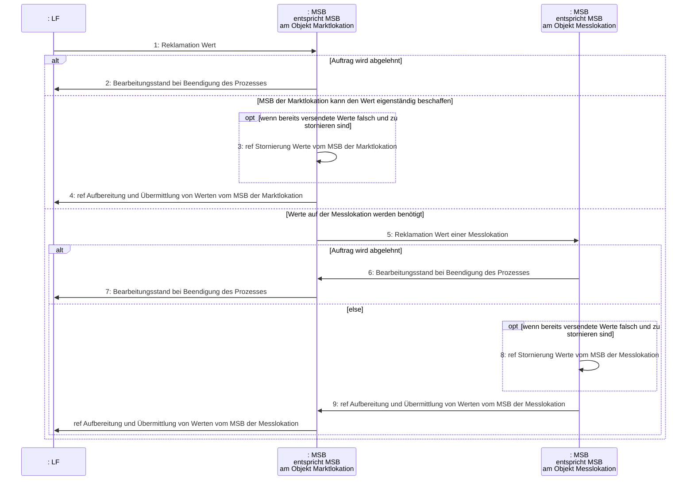
```mermaid
sequenceDiagram
    participant LF as : LF
    participant MSB_MaLo as : MSB<br/>entspricht MSB<br/>am Objekt Marktlokation
    participant MSB_MeLo as : MSB<br/>entspricht MSB<br/>am Objekt Messlokation

    LF->>MSB_MaLo: 1: Reklamation Wert
    
    alt Auftrag wird abgelehnt
        MSB_MaLo->>LF: 2: Bearbeitungsstand bei Beendigung des Prozesses
    else MSB der Marktlokation kann den Wert eigenständig beschaffen
        opt wenn bereits versendete Werte falsch und zu stornieren sind
            MSB_MaLo->>MSB_MaLo: 3: ref Stornierung Werte vom MSB der Marktlokation
        end
        MSB_MaLo->>LF: 4: ref Aufbereitung und Übermittlung von Werten vom MSB der Marktlokation
    else Werte auf der Messlokation werden benötigt
        MSB_MaLo->>MSB_MeLo: 5: Reklamation Wert einer Messlokation
        alt Auftrag wird abgelehnt
            MSB_MeLo->>MSB_MaLo: 6: Bearbeitungsstand bei Beendigung des Prozesses
            MSB_MaLo->>LF: 7: Bearbeitungsstand bei Beendigung des Prozesses
        else else
            opt wenn bereits versendete Werte falsch und zu stornieren sind
                MSB_MeLo->>MSB_MeLo: 8: ref Stornierung Werte vom MSB der Messlokation
            end
            MSB_MeLo->>MSB_MaLo: 9: ref Aufbereitung und Übermittlung von Werten vom MSB der Messlokation
            MSB_MaLo->>LF: ref Aufbereitung und Übermittlung von Werten vom MSB der Messlokation
        end
    end
```

|Nr.|Aktion|Frist|Hinweis/Bemerkung|
|-|-|-|-|
|1|Reklamation Wert|Unverzüglich nach Kenntnisnahme.|Bei der Reklamation muss ein Hinweis auf den Grund der Reklamation mitgegeben werden.|
|2|Bearbeitungsstand bei Beendigung des Prozesses|Unverzüglich, jedoch spätester ÜT ist der 3. WT nach dem ÜT von Nr. 1.|Der MSB der Marktlokation lehnt die Reklamation des LF ab. In der Ablehnung der Reklamation wird mitgeteilt, dass a) keine Wertänderung durchgeführt wird oder b) ein weiterführender Prüfprozess zur Klärung des Sachverhalts veranlasst wurde.  Im Falle von b) erfolgt der weitere Ablauf außerhalb des hier beschriebenen Reklamationsprozesses.|
|3|ref Stornierung Werte vom MSB der Marktlokation|--|Im Fall, dass der MSB der Marktlokation die Werte ohne das Hinzuziehen des MSB der Messlokation zur Verfügung|

Seite 49 von 80

|Nr.|Aktion|Frist|Hinweis/Bemerkung|
|-|-|-|-|
||||stellen kann und Werte bereits versendet wurden und storniert werden müssen.|
|4|ref Aufbereitung und Übermittlung von Werten vom MSB der Marktlokation|--|Im Fall, dass der MSB der Marktlokation die Werte ohne das hinzuziehen des MSB der Messlokation zur Verfügung stellen kann.|
|5|Reklamation Wert einer Messlokation|Unverzüglich, jedoch spätester ÜT ist der 3. WT nach dem ÜT von Nr. 1.|Im Fall, dass der MSB der Marktlokation die Werte nicht ohne das hinzuziehen des MSB der Messlokation zur Verfügung stellen kann und dieser daher Werte beim MSB der Messlokation anfordern muss.|
|6|Bearbeitungsstand bei Beendigung des Prozesses|Unverzüglich, jedoch spätester ÜT ist der 3. WT nach dem ÜT von Nr. 5.|Der MSB der Messlokation lehnt die Reklamation des MSB der Marktlokation ab. Der Grund der Ablehnung wird mitgeteilt. Abhängig des Ablehnungsgrundes findet eine bilaterale Klärung statt.|
|7|Bearbeitungsstand bei Beendigung des Prozesses|Unverzüglich, jedoch spätester ÜT ist der 1. WT nach dem ÜT von Nr. 6.|Der MSB der Marktlokation hat den Ablehnungsgrund gegenüber dem LF mitzuteilen. In Abhängigkeit des Ablehnungsgrundes findet eine bilaterale Klärung statt.|
|8|ref Stornierung Werte vom MSB der Messlokation|--|Im Fall, dass Werte bereits versendet wurden und storniert werden müssen.|
|9|ref Aufbereitung und Übermittlung von Werten vom MSB der Messlokation|--|--|

Seite **50** von **80**

### 2.7.5. SD: Reklamation vom ÜNB

```mermaid
sequenceDiagram
    participant ÜNB as :ÜNB
    participant MSB_MaLo as :MSB<br/>entspricht MSB<br/>am Objekt Marktlokation
    participant MSB_MeLo as :MSB<br/>entspricht MSB<br/>am Objekt Messlokation

    ÜNB->>MSB_MaLo: 1: Reklamation Wert
    
    rect alt
        Note over ÜNB, MSB_MaLo: [Auftrag wird abgelehnt]
        MSB_MaLo-->>ÜNB: 2: Bearbeitungsstand bei Beendigung des Prozesses
    else [MSB der Marktlokation kann den Wert eigenständig beschaffen]
        rect opt
            Note over MSB_MaLo: [wenn bereits versendete Werte falsch und zu stornieren sind]
            MSB_MaLo->>MSB_MaLo: 3: ref Stornierung Werte vom MSB der Marktlokation
        end
        MSB_MaLo->>MSB_MaLo: 4: ref Aufbereitung und Übermittlung von Werten vom MSB der Marktlokation
    else [Werte auf der Messlokation werden benötigt]
        MSB_MaLo->>MSB_MeLo: 5: Reklamation Wert einer Messlokation
        rect alt
            Note over MSB_MaLo, MSB_MeLo: [Auftrag wird abgelehnt]
            MSB_MeLo-->>MSB_MaLo: 6: Bearbeitungsstand bei Beendigung des Prozesses
            MSB_MaLo-->>ÜNB: 7: Bearbeitungsstand bei Beendigung des Prozesses
        else [else]
            rect opt
                Note over MSB_MeLo: [wenn bereits versendete Werte falsch und zu stornieren sind]
                MSB_MeLo->>MSB_MeLo: 8: ref Stornierung Werte vom MSB der Messlokation
            end
            MSB_MeLo->>MSB_MeLo: 9: ref Aufbereitung und Übermittlung von Werten vom MSB der Messlokation
        end
    end
```

|Nr.|Aktion|Frist|Hinweis/Bemerkung|
|-|-|-|-|
|1|Reklamation Wert|Unverzüglich nach Kenntnisnahme|Bei der Reklamation muss ein Hinweis auf den Grund der Reklamation mitgegeben werden.|
|2|Bearbeitungsstand bei Beendigung des Prozesses|Unverzüglich, jedoch spätester ÜT ist der 3. WT nach dem ÜT von Nr. 1.|Der MSB der Marktlokation lehnt die Reklamation des ÜNB ab. In der Ablehnung der Reklamation wird mitgeteilt, dass a) keine Wertänderung durchgeführt wird oder b) ein weiterführender Prüfprozess zur Klärung des Sachverhalts veranlasst wurde.  Im Falle von b) erfolgt der weitere Ablauf außerhalb des hier beschriebenen Reklamationsprozesses.|
|3|ref Stornierung Werte vom MSB der Marktlokation|--|Im Fall, dass der MSB der Marktlokation die Werte ohne das Hinzuziehen des MSB der Messlokation zur Verfügung stellen kann und Werte bereits versendet wurden und storniert werden müssen.|

Seite **51** von **80**

|Nr.|Aktion|Frist|Hinweis/Bemerkung|
|-|-|-|-|
|4|ref Aufbereitung und Übermittlung von Werten vom MSB der Marktlokation|--|Im Fall, dass der MSB der Marktlokation die Werte ohne das hinzuziehen des MSB der Messlokation zur Verfügung stellen kann.|
|5|Reklamation Wert einer Messlokation|Unverzüglich, jedoch spätester ÜT ist der 3. WT nach dem ÜT von Nr. 1.|Im Fall, dass der MSB der Marktlokation die Werte nicht ohne das hinzuziehen des MSB der Messlokation zur Verfügung stellen kann und dieser daher Werte beim MSB der Messlokation anfordern muss.|
|6|Bearbeitungsstand bei Beendigung des Prozesses|Unverzüglich, jedoch spätester ÜT ist der 3. WT nach dem ÜT von Nr. 5.|Der MSB der Messlokation lehnt die Reklamation des MSB der Marktlokation ab. Der Grund der Ablehnung wird mitgeteilt. Abhängig des Ablehnungsgrundes findet eine bilaterale Klärung statt.|
|7|Bearbeitungsstand bei Beendigung des Prozesses|Unverzüglich, jedoch spätester ÜT ist der 1. WT nach dem ÜT von Nr. 6.|Der MSB der Marktlokation hat den Ablehnungsgrund gegenüber dem ÜNB mitzuteilen. In Abhängigkeit des Ablehnungsgrundes findet eine bilaterale Klärung statt.|
|8|ref Stornierung Werte vom MSB der Messlokation|--|Im Fall, dass Werte bereits versendet wurden und storniert werden müssen.|
|9|ref Aufbereitung und Übermittlung von Werten vom MSB der Messlokation|--|--|

Seite **52** von **80**

### 2.7.6. SD: MSB der Messlokation stellt selbst Reklamationsbedarf fest

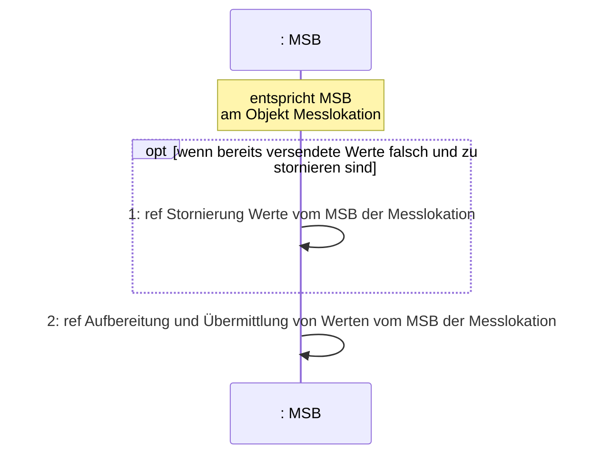
```mermaid
sequenceDiagram
    participant MSB as : MSB
    Note over MSB: entspricht MSB<br/>am Objekt Messlokation
    
    opt wenn bereits versendete Werte falsch und zu stornieren sind
        MSB->>MSB: 1: ref Stornierung Werte vom MSB der Messlokation
    end
    
    MSB->>MSB: 2: ref Aufbereitung und Übermittlung von Werten vom MSB der Messlokation
```

|Nr.|Aktion|Frist|Hinweis/Bemerkung|
|-|-|-|-|
|1|ref Stornierung Werte vom MSB der Messlokation|--|Im Fall, dass Werte bereits versendet wurden und storniert werden müssen.|
|2|ref Aufbereitung und Übermittlung von Werten vom MSB der Messlokation|--|--|

Seite **53** von **80**

2.7.7. SD: MSB der Marktlokation stellt selbst Reklamationsbedarf fest

```mermaid
sequenceDiagram
    participant MSB_MaLo as : MSB
    participant MSB_MeLo as : MSB

    Note over MSB_MaLo: entspricht MSB<br/>am Objekt Marktlokation
    Note over MSB_MeLo: entspricht MSB<br/>am Objekt Messlokation

    rect rgb(240, 240, 240)
        Note left of MSB_MaLo: alt [MSB der Marktlokation<br/>kann den Wert eigenständig<br/>beschaffen]
        
        opt wenn bereits versendete Werte falsch und zu stornieren sind
            MSB_MaLo->>MSB_MaLo: 1: ref Stornierung Werte vom MSB der Marktlokation
        end
        
        MSB_MaLo->>MSB_MaLo: 2: ref Aufbereitung und Übermittlung von Werten vom MSB der Marktlokation
    end

    rect rgb(240, 240, 240)
        Note left of MSB_MaLo: [Werte auf der Messlokation<br/>werden benötigt]
        
        MSB_MaLo->>MSB_MeLo: 3: Reklamation Wert einer Messlokation
        
        rect rgb(240, 240, 240)
            Note left of MSB_MaLo: alt [Auftrag wird abgelehnt]
            MSB_MeLo->>MSB_MaLo: 4: Bearbeitungsstand bei Beendigung des Prozesses
        
        else else
            opt wenn bereits versendete Werte falsch und zu stornieren sind
                MSB_MeLo->>MSB_MeLo: 5: ref Stornierung Werte vom MSB der Messlokation
            end
            
            MSB_MeLo->>MSB_MaLo: 6: ref Aufbereitung und Übermittlung von Werten vom MSB der Messlokation
        end
    end
```

|Nr.|Aktion|Frist|Hinweis/Bemerkung|
|-|-|-|-|
|1|ref Stornierung Werte vom MSB der Marktlokation|--|Im Fall, dass der MSB der Marktlokation die Werte ohne das hinzuziehen des MSB der Messlokation zur Verfügung stellen kann und Werte bereits versendet wurden und storniert werden müssen.|
|2|ref Aufbereitung und Übermittlung von Werten vom MSB der Marktlokation|--|Im Fall, dass der MSB der Marktlokation die Werte ohne das Hinzuziehen des MSB der Messlokation zur Verfügung stellen kann|
|3|Reklamation Wert einer Messlokation|Unverzüglich nach Kenntnisnahme, jedoch spätester ÜT ist der 3. WT nach Kenntnisnahme.|Im Fall, dass der MSB der Marktlokation die Werte nicht ohne das hinzuziehen des MSB der Messlokation zur Verfügung stellen kann und dieser daher Werte beim MSB der Messlokation anfordern muss.|
|4|Bearbeitungsstand bei Beendigung des Prozesses|Unverzüglich, jedoch spätester ÜT ist der 3. WT nach dem ÜT von Nr. 3.|Der MSB der Messlokation lehnt die Reklamation des MSB der Marktlokation ab. In der Ablehnung der Reklamation wird mitgeteilt, dass a) keine Wertänderung durchgeführt wird oder|

Seite 54 von 80

|Nr.|Aktion|Frist|Hinweis/Bemerkung||||
|-|-|-|-|-|-|-|
||||b) ein weiterführender Prüfprozess zur Klärung des Sachverhalts veranlasst wurde. c) Im Falle von b) erfolgt der weitere Ablauf außerhalb des hier beschriebenen Reklamationsprozesses.||||
||||5|ref Stornierung Werte vom MSB der Messlokation|--|Im Fall, dass Werte bereits versendet wurden und storniert werden müssen.|
|6|ref Aufbereitung und Übermittlung von Werten vom MSB der Messlokation|--|--||||

## 2.8. Use-Case: Stornieren von Werten

### 2.8.1. UC: Stornieren von Werten

|Use-Case-Name|Stornieren von Werten|
|-|-|
|Prozessziel|Stornierung von übermittelten Werten bei allen Beteiligten.|
|Use-Case Beschreibung|Der MSB der Marktlokation übermittelt eine Stornierung für bereits übermittelte Werte an die Beteiligten, die die zu stornierenden Werte zuvor übermittelt bekommen haben.  Der MSB der Messlokation übermittelt eine Stornierung für bereits übermittelte Werte an den MSB der Marktlokation.|
|Rollen|\* MSB \* NB \* LF \* ÜNB|
|Vorbedingung|\* Werte wurden zuvor übermittelt. \* Die reklamierten Werte sind stornorelevant.  *Auslöser:* \* Prüfergebnis aus Reklamation sieht Stornierung vor oder \* ein versehentlich im Markt übermittelter Wert ist zu stornieren.|
|Nachbedingung im Erfolgsfall|Bei stornorelevanten Werten kann eine erneute Werteübermittlung durchgeführt werden.|
|Nachbedingung im Fehlerfall|--|
|Fehlerfälle|--|
|Weitere Anforderungen|--|

Seite **55** von **80**

### 2.8.2. SD: Stornierung Werte vom MSB der Messlokation

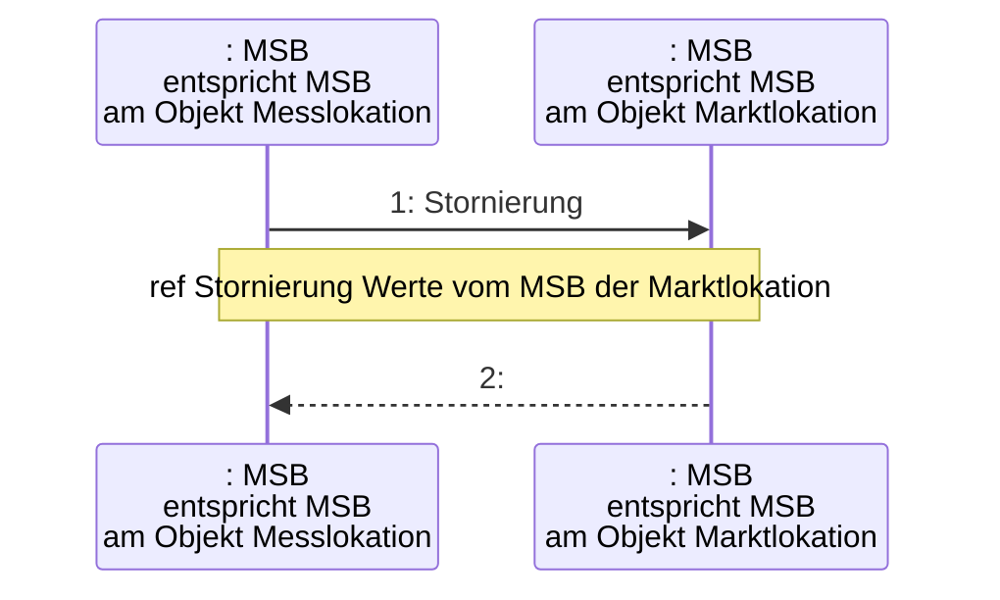
```mermaid
sequenceDiagram
    participant MSB_MeLo as : MSB<br/>entspricht MSB<br/>am Objekt Messlokation
    participant MSB_MaLo as : MSB<br/>entspricht MSB<br/>am Objekt Marktlokation

    MSB_MeLo->>MSB_MaLo: 1: Stornierung
    Note over MSB_MeLo, MSB_MaLo: ref Stornierung Werte vom MSB der Marktlokation
    MSB_MaLo-->>MSB_MeLo: 2:
```

|Nr.|Aktion|Frist|Hinweis/Bemerkung|
|-|-|-|-|
|1|Stornierung|Unverzüglich nach Feststellung des Stornierungsbedarfs.|--|
|2|ref Stornierung Werte vom MSB der Marktlokation|--|--|

Seite 56 von 80

### 2.8.3. SD: Stornierung Werte vom MSB der Marktlokation

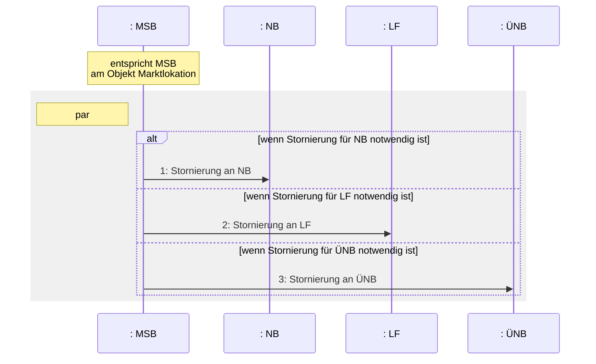
```mermaid
sequenceDiagram
    participant MSB as : MSB
    participant NB as : NB
    participant LF as : LF
    participant UNB as : ÜNB

    Note over MSB: entspricht MSB<br/>am Objekt Marktlokation

    rect rgb(240, 240, 240)
        Note left of MSB: par
        alt wenn Stornierung für NB notwendig ist
            MSB->>NB: 1: Stornierung an NB
        else wenn Stornierung für LF notwendig ist
            MSB->>LF: 2: Stornierung an LF
        else wenn Stornierung für ÜNB notwendig ist
            MSB->>UNB: 3: Stornierung an ÜNB
        end
    end
```

|Nr.|Aktion|Frist|Hinweis/Bemerkung|
|-|-|-|-|
|1|Stornierung an NB|Unverzüglich nach Feststellung eines Stornierungsbedarfs|--|
|2|Stornierung an LF|Unverzüglich nach Feststellung eines Stornierungsbedarfs|--|
|3|Stornierung an ÜNB|Unverzüglich nach Feststellung eines Stornierungsbedarfs.|--|

Seite 57 von 80

## 2.9. Übermittlung und Stornierung von Zählerständen bei kME (ohne RLM) und mME von einem LF oder NB an den MSB der Messlokation

### 2.9.1. Use-Case: Übermittlung von Zählerständen vom LF oder NB an MSB

#### 2.9.1.1. UC: Übermittlung von Zählerständen vom LF oder NB an MSB

|Use-Case-Name|Übermittlung von Zählerständen vom LF oder NB an MSB|
|-|-|
|Prozessziel|Der LF bzw. NB hat den Zählerstand an den MSB der Messlokation übermittelt.|
|Use-Case Beschreibung|Der LF bzw. NB übermittelt den Zählerstand an den MSB der Messlokation, der zu der Zeit der Ablesung der Messlokation zugeordnet war.|
|Rollen|\* LF \* NB \* MSB|
|Vorbedingung|\* Der MSB der Messlokation kennt die Messlokation. \* Dem LF oder NB liegt im Rahmen einer Ablesung für kME ohne RLM oder mME ein eigen erfasster Zählerstand bzw. Zählerstand durch eine Kundenablesung vor.|
|Nachbedingung im Erfolgsfall|Der zuvor vom MSB der Messlokation plausibilisierte Zählerstand wird erst an den MSB der Marktlokation übermittelt, wenn ein Auslöser zur Übermittlung (Kapitel 2.5.5. „Darstellung der zu übermittelnden Werte“) vorliegt.|
|Nachbedingung im Fehlerfall|--|
|Fehlerfälle|--|
|Weitere Anforderungen|--|

Seite **58** von **80**

**2.9.1.2. SD: Übermittlung von Zählerständen vom LF oder NB an MSB**

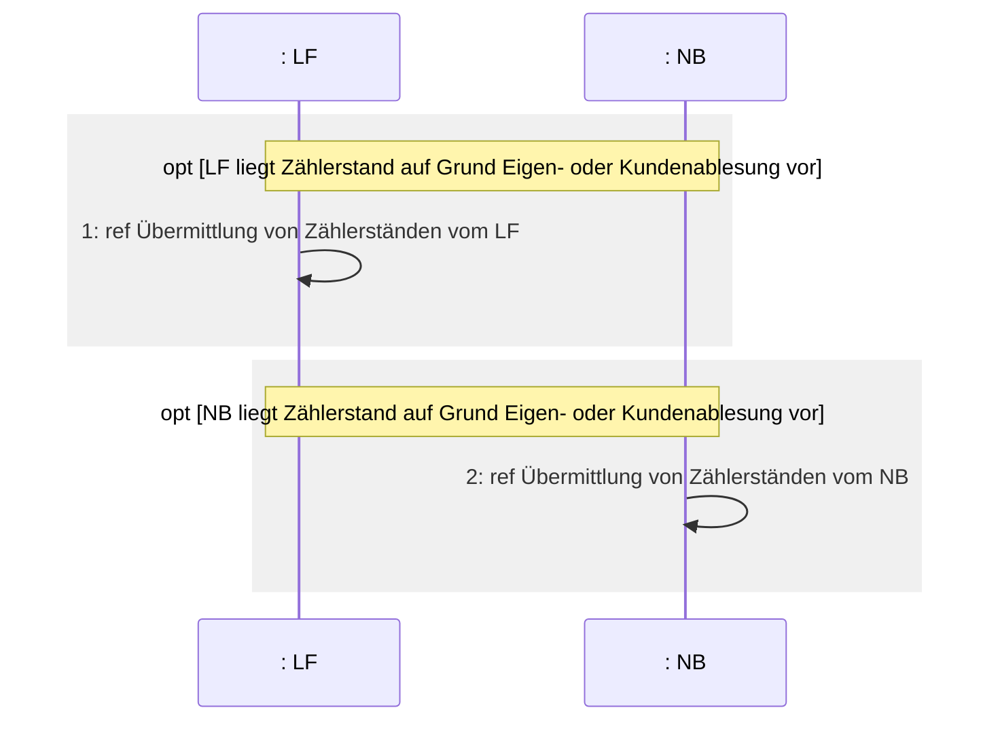
```mermaid
sequenceDiagram
    participant LF as : LF
    participant NB as : NB

    rect rgb(240, 240, 240)
        Note over LF, NB: opt [LF liegt Zählerstand auf Grund Eigen- oder Kundenablesung vor]
        LF->>LF: 1: ref Übermittlung von Zählerständen vom LF
    end

    rect rgb(240, 240, 240)
        Note over LF, NB: opt [NB liegt Zählerstand auf Grund Eigen- oder Kundenablesung vor]
        NB->>NB: 2: ref Übermittlung von Zählerständen vom NB
    end
```

|Nr.|Aktion|Frist|Hinweis/Bemerkung|
|-|-|-|-|
|1|ref Übermittlung von Zählerständen vom LF|--|--|
|2|ref Übermittlung von Zählerständen vom NB|--|--|

Seite 59 von 80

### 2.9.1.3. SD: Übermittlung von Zählerständen vom LF

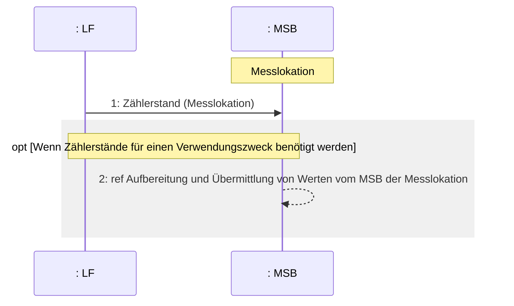
```mermaid
sequenceDiagram
    participant LF as : LF
    participant MSB as : MSB
    Note over MSB: Messlokation
    LF->>MSB: 1: Zählerstand (Messlokation)
    
    rect rgb(240, 240, 240)
        Note over LF, MSB: opt [Wenn Zählerstände für einen Verwendungszweck benötigt werden]
        MSB-->>MSB: 2: ref Aufbereitung und Übermittlung von Werten vom MSB der Messlokation
    end
```

|Nr.|Aktion|Frist|Hinweis/Bemerkung|
|-|-|-|-|
|1|Zählerstand (Messlokation)|Unverzüglich|--|
|2|ref Aufbereitung und Übermittlung von Werten vom MSB der Messlokation|Die Fristen für die Übermittlung der Werte vom MSB der Messlokation an den verantwortlichen MSB der Marktlokation und vom verantwortlichen MSB der Marktlokation an die Berechtigten beschreibt die Tabelle im Kapitel "Darstellung der zu übermittelnden Werte".|--|

Seite 60 von 80

### 2.9.1.4. SD: Übermittlung von Zählerständen vom NB

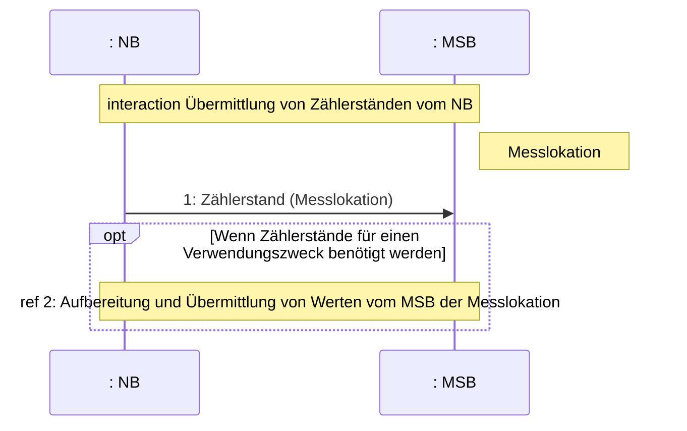
```mermaid
sequenceDiagram
    participant NB as : NB
    participant MSB as : MSB
    Note over NB, MSB: interaction Übermittlung von Zählerständen vom NB
    Note right of MSB: Messlokation
    NB->>MSB: 1: Zählerstand (Messlokation)
    opt Wenn Zählerstände für einen Verwendungszweck benötigt werden
        Note over NB, MSB: ref 2: Aufbereitung und Übermittlung von Werten vom MSB der Messlokation
    end
```

|Nr.|Aktion|Frist|Hinweis/Bemerkung|
|-|-|-|-|
|1|Zählerstand (Messlokation)|Unverzüglich|--|
|2|ref Aufbereitung und Übermittlung von Werten vom MSB der Messlokation|Die Fristen für die Übermittlung der Werte vom MSB der Messlokation an den verantwortlichen MSB der Marktlokation und vom verantwortlichen MSB der Marktlokation an die Berechtigten beschreibt die Tabelle im Kapitel "Darstellung der zu übermittelnden Werte".|--|

Seite 61 von 80

### 2.9.2. Use-Case: Stornierung von Zählerständen vom LF oder NB an MSB

#### 2.9.2.1. UC: Stornierung von Zählerständen vom LF oder NB an MSB

|Use-Case-Name|Stornierung von Zählerständen vom LF oder NB an MSB|
|-|-|
|Prozessziel|Der LF bzw. NB hat den an den MSB der Messlokation übermittelten Zählerstand storniert.|
|Use-Case Beschreibung|Der LF bzw. NB übermittelt die Stornierung an den MSB der Messlokation, der zu der Zeit der Ablesung des zu stornierenden Zählerstands der Messlokation zugeordnet war.|
|Rollen|\* LF \* NB \* MSB|
|Vorbedingung|\* Der MSB der Messlokation kennt die Messlokation. \* Der LF oder NB hat im Rahmen einer Ablesung für kME ohne RLM oder mME einen eigen erfassten Zählerstand bzw. Zählerstand durch eine Kundenablesung an den MSB der Messlokation übermittelt. \* Der LF oder NB stellt einen Stornierungsbedarf des durch ihn an den MSB der Messlokation übermittelten Zählerstands fest.|
|Nachbedingung im Erfolgsfall|Sofern der zu stornierende Zählerstand vom MSB der Messlokation bereits an den MSB der Marktlokation übermittelt wurde und die Stornierung plausibel ist, ist dieser Zählerstand vom MSB der Messlokation beim MSB der Marktlokation zu stornieren.|
|Nachbedingung im Fehlerfall|--|
|Fehlerfälle|--|
|Weitere Anforderungen|Wurde der zuvor durch den LF bzw. NB übermittelte Zählerstand durch den MSB der Marktlokation übermittelt, hat dieser Zählerstand solange Gültigkeit, bis der MSB der Marktlokation diesen Zählerstand gegenüber LF und NB storniert.|

Seite **62** von **80**

### 2.9.2.2. SD: Stornierung von Zählerständen vom LF oder NB an MSB

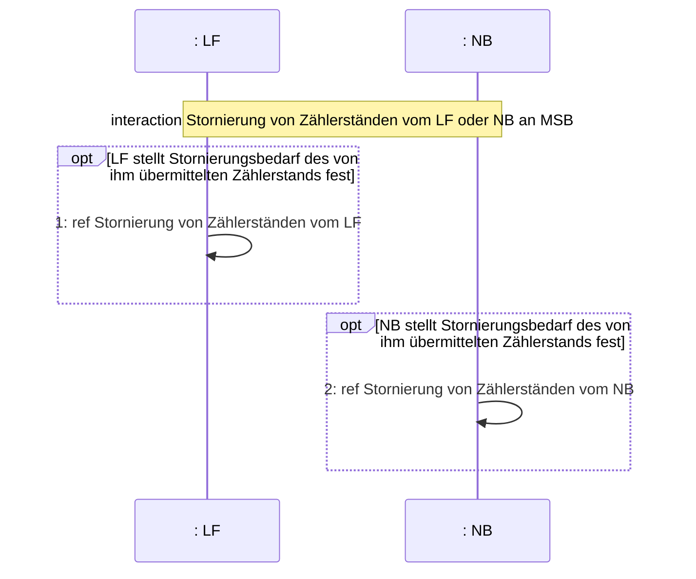
```mermaid
sequenceDiagram
    participant LF as : LF
    participant NB as : NB

    rect rgb(255, 255, 255)
        Note over LF, NB: interaction Stornierung von Zählerständen vom LF oder NB an MSB
        
        opt LF stellt Stornierungsbedarf des von ihm übermittelten Zählerstands fest
            LF->>LF: 1: ref Stornierung von Zählerständen vom LF
        end

        opt NB stellt Stornierungsbedarf des von ihm übermittelten Zählerstands fest
            NB->>NB: 2: ref Stornierung von Zählerständen vom NB
        end
    end
```

|Nr.|Aktion|Frist|Hinweis/Bemerkung|
|-|-|-|-|
|1|ref Stornierung von Zählerständen vom LF|--|--|
|2|ref Stornierung von Zählerständen vom NB|--|--|

Seite 63 von 80

### 2.9.2.3. SD: Stornierung von Zählerständen vom LF

```mermaid
sequenceDiagram
    participant LF as : LF
    participant MSB as Messlokation<br/>: MSB
    
    LF->>MSB: 1: Stornierung
    
    rect rgb(255, 255, 255)
        Note over LF, MSB: opt
        Note over LF, MSB: [Wenn der Zählerstand vom MSB der Messlokation bereits an den MSB der Marktlokation übermittelt wurde und die Stornierung plausibel ist, ist dieser Zählerstand zu stornieren]
        Note over LF, MSB: ref 2: Stornierung Werte vom MSB der Messlokation
    end
```

|Nr.|Aktion|Frist|Hinweis/Bemerkung|
|-|-|-|-|
|1|Stornierung|Unverzüglich nach Feststellung des Stornierungsbedarfs|--|
|2|ref Stornierung Werte vom MSB der Messlokation|--|--|

### 2.9.2.4. SD: Stornierung von Zählerständen vom NB

```mermaid
sequenceDiagram
    participant NB as : NB
    participant MSB as Messlokation<br/>: MSB
    
    NB->>MSB: 1: Stornierung
    
    rect rgb(255, 255, 255)
        Note over NB, MSB: opt
        Note over NB, MSB: [Wenn der Zählerstand vom MSB der Messlokation bereits an den MSB der Marktlokation übermittelt wurde und die Stornierung plausibel ist, ist dieser Zählerstand zu stornieren]
        Note over NB, MSB: ref 2: Stornierung Werte vom MSB der Messlokation
    end
```

|Nr.|Aktion|Frist|Hinweis/Bemerkung|
|-|-|-|-|
|1|Stornierung|Unverzüglich nach Feststellung des Stornierungsbedarfs|--|

Seite 64 von 80

|Nr.|Aktion|Frist|Hinweis/Bemerkung|
|-|-|-|-|
|2|ref Stornierung Werte vom MSB der Messlokation|--|--|

Seite **65** von **80**

# 3. Übermittlung von Werten nach Typ 2

## 3.1. Übermittlung von Werten aus einem iMS an den ÜNB

Das Kapitel beschreibt den Umfang der zwischen einem iMS und dem ÜNB auszutauschenden Werte von Messlokationen erzeugender Erneuerbaren Energie-Marktlokationen. Der ÜNB erhält die Werte aus einem iMS, standardmäßig nur für die Messlokationen der erzeugenden Erneuerbaren Energie-Marktlokationen, welche dem ÜNB gemäß den gesetzlichen Regelungen zustehen. Es kommt ausschließlich der Lastgang / Zählerstandsgang (¼-h-Werte) zur Anwendung.

Es handelt sich dabei um die Übermittlung von Werten nach Typ 2.

```mermaid
sequenceDiagram
    participant MSB as : MSB
    participant ÜNB as : ÜNB
    Note over MSB, ÜNB: Interaction Übermittlung von Werten aus einem iMS an den ÜNB
    Note over MSB: iMS
    MSB->>ÜNB: 1: Werte
```

* Der Austausch der Kontaktdaten erfolgt mittels der Prozesse Übermittlung von Informationen zwischen MSB und ÜNB bzw. ÜNB und MSB. Sofern ein automatisches Bereitstellen der Werte gegenüber dem ÜNB ohne vorherige Kontaktaufnahme gewährleistet ist, kann die vorherige Kontaktaufnahme entfallen. Voraussetzung für den Aufbau der Übermittlung von Werten aus einem iMS ist insbesondere, dass der Austausch der Kommunikationsparameter und Zertifikatsinformationen zwischen ÜNB, MSB sowie iMS erfolgreich abgeschlossen ist.

* Die Parameter für die Konfiguration eines iMS zur Übermittlung von Werten an den ÜNB werden vom MSB vorgegeben.

## 3.2. Use-Case: Übermittlung von Werten nach Typ 2 vom MSB an NB oder LF

### 3.2.1. UC: Übermittlung von Werten nach Typ 2 vom MSB an NB oder LF

|Use-Case-Name|Übermittlung von Werten nach Typ 2 vom MSB an NB oder LF|
|-|-|
|Prozessziel|Der NB bzw. LF erhält die Werte der bestellten Konfiguration für die betroffenen Lokationen (z.B. Messlokation, Marktlokation).|
|Use-Case Beschreibung|Bei der Übermittlung von Werten aus dem Back-End-System:|

Seite 66 von 80

**Use-Case-Name**: **Übermittlung von Werten nach Typ 2 vom MSB an NB oder LF**
**Rollen**:
* MSB
* NB
* LF

**Vorbedingung**:
* Der Messstellenbetrieb wird an allen betroffenen Lokationen vom selben MSB durchgeführt; d.h. der MSB der direkt betroffenen Lokation ist der MSB aller ggf. weiter betroffenen Lokationen.
* Gegenüber dem NB gilt: Der NB hat über den Use-Case „Bestellung einer Konfiguration vom NB oder LF an MSB“ (GPKE Teil 3) eine Konfiguration bestellt und die Bestellung wurde vom MSB bestätigt.
* Gegenüber dem LF gilt: Der LF hat über den Use-Case „Bestellung einer Konfiguration vom NB oder LF an MSB“ (GPKE Teil 3) eine Konfiguration bestellt und die Bestellung wurde vom MSB bestätigt.

<u>Auslöser:</u>
* Beginn des Wirkungszeitraums der bestellten Konfiguration.

**Nachbedingung im Erfolgsfall**: Die Abrechnung über den Use-Case „Abrechnung Leistungen des Preisblatt A des MSB“ (GPKE Teil 3) kann ggü. dem NB bzw. LF erfolgen, sofern es sich um eine kostenpflichtige Konfiguration handelt.
**Nachbedingung im Fehlerfall**: Die Übermittlung von Werten kann nicht erbracht werden.
**Fehlerfälle**: --
**Weitere Anforderungen**: Eine Reklamation der Konfiguration ist über den Use-Case „Reklamation einer Konfiguration“ (GPKE Teil 3) möglich.

Der MSB der direkt betroffenen Lokation übermittelt die Werte der bestellten Konfiguration für die direkt betroffene Lokation an den NB bzw. LF. Sofern weitere Lokationen der direkt betroffenen Lokation von der Konfiguration betroffen sind, übermittelt der MSB der direkt betroffenen Lokation die Werte für die weiter betroffenen Lokationen ebenfalls an den NB bzw. LF.

<u>Bei der Übermittlung von Werten direkt aus dem iMS an den NB bzw. LF:</u>

Der MSB der direkt betroffenen Lokation (hier das iMS) übermittelt die Werte der bestellten Konfiguration für die direkt betroffene Lokation an den NB bzw. LF.

Seite **67** von **80**

3.2.2. SD: Übermittlung von Werten nach Typ 2 vom MSB an NB oder LF

```mermaid
sequenceDiagram
    participant MSB as : MSB
    participant NB as : NB
    participant LF as : LF

    alt wenn Übermittlung an NB notwendig
        MSB->>NB: 1: Werte an NB
    else wenn Übermittlung an LF notwendig
        MSB->>LF: 2: Werte an LF
    end
```

|Nr.|Aktion|Frist|Hinweis/Bemerkung|
|-|-|-|-|
|1|Werte an NB|--|Die Häufigkeit und Frist richten sich nach der bestellten Konfiguration gemäß Produktliste.|
|2|Werte an LF|--|Die Häufigkeit und Frist richten sich nach der bestellten Konfiguration gemäß Produktliste.|

Seite 68 von 80

# 4. Anfrage und Übermittlung von Werten durch und an den ESA

Der vom AN beauftragte ESA (z.B. Energiedienstleister, Energiedatenmanager) kann Werte mittels nachfolgender Prozesse standardisiert und automatisiert beim MSB anfragen, bestellen und beenden.

<u>Rahmenbedingungen</u>

* Im nachfolgenden handelt es sich um die Übermittlung von Werten nach Typ 2. Mit den nachfolgenden Use-Cases findet die standardisierte Anfrage und Übermittlung von Werten5 durch und an den ESA statt.
* Der ESA betreibt die für den Empfang von Werten benötigten IT-Produktivsysteme. Dabei ist zu beachten, dass der ESA die Werte, abhängig von der Art der Übermittlung von Werten durch den MSB, entweder aus dem Back-End per EDIFACT oder direkt aus dem iMS per XML erhält6.
* Die Übermittlung von Werten an den ESA hat keinen Bezug zur Netznutzungs-, Bilanzkreis- oder Mehr-/Mindermengenabrechnung.
* Die Prozesse zur Anfrage und Übermittlung von Werten durch und an den ESA können grundsätzlich für iMS als auch RLM als auch für die Anforderung historischer Daten angewendet werden. Je nach eingebauter Messeinrichtung kann jedoch ggfs. eine Leistung nicht erbracht werden.

## 4.1. Use-Case: Anfrage und Bestellung von Werten durch den ESA

### 4.1.1. UC: Anfrage und Bestellung von Werten durch den ESA

|Use-Case-Name|Anfrage und Bestellung von Werten durch den ESA|
|-|-|
|Prozessziel|Der ESA hat beim MSB die Übermittlung von Werten bestellt.|
|Use-Case Beschreibung|Der ESA fragt die Übermittlung von Werten und die damit verbundenen Kosten beim MSB an. Sofern die Werte in der bestellten Granularität und dem bestellten Umfang durch den MSB (aus dem Back-End-System oder direkt aus dem iMS) zur Verfügung gestellt werden können, erstellt der MSB ein Angebot für diese Übermittlung von Werten, das er dem ESA zur Verfügung stellt. Der ESA kann daraufhin die Übermittlung von Werten bestellen.  Möchte der ESA die Werte auf *Ebene der Marktlokation* erhalten, richtet er seine Anfrage und Bestellung an den MSB der Marktlokation.|

5 Für die Anfrage und Übermittlung von Werten durch und an den ESA sind die entsprechenden Codes der zugehörigen Anwendungsfällen in der Codeliste der Konfigurationen (jeweils aktuelle Fassung) zu verwenden, siehe [www.edi-energy.de/](http://www.edi-energy.de/).
6 Zu beachten sind die relevanten Dokumente, wie beispielweise die <u>Regelungen zum Übertragungsweg</u> (bei Werten aus dem Back-End-System) bzw. die BSI-Vorgaben zur Smart-Metering-PKI (bei Werten direkt aus dem iMS).

Seite **69** von **80**

|Use-Case-Name|Anfrage und Bestellung von Werten durch den ESA||
|-|-|-|
||Möchte der ESA die Werte auf *Ebene der Messlokation* erhalten, richtet er seine Anfrage und Bestellung an den MSB der Messlokation.  Möchte der ESA die Werte auf *Ebene der Netzlokation* erhalten, richtet er seine Anfrage und Bestellung an den MSB der Netzlokation.||
||Rollen|\* ESA \* MSB|
|Vorbedingung|\* Die Zusicherung des ESA zur Einhaltung der rechtlichen Vorgaben zum Datenschutz liegt beim MSB vor. \* Die vertragliche Grundlage zur Anfrage und Übermittlung der Werte und Abrechnung der erbrachten Dienstleistung vom MSB an den ESA liegt beim MSB vor. \* Bei Anfrage von Werten auf Ebene der Marktlokation: - Der Messstellenbetrieb wird an allen Messlokationen der Marktlokation von demselben MSB durchgeführt; d.h. der MSB der Marktlokation ist der MSB der Messlokation(en). \* Bei Anfrage von Werten auf Ebene der Netzlokation: - Der Messstellenbetrieb wird an allen Messlokationen der Netzlokation von demselben MSB durchgeführt; d.h. der MSB der Netzlokation ist der MSB der Messlokation(en). \* Die EDIFACT-Kommunikation zwischen dem MSB und dem ESA ist aufgebaut. \* Die vorhandene Gerätetechnik ermöglicht die Übermittlung der angefragten Werte. \* Bei Übermittlung von Werten aus dem iMS: Alle für die Erbringung der Übermittlung von Werten benötigten Messlokationen sind mit einem iMS ausgestattet.||
|Nachbedingung im Erfolgsfall|\* Der MSB erbringt die vom ESA bestellte Übermittlung von Werten (aus dem Back-End-System oder direkt aus dem iMS). \* Im Fall, dass die Messlokation mit iMS ausgestattet ist: Sofern eine Parametrierung der Messeinrichtung für die Erbringung der Übermittlung von Werten notwendig ist, führt der MSB die Parametrierung der Messeinrichtung durch.||
|Nachbedingung im Fehlerfall|\* Die Übermittlung von Werten kann nicht erbracht werden.||
|Fehlerfälle|\* Der MSB ist für den angefragten Zeitraum der Marktlokation /Messlokation/Netzlokation nicht zugeordnet. \* Die vorhandene Gerätetechnik ermöglicht die Übermittlung der angefragten Werte nicht. \* Die rechtliche Grundlage zur Übermittlung von Werten ist nicht gegeben.||
|Weitere Anforderungen|\* Die Anfrage von Werten hat immer an den der Messlokation /Marktlokation/Netzlokation zugeordneten MSB zu erfolgen, der zu dem Zeitraum, für den die Werte benötigt werden, der Marktlokation/Messlokation/Netzlokation zugeordnet ist. Dies gilt auch für Vergangenheitswerte.||

Seite 70 von 80

|Use-Case-Name|Anfrage und Bestellung von Werten durch den ESA||
|-|-|-|
||\*|Die Anfrage von Werten kann nur für den Zeitraum erfolgen, für den der AN der Marktlokation/Messlokation/Netzlokation zugeordnet ist.|
||\*|Die Bestellung anderweitiger, von diesem Use-Case nicht erfasster Arten der Werte/Übermittlung von Werten durch den ESA gegenüber dem MSB im Wege einer NON-EDIFACT-Kommunikation (Textform) bleiben weiterhin jederzeit möglich.|
||\*|Sofern die vorhandene Gerätetechnik die angefragte Übermittlung von Werten nicht ermöglicht, ist die Änderung der Gerätetechnik nicht über diesen Use-Case zu bestellen. Diesen Wunsch hat der ESA unter Einbeziehung des AN außerhalb der Prozessstandardisierung (somit via NON-EDIFACT) an den MSB zu übermitteln.|

### 4.1.2. SD: Anfrage und Bestellung von Werten durch den ESA

```mermaid
sequenceDiagram
    participant ESA as : ESA
    participant MSB as : MSB

    ESA->>MSB: 1: Anfrage von Werten
    MSB-->>ESA: 2: Angebot zur / Ablehnung der Anfrage

    rect rgb(240, 240, 240)
    Note left of ESA: opt<br/>[bei Annahme<br/>des Angebots]
    ESA->>MSB: 3: Bestellung
    MSB-->>ESA: 4: Antwort auf Bestellung
    end

    rect rgb(240, 240, 240)
    Note left of ESA: opt<br/>[bei<br/>Stornierung]
    ESA->>MSB: 5: Stornierung einer bestätigten Bestellung
    MSB-->>ESA: 6: Antwort auf Stornierung einer bestätigten Bestellung
    end
```

|Nr.|Aktion|Frist|Hinweis/Bemerkung|
|-|-|-|-|
|1|Anfrage von Werten|--|Der ESA gibt u. a. seinen Wunschtermin für die erstmalige Übermittlung von Werten mit.|

Seite 71 von 80

|Nr.|Aktion|Frist|Hinweis/Bemerkung|||
|-|-|-|-|-|-|
||||Bei einer Anfrage von Werten auf *Ebene der Marktlokation* erfolgt die Anfrage von Werten unter der Angabe der MaLo-ID.  Bei einer Anfrage von Werten auf *Ebene der Messlokation* erfolgt die Anfrage von Werten unter der Angabe der ZPB.  Bei einer Anfrage von Werten auf *Ebene der Netzlokation* erfolgt die Anfrage von Werten unter der Angabe der NeLo-ID.|||
|2|||Angebot zur / Ablehnung der Anfrage|Unverzüglich, jedoch spätester ÜT ist der 5. WT nach dem ÜT von Nr. 1.|Der MSB teilt dem ESA u. a. mit, ob und zu wann die angefragte Übermittlung der Werte erbracht werden kann und wie hoch die damit verbundenen Kosten sind. Im Bedarfsfall teilt der MSB dem ESA ebenfalls die zur Einrichtung der Übermittlung von Werten erforderliche Zeitspanne im Anschluss an die Bestellung des ESA mit. Des Weiteren teilt der MSB dem ESA die Bindungsfrist seines Angebots mit.  Sofern die angefragte Übermittlung der Werte nicht erbracht werden kann, informiert der MSB den ESA über die Gründe. Der Prozess endet in diesem Fall. Der MSB und der ESA stimmen das weitere Vorgehen bei Bedarf bilateral ab (z. B. ob ein Gerätewechsel erforderlich ist).|
|3|||Bestellung|Unverzüglich, jedoch spätestens bis zum Ablauf der Bindungsfrist des MSB.|--|
|4|Antwort auf Bestellung|Unverzüglich, jedoch spätester ÜT ist der 2. WT nach dem ÜT von Nr. 3.|Der MSB bestätigt dem ESA die Annahme der Bestellung oder lehnt diese ab. Sofern die bestellte Übermittlung der Werte nicht erbracht werden kann, informiert der MSB den ESA über die Gründe. Der Prozess endet in diesem Fall. Der MSB und der ESA stimmen das weitere Vorgehen bei Bedarf bilateral ab.|||
|5|Stornierung einer bestätigten Bestellung|Unverzüglich nach Feststellung des Stornierungsbedarfs.|Der ESA storniert die einmalige Übermittlung von Werten, sofern diese noch nicht erfolgt ist, oder die turnusmäßige/regelmäßige Übermittlung von Werten, sofern mit dieser noch nicht begonnen wurde.|||
|6|Antwort auf Stornierung einer|Unverzüglich, jedoch spätester ÜT ist der|*Hinweis:* Im Fall der Zustimmung der Stornierung kann der MSB bereits angefallene|||

Seite 72 von 80

|Nr.|Aktion|Frist|Hinweis/Bemerkung|
|-|-|-|-|
||bestätigten Bestellung|2. WT nach dem ÜT von Nr. 5.|Aufwände über den Use-Case „Abrechnung einer für den ESA erbrachten Leistung“ in Rechnung stellen.|

## 4.2. Use-Case: Übermittlung von Werten vom MSB an ESA

### 4.2.1. UC: Übermittlung von Werten vom MSB an ESA

|Use-Case-Name|Übermittlung von Werten vom MSB an ESA|
|-|-|
|Prozessziel|Der ESA erhält die bestellten Werte.|
|Use-Case Beschreibung|Der MSB übermittelt die bestellten Werte (aus dem Back-End-System oder direkt aus dem iMS) an den ESA.  Bei Übermittlung von Werten auf *Ebene der Marktlokation*: \* Die Übermittlung von Werten erfolgt vom MSB der Marktlokation an den ESA.  Bei Übermittlung von Werten auf *Ebene der Messlokation*: \* Die Übermittlung von Werten erfolgt vom MSB der Messlokation an den ESA.  Bei Übermittlung von Werten auf *Ebene der Netzlokation*: \* Die Übermittlung von Werten erfolgt vom MSB der Netzlokation an den ESA.|
|Rollen|\* MSB \* ESA|
|Vorbedingung|\* Der MSB hat die Bestellung des ESA zur Erbringung der Übermittlung von Werten angenommen. \* Im Fall, dass der MSB dem ESA die Werte direkt aus dem iMS übermittelt: Die Kommunikationsverbindung zwischen dem iMS und dem ESA ist initial aufgebaut und kann bei Bedarf genutzt werden. \* Im Fall, dass die Messlokation mit iMS ausgestattet ist: Sofern eine Parametrierung der Messeinrichtung für die Erbringung der Übermittlung von Werten notwendig ist, wurde die Parametrierung der Messeinrichtung durch den MSB durchgeführt.|
|Nachbedingung im Erfolgsfall|\* Der MSB kann die erbrachte Übermittlung von Werten über den Use-Case „Abrechnung einer für den ESA erbrachten Leistung“ in Rechnung stellen. \* Der MSB kann mögliche, anfallende Aufwände der Geräteparametrierung zur Übermittlung von Werten über den Use-Case „Abrechnung einer für den ESA erbrachten Leistung“ in Rechnung stellen.|
|Nachbedingung im Fehlerfall|\* Die bestellte Übermittlung von Werten kann nicht erbracht werden. \* Das Vorgehen in Fehlerfällen ist bilateral zu klären.|
|Fehlerfälle|Der MSB, der die Bestellung angenommen hat, ist zum Zeitpunkt, zu dem er diesen erfüllen muss, nicht mehr der Marktlokation/Messlokation/Netzlokation zugeordnet.|
|Weitere Anforderungen|--|

Seite 73 von 80

### 4.2.2. SD: Übermittlung von Werten vom MSB an ESA

```mermaid
sequenceDiagram
    participant MSB as : MSB
    participant ESA as : ESA
    MSB->>ESA: 1: Werte
```

|Nr.|Aktion|Frist|Hinweis/Bemerkung|
|-|-|-|-|
|1|Werte|--|Die Häufigkeit und Frist richtet sich nach der bestellten Übermittlung von Werten zwischen dem MSB und dem ESA.|

### 4.3. Use-Case: Beendigung der Übermittlung von Werten an ESA durch ESA

#### 4.3.1. UC: Beendigung der Übermittlung von Werten an ESA durch ESA

**Use-Case-Name**: Beendigung der Übermittlung von Werten an ESA durch ESA
**Prozessziel**: Die Übermittlung von Werten vom MSB an den ESA ist entsprechend seiner Bestellung beendet.
**Use-Case Beschreibung**: Der ESA nennt dem MSB den Zeitpunkt, zu dem der MSB die beauftragte Übermittlung von Werten an den ESA beenden soll. Der MSB stimmt der Beendigung der Übermittlung von Werten zu und beendet diese zum bestätigten Zeitpunkt, ggf. mit einer Umparametrierung des iMS.
**Rollen**:
* ESA
* MSB
**Vorbedingung**:
* Es findet eine turnusmäßige/regelmäßige Übermittlung von Werten an den ESA gemäß dessen Bestellung statt.
* Eine Stornierung der Bestellung ist nicht mehr möglich.
* Der MSB hat die Übermittlung von Werten nicht bereits beendet.

**Auslöser**:
* Die Zusammenarbeit zwischen dem AN und dem ESA ist beendet oder
* der ESA benötigt die beim MSB bestellten Werte nicht mehr.

**Nachbedingung im Erfolgsfall**:
* Der MSB kann die erbrachte Übermittlung von Werten über den Use-Case „Abrechnung einer für den ESA erbrachten Leistung“ in Rechnung stellen.

Seite 74 von 80

|Use-Case-Name|Beendigung der Übermittlung von Werten an ESA durch ESA|
|-|-|
||\* Der MSB kann mögliche anfallende Aufwände der Geräteparametrierung zur Beendigung der Übermittlung von Werten über den Use-Case „Abrechnung einer für den ESA erbrachten Leistung“ in Rechnung stellen.|
|Nachbedingung im Fehlerfall|Das Vorgehen in Fehlerfällen ist bilateral zu klären.|
|Fehlerfälle|Die angefragte Beendigung der Übermittlung von Werten kann nicht durchgeführt werden.|
|Weitere Anforderungen|--|

### 4.3.2. SD: Beendigung der Übermittlung von Werten an ESA durch ESA

```mermaid
sequenceDiagram
    participant ESA as : ESA
    participant MSB as : MSB
    
    Note over ESA, MSB: interaction Beendigung der Übermittlung von Werten an ESA durch ESA
    
    ESA->>MSB: 1: Beendigung der Übermittlung von Werten
    MSB-->>ESA: 2: Antwort auf Beendigung
```

|Nr.|Aktion|Frist|Hinweis/Bemerkung|
|-|-|-|-|
|1|Beendigung der Übermittlung von Werten|Unverzüglich, nachdem der ESA und der AN ihre Zusammenarbeit beendet haben oder der ESA die Werte nicht mehr benötigt.|--|
|2|Antwort auf Beendigung|Unverzüglich, jedoch spätester ÜT ist der 2. WT nach dem ÜT von Nr. 1.|--|

Seite 75 von 80

### 4.4. Use-Case: Beendigung der Übermittlung von Werten an ESA durch MSB

#### 4.4.1. UC: Beendigung der Übermittlung von Werten an ESA durch MSB

|Use-Case-Name|Beendigung der Übermittlung von Werten an ESA durch MSB|
|-|-|
|Prozessziel|Die Übermittlung von Werten vom MSB an den ESA ist zu dem Zeitpunkt beendet, den der MSB dem ESA genannt hat.|
|Use-Case Beschreibung|Der MSB nennt dem ESA den Zeitpunkt, zu dem der MSB die beauftragte Übermittlung von Werten an den ESA beendet.|
|Rollen|\* ESA \* MSB|
|Vorbedingung|\* Es findet eine turnusmäßige/regelmäßige Übermittlung von Werten an den ESA gemäß dessen Bestellung statt. \* Der ESA hat die Übermittlung von Werten nicht bereits selbst beendet.  *Auslöser:* \* Der MSB erhält im Rahmen des Use-Cases „Beginn Messstellenbetrieb“ oder Use-Cases „Verpflichtung gMSB“ (WiM Teil 1) vom NB die Information über die Neuzuordnung der Messlokation zu einem anderen MSB zu einem bestimmten Zeitpunkt oder \* der MSB erhält im Rahmen des Use-Cases „Kündigung Messstellenbetrieb“ (WiM Teil 1) vom MSBN die Information, dass der AN bzw. ANN den Vertrag über die Durchführung des Messstellenbetriebs zwischen MSBA und AN bzw. ANN gekündigt hat oder \* der Vertrag über die Durchführung des Messstellenbetriebs zwischen MSB und AN bzw. ANN wurde beendet oder \* der MSB muss aus technischen Gründen die Werteübermittlung an den ESA beenden.|
|Nachbedingung im Erfolgsfall|\* Der MSB kann die erbrachte Übermittlung von Werten über den Use-Case „Abrechnung einer für den ESA erbrachten Leistung“ in Rechnung stellen. \* Der MSB kann mögliche, anfallende Aufwände der Geräteparametrierung zur Beendigung der Übermittlung von Werten über den Use-Case „Abrechnung einer für den ESA erbrachten Leistung“ in Rechnung stellen.|
|Nachbedingung im Fehlerfall|Das Vorgehen in Fehlerfällen ist bilateral zu klären.|
|Fehlerfälle|--|
|Weitere Anforderungen|--|

Seite **76** von **80**

### 4.4.2. SD: Beendigung der Übermittlung von Werten an ESA durch MSB

```mermaid
sequenceDiagram
    participant MSB as : MSB
    participant ESA as : ESA
    MSB->>ESA: 1: Information über die Beendigung der Übermittlung von Werten
```

|Nr.|Aktion|Frist|Hinweis/Bemerkung|
|-|-|-|-|
|1|Information über die Beendigung der Übermittlung von Werten|Unverzüglich nach Erkenntnis, dass der Messstellenbetrieb an der Messlokation endet oder aus technischen Gründen die Werteübermittlung an den ESA beendet werden muss.|Erst zu dem in der Nachricht genannten Zeitpunkt wird die Übermittlung von Werten beendet.|

### 4.5. Use-Case: Abrechnung einer für den ESA erbrachten Leistung

#### 4.5.1. UC: Abrechnung einer für den ESA erbrachten Leistung

* **Use-Case-Name**: Abrechnung einer für den ESA erbrachten Leistung
* **Prozessziel**: Der MSB ist informiert, dass der ESA die Rechnung akzeptiert.
* **Use-Case Beschreibung**: Der Prozess beschreibt die Kommunikation zwischen MSB und ESA zur Abrechnung einer für den ESA erbrachten Leistung und ggf. den automatisierten Reklamationsfall. Eine Rechnungskorrektur umfasst immer eine Stornorechnung und eine neue Rechnung.
* **Rollen**:
    * MSB
    * ESA
* **Vorbedingung**:
    * Der ESA hat über den Use-Case „Anfrage und Bestellung von Werten durch den ESA“ eine Übermittlung von Werten bestellt.
    * **Auslöser**:
        * Aufwände der Geräteparametrierung sind angefallen oder
        * die Abrechnung der Übermittlung von Werten ist fällig.
* **Nachbedingung im Erfolgsfall**: Der ESA wird die vom MSB gestellte Rechnung des MSB bezahlen.
* **Nachbedingung im Fehlerfall**: --

Seite 77 von 80

* **Use-Case-Name**: Abrechnung einer für den ESA erbrachten Leistung
* **Fehlerfälle**: --
* **Weitere Anforderungen**:
    * Der Fall einer reklamierten oder sich als falsch erweisenden Rechnung des MSB (Storno der ursprünglichen Rechnung wird ohne vorherige Reklamation des ESA oder auf Grund einer vorherigen Reklamation des ESA durchgeführt) stellt einen Teil des Regelprozesses dar und muss abgesehen von Klärungen vollumfänglich automatisch abgewickelt werden. Im Reklamationsfall kommt das sog. „Alles-oder-Nichts-Prinzip“ zur Anwendung, nach dem eine Rechnung entweder vollumfänglich als richtig akzeptiert oder vollumfänglich abgelehnt wird. Die im Konfliktfall abzuwickelnden Prozesse im Rahmen des Forderungsmanagements bzw. Mahnablaufs sind nicht dargestellt und sind bilateral zu lösen.
    * Eine Rechnung referenziert auf die zugrundeliegende Bestellung.

### 4.5.2. SD: Abrechnung einer für den ESA erbrachten Leistung

```mermaid
sequenceDiagram
    participant MSB as : MSB
    participant ESA as : ESA

    MSB->>ESA: 1: Rechnung einer für den ESA erbrachten Leistung
    ESA-->>MSB: 2: Antwort

    rect rgba(240, 240, 240, 0.5)
        Note over MSB, ESA: Opt. Nichtzahlungsavis ist aus Sicht des MSB unberechtigt
        MSB->>ESA: 3: Mitteilung, dass die ursprüngliche Rechnung korrekt war
        ESA-->>MSB: 4: Antwort
    end

    rect rgba(240, 240, 240, 0.5)
        Note over MSB, ESA: Opt. Rechnung aus Sicht des MSB falsch
        MSB->>ESA: 5: Storno der ursprünglichen Rechnung
        rect rgba(240, 240, 240, 0.5)
            Note over MSB, ESA: Opt. Wenn erforderlich
            ESA-->>MSB: 6: Antwort
        end
    end
```

|Nr.|Aktion|Frist|Hinweis/Bemerkung|
|-|-|-|-|
|1|Rechnung einer für den ESA erbrachten Leistung|Unverzüglich|Das Zahlungsziel darf 10 WT nach Empfang der Rechnung nicht unterschreiten. Der MSB fasst im Falle mehrerer Rechnungen die Nachrichten zu einer Datei zusammen und versendet diese (entspricht Sammelanforderung mit lokationsbezogenen Einzelrechnungen) an den ESA.|

Seite 78 von 80

|Nr.|Aktion|Frist|Hinweis/Bemerkung|
|-|-|-|-|
||||Bei einer korrigierten Rechnung: Der MSB erstellt eine korrigierte Rechnung und sendet diese an den ESA. Das Zahlungsziel darf 10 WT nach Empfang der Rechnung nicht unterschreiten.|
|2|Antwort|Unverzüglich nach dem ÜZ von Nr. 1, jedoch spätester ÜT ist der 4. WT vor dem Zahlungsziel in der Rechnung.|Der ESA prüft die Rechnung und teilt dem MSB das Ergebnis mit. Bei Unklarheiten und/oder geringfügigen Abweichungen soll vor einer Zahlungsablehnung Kontakt mit dem MSB aufgenommen werden. \*\*Zahlungsavis:\*\* Der ESA bestätigt die Zahlung der Rechnung in Form eines Zahlungsavises. Die Bestätigung der Zahlung einzelner Rechnungen wird zusammengefasst. Eine Bestätigungsnachricht wird in einer Datei versendet. Im Falle der Bestätigung der Zahlung durch den ESA veranlasst der ESA parallel die Zahlung der Summe der akzeptierten Rechnungen an den MSB. \*\*Zahlungsablehnung:\*\* Der ESA lehnt die Zahlung der Rechnung ab. Eine Ablehnung der Zahlung wird durch den ESA begründet. Die Ablehnung der Zahlung einzelner Rechnungen wird zu einer zusammengefasst. Eine Ablehnungsnachricht wird in einer Datei versendet.|
|3|Mitteilung, dass die ursprüngliche Rechnung korrekt war|Unverzüglich nach dem ÜZ von Nr. 2, sofern es sich um eine Zahlungsablehnung handelt, jedoch spätester ÜT ist der 2. WT vor dem Zahlungsziel in der Rechnung.|Der MSB prüft, ob die Zahlungsablehnung berechtigt ist. Der MSB prüft die Ablehnung anhand des mitgeteilten Ablehnungsgrunds auf Berechtigung und nimmt bei Unklarheiten Kontakt mit dem ESA auf. Im Fall, dass der MSB feststellt, dass die ursprüngliche vom ESA reklamierte Rechnung korrekt ist, teilt der MSB dies dem ESA mit. Der MSB begründet die Richtigkeit der gestellten Rechnung und entkräftet die Ablehnungsgründe des ESA. Da dadurch, die im Prozessschritt 1 versendete Rechnung weiterhin Bestand hat, ist keine neue Rechnung zu versenden.|
|4|Antwort|Unverzüglich nach dem ÜZ von Nr. 3, jedoch spätester ÜT ist zum Zahlungsziel in der Rechnung.|Der ESA prüft die Rechnung und teilt dem MSB das Ergebnis mit. Bei Unklarheiten und/oder geringfügigen Abweichungen soll vor einer Zahlungsablehnung Kontakt mit dem MSB aufgenommen werden.|

Seite 79 von 80

|Nr.|Aktion|Frist|Hinweis/Bemerkung|||
|-|-|-|-|-|-|
||||\*\*Zahlungsavis:\*\* Der ESA bestätigt die Zahlung der Rechnung in Form eines Zahlungsavises. Die Bestätigung der Zahlung einzelner Rechnungen wird zusammengefasst. Eine Bestätigungsnachricht wird in einer Datei versendet. Im Falle der Bestätigung der Zahlung durch den ESA veranlasst der ESA parallel die Zahlung der Summe der akzeptierten Rechnungen an den MSB. \*\*Zahlungsablehnung:\*\* Der ESA lehnt die Zahlung der Rechnung ab. Eine Ablehnung der Zahlung wird durch den ESA begründet. Die Ablehnung der Zahlung einzelner Rechnungen wird zu einer zusammengefasst. Eine Ablehnungsnachricht wird in einer Datei versendet. Kommt es zu einer erneuten Ablehnung durch den MSB, ist eine bilaterale Klärung notwendig. Hierbei ist das weitere Vorgehen im Rahmen der Abrechnung einer für den ESA erbrachten Leistung zwischen MSB und ESA abzustimmen.|||
|5|||Storno der ursprünglichen Rechnung|Unverzüglich nach Feststellung des Stornierungsbedarfs.|Der MSB stellt fest, dass die ursprüngliche Rechnung nicht korrekt war und sendet eine Stornierung der ursprünglichen Rechnung an den ESA. Anschließend führt der MSB die nötigen Korrekturen durch und erstellt eine neue Rechnung. Eine Rechnungskorrektur umfasst immer eine Stornorechnung und eine neue Rechnung. Sofern die Zahlung der Rechnung vom ESA bestätigt worden war (Schritt 2 oder Schritt 4), wird der gezahlte Betrag im Zahlungsverkehr berücksichtigt. Sofern die Zahlung der Rechnung vom ESA abgelehnt worden war (Schritt 2 oder Schritt 4) und der Ablehnungsgrund vom MSB akzeptiert wurde, darf sich der ESA den Stornobetrag nicht gutschreiben.|
|6|Antwort|Unverzüglich nach dem ÜZ von Nr. 5, sofern in Nr. 2 oder Nr. 4 die Zahlung bestätigt wurde.|Hat der ESA dem MSB in Schritt 2 oder Schritt 4 die Zahlung der Rechnung in Form eines Zahlungsavises bestätigt und geht daraufhin eine Stornierung dieser Rechnung vom MSB beim ESA ein, muss der ESA dem MSB die Stornierung in einer Antwort bestätigen.|||

Seite 80 von 80