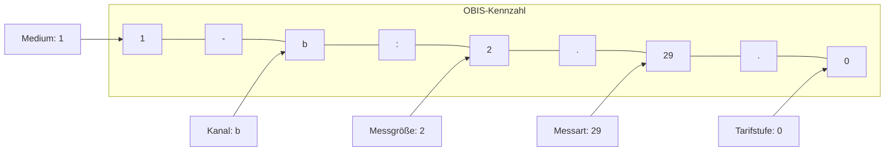
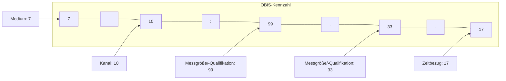
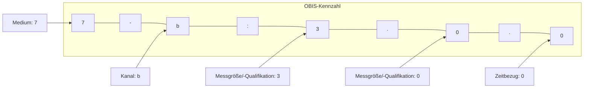

<mark>**Konsultationsfassung**</mark>

# <mark>Codeliste der OBIS-Kennzahlen und Medien</mark>

**Version:** 2.5c

**Publikationsdatum:** 01.08.2025

**Autor:** BDEW

Codeliste der OBIS-Kennzahlen und Medien


## **Disclaimer**

Die PDF-Datei ist das allein gültige Dokument.

Die zusätzlich veröffentlichte Word-Datei dient als informatorische Lesefassung und entspricht inhaltlich der PDF-Datei. Diese Word-Datei wird bis auf Weiteres rein informatorisch und ergänzend veröffentlicht unter dem Vorbehalt, zukünftig eine kostenpflichtige Veröffentlichung der Word-Datei einzuführen.

Version: 2.5c
01.08.2025
Seite 2 von 45

Codeliste der OBIS-Kennzahlen und Medien


# Inhaltsverzeichnis

**1 Einleitung** ................................................................................................................... **5**

**2 Systematik OBIS-Kennzahlen** ...................................................................................... **6**
2.1 Grundsätzliches zu OBIS-Kennzahlen elektrische Energie ....................................... 6
2.2 Schlüsselwerte zu OBIS-Kennzahlen elektrische Energie ........................................ 8
2.3 Grundsätzliches zu OBIS-Kennzahlen thermische Energie ...................................... 8

**3 Codelisten der in der Marktkommunikation verwendeten OBIS-Kennzahlen für elektrische Energie** ................................................................................................... **10**
3.1 Verwendete OBIS-Kennzahlen ............................................................................... 10
3.2 Weitere definierte OBIS-Kennzahlen zur Übertragung von Informationen zusätzlich zu Kapitel 3.1 ......................................................................................... 12
3.3 Erforderliche Werte und zulässige OBIS-Kennzahlen ............................................ 13
3.3.1 auf Ebene der Marktlokation ................................................................................. 13
3.3.2 auf Ebene der Messlokation .................................................................................. 17
3.3.3 auf Ebene der Netzlokation ................................................................................... 22
3.3.4 Erläuterungen OBIS-Kennzahlen auf Ebene der Messlokation .............................. 25
3.3.5 für Messprodukte Strom, die ausschließlich für die Rolle ESA Anwendung finden ..................................................................................................................... 26
3.3.6 für Konfigurationsprodukte Werte nach Typ 2 Strom ........................................... 29

**4 Codelisten der in der Marktkommunikation verwendeten OBIS-Kennzahlen für thermische Energie** ................................................................................................... **30**
4.1 Verwendete OBIS-Kennzahlen ............................................................................... 30
4.2 Weitere definierte OBIS-Kennzahlen zur Übertragung von Informationen zusätzlich zu Kapitel 4.1 ......................................................................................... 31
4.3 Gerätespezifische OBIS-Kennzahlen (Zähler, Encoder, Umwerter) ....................... 31
4.4 OBIS-Kennzahlen für Zustandsgrößen ................................................................... 34
4.5 OBIS-Kennzahlen zur Gasbeschaffenheitsanalyse (Profilwerte, Mittelwerte) ...... 34
4.6 Erforderliche Werte und zulässige OBIS-Kennzahlen ............................................ 36
4.6.1 auf Ebene der Marktlokation ................................................................................. 36
4.6.2 auf Ebene der Messlokation .................................................................................. 36

**5 Codeliste der in der Marktkommunikation verwendeten Medien** .............................. **37**

**6 Beispiele** ................................................................................................................... **38**

Version: 2.5c | 01.08.2025 | Seite 3 von 45

Codeliste der OBIS-Kennzahlen und Medien


6.1 Beispiel 1: Vorschub (1/4 Std. Lastgang) elektrische Wirkarbeit, Bezug des Kunden, total 38
6.2 Beispiel 2: Vorschub (1/4 Std. Lastgang) elektrische Wirkarbeit, Lieferung des Kunden, total 38
6.3 Beispiel 3: Datenprofil, Stundenwert, thermische Wirkarbeit, Ausspeisung an Endkunde mit vorläufigem Brennwert 38
6.4 Beispiel 4: Einzelwert, Zählerstand Betriebsvolumen [m³], Ausspeisung an Endkunde 38
# 7 Änderungshistorie 39

Version: 2.5c 01.08.2025 Seite 4 von 45

Codeliste der OBIS-Kennzahlen und Medien


# 1 Einleitung

Durch den elektronischen Datenaustausch wird die Abwicklung von Geschäftsvorgängen zwischen den beteiligten Kommunikationspartnern vereinfacht. Die Implementierungsaufwände sind umso geringer, je standardisierter die einzelnen Nachrichten sind, die den jeweiligen Geschäftsvorgängen zugrunde liegen. Dies gilt auch für die innerhalb der Nachrichten verwendeten Informationen zur Identifizierung einzelner Daten.

In verschiedenen Nachrichtentypen (z. B. MSCONS, UTILMD) werden zur eindeutigen Identifikation von Messwerten (Energiemengen, Zählerstände) und auch abstrakter Daten OBIS-Kennzahlen verwendet.

Die OBIS-Kennzahlen legen die für Messeinrichtungen und Datenübertragungen gebräuchlichen Identifikationskennzahlen fest.

Die Normen für die einzelnen Sparten lauten:

› Gas: DIN EN 13757-1:2015-01 Datenaustausch
› Strom: DIN EN 62056-61:2007-06 OBIS - Object Identification System

Alle in den EDI@Energy-Nachrichten nutzbaren OBIS-Kennzahlen sind den Kapiteln 3 und 4 dieses Dokuments „EDI@Energy Codeliste der OBIS-Kennzahlen und Medien“ zu entnehmen. Die in diesen Kapiteln erfolgte Nutzungseinschränkung mittels der angegebenen Prüfidentifikatoren gilt ausschließlich für die MSCONS; so weit in anderen Nachrichtentypen als der MSCONS die Nutzung auf ausgewählte OBIS-Kennzahlen erfolgt, sind diese Einschränkungen anderen, als diesem Dokument zu entnehmen.

Weiterhin sind in dieser Codeliste die OBIS-Kennzahlen angegeben, die in der UTILMD im Stammdatenaustausch zu übermitteln sind.

Zusätzlich sind in dieser Codeliste die Medien angegeben, die im Rahmen der Kommunikation verwendet werden können.

Die Kapitel 3, 4 und 5 dieses Dokuments stellen somit eine externe Codeliste dar, die im Rahmen der Syntaxprüfung, als auch der AHB-Prüfung innerhalb der Verarbeitbarkeitsprüfung zu verwenden ist.

Version: 2.5c 01.08.2025 Seite 5 von 45

Codeliste der OBIS-Kennzahlen und Medien


# 2 Systematik OBIS-Kennzahlen

Die OBIS-Kennzahl besteht aus verschiedenen Wertegruppen aus deren Kombination sich die Spezifikation eines Wertes ableitet. Für jede Wertegruppe (Value-Group) existieren Tabellen mit Schlüsselwerten.

## Elektrische Energie

```description
Diagram showing the structure of OBIS Value-Groups A through F for Electrical Energy.
- A: Medium (1-stellig) -> Elektrizität (= 1), Gas, Wasser, Wärme...
- B: Kanal (1- oder 2-stellig) -> interne oder externe Kanäle, nur bei mehreren Kanälen
- C: Messgröße (1- oder 2-stellig) -> Wirk-, Blind-, Scheinleistung, Strom, Spannung,...
- D: Messart (1- oder 2-stellig) -> Maximum, aktueller Wert, Energie...
- E: Tarifstufe (1- oder 2-stellig) -> Tarifstufe, z. B. Total, Tarif 1, Tarif 2...
- F: Vorwertzählerstand (1- oder 2-stellig) -> 00...99
Separators: - (ASCII 2D), : (ASCII 3A), . (ASCII 2E), . (ASCII 2E), * (ASCII 2A)
Note: A | B | C | D | E werden im deutschen Energiemarkt verwendet.
```

## Thermische Energie

```description
Diagram showing the structure of OBIS Value-Groups A through F for Thermal Energy.
- A: Medium (1-stellig) -> Gas (= 7), Elektrizität Wasser, Wärme...
- B: Kanal (1- oder 2-stellig) -> interne oder externe Kanäle, nur bei mehreren Kanälen
- C: Messgröße/-Qualifikation -> Quelle (Zähler (Encoder), Umwerter, Registrierung), Richtung (Ausspeisung, Einspeisung), Qualifikation der Messung (ungestört, gestört, gesamt) für: Volumen, Druck, Temperatur, etc. Datenprofil (Lastgang) = 99, Gas Analyse = 70
- D: Zeitbezug (1- oder 2-stellig) / Messgröße/-Qualifikation -> Zählerstand, Differenz/Maximum/Mittelwert für Periode. Messgröße/-Qualifikation bei C = 99 (Datenprofil), Messgröße bei C = 70 (Gas Analyse)
- E: Zeitbezug (1- oder 2-stellig) -> Zählerstand, Differenz/Maximum/Mittelwert für Periode. Zeitqualifikation bei C = 99 und C = 70
- F: Vorwertzählerstand (1- oder 2-stellig) -> 00
Separators: - (ASCII 2D), : (ASCII 3A), . (ASCII 2E), . (ASCII 2E), * (ASCII 2A)
Note: A | B | C | D | E werden im deutschen Energiemarkt verwendet.
```

## 2.1 Grundsätzliches zu OBIS-Kennzahlen elektrische Energie

Für die in den Codelisten angegebenen Werte und für den Datenaustausch im deutschen Strommarkt werden folgende Festlegungen getroffen und beziehen sich nur auf das Medium 1 – Elektrizität.

Die Vergabe des Kanals erfolgt durch den MSB (Wertebereich 0 bis 65) und ist für die Identifizierung relevant.

Die Angaben: $\sum$ Li Wirk- / Blind- / Scheinleistung bedeuten: Summe über alle Phasen

Version: 2.5c 01.08.2025 Seite 6 von 45

Codeliste der OBIS-Kennzahlen und Medien


Messgröße = Wirk- / Blind- / Scheinleistung und Messart = Zeitintegral => physikalische Einheit ist Arbeit

Die Richtungsangaben + / - bei der Messgröße geben die Energieflussrichtung an und bedeuten:

*   \+ Bezug des Kunden aus dem Netz (z. B. 1-b:1.x.y)
*   \- (Rück-) Lieferung des Kunden an das Netz (z. B. 1-b:2.x.y)

Die Energieflussrichtung wird mittels der OBIS-Kennzahl definiert. Mit Ausnahme der Übermittlung von Korrekturenergie-mengen (hier können die Werte auch negativ sein), sind die Mengenangaben nur mit positiven Werten oder 0 anzugeben.

Bei nicht tarifunterschiedenen Zählerständen (Eintarifzähler) wird Tarifstufe 0 verwendet (z. B. 1-b:x.8.0).

Bei nicht tarifunterschiedenen Energiemengen / Vorschübe (z. B. Pauschalanlagen) wird Tarifstufe 0 verwendet (z. B. 1-b:x.9.0).

Die Definition der Zeitintegrale ist:

**Zeitintegral 1:** Zählerstände

**Zeitintegral 2:** Vorschübe (Energiemenge für einen beliebigen Zeitraum)

**Zeitintegral 5:** Lastgang (Energiemengen für Zeitintervalle von äquidistanter Dauer)

Version: 2.5c 01.08.2025 Seite 7 von 45

Codeliste der OBIS-Kennzahlen und Medien


## 2.2 Schlüsselwerte zu OBIS-Kennzahlen elektrische Energie

<table>
  <tbody>
    <tr>
        <td>Medium (A)</td>
        <td>Kanal (B)</td>
        <td>Messgröße (C)</td>
        <td>Messart (D)</td>
        <td>Tarif (E)</td>
    </tr>
    <tr>
        <th>1 Elektrizität</th>
        <th>Kanal 0-65</th>
        <th>1 $\sum$ Li Wirkleistung +</th>
        <th>6 Maximum</th>
        <th>0 Total</th>
    </tr>
    <tr>
        <th></th>
        <th rowspan="7">Kanal 66<br/>(nur bei Angabe von Blindmehrarbeit und Blindmehrleistung im Lieferschein)</th>
        <th>2 $\sum$ Li Wirkleistung -</th>
        <th>8 Zeitintegral 1</th>
        <th>1 Tarif 1</th>
    </tr>
    <tr>
        <th></th>
        <th>3 $\sum$ Li Blindleistung positiv</th>
        <th>9 Zeitintegral 2</th>
        <th>2 Tarif 2</th>
    </tr>
    <tr>
        <th></th>
        <th>4 $\sum$ Li Blindleistung negativ</th>
        <th>29 Zeitintegral 5</th>
        <th>3 Tarif 3</th>
    </tr>
    <tr>
        <th></th>
        <th>5 $\sum$ Li Blindleistung Q I</th>
        <th></th>
        <th>4 Tarif 4</th>
    </tr>
    <tr>
        <th></th>
        <th>6 $\sum$ Li Blindleistung Q II</th>
        <th></th>
        <th>5 Tarif 5</th>
    </tr>
    <tr>
        <th></th>
        <th>7 $\sum$ Li Blindleistung Q III</th>
        <th></th>
        <th>...</th>
    </tr>
    <tr>
        <th></th>
        <th>8 $\sum$ Li Blindleistung Q IV</th>
        <th></th>
        <th>62 Tarif 62</th>
    </tr>
    <tr>
        <th></th>
        <th></th>
        <th></th>
        <th></th>
        <th>63 Fehlerregister</th>
    </tr>
  </tbody>
</table>

## 2.3 Grundsätzliches zu OBIS-Kennzahlen thermische Energie

Für die in den Codelisten angegebenen Werte und Kennziffern für den Datenaustausch im deutschen Gasmarkt werden folgende Festlegungen getroffen und beziehen sich nur auf das Medium Gas (=7, Wertegruppe A).

Die Angabe eines Kanals (Wertegruppe B) ist für die Identifikation nur im Rahmen des Messwertversandes thermischer Energiemenge als Lastgang (MSCONS AHB Prüfidentifikator 13008) und Messwertversandes thermischer Energiemenge als Einzelwert (MSCONS AHB Prüfidentifikator 13009) relevant. Im Anwendungsfall Messwertversand thermischer Energiemenge als Lastgang erfolgt über die unterschiedlichen Werte für den Kanal die Unterscheidung, ob die thermische Energie mit dem Bilanzierungsbrennwert (B=10) oder dem endgültigen Abrechnungsbrennwert (B=20) gebildet wurde. Im Anwendungsfall Messwertversand thermischer Energiemenge als Einzelwert und bei Brennwert und Zustandszahl ist ausschließlich die Kanalnummer 0 erlaubt. In allen anderen Anwendungsfällen ist die Kanalnummer (gültiger Wertebereich 0-64) irrelevant.

In Wertegruppe C wird bei Einzelwerten Messgröße, Quelle (Zähler, Umwerter, Registrierung), Richtung (Ein- und Ausspeisung) und Qualifikation (ungestört, gestört, gesamt) spezifiziert. Zur Identifikation von Profilwerten ist der Wert 99 und zur Identifikation von Gasbeschaffenheitsanalysewerten der Wert 70 zu verwenden.

In Wertegruppe D wird bei Einzelwerten der Zeitbezug (Zählerstand, Differenz / Mittelwert / Maximum für Periode) identifiziert. Bei Profilwerten (C=99) oder Gasbeschaffenheitsanalysen (C=70) werden Quelle, Qualifikation und ggf. Richtung in dieser Wertegruppe abgelegt.

In Wertegruppe E ist für Profil- und Gasbeschaffenheitsanalysewerte der Zeitbezug zu hinterlegen, ansonsten wird der Wert „0“ verwendet.

Wertegruppe F wird für die Kommunikation im deutschen Gasmarkt nicht verwendet.

Zusätzlich zu den OBIS-Kennzahlen kommen für die Anwendungsfälle "Übertragung marktlokationsscharfe Allokationsliste" und "Übertragung marktlokationsscharfe bilanzierte Menge" OBIS-

Version: 2.5c 01.08.2025 Seite 8 von 45

Codeliste der OBIS-Kennzahlen und Medien


ähnliche Kennziffern zur Verwendung. In diesen Fällen wird Wertegruppe C mit dem Wert 9 belegt, der für technische Geräte nicht spezifiziert ist (7-b:9.98.0 und 7-b:9.98.1).

Version: 2.5c 01.08.2025 Seite 9 von 45

Codeliste der OBIS-Kennzahlen und Medien


# 3 Codelisten der in der Marktkommunikation verwendeten OBIS-Kennzahlen für elektrische Energie

## 3.1 Verwendete OBIS-Kennzahlen

Verwendung in der Kommunikation MSB an MSB / NB / LF / ÜNB, NB an LF / MSB / NB, LF an MSB.

<table>
  <thead>
    <tr>
        <th>Messgröße</th>
        <th>Werteart</th>
        <th colspan="3">OBIS-Kennzahl</th>
        <th>Nutzungseinschränkung in der MSCONS Prüfidentifikator</th>
    </tr>
    <tr>
        <th></th>
        <th></th>
        <th>Bezug (+)</th>
        <th>Lieferung (-)</th>
        <th>Blind...</th>
        <th></th>
    </tr>
  </thead>
  <tbody>
    <tr>
        <td>Wirkleistung</td>
        <td>Maximum</td>
        <td>1-b:1.6.0</td>
        <td>1-b:2.6.0</td>
        <td>--</td>
        <td>13017</td>
    </tr>
    <tr>
        <td>Blindleistung positiv</td>
        <td rowspan="6"></td>
        <td>--</td>
        <td>--</td>
        <td>1-b:3.6.0</td>
        <td></td>
    </tr>
    <tr>
        <td>Blindleistung negativ</td>
        <td>--</td>
        <td>--</td>
        <td>1-b:4.6.0</td>
        <td></td>
    </tr>
    <tr>
        <td>Blindleistung QI</td>
        <td>--</td>
        <td>--</td>
        <td>1-b:5.6.0</td>
        <td></td>
    </tr>
    <tr>
        <td>Blindleistung QII</td>
        <td>--</td>
        <td>--</td>
        <td>1-b:6.6.0</td>
        <td></td>
    </tr>
    <tr>
        <td>Blindleistung QIII</td>
        <td>--</td>
        <td>--</td>
        <td>1-b:7.6.0</td>
        <td></td>
    </tr>
    <tr>
        <td>Blindleistung QIV</td>
        <td>--</td>
        <td>--</td>
        <td>1-b:8.6.0</td>
        <td></td>
    </tr>
    <tr>
        <td>Wirkarbeit</td>
        <td>Zählerstand</td>
        <td>1-b:1.8.e,<br/>1-b:1.8.63</td>
        <td>1-b:2.8.e,<br/>1-b:2.8.63</td>
        <td>--</td>
        <td>13017</td>
    </tr>
    <tr>
        <td></td>
        <td>Vorschub</td>
        <td>1-b:1.9.e</td>
        <td>1-b:2.9.0</td>
        <td>--</td>
        <td>13019</td>
    </tr>
    <tr>
        <td></td>
        <td>Lastgang</td>
        <td>1-b:1.29.0</td>
        <td>1-b:2.29.0</td>
        <td>--</td>
        <td>13018<br/>13025<br/>13027</td>
    </tr>
    <tr>
        <td>Blindarbeit positiv</td>
        <td>Zählerstand</td>
        <td>--</td>
        <td>--</td>
        <td>1-b:3.8.0</td>
        <td>13017</td>
    </tr>
    <tr>
        <td></td>
        <td>Vorschub</td>
        <td>--</td>
        <td>--</td>
        <td>1-b:3.9.0</td>
        <td>13019</td>
    </tr>
    <tr>
        <td></td>
        <td>Lastgang</td>
        <td>--</td>
        <td>--</td>
        <td>1-b:3.29.0</td>
        <td>13018<br/>13027<br/><br/>In 13025 nur für Zeiträume (Messperiode) bis einschließlich 01.01.2024, 00:00 Uhr anwendbar.</td>
    </tr>
    <tr>
        <td>Blindarbeit negativ</td>
        <td>Zählerstand</td>
        <td>--</td>
        <td>--</td>
        <td>1-b:4.8.0</td>
        <td>13017</td>
    </tr>
    <tr>
        <td></td>
        <td>Vorschub</td>
        <td>--</td>
        <td>--</td>
        <td>1-b:4.9.0</td>
        <td>13019</td>
    </tr>
    <tr>
        <td></td>
        <td>Lastgang</td>
        <td>--</td>
        <td>--</td>
        <td>1-b:4.29.0</td>
        <td>13018<br/>13027<br/><br/>In 13025 nur für Zeiträume (Messperiode) bis einschließlich 01.01.2024, 00:00 Uhr anwendbar.</td>
    </tr>
    <tr>
        <td>Blindarbeit QI</td>
        <td>Zählerstand</td>
        <td>--</td>
        <td>--</td>
        <td>1-b:5.8.0</td>
        <td>13017</td>
    </tr>
    <tr>
        <td></td>
        <td>Vorschub</td>
        <td>--</td>
        <td>--</td>
        <td>1-b:5.9.0</td>
        <td>13019</td>
    </tr>
    <tr>
        <td></td>
        <td>Lastgang</td>
        <td>--</td>
        <td>--</td>
        <td>1-b:5.29.0</td>
        <td>13018<br/>13027<br/><br/>In 13025 nur für Zeiträume (Messperiode) bis einschließlich 01.01.2024, 00:00 Uhr anwendbar.</td>
    </tr>
    <tr>
        <td>Blindarbeit QII</td>
        <td>Zählerstand</td>
        <td>--</td>
        <td>--</td>
        <td>1-b:6.8.0</td>
        <td>13017</td>
    </tr>
    <tr>
        <td></td>
        <td>Vorschub</td>
        <td>--</td>
        <td>--</td>
        <td>1-b:6.9.0</td>
        <td>13019</td>
    </tr>
  </tbody>
</table>

Version: 2.5c 01.08.2025 Seite 10 von 45

Codeliste der OBIS-Kennzahlen und Medien


<table>
  <tbody>
    <tr>
        <td>Messgröße</td>
        <td>Werteart</td>
        <td colspan="3">OBIS-Kennzahl</td>
        <td>Nutzungseinschränkung in der MSCONS Prüfidentifikator</td>
    </tr>
    <tr>
        <th></th>
        <th></th>
        <th>Bezug (+)</th>
        <th>Lieferung (-)</th>
        <th>Blind...</th>
        <th></th>
    </tr>
    <tr>
        <td rowspan="2"></td>
        <td>Lastgang</td>
        <td>--</td>
        <td>--</td>
        <td>1-b:6.29.0</td>
        <td>13018<br/>13027<br/><br/>In 13025 nur für Zeiträume (Messperiode) bis einschließlich 01.01.2024, 00:00 Uhr anwendbar.</td>
    </tr>
    <tr>
        <td>Blindarbeit QIII</td>
        <td>Zählerstand</td>
        <td>--</td>
        <td>--</td>
        <td>1-b:7.8.0</td>
        <td>13017</td>
    </tr>
    <tr>
        <td></td>
        <td>Vorschub</td>
        <td>--</td>
        <td>--</td>
        <td>1-b:7.9.0</td>
        <td>13019</td>
    </tr>
    <tr>
        <td></td>
        <td>Lastgang</td>
        <td>--</td>
        <td>--</td>
        <td>1-b:7.29.0</td>
        <td>13018<br/>13027<br/><br/>In 13025 nur für Zeiträume (Messperiode) bis einschließlich 01.01.2024, 00:00 Uhr anwendbar.</td>
    </tr>
    <tr>
        <td>Blindarbeit QIV</td>
        <td>Zählerstand</td>
        <td>--</td>
        <td>--</td>
        <td>1-b:8.8.0</td>
        <td>13017</td>
    </tr>
    <tr>
        <td></td>
        <td>Vorschub</td>
        <td>--</td>
        <td>--</td>
        <td>1-b:8.9.0</td>
        <td>13019</td>
    </tr>
    <tr>
        <td></td>
        <td>Lastgang</td>
        <td>--</td>
        <td>--</td>
        <td>1-b:8.29.0</td>
        <td>13018<br/>13027<br/><br/>In 13025 nur für Zeiträume (Messperiode) bis einschließlich 01.01.2024, 00:00 Uhr anwendbar.</td>
    </tr>
  </tbody>
</table>

Kanal: b = 0 ... 65
Tarif: e = 0 ... 62

Version: 2.5c 01.08.2025 Seite 11 von 45

Codeliste der OBIS-Kennzahlen und Medien


## 3.2 Weitere definierte OBIS-Kennzahlen zur Übertragung von Informationen zusätzlich zu Kapitel 3.1

Verwendung in der Kommunikation NB an LF / BIKO / NB / MSB, MSB an NB / LF und BIKO an BKV / NB

<table>
  <tbody>
    <tr>
        <td>Anwendung</td>
        <td>Hinweise</td>
        <td>OBIS-Kennzahl</td>
        <td>Nutzungseinschränkung in der MSCONS Prüfidentifikator</td>
    </tr>
    <tr>
        <th>Bewegungsdaten im Kalenderjahr vor Lieferbeginn</th>
        <th>Wirkleistung Bezug (+)<br/>Maximum total, tariflos</th>
        <th>1-1:1.6.0</th>
        <th>13015</th>
    </tr>
    <tr>
        <th></th>
        <th>Wirkarbeit Bezug (+)<br/>Vorschub total, tariflos</th>
        <th>1-1:1.9.0</th>
        <th></th>
    </tr>
    <tr>
        <th>Mengenbilanzierung</th>
        <th>--</th>
        <th>1-1:1.29.0</th>
        <th>13005<br/>13003</th>
    </tr>
    <tr>
        <th></th>
        <th></th>
        <th>1-1:2:29.0</th>
        <th>13003</th>
    </tr>
    <tr>
        <th>Normierte Profile</th>
        <th>in kWh</th>
        <th>1-b:1.29.0</th>
        <th>13010<br/>13012</th>
    </tr>
    <tr>
        <th>Profilschar</th>
        <th>1. in kW</th>
        <th>1-b:1.4.0</th>
        <th>13011</th>
    </tr>
    <tr>
        <th></th>
        <th>2. in kWh</th>
        <th>1-b:1.29.0</th>
        <th></th>
    </tr>
    <tr>
        <th></th>
        <th>3. OBIS-ähnliche Kennzahl in K/h</th>
        <th>1-b:9.99.0</th>
        <th></th>
    </tr>
    <tr>
        <th>Marktlokationsscharfe bilanzierte Menge</th>
        <th>OBIS-ähnliche Kennzahl für Entnahme</th>
        <th>1-b:1.98.0</th>
        <th>13014</th>
    </tr>
    <tr>
        <th></th>
        <th>OBIS-ähnliche Kennzahl für Einspeisung</th>
        <th>1-b:2.98.0</th>
        <th></th>
    </tr>
    <tr>
        <th>Übermittlung des Lieferscheins zur Netznutzungsabrechnung bei Abrechnung nach Arbeitspreis / Leistungspreis</th>
        <th>Wirkarbeit Bezug (+) Vorschub</th>
        <th>1-b:1.9.e</th>
        <th>13016 und wenn BGM (Beginn der Nachricht), DE1001 mit dem Code Z42 (Lieferschein Arbeits- / Leistungspreis) vorhanden ist.</th>
    </tr>
    <tr>
        <th></th>
        <th>Wirkleistung Bezug (+)<br/>Maximum</th>
        <th>1-b:1.6.0</th>
        <th></th>
    </tr>
    <tr>
        <th></th>
        <th>Optional, aber nur für Leistungszeiträume bis einschließlich 01.01.2023, 00:00 Uhr anwendbar:<br/>Blindarbeit positiv<br/>Blindarbeit negativ</th>
        <th><br/><br/><br/>1-b:3.9.0<br/>1-b:4.9.0</th>
        <th></th>
    </tr>
    <tr>
        <th></th>
        <th>Blindleistung positiv<br/>Blindleistung negativ</th>
        <th>1-b:3.6.0<br/>1-b:4.6.0</th>
        <th></th>
    </tr>
    <tr>
        <th></th>
        <th>OBIS-ähnliche Kennzahl für<br/>Blindmehrarbeit positiv<br/>Blindmehrarbeit negativ</th>
        <th><br/>1-66:13.9.0<br/>1-66:14.9.0</th>
        <th></th>
    </tr>
    <tr>
        <th></th>
        <th>Blindmehrleistung positiv<br/>Blindmehrleistung negativ</th>
        <th>1-66:13.6.0<br/>1-66:14.6.0</th>
        <th></th>
    </tr>
    <tr>
        <th>Übermittlung des Lieferscheins zur Netznutzungsabrechnung bei Abrechnung nach Grundpreis / Arbeitspreis</th>
        <th>Wirkarbeit Bezug (+) Vorschub</th>
        <th>1-b:1.9.e</th>
        <th>13019 und wenn BGM (Beginn der Nachricht), DE1001 mit dem Code Z41 (Lieferschein Grund- / Arbeitspreis) vorhanden ist.</th>
    </tr>
    <tr>
        <th>Grundlage POG-Ermittlung</th>
        <th>Wirkarbeit Bezug (+)<br/>Vorschub total, tariflos</th>
        <th>1-1:1.9.0</th>
        <th>13028</th>
    </tr>
  </tbody>
</table>

Kanal: b = 0 … 65
Tarif: e = 0 … 62

Version: 2.5c 01.08.2025 Seite 12 von 45

Codeliste der OBIS-Kennzahlen und Medien


## 3.3 Erforderliche Werte und zulässige OBIS-Kennzahlen

In diesem Kapitel wird beschrieben bei welchen erforderlichen Werten zwischen den Marktrollen (MSB / NB / LF / ÜNB / ESA) auf welcher Ebene (Messlokation / Marktlokation / Tranche / Netzlokation) welche OBIS-Kennzahlen durch den MSB nutzbar sind.

### 3.3.1 auf Ebene der Marktlokation

<mark>**Lieferrichtung Verbrauch ohne zugeordnete Zählzeit**</mark>

Lieferrichtung: Verbrauch (SG10 CCI+Z30++Z07')

SG10 CCI+Z39 zugeordnete Zählzeit nicht vorhanden

<table>
  <thead>
    <tr>
        <th>Messprodukt Code</th>
        <th>Hinweise</th>
        <th>OBIS-Kennzahlen</th>
    </tr>
  </thead>
  <tbody>
    <tr>
        <td>9991 00000 004 4</td>
        <td>Wirkarbeit Bezug (+) Vorschub total, tariflos</td>
        <td>1-b:1.9.0</td>
    </tr>
    <tr>
        <td>9991 00000 049 0</td>
        <td>Wirkarbeit Bezug (+) Vorschub total, tariflos</td>
        <td>1-b:1.9.0</td>
    </tr>
    <tr>
        <td>9991 00000 005 2</td>
        <td>Wirkarbeit Bezug (+) Vorschub total, tariflos</td>
        <td>1-b:1.9.0</td>
    </tr>
    <tr>
        <td>9991 00000 006 0</td>
        <td>Wirkarbeit Bezug (+) Vorschub total, tariflos</td>
        <td>1-b:1.9.0</td>
    </tr>
    <tr>
        <td>9991 00000 007 8</td>
        <td>Wirkarbeit Bezug (+) Lastgang total, tariflos</td>
        <td>1-b:1.29.0</td>
    </tr>
    <tr>
        <td>9991 00000 008 6</td>
        <td>Wirkleistung Bezug (+) Maximum</td>
        <td>1-b:1.6.0</td>
    </tr>
    <tr>
        <td>9991 00000 009 4¹</td>
        <td>wenn alle der Marktlokation zugeordneten Messlokationen eine Messeinrichtung nach VDE-AR-N 4400:2019-07 oder neuer installiert haben:<br/>Blindarbeit QI Lastgang total, tariflos<br/>Blindarbeit QIV Lastgang total, tariflos<br/><br/>wenn mind. eine der Marktlokation zugeordneten Messlokation eine Messeinrichtung nach VDE-AR-N 4400:2011-09 installiert hat:<br/>Blindarbeit positiv Lastgang total, tariflos<br/>Blindarbeit negativ Lastgang total, tariflos</td>
        <td><br/>1-b:5.29.0<br/>1-b:8.29.0<br/><br/><br/>1-b:3.29.0<br/>1-b:4.29.0</td>
    </tr>
    <tr>
        <td>9991 00000 010 1¹</td>
        <td>wenn alle der Marktlokation zugeordneten Messlokationen eine Messeinrichtung nach VDE-AR-N 4400:2019-07 oder neuer installiert haben:<br/>Blindleistung QI, tariflos<br/>Blindleistung QIV, tariflos<br/><br/>wenn mind. eine der Marktlokation zugeordneten Messlokation eine Messeinrichtung nach VDE-AR-N 4400:2011-09 installiert hat:<br/>Blindleistung positiv, tariflos<br/>Blindleistung negativ, tariflos</td>
        <td><br/>1-b:5.6.0<br/>1-b:8.6.0<br/><br/><br/>1-b:3.6.0<br/>1-b:4.6.0</td>
    </tr>
    <tr>
        <td>9991 00000 011 9¹</td>
        <td>wenn alle der Marktlokation zugeordneten Messlokationen eine Messeinrichtung nach VDE-AR-N 4400:2019-07 oder neuer installiert haben:<br/>Blindarbeit QI Vorschub total, tariflos<br/>Blindarbeit QIV Vorschub total, tariflos</td>
        <td><br/>1-b:5.9.0<br/>1-b:8.9.0</td>
    </tr>
  </tbody>
</table>

¹ Nutzbar bis zum 01.01.2024 00:00 Uhr.

Version: 2.5c 01.08.2025 Seite 13 von 45

Codeliste der OBIS-Kennzahlen und Medien


<table>
  <thead>
    <tr>
        <th>Messprodukt Code</th>
        <th>Hinweise</th>
        <th>OBIS-Kennzahlen</th>
    </tr>
  </thead>
  <tbody>
    <tr>
        <td rowspan="4">9991 00000 050 7¹</td>
        <td>wenn mind. eine der Marktlokation zugeordneten Messlokation eine Messeinrichtung nach VDE-AR-N 4400:2011-09 installiert hat:<br/>Blindarbeit positiv Vorschub total, tariflos</td>
        <td>1-b:3.9.0</td>
    </tr>
    <tr>
        <td>Blindarbeit negativ Vorschub total, tariflos</td>
        <td>1-b:4.9.0</td>
    </tr>
    <tr>
        <td>wenn alle der Marktlokation zugeordneten Messlokationen eine Messeinrichtung nach VDE-AR-N 4400:2019-07 oder neuer installiert haben:<br/>Blindarbeit QI Vorschub total, tariflos</td>
        <td>1-b:5.9.0</td>
    </tr>
    <tr>
        <td>Blindarbeit QIV Vorschub total, tariflos</td>
        <td>1-b:8.9.0</td>
    </tr>
    <tr>
        <td rowspan="4">9991 00000 012 7¹</td>
        <td>wenn mind. eine der Marktlokation zugeordneten Messlokation eine Messeinrichtung nach VDE-AR-N 4400:2011-09 installiert hat:<br/>Blindarbeit positiv Vorschub total, tariflos</td>
        <td>1-b:3.9.0</td>
    </tr>
    <tr>
        <td>Blindarbeit negativ Vorschub total, tariflos</td>
        <td>1-b:4.9.0</td>
    </tr>
    <tr>
        <td>wenn alle der Marktlokation zugeordneten Messlokationen eine Messeinrichtung nach VDE-AR-N 4400:2019-07 oder neuer installiert haben:<br/>Blindarbeit QI Vorschub total, tariflos</td>
        <td>1-b:5.9.0</td>
    </tr>
    <tr>
        <td>Blindarbeit QIV Vorschub total, tariflos</td>
        <td>1-b:8.9.0</td>
    </tr>
    <tr>
        <td rowspan="4">9991 00000 013 5¹</td>
        <td>wenn mind. eine der Marktlokation zugeordneten Messlokation eine Messeinrichtung nach VDE-AR-N 4400:2011-09 installiert hat:<br/>Blindarbeit positiv Vorschub total, tariflos</td>
        <td>1-b:3.9.0</td>
    </tr>
    <tr>
        <td>Blindarbeit negativ Vorschub total, tariflos</td>
        <td>1-b:4.9.0</td>
    </tr>
    <tr>
        <td>wenn alle der Marktlokation zugeordneten Messlokationen eine Messeinrichtung nach VDE-AR-N 4400:2019-07 oder neuer installiert haben:<br/>Blindarbeit QI Vorschub total, tariflos</td>
        <td>1-b:5.9.0</td>
    </tr>
    <tr>
        <td>Blindarbeit QIV Vorschub total, tariflos</td>
        <td>1-b:8.9.0</td>
    </tr>
    <tr>
        <td rowspan="2">    </td>
        <td>wenn mind. eine der Marktlokation zugeordneten Messlokation eine Messeinrichtung nach VDE-AR-N 4400:2011-09 installiert hat:<br/>Blindarbeit positiv Vorschub total, tariflos</td>
        <td>1-b:3.9.0</td>
    </tr>
    <tr>
        <td>Blindarbeit negativ Vorschub total, tariflos</td>
        <td>1-b:4.9.0</td>
    </tr>
  </tbody>
</table>

Kanal: b = 0 ... 65

### <mark>Lieferrichtung Erzeugung ohne zugeordnete Zählzeit</mark>

#### Lieferrichtung: Erzeugung (SG10 CCI+Z30++Z06')

#### SG10 CCI+Z39 zugeordnete Zählzeit nicht vorhanden

<table>
  <thead>
    <tr>
        <th>Messprodukt Code</th>
        <th>Hinweise</th>
        <th>OBIS-Kennzahlen</th>
    </tr>
  </thead>
  <tbody>
    <tr>
        <td>9991 00000 004 4</td>
        <td>Wirkarbeit Lieferung (-) Vorschub total, tariflos</td>
        <td>1-b:2.9.0</td>
    </tr>
    <tr>
        <td>9991 00000 049 0</td>
        <td>Wirkarbeit Lieferung (-) Vorschub total, tariflos</td>
        <td>1-b:2.9.0</td>
    </tr>
    <tr>
        <td>9991 00000 005 2</td>
        <td>Wirkarbeit Lieferung (-) Vorschub total, tariflos</td>
        <td>1-b:2.9.0</td>
    </tr>
    <tr>
        <td>9991 00000 006 0</td>
        <td>Wirkarbeit Lieferung (-) Vorschub total, tariflos</td>
        <td>1-b:2.9.0</td>
    </tr>
  </tbody>
</table>

Version: 2.5c 01.08.2025 Seite 14 von 45

Codeliste der OBIS-Kennzahlen und Medien


<table>
  <thead>
    <tr>
        <th>Messprodukt Code</th>
        <th>Hinweise</th>
        <th>OBIS-Kennzahlen</th>
    </tr>
  </thead>
  <tbody>
    <tr>
        <td>9991 00000 007 8</td>
        <td>Wirkarbeit Lieferung (-) Lastgang total, tariflos</td>
        <td>1-b:2.29.0</td>
    </tr>
    <tr>
        <td>9991 00000 008 6</td>
        <td>Wirkleistung Lieferung (-) Maximum</td>
        <td>1-b:2.6.0</td>
    </tr>
    <tr>
        <td>9991 00000 009 4<sup>1</sup></td>
        <td>wenn alle der Marktlokation zugeordneten Messlokationen eine Messeinrichtung nach VDE-AR-N 4400:2019-07 oder neuer installiert haben:</td>
        <td></td>
    </tr>
    <tr>
        <td rowspan="2"></td>
        <td>Blindarbeit QII Lastgang total, tariflos</td>
        <td>1-b:6.29.0</td>
    </tr>
    <tr>
        <td>Blindarbeit QIII Lastgang total, tariflos</td>
        <td>1-b:7.29.0</td>
    </tr>
    <tr>
        <td></td>
        <td><br/>wenn mind. eine der Marktlokation zugeordneten Messlokation eine Messeinrichtung nach VDE-AR-N 4400:2011-09 installiert hat:</td>
        <td></td>
    </tr>
    <tr>
        <td rowspan="2"></td>
        <td>Blindarbeit positiv Lastgang total, tariflos</td>
        <td>1-b:3.29.0</td>
    </tr>
    <tr>
        <td>Blindarbeit negativ Lastgang total, tariflos</td>
        <td>1-b:4.29.0</td>
    </tr>
    <tr>
        <td>9991 00000 010 1<sup>1</sup></td>
        <td>wenn alle der Marktlokation zugeordneten Messlokationen eine Messeinrichtung nach VDE-AR-N 4400:2019-07 oder neuer installiert haben:</td>
        <td></td>
    </tr>
    <tr>
        <td rowspan="2"></td>
        <td>Blindleistung QII, tariflos</td>
        <td>1-b:6.6.0</td>
    </tr>
    <tr>
        <td>Blindleistung QIII, tariflos</td>
        <td>1-b:7.6.0</td>
    </tr>
    <tr>
        <td></td>
        <td><br/>wenn mind. eine der Marktlokation zugeordneten Messlokation eine Messeinrichtung nach VDE-AR-N 4400:2011-09 installiert hat:</td>
        <td></td>
    </tr>
    <tr>
        <td rowspan="2"></td>
        <td>Blindleistung positiv, tariflos</td>
        <td>1-b:3.6.0</td>
    </tr>
    <tr>
        <td>Blindleistung negativ, tariflos</td>
        <td>1-b:4.6.0</td>
    </tr>
    <tr>
        <td>9991 00000 011 9<sup>1</sup></td>
        <td>wenn alle der Marktlokation zugeordneten Messlokationen eine Messeinrichtung nach VDE-AR-N 4400:2019-07 oder neuer installiert haben:</td>
        <td></td>
    </tr>
    <tr>
        <td rowspan="2"></td>
        <td>Blindarbeit QII Vorschub total, tariflos</td>
        <td>1-b:6.9.0</td>
    </tr>
    <tr>
        <td>Blindarbeit QIII Vorschub total, tariflos</td>
        <td>1-b:7.9.0</td>
    </tr>
    <tr>
        <td></td>
        <td><br/>wenn mind. eine der Marktlokation zugeordneten Messlokation eine Messeinrichtung nach VDE-AR-N 4400:2011-09 installiert hat:</td>
        <td></td>
    </tr>
    <tr>
        <td rowspan="2"></td>
        <td>Blindarbeit positiv Vorschub total, tariflos</td>
        <td>1-b:3.9.0</td>
    </tr>
    <tr>
        <td>Blindarbeit negativ Vorschub total, tariflos</td>
        <td>1-b:4.9.0</td>
    </tr>
    <tr>
        <td>9991 00000 050 7<sup>1</sup></td>
        <td>wenn alle der Marktlokation zugeordneten Messlokationen eine Messeinrichtung nach VDE-AR-N 4400:2019-07 oder neuer installiert haben:</td>
        <td></td>
    </tr>
    <tr>
        <td rowspan="2"></td>
        <td>Blindarbeit QII Vorschub total, tariflos</td>
        <td>1-b:6.9.0</td>
    </tr>
    <tr>
        <td>Blindarbeit QIII Vorschub total, tariflos</td>
        <td>1-b:7.9.0</td>
    </tr>
    <tr>
        <td></td>
        <td><br/>wenn mind. eine der Marktlokation zugeordneten Messlokation eine Messeinrichtung nach VDE-AR-N 4400:2011-09 installiert hat:</td>
        <td></td>
    </tr>
    <tr>
        <td rowspan="2"></td>
        <td>Blindarbeit positiv Vorschub total, tariflos</td>
        <td>1-b:3.9.0</td>
    </tr>
    <tr>
        <td>Blindarbeit negativ Vorschub total, tariflos</td>
        <td>1-b:4.9.0</td>
    </tr>
    <tr>
        <td>9991 00000 012 7<sup>1</sup></td>
        <td>wenn alle der Marktlokation zugeordneten Messlokationen eine Messeinrichtung nach VDE-AR-N 4400:2019-07 oder neuer installiert haben:</td>
        <td></td>
    </tr>
    <tr>
        <td rowspan="2"></td>
        <td>Blindarbeit QII Vorschub total, tariflos</td>
        <td>1-b:6.9.0</td>
    </tr>
    <tr>
        <td>Blindarbeit QIII Vorschub total, tariflos</td>
        <td>1-b:7.9.0</td>
    </tr>
  </tbody>
</table>

Version: 2.5c 01.08.2025 Seite 15 von 45

Codeliste der OBIS-Kennzahlen und Medien


<table>
  <tbody>
    <tr>
        <td>Messprodukt Code</td>
        <td>Hinweise</td>
        <td>OBIS-Kennzahlen</td>
    </tr>
    <tr>
        <td rowspan="3">9991 00000 013 5<sup>1</sup></td>
        <td>wenn mind. eine der Marktlokation zugeordneten Messlokation eine Messeinrichtung nach VDE-AR-N 4400:2011-09 installiert hat:<br/>Blindarbeit positiv Vorschub total, tariflos<br/>Blindarbeit negativ Vorschub total, tariflos</td>
        <td>1-b:3.9.0<br/>1-b:4.9.0</td>
    </tr>
    <tr>
        <td>wenn alle der Marktlokation zugeordneten Messlokationen eine Messeinrichtung nach VDE-AR-N 4400:2019-07 oder neuer installiert haben:<br/>Blindarbeit QII Vorschub total, tariflos<br/>Blindarbeit QIII Vorschub total, tariflos</td>
        <td>1-b:6.9.0<br/>1-b:7.9.0</td>
    </tr>
    <tr>
        <td>wenn mind. eine der Marktlokation zugeordneten Messlokation eine Messeinrichtung nach VDE-AR-N 4400:2011-09 installiert hat:<br/>Blindarbeit positiv Vorschub total, tariflos<br/>Blindarbeit negativ Vorschub total, tariflos</td>
        <td>1-b:3.9.0<br/>1-b:4.9.0</td>
    </tr>
  </tbody>
</table>

Kanal: b = 0 ... 65

Version: 2.5c 01.08.2025 Seite 16 von 45

Codeliste der OBIS-Kennzahlen und Medien


### Lieferrichtung Verbrauch mit zugeordneter Zählzeit

Lieferrichtung: Verbrauch (SG10 CCI+Z30++Z07')

SG10 CCI+Z39 zugeordnete Zählzeit und SG10 CCI+Z38 zugeordnetes Zählzeitregister vorhanden

<table>
  <thead>
    <tr>
        <th>Messprodukt Code</th>
        <th>Hinweise</th>
        <th>OBIS-Kennzahlen</th>
    </tr>
  </thead>
  <tbody>
    <tr>
        <td>9991 00000 004 4</td>
        <td>Wirkarbeit Bezug (+) Vorschub total</td>
        <td>1-b:1.9.e</td>
    </tr>
    <tr>
        <td>9991 00000 049 0</td>
        <td>Wirkarbeit Bezug (+) Vorschub total</td>
        <td>1-b:1.9.e</td>
    </tr>
    <tr>
        <td>9991 00000 005 2</td>
        <td>Wirkarbeit Bezug (+) Vorschub total</td>
        <td>1-b:1.9.e</td>
    </tr>
    <tr>
        <td>9991 00000 006 0</td>
        <td>Wirkarbeit Bezug (+) Vorschub total</td>
        <td>1-b:1.9.e</td>
    </tr>
  </tbody>
</table>
Kanal: b = 0 ... 65
Tarif: e = 1 ... 62

### 3.3.2 auf Ebene der Messlokation

#### ohne zugeordnete Zählzeit

SG10 CCI+Z39 zugeordnete Zählzeit nicht vorhanden

<table>
  <thead>
    <tr>
        <th>Messprodukt-Code</th>
        <th>Hinweise</th>
        <th>OBIS-Kennzahlen</th>
        <th>Konfigurations-ID bei Werten aus dem SMGw<sup>2</sup></th>
    </tr>
  </thead>
  <tbody>
    <tr>
        <td>9991 00000 015 1</td>
        <td>Wirkarbeit Bezug (+) Zählerstand total, tariflos</td>
        <td>1-b:1.8.0</td>
        <td>Muss</td>
    </tr>
    <tr>
        <td>9991 00000 051 5</td>
        <td>Wirkarbeit Bezug (+) Zählerstand total, tariflos</td>
        <td>1-b:1.8.0</td>
        <td>Muss</td>
    </tr>
    <tr>
        <td>9991 00000 017 7</td>
        <td>Wirkarbeit Bezug (+) Zählerstand total, tariflos</td>
        <td>1-b:1.8.0</td>
        <td>Muss</td>
    </tr>
    <tr>
        <td>9991 00000 019 3</td>
        <td>Wirkarbeit Bezug (+) Zählerstand total, tariflos</td>
        <td>1-b:1.8.0</td>
        <td>Muss</td>
    </tr>
    <tr>
        <td>9991 00000 021 8</td>
        <td>Wirkarbeit Bezug (+) Lastgang total, tariflos</td>
        <td>1-b:1.29.0</td>
        <td>--</td>
    </tr>
    <tr>
        <td>9991 00000 025 0</td>
        <td>Wirkleistung Bezug (+) Maximum</td>
        <td>1-b:1.6.0</td>
        <td>--</td>
    </tr>
    <tr>
        <td>9991 00000 023 4</td>
        <td>wenn an der Messlokation die Installation der Messeinrichtung nach VDE-AR-N 4400:2019-07 oder neuer erfolgt ist:<br/>Blindarbeit QI Lastgang total, tariflos<br/>Blindarbeit QIV Lastgang total, tariflos<br/><br/>wenn an der Messlokation die Installation der Messeinrichtung nach VDE-AR-N 4400:2011-09 erfolgt ist:<br/>Blindarbeit positiv Lastgang total, tariflos<br/>Blindarbeit negativ Lastgang total, tariflos</td>
        <td><br/>1-b:5.29.0<br/>1-b:8.29.0<br/><br/><br/><br/>1-b:3.29.0<br/>1-b:4.29.0</td>
        <td>--</td>
    </tr>
    <tr>
        <td>9991 00000 027 6</td>
        <td>wenn an der Messlokation die Installation der Messeinrichtung nach VDE-AR-N 4400:2019-07 oder neuer erfolgt ist:<br/>Blindleistung QI, tariflos<br/>Blindleistung QIV, tariflos</td>
        <td><br/>1-b:5.6.0<br/>1-b:8.6.0</td>
        <td>--</td>
    </tr>
  </tbody>
</table>

<sup>2</sup> Details zur Konfigurations-ID sind im EDI@Energy UTILMD AHB Strom, Kapitel 5 zu finden.

Version: 2.5c 01.08.2025 Seite 17 von 45

Codeliste der OBIS-Kennzahlen und Medien


<table>
  <thead>
    <tr>
        <th>Messprodukt-Code</th>
        <th>Hinweise</th>
        <th>OBIS-Kennzahlen</th>
        <th>Konfigurati- ons-ID bei Werten aus dem SMGw²</th>
    </tr>
  </thead>
  <tbody>
    <tr>
        <td>9991 00000 029 2</td>
        <td>wenn an der Messlokation die Installation der Messeinrichtung nach VDE-AR-N 4400:2011-09 erfolgt ist:<br/>Blindleistung positiv, tariflos<br/>Blindleistung negativ, tariflos</td>
        <td>1-b:3.6.0<br/>1-b:4.6.0</td>
        <td>--</td>
    </tr>
    <tr>
        <td rowspan="2"></td>
        <td>wenn an der Messlokation die Installation der Messeinrichtung nach VDE-AR-N 4400:2019-07 oder neuer erfolgt ist:<br/>Blindarbeit QI Zählerstand total, tariflos<br/>Blindarbeit QIV Zählerstand total, tariflos</td>
        <td>1-b:5.8.0<br/>1-b:8.8.0</td>
        <td></td>
    </tr>
    <tr>
        <td>wenn an der Messlokation die Installation der Messeinrichtung nach VDE-AR-N 4400:2011-09 erfolgt ist:<br/>Blindarbeit positiv Zählerstand total, tariflos<br/>Blindarbeit negativ Zählerstand total, tariflos</td>
        <td>1-b:3.8.0<br/>1-b:4.8.0</td>
        <td></td>
    </tr>
    <tr>
        <td>9991 00000 053 1</td>
        <td>wenn an der Messlokation die Installation der Messeinrichtung nach VDE-AR-N 4400:2019-07 oder neuer erfolgt ist:<br/>Blindarbeit QI Zählerstand total, tariflos<br/>Blindarbeit QIV Zählerstand total, tariflos</td>
        <td>1-b:5.8.0<br/>1-b:8.8.0</td>
        <td>--</td>
    </tr>
    <tr>
        <td rowspan="2"></td>
        <td>wenn an der Messlokation die Installation der Messeinrichtung nach VDE-AR-N 4400:2011-09 erfolgt ist:<br/>Blindarbeit positiv Zählerstand total, tariflos<br/>Blindarbeit negativ Zählerstand total, tariflos</td>
        <td>1-b:3.8.0<br/>1-b:4.8.0</td>
        <td></td>
    </tr>
    <tr>
        <td>9991 00000 031 7</td>
        <td>wenn an der Messlokation die Installation der Messeinrichtung nach VDE-AR-N 4400:2019-07 oder neuer erfolgt ist:<br/>Blindarbeit QI Zählerstand total, tariflos<br/>Blindarbeit QIV Zählerstand total, tariflos</td>
        <td>1-b:5.8.0<br/>1-b:8.8.0</td>
        <td>--</td>
    </tr>
    <tr>
        <td rowspan="2"></td>
        <td>wenn an der Messlokation die Installation der Messeinrichtung nach VDE-AR-N 4400:2011-09 erfolgt ist:<br/>Blindarbeit positiv Zählerstand total, tariflos<br/>Blindarbeit negativ Zählerstand total, tariflos</td>
        <td>1-b:3.8.0<br/>1-b:4.8.0</td>
        <td></td>
    </tr>
    <tr>
        <td>9991 00000 033 3</td>
        <td>wenn an der Messlokation die Installation der Messeinrichtung nach VDE-AR-N 4400:2019-07 oder neuer erfolgt ist:<br/>Blindarbeit QI Zählerstand total, tariflos<br/>Blindarbeit QIV Zählerstand total, tariflos</td>
        <td>1-b:5.8.0<br/>1-b:8.8.0</td>
        <td>--</td>
    </tr>
    <tr>
        <td rowspan="2"></td>
        <td>wenn an der Messlokation die Installation der Messeinrichtung nach VDE-AR-N 4400:2011-09 erfolgt ist:<br/>Blindarbeit positiv Zählerstand total, tariflos<br/>Blindarbeit negativ Zählerstand total, tariflos</td>
        <td>1-b:3.8.0<br/>1-b:4.8.0</td>
        <td></td>
    </tr>
    <tr>
        <td>9991 00000 016 9</td>
        <td>Wirkarbeit Lieferung (-) Zählerstand total, tariflos</td>
        <td>1-b:2.8.0</td>
        <td>Muss</td>
    </tr>
    <tr>
        <td>9991 00000 052 3</td>
        <td>Wirkarbeit Lieferung (-) Zählerstand total, tariflos</td>
        <td>1-b:2.8.0</td>
        <td>Muss</td>
    </tr>
    <tr>
        <td>9991 00000 018 8</td>
        <td>Wirkarbeit Lieferung (-) Zählerstand total, tariflos</td>
        <td>1-b:2.8.0</td>
        <td>Muss</td>
    </tr>
    <tr>
        <td>9991 00000 020 0</td>
        <td>Wirkarbeit Lieferung (-) Zählerstand total, tariflos</td>
        <td>1-b:2.8.0</td>
        <td>Muss</td>
    </tr>
    <tr>
        <td>9991 00000 022 6</td>
        <td>Wirkarbeit Lieferung (-) Lastgang total, tariflos</td>
        <td>1-b:2.29.0</td>
        <td>--</td>
    </tr>
  </tbody>
</table>

Version: 2.5c 01.08.2025 Seite 18 von 45

Codeliste der OBIS-Kennzahlen und Medien


<table>
  <tbody>
    <tr>
        <td>Messprodukt-Code</td>
        <td>Hinweise</td>
        <td>OBIS-Kennzahlen</td>
        <td>Konfigurations-ID bei Werten aus dem SMGw²</td>
    </tr>
    <tr>
        <th>9991 00000 026 8</th>
        <th>Wirkleistung Lieferung (-) Maximum</th>
        <th>1-b:2.6.0</th>
        <th>--</th>
    </tr>
    <tr>
        <th>9991 00000 024 2</th>
        <th>wenn an der Messlokation die Installation der Messeinrichtung nach VDE-AR-N 4400:2019-07 oder neuer erfolgt ist:<br/>Blindarbeit QII Lastgang total, tariflos<br/>Blindarbeit QIII Lastgang total, tariflos<br/><br/>wenn an der Messlokation die Installation der Messeinrichtung nach VDE-AR-N 4400:2011-09 erfolgt ist:<br/>Blindarbeit positiv Lastgang total, tariflos<br/>Blindarbeit negativ Lastgang total, tariflos</th>
        <th><br/><br/>1-b:6.29.0<br/>1-b:7.29.0<br/><br/><br/><br/>1-b:3.29.0<br/>1-b:4.29.0</th>
        <th>--</th>
    </tr>
    <tr>
        <th>9991 00000 028 4</th>
        <th>wenn an der Messlokation die Installation der Messeinrichtung nach VDE-AR-N 4400:2019-07 oder neuer erfolgt ist:<br/>Blindleistung QII, tariflos<br/>Blindleistung QIII, tariflos<br/><br/>wenn an der Messlokation die Installation der Messeinrichtung nach VDE-AR-N 4400:2011-09 erfolgt ist:<br/>Blindleistung positiv, tariflos<br/>Blindleistung negativ, tariflos</th>
        <th><br/><br/>1-b:6.6.0<br/>1-b:7.6.0<br/><br/><br/><br/>1-b:3.6.0<br/>1-b:4.6.0</th>
        <th>--</th>
    </tr>
    <tr>
        <th>9991 00000 030 9</th>
        <th>wenn an der Messlokation die Installation der Messeinrichtung nach VDE-AR-N 4400:2019-07 oder neuer erfolgt ist:<br/>Blindarbeit QII Zählerstand total, tariflos<br/>Blindarbeit QIII Zählerstand total, tariflos<br/><br/>wenn an der Messlokation die Installation der Messeinrichtung nach VDE-AR-N 4400:2011-09 erfolgt ist:<br/>Blindarbeit positiv Zählerstand total, tariflos<br/>Blindarbeit negativ Zählerstand total, tariflos</th>
        <th><br/><br/>1-b:6.8.0<br/>1-b:7.8.0<br/><br/><br/><br/>1-b:3.8.0<br/>1-b:4.8.0</th>
        <th>--</th>
    </tr>
    <tr>
        <th>9991 00000 054 9</th>
        <th>wenn an der Messlokation die Installation der Messeinrichtung nach VDE-AR-N 4400:2019-07 oder neuer erfolgt ist:<br/>Blindarbeit QII Zählerstand total, tariflos<br/>Blindarbeit QIII Zählerstand total, tariflos<br/><br/>wenn an der Messlokation die Installation der Messeinrichtung nach VDE-AR-N 4400:2011-09 erfolgt ist:<br/>Blindarbeit positiv Zählerstand total, tariflos<br/>Blindarbeit negativ Zählerstand total, tariflos</th>
        <th><br/><br/>1-b:6.8.0<br/>1-b:7.8.0<br/><br/><br/><br/>1-b:3.8.0<br/>1-b:4.8.0</th>
        <th>--</th>
    </tr>
    <tr>
        <th>9991 00000 032 5</th>
        <th>wenn an der Messlokation die Installation der Messeinrichtung nach VDE-AR-N 4400:2019-07 oder neuer erfolgt ist:<br/>Blindarbeit QII Zählerstand total, tariflos<br/>Blindarbeit QIII Zählerstand total, tariflos<br/><br/>wenn an der Messlokation die Installation der Messeinrichtung nach VDE-AR-N 4400:2011-09 erfolgt ist:</th>
        <th><br/><br/>1-b:6.8.0<br/>1-b:7.8.0</th>
        <th>--</th>
    </tr>
  </tbody>
</table>

Version: 2.5c | 01.08.2025 | Seite 19 von 45

Codeliste der OBIS-Kennzahlen und Medien


<table>
  <tbody>
    <tr>
        <td>Messprodukt-Code</td>
        <td>Hinweise</td>
        <td>OBIS-Kennzahlen</td>
        <td>Konfigurations-ID bei Werten aus dem SMGw²</td>
    </tr>
    <tr>
        <th></th>
        <th>Blindarbeit positiv Zählerstand total, tariflos</th>
        <th>1-b:3.8.0</th>
        <th></th>
    </tr>
    <tr>
        <th></th>
        <th>Blindarbeit negativ Zählerstand total, tariflos</th>
        <th>1-b:4.8.0</th>
        <th></th>
    </tr>
    <tr>
        <td>9991 00000 034 1</td>
        <td>wenn an der Messlokation die Installation der Messeinrichtung nach VDE-AR-N 4400:2019-07 oder neuer erfolgt ist:</td>
        <td>--</td>
        <td>--</td>
    </tr>
    <tr>
        <td></td>
        <td>Blindarbeit QII Zählerstand total, tariflos</td>
        <td>1-b:6.8.0</td>
        <td></td>
    </tr>
    <tr>
        <td></td>
        <td>Blindarbeit QIII Zählerstand total, tariflos</td>
        <td>1-b:7.8.0</td>
        <td></td>
    </tr>
    <tr>
        <td></td>
        <td><br/>wenn an der Messlokation die Installation der Messeinrichtung nach VDE-AR-N 4400:2011-09 erfolgt ist:</td>
        <td><br/></td>
        <td></td>
    </tr>
    <tr>
        <td></td>
        <td>Blindarbeit positiv Zählerstand total, tariflos</td>
        <td>1-b:3.8.0</td>
        <td></td>
    </tr>
    <tr>
        <td></td>
        <td>Blindarbeit negativ Zählerstand total, tariflos</td>
        <td>1-b:4.8.0</td>
        <td></td>
    </tr>
  </tbody>
</table>

Kanal: b = 0 ... 65

Version: 2.5c 01.08.2025 Seite 20 von 45

Codeliste der OBIS-Kennzahlen und Medien


### mit zugeordneter Zählzeit

SG10 CCI+Z39 zugeordnete Zählzeit und SG10 CCI+Z38 zugeordnetes Zählzeitregister vorhanden

<table>
  <thead>
    <tr>
        <th>Mess-Produkt Code</th>
        <th>Hinweise</th>
        <th>OBIS-Kennzahlen</th>
        <th>Konfigurations-ID bei Werten aus dem SMGw²</th>
    </tr>
  </thead>
  <tbody>
    <tr>
        <td>9991 00000 015 1</td>
        <td>Wirkarbeit Bezug (+) Zählerstand total<br/><br/>und zusätzlich, wenn Messlokation mit einem iMS ausgestattet ist:<br/>Fehlerregister<br/>Wirkarbeit Bezug (+) Zählerstand total, tariflos<br/>Wirkarbeit Bezug (+) Zählerstand total, tariflos (mME)</td>
        <td>1-b:1.8.e<br/><br/><br/>1-b:1.8.63<br/>1-b:1.8.0<br/>1-bx:1.8.0</td>
        <td>Muss</td>
    </tr>
    <tr>
        <td>9991 00000 051 5</td>
        <td>Wirkarbeit Bezug (+) Zählerstand total<br/><br/>und zusätzlich, wenn Messlokation mit einem iMS ausgestattet ist:<br/>Fehlerregister<br/>Wirkarbeit Bezug (+) Zählerstand total, tariflos<br/>Wirkarbeit Bezug (+) Zählerstand total, tariflos (mME)</td>
        <td>1-b:1.8.e<br/><br/><br/>1-b:1.8.63<br/>1-b:1.8.0<br/>1-bx:1.8.0</td>
        <td>Muss</td>
    </tr>
    <tr>
        <td>9991 00000 017 7</td>
        <td>Wirkarbeit Bezug (+) Zählerstand total<br/><br/>und zusätzlich, wenn Messlokation mit einem iMS ausgestattet ist:<br/>Fehlerregister<br/>Wirkarbeit Bezug (+) Zählerstand total, tariflos<br/>Wirkarbeit Bezug (+) Zählerstand total, tariflos (mME)</td>
        <td>1-b:1.8.e<br/><br/><br/>1-b:1.8.63<br/>1-b:1.8.0<br/>1-bx:1.8.0</td>
        <td>Muss</td>
    </tr>
    <tr>
        <td>9991 00000 019 3</td>
        <td>Wirkarbeit Bezug (+) Zählerstand total<br/><br/>und zusätzlich, wenn Messlokation mit einem iMS ausgestattet ist:<br/>Fehlerregister<br/>Wirkarbeit Bezug (+) Zählerstand total, tariflos<br/>Wirkarbeit Bezug (+) Zählerstand total, tariflos (mME)</td>
        <td>1-b:1.8.e<br/><br/><br/>1-b:1.8.63<br/>1-b:1.8.0<br/>1-bx:1.8.0</td>
        <td>Muss</td>
    </tr>
    <tr>
        <td>9991 00000 016 9</td>
        <td>Wirkarbeit Lieferung (-) Zählerstand total³<br/><br/>und zusätzlich, wenn Messlokation mit einem iMS ausgestattet ist:<br/>Fehlerregister<br/>Wirkarbeit Lieferung (-) Zählerstand total, tariflos<br/>Wirkarbeit Lieferung (-) Zählerstand total, tariflos (mME)</td>
        <td>1-b:2.8.e<br/><br/><br/>1-b:2.8.63<br/>1-b:2.8.0<br/>1-bx:2.8.0</td>
        <td>Muss</td>
    </tr>
    <tr>
        <td>9991 00000 052 3</td>
        <td>Wirkarbeit Lieferung (-) Zählerstand total³<br/><br/>und zusätzlich, wenn Messlokation mit einem iMS ausgestattet ist:<br/>Fehlerregister<br/>Wirkarbeit Lieferung (-) Zählerstand total, tariflos</td>
        <td>1-b:2.8.e<br/><br/><br/>1-b:2.8.63<br/>1-b:2.8.0</td>
        <td>Muss</td>
    </tr>
  </tbody>
</table>

³ Bei einer Messlokation, auf welcher die Energieflussrichtung Erzeugung Wirkarbeit kumuliert gemessen wird ist es notwendig auch diese zu tarifieren, wenn diese für eine Marktlokation Verbrauch, die tarifiert werden muss benötigt wird.

Version: 2.5c
01.08.2025
Seite 21 von 45

Codeliste der OBIS-Kennzahlen und Medien


<table>
  <thead>
    <tr>
        <th>Mess-Produkt Code</th>
        <th>Hinweise</th>
        <th>OBIS-Kennzahlen</th>
        <th>Konfigurations-ID bei Werten aus dem SMGw²</th>
    </tr>
  </thead>
  <tbody>
    <tr>
        <td></td>
        <td>Wirkarbeit Lieferung (-) Zählerstand total, tariflos (mME)</td>
        <td>1-bx:2.8.0</td>
        <td></td>
    </tr>
    <tr>
        <td>9991 00000 018 8</td>
        <td>Wirkarbeit Lieferung (-) Zählerstand total³</td>
        <td>1-b:2.8.e</td>
        <td>Muss</td>
    </tr>
    <tr>
        <td></td>
        <td>und zusätzlich, wenn Messlokation mit einem iMS ausgestattet ist:</td>
        <td><br/></td>
        <td></td>
    </tr>
    <tr>
        <td></td>
        <td>Fehlerregister</td>
        <td>1-b:2.8.63</td>
        <td></td>
    </tr>
    <tr>
        <td></td>
        <td>Wirkarbeit Lieferung (-) Zählerstand total, tariflos</td>
        <td>1-b:2.8.0</td>
        <td></td>
    </tr>
    <tr>
        <td></td>
        <td>Wirkarbeit Lieferung (-) Zählerstand total, tariflos (mME)</td>
        <td>1-bx:2.8.0</td>
        <td></td>
    </tr>
    <tr>
        <td>9991 00000 020 0</td>
        <td>Wirkarbeit Lieferung (-) Zählerstand total³</td>
        <td>1-b:2.8.e</td>
        <td>Muss</td>
    </tr>
    <tr>
        <td></td>
        <td>und zusätzlich, wenn Messlokation mit einem iMS ausgestattet ist:</td>
        <td><br/></td>
        <td></td>
    </tr>
    <tr>
        <td></td>
        <td>Fehlerregister</td>
        <td>1-b:2.8.63</td>
        <td></td>
    </tr>
    <tr>
        <td></td>
        <td>Wirkarbeit Lieferung (-) Zählerstand total, tariflos</td>
        <td>1-b:2.8.0</td>
        <td></td>
    </tr>
    <tr>
        <td></td>
        <td>Wirkarbeit Lieferung (-) Zählerstand total, tariflos (mME)</td>
        <td>1-bx:2.8.0</td>
        <td></td>
    </tr>
  </tbody>
</table>

**Kanal:** b = 0 ... 65
bx = 0 ... 65, wobei für alle einer Konfigurations-ID zugeordneten OBIS-Kennzahlen gilt: bx ≠ b und für das Register mit den mME-Werten die ihm zugeordnete OBIS-Kennzahl (und somit für bx) für jede Zuordnung zu einer Konfigurations-ID identisch sein muss.
**Tarif:** e = 1 ... 62

### 3.3.3 auf Ebene der Netzlokation

#### <mark><font color="red">Lieferrichtung: Verbrauch</font></mark>

<table>
  <thead>
    <tr>
        <th>Messprodukt Code</th>
        <th>Hinweise</th>
        <th>OBIS-Kennzahlen</th>
    </tr>
  </thead>
  <tbody>
    <tr>
        <td>9991 00000 065 6⁴</td>
        <td>wenn alle der Netzlokation zugeordneten Messlokationen eine Messeinrichtung nach VDE-AR-N 4400:2019-07 oder neuer installiert haben:</td>
        <td><br/></td>
    </tr>
    <tr>
        <td></td>
        <td>Blindarbeit QI Lastgang total, tariflos</td>
        <td>1-b:5.29.0</td>
    </tr>
    <tr>
        <td></td>
        <td>Blindarbeit QIV Lastgang total, tariflos</td>
        <td>1-b:8.29.0</td>
    </tr>
    <tr>
        <td></td>
        <td><br/></td>
        <td><br/></td>
    </tr>
    <tr>
        <td></td>
        <td>wenn mind. eine der Netzlokation zugeordneten Messlokation eine Messeinrichtung nach VDE-AR-N 4400:2011-09 installiert hat:</td>
        <td><br/></td>
    </tr>
    <tr>
        <td></td>
        <td>Blindarbeit positiv Lastgang total, tariflos</td>
        <td>1-b:3.29.0</td>
    </tr>
    <tr>
        <td></td>
        <td>Blindarbeit negativ Lastgang total, tariflos</td>
        <td>1-b:4.29.0</td>
    </tr>
    <tr>
        <td>9991 00000 066 4⁴</td>
        <td>wenn alle der Netzlokation zugeordneten Messlokationen eine Messeinrichtung nach VDE-AR-N 4400:2019-07 oder neuer installiert haben:</td>
        <td><br/></td>
    </tr>
    <tr>
        <td></td>
        <td>Blindleistung QI, tariflos</td>
        <td>1-b:5.6.0</td>
    </tr>
    <tr>
        <td></td>
        <td>Blindleistung QIV, tariflos</td>
        <td>1-b:8.6.0</td>
    </tr>
  </tbody>
</table>

⁴ Nutzbar ab dem 01.01.2024 00:00 Uhr.

Version: 2.5c 01.08.2025 Seite 22 von 45

Codeliste der OBIS-Kennzahlen und Medien


<table>
  <tbody>
    <tr>
        <td>Messprodukt Code</td>
        <td>Hinweise</td>
        <td>OBIS-Kennzahlen</td>
    </tr>
    <tr>
        <th>9991 00000 067 2⁴</th>
        <th>wenn mind. eine der Netzlokation zugeordneten Messlokation eine Messeinrichtung nach VDE-AR-N 4400:2011-09 installiert hat:<br/>Blindleistung positiv, tariflos<br/>Blindleistung negativ, tariflos</th>
        <th>1-b:3.6.0<br/>1-b:4.6.0</th>
    </tr>
    <tr>
        <th rowspan="2">9991 00000 068 0⁴</th>
        <th>wenn alle der Netzlokation zugeordneten Messlokationen eine Messeinrichtung nach VDE-AR-N 4400:2019-07 oder neuer installiert haben:<br/>Blindarbeit QI Vorschub total, tariflos<br/>Blindarbeit QIV Vorschub total, tariflos</th>
        <th>1-b:5.9.0<br/>1-b:8.9.0</th>
    </tr>
    <tr>
        <td>wenn mind. eine der Netzlokation zugeordneten Messlokation eine Messeinrichtung nach VDE-AR-N 4400:2011-09 installiert hat:<br/>Blindarbeit positiv Vorschub total, tariflos<br/>Blindarbeit negativ Vorschub total, tariflos</td>
        <td>1-b:3.9.0<br/>1-b:4.9.0</td>
    </tr>
    <tr>
        <th rowspan="2">9991 00000 069 8⁴</th>
        <th>wenn alle der Netzlokation zugeordneten Messlokationen eine Messeinrichtung nach VDE-AR-N 4400:2019-07 oder neuer installiert haben:<br/>Blindarbeit QI Vorschub total, tariflos<br/>Blindarbeit QIV Vorschub total, tariflos</th>
        <th>1-b:5.9.0<br/>1-b:8.9.0</th>
    </tr>
    <tr>
        <td>wenn mind. eine der Netzlokation zugeordneten Messlokation eine Messeinrichtung nach VDE-AR-N 4400:2011-09 installiert hat:<br/>Blindarbeit positiv Vorschub total, tariflos<br/>Blindarbeit negativ Vorschub total, tariflos</td>
        <td>1-b:3.9.0<br/>1-b:4.9.0</td>
    </tr>
    <tr>
        <th rowspan="2">9991 00000 070 5⁴</th>
        <th>wenn alle der Netzlokation zugeordneten Messlokationen eine Messeinrichtung nach VDE-AR-N 4400:2019-07 oder neuer installiert haben:<br/>Blindarbeit QI Vorschub total, tariflos<br/>Blindarbeit QIV Vorschub total, tariflos</th>
        <th>1-b:5.9.0<br/>1-b:8.9.0</th>
    </tr>
    <tr>
        <td>wenn mind. eine der Netzlokation zugeordneten Messlokation eine Messeinrichtung nach VDE-AR-N 4400:2011-09 installiert hat:<br/>Blindarbeit positiv Vorschub total, tariflos<br/>Blindarbeit negativ Vorschub total, tariflos</td>
        <td>1-b:3.9.0<br/>1-b:4.9.0</td>
    </tr>
  </tbody>
</table>

Kanal: b = 0 ... 65

Version: 2.5c 01.08.2025 Seite 23 von 45

Codeliste der OBIS-Kennzahlen und Medien


## Lieferrichtung: Erzeugung

<table>
  <tbody>
    <tr>
        <td>Messprodukt Code</td>
        <td>Hinweise</td>
        <td>OBIS-Kennzahlen</td>
    </tr>
    <tr>
        <th>9991 00000 065 6<sup>4</sup></th>
        <th>wenn alle der Netzlokation zugeordneten Messlokationen eine Messeinrichtung nach VDE-AR-N 4400:2019-07 oder neuer installiert haben:<br/>Blindarbeit QII Lastgang total, tariflos<br/>Blindarbeit QIII Lastgang total, tariflos<br/><br/>wenn mind. eine der Netzlokation zugeordneten Messlokation eine Messeinrichtung nach VDE-AR-N 4400:2011-09 installiert hat:<br/>Blindarbeit positiv Lastgang total, tariflos<br/>Blindarbeit negativ Lastgang total, tariflos</th>
        <th><br/>1-b:6.29.0<br/>1-b:7.29.0<br/><br/><br/>1-b:3.29.0<br/>1-b:4.29.0</th>
    </tr>
    <tr>
        <th>9991 00000 066 4<sup>4</sup></th>
        <th>wenn alle der Netzlokation zugeordneten Messlokationen eine Messeinrichtung nach VDE-AR-N 4400:2019-07 oder neuer installiert haben:<br/>Blindleistung QII, tariflos<br/>Blindleistung QIII, tariflos<br/><br/>wenn mind. eine der Netzlokation zugeordneten Messlokation eine Messeinrichtung nach VDE-AR-N 4400:2011-09 installiert hat:<br/>Blindleistung positiv, tariflos<br/>Blindleistung negativ, tariflos</th>
        <th><br/>1-b:6.6.0<br/>1-b:7.6.0<br/><br/><br/>1-b:3.6.0<br/>1-b:4.6.0</th>
    </tr>
    <tr>
        <th>9991 00000 067 2<sup>4</sup></th>
        <th>wenn alle der Netzlokation zugeordneten Messlokationen eine Messeinrichtung nach VDE-AR-N 4400:2019-07 oder neuer installiert haben:<br/>Blindarbeit QII Vorschub total, tariflos<br/>Blindarbeit QIII Vorschub total, tariflos<br/><br/>wenn mind. eine der Netzlokation zugeordneten Messlokation eine Messeinrichtung nach VDE-AR-N 4400:2011-09 installiert hat:<br/>Blindarbeit positiv Vorschub total, tariflos<br/>Blindarbeit negativ Vorschub total, tariflos</th>
        <th><br/>1-b:6.9.0<br/>1-b:7.9.0<br/><br/><br/>1-b:3.9.0<br/>1-b:4.9.0</th>
    </tr>
    <tr>
        <th>9991 00000 068 0<sup>4</sup></th>
        <th>wenn alle der Netzlokation zugeordneten Messlokationen eine Messeinrichtung nach VDE-AR-N 4400:2019-07 oder neuer installiert haben:<br/>Blindarbeit QII Vorschub total, tariflos<br/>Blindarbeit QIII Vorschub total, tariflos<br/><br/>wenn mind. eine der Netzlokation zugeordneten Messlokation eine Messeinrichtung nach VDE-AR-N 4400:2011-09 installiert hat:<br/>Blindarbeit positiv Vorschub total, tariflos<br/>Blindarbeit negativ Vorschub total, tariflos</th>
        <th><br/>1-b:6.9.0<br/>1-b:7.9.0<br/><br/><br/>1-b:3.9.0<br/>1-b:4.9.0</th>
    </tr>
    <tr>
        <th>9991 00000 069 8<sup>4</sup></th>
        <th>wenn alle der Netzlokation zugeordneten Messlokationen eine Messeinrichtung nach VDE-AR-N 4400:2019-07 oder neuer installiert haben:<br/>Blindarbeit QII Vorschub total, tariflos<br/>Blindarbeit QIII Vorschub total, tariflos<br/><br/>wenn mind. eine der Netzlokation zugeordneten Messlokation eine Messeinrichtung nach VDE-AR-N 4400:2011-09 installiert hat:<br/>Blindarbeit positiv Vorschub total, tariflos</th>
        <th><br/>1-b:6.9.0<br/>1-b:7.9.0<br/><br/><br/>1-b:3.9.0</th>
    </tr>
  </tbody>
</table>

Version: 2.5c | 01.08.2025 | Seite 24 von 45

Codeliste der OBIS-Kennzahlen und Medien


<table>
  <thead>
    <tr>
        <th>Messprodukt Code</th>
        <th>Hinweise</th>
        <th>OBIS-Kennzahlen</th>
    </tr>
  </thead>
  <tbody>
    <tr>
        <td rowspan="6">9991 00000 070 5<sup>4</sup></td>
        <td>Blindarbeit negativ Vorschub total, tariflos</td>
        <td>1-b:4.9.0</td>
    </tr>
    <tr>
        <td>wenn alle der Netzlokation zugeordneten Messlokationen eine Messeinrichtung nach VDE-AR-N 4400:2019-07 oder neuer installiert haben:</td>
        <td></td>
    </tr>
    <tr>
        <td>Blindarbeit QII Vorschub total, tariflos</td>
        <td>1-b:6.9.0</td>
    </tr>
    <tr>
        <td>Blindarbeit QIII Vorschub total, tariflos</td>
        <td>1-b:7.9.0</td>
    </tr>
    <tr>
        <td>wenn mind. eine der Netzlokation zugeordneten Messlokation eine Messeinrichtung nach VDE-AR-N 4400:2011-09 installiert hat:</td>
        <td></td>
    </tr>
    <tr>
        <td>Blindarbeit positiv Vorschub total, tariflos</td>
        <td>1-b:3.9.0</td>
    </tr>
    <tr>
        <td></td>
        <td>Blindarbeit negativ Vorschub total, tariflos</td>
        <td>1-b:4.9.0</td>
    </tr>
  </tbody>
</table>
Kanal: b = 0 ... 65

### 3.3.4 Erläuterungen OBIS-Kennzahlen auf Ebene der Messlokation

Falls auf Ebene der Messlokation eine Korrekturenergiemengen zu übermitteln ist, ist diese mit derselben Kanalnummer zu übermitteln wie der dazugehörige vorher ausgetauschte Wert. Eine Korrekturenergiemenge kann sowohl positiv als auch negativ oder Null sein. Die OBIS-Kennzahl für eine Korrekturenergiemenge wird nicht im vorherigen Stammdatenaustausch kommuniziert.

Diese hat der Empfänger unabhängig von den ausgetauschten Stammdaten zu verarbeiten. Die hierfür zulässigen OBIS-Kennzahlen lauten:

<table>
  <thead>
    <tr>
        <th>Wert</th>
        <th>Zählzeit vorhanden</th>
        <th>Energieflussrichtung</th>
        <th>OBIS-Kennzahlen<sup>5</sup></th>
        <th>Hinweise</th>
    </tr>
  </thead>
  <tbody>
    <tr>
        <td rowspan="4">Korrekturenergiemenge</td>
        <td>ja</td>
        <td>Verbrauch</td>
        <td>1-b:1.9.e</td>
        <td>--</td>
    </tr>
    <tr>
        <td>nein</td>
        <td>Verbrauch</td>
        <td>1-b:1.9.0</td>
        <td>--</td>
    </tr>
    <tr>
        <td>ja</td>
        <td>Erzeugung</td>
        <td>1-b:2.9.e</td>
        <td>--</td>
    </tr>
    <tr>
        <td>nein</td>
        <td>Erzeugung</td>
        <td>1-b:2.9.0</td>
        <td>--</td>
    </tr>
  </tbody>
</table>
Kanal: b = 0 ... 65
Tarif: e = 1 ... 62

#### auf Ebene der Tranche
<table>
  <thead>
    <tr>
        <th>Mess-Produkt Code</th>
        <th>Hinweise</th>
        <th>OBIS-Kennzahlen</th>
    </tr>
  </thead>
  <tbody>
    <tr>
        <td>9991 00000 014 3</td>
        <td>Wirkarbeit Lieferung (-) Lastgang total, tariflos</td>
        <td>1-b:2.29.0</td>
    </tr>
    <tr>
        <td>9991 00000 064 8</td>
        <td>Wirkarbeit Lieferung (-) Vorschub total, tariflos</td>
        <td>1-b:2.9.0</td>
    </tr>
  </tbody>
</table>
Kanal: b = 0 ... 65

***

<sup>5</sup> Es ist dieselbe Kanalnummer und derselbe Tarif zu verwenden, wie bei den in den Stammdaten ausgetauschten Registern, auf die sich die Korrekturenergiemenge bezieht.

Version: 2.5c 01.08.2025 Seite 25 von 45

Codeliste der OBIS-Kennzahlen und Medien


### 3.3.5 für Messprodukte Strom, die ausschließlich für die Rolle ESA Anwendung finden

<table>
  <tbody>
    <tr>
        <td>Messprodukt-Code</td>
        <td>Hinweise</td>
        <td>OBIS-Kennzahlen</td>
    </tr>
    <tr>
        <th>9991 00000 041 6</th>
        <th>Wirkarbeit Bezug (+) Lastgang total, tariflos</th>
        <th>1-b:1.29.0</th>
    </tr>
    <tr>
        <th>9991 00000 045 8</th>
        <th>Blindarbeit QI Lastgang total, tariflos</th>
        <th>1-b:5.29.0</th>
    </tr>
    <tr>
        <th></th>
        <th>Blindarbeit QIV Lastgang total, tariflos</th>
        <th>1-b:8.29.0</th>
    </tr>
    <tr>
        <th>9991 00000 042 4</th>
        <th>Wirkarbeit Lieferung (-) Lastgang total, tariflos</th>
        <th>1-b:2.29.0</th>
    </tr>
    <tr>
        <th>9991 00000 046 6</th>
        <th>Blindarbeit QII Lastgang total, tariflos</th>
        <th>1-b:6.29.0</th>
    </tr>
    <tr>
        <th></th>
        <th>Blindarbeit QIII Lastgang total, tariflos</th>
        <th>1-b:7.29.0</th>
    </tr>
    <tr>
        <th>9991 00000 043 2</th>
        <th>Wirkarbeit Bezug (+) Lastgang total, tariflos</th>
        <th>bilaterale Vereinbarung, da Werte direkt aus dem SMGW übertragen werden.</th>
    </tr>
    <tr>
        <th>9991 00000 044 0</th>
        <th>Wirkarbeit Lieferung (-) Lastgang total, tariflos</th>
        <th>bilaterale Vereinbarung, da Werte direkt aus dem SMGW übertragen werden.</th>
    </tr>
    <tr>
        <th>9991 00000 047 4</th>
        <th>Blindarbeit QI Lastgang total, tariflos<br/>Blindarbeit QIV Lastgang total, tariflos</th>
        <th>bilaterale Vereinbarung, da Werte direkt aus dem SMGW übertragen werden.</th>
    </tr>
    <tr>
        <th>9991 00000 048 2</th>
        <th>Blindarbeit QII Lastgang total, tariflos<br/>Blindarbeit QIII Lastgang total, tariflos</th>
        <th>bilaterale Vereinbarung, da Werte direkt aus dem SMGW übertragen werden.</th>
    </tr>
    <tr>
        <th>9991 00000 074 7</th>
        <th><u>Lieferrichtung Verbrauch:</u><br/>Wirkarbeit Bezug (+) Lastgang total, tariflos</th>
        <th>1-b:1.29.0</th>
    </tr>
    <tr>
        <th></th>
        <th><u>Lieferrichtung Erzeugung:</u><br/>Wirkarbeit Lieferung (-) Lastgang total, tariflos</th>
        <th>1-b:2.29.0</th>
    </tr>
    <tr>
        <th>9991 00000 075 5</th>
        <th>Wirkarbeit Lieferung (-) Lastgang total, tariflos</th>
        <th>1-b:2.29.0</th>
    </tr>
    <tr>
        <th>9991 00000 076 3<sup>4</sup></th>
        <th><u>Lieferrichtung Verbrauch:</u><br/>wenn alle der Netzlokation zugeordneten Messlokationen eine Messeinrichtung nach VDE-AR-N 4400:2019-07 oder neuer installiert haben:<br/>Blindarbeit QI Lastgang total, tariflos<br/>Blindarbeit QIV Lastgang total, tariflos</th>
        <th><br/><br/><br/><br/>1-b:5.29.0<br/>1-b:8.29.0</th>
    </tr>
    <tr>
        <th></th>
        <th>wenn mind. eine der Netzlokation zugeordneten Messlokation eine Messeinrichtung nach VDE-AR-N 4400:2011-09 installiert hat:<br/>Blindarbeit positiv Lastgang total, tariflos<br/>Blindarbeit negativ Lastgang total, tariflos</th>
        <th><br/><br/><br/>1-b:3.29.0<br/>1-b:4.29.0</th>
    </tr>
    <tr>
        <th></th>
        <th><u>Lieferrichtung Erzeugung:</u><br/>wenn alle der Netzlokation zugeordneten Messlokationen eine Messeinrichtung nach VDE-AR-N 4400:2019-07 oder neuer installiert haben:<br/>Blindarbeit QII Lastgang total, tariflos<br/>Blindarbeit QIII Lastgang total, tariflos</th>
        <th><br/><br/><br/><br/>1-b:6.29.0<br/>1-b:7.29.0</th>
    </tr>
    <tr>
        <th></th>
        <th>wenn mind. eine der Netzlokation zugeordneten Messlokation eine Messeinrichtung nach VDE-AR-N 4400:2011-09 installiert hat:<br/>Blindarbeit positiv Lastgang total, tariflos<br/>Blindarbeit negativ Lastgang total, tariflos</th>
        <th><br/><br/><br/>1-b:3.29.0<br/>1-b:4.29.0</th>
    </tr>
    <tr>
        <th>9991 00000 077 1</th>
        <th>Wirkarbeit Bezug (+) Lastgang total, tariflos</th>
        <th>1-b:1.29.0</th>
    </tr>
    <tr>
        <th>9991 00000 078 9</th>
        <th>Wirkarbeit Lieferung (-) Lastgang total, tariflos</th>
        <th>1-b:2.29.0</th>
    </tr>
    <tr>
        <th>9991 00000 079 7</th>
        <th>wenn an der Messlokation die Installation der Messeinrichtung nach VDE-AR-N 4400:2019-07 oder neuer erfolgt ist:<br/>Blindarbeit QI Lastgang total, tariflos<br/>Blindarbeit QIV Lastgang total, tariflos</th>
        <th><br/><br/><br/>1-b:5.29.0<br/>1-b:8.29.0</th>
    </tr>
  </tbody>
</table>

Version: 2.5c 01.08.2025 Seite 26 von 45

Codeliste der OBIS-Kennzahlen und Medien


<table>
  <tbody>
    <tr>
        <td>Messprodukt-Code</td>
        <td>Hinweise</td>
        <td>OBIS-Kennzahlen</td>
    </tr>
    <tr>
        <th>9991 00000 080 4</th>
        <th>wenn an der Messlokation die Installation der Messeinrichtung nach VDE-AR-N 4400:2011-09 erfolgt ist:<br/>Blindarbeit positiv Lastgang total, tariflos<br/>Blindarbeit negativ Lastgang total, tariflos</th>
        <th>1-b:3.29.0<br/>1-b:4.29.0</th>
    </tr>
    <tr>
        <th rowspan="2"></th>
        <th>wenn an der Messlokation die Installation der Messeinrichtung nach VDE-AR-N 4400:2019-07 oder neuer erfolgt ist:<br/>Blindarbeit QII Lastgang total, tariflos<br/>Blindarbeit QIII Lastgang total, tariflos</th>
        <th>1-b:6.29.0<br/>1-b:7.29.0</th>
    </tr>
    <tr>
        <th>wenn an der Messlokation die Installation der Messeinrichtung nach VDE-AR-N 4400:2011-09 erfolgt ist:<br/>Blindarbeit positiv Lastgang total, tariflos<br/>Blindarbeit negativ Lastgang total, tariflos</th>
        <th>1-b:3.29.0<br/>1-b:4.29.0</th>
    </tr>
    <tr>
        <td>9991 00000 118 3</td>
        <td>Messlokation, Ist-Einspeisung, 1 Min.</td>
        <td>bilaterale Vereinbarung, da Werte direkt aus dem SMGW übertragen werden.</td>
    </tr>
    <tr>
        <td>9991 00000 119 1</td>
        <td>Messlokation, Ist-Einspeisung, 15 Min.</td>
        <td>bilaterale Vereinbarung, da Werte direkt aus dem SMGW übertragen werden.</td>
    </tr>
    <tr>
        <td>9991 00000 120 8</td>
        <td>Messlokation, Ist-Einspeisung, zur einmaligen Übermittlung</td>
        <td>bilaterale Vereinbarung, da Werte direkt aus dem SMGW übertragen werden.</td>
    </tr>
    <tr>
        <td>9991 00000 121 6</td>
        <td>Messlokation, Ist-Einspeisung, Schwellwert</td>
        <td>bilaterale Vereinbarung, da Werte direkt aus dem SMGW übertragen werden.</td>
    </tr>
    <tr>
        <td>9991 00000 122 4</td>
        <td>Messlokation, Mehrwertdienste, 1 Min.</td>
        <td>bilaterale Vereinbarung, da Werte direkt aus dem SMGW übertragen werden.</td>
    </tr>
    <tr>
        <td>9991 00000 123 2</td>
        <td>Messlokation, Mehrwertdienste, 15 Min.</td>
        <td>bilaterale Vereinbarung, da Werte direkt aus dem SMGW übertragen werden.</td>
    </tr>
    <tr>
        <td>9991 00000 124 0</td>
        <td>Messlokation, Mehrwertdienste, zur einmaligen Übermittlung</td>
        <td>bilaterale Vereinbarung, da Werte direkt aus dem SMGW übertragen werden.</td>
    </tr>
    <tr>
        <td>9991 00000 125 8</td>
        <td>Messlokation, Mehrwertdienste, Schwellwert</td>
        <td>bilaterale Vereinbarung, da Werte direkt aus dem SMGW übertragen werden.</td>
    </tr>
    <tr>
        <td>9991 00000 146 4</td>
        <td>CLS-HKS3</td>
        <td>bilaterale Vereinbarung, da Werte direkt aus dem SMGW übertragen werden.</td>
    </tr>
    <tr>
        <td>9991 00000 147 2</td>
        <td>CLS-HKS4</td>
        <td>bilaterale Vereinbarung, da Werte direkt aus dem SMGW übertragen werden.</td>
    </tr>
    <tr>
        <td>9991 00000 148 0</td>
        <td>CLS-HKS5</td>
        <td>bilaterale Vereinbarung, da Werte direkt aus dem SMGW übertragen werden.</td>
    </tr>
    <tr>
        <td>9991 00000 153 9<sup>1</sup></td>
        <td><u>Lieferrichtung Verbrauch:</u><br/>wenn alle der Marktlokation zugeordneten Messlokationen eine Messeinrichtung nach VDE-AR-N 4400:2019-07 oder neuer installiert haben:<br/>Blindarbeit QI Lastgang total, tariflos<br/>Blindarbeit QIV Lastgang total, tariflos<br/><br/>wenn mind. eine der Marktlokation zugeordneten Messlokation eine Messeinrichtung nach VDE-AR-N 4400:2011-09 installiert hat:<br/>Blindarbeit positiv Lastgang total, tariflos<br/>Blindarbeit negativ Lastgang total, tariflos<br/><br/><u>Lieferrichtung Erzeugung:</u><br/>wenn alle der Marktlokation zugeordneten Messlokationen eine Messeinrichtung nach VDE-AR-N 4400:2019-07 oder neuer installiert haben:<br/>Blindarbeit QII Lastgang total, tariflos</td>
        <td><br/>1-b:5.29.0<br/>1-b:8.29.0<br/><br/><br/>1-b:3.29.0<br/>1-b:4.29.0<br/><br/><br/><br/>1-b:6.29.0</td>
    </tr>
  </tbody>
</table>

Version: 2.5c | 01.08.2025 | Seite 27 von 45

Codeliste der OBIS-Kennzahlen und Medien


<table>
  <tbody>
    <tr>
        <td>Messprodukt-Code</td>
        <td>Hinweise</td>
        <td>OBIS-Kennzahlen</td>
    </tr>
    <tr>
        <th></th>
        <th>Blindarbeit QIII Lastgang total, tariflos</th>
        <th>1-b:7.29.0</th>
    </tr>
    <tr>
        <th></th>
        <th>wenn mind. eine der Marktlokation zugeordneten Messlokation eine Messeinrichtung nach VDE-AR-N 4400:2011-09 installiert hat:</th>
        <th></th>
    </tr>
    <tr>
        <th></th>
        <th>Blindarbeit positiv Lastgang total, tariflos</th>
        <th>1-b:3.29.0</th>
    </tr>
    <tr>
        <th></th>
        <th>Blindarbeit negativ Lastgang total, tariflos</th>
        <th>1-b:4.29.0</th>
    </tr>
    <tr>
        <td>9991 00000 314 7</td>
        <td>Wirkarbeit Bezug (+) Vorschub total, tariflos</td>
        <td>1-b:1.9.0</td>
    </tr>
    <tr>
        <td rowspan="2"></td>
        <td>Wirkarbeit Lieferung (-) Vorschub total, tariflos</td>
        <td>1-b:2.9.0</td>
    </tr>
    <tr>
        <td>9991 00000 150 5</td>
        <td>Wirkarbeit Lieferung (-) Zählerstand total, tariflos</td>
        <td>1-b:2.8.0</td>
    </tr>
    <tr>
        <td>9991 00000 151 3</td>
        <td>Wirkarbeit Bezug (+) Zählerstand total, tariflos</td>
        <td>1-b:1.8.0</td>
    </tr>
    <tr>
        <td rowspan="2"></td>
        <td>Wirkarbeit Lieferung (-) Zählerstand total, tariflos</td>
        <td>1-b:2.8.0</td>
    </tr>
    <tr>
        <td>9991 00000 152 1</td>
        <td>Wirkarbeit Bezug (+) Zählerstand total, tariflos</td>
        <td>1-b:1.8.0</td>
    </tr>
  </tbody>
</table>

Kanal: b = 0 ... 65

Version: 2.5c 01.08.2025 Seite 28 von 45

Codeliste der OBIS-Kennzahlen und Medien


### 3.3.6 für Konfigurationsprodukte Werte nach Typ 2 Strom

<table>
  <thead>
    <tr>
        <th>Messprodukt-Code</th>
        <th>Hinweise</th>
        <th>OBIS-Kennzahlen</th>
    </tr>
  </thead>
  <tbody>
    <tr>
        <td>9991 00000 081 2</td>
        <td>Messlokation, Netzzustandsdaten, 1 Min.</td>
        <td>bilaterale Vereinbarung, da Werte direkt aus dem SMGW übertragen werden.</td>
    </tr>
    <tr>
        <td>9991 00000 082 0</td>
        <td>Messlokation, Netzzustandsdaten, 10 Min.</td>
        <td>bilaterale Vereinbarung, da Werte direkt aus dem SMGW übertragen werden.</td>
    </tr>
    <tr>
        <td>9991 00000 083 8</td>
        <td>Messlokation, Netzzustandsdaten, 15 Min.</td>
        <td>bilaterale Vereinbarung, da Werte direkt aus dem SMGW übertragen werden.</td>
    </tr>
    <tr>
        <td>9991 00000 084 6</td>
        <td>Messlokation, Netzzustandsdaten, zur einmaligen Übermittlung</td>
        <td>bilaterale Vereinbarung, da Werte direkt aus dem SMGW übertragen werden.</td>
    </tr>
    <tr>
        <td>9991 00000 085 4</td>
        <td>Messlokation, Netzzustandsdaten, täglich</td>
        <td>bilaterale Vereinbarung, da Werte direkt aus dem SMGW übertragen werden.</td>
    </tr>
    <tr>
        <td>9991 00000 086 2</td>
        <td>Messlokation, Netzzustandsdaten, Spannung</td>
        <td>bilaterale Vereinbarung, da Werte direkt aus dem SMGW übertragen werden.</td>
    </tr>
    <tr>
        <td>9991 00000 087 0</td>
        <td>Messlokation, Netzzustandsdaten, Schwellwert</td>
        <td>bilaterale Vereinbarung, da Werte direkt aus dem SMGW übertragen werden.</td>
    </tr>
    <tr>
        <td>9991 00000 088 8</td>
        <td>Messlokation, Ist-Einspeisung, 1 Min.</td>
        <td>bilaterale Vereinbarung, da Werte direkt aus dem SMGW übertragen werden.</td>
    </tr>
    <tr>
        <td>9991 00000 089 6</td>
        <td>Messlokation, Ist-Einspeisung, 15 Min.</td>
        <td>bilaterale Vereinbarung, da Werte direkt aus dem SMGW übertragen werden.</td>
    </tr>
    <tr>
        <td>9991 00000 090 3</td>
        <td>Messlokation, Ist-Einspeisung, zur einmaligen Übermittlung</td>
        <td>bilaterale Vereinbarung, da Werte direkt aus dem SMGW übertragen werden.</td>
    </tr>
    <tr>
        <td>9991 00000 091 1</td>
        <td>Messlokation, Ist-Einspeisung, Schwellwert</td>
        <td>bilaterale Vereinbarung, da Werte direkt aus dem SMGW übertragen werden.</td>
    </tr>
    <tr>
        <td>9991 00000 092 9</td>
        <td>Messlokation, Mehrwertdienste, 1 Min.</td>
        <td>bilaterale Vereinbarung, da Werte direkt aus dem SMGW übertragen werden.</td>
    </tr>
    <tr>
        <td>9991 00000 093 7</td>
        <td>Messlokation, Mehrwertdienste, 15 Min.</td>
        <td>bilaterale Vereinbarung, da Werte direkt aus dem SMGW übertragen werden.</td>
    </tr>
    <tr>
        <td>9991 00000 094 5</td>
        <td>Messlokation, Mehrwertdienste, zur einmaligen Übermittlung</td>
        <td>bilaterale Vereinbarung, da Werte direkt aus dem SMGW übertragen werden.</td>
    </tr>
    <tr>
        <td>9991 00000 095 3</td>
        <td>Messlokation, Mehrwertdienste, Schwellwert</td>
        <td>bilaterale Vereinbarung, da Werte direkt aus dem SMGW übertragen werden.</td>
    </tr>
    <tr>
        <td>9991 00000 143 0</td>
        <td>CLS-HKS3</td>
        <td>bilaterale Vereinbarung, da Werte direkt aus dem SMGW übertragen werden.</td>
    </tr>
    <tr>
        <td>9991 00000 144 8</td>
        <td>CLS-HKS4</td>
        <td>bilaterale Vereinbarung, da Werte direkt aus dem SMGW übertragen werden.</td>
    </tr>
    <tr>
        <td>9991 00000 145 6</td>
        <td>CLS-HKS5</td>
        <td>bilaterale Vereinbarung, da Werte direkt aus dem SMGW übertragen werden.</td>
    </tr>
  </tbody>
</table>

Kanal: b = 0 ... 65

Version: 2.5c 01.08.2025 Seite 29 von 45

Codeliste der OBIS-Kennzahlen und Medien


# 4 Codelisten der in der Marktkommunikation verwendeten OBIS-Kennzahlen für thermische Energie

## 4.1 Verwendete OBIS-Kennzahlen

Verwendung in der Kommunikation NB an LF / MSB / NB, LF an NB, MSB an NB / LF.

<table>
  <thead>
    <tr>
        <th>Messgröße</th>
        <th>Werteart</th>
        <th>Status</th>
        <th colspan="2">OBIS-Kennzahl</th>
        <th>Nutzungseinschränkung in der MSCONS<br/>Prüfidentifikator</th>
        <th></th>
    </tr>
    <tr>
        <th></th>
        <th></th>
        <th></th>
        <th></th>
        <th>Ausspeisung</th>
        <th>Einspeisung</th>
        <th></th>
    </tr>
  </thead>
  <tbody>
    <tr>
        <td>Betriebsvolumen [m³]</td>
        <td>Zählerstand</td>
        <td></td>
        <td>7-b:3.0.0</td>
        <td>7-b:6.0.0</td>
        <td>13002</td>
        <td></td>
    </tr>
    <tr>
        <td></td>
        <td>Zählerstandsdifferenz</td>
        <td></td>
        <td>7-b:3.21.0</td>
        <td>7-b:6.21.0</td>
        <td>13009 und wenn BGM (Beginn der Nachricht), DE1001 mit dem Code 7 (Prozessdatenbericht) vorhanden ist</td>
        <td></td>
    </tr>
    <tr>
        <td>Betriebsvolumen [m³]<br/>temperaturkompensiert</td>
        <td>Zählerstand</td>
        <td></td>
        <td>7-b:3.1.0</td>
        <td>7-b:6.1.0</td>
        <td>13002</td>
        <td></td>
    </tr>
    <tr>
        <td></td>
        <td>Zählerstandsdifferenz</td>
        <td></td>
        <td>7-b:3.22.0</td>
        <td>7-b:6.22.0</td>
        <td>13009 und wenn BGM (Beginn der Nachricht), DE1001 mit dem Code 7 (Prozessdatenbericht) vorhanden ist</td>
        <td></td>
    </tr>
    <tr>
        <td>Normvolumen [m³]<br/>gemessen</td>
        <td>Zählerstand</td>
        <td></td>
        <td>7-b:3.2.0</td>
        <td>7-b:6.2.0</td>
        <td>13002</td>
        <td></td>
    </tr>
    <tr>
        <td></td>
        <td>Zählerstandsdifferenz</td>
        <td></td>
        <td>7-b:3.23.0</td>
        <td>7-b:6.23.0</td>
        <td>13009 und wenn BGM (Beginn der Nachricht), DE1001 mit dem Code 7 (Prozessdatenbericht) vorhanden ist</td>
        <td></td>
    </tr>
    <tr>
        <td>Normvolumen [m³]<br/>umgewertet</td>
        <td>Zählerstand</td>
        <td></td>
        <td>7-b:13.2.0</td>
        <td>7-b:16.2.0</td>
        <td>13002</td>
        <td></td>
    </tr>
    <tr>
        <td></td>
        <td>Zählerstandsdifferenz</td>
        <td></td>
        <td>7-b:13.21.0</td>
        <td>7-b:16.21.0</td>
        <td>13009 und wenn BGM (Beginn der Nachricht), DE1001 mit dem Code 7 (Prozessdatenbericht) vorhanden ist</td>
        <td></td>
    </tr>
    <tr>
        <td>Energiewert [kWh]</td>
        <td>Profilwert (stündlich)</td>
        <td>Vorläufig</td>
        <td>7-10:99.33.17</td>
        <td>7-10:99.36.17</td>
        <td>13008</td>
        <td></td>
    </tr>
    <tr>
        <td></td>
        <td></td>
        <td>Endgültig</td>
        <td>7-20:99.33.17</td>
        <td>7-20:99.36.17</td>
        <td>13008</td>
        <td></td>
    </tr>
    <tr>
        <td>Z-Zahl</td>
        <td>Mittelwert</td>
        <td></td>
        <td>7-0:52.0.22</td>
        <td></td>
        <td>13002<br/>13008<br/>13009 und wenn BGM (Beginn der Nachricht), DE1001 mit dem Code 7 (Prozessdatenbericht) vorhanden ist</td>
        <td></td>
    </tr>
    <tr>
        <td>Brennwert [kWh/m³]</td>
        <td>Mittelwert</td>
        <td></td>
        <td>7-0:54.0.ee</td>
        <td></td>
        <td>13002<br/>13007<br/>13008<br/>13009 und wenn BGM (Beginn der Nachricht), DE1001 mit dem Code 7 (Prozessdatenbericht) vorhanden ist</td>
        <td></td>
    </tr>
    <tr>
        <td></td>
        <td>kleinster Monatseinspeise-Brennwert</td>
        <td></td>
        <td></td>
        <td>7-30:54.0.ee</td>
        <td>13007<br/>13008</td>
        <td></td>
    </tr>
  </tbody>
</table>

Version: 2.5c
01.08.2025
Seite 30 von 45

Codeliste der OBIS-Kennzahlen und Medien


<table>
  <thead>
    <tr>
        <th>Messgröße</th>
        <th>Werteart</th>
        <th>Status</th>
        <th colspan="2">OBIS-Kennzahl</th>
        <th>Nutzungseinschränkung in der MSCONS</th>
        <th></th>
    </tr>
    <tr>
        <th></th>
        <th></th>
        <th></th>
        <th></th>
        <th>Ausspeisung</th>
        <th>Einspeisung</th>
        <th>Prüfidentifikator</th>
    </tr>
  </thead>
  <tbody>
    <tr>
        <td></td>
        <td>größter Monatseinspeise-</td>
        <td></td>
        <td></td>
        <td>7-40:54.0.ee</td>
        <td>13007<br/>13008</td>
        <td></td>
    </tr>
    <tr>
        <td></td>
        <td>brennwert</td>
        <td></td>
        <td></td>
        <td></td>
        <td></td>
        <td></td>
    </tr>
    <tr>
        <td>Energiemenge (kWh)</td>
        <td>Vorlauf Energie absolut</td>
        <td></td>
        <td>7-0:33.86.0</td>
        <td></td>
        <td>13009 und wenn BGM (Beginn der Nachricht), DE1001 mit dem Code 7 (Prozessdatenbericht) vorhanden ist</td>
        <td></td>
    </tr>
  </tbody>
</table>

Kanal (irrelevant): b = 0 ... 64
Stundenmittelwerte: ee = 16
Tagesmittelwerte: ee = 20
Monatsmittelwerte: ee = 22

## 4.2 Weitere definierte OBIS-Kennzahlen zur Übertragung von Informationen zusätzlich zu Kapitel 4.1

Verwendung in der Kommunikation NB an LF

<table>
  <thead>
    <tr>
        <th>Anwendung</th>
        <th>Hinweise</th>
        <th>OBIS-Kennzahl</th>
        <th>Nutzungseinschränkung in der MSCONS</th>
    </tr>
    <tr>
        <th></th>
        <th></th>
        <th></th>
        <th>Prüfidentifikator</th>
    </tr>
  </thead>
  <tbody>
    <tr>
        <td>Marktlokationsscharfe Allokationsliste</td>
        <td>OBIS-ähnliche Kennzahl</td>
        <td>7-b:9.98.0</td>
        <td>13013</td>
    </tr>
    <tr>
        <td>Marktlokationsscharfe bilanzierte Menge</td>
        <td>OBIS-ähnliche Kennzahl</td>
        <td>7-b:9.98.1</td>
        <td>13014</td>
    </tr>
    <tr>
        <td>Bewegungsdaten im Kalenderjahr vor Lieferbeginn</td>
        <td>Vorlauf Energie absolut</td>
        <td>7-0:33.86.0</td>
        <td>13009 und wenn BGM (Beginn der Nachricht), DE1001 mit dem Code Z27 (Bewegungsdaten im Kalenderjahr vor Lieferbeginn) vorhanden ist.</td>
    </tr>
    <tr>
        <td></td>
        <td>Vorlauf Energie Maximum Monat</td>
        <td>7-0:33.47.0</td>
        <td>13009 und wenn BGM (Beginn der Nachricht), DE1001 mit dem Code Z27 (Bewegungsdaten im Kalenderjahr vor Lieferbeginn) vorhanden ist.</td>
    </tr>
  </tbody>
</table>

## 4.3 Gerätespezifische OBIS-Kennzahlen (Zähler, Encoder, Umwerter)

Verwendung in der Kommunikation zw. MSB und NB sowie NB und NB

**OBIS-Kennzahlen für Ausspeisung**

Version: 2.5c 01.08.2025 Seite 31 von 45

Codeliste der OBIS-Kennzahlen und Medien


<table>
  <thead>
    <tr>
        <th>Messgröße</th>
        <th>Betriebsstatus der Messung</th>
        <th colspan="3">OBIS-Kennzahl</th>
        <th>Nutzungseinschränkung in der MSCONS Prüfidentifikator</th>
    </tr>
    <tr>
        <th></th>
        <th></th>
        <th>Einzelwerte</th>
        <th>Profilwerte</th>
        <th></th>
        <th></th>
    </tr>
    <tr>
        <th></th>
        <th></th>
        <th>Zählerstand</th>
        <th>Zählerstand</th>
        <th>Z.-St.-Differenz/h</th>
        <th></th>
    </tr>
  </thead>
  <tbody>
    <tr>
        <td rowspan="3">Betriebsvolumen [m³]</td>
        <td>ungestört</td>
        <td>7-b:1.0.0</td>
        <td>7-b:99.21.0</td>
        <td>7-b:99.21.15</td>
        <td>13008</td>
    </tr>
    <tr>
        <td>gestört</td>
        <td>7-b:2.0.0</td>
        <td>7-b:99.22.0</td>
        <td>7-b:99.22.15</td>
        <td>13008</td>
    </tr>
    <tr>
        <td>gesamt</td>
        <td>7-b:3.0.0</td>
        <td>7-b:99.23.0</td>
        <td>7-b:99.23.15</td>
        <td>13008</td>
    </tr>
    <tr>
        <td rowspan="3">Normvolumen [m³]</td>
        <td>ungestört</td>
        <td>7-b:11.2.0</td>
        <td>7-b:99.21.2</td>
        <td>7-b:99.21.17</td>
        <td>13008</td>
    </tr>
    <tr>
        <td>gestört</td>
        <td>7-b:12.2.0</td>
        <td>7-b:99.22.2</td>
        <td>7-b:99.22.17</td>
        <td>13008</td>
    </tr>
    <tr>
        <td>gesamt</td>
        <td>7-b:13.2.0</td>
        <td>7-b:99.23.2</td>
        <td>7-b:99.23.17</td>
        <td>13008</td>
    </tr>
    <tr>
        <td rowspan="3">Energiewert [kWh]</td>
        <td>ungestört</td>
        <td>7-b:31.2.0</td>
        <td>7-b:99.31.2</td>
        <td>7-b:99.31.17</td>
        <td>13008</td>
    </tr>
    <tr>
        <td>gestört</td>
        <td>7-b:32.2.0</td>
        <td>7-b:99.32.2</td>
        <td>7-b:99.32.17</td>
        <td>13008</td>
    </tr>
    <tr>
        <td>gesamt</td>
        <td>7-b:33.2.0</td>
        <td>7-b:99.33.2</td>
        <td>7-b:99.33.17</td>
        <td>13008</td>
    </tr>
    <tr>
        <td rowspan="3">Masse [kg]</td>
        <td>ungestört</td>
        <td>7-b:61.0.0</td>
        <td>7-b:99.61.0</td>
        <td>7-b:99.61.15</td>
        <td>13008</td>
    </tr>
    <tr>
        <td>gestört</td>
        <td>7-b:62.0.0</td>
        <td>7-b:99.62.0</td>
        <td>7-b:99.62.15</td>
        <td>13008</td>
    </tr>
    <tr>
        <td>gesamt</td>
        <td>7-b:63.0.0</td>
        <td>7-b:99.63.0</td>
        <td>7-b:99.63.15</td>
        <td>13008</td>
    </tr>
  </tbody>
</table>

Kanal (irrelevant): b = 0 ... 64

### OBIS-Kennzahlen für Einspeisung

<table>
  <thead>
    <tr>
        <th>Messgröße</th>
        <th>Betriebsstatus der Messung</th>
        <th colspan="3">OBIS-Kennzahl</th>
        <th>Nutzungseinschränkung in der MSCONS Prüfidentifikator</th>
    </tr>
    <tr>
        <th></th>
        <th></th>
        <th>Einzelwerte</th>
        <th>Profilwerte</th>
        <th></th>
        <th></th>
    </tr>
    <tr>
        <th></th>
        <th></th>
        <th>Zählerstand</th>
        <th>Zählerstand</th>
        <th>Z.-St.-Differenz/h</th>
        <th></th>
    </tr>
  </thead>
  <tbody>
    <tr>
        <td rowspan="3">Betriebsvolumen [m³]</td>
        <td>ungestört</td>
        <td>7-b:4.0.0</td>
        <td>7-b:99.24.0</td>
        <td>7-b:99.24.15</td>
        <td>13008</td>
    </tr>
    <tr>
        <td>gestört</td>
        <td>7-b:5.0.0</td>
        <td>7-b:99.25.0</td>
        <td>7-b:99.25.15</td>
        <td>13008</td>
    </tr>
    <tr>
        <td>gesamt</td>
        <td>7-b:6.0.0</td>
        <td>7-b:99.26.0</td>
        <td>7-b:99.26.15</td>
        <td>13008</td>
    </tr>
    <tr>
        <td rowspan="3">Normvolumen [m³]</td>
        <td>ungestört</td>
        <td>7-b:14.2.0</td>
        <td>7-b:99.24.2</td>
        <td>7-b:99.24.17</td>
        <td>13008</td>
    </tr>
    <tr>
        <td>gestört</td>
        <td>7-b:15.2.0</td>
        <td>7-b:99.25.2</td>
        <td>7-b:99.25.17</td>
        <td>13008</td>
    </tr>
    <tr>
        <td>gesamt</td>
        <td>7-b:16.2.0</td>
        <td>7-b:99.26.2</td>
        <td>7-b:99.26.17</td>
        <td>13008</td>
    </tr>
    <tr>
        <td rowspan="3">Energiewert [kWh]</td>
        <td>ungestört</td>
        <td>7-b:34.2.0</td>
        <td>7-b:99.34.2</td>
        <td>7-b:99.34.17</td>
        <td>13008</td>
    </tr>
    <tr>
        <td>gestört</td>
        <td>7-b:35.2.0</td>
        <td>7-b:99.35.2</td>
        <td>7-b:99.35.17</td>
        <td>13008</td>
    </tr>
    <tr>
        <td>gesamt</td>
        <td>7-b:36.2.0</td>
        <td>7-b:99.36.2</td>
        <td>7-b:99.36.17</td>
        <td>13008</td>
    </tr>
    <tr>
        <td rowspan="2">Masse [kg]</td>
        <td>ungestört</td>
        <td>7-b:64.0.0</td>
        <td>7-b:99.64.0</td>
        <td>7-b:99.64.15</td>
        <td>13008</td>
    </tr>
    <tr>
        <td>gestört</td>
        <td>7-b:65.0.0</td>
        <td>7-b:99.65.0</td>
        <td>7-b:99.65.15</td>
        <td>13008</td>
    </tr>
  </tbody>
</table>

Version: 2.5c / 01.08.2025 / Seite 32 von 45

Codeliste der OBIS-Kennzahlen und Medien


<table>
  <tbody>
    <tr>
        <td>Messgröße</td>
        <td>Betriebsstatus der Messung</td>
        <td colspan="3">OBIS-Kennzahl</td>
        <td>Nutzungseinschränkung in der MSCONS<br/>Prüfidentifikator</td>
    </tr>
    <tr>
        <th></th>
        <th></th>
        <th>Einzelwerte<br/>Zählerstand</th>
        <th>Profilwerte<br/>Zählerstand</th>
        <th>Z.-St.-Differenz/h</th>
        <th></th>
    </tr>
    <tr>
        <td rowspan="2"></td>
        <td>gesamt</td>
        <td>7-b:66.0.0</td>
        <td>7-b:99.66.0</td>
        <td>7-b:99.66.15</td>
        <td>13008</td>
    </tr>
    <tr>
        <td>Kanal (irrelevant): b = 0 ... 64</td>
        <td colspan="5"></td>
    </tr>
  </tbody>
</table>

Version: 2.5c
01.08.2025
Seite 33 von 45

Codeliste der OBIS-Kennzahlen und Medien


## 4.4 OBIS-Kennzahlen für Zustandsgrößen

Verwendung in der Kommunikation NB an LF / NB / MSB, MSB an NB

<table>
  <thead>
    <tr>
        <th>Messgröße</th>
        <th>OBIS-Kennzahl</th>
        <th>Nutzungseinschränkung in der MSCONS<br/>Prüfidentifikator</th>
    </tr>
  </thead>
  <tbody>
    <tr>
        <td>Temperatur [°C]</td>
        <td>7-b:99.41.16</td>
        <td>13008</td>
    </tr>
    <tr>
        <td>Absolutdruck [bar]</td>
        <td>7-b:99.42.16</td>
        <td>13008</td>
    </tr>
    <tr>
        <td>K-Zahl [-]</td>
        <td>7-b:53.0.16</td>
        <td>13008</td>
    </tr>
    <tr>
        <td>K-Zahl-Korrekturfaktor F’korr [-]</td>
        <td>7-b:55.0.ee</td>
        <td>13008</td>
    </tr>
  </tbody>
</table>

**Kanal (irrelevant):** b = 0 ... 64
**Stundenmittelwerte:** ee = 16
**Tagesmittelwerte:** ee = 20
**Monatsmittelwerte:** ee = 22

## 4.5 OBIS-Kennzahlen zur Gasbeschaffenheitsanalyse (Profilwerte, Mittelwerte)

Verwendung in der Kommunikation NB an LF / NB, MSB an NB

<table>
  <thead>
    <tr>
        <th>Messgröße</th>
        <th>OBIS-Kennzahl</th>
        <th>Nutzungseinschränkung<br/>in der MSCONS<br/>Prüfidentifikator</th>
    </tr>
  </thead>
  <tbody>
    <tr>
        <td>Betriebsdichte [kg / m³]</td>
        <td>7-b:99.45.e1</td>
        <td>13007</td>
    </tr>
    <tr>
        <td>Normdichte [kg / m³]</td>
        <td>7-b:99.45.e2</td>
        <td>13007</td>
    </tr>
    <tr>
        <td>Stickstoff N2 [mol %]</td>
        <td>7-b:70.60.ee</td>
        <td>13007</td>
    </tr>
    <tr>
        <td>Wasserstoff H2 [mol %]</td>
        <td>7-b:70.61.ee</td>
        <td>13007</td>
    </tr>
    <tr>
        <td>Sauerstoff O2 [mol %]</td>
        <td>7-b:70.62.ee</td>
        <td>13007</td>
    </tr>
    <tr>
        <td>Helium He [mol %]</td>
        <td>7-b:70.63.ee</td>
        <td>13007</td>
    </tr>
    <tr>
        <td>Argon Ar [mol %]</td>
        <td>7-b:70.64.ee</td>
        <td>13007</td>
    </tr>
    <tr>
        <td>Kohlenstoffmonoxid CO [mol %]</td>
        <td>7-b:70.65.ee</td>
        <td>13007</td>
    </tr>
    <tr>
        <td>Kohlenstoffdioxid CO2 [mol %]</td>
        <td>7-b:70.66.ee</td>
        <td>13007</td>
    </tr>
    <tr>
        <td>Methan CH4 [mol %]</td>
        <td>7-b:70.67.ee</td>
        <td>13007</td>
    </tr>
    <tr>
        <td>Ethen C2H4 [mol %]</td>
        <td>7-b:70.68.ee</td>
        <td>13007</td>
    </tr>
    <tr>
        <td>Ethan C2H6 [mol %]</td>
        <td>7-b:70.69.ee</td>
        <td>13007</td>
    </tr>
    <tr>
        <td>Propen C3H6 [mol %]</td>
        <td>7-b:70.70.ee</td>
        <td>13007</td>
    </tr>
    <tr>
        <td>Propan C3H8 [mol %]</td>
        <td>7-b:70.71.ee</td>
        <td>13007</td>
    </tr>
    <tr>
        <td>i-Butan i-C4H10 [mol %]</td>
        <td>7-b:70.72.ee</td>
        <td>13007</td>
    </tr>
    <tr>
        <td>n-Butan n-C4H10 [mol %]</td>
        <td>7-b:70.73.ee</td>
        <td>13007</td>
    </tr>
    <tr>
        <td>neo-Pentan neo-C5H12 [mol %]</td>
        <td>7-b:70.74.ee</td>
        <td>13007</td>
    </tr>
    <tr>
        <td>i-Pentan i-C5H12 [mol %]</td>
        <td>7-b:70.75.ee</td>
        <td>13007</td>
    </tr>
    <tr>
        <td>n-Pentan n-C5H12 [mol %]</td>
        <td>7-b:70.76.ee</td>
        <td>13007</td>
    </tr>
    <tr>
        <td>Hexan C6H14 [mol %]</td>
        <td>7-b:70.77.ee</td>
        <td>13007</td>
    </tr>
    <tr>
        <td>Hexan C6H14 share higher hydrocarbons [mol %]</td>
        <td>7-b:70.78.ee</td>
        <td>13007</td>
    </tr>
    <tr>
        <td>Hexan C6H14 + [mol %]</td>
        <td>7-b:70.79.ee</td>
        <td>13007</td>
    </tr>
    <tr>
        <td>Heptan C7H16 [mol %]</td>
        <td>7-b:70.80.ee</td>
        <td>13007</td>
    </tr>
    <tr>
        <td>Oktan C8H18 [mol %]</td>
        <td>7-b:70.81.ee</td>
        <td>13007</td>
    </tr>
    <tr>
        <td>Nonan C9H20 [mol %]</td>
        <td>7-b:70.82.ee</td>
        <td>13007</td>
    </tr>
    <tr>
        <td>Dekan C10H22 [mol %]</td>
        <td>7-b:70.83.ee</td>
        <td>13007</td>
    </tr>
    <tr>
        <td>Tetrahydrothiophen C4H8S [mol %]</td>
        <td>7-b:70.84.ee</td>
        <td>13007</td>
    </tr>
    <tr>
        <td>molarer Brennwert Hsm [kJ/mol]</td>
        <td>7-b:70.90.ee</td>
        <td>13007</td>
    </tr>
    <tr>
        <td>molarer Heizwert Him [kJ/mol]</td>
        <td>7-b:70.91.ee</td>
        <td>13007</td>
    </tr>
    <tr>
        <td>CO2-Emissionsfaktor ECO2 [t/GJ]</td>
        <td>7-b:70.92.ee</td>
        <td>13007</td>
    </tr>
    <tr>
        <td>Referenzdruck [bar]</td>
        <td>7-b:70.8.ee</td>
        <td>13007</td>
    </tr>
    <tr>
        <td>Referenztemperatur [°C oder K]</td>
        <td>7-b:70.9.ee</td>
        <td>13007</td>
    </tr>
    <tr>
        <td>Wobbeindex 0 °C</td>
        <td>7-b:70.10.ee</td>
        <td>13007</td>
    </tr>
    <tr>
        <td>Wobbeindex 0 °C (unterer)</td>
        <td>7-b:70.11.ee</td>
        <td>13007</td>
    </tr>
    <tr>
        <td>Methanzahl</td>
        <td>7-b:70.12.ee</td>
        <td>13007</td>
    </tr>
  </tbody>
</table>

Version: 2.5c 01.08.2025 Seite 34 von 45

Codeliste der OBIS-Kennzahlen und Medien


<table>
  <thead>
    <tr>
        <th>Messgröße</th>
        <th>OBIS-Kennzahl</th>
        <th>Nutzungseinschränkung<br/>in der MSCONS<br/>Prüfidentifikator</th>
    </tr>
  </thead>
  <tbody>
    <tr>
        <td>Gesamtschwefel [mgS/m³]</td>
        <td>7-b:70.13.ee</td>
        <td>13007</td>
    </tr>
    <tr>
        <td>Schwefelwasserstoff [mgS/m³]</td>
        <td>7-b:70.14.ee</td>
        <td>13007</td>
    </tr>
    <tr>
        <td>Mercaptane [mgS/m³]</td>
        <td>7-b:70.15.ee</td>
        <td>13007</td>
    </tr>
    <tr>
        <td>Taupunkt f. Wasser bei Betriebsbedingungen [°C]</td>
        <td>7-b:70.16.ee</td>
        <td>13007</td>
    </tr>
    <tr>
        <td>Taupunkt für Kohlenwasserstoffe [°C]</td>
        <td>7-b:70.18.ee</td>
        <td>13007</td>
    </tr>
    <tr>
        <td>Heizwert Hi,n [kWh/m³]</td>
        <td>7-b:70.19.ee</td>
        <td>13007</td>
    </tr>
    <tr>
        <td>Tetrahydrothiophen C4H8S [mg/m³]</td>
        <td>7-b:99.84.ee</td>
        <td>13007</td>
    </tr>
  </tbody>
</table>

**Kanal (irrelevant):** b = 0 ... 64
**Stundenmittelwerte:** ee = 16, e1 = 42, e2 = 43
**Tagesmittelwerte:** ee = 20, e1 = 62, e2 = 63
**Monatsmittelwerte:** ee = 22, e1 = 72, e2 = 73

Version: 2.5c 01.08.2025 Seite 35 von 45

Codeliste der OBIS-Kennzahlen und Medien


## 4.6 Erforderliche Werte und zulässige OBIS-Kennzahlen

In diesem Kapitel wird beschrieben bei welchen erforderlichen Werten zwischen den Marktrollen (MSB / NB / LF) auf welcher Ebene (Messlokation / Marktlokation) welche OBIS-Kennzahlen von der jeweiligen mindestens zu übertragen sind.

### 4.6.1 auf Ebene der Marktlokation

<table>
  <thead>
    <tr>
        <th>Mess-Produkt Code</th>
        <th>Hinweise</th>
        <th>OBIS-Kennzahlen</th>
    </tr>
  </thead>
  <tbody>
    <tr>
        <td>9991 00000 040 8</td>
        <td>Energiemenge (kWh) Vorlauf Energie absolut, Ausspeisung</td>
        <td>7-0:33.86.0</td>
    </tr>
    <tr>
        <td>9991 00000 062 2</td>
        <td>Energiemenge (kWh) Vorlauf Energie absolut, Ausspeisung</td>
        <td>7-0:33.86.0</td>
    </tr>
    <tr>
        <td>9991 00000 063 0</td>
        <td>Energiemenge (kWh) Vorlauf Energie absolut, Ausspeisung</td>
        <td>7-0:33.86.0</td>
    </tr>
    <tr>
        <td>9991 00000 061 4</td>
        <td>Energiemenge (kWh) Vorlauf Energie absolut, Ausspeisung</td>
        <td>7-0:33.86.0</td>
    </tr>
    <tr>
        <td>9991 00000 035 9</td>
        <td>Energiewert [kWh] Profilwert (stündlich), vorläufig, Ausspeisung</td>
        <td>7-10:99.33.17</td>
    </tr>
    <tr>
        <td></td>
        <td>Energiewert [kWh] Profilwert (stündlich), endgültig, Ausspeisung</td>
        <td>7-20:99.33.17</td>
    </tr>
  </tbody>
</table>
Kanal (irrelevant): b = 0 ... 64

### 4.6.2 auf Ebene der Messlokation

<table>
  <thead>
    <tr>
        <th>Mess-Produkt Code</th>
        <th>Hinweise</th>
        <th>OBIS-Kennzahlen</th>
    </tr>
  </thead>
  <tbody>
    <tr>
        <td>9991 00000 038 3</td>
        <td>Mindestens eine der folgend genannten:</td>
        <td></td>
    </tr>
    <tr>
        <td></td>
        <td>Betriebsvolumen [m³] Zählerstand, Ausspeisung</td>
        <td>7-b:3.0.0</td>
    </tr>
    <tr>
        <td></td>
        <td>Betriebsvolumen [m³] temperaturkompensiert, Zählerstand, Ausspeisung</td>
        <td>7-b:3.1.0</td>
    </tr>
    <tr>
        <td>9991 00000 057 3</td>
        <td>Mindestens eine der folgend genannten:</td>
        <td></td>
    </tr>
    <tr>
        <td></td>
        <td>Betriebsvolumen [m³] Zählerstand, Ausspeisung</td>
        <td>7-b:3.0.0</td>
    </tr>
    <tr>
        <td></td>
        <td>Betriebsvolumen [m³] temperaturkompensiert, Zählerstand, Ausspeisung</td>
        <td>7-b:3.1.0</td>
    </tr>
    <tr>
        <td>9991 00000 059 9</td>
        <td>Mindestens eine der folgend genannten:</td>
        <td></td>
    </tr>
    <tr>
        <td></td>
        <td>Betriebsvolumen [m³] Zählerstand, Ausspeisung</td>
        <td>7-b:3.0.0</td>
    </tr>
    <tr>
        <td></td>
        <td>Betriebsvolumen [m³] temperaturkompensiert, Zählerstand, Ausspeisung</td>
        <td>7-b:3.1.0</td>
    </tr>
    <tr>
        <td>9991 00000 055 7</td>
        <td>Mindestens eine der folgend genannten:</td>
        <td></td>
    </tr>
    <tr>
        <td></td>
        <td>Betriebsvolumen [m³] Zählerstand, Ausspeisung</td>
        <td>7-b:3.0.0</td>
    </tr>
    <tr>
        <td></td>
        <td>Betriebsvolumen [m³] temperaturkompensiert, Zählerstand, Ausspeisung</td>
        <td>7-b:3.1.0</td>
    </tr>
    <tr>
        <td>9991 00000 039 1</td>
        <td>Normvolumen [m³] gemessen, Zählerstand, Ausspeisung</td>
        <td>7-b:3.2.0</td>
    </tr>
    <tr>
        <td></td>
        <td>Normvolumen [m³] umgewertet, Zählerstand, Ausspeisung</td>
        <td>7-b:13.2.0</td>
    </tr>
    <tr>
        <td>9991 00000 058 1</td>
        <td>Normvolumen [m³] gemessen, Zählerstand, Ausspeisung</td>
        <td>7-b:3.2.0</td>
    </tr>
    <tr>
        <td></td>
        <td>Normvolumen [m³] umgewertet, Zählerstand, Ausspeisung</td>
        <td>7-b:13.2.0</td>
    </tr>
    <tr>
        <td>9991 00000 060 6</td>
        <td>Normvolumen [m³] gemessen, Zählerstand, Ausspeisung</td>
        <td>7-b:3.2.0</td>
    </tr>
    <tr>
        <td></td>
        <td>Normvolumen [m³] umgewertet, Zählerstand, Ausspeisung</td>
        <td>7-b:13.2.0</td>
    </tr>
    <tr>
        <td>9991 00000 056 5</td>
        <td>Normvolumen [m³] gemessen, Zählerstand, Ausspeisung</td>
        <td>7-b:3.2.0</td>
    </tr>
    <tr>
        <td></td>
        <td>Normvolumen [m³] umgewertet, Zählerstand, Ausspeisung</td>
        <td>7-b:13.2.0</td>
    </tr>
    <tr>
        <td>9991 00000 035 9</td>
        <td>Energiewert [kWh] Profilwert (stündlich), vorläufig, Ausspeisung</td>
        <td>7-10:99.33.17</td>
    </tr>
    <tr>
        <td></td>
        <td>Energiewert [kWh] Profilwert (stündlich), endgültig, Ausspeisung</td>
        <td>7-20:99.33.17</td>
    </tr>
  </tbody>
</table>
Kanal (irrelevant): b = 0 ... 64

Version: 2.5c 01.08.2025 Seite 36 von 45

Codeliste der OBIS-Kennzahlen und Medien


# 5 Codeliste der in der Marktkommunikation verwendeten Medien

Verwendung in der Kommunikation im Rahmen der Prozesse des Redispatch 2.0.

<table>
  <thead>
    <tr>
        <th>Medium</th>
        <th>Code</th>
        <th>Nutzungseinschränkung in<br/>der MSCONS<br/>Prüfidentifikator</th>
    </tr>
  </thead>
  <tbody>
    <tr>
        <td>Ausfallarbeit</td>
        <td>AUA</td>
        <td>13020<br/>13022<br/>13023<br/>13026</td>
    </tr>
    <tr>
        <td>Fahrplananteil</td>
        <td>FPA</td>
        <td>13022</td>
    </tr>
    <tr>
        <td>Solar</td>
        <td>SOL</td>
        <td>13021</td>
    </tr>
    <tr>
        <td>Wind</td>
        <td>WID</td>
        <td>13021</td>
    </tr>
  </tbody>
</table>

Version: 2.5c
01.08.2025
Seite 37 von 45

Codeliste der OBIS-Kennzahlen und Medien


# 6 Beispiele

## 6.1 Beispiel 1: Vorschub (1/4 Std. Lastgang) elektrische Wirkarbeit, Bezug des Kunden, total


<table>
  <thead>
    <tr>
        <th>Medium</th>
        <th>1</th>
        <th>Elektrizität</th>
    </tr>
  </thead>
  <tbody>
    <tr>
        <td>Kanal</td>
        <td>b</td>
        <td>Kanal, b = 0 .. 65</td>
    </tr>
    <tr>
        <td>Messgröße</td>
        <td>1</td>
        <td>Σ Li Wirkleistung Bezug (+)</td>
    </tr>
    <tr>
        <td>Messart</td>
        <td>29</td>
        <td>Zeitintegral 5 (Lastgang)</td>
    </tr>
    <tr>
        <td>Tarifstufe</td>
        <td>0</td>
        <td>total, tariflos</td>
    </tr>
  </tbody>
</table>

## 6.2 Beispiel 2: Vorschub (1/4 Std. Lastgang) elektrische Wirkarbeit, Lieferung des Kunden, total



<table>
  <thead>
    <tr>
        <th>Medium</th>
        <th>1</th>
        <th>Elektrizität</th>
    </tr>
  </thead>
  <tbody>
    <tr>
        <td>Kanal</td>
        <td>b</td>
        <td>Kanal, b = 0 .. 65</td>
    </tr>
    <tr>
        <td>Messgröße</td>
        <td>2</td>
        <td>Σ Li Wirkleistung Lieferung (-)</td>
    </tr>
    <tr>
        <td>Messart</td>
        <td>29</td>
        <td>Zeitintegral 5 (Lastgang)</td>
    </tr>
    <tr>
        <td>Tarifstufe</td>
        <td>0</td>
        <td>total, tariflos</td>
    </tr>
  </tbody>
</table>

## 6.3 Beispiel 3: Datenprofil, Stundenwert, thermische Wirkarbeit, Ausspeisung an Endkunde mit vorläufigem Brennwert



<table>
  <thead>
    <tr>
        <th>Medium</th>
        <th>7</th>
        <th>Gas</th>
    </tr>
  </thead>
  <tbody>
    <tr>
        <td>Kanal</td>
        <td>10</td>
        <td>mit vorläufigem Brennwert ermittelt</td>
    </tr>
    <tr>
        <td>Messgröße/-Qualifikation</td>
        <td>99</td>
        <td>Datenprofil/Lastgang</td>
    </tr>
    <tr>
        <td>Messgröße/-Qualifikation</td>
        <td>33</td>
        <td>Energiewert, gesamt, Ausspeisung</td>
    </tr>
    <tr>
        <td>Zeitbezug</td>
        <td>17</td>
        <td>Differenzwert / Stunde</td>
    </tr>
  </tbody>
</table>

## 6.4 Beispiel 4: Einzelwert, Zählerstand Betriebsvolumen [m³], Ausspeisung an Endkunde



<table>
  <thead>
    <tr>
        <th>Medium</th>
        <th>7</th>
        <th>Gas</th>
    </tr>
  </thead>
  <tbody>
    <tr>
        <td>Kanal</td>
        <td>b</td>
        <td>Kanal (irrelevant), b = 0 .. 64</td>
    </tr>
    <tr>
        <td>Messgröße/-Qualifikation</td>
        <td>3</td>
        <td>Einzelwert</td>
    </tr>
    <tr>
        <td>Messgröße/-Qualifikation</td>
        <td>0</td>
        <td>Betriebsvolumen [m³], gesamt, Ausspeisung</td>
    </tr>
    <tr>
        <td>Zeitbezug</td>
        <td>0</td>
        <td>Zählerstand / aktueller Wert</td>
    </tr>
  </tbody>
</table>

Version: 2.5c 01.08.2025 Seite 38 von 45

Codeliste der OBIS-Kennzahlen und Medien


# 7 Änderungshistorie

<table>
  <thead>
    <tr>
        <th>Änd-ID</th>
        <th>Ort</th>
        <th>Änderungen</th>
        <th colspan="2"></th>
        <th>Grund der Anpassung</th>
        <th>Status</th>
    </tr>
    <tr>
        <th></th>
        <th></th>
        <th>Bisher</th>
        <th>Neu</th>
        <th></th>
        <th></th>
        <th></th>
    </tr>
  </thead>
  <tbody>
    <tr>
        <td>10000</td>
        <td>Gesamtes Dokument</td>
        <td>Version: 2.5b</td>
        <td>Version: 2.5c</td>
        <td>Version AHB aktualisiert. Zusätzlich wurden Schreibfehler, Layout, Struktur etc. geändert, die keinen Einfluss auf die inhaltliche Aussage haben.</td>
        <td>Liegt dem Markt zur Konsultation vor.</td>
        <td></td>
    </tr>
    <tr>
        <td>25473</td>
        <td>Kapitel 3.2 Weitere definierte OBIS-Kennzahlen zur Übertragung von Informationen zusätzlich zu Kapitel 3.1, Zeile Energiemenge und Leistungsmaximum</td>
        <td>Zeile vorhanden</td>
        <td>Zeile nicht vorhanden</td>
        <td>Die Zeile wird nicht mehr benötigt, da über die bestellbaren Produkte und die zugeordneten OBIS-Kennzahlen die Hoheit für den MSB eindeutig gegeben ist, daher kann die Zeile gelöscht werden.</td>
        <td>Fehler (10.02.2025)</td>
        <td></td>
    </tr>
    <tr>
        <td>25474</td>
        <td>Kapitel 3.2 Weitere definierte OBIS-Kennzahlen zur Übertragung von Informationen zusätzlich zu Kapitel 3.1, Zeile Übermittlung des Lieferscheins zur Netznutzungsabrechnung bei Abrechnung nach Arbeitspreis / Leistungspreis</td>
        <td>Nutzungseinschränkung in der MSCONS Prüfidentifikator: 13016</td>
        <td>Nutzungseinschränkung in der MSCONS Prüfidentifikator: 13016 und wenn BGM (Beginn der Nachricht), DE1001 mit dem Code Z42 (Lieferschein Arbeits- / Leistungspreis) vorhanden ist.</td>
        <td>Die Zeile wird angepasst, da über die bestellbaren Produkte und die zugeordneten OBIS-Kennzahlen die Hoheit für den MSB eindeutig gegeben ist, daher kann die Zeile auf den Lieferschein eingeschränkt werden.</td>
        <td>Fehler (10.02.2025)</td>
        <td></td>
    </tr>
    <tr>
        <td>25475</td>
        <td>Kapitel 3.2 Weitere definierte OBIS-Kennzahlen zur</td>
        <td>Nutzungseinschränkung in der MSCONS Prüfidentifikator: 13019</td>
        <td>Nutzungseinschränkung in der MSCONS Prüfidentifikator: 13019 und wenn BGM (Beginn der Nachricht), DE1001 mit dem</td>
        <td>Die Zeile wird angepasst, da über die bestellbaren Produkte und die zugeordneten OBIS-Kennzahlen die</td>
        <td>Fehler (10.02.2025)</td>
        <td></td>
    </tr>
  </tbody>
</table>

Version: 2.5c 01.08.2025 Seite 39 von 45

Codeliste der OBIS-Kennzahlen und Medien


<table>
  <tbody>
    <tr>
        <td>Änd-ID</td>
        <td>Ort</td>
        <td colspan="2">Änderungen</td>
        <td>Grund der Anpassung</td>
        <td>Status</td>
    </tr>
    <tr>
        <th></th>
        <th></th>
        <th>Bisher</th>
        <th>Neu</th>
        <th></th>
        <th></th>
    </tr>
    <tr>
        <td rowspan="2"></td>
        <td>Übertragung von Informationen zusätzlich zu Kapitel 3.1, Zeile Übermittlung des Lieferscheins zur Netznutzungsabrechnung bei Abrechnung nach Grundpreis / Arbeitspreis</td>
        <td rowspan="2"></td>
        <td>Code Z41 (Lieferschein Grund- / Arbeitspreis) vorhanden ist.</td>
        <td>Hoheit für den MSB eindeutig gegeben ist, daher kann die Zeile auf den Lieferschein eingeschränkt werden.</td>
        <td></td>
    </tr>
    <tr>
        <td>25476</td>
        <td>Kapitel 3.3.5 für Messprodukte Strom, die ausschließlich für die Rolle ESA Anwendung finden, Messprodukt-Code: 9991 00000 077 1</td>
        <td>Hinweise: Wirkarbeit Lieferung (-) Lastgang total, tariflos<br/><br/>OBIS-Kennzahlen: 1-b:2.29.0</td>
        <td>Hinweise: Wirkarbeit Bezug (+) Lastgang total, tariflos<br/><br/>OBIS-Kennzahlen: 1-b:1.29.0</td>
        <td>Bei dem Produkt-Code 9991 00000 077 1 handelt es sich gemäß Codeliste der Konfigurationen um das Produkt ESA, Messlokation Wirkarbeit Lastgang Verbrauch 1/4 stündlich, aufbereitete Daten, weshalb nun auch die Codeliste der OBIS-Kennzahlen entsprechend angepasst wird.</td>
        <td>Fehler (10.02.2025)</td>
    </tr>
    <tr>
        <td>25477</td>
        <td>Kapitel 3.3.5 für Messprodukte Strom, die ausschließlich für die Rolle ESA Anwendung finden, Messprodukt-Code: 9991 00000 078 9</td>
        <td>Hinweise: wenn an der Messlokation die Installation der Messeinrichtung nach VDE-AR-N 4400:2019-07 oder neuer erfolgt ist:<br/>Blindarbeit QI Lastgang total, tariflos<br/>Blindarbeit QIV Lastgang total, tariflos<br/><br/>wenn an der Messlokation die Installation der Messeinrichtung nach VDE-AR-N 4400:2011-09 erfolgt ist:<br/>Blindarbeit positiv Lastgang total, tariflos<br/>Blindarbeit negativ Lastgang total, tariflos</td>
        <td>Hinweise: Wirkarbeit Lieferung (-) Lastgang total, tariflos<br/><br/>OBIS-Kennzahlen: 1-b:2.29.0</td>
        <td>Bei dem Produkt-Code 9991 00000 078 9 handelt es sich gemäß Codeliste der Konfigurationen um das Produkt ESA, Messlokation Wirkarbeit Lastgang Erzeugung 1/4 stündlich, aufbereitete Daten, weshalb nun auch die Codeliste der OBIS-Kennzahlen entsprechend angepasst wird.</td>
        <td>Fehler (10.02.2025)</td>
    </tr>
  </tbody>
</table>

Version: 2.5c 01.08.2025 Seite 40 von 45

Codeliste der OBIS-Kennzahlen und Medien


<table>
  <tbody>
    <tr>
        <td>Änd-ID</td>
        <td>Ort</td>
        <td colspan="2">Änderungen</td>
        <td>Grund der Anpassung</td>
        <td>Status</td>
    </tr>
    <tr>
        <th></th>
        <th></th>
        <th>Bisher</th>
        <th>Neu</th>
        <th></th>
        <th></th>
    </tr>
    <tr>
        <td>25478</td>
        <td>Kapitel 3.3.5 für Messprodukte Strom, die ausschließlich für die Rolle ESA Anwendung finden, Messprodukt-Code: 9991 00000 079 7</td>
        <td>OBIS-Kennzahlen:<br/>1-b:5.29.0<br/>1-b:8.29.0<br/><br/>1-b:3.29.0<br/>1-b:4.29.0<br/><br/>Hinweise: wenn an der Messlokation die Installation der Messeinrichtung nach VDE-AR-N 4400:2019-07 oder neuer erfolgt ist:<br/>Blindarbeit QII Lastgang total, tariflos<br/>Blindarbeit QIII Lastgang total, tariflos<br/>wenn an der Messlokation die Installation der Messeinrichtung nach VDE-AR-N 4400:2011-09 erfolgt ist:<br/>Blindarbeit positiv Lastgang total, tariflos<br/>Blindarbeit negativ Lastgang total, tariflos<br/><br/>OIBS-Kennzahlen:<br/>1-b:6.29.0<br/>1-b:7.29.0<br/><br/>1-b:3.29.0<br/>1-b:4.29.0</td>
        <td>Hinweise: wenn an der Messlokation die Installation der Messeinrichtung nach VDE-AR-N 4400:2019-07 oder neuer erfolgt ist:<br/>Blindarbeit QI Lastgang total, tariflos<br/>Blindarbeit QIV Lastgang total, tariflos<br/><br/>wenn an der Messlokation die Installation der Messeinrichtung nach VDE-AR-N 4400:2011-09 erfolgt ist:<br/>Blindarbeit positiv Lastgang total, tariflos<br/>Blindarbeit negativ Lastgang total, tariflos<br/><br/>OBIS-Kennzahlen:<br/>1-b:5.29.0<br/>1-b:8.29.0<br/><br/>1-b:3.29.0<br/>1-b:4.29.0</td>
        <td>Bei dem Produkt-Code 9991 00000 079 7 handelt es sich gemäß Codeliste der Konfigurationen um das Produkt ESA, Messlokation Blindarbeit Lastgang Verbrauch 1/4 stündlich (Q1/Q4), aufbereitete Daten, weshalb nun auch die Codeliste der OBIS-Kennzahlen entsprechend angepasst wird.</td>
        <td>Fehler (10.02.2025)</td>
    </tr>
    <tr>
        <td>25479</td>
        <td>Kapitel 3.3.5 für Messprodukte Strom, die ausschließlich für die</td>
        <td>Hinweise: Lieferrichtung Verbrauch:<br/>wenn alle der Netzlokation zugeordneten Messlokationen eine Messeinrichtung nach</td>
        <td>Hinweise: wenn an der Messlokation die Installation der Messeinrichtung nach VDE-AR-N 4400:2019-07 oder neuer erfolgt ist:</td>
        <td>Bei dem Produkt-Code 9991 00000 080 4 handelt es sich gemäß Codeliste der Konfigurationen um das Produkt ESA, Messlokation</td>
        <td>Fehler (10.02.2025)</td>
    </tr>
  </tbody>
</table>

Version: 2.5c 01.08.2025 Seite 41 von 45

Codeliste der OBIS-Kennzahlen und Medien


<table>
  <tbody>
    <tr>
        <td>Änd-ID</td>
        <td>Ort</td>
        <td colspan="2">Änderungen</td>
        <td>Grund der Anpassung</td>
        <td>Status</td>
    </tr>
    <tr>
        <th></th>
        <th></th>
        <th>Bisher</th>
        <th>Neu</th>
        <th></th>
        <th></th>
    </tr>
    <tr>
        <td rowspan="2"></td>
        <td>Rolle ESA Anwendung finden, Messprodukt-Code: 9991 00000 080 4</td>
        <td>VDE-AR-N 4400:2019-07 oder neuer installiert haben:<br/>Blindarbeit QI Lastgang total, tariflos<br/>Blindarbeit QIV Lastgang total, tariflos<br/>wenn mind. eine der Netzlokation zugeordneten Messlokation eine Messeinrichtung nach VDE-AR-N 4400:2011-09 installiert hat:<br/>Blindarbeit positiv Lastgang total, tariflos<br/>Blindarbeit negativ Lastgang total, tariflos<br/>Lieferrichtung Erzeugung:<br/>wenn alle der Netzlokation zugeordneten Messlokationen eine Messeinrichtung nach VDE-AR-N 4400:2019-07 oder neuer installiert haben:<br/>Blindarbeit QII Lastgang total, tariflos<br/>Blindarbeit QIII Lastgang total, tariflos<br/>wenn mind. eine der Netzlokation zugeordnete Messlokation eine Messeinrichtung nach VDE-AR-N 4400:2011-09 installiert hat:<br/>Blindarbeit positiv Lastgang total, tariflos<br/>Blindarbeit negativ Lastgang total, tariflos</td>
        <td>Blindarbeit QII Lastgang total, tariflos<br/>Blindarbeit QIII Lastgang total, tariflos<br/>wenn an der Messlokation die Installation der Messeinrichtung nach VDE-AR-N 4400:2011-09 erfolgt ist:<br/>Blindarbeit positiv Lastgang total, tariflos<br/>Blindarbeit negativ Lastgang total, tariflos<br/><br/>OIBS-Kennzahlen:<br/>1-b:6.29.0<br/>1-b:7.29.0<br/><br/>1-b:3.29.0<br/>1-b:4.29.0</td>
        <td>Blindarbeit Lastgang Verbrauch ¼ stündlich (Q2/Q3), aufbereitete Daten, weshalb nun auch die Codeliste der OBIS-Kennzahlen entsprechend angepasst wird.</td>
        <td></td>
    </tr>
    <tr>
        <td>25480</td>
        <td>Kapitel 3.3.5 für Messprodukte Strom, die ausschließlich für die Rolle ESA Anwendung finden</td>
        <td>Zeile nicht vorhanden:<br/><br/>Messprodukt-Code: 9991 00000 314 7<br/><br/>Hinweise:</td>
        <td>Zeile vorhanden:<br/><br/>Messprodukt-Code: 9991 00000 314 7<br/><br/>Hinweise:</td>
        <td>Definition der OBIS-Kennzahl zum entsprechenden Messprodukt 9991 00000 314 7, ESA Marktlokation, Energiemenge, aufbereitete Daten.</td>
        <td>Fehler (10.02.2025)</td>
    </tr>
  </tbody>
</table>

Version: 2.5c 01.08.2025 Seite 42 von 45

Codeliste der OBIS-Kennzahlen und Medien


<table>
  <thead>
    <tr>
        <th>Änd-ID</th>
        <th>Ort</th>
        <th>Änderungen</th>
        <th colspan="2"></th>
        <th>Grund der Anpassung</th>
        <th>Status</th>
    </tr>
    <tr>
        <th></th>
        <th></th>
        <th>Bisher</th>
        <th>Neu</th>
        <th></th>
        <th></th>
        <th></th>
    </tr>
  </thead>
  <tbody>
    <tr>
        <td></td>
        <td></td>
        <td>Wirkarbeit Bezug (+) Vorschub total, tariflos<br/>Wirkarbeit Lieferung (-) Vorschub total, tariflos<br/><br/>OBIS-Kennzahlen:<br/>1-b:1.9.0<br/>1-b:2.9.0</td>
        <td>Wirkarbeit Bezug (+) Vorschub total, tariflos<br/>Wirkarbeit Lieferung (-) Vorschub total, tariflos<br/><br/>OBIS-Kennzahlen:<br/>1-b:1.9.0<br/>1-b:2.9.0</td>
        <td></td>
        <td></td>
        <td></td>
    </tr>
    <tr>
        <td>25481</td>
        <td>Kapitel 3.3.5 für Messprodukte Strom, die ausschließlich für die Rolle ESA Anwendung finden</td>
        <td>Zeile nicht vorhanden:<br/><br/>Messprodukt-Code: 9991 00000 150 5<br/><br/>Hinweise:<br/>Wirkarbeit Lieferung (-) Zählerstand total, tariflos<br/><br/>OBIS-Kennzahlen:<br/>1-b:2.8.0</td>
        <td>Zeile vorhanden:<br/><br/>Messprodukt-Code: 9991 00000 150 5<br/><br/>Hinweise:<br/>Wirkarbeit Lieferung (-) Zählerstand total, tariflos<br/><br/>OBIS-Kennzahlen:<br/>1-b:2.8.0</td>
        <td>Definition der OBIS-Kennzahl zum entsprechenden Messprodukt 9991 00000 150 5, ESA, Messlokation Zählerstandsgang Erzeugung 1/4 stündlich, Rohdaten.</td>
        <td>Fehler (10.02.2025)</td>
        <td></td>
    </tr>
    <tr>
        <td>25483</td>
        <td>Kapitel 3.3.5 für Messprodukte Strom, die ausschließlich für die Rolle ESA Anwendung finden</td>
        <td>Zeile nicht vorhanden:<br/><br/>Messprodukt-Code: 9991 00000 151 3<br/><br/>Hinweise:<br/>Wirkarbeit Bezug (+) Zählerstand total, tariflos</td>
        <td>Zeile vorhanden:<br/><br/>Messprodukt-Code: 9991 00000 151 3<br/><br/>Hinweise:<br/>Wirkarbeit Bezug (+) Zählerstand total, tariflos</td>
        <td>Definition der OBIS-Kennzahl zum entsprechenden Messprodukt 9991 00000 151 3, ESA, Marktlokation Zählerstandsgang Verbrauch / Erzeugung 1/4 stündlich, Rohdaten.</td>
        <td>Fehler (10.02.2025)</td>
        <td></td>
    </tr>
  </tbody>
</table>

Version: 2.5c 01.08.2025 Seite 43 von 45

Codeliste der OBIS-Kennzahlen und Medien


<table>
  <tbody>
    <tr>
        <td>Änd-ID</td>
        <td>Ort</td>
        <td colspan="2">Änderungen</td>
        <td>Grund der Anpassung</td>
        <td>Status</td>
    </tr>
    <tr>
        <th></th>
        <th></th>
        <th>Bisher</th>
        <th>Neu</th>
        <th></th>
        <th></th>
    </tr>
    <tr>
        <td></td>
        <td rowspan="2"></td>
        <td>Wirkarbeit Lieferung (-) Zählerstand total, tariflos<br/><br/>OBIS-Kennzahlen:<br/>1-b:1.8.0<br/>1-b:2.8.0</td>
        <td>Wirkarbeit Lieferung (-) Zählerstand total, tariflos<br/><br/>OBIS-Kennzahlen:<br/>1-b:1.8.0<br/>1-b:2.8.0</td>
        <td rowspan="2"></td>
        <td rowspan="2"></td>
    </tr>
    <tr>
        <td>25482</td>
        <td>Kapitel 3.3.5 für Messprodukte Strom, die ausschließlich für die Rolle ESA Anwendung finden</td>
        <td>Zeile nicht vorhanden:<br/><br/>Messprodukt-Code: 9991 00000 152 1<br/><br/>Hinweise:<br/>Wirkarbeit Bezug (+) Zählerstand total, tariflos<br/><br/>OBIS-Kennzahlen:<br/>1-b:1.8.0</td>
        <td>Zeile vorhanden:<br/><br/>Messprodukt-Code: 9991 00000 152 1<br/><br/>Hinweise:<br/>Wirkarbeit Bezug (+) Zählerstand total, tariflos<br/><br/>OBIS-Kennzahlen:<br/>1-b:1.8.0</td>
        <td>Definition der OBIS-Kennzahl zum entsprechenden Messprodukt 9991 00000 152 1, ESA, Messlokation Zählerstandsgang Verbrauch 1/4 stündlich, Rohdaten.</td>
        <td>Fehler (10.02.2025)</td>
    </tr>
    <tr>
        <td>26040</td>
        <td>Kapitel 4.1 Verwendete OBIS-Kennzahlen, Alle Messgrößen mit Nutzungseinschränkung in der MSCONS „13009“</td>
        <td>Nutzungseinschränkung in der MSCONS<br/>[...]<br/>13009</td>
        <td>Nutzungseinschränkung in der MSCONS<br/>[...]<br/>13009 und wenn BGM (Beginn der Nachricht), DE1001 mit dem Code 7 (Prozessdatenbericht) vorhanden ist</td>
        <td>Erforderlich laut GeLi Gas 2.0.</td>
        <td>Liegt dem Markt zur Konsultation vor.</td>
    </tr>
    <tr>
        <td>26041</td>
        <td>Kapitel 4.2 Weitere definierte OBIS-Kennzahlen zur Übertragung von</td>
        <td>Zeile: Bewegungsdaten im Kalenderjahr vor Lieferbeginn<br/>nicht vorhanden</td>
        <td>Zeile: Bewegungsdaten im Kalenderjahr vor Lieferbeginn<br/>vorhanden</td>
        <td>Erforderlich laut GeLi Gas 2.0.</td>
        <td>Liegt dem Markt zur Konsultation vor.</td>
    </tr>
  </tbody>
</table>

Version: 2.5c 01.08.2025 Seite 44 von 45

Codeliste der OBIS-Kennzahlen und Medien


<table>
  <thead>
    <tr>
        <th>Änd-ID</th>
        <th>Ort</th>
        <th colspan="2">Änderungen</th>
        <th>Grund der Anpassung</th>
        <th>Status</th>
    </tr>
    <tr>
        <th></th>
        <th></th>
        <th>Bisher</th>
        <th>Neu</th>
        <th></th>
        <th></th>
    </tr>
  </thead>
  <tbody>
    <tr>
        <td></td>
        <td>Informationen zusätzlich zu Kapitel 4.1</td>
        <td>    </td>
        <td>    </td>
        <td>    </td>
        <td>    </td>
    </tr>
  </tbody>
</table>

Version: 2.5c	01.08.2025	Seite 45 von 45