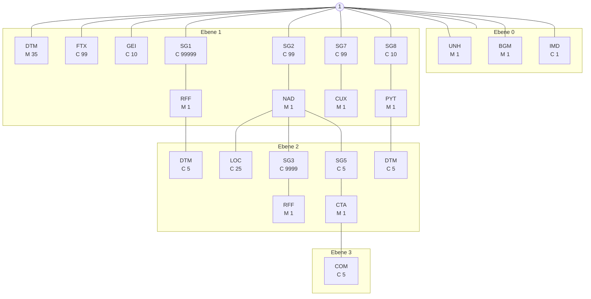
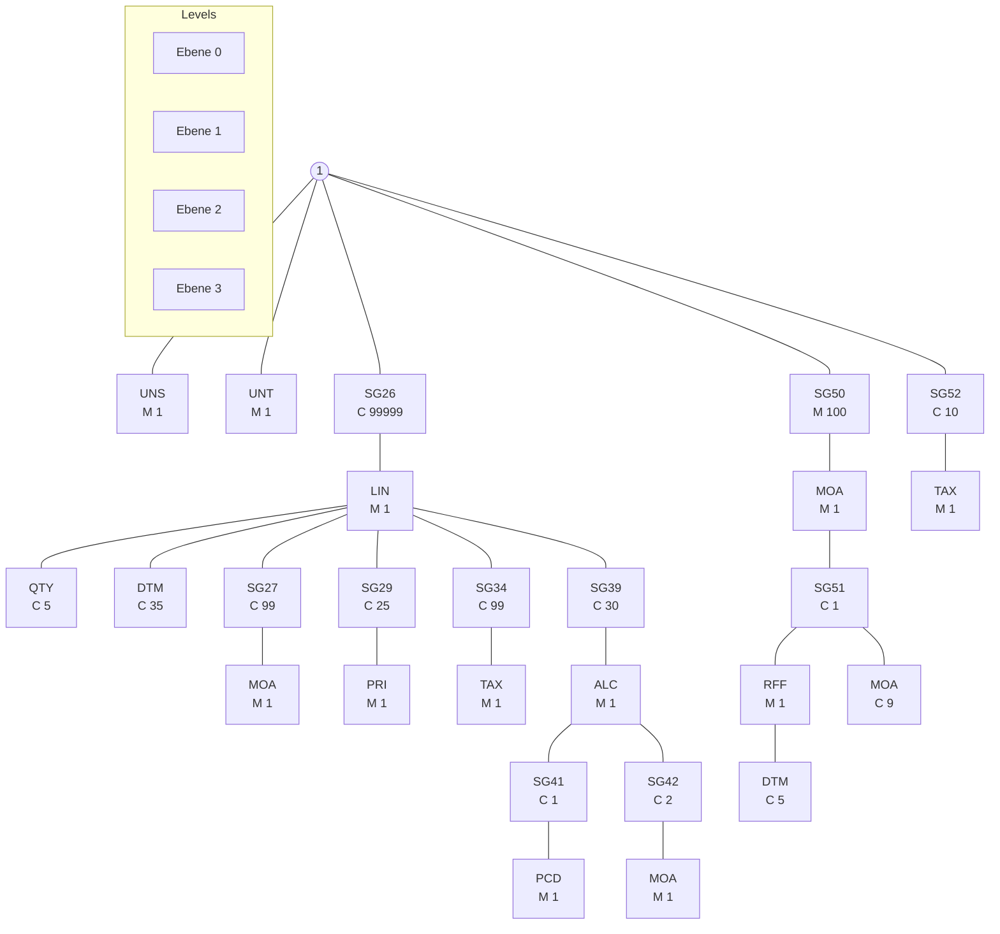

# <mark>INVOIC Nachrichtenbeschreibung</mark>

auf Basis

**INVOIC**
Rechnung

**UN D.06A S3**

**Version:** 2.8e
**Publikationsdatum:** 01.04.2025
**Autor:** BDEW

Nachrichtenstruktur 3
Diagramm 6
Segmentlayout 8
Änderungshistorie 72

INVOIC MIG

## Disclaimer

Die PDF-Datei ist das allein gültige Dokument.

Die zusätzlich veröffentlichte Word-Datei dient als informatorische Lesefassung und entspricht inhaltlich der PDF-Datei. Diese Word-Datei wird bis auf Weiteres rein informatorisch und ergänzend veröffentlicht unter dem Vorbehalt, zukünftig eine kostenpflichtige Veröffentlichung der Word-Datei einzuführen.

Zusätzlich werden zur PDF-Datei auch XML-Dateien als optionale Unterstützung gegen Entgelt veröffentlicht.

Version: 2.8e
01.04.2025
Seite: 2 / 74

INVOIC MIG

# Nachrichtenstruktur

|Zähler|Nr|Bez|Status Sta|Status BDEW|MaxWdh Sta|MaxWdh BDEW|Ebene|Inhalt|
|-|-|-|-|-|-|-|-|-|
|0010|00003|UNH|M|M|1|1|0|Nachrichtenanfang|
|0020|00004|BGM|M|M|1|1|0|Rechnungsnummer|
|0030|00005|DTM|M|M|35|1|1|Nachrichtendatum|
|0030|00006|DTM|M|R|35|1|1|Bearbeitungs-/Verarbeitungsdatum|
|0030|00007|DTM|M|D|35|1|1|Abrechnungszeitraum Beginn|
|0030|00008|DTM|M|D|35|1|1|Abrechnungszeitraum Ende|
|0030|00009|DTM|M|D|35|1|1|vorläufiger Abrechnungszeitraum Beginn|
|0030|00010|DTM|M|D|35|1|1|vorläufiger Abrechnungszeitraum Ende|
|0030|00011|DTM|M|D|35|1|1|Ausführungsdatum|
|0030|00012|DTM|M|D|35|1|1|Beginn Bilanzierung|
|0030|00013|DTM|M|D|35|1|1|Ende Netznutzung|
|0060|00014|IMD|C|R|1|1|0|Rechnungstyp|
|0070|00015|FTX|C|D|99|1|1|Meldeinformationen|
|0090|00016|GEI|C|D|10|10|1|Spezifikation der Sonderrechnung|
|0120||SG1|C|R|99999|1|1|Prüfidentifikator|
|0130|00017|RFF|M|M|1|1|1|Prüfidentifikator|
|0120||SG1|C|D|99999|1|1|Referenz auf Ursprungsrechnungsnummer|
|0130|00018|RFF|M|M|1|1|1|Referenz auf Ursprungsrechnungsnummer|
|0140|00019|DTM|C|R|5|1|2|Referenzdatum|
|0120||SG1|C|D|99999|1|1|Referenz auf Nummer des zugehörigen Dokuments|
|0130|00020|RFF|M|M|1|1|1|Referenz auf Nummer des zugehörigen Dokuments|
|0120||SG1|C|D|99999|1|1|Preise des Netzbetreibers|
|0130|00021|RFF|M|M|1|1|1|Preise des Netzbetreibers|
|0220||SG2|C|R|99|1|1|Absender|
|0230|00022|NAD|M|M|1|1|1|Name und Anschrift des Nachrichtensenders|
|0270||SG3|C|R|9999|1|2|Steuernummer, Umsatzsteuernummer|
|0280|00023|RFF|M|M|1|1|2|Steuernummer, Umsatzsteuernummer|
|0330||SG5|C|O|5|1|2|Ansprechpartner|
|0340|00024|CTA|M|M|1|1|2|Ansprechpartner|
|0350|00025|COM|C|R|5|5|3|Kommunikationsverbindung|
|0220||SG2|C|R|99|1|1|Empfänger|
|0230|00026|NAD|M|M|1|1|1|Name und Anschrift des Nachrichtenempfängers|
|0270||SG3|C|D|9999|1|2|Steuernummer, Umsatzsteuernummer|
|0280|00027|RFF|M|M|1|1|2|Steuernummer, Umsatzsteuernummer|
|0220||SG2|C|D|99|1|1|Lieferanschrift|
|0230|00028|NAD|M|M|1|1|1|Adresse der Leistungserbringung|
|0240|00029|LOC|C|R|25|1|2|Meldepunkt|
|0220||SG2|C|D|99|1|1|Netzbetreiberkonto|
|0230|00030|NAD|M|M|1|1|1|Netzbetreiberkontonummer|

Bez = Segment-/Gruppen-Bezeichner
Zähler = Nummer der Segmente/Gruppen im Standard
Nr = Laufende Segmentnummer im Guide
MaxWdh = Maximale Wiederholung der Segmente/Gruppen

Sta = Standard UN/CEFACT
EDIFACT: M=Muss/Mandatory, C=Conditional
Anwendung: R=Erforderlich/Required, O=Optional, D=Abhängig von/Dependent, N=Nicht benutzt/Not used

Version: 2.8e 01.04.2025 Seite: 3 / 74

INVOIC MIG

Datenformate Strom & Gas

# Nachrichtenstruktur

|Zähler|Nr|Bez|Status Sta|Status BDEW|MaxWdh Sta|MaxWdh BDEW|Ebene|Inhalt|
|-|-|-|-|-|-|-|-|-|
|0400||SG7|C|R|99|1|1|Währung|
|0410|00031|CUX|M|M|1|1|1|Währungsangaben|
|0430||SG8|C|R|10|1|1|Fälligkeitsdatum|
|0440|00032|PYT|M|M|1|1|1|Zahlungsbedingungen|
|0450|00033|DTM|C|R|5|1|2|Fälligkeitsdatum|
|1090||SG26|C|D|9999999|9999999|1|Rechnungspositionen|
|1100|00034|LIN|M|M|1|1|1|Positionsdaten|
|1150|00035|QTY|C|D|5|1|2|energetische Mengenangaben|
|1150|00036|QTY|C|D|5|1|2|zeitliche Mengenangaben|
|1150|00037|QTY|C|D|5|1|2|Korrekturfaktor|
|1180|00038|DTM|C|D|35|1|2|Positionsbezogener Abrechnungszeitraum Beginn|
|1180|00039|DTM|C|D|35|1|2|Positionsbezogener Abrechnungszeitraum Ende|
|1180|00040|DTM|C|D|35|1|2|Ausführungsdatum|
|1250||SG27|C|R|99|1|2|Positionsnettobetrag|
|1260|00041|MOA|M|M|1|1|2|Positionsnettobetrag|
|1250||SG27|C|D|99|1|2|Gesamtzu- oder abschlagsbetrag|
|1260|00042|MOA|M|M|1|1|2|Gesamtzu- oder abschlagsbetrag|
|1330||SG29|C|D|25|1|2|Preis|
|1340|00043|PRI|M|M|1|1|2|Preis|
|1550||SG34|C|R|99|1|2|Steuersatz (Position)|
|1560|00044|TAX|M|M|1|1|2|Umsatzsteuer der Position|
|1720||SG39|C|D|30|2|2|Abschlag|
|1730|00045|ALC|M|M|1|1|2|Abschlag|
|1800||SG41|C|R|1|1|3|Prozentangabe des Abschlags|
|1810|00046|PCD|M|M|1|1|3|Prozentangabe des Abschlags|
|1830||SG42|C|D|2|1|3|Bemessungsgrundlage des Gemeinderabatts|
|1840|00047|MOA|M|M|1|1|3|Bemessungsgrundlage des Gemeinderabatts|
|1830||SG42|C|D|2|1|3|Gemeinderabatt der Position|
|1840|00048|MOA|M|M|1|1|3|Gemeinderabatt der Position|
|1720||SG39|C|D|30|3|2|Zuschlag|
|1730|00049|ALC|M|M|1|1|2|Zuschlag|
|1800||SG41|C|D|1|1|3|Prozentangabe des Zuschlags|
|1810|00050|PCD|M|M|1|1|3|Prozentangabe des Zuschlags|
|2180|00051|UNS|M|M|1|1|0|Abschnitts-Kontrollsegment|
|2200||SG50|M|R|100|1|1|Rechnungsbetrag (inkl. USt.)|
|2210|00052|MOA|M|M|1|1|1|Rechnungsbetrag|
|2200||SG50|M|D|100|20|1|Vorausbezahlter Betrag (inkl. USt.)|
|2210|00053|MOA|M|M|1|1|1|Vorausbezahlter Betrag|
|2220||SG51|C|D|1|1|2|Referenz auf Vorgängerrechnung|

Bez = Segment-/Gruppen-Bezeichner
Zähler = Nummer der Segmente/Gruppen im Standard
Nr = Laufende Segmentnummer im Guide
MaxWdh = Maximale Wiederholung der Segmente/Gruppen
Sta = Standard UN/CEFACT
EDIFACT: M=Muss/Mandatory, C=Conditional
Anwendung: R=Erforderlich/Required, O=Optional, D=Abhängig von/Dependent, N=Nicht benutzt/Not used

Version: 2.8e 01.04.2025 Seite: 4 / 74

INVOIC MIG

# Nachrichtenstruktur

|Zähler|Nr|Bez|Status Sta|Status BDEW|MaxWdh Sta|MaxWdh BDEW|Ebene|Inhalt|
|-|-|-|-|-|-|-|-|-|
|2230|00054|RFF|M|R|1|1|2|Referenz auf Vorgängerrechnung|
|2240|00055|DTM|C|R|5|1|3|Datum der Vorgängerrechnung|
|2200||SG50|M|D|100|1|1|Gemeinderabatt|
|2210|00056|MOA|M|M|1|1|1|Gemeinderabatt|
|2200||SG50|M|R|100|1|1|Fälliger Betrag (inkl. USt.)|
|2210|00057|MOA|M|M|1|1|1|Fälliger Betrag|
|2250||SG52|C|R|10|10|1|Steuerangaben u. -mengen (Summen)|
|2260|00058|TAX|M|M|1|1|1|Umsatzsteuer der Rechnung|
|2270|00059|MOA|C|D|9|1|2|Vorausbezahlter Betrag (steuersatzbezogen)|
|2270|00060|MOA|C|D|9|1|2|Vorausbezahlte Steuern (steuersatzbezogen)|
|2270|00061|MOA|C|R|9|1|2|Besteuerungsgrundlage (steuersatzbezogen)|
|2270|00062|MOA|C|R|9|1|2|Steuerbetrag (steuersatzbezogen)|
|2330|00063|UNT|M|M|1|1|0|Nachrichtenende|

Bez = Segment-/Gruppen-Bezeichner
Zähler = Nummer der Segmente/Gruppen im Standard
Nr = Laufende Segmentnummer im Guide
MaxWdh = Maximale Wiederholung der Segmente/Gruppen
Sta = Standard UN/CEFACT
EDIFACT: M=Muss/Mandatory, C=Conditional
Anwendung: R=Erforderlich/Required, O=Optional, D=Abhängig von/Dependent, N=Nicht benutzt/Not used
Version: 2.8e
01.04.2025
Seite: 5 / 74

INVOIC MIG

# Diagramm

||Bez|Bez = Segment-/Gruppen-Bezeichner|
|-|-|-|
|St|MaxWdh|St = Durch UN/CEFACT definierter Status (M=Muss/Mandatory, C=Conditional) MaxWdh = Durch UN/CEFACT definierte maximale Wiederholung der Segmente/Gruppen|

Hinweis: Die Darstellung des hier abgebildeten Branchingdiagramms ist implizit.

Version: 2.8e 01.04.2025 Seite: 6 / 74

INVOIC MIG

||Bez|Bez = Segment-/Gruppen-Bezeichner|
|-|-|-|
|St|MaxWdh|St = Durch UN/CEFACT definierter Status (M=Muss/Mandatory, C=Conditional) MaxWdh = Durch UN/CEFACT definierte maximale Wiederholung der Segmente/Gruppen|

Hinweis: Die Darstellung des hier abgebildeten Branchingdiagramms ist implizit.

Version: 2.8e 01.04.2025 Seite: 7 / 74

INVOIC MIG

# Segmentlayout

|Zähler|Nr|Bez|Standard St|Standard MaxWdh|BDEW St|BDEW MaxWdh|Ebene|Name|
|-|-|-|-|-|-|-|-|-|
|0010|00003|\*\*UNH\*\*|M|1|M|1|0|\*\*Nachrichtenanfang\*\*|

|Bez|Name|Standard St|Standard Format|BDEW St|BDEW Format|Anwendung / Bemerkung|
|-|-|-|-|-|-|-|
|UNH|||||||
|0062|Nachrichten-Referenznummer|M|an..14|M|an..14|\*Eindeutige Nachrichtenreferenz in einer Übertragungsdatei des Absenders. Nummer der Nachrichten einer Übertragungsdatei im Datenaustausch. Identisch mit DE0062 im UNT, i. d. R. vom sendenden Konverter vergeben.\*|
|S009|Nachrichten-Kennung|M||M|||
|0065|Nachrichtentyp-Kennung|M|an..6|M|an..6|\*\*INVOIC Rechnung\*\*|
|0052|Versionsnummer des Nachrichtentyps|M|an..3|M|an..3|\*\*D Entwurfs-Version\*\*|
|0054|Freigabenummer des Nachrichtentyps|M|an..3|M|an..3|\*\*06A Ausgabe 2006 - A\*\*|
|0051|Verwaltende Organisation|M|an..2|M|an..2|\*\*UN UN/CEFACT\*\*|
|0057|Anwendungscode der zuständigen Organisation|C|an..6|R|an..6|\*\*2.8e\*\*|

**Bemerkung:**
Dieses Segment dient dazu, eine Nachricht zu eröffnen, zu identifizieren und zu spezifizieren.

Die Datenelemente 0065, 0052, 0054 und 0051 deklarieren die Nachricht als UNSM des Verzeichnisses D.06A unter Kontrolle der Vereinten Nationen.

**Hinweis:**
DE0057: Es werden die Versions- und Release-Nummern der Nachrichtenbeschreibungen angegeben.

**Beispiel:**
`UNH+1+INVOIC:D:06A:UN:2.8e'`

Bez = Objekt-Bezeichner
Nr = Laufende Segmentnummer im Guide
MaxWdh = Maximale Wiederholung der Segmente/Gruppen
Zähler = Nummer der Segmente/Gruppen im Standard

St = Status
EDIFACT: M=Muss/Mandatory, C=Conditional
Anwendung: R=Erforderlich/Required, O=Optional, D=Abhängig von/Dependent, N=Nicht benutzt/Not used

Version: 2.8e 01.04.2025 Seite: 8 / 74

INVOIC MIG

# Segmentlayout

|Zähler|Nr|Bez|Standard St|Standard MaxWdh|BDEW St|BDEW MaxWdh|Ebene|Name|
|-|-|-|-|-|-|-|-|-|
|0020|00004|\*\*BGM\*\*|M|1|M|1|0|\*\*Rechnungsnummer\*\*|

|Bez|Name|Standard St|Standard Format|BDEW St|BDEW Format|Anwendung / Bemerkung|
|-|-|-|-|-|-|-|
|BGM|||||||
|C002|Dokumenten-/ Nachrichtenname|C||R|||
|1001|Dokumentenname, Code|C|an..3|R|an..3|\*\*380 Handelsrechnung\*\* \*\*389 Selbst ausgestellte Rechnung (engl.: "Self-billed invoice")\*\* \*\*457 Storno einer Belastung.\*\* \*\*Z25 Storno für selbst ausgestellte Rechnung (Gutschrift im Gutschriftsverfahren)\*\*|
|C106|Dokumenten-/Nachrichten- Identifikation|C||R|||
|1004|Dokumentennummer|C|an..35|R|an..35|\*Eindeutige EDI-Nachrichtennummer, vergeben vom Absender des Dokuments, entspricht der Rechnungsnummer\*|
|1225|Nachrichtenfunktion, Code|C|an..3|R|an..3|\*\*7 Duplikat\*\* \*\*9 Original\*\*|

**Bemerkung:**
Dieses Segment dient dazu, Typ und Funktion einer Nachricht anzuzeigen und die Identifikationsnummer zu übermitteln.

**Hinweise:**
DE1001: Der Codewert 380 ist bei Turnus- und Schlussrechnungen unabhängig davon zu verwenden, ob in der Summe ein Entgelt für Netznutzung angefordert oder erstattet wird. Ein Erstattungsentgelt (in der Praxis häufig auch als kaufmännische Gutschrift bezeichnet) ist durch ein negatives Vorzeichen beim zugehörigen Betrag (SG50 MOA) zu identifizieren.

Zur Identifizierung von umsatzsteuerrechtlichen Gutschriften gemäß § 14, Abs. 2 UStG ist ausschließlich der Codewert 389 - selbst ausgestellte Rechnung - zu verwenden.

457 = Storno einer Belastung - ist anzuwenden bei Stornierung von Handelsrechnungen
Z25 = Storno für selbst ausgestellte Rechnung (Gutschrift im Gutschriftsverfahren) - ist anzuwenden bei Stornierung von selbst ausgestellten Rechnungen

DE1225: Die Nachrichtenfunktion, codiert ist ein kritisches Datenelement in diesem Segment. Sie betrifft alle Daten einer Nachricht. Demzufolge muss pro Nachrichtenfunktion eine Nachricht erstellt werden. Es gilt die folgende Regel für den Codewert:

9 = Original-Rechnungen werden immer mit diesem Qualifier bezeichnet.
7 = Dieser Qualifier wird verwendet, um anzuzeigen, dass diese Nachricht (INVOIC/Rechnung) schon einmal übermittelt wurde. Entscheidend hierfür ist die Sicht des Rechnungsstellers. Beim Rechnungsempfänger ist eine derartige INVOIC wie ein Original zu behandeln.

**Beispiel:**
`BGM+380+INV12435422+9'`
Dieses Beispiel identifiziert das Dokument als eine Handelsrechnung durch die Verwendung des Codewertes 380. Das Dokument hat die Belegnummer INV12435422.

Bez = Objekt-Bezeichner
Nr = Laufende Segmentnummer im Guide
MaxWdh = Maximale Wiederholung der Segmente/Gruppen
Zähler = Nummer der Segmente/Gruppen im Standard
St = Status
EDIFACT: M=Muss/Mandatory, C=Conditional
Anwendung: R=Erforderlich/Required, O=Optional, D=Abhängig von/Dependent, N=Nicht benutzt/Not used
Version: 2.8e 01.04.2025 Seite: 9 / 74

INVOIC MIG

# Segmentlayout

|Zähler|Nr|Bez|Standard St|Standard MaxWdh|BDEW St|BDEW MaxWdh|Ebene|Name|
|-|-|-|-|-|-|-|-|-|
|0030|00005|\*\*DTM\*\*|M|35|M|1|1|\*\*Nachrichtendatum\*\*|

|Bez|Name|Standard St|Standard Format|BDEW St|BDEW Format|Anwendung / Bemerkung|
|-|-|-|-|-|-|-|
|DTM| | | | | ||
|C507|Datum/Uhrzeit/Zeitspanne|M| |M| ||
|2005|Datums- oder Uhrzeits- oder Zeitspannen-Funktion, Qualifier|M|an..3|M|an..3|\*\*137 Dokumenten-/Nachrichtendatum/-zeit\*\*|
|2380|Datum oder Uhrzeit oder Zeitspanne, Wert|C|an..35|R|an..35||
|2379|Datums- oder Uhrzeit- oder Zeitspannen-Format, Code|C|an..3|R|an..3|\*\*303 CCYYMMDDHHMMZZZ\*\*|

**Bemerkung:**
Dieses Segment wird zur Angabe des Dokumentendatums verwendet.

**Hinweise:**

Das Dokumentendatum muss angegeben werden. Bei Rechnungen ist dies das Rechnungsdatum (wird teilweise auch als Belegdatum bezeichnet).

**Beispiel:**
`DTM+137:202106032200?+00:303'`

Bez = Objekt-Bezeichner
Nr = Laufende Segmentnummer im Guide
MaxWdh = Maximale Wiederholung der Segmente/Gruppen
Zähler = Nummer der Segmente/Gruppen im Standard
St = Status
EDIFACT: M=Muss/Mandatory, C=Conditional
Anwendung: R=Erforderlich/Required, O=Optional, D=Abhängig von/ Dependent, N=Nicht benutzt/Not used
Version: 2.8e 01.04.2025 Seite: 10 / 74

INVOIC MIG

# Segmentlayout

|Zähler|Nr|Bez|Standard St|Standard MaxWdh|BDEW St|BDEW MaxWdh|Ebene|Name|
|-|-|-|-|-|-|-|-|-|
|0030|00006|\*\*DTM\*\*|M|35|R|1|1|\*\*Bearbeitungs-/Verarbeitungsdatum\*\*|

|Bez|Name|Standard St|Standard Format|BDEW St|BDEW Format|Anwendung / Bemerkung||
|-|-|-|-|-|-|-|-|
|DTM||||||||
|C507|Datum/Uhrzeit/Zeitspanne|M||M||||
|2005|Datums- oder Uhrzeits- oder Zeitspannen-Funktion, Qualifier|M|an..3|M|an..3|\*\*9 Bearbeitungs-/Verarbeitungsdatum/-zeit\*\*||
|2380|Datum oder Uhrzeit oder Zeitspanne, Wert|C|an..35|R|an..35|||
|2379|Datums- oder Uhrzeit- oder Zeitspannen-Format, Code|C|an..3|R|an..3|\*\*303 CCYYMMDDHHMMZZZ\*\*||

**Bemerkung:**
Das Segment gibt das Bearbeitungs-/Verarbeitungsdatum an.

Es handelt sich um das Buchungsdatum. Dies wird benötigt, um die gebuchten Forderungen gegenüber den offenen Verbindlichkeiten tagesscharf abgrenzen zu können. Es hat keinen Einfluss auf Wertstellung, Zahlungsziele, etc. Für den Lieferanten ergibt sich hieraus keine Notwendigkeit zur Auswertung.

**Beispiel:**
`DTM+9:202106032200?+00:303'`

Bez = Objekt-Bezeichner
Nr = Laufende Segmentnummer im Guide
MaxWdh = Maximale Wiederholung der Segmente/Gruppen
Zähler = Nummer der Segmente/Gruppen im Standard
St = Status
EDIFACT: M=Muss/Mandatory, C=Conditional
Anwendung: R=Erforderlich/Required, O=Optional, D=Abhängig von/ Dependent, N=Nicht benutzt/Not used
Version: 2.8e 01.04.2025 Seite: 11 / 74

INVOIC MIG

# Segmentlayout

|Zähler|Nr|Bez|Standard St|Standard MaxWdh|BDEW St|BDEW MaxWdh|Ebene|Name|
|-|-|-|-|-|-|-|-|-|
|0030|00007|\*\*DTM\*\*|M|35|D|1|1|\*\*Abrechnungszeitraum Beginn\*\*|

|Bez|Name|Standard St|Standard Format|BDEW St|BDEW Format|Anwendung / Bemerkung|
|-|-|-|-|-|-|-|
|DTM| | | | | ||
|C507|Datum/Uhrzeit/Zeitspanne|M| |M| ||
|2005|Datums- oder Uhrzeits- oder Zeitspannen-Funktion, Qualifier|M|an..3|M|an..3|\*\*155 Rechnungsperiode, Beginndatum\*\*|
|2380|Datum oder Uhrzeit oder Zeitspanne, Wert|C|an..35|R|an..35||
|2379|Datums- oder Uhrzeit- oder Zeitspannen-Format, Code|C|an..3|R|an..3|\*\*303 CCYYMMDDHHMMZZZ\*\*|

**Bemerkung:**
Das Segment dient zur Angabe des Abrechnungszeitraumanfangs.

**Beispiel:**
`DTM+155:202107312200?+00:303'`
In diesem Beispiel ist der Abrechnungsbeginn des Abrechnungszeitraums am 1. August 2021, 00:00 Uhr gesetzlicher Zeit. In Kombination mit dem nachfolgenden DTM+156 ergibt sich ein Abrechnungszeitraum von einem Monat.

Bez = Objekt-Bezeichner
Nr = Laufende Segmentnummer im Guide
MaxWdh = Maximale Wiederholung der Segmente/Gruppen
Zähler = Nummer der Segmente/Gruppen im Standard
St = Status
EDIFACT: M=Muss/Mandatory, C=Conditional
Anwendung: R=Erforderlich/Required, O=Optional, D=Abhängig von/ Dependent, N=Nicht benutzt/Not used
Version: 2.8e 01.04.2025 Seite: 12 / 74

INVOIC MIG

# Segmentlayout

|Zähler|Nr|Bez|Standard|Standard St|BDEW MaxWdh|BDEW St|Ebene MaxWdh|Name||
|-|-|-|-|-|-|-|-|-|-|
|0030|00008|\*\*DTM\*\*|M|35|D|1|1|\*\*Abrechnungszeitraum Ende\*\*||

|Bez|Name|Standard St|Standard Format|BDEW St|BDEW Format|Anwendung / Bemerkung|
|-|-|-|-|-|-|-|
|DTM| | | | | ||
|C507|Datum/Uhrzeit/Zeitspanne|M| |M| ||
|2005|Datums- oder Uhrzeits- oder Zeitspannen-Funktion, Qualifier|M|an..3|M|an..3|\*\*156 Rechnungsperiode, Endedatum\*\*|
|2380|Datum oder Uhrzeit oder Zeitspanne, Wert|C|an..35|R|an..35||
|2379|Datums- oder Uhrzeit- oder Zeitspannen-Format, Code|C|an..3|R|an..3|\*\*303 CCYYMMDDHHMMZZZ\*\*|

**Bemerkung:**
Das Segment dient zur Angabe des Abrechnungszeitraumendes.

**Beispiel:**
`DTM+156:202108312200?+00:303'`
In diesem Beispiel ist das Abrechnungsende des Abrechnungszeitraums am 1. September 2021, 00:00 Uhr gesetzlicher Zeit. In Kombination mit dem vorhergehenden DTM+155 ergibt sich ein Abrechnungszeitraum von einem Monat.

Bez = Objekt-Bezeichner
Nr = Laufende Segmentnummer im Guide
MaxWdh = Maximale Wiederholung der Segmente/Gruppen
Zähler = Nummer der Segmente/Gruppen im Standard
St = Status
EDIFACT: M=Muss/Mandatory, C=Conditional
Anwendung: R=Erforderlich/Required, O=Optional, D=Abhängig von/ Dependent, N=Nicht benutzt/Not used
Version: 2.8e 01.04.2025 Seite: 13 / 74

INVOIC MIG

# Segmentlayout

|Zähler|Nr|Bez|Standard St|Standard MaxWdh|BDEW St|BDEW MaxWdh|Ebene|Name|
|-|-|-|-|-|-|-|-|-|
|0030|00009|\*\*DTM\*\*|M|35|D|1|1|\*\*vorläufiger Abrechnungszeitraum Beginn\*\*|

|Bez|Name|Standard St|Standard Format|BDEW St|BDEW Format|Anwendung / Bemerkung||
|-|-|-|-|-|-|-|-|
|DTM||||||||
|C507|Datum/Uhrzeit/Zeitspanne|M||M||||
|2005|Datums- oder Uhrzeits- oder Zeitspannen-Funktion, Qualifier|M|an..3|M|an..3|\*\*Z42 vorläufiger Abrechnungszeitraum Beginn\*\*||
|2380|Datum oder Uhrzeit oder Zeitspanne, Wert|C|an..35|R|an..35|||
|2379|Datums- oder Uhrzeit- oder Zeitspannen-Format, Code|C|an..3|R|an..3|\*\*303 CCYYMMDDHHMMZZZ\*\*||

**Bemerkung:**
Das Segment dient zur Angabe des Abrechnungszeitraumanfangs bei Abschlagsrechnungen.

**Beispiel:**
`DTM+Z42:202107312200?+00:303'`
In diesem Beispiel ist der Abrechnungsbeginn des Abrechnungszeitraums am 1. August 2021, 00:00 Uhr gesetzlicher Zeit. In Kombination mit dem nachfolgenden DTM+Z43 ergibt sich ein vorläufiger Abrechnungszeitraum von einem Monat.

Bez = Objekt-Bezeichner
Nr = Laufende Segmentnummer im Guide
MaxWdh = Maximale Wiederholung der Segmente/Gruppen
Zähler = Nummer der Segmente/Gruppen im Standard
St = Status
EDIFACT: M=Muss/Mandatory, C=Conditional
Anwendung: R=Erforderlich/Required, O=Optional, D=Abhängig von/Dependent, N=Nicht benutzt/Not used
Version: 2.8e 01.04.2025 Seite: 14 / 74

INVOIC MIG

# Segmentlayout

|Zähler|Nr|Bez|Standard|Standard St|BDEW MaxWdh|BDEW St|Ebene MaxWdh|Name||
|-|-|-|-|-|-|-|-|-|-|
|0030|00010|\*\*DTM\*\*|M|35|D|1|1|\*\*vorläufiger Abrechnungszeitraum Ende\*\*||

|Bez|Name|Standard St|Standard Format|BDEW St|BDEW Format|Anwendung / Bemerkung||
|-|-|-|-|-|-|-|-|
|DTM||||||||
|C507|Datum/Uhrzeit/Zeitspanne|M||M||||
|2005|Datums- oder Uhrzeits- oder Zeitspannen-Funktion, Qualifier|M|an..3|M|an..3|\*\*Z43 vorläufiger Abrechnungszeitraum Ende\*\*||
|2380|Datum oder Uhrzeit oder Zeitspanne, Wert|C|an..35|R|an..35|||
|2379|Datums- oder Uhrzeit- oder Zeitspannen-Format, Code|C|an..3|R|an..3|\*\*303 CCYYMMDDHHMMZZZ\*\*||

**Bemerkung:**
Das Segment dient zur Angabe des Abrechnungszeitraumendes bei Abschlagsrechnungen.

**Beispiel:**
`DTM+Z43:202108312200?+00:303'`
In diesem Beispiel ist das Abrechnungsende des Abrechnungszeitraums am 1. September 2021, 00:00 Uhr gesetzlicher Zeit. In Kombination mit dem vorhergehenden DTM+Z42 ergibt sich ein vorläufiger Abrechnungszeitraum von einem Monat.

Bez = Objekt-Bezeichner
Nr = Laufende Segmentnummer im Guide
MaxWdh = Maximale Wiederholung der Segmente/Gruppen
Zähler = Nummer der Segmente/Gruppen im Standard
St = Status
EDIFACT: M=Muss/Mandatory, C=Conditional
Anwendung: R=Erforderlich/Required, O=Optional, D=Abhängig von/Dependent, N=Nicht benutzt/Not used
Version: 2.8e 01.04.2025 Seite: 15 / 74

INVOIC MIG

# Segmentlayout

|Zähler|Nr|Bez|Standard St|Standard MaxWdh|BDEW St|BDEW MaxWdh|Ebene|Name|
|-|-|-|-|-|-|-|-|-|
|0030|00011|\*\*DTM\*\*|M|35|D|1|1|\*\*Ausführungsdatum\*\*|

|Bez|Name|Standard St|Standard Format|BDEW St|BDEW Format|Anwendung / Bemerkung||
|-|-|-|-|-|-|-|-|
|DTM||||||||
|C507|Datum/Uhrzeit/Zeitspanne|M||M||||
|2005|Datums- oder Uhrzeits- oder Zeitspannen-Funktion, Qualifier|M|an..3|M|an..3|\*\*203 Ausführungsdatum/-zeit\*\*||
|2380|Datum oder Uhrzeit oder Zeitspanne, Wert|C|an..35|R|an..35|||
|2379|Datums- oder Uhrzeit- oder Zeitspannen-Format, Code|C|an..3|R|an..3|\*\*303 CCYYMMDDHHMMZZZ\*\* \*\*102 CCYYMMDD\*\*||

**Bemerkung:**
Das Segment dient zur Angabe des Ausführungsdatums. Es muss der Tag angegeben werden können, an dem die Leistung erbracht wurde. Dieses Segment wird nur bei den WiM-Prozessen genutzt.

**Beispiel:**
`DTM+203:202101112300?+00:303'`
In diesem Beispiel ist das Ausführungsdatum der beauftragten WiM-Dienstleistung der 12.01.2021, 00:00 Uhr gesetzlicher Zeit.

Bez = Objekt-Bezeichner
Nr = Laufende Segmentnummer im Guide
MaxWdh = Maximale Wiederholung der Segmente/Gruppen
Zähler = Nummer der Segmente/Gruppen im Standard
St = Status
EDIFACT: M=Muss/Mandatory, C=Conditional
Anwendung: R=Erforderlich/Required, O=Optional, D=Abhängig von/Dependent, N=Nicht benutzt/Not used
Version: 2.8e 01.04.2025 Seite: 16 / 74

INVOIC MIG

# Segmentlayout

|Zähler|Nr|Bez|Standard St|Standard MaxWdh|BDEW St|BDEW MaxWdh|Ebene|Name|
|-|-|-|-|-|-|-|-|-|
|0030|00012|\*\*DTM\*\*|M|35|D|1|1|\*\*Beginn Bilanzierung\*\*|

|Bez|Name|Standard St|Standard Format|BDEW St|BDEW Format|Anwendung / Bemerkung|
|-|-|-|-|-|-|-|
|DTM| | | | | ||
|C507|Datum/Uhrzeit/Zeitspanne|M| |M| ||
|2005|Datums- oder Uhrzeits- oder Zeitspannen-Funktion, Qualifier|M|an..3|M|an..3|\*\*Z11 Beginndatum Bilanzierung zugeordnete Periode\*\*|
|2380|Datum oder Uhrzeit oder Zeitspanne, Wert|C|an..35|R|an..35||
|2379|Datums- oder Uhrzeit- oder Zeitspannen-Format, Code|C|an..3|R|an..3|\*\*303 CCYYMMDDHHMMZZZ\*\*|

**Bemerkung:**
Das Segment dient zur Angabe des Beginndatums der Bilanzierung für die in der Rechnung abgerechnete Abrechnungsperiode bei den MMMA-Prozessen. Es wird der erste Monat der Bilanzierung eingetragen, der für diese Rechnung berücksichtigt wird.

**Beispiel:**
`DTM+Z11:202109302200?+00:303'`
In diesem Beispiel ist das Beginndatum der Bilanzierung der 01.10.2021, 00:00 Uhr gesetzlicher Zeit.

Bez = Objekt-Bezeichner
Nr = Laufende Segmentnummer im Guide
MaxWdh = Maximale Wiederholung der Segmente/Gruppen
Zähler = Nummer der Segmente/Gruppen im Standard
St = Status
EDIFACT: M=Muss/Mandatory, C=Conditional
Anwendung: R=Erforderlich/Required, O=Optional, D=Abhängig von/Dependent, N=Nicht benutzt/Not used
Version: 2.8e 01.04.2025 Seite: 17 / 74

INVOIC MIG

# Segmentlayout

|Zähler|Nr|Bez|Standard St|Standard MaxWdh|BDEW St|BDEW MaxWdh|Ebene|Name|
|-|-|-|-|-|-|-|-|-|
|0030|00013|\*\*DTM\*\*|M|35|D|1|1|\*\*Ende Netznutzung\*\*|

|Bez|Name|Standard St|Standard Format|BDEW St|BDEW Format|Anwendung / Bemerkung|
|-|-|-|-|-|-|-|
|DTM| | | | | ||
|C507|Datum/Uhrzeit/Zeitspanne|M| |M| ||
|2005|Datums- oder Uhrzeits- oder Zeitspannen-Funktion, Qualifier|M|an..3|M|an..3|\*\*Z12 Ende Netznutzung zugeordnete Periode\*\*|
|2380|Datum oder Uhrzeit oder Zeitspanne, Wert|C|an..35|R|an..35||
|2379|Datums- oder Uhrzeit- oder Zeitspannen-Format, Code|C|an..3|R|an..3|\*\*303 CCYYMMDDHHMMZZZ\*\*|

**Bemerkung:**
Das Segment dient zur Angabe des Endedatums der Netznutzung für die in der Rechnung abgerechnete Abrechnungsperiode bei den MMMA-Prozessen. Es wird der letzte Tag der Netznutzung eingetragen, der für diese Rechnung noch berücksichtigt wird.

**Beispiel:**
`DTM+Z12:202110242200?+00:303'`
In diesem Beispiel ist das Endedatum der Netznutzung der 25.10.2021, 00:00 Uhr gesetzlicher Zeit.

Bez = Objekt-Bezeichner
Nr = Laufende Segmentnummer im Guide
MaxWdh = Maximale Wiederholung der Segmente/Gruppen
Zähler = Nummer der Segmente/Gruppen im Standard
St = Status
EDIFACT: M=Muss/Mandatory, C=Conditional
Anwendung: R=Erforderlich/Required, O=Optional, D=Abhängig von/ Dependent, N=Nicht benutzt/Not used
Version: 2.8e 01.04.2025 Seite: 18 / 74

INVOIC MIG

# Segmentlayout

|Zähler|Nr|Bez|Standard St|Standard MaxWdh|BDEW St|BDEW MaxWdh|Ebene|Name|
|-|-|-|-|-|-|-|-|-|
|0060|00014|\*\*IMD\*\*|C|1|R|1|0|\*\*Rechnungstyp\*\*|

|Bez|Name|Standard St|Standard Format|BDEW St|BDEW Format|Anwendung / Bemerkung||
|-|-|-|-|-|-|-|-|
|IMD||||||||
|7077|Beschreibungsformat, Code|C|an..3|N||Nicht benutzt||
|C272|Produkt/Leistung|C||R||||
|7081|Produkt/Leistung, Code|C|an..3|R|an..3|\*\*ABR Abschlussrechnung\*\* \*\*ABS Abschlagsrechnung\*\* \*\*JVR Turnusrechnung\*\* \*\*MVR Monatsrechnung\*\* \*\*WIM Rechnung für WiM\*\* \*\*ZVR Zwischenrechnung\*\* \*\*13I Integrierte 13. Rechnung\*\* \*\*13R 13. Rechnung\*\* \*\*MMM Mehr-/Mindermengenabrechnung\*\* \*\*MSB Rechnung für Messstellenbetrieb\*\* \*\*NAP Kapazitätsrechnung\*\* \*\*Z43 Rechnung für Sperren und Wiederinbetriebnahme\*\* \*\*Z44 Verzugskostenrechnung\*\* \*\*Z45 Blindarbeitrechnung\*\* \*\*SOR Sonderrechnung\*\* \*\*KON Abrechnung von Konfigurationen (Universalbestellprozess)\*\* \*\*TEC Abrechnung von Technik\*\*||
|C273|Produkt-/ Leistungsbeschreibung|C||D||||
|7009|Produkt-/ Leistungsbeschreibung, Code|C|an..17|R|an..17|\*\*Z06 Erzeugung\*\* Marktlokation liefert Energie ins Netz. \*\*Z07 Verbrauch\*\* Marktlokation entnimmt Energie aus dem Netz.||

**Bemerkung:**
Dieses Segment wird zur Beschreibung des Rechnungstyps benutzt.

Die Liste wird bei Bedarf vom BDEW erweitert.

DE7081 Erläuterung der codierten Rechnungstypen:

Marktlokation mit der Netznutzungsabrechnungsvariante Arbeitspreis/Grundpreis

**ABR**
Abschlussrechnung, wird verwendet bei Auszug/Lieferantenwechsel für Monatsrechnung und Jahresrechnung. Wenn eine Turnus- und eine Schlussrechnung zusammenfallen, wird der Qualifier ABR genutzt.

**ABS**
Abschlagsrechnungen werden fristgerecht vor der jeweiligen Fälligkeit an den Rechnungsempfänger übertragen.

**JVR**
Turnusrechnung (ehemals Jahresrechnung), der turnusmäßige Abrechnungszeitraum beträgt normalerweise ein Jahr. Es kann aber davon abweichend ein kürzeres Intervall (z. B. monatlich oder vierteljährlich) zwischen den Marktpartnern vereinbart

Bez = Objekt-Bezeichner
Nr = Laufende Segmentnummer im Guide
MaxWdh = Maximale Wiederholung der Segmente/Gruppen
Zähler = Nummer der Segmente/Gruppen im Standard
St = Status
EDIFACT: M=Muss/Mandatory, C=Conditional
Anwendung: R=Erforderlich/Required, O=Optional, D=Abhängig von/Dependent, N=Nicht benutzt/Not used
Version: 2.8e 01.04.2025 Seite: 19 / 74

INVOIC MIG

# Segmentlayout

werden.

**ZVR**
Zwischenrechnung wird verwendet, wenn innerhalb eines Abrechnungsturnus eine Zwischenrechnung erstellt wird. Beispiel: Abrechnungsturnus 1.6. bis 30.5. Es wird eine Ablesung zum 31.12. durchgeführt und hierüber eine Rechnung erstellt. Diese wird als Zwischenabrechnung gekennzeichnet. Wird später für den Rest der Abrechnungsperiode (1.1. bis 30.5) eine Rechnung erstellt, so wird diese als JVR gekennzeichnet.

**Marktlokation mit der Netznutzungsabrechnungsvariante Arbeitspreis/Leistungspreis**

**MVR**
Monatsrechnung wird verwendet bei monatlichem Abrechnungszyklus. Dieses Kennzeichen wird auch bei der gleitenden Nachberechnung im Zuge der Erstellung vorläufiger Monatsrechnungen verwendet.

**13I**
Der Qualifier 13I ist zu nutzen, wenn innerhalb einer Rechnung sowohl die letzte (vorläufige) Monatsrechnung als auch die Jahres- bzw. Abschlussrechnung integriert ist, d. h. auch bei sogenannten gleitenden Nachberechnungen.

**13R**
In diesem Fall wird eine Jahresrechnung (oder eine Abschlussrechnung) erstellt, dabei werden die zwölf monatlichen Abrechnungen (die z. B. mit Durchschnittspreis erstellt wurden) als bereits geleistete Zahlungen innerhalb dieser Rechnung berücksichtigt.

**Wechselprozesse im Messwesen (WiM)**

**WIM**
Über Rechnungen für WiM können Überlassung und Verkauf von Messeinrichtungen sowie sonstige Dienstleistungen, die sich aus der WiM ergeben, abgerechnet werden.

**MSB**
Mit diesem Rechnungstyp wird der Messstellenbetrieb abgerechnet.

**Mehr- und Mindermengenabrechnung (MMMA)**

**MMM**
Mit diesem Rechnungstyp wird die MMMA übertragen.

**Kapazitätsabrechnung an Ausspeisepunkten zu Letztverbrauchern**

**NAP**
Mit diesem Rechnungstyp wird die Kapazitätsabrechnung lt. GeLi Gas (BK7-06-07) übertragen.

**Zusatzleistungen**

**Z43**
Mit diesem Rechnungstyp wird die Beauftragung der Unterbrechung und Wiederherstellung der Anschlussnutzung übertragen.

**Z44**
Mit diesem Rechnungstyp werden Verzugskosten in Rechnung gestellt.

**Z45**
Mit diesem Rechnnungstyp wird Blindarbeit in Rechnung stellt.

Bez = Objekt-Bezeichner
Nr = Laufende Segmentnummer im Guide
MaxWdh = Maximale Wiederholung der Segmente/Gruppen
Zähler = Nummer der Segmente/Gruppen im Standard
St = Status
EDIFACT: M=Muss/Mandatory, C=Conditional
Anwendung: R=Erforderlich/Required, O=Optional, D=Abhängig von/Dependent, N=Nicht benutzt/Not used
Version: 2.8e 01.04.2025 Seite: 20 / 74

INVOIC MIG

# Segmentlayout

**SOR**
Mit diesem Rechnungstyp können Bestandteile einer Jahresrechnung korrigiert werden, ohne dass diese storniert werden muss.

**KON**
Mit diesem Rechnungstyp werden Konfigurationen gegenüber ESA, LF und NB abgerechnet.

**TEC**
Mit diesem Rechnungstyp werden Leistungen abgerechnet, die im Rahmen der Prozesse zur Änderung der Technik an Lokationen bestellt wurden.

**Beispiel:**
`IMD++MMM+Z06'`
`IMD++JVR'`

Bez = Objekt-Bezeichner
Nr = Laufende Segmentnummer im Guide
MaxWdh = Maximale Wiederholung der Segmente/Gruppen
Zähler = Nummer der Segmente/Gruppen im Standard
St = Status
EDIFACT: M=Muss/Mandatory, C=Conditional
Anwendung: R=Erforderlich/Required, O=Optional, D=Abhängig von/Dependent, N=Nicht benutzt/Not used
Version: 2.8e 01.04.2025 Seite: 21 / 74

INVOIC MIG

# Segmentlayout

|Zähler|Nr|Bez|Standard St|Standard MaxWdh|BDEW St|BDEW MaxWdh|Ebene|Name|
|-|-|-|-|-|-|-|-|-|
|0070|00015|\*\*FTX\*\*|C|99|D|1|1|\*\*Meldeinformationen\*\*|

|Bez|Name|Standard St|Standard Format|BDEW St|BDEW Format|Anwendung / Bemerkung|
|-|-|-|-|-|-|-|
|FTX|||||||
|4451|Textbezug, Qualifier|M|an..3|M|an..3|\*\*REG Meldeinformationen\*\*|
|4453|Textfunktion, Code|C|an..3|N||\Nicht benutzt\|
|C107|Text-Referenz|C||R|||
|4441|Freier Text, Code|M|an..17|M|an..17|\*\*RCH Reverse Charge gemäß §13b UStG / Steuerschuldnerschaft des Leistungsempfängers\*\*|

**Bemerkung:**
Dieses Segment ist für Rechnungen zu verwenden, bei denen gemäß § 13b UStG die Steuerschuld auf den Leistungsempfänger übergeht.

**Beispiel:**
`FTX+REG++RCH'`

Bez = Objekt-Bezeichner
Nr = Laufende Segmentnummer im Guide
MaxWdh = Maximale Wiederholung der Segmente/Gruppen
Zähler = Nummer der Segmente/Gruppen im Standard

St = Status
EDIFACT: M=Muss/Mandatory, C=Conditional
Anwendung: R=Erforderlich/Required, O=Optional, D=Abhängig von/ Dependent, N=Nicht benutzt/Not used

Version: 2.8e 01.04.2025 Seite: 22 / 74

INVOIC MIG

# Segmentlayout

|Zähler|Nr|Bez|Standard St|Standard MaxWdh|BDEW St|BDEW MaxWdh|Ebene|Name|
|-|-|-|-|-|-|-|-|-|
|0090|00016|GEI|C|10|D|10|1|Spezifikation der Sonderrechnung|

|Bez|Name|Standard St Format|BDEW St Format|Anwendung / Bemerkung|
|-|-|-|-|-|
|GEI| | | | |
|9649|Verarbeitungsinformation, Qualifier|M an..3|M an..3|\*\*Z01 Art der Sonderrechnung\*\*|
|C012|Verarbeitungsindikator|C|R| |
|7365|Verarbeitungsindikator, Code|C an..3|R an..3|\*Bemerkung:\* \*Z10 Wird verwendet wenn, aufgrund der Mitteilung von weitergeleiteten Mengen an Dritte neben der § 19 StromNEV-Umlage auch die Konzessionsabgabe zu korrigieren ist. Dies ist z.B. dann der Fall, wenn die Weiterleitung von Mengen an Dritte in der Niederspannung erfolgte und folgedessen die Konzessionsabgabe für Tarifkunden abzurechnen ist.\* \*\*Z01 Konzessionsabgabe (Testat)\*\* \*\*Z02 Individuelle Vereinbarung für atypische und energieintensive Netznutzung\*\* \*\*Z03 Individuelle Vereinbarung für singuläre Netznutzung\*\* \*\*Z04 KWKG-Umlage\*\* \*\*Z05 Offshore-Netzumlage\*\* \*\*Z06 § 19 StromNEV-Umlage\*\* \*\*Z07 §18 AbLaV\*\* \*\*Z08 Konzessionsabgabe (Wechsel auf Lastgangmessung)\*\* \*\*Z09 Privilegierung nach EnFG\*\* \*\*Z10 Konzessionsabgabe (weitergeleitete Mengen)\*\*|

**Bemerkung:**
In diesem Segment wird die Art der Sonderrechnung näher spezifiziert durch Angabe entsprechender Codes, die beliebig miteinander kombinierbar sind.

**Beispiel:**
`GEI+Z01+Z01'`

Bez = Objekt-Bezeichner
Nr = Laufende Segmentnummer im Guide
MaxWdh = Maximale Wiederholung der Segmente/Gruppen
Zähler = Nummer der Segmente/Gruppen im Standard
St = Status
EDIFACT: M=Muss/Mandatory, C=Conditional
Anwendung: R=Erforderlich/Required, O=Optional, D=Abhängig von/Dependent, N=Nicht benutzt/Not used
Version: 2.8e 01.04.2025 Seite: 23 / 74

INVOIC MIG

# Segmentlayout

|Zähler|Nr|Bez|Standard St|Standard MaxWdh|BDEW St|BDEW MaxWdh|Ebene|Name|
|-|-|-|-|-|-|-|-|-|
|0120||SG1|C|99999|R|1|1|Prüfidentifikator|
|0130|00017|RFF|M|1|M|1|1|Prüfidentifikator|

|Bez|Name|Standard St|Standard Format|BDEW St|BDEW Format|Anwendung / Bemerkung|
|-|-|-|-|-|-|-|
|RFF|||||||
|C506|Referenz|M||M|||
|1153|Referenz, Qualifier|M|an..3|M|an..3|\*\*Z13 Prüfidentifikator\*\*|
|1154|Referenz, Identifikation|C|an..70|R|n5|\*\*31001 Abschlagsrechnung\*\* Prüfidentifikator \*\*31002 NN-Rechnung\*\* Prüfidentifikator \*\*31003 WiM-Rechnung\*\* Prüfidentifikator \*\*31004 Stornorechnung\*\* Prüfidentifikator \*\*31005 MMM-Rechnung\*\* Prüfidentifikator \*\*31006 MMM-selbst ausgestellte Rechnung\*\* Prüfidentifikator \*\*31007 Aggregierte MMM-Rechnung\*\* Prüfidentifikator \*\*31008 Aggregierte MMM-selbst ausgestellte Rechnung\*\* Prüfidentifikator \*\*31009 MSB-Rechnung\*\* Prüfidentifikator \*\*31010 Kapazitätsrechnung\*\* Prüfidentifikator \*\*31011 Rechnung sonstige Leistung\*\* Prüfidentifikator|

**Bemerkung:**
Das Segment dient zur Übermittlung des Prüfidentifikators.

**Beispiel:**
`RFF+Z13:31001'`

Bez = Objekt-Bezeichner
Nr = Laufende Segmentnummer im Guide
MaxWdh = Maximale Wiederholung der Segmente/Gruppen
Zähler = Nummer der Segmente/Gruppen im Standard
St = Status
EDIFACT: M=Muss/Mandatory, C=Conditional
Anwendung: R=Erforderlich/Required, O=Optional, D=Abhängig von/ Dependent, N=Nicht benutzt/Not used
Version: 2.8e 01.04.2025 Seite: 24 / 74

INVOIC MIG

# Segmentlayout

|Zähler|Nr|Bez|Standard St|Standard MaxWdh|BDEW St|BDEW MaxWdh|Ebene|Name|
|-|-|-|-|-|-|-|-|-|
|0120||SG1|C|99999|D|1|1|Referenz auf Ursprungsrechnungsnummer|
|0130|00018|RFF|M|1|M|1|1|Referenz auf Ursprungsrechnungsnummer|

|Bez|Name|Standard St|Standard Format|BDEW St|BDEW Format|Anwendung / Bemerkung||
|-|-|-|-|-|-|-|-|
|RFF||||||||
|C506|Referenz|M||M||||
|1153|Referenz, Qualifier|M|an..3|M|an..3|\*\*OI\*\* Ursprungsrechnungsnummer||
|1154|Referenz, Identifikation|C|an..70|R|an..70|||

**Bemerkung:**
Bei Stornorechnungen, bei der Abrechnung von Verzugskosten und der Sonderrechnung wird hier durch Angabe des Qualifiers „OI“ auf die Ursprungsrechnung referenziert.
Die Referenzierung auf die Ursprungsrechnung erfolgt unabhängig davon ob die Ursprungsrechnung als Original oder Duplikat übertragen wurde.

**Beispiel:**
`RFF+OI:AFN5834569523'`

Bez = Objekt-Bezeichner
Nr = Laufende Segmentnummer im Guide
MaxWdh = Maximale Wiederholung der Segmente/Gruppen
Zähler = Nummer der Segmente/Gruppen im Standard
St = Status
EDIFACT: M=Muss/Mandatory, C=Conditional
Anwendung: R=Erforderlich/Required, O=Optional, D=Abhängig von/Dependent, N=Nicht benutzt/Not used

Version: 2.8e 01.04.2025 Seite: 25 / 74

INVOIC MIG

# Segmentlayout

|Zähler|Nr|Bez|Standard St|BDEW MaxWdh|BDEW St|Ebene MaxWdh|Name||
|-|-|-|-|-|-|-|-|-|
|0120||\<mark style="background-color: lightgray">\*\*SG1\*\*|C|99999|D|1|1|\*\*Referenz auf Ursprungsrechnungsnummer\*\*|
|0140|00019|\<mark style="background-color: lightgray">\*\*DTM\*\*|C|5|R|1|2|\*\*Referenzdatum\*\*|

|Bez|Name|Standard St Format|BDEW St Format|Anwendung / Bemerkung|
|-|-|-|-|-|
|DTM| | | ||
|C507|Datum/Uhrzeit/Zeitspanne|M|M||
|2005|Datums- oder Uhrzeits- oder Zeitspannen-Funktion, Qualifier|M an..3|M an..3|\*\*171 Referenzdatum/-zeit\*\*|
|2380|Datum oder Uhrzeit oder Zeitspanne, Wert|C an..35|R an..35||
|2379|Datums- oder Uhrzeit- oder Zeitspannen-Format, Code|C an..3|R an..3|\*\*303 CCYYMMDDHHMMZZZ\*\*|

**Bemerkung:**
Dieses Segment muss immer angegeben werden, wenn im vorherigen RFF+OI-Segment der Hinweis auf eine referenzierte Rechnung erfolgt ist. Es ist das Nachrichtendatum (DTM+137) der Ursprungsrechnung anzugeben.

**Beispiel:**
`DTM+171:202101010000?+00:303'`

Bez = Objekt-Bezeichner
Nr = Laufende Segmentnummer im Guide
MaxWdh = Maximale Wiederholung der Segmente/Gruppen
Zähler = Nummer der Segmente/Gruppen im Standard
St = Status
EDIFACT: M=Muss/Mandatory, C=Conditional
Anwendung: R=Erforderlich/Required, O=Optional, D=Abhängig von/ Dependent, N=Nicht benutzt/Not used
Version: 2.8e 01.04.2025 Seite: 26 / 74

INVOIC MIG

# Segmentlayout

|Zähler|Nr|Bez|Standard St|Standard MaxWdh|BDEW St|BDEW MaxWdh|Ebene|Name|
|-|-|-|-|-|-|-|-|-|
|0120||SG1|C|99999|D|1|1|Referenz auf Nummer des zugehörigen Dokumente|
|0130|00020|RFF|M|1|M|1|1|Referenz auf Nummer des zugehörigen Dokuments|

|Bez|Name|Standard St|Standard Format|BDEW St|BDEW Format|Anwendung / Bemerkung|
|-|-|-|-|-|-|-|
|RFF|||||||
|C506|Referenz|M||M|||
|1153|Referenz, Qualifier|M|an..3|M|an..3|\*\*ACE Nummer des zugehörigen Dokuments\*\*|
|1154|Referenz, Identifikation|C|an..70|R|an..70||

**Bemerkung:**
Die folgenden Aussagen sind als Beispiele zu verstehen und enthalten keinen Anspruch auf Vollständigkeit:
Für die WiM-Prozesse referenziert die INVOIC durch Angabe der Dokumentennummer der ORDERS oder QUOTES in diesem Segment auf die zugrundeliegende ORDERS oder QUOTES.
Für die MMMA-Prozesse referenziert die INVOIC durch Angabe der Dokumentennummer der MSCONS oder SSQNOT in diesem Segment auf die zugrundeliegende MSCONS oder SSQNOT.
Für die Netznutzungsabrechnung referenziert die INVOIC in der Sparte Strom auf den Lieferschein (Dokumentennummer der MSCONS).
Für den Prozess Sperrung/Entsperrung referenziert die INVOIC in der Sparte Strom auf die ORDERS (Dokumentennummer der ORDERS).

**Beispiel:**
`RFF+ACE:12345'`

Bez = Objekt-Bezeichner
Nr = Laufende Segmentnummer im Guide
MaxWdh = Maximale Wiederholung der Segmente/Gruppen
Zähler = Nummer der Segmente/Gruppen im Standard
St = Status
EDIFACT: M=Muss/Mandatory, C=Conditional
Anwendung: R=Erforderlich/Required, O=Optional, D=Abhängig von/ Dependent, N=Nicht benutzt/Not used
Version: 2.8e 01.04.2025 Seite: 27 / 74

INVOIC MIG

# Segmentlayout

|Zähler|Nr|Bez|Standard St|Standard MaxWdh|BDEW St|BDEW MaxWdh|Ebene|Name|
|-|-|-|-|-|-|-|-|-|
|0120||SG1|C|99999|D|1|1|Preise des Netzbetreibers|
|0130|00021|RFF|M|1|M|1|1|Preise des Netzbetreibers|

|Bez|Name|Standard St|Standard Format|BDEW St|BDEW Format|Anwendung / Bemerkung|
|-|-|-|-|-|-|-|
|RFF|||||||
|C506|Referenz|M||M|||
|1153|Referenz, Qualifier|M|an..3|M|an..3|\*\*Z56\*\* Preise des Netzbetreibers|
|1154|Referenz, Identifikation|C|an..70|R|an..35|MP-ID|

**Bemerkung:**
Hat der NB, der diese INVOIC versendet, ein Konzessionsgebiet nicht zum Beginn eines Kalenderjahres übernommen, so gelten für alle in diesem Konzessionsgebiet befindlichen Marktlokationen bis zum Ende des Kalenderjahres, in dem sie von diesem NB übernommen wurden, die Netznutzungspreise des NB, dem sie noch zu Beginn des Kalenderjahres zugeordnet waren. In diesem Segment wird die MP-ID des NB angegeben, von welchem die Preise im Preisblatt vergeben wurden.

**Beispiel:**
`RFF+Z56:9907165000001'`

Bez = Objekt-Bezeichner
Nr = Laufende Segmentnummer im Guide
MaxWdh = Maximale Wiederholung der Segmente/Gruppen
Zähler = Nummer der Segmente/Gruppen im Standard
St = Status
EDIFACT: M=Muss/Mandatory, C=Conditional
Anwendung: R=Erforderlich/Required, O=Optional, D=Abhängig von/Dependent, N=Nicht benutzt/Not used
Version: 2.8e 01.04.2025 Seite: 28 / 74

INVOIC MIG

Datenformate Strom & Gas

# Segmentlayout

|Zähler|Nr|Bez|St|Standard MaxWdh|St|BDEW MaxWdh|Ebene|Name|
|-|-|-|-|-|-|-|-|-|
|0220||SG2|C|99|R|1|1|Absender|
|0230|00022|NAD|M|1|M|1|1|Name und Anschrift des Nachrichtensenders|

|Bez|Name|Standard St|BDEW Format|St|Format|Anwendung / Bemerkung|
|-|-|-|-|-|-|-|
|NAD|||||||
|3035|Beteiligter, Qualifier|M|an..3|M|an..3|\*\*MS Dokumenten-/Nachrichtenaussteller bzw. -absender\*\*|
|C082|Identifikation des Beteiligten|C||R|||
|3039|Beteiligter, Identifikation|M|an..35|M|an..35|MP-ID|
|1131|Codeliste, Code|C|an..17|N||\*Nicht benutzt\*|
|3055|Verantwortliche Stelle für die Codepflege, Code|C|an..3|R|an..3|\*\*9 GS1\*\* \*\*293 DE, BDEW (Bundesverband der Energie- und Wasserwirtschaft e.V.)\*\* \*\*332 DE, DVGW Service & Consult GmbH\*\*|
|C058|Name und Anschrift|C||N|||
|3124|Zeile für Name und Anschrift|M|an..35|N||\*Nicht benutzt\*|
|C080|Name des Beteiligten|C||R|||
|3036|Beteiligter|M|an..35|M|an..35||
|3036|Beteiligter|C|an..35|D|an..35||
|3036|Beteiligter|C|an..35|D|an..35||
|3036|Beteiligter|C|an..35|D|an..35||
|3036|Beteiligter|C|an..35|D|an..35||
|3045|Format für den Namen des Beteiligten, Code|C|an..3|R|an..3|\*\*Z01 Struktur von Personennamen\*\* \*\*Z02 Struktur der Firmenbezeichnung\*\*|
|C059|Straße|C||D|||
|3042|Straße und Hausnummer oder Postfach|M|an..35|M|an..35||
|3042|Straße und Hausnummer oder Postfach|C|an..35|D|an..35||
|3042|Straße und Hausnummer oder Postfach|C|an..35|D|an..35||
|3042|Straße und Hausnummer oder Postfach|C|an..35|D|an..35||
|3164|Ort|C|an..35|R|an..35|\*Ortsname, Klartext\*|
|C819|Land-Untereinheit, Einzelheiten|C||N|||
|3229|Land-Untereinheit, Nummer|C|an..9|N||\*Nicht benutzt\*|
|3251|Postleitzahl, Code|C|an..17|R|an..17|\*Postleitzahl\*|
|3207|Ländername, Code|C|an..3|R|an..3|\*ISO 3166-1 = Alpha-2-Code\*|

**Bemerkung:**
Dieses Segment wird zur Identifikation des Nachrichtensenders (= Rechnungserstellers) genutzt.

Weiterführende Informationen zur Anwendung der Datenelementgruppe C059 sind aus den Allgemeinen Festlegungen zu entnehmen.

DE3039: Zur Identifikation der Partner wird die MP-ID angegeben.

**Beispiel:**
`NAD+MS+9900020455303::293++Rechnungsersteller GmbH:::::Z02+Teststraße::123+Testort++12345+DE'`

Bez = Objekt-Bezeichner
Nr = Laufende Segmentnummer im Guide
MaxWdh = Maximale Wiederholung der Segmente/Gruppen
Zähler = Nummer der Segmente/Gruppen im Standard
St = Status
EDIFACT: M=Muss/Mandatory, C=Conditional
Anwendung: R=Erforderlich/Required, O=Optional, D=Abhängig von/Dependent, N=Nicht benutzt/Not used
Version: 2.8e 01.04.2025 Seite: 29 / 74

INVOIC MIG

# Segmentlayout

|Zähler|Nr|Bez|Standard St|Standard MaxWdh|BDEW St|BDEW MaxWdh|Ebene|Name|
|-|-|-|-|-|-|-|-|-|
|0220||\<mark style="background-color: lightgray">\*\*SG2\*\*|C|99|R|1|1|\*\*Absender\*\*|
|0270||\<mark style="background-color: lightgray">\*\*SG3\*\*|C|9999|R|1|2|\*\*Steuernummer, Umsatzsteuernummer\*\*|
|0280|00023|\<mark style="background-color: lightgray">\*\*RFF\*\*|M|1|M|1|2|\*\*Steuernummer, Umsatzsteuernummer\*\*|

|Bez|Name|Standard St Format|BDEW St Format|Anwendung / Bemerkung|
|-|-|-|-|-|
|RFF|||||
|C506|Referenz|M|M||
|1153|Referenz, Qualifier|M an..3|M an..3|\*\*VA Umsatzsteuernummer\*\* \*\*FC Steuernummer\*\*|
|1154|Referenz, Identifikation|C an..70|R an..70||

**Bemerkung:**
Der Gesetzgeber verpflichtet Firmen zur Angabe der Steuernummer oder der Umsatzsteuernummer (die vielfach auch als Umsatzsteueridentifikationsnummer (Umsatzsteuer-ID) bezeichnet wird), so dass dieses Segment mit dem Qualifier FC (Steuernummer) oder VA (Umsatzsteuernummer) beim NAD-Segment durch den Nachrichtensender = Rechnungssteller gefüllt werden muss. Welche angegeben wird, entscheidet der Rechnungssteller.

**Beispiel:**
`RFF+VA:DE999999999'`

Bez = Objekt-Bezeichner
Nr = Laufende Segmentnummer im Guide
MaxWdh = Maximale Wiederholung der Segmente/Gruppen
Zähler = Nummer der Segmente/Gruppen im Standard
St = Status
EDIFACT: M=Muss/Mandatory, C=Conditional
Anwendung: R=Erforderlich/Required, O=Optional, D=Abhängig von/Dependent, N=Nicht benutzt/Not used
Version: 2.8e 01.04.2025 Seite: 30 / 74

INVOIC MIG

# Segmentlayout

|Zähler|Nr|Bez|Standard St|Standard MaxWdh|BDEW St|BDEW MaxWdh|Ebene|Name|
|-|-|-|-|-|-|-|-|-|
|0220||SG2|C|99|R|1|1|Absender|
|0330||SG5|C|5|O|1|2|Ansprechpartner|
|0340|00024|CTA|M|1|M|1|2|Ansprechpartner|

|Bez|Name|Standard St|Standard Format|BDEW St|BDEW Format|Anwendung / Bemerkung|
|-|-|-|-|-|-|-|
|CTA|||||||
|3139|Funktion des Ansprechpartners, Code|C|an..3|R|an..3|\*\*IC Informationskontakt\*\*|
|C056|Kontaktangaben|C||R|||
|3413|Kontakt, Nummer|C|an..17|N||~~Nicht benutzt~~|
|3412|Kontakt|C|an..35|R|an..35||

**Bemerkung:**
Dieses Segment dient der Identifikation von Ansprechpartnern innerhalb des im vorangegangenen NAD-Segment spezifizierten Unternehmens.

**Beispiel:**
`CTA+IC+:D BOWEN'`

Bez = Objekt-Bezeichner
Nr = Laufende Segmentnummer im Guide
MaxWdh = Maximale Wiederholung der Segmente/Gruppen
Zähler = Nummer der Segmente/Gruppen im Standard
St = Status
EDIFACT: M=Muss/Mandatory, C=Conditional
Anwendung: R=Erforderlich/Required, O=Optional, D=Abhängig von/Dependent, N=Nicht benutzt/Not used

Version: 2.8e	01.04.2025	Seite: 31 / 74

INVOIC MIG

# Segmentlayout

|Zähler|Nr|Bez|Standard St|Standard MaxWdh|BDEW St|BDEW MaxWdh|Ebene|Name|
|-|-|-|-|-|-|-|-|-|
|0220||SG2|C|99|R|1|1|Absender|
|0330||SG5|C|5|O|1|2|Ansprechpartner|
|0350|00025|COM|C|5|R|5|3|Kommunikationsverbindung|

|Bez|Name|Standard St|Standard Format|BDEW St|BDEW Format|Anwendung / Bemerkung|
|-|-|-|-|-|-|-|
|COM|||||||
|C076|Kommunikationsverbindung|M||M|||
|3148|Kommunikationsadresse, Identifikation|M|an..512|M|an..512||
|3155|Art des Kommunikationsmittels, Code|M|an..3|M|an..3|\*\*EM Elektronische Post\*\* \*\*FX Telefax\*\* \*\*TE Telefon\*\* \*\*AJ weiteres Telefon\*\* \*\*AL Handy\*\*|

**Bemerkung:**
Ein Segment zur Angabe von Kommunikationsnummer und -typ des im vorangegangenen CTA-Segment angegebenen Sachbearbeiters oder der Abteilung.

DE3155: Für jede Adressart ist maximal eine Adresse anzugeben.

**Beispiel:**
`COM+?+4922271020:TE'`

Bez = Objekt-Bezeichner
Nr = Laufende Segmentnummer im Guide
MaxWdh = Maximale Wiederholung der Segmente/Gruppen
Zähler = Nummer der Segmente/Gruppen im Standard
St = Status
EDIFACT: M=Muss/Mandatory, C=Conditional
Anwendung: R=Erforderlich/Required, O=Optional, D=Abhängig von/ Dependent, N=Nicht benutzt/Not used

Version: 2.8e 01.04.2025 Seite: 32 / 74

INVOIC MIG

# Segmentlayout

|Zähler|Nr|Bez|Standard St|Standard MaxWdh|BDEW St|BDEW MaxWdh|Ebene|Name|
|-|-|-|-|-|-|-|-|-|
|0220||SG2|C|99|R|1|1|Empfänger|
|0230|00026|NAD|M|1|M|1|1|Name und Anschrift des Nachrichtenempfängers|

|Bez|Name|Standard St Format|BDEW St Format|Anwendung / Bemerkung|
|-|-|-|-|-|
|NAD|||||
|3035|Beteiligter, Qualifier|M an..3|M an..3|\*\*MR Nachrichtenempfänger\*\*|
|C082|Identifikation des Beteiligten|C|R||
|3039|Beteiligter, Identifikation|M an..35|M an..35|MP-ID|
|1131|Codeliste, Code|C an..17|N|\*Nicht benutzt\*|
|3055|Verantwortliche Stelle für die Codepflege, Code|C an..3|R an..3|\*\*9 GS1\*\* \*\*293 DE, BDEW (Bundesverband der Energie- und Wasserwirtschaft e.V.)\*\* \*\*332 DE, DVGW Service & Consult GmbH\*\*|
|C058|Name und Anschrift|C|N||
|3124|Zeile für Name und Anschrift|M an..35|N|\*Nicht benutzt\*|
|C080|Name des Beteiligten|C|R||
|3036|Beteiligter|M an..35|M an..35||
|3036|Beteiligter|C an..35|D an..35||
|3036|Beteiligter|C an..35|D an..35||
|3036|Beteiligter|C an..35|D an..35||
|3036|Beteiligter|C an..35|D an..35||
|3045|Format für den Namen des Beteiligten, Code|C an..3|R an..3|\*\*Z01 Struktur von Personennamen\*\* \*\*Z02 Struktur der Firmenbezeichnung\*\*|
|C059|Straße|C|D||
|3042|Straße und Hausnummer oder Postfach|M an..35|M an..35||
|3042|Straße und Hausnummer oder Postfach|C an..35|D an..35||
|3042|Straße und Hausnummer oder Postfach|C an..35|D an..35||
|3042|Straße und Hausnummer oder Postfach|C an..35|D an..35||
|3164|Ort|C an..35|R an..35|\*Ortsname, Klartext\*|
|C819|Land-Untereinheit, Einzelheiten|C|N||
|3229|Land-Untereinheit, Nummer|C an..9|N|\*Nicht benutzt\*|
|3251|Postleitzahl, Code|C an..17|R an..17|\*Postleitzahl\*|
|3207|Ländername, Code|C an..3|R an..3|\*ISO 3166-1 = Alpha-2-Code\*|

**Bemerkung:**
Dieses Segment wird zur Identifikation des Nachrichtenempfängers (= Rechnungsempfängers) genutzt.

Weiterführende Informationen zur Anwendung der Datenelementgruppe C059 sind aus den Allgemeinen Festlegungen zu entnehmen.

DE3039: Zur Identifikation der Partner wird die MP-ID angegeben.

**Beispiel:**
`NAD+MR+1234567890128::9++Rechnungsempfänger AG:::::Z02+Beispielstraße::123+Testort++12345+DE'`

Bez = Objekt-Bezeichner
Nr = Laufende Segmentnummer im Guide
MaxWdh = Maximale Wiederholung der Segmente/Gruppen
Zähler = Nummer der Segmente/Gruppen im Standard

St = Status
EDIFACT: M=Muss/Mandatory, C=Conditional
Anwendung: R=Erforderlich/Required, O=Optional, D=Abhängig von/Dependent, N=Nicht benutzt/Not used

Version: 2.8e 01.04.2025 Seite: 33 / 74

INVOIC MIG

# Segmentlayout

|Zähler|Nr|Bez|Standard St|Standard MaxWdh|BDEW St|BDEW MaxWdh|Ebene|Name|
|-|-|-|-|-|-|-|-|-|
|0220||SG2|C|99|R|1|1|Empfänger|
|0270||SG3|C|9999|D|1|2|Steuernummer, Umsatzsteuernummer|
|0280|00027|RFF|M|1|M|1|2|Steuernummer, Umsatzsteuernummer|

|Bez|Name|Standard St|Standard Format|BDEW St|BDEW Format|Anwendung / Bemerkung|
|-|-|-|-|-|-|-|
|RFF| | | | | | |
|C506|Referenz|M| |M| | |
|1153|Referenz, Qualifier|M|an..3|M|an..3|\*\*VA Umsatzsteuernummer\*\* \*\*FC Steuernummer\*\*|
|1154|Referenz, Identifikation|C|an..70|R|an..70| |

**Bemerkung:**
Der Gesetzgeber verpflichtet Firmen zur Angabe der Steuernummer oder der Umsatzsteuernummer (die vielfach auch als Umsatzsteueridentifikationsnummer (Umsatzsteuer-ID) bezeichnet wird), so dass dieses Segment mit dem Qualifier FC (Steuernummer) oder VA (Umsatzsteuernummer) beim NAD-Segment durch den Nachrichtensender = Rechnungssteller gefüllt werden muss. Welche angegeben wird, entscheidet der Rechnungssteller.

**Beispiel:**
`RFF+FC:07/428/1234/5'`

Bez = Objekt-Bezeichner
Nr = Laufende Segmentnummer im Guide
MaxWdh = Maximale Wiederholung der Segmente/Gruppen
Zähler = Nummer der Segmente/Gruppen im Standard
St = Status
EDIFACT: M=Muss/Mandatory, C=Conditional
Anwendung: R=Erforderlich/Required, O=Optional, D=Abhängig von/Dependent, N=Nicht benutzt/Not used
Version: 2.8e 01.04.2025 Seite: 34 / 74

INVOIC MIG

# Segmentlayout

|Zähler|Nr|Bez|Standard St|Standard MaxWdh|BDEW St|BDEW MaxWdh|Ebene|Name|
|-|-|-|-|-|-|-|-|-|
|0220||\*\*SG2\*\*|C|99|D|1|1|\*\*Lieferanschrift\*\*|
|0230|00028|\*\*NAD\*\*|M|1|M|1|1|\*\*Adresse der Leistungserbringung\*\*|

|Bez|Name|Standard St Format|BDEW St Format|Anwendung / Bemerkung|
|-|-|-|-|-|
|NAD| | | ||
|3035|Beteiligter, Qualifier|M an..3|M an..3|\*\*DP Lieferanschrift\*\*|
|C082|Identifikation des Beteiligten|C|N||
|3039|Beteiligter, Identifikation|M an..35|N|\*Nicht benutzt\*|
|C058|Name und Anschrift|C|D||
|3124|Zeile für Name und Anschrift|M an..35|M an..35|Zusatzinformation zur Identifizierung|
|3124|Zeile für Name und Anschrift|C an..35|D an..35||
|3124|Zeile für Name und Anschrift|C an..35|D an..35||
|3124|Zeile für Name und Anschrift|C an..35|D an..35||
|3124|Zeile für Name und Anschrift|C an..35|D an..35||
|C080|Name des Beteiligten|C|N||
|3036|Beteiligter|M an..35|N|\*Nicht benutzt\*|
|C059|Straße|C|D||
|3042|Straße und Hausnummer oder Postfach|M an..35|M an..35||
|3042|Straße und Hausnummer oder Postfach|C an..35|D an..35||
|3042|Straße und Hausnummer oder Postfach|C an..35|D an..35||
|3042|Straße und Hausnummer oder Postfach|C an..35|D an..35||
|3164|Ort|C an..35|R an..35|\*Ortsname, Klartext\*|
|C819|Land-Untereinheit, Einzelheiten|C|N||
|3229|Land-Untereinheit, Nummer|C an..9|N|\*Nicht benutzt\*|
|3251|Postleitzahl, Code|C an..17|R an..17|\*Postleitzahl\*|
|3207|Ländername, Code|C an..3|R an..3|\*ISO 3166-1 = Alpha-2-Code\*|

**Bemerkung:**
Dieses Segment wird zur Identifikation der Markt-, Mess-, Netzlokation oder Steuerbaren Ressource genutzt. Sie ist immer mindestens durch PLZ und Ort zu identifizieren.
Die Messlokation findet Anwendung, wenn z. B. der MSB die Abrechnung für die Weiterverpflichtung des Messstellenbetriebs im Auftrag des NB abrechnet oder er Geräte an den neuen MSB verkauft.

Weiterführende Informationen zur Anwendung der Datenelementgruppen C058 und C059 sind aus den Allgemeinen Festlegungen zu entnehmen.

**Beispiel:**
`NAD+DP++++Musterstrasse::123+Testort++12345+DE'`

Bez = Objekt-Bezeichner
Nr = Laufende Segmentnummer im Guide
MaxWdh = Maximale Wiederholung der Segmente/Gruppen
Zähler = Nummer der Segmente/Gruppen im Standard
St = Status
EDIFACT: M=Muss/Mandatory, C=Conditional
Anwendung: R=Erforderlich/Required, O=Optional, D=Abhängig von/Dependent, N=Nicht benutzt/Not used
Version: 2.8e 01.04.2025 Seite: 35 / 74

INVOIC MIG

# Segmentlayout

|Zähler|Nr|Bez|Standard St|Standard MaxWdh|BDEW St|BDEW MaxWdh|Ebene|Name|
|-|-|-|-|-|-|-|-|-|
|0220||\*\*SG2\*\*|C|99|D|1|1|\*\*Lieferanschrift\*\*|
|0240|00029|\*\*LOC\*\*|C|25|R|1|2|\*\*Meldepunkt\*\*|

|Bez|Name|Standard St|Standard Format|BDEW St|BDEW Format|Anwendung / Bemerkung||
|-|-|-|-|-|-|-|-|
|LOC||||||||
|3227|Ortsangabe, Qualifier|M|an..3|M|an..3|\*\*172 Meldepunkt\*\*||
|C517|Ortsangabe|C||R||||
|3225|Ortsangabe, Nummer|C|an..35|R|an..35|\*Identifikator\*||

**Bemerkung:**
Hier wird die ID der Markt-, Mess-, Netzlokation oder Steuerbaren Ressource genutzt.

**Beispiel:**
`LOC+172+DE000562668020O6G56M11SN51G21M24S'`

**Bez** = Objekt-Bezeichner
**Nr** = Laufende Segmentnummer im Guide
**MaxWdh** = Maximale Wiederholung der Segmente/Gruppen
**Zähler** = Nummer der Segmente/Gruppen im Standard
**St** = Status
EDIFACT: M=Muss/Mandatory, C=Conditional
Anwendung: R=Erforderlich/Required, O=Optional, D=Abhängig von/ Dependent, N=Nicht benutzt/Not used
Version: 2.8e 01.04.2025 Seite: 36 / 74

INVOIC MIG

# Segmentlayout

|Zähler|Nr|Bez|Standard St|Standard MaxWdh|BDEW St|BDEW MaxWdh|Ebene|Name|
|-|-|-|-|-|-|-|-|-|
|0220||\*\*SG2\*\*|C|99|D|1|1|\*\*Netzbetreiberkonto\*\*|
|0230|00030|\*\*NAD\*\*|M|1|M|1|1|\*\*Netzbetreiberkontonummer\*\*|

|Bez|Name|Standard St Format|BDEW St Format|Anwendung / Bemerkung||
|-|-|-|-|-|-|
|NAD| | | | ||
|3035|Beteiligter, Qualifier|M an..3|M an..3|\*\*ZSH Netzkonto\*\*||
|C082|Identifikation des Beteiligten|C|R| ||
|3039|Beteiligter, Identifikation|M an..35|M an..35| ||

**Bemerkung:**
Dieses Segment wird zur Angabe von Netzbetreiberkontonummern verwendet.

**Beispiel:**
`NAD+ZSH+NBKCODE'`

Bez = Objekt-Bezeichner
Nr = Laufende Segmentnummer im Guide
MaxWdh = Maximale Wiederholung der Segmente/Gruppen
Zähler = Nummer der Segmente/Gruppen im Standard
St = Status
EDIFACT: M=Muss/Mandatory, C=Conditional
Anwendung: R=Erforderlich/Required, O=Optional, D=Abhängig von/ Dependent, N=Nicht benutzt/Not used
Version: 2.8e 01.04.2025 Seite: 37 / 74

INVOIC MIG

# Segmentlayout

|Zähler|Nr|Bez|Standard St|Standard MaxWdh|BDEW St|BDEW MaxWdh|Ebene|Name|
|-|-|-|-|-|-|-|-|-|
|0400||SG7|C|99|R|1|1|Währung|
|0410|00031|CUX|M|1|M|1|1|Währungsangaben|

|Bez|Name|Standard St Format|BDEW St Format|Anwendung / Bemerkung|
|-|-|-|-|-|
|CUX|||||
|C504|Währungsangaben|C|R||
|6347|Währungsverwendung, Qualifier|M an..3|M an..3|\*\*2 Referenzwährung\*\*|
|6345|Währung, Code|C an..3|R an..3|\*\*EUR Euro\*\*|
|6343|Währung, Qualifier|C an..3|R an..3|\*\*4 Währung der Rechnung\*\*|

**Bemerkung:**
Dieses Segment wird benutzt, um die Währung für die gesamte Rechnung auf Euro festzulegen.

**Beispiel:**
`CUX+2:EUR:4'`

Bez = Objekt-Bezeichner
Nr = Laufende Segmentnummer im Guide
MaxWdh = Maximale Wiederholung der Segmente/Gruppen
Zähler = Nummer der Segmente/Gruppen im Standard
St = Status
EDIFACT: M=Muss/Mandatory, C=Conditional
Anwendung: R=Erforderlich/Required, O=Optional, D=Abhängig von/ Dependent, N=Nicht benutzt/Not used
Version: 2.8e 01.04.2025 Seite: 38 / 74

INVOIC MIG

# Segmentlayout

|Zähler|Nr|Bez|Standard St|Standard MaxWdh|BDEW St|BDEW MaxWdh|Ebene|Name|
|-|-|-|-|-|-|-|-|-|
|0430||\*\*SG8\*\*|C|10|R|1|1|\*\*Fälligkeitsdatum\*\*|
|0440|00032|\*\*PYT\*\*|M|1|M|1|1|\*\*Zahlungsbedingungen\*\*|

|Bez|Name|Standard St Format|BDEW St Format|Anwendung / Bemerkung|
|-|-|-|-|-|
|PYT|||||
|4279|Zahlungsbedingung, Qualifier|M an..3|M an..3|\*\*3 Fixdatum\*\*|

**Bemerkung:**
Dieses Segment wird vom Absender zur Angabe der Zahlungskonditionen für die gesamte Rechnung verwendet. Es gibt an, dass das Fälligkeitsdatum festgelegt ist und wird im nachfolgenden DTM-Segment spezifiziert.

**Beispiel:**
`PYT+3'`

Bez = Objekt-Bezeichner
Nr = Laufende Segmentnummer im Guide
MaxWdh = Maximale Wiederholung der Segmente/Gruppen
Zähler = Nummer der Segmente/Gruppen im Standard
St = Status
EDIFACT: M=Muss/Mandatory, C=Conditional
Anwendung: R=Erforderlich/Required, O=Optional, D=Abhängig von/ Dependent, N=Nicht benutzt/Not used
Version: 2.8e 01.04.2025 Seite: 39 / 74

INVOIC MIG

# Segmentlayout

|Zähler|Nr|Bez|Standard St|Standard MaxWdh|BDEW St|BDEW MaxWdh|Ebene|Name|
|-|-|-|-|-|-|-|-|-|
|0430||\*\*SG8\*\*|C|10|R|1|1|\*\*Fälligkeitsdatum\*\*|
|0450|00033|\*\*DTM\*\*|C|5|R|1|2|\*\*Fälligkeitsdatum\*\*|

|Bez|Name|Standard St Format|BDEW St Format|Anwendung / Bemerkung|
|-|-|-|-|-|
|DTM| | | ||
|C507|Datum/Uhrzeit/Zeitspanne|M|M||
|2005|Datums- oder Uhrzeits- oder Zeitspannen-Funktion, Qualifier|M an..3|M an..3|\*\*265 Fälligkeitsdatum\*\*|
|2380|Datum oder Uhrzeit oder Zeitspanne, Wert|C an..35|R an..35||
|2379|Datums- oder Uhrzeit- oder Zeitspannen-Format, Code|C an..3|R an..3|\*\*303 CCYYMMDDHHMMZZZ\*\*|

**Bemerkung:**
Dieses Segment wird für das Fälligkeitsdatum verwendet.

**Beispiel:**
`DTM+265:202108302200?+00:303'`

Bez = Objekt-Bezeichner
Nr = Laufende Segmentnummer im Guide
MaxWdh = Maximale Wiederholung der Segmente/Gruppen
Zähler = Nummer der Segmente/Gruppen im Standard
St = Status
EDIFACT: M=Muss/Mandatory, C=Conditional
Anwendung: R=Erforderlich/Required, O=Optional, D=Abhängig von/ Dependent, N=Nicht benutzt/Not used
Version: 2.8e 01.04.2025 Seite: 40 / 74

INVOIC MIG

# Segmentlayout

|Zähler|Nr|Bez|Standard St|Standard MaxWdh|BDEW St|BDEW MaxWdh|Ebene|Name|
|-|-|-|-|-|-|-|-|-|
|1090||\<mark style="background-color: lightblue">SG26|C|9999999|D|9999999|1|\*\*Rechnungspositionen\*\*|
|1100|00034|\<mark style="background-color: lightblue">LIN|M|1|M|1|1|\*\*Positionsdaten\*\*|

|Bez|Name|Standard St Format|BDEW St Format|Anwendung / Bemerkung|
|-|-|-|-|-|
|LIN|||||
|1082|Positionsnummer|C an..6|R n..6|\*Vom Programm vergebene Positionsnummer innerhalb der Rechnung\*|
|1229|Handlung, Code|C an..3|N|~~Nicht benutzt~~|
|C212|Waren-/Leistungsnummer, Identifikation|C|R||
|7140|Produkt-/Leistungsnummer|C an..35|R an..35|\*Artikelnummer oder Artikel-ID\*|
|7143|Art der Produkt-/ Leistungsnummer, Code|C an..3|R an..3|\*\*Z01 Artikelnummer\*\* \*\*Z09 Artikel-ID\*\*|

**Bemerkung:**
Dieses Segment zeigt den Beginn des Positionsteils innerhalb der Rechnung an. Der Positionsteil wird durch Wiederholung von Segmentgruppen gebildet, die immer mit einem LIN-Segment beginnen.

**Hinweise:**

C212: Diese Datenelementgruppe wird zur Identifikation der abgerechneten Leistung mittels Artikelnummern oder Artikel-ID verwendet. Im DE7140 sind ausschließlich Codes aus der Codeliste zu verwenden.

**Beispiel:**
`LIN+1++9900010000011:Z01'`
`LIN+1++1-01-1-001:Z09'`
`LIN+1++9991000000044-01:Z09'`

Bez = Objekt-Bezeichner
Nr = Laufende Segmentnummer im Guide
MaxWdh = Maximale Wiederholung der Segmente/Gruppen
Zähler = Nummer der Segmente/Gruppen im Standard
St = Status
EDIFACT: M=Muss/Mandatory, C=Conditional
Anwendung: R=Erforderlich/Required, O=Optional, D=Abhängig von/Dependent, N=Nicht benutzt/Not used
Version: 2.8e 01.04.2025 Seite: 41 / 74

INVOIC MIG

# Segmentlayout

|Zähler|Nr|Bez|Standard St|Standard MaxWdh|BDEW St|BDEW MaxWdh|Ebene|Name|
|-|-|-|-|-|-|-|-|-|
|1090||\<mark style="background-color: lightblue">SG26|C|9999999|D|9999999|1|\*\*Rechnungspositionen\*\*|
|1150|00035|\<mark style="background-color: lightblue">QTY|C|5|D|1|2|\*\*energetische Mengenangaben\*\*|

|Bez|Name|Standard St|Standard Format|BDEW St|BDEW Format|Anwendung / Bemerkung||
|-|-|-|-|-|-|-|-|
|QTY||||||||
|C186|Mengenangaben|M||M||||
|6063|Menge, Qualifier|M|an..3|M|an..3|\*\*47 Berechnete (fakturierte) Menge\*\*||
|6060|Menge|M|an..35|M|n..35|||
|6411|Maßeinheit, Code|C|an..8|R|an..8|\*\*KWH Kilowattstunde\*\* \*\*KWT Kilowatt\*\* \*\*KVR kilovar\*\* \*\*K3 kilovolt ampere reactive hour\*\* \*\*H87 Stück\*\*||

**Bemerkung:**
Dieses Segment ist immer zur Angabe von Mengen zur aktuellen Position anzugeben.

DE6060: Bei zeitanteiliger Berechnung von Positionen (im Segment QTY+136) wie Messung usw. ist hier die Anzahl (in der Regel 1) in „H87“ anzugeben.

**Beispiel:**
`QTY+47:40:KWH'`

Bez = Objekt-Bezeichner
Nr = Laufende Segmentnummer im Guide
MaxWdh = Maximale Wiederholung der Segmente/Gruppen
Zähler = Nummer der Segmente/Gruppen im Standard
St = Status
EDIFACT: M=Muss/Mandatory, C=Conditional
Anwendung: R=Erforderlich/Required, O=Optional, D=Abhängig von/Dependent, N=Nicht benutzt/Not used
Version: 2.8e 01.04.2025 Seite: 42 / 74

INVOIC MIG

# Segmentlayout

|Zähler|Nr|Bez|Standard St|Standard MaxWdh|BDEW St|BDEW MaxWdh|Ebene|Name|
|-|-|-|-|-|-|-|-|-|
|1090||SG26|C|9999999|D|9999999|1|Rechnungspositionen|
|1150|00036|QTY|C|5|D|1|2|zeitliche Mengenangaben|

|Bez|Name|Standard St Format|BDEW St Format|Anwendung / Bemerkung|
|-|-|-|-|-|
|QTY|||||
|C186|Mengenangaben|M|M||
|6063|Menge, Qualifier|M an..3|M an..3|\*\*136 Erreichte Menge in dem Zeitintervall\*\*|
|6060|Menge|M an..35|M n..35||
|6411|Maßeinheit, Code|C an..8|R an..8|\*\*DAY\*\* Tag \*\*MON\*\* Monat \*\*ANN\*\* Jahr|

**Bemerkung:**
Dieses Segment kann zur Angabe von zeitlichen Mengenangaben zur aktuellen Position benutzt werden, z. B. bei Marktlokation mit der Netznutzungsabrechnungsvariante Arbeitspreis/Leistungspreis im Rahmen der Übermittlung der Jahresleistung.

DE6060: Die zeitliche Menge darf das durch die DTM-Segmente angegebene Zeitintervall nicht überschreiten. Eine Unterschreitung ist möglich. Der Wert darf nicht negativ sein.

> Beispiel 1 Leistungszeitraum:
> DTM+155:202107312200+00:303
> DTM+156:202108312200+00:303
> Angabe im QTY-Segment
> QTY+136:1:MON oder
> QTY+136:31:DAY

> Beispiel 2 Leistungszeitraum:
> DTM+155:202107312200+00:303
> DTM+156:202108242200:303
> Angabe im QTY-Segment
> QTY+136:0,81:MON oder
> QTY+136:25:DAY

DE6411: Wird der Code „DAY“ bei der Angabe einer Anzahl von Tagen (im Sinne von Stückzahl), z. B. bei Leistungspauschalen, verwendet, so ist beim zugehörigen Preis in SG29 PRI zwingend die Zeitbasis anzugeben (Jahres-, Monats- oder Tagespreis). Ebenso ist die Zeitbasis in SG29 PRI bei der Nutzung der Codes „MON“ und „ANN“ anzugeben.

**Beispiel:**
`QTY+136:31:DAY'`

Bez = Objekt-Bezeichner
Nr = Laufende Segmentnummer im Guide
MaxWdh = Maximale Wiederholung der Segmente/Gruppen
Zähler = Nummer der Segmente/Gruppen im Standard
St = Status
EDIFACT: M=Muss/Mandatory, C=Conditional
Anwendung: R=Erforderlich/Required, O=Optional, D=Abhängig von/Dependent, N=Nicht benutzt/Not used
Version: 2.8e 01.04.2025 Seite: 43 / 74

INVOIC MIG

# Segmentlayout

|Zähler|Nr|Bez|Standard St|Standard MaxWdh|BDEW St|BDEW MaxWdh|Ebene|Name|
|-|-|-|-|-|-|-|-|-|
|1090||\*\*SG26\*\*|C|9999999|D|9999999|1|\*\*Rechnungspositionen\*\*|
|1150|00037|\*\*QTY\*\*|C|5|D|1|2|\*\*Korrekturfaktor\*\*|

|Bez|Name|Standard St|Standard Format|BDEW St|BDEW Format|Anwendung / Bemerkung||
|-|-|-|-|-|-|-|-|
|QTY||||||||
|C186|Mengenangaben|M||M||||
|6063|Menge, Qualifier|M|an..3|M|an..3|\*\*Z17 Korrekturfaktor\*\*||
|6060|Menge|M|an..35|M|n..35|\*-1\*||

**Bemerkung:**
Dieses Segment wird zur Angabe eines Korrekturfaktors im Rahmen der MMMA verwendet. Dieser Korrekturfaktor ist bei der Berechnung des Positionsbetrags im SG27 MOA zu berücksichtigen:
$$(MOA+203) = (QTY+Z17) * (QTY+47) * (PRI+CAL)$$

**Beispiel:**
`QTY+Z17:-1'`

Bez = Objekt-Bezeichner
Nr = Laufende Segmentnummer im Guide
MaxWdh = Maximale Wiederholung der Segmente/Gruppen
Zähler = Nummer der Segmente/Gruppen im Standard
St = Status
EDIFACT: M=Muss/Mandatory, C=Conditional
Anwendung: R=Erforderlich/Required, O=Optional, D=Abhängig von/ Dependent, N=Nicht benutzt/Not used
Version: 2.8e 01.04.2025 Seite: 44 / 74

INVOIC MIG

# Segmentlayout

|Zähler|Nr|Bez|Standard St|Standard MaxWdh|BDEW St|BDEW MaxWdh|Ebene|Name|
|-|-|-|-|-|-|-|-|-|
|1090||SG26|C|9999999|D|9999999|1|Rechnungspositionen|
|1180|00038|DTM|C|35|D|1|2|Positionsbezogener Abrechnungszeitraum Beginn|

|Bez|Name|Standard St|Standard Format|BDEW St|BDEW Format|Anwendung / Bemerkung||
|-|-|-|-|-|-|-|-|
|DTM||||||||
|C507|Datum/Uhrzeit/Zeitspanne|M||M||||
|2005|Datums- oder Uhrzeits- oder Zeitspannen-Funktion, Qualifier|M|an..3|M|an..3|\*\*155 Rechnungsperiode, Beginndatum\*\*||
|2380|Datum oder Uhrzeit oder Zeitspanne, Wert|C|an..35|R|an..35|||
|2379|Datums- oder Uhrzeit- oder Zeitspannen-Format, Code|C|an..3|R|an..3|\*\*303 CCYYMMDDHHMMZZZ\*\*||

**Bemerkung:**
Das Segment dient zur Angabe des positionsbezogenen Abrechnungszeitraumanfangs.

**Beispiel:**
`DTM+155:202107312200?+00:303'`
In diesem Beispiel ist der positionsbezogene Abrechnungsbeginn des Abrechnungszeitraums am 1. August 2021, 00:00 Uhr gesetzlicher Zeit. In Kombination mit dem nachfolgenden DTM+156 ergibt sich ein Abrechnungszeitraum von einem Monat.

Bez = Objekt-Bezeichner
Nr = Laufende Segmentnummer im Guide
MaxWdh = Maximale Wiederholung der Segmente/Gruppen
Zähler = Nummer der Segmente/Gruppen im Standard
St = Status
EDIFACT: M=Muss/Mandatory, C=Conditional
Anwendung: R=Erforderlich/Required, O=Optional, D=Abhängig von/Dependent, N=Nicht benutzt/Not used
Version: 2.8e 01.04.2025 Seite: 45 / 74

INVOIC MIG

# Segmentlayout

|Zähler|Nr|Bez|Standard St|Standard MaxWdh|BDEW St|BDEW MaxWdh|Ebene|Name|
|-|-|-|-|-|-|-|-|-|
|1090||\<mark style="background-color: lightblue">\*\*SG26\*\*|C|9999999|D|9999999|1|\*\*Rechnungspositionen\*\*|
|1180|00039|\<mark style="background-color: lightblue">\*\*DTM\*\*|C|35|D|1|2|\*\*Positionsbezogener Abrechnungszeitraum Ende\*\*|

|Bez|Name|Standard St|Standard Format|BDEW St|BDEW Format|Anwendung / Bemerkung|
|-|-|-|-|-|-|-|
|DTM|||||||
|C507|Datum/Uhrzeit/Zeitspanne|M||M|||
|2005|Datums- oder Uhrzeits- oder Zeitspannen-Funktion, Qualifier|M|an..3|M|an..3|\*\*156 Rechnungsperiode, Endedatum\*\*|
|2380|Datum oder Uhrzeit oder Zeitspanne, Wert|C|an..35|R|an..35||
|2379|Datums- oder Uhrzeit- oder Zeitspannen-Format, Code|C|an..3|R|an..3|\*\*303 CCYYMMDDHHMMZZZ\*\*|

**Bemerkung:**
Das Segment dient zur Angabe des positionsbezogenen Abrechnungszeitraumendes.

**Beispiel:**
`DTM+156:202108312200?+00:303'`
In diesem Beispiel ist das positionsbezogene Abrechnungsende des Abrechnungszeitraums am 1. September 2021, 00:00 Uhr gesetzlicher Zeit. In Kombination mit dem vorhergehenden DTM+155 ergibt sich ein Abrechnungszeitraum von einem Monat.

Bez = Objekt-Bezeichner
Nr = Laufende Segmentnummer im Guide
MaxWdh = Maximale Wiederholung der Segmente/Gruppen
Zähler = Nummer der Segmente/Gruppen im Standard
St = Status
EDIFACT: M=Muss/Mandatory, C=Conditional
Anwendung: R=Erforderlich/Required, O=Optional, D=Abhängig von/ Dependent, N=Nicht benutzt/Not used
Version: 2.8e 01.04.2025 Seite: 46 / 74

INVOIC MIG

# Segmentlayout

|Zähler|Nr|Bez|Standard St|Standard MaxWdh|BDEW St|BDEW MaxWdh|Ebene|Name|
|-|-|-|-|-|-|-|-|-|
|1090||SG26|C|9999999|D|9999999|1|Rechnungspositionen|
|1180|00040|DTM|C|35|D|1|2|Ausführungsdatum|

|Bez|Name|Standard St|Standard Format|BDEW St|BDEW Format|Anwendung / Bemerkung||
|-|-|-|-|-|-|-|-|
|DTM||||||||
|C507|Datum/Uhrzeit/Zeitspanne|M||M||||
|2005|Datums- oder Uhrzeits- oder Zeitspannen-Funktion, Qualifier|M|an..3|M|an..3|\*\*203 Ausführungsdatum/-zeit\*\*||
|2380|Datum oder Uhrzeit oder Zeitspanne, Wert|C|an..35|R|an..35|||
|2379|Datums- oder Uhrzeit- oder Zeitspannen-Format, Code|C|an..3|R|an..3|\*\*303 CCYYMMDDHHMMZZZ\*\* \*\*102 CCYYMMDD\*\*||

**Bemerkung:**
Das Segment gibt das Ausführungsdatum an.

Hinweise:

DE2005:
203 = Ausführungsdatum/-zeit - Es muss der Tag angegeben werden können, an dem die Leistung erbracht wurde. Dies soll nicht über die Qualifier 155 und 156 erfolgen, die jeweils mit demselben Datum (= Tag) gefüllt wären, sondern in einem einzigen DTM-Segment mit dem Qualifier 203 = Ausführungsdatum/-zeit.

**Beispiel:**
`DTM+203:202102020911?+00:303'`
In diesem Beispiel ist das Ausführungsdatum der beauftragten WiM-Dienstleistung der 02.02.2021, 10:11 Uhr gesetzlicher Zeit.

Bez = Objekt-Bezeichner
Nr = Laufende Segmentnummer im Guide
MaxWdh = Maximale Wiederholung der Segmente/Gruppen
Zähler = Nummer der Segmente/Gruppen im Standard
St = Status
EDIFACT: M=Muss/Mandatory, C=Conditional
Anwendung: R=Erforderlich/Required, O=Optional, D=Abhängig von/Dependent, N=Nicht benutzt/Not used
Version: 2.8e 01.04.2025 Seite: 47 / 74

INVOIC MIG

# Segmentlayout

|Zähler|Nr|Bez|Standard St|Standard MaxWdh|BDEW St|BDEW MaxWdh|Ebene|Name|
|-|-|-|-|-|-|-|-|-|
|1090||SG26|C|9999999|D|9999999|1|Rechnungspositionen|
|1250||SG27|C|99|R|1|2|Positionsnettobetrag|
|1260|00041|MOA|M|1|M|1|2|Positionsnettobetrag|

|Bez|Name|Standard St|Standard Format|BDEW St|BDEW Format|Anwendung / Bemerkung|
|-|-|-|-|-|-|-|
|MOA|||||||
|C516|Geldbetrag|M||M|||
|5025|Geldbetrag, Qualifier|M|an..3|M|an..3|\*\*203 Positionsbetrag (ohne USt.)\*\*|
|5004|Geldbetrag|C|n..35|R|n..35||

**Bemerkung:**
Dieses Segment dient der Angabe vom Nettogeldbetrag, den die aktuelle Position betrifft.
Der Nettogeldbetrag muss mit den in der Position ausgewiesenen Faktoren nachvollziehbar sein.

**Beispiel:**
`MOA+203:580'`

Bez = Objekt-Bezeichner
Nr = Laufende Segmentnummer im Guide
MaxWdh = Maximale Wiederholung der Segmente/Gruppen
Zähler = Nummer der Segmente/Gruppen im Standard
St = Status
EDIFACT: M=Muss/Mandatory, C=Conditional
Anwendung: R=Erforderlich/Required, O=Optional, D=Abhängig von/Dependent, N=Nicht benutzt/Not used
Version: 2.8e 01.04.2025 Seite: 48 / 74

INVOIC MIG

# Segmentlayout

|Zähler|Nr|Bez|Standard St|Standard MaxWdh|BDEW St|BDEW MaxWdh|Ebene|Name|
|-|-|-|-|-|-|-|-|-|
|1090||SG26|C|9999999|D|9999999|1|Rechnungspositionen|
|1250||SG27|C|99|D|1|2|Gesamtzu- oder abschlagsbetrag|
|1260|00042|MOA|M|1|M|1|2|Gesamtzu- oder abschlagsbetrag|

|Bez|Name|St Format|Standard St Format|BDEW Anwendung / Bemerkung||
|-|-|-|-|-|-|
|MOA||||||
|C516|Geldbetrag|M|M|||
|5025|Geldbetrag, Qualifier|M an..3|M an..3|\*\*131 Gesamtzu- oder abschlagsbetrag\*\*||
|5004|Geldbetrag|C n..35|R n..35|||

**Bemerkung:**
Dieses Segment dient der Angabe eines Zu- oder Abschlagbetrages.
Bei einem Abschlag ist ein negatives Vorzeichen zu verwenden.

**Beispiel:**
`MOA+131:580'`

Bez = Objekt-Bezeichner
Nr = Laufende Segmentnummer im Guide
MaxWdh = Maximale Wiederholung der Segmente/Gruppen
Zähler = Nummer der Segmente/Gruppen im Standard
St = Status
EDIFACT: M=Muss/Mandatory, C=Conditional
Anwendung: R=Erforderlich/Required, O=Optional, D=Abhängig von/Dependent, N=Nicht benutzt/Not used
Version: 2.8e 01.04.2025 Seite: 49 / 74

INVOIC MIG

# Segmentlayout

|Zähler|Nr|Bez|Standard St|Standard MaxWdh|BDEW St|BDEW MaxWdh|Ebene|Name|
|-|-|-|-|-|-|-|-|-|
|1090||SG26|C|9999999|D|9999999|1|Rechnungspositionen|
|1330||SG29|C|25|D|1|2|Preis|
|1340|00043|PRI|M|1|M|1|2|Preis|

|Bez|Name|Standard St|Standard Format|BDEW St|BDEW Format|Anwendung / Bemerkung|
|-|-|-|-|-|-|-|
|PRI|||||||
|C509|Preisinformation|C||R|||
|5125|Preis, Qualifier|M|an..3|M|an..3|\*\*CAL Berechnungspreis\*\*|
|5118|Preis, Betrag|C|n..15|R|n..15||
|5375|Preisart, Code|C|an..3|N||Nicht benutzt|
|5387|Preisart, Code|C|an..3|N||Nicht benutzt|
|5284|Einzelpreisbasis, Menge|C|n..9|N||Nicht benutzt|
|6411|Maßeinheit, Code|C|an..8|D|an..8|\*\*DAY Tag\*\* \*\*MON Monat\*\* \*\*ANN Jahr\*\*|

**Bemerkung:**
Dieses Segment wird benutzt, um Preisangaben für die aktuelle Position anzugeben.
Es handelt sich um einen Nettopreis ohne USt.-Anteil.

Der hier übertragene Preis muss, sofern keine Zu-/Abschläge in SG27 MOA+131 und SG39 ALC übertragen werden, immer der Logik folgen, dass
- Menge energetisch (QTY+47) * Preis (PRI) den Positionsbetrag im MOA+203 ergibt
- Menge energetisch (QTY+47) * (QTY+Z17) * Preis (PRI) den Positionsbetrag im MOA+203 ergibt
- Menge energetisch (QTY+47) * [Mengeneinheit zeitlich (QTY+136) / Zeitbasis (PRI)] * Preis (PRI) den Positionsbetrag im MOA+203 ergibt (Sofern eine Mengeneinheit zeitlich (QTY+136) vorhanden ist)

Bei der Übermittlung von Zu-/Abschlägen in SG27 MOA+131 und SG39 ALC gilt die Regel: (MOA+203) = QTY * PRI + (MOA+131).
Gemeinderabatte werden über die SG42 ausgewiesen, es wird durch diese kein MOA+131 „generiert“ und sie werden somit nicht in MOA+203 berücksichtigt.

DE6411: Die Maßeinheit DAY, MON oder ANN ist nur bei zeitabhängigen Preisen zu verwenden

**Beispiel:**
`PRI+CAL:36::::ANN'`
`PRI+CAL:14.50'`

Bez = Objekt-Bezeichner
Nr = Laufende Segmentnummer im Guide
MaxWdh = Maximale Wiederholung der Segmente/Gruppen
Zähler = Nummer der Segmente/Gruppen im Standard
St = Status
EDIFACT: M=Muss/Mandatory, C=Conditional
Anwendung: R=Erforderlich/Required, O=Optional, D=Abhängig von/Dependent, N=Nicht benutzt/Not used
Version: 2.8e 01.04.2025 Seite: 50 / 74

INVOIC MIG
edi@energy. Datenformate Strom & Gas

# Segmentlayout

|Zähler|Nr|Bez|Standard St|Standard MaxWdh|BDEW St|BDEW MaxWdh|Ebene|Name|
|-|-|-|-|-|-|-|-|-|
|1090||SG26|C|9999999|D|9999999|1|Rechnungspositionen|
|1550||SG34|C|99|R|1|2|Steuersatz (Position)|
|1560|00044|TAX|M|1|M|1|2|Umsatzsteuer der Position|

|Bez|Name|Standard St|Standard Format|BDEW St|BDEW Format|Anwendung / Bemerkung|
|-|-|-|-|-|-|-|
|TAX|||||||
|5283|Zoll-/Steuer-/ Gebührenfunktion, Qualifier|M|an..3|M|an..3|\*\*7 Steuer\*\*|
|C241|Zoll-/Steuer-/Gebührenart|C||R|||
|5153|Zoll-/Steuer-/Gebühren-Art, Code|C|an..3|R|an..3|\*\*VAT Umsatzsteuer\*\*|
|C533|Verrechnungseinzelheiten von Zoll/Steuer/Gebühren|C||N|||
|5289|Zoll-/Steuer-/Gebührenkonto, Code|M|an..6|N||Nicht benutzt|
|5286|Zoll-/Steuer-/Gebühren, Veranlagungsbasis, Menge|C|an..15|N||Nicht benutzt|
|C243|Zoll-/Steuer-/Gebühren|C||R|||
|5279|Zoll-/Steuer-/Gebührenrate, Code|C|an..7|N||Nicht benutzt|
|1131|Codeliste, Code|C|an..17|N||Nicht benutzt|
|3055|Verantwortliche Stelle für die Codepflege, Code|C|an..3|N||Nicht benutzt|
|5278|Zoll-/Steuer-/Gebührenrate|C|an..17|R|n..17|\*Aktueller Zoll-/Steuersatz (bei USt.)\*|
|5305|Zoll-/Steuer-/ Gebührenkategorie, Code|C|an..3|R|an..3|\*\*S Einheitssatz (Standard)\*\* \*\*O nicht steuerbar\*\* \*\*AE Reverse Charge / Steuerschuldnerschaft des Leistungsempfängers\*\*|

**Bemerkung:**
Dieses Segment enthält Steuerangaben für die fakturierte Position. Die Verwendung der SG34 TAX-MOA erlaubt die exakte Ausweisung des Steuersatzes für jede fakturierte Position. Zusätzlich werden im SG52 TAX-MOA die Gesamtsummen je Steuersatz übermittelt.

DE5278: Der Wert darf nicht negativ sein.

**Beispiel:**
`TAX+7+VAT+++:::19+S'`

Bez = Objekt-Bezeichner
Nr = Laufende Segmentnummer im Guide
MaxWdh = Maximale Wiederholung der Segmente/Gruppen
Zähler = Nummer der Segmente/Gruppen im Standard
St = Status
EDIFACT: M=Muss/Mandatory, C=Conditional
Anwendung: R=Erforderlich/Required, O=Optional, D=Abhängig von/ Dependent, N=Nicht benutzt/Not used
Version: 2.8e 01.04.2025 Seite: 51 / 74

INVOIC MIG

# Segmentlayout

|Zähler|Nr|Bez|Standard St|Standard MaxWdh|BDEW St|BDEW MaxWdh|Ebene|Name|
|-|-|-|-|-|-|-|-|-|
|1090||SG26|C|9999999|D|9999999|1|Rechnungspositionen|
|1720||SG39|C|30|D|2|2|Abschlag|
|1730|00045|ALC|M|1|M|1|2|Abschlag|

|Bez|Name|Standard St Format|BDEW St Format|Anwendung / Bemerkung|
|-|-|-|-|-|
|ALC| | | | |
|5463|Zu- oder Abschlag, Qualifier|M an..3|M an..3|\*\*A Abschlag\*\*|
|C552|Zu-/Abschlagsinformation|C|R| |
|1230|Zu- oder Abschlag, Nummer|C an..35|N|Nicht benutzt|
|5189|Zu- oder Abschlag, Code|C an..3|R an..3|\*\*Z01 Gemeinderabatt nach Konzessionsabgabenverordnung\*\* \*\*Z04 Anpassung nach § 19, Absatz 2 Stromnetzentgeltverordnung\*\*|

**Bemerkung:**
Diese Segmentgruppe dient zur Übermittlung von Abschlagsinformationen (nur bei den in DE5189 genannten Abschlagsarten Z01 und Z04 zu verwenden) auf Positionsebene.
Diese Segmentgruppe ist derzeit nicht zur Verwendung bei periodenfremden Leistungen vorgesehen.

**Beispiel:**
`ALC+A+:Z01'`

Bez = Objekt-Bezeichner
Nr = Laufende Segmentnummer im Guide
MaxWdh = Maximale Wiederholung der Segmente/Gruppen
Zähler = Nummer der Segmente/Gruppen im Standard
St = Status
EDIFACT: M=Muss/Mandatory, C=Conditional
Anwendung: R=Erforderlich/Required, O=Optional, D=Abhängig von/Dependent, N=Nicht benutzt/Not used
Version: 2.8e 01.04.2025 Seite: 52 / 74

INVOIC MIG

# Segmentlayout

|Zähler|Nr|Bez|Standard St|Standard MaxWdh|BDEW St|BDEW MaxWdh|Ebene|Name|
|-|-|-|-|-|-|-|-|-|
|1090||\<mark style="background-color: lightblue">\*\*SG26\*\*|C|9999999|D|9999999|1|\*\*Rechnungspositionen\*\*|
|1720||\<mark style="background-color: lightblue">\*\*SG39\*\*|C|30|D|2|2|\*\*Abschlag\*\*|
|1800||\<mark style="background-color: lightblue">\*\*SG41\*\*|C|1|R|1|3|\*\*Prozentangabe des Abschlags\*\*|
|1810|00046|\<mark style="background-color: lightblue">\*\*PCD\*\*|M|1|M|1|3|\*\*Prozentangabe des Abschlags\*\*|

|Bez|Name|Standard St|Standard Format|BDEW St|BDEW Format|Anwendung / Bemerkung||
|-|-|-|-|-|-|-|-|
|PCD||||||||
|C501|Prozentangaben|M||M||||
|5245|Prozentsatz, Qualifier|M|an..3|M|an..3|\*\*3 Zu- oder Abschlag\*\*||
|5482|Prozentsatz|C|n..10|R|n..10|\*Prozentsatz\*||

**Bemerkung:**
Dieses Segment wird zur Angabe von prozentualen Abschlagssätzen benutzt.

DE5482: Der Wert muss positiv sein.

**Beispiel:**
`PCD+3:10'`

Bez = Objekt-Bezeichner
Nr = Laufende Segmentnummer im Guide
MaxWdh = Maximale Wiederholung der Segmente/Gruppen
Zähler = Nummer der Segmente/Gruppen im Standard
St = Status
EDIFACT: M=Muss/Mandatory, C=Conditional
Anwendung: R=Erforderlich/Required, O=Optional, D=Abhängig von/ Dependent, N=Nicht benutzt/Not used
Version: 2.8e 01.04.2025 Seite: 53 / 74

INVOIC MIG

# Segmentlayout

|Zähler|Nr|Bez|Standard St|Standard MaxWdh|BDEW St|BDEW MaxWdh|Ebene|Name|
|-|-|-|-|-|-|-|-|-|
|1090||SG26|C|9999999|D|9999999|1|Rechnungspositionen|
|1720||SG39|C|30|D|2|2|Abschlag|
|1830||SG42|C|2|D|1|3|Bemessungsgrundlage des Gemeinderabatts|
|1840|00047|MOA|M|1|M|1|3|Bemessungsgrundlage des Gemeinderabatts|

|Bez|Name|Standard St|Standard Format|BDEW St|BDEW Format|Anwendung / Bemerkung|
|-|-|-|-|-|-|-|
|MOA|||||||
|C516|Geldbetrag|M||M|||
|5025|Geldbetrag, Qualifier|M|an..3|M|an..3|25 Zu-/Abschlagsbasis|
|5004|Geldbetrag|C|n..35|R|n..35||

**Bemerkung:**
Dieses Segment dient der Angabe der Bemessungsgrundlage für den Gemeinderabatt.

**Beispiel:**
`MOA+25:536'`

Bez = Objekt-Bezeichner
Nr = Laufende Segmentnummer im Guide
MaxWdh = Maximale Wiederholung der Segmente/Gruppen
Zähler = Nummer der Segmente/Gruppen im Standard
St = Status
EDIFACT: M=Muss/Mandatory, C=Conditional
Anwendung: R=Erforderlich/Required, O=Optional, D=Abhängig von/Dependent, N=Nicht benutzt/Not used
Version: 2.8e	01.04.2025	Seite: 54 / 74

INVOIC MIG

# Segmentlayout

|Zähler|Nr|Bez|Standard St|Standard MaxWdh|BDEW St|BDEW MaxWdh|Ebene|Name|
|-|-|-|-|-|-|-|-|-|
|1090||\<mark style="background-color: gray">SG26|C|9999999|D|9999999|1|Rechnungspositionen|
|1720||\<mark style="background-color: gray">SG39|C|30|D|2|2|Abschlag|
|1830||\<mark style="background-color: gray">SG42|C|2|D|1|3|Gemeinderabatt der Position|
|1840|00048|\<mark style="background-color: gray">MOA|M|1|M|1|3|Gemeinderabatt der Position|

|Bez|Name|Standard St Format|BDEW St Format|Anwendung / Bemerkung||
|-|-|-|-|-|-|
|MOA||||||
|C516|Geldbetrag|M|M|||
|5025|Geldbetrag, Qualifier|M an..3|M an..3|\*\*Z01 Gemeinderabatt\*\*||
|5004|Geldbetrag|C n..35|R n..35|||

**Bemerkung:**
Dieses Segment dient der Angabe des Gemeinderabatts.

**Beispiel:**
`MOA+Z01:53.6'`

Bez = Objekt-Bezeichner
Nr = Laufende Segmentnummer im Guide
MaxWdh = Maximale Wiederholung der Segmente/Gruppen
Zähler = Nummer der Segmente/Gruppen im Standard
St = Status
EDIFACT: M=Muss/Mandatory, C=Conditional
Anwendung: R=Erforderlich/Required, O=Optional, D=Abhängig von/Dependent, N=Nicht benutzt/Not used
Version: 2.8e 01.04.2025 Seite: 55 / 74

INVOIC MIG

Datenformate Strom & Gas

# Segmentlayout

|Zähler|Nr|Bez|Standard St|Standard MaxWdh|BDEW St|BDEW MaxWdh|Ebene|Name|
|-|-|-|-|-|-|-|-|-|
|1090||\*\*SG26\*\*|C|9999999|D|9999999|1|\*\*Rechnungspositionen\*\*|
|1720||\*\*SG39\*\*|C|30|D|3|2|\*\*Zuschlag\*\*|
|1730|00049|\*\*ALC\*\*|M|1|M|1|2|\*\*Zuschlag\*\*|

|Bez|Name|Standard St Format|BDEW St Format|Anwendung / Bemerkung|
|-|-|-|-|-|
|ALC|||||
|5463|Zu- oder Abschlag, Qualifier|M an..3|M an..3|\*\*C Zuschlag\*\*|
|C552|Zu-/Abschlagsinformation|C|R||
|1230|Zu- oder Abschlag, Nummer|C an..35|N|~~Nicht benutzt~~|
|5189|Zu- oder Abschlag, Code|C an..3|R an..3|\*\*Z02 Umspannungszuschlag\*\* \*\*Z03 allein genutzte Betriebsmittel nach § 19, Absatz 3 Stromnetzentgeltverordnung\*\* \*\*Z04 Anpassung nach § 19, Absatz 2 Stromnetzentgeltverordnung\*\* \*\*Z05 Anpassung Pauschale Netzentgeltreduzierung nach § 14a EnWG auf Höhe der NNE\*\*|

**Bemerkung:**
Diese Segmentgruppe dient zur Übermittlung von Zuschlagsinformationen (nur bei den in DE5189 genannten Zuschlagsarten Z02 – Z04 zu verwenden) auf Positionsebene.
Diese Segmentgruppe ist derzeit nicht zur Verwendung bei periodenfremden Leistungen vorgesehen.

DE5189: Bei der Anwendung des Code Z04 = „Anpassung nach §19, Absatz 2 Stromnetzentgeltverordnung“ kann es dazu kommen, dass zur Rabattierung des Netznutzungsentgelts einzelne Positionen nicht mit einem Rabatt, sondern einem Zuschlag versehen werden, das gesamte Entgelt aber dennoch geringer ausfällt als ohne die Anwendung des §19, Absatz 2 Stromnetzentgeltverordnung.

Der Qualifier Z05 „Anpassung Pauschale Netzentgeltreduzierung nach § 14a EnWG auf Höhe der NNE“ wird in der INVOIC ausgewiesen, wenn die Netzentgelte geringer sind, als die der Absolutbetrag der pauschalen Netzentgeltreduzierung und dadurch eine Gutschrift entstehen würde. Ist in einer Positionszeile ALC+C+:Z05' das einzige ALC-Segment, so ist in dieser Positionszeile das MOA+131 mit dem Wert der Differenz aus dem Absolutbetrag der pauschalen Netzentgeltreduzierung und dem Netzentgelt gefüllt. Der Qualifier Z05 kann nur dann in einer Positionszeile verwendet werden, wenn im LIN-Segment dieser SG26 eine der nachfolgenden Artikel-ID genutzt wird:

1-01-6-005
1-01-9-001
1-01-9-002
1-02-0-015
1-03-8-001
1-03-8-002
1-03-8-003
1-03-8-004
1-03-9-001
1-03-9-002
1-03-9-003
1-03-9-004
1-07-4-001

In der nachfolgenden Tabelle sind links des Doppelpunkts die Artikel-ID der pauschalen Netzentgeltreduzierung und rechts des Doppelpunkts die dazugehörigen Artikel-ID aufgeführt, deren Beträge zu summieren sind, um das Netzentgelt zu ermitteln,

Bez = Objekt-Bezeichner
Nr = Laufende Segmentnummer im Guide
MaxWdh = Maximale Wiederholung der Segmente/Gruppen
Zähler = Nummer der Segmente/Gruppen im Standard
St = Status
EDIFACT: M=Muss/Mandatory, C=Conditional
Anwendung: R=Erforderlich/Required, O=Optional, D=Abhängig von/Dependent, N=Nicht benutzt/Not used
Version: 2.8e 01.04.2025 Seite: 56 / 74

INVOIC MIG

# Segmentlayout

welches reduziert wird. Übersteigt die pauschale Netzentgeltreduzierung die Summe der Netzentgelte, so wird die Reduzierung auf Höhe der Netzentgelte angepasst und mit Hilfe des Qualifiers Z05 angezeigt.

Fall 1: Modul 1 ohne Kombination mit Modul 3:

1-01-6-005 : 1-01-6-001 + 1-01-6-002
1-01-6-005 : 1-01-6-003 + 1-01-6-004
1-01-9-001 : 1-01-7-001 + 1-01-7-002
1-01-9-001 : 1-01-7-003 + 1-01-7-004
1-01-9-002 : 1-01-6-001 + 1-01-6-002
1-01-9-002 : 1-01-6-003 + 1-01-6-004
1-02-0-015 : 1-02-0-001 + 1-02-0-002
1-03-8-001 : 1-03-6-001 + 1-03-6-005
1-03-8-002 : 1-03-6-002 + 1-03-6-005
1-03-8-003 : 1-03-6-003 + 1-03-6-005
1-03-8-004 : 1-03-6-004 + 1-03-6-005
1-03-9-001 : 1-03-7-001 + 1-03-7-005
1-03-9-002 : 1-03-7-002 + 1-03-7-005
1-03-9-003 : 1-03-7-003 + 1-03-7-005
1-03-9-004 : 1-03-7-004 + 1-03-7-005
1-07-4-001 : 1-07-1-001 + 1-07-1-002
1-07-4-001 : 1-07-1-003 + 1-07-1-004
1-07-4-001 : 1-07-2-001 + 1-07-2-002
1-07-4-001 : 1-07-2-003 + 1-07-2-004

Fall 2: Modul 1 in Kombination mit Modul 3:

1-02-0-015 : 1-02-0-001 + 1-02-0-002 + 1-02-0-017 + 1-02-0-018

**Beispiel:**
`ALC+C+:Z04'`

Bez = Objekt-Bezeichner
Nr = Laufende Segmentnummer im Guide
MaxWdh = Maximale Wiederholung der Segmente/Gruppen
Zähler = Nummer der Segmente/Gruppen im Standard
St = Status
EDIFACT: M=Muss/Mandatory, C=Conditional
Anwendung: R=Erforderlich/Required, O=Optional, D=Abhängig von/Dependent, N=Nicht benutzt/Not used

Version: 2.8e 01.04.2025 Seite: 57 / 74

INVOIC MIG

# Segmentlayout

|Zähler|Nr|Bez|Standard St|Standard MaxWdh|BDEW St|BDEW MaxWdh|Ebene|Name|
|-|-|-|-|-|-|-|-|-|
|1090||\*\*SG26\*\*|C|9999999|D|9999999|1|\*\*Rechnungspositionen\*\*|
|1720||\*\*SG39\*\*|C|30|D|3|2|\*\*Zuschlag\*\*|
|1800||\*\*SG41\*\*|C|1|D|1|3|\*\*Prozentangabe des Zuschlags\*\*|
|1810|00050|\*\*PCD\*\*|M|1|M|1|3|\*\*Prozentangabe des Zuschlags\*\*|

|Bez|Name|Standard St|Standard Format|BDEW St|BDEW Format|Anwendung / Bemerkung||
|-|-|-|-|-|-|-|-|
|PCD||||||||
|C501|Prozentangaben|M||M||||
|5245|Prozentsatz, Qualifier|M|an..3|M|an..3|\*\*3 Zu- oder Abschlag\*\*||
|5482|Prozentsatz|C|n..10|R|n..10|\*Prozentsatz\*||

**Bemerkung:**
Dieses Segment wird zur Angabe von prozentualen Zuschlagssätzen benutzt.

DE5482: Der Wert muss positiv sein.

**Beispiel:**
`PCD+3:10'`

Bez = Objekt-Bezeichner
Nr = Laufende Segmentnummer im Guide
MaxWdh = Maximale Wiederholung der Segmente/Gruppen
Zähler = Nummer der Segmente/Gruppen im Standard
St = Status
EDIFACT: M=Muss/Mandatory, C=Conditional
Anwendung: R=Erforderlich/Required, O=Optional, D=Abhängig von/Dependent, N=Nicht benutzt/Not used
Version: 2.8e	01.04.2025	Seite: 58 / 74

INVOIC MIG

# Segmentlayout

|Zähler|Nr|Bez|Standard St|Standard MaxWdh|BDEW St|BDEW MaxWdh|Ebene|Name|
|-|-|-|-|-|-|-|-|-|
|2180|00051|\*\*UNS\*\*|M|1|M|1|0|\*\*Abschnitts-Kontrollsegment\*\*|

|Bez|Name|Standard St|Standard Format|BDEW St|BDEW Format|Anwendung / Bemerkung||
|-|-|-|-|-|-|-|-|
|UNS||||||||
|0081|Abschnittskennung, codiert|M|a1|M|a1|\*\*S Trennung von Positions- und Summenteil\*\*||

**Bemerkung:**
Dieses Segment dient der Trennung von Positions- und Summenteil einer Nachricht.

**Beispiel:**
`UNS+S'`

Bez = Objekt-Bezeichner
Nr = Laufende Segmentnummer im Guide
MaxWdh = Maximale Wiederholung der Segmente/Gruppen
Zähler = Nummer der Segmente/Gruppen im Standard
St = Status
EDIFACT: M=Muss/Mandatory, C=Conditional
Anwendung: R=Erforderlich/Required, O=Optional, D=Abhängig von/ Dependent, N=Nicht benutzt/Not used
Version: 2.8e 01.04.2025 Seite: 59 / 74

INVOIC MIG

# Segmentlayout

|Zähler|Nr|Bez|Standard St|Standard MaxWdh|BDEW St|BDEW MaxWdh|Ebene|Name|
|-|-|-|-|-|-|-|-|-|
|2200||SG50|M|100|R|1|1|Rechnungsbetrag (inkl. USt.)|
|2210|00052|MOA|M|1|M|1|1|Rechnungsbetrag|

|Bez|Name|Standard St|Standard Format|BDEW St|BDEW Format|Anwendung / Bemerkung|
|-|-|-|-|-|-|-|
|MOA|||||||
|C516|Geldbetrag|M||M|||
|5025|Geldbetrag, Qualifier|M|an..3|M|an..3|\*\*77 Rechnungsbetrag\*\*|
|5004|Geldbetrag|C|n..35|R|n..35||

**Bemerkung:**
Die Summe aller Rechnungspositionen (Summe aller „SG52 MOA+125“) zzgl. der Umsatzsteuer (Summe aller „SG52 MOA+161“) ergibt den Rechnungsbetrag („77“).

Bei einer Rechnungsstornierung sind die Vorzeichen im Verhältnis zur Ursprungsrechnung zu negieren.

Beispiel 1 (Guthaben/Rückerstattung):
`MOA+77:11900'`
`MOA+113:12000'`
`MOA+9:-100'`

Beispiel 2 (Forderung):
`MOA+77:11902.5'`
`MOA+113:9000'`
`MOA+Z01:1000'`
`MOA+9:1902.5'`

Beispiel 3 (Abschlagsrechnung)
`MOA+77:1190'`
`MOA+9:1190'`

**Beispiel:**
`MOA+77:33'`

Bez = Objekt-Bezeichner
Nr = Laufende Segmentnummer im Guide
MaxWdh = Maximale Wiederholung der Segmente/Gruppen
Zähler = Nummer der Segmente/Gruppen im Standard
St = Status
EDIFACT: M=Muss/Mandatory, C=Conditional
Anwendung: R=Erforderlich/Required, O=Optional, D=Abhängig von/Dependent, N=Nicht benutzt/Not used
Version: 2.8e 01.04.2025 Seite: 60 / 74

INVOIC MIG

# Segmentlayout

|Zähler|Nr|Bez|Standard St|Standard MaxWdh|BDEW St|BDEW MaxWdh|Ebene|Name|
|-|-|-|-|-|-|-|-|-|
|2200||SG50|M|100|D|20|1|Vorausbezahlter Betrag (inkl. USt.)|
|2210|00053|MOA|M|1|M|1|1|Vorausbezahlter Betrag|

|Bez|Name|Standard St Format|BDEW St Format|Anwendung / Bemerkung|
|-|-|-|-|-|
|MOA|||||
|C516|Geldbetrag|M|M||
|5025|Geldbetrag, Qualifier|M an..3|M an..3|\*\*113\*\* Vorausbezahlter Betrag (inkl. USt.)|
|5004|Geldbetrag|C n..35|R n..35||

**Bemerkung:**
Sofern die SG50 Vorausbezahlter Betrag (inkl. USt.) in einer Rechnung vorhanden, gilt, dass die Summe aller SG50 Vorausbezahlter Betrag (inkl. USt.) einer Rechnung die Summe aller „SG52 MOA+113“ ergeben muss.

Bei einer Rechnungsstornierung sind die Vorzeichen im Verhältnis zur Ursprungsrechnung zu negieren.

Beispiel 1 (Guthaben/Rückerstattung):
MOA+77:11900'
MOA+113:12000'
MOA+9:-100'

Beispiel 2 (Forderung):
MOA+77:11902.5'
MOA+113:9000'
MOA+Z01:1000'
MOA+9:1902.5'

Beispiel 3 (Abschlagsrechnung)
MOA+77:1190'
MOA+9:1190'

**Beispiel:**
MOA+113:175'

Bez = Objekt-Bezeichner
Nr = Laufende Segmentnummer im Guide
MaxWdh = Maximale Wiederholung der Segmente/Gruppen
Zähler = Nummer der Segmente/Gruppen im Standard
St = Status
EDIFACT: M=Muss/Mandatory, C=Conditional
Anwendung: R=Erforderlich/Required, O=Optional, D=Abhängig von/Dependent, N=Nicht benutzt/Not used
Version: 2.8e 01.04.2025 Seite: 61 / 74

INVOIC MIG

# Segmentlayout

|Zähler|Nr|Bez|Standard St|Standard MaxWdh|BDEW St|BDEW MaxWdh|Ebene|Name|
|-|-|-|-|-|-|-|-|-|
|2200||\*\*SG50\*\*|M|100|D|20|1|\*\*Vorausbezahlter Betrag (inkl. USt.)\*\*|
|2220||\*\*SG51\*\*|C|1|D|1|2|\*\*Referenz auf Vorgängerrechnung\*\*|
|2230|00054|\*\*RFF\*\*|M|1|R|1|2|\*\*Referenz auf Vorgängerrechnung\*\*|

|Bez|Name|Standard St Format|BDEW St Format|Anwendung / Bemerkung|
|-|-|-|-|-|
|RFF|||||
|C506|Referenz|M|M||
|1153|Referenz, Qualifier|M an..3|M an..3|\*\*AFL Zugehörige Rechnungen\*\*|
|1154|Referenz, Identifikation|C an..70|R an..70|\*Vorgängerrechnungsnummer\*|

**Bemerkung:**
Dieses Segment wird zur Übermittlung der Referenz(en) auf Vorgängerrechnung(en) im Rahmen der Kapazitätsabrechnung benötigt.
Darüber hinaus werden hier im Rahmen der Netznutzungsabrechnung Referenz(en) auf vorherige Abschlagsrechnung(en) übermittelt.

**Beispiel:**
`RFF+AFL:RE12435422'`

Bez = Objekt-Bezeichner
Nr = Laufende Segmentnummer im Guide
MaxWdh = Maximale Wiederholung der Segmente/Gruppen
Zähler = Nummer der Segmente/Gruppen im Standard
St = Status
EDIFACT: M=Muss/Mandatory, C=Conditional
Anwendung: R=Erforderlich/Required, O=Optional, D=Abhängig von/ Dependent, N=Nicht benutzt/Not used
Version: 2.8e 01.04.2025 Seite: 62 / 74

INVOIC MIG

# Segmentlayout

|Zähler|Nr|Bez|Standard St|Standard MaxWdh|BDEW St|BDEW MaxWdh|Ebene|Name|
|-|-|-|-|-|-|-|-|-|
|2200||SG50|M|100|D|20|1|Vorausbezahlter Betrag (inkl. USt.)|
|2220||SG51|C|1|D|1|2|Referenz auf Vorgängerrechnung|
|2240|00055|DTM|C|5|R|1|3|Datum der Vorgängerrechnung|

|Bez|Name|St Format|Standard St Format|BDEW Anwendung / Bemerkung|BDEW||
|-|-|-|-|-|-|-|
|DTM|||||||
|C507|Datum/Uhrzeit/Zeitspanne|M|M||||
|2005|Datums- oder Uhrzeits- oder Zeitspannen-Funktion, Qualifier|M an..3|M an..3|\*\*3 Rechnungsdatum/-zeit\*\*|||
|2380|Datum oder Uhrzeit oder Zeitspanne, Wert|C an..35|R an..35|\*Rechnungsdatum der Vorgängerrechnung\*|||
|2379|Datums- oder Uhrzeit- oder Zeitspannen-Format, Code|C an..3|R an..3|\*\*303 CCYYMMDDHHMMZZZ\*\*|||

**Bemerkung:**
Dieses Segment wird zur Übermittlung des zugehörigen Datums der Vorgängerrechnung benötigt.

**Beispiel:**
`DTM+3:202107312200?+00:303'`

Bez = Objekt-Bezeichner
Nr = Laufende Segmentnummer im Guide
MaxWdh = Maximale Wiederholung der Segmente/Gruppen
Zähler = Nummer der Segmente/Gruppen im Standard
St = Status
EDIFACT: M=Muss/Mandatory, C=Conditional
Anwendung: R=Erforderlich/Required, O=Optional, D=Abhängig von/ Dependent, N=Nicht benutzt/Not used
Version: 2.8e 01.04.2025 Seite: 63 / 74

INVOIC MIG

# Segmentlayout

|Zähler|Nr|Bez|Standard St|Standard MaxWdh|BDEW St|BDEW MaxWdh|Ebene|Name|
|-|-|-|-|-|-|-|-|-|
|2200||\*\*SG50\*\*|M|100|D|1|1|\*\*Gemeinderabatt\*\*|
|2210|00056|\*\*MOA\*\*|M|1|M|1|1|\*\*Gemeinderabatt\*\*|

|Bez|Name|Standard St|Standard Format|BDEW St|BDEW Format|Anwendung / Bemerkung||
|-|-|-|-|-|-|-|-|
|MOA||||||||
|C516|Geldbetrag|M||M||||
|5025|Geldbetrag, Qualifier|M|an..3|M|an..3|\*\*Z01 Gemeinderabatt\*\*||
|5004|Geldbetrag|C|n..35|R|n..35|||

**Bemerkung:**
Bei einer Rechnungsstornierung sind die Vorzeichen im Verhältnis zur Ursprungsrechnung zu negieren.

Beispiel 1 (Guthaben/Rückerstattung):
MOA+77:11900'
MOA+113:12000'
MOA+9:-100'

Beispiel 2 (Forderung):
MOA+77:11902.5'
MOA+113:9000'
MOA+Z01:1000'
MOA+9:1902.5'

Beispiel 3 (Abschlagsrechnung)
MOA+77:1190'
MOA+9:1190'

**Beispiel:**
`MOA+Z01:1000'`

Bez = Objekt-Bezeichner
Nr = Laufende Segmentnummer im Guide
MaxWdh = Maximale Wiederholung der Segmente/Gruppen
Zähler = Nummer der Segmente/Gruppen im Standard
St = Status
EDIFACT: M=Muss/Mandatory, C=Conditional
Anwendung: R=Erforderlich/Required, O=Optional, D=Abhängig von/Dependent, N=Nicht benutzt/Not used
Version: 2.8e 01.04.2025 Seite: 64 / 74

INVOIC MIG

# Segmentlayout

|Zähler|Nr|Bez|Standard St|Standard MaxWdh|BDEW St|BDEW MaxWdh|Ebene|Name|
|-|-|-|-|-|-|-|-|-|
|2200||SG50|M|100|R|1|1|Fälliger Betrag (inkl. USt.)|
|2210|00057|MOA|M|1|M|1|1|Fälliger Betrag|

|Bez|Name|Standard St|Standard Format|BDEW St|BDEW Format|Anwendung / Bemerkung|
|-|-|-|-|-|-|-|
|MOA|||||||
|C516|Geldbetrag|M||M|||
|5025|Geldbetrag, Qualifier|M|an..3|M|an..3|9 Fälliger Betrag (inkl. USt.)|
|5004|Geldbetrag|C|n..35|R|n..35||

**Bemerkung:**
Der fällige Betrag ergibt sich, in dem von SG50 MOA+77 ("Rechnungsbetrag (inkl. USt.)") alle vorhandenen SG50 MOA+113 ("Vorausbezahlter Betrag (inkl. USt.)") und sofern vorhanden SG50+Z01 ("Gemeinderabatt") abgezogen werden.

Bei einer Rechnungsstornierung sind die Vorzeichen im Verhältnis zur Ursprungsrechnung zu negieren.

Beispiel 1 (Guthaben/Rückerstattung):
MOA+77:11900'
MOA+113:12000'
MOA+9:-100'

Beispiel 2 (Forderung):
MOA+77:11902.5'
MOA+113:9000'
MOA+Z01:1000'
MOA+9:1902.5'

Beispiel 3 (Abschlagsrechnung)
MOA+77:1190'
MOA+9:1190'

**Beispiel:**
`MOA+9:33'`

Bez = Objekt-Bezeichner
Nr = Laufende Segmentnummer im Guide
MaxWdh = Maximale Wiederholung der Segmente/Gruppen
Zähler = Nummer der Segmente/Gruppen im Standard
St = Status
EDIFACT: M=Muss/Mandatory, C=Conditional
Anwendung: R=Erforderlich/Required, O=Optional, D=Abhängig von/Dependent, N=Nicht benutzt/Not used
Version: 2.8e 01.04.2025 Seite: 65 / 74

INVOIC MIG

# Segmentlayout

|Zähler|Nr|Bez|St|Standard MaxWdh|St|BDEW MaxWdh|Ebene|Name|
|-|-|-|-|-|-|-|-|-|
|2250||SG52|C|10|R|10|1|Steuerangaben u. -mengen (Summen)|
|2260|00058|TAX|M|1|M|1|1|Umsatzsteuer der Rechnung|

|Bez|Name|Standard St Format|BDEW St Format|Anwendung / Bemerkung|
|-|-|-|-|-|
|TAX|||||
|5283|Zoll-/Steuer-/ Gebührenfunktion, Qualifier|M an..3|M an..3|\*\*7 Steuer\*\*|
|C241|Zoll-/Steuer-/Gebührenart|C|R||
|5153|Zoll-/Steuer-/Gebühren-Art, Code|C an..3|R an..3|\*\*VAT Umsatzsteuer\*\*|
|C533|Verrechnungseinzelheiten von Zoll/Steuer/Gebühren|C|N||
|5289|Zoll-/Steuer-/Gebührenkonto, Code|M an..6|N|Nicht benutzt|
|5286|Zoll-/Steuer-/Gebühren, Veranlagungsbasis, Menge|C an..15|N|Nicht benutzt|
|C243|Zoll-/Steuer-/Gebühren|C|R||
|5279|Zoll-/Steuer-/Gebührenrate, Code|C an..7|N|Nicht benutzt|
|1131|Codeliste, Code|C an..17|N|Nicht benutzt|
|3055|Verantwortliche Stelle für die Codepflege, Code|C an..3|N|Nicht benutzt|
|5278|Zoll-/Steuer-/Gebührenrate|C an..17|R n..17|\*Aktueller Zoll-/Steuersatz (bei USt.)\*|
|5305|Zoll-/Steuer-/ Gebührenkategorie, Code|C an..3|R an..3|\*\*S Einheitssatz (Standard)\*\* \*\*O nicht steuerbar\*\* \*\*AE Reverse Charge / Steuerschuldnerschaft des Leistungsempfängers\*\*|

**Bemerkung:**
Dieses Segment wird benutzt, um je Steuerkategorie die Gesamtsteuerangaben für die Rechnung zu spezifizieren.

DE5278: Der Wert darf nicht negativ sein.

**Beispiel:**
`TAX+7+VAT+++:::19+S'`

Bez = Objekt-Bezeichner
Nr = Laufende Segmentnummer im Guide
MaxWdh = Maximale Wiederholung der Segmente/Gruppen
Zähler = Nummer der Segmente/Gruppen im Standard
St = Status
EDIFACT: M=Muss/Mandatory, C=Conditional
Anwendung: R=Erforderlich/Required, O=Optional, D=Abhängig von/ Dependent, N=Nicht benutzt/Not used
Version: 2.8e 01.04.2025 Seite: 66 / 74

INVOIC MIG

# Segmentlayout

|Zähler|Nr|Bez|Standard St|Standard MaxWdh|BDEW St|BDEW MaxWdh|Ebene|Name|
|-|-|-|-|-|-|-|-|-|
|2250||SG52|C|10|R|10|1|Steuerangaben u. -mengen (Summen)|
|2270|00059|MOA|C|9|D|1|2|Vorausbezahlter Betrag (steuersatzbezogen)|

|Bez|Name|St Format|Standard St Format|BDEW Anwendung / Bemerkung||
|-|-|-|-|-|-|
|MOA||||||
|C516|Geldbetrag|M|M|||
|5025|Geldbetrag, Qualifier|M an..3|M an..3|\*\*113 Vorausbezahlter Betrag (inkl. USt.)\*\*||
|5004|Geldbetrag|C n..35|R n..35|||

**Bemerkung:**
Bei Angabe von Umsatzsteuerbeträgen (Qualifier „7“ in DE5283 des TAX-Segmentes) identifizieren der Qualifier „161“ im DE5025 den Steuer- und der Qualifier „125“ den steuerpflichtigen Betrag. Sollten in der Rechnung verschiedene Umsatzsteuersätze enthalten sein, so wiederholt sich die Segmentgruppe SG52 TAX-MOA entsprechend der Anzahl der Steuersätze. Im Falle vorher gezahlter Abschlagsbeträge müssen mit den Qualifiern „113“ und „115“ die Summe der bereits bezahlten Abschläge und der zugehörigen Steuerbeträge ausgewiesen werden.

Beispiel der gesamten Segmentgruppe SG52 TAX-MOA bei USt.-Wechsel und Vorauszahlungen:

TAX+7+VAT+++:::16+S'
MOA+125:1000'
MOA+161:160'
MOA+113:116'
MOA+115:16'

TAX+7+VAT+++:::19+S'
MOA+125:1000'
MOA+161:190'
MOA+113:119'
MOA+115:19'

**Beispiel:**
`MOA+113:116'`

Bez = Objekt-Bezeichner
Nr = Laufende Segmentnummer im Guide
MaxWdh = Maximale Wiederholung der Segmente/Gruppen
Zähler = Nummer der Segmente/Gruppen im Standard
St = Status
EDIFACT: M=Muss/Mandatory, C=Conditional
Anwendung: R=Erforderlich/Required, O=Optional, D=Abhängig von/Dependent, N=Nicht benutzt/Not used
Version: 2.8e 01.04.2025 Seite: 67 / 74

INVOIC MIG

# Segmentlayout

|Zähler|Nr|Bez|Standard St|Standard MaxWdh|BDEW St|BDEW MaxWdh|Ebene|Name|
|-|-|-|-|-|-|-|-|-|
|2250||\<mark style="background-color: lightgrey">SG52|C|10|R|10|1|Steuerangaben u. -mengen (Summen)|
|2270|00060|\<mark style="background-color: lightgrey">MOA|C|9|D|1|2|Vorausbezahlte Steuern (steuersatzbezogen)|

|Bez|Name|Standard St Format|BDEW St Format|Anwendung / Bemerkung|
|-|-|-|-|-|
|MOA|||||
|C516|Geldbetrag|M|M||
|5025|Geldbetrag, Qualifier|M an..3|M an..3|\*\*115 Vorausbezahlte Steuern (USt.-Anteil des vorausbezahlten Betrages)\*\*|
|5004|Geldbetrag|C n..35|R n..35||

**Bemerkung:**
Bei Angabe von Umsatzsteuerbeträgen (Qualifier „7“ in DE5283 des TAX-Segmentes) identifizieren der Qualifier „161“ im DE5025 den Steuer- und der Qualifier „125“ den steuerpflichtigen Betrag. Sollten in der Rechnung verschiedene Umsatzsteuersätze enthalten sein, so wiederholt sich die Segmentgruppe SG52 TAX-MOA entsprechend der Anzahl der Steuersätze. Im Falle vorher gezahlter Abschlagsbeträge müssen mit den Qualifiern „113“ und „115“ die Summe der bereits bezahlten Abschläge und der zugehörigen Steuerbeträge ausgewiesen werden.

Beispiel der gesamten Segmentgruppe SG52 TAX-MOA bei USt.-Wechsel und Vorauszahlungen:

TAX+7+VAT+++:::16+S'
MOA+125:1000'
MOA+161:160'
MOA+113:116'
MOA+115:16'

TAX+7+VAT+++:::19+S'
MOA+125:1000'
MOA+161:190'
MOA+113:119'
MOA+115:19'

**Beispiel:**
`MOA+115:19'`

Bez = Objekt-Bezeichner
Nr = Laufende Segmentnummer im Guide
MaxWdh = Maximale Wiederholung der Segmente/Gruppen
Zähler = Nummer der Segmente/Gruppen im Standard
St = Status
EDIFACT: M=Muss/Mandatory, C=Conditional
Anwendung: R=Erforderlich/Required, O=Optional, D=Abhängig von/Dependent, N=Nicht benutzt/Not used
Version: 2.8e 01.04.2025 Seite: 68 / 74

INVOIC MIG

# Segmentlayout

|Zähler|Nr|Bez|Standard St|Standard MaxWdh|BDEW St|BDEW MaxWdh|Ebene|Name|
|-|-|-|-|-|-|-|-|-|
|2250||SG52|C|10|R|10|1|Steuerangaben u. -mengen (Summen)|
|2270|00061|MOA|C|9|R|1|2|Besteuerungsgrundlage (steuersatzbezogen)|

|Bez|Name|St Format|Standard St Format|BDEW Anwendung / Bemerkung||
|-|-|-|-|-|-|
|MOA| | | | ||
|C516|Geldbetrag|M|M|||
|5025|Geldbetrag, Qualifier|M an..3|M an..3|\*\*125 Besteuerungsgrundlage\*\*||
|5004|Geldbetrag|C n..35|R n..35|||

**Bemerkung:**
Bei Angabe von Umsatzsteuerbeträgen (Qualifier „7“ in DE5283 des TAX-Segmentes) identifizieren der Qualifier „161“ im DE5025 den Steuer- und der Qualifier „125“ den steuerpflichtigen Betrag. Sollten in der Rechnung verschiedene Umsatzsteuersätze enthalten sein, so wiederholt sich die Segmentgruppe SG52 TAX-MOA entsprechend der Anzahl der Steuersätze. Im Falle vorher gezahlter Abschlagsbeträge müssen mit den Qualifiern „113“ und „115“ die Summe der bereits bezahlten Abschläge und der zugehörigen Steuerbeträge ausgewiesen werden.

Beispiel der gesamten Segmentgruppe SG52 TAX-MOA bei USt.-Wechsel und Vorauszahlungen:

TAX+7+VAT+++:::16+S'
MOA+125:1000'
MOA+161:160'
MOA+113:116'
MOA+115:16'

TAX+7+VAT+++:::19+S'
MOA+125:1000'
MOA+161:190'
MOA+113:119'
MOA+115:19'

**Beispiel:**
`MOA+125:28.45'`

Bez = Objekt-Bezeichner
Nr = Laufende Segmentnummer im Guide
MaxWdh = Maximale Wiederholung der Segmente/Gruppen
Zähler = Nummer der Segmente/Gruppen im Standard
St = Status
EDIFACT: M=Muss/Mandatory, C=Conditional
Anwendung: R=Erforderlich/Required, O=Optional, D=Abhängig von/Dependent, N=Nicht benutzt/Not used
Version: 2.8e 01.04.2025 Seite: 69 / 74

INVOIC MIG

# Segmentlayout

|Zähler|Nr|Bez|Standard St|BDEW MaxWdh|BDEW St|Ebene MaxWdh|Name||
|-|-|-|-|-|-|-|-|-|
|2250||SG52|C|10|R|10|1|Steuerangaben u. -mengen (Summen)|
|2270|00062|MOA|C|9|R|1|2|Steuerbetrag (steuersatzbezogen)|

|Bez|Name|Standard St Format|BDEW St Format|Anwendung / Bemerkung||
|-|-|-|-|-|-|
|MOA||||||
|C516|Geldbetrag|M|M|||
|5025|Geldbetrag, Qualifier|M an..3|M an..3|\*\*161 Steuer-/Gebühren-/Abgabebetrag\*\*||
|5004|Geldbetrag|C n..35|R n..35|||

**Bemerkung:**
Bei Angabe von Umsatzsteuerbeträgen (Qualifier „7“ in DE5283 des TAX-Segmentes) identifizieren der Qualifier „161“ im DE5025 den Steuer- und der Qualifier „125“ den steuerpflichtigen Betrag. Sollten in der Rechnung verschiedene Umsatzsteuersätze enthalten sein, so wiederholt sich die Segmentgruppe SG52 TAX-MOA entsprechend der Anzahl der Steuersätze. Im Falle vorher gezahlter Abschlagsbeträge müssen mit den Qualifiern „113“ und „115“ die Summe der bereits bezahlten Abschläge und der zugehörigen Steuerbeträge ausgewiesen werden.

Beispiel der gesamten Segmentgruppe SG52 TAX-MOA bei USt.-Wechsel und Vorauszahlungen:

TAX+7+VAT+++:::16+S'
MOA+125:1000'
MOA+161:160'
MOA+113:116'
MOA+115:16'

TAX+7+VAT+++:::19+S'
MOA+125:1000'
MOA+161:190'
MOA+113:119'
MOA+115:19'

**Beispiel:**
`MOA+161:4.55'`

Bez = Objekt-Bezeichner
Nr = Laufende Segmentnummer im Guide
MaxWdh = Maximale Wiederholung der Segmente/Gruppen
Zähler = Nummer der Segmente/Gruppen im Standard
St = Status
EDIFACT: M=Muss/Mandatory, C=Conditional
Anwendung: R=Erforderlich/Required, O=Optional, D=Abhängig von/Dependent, N=Nicht benutzt/Not used
Version: 2.8e 01.04.2025 Seite: 70 / 74

INVOIC MIG

# Segmentlayout

|Zähler|Nr|Bez|Standard St|Standard MaxWdh|BDEW St|BDEW MaxWdh|Ebene|Name|
|-|-|-|-|-|-|-|-|-|
|2330|00063|\*\*UNT\*\*|M|1|M|1|0|\*\*Nachrichtenende\*\*|

|Bez|Name|Standard St|Standard Format|BDEW St|BDEW Format|Anwendung / Bemerkung||
|-|-|-|-|-|-|-|-|
|UNT||||||||
|0074|Anzahl der Segmente in einer Nachricht|M|n..6|M|n..6|\*Hier wird die Gesamtzahl der Segmente einer Nachricht angegeben\*||
|0062|Nachrichten-Referenznummer|M|an..14|M|an..14|\*Die Referenznummer aus dem UNH-Segment muss hier wiederholt werden\*||

**Bemerkung:**
Das UNT-Segment ist ein Muss-Segment in UN/EDIFACT. Es muss immer das letzte Segment in einer Nachricht sein.

**Beispiel:**
`UNT+47+1'`

Bez = Objekt-Bezeichner
Nr = Laufende Segmentnummer im Guide
MaxWdh = Maximale Wiederholung der Segmente/Gruppen
Zähler = Nummer der Segmente/Gruppen im Standard
St = Status
EDIFACT: M=Muss/Mandatory, C=Conditional
Anwendung: R=Erforderlich/Required, O=Optional, D=Abhängig von/Dependent, N=Nicht benutzt/Not used
Version: 2.8e 01.04.2025 Seite: 71 / 74

INVOIC MIG

# Änderungshistorie

|Änd-ID|Ort|Änderungen||Grund der Anpassung|Status|
|-|-|-|-|-|-|
|||Bisher|Neu|||
|10000|Gesamtes Dokument|Nachrichtenversion 2.8d|Nachrichtenversion 2.8e|Version aktualisiert. Zusätzlich wurden im gesamten Dokument Schreibfehler, Layout, Beispiele etc. geändert, die keinen Einfluss auf die inhaltliche Aussage haben.|Genehmigt|
|26008|IMD Rechnungstyp DE7081|ABR Abschlussrechnung ABS Abschlagsrechnung JVR Turnusrechnung MVR Monatsrechnung WIM Rechnung für WiM ZVR Zwischenrechnung 13I Integrierte 13. Rechnung 13R 13. Rechnung MMM Mehr-/Mindermengenabrechnung MSB Rechnung für Messstellenbetrieb NAP Kapazitätsrechnung Z43 Rechnung für Sperren und Wiederinbetriebnahme Z44 Verzugskostenrechnung Z45 Blindarbeitrechnung SOR Sonderrechnung KON Abrechnung von Konfigurationen (Universalbestellprozess)|ABR Abschlussrechnung ABS Abschlagsrechnung JVR Turnusrechnung MVR Monatsrechnung WIM Rechnung für WiM ZVR Zwischenrechnung 13I Integrierte 13. Rechnung 13R 13. Rechnung MMM Mehr-/Mindermengenabrechnung MSB Rechnung für Messstellenbetrieb NAP Kapazitätsrechnung Z43 Rechnung für Sperren und Wiederinbetriebnahme Z44 Verzugskostenrechnung Z45 Blindarbeitrechnung SOR Sonderrechnung KON Abrechnung von Konfigurationen (Universalbestellprozess) TEC Abrechnung von Technik|Ohne diese Änderung kann an der INVOIC nicht direkt erkannt werden welches EBD zur Prüfung genutzt werden muss, sondern es muss immer auf die referenzierte ORDERS geschaut werden zu welchem Prozess die ursprüngliche ORDERS war. Außerdem ist es so konsistenter zur PRICAT, wo zwischen Preisblatt Konfigurationen (Z77) und Preisblatt Technik (Z94) unterschieden wird.|Genehmigt|
|25410|GEI DE7365 Spezifikation der Sonderrechnung|Z01 Konzessionsabgabe (Testat) Z02 Individuelle Vereinbarung für atypische und energieintensive Netznutzung Z03 Individuelle Vereinbarung für singuläre Netznutzung Z04 KWKG-Umlage Z05 Offshore-Netzumlage Z06 § 19 StromNEV-Umlage Z07 §18 AbLaV|Z01 Konzessionsabgabe (Testat) Z02 Individuelle Vereinbarung für atypische und energieintensive Netznutzung Z03 Individuelle Vereinbarung für singuläre Netznutzung Z04 KWKG-Umlage Z05 Offshore-Netzumlage Z06 § 19 StromNEV-Umlage Z07 §18 AbLaV|Letztverbraucher mit einem Jahresverbrauch über 1.000.000 kWh müssen dem zuständigen Netzbetreiber bis zum 31. März eines Jahres den im jeweils vorangegangenen Kalenderjahr aus dem Netz bezogenen und selbst verbrauchten Strom melden.|Genehmigt|

Version: 2.8e
01.04.2025
Seite: 72 / 74

INVOIC MIG

# Änderungshistorie

|Änd-ID|Ort|ÄnderungenBisher|ÄnderungenNeu|Grund der Anpassung|Status|||
|-|-|-|-|-|-|-|-|
|||Z08 Konzessionsabgabe (Wechsel auf Lastgangmessung) Z09 Privilegierung nach EnFG|Z08 Konzessionsabgabe (Wechsel auf Lastgangmessung) Z09 Privilegierung nach EnFG Z10 Konzessionsabgabe (weitergeleitete Mengen)  Bemerkung: Z10 Wird verwendet wenn, aufgrund der Mitteilung von weitergeleiteten Mengen an Dritte neben der § 19 StromNEV-Umlage auch die Konzessionsabgabe zu korrigieren ist. Dies ist z.B. dann der Fall, wenn die Weiterleitung von Mengen an Dritte in der Niederspannung erfolgte und folgedessen die Konzessionsabgabe für Tarifkunden abzurechnen ist.|Dies ist notwendig, damit dem Netzbetreiber die nach § 45 EnFG weitergeleiteten geringfügigen Stromverbräuche Dritter bekannt gemacht werden. Der Netzbetreiber stellt mit den vorliegenden Informationen die korrigierten Umlagen und Abgaben in Rechnung. Für die Korrektur der gesetzlichen Umlagen sind bereits Codes in der Sonderrechnung vorgesehen. Deshalb wurde ein weiterer Code "Z10 Konzessionsabgabe (weitergeleitete Mengen)" eingeführt, damit auch die Konzessionsabgabe in diesen Fällen korrigiert werden kann.||||
|||25432|SG26 Rechnungspositionen SG39 Zuschlag ALC Zuschlag Segmentnummer 00049|Bemerkung: \[...] Übersteigt die pauschale Netzentgeltreduzierung die Summe der Netzentgelte, so wird die Reduzierung auf Höhe der Netzentgelte angepasst und mit Hilfe des Qualifiers Z05 angezeigt.  1-01-6-005 : 1-01-6-001 + 1-01-6-002 \[...] 1-07-4-001 : 1-07-2-003 + 1-07-2-004|Bemerkung: \[...] Übersteigt die pauschale Netzentgeltreduzierung die Summe der Netzentgelte, so wird die Reduzierung auf Höhe der Netzentgelte angepasst und mit Hilfe des Qualifiers Z05 angezeigt.  Fall 1: Modul 1 ohne Kombination mit Modul 3:  1-01-6-005 : 1-01-6-001 + 1-01-6-002 \[...] 1-07-4-001 : 1-07-2-003 + 1-07-2-004  Fall 2: Modul 1 in Kombination mit Modul 3:|Die BNetzA-Festlegung BK8-22/010-A legt fest, dass die gewährte Reduzierung des Netzentgelts an einer Marktlokation 0,00 Euro nicht unterschreiten darf. Die Entstehung eines negativen Netzentgeltes durch die pauschale Reduzierung ist ausgeschlossen. In der tabellarischen Darstellung wurde bisher nur Modul 1 der o.g. Festlegung berücksichtigt, jedoch fällt|Fehler (31.01.2025)|

Version: 2.8e
01.04.2025
Seite: 73 / 74

INVOIC MIG

# Änderungshistorie

|Änd-ID|Ort|Änderungen Bisher|Änderungen Neu|Grund der Anpassung|Status|
|-|-|-|-|-|-|
||||1-02-0-015 : 1-02-0-001 + 1-02-0-002 + 1-02-0-017 + 1-02-0-018|auch das ab 01.04.2025 mit Modul 1 kombinierbare Modul 3 unter die Vorgabe, dass durch die pauschale Reduzierung kein negativen Netzentgelt entstehen darf. Die nötige Ergänzung im Bemerkungsfeld dieses Segments wird hiermit durchgeführt.||

Version: 2.8e
01.04.2025
Seite: 74 / 74