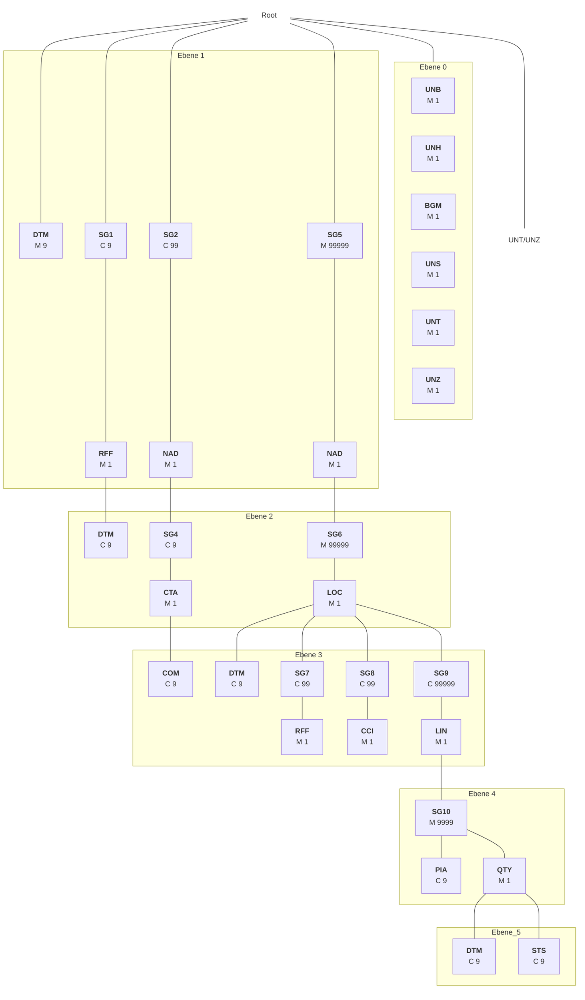

# <mark>Außerordentliche Veröffentlichung wegen Layoutanpassung</mark>
# <mark>Stand: 26.07.2024</mark>

# <mark>MSCONS Nachrichtenbeschreibung</mark>

auf Basis

**MSCONS**
Bericht über den Verbrauch messbarer Dienstleistungen

**UN D.04B S3**

**Version:** 2.4c
**Ursprüngliches Publikationsdatum:** 24.10.2023
**Autor:** BDEW

Nachrichtenstruktur 3
Diagramm 5
Segmentlayout 6
Änderungshistorie 53

MSCONS MIG

## **Disclaimer**

Die PDF-Datei ist das allein gültige Dokument.
Die zusätzlich veröffentlichte Word-Datei dient als informatorische Lesefassung und entspricht inhaltlich der PDF-Datei. Diese Word-Datei wird bis auf Weiteres rein informatorisch und ergänzend veröffentlicht unter dem Vorbehalt, zukünftig eine kostenpflichtige Veröffentlichung der Word-Datei einzuführen.

Zusätzlich werden zur PDF-Datei auch XML-Dateien als optionale Unterstützung gegen Entgelt veröffentlicht.

Version: 2.4c 26.07.2024 Seite: 2 / 53

MSCONS MIG

# Nachrichtenstruktur

|Zähler|Nr|Status Bez|MaxWdh Sta|BDEW|Sta|BDEW|Ebene|Inhalt|
|-|-|-|-|-|-|-|-|-|
|0000|00002|UNB|M|M|1|1|0|Nutzdaten-Kopfsegment|
|0010|00003|UNH|M|M|1|1|0|Nachrichtenkopfsegment|
|0020|00004|BGM|M|M|1|1|0|Beginn der Nachricht|
|0030|00005|DTM|M|M|9|1|1|Nachrichtendatum|
|0050||SG1|C|D|9|1|1|Referenz|
|0060|00006|RFF|M|M|1|1|1|Referenzangaben|
|0070|00007|DTM|C|D|9|1|2|Versionsangabe marktlokationsscharfe Allokationsliste Gas (MMMA)|
|0050||SG1|C|D|9|1|1|Referenz auf vorherige Stammdatenmeldung des MSB|
|0060|00008|RFF|M|M|1|1|1|Referenz auf vorherige Stammdatenmeldung des MSB|
|0050||SG1|C|R|9|1|1|Prüfidentifikator|
|0060|00009|RFF|M|M|1|1|1|Prüfidentifikator|
|0080||SG2|C|R|99|1|1|MP-ID Absender|
|0090|00010|NAD|M|M|1|1|1|MP-ID Absender|
|0130||SG4|C|D|9|1|2|Kontaktinformation|
|0140|00011|CTA|M|M|1|1|2|Ansprechpartner|
|0150|00012|COM|C|R|9|5|3|Kommunikationsverbindung|
|0080||SG2|C|R|99|1|1|MP-ID Empfänger|
|0090|00013|NAD|M|M|1|1|1|MP-ID Empfänger|
|0160|00014|UNS|M|M|1|1|0|Abschnitts-Kontrollsegment|
|0170||SG5|M|M|99999|99999|1|Liefer-, bzw. Bezugsort|
|0180|00015|NAD|M|M|1|1|1|Name und Adresse|
|0190||SG6|M|D|99999|1|2|Bilanzkreis|
|0200|00016|LOC|M|M|1|1|2|Bilanzkreis|
|0190||SG6|M|M|99999|1|2|Wert- und Erfassungsangaben zum Objekt|
|0200|00017|LOC|M|M|1|1|2|Identifikationsangabe|
|0210|00018|DTM|C|D|9|1|3|Beginn Messperiode Übertragungszeitraum|
|0210|00019|DTM|C|D|9|1|3|Ende Messperiode Übertragungszeitraum|
|0210|00020|DTM|C|D|9|1|3|Bilanzierungsmonat|
|0210|00021|DTM|C|D|9|1|3|Versionsangabe|
|0210|00022|DTM|C|D|9|1|3|Gültigkeit, Beginndatum Profilschar|
|0220||SG7|C|D|99|1|3|Referenzangaben|
|0230|00023|RFF|M|M|1|1|3|Gerätenummer|
|0220||SG7|C|D|99|1|3|Referenzangaben|
|0230|00024|RFF|M|M|1|1|3|Konfigurations-ID|
|0250||SG8|C|D|99|1|3|Zeitreihentyp|
|0260|00025|CCI|M|M|1|1|3|Zeitreihentyp|
|0280||SG9|C|D|99999|99999|3|Positionsdaten|
|0290|00026|LIN|M|M|1|1|3|lfd. Position|

Bez = Segment-/Gruppen-Bezeichner
Zähler = Nummer der Segmente/Gruppen im Standard
Nr = Laufende Segmentnummer im Guide
MaxWdh = Maximale Wiederholung der Segmente/Gruppen

Sta = Standard UN/CEFACT
EDIFACT: M=Muss/Mandatory, C=Conditional
Anwendung: R=Erforderlich/Required, O=Optional, D=Abhängig von/Dependent, N=Nicht benutzt/Not used

Version: 2.4c | 26.07.2024 | Seite: 3 / 53

MSCONS MIG

# Nachrichtenstruktur

|Zähler|Nr|Bez|Status Sta|Status BDEW|MaxWdh Sta|MaxWdh BDEW|Ebene|Inhalt|
|-|-|-|-|-|-|-|-|-|
|0300|00027|PIA|C|R|9|1|4|Produktidentifikation|
|0350||SG10|M|M|9999|9999|4|Mengen- und Statusangaben|
|0360|00028|QTY|M|M|1|1|4|Mengenangaben|
|0370|00029|DTM|C|D|9|1|5|Beginn Messperiode|
|0370|00030|DTM|C|D|9|1|5|Ende Messperiode|
|0370|00031|DTM|C|D|9|1|5|Ablesedatum|
|0370|00032|DTM|C|D|9|1|5|Nutzungszeitpunkt|
|0370|00033|DTM|C|D|9|1|5|Ausführungs- / Änderungszeitpunkt|
|0370|00034|DTM|C|D|9|1|5|Leistungsperiode|
|0380|00035|STS|C|D|9|4|5|Plausibilisierungshinweis|
|0380|00036|STS|C|D|9|1|5|Ersatzwertbildungsverfahren|
|0380|00037|STS|C|D|9|1|5|Korrekturgrund|
|0380|00038|STS|C|D|9|1|5|Grund der Ersatzwertbildung|
|0380|00039|STS|C|D|9|1|5|Gasqualität|
|0380|00040|STS|C|D|9|2|5|Grundlage der Energiemenge|
|0440|00041|UNT|M|M|1|1|0|Nachrichten-Endesegment|
|0000|00042|UNZ|M|M|1|1|0|Nutzdaten-Endesegment|

Bez = Segment-/Gruppen-Bezeichner
Zähler = Nummer der Segmente/Gruppen im Standard
Nr = Laufende Segmentnummer im Guide
MaxWdh = Maximale Wiederholung der Segmente/Gruppen
Sta = Standard UN/CEFACT
EDIFACT: M=Muss/Mandatory, C=Conditional
Anwendung: R=Erforderlich/Required, O=Optional, D=Abhängig von/Dependent, N=Nicht benutzt/Not used

Version: 2.4c
26.07.2024
Seite: 4 / 53

MSCONS MIG
edi@energy. Datenformate Strom & Gas

# Diagramm

||Bez|Bez = Segment-/Gruppen-Bezeichner|
|-|-|-|
|St|MaxWdh|St = Durch UN/CEFACT definierter Status (M=Muss/Mandatory, C=Conditional) MaxWdh = Durch UN/CEFACT definierte maximale Wiederholung der Segmente/Gruppen|

> Hinweis: Die Darstellung des hier abgebildeten Branchingdiagramms ist implizit.

Version: 2.4c 26.07.2024 Seite: 5 / 53

MSCONS MIG

# Segmentlayout

|Zähler|Nr|Bez|St|Standard MaxWdh|St|BDEW MaxWdh|Ebene|Name|
|-|-|-|-|-|-|-|-|-|
|0000|00002|\*\*UNB\*\*|M|1|M|1|0|Nutzdaten-Kopfsegment|

|Bez|Name|Standard St Format|BDEW St Format|Anwendung / Bemerkung|
|-|-|-|-|-|
|UNB| | | | |
|S001|Syntax-Bezeichner|M|M| |
|0001|Syntax-Kennung|M a4|M a4|\*UNOC = UN/ECE level C\* \*\*UNOC UN/ECE-Zeichensatz C\*\*|
|0002|Syntax-Versionsnummer|M n1|M n1|\*3 = Syntax-Versionsnummer 3\* \*\*3 Version 3\*\*|
|S002|Absender der Übertragungsdatei|M|M| |
|0004|Absenderbezeichnung|M an..35|M an..35|MP-ID Absender|
|0007|Teilnehmerbezeichnung, Qualifier|C an..4|R an..4|\*\*14 GS1\*\* \*\*500 DE, BDEW (Bundesverband der Energie- und Wasserwirtschaft e.V.)\*\* \*\*502 DE, DVGW Service & Consult GmbH\*\*|
|S003|Empfänger der Übertragungsdatei|M|M| |
|0010|Empfängerbezeichnung|M an..35|M an..35|MP-ID Empfänger|
|0007|Teilnehmerbezeichnung, Qualifier|C an..4|R an..4|\*\*14 GS1\*\* \*\*500 DE, BDEW (Bundesverband der Energie- und Wasserwirtschaft e.V.)\*\* \*\*502 DE, DVGW Service & Consult GmbH\*\*|
|S004|Datum/Uhrzeit der Erstellung|M|M| |
|0017|Datum der Erstellung|M n6|M n6|\*JJMMTT\*|
|0019|Uhrzeit der Erstellung|M n4|M n4|\*HHMM\*|
|0020|Datenaustauschreferenz|M an..14|M an..14|\*Eindeutige Referenz zur Identifikation der Übertragungsdatei, vergeben vom Sender.\*|
|S005|Referenz/Paßwort des Empfängers|C|N| |
|0022|Referenz oder Paßwort des Empfängers|M an..14|N|~~Nicht benutzt~~|
|0026|Anwendungsreferenz|C an..14|R an..14|\*\*EM Energiemenge\*\* \*\*TL Lastgang, beliebiger Zeitraum\*\* \*\*VL Verrechnungsliste, Zählerstand\*\*|
|0029|Verarbeitungspriorität, Code|C a1|N|~~Nicht benutzt~~|
|0031|Bestätigungsanforderung|C n1|N|~~Nicht benutzt~~|
|0032|Austauschvereinbarungskennung|C an..35|N|~~Nicht benutzt~~|
|0035|Test-Kennzeichen|C n1|D n1|\*\*1 Übertragungsdatei ist ein Test\*\*|

**Bemerkung:**

**Beispiel:**
`UNB+UNOC:3+4012345678901:14+4012345678901:14+200426:1151+ABC4711++TL++++1'`

Bez = Objekt-Bezeichner
Nr = Laufende Segmentnummer im Guide
MaxWdh = Maximale Wiederholung der Segmente/Gruppen
Zähler = Nummer der Segmente/Gruppen im Standard

St = Status
EDIFACT: M=Muss/Mandatory, C=Conditional
Anwendung: R=Erforderlich/Required, O=Optional, D=Abhängig von/Dependent, N=Nicht benutzt/Not used

Version: 2.4c | 26.07.2024 | Seite: 6 / 53

MSCONS MIG

Datenformate Strom & Gas

# Segmentlayout

|Zähler|Nr|Bez|Standard St|Standard MaxWdh|BDEW St|BDEW MaxWdh|Ebene|Name|
|-|-|-|-|-|-|-|-|-|
|0010|00003|\*\*UNH\*\*|M|1|M|1|0|\*\*Nachrichtenkopfsegment\*\*|

|Bez|Name|Standard St|Standard Format|BDEW St|BDEW Format|Anwendung / Bemerkung|
|-|-|-|-|-|-|-|
|UNH|||||||
|0062|Nachrichten-Referenznummer|M|an..14|M|an..14|\*Eindeutige Nachrichtenreferenz des Absenders. Nummer der Nachrichten einer Übertragungsdatei im Datenaustausch. Identisch mit DE0062 im UNT, i. d. R. vom sendenden Konverter vergeben.\*|
|S009|Nachrichten-Kennung|M||M|||
|0065|Nachrichtentyp-Kennung|M|an..6|M|an..6|\*\*MSCONS Bericht über den Verbrauch messbarer Dienstleistungen\*\*|
|0052|Versionsnummer des Nachrichtentyps|M|an..3|M|an..3|\*\*D Entwurfs-Version\*\*|
|0054|Freigabenummer des Nachrichtentyps|M|an..3|M|an..3|\*\*04B Ausgabe 2004 - B\*\*|
|0051|Verwaltende Organisation|M|an..2|M|an..2|\*\*UN UN/CEFACT\*\*|
|0057|Anwendungscode der zuständigen Organisation|C|an..6|R|an..6|\*\*2.4c Versionsnummer der zugrundeliegenden BDEW-Nachrichtenbeschreibung\*\*|
|0068|Allgemeine Zuordnungs-Referenz|C|an..35|D|an..35|\*Allgemeine Zuordnungs-Referenz\*|
|S010|Status der Übermittlung|C||D|||
|0070|Übermittlungsfolgenummer|M|n..2|M|n..2|\*Übermittlungsfolgenummer\*|
|0073|Erste und letzte Übermittlung|C|a1|D|a1|\*\*C Beginn\*\* \*\*F Ende\*\*|

**Bemerkung:**
Dieses Segment dient dazu, eine Nachricht zu eröffnen, zu identifizieren und zu spezifizieren.

Die Datenelemente 0065, 0052, 0054 und 0051 deklarieren die Nachricht als UNSM des Verzeichnisses D.04B unter Kontrolle der Vereinten Nationen.

**Hinweis:**

DE0057: Es wird die Versions- und Release-Nummer der Nachrichtenbeschreibung angegeben.

DE0068 ff.: Wenn die marktlokationsscharfe Allokationsliste Gas aufgeteilt wird, ist dies entsprechend zu kennzeichnen. Wird eine Liste auf mehrere Nachrichten aufgeteilt, ist unter Berücksichtigung der technischen Restriktionen die maximal mögliche Segmentanzahl im UNH zu verwenden. Falls keine Aufteilung vorgenommen wird, ist das Datenelement DE0068 sowie die darauffolgende Datenelementgruppe S010 nicht zu verwenden.

DE0068: Dieses Segment wird verwendet, um bei Nutzung der Datenelementgruppe S010 eine Referenzierung zur ersten MSCONS Datei (UNB DE0020) der Übertragungsserie zu ermöglichen.

**Beispiel:**
`UNH+1+MSCONS:D:04B:UN:2.4c+UNB_DE0020_nr_1+1:C'`
`UNH+2+MSCONS:D:04B:UN:2.4c+UNB_DE0020_nr_1+2'`
`UNH+3+MSCONS:D:04B:UN:2.4c+UNB_DE0020_nr_1+3:F'`
Diese drei UNH Beschreibungen sind Beispiele zur marktlokationsscharfen Allokationsliste Gas, die auf 3 Nachrichten aufgeteilt wurde.

Nachfolgend ist das Beispiel, wenn keine Aufteilung der Nachricht erfolgt:
`UNH+4+MSCONS:D:04B:UN:2.4c'`

Bez = Objekt-Bezeichner
Nr = Laufende Segmentnummer im Guide
MaxWdh = Maximale Wiederholung der Segmente/Gruppen
Zähler = Nummer der Segmente/Gruppen im Standard
St = Status
EDIFACT: M=Muss/Mandatory, C=Conditional
Anwendung: R=Erforderlich/Required, O=Optional, D=Abhängig von/Dependent, N=Nicht benutzt/Not used
Version: 2.4c 26.07.2024 Seite: 7 / 53

MSCONS MIG

# Segmentlayout

|Zähler|Nr|Bez|St|Standard MaxWdh|St|BDEW MaxWdh|Ebene|Name|
|-|-|-|-|-|-|-|-|-|
|0020|00004|\*\*BGM\*\*|M|1|M|1|0|\*\*Beginn der Nachricht\*\*|

|Bez|Name|St Format|Standard St Format|BDEW Anwendung / Bemerkung||
|-|-|-|-|-|-|
|BGM||||||
|C002|Dokumenten-/ Nachrichtenname|C|R|||
|1001|Dokumentenname, Code|C an..3|R an..3|\*\*7 Prozessdatenbericht\*\* \*\*270 Lieferschein\*\* \*\*BK Zeitreihen im Rahmen der Bilanzkreisabrechnung\*\* \*\*Z06 normiertes Profil\*\* \*\*Z15 EEG-Überführungszeitreihe\*\* \*\*Z16 Profilschar\*\* \*\*Z20 Vergangenheitswerte für TEP mit Referenzmessung\*\* \*\*Z21 Gasbeschaffenheitsdaten\*\* \*\*Z23 Bilanzierte Menge (MMMA)\*\* \*\*Z24 Allokationsliste (MMMA)\*\* \*\*Z27 Bewegungsdaten im Kalenderjahr vor Lieferbeginn\*\* \*\*Z28 Energiemenge und Leistungsmaximum\*\* \*\*Z39 Tägliche Summenzeitreihe\*\* \*\*Z41 Lieferschein Grund- / Arbeitspreis\*\* \*\*Z42 Lieferschein Arbeits- / Leistungspreis\*\* \*\*Z43 Redispatch Ausfallarbeitsüberführungszeitreihe\*\* \*\*Z44 Redispatch Übermittlung von meteorologischen Daten\*\* \*\*Z45 Redispatch Einzelzeitreihe Ausfallarbeit\*\* \*\*Z46 Redispatch Ausfallarbeitssummenzeitreihe\*\* \*\*Z48 Lastgang Marktlokation, Tranche\*\* \*\*Z50 Redispatch EEG-Überführungszeitreihe aufgrund Ausfallarbeit\*\* \*\*Z69 Redispatch tägliche Ausfallarbeitsüberführungszeitreihe\*\* \*\*Z83 Werte nach Typ 2\*\* \*\*Z85 Grundlage POG-Ermittlung\*\*||
|C106|Dokumenten-/Nachrichten-Identifikation|C|R|||
|1004|Dokumentennummer|C an..35|R an..35|\*Eindeutige EDI-Nachrichtennummer vergeben vom Absender des Dokuments\*||
|1225|Nachrichtenfunktion, Code|C an..3|R an..3|\*\*9 Original\*\* \*\*1 Storno\*\*||

**Bemerkung:**
Dieses Segment dient dazu, Typ und Funktion einer Nachricht anzuzeigen und die Identifikationsnummer zu übermitteln.

DE1225: Die Nachrichtenfunktion, codiert ist ein kritisches Datenelement in diesem Segment. Sie betrifft alle Daten einer Nachricht. Demzufolge muss pro Nachrichtenfunktion eine Nachricht erstellt werden. Es gelten die folgenden Regeln für eingeschränkte Codewerte:

9 = Original – Ein Hinweis für den Empfänger, dass diese Nachricht eine Original-Nachricht und kein Ersatz oder Duplikat ist.

Bez = Objekt-Bezeichner
Nr = Laufende Segmentnummer im Guide
MaxWdh = Maximale Wiederholung der Segmente/Gruppen
Zähler = Nummer der Segmente/Gruppen im Standard
St = Status
EDIFACT: M=Muss/Mandatory, C=Conditional
Anwendung: R=Erforderlich/Required, O=Optional, D=Abhängig von/Dependent, N=Nicht benutzt/Not used
Version: 2.4c 26.07.2024 Seite: 8 / 53

MSCONS MIG

# Segmentlayout

1 = Storno – Für den Fall, dass der gesamte Inhalt einer vorangegangenen Nachricht zurückgenommen werden soll. Die Referenz zu dieser Nachricht wird über SG1 RFF vorgenommen.

**Beispiel:**
`BGM+7+MSI5422+9'`
Dieses Beispiel identifiziert das Dokument als einen Prozessdatenbericht durch die Verwendung des Codewertes 7. Das Dokument hat die Belegnummer MSI5422.

Bez = Objekt-Bezeichner
Nr = Laufende Segmentnummer im Guide
MaxWdh = Maximale Wiederholung der Segmente/Gruppen
Zähler = Nummer der Segmente/Gruppen im Standard

St = Status
EDIFACT: M=Muss/Mandatory, C=Conditional
Anwendung: R=Erforderlich/Required, O=Optional, D=Abhängig von/Dependent, N=Nicht benutzt/Not used

Version: 2.4c | 26.07.2024 | Seite: 9 / 53

MSCONS MIG

# Segmentlayout

|Zähler|Nr|Bez|Standard St|Standard MaxWdh|BDEW St|BDEW MaxWdh|Ebene|Name|
|-|-|-|-|-|-|-|-|-|
|0030|00005|\*\*DTM\*\*|M|9|M|1|1|\*\*Nachrichtendatum\*\*|

|Bez|Name|Standard St Format|BDEW St Format|Anwendung / Bemerkung|
|-|-|-|-|-|
|DTM| | | | |
|C507|Datum/Uhrzeit/Zeitspanne|M|M||
|2005|Datums- oder Uhrzeits- oder Zeitspannen-Funktion, Qualifier|M an..3|M an..3|\*\*137 Dokumenten-/Nachrichtendatum/-zeit\*\*|
|2380|Datum oder Uhrzeit oder Zeitspanne, Wert|C an..35|R an..35||
|2379|Datums- oder Uhrzeit- oder Zeitspannen-Format, Code|C an..3|R an..3|\*\*303 CCYYMMDDHHMMZZZ\*\*|

**Bemerkung:**
Dieses Segment wird zur Angabe des Dokumentendatums verwendet.

DE2005: Das Dokumentendatum (Codewert 137) muss angegeben werden.

**Beispiel:**
`DTM+137:202106011315?+00:303'`

**Bez** = Objekt-Bezeichner
**Nr** = Laufende Segmentnummer im Guide
**MaxWdh** = Maximale Wiederholung der Segmente/Gruppen
**Zähler** = Nummer der Segmente/Gruppen im Standard
**St** = Status
EDIFACT: M=Muss/Mandatory, C=Conditional
Anwendung: R=Erforderlich/Required, O=Optional, D=Abhängig von/Dependent, N=Nicht benutzt/Not used
Version: 2.4c 26.07.2024 Seite: 10 / 53

MSCONS MIG

# Segmentlayout

|Zähler|Nr|Bez|Standard St|Standard MaxWdh|BDEW St|BDEW MaxWdh|Ebene|Name|
|-|-|-|-|-|-|-|-|-|
|0050||SG1|C|9|D|1|1|Referenz|
|0060|00006|RFF|M|1|M|1|1|Referenzangaben|

|Bez|Name|Standard St|Standard Format|BDEW St|BDEW Format|Anwendung / Bemerkung|
|-|-|-|-|-|-|-|
|RFF|||||||
|C506|Referenz|M||M|||
|1153|Referenz, Qualifier|M|an..3|M|an..3|\*\*AGI\*\* Beantragungsnummer \*\*ACW\*\* Referenznummer einer vorangegangenen Nachricht|
|1154|Referenz, Identifikation|C|an..70|R|an..70|\*Referenznummer\*|

**Bemerkung:**

**Beispiel:**
`RFF+AGI:AFN9523'`

**Bez** = Objekt-Bezeichner
**Nr** = Laufende Segmentnummer im Guide
**MaxWdh** = Maximale Wiederholung der Segmente/Gruppen
**Zähler** = Nummer der Segmente/Gruppen im Standard
**St** = Status
EDIFACT: M=Muss/Mandatory, C=Conditional
Anwendung: R=Erforderlich/Required, O=Optional, D=Abhängig von/Dependent, N=Nicht benutzt/Not used
Version: 2.4c 26.07.2024 Seite: 11 / 53

MSCONS MIG

# Segmentlayout

|Zähler|Nr|Bez|Standard St|Standard MaxWdh|BDEW St|BDEW MaxWdh|Ebene|Name|
|-|-|-|-|-|-|-|-|-|
|0050||SG1|C|9|D|1|1|Referenz|
|0070|00007|DTM|C|9|D|1|2|Versionsangabe marktlokationsscharfe Allokationsliste Gas (MMMA)|

|Bez|Name|Standard St|Standard Format|BDEW St|BDEW Format|Anwendung / Bemerkung|
|-|-|-|-|-|-|-|
|DTM|||||||
|C507|Datum/Uhrzeit/Zeitspanne|M||M|||
|2005|Datums- oder Uhrzeits- oder Zeitspannen-Funktion, Qualifier|M|an..3|M|an..3|\*\*293 Fertigstellungsdatum/-zeit\*\*|
|2380|Datum oder Uhrzeit oder Zeitspanne, Wert|C|an..35|R|an..35||
|2379|Datums- oder Uhrzeit- oder Zeitspannen-Format, Code|C|an..3|R|an..3|\*\*304 CCYYMMDDHHMMSSZZZ\*\*|

**Bemerkung:**
Dieses Segment wird benutzt, um eine eindeutige Versionsnummer für die marktlokationsscharfe Allokationsliste Gas (MMMA) zu übermitteln.

Hinweis: Wird die marktlokationsscharfe Allokationsliste Gas (MMMA) auf mehrere Nachrichten aufgeteilt, muss die Versionsnummer in allen Nachrichten identisch sein.

**Beispiel:**
`DTM+293:20210601060030?+00:304'`

Bez = Objekt-Bezeichner
Nr = Laufende Segmentnummer im Guide
MaxWdh = Maximale Wiederholung der Segmente/Gruppen
Zähler = Nummer der Segmente/Gruppen im Standard
St = Status
EDIFACT: M=Muss/Mandatory, C=Conditional
Anwendung: R=Erforderlich/Required, O=Optional, D=Abhängig von/Dependent, N=Nicht benutzt/Not used
Version: 2.4c 26.07.2024 Seite: 12 / 53

MSCONS MIG

# Segmentlayout

|Zähler|Nr|Bez|Standard St|Standard MaxWdh|BDEW St|BDEW MaxWdh|Ebene|Name|
|-|-|-|-|-|-|-|-|-|
|0050||SG1|C|9|D|1|1|Referenz auf vorherige Stammdatenmeldung des MSB|
|0060|00008|RFF|M|1|M|1|1|Referenz auf vorherige Stammdatenmeldung des MSB|

|Bez|Name|Standard St|Standard Format|BDEW St|BDEW Format|Anwendung / Bemerkung|
|-|-|-|-|-|-|-|
|RFF|||||||
|C506|Referenz|M||M|||
|1153|Referenz, Qualifier|M|an..3|M|an..3|\*\*Z30 Referenz auf vorherige Stammdatenmeldung des MSB\*\*|
|1154|Referenz, Identifikation|C|an..70|R|an..35|\*Referenznummer\*|

**Bemerkung:**

**Beispiel:**
`RFF+Z30:UTILMDXYZ_1235'`

Bez = Objekt-Bezeichner
Nr = Laufende Segmentnummer im Guide
MaxWdh = Maximale Wiederholung der Segmente/Gruppen
Zähler = Nummer der Segmente/Gruppen im Standard
St = Status
EDIFACT: M=Muss/Mandatory, C=Conditional
Anwendung: R=Erforderlich/Required, O=Optional, D=Abhängig von/Dependent, N=Nicht benutzt/Not used
Version: 2.4c 26.07.2024 Seite: 13 / 53

MSCONS MIG

# Segmentlayout

|Zähler|Nr|Bez|Standard St|Standard MaxWdh|BDEW St|BDEW MaxWdh|Ebene|Name|
|-|-|-|-|-|-|-|-|-|
|0050||SG1|C|9|R|1|1|Prüfidentifikator|
|0060|00009|RFF|M|1|M|1|1|Prüfidentifikator|

|Bez|Name|Standard St|Standard Format|BDEW St|BDEW Format|Anwendung / Bemerkung|
|-|-|-|-|-|-|-|
|RFF|||||||
|C506|Referenz|M||M|||
|1153|Referenz, Qualifier|M|an..3|M|an..3|\*\*Z13\*\* Prüfidentifikator|
|1154|Referenz, Identifikation|C|an..70|R|n5|Prüfidentifikator \*\*13002\*\* Messw. Zählerstand (Gas) \*\*13003\*\* Summenzeitreihe \*\*13005\*\* EEG-Überf.ZR \*\*13006\*\* Messw. Storno \*\*13007\*\* Gasbeschaffenheitsdaten \*\*13008\*\* Messwert Lastgang (Gas) \*\*13009\*\* Messwert Energiemenge (Gas) \*\*13010\*\* Profil \*\*13011\*\* Profilschar \*\*13012\*\* TEP Vergangenheitswerte Referenz-Messung \*\*13013\*\* Marktlokationsscharfe Allokationsliste Gas (MMMA) \*\*13014\*\* Marktlokationsscharfe bilanzierte Menge (MMMA) \*\*13015\*\* Bewegungsdaten im Kalenderjahr vor Lieferbeginn \*\*13016\*\* Energiemenge und Leistungsmaximum \*\*13017\*\* Messw. Zählerstand (Strom) \*\*13018\*\* Lastgang Messlokation, Netzkoppelpunkt \*\*13019\*\* Messwert Energiemenge (Strom) \*\*13020\*\* Redispatch Ausfallarbeitsüberführungszeitreihe \*\*13021\*\* Redispatch Übermittlung von meteorologischen Daten \*\*13022\*\* Redispatch Einzelzeitreihe Ausfallarbeit \*\*13023\*\* Redispatch Ausfallarbeitssummenzeitreihe \*\*13025\*\* Lastgang Marktlokation, Tranche \*\*13026\*\* Redispatch EEG-Überführungszeitreihe aufgrund Ausfallarbeit \*\*13027\*\* Werte nach Typ 2 \*\*13028\*\* Grundlage POG-Ermittlung|

**Bemerkung:**

**Beispiel:**
`RFF+Z13:13002'`

Bez = Objekt-Bezeichner
Nr = Laufende Segmentnummer im Guide
MaxWdh = Maximale Wiederholung der Segmente/Gruppen
Zähler = Nummer der Segmente/Gruppen im Standard
St = Status
EDIFACT: M=Muss/Mandatory, C=Conditional
Anwendung: R=Erforderlich/Required, O=Optional, D=Abhängig von/Dependent, N=Nicht benutzt/Not used
Version: 2.4c 26.07.2024 Seite: 14 / 53

MSCONS MIG

# Segmentlayout

|Zähler|Nr|Bez|Standard St|Standard MaxWdh|BDEW St|BDEW MaxWdh|Ebene|Name|
|-|-|-|-|-|-|-|-|-|
|0080||\<mark style="background-color: lightblue">\*\*SG2\*\*|C|99|R|1|1|\*\*MP-ID Absender\*\*|
|0090|00010|\<mark style="background-color: lightblue">\*\*NAD\*\*|M|1|M|1|1|\*\*MP-ID Absender\*\*|

|Bez|Name|Standard St Format|BDEW St Format|Anwendung / Bemerkung|
|-|-|-|-|-|
|NAD|||||
|3035|Beteiligter, Qualifier|M an..3|M an..3|\*\*MS Dokumenten-/Nachrichtenaussteller bzw. - absender\*\*|
|C082|Identifikation des Beteiligten|C|R||
|3039|Beteiligter, Identifikation|M an..35|M an..35|MP-ID|
|1131|Codeliste, Code|C an..17|N|\Nicht benutzt\|
|3055|Verantwortliche Stelle für die Codepflege, Code|C an..3|R an..3|\*\*9 GS1\*\* \*\*293 DE, BDEW (Bundesverband der Energie- und Wasserwirtschaft e.V.)\*\* \*\*332 DE, DVGW Service & Consult GmbH\*\*|

**Bemerkung:**
DE3039: Zur Identifikation der Partner wird die MP-ID angegeben.

**Beispiel:**
`NAD+MS+4012345678901::9'`
`NAD+MS+9920455302123::293'`

Bez = Objekt-Bezeichner
Nr = Laufende Segmentnummer im Guide
MaxWdh = Maximale Wiederholung der Segmente/Gruppen
Zähler = Nummer der Segmente/Gruppen im Standard
St = Status
EDIFACT: M=Muss/Mandatory, C=Conditional
Anwendung: R=Erforderlich/Required, O=Optional, D=Abhängig von/ Dependent, N=Nicht benutzt/Not used
Version: 2.4c 26.07.2024 Seite: 15 / 53

MSCONS MIG

# Segmentlayout

|Zähler|Nr|Bez|Standard St|Standard MaxWdh|BDEW St|BDEW MaxWdh|Ebene|Name|
|-|-|-|-|-|-|-|-|-|
|0080||SG2|C|99|R|1|1|MP-ID Absender|
|0130||SG4|C|9|D|1|2|Kontaktinformation|
|0140|00011|CTA|M|1|M|1|2|Ansprechpartner|

|Bez|Name|Standard St|Standard Format|BDEW St|BDEW Format|Anwendung / Bemerkung|
|-|-|-|-|-|-|-|
|CTA|||||||
|3139|Funktion des Ansprechpartners, Code|C|an..3|R|an..3|\*\*IC Informationsstelle\*\*|
|C056|Abteilung oder Bearbeiter|C||R|||
|3413|Abteilung oder Bearbeiter, Code|C|an..17|N||Nicht benutzt|
|3412|Abteilung oder Bearbeiter|C|an..35|R|an..35||

**Bemerkung:**
Dieses Segment dient der Identifikation von Ansprechpartnern innerhalb des im vorangegangenen NAD-Segment spezifizierten Unternehmens.

**Beispiel:**
`CTA+IC+:P GETTY'`

Bez = Objekt-Bezeichner
Nr = Laufende Segmentnummer im Guide
MaxWdh = Maximale Wiederholung der Segmente/Gruppen
Zähler = Nummer der Segmente/Gruppen im Standard
St = Status
EDIFACT: M=Muss/Mandatory, C=Conditional
Anwendung: R=Erforderlich/Required, O=Optional, D=Abhängig von/Dependent, N=Nicht benutzt/Not used
Version: 2.4c	26.07.2024	Seite: 16 / 53

MSCONS MIG

# Segmentlayout

|Zähler|Nr|Bez|Standard St|Standard MaxWdh|BDEW St|BDEW MaxWdh|Ebene|Name|
|-|-|-|-|-|-|-|-|-|
|0080||SG2|C|99|R|1|1|MP-ID Absender|
|0130||SG4|C|9|D|1|2|Kontaktinformation|
|0150|00012|COM|C|9|R|5|3|Kommunikationsverbindung|

|Bez|Name|Standard St|Standard Format|BDEW St|BDEW Format|Anwendung / Bemerkung|
|-|-|-|-|-|-|-|
|COM|||||||
|C076|Kommunikationsverbindung|M||M|||
|3148|Kommunikationsadresse, Identifikation|M|an..512|M|an..512|\*Nummer, Adresse\*|
|3155|Kommunikationsadresse, Qualifier|M|an..3|M|an..3|\*\*TE Telefon\*\* \*\*EM E-Mail\*\* \*\*AJ weiteres Telefon\*\* \*\*AL Handy\*\* \*\*FX Telefax\*\*|

**Bemerkung:**
Ein Segment zur Angabe von Kommunikationsnummer und -typ des im vorangegangenen CTA-Segments angegebenen Sachbearbeiters oder der Abteilung.

**Beispiel:**
`COM+003222271020:TE'`
Die im vorangegangenen Segment genannte Informationsstelle hat die Telefonnummer 003222271020.

Bez = Objekt-Bezeichner
Nr = Laufende Segmentnummer im Guide
MaxWdh = Maximale Wiederholung der Segmente/Gruppen
Zähler = Nummer der Segmente/Gruppen im Standard
St = Status
EDIFACT: M=Muss/Mandatory, C=Conditional
Anwendung: R=Erforderlich/Required, O=Optional, D=Abhängig von/Dependent, N=Nicht benutzt/Not used
Version: 2.4c 26.07.2024 Seite: 17 / 53

MSCONS MIG

# Segmentlayout

|Zähler|Nr|Bez|Standard St|Standard MaxWdh|BDEW St|BDEW MaxWdh|Ebene|Name|
|-|-|-|-|-|-|-|-|-|
|0080||SG2|C|99|R|1|1|MP-ID Empfänger|
|0090|00013|NAD|M|1|M|1|1|MP-ID Empfänger|

|Bez|Name|St Format|Standard St Format|BDEW Anwendung / Bemerkung||
|-|-|-|-|-|-|
|NAD||||||
|3035|Beteiligter, Qualifier|M an..3|M an..3|\*\*MR Nachrichtenempfänger\*\*||
|C082|Identifikation des Beteiligten|C|R|||
|3039|Beteiligter, Identifikation|M an..35|M an..35|MP-ID||
|1131|Codeliste, Code|C an..17|N|Nicht benutzt||
|3055|Verantwortliche Stelle für die Codepflege, Code|C an..3|R an..3|\*\*9 GS1\*\* \*\*293 DE, BDEW (Bundesverband der Energie- und Wasserwirtschaft e.V.)\*\* \*\*332 DE, DVGW Service & Consult GmbH\*\*||

**Bemerkung:**
DE3039: Zur Identifikation der Partner wird die MP-ID angegeben.

**Beispiel:**
`NAD+MR+4012345678901::9'`

Bez = Objekt-Bezeichner
Nr = Laufende Segmentnummer im Guide
MaxWdh = Maximale Wiederholung der Segmente/Gruppen
Zähler = Nummer der Segmente/Gruppen im Standard
St = Status
EDIFACT: M=Muss/Mandatory, C=Conditional
Anwendung: R=Erforderlich/Required, O=Optional, D=Abhängig von/Dependent, N=Nicht benutzt/Not used
Version: 2.4c 26.07.2024 Seite: 18 / 53

MSCONS MIG

# Segmentlayout

|Zähler|Nr|Bez|Standard St|Standard MaxWdh|BDEW St|BDEW MaxWdh|Ebene|Name|
|-|-|-|-|-|-|-|-|-|
|0160|00014|\*\*UNS\*\*|M|1|M|1|0|\*\*Abschnitts-Kontrollsegment\*\*|

|Bez|Name|Standard St|Standard Format|BDEW St|BDEW Format|Anwendung / Bemerkung||
|-|-|-|-|-|-|-|-|
|UNS||||||||
|0081|Abschnittskennung, codiert|M|a1|M|a1|\*\*D Trennung von Kopf- und Positionsteil\*\*||

**Bemerkung:**
Dieses Segment dient der Trennung von Kopf- und Positionsteil einer Nachricht.

**Beispiel:**
`UNS+D'`

**Bez** = Objekt-Bezeichner
**Nr** = Laufende Segmentnummer im Guide
**MaxWdh** = Maximale Wiederholung der Segmente/Gruppen
**Zähler** = Nummer der Segmente/Gruppen im Standard
**St** = Status
EDIFACT: M=Muss/Mandatory, C=Conditional
Anwendung: R=Erforderlich/Required, O=Optional, D=Abhängig von/Dependent, N=Nicht benutzt/Not used
**Version:** 2.4c **26.07.2024** **Seite:** 19 / 53

MSCONS MIG

# Segmentlayout

|Zähler|Nr|Bez|Standard St|Standard MaxWdh|BDEW St|BDEW MaxWdh|Ebene|Name|
|-|-|-|-|-|-|-|-|-|
|0170||SG5|M|99999|M|99999|1|Liefer-, bzw. Bezugsort|
|0180|00015|NAD|M|1|M|1|1|Name und Adresse|

|Bez|Name|Standard St|Standard Format|BDEW St|BDEW Format|Anwendung / Bemerkung|
|-|-|-|-|-|-|-|
|NAD|||||||
|3035|Beteiligter, Qualifier|M|an..3|M|an..3|\*\*DP Lieferanschrift\*\* \*\*DED Profilerstellung\*\* \*\*Z15 Überführungszeitreihe\*\*|

**Bemerkung:**
Dieses Segment wird zur Identifikation des "Lieferortes" genutzt.
DP: Angabe des Meldepunktes (ID der Marktlokation, ID der Messlokation, ID der Tranche oder ID des MaBiS-ZP) in SG6 LOC.
DED: Angabe der Standard-Lastprofil-Bezeichnung in SG6 LOC.
Z15: Überführungszeitreihe in SG6 LOC.

**Beispiel:**
`NAD+DP'`

Bez = Objekt-Bezeichner
Nr = Laufende Segmentnummer im Guide
MaxWdh = Maximale Wiederholung der Segmente/Gruppen
Zähler = Nummer der Segmente/Gruppen im Standard
St = Status
EDIFACT: M=Muss/Mandatory, C=Conditional
Anwendung: R=Erforderlich/Required, O=Optional, D=Abhängig von/ Dependent, N=Nicht benutzt/Not used
Version: 2.4c 26.07.2024 Seite: 20 / 53

MSCONS MIG

# Segmentlayout

|Zähler|Nr|Bez|Standard St|Standard MaxWdh|BDEW St|BDEW MaxWdh|Ebene|Name|
|-|-|-|-|-|-|-|-|-|
|0170||SG5|M|99999|M|99999|1|Liefer-, bzw. Bezugsort|
|0190||SG6|M|99999|D|1|2|Bilanzkreis|
|0200|00016|LOC|M|1|M|1|2|Bilanzkreis|

|Bez|Name|Standard St Format|BDEW St Format|Anwendung / Bemerkung|
|-|-|-|-|-|
|LOC| | | | |
|3227|Ortsangabe, Qualifier|M an..3|M an..3|\*\*237 Bilanzkreis\*\*|
|C517|Ortsangabe|C|R| |
|3225|Ortsangabe, Code|C an..35|R an..35|Bilanzkreis an|
|C519|Zugehöriger Ort 1, Identifikation|C|R| |
|3223|Erster zugehöriger Platz/Ort, Code|C an..25|R an..25|Bilanzkreis von|

**Bemerkung:**
Dieses Segment wird ausschließlich verwendet, wenn EEG-Überführungszeitreihen übertragen werden.

**Beispiel:**
`LOC+237+11XUENBSOLS----X+11XVNBSOLS-----X'`

Bez = Objekt-Bezeichner
Nr = Laufende Segmentnummer im Guide
MaxWdh = Maximale Wiederholung der Segmente/Gruppen
Zähler = Nummer der Segmente/Gruppen im Standard
St = Status
EDIFACT: M=Muss/Mandatory, C=Conditional
Anwendung: R=Erforderlich/Required, O=Optional, D=Abhängig von/Dependent, N=Nicht benutzt/Not used
Version: 2.4c 26.07.2024 Seite: 21 / 53

MSCONS MIG

# Segmentlayout

|Zähler|Nr|Bez|Standard St|Standard MaxWdh|BDEW St|BDEW MaxWdh|Ebene|Name|
|-|-|-|-|-|-|-|-|-|
|0170||SG5|M|99999|M|99999|1|Liefer-, bzw. Bezugsort|
|0190||SG6|M|99999|M|1|2|Wert- und Erfassungsangaben zum Objekt|
|0200|00017|LOC|M|1|M|1|2|Identifikationsangabe|

|Bez|Name|Standard St Format|BDEW St Format|Anwendung / Bemerkung|
|-|-|-|-|-|
|LOC|||||
|3227|Ortsangabe, Qualifier|M an..3|M an..3|\*\*172 Meldepunkt\*\* \*\*Z04 Profilbezeichnung\*\* \*\*107 Bilanzierungsgebiet\*\* \*\*Z06 Profilschar\*\*|
|C517|Ortsangabe|C|D||
|3225|Ortsangabe, Code|C an..35|R an..35|Bezeichnung|

**Bemerkung:**
Bemerkung: Dieses Segment wird zur Angabe der Identifikation benutzt, für den die Daten gelten.

Hinweis:

C517: Der Meldepunkt, die Profilbezeichnung, Profilschar oder das Bilanzierungsgebiet der EEG-Überführungszeitreihe muss immer angegeben werden. Bei der Übermittlung von EEG-Überführungszeitreihen werden zwei SG6 LOC-Segmente verwendet.

**Beispiel:**
`LOC+107+11YR000000011247'`
`LOC+172+DE00014559929E00856996N5139699L01'`
`LOC+Z04+H0'`

Bez = Objekt-Bezeichner
Nr = Laufende Segmentnummer im Guide
MaxWdh = Maximale Wiederholung der Segmente/Gruppen
Zähler = Nummer der Segmente/Gruppen im Standard
St = Status
EDIFACT: M=Muss/Mandatory, C=Conditional
Anwendung: R=Erforderlich/Required, O=Optional, D=Abhängig von/Dependent, N=Nicht benutzt/Not used
Version: 2.4c 26.07.2024 Seite: 22 / 53

MSCONS MIG

# Segmentlayout

|Zähler|Nr|Bez|Standard St|Standard MaxWdh|BDEW St|BDEW MaxWdh|Ebene|Name|
|-|-|-|-|-|-|-|-|-|
|0170||SG5|M|99999|M|99999|1|Liefer-, bzw. Bezugsort|
|0190||SG6|M|99999|M|1|2|Wert- und Erfassungsangaben zum Objekt|
|0210|00018|DTM|C|9|D|1|3|Beginn Messperiode Übertragungszeitraum|

|Bez|Standard Name|Standard St|BDEW Format|BDEW St|Format|Anwendung / Bemerkung|
|-|-|-|-|-|-|-|
|DTM|||||||
|C507|Datum/Uhrzeit/Zeitspanne|M||M|||
|2005|Datums- oder Uhrzeits- oder Zeitspannen-Funktion, Qualifier|M|an..3|M|an..3|\*\*163 Verarbeitung, Beginndatum/-zeit\*\*|
|2380|Datum oder Uhrzeit oder Zeitspanne, Wert|C|an..35|R|an..35||
|2379|Datums- oder Uhrzeit- oder Zeitspannen-Format, Code|C|an..3|R|an..3|\*\*303 CCYYMMDDHHMMZZZ\*\*|

**Bemerkung:**
Dieses Segment wird benutzt, um den Beginn-Zeitpunkt des Übertragungszeitraumes anzugeben, in dem alle im SG9 LIN aufgeführten Positionen liegen.

**Beispiel:**
`DTM+163:202102012300?+00:303'`

**Bez** = Objekt-Bezeichner
**Nr** = Laufende Segmentnummer im Guide
**MaxWdh** = Maximale Wiederholung der Segmente/Gruppen
**Zähler** = Nummer der Segmente/Gruppen im Standard
**St** = Status
EDIFACT: M=Muss/Mandatory, C=Conditional
Anwendung: R=Erforderlich/Required, O=Optional, D=Abhängig von/Dependent, N=Nicht benutzt/Not used
Version: 2.4c 26.07.2024 Seite: 23 / 53

MSCONS MIG

# Segmentlayout

|Zähler|Nr|Bez|Standard St|Standard MaxWdh|BDEW St|BDEW MaxWdh|Ebene|Name|
|-|-|-|-|-|-|-|-|-|
|0170||SG5|M|99999|M|99999|1|Liefer-, bzw. Bezugsort|
|0190||SG6|M|99999|M|1|2|Wert- und Erfassungsangaben zum Objekt|
|0210|00019|DTM|C|9|D|1|3|Ende Messperiode Übertragungszeitraum|

|Bez|Name|Standard St|Standard Format|BDEW St|BDEW Format|Anwendung / Bemerkung|
|-|-|-|-|-|-|-|
|DTM| | | | | | |
|C507|Datum/Uhrzeit/Zeitspanne|M| |M| | |
|2005|Datums- oder Uhrzeits- oder Zeitspannen-Funktion, Qualifier|M|an..3|M|an..3|\*\*164 Verarbeitung, Endedatum/-zeit\*\*|
|2380|Datum oder Uhrzeit oder Zeitspanne, Wert|C|an..35|R|an..35| |
|2379|Datums- oder Uhrzeit- oder Zeitspannen-Format, Code|C|an..3|R|an..3|\*\*303 CCYYMMDDHHMMZZZ\*\*|

**Bemerkung:**
Dieses Segment wird benutzt, um den Ende-Zeitpunkt des Übertragungszeitraumes anzugeben, in dem alle im SG9 LIN aufgeführten Positionen liegen.

**Beispiel:**
`DTM+164:202102022300?+00:303'`

Bez = Objekt-Bezeichner
Nr = Laufende Segmentnummer im Guide
MaxWdh = Maximale Wiederholung der Segmente/Gruppen
Zähler = Nummer der Segmente/Gruppen im Standard
St = Status
EDIFACT: M=Muss/Mandatory, C=Conditional
Anwendung: R=Erforderlich/Required, O=Optional, D=Abhängig von/ Dependent, N=Nicht benutzt/Not used
Version: 2.4c 26.07.2024 Seite: 24 / 53

MSCONS MIG

# Segmentlayout

|Zähler|Nr|Bez|Standard St|Standard MaxWdh|BDEW St|BDEW MaxWdh|Ebene|Name|
|-|-|-|-|-|-|-|-|-|
|0170||SG5|M|99999|M|99999|1|Liefer-, bzw. Bezugsort|
|0190||SG6|M|99999|M|1|2|Wert- und Erfassungsangaben zum Objekt|
|0210|00020|DTM|C|9|D|1|3|Bilanzierungsmonat|

|Bez|Name|Standard St|Standard Format|BDEW St|BDEW Format|Anwendung / Bemerkung|
|-|-|-|-|-|-|-|
|DTM| | | | | ||
|C507|Datum/Uhrzeit/Zeitspanne|M| |M| ||
|2005|Datums- oder Uhrzeits- oder Zeitspannen-Funktion, Qualifier|M|an..3|M|an..3|\*\*492 Bilanzierungsdatum, -zeit, -periode\*\*|
|2380|Datum oder Uhrzeit oder Zeitspanne, Wert|C|an..35|R|an..35||
|2379|Datums- oder Uhrzeit- oder Zeitspannen-Format, Code|C|an..3|R|an..3|\*\*610 CCYYMM\*\*|

**Bemerkung:**
Dieses Segment wird benutzt, um den Bilanzierungsmonat anzugeben.

**Beispiel:**
`DTM+492:202004:610'`

Bez = Objekt-Bezeichner
Nr = Laufende Segmentnummer im Guide
MaxWdh = Maximale Wiederholung der Segmente/Gruppen
Zähler = Nummer der Segmente/Gruppen im Standard
St = Status
EDIFACT: M=Muss/Mandatory, C=Conditional
Anwendung: R=Erforderlich/Required, O=Optional, D=Abhängig von/ Dependent, N=Nicht benutzt/Not used
Version: 2.4c 26.07.2024 Seite: 25 / 53

MSCONS MIG

# Segmentlayout

|Zähler|Nr|Bez|Standard St|Standard MaxWdh|BDEW St|BDEW MaxWdh|Ebene|Name|
|-|-|-|-|-|-|-|-|-|
|0170||SG5|M|99999|M|99999|1|Liefer-, bzw. Bezugsort|
|0190||SG6|M|99999|M|1|2|Wert- und Erfassungsangaben zum Objekt|
|0210|00021|DTM|C|9|D|1|3|Versionsangabe|

|Bez|Name|Standard St Format|BDEW St Format|Anwendung / Bemerkung|
|-|-|-|-|-|
|DTM|||||
|C507|Datum/Uhrzeit/Zeitspanne|M|M||
|2005|Datums- oder Uhrzeits- oder Zeitspannen-Funktion, Qualifier|M an..3|M an..3|\*\*293 Fertigstellungsdatum/-zeit\*\*|
|2380|Datum oder Uhrzeit oder Zeitspanne, Wert|C an..35|R an..35||
|2379|Datums- oder Uhrzeit- oder Zeitspannen-Format, Code|C an..3|R an..3|\*\*304 CCYYMMDDHHMMSSZZZ\*\*|

**Bemerkung:**
Dieses Segment wird benutzt, um eine eindeutige Versionsnummer zu übermitteln.

**Beispiel:**
`DTM+293:20210420103245?+00:304'`

Bez = Objekt-Bezeichner
Nr = Laufende Segmentnummer im Guide
MaxWdh = Maximale Wiederholung der Segmente/Gruppen
Zähler = Nummer der Segmente/Gruppen im Standard
St = Status
EDIFACT: M=Muss/Mandatory, C=Conditional
Anwendung: R=Erforderlich/Required, O=Optional, D=Abhängig von/ Dependent, N=Nicht benutzt/Not used
Version: 2.4c 26.07.2024 Seite: 26 / 53

MSCONS MIG

# Segmentlayout

|Zähler|Nr|Bez|Standard St|Standard MaxWdh|BDEW St|BDEW MaxWdh|Ebene|Name|
|-|-|-|-|-|-|-|-|-|
|0170||\<mark style="background-color: lightgrey">\*\*SG5\*\*|M|99999|M|99999|1|Liefer-, bzw. Bezugsort|
|0190||\<mark style="background-color: lightgrey">\*\*SG6\*\*|M|99999|M|1|2|Wert- und Erfassungsangaben zum Objekt|
|0210|00022|\<mark style="background-color: lightgrey">\*\*DTM\*\*|C|9|D|1|3|Gültigkeit, Beginndatum Profilschar|

|Bez|Name|Standard St Format|BDEW St Format|Anwendung / Bemerkung|
|-|-|-|-|-|
|DTM|||||
|C507|Datum/Uhrzeit/Zeitspanne|M|M||
|2005|Datums- oder Uhrzeits- oder Zeitspannen-Funktion, Qualifier|M an..3|M an..3|\*\*157 Gültigkeit, Beginndatum\*\*|
|2380|Datum oder Uhrzeit oder Zeitspanne, Wert|C an..35|R an..35||
|2379|Datums- oder Uhrzeit- oder Zeitspannen-Format, Code|C an..3|R an..3|\*\*610 CCYYMM\*\*|

**Bemerkung:**
Dieses Segment wird benutzt um das Beginndatum der Gültigkeit eines Profils bzw. einer Profilschar anzugeben.

**Beispiel:**
`DTM+157:202002:610'`

Bez = Objekt-Bezeichner
Nr = Laufende Segmentnummer im Guide
MaxWdh = Maximale Wiederholung der Segmente/Gruppen
Zähler = Nummer der Segmente/Gruppen im Standard
St = Status
EDIFACT: M=Muss/Mandatory, C=Conditional
Anwendung: R=Erforderlich/Required, O=Optional, D=Abhängig von/ Dependent, N=Nicht benutzt/Not used
Version: 2.4c 26.07.2024 Seite: 27 / 53

MSCONS MIG

# Segmentlayout

|Zähler|Nr|Bez|Standard St|Standard MaxWdh|BDEW St|BDEW MaxWdh|Ebene|Name|
|-|-|-|-|-|-|-|-|-|
|0170||SG5|M|99999|M|99999|1|Liefer-, bzw. Bezugsort|
|0190||SG6|M|99999|M|1|2|Wert- und Erfassungsangaben zum Objekt|
|0220||SG7|C|99|D|1|3|Referenzangaben|
|0230|00023|RFF|M|1|M|1|3|Gerätenummer|

|Bez|Name|St Format|Standard St Format|BDEW Anwendung / Bemerkung||
|-|-|-|-|-|-|
|RFF||||||
|C506|Referenz|M|M|||
|1153|Referenz, Qualifier|M an..3|M an..3|\*\*MG Gerätenummer\*\*||
|1154|Referenz, Identifikation|C an..70|R an..70|Gerätenummer||

**Bemerkung:**
Dieses Segment dient zur Angabe der Gerätenummer.

**Beispiel:**
`RFF+MG:8465929523'`

Bez = Objekt-Bezeichner
Nr = Laufende Segmentnummer im Guide
MaxWdh = Maximale Wiederholung der Segmente/Gruppen
Zähler = Nummer der Segmente/Gruppen im Standard
St = Status
EDIFACT: M=Muss/Mandatory, C=Conditional
Anwendung: R=Erforderlich/Required, O=Optional, D=Abhängig von/Dependent, N=Nicht benutzt/Not used

Version: 2.4c 26.07.2024 Seite: 28 / 53

MSCONS MIG

# Segmentlayout

|Zähler|Nr|Bez|Standard St|Standard MaxWdh|BDEW St|BDEW MaxWdh|Ebene|Name|
|-|-|-|-|-|-|-|-|-|
|0170||SG5|M|99999|M|99999|1|Liefer-, bzw. Bezugsort|
|0190||SG6|M|99999|M|1|2|Wert- und Erfassungsangaben zum Objekt|
|0220||SG7|C|99|D|1|3|Referenzangaben|
|0230|00024|RFF|M|1|M|1|3|Konfigurations-ID|

|Bez|Name|Standard St Format|BDEW St Format|Anwendung / Bemerkung|
|-|-|-|-|-|
|RFF|||||
|C506|Referenz|M|M||
|1153|Referenz, Qualifier|M an..3|M an..3|\*\*AGK Anwendungsreferenznummer\*\*|
|1154|Referenz, Identifikation|C an..70|R an..70|Konfigurations-ID|

**Bemerkung:**
Dieses Segment dient zur Angabe der Konfigurations-ID

**Beispiel:**
`RFF+AGK:34590456ujdfsdghdlktztwqq-053trg'`

Bez = Objekt-Bezeichner
Nr = Laufende Segmentnummer im Guide
MaxWdh = Maximale Wiederholung der Segmente/Gruppen
Zähler = Nummer der Segmente/Gruppen im Standard
St = Status
EDIFACT: M=Muss/Mandatory, C=Conditional
Anwendung: R=Erforderlich/Required, O=Optional, D=Abhängig von/Dependent, N=Nicht benutzt/Not used
Version: 2.4c	26.07.2024	Seite: 29 / 53

MSCONS MIG

# Segmentlayout

|Zähler|Nr|Bez|Standard St|Standard MaxWdh|BDEW St|BDEW MaxWdh|Ebene|Name|
|-|-|-|-|-|-|-|-|-|
|0170||SG5|M|99999|M|99999|1|Liefer-, bzw. Bezugsort|
|0190||SG6|M|99999|M|1|2|Wert- und Erfassungsangaben zum Objekt|
|0250||SG8|C|99|D|1|3|Zeitreihentyp|
|0260|00025|CCI|M|1|M|1|3|Zeitreihentyp|

|Bez|Name|Standard St|Standard Format|BDEW St|BDEW Format|Anwendung / Bemerkung||
|-|-|-|-|-|-|-|-|
|CCI||||||||
|7059|Klassentyp, Code|C|an..3|R|an..3|\*\*15 Struktur\*\*||
|C502|Einzelheiten zu Maßangaben|C||N||||
|6313|Gemessene Dimension, Code|C|an..3|N||Nicht benutzt||
|C240|Merkmalsbeschreibung|C||R||||
|7037|Merkmal, Code|M|an..17|M|an..17|Zeitreihentyp||

**Bemerkung:**
Das Segment muss bei der Übertragung von Überführungszeitreihen angegeben werden.
Es beschreibt den Zeitreihentyp der Überführungszeitreihe.

**Beispiel:**
`CCI+15++BI1'`

**Bez** = Objekt-Bezeichner
**Nr** = Laufende Segmentnummer im Guide
**MaxWdh** = Maximale Wiederholung der Segmente/Gruppen
**Zähler** = Nummer der Segmente/Gruppen im Standard
**St** = Status
EDIFACT: M=Muss/Mandatory, C=Conditional
Anwendung: R=Erforderlich/Required, O=Optional, D=Abhängig von/Dependent, N=Nicht benutzt/Not used
Version: 2.4c 26.07.2024 Seite: 30 / 53

MSCONS MIG

# Segmentlayout

|Zähler|Nr|Bez|Standard St|Standard MaxWdh|BDEW St|BDEW MaxWdh|Ebene|Name|
|-|-|-|-|-|-|-|-|-|
|0170||SG5|M|99999|M|99999|1|Liefer-, bzw. Bezugsort|
|0190||SG6|M|99999|M|1|2|Wert- und Erfassungsangaben zum Objekt|
|0280||SG9|C|99999|D|99999|3|Positionsdaten|
|0290|00026|LIN|M|1|M|1|3|lfd. Position|

|Bez|Standard Name|BDEW St|Format|St|Format|Anwendung / Bemerkung|
|-|-|-|-|-|-|-|
|LIN|||||||
|1082|Positionsnummer|C|an..6|R|n..6||

**Bemerkung:**
Dieses Segment zeigt den Beginn des Positionsteils innerhalb einer Lokation an. Der Positionsteil wird durch Wiederholung von Segmentgruppen gebildet, die immer mit einem LIN-Segment beginnen.
Die Positionsnummer wird hochgezählt, um verschiedene Messwerte (mehrere Zählwerke) oder Messwertreihen (z. B. Wirk- und Blindarbeit) an einem Meldepunkt zu bilden.

DE1082: Es dürfen ausschließlich natürliche Zahlen inklusive der Null in diesem Datenelement verwendet werden.

**Beispiel:**
`LIN+1'`

**Bez** = Objekt-Bezeichner
**Nr** = Laufende Segmentnummer im Guide
**MaxWdh** = Maximale Wiederholung der Segmente/Gruppen
**Zähler** = Nummer der Segmente/Gruppen im Standard
**St** = Status
EDIFACT: M=Muss/Mandatory, C=Conditional
Anwendung: R=Erforderlich/Required, O=Optional, D=Abhängig von/Dependent, N=Nicht benutzt/Not used
Version: 2.4c 26.07.2024 Seite: 31 / 53

MSCONS MIG

# Segmentlayout

|Zähler|Nr|Bez|Standard St|Standard MaxWdh|BDEW St|BDEW MaxWdh|Ebene|Name|
|-|-|-|-|-|-|-|-|-|
|0170||SG5|M|99999|M|99999|1|Liefer-, bzw. Bezugsort|
|0190||SG6|M|99999|M|1|2|Wert- und Erfassungsangaben zum Objekt|
|0280||SG9|C|99999|D|99999|3|Positionsdaten|
|0300|00027|PIA|C|9|R|1|4|Produktidentifikation|

|Bez|Name|Standard St|Standard Format|BDEW St|BDEW Format|Anwendung / Bemerkung|
|-|-|-|-|-|-|-|
|PIA|||||||
|4347|Produkt-/Erzeugnisnummer, Qualifier|M|an..3|M|an..3|\*\*5 Produktidentifikation\*\*|
|C212|Waren-/Leistungsnummer, Identifikation|M||M|||
|7140|Produkt-/Leistungsnummer|C|an..35|R|an..35|Medium / OBIS-Kennzahl|
|7143|Art der Produkt-/ Leistungsnummer, Code|C|an..3|R|an..3|\*\*SRW OBIS-Kennzahl\*\* \*\*Z02 BDEW OBIS-ähnliche Kennzahl\*\* \*\*Z08 Medium\*\*|

**Bemerkung:**
Dieses Segment wird benutzt, um die Produktidentifikation für die aktuelle Position unter Verwendung des OBIS-Kennzeichens bzw. des Mediums anzugeben.

DE7140: Es wird die OBIS-Kennzahl bzw. das Medium angegeben. Die Einheiten (kWh, kvarh) sind implizit in der OBIS-Kennzahl enthalten. Die nutzbaren OBIS-Kennzahlen und Medien sind in der EDI@Energy Codeliste der OBIS-Kennzahlen und Medien für den deutschen Energiemarkt angegeben.

**Beispiel:**
`PIA+5+1-1?:1.8.1:SRW'`
Beispiel einer Produktidentifikation mittels OBIS-Kennzahl:
`PIA+5+1-1?:1.29.1:SRW'`

Beispiel einer Produktidentifikation mittels Medium:
`PIA+5+AUA:Z08'`

Bez = Objekt-Bezeichner
Nr = Laufende Segmentnummer im Guide
MaxWdh = Maximale Wiederholung der Segmente/Gruppen
Zähler = Nummer der Segmente/Gruppen im Standard
St = Status
EDIFACT: M=Muss/Mandatory, C=Conditional
Anwendung: R=Erforderlich/Required, O=Optional, D=Abhängig von/ Dependent, N=Nicht benutzt/Not used
Version: 2.4c 26.07.2024 Seite: 32 / 53

MSCONS MIG

# Segmentlayout

|Zähler|Nr|Bez|Standard St|Standard MaxWdh|BDEW St|BDEW MaxWdh|Ebene|Name|
|-|-|-|-|-|-|-|-|-|
|0170||SG5|M|99999|M|99999|1|Liefer-, bzw. Bezugsort|
|0190||SG6|M|99999|M|1|2|Wert- und Erfassungsangaben zum Objekt|
|0280||SG9|C|99999|D|99999|3|Positionsdaten|
|0350||SG10|M|9999|M|9999|4|Mengen- und Statusangaben|
|0360|00028|QTY|M|1|M|1|4|Mengenangaben|

|Bez|Name|Standard St|Standard Format|BDEW St|BDEW Format|Anwendung / Bemerkung|
|-|-|-|-|-|-|-|
|QTY|||||||
|C186|Mengenangaben|M||M|||
|6063|Menge, Qualifier|M|an..3|M|an..3|\*\*220 Wahrer Wert\*\* \*\*67 Ersatzwert\*\* \*\*201 Vorschlagswert\*\* \*\*20 Nicht verwendbarer Wert\*\* \*\*187 Prognosewert\*\* \*\*79 Energiemenge summiert (Summenwert, Bilanzsumme)\*\* \*\*Z18 Vorläufiger Wert\*\* \*\*Z30 Fehlender Wert\*\* \*\*Z31 Angabe für Lieferschein\*\* \*\*Z47 Grundlage POG-Ermittlung\*\*|
|6060|Menge|M|an..35|M|n..35||
|6411|Maßeinheit, Code|C|an..8|D|an..8|\*\*D54 Watt pro Quadratmeter\*\* \*\*MTS Meter pro Sekunde\*\* \*\*KWH Kilowattstunde\*\* \*\*KWT Kilowatt\*\*|

**Bemerkung:**
Dieses Segment wird zur Angabe von Mengen zur aktuellen Position benutzt.

**Beispiel:**
`QTY+220:4250.465:D54'`
Beispiel einer Mengen- und Statusangabe als Ersatzwert mit 3 Nachkommastellen ohne Maßeinheit:
`QTY+67:4250.465'`

Beispiel einer Mengen- und Statusangabe als wahrer Wert mit 3 Nachkommastellen und der Maßeinheit Watt pro Quadratmeter:
`QTY+220:4.123:D54'`

Beispiel einer Mengen- und Statusangabe als Energiemenge summiert (Summenwert, Bilanzsumme) als negativer Wert mit 3 Nachkommastellen und der Maßeinheit Kilowattstunden:
`QTY+79:-4.987:KWH'`

Bez = Objekt-Bezeichner
Nr = Laufende Segmentnummer im Guide
MaxWdh = Maximale Wiederholung der Segmente/Gruppen
Zähler = Nummer der Segmente/Gruppen im Standard
St = Status
EDIFACT: M=Muss/Mandatory, C=Conditional
Anwendung: R=Erforderlich/Required, O=Optional, D=Abhängig von/Dependent, N=Nicht benutzt/Not used
Version: 2.4c 26.07.2024 Seite: 33 / 53

MSCONS MIG

# Segmentlayout

|Zähler|Nr|Bez|Standard St|Standard MaxWdh|BDEW St|BDEW MaxWdh|Ebene|Name|
|-|-|-|-|-|-|-|-|-|
|0170||SG5|M|99999|M|99999|1|Liefer-, bzw. Bezugsort|
|0190||SG6|M|99999|M|1|2|Wert- und Erfassungsangaben zum Objekt|
|0280||SG9|C|99999|D|99999|3|Positionsdaten|
|0350||SG10|M|9999|M|9999|4|Mengen- und Statusangaben|
|0370|00029|DTM|C|9|D|1|5|Beginn Messperiode|

|Bez|Name|Standard St|Standard Format|BDEW St|BDEW Format|Anwendung / Bemerkung|
|-|-|-|-|-|-|-|
|DTM|||||||
|C507|Datum/Uhrzeit/Zeitspanne|M||M|||
|2005|Datums- oder Uhrzeits- oder Zeitspannen-Funktion, Qualifier|M|an..3|M|an..3|\*\*163 Verarbeitung, Beginndatum/-zeit\*\*|
|2380|Datum oder Uhrzeit oder Zeitspanne, Wert|C|an..35|R|an..35||
|2379|Datums- oder Uhrzeit- oder Zeitspannen-Format, Code|C|an..3|R|an..3|\*\*303 CCYYMMDDHHMMZZZ\*\*|

**Bemerkung:**
Dieses Segment wird benutzt, um den Beginn-Zeitpunkt zu den Daten im vorangegangenen QTY-Segment anzugeben.

Im Gasbereich wird die Gültigkeitsperiode des Brennwertes/Zustandszahl gem. G685 angegeben.

**Beispiel:**
`DTM+163:202101012300?+00:303'`

Bez = Objekt-Bezeichner
Nr = Laufende Segmentnummer im Guide
MaxWdh = Maximale Wiederholung der Segmente/Gruppen
Zähler = Nummer der Segmente/Gruppen im Standard
St = Status
EDIFACT: M=Muss/Mandatory, C=Conditional
Anwendung: R=Erforderlich/Required, O=Optional, D=Abhängig von/ Dependent, N=Nicht benutzt/Not used
Version: 2.4c 26.07.2024 Seite: 34 / 53

MSCONS MIG

# Segmentlayout

|Zähler|Nr|Bez|Standard St|Standard MaxWdh|BDEW St|BDEW MaxWdh|Ebene|Name|
|-|-|-|-|-|-|-|-|-|
|0170||SG5|M|99999|M|99999|1|Liefer-, bzw. Bezugsort|
|0190||SG6|M|99999|M|1|2|Wert- und Erfassungsangaben zum Objekt|
|0280||SG9|C|99999|D|99999|3|Positionsdaten|
|0350||SG10|M|9999|M|9999|4|Mengen- und Statusangaben|
|0370|00030|DTM|C|9|D|1|5|Ende Messperiode|

|Bez|Name|Standard St|Standard Format|BDEW St|BDEW Format|Anwendung / Bemerkung|
|-|-|-|-|-|-|-|
|DTM|||||||
|C507|Datum/Uhrzeit/Zeitspanne|M||M|||
|2005|Datums- oder Uhrzeits- oder Zeitspannen-Funktion, Qualifier|M|an..3|M|an..3|\*\*164 Verarbeitung, Endedatum/-zeit\*\*|
|2380|Datum oder Uhrzeit oder Zeitspanne, Wert|C|an..35|R|an..35||
|2379|Datums- oder Uhrzeit- oder Zeitspannen-Format, Code|C|an..3|R|an..3|\*\*303 CCYYMMDDHHMMZZZ\*\*|

**Bemerkung:**
Dieses Segment wird benutzt, um den Ende-Zeitpunkt zu den Daten im vorangegangenen QTY-Segment anzugeben.

Im Gasbereich wird die Gültigkeitsperiode des Brennwertes/Zustandszahl gem. G685 angegeben.

**Beispiel:**
`DTM+164:202101312315?+00:303'`

Bez = Objekt-Bezeichner
Nr = Laufende Segmentnummer im Guide
MaxWdh = Maximale Wiederholung der Segmente/Gruppen
Zähler = Nummer der Segmente/Gruppen im Standard
St = Status
EDIFACT: M=Muss/Mandatory, C=Conditional
Anwendung: R=Erforderlich/Required, O=Optional, D=Abhängig von/Dependent, N=Nicht benutzt/Not used
Version: 2.4c 26.07.2024 Seite: 35 / 53

MSCONS MIG
edi@energy. Datenformate Strom & Gas

# Segmentlayout

|Zähler|Nr|Bez|Standard St|Standard MaxWdh|BDEW St|BDEW MaxWdh|Ebene|Name|
|-|-|-|-|-|-|-|-|-|
|0170||SG5|M|99999|M|99999|1|Liefer-, bzw. Bezugsort|
|0190||SG6|M|99999|M|1|2|Wert- und Erfassungsangaben zum Objekt|
|0280||SG9|C|99999|D|99999|3|Positionsdaten|
|0350||SG10|M|9999|M|9999|4|Mengen- und Statusangaben|
|0370|00031|DTM|C|9|D|1|5|Ablesedatum|

|Bez|Name|Standard St|Standard Format|BDEW St|BDEW Format|Anwendung / Bemerkung|
|-|-|-|-|-|-|-|
|DTM|||||||
|C507|Datum/Uhrzeit/Zeitspanne|M||M|||
|2005|Datums- oder Uhrzeits- oder Zeitspannen-Funktion, Qualifier|M|an..3|M|an..3|\*\*9 Bearbeitungs-/Verarbeitungsdatum/-zeit\*\*|
|2380|Datum oder Uhrzeit oder Zeitspanne, Wert|C|an..35|R|an..35||
|2379|Datums- oder Uhrzeit- oder Zeitspannen-Format, Code|C|an..3|R|an..3|\*\*102 CCYYMMDD\*\* \*\*303 CCYYMMDDHHMMZZZ\*\*|

**Bemerkung:**
Dieses Segment wird benutzt, um das Ablesedatum zu den Daten im vorangegangenen QTY-Segment anzugeben.
Hiermit wird angegeben, wann der Messwert tatsächlich abgelesen wurde.
Liegt lediglich ein Datum ohne Uhrzeit vor, so ist in DE2379 der Code 102 zu verwenden.
Liegt ein genauer Ablesezeitpunkt vor, so ist in DE2379 der Code 303 zu verwenden.

Für die weitere prozessuale Verarbeitung des Wertes ist ausschließlich der Nutzungszeitpunkt relevant.

**Beispiel:**
`DTM+9:20210201:102'`
`DTM+9:202107011655?+00:303'`

Bez = Objekt-Bezeichner
Nr = Laufende Segmentnummer im Guide
MaxWdh = Maximale Wiederholung der Segmente/Gruppen
Zähler = Nummer der Segmente/Gruppen im Standard
St = Status
EDIFACT: M=Muss/Mandatory, C=Conditional
Anwendung: R=Erforderlich/Required, O=Optional, D=Abhängig von/Dependent, N=Nicht benutzt/Not used
Version: 2.4c 26.07.2024 Seite: 36 / 53

MSCONS MIG

# Segmentlayout

|Zähler|Nr|Bez|Standard St|Standard MaxWdh|BDEW St|BDEW MaxWdh|Ebene|Name|
|-|-|-|-|-|-|-|-|-|
|0170||SG5|M|99999|M|99999|1|Liefer-, bzw. Bezugsort|
|0190||SG6|M|99999|M|1|2|Wert- und Erfassungsangaben zum Objekt|
|0280||SG9|C|99999|D|99999|3|Positionsdaten|
|0350||SG10|M|9999|M|9999|4|Mengen- und Statusangaben|
|0370|00032|DTM|C|9|D|1|5|Nutzungszeitpunkt|

|Bez|Name|Standard St|Standard Format|BDEW St|BDEW Format|Anwendung / Bemerkung|
|-|-|-|-|-|-|-|
|DTM|||||||
|C507|Datum/Uhrzeit/Zeitspanne|M||M|||
|2005|Datums- oder Uhrzeits- oder Zeitspannen-Funktion, Qualifier|M|an..3|M|an..3|\*\*7 Gültigkeitsdatum/-zeit\*\*|
|2380|Datum oder Uhrzeit oder Zeitspanne, Wert|C|an..35|R|an..35||
|2379|Datums- oder Uhrzeit- oder Zeitspannen-Format, Code|C|an..3|R|an..3|\*\*303 CCYYMMDDHHMMZZZ\*\*|

**Bemerkung:**
Dieses Segment wird benutzt, um den Nutzungszeitpunkt zu den Daten im vorangegangenen QTY-Segment anzugeben.
Dieser wird verwendet, um einen Zählerstand eindeutig einem Prozesszeitpunkt zuzuordnen. Der Nutzungszeitpunkt ist für den Zählerstand der Zeitpunkt der für die weitere Verarbeitung relevant ist.

**Beispiel:**
`DTM+7:202106012200?+00:303'`

Bez = Objekt-Bezeichner
Nr = Laufende Segmentnummer im Guide
MaxWdh = Maximale Wiederholung der Segmente/Gruppen
Zähler = Nummer der Segmente/Gruppen im Standard
St = Status
EDIFACT: M=Muss/Mandatory, C=Conditional
Anwendung: R=Erforderlich/Required, O=Optional, D=Abhängig von/Dependent, N=Nicht benutzt/Not used
Version: 2.4c 26.07.2024 Seite: 37 / 53

MSCONS MIG

# Segmentlayout

|Zähler|Nr|Bez|Standard St|Standard MaxWdh|BDEW St|BDEW MaxWdh|Ebene|Name|
|-|-|-|-|-|-|-|-|-|
|0170||SG5|M|99999|M|99999|1|Liefer-, bzw. Bezugsort|
|0190||SG6|M|99999|M|1|2|Wert- und Erfassungsangaben zum Objekt|
|0280||SG9|C|99999|D|99999|3|Positionsdaten|
|0350||SG10|M|9999|M|9999|4|Mengen- und Statusangaben|
|0370|00033|DTM|C|9|D|1|5|Ausführungs- / Änderungszeitpunkt|

|Bez|Name|Standard St Format|BDEW St Format|Anwendung / Bemerkung|
|-|-|-|-|-|
|DTM|||||
|C507|Datum/Uhrzeit/Zeitspanne|M|M||
|2005|Datums- oder Uhrzeits- oder Zeitspannen-Funktion, Qualifier|M an..3|M an..3|\*\*60 Konstruktionsänderungsdatum\*\*|
|2380|Datum oder Uhrzeit oder Zeitspanne, Wert|C an..35|R an..35||
|2379|Datums- oder Uhrzeit- oder Zeitspannen-Format, Code|C an..3|R an..3|\*\*303 CCYYMMDDHHMMZZZ\*\*|

**Bemerkung:**
Dieses Segment wird benutzt, um den Ausführungs- Änderungszeitpunkt zu den Daten im vorangegangenen QTY-Segment anzugeben.
Dieser wird verwendet, um einen Zählerstand eindeutig einer tatsächlichen Änderung zuzuordnen (z.B. bei einem Gerätewechsel der tatsächliche Einbau bzw. Ausbauzeitpunkt).

Für die weitere prozessuale Verarbeitung des Wertes ist ausschließlich der Nutzungszeitpunkt relevant.

**Beispiel:**
`DTM+60:202106011730?+00:303'`

Bez = Objekt-Bezeichner
Nr = Laufende Segmentnummer im Guide
MaxWdh = Maximale Wiederholung der Segmente/Gruppen
Zähler = Nummer der Segmente/Gruppen im Standard
St = Status
EDIFACT: M=Muss/Mandatory, C=Conditional
Anwendung: R=Erforderlich/Required, O=Optional, D=Abhängig von/ Dependent, N=Nicht benutzt/Not used
Version: 2.4c 26.07.2024 Seite: 38 / 53

MSCONS MIG
edi@energy. Datenformate Strom & Gas

# Segmentlayout

|Zähler|Nr|Bez|Standard St|Standard MaxWdh|BDEW St|BDEW MaxWdh|Ebene|Name|
|-|-|-|-|-|-|-|-|-|
|0170||SG5|M|99999|M|99999|1|Liefer-, bzw. Bezugsort|
|0190||SG6|M|99999|M|1|2|Wert- und Erfassungsangaben zum Objekt|
|0280||SG9|C|99999|D|99999|3|Positionsdaten|
|0350||SG10|M|9999|M|9999|4|Mengen- und Statusangaben|
|0370|00034|DTM|C|9|D|1|5|Leistungsperiode|

|Bez|Standard Name|Standard St|BDEW Format|BDEW St|Format|Anwendung / Bemerkung|
|-|-|-|-|-|-|-|
|DTM|||||||
|C507|Datum/Uhrzeit/Zeitspanne|M||M|||
|2005|Datums- oder Uhrzeits- oder Zeitspannen-Funktion, Qualifier|M|an..3|M|an..3|\*\*306 Leistungsperiode\*\*|
|2380|Datum oder Uhrzeit oder Zeitspanne, Wert|C|an..35|R|an..35||
|2379|Datums- oder Uhrzeit- oder Zeitspannen-Format, Code|C|an..3|R|an..3|\*\*102 CCYYMMDD\*\* \*\*610 CCYYMM\*\*|

**Bemerkung:**
Hinweis DE2380:
Mit Code 102 in DE2379 ist jeweils der Zeitraum anzugeben, für den die tägliche marktlokationsscharfe allokierte Menge in der vorangegangenen SG10 QTY übermittelt wird.
Dabei gilt:
Bei Angabe vom Code 102 ist hier der Gastag von 06:00 Uhr des angegebenen Tages bis zum nächsten Tag 06:00 Uhr zu verstehen.

Mit Code 610 in DE2379 ist der Monat des Monatsleistungswertes anzugeben für den die Übertragung des Monatsleistungswertes erfolgt.

**Beispiel:**
`DTM+306:20200401:102'`
In diesem Beispiel ist der Tag, für den die Übertragung des marktlokationsscharfen allokierten Wertes erfolgt, der 01.04.2020 06:00 Uhr bis 02.04.2016 06:00 Uhr (Gastag).

`DTM+306:202004:610'`
In diesem Beispiel ist der Monat, für den die Übertragung des Monatsleistungswertes erfolgt, der April 2020.

Bez = Objekt-Bezeichner
Nr = Laufende Segmentnummer im Guide
MaxWdh = Maximale Wiederholung der Segmente/Gruppen
Zähler = Nummer der Segmente/Gruppen im Standard
St = Status
EDIFACT: M=Muss/Mandatory, C=Conditional
Anwendung: R=Erforderlich/Required, O=Optional, D=Abhängig von/Dependent, N=Nicht benutzt/Not used
Version: 2.4c 26.07.2024 Seite: 39 / 53

MSCONS MIG

# Segmentlayout

|Zähler|Nr|Bez|Standard St|Standard MaxWdh|BDEW St|BDEW MaxWdh|Ebene|Name|
|-|-|-|-|-|-|-|-|-|
|0170||SG5|M|99999|M|99999|1|Liefer-, bzw. Bezugsort|
|0190||SG6|M|99999|M|1|2|Wert- und Erfassungsangaben zum Objekt|
|0280||SG9|C|99999|D|99999|3|Positionsdaten|
|0350||SG10|M|9999|M|9999|4|Mengen- und Statusangaben|
|0380|00035|STS|C|9|D|4|5|Plausibilisierungshinweis|

|Bez|Name|Standard St|Standard Format|BDEW St|BDEW Format|Anwendung / Bemerkung|
|-|-|-|-|-|-|-|
|STS|||||||
|C601|Statuskategorie|C||R|||
|9015|Statuskategorie, Code|M|an..3|M|an..3|\*\*Z33 Plausibilisierungshinweis\*\*|
|C555|Status|C||N|||
|4405|Status, Code|M|an..3|N||Nicht benutzt|
|C556|Statusanlaß|C||R|||
|9013|Statusanlaß, Code|M|an..3|M|an..3|\*\*Z83 Kundenselbstablesung\*\* Messwert wurde durch den Kunden am Zähler abgelesen. \*\*Z84 Leerstand\*\* \*\*Z85 Realer Zählerüberlauf geprüft\*\* \*\*Z86 Plausibel wg. Kontrollablesung\*\* \*\*Z87 Plausibel wg. Kundenhinweis\*\* \*\*ZC3 Austausch des Ersatzwertes\*\* \*\*ZR5 Rechenwert\*\* Gas: Rechnerisch ermittelter Wert gemäß G685 \*\*ZS2 Wert auf Basis der modernen Messeinrichtung\*\*|

**Bemerkung:**
Dieses Segment enthält einen Plausibilisierungshinweis zu dem übermittelten Wert.

**Beispiel:**
`STS+Z33++Z84'`
Zu dem im QTY genannten Wert wird ein Plausibilisierungshinweis angegeben. Der Wert ist aufgrund eines Leerstandes plausibel.

Bez = Objekt-Bezeichner
Nr = Laufende Segmentnummer im Guide
MaxWdh = Maximale Wiederholung der Segmente/Gruppen
Zähler = Nummer der Segmente/Gruppen im Standard
St = Status
EDIFACT: M=Muss/Mandatory, C=Conditional
Anwendung: R=Erforderlich/Required, O=Optional, D=Abhängig von/Dependent, N=Nicht benutzt/Not used
Version: 2.4c 26.07.2024 Seite: 40 / 53

MSCONS MIG

# Segmentlayout

|Zähler|Nr|Bez|Standard St|Standard MaxWdh|BDEW St|BDEW MaxWdh|Ebene|Name|
|-|-|-|-|-|-|-|-|-|
|0170||SG5|M|99999|M|99999|1|Liefer-, bzw. Bezugsort|
|0190||SG6|M|99999|M|1|2|Wert- und Erfassungsangaben zum Objekt|
|0280||SG9|C|99999|D|99999|3|Positionsdaten|
|0350||SG10|M|9999|M|9999|4|Mengen- und Statusangaben|
|0380|00036|STS|C|9|D|1|5|Ersatzwertbildungsverfahren|

|Bez|Name|Standard St|Standard Format|BDEW St|BDEW Format|Anwendung / Bemerkung|
|-|-|-|-|-|-|-|
|STS|||||||
|C601|Statuskategorie|C||R|||
|9015|Statuskategorie, Code|M|an..3|M|an..3|\*\*Z32 Ersatzwertbildungsverfahren\*\*|
|C555|Status|C||N|||
|4405|Status, Code|M|an..3|N||Nicht benutzt|
|C556|Statusanlaß|C||R|||
|9013|Statusanlaß, Code|M|an..3|M|an..3|\*\*Z88 Vergleichsmessung (geeicht)\*\* Strom: Messwert aus geeichter Vergleichsmessung. \*\*Z89 Vergleichsmessung (nicht geeicht)\*\* Strom: Messwert aus verfügbaren nicht geeichten Geräten (z. B. Analogmessung). Gas: Messwert eines nicht geeichten Messgerätes in der gleichen Messstrecke. \*\*Z90 Messwertnachbildung aus geeichten Werten\*\* Gas: Messwert eines geeichten Messgerätes an einem geeigneten, dem Messort möglichst nahen Ort, ggf. unter Berücksichtigung der Zeitverschiebung. \*\*Z91 Messwertnachbildung aus nicht geeichten Werten\*\* Gas: Messwert eines nicht geeichten Messgerätes an einem geeigneten, dem Messort möglichst nahen Ort, ggf. unter Berücksichtigung der Zeitverschiebung. \*\*Z92 Interpolation\*\* Strom / Gas: Berechnung eines neuen Wertes durch Interpolation. \*\*Z93 Haltewert\*\* Gas: Weiterverwendung des zuletzt gültig gemessenen Wertes. \*\*Z94 Bilanzierung Netzabschnitt\*\* Gas: Berechnung eines neuen Wertes durch Bilanzierung über einen geschlossenen Netzabschnitt. \*\*Z95 Historische Messwerte\*\* Gas: historische Messwerte aus einem geeigneten Zeitabschnitt. \*\*ZJ2 Statistische Methode\*\* Strom: Vergleichswertverfahren mit|

Bez = Objekt-Bezeichner
Nr = Laufende Segmentnummer im Guide
MaxWdh = Maximale Wiederholung der Segmente/Gruppen
Zähler = Nummer der Segmente/Gruppen im Standard
St = Status
EDIFACT: M=Muss/Mandatory, C=Conditional
Anwendung: R=Erforderlich/Required, O=Optional, D=Abhängig von/Dependent, N=Nicht benutzt/Not used
Version: 2.4c 26.07.2024 Seite: 41 / 53

MSCONS MIG

# Segmentlayout

||Standard|BDEW|||
|-|-|-|-|-|
|Bez|Name|St Format|St Format|Anwendung / Bemerkung|
|||||Teilschritten Wertebestimmung, Ersatzprofilbestimmung und Skalierung. \*\*ZQ8 Aufteilung\*\* Gas: Aufteilung des bekannten Fortschritts des Volumens im Betriebszustand (aus den Zählerständen) über den zu betrachtenden Zeitbereich, ggf. mit Anwendung eines Profils. Stunden, in denen das Volumen im Betriebszustand Null ist, werden nicht berücksichtigt. Berechnung des Volumens im Normzustand mit den besten verfügbaren Werten für Druck, Temperatur und K-Zahl. Berechnung der Energie mit den besten verfügbaren Werten für Druck, Temperatur, K-Zahl und Brennwert. \*\*ZQ9 Verwendung von Werten des Störmengenzählwerks\*\* Gas: Verwendung von Messwerten aus dem Störmengenzählwerk bei vorliegender Störung des Hauptzählwerkes. \*\*ZR0 Umgangs- und Korrekturmengen\*\* Gas: Umgangs- und Korrekturmengen aus Revisionsmaßnahmen. \*\*ZS0 Ersatzwertbildungsverfahren gemäß Angaben auf Ebene der Messlokation\*\* Strom / Gas: bei einer 1:N Beziehung zwischen Markt- und Messlokation können auf Ebene der Messlokation verschiedene Ersatzwertbildungsverfahren verwendet werden, sodass auf Ebene der Marktlokation auf die Ersatzwerbildungsverfahren der bereits übermittelten Werte der Messlokation verwiesen wird.|

**Bemerkung:**
Dieses Segment enthält das Ersatzwertbildungsverfahren zu dem übermittelten Wert.

**Beispiel:**
`STS+Z32++Z88'`
Zu dem im QTY genannten Wert wird das Ersatzwertbildungsverfahren angegeben. Der Wert wurde mittels Interpolation gebildet.

Bez = Objekt-Bezeichner
Nr = Laufende Segmentnummer im Guide
MaxWdh = Maximale Wiederholung der Segmente/Gruppen
Zähler = Nummer der Segmente/Gruppen im Standard
St = Status
EDIFACT: M=Muss/Mandatory, C=Conditional
Anwendung: R=Erforderlich/Required, O=Optional, D=Abhängig von/Dependent, N=Nicht benutzt/Not used
Version: 2.4c 26.07.2024 Seite: 42 / 53

MSCONS MIG

# Segmentlayout

|Zähler|Nr|Bez|Standard St|Standard MaxWdh|BDEW St|BDEW MaxWdh|Ebene|Name|
|-|-|-|-|-|-|-|-|-|
|0170||SG5|M|99999|M|99999|1|Liefer-, bzw. Bezugsort|
|0190||SG6|M|99999|M|1|2|Wert- und Erfassungsangaben zum Objekt|
|0280||SG9|C|99999|D|99999|3|Positionsdaten|
|0350||SG10|M|9999|M|9999|4|Mengen- und Statusangaben|
|0380|00037|STS|C|9|D|1|5|Korrekturgrund|

|Bez|Name|Standard St|Standard Format|BDEW St|BDEW Format|Anwendung / Bemerkung|
|-|-|-|-|-|-|-|
|STS|||||||
|C601|Statuskategorie|C||R|||
|9015|Statuskategorie, Code|M|an..3|M|an..3|\*\*Z34 Korrekturgrund\*\*|
|C555|Status|C||N|||
|4405|Status, Code|M|an..3|N||~~Nicht benutzt~~|
|C556|Statusanlaß|C||R|||
|9013|Statusanlaß, Code|M|an..3|M|an..3|\*\*Z74 kein Zugang\*\* Strom / Gas: Zugang zur Messeinrichtung nicht möglich (Vor-Ort-Ablesung). \*\*Z75 Kommunikationsstörung\*\* Strom / Gas: Fernauslesung konnte nicht fristgerecht durchgeführt werden. \*\*Z76 Netzausfall\*\* Strom / Gas: Netzausfall = Ausfall eines Netzgebietes/fehlende Primärspannung. \*\*Z77 Spannungsausfall\*\* Strom: Messspannungsausfall oder fehlende Hilfsspannung. \*\*Z78 Gerätewechsel\*\* Strom / Gas: Messwerte unvollständig wegen Gerätewechsels. \*\*Z79 Kalibrierung\*\* Strom: Während Wartungs-, Revisions- oder Instandsetzungsarbeiten am geeichten Messgeräten stehen keine Messwerte zur Verfügung. \*\*Z80 Gerät arbeitet außerhalb der Betriebsbedingungen\*\* Strom / Gas: Das Gerät arbeitet außerhalb der zugelassenen Betriebsbedingungen und liefert keine Messwerte. \*\*Z81 Messeinrichtung gestört/defekt\*\* Strom / Gas: Messwerte sind nicht verwendbar / verfügbar, da bei der Messeinrichtung ein Defekt festgestellt wurde. \*\*Z82 Unsicherheit Messung\*\* Strom / Gas: Möglicher Gerätedefekt/ Messeinrichtung in Überprüfung (z. B. Befundprüfung). \*\*Z98 Berücksichtigung Störmengenzählwerk\*\*|

Bez = Objekt-Bezeichner
Nr = Laufende Segmentnummer im Guide
MaxWdh = Maximale Wiederholung der Segmente/Gruppen
Zähler = Nummer der Segmente/Gruppen im Standard
St = Status
EDIFACT: M=Muss/Mandatory, C=Conditional
Anwendung: R=Erforderlich/Required, O=Optional, D=Abhängig von/Dependent, N=Nicht benutzt/Not used
Version: 2.4c 26.07.2024 Seite: 43 / 53

MSCONS MIG

Datenformate Strom & Gas

# Segmentlayout

|Bez|Standard Name|Standard St|BDEW Format|BDEW St|Format|Anwendung / Bemerkung|
|-|-|-|-|-|-|-|
||||||Gas: Normvolumen aus Störmengenzähler des MU.||
||||||\*\*Z99\*\*|\*\*Mengenumwertung unvollständig\*\* Gas: Zur Ermittlung des Normvolumens relevante Faktoren sind nicht verfügbar.|
||||||\*\*ZA0\*\*|\*\*Uhrzeit gestellt /Synchronisation\*\* Strom / Gas: Uhrzeit war außerhalb der zulässigen Grenzwerte.|
||||||\*\*ZA1\*\*|\*\*Messwert unplausibel\*\* Strom / Gas: Energie, Leistung, Volumen, etc. unplausibel.|
||||||\*\*ZA3\*\*|\*\*Falscher Wandlerfaktor\*\*|
||||||\*\*ZA4\*\*|\*\*Fehlerhafte Ablesung\*\* Strom / Gas: Fehlerhafte Ablesung incl. Messstellenverwechslung, Zahlendreher, ...|
||||||\*\*ZA5\*\*|\*\*Änderung der Berechnung\*\* Strom / Gas: z. B. Änderung der Berechnungsvorschrift, nachträglich berücksichtigte Zweit- bzw. Untermessung.|
||||||\*\*ZA6\*\*|\*\*Umbau der Messlokation\*\*|
||||||\*\*ZA7\*\*|\*\*Datenbearbeitungsfehler\*\*|
||||||\*\*ZA8\*\*|\*\*Brennwertkorrektur\*\*|
||||||\*\*ZA9\*\*|\*\*Z-Zahl-Korrektur\*\*|
||||||\*\*ZB0\*\*|\*\*Störung / Defekt Messeinrichtung\*\* Strom / Gas: Technischer Fehler in der Messeinrichtung.|
||||||\*\*ZB9\*\*|\*\*Änderung Tarifschaltzeiten\*\*|
||||||\*\*ZC2\*\*|\*\*Tarifschaltgerät defekt\*\* Strom: Tarifschaltgerät defekt.|
||||||\*\*ZC4\*\*|\*\*Impulswertigkeit nicht ausreichend\*\* Strom / Gas: Der Wert basiert auf einer unzureichenden Anzahl von Impulsen gemäß der Eichordnung.|
||||||\*\*ZJ8\*\*|\*\*Energiemenge in ungemessenem Zeitintervall\*\* Strom: Energiemenge, die in dem Zeitintervall Ausbau eines Zählers und Einbau eines neuen Zählers anfällt.|
||||||\*\*ZJ9\*\*|\*\*Energiemenge aus dem ungepairten Zeitintervall\*\* Strom / Gas: Energiemenge, die in dem Zeitintervall Einbau einer mME und erstem Zählerstand aus einem SMGw anfällt.|
||||||\*\*ZR1\*\*|\*\*Wartungsarbeiten an geeichtem Messgerät\*\* Gas: Während Wartungs-, Revisions- oder Instandsetzungsarbeiten an geeichten Messgeräten stehen keine Messwerte zur Verfügung.|
||||||\*\*ZR2\*\*|\*\*gestörte Werte\*\* Gas: Das Messgerät kennzeichnet seine Messergebnisse als gestörte Werte.|
||||||\*\*ZR3\*\*|\*\*Wartungsarbeiten an eichrechtskonformen Messgeräten\*\* Gas: Während Wartungs-, Revisions- oder Instandsetzungsarbeiten an eichrechtskonformen Messgeräten stehen keine Messwerte zur Verfügung.|

Bez = Objekt-Bezeichner
Nr = Laufende Segmentnummer im Guide
MaxWdh = Maximale Wiederholung der Segmente/Gruppen
Zähler = Nummer der Segmente/Gruppen im Standard
St = Status
EDIFACT: M=Muss/Mandatory, C=Conditional
Anwendung: R=Erforderlich/Required, O=Optional, D=Abhängig von/Dependent, N=Nicht benutzt/Not used
Version: 2.4c 26.07.2024 Seite: 44 / 53

MSCONS MIG

# Segmentlayout

|Standard Bez|Standard Name|BDEW St|BDEW Format|St|Format|Anwendung / Bemerkung|
|-|-|-|-|-|-|-|
|||||||\*\*ZR4 Konsistenz- und Synchronprüfung\*\* Gas: Auf Basis der Prüfungen gemäß G685 Kapitel 2.4 und 2.5 wird ein Messwert als unplausibel erkannt (Konsistenz- und Synchronprüfung).|

**Bemerkung:**
Dieses Segment enthält den Korrekturgrund zu dem übermittelten Wert.

**Beispiel:**
`STS+Z34++Z81'`
Zu dem im QTY genannten Wert wird ein Korrekturgrund angegeben. Der Korrekturgrund ist Messeinrichtung gestört/defekt.

Bez = Objekt-Bezeichner
Nr = Laufende Segmentnummer im Guide
MaxWdh = Maximale Wiederholung der Segmente/Gruppen
Zähler = Nummer der Segmente/Gruppen im Standard
St = Status
EDIFACT: M=Muss/Mandatory, C=Conditional
Anwendung: R=Erforderlich/Required, O=Optional, D=Abhängig von/Dependent, N=Nicht benutzt/Not used
Version: 2.4c 26.07.2024 Seite: 45 / 53

MSCONS MIG

# Segmentlayout

|Zähler|Nr|Bez|Standard St|Standard MaxWdh|BDEW St|BDEW MaxWdh|Ebene|Name|
|-|-|-|-|-|-|-|-|-|
|0170||SG5|M|99999|M|99999|1|Liefer-, bzw. Bezugsort|
|0190||SG6|M|99999|M|1|2|Wert- und Erfassungsangaben zum Objekt|
|0280||SG9|C|99999|D|99999|3|Positionsdaten|
|0350||SG10|M|9999|M|9999|4|Mengen- und Statusangaben|
|0380|00038|STS|C|9|D|1|5|Grund der Ersatzwertbildung|

|Bez|Name|Standard St Format|BDEW St Format|Anwendung / Bemerkung||
|-|-|-|-|-|-|
|STS| | | | ||
|C601|Statuskategorie|C|R| ||
|9015|Statuskategorie, Code|M an..3|M an..3|\*\*Z40 Grund der Ersatzwertbildung\*\*||
|C555|Status|C|N| ||
|4405|Status, Code|M an..3|N|\<mark style="background-color: gray">Nicht benutzt||
|C556|Statusanlaß|C|R| ||
|9013|Statusanlaß, Code|M an..3|M an..3|\*\*Z74 kein Zugang\*\* Strom / Gas: Zugang zur Messeinrichtung nicht möglich (Vor-Ort-Ablesung). \*\*Z75 Kommunikationsstörung\*\* Strom / Gas: Fernauslesung konnte nicht fristgerecht durchgeführt werden. \*\*Z76 Netzausfall\*\* Strom / Gas: Netzausfall = Ausfall eines Netzgebietes/fehlende Primärspannung. \*\*Z77 Spannungsausfall\*\* Strom: Messspannungsausfall oder fehlende Hilfsspannung. \*\*Z78 Gerätewechsel\*\* Strom / Gas: Messwerte unvollständig wegen Gerätewechsels. \*\*Z79 Kalibrierung\*\* Strom: Während Wartungs-, Revisions- oder Instandsetzungsarbeiten am geeichten Messgeräten stehen keine Messwerte zur Verfügung. \*\*Z80 Gerät arbeitet außerhalb der Betriebsbedingungen\*\* Strom / Gas: Das Gerät arbeitet außerhalb der zugelassenen Betriebsbedingungen und liefert keine Messwerte. \*\*Z81 Messeinrichtung gestört/defekt\*\* Strom / Gas: Messwerte sind nicht verwendbar / verfügbar, da bei der Messeinrichtung ein Defekt festgestellt wurde. \*\*Z82 Unsicherheit Messung\*\* Strom / Gas: Möglicher Gerätedefekt/ Messeinrichtung in Überprüfung (z. B. Befundprüfung). \*\*Z98 Berücksichtigung Störmengenzählwerk\*\*||

Bez = Objekt-Bezeichner
Nr = Laufende Segmentnummer im Guide
MaxWdh = Maximale Wiederholung der Segmente/Gruppen
Zähler = Nummer der Segmente/Gruppen im Standard

St = Status
EDIFACT: M=Muss/Mandatory, C=Conditional
Anwendung: R=Erforderlich/Required, O=Optional, D=Abhängig von/Dependent, N=Nicht benutzt/Not used

Version: 2.4c 26.07.2024 Seite: 46 / 53

MSCONS MIG

# Segmentlayout

|Bez|Standard Name|Standard St|BDEW Format|BDEW St|Format|Anwendung / Bemerkung||||
|-|-|-|-|-|-|-|-|-|-|
|||||||Gas: Normvolumen aus Störmengenzähler des MU.||||
||||||||\*\*Z99\*\*|\*\*Mengenumwertung unvollständig\*\* Gas: Zur Ermittlung des Normvolumens relevante Faktoren sind nicht verfügbar.||
||||||||\*\*ZA0\*\*|\*\*Uhrzeit gestellt /Synchronisation\*\* Strom / Gas: Uhrzeit war außerhalb der zulässigen Grenzwerte.||
||||||||\*\*ZA1\*\*|\*\*Messwert unplausibel\*\* Strom / Gas: Energie, Leistung, Volumen, etc. unplausibel.||
||||||||\*\*ZA3\*\*|\*\*Falscher Wandlerfaktor\*\*||
||||||||\*\*ZA4\*\*|\*\*Fehlerhafte Ablesung\*\* Strom / Gas: Fehlerhafte Ablesung incl. Messstellenverwechslung, Zahlendreher, ...||
||||||||\*\*ZA5\*\*|\*\*Änderung der Berechnung\*\* Strom / Gas: z. B. Änderung der Berechnungsvorschrift, nachträglich berücksichtigte Zweit- bzw. Untermessung.||
||||||||\*\*ZA6\*\*|\*\*Umbau der Messlokation\*\*||
||||||||\*\*ZA7\*\*|\*\*Datenbearbeitungsfehler\*\*||
||||||||\*\*ZB0\*\*|\*\*Störung / Defekt Messeinrichtung\*\* Strom / Gas: Technischer Fehler in der Messeinrichtung.||
||||||||\*\*ZB9\*\*|\*\*Änderung Tarifschaltzeiten\*\*||
||||||||\*\*ZC2\*\*|\*\*Tarifschaltgerät defekt\*\* Strom: Tarifschaltgerät defekt.||
||||||||\*\*ZC4\*\*|\*\*Impulswertigkeit nicht ausreichend\*\* Strom / Gas: Der Wert basiert auf einer unzureichenden Anzahl von Impulsen gemäß der Eichordnung.||
||||||||\*\*ZR1\*\*|\*\*Wartungsarbeiten an geeichtem Messgerät\*\* Gas: Während Wartungs-, Revisions- oder Instandsetzungsarbeiten an geeichten Messgeräten stehen keine Messwerte zur Verfügung.||
||||||||\*\*ZR2\*\*|\*\*gestörte Werte\*\* Gas: Das Messgerät kennzeichnet seine Messergebnisse als gestörte Werte.||
||||||||\*\*ZR3\*\*|\*\*Wartungsarbeiten an eichrechtskonformen Messgeräten\*\* Gas: Während Wartungs-, Revisions- oder Instandsetzungsarbeiten an eichrechtskonformen Messgeräten stehen keine Messwerte zur Verfügung.||
||||||||\*\*ZR4\*\*|\*\*Konsistenz- und Synchronprüfung\*\* Gas: Auf Basis der Prüfungen gemäß G685 Kapitel 2.4 und 2.5 wird ein Messwert als unplausibel erkannt (Konsistenz- und Synchronprüfung).||
||||||||\*\*ZS9\*\*|\*\*Grund der Ersatzwertbildung gemäß Angaben auf Ebene der Messlokation\*\* Strom / Gas: bei einer 1:N Beziehung zwischen Markt- und Messlokation können auf Ebene der Messlokation verschiedene unterschiedliche Gründe für die Ersatzwertbildung vorliegen,||

**Bez** = Objekt-Bezeichner
**Nr** = Laufende Segmentnummer im Guide
**MaxWdh** = Maximale Wiederholung der Segmente/Gruppen
**Zähler** = Nummer der Segmente/Gruppen im Standard
**St** = Status
**EDIFACT**: M=Muss/Mandatory, C=Conditional
**Anwendung**: R=Erforderlich/Required, O=Optional, D=Abhängig von/Dependent, N=Nicht benutzt/Not used
Version: 2.4c 26.07.2024 Seite: 47 / 53

MSCONS MIG

# Segmentlayout

|Bez|Name|Standard St|BDEW Format|BDEW St|Format|Anwendung / Bemerkung|||||||
|-|-|-|-|-|-|-|-|-|-|-|-|-|
|||||||sodass auf Ebene der Marktlokation auf die Gründe der Ersatzwertbildung der bereits übermittelten Werte der Messlokation verwiesen wird.|||||||
||||||||||||\*\*ZT8\*\*|\*\*Anforderung in die Vergangenheit, zum angeforderten Zeitpunkt liegt kein Wert vor.\*\* Strom / Gas: Bei Bestellungen von Werten zu einem Nutzungszeitpunkt der in der Vergangenheit liegt, zu dem beim MSB kein realer Wert vorliegt, ist es notwendig für den angeforderten Zeitpunkt einen Ersatzwert zu bilden und zu übermitteln.|

**Bemerkung:**
Dieses Segment enthält den Grund der Ersatzwertbildung zu einem übermittelten Ersatzwert.

**Beispiel:**
`STS+Z40++Z74'`
Zu dem im QTY genannten Ersatzwert wird ein Grund der Ersatzwertbildung angegeben. Der Grund der Ersatzwertbildung ist "kein Zugang".

Bez = Objekt-Bezeichner
Nr = Laufende Segmentnummer im Guide
MaxWdh = Maximale Wiederholung der Segmente/Gruppen
Zähler = Nummer der Segmente/Gruppen im Standard
St = Status
EDIFACT: M=Muss/Mandatory, C=Conditional
Anwendung: R=Erforderlich/Required, O=Optional, D=Abhängig von/Dependent, N=Nicht benutzt/Not used
Version: 2.4c 26.07.2024 Seite: 48 / 53

MSCONS MIG

# Segmentlayout

|Zähler|Nr|Bez|Standard St|Standard MaxWdh|BDEW St|BDEW MaxWdh|Ebene|Name|
|-|-|-|-|-|-|-|-|-|
|0170||SG5|M|99999|M|99999|1|Liefer-, bzw. Bezugsort|
|0190||SG6|M|99999|M|1|2|Wert- und Erfassungsangaben zum Objekt|
|0280||SG9|C|99999|D|99999|3|Positionsdaten|
|0350||SG10|M|9999|M|9999|4|Mengen- und Statusangaben|
|0380|00039|STS|C|9|D|1|5|Gasqualität|

|Bez|Name|Standard St|Standard Format|BDEW St|BDEW Format|Anwendung / Bemerkung|
|-|-|-|-|-|-|-|
|STS|||||||
|C601|Statuskategorie|C||R|||
|9015|Statuskategorie, Code|M|an..3|M|an..3|\*\*Z31 Gasqualität\*\*|
|C555|Status|C||N|||
|4405|Status, Code|M|an..3|N||Nicht benutzt|
|C556|Statusanlaß|C||R|||
|9013|Statusanlaß, Code|M|an..3|M|an..3|\*\*ZG3 Umstellung Gasqualität\*\* Der Status wird gesetzt, wenn ein Wert auf Grund der Umstellung von Gasqualität übermittelt werden muss.|

**Bemerkung:**
Dieses Segment enthält die Gasqualität zu dem übermittelten Wert.

**Beispiel:**
`STS+Z31++ZG3'`
Zu dem im QTY genannten Wert wird die Gasqualität angegeben. Die Gasqualität ist Umstellung Gasqualität.

Bez = Objekt-Bezeichner
Nr = Laufende Segmentnummer im Guide
MaxWdh = Maximale Wiederholung der Segmente/Gruppen
Zähler = Nummer der Segmente/Gruppen im Standard
St = Status
EDIFACT: M=Muss/Mandatory, C=Conditional
Anwendung: R=Erforderlich/Required, O=Optional, D=Abhängig von/Dependent, N=Nicht benutzt/Not used
Version: 2.4c 26.07.2024 Seite: 49 / 53

MSCONS MIG

# Segmentlayout

|Zähler|Nr|Bez|Standard St|Standard MaxWdh|BDEW St|BDEW MaxWdh|Ebene|Name|
|-|-|-|-|-|-|-|-|-|
|0170||SG5|M|99999|M|99999|1|Liefer-, bzw. Bezugsort|
|0190||SG6|M|99999|M|1|2|Wert- und Erfassungsangaben zum Objekt|
|0280||SG9|C|99999|D|99999|3|Positionsdaten|
|0350||SG10|M|9999|M|9999|4|Mengen- und Statusangaben|
|0380|00040|STS|C|9|D|2|5|Grundlage der Energiemenge|

|Bez|Name|Standard St|Standard Format|BDEW St|BDEW Format|Anwendung / Bemerkung|
|-|-|-|-|-|-|-|
|STS|||||||
|C601|Statuskategorie|C||R|||
|9015|Statuskategorie, Code|M|an..3|M|an..3|\*\*10 Messklassifizierung\*\*|
|C555|Status|C||R|||
|4405|Status, Code|M|an..3|M|an..3|\*\*Z36 Zählerstand zum Beginn der angegebenen Energiemenge vorhanden und kommuniziert\*\* \*\*Z37 Zählerstand zum Ende der angegebenen Energiemenge vorhanden und kommuniziert\*\* \*\*Z38 Zählerstand zum Beginn der angegebenen Energiemenge nicht vorhanden da Mengenabgrenzung\*\* \*\*Z39 Zählerstand zum Ende der angegebenen Energiemenge nicht vorhanden da Mengenabgrenzung\*\*|

**Bemerkung:**
Mittels dieses Segments wird angegeben, ob die Energiemenge auf Basis von Zählerständen ab Beginn oder Ende des Zeitintervalls gebildet wurde oder zu einem oder beiden dieser Zeitpunkte keine Zählerstände vorhanden sind.

**Beispiel:**
`STS+10+Z36'`
Der Zählerstand zum Beginn der angegebenen Energiemenge ist vorhanden und wurde auch kommuniziert.

`STS+10+Z39'`
Der Zählerstand zum Ende der angegebenen Energiemenge ist nicht vorhanden da es sich um eine Mengenabgrenzung handelt.

**Bez** = Objekt-Bezeichner
**Nr** = Laufende Segmentnummer im Guide
**MaxWdh** = Maximale Wiederholung der Segmente/Gruppen
**Zähler** = Nummer der Segmente/Gruppen im Standard
**St** = Status
EDIFACT: M=Muss/Mandatory, C=Conditional
Anwendung: R=Erforderlich/Required, O=Optional, D=Abhängig von/Dependent, N=Nicht benutzt/Not used
Version: 2.4c 26.07.2024 Seite: 50 / 53

MSCONS MIG

# Segmentlayout

|Zähler|Nr|Bez|Standard St|Standard MaxWdh|BDEW St|BDEW MaxWdh|Ebene|Name|
|-|-|-|-|-|-|-|-|-|
|0440|00041|\*\*UNT\*\*|M|1|M|1|0|\*\*Nachrichten-Endesegment\*\*|

|Bez|Name|Standard St Format|BDEW St Format|Anwendung / Bemerkung|
|-|-|-|-|-|
|UNT| | | ||
|0074|Anzahl der Segmente in einer Nachricht|M n..6|M n..6|\*Hier wird die Gesamtzahl der Segmente einer Nachricht angegeben.\*|
|0062|Nachrichten-Referenznummer|M an..14|M an..14|\*Die Referenznummer aus dem UNH-Segment muss hier wiederholt werden.\*|

**Bemerkung:**
Das UNT-Segment ist ein Muss-Segment in UN/EDIFACT. Es muss immer das letzte Segment in einer Nachricht sein.

**Beispiel:**
`UNT+39+1'`

Bez = Objekt-Bezeichner
Nr = Laufende Segmentnummer im Guide
MaxWdh = Maximale Wiederholung der Segmente/Gruppen
Zähler = Nummer der Segmente/Gruppen im Standard
St = Status
EDIFACT: M=Muss/Mandatory, C=Conditional
Anwendung: R=Erforderlich/Required, O=Optional, D=Abhängig von/ Dependent, N=Nicht benutzt/Not used
Version: 2.4c 26.07.2024 Seite: 51 / 53

MSCONS MIG

# Segmentlayout

|Zähler|Nr|Bez|Standard St|Standard MaxWdh|BDEW St|BDEW MaxWdh|Ebene|Name|
|-|-|-|-|-|-|-|-|-|
|0000|00042|\*\*UNZ\*\*|M|1|M|1|0|\*\*Nutzdaten-Endesegment\*\*|

|Bez|Name|Standard St|Standard Format|BDEW St|BDEW Format|Anwendung / Bemerkung||
|-|-|-|-|-|-|-|-|
|UNZ||||||||
|0036|Datenaustauschzähler|M|n..6|M|n..6|Anzahl der Nachrichten oder Nachrichtengruppen in der Übertragungsdatei||
|0020|Datenaustauschreferenz|M|an..14|M|an..14|Identisch mit DE0020 im UNB-Segment||

**Bemerkung:**

**Beispiel:**
`UNZ+1+ABC4711'`

Bez = Objekt-Bezeichner
Nr = Laufende Segmentnummer im Guide
MaxWdh = Maximale Wiederholung der Segmente/Gruppen
Zähler = Nummer der Segmente/Gruppen im Standard
St = Status
EDIFACT: M=Muss/Mandatory, C=Conditional
Anwendung: R=Erforderlich/Required, O=Optional, D=Abhängig von/ Dependent, N=Nicht benutzt/Not used
Version: 2.4c 26.07.2024 Seite: 52 / 53

MSCONS MIG

# Änderungshistorie

|Änd-ID|Ort|ÄnderungenBisher|ÄnderungenNeu|Grund der Anpassung|Status|
|-|-|-|-|-|-|
|10000|Gesamtes Dokument|Version: 2.4b|Version: 2.4c|Version aktualisiert. Zusätzlich wurden im gesamten Dokument Schreibfehler, Layout, Beispiele etc. geändert, die keinen Einfluss auf die inhaltliche Aussage haben. rkt.|Genehmigt|
|24607|BGM Beginn der Nachricht, DE1001|\[...]|\[...] Z85 Grundlage POG-Ermittlung|Zur Übermittlung der Energiemenge der Marktlokation von NB an MSB als Grundlage zur Ermittlung der korrekten POG.|Genehmigt|
|25216|Gesamtes Dokument|Fünfstelliger Segmentzähler nicht vorhanden|Fünfstelliger Segmentzähler vorhanden|Anpassung an das Layout der Konsultationsergebnisse vom 19. Juni 2024|Anpassung (26.07.2024)|
|24608|SG1 RFF+Z13 Prüfidentifikator, DE1154|\[...]|\[...] 13028 Grundlage POG-Ermittlung|Zur Übermittlung der Energiemenge der Marktlokation von NB an MSB als Grundlage zur Ermittlung der korrekten POG.|Genehmigt|
|24609|SG10 QTY Mengenangaben, DE6063|\[...]|\[...] Z47 Grundlage POG-Ermittlung|Zur Übermittlung der Energiemenge der Marktlokation von NB an MSB als Grundlage zur Ermittlung der korrekten POG.|Genehmigt|

Version: 2.4c
26.07.2024
Seite: 53 / 53