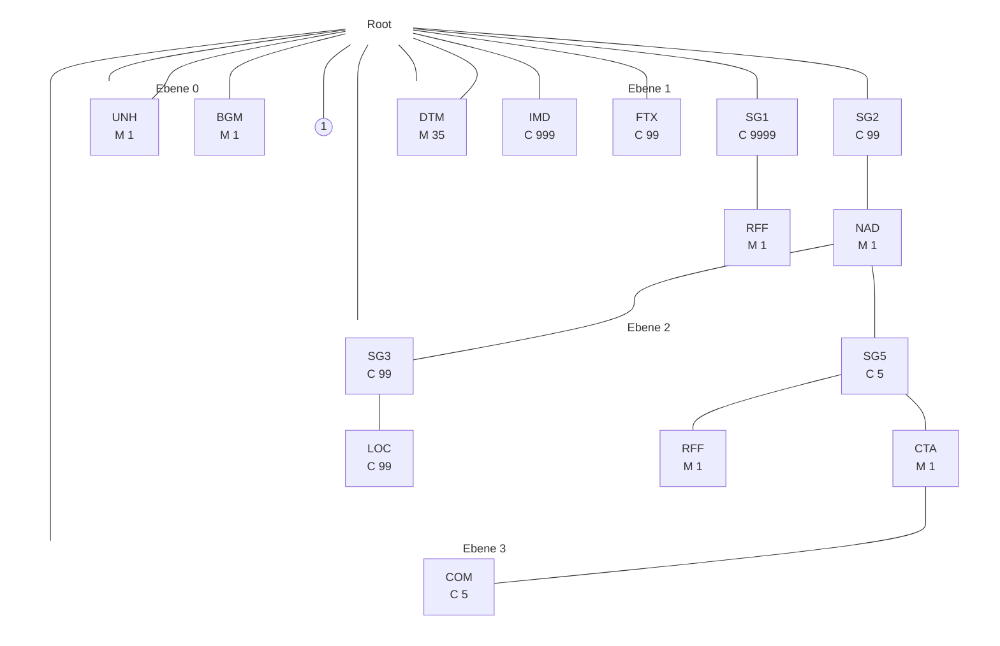
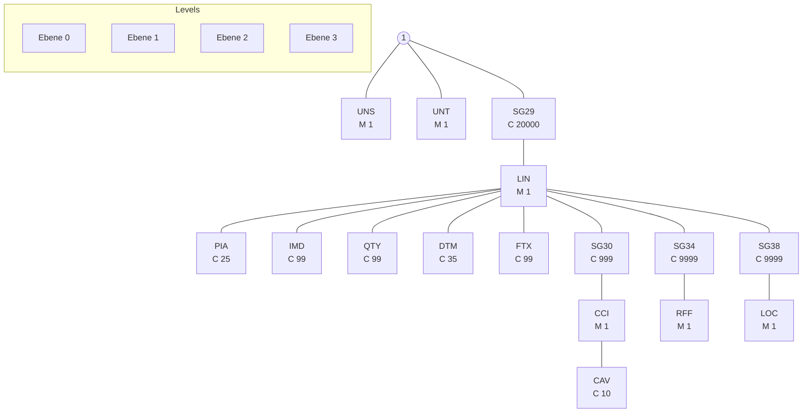

# ORDERS Nachrichtenbeschreibung

auf Basis

**ORDERS**
Bestellung

**UN D.09B S3**

**Version:** 1.4b
**Publikationsdatum:** 01.04.2025
**Autor:** BDEW

Nachrichtenstruktur 3
Diagramm 9
Segmentlayout 11
Änderungshistorie 152

ORDERS MIG

## Disclaimer

Die PDF-Datei ist das allein gültige Dokument.

Die zusätzlich veröffentlichte Word-Datei dient als informatorische Lesefassung und entspricht inhaltlich der PDF-Datei. Diese Word-Datei wird bis auf Weiteres rein informatorisch und ergänzend veröffentlicht unter dem Vorbehalt, zukünftig eine kostenpflichtige Veröffentlichung der Word-Datei einzuführen.

Zusätzlich werden zur PDF-Datei auch XML-Dateien als optionale Unterstützung gegen Entgelt veröffentlicht.

Version: 1.4b 01.04.2025 Seite: 2 / 153

ORDERS MIG

# Nachrichtenstruktur

|Zähler|Nr|Bez|Status Sta|Status BDEW|MaxWdh Sta|MaxWdh BDEW|Ebene|Inhalt|
|-|-|-|-|-|-|-|-|-|
|0010|00001|UNH|M|M|1|1|0|Nachrichten-Kopfsegment|
|0020|00002|BGM|M|M|1|1|0|Beginn der Nachricht|
|0030|00003|DTM|M|M|35|1|1|Nachrichtendatum|
|0030|00004|DTM|M|D|35|1|1|Ausführungsdatum|
|0030|00005|DTM|M|D|35|1|1|verschobener Abmeldetermin|
|0030|00006|DTM|M|D|35|1|1|Betrachtungszeitintervall|
|0030|00007|DTM|M|D|35|1|1|Startdatum oder Zeitpunkt|
|0030|00008|DTM|M|D|35|1|1|Endedatum oder Zeitpunkt|
|0060|00009|IMD|C|D|999|1|1|Abonnement|
|0060|00010|IMD|C|D|999|1|1|Produkt-/Leistungsbeschreibung|
|0060|00011|IMD|C|D|999|1|1|Bestellung Zählzeitdefinition|
|0060|00012|IMD|C|D|999|1|1|Lieferrichtung|
|0060|00013|IMD|C|D|999|1|1|Kundenanlage nach §20 Abs.1d EnWG|
|0070|00014|FTX|C|D|99|1|1|Reklamation von normierten Profilen bzw. Profilscharen|
|0090||SG1|C|D|9999|1|1|Referenz Nachrichtennummer|
|0100|00015|RFF|M|M|1|1|1|Referenz Nachrichtennummer|
|0090||SG1|C|D|9999|1|1|Referenz Angebotsnummer|
|0100|00016|RFF|M|M|1|1|1|Referenz Angebotsnummer|
|0090||SG1|C|D|9999|1|1|Referenz Vorgangsnummer|
|0100|00017|RFF|M|M|1|1|1|Referenz Vorgangsnummer|
|0090||SG1|C|D|9999|1|1|Referenz auf Redispatch-Maßnahme|
|0100|00018|RFF|M|M|1|1|1|ID der Redispatch-Maßnahme|
|0090||SG1|C|D|9999|1|1|Referenznummer des Vorgangs der Anmeldung nach WiM|
|0100|00019|RFF|M|M|1|1|1|Referenznummer des Vorgangs der Anmeldung nach WiM|
|0090||SG1|C|D|9999|1|1|Referenznummer der Nachricht der betroffenen Antwort auf Bestellung|
|0100|00020|RFF|M|M|1|1|1|Referenznummer der Nachricht der betroffenen Antwort auf Bestellung|
|0090||SG1|C|D|9999|1|1|Referenznummer des Vorgangs der betroffenen Antwort auf Bestellung|
|0100|00021|RFF|M|M|1|1|1|Referenznummer des Vorgangs der betroffenen Antwort auf Bestellung|
|0090||SG1|C|R|9999|1|1|Prüfidentifikator|
|0100|00022|RFF|M|M|1|1|1|Prüfidentifikator|
|0120||SG2|C|R|99|1|1|MP-ID Absender|
|0130|00023|NAD|M|M|1|1|1|MP-ID Absender|
|0220||SG5|C|D|5|1|2|Kontaktinformationen|
|0230|00024|CTA|M|M|1|1|2|Ansprechpartner|
|0240|00025|COM|C|R|5|5|3|Kommunikationsverbindung|

Bez = Segment-/Gruppen-Bezeichner
Zähler = Nummer der Segmente/Gruppen im Standard
Nr = Laufende Segmentnummer im Guide
MaxWdh = Maximale Wiederholung der Segmente/Gruppen

Sta = Standard UN/CEFACT
EDIFACT: M=Muss/Mandatory, C=Conditional
Anwendung: R=Erforderlich/Required, O=Optional, D=Abhängig von/Dependent, N=Nicht benutzt/Not used

Version: 1.4b 01.04.2025 Seite: 3 / 153

ORDERS MIG

Datenformate Strom & Gas

# Nachrichtenstruktur

||Zähler|Nr|Bez|Status Sta|Status BDEW|MaxWdh Sta|MaxWdh BDEW|Ebene|Inhalt|
|-|-|-|-|-|-|-|-|-|-|
||0120||SG2|C|R|99|1|1|MP-ID Empfänger|
||0130|00026|NAD|M|M|1|1|1|MP-ID Empfänger|
||0140|00027|LOC|C|D|99|1|2|Bilanzierungsgebiet/Regelzone|
||0120||SG2|C|D|99|1|1|Marktlokation, Messlokation, Tranche bzw. Ressource|
||0130|00028|NAD|M|M|1|1|1|Meldepunkt|
||0140|00029|LOC|C|D|99|1|2|Meldepunkt|
||0160||SG3|C|D|99|99|2|Referenz auf ID der Marktlokation|
||0170|00030|RFF|M|M|1|1|2|Referenz auf ID der Marktlokation|
||0160||SG3|C|D|99|99|2|Referenz auf ID der Tranche|
||0170|00031|RFF|M|M|1|1|2|Referenz auf ID der Tranche|
||0160||SG3|C|D|99|1|2|Referenz auf ID der Steuerbaren Ressource|
||0170|00032|RFF|M|M|1|1|2|Referenz auf ID der Steuerbaren Ressource|
||0160||SG3|C|D|99|99|2|Referenz auf ID der Technischen Ressource|
||0170|00033|RFF|M|M|1|1|2|Referenz auf ID der Technischen Ressource|
||0160||SG3|C|D|99|1|2|Referenz auf die ID der Marktlokation der Kundenanlage|
||0170|00034|RFF|M|M|1|1|2|Referenz auf die ID der Marktlokation der Kundenanlage|
||0160||SG3|C|D|99|1|2|Konfigurations-ID|
||0170|00035|RFF|M|M|1|1|2|Konfigurations-ID|
||0120||SG2|C|D|99|1|1|Marktlokationsadresse|
||0130|00036|NAD|M|M|1|1|1|Marktlokationsadresse|
||0120||SG2|C|D|99|1|1|Messlokationsadresse|
||0130|00037|NAD|M|M|1|1|1|Messlokationsadresse|
||0120||SG2|C|D|99|1|1|Kunde des Lieferanten|
||0130|00038|NAD|M|M|1|1|1|Kunde des Lieferanten|
||0160||SG3|C|D|99|1|2|Kundennummer beim Lieferanten|
||0170|00039|RFF|M|M|1|1|2|Kundennummer beim Lieferanten|
||0220||SG5|C|D|5|5|2|Kontaktdaten des Kunden|
||0230|00040|CTA|M|M|1|1|2|Kontaktdaten des Kunden|
||0240|00041|COM|C|R|5|5|3|Kommunikationsverbindung|
||0120||SG2|C|D|99|1|1|Kunde des Messstellenbetreibers|
||0130|00042|NAD|M|M|1|1|1|Kunde des Messstellenbetreibers|
||0120||SG2|C|D|99|1|1|Adresse für Treffpunkt|
||0130|00043|NAD|M|M|1|1|1|Adresse für Treffpunkt|
||0120||SG2|C|D|99|1|1|MP-ID des Eigentümers der Liste der Zählzeitdefinitionen|
||0130|00044|NAD|M|M|1|1|1|MP-ID des Eigentümers der Liste der Zählzeitdefinitionen|
||0120||SG2|C|D|99|1|1|MP-ID des NB des Vorgangs der Anmeldung nach WiM|
||0130|00045|NAD|M|M|1|1|1|MP-ID des NB des Vorgangs der Anmeldung nach WiM|
||0120||SG2|C|D|99|99|1|Lieferant der Lokation|
||0130|00046|NAD|M|M|1|1|1|Lieferant der Lokation|

Bez = Segment-/Gruppen-Bezeichner
Zähler = Nummer der Segmente/Gruppen im Standard
Nr = Laufende Segmentnummer im Guide
MaxWdh = Maximale Wiederholung der Segmente/Gruppen

Sta = Standard UN/CEFACT
EDIFACT: M=Muss/Mandatory, C=Conditional
Anwendung: R=Erforderlich/Required, O=Optional, D=Abhängig von/Dependent, N=Nicht benutzt/Not used

Version: 1.4b
01.04.2025
Seite: 4 / 153

ORDERS MIG

# Nachrichtenstruktur

|Zähler|Nr|Bez|Status Sta|Status BDEW|MaxWdh Sta|MaxWdh BDEW|Ebene|Inhalt|
|-|-|-|-|-|-|-|-|-|
|0160||\*\*SG3\*\*|C|\*\*R\*\*|99|\*\*1\*\*|2|Referenz auf die ID der Lokation|
|0170|00047|\*\*RFF\*\*|M|\*\*M\*\*|1|\*\*1\*\*|2|Referenz auf die ID der Lokation|
|0120||\*\*SG2\*\*|C|\*\*D\*\*|99|\*\*1\*\*|1|ÜNB der Marktlokation|
|0130|00048|\*\*NAD\*\*|M|\*\*M\*\*|1|\*\*1\*\*|1|ÜNB der Marktlokation|
|0160||\*\*SG3\*\*|C|\*\*R\*\*|99|\*\*1\*\*|2|Referenz auf die ID der Marktlokation|
|0170|00049|\*\*RFF\*\*|M|\*\*M\*\*|1|\*\*1\*\*|2|Referenz auf die ID der Marktlokation|
|0120||\*\*SG2\*\*|C|\*\*D\*\*|99|\*\*1\*\*|1|MSB der Marktlokation|
|0130|00050|\*\*NAD\*\*|M|\*\*M\*\*|1|\*\*1\*\*|1|MSB der Marktlokation|
|0160||\*\*SG3\*\*|C|\*\*D\*\*|99|\*\*1\*\*|2|Referenz auf die ID der Marktlokation der Kundenanlage|
|0170|00051|\*\*RFF\*\*|M|\*\*M\*\*|1|\*\*1\*\*|2|Referenz auf die ID der Marktlokation der Kundenanlage|
|1100||\*\*SG29\*\*|C|\*\*D\*\*|200000|\*\*200000\*\*|1|Positionsteil|
|1110|00052|\*\*LIN\*\*|M|\*\*M\*\*|1|\*\*1\*\*|1|Positionsdaten|
|1120|00053|\*\*PIA\*\*|C|\*\*D\*\*|25|\*\*25\*\*|2|OBIS-Kennzahl|
|1130|00054|\*\*IMD\*\*|C|\*\*D\*\*|99|\*\*1\*\*|2|Grund der Anforderung|
|1180|00055|\*\*DTM\*\*|C|\*\*D\*\*|35|\*\*1\*\*|2|Zeitpunkt für Wertanfrage|
|1180|00056|\*\*DTM\*\*|C|\*\*D\*\*|35|\*\*1\*\*|2|Beginn Zeitraum für Wertanfrage|
|1180|00057|\*\*DTM\*\*|C|\*\*D\*\*|35|\*\*1\*\*|2|Ende Zeitraum für Wertanfrage|
|1270|00058|\*\*FTX\*\*|C|\*\*D\*\*|99|\*\*1\*\*|2|Allgemeine Information (Feld für allgemeine Hinweise)|
|1270|00059|\*\*FTX\*\*|C|\*\*D\*\*|99|\*\*1\*\*|2|Beschreibung der Reklamation von Werten und Definitionen|
|1280||\*\*SG30\*\*|C|\*\*D\*\*|999|\*\*1\*\*|2|Profilgruppe|
|1290|00060|\*\*CCI\*\*|M|\*\*M\*\*|1|\*\*1\*\*|2|Profilgruppe|
|1280||\*\*SG30\*\*|C|\*\*D\*\*|999|\*\*1\*\*|2|Prognosegrundlage|
|1290|00061|\*\*CCI\*\*|M|\*\*M\*\*|1|\*\*1\*\*|2|Prognosegrundlage|
|1300|00062|\*\*CAV\*\*|C|\*\*R\*\*|10|\*\*1\*\*|3|Prognosegrundlage|
|1280||\*\*SG30\*\*|C|\*\*D\*\*|999|\*\*1\*\*|2|Konzessionsabgabe|
|1290|00063|\*\*CCI\*\*|M|\*\*M\*\*|1|\*\*1\*\*|2|Konzessionsabgabe|
|1300|00064|\*\*CAV\*\*|C|\*\*R\*\*|10|\*\*1\*\*|3|Konzessionsabgabe|
|1280||\*\*SG30\*\*|C|\*\*D\*\*|999|\*\*1\*\*|2|Zugeordnete Zählzeitdefinition|
|1290|00065|\*\*CCI\*\*|M|\*\*M\*\*|1|\*\*1\*\*|2|Zugeordnete Zählzeitdefinition|
|1280||\*\*SG30\*\*|C|\*\*D\*\*|999|\*\*1\*\*|2|Zugeordnete Schaltzeitdefinition|
|1290|00066|\*\*CCI\*\*|M|\*\*M\*\*|1|\*\*1\*\*|2|Zugeordnete Schaltzeitdefinition|
|1280||\*\*SG30\*\*|C|\*\*D\*\*|999|\*\*1\*\*|2|Zugeordnete Leistungskurvendefinition|
|1290|00067|\*\*CCI\*\*|M|\*\*M\*\*|1|\*\*1\*\*|2|Zugeordnete Leistungskurvendefinition|
|1280||\*\*SG30\*\*|C|\*\*D\*\*|999|\*\*1\*\*|2|Geräteart|
|1290|00068|\*\*CCI\*\*|M|\*\*M\*\*|1|\*\*1\*\*|2|Geräteart|
|1450||\*\*SG34\*\*|C|\*\*D\*\*|9999|\*\*1\*\*|2|Versionsangabe der Summenzeitreihe|
|1460|00069|\*\*RFF\*\*|M|\*\*M\*\*|1|\*\*1\*\*|2|Versionsangabe der Summenzeitreihe|
|1450||\*\*SG34\*\*|C|\*\*D\*\*|9999|\*\*3\*\*|2|Gerätenummer|

Bez = Segment-/Gruppen-Bezeichner
Zähler = Nummer der Segmente/Gruppen im Standard
Nr = Laufende Segmentnummer im Guide
MaxWdh = Maximale Wiederholung der Segmente/Gruppen

Sta = Standard UN/CEFACT
EDIFACT: M=Muss/Mandatory, C=Conditional
Anwendung: R=Erforderlich/Required, O=Optional, D=Abhängig von/Dependent, N=Nicht benutzt/Not used

Version: 1.4b 01.04.2025 Seite: 5 / 153

ORDERS MIG

# Nachrichtenstruktur

|Zähler|Nr|Bez|Status Sta|Status BDEW|MaxWdh Sta|MaxWdh BDEW|Ebene|Inhalt|
|-|-|-|-|-|-|-|-|-|
|1460|00070|RFF|M|M|1|1|2|Gerätenummer|
|1450||SG34|C|D|9999|1|2|Positionsnummer aus dem Angebot|
|1460|00071|RFF|M|M|1|1|2|Positionsnummer aus dem Angebot|
|1630||SG38|C|D|9999|1|2|MaBiS-ZP|
|1640|00072|LOC|M|M|1|1|2|Meldepunkt|
|1630||SG38|C|D|9999|1|2|Bilanzkreis für Strom|
|1640|00073|LOC|M|M|1|1|2|Bilanzkreis für Strom|
|1100||SG29|C|D|200000|200000|1|Erforderliches Produkt der Marktlokation|
|1110|00074|LIN|M|M|1|1|1|Erforderliches Produkt der Marktlokation|
|1120|00075|PIA|C|R|25|1|2|Erforderliches Produkt der Marktlokation|
|1280||SG30|C|D|999|1|2|Zugeordnete Zählzeitdefinition|
|1290|00076|CCI|M|M|1|1|2|Zugeordnete Zählzeitdefinition|
|1280||SG30|C|D|999|1|2|Messprodukt für Netzbetreiber relevant|
|1290|00077|CCI|M|M|1|1|2|Messprodukt für Netzbetreiber relevant|
|1300|00078|CAV|C|R|10|4|3|Verwendungszweck der Werte|
|1280||SG30|C|D|999|1|2|Messprodukt für Lieferant relevant|
|1290|00079|CCI|M|M|1|1|2|Messprodukt für Lieferant relevant|
|1300|00080|CAV|C|R|10|4|3|Verwendungszweck der Werte|
|1280||SG30|C|D|999|1|2|Messprodukt für Übertragungsnetzbetreiber relevant|
|1290|00081|CCI|M|M|1|1|2|Messprodukt für Übertragungsnetzbetreiber relevant|
|1300|00082|CAV|C|R|10|4|3|Verwendungszweck der Werte|
|1100||SG29|C|D|200000|200000|1|Erforderliches Produkt der Tranche|
|1110|00083|LIN|M|M|1|1|1|Erforderliches Produkt der Tranche|
|1120|00084|PIA|C|D|25|1|2|Erforderliches Produkt der Tranche|
|1130|00085|IMD|C|D|99|1|2|Leistungsbeschreibung Konfiguration|
|1150|00086|QTY|C|D|99|1|2|Prozentualer Anteil der Tranche an der erzeugenden Marktlokation|
|1280||SG30|C|D|999|1|2|Basis zur Bildung der Tranchengröße|
|1290|00087|CCI|M|M|1|1|2|Basis zur Bildung der Tranchengröße|
|1280||SG30|C|D|999|1|2|Messprodukt für Netzbetreiber relevant|
|1290|00088|CCI|M|M|1|1|2|Messprodukt für Netzbetreiber relevant|
|1300|00089|CAV|C|R|10|4|3|Verwendungszweck der Werte|
|1280||SG30|C|D|999|1|2|Messprodukt für Lieferant relevant|
|1290|00090|CCI|M|M|1|1|2|Messprodukt für Lieferant relevant|
|1300|00091|CAV|C|R|10|4|3|Verwendungszweck der Werte|
|1280||SG30|C|D|999|1|2|Messprodukt für Übertragungsnetzbetreiber relevant|
|1290|00092|CCI|M|M|1|1|2|Messprodukt für Übertragungsnetzbetreiber relevant|
|1300|00093|CAV|C|R|10|4|3|Verwendungszweck der Werte|
|1450||SG34|C|D|9999|1|2|Referenz auf ID der Tranche|

**Bez** = Segment-/Gruppen-Bezeichner
**Zähler** = Nummer der Segmente/Gruppen im Standard
**Nr** = Laufende Segmentnummer im Guide
**MaxWdh** = Maximale Wiederholung der Segmente/Gruppen
**Sta** = Standard UN/CEFACT
**EDIFACT**: M=Muss/Mandatory, C=Conditional
**Anwendung**: R=Erforderlich/Required, O=Optional, D=Abhängig von/Dependent, N=Nicht benutzt/Not used

Version: 1.4b 01.04.2025 Seite: 6 / 153

ORDERS MIG

# Nachrichtenstruktur

|Zähler|Status Nr|MaxWdh Bez|MaxWdh Sta|BDEW|Sta|BDEW|Ebene|Inhalt|
|-|-|-|-|-|-|-|-|-|
|1460|00094|RFF|M|M|1|1|2|Referenz auf ID der Tranche|
|1100||SG29|C|D|200000|200000|1|Erforderliches Produkt der Messlokation|
|1110|00095|LIN|M|M|1|1|1|Erforderliches Produkt der Messlokation|
|1120|00096|PIA|C|R|25|1|2|Erforderliches Produkt der Messlokation|
|1280||SG30|C|D|999|1|2|Weitere Beschreibung erforderliches Messprodukt|
|1290|00097|CCI|M|M|1|1|2|Weitere Beschreibung erforderliches Messprodukt|
|1300|00098|CAV|C|R|10|1|3|Notwendigkeit einer zweiten Messung|
|1300|00099|CAV|C|R|10|1|3|Werteübermittlung an den NB aufgrund weiterem Verwendungszweck|
|1280||SG30|C|D|999|1|2|Zugeordnete Zählzeitdefinition|
|1290|00100|CCI|M|M|1|1|2|Zugeordnete Zählzeitdefinition|
|1450||SG34|C|D|9999|1|2|Referenz auf ID der Messlokation|
|1460|00101|RFF|M|M|1|1|2|Referenz auf ID der Messlokation|
|1100||SG29|C|D|200000|200000|1|Erforderliches Produkt der Netzlokation|
|1110|00102|LIN|M|M|1|1|1|Erforderliches Produkt der Netzlokation|
|1120|00103|PIA|C|R|25|1|2|Erforderliches Produkt der Netzlokation|
|1280||SG30|C|D|999|1|2|Messprodukt für Netzbetreiber relevant|
|1290|00104|CCI|M|M|1|1|2|Messprodukt für Netzbetreiber relevant|
|1300|00105|CAV|C|R|10|1|3|Verwendungszweck der Werte|
|1280||SG30|C|D|999|1|2|Messprodukt für Lieferant relevant|
|1290|00106|CCI|M|M|1|1|2|Messprodukt für Lieferant relevant|
|1300|00107|CAV|C|R|10|1|3|Verwendungszweck der Werte|
|1100||SG29|C|D|200000|200000|1|Erforderliches Produkt der Steuerbaren Ressource|
|1110|00108|LIN|M|M|1|1|1|Erforderliches Produkt der Steuerbaren Ressource|
|1120|00109|PIA|C|R|25|1|2|Erforderliches Produkt der Steuerbaren Ressource|
|1100||SG29|C|D|200000|1|1|Erforderliches Produkt Schaltzeitdefinitionen|
|1110|00110|LIN|M|M|1|1|1|Erforderliches Produkt Schaltzeitdefinitionen|
|1120|00111|PIA|C|R|25|1|2|Erforderliches Produkt Schaltzeitdefinitionen|
|1270|00112|FTX|C|D|99|1|2|Beschreibung der Reklamation der Konfiguration|
|1280||SG30|C|R|999|1|2|Zugeordnete Schaltzeitdefinition|
|1290|00113|CCI|M|M|1|1|2|Zugeordnete Schaltzeitdefinition|
|1100||SG29|C|D|200000|1|1|Erforderliches Produkt Leistungskurvendefinitionen|
|1110|00114|LIN|M|M|1|1|1|Erforderliches Produkt Leistungskurvendefinitionen|
|1120|00115|PIA|C|R|25|1|2|Erforderliches Produkt Leistungskurvendefinitionen|
|1270|00116|FTX|C|D|99|1|2|Beschreibung der Reklamation der Konfiguration|
|1280||SG30|C|R|999|1|2|Zugeordnete Leistungskurvendefinition|
|1290|00117|CCI|M|M|1|1|2|Zugeordnete Leistungskurvendefinition|
|1100||SG29|C|D|200000|1|1|Erforderliches Produkt Ad-hoc-Steuerkanal|
|1110|00118|LIN|M|M|1|1|1|Erforderliches Produkt Ad-hoc-Steuerkanal|

Bez = Segment-/Gruppen-Bezeichner
Zähler = Nummer der Segmente/Gruppen im Standard
Nr = Laufende Segmentnummer im Guide
MaxWdh = Maximale Wiederholung der Segmente/Gruppen
Sta = Standard UN/CEFACT
EDIFACT: M=Muss/Mandatory, C=Conditional
Anwendung: R=Erforderlich/Required, O=Optional, D=Abhängig von/Dependent, N=Nicht benutzt/Not used

Version: 1.4b
01.04.2025
Seite: 7 / 153

ORDERS MIG

# Nachrichtenstruktur

|Zähler|Nr|Bez|Status Sta|Status BDEW|MaxWdh Sta|MaxWdh BDEW|Ebene|Inhalt|
|-|-|-|-|-|-|-|-|-|
|1120|00119|PIA|C|R|25|1|2|Erforderliches Produkt Ad-hoc-Steuerkanal|
|1270|00120|FTX|C|D|99|1|2|Beschreibung der Reklamation der Konfiguration|
|1100||SG29|C|D|200000|1|1|Erforderliches Messprodukt für Werte nach Typ 2 aus Backend|
|1110|00121|LIN|M|M|1|1|1|Erforderliches Messprodukt für Werte nach Typ 2 aus Backend|
|1120|00122|PIA|C|R|25|1|2|Erforderliches Messprodukt für Werte nach Typ 2 aus Backend|
|1270|00123|FTX|C|D|99|1|2|Beschreibung der Reklamation der Konfiguration|
|1100||SG29|C|D|200000|1|1|Erforderliches Produkt Konfigurationserlaubnis für Werte nach Typ 2 aus SMGW|
|1110|00124|LIN|M|M|1|1|1|Erforderliches Produkt Konfigurationserlaubnis für Werte nach Typ 2 aus SMGW|
|1120|00125|PIA|C|R|25|1|2|Erforderliches Produkt Konfigurationserlaubnis für Werte nach Typ 2 aus SMGW|
|1270|00126|FTX|C|R|99|1|2|Zieladresse URI|
|1270|00127|FTX|C|R|99|1|2|Zertifikatsaussteller (Issuer)|
|1270|00128|FTX|C|R|99|1|2|Zertifikatsnutzer (Subject)|
|1270|00129|FTX|C|D|99|1|2|Beschreibung der Reklamation der Konfiguration|
|1280||SG30|C|R|999|1|2|Änderungsmöglichkeit der Konfiguration im SMGW|
|1290|00130|CCI|M|M|1|1|2|Änderungsmöglichkeit der Konfiguration im SMGW|
|1280||SG30|C|D|999|999|2|Schwellwerte|
|1290|00131|CCI|M|M|1|1|2|Schwellwerte|
|1100||SG29|C|D|200000|1|1|Erforderliches Produkt Abrechnungsdaten|
|1110|00132|LIN|M|M|1|1|1|Erforderliches Produkt Abrechnungsdaten|
|1120|00133|PIA|C|R|25|1|2|Erforderliches Produkt Abrechnungsdaten|
|1270|00134|FTX|C|D|99|1|2|Link zur Abtretungserklärung / Vollmacht vom Kunden|
|1280||SG30|C|R|999|1|2|Produkteigenschaft|
|1290|00135|CCI|M|M|1|1|2|Produkteigenschaft|
|1300|00136|CAV|C|D|10|1|3|Code der Produkteigenschaft|
|1300|00137|CAV|C|D|10|1|3|Wertedetails zum Produkt|
|2490|00138|UNS|M|M|1|1|0|Abschnitts-Kontrollsegment|
|2560|00139|UNT|M|M|1|1|0|Nachrichten-Endesegment|

Bez = Segment-/Gruppen-Bezeichner
Zähler = Nummer der Segmente/Gruppen im Standard
Nr = Laufende Segmentnummer im Guide
MaxWdh = Maximale Wiederholung der Segmente/Gruppen
Sta = Standard UN/CEFACT
EDIFACT: M=Muss/Mandatory, C=Conditional
Anwendung: R=Erforderlich/Required, O=Optional, D=Abhängig von/Dependent, N=Nicht benutzt/Not used
Version: 1.4b | 01.04.2025 | Seite: 8 / 153

ORDERS MIG

# Diagramm

||Bez|Bez = Segment-/Gruppen-Bezeichner|
|-|-|-|
|St|MaxWdh|St = Durch UN/CEFACT definierter Status (M=Muss/Mandatory, C=Conditional) MaxWdh = Durch UN/CEFACT definierte maximale Wiederholung der Segmente/Gruppen|

Hinweis: Die Darstellung des hier abgebildeten Branchingdiagramms ist implizit.

Version: 1.4b 01.04.2025 Seite: 9 / 153

ORDERS MIG

||Bez|Bez = Segment-/Gruppen-Bezeichner|
|-|-|-|
|St|MaxWdh|St = Durch UN/CEFACT definierter Status (M=Muss/Mandatory, C=Conditional)|
|||MaxWdh = Durch UN/CEFACT definierte maximale Wiederholung der Segmente/Gruppen|

Hinweis: Die Darstellung des hier abgebildeten Branchingdiagramms ist implizit.

Version: 1.4b 01.04.2025 Seite: 10 / 153

ORDERS MIG

# Segmentlayout

|Zähler|Nr|Bez|Standard St|Standard MaxWdh|BDEW St|BDEW MaxWdh|Ebene|Name|
|-|-|-|-|-|-|-|-|-|
|0010|00001|\*\*UNH\*\*|M|1|M|1|0|\*\*Nachrichten-Kopfsegment\*\*|

|Bez|Name|Standard St|Standard Format|BDEW St|BDEW Format|Anwendung / Bemerkung||
|-|-|-|-|-|-|-|-|
|UNH||||||||
|0062|Nachrichten-Referenznummer|M|an..14|M|an..14|\*Eindeutige Nachrichtenreferenz des Absenders. Nummer der Nachrichten einer Übertragungsdatei im Datenaustausch. Identisch mit DE0062 im UNT, i. d. R. vom sendenden Konverter vergeben.\*||
|S009|Nachrichten-Kennung|M||M||||
|0065|Nachrichtentyp-Kennung|M|an..6|M|an..6|\*\*ORDERS Bestellung\*\*||
|0052|Versionsnummer des Nachrichtentyps|M|an..3|M|an..3|\*\*D Entwurfs-Version\*\*||
|0054|Freigabenummer des Nachrichtentyps|M|an..3|M|an..3|\*\*09B Ausgabe 2009 - B\*\*||
|0051|Verwaltende Organisation|M|an..2|M|an..2|\*\*UN UN/CEFACT\*\*||
|0057|Anwendungscode der zuständigen Organisation|C|an..6|R|an..6|\*\*1.4b Versionsnummer der zugrundeliegenden BDEW-Nachrichtenbeschreibung\*\*||

**Bemerkung:**
Dieses Segment dient dazu, eine Nachricht zu eröffnen, zu identifizieren und zu spezifizieren.

**Beispiel:**
`UNH+1+ORDERS:D:09B:UN:1.4b'`

Bez = Objekt-Bezeichner
Nr = Laufende Segmentnummer im Guide
MaxWdh = Maximale Wiederholung der Segmente/Gruppen
Zähler = Nummer der Segmente/Gruppen im Standard
St = Status
EDIFACT: M=Muss/Mandatory, C=Conditional
Anwendung: R=Erforderlich/Required, O=Optional, D=Abhängig von/Dependent, N=Nicht benutzt/Not used
Version: 1.4b 01.04.2025 Seite: 11 / 153

ORDERS MIG

# Segmentlayout

|Zähler|Nr|Bez|Standard St|Standard MaxWdh|BDEW St|BDEW MaxWdh|Ebene|Name|
|-|-|-|-|-|-|-|-|-|
|0020|00002|\*\*BGM\*\*|M|1|M|1|0|Beginn der Nachricht|

|Bez|Name|Standard St|Standard Format|BDEW St|BDEW Format|Anwendung / Bemerkung||||||
|-|-|-|-|-|-|-|-|-|-|-|-|
|BGM||||||||||||
|C002||||||Dokumenten-/ Nachrichtenname|C||R|||
|1001||||||Dokumentenname, Code|C|an..3|R|an..3|\*\*7 Prozessdatenbericht\*\* \*\*E40 Bilanzkreiszuordnungsliste\*\* \*\*Z05 Clearingliste\*\* \*\*BK Zeitreihen im Rahmen der Bilanzkreisabrechnung\*\* \*\*Z10 Geräteübernahme\*\* \*\*Z11 Weiterverpflichtung zum Betrieb der Messlokation\*\* \*\*Z12 Änderung der Technik der Lokation\*\* \*\*Z13 Gerätewechselabsicht\*\* \*\*Z14 Stammdaten der Markt- oder Messlokation\*\* \*\*Z19 normiertes Profil/Profilschar\*\* \*\*Z23 Bilanzierte Menge (MMMA)\*\* \*\*Z24 Allokationsliste (MMMA)\*\* \*\*Z28 Energiemenge und Leistungsmaximum\*\* \*\*Z29 Abrechnung des Messstellenbetriebs vom MSB an den LF\*\* \*\*Z30 Änderung Prognosegrundlage\*\* \*\*Z31 Änderung Gerätekonfiguration\*\* \*\*Z34 Reklamation von Werten\*\* \*\*Z45 Redispatch Einzelzeitreihe Ausfallarbeit\*\* \*\*Z48 Lastgang Marktlokation, Tranche\*\* \*\*Z51 Sperrung\*\* \*\*Z52 Entsperrung\*\* \*\*Z55 Reklamation der Übersicht der Definitionen oder einer Definition\*\* \*\*Z56 Änderung individueller Konfiguration\*\* \*\*Z57 Übermittlung von Werten an ESA\*\* \*\*Z58 Reklamation Profil/Profilschar\*\* \*\*Z61 Stammdaten der Marktlokation\*\* \*\*Z62 Stammdaten der Messlokation\*\* \*\*Z68 Änderung\*\* \*\*Z72 Beendigung einer Konfiguration\*\* \*\*Z73 Bestellung einer Konfiguration\*\* \*\*Z74 Bestellung eines Angebots einer Konfiguration\*\* \*\*Z76 Reklamation einer Konfiguration\*\* \*\*Z91 Bestellung Änderung Abrechnungsdaten\*\* \*\*Z92 Einrichtung Konfiguration aufgrund Zuordnung LF\*\* \*\*Z93 Bestellung eines Angebots Änderung der Technik der Lokation\*\*|
|C106||||||Dokumenten-/Nachrichten- Identifikation|C||R|||
|1004||||||Dokumentennummer|C|an..70|R|an..35|\*EDI-Nachrichtennummer, vergeben vom Absender des Dokuments. Die Dokumentennummer stellt die Auftragsnummer dar, die in den entsprechenden Antworten anzugeben ist.\*|

**Bez** = Objekt-Bezeichner
**Nr** = Laufende Segmentnummer im Guide
**MaxWdh** = Maximale Wiederholung der Segmente/Gruppen
**Zähler** = Nummer der Segmente/Gruppen im Standard
**St** = Status
EDIFACT: M=Muss/Mandatory, C=Conditional
Anwendung: R=Erforderlich/Required, O=Optional, D=Abhängig von/Dependent, N=Nicht benutzt/Not used
Version: 1.4b 01.04.2025 Seite: 12 / 153

ORDERS MIG

# Segmentlayout

**Bemerkung:**
Dieses Segment dient dazu, Typ und Funktion einer Nachricht anzuzeigen und die Identifikationsnummer zu übermitteln.

DE1001: Darin ist die Kategorie der gesamten Nachricht festgelegt.

**Beispiel:**
`BGM+E40+MKIDI5422'`

Dieses Beispiel identifiziert das Dokument als die Anforderung einer Bilanzkreiszuordnungsliste durch die Verwendung des Codewertes E40. Das Dokument hat die Belegnummer MKIDI5422.

Bez = Objekt-Bezeichner
Nr = Laufende Segmentnummer im Guide
MaxWdh = Maximale Wiederholung der Segmente/Gruppen
Zähler = Nummer der Segmente/Gruppen im Standard
St = Status
EDIFACT: M=Muss/Mandatory, C=Conditional
Anwendung: R=Erforderlich/Required, O=Optional, D=Abhängig von/
Dependent, N=Nicht benutzt/Not used
Version: 1.4b 01.04.2025 Seite: 13 / 153

ORDERS MIG

# Segmentlayout

|Zähler|Nr|Bez|Standard St|Standard MaxWdh|BDEW St|BDEW MaxWdh|Ebene|Name|
|-|-|-|-|-|-|-|-|-|
|0030|00003|\*\*DTM\*\*|M|35|M|1|1|\*\*Nachrichtendatum\*\*|

|Bez|Name|Standard St|Standard Format|BDEW St|BDEW Format|Anwendung / Bemerkung|
|-|-|-|-|-|-|-|
|DTM| | | | | ||
|C507|Datum/Uhrzeit/Zeitspanne|M| |M| ||
|2005|Datums- oder Uhrzeits- oder Zeitspannen-Funktion, Qualifier|M|an..3|M|an..3|\*\*137 Dokumenten-/Nachrichtendatum/-zeit\*\*|
|2380|Datum oder Uhrzeit oder Zeitspanne, Wert|C|an..35|R|an..35||
|2379|Datums- oder Uhrzeit- oder Zeitspannen-Format, Code|C|an..3|R|an..3|\*\*303 CCYYMMDDHHMMZZZ\*\*|

**Bemerkung:**
Dieses Segment wird zur Angabe des Nachrichtendatums verwendet.

**Beispiel:**
`DTM+137:202207200115?+00:303'`

**Bez** = Objekt-Bezeichner
**Nr** = Laufende Segmentnummer im Guide
**MaxWdh** = Maximale Wiederholung der Segmente/Gruppen
**Zähler** = Nummer der Segmente/Gruppen im Standard
**St** = Status
EDIFACT: M=Muss/Mandatory, C=Conditional
Anwendung: R=Erforderlich/Required, O=Optional, D=Abhängig von/Dependent, N=Nicht benutzt/Not used
Version: 1.4b 01.04.2025 Seite: 14 / 153

ORDERS MIG

# Segmentlayout

|Zähler|Nr|Bez|Standard St|Standard MaxWdh|BDEW St|BDEW MaxWdh|Ebene|Name|
|-|-|-|-|-|-|-|-|-|
|0030|00004|\*\*DTM\*\*|M|35|D|1|1|\*\*Ausführungsdatum\*\*|

|Bez|Name|St|Standard Format|Standard St|BDEW Format|BDEW Anwendung / Bemerkung||
|-|-|-|-|-|-|-|-|
|DTM||||||||
|C507|Datum/Uhrzeit/Zeitspanne|M||M||||
|2005|Datums- oder Uhrzeits- oder Zeitspannen-Funktion, Qualifier|M|an..3|M|an..3|\*\*203 Ausführungsdatum/-zeit\*\*||
|2380|Datum oder Uhrzeit oder Zeitspanne, Wert|C|an..35|R|an..35|||
|2379|Datums- oder Uhrzeit- oder Zeitspannen-Format, Code|C|an..3|R|an..3|\*\*303 CCYYMMDDHHMMZZZ\*\*||

**Bemerkung:**
Dieses Segment wird zur Angabe des Ausführungsdatums verwendet.

**Beispiel:**
`DTM+203:201104082200?+00:303'`

Bez = Objekt-Bezeichner
Nr = Laufende Segmentnummer im Guide
MaxWdh = Maximale Wiederholung der Segmente/Gruppen
Zähler = Nummer der Segmente/Gruppen im Standard
St = Status
EDIFACT: M=Muss/Mandatory, C=Conditional
Anwendung: R=Erforderlich/Required, O=Optional, D=Abhängig von/ Dependent, N=Nicht benutzt/Not used
Version: 1.4b 01.04.2025 Seite: 15 / 153

ORDERS MIG

# Segmentlayout

|Zähler|Nr|Bez|Standard|Standard St|BDEW MaxWdh|BDEW St|Ebene MaxWdh|Name||
|-|-|-|-|-|-|-|-|-|-|
|0030|00005|\*\*DTM\*\*|M|35|D|1|1|\*\*verschobener Abmeldetermin\*\*||

|Bez|Name|Standard St|Standard Format|BDEW St|BDEW Format|Anwendung / Bemerkung||
|-|-|-|-|-|-|-|-|
|DTM||||||||
|C507|Datum/Uhrzeit/Zeitspanne|M||M||||
|2005|Datums- oder Uhrzeits- oder Zeitspannen-Funktion, Qualifier|M|an..3|M|an..3|\*\*Z02 Verschobener Abmeldetermin\*\*||
|2380|Datum oder Uhrzeit oder Zeitspanne, Wert|C|an..35|R|an..35|||
|2379|Datums- oder Uhrzeit- oder Zeitspannen-Format, Code|C|an..3|R|an..3|\*\*303 CCYYMMDDHHMMZZZ\*\*||

**Bemerkung:**

**Beispiel:**
`DTM+Z02:201104082200?+00:303'`

**Bez** = Objekt-Bezeichner
**Nr** = Laufende Segmentnummer im Guide
**MaxWdh** = Maximale Wiederholung der Segmente/Gruppen
**Zähler** = Nummer der Segmente/Gruppen im Standard
**St** = Status
EDIFACT: M=Muss/Mandatory, C=Conditional
Anwendung: R=Erforderlich/Required, O=Optional, D=Abhängig von/ Dependent, N=Nicht benutzt/Not used
Version: 1.4b 01.04.2025 Seite: 16 / 153

ORDERS MIG

# Segmentlayout

|Zähler|Nr|Bez|Standard St|Standard MaxWdh|BDEW St|BDEW MaxWdh|Ebene|Name|
|-|-|-|-|-|-|-|-|-|
|0030|00006|\*\*DTM\*\*|M|35|D|1|1|\*\*Betrachtungszeitintervall\*\*|

|Bez|Name|Standard St|Standard Format|BDEW St|BDEW Format|Anwendung / Bemerkung|
|-|-|-|-|-|-|-|
|DTM| | | | | ||
|C507|Datum/Uhrzeit/Zeitspanne|M| |M| ||
|2005|Datums- oder Uhrzeits- oder Zeitspannen-Funktion, Qualifier|M|an..3|M|an..3|\*\*273 Gültigkeitszeitspanne\*\*|
|2380|Datum oder Uhrzeit oder Zeitspanne, Wert|C|an..35|R|an..35||
|2379|Datums- oder Uhrzeit- oder Zeitspannen-Format, Code|C|an..3|R|an..3|\*\*610 CCYYMM\*\*|

**Bemerkung:**

**Beispiel:**
`DTM+273:201011:610'`

Bez = Objekt-Bezeichner
Nr = Laufende Segmentnummer im Guide
MaxWdh = Maximale Wiederholung der Segmente/Gruppen
Zähler = Nummer der Segmente/Gruppen im Standard
St = Status
EDIFACT: M=Muss/Mandatory, C=Conditional
Anwendung: R=Erforderlich/Required, O=Optional, D=Abhängig von/Dependent, N=Nicht benutzt/Not used
Version: 1.4b 01.04.2025 Seite: 17 / 153

ORDERS MIG

# Segmentlayout

|Zähler|Nr|Bez|Standard St|Standard MaxWdh|BDEW St|BDEW MaxWdh|Ebene|Name|
|-|-|-|-|-|-|-|-|-|
|0030|00007|\*\*DTM\*\*|M|35|D|1|1|\*\*Startdatum oder Zeitpunkt\*\*|

|Bez|Name|Standard St|Standard Format|BDEW St|BDEW Format|Anwendung / Bemerkung|
|-|-|-|-|-|-|-|
|DTM| | | | | ||
|C507|Datum/Uhrzeit/Zeitspanne|M| |M| ||
|2005|Datums- oder Uhrzeits- oder Zeitspannen-Funktion, Qualifier|M|an..3|M|an..3|\*\*469 Startdatum oder -zeitpunkt, frühestes/r\*\*|
|2380|Datum oder Uhrzeit oder Zeitspanne, Wert|C|an..35|R|an..35||
|2379|Datums- oder Uhrzeit- oder Zeitspannen-Format, Code|C|an..3|R|an..3|\*\*303 CCYYMMDDHHMMZZZ\*\*|

**Bemerkung:**

**Beispiel:**
`DTM+469:200710012200?+00:303'`

Bez = Objekt-Bezeichner
Nr = Laufende Segmentnummer im Guide
MaxWdh = Maximale Wiederholung der Segmente/Gruppen
Zähler = Nummer der Segmente/Gruppen im Standard

St = Status
EDIFACT: M=Muss/Mandatory, C=Conditional
Anwendung: R=Erforderlich/Required, O=Optional, D=Abhängig von/ Dependent, N=Nicht benutzt/Not used

Version: 1.4b | 01.04.2025 | Seite: 18 / 153

ORDERS MIG

# Segmentlayout

|Zähler|Nr|Bez|Standard St|Standard MaxWdh|BDEW St|BDEW MaxWdh|Ebene|Name|
|-|-|-|-|-|-|-|-|-|
|0030|00008|\*\*DTM\*\*|M|35|D|1|1|\*\*Endedatum oder Zeitpunkt\*\*|

|Bez|Name|Standard St|Standard Format|BDEW St|BDEW Format|Anwendung / Bemerkung|
|-|-|-|-|-|-|-|
|DTM|||||||
|C507|Datum/Uhrzeit/Zeitspanne|M||M|||
|2005|Datums- oder Uhrzeits- oder Zeitspannen-Funktion, Qualifier|M|an..3|M|an..3|\*\*472 Endedatum oder -zeitpunkt, spätestes/r\*\*|
|2380|Datum oder Uhrzeit oder Zeitspanne, Wert|C|an..35|R|an..35||
|2379|Datums- oder Uhrzeit- oder Zeitspannen-Format, Code|C|an..3|R|an..3|\*\*303 CCYYMMDDHHMMZZZ\*\*|

**Bemerkung:**

**Beispiel:**
`DTM+472:200710012200?+00:303'`

Bez = Objekt-Bezeichner
Nr = Laufende Segmentnummer im Guide
MaxWdh = Maximale Wiederholung der Segmente/Gruppen
Zähler = Nummer der Segmente/Gruppen im Standard
St = Status
EDIFACT: M=Muss/Mandatory, C=Conditional
Anwendung: R=Erforderlich/Required, O=Optional, D=Abhängig von/ Dependent, N=Nicht benutzt/Not used
Version: 1.4b	01.04.2025	Seite: 19 / 153

ORDERS MIG

# Segmentlayout

|Zähler|Nr|Bez|Standard|Standard St|BDEW MaxWdh|BDEW St|Ebene MaxWdh|Name||
|-|-|-|-|-|-|-|-|-|-|
|0060|00009|\*\*IMD\*\*|C|999|D|1|1|\*\*Abonnement\*\*||

|Bez|Name|Standard St|Standard Format|BDEW St|BDEW Format|Anwendung / Bemerkung|||
|-|-|-|-|-|-|-|-|-|
|IMD|||||||||
|7077|Beschreibungsformat, Code|C|an..3|N|||Nicht benutzt||
|C272|Produkt/Leistung|C|||R||||
|7081|Produkt/Leistung, Code|C|an..3|R|an..3|Abonnement \*\*Z01 Start Abo\*\* \*\*Z02 Ende Abo\*\* \*\*Z03 ohne Abo\*\*|||

**Bemerkung:**

**Beispiel:**
`IMD++Z01'`

Bez = Objekt-Bezeichner
Nr = Laufende Segmentnummer im Guide
MaxWdh = Maximale Wiederholung der Segmente/Gruppen
Zähler = Nummer der Segmente/Gruppen im Standard
St = Status
EDIFACT: M=Muss/Mandatory, C=Conditional
Anwendung: R=Erforderlich/Required, O=Optional, D=Abhängig von/Dependent, N=Nicht benutzt/Not used
Version: 1.4b 01.04.2025 Seite: 20 / 153

ORDERS MIG

# Segmentlayout

|Zähler|Nr|Bez|Standard St|Standard MaxWdh|BDEW St|BDEW MaxWdh|Ebene|Name|
|-|-|-|-|-|-|-|-|-|
|0060|00010|\*\*IMD\*\*|C|999|D|1|1|\*\*Produkt-/Leistungsbeschreibung\*\*|

|Bez|Name|Standard St|Standard Format|BDEW St|BDEW Format|Anwendung / Bemerkung||
|-|-|-|-|-|-|-|-|
|IMD||||||||
|7077|Beschreibungsformat, Code|C|an..3|N||Nicht benutzt||
|C272|Produkt/Leistung|C||R||||
|7081|Produkt/Leistung, Code|C|an..3|R|an..3|\*\*Z10 Abrechnungsbrennwert und Zustandszahl\*\* \*\*Z11 Lastgangdaten\*\* \*\*Z12 Zählerstände\*\* \*\*Z13 Werteermittlung\*\* \*\*Z35 Energiemenge Einzelwert\*\* \*\*Z53 innerhalb der Arbeitszeit\*\* \*\*Z54 auch außerhalb der Arbeitszeit\*\* \*\*Z58 Wechsel sämtlicher technischen Einrichtungen\*\* \*\*Z59 Teilweiser Wechsel technischer Einrichtungen\*\*||

**Bemerkung:**

**Beispiel:**
`IMD++Z10'`

Bez = Objekt-Bezeichner
Nr = Laufende Segmentnummer im Guide
MaxWdh = Maximale Wiederholung der Segmente/Gruppen
Zähler = Nummer der Segmente/Gruppen im Standard
St = Status
EDIFACT: M=Muss/Mandatory, C=Conditional
Anwendung: R=Erforderlich/Required, O=Optional, D=Abhängig von/Dependent, N=Nicht benutzt/Not used
Version: 1.4b 01.04.2025 Seite: 21 / 153

ORDERS MIG

# Segmentlayout

|Zähler|Nr|Bez|Standard St|Standard MaxWdh|BDEW St|BDEW MaxWdh|Ebene|Name|
|-|-|-|-|-|-|-|-|-|
|0060|00011|\*\*IMD\*\*|C|999|D|1|1|\*\*Bestellung Zählzeitdefinition\*\*|

|Bez|Name|Standard St|Standard Format|BDEW St|BDEW Format|Anwendung / Bemerkung||
|-|-|-|-|-|-|-|-|
|IMD||||||||
|7077|Beschreibungsformat, Code|C|an..3|N||\<mark style="background-color: grey">Nicht benutzt||
|C272|Produkt/Leistung|C||R||||
|7081|Produkt/Leistung, Code|C|an..3|R|an..3|\*\*Z55 Änderung Konfiguration\*\* \*\*Z57 Abbestellung Zählzeitdefinition\*\* \*\*Z60 Abbestellung Messprodukt mit Zählzeitdefinition des LF\*\*||

**Bemerkung:**

**Beispiel:**
`IMD++Z55'`

Bez = Objekt-Bezeichner
Nr = Laufende Segmentnummer im Guide
MaxWdh = Maximale Wiederholung der Segmente/Gruppen
Zähler = Nummer der Segmente/Gruppen im Standard
St = Status
EDIFACT: M=Muss/Mandatory, C=Conditional
Anwendung: R=Erforderlich/Required, O=Optional, D=Abhängig von/Dependent, N=Nicht benutzt/Not used
Version: 1.4b 01.04.2025 Seite: 22 / 153

ORDERS MIG

# Segmentlayout

|Zähler|Nr|Bez|Standard|Standard St|BDEW MaxWdh|BDEW St|Ebene MaxWdh|Name||
|-|-|-|-|-|-|-|-|-|-|
|0060|00012|\*\*IMD\*\*|C|999|D|1|1|\*\*Lieferrichtung\*\*||

|Bez|Name|St|Standard Format|Standard St|BDEW Format|BDEW Anwendung / Bemerkung||
|-|-|-|-|-|-|-|-|
|IMD||||||||
|7077|Beschreibungsformat, Code|C|an..3|N||Nicht benutzt||
|C272|Produkt/Leistung|C||R||||
|7081|Produkt/Leistung, Code|C|an..3|R|an..3|\*\*Lieferrichtung\*\* \*\*Z14 Lieferrichtung\*\*||
|C273|Produkt-/ Leistungsbeschreibung|C||R||||
|7009|Produkt-/ Leistungsbeschreibung, Code|C|an..17|R|an..17|\*\*Z06 Erzeugung\*\* Marktlokation liefert Energie ins Netz \*\*Z07 Verbrauch\*\* Marktlokation entnimmt Energie aus dem Netz.||

**Bemerkung:**

**Beispiel:**
`IMD++Z14+Z06'`

Bez = Objekt-Bezeichner
Nr = Laufende Segmentnummer im Guide
MaxWdh = Maximale Wiederholung der Segmente/Gruppen
Zähler = Nummer der Segmente/Gruppen im Standard
St = Status
EDIFACT: M=Muss/Mandatory, C=Conditional
Anwendung: R=Erforderlich/Required, O=Optional, D=Abhängig von/Dependent, N=Nicht benutzt/Not used
Version: 1.4b 01.04.2025 Seite: 23 / 153

ORDERS MIG

Datenformate Strom & Gas

# Segmentlayout

|Zähler|Nr|Bez|Standard St|Standard MaxWdh|BDEW St|BDEW MaxWdh|Ebene|Name|
|-|-|-|-|-|-|-|-|-|
|0060|00013|\*\*IMD\*\*|C|999|D|1|1|\*\*Kundenanlage nach §20 Abs.1d EnWG\*\*|

|Bez|Name|Standard St|Standard Format|BDEW St|BDEW Format|Anwendung / Bemerkung||
|-|-|-|-|-|-|-|-|
|IMD||||||||
|7077|Beschreibungsformat, Code|C|an..3|N||\<mark style="background-color: gray">Nicht benutzt||
|C272|Produkt/Leistung|C||R||||
|7081|Produkt/Leistung, Code|C|an..3|R|an..3|\*\*Z66 Beendigung Konfiguration aufgrund Überführung der Marktlokation zu ruhender Marktlokation\*\* \*\*Z67 Aktivierung Konfiguration in der derzeit ruhenden Marktlokation\*\*||

**Bemerkung:**
Dieses Segment wird benutzt um dem MSB bei der "Einrichtung einer Konfiguration aufgrund der Zuordnung eines LF" darüber zu informieren, ob es sich um die Einrichtung einer Konfiguration aufgrund einer Integration oder Herauslösung einer Marktlokation in einer Kundenanlage nach § 20 Abs. 1d EnWG handelt. Details zur notwendigen Kommunikation von Stammdaten und den darauf aufbauenden Stammdatenänderungen sowie der Einrichtung Konfiguration aufgrund Zuordnung LF sind im UTILMD AHB Strom, beschrieben.

DE7081: Der Code Z66 "Beendigung Konfiguration aufgrund Überführung der Marktlokation zu ruhender Marktlokation" ist zu verwenden, wenn die in SG2 LOC+172 genannte Lokation in eine Kundenanlage integriert wird und somit als "ruhende Marktlokation" keine Messprodukte auf Ebene der Marktlokation und der zugeordneten Messlokation mehr hat, sodass somit keine Werte für diese ab dem Zuordnungsbeginn zu übermitteln sind. Hinweis: Für die Marktlokation "Kundenanlage" ist eine Einrichtung einer Konfiguration aufgrund Zuordnung eines LF zu bestellen, sodass die Marktlokation „Kundenanlage“ zukünftig mit Messprodukten weiterer Messlokationen (Messlokation der ruhenden Marktlokation) zu ermitteln sind.

DE7081: Der Code Z67 "Aktivierung Konfiguration in der derzeit ruhenden Marktlokation" ist zu verwenden, wenn die in SG2 LOC+172 genannte Lokation (die bisher in einer Kundenanlage integriert war) aus einer Kundenanlage herausgelöst wird und somit wieder Messprodukte auf Ebene der Marktlokation und der zugeordneten Messlokation vorliegen, sodass ab dem Zuordnungsbeginn wieder Werte zu übermitteln sind. Hinweis: Für die Marktlokation "Kundenanlage" ist eine Einrichtung einer Konfiguration aufgrund der Zuordnung eines LF zu bestellen, sodass die Marktlokation „Kundenanlage“ zukünftig nicht mehr mit Messprodukten der Messlokation der bis zu diesem Zeitpunkt der ruhenden Marktlokation zu ermitteln sind.

**Beispiel:**
`IMD++Z66'`

Bez = Objekt-Bezeichner
Nr = Laufende Segmentnummer im Guide
MaxWdh = Maximale Wiederholung der Segmente/Gruppen
Zähler = Nummer der Segmente/Gruppen im Standard
St = Status
EDIFACT: M=Muss/Mandatory, C=Conditional
Anwendung: R=Erforderlich/Required, O=Optional, D=Abhängig von/Dependent, N=Nicht benutzt/Not used
Version: 1.4b 01.04.2025 Seite: 24 / 153

ORDERS MIG

# Segmentlayout

|Zähler|Nr|Bez|Standard|Standard St|BDEW MaxWdh|BDEW St|Ebene MaxWdh|Name||
|-|-|-|-|-|-|-|-|-|-|
|0070|00014|\*\*FTX\*\*|C|99|D|1|1|\*\*Reklamation von normierten Profilen bzw. Profilscharen\*\*||

|Bez|Name|Standard St|Standard Format|BDEW St|BDEW Format|Anwendung / Bemerkung||||||
|-|-|-|-|-|-|-|-|-|-|-|-|
|FTX||||||||||||
|4451||||||Textbezug, Qualifier|M|an..3|M|an..3|\*\*AFH Reklamation\*\*|
|4453||||||Textfunktion, Code|C|an..3|N||Nicht benutzt|
|C107||||||Text-Referenz|C||R|||
|4441||||||Freier Text, Code|M|an..17|M|an..17|Code des Prüfschritts|
|1131||||||Codeliste, Code|C|an..17|R|an..17|\*\*E\_0100 EBD Nr. E\_0100\*\*|

**Bemerkung:**

**Beispiel:**
`FTX+AFH++A01:E_0100'`

Bez = Objekt-Bezeichner
Nr = Laufende Segmentnummer im Guide
MaxWdh = Maximale Wiederholung der Segmente/Gruppen
Zähler = Nummer der Segmente/Gruppen im Standard
St = Status
EDIFACT: M=Muss/Mandatory, C=Conditional
Anwendung: R=Erforderlich/Required, O=Optional, D=Abhängig von/ Dependent, N=Nicht benutzt/Not used
Version: 1.4b 01.04.2025 Seite: 25 / 153

ORDERS MIG

# Segmentlayout

|Zähler|Nr|Bez|Standard St|Standard MaxWdh|BDEW St|BDEW MaxWdh|Ebene|Name|
|-|-|-|-|-|-|-|-|-|
|0090||\*\*SG1\*\*|C|9999|D|1|1|\*\*Referenz Nachrichtennummer\*\*|
|0100|00015|\*\*RFF\*\*|M|1|M|1|1|\*\*Referenz Nachrichtennummer\*\*|

|Bez|Name|Standard St|Standard Format|BDEW St|BDEW Format|Anwendung / Bemerkung||
|-|-|-|-|-|-|-|-|
|RFF||||||||
|C506|Referenz|M||M||||
|1153|Referenz, Qualifier|M|an..3|M|an..3|\*\*ACW Referenznummer einer vorangegangenen Nachricht\*\*||
|1154|Referenz, Identifikation|C|an..70|R|an..70|Nachrichtennummer||

**Bemerkung:**
Referenz auf die Nachrichtennummer (BGM DE1004) aus einer vorangegangenen Nachricht

**Beispiel:**
`RFF+ACW:AFN9523'`

Bez = Objekt-Bezeichner
Nr = Laufende Segmentnummer im Guide
MaxWdh = Maximale Wiederholung der Segmente/Gruppen
Zähler = Nummer der Segmente/Gruppen im Standard
St = Status
EDIFACT: M=Muss/Mandatory, C=Conditional
Anwendung: R=Erforderlich/Required, O=Optional, D=Abhängig von/ Dependent, N=Nicht benutzt/Not used
Version: 1.4b 01.04.2025 Seite: 26 / 153

ORDERS MIG

# Segmentlayout

|Zähler|Nr|Bez|Standard St|Standard MaxWdh|BDEW St|BDEW MaxWdh|Ebene|Name|
|-|-|-|-|-|-|-|-|-|
|0090||SG1|C|9999|D|1|1|Referenz Angebotsnummer|
|0100|00016|RFF|M|1|M|1|1|Referenz Angebotsnummer|

|Bez|Name|Standard St|Standard Format|BDEW St|BDEW Format|Anwendung / Bemerkung|
|-|-|-|-|-|-|-|
|RFF|||||||
|C506|Referenz|M||M|||
|1153|Referenz, Qualifier|M|an..3|M|an..3|\*\*AAG\*\* Angebotsnummer|
|1154|Referenz, Identifikation|C|an..70|R|an..70|Nachrichtennummer|

**Bemerkung:**
Referenz auf die Angebotsnummer (BGM DE1004) aus einer vorangegangenen Nachricht

**Beispiel:**
`RFF+AAG:AFN9523'`

Bez = Objekt-Bezeichner
Nr = Laufende Segmentnummer im Guide
MaxWdh = Maximale Wiederholung der Segmente/Gruppen
Zähler = Nummer der Segmente/Gruppen im Standard
St = Status
EDIFACT: M=Muss/Mandatory, C=Conditional
Anwendung: R=Erforderlich/Required, O=Optional, D=Abhängig von/
Dependent, N=Nicht benutzt/Not used
Version: 1.4b 01.04.2025 Seite: 27 / 153

ORDERS MIG

# Segmentlayout

|Zähler|Nr|Bez|Standard St|Standard MaxWdh|BDEW St|BDEW MaxWdh|Ebene|Name|
|-|-|-|-|-|-|-|-|-|
|0090||\*\*SG1\*\*|C|9999|D|1|1|\*\*Referenz Vorgangsnummer\*\*|
|0100|00017|\*\*RFF\*\*|M|1|M|1|1|\*\*Referenz Vorgangsnummer\*\*|

|Bez|Name|Standard St|Standard Format|BDEW St|BDEW Format|Anwendung / Bemerkung||
|-|-|-|-|-|-|-|-|
|RFF||||||||
|C506|Referenz|M||M||||
|1153|Referenz, Qualifier|M|an..3|M|an..3|\*\*TN\*\* Transaktions-Referenznummer||
|1154|Referenz, Identifikation|C|an..70|R|an..70|Vorgangsnummer||

**Bemerkung:**
Referenz auf die Vorgangsnummer (IDE DE7402) aus einer vorangegangenen Nachricht.

**Beispiel:**
`RFF+TN:AFN9523'`

Bez = Objekt-Bezeichner
Nr = Laufende Segmentnummer im Guide
MaxWdh = Maximale Wiederholung der Segmente/Gruppen
Zähler = Nummer der Segmente/Gruppen im Standard
St = Status
EDIFACT: M=Muss/Mandatory, C=Conditional
Anwendung: R=Erforderlich/Required, O=Optional, D=Abhängig von/Dependent, N=Nicht benutzt/Not used
Version: 1.4b 01.04.2025 Seite: 28 / 153

ORDERS MIG

# Segmentlayout

|Zähler|Nr|Bez|Standard St|Standard MaxWdh|BDEW St|BDEW MaxWdh|Ebene|Name|
|-|-|-|-|-|-|-|-|-|
|0090||\*\*SG1\*\*|C|9999|D|1|1|\*\*Referenz auf Redispatch-Maßnahme\*\*|
|0100|00018|\*\*RFF\*\*|M|1|M|1|1|\*\*ID der Redispatch-Maßnahme\*\*|

|Bez|Name|Standard St|Standard Format|BDEW St|BDEW Format|Anwendung / Bemerkung|
|-|-|-|-|-|-|-|
|RFF|||||||
|C506|Referenz|M||M|||
|1153|Referenz, Qualifier|M|an..3|M|an..3|\*\*AGK Anwendungsreferenznummer\*\*|
|1154|Referenz, Identifikation|C|an..70|R|an..70|ID der RD-Maßnahme|

**Bemerkung:**
Referenz auf die ID der Redispatch-Maßnahme

**Beispiel:**
`RFF+AGK:AFN9523'`

Bez = Objekt-Bezeichner
Nr = Laufende Segmentnummer im Guide
MaxWdh = Maximale Wiederholung der Segmente/Gruppen
Zähler = Nummer der Segmente/Gruppen im Standard
St = Status
EDIFACT: M=Muss/Mandatory, C=Conditional
Anwendung: R=Erforderlich/Required, O=Optional, D=Abhängig von/ Dependent, N=Nicht benutzt/Not used
Version: 1.4b 01.04.2025 Seite: 29 / 153

ORDERS MIG

# Segmentlayout

|Zähler|Nr|Bez|Standard St|Standard MaxWdh|BDEW St|BDEW MaxWdh|Ebene|Name|
|-|-|-|-|-|-|-|-|-|
|0090||SG1|C|9999|D|1|1|Referenznummer des Vorgangs der Anmeldung nach WiM|
|0100|00019|RFF|M|1|M|1|1|Referenznummer des Vorgangs der Anmeldung nach WiM|

|Bez|Name|Standard St|Standard Format|BDEW St|BDEW Format|Anwendung / Bemerkung|
|-|-|-|-|-|-|-|
|RFF|||||||
|C506|Referenz|M||M|||
|1153|Referenz, Qualifier|M|an..3|M|an..3|\*\*Z41 Referenznummer des Vorgangs der Anmeldung nach WiM\*\*|
|1154|Referenz, Identifikation|C|an..70|R|an..70||

**Bemerkung:**
In diesem Segment wird die Vorgangsnummer der Anmeldung nach WiM des MSB an den NB angegeben. Bei einer Bestellung des MP wird hierüber gegenüber dem MSB angegeben, dass es sich um eine Bestellung aufgrund eines MSB Wechsels handelt und der gewünschte Startzeitpunkt der Konfiguration mit dem Zeitpunkt des MSB Wechsels erfolgen soll.
Es handelt sich um den Wert aus dem SG4 IDE+24 DE7402 der UTILMD mit BGM+E01 mit der die Anmeldung des MSB-Wechsels erfolgt ist.

**Beispiel:**
`RFF+Z41:3546546E'`

Bez = Objekt-Bezeichner
Nr = Laufende Segmentnummer im Guide
MaxWdh = Maximale Wiederholung der Segmente/Gruppen
Zähler = Nummer der Segmente/Gruppen im Standard
St = Status
EDIFACT: M=Muss/Mandatory, C=Conditional
Anwendung: R=Erforderlich/Required, O=Optional, D=Abhängig von/Dependent, N=Nicht benutzt/Not used
Version: 1.4b 01.04.2025 Seite: 30 / 153

ORDERS MIG

# Segmentlayout

|Zähler|Nr|Bez|Standard St|Standard MaxWdh|BDEW St|BDEW MaxWdh|Ebene|Name|
|-|-|-|-|-|-|-|-|-|
|0090||SG1|C|9999|D|1|1|Referenznummer der Nachricht der betroffenen Antwort auf Bestellung|
|0100|00020|RFF|M|1|M|1|1|Referenznummer der Nachricht der betroffenen Antwort auf Bestellung|

|Bez|Name|Standard St|Standard Format|BDEW St|BDEW Format|Anwendung / Bemerkung|
|-|-|-|-|-|-|-|
|RFF|||||||
|C506|Referenz|M||M|||
|1153|Referenz, Qualifier|M|an..3|M|an..3|\*\*Z42 Referenznummer der Nachricht der betroffenen Antwort auf Bestellung (Bestellbestätigung)\*\*|
|1154|Referenz, Identifikation|C|an..70|R|an..70||

**Bemerkung:**
In diesem Segment wird die Referenznummer der Nachricht der betroffenen Antwort auf Bestellung angegeben. Bei einer Anfrage nach einem Angebot des MP wird hierüber gegenüber dem MSB angegeben, welches bisherige Konfiguration durch die bereits durch den MSB umgesetzt wurde aufgrund dieser neuen Anfrage beendet werden soll, sofern die neue Bestellung umgesetzt wird.
Es handelt sich um den Wert aus dem BGM DE1004 der IFTSTA.

**Beispiel:**
`RFF+Z42:3546546E'`

Bez = Objekt-Bezeichner
Nr = Laufende Segmentnummer im Guide
MaxWdh = Maximale Wiederholung der Segmente/Gruppen
Zähler = Nummer der Segmente/Gruppen im Standard
St = Status
EDIFACT: M=Muss/Mandatory, C=Conditional
Anwendung: R=Erforderlich/Required, O=Optional, D=Abhängig von/ Dependent, N=Nicht benutzt/Not used
Version: 1.4b 01.04.2025 Seite: 31 / 153

ORDERS MIG
edi@energy. Datenformate Strom & Gas

# Segmentlayout

|Zähler|Nr|Bez|Standard St|Standard MaxWdh|BDEW St|BDEW MaxWdh|Ebene|Name|
|-|-|-|-|-|-|-|-|-|
|0090||SG1|C|9999|D|1|1|Referenznummer des Vorgangs der betroffenen Antwort auf Bestellung|
|0100|00021|RFF|M|1|M|1|1|Referenznummer des Vorgangs der betroffenen Antwort auf Bestellung|

|Bez|Name|Standard St|Standard Format|BDEW St|BDEW Format|Anwendung / Bemerkung|
|-|-|-|-|-|-|-|
|RFF|||||||
|C506|Referenz|M||M|||
|1153|Referenz, Qualifier|M|an..3|M|an..3|\*\*Z43 Referenznummer des Vorgangs der betroffenen Antwort auf Bestellung (Bestellbestätigung)\*\*|
|1154|Referenz, Identifikation|C|an..70|R|n..5||

**Bemerkung:**
In diesem Segment wird die Referenznummer des Vorgangs der betroffenen Antwort auf Bestellung angegeben. Bei einer Anfrage nach einem Angebot des MP wird hierüber gegenüber dem MSB angegeben, welches bisherige Konfiguration durch die bereits durch den MSB umgesetzt wurde aufgrund dieser neuen Anfrage beendet werden soll, sofern die neue Bestellung umgesetzt wird.
Es handelt sich um den Wert aus dem SG14 CNI DE1490 der IFTSTA.

**Beispiel:**
`RFF+Z43:9'`

Bez = Objekt-Bezeichner
Nr = Laufende Segmentnummer im Guide
MaxWdh = Maximale Wiederholung der Segmente/Gruppen
Zähler = Nummer der Segmente/Gruppen im Standard
St = Status
EDIFACT: M=Muss/Mandatory, C=Conditional
Anwendung: R=Erforderlich/Required, O=Optional, D=Abhängig von/Dependent, N=Nicht benutzt/Not used
Version: 1.4b 01.04.2025 Seite: 32 / 153

ORDERS MIG

# Segmentlayout

|Zähler|Nr|Bez|Standard St|Standard MaxWdh|BDEW St|BDEW MaxWdh|Ebene|Name|
|-|-|-|-|-|-|-|-|-|
|0090||SG1|C|9999|R|1|1|Prüfidentifikator|
|0100|00022|RFF|M|1|M|1|1|Prüfidentifikator|

|Bez|Name|Standard St|Standard Format|BDEW St|BDEW Format|Anwendung / Bemerkung|
|-|-|-|-|-|-|-|
|RFF|||||||
|C506|Referenz|M||M|||
|1153|Referenz, Qualifier|M|an..3|M|an..3|\*\*Z13 Prüfidentifikator\*\*|
|1154|Referenz, Identifikation|C|an..70|R|n5|Prüfidentifikator \*\*17001\*\* Bestellung Geräteübernahme \*\*17002\*\* Weiterverpflichtung MSBA \*\*17003\*\* Beauftragung zur Änderung der Messlokation \*\*17004\*\* Anforderung Messwerte \*\*17005\*\* Bestellung Rechnungsabwicklung MSB über LF \*\*17006\*\* Beendigung Rechnungsabwicklung MSB über LF \*\*17007\*\* Bestellung von Werten für ESA \*\*17008\*\* Abbestellung von Werten für ESA \*\*17009\*\* Anzeige Gerätewechselabsicht \*\*17011\*\* Bestellung eines Angebots Änderung Technik \*\*17101\*\* Anfrage Stammdaten Marktlokation \*\*17102\*\* Anfrage Werte \*\*17103\*\* Anfrage Brennwert und Zustandszahl \*\*17104\*\* Anfrage vom MSB Gas \*\*17110\*\* Anforderung Allokationsliste \*\*17113\*\* Meldung einer Reklamation von Werten \*\*17114\*\* Anforderung bilanzierte Menge \*\*17115\*\* Sperrauftrag \*\*17116\*\* Anfrage Sperrung \*\*17117\*\* Entsperrauftrag \*\*17118\*\* Bestellung Konfigurationsänderung \*\*17120\*\* Bestellung Änderung Prognosegrundlage \*\*17121\*\* Bestellung Änderung \*\*17122\*\* Reklamation einer Definition \*\*17123\*\* Bestellung Änderung Zählzeitdefinition \*\*17126\*\* Anfrage Stammdaten Messlokation \*\*17128\*\* Reklamation einer Konfiguration \*\*17129\*\* Bestellung Beendigung einer Konfiguration \*\*17130\*\* Bestellung Änderung einer Konfiguration \*\*17131\*\* Bestellung eines Angebots einer Konfiguration \*\*17132\*\* Anfrage Stammdaten \*\*17133\*\* Bestellung Änderung Abrechnungsdaten \*\*17134\*\* Einrichtung Konfiguration aufgrund Zuordnung LF von NB an MSB \*\*17135\*\* Einrichtung Konfiguration aufgrund Zuordnung LF von MSB an MSB \*\*17201\*\* Anforderung normierter Profile/Profilscharen \*\*17202\*\* Anforderung Lieferantenclearingliste \*\*17203\*\* Anforderung Bilanzkreiszuordnungsliste \*\*17204\*\* Anforderung Clearingliste BAS \*\*17205\*\* Anforderung Clearingliste DZR \*\*17206\*\* Anforderung Bilanzierungsgebietsclearingliste|

Bez = Objekt-Bezeichner
Nr = Laufende Segmentnummer im Guide
MaxWdh = Maximale Wiederholung der Segmente/Gruppen
Zähler = Nummer der Segmente/Gruppen im Standard
St = Status
EDIFACT: M=Muss/Mandatory, C=Conditional
Anwendung: R=Erforderlich/Required, O=Optional, D=Abhängig von/Dependent, N=Nicht benutzt/Not used
Version: 1.4b 01.04.2025 Seite: 33 / 153

ORDERS MIG

# Segmentlayout

|Bez|Standard Name|Standard St Format|BDEW St Format|BDEW Anwendung / Bemerkung|BDEW|
|-|-|-|-|-|-|
||||||\*\*17207 Ab-/Bestellung BK-SZR auf Aggregationsebene RZ\*\* \*\*17208 Anforderung Clearingliste ÜNB-DZR\*\* \*\*17209 Anforderung Ausfallarbeit\*\* \*\*17210 Anforderung Lieferantenausfallarbeitsclearingliste\*\* \*\*17211 Reklamation Profile bzw. Profilscharen\*\* \*\*17301 Anforderung Abo\*\*|

**Bemerkung:**

**Beispiel:**
`RFF+Z13:17001'`

Bez = Objekt-Bezeichner
Nr = Laufende Segmentnummer im Guide
MaxWdh = Maximale Wiederholung der Segmente/Gruppen
Zähler = Nummer der Segmente/Gruppen im Standard
St = Status
EDIFACT: M=Muss/Mandatory, C=Conditional
Anwendung: R=Erforderlich/Required, O=Optional, D=Abhängig von/
Dependent, N=Nicht benutzt/Not used
Version: 1.4b 01.04.2025 Seite: 34 / 153

ORDERS MIG

# Segmentlayout

|Zähler|Nr|Bez|Standard St|Standard MaxWdh|BDEW St|BDEW MaxWdh|Ebene|Name|
|-|-|-|-|-|-|-|-|-|
|0120||\<mark style="background-color: lightblue">SG2|C|99|R|1|1|MP-ID Absender|
|0130|00023|\<mark style="background-color: lightblue">NAD|M|1|M|1|1|MP-ID Absender|

|Bez|Name|Standard St Format|BDEW St Format|Anwendung / Bemerkung||
|-|-|-|-|-|-|
|NAD||||||
|3035|Beteiligter, Qualifier|M an..3|M an..3|\*\*MS Dokumenten-/Nachrichtenaussteller bzw. -absender\*\*||
|C082|Identifikation des Beteiligten|C|R|||
|3039|Beteiligter, Identifikation|M an..35|M an..35|MP-ID||
|1131|Codeliste, Code|C an..17|N|~~Nicht benutzt~~||
|3055|Verantwortliche Stelle für die Codepflege, Code|C an..3|R an..3|\*\*9 GS1\*\* \*\*293 DE, BDEW (Bundesverband der Energie- und Wasserwirtschaft e.V.)\*\* \*\*332 DE, DVGW Service & Consult GmbH\*\*||

**Bemerkung:**
DE3039: Zur Identifikation der Partner wird die MP-ID angegeben.

**Beispiel:**
`NAD+MS+9900259000002::293'`

Bez = Objekt-Bezeichner
Nr = Laufende Segmentnummer im Guide
MaxWdh = Maximale Wiederholung der Segmente/Gruppen
Zähler = Nummer der Segmente/Gruppen im Standard
St = Status
EDIFACT: M=Muss/Mandatory, C=Conditional
Anwendung: R=Erforderlich/Required, O=Optional, D=Abhängig von/Dependent, N=Nicht benutzt/Not used
Version: 1.4b 01.04.2025 Seite: 35 / 153

ORDERS MIG

# Segmentlayout

|Zähler|Nr|Bez|Standard St|Standard MaxWdh|BDEW St|BDEW MaxWdh|Ebene|Name|
|-|-|-|-|-|-|-|-|-|
|0120||\<mark style="background-color: lightgrey">\*\*SG2\*\*|C|99|R|1|1|\*\*MP-ID Absender\*\*|
|0220||\<mark style="background-color: lightgrey">\*\*SG5\*\*|C|5|D|1|2|\*\*Kontaktinformationen\*\*|
|0230|00024|\<mark style="background-color: lightgrey">\*\*CTA\*\*|M|1|M|1|2|\*\*Ansprechpartner\*\*|

|Bez|Name|Standard St|Standard Format|BDEW St|BDEW Format|Anwendung / Bemerkung||
|-|-|-|-|-|-|-|-|
|CTA||||||||
|3139|Funktion des Ansprechpartners, Code|C|an..3|R|an..3|\*\*IC Informationskontakt\*\*||
|C056|Kontaktangaben|C||R||||
|3413|Kontakt, Nummer|C|an..17|N||Nicht benutzt||
|3412|Kontakt|C|an..256|R|an..256|||

**Bemerkung:**
Dieses Segment dient der Identifikation von Ansprechpartnern innerhalb des im vorangegangenen NAD-Segment spezifizierten Unternehmens.

**Beispiel:**
`CTA+IC+:P GETTY'`

Bez = Objekt-Bezeichner
Nr = Laufende Segmentnummer im Guide
MaxWdh = Maximale Wiederholung der Segmente/Gruppen
Zähler = Nummer der Segmente/Gruppen im Standard
St = Status
EDIFACT: M=Muss/Mandatory, C=Conditional
Anwendung: R=Erforderlich/Required, O=Optional, D=Abhängig von/Dependent, N=Nicht benutzt/Not used
Version: 1.4b 01.04.2025 Seite: 36 / 153

ORDERS MIG

# Segmentlayout

|Zähler|Nr|Bez|Standard St|Standard MaxWdh|BDEW St|BDEW MaxWdh|Ebene|Name|
|-|-|-|-|-|-|-|-|-|
|0120||\<mark style="background-color: lightblue">\*\*SG2\*\*|C|99|R|1|1|\*\*MP-ID Absender\*\*|
|0220||\<mark style="background-color: lightblue">\*\*SG5\*\*|C|5|D|1|2|\*\*Kontaktinformationen\*\*|
|0240|00025|\<mark style="background-color: lightblue">\*\*COM\*\*|C|5|R|5|3|\*\*Kommunikationsverbindung\*\*|

|Bez|Name|Standard St|Standard Format|BDEW St|BDEW Format|Anwendung / Bemerkung||
|-|-|-|-|-|-|-|-|
|COM||||||||
|C076|Kommunikationsverbindung|M||M||||
|3148|Kommunikationsadresse, Identifikation|M|an..512|M|an..512|\*Nummer / Adresse\*||
|3155|Art des Kommunikationsmittels, Code|M|an..3|M|an..3|\*\*EM Elektronische Post\*\* \*\*FX Telefax\*\* \*\*TE Telefon\*\* \*\*AJ weiteres Telefon\*\* \*\*AL Handy\*\*||

**Bemerkung:**
Zur Angabe einer Kommunikationsnummer einer Abteilung oder einer Person, die als Ansprechpartner dient. Ein Segment zur Angabe von Kommunikationsnummer und -typ des im vorangegangenen CTA-Segments angegebenen Sachbearbeiters oder der Abteilung.

**Beispiel:**
`COM+?+493222271020:TE'`

Bez = Objekt-Bezeichner
Nr = Laufende Segmentnummer im Guide
MaxWdh = Maximale Wiederholung der Segmente/Gruppen
Zähler = Nummer der Segmente/Gruppen im Standard
St = Status
EDIFACT: M=Muss/Mandatory, C=Conditional
Anwendung: R=Erforderlich/Required, O=Optional, D=Abhängig von/Dependent, N=Nicht benutzt/Not used
Version: 1.4b 01.04.2025 Seite: 37 / 153

ORDERS MIG

# Segmentlayout

|Zähler|Nr|Bez|Standard|Standard St|BDEW MaxWdh|BDEW St|Ebene MaxWdh|Name||
|-|-|-|-|-|-|-|-|-|-|
|0120||\*\*SG2\*\*|C|99|R|1|1|\*\*MP-ID Empfänger\*\*||
|0130|00026|\*\*NAD\*\*|M|1|M|1|1|\*\*MP-ID Empfänger\*\*||

|Bez|Name|Standard St|Standard Format|BDEW St|BDEW Format|Anwendung / Bemerkung||
|-|-|-|-|-|-|-|-|
|NAD||||||||
|3035|Beteiligter, Qualifier|M|an..3|M|an..3|\*\*MR Nachrichtenempfänger\*\*||
|C082|Identifikation des Beteiligten|C||R||||
|3039|Beteiligter, Identifikation|M|an..35|M|an..35|MP-ID||
|1131|Codeliste, Code|C|an..17|N||Nicht benutzt||
|3055|Verantwortliche Stelle für die Codepflege, Code|C|an..3|R|an..3|\*\*9 GS1\*\* \*\*293 DE, BDEW (Bundesverband der Energie- und Wasserwirtschaft e.V.)\*\* \*\*332 DE, DVGW Service & Consult GmbH\*\*||

**Bemerkung:**

DE3039: Zur Identifikation der Partner wird die MP-ID angegeben.

**Beispiel:**
`NAD+MR+9900259000002::293'`

Bez = Objekt-Bezeichner
Nr = Laufende Segmentnummer im Guide
MaxWdh = Maximale Wiederholung der Segmente/Gruppen
Zähler = Nummer der Segmente/Gruppen im Standard
St = Status
EDIFACT: M=Muss/Mandatory, C=Conditional
Anwendung: R=Erforderlich/Required, O=Optional, D=Abhängig von/ Dependent, N=Nicht benutzt/Not used
Version: 1.4b 01.04.2025 Seite: 38 / 153

ORDERS MIG

# Segmentlayout

|Zähler|Nr|Bez|Standard|Standard St|BDEW MaxWdh|BDEW St|Ebene MaxWdh|Name||
|-|-|-|-|-|-|-|-|-|-|
|0120||SG2|C|99|R|1|1|MP-ID Empfänger||
|0140|00027|LOC|C|99|D|1|2|Bilanzierungsgebiet/Regelzone||

|Bez|Name|Standard St|Standard Format|BDEW St|BDEW Format|Anwendung / Bemerkung||
|-|-|-|-|-|-|-|-|
|LOC||||||||
|3227|Ortsangabe, Qualifier|M|an..3|M|an..3|\*\*107 Bilanzierungsgebiet\*\* \*\*231 Regelzone\*\*||
|C517|Ortsangabe|C||R||||
|3225|Ortsangabe, Nummer|C|an..35|R|an..35|Bilanzierungsgebiet/Regelzone||

**Bemerkung:**

**Beispiel:**
`LOC+107+11YR00000001234Y'`

Bez = Objekt-Bezeichner
Nr = Laufende Segmentnummer im Guide
MaxWdh = Maximale Wiederholung der Segmente/Gruppen
Zähler = Nummer der Segmente/Gruppen im Standard

St = Status
EDIFACT: M=Muss/Mandatory, C=Conditional
Anwendung: R=Erforderlich/Required, O=Optional, D=Abhängig von/Dependent, N=Nicht benutzt/Not used

Version: 1.4b 01.04.2025 Seite: 39 / 153

ORDERS MIG

# Segmentlayout

|Zähler|Nr|Bez|Standard St|Standard MaxWdh|BDEW St|BDEW MaxWdh|Ebene|Name|
|-|-|-|-|-|-|-|-|-|
|0120||\*\*SG2\*\*|C|99|D|1|1|\*\*Marktlokation, Messlokation, Tranche bzw. Ressource\*\*|
|0130|00028|\*\*NAD\*\*|M|1|M|1|1|\*\*Meldepunkt\*\*|

|Bez|Name|St|Standard Format|Standard St|BDEW Format|BDEW Anwendung / Bemerkung||
|-|-|-|-|-|-|-|-|
|NAD||||||||
|3035|Beteiligter, Qualifier|M|an..3|M|an..3|\*\*DP Lieferanschrift\*\*||

**Bemerkung:**
In diesem Segment wird der Meldepunkt übertragen.

**Beispiel:**
`NAD+DP'`

Bez = Objekt-Bezeichner
Nr = Laufende Segmentnummer im Guide
MaxWdh = Maximale Wiederholung der Segmente/Gruppen
Zähler = Nummer der Segmente/Gruppen im Standard
St = Status
EDIFACT: M=Muss/Mandatory, C=Conditional
Anwendung: R=Erforderlich/Required, O=Optional, D=Abhängig von/ Dependent, N=Nicht benutzt/Not used
Version: 1.4b 01.04.2025 Seite: 40 / 153

ORDERS MIG

# Segmentlayout

|Zähler|Nr|Bez|Standard St|Standard MaxWdh|BDEW St|BDEW MaxWdh|Ebene|Name|
|-|-|-|-|-|-|-|-|-|
|0120||\*\*SG2\*\*|C|99|D|1|1|\*\*Marktlokation, Messlokation, Tranche bzw. Ressource\*\*|
|0140|00029|\*\*LOC\*\*|C|99|D|1|2|\*\*Meldepunkt\*\*|

|Bez|Name|Standard St|Standard Format|BDEW St|BDEW Format|Anwendung / Bemerkung||
|-|-|-|-|-|-|-|-|
|LOC||||||||
|3227|Ortsangabe, Qualifier|M|an..3|M|an..3|\*\*172 Meldepunkt\*\*||
|C517|Ortsangabe|C||R||||
|3225|Ortsangabe, Nummer|C|an..35|R|an..35|Identifikator||

**Bemerkung:**
Hier wird die ID der Marktlokation oder die ID der Messlokation oder die ID der Tranche oder die ID der Technischen Ressource übertragen.

**Beispiel:**
`LOC+172+C816417ST77'`

Bez = Objekt-Bezeichner
Nr = Laufende Segmentnummer im Guide
MaxWdh = Maximale Wiederholung der Segmente/Gruppen
Zähler = Nummer der Segmente/Gruppen im Standard
St = Status
EDIFACT: M=Muss/Mandatory, C=Conditional
Anwendung: R=Erforderlich/Required, O=Optional, D=Abhängig von/ Dependent, N=Nicht benutzt/Not used
Version: 1.4b 01.04.2025 Seite: 41 / 153

ORDERS MIG

# Segmentlayout

|Zähler|Nr|Bez|Standard St|Standard MaxWdh|BDEW St|BDEW MaxWdh|Ebene|Name|
|-|-|-|-|-|-|-|-|-|
|0120||SG2|C|99|D|1|1|Marktlokation, Messlokation, Tranche bzw. Ressource|
|0160||SG3|C|99|D|99|2|Referenz auf ID der Marktlokation|
|0170|00030|RFF|M|1|M|1|2|Referenz auf ID der Marktlokation|

|Bez|Name|Standard St Format|BDEW St Format|Anwendung / Bemerkung|
|-|-|-|-|-|
|RFF|||||
|C506|Referenz|M|M||
|1153|Referenz, Qualifier|M an..3|M an..3|\*\*Z18 Marktlokation\*\*|
|1154|Referenz, Identifikation|C an..70|R n11|ID der Marktlokation|

**Bemerkung:**

**Beispiel:**
`RFF+Z18:57685676748'`

Bez = Objekt-Bezeichner
Nr = Laufende Segmentnummer im Guide
MaxWdh = Maximale Wiederholung der Segmente/Gruppen
Zähler = Nummer der Segmente/Gruppen im Standard
St = Status
EDIFACT: M=Muss/Mandatory, C=Conditional
Anwendung: R=Erforderlich/Required, O=Optional, D=Abhängig von/Dependent, N=Nicht benutzt/Not used
Version: 1.4b 01.04.2025 Seite: 42 / 153

ORDERS MIG

# Segmentlayout

|Zähler|Nr|Bez|Standard St|Standard MaxWdh|BDEW St|BDEW MaxWdh|Ebene|Name|
|-|-|-|-|-|-|-|-|-|
|0120||SG2|C|99|D|1|1|Marktlokation, Messlokation, Tranche bzw. Ressource|
|0160||SG3|C|99|D|99|2|Referenz auf ID der Tranche|
|0170|00031|RFF|M|1|M|1|2|Referenz auf ID der Tranche|

|Bez|Name|Standard St Format|BDEW St Format|Anwendung / Bemerkung|
|-|-|-|-|-|
|RFF|||||
|C506|Referenz|M|M||
|1153|Referenz, Qualifier|M an..3|M an..3|\*\*Z20 Tranche\*\*|
|1154|Referenz, Identifikation|C an..70|R n11|ID der Tranche|

**Bemerkung:**

**Beispiel:**
`RFF+Z20:57685676748'`

Bez = Objekt-Bezeichner
Nr = Laufende Segmentnummer im Guide
MaxWdh = Maximale Wiederholung der Segmente/Gruppen
Zähler = Nummer der Segmente/Gruppen im Standard
St = Status
EDIFACT: M=Muss/Mandatory, C=Conditional
Anwendung: R=Erforderlich/Required, O=Optional, D=Abhängig von/ Dependent, N=Nicht benutzt/Not used
Version: 1.4b 01.04.2025 Seite: 43 / 153

ORDERS MIG

# Segmentlayout

|Zähler|Nr|Bez|Standard St|Standard MaxWdh|BDEW St|BDEW MaxWdh|Ebene|Name|
|-|-|-|-|-|-|-|-|-|
|0120||\*\*SG2\*\*|C|99|D|1|1|\*\*Marktlokation, Messlokation, Tranche bzw. Ressource\*\*|
|0160||\*\*SG3\*\*|C|99|D|1|2|\*\*Referenz auf ID der Steuerbaren Ressource\*\*|
|0170|00032|\*\*RFF\*\*|M|1|M|1|2|\*\*Referenz auf ID der Steuerbaren Ressource\*\*|

|Bez|Standard Name|Standard St|BDEW Format|BDEW St|Format|Anwendung / Bemerkung|
|-|-|-|-|-|-|-|
|RFF|||||||
|C506|Referenz|M||M|||
|1153|Referenz, Qualifier|M|an..3|M|an..3|\*\*Z38 Steuerbare Ressource\*\*|
|1154|Referenz, Identifikation|C|an..70|R|an11|ID der Steuerbaren Ressource|

**Bemerkung:**

**Beispiel:**
`RFF+Z38:C816417ST77'`

Bez = Objekt-Bezeichner
Nr = Laufende Segmentnummer im Guide
MaxWdh = Maximale Wiederholung der Segmente/Gruppen
Zähler = Nummer der Segmente/Gruppen im Standard
St = Status
EDIFACT: M=Muss/Mandatory, C=Conditional
Anwendung: R=Erforderlich/Required, O=Optional, D=Abhängig von/Dependent, N=Nicht benutzt/Not used
Version: 1.4b 01.04.2025 Seite: 44 / 153

ORDERS MIG

# Segmentlayout

|Zähler|Nr|Bez|Standard St|Standard MaxWdh|BDEW St|BDEW MaxWdh|Ebene|Name|
|-|-|-|-|-|-|-|-|-|
|0120||\*\*SG2\*\*|C|99|D|1|1|\*\*Marktlokation, Messlokation, Tranche bzw. Ressource\*\*|
|0160||\*\*SG3\*\*|C|99|D|99|2|\*\*Referenz auf ID der Technischen Ressource\*\*|
|0170|00033|\*\*RFF\*\*|M|1|M|1|2|\*\*Referenz auf ID der Technischen Ressource\*\*|

|Bez|Standard Name|Standard St|BDEW Format|BDEW St|Format|Anwendung / Bemerkung|
|-|-|-|-|-|-|-|
|RFF|||||||
|C506|Referenz|M||M|||
|1153|Referenz, Qualifier|M|an..3|M|an..3|\*\*Z37 Technische Ressource\*\*|
|1154|Referenz, Identifikation|C|an..70|R|an11|ID der Technischen Ressource|

**Bemerkung:**

**Beispiel:**
`RFF+Z37:D417MLM8164'`

Bez = Objekt-Bezeichner
Nr = Laufende Segmentnummer im Guide
MaxWdh = Maximale Wiederholung der Segmente/Gruppen
Zähler = Nummer der Segmente/Gruppen im Standard
St = Status
EDIFACT: M=Muss/Mandatory, C=Conditional
Anwendung: R=Erforderlich/Required, O=Optional, D=Abhängig von/ Dependent, N=Nicht benutzt/Not used
Version: 1.4b 01.04.2025 Seite: 45 / 153

ORDERS MIG

# Segmentlayout

|Zähler|Nr|Bez|Standard St|Standard MaxWdh|BDEW St|BDEW MaxWdh|Ebene|Name|
|-|-|-|-|-|-|-|-|-|
|0120||\*\*SG2\*\*|C|99|D|1|1|\*\*Marktlokation, Messlokation, Tranche bzw. Ressource\*\*|
|0160||\*\*SG3\*\*|C|99|D|1|2|\*\*Referenz auf die ID der Marktlokation der Kundenanlage\*\*|
|0170|00034|\*\*RFF\*\*|M|1|M|1|2|\*\*Referenz auf die ID der Marktlokation der Kundenanlage\*\*|

|Bez|Name|Standard St|Standard Format|BDEW St|BDEW Format|Anwendung / Bemerkung|
|-|-|-|-|-|-|-|
|RFF|||||||
|C506|Referenz|M||M|||
|1153|Referenz, Qualifier|M|an..3|M|an..3|\*\*Z59 Marktlokation Kundenanlage\*\*|
|1154|Referenz, Identifikation|C|an..70|R|n11|ID der Marktlokation|

**Bemerkung:**

**Beispiel:**
`RFF+Z59:57685676748'`

Bez = Objekt-Bezeichner
Nr = Laufende Segmentnummer im Guide
MaxWdh = Maximale Wiederholung der Segmente/Gruppen
Zähler = Nummer der Segmente/Gruppen im Standard
St = Status
EDIFACT: M=Muss/Mandatory, C=Conditional
Anwendung: R=Erforderlich/Required, O=Optional, D=Abhängig von/Dependent, N=Nicht benutzt/Not used
Version: 1.4b 01.04.2025 Seite: 46 / 153

ORDERS MIG

# Segmentlayout

|Zähler|Nr|Bez|Standard St|Standard MaxWdh|BDEW St|BDEW MaxWdh|Ebene|Name|
|-|-|-|-|-|-|-|-|-|
|0120||SG2|C|99|D|1|1|\*\*Marktlokation, Messlokation, Tranche bzw. Ressource\*\*|
|0160||SG3|C|99|D|1|2|\*\*Konfigurations-ID\*\*|
|0170|00035|RFF|M|1|M|1|2|\*\*Konfigurations-ID\*\*|

|Bez|Standard Name|Standard St|BDEW Format|BDEW St|Format|Anwendung / Bemerkung|
|-|-|-|-|-|-|-|
|RFF|||||||
|C506|Referenz|M||M|||
|1153|Referenz, Qualifier|M|an..3|M|an..3|\*\*AGK Anwendungsreferenznummer\*\*|
|1154|Referenz, Identifikation|C|an..70|R|an..70|Konfigurations-ID|

**Bemerkung:**

**Beispiel:**
`RFF+AGK:34590456ujdfsdghdlktztwqq-053trg'`

Bez = Objekt-Bezeichner
Nr = Laufende Segmentnummer im Guide
MaxWdh = Maximale Wiederholung der Segmente/Gruppen
Zähler = Nummer der Segmente/Gruppen im Standard
St = Status
EDIFACT: M=Muss/Mandatory, C=Conditional
Anwendung: R=Erforderlich/Required, O=Optional, D=Abhängig von/ Dependent, N=Nicht benutzt/Not used
Version: 1.4b 01.04.2025 Seite: 47 / 153

ORDERS MIG

# Segmentlayout

|Zähler|Nr|Bez|Standard St|Standard MaxWdh|BDEW St|BDEW MaxWdh|Ebene|Name|
|-|-|-|-|-|-|-|-|-|
|0120||SG2|C|99|D|1|1|Marktlokationsadresse|
|0130|00036|NAD|M|1|M|1|1|Marktlokationsadresse|

|Bez|Name|Standard St Format|BDEW St Format|Anwendung / Bemerkung|
|-|-|-|-|-|
|NAD|||||
|3035|Beteiligter, Qualifier|M an..3|M an..3|\*\*Z23 Marktlokationsadresse\*\*|
|C082|Identifikation des Beteiligten|C|N||
|3039|Beteiligter, Identifikation|M an..35|N|\*Nicht benutzt\*|
|C058|Name und Anschrift|C|D||
|3124|Zeile für Name und Anschrift|M an..35|M an..35|Zusatzinformation zur Identifizierung|
|3124|Zeile für Name und Anschrift|C an..35|D an..35||
|3124|Zeile für Name und Anschrift|C an..35|D an..35||
|3124|Zeile für Name und Anschrift|C an..35|D an..35||
|3124|Zeile für Name und Anschrift|C an..35|D an..35||
|C080|Name des Beteiligten|C|N||
|3036|Beteiligter|M an..70|N|\*Nicht benutzt\*|
|C059|Straße|C|D||
|3042|Straße und Hausnummer oder Postfach|M an..35|M an..35||
|3042|Straße und Hausnummer oder Postfach|C an..35|D an..35||
|3042|Straße und Hausnummer oder Postfach|C an..35|D an..35||
|3042|Straße und Hausnummer oder Postfach|C an..35|D an..35||
|3164|Ort|C an..35|R an..35|\*Ortsname, Klartext\*|
|C819|Land-Untereinheit, Einzelheiten|C|N||
|3229|Land-Untereinheit, Nummer|C an..9|N|\*Nicht benutzt\*|
|3251|Postleitzahl, Code|C an..17|R an..17|\*Postleitzahl\*|
|3207|Ländername, Code|C an..3|R an..3|\*ISO 3166-1 = Alpha-2-Code\*|

**Bemerkung:**
In diesem Segment wird die Adresse der Marktlokationsadresse übertragen.

Weiterführende Informationen zur Anwendung der Datenelementgruppen C058 und C059 sind aus den Allgemeinen Festlegungen zu entnehmen.

**Beispiel:**
`NAD+Z23++Hinterhof:ganz:am:Ende:links++Musterstrasse::123:Testortsteil+Testort++12345+DE'`

Bez = Objekt-Bezeichner
Nr = Laufende Segmentnummer im Guide
MaxWdh = Maximale Wiederholung der Segmente/Gruppen
Zähler = Nummer der Segmente/Gruppen im Standard
St = Status
EDIFACT: M=Muss/Mandatory, C=Conditional
Anwendung: R=Erforderlich/Required, O=Optional, D=Abhängig von/Dependent, N=Nicht benutzt/Not used
Version: 1.4b 01.04.2025 Seite: 48 / 153

ORDERS MIG

# Segmentlayout

|Zähler|Nr|Bez|Standard St|Standard MaxWdh|BDEW St|BDEW MaxWdh|Ebene|Name|
|-|-|-|-|-|-|-|-|-|
|0120||SG2|C|99|D|1|1|Messlokationsadresse|
|0130|00037|NAD|M|1|M|1|1|Messlokationsadresse|

|Bez|Name|Standard St Format|BDEW St Format|Anwendung / Bemerkung|
|-|-|-|-|-|
|NAD|||||
|3035|Beteiligter, Qualifier|M an..3|M an..3|\*\*Z03 Messlokationsadresse\*\*|
|C082|Identifikation des Beteiligten|C|N||
|3039|Beteiligter, Identifikation|M an..35|N|\*Nicht benutzt\*|
|C058|Name und Anschrift|C|D||
|3124|Zeile für Name und Anschrift|M an..35|M an..35|Zusatzinformation zur Identifizierung|
|3124|Zeile für Name und Anschrift|C an..35|D an..35||
|3124|Zeile für Name und Anschrift|C an..35|D an..35||
|3124|Zeile für Name und Anschrift|C an..35|D an..35||
|3124|Zeile für Name und Anschrift|C an..35|D an..35||
|C080|Name des Beteiligten|C|N||
|3036|Beteiligter|M an..70|N|\*Nicht benutzt\*|
|C059|Straße|C|D||
|3042|Straße und Hausnummer oder Postfach|M an..35|M an..35||
|3042|Straße und Hausnummer oder Postfach|C an..35|D an..35||
|3042|Straße und Hausnummer oder Postfach|C an..35|D an..35||
|3042|Straße und Hausnummer oder Postfach|C an..35|D an..35||
|3164|Ort|C an..35|R an..35|\*Ortsname, Klartext\*|
|C819|Land-Untereinheit, Einzelheiten|C|N||
|3229|Land-Untereinheit, Nummer|C an..9|N|\*Nicht benutzt\*|
|3251|Postleitzahl, Code|C an..17|R an..17|\*Postleitzahl\*|
|3207|Ländername, Code|C an..3|R an..3|\*ISO 3166-1 = Alpha-2-Code\*|

**Bemerkung:**
In diesem Segment wird die Adresse der Messlokation übertragen.

Weiterführende Informationen zur Anwendung der Datenelementgruppen C058 und C059 sind aus den Allgemeinen Festlegungen zu entnehmen.

**Beispiel:**
`NAD+Z03++Hinterhof:ganz:am:Ende:links++Musterstrasse::123:Testortsteil+Testort++12345+DE'`

Bez = Objekt-Bezeichner
Nr = Laufende Segmentnummer im Guide
MaxWdh = Maximale Wiederholung der Segmente/Gruppen
Zähler = Nummer der Segmente/Gruppen im Standard
St = Status
EDIFACT: M=Muss/Mandatory, C=Conditional
Anwendung: R=Erforderlich/Required, O=Optional, D=Abhängig von/Dependent, N=Nicht benutzt/Not used
Version: 1.4b 01.04.2025 Seite: 49 / 153

ORDERS MIG

# Segmentlayout

|Zähler|Nr|Bez|Standard|Standard St|BDEW MaxWdh|BDEW St|Ebene MaxWdh|Name||
|-|-|-|-|-|-|-|-|-|-|
|0120||SG2|C|99|D|1|1|Kunde des Lieferanten||
|0130|00038|NAD|M|1|M|1|1|Kunde des Lieferanten||

|Bez|Name|Standard St|Standard Format|BDEW St|BDEW Format|Anwendung / Bemerkung||
|-|-|-|-|-|-|-|-|
|NAD||||||||
|3035|Beteiligter, Qualifier|M|an..3|M|an..3|\*\*Z09 Kunde des LF\*\*||
|C082|Identifikation des Beteiligten|C||N||||
|3039|Beteiligter, Identifikation|M|an..35|N||Nicht benutzt||
|C058|Name und Anschrift|C||N||||
|3124|Zeile für Name und Anschrift|M|an..35|N||Nicht benutzt||
|C080|Name des Beteiligten|C||D||||
|3036|Beteiligter|M|an..70|M|an..70|Name||
|3036|Beteiligter|C|an..70|D|an..70|||
|3036|Beteiligter|C|an..70|D|an..70|||
|3036|Beteiligter|C|an..70|D|an..70|||
|3036|Beteiligter|C|an..70|D|an..70|||
|3045|Format für den Namen des Beteiligten, Code|C|an..3|R|an..3|\*\*Z01 Struktur von Personennamen\*\* \*\*Z02 Struktur der Firmenbezeichnung\*\*||

**Bemerkung:**

**Beispiel:**
`NAD+Z09+++Mustermann:Karl:::Dr.:Z01'`

Bez = Objekt-Bezeichner
Nr = Laufende Segmentnummer im Guide
MaxWdh = Maximale Wiederholung der Segmente/Gruppen
Zähler = Nummer der Segmente/Gruppen im Standard
St = Status
EDIFACT: M=Muss/Mandatory, C=Conditional
Anwendung: R=Erforderlich/Required, O=Optional, D=Abhängig von/ Dependent, N=Nicht benutzt/Not used
Version: 1.4b 01.04.2025 Seite: 50 / 153

ORDERS MIG

# Segmentlayout

|Zähler|Nr|Bez|Standard St|Standard MaxWdh|BDEW St|BDEW MaxWdh|Ebene|Name|
|-|-|-|-|-|-|-|-|-|
|0120||SG2|C|99|D|1|1|Kunde des Lieferanten|
|0160||SG3|C|99|D|1|2|Kundennummer beim Lieferanten|
|0170|00039|RFF|M|1|M|1|2|Kundennummer beim Lieferanten|

|Bez|Name|Standard St Format|BDEW St Format|Anwendung / Bemerkung|
|-|-|-|-|-|
|RFF|||||
|C506|Referenz|M|M||
|1153|Referenz, Qualifier|M an..3|M an..3|\*\*AVC Kundennummer beim Lieferanten\*\*|
|1154|Referenz, Identifikation|C an..70|R an..70|Kundennummer|

**Bemerkung:**
Dieses Segment dient zur Angabe von Referenzen, die sich auf das vorangegangene NAD-Segment beziehen, hier die Nummer des Kunden beim Lieferanten.

**Beispiel:**
`RFF+AVC:KD_NB_09881'`

Bez = Objekt-Bezeichner
Nr = Laufende Segmentnummer im Guide
MaxWdh = Maximale Wiederholung der Segmente/Gruppen
Zähler = Nummer der Segmente/Gruppen im Standard
St = Status
EDIFACT: M=Muss/Mandatory, C=Conditional
Anwendung: R=Erforderlich/Required, O=Optional, D=Abhängig von/ Dependent, N=Nicht benutzt/Not used
Version: 1.4b 01.04.2025 Seite: 51 / 153

ORDERS MIG

# Segmentlayout

|Zähler|Nr|Bez|Standard St|Standard MaxWdh|BDEW St|BDEW MaxWdh|Ebene|Name|
|-|-|-|-|-|-|-|-|-|
|0120||\*\*SG2\*\*|C|99|D|1|1|\*\*Kunde des Lieferanten\*\*|
|0220||\*\*SG5\*\*|C|5|D|5|2|\*\*Kontaktdaten des Kunden\*\*|
|0230|00040|\*\*CTA\*\*|M|1|M|1|2|\*\*Kontaktdaten des Kunden\*\*|

|Bez|Name|Standard St|Standard Format|BDEW St|BDEW Format|Anwendung / Bemerkung||
|-|-|-|-|-|-|-|-|
|CTA||||||||
|3139|Funktion des Ansprechpartners, Code|C|an..3|R|an..3|\*\*IC Informationsstelle\*\*||
|C056|Kontaktangaben|C||R||||
|3413|Kontakt, Nummer|C|an..17|N||Nicht benutzt||
|3412|Kontakt|C|an..256|R|an..256|||

**Bemerkung:**

**Beispiel:**
`CTA+IC+:X'`

Bez = Objekt-Bezeichner
Nr = Laufende Segmentnummer im Guide
MaxWdh = Maximale Wiederholung der Segmente/Gruppen
Zähler = Nummer der Segmente/Gruppen im Standard
St = Status
EDIFACT: M=Muss/Mandatory, C=Conditional
Anwendung: R=Erforderlich/Required, O=Optional, D=Abhängig von/Dependent, N=Nicht benutzt/Not used
Version: 1.4b	01.04.2025	Seite: 52 / 153

ORDERS MIG

# Segmentlayout

|Zähler|Nr|Bez|Standard St|Standard MaxWdh|BDEW St|BDEW MaxWdh|Ebene|Name|
|-|-|-|-|-|-|-|-|-|
|0120||\*\*SG2\*\*|C|99|D|1|1|Kunde des Lieferanten|
|0220||\*\*SG5\*\*|C|5|D|5|2|Kontaktdaten des Kunden|
|0240|00041|\*\*COM\*\*|C|5|R|5|3|Kommunikationsverbindung|

|Bez|Name|Standard St Format|BDEW St Format|Anwendung / Bemerkung|
|-|-|-|-|-|
|COM| | | ||
|C076|Kommunikationsverbindung|M|M||
|3148|Kommunikationsadresse, Identifikation|M an..512|M an..512||
|3155|Art des Kommunikationsmittels, Code|M an..3|M an..3|\*\*EM\*\* E-Mail \*\*FX\*\* Telefax \*\*TE\*\* Telefon \*\*AJ\*\* weiteres Telefon \*\*AL\*\* Handy|

**Bemerkung:**

**Beispiel:**
`COM+?+49123462343:TE'`

**Bez** = Objekt-Bezeichner
**Nr** = Laufende Segmentnummer im Guide
**MaxWdh** = Maximale Wiederholung der Segmente/Gruppen
**Zähler** = Nummer der Segmente/Gruppen im Standard
**St** = Status
EDIFACT: M=Muss/Mandatory, C=Conditional
Anwendung: R=Erforderlich/Required, O=Optional, D=Abhängig von/Dependent, N=Nicht benutzt/Not used
Version: 1.4b 01.04.2025 Seite: 53 / 153

ORDERS MIG

# Segmentlayout

|Zähler|Nr|Bez|Standard St|Standard MaxWdh|BDEW St|BDEW MaxWdh|Ebene|Name|
|-|-|-|-|-|-|-|-|-|
|0120||\*\*SG2\*\*|C|99|D|1|1|\*\*Kunde des Messstellenbetreibers\*\*|
|0130|00042|\*\*NAD\*\*|M|1|M|1|1|\*\*Kunde des Messstellenbetreibers\*\*|

|Bez|Name|Standard St|Standard Format|BDEW St|BDEW Format|Anwendung / Bemerkung|
|-|-|-|-|-|-|-|
|NAD|||||||
|3035|Beteiligter, Qualifier|M|an..3|M|an..3|\*\*Z07 Kunde des MSB\*\*|
|C082|Identifikation des Beteiligten|C||N|||
|3039|Beteiligter, Identifikation|M|an..35|N||Nicht benutzt|
|C058|Name und Anschrift|C||N|||
|3124|Zeile für Name und Anschrift|M|an..35|N||Nicht benutzt|
|C080|Name des Beteiligten|C||R|||
|3036|Beteiligter|M|an..70|M|an..70|Name|
|3036|Beteiligter|C|an..70|D|an..70||
|3036|Beteiligter|C|an..70|D|an..70||
|3036|Beteiligter|C|an..70|D|an..70||
|3036|Beteiligter|C|an..70|D|an..70||
|3045|Format für den Namen des Beteiligten, Code|C|an..3|R|an..3|\*\*Z01 Struktur von Personennamen\*\* \*\*Z02 Struktur der Firmenbezeichnung\*\*|

**Bemerkung:**

**Beispiel:**
`NAD+Z07+++Mustermann:Karl:::Dr.:Z01'`

Bez = Objekt-Bezeichner
Nr = Laufende Segmentnummer im Guide
MaxWdh = Maximale Wiederholung der Segmente/Gruppen
Zähler = Nummer der Segmente/Gruppen im Standard
St = Status
EDIFACT: M=Muss/Mandatory, C=Conditional
Anwendung: R=Erforderlich/Required, O=Optional, D=Abhängig von/Dependent, N=Nicht benutzt/Not used

Version: 1.4b 01.04.2025 Seite: 54 / 153

ORDERS MIG

# Segmentlayout

|Zähler|Nr|Bez|Standard St|Standard MaxWdh|BDEW St|BDEW MaxWdh|Ebene|Name|
|-|-|-|-|-|-|-|-|-|
|0120||\*\*SG2\*\*|C|99|D|1|1|\*\*Adresse für Treffpunkt\*\*|
|0130|00043|\*\*NAD\*\*|M|1|M|1|1|\*\*Adresse für Treffpunkt\*\*|

|Bez|Name|Standard St Format|BDEW St Format|Anwendung / Bemerkung|
|-|-|-|-|-|
|NAD| | | ||
|3035|Beteiligter, Qualifier|M an..3|M an..3|\*\*Z24 Treffpunkt\*\*|
|C082|Identifikation des Beteiligten|C|N||
|3039|Beteiligter, Identifikation|M an..35|N|\*Nicht benutzt\*|
|C058|Name und Anschrift|C|D||
|3124|Zeile für Name und Anschrift|M an..35|M an..35|Zusatzinformation zur Identifizierung|
|3124|Zeile für Name und Anschrift|C an..35|D an..35||
|3124|Zeile für Name und Anschrift|C an..35|D an..35||
|3124|Zeile für Name und Anschrift|C an..35|D an..35||
|3124|Zeile für Name und Anschrift|C an..35|D an..35||
|C080|Name des Beteiligten|C|N||
|3036|Beteiligter|M an..70|N|\*Nicht benutzt\*|
|C059|Straße|C|D||
|3042|Straße und Hausnummer oder Postfach|M an..35|M an..35||
|3042|Straße und Hausnummer oder Postfach|C an..35|D an..35||
|3042|Straße und Hausnummer oder Postfach|C an..35|D an..35||
|3042|Straße und Hausnummer oder Postfach|C an..35|D an..35||
|3164|Ort|C an..35|R an..35|\*Ortsname, Klartext\*|
|C819|Land-Untereinheit, Einzelheiten|C|N||
|3229|Land-Untereinheit, Nummer|C an..9|N|\*Nicht benutzt\*|
|3251|Postleitzahl, Code|C an..17|R an..17|\*Postleitzahl\*|
|3207|Ländername, Code|C an..3|R an..3|\*ISO 3166-1 = Alpha-2-Code\*|

**Bemerkung:**
In diesem Segment wird die Adresse des Treffpunkts mit dem Gerichtsvollzieher zur Sperrung/Entsperrung übertragen.

Weiterführende Informationen zur Anwendung der Datenelementgruppen C058 und C059 sind aus den Allgemeinen Festlegungen zu entnehmen.

**Beispiel:**
`NAD+Z24++Hinterhof:ganz:am:Ende:links++Musterstrasse::123:Testortsteil+Testort++12345+DE'`

Bez = Objekt-Bezeichner
Nr = Laufende Segmentnummer im Guide
MaxWdh = Maximale Wiederholung der Segmente/Gruppen
Zähler = Nummer der Segmente/Gruppen im Standard
St = Status
EDIFACT: M=Muss/Mandatory, C=Conditional
Anwendung: R=Erforderlich/Required, O=Optional, D=Abhängig von/Dependent, N=Nicht benutzt/Not used
Version: 1.4b 01.04.2025 Seite: 55 / 153

ORDERS MIG

# Segmentlayout

|Zähler|Nr|Bez|Standard St|Standard MaxWdh|BDEW St|BDEW MaxWdh|Ebene|Name|
|-|-|-|-|-|-|-|-|-|
|0120||\*\*SG2\*\*|C|99|D|1|1|\*\*MP-ID des Eigentümers der Liste der Zählzeitdefinitionen\*\*|
|0130|00044|\*\*NAD\*\*|M|1|M|1|1|\*\*MP-ID des Eigentümers der Liste der Zählzeitdefinitionen\*\*|

|Bez|Name|Standard St Format|BDEW St Format|Anwendung / Bemerkung||
|-|-|-|-|-|-|
|NAD||||||
|3035|Beteiligter, Qualifier|M an..3|M an..3|\*\*VY andere zugehörige Partei\*\*||
|C082|Identifikation des Beteiligten|C|R|||
|3039|Beteiligter, Identifikation|M an..35|M an..35|MP-ID||
|1131|Codeliste, Code|C an..17|N|\Nicht benutzt\||
|3055|Verantwortliche Stelle für die Codepflege, Code|C an..3|R an..3|\*\*9 GS1\*\* \*\*293 DE, BDEW (Bundesverband der Energie- und Wasserwirtschaft e.V.)\*\*||

**Bemerkung:**
In diesem Segment wird die MP-ID des Eigentümers der Liste der Zählzeitdefinitionen übertragen.

**Beispiel:**
`NAD+VY+1234567890128::9'`

Bez = Objekt-Bezeichner
Nr = Laufende Segmentnummer im Guide
MaxWdh = Maximale Wiederholung der Segmente/Gruppen
Zähler = Nummer der Segmente/Gruppen im Standard
St = Status
EDIFACT: M=Muss/Mandatory, C=Conditional
Anwendung: R=Erforderlich/Required, O=Optional, D=Abhängig von/Dependent, N=Nicht benutzt/Not used
Version: 1.4b 01.04.2025 Seite: 56 / 153

ORDERS MIG

# Segmentlayout

|Zähler|Nr|Bez|Standard St|Standard MaxWdh|BDEW St|BDEW MaxWdh|Ebene|Name|
|-|-|-|-|-|-|-|-|-|
|0120||\*\*SG2\*\*|C|99|D|1|1|\*\*MP-ID des NB des Vorgangs der Anmeldung nach WiM\*\*|
|0130|00045|\*\*NAD\*\*|M|1|M|1|1|\*\*MP-ID des NB des Vorgangs der Anmeldung nach WiM\*\*|

|Bez|Name|Standard St Format|BDEW St Format|Anwendung / Bemerkung|
|-|-|-|-|-|
|NAD|||||
|3035|Beteiligter, Qualifier|M an..3|M an..3|\*\*DDM Netzbetreiber\*\*|
|C082|Identifikation des Beteiligten|C|R||
|3039|Beteiligter, Identifikation|M an..35|M n13|MP-ID|
|1131|Codeliste, Code|C an..17|N|\Nicht benutzt\|
|3055|Verantwortliche Stelle für die Codepflege, Code|C an..3|R an..3|\*\*9 GS1\*\* \*\*293 DE, BDEW (Bundesverband der Energie- und Wasserwirtschaft e.V.)\*\*|

**Bemerkung:**
In diesem Segment wird die MP-ID des NB angegeben, der die Anmeldung nach WiM die in SG1 RFF+Z41 erhalten hat.

**Beispiel:**
`NAD+DDM+1234567890128::9'`

Bez = Objekt-Bezeichner
Nr = Laufende Segmentnummer im Guide
MaxWdh = Maximale Wiederholung der Segmente/Gruppen
Zähler = Nummer der Segmente/Gruppen im Standard
St = Status
EDIFACT: M=Muss/Mandatory, C=Conditional
Anwendung: R=Erforderlich/Required, O=Optional, D=Abhängig von/Dependent, N=Nicht benutzt/Not used
Version: 1.4b 01.04.2025 Seite: 57 / 153

ORDERS MIG

# Segmentlayout

|Zähler|Nr|Bez|Standard St|Standard MaxWdh|BDEW St|BDEW MaxWdh|Ebene|Name|
|-|-|-|-|-|-|-|-|-|
|0120||SG2|C|99|D|99|1|Lieferant der Lokation|
|0130|00046|NAD|M|1|M|1|1|Lieferant der Lokation|

|Bez|Name|Standard St Format|BDEW St Format|Anwendung / Bemerkung|
|-|-|-|-|-|
|NAD|||||
|3035|Beteiligter, Qualifier|M an..3|M an..3|\*\*SU Lieferant\*\*|
|C082|Identifikation des Beteiligten|C|R||
|3039|Beteiligter, Identifikation|M an..35|M n13|MP-ID|
|1131|Codeliste, Code|C an..17|N|Nicht benutzt|
|3055|Verantwortliche Stelle für die Codepflege, Code|C an..3|C an..3|\*\*9 GS1\*\* \*\*293 DE, BDEW (Bundesverband der Energie- und Wasserwirtschaft e.V.)\*\*|

**Bemerkung:**

**Beispiel:**
`NAD+SU+1234567890128::9'`

**Bez** = Objekt-Bezeichner
**Nr** = Laufende Segmentnummer im Guide
**MaxWdh** = Maximale Wiederholung der Segmente/Gruppen
**Zähler** = Nummer der Segmente/Gruppen im Standard
**St** = Status
EDIFACT: M=Muss/Mandatory, C=Conditional
Anwendung: R=Erforderlich/Required, O=Optional, D=Abhängig von/Dependent, N=Nicht benutzt/Not used
Version: 1.4b 01.04.2025 Seite: 58 / 153

ORDERS MIG

# Segmentlayout

|Zähler|Nr|Bez|Standard St|Standard MaxWdh|BDEW St|BDEW MaxWdh|Ebene|Name|
|-|-|-|-|-|-|-|-|-|
|0120||SG2|C|99|D|99|1|Lieferant der Lokation|
|0160||SG3|C|99|R|1|2|Referenz auf die ID der Lokation|
|0170|00047|RFF|M|1|M|1|2|Referenz auf die ID der Lokation|

|Bez|Name|Standard St Format|BDEW St Format|Anwendung / Bemerkung|
|-|-|-|-|-|
|RFF|||||
|C506|Referenz|M|M||
|1153|Referenz, Qualifier|M an..3|M an..3|\*\*Z18 Marktlokation\*\* \*\*Z20 Tranche\*\* \*\*Z59 Marktlokation Kundenanlage\*\*|
|1154|Referenz, Identifikation|C an..70|R n11|ID der Lokation|

**Bemerkung:**

**Beispiel:**
`RFF+Z18:20072281644'`

Bez = Objekt-Bezeichner
Nr = Laufende Segmentnummer im Guide
MaxWdh = Maximale Wiederholung der Segmente/Gruppen
Zähler = Nummer der Segmente/Gruppen im Standard
St = Status
EDIFACT: M=Muss/Mandatory, C=Conditional
Anwendung: R=Erforderlich/Required, O=Optional, D=Abhängig von/Dependent, N=Nicht benutzt/Not used
Version: 1.4b 01.04.2025 Seite: 59 / 153

ORDERS MIG

# Segmentlayout

|Zähler|Nr|Bez|Standard St|Standard MaxWdh|BDEW St|BDEW MaxWdh|Ebene|Name|
|-|-|-|-|-|-|-|-|-|
|0120||\<mark style="background-color: lightblue">\*\*SG2\*\*|C|99|D|1|1|\*\*ÜNB der Marktlokation\*\*|
|0130|00048|\<mark style="background-color: lightblue">\*\*NAD\*\*|M|1|M|1|1|\*\*ÜNB der Marktlokation\*\*|

|Bez|Name|Standard St|Standard Format|BDEW St|BDEW Format|Anwendung / Bemerkung|
|-|-|-|-|-|-|-|
|NAD|||||||
|3035|Beteiligter, Qualifier|M|an..3|M|an..3|\*\*Z31 Übertragungsnetzbetreiber\*\*|
|C082|Identifikation des Beteiligten|C||R|||
|3039|Beteiligter, Identifikation|M|an..35|M|n13|MP-ID|
|1131|Codeliste, Code|C|an..17|N||Nicht benutzt|
|3055|Verantwortliche Stelle für die Codepflege, Code|C|an..3|R|an..3|\*\*9 GS1\*\* \*\*293 DE, BDEW (Bundesverband der Energie- und Wasserwirtschaft e.V.)\*\*|

**Bemerkung:**

**Beispiel:**
`NAD+Z31+1234567890128::9'`

Bez = Objekt-Bezeichner
Nr = Laufende Segmentnummer im Guide
MaxWdh = Maximale Wiederholung der Segmente/Gruppen
Zähler = Nummer der Segmente/Gruppen im Standard

St = Status
EDIFACT: M=Muss/Mandatory, C=Conditional
Anwendung: R=Erforderlich/Required, O=Optional, D=Abhängig von/Dependent, N=Nicht benutzt/Not used

Version: 1.4b | 01.04.2025 | Seite: 60 / 153

ORDERS MIG

# Segmentlayout

|Zähler|Nr|Bez|Standard St|Standard MaxWdh|BDEW St|BDEW MaxWdh|Ebene|Name|
|-|-|-|-|-|-|-|-|-|
|0120||SG2|C|99|D|1|1|ÜNB der Marktlokation|
|0160||SG3|C|99|R|1|2|Referenz auf die ID der Marktlokation|
|0170|00049|RFF|M|1|M|1|2|Referenz auf die ID der Marktlokation|

|Bez|Name|Standard St|Standard Format|BDEW St|BDEW Format|Anwendung / Bemerkung|
|-|-|-|-|-|-|-|
|RFF|||||||
|C506|Referenz|M||M|||
|1153|Referenz, Qualifier|M|an..3|M|an..3|\*\*Z18 Marktlokation\*\*|
|1154|Referenz, Identifikation|C|an..70|R|n11|ID der Marktlokation|

**Bemerkung:**

**Beispiel:**
`RFF+Z18:20072281644'`

Bez = Objekt-Bezeichner
Nr = Laufende Segmentnummer im Guide
MaxWdh = Maximale Wiederholung der Segmente/Gruppen
Zähler = Nummer der Segmente/Gruppen im Standard
St = Status
EDIFACT: M=Muss/Mandatory, C=Conditional
Anwendung: R=Erforderlich/Required, O=Optional, D=Abhängig von/Dependent, N=Nicht benutzt/Not used
Version: 1.4b	01.04.2025	Seite: 61 / 153

ORDERS MIG

# Segmentlayout

|Zähler|Nr|Bez|Standard St|Standard MaxWdh|BDEW St|BDEW MaxWdh|Ebene|Name|
|-|-|-|-|-|-|-|-|-|
|0120||\*\*SG2\*\*|C|99|D|1|1|\*\*MSB der Marktlokation\*\*|
|0130|00050|\*\*NAD\*\*|M|1|M|1|1|\*\*MSB der Marktlokation\*\*|

|Bez|Name|Standard St|Standard Format|BDEW St|BDEW Format|Anwendung / Bemerkung|
|-|-|-|-|-|-|-|
|NAD|||||||
|3035|Beteiligter, Qualifier|M|an..3|M|an..3|\*\*DEB Messstellenbetreiber\*\*|
|C082|Identifikation des Beteiligten|C||R|||
|3039|Beteiligter, Identifikation|M|an..35|M|n13|MP-ID|
|1131|Codeliste, Code|C|an..17|N||Nicht benutzt|
|3055|Verantwortliche Stelle für die Codepflege, Code|C|an..3|R|an..3|\*\*9 GS1\*\* \*\*293 DE, BDEW (Bundesverband der Energie- und Wasserwirtschaft e.V.)\*\*|

**Bemerkung:**

**Beispiel:**
`NAD+DEB+1234567890128::9'`

Bez = Objekt-Bezeichner
Nr = Laufende Segmentnummer im Guide
MaxWdh = Maximale Wiederholung der Segmente/Gruppen
Zähler = Nummer der Segmente/Gruppen im Standard
St = Status
EDIFACT: M=Muss/Mandatory, C=Conditional
Anwendung: R=Erforderlich/Required, O=Optional, D=Abhängig von/Dependent, N=Nicht benutzt/Not used
Version: 1.4b 01.04.2025 Seite: 62 / 153

ORDERS MIG

# Segmentlayout

|Zähler|Nr|Bez|Standard St|Standard MaxWdh|BDEW St|BDEW MaxWdh|Ebene|Name|
|-|-|-|-|-|-|-|-|-|
|0120||\*\*SG2\*\*|C|99|D|1|1|\*\*MSB der Marktlokation\*\*|
|0160||\*\*SG3\*\*|C|99|D|1|2|\*\*Referenz auf die ID der Marktlokation der Kundenanlage\*\*|
|0170|00051|\*\*RFF\*\*|M|1|M|1|2|\*\*Referenz auf die ID der Marktlokation der Kundenanlage\*\*|

|Bez|Name|Standard St|Standard Format|BDEW St|BDEW Format|Anwendung / Bemerkung||
|-|-|-|-|-|-|-|-|
|RFF||||||||
|C506|Referenz|M||M||||
|1153|Referenz, Qualifier|M|an..3|M|an..3|\*\*Z59 Marktlokation Kundenanlage\*\*||
|1154|Referenz, Identifikation|C|an..70|R|n11|ID der Marktlokation||

**Bemerkung:**

**Beispiel:**
`RFF+Z59:20072281644'`

Bez = Objekt-Bezeichner
Nr = Laufende Segmentnummer im Guide
MaxWdh = Maximale Wiederholung der Segmente/Gruppen
Zähler = Nummer der Segmente/Gruppen im Standard
St = Status
EDIFACT: M=Muss/Mandatory, C=Conditional
Anwendung: R=Erforderlich/Required, O=Optional, D=Abhängig von/ Dependent, N=Nicht benutzt/Not used
Version: 1.4b 01.04.2025 Seite: 63 / 153

ORDERS MIG

# Segmentlayout

|Zähler|Nr|Bez|Standard St|Standard MaxWdh|BDEW St|BDEW MaxWdh|Ebene|Name|
|-|-|-|-|-|-|-|-|-|
|1100||SG29|C|200000|D|200000|1|Positionsteil|
|1110|00052|LIN|M|1|M|1|1|Positionsdaten|

|Bez|Name|St Format|Standard St Format|BDEW Anwendung / Bemerkung||
|-|-|-|-|-|-|
|LIN||||||
|1082|Positionsnummer|C an..6|R n..6|\*Vom Programm vorgegebene Positionsnummer innerhalb einer Anforderung\*||
|1229|Handlung, Code|C an..3|D an..3|\*\*Z42 Zählzeitdefinition\*\* \*\*Z69 Schaltzeitdefinition\*\* \*\*Z70 Leistungskurvendefinition\*\*||

**Bemerkung:**
Dieses Segment leitet den Positionsteil ein. Der Positionsteil wird durch Wiederholung von Segmentgruppen gebildet, die immer mit einem LIN-Segment beginnen.

Das C212 ist für die Geräteübernahme in der WiM erforderlich. Es wird die Artikelnummer des BDEW aus der Angebotsposition übernommen.

**Beispiel:**
`LIN+1+Z42'`

Bez = Objekt-Bezeichner
Nr = Laufende Segmentnummer im Guide
MaxWdh = Maximale Wiederholung der Segmente/Gruppen
Zähler = Nummer der Segmente/Gruppen im Standard
St = Status
EDIFACT: M=Muss/Mandatory, C=Conditional
Anwendung: R=Erforderlich/Required, O=Optional, D=Abhängig von/Dependent, N=Nicht benutzt/Not used
Version: 1.4b 01.04.2025 Seite: 64 / 153

ORDERS MIG

# Segmentlayout

|Zähler|Nr|Bez|Standard St|Standard MaxWdh|BDEW St|BDEW MaxWdh|Ebene|Name|
|-|-|-|-|-|-|-|-|-|
|1100||SG29|C|200000|D|200000|1|Positionsteil|
|1120|00053|PIA|C|25|D|25|2|OBIS-Kennzahl|

|Bez|Name|Standard St|Standard Format|BDEW St|BDEW Format|Anwendung / Bemerkung|
|-|-|-|-|-|-|-|
|PIA|||||||
|4347|Produkt-/Erzeugnisnummer, Qualifier|M|an..3|M|an..3|\*\*5 Produktidentifikation\*\*|
|C212|Waren-/Leistungsnummer, Identifikation|M||M|||
|7140|Produkt-/Leistungsnummer|C|an..35|R|an..35|OBIS-Kennzahl|
|7143|Art der Produkt-/ Leistungsnummer, Code|C|an..3|R|an..3|\*\*SRW OBIS-Kennzahl\*\*|

**Bemerkung:**
Dieses Segment wird benutzt, um die Produktidentifikation für die aktuelle Position unter Verwendung des OBIS-Kennzeichens anzugeben. Diese Identifikation ist beim Austausch von Daten zu Energiemengen innerhalb der deutschen Energiewirtschaft zu verwenden.
DE7140: Es wird die OBIS-Kennzahl angegeben. Die Einheiten (kWh, kvarh) sind implizit in der OBIS-Kennzahl enthalten. Eine Liste der zu verwendenden Kennzeichnungen befindet sich im Dokument: „EDI@Energy Codeliste der OBIS-Kennzahlen und Medien“ innerhalb der EDI@Energy-Dokumentationen.

**Beispiel:**
`PIA+5+1-1?:1.8.1:SRW'`

Bez = Objekt-Bezeichner
Nr = Laufende Segmentnummer im Guide
MaxWdh = Maximale Wiederholung der Segmente/Gruppen
Zähler = Nummer der Segmente/Gruppen im Standard
St = Status
EDIFACT: M=Muss/Mandatory, C=Conditional
Anwendung: R=Erforderlich/Required, O=Optional, D=Abhängig von/ Dependent, N=Nicht benutzt/Not used
Version: 1.4b 01.04.2025 Seite: 65 / 153

ORDERS MIG

# Segmentlayout

|Zähler|Nr|Bez|Standard St|Standard MaxWdh|BDEW St|BDEW MaxWdh|Ebene|Name|
|-|-|-|-|-|-|-|-|-|
|1100||SG29|C|200000|D|200000|1|Positionsteil|
|1130|00054|IMD|C|99|D|1|2|Grund der Anforderung|

|Bez|Name|Standard St|Standard Format|BDEW St|BDEW Format|Anwendung / Bemerkung||
|-|-|-|-|-|-|-|-|
|IMD||||||||
|7077|Beschreibungsformat, Code|C|an..3|N||Nicht benutzt||
|C272|Produkt/Leistung|C||R||||
|7081|Produkt/Leistung, Code|C|an..3|R|an..3|Grund der Anforderung \*\*Z46 Abgrenzung von Energiemengen\*\* \*\*Z47 Abgrenzung\*\* \*\*Z48 Wechselereignis\*\* \*\*Z49 Zwischenablesung\*\* \*\*Z61 Direkter Vertrag MSB - AN\*\* Abschluss eines direkten Vertrags zwischen MSB der Marktlokation und AN \*\*Z62 Direkter Vertrag MSB - ANN\*\* Abschluss eines direkten Vertrags zwischen MSB der Marktlokation und ANN \*\*Z63 Änderung im Lokationsbündel\*\* Aufgrund von Änderungen im Lokationsbündel erfolgt die Abrechnung der Messentgelte über eine andere Marktlokation im Lokationsbündel||

**Bemerkung:**

**Beispiel:**
`IMD++Z46'`

Bez = Objekt-Bezeichner
Nr = Laufende Segmentnummer im Guide
MaxWdh = Maximale Wiederholung der Segmente/Gruppen
Zähler = Nummer der Segmente/Gruppen im Standard
St = Status
EDIFACT: M=Muss/Mandatory, C=Conditional
Anwendung: R=Erforderlich/Required, O=Optional, D=Abhängig von/Dependent, N=Nicht benutzt/Not used
Version: 1.4b 01.04.2025 Seite: 66 / 153

ORDERS MIG

# Segmentlayout

|Zähler|Nr|Bez|Standard St|Standard MaxWdh|BDEW St|BDEW MaxWdh|Ebene|Name|
|-|-|-|-|-|-|-|-|-|
|1100||SG29|C|200000|D|200000|1|Positionsteil|
|1180|00055|DTM|C|35|D|1|2|Zeitpunkt für Wertanfrage|

|Bez|Name|Standard St Format|BDEW St Format|Anwendung / Bemerkung|
|-|-|-|-|-|
|DTM|||||
|C507|Datum/Uhrzeit/Zeitspanne|M|M||
|2005|Datums- oder Uhrzeits- oder Zeitspannen-Funktion, Qualifier|M an..3|M an..3|\*\*7 Gültigkeitsdatum/-zeit\*\*|
|2380|Datum oder Uhrzeit oder Zeitspanne, Wert|C an..35|R an..35||
|2379|Datums- oder Uhrzeit- oder Zeitspannen-Format, Code|C an..3|R an..3|\*\*303 CCYYMMDDHHMMZZZ\*\*|

**Bemerkung:**

**Beispiel:**
`DTM+7:201104081500?+00:303'`

**Bez** = Objekt-Bezeichner
**Nr** = Laufende Segmentnummer im Guide
**MaxWdh** = Maximale Wiederholung der Segmente/Gruppen
**Zähler** = Nummer der Segmente/Gruppen im Standard
**St** = Status
EDIFACT: M=Muss/Mandatory, C=Conditional
Anwendung: R=Erforderlich/Required, O=Optional, D=Abhängig von/Dependent, N=Nicht benutzt/Not used
Version: 1.4b 01.04.2025 Seite: 67 / 153

ORDERS MIG

# Segmentlayout

|Zähler|Nr|Bez|Standard St|Standard MaxWdh|BDEW St|BDEW MaxWdh|Ebene|Name|
|-|-|-|-|-|-|-|-|-|
|1100||SG29|C|200000|D|200000|1|Positionsteil|
|1180|00056|DTM|C|35|D|1|2|Beginn Zeitraum für Wertanfrage|

|Bez|Name|Standard St Format|BDEW St Format|Anwendung / Bemerkung|
|-|-|-|-|-|
|DTM|||||
|C507|Datum/Uhrzeit/Zeitspanne|M|M||
|2005|Datums- oder Uhrzeits- oder Zeitspannen-Funktion, Qualifier|M an..3|M an..3|\*\*163 Verarbeitung, Beginndatum/-zeit\*\*|
|2380|Datum oder Uhrzeit oder Zeitspanne, Wert|C an..35|R an..35||
|2379|Datums- oder Uhrzeit- oder Zeitspannen-Format, Code|C an..3|R an..3|\*\*303 CCYYMMDDHHMMZZZ\*\*|

**Bemerkung:**

**Beispiel:**
`DTM+163:201104082200?+00:303'`

Bez = Objekt-Bezeichner
Nr = Laufende Segmentnummer im Guide
MaxWdh = Maximale Wiederholung der Segmente/Gruppen
Zähler = Nummer der Segmente/Gruppen im Standard
St = Status
EDIFACT: M=Muss/Mandatory, C=Conditional
Anwendung: R=Erforderlich/Required, O=Optional, D=Abhängig von/Dependent, N=Nicht benutzt/Not used
Version: 1.4b 01.04.2025 Seite: 68 / 153

ORDERS MIG

# Segmentlayout

|Zähler|Nr|Bez|Standard St|Standard MaxWdh|BDEW St|BDEW MaxWdh|Ebene|Name|
|-|-|-|-|-|-|-|-|-|
|1100||\<mark style="background-color: lightblue">SG29|C|200000|D|200000|1|\*\*Positionsteil\*\*|
|1180|00057|\<mark style="background-color: lightblue">DTM|C|35|D|1|2|\*\*Ende Zeitraum für Wertanfrage\*\*|

|Bez|Name|Standard St Format|BDEW St Format|Anwendung / Bemerkung|
|-|-|-|-|-|
|DTM|||||
|C507|Datum/Uhrzeit/Zeitspanne|M|M||
|2005|Datums- oder Uhrzeits- oder Zeitspannen-Funktion, Qualifier|M an..3|M an..3|\*\*164 Verarbeitung, Endedatum/-zeit\*\*|
|2380|Datum oder Uhrzeit oder Zeitspanne, Wert|C an..35|R an..35||
|2379|Datums- oder Uhrzeit- oder Zeitspannen-Format, Code|C an..3|R an..3|\*\*303 CCYYMMDDHHMMZZZ\*\*|

**Bemerkung:**

**Beispiel:**
`DTM+164:201104082200?+00:303'`

Bez = Objekt-Bezeichner
Nr = Laufende Segmentnummer im Guide
MaxWdh = Maximale Wiederholung der Segmente/Gruppen
Zähler = Nummer der Segmente/Gruppen im Standard
St = Status
EDIFACT: M=Muss/Mandatory, C=Conditional
Anwendung: R=Erforderlich/Required, O=Optional, D=Abhängig von/Dependent, N=Nicht benutzt/Not used
Version: 1.4b 01.04.2025 Seite: 69 / 153

ORDERS MIG

# Segmentlayout

|Zähler|Nr|Bez|Standard St|Standard MaxWdh|BDEW St|BDEW MaxWdh|Ebene|Name|
|-|-|-|-|-|-|-|-|-|
|1100||SG29|C|200000|D|200000|1|Positionsteil|
|1270|00058|FTX|C|99|D|1|2|Allgemeine Information (Feld für allgemeine Hinweise)|

|Bez|Name|St Format|Standard St Format|BDEW Anwendung / Bemerkung||
|-|-|-|-|-|-|
|FTX||||||
|4451|Textbezug, Qualifier|M an..3|M an..3|\*\*ACB Zusätzliche Informationen (für allgemeine Hinweise)\*\*||
|4453|Textfunktion, Code|C an..3|N|~~Nicht benutzt~~||
|C107|Text-Referenz|C|N|||
|4441|Freier Text, Code|M an..17|N|~~Nicht benutzt~~||
|C108|Text|C|M|||
|4440|Freier Text|M an..512|M an..512|\*Freier Text zur weiteren Erklärung\*||
|4440|Freier Text|C an..512|D an..512|||
|4440|Freier Text|C an..512|D an..512|||
|4440|Freier Text|C an..512|D an..512|||
|4440|Freier Text|C an..512|D an..512|||

**Bemerkung:**
Dieses Segment dient der Angabe von unformatierten oder codierten Textinformationen.

DE4440: Der in diesen Datenelementen enthaltene Text muss in Deutsch verfasst sein.

**Beispiel:**
`FTX+ACB+++Text1:Text2:Text3:Text4:Text5'`

Bez = Objekt-Bezeichner
Nr = Laufende Segmentnummer im Guide
MaxWdh = Maximale Wiederholung der Segmente/Gruppen
Zähler = Nummer der Segmente/Gruppen im Standard
St = Status
EDIFACT: M=Muss/Mandatory, C=Conditional
Anwendung: R=Erforderlich/Required, O=Optional, D=Abhängig von/Dependent, N=Nicht benutzt/Not used
Version: 1.4b 01.04.2025 Seite: 70 / 153

ORDERS MIG

# Segmentlayout

|Zähler|Nr|Bez|Standard St|BDEW MaxWdh|BDEW St|Ebene MaxWdh|Name||
|-|-|-|-|-|-|-|-|-|
|1100||\*\*SG29\*\*|C|200000|D|200000|1|\*\*Positionsteil\*\*|
|1270|00059|\*\*FTX\*\*|C|99|D|1|2|\*\*Beschreibung der Reklamation von Werten und Definitionen\*\*|

|Bez|Name|Standard St Format|BDEW St Format|Anwendung / Bemerkung|
|-|-|-|-|-|
|FTX|||||
|4451|Textbezug, Qualifier|M an..3|M an..3|\*\*Z04 Werte zu hoch im angegebenen Zeitintervall\*\* \*\*Z05 Werte zu niedrig im angegebenen Zeitintervall\*\* \*\*Z06 Werte fehlen im angegebenen Zeitintervall\*\* \*\*Z07 Übersicht der Definition fehlt\*\* \*\*Z08 Übersicht der Definition ist unplausibel\*\* \*\*Z09 Ausgerollte Definition fehlt\*\* \*\*Z10 Ausgerollte Definition ist unplausibel\*\*|
|4453|Textfunktion, Code|C an..3|N|\*Nicht benutzt\*|
|C107|Text-Referenz|C|N||
|4441|Freier Text, Code|M an..17|N|\*Nicht benutzt\*|
|C108|Text|C|D||
|4440|Freier Text|M an..512|M an..512|\*Freier Text zur weiteren Erklärung\* Beschreibung der Reklamation|
|4440|Freier Text|C an..512|D an..512||
|4440|Freier Text|C an..512|D an..512||
|4440|Freier Text|C an..512|D an..512||
|4440|Freier Text|C an..512|D an..512||

**Bemerkung:**
Hier wird für die Reklamation von Werten und Definitionen der Reklamationsgrund angegeben.

**Beispiel:**
`FTX+Z04+++Text1:Text2:Text3:Text4:Text5'`

Bez = Objekt-Bezeichner
Nr = Laufende Segmentnummer im Guide
MaxWdh = Maximale Wiederholung der Segmente/Gruppen
Zähler = Nummer der Segmente/Gruppen im Standard
St = Status
EDIFACT: M=Muss/Mandatory, C=Conditional
Anwendung: R=Erforderlich/Required, O=Optional, D=Abhängig von/Dependent, N=Nicht benutzt/Not used
Version: 1.4b 01.04.2025 Seite: 71 / 153

ORDERS MIG

# Segmentlayout

|Zähler|Nr|Bez|Standard St|Standard MaxWdh|BDEW St|BDEW MaxWdh|Ebene|Name|
|-|-|-|-|-|-|-|-|-|
|1100||SG29|C|200000|D|200000|1|Positionsteil|
|1280||SG30|C|999|D|1|2|Profilgruppe|
|1290|00060|CCI|M|1|M|1|2|Profilgruppe|

|Bez|Name|Standard St|Standard Format|BDEW St|BDEW Format|Anwendung / Bemerkung|
|-|-|-|-|-|-|-|
|CCI|||||||
|7059|Klassentyp, Code|C|an..3|R|an..3|\*\*Z02 Standardlastprofil\*\* \*\*Z03 tagesparameterabhängiges Lastprofil\*\* \*\*Z04 Standardeinspeiseprofil\*\* \*\*Z05 tagesparameterabhängiges Einspeiseprofil\*\*|

**Bemerkung:**
Dieses Segment wird benötigt um in der MaBiS die Anforderung für normierte Profile und Profischaren durchzuführen.

**Hinweis:**
DE7059 Z03 und Z05: Bei der Bestellung von tagesparameterabhängigen Lastprofilen und Einspeiseprofilen werden per MSCONS sowohl die normierten Profile als auch die dazugehörigen Profilscharen übermittelt.

**Beispiel:**
`CCI+Z02'`

Bez = Objekt-Bezeichner
Nr = Laufende Segmentnummer im Guide
MaxWdh = Maximale Wiederholung der Segmente/Gruppen
Zähler = Nummer der Segmente/Gruppen im Standard
St = Status
EDIFACT: M=Muss/Mandatory, C=Conditional
Anwendung: R=Erforderlich/Required, O=Optional, D=Abhängig von/Dependent, N=Nicht benutzt/Not used
Version: 1.4b 01.04.2025 Seite: 72 / 153

ORDERS MIG

# Segmentlayout

|Zähler|Nr|Bez|Standard St|Standard MaxWdh|BDEW St|BDEW MaxWdh|Ebene|Name|
|-|-|-|-|-|-|-|-|-|
|1100||SG29|C|200000|D|200000|1|Positionsteil|
|1280||SG30|C|999|D|1|2|Prognosegrundlage|
|1290|00061|CCI|M|1|M|1|2|Prognosegrundlage|

|Bez|Name|Standard St|Standard Format|BDEW St|BDEW Format|Anwendung / Bemerkung|
|-|-|-|-|-|-|-|
|CCI|||||||
|7059|Klassentyp, Code|C|an..3|N||Nicht benutzt|
|C502|Einzelheiten zu Maßangaben|C||N|||
|6313|Gemessene Dimension, Code|C|an..3|N||Nicht benutzt|
|C240|Merkmalsbeschreibung|C||R|||
|7037|Merkmal, Code|M|an..17|M|an..17|\*\*Z77 Prognosegrundlage\*\*|

**Bemerkung:**
In diesem Segment wird die gewünschte Prognosegrundlage angegeben.

**Beispiel:**
`CCI+++Z77'`

**Bez** = Objekt-Bezeichner
**Nr** = Laufende Segmentnummer im Guide
**MaxWdh** = Maximale Wiederholung der Segmente/Gruppen
**Zähler** = Nummer der Segmente/Gruppen im Standard
**St** = Status
EDIFACT: M=Muss/Mandatory, C=Conditional
Anwendung: R=Erforderlich/Required, O=Optional, D=Abhängig von/Dependent, N=Nicht benutzt/Not used
Version: 1.4b | 01.04.2025 | Seite: 73 / 153

ORDERS MIG

# Segmentlayout

|Zähler|Nr|Bez|Standard St|Standard MaxWdh|BDEW St|BDEW MaxWdh|Ebene|Name|
|-|-|-|-|-|-|-|-|-|
|1100||\*\*SG29\*\*|C|200000|D|200000|1|\*\*Positionsteil\*\*|
|1280||\*\*SG30\*\*|C|999|D|1|2|\*\*Prognosegrundlage\*\*|
|1300|00062|\*\*CAV\*\*|C|10|R|1|3|\*\*Prognosegrundlage\*\*|

|Bez|Name|Standard St|Standard Format|BDEW St|BDEW Format|Anwendung / Bemerkung|
|-|-|-|-|-|-|-|
|CAV|||||||
|C889|Merkmalswert|M||M|||
|7111|Merkmalswert, Code|C|an..3|R|an..3|\*\*Z38 Prognose auf Basis von Profilen\*\* \*\*Z39 Prognose auf Basis von Werten\*\*|

**Bemerkung:**

**Beispiel:**
`CAV+Z38'`

Bez = Objekt-Bezeichner
Nr = Laufende Segmentnummer im Guide
MaxWdh = Maximale Wiederholung der Segmente/Gruppen
Zähler = Nummer der Segmente/Gruppen im Standard
St = Status
EDIFACT: M=Muss/Mandatory, C=Conditional
Anwendung: R=Erforderlich/Required, O=Optional, D=Abhängig von/Dependent, N=Nicht benutzt/Not used
Version: 1.4b 01.04.2025 Seite: 74 / 153

ORDERS MIG

# Segmentlayout

|Zähler|Nr|Bez|Standard St|Standard MaxWdh|BDEW St|BDEW MaxWdh|Ebene|Name|
|-|-|-|-|-|-|-|-|-|
|1100||SG29|C|200000|D|200000|1|Positionsteil|
|1280||SG30|C|999|D|1|2|Konzessionsabgabe|
|1290|00063|CCI|M|1|M|1|2|Konzessionsabgabe|

|Bez|Name|Standard St Format|BDEW St Format|Anwendung / Bemerkung|
|-|-|-|-|-|
|CCI|||||
|7059|Klassentyp, Code|C an..3|N|Nicht benutzt|
|C502|Einzelheiten zu Maßangaben|C|N||
|6313|Gemessene Dimension, Code|C an..3|N|Nicht benutzt|
|C240|Merkmalsbeschreibung|C|R||
|7037|Merkmal, Code|M an..17|R an..3|\*\*Z08 Konzessionsabgabe\*\*|

**Bemerkung:**

**Beispiel:**
`CCI+++Z08'`

Bez = Objekt-Bezeichner
Nr = Laufende Segmentnummer im Guide
MaxWdh = Maximale Wiederholung der Segmente/Gruppen
Zähler = Nummer der Segmente/Gruppen im Standard
St = Status
EDIFACT: M=Muss/Mandatory, C=Conditional
Anwendung: R=Erforderlich/Required, O=Optional, D=Abhängig von/Dependent, N=Nicht benutzt/Not used
Version: 1.4b 01.04.2025 Seite: 75 / 153

ORDERS MIG

# Segmentlayout

|Zähler|Nr|Bez|Standard St|Standard MaxWdh|BDEW St|BDEW MaxWdh|Ebene|Name|
|-|-|-|-|-|-|-|-|-|
|1100||\<mark style="background-color: lightgrey">\*\*SG29\*\*|C|200000|D|200000|1|\*\*Positionsteil\*\*|
|1280||\<mark style="background-color: lightgrey">\*\*SG30\*\*|C|999|D|1|2|\*\*Konzessionsabgabe\*\*|
|1300|00064|\<mark style="background-color: lightgrey">\*\*CAV\*\*|C|10|R|1|3|\*\*Konzessionsabgabe\*\*|

|Bez|Standard Name|Standard St|BDEW Format|BDEW St|Format|Anwendung / Bemerkung|
|-|-|-|-|-|-|-|
|CAV|||||||
|C889|Merkmalswert|M||M|||
|7111|Merkmalswert, Code|C|an..3|R|an..3|\*\*ZA9 Energie in Schwachlastzeiten im Zusammenhang mit Schwachlast-Konzessionsabgabe separat erfassen\*\* \*\*ZB0 Energie in Schwachlastzeiten im Zusammenhang mit dem Entfall der Schwachlast-Konzessionsabgabe nicht separat erfassen\*\*|

**Bemerkung:**
Der Funktionsumfang, der mit Hilfe dieses Segments bestellt werden kann, ergibt sich aus dem in Kapitel 3.3.1. „Tarifkundenfiktion in der Stromversorgung“ auf Seite 52 der BDEW-Anwendungshilfe "Konzessionen in der Strom- und Gasversorgung" vom 09. Juli 2018 stehenden.

**Beispiel:**
`CAV+ZA9'`

Bez = Objekt-Bezeichner
Nr = Laufende Segmentnummer im Guide
MaxWdh = Maximale Wiederholung der Segmente/Gruppen
Zähler = Nummer der Segmente/Gruppen im Standard
St = Status
EDIFACT: M=Muss/Mandatory, C=Conditional
Anwendung: R=Erforderlich/Required, O=Optional, D=Abhängig von/Dependent, N=Nicht benutzt/Not used
Version: 1.4b 01.04.2025 Seite: 76 / 153

ORDERS MIG

# Segmentlayout

|Zähler|Nr|Bez|Standard St|Standard MaxWdh|BDEW St|BDEW MaxWdh|Ebene|Name|
|-|-|-|-|-|-|-|-|-|
|1100||\<mark style="background-color: lightgray">\*\*SG29\*\*|C|200000|D|200000|1|\*\*Positionsteil\*\*|
|1280||\<mark style="background-color: lightgray">\*\*SG30\*\*|C|999|D|1|2|\*\*Zugeordnete Zählzeitdefinition\*\*|
|1290|00065|\<mark style="background-color: lightgray">\*\*CCI\*\*|M|1|M|1|2|\*\*Zugeordnete Zählzeitdefinition\*\*|

|Bez|Name|Standard St|Standard Format|BDEW St|BDEW Format|Anwendung / Bemerkung|
|-|-|-|-|-|-|-|
|CCI|||||||
|7059|Klassentyp, Code|C|an..3|R|an..3|\*\*Z39 Code der Zählzeitdefinition\*\*|
|C502|Einzelheiten zu Maßangaben|C||N|||
|6313|Gemessene Dimension, Code|C|an..3|N||\*Nicht benutzt\*|
|C240|Merkmalsbeschreibung|C||D|||
|7037|Merkmal, Code|M|an..17|R|an..3|Code der Zählzeitdefinition|

**Bemerkung:**

**Beispiel:**
`CCI+Z39++XYZ'`

Bez = Objekt-Bezeichner
Nr = Laufende Segmentnummer im Guide
MaxWdh = Maximale Wiederholung der Segmente/Gruppen
Zähler = Nummer der Segmente/Gruppen im Standard
St = Status
EDIFACT: M=Muss/Mandatory, C=Conditional
Anwendung: R=Erforderlich/Required, O=Optional, D=Abhängig von/
Dependent, N=Nicht benutzt/Not used
Version: 1.4b 01.04.2025 Seite: 77 / 153

ORDERS MIG

# Segmentlayout

|Zähler|Nr|Bez|Standard St|Standard MaxWdh|BDEW St|BDEW MaxWdh|Ebene|Name|
|-|-|-|-|-|-|-|-|-|
|1100||\<mark style="background-color: lightgrey">\*\*SG29\*\*|C|200000|D|200000|1|\*\*Positionsteil\*\*|
|1280||\<mark style="background-color: lightgrey">\*\*SG30\*\*|C|999|D|1|2|\*\*Zugeordnete Schaltzeitdefinition\*\*|
|1290|00066|\<mark style="background-color: lightgrey">\*\*CCI\*\*|M|1|M|1|2|\*\*Zugeordnete Schaltzeitdefinition\*\*|

|Bez|Name|Standard St Format|BDEW St Format|Anwendung / Bemerkung|
|-|-|-|-|-|
|CCI| | | | |
|7059|Klassentyp, Code|C an..3|R an..3|\*\*Z52 Code der Schaltzeitdefinition\*\*|
|C502|Einzelheiten zu Maßangaben|C|N| |
|6313|Gemessene Dimension, Code|C an..3|N|\*Nicht benutzt\*|
|C240|Merkmalsbeschreibung|C|D| |
|7037|Merkmal, Code|M an..17|R an..3|Code der Schaltzeitdefinition|

**Bemerkung:**

**Beispiel:**
`CCI+Z52++XYZ'`

Bez = Objekt-Bezeichner
Nr = Laufende Segmentnummer im Guide
MaxWdh = Maximale Wiederholung der Segmente/Gruppen
Zähler = Nummer der Segmente/Gruppen im Standard
St = Status
EDIFACT: M=Muss/Mandatory, C=Conditional
Anwendung: R=Erforderlich/Required, O=Optional, D=Abhängig von/Dependent, N=Nicht benutzt/Not used
Version: 1.4b 01.04.2025 Seite: 78 / 153

ORDERS MIG

# Segmentlayout

|Zähler|Nr|Bez|Standard St|Standard MaxWdh|BDEW St|BDEW MaxWdh|Ebene|Name|
|-|-|-|-|-|-|-|-|-|
|1100||\*\*SG29\*\*|C|200000|D|200000|1|\*\*Positionsteil\*\*|
|1280||\*\*SG30\*\*|C|999|D|1|2|\*\*Zugeordnete Leistungskurvendefinition\*\*|
|1290|00067|\*\*CCI\*\*|M|1|M|1|2|\*\*Zugeordnete Leistungskurvendefinition\*\*|

|Bez|Name|Standard St|Standard Format|BDEW St|BDEW Format|Anwendung / Bemerkung||
|-|-|-|-|-|-|-|-|
|CCI||||||||
|7059|Klassentyp, Code|C|an..3|R|an..3|\*\*Z53 Code der Leistungskurvendefinition\*\*||
|C502|Einzelheiten zu Maßangaben|C||N||||
|6313|Gemessene Dimension, Code|C|an..3|N||\*Nicht benutzt\*||
|C240|Merkmalsbeschreibung|C||D||||
|7037|Merkmal, Code|M|an..17|R|an..3|Code der Leistungskurvendefinition||

**Bemerkung:**

**Beispiel:**
`CCI+Z53++XYZ'`

Bez = Objekt-Bezeichner
Nr = Laufende Segmentnummer im Guide
MaxWdh = Maximale Wiederholung der Segmente/Gruppen
Zähler = Nummer der Segmente/Gruppen im Standard
St = Status
EDIFACT: M=Muss/Mandatory, C=Conditional
Anwendung: R=Erforderlich/Required, O=Optional, D=Abhängig von/Dependent, N=Nicht benutzt/Not used
Version: 1.4b 01.04.2025 Seite: 79 / 153

ORDERS MIG

# Segmentlayout

|Zähler|Nr|Bez|Standard St|Standard MaxWdh|BDEW St|BDEW MaxWdh|Ebene|Name|
|-|-|-|-|-|-|-|-|-|
|1100||SG29|C|200000|D|200000|1|Positionsteil|
|1280||SG30|C|999|D|1|2|Geräteart|
|1290|00068|CCI|M|1|M|1|2|Geräteart|

|Bez|Name|Standard St|Standard Format|BDEW St|BDEW Format|Anwendung / Bemerkung|
|-|-|-|-|-|-|-|
|CCI|||||||
|7059|Klassentyp, Code|C|an..3|N||Nicht benutzt|
|C502|Einzelheiten zu Maßangaben|C||N|||
|6313|Gemessene Dimension, Code|C|an..3|N||Nicht benutzt|
|C240|Merkmalsbeschreibung|C||R|||
|7037|Merkmal, Code|M|an..17|M|an..17|\*\*Z25 Wandler\*\* \*\*Z26 Kommunikationseinrichtung\*\* \*\*Z27 Technische Steuereinrichtung\*\* \*\*Z64 Mengenumwerter\*\* \*\*Z75 Smartmeter-Gateway\*\* \*\*Z76 Steuerbox\*\* \*\*ZD4 Zähleinrichtung\*\*|

**Bemerkung:**
Zur Angabe der Art des Gerätes, das im Rahmen der Gerätewechsels aufgrund des MSB-Wechsels getauscht werden soll.

**Beispiel:**
`CCI+++Z25'`

Bez = Objekt-Bezeichner
Nr = Laufende Segmentnummer im Guide
MaxWdh = Maximale Wiederholung der Segmente/Gruppen
Zähler = Nummer der Segmente/Gruppen im Standard
St = Status
EDIFACT: M=Muss/Mandatory, C=Conditional
Anwendung: R=Erforderlich/Required, O=Optional, D=Abhängig von/ Dependent, N=Nicht benutzt/Not used
Version: 1.4b 01.04.2025 Seite: 80 / 153

ORDERS MIG

# Segmentlayout

|Zähler|Nr|Bez|Standard St|Standard MaxWdh|BDEW St|BDEW MaxWdh|Ebene|Name|
|-|-|-|-|-|-|-|-|-|
|1100||SG29|C|200000|D|200000|1|Positionsteil|
|1450||SG34|C|9999|D|1|2|Versionsangabe der Summenzeitreihe|
|1460|00069|RFF|M|1|M|1|2|Versionsangabe der Summenzeitreihe|

|Bez|Name|St Format|Standard St Format|BDEW Anwendung / Bemerkung||
|-|-|-|-|-|-|
|RFF||||||
|C506|Referenz|M|M|||
|1153|Referenz, Qualifier|M an..3|M an..3|\*\*AUU Referenz auf eine Zeitreihe\*\*||
|1154|Referenz, Identifikation|C an..70|R an..70|Version||

**Bemerkung:**
Dieses Segment wird zur Referenzangabe der Version der betrachteten Summenzeitreihe bei der Anforderung einer Clearingliste ohne Abo genutzt.

**Beispiel:**
`RFF+AUU:20201231132445?+00'`

Bez = Objekt-Bezeichner
Nr = Laufende Segmentnummer im Guide
MaxWdh = Maximale Wiederholung der Segmente/Gruppen
Zähler = Nummer der Segmente/Gruppen im Standard
St = Status
EDIFACT: M=Muss/Mandatory, C=Conditional
Anwendung: R=Erforderlich/Required, O=Optional, D=Abhängig von/ Dependent, N=Nicht benutzt/Not used
Version: 1.4b 01.04.2025 Seite: 81 / 153

ORDERS MIG

# Segmentlayout

|Zähler|Nr|Bez|Standard St|Standard MaxWdh|BDEW St|BDEW MaxWdh|Ebene|Name|
|-|-|-|-|-|-|-|-|-|
|1100||SG29|C|200000|D|200000|1|Positionsteil|
|1450||SG34|C|9999|D|3|2|Gerätenummer|
|1460|00070|RFF|M|1|M|1|2|Gerätenummer|

|Bez|Name|Standard St Format|BDEW St Format|Anwendung / Bemerkung|
|-|-|-|-|-|
|RFF| | | ||
|C506|Referenz|M|M||
|1153|Referenz, Qualifier|M an..3|M an..3|\*\*Z09 Gerätenummer\*\*|
|1154|Referenz, Identifikation|C an..70|R an..70|Gerätenummer|

**Bemerkung:**
Dieses Segment dient zur Angabe von Referenzen, die sich auf den Meldepunkt (LOC-Segment) beziehen, hier ist dies die Gerätenummer am Meldepunkt.

**Beispiel:**
`RFF+Z09:8465929523'`

**Bez** = Objekt-Bezeichner
**Nr** = Laufende Segmentnummer im Guide
**MaxWdh** = Maximale Wiederholung der Segmente/Gruppen
**Zähler** = Nummer der Segmente/Gruppen im Standard
**St** = Status
EDIFACT: M=Muss/Mandatory, C=Conditional
Anwendung: R=Erforderlich/Required, O=Optional, D=Abhängig von/Dependent, N=Nicht benutzt/Not used
Version: 1.4b 01.04.2025 Seite: 82 / 153

ORDERS MIG

# Segmentlayout

|Zähler|Nr|Bez|Standard St|Standard MaxWdh|BDEW St|BDEW MaxWdh|Ebene|Name|
|-|-|-|-|-|-|-|-|-|
|1100||SG29|C|200000|D|200000|1|Positionsteil|
|1450||SG34|C|9999|D|1|2|Positionsnummer aus dem Angebot|
|1460|00071|RFF|M|1|M|1|2|Positionsnummer aus dem Angebot|

|Bez|Name|Standard St Format|BDEW St Format|Anwendung / Bemerkung|
|-|-|-|-|-|
|RFF|||||
|C506|Referenz|M|M||
|1153|Referenz, Qualifier|M an..3|M an..3|\*\*Z03 Positionsnummer des Angebots\*\*|
|1154|Referenz, Identifikation|C an..70|R n..70|Positionsnummer|

**Bemerkung:**
Referenz auf die Positionsnummer aus dem Angebot (LIN DE1082).

**Beispiel:**
`RFF+Z03:12'`

Bez = Objekt-Bezeichner
Nr = Laufende Segmentnummer im Guide
MaxWdh = Maximale Wiederholung der Segmente/Gruppen
Zähler = Nummer der Segmente/Gruppen im Standard
St = Status
EDIFACT: M=Muss/Mandatory, C=Conditional
Anwendung: R=Erforderlich/Required, O=Optional, D=Abhängig von/ Dependent, N=Nicht benutzt/Not used
Version: 1.4b 01.04.2025 Seite: 83 / 153

ORDERS MIG

# Segmentlayout

|Zähler|Nr|Bez|Standard St|Standard MaxWdh|BDEW St|BDEW MaxWdh|Ebene|Name|
|-|-|-|-|-|-|-|-|-|
|1100||SG29|C|200000|D|200000|1|Positionsteil|
|1630||SG38|C|9999|D|1|2|MaBiS-ZP|
|1640|00072|LOC|M|1|M|1|2|Meldepunkt|

|Bez|Name|Standard St|Standard Format|BDEW St|BDEW Format|Anwendung / Bemerkung||
|-|-|-|-|-|-|-|-|
|LOC||||||||
|3227|Ortsangabe, Qualifier|M|an..3|M|an..3|\*\*172 Meldepunkt\*\*||
|C517|Ortsangabe|C||R||||
|3225|Ortsangabe, Nummer|C|an..35|R|an..35|Meldepunkt||

**Bemerkung:**

**Hinweis:**
DE3225: Hier wird die MaBiS-ZPB mitgeteilt.

**Beispiel:**
`LOC+172+DE00014545768S0000000000000003054'`

Bez = Objekt-Bezeichner
Nr = Laufende Segmentnummer im Guide
MaxWdh = Maximale Wiederholung der Segmente/Gruppen
Zähler = Nummer der Segmente/Gruppen im Standard
St = Status
EDIFACT: M=Muss/Mandatory, C=Conditional
Anwendung: R=Erforderlich/Required, O=Optional, D=Abhängig von/Dependent, N=Nicht benutzt/Not used
Version: 1.4b 01.04.2025 Seite: 84 / 153

ORDERS MIG

# Segmentlayout

|Zähler|Nr|Bez|Standard St|Standard MaxWdh|BDEW St|BDEW MaxWdh|Ebene|Name|
|-|-|-|-|-|-|-|-|-|
|1100||SG29|C|200000|D|200000|1|Positionsteil|
|1630||SG38|C|9999|D|1|2|Bilanzkreis für Strom|
|1640|00073|LOC|M|1|M|1|2|Bilanzkreis für Strom|

|Bez|Name|Standard St Format|BDEW St Format|Anwendung / Bemerkung|
|-|-|-|-|-|
|LOC|||||
|3227|Ortsangabe, Qualifier|M an..3|M an..3|\*\*237 Bilanzkreis\*\*|
|C517|Ortsangabe|C|R||
|3225|Ortsangabe, Nummer|C an..35|R an..35|Bilanzkreis|

**Bemerkung:**

**Hinweis:**
DE3225: Hier wird der Bilanzkreis als EIC-Code übertragen.

**Beispiel:**
`LOC+237+11XMUSTERXY----O'`

Bez = Objekt-Bezeichner
Nr = Laufende Segmentnummer im Guide
MaxWdh = Maximale Wiederholung der Segmente/Gruppen
Zähler = Nummer der Segmente/Gruppen im Standard
St = Status
EDIFACT: M=Muss/Mandatory, C=Conditional
Anwendung: R=Erforderlich/Required, O=Optional, D=Abhängig von/ Dependent, N=Nicht benutzt/Not used
Version: 1.4b 01.04.2025 Seite: 85 / 153

ORDERS MIG
edi@energy. Datenformate Strom & Gas

# Segmentlayout

|Zähler|Nr|Bez|Standard St|Standard MaxWdh|BDEW St|BDEW MaxWdh|Ebene|Name|
|-|-|-|-|-|-|-|-|-|
|1100||\*\*SG29\*\*|C|200000|D|200000|1|\*\*Erforderliches Produkt der Marktlokation\*\*|
|1110|00074|\*\*LIN\*\*|M|1|M|1|1|\*\*Erforderliches Produkt der Marktlokation\*\*|

|Bez|Name|Standard St|Standard Format|BDEW St|BDEW Format|Anwendung / Bemerkung||
|-|-|-|-|-|-|-|-|
|LIN||||||||
|1082|Positionsnummer|C|an..6|R|n..6|\*Vom Programm vorgegebene Positionsnummer innerhalb einer Anforderung\*||
|1229|Handlung, Code|C|an..3|R|an..3|\*\*Z54 Erforderliches Produkt der Marktlokation\*\*||

**Bemerkung:**
Dieses Segment leitet den Positionsteil ein. Der Positionsteil wird durch Wiederholung von Segmentgruppen gebildet, die immer mit einem LIN-Segment beginnen.

**Beispiel:**
`LIN+1+Z54'`

Bez = Objekt-Bezeichner
Nr = Laufende Segmentnummer im Guide
MaxWdh = Maximale Wiederholung der Segmente/Gruppen
Zähler = Nummer der Segmente/Gruppen im Standard
St = Status
EDIFACT: M=Muss/Mandatory, C=Conditional
Anwendung: R=Erforderlich/Required, O=Optional, D=Abhängig von/Dependent, N=Nicht benutzt/Not used
Version: 1.4b 01.04.2025 Seite: 86 / 153

ORDERS MIG

# Segmentlayout

|Zähler|Nr|Bez|Standard St|Standard MaxWdh|BDEW St|BDEW MaxWdh|Ebene|Name|
|-|-|-|-|-|-|-|-|-|
|1100||SG29|C|200000|D|200000|1|Erforderliches Produkt der Marktlokation|
|1120|00075|PIA|C|25|R|1|2|Erforderliches Produkt der Marktlokation|

|Bez|Name|Standard St Format|BDEW St Format|Anwendung / Bemerkung|
|-|-|-|-|-|
|PIA|||||
|4347|Produkt-/Erzeugnisnummer, Qualifier|M an..3|M an..3|\*\*5 Produktidentifikation\*\*|
|C212|Waren-/Leistungsnummer, Identifikation|M|M||
|7140|Produkt-/Leistungsnummer|C an..35|R n..13|Produkt-Code|
|7143|Art der Produkt-/ Leistungsnummer, Code|C an..3|R an..3|\*\*Z11 Produkt\*\*|

**Bemerkung:**
Die Produkte sind in der Codeliste der Konfigurationen beschrieben.

**Beispiel:**
`PIA+5+9991000000078:Z11'`

Bez = Objekt-Bezeichner
Nr = Laufende Segmentnummer im Guide
MaxWdh = Maximale Wiederholung der Segmente/Gruppen
Zähler = Nummer der Segmente/Gruppen im Standard
St = Status
EDIFACT: M=Muss/Mandatory, C=Conditional
Anwendung: R=Erforderlich/Required, O=Optional, D=Abhängig von/ Dependent, N=Nicht benutzt/Not used
Version: 1.4b 01.04.2025 Seite: 87 / 153

ORDERS MIG

# Segmentlayout

|Zähler|Nr|Bez|Standard St|Standard MaxWdh|BDEW St|BDEW MaxWdh|Ebene|Name|
|-|-|-|-|-|-|-|-|-|
|1100||SG29|C|200000|D|200000|1|Erforderliches Produkt der Marktlokation|
|1280||SG30|C|999|D|1|2|Zugeordnete Zählzeitdefinition|
|1290|00076|CCI|M|1|M|1|2|Zugeordnete Zählzeitdefinition|

|Bez|Name|Standard St|Standard Format|BDEW St|BDEW Format|Anwendung / Bemerkung|
|-|-|-|-|-|-|-|
|CCI|||||||
|7059|Klassentyp, Code|C|an..3|R|an..3|\*\*Z39 Code der Zählzeitdefinition\*\* \*\*Z41 Keine Zählzeit für Messprodukt erforderlich\*\*|
|C502|Einzelheiten zu Maßangaben|C||N|||
|6313|Gemessene Dimension, Code|C|an..3|N||Nicht benutzt|
|C240|Merkmalsbeschreibung|C||D|||
|7037|Merkmal, Code|M|an..17|R|an..3|Code der Zählzeitdefinition|

**Bemerkung:**

**Beispiel:**
`CCI+Z39++XYZ'`

Bez = Objekt-Bezeichner
Nr = Laufende Segmentnummer im Guide
MaxWdh = Maximale Wiederholung der Segmente/Gruppen
Zähler = Nummer der Segmente/Gruppen im Standard
St = Status
EDIFACT: M=Muss/Mandatory, C=Conditional
Anwendung: R=Erforderlich/Required, O=Optional, D=Abhängig von/Dependent, N=Nicht benutzt/Not used
Version: 1.4b 01.04.2025 Seite: 88 / 153

ORDERS MIG

# Segmentlayout

|Zähler|Nr|Bez|Standard St|Standard MaxWdh|BDEW St|BDEW MaxWdh|Ebene|Name|
|-|-|-|-|-|-|-|-|-|
|1100||SG29|C|200000|D|200000|1|Erforderliches Produkt der Marktlokation|
|1280||SG30|C|999|D|1|2|Messprodukt für Netzbetreiber relevant|
|1290|00077|CCI|M|1|M|1|2|Messprodukt für Netzbetreiber relevant|

|Bez|Name|Standard St Format|BDEW St Format|Anwendung / Bemerkung||
|-|-|-|-|-|-|
|CCI||||||
|7059|Klassentyp, Code|C an..3|N|Nicht benutzt||
|C502|Einzelheiten zu Maßangaben|C|N|||
|6313|Gemessene Dimension, Code|C an..3|N|Nicht benutzt||
|C240|Merkmalsbeschreibung|C|R|||
|7037|Merkmal, Code|M an..17|R an..3|\*\*ZA8 NB\*\*||

**Bemerkung:**

**Beispiel:**
`CCI+++ZA8'`

Bez = Objekt-Bezeichner
Nr = Laufende Segmentnummer im Guide
MaxWdh = Maximale Wiederholung der Segmente/Gruppen
Zähler = Nummer der Segmente/Gruppen im Standard
St = Status
EDIFACT: M=Muss/Mandatory, C=Conditional
Anwendung: R=Erforderlich/Required, O=Optional, D=Abhängig von/Dependent, N=Nicht benutzt/Not used
Version: 1.4b 01.04.2025 Seite: 89 / 153

ORDERS MIG

# Segmentlayout

|Zähler|Nr|Bez|Standard St|Standard MaxWdh|BDEW St|BDEW MaxWdh|Ebene|Name|
|-|-|-|-|-|-|-|-|-|
|1100||SG29|C|200000|D|200000|1|Erforderliches Produkt der Marktlokation|
|1280||SG30|C|999|D|1|2|Messprodukt für Netzbetreiber relevant|
|1300|00078|CAV|C|10|R|4|3|Verwendungszweck der Werte|

|Bez|Name|Standard St|Standard Format|BDEW St|BDEW Format|Anwendung / Bemerkung||
|-|-|-|-|-|-|-|-|
|CAV||||||||
|C889|Merkmalswert|M||M||||
|7111|Merkmalswert, Code|C|an..3|R|an..3|\*\*Z84 Netznutzungsabrechnung\*\* \*\*Z85 Bilanzkreisabrechnung\*\* \*\*Z86 Mehrmindermengenabrechnung\*\* \*\*Z92 Übermittlung an das HKNR\*\* \*\*ZE1 Es liegt kein Verwendungszweck vor\*\*||

**Bemerkung:**

**Beispiel:**
`CAV+Z84'`

Bez = Objekt-Bezeichner
Nr = Laufende Segmentnummer im Guide
MaxWdh = Maximale Wiederholung der Segmente/Gruppen
Zähler = Nummer der Segmente/Gruppen im Standard
St = Status
EDIFACT: M=Muss/Mandatory, C=Conditional
Anwendung: R=Erforderlich/Required, O=Optional, D=Abhängig von/Dependent, N=Nicht benutzt/Not used
Version: 1.4b 01.04.2025 Seite: 90 / 153

ORDERS MIG

# Segmentlayout

|Zähler|Nr|Bez|Standard St|Standard MaxWdh|BDEW St|BDEW MaxWdh|Ebene|Name|
|-|-|-|-|-|-|-|-|-|
|1100||\<mark style="background-color: lightgrey">\*\*SG29\*\*|C|200000|D|200000|1|\*\*Erforderliches Produkt der Marktlokation\*\*|
|1280||\<mark style="background-color: lightgrey">\*\*SG30\*\*|C|999|D|1|2|\*\*Messprodukt für Lieferant relevant\*\*|
|1290|00079|\<mark style="background-color: lightgrey">\*\*CCI\*\*|M|1|M|1|2|\*\*Messprodukt für Lieferant relevant\*\*|

|Bez|Name|Standard St Format|BDEW St Format|Anwendung / Bemerkung||
|-|-|-|-|-|-|
|CCI||||||
|7059|Klassentyp, Code|C an..3|N|Nicht benutzt||
|C502|Einzelheiten zu Maßangaben|C|N|||
|6313|Gemessene Dimension, Code|C an..3|N|Nicht benutzt||
|C240|Merkmalsbeschreibung|C|R|||
|7037|Merkmal, Code|M an..17|R an..3|\*\*ZA7 LF\*\*||

**Bemerkung:**

**Beispiel:**
`CCI+++ZA7'`

**Bez** = Objekt-Bezeichner
**Nr** = Laufende Segmentnummer im Guide
**MaxWdh** = Maximale Wiederholung der Segmente/Gruppen
**Zähler** = Nummer der Segmente/Gruppen im Standard
**St** = Status
EDIFACT: M=Muss/Mandatory, C=Conditional
Anwendung: R=Erforderlich/Required, O=Optional, D=Abhängig von/Dependent, N=Nicht benutzt/Not used
Version: 1.4b 01.04.2025 Seite: 91 / 153

ORDERS MIG

# Segmentlayout

|Zähler|Nr|Bez|Standard St|Standard MaxWdh|BDEW St|BDEW MaxWdh|Ebene|Name|
|-|-|-|-|-|-|-|-|-|
|1100||SG29|C|200000|D|200000|1|Erforderliches Produkt der Marktlokation|
|1280||SG30|C|999|D|1|2|Messprodukt für Lieferant relevant|
|1300|00080|CAV|C|10|R|4|3|Verwendungszweck der Werte|

|Bez|Name|St Format|Standard St Format|BDEW Anwendung / Bemerkung||
|-|-|-|-|-|-|
|CAV| | | |||
|C889|Merkmalswert|M|M|||
|7111|Merkmalswert, Code|C an..3|R an..3|\*\*Z47 Endkundenabrechnung\*\* \*\*Z84 Netznutzungsabrechnung\*\* \*\*Z85 Bilanzkreisabrechnung\*\* \*\*Z86 Mehrmindermengenabrechnung\*\* \*\*ZE1 Es liegt kein Verwendungszweck vor\*\*||

**Bemerkung:**
Hinweis: Bei verbrauchenden Marktlokationen entspricht der Umfang des Verwendungszwecks zur Endkundenabrechnung dem der Netznutzungsabrechnung.

**Beispiel:**
`CAV+Z84'`

Bez = Objekt-Bezeichner
Nr = Laufende Segmentnummer im Guide
MaxWdh = Maximale Wiederholung der Segmente/Gruppen
Zähler = Nummer der Segmente/Gruppen im Standard
St = Status
EDIFACT: M=Muss/Mandatory, C=Conditional
Anwendung: R=Erforderlich/Required, O=Optional, D=Abhängig von/Dependent, N=Nicht benutzt/Not used
Version: 1.4b 01.04.2025 Seite: 92 / 153

ORDERS MIG

# Segmentlayout

|Zähler|Nr|Bez|Standard St|Standard MaxWdh|BDEW St|BDEW MaxWdh|Ebene|Name|
|-|-|-|-|-|-|-|-|-|
|1100||SG29|C|200000|D|200000|1|Erforderliches Produkt der Marktlokation|
|1280||SG30|C|999|D|1|2|Messprodukt für Übertragungsnetzbetreiber relevant|
|1290|00081|CCI|M|1|M|1|2|Messprodukt für Übertragungsnetzbetreiber relevant|

|Bez|Name|Standard St|Standard Format|BDEW St|BDEW Format|Anwendung / Bemerkung|
|-|-|-|-|-|-|-|
|CCI|||||||
|7059|Klassentyp, Code|C|an..3|N||Nicht benutzt|
|C502|Einzelheiten zu Maßangaben|C||N|||
|6313|Gemessene Dimension, Code|C|an..3|N||Nicht benutzt|
|C240|Merkmalsbeschreibung|C||R|||
|7037|Merkmal, Code|M|an..17|R|an..3|\*\*ZA9 ÜNB\*\*|

**Bemerkung:**

**Beispiel:**
`CCI+++ZA9'`

Bez = Objekt-Bezeichner
Nr = Laufende Segmentnummer im Guide
MaxWdh = Maximale Wiederholung der Segmente/Gruppen
Zähler = Nummer der Segmente/Gruppen im Standard
St = Status
EDIFACT: M=Muss/Mandatory, C=Conditional
Anwendung: R=Erforderlich/Required, O=Optional, D=Abhängig von/Dependent, N=Nicht benutzt/Not used
Version: 1.4b 01.04.2025 Seite: 93 / 153

ORDERS MIG

# Segmentlayout

|Zähler|Nr|Bez|Standard St|Standard MaxWdh|BDEW St|BDEW MaxWdh|Ebene|Name|
|-|-|-|-|-|-|-|-|-|
|1100||SG29|C|200000|D|200000|1|Erforderliches Produkt der Marktlokation|
|1280||SG30|C|999|D|1|2|Messprodukt für Übertragungsnetzbetreiber relevant|
|1300|00082|CAV|C|10|R|4|3|Verwendungszweck der Werte|

|Bez|Name|Standard St|Standard Format|BDEW St|BDEW Format|Anwendung / Bemerkung||
|-|-|-|-|-|-|-|-|
|CAV||||||||
|C889|Merkmalswert|M||M||||
|7111|Merkmalswert, Code|C|an..3|R|an..3|\*\*Z85 Bilanzkreisabrechnung\*\* \*\*ZB5 Zur Ermittlung der Ausgeglichenheit von Bilanzkreisen\*\*||

**Bemerkung:**

**Beispiel:**
`CAV+Z85'`

**Bez** = Objekt-Bezeichner
**Nr** = Laufende Segmentnummer im Guide
**MaxWdh** = Maximale Wiederholung der Segmente/Gruppen
**Zähler** = Nummer der Segmente/Gruppen im Standard
**St** = Status
EDIFACT: M=Muss/Mandatory, C=Conditional
Anwendung: R=Erforderlich/Required, O=Optional, D=Abhängig von/Dependent, N=Nicht benutzt/Not used
Version: 1.4b 01.04.2025 Seite: 94 / 153

ORDERS MIG

# Segmentlayout

|Zähler|Nr|Bez|Standard St|Standard MaxWdh|BDEW St|BDEW MaxWdh|Ebene|Name|
|-|-|-|-|-|-|-|-|-|
|1100||SG29|C|200000|D|200000|1|Erforderliches Produkt der Tranche|
|1110|00083|LIN|M|1|M|1|1|Erforderliches Produkt der Tranche|

|Bez|Name|Standard St|Standard Format|BDEW St|BDEW Format|Anwendung / Bemerkung||
|-|-|-|-|-|-|-|-|
|LIN||||||||
|1082|Positionsnummer|C|an..6|R|n..6|\*Vom Programm vorgegebene Positionsnummer innerhalb einer Anforderung\*||
|1229|Handlung, Code|C|an..3|R|an..3|\*\*Z16 Erforderliches Produkt der Tranche\*\*||

**Bemerkung:**
Dieses Segment leitet den Positionsteil ein. Der Positionsteil wird durch Wiederholung von Segmentgruppen gebildet, die immer mit einem LIN-Segment beginnen.

**Beispiel:**
`LIN+1+Z16'`

**Bez** = Objekt-Bezeichner
**Nr** = Laufende Segmentnummer im Guide
**MaxWdh** = Maximale Wiederholung der Segmente/Gruppen
**Zähler** = Nummer der Segmente/Gruppen im Standard
**St** = Status
EDIFACT: M=Muss/Mandatory, C=Conditional
Anwendung: R=Erforderlich/Required, O=Optional, D=Abhängig von/Dependent, N=Nicht benutzt/Not used
Version: 1.4b	01.04.2025	Seite: 95 / 153

ORDERS MIG

# Segmentlayout

|Zähler|Nr|Bez|Standard St|BDEW MaxWdh|BDEW St|Ebene MaxWdh|Name||
|-|-|-|-|-|-|-|-|-|
|1100||\*\*SG29\*\*|C|200000|D|200000|1|\*\*Erforderliches Produkt der Tranche\*\*|
|1120|00084|\*\*PIA\*\*|C|25|D|1|2|\*\*Erforderliches Produkt der Tranche\*\*|

|Bez|Name|Standard St Format|BDEW St Format|Anwendung / Bemerkung|
|-|-|-|-|-|
|PIA| | | ||
|4347|Produkt-/Erzeugnisnummer, Qualifier|M an..3|M an..3|\*\*5 Produktidentifikation\*\*|
|C212|Waren-/Leistungsnummer, Identifikation|M|M||
|7140|Produkt-/Leistungsnummer|C an..35|R n..13|Produkt-Code|
|7143|Art der Produkt-/ Leistungsnummer, Code|C an..3|R an..3|\*\*Z11 Produkt\*\*|

**Bemerkung:**
Die Produkte sind in der Codeliste der Konfigurationen beschrieben.

**Beispiel:**
`PIA+5+9991000000143:Z11'`

Bez = Objekt-Bezeichner
Nr = Laufende Segmentnummer im Guide
MaxWdh = Maximale Wiederholung der Segmente/Gruppen
Zähler = Nummer der Segmente/Gruppen im Standard
St = Status
EDIFACT: M=Muss/Mandatory, C=Conditional
Anwendung: R=Erforderlich/Required, O=Optional, D=Abhängig von/ Dependent, N=Nicht benutzt/Not used
Version: 1.4b 01.04.2025 Seite: 96 / 153

ORDERS MIG

# Segmentlayout

|Zähler|Nr|Bez|Standard St|Standard MaxWdh|BDEW St|BDEW MaxWdh|Ebene|Name|
|-|-|-|-|-|-|-|-|-|
|1100||\<mark style="background-color: lightblue">SG29|C|200000|D|200000|1|\*\*Erforderliches Produkt der Tranche\*\*|
|1130|00085|\<mark style="background-color: lightblue">IMD|C|99|D|1|2|\*\*Leistungsbeschreibung Konfiguration\*\*|

|Bez|Name|Standard St Format|BDEW St Format|Anwendung / Bemerkung|
|-|-|-|-|-|
|IMD|||||
|7077|Beschreibungsformat, Code|C an..3|N|~~Nicht benutzt~~|
|C272|Produkt/Leistung|C|R||
|7081|Produkt/Leistung, Code|C an..3|R an..3|\*\*Z64 Neukonfiguration\*\* \*\*Z65 Konfiguration unverändert\*\*|

**Bemerkung:**
Da bei der Einrichtung einer Konfiguration von NB an MSB immer das gesamte Paket an Tranchen zu übermitteln ist, auch wenn sich nur die Zuordnung eines LF zu einer bestehenden Tranche ändert, wird über die Leistungsbeschreibung ausgedrückt ob für die genannte Tranche eine Neukonfiguration erfolgt oder ob die bestehende Konfiguration unverändert gültig bleibt.

**Beispiel:**
`IMD++Z64'`

Bez = Objekt-Bezeichner
Nr = Laufende Segmentnummer im Guide
MaxWdh = Maximale Wiederholung der Segmente/Gruppen
Zähler = Nummer der Segmente/Gruppen im Standard
St = Status
EDIFACT: M=Muss/Mandatory, C=Conditional
Anwendung: R=Erforderlich/Required, O=Optional, D=Abhängig von/Dependent, N=Nicht benutzt/Not used
Version: 1.4b 01.04.2025 Seite: 97 / 153

ORDERS MIG

# Segmentlayout

|Zähler|Nr|Bez|Standard St|Standard MaxWdh|BDEW St|BDEW MaxWdh|Ebene|Name|
|-|-|-|-|-|-|-|-|-|
|1100||\*\*SG29\*\*|C|200000|D|200000|1|\*\*Erforderliches Produkt der Tranche\*\*|
|1150|00086|\*\*QTY\*\*|C|99|D|1|2|\*\*Prozentualer Anteil der Tranche an der erzeugenden Marktlokation\*\*|

|Bez|Name|Standard St|Standard Format|BDEW St|BDEW Format|Anwendung / Bemerkung||
|-|-|-|-|-|-|-|-|
|QTY||||||||
|C186|Mengenangaben|M||M||||
|6063|Menge, Qualifier|M|an..3|M|an..2|\*\*11 Aufteilungsmenge\*\*||
|6060|Menge|M|an..35|M|n..35|Mengenangabe in %||
|6411|Maßeinheit, Code|C|an..8|R|an..2|\*\*P1 Prozent\*\*||

**Bemerkung:**

**Beispiel:**
`QTY+11:4.12:P1'`

Bez = Objekt-Bezeichner
Nr = Laufende Segmentnummer im Guide
MaxWdh = Maximale Wiederholung der Segmente/Gruppen
Zähler = Nummer der Segmente/Gruppen im Standard
St = Status
EDIFACT: M=Muss/Mandatory, C=Conditional
Anwendung: R=Erforderlich/Required, O=Optional, D=Abhängig von/ Dependent, N=Nicht benutzt/Not used
Version: 1.4b 01.04.2025 Seite: 98 / 153

ORDERS MIG

# Segmentlayout

|Zähler|Nr|Bez|Standard St|Standard MaxWdh|BDEW St|BDEW MaxWdh|Ebene|Name|
|-|-|-|-|-|-|-|-|-|
|1100||\<mark style="background-color: lightgray">\*\*SG29\*\*|C|200000|D|200000|1|\*\*Erforderliches Produkt der Tranche\*\*|
|1280||\<mark style="background-color: lightgray">\*\*SG30\*\*|C|999|D|1|2|\*\*Basis zur Bildung der Tranchengröße\*\*|
|1290|00087|\<mark style="background-color: lightgray">\*\*CCI\*\*|M|1|M|1|2|\*\*Basis zur Bildung der Tranchengröße\*\*|

|Bez|Name|St Format|Standard St Format|BDEW Anwendung / Bemerkung||
|-|-|-|-|-|-|
|CCI||||||
|7059|Klassentyp, Code|C an..3|R an..3|\*\*Z37 Basis zur Bildung der Tranchengröße\*\*||
|C502|Einzelheiten zu Maßangaben|C|N|||
|6313|Gemessene Dimension, Code|C an..3|N|\*Nicht benutzt\*||
|C240|Merkmalsbeschreibung|C|R|||
|7037|Merkmal, Code|M an..17|M an..3|\*\*ZD1 Prozentual\*\* \*\*ZD2 Aufteilungsfaktor auf Basis von Referenzenträger/installierter Leistung\*\*||

**Bemerkung:**

**Beispiel:**
`CCI+Z37++ZD1'`

Bez = Objekt-Bezeichner
Nr = Laufende Segmentnummer im Guide
MaxWdh = Maximale Wiederholung der Segmente/Gruppen
Zähler = Nummer der Segmente/Gruppen im Standard
St = Status
EDIFACT: M=Muss/Mandatory, C=Conditional
Anwendung: R=Erforderlich/Required, O=Optional, D=Abhängig von/Dependent, N=Nicht benutzt/Not used
Version: 1.4b 01.04.2025 Seite: 99 / 153

ORDERS MIG

# Segmentlayout

|Zähler|Nr|Bez|Standard St|Standard MaxWdh|BDEW St|BDEW MaxWdh|Ebene|Name|
|-|-|-|-|-|-|-|-|-|
|1100||SG29|C|200000|D|200000|1|Erforderliches Produkt der Tranche|
|1280||SG30|C|999|D|1|2|Messprodukt für Netzbetreiber relevant|
|1290|00088|CCI|M|1|M|1|2|Messprodukt für Netzbetreiber relevant|

|Bez|Name|Standard St Format|BDEW St Format|Anwendung / Bemerkung|
|-|-|-|-|-|
|CCI|||||
|7059|Klassentyp, Code|C an..3|N|Nicht benutzt|
|C502|Einzelheiten zu Maßangaben|C|N||
|6313|Gemessene Dimension, Code|C an..3|N|Nicht benutzt|
|C240|Merkmalsbeschreibung|C|R||
|7037|Merkmal, Code|M an..17|R an..3|\*\*ZA8 NB\*\*|

**Bemerkung:**

**Beispiel:**
`CCI+++ZA8'`

Bez = Objekt-Bezeichner
Nr = Laufende Segmentnummer im Guide
MaxWdh = Maximale Wiederholung der Segmente/Gruppen
Zähler = Nummer der Segmente/Gruppen im Standard
St = Status
EDIFACT: M=Muss/Mandatory, C=Conditional
Anwendung: R=Erforderlich/Required, O=Optional, D=Abhängig von/
Dependent, N=Nicht benutzt/Not used
Version: 1.4b 01.04.2025 Seite: 100 / 153

ORDERS MIG

# Segmentlayout

|Zähler|Nr|Bez|Standard St|Standard MaxWdh|BDEW St|BDEW MaxWdh|Ebene|Name|
|-|-|-|-|-|-|-|-|-|
|1100||SG29|C|200000|D|200000|1|Erforderliches Produkt der Tranche|
|1280||SG30|C|999|D|1|2|Messprodukt für Netzbetreiber relevant|
|1300|00089|CAV|C|10|R|4|3|Verwendungszweck der Werte|

|Bez|Standard Name|Standard St|BDEW Format|BDEW St|Format|Anwendung / Bemerkung|
|-|-|-|-|-|-|-|
|CAV|||||||
|C889|Merkmalswert|M||M|||
|7111|Merkmalswert, Code|C|an..3|R|an..3|\*\*Z85 Bilanzkreisabrechnung\*\* \*\*Z92 Übermittlung an das HKNR\*\*|

**Bemerkung:**

**Beispiel:**
`CAV+Z85'`

Bez = Objekt-Bezeichner
Nr = Laufende Segmentnummer im Guide
MaxWdh = Maximale Wiederholung der Segmente/Gruppen
Zähler = Nummer der Segmente/Gruppen im Standard
St = Status
EDIFACT: M=Muss/Mandatory, C=Conditional
Anwendung: R=Erforderlich/Required, O=Optional, D=Abhängig von/ Dependent, N=Nicht benutzt/Not used
Version: 1.4b 01.04.2025 Seite: 101 / 153

ORDERS MIG

# Segmentlayout

|Zähler|Nr|Bez|Standard St|Standard MaxWdh|BDEW St|BDEW MaxWdh|Ebene|Name|
|-|-|-|-|-|-|-|-|-|
|1100||\*\*SG29\*\*|C|200000|D|200000|1|\*\*Erforderliches Produkt der Tranche\*\*|
|1280||\*\*SG30\*\*|C|999|D|1|2|\*\*Messprodukt für Lieferant relevant\*\*|
|1290|00090|\*\*CCI\*\*|M|1|M|1|2|\*\*Messprodukt für Lieferant relevant\*\*|

|Bez|Name|Standard St Format|BDEW St Format|Anwendung / Bemerkung|
|-|-|-|-|-|
|CCI|||||
|7059|Klassentyp, Code|C an..3|N|Nicht benutzt|
|C502|Einzelheiten zu Maßangaben|C|N||
|6313|Gemessene Dimension, Code|C an..3|N|Nicht benutzt|
|C240|Merkmalsbeschreibung|C|R||
|7037|Merkmal, Code|M an..17|R an..3|\*\*ZA7 LF\*\*|

**Bemerkung:**

**Beispiel:**
`CCI+++ZA7'`

Bez = Objekt-Bezeichner
Nr = Laufende Segmentnummer im Guide
MaxWdh = Maximale Wiederholung der Segmente/Gruppen
Zähler = Nummer der Segmente/Gruppen im Standard
St = Status
EDIFACT: M=Muss/Mandatory, C=Conditional
Anwendung: R=Erforderlich/Required, O=Optional, D=Abhängig von/Dependent, N=Nicht benutzt/Not used
Version: 1.4b 01.04.2025 Seite: 102 / 153

ORDERS MIG

# Segmentlayout

|Zähler|Nr|Bez|Standard St|Standard MaxWdh|BDEW St|BDEW MaxWdh|Ebene|Name|
|-|-|-|-|-|-|-|-|-|
|1100||SG29|C|200000|D|200000|1|Erforderliches Produkt der Tranche|
|1280||SG30|C|999|D|1|2|Messprodukt für Lieferant relevant|
|1300|00091|CAV|C|10|R|4|3|Verwendungszweck der Werte|

|Bez|Standard Name|Standard St|BDEW Format|BDEW St|Format|Anwendung / Bemerkung|
|-|-|-|-|-|-|-|
|CAV|||||||
|C889|Merkmalswert|M||M|||
|7111|Merkmalswert, Code|C|an..3|R|an..3|\*\*Z47 Endkundenabrechnung\*\* \*\*Z85 Bilanzkreisabrechnung\*\*|

**Bemerkung:**

**Beispiel:**
`CAV+Z85'`

Bez = Objekt-Bezeichner
Nr = Laufende Segmentnummer im Guide
MaxWdh = Maximale Wiederholung der Segmente/Gruppen
Zähler = Nummer der Segmente/Gruppen im Standard
St = Status
EDIFACT: M=Muss/Mandatory, C=Conditional
Anwendung: R=Erforderlich/Required, O=Optional, D=Abhängig von/Dependent, N=Nicht benutzt/Not used
Version: 1.4b 01.04.2025 Seite: 103 / 153

ORDERS MIG

# Segmentlayout

|Zähler|Nr|Bez|Standard St|Standard MaxWdh|BDEW St|BDEW MaxWdh|Ebene|Name|
|-|-|-|-|-|-|-|-|-|
|1100||SG29|C|200000|D|200000|1|Erforderliches Produkt der Tranche|
|1280||SG30|C|999|D|1|2|Messprodukt für Übertragungsnetzbetreiber relevant|
|1290|00092|CCI|M|1|M|1|2|Messprodukt für Übertragungsnetzbetreiber relevant|

|Bez|Name|Standard St|Standard Format|BDEW St|BDEW Format|Anwendung / Bemerkung||
|-|-|-|-|-|-|-|-|
|CCI||||||||
|7059|Klassentyp, Code|C|an..3|N||Nicht benutzt||
|C502|Einzelheiten zu Maßangaben|C||N||||
|6313|Gemessene Dimension, Code|C|an..3|N||Nicht benutzt||
|C240|Merkmalsbeschreibung|C||R||||
|7037|Merkmal, Code|M|an..17|R|an..3|\*\*ZA9 ÜNB\*\*||

**Bemerkung:**

**Beispiel:**
`CCI+++ZA9'`

Bez = Objekt-Bezeichner
Nr = Laufende Segmentnummer im Guide
MaxWdh = Maximale Wiederholung der Segmente/Gruppen
Zähler = Nummer der Segmente/Gruppen im Standard
St = Status
EDIFACT: M=Muss/Mandatory, C=Conditional
Anwendung: R=Erforderlich/Required, O=Optional, D=Abhängig von/Dependent, N=Nicht benutzt/Not used
Version: 1.4b 01.04.2025 Seite: 104 / 153

ORDERS MIG

# Segmentlayout

|Zähler|Nr|Bez|Standard St|Standard MaxWdh|BDEW St|BDEW MaxWdh|Ebene|Name|
|-|-|-|-|-|-|-|-|-|
|1100||SG29|C|200000|D|200000|1|Erforderliches Produkt der Tranche|
|1280||SG30|C|999|D|1|2|Messprodukt für Übertragungsnetzbetreiber relevant|
|1300|00093|CAV|C|10|R|4|3|Verwendungszweck der Werte|

|Bez|Name|Standard St|Standard Format|BDEW St|BDEW Format|Anwendung / Bemerkung||
|-|-|-|-|-|-|-|-|
|CAV||||||||
|C889|Merkmalswert|M||M||||
|7111|Merkmalswert, Code|C|an..3|R|an..3|\*\*Z85 Bilanzkreisabrechnung\*\* \*\*ZB5 Zur Ermittlung der Ausgeglichenheit von Bilanzkreisen\*\*||

**Bemerkung:**

**Beispiel:**
`CAV+Z85'`

Bez = Objekt-Bezeichner
Nr = Laufende Segmentnummer im Guide
MaxWdh = Maximale Wiederholung der Segmente/Gruppen
Zähler = Nummer der Segmente/Gruppen im Standard
St = Status
EDIFACT: M=Muss/Mandatory, C=Conditional
Anwendung: R=Erforderlich/Required, O=Optional, D=Abhängig von/ Dependent, N=Nicht benutzt/Not used
Version: 1.4b 01.04.2025 Seite: 105 / 153

ORDERS MIG

# Segmentlayout

|Zähler|Nr|Bez|Standard St|Standard MaxWdh|BDEW St|BDEW MaxWdh|Ebene|Name|
|-|-|-|-|-|-|-|-|-|
|1100||SG29|C|200000|D|200000|1|Erforderliches Produkt der Tranche|
|1450||SG34|C|9999|D|1|2|Referenz auf ID der Tranche|
|1460|00094|RFF|M|1|M|1|2|Referenz auf ID der Tranche|

|Bez|Name|Standard St|Standard Format|BDEW St|BDEW Format|Anwendung / Bemerkung|
|-|-|-|-|-|-|-|
|RFF|||||||
|C506|Referenz|M||M|||
|1153|Referenz, Qualifier|M|an..3|M|an..3|\*\*Z20 Tranche\*\*|
|1154|Referenz, Identifikation|C|an..70|R|n11|ID der Tranche|

**Bemerkung:**

**Beispiel:**
`RFF+Z20:20072281644'`

Bez = Objekt-Bezeichner
Nr = Laufende Segmentnummer im Guide
MaxWdh = Maximale Wiederholung der Segmente/Gruppen
Zähler = Nummer der Segmente/Gruppen im Standard
St = Status
EDIFACT: M=Muss/Mandatory, C=Conditional
Anwendung: R=Erforderlich/Required, O=Optional, D=Abhängig von/ Dependent, N=Nicht benutzt/Not used
Version: 1.4b 01.04.2025 Seite: 106 / 153

ORDERS MIG

# Segmentlayout

|Zähler|Nr|Bez|Standard St|Standard MaxWdh|BDEW St|BDEW MaxWdh|Ebene|Name|
|-|-|-|-|-|-|-|-|-|
|1100||\*\*SG29\*\*|C|200000|D|200000|1|\*\*Erforderliches Produkt der Messlokation\*\*|
|1110|00095|\*\*LIN\*\*|M|1|M|1|1|\*\*Erforderliches Produkt der Messlokation\*\*|

|Bez|Name|Standard St|Standard Format|BDEW St|BDEW Format|Anwendung / Bemerkung|
|-|-|-|-|-|-|-|
|LIN|||||||
|1082|Positionsnummer|C|an..6|R|n..6|\*Vom Programm vorgegebene Positionsnummer innerhalb einer Anforderung\*|
|1229|Handlung, Code|C|an..3|R|an..3|\*\*Z19 Erforderliches Produkt der Messlokation\*\*|

**Bemerkung:**
Dieses Segment leitet den Positionsteil ein. Der Positionsteil wird durch Wiederholung von Segmentgruppen gebildet, die immer mit einem LIN-Segment beginnen.

**Beispiel:**
`LIN+1+Z19'`

Bez = Objekt-Bezeichner
Nr = Laufende Segmentnummer im Guide
MaxWdh = Maximale Wiederholung der Segmente/Gruppen
Zähler = Nummer der Segmente/Gruppen im Standard
St = Status
EDIFACT: M=Muss/Mandatory, C=Conditional
Anwendung: R=Erforderlich/Required, O=Optional, D=Abhängig von/Dependent, N=Nicht benutzt/Not used
Version: 1.4b	01.04.2025	Seite: 107 / 153

ORDERS MIG

# Segmentlayout

|Zähler|Nr|Bez|Standard St|Standard MaxWdh|BDEW St|BDEW MaxWdh|Ebene|Name|
|-|-|-|-|-|-|-|-|-|
|1100||\<mark style="background-color: lightgrey">\*\*SG29\*\*|C|200000|D|200000|1|\*\*Erforderliches Produkt der Messlokation\*\*|
|1120|00096|\<mark style="background-color: lightgrey">\*\*PIA\*\*|C|25|R|1|2|\*\*Erforderliches Produkt der Messlokation\*\*|

|Bez|Name|Standard St|Standard Format|BDEW St|BDEW Format|Anwendung / Bemerkung||
|-|-|-|-|-|-|-|-|
|PIA||||||||
|4347|Produkt-/Erzeugnisnummer, Qualifier|M|an..3|M|an..3|\*\*5 Produktidentifikation\*\*||
|C212|Waren-/Leistungsnummer, Identifikation|M||M||||
|7140|Produkt-/Leistungsnummer|C|an..35|R|n..13|Produkt-Code||
|7143|Art der Produkt-/ Leistungsnummer, Code|C|an..3|R|an..3|\*\*Z11 Produkt\*\*||

**Bemerkung:**
Die Produkte sind in der Codeliste der Konfigurationen beschrieben.

**Beispiel:**
`PIA+5+9988000000154:Z11'`

Bez = Objekt-Bezeichner
Nr = Laufende Segmentnummer im Guide
MaxWdh = Maximale Wiederholung der Segmente/Gruppen
Zähler = Nummer der Segmente/Gruppen im Standard
St = Status
EDIFACT: M=Muss/Mandatory, C=Conditional
Anwendung: R=Erforderlich/Required, O=Optional, D=Abhängig von/ Dependent, N=Nicht benutzt/Not used
Version: 1.4b	01.04.2025	Seite: 108 / 153

ORDERS MIG

# Segmentlayout

|Zähler|Nr|Bez|Standard St|Standard MaxWdh|BDEW St|BDEW MaxWdh|Ebene|Name|
|-|-|-|-|-|-|-|-|-|
|1100||\*\*SG29\*\*|C|200000|D|200000|1|\*\*Erforderliches Produkt der Messlokation\*\*|
|1280||\*\*SG30\*\*|C|999|D|1|2|\*\*Weitere Beschreibung erforderliches Messprodukt\*\*|
|1290|00097|\*\*CCI\*\*|M|1|M|1|2|\*\*Weitere Beschreibung erforderliches Messprodukt\*\*|

|Bez|Name|Standard St|Standard Format|BDEW St|BDEW Format|Anwendung / Bemerkung||
|-|-|-|-|-|-|-|-|
|CCI||||||||
|7059|Klassentyp, Code|C|an..3|R|an..3|\*\*Z35 Beschreibung erforderlicher Wert\*\*||

**Bemerkung:**

**Beispiel:**
`CCI+Z35'`

Bez = Objekt-Bezeichner
Nr = Laufende Segmentnummer im Guide
MaxWdh = Maximale Wiederholung der Segmente/Gruppen
Zähler = Nummer der Segmente/Gruppen im Standard
St = Status
EDIFACT: M=Muss/Mandatory, C=Conditional
Anwendung: R=Erforderlich/Required, O=Optional, D=Abhängig von/ Dependent, N=Nicht benutzt/Not used
Version: 1.4b	01.04.2025	Seite: 109 / 153

ORDERS MIG

# Segmentlayout

|Zähler|Nr|Bez|Standard St|Standard MaxWdh|BDEW St|BDEW MaxWdh|Ebene|Name|
|-|-|-|-|-|-|-|-|-|
|1100||\<mark style="background-color: lightgray">\*\*SG29\*\*|C|200000|D|200000|1|\*\*Erforderliches Produkt der Messlokation\*\*|
|1280||\<mark style="background-color: lightgray">\*\*SG30\*\*|C|999|D|1|2|\*\*Weitere Beschreibung erforderliches Messprodukt\*\*|
|1300|00098|\<mark style="background-color: lightgray">\*\*CAV\*\*|C|10|R|1|3|\*\*Notwendigkeit einer zweiten Messung\*\*|

|Bez|Name|Standard St|Standard Format|BDEW St|BDEW Format|Anwendung / Bemerkung|
|-|-|-|-|-|-|-|
|CAV|||||||
|C889|Merkmalswert|M||M|||
|7111|Merkmalswert, Code|C|an..3|R|an..3|\*\*ZC9 Zweite Messung für Vergleichsmessung erforderlich\*\*|
|1131|Codeliste, Code|C|an..17|N||Nicht benutzt|
|3055|Verantwortliche Stelle für die Codepflege, Code|C|an..3|N||Nicht benutzt|
|7110|Merkmalswert|C|an..35|R|an..35|\*\*Z06 vorhanden\*\* \*\*Z07 nicht vorhanden\*\*|

**Bemerkung:**

**Beispiel:**
`CAV+ZC9:::Z06'`

**Bez** = Objekt-Bezeichner
**Nr** = Laufende Segmentnummer im Guide
**MaxWdh** = Maximale Wiederholung der Segmente/Gruppen
**Zähler** = Nummer der Segmente/Gruppen im Standard
**St** = Status
EDIFACT: M=Muss/Mandatory, C=Conditional
Anwendung: R=Erforderlich/Required, O=Optional, D=Abhängig von/Dependent, N=Nicht benutzt/Not used
Version: 1.4b 01.04.2025 Seite: 110 / 153

ORDERS MIG

# Segmentlayout

|Zähler|Nr|Bez|Standard St|Standard MaxWdh|BDEW St|BDEW MaxWdh|Ebene|Name|
|-|-|-|-|-|-|-|-|-|
|1100||SG29|C|200000|D|200000|1|Erforderliches Produkt der Messlokation|
|1280||SG30|C|999|D|1|2|Weitere Beschreibung erforderliches Messprodukt|
|1300|00099|CAV|C|10|R|1|3|Werteübermittlung an den NB aufgrund weiterem Verwendungszweck|

|Bez|Name|Standard St|Standard Format|BDEW St|BDEW Format|Anwendung / Bemerkung||
|-|-|-|-|-|-|-|-|
|CAV||||||||
|C889|Merkmalswert|M||M||||
|7111|Merkmalswert, Code|C|an..3|R|an..3|\*\*Z88 NB\*\*||
|1131|Codeliste, Code|C|an..17|N||Nicht benutzt||
|3055|Verantwortliche Stelle für die Codepflege, Code|C|an..3|N||Nicht benutzt||
|7110|Merkmalswert|C|an..35|R|an..35|\*\*Z06 vorhanden\*\* \*\*Z07 nicht vorhanden\*\*||

**Bemerkung:**

**Beispiel:**
`CAV+Z88:::Z06'`

**Bez** = Objekt-Bezeichner
**Nr** = Laufende Segmentnummer im Guide
**MaxWdh** = Maximale Wiederholung der Segmente/Gruppen
**Zähler** = Nummer der Segmente/Gruppen im Standard
**St** = Status
EDIFACT: M=Muss/Mandatory, C=Conditional
Anwendung: R=Erforderlich/Required, O=Optional, D=Abhängig von/Dependent, N=Nicht benutzt/Not used
Version: 1.4b 01.04.2025 Seite: 111 / 153

ORDERS MIG

# Segmentlayout

|Zähler|Nr|Bez|Standard St|Standard MaxWdh|BDEW St|BDEW MaxWdh|Ebene|Name|
|-|-|-|-|-|-|-|-|-|
|1100||SG29|C|200000|D|200000|1|Erforderliches Produkt der Messlokation|
|1280||SG30|C|999|D|1|2|Zugeordnete Zählzeitdefinition|
|1290|00100|CCI|M|1|M|1|2|Zugeordnete Zählzeitdefinition|

|Bez|Name|Standard St|Standard Format|BDEW St|BDEW Format|Anwendung / Bemerkung|
|-|-|-|-|-|-|-|
|CCI|||||||
|7059|Klassentyp, Code|C|an..3|R|an..3|\*\*Z39 Code der Zählzeitdefinition\*\* \*\*Z41 Keine Zählzeit für Messprodukt erforderlich\*\*|
|C502|Einzelheiten zu Maßangaben|C||N|||
|6313|Gemessene Dimension, Code|C|an..3|N||Nicht benutzt|
|C240|Merkmalsbeschreibung|C||D|||
|7037|Merkmal, Code|M|an..17|R|an..3|Code der Zählzeitdefinition|

**Bemerkung:**

**Beispiel:**
`CCI+Z39++XYZ'`

Bez = Objekt-Bezeichner
Nr = Laufende Segmentnummer im Guide
MaxWdh = Maximale Wiederholung der Segmente/Gruppen
Zähler = Nummer der Segmente/Gruppen im Standard
St = Status
EDIFACT: M=Muss/Mandatory, C=Conditional
Anwendung: R=Erforderlich/Required, O=Optional, D=Abhängig von/Dependent, N=Nicht benutzt/Not used
Version: 1.4b 01.04.2025 Seite: 112 / 153

ORDERS MIG

# Segmentlayout

|Zähler|Nr|Bez|Standard St|Standard MaxWdh|BDEW St|BDEW MaxWdh|Ebene|Name|
|-|-|-|-|-|-|-|-|-|
|1100||\*\*SG29\*\*|C|200000|D|200000|1|\*\*Erforderliches Produkt der Messlokation\*\*|
|1450||\*\*SG34\*\*|C|9999|D|1|2|\*\*Referenz auf ID der Messlokation\*\*|
|1460|00101|\*\*RFF\*\*|M|1|M|1|2|\*\*Referenz auf ID der Messlokation\*\*|

|Bez|Name|Standard St|Standard Format|BDEW St|BDEW Format|Anwendung / Bemerkung||
|-|-|-|-|-|-|-|-|
|RFF||||||||
|C506|Referenz|M||M||||
|1153|Referenz, Qualifier|M|an..3|M|an..3|\*\*Z19 Messlokation\*\*||
|1154|Referenz, Identifikation|C|an..70|R|an..35|ID der Messlokation||

**Bemerkung:**

**Beispiel:**
`RFF+Z19:DE000562668020O6G56M11SN51G21M24S'`

Bez = Objekt-Bezeichner
Nr = Laufende Segmentnummer im Guide
MaxWdh = Maximale Wiederholung der Segmente/Gruppen
Zähler = Nummer der Segmente/Gruppen im Standard
St = Status
EDIFACT: M=Muss/Mandatory, C=Conditional
Anwendung: R=Erforderlich/Required, O=Optional, D=Abhängig von/Dependent, N=Nicht benutzt/Not used
Version: 1.4b 01.04.2025 Seite: 113 / 153

ORDERS MIG

# Segmentlayout

|Zähler|Nr|Bez|Standard St|Standard MaxWdh|BDEW St|BDEW MaxWdh|Ebene|Name|
|-|-|-|-|-|-|-|-|-|
|1100||\*\*SG29\*\*|C|200000|D|200000|1|\*\*Erforderliches Produkt der Netzlokation\*\*|
|1110|00102|\*\*LIN\*\*|M|1|M|1|1|\*\*Erforderliches Produkt der Netzlokation\*\*|

|Bez|Name|Standard St|Standard Format|BDEW St|BDEW Format|Anwendung / Bemerkung||
|-|-|-|-|-|-|-|-|
|LIN||||||||
|1082|Positionsnummer|C|an..6|R|n1|||
|1229|Handlung, Code|C|an..3|R|an..3|\*\*Z55 Erforderliches Produkt der Netzlokation\*\*||

**Bemerkung:**

**Beispiel:**
`LIN+1+Z55'`

Bez = Objekt-Bezeichner
Nr = Laufende Segmentnummer im Guide
MaxWdh = Maximale Wiederholung der Segmente/Gruppen
Zähler = Nummer der Segmente/Gruppen im Standard
St = Status
EDIFACT: M=Muss/Mandatory, C=Conditional
Anwendung: R=Erforderlich/Required, O=Optional, D=Abhängig von/ Dependent, N=Nicht benutzt/Not used
Version: 1.4b 01.04.2025 Seite: 114 / 153

ORDERS MIG

# Segmentlayout

|Zähler|Nr|Bez|Standard St|Standard MaxWdh|BDEW St|BDEW MaxWdh|Ebene|Name|
|-|-|-|-|-|-|-|-|-|
|1100||SG29|C|200000|D|200000|1|Erforderliches Produkt der Netzlokation|
|1120|00103|PIA|C|25|R|1|2|Erforderliches Produkt der Netzlokation|

|Bez|Name|St Format|Standard St Format|BDEW Anwendung / Bemerkung||
|-|-|-|-|-|-|
|PIA||||||
|4347|Produkt-/Erzeugnisnummer, Qualifier|M an..3|M an..1|\*\*5 Produktidentifikation\*\*||
|C212|Waren-/Leistungsnummer, Identifikation|M|M|||
|7140|Produkt-/Leistungsnummer|C an..35|R n13|Produkt-Code||
|7143|Art der Produkt-/ Leistungsnummer, Code|C an..3|R an..3|\*\*Z11 Produkt\*\*||

**Bemerkung:**

**Beispiel:**
`PIA+5+9991000000656:Z11'`

Bez = Objekt-Bezeichner
Nr = Laufende Segmentnummer im Guide
MaxWdh = Maximale Wiederholung der Segmente/Gruppen
Zähler = Nummer der Segmente/Gruppen im Standard
St = Status
EDIFACT: M=Muss/Mandatory, C=Conditional
Anwendung: R=Erforderlich/Required, O=Optional, D=Abhängig von/ Dependent, N=Nicht benutzt/Not used
Version: 1.4b 01.04.2025 Seite: 115 / 153

ORDERS MIG

# Segmentlayout

|Zähler|Nr|Bez|Standard St|Standard MaxWdh|BDEW St|BDEW MaxWdh|Ebene|Name|
|-|-|-|-|-|-|-|-|-|
|1100||SG29|C|200000|D|200000|1|Erforderliches Produkt der Netzlokation|
|1280||SG30|C|999|D|1|2|Messprodukt für Netzbetreiber relevant|
|1290|00104|CCI|M|1|M|1|2|Messprodukt für Netzbetreiber relevant|

|Bez|Name|Standard St Format|BDEW St Format|Anwendung / Bemerkung||
|-|-|-|-|-|-|
|CCI||||||
|7059|Klassentyp, Code|C an..3|N|Nicht benutzt||
|C502|Einzelheiten zu Maßangaben|C|N|||
|6313|Gemessene Dimension, Code|C an..3|N|Nicht benutzt||
|C240|Merkmalsbeschreibung|C|R|||
|7037|Merkmal, Code|M an..17|R an..3|\*\*ZA8 NB\*\*||

**Bemerkung:**

**Beispiel:**
`CCI+++ZA8'`

Bez = Objekt-Bezeichner
Nr = Laufende Segmentnummer im Guide
MaxWdh = Maximale Wiederholung der Segmente/Gruppen
Zähler = Nummer der Segmente/Gruppen im Standard
St = Status
EDIFACT: M=Muss/Mandatory, C=Conditional
Anwendung: R=Erforderlich/Required, O=Optional, D=Abhängig von/Dependent, N=Nicht benutzt/Not used
Version: 1.4b 01.04.2025 Seite: 116 / 153

ORDERS MIG

# Segmentlayout

|Zähler|Nr|Bez|Standard St|Standard MaxWdh|BDEW St|BDEW MaxWdh|Ebene|Name|
|-|-|-|-|-|-|-|-|-|
|1100||\<mark style="background-color: lightgray">\*\*SG29\*\*|C|200000|D|200000|1|\*\*Erforderliches Produkt der Netzlokation\*\*|
|1280||\<mark style="background-color: lightgray">\*\*SG30\*\*|C|999|D|1|2|\*\*Messprodukt für Netzbetreiber relevant\*\*|
|1300|00105|\<mark style="background-color: lightgray">\*\*CAV\*\*|C|10|R|1|3|\*\*Verwendungszweck der Werte\*\*|

|Bez|Name|Standard St Format|BDEW St Format|Anwendung / Bemerkung|
|-|-|-|-|-|
|CAV|||||
|C889|Merkmalswert|M|M||
|7111|Merkmalswert, Code|C an..3|R an..3|\*\*ZD1 Blindarbeitabrechnung / Betriebsführung\*\*|

**Bemerkung:**

**Beispiel:**
`CAV+ZD1'`

**Bez** = Objekt-Bezeichner
**Nr** = Laufende Segmentnummer im Guide
**MaxWdh** = Maximale Wiederholung der Segmente/Gruppen
**Zähler** = Nummer der Segmente/Gruppen im Standard
**St** = Status
EDIFACT: M=Muss/Mandatory, C=Conditional
Anwendung: R=Erforderlich/Required, O=Optional, D=Abhängig von/Dependent, N=Nicht benutzt/Not used
Version: 1.4b 01.04.2025 Seite: 117 / 153

ORDERS MIG

# Segmentlayout

|Zähler|Nr|Bez|Standard St|Standard MaxWdh|BDEW St|BDEW MaxWdh|Ebene|Name|
|-|-|-|-|-|-|-|-|-|
|1100||\<mark style="background-color: lightgrey">\*\*SG29\*\*|C|200000|D|200000|1|\*\*Erforderliches Produkt der Netzlokation\*\*|
|1280||\<mark style="background-color: lightgrey">\*\*SG30\*\*|C|999|D|1|2|\*\*Messprodukt für Lieferant relevant\*\*|
|1290|00106|\<mark style="background-color: lightgrey">\*\*CCI\*\*|M|1|M|1|2|\*\*Messprodukt für Lieferant relevant\*\*|

|Bez|Name|Standard St|Standard Format|BDEW St|BDEW Format|Anwendung / Bemerkung||
|-|-|-|-|-|-|-|-|
|CCI||||||||
|7059|Klassentyp, Code|C|an..3|N||Nicht benutzt||
|C502|Einzelheiten zu Maßangaben|C||N||||
|6313|Gemessene Dimension, Code|C|an..3|N||Nicht benutzt||
|C240|Merkmalsbeschreibung|C||R||||
|7037|Merkmal, Code|M|an..17|R|an..3|\*\*ZA7 LF\*\*||

**Bemerkung:**

**Beispiel:**
`CCI+++ZA7'`

Bez = Objekt-Bezeichner
Nr = Laufende Segmentnummer im Guide
MaxWdh = Maximale Wiederholung der Segmente/Gruppen
Zähler = Nummer der Segmente/Gruppen im Standard
St = Status
EDIFACT: M=Muss/Mandatory, C=Conditional
Anwendung: R=Erforderlich/Required, O=Optional, D=Abhängig von/Dependent, N=Nicht benutzt/Not used
Version: 1.4b	01.04.2025	Seite: 118 / 153

ORDERS MIG

# Segmentlayout

|Zähler|Nr|Bez|Standard St|Standard MaxWdh|BDEW St|BDEW MaxWdh|Ebene|Name|
|-|-|-|-|-|-|-|-|-|
|1100||\*\*SG29\*\*|C|200000|D|200000|1|\*\*Erforderliches Produkt der Netzlokation\*\*|
|1280||\*\*SG30\*\*|C|999|D|1|2|\*\*Messprodukt für Lieferant relevant\*\*|
|1300|00107|\*\*CAV\*\*|C|10|R|1|3|\*\*Verwendungszweck der Werte\*\*|

|Bez|Standard Name|Standard St|BDEW Format|BDEW St|Format|Anwendung / Bemerkung|
|-|-|-|-|-|-|-|
|CAV|||||||
|C889|Merkmalswert|M||M|||
|7111|Merkmalswert, Code|C|an..3|R|an..3|\*\*ZD1 Blindarbeitabrechnung / Betriebsführung\*\* \*\*ZE1 Es liegt kein Verwendungszweck vor\*\*|

**Bemerkung:**

**Beispiel:**
`CAV+ZD1'`

**Bez** = Objekt-Bezeichner
**Nr** = Laufende Segmentnummer im Guide
**MaxWdh** = Maximale Wiederholung der Segmente/Gruppen
**Zähler** = Nummer der Segmente/Gruppen im Standard
**St** = Status
EDIFACT: M=Muss/Mandatory, C=Conditional
Anwendung: R=Erforderlich/Required, O=Optional, D=Abhängig von/ Dependent, N=Nicht benutzt/Not used
Version: 1.4b 01.04.2025 Seite: 119 / 153

ORDERS MIG

# Segmentlayout

|Zähler|Nr|Bez|Standard St|Standard MaxWdh|BDEW St|BDEW MaxWdh|Ebene|Name|
|-|-|-|-|-|-|-|-|-|
|1100||\*\*SG29\*\*|C|200000|D|200000|1|\*\*Erforderliches Produkt der Steuerbaren Ressource\*\*|
|1110|00108|\*\*LIN\*\*|M|1|M|1|1|\*\*Erforderliches Produkt der Steuerbaren Ressource\*\*|

|Bez|Name|Standard St|Standard Format|BDEW St|BDEW Format|Anwendung / Bemerkung|
|-|-|-|-|-|-|-|
|LIN|||||||
|1082|Positionsnummer|C|an..6|R|n..6|\*Vom Programm vorgegebene Positionsnummer innerhalb einer Anforderung\*|
|1229|Handlung, Code|C|an..3|R|an..3|\*\*Z56 Erforderliches Produkt der Steuerbaren Ressource\*\*|

**Bemerkung:**

**Beispiel:**
`LIN+1+Z56'`

Bez = Objekt-Bezeichner
Nr = Laufende Segmentnummer im Guide
MaxWdh = Maximale Wiederholung der Segmente/Gruppen
Zähler = Nummer der Segmente/Gruppen im Standard
St = Status
EDIFACT: M=Muss/Mandatory, C=Conditional
Anwendung: R=Erforderlich/Required, O=Optional, D=Abhängig von/Dependent, N=Nicht benutzt/Not used
Version: 1.4b	01.04.2025	Seite: 120 / 153

ORDERS MIG

# Segmentlayout

|Zähler|Nr|Bez|Standard St|Standard MaxWdh|BDEW St|BDEW MaxWdh|Ebene|Name|
|-|-|-|-|-|-|-|-|-|
|1100||SG29|C|200000|D|200000|1|Erforderliches Produkt der Steuerbaren Ressource|
|1120|00109|PIA|C|25|R|1|2|Erforderliches Produkt der Steuerbaren Ressource|

|Bez|Name|Standard St|Standard Format|BDEW St|BDEW Format|Anwendung / Bemerkung|||
|-|-|-|-|-|-|-|-|-|
|PIA|||||||||
|4347|Produkt-/Erzeugnisnummer, Qualifier|M|an..3|M|an..3|\*\*5 Produktidentifikation\*\*|||
|C212|Waren-/Leistungsnummer, Identifikation|M|||M||||
|7140|Produkt-/Leistungsnummer|C|an..35|R|n..13|Produkt-Code|||
|7143|Art der Produkt-/ Leistungsnummer, Code|C|an..3|R|an..3|\*\*Z11 Produkt\*\*|||

**Bemerkung:**
Die Produkte sind in der Codeliste der Konfigurationen beschrieben.

**Beispiel:**
`PIA+5+9991000002371:Z11'`

Bez = Objekt-Bezeichner
Nr = Laufende Segmentnummer im Guide
MaxWdh = Maximale Wiederholung der Segmente/Gruppen
Zähler = Nummer der Segmente/Gruppen im Standard
St = Status
EDIFACT: M=Muss/Mandatory, C=Conditional
Anwendung: R=Erforderlich/Required, O=Optional, D=Abhängig von/Dependent, N=Nicht benutzt/Not used
Version: 1.4b 01.04.2025 Seite: 121 / 153

ORDERS MIG

# Segmentlayout

|Zähler|Nr|Bez|Standard St|Standard MaxWdh|BDEW St|BDEW MaxWdh|Ebene|Name|
|-|-|-|-|-|-|-|-|-|
|1100||SG29|C|200000|D|1|1|Erforderliches Produkt Schaltzeitdefinitionen|
|1110|00110|LIN|M|1|M|1|1|Erforderliches Produkt Schaltzeitdefinitionen|

|Bez|Name|Standard St|Standard Format|BDEW St|BDEW Format|Anwendung / Bemerkung|
|-|-|-|-|-|-|-|
|LIN|||||||
|1082|Positionsnummer|C|an..6|R|n1||
|1229|Handlung, Code|C|an..3|R|an..3|\*\*Z64 Erforderliches Produkt Schaltzeitdefinitionen\*\*|

**Bemerkung:**

**Beispiel:**
`LIN+1+Z64'`

Bez = Objekt-Bezeichner
Nr = Laufende Segmentnummer im Guide
MaxWdh = Maximale Wiederholung der Segmente/Gruppen
Zähler = Nummer der Segmente/Gruppen im Standard
St = Status
EDIFACT: M=Muss/Mandatory, C=Conditional
Anwendung: R=Erforderlich/Required, O=Optional, D=Abhängig von/Dependent, N=Nicht benutzt/Not used
Version: 1.4b	01.04.2025	Seite: 122 / 153

ORDERS MIG

# Segmentlayout

|Zähler|Nr|Bez|Standard St|Standard MaxWdh|BDEW St|BDEW MaxWdh|Ebene|Name|
|-|-|-|-|-|-|-|-|-|
|1100||\<mark style="background-color: lightblue">SG29|C|200000|D|1|1|Erforderliches Produkt Schaltzeitdefinitionen|
|1120|00111|\<mark style="background-color: lightblue">PIA|C|25|R|1|2|Erforderliches Produkt Schaltzeitdefinitionen|

|Bez|Name|Standard St|Standard Format|BDEW St|BDEW Format|Anwendung / Bemerkung|
|-|-|-|-|-|-|-|
|PIA|||||||
|4347|Produkt-/Erzeugnisnummer, Qualifier|M|an..3|M|an..1|\*\*5 Produktidentifikation\*\*|
|C212|Waren-/Leistungsnummer, Identifikation|M||M|||
|7140|Produkt-/Leistungsnummer|C|an..35|R|n13|Produkt-Code|
|7143|Art der Produkt-/ Leistungsnummer, Code|C|an..3|R|an..3|\*\*Z11 Produkt\*\*|

**Bemerkung:**
Die Produkte sind in der Codeliste der Konfigurationen beschrieben.

**Beispiel:**
`PIA+5+9991000000713:Z11'`

Bez = Objekt-Bezeichner
Nr = Laufende Segmentnummer im Guide
MaxWdh = Maximale Wiederholung der Segmente/Gruppen
Zähler = Nummer der Segmente/Gruppen im Standard
St = Status
EDIFACT: M=Muss/Mandatory, C=Conditional
Anwendung: R=Erforderlich/Required, O=Optional, D=Abhängig von/ Dependent, N=Nicht benutzt/Not used
Version: 1.4b 01.04.2025 Seite: 123 / 153

ORDERS MIG

# Segmentlayout

|Zähler|Nr|Bez|Standard St|Standard MaxWdh|BDEW St|BDEW MaxWdh|Ebene|Name|
|-|-|-|-|-|-|-|-|-|
|1100||\*\*SG29\*\*|C|200000|D|1|1|\*\*Erforderliches Produkt Schaltzeitdefinitionen\*\*|
|1270|00112|\*\*FTX\*\*|C|99|D|1|2|\*\*Beschreibung der Reklamation der Konfiguration\*\*|

|Bez|Name|Standard St|Standard Format|BDEW St|BDEW Format|Anwendung / Bemerkung|
|-|-|-|-|-|-|-|
|FTX|||||||
|4451|Textbezug, Qualifier|M|an..3|M|an..3|\*\*Z19 Konfiguration wirkt nicht\*\* \*\*Z20 Konfiguration wirkt teilweise\*\* \*\*Z21 Werte werden nicht nach Vorgaben übermittelt\*\*|
|4453|Textfunktion, Code|C|an..3|N||\*Nicht benutzt\*|
|C107|Text-Referenz|C||N|||
|4441|Freier Text, Code|M|an..17|N||\*Nicht benutzt\*|
|C108|Text|C||R|||
|4440|Freier Text|M|an..512|M|an..512|\*Freier Text zur weiteren Erklärung\*|
|4440|Freier Text|C|an..512|D|an..512||
|4440|Freier Text|C|an..512|D|an..512||
|4440|Freier Text|C|an..512|D|an..512||
|4440|Freier Text|C|an..512|D|an..512||

**Bemerkung:**

**Beispiel:**
`FTX+Z19+++X:X:X:X:X'`

Bez = Objekt-Bezeichner
Nr = Laufende Segmentnummer im Guide
MaxWdh = Maximale Wiederholung der Segmente/Gruppen
Zähler = Nummer der Segmente/Gruppen im Standard
St = Status
EDIFACT: M=Muss/Mandatory, C=Conditional
Anwendung: R=Erforderlich/Required, O=Optional, D=Abhängig von/Dependent, N=Nicht benutzt/Not used
Version: 1.4b 01.04.2025 Seite: 124 / 153

ORDERS MIG

Datenformate Strom & Gas

# Segmentlayout

|Zähler|Nr|Bez|Standard St|Standard MaxWdh|BDEW St|BDEW MaxWdh|Ebene|Name|
|-|-|-|-|-|-|-|-|-|
|1100||\<mark style="background-color: lightgrey">SG29|C|200000|D|1|1|Erforderliches Produkt Schaltzeitdefinitionen|
|1280||\<mark style="background-color: lightgrey">SG30|C|999|R|1|2|Zugeordnete Schaltzeitdefinition|
|1290|00113|\<mark style="background-color: lightgrey">CCI|M|1|M|1|2|Zugeordnete Schaltzeitdefinition|

|Bez|Name|Standard St|Standard Format|BDEW St|BDEW Format|Anwendung / Bemerkung||
|-|-|-|-|-|-|-|-|
|CCI||||||||
|7059|Klassentyp, Code|C|an..3|R|an..3|\*\*Z52 Code der Schaltzeitdefinition\*\*||
|C502|Einzelheiten zu Maßangaben|C||N||||
|6313|Gemessene Dimension, Code|C|an..3|N||\*Nicht benutzt\*||
|C240|Merkmalsbeschreibung|C||R||||
|7037|Merkmal, Code|M|an..17|M|an..3|Code der Schaltzeitdefinition||

**Bemerkung:**

**Beispiel:**
`CCI+Z52++NBX'`

**Bez** = Objekt-Bezeichner
**Nr** = Laufende Segmentnummer im Guide
**MaxWdh** = Maximale Wiederholung der Segmente/Gruppen
**Zähler** = Nummer der Segmente/Gruppen im Standard
**St** = Status
EDIFACT: M=Muss/Mandatory, C=Conditional
Anwendung: R=Erforderlich/Required, O=Optional, D=Abhängig von/Dependent, N=Nicht benutzt/Not used
Version: 1.4b 01.04.2025 Seite: 125 / 153

ORDERS MIG

# Segmentlayout

|Zähler|Nr|Bez|Standard St|Standard MaxWdh|BDEW St|BDEW MaxWdh|Ebene|Name|
|-|-|-|-|-|-|-|-|-|
|1100||\*\*SG29\*\*|C|200000|D|1|1|\*\*Erforderliches Produkt Leistungskurvendefinitionen\*\*|
|1110|00114|\*\*LIN\*\*|M|1|M|1|1|\*\*Erforderliches Produkt Leistungskurvendefinitionen\*\*|

|Bez|Name|Standard St|Standard Format|BDEW St|BDEW Format|Anwendung / Bemerkung||
|-|-|-|-|-|-|-|-|
|LIN||||||||
|1082|Positionsnummer|C|an..6|R|n1|||
|1229|Handlung, Code|C|an..3|R|an..3|\*\*Z65 Erforderliches Produkt Leistungskurvendefinitionen\*\*||

**Bemerkung:**

**Beispiel:**
`LIN+1+Z65'`

Bez = Objekt-Bezeichner
Nr = Laufende Segmentnummer im Guide
MaxWdh = Maximale Wiederholung der Segmente/Gruppen
Zähler = Nummer der Segmente/Gruppen im Standard
St = Status
EDIFACT: M=Muss/Mandatory, C=Conditional
Anwendung: R=Erforderlich/Required, O=Optional, D=Abhängig von/Dependent, N=Nicht benutzt/Not used
Version: 1.4b 01.04.2025 Seite: 126 / 153

ORDERS MIG

# Segmentlayout

|Zähler|Nr|Bez|Standard St|Standard MaxWdh|BDEW St|BDEW MaxWdh|Ebene|Name|
|-|-|-|-|-|-|-|-|-|
|1100||SG29|C|200000|D|1|1|Erforderliches Produkt Leistungskurvendefinitionen|
|1120|00115|PIA|C|25|R|1|2|Erforderliches Produkt Leistungskurvendefinitionen|

|Bez|Name|Standard St|Standard Format|BDEW St|BDEW Format|Anwendung / Bemerkung|
|-|-|-|-|-|-|-|
|PIA|||||||
|4347|Produkt-/Erzeugnisnummer, Qualifier|M|an..3|M|an..1|\*\*5 Produktidentifikation\*\*|
|C212|Waren-/Leistungsnummer, Identifikation|M||M|||
|7140|Produkt-/Leistungsnummer|C|an..35|R|n13|Produkt-Code|
|7143|Art der Produkt-/ Leistungsnummer, Code|C|an..3|R|an..3|\*\*Z11 Produkt\*\*|

**Bemerkung:**
Die Produkte sind in der Codeliste der Konfigurationen beschrieben.

**Beispiel:**
`PIA+5+9991000000721:Z11'`

Bez = Objekt-Bezeichner
Nr = Laufende Segmentnummer im Guide
MaxWdh = Maximale Wiederholung der Segmente/Gruppen
Zähler = Nummer der Segmente/Gruppen im Standard
St = Status
EDIFACT: M=Muss/Mandatory, C=Conditional
Anwendung: R=Erforderlich/Required, O=Optional, D=Abhängig von/ Dependent, N=Nicht benutzt/Not used
Version: 1.4b 01.04.2025 Seite: 127 / 153

ORDERS MIG
edi@energy. Datenformate Strom & Gas

# Segmentlayout

|Zähler|Nr|Bez|Standard St|Standard MaxWdh|BDEW St|BDEW MaxWdh|Ebene|Name|
|-|-|-|-|-|-|-|-|-|
|1100||SG29|C|200000|D|1|1|Erforderliches Produkt Leistungskurvendefinitionen|
|1270|00116|FTX|C|99|D|1|2|Beschreibung der Reklamation der Konfiguration|

|Bez|Name|Standard St|Standard Format|BDEW St|BDEW Format|Anwendung / Bemerkung|
|-|-|-|-|-|-|-|
|FTX|||||||
|4451|Textbezug, Qualifier|M|an..3|M|an..3|\*\*Z19 Konfiguration wirkt nicht\*\* \*\*Z20 Konfiguration wirkt teilweise\*\* \*\*Z21 Werte werden nicht nach Vorgaben übermittelt\*\*|
|4453|Textfunktion, Code|C|an..3|N||Nicht benutzt|
|C107|Text-Referenz|C||N|||
|4441|Freier Text, Code|M|an..17|N||Nicht benutzt|
|C108|Text|C||R|||
|4440|Freier Text|M|an..512|M|an..512|\*Freier Text zur weiteren Erklärung\*|
|4440|Freier Text|C|an..512|D|an..512||
|4440|Freier Text|C|an..512|D|an..512||
|4440|Freier Text|C|an..512|D|an..512||
|4440|Freier Text|C|an..512|D|an..512||

**Bemerkung:**

**Beispiel:**
`FTX+Z19+++X:X:X:X:X'`

Bez = Objekt-Bezeichner
Nr = Laufende Segmentnummer im Guide
MaxWdh = Maximale Wiederholung der Segmente/Gruppen
Zähler = Nummer der Segmente/Gruppen im Standard
St = Status
EDIFACT: M=Muss/Mandatory, C=Conditional
Anwendung: R=Erforderlich/Required, O=Optional, D=Abhängig von/Dependent, N=Nicht benutzt/Not used
Version: 1.4b 01.04.2025 Seite: 128 / 153

ORDERS MIG

# Segmentlayout

|Zähler|Nr|Bez|Standard St|Standard MaxWdh|BDEW St|BDEW MaxWdh|Ebene|Name|
|-|-|-|-|-|-|-|-|-|
|1100||SG29|C|200000|D|1|1|\*\*Erforderliches Produkt Leistungskurvendefinitionen\*\*|
|1280||SG30|C|999|R|1|2|\*\*Zugeordnete Leistungskurvendefinition\*\*|
|1290|00117|CCI|M|1|M|1|2|\*\*Zugeordnete Leistungskurvendefinition\*\*|

|Bez|Name|Standard St|Standard Format|BDEW St|BDEW Format|Anwendung / Bemerkung||
|-|-|-|-|-|-|-|-|
|CCI||||||||
|7059|Klassentyp, Code|C|an..3|R|an..3|\*\*Z53 Code der Leistungskurvendefinition\*\*||
|C502|Einzelheiten zu Maßangaben|C||N||||
|6313|Gemessene Dimension, Code|C|an..3|N||\*Nicht benutzt\*||
|C240|Merkmalsbeschreibung|C||R||||
|7037|Merkmal, Code|M|an..17|M|an..3|Code der Leistungskurvendefinition||

**Bemerkung:**

**Beispiel:**
`CCI+Z53++NBF'`

Bez = Objekt-Bezeichner
Nr = Laufende Segmentnummer im Guide
MaxWdh = Maximale Wiederholung der Segmente/Gruppen
Zähler = Nummer der Segmente/Gruppen im Standard
St = Status
EDIFACT: M=Muss/Mandatory, C=Conditional
Anwendung: R=Erforderlich/Required, O=Optional, D=Abhängig von/Dependent, N=Nicht benutzt/Not used
Version: 1.4b 01.04.2025 Seite: 129 / 153

ORDERS MIG

# Segmentlayout

|Zähler|Nr|Bez|Standard St|Standard MaxWdh|BDEW St|BDEW MaxWdh|Ebene|Name|
|-|-|-|-|-|-|-|-|-|
|1100||SG29|C|200000|D|1|1|Erforderliches Produkt Ad-hoc-Steuerkanal|
|1110|00118|LIN|M|1|M|1|1|Erforderliches Produkt Ad-hoc-Steuerkanal|

|Bez|Name|Standard St|Standard Format|BDEW St|BDEW Format|Anwendung / Bemerkung|
|-|-|-|-|-|-|-|
|LIN|||||||
|1082|Positionsnummer|C|an..6|R|n1||
|1229|Handlung, Code|C|an..3|R|an..3|\*\*Z66\*\* Erforderliches Produkt Ad-hoc-Steuerkanal|

**Bemerkung:**

**Beispiel:**
`LIN+1+Z66'`

**Bez** = Objekt-Bezeichner
**Nr** = Laufende Segmentnummer im Guide
**MaxWdh** = Maximale Wiederholung der Segmente/Gruppen
**Zähler** = Nummer der Segmente/Gruppen im Standard
**St** = Status
EDIFACT: M=Muss/Mandatory, C=Conditional
Anwendung: R=Erforderlich/Required, O=Optional, D=Abhängig von/Dependent, N=Nicht benutzt/Not used
Version: 1.4b 01.04.2025 Seite: 130 / 153

ORDERS MIG

# Segmentlayout

|Zähler|Nr|Bez|Standard St|Standard MaxWdh|BDEW St|BDEW MaxWdh|Ebene|Name|
|-|-|-|-|-|-|-|-|-|
|1100||\<mark style="background-color: lightgray">\*\*SG29\*\*|C|200000|D|1|1|\*\*Erforderliches Produkt Ad-hoc-Steuerkanal\*\*|
|1120|00119|\<mark style="background-color: lightgray">\*\*PIA\*\*|C|25|R|1|2|\*\*Erforderliches Produkt Ad-hoc-Steuerkanal\*\*|

|Bez|Name|Standard St Format|BDEW St Format|Anwendung / Bemerkung|
|-|-|-|-|-|
|PIA|||||
|4347|Produkt-/Erzeugnisnummer, Qualifier|M an..3|M an..1|\*\*5 Produktidentifikation\*\*|
|C212|Waren-/Leistungsnummer, Identifikation|M|M||
|7140|Produkt-/Leistungsnummer|C an..35|R n13|Produkt-Code|
|7143|Art der Produkt-/ Leistungsnummer, Code|C an..3|R an..3|\*\*Z11 Produkt\*\*|

**Bemerkung:**
Die Produkte sind in der Codeliste der Konfigurationen beschrieben.

**Beispiel:**
`PIA+5+9991000000739:Z11'`

Bez = Objekt-Bezeichner
Nr = Laufende Segmentnummer im Guide
MaxWdh = Maximale Wiederholung der Segmente/Gruppen
Zähler = Nummer der Segmente/Gruppen im Standard
St = Status
EDIFACT: M=Muss/Mandatory, C=Conditional
Anwendung: R=Erforderlich/Required, O=Optional, D=Abhängig von/ Dependent, N=Nicht benutzt/Not used
Version: 1.4b 01.04.2025 Seite: 131 / 153

ORDERS MIG
edi@energy
Datenformate Strom & Gas

# Segmentlayout

|Zähler|Nr|Bez|Standard St|Standard MaxWdh|BDEW St|BDEW MaxWdh|Ebene|Name|
|-|-|-|-|-|-|-|-|-|
|1100||SG29|C|200000|D|1|1|Erforderliches Produkt Ad-hoc-Steuerkanal|
|1270|00120|FTX|C|99|D|1|2|Beschreibung der Reklamation der Konfiguration|

|Bez|Name|Standard St Format|BDEW St Format|Anwendung / Bemerkung|
|-|-|-|-|-|
|FTX|||||
|4451|Textbezug, Qualifier|M an..3|M an..3|\*\*Z19 Konfiguration wirkt nicht\*\* \*\*Z20 Konfiguration wirkt teilweise\*\* \*\*Z21 Werte werden nicht nach Vorgaben übermittelt\*\*|
|4453|Textfunktion, Code|C an..3|N|Nicht benutzt|
|C107|Text-Referenz|C|N||
|4441|Freier Text, Code|M an..17|N|Nicht benutzt|
|C108|Text|C|R||
|4440|Freier Text|M an..512|M an..512|\*Freier Text zur weiteren Erklärung\*|
|4440|Freier Text|C an..512|D an..512||
|4440|Freier Text|C an..512|D an..512||
|4440|Freier Text|C an..512|D an..512||
|4440|Freier Text|C an..512|D an..512||

**Bemerkung:**

**Beispiel:**
`FTX+Z19+++X:X:X:X:X'`

Bez = Objekt-Bezeichner
Nr = Laufende Segmentnummer im Guide
MaxWdh = Maximale Wiederholung der Segmente/Gruppen
Zähler = Nummer der Segmente/Gruppen im Standard
St = Status
EDIFACT: M=Muss/Mandatory, C=Conditional
Anwendung: R=Erforderlich/Required, O=Optional, D=Abhängig von/Dependent, N=Nicht benutzt/Not used
Version: 1.4b 01.04.2025 Seite: 132 / 153

ORDERS MIG

# Segmentlayout

|Zähler|Nr|Bez|Standard St|Standard MaxWdh|BDEW St|BDEW MaxWdh|Ebene|Name|
|-|-|-|-|-|-|-|-|-|
|1100||\*\*SG29\*\*|C|200000|D|1|1|Erforderliches Messprodukt für Werte nach Typ 2 aus Backend|
|1110|00121|\*\*LIN\*\*|M|1|M|1|1|Erforderliches Messprodukt für Werte nach Typ 2 aus Backend|

|Bez|Name|Standard St|Standard Format|BDEW St|BDEW Format|Anwendung / Bemerkung|||
|-|-|-|-|-|-|-|-|-|
|LIN|||||||||
|1082|Positionsnummer|C|an..6|R|n1||||
|1229|Handlung, Code|C|an..3|R|an..3|\*\*Z67 Erforderliches Messprodukt für Werte nach Typ 2 aus Backend\*\*|||

**Bemerkung:**

**Beispiel:**
`LIN+1+Z67'`

Bez = Objekt-Bezeichner
Nr = Laufende Segmentnummer im Guide
MaxWdh = Maximale Wiederholung der Segmente/Gruppen
Zähler = Nummer der Segmente/Gruppen im Standard
St = Status
EDIFACT: M=Muss/Mandatory, C=Conditional
Anwendung: R=Erforderlich/Required, O=Optional, D=Abhängig von/Dependent, N=Nicht benutzt/Not used
Version: 1.4b 01.04.2025 Seite: 133 / 153

ORDERS MIG

# Segmentlayout

|Zähler|Nr|Bez|Standard St|Standard MaxWdh|BDEW St|BDEW MaxWdh|Ebene|Name|
|-|-|-|-|-|-|-|-|-|
|1100||\*\*SG29\*\*|C|200000|D|1|1|\*\*Erforderliches Messprodukt für Werte nach Typ 2 aus Backend\*\*|
|1120|00122|\*\*PIA\*\*|C|25|R|1|2|\*\*Erforderliches Messprodukt für Werte nach Typ 2 aus Backend\*\*|

|Bez|Name|Standard St|Standard Format|BDEW St|BDEW Format|Anwendung / Bemerkung||
|-|-|-|-|-|-|-|-|
|PIA||||||||
|4347|Produkt-/Erzeugnisnummer, Qualifier|M|an..3|M|an..1|\*\*5 Produktidentifikation\*\*||
|C212|Waren-/Leistungsnummer, Identifikation|M||M||||
|7140|Produkt-/Leistungsnummer|C|an..35|R|n..13|Produkt-Code||
|7143|Art der Produkt-/ Leistungsnummer, Code|C|an..3|R|an..3|\*\*Z11 Produkt\*\*||

**Bemerkung:**
Die Produkte sind in der Codeliste der Konfigurationen beschrieben.

**Beispiel:**
`PIA+5+9991000000739:Z11'`

Bez = Objekt-Bezeichner
Nr = Laufende Segmentnummer im Guide
MaxWdh = Maximale Wiederholung der Segmente/Gruppen
Zähler = Nummer der Segmente/Gruppen im Standard
St = Status
EDIFACT: M=Muss/Mandatory, C=Conditional
Anwendung: R=Erforderlich/Required, O=Optional, D=Abhängig von/ Dependent, N=Nicht benutzt/Not used
Version: 1.4b 01.04.2025 Seite: 134 / 153

ORDERS MIG

# Segmentlayout

|Zähler|Nr|Bez|Standard St|Standard MaxWdh|BDEW St|BDEW MaxWdh|Ebene|Name|
|-|-|-|-|-|-|-|-|-|
|1100||SG29|C|200000|D|1|1|Erforderliches Messprodukt für Werte nach Typ 2 aus Backend|
|1270|00123|FTX|C|99|D|1|2|Beschreibung der Reklamation der Konfiguration|

|Bez|Name|Standard St Format|BDEW St Format|Anwendung / Bemerkung||
|-|-|-|-|-|-|
|FTX||||||
|4451|Textbezug, Qualifier|M an..3|M an..3|\*\*Z19 Konfiguration wirkt nicht\*\* \*\*Z20 Konfiguration wirkt teilweise\*\* \*\*Z21 Werte werden nicht nach Vorgaben\*\* \*\*übermittelt\*\*||
|4453|Textfunktion, Code|C an..3|N|\*Nicht benutzt\*||
|C107|Text-Referenz|C|N|||
|4441|Freier Text, Code|M an..17|N|\*Nicht benutzt\*||
|C108|Text|C|R|||
|4440|Freier Text|M an..512|M an..512|\*Freier Text zur weiteren Erklärung\*||
|4440|Freier Text|C an..512|D an..512|||
|4440|Freier Text|C an..512|D an..512|||
|4440|Freier Text|C an..512|D an..512|||
|4440|Freier Text|C an..512|D an..512|||

**Bemerkung:**

**Beispiel:**
`FTX+Z19+++X:X:X:X:X'`

Bez = Objekt-Bezeichner
Nr = Laufende Segmentnummer im Guide
MaxWdh = Maximale Wiederholung der Segmente/Gruppen
Zähler = Nummer der Segmente/Gruppen im Standard
St = Status
EDIFACT: M=Muss/Mandatory, C=Conditional
Anwendung: R=Erforderlich/Required, O=Optional, D=Abhängig von/
Dependent, N=Nicht benutzt/Not used
Version: 1.4b 01.04.2025 Seite: 135 / 153

ORDERS MIG

# Segmentlayout

|Zähler|Nr|Bez|Standard St|Standard MaxWdh|BDEW St|BDEW MaxWdh|Ebene|Name|
|-|-|-|-|-|-|-|-|-|
|1100||\*\*SG29\*\*|C|200000|D|1|1|\*\*Erforderliches Produkt Konfigurationserlaubnis für Werte nach Typ 2 aus SMGW\*\*|
|1110|00124|\*\*LIN\*\*|M|1|M|1|1|\*\*Erforderliches Produkt Konfigurationserlaubnis für Werte nach Typ 2 aus SMGW\*\*|

|Bez|Name|Standard St|Standard Format|BDEW St|BDEW Format|Anwendung / Bemerkung|||
|-|-|-|-|-|-|-|-|-|
|LIN|||||||||
|1082|Positionsnummer|C|an..6|R|n1||||
|1229|Handlung, Code|C|an..3|R|an..3|\*\*Z68 Erforderliches Produkt Konfigurationserlaubnis für Werte nach Typ 2 aus SMGW\*\*|||

**Bemerkung:**

**Beispiel:**
`LIN+1+Z68'`

Bez = Objekt-Bezeichner
Nr = Laufende Segmentnummer im Guide
MaxWdh = Maximale Wiederholung der Segmente/Gruppen
Zähler = Nummer der Segmente/Gruppen im Standard
St = Status
EDIFACT: M=Muss/Mandatory, C=Conditional
Anwendung: R=Erforderlich/Required, O=Optional, D=Abhängig von/Dependent, N=Nicht benutzt/Not used
Version: 1.4b 01.04.2025 Seite: 136 / 153

ORDERS MIG

# Segmentlayout

|Zähler|Nr|Bez|Standard St|Standard MaxWdh|BDEW St|BDEW MaxWdh|Ebene|Name|
|-|-|-|-|-|-|-|-|-|
|1100||\*\*SG29\*\*|C|200000|D|1|1|\*\*Erforderliches Produkt Konfigurationserlaubnis für Werte nach Typ 2 aus SMGW\*\*|
|1120|00125|\*\*PIA\*\*|C|25|R|1|2|\*\*Erforderliches Produkt Konfigurationserlaubnis für Werte nach Typ 2 aus SMGW\*\*|

|Bez|Name|Standard St|Standard Format|BDEW St|BDEW Format|Anwendung / Bemerkung||
|-|-|-|-|-|-|-|-|
|PIA||||||||
|4347|Produkt-/Erzeugnisnummer, Qualifier|M|an..3|M|an..1|\*\*5 Produktidentifikation\*\*||
|C212|Waren-/Leistungsnummer, Identifikation|M||M||||
|7140|Produkt-/Leistungsnummer|C|an..35|R|n13|Produkt-Code||
|7143|Art der Produkt-/ Leistungsnummer, Code|C|an..3|R|an..3|\*\*Z11 Produkt\*\*||

**Bemerkung:**
Die Produkte sind in der Codeliste der Konfigurationen beschrieben.

**Beispiel:**
`PIA+5+9991000000739:Z11'`

Bez = Objekt-Bezeichner
Nr = Laufende Segmentnummer im Guide
MaxWdh = Maximale Wiederholung der Segmente/Gruppen
Zähler = Nummer der Segmente/Gruppen im Standard
St = Status
EDIFACT: M=Muss/Mandatory, C=Conditional
Anwendung: R=Erforderlich/Required, O=Optional, D=Abhängig von/ Dependent, N=Nicht benutzt/Not used
Version: 1.4b 01.04.2025 Seite: 137 / 153

ORDERS MIG

# Segmentlayout

|Zähler|Nr|Bez|Standard St|Standard MaxWdh|BDEW St|BDEW MaxWdh|Ebene|Name|
|-|-|-|-|-|-|-|-|-|
|1100||\*\*SG29\*\*|C|200000|D|1|1|\*\*Erforderliches Produkt Konfigurationserlaubnis für Werte nach Typ 2 aus SMGW\*\*|
|1270|00126|\*\*FTX\*\*|C|99|R|1|2|\*\*Zieladresse URI\*\*|

|Bez|Name|Standard St|Standard Format|BDEW St|BDEW Format|Anwendung / Bemerkung||
|-|-|-|-|-|-|-|-|
|FTX||||||||
|4451|Textbezug, Qualifier|M|an..3|M|an..3|\*\*Z17 Zieladresse URI\*\*||
|4453|Textfunktion, Code|C|an..3|N||\*Nicht benutzt\*||
|C107|Text-Referenz|C||N||||
|4441|Freier Text, Code|M|an..17|N||\*Nicht benutzt\*||
|C108|Text|C||R||||
|4440|Freier Text|M|an..512|M|an..512|Zieladresse URI IPv4 für die Bereitstellung der Werte||
|4440|Freier Text|C|an..512|R|an..512|Zieladresse URI IPv6 für die Bereitstellung der Werte||

**Bemerkung:**
Zieladresse URI IPv4 und IPv6 (beinhaltet Port) auf die die Werte des MSB aus dem SMGW übermittelt werden sollen. In der URI wird unter zwei unterschiedlichen Endpunkten Unterschieden: Die Zieladresse für Messwerte und CLS Kanäle muss im Gateway parametriert werden. Durch die SMGW´s kann nicht auf einen DNS Server zurückgegriffen werden wodurch nur IP Adressen erlaubt sind.

**Beispiel:**
`FTX+Z17+++X:X'`

Bez = Objekt-Bezeichner
Nr = Laufende Segmentnummer im Guide
MaxWdh = Maximale Wiederholung der Segmente/Gruppen
Zähler = Nummer der Segmente/Gruppen im Standard
St = Status
EDIFACT: M=Muss/Mandatory, C=Conditional
Anwendung: R=Erforderlich/Required, O=Optional, D=Abhängig von/ Dependent, N=Nicht benutzt/Not used
Version: 1.4b 01.04.2025 Seite: 138 / 153

ORDERS MIG

# Segmentlayout

|Zähler|Nr|Bez|Standard St|Standard MaxWdh|BDEW St|BDEW MaxWdh|Ebene|Name|
|-|-|-|-|-|-|-|-|-|
|1100||SG29|C|200000|D|1|1|Erforderliches Produkt Konfigurationserlaubnis für Werte nach Typ 2 aus SMGW|
|1270|00127|FTX|C|99|R|1|2|Zertifikatsaussteller (Issuer)|

|Bez|Name|Standard St|Standard Format|BDEW St|BDEW Format|Anwendung / Bemerkung||
|-|-|-|-|-|-|-|-|
|FTX||||||||
|4451|Textbezug, Qualifier|M|an..3|M|an..3|\*\*Z24 Aussteller (Issuer)\*\*||
|4453|Textfunktion, Code|C|an..3|N||Nicht benutzt||
|C107|Text-Referenz|C||N||||
|4441|Freier Text, Code|M|an..17|N||Nicht benutzt||
|C108|Text|C||R||||
|4440|Freier Text|M|an..512|M|an..512|Zertifikatsaussteller||
|4440|Freier Text|C|an..512|D|an..512|||
|4440|Freier Text|C|an..512|D|an..512|||
|4440|Freier Text|C|an..512|D|an..512|||
|4440|Freier Text|C|an..512|D|an..512|||

**Bemerkung:**
Dieses Segment wird für die Angabe des Zertifikatssausteller (Issuer) verwendet.

**Beispiel:**
`FTX+Z24+++SERIALNUMBER = 3, C = DE, O = SM-PKI-DE, CN = T-Systems-EnergyCA.CA:X:X:X:X'`

**Bez** = Objekt-Bezeichner
**Nr** = Laufende Segmentnummer im Guide
**MaxWdh** = Maximale Wiederholung der Segmente/Gruppen
**Zähler** = Nummer der Segmente/Gruppen im Standard
**St** = Status
EDIFACT: M=Muss/Mandatory, C=Conditional
Anwendung: R=Erforderlich/Required, O=Optional, D=Abhängig von/Dependent, N=Nicht benutzt/Not used
Version: 1.4b 01.04.2025 Seite: 139 / 153

ORDERS MIG

Datenformate Strom & Gas

# Segmentlayout

|Zähler|Nr|Bez|Standard St|Standard MaxWdh|BDEW St|BDEW MaxWdh|Ebene|Name|
|-|-|-|-|-|-|-|-|-|
|1100||SG29|C|200000|D|1|1|\*\*Erforderliches Produkt Konfigurationserlaubnis für Werte nach Typ 2 aus SMGW\*\*|
|1270|00128|FTX|C|99|R|1|2|\*\*Zertifikatsnutzer (Subject)\*\*|

|Bez|Name|Standard St Format|BDEW St Format|Anwendung / Bemerkung|
|-|-|-|-|-|
|FTX|||||
|4451|Textbezug, Qualifier|M an..3|M an..3|\*\*Z23 Zertifikatsnutzer (Subject)\*\*|
|4453|Textfunktion, Code|C an..3|N|Nicht benutzt|
|C107|Text-Referenz|C|N||
|4441|Freier Text, Code|M an..17|N|Nicht benutzt|
|C108|Text|C|R||
|4440|Freier Text|M an..512|M an..512|Zertifikatsnutzer|
|4440|Freier Text|C an..512|D an..512||
|4440|Freier Text|C an..512|D an..512||
|4440|Freier Text|C an..512|D an..512||
|4440|Freier Text|C an..512|D an..512||

**Bemerkung:**
Dieses Segment wird für die Angabe des Zertifikatsnutzers (Subject) verwendet.

**Beispiel:**
`FTX+Z23+++L = Stadt, SERIALNUMBER = 1, C = DE,OU = Firma GmbH, O = SM-PKI-DE,CN = Firma.EMT.Erweiterung:X:X:X:X'`

Bez = Objekt-Bezeichner
Nr = Laufende Segmentnummer im Guide
MaxWdh = Maximale Wiederholung der Segmente/Gruppen
Zähler = Nummer der Segmente/Gruppen im Standard
St = Status
EDIFACT: M=Muss/Mandatory, C=Conditional
Anwendung: R=Erforderlich/Required, O=Optional, D=Abhängig von/Dependent, N=Nicht benutzt/Not used
Version: 1.4b 01.04.2025 Seite: 140 / 153

ORDERS MIG
edi@energy. Datenformate Strom & Gas

# Segmentlayout

|Zähler|Nr|Bez|Standard St|Standard MaxWdh|BDEW St|BDEW MaxWdh|Ebene|Name|
|-|-|-|-|-|-|-|-|-|
|1100||\<mark style="background-color: gray">SG29|C|200000|D|1|1|Erforderliches Produkt Konfigurationserlaubnis für Werte nach Typ 2 aus SMGW|
|1270|00129|\<mark style="background-color: gray">FTX|C|99|D|1|2|Beschreibung der Reklamation der Konfiguration|

|Bez|Name|Standard St Format|BDEW St Format|Anwendung / Bemerkung|
|-|-|-|-|-|
|FTX|||||
|4451|Textbezug, Qualifier|M an..3|M an..3|\*\*Z19 Konfiguration wirkt nicht\*\* \*\*Z20 Konfiguration wirkt teilweise\*\* \*\*Z21 Werte werden nicht nach Vorgaben\*\* \*\*übermittelt\*\*|
|4453|Textfunktion, Code|C an..3|N|\*Nicht benutzt\*|
|C107|Text-Referenz|C|N||
|4441|Freier Text, Code|M an..17|N|\*Nicht benutzt\*|
|C108|Text|C|R||
|4440|Freier Text|M an..512|M an..512|\*Freier Text zur weiteren Erklärung\*|
|4440|Freier Text|C an..512|D an..512||
|4440|Freier Text|C an..512|D an..512||
|4440|Freier Text|C an..512|D an..512||
|4440|Freier Text|C an..512|D an..512||

**Bemerkung:**

**Beispiel:**
`FTX+Z19+++X:X:X:X:X'`

Bez = Objekt-Bezeichner
Nr = Laufende Segmentnummer im Guide
MaxWdh = Maximale Wiederholung der Segmente/Gruppen
Zähler = Nummer der Segmente/Gruppen im Standard
St = Status
EDIFACT: M=Muss/Mandatory, C=Conditional
Anwendung: R=Erforderlich/Required, O=Optional, D=Abhängig von/
Dependent, N=Nicht benutzt/Not used
Version: 1.4b 01.04.2025 Seite: 141 / 153

ORDERS MIG

# Segmentlayout

|Zähler|Nr|Bez|Standard St|Standard MaxWdh|BDEW St|BDEW MaxWdh|Ebene|Name|
|-|-|-|-|-|-|-|-|-|
|1100||\*\*SG29\*\*|C|200000|D|1|1|\*\*Erforderliches Produkt Konfigurationserlaubnis für Werte nach Typ 2 aus SMGW\*\*|
|1280||\*\*SG30\*\*|C|999|R|1|2|\*\*Änderungsmöglichkeit der Konfiguration im SMGW\*\*|
|1290|00130|\*\*CCI\*\*|M|1|M|1|2|\*\*Änderungsmöglichkeit der Konfiguration im SMGW\*\*|

|Bez|Name|Standard St Format|BDEW St Format|Anwendung / Bemerkung||
|-|-|-|-|-|-|
|CCI||||||
|7059|Klassentyp, Code|C an..3|R an..3|\*\*Z54 Änderungsmöglichkeit der Konfiguration im SMGW\*\*||
|C502|Einzelheiten zu Maßangaben|C|N|||
|6313|Gemessene Dimension, Code|C an..3|N|Nicht benutzt||
|C240|Merkmalsbeschreibung|C|R|||
|7037|Merkmal, Code|M an..17|M an..3|\*\*ZF7 selbstständige Änderungsmöglichkeit erforderlich\*\* \*\*ZF8 selbstständige Änderungsmöglichkeit nicht erforderlich\*\*||

**Bemerkung:**
Es ist anzugeben ob nach der Erstkonfiguration durch den MSB eine selbstständige Änderung der Konfiguration durch den Besteller erfolgen soll.

**Beispiel:**
`CCI+Z54++ZF7'`

Bez = Objekt-Bezeichner
Nr = Laufende Segmentnummer im Guide
MaxWdh = Maximale Wiederholung der Segmente/Gruppen
Zähler = Nummer der Segmente/Gruppen im Standard
St = Status
EDIFACT: M=Muss/Mandatory, C=Conditional
Anwendung: R=Erforderlich/Required, O=Optional, D=Abhängig von/ Dependent, N=Nicht benutzt/Not used
Version: 1.4b 01.04.2025 Seite: 142 / 153

ORDERS MIG

# Segmentlayout

|Zähler|Nr|Bez|Standard St|Standard MaxWdh|BDEW St|BDEW MaxWdh|Ebene|Name|
|-|-|-|-|-|-|-|-|-|
|1100||\*\*SG29\*\*|C|200000|D|1|1|\*\*Erforderliches Produkt Konfigurationserlaubnis für Werte nach Typ 2 aus SMGW\*\*|
|1280||\*\*SG30\*\*|C|999|D|999|2|\*\*Schwellwerte\*\*|
|1290|00131|\*\*CCI\*\*|M|1|M|1|2|\*\*Schwellwerte\*\*|

|Bez|Name|Standard St Format|BDEW St Format|Anwendung / Bemerkung||
|-|-|-|-|-|-|
|CCI||||||
|7059|Klassentyp, Code|C an..3|R an..3|\*\*Z60 Schwellwerte\*\*||
|C502|Einzelheiten zu Maßangaben|C|N|||
|6313|Gemessene Dimension, Code|C an..3|N|\*Nicht benutzt\*||
|C240|Merkmalsbeschreibung|C|C|||
|7037|Merkmal, Code|M an..17|R n13|Messprodukt-Position-Code||
|1131|Codeliste, Code|C an..17|N|\*Nicht benutzt\*||
|3055|Verantwortliche Stelle für die Codepflege, Code|C an..3|N|\*Nicht benutzt\*||
|7036|Merkmal|C an..35|R n..10|oberer Schwellwert||
|7036|Merkmal|C an..35|R n..10|unterer Schwellwert||

**Bemerkung:**
Es ist der obere und der untere Schwellwert anzugeben, bei dessen Überschreitung bzw. Unterschreitung die Wertbereitstellung erfolgen soll.

**Beispiel:**
`CCI+Z60++9991000001042:::207.22:168.81'`

Bez = Objekt-Bezeichner
Nr = Laufende Segmentnummer im Guide
MaxWdh = Maximale Wiederholung der Segmente/Gruppen
Zähler = Nummer der Segmente/Gruppen im Standard
St = Status
EDIFACT: M=Muss/Mandatory, C=Conditional
Anwendung: R=Erforderlich/Required, O=Optional, D=Abhängig von/Dependent, N=Nicht benutzt/Not used
Version: 1.4b 01.04.2025 Seite: 143 / 153

ORDERS MIG

# Segmentlayout

|Zähler|Nr|Bez|Standard St|Standard MaxWdh|BDEW St|BDEW MaxWdh|Ebene|Name|
|-|-|-|-|-|-|-|-|-|
|1100||SG29|C|200000|D|1|1|Erforderliches Produkt Abrechnungsdaten|
|1110|00132|LIN|M|1|M|1|1|Erforderliches Produkt Abrechnungsdaten|

|Bez|Name|Standard St|Standard Format|BDEW St|BDEW Format|Anwendung / Bemerkung|
|-|-|-|-|-|-|-|
|LIN|||||||
|1082|Positionsnummer|C|an..6|R|n1||
|1229|Handlung, Code|C|an..3|R|an..3|\*\*Z79 Bestandteil eines Produktpakets\*\*|

**Bemerkung:**

**Beispiel:**
`LIN+1+Z79'`

**Bez** = Objekt-Bezeichner
**Nr** = Laufende Segmentnummer im Guide
**MaxWdh** = Maximale Wiederholung der Segmente/Gruppen
**Zähler** = Nummer der Segmente/Gruppen im Standard
**St** = Status
EDIFACT: M=Muss/Mandatory, C=Conditional
Anwendung: R=Erforderlich/Required, O=Optional, D=Abhängig von/Dependent, N=Nicht benutzt/Not used
Version: 1.4b 01.04.2025 Seite: 144 / 153

ORDERS MIG

# Segmentlayout

|Zähler|Nr|Bez|Standard St|Standard MaxWdh|BDEW St|BDEW MaxWdh|Ebene|Name|
|-|-|-|-|-|-|-|-|-|
|1100||SG29|C|200000|D|1|1|Erforderliches Produkt Abrechnungsdaten|
|1120|00133|PIA|C|25|R|1|2|Erforderliches Produkt Abrechnungsdaten|

|Bez|Name|Standard St|Standard Format|BDEW St|BDEW Format|Anwendung / Bemerkung|
|-|-|-|-|-|-|-|
|PIA|||||||
|4347|Produkt-/Erzeugnisnummer, Qualifier|M|an..3|M|an..3|\*\*5 Produktidentifikation\*\*|
|C212|Waren-/Leistungsnummer, Identifikation|M||M|||
|7140|Produkt-/Leistungsnummer|C|an..35|R|n13|Produkt-Code|
|7143|Art der Produkt-/ Leistungsnummer, Code|C|an..3|R|an..3|\*\*Z11 Produkt\*\*|

**Bemerkung:**

**Beispiel:**
`PIA+5+9991000002496:Z11'`

Bez = Objekt-Bezeichner
Nr = Laufende Segmentnummer im Guide
MaxWdh = Maximale Wiederholung der Segmente/Gruppen
Zähler = Nummer der Segmente/Gruppen im Standard

St = Status
EDIFACT: M=Muss/Mandatory, C=Conditional
Anwendung: R=Erforderlich/Required, O=Optional, D=Abhängig von/ Dependent, N=Nicht benutzt/Not used

Version: 1.4b	01.04.2025	Seite: 145 / 153

ORDERS MIG

# Segmentlayout

|Zähler|Nr|Bez|Standard St|Standard MaxWdh|BDEW St|BDEW MaxWdh|Ebene|Name|
|-|-|-|-|-|-|-|-|-|
|1100||SG29|C|200000|D|1|1|Erforderliches Produkt Abrechnungsdaten|
|1270|00134|FTX|C|99|D|1|2|Link zur Abtretungserklärung / Vollmacht vom Kunden|

|Bez|Name|Standard St Format|BDEW St Format|Anwendung / Bemerkung|
|-|-|-|-|-|
|FTX| | | | |
|4451|Textbezug, Qualifier|M an..3|M an..3|\*\*Z13 Internetseite\*\*|
|4453|Textfunktion, Code|C an..3|N|~~Nicht benutzt~~|
|C107|Text-Referenz|C|R| |
|4441|Freier Text, Code|M an..17|M an..17|Passwort|
|C108|Text|C|R| |
|4440|Freier Text|M an..512|M an..512|Link zur Abtretungserklärung / Vollmacht vom Kunden|
|4440|Freier Text|C an..512|D an..512| |
|4440|Freier Text|C an..512|D an..512| |
|4440|Freier Text|C an..512|D an..512| |
|4440|Freier Text|C an..512|D an..512| |

**Bemerkung:**
Der Link zur Abtretungserklärung vom Kunden zum Produkt ist in der Codeliste der Konfigurationen beschrieben.

**Beispiel:**
`FTX+Z13++KWH_2007?+22!KW+https?://www.stadtwerke-xy.de/LF_Abtretung?+_23e8rodfhjewrqretgf:X:X:X:X'`

Bez = Objekt-Bezeichner
Nr = Laufende Segmentnummer im Guide
MaxWdh = Maximale Wiederholung der Segmente/Gruppen
Zähler = Nummer der Segmente/Gruppen im Standard
St = Status
EDIFACT: M=Muss/Mandatory, C=Conditional
Anwendung: R=Erforderlich/Required, O=Optional, D=Abhängig von/Dependent, N=Nicht benutzt/Not used
Version: 1.4b 01.04.2025 Seite: 146 / 153

ORDERS MIG

# Segmentlayout

|Zähler|Nr|Bez|Standard St|Standard MaxWdh|BDEW St|BDEW MaxWdh|Ebene|Name|
|-|-|-|-|-|-|-|-|-|
|1100||SG29|C|200000|D|1|1|\*\*Erforderliches Produkt Abrechnungsdaten\*\*|
|1280||SG30|C|999|R|1|2|\*\*Produkteigenschaft\*\*|
|1290|00135|CCI|M|1|M|1|2|\*\*Produkteigenschaft\*\*|

|Bez|Name|Standard St|Standard Format|BDEW St|BDEW Format|Anwendung / Bemerkung|
|-|-|-|-|-|-|-|
|CCI|||||||
|7059|Klassentyp, Code|C|an..3|R|an..3|\*\*Z66 Produkteigenschaft\*\*|

**Bemerkung:**

**Beispiel:**
`CCI+Z66'`

**Bez** = Objekt-Bezeichner
**Nr** = Laufende Segmentnummer im Guide
**MaxWdh** = Maximale Wiederholung der Segmente/Gruppen
**Zähler** = Nummer der Segmente/Gruppen im Standard
**St** = Status
EDIFACT: M=Muss/Mandatory, C=Conditional
Anwendung: R=Erforderlich/Required, O=Optional, D=Abhängig von/Dependent, N=Nicht benutzt/Not used
Version: 1.4b 01.04.2025 Seite: 147 / 153

ORDERS MIG

# Segmentlayout

|Zähler|Nr|Bez|Standard St|Standard MaxWdh|BDEW St|BDEW MaxWdh|Ebene|Name|
|-|-|-|-|-|-|-|-|-|
|1100||SG29|C|200000|D|1|1|Erforderliches Produkt Abrechnungsdaten|
|1280||SG30|C|999|R|1|2|Produkteigenschaft|
|1300|00136|CAV|C|10|D|1|3|Code der Produkteigenschaft|

|Bez|Name|Standard St|Standard Format|BDEW St|BDEW Format|Anwendung / Bemerkung|
|-|-|-|-|-|-|-|
|CAV|||||||
|C889|Merkmalswert|M||M|||
|7111|Merkmalswert, Code|C|an..3|R|an..3|\*\*ZH9 Code der Produkteigenschaft\*\*|
|1131|Codeliste, Code|C|an..17|N||Nicht benutzt|
|3055|Verantwortliche Stelle für die Codepflege, Code|C|an..3|N||Nicht benutzt|
|7110|Merkmalswert|C|an..35|R|n13|Code der Produkteigenschaft|

**Bemerkung:**
Die Codes der Produkteigenschaft sind in der Codeliste der Konfigurationen beschrieben.

**Beispiel:**
`CAV+ZH9:::9991000002595'`

Bez = Objekt-Bezeichner
Nr = Laufende Segmentnummer im Guide
MaxWdh = Maximale Wiederholung der Segmente/Gruppen
Zähler = Nummer der Segmente/Gruppen im Standard
St = Status
EDIFACT: M=Muss/Mandatory, C=Conditional
Anwendung: R=Erforderlich/Required, O=Optional, D=Abhängig von/ Dependent, N=Nicht benutzt/Not used
Version: 1.4b 01.04.2025 Seite: 148 / 153

ORDERS MIG

Datenformate Strom & Gas

# Segmentlayout

|Zähler|Nr|Bez|Standard St|Standard MaxWdh|BDEW St|BDEW MaxWdh|Ebene|Name|
|-|-|-|-|-|-|-|-|-|
|1100||\<mark style="background-color: lightgrey">\*\*SG29\*\*|C|200000|D|1|1|\*\*Erforderliches Produkt Abrechnungsdaten\*\*|
|1280||\<mark style="background-color: lightgrey">\*\*SG30\*\*|C|999|R|1|2|\*\*Produkteigenschaft\*\*|
|1300|00137|\<mark style="background-color: lightgrey">\*\*CAV\*\*|C|10|D|1|3|\*\*Wertedetails zum Produkt\*\*|

|Bez|Name|Standard St Format|BDEW St Format|Anwendung / Bemerkung|
|-|-|-|-|-|
|CAV|||||
|C889|Merkmalswert|M|M||
|7111|Merkmalswert, Code|C an..3|R an..3|\*\*ZV4 Wertedetails zum Produkt\*\*|
|1131|Codeliste, Code|C an..17|N|Nicht benutzt|
|3055|Verantwortliche Stelle für die Codepflege, Code|C an..3|N|Nicht benutzt|
|7110|Merkmalswert|C an..35|R an..35|Wertedetails zum Produkt|

**Bemerkung:**
Die Wertedetails zum Produkt sind in der Codeliste der Konfigurationen beschrieben.

**Beispiel:**
`CAV+ZV4:::11XENBW-V------O'`

**Bez** = Objekt-Bezeichner
**Nr** = Laufende Segmentnummer im Guide
**MaxWdh** = Maximale Wiederholung der Segmente/Gruppen
**Zähler** = Nummer der Segmente/Gruppen im Standard
**St** = Status
EDIFACT: M=Muss/Mandatory, C=Conditional
Anwendung: R=Erforderlich/Required, O=Optional, D=Abhängig von/Dependent, N=Nicht benutzt/Not used
Version: 1.4b 01.04.2025 Seite: 149 / 153

ORDERS MIG

# Segmentlayout

|Zähler|Nr|Bez|Standard|Standard St|BDEW MaxWdh|BDEW St|Ebene MaxWdh|Name||
|-|-|-|-|-|-|-|-|-|-|
|2490|00138|\*\*UNS\*\*|M|1|M|1|0|\*\*Abschnitts-Kontrollsegment\*\*||

|Bez|Name|Standard St|Standard Format|BDEW St|BDEW Format|Anwendung / Bemerkung||
|-|-|-|-|-|-|-|-|
|UNS||||||||
|0081|Abschnittskennung, codiert|M|a1|M|a1|\*\*S Trennung von Positions- und Summenteil\*\*||

**Bemerkung:**

**Beispiel:**
`UNS+S'`

Bez = Objekt-Bezeichner
Nr = Laufende Segmentnummer im Guide
MaxWdh = Maximale Wiederholung der Segmente/Gruppen
Zähler = Nummer der Segmente/Gruppen im Standard
St = Status
EDIFACT: M=Muss/Mandatory, C=Conditional
Anwendung: R=Erforderlich/Required, O=Optional, D=Abhängig von/Dependent, N=Nicht benutzt/Not used
Version: 1.4b 01.04.2025 Seite: 150 / 153

ORDERS MIG

# Segmentlayout

|Zähler|Nr|Bez|Standard St|Standard MaxWdh|BDEW St|BDEW MaxWdh|Ebene|Name|
|-|-|-|-|-|-|-|-|-|
|2560|00139|\*\*UNT\*\*|M|1|M|1|0|\*\*Nachrichten-Endesegment\*\*|

|Bez|Name|Standard St|Standard Format|BDEW St|BDEW Format|Anwendung / Bemerkung||
|-|-|-|-|-|-|-|-|
|UNT||||||||
|0074|Anzahl der Segmente in einer Nachricht|M|n..6|M|n..6|\*Hier wird die Gesamtzahl der Segmente einer Nachricht angegeben.\*||
|0062|Nachrichten-Referenznummer|M|an..14|M|an..14|\*Die Referenznummer aus dem UNH-Segment muss hier wiederholt werden.\*||

**Bemerkung:**
Das UNT-Segment ist ein Muss-Segment in UN/EDIFACT. Es muss immer das letzte Segment in einer Nachricht sein.

**Beispiel:**
`UNT+137+1'`

Bez = Objekt-Bezeichner
Nr = Laufende Segmentnummer im Guide
MaxWdh = Maximale Wiederholung der Segmente/Gruppen
Zähler = Nummer der Segmente/Gruppen im Standard
St = Status
EDIFACT: M=Muss/Mandatory, C=Conditional
Anwendung: R=Erforderlich/Required, O=Optional, D=Abhängig von/Dependent, N=Nicht benutzt/Not used
Version: 1.4b 01.04.2025 Seite: 151 / 153

ORDERS MIG

# Änderungshistorie

|Änd-ID|Ort|Änderungen||Grund der Anpassung|Status|
|-|-|-|-|-|-|
|||Bisher|Neu|||
|10000||Version: 1.4a|Version: 1.4b|Version aktualisiert. Zusätzlich wurden im gesamten Dokument Schreibfehler, Layout, Beispiele etc. geändert, die keinen Einfluss auf die inhaltliche Aussage haben.|Genehmigt|
|25881|BGM Beginn der Nachricht, DE1001|\[...]|\[...] Z93 Bestellung eines Angebots Änderung der Technik der Lokation|Aufnahme der BDEW Anwendungshilfe "Prozesse zur Änderung der Technik an Lokationen", Version 1.0|Genehmigt|
|25882|DTM Beginn zum (nächst möglichen Termin)|Name: Beginn zum (nächst möglichen Termin)|Name: Startdatum oder Zeitpunkt|Aufnahme der BDEW Anwendungshilfe "Prozesse zur Änderung der Technik an Lokationen", Version 1.0|Genehmigt|
|25883|DTM Endedatum oder Zeitpunkt|Segment nicht vorhanden.|Segment vorhanden.|Aufnahme der BDEW Anwendungshilfe "Prozesse zur Änderung der Technik an Lokationen", Version 1.0|Genehmigt|
|25499|FTX+AFH Reklamation von normierten Profilen bzw. Profilscharen, DE1131|E\_0100 EBD Nr. E\_0100 E\_0101 EBD Nr. E\_0101|E\_0100 EBD Nr. E\_0100|Code entfernt, da durch das Festlegungsverfahren zur Anpassung der Marktkommunikation zur Realisierung der nach dem Messstellenbetriebsgesetz geforderten Übermittlung von Zählerstandsgängen (Datenübermittlung ZSG) BK6-24-174 die Kommunikation mit dem ÜNB und damit die Schritte entfallen sind.|Genehmigt: Fehler (18.02.2025)|
|25884|SG1 Referenz Nachrichtennummer|Implizite Darstellung als SG1 Referenz Nachrichtennummer mit Code AAG und ACW im DE1153.|Explizite Darstellung als SG1 Referenz Angebotsnummer mit Code AAG in DE1153 und SG1 Referenz Nachrichtennummer mit Code ACW in DE1153.|Aufnahme der BDEW Anwendungshilfe "Prozesse zur Änderung der Technik an Lokationen", Version 1.0|Genehmigt|

Version: 1.4b 01.04.2025 Seite: 152 / 153

ORDERS MIG

# Änderungshistorie

|Änd-ID|Ort|Änderungen||Grund der Anpassung|Status|
|-|-|-|-|-|-|
|||Bisher|Neu|||
|25885|SG1 RFF+Z13 Prüfidentifikator, DE1154|\[...] 17009 Anzeige Gerätewechselabsicht 17101 Anfrage Stammdaten Marktlokation \[...]|\[...] 17009 Anzeige Gerätewechselabsicht 17011 Bestellung eines Angebots Änderung Technik 17101 Anfrage Stammdaten Marktlokation \[...]|Aufnahme der BDEW Anwendungshilfe "Prozesse zur Änderung der Technik an Lokationen", Version 1.0|Genehmigt|
|25378|SG29 Erforderliches Produkt der Technischen Ressource inkl. Untersegmente|SG29 Erforderliches Produkt der Technischen Ressource LIN Erforderliches Produkt der Technischen Ressource DE1229 Z91 Erforderliches Produkt der Technischen Ressource  PIA Erforderliches Produkt der Technischen Ressource|SG29 Erforderliches Produkt der Steuerbaren Ressource LIN Erforderliches Produkt der Steuerbaren Ressource DE1229 Z56 Erforderliches Produkt der Steuerbaren Ressource  PIA Erforderliches Produkt der Steuerbaren Ressource|Analog zur Netzlokation kann die Steuerbarkeit nur auf Ebene der SR hergestellt werden.|Fehler (13.12.2024)|

Version: 1.4b 01.04.2025 Seite: 153 / 153