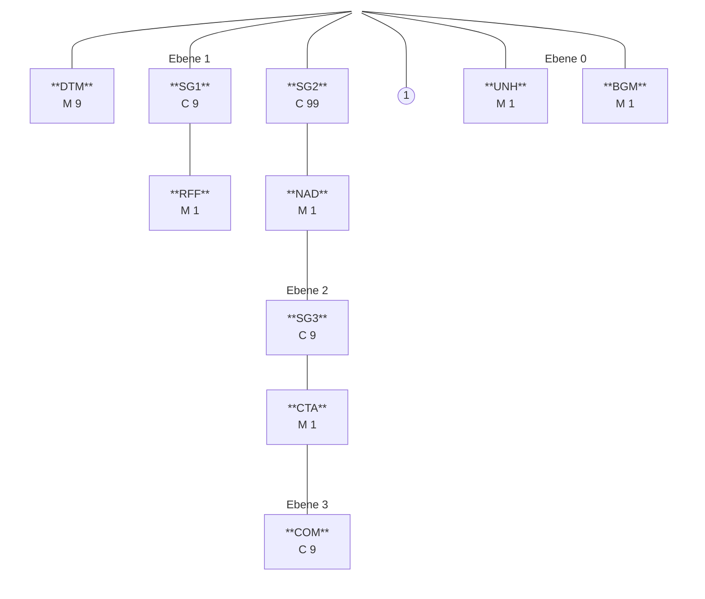
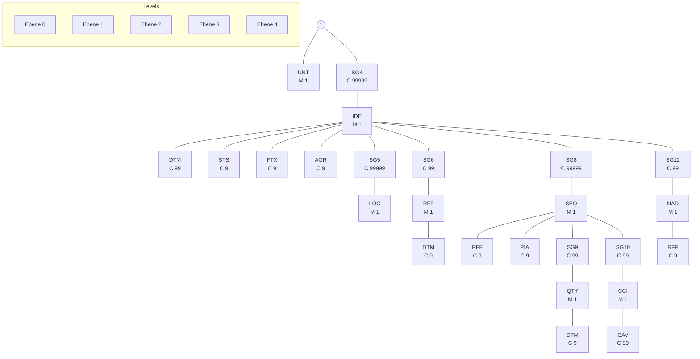

**Konsolidierte Lesefassung mit Fehlerkorrekturen**
**Stand: 02.03.2026**

# UTILMD- Nachrichtenbeschreibung Strom

auf Basis

**UTILMD**
Netzanschluss-Stammdaten

**UN D.11A S3**

**Version:** S2.1
**Ursprüngliches Publikationsdatum:** 01.04.2024
**Autor:** BDEW

Nachrichtenstruktur 3
Diagramm 24
Segmentlayout 26
Änderungshistorie 570

UTILMD- MIG
Strom


## <mark><font color="#C00000">Disclaimer</font></mark>

Die PDF-Datei ist das allein gültige Dokument.

Die zusätzlich veröffentlichte Word-Datei dient als informatorische Lesefassung und entspricht inhaltlich der PDF-Datei. Diese Word-Datei wird bis auf Weiteres rein informatorisch und ergänzend veröffentlicht unter dem Vorbehalt, zukünftig eine kostenpflichtige Veröffentlichung der Word-Datei einzuführen.

Zusätzlich werden zur PDF-Datei auch XML-Dateien als optionale Unterstützung gegen Entgelt veröffentlicht.

Version: S2.1 02.03.2026 Seite: 2 / 578

UTILMD- MIG
Strom


# Nachrichtenstruktur

|Zähler|Nr|Status<br/>Bez|MaxWdh<br/>Sta|BDEW|Sta|BDEW|Ebene|Inhalt|
|-|-|-|-|-|-|-|-|-|
|0010|00003|UNH|M|M|1|1|0|Nachrichten-Kopfsegment|
|0020|00004|BGM|M|M|1|1|0|Beginn der Nachricht|
|0030|00005|DTM|M|M|9|1|1|Nachrichtendatum|
|0030|00006|DTM|M|D|9|1|1|Gültigkeit, Beginndatum|
|0070||SG1|C|D|9|1|1|Referenz auf eine vorangegangene Anfrage|
|0080|00007|RFF|M|M|1|1|1|Referenz auf eine vorangegangene Anfrage|
|0100||SG2|C|R|99|1|1|MP-ID Absender|
|0110|00008|NAD|M|M|1|1|1|MP-ID Absender|
|0150||SG3|C|O|9|1|2|Kontaktinformationen|
|0160|00009|CTA|M|M|1|1|2|Ansprechpartner|
|0170|00010|COM|C|R|9|5|3|Kommunikationsverbindung|
|0100||SG2|C|R|99|1|1|MP-ID Empfänger|
|0110|00011|NAD|M|M|1|1|1|MP-ID Empfänger|
|0180||SG4|C|D|99999|1|1|Identifikation einer Liste|
|0190|00012|IDE|M|M|1|1|1|Identifikation einer Liste|
|0250|00013|STS|C|D|9|1|2|Status der Antwort|
|0320||SG5|C|D|999999|1|2|MaBiS-Zählpunkt|
|0330|00014|LOC|M|M|1|1|2|MaBiS-Zählpunkt|
|0350||SG6|C|R|99|1|2|Prüfidentifikator|
|0360|00015|RFF|M|M|1|1|2|Prüfidentifikator|
|0350||SG6|C|D|99|1|2|Referenz auf eine Liste|
|0360|00016|RFF|M|M|1|1|2|Referenzangaben|
|0410||SG8|C|D|99999|1|2|Daten der Summenzeitreihe|
|0420|00017|SEQ|M|M|1|1|2|Daten der Summenzeitreihe|
|0430|00018|RFF|C|D|9|1|3|Versionsangabe der Summenzeitreihe|
|0500||SG10|C|D|99|1|3|Bilanzkreis|
|0510|00019|CCI|M|R|1|1|3|Bilanzkreis|
|0180||SG4|C|D|99999|99999|1|Vorgangs-Identifikation|
|0190|00020|IDE|M|M|1|1|1|Vorgang|
|0230|00021|DTM|C|D|99|1|2|Datum zum geplanten Leistungsbeginn|
|0230|00022|DTM|C|D|99|1|2|Datum und Uhrzeit der Übergabe|
|0230|00023|DTM|C|D|99|1|2|Beginn zum|
|0230|00024|DTM|C|D|99|1|2|Ende zum|
|0230|00025|DTM|C|D|99|1|2|Datum des bereits bestätigten Vertragsendes|
|0230|00026|DTM|C|D|99|1|2|Änderung zum, Gültigkeit, Beginndatum|
|0230|00027|DTM|C|D|99|1|2|Ende zum (nächstmöglichen Termin)|
|0230|00028|DTM|C|D|99|1|2|Bilanzierungsbeginn|
|0230|00029|DTM|C|D|99|1|2|Bilanzierungsende|
|0230|00030|DTM|C|D|99|1|2|ÜT der Lieferanmeldung des LFN|
|0230|00031|DTM|C|D|99|1|2|Kündigungsfrist des Vertrags|
|0230|00032|DTM|C|D|99|1|2|Kündigungstermin des Vertrags|


Bez = Segment-/Gruppen-Bezeichner
Zähler = Nummer der Segmente/Gruppen im Standard
Nr = Laufende Segmentnummer im Guide
MaxWdh = Maximale Wiederholung der Segmente/Gruppen

Sta = Standard UN/CEFACT
EDIFACT: M=Muss/Mandatory, C=Conditional
Anwendung: R=Erforderlich/Required, O=Optional, D=Abhängig von/Dependent, N=Nicht benutzt/Not used

Version: S2.1 | 02.03.2026 | Seite: 3 / 578

UTILMD- MIG
Strom


# Nachrichtenstruktur

|Zähler|Nr|Status<br/>Bez|MaxWdh<br/>Sta|BDEW|Sta|BDEW|Ebene|Inhalt|
|-|-|-|-|-|-|-|-|-|
|0230|00033|DTM|C|D|99|1|2|Lieferbeginndatum in Bearbeitung|
|0230|00034|DTM|C|D|99|1|2|Datum für nächste Bearbeitung|
|0230|00035|DTM|C|D|99|1|2|Geräteausbaudatum|
|0250|00036|STS|C|D|9|1|2|Transaktionsgrund / Ergänzung /<br/>Transaktionsgrund befristete Anmeldung|
|0250|00037|STS|C|D|9|9|2|Status der Antwort|
|0250|00038|STS|C|D|9|9|2|Status der Antwort des dritten Marktbeteiligten|
|0280|00039|FTX|C|D|9|1|2|Bemerkung (Feld für allgemeine Hinweise)|
|0280|00040|FTX|C|D|9|1|2|Profilbeschreibung|
|0280|00041|FTX|C|D|9|1|2|Zieladresse URI|
|0280|00042|FTX|C|D|9|1|2|IP-Adresse des Absenders|
|0280|00043|FTX|C|D|9|1|2|IP-Range des Absenders|
|0280|00044|FTX|C|D|9|1|2|Zertifikatsaussteller (Issuer)|
|0280|00045|FTX|C|D|9|1|2|Zertifikatsnutzer (Subject)|
|0280|00046|FTX|C|D|9|1|2|IP-Adresse für das CLS-Device|
|0280|00047|FTX|C|D|9|1|2|Link zur Abtretungserklärung / Vollmacht vom<br/>Kunden|
|0290|00048|AGR|C|D|9|2|2|Beauftragung oder Beendigung liegt vor|
|0320||SG5|C|D|999999|999999|2|Netzlokation|
|0330|00049|LOC|M|M|1|1|2|Netzlokation|
|0320||SG5|C|D|999999|999999|2|Marktlokation|
|0330|00050|LOC|M|M|1|1|2|Marktlokation|
|0320||SG5|C|D|999999|999999|2|Ruhende Marktlokation|
|0330|00051|LOC|M|M|1|1|2|Ruhende Marktlokation|
|0320||SG5|C|D|999999|999999|2|Technische Ressource|
|0330|00052|LOC|M|M|1|1|2|Technische Ressource|
|0320||SG5|C|D|999999|999999|2|Steuerbare Ressource|
|0330|00053|LOC|M|M|1|1|2|Steuerbare Ressource|
|0320||SG5|C|D|999999|999999|2|Tranche|
|0330|00054|LOC|M|M|1|1|2|Tranche|
|0320||SG5|C|D|999999|999999|2|Messlokation|
|0330|00055|LOC|M|M|1|1|2|Messlokation|
|0320||SG5|C|D|999999|999999|2|MaBiS-Zählpunkt|
|0330|00056|LOC|M|M|1|1|2|MaBiS-Zählpunkt|
|0350||SG6|C|D|99|1|2|Prüfidentifikator|
|0360|00057|RFF|M|M|1|1|2|Prüfidentifikator|
|0350||SG6|C|D|99|1|2|Referenz Vorgangsnummer (aus Anfragenachricht)|
|0360|00058|RFF|M|M|1|1|2|Referenz Vorgangsnummer (aus Anfragenachricht)|
|0350||SG6|C|D|99|1|2|Referenz auf zu stornierende Vorgangsnummer|
|0360|00059|RFF|M|M|1|1|2|Referenz auf zu stornierende Vorgangsnummer|
|0350||SG6|C|D|99|1|2|Referenz auf eine vorangegangene Anfrage|


Bez = Segment-/Gruppen-Bezeichner
Zähler = Nummer der Segmente/Gruppen im Standard
Nr = Laufende Segmentnummer im Guide
MaxWdh = Maximale Wiederholung der Segmente/Gruppen
Sta = Standard UN/CEFACT
EDIFACT: M=Muss/Mandatory, C=Conditional
Anwendung: R=Erforderlich/Required, O=Optional, D=Abhängig von/Dependent, N=Nicht benutzt/Not used
Version: S2.1 02.03.2026 Seite: 4 / 578

UTILMD- MIG
Strom


# Nachrichtenstruktur

|Zähler|Nr|Status<br/>Bez|MaxWdh<br/>Sta|BDEW|Sta|BDEW|Ebene|Inhalt|
|-|-|-|-|-|-|-|-|-|
|0360|00060|RFF|M|M|1|1|2|Referenz auf eine vorangegangene Anfrage|
|0350||SG6|C|D|99|1|2|Referenznummer der Nachricht der betroffenen Antwort auf Bestellung|
|0360|00061|RFF|M|M|1|1|2|Referenznummer der Nachricht der betroffenen Antwort auf Bestellung|
|0350||SG6|C|D|99|99|2|Referenznummer des Vorgangs der betroffenen Antwort auf Bestellung|
|0360|00062|RFF|M|M|1|1|2|Referenznummer des Vorgangs der betroffenen Antwort auf Bestellung|
|0350||SG6|C|D|99|1|2|Informativ zur Umsetzung geplantes Produktpaket|
|0360|00063|RFF|M|M|1|1|2|Informativ zur Umsetzung geplantes Produktpaket|
|0350||SG6|C|D|99|1|2|Prozessual ausgetauschte Termine aus Sicht der beteiligten Marktrolle|
|0360|00064|RFF|M|M|1|1|2|Referenz auf die Marktlokation / Tranche|
|0370|00065|DTM|C|D|9|1|3|Bilanzierungsbeginn aus Daten der beteiligten Marktrolle|
|0370|00066|DTM|C|D|9|1|3|Bilanzierungsende aus Daten der beteiligten Marktrolle|
|0350||SG6|C|D|99|99|2|Verwendungszeitraum der Daten|
|0360|00067|RFF|M|M|1|1|2|Verwendungszeitraum der Daten|
|0370|00068|DTM|C|D|9|1|3|Verwendung der Daten ab|
|0370|00069|DTM|C|D|9|1|3|Verwendung der Daten bis|
|0350||SG6|C|D|99|99|2|Termine der Marktlokation|
|0360|00070|RFF|M|M|1|1|2|Termine der Marktlokation|
|0370|00071|DTM|C|D|9|1|3|Turnusablesung des MSB|
|0370|00072|DTM|C|D|9|1|3|Termin der Netznutzungsabrechnung|
|0370|00073|DTM|C|D|9|1|3|Nächste Netznutzungsabrechnung|
|0370|00074|DTM|C|D|9|1|3|Netznutzungsabrechnungsintervall des NB|
|0410||SG8|C|D|99999|99999|2|Referenz auf die Lokationsbündelstruktur|
|0420|00075|SEQ|M|M|1|1|2|Referenz auf die Lokationsbündelstruktur|
|0430|00076|RFF|C|R|9|1|3|Referenz auf die Lokationsbündelstruktur|
|0410||SG8|C|D|99999|99999|2|Zuordnung Lokation zum Objektcode des Lokationsbündels|
|0420|00077|SEQ|M|M|1|1|2|Zuordnung Lokation zum Objektcode des Lokationsbündels|
|0430|00078|RFF|C|R|9|1|3|Referenz auf die ID der Netzlokation / Marktlokation / Messlokation / Technischen Ressource|
|0430|00079|RFF|C|R|9|1|3|Referenz auf den Objektcode in der Lokationsbündelstruktur|
|0430|00080|RFF|C|D|9|9|3|Referenz auf die ID der vorgelagerten Netzlokation / Messlokation|
|0430|00081|RFF|C|D|9|2|3|Referenz auf die der Technischen Ressource zugeordneten Marktlokation|
|0410||SG8|C|D|99999|99999|2|Bestandteil eines Produktpakets|


Bez = Segment-/Gruppen-Bezeichner
Zähler = Nummer der Segmente/Gruppen im Standard
Nr = Laufende Segmentnummer im Guide
MaxWdh = Maximale Wiederholung der Segmente/Gruppen
Sta = Standard UN/CEFACT
EDIFACT: M=Muss/Mandatory, C=Conditional
Anwendung: R=Erforderlich/Required, O=Optional, D=Abhängig von/Dependent, N=Nicht benutzt/Not used
Version: S2.1 02.03.2026 Seite: 5 / 578

UTILMD- MIG
Strom


# Nachrichtenstruktur

|Zähler|Nr|Bez|Status Sta|Status BDEW|MaxWdh Sta|MaxWdh BDEW|Ebene|Inhalt|
|-|-|-|-|-|-|-|-|-|
|0420|00082|SEQ|M|M|1|1|2|Bestandteil eines Produktpakets|
|0440|00083|PIA|C|R|9|1|3|Erforderliches Produkt|
|0500||SG10|C|R|99|1|3|Produkteigenschaft|
|0510|00084|CCI|M|R|1|1|3|Produkteigenschaft|
|0520|00085|CAV|C|D|99|1|4|Code der Produkteigenschaft|
|0520|00086|CAV|C|D|99|1|4|Wetedetails zum Produkt|
|0410||SG8|C|D|99999|5|2|Priorisierung erforderliches Produktpaket|
|0420|00087|SEQ|M|M|1|1|2|Priorisierung erforderliches Produktpaket|
|0500||SG10|C|R|99|1|3|Priorisierung erforderliches Produktpaket|
|0510|00088|CCI|M|R|1|1|3|Umsetzungsgradvorgabe des Produktpakets|
|0520|00089|CAV|C|D|99|1|4|Priorisierung erforderliches Produktpaket|
|0410||SG8|C|D|99999|99999|2|Daten der Netzlokation|
|0420|00090|SEQ|M|M|1|1|2|Daten der Netzlokation|
|0430|00091|RFF|C|D|9|1|3|Referenz auf die ID der Netzlokation|
|0500||SG10|C|D|99|1|3|Steuerkanal|
|0510|00092|CCI|M|M|1|1|3|Steuerkanal|
|0500||SG10|C|D|99|1|3|Zugeordnete Marktpartner|
|0510|00093|CCI|M|M|1|1|3|Zugeordnete Marktpartner|
|0520|00094|CAV|C|R|99|1|4|Messstellenbetreiber|
|0410||SG8|C|D|99999|99999|2|Abrechnungsdaten der Netzlokation|
|0420|00095|SEQ|M|M|1|1|2|Abrechnungsdaten der Netzlokation|
|0440|00096|PIA|C|D|9|1|3|Artikel-ID|
|0500||SG10|C|D|99|1|3|Abrechnung Blindarbeit|
|0510|00097|CCI|M|M|1|1|3|Abrechnung Blindarbeit|
|0520|00098|CAV|C|D|99|1|4|Zahler der Blindarbeit|
|0500||SG10|C|D|99|1|3|Zahlung der Blindarbeit durch Lieferanten|
|0510|00099|CCI|M|M|1|1|3|Zahlung der Blindarbeit durch Lieferanten|
|0410||SG8|C|D|99999|99999|2|OBIS-Daten der Netzlokation|
|0420|00100|SEQ|M|M|1|1|2|OBIS-Daten der Netzlokation|
|0430|00101|RFF|C|D|9|1|3|Referenz auf die ID der Netzlokation|
|0440|00102|PIA|C|R|9|1|3|OBIS-Kennzahl der Netzlokation|
|0500||SG10|C|D|99|1|3|Produkt-Daten für Netzbetreiber relevant|
|0510|00103|CCI|M|M|1|1|3|Produkt-Daten für Netzbetreiber relevant|
|0520|00104|CAV|C|R|99|1|4|Verwendungszweck der Werte|
|0500||SG10|C|D|99|1|3|Produkt-Daten für Lieferant relevant|
|0510|00105|CCI|M|M|1|1|3|Produkt-Daten für Lieferant relevant|
|0520|00106|CAV|C|R|99|2|4|Verwendungszweck der Werte|
|0410||SG8|C|D|99999|99999|2|Produkt-Daten der Netzlokation|
|0420|00107|SEQ|M|M|1|1|2|Produkt-Daten der Netzlokation|
|0430|00108|RFF|C|D|9|1|3|Referenz auf die ID der Netzlokation|
|0440|00109|PIA|C|D|9|1|3|Produkt-Daten der Netzlokation|


Bez = Segment-/Gruppen-Bezeichner
Zähler = Nummer der Segmente/Gruppen im Standard
Nr = Laufende Segmentnummer im Guide
MaxWdh = Maximale Wiederholung der Segmente/Gruppen
Sta = Standard UN/CEFACT
EDIFACT: M=Muss/Mandatory, C=Conditional
Anwendung: R=Erforderlich/Required, O=Optional, D=Abhängig von/Dependent, N=Nicht benutzt/Not used
Version: S2.1 02.03.2026 Seite: 6 / 578

UTILMD- MIG
Strom


# Nachrichtenstruktur

|Zähler|Nr|Bez|Status<br/>Sta|Status<br/>BDEW|MaxWdh<br/>Sta|MaxWdh<br/>BDEW|Ebene|Inhalt|
|-|-|-|-|-|-|-|-|-|
|0500||SG10|C|D|99|1|3|Details zum Produkt der Netzlokation|
|0510|00110|CCI|M|M|1|1|3|Details zum Produkt der Netzlokation|
|0500||SG10|C|D|99|1|3|Zugeordnete Leistungskurvendefinition|
|0510|00111|CCI|M|M|1|1|3|Zugeordnete Leistungskurvendefinition|
|0500||SG10|C|D|99|1|3|Auftraggebender Marktpartner|
|0510|00112|CCI|M|M|1|1|3|Auftraggebender Marktpartner|
|0520|00113|CAV|C|D|99|1|4|Auftraggebender Marktpartner|
|0500||SG10|C|D|99|2|3|Produkt-Daten für Marktrolle relevant|
|0510|00114|CCI|M|M|1|1|3|Produkt-Daten für Marktrolle relevant|
|0410||SG8|C|D|99999|99999|2|Daten der Marktlokation|
|0420|00115|SEQ|M|M|1|1|2|Daten der Marktlokation|
|0430|00116|RFF|C|D|9|1|3|Referenz auf die ID der Marktlokation|
|0450||SG9|C|D|99|1|3|Arbeit / Leistung für tagesparameterabhängige<br/>Marktlokation|
|0460|00117|QTY|M|M|1|1|3|Arbeit / Leistung für tagesparameterabhängige<br/>Marktlokation|
|0450||SG9|C|D|99|1|3|Veranschlagte Jahresmenge gesamt|
|0460|00118|QTY|M|M|1|1|3|Veranschlagte Jahresmenge gesamt|
|0450||SG9|C|D|99|1|3|Tatsächlich bilanzierte Energiemenge|
|0460|00119|QTY|M|M|1|1|3|Tatsächlich bilanzierte Energiemenge|
|0450||SG9|C|D|99|1|3|Tatsächlich bilanzierte Ausfallarbeit|
|0460|00120|QTY|M|M|1|1|3|Tatsächlich bilanzierte Ausfallarbeit|
|0450||SG9|C|D|99|1|3|Vorjahresverbrauch vom Lieferant|
|0460|00121|QTY|M|M|1|1|3|Vorjahresverbrauch vom Lieferant|
|0500||SG10|C|D|99|1|3|Lieferrichtung|
|0510|00122|CCI|M|M|1|1|3|Lieferrichtung|
|0500||SG10|C|D|99|1|3|Zugeordnete Marktpartner|
|0510|00123|CCI|M|M|1|1|3|Zugeordnete Marktpartner|
|0520|00124|CAV|C|D|99|1|4|Lieferant|
|0520|00125|CAV|C|D|99|1|4|Übertragungsnetzbetreiber|
|0520|00126|CAV|C|D|99|1|4|Messstellenbetreiber|
|0500||SG10|C|D|99|1|3|Regelzone|
|0510|00127|CCI|M|M|1|1|3|Regelzone|
|0500||SG10|C|D|99|1|3|Bilanzkreis|
|0510|00128|CCI|M|M|1|1|3|Bilanzkreis|
|0500||SG10|C|D|99|1|3|Bilanzierungsgebiet|
|0510|00129|CCI|M|M|1|1|3|Bilanzierungsgebiet|
|0500||SG10|C|D|99|1|3|Verbrauchsaufteilung für temperaturabhängige<br/>Marktlokation|
|0510|00130|CCI|M|M|1|1|3|Verbrauchsaufteilung für temperaturabhängige<br/>Marktlokation|


Bez = Segment-/Gruppen-Bezeichner
Zähler = Nummer der Segmente/Gruppen im Standard
Nr = Laufende Segmentnummer im Guide
MaxWdh = Maximale Wiederholung der Segmente/Gruppen
Sta = Standard UN/CEFACT
EDIFACT: M=Muss/Mandatory, C=Conditional
Anwendung: R=Erforderlich/Required, O=Optional, D=Abhängig von/Dependent, N=Nicht benutzt/Not used
Version: S2.1 02.03.2026 Seite: 7 / 578

UTILMD- MIG
Strom


# Nachrichtenstruktur

|Zähler|Nr|Status<br/>Bez|MaxWdh<br/>Sta|BDEW|Sta|BDEW|Ebene|Inhalt|
|-|-|-|-|-|-|-|-|-|
|0520|00131|\*\*CAV\*\*|C|\*\*R\*\*|99|\*\*1\*\*|4|Verbrauchsaufteilung für temperaturabhängige Marktlokation|
|0500||\*\*SG10\*\*|C|\*\*D\*\*|99|\*\*2\*\*|3|Zeitreihentyp|
|0510|00132|\*\*CCI\*\*|M|\*\*M\*\*|1|\*\*1\*\*|3|Zeitreihentyp|
|0520|00133|\*\*CAV\*\*|C|\*\*R\*\*|99|\*\*1\*\*|4|Zeitreihentyp|
|0500||\*\*SG10\*\*|C|\*\*D\*\*|99|\*\*1\*\*|3|Spannungsebene der Marktlokation|
|0510|00134|\*\*CCI\*\*|M|\*\*M\*\*|1|\*\*1\*\*|3|Spannungsebene der Marktlokation|
|0520|00135|\*\*CAV\*\*|C|\*\*R\*\*|99|\*\*1\*\*|4|Spannungsebene der Marktlokation|
|0520|00136|\*\*CAV\*\*|C|\*\*D\*\*|99|\*\*1\*\*|4|Umspannung der Marktlokation|
|0500||\*\*SG10\*\*|C|\*\*D\*\*|99|\*\*1\*\*|3|Messtechnische Einordnung der Marktlokation|
|0510|00137|\*\*CCI\*\*|M|\*\*M\*\*|1|\*\*1\*\*|3|Messtechnische Einordnung der Marktlokation|
|0520|00138|\*\*CAV\*\*|C|\*\*R\*\*|99|\*\*1\*\*|4|Messtechnische Einordnung der Marktlokation|
|0500||\*\*SG10\*\*|C|\*\*D\*\*|99|\*\*1\*\*|3|Aggregationsverantwortung in MaBiS|
|0510|00139|\*\*CCI\*\*|M|\*\*M\*\*|1|\*\*1\*\*|3|Aggregationsverantwortung in MaBiS|
|0500||\*\*SG10\*\*|C|\*\*D\*\*|99|\*\*1\*\*|3|Bereits ausgetauschte Aggregationsverantwortung in MaBiS|
|0510|00140|\*\*CCI\*\*|M|\*\*M\*\*|1|\*\*1\*\*|3|Bereits ausgetauschte Aggregationsverantwortung in MaBiS|
|0500||\*\*SG10\*\*|C|\*\*D\*\*|99|\*\*1\*\*|3|Prognosegrundlage der Marktlokation|
|0510|00141|\*\*CCI\*\*|M|\*\*M\*\*|1|\*\*1\*\*|3|Prognosegrundlage der Marktlokation|
|0520|00142|\*\*CAV\*\*|C|\*\*D\*\*|99|\*\*2\*\*|4|Details der Prognosegrundlage|
|0500||\*\*SG10\*\*|C|\*\*D\*\*|99|\*\*1\*\*|3|Art der erzeugenden Marktlokation|
|0510|00143|\*\*CCI\*\*|M|\*\*M\*\*|1|\*\*1\*\*|3|Art der erzeugenden Marktlokation|
|0520|00144|\*\*CAV\*\*|C|\*\*R\*\*|99|\*\*1\*\*|4|Art der erzeugenden Marktlokation|
|0500||\*\*SG10\*\*|C|\*\*D\*\*|99|\*\*1\*\*|3|Gruppenzuordnung (nach EnWG)|
|0510|00145|\*\*CCI\*\*|M|\*\*M\*\*|1|\*\*1\*\*|3|Gruppenzuordnung (nach EnWG)|
|0500||\*\*SG10\*\*|C|\*\*D\*\*|99|\*\*1\*\*|3|Netznutzung|
|0510|00146|\*\*CCI\*\*|M|\*\*M\*\*|1|\*\*1\*\*|3|Netznutzung|
|0520|00147|\*\*CAV\*\*|C|\*\*R\*\*|99|\*\*1\*\*|4|Netznutzungsvertrag|
|0520|00148|\*\*CAV\*\*|C|\*\*D\*\*|99|\*\*1\*\*|4|Zahlung der Netznutzung|
|0520|00149|\*\*CAV\*\*|C|\*\*D\*\*|99|\*\*1\*\*|4|Grundlage der Lieferscheinprüfung|
|0500||\*\*SG10\*\*|C|\*\*D\*\*|99|\*\*1\*\*|3|Empfänger der Vergütung zur Einspeisung|
|0510|00150|\*\*CCI\*\*|M|\*\*M\*\*|1|\*\*1\*\*|3|Empfänger der Vergütung zur Einspeisung|
|0520|00151|\*\*CAV\*\*|C|\*\*R\*\*|99|\*\*1\*\*|4|Empfänger der Vergütung zur Einspeisung|
|0500||\*\*SG10\*\*|C|\*\*D\*\*|99|\*\*1\*\*|3|Veräußerungsform der erzeugenden Marktlokation|
|0510|00152|\*\*CCI\*\*|M|\*\*M\*\*|1|\*\*1\*\*|3|Veräußerungsform der erzeugenden Marktlokation|
|0500||\*\*SG10\*\*|C|\*\*D\*\*|99|\*\*1\*\*|3|Land der Förderung|
|0510|00153|\*\*CCI\*\*|M|\*\*M\*\*|1|\*\*1\*\*|3|Land der Förderung|
|0500||\*\*SG10\*\*|C|\*\*D\*\*|99|\*\*1\*\*|3|Status der Fernsteuerbarkeit|
|0510|00154|\*\*CCI\*\*|M|\*\*M\*\*|1|\*\*1\*\*|3|Status der Fernsteuerbarkeit|
|0500||\*\*SG10\*\*|C|\*\*D\*\*|99|\*\*1\*\*|3|Versorgungsart der Marktlokation|
|0510|00155|\*\*CCI\*\*|M|\*\*M\*\*|1|\*\*1\*\*|3|Versorgungsart der Marktlokation|


Bez = Segment-/Gruppen-Bezeichner
Zähler = Nummer der Segmente/Gruppen im Standard
Nr = Laufende Segmentnummer im Guide
MaxWdh = Maximale Wiederholung der Segmente/Gruppen
Sta = Standard UN/CEFACT
EDIFACT: M=Muss/Mandatory, C=Conditional
Anwendung: R=Erforderlich/Required, O=Optional, D=Abhängig von/Dependent, N=Nicht benutzt/Not used
Version: S2.1 | 02.03.2026 | Seite: 8 / 578

UTILMD- MIG
Strom


# Nachrichtenstruktur

|Zähler|Nr|Bez|Status Sta|Status BDEW|MaxWdh Sta|MaxWdh BDEW|Ebene|Inhalt|
|-|-|-|-|-|-|-|-|-|
|0500||SG10|C|D|99|1|3|Betriebszustand der Marktlokation|
|0510|00156|CCI|M|M|1|1|3|Betriebszustand der Marktlokation|
|0500||SG10|C|D|99|1|3|Abwicklungsmodell|
|0510|00157|CCI|M|M|1|1|3|Abwicklungsmodell|
|0500||SG10|C|D|99|1|3|Paket-ID|
|0510|00158|CCI|M|M|1|1|3|Paket-ID|
|0410||SG8|C|D|99999|1|2|Daten der Marktlokation der beteiligten<br/>Marktrolle|
|0420|00159|SEQ|M|M|1|1|2|Daten der Marktlokation der beteiligten Marktrolle|
|0430|00160|RFF|C|R|9|1|3|Referenz auf die ID der Marktlokation|
|0450||SG9|C|D|99|1|3|Veranschlagte Jahresmenge gesamt|
|0460|00161|QTY|M|M|1|1|3|Veranschlagte Jahresmenge gesamt|
|0450||SG9|C|D|99|1|3|Tatsächlich bilanzierte Energiemenge|
|0460|00162|QTY|M|M|1|1|3|Tatsächlich bilanzierte Energiemenge|
|0500||SG10|C|D|99|1|3|Regelzone|
|0510|00163|CCI|M|M|1|1|3|Regelzone|
|0500||SG10|C|D|99|1|3|Bilanzkreis|
|0510|00164|CCI|M|M|1|1|3|Bilanzkreis|
|0500||SG10|C|D|99|1|3|Bilanzierungsgebiet|
|0510|00165|CCI|M|M|1|1|3|Bilanzierungsgebiet|
|0500||SG10|C|D|99|2|3|Zeitreihentyp|
|0510|00166|CCI|M|M|1|1|3|Zeitreihentyp|
|0520|00167|CAV|C|R|99|1|4|Zeitreihentyp|
|0500||SG10|C|D|99|1|3|Aggregationsverantwortung in MaBiS|
|0510|00168|CCI|M|M|1|1|3|Aggregationsverantwortung in MaBiS|
|0500||SG10|C|D|99|1|3|Prognosegrundlage der Marktlokation|
|0510|00169|CCI|M|M|1|1|3|Prognosegrundlage der Marktlokation|
|0520|00170|CAV|C|D|99|2|4|Details der Prognosegrundlage|
|0410||SG8|C|D|99999|99999|2|Netznutzungsabrechnungsdaten der Marktlokation|
|0420|00171|SEQ|M|M|1|1|2|Netznutzungsabrechnungsdaten der Marktlokation|
|0440|00172|PIA|C|D|9|1|3|Gruppenartikel-ID / Artikel-ID|
|0450||SG9|C|D|99|1|3|Anzahl in der NNA abzurechenden Positionen der<br/>Gruppenartikel-ID / Artikel-ID|
|0460|00173|QTY|M|M|1|1|3|Anzahl in der NNA abzurechenden Positionen der<br/>Gruppenartikel-ID / Artikel-ID|
|0450||SG9|C|R|99|1|3|Gemeinderabatt|
|0460|00174|QTY|M|M|1|1|3|Gemeinderabatt|
|0450||SG9|C|R|99|1|3|Zuschlag oder Abschlag|
|0460|00175|QTY|M|M|1|1|3|Zuschlag oder Abschlag|
|0450||SG9|C|D|99|1|3|Daten der Singulär genutzten Betriebsmittel|
|0460|00176|QTY|M|M|1|1|3|Menge der Singulär genutzten Betriebsmittel|
|0500||SG10|C|D|99|1|3|Preisangabe für Singulär genutzte Betriebsmittel|


Bez = Segment-/Gruppen-Bezeichner
Zähler = Nummer der Segmente/Gruppen im Standard
Nr = Laufende Segmentnummer im Guide
MaxWdh = Maximale Wiederholung der Segmente/Gruppen
Sta = Standard UN/CEFACT
EDIFACT: M=Muss/Mandatory, C=Conditional
Anwendung: R=Erforderlich/Required, O=Optional, D=Abhängig von/Dependent, N=Nicht benutzt/Not used
Version: S2.1 | 02.03.2026 | Seite: 9 / 578

UTILMD- MIG
Strom


# Nachrichtenstruktur

|Zähler|Nr|Bez|Status<br/>Sta|Status<br/>BDEW|MaxWdh<br/>Sta|MaxWdh<br/>BDEW|Ebene|Inhalt|
|-|-|-|-|-|-|-|-|-|
|0510|00177|CCI|M|M|1|1|3|Preisangabe für Singulär genutzte Betriebsmittel|
|0500||SG10|C|D|99|1|3|Zugeordnete Zählzeitdefinition|
|0510|00178|CCI|M|M|1|1|3|Zugeordnete Zählzeitdefinition|
|0500||SG10|C|D|99|99|3|Zugeordnetes Zählzeitregister|
|0510|00179|CCI|M|M|1|1|3|Zugeordnetes Zählzeitregister|
|0500||SG10|C|D|99|1|3|Zugeordnete Marktpartner|
|0510|00180|CCI|M|M|1|1|3|Zugeordnete Marktpartner|
|0520|00181|CAV|C|R|99|1|4|Netzbetreiber|
|0410||SG8|C|D|99999|99999|2|Messstellenbetriebsabrechnungsdaten der<br/>Marktlokation|
|0420|00182|SEQ|M|M|1|1|2|Messstellenbetriebsabrechnungsdaten der<br/>Marktlokation|
|0440|00183|PIA|C|R|9|1|3|Gruppenartikel-ID / Artikel-ID|
|0450||SG9|C|D|99|1|3|Anzahl in der Messstellenbetriebsabrechnung<br/>abzurechenden Positionen der Gruppenartikel-ID /<br/>Artikel-ID|
|0460|00184|QTY|M|M|1|1|3|Anzahl in der Messstellenbetriebsabrechnung<br/>abzurechenden Positionen der Gruppenartikel-ID /<br/>Artikel-ID|
|0450||SG9|C|D|99|1|3|Abschlag|
|0460|00185|QTY|M|M|1|1|3|Abschlag|
|0410||SG8|C|D|99999|99999|2|Erforderliches Messprodukt der Marktlokation|
|0420|00186|SEQ|M|M|1|1|2|Erforderliches Messprodukt der Marktlokation|
|0430|00187|RFF|C|R|9|1|3|Referenz auf die ID der Marktlokation|
|0440|00188|PIA|C|R|9|1|3|Erforderliches Messprodukt der Marktlokation|
|0500||SG10|C|D|99|1|3|Zugeordnete Zählzeitdefinition|
|0510|00189|CCI|M|M|1|1|3|Zugeordnete Zählzeitdefinition|
|0500||SG10|C|D|99|1|3|Messprodukt für Netzbetreiber relevant|
|0510|00190|CCI|M|M|1|1|3|Messprodukt für Netzbetreiber relevant|
|0520|00191|CAV|C|R|99|2|4|Verwendungszweck des Wertes|
|0500||SG10|C|D|99|1|3|Messprodukt für Lieferant relevant|
|0510|00192|CCI|M|M|1|1|3|Messprodukt für Lieferant relevant|
|0520|00193|CAV|C|R|99|3|4|Verwendungszweck des Wertes|
|0500||SG10|C|D|99|1|3|Messprodukt für Übertragungsnetzbetreiber<br/>relevant|
|0510|00194|CCI|M|M|1|1|3|Messprodukt für Übertragungsnetzbetreiber<br/>relevant|
|0520|00195|CAV|C|R|99|2|4|Verwendungszweck des Wertes|
|0410||SG8|C|D|99999|99999|2|OBIS-Daten der Marktlokation|
|0420|00196|SEQ|M|M|1|1|2|OBIS-Daten der Marktlokation|
|0430|00197|RFF|C|D|9|1|3|Referenz auf die ID der Marktlokation|
|0440|00198|PIA|C|R|9|1|3|OBIS-Kennzahl der Marktlokation|
|0500||SG10|C|D|99|1|3|Wertegranularität|


Bez = Segment-/Gruppen-Bezeichner
Zähler = Nummer der Segmente/Gruppen im Standard
Nr = Laufende Segmentnummer im Guide
MaxWdh = Maximale Wiederholung der Segmente/Gruppen
Sta = Standard UN/CEFACT
EDIFACT: M=Muss/Mandatory, C=Conditional
Anwendung: R=Erforderlich/Required, O=Optional, D=Abhängig von/Dependent, N=Nicht benutzt/Not used
Version: S2.1 02.03.2026 Seite: 10 / 578

UTILMD- MIG
Strom


# Nachrichtenstruktur

|Zähler|Nr|Bez|Status<br/>Sta|Status<br/>BDEW|MaxWdh<br/>Sta|MaxWdh<br/>BDEW|Ebene|Inhalt|
|-|-|-|-|-|-|-|-|-|
|0510|00199|CCI|M|M|1|1|3|Wertegranularität|
|0520|00200|CAV|C|R|99|1|4|Wertegranularität|
|0500||SG10|C|D|99|1|3|Zugeordnete Zählzeitdefinition|
|0510|00201|CCI|M|M|1|1|3|Zugeordnete Zählzeitdefinition|
|0500||SG10|C|D|99|1|3|Zugeordnetes Zählzeitregister|
|0510|00202|CCI|M|M|1|1|3|Zugeordnetes Zählzeitregister|
|0500||SG10|C|D|99|1|3|OBIS Daten für Netzbetreiber relevant|
|0510|00203|CCI|M|M|1|1|3|OBIS Daten für Netzbetreiber relevant|
|0520|00204|CAV|C|R|99|2|4|Verwendungszweck der Werte|
|0500||SG10|C|D|99|1|3|OBIS Daten für Lieferant relevant|
|0510|00205|CCI|M|M|1|1|3|OBIS Daten für Lieferant relevant|
|0520|00206|CAV|C|R|99|3|4|Verwendungszweck der Werte|
|0500||SG10|C|D|99|1|3|OBIS Daten für Übertragungsnetzbetreiber relevant|
|0510|00207|CCI|M|M|1|1|3|OBIS Daten für Übertragungsnetzbetreiber relevant|
|0520|00208|CAV|C|R|99|2|4|Verwendungszweck der Werte|
|0410||SG8|C|D|99999|99999|2|Produkt-Daten der Marktlokation|
|0420|00209|SEQ|M|M|1|1|2|Produkt-Daten der Marktlokation|
|0430|00210|RFF|C|D|9|1|3|Referenz auf die ID der Marktlokation|
|0440|00211|PIA|C|D|9|1|3|Produkt-Daten der Marktlokation|
|0500||SG10|C|D|99|1|3|Details zum Produkt der Marktlokation|
|0510|00212|CCI|M|M|1|1|3|Details zum Produkt der Marktlokation|
|0500||SG10|C|D|99|1|3|Zugeordnete Definition|
|0510|00213|CCI|M|M|1|1|3|Zugeordnete Definition|
|0500||SG10|C|D|99|2|3|Produkt-Daten für Marktrolle relevant|
|0510|00214|CCI|M|M|1|1|3|Produkt-Daten für Marktrolle relevant|
|0410||SG8|C|D|99999|99999|2|Verbrauchsart und Nutzung der OBIS-Kennzahl der<br/>Marktlokation|
|0420|00215|SEQ|M|M|1|1|2|Verbrauchsart und Nutzung der OBIS-Kennzahl der<br/>Marktlokation|
|0430|00216|RFF|C|R|9|9|3|Referenz auf die OBIS-Kennzahl der Marktlokation|
|0500||SG10|C|R|99|1|3|Verbrauchsart und Nutzung der OBIS-Kennzahl|
|0510|00217|CCI|M|M|1|1|3|Verbrauchsart und Nutzung an der OBIS-Kennzahl<br/>der Marktlokation|
|0520|00218|CAV|C|R|99|5|4|Verbrauchsart|
|0520|00219|CAV|C|R|99|1|4|Unterbrechbarkeit|
|0520|00220|CAV|C|D|99|1|4|Wärme-/Kältenutzung|
|0520|00221|CAV|C|D|99|1|4|Art der E-Mobilität|
|0410||SG8|C|D|99999|99999|2|OBIS-Daten der Marktlokation der beteiligten<br/>Marktrolle|
|0420|00222|SEQ|M|M|1|1|2|OBIS-Daten der Marktlokation der beteiligten<br/>Marktrolle|
|0440|00223|PIA|C|R|9|1|3|OBIS-Kennzahl der Marktlokation|


Bez = Segment-/Gruppen-Bezeichner
Zähler = Nummer der Segmente/Gruppen im Standard
Nr = Laufende Segmentnummer im Guide
MaxWdh = Maximale Wiederholung der Segmente/Gruppen
Sta = Standard UN/CEFACT
EDIFACT: M=Muss/Mandatory, C=Conditional
Anwendung: R=Erforderlich/Required, O=Optional, D=Abhängig von/Dependent, N=Nicht benutzt/Not used
Version: S2.1 | 02.03.2026 | Seite: 11 / 578

UTILMD- MIG
Strom


# Nachrichtenstruktur

|Zähler|Nr|Bez|Status<br/>Sta|Status<br/>BDEW|MaxWdh<br/>Sta|MaxWdh<br/>BDEW|Ebene|Inhalt|
|-|-|-|-|-|-|-|-|-|
|0410||SG8|C|D|99999|99999|2|Produkt-Daten der Marktlokation des NB|
|0420|00224|SEQ|M|M|1|1|2|Produkt-Daten der Marktlokation des NB|
|0440|00225|PIA|C|D|9|1|3|Produktidentifikation der Marktlokation|
|0410||SG8|C|D|99999|99999|2|Daten der Tranche|
|0420|00226|SEQ|M|M|1|1|2|Daten der Tranche|
|0430|00227|RFF|C|D|9|1|3|Referenz auf die ID der Tranche|
|0430|00228|RFF|C|D|9|1|3|Referenz auf die Marktlokation der Tranche|
|0450||SG9|C|D|99|1|3|Tatsächlich bilanzierte Energiemenge|
|0460|00229|QTY|M|M|1|1|3|Tatsächlich bilanzierte Energiemenge|
|0450||SG9|C|D|99|1|3|Tranchengröße|
|0460|00230|QTY|M|M|1|1|3|Prozentualer Anteil der Tranche an der<br/>erzeugenden Marktlokation|
|0500||SG10|C|D|99|1|3|Zugeordnete Marktpartner|
|0510|00231|CCI|M|M|1|1|3|Zugeordnete Marktpartner|
|0520|00232|CAV|C|R|99|1|4|Lieferant|
|0500||SG10|C|D|99|1|3|Bilanzkreis|
|0510|00233|CCI|M|M|1|1|3|Bilanzkreis|
|0500||SG10|C|D|99|1|3|Empfänger der Vergütung zur Einspeisung|
|0510|00234|CCI|M|M|1|1|3|Empfänger der Vergütung zur Einspeisung|
|0520|00235|CAV|C|R|99|1|4|Empfänger der Vergütung zur Einspeisung|
|0500||SG10|C|D|99|1|3|Basis zur Bildung der Tranchengröße|
|0510|00236|CCI|M|M|1|1|3|Basis zur Bildung der Tranchengröße|
|0410||SG8|C|D|99999|99999|2|Daten der Tranche der beteiligten Marktrolle|
|0420|00237|SEQ|M|M|1|1|2|Daten der Tranche der beteiligten Marktrolle|
|0500||SG10|C|R|99|1|3|Bilanzkreis|
|0510|00238|CCI|M|M|1|1|3|Bilanzkreis|
|0410||SG8|C|D|99999|99999|2|Erforderliches Messprodukt der Tranche|
|0420|00239|SEQ|M|M|1|1|2|Erforderliches Messprodukt der Tranche|
|0430|00240|RFF|C|R|9|1|3|Referenz auf die ID der Tranche|
|0440|00241|PIA|C|R|9|1|3|Erforderliches Messprodukt der Tranche|
|0500||SG10|C|D|99|1|3|Messprodukt für Netzbetreiber relevant|
|0510|00242|CCI|M|M|1|1|3|Werte für Netzbetreiber relevant|
|0520|00243|CAV|C|R|99|2|4|Verwendungszweck der Werte|
|0500||SG10|C|D|99|1|3|Messprodukt für Lieferant relevant|
|0510|00244|CCI|M|M|1|1|3|Werte für Lieferant relevant|
|0520|00245|CAV|C|R|99|2|4|Verwendungszweck der Werte|
|0500||SG10|C|R|99|1|3|Messprodukt für Übertragungsnetzbetreiber<br/>relevant|
|0510|00246|CCI|M|M|1|1|3|Werte für Übertragungsnetzbetreiber relevant|
|0520|00247|CAV|C|R|99|2|4|Verwendungszweck der Werte|
|0410||SG8|C|D|99999|99999|2|OBIS-Daten der Tranche|


Bez = Segment-/Gruppen-Bezeichner
Zähler = Nummer der Segmente/Gruppen im Standard
Nr = Laufende Segmentnummer im Guide
MaxWdh = Maximale Wiederholung der Segmente/Gruppen
Sta = Standard UN/CEFACT
EDIFACT: M=Muss/Mandatory, C=Conditional
Anwendung: R=Erforderlich/Required, O=Optional, D=Abhängig von/Dependent, N=Nicht benutzt/Not used

Version: S2.1 02.03.2026 Seite: 12 / 578

UTILMD- MIG
Strom


# Nachrichtenstruktur

|Zähler|Nr|Bez|Sta|BDEW|Status<br/>Sta|BDEW|Ebene|MaxWdh<br/>Inhalt|||
|-|-|-|-|-|-|-|-|-|-|-|
|0420|00248|SEQ|M|M|1|1|2|OBIS-Daten der Tranche|||
|0430|00249|RFF|C|D|9|1|3|Referenz auf die ID einer Tranche|||
|0440|00250|PIA|C|R|9|1|3|OBIS-Kennzahl der Tranche|||
|0500||SG10|C|D|99|1|3|OBIS Daten für Netzbetreiber relevant|||
|0510|00251|CCI|M|M|1|1|3|OBIS Daten für Netzbetreiber relevant|||
|0520|00252|CAV|C|R|99|2|4|Verwendungszweck der Werte|||
|0500||SG10|C|D|99|1|3|OBIS Daten für Lieferant relevant|||
|0510|00253|CCI|M|M|1|1|3|OBIS Daten für Lieferant relevant|||
|0520|00254|CAV|C|R|99|2|4|Verwendungszweck der Werte|||
|0500||SG10|C|D|99|1|3|OBIS Daten für Übertragungsnetzbetreiber relevant|||
|0510|00255|CCI|M|M|1|1|3|OBIS Daten für Übertragungsnetzbetreiber relevant|||
|0520|00256|CAV|C|R|99|2|4|Verwendungszweck der Werte|||
|0410||SG8|C|D|99999|99999|2|OBIS-Daten der Tranche der beteiligten Marktrolle|||
|0420|00257|SEQ|M|M|1|1|2|OBIS-Daten der Tranche der beteiligten Marktrolle|||
|0440|00258|PIA|C|R|9|1|3|OBIS-Kennzahl der Tranche|||
|0410||SG8|C|D|99999|99999|2|Daten der Technischen Ressource|||
|0420|00259|SEQ|M|M|1|1|2|Daten der Technischen Ressource|||
|0430|00260|RFF|C|D|9|1|3|Referenz auf die ID der Technischen Ressource|||
|0430|00261|RFF|C|D|9|9|3|Referenz auf die ID der vorgelagerten<br/>Messlokation|||
|0430|00262|RFF|C|D|9|2|3|Referenz auf die der Technischen Ressource<br/>zugeordneten Marktlokation|||
|0430|00263|RFF|C|D|9|1|3|Referenz auf die der Technischen Ressource<br/>zugeordneten Steuerbaren Ressource|||
|0430|00264|RFF|C|D|9|1|3|Referenz auf die der Technischen Ressource<br/>zugeordneten Netzlokation|||
|0450||SG9|C|D|99|1|3|Nennleistung (Aufnahme)|||
|0460|00265|QTY|M|M|1|1|3|Nennleistung (Aufnahme)|||
|0450||SG9|C|D|99|1|3|Nennleistung (Abgabe)|||
|0460|00266|QTY|M|M|1|1|3|Nennleistung (Abgabe)|||
|0450||SG9|C|D|99|1|3|Speicherkapazität|||
|0460|00267|QTY|M|M|1|1|3|Speicherkapazität|||
|0500||SG10|C|R|99|1|3|Art und Nutzung der Technischen Ressource|||
|0510|00268|CCI|M|M|1|1|3|Art und Nutzung der Technischen Ressource|||
|0520|00269|CAV|C|D|99|5|4|Verbrauchsart|||
|0520|00270|CAV|C|D|99|1|4|Wärme-/Kältenutzung|||
|0520|00271|CAV|C|D|99|1|4|Art der E-Mobilität|||
|0520|00272|CAV|C|D|99|1|4|Erzeugungsart|||
|0520|00273|CAV|C|D|99|1|4|Speicherart|||
|0520|00274|CAV|C|D|99|1|4|Kategorie der verbrauchenden Technischen<br/>Ressource|||
|0520|00275|CAV|C|D|99|1|4|Inbetriebsetzungsdatum der verbrauchenden<br/>Technischen Ressource nach § 14a EnWG|||


Bez = Segment-/Gruppen-Bezeichner
Zähler = Nummer der Segmente/Gruppen im Standard
Nr = Laufende Segmentnummer im Guide
MaxWdh = Maximale Wiederholung der Segmente/Gruppen

Sta = Standard UN/CEFACT
EDIFACT: M=Muss/Mandatory, C=Conditional
Anwendung: R=Erforderlich/Required, O=Optional, D=Abhängig von/Dependent, N=Nicht benutzt/Not used

Version: S2.1
02.03.2026
Seite: 13 / 578

UTILMD- MIG
Strom


# Nachrichtenstruktur

|Zähler|Nr|Bez|Status Sta|Status BDEW|MaxWdh Sta|MaxWdh BDEW|Ebene|Inhalt|
|-|-|-|-|-|-|-|-|-|
|0520|00276|CAV|C|D|99|1|4|Einordnung der verbrauchenden Technischen<br/>Ressource nach § 14a EnWG mit Inbetriebsetzung<br/>vor 2024|
|0500||SG10|C|D|99|1|3|Information zu weiteren technischen<br/>Einrichtungen|
|0510|00277|CCI|M|M|1|1|3|Information zu weiteren technischen Einrichtungen|
|0520|00278|CAV|C|R|99|1|4|Information zu weiteren technischen Einrichtungen|
|0410||SG8|C|D|99999|99999|2|Daten der Steuerbaren Ressource|
|0420|00279|SEQ|M|M|1|1|2|Daten der Steuerbaren Ressource|
|0430|00280|RFF|C|D|9|1|3|Referenz auf die ID der Steuerbaren Ressource|
|0500||SG10|C|D|99|1|3|Steuerkanal|
|0510|00281|CCI|M|M|1|1|3|Steuerkanal|
|0520|00282|CAV|C|R|99|1|4|Leistungsbeschreibung des Steuerkanals|
|0500||SG10|C|D|99|1|3|Zugeordnete Marktpartner|
|0510|00283|CCI|M|M|1|1|3|Zugeordnete Marktpartner|
|0520|00284|CAV|C|R|99|1|4|Messstellenbetreiber|
|0410||SG8|C|D|99999|99999|2|Produkt-Daten der Steuerbaren Ressource|
|0420|00285|SEQ|M|M|1|1|2|Produkt-Daten der Steuerbaren Ressource|
|0430|00286|RFF|C|D|9|1|3|Referenz auf die ID der Steuerbaren Ressource|
|0440|00287|PIA|C|R|9|1|3|Produkt-Daten der Steuerbaren Ressource|
|0500||SG10|C|R|99|1|3|Zugeordnete Definition|
|0510|00288|CCI|M|M|1|1|3|Zugeordnete Definition|
|0500||SG10|C|D|99|1|3|Auftraggebender Marktpartner|
|0510|00289|CCI|M|M|1|1|3|Auftraggebender Marktpartner|
|0520|00290|CAV|C|D|99|1|4|Auftraggebender Marktpartner|
|0500||SG10|C|D|99|2|3|Produkt-Daten für Marktrolle relevant|
|0510|00291|CCI|M|M|1|1|3|Produkt-Daten für Marktrolle relevant|
|0410||SG8|C|D|99999|99999|2|Daten der Messlokation|
|0420|00292|SEQ|M|M|1|1|2|Daten der Messlokation|
|0430|00293|RFF|C|D|9|1|3|Referenz auf die ID der Messlokation|
|0430|00294|RFF|C|D|9|9|3|Referenz auf die der Messlokation zugeordneten<br/>Marktlokation|
|0430|00295|RFF|C|D|9|1|3|Abrechnung des Messstellenbetriebs über NNE|
|0500||SG10|C|D|99|1|3|Zugeordnete Marktpartner|
|0510|00296|CCI|M|M|1|1|3|Zugeordnete Marktpartner|
|0520|00297|CAV|C|D|99|1|4|Messstellenbetreiber|
|0520|00298|CAV|C|D|99|1|4|Grundzuständiger Messstellenbetreiber|
|0520|00299|CAV|C|D|99|1|4|Messstellenbetreiber Alt|
|0500||SG10|C|D|99|1|3|Spannungsebene der Messlokation|
|0510|00300|CCI|M|M|1|1|3|Spannungsebene der Messlokation|
|0520|00301|CAV|C|R|99|1|4|Spannungsebene der Messlokation|
|0500||SG10|C|D|99|1|3|Verwendungsumfang|


Bez = Segment-/Gruppen-Bezeichner
Zähler = Nummer der Segmente/Gruppen im Standard
Nr = Laufende Segmentnummer im Guide
MaxWdh = Maximale Wiederholung der Segmente/Gruppen

Sta = Standard UN/CEFACT
EDIFACT: M=Muss/Mandatory, C=Conditional
Anwendung: R=Erforderlich/Required, O=Optional, D=Abhängig von/Dependent, N=Nicht benutzt/Not used

Version: S2.1 02.03.2026 Seite: 14 / 578

UTILMD- MIG
Strom


# Nachrichtenstruktur

|Zähler|Nr|Bez|Status Sta|Status BDEW|MaxWdh Sta|MaxWdh BDEW|Ebene|Inhalt|
|-|-|-|-|-|-|-|-|-|
|0510|00302|CCI|M|M|1|1|3|Verwendungsumfang|
|0500||SG10|C|D|99|1|3|Betriebszustand der Messlokation|
|0510|00303|CCI|M|M|1|1|3|Betriebszustand der Messlokation|
|0410||SG8|C|D|99999|99999|2|Erforderliches Messprodukt der Messlokation|
|0420|00304|SEQ|M|M|1|1|2|Erforderliches Messprodukt der Messlokation|
|0430|00305|RFF|C|R|9|1|3|Referenz auf die ID einer Messlokation|
|0430|00306|RFF|C|D|9|9|3|Referenz auf die ID einer Marktlokation|
|0440|00307|PIA|C|R|9|1|3|Erforderliches Messprodukt der Messlokation|
|0500||SG10|C|R|99|1|3|Weitere Beschreibung erforderliches Messprodukt|
|0510|00308|CCI|M|M|1|1|3|Weitere Beschreibung erforderliches Messprodukt|
|0520|00309|CAV|C|R|99|1|4|Notwendigkeit einer zweiten Messung|
|0520|00310|CAV|C|R|99|1|4|Werteübermittlung an den NB aufgrund weiterem<br/>Verwendungszweck|
|0500||SG10|C|D|99|1|3|Zugeordnete Zählzeitdefinition|
|0510|00311|CCI|M|M|1|1|3|Zugeordnete Zählzeitdefinition|
|0410||SG8|C|D|99999|99999|2|Zähleinrichtungsdaten|
|0420|00312|SEQ|M|M|1|1|2|Zähleinrichtungsdaten|
|0430|00313|RFF|C|D|9|1|3|Referenz auf die ID einer Messlokation|
|0430|00314|RFF|C|D|9|1|3|Referenz auf das Smartmeter-Gateway|
|0500||SG10|C|D|99|1|3|Zähleinrichtung|
|0510|00315|CCI|M|M|1|1|3|Zählertyp|
|0520|00316|CAV|C|D|99|1|4|Zählertyp|
|0520|00317|CAV|C|R|99|1|4|Identifikation / Nummer des Gerätes|
|0520|00318|CAV|C|D|99|1|4|Registeranzahl|
|0520|00319|CAV|C|D|99|1|4|Energierichtung|
|0520|00320|CAV|C|D|99|1|4|Fernschaltung der Zähleinrichtung|
|0500||SG10|C|D|99|1|3|Befestigungsart|
|0510|00321|CCI|M|M|1|1|3|Befestigungsart Zähleinrichtung|
|0520|00322|CAV|C|R|99|1|4|Befestigungsart Zähleinrichtung|
|0500||SG10|C|D|99|1|3|Messwerterfassung an der Zähleinrichtung|
|0510|00323|CCI|M|M|1|1|3|Messwerterfassung an der Zähleinrichtung|
|0520|00324|CAV|C|R|99|1|4|Messwerterfassung an der Zähleinrichtung|
|0410||SG8|C|D|99999|99999|2|OBIS-Daten der Zähleinrichtung / Smartmeter-<br/>Gateway|
|0420|00325|SEQ|M|M|1|1|2|OBIS-Daten der Zähleinrichtung / Smartmeter-<br/>Gateway|
|0430|00326|RFF|C|R|9|1|3|Referenz auf die Gerätenummer|
|0430|00327|RFF|C|D|9|1|3|Referenz auf die ID einer Messlokation|
|0430|00328|RFF|C|D|9|9|3|Referenz auf die ID einer Marktlokation|
|0430|00329|RFF|C|D|9|1|3|Konfigurations-ID|
|0440|00330|PIA|C|R|9|1|3|OBIS-Kennzahl der Zähleinrichtung / Smartmeter-<br/>Gateway|


Bez = Segment-/Gruppen-Bezeichner
Zähler = Nummer der Segmente/Gruppen im Standard
Nr = Laufende Segmentnummer im Guide
MaxWdh = Maximale Wiederholung der Segmente/Gruppen
Sta = Standard UN/CEFACT
EDIFACT: M=Muss/Mandatory, C=Conditional
Anwendung: R=Erforderlich/Required, O=Optional, D=Abhängig von/Dependent, N=Nicht benutzt/Not used

Version: S2.1 02.03.2026 Seite: 15 / 578

UTILMD- MIG
Strom


# Nachrichtenstruktur

|Zähler|Nr|Bez|Status Sta|Status BDEW|MaxWdh Sta|MaxWdh BDEW|Ebene|Inhalt|
|-|-|-|-|-|-|-|-|-|
|0500||SG10|C|D|99|1|3|Wertegranularität|
|0510|00331|CCI|M|M|1|1|3|Wertegranularität|
|0520|00332|CAV|C|R|99|1|4|Wertegranularität|
|0500||SG10|C|D|99|1|3|Zugeordnete Zählzeitdefinition|
|0510|00333|CCI|M|M|1|1|3|Zugeordnete Zählzeitdefinition|
|0500||SG10|C|D|99|1|3|Zugeordnetes Zählzeitregister|
|0510|00334|CCI|M|M|1|1|3|Zugeordnetes Zählzeitregister|
|0500||SG10|C|D|99|1|3|Vor- und Nachkommastellen des Zählwerks|
|0510|00335|CCI|M|M|1|1|3|Vor- und Nachkommastellen des Zählwerks|
|0520|00336|CAV|C|R|99|1|4|Vor- und Nachkommastellen des Zählwerks|
|0500||SG10|C|D|99|1|3|Bezeichnung des Zählwerks auf dem Gerät|
|0510|00337|CCI|M|M|1|1|3|Bezeichnung des Zählwerks auf dem Gerät|
|0500||SG10|C|D|99|1|3|Schwachlastfähigkeit|
|0510|00338|CCI|M|M|1|1|3|Schwachlastfähigkeit|
|0410||SG8|C|D|99999|99999|2|Wandlerdaten|
|0420|00339|SEQ|M|M|1|1|2|Wandlerdaten|
|0430|00340|RFF|C|D|9|9|3|Referenz auf die Gerätenummer|
|0500||SG10|C|D|99|1|3|Wandler|
|0510|00341|CCI|M|M|1|1|3|Wandler|
|0520|00342|CAV|C|D|99|3|4|Identifikation / Nummer des Gerätes|
|0520|00343|CAV|C|D|99|1|4|Wandlertyp und Faktor|
|0410||SG8|C|D|99999|99999|2|Kommunikationseinrichtungsdaten|
|0420|00344|SEQ|M|M|1|1|2|Kommunikationseinrichtungsdaten|
|0430|00345|RFF|C|D|9|9|3|Referenz auf die Gerätenummer|
|0500||SG10|C|D|99|1|3|Kommunikationseinrichtung|
|0510|00346|CCI|M|M|1|1|3|Kommunikationseinrichtung|
|0520|00347|CAV|C|R|99|1|4|Identifikation / Nummer des Gerätes|
|0520|00348|CAV|C|D|99|1|4|Kommunikationseinrichtungstyp|
|0410||SG8|C|D|99999|99999|2|Daten der technischen Steuereinrichtung|
|0420|00349|SEQ|M|M|1|1|2|Daten der technischen Steuereinrichtung|
|0430|00350|RFF|C|D|9|9|3|Referenz auf die Gerätenummer|
|0500||SG10|C|D|99|1|3|Technische Steuereinrichtung|
|0510|00351|CCI|M|M|1|1|3|Technische Steuereinrichtung|
|0520|00352|CAV|C|R|99|1|4|Identifikation / Nummer des Gerätes|
|0520|00353|CAV|C|D|99|1|4|Technische Steuereinrichtungstyp|
|0410||SG8|C|D|99999|99999|2|Smartmeter-Gateway|
|0420|00354|SEQ|M|M|1|1|2|Smartmeter-Gateway|
|0500||SG10|C|R|99|1|3|Smartmeter-Gateway|
|0510|00355|CCI|M|M|1|1|3|Smartmeter-Gateway|
|0520|00356|CAV|C|R|99|1|4|Identifikation / Nummer des Gerätes|
|0410||SG8|C|D|99999|99999|2|Daten der Steuerbox|


Bez = Segment-/Gruppen-Bezeichner
Zähler = Nummer der Segmente/Gruppen im Standard
Nr = Laufende Segmentnummer im Guide
MaxWdh = Maximale Wiederholung der Segmente/Gruppen
Sta = Standard UN/CEFACT
EDIFACT: M=Muss/Mandatory, C=Conditional
Anwendung: R=Erforderlich/Required, O=Optional, D=Abhängig von/Dependent, N=Nicht benutzt/Not used
Version: S2.1 | 02.03.2026 | Seite: 16 / 578

UTILMD- MIG
Strom


# Nachrichtenstruktur

|Zähler|Nr|Bez|Status<br/>Sta|Status<br/>BDEW|MaxWdh<br/>Sta|MaxWdh<br/>BDEW|Ebene|Inhalt|
|-|-|-|-|-|-|-|-|-|
|0420|00357|SEQ|M|M|1|1|2|Daten der Steuerbox|
|0430|00358|RFF|C|D|9|1|3|Referenz auf das Smartmeter-Gateway|
|0430|00359|RFF|C|D|9|9|3|Referenz auf die ID der Marktlokation|
|0500||SG10|C|R|99|1|3|Steuerbox|
|0510|00360|CCI|M|M|1|1|3|Steuerbox|
|0520|00361|CAV|C|R|99|1|4|Identifikation / Nummer des Gerätes|
|0410||SG8|C|D|99999|99999|2|Profildaten|
|0420|00362|SEQ|M|M|1|1|2|Profildaten|
|0430|00363|RFF|C|D|9|1|3|Versionsangabe des Profils|
|0430|00364|RFF|C|D|9|1|3|Referenz auf die ID der Marktlokation|
|0500||SG10|C|D|99|1|3|Profiltyp|
|0510|00365|CCI|M|M|1|1|3|Profiltyp|
|0500||SG10|C|D|99|1|3|Normiertes Profil|
|0510|00366|CCI|M|M|1|1|3|Normiertes Profil|
|0520|00367|CAV|C|R|99|1|4|Normiertes Profil|
|0500||SG10|C|D|99|1|3|Normierungsfaktor|
|0510|00368|CCI|M|M|1|1|3|Normierungsfaktor|
|0500||SG10|C|D|99|99|3|Bilanzierungsgebiet|
|0510|00369|CCI|M|M|1|1|3|Bilanzierungsgebiet|
|0410||SG8|C|D|99999|1|2|Profildaten der beteiligten Marktrolle|
|0420|00370|SEQ|M|M|1|1|2|Profildaten der beteiligten Marktrolle|
|0500||SG10|C|R|99|1|3|Normiertes Profil|
|0510|00371|CCI|M|M|1|1|3|Normiertes Profil|
|0520|00372|CAV|C|R|99|1|4|Normiertes Profil|
|0410||SG8|C|D|99999|99999|2|Profilschardaten|
|0420|00373|SEQ|M|M|1|1|2|Profilschardaten|
|0430|00374|RFF|C|D|9|1|3|Versionsangabe des Profils|
|0430|00375|RFF|C|D|9|1|3|Referenz auf die ID der Marktlokation|
|0440|00376|PIA|C|D|9|1|3|Berechnung Tagesmitteltemperatur|
|0450||SG9|C|D|99|1|3|Anteil A der äquivalenten Tagesmitteltemperatur|
|0460|00377|QTY|M|M|1|1|3|Anteil A|
|0450||SG9|C|D|99|1|3|Anteil B der äquivalenten Tagesmitteltemperatur|
|0460|00378|QTY|M|M|1|1|3|Anteil B|
|0450||SG9|C|D|99|1|3|Anteil C der äquivalenten Tagesmitteltemperatur|
|0460|00379|QTY|M|M|1|1|3|Anteil C|
|0450||SG9|C|D|99|1|3|Anteil D der äquivalenten Tagesmitteltemperatur|
|0460|00380|QTY|M|M|1|1|3|Anteil D|
|0450||SG9|C|D|99|1|3|Begrenzungstemperatur|
|0460|00381|QTY|M|M|1|1|3|Begrenzungstemperatur|
|0500||SG10|C|D|99|1|3|Profiltyp|
|0510|00382|CCI|M|M|1|1|3|Profiltyp|


Bez = Segment-/Gruppen-Bezeichner
Zähler = Nummer der Segmente/Gruppen im Standard
Nr = Laufende Segmentnummer im Guide
MaxWdh = Maximale Wiederholung der Segmente/Gruppen

Sta = Standard UN/CEFACT
EDIFACT: M=Muss/Mandatory, C=Conditional
Anwendung: R=Erforderlich/Required, O=Optional, D=Abhängig von/Dependent, N=Nicht benutzt/Not used

Version: S2.1 02.03.2026 Seite: 17 / 578

UTILMD- MIG
Strom


# Nachrichtenstruktur

|Zähler|Nr|Status<br/>Bez|MaxWdh<br/>Sta|BDEW|Sta|BDEW|Ebene|Inhalt|
|-|-|-|-|-|-|-|-|-|
|0500||\*\*SG10\*\*|C|\*\*D\*\*|99|\*\*1\*\*|3|Profilschar|
|0510|00383|\*\*CCI\*\*|M|\*\*M\*\*|1|\*\*1\*\*|3|Profilschar|
|0520|00384|\*\*CAV\*\*|C|\*\*R\*\*|99|\*\*1\*\*|4|Profilschar|
|0500||\*\*SG10\*\*|C|\*\*D\*\*|99|\*\*1\*\*|3|Normiertes Profil|
|0510|00385|\*\*CCI\*\*|M|\*\*M\*\*|1|\*\*1\*\*|3|Normiertes Profil|
|0520|00386|\*\*CAV\*\*|C|\*\*R\*\*|99|\*\*1\*\*|4|Normiertes Profil|
|0500||\*\*SG10\*\*|C|\*\*D\*\*|99|\*\*1\*\*|3|Normierungsfaktor|
|0510|00387|\*\*CCI\*\*|M|\*\*M\*\*|1|\*\*1\*\*|3|Normierungsfaktor|
|0500||\*\*SG10\*\*|C|\*\*D\*\*|99|\*\*1\*\*|3|Begrenzungskonstante|
|0510|00388|\*\*CCI\*\*|M|\*\*M\*\*|1|\*\*1\*\*|3|Begrenzungskonstante|
|0500||\*\*SG10\*\*|C|\*\*D\*\*|99|\*\*1\*\*|3|Klimazone / Temperaturmessstelle|
|0510|00389|\*\*CCI\*\*|M|\*\*M\*\*|1|\*\*1\*\*|3|Klimazone / Temperaturmessstelle|
|0500||\*\*SG10\*\*|C|\*\*D\*\*|99|\*\*99\*\*|3|Bilanzierungsgebiet|
|0510|00390|\*\*CCI\*\*|M|\*\*M\*\*|1|\*\*1\*\*|3|Bilanzierungsgebiet|
|0410||\*\*SG8\*\*|C|\*\*D\*\*|99999|\*\*99999\*\*|2|Referenzprofildaten|
|0420|00391|\*\*SEQ\*\*|M|\*\*M\*\*|1|\*\*1\*\*|2|Referenzprofildaten|
|0430|00392|\*\*RFF\*\*|C|\*\*D\*\*|9|\*\*1\*\*|3|Versionsangabe des Profils|
|0430|00393|\*\*RFF\*\*|C|\*\*D\*\*|9|\*\*1\*\*|3|Referenz auf die ID der Marktlokation|
|0500||\*\*SG10\*\*|C|\*\*D\*\*|99|\*\*1\*\*|3|Profiltyp|
|0510|00394|\*\*CCI\*\*|M|\*\*M\*\*|1|\*\*1\*\*|3|Profiltyp|
|0500||\*\*SG10\*\*|C|\*\*D\*\*|99|\*\*1\*\*|3|Referenzprofil|
|0510|00395|\*\*CCI\*\*|M|\*\*M\*\*|1|\*\*1\*\*|3|Referenzprofil|
|0520|00396|\*\*CAV\*\*|C|\*\*R\*\*|99|\*\*1\*\*|4|Referenzprofil|
|0500||\*\*SG10\*\*|C|\*\*D\*\*|99|\*\*1\*\*|3|Normierungsfaktor|
|0510|00397|\*\*CCI\*\*|M|\*\*M\*\*|1|\*\*1\*\*|3|Normierungsfaktor|
|0500||\*\*SG10\*\*|C|\*\*D\*\*|99|\*\*99\*\*|3|Bilanzierungsgebiet|
|0510|00398|\*\*CCI\*\*|M|\*\*M\*\*|1|\*\*1\*\*|3|Bilanzierungsgebiet|
|0410||\*\*SG8\*\*|C|\*\*D\*\*|99999|\*\*99999\*\*|2|Daten der Summenzeitreihe|
|0420|00399|\*\*SEQ\*\*|M|\*\*M\*\*|1|\*\*1\*\*|2|Daten der Summenzeitreihe|
|0430|00400|\*\*RFF\*\*|C|\*\*D\*\*|9|\*\*1\*\*|3|Referenz auf die ID der Summenzeitreihe|
|0430|00401|\*\*RFF\*\*|C|\*\*D\*\*|9|\*\*1\*\*|3|Versionsangabe der Summenzeitreihe|
|0500||\*\*SG10\*\*|C|\*\*D\*\*|99|\*\*1\*\*|3|Bezeichnung der Summenzeitreihe|
|0510|00402|\*\*CCI\*\*|M|\*\*M\*\*|1|\*\*1\*\*|3|Bezeichnung der Summenzeitreihe|
|0520|00403|\*\*CAV\*\*|C|\*\*R\*\*|99|\*\*1\*\*|4|Bezeichnung der Summenzeitreihe|
|0500||\*\*SG10\*\*|C|\*\*D\*\*|99|\*\*1\*\*|3|Verantwortliche Marktrolle für Summenzeitreihe|
|0510|00404|\*\*CCI\*\*|M|\*\*M\*\*|1|\*\*1\*\*|3|Verantwortliche Marktrolle für Summenzeitreihe|
|0500||\*\*SG10\*\*|C|\*\*D\*\*|99|\*\*1\*\*|3|Regelzone|
|0510|00405|\*\*CCI\*\*|M|\*\*M\*\*|1|\*\*1\*\*|3|Regelzone|
|0500||\*\*SG10\*\*|C|\*\*D\*\*|99|\*\*2\*\*|3|Bilanzierungsgebiet|
|0510|00406|\*\*CCI\*\*|M|\*\*M\*\*|1|\*\*1\*\*|3|Bilanzierungsgebiet|
|0500||\*\*SG10\*\*|C|\*\*D\*\*|99|\*\*1\*\*|3|Bilanzkreis|


Bez = Segment-/Gruppen-Bezeichner
Zähler = Nummer der Segmente/Gruppen im Standard
Nr = Laufende Segmentnummer im Guide
MaxWdh = Maximale Wiederholung der Segmente/Gruppen
Sta = Standard UN/CEFACT
EDIFACT: M=Muss/Mandatory, C=Conditional
Anwendung: R=Erforderlich/Required, O=Optional, D=Abhängig von/Dependent, N=Nicht benutzt/Not used
Version: S2.1 02.03.2026 Seite: 18 / 578

UTILMD- MIG
Strom


# Nachrichtenstruktur

|Zähler|Nr|Bez|Status<br/>Sta|Status<br/>BDEW|MaxWdh<br/>Sta|MaxWdh<br/>BDEW|Ebene|Inhalt|
|-|-|-|-|-|-|-|-|-|
|0510|00407|CCI|M|M|1|1|3|Bilanzkreis|
|0500||SG10|C|D|99|1|3|Zeitreihentyp|
|0510|00408|CCI|M|M|1|1|3|Zeitreihentyp|
|0520|00409|CAV|C|R|99|1|4|Zeitreihentyp|
|0500||SG10|C|D|99|1|3|Bezugszeitraum der Summenzeitreihe|
|0510|00410|CCI|M|M|1|1|3|Bezugszeitraum der Summenzeitreihe|
|0520|00411|CAV|C|R|99|1|4|Bezugszeitraum der Summenzeitreihe|
|0500||SG10|C|D|99|1|3|Spannungsebene der Summenzeitreihe|
|0510|00412|CCI|M|M|1|1|3|Spannungsebene der Summenzeitreihe|
|0520|00413|CAV|C|R|99|1|4|Spannungsebene der Summenzeitreihe|
|0520|00414|CAV|C|D|99|1|4|Umspannung|
|0500||SG10|C|D|99|1|3|Datenstatus zur Zeitreihe für Bilanzkreissummen|
|0510|00415|CCI|M|M|1|1|3|Datenstatus zur Zeitreihe für Bilanzkreissummen|
|0500||SG10|C|D|99|1|3|Zuordnungs Regel des ZP der NGZ zur NZR|
|0510|00416|CCI|M|M|1|1|3|Zuordnungs Regel des ZP der NGZ zur NZR|
|0410||SG8|C|D|99999|99999|2|Produkt-Daten der Summenzeitreihe|
|0420|00417|SEQ|M|M|1|1|2|Produkt-Daten der Summenzeitreihe|
|0440|00418|PIA|C|R|9|1|3|Produktidentifikation der Summenzeitreihe|
|0450||SG9|C|D|99|1|3|Energiemenge|
|0460|00419|QTY|M|M|1|1|3|Energiemenge|
|0470|00420|DTM|C|R|9|1|4|Beginn Messperiode|
|0470|00421|DTM|C|R|9|1|4|Ende Messperiode|
|0450||SG9|C|D|99|1|3|Korrekturfaktor|
|0460|00422|QTY|M|M|1|1|3|Korrekturfaktor|
|0410||SG8|C|D|99999|99999|2|Daten der Überführungszeitreihe|
|0420|00423|SEQ|M|M|1|1|2|Daten der Überführungszeitreihe|
|0430|00424|RFF|C|D|9|1|3|Versionsangabe der Zeitreihe|
|0500||SG10|C|R|99|1|3|Überführungszeitreihentyp|
|0510|00425|CCI|M|M|1|1|3|Überführungszeitreihentyp|
|0520|00426|CAV|C|R|99|1|4|Überführungszeitreihentyp|
|0500||SG10|C|D|99|1|3|Regelzone|
|0510|00427|CCI|M|M|1|1|3|Regelzone|
|0500||SG10|C|D|99|1|3|Bilanzkreis|
|0510|00428|CCI|M|M|1|1|3|Bilanzkreis|
|0500||SG10|C|D|99|1|3|Bilanzkreis-an|
|0510|00429|CCI|M|M|1|1|3|Bilanzkreis-an|
|0500||SG10|C|D|99|1|3|Bilanzkreis-von|
|0510|00430|CCI|M|M|1|1|3|Bilanzkreis-von|
|0500||SG10|C|D|99|1|3|Bilanzierungsgebiet|
|0510|00431|CCI|M|M|1|1|3|Bilanzierungsgebiet|
|0500||SG10|C|D|99|1|3|Datenstatus zur Überführungszeitreihe|


Bez = Segment-/Gruppen-Bezeichner
Zähler = Nummer der Segmente/Gruppen im Standard
Nr = Laufende Segmentnummer im Guide
MaxWdh = Maximale Wiederholung der Segmente/Gruppen
Sta = Standard UN/CEFACT
EDIFACT: M=Muss/Mandatory, C=Conditional
Anwendung: R=Erforderlich/Required, O=Optional, D=Abhängig von/Dependent, N=Nicht benutzt/Not used
Version: S2.1 02.03.2026 Seite: 19 / 578

UTILMD- MIG
Strom


# Nachrichtenstruktur

|Zähler|Nr|Status<br/>Bez|Status<br/>Sta|MaxWdh<br/>BDEW|MaxWdh<br/>Sta|BDEW|Ebene|Inhalt|
|-|-|-|-|-|-|-|-|-|
|0510|00432|CCI|M|M|1|1|3|Datenstatus zur Überführungszeitreihe|
|0410||SG8|C|D|99999|99999|2|Produkt-Daten der Überführungszeitreihe|
|0420|00433|SEQ|M|M|1|1|2|Produkt-Daten der Überführungszeitreihe|
|0440|00434|PIA|C|R|9|1|3|Produktidentifikation der Überführungszeitreihe|
|0450||SG9|C|D|99|1|3|Energiemenge|
|0460|00435|QTY|M|M|1|1|3|Energiemenge|
|0470|00436|DTM|C|R|9|1|4|Beginn Messperiode|
|0470|00437|DTM|C|R|9|1|4|Ende Messperiode|
|0410||SG8|C|D|99999|1|2|Datenstand des ÜNB|
|0420|00438|SEQ|M|M|1|1|2|Datenstand des ÜNB|
|0450||SG9|C|D|99|1|3|Veranschlagte Jahresmenge gesamt|
|0460|00439|QTY|M|M|1|1|3|Veranschlagte Jahresmenge gesamt|
|0450||SG9|C|R|99|1|3|Energiemenge DZÜ Anteil|
|0460|00440|QTY|M|M|1|1|3|Energiemenge DZÜ Anteil|
|0470|00441|DTM|C|R|9|1|4|Bilanzierungsbeginn|
|0470|00442|DTM|C|R|9|1|4|Bilanzierungsende|
|0450||SG9|C|D|99|1|3|Zu bilanzierende Energiemenge|
|0460|00443|QTY|M|M|1|1|3|Zu bilanzierende Energiemenge|
|0470|00444|DTM|C|R|9|1|4|Bilanzierungsbeginn|
|0470|00445|DTM|C|R|9|1|4|Bilanzierungsende|
|0500||SG10|C|D|99|1|3|Bilanzkreis|
|0510|00446|CCI|M|M|1|1|3|Bilanzkreis|
|0500||SG10|C|D|99|1|3|Bilanzierungsgebiet|
|0510|00447|CCI|M|M|1|1|3|Bilanzierungsgebiet|
|0500||SG10|C|D|99|1|3|Zeitreihentyp|
|0510|00448|CCI|M|M|1|1|3|Zeitreihentyp|
|0520|00449|CAV|C|R|99|1|4|Zeitreihentyp|
|0500||SG10|C|D|99|1|3|Normiertes Profil|
|0510|00450|CCI|M|M|1|1|3|Normiertes Profil|
|0520|00451|CAV|C|R|99|1|4|Normiertes Profil|
|0500||SG10|C|R|99|1|3|Aggregationsverantwortung in MaBiS|
|0510|00452|CCI|M|M|1|1|3|Aggregationsverantwortung in MaBiS|
|0520|00453|CAV|C|R|99|1|4|Betriebssituation der Lokation|
|0410||SG8|C|D|99999|99999|2|Datenstand des NB|
|0420|00454|SEQ|M|M|1|1|2|Datenstand des NB|
|0450||SG9|C|D|99|1|3|Veranschlagte Jahresmenge gesamt|
|0460|00455|QTY|M|M|1|1|3|Veranschlagte Jahresmenge gesamt|
|0450||SG9|C|D|99|1|3|Zu bilanzierende Energiemenge|
|0460|00456|QTY|M|M|1|1|3|Zu bilanzierende Energiemenge|
|0470|00457|DTM|C|R|9|1|4|Bilanzierungsbeginn|
|0470|00458|DTM|C|R|9|1|4|Bilanzierungsende|


Bez = Segment-/Gruppen-Bezeichner
Zähler = Nummer der Segmente/Gruppen im Standard
Nr = Laufende Segmentnummer im Guide
MaxWdh = Maximale Wiederholung der Segmente/Gruppen
Sta = Standard UN/CEFACT
EDIFACT: M=Muss/Mandatory, C=Conditional
Anwendung: R=Erforderlich/Required, O=Optional, D=Abhängig von/Dependent, N=Nicht benutzt/Not used
Version: S2.1 02.03.2026 Seite: 20 / 578

UTILMD- MIG
Strom


# Nachrichtenstruktur

|Zähler|Nr|Status<br/>Bez|MaxWdh<br/>Sta|BDEW|Sta|BDEW|Ebene|Inhalt|
|-|-|-|-|-|-|-|-|-|
|0500||SG10|C|D|99|1|3|Bilanzkreis|
|0510|00459|CCI|M|M|1|1|3|Bilanzkreis|
|0500||SG10|C|D|99|1|3|Bilanzierungsgebiet|
|0510|00460|CCI|M|M|1|1|3|Bilanzierungsgebiet|
|0500||SG10|C|D|99|1|3|Zeitreihentyp|
|0510|00461|CCI|M|M|1|1|3|Zeitreihentyp|
|0520|00462|CAV|C|R|99|1|4|Zeitreihentyp|
|0500||SG10|C|D|99|1|3|Normiertes Profil|
|0510|00463|CCI|M|M|1|1|3|Normiertes Profil|
|0520|00464|CAV|C|R|99|1|4|Normiertes Profil|
|0500||SG10|C|R|99|1|3|Aggregationsverantwortung in MaBiS|
|0510|00465|CCI|M|M|1|1|3|Aggregationsverantwortung in MaBiS|
|0520|00466|CAV|C|R|99|1|4|Betriebssituation der Lokation|
|0410||SG8|C|D|99999|99|2|Abgerechnete Daten der<br/>Bilanzkreissummenzeitreihe|
|0420|00467|SEQ|M|M|1|1|2|Abgerechnete Daten der<br/>Bilanzkreissummenzeitreihe|
|0430|00468|RFF|C|D|9|1|3|Referenz auf die ID der<br/>Bilanzkreissummenzeitreihe|
|0430|00469|RFF|C|D|9|1|3|Versionsangabe der Summenzeitreihe|
|0450||SG9|C|D|99|1|3|Veranschlagte Jahresmenge gesamt|
|0460|00470|QTY|M|M|1|1|3|Veranschlagte Jahresmenge gesamt|
|0450||SG9|C|D|99|1|3|Tatsächlich bilanzierte Energiemenge|
|0460|00471|QTY|M|M|1|1|3|Tatsächlich bilanzierte Energiemenge|
|0470|00472|DTM|C|R|9|1|4|Bilanzierungsbeginn|
|0470|00473|DTM|C|R|9|1|4|Bilanzierungsende|
|0500||SG10|C|D|99|1|3|Bilanzkreis|
|0510|00474|CCI|M|M|1|1|3|Bilanzkreis|
|0500||SG10|C|D|99|1|3|Bilanzierungsgebiet|
|0510|00475|CCI|M|M|1|1|3|Bilanzierungsgebiet|
|0500||SG10|C|D|99|1|3|Zeitreihentyp|
|0510|00476|CCI|M|M|1|1|3|Zeitreihentyp|
|0520|00477|CAV|C|R|99|1|4|Zeitreihentyp|
|0500||SG10|C|D|99|1|3|Normiertes Profil|
|0510|00478|CCI|M|M|1|1|3|Normiertes Profil|
|0520|00479|CAV|C|R|99|1|4|Normiertes Profil|
|0410||SG8|C|D|99999|99|2|Abgerechnete Daten der<br/>Bilanzierungsgebietssummenzeitreihe|
|0420|00480|SEQ|M|M|1|1|2|Abgerechnete Daten der<br/>Bilanzierungsgebietssummenzeitreihe|
|0430|00481|RFF|C|D|9|1|3|Referenz auf die ID der<br/>Bilanzierungsgebietssummenzeitreihe|
|0430|00482|RFF|C|D|9|1|3|Versionsangabe der Summenzeitreihe|


Bez = Segment-/Gruppen-Bezeichner
Zähler = Nummer der Segmente/Gruppen im Standard
Nr = Laufende Segmentnummer im Guide
MaxWdh = Maximale Wiederholung der Segmente/Gruppen

Sta = Standard UN/CEFACT
EDIFACT: M=Muss/Mandatory, C=Conditional
Anwendung: R=Erforderlich/Required, O=Optional, D=Abhängig von/Dependent, N=Nicht benutzt/Not used

Version: S2.1
02.03.2026
Seite: 21 / 578

UTILMD- MIG
Strom


# Nachrichtenstruktur

|Zähler|Nr|Bez|Status<br/>Sta|Status<br/>BDEW|MaxWdh<br/>Sta|MaxWdh<br/>BDEW|Ebene|Inhalt|
|-|-|-|-|-|-|-|-|-|
|0450||SG9|C|D|99|1|3|Veranschlagte Jahresmenge gesamt|
|0460|00483|QTY|M|M|1|1|3|Veranschlagte Jahresmenge gesamt|
|0450||SG9|C|D|99|1|3|Tatsächlich bilanzierte Energiemenge|
|0460|00484|QTY|M|M|1|1|3|Tatsächlich bilanzierte Energiemenge|
|0470|00485|DTM|C|R|9|1|4|Bilanzierungsbeginn|
|0470|00486|DTM|C|R|9|1|4|Bilanzierungsende|
|0500||SG10|C|D|99|1|3|Bilanzierungsgebiet|
|0510|00487|CCI|M|M|1|1|3|Bilanzierungsgebiet|
|0500||SG10|C|D|99|1|3|Zeitreihentyp|
|0510|00488|CCI|M|M|1|1|3|Zeitreihentyp|
|0520|00489|CAV|C|R|99|1|4|Zeitreihentyp|
|0500||SG10|C|D|99|1|3|Normiertes Profil|
|0510|00490|CCI|M|M|1|1|3|Normiertes Profil|
|0520|00491|CAV|C|R|99|1|4|Normiertes Profil|
|0410||SG8|C|D|99999|99999|2|Daten des Kunden des Lieferanten|
|0420|00492|SEQ|M|M|1|1|2|Daten des Kunden des Lieferanten|
|0500||SG10|C|R|99|1|3|Grundlage zur Verringerung der Umlagen nach<br/>EnFG|
|0510|00493|CCI|M|M|1|1|3|Grundlage zur Verringerung der Umlagen nach<br/>EnFG|
|0520|00494|CAV|C|D|99|5|4|Grund der Privilegierung nach EnFG|
|0570||SG12|C|D|99|99|2|Kunde des Lieferanten|
|0580|00495|NAD|M|M|1|1|2|Kunde des Lieferanten|
|0590|00496|RFF|C|D|9|1|3|Referenz auf Zeitraum.ID|
|0590|00497|RFF|C|D|9|1|3|Kundennummer beim Lieferanten|
|0590|00498|RFF|C|D|9|1|3|Referenz auf die ID der Marktlokation|
|0570||SG12|C|D|99|99|2|Korrespondenzanschrift des Kunden des<br/>Lieferanten|
|0580|00499|NAD|M|M|1|1|2|Korrespondenzanschrift des Kunden des<br/>Lieferanten|
|0590|00500|RFF|C|D|9|1|3|Referenz auf Zeitraum.ID|
|0590|00501|RFF|C|D|9|1|3|Referenz auf die ID der Marktlokation|
|0570||SG12|C|D|99|99|2|Kunde des Messstellenbetreibers|
|0580|00502|NAD|M|M|1|1|2|Kunde des Messstellenbetreibers|
|0590|00503|RFF|C|D|9|1|3|Referenz auf Zeitraum.ID|
|0590|00504|RFF|C|D|9|1|3|Referenz auf die ID der Messlokation|
|0570||SG12|C|D|99|99|2|Korrespondenzanschrift des Kunden des<br/>Messstellenbetreibers|
|0580|00505|NAD|M|M|1|1|2|Korrespondenzanschrift des Kunden des<br/>Messstellenbetreibers|
|0590|00506|RFF|C|D|9|1|3|Referenz auf Zeitraum.ID|
|0570||SG12|C|D|99|99|2|Kunde des Netzbetreibers|
|0580|00507|NAD|M|M|1|1|2|Kunde des Netzbetreibers|


Bez = Segment-/Gruppen-Bezeichner
Zähler = Nummer der Segmente/Gruppen im Standard
Nr = Laufende Segmentnummer im Guide
MaxWdh = Maximale Wiederholung der Segmente/Gruppen
Sta = Standard UN/CEFACT
EDIFACT: M=Muss/Mandatory, C=Conditional
Anwendung: R=Erforderlich/Required, O=Optional, D=Abhängig von/Dependent, N=Nicht benutzt/Not used

Version: S2.1 02.03.2026 Seite: 22 / 578

UTILMD- MIG
Strom


# Nachrichtenstruktur

|Zähler|Nr|Bez|Status<br/>Sta|Status<br/>BDEW|MaxWdh<br/>Sta|MaxWdh<br/>BDEW|Ebene|Inhalt|
|-|-|-|-|-|-|-|-|-|
|0590|00508|\*\*RFF\*\*|C|\*\*D\*\*|9|\*\*1\*\*|3|Referenz auf Zeitraum.ID|
|0590|00509|\*\*RFF\*\*|C|\*\*D\*\*|9|\*\*1\*\*|3|Referenz auf die ID der Marktlokation|
|0570||\*\*SG12\*\*|C|\*\*D\*\*|99|\*\*99\*\*|2|Korrespondenzanschrift des Kunden des Netzbetreibers|
|0580|00510|\*\*NAD\*\*|M|\*\*M\*\*|1|\*\*1\*\*|2|Korrespondenzanschrift des Kunden des Netzbetreibers|
|0590|00511|\*\*RFF\*\*|C|\*\*D\*\*|9|\*\*1\*\*|3|Referenz auf Zeitraum.ID|
|0590|00512|\*\*RFF\*\*|C|\*\*D\*\*|9|\*\*1\*\*|3|Referenz auf die ID der Marktlokation|
|0570||\*\*SG12\*\*|C|\*\*D\*\*|99|\*\*99\*\*|2|Anschlussnehmer|
|0580|00513|\*\*NAD\*\*|M|\*\*M\*\*|1|\*\*1\*\*|2|Anschlussnehmer|
|0590|00514|\*\*RFF\*\*|C|\*\*D\*\*|9|\*\*1\*\*|3|Referenz auf Zeitraum.ID|
|0570||\*\*SG12\*\*|C|\*\*D\*\*|99|\*\*99\*\*|2|Hausverwalter|
|0580|00515|\*\*NAD\*\*|M|\*\*M\*\*|1|\*\*1\*\*|2|Hausverwalter|
|0590|00516|\*\*RFF\*\*|C|\*\*D\*\*|9|\*\*1\*\*|3|Referenz auf Zeitraum.ID|
|0570||\*\*SG12\*\*|C|\*\*D\*\*|99|\*\*99\*\*|2|Beteiligter Marktpartner MP-ID|
|0580|00517|\*\*NAD\*\*|M|\*\*M\*\*|1|\*\*1\*\*|2|Beteiligter Marktpartner MP-ID|
|0590|00518|\*\*RFF\*\*|C|\*\*D\*\*|9|\*\*9\*\*|3|Referenz auf die ID einer Marktlokation / Tranche|
|0570||\*\*SG12\*\*|C|\*\*D\*\*|99|\*\*99\*\*|2|Marktlokationsanschrift|
|0580|00519|\*\*NAD\*\*|M|\*\*M\*\*|1|\*\*1\*\*|2|Marktlokationsanschrift|
|0590|00520|\*\*RFF\*\*|C|\*\*D\*\*|9|\*\*1\*\*|3|Referenz auf Zeitraum.ID|
|0570||\*\*SG12\*\*|C|\*\*D\*\*|99|\*\*99\*\*|2|Messlokationsadresse|
|0580|00521|\*\*NAD\*\*|M|\*\*M\*\*|1|\*\*1\*\*|2|Messlokationsadresse|
|0590|00522|\*\*RFF\*\*|C|\*\*D\*\*|9|\*\*1\*\*|3|Referenz auf Zeitraum.ID|
|0590|00523|\*\*RFF\*\*|C|\*\*D\*\*|9|\*\*1\*\*|3|Referenz auf die ID einer Messlokation|
|0570||\*\*SG12\*\*|C|\*\*D\*\*|99|\*\*99\*\*|2|Name und Adresse für die Ablesekarte|
|0580|00524|\*\*NAD\*\*|M|\*\*M\*\*|1|\*\*1\*\*|2|Name und Adresse für die Ablesekarte|
|0590|00525|\*\*RFF\*\*|C|\*\*D\*\*|9|\*\*1\*\*|3|Referenz auf Zeitraum.ID|
|0590|00526|\*\*RFF\*\*|C|\*\*D\*\*|9|\*\*9\*\*|3|Referenz auf die ID einer Messlokation|
|0670|00527|\*\*UNT\*\*|M|\*\*M\*\*|1|\*\*1\*\*|0|Nachrichten-Endesegment|


Bez = Segment-/Gruppen-Bezeichner
Zähler = Nummer der Segmente/Gruppen im Standard
Nr = Laufende Segmentnummer im Guide
MaxWdh = Maximale Wiederholung der Segmente/Gruppen
Sta = Standard UN/CEFACT
EDIFACT: M=Muss/Mandatory, C=Conditional
Anwendung: R=Erforderlich/Required, O=Optional, D=Abhängig von/Dependent, N=Nicht benutzt/Not used
Version: S2.1 02.03.2026 Seite: 23 / 578

UTILMD- MIG
Strom


# Diagramm



||Bez|
|-|-|
|St|MaxWdh|


**Bez** = Segment-/Gruppen-Bezeichner
**St** = Durch UN/CEFACT definierter Status (M=Muss/Mandatory, C=Conditional)
**MaxWdh** = Durch UN/CEFACT definierte maximale Wiederholung der Segmente/Gruppen

Hinweis: Die Darstellung des hier abgebildeten Branchingdiagramms ist implizit.

Version: S2.1 | 02.03.2026 | Seite: 24 / 578

UTILMD- MIG
Strom




||Bez|Bez = Segment-/Gruppen-Bezeichner|
|-|-|-|
|St|MaxWdh|St = Durch UN/CEFACT definierter Status (M=Muss/Mandatory, C=Conditional)<br/>MaxWdh = Durch UN/CEFACT definierte maximale Wiederholung der Segmente/Gruppen|


Hinweis: Die Darstellung des hier abgebildeten Branchingdiagramms ist implizit.

Version: S2.1
02.03.2026
Seite: 25 / 578

UTILMD-Str MIG


# Segmentlayout

|Zähler|Nr|Bez|Standard St|Standard MaxWdh|BDEW St|BDEW MaxWdh|Ebene|Name|
|-|-|-|-|-|-|-|-|-|
|0010|00003|\*\*UNH\*\*|M|1|M|1|0|\*\*Nachrichten-Kopfsegment\*\*|

|Bez|Name|Standard St|Standard Format|BDEW St|BDEW Format|Anwendung / Bemerkung|
|-|-|-|-|-|-|-|
|UNH|||||||
|0062|Nachrichten-Referenznummer|M|an..14|M|an..14|\*Eindeutige Nachrichtenreferenz in einer Nachricht des Absenders.<br/>Nummer der Nachrichten einer Übertragungsdatei im Datenaustausch. Identisch mit DE0062 im UNT, i. d. R. vom sendenden Konverter vergeben.\*|
|S009|Nachrichten-Kennung|M||M|||
|0065|Nachrichtentyp-Kennung|M|an..6|M|an..6|\*\*UTILMD Netzanschluss-Stammdaten\*\*|
|0052|Versionsnummer des Nachrichtentyps|M|an..3|M|an..3|\*\*D Entwurfs-Version\*\*|
|0054|Freigabenummer des Nachrichtentyps|M|an..3|M|an..3|\*\*11A Ausgabe 2011 - A\*\*|
|0051|Verwaltende Organisation|M|an..2|M|an..2|\*\*UN UN/CEFACT\*\*|
|0057|Anwendungscode der zuständigen Organisation|C|an..6|R|an..6|\*\*S2.1 Versionsnummer der zugrundeliegenden BDEW-Nachrichtenbeschreibung\*\*|
|0068|Allgemeine Zuordnungs-Referenz|C|an..35|D|an..35|\*Identifikation einer Übertragungsserie\*|
|S010|Status der Übermittlung|C||D|||
|0070|Übermittlungsfolgenummer|M|n..2|M|n..2|\*Laufende Nummer bei Aufteilung von Nachrichten\*|
|0073|Erste und letzte Übermittlung|C|a1|D|a1|\*\*C Beginn\*\*<br/>\*\*F Ende\*\*|


**Bemerkung:**
Dieses Segment dient dazu, eine Nachricht zu eröffnen, zu identifizieren und zu spezifizieren.

**Hinweis:**

DE0057: Es werden nur die Versions- und Release-Nummern der Nachrichtenbeschreibungen angegeben.

S010: Diese Datenelementgruppe wird benötigt, um bei größeren Listen, wie z. B. Zuordnungslisten, Lieferantenclearinglisten, die auf mehrere Nachrichten verteilt werden, klammern zu können. Jede Nachricht wird jeweils in einer Übertragungsdatei übertragen.

DE0068 ff.: Wenn Listen (z. B. Zuordnungs- oder Lieferantenclearinglisten) aufgeteilt werden, ist dies entsprechend zu kennzeichnen. Wird eine Liste auf mehrere Nachrichten aufgeteilt, ist unter Berücksichtigung der technischen Restriktionen die maximal mögliche Segmentanzahl im UNH zu verwenden. Falls keine Aufteilung vorgenommen wird ist die Datenelementgruppe nicht zu verwenden.

DE0068: Dieses Datenelement wird verwendet, um bei Nutzung der S010 eine Referenzierung zur ersten UTILMD-Datei (DE0020 aus dem UNB-Segment) der Übertragungsserie zu ermöglichen.

DE0073: C = Creation / F = Final

**Beispiel:**
`UNH+1+UTILMD:D:11A:UN:S2.0+UNB_DE0020_nr_1+1:C'`
`UNH+2+UTILMD:D:11A:UN:X.Yz+UNB_DE0020_nr_1+2'`
`UNH+3+UTILMD:D:11A:UN:X.Yz+UNB_DE0020_nr_1+3:F'`
Diese drei UNH Beschreibungen sind Beispiele zu einer Zuordnungsliste, die auf 3 Nachrichten aufgeteilt wurde.

Nachfolgend ist das Beispiel, wenn keine Aufteilung der Nachricht erfolgt:
`UNH+4+UTILMD:D:11A:UN:X.Yz'`

Bez = Objekt-Bezeichner
Nr = Laufende Segmentnummer im Guide
MaxWdh = Maximale Wiederholung der Segmente/Gruppen
Zähler = Nummer der Segmente/Gruppen im Standard
St = Status
EDIFACT: M=Muss/Mandatory, C=Conditional
Anwendung: R=Erforderlich/Required, O=Optional, D=Abhängig von/Dependent, N=Nicht benutzt/Not used
Version: S2.1 02.03.2026 Seite: 26 / 578

UTILMD-Str MIG


# Segmentlayout

|Zähler|Nr|Bez|Standard St|Standard MaxWdh|BDEW St|BDEW MaxWdh|Ebene|Name|
|-|-|-|-|-|-|-|-|-|
|0020|00004|\*\*BGM\*\*|M|1|M|1|0|Beginn der Nachricht|

|Bez|Standard<br/>Name|Standard<br/>St|BDEW<br/>Format|BDEW<br/>St|Format|Anwendung / Bemerkung|
|-|-|-|-|-|-|-|
|BGM|<br/>|<br/>|<br/>|<br/>|<br/>||
|C002|Dokumenten-/ Nachrichtenname|C|<br/>|R|<br/>||
|1001|Dokumentenname, Code|C|an..3|R|an..3|\*Hier wird die Kategorie der gesamten Nachricht für alle Vorgänge angegeben:\*<br/>\*\*Kategorie\*\*<br/>\*\*E01 Anmeldungen\*\*<br/>Dient der Mitteilung über die Aufnahme der Netznutzung an einer verbrauchenden Marktlokation z.B. bei Einzug oder Lieferantenwechsel, Aufnahme einer Direktvermarktung an einer erzeugenden Marktlokation oder Tranche, zur Übernahme des Messstellenbetriebes an einer Messlokation bei MSB-Wechsel.<br/>\*\*E02 Abmeldungen\*\*<br/>Dient der Mitteilung über die Beendigung der Netznutzung an einer verbrauchenden Marktlokation z.B. bei Auszug oder Lieferantenwechsel, Beendigung einer Direktvermarktung an einer erzeugenden Marktlokation oder Tranche, zur Abgabe des Messstellenbetriebes an einer Messlokation bei MSB-Wechsel.<br/>\*\*E03 Änderungsmeldungen\*\*<br/>Dient der Mitteilung über die Änderungen von Stammdaten ohne dabei das Verhältnis Kunde, Lieferant und Messstellenbetreiber zu verändern. Z. B. Anpassung der Jahresverbrauchsprognose oder Namensänderung.<br/>\*\*Z14 Stammdaten der Markt- oder Messlokation\*\*<br/>Dient der Übermittlung von Stammdaten zu einer Marktlokation oder Messlokation.<br/>\*\*E35 Kündigung\*\*<br/>Dient der Mitteilung über die Kündigung eines Liefer- oder Messstellenbetriebsvertrags zur Kommunikation zwischen zwei LF oder zwei MSB.<br/>\*\*E44 Informationsmeldung\*\*<br/>Diese Nachricht dient der Übermittlung von Hinweisen und zur Beendigung der Zuordnung eines LFA oder eines zukünftigen LF zu einer Marktlokation. Es erfordert keine Antwortnachricht.<br/>\*\*E40 Bilanzkreiszuordnungsliste\*\*<br/>Mit der Kategorie wird die Bilanzkreiszuordnungsliste nach MaBiS versendet.<br/>\*\*Z05 Clearingliste\*\*<br/>Mit der Kategorie wird die Clearingliste|


Bez = Objekt-Bezeichner
Nr = Laufende Segmentnummer im Guide
MaxWdh = Maximale Wiederholung der Segmente/Gruppen
Zähler = Nummer der Segmente/Gruppen im Standard
St = Status
EDIFACT: M=Muss/Mandatory, C=Conditional
Anwendung: R=Erforderlich/Required, O=Optional, D=Abhängig von/Dependent, N=Nicht benutzt/Not used
Version: S2.1
02.03.2026
Seite: 27 / 578

UTILMD-Str MIG


# Segmentlayout

|Bez|Standard<br/>Name|Standard<br/>St|BDEW<br/>Format|BDEW<br/>St|Format|Anwendung / Bemerkung|||||||
|-|-|-|-|-|-|-|-|-|-|-|-|-|
|||||||nach MaBiS versendet.<br/>\*\*Z07 Aktivierung/ Deaktivierung von MaBiS-ZP\*\*<br/>Unter dieser Kategorie werden die Aktivierungen und Deaktivierungen der Bilanzierungszeitreihen mit ihrer entsprechenden Kennzeichnung des Zeitreihentypen versendet.<br/>\*\*Z17 Zuordnungsermächtigung\*\*<br/>\*\*Z18 Profildefinition\*\*<br/>\*\*Z37 DZÜ-Liste\*\*<br/>\*\*Z40 Aufforderung\*\*<br/>\*\*Z71 Zuordnung ZP der NGZ zur NZR\*\*<br/>\*\*Z88 Anfrage Datenclearing\*\*<br/>\*\*Z89 Zuordnung zur Lokation\*\*<br/>\*\*Z90 Beendigung der Zuordnung zur Lokation\*\*|||||||
|||||||C106|Dokumenten-/ Nachrichten-Identifikation|C||R|||
|||||||1004|Dokumentennummer|C|an..70|R|an..35|\*EDI-Nachrichtennummer vergeben vom Absender des Dokuments\*|


**Bemerkung:**
Dieses Segment dient dazu, Typ und Funktion einer Nachricht anzuzeigen und die Identifikationsnummer zu übermitteln.

DE1001: Es ist festgelegt, dass innerhalb einer Nachricht nur Meldungen eines Typs enthalten sein können. Alle einzelnen Vorgänge der Nachricht gehören daher der gleichen Kategorie an. In einer Nachricht sind bspw. also nur Anmeldungen oder Änderungen enthalten.
Der Grund einer Meldung wird pro Vorgang im Transaktionsgrund beschrieben. Die Nutzung der Codes ist den entsprechenden Anwendungshandbüchern (= AHB) zu entnehmen.

**Beispiel:**
`BGM+E01+MKIDI5422'`

`Dieses Beispiel identifiziert das Dokument als die Anmeldung von Marktlokationen durch die Verwendung des von ebIX vergebenen Codewertes E01. Das Dokument hat die Belegnummer MKIDI5422.`

Bez = Objekt-Bezeichner
Nr = Laufende Segmentnummer im Guide
MaxWdh = Maximale Wiederholung der Segmente/Gruppen
Zähler = Nummer der Segmente/Gruppen im Standard
St = Status
EDIFACT: M=Muss/Mandatory, C=Conditional
Anwendung: R=Erforderlich/Required, O=Optional, D=Abhängig von/Dependent, N=Nicht benutzt/Not used
Version: S2.1 02.03.2026 Seite: 28 / 578

UTILMD-Str MIG


# Segmentlayout

|Zähler|Nr|Bez|Standard<br/>St|Standard<br/>MaxWdh|BDEW<br/>St|BDEW<br/>MaxWdh|Ebene|Name|
|-|-|-|-|-|-|-|-|-|
|0030|00005|\*\*DTM\*\*|M|9|M|1|1|\*\*Nachrichtendatum\*\*|

|Bez|Name|Standard<br/>St|Standard<br/>Format|BDEW<br/>St|BDEW<br/>Format|Anwendung / Bemerkung|
|-|-|-|-|-|-|-|
|DTM|<br/>|<br/>|<br/>|<br/>|<br/>||
|C507|Datum/Uhrzeit/Zeitspanne|M|<br/>|M|<br/>||
|2005|Datums- oder Uhrzeit- oder Zeitspannen-Funktion, Qualifier|M|an..3|M|an..3|\*\*137 Dokumenten-/Nachrichtendatum/-zeit\*\*|
|2380|Datum oder Uhrzeit oder Zeitspanne, Wert|C|an..35|R|an..35||
|2379|Datums- oder Uhrzeit- oder Zeitspannen-Format, Code|C|an..3|R|an..3|\*\*303 CCYYMMDDHHMMZZZ\*\*|


**Bemerkung:**
Dieses Segment wird zur Angabe des Dokumentendatums verwendet.

**Beispiel:**
`DTM+137:199904081315?+00:303'`

Bez = Objekt-Bezeichner
Nr = Laufende Segmentnummer im Guide
MaxWdh = Maximale Wiederholung der Segmente/Gruppen
Zähler = Nummer der Segmente/Gruppen im Standard
St = Status
EDIFACT: M=Muss/Mandatory, C=Conditional
Anwendung: R=Erforderlich/Required, O=Optional, D=Abhängig von/Dependent, N=Nicht benutzt/Not used
Version: S2.1	02.03.2026	Seite: 29 / 578

UTILMD-Str MIG


# Segmentlayout

|Zähler|Nr|Bez|Standard|Standard<br/>St|BDEW<br/>MaxWdh|BDEW<br/>St|Ebene<br/>MaxWdh|Name||
|-|-|-|-|-|-|-|-|-|-|
|0030|00006|DTM|M|9|D|1|1|Gültigkeit, Beginndatum||

|Bez|Name|Standard<br/>St|Standard<br/>Format|BDEW<br/>St|BDEW<br/>Format|Anwendung / Bemerkung|
|-|-|-|-|-|-|-|
|DTM|<br/>|<br/>|<br/>|<br/>|<br/>||
|C507|Datum/Uhrzeit/Zeitspanne|M||M|||
|2005|Datums- oder Uhrzeit- oder Zeitspannen-Funktion, Qualifier|M|an..3|M|an..3|\*\*157 Gültigkeit, Beginndatum\*\*|
|2380|Datum oder Uhrzeit oder Zeitspanne, Wert|C|an..35|R|an..35||
|2379|Datums- oder Uhrzeit- oder Zeitspannen-Format, Code|C|an..3|R|an..3|\*\*610 CCYYMM\*\*|


**Bemerkung:**
In diesem Segment erfolgt die Angabe von Monat und Jahr für den die versendeten Daten, wie z. B. für die Clearingliste bzw. die Deklarationsliste, gültig sind.

**Beispiel:**
`DTM+157:199904:610'`

Bez = Objekt-Bezeichner
Nr = Laufende Segmentnummer im Guide
MaxWdh = Maximale Wiederholung der Segmente/Gruppen
Zähler = Nummer der Segmente/Gruppen im Standard
St = Status
EDIFACT: M=Muss/Mandatory, C=Conditional
Anwendung: R=Erforderlich/Required, O=Optional, D=Abhängig von/Dependent, N=Nicht benutzt/Not used
Version: S2.1	02.03.2026	Seite: 30 / 578

UTILMD-Str MIG


# Segmentlayout

|Zähler|Nr|Bez|Standard St|Standard MaxWdh|BDEW St|BDEW MaxWdh|Ebene|Name|
|-|-|-|-|-|-|-|-|-|
|0070||SG1|C|9|D|1|1|Referenz auf eine vorangegangene Anfrage|
|0080|00007|RFF|M|1|M|1|1|Referenz auf eine vorangegangene Anfrage|

|Bez|Name|Standard<br/>St Format|BDEW<br/>St Format|Anwendung / Bemerkung|
|-|-|-|-|-|
|RFF|||||
|C506|Referenz|M|M||
|1153|Referenz, Qualifier|M an..3|M an..3|\*\*AAV Nummer der Anfrage\*\*|
|1154|Referenz, Identifikation|C an..70|R an..70||


**Bemerkung:**
Die Verwendung dieses Segments wird im jeweiligen Anwendungshandbuch beschrieben.

**Beispiel:**
`RFF+AAV:MKIDI5420'`

Bez = Objekt-Bezeichner
Nr = Laufende Segmentnummer im Guide
MaxWdh = Maximale Wiederholung der Segmente/Gruppen
Zähler = Nummer der Segmente/Gruppen im Standard
St = Status
EDIFACT: M=Muss/Mandatory, C=Conditional
Anwendung: R=Erforderlich/Required, O=Optional, D=Abhängig von/Dependent, N=Nicht benutzt/Not used
Version: S2.1	02.03.2026	Seite: 31 / 578

UTILMD-Str MIG


# Segmentlayout

|Zähler|Nr|Bez|Standard<br/>St|Standard<br/>MaxWdh|BDEW<br/>St|BDEW<br/>MaxWdh|Ebene|Name|
|-|-|-|-|-|-|-|-|-|
|0100||SG2|C|99|R|1|1|MP-ID Absender|
|0110|00008|NAD|M|1|M|1|1|MP-ID Absender|

|Bez|Name|Standard<br/>St|Standard<br/>Format|BDEW<br/>St|BDEW<br/>Format|Anwendung / Bemerkung||
|-|-|-|-|-|-|-|-|
|NAD||||||||
|3035|Beteiligter, Qualifier|M|an..3|M|an..3|\*\*MS Dokumenten-/Nachrichtenaussteller bzw. -absender\*\*||
|C082|Identifikation des Beteiligten|C||R||||
|3039|Beteiligter, Identifikation|M|an..35|M|an..35|MP-ID||
|1131|Codeliste, Code|C|an..17|N||Nicht benutzt||
|3055|Verantwortliche Stelle für die Codepflege, Code|C|an..3|R|an..3|\*\*9 GS1\*\*<br/>\*\*293 DE, BDEW (Bundesverband der Energie- und Wasserwirtschaft e.V.)\*\*||


**Bemerkung:**
DE3039: Zur Identifikation der Marktpartner wird die MP-ID angegeben.

**Beispiel:**
`NAD+MS+9900259000002::293'`

Bez = Objekt-Bezeichner
Nr = Laufende Segmentnummer im Guide
MaxWdh = Maximale Wiederholung der Segmente/Gruppen
Zähler = Nummer der Segmente/Gruppen im Standard
St = Status
EDIFACT: M=Muss/Mandatory, C=Conditional
Anwendung: R=Erforderlich/Required, O=Optional, D=Abhängig von/Dependent, N=Nicht benutzt/Not used
Version: S2.1	02.03.2026	Seite: 32 / 578

UTILMD-Str MIG


# Segmentlayout

|Zähler|Nr|Bez|Standard<br/>St|Standard<br/>MaxWdh|BDEW<br/>St|BDEW<br/>MaxWdh|Ebene|Name|
|-|-|-|-|-|-|-|-|-|
|0100||SG2|C|99|R|1|1|MP-ID Absender|
|0150||SG3|C|9|O|1|2|Kontaktinformationen|
|0160|00009|CTA|M|1|M|1|2|Ansprechpartner|

|Bez|Name|Standard<br/>St|Standard<br/>Format|BDEW<br/>St|BDEW<br/>Format|Anwendung / Bemerkung|
|-|-|-|-|-|-|-|
|CTA|||||||
|3139|Funktion des Ansprechpartners, Code|C|an..3|R|an..3|\*\*IC Informationskontakt\*\*|
|C056|Kontaktangaben|C||R|||
|3413|Kontakt, Nummer|C|an..17|N||Nicht benutzt|
|3412|Kontakt|C|an..256|R|an..35|Name vom Ansprechpartner|


**Bemerkung:**
Dieses Segment dient der Identifikation von Ansprechpartnern innerhalb des im vorangegangenen NAD-Segment spezifizierten Unternehmens.

**Beispiel:**
`CTA+IC+:P GETTY'`

Bez = Objekt-Bezeichner
Nr = Laufende Segmentnummer im Guide
MaxWdh = Maximale Wiederholung der Segmente/Gruppen
Zähler = Nummer der Segmente/Gruppen im Standard
St = Status
EDIFACT: M=Muss/Mandatory, C=Conditional
Anwendung: R=Erforderlich/Required, O=Optional, D=Abhängig von/Dependent, N=Nicht benutzt/Not used
Version: S2.1	02.03.2026	Seite: 33 / 578

UTILMD-Str MIG


# Segmentlayout

|Zähler|Nr|Bez|Standard St|Standard MaxWdh|BDEW St|BDEW MaxWdh|Ebene|Name|
|-|-|-|-|-|-|-|-|-|
|0100||SG2|C|99|R|1|1|MP-ID Absender|
|0150||SG3|C|9|O|1|2|Kontaktinformationen|
|0170|00010|COM|C|9|R|5|3|Kommunikationsverbindung|

|Bez|Name|Standard St|Standard Format|BDEW St|BDEW Format|Anwendung / Bemerkung|
|-|-|-|-|-|-|-|
|COM|||||||
|C076|Kommunikationsverbindung|M||M|||
|3148|Kommunikationsadresse, Identifikation|M|an..512|M|an..512|Nummer / Adresse|
|3155|Art des Kommunikationsmittels, Code|M|an..3|M|an..3|\*\*EM Elektronische Post\*\*<br/>\*\*FX Telefax\*\*<br/>\*\*TE Telefon\*\*<br/>\*\*AJ weiteres Telefon\*\*<br/>\*\*AL Handy\*\*|


**Bemerkung:**
Zur Angabe einer Kommunikationsnummer einer Abteilung oder einer Person, die als Ansprechpartner dient.
Ein Segment zur Angabe von Kommunikationsnummer und -typ des im vorangegangenen CTA-Segments angegebenen Sachbearbeiters oder der Abteilung.

**Beispiel:**
`COM+?+3222271020:TE'`
Die im vorangegangenen Segment genannte Informationsstelle hat die Telefonnummer 003222271020.

Bez = Objekt-Bezeichner
Nr = Laufende Segmentnummer im Guide
MaxWdh = Maximale Wiederholung der Segmente/Gruppen
Zähler = Nummer der Segmente/Gruppen im Standard
St = Status
EDIFACT: M=Muss/Mandatory, C=Conditional
Anwendung: R=Erforderlich/Required, O=Optional, D=Abhängig von/Dependent, N=Nicht benutzt/Not used
Version: S2.1	02.03.2026	Seite: 34 / 578

UTILMD-Str MIG


# Segmentlayout

|Zähler|Nr|Bez|Standard St|Standard MaxWdh|BDEW St|BDEW MaxWdh|Ebene|Name|
|-|-|-|-|-|-|-|-|-|
|0100||SG2|C|99|R|1|1|MP-ID Empfänger|
|0110|00011|NAD|M|1|M|1|1|MP-ID Empfänger|

|Bez|Name|Standard<br/>St Format|BDEW<br/>St Format|Anwendung / Bemerkung||||
|-|-|-|-|-|-|-|-|
|NAD||||||||
|3035||||Beteiligter, Qualifier|M an..3|M an..3|\*\*MR Nachrichtenempfänger\*\*|
|C082||||Identifikation des Beteiligten|C|R||
|3039||||Beteiligter, Identifikation|M an..35|M an..35|MP-ID|
|1131||||Codeliste, Code|C an..17|N|\<font color="gray">Nicht benutzt\</font>|
|3055||||Verantwortliche Stelle für die Codepflege, Code|C an..3|R an..3|\*\*9 GS1\*\*<br/>\*\*293 DE, BDEW (Bundesverband der Energie- und Wasserwirtschaft e.V.)\*\*<br/>\*\*332 DE, DVGW Service & Consult GmbH\*\*|


**Bemerkung:**
DE3039: Zur Identifikation der Marktpartner wird die MP-ID angegeben.

**Beispiel:**
`NAD+MR+9900259000002::293'`

Bez = Objekt-Bezeichner
Nr = Laufende Segmentnummer im Guide
MaxWdh = Maximale Wiederholung der Segmente/Gruppen
Zähler = Nummer der Segmente/Gruppen im Standard
St = Status
EDIFACT: M=Muss/Mandatory, C=Conditional
Anwendung: R=Erforderlich/Required, O=Optional, D=Abhängig von/Dependent, N=Nicht benutzt/Not used
Version: S2.1 02.03.2026 Seite: 35 / 578

UTILMD-Str MIG


# Segmentlayout

|Zähler|Nr|Bez|Standard St|Standard MaxWdh|BDEW St|BDEW MaxWdh|Ebene|Name|
|-|-|-|-|-|-|-|-|-|
|0180||SG4|C|99999|D|1|1|Identifikation einer Liste|
|0190|00012|IDE|M|1|M|1|1|Identifikation einer Liste|

|Bez|Standard<br/>Name|Standard<br/>St|BDEW<br/>Format|BDEW<br/>St|Format|Anwendung / Bemerkung|
|-|-|-|-|-|-|-|
|IDE|||||||
|7495|Objekt, Qualifier|M|an..3|M|an..3|\*\*Z01\*\* Liste|
|C206|Identifikationsnummer|C||R|||
|7402|Objekt, Identifikation|M|an..35|M|an..35|Listennummer|


**Bemerkung:**
Bemerkung:

Hinweis zu DE7402:
Es ist zu beachten, dass eine Vorgangsnummer / Listennummer nicht im IDE+Z01 und in einem IDE+24 verwendet wird. Die Eindeutigkeit ist sowohl für das IDE+Z01 als auch für das IDE+24 übergreifend einzuhalten.
Das bedeutet, eine bereits verwendete Nummer in einem IDE+Z01 darf in einem anderem IDE+24 nicht mehr genutzt werden.

In einem Use-Case (z. B. Übermittlung der Lieferantenclearingliste) kann es erforderlich sein, eine große Menge an Informationen übermitteln zu müssen, die aus technischen Gründen nicht in einer UTILMD Nachricht übertragen werden können. Um diesen Use- Case gerecht zu werden, ist es erforderlich die Informationen in mehrere UTILMD Nachrichten aufzuteilen (Details siehe UNH).
Bei einer Aufteilung der Liste ist für die gesamte Liste eine Listennummer zu vergeben. Diese Listennummer ist bei einer Aufteilung in mehrere UTILMD Nachrichten in allen IDE+Z01 die zusammengefasst die gesamte Liste darstellen anzugeben.

**Beispiel:**
`IDE+Z01+GEID12123'`

Bez = Objekt-Bezeichner
Nr = Laufende Segmentnummer im Guide
MaxWdh = Maximale Wiederholung der Segmente/Gruppen
Zähler = Nummer der Segmente/Gruppen im Standard
St = Status
EDIFACT: M=Muss/Mandatory, C=Conditional
Anwendung: R=Erforderlich/Required, O=Optional, D=Abhängig von/Dependent, N=Nicht benutzt/Not used
Version: S2.1 02.03.2026 Seite: 36 / 578

UTILMD-Str MIG


# Segmentlayout

|Zähler|Nr|Bez|Standard St|Standard MaxWdh|BDEW St|BDEW MaxWdh|Ebene|Name|
|-|-|-|-|-|-|-|-|-|
|0180||SG4|C|99999|D|1|1|Identifikation einer Liste|
|0250|00013|STS|C|9|D|1|2|Status der Antwort|

|Bez|Name|Standard St|Standard Format|BDEW St|BDEW Format|Anwendung / Bemerkung|
|-|-|-|-|-|-|-|
|STS|||||||
|C601|Statuskategorie|C||R|||
|9015|Statuskategorie, Code|M|an..3|M|an..3|\*\*E01 Status der Antwort\*\*|
|C555|Status|C||N|||
|4405|Status, Code|M|an..3|N||Nicht benutzt|
|C556|Statusanlaß|C||R|||
|9013|Statusanlass, Code|M|an..3|M|an..3|Code des Prüfschritts|
|1131|Codeliste, Code|C|an..17|R|an..17|\*\*E\_0004 EBD Nr. E\_0004\*\*<br/>\*\*E\_0014 EBD Nr. E\_0014\*\*<br/>\*\*E\_0017 EBD Nr. E\_0017\*\*<br/>\*\*E\_0039 EBD Nr. E\_0039\*\*<br/>\*\*E\_0047 EBD Nr. E\_0047\*\*<br/>\*\*E\_0049 EBD Nr. E\_0049\*\*<br/>\*\*E\_0052 EBD Nr. E\_0052\*\*<br/>\*\*E\_0068 EBD Nr. E\_0068\*\*<br/>\*\*E\_0070 EBD Nr. E\_0070\*\*<br/>\*\*E\_0096 EBD Nr. E\_0096\*\*<br/>\*\*E\_0097 EBD Nr. E\_0097\*\*<br/>\*\*E\_0104 EBD Nr. E\_0104\*\*<br/>\*\*E\_0105 EBD Nr. E\_0105\*\*|


**Bemerkung:**
DE9013 Diesem Datenelement werden Codes aus den Codelisten des Dokumentes „Entscheidungsbaum-Diagramme“ verwendet. Jeder Entscheidungsbaum gilt als Codeliste. Die relevante Codeliste wird im DE1131 angegeben. Somit sind nur die Codes in einem Anwendungsfall möglich, welche in dem zugehörigen Entscheidungsbaum aufgeführt sind.

DE1131 des Segments ist genutzt und enthält die Codes der Entscheidungsbaumdiagramme bzw. die Codes der im Dokument Entscheidungsbaum-Diagramme enthaltenen Code-Tabellen, die in der Nachricht verwendet werden.

**Beispiel:**
`STS+E01++A01:E_0004'`

Bez = Objekt-Bezeichner
Nr = Laufende Segmentnummer im Guide
MaxWdh = Maximale Wiederholung der Segmente/Gruppen
Zähler = Nummer der Segmente/Gruppen im Standard
St = Status
EDIFACT: M=Muss/Mandatory, C=Conditional
Anwendung: R=Erforderlich/Required, O=Optional, D=Abhängig von/Dependent, N=Nicht benutzt/Not used
Version: S2.1 02.03.2026 Seite: 37 / 578

UTILMD-Str MIG


# Segmentlayout

|Zähler|Nr|Bez|Standard St|Standard MaxWdh|BDEW St|BDEW MaxWdh|Ebene|Name|
|-|-|-|-|-|-|-|-|-|
|0180||SG4|C|99999|D|1|1|Identifikation einer Liste|
|0320||SG5|C|999999|D|1|2|MaBiS-Zählpunkt|
|0330|00014|LOC|M|1|M|1|2|MaBiS-Zählpunkt|

|Bez|Name|St Format|Standard<br/>St Format|BDEW<br/>Anwendung / Bemerkung||
|-|-|-|-|-|-|
|LOC|<br/>|<br/>|<br/>|<br/>||
|3227|Ortsangabe, Qualifier|M an..3|M an..3|Mit dem Code Z15 in diesem Segment wird der MaBiS-Zählpunkt beschrieben<br/>\*\*Z15 MaBiS-Zählpunkt\*\*||
|C517|Ortsangabe|C|R|<br/>||
|3225|Ortsangabe, Nummer|C an..35|R an33|Identifikator||


**Bemerkung:**
Dieses Segment wird zur Angabe der ID für den MaBiS-Zählpunkt benutzt.

**Beispiel:**
`LOC+Z15+DE00014545768S0000000000000003054'`

Bez = Objekt-Bezeichner
Nr = Laufende Segmentnummer im Guide
MaxWdh = Maximale Wiederholung der Segmente/Gruppen
Zähler = Nummer der Segmente/Gruppen im Standard
St = Status
EDIFACT: M=Muss/Mandatory, C=Conditional
Anwendung: R=Erforderlich/Required, O=Optional, D=Abhängig von/Dependent, N=Nicht benutzt/Not used
Version: S2.1 02.03.2026 Seite: 38 / 578

UTILMD-Str MIG


# Segmentlayout

|Zähler|Nr|Bez|Standard St|Standard MaxWdh|BDEW St|BDEW MaxWdh|Ebene|Name|
|-|-|-|-|-|-|-|-|-|
|0180||SG4|C|99999|D|1|1|Identifikation einer Liste|
|0350||SG6|C|99|R|1|2|Prüfidentifikator|
|0360|00015|RFF|M|1|M|1|2|Prüfidentifikator|

|Bez|Name|Standard St|Standard Format|BDEW St|BDEW Format|Anwendung / Bemerkung|
|-|-|-|-|-|-|-|
|RFF|||||||
|C506|Referenz|M||M|||
|1153|Referenz, Qualifier|M|an..3|M|an..3|\*\*Z13 Prüfidentifikator\*\*|
|1154|Referenz, Identifikation|C|an..70|R|n5|Prüfidentifikator<br/>\*\*55065 MaBiS / Lieferantenclearingliste\*\*<br/>\*\*55066 MaBiS / Korrekturliste zu Lieferantenclearingliste\*\*<br/>\*\*55067 MaBiS / Bilanzkreiszuordnungsliste\*\*<br/>\*\*55069 MaBiS / Clearingliste DZR\*\*<br/>\*\*55070 MaBiS / Clearingliste BAS\*\*<br/>\*\*55073 MaBiS / Übermittlung der Profildefinitionen\*\*<br/>\*\*55195 MaBiS / Bilanzierungsgebietsclearingliste\*\*<br/>\*\*55196 MaBiS / Antwort auf die Bilanzierungsgebietsclearingliste\*\*<br/>\*\*55201 Redispatch / LF-AACL\*\*<br/>\*\*55202 Redispatch / Korrekturliste LF-AACL\*\*<br/>\*\*55223 MaBiS / DZÜ Liste\*\*<br/>\*\*55224 MaBiS / Antwort auf DZÜ Liste\*\*|


**Bemerkung:**

**Beispiel:**
`RFF+Z13:55065'`

Bez = Objekt-Bezeichner
Nr = Laufende Segmentnummer im Guide
MaxWdh = Maximale Wiederholung der Segmente/Gruppen
Zähler = Nummer der Segmente/Gruppen im Standard
St = Status
EDIFACT: M=Muss/Mandatory, C=Conditional
Anwendung: R=Erforderlich/Required, O=Optional, D=Abhängig von/Dependent, N=Nicht benutzt/Not used
Version: S2.1 02.03.2026 Seite: 39 / 578

UTILMD-Str MIG


# Segmentlayout

|Zähler|Nr|Bez|Standard St|Standard MaxWdh|BDEW St|BDEW MaxWdh|Ebene|Name|
|-|-|-|-|-|-|-|-|-|
|0180||SG4|C|99999|D|1|1|Identifikation einer Liste|
|0350||SG6|C|99|D|1|2|Referenz auf eine Liste|
|0360|00016|RFF|M|1|M|1|2|Referenzangaben|

|Bez|Name|St Format|Standard<br/>St Format|BDEW<br/>Anwendung / Bemerkung||
|-|-|-|-|-|-|
|RFF||||||
|C506|Referenz|M|M|||
|1153|Referenz, Qualifier|M an..3|M an..3|\*\*TN Transaktions-Referenznummer\*\*||
|1154|Referenz, Identifikation|C an..70|R an..70|||


**Bemerkung:**

**Beispiel:**
`RFF+TN:64739202'`

Bez = Objekt-Bezeichner
Nr = Laufende Segmentnummer im Guide
MaxWdh = Maximale Wiederholung der Segmente/Gruppen
Zähler = Nummer der Segmente/Gruppen im Standard
St = Status
EDIFACT: M=Muss/Mandatory, C=Conditional
Anwendung: R=Erforderlich/Required, O=Optional, D=Abhängig von/Dependent, N=Nicht benutzt/Not used
Version: S2.1	02.03.2026	Seite: 40 / 578

UTILMD-Str MIG


# Segmentlayout

|Zähler|Nr|Bez|Standard<br/>St|Standard<br/>MaxWdh|BDEW<br/>St|BDEW<br/>MaxWdh|Ebene|Name|
|-|-|-|-|-|-|-|-|-|
|0180||SG4|C|99999|D|1|1|Identifikation einer Liste|
|0410||SG8|C|99999|D|1|2|Daten der Summenzeitreihe|
|0420|00017|SEQ|M|1|M|1|2|Daten der Summenzeitreihe|

|Bez|Name|Standard<br/>St|Standard<br/>Format|BDEW<br/>St|BDEW<br/>Format|Anwendung / Bemerkung||
|-|-|-|-|-|-|-|-|
|SEQ||||||||
|1229|Handlung, Code|C|an..3|R|an..3|\*\*Z22 Daten der Summenzeitreihe\*\*||


**Bemerkung:**
Dieses Segment wird benutzt, um die Segmentgruppe einzuleiten. Das Segment dient dazu die nachfolgenden Daten einem Meldepunkt zuzuordnen.

Die SG8 Daten des MaBiS-ZP eines Vorgangs enthält alle Informationen, die sich auf eine einzelne MaBiS-ZP in einem Vorgang beziehen.

**Beispiel:**
`SEQ+Z22'`

Bez = Objekt-Bezeichner
Nr = Laufende Segmentnummer im Guide
MaxWdh = Maximale Wiederholung der Segmente/Gruppen
Zähler = Nummer der Segmente/Gruppen im Standard
St = Status
EDIFACT: M=Muss/Mandatory, C=Conditional
Anwendung: R=Erforderlich/Required, O=Optional, D=Abhängig von/Dependent, N=Nicht benutzt/Not used
Version: S2.1 | 02.03.2026 | Seite: 41 / 578

UTILMD-Str MIG


# Segmentlayout

|Zähler|Nr|Bez|Standard St|Standard MaxWdh|BDEW St|BDEW MaxWdh|Ebene|Name|
|-|-|-|-|-|-|-|-|-|
|0180||SG4|C|99999|D|1|1|Identifikation einer Liste|
|0410||SG8|C|99999|D|1|2|Daten der Summenzeitreihe|
|0430|00018|RFF|C|9|D|1|3|Versionsangabe der Summenzeitreihe|

|Bez|Standard<br/>Name|Standard<br/>St|BDEW<br/>Format|BDEW<br/>St|Format|Anwendung / Bemerkung|
|-|-|-|-|-|-|-|
|RFF|<br/>|<br/>|<br/>|<br/>|<br/>||
|C506|Referenz|M|<br/>|M|<br/>||
|1153|Referenz, Qualifier|M|an..3|M|an..3|\*\*AUU Referenz auf eine Zeitreihe\*\*|
|1154|Referenz, Identifikation|C|an..70|R|an..70|Version der Zeitreihe|


**Bemerkung:**
Über dieses Segment erfolgt die Referenzierung auf die Version der betrachteten Zeitreihe. Es dient zur Angabe der Version der Zeitreihe nach MaBiS.

**Hinweis:**
Bei der Übermittlung von Summenzeitreihen in der MaBiS mittels MSCONS wird eine Version vergeben und als Zeitstempel in einem DTM+293 (Fertigstellungsdatum/ -zeit) übermittelt. Die Version wird im DE2380 und seit dem 1. Oktober 2022 im Format „CCYYMMDDHHMMSSZZZ“ und der Zeitzone UTC (Format: ZZZ = +00) übermittelt. Die Referenzangaben werden somit hier ebenfalls im Format „CCYYMMDDHHMMSSZZZ“ angegeben. Für weitere Details siehe Einführungsszenario zur Weiterentwicklung der Netzzugangsbedingungen Strom – BK6-20-160.

**Beispiel:**
`RFF+AUU:20100608090156?+00'`

Bez = Objekt-Bezeichner
Nr = Laufende Segmentnummer im Guide
MaxWdh = Maximale Wiederholung der Segmente/Gruppen
Zähler = Nummer der Segmente/Gruppen im Standard
St = Status
EDIFACT: M=Muss/Mandatory, C=Conditional
Anwendung: R=Erforderlich/Required, O=Optional, D=Abhängig von/Dependent, N=Nicht benutzt/Not used
Version: S2.1	02.03.2026	Seite: 42 / 578

UTILMD-Str MIG


# Segmentlayout

|Zähler|Nr|Bez|Standard St|Standard MaxWdh|BDEW St|BDEW MaxWdh|Ebene|Name|
|-|-|-|-|-|-|-|-|-|
|0180||SG4|C|99999|D|1|1|Identifikation einer Liste|
|0410||SG8|C|99999|D|1|2|Daten der Summenzeitreihe|
|0500||SG10|C|99|D|1|3|Bilanzkreis|
|0510|00019|CCI|M|1|R|1|3|Bilanzkreis|

|Bez|Name|Standard<br/>St Format|BDEW<br/>St Format|Anwendung / Bemerkung|
|-|-|-|-|-|
|CCI|||||
|7059|Klassentyp, Code|C an..3|R an..3|\*\*Z19 Bilanzkreis\*\*|
|C502|Einzelheiten zu Maßangaben|C|N||
|6313|Gemessene Dimension, Code|C an..3|N|\<font color="gray">Nicht benutzt\</font>|
|C240|Merkmalsbeschreibung|C|R||
|7037|Merkmal, Code|M an..17|M an..17|Bilanzkreis|


**Bemerkung:**
Dieses Segment wird zur Angabe des Bilanzkreises benutzt. Hier muss der vom BDEW vergebene EIC-Code verwendet werden.

Es wird der Bilanzkreis bzw. das Konto angegeben, auf dem die Bilanzierung durchgeführt wird.

**Beispiel:**
`CCI+Z19++NCHB999123220000'`

Bez = Objekt-Bezeichner
Nr = Laufende Segmentnummer im Guide
MaxWdh = Maximale Wiederholung der Segmente/Gruppen
Zähler = Nummer der Segmente/Gruppen im Standard
St = Status
EDIFACT: M=Muss/Mandatory, C=Conditional
Anwendung: R=Erforderlich/Required, O=Optional, D=Abhängig von/Dependent, N=Nicht benutzt/Not used
Version: S2.1 02.03.2026 Seite: 43 / 578

UTILMD-Str MIG


# Segmentlayout

|Zähler|Nr|Bez|Standard<br/>St|Standard<br/>MaxWdh|BDEW<br/>St|BDEW<br/>MaxWdh|Ebene|Name|
|-|-|-|-|-|-|-|-|-|
|0180||SG4|C|99999|D|99999|1|Vorgangs-Identifikation|
|0190|00020|IDE|M|1|M|1|1|Vorgang|

|Bez|Name|Standard<br/>St|Standard<br/>Format|BDEW<br/>St|BDEW<br/>Format|Anwendung / Bemerkung|
|-|-|-|-|-|-|-|
|IDE|||||||
|7495|Objekt, Qualifier|M|an..3|M|an..3|\*\*24 Transaktion\*\*|
|C206|Identifikationsnummer|C||R|||
|7402|Objekt, Identifikation|M|an..35|M|an..35|Vorgangsnummer|


**Bemerkung:**
Dieses Segment dient zur datei- und nachrichtenübergreifenden eindeutigen Identifikation eines einzelnen Vorgangs. Die Nutzung der vollen Zeichenlänge ist nicht notwendig.

**Hinweis zu DE7402:**
Es ist zu beachten, dass die Eindeutigkeit sowohl für das IDE+Z01 als auch für das IDE+24 übergreifend eingehalten werden muss. Das bedeutet, eine bereits verwendete Nummer in einem IDE+24 darf sowohl in diesem als auch in dem anderem IDE+Z01 nicht mehr genutzt werden.

**Beispiel:**
`IDE+24+VorgangsId12345'`
Dieser Vorgang (Transaktion) hat die Nummer VorgangsId12345.

Bez = Objekt-Bezeichner
Nr = Laufende Segmentnummer im Guide
MaxWdh = Maximale Wiederholung der Segmente/Gruppen
Zähler = Nummer der Segmente/Gruppen im Standard
St = Status
EDIFACT: M=Muss/Mandatory, C=Conditional
Anwendung: R=Erforderlich/Required, O=Optional, D=Abhängig von/Dependent, N=Nicht benutzt/Not used
Version: S2.1 02.03.2026 Seite: 44 / 578

UTILMD-Str MIG


# Segmentlayout

|Zähler|Nr|Bez|Standard St|Standard MaxWdh|BDEW St|BDEW MaxWdh|Ebene|Name|
|-|-|-|-|-|-|-|-|-|
|0180||SG4|C|99999|D|99999|1|Vorgangs-Identifikation|
|0230|00021|DTM|C|99|D|1|2|Datum zum geplanten Leistungsbeginn|

|Bez|Name|Standard<br/>St Format|BDEW<br/>St Format|Anwendung / Bemerkung|
|-|-|-|-|-|
|DTM|<br/>|<br/>|<br/>||
|C507|Datum/Uhrzeit/Zeitspanne|M|M||
|2005|Datums- oder Uhrzeit- oder Zeitspannen-Funktion, Qualifier|M an..3|M an..3|\*\*76 Lieferdatum/-zeit, geplant\*\*|
|2380|Datum oder Uhrzeit oder Zeitspanne, Wert|C an..35|R an..35||
|2379|Datums- oder Uhrzeit- oder Zeitspannen-Format, Code|C an..3|R an..3|\*\*303 CCYYMMDDHHMMZZZ\*\*|


**Bemerkung:**
Dieses Segment wird benutzt, um den geplanten Beginn einer Leistung oder einer Zuordnung zu bestimmen. Hier wird der geplante Leistungsbeginn für den Messstellenbetrieb angegeben.

**Beispiel:**
`DTM+76:200710012200?+00:303'`

Bez = Objekt-Bezeichner
Nr = Laufende Segmentnummer im Guide
MaxWdh = Maximale Wiederholung der Segmente/Gruppen
Zähler = Nummer der Segmente/Gruppen im Standard
St = Status
EDIFACT: M=Muss/Mandatory, C=Conditional
Anwendung: R=Erforderlich/Required, O=Optional, D=Abhängig von/Dependent, N=Nicht benutzt/Not used
Version: S2.1 02.03.2026 Seite: 45 / 578

UTILMD-Str MIG


# Segmentlayout

|Zähler|Nr|Bez|Standard<br/>St|Standard<br/>MaxWdh|BDEW<br/>St|BDEW<br/>MaxWdh|Ebene|Name|
|-|-|-|-|-|-|-|-|-|
|0180||\<mark style="background-color: lightgrey">\*\*SG4\*\*|C|99999|D|99999|1|\*\*Vorgangs-Identifikation\*\*|
|0230|00022|\<mark style="background-color: lightgrey">\*\*DTM\*\*|C|99|D|1|2|\*\*Datum und Uhrzeit der Übergabe\*\*|

|Bez|Name|St|Standard<br/>Format|Standard<br/>St|BDEW<br/>Format|BDEW<br/>Anwendung / Bemerkung||
|-|-|-|-|-|-|-|-|
|DTM||||||||
|C507|Datum/Uhrzeit/Zeitspanne|M||M||||
|2005|Datums- oder Uhrzeit- oder Zeitspannen-Funktion, Qualifier|M|an..3|M|an..3|\*\*294 Datum/Zeit der Übergabe, geplant\*\*||
|2380|Datum oder Uhrzeit oder Zeitspanne, Wert|C|an..35|R|an..35|||
|2379|Datums- oder Uhrzeit- oder Zeitspannen-Format, Code|C|an..3|R|an..3|\*\*303 CCYYMMDDHHMMZZZ\*\*||


**Bemerkung:**
Dieses Segment wird benutzt, um den geplanten Beginn einer Leistung oder einer Zuordnung zu bestimmen. Hier wird das Datum für die Geräteübergabe bzw. -übernahme angegeben.

**Beispiel:**
`DTM+294:200710011330?+00:303'`

Bez = Objekt-Bezeichner
Nr = Laufende Segmentnummer im Guide
MaxWdh = Maximale Wiederholung der Segmente/Gruppen
Zähler = Nummer der Segmente/Gruppen im Standard
St = Status
EDIFACT: M=Muss/Mandatory, C=Conditional
Anwendung: R=Erforderlich/Required, O=Optional, D=Abhängig von/Dependent, N=Nicht benutzt/Not used
Version: S2.1 | 02.03.2026 | Seite: 46 / 578

UTILMD-Str MIG


# Segmentlayout

|Zähler|Nr|Bez|Standard St|Standard MaxWdh|BDEW St|BDEW MaxWdh|Ebene|Name|
|-|-|-|-|-|-|-|-|-|
|0180||SG4|C|99999|D|99999|1|Vorgangs-Identifikation|
|0230|00023|DTM|C|99|D|1|2|Beginn zum|

|Bez|Name|Standard<br/>St Format|BDEW<br/>St Format|Anwendung / Bemerkung|
|-|-|-|-|-|
|DTM|<br/>|<br/>|<br/>||
|C507|Datum/Uhrzeit/Zeitspanne|M|M||
|2005|Datums- oder Uhrzeit- oder Zeitspannen-Funktion, Qualifier|M an..3|M an..3|\*\*92 Datum Vertragsbeginn\*\*|
|2380|Datum oder Uhrzeit oder Zeitspanne, Wert|C an..35|R an..35||
|2379|Datums- oder Uhrzeit- oder Zeitspannen-Format, Code|C an..3|R an..3|\*\*303 CCYYMMDDHHMMZZZ\*\*|


**Bemerkung:**
Dieses Segment wird benutzt, um den Beginn einer Lieferung oder einer Zuordnung zu bestimmen.

**Beispiel:**
`DTM+92:200710012200?+00:303'`

Bez = Objekt-Bezeichner
Nr = Laufende Segmentnummer im Guide
MaxWdh = Maximale Wiederholung der Segmente/Gruppen
Zähler = Nummer der Segmente/Gruppen im Standard
St = Status
EDIFACT: M=Muss/Mandatory, C=Conditional
Anwendung: R=Erforderlich/Required, O=Optional, D=Abhängig von/Dependent, N=Nicht benutzt/Not used
Version: S2.1	02.03.2026	Seite: 47 / 578

UTILMD-Str MIG


# Segmentlayout

|Zähler|Nr|Bez|St|Standard MaxWdh|St|BDEW MaxWdh|Ebene|Name|
|-|-|-|-|-|-|-|-|-|
|0180||SG4|C|99999|D|99999|1|Vorgangs-Identifikation|
|0230|00024|DTM|C|99|D|1|2|Ende zum|

|Bez|Standard<br/>Name|BDEW<br/>St|Format|St|Format|Anwendung / Bemerkung|
|-|-|-|-|-|-|-|
|DTM|||||||
|C507|Datum/Uhrzeit/Zeitspanne|M||M|||
|2005|Datums- oder Uhrzeit- oder Zeitspannen-Funktion, Qualifier|M|an..3|M|an..3|\*\*93 Datum Vertragsende\*\*|
|2380|Datum oder Uhrzeit oder Zeitspanne, Wert|C|an..35|R|an..35||
|2379|Datums- oder Uhrzeit- oder Zeitspannen-Format, Code|C|an..3|R|an..3|\*\*303 CCYYMMDDHHMMZZZ\*\*|


**Bemerkung:**
Dieses Segment wird benutzt, um z. B. das Ende der Netznutzung oder Zuordnung zu bestimmen.

**Beispiel:**
`DTM+93:200709302200?+00:303'`

Bez = Objekt-Bezeichner
Nr = Laufende Segmentnummer im Guide
MaxWdh = Maximale Wiederholung der Segmente/Gruppen
Zähler = Nummer der Segmente/Gruppen im Standard
St = Status
EDIFACT: M=Muss/Mandatory, C=Conditional
Anwendung: R=Erforderlich/Required, O=Optional, D=Abhängig von/Dependent, N=Nicht benutzt/Not used
Version: S2.1	02.03.2026	Seite: 48 / 578

UTILMD-Str MIG


# Segmentlayout

|Zähler|Nr|Bez|St|Standard MaxWdh|St|BDEW MaxWdh|Ebene|Name|
|-|-|-|-|-|-|-|-|-|
|0180||\<mark style="background-color: lightblue">SG4|C|99999|D|99999|1|Vorgangs-Identifikation|
|0230|00025|\<mark style="background-color: lightblue">DTM|C|99|D|1|2|Datum des bereits bestätigten Vertragsendes|

|Bez|Name|Standard<br/>St Format|BDEW<br/>St Format|Anwendung / Bemerkung|
|-|-|-|-|-|
|DTM|||||
|C507|Datum/Uhrzeit/Zeitspanne|M|M||
|2005|Datums- oder Uhrzeit- oder Zeitspannen-Funktion, Qualifier|M an..3|M an..3|\*\*Z05 gegenüber Kunde bestätigtes Kündigungsdatum\*\*<br/>\*\*Z06 gegenüber Lieferant bestätigtes Kündigungsdatum\*\*|
|2380|Datum oder Uhrzeit oder Zeitspanne, Wert|C an..35|R an..35||
|2379|Datums- oder Uhrzeit- oder Zeitspannen-Format, Code|C an..3|R an..3|\*\*303 CCYYMMDDHHMMZZZ\*\*|


**Bemerkung:**
Dieses Segment wird benutzt, um den Kündigungstermin des bereits wirksam gekündigten Vertrages mitzuteilen. Zudem wird unterschieden, ob die Kündigung durch den Kunden oder einen anderen berechtigten Marktpartner angestoßen wurde.

**Beispiel:**
`DTM+Z05:201109302200?+00:303'`

Bez = Objekt-Bezeichner
Nr = Laufende Segmentnummer im Guide
MaxWdh = Maximale Wiederholung der Segmente/Gruppen
Zähler = Nummer der Segmente/Gruppen im Standard
St = Status
EDIFACT: M=Muss/Mandatory, C=Conditional
Anwendung: R=Erforderlich/Required, O=Optional, D=Abhängig von/Dependent, N=Nicht benutzt/Not used
Version: S2.1 | 02.03.2026 | Seite: 49 / 578

UTILMD-Str MIG


# Segmentlayout

|Zähler|Nr|Bez|St|Standard MaxWdh|St|BDEW MaxWdh|Ebene|Name|
|-|-|-|-|-|-|-|-|-|
|0180||SG4|C|99999|D|99999|1|Vorgangs-Identifikation|
|0230|00026|DTM|C|99|D|1|2|Änderung zum, Gültigkeit, Beginndatum|

|Bez|Name|Standard<br/>St Format|BDEW<br/>St Format|Anwendung / Bemerkung|
|-|-|-|-|-|
|DTM|||||
|C507|Datum/Uhrzeit/Zeitspanne|M|M||
|2005|Datums- oder Uhrzeit- oder Zeitspannen-Funktion, Qualifier|M an..3|M an..3|\*\*157 Gültigkeit, Beginndatum\*\*|
|2380|Datum oder Uhrzeit oder Zeitspanne, Wert|C an..35|R an..35||
|2379|Datums- oder Uhrzeit- oder Zeitspannen-Format, Code|C an..3|R an..3|\*\*303 CCYYMMDDHHMMZZZ\*\*|


**Bemerkung:**

**Beispiel:**
`DTM+157:200709302200?+00:303'`

Bez = Objekt-Bezeichner
Nr = Laufende Segmentnummer im Guide
MaxWdh = Maximale Wiederholung der Segmente/Gruppen
Zähler = Nummer der Segmente/Gruppen im Standard
St = Status
EDIFACT: M=Muss/Mandatory, C=Conditional
Anwendung: R=Erforderlich/Required, O=Optional, D=Abhängig von/Dependent, N=Nicht benutzt/Not used
Version: S2.1	02.03.2026	Seite: 50 / 578

UTILMD-Str MIG


# Segmentlayout

|Zähler|Nr|Bez|Standard<br/>St|Standard<br/>MaxWdh|BDEW<br/>St|BDEW<br/>MaxWdh|Ebene|Name|
|-|-|-|-|-|-|-|-|-|
|0180||\<mark style="background-color: lightblue">\*\*SG4\*\*|C|99999|D|99999|1|\*\*Vorgangs-Identifikation\*\*|
|0230|00027|\<mark style="background-color: lightblue">\*\*DTM\*\*|C|99|D|1|2|\*\*Ende zum (nächstmöglichen Termin)\*\*|

|Bez|Name|Standard<br/>St|Standard<br/>Format|BDEW<br/>St|BDEW<br/>Format|Anwendung / Bemerkung||
|-|-|-|-|-|-|-|-|
|DTM||||||||
|C507|Datum/Uhrzeit/Zeitspanne|M||M||||
|2005|Datums- oder Uhrzeit- oder Zeitspannen-Funktion, Qualifier|M|an..3|M|an..3|\*\*471 Ende zum (nächstmöglichem Termin)\*\*||
|2380|Datum oder Uhrzeit oder Zeitspanne, Wert|C|an..35|R|an..35|||
|2379|Datums- oder Uhrzeit- oder Zeitspannen-Format, Code|C|an..3|R|an..3|\*\*303 CCYYMMDDHHMMZZZ\*\*||


**Bemerkung:**

**Beispiel:**
`DTM+471:200709302200?+00:303'`

Bez = Objekt-Bezeichner
Nr = Laufende Segmentnummer im Guide
MaxWdh = Maximale Wiederholung der Segmente/Gruppen
Zähler = Nummer der Segmente/Gruppen im Standard
St = Status
EDIFACT: M=Muss/Mandatory, C=Conditional
Anwendung: R=Erforderlich/Required, O=Optional, D=Abhängig von/Dependent, N=Nicht benutzt/Not used
Version: S2.1 | 02.03.2026 | Seite: 51 / 578

UTILMD-Str MIG


# Segmentlayout

|Zähler|Nr|Bez|Standard|St|MaxWdh|BDEW<br/>St|MaxWdh||Ebene|Name|
|-|-|-|-|-|-|-|-|-|-|-|
|0180||SG4|C|99999|D|99999|1|Vorgangs-Identifikation|||
|0230|00028|DTM|C|99|D|1|2|Bilanzierungsbeginn|||

|Bez|Name|Standard<br/>St|Format|St|BDEW<br/>Format|Anwendung / Bemerkung|||
|-|-|-|-|-|-|-|-|-|
|DTM|<br/>|<br/>|<br/>|<br/>|<br/>||||
|C507|Datum/Uhrzeit/Zeitspanne|M|<br/>|M|<br/>||||
|2005|Datums- oder Uhrzeit- oder Zeitspannen-Funktion, Qualifier|M|an..3|M|an..3|\*\*158 Bilanzierungsbeginn\*\*|||
|2380|Datum oder Uhrzeit oder Zeitspanne, Wert|C|an..35|R|an..35||||
|2379|Datums- oder Uhrzeit- oder Zeitspannen-Format, Code|C|an..3|R|an..3|\*\*303 CCYYMMDDHHMMZZZ\*\*|||


**Bemerkung:**
Dieses Segment wird benutzt, um den Beginn der Zuordnung einer Marktlokation bzw. Tranche zu einem Bilanzkreis mitzuteilen.

**Beispiel:**
`DTM+158:200709302200?+00:303'`

Bez = Objekt-Bezeichner
Nr = Laufende Segmentnummer im Guide
MaxWdh = Maximale Wiederholung der Segmente/Gruppen
Zähler = Nummer der Segmente/Gruppen im Standard
St = Status
EDIFACT: M=Muss/Mandatory, C=Conditional
Anwendung: R=Erforderlich/Required, O=Optional, D=Abhängig von/Dependent, N=Nicht benutzt/Not used
Version: S2.1	02.03.2026	Seite: 52 / 578

UTILMD-Str MIG


# Segmentlayout

|Zähler|Nr|Bez|Standard<br/>St|BDEW<br/>MaxWdh|BDEW<br/>St|Ebene<br/>MaxWdh|Name||
|-|-|-|-|-|-|-|-|-|
|0180||\<mark style="background-color: lightblue">SG4|C|99999|D|99999|1|Vorgangs-Identifikation|
|0230|00029|\<mark style="background-color: lightblue">DTM|C|99|D|1|2|Bilanzierungsende|

|Bez|Name|Standard<br/>St Format|BDEW<br/>St Format|BDEW<br/>Anwendung / Bemerkung||
|-|-|-|-|-|-|
|DTM|<br/>|<br/>|<br/>|||
|C507|Datum/Uhrzeit/Zeitspanne|M|M|||
|2005|Datums- oder Uhrzeit- oder Zeitspannen-Funktion, Qualifier|M an..3|M an..3|\*\*159 Bilanzierungsende\*\*||
|2380|Datum oder Uhrzeit oder Zeitspanne, Wert|C an..35|R an..35|||
|2379|Datums- oder Uhrzeit- oder Zeitspannen-Format, Code|C an..3|R an..3|\*\*303 CCYYMMDDHHMMZZZ\*\*||


**Bemerkung:**
Dieses Segment wird benutzt, um die Beendigung der Zuordnung einer Marktlokation bzw. Tranche zu einem Bilanzkreis mitzuteilen.

**Beispiel:**
`DTM+159:200709302200?+00:303'`

Bez = Objekt-Bezeichner
Nr = Laufende Segmentnummer im Guide
MaxWdh = Maximale Wiederholung der Segmente/Gruppen
Zähler = Nummer der Segmente/Gruppen im Standard
St = Status
EDIFACT: M=Muss/Mandatory, C=Conditional
Anwendung: R=Erforderlich/Required, O=Optional, D=Abhängig von/Dependent, N=Nicht benutzt/Not used
Version: S2.1 02.03.2026 Seite: 53 / 578

UTILMD-Str MIG


# Segmentlayout

|Zähler|Nr|Bez|Standard St|Standard MaxWdh|BDEW St|BDEW MaxWdh|Ebene|Name|
|-|-|-|-|-|-|-|-|-|
|0180||\<mark style="background-color: gray">SG4|C|99999|D|99999|1|Vorgangs-Identifikation|
|0230|00030|\<mark style="background-color: gray">DTM|C|99|D|1|2|ÜT der Lieferanmeldung des LFN|

|Bez|Name|Standard<br/>St Format|BDEW<br/>St Format|Anwendung / Bemerkung|
|-|-|-|-|-|
|DTM|||||
|C507|Datum/Uhrzeit/Zeitspanne|M|M||
|2005|Datums- oder Uhrzeit- oder Zeitspannen-Funktion, Qualifier|M an..3|M an..3|\*\*154 Annahmedatum eines Dokument\*\*|
|2380|Datum oder Uhrzeit oder Zeitspanne, Wert|C an..35|R an..35||
|2379|Datums- oder Uhrzeit- oder Zeitspannen-Format, Code|C an..3|R an..3|\*\*102 CCYYMMDD\*\*|


**Bemerkung:**

**Beispiel:**
`DTM+154:20250408:102'`

Bez = Objekt-Bezeichner
Nr = Laufende Segmentnummer im Guide
MaxWdh = Maximale Wiederholung der Segmente/Gruppen
Zähler = Nummer der Segmente/Gruppen im Standard
St = Status
EDIFACT: M=Muss/Mandatory, C=Conditional
Anwendung: R=Erforderlich/Required, O=Optional, D=Abhängig von/Dependent, N=Nicht benutzt/Not used
Version: S2.1 | 02.03.2026 | Seite: 54 / 578

UTILMD-Str MIG


# Segmentlayout

|Zähler|Nr|Bez|Standard St|Standard MaxWdh|BDEW St|BDEW MaxWdh|Ebene|Name|
|-|-|-|-|-|-|-|-|-|
|0180||\<mark style="background-color: lightblue">SG4|C|99999|D|99999|1|\*\*Vorgangs-Identifikation\*\*|
|0230|00031|\<mark style="background-color: lightblue">DTM|C|99|D|1|2|\*\*Kündigungsfrist des Vertrags\*\*|

|Bez|Name|St Format|Standard<br/>St Format|BDEW<br/>Anwendung / Bemerkung||
|-|-|-|-|-|-|
|DTM|<br/>|<br/>|<br/>|||
|C507|Datum/Uhrzeit/Zeitspanne|M|M|||
|2005|Datums- oder Uhrzeit- oder Zeitspannen-Funktion, Qualifier|M an..3|M an..3|\*\*Z01 Kündigungsfrist\*\*||
|2380|Datum oder Uhrzeit oder Zeitspanne, Wert|C an..35|R an..35|||
|2379|Datums- oder Uhrzeit- oder Zeitspannen-Format, Code|C an..3|R an..3|\*\*Z01 ZZRB\*\*||


**Bemerkung:**
Dieses Segment wird benutzt, um die Kündigungsfrist zu übermitteln.

DE2379:
Mit Z01 wird eine individuell erstellte Formatierung zur Abbildung der Kündigungsfristenmöglichkeiten aufgebaut. Zur Abbildung der Kündigungsfristen ist das Format ZZRB anzuwenden, das im Detail folgendes bedeutet:
ZZ ist die Nennung einer Anzahl von Tagen oder Monaten bis zum Bezugszeitpunkt.
Anschließend erfolgt unter R die Angabe der Einheit (T = Tag(e), W = Woche(n), M = Monat(e)) der mit ZZ beschriebenen Zahl. Mit B wird der Bezugszeitpunkt (M = zum Monatsende, Q = zum Quartalsende, H = zum Halbjahresende, J = zum Jahresende, T = Termin, der im SG4 DTM+Z10 "Kündigungstermin des Vertrags" genannt wird, R = rollierend zu beliebigem Termin in der Zukunft unter Einhaltung der Frist) ausgedrückt. Die Bezugszeitpunkte sind Angaben, die sich immer auf das Kalenderjahr beziehen.

**Beispiel:**
`DTM+Z01:03MQ:Z01'`
Nachfolgend noch einige Beispiele zur Übermittlung der Kündigungsfrist in der Kommunikation von LF zu LF:

Beispiel 1:
`DTM+Z01:30TM:Z01'`
Dies entspricht der Kündigungsfrist von 30 Tagen zum Monatsende.

Beispiel 2:
`DTM+Z01:03MJ:Z01'`
Dies entspricht der Kündigungsfrist von 3 Monaten zum Jahresende. Somit hat die Kündigung 3 Monate vor dem 31.12. zu erfolgen.

Beispiel 3:
`DTM+Z01:01MQ:Z01'`
Dies entspricht der Kündigungsfrist von 1 Monat zum Quartalsende.

Beispiel 4:
`DTM+Z01:01MM:Z01'`
Dies entspricht der Kündigungsfrist von 1 Monat zum Monatsende.

Beispiel 5:
`DTM+Z01:01MT:Z01'`
`DTM+Z10:201211152300?+00:303'`
Dies entspricht der Kündigungsfrist von 1 Monat zum 16.11.2012 00:00 Uhr.

Beispiel 6:

Bez = Objekt-Bezeichner
Nr = Laufende Segmentnummer im Guide
MaxWdh = Maximale Wiederholung der Segmente/Gruppen
Zähler = Nummer der Segmente/Gruppen im Standard
St = Status
EDIFACT: M=Muss/Mandatory, C=Conditional
Anwendung: R=Erforderlich/Required, O=Optional, D=Abhängig von/Dependent, N=Nicht benutzt/Not used
Version: S2.1 02.03.2026 Seite: 55 / 578

UTILMD-Str MIG


# Segmentlayout

`DTM+Z01:02WT:Z01'`
`DTM+Z10:1120:106'`
Dies entspricht der Kündigungsfrist von 2 Wochen zum 20. eines Monats 00:00 Uhr ab November.

Beispiel 7:
`DTM+Z01:14TR:Z01'`
Dies entspricht einer rollierenden Kündigungsfrist von 14 Tagen in der Zukunft.

**Bez** = Objekt-Bezeichner
**Nr** = Laufende Segmentnummer im Guide
**MaxWdh** = Maximale Wiederholung der Segmente/Gruppen
**Zähler** = Nummer der Segmente/Gruppen im Standard
**St** = Status
EDIFACT: M=Muss/Mandatory, C=Conditional
Anwendung: R=Erforderlich/Required, O=Optional, D=Abhängig von/Dependent, N=Nicht benutzt/Not used

Version: S2.1 | 02.03.2026 | Seite: 56 / 578

UTILMD-Str MIG


# Segmentlayout

|Zähler|Nr|Bez|St|Standard MaxWdh|St|BDEW MaxWdh|Ebene|Name|
|-|-|-|-|-|-|-|-|-|
|0180||\<mark style="background-color: lightblue">SG4|C|99999|D|99999|1|\*\*Vorgangs-Identifikation\*\*|
|0230|00032|\<mark style="background-color: lightblue">DTM|C|99|D|1|2|\*\*Kündigungstermin des Vertrags\*\*|

|Bez|Name|Standard<br/>St Format|BDEW<br/>St Format|Anwendung / Bemerkung|
|-|-|-|-|-|
|DTM|||||
|C507|Datum/Uhrzeit/Zeitspanne|M|M||
|2005|Datums- oder Uhrzeit- oder Zeitspannen-Funktion, Qualifier|M an..3|M an..3|\*\*Z10 Kündigungstermin\*\*|
|2380|Datum oder Uhrzeit oder Zeitspanne, Wert|C an..35|R an..35||
|2379|Datums- oder Uhrzeit- oder Zeitspannen-Format, Code|C an..3|R an..3|\*\*106 MMDD\*\*<br/>\*\*303 CCYYMMDDHHMMZZZ\*\*|


**Bemerkung:**
Dieses Segment wird benutzt, um den Kündigungstermin zu übermitteln.
Wird im DE2379 der Code 106 verwendet ist das angegebene Datum (MMDD) im DE2380 so anzugeben, dass die prozessuale Wirkung auf die deutsche gesetzliche Uhrzeit von 00:00 Uhr zutrifft.
Der in Schaltjahren vorkommende Tag 29.02. ist nicht zu übermitteln, sondern durch den 28.02. zu ersetzen.

**Beispiel:**
`DTM+Z10:0501:106'`

Bez = Objekt-Bezeichner
Nr = Laufende Segmentnummer im Guide
MaxWdh = Maximale Wiederholung der Segmente/Gruppen
Zähler = Nummer der Segmente/Gruppen im Standard
St = Status
EDIFACT: M=Muss/Mandatory, C=Conditional
Anwendung: R=Erforderlich/Required, O=Optional, D=Abhängig von/Dependent, N=Nicht benutzt/Not used
Version: S2.1 02.03.2026 Seite: 57 / 578

UTILMD-Str MIG


# Segmentlayout

|Zähler|Nr|Bez|St|Standard MaxWdh|St|BDEW MaxWdh|Ebene|Name|
|-|-|-|-|-|-|-|-|-|
|0180||SG4|C|99999|D|99999|1|Vorgangs-Identifikation|
|0230|00033|DTM|C|99|D|1|2|Lieferbeginndatum in Bearbeitung|

|Bez|Name|Standard<br/>St Format|BDEW<br/>St Format|Anwendung / Bemerkung|
|-|-|-|-|-|
|DTM|||||
|C507|Datum/Uhrzeit/Zeitspanne|M|M||
|2005|Datums- oder Uhrzeit- oder Zeitspannen-Funktion, Qualifier|M an..3|M an..3|\*\*Z07 Lieferbeginndatum in Bearbeitung\*\*|
|2380|Datum oder Uhrzeit oder Zeitspanne, Wert|C an..35|R an..35||
|2379|Datums- oder Uhrzeit- oder Zeitspannen-Format, Code|C an..3|R an..3|\*\*303 CCYYMMDDHHMMZZZ\*\*|


**Bemerkung:**
Dieses Segment wird benutzt, um mitzuteilen welches Datum für einen Vertragsbeginn aktuell in Bearbeitung ist.

**Beispiel:**
`DTM+Z07:201204012200?+00:303'`

Bez = Objekt-Bezeichner
Nr = Laufende Segmentnummer im Guide
MaxWdh = Maximale Wiederholung der Segmente/Gruppen
Zähler = Nummer der Segmente/Gruppen im Standard
St = Status
EDIFACT: M=Muss/Mandatory, C=Conditional
Anwendung: R=Erforderlich/Required, O=Optional, D=Abhängig von/Dependent, N=Nicht benutzt/Not used
Version: S2.1	02.03.2026	Seite: 58 / 578

UTILMD-Str MIG


# Segmentlayout

|Zähler|Nr|Bez|Standard St|Standard MaxWdh|BDEW St|BDEW MaxWdh|Ebene|Name|
|-|-|-|-|-|-|-|-|-|
|0180||SG4|C|99999|D|99999|1|Vorgangs-Identifikation|
|0230|00034|DTM|C|99|D|1|2|Datum für nächste Bearbeitung|

|Bez|Name|Standard<br/>St Format|BDEW<br/>St Format|Anwendung / Bemerkung|
|-|-|-|-|-|
|DTM|||||
|C507|Datum/Uhrzeit/Zeitspanne|M|M||
|2005|Datums- oder Uhrzeit- oder Zeitspannen-Funktion, Qualifier|M an..3|M an..3|\*\*Z08 Datum für nächste Bearbeitung\*\*|
|2380|Datum oder Uhrzeit oder Zeitspanne, Wert|C an..35|R an..35||
|2379|Datums- oder Uhrzeit- oder Zeitspannen-Format, Code|C an..3|R an..3|\*\*303 CCYYMMDDHHMMZZZ\*\*|


**Bemerkung:**
Dieses Segment wird benutzt, um mitzuteilen ab welchem Datum wieder eine Bearbeitung von Anmeldungen beim NB erfolgen kann.

**Beispiel:**
`DTM+Z08:201204012200?+00:303'`

Bez = Objekt-Bezeichner
Nr = Laufende Segmentnummer im Guide
MaxWdh = Maximale Wiederholung der Segmente/Gruppen
Zähler = Nummer der Segmente/Gruppen im Standard
St = Status
EDIFACT: M=Muss/Mandatory, C=Conditional
Anwendung: R=Erforderlich/Required, O=Optional, D=Abhängig von/Dependent, N=Nicht benutzt/Not used
Version: S2.1	02.03.2026	Seite: 59 / 578

UTILMD-Str MIG


# Segmentlayout

|Zähler|Nr|Bez|Standard<br/>St|BDEW<br/>MaxWdh|BDEW<br/>St|Ebene<br/>MaxWdh|Name||
|-|-|-|-|-|-|-|-|-|
|0180||\<mark style="background-color: lightblue">SG4|C|99999|D|99999|1|Vorgangs-Identifikation|
|0230|00035|\<mark style="background-color: lightblue">DTM|C|99|D|1|2|Geräteausbaudatum|

|Bez|Name|Standard<br/>St Format|BDEW<br/>St Format|Anwendung / Bemerkung|
|-|-|-|-|-|
|DTM|||||
|C507|Datum/Uhrzeit/Zeitspanne|M|M||
|2005|Datums- oder Uhrzeit- oder Zeitspannen-Funktion, Qualifier|M an..3|M an..3|\*\*206 Endedatum/-zeit\*\*|
|2380|Datum oder Uhrzeit oder Zeitspanne, Wert|C an..35|R an..35||
|2379|Datums- oder Uhrzeit- oder Zeitspannen-Format, Code|C an..3|R an..3|\*\*303 CCYYMMDDHHMMZZZ\*\*|


**Bemerkung:**
Dieses Segment wird erst zum 1.4.2026 gültig und wird davor in der Marktkommunikation nicht ausgetauscht

**Beispiel:**
`DTM+206:201204012200?+00:303'`

**Bez** = Objekt-Bezeichner
**Nr** = Laufende Segmentnummer im Guide
**MaxWdh** = Maximale Wiederholung der Segmente/Gruppen
**Zähler** = Nummer der Segmente/Gruppen im Standard
**St** = Status
EDIFACT: M=Muss/Mandatory, C=Conditional
Anwendung: R=Erforderlich/Required, O=Optional, D=Abhängig von/Dependent, N=Nicht benutzt/Not used
Version: S2.1 | 02.03.2026 | Seite: 60 / 578

UTILMD-Str MIG


# Segmentlayout

|Zähler|Nr|Bez|Standard St|Standard MaxWdh|BDEW St|BDEW MaxWdh|Ebene|Name|
|-|-|-|-|-|-|-|-|-|
|0180||SG4|C|99999|D|99999|1|Vorgangs-Identifikation|
|0250|00036|STS|C|9|D|1|2|Transaktionsgrund / Ergänzung /<br/>Transaktionsgrund befristete Anmeldung|

|Bez|Name|Standard<br/>St Format|BDEW<br/>St Format|Anwendung / Bemerkung|
|-|-|-|-|-|
|STS|||||
|C601|Statuskategorie|C|R||
|9015|Statuskategorie, Code|M an..3|M an..3|\*\*7 Transaktionsgrund\*\*|
|C555|Status|C|N||
|4405|Status, Code|M an..3|N|Nicht benutzt|
|C556|Statusanlaß|C|R||


Bez = Objekt-Bezeichner
Nr = Laufende Segmentnummer im Guide
MaxWdh = Maximale Wiederholung der Segmente/Gruppen
Zähler = Nummer der Segmente/Gruppen im Standard
St = Status
EDIFACT: M=Muss/Mandatory, C=Conditional
Anwendung: R=Erforderlich/Required, O=Optional, D=Abhängig von/Dependent, N=Nicht benutzt/Not used
Version: S2.1 02.03.2026 Seite: 61 / 578

UTILMD-Str MIG


# Segmentlayout

|9013|Statusanlass, Code|M an..3|M an..3|Transaktionsgrund||
|-|-|-|-|-|-|
|||||\*\*E01\*\*|\*\*Ein-/Auszug (Umzug)\*\*<br/>Kunde verlässt oder bezieht eine schon bestehende Marktlokation|
|||||\*\*E02\*\*|\*\*Einzug in Neuanlage\*\*<br/>Kunde bezieht erstmals eine Marktlokation (z. B. Neubau)|
|||||\*\*E03\*\*|\*\*Wechsel\*\*<br/>- Kunde bleibt an der Marktlokation, hat nur den Marktpartner gewechselt<br/>- Marktpartner hat den Kunden gekündigt|
|||||\*\*E05\*\*|\*\*Stornierung\*\*<br/>Dient dem Rückruf von abgegebenen Meldungen|
|||||\*\*E06\*\*|\*\*Ersatzbelieferung\*\*|
|||||\*\*Z02\*\*|\*\*Kündigung Lieferantenrahmenvertrag\*\*|
|||||\*\*Z15\*\*|\*\*Zusätzlicher Datensatz\*\*|
|||||\*\*Z26\*\*|\*\*Information über existierende Zuordnung\*\*<br/>Der NB informiert den LFN darüber, dass zum gewünschten Anmeldedatum noch ein anderer LFA der Marktlokation zugeordnet ist und deshalb eine Abmeldeanfrage an den LFA stellt.|
|||||\*\*Z33\*\*|\*\*Auszug wegen Stilllegung\*\*<br/>Kunde zieht aus der Marktlokation aus und die Marktlokation wird stillgelegt (bei allen anderen Auszügen ist E01 zu verwenden)|
|||||\*\*Z36\*\*|\*\*EoG aus Ein-/Auszug (Umzug)\*\*<br/>Beim NB liegt nur eine Auszugsmeldung für die Marktlokation vor. Es erfolgt seitens des NB anschließend eine Meldung der Marktlokation an den E/G.|
|||||\*\*Z37\*\*|\*\*EoG wegen Einzug in Neuanlage\*\*<br/>Beim NB liegt eine neue Marktlokation ohne Lieferantenzuordnung vor. Daher erfolgt eine Meldung an den zuständigen LF für die EoG.|
|||||\*\*Z39\*\*|\*\*EoG aus vorübergehendem Anschluss\*\*<br/>Ein erstellter vorübergehender Anschluss wird aufgrund von fehlendem LF dem zuständigen LF für die EoG gemeldet.|
|||||\*\*Z41\*\*|\*\*Ende der ESV ohne Folgelieferung\*\*|


Bez = Objekt-Bezeichner
Nr = Laufende Segmentnummer im Guide
MaxWdh = Maximale Wiederholung der Segmente/Gruppen
Zähler = Nummer der Segmente/Gruppen im Standard
St = Status
EDIFACT: M=Muss/Mandatory, C=Conditional
Anwendung: R=Erforderlich/Required, O=Optional, D=Abhängig von/Dependent, N=Nicht benutzt/Not used
Version: S2.1 | 02.03.2026 | Seite: 62 / 578

UTILMD-Str MIG


# Segmentlayout

|Bez|Name|Standard St|Standard Format|BDEW St|BDEW Format|Anwendung / Bemerkung|||||||
|-|-|-|-|-|-|-|-|-|-|-|-|-|
|||||||Verstreicht die gesetzliche 3 Monatsfrist der Ersatzversorgung ohne Aufnahme der Folgelieferung durch einen Lieferanten, kann der zuständigen LF die Marktlokation mit diesem Transaktionsgrund abmelden.|||||||
||||||||||||\*\*ZC6\*\*|\*\*EoG aus Bilanzkreisschließung\*\*|
||||||||||||\*\*ZC7\*\*|\*\*EoG aufgrund Erlöschen der Zuordnungsermächtigung\*\*|
||||||||||||\*\*ZC8\*\*|\*\*Beendigung der Zuordnung\*\*|
||||||||||||\*\*ZD9\*\*|\*\*Beendigung wegen Rückzuordnungsmeldung\*\*<br/>ZD9 wird angewendet in der Informationsmeldung des NB an den LF innerhalb der „GPKE“. Diese Meldung wird verwendet, wenn der EEG- bzw. KWK-G-Anlagenbetreiber über das entsprechende Formular 100% seiner Anlage wieder in die gesetzliche Förderung überführt hat.|
||||||||||||\*\*ZG5\*\*|\*\*Aufhebung einer zukünftigen Zuordnung aufgrund §38 EEG 2014 bzw. § 21b Abs. 1 Nr. 2 EEG 2017\*\*|
||||||||||||\*\*ZG6\*\*|\*\*Beendigung der Zuordnung aufgrund EEG 2014 §38\*\*|
||||||||||||\*\*ZG9\*\*|\*\*Aufhebung einer zukünftigen Zuordnung wegen Auszug des Kunden\*\*|
||||||||||||\*\*ZH0\*\*|\*\*Aufhebung einer zukünftigen Zuordnung wegen Anmeldung eines anderen Lieferanten zu einem früheren Termin\*\*|
||||||||||||\*\*ZH1\*\*|\*\*Aufhebung einer zukünftigen Zuordnung wegen Stilllegung\*\*|
||||||||||||\*\*ZH2\*\*|\*\*Aufhebung einer zukünftigen Zuordnung wegen aufgehobenem Vertragsverhältnis\*\*<br/>Vertrag zwischen Absender des Geschäftsvorfalls und Kunde wurde aufgehoben, wird z. B. verwendet wenn der Kunde den Vertrag widerruft.|
||||||||||||\*\*ZE3\*\*|\*\*Stammdatenänderung\*\*|
||||||||||||\*\*ZJ4\*\*|\*\*Übernahme aufgrund nicht erfolgtem iMS-Einbau\*\*|
||||||||||||\*\*ZP3\*\*|\*\*Stammdaten\*\*|
||||||||||||\*\*ZP4\*\*|\*\*Werte\*\*|
||||||||||||\*\*ZQ7\*\*|\*\*Abmeldung wg. fehl. Zuordnungsermächtigung\*\*|
||||||||||||\*\*ZR9\*\*|\*\*Kündigung aufgrund Vertrag mit Anschlussnehmer\*\*|
||||||||||||\*\*ZT0\*\*|\*\*Abmeldung wegen fehl. Zuordnungsermächtigung aufgrund Änderung ZRT\*\*|
||||||||||||\*\*ZT4\*\*|\*\*Ende wegen Kündigung durch LF\*\*<br/>Anzuwenden wenn Ende wegen Kündigung durch bislang beliefernden LF (LFA) entsteht|
||||||||||||\*\*ZT5\*\*|\*\*Ende wegen Kündigung durch Kunde/LFN\*\*<br/>Anzuwenden wenn Ende wegen<br/>- Kündigung durch den Kunden,<br/>- Kündigung durch LFN,<br/>- Keine Kündigung des Vertrages notwendig da Vertrag nur auf bestimmte Zeit gelaufen ist und von alleine ausläuft und|


**Bez** = Objekt-Bezeichner
**Nr** = Laufende Segmentnummer im Guide
**MaxWdh** = Maximale Wiederholung der Segmente/Gruppen
**Zähler** = Nummer der Segmente/Gruppen im Standard
**St** = Status
EDIFACT: M=Muss/Mandatory, C=Conditional
Anwendung: R=Erforderlich/Required, O=Optional, D=Abhängig von/Dependent, N=Nicht benutzt/Not used

Version: S2.1 | 02.03.2026 | Seite: 63 / 578

UTILMD-Str MIG


# Segmentlayout

|Bez|Name|Standard St Format|BDEW St Format|Anwendung / Bemerkung|||||||||||||||||||||||||||||||||||||||||||||||||||||||||||||||||||||||||||||||||||||||||||||||||||||
|-|-|-|-|-|-|-|-|-|-|-|-|-|-|-|-|-|-|-|-|-|-|-|-|-|-|-|-|-|-|-|-|-|-|-|-|-|-|-|-|-|-|-|-|-|-|-|-|-|-|-|-|-|-|-|-|-|-|-|-|-|-|-|-|-|-|-|-|-|-|-|-|-|-|-|-|-|-|-|-|-|-|-|-|-|-|-|-|-|-|-|-|-|-|-|-|-|-|-|-|-|-|-|-|-|
|||||- Kündigung durch Dritten z.B. unabhängige Berater entsteht.|||||||||||||||||||||||||||||||||||||||||||||||||||||||||||||||||||||||||||||||||||||||||||||||||||||
||||||||\*\*ZT6 EoG wegen Kündigung durch LF\*\*||||||||||||||||||||||||||||||||||||||||||||||||||||||||||||||||||||||||||||||||||||||||||||||||||
|||||||||||\*\*ZT7 EoG wegen Kündigung durch Kunde/LFN\*\*|||||||||||||||||||||||||||||||||||||||||||||||||||||||||||||||||||||||||||||||||||||||||||||||
||||||||||||||\*\*ZU1 Änderung von MSB Abrechnungsdaten\*\*||||||||||||||||||||||||||||||||||||||||||||||||||||||||||||||||||||||||||||||||||||||||||||
|||||||||||||||||\*\*ZX2 Abrechnungsdaten BK-Abrechnung erzeugender MaLo\*\*|||||||||||||||||||||||||||||||||||||||||||||||||||||||||||||||||||||||||||||||||||||||||
||||||||||||||||||||\*\*ZX3 Abrechnungsdaten BK-Abrechnung verbrauchender MaLo\*\*||||||||||||||||||||||||||||||||||||||||||||||||||||||||||||||||||||||||||||||||||||||
|||||||||||||||||||||||\*\*ZX4 Abrechnungsdaten NNA\*\*|||||||||||||||||||||||||||||||||||||||||||||||||||||||||||||||||||||||||||||||||||
||||||||||||||||||||||||||\*\*ZX5 Änderung Blindabrechnungsdaten der NeLo\*\*||||||||||||||||||||||||||||||||||||||||||||||||||||||||||||||||||||||||||||||||
|||||||||||||||||||||||||||||\*\*ZX6 Änderung Daten der MaLo\*\*|||||||||||||||||||||||||||||||||||||||||||||||||||||||||||||||||||||||||||||
||||||||||||||||||||||||||||||||\*\*ZX7 Änderung Daten der MeLo\*\*||||||||||||||||||||||||||||||||||||||||||||||||||||||||||||||||||||||||||
|||||||||||||||||||||||||||||||||||\*\*ZX8 Änderung Daten der NeLo\*\*|||||||||||||||||||||||||||||||||||||||||||||||||||||||||||||||||||||||
||||||||||||||||||||||||||||||||||||||\*\*ZX9 Änderung Daten der SR\*\*||||||||||||||||||||||||||||||||||||||||||||||||||||||||||||||||||||
|||||||||||||||||||||||||||||||||||||||||\*\*ZY0 Änderung Daten der TR\*\*|||||||||||||||||||||||||||||||||||||||||||||||||||||||||||||||||
||||||||||||||||||||||||||||||||||||||||||||\*\*ZY1 Änderung Daten der Tranche\*\*||||||||||||||||||||||||||||||||||||||||||||||||||||||||||||||
|||||||||||||||||||||||||||||||||||||||||||||||\*\*ZY2 Änderung der Lokationsbündelstruktur\*\*|||||||||||||||||||||||||||||||||||||||||||||||||||||||||||
||||||||||||||||||||||||||||||||||||||||||||||||||\*\*ZY4 Antwort auf GDA an MSB\*\*||||||||||||||||||||||||||||||||||||||||||||||||||||||||
|||||||||||||||||||||||||||||||||||||||||||||||||||||\*\*ZY5 Antwort auf GDA (Strom an Gas)\*\*|||||||||||||||||||||||||||||||||||||||||||||||||||||
||||||||||||||||||||||||||||||||||||||||||||||||||||||||\*\*ZY6 Antwort auf GDA erzeugende MaLo\*\*||||||||||||||||||||||||||||||||||||||||||||||||||
|||||||||||||||||||||||||||||||||||||||||||||||||||||||||||\*\*ZY7 Antwort auf GDA verbrauchende MaLo\*\*|||||||||||||||||||||||||||||||||||||||||||||||
||||||||||||||||||||||||||||||||||||||||||||||||||||||||||||||\*\*ZY9 Daten auf individuelle Bestellung\*\*||||||||||||||||||||||||||||||||||||||||||||
|||||||||||||||||||||||||||||||||||||||||||||||||||||||||||||||||\*\*ZAM Stammdaten BK-Treue\*\*|||||||||||||||||||||||||||||||||||||||||
||||||||||||||||||||||||||||||||||||||||||||||||||||||||||||||||||||\*\*ZAN Korrektur Abrechnungsdaten BK-Abrechnung verbrauchender MaLo\*\*||||||||||||||||||||||||||||||||||||||
|||||||||||||||||||||||||||||||||||||||||||||||||||||||||||||||||||||||\*\*ZAO Korrektur Abrechnungsdaten BK-Abrechnung erzeugender MaLo\*\*|||||||||||||||||||||||||||||||||||
||||||||||||||||||||||||||||||||||||||||||||||||||||||||||||||||||||||||||\*\*ZZA Änderung Paket-ID der MaLo\*\*||||||||||||||||||||||||||||||||
|||||||||||||||||||||||||||||||||||||||||||||||||||||||||||||||||||||||||||||\*\*ZZD Übergangsversorgung\*\*<br/>Übergangsversorgung gibt es nur bei Marktlokationen, die unter § 38a EnWG fallen. Grundlage ist eine bilaterale Vereinbarung. (Dieser Code wird erst zum 1.4.2026 gültig und wird davor in der Marktkommunikation nicht ausgetauscht)|||||||||||||||||||||||||||||
|||||||||||||||||||||||||||||||||||||||||||||||||||||||||||||||||||||||||||||C556|Statusanlaß|C|D||||||||||||||||||||||||||
|||||||||||||||||||||||||||||||||||||||||||||||||||||||||||||||||||||||||||||9013|Statusanlass, Code|M an..3|M an..3|Transaktionsgrundergänzung<br/>\*Dieses Datenelement definiert weitere Details zum Transaktionsgrund.\*<br/>\*\*ZW0 Geschäftsvorfall 1 (Anmeldung 100%)\*\*<br/>Der LFN wird einer Marktlokation vollständig zugeordnet (vollständige (100%ige) Zuordnung).<br/>Dieser Geschäftsvorfall ist auch für die Änderung von einer tranchierten Marktlokation in eine nicht tranchierte Marktlokation anzuwenden.<br/>\*\*ZW1 Geschäftsvorfall 2\*\*<br/>Der LFN wird einer bestehenden Tranche vollständig zugeordnet (vollständige (100%ige) Zuordnung).<br/>Dieser Geschäftsvorfall ist bei einem direkten Übergang, d. h. lückenlosem Zuordnungsende und -beginn und unter Beibehaltung der Tranche, anzuwenden.<br/>\*\*ZW2 Geschäftsvorfall 3\*\*|||||||||||||||||||||||||


Bez = Objekt-Bezeichner
Nr = Laufende Segmentnummer im Guide
MaxWdh = Maximale Wiederholung der Segmente/Gruppen
Zähler = Nummer der Segmente/Gruppen im Standard
St = Status
EDIFACT: M=Muss/Mandatory, C=Conditional
Anwendung: R=Erforderlich/Required, O=Optional, D=Abhängig von/Dependent, N=Nicht benutzt/Not used
Version: S2.1 | 02.03.2026 | Seite: 64 / 578

UTILMD-Str MIG


# Segmentlayout

|Bez|Name|Standard St Format|BDEW St Format|Anwendung / Bemerkung|||||
|-|-|-|-|-|-|-|-|-|
|||||Der LFN wird einer neu zu bildenden Tranche zugeordnet (anteiliger Zuordnungsvorgang unter Bildung neuer Tranchen|||||
||||||||\*\*ZW3\*\*|\*\*Erzeugende Marktlokation\*\*|
||||||||\*\*ZW4\*\*|\*\*Verbrauchende Marktlokation\*\*|
||||||||\*\*ZW5\*\*|\*\*Tranche\*\*|
||||||||\*\*ZW6\*\*|\*\*Pauschale Marktlokation\*\*|
||||||||\*\*ZW7\*\*|\*\*Gemessene Marktlokation\*\*|
||||||||\*\*ZW8\*\*|\*\*Fall 1\*\*|
||||||||\*\*ZW9\*\*|\*\*Fall 2\*\*|
||||||||\*\*ZX0\*\*|\*\*Fall 3\*\*|
||||||||\*\*ZX1\*\*|\*\*Fall 4\*\*|
||||||||\*\*ZAP\*\*|\*\*ruhende Marktlokation\*\*|
||||||||\*\*ZZB\*\*|\*\*Stilllegung incl. Stilllegung MaLo\*\*<br/>Die Stilllegung der MeLo hat auch die Stilllegung einer MaLo zur Folge (Dieser Code wird erst zum 1.4.2026 gültig und wird davor in der Marktkommunikation nicht ausgetauscht)|
||||||||\*\*ZZC\*\*|\*\*Stilllegung excl. Stilllegung MaLo\*\*<br/>Die Stilllegung der MeLo hat keine Stilllegung einer MaLo zur Folge (Dieser Code wird erst zum 1.4.2026 gültig und wird davor in der Marktkommunikation nicht ausgetauscht)|
|||||C556|Statusanlaß|C|D||
|||||9013|Statusanlass, Code|M an..3|M an..3|Transaktionsgrundergänzung für Lieferende bei befristeter Anmeldung<br/>\*Dieses Datenelement definiert den Transaktionsgrund für das Lieferende einer Marktlokation bzw. Tranche bei einer befristeten Anmeldung.\*<br/>\*\*E01 Ein-/Auszug (Umzug)\*\*<br/>- Kunde verlässt eine schon bestehende Marktlokation<br/>\*\*E03 Wechsel\*\*<br/>- Kunde bleibt an der Marktlokation, hat nur den Marktpartner gewechselt<br/>- Marktpartner hat den Kunden gekündigt|


**Bemerkung:**
Zur Angabe eines Status.
Dieses Segment wird benutzt um den Transaktionsgrund mitzuteilen. Der Transaktionsgrund beschreibt den Geschäftsvorfall zur Kategorie genauer. Dies dient der Plausibilisierung und Prozesssteuerung. Die Erläuterung zu den einzelnen Transaktionsgründen ist im DE9013 beschrieben.

**Beispiel:**
`STS+7++E01+ZW4+E03'`
Der Transaktionsgrund ist Ein-/Auszug, einer verbrauchenden Marktlokation, mit Transaktonsgrund Ergänzung Wechsel, da es sich um eine befristete Anmeldung handelt.

Bez = Objekt-Bezeichner
Nr = Laufende Segmentnummer im Guide
MaxWdh = Maximale Wiederholung der Segmente/Gruppen
Zähler = Nummer der Segmente/Gruppen im Standard
St = Status
EDIFACT: M=Muss/Mandatory, C=Conditional
Anwendung: R=Erforderlich/Required, O=Optional, D=Abhängig von/Dependent, N=Nicht benutzt/Not used
Version: S2.1 02.03.2026 Seite: 65 / 578

UTILMD-Str MIG


# Segmentlayout

|Zähler|Nr|Bez|Standard<br/>St|Standard<br/>MaxWdh|BDEW<br/>St|BDEW<br/>MaxWdh|Ebene|Name|
|-|-|-|-|-|-|-|-|-|
|0180||\<mark style="background-color: blue">\*\*SG4\*\*|C|99999|D|99999|1|\*\*Vorgangs-Identifikation\*\*|
|0250|00037|\<mark style="background-color: blue">\*\*STS\*\*|C|9|D|9|2|\*\*Status der Antwort\*\*|

|Bez|Name|Standard<br/>St|Standard<br/>Format|BDEW<br/>St|BDEW<br/>Format|Anwendung / Bemerkung||||||
|-|-|-|-|-|-|-|-|-|-|-|-|
|STS||||||||||||
|C601||||||Statuskategorie|C||R|||
|9015||||||Statuskategorie, Code|M|an..3|M|an..3|\*\*E01 Status der Antwort\*\*|
|C555||||||Status|C||N|||
|4405||||||Status, Code|M|an..3|N||Nicht benutzt|
|C556||||||Statusanlaß|C||R|||
|9013||||||Statusanlass, Code|M|an..3|M|an..3|Code des Prüfschritts|
|1131||||||Codeliste, Code|C|an..17|R|an..17|\*\*E\_0004\*\* EBD Nr. E\_0004<br/>\*\*E\_0009\*\* EBD Nr. E\_0009<br/>\*\*E\_0010\*\* EBD Nr. E\_0010<br/>\*\*E\_0011\*\* EBD Nr. E\_0011<br/>\*\*E\_0012\*\* EBD Nr. E\_0012<br/>\*\*E\_0014\*\* EBD Nr. E\_0014<br/>\*\*E\_0015\*\* EBD Nr. E\_0015<br/>\*\*E\_0017\*\* EBD Nr. E\_0017<br/>\*\*E\_0018\*\* EBD Nr. E\_0018<br/>\*\*E\_0020\*\* EBD Nr. E\_0020<br/>\*\*E\_0024\*\* EBD Nr. E\_0024<br/>\*\*E\_0027\*\* EBD Nr. E\_0027<br/>\*\*E\_0028\*\* EBD Nr. E\_0028<br/>\*\*E\_0034\*\* EBD Nr. E\_0034<br/>\*\*E\_0035\*\* EBD Nr. E\_0035<br/>\*\*E\_0047\*\* EBD Nr. E\_0047<br/>\*\*E\_0049\*\* EBD Nr. E\_0049<br/>\*\*E\_0052\*\* EBD Nr. E\_0052<br/>\*\*E\_0070\*\* EBD Nr. E\_0070<br/>\*\*E\_0071\*\* EBD Nr. E\_0071<br/>\*\*E\_0072\*\* EBD Nr. E\_0072<br/>\*\*E\_0078\*\* EBD Nr. E\_0078<br/>\*\*E\_0079\*\* EBD Nr. E\_0079<br/>\*\*E\_0096\*\* EBD Nr. E\_0096<br/>\*\*E\_0097\*\* EBD Nr. E\_0097<br/>\*\*E\_0102\*\* EBD Nr. E\_0102<br/>\*\*E\_0103\*\* EBD Nr. E\_0103<br/>\*\*E\_0408\*\* EBD Nr. E\_0408<br/>\*\*E\_0409\*\* EBD Nr. E\_0409<br/>\*\*E\_0410\*\* EBD Nr. E\_0410<br/>\*\*E\_0412\*\* EBD Nr. E\_0412<br/>\*\*E\_0415\*\* EBD Nr. E\_0415<br/>\*\*E\_0510\*\* EBD Nr. E\_0510<br/>\*\*E\_0511\*\* EBD Nr. E\_0511<br/>\*\*E\_0512\*\* EBD Nr. E\_0512<br/>\*\*E\_0513\*\* EBD Nr. E\_0513<br/>\*\*E\_0572\*\* EBD Nr. E\_0572<br/>\*\*E\_0574\*\* EBD Nr. E\_0574<br/>\*\*E\_0578\*\* EBD Nr. E\_0578<br/>\*\*E\_0583\*\* EBD Nr. E\_0583<br/>\*\*E\_0603\*\* EBD Nr. E\_0603<br/>\*\*E\_0604\*\* EBD Nr. E\_0604|


> Bez = Objekt-Bezeichner
> Nr = Laufende Segmentnummer im Guide
> MaxWdh = Maximale Wiederholung der Segmente/Gruppen
> Zähler = Nummer der Segmente/Gruppen im Standard
> St = Status
> EDIFACT: M=Muss/Mandatory, C=Conditional
> Anwendung: R=Erforderlich/Required, O=Optional, D=Abhängig von/Dependent, N=Nicht benutzt/Not used

Version: S2.1 02.03.2026 Seite: 66 / 578

UTILMD-Str MIG


# Segmentlayout

|Bez|Name|Standard<br/>St|BDEW<br/>Format|BDEW<br/>St|Format|Anwendung / Bemerkung||
|-|-|-|-|-|-|-|-|
||||||||\*\*E\_0605\*\* EBD Nr. E\_0605<br/>\*\*E\_0606\*\* EBD Nr. E\_0606<br/>\*\*E\_0607\*\* EBD Nr. E\_0607<br/>\*\*E\_0608\*\* EBD Nr. E\_0608<br/>\*\*E\_0609\*\* EBD Nr. E\_0609<br/>\*\*E\_0610\*\* EBD Nr. E\_0610<br/>\*\*E\_0611\*\* EBD Nr. E\_0611<br/>\*\*E\_0612\*\* EBD Nr. E\_0612<br/>\*\*E\_0614\*\* EBD Nr. E\_0614<br/>\*\*E\_0615\*\* EBD Nr. E\_0615<br/>\*\*E\_0622\*\* EBD Nr. E\_0622<br/>\*\*E\_0623\*\* EBD Nr. E\_0623<br/>\*\*E\_0624\*\* EBD Nr. E\_0624<br/>\*\*E\_0639\*\* EBD Nr. E\_0639<br/>\*\*S\_0054\*\* Codeliste Strom Nr. S\_0054<br/>\*\*S\_0055\*\* Codeliste Strom Nr. S\_0055<br/>\*\*S\_0056\*\* Codeliste Strom Nr. S\_0056<br/>\*\*S\_0059\*\* Codeliste Strom Nr. S\_0059<br/>\*\*S\_0060\*\* Codeliste Strom Nr. S\_0060<br/>\*\*S\_0063\*\* Codeliste Strom Nr. S\_0063<br/>\*\*S\_0064\*\* Codeliste Strom Nr. S\_0064<br/>\*\*S\_0086\*\* Codeliste Strom Nr. S\_0086<br/>\*\*S\_0087\*\* Codeliste Strom Nr. S\_0087<br/>\*\*S\_0090\*\* Codeliste Strom Nr. S\_0090<br/>\*\*S\_0091\*\* Codeliste Strom Nr. S\_0091|
|3055||Verantwortliche Stelle für die Codepflege, Code|C|an..3|N||Nicht benutzt|
|9012||Statusanlass|C|an..256|D|n..6|Zeitraum-ID aus der Änderungsmeldung des Verantwortlichen|


**Bemerkung:**
DE9013 Diesem Datenelement werden Codes aus den Codelisten des Dokumentes „Entscheidungsbaum-Diagramme“ verwendet. Jeder Entscheidungsbaum gilt als Codeliste. Die relevante Codeliste wird im DE1131 angegeben. Somit sind nur die Codes in einem Anwendungsfall möglich, welche in dem zugehörigen Entscheidungsbaum aufgeführt sind.

DE1131 des Segments ist genutzt und enthält die Codes der Entscheidungsbaumdiagramme bzw. die Codes der im Dokument Entscheidungsbaum-Diagramme enthaltenen Code-Tabellen, die in der Nachricht verwendet werden.

**Beispiel:**
`STS+E01++A01:E_0004::2'`

Bez = Objekt-Bezeichner
Nr = Laufende Segmentnummer im Guide
MaxWdh = Maximale Wiederholung der Segmente/Gruppen
Zähler = Nummer der Segmente/Gruppen im Standard
St = Status
EDIFACT: M=Muss/Mandatory, C=Conditional
Anwendung: R=Erforderlich/Required, O=Optional, D=Abhängig von/Dependent, N=Nicht benutzt/Not used
Version: S2.1 02.03.2026 Seite: 67 / 578

UTILMD-Str MIG


# Segmentlayout

|Zähler|Nr|Bez|Standard St|Standard MaxWdh|BDEW St|BDEW MaxWdh|Ebene|Name|
|-|-|-|-|-|-|-|-|-|
|0180||SG4|C|99999|D|99999|1|Vorgangs-Identifikation|
|0250|00038|STS|C|9|D|9|2|Status der Antwort des dritten Marktbeteiligten|

|Bez|Name|St Format|Standard<br/>St Format|BDEW<br/>Anwendung / Bemerkung||
|-|-|-|-|-|-|
|STS||||||
|C601|Statuskategorie|C|R|||
|9015|Statuskategorie, Code|M an..3|M an..3|\*\*Z35 Status der Antwort des dritten Marktbeteiligten\*\*||
|C555|Status|C|N|||
|4405|Status, Code|M an..3|N|Nicht benutzt||
|C556|Statusanlaß|C|R|||
|9013|Statusanlass, Code|M an..3|M an..3|Code des Prüfschritts||
|1131|Codeliste, Code|C an..17|R an..17|\*\*E\_0624 EBD Nr. E\_0624\*\*||
|C556|Statusanlaß|C|D|||
|9013|Statusanlass, Code|M an..3|M an..3|Betroffene Lokation<br/>\*\*ZW5 Tranche\*\*<br/>\*\*ZW3 Erzeugende Marktlokation\*\*||
|1131|Codeliste, Code|C an..17|N|Nicht benutzt||
|3055|Verantwortliche Stelle für die Codepflege, Code|C an..3|N|Nicht benutzt||
|9012|Statusanlass|C an..256|R n11|\*Es ist die ID der Marktlokation bzw. Tranche zu nennen, auf die sich die Antwort des dritten Marktbeteiligten aus dem selben STS bezieht.\*<br/>Referenz auf ID der Marktlokation / Tranche||


**Bemerkung:**
DE9013 Diesem Datenelement werden Codes aus den Codelisten des Dokumentes „Entscheidungsbaum-Diagramme“ verwendet. Jeder Entscheidungsbaum gilt als Codeliste. Die relevante Codeliste wird im DE1131 angegeben. Somit sind nur die Codes in einem Anwendungsfall möglich, welche in dem zugehörigen Entscheidungsbaum aufgeführt sind.

DE1131 des Segments ist genutzt und enthält die Codes der Entscheidungsbaumdiagramme bzw. die Codes der im Dokument Entscheidungsbaum-Diagramme enthaltenen Code-Tabellen, die in der Nachricht verwendet werden.

**Beispiel:**
`STS+Z35++A32:E_0624+ZW5:::20072281644'`

Bez = Objekt-Bezeichner
Nr = Laufende Segmentnummer im Guide
MaxWdh = Maximale Wiederholung der Segmente/Gruppen
Zähler = Nummer der Segmente/Gruppen im Standard
St = Status
EDIFACT: M=Muss/Mandatory, C=Conditional
Anwendung: R=Erforderlich/Required, O=Optional, D=Abhängig von/Dependent, N=Nicht benutzt/Not used
Version: S2.1 02.03.2026 Seite: 68 / 578

UTILMD-Str MIG


# Segmentlayout

|Zähler|Nr|Bez|Standard St|Standard MaxWdh|BDEW St|BDEW MaxWdh|Ebene|Name|
|-|-|-|-|-|-|-|-|-|
|0180||\<mark style="background-color: lightgrey">SG4|C|99999|D|99999|1|Vorgangs-Identifikation|
|0280|00039|\<mark style="background-color: lightgrey">FTX|C|9|D|1|2|Bemerkung (Feld für allgemeine Hinweise)|

|Bez|Name|Standard<br/>St Format|BDEW<br/>St Format|Anwendung / Bemerkung|
|-|-|-|-|-|
|FTX|||||
|4451|Textbezug, Qualifier|M an..3|M an..3|\*\*ACB Zusätzliche Informationen (für allgemeine Hinweise)\*\*|
|4453|Textfunktion, Code|C an..3|N|Nicht benutzt|
|C107|Text-Referenz|C|N||
|4441|Freier Text, Code|M an..17|N|Nicht benutzt|
|C108|Text|C|R||
|4440|Freier Text|M an..512|M an..512|Text für allgemeine Information|
|4440|Freier Text|C an..512|D an..512||
|4440|Freier Text|C an..512|D an..512||
|4440|Freier Text|C an..512|D an..512||
|4440|Freier Text|C an..512|D an..512||


**Bemerkung:**
Dieses Segment dient der Angabe von unformatierten oder codierten Textinformationen.

**Hinweise:**
DE4440: Der in diesen Datenelementen enthaltene Text muss in Deutsch verfasst sein.

**Beispiel:**
`FTX+ACB+++Die Ablehnung: erfolgte, da die Marktlokation:aufgrund eines:Brandes nicht:mehr existiert.'`

Bez = Objekt-Bezeichner
Nr = Laufende Segmentnummer im Guide
MaxWdh = Maximale Wiederholung der Segmente/Gruppen
Zähler = Nummer der Segmente/Gruppen im Standard
St = Status
EDIFACT: M=Muss/Mandatory, C=Conditional
Anwendung: R=Erforderlich/Required, O=Optional, D=Abhängig von/Dependent, N=Nicht benutzt/Not used
Version: S2.1 02.03.2026 Seite: 69 / 578

UTILMD-Str MIG


# Segmentlayout

|Zähler|Nr|Bez|Standard St|Standard MaxWdh|BDEW St|BDEW MaxWdh|Ebene|Name|
|-|-|-|-|-|-|-|-|-|
|0180||SG4|C|99999|D|99999|1|Vorgangs-Identifikation|
|0280|00040|FTX|C|9|D|1|2|Profilbeschreibung|

|Bez|Name|Standard<br/>St Format|BDEW<br/>St Format|Anwendung / Bemerkung|
|-|-|-|-|-|
|FTX|||||
|4451|Textbezug, Qualifier|M an..3|M an..3|\*\*Z01 Profilbeschreibung\*\*|
|4453|Textfunktion, Code|C an..3|N|Nicht benutzt|
|C107|Text-Referenz|C|N||
|4441|Freier Text, Code|M an..17|N|Nicht benutzt|
|C108|Text|C|R||
|4440|Freier Text|M an..512|M an..512|Text für weitere Beschreibung|
|4440|Freier Text|C an..512|D an..512||
|4440|Freier Text|C an..512|D an..512||
|4440|Freier Text|C an..512|D an..512||
|4440|Freier Text|C an..512|D an..512||


**Bemerkung:**
Dieses Segment dient der Angabe von unformatierten oder codierten Textinformationen. Dieser Block dient zur Übermittlung von Freitexten, die nicht über die Standardbelegungen möglich sind oder für weitere bilaterale Abmachungen. Die Bemerkungen können in Form eines Freitexts zu dem Vorgang gemacht werden.

**Hinweise:**
DE4440: Der in diesen Datenelementen enthaltene Text muss in Deutsch verfasst sein.

**Beispiel:**
`FTX+Z01+++Profil o:hne Ver:brauch a:m Woch:enende'`

**Bez** = Objekt-Bezeichner
**Nr** = Laufende Segmentnummer im Guide
**MaxWdh** = Maximale Wiederholung der Segmente/Gruppen
**Zähler** = Nummer der Segmente/Gruppen im Standard
**St** = Status
EDIFACT: M=Muss/Mandatory, C=Conditional
Anwendung: R=Erforderlich/Required, O=Optional, D=Abhängig von/Dependent, N=Nicht benutzt/Not used
Version: S2.1 | 02.03.2026 | Seite: 70 / 578

UTILMD-Str MIG


# Segmentlayout

|Zähler|Nr|Bez|Standard<br/>St|Standard<br/>MaxWdh|BDEW<br/>St|BDEW<br/>MaxWdh|Ebene|Name|
|-|-|-|-|-|-|-|-|-|
|0180||SG4|C|99999|D|99999|1|Vorgangs-Identifikation|
|0280|00041|FTX|C|9|D|1|2|Zieladresse URI|

|Bez|Name|Standard<br/>St Format|BDEW<br/>St Format|Anwendung / Bemerkung||
|-|-|-|-|-|-|
|FTX||||||
|4451|Textbezug, Qualifier|M an..3|M an..3|\*\*Z17 Zieladresse URI\*\*||
|4453|Textfunktion, Code|C an..3|N|Nicht benutzt||
|C107|Text-Referenz|C|N|||
|4441|Freier Text, Code|M an..17|N|Nicht benutzt||
|C108|Text|C|R|||
|4440|Freier Text|M an..512|M an..512|Zieladresse URI||


**Bemerkung:**
Zieldadresse URI (beinhaltet Port) auf die der NB bzw. LF die Schwellwerte anpassen kann oder die Zieladresse URI für die Ausführung eines Ad Hoc Steuerbefehls.

**Beispiel:**
`FTX+Z17+++X'`

**Bez** = Objekt-Bezeichner
**Nr** = Laufende Segmentnummer im Guide
**MaxWdh** = Maximale Wiederholung der Segmente/Gruppen
**Zähler** = Nummer der Segmente/Gruppen im Standard
**St** = Status
EDIFACT: M=Muss/Mandatory, C=Conditional
Anwendung: R=Erforderlich/Required, O=Optional, D=Abhängig von/Dependent, N=Nicht benutzt/Not used
Version: S2.1 | 02.03.2026 | Seite: 71 / 578

UTILMD-Str MIG


# Segmentlayout

|Zähler|Nr|Bez|Standard<br/>St|Standard<br/>MaxWdh|BDEW<br/>St|BDEW<br/>MaxWdh|Ebene|Name|
|-|-|-|-|-|-|-|-|-|
|0180||\<mark style="background-color: lightblue">\*\*SG4\*\*|C|99999|D|99999|1|\*\*Vorgangs-Identifikation\*\*|
|0280|00042|\<mark style="background-color: lightblue">\*\*FTX\*\*|C|9|D|1|2|\*\*IP-Adresse des Absenders\*\*|

|Bez|Name|Standard<br/>St|Standard<br/>Format|BDEW<br/>St|BDEW<br/>Format|Anwendung / Bemerkung||||||
|-|-|-|-|-|-|-|-|-|-|-|-|
|FTX||||||||||||
|4451||||||Textbezug, Qualifier|M|an..3|M|an..3|\*\*Z27 IP-Adresse des Absenders\*\*|
|4453||||||Textfunktion, Code|C|an..3|N||\*Nicht benutzt\*|
|C107||||||Text-Referenz|C||N|||
|4441||||||Freier Text, Code|M|an..17|N||\*Nicht benutzt\*|
|C108||||||Text|C||R|||
|4440|Freier Text|M|an..512|M|an..512|Zieladresse URI||||||


**Bemerkung:**
Zur Angabe der statischen IP-Adresse des Absenders für die Werte die direkt aus dem SMGW versendet werden.

**Beispiel:**
`FTX+Z27+++X'`

Bez = Objekt-Bezeichner
Nr = Laufende Segmentnummer im Guide
MaxWdh = Maximale Wiederholung der Segmente/Gruppen
Zähler = Nummer der Segmente/Gruppen im Standard
St = Status
EDIFACT: M=Muss/Mandatory, C=Conditional
Anwendung: R=Erforderlich/Required, O=Optional, D=Abhängig von/Dependent, N=Nicht benutzt/Not used
Version: S2.1 02.03.2026 Seite: 72 / 578

UTILMD-Str MIG


# Segmentlayout

|Zähler|Nr|Bez|Standard<br/>St|Standard<br/>MaxWdh|BDEW<br/>St|BDEW<br/>MaxWdh|Ebene|Name|
|-|-|-|-|-|-|-|-|-|
|0180||SG4|C|99999|D|99999|1|Vorgangs-Identifikation|
|0280|00043|FTX|C|9|D|1|2|IP-Range des Absenders|

|Bez|Name|Standard<br/>St|Standard<br/>Format|BDEW<br/>St|BDEW<br/>Format|Anwendung / Bemerkung||||||
|-|-|-|-|-|-|-|-|-|-|-|-|
|FTX||||||||||||
|4451||||||Textbezug, Qualifier|M|an..3|M|an..3|\*\*Z28 IP-Range des Absenders\*\*|
|4453||||||Textfunktion, Code|C|an..3|N||Nicht benutzt|
|C107||||||Text-Referenz|C||N|||
|4441||||||Freier Text, Code|M|an..17|N||Nicht benutzt|
|C108||||||Text|C||R|||
|4440||||||Freier Text|M|an..512|M|an..512|untere Grenze der IP-Range des Absenders|
|4440||||||Freier Text|C|an..512|R|an..512|obere Grenze der IP-Range des Absenders|


**Bemerkung:**
Zur Angabe der dynamischen IP-Adresse (untere Grenze der IP-Range und obere Grenze der IP-Range) des Absenders für die Werte die direkt aus dem SMGW versendet werden. Der Empfänger der Werte aus dem SMGW kann dadurch seine Firewall genau Konfigurieren.

**Beispiel:**
`FTX+Z28+++X:X'`

Bez = Objekt-Bezeichner
Nr = Laufende Segmentnummer im Guide
MaxWdh = Maximale Wiederholung der Segmente/Gruppen
Zähler = Nummer der Segmente/Gruppen im Standard
St = Status
EDIFACT: M=Muss/Mandatory, C=Conditional
Anwendung: R=Erforderlich/Required, O=Optional, D=Abhängig von/Dependent, N=Nicht benutzt/Not used
Version: S2.1 | 02.03.2026 | Seite: 73 / 578

UTILMD-Str MIG


# Segmentlayout

|Zähler|Nr|Bez|Standard St|Standard MaxWdh|BDEW St|BDEW MaxWdh|Ebene|Name|
|-|-|-|-|-|-|-|-|-|
|0180||SG4|C|99999|D|99999|1|Vorgangs-Identifikation|
|0280|00044|FTX|C|9|D|1|2|Zertifikatsaussteller (Issuer)|

|Bez|Name|St Format|Standard<br/>St Format|BDEW<br/>Anwendung / Bemerkung||
|-|-|-|-|-|-|
|FTX|<br/>|<br/>|<br/>|<br/>||
|4451|Textbezug, Qualifier|M an..3|M an..3|\*\*Z24 Aussteller (Issuer)\*\*||
|4453|Textfunktion, Code|C an..3|N|Nicht benutzt||
|C107|Text-Referenz|C|N|<br/>||
|4441|Freier Text, Code|M an..17|N|Nicht benutzt||
|C108|Text|C|R|<br/>||
|4440|Freier Text|M an..512|M an..512|Zertifikatsaussteller||
|4440|Freier Text|C an..512|D an..512|<br/>||
|4440|Freier Text|C an..512|D an..512|<br/>||
|4440|Freier Text|C an..512|D an..512|<br/>||
|4440|Freier Text|C an..512|D an..512|<br/>||


**Bemerkung:**
Dieses Segment wird für die Angabe des Zertifikatssausteller (Issuer) verwendet.

**Beispiel:**
`FTX+Z24+++SERIALNUMBER = 3, C = DE, O = SM-PKI-DE, CN = T-Systems-EnergyCA.CA:X:X:X:X'`

Bez = Objekt-Bezeichner
Nr = Laufende Segmentnummer im Guide
MaxWdh = Maximale Wiederholung der Segmente/Gruppen
Zähler = Nummer der Segmente/Gruppen im Standard
St = Status
EDIFACT: M=Muss/Mandatory, C=Conditional
Anwendung: R=Erforderlich/Required, O=Optional, D=Abhängig von/Dependent, N=Nicht benutzt/Not used
Version: S2.1 | 02.03.2026 | Seite: 74 / 578

UTILMD-Str MIG


# Segmentlayout

|Zähler|Nr|Bez|Standard<br/>St|Standard<br/>MaxWdh|BDEW<br/>St|BDEW<br/>MaxWdh|Ebene|Name|
|-|-|-|-|-|-|-|-|-|
|0180||SG4|C|99999|D|99999|1|Vorgangs-Identifikation|
|0280|00045|FTX|C|9|D|1|2|Zertifikatsnutzer (Subject)|

|Bez|Name|Standard<br/>St|Standard<br/>Format|BDEW<br/>St|BDEW<br/>Format|Anwendung / Bemerkung||
|-|-|-|-|-|-|-|-|
|FTX||||||||
|4451|Textbezug, Qualifier|M|an..3|M|an..3|\*\*Z23 Zertifikatsnutzer (Subject)\*\*||
|4453|Textfunktion, Code|C|an..3|N||Nicht benutzt||
|C107|Text-Referenz|C||N||||
|4441|Freier Text, Code|M|an..17|N||Nicht benutzt||
|C108|Text|C||R||||
|4440|Freier Text|M|an..512|M|an..512|Zertifikatsnutzer||
|4440|Freier Text|C|an..512|D|an..512|||
|4440|Freier Text|C|an..512|D|an..512|||
|4440|Freier Text|C|an..512|D|an..512|||
|4440|Freier Text|C|an..512|D|an..512|||


**Bemerkung:**
Dieses Segment wird für die Angabe des Zertifikatsnutzers (Subject) verwendet.

**Beispiel:**
`FTX+Z23+++X:X:X:X:X'`

Bez = Objekt-Bezeichner
Nr = Laufende Segmentnummer im Guide
MaxWdh = Maximale Wiederholung der Segmente/Gruppen
Zähler = Nummer der Segmente/Gruppen im Standard
St = Status
EDIFACT: M=Muss/Mandatory, C=Conditional
Anwendung: R=Erforderlich/Required, O=Optional, D=Abhängig von/Dependent, N=Nicht benutzt/Not used
Version: S2.1 02.03.2026 Seite: 75 / 578

UTILMD-Str MIG


# Segmentlayout

|Zähler|Nr|Bez|Standard St|Standard MaxWdh|BDEW St|BDEW MaxWdh|Ebene|Name|
|-|-|-|-|-|-|-|-|-|
|0180||SG4|C|99999|D|99999|1|Vorgangs-Identifikation|
|0280|00046|FTX|C|9|D|1|2|IP-Adresse für das CLS-Device|

|Bez|Standard<br/>Name|BDEW<br/>St Format|St Format|Anwendung / Bemerkung|
|-|-|-|-|-|
|FTX|||||
|4451|Textbezug, Qualifier|M an..3|M an..3|\*\*Z18 IP-Adresse für das CLS-Device\*\*|
|4453|Textfunktion, Code|C an..3|N|\*Nicht benutzt\*|
|C107|Text-Referenz|C|N||
|4441|Freier Text, Code|M an..17|N|\*Nicht benutzt\*|
|C108|Text|C|R||
|4440|Freier Text|M an..512|M an..512|\*IP-Adresse für das CLS-Device\*|
|4440|Freier Text|C an..512|D an..512||
|4440|Freier Text|C an..512|D an..512||
|4440|Freier Text|C an..512|D an..512||
|4440|Freier Text|C an..512|D an..512||


**Bemerkung:**
Dieses Segment wird für die Angabe der IP-Adresse für das CLS-Device verwendet.

**Beispiel:**
`FTX+Z18+++123.222.345.876:X:X:X:X'`

Bez = Objekt-Bezeichner
Nr = Laufende Segmentnummer im Guide
MaxWdh = Maximale Wiederholung der Segmente/Gruppen
Zähler = Nummer der Segmente/Gruppen im Standard
St = Status
EDIFACT: M=Muss/Mandatory, C=Conditional
Anwendung: R=Erforderlich/Required, O=Optional, D=Abhängig von/Dependent, N=Nicht benutzt/Not used
Version: S2.1	02.03.2026	Seite: 76 / 578

UTILMD-Str MIG


# Segmentlayout

|Zähler|Nr|Bez|Standard<br/>St|BDEW<br/>MaxWdh|Ebene<br/>St|Name<br/>MaxWdh|||
|-|-|-|-|-|-|-|-|-|
|0180||SG4|C|99999|D|99999|1|Vorgangs-Identifikation|
|0280|00047|FTX|C|9|D|1|2|Link zur Abtretungserklärung / Vollmacht vom Kunden|

|Bez|Name|Standard<br/>St Format|BDEW<br/>St Format|Anwendung / Bemerkung|
|-|-|-|-|-|
|FTX|||||
|4451|Textbezug, Qualifier|M an..3|M an..3|\*\*Z13 Internetseite\*\*|
|4453|Textfunktion, Code|C an..3|N|Nicht benutzt|
|C107|Text-Referenz|C|R||
|4441|Freier Text, Code|M an..17|M an..17|Passwort|
|C108|Text|C|R||
|4440|Freier Text|M an..512|M an..512|Link zur Abtretungserklärung / Vollmacht vom Kunden|
|4440|Freier Text|C an..512|D an..512||
|4440|Freier Text|C an..512|D an..512||
|4440|Freier Text|C an..512|D an..512||
|4440|Freier Text|C an..512|D an..512||


**Bemerkung:**
Der Link zur Abtretungserklärung / Vollmacht vom Kunde zum Produkt ist in der Codeliste der Konfigurationen beschrieben

**Beispiel:**
`FTX+Z13++KNSG5674??"§+https?://www.Stadtwerk_xy.de/...:X:X:X:X'`

Bez = Objekt-Bezeichner
Nr = Laufende Segmentnummer im Guide
MaxWdh = Maximale Wiederholung der Segmente/Gruppen
Zähler = Nummer der Segmente/Gruppen im Standard
St = Status
EDIFACT: M=Muss/Mandatory, C=Conditional
Anwendung: R=Erforderlich/Required, O=Optional, D=Abhängig von/Dependent, N=Nicht benutzt/Not used
Version: S2.1 02.03.2026 Seite: 77 / 578

UTILMD-Str MIG


# Segmentlayout

|Zähler|Nr|Bez|St|Standard MaxWdh|St|BDEW MaxWdh|Ebene|Name|
|-|-|-|-|-|-|-|-|-|
|0180||SG4|C|99999|D|99999|1|Vorgangs-Identifikation|
|0290|00048|AGR|C|9|D|2|2|Beauftragung oder Beendigung liegt vor|

|Bez|Name|Standard<br/>St Format|BDEW<br/>St Format|Anwendung / Bemerkung|
|-|-|-|-|-|
|AGR|<br/>|<br/>|<br/>|<br/>|
|C543|Art der Vereinbarung, Identifikation|C|R|<br/>|
|7431|Vereinbarung, Qualifier|M an..3|M an..3|\*\*9 Vertrag\*\*|
|7433|Art der Vereinbarung, Code|C an..3|R an..3|\*\*Beauftragung oder Beendigung liegt vor\*\*<br/>\*\*Z04 Vertrag zwischen AN und MSB\*\*<br/>\*\*Z06 Vertragsbeendigung liegt vor\*\*|


**Bemerkung:**
Es erfolgt die Angabe, ob ein entsprechender Vertrag zwischen dem Anschlussnutzer und MSB vorliegt.

Zusätzlich kann auch noch angegeben werden, ob auch die Vertragsbeendigung mit dem vorigen Vertragspartner vor der Anmeldung beendet wurde und vorliegt.

Entsprechend oft ist dieses Segment zu wiederholen.

**Beispiel:**
`AGR+9:Z04'`

Bez = Objekt-Bezeichner
Nr = Laufende Segmentnummer im Guide
MaxWdh = Maximale Wiederholung der Segmente/Gruppen
Zähler = Nummer der Segmente/Gruppen im Standard
St = Status
EDIFACT: M=Muss/Mandatory, C=Conditional
Anwendung: R=Erforderlich/Required, O=Optional, D=Abhängig von/Dependent, N=Nicht benutzt/Not used
Version: S2.1	02.03.2026	Seite: 78 / 578

UTILMD-Str MIG


# Segmentlayout

|Zähler|Nr|Bez|Standard<br/>St|Standard<br/>MaxWdh|BDEW<br/>St|BDEW<br/>MaxWdh|Ebene|Name|
|-|-|-|-|-|-|-|-|-|
|0180||SG4|C|99999|D|99999|1|Vorgangs-Identifikation|
|0320||SG5|C|999999|D|999999|2|Netzlokation|
|0330|00049|LOC|M|1|M|1|2|Netzlokation|

|Bez|Name|Standard<br/>St|Standard<br/>Format|BDEW<br/>St|BDEW<br/>Format|Anwendung / Bemerkung||
|-|-|-|-|-|-|-|-|
|LOC||||||||
|3227|Ortsangabe, Qualifier|M|an..3|M|an..3|Mit dem Code Z18 wird die ID der Netzlokation beschrieben<br/>\*\*Z18 Netzlokation\*\*||
|C517|Ortsangabe|C||R||||
|3225|Ortsangabe, Nummer|C|an..35|R|an11|ID der Netzlokation||
|1131|Codeliste, Code|C|an..17|N||Nicht benutzt||
|3055|Verantwortliche Stelle für die Codepflege, Code|C|an..3|N||Nicht benutzt||
|3224|Ortsangabe|C|an..256|D|n..6|Zeitraum-ID||


**Bemerkung:**
Dieses Segment wird zur Angabe der ID der Netzlokation benutzt. Die ID dient der eindeutigen Identifikation einer Netzlokation. Die ID im SG5 LOC ist ein Identifikator, auf den sich eine SG8 SEQ über SG8 RFF+Z32 beziehen kann. Auf die hier genannte Netzlokation kann sich eine SG8 beziehen, in dem das RFF+Z32 die hier genannte ID enthält.

**Beispiel:**
`LOC+Z18+E1688117482:::2'`

Bez = Objekt-Bezeichner
Nr = Laufende Segmentnummer im Guide
MaxWdh = Maximale Wiederholung der Segmente/Gruppen
Zähler = Nummer der Segmente/Gruppen im Standard
St = Status
EDIFACT: M=Muss/Mandatory, C=Conditional
Anwendung: R=Erforderlich/Required, O=Optional, D=Abhängig von/Dependent, N=Nicht benutzt/Not used
Version: S2.1 02.03.2026 Seite: 79 / 578

UTILMD-Str MIG


# Segmentlayout

|Zähler|Nr|Bez|Standard<br/>St|Standard<br/>MaxWdh|BDEW<br/>St|BDEW<br/>MaxWdh|Ebene|Name|
|-|-|-|-|-|-|-|-|-|
|0180||SG4|C|99999|D|99999|1|Vorgangs-Identifikation|
|0320||SG5|C|999999|D|999999|2|Marktlokation|
|0330|00050|LOC|M|1|M|1|2|Marktlokation|

|Bez|Name|Standard<br/>St|Standard<br/>Format|BDEW<br/>St|BDEW<br/>Format|Anwendung / Bemerkung||
|-|-|-|-|-|-|-|-|
|LOC||||||||
|3227|Ortsangabe, Qualifier|M|an..3|M|an..3|\*Mit dem Code Z16 wird die ID der Marktlokation beschrieben\*<br/>\*\*Z16 Marktlokation\*\*||
|C517|Ortsangabe|C||R||||
|3225|Ortsangabe, Nummer|C|an..35|R|n11|ID der Marktlokation||
|1131|Codeliste, Code|C|an..17|N||\<mark style="background-color: gray">Nicht benutzt||
|3055|Verantwortliche Stelle für die Codepflege, Code|C|an..3|N||\<mark style="background-color: gray">Nicht benutzt||
|3224|Ortsangabe|C|an..256|D|n..6|Zeitraum-ID||


**Bemerkung:**
Dieses Segment wird zur Angabe der ID der Marktlokation benutzt, für die die Stammdaten gelten. Die ID im SG5 LOC ist ein Identifikator, auf den sich eine SG8 SEQ über SG8 RFF+Z16 / Z18 beziehen kann.

**Beispiel:**
`LOC+Z16+20072281644:::2'`

Bez = Objekt-Bezeichner
Nr = Laufende Segmentnummer im Guide
MaxWdh = Maximale Wiederholung der Segmente/Gruppen
Zähler = Nummer der Segmente/Gruppen im Standard
St = Status
EDIFACT: M=Muss/Mandatory, C=Conditional
Anwendung: R=Erforderlich/Required, O=Optional, D=Abhängig von/Dependent, N=Nicht benutzt/Not used
Version: S2.1	02.03.2026	Seite: 80 / 578

UTILMD-Str MIG


# Segmentlayout

|Zähler|Nr|Bez|Standard St|Standard MaxWdh|BDEW St|BDEW MaxWdh|Ebene|Name|
|-|-|-|-|-|-|-|-|-|
|0180||SG4|C|99999|D|99999|1|Vorgangs-Identifikation|
|0320||SG5|C|999999|D|999999|2|Ruhende Marktlokation|
|0330|00051|LOC|M|1|M|1|2|Ruhende Marktlokation|

|Bez|Name|Standard St|Standard Format|BDEW St|BDEW Format|Anwendung / Bemerkung|
|-|-|-|-|-|-|-|
|LOC|||||||
|3227|Ortsangabe, Qualifier|M|an..3|M|an..3|\*Mit dem Code Z22 wird die ID der ruhenden Marktlokation beschrieben\*<br/>\*\*Z22 Ruhende Marktlokation\*\*|
|C517|Ortsangabe|C||R|||
|3225|Ortsangabe, Nummer|C|an..35|R|n11|ID der ruhenden Marktlokation|
|1131|Codeliste, Code|C|an..17|N||Nicht benutzt|
|3055|Verantwortliche Stelle für die Codepflege, Code|C|an..3|N||Nicht benutzt|
|3224|Ortsangabe|C|an..256|D|n..6|Zeitraum-ID|


**Bemerkung:**
Hinweis: Eine Marktlokation kann zu einer ruhende Marktlokation werden wenn hinter einer Netzlokation mehrere Marktlokationen vorhanden sind und das Kundenanlagenmodell gem § 20 Abs. 1d EnWG oder die Zuordnung geringfügiger Verbräuche gem § 10c EEG Anwendung findet. Die Marktlokation nimmt nicht selbst an der Bilanzierung durch Zuordnung zu einem Bilanzkreis teil und wird nicht direkt durch einen LF beliefert. Zudem wird durch den MSB keine Energiemenge für diese Marktlokation ermittelt.. Hierbei muss eine Marktlokation "Kundenanlage" vorhanden sein, die durch den ihr zugeordneten Bilanzkreis die Energiemenge der ruhenden Marktlokation mit bilanziert und der LF der übergeordneten Marktlokation die Belieferung der ruhenden Marktlokation auf Basis der Marktlokation "Kundenanlage" sicherstellt.

**Beispiel:**
`LOC+Z22+20072281644:::2'`

Bez = Objekt-Bezeichner
Nr = Laufende Segmentnummer im Guide
MaxWdh = Maximale Wiederholung der Segmente/Gruppen
Zähler = Nummer der Segmente/Gruppen im Standard
St = Status
EDIFACT: M=Muss/Mandatory, C=Conditional
Anwendung: R=Erforderlich/Required, O=Optional, D=Abhängig von/Dependent, N=Nicht benutzt/Not used
Version: S2.1 02.03.2026 Seite: 81 / 578

UTILMD-Str MIG


# Segmentlayout

|Zähler|Nr|Bez|Standard<br/>St|Standard<br/>MaxWdh|BDEW<br/>St|BDEW<br/>MaxWdh|Ebene|Name|
|-|-|-|-|-|-|-|-|-|
|0180||SG4|C|99999|D|99999|1|Vorgangs-Identifikation|
|0320||SG5|C|999999|D|999999|2|Technische Ressource|
|0330|00052|LOC|M|1|M|1|2|Technische Ressource|

|Bez|Name|Standard<br/>St|Standard<br/>Format|BDEW<br/>St|BDEW<br/>Format|Anwendung / Bemerkung||
|-|-|-|-|-|-|-|-|
|LOC||||||||
|3227|Ortsangabe, Qualifier|M|an..3|M|an..3|Mit dem Code Z20 wird die ID der Technischen Ressource beschrieben<br/>\*\*Z20 Technische Ressource\*\*||
|C517|Ortsangabe|C||R||||
|3225|Ortsangabe, Nummer|C|an..35|R|an11|ID der Technischen Ressource||
|1131|Codeliste, Code|C|an..17|N||\*Nicht benutzt\*||
|3055|Verantwortliche Stelle für die Codepflege, Code|C|an..3|N||\*Nicht benutzt\*||
|3224|Ortsangabe|C|an..256|D|n..6|Zeitraum-ID||


**Bemerkung:**
Dieses Segment wird zur Angabe der ID der Technischen Ressource benutzt. Die ID dient der eindeutigen Identifikation einer Technischen Ressource. Die ID im SG5 LOC ist ein Identifikator, auf den sich eine SG8 SEQ über SG8 RFF+Z37 beziehen kann.

**Beispiel:**
`LOC+Z20+D417MLM8164:::2'`

Bez = Objekt-Bezeichner
Nr = Laufende Segmentnummer im Guide
MaxWdh = Maximale Wiederholung der Segmente/Gruppen
Zähler = Nummer der Segmente/Gruppen im Standard
St = Status
EDIFACT: M=Muss/Mandatory, C=Conditional
Anwendung: R=Erforderlich/Required, O=Optional, D=Abhängig von/Dependent, N=Nicht benutzt/Not used
Version: S2.1 02.03.2026 Seite: 82 / 578

UTILMD-Str MIG


# Segmentlayout

|Zähler|Nr|Bez|Standard<br/>St|Standard<br/>MaxWdh|BDEW<br/>St|BDEW<br/>MaxWdh|Ebene|Name|
|-|-|-|-|-|-|-|-|-|
|0180||SG4|C|99999|D|99999|1|Vorgangs-Identifikation|
|0320||SG5|C|999999|D|999999|2|Steuerbare Ressource|
|0330|00053|LOC|M|1|M|1|2|Steuerbare Ressource|

|Bez|Name|Standard<br/>St|Standard<br/>Format|BDEW<br/>St|BDEW<br/>Format|Anwendung / Bemerkung||
|-|-|-|-|-|-|-|-|
|LOC||||||||
|3227|Ortsangabe, Qualifier|M|an..3|M|an..3|Mit dem Code Z19 wird die ID der Steuerbaren Ressource beschrieben<br/>\*\*Z19 Steuerbare Ressource\*\*||
|C517|Ortsangabe|C||R||||
|3225|Ortsangabe, Nummer|C|an..35|R|an11|ID der Steuerbaren Ressource||
|1131|Codeliste, Code|C|an..17|N||Nicht benutzt||
|3055|Verantwortliche Stelle für die Codepflege, Code|C|an..3|N||Nicht benutzt||
|3224|Ortsangabe|C|an..256|D|n..6|Zeitraum-ID||


**Bemerkung:**
Dieses Segment wird zur Angabe der ID der Steuerbaren Ressource benutzt. Die ID dient der eindeutigen Identifikation einer Steuerbaren Ressource. Die ID im SG5 LOC ist ein Identifikator, auf den sich eine SG8 SEQ über SG8 RFF+Z38 beziehen kann.

**Beispiel:**
`LOC+Z19+C816417ST77:::2'`

Bez = Objekt-Bezeichner
Nr = Laufende Segmentnummer im Guide
MaxWdh = Maximale Wiederholung der Segmente/Gruppen
Zähler = Nummer der Segmente/Gruppen im Standard
St = Status
EDIFACT: M=Muss/Mandatory, C=Conditional
Anwendung: R=Erforderlich/Required, O=Optional, D=Abhängig von/Dependent, N=Nicht benutzt/Not used
Version: S2.1 02.03.2026 Seite: 83 / 578

UTILMD-Str MIG


# Segmentlayout

|Zähler|Nr|Bez|Standard St|Standard MaxWdh|BDEW St|BDEW MaxWdh|Ebene|Name|
|-|-|-|-|-|-|-|-|-|
|0180||SG4|C|99999|D|99999|1|Vorgangs-Identifikation|
|0320||SG5|C|999999|D|999999|2|Tranche|
|0330|00054|LOC|M|1|M|1|2|Tranche|

|Bez|Name|St Format|Standard<br/>St Format|BDEW<br/>Anwendung / Bemerkung||
|-|-|-|-|-|-|
|LOC||||||
|3227|Ortsangabe, Qualifier|M an..3|M an..3|\*Mit dem Code Z21 wird die ID der Tranche beschrieben\*<br/>\*\*Z21 Tranche\*\*||
|C517|Ortsangabe|C|R|||
|3225|Ortsangabe, Nummer|C an..35|R n11|ID der Tranche||
|1131|Codeliste, Code|C an..17|N|\<font color="#D3D3D3">Nicht benutzt\</font>||
|3055|Verantwortliche Stelle für die Codepflege, Code|C an..3|N|\<font color="#D3D3D3">Nicht benutzt\</font>||
|3224|Ortsangabe|C an..256|D n..6|Zeitraum-ID||


**Bemerkung:**
Dieses Segment wird zur Angabe der ID der Tranche benutzt, für die die Stammdaten gelten. Die ID dient der eindeutigen Identifikation einer Tranche und wird spätestens bei der Bestätigung vom NB mitgeliefert. Die ID im SG5 LOC ist ein Identifikator, auf den sich eine SG8 SEQ über SG8 RFF+Z20 beziehen kann.

**Beispiel:**
`LOC+Z21+20072281644:::2'`

Bez = Objekt-Bezeichner
Nr = Laufende Segmentnummer im Guide
MaxWdh = Maximale Wiederholung der Segmente/Gruppen
Zähler = Nummer der Segmente/Gruppen im Standard
St = Status
EDIFACT: M=Muss/Mandatory, C=Conditional
Anwendung: R=Erforderlich/Required, O=Optional, D=Abhängig von/Dependent, N=Nicht benutzt/Not used
Version: S2.1 02.03.2026 Seite: 84 / 578

UTILMD-Str MIG


# Segmentlayout

|Zähler|Nr|Bez|Standard St|Standard MaxWdh|BDEW St|BDEW MaxWdh|Ebene|Name|
|-|-|-|-|-|-|-|-|-|
|0180||SG4|C|99999|D|99999|1|Vorgangs-Identifikation|
|0320||SG5|C|999999|D|999999|2|Messlokation|
|0330|00055|LOC|M|1|M|1|2|Messlokation|

|Bez|Name|Standard St|Standard Format|BDEW St|BDEW Format|Anwendung / Bemerkung|
|-|-|-|-|-|-|-|
|LOC|||||||
|3227|Ortsangabe, Qualifier|M|an..3|M|an..3|Mit dem Code Z17 wird die ID der Messlokation beschrieben<br/>\*\*Z17 Messlokation\*\*|
|C517|Ortsangabe|C||R|||
|3225|Ortsangabe, Nummer|C|an..35|R|an33|ID der Messlokation|
|1131|Codeliste, Code|C|an..17|N||Nicht benutzt|
|3055|Verantwortliche Stelle für die Codepflege, Code|C|an..3|N||Nicht benutzt|
|3224|Ortsangabe|C|an..256|D|n..6|Zeitraum-ID|


**Bemerkung:**
Dieses Segment wird zur Angabe der ID der Messlokation benutzt, für die die Stammdaten gelten. Die ID dient der eindeutigen Identifikation einer Messlokation. und wird spätestens bei der Bestätigung vom NB mitgeliefert. Die ID im SG5 LOC ist ein Identifikator, auf den sich eine SG8 SEQ über SG8 RFF+Z19 beziehen kann.

**Beispiel:**
`LOC+Z17+DE00713739359S0000000000001222221:::2'`

Bez = Objekt-Bezeichner
Nr = Laufende Segmentnummer im Guide
MaxWdh = Maximale Wiederholung der Segmente/Gruppen
Zähler = Nummer der Segmente/Gruppen im Standard
St = Status
EDIFACT: M=Muss/Mandatory, C=Conditional
Anwendung: R=Erforderlich/Required, O=Optional, D=Abhängig von/Dependent, N=Nicht benutzt/Not used
Version: S2.1	02.03.2026	Seite: 85 / 578

UTILMD-Str MIG


# Segmentlayout

|Zähler|Nr|Bez|Standard St|Standard MaxWdh|BDEW St|BDEW MaxWdh|Ebene|Name|
|-|-|-|-|-|-|-|-|-|
|0180||SG4|C|99999|D|99999|1|Vorgangs-Identifikation|
|0320||SG5|C|999999|D|999999|2|MaBiS-Zählpunkt|
|0330|00056|LOC|M|1|M|1|2|MaBiS-Zählpunkt|

|Bez|Standard<br/>Name|BDEW<br/>St Format|St Format|Anwendung / Bemerkung|
|-|-|-|-|-|
|LOC|||||
|3227|Ortsangabe, Qualifier|M an..3|M an..3|\*Mit dem Code Z15 wird die ID des MaBiS-Zählpunkts beschrieben\*<br/>\*\*Z15 MaBiS-Zählpunkt\*\*|
|C517|Ortsangabe|C|R||
|3225|Ortsangabe, Nummer|C an..35|R an33|Identifikator|


**Bemerkung:**
Dieses Segment wird zur Angabe der ID des MaBiS-Zählpunkts benutzt, für die die Stammdaten gelten. Die ID dient der eindeutigen Identifikation eines MaBiS-Zählpunkts. Die ID im SG5 LOC ist ein Identifikator, auf den sich eine SG8 SEQ über SG8 RFF+AVE beziehen kann.

**Beispiel:**
`LOC+Z15+DE00713739359S0000000000001222221'`

Bez = Objekt-Bezeichner
Nr = Laufende Segmentnummer im Guide
MaxWdh = Maximale Wiederholung der Segmente/Gruppen
Zähler = Nummer der Segmente/Gruppen im Standard
St = Status
EDIFACT: M=Muss/Mandatory, C=Conditional
Anwendung: R=Erforderlich/Required, O=Optional, D=Abhängig von/Dependent, N=Nicht benutzt/Not used
Version: S2.1 02.03.2026 Seite: 86 / 578

UTILMD-Str MIG


# Segmentlayout

|Zähler|Nr|Bez|Standard St|Standard MaxWdh|BDEW St|BDEW MaxWdh|Ebene|Name|
|-|-|-|-|-|-|-|-|-|
|0180||SG4|C|99999|D|99999|1|Vorgangs-Identifikation|
|0350||SG6|C|99|D|1|2|Prüfidentifikator|
|0360|00057|RFF|M|1|M|1|2|Prüfidentifikator|

|Bez|Name|Standard St|Standard Format|BDEW St|BDEW Format|Anwendung / Bemerkung|
|-|-|-|-|-|-|-|
|RFF|||||||
|C506|Referenz|M||M|||
|1153|Referenz, Qualifier|M|an..3|M|an..3|\*\*Z13 Prüfidentifikator\*\*|
|1154|Referenz, Identifikation|C|an..70|R|n5|Prüfidentifikator<br/>\*\*55001 GPKE / Anmeldung verbrauchende MaLo\*\*<br/>\*\*55002 GPKE / Bestätigung Anmeldung verbrauchende MaLo\*\*<br/>\*\*55003 GPKE / Ablehnung Anmeldung verbrauchende MaLo\*\*<br/>\*\*55004 GPKE / Abmeldung\*\*<br/>\*\*55005 GPKE / Bestätigung Abmeldung\*\*<br/>\*\*55006 GPKE / Ablehnung Abmeldung\*\*<br/>\*\*55007 GPKE / Abmeldung / Beendigung der Zuordnung vom NB\*\*<br/>\*\*55008 GPKE / Bestätigung Abmeldung vom NB\*\*<br/>\*\*55009 GPKE / Ablehnung Abmeldung vom NB\*\*<br/>\*\*55010 GPKE / Abmeldeanfrage des NB\*\*<br/>\*\*55011 GPKE / Bestätigung Abmeldeanfrage\*\*<br/>\*\*55012 GPKE / Ablehnung Abmeldeanfrage\*\*<br/>\*\*55013 GPKE / Anmeldung EoG\*\*<br/>\*\*55014 GPKE / Bestätigung EoG Anmeldung\*\*<br/>\*\*55015 GPKE / Ablehnung EoG Anmeldung\*\*<br/>\*\*55016 GPKE / Kündigung beim alten Lieferanten\*\*<br/>\*\*55017 GPKE / Bestätigung Kündigung\*\*<br/>\*\*55018 GPKE / Ablehnung Kündigung\*\*<br/>\*\*55022 GPKE / Anfrage nach Stornierung\*\*<br/>\*\*55023 GPKE / Bestätigung Anfrage Stornierung\*\*<br/>\*\*55024 GPKE / Ablehnung Anfrage Stornierung\*\*<br/>\*\*55035 GPKE / Antwort auf GDA zu verbrauchender MaLo\*\*<br/>\*\*55036 GPKE / Informationsmeldung über existierende Zuordnung\*\*<br/>\*\*55037 GPKE / Informationsmeldung zur Beendigung der Zuordnung\*\*<br/>\*\*55038 GPKE / Informationsmeldung zur Aufhebung einer zuk. Zuordnung\*\*<br/>\*\*55039 WiM Strom / Kündigung MSB\*\*<br/>\*\*55040 WiM Strom / Bestätigung Kündigung MSB\*\*<br/>\*\*55041 WiM Strom / Ablehnung Kündigung MSB\*\*<br/>\*\*55042 WiM Strom / Anmeldung MSB\*\*<br/>\*\*55043 WiM Strom / Bestätigung Anmeldung MSB\*\*<br/>\*\*55044 WiM Strom / Ablehnung Anmeldung MSB\*\*<br/>\*\*55051 WiM Strom / Ende MSB\*\*<br/>\*\*55052 WiM Strom / Bestätigung Ende MSB\*\*<br/>\*\*55053 WiM Strom / Ablehnung Ende MSB\*\*<br/>\*\*55060 WiM Strom / Antwort auf die MSB GDA\*\*<br/>\*\*55062 MaBiS / Aktivierung von MaBiS-ZP\*\*|


Bez = Objekt-Bezeichner
Nr = Laufende Segmentnummer im Guide
MaxWdh = Maximale Wiederholung der Segmente/Gruppen
Zähler = Nummer der Segmente/Gruppen im Standard
St = Status
EDIFACT: M=Muss/Mandatory, C=Conditional
Anwendung: R=Erforderlich/Required, O=Optional, D=Abhängig von/Dependent, N=Nicht benutzt/Not used
Version: S2.1 | 02.03.2026 | Seite: 87 / 578

UTILMD-Str MIG


# Segmentlayout

||Standard|Standard|BDEW|BDEW|||||||
|-|-|-|-|-|-|-|-|-|-|-|
|Bez|Name|St|Format|St|Format|Anwendung / Bemerkung|||||
|||||||\*\*55063\*\* MaBiS / Deaktivierung von MaBiS-ZP|||||
|||||||||||\*\*55064\*\* MaBiS / Antwort auf Aktivierung /<br/>Deaktivierung von MaBiS-ZP|
|||||||||||\*\*55071\*\* MaBiS / Aktivierung der<br/>Zuordnungermächtigung|
|||||||||||\*\*55072\*\* MaBiS / Deaktivierung der<br/>Zuordnungermächtigung|
|||||||||||\*\*55074\*\* HKNR / Stammdaten auf eine ORDERS|
|||||||||||\*\*55075\*\* HKNR / Stammdaten aufgrund einer Änderung|
|||||||||||\*\*55076\*\* HKNR / Antwort auf Stammdatenänderung|
|||||||||||\*\*55077\*\* GPKE / Anmeldung erzeugende Marktlokation|
|||||||||||\*\*55078\*\* GPKE / Bestätigung Anmeldung erzeugende<br/>Marktlokation|
|||||||||||\*\*55080\*\* GPKE / Ablehnung Anmeldung erzeugende<br/>Marktlokation|
|||||||||||\*\*55095\*\* GPKE / Antwort auf GDA zu erzeugender MaLo|
|||||||||||\*\*55109\*\* GPKE / Änderung Daten der MaLo vom LF an<br/>NB|
|||||||||||\*\*55110\*\* GPKE / Änderung Daten der MaLo vom LF an<br/>MSB|
|||||||||||\*\*55126\*\* GPKE / Abrechnungsdaten<br/>Bilanzkreisabrechnung verbrauchender MaLo<br/>an LF|
|||||||||||\*\*55136\*\* GPKE / Rückmeldung / Anfrage Daten der<br/>MaLo vom MSB an LF|
|||||||||||\*\*55137\*\* GPKE / Rückmeldung / Anfrage Daten der<br/>MaLo vom NB an LF|
|||||||||||\*\*55156\*\* GPKE / Rückmeldung/Anfrage<br/>Abrechnungsdaten Bilanzkreisabrechnung<br/>verbrauchender MaLo vom LF|
|||||||||||\*\*55168\*\* WiM Strom / Verpflichtungsanfrage /<br/>Aufforderung|
|||||||||||\*\*55169\*\* WiM Strom / Bestätigung<br/>Verpflichtungsanfrage|
|||||||||||\*\*55170\*\* WiM Strom / Ablehnung Verpflichtungsanfrage|
|||||||||||\*\*55173\*\* GPKE / Änderung der Lokationsbündelstruktur<br/>NB an MSB|
|||||||||||\*\*55175\*\* GPKE / Änderung der Lokationsbündelstruktur<br/>NB an LF|
|||||||||||\*\*55177\*\* GPKE / Rückmeldung / Anfrage der<br/>Lokationsbündelstruktur MSB an NB|
|||||||||||\*\*55180\*\* GPKE / Rückmeldung / Anfrage der<br/>Lokationsbündelstruktur LF an NB|
|||||||||||\*\*55194\*\* GPKE / Antwort auf die MSB Gas GDA|
|||||||||||\*\*55197\*\* Redispatch / Aktivierung ZP tägliche AAÜZ|
|||||||||||\*\*55198\*\* Redispatch / Deaktivierung tägliche AAÜZ|
|||||||||||\*\*55199\*\* Redispatch / Aktivierung ZP LF-AASZR|
|||||||||||\*\*55200\*\* Redispatch / Deaktivierung ZP LF-AASZR|
|||||||||||\*\*55203\*\* Redispatch / Aktivierung ZP monatliche AAÜZ|
|||||||||||\*\*55204\*\* Redispatch / Antwort auf Aktivierung ZP|
|||||||||||\*\*55205\*\* Redispatch / Weiterleitung Aktivierung ZP|
|||||||||||\*\*55206\*\* Redispatch / Deaktivierung ZP monatliche<br/>AAÜZ|
|||||||||||\*\*55207\*\* Redispatch / Antwort auf Deaktivierung ZP|
|||||||||||\*\*55208\*\* Redispatch / Weiterleitung Deaktivierung ZP|
|||||||||||\*\*55209\*\* Redispatch / Aktivierung ZP monatliche AAÜZ|
|||||||||||\*\*55210\*\* Redispatch / Antwort auf Aktivierung ZP|
|||||||||||\*\*55211\*\* Redispatch / Weiterleitung Aktivierung ZP|


**Bez** = Objekt-Bezeichner
**Nr** = Laufende Segmentnummer im Guide
**MaxWdh** = Maximale Wiederholung der Segmente/Gruppen
**Zähler** = Nummer der Segmente/Gruppen im Standard
**St** = Status
EDIFACT: M=Muss/Mandatory, C=Conditional
Anwendung: R=Erforderlich/Required, O=Optional, D=Abhängig von/Dependent, N=Nicht benutzt/Not used

Version: S2.1 02.03.2026 Seite: 88 / 578

UTILMD-Str MIG


# Segmentlayout

|Bez|Standard<br/>Name|Standard<br/>St Format|BDEW<br/>St Format|BDEW<br/>Anwendung / Bemerkung||
|-|-|-|-|-|-|
|||||\*\*55212\*\* Redispatch / Deaktivierung ZP monatliche AAÜZ||
|||||\*\*55213\*\* Redispatch / Antwort auf Deaktivierung ZP||
|||||\*\*55214\*\* Redispatch / Weiterleitung Deaktivierung ZP||
|||||\*\*55218\*\* GPKE / Abrechnungsdaten Netznutzungsabrechnung||
|||||\*\*55220\*\* GPKE / Rückmeldung/Anfrage Abrechnungsdaten Netznutzungsabrechnung||
|||||\*\*55225\*\* GPKE / Änderung Abrechnung Blindarbeit vom NB||
|||||\*\*55227\*\* GPKE / Rückmeldung / Anfrage Abrechnung Blindarbeit an NB||
|||||\*\*55230\*\* GPKE / Änderung Abrechnung Blindarbeit vom LF||
|||||\*\*55232\*\* GPKE / Rückmeldung / Anfrage Abrechnung Blindarbeit an LF||
|||||\*\*55235\*\* MaBiS / Zuordnung ZP der NGZ zur NZR||
|||||\*\*55236\*\* MaBiS / Beendigung Zuordnung ZP der NGZ zur NZR||
|||||\*\*55237\*\* MaBiS / Antwort auf Zuordnung / Beendigung Zuordnung ZP der NGZ zur NZR||
|||||\*\*55238\*\* E-Mob / Anmeldung in Modell 2||
|||||\*\*55239\*\* E-Mob / Antwort auf Anmeldung in Modell 2||
|||||\*\*55240\*\* E-Mob / Beendigung der Zuordnung zur Marktlokation||
|||||\*\*55241\*\* E-Mob / Antwort auf Beendigung der Zuordnung zur Marktlokation||
|||||\*\*55242\*\* E-Mob / Abmeldung aus dem Modell 2||
|||||\*\*55243\*\* E-Mob / Antwort auf Abmeldung aus dem Modell 2||
|||||\*\*55553\*\* GPKE / Stammdaten auf individuelle Bestellung||
|||||\*\*55555\*\* GPKE / Anfrage Stammdaten auf individuelle Bestellung||
|||||\*\*55557\*\* GPKE / Änderung von MSB Abrechnungsdaten||
|||||\*\*55559\*\* GPKE / Rückmeldung / Anfrage von MSB Abrechnungsdaten||
|||||\*\*55600\*\* GPKE / Anmeldung neue verbrauchende Marktlokation||
|||||\*\*55601\*\* GPKE / Anmeldung neue erzeugende Marktlokation||
|||||\*\*55602\*\* GPKE / Bestätigung Anmeldung neue verbrauchende Marktlokation||
|||||\*\*55603\*\* GPKE / Bestätigung Anmeldung neue erzeugende Marktlokation||
|||||\*\*55604\*\* GPKE / Ablehnung Anmeldung neue verbrauchende Marktlokation||
|||||\*\*55605\*\* GPKE / Ablehnung Anmeldung neue erzeugende Marktlokation||
|||||\*\*55607\*\* GPKE / Ankündigung Zuordnung / Zuordnung des LF zur erz. MaLo/ Tranche||
|||||\*\*55608\*\* GPKE / Bestätigung Zuordnung des LF zur erz. MaLo/ Tranche||
|||||\*\*55609\*\* GPKE / Ablehnung Zuordnung des LF zur erz. MaLo/ Tranche||
|||||\*\*55611\*\* GPKE / Beendigung der Zuordnung des MSB zur MaLo / MeLo||
|||||\*\*55613\*\* GPKE / Abrechnungsdaten||


**Bez** = Objekt-Bezeichner
**Nr** = Laufende Segmentnummer im Guide
**MaxWdh** = Maximale Wiederholung der Segmente/Gruppen
**Zähler** = Nummer der Segmente/Gruppen im Standard
**St** = Status
EDIFACT: M=Muss/Mandatory, C=Conditional
Anwendung: R=Erforderlich/Required, O=Optional, D=Abhängig von/Dependent, N=Nicht benutzt/Not used

Version: S2.1 02.03.2026 Seite: 89 / 578

UTILMD-Str MIG


# Segmentlayout

|Standard<br/>Bez|Standard<br/>Name|BDEW<br/>St Format|BDEW<br/>St Format|Anwendung / Bemerkung||||
|-|-|-|-|-|-|-|-|
|||||Bilanzkreisabrechnung verbrauchender MaLo an ÜNB||||
|||||||\*\*55614\*\*|GPKE / Rückmeldung / Anfrage Abrechnungsdaten Bilanzkreisabrechnung verbrauchender MaLo vom ÜNB|
|||||||\*\*55615\*\*|GPKE / Änderung Daten der NeLo vom NB an LF|
|||||||\*\*55616\*\*|GPKE / Änderung Daten der MaLo vom NB an LF|
|||||||\*\*55617\*\*|GPKE / Änderung Daten der TR vom NB an LF|
|||||||\*\*55618\*\*|GPKE / Änderung Daten der SR vom NB an LF|
|||||||\*\*55619\*\*|GPKE / Änderung Daten der Tranche vom NB an LF|
|||||||\*\*55620\*\*|GPKE / Änderung Daten der MeLo von NB an LF|
|||||||\*\*55621\*\*|GPKE / Rückmeldung / Anfrage Daten zur NeLo vom LF an NB|
|||||||\*\*55622\*\*|GPKE / Rückmeldung / Anfrage Daten der MaLo vom LF an NB|
|||||||\*\*55623\*\*|GPKE / Rückmeldung / Anfrage Daten der TR vom LF an NB|
|||||||\*\*55624\*\*|GPKE / Rückmeldung / Anfrage Daten der SR vom LF an NB|
|||||||\*\*55625\*\*|GPKE / Rückmeldung / Anfrage Daten der Tranche vom LF an NB|
|||||||\*\*55626\*\*|GPKE / Rückmeldung / Anfrage Daten der MeLo vom LF an NB|
|||||||\*\*55627\*\*|GPKE / Änderung Daten der NeLo vom NB an MSB|
|||||||\*\*55628\*\*|GPKE / Änderung Daten der MaLo vom NB an MSB|
|||||||\*\*55629\*\*|GPKE / Änderung Daten der TR vom NB an MSB|
|||||||\*\*55630\*\*|GPKE / Änderung Daten der SR vom NB an MSB|
|||||||\*\*55632\*\*|GPKE / Änderung Daten der MeLo vom NB an MSB|
|||||||\*\*55633\*\*|GPKE / Rückmeldung / Anfrage Daten zur NeLo vom MSB an NB|
|||||||\*\*55634\*\*|GPKE / Rückmeldung / Anfrage Daten der MaLo vom MSB an NB|
|||||||\*\*55635\*\*|GPKE / Rückmeldung / Anfrage Daten der TR vom MSB an NB|
|||||||\*\*55636\*\*|GPKE / Rückmeldung / Anfrage Daten der SR vom MSB an NB|
|||||||\*\*55638\*\*|GPKE / Rückmeldung / Anfrage Daten der MeLo vom MSB an NB|
|||||||\*\*55639\*\*|GPKE / Änderung Daten der NeLo vom MSB an NB|
|||||||\*\*55640\*\*|GPKE / Änderung Daten der MaLo vom MSB an NB|
|||||||\*\*55641\*\*|GPKE / Änderung Daten der SR vom MSB an NB|
|||||||\*\*55642\*\*|GPKE / Änderung Daten der Tranche vom MSB an NB|
|||||||\*\*55643\*\*|GPKE / Änderung Daten der MeLo vom MSB an NB|
|||||||\*\*55644\*\*|GPKE / Rückmeldung / Anfrage Daten der|


**Bez** = Objekt-Bezeichner
**Nr** = Laufende Segmentnummer im Guide
**MaxWdh** = Maximale Wiederholung der Segmente/Gruppen
**Zähler** = Nummer der Segmente/Gruppen im Standard
**St** = Status
EDIFACT: M=Muss/Mandatory, C=Conditional
Anwendung: R=Erforderlich/Required, O=Optional, D=Abhängig von/Dependent, N=Nicht benutzt/Not used

Version: S2.1 02.03.2026 Seite: 90 / 578

UTILMD-Str MIG


# Segmentlayout

|Bez|Standard<br/>Name|Standard<br/>St Format|BDEW<br/>St Format|BDEW<br/>Anwendung / Bemerkung||
|-|-|-|-|-|-|
|||||NeLo vom NB an MSB||
||||55645|GPKE / Rückmeldung / Anfrage Daten der MaLo vom NB an MSB||
||||55646|GPKE / Rückmeldung / Anfrage Daten der SR vom NB an MSB||
||||55647|GPKE / Rückmeldung / Anfrage Daten der Tranche vom NB an MSB||
||||55648|GPKE / Rückmeldung / Anfrage Daten der MeLo vom NB an MSB||
||||55649|GPKE / Änderung Daten der NeLo vom MSB an LF||
||||55650|GPKE / Änderung Daten der MaLo vom MSB an LF||
||||55651|GPKE / Änderung Daten der SR vom MSB an LF||
||||55652|GPKE / Änderung Daten der Tranche vom MSB an LF||
||||55653|GPKE / Änderung Daten der MeLo vom MSB an LF||
||||55654|GPKE / Rückmeldung / Anfrage Daten der NeLo vom LF an MSB||
||||55655|GPKE / Rückmeldung / Anfrage Daten der MaLo vom LF an MSB||
||||55656|GPKE / Rückmeldung / Anfrage Daten der SR vom LF an MSB||
||||55657|GPKE / Rückmeldung / Anfrage Daten der Tranche vom LF an MSB||
||||55658|GPKE / Rückmeldung / Anfrage Daten der MeLo vom LF an MSB||
||||55659|GPKE / Änderung Daten der NeLo vom MSB an wMSB||
||||55660|GPKE / Änderung Daten der MaLo vom MSB an wMSB||
||||55661|GPKE / Änderung Daten der SR vom MSB an wMSB||
||||55662|GPKE / Änderung Daten der Tranche vom MSB an wMSB||
||||55663|GPKE / Änderung Daten der MeLo vom MSB an wMSB||
||||55664|GPKE / Rückmeldung / Anfrage Daten der NeLo vom wMSB an MSB||
||||55665|GPKE / Rückmeldung / Anfrage Daten der MaLo wMSB an MSB||
||||55666|GPKE / Rückmeldung / Anfrage Daten der SR vom wMSB an MSB||
||||55667|GPKE / Rückmeldung / Anfrage Daten der Tranche vom wMSB an MSB||
||||55669|GPKE / Rückmeldung / Anfrage Daten der MeLo vom wMSB an MSB||
||||55670|GPKE / Stammdaten Bilanzkreistreue||
||||55671|GPKE / Rückmeldung auf Stammdaten Bilanzkreistreue||
||||55672|GPKE / Abrechnungsdaten Bilanzkreisabrechnung erzeugender MaLo an LF||
||||55673|GPKE / Rückmeldung / Anfrage Abrechnungsdaten Bilanzkreisabrechnung erzeugender MaLo vom LF||
||||55674|GPKE / Abrechnungsdaten Bilanzkreisabrechnung erzeugender MaLo an||


**Bez** = Objekt-Bezeichner
**Nr** = Laufende Segmentnummer im Guide
**MaxWdh** = Maximale Wiederholung der Segmente/Gruppen
**Zähler** = Nummer der Segmente/Gruppen im Standard
**St** = Status
EDIFACT: M=Muss/Mandatory, C=Conditional
Anwendung: R=Erforderlich/Required, O=Optional, D=Abhängig von/Dependent, N=Nicht benutzt/Not used
Version: S2.1 | 02.03.2026 | Seite: 91 / 578

UTILMD-Str MIG


# Segmentlayout

|Bez|Standard<br/>Name|BDEW<br/>St Format|St Format|Anwendung / Bemerkung|
|-|-|-|-|-|
|||||\*\*ÜNB\*\*|
|||||\*\*55675 GPKE / Rückmeldung / Anfrage Abrechnungsdaten Bilanzkreisabrechnung erzeugender MaLo vom ÜNB\*\*|
|||||\*\*55684 GPKE / Änderung Daten der MaLo vom MSB an ÜNB\*\*|
|||||\*\*55685 GPKE / Rückmeldung / Anfrage Daten der MaLo vom ÜNB an MSB\*\*|
|||||\*\*55686 GPKE / Änderung Daten der Tranche vom MSB an ÜNB\*\*|
|||||\*\*55687 GPKE / Rückmeldung / Anfrage Daten der Tranche vom ÜNB an MSB\*\*|
|||||\*\*55688 GPKE / Änderung Daten der MaLo vom NB an ÜNB\*\*|
|||||\*\*55689 GPKE / Rückmeldung / Anfrage Daten der MaLo vom ÜNB an NB\*\*|
|||||\*\*55690 NBW / Lokationsbündelstruktur und DB\*\*|
|||||\*\*55691 GPKE / Änderung Paket-ID der MaLo\*\*|
|||||\*\*55692 GPKE / Rückmeldung / Anfrage Paket-ID der MaLo\*\*|


**Bemerkung:**

**Beispiel:**
`RFF+Z13:55001'`

Bez = Objekt-Bezeichner
Nr = Laufende Segmentnummer im Guide
MaxWdh = Maximale Wiederholung der Segmente/Gruppen
Zähler = Nummer der Segmente/Gruppen im Standard
St = Status
EDIFACT: M=Muss/Mandatory, C=Conditional
Anwendung: R=Erforderlich/Required, O=Optional, D=Abhängig von/Dependent, N=Nicht benutzt/Not used
Version: S2.1 02.03.2026 Seite: 92 / 578

UTILMD-Str MIG


# Segmentlayout

|Zähler|Nr|Bez|Standard<br/>St|Standard<br/>MaxWdh|BDEW<br/>St|BDEW<br/>MaxWdh|Ebene|Name|
|-|-|-|-|-|-|-|-|-|
|0180||SG4|C|99999|D|99999|1|\*\*Vorgangs-Identifikation\*\*|
|0350||SG6|C|99|D|1|2|\*\*Referenz Vorgangsnummer (aus Anfragenachricht)\*\*|
|0360|00058|RFF|M|1|M|1|2|\*\*Referenz Vorgangsnummer (aus Anfragenachricht)\*\*|

|Bez|Name|Standard<br/>St|Standard<br/>Format|BDEW<br/>St|BDEW<br/>Format|Anwendung / Bemerkung|
|-|-|-|-|-|-|-|
|RFF|||||||
|C506|Referenz|M||M|||
|1153|Referenz, Qualifier|M|an..3|M|an..3|\*\*TN\*\* Transaktions-Referenznummer|
|1154|Referenz, Identifikation|C|an..70|R|an..70|Vorgangsnummer|


**Bemerkung:**
Dieses Segment dient zur Angabe der Referenz auf die Vorgangsnummer einer vorangegangenen Meldung.
DE1154: Referenznummer aus dem IDE-Segment einer Anfragenachricht

**Beispiel:**
`RFF+TN:NNV1234'`

Bez = Objekt-Bezeichner
Nr = Laufende Segmentnummer im Guide
MaxWdh = Maximale Wiederholung der Segmente/Gruppen
Zähler = Nummer der Segmente/Gruppen im Standard
St = Status
EDIFACT: M=Muss/Mandatory, C=Conditional
Anwendung: R=Erforderlich/Required, O=Optional, D=Abhängig von/Dependent, N=Nicht benutzt/Not used
Version: S2.1 02.03.2026 Seite: 93 / 578

UTILMD-Str MIG


# Segmentlayout

|Zähler|Nr|Bez|Standard St|Standard MaxWdh|BDEW St|BDEW MaxWdh|Ebene|Name|
|-|-|-|-|-|-|-|-|-|
|0180||SG4|C|99999|D|99999|1|Vorgangs-Identifikation|
|0350||SG6|C|99|D|1|2|Referenz auf zu stornierende Vorgangsnummer|
|0360|00059|RFF|M|1|M|1|2|Referenz auf zu stornierende Vorgangsnummer|

|Bez|Name|St Format|Standard<br/>St Format|BDEW<br/>Anwendung / Bemerkung||
|-|-|-|-|-|-|
|RFF||||||
|C506|Referenz|M|M|||
|1153|Referenz, Qualifier|M an..3|M an..3|\*\*ACW Referenznummer einer vorangegangenen Nachricht\*\*||
|1154|Referenz, Identifikation|C an..70|R an..70|Vorgangsnummer||


**Bemerkung:**
Zur Angabe einer Referenz. Dieses Segment dient zur Angabe der Vorgangsnummer eines Vorgangs der storniert werden soll.

**Beispiel:**
`RFF+ACW:NNV1234'`

Bez = Objekt-Bezeichner
Nr = Laufende Segmentnummer im Guide
MaxWdh = Maximale Wiederholung der Segmente/Gruppen
Zähler = Nummer der Segmente/Gruppen im Standard
St = Status
EDIFACT: M=Muss/Mandatory, C=Conditional
Anwendung: R=Erforderlich/Required, O=Optional, D=Abhängig von/Dependent, N=Nicht benutzt/Not used
Version: S2.1 02.03.2026 Seite: 94 / 578

UTILMD-Str MIG


# Segmentlayout

|Zähler|Nr|Bez|Standard<br/>St|Standard<br/>MaxWdh|BDEW<br/>St|BDEW<br/>MaxWdh|Ebene|Name|
|-|-|-|-|-|-|-|-|-|
|0180||SG4|C|99999|D|99999|1|Vorgangs-Identifikation|
|0350||SG6|C|99|D|1|2|Referenz auf eine vorangegangene Anfrage|
|0360|00060|RFF|M|1|M|1|2|Referenz auf eine vorangegangene Anfrage|

|Bez|Name|Standard<br/>St Format|BDEW<br/>St Format|Anwendung / Bemerkung|
|-|-|-|-|-|
|RFF|||||
|C506|Referenz|M|M||
|1153|Referenz, Qualifier|M an..3|M an..3|\*\*AAV Nummer der Anfrage\*\*|
|1154|Referenz, Identifikation|C an..70|R an..70|Vorgangsnummer|


**Bemerkung:**
Die Verwendung dieses Segments wird im jeweiligen Anwendungshandbuch beschrieben.

**Beispiel:**
`RFF+AAV:MKIDI5420'`

Bez = Objekt-Bezeichner
Nr = Laufende Segmentnummer im Guide
MaxWdh = Maximale Wiederholung der Segmente/Gruppen
Zähler = Nummer der Segmente/Gruppen im Standard
St = Status
EDIFACT: M=Muss/Mandatory, C=Conditional
Anwendung: R=Erforderlich/Required, O=Optional, D=Abhängig von/Dependent, N=Nicht benutzt/Not used
Version: S2.1
02.03.2026
Seite: 95 / 578

UTILMD-Str MIG


# Segmentlayout

|Zähler|Nr|Bez|Standard St|Standard MaxWdh|BDEW St|BDEW MaxWdh|Ebene|Name|
|-|-|-|-|-|-|-|-|-|
|0180||SG4|C|99999|D|99999|1|Vorgangs-Identifikation|
|0350||SG6|C|99|D|1|2|Referenznummer der Nachricht der betroffenen Antwort auf Bestellung|
|0360|00061|RFF|M|1|M|1|2|Referenznummer der Nachricht der betroffenen Antwort auf Bestellung|

|Bez|Standard<br/>Name|Standard<br/>St|BDEW<br/>Format|BDEW<br/>St|Format|Anwendung / Bemerkung|||||||
|-|-|-|-|-|-|-|-|-|-|-|-|-|
|RFF|||||||||||||
|C506|||||||Referenz|M||M|||
|1153|||||||Referenz, Qualifier|M|an..3|M|an..3|\*\*Z42 Referenznummer der Nachricht der betroffenen Antwort auf Bestellung (Bestellbestätigung)\*\*|
|1154|||||||Referenz, Identifikation|C|an..70|R|an..70||


**Bemerkung:**
In diesem Segment wird die Referenznummer der Nachricht der Bestellungsantwort/ -mitteilung der Konfiguration angegeben.

Es handelt sich um den Wert aus dem BGM DE1004 der IFTSTA.

**Beispiel:**
`RFF+Z42:98786423423435'`

Bez = Objekt-Bezeichner
Nr = Laufende Segmentnummer im Guide
MaxWdh = Maximale Wiederholung der Segmente/Gruppen
Zähler = Nummer der Segmente/Gruppen im Standard
St = Status
EDIFACT: M=Muss/Mandatory, C=Conditional
Anwendung: R=Erforderlich/Required, O=Optional, D=Abhängig von/Dependent, N=Nicht benutzt/Not used
Version: S2.1	02.03.2026	Seite: 96 / 578

UTILMD-Str MIG


# Segmentlayout

|Zähler|Nr|Bez|Standard St|Standard MaxWdh|BDEW St|BDEW MaxWdh|Ebene|Name|
|-|-|-|-|-|-|-|-|-|
|0180||SG4|C|99999|D|99999|1|\*\*Vorgangs-Identifikation\*\*|
|0350||SG6|C|99|D|99|2|\*\*Referenznummer des Vorgangs der betroffenen Antwort auf Bestellung\*\*|
|0360|00062|RFF|M|1|M|1|2|\*\*Referenznummer des Vorgangs der betroffenen Antwort auf Bestellung\*\*|

|Bez|Standard<br/>Name|Standard<br/>St|BDEW<br/>Format|BDEW<br/>St|Format|Anwendung / Bemerkung|
|-|-|-|-|-|-|-|
|RFF|||||||
|C506|Referenz|M||M|||
|1153|Referenz, Qualifier|M|an..3|M|an..3|\*\*Z43 Referenznummer des Vorgangs der betroffenen Antwort auf Bestellung (Bestellbestätigung)\*\*|
|1154|Referenz, Identifikation|C|an..70|R|an..70||


**Bemerkung:**
In diesem Segment wird die Referenznummer des Vorgangs der Nachricht der Antwort auf Bestellung der Konfiguration angegeben.

Es handelt sich um den Wert aus dem SG14 CNI DE1490 der IFTSTA

**Beispiel:**
`RFF+Z43:12'`

Bez = Objekt-Bezeichner
Nr = Laufende Segmentnummer im Guide
MaxWdh = Maximale Wiederholung der Segmente/Gruppen
Zähler = Nummer der Segmente/Gruppen im Standard
St = Status
EDIFACT: M=Muss/Mandatory, C=Conditional
Anwendung: R=Erforderlich/Required, O=Optional, D=Abhängig von/Dependent, N=Nicht benutzt/Not used
Version: S2.1 | 02.03.2026 | Seite: 97 / 578

UTILMD-Str MIG


# Segmentlayout

|Zähler|Nr|Bez|Standard<br/>St|Standard<br/>MaxWdh|BDEW<br/>St|BDEW<br/>MaxWdh|Ebene|Name|
|-|-|-|-|-|-|-|-|-|
|0180||SG4|C|99999|D|99999|1|Vorgangs-Identifikation|
|0350||SG6|C|99|D|1|2|Informativ zur Umsetzung geplantes Produktpaket|
|0360|00063|RFF|M|1|M|1|2|Informativ zur Umsetzung geplantes Produktpaket|

|Bez|Name|Standard<br/>St|Standard<br/>Format|BDEW<br/>St|BDEW<br/>Format|Anwendung / Bemerkung|
|-|-|-|-|-|-|-|
|RFF|||||||
|C506|Referenz|M||M|||
|1153|Referenz, Qualifier|M|an..3|M|an..3|\*\*Z60 Informativ zur Umsetzung geplantes Produktpaket\*\*|
|1154|Referenz, Identifikation|C|an..70|R|n..10|Zur Umsetzung geplantes Produktpaket|


**Bemerkung:**
Mit diesem Segment teilt der NB dem LF mit welches der vom LF genannte erforderliche Produktpaket der NB plant umzusetzen. Diese Information ist informativ. Das tatsächliche Umsetzungsergebnis teilt der NB in den darauf folgenden Nachrichten mit.

**Beispiel:**
`RFF+Z60:3'`

Bez = Objekt-Bezeichner
Nr = Laufende Segmentnummer im Guide
MaxWdh = Maximale Wiederholung der Segmente/Gruppen
Zähler = Nummer der Segmente/Gruppen im Standard
St = Status
EDIFACT: M=Muss/Mandatory, C=Conditional
Anwendung: R=Erforderlich/Required, O=Optional, D=Abhängig von/Dependent, N=Nicht benutzt/Not used
Version: S2.1 | 02.03.2026 | Seite: 98 / 578

UTILMD-Str MIG


# Segmentlayout

|Zähler|Nr|Bez|Standard<br/>St|Standard<br/>MaxWdh|BDEW<br/>St|BDEW<br/>MaxWdh|Ebene|Name|
|-|-|-|-|-|-|-|-|-|
|0180||SG4|C|99999|D|99999|1|Vorgangs-Identifikation|
|0350||SG6|C|99|D|1|2|Prozessual ausgetauschte Termine aus Sicht der beteilten Marktrolle|
|0360|00064|RFF|M|1|M|1|2|Referenz auf die Marktlokation / Tranche|

|Bez|Name|Standard<br/>St|Standard<br/>Format|BDEW<br/>St|BDEW<br/>Format|Anwendung / Bemerkung|
|-|-|-|-|-|-|-|
|RFF|||||||
|C506|Referenz|M||M|||
|1153|Referenz, Qualifier|M|an..3|M|an..3|\*\*Z22 Beteiligte Marktrolle\*\*|


**Bemerkung:**
Unter dieser Segmentgruppe sind die Datumsangaben zur Marktlokation / Tranche zusammengeführt.

**Beispiel:**
`RFF+Z22'`

Bez = Objekt-Bezeichner
Nr = Laufende Segmentnummer im Guide
MaxWdh = Maximale Wiederholung der Segmente/Gruppen
Zähler = Nummer der Segmente/Gruppen im Standard
St = Status
EDIFACT: M=Muss/Mandatory, C=Conditional
Anwendung: R=Erforderlich/Required, O=Optional, D=Abhängig von/Dependent, N=Nicht benutzt/Not used
Version: S2.1 02.03.2026 Seite: 99 / 578

UTILMD-Str MIG


# Segmentlayout

|Zähler|Nr|Bez|Standard St|Standard MaxWdh|BDEW St|BDEW MaxWdh|Ebene|Name|
|-|-|-|-|-|-|-|-|-|
|0180||SG4|C|99999|D|99999|1|Vorgangs-Identifikation|
|0350||SG6|C|99|D|1|2|Prozessual ausgetauschte Termine aus Sicht der beteiligten Marktrolle|
|0370|00065|DTM|C|9|D|1|3|Bilanzierungsbeginn aus Daten der beteiligten Marktrolle|

|Bez|Standard<br/>Name|Standard<br/>St|BDEW<br/>Format|BDEW<br/>St|Format|Anwendung / Bemerkung|
|-|-|-|-|-|-|-|
|DTM|||||||
|C507|Datum/Uhrzeit/Zeitspanne|M||M|||
|2005|Datums- oder Uhrzeit- oder Zeitspannen-Funktion, Qualifier|M|an..3|M|an..3|\*\*Z15 "Bilanzierungsbeginn" aus Daten der beteiligten Marktrolle\*\*|
|2380|Datum oder Uhrzeit oder Zeitspanne, Wert|C|an..35|R|an..35||
|2379|Datums- oder Uhrzeit- oder Zeitspannen-Format, Code|C|an..3|R|an..3|\*\*303 CCYYMMDDHHMMZZZ\*\*|


**Bemerkung:**
Dieses Segment wird benutzt, um das Beginndatum des vorliegenden Vorgangs aus Sicht der beteiligten Marktrolle mitzuteilen.

**Beispiel:**
`DTM+Z15:200709302200?+00:303'`

Bez = Objekt-Bezeichner
Nr = Laufende Segmentnummer im Guide
MaxWdh = Maximale Wiederholung der Segmente/Gruppen
Zähler = Nummer der Segmente/Gruppen im Standard
St = Status
EDIFACT: M=Muss/Mandatory, C=Conditional
Anwendung: R=Erforderlich/Required, O=Optional, D=Abhängig von/Dependent, N=Nicht benutzt/Not used
Version: S2.1	02.03.2026	Seite: 100 / 578

UTILMD-Str MIG


# Segmentlayout

|Zähler|Nr|Bez|Standard<br/>St|Standard<br/>MaxWdh|BDEW<br/>St|BDEW<br/>MaxWdh|Ebene|Name|
|-|-|-|-|-|-|-|-|-|
|0180||\*\*SG4\*\*|C|99999|D|99999|1|\*\*Vorgangs-Identifikation\*\*|
|0350||\*\*SG6\*\*|C|99|D|1|2|\*\*Prozessual ausgetauschte Termine aus Sicht der beteiligten Marktrolle\*\*|
|0370|00066|\*\*DTM\*\*|C|9|D|1|3|\*\*Bilanzierungsende aus Daten der beteiligten Marktrolle\*\*|

|Bez|Name|Standard<br/>St|Standard<br/>Format|BDEW<br/>St|BDEW<br/>Format|Anwendung / Bemerkung|
|-|-|-|-|-|-|-|
|DTM|||||||
|C507|Datum/Uhrzeit/Zeitspanne|M||M|||
|2005|Datums- oder Uhrzeit- oder Zeitspannen-Funktion, Qualifier|M|an..3|M|an..3|\*\*Z16 "Bilanzierungsende" aus Daten der beteiligten Marktrolle\*\*|
|2380|Datum oder Uhrzeit oder Zeitspanne, Wert|C|an..35|R|an..35||
|2379|Datums- oder Uhrzeit- oder Zeitspannen-Format, Code|C|an..3|R|an..3|\*\*303 CCYYMMDDHHMMZZZ\*\*|


**Bemerkung:**
Dieses Segment wird benutzt, um das Endedatum des vorliegenden Vorgangs aus Sicht der beteiligten Marktrolle mitzuteilen

**Beispiel:**
`DTM+Z16:200709302200?+00:303'`

Bez = Objekt-Bezeichner
Nr = Laufende Segmentnummer im Guide
MaxWdh = Maximale Wiederholung der Segmente/Gruppen
Zähler = Nummer der Segmente/Gruppen im Standard
St = Status
EDIFACT: M=Muss/Mandatory, C=Conditional
Anwendung: R=Erforderlich/Required, O=Optional, D=Abhängig von/Dependent, N=Nicht benutzt/Not used
Version: S2.1	02.03.2026	Seite: 101 / 578

UTILMD-Str MIG


# Segmentlayout

|Zähler|Nr|Bez|Standard St|Standard MaxWdh|BDEW St|BDEW MaxWdh|Ebene|Name|
|-|-|-|-|-|-|-|-|-|
|0180||SG4|C|99999|D|99999|1|Vorgangs-Identifikation|
|0350||SG6|C|99|D|99|2|Verwendungszeitraum der Daten|
|0360|00067|RFF|M|1|M|1|2|Verwendungszeitraum der Daten|

|Bez|Name|Standard St|Standard Format|BDEW St|BDEW Format|Anwendung / Bemerkung|
|-|-|-|-|-|-|-|
|RFF|||||||
|C506|Referenz|M||M|||
|1153|Referenz, Qualifier|M|an..3|M|an..3|Qualität des Zeitraums<br/>\*\*Z47 Im System vorhandene Daten\*\*<br/>\*\*Z48 Erwartete Daten\*\*<br/>\*\*Z49 Gültige Daten\*\*<br/>\*\*Z53 Keine Daten\*\*<br/>\*\*Z54 Im System keine Daten vorhanden\*\*<br/>\*\*Z55 Keine Daten erwartet\*\*|
|1154|Referenz, Identifikation|C|an..70|N||Nicht benutzt|
|1156|Zeilennummer|C|an..6|D|n..6|Zeitraum-ID|


**Bemerkung:**
Bemerkung:
Im DE1156 "Zeitraum-ID" dieses RFF-Segments wird die Nummer des Zeitraums genannt, auf die sich die Daten der einzelnen SG6 RFF, SG8 SEQ, SG12 NAD beziehen (wobei mit dem voranstehenden und allen folgenden SG6 RFF alle SG6 gemeint sind, die nicht "Verwendungszeitraum der Daten" heißen, d. h. die nicht diese Segmentgruppe sind.
Im jeweiligen SG6 RFF DE1154, SG8 SEQ DE1050, SG12 RFF DE1154 wird die Nummer des Zeitraums eingetragen, der den Zeitraum festlegt, für den die Daten beschrieben werden (d. h. für den sie z. B. "gültig", "erwartet", oder ".." sind).
Die Nummer der Zeitraum-ID beginnt in jedem SG4 IDE+24 je untenstehender Kombinationsmöglichkeit mit der Nummer 1 und wird immer um eins hochgezählt, vom ältesten zum jüngsten Zeitraum (d. h. der älteste Zeitraum eines Vorgangs hat immer die Zeitraum-ID 1).
Für die Codes des DE1153 gelten folgende Kombinationsmöglichkeiten:

1. Kombinationsmöglichkeit:
Z47 Im System vorhandene Daten und
Z54 Im System keine Daten vorhanden

2. Kombinationsmöglichkeit:
Z48 Erwartete Daten und
Z55 Keine Daten erwartet

3. Kombinationsmöglichkeit:
Z49 Gültige Daten und
Z53 Keine Daten

**Beispiel:**
`RFF+Z47::2'`

Bez = Objekt-Bezeichner
Nr = Laufende Segmentnummer im Guide
MaxWdh = Maximale Wiederholung der Segmente/Gruppen
Zähler = Nummer der Segmente/Gruppen im Standard
St = Status
EDIFACT: M=Muss/Mandatory, C=Conditional
Anwendung: R=Erforderlich/Required, O=Optional, D=Abhängig von/Dependent, N=Nicht benutzt/Not used
Version: S2.1 02.03.2026 Seite: 102 / 578

UTILMD-Str MIG


# Segmentlayout

|Zähler|Nr|Bez|Standard<br/>St|Standard<br/>MaxWdh|BDEW<br/>St|BDEW<br/>MaxWdh|Ebene|Name|
|-|-|-|-|-|-|-|-|-|
|0180||SG4|C|99999|D|99999|1|Vorgangs-Identifikation|
|0350||SG6|C|99|D|99|2|Verwendungszeitraum der Daten|
|0370|00068|DTM|C|9|D|1|3|Verwendung der Daten ab|

|Bez|Name|Standard<br/>St|Standard<br/>Format|BDEW<br/>St|BDEW<br/>Format|Anwendung / Bemerkung||
|-|-|-|-|-|-|-|-|
|DTM||||||||
|C507|Datum/Uhrzeit/Zeitspanne|M||M||||
|2005|Datums- oder Uhrzeit- oder Zeitspannen-Funktion, Qualifier|M|an..3|M|an..3|\*\*Z25 Verwendung der Daten ab\*\*||
|2380|Datum oder Uhrzeit oder Zeitspanne, Wert|C|an..35|R|an..35|||
|2379|Datums- oder Uhrzeit- oder Zeitspannen-Format, Code|C|an..3|R|an..3|\*\*303 CCYYMMDDHHMMZZZ\*\*||


**Bemerkung:**

**Beispiel:**
`DTM+Z25:201904012200?+00:303'`

Bez = Objekt-Bezeichner
Nr = Laufende Segmentnummer im Guide
MaxWdh = Maximale Wiederholung der Segmente/Gruppen
Zähler = Nummer der Segmente/Gruppen im Standard
St = Status
EDIFACT: M=Muss/Mandatory, C=Conditional
Anwendung: R=Erforderlich/Required, O=Optional, D=Abhängig von/Dependent, N=Nicht benutzt/Not used
Version: S2.1
02.03.2026
Seite: 103 / 578

UTILMD-Str MIG


# Segmentlayout

|Zähler|Nr|Bez|Standard St|Standard MaxWdh|BDEW St|BDEW MaxWdh|Ebene|Name|
|-|-|-|-|-|-|-|-|-|
|0180||\<mark style="background-color: gray">SG4|C|99999|D|99999|1|\*\*Vorgangs-Identifikation\*\*|
|0350||\<mark style="background-color: gray">SG6|C|99|D|99|2|\*\*Verwendungszeitraum der Daten\*\*|
|0370|00069|\<mark style="background-color: gray">DTM|C|9|D|1|3|\*\*Verwendung der Daten bis\*\*|

|Bez|Name|Standard<br/>St Format|BDEW<br/>St Format|Anwendung / Bemerkung|
|-|-|-|-|-|
|DTM|||||
|C507|Datum/Uhrzeit/Zeitspanne|M|M||
|2005|Datums- oder Uhrzeit- oder Zeitspannen-Funktion, Qualifier|M an..3|M an..3|\*\*Z26 Verwendung der Daten bis\*\*|
|2380|Datum oder Uhrzeit oder Zeitspanne, Wert|C an..35|R an..35||
|2379|Datums- oder Uhrzeit- oder Zeitspannen-Format, Code|C an..3|R an..3|\*\*303 CCYYMMDDHHMMZZZ\*\*|


**Bemerkung:**
Hier wird der Zeitpunkt genannt, bis zu dem die im Vorgang enthaltenen Daten zu verwenden sind.

**Beispiel:**
`DTM+Z26:201906012200?+00:303'`

**Bez** = Objekt-Bezeichner
**Nr** = Laufende Segmentnummer im Guide
**MaxWdh** = Maximale Wiederholung der Segmente/Gruppen
**Zähler** = Nummer der Segmente/Gruppen im Standard
**St** = Status
EDIFACT: M=Muss/Mandatory, C=Conditional
Anwendung: R=Erforderlich/Required, O=Optional, D=Abhängig von/Dependent, N=Nicht benutzt/Not used
Version: S2.1 | 02.03.2026 | Seite: 104 / 578

UTILMD-Str MIG


# Segmentlayout

|Zähler|Nr|Bez|Standard<br/>St|Standard<br/>MaxWdh|BDEW<br/>St|BDEW<br/>MaxWdh|Ebene|Name|
|-|-|-|-|-|-|-|-|-|
|0180||SG4|C|99999|D|99999|1|Vorgangs-Identifikation|
|0350||SG6|C|99|D|99|2|Termine der Marktlokation|
|0360|00070|RFF|M|1|M|1|2|Termine der Marktlokation|

|Bez|Name|Standard<br/>St|Standard<br/>Format|BDEW<br/>St|BDEW<br/>Format|Anwendung / Bemerkung|
|-|-|-|-|-|-|-|
|RFF|||||||
|C506|Referenz|M||M|||
|1153|Referenz, Qualifier|M|an..3|M|an..3|\*\*Z50 Termindaten der Marktlokation\*\*<br/>\*\*Z51 Erwartete Termindaten der Marktlokation\*\*<br/>\*\*Z52 Im System vorhandene Termindaten der Marktlokation\*\*|
|1154|Referenz, Identifikation|C|an..70|D|n..11|ID der Marktlokation / Referenz auf Zeitraum-ID|


**Bemerkung:**
Zur Referenzierung auf eine ID einer Marktlokation vom SG5 LOC+Z16 "Marktlokation", bzw. zur Angabe der Referenz auf die Zeitraum-ID Die Nutzung ist im Anwendungsfall beschrieben.

**Hinweis:**
Dieses RFF klassifiziert mit einem Code im DE1153 die in derselben Segmentgruppe enthaltenen DTM zu einem Marktlokation relevanten Inhalt

Da es in einem Vorgang dazu kommen kann, dass zu einer Marktlokation Werte zu Stammdaten zu mehr als einem Termin übermittelt werden, dient die Referenzierung im DE1154 zur Zuordnung der in dieser SG6 übermittelten Werte zu dem in SG6 Verwendungszeitraum der Daten genannten Zeitraum, der dadurch identifiziert wird, dass dort im RFF Verwendungszeitraum der Daten in DE1156 der identische Wert steht wie in diesem Segment in DE1154.

**Beispiel:**
`RFF+Z50:20072281644'`

Bez = Objekt-Bezeichner
Nr = Laufende Segmentnummer im Guide
MaxWdh = Maximale Wiederholung der Segmente/Gruppen
Zähler = Nummer der Segmente/Gruppen im Standard
St = Status
EDIFACT: M=Muss/Mandatory, C=Conditional
Anwendung: R=Erforderlich/Required, O=Optional, D=Abhängig von/Dependent, N=Nicht benutzt/Not used
Version: S2.1 02.03.2026 Seite: 105 / 578

UTILMD-Str MIG


# Segmentlayout

|Zähler|Nr|Bez|Standard St|Standard MaxWdh|BDEW St|BDEW MaxWdh|Ebene|Name|
|-|-|-|-|-|-|-|-|-|
|0180||SG4|C|99999|D|99999|1|Vorgangs-Identifikation|
|0350||SG6|C|99|D|99|2|Termine der Marktlokation|
|0370|00071|DTM|C|9|D|1|3|Turnusablesung des MSB|

|Bez|Name|St Format|Standard<br/>St Format|BDEW<br/>Anwendung / Bemerkung||
|-|-|-|-|-|-|
|DTM||||||
|C507|Datum/Uhrzeit/Zeitspanne|M|M|||
|2005|Datums- oder Uhrzeit- oder Zeitspannen-Funktion, Qualifier|M an..3|M an..3|\*\*752 Turnusablesung\*\*||
|2380|Datum oder Uhrzeit oder Zeitspanne, Wert|C an..35|R an..35|||
|2379|Datums- oder Uhrzeit- oder Zeitspannen-Format, Code|C an..3|R an..3|\*\*104 MMWW-MMWW\*\*<br/>\*\*106 MMDD\*\*||


**Bemerkung:**
Mit diesem Segment wird der Termin / bzw. der Zeitraum bestimmt, zu welchem der MSB einen Wert versendet. Liegt dem MSB für diesen Termin / für den Zeitraum kein wahrer Wert vor, so ist ein Ersatzwert zu versenden.

Der Termin der Turnusablesung wird an der Marktlokation vorgegeben und muss an den zugeordneten Messlokationen eingehalten werden.
Ist eine Messlokation für die Bildung der Energiemengen von mehreren Marktlokationen erforderlich, so ist jeder einzelne Termin der Turnusablesung der Marktlokationen zu bedienen.

Zur Übermittlung des Ablesetermins bzw. Zeitraums stehen dem MSB verschiedene Varianten zur Verfügung: Es soll immer die genaueste mögliche Angabe für des Ableseturnus erfolgen.

Wird ein Ablesezeitraum mit dem Code 104 MMWW-MMWW in DE2379 angegeben, so ist:
Die erste Angabe MMWW (Beginn des Zeitintervalls) der Kalendertag der angegebenen Woche als Beginn des Tages (00:00 Uhr gesetzlicher deutscher Zeit des angegebenen Kalendertages) zu verstehen.

Die zweite Angabe MMWW (Ende des Zeitintervalls) der Kalendertag der angegebenen Woche als Ende des Tages (Folgetag 00:00 Uhr gesetzlicher deutscher Zeit des angegebenen Kalendertages) zu verstehen.

Hinweise:
DE2379:
Anwendung für den Code "104" in DE2379: Hier wird der Monat mit Angabe der Woche bzw. des Zeitraums der Wochen in denen die Ablesung erfolgen soll angegeben. Das angegebene Zeitintervall beträgt maximal einen Monat.
Die Wochen im Monat sind wie folgt definiert:
"01"= 1. Woche, das geplante Soll-Ablesedatum fällt in den Zeitraum vom 01. bis einschl. 07. Kalendertag
"02"= 2. Woche, das geplante Soll-Ablesedatum fällt in den Zeitraum vom 08. bis einschl. 14. Kalendertag
"03"= 3. Woche, das geplante Soll-Ablesedatum fällt in den Zeitraum vom 15. bis einschl. 21. Kalendertag
"04"= 4. Woche, das geplante Soll-Ablesedatum fällt in den Zeitraum vom 22. bis letzten Kalendertag im Monat

Der Bindestrich im Code MMWW-MMWW wird hier nur zur Optimierung der Darstellung verwendet. In der UTILMD ist der Code ohne Bindestrich (MMWWMMWW) anzuwenden.

Anwendung für den Code "106" in DE2379:
Es wird der tagesscharfe Ablesetermin mitgeteilt zu dem die Ablesung erfolgen soll. Der angegebene tagesscharfe Ablesetermin ist als Beginn des angegebenen Tages zu verstehen. Der in Schaltjahren vorkommende Tag 29.02. ist nicht zu übermitteln, sondern durch den 28.02. zu ersetzen.

Bez = Objekt-Bezeichner
Nr = Laufende Segmentnummer im Guide
MaxWdh = Maximale Wiederholung der Segmente/Gruppen
Zähler = Nummer der Segmente/Gruppen im Standard
St = Status
EDIFACT: M=Muss/Mandatory, C=Conditional
Anwendung: R=Erforderlich/Required, O=Optional, D=Abhängig von/Dependent, N=Nicht benutzt/Not used

Version: S2.1 | 02.03.2026 | Seite: 106 / 578

UTILMD-Str MIG


# Segmentlayout

**Beispiel:**
`DTM+752:05010504:104'`
Beispiele für den Code "104" in DE2379:
`DTM+752:05040504:104'`
In diesem Beispiel teilt der MSB mit, dass die Turnusablesung in der vierten Woche des Mai erfolgen wird.
Ebenso kann auch ein Zeitraum, wie z. B. dass die Ablesung in der 3. bis 4. Woche im Juni (2. Juni Monatshälfte) stattfindet: `DTM+752:06030604:104'`

Die Ablesung im Monat August wird wie folgt ausgedrückt: `DTM+752:08010804:104'`

**Bez** = Objekt-Bezeichner
**Nr** = Laufende Segmentnummer im Guide
**MaxWdh** = Maximale Wiederholung der Segmente/Gruppen
**Zähler** = Nummer der Segmente/Gruppen im Standard
**St** = Status
EDIFACT: M=Muss/Mandatory, C=Conditional
Anwendung: R=Erforderlich/Required, O=Optional, D=Abhängig von/Dependent, N=Nicht benutzt/Not used

Version: S2.1
02.03.2026
Seite: 107 / 578

UTILMD-Str MIG


# Segmentlayout

|Zähler|Nr|Bez|Standard St|Standard MaxWdh|BDEW St|BDEW MaxWdh|Ebene|Name|
|-|-|-|-|-|-|-|-|-|
|0180||SG4|C|99999|D|99999|1|Vorgangs-Identifikation|
|0350||SG6|C|99|D|99|2|Termine der Marktlokation|
|0370|00072|DTM|C|9|D|1|3|Termin der Netznutzungsabrechnung|

|Bez|Name|Standard St|Standard Format|BDEW St|BDEW Format|Anwendung / Bemerkung|
|-|-|-|-|-|-|-|
|DTM|<br/>|<br/>|<br/>|<br/>|<br/>|<br/>|
|C507|Datum/Uhrzeit/Zeitspanne|M|<br/>|M|<br/>|<br/>|
|2005|Datums- oder Uhrzeit- oder Zeitspannen-Funktion, Qualifier|M|an..3|M|an..3|\*\*Z21 Termin der Netznutzungsabrechnung\*\*|
|2380|Datum oder Uhrzeit oder Zeitspanne, Wert|C|an..35|R|an..35|<br/>|
|2379|Datums- oder Uhrzeit- oder Zeitspannen-Format, Code|C|an..3|R|an..3|\*\*106 MMDD\*\*<br/>\*\*104 MMWW-MMWW\*\*|


**Bemerkung:**
Dieses Segment wird benutzt um den Termin, zu dem die Netznutzungsabrechnung des NB erfolgt, zu bestimmen.

Bei verbrauchenden Marktlokationen mit Jahresleistungspreissystem ist dies somit immer der 1. Januar.

**Hinweise :**
DE2379:
Anwendung für den Code "104" in DE2379: Hier wird der Monat mit Angabe der Woche bzw. des Zeitraums der Wochen in denen die Abrechnung erfolgen soll angegeben. Das angegebene Zeitintervall beträgt maximal einen Monat.
Die Wochen im Monat sind wie folgt definiert:
"01"= 1. Woche, das geplante Soll-Ablesedatum fällt in den Zeitraum vom 01. bis einschl. 07. Kalendertag
"02"= 2. Woche, das geplante Soll-Ablesedatum fällt in den Zeitraum vom 08. bis einschl. 14. Kalendertag
"03"= 3. Woche, das geplante Soll-Ablesedatum fällt in den Zeitraum vom 15. bis einschl. 21. Kalendertag
"04"= 4. Woche, das geplante Soll-Ablesedatum fällt in den Zeitraum vom 22. bis letzten Kalendertag im Monat

Der Bindestrich im Code MMWW-MMWW wird hier nur zur Optimierung der Darstellung verwendet. In der UTILMD ist der Code ohne Bindestrich (MMWWMMWW) anzuwenden.

Anwendung für den Code "106" in DE2379:
Es wird der tagesscharfe Abrechnungstermin mitgeteilt zu dem die Abrechnung erfolgen soll. Der angegebene tagesscharfe Abrechnungstermin ist als Beginn des angegebenen Tages zu verstehen. Der in Schaltjahren vorkommende Tag 29.02. ist nicht zu übermitteln, sondern durch den 28.02. zu ersetzen.

**Beispiel:**
`DTM+Z21:1005:106'`

Bez = Objekt-Bezeichner
Nr = Laufende Segmentnummer im Guide
MaxWdh = Maximale Wiederholung der Segmente/Gruppen
Zähler = Nummer der Segmente/Gruppen im Standard
St = Status
EDIFACT: M=Muss/Mandatory, C=Conditional
Anwendung: R=Erforderlich/Required, O=Optional, D=Abhängig von/Dependent, N=Nicht benutzt/Not used
Version: S2.1 02.03.2026 Seite: 108 / 578

UTILMD-Str MIG


# Segmentlayout

|Zähler|Nr|Bez|Standard<br/>St|Standard<br/>MaxWdh|BDEW<br/>St|BDEW<br/>MaxWdh|Ebene|Name|
|-|-|-|-|-|-|-|-|-|
|0180||SG4|C|99999|D|99999|1|Vorgangs-Identifikation|
|0350||SG6|C|99|D|99|2|Termine der Marktlokation|
|0370|00073|DTM|C|9|D|1|3|Nächste Netznutzungsabrechnung|

|Bez|Name|Standard<br/>St|Standard<br/>Format|BDEW<br/>St|BDEW<br/>Format|Anwendung / Bemerkung||
|-|-|-|-|-|-|-|-|
|DTM||||||||
|C507|Datum/Uhrzeit/Zeitspanne|M||M||||
|2005|Datums- oder Uhrzeit- oder Zeitspannen-Funktion, Qualifier|M|an..3|M|an..3|\*\*Z09 Nächste Netznutzungsabrechnung\*\*||
|2380|Datum oder Uhrzeit oder Zeitspanne, Wert|C|an..35|R|an..35|||
|2379|Datums- oder Uhrzeit- oder Zeitspannen-Format, Code|C|an..3|R|an..3|\*\*602 CCYY\*\*||


**Bemerkung:**
Dieses Segment wird benutzt, um dem LF mitzuteilen in welchem Jahr die nächste Netznutzungsabrechnung des NB stattfindet.

In der Antwort auf die Anmeldung ist das die erste Netznutzungsabrechnung. Bei der Verwendung in einer Stammdatenänderung wird das Jahr angegeben in welchem die im DTM+Z09 zum ersten bzw. wenn sich das Datum nicht geändert hat, zum nächsten Mal stattfindet.

Bei verbrauchenden Marktlokationen mit Jahresleistungspreissystem ist das Jahr des Zeitpunkts (gesetzlicher deutscher Zeit) des Lieferbeginns zu ermitteln. Der Wert ist um 1 zu erhöhen und in DE2380 einzutragen.

**Beispiel:**
`DTM+Z09:2013:602'`

Bez = Objekt-Bezeichner
Nr = Laufende Segmentnummer im Guide
MaxWdh = Maximale Wiederholung der Segmente/Gruppen
Zähler = Nummer der Segmente/Gruppen im Standard
St = Status
EDIFACT: M=Muss/Mandatory, C=Conditional
Anwendung: R=Erforderlich/Required, O=Optional, D=Abhängig von/Dependent, N=Nicht benutzt/Not used
Version: S2.1 02.03.2026 Seite: 109 / 578

UTILMD-Str MIG


# Segmentlayout

|Zähler|Nr|Bez|Standard St|Standard MaxWdh|BDEW St|BDEW MaxWdh|Ebene|Name|
|-|-|-|-|-|-|-|-|-|
|0180||SG4|C|99999|D|99999|1|Vorgangs-Identifikation|
|0350||SG6|C|99|D|99|2|Termine der Marktlokation|
|0370|00074|DTM|C|9|D|1|3|Netznutzungsabrechnungsintervall des NB|

|Bez|Name|Standard St|Standard Format|BDEW St|BDEW Format|Anwendung / Bemerkung|
|-|-|-|-|-|-|-|
|DTM|||||||
|C507|Datum/Uhrzeit/Zeitspanne|M||M|||
|2005|Datums- oder Uhrzeit- oder Zeitspannen-Funktion, Qualifier|M|an..3|M|an..3|\*\*Z22 Netznutzungsabrechnungs- bzw. Einspeisevergütungsintervall des NB\*\*|
|2380|Datum oder Uhrzeit oder Zeitspanne, Wert|C|an..35|R|an..35|\*Erlaubte Einträge:\*<br/>\*1\*<br/>\*3\*<br/>\*6\*<br/>\*12\*|
|2379|Datums- oder Uhrzeit- oder Zeitspannen-Format, Code|C|an..3|R|an..3|\*\*802 Monat\*\*|


**Bemerkung:**
DE2380:
Es wird die Anzahl der Monate angegeben, bis zu denen die nächste Netznutzungsabrechnung gegenüber dem Kunden des NB in Bezug auf den festgelegten Termin der Netznutzungsabrechnung erfolgt. Ausgehend vom Termin der Netznutzungsabrechnung des NB wird die Anzahl der Monate zur nächsten Abrechnung angegeben. Ist der Wert kleiner als 12, so sind mittels des angegebenen Zeitintervalls weitere Abrechnungstermine zu ermitteln.

Somit ist erlaubt:

1 - monatlich
3 - vierteljährlich
6 - halbjährlich
12 - jährlich

Bei verbrauchenden Marktlokationen mit Jahresleistungspreissystem ist DE2380 mit 12 zu füllen.
Bei verbrauchenden Marktlokationen mit Monatsleistungspreissystem ist DE2380 mit 1 zu füllen.

**Beispiel:**
`DTM+Z22:12:802'`

Bez = Objekt-Bezeichner
Nr = Laufende Segmentnummer im Guide
MaxWdh = Maximale Wiederholung der Segmente/Gruppen
Zähler = Nummer der Segmente/Gruppen im Standard
St = Status
EDIFACT: M=Muss/Mandatory, C=Conditional
Anwendung: R=Erforderlich/Required, O=Optional, D=Abhängig von/Dependent, N=Nicht benutzt/Not used
Version: S2.1 02.03.2026 Seite: 110 / 578

UTILMD-Str MIG


# Segmentlayout

|Zähler|Nr|Bez|Standard St|Standard MaxWdh|BDEW St|BDEW MaxWdh|Ebene|Name|
|-|-|-|-|-|-|-|-|-|
|0180||\*\*SG4\*\*|C|99999|D|99999|1|\*\*Vorgangs-Identifikation\*\*|
|0410||\*\*SG8\*\*|C|99999|D|99999|2|\*\*Referenz auf die Lokationsbündelstruktur\*\*|
|0420|00075|\*\*SEQ\*\*|M|1|M|1|2|\*\*Referenz auf die Lokationsbündelstruktur\*\*|

|Bez|Name|Standard St|Standard Format|BDEW St|BDEW Format|Anwendung / Bemerkung|
|-|-|-|-|-|-|-|
|SEQ|||||||
|1229|Handlung, Code|C|an..3|R|an..3|\*\*Z78 Referenz auf die Lokationsbündelstruktur\*\*<br/>\*\*ZC7 Erwartete Referenz auf die Lokationsbündelstruktur\*\*<br/>\*\*ZC8 Im System vorhandene Referenz auf die Lokationsbündelstruktur\*\*<br/>\*\*ZD5 Informative Referenz auf die Lokationsbündelstruktur\*\*|
|C286|Information über eine Folge|C||D|||
|1050|Folgenummer|M|an..10|M|n..6|Referenz auf Zeitraum-ID|


**Bemerkung:**
Dieses Segment wird benutzt, um die Segmentgruppe einzuleiten. Die Segmentgruppe dient dazu, alle Lokationsbündelstrukturen, welche sich hinter einer Netzlokation befinden, anzugeben.

**Beispiel:**
`SEQ+Z78+2'`

Bez = Objekt-Bezeichner
Nr = Laufende Segmentnummer im Guide
MaxWdh = Maximale Wiederholung der Segmente/Gruppen
Zähler = Nummer der Segmente/Gruppen im Standard
St = Status
EDIFACT: M=Muss/Mandatory, C=Conditional
Anwendung: R=Erforderlich/Required, O=Optional, D=Abhängig von/Dependent, N=Nicht benutzt/Not used
Version: S2.1
02.03.2026
Seite: 111 / 578

UTILMD-Str MIG


# Segmentlayout

|Zähler|Nr|Bez|Standard St|Standard MaxWdh|BDEW St|BDEW MaxWdh|Ebene|Name|
|-|-|-|-|-|-|-|-|-|
|0180||SG4|C|99999|D|99999|1|Vorgangs-Identifikation|
|0410||SG8|C|99999|D|99999|2|Referenz auf die Lokationsbündelstruktur|
|0430|00076|RFF|C|9|R|1|3|Referenz auf die Lokationsbündelstruktur|

|Bez|Standard<br/>Name|Standard<br/>St|BDEW<br/>Format|BDEW<br/>St|Format|Anwendung / Bemerkung|
|-|-|-|-|-|-|-|
|RFF|||||||
|C506|Referenz|M||M|||
|1153|Referenz, Qualifier|M|an..3|M|an..3|\*\*Z31 Lokationsbündelstruktur\*\*<br/>\*\*Z39 Keine standardisierte Lokationsbündelstruktur vorhanden\*\*|
|1154|Referenz, Identifikation|C|an..70|D|n13|ID der Lokationsbündelstruktur|
|1156|Zeilennummer|C|an..6|D|an..6|Fortlaufende Nummer eines Lokationsbündels im Geschäftsvorfall<br/>\*Wenn hinter einer Netzlokation mehrere Lokationsbündel vorhanden sind, müssen diese mit einer fortlaufenden Nummer im Geschäftsvorfall versehen werden, um die Lokationen (Marktlokation, Messlokation, TR), die einem Objektcode des Lokationsbündels zugewiesen werden durch Angabe der "Fortlaufende Nummer eines Lokationsbündels im Geschäftsvorfall" dem jeweiligen Lokationsbündel zuordnen zu können.\*|


**Bemerkung:**
Mit diesem Segment wird mitgeteilt, ob sich die Struktur, der in den Segmenten LOC+Z16 "Marktlokation" / Z17 "Messlokation" / Z18 "Netzlokation" genannten Marktlokation(en), Messlokation(en), bzw. Netzlokation(en) mittels eines Lokationsbündelstrukturcodes beschreiben lässt (Z31) oder es dafür keinen passenden Lokationsbündelstrukturcode gibt (Z39).
Wird der Code Z31 verwendet, so ist in DE1154 der entsprechende Lokationsbündelstrukturcode anzugeben.

Da hinter einer Netzlokation mehrere Lokationsbündel vorhanden sein können (z. B. bei einem Mehrfamilienhaus mit mehreren Marktlokationen (Wohnungen) und einer jeweils zur Erfassung der Energiemenge der Marktlokation erforderlichen Messlokation) müssen, wenn eine Netzlokations-ID für die Netzlokation vergeben wurde, alle hinter der Netzlokation vorhandenen Marktlokationen (incl. soweit vorhanden TR) und Messlokationen mit den entsprechenden Lokationsbündelstrukturen genannt werden.

**Beispiel:**
`RFF+Z31:9992000000018:1'`

**Bez** = Objekt-Bezeichner
**Nr** = Laufende Segmentnummer im Guide
**MaxWdh** = Maximale Wiederholung der Segmente/Gruppen
**Zähler** = Nummer der Segmente/Gruppen im Standard
**St** = Status
EDIFACT: M=Muss/Mandatory, C=Conditional
Anwendung: R=Erforderlich/Required, O=Optional, D=Abhängig von/Dependent, N=Nicht benutzt/Not used
Version: S2.1 | 02.03.2026 | Seite: 112 / 578

UTILMD-Str MIG


# Segmentlayout

|Zähler|Nr|Bez|Standard St|Standard MaxWdh|BDEW St|BDEW MaxWdh|Ebene|Name|
|-|-|-|-|-|-|-|-|-|
|0180||SG4|C|99999|D|99999|1|Vorgangs-Identifikation|
|0410||SG8|C|99999|D|99999|2|Zuordnung Lokation zum Objektcode des Lokationsbündels|
|0420|00077|SEQ|M|1|M|1|2|Zuordnung Lokation zum Objektcode des Lokationsbündels|

|Bez|Name|Standard St|Standard Format|BDEW St|BDEW Format|Anwendung / Bemerkung|
|-|-|-|-|-|-|-|
|SEQ|||||||
|1229|Handlung, Code|C|an..3|R|an..3|\*\*Z58 Zuordnung Lokation zum Objektcode des Lokationsbündels\*\*<br/>\*\*ZC9 Erwartete Zuordnung Lokation zum Objektcode des Lokationsbündels\*\*<br/>\*\*ZD0 Im System vorhandene Zuordnung Lokation zum Objektcode des Lokationsbündels\*\*<br/>\*\*ZD6 Informative Zuordnung Lokation zum Objektcode des Lokationsbündels\*\*|
|C286|Information über eine Folge|C||D|||
|1050|Folgenummer|M|an..10|M|n..6|Referenz auf Zeitraum-ID|


**Bemerkung:**
Diese Segmentgruppe dient der Zuordnung der (im Vorgang) genannten Marktlokation(en), Messlokation(en), bzw. Netzlokation(en) zu den Objektcodes der Marktlokation(en), Messlokation(en), bzw. Netzlokation(en) der (im Vorgang) genannten Lokationsbündelstruktur.

Hinweis zur Netzlokation: Wenn eine Netzlokation mehreren Lokationsbündel zugeordnet ist muss die SG8 SEQ+Z58 ggf. wiederholt werden um alle "Fortlaufende Nummer eines Lokationsbündels im Geschäftsvorfall" im RFF+Z33 (Referenz auf den Objektcode in der Lokationsbündelstruktur) für die Netzlokation anzugeben. Hintergrund: Das RFF-Segment in einer SG8 kann nur neun mal wiederholt werden.

**Beispiel:**
`SEQ+Z58+2'`

Bez = Objekt-Bezeichner
Nr = Laufende Segmentnummer im Guide
MaxWdh = Maximale Wiederholung der Segmente/Gruppen
Zähler = Nummer der Segmente/Gruppen im Standard
St = Status
EDIFACT: M=Muss/Mandatory, C=Conditional
Anwendung: R=Erforderlich/Required, O=Optional, D=Abhängig von/Dependent, N=Nicht benutzt/Not used
Version: S2.1 02.03.2026 Seite: 113 / 578

UTILMD-Str MIG


# Segmentlayout

|Zähler|Nr|Bez|Standard<br/>St|Standard<br/>MaxWdh|BDEW<br/>St|BDEW<br/>MaxWdh|Ebene|Name|
|-|-|-|-|-|-|-|-|-|
|0180||\*\*SG4\*\*|C|99999|D|99999|1|\*\*Vorgangs-Identifikation\*\*|
|0410||\*\*SG8\*\*|C|99999|D|99999|2|\*\*Zuordnung Lokation zum Objektcode des Lokationsbündels\*\*|
|0430|00078|\*\*RFF\*\*|C|9|R|1|3|\*\*Referenz auf die ID der Netzlokation / Marktlokation / Messlokation / Technischen Ressource\*\*|

|Bez|Name|Standard<br/>St|Standard<br/>Format|BDEW<br/>St|BDEW<br/>Format|Anwendung / Bemerkung||
|-|-|-|-|-|-|-|-|
|RFF||||||||
|C506|Referenz|M||M||||
|1153|Referenz, Qualifier|M|an..3|M|an..3|\*\*Z32 Netzlokation\*\*<br/>\*\*Z18 Marktlokation\*\*<br/>\*\*Z19 Messlokation\*\*<br/>\*\*Z37 Technische Ressource\*\*||
|1154|Referenz, Identifikation|C|an..70|R|an..33|ID einer Lokation||


**Bemerkung:**
Zur Referenzierung auf eine ID einer Marktlokation vom SG5 LOC+Z16 "Marktlokation" bzw.
zur Referenzierung auf eine ID einer Messlokation vom SG5 LOC+Z17 "Messlokation" bzw.
zur Referenzierung auf eine ID einer Netzlokation vom SG5 LOC+Z18 "Netzlokation" bzw.
zur Referenzierung auf eine ID einer Technischen Ressource vom SG5 LOC+Z20 "Technischen Ressource"

**Beispiel:**
`RFF+Z18:20072281644'`

Bez = Objekt-Bezeichner
Nr = Laufende Segmentnummer im Guide
MaxWdh = Maximale Wiederholung der Segmente/Gruppen
Zähler = Nummer der Segmente/Gruppen im Standard
St = Status
EDIFACT: M=Muss/Mandatory, C=Conditional
Anwendung: R=Erforderlich/Required, O=Optional, D=Abhängig von/Dependent, N=Nicht benutzt/Not used
Version: S2.1 02.03.2026 Seite: 114 / 578

UTILMD-Str MIG


# Segmentlayout

|Zähler|Nr|Bez|Standard St|Standard MaxWdh|BDEW St|BDEW MaxWdh|Ebene|Name|
|-|-|-|-|-|-|-|-|-|
|0180||SG4|C|99999|D|99999|1|Vorgangs-Identifikation|
|0410||SG8|C|99999|D|99999|2|Zuordnung Lokation zum Objektcode des Lokationsbündels|
|0430|00079|RFF|C|9|R|1|3|Referenz auf den Objektcode in der Lokationsbündelstruktur|

|Bez|Name|Standard St|Standard Format|BDEW St|BDEW Format|Anwendung / Bemerkung|
|-|-|-|-|-|-|-|
|RFF|||||||
|C506|Referenz|M||M|||
|1153|Referenz, Qualifier|M|an..3|M|an..3|\*\*Z33 Objektcode der Lokation in der Lokationsbündelstruktur\*\*|
|1154|Referenz, Identifikation|C|an..70|R|n13|Objekt Code|
|1156|Zeilennummer|C|an..6|D|an..6|\*Angabe der "Fortlaufende Nummer eines Lokationsbündels im Geschäftsvorfall" aus dem SG8 RFF+Z31 DE1156 des jeweiligen Lokationsbündels dem die in diesem SG8 SEQ+Z58 "Zuordnung Lokation zum Objektcode des Lokationsbündels" aufgeführte Lokation zugeordnet ist.\*<br/>Fortlaufende Nummer eines Lokationsbündels im Geschäftsvorfall|


**Bemerkung:**
Zur Referenzierung auf den Objektcode der (im Vorgang genannten) Lokationsbündelstruktur.
Mit der Angabe des Objektcodes wird die Position der in der selben SG8 genannten Lokation in der im SG6 RFF+Z31 "Referenz auf die Lokationsbündelstruktur" genannten Lokationsbündelstruktur genannt.

**Beispiel:**
`RFF+Z33:9992000001024:1'`

Bez = Objekt-Bezeichner
Nr = Laufende Segmentnummer im Guide
MaxWdh = Maximale Wiederholung der Segmente/Gruppen
Zähler = Nummer der Segmente/Gruppen im Standard
St = Status
EDIFACT: M=Muss/Mandatory, C=Conditional
Anwendung: R=Erforderlich/Required, O=Optional, D=Abhängig von/Dependent, N=Nicht benutzt/Not used
Version: S2.1 | 02.03.2026 | Seite: 115 / 578

UTILMD-Str MIG


# Segmentlayout

|Zähler|Nr|Bez|Standard St|Standard MaxWdh|BDEW St|BDEW MaxWdh|Ebene|Name|
|-|-|-|-|-|-|-|-|-|
|0180||\*\*SG4\*\*|C|99999|D|99999|1|\*\*Vorgangs-Identifikation\*\*|
|0410||\*\*SG8\*\*|C|99999|D|99999|2|\*\*Zuordnung Lokation zum Objektcode des Lokationsbündels\*\*|
|0430|00080|\*\*RFF\*\*|C|9|D|9|3|\*\*Referenz auf die ID der vorgelagerten Netzlokation / Messlokation\*\*|

|Bez|Standard<br/>Name|Standard<br/>St|BDEW<br/>Format|BDEW<br/>St|Format|Anwendung / Bemerkung|
|-|-|-|-|-|-|-|
|RFF|||||||
|C506|Referenz|M||M|||
|1153|Referenz, Qualifier|M|an..3|M|an..3|\*\*Z34 vorgelagerte Messlokation\*\*<br/>\*\*Z35 vorgelagerte Netzlokation\*\*|
|1154|Referenz, Identifikation|C|an..70|R|an..33|ID einer Lokation|


**Bemerkung:**

**Beispiel:**
`RFF+Z35:E1688117482'`

Bez = Objekt-Bezeichner
Nr = Laufende Segmentnummer im Guide
MaxWdh = Maximale Wiederholung der Segmente/Gruppen
Zähler = Nummer der Segmente/Gruppen im Standard
St = Status
EDIFACT: M=Muss/Mandatory, C=Conditional
Anwendung: R=Erforderlich/Required, O=Optional, D=Abhängig von/Dependent, N=Nicht benutzt/Not used
Version: S2.1 02.03.2026 Seite: 116 / 578

UTILMD-Str MIG


# Segmentlayout

|Zähler|Nr|Bez|Standard<br/>St|Standard<br/>MaxWdh|BDEW<br/>St|BDEW<br/>MaxWdh|Ebene|Name|
|-|-|-|-|-|-|-|-|-|
|0180||\*\*SG4\*\*|C|99999|D|99999|1|\*\*Vorgangs-Identifikation\*\*|
|0410||\*\*SG8\*\*|C|99999|D|99999|2|\*\*Zuordnung Lokation zum Objektcode des Lokationsbündels\*\*|
|0430|00081|\*\*RFF\*\*|C|9|D|2|3|\*\*Referenz auf die der Technischen Ressource zugeordneten Marktlokation\*\*|

|Bez|Name|Standard<br/>St|Standard<br/>Format|BDEW<br/>St|BDEW<br/>Format|Anwendung / Bemerkung|
|-|-|-|-|-|-|-|
|RFF|||||||
|C506|Referenz|M||M|||
|1153|Referenz, Qualifier|M|an..3|M|an..3|\*\*Z16 zugeordnete Marktlokation\*\*|
|1154|Referenz, Identifikation|C|an..70|R|n11|ID der Marktlokation|


**Bemerkung:**
Zur Referenzierung auf eine ID der Marktlokationen vom SG5 LOC+Z16 "Marktlokation", sofern im AHB nichts Abweichendes angegeben, die der in diesem SG8 genannten Technischen Ressource zugeordnet ist.

**Beispiel:**
`RFF+Z16:20072281644'`

Bez = Objekt-Bezeichner
Nr = Laufende Segmentnummer im Guide
MaxWdh = Maximale Wiederholung der Segmente/Gruppen
Zähler = Nummer der Segmente/Gruppen im Standard
St = Status
EDIFACT: M=Muss/Mandatory, C=Conditional
Anwendung: R=Erforderlich/Required, O=Optional, D=Abhängig von/Dependent, N=Nicht benutzt/Not used
Version: S2.1 02.03.2026 Seite: 117 / 578

UTILMD-Str MIG


# Segmentlayout

|Zähler|Nr|Bez|Standard<br/>St|Standard<br/>MaxWdh|BDEW<br/>St|BDEW<br/>MaxWdh|Ebene|Name|
|-|-|-|-|-|-|-|-|-|
|0180||SG4|C|99999|D|99999|1|Vorgangs-Identifikation|
|0410||SG8|C|99999|D|99999|2|Bestandteil eines Produktpakets|
|0420|00082|SEQ|M|1|M|1|2|Bestandteil eines Produktpakets|

|Bez|Name|Standard<br/>St|Standard<br/>Format|BDEW<br/>St|BDEW<br/>Format|Anwendung / Bemerkung||
|-|-|-|-|-|-|-|-|
|SEQ||||||||
|1229|Handlung, Code|C|an..3|R|an..3|\*\*Z79 Bestandteil eines Produktpakets\*\*||
|C286|Information über eine Folge|C||D||||
|1050|Folgenummer|M|an..10|M|n1|Produktpaket-ID||


**Bemerkung:**
Mit der Produktpaket-ID können mehrere Produkte, zu einem Produktpaket zusammengefasst werden. Dazu sind so viele SG8 SEQ+Z79 mit identischem Wert in diesem DE anzugeben, wie das Produktpaket Produkte enthält. Die einzelnen Produkte sind in PIA+5 DE7140 zu nennen.

Auch wenn nur ein Produkt benötigt wird, ist eine Produktpaket-ID anzugeben und es somit einem Produktpaket zuzuweisen.

**Beispiel:**
`SEQ+Z79+1'`

Bez = Objekt-Bezeichner
Nr = Laufende Segmentnummer im Guide
MaxWdh = Maximale Wiederholung der Segmente/Gruppen
Zähler = Nummer der Segmente/Gruppen im Standard
St = Status
EDIFACT: M=Muss/Mandatory, C=Conditional
Anwendung: R=Erforderlich/Required, O=Optional, D=Abhängig von/Dependent, N=Nicht benutzt/Not used
Version: S2.1	02.03.2026	Seite: 118 / 578

UTILMD-Str MIG


# Segmentlayout

|Zähler|Nr|Bez|Standard<br/>St|Standard<br/>MaxWdh|BDEW<br/>St|BDEW<br/>MaxWdh|Ebene|Name|
|-|-|-|-|-|-|-|-|-|
|0180||\*\*SG4\*\*|C|99999|D|99999|1|\*\*Vorgangs-Identifikation\*\*|
|0410||\*\*SG8\*\*|C|99999|D|99999|2|\*\*Bestandteil eines Produktpakets\*\*|
|0440|00083|\*\*PIA\*\*|C|9|R|1|3|\*\*Erforderliches Produkt\*\*|

|Bez|Name|Standard<br/>St|Standard<br/>Format|BDEW<br/>St|BDEW<br/>Format|Anwendung / Bemerkung|
|-|-|-|-|-|-|-|
|PIA|||||||
|4347|Produkt-/Erzeugnisnummer, Qualifier|M|an..3|M|an..3|\*\*5 Produktidentifikation\*\*|
|C212|Waren-/Leistungsnummer, Identifikation|M||M|||
|7140|Produkt-/Leistungsnummer|C|an..35|R|n13|Produkt-Code|
|7143|Art der Produkt-/ Leistungsnummer, Code|C|an..3|R|an..3|\*\*Z11 Produkt\*\*|


**Bemerkung:**
Die Produkt-Codes sind in der Codeliste der Konfigurationen beschrieben

**Beispiel:**
`PIA+5+9991000002008:Z11'`

Bez = Objekt-Bezeichner
Nr = Laufende Segmentnummer im Guide
MaxWdh = Maximale Wiederholung der Segmente/Gruppen
Zähler = Nummer der Segmente/Gruppen im Standard
St = Status
EDIFACT: M=Muss/Mandatory, C=Conditional
Anwendung: R=Erforderlich/Required, O=Optional, D=Abhängig von/Dependent, N=Nicht benutzt/Not used
Version: S2.1	02.03.2026	Seite: 119 / 578

UTILMD-Str MIG


# Segmentlayout

|Zähler|Nr|Bez|Standard<br/>St|Standard<br/>MaxWdh|BDEW<br/>St|BDEW<br/>MaxWdh|Ebene|Name|
|-|-|-|-|-|-|-|-|-|
|0180||SG4|C|99999|D|99999|1|Vorgangs-Identifikation|
|0410||SG8|C|99999|D|99999|2|Bestandteil eines Produktpakets|
|0500||SG10|C|99|R|1|3|Produkteigenschaft|
|0510|00084|CCI|M|1|R|1|3|Produkteigenschaft|

|Bez|Name|St|Standard<br/>Format|Standard<br/>St|BDEW<br/>Format|BDEW<br/>Anwendung / Bemerkung||
|-|-|-|-|-|-|-|-|
|CCI||||||||
|7059|Klassentyp, Code|C|an..3|R|an..3|\*\*Z66 Produkteigenschaft\*\*||


**Bemerkung:**

**Beispiel:**
`CCI+Z66'`

Bez = Objekt-Bezeichner
Nr = Laufende Segmentnummer im Guide
MaxWdh = Maximale Wiederholung der Segmente/Gruppen
Zähler = Nummer der Segmente/Gruppen im Standard
St = Status
EDIFACT: M=Muss/Mandatory, C=Conditional
Anwendung: R=Erforderlich/Required, O=Optional, D=Abhängig von/Dependent, N=Nicht benutzt/Not used
Version: S2.1 02.03.2026 Seite: 120 / 578

UTILMD-Str MIG


# Segmentlayout

|Zähler|Nr|Bez|Standard<br/>St|Standard<br/>MaxWdh|BDEW<br/>St|BDEW<br/>MaxWdh|Ebene|Name|
|-|-|-|-|-|-|-|-|-|
|0180||\<mark style="background-color: blue">\*\*SG4\*\*|C|99999|D|99999|1|\*\*Vorgangs-Identifikation\*\*|
|0410||\<mark style="background-color: blue">\*\*SG8\*\*|C|99999|D|99999|2|\*\*Bestandteil eines Produktpakets\*\*|
|0500||\<mark style="background-color: blue">\*\*SG10\*\*|C|99|R|1|3|\*\*Produkteigenschaft\*\*|
|0520|00085|\<mark style="background-color: blue">\*\*CAV\*\*|C|99|D|1|4|\*\*Code der Produkteigenschaft\*\*|

|Bez|Name|Standard<br/>St|Standard<br/>Format|BDEW<br/>St|BDEW<br/>Format|Anwendung / Bemerkung||
|-|-|-|-|-|-|-|-|
|CAV||||||||
|C889|Merkmalswert|M||M||||
|7111|Merkmalswert, Code|C|an..3|R|an..3|\*\*ZH9 Code der Produkteigenschaft\*\*||
|1131|Codeliste, Code|C|an..17|N||Nicht benutzt||
|3055|Verantwortliche Stelle für die Codepflege, Code|C|an..3|N||Nicht benutzt||
|7110|Merkmalswert|C|an..35|R|n13|Code der Produkteigenschaft||


**Bemerkung:**
Die Codes der Produkteigenschaften sind in der Codeliste der Konfigurationen beschrieben

**Beispiel:**
`CAV+ZH9:::9991000002107'`

Bez = Objekt-Bezeichner
Nr = Laufende Segmentnummer im Guide
MaxWdh = Maximale Wiederholung der Segmente/Gruppen
Zähler = Nummer der Segmente/Gruppen im Standard
St = Status
EDIFACT: M=Muss/Mandatory, C=Conditional
Anwendung: R=Erforderlich/Required, O=Optional, D=Abhängig von/Dependent, N=Nicht benutzt/Not used
Version: S2.1 02.03.2026 Seite: 121 / 578

UTILMD-Str MIG


# Segmentlayout

|Zähler|Nr|Bez|Standard<br/>St|Standard<br/>MaxWdh|BDEW<br/>St|BDEW<br/>MaxWdh|Ebene|Name|
|-|-|-|-|-|-|-|-|-|
|0180||\*\*SG4\*\*|C|99999|D|99999|1|\*\*Vorgangs-Identifikation\*\*|
|0410||\*\*SG8\*\*|C|99999|D|99999|2|\*\*Bestandteil eines Produktpakets\*\*|
|0500||\*\*SG10\*\*|C|99|R|1|3|\*\*Produkteigenschaft\*\*|
|0520|00086|\*\*CAV\*\*|C|99|D|1|4|\*\*Wertedetails zum Produkt\*\*|

|Bez|Name|Standard<br/>St|Standard<br/>Format|BDEW<br/>St|BDEW<br/>Format|Anwendung / Bemerkung||
|-|-|-|-|-|-|-|-|
|CAV||||||||
|C889|Merkmalswert|M||M||||
|7111|Merkmalswert, Code|C|an..3|R|an..3|\*\*ZV4 Wertedetails zum Produkt\*\*||
|1131|Codeliste, Code|C|an..17|N||Nicht benutzt||
|3055|Verantwortliche Stelle für die Codepflege, Code|C|an..3|N||Nicht benutzt||
|7110|Merkmalswert|C|an..35|R|an..35|||


**Bemerkung:**
Die Wertedetails zum Produkt sind in der Codeliste der Konfigurationen beschrieben

**Beispiel:**
`CAV+ZV4:::4000'`

Bez = Objekt-Bezeichner
Nr = Laufende Segmentnummer im Guide
MaxWdh = Maximale Wiederholung der Segmente/Gruppen
Zähler = Nummer der Segmente/Gruppen im Standard
St = Status
EDIFACT: M=Muss/Mandatory, C=Conditional
Anwendung: R=Erforderlich/Required, O=Optional, D=Abhängig von/Dependent, N=Nicht benutzt/Not used
Version: S2.1	02.03.2026	Seite: 122 / 578

UTILMD-Str MIG


# Segmentlayout

|Zähler|Nr|Bez|Standard<br/>St|Standard<br/>MaxWdh|BDEW<br/>St|BDEW<br/>MaxWdh|Ebene|Name|
|-|-|-|-|-|-|-|-|-|
|0180||SG4|C|99999|D|99999|1|Vorgangs-Identifikation|
|0410||SG8|C|99999|D|5|2|Priorisierung erforderliches Produktpaket|
|0420|00087|SEQ|M|1|M|1|2|Priorisierung erforderliches Produktpaket|

|Bez|Name|Standard<br/>St|Standard<br/>Format|BDEW<br/>St|BDEW<br/>Format|Anwendung / Bemerkung||
|-|-|-|-|-|-|-|-|
|SEQ||||||||
|1229|Handlung, Code|C|an..3|R|an..3|\*\*ZH0 Priorisierung erforderliches Produktpaket\*\*||
|C286|Information über eine Folge|C||D||||
|1050|Folgenummer|M|an..10|M|n1|Referenz auf Produktpaket-ID||


**Bemerkung:**

**Beispiel:**
`SEQ+ZH0+1'`

Bez = Objekt-Bezeichner
Nr = Laufende Segmentnummer im Guide
MaxWdh = Maximale Wiederholung der Segmente/Gruppen
Zähler = Nummer der Segmente/Gruppen im Standard
St = Status
EDIFACT: M=Muss/Mandatory, C=Conditional
Anwendung: R=Erforderlich/Required, O=Optional, D=Abhängig von/Dependent, N=Nicht benutzt/Not used
Version: S2.1
02.03.2026
Seite: 123 / 578

UTILMD-Str MIG


# Segmentlayout

|Zähler|Nr|Bez|Standard<br/>St|Standard<br/>MaxWdh|BDEW<br/>St|BDEW<br/>MaxWdh|Ebene|Name|
|-|-|-|-|-|-|-|-|-|
|0180||SG4|C|99999|D|99999|1|Vorgangs-Identifikation|
|0410||SG8|C|99999|D|5|2|Priorisierung erforderliches Produktpaket|
|0500||SG10|C|99|R|1|3|Priorisierung erforderliches Produktpaket|
|0510|00088|CCI|M|1|R|1|3|Umsetzungsgradvorgabe des Produktpakets|

|Bez|Name|Standard<br/>St|Standard<br/>Format|BDEW<br/>St|BDEW<br/>Format|Anwendung / Bemerkung||
|-|-|-|-|-|-|-|-|
|CCI||||||||
|7059|Klassentyp, Code|C|an..3|R|an..3|\*\*Z65 Umsetzungsgradvorgabe des Produktpakets\*\*||
|C502|Einzelheiten zu Maßangaben|C||N||||
|6313|Gemessene Dimension, Code|C|an..3|N||\<font color="gray">Nicht benutzt\</font>||
|C240|Merkmalsbeschreibung|C||N||||
|7037|Merkmal, Code|M|an..17|N||\<font color="gray">Nicht benutzt\</font>||
|4051|Relevanz des Merkmals, Code|C|an..3|R|an..3|Relevanz für Zuordnung des LF<br/>\*\*Z01 Produktpaket ist vollumfänglich umzusetzen\*\*<br/>Der NB darf den LF der Marktlokation bzw. Tranche nur dann mit diesem Produktpaket zuordnen, wenn alle Produkte des Produktpakets zum Zuordnungsbeginn zur Anwendung kommen.<br/>\*\*Z02 Produktpaket kann in Teilen umgesetzt werden\*\*<br/>Der NB darf den LF der Marktlokation bzw. Tranche dann mit diesem Produktpaket zuordnen, wenn alle oder auch nur ein Teil der Produkte des Produktpakets zum Zuordnungsbeginn zur Anwendung kommen.||


**Bemerkung:**

**Beispiel:**
`CCI+Z65+++Z01'`

Bez = Objekt-Bezeichner
Nr = Laufende Segmentnummer im Guide
MaxWdh = Maximale Wiederholung der Segmente/Gruppen
Zähler = Nummer der Segmente/Gruppen im Standard
St = Status
EDIFACT: M=Muss/Mandatory, C=Conditional
Anwendung: R=Erforderlich/Required, O=Optional, D=Abhängig von/Dependent, N=Nicht benutzt/Not used
Version: S2.1 02.03.2026 Seite: 124 / 578

UTILMD-Str MIG


# Segmentlayout

|Zähler|Nr|Bez|Standard<br/>St|Standard<br/>MaxWdh|BDEW<br/>St|BDEW<br/>MaxWdh|Ebene|Name|
|-|-|-|-|-|-|-|-|-|
|0180||\*\*SG4\*\*|C|99999|D|99999|1|\*\*Vorgangs-Identifikation\*\*|
|0410||\*\*SG8\*\*|C|99999|D|5|2|\*\*Priorisierung erforderliches Produktpaket\*\*|
|0500||\*\*SG10\*\*|C|99|R|1|3|\*\*Priorisierung erforderliches Produktpaket\*\*|
|0520|00089|\*\*CAV\*\*|C|99|D|1|4|\*\*Priorisierung erforderliches Produktpaket\*\*|

|Bez|Name|Standard<br/>St|Standard<br/>Format|BDEW<br/>St|BDEW<br/>Format|Anwendung / Bemerkung|
|-|-|-|-|-|-|-|
|CAV|||||||
|C889|Merkmalswert|M||M|||
|7111|Merkmalswert, Code|C|an..3|R|an..3|Priorität<br/>\*\*Z75 1. Priorität\*\*<br/>\*\*Z76 2. Priorität\*\*<br/>\*\*Z77 3. Priorität\*\*<br/>\*\*Z78 4. Priorität\*\*<br/>\*\*Z79 5. Priorität\*\*|


**Bemerkung:**

**Beispiel:**
`CAV+Z75'`

**Bez** = Objekt-Bezeichner
**Nr** = Laufende Segmentnummer im Guide
**MaxWdh** = Maximale Wiederholung der Segmente/Gruppen
**Zähler** = Nummer der Segmente/Gruppen im Standard
**St** = Status
EDIFACT: M=Muss/Mandatory, C=Conditional
Anwendung: R=Erforderlich/Required, O=Optional, D=Abhängig von/Dependent, N=Nicht benutzt/Not used
Version: S2.1 | 02.03.2026 | Seite: 125 / 578

UTILMD-Str MIG


# Segmentlayout

|Zähler|Nr|Bez|Standard St|Standard MaxWdh|BDEW St|BDEW MaxWdh|Ebene|Name|
|-|-|-|-|-|-|-|-|-|
|0180||SG4|C|99999|D|99999|1|Vorgangs-Identifikation|
|0410||SG8|C|99999|D|99999|2|Daten der Netzlokation|
|0420|00090|SEQ|M|1|M|1|2|Daten der Netzlokation|

|Bez|Standard<br/>Name|Standard<br/>St|BDEW<br/>Format|BDEW<br/>St|Format|Anwendung / Bemerkung|
|-|-|-|-|-|-|-|
|SEQ|||||||
|1229|Handlung, Code|C|an..3|R|an..3|\*\*Z51 Daten der Netzlokation\*\*<br/>\*\*ZA9 Erwartete Daten der Netzlokation\*\*<br/>\*\*ZB0 Im System vorhandene Daten der Netzlokation\*\*<br/>\*\*ZD7 Informative Daten der Netzlokation\*\*|
|C286|Information über eine Folge|C||D|||
|1050|Folgenummer|M|an..10|M|n..6|Referenz auf Zeitraum-ID|


**Bemerkung:**
In dieser Segmentgruppe werden die Eigenschaften zu der im RFF+Z32 dieser SG8 genannten Netzlokation übertragen, falls und inwieweit dies nötig ist.

**Beispiel:**
`SEQ+Z51+2'`

Bez = Objekt-Bezeichner
Nr = Laufende Segmentnummer im Guide
MaxWdh = Maximale Wiederholung der Segmente/Gruppen
Zähler = Nummer der Segmente/Gruppen im Standard
St = Status
EDIFACT: M=Muss/Mandatory, C=Conditional
Anwendung: R=Erforderlich/Required, O=Optional, D=Abhängig von/Dependent, N=Nicht benutzt/Not used
Version: S2.1 02.03.2026 Seite: 126 / 578

UTILMD-Str MIG


# Segmentlayout

|Zähler|Nr|Bez|Standard St|Standard MaxWdh|BDEW St|BDEW MaxWdh|Ebene|Name|
|-|-|-|-|-|-|-|-|-|
|0180||SG4|C|99999|D|99999|1|\*\*Vorgangs-Identifikation\*\*|
|0410||SG8|C|99999|D|99999|2|\*\*Daten der Netzlokation\*\*|
|0430|00091|RFF|C|9|D|1|3|\*\*Referenz auf die ID der Netzlokation\*\*|

|Bez|Name|Standard St|Standard Format|BDEW St|BDEW Format|Anwendung / Bemerkung|
|-|-|-|-|-|-|-|
|RFF|||||||
|C506|Referenz|M||M|||
|1153|Referenz, Qualifier|M|an..3|M|an..3|\*\*Z32 Netzlokation\*\*|
|1154|Referenz, Identifikation|C|an..70|R|an11|ID der Netzlokation|


**Bemerkung:**
Zur Referenzierung auf eine ID einer Netzlokation vom SG5 LOC+Z18 "Netzlokation".

**Beispiel:**
`RFF+Z32:E1688117482'`

Bez = Objekt-Bezeichner
Nr = Laufende Segmentnummer im Guide
MaxWdh = Maximale Wiederholung der Segmente/Gruppen
Zähler = Nummer der Segmente/Gruppen im Standard
St = Status
EDIFACT: M=Muss/Mandatory, C=Conditional
Anwendung: R=Erforderlich/Required, O=Optional, D=Abhängig von/Dependent, N=Nicht benutzt/Not used
Version: S2.1 02.03.2026 Seite: 127 / 578

UTILMD-Str MIG


# Segmentlayout

|Zähler|Nr|Bez|Standard St|Standard MaxWdh|BDEW St|BDEW MaxWdh|Ebene|Name|
|-|-|-|-|-|-|-|-|-|
|0180||SG4|C|99999|D|99999|1|Vorgangs-Identifikation|
|0410||SG8|C|99999|D|99999|2|Daten der Netzlokation|
|0500||SG10|C|99|D|1|3|Steuerkanal|
|0510|00092|CCI|M|1|M|1|3|Steuerkanal|

|Bez|Name|Standard<br/>St Format|BDEW<br/>St Format|Anwendung / Bemerkung|
|-|-|-|-|-|
|CCI|||||
|7059|Klassentyp, Code|C an..3|R an..3|\*\*Z49 Steuerkanal\*\*|
|C502|Einzelheiten zu Maßangaben|C|N||
|6313|Gemessene Dimension, Code|C an..3|N|Nicht benutzt|
|C240|Merkmalsbeschreibung|C|R||
|7037|Merkmal, Code|M an..17|M an..3|\*\*ZF2 Kein Steuerkanal vorhanden\*\*<br/>Der Code ZF2 wird verwendet wenn kein Steuerkanal der Netzlokation zugeordnet ist und somit die Netzlokation nicht gesteuert werden kann.<br/>\*\*ZF3 Steuerkanal vorhanden\*\*<br/>Der Code ZF3 wird verwendet wenn ein Steuerkanal der Netzlokation zugeordnet ist und somit die Netzlokation gesteuert werden kann.|


**Bemerkung:**

**Beispiel:**
`CCI+Z49++ZF2'`

Bez = Objekt-Bezeichner
Nr = Laufende Segmentnummer im Guide
MaxWdh = Maximale Wiederholung der Segmente/Gruppen
Zähler = Nummer der Segmente/Gruppen im Standard
St = Status
EDIFACT: M=Muss/Mandatory, C=Conditional
Anwendung: R=Erforderlich/Required, O=Optional, D=Abhängig von/Dependent, N=Nicht benutzt/Not used
Version: S2.1	02.03.2026	Seite: 128 / 578

UTILMD-Str MIG


# Segmentlayout

|Zähler|Nr|Bez|Standard<br/>St|Standard<br/>MaxWdh|BDEW<br/>St|BDEW<br/>MaxWdh|Ebene|Name|
|-|-|-|-|-|-|-|-|-|
|0180||\<mark style="background-color: lightblue">SG4|C|99999|D|99999|1|\*\*Vorgangs-Identifikation\*\*|
|0410||\<mark style="background-color: lightblue">SG8|C|99999|D|99999|2|\*\*Daten der Netzlokation\*\*|
|0500||\<mark style="background-color: lightblue">SG10|C|99|D|1|3|\*\*Zugeordnete Marktpartner\*\*|
|0510|00093|\<mark style="background-color: lightblue">CCI|M|1|M|1|3|\*\*Zugeordnete Marktpartner\*\*|

|Bez|Name|Standard<br/>St|Standard<br/>Format|BDEW<br/>St|BDEW<br/>Format|Anwendung / Bemerkung||
|-|-|-|-|-|-|-|-|
|CCI||||||||
|7059|Klassentyp, Code|C|an..3|N||Nicht benutzt||
|C502|Einzelheiten zu Maßangaben|C||N||||
|6313|Gemessene Dimension, Code|C|an..3|N||Nicht benutzt||
|C240|Merkmalsbeschreibung|C||R||||
|7037|Merkmal, Code|M|an..17|M|an..3|\*\*ZB3 Zugeordneter Marktpartner\*\*||


**Bemerkung:**
Diese Segmentgruppe dient zur Angabe der Marktpartner, die der im RFF+Z32 in dieser SG8 genannten Netzlokation zugeordnet sind.

**Beispiel:**
`CCI+++ZB3'`

Bez = Objekt-Bezeichner
Nr = Laufende Segmentnummer im Guide
MaxWdh = Maximale Wiederholung der Segmente/Gruppen
Zähler = Nummer der Segmente/Gruppen im Standard
St = Status
EDIFACT: M=Muss/Mandatory, C=Conditional
Anwendung: R=Erforderlich/Required, O=Optional, D=Abhängig von/Dependent, N=Nicht benutzt/Not used
Version: S2.1 02.03.2026 Seite: 129 / 578

UTILMD-Str MIG


# Segmentlayout

|Zähler|Nr|Bez|Standard St|Standard MaxWdh|BDEW St|BDEW MaxWdh|Ebene|Name|
|-|-|-|-|-|-|-|-|-|
|0180||\<mark style="background-color: lightblue">\*\*SG4\*\*|C|99999|D|99999|1|\*\*Vorgangs-Identifikation\*\*|
|0410||\<mark style="background-color: lightblue">\*\*SG8\*\*|C|99999|D|99999|2|\*\*Daten der Netzlokation\*\*|
|0500||\<mark style="background-color: lightblue">\*\*SG10\*\*|C|99|D|1|3|\*\*Zugeordnete Marktpartner\*\*|
|0520|00094|\<mark style="background-color: lightblue">\*\*CAV\*\*|C|99|R|1|4|\*\*Messstellenbetreiber\*\*|

|Bez|Name|Standard<br/>St Format|BDEW<br/>St Format|Anwendung / Bemerkung|
|-|-|-|-|-|
|CAV|||||
|C889|Merkmalswert|M|M||
|7111|Merkmalswert, Code|C an..3|R an..3|\*\*Z91 MSB\*\*|
|1131|Codeliste, Code|C an..17|R n13|MP-ID|
|3055|Verantwortliche Stelle für die Codepflege, Code|C an..3|N|\<font color="gray">Nicht benutzt\</font>|
|7110|Merkmalswert|C an..35|R an..3|Eigenschaft des Messstellenbetreiber an der Lokation<br/>\*\*Z39 Grundzuständiger Messstellenbetreiber\*\*<br/>\*\*Z40 Wettbewerblicher Messstellenbetreiber\*\*<br/>\*\*Z41 Auffangmessstellenbetreiber\*\*|


**Bemerkung:**
Dieses Segment dient zur Angabe des Messstellenbetreibers, der der Netzlokation zugeordnet ist.

**Beispiel:**
`CAV+Z91:9900259000002::Z39'`

Bez = Objekt-Bezeichner
Nr = Laufende Segmentnummer im Guide
MaxWdh = Maximale Wiederholung der Segmente/Gruppen
Zähler = Nummer der Segmente/Gruppen im Standard
St = Status
EDIFACT: M=Muss/Mandatory, C=Conditional
Anwendung: R=Erforderlich/Required, O=Optional, D=Abhängig von/Dependent, N=Nicht benutzt/Not used
Version: S2.1 02.03.2026 Seite: 130 / 578

UTILMD-Str MIG


# Segmentlayout

|Zähler|Nr|Bez|Standard St|Standard MaxWdh|BDEW St|BDEW MaxWdh|Ebene|Name|
|-|-|-|-|-|-|-|-|-|
|0180||SG4|C|99999|D|99999|1|Vorgangs-Identifikation|
|0410||SG8|C|99999|D|99999|2|Abrechnungsdaten der Netzlokation|
|0420|00095|SEQ|M|1|M|1|2|Abrechnungsdaten der Netzlokation|

|Bez|Name|Standard St|Standard Format|BDEW St|BDEW Format|Anwendung / Bemerkung|
|-|-|-|-|-|-|-|
|SEQ|||||||
|1229|Handlung, Code|C|an..3|R|an..3|\*\*Z71 Abrechnungsdaten der Netzlokation\*\*<br/>\*\*ZD8 Informative Abrechnungsdaten der Netzlokation\*\*<br/>\*\*ZH1 Erwartete Abrechnungsdaten der Netzlokation\*\*<br/>\*\*ZH2 Im System vorhandene Abrechnungsdaten der Netzlokation\*\*|
|C286|Information über eine Folge|C||D|||
|1050|Folgenummer|M|an..10|M|n..6|Referenz auf Zeitraum-ID|


**Bemerkung:**
Diese Segmentgruppe dient dem Austausch der Abrechungsinformationen für die an der im Vorgang genannten Netzlokation erbrachten Leistungen.

**Beispiel:**
`SEQ+Z71+2'`

**Bez** = Objekt-Bezeichner
**Nr** = Laufende Segmentnummer im Guide
**MaxWdh** = Maximale Wiederholung der Segmente/Gruppen
**Zähler** = Nummer der Segmente/Gruppen im Standard
**St** = Status
EDIFACT: M=Muss/Mandatory, C=Conditional
Anwendung: R=Erforderlich/Required, O=Optional, D=Abhängig von/Dependent, N=Nicht benutzt/Not used
Version: S2.1 | 02.03.2026 | Seite: 131 / 578

UTILMD-Str MIG


# Segmentlayout

|Zähler|Nr|Bez|Standard<br/>St|Standard<br/>MaxWdh|BDEW<br/>St|BDEW<br/>MaxWdh|Ebene|Name|
|-|-|-|-|-|-|-|-|-|
|0180||SG4|C|99999|D|99999|1|Vorgangs-Identifikation|
|0410||SG8|C|99999|D|99999|2|Abrechnungsdaten der Netzlokation|
|0440|00096|PIA|C|9|D|1|3|Artikel-ID|

|Bez|Name|Standard<br/>St|Standard<br/>Format|BDEW<br/>St|BDEW<br/>Format|Anwendung / Bemerkung||
|-|-|-|-|-|-|-|-|
|PIA||||||||
|4347|Produkt-/Erzeugnisnummer, Qualifier|M|an..3|M|an..3|\*\*Z02 Gruppenartikel-ID / Artikel-ID\*\*||
|C212|Waren-/Leistungsnummer, Identifikation|M||M||||
|7140|Produkt-/Leistungsnummer|C|an..35|R|an..35|\*Gruppenartikel-ID / Artikel-ID\*||
|7143|Art der Produkt-/ Leistungsnummer, Code|C|an..3|R|an..3|\*\*Z09 Artikel-ID\*\*<br/>\*\*Z10 Gruppenartikel-ID\*\*||


**Bemerkung:**

**Beispiel:**
`PIA+Z02+3-01-001:Z09'`

Bez = Objekt-Bezeichner
Nr = Laufende Segmentnummer im Guide
MaxWdh = Maximale Wiederholung der Segmente/Gruppen
Zähler = Nummer der Segmente/Gruppen im Standard
St = Status
EDIFACT: M=Muss/Mandatory, C=Conditional
Anwendung: R=Erforderlich/Required, O=Optional, D=Abhängig von/Dependent, N=Nicht benutzt/Not used
Version: S2.1	02.03.2026	Seite: 132 / 578

UTILMD-Str MIG


# Segmentlayout

|Zähler|Nr|Bez|Standard St|Standard MaxWdh|BDEW St|BDEW MaxWdh|Ebene|Name|
|-|-|-|-|-|-|-|-|-|
|0180||SG4|C|99999|D|99999|1|Vorgangs-Identifikation|
|0410||SG8|C|99999|D|99999|2|Abrechnungsdaten der Netzlokation|
|0500||SG10|C|99|D|1|3|Abrechnung Blindarbeit|
|0510|00097|CCI|M|1|M|1|3|Abrechnung Blindarbeit|

|Bez|Name|St Format|Standard<br/>St Format|BDEW<br/>Anwendung / Bemerkung||
|-|-|-|-|-|-|
|CCI|<br/>|<br/>|<br/>|<br/>||
|7059|Klassentyp, Code|C an..3|R an..3|\*\*Z45 Abrechnung der Blindarbeit\*\*||
|C502|Einzelheiten zu Maßangaben|C|N|<br/>||
|6313|Gemessene Dimension, Code|C an..3|N|Nicht benutzt||
|C240|Merkmalsbeschreibung|C|R|<br/>||
|7037|Merkmal, Code|M an..17|M an..3|\*\*ZD9 Abrechnung findet statt\*\*<br/>Der NB rechnet die Blindarbeit an der genannten Netzlokation ab<br/>\*\*ZE0 Abrechnung findet nicht statt\*\*<br/>Der NB rechnet die Blindarbeit an der genannten Netzlokation nicht ab.<br/>Dieser Zustand wird vom LF immer an einer Netzlokation angenommen bis eine Stammdatenänderung vom NB auf ZD9 "Abrechnung findet statt" erfolgt.||


**Bemerkung:**
In diesem Segment gibt der NB an, ob an der Netzlokation eine Abrechnung der Bildarbeit stattfindet. Allein dieses Segment trifft keine Aussage darüber dass die Abrechnung gegenüber dem LF erfolgt.
Die Abrechnung der Blindarbeit wird ausschließlich über die Stammdaten ausgetauscht. Dies ist im Anwendungshandbuch beschrieben.
Der LF geht immer davon aus, dass an einer Netzlokation keine Abrechnung der Blindarbeit stattfindet. Führt der NB eine Abrechnung an einer Netzlokation durch muss er dies mit einer Stammdatenänderung melden.

**Beispiel:**
`CCI+Z45++ZD9'`

Bez = Objekt-Bezeichner
Nr = Laufende Segmentnummer im Guide
MaxWdh = Maximale Wiederholung der Segmente/Gruppen
Zähler = Nummer der Segmente/Gruppen im Standard
St = Status
EDIFACT: M=Muss/Mandatory, C=Conditional
Anwendung: R=Erforderlich/Required, O=Optional, D=Abhängig von/Dependent, N=Nicht benutzt/Not used
Version: S2.1	02.03.2026	Seite: 133 / 578

UTILMD-Str MIG


# Segmentlayout

|Zähler|Nr|Bez|Standard<br/>St|Standard<br/>MaxWdh|BDEW<br/>St|BDEW<br/>MaxWdh|Ebene|Name|
|-|-|-|-|-|-|-|-|-|
|0180||SG4|C|99999|D|99999|1|Vorgangs-Identifikation|
|0410||SG8|C|99999|D|99999|2|Abrechnungsdaten der Netzlokation|
|0500||SG10|C|99|D|1|3|Abrechnung Blindarbeit|
|0520|00098|CAV|C|99|D|1|4|Zahler der Blindarbeit|

|Bez|Name|Standard<br/>St|Standard<br/>Format|BDEW<br/>St|BDEW<br/>Format|Anwendung / Bemerkung||||||
|-|-|-|-|-|-|-|-|-|-|-|-|
|CAV||||||||||||
|C889||||||Merkmalswert|M||M|||
|7111||||||Merkmalswert, Code|C|an..3|R|an..3|\*\*ZE4 Zahler der Blindarbeit\*\*|
|1131||||||Codeliste, Code|C|an..17|N||Nicht benutzt|
|3055||||||Verantwortliche Stelle für die Codepflege, Code|C|an..3|N||Nicht benutzt|
|7110||||||Merkmalswert|C|an..35|R|an..3|\*\*Z36 Anschlussnutzer\*\*<br/>Der NB rechnet die Blindarbeit gegenüber dem Anschlussnutzer ab.<br/>\*\*Z37 Lieferant\*\*<br/>Der NB rechnet die Blindarbeit gegenüber dem Lieferanten ab.<br/>\*\*Z38 Zahler der Blindarbeit noch nicht festgelegt\*\*<br/>Der NB hat noch nicht festgelegt gegenüber wem er die Blindarbeit abrechnet.|


**Bemerkung:**
Mit diesem Segment teilt der NB mit, wer der Zahler der Blindarbeit ist. Solange vom LF die Bereitschaft nicht vorliegt, darf der NB den LF nicht als Zahler auswählen.

**Beispiel:**
`CAV+ZE4:::Z37'`

Bez = Objekt-Bezeichner
Nr = Laufende Segmentnummer im Guide
MaxWdh = Maximale Wiederholung der Segmente/Gruppen
Zähler = Nummer der Segmente/Gruppen im Standard
St = Status
EDIFACT: M=Muss/Mandatory, C=Conditional
Anwendung: R=Erforderlich/Required, O=Optional, D=Abhängig von/Dependent, N=Nicht benutzt/Not used
Version: S2.1 02.03.2026 Seite: 134 / 578

UTILMD-Str MIG


# Segmentlayout

|Zähler|Nr|Bez|St|Standard MaxWdh|St|BDEW MaxWdh|Ebene|Name|
|-|-|-|-|-|-|-|-|-|
|0180||SG4|C|99999|D|99999|1|\*\*Vorgangs-Identifikation\*\*|
|0410||SG8|C|99999|D|99999|2|\*\*Abrechnungsdaten der Netzlokation\*\*|
|0500||SG10|C|99|D|1|3|\*\*Zahlung der Blindarbeit durch Lieferanten\*\*|
|0510|00099|CCI|M|1|M|1|3|\*\*Zahlung der Blindarbeit durch Lieferanten\*\*|

|Bez|Name|Standard<br/>St Format|BDEW<br/>St Format|Anwendung / Bemerkung|
|-|-|-|-|-|
|CCI|||||
|7059|Klassentyp, Code|C an..3|R an..3|\*\*Z46 Zahlung der Blindarbeit durch Lieferanten\*\*|
|C502|Einzelheiten zu Maßangaben|C|N||
|6313|Gemessene Dimension, Code|C an..3|N|Nicht benutzt|
|C240|Merkmalsbeschreibung|C|R||
|7037|Merkmal, Code|M an..17|M an..3|\*\*ZE1 Zahlung der Blindarbeit durch Lieferanten mit Anschlussnutzer vereinbart\*\*<br/>Der LF teilt hiermit die Bereitschaft zur Zahlung der Blindarbeit mit.<br/>Voraussetzung für eine tatsächliche Abrechnung gegenüber dem LF ist: Der NB hat über die Stammdatenprozesse dem LF mitgeteilt, dass er die Blindarbeit an der Netzlokation abrechnet und der NB hat die Abrechnung der Blindarbeit auf den LF mit der entsprechenden SDÄ umstellt.<br/>\*\*ZE2 Zahlung der Blindarbeit erfolgt nicht durch Lieferanten\*\*<br/>Der LF teilt hiermit keine Bereitschaft zur Zahlung der Blindarbeit mit.|


**Bemerkung:**
Über dieses Segment teilt der LF mit ob er die Bereitschaft hat eine Zahlung der Blindarbeit zu übernehmen. Diese Information wird ausschließlich über die Stammdatenänderung mitgeteilt und ist nur möglich und dann aber auch erforderlich wenn der NB eine Blindarbeitsabrechnung an dieser Netzlokation vorsieht.

**Beispiel:**
`CCI+Z46++ZE1'`

Bez = Objekt-Bezeichner
Nr = Laufende Segmentnummer im Guide
MaxWdh = Maximale Wiederholung der Segmente/Gruppen
Zähler = Nummer der Segmente/Gruppen im Standard
St = Status
EDIFACT: M=Muss/Mandatory, C=Conditional
Anwendung: R=Erforderlich/Required, O=Optional, D=Abhängig von/Dependent, N=Nicht benutzt/Not used
Version: S2.1 02.03.2026 Seite: 135 / 578

UTILMD-Str MIG


# Segmentlayout

|Zähler|Nr|Bez|Standard<br/>St|Standard<br/>MaxWdh|BDEW<br/>St|BDEW<br/>MaxWdh|Ebene|Name|
|-|-|-|-|-|-|-|-|-|
|0180||SG4|C|99999|D|99999|1|\*\*Vorgangs-Identifikation\*\*|
|0410||SG8|C|99999|D|99999|2|\*\*OBIS-Daten der Netzlokation\*\*|
|0420|00100|SEQ|M|1|M|1|2|\*\*OBIS-Daten der Netzlokation\*\*|

|Bez|Name|Standard<br/>St|Standard<br/>Format|BDEW<br/>St|BDEW<br/>Format|Anwendung / Bemerkung||
|-|-|-|-|-|-|-|-|
|SEQ||||||||
|1229|Handlung, Code|C|an..3|R|an..3|\*\*Z57 OBIS-Daten der Netzlokation\*\*<br/>\*\*ZA7 Erwartete OBIS-Daten der Netzlokation\*\*<br/>\*\*ZA8 Im System vorhandene OBIS-Daten der Netzlokation\*\*<br/>\*\*ZD9 Informative OBIS-Daten der Netzlokation\*\*||
|C286|Information über eine Folge|C||D||||
|1050|Folgenummer|M|an..10|M|n..6|Referenz auf Zeitraum-ID||


**Bemerkung:**
Dieses Segment wird benutzt, um die Segmentgruppe einzuleiten. Das Segment dient dazu die nachfolgenden Daten einem Objekt zuzuordnen.
Die OBIS-Daten eines Vorgangs enthalten alle Informationen, die sich auf das Register mit der angegebenen OBIS-Kennzahl einer Netzlokation beziehen. Enthält ein Vorgang mehrere Register und somit mehrere OBIS-Kennzahlen, so ist diese Segmentgruppe für jedes einzelne Register und damit jede einzelne OBIS-Kennzahl zu wiederholen und zu übermitteln.

**Beispiel:**
`SEQ+Z57+2'`

Bez = Objekt-Bezeichner
Nr = Laufende Segmentnummer im Guide
MaxWdh = Maximale Wiederholung der Segmente/Gruppen
Zähler = Nummer der Segmente/Gruppen im Standard
St = Status
EDIFACT: M=Muss/Mandatory, C=Conditional
Anwendung: R=Erforderlich/Required, O=Optional, D=Abhängig von/Dependent, N=Nicht benutzt/Not used
Version: S2.1 02.03.2026 Seite: 136 / 578

UTILMD-Str MIG


# Segmentlayout

|Zähler|Nr|Bez|Standard<br/>St|Standard<br/>MaxWdh|BDEW<br/>St|BDEW<br/>MaxWdh|Ebene|Name|
|-|-|-|-|-|-|-|-|-|
|0180||\*\*SG4\*\*|C|99999|D|99999|1|\*\*Vorgangs-Identifikation\*\*|
|0410||\*\*SG8\*\*|C|99999|D|99999|2|\*\*OBIS-Daten der Netzlokation\*\*|
|0430|00101|\*\*RFF\*\*|C|9|D|1|3|\*\*Referenz auf die ID der Netzlokation\*\*|

|Bez|Name|Standard<br/>St|Standard<br/>Format|BDEW<br/>St|BDEW<br/>Format|Anwendung / Bemerkung||
|-|-|-|-|-|-|-|-|
|RFF||||||||
|C506|Referenz|M||M||||
|1153|Referenz, Qualifier|M|an..3|M|an..3|\*\*Z32 Netzlokation\*\*||
|1154|Referenz, Identifikation|C|an..70|R|an11|ID der Netzlokation||


**Bemerkung:**
Zur Referenzierung auf eine ID einer Netzlokation vom SG5 LOC+Z18 "Netzlokation".

**Beispiel:**
`RFF+Z32:E1688117482'`

Bez = Objekt-Bezeichner
Nr = Laufende Segmentnummer im Guide
MaxWdh = Maximale Wiederholung der Segmente/Gruppen
Zähler = Nummer der Segmente/Gruppen im Standard
St = Status
EDIFACT: M=Muss/Mandatory, C=Conditional
Anwendung: R=Erforderlich/Required, O=Optional, D=Abhängig von/Dependent, N=Nicht benutzt/Not used
Version: S2.1 02.03.2026 Seite: 137 / 578

UTILMD-Str MIG


# Segmentlayout

|Zähler|Nr|Bez|Standard St|Standard MaxWdh|BDEW St|BDEW MaxWdh|Ebene|Name|
|-|-|-|-|-|-|-|-|-|
|0180||\<mark style="background-color: lightblue">\*\*SG4\*\*|C|99999|D|99999|1|\*\*Vorgangs-Identifikation\*\*|
|0410||\<mark style="background-color: lightblue">\*\*SG8\*\*|C|99999|D|99999|2|\*\*OBIS-Daten der Netzlokation\*\*|
|0440|00102|\<mark style="background-color: lightblue">\*\*PIA\*\*|C|9|R|1|3|\*\*OBIS-Kennzahl der Netzlokation\*\*|

|Bez|Name|Standard<br/>St Format|BDEW<br/>St Format|Anwendung / Bemerkung|
|-|-|-|-|-|
|PIA|||||
|4347|Produkt-/Erzeugnisnummer, Qualifier|M an..3|M n1|\*\*5 Produktidentifikation\*\*|
|C212|Waren-/Leistungsnummer, Identifikation|M|M|\*Art der Messwerte (OBIS-Kennzahlen)\*|
|7140|Produkt-/Leistungsnummer|C an..35|R an..13|OBIS-Kennzahl der Netzlokation|
|7143|Art der Produkt-/ Leistungsnummer, Code|C an..3|R an..3|\*\*SRW OBIS-Kennzahl\*\*|


**Bemerkung:**
Dieses Segment wird benutzt, um die Produktidentifikation beim Austausch von Daten zu Energiemengen innerhalb der deutschen Energiewirtschaft zu gewährleisten.
Diese Identifikation, die Beschreibung und die strukturelle Zuordnung der Werte erfolgt durch OBIS-Kennzahlen.

Weitere Details sind im entsprechenden Anwendungsfall geregelt.
Die OBIS-Kennzahlen gehören immer zu der im Vorgang SG8 RFF angegebenen Netzlokation.

DE7140: Es wird die OBIS-Kennzahl gemäß EDI@Energy Codeliste der OBIS-Kennzahlen und Medien angegeben. Die Einheiten (kWh, kvarh) sind implizit in der OBIS-Kennzahl enthalten.

**Beispiel:**
`PIA+5+1-1?:1.9.1:SRW'`

Bez = Objekt-Bezeichner
Nr = Laufende Segmentnummer im Guide
MaxWdh = Maximale Wiederholung der Segmente/Gruppen
Zähler = Nummer der Segmente/Gruppen im Standard
St = Status
EDIFACT: M=Muss/Mandatory, C=Conditional
Anwendung: R=Erforderlich/Required, O=Optional, D=Abhängig von/Dependent, N=Nicht benutzt/Not used
Version: S2.1	02.03.2026	Seite: 138 / 578

UTILMD-Str MIG


# Segmentlayout

|Zähler|Nr|Bez|Standard St|Standard MaxWdh|BDEW St|BDEW MaxWdh|Ebene|Name|
|-|-|-|-|-|-|-|-|-|
|0180||SG4|C|99999|D|99999|1|Vorgangs-Identifikation|
|0410||SG8|C|99999|D|99999|2|OBIS-Daten der Netzlokation|
|0500||SG10|C|99|D|1|3|Produkt-Daten für Netzbetreiber relevant|
|0510|00103|CCI|M|1|M|1|3|Produkt-Daten für Netzbetreiber relevant|

|Bez|Name|St Format|Standard<br/>St Format|BDEW<br/>Anwendung / Bemerkung||
|-|-|-|-|-|-|
|CCI||||||
|7059|Klassentyp, Code|C an..3|N|Nicht benutzt||
|C502|Einzelheiten zu Maßangaben|C|N|||
|6313|Gemessene Dimension, Code|C an..3|N|Nicht benutzt||
|C240|Merkmalsbeschreibung|C|R|||
|7037|Merkmal, Code|M an..17|M an..3|\*\*ZA8 NB\*\*||


**Bemerkung:**
Dieses Segment dient zur Identifizierung der Marktrolle an der Marktlokation, der die Werte der im PIA genannten OBIS-Kennzahl vom MSB der Marktlokation zu übermitteln sind. Der MSB der Marktlokation muss sowohl die Werte der OBIS Kennzahl der Marktlokation als auch - entsprechend der Festlegung WiM - die zu grundliegenden Werte der Messlokation an den Marktpartner in der hier genannten Marktrolle an der Marktlokation übermitteln.

**Beispiel:**
`CCI+++ZA8'`

Bez = Objekt-Bezeichner
Nr = Laufende Segmentnummer im Guide
MaxWdh = Maximale Wiederholung der Segmente/Gruppen
Zähler = Nummer der Segmente/Gruppen im Standard
St = Status
EDIFACT: M=Muss/Mandatory, C=Conditional
Anwendung: R=Erforderlich/Required, O=Optional, D=Abhängig von/Dependent, N=Nicht benutzt/Not used
Version: S2.1 02.03.2026 Seite: 139 / 578

UTILMD-Str MIG


# Segmentlayout

|Zähler|Nr|Bez|Standard St|Standard MaxWdh|BDEW St|BDEW MaxWdh|Ebene|Name|
|-|-|-|-|-|-|-|-|-|
|0180||SG4|C|99999|D|99999|1|Vorgangs-Identifikation|
|0410||SG8|C|99999|D|99999|2|OBIS-Daten der Netzlokation|
|0500||SG10|C|99|D|1|3|Produkt-Daten für Netzbetreiber relevant|
|0520|00104|CAV|C|99|R|1|4|Verwendungszweck der Werte|

|Bez|Name|Standard<br/>St|BDEW<br/>Format|St|Format|Anwendung / Bemerkung|
|-|-|-|-|-|-|-|
|CAV|||||||
|C889|Merkmalswert|M||M|||
|7111|Merkmalswert, Code|C|an..3|R|an..3|\*\*ZD1 Blindarbeitabrechnung / Betriebsführung\*\*|


**Bemerkung:**

**Beispiel:**
`CAV+ZD1'`

**Bez** = Objekt-Bezeichner
**Nr** = Laufende Segmentnummer im Guide
**MaxWdh** = Maximale Wiederholung der Segmente/Gruppen
**Zähler** = Nummer der Segmente/Gruppen im Standard
**St** = Status
EDIFACT: M=Muss/Mandatory, C=Conditional
Anwendung: R=Erforderlich/Required, O=Optional, D=Abhängig von/Dependent, N=Nicht benutzt/Not used
Version: S2.1 | 02.03.2026 | Seite: 140 / 578

UTILMD-Str MIG


# Segmentlayout

|Zähler|Nr|Bez|Standard St|Standard MaxWdh|BDEW St|BDEW MaxWdh|Ebene|Name|
|-|-|-|-|-|-|-|-|-|
|0180||SG4|C|99999|D|99999|1|Vorgangs-Identifikation|
|0410||SG8|C|99999|D|99999|2|OBIS-Daten der Netzlokation|
|0500||SG10|C|99|D|1|3|Produkt-Daten für Lieferant relevant|
|0510|00105|CCI|M|1|M|1|3|Produkt-Daten für Lieferant relevant|

|Bez|Name|Standard<br/>St Format|BDEW<br/>St Format|Anwendung / Bemerkung|
|-|-|-|-|-|
|CCI|||||
|7059|Klassentyp, Code|C an..3|N|Nicht benutzt|
|C502|Einzelheiten zu Maßangaben|C|N||
|6313|Gemessene Dimension, Code|C an..3|N|Nicht benutzt|
|C240|Merkmalsbeschreibung|C|R||
|7037|Merkmal, Code|M an..17|M an..3|\*\*ZA7 LF\*\*|


**Bemerkung:**
Dieses Segment dient zur Identifizierung der Marktrolle an der Marktlokation, der die Werte der im PIA genannten OBIS-Kennzahl vom MSB der Marktlokation zu übermitteln sind. Der MSB der Marktlokation muss sowohl die Werte der OBIS Kennzahl der Marktlokation als auch - entsprechend der Festlegung WiM - die zu grundliegenden Werte der Messlokation an die hier genannte Marktrolle an den Marktpartner in der hier genannten Marktrolle an der Marktlokation übermitteln.

**Beispiel:**
`CCI+++ZA7'`

Bez = Objekt-Bezeichner
Nr = Laufende Segmentnummer im Guide
MaxWdh = Maximale Wiederholung der Segmente/Gruppen
Zähler = Nummer der Segmente/Gruppen im Standard
St = Status
EDIFACT: M=Muss/Mandatory, C=Conditional
Anwendung: R=Erforderlich/Required, O=Optional, D=Abhängig von/Dependent, N=Nicht benutzt/Not used
Version: S2.1	02.03.2026	Seite: 141 / 578

UTILMD-Str MIG


# Segmentlayout

|Zähler|Nr|Bez|Standard<br/>St|Standard<br/>MaxWdh|BDEW<br/>St|BDEW<br/>MaxWdh|Ebene|Name|
|-|-|-|-|-|-|-|-|-|
|0180||\*\*SG4\*\*|C|99999|D|99999|1|\*\*Vorgangs-Identifikation\*\*|
|0410||\*\*SG8\*\*|C|99999|D|99999|2|\*\*OBIS-Daten der Netzlokation\*\*|
|0500||\*\*SG10\*\*|C|99|D|1|3|\*\*Produkt-Daten für Lieferant relevant\*\*|
|0520|00106|\*\*CAV\*\*|C|99|R|2|4|\*\*Verwendungszweck der Werte\*\*|

|Bez|Name|Standard<br/>St|Standard<br/>Format|BDEW<br/>St|BDEW<br/>Format|Anwendung / Bemerkung||
|-|-|-|-|-|-|-|-|
|CAV||||||||
|C889|Merkmalswert|M||M||||
|7111|Merkmalswert, Code|C|an..3|R|an..3|\*\*Z47 Endkundenabrechnung\*\*||
||||||||<br/>\*\*ZD1 Blindarbeitabrechnung / Betriebsführung\*\*|


**Bemerkung:**

**Beispiel:**
`CAV+ZD1'`

Bez = Objekt-Bezeichner
Nr = Laufende Segmentnummer im Guide
MaxWdh = Maximale Wiederholung der Segmente/Gruppen
Zähler = Nummer der Segmente/Gruppen im Standard
St = Status
EDIFACT: M=Muss/Mandatory, C=Conditional
Anwendung: R=Erforderlich/Required, O=Optional, D=Abhängig von/Dependent, N=Nicht benutzt/Not used
Version: S2.1	02.03.2026	Seite: 142 / 578

UTILMD-Str MIG


# Segmentlayout

|Zähler|Nr|Bez|Standard St|Standard MaxWdh|BDEW St|BDEW MaxWdh|Ebene|Name|
|-|-|-|-|-|-|-|-|-|
|0180||SG4|C|99999|D|99999|1|Vorgangs-Identifikation|
|0410||SG8|C|99999|D|99999|2|Produkt-Daten der Netzlokation|
|0420|00107|SEQ|M|1|M|1|2|Produkt-Daten der Netzlokation|

|Bez|Name|Standard St|Standard Format|BDEW St|BDEW Format|Anwendung / Bemerkung|
|-|-|-|-|-|-|-|
|SEQ|||||||
|1229|Handlung, Code|C|an..3|R|an..3|\*\*Z60\*\* Produkt-Daten der Netzlokation<br/>\*\*ZE0\*\* Informative Produkt-Daten der Netzlokation<br/>\*\*ZG8\*\* Erwartete Produkt-Daten der NeLo<br/>\*\*ZG9\*\* Im System vorhandene Produkt-Daten der NeLo|
|C286|Information über eine Folge|C||D|||
|1050|Folgenummer|M|an..10|M|n..6|Referenz auf Zeitraum-ID|


**Bemerkung:**
Dieses Segment wird benutzt, um die Segmentgruppe einzuleiten. Das Segment dient dazu die nachfolgenden Daten einem Objekt zuzuordnen.
Die Produkt-Daten eines Vorgangs enthalten alle Informationen, die sich auf die Netzlokation beziehen. Enthält ein Vorgang mehrere Netzlokationen, so ist diese Segmentgruppe für jede einzelne Netzlokation zu wiederholen und zu übermitteln.

**Beispiel:**
`SEQ+Z60+2'`

Bez = Objekt-Bezeichner
Nr = Laufende Segmentnummer im Guide
MaxWdh = Maximale Wiederholung der Segmente/Gruppen
Zähler = Nummer der Segmente/Gruppen im Standard
St = Status
EDIFACT: M=Muss/Mandatory, C=Conditional
Anwendung: R=Erforderlich/Required, O=Optional, D=Abhängig von/Dependent, N=Nicht benutzt/Not used
Version: S2.1 | 02.03.2026 | Seite: 143 / 578

UTILMD-Str MIG


# Segmentlayout

|Zähler|Nr|Bez|Standard<br/>St|Standard<br/>MaxWdh|BDEW<br/>St|BDEW<br/>MaxWdh|Ebene|Name|
|-|-|-|-|-|-|-|-|-|
|0180||SG4|C|99999|D|99999|1|Vorgangs-Identifikation|
|0410||SG8|C|99999|D|99999|2|Produkt-Daten der Netzlokation|
|0430|00108|RFF|C|9|D|1|3|Referenz auf die ID der Netzlokation|

|Bez|Name|Standard<br/>St|Standard<br/>Format|BDEW<br/>St|BDEW<br/>Format|Anwendung / Bemerkung|
|-|-|-|-|-|-|-|
|RFF|||||||
|C506|Referenz|M||M|||
|1153|Referenz, Qualifier|M|an..3|M|an..3|\*\*Z32 Netzlokation\*\*|
|1154|Referenz, Identifikation|C|an..70|R|an11|ID einer Netzlokation|


**Bemerkung:**
Zur Referenzierung auf eine ID einer Netzlokation vom SG5 LOC+Z18 "Netzlokation".

**Beispiel:**
`RFF+Z32:E1688117482'`

Bez = Objekt-Bezeichner
Nr = Laufende Segmentnummer im Guide
MaxWdh = Maximale Wiederholung der Segmente/Gruppen
Zähler = Nummer der Segmente/Gruppen im Standard
St = Status
EDIFACT: M=Muss/Mandatory, C=Conditional
Anwendung: R=Erforderlich/Required, O=Optional, D=Abhängig von/Dependent, N=Nicht benutzt/Not used
Version: S2.1 02.03.2026 Seite: 144 / 578

UTILMD-Str MIG


# Segmentlayout

|Zähler|Nr|Bez|Standard<br/>St|Standard<br/>MaxWdh|BDEW<br/>St|BDEW<br/>MaxWdh|Ebene|Name|
|-|-|-|-|-|-|-|-|-|
|0180||SG4|C|99999|D|99999|1|Vorgangs-Identifikation|
|0410||SG8|C|99999|D|99999|2|Produkt-Daten der Netzlokation|
|0440|00109|PIA|C|9|D|1|3|Produkt-Daten der Netzlokation|

|Bez|Name|Standard<br/>St|Standard<br/>Format|BDEW<br/>St|BDEW<br/>Format|Anwendung / Bemerkung|||
|-|-|-|-|-|-|-|-|-|
|PIA|||||||||
|4347|Produkt-/Erzeugnisnummer, Qualifier|M|an..3|M|n1|\*\*5 Produktidentifikation\*\*|||
|C212|Waren-/Leistungsnummer, Identifikation|M|||M||||
|7140|Produkt-/Leistungsnummer|C|an..35|R|n13|Konfigurationsprodukt-Code|||
|7143|Art der Produkt-/ Leistungsnummer, Code|C|an..3|R|an..3|\*\*Z12 Konfigurationsprodukt\*\*|||


**Bemerkung:**

**Beispiel:**
`PIA+5+9991000000721:Z12'`

Bez = Objekt-Bezeichner
Nr = Laufende Segmentnummer im Guide
MaxWdh = Maximale Wiederholung der Segmente/Gruppen
Zähler = Nummer der Segmente/Gruppen im Standard
St = Status
EDIFACT: M=Muss/Mandatory, C=Conditional
Anwendung: R=Erforderlich/Required, O=Optional, D=Abhängig von/Dependent, N=Nicht benutzt/Not used
Version: S2.1	02.03.2026	Seite: 145 / 578

UTILMD-Str MIG


# Segmentlayout

|Zähler|Nr|Bez|Standard<br/>St|Standard<br/>MaxWdh|BDEW<br/>St|BDEW<br/>MaxWdh|Ebene|Name|
|-|-|-|-|-|-|-|-|-|
|0180||SG4|C|99999|D|99999|1|Vorgangs-Identifikation|
|0410||SG8|C|99999|D|99999|2|Produkt-Daten der Netzlokation|
|0500||SG10|C|99|D|1|3|Details zum Produkt der Netzlokation|
|0510|00110|CCI|M|1|M|1|3|Details zum Produkt der Netzlokation|

|Bez|Name|Standard<br/>St|Standard<br/>Format|BDEW<br/>St|BDEW<br/>Format|Anwendung / Bemerkung||
|-|-|-|-|-|-|-|-|
|CCI||||||||
|7059|Klassentyp, Code|C|an..3|R|n2|\*\*11 Produkt\*\*||
|C502|Einzelheiten zu Maßangaben|C||N||||
|6313|Gemessene Dimension, Code|C|an..3|N||\<font color="#A9A9A9">Nicht benutzt\</font>||
|C240|Merkmalsbeschreibung|C||R||||
|7037|Merkmal, Code|M|an..17|M|an..3|\*\*ZF6 Kein Produkt zugeordnet\*\*||


**Bemerkung:**

**Beispiel:**
`CCI+11++ZF6'`

Bez = Objekt-Bezeichner
Nr = Laufende Segmentnummer im Guide
MaxWdh = Maximale Wiederholung der Segmente/Gruppen
Zähler = Nummer der Segmente/Gruppen im Standard
St = Status
EDIFACT: M=Muss/Mandatory, C=Conditional
Anwendung: R=Erforderlich/Required, O=Optional, D=Abhängig von/Dependent, N=Nicht benutzt/Not used
Version: S2.1	02.03.2026	Seite: 146 / 578

UTILMD-Str MIG


# Segmentlayout

|Zähler|Nr|Standard<br/>Bez|BDEW<br/>St|MaxWdh|St|MaxWdh|Ebene|Name|
|-|-|-|-|-|-|-|-|-|
|0180||SG4|C|99999|D|99999|1|\*\*Vorgangs-Identifikation\*\*|
|0410||SG8|C|99999|D|99999|2|\*\*Produkt-Daten der Netzlokation\*\*|
|0500||SG10|C|99|D|1|3|\*\*Zugeordnete Leistungskurvendefinition\*\*|
|0510|00111|CCI|M|1|M|1|3|\*\*Zugeordnete Leistungskurvendefinition\*\*|

|Bez|Name|Standard<br/>St Format|BDEW<br/>St Format|Anwendung / Bemerkung|
|-|-|-|-|-|
|CCI|||||
|7059|Klassentyp, Code|C an..3|R an..3|\*\*Z53 Code der Leistungskurvendefinition\*\*|
|C502|Einzelheiten zu Maßangaben|C|N||
|6313|Gemessene Dimension, Code|C an..3|N|\*Nicht benutzt\*|
|C240|Merkmalsbeschreibung|C|R||
|7037|Merkmal, Code|M an..17|M an..3|Code der Leistungskurvendefinition|


**Bemerkung:**

**Beispiel:**
`CCI+Z53++ABC'`

Bez = Objekt-Bezeichner
Nr = Laufende Segmentnummer im Guide
MaxWdh = Maximale Wiederholung der Segmente/Gruppen
Zähler = Nummer der Segmente/Gruppen im Standard
St = Status
EDIFACT: M=Muss/Mandatory, C=Conditional
Anwendung: R=Erforderlich/Required, O=Optional, D=Abhängig von/Dependent, N=Nicht benutzt/Not used
Version: S2.1	02.03.2026	Seite: 147 / 578

UTILMD-Str MIG


# Segmentlayout

|Zähler|Nr|Bez|Standard<br/>St|Standard<br/>MaxWdh|BDEW<br/>St|BDEW<br/>MaxWdh|Ebene|Name|
|-|-|-|-|-|-|-|-|-|
|0180||SG4|C|99999|D|99999|1|Vorgangs-Identifikation|
|0410||SG8|C|99999|D|99999|2|Produkt-Daten der Netzlokation|
|0500||SG10|C|99|D|1|3|Auftraggebender Marktpartner|
|0510|00112|CCI|M|1|M|1|3|Auftraggebender Marktpartner|

|Bez|Name|Standard<br/>St|Standard<br/>Format|BDEW<br/>St|BDEW<br/>Format|Anwendung / Bemerkung||
|-|-|-|-|-|-|-|-|
|CCI||||||||
|7059|Klassentyp, Code|C|an..3|N||Nicht benutzt||
|C502|Einzelheiten zu Maßangaben|C||N||||
|6313|Gemessene Dimension, Code|C|an..3|N||Nicht benutzt||
|C240|Merkmalsbeschreibung|C||R||||
|7037|Merkmal, Code|M|an..17|M|an..3|\*\*ZB3 Zugeordneter Marktpartner\*\*||


**Bemerkung:**

**Beispiel:**
`CCI+++ZB3'`

Bez = Objekt-Bezeichner
Nr = Laufende Segmentnummer im Guide
MaxWdh = Maximale Wiederholung der Segmente/Gruppen
Zähler = Nummer der Segmente/Gruppen im Standard
St = Status
EDIFACT: M=Muss/Mandatory, C=Conditional
Anwendung: R=Erforderlich/Required, O=Optional, D=Abhängig von/Dependent, N=Nicht benutzt/Not used

Version: S2.1	02.03.2026	Seite: 148 / 578

UTILMD-Str MIG


# Segmentlayout

|Zähler|Nr|Bez|Standard St|Standard MaxWdh|BDEW St|BDEW MaxWdh|Ebene|Name|
|-|-|-|-|-|-|-|-|-|
|0180||SG4|C|99999|D|99999|1|Vorgangs-Identifikation|
|0410||SG8|C|99999|D|99999|2|Produkt-Daten der Netzlokation|
|0500||SG10|C|99|D|1|3|Auftraggebender Marktpartner|
|0520|00113|CAV|C|99|D|1|4|Auftraggebender Marktpartner|

|Bez|Standard<br/>Name|Standard<br/>St|BDEW<br/>Format|BDEW<br/>St|Format|Anwendung / Bemerkung|
|-|-|-|-|-|-|-|
|CAV|||||||
|C889|Merkmalswert|M||M|||
|7111|Merkmalswert, Code|C|an..3|R|an..3|\*\*Z88 NB\*\*<br/>\*\*Z89 LF\*\*|
|1131|Codeliste, Code|C|an..17|R|n13|MP-ID|


**Bemerkung:**
Dieses Segment dient zur Angabe des Marktpartners, der das Produkt beim MSB beauftragt hat.
Hinweis: Bei einem Wechsel des LF werden Produkte des LFA nicht an den LFN übermittelt. Diese Produkte sind spätestens zum Lieferende durch den MSB zu beenden.

**Beispiel:**
`CAV+Z88:9900259000002'`

Bez = Objekt-Bezeichner
Nr = Laufende Segmentnummer im Guide
MaxWdh = Maximale Wiederholung der Segmente/Gruppen
Zähler = Nummer der Segmente/Gruppen im Standard
St = Status
EDIFACT: M=Muss/Mandatory, C=Conditional
Anwendung: R=Erforderlich/Required, O=Optional, D=Abhängig von/Dependent, N=Nicht benutzt/Not used
Version: S2.1 02.03.2026 Seite: 149 / 578

UTILMD-Str MIG


# Segmentlayout

|Zähler|Nr|Bez|Standard<br/>St|Standard<br/>MaxWdh|BDEW<br/>St|BDEW<br/>MaxWdh|Ebene|Name|
|-|-|-|-|-|-|-|-|-|
|0180||SG4|C|99999|D|99999|1|Vorgangs-Identifikation|
|0410||SG8|C|99999|D|99999|2|Produkt-Daten der Netzlokation|
|0500||SG10|C|99|D|2|3|Produkt-Daten für Marktrolle relevant|
|0510|00114|CCI|M|1|M|1|3|Produkt-Daten für Marktrolle relevant|

|Bez|Name|Standard<br/>St|Standard<br/>Format|BDEW<br/>St|BDEW<br/>Format|Anwendung / Bemerkung||||||
|-|-|-|-|-|-|-|-|-|-|-|-|
|CCI||||||||||||
|7059||||||Klassentyp, Code|C|an..3|N||Nicht benutzt|
|C502||||||Einzelheiten zu Maßangaben|C||N|||
|6313||||||Gemessene Dimension, Code|C|an..3|N||Nicht benutzt|
|C240||||||Merkmalsbeschreibung|C||R|||
|7037||||||Merkmal, Code|M|an..17|M|an..3|\*\*ZA7 LF\*\*<br/>\*\*ZA8 NB\*\*|


**Bemerkung:**
Dieses Segment dient zur Identifizierung der Marktrolle an der Netzlokation, der die Information zum Produkt der im PIA genannten werden müssen.

**Beispiel:**
`CCI+++ZA7'`

Bez = Objekt-Bezeichner
Nr = Laufende Segmentnummer im Guide
MaxWdh = Maximale Wiederholung der Segmente/Gruppen
Zähler = Nummer der Segmente/Gruppen im Standard
St = Status
EDIFACT: M=Muss/Mandatory, C=Conditional
Anwendung: R=Erforderlich/Required, O=Optional, D=Abhängig von/Dependent, N=Nicht benutzt/Not used
Version: S2.1 02.03.2026 Seite: 150 / 578

UTILMD-Str MIG


# Segmentlayout

|Zähler|Nr|Bez|Standard<br/>St|Standard<br/>MaxWdh|BDEW<br/>St|BDEW<br/>MaxWdh|Ebene|Name|
|-|-|-|-|-|-|-|-|-|
|0180||\*\*SG4\*\*|C|99999|D|99999|1|\*\*Vorgangs-Identifikation\*\*|
|0410||\*\*SG8\*\*|C|99999|D|99999|2|\*\*Daten der Marktlokation\*\*|
|0420|00115|\*\*SEQ\*\*|M|1|M|1|2|\*\*Daten der Marktlokation\*\*|

|Bez|Name|Standard<br/>St|Standard<br/>Format|BDEW<br/>St|BDEW<br/>Format|Anwendung / Bemerkung||
|-|-|-|-|-|-|-|-|
|SEQ||||||||
|1229|Handlung, Code|C|an..3|R|an..3|\*\*Z01 Daten der Marktlokation\*\*<br/>\*\*Z80 Erwartete Daten der Marktlokation\*\*<br/>\*\*Z81 Im System vorhandene Daten der Marktlokation\*\*<br/>\*\*Z98 Informative Daten der Marktlokation\*\*||
|C286|Information über eine Folge|C||D||||
|1050|Folgenummer|M|an..10|M|n..6|Referenz auf Zeitraum-ID||


**Bemerkung:**
Dieses Segment wird benutzt, um die Segmentgruppe einzuleiten. Das Segment dient dazu die nachfolgenden Daten einer Marktlokation zuzuordnen.

Die SG8 "Daten der Marktlokation" eines Vorgangs enthält alle Informationen, die sich auf eine einzelne Marktlokation in einem Vorgang beziehen.

**Beispiel:**
`SEQ+Z01+2'`

Bez = Objekt-Bezeichner
Nr = Laufende Segmentnummer im Guide
MaxWdh = Maximale Wiederholung der Segmente/Gruppen
Zähler = Nummer der Segmente/Gruppen im Standard
St = Status
EDIFACT: M=Muss/Mandatory, C=Conditional
Anwendung: R=Erforderlich/Required, O=Optional, D=Abhängig von/Dependent, N=Nicht benutzt/Not used
Version: S2.1	02.03.2026	Seite: 151 / 578

UTILMD-Str MIG


# Segmentlayout

|Zähler|Nr|Bez|Standard St|Standard MaxWdh|BDEW St|BDEW MaxWdh|Ebene|Name|
|-|-|-|-|-|-|-|-|-|
|0180||SG4|C|99999|D|99999|1|Vorgangs-Identifikation|
|0410||SG8|C|99999|D|99999|2|Daten der Marktlokation|
|0430|00116|RFF|C|9|D|1|3|Referenz auf die ID der Marktlokation|

|Bez|Name|Standard<br/>St Format|BDEW<br/>St Format|Anwendung / Bemerkung|
|-|-|-|-|-|
|RFF|||||
|C506|Referenz|M|M||
|1153|Referenz, Qualifier|M an..3|M an..3|\*\*Z18 Marktlokation\*\*|
|1154|Referenz, Identifikation|C an..70|R n11|ID der Marktlokation|


**Bemerkung:**
Zur Referenzierung auf eine ID einer Marktlokation vom SG5 LOC+Z16 "Marktlokation", sofern im AHB nichts abweichendes angegeben ist.

**Beispiel:**
`RFF+Z18:20072281644'`

Bez = Objekt-Bezeichner
Nr = Laufende Segmentnummer im Guide
MaxWdh = Maximale Wiederholung der Segmente/Gruppen
Zähler = Nummer der Segmente/Gruppen im Standard
St = Status
EDIFACT: M=Muss/Mandatory, C=Conditional
Anwendung: R=Erforderlich/Required, O=Optional, D=Abhängig von/Dependent, N=Nicht benutzt/Not used
Version: S2.1 02.03.2026 Seite: 152 / 578

UTILMD-Str MIG


# Segmentlayout

|Zähler|Nr|Bez|Standard St|Standard MaxWdh|BDEW St|BDEW MaxWdh|Ebene|Name|
|-|-|-|-|-|-|-|-|-|
|0180||SG4|C|99999|D|99999|1|Vorgangs-Identifikation|
|0410||SG8|C|99999|D|99999|2|Daten der Marktlokation|
|0450||SG9|C|99|D|1|3|Arbeit / Leistung für tagesparameterabhängige Marktlokation|
|0460|00117|QTY|M|1|M|1|3|Arbeit / Leistung für tagesparameterabhängige Marktlokation|

|Bez|Name|Standard St|Standard Format|BDEW St|BDEW Format|Anwendung / Bemerkung|
|-|-|-|-|-|-|-|
|QTY|||||||
|C186|Mengenangaben|M||M|||
|6063|Menge, Qualifier|M|an..3|M|an..3|\*\*Z10 Leistung der Marktlokation\*\*<br/>\*\*265 Veranschlagte Jahresmenge Gesamt/ Jahresverbrauchsprognose für spezifische Arbeit für tagesparameterabhängige Marktlokation\*\*<br/>\*\*Z08 Angepasste elektrische Arbeit nach Anhang D der VDN-Richtlinie "Lastprofile für unterbrechbare Verbrauchseinrichtungen"\*\*|
|6060|Menge|M|an..35|M|n..35|\*Mengenangabe\*|
|6411|Maßeinheit, Code|C|an..8|R|an..3|\*\*Z16 kWh/K (Kilowatt-Stunde/Kelvin)\*\*<br/>\*\*KWH Kilowattstunde\*\*<br/>\*\*KWT Kilowatt\*\*|


**Bemerkung:**
Dieses Segment wird zur Angabe der spezifischen Arbeit für eine tagesparameterabhängige Marktlokation als Zahlenwert in kWh/K und für die Angabe der angepassten elektrischen Arbeit einer tagesparameterabhängigen Marktlokation nach dem Verfahren der VDN- Richtlinie „Temperaturabhängiges Lastprofilverfahren bei unterbrechbaren Verbrauchseinrichtungen Anhang D (Dez. 2002)“ kurz: „vereinfachtes Verfahren“ als Zahlenwert in kWh angewendet.

Die Arbeit schließt bei gemeinsam gemessenen Marktlokationen (SLP- und TLP-Verbrauchsanteil vorhanden) die ggf. in SG10 CCI+++E17 verlagerte Energiemenge nicht mit ein.

**Beispiel:**
`QTY+265:3:Z16'`
Beispiel 1:
`QTY+265:3.123:Z16'`
In diesem Beispiel wird eine spezifische Arbeit von 3,123 kWh/K angegeben.

Beispiel 2:
`QTY+Z08:2500:KWH'`
In diesem Beispiel wird eine angepasste elektrische Arbeit von 2500 kWh angegeben.

Bez = Objekt-Bezeichner
Nr = Laufende Segmentnummer im Guide
MaxWdh = Maximale Wiederholung der Segmente/Gruppen
Zähler = Nummer der Segmente/Gruppen im Standard
St = Status
EDIFACT: M=Muss/Mandatory, C=Conditional
Anwendung: R=Erforderlich/Required, O=Optional, D=Abhängig von/Dependent, N=Nicht benutzt/Not used
Version: S2.1 02.03.2026 Seite: 153 / 578

UTILMD-Str MIG


# Segmentlayout

|Zähler|Nr|Bez|Standard<br/>St|Standard<br/>MaxWdh|BDEW<br/>St|BDEW<br/>MaxWdh|Ebene|Name|
|-|-|-|-|-|-|-|-|-|
|0180||SG4|C|99999|D|99999|1|Vorgangs-Identifikation|
|0410||SG8|C|99999|D|99999|2|Daten der Marktlokation|
|0450||SG9|C|99|D|1|3|Veranschlagte Jahresmenge gesamt|
|0460|00118|QTY|M|1|M|1|3|Veranschlagte Jahresmenge gesamt|

|Bez|Name|Standard<br/>St|Standard<br/>Format|BDEW<br/>St|BDEW<br/>Format|Anwendung / Bemerkung||
|-|-|-|-|-|-|-|-|
|QTY||||||||
|C186|Mengenangaben|M||M||||
|6063|Menge, Qualifier|M|an..3|M|an..3|\*\*31 Veranschlagte Jahresmenge Gesamt\*\*||
|6060|Menge|M|an..35|M|n..35|Mengenangabe||
|6411|Maßeinheit, Code|C|an..8|R|an..3|\*\*KWH Kilowattstunde\*\*||


**Bemerkung:**
Die Jahresverbrauchprognose beinhaltet bei gemeinsam gemessenen Marktlokationen (SLP- und TLP-Verbrauchsanteil vorhanden) auch die umgelagerte Menge und somit nur den gesamten SLP-Anteil. Der TLP-Anteil wird in diesem Fall über die spezifische Arbeit übermittelt.

**Beispiel:**
`QTY+31:4100:KWH'`
In diesem Beispiel wird ein Jahresverbrauch von 4100 kWh angegeben.

Bez = Objekt-Bezeichner
Nr = Laufende Segmentnummer im Guide
MaxWdh = Maximale Wiederholung der Segmente/Gruppen
Zähler = Nummer der Segmente/Gruppen im Standard

St = Status
EDIFACT: M=Muss/Mandatory, C=Conditional
Anwendung: R=Erforderlich/Required, O=Optional, D=Abhängig von/Dependent, N=Nicht benutzt/Not used

Version: S2.1 | 02.03.2026 | Seite: 154 / 578

UTILMD-Str MIG


# Segmentlayout

|Zähler|Nr|Bez|Standard<br/>St|Standard<br/>MaxWdh|BDEW<br/>St|BDEW<br/>MaxWdh|Ebene|Name|
|-|-|-|-|-|-|-|-|-|
|0180||SG4|C|99999|D|99999|1|Vorgangs-Identifikation|
|0410||SG8|C|99999|D|99999|2|Daten der Marktlokation|
|0450||SG9|C|99|D|1|3|Tatsächlich bilanzierte Energiemenge|
|0460|00119|QTY|M|1|M|1|3|Tatsächlich bilanzierte Energiemenge|

|Bez|Name|Standard<br/>St|Standard<br/>Format|BDEW<br/>St|BDEW<br/>Format|Anwendung / Bemerkung||
|-|-|-|-|-|-|-|-|
|QTY||||||||
|C186|Mengenangaben|M||M||||
|6063|Menge, Qualifier|M|an..3|M|an..3|\*\*Z07 Tatsächlich bilanzierte Energiemenge\*\*||
|6060|Menge|M|an..35|M|n..35|Mengenangabe||
|6411|Maßeinheit, Code|C|an..8|R|an..3|\*\*KWH Kilowattstunde\*\*||


**Bemerkung:**
In diesem Segment wird die tatsächlich bilanzierte Energiemenge der Marktlokation übermittelt.

**Beispiel:**
`QTY+Z07:6517:KWH'`

Bez = Objekt-Bezeichner
Nr = Laufende Segmentnummer im Guide
MaxWdh = Maximale Wiederholung der Segmente/Gruppen
Zähler = Nummer der Segmente/Gruppen im Standard
St = Status
EDIFACT: M=Muss/Mandatory, C=Conditional
Anwendung: R=Erforderlich/Required, O=Optional, D=Abhängig von/Dependent, N=Nicht benutzt/Not used
Version: S2.1	02.03.2026	Seite: 155 / 578

UTILMD-Str MIG


# Segmentlayout

|Zähler|Nr|Bez|Standard<br/>St|Standard<br/>MaxWdh|BDEW<br/>St|BDEW<br/>MaxWdh|Ebene|Name|
|-|-|-|-|-|-|-|-|-|
|0180||SG4|C|99999|D|99999|1|Vorgangs-Identifikation|
|0410||SG8|C|99999|D|99999|2|Daten der Marktlokation|
|0450||SG9|C|99|D|1|3|Tatsächlich bilanzierte Ausfallarbeit|
|0460|00120|QTY|M|1|M|1|3|Tatsächlich bilanzierte Ausfallarbeit|

|Bez|Name|Standard<br/>St|Standard<br/>Format|BDEW<br/>St|BDEW<br/>Format|Anwendung / Bemerkung||
|-|-|-|-|-|-|-|-|
|QTY||||||||
|C186|Mengenangaben|M||M||||
|6063|Menge, Qualifier|M|an..3|M|an..3|\*\*Z32 Tatsächlich bilanzierte Ausfallarbeit\*\*||
|6060|Menge|M|an..35|M|n..35|Mengenangabe||
|6411|Maßeinheit, Code|C|an..8|R|an..3|\*\*KWH Kilowattstunde\*\*||


**Bemerkung:**
In diesem Segment wird die tatsächlich bilanzierte Ausfallarbeit der Marktlokation übermittelt.

**Beispiel:**
`QTY+Z32:6517:KWH'`

Bez = Objekt-Bezeichner
Nr = Laufende Segmentnummer im Guide
MaxWdh = Maximale Wiederholung der Segmente/Gruppen
Zähler = Nummer der Segmente/Gruppen im Standard
St = Status
EDIFACT: M=Muss/Mandatory, C=Conditional
Anwendung: R=Erforderlich/Required, O=Optional, D=Abhängig von/Dependent, N=Nicht benutzt/Not used
Version: S2.1	02.03.2026	Seite: 156 / 578

UTILMD-Str MIG


# Segmentlayout

|Zähler|Nr|Bez|Standard<br/>St|Standard<br/>MaxWdh|BDEW<br/>St|BDEW<br/>MaxWdh|Ebene|Name|
|-|-|-|-|-|-|-|-|-|
|0180||SG4|C|99999|D|99999|1|\*\*Vorgangs-Identifikation\*\*|
|0410||SG8|C|99999|D|99999|2|\*\*Daten der Marktlokation\*\*|
|0450||SG9|C|99|D|1|3|\*\*Vorjahresverbrauch vom Lieferant\*\*|
|0460|00121|QTY|M|1|M|1|3|\*\*Vorjahresverbrauch vom Lieferant\*\*|

|Bez|Name|Standard<br/>St|Standard<br/>Format|BDEW<br/>St|BDEW<br/>Format|Anwendung / Bemerkung|
|-|-|-|-|-|-|-|
|QTY|||||||
|C186|Mengenangaben|M||M|||
|6063|Menge, Qualifier|M|an..3|M|an..3|\*\*Z09 Vorjahresverbrauch\*\*|
|6060|Menge|M|an..35|M|n..35|Mengenangabe|
|6411|Maßeinheit, Code|C|an..8|R|an..3|\*\*KWH Kilowattstunde\*\*|


**Bemerkung:**

**Hinweis:**
DE6060:
Bei einer gemeinsam gemessenen Marktlokation (SLP- und TLP-Verbrauchsanteil vorhanden) wird die Summe von SLP und TLP übermittelt.

**Beispiel:**
`QTY+Z09:4100:KWH'`

**Bez** = Objekt-Bezeichner
**Nr** = Laufende Segmentnummer im Guide
**MaxWdh** = Maximale Wiederholung der Segmente/Gruppen
**Zähler** = Nummer der Segmente/Gruppen im Standard
**St** = Status
EDIFACT: M=Muss/Mandatory, C=Conditional
Anwendung: R=Erforderlich/Required, O=Optional, D=Abhängig von/Dependent, N=Nicht benutzt/Not used
Version: S2.1 | 02.03.2026 | Seite: 157 / 578

UTILMD-Str MIG


# Segmentlayout

|Zähler|Nr|Bez|Standard St|Standard MaxWdh|BDEW St|BDEW MaxWdh|Ebene|Name|
|-|-|-|-|-|-|-|-|-|
|0180||SG4|C|99999|D|99999|1|Vorgangs-Identifikation|
|0410||SG8|C|99999|D|99999|2|Daten der Marktlokation|
|0500||SG10|C|99|D|1|3|Lieferrichtung|
|0510|00122|CCI|M|1|M|1|3|Lieferrichtung|

|Bez|Standard<br/>Name|Standard<br/>St|BDEW<br/>Format|BDEW<br/>St|Format|Anwendung / Bemerkung|
|-|-|-|-|-|-|-|
|CCI|||||||
|7059|Klassentyp, Code|C|an..3|R|an..3|\*\*Z30 Lieferrichtung\*\*|
|C502|Einzelheiten zu Maßangaben|C||N|||
|6313|Gemessene Dimension, Code|C|an..3|N||Nicht benutzt|
|C240|Merkmalsbeschreibung|C||R|||
|7037|Merkmal, Code|M|an..17|M|an..3|Lieferrichtung<br/>\*\*Z06 Erzeugung\*\*<br/>Marktlokation liefert Energie ins Netz. --> Erzeugende Marktlokation<br/>\*\*Z07 Verbrauch\*\*<br/>Marktlokation entnimmt Energie aus dem Netz. --> Verbrauchende Marktlokation|


**Bemerkung:**
Dieses Segment wird benutzt, um die Lieferrichtung der Marktlokation anzugeben.
Die Lieferrichtung einer Marktlokation kann nicht geändert werden.

Die Angabe der Lieferrichtung dient z. B. dazu zuerkennen ob die Marktlokation nach den Regeln (z. B. Fristen) der GPKE abzuwickeln ist.

**Beispiel:**
`CCI+Z30++Z06'`

**Bez** = Objekt-Bezeichner
**Nr** = Laufende Segmentnummer im Guide
**MaxWdh** = Maximale Wiederholung der Segmente/Gruppen
**Zähler** = Nummer der Segmente/Gruppen im Standard
**St** = Status
EDIFACT: M=Muss/Mandatory, C=Conditional
Anwendung: R=Erforderlich/Required, O=Optional, D=Abhängig von/Dependent, N=Nicht benutzt/Not used
Version: S2.1 | 02.03.2026 | Seite: 158 / 578

UTILMD-Str MIG


# Segmentlayout

|Zähler|Nr|Bez|Standard St|Standard MaxWdh|BDEW St|BDEW MaxWdh|Ebene|Name|
|-|-|-|-|-|-|-|-|-|
|0180||SG4|C|99999|D|99999|1|Vorgangs-Identifikation|
|0410||SG8|C|99999|D|99999|2|Daten der Marktlokation|
|0500||SG10|C|99|D|1|3|Zugeordnete Marktpartner|
|0510|00123|CCI|M|1|M|1|3|Zugeordnete Marktpartner|

|Bez|Name|Standard<br/>St Format|BDEW<br/>St Format|Anwendung / Bemerkung|
|-|-|-|-|-|
|CCI|||||
|7059|Klassentyp, Code|C an..3|N|Nicht benutzt|
|C502|Einzelheiten zu Maßangaben|C|N||
|6313|Gemessene Dimension, Code|C an..3|N|Nicht benutzt|
|C240|Merkmalsbeschreibung|C|R||
|7037|Merkmal, Code|M an..17|M an..3|\*\*ZB3 Zugeordneter Marktpartner\*\*|


**Bemerkung:**
Dieses Segment dient zur Angabe der einer Marktlokation zugeordneten Marktpartner.

**Beispiel:**
`CCI+++ZB3'`

Bez = Objekt-Bezeichner
Nr = Laufende Segmentnummer im Guide
MaxWdh = Maximale Wiederholung der Segmente/Gruppen
Zähler = Nummer der Segmente/Gruppen im Standard
St = Status
EDIFACT: M=Muss/Mandatory, C=Conditional
Anwendung: R=Erforderlich/Required, O=Optional, D=Abhängig von/Dependent, N=Nicht benutzt/Not used
Version: S2.1	02.03.2026	Seite: 159 / 578

UTILMD-Str MIG


# Segmentlayout

|Zähler|Nr|Bez|Standard St|Standard MaxWdh|BDEW St|BDEW MaxWdh|Ebene|Name|
|-|-|-|-|-|-|-|-|-|
|0180||SG4|C|99999|D|99999|1|Vorgangs-Identifikation|
|0410||SG8|C|99999|D|99999|2|Daten der Marktlokation|
|0500||SG10|C|99|D|1|3|Zugeordnete Marktpartner|
|0520|00124|CAV|C|99|D|1|4|Lieferant|

|Bez|Name|Standard<br/>St Format|BDEW<br/>St Format|Anwendung / Bemerkung|
|-|-|-|-|-|
|CAV|||||
|C889|Merkmalswert|M|M||
|7111|Merkmalswert, Code|C an..3|R an..3|\*\*Z89 LF\*\*|
|1131|Codeliste, Code|C an..17|R an..17|MP-ID|


**Bemerkung:**
Dieses Segment dient zur Angabe des Lieferanten, der der Marktlokation zugeordnet ist.

**Beispiel:**
`CAV+Z89:1234567890128'`

Bez = Objekt-Bezeichner
Nr = Laufende Segmentnummer im Guide
MaxWdh = Maximale Wiederholung der Segmente/Gruppen
Zähler = Nummer der Segmente/Gruppen im Standard
St = Status
EDIFACT: M=Muss/Mandatory, C=Conditional
Anwendung: R=Erforderlich/Required, O=Optional, D=Abhängig von/Dependent, N=Nicht benutzt/Not used
Version: S2.1	02.03.2026	Seite: 160 / 578

UTILMD-Str MIG


# Segmentlayout

|Zähler|Nr|Bez|Standard<br/>St|Standard<br/>MaxWdh|BDEW<br/>St|BDEW<br/>MaxWdh|Ebene|Name|
|-|-|-|-|-|-|-|-|-|
|0180||SG4|C|99999|D|99999|1|Vorgangs-Identifikation|
|0410||SG8|C|99999|D|99999|2|Daten der Marktlokation|
|0500||SG10|C|99|D|1|3|Zugeordnete Marktpartner|
|0520|00125|CAV|C|99|D|1|4|Übertragungsnetzbetreiber|

|Bez|Name|Standard<br/>St|Standard<br/>Format|BDEW<br/>St|BDEW<br/>Format|Anwendung / Bemerkung||
|-|-|-|-|-|-|-|-|
|CAV||||||||
|C889|Merkmalswert|M||M||||
|7111|Merkmalswert, Code|C|an..3|R|an..3|\*\*Z90 ÜNB\*\*||
|1131|Codeliste, Code|C|an..17|R|an..17|MP-ID||


**Bemerkung:**
Dieses Segment dient zur Angabe des Übertragungsnetzbetreibers, der der Marktlokation zugeordnet ist.

**Beispiel:**
`CAV+Z90:1234567890128'`

Bez = Objekt-Bezeichner
Nr = Laufende Segmentnummer im Guide
MaxWdh = Maximale Wiederholung der Segmente/Gruppen
Zähler = Nummer der Segmente/Gruppen im Standard
St = Status
EDIFACT: M=Muss/Mandatory, C=Conditional
Anwendung: R=Erforderlich/Required, O=Optional, D=Abhängig von/Dependent, N=Nicht benutzt/Not used
Version: S2.1	02.03.2026	Seite: 161 / 578

UTILMD-Str MIG


# Segmentlayout

|Zähler|Nr|Bez|Standard St|Standard MaxWdh|BDEW St|BDEW MaxWdh|Ebene|Name|
|-|-|-|-|-|-|-|-|-|
|0180||SG4|C|99999|D|99999|1|Vorgangs-Identifikation|
|0410||SG8|C|99999|D|99999|2|Daten der Marktlokation|
|0500||SG10|C|99|D|1|3|Zugeordnete Marktpartner|
|0520|00126|CAV|C|99|D|1|4|Messstellenbetreiber|

|Bez|Name|St Format|Standard<br/>St Format|BDEW<br/>Anwendung / Bemerkung||
|-|-|-|-|-|-|
|CAV||||||
|C889|Merkmalswert|M|M|||
|7111|Merkmalswert, Code|C an..3|R an..3|\*\*Z91 MSB\*\*||
|1131|Codeliste, Code|C an..17|R an..17|MP-ID||
|3055|Verantwortliche Stelle für die Codepflege, Code|C an..3|N|Nicht benutzt||
|7110|Merkmalswert|C an..35|D an..3|Eigenschaft des Messstellenbetreiber an der Lokation<br/>\*\*Z39 Grundzuständiger Messstellenbetreiber\*\*<br/>\*\*Z40 Wettbewerblicher Messstellenbetreiber\*\*<br/>\*\*Z41 Auffangmessstellenbetreiber\*\*||
|7110|Merkmalswert|C an..35|D an..3|Art der Leistungserbringung<br/>\*\*Z19 Auf vertraglicher Grundlage gegenüber Anschlussnutzer / Anschlussnehmer\*\*<br/>\*\*Z20 In der Ausübung der Weiterverpflichtung durch den gMSB\*\*||


**Bemerkung:**
Dieses Segment dient zur Angabe des Messstellenbetreibers, der der Marktlokation zugeordnet ist.

Hinweis zu zweiten DE7110 "Art der Leistungserbringung":

Handelt es sich bei der Marktlokation bei dem zugeordneten MSB um den gMSB ist Z19 anzugeben.

Handelt es sich bei der Marktlokation bei dem zugeordneten MSB um den wMSB ist Z19 anzugeben wenn der wMSB einen aktiven Vertrag mit dem Anschlussnutzer bzw. Anschlussnehmer hat.

Bei einer Weiterverpflichtung entsteht die Situation, dass der wMSB keine Vertragsbeziehung zum Anschlussnutzer bzw. Anschlussnehmer mehr hat.
Seine Leistung, die er durch die Weiterverpflichtung erbringt, muss er gegenüber dem gMSB abrechnen und somit im DE7110 Z20 anzugeben.
Dies bedeutet, wenn der Messstellenbetrieb bei mME oder iMS über den LF abgerechnet werden soll muss dies zwischen gMSB und LF vereinbart werden.
Bei kME erfolgt für den Zeitraum der Weiterverpflichtung die Abrechnung über die Netznutzungsabrechnung durch den NB.

**Beispiel:**
`CAV+Z91:1234567890128::Z39:Z19'`

Bez = Objekt-Bezeichner
Nr = Laufende Segmentnummer im Guide
MaxWdh = Maximale Wiederholung der Segmente/Gruppen
Zähler = Nummer der Segmente/Gruppen im Standard
St = Status
EDIFACT: M=Muss/Mandatory, C=Conditional
Anwendung: R=Erforderlich/Required, O=Optional, D=Abhängig von/Dependent, N=Nicht benutzt/Not used
Version: S2.1
02.03.2026
Seite: 162 / 578

UTILMD-Str MIG


# Segmentlayout

|Zähler|Nr|Bez|Standard St|Standard MaxWdh|BDEW St|BDEW MaxWdh|Ebene|Name|
|-|-|-|-|-|-|-|-|-|
|0180||SG4|C|99999|D|99999|1|Vorgangs-Identifikation|
|0410||SG8|C|99999|D|99999|2|Daten der Marktlokation|
|0500||SG10|C|99|D|1|3|Regelzone|
|0510|00127|CCI|M|1|M|1|3|Regelzone|

|Bez|Name|Standard<br/>St Format|BDEW<br/>St Format|Anwendung / Bemerkung|
|-|-|-|-|-|
|CCI|||||
|7059|Klassentyp, Code|C an..3|R an..3|\*\*Z18 Regelzone\*\*|
|C502|Einzelheiten zu Maßangaben|C|N||
|6313|Gemessene Dimension, Code|C an..3|N|~~Nicht benutzt~~|
|C240|Merkmalsbeschreibung|C|R||
|7037|Merkmal, Code|M an..17|R an..17|Regelzone|


**Bemerkung:**
Dieses Segment wird zur Angabe der Regelzone benutzt, für die die Stammdaten gelten.

**Beispiel:**
`CCI+Z18++10YDE-VNBNET---I'`

Bez = Objekt-Bezeichner
Nr = Laufende Segmentnummer im Guide
MaxWdh = Maximale Wiederholung der Segmente/Gruppen
Zähler = Nummer der Segmente/Gruppen im Standard
St = Status
EDIFACT: M=Muss/Mandatory, C=Conditional
Anwendung: R=Erforderlich/Required, O=Optional, D=Abhängig von/Dependent, N=Nicht benutzt/Not used
Version: S2.1	02.03.2026	Seite: 163 / 578

UTILMD-Str MIG


# Segmentlayout

|Zähler|Nr|Bez|Standard St|Standard MaxWdh|BDEW St|BDEW MaxWdh|Ebene|Name|
|-|-|-|-|-|-|-|-|-|
|0180||SG4|C|99999|D|99999|1|Vorgangs-Identifikation|
|0410||SG8|C|99999|D|99999|2|Daten der Marktlokation|
|0500||SG10|C|99|D|1|3|Bilanzkreis|
|0510|00128|CCI|M|1|M|1|3|Bilanzkreis|

|Bez|Name|St Format|Standard<br/>St Format|BDEW<br/>Anwendung / Bemerkung||
|-|-|-|-|-|-|
|CCI||||||
|7059|Klassentyp, Code|C an..3|R an..3|\*\*Z19 Bilanzkreis\*\*||
|C502|Einzelheiten zu Maßangaben|C|N|||
|6313|Gemessene Dimension, Code|C an..3|N|\<font color="gray">Nicht benutzt\</font>||
|C240|Merkmalsbeschreibung|C|R|||
|7037|Merkmal, Code|M an..17|M an..17|Bilanzkreis||


**Bemerkung:**
Dieses Segment wird zur Angabe des Bilanzkreises benutzt. Hier muss der vom BDEW vergebene EIC-Code verwendet werden.

Es wird der Bilanzkreis bzw. das Konto angegeben auf dem die Bilanzierung durchgeführt wird.

**Beispiel:**
`CCI+Z19++THE0BFL112340000'`

Bez = Objekt-Bezeichner
Nr = Laufende Segmentnummer im Guide
MaxWdh = Maximale Wiederholung der Segmente/Gruppen
Zähler = Nummer der Segmente/Gruppen im Standard
St = Status
EDIFACT: M=Muss/Mandatory, C=Conditional
Anwendung: R=Erforderlich/Required, O=Optional, D=Abhängig von/Dependent, N=Nicht benutzt/Not used
Version: S2.1	02.03.2026	Seite: 164 / 578

UTILMD-Str MIG


# Segmentlayout

|Zähler|Nr|Bez|Standard St|Standard MaxWdh|BDEW St|BDEW MaxWdh|Ebene|Name|
|-|-|-|-|-|-|-|-|-|
|0180||SG4|C|99999|D|99999|1|Vorgangs-Identifikation|
|0410||SG8|C|99999|D|99999|2|Daten der Marktlokation|
|0500||SG10|C|99|D|1|3|Bilanzierungsgebiet|
|0510|00129|CCI|M|1|M|1|3|Bilanzierungsgebiet|

|Bez|Name|Standard<br/>St Format|BDEW<br/>St Format|Anwendung / Bemerkung|
|-|-|-|-|-|
|CCI|||||
|7059|Klassentyp, Code|C an..3|R an..3|\*\*Z20 Bilanzierungsgebiet\*\*|
|C502|Einzelheiten zu Maßangaben|C|N||
|6313|Gemessene Dimension, Code|C an..3|N|\*Nicht benutzt\*|
|C240|Merkmalsbeschreibung|C|R||
|7037|Merkmal, Code|M an..17|R an..17|Bilanzierungsgebiet|


**Bemerkung:**
Dieses Segment wird zur Angabe des Bilanzierungsgebietes in dem die Marktlokation liegt benutzt, für die die Stammdaten gelten.

**Beispiel:**
`CCI+Z20++10YDE-VNBNET---I'`

Bez = Objekt-Bezeichner
Nr = Laufende Segmentnummer im Guide
MaxWdh = Maximale Wiederholung der Segmente/Gruppen
Zähler = Nummer der Segmente/Gruppen im Standard
St = Status
EDIFACT: M=Muss/Mandatory, C=Conditional
Anwendung: R=Erforderlich/Required, O=Optional, D=Abhängig von/Dependent, N=Nicht benutzt/Not used
Version: S2.1	02.03.2026	Seite: 165 / 578

UTILMD-Str MIG


# Segmentlayout

|Zähler|Nr|Bez|Standard St|Standard MaxWdh|BDEW St|BDEW MaxWdh|Ebene|Name|
|-|-|-|-|-|-|-|-|-|
|0180||SG4|C|99999|D|99999|1|Vorgangs-Identifikation|
|0410||SG8|C|99999|D|99999|2|Daten der Marktlokation|
|0500||SG10|C|99|D|1|3|Verbrauchsaufteilung für temperaturabhängige Marktlokation|
|0510|00130|CCI|M|1|M|1|3|Verbrauchsaufteilung für temperaturabhängige Marktlokation|

|Bez|Name|Standard St|Standard Format|BDEW St|BDEW Format|Anwendung / Bemerkung|
|-|-|-|-|-|-|-|
|CCI|||||||
|7059|Klassentyp, Code|C|an..3|N||Nicht benutzt|
|C502|Einzelheiten zu Maßangaben|C||N|||
|6313|Gemessene Dimension, Code|C|an..3|N||Nicht benutzt|
|C240|Merkmalsbeschreibung|C||R|||
|7037|Merkmal, Code|M|an..17|M|an..3|\*\*E17 Verbrauchsaufteilung (in %) für temperaturabhängige Marktlokation\*\*|


**Bemerkung:**
Diese Segmentgruppe von CCI CAV dient zur Identifizierung und Beschreibung von spezifischen Eigenschaften, die an dieser Marktlokation gelten.
Verbrauchsaufteilung: Hier wird ein Prozentwert für die Aufteilung der ermittelten Energiemenge bei einer gemeinsam gemessenen Marktlokation eingestellt. Die Berechnung der gemessenen Energiemenge für Schwachlast und nicht Schwachlast erfolgt nach folgender Systematik:
1. [Gemessene Energiemenge der OBIS "nicht Schwachlast"] * [DE7110 in % / 100%] = [zu verlagernde Energiemenge]
2. [Gemessene Energiemenge der OBIS "Schwachlast"] - [zu verlagernde Energiemenge] = [Ermittelte Energiemenge für Schwachlast]
3. [Gemessene Energiemenge der OBIS "nicht Schwachlast"] + [zu verlagernde Energiemenge] = [Ermittelte Energiemenge für nicht Schwachlast]

**Beispiel:**
`CCI+++E17'`

**Bez** = Objekt-Bezeichner
**Nr** = Laufende Segmentnummer im Guide
**MaxWdh** = Maximale Wiederholung der Segmente/Gruppen
**Zähler** = Nummer der Segmente/Gruppen im Standard
**St** = Status
EDIFACT: M=Muss/Mandatory, C=Conditional
Anwendung: R=Erforderlich/Required, O=Optional, D=Abhängig von/Dependent, N=Nicht benutzt/Not used
Version: S2.1 | 02.03.2026 | Seite: 166 / 578

UTILMD-Str MIG


# Segmentlayout

|Zähler|Nr|Bez|Standard St|Standard MaxWdh|BDEW St|BDEW MaxWdh|Ebene|Name|
|-|-|-|-|-|-|-|-|-|
|0180||SG4|C|99999|D|99999|1|Vorgangs-Identifikation|
|0410||SG8|C|99999|D|99999|2|Daten der Marktlokation|
|0500||SG10|C|99|D|1|3|Verbrauchsaufteilung für temperaturabhängige Marktlokation|
|0520|00131|CAV|C|99|R|1|4|Verbrauchsaufteilung für temperaturabhängige Marktlokation|

|Bez|Name|Standard St|Standard Format|BDEW St|BDEW Format|Anwendung / Bemerkung|
|-|-|-|-|-|-|-|
|CAV|||||||
|C889|Merkmalswert|M||M|||
|7111|Merkmalswert, Code|C|an..3|R|an..3|\*\*Z22\*\* Verbrauchsaufteilung in %|
|1131|Codeliste, Code|C|an..17|N||Nicht benutzt|
|3055|Verantwortliche Stelle für die Codepflege, Code|C|an..3|N||Nicht benutzt|
|7110|Merkmalswert|C|an..35|R|n..35|Verbrauchsaufteilung in %|


**Bemerkung:**
Zur Angabe des Wertes eines bestimmten Merkmals.
Dieses Segment dient zur genaueren Wertspezifizierung des Merkmals im vorangegangen CCI Segment.

**Beispiel:**
`CAV+Z22:::25'`

Bez = Objekt-Bezeichner
Nr = Laufende Segmentnummer im Guide
MaxWdh = Maximale Wiederholung der Segmente/Gruppen
Zähler = Nummer der Segmente/Gruppen im Standard
St = Status
EDIFACT: M=Muss/Mandatory, C=Conditional
Anwendung: R=Erforderlich/Required, O=Optional, D=Abhängig von/Dependent, N=Nicht benutzt/Not used
Version: S2.1	02.03.2026	Seite: 167 / 578

UTILMD-Str MIG


# Segmentlayout

|Zähler|Nr|Bez|Standard St|Standard MaxWdh|BDEW St|BDEW MaxWdh|Ebene|Name|
|-|-|-|-|-|-|-|-|-|
|0180||SG4|C|99999|D|99999|1|Vorgangs-Identifikation|
|0410||SG8|C|99999|D|99999|2|Daten der Marktlokation|
|0500||SG10|C|99|D|2|3|Zeitreihentyp|
|0510|00132|CCI|M|1|M|1|3|Zeitreihentyp|

|Bez|Name|St Format|Standard<br/>St Format|BDEW<br/>Anwendung / Bemerkung||
|-|-|-|-|-|-|
|CCI||||||
|7059|Klassentyp, Code|C an..3|R an..3|\*\*15 Struktur\*\*||
|C502|Einzelheiten zu Maßangaben|C|N|||
|6313|Gemessene Dimension, Code|C an..3|N|Nicht benutzt||
|C240|Merkmalsbeschreibung|C|R|||
|7037|Merkmal, Code|M an..17|M an..3|\*\*Z21 Summenzeitreihentyp\*\*||


**Bemerkung:**
In dieser Segmentgruppe von CCI CAV wird der Zeitreihentyp der Marktlokation zugewiesen. Die Kennzeichnung des Zeitreihentyps hat nach der EDI@Energy Codeliste der Zeitreihentypen zu erfolgen.

**Beispiel:**
`CCI+15++Z21'`

Bez = Objekt-Bezeichner
Nr = Laufende Segmentnummer im Guide
MaxWdh = Maximale Wiederholung der Segmente/Gruppen
Zähler = Nummer der Segmente/Gruppen im Standard
St = Status
EDIFACT: M=Muss/Mandatory, C=Conditional
Anwendung: R=Erforderlich/Required, O=Optional, D=Abhängig von/Dependent, N=Nicht benutzt/Not used
Version: S2.1 02.03.2026 Seite: 168 / 578

UTILMD-Str MIG


# Segmentlayout

|Zähler|Nr|Bez|Standard<br/>St|Standard<br/>MaxWdh|BDEW<br/>St|BDEW<br/>MaxWdh|Ebene|Name|
|-|-|-|-|-|-|-|-|-|
|0180||SG4|C|99999|D|99999|1|Vorgangs-Identifikation|
|0410||SG8|C|99999|D|99999|2|Daten der Marktlokation|
|0500||SG10|C|99|D|2|3|Zeitreihentyp|
|0520|00133|CAV|C|99|R|1|4|Zeitreihentyp|

|Bez|Name|Standard<br/>St|Standard<br/>Format|BDEW<br/>St|BDEW<br/>Format|Anwendung / Bemerkung||
|-|-|-|-|-|-|-|-|
|CAV||||||||
|C889|Merkmalswert|M||M||||
|7111|Merkmalswert, Code|C|an..3|R|an..3|\*Angabe des Codes aus der EDI\@Energy Codeliste der Zeitreihentypen.\*<br/>Code des Zeitreihentyps<br/>\*\*XYZ Beispielcode\*\*||


**Bemerkung:**

**Beispiel:**
`CAV+XYZ'`

Bez = Objekt-Bezeichner
Nr = Laufende Segmentnummer im Guide
MaxWdh = Maximale Wiederholung der Segmente/Gruppen
Zähler = Nummer der Segmente/Gruppen im Standard
St = Status
EDIFACT: M=Muss/Mandatory, C=Conditional
Anwendung: R=Erforderlich/Required, O=Optional, D=Abhängig von/Dependent, N=Nicht benutzt/Not used
Version: S2.1	02.03.2026	Seite: 169 / 578

UTILMD-Str MIG


# Segmentlayout

|Zähler|Nr|Bez|Standard St|Standard MaxWdh|BDEW St|BDEW MaxWdh|Ebene|Name|
|-|-|-|-|-|-|-|-|-|
|0180||SG4|C|99999|D|99999|1|Vorgangs-Identifikation|
|0410||SG8|C|99999|D|99999|2|Daten der Marktlokation|
|0500||SG10|C|99|D|1|3|Spannungsebene der Marktlokation|
|0510|00134|CCI|M|1|M|1|3|Spannungsebene der Marktlokation|

|Bez|Name|Standard<br/>St Format|BDEW<br/>St Format|Anwendung / Bemerkung|
|-|-|-|-|-|
|CCI|||||
|7059|Klassentyp, Code|C an..3|N|Nicht benutzt|
|C502|Einzelheiten zu Maßangaben|C|N||
|6313|Gemessene Dimension, Code|C an..3|N|Nicht benutzt|
|C240|Merkmalsbeschreibung|C|R||
|7037|Merkmal, Code|M an..17|M an..3|\*\*E03 Spannungsebene der Marktlokation\*\*|


**Bemerkung:**

**Beispiel:**
`CCI+++E03'`

Bez = Objekt-Bezeichner
Nr = Laufende Segmentnummer im Guide
MaxWdh = Maximale Wiederholung der Segmente/Gruppen
Zähler = Nummer der Segmente/Gruppen im Standard
St = Status
EDIFACT: M=Muss/Mandatory, C=Conditional
Anwendung: R=Erforderlich/Required, O=Optional, D=Abhängig von/Dependent, N=Nicht benutzt/Not used
Version: S2.1	02.03.2026	Seite: 170 / 578

UTILMD-Str MIG


# Segmentlayout

|Zähler|Nr|Standard<br/>Bez|BDEW<br/>St|MaxWdh|St|MaxWdh|Ebene|Name|
|-|-|-|-|-|-|-|-|-|
|0180||\*\*SG4\*\*|C|99999|D|99999|1|\*\*Vorgangs-Identifikation\*\*|
|0410||\*\*SG8\*\*|C|99999|D|99999|2|\*\*Daten der Marktlokation\*\*|
|0500||\*\*SG10\*\*|C|99|D|1|3|\*\*Spannungsebene der Marktlokation\*\*|
|0520|00135|\*\*CAV\*\*|C|99|R|1|4|\*\*Spannungsebene der Marktlokation\*\*|

|||Standard|BDEW||
|-|-|-|-|-|
|\*\*Bez\*\*|\*\*Name\*\*|\*\*St Format\*\*|\*\*St Format\*\*|\*\*Anwendung / Bemerkung\*\*|
|CAV|||||
|C889|Merkmalswert|M|M||
|7111|Merkmalswert, Code|C an..3|R an..3|Spannungsebene der Marktlokation\<br/>\*\*E03 Höchstspannung\*\*\<br/>\*\*E04 Hochspannung\*\*\<br/>\*\*E05 Mittelspannung\*\*\<br/>\*\*E06 Niederspannung\*\*|
**Bemerkung:**
Diese Segmentgruppe von CCI CAV dient zur Beschreibung der Spannungsebene an welcher die Marktlokation angeschlossen ist.

**Beispiel:**
`CAV+E03'`

Bez = Objekt-Bezeichner
Nr = Laufende Segmentnummer im Guide
MaxWdh = Maximale Wiederholung der Segmente/Gruppen
Zähler = Nummer der Segmente/Gruppen im Standard
St = Status
EDIFACT: M=Muss/Mandatory, C=Conditional
Anwendung: R=Erforderlich/Required, O=Optional, D=Abhängig von/Dependent, N=Nicht benutzt/Not used
Version: S2.1 02.03.2026 Seite: 171 / 578

UTILMD-Str MIG


# Segmentlayout

|Zähler|Nr|Bez|Standard<br/>St|Standard<br/>MaxWdh|BDEW<br/>St|BDEW<br/>MaxWdh|Ebene|Name|
|-|-|-|-|-|-|-|-|-|
|0180||\<mark style="background-color: lightblue">\*\*SG4\*\*|C|99999|D|99999|1|\*\*Vorgangs-Identifikation\*\*|
|0410||\<mark style="background-color: lightblue">\*\*SG8\*\*|C|99999|D|99999|2|\*\*Daten der Marktlokation\*\*|
|0500||\<mark style="background-color: lightblue">\*\*SG10\*\*|C|99|D|1|3|\*\*Spannungsebene der Marktlokation\*\*|
|0520|00136|\<mark style="background-color: lightblue">\*\*CAV\*\*|C|99|D|1|4|\*\*Umspannung der Marktlokation\*\*|

|Bez|Name|Standard<br/>St|Standard<br/>Format|BDEW<br/>St|BDEW<br/>Format|Anwendung / Bemerkung||
|-|-|-|-|-|-|-|-|
|CAV||||||||
|C889|Merkmalswert|M||M||||
|7111|Merkmalswert, Code|C|an..3|R|an..3|Umspannung der Marktlokation<br/>\*\*E07 HöS/HS Umspannung\*\*<br/>\*\*E08 HS/MS Umspannung\*\*<br/>\*\*E09 MS/NS Umspannung\*\*||


**Bemerkung:**
Bei Marktlokationen, die direkt an Umspannanlagen angeschlossen sind, wird zusätzlich zum CAV-Segment „Spannungsebene der Marktlokation“ das CAV-Segment „Umspannung der Marktlokation“ mit einem der Codes E07 - E09 genutzt. Diese Präzisierung ist für die Festlegung der Netznutzungsentgelte bei entsprechender Gestaltung der Preisblätter erforderlich.

**Beispiel:**
`CAV+E07'`

Bez = Objekt-Bezeichner
Nr = Laufende Segmentnummer im Guide
MaxWdh = Maximale Wiederholung der Segmente/Gruppen
Zähler = Nummer der Segmente/Gruppen im Standard
St = Status
EDIFACT: M=Muss/Mandatory, C=Conditional
Anwendung: R=Erforderlich/Required, O=Optional, D=Abhängig von/Dependent, N=Nicht benutzt/Not used
Version: S2.1	02.03.2026	Seite: 172 / 578

UTILMD-Str MIG


# Segmentlayout

|Zähler|Nr|Bez|Standard<br/>St|Standard<br/>MaxWdh|BDEW<br/>St|BDEW<br/>MaxWdh|Ebene|Name|
|-|-|-|-|-|-|-|-|-|
|0180||\<mark style="background-color: lightblue">\*\*SG4\*\*|C|99999|D|99999|1|\*\*Vorgangs-Identifikation\*\*|
|0410||\<mark style="background-color: lightblue">\*\*SG8\*\*|C|99999|D|99999|2|\*\*Daten der Marktlokation\*\*|
|0500||\<mark style="background-color: lightblue">\*\*SG10\*\*|C|99|D|1|3|\*\*Messtechnische Einordnung der Marktlokation\*\*|
|0510|00137|\<mark style="background-color: lightblue">\*\*CCI\*\*|M|1|M|1|3|\*\*Messtechnische Einordnung der Marktlokation\*\*|

|Bez|Name|Standard<br/>St|Standard<br/>Format|BDEW<br/>St|BDEW<br/>Format|Anwendung / Bemerkung||
|-|-|-|-|-|-|-|-|
|CCI||||||||
|7059|Klassentyp, Code|C|an..3|N||Nicht benutzt||
|C502|Einzelheiten zu Maßangaben|C||N||||
|6313|Gemessene Dimension, Code|C|an..3|N||Nicht benutzt||
|C240|Merkmalsbeschreibung|C||R||||
|7037|Merkmal, Code|M|an..17|M|an..3|\*\*Z83 Messtechnische Einordnung der Marktlokation\*\*||


**Bemerkung:**
In dieser Segmentgruppe von CCI CAV wird angegeben, welche messtechnische Einordnung die Marktlokation besitzt.

**Beispiel:**
`CCI+++Z83'`

Bez = Objekt-Bezeichner
Nr = Laufende Segmentnummer im Guide
MaxWdh = Maximale Wiederholung der Segmente/Gruppen
Zähler = Nummer der Segmente/Gruppen im Standard
St = Status
EDIFACT: M=Muss/Mandatory, C=Conditional
Anwendung: R=Erforderlich/Required, O=Optional, D=Abhängig von/Dependent, N=Nicht benutzt/Not used
Version: S2.1 | 02.03.2026 | Seite: 173 / 578

UTILMD-Str MIG


# Segmentlayout

|Zähler|Nr|Bez|Standard<br/>St|Standard<br/>MaxWdh|BDEW<br/>St|BDEW<br/>MaxWdh|Ebene|Name|
|-|-|-|-|-|-|-|-|-|
|0180||\*\*SG4\*\*|C|99999|D|99999|1|\*\*Vorgangs-Identifikation\*\*|
|0410||\*\*SG8\*\*|C|99999|D|99999|2|\*\*Daten der Marktlokation\*\*|
|0500||\*\*SG10\*\*|C|99|D|1|3|\*\*Messtechnische Einordnung der Marktlokation\*\*|
|0520|00138|\*\*CAV\*\*|C|99|R|1|4|\*\*Messtechnische Einordnung der Marktlokation\*\*|

|Bez|Name|Standard<br/>St|Standard<br/>Format|BDEW<br/>St|BDEW<br/>Format|Anwendung / Bemerkung||
|-|-|-|-|-|-|-|-|
|CAV||||||||
|C889|Merkmalswert|M||M||||
|7111|Merkmalswert, Code|C|an..3|R|an..3|\*\*Z52 iMS\*\*<br/>Anzuwenden wenn alle Messlokationen, die zur Erfassung der Energiewerte der Marktlokation erforderlich sind mit iMS ausgestattet sind.<br/>\*\*Z53 kME / mME\*\*<br/>Anzuwenden wenn noch mindestens eine Messlokation, die zur Erfassung der Energiewerte der Marktlokation mit kME oder mME ausgestattet ist.<br/>\*\*Z68 keine Messung\*\*<br/>Anzuwenden wenn keine Messlokation, zur Erfassung der Energiewerte der Marktlokation vorhanden ist (Pauschale-Marktlokation).||


**Bemerkung:**
Zur Angabe des Wertes eines bestimmten Merkmals.
Dieses Segment dient zur genaueren Wertspezifizierung des Merkmals im vorangegangen CCI Segment.

**Beispiel:**
`CAV+Z52'`

Bez = Objekt-Bezeichner
Nr = Laufende Segmentnummer im Guide
MaxWdh = Maximale Wiederholung der Segmente/Gruppen
Zähler = Nummer der Segmente/Gruppen im Standard
St = Status
EDIFACT: M=Muss/Mandatory, C=Conditional
Anwendung: R=Erforderlich/Required, O=Optional, D=Abhängig von/Dependent, N=Nicht benutzt/Not used
Version: S2.1
02.03.2026
Seite: 174 / 578

UTILMD-Str MIG


# Segmentlayout

|Zähler|Nr|Standard<br/>Bez|BDEW<br/>St|MaxWdh|St|MaxWdh|Ebene|Name|
|-|-|-|-|-|-|-|-|-|
|0180||\*\*SG4\*\*|C|99999|D|99999|1|\*\*Vorgangs-Identifikation\*\*|
|0410||\*\*SG8\*\*|C|99999|D|99999|2|\*\*Daten der Marktlokation\*\*|
|0500||\*\*SG10\*\*|C|99|D|1|3|\*\*Aggregationsverantwortung in MaBiS\*\*|
|0510|00139|\*\*CCI\*\*|M|1|M|1|3|\*\*Aggregationsverantwortung in MaBiS\*\*|

|Bez|Name|Standard<br/>St Format|BDEW<br/>St Format|Anwendung / Bemerkung|
|-|-|-|-|-|
|CCI|||||
|7059|Klassentyp, Code|C an..3|R an..3|\*\*6 Verantwortlicher\*\*|
|C502|Einzelheiten zu Maßangaben|C|N||
|6313|Gemessene Dimension, Code|C an..3|N|\*Nicht benutzt\*|
|C240|Merkmalsbeschreibung|C|R||
|7037|Merkmal, Code|M an..17|M an..3|\*\*ZA8 NB\*\*<br/>\*\*ZA9 ÜNB\*\*|


**Bemerkung:**
In diesem Segment wird angegeben, welcher Marktrolle die Aggregationsverantwortung (Bilanzierung) zugeordnet ist.

**Beispiel:**
`CCI+6++ZA8'`

Bez = Objekt-Bezeichner
Nr = Laufende Segmentnummer im Guide
MaxWdh = Maximale Wiederholung der Segmente/Gruppen
Zähler = Nummer der Segmente/Gruppen im Standard
St = Status
EDIFACT: M=Muss/Mandatory, C=Conditional
Anwendung: R=Erforderlich/Required, O=Optional, D=Abhängig von/Dependent, N=Nicht benutzt/Not used
Version: S2.1	02.03.2026	Seite: 175 / 578

UTILMD-Str MIG


# Segmentlayout

|Zähler|Nr|Bez|Standard St|Standard MaxWdh|BDEW St|BDEW MaxWdh|Ebene|Name|
|-|-|-|-|-|-|-|-|-|
|0180||SG4|C|99999|D|99999|1|Vorgangs-Identifikation|
|0410||SG8|C|99999|D|99999|2|Daten der Marktlokation|
|0500||SG10|C|99|D|1|3|Bereits ausgetauschte<br/>Aggregationsverantwortung in MaBiS|
|0510|00140|CCI|M|1|M|1|3|Bereits ausgetauschte<br/>Aggregationsverantwortung in MaBiS|

|Bez|Standard<br/>Name|Standard<br/>St|BDEW<br/>Format|BDEW<br/>St|Format|Anwendung / Bemerkung||||||
|-|-|-|-|-|-|-|-|-|-|-|-|
|CCI||||||||||||
|7059||||||Klassentyp, Code|C|an..3|R|an..3|\*\*Z31 Bereits ausgetauschte<br/>Aggregationsverantwortung in MaBiS\*\*|
|C502||||||Einzelheiten zu Maßangaben|C||N|||
|6313||||||Gemessene Dimension, Code|C|an..3|N||Nicht benutzt|
|C240||||||Merkmalsbeschreibung|C||R|||
|7037||||||Merkmal, Code|M|an..17|M|an..3|\*\*ZA8 NB\*\*<br/>\*\*ZA9 ÜNB\*\*|


**Bemerkung:**
In diesem Segment wird die Marktrolle angegeben, die bereits die Aggregationsverantwortung übernommen hat.

**Beispiel:**
`CCI+Z31++ZA8'`

Bez = Objekt-Bezeichner
Nr = Laufende Segmentnummer im Guide
MaxWdh = Maximale Wiederholung der Segmente/Gruppen
Zähler = Nummer der Segmente/Gruppen im Standard
St = Status
EDIFACT: M=Muss/Mandatory, C=Conditional
Anwendung: R=Erforderlich/Required, O=Optional, D=Abhängig von/Dependent, N=Nicht benutzt/Not used
Version: S2.1	02.03.2026	Seite: 176 / 578

UTILMD-Str MIG


# Segmentlayout

|Zähler|Nr|Bez|Standard<br/>St|Standard<br/>MaxWdh|BDEW<br/>St|BDEW<br/>MaxWdh|Ebene|Name|
|-|-|-|-|-|-|-|-|-|
|0180||SG4|C|99999|D|99999|1|Vorgangs-Identifikation|
|0410||SG8|C|99999|D|99999|2|Daten der Marktlokation|
|0500||SG10|C|99|D|1|3|Prognosegrundlage der Marktlokation|
|0510|00141|CCI|M|1|M|1|3|Prognosegrundlage der Marktlokation|

|Bez|Name|Standard<br/>St|Standard<br/>Format|BDEW<br/>St|BDEW<br/>Format|Anwendung / Bemerkung|
|-|-|-|-|-|-|-|
|CCI|||||||
|7059|Klassentyp, Code|C|an..3|N||Nicht benutzt|
|C502|Einzelheiten zu Maßangaben|C||N|||
|6313|Gemessene Dimension, Code|C|an..3|N||Nicht benutzt|
|C240|Merkmalsbeschreibung|C||R|||
|7037|Merkmal, Code|M|an..17|M|an..3|\*\*ZC0 Prognose auf Basis von Werten\*\*<br/>\*\*ZA6 Prognose auf Basis von Profilen\*\*|


**Bemerkung:**
Diese Segmentgruppe von CCI / CAV dient zur Mitteilung der Prognosegrundlage der Marktlokation.
Aufgrund dieser Information wird das Bilanzierungsverfahren, welches in den Prozessen erwähnt wird, abgeleitet.

**Beispiel:**
`CCI+++ZC0'`

Bez = Objekt-Bezeichner
Nr = Laufende Segmentnummer im Guide
MaxWdh = Maximale Wiederholung der Segmente/Gruppen
Zähler = Nummer der Segmente/Gruppen im Standard
St = Status
EDIFACT: M=Muss/Mandatory, C=Conditional
Anwendung: R=Erforderlich/Required, O=Optional, D=Abhängig von/Dependent, N=Nicht benutzt/Not used
Version: S2.1	02.03.2026	Seite: 177 / 578

UTILMD-Str MIG


# Segmentlayout

|Zähler|Nr|Bez|Standard<br/>St|Standard<br/>MaxWdh|BDEW<br/>St|BDEW<br/>MaxWdh|Ebene|Name|
|-|-|-|-|-|-|-|-|-|
|0180||SG4|C|99999|D|99999|1|Vorgangs-Identifikation|
|0410||SG8|C|99999|D|99999|2|Daten der Marktlokation|
|0500||SG10|C|99|D|1|3|Prognosegrundlage der Marktlokation|
|0520|00142|CAV|C|99|D|2|4|Details der Prognosegrundlage|

|Bez|Name|Standard<br/>St|Standard<br/>Format|BDEW<br/>St|BDEW<br/>Format|Anwendung / Bemerkung||
|-|-|-|-|-|-|-|-|
|CAV||||||||
|C889|Merkmalswert|M||M||||
|7111|Merkmalswert, Code|C|an..3|R|an..3|Prognosegrundlage der Marktlokation<br/>\*\*E02 SLP/SEP\*\*<br/><br/>\*\*E14 TLP/TEP\*\*<br/>\*\*Z36 TEP mit Referenzmessung\*\*||


**Bemerkung:**
Zur Angabe des Wertes eines bestimmten Merkmals.
Dieses Segment dient zur genaueren Wertspezifizierung des Merkmals im vorangegangen CCI Segment.

Besteht der Bedarf ein tagesparameterabhängiges Lastprofil mit gemeinsamer Messung anzugeben, so ist dies über die 2-malige Wiederholung des CAV Segments mit der Angabe der Codes E02 und E14 möglich.

**Beispiel:**
`CAV+E02'`

Bez = Objekt-Bezeichner
Nr = Laufende Segmentnummer im Guide
MaxWdh = Maximale Wiederholung der Segmente/Gruppen
Zähler = Nummer der Segmente/Gruppen im Standard
St = Status
EDIFACT: M=Muss/Mandatory, C=Conditional
Anwendung: R=Erforderlich/Required, O=Optional, D=Abhängig von/Dependent, N=Nicht benutzt/Not used
Version: S2.1 02.03.2026 Seite: 178 / 578

UTILMD-Str MIG


# Segmentlayout

|Zähler|Nr|Bez|Standard<br/>St|Standard<br/>MaxWdh|BDEW<br/>St|BDEW<br/>MaxWdh|Ebene|Name|
|-|-|-|-|-|-|-|-|-|
|0180||SG4|C|99999|D|99999|1|Vorgangs-Identifikation|
|0410||SG8|C|99999|D|99999|2|Daten der Marktlokation|
|0500||SG10|C|99|D|1|3|Art der erzeugenden Marktlokation|
|0510|00143|CCI|M|1|M|1|3|Art der erzeugenden Marktlokation|

|Bez|Name|Standard<br/>St|Standard<br/>Format|BDEW<br/>St|BDEW<br/>Format|Anwendung / Bemerkung|
|-|-|-|-|-|-|-|
|CCI|||||||
|7059|Klassentyp, Code|C|an..3|N||Nicht benutzt|
|C502|Einzelheiten zu Maßangaben|C||N|||
|6313|Gemessene Dimension, Code|C|an..3|N||Nicht benutzt|
|C240|Merkmalsbeschreibung|C||R|||
|7037|Merkmal, Code|M|an..17|M|an..3|\*\*Z34 Art der erzeugenden Marktlokation\*\*|


**Bemerkung:**
Diese Segmentgruppe von CCI CAV dient der Beschreibung um welche Art der erzeugenden Marktlokation es sich handelt.

**Beispiel:**
`CCI+++Z34'`

Bez = Objekt-Bezeichner
Nr = Laufende Segmentnummer im Guide
MaxWdh = Maximale Wiederholung der Segmente/Gruppen
Zähler = Nummer der Segmente/Gruppen im Standard
St = Status
EDIFACT: M=Muss/Mandatory, C=Conditional
Anwendung: R=Erforderlich/Required, O=Optional, D=Abhängig von/Dependent, N=Nicht benutzt/Not used
Version: S2.1	02.03.2026	Seite: 179 / 578

UTILMD-Str MIG


# Segmentlayout

|Zähler|Nr|Bez|Standard<br/>St|Standard<br/>MaxWdh|BDEW<br/>St|BDEW<br/>MaxWdh|Ebene|Name|
|-|-|-|-|-|-|-|-|-|
|0180||SG4|C|99999|D|99999|1|Vorgangs-Identifikation|
|0410||SG8|C|99999|D|99999|2|Daten der Marktlokation|
|0500||SG10|C|99|D|1|3|Art der erzeugenden Marktlokation|
|0520|00144|CAV|C|99|R|1|4|Art der erzeugenden Marktlokation|

|Bez|Name|Standard<br/>St|Standard<br/>Format|BDEW<br/>St|BDEW<br/>Format|Anwendung / Bemerkung|
|-|-|-|-|-|-|-|
|CAV|||||||
|C889|Merkmalswert|M||M|||
|7111|Merkmalswert, Code|C|an..3|R|an..3|\*\*Z33\*\* EEG-Marktlokation ohne DV-Pflicht<br/>\*\*Z34\*\* KWKG-Marktlokation ohne DV-Pflicht<br/>\*\*Z35\*\* sonstige Marktlokation<br/>\*\*Z37\*\* EEG-Marktlokation mit DV-Pflicht<br/>\*\*Z46\*\* KWKG-Marktlokation mit DV-Pflicht|


**Bemerkung:**
Zur Angabe des Wertes eines bestimmten Merkmals. Dieses Segment dient zur genaueren Wertspezifizierung des Merkmals im vorangegangen CCI Segment

**Beispiel:**
`CAV+Z33'`

Bez = Objekt-Bezeichner
Nr = Laufende Segmentnummer im Guide
MaxWdh = Maximale Wiederholung der Segmente/Gruppen
Zähler = Nummer der Segmente/Gruppen im Standard
St = Status
EDIFACT: M=Muss/Mandatory, C=Conditional
Anwendung: R=Erforderlich/Required, O=Optional, D=Abhängig von/Dependent, N=Nicht benutzt/Not used
Version: S2.1	02.03.2026	Seite: 180 / 578

UTILMD-Str MIG


# Segmentlayout

|Zähler|Nr|Bez|Standard<br/>St|Standard<br/>MaxWdh|BDEW<br/>St|BDEW<br/>MaxWdh|Ebene|Name|
|-|-|-|-|-|-|-|-|-|
|0180||\<mark style="background-color: lightblue">SG4|C|99999|D|99999|1|\*\*Vorgangs-Identifikation\*\*|
|0410||\<mark style="background-color: lightblue">SG8|C|99999|D|99999|2|\*\*Daten der Marktlokation\*\*|
|0500||\<mark style="background-color: lightblue">SG10|C|99|D|1|3|\*\*Gruppenzuordnung (nach EnWG)\*\*|
|0510|00145|\<mark style="background-color: lightblue">CCI|M|1|M|1|3|\*\*Gruppenzuordnung (nach EnWG)\*\*|

|Bez|Name|Standard<br/>St|Standard<br/>Format|BDEW<br/>St|BDEW<br/>Format|Anwendung / Bemerkung||
|-|-|-|-|-|-|-|-|
|CCI||||||||
|7059|Klassentyp, Code|C|an..3|N||Nicht benutzt||
|C502|Einzelheiten zu Maßangaben|C||N||||
|6313|Gemessene Dimension, Code|C|an..3|N||Nicht benutzt||
|C240|Merkmalsbeschreibung|C||R||||
|7037|Merkmal, Code|M|an..17|M|an..3|\*\*Z15 Haushaltskunde gem. EnWG\*\*<br/>\*\*Z18 Kein Haushaltskunde gem. EnWG\*\*||


**Bemerkung:**
Dieses Segment dient zur Kennzeichnung ob, es sich an der verbrauchenden Marktlokation um einen Haushaltskunden gem. EnWG oder nicht handelt.

**Beispiel:**
`CCI+++Z15'`

**Bez** = Objekt-Bezeichner
**Nr** = Laufende Segmentnummer im Guide
**MaxWdh** = Maximale Wiederholung der Segmente/Gruppen
**Zähler** = Nummer der Segmente/Gruppen im Standard
**St** = Status
EDIFACT: M=Muss/Mandatory, C=Conditional
Anwendung: R=Erforderlich/Required, O=Optional, D=Abhängig von/Dependent, N=Nicht benutzt/Not used
Version: S2.1 | 02.03.2026 | Seite: 181 / 578

UTILMD-Str MIG


# Segmentlayout

|Zähler|Nr|Bez|Standard<br/>St|Standard<br/>MaxWdh|BDEW<br/>St|BDEW<br/>MaxWdh|Ebene|Name|
|-|-|-|-|-|-|-|-|-|
|0180||SG4|C|99999|D|99999|1|Vorgangs-Identifikation|
|0410||SG8|C|99999|D|99999|2|Daten der Marktlokation|
|0500||SG10|C|99|D|1|3|Netznutzung|
|0510|00146|CCI|M|1|M|1|3|Netznutzung|

|Bez|Name|Standard<br/>St|Standard<br/>Format|BDEW<br/>St|BDEW<br/>Format|Anwendung / Bemerkung||
|-|-|-|-|-|-|-|-|
|CCI||||||||
|7059|Klassentyp, Code|C|an..3|N||Nicht benutzt||
|C502|Einzelheiten zu Maßangaben|C||N||||
|6313|Gemessene Dimension, Code|C|an..3|N||Nicht benutzt||
|C240|Merkmalsbeschreibung|C||R||||
|7037|Merkmal, Code|M|an..17|M|an..3|\*\*Z88 Netznutzung\*\*||


**Bemerkung:**
Diese Segmentgruppe von CCI CAV dient der Angabe von Details der Netznutzung für die im Vorgang genannte Marktlokation.

**Beispiel:**
`CCI+++Z88'`

Bez = Objekt-Bezeichner
Nr = Laufende Segmentnummer im Guide
MaxWdh = Maximale Wiederholung der Segmente/Gruppen
Zähler = Nummer der Segmente/Gruppen im Standard
St = Status
EDIFACT: M=Muss/Mandatory, C=Conditional
Anwendung: R=Erforderlich/Required, O=Optional, D=Abhängig von/Dependent, N=Nicht benutzt/Not used
Version: S2.1	02.03.2026	Seite: 182 / 578

UTILMD-Str MIG


# Segmentlayout

|Zähler|Nr|Bez|Standard St|Standard MaxWdh|BDEW St|BDEW MaxWdh|Ebene|Name|
|-|-|-|-|-|-|-|-|-|
|0180||SG4|C|99999|D|99999|1|Vorgangs-Identifikation|
|0410||SG8|C|99999|D|99999|2|Daten der Marktlokation|
|0500||SG10|C|99|D|1|3|Netznutzung|
|0520|00147|CAV|C|99|R|1|4|Netznutzungsvertrag|

|Bez|Name|Standard<br/>St Format|BDEW<br/>St Format|Anwendung / Bemerkung|
|-|-|-|-|-|
|CAV|<br/>|<br/>|<br/>||
|C889|Merkmalswert|M|M||
|7111|Merkmalswert, Code|C an..3|R an..3|\*\*Z74 Netznutzungsvertrag\*\*|
|1131|Codeliste, Code|C an..17|N|Nicht benutzt|
|3055|Verantwortliche Stelle für die Codepflege, Code|C an..3|N|Nicht benutzt|
|7110|Merkmalswert|C an..35|R an..3|\*\*Z08 Direkter Vertrag zwischen Kunden und NB\*\*<br/>\*\*Z09 Vertrag zwischen Lieferanten und NB\*\*|


**Bemerkung:**
Dieses Segment wird verwendet, um Angaben zum Netznutzungsvertrag zu machen.
Durch die Darstellung der Beziehung der Vertragsparteien wird die gewünschte oder vorhandene vertragliche Regelung zur verbrauchenden Marktlokation mitgeteilt.

**Beispiel:**
`CAV+Z74:::Z08'`

Bez = Objekt-Bezeichner
Nr = Laufende Segmentnummer im Guide
MaxWdh = Maximale Wiederholung der Segmente/Gruppen
Zähler = Nummer der Segmente/Gruppen im Standard
St = Status
EDIFACT: M=Muss/Mandatory, C=Conditional
Anwendung: R=Erforderlich/Required, O=Optional, D=Abhängig von/Dependent, N=Nicht benutzt/Not used
Version: S2.1 02.03.2026 Seite: 183 / 578

UTILMD-Str MIG


# Segmentlayout

|Zähler|Nr|Bez|Standard St|Standard MaxWdh|BDEW St|BDEW MaxWdh|Ebene|Name|
|-|-|-|-|-|-|-|-|-|
|0180||SG4|C|99999|D|99999|1|Vorgangs-Identifikation|
|0410||SG8|C|99999|D|99999|2|Daten der Marktlokation|
|0500||SG10|C|99|D|1|3|Netznutzung|
|0520|00148|CAV|C|99|D|1|4|Zahlung der Netznutzung|

|Bez|Name|Standard<br/>St Format|BDEW<br/>St Format|Anwendung / Bemerkung|
|-|-|-|-|-|
|CAV|||||
|C889|Merkmalswert|M|M||
|7111|Merkmalswert, Code|C an..3|R an..3|\*\*Z73 Zahlung der Netznutzung\*\*|
|1131|Codeliste, Code|C an..17|N|\<font color="gray">Nicht benutzt\</font>|
|3055|Verantwortliche Stelle für die Codepflege, Code|C an..3|N|\<font color="gray">Nicht benutzt\</font>|
|7110|Merkmalswert|C an..35|R an..3|\*\*Z10 Kunde\*\*<br/>\*\*Z11 Lieferant\*\*|


**Bemerkung:**
Dieses Segment wird verwendet, um Angaben zum Netznutzungsvertrag oder zur Art der Lieferung zu machen. Unabhängig von dem Netznutzungsvertrag wird hier festgelegt, wer die Netznutzung der verbrauchenden Marktlokation bezahlt.

**Beispiel:**
`CAV+Z73:::Z10'`

Bez = Objekt-Bezeichner
Nr = Laufende Segmentnummer im Guide
MaxWdh = Maximale Wiederholung der Segmente/Gruppen
Zähler = Nummer der Segmente/Gruppen im Standard
St = Status
EDIFACT: M=Muss/Mandatory, C=Conditional
Anwendung: R=Erforderlich/Required, O=Optional, D=Abhängig von/Dependent, N=Nicht benutzt/Not used
Version: S2.1 | 02.03.2026 | Seite: 184 / 578

UTILMD-Str MIG


# Segmentlayout

|Zähler|Nr|Bez|Standard<br/>St|Standard<br/>MaxWdh|BDEW<br/>St|BDEW<br/>MaxWdh|Ebene|Name|
|-|-|-|-|-|-|-|-|-|
|0180||SG4|C|99999|D|99999|1|Vorgangs-Identifikation|
|0410||SG8|C|99999|D|99999|2|Daten der Marktlokation|
|0500||SG10|C|99|D|1|3|Netznutzung|
|0520|00149|CAV|C|99|D|1|4|Grundlage der Lieferscheinprüfung|

|Bez|Name|Standard<br/>St|Standard<br/>Format|BDEW<br/>St|BDEW<br/>Format|Anwendung / Bemerkung|
|-|-|-|-|-|-|-|
|CAV|||||||
|C889|Merkmalswert|M||M|||
|7111|Merkmalswert, Code|C|an..3|R|an..3|\*\*ZA7 Grundlage für Lieferscheinprüfung\*\*|
|1131|Codeliste, Code|C|an..17|N||Nicht benutzt|
|3055|Verantwortliche Stelle für die Codepflege, Code|C|an..3|N||Nicht benutzt|
|7110|Merkmalswert|C|an..35|R|an..3|\*\*Z12 In der Marktkommunikation ausgetauschte Daten\*\*<br/>\*\*Z13 Abweichend vertraglich mit Anschlussnutzer vereinbarte Grundlage\*\*|


**Bemerkung:**
**Anwendung Z12:**
Kann der Lieferant mit den vom MSB erhaltenen Mengen, unter Hinzunahme der im Rahmen der Marktkommunikation zu der Marktlokation ausgetauschten Informationen, den Lieferschein prüfen, so ist der Code Z12 zu verwenden. Die für die Prüfung des Lieferscheins benötigten Informationen hängen von der Art der Marktlokation ab und sind, falls für die Marktlokation vorhanden: Berechnungsformel, Verbrauchsaufteilung und Messwerte.

Bei Umlagerung von Mengen bei "gemeinsam gemessenen Marktlokationen" kann ein Lieferschein erstellt werden, da dem LF alle Daten hierzu vorliegen. Diese Marktlokationen werden mit Z12 „In der Marktkommunikation ausgetauschte Daten“ gekennzeichnet.

**Anwendung Z13:**
Es gibt vereinzelte Marktlokationen bei denen zwischen NB und Anschlussnutzer eine Vereinbarung existiert auf Grund der die vom MSB ermittelten Werte, welche die Grundlage für den Lieferschein bilden nicht zu den Werten der Netznutzungsabrechnung passt. Diese Marktlokationen werden mit Z13 „Abweichend vertraglich mit Anschlussnutzer vereinbarte Grundlage“ gekennzeichnet.

**Beispiel:**
`CAV+ZA7:::Z12'`

Bez = Objekt-Bezeichner
Nr = Laufende Segmentnummer im Guide
MaxWdh = Maximale Wiederholung der Segmente/Gruppen
Zähler = Nummer der Segmente/Gruppen im Standard
St = Status
EDIFACT: M=Muss/Mandatory, C=Conditional
Anwendung: R=Erforderlich/Required, O=Optional, D=Abhängig von/Dependent, N=Nicht benutzt/Not used
Version: S2.1 02.03.2026 Seite: 185 / 578

UTILMD-Str MIG


# Segmentlayout

|Zähler|Nr|Bez|Standard St|Standard MaxWdh|BDEW St|BDEW MaxWdh|Ebene|Name|
|-|-|-|-|-|-|-|-|-|
|0180||SG4|C|99999|D|99999|1|Vorgangs-Identifikation|
|0410||SG8|C|99999|D|99999|2|Daten der Marktlokation|
|0500||SG10|C|99|D|1|3|Empfänger der Vergütung zur Einspeisung|
|0510|00150|CCI|M|1|M|1|3|Empfänger der Vergütung zur Einspeisung|

|Bez|Name|Standard<br/>St Format|BDEW<br/>St Format|Anwendung / Bemerkung|
|-|-|-|-|-|
|CCI|||||
|7059|Klassentyp, Code|C an..3|N|Nicht benutzt|
|C502|Einzelheiten zu Maßangaben|C|N||
|6313|Gemessene Dimension, Code|C an..3|N|Nicht benutzt|
|C240|Merkmalsbeschreibung|C|R||
|7037|Merkmal, Code|M an..17|M an..3|\*\*Z89 Empfänger der Vergütung\*\*|


**Bemerkung:**
Dieses Segment wird verwendet, um Angaben zum Empfänger der Vergütung bei der erzeugenden Marktlokation bzw. Tranche zu machen.

**Beispiel:**
`CCI+++Z89'`

Bez = Objekt-Bezeichner
Nr = Laufende Segmentnummer im Guide
MaxWdh = Maximale Wiederholung der Segmente/Gruppen
Zähler = Nummer der Segmente/Gruppen im Standard
St = Status
EDIFACT: M=Muss/Mandatory, C=Conditional
Anwendung: R=Erforderlich/Required, O=Optional, D=Abhängig von/Dependent, N=Nicht benutzt/Not used
Version: S2.1	02.03.2026	Seite: 186 / 578

UTILMD-Str MIG


# Segmentlayout

|Zähler|Nr|Bez|St|Standard<br/>MaxWdh|BDEW<br/>St|BDEW<br/>MaxWdh|Ebene|Name|
|-|-|-|-|-|-|-|-|-|
|0180||SG4|C|99999|D|99999|1|Vorgangs-Identifikation|
|0410||SG8|C|99999|D|99999|2|Daten der Marktlokation|
|0500||SG10|C|99|D|1|3|Empfänger der Vergütung zur Einspeisung|
|0520|00151|CAV|C|99|R|1|4|Empfänger der Vergütung zur Einspeisung|

|Bez|Name|St|Standard<br/>Format|Standard<br/>St|BDEW<br/>Format|BDEW<br/>Anwendung / Bemerkung|
|-|-|-|-|-|-|-|
|CAV|||||||
|C889|Merkmalswert|M||M|||
|7111|Merkmalswert, Code|C|an..3|N||Nicht benutzt|
|1131|Codeliste, Code|C|an..17|N||Nicht benutzt|
|3055|Verantwortliche Stelle für die Codepflege, Code|C|an..3|N||Nicht benutzt|
|7110|Merkmalswert|C|an..35|R|an..3|Empfänger der Vergütung zur Einspeisung<br/>\*\*Z10 Kunde\*\*<br/>\*\*Z11 Lieferant\*\*|


**Bemerkung:**
Zur Angabe des Wertes eines bestimmten Merkmals. Dieses Segment dient zur genaueren Wertspezifizierung des Merkmals im vorangegangenen CCI Segment.

**Beispiel:**
`CAV+:::Z10'`

Bez = Objekt-Bezeichner
Nr = Laufende Segmentnummer im Guide
MaxWdh = Maximale Wiederholung der Segmente/Gruppen
Zähler = Nummer der Segmente/Gruppen im Standard
St = Status
EDIFACT: M=Muss/Mandatory, C=Conditional
Anwendung: R=Erforderlich/Required, O=Optional, D=Abhängig von/Dependent, N=Nicht benutzt/Not used
Version: S2.1	02.03.2026	Seite: 187 / 578

UTILMD-Str MIG


# Segmentlayout

|Zähler|Nr|Bez|Standard<br/>St|Standard<br/>MaxWdh|BDEW<br/>St|BDEW<br/>MaxWdh|Ebene|Name|
|-|-|-|-|-|-|-|-|-|
|0180||SG4|C|99999|D|99999|1|Vorgangs-Identifikation|
|0410||SG8|C|99999|D|99999|2|Daten der Marktlokation|
|0500||SG10|C|99|D|1|3|Veräußerungsform der erzeugenden<br/>Marktlokation|
|0510|00152|CCI|M|1|M|1|3|Veräußerungsform der erzeugenden<br/>Marktlokation|

|Bez|Name|Standard<br/>St|Standard<br/>Format|BDEW<br/>St|BDEW<br/>Format|Anwendung / Bemerkung||
|-|-|-|-|-|-|-|-|
|CCI||||||||
|7059|Klassentyp, Code|C|an..3|R|an..3|\*\*Z22 Gesetzliche Kategorie\*\*||
|C502|Einzelheiten zu Maßangaben|C||N||||
|6313|Gemessene Dimension, Code|C|an..3|N||Nicht benutzt||
|C240|Merkmalsbeschreibung|C||R||||
|7037|Merkmal, Code|M|an..17|R|an..3|\*\*Z90 EEG-Veräußerungsform: Ausfallvergütung\*\*<br/>Veräußerungsform nach § 20 Abs. 1 Nr. 3<br/>EEG 2014 („Einspeisevergütung nach § 37“)<br/>bzw. § 21 Abs. 2 EEG 2017 oder § 20 Abs. 1<br/>Nr. 4 EEG 2014 („Einspeisevergütung nach §<br/>38“) bzw. § 21b Abs. 1 Nr. 2 EEG 2017<br/>(Ausfallvergütung)<br/>\*\*Z91 EEG-Veräußerungsform: Marktprämie\*\*<br/>Veräußerungsform nach § 20 Abs. 1 Nr. 1<br/>EEG 2014 („Geförderte Direktvermarktung“)<br/>bzw. § 21 Abs. 1 Nr. 1 EEG 2017<br/>(Marktprämie)<br/>\*\*Z92 Veräußerungsform ohne gesetzliche Vergütung\*\*<br/>Veräußerungsform ohne gesetzliche<br/>Vergütung (z.B. nach § 20 Abs. 1 Nr. 2 EEG<br/>2014 („Sonstige Direktvermarktung“) bzw. §<br/>21b Abs. 1 Nr. 3 EEG 2017 ...)<br/>\*\*Z94 KWKG-Vergütung\*\*||


**Bemerkung:**

**Beispiel:**
`CCI+Z22++Z90'`

Bez = Objekt-Bezeichner
Nr = Laufende Segmentnummer im Guide
MaxWdh = Maximale Wiederholung der Segmente/Gruppen
Zähler = Nummer der Segmente/Gruppen im Standard
St = Status
EDIFACT: M=Muss/Mandatory, C=Conditional
Anwendung: R=Erforderlich/Required, O=Optional, D=Abhängig von/Dependent, N=Nicht benutzt/Not used
Version: S2.1 02.03.2026 Seite: 188 / 578

UTILMD-Str MIG


# Segmentlayout

|Zähler|Nr|Bez|Standard St|Standard MaxWdh|BDEW St|BDEW MaxWdh|Ebene|Name|
|-|-|-|-|-|-|-|-|-|
|0180||SG4|C|99999|D|99999|1|Vorgangs-Identifikation|
|0410||SG8|C|99999|D|99999|2|Daten der Marktlokation|
|0500||SG10|C|99|D|1|3|Land der Förderung|
|0510|00153|CCI|M|1|M|1|3|Land der Förderung|

|Bez|Name|Standard<br/>St Format|BDEW<br/>St Format|Anwendung / Bemerkung|
|-|-|-|-|-|
|CCI|||||
|7059|Klassentyp, Code|C an..3|R an..3|\*\*Z23 Land der Förderung\*\*|
|C502|Einzelheiten zu Maßangaben|C|N||
|6313|Gemessene Dimension, Code|C an..3|N|\*Nicht benutzt\*|
|C240|Merkmalsbeschreibung|C|R||
|7037|Merkmal, Code|M an..17|M an..17|\*ISO 3166-1 = Alpha-2-Code\*<br/>\*DIN-ISO Code Land der Förderung\*<br/>Land der Förderung|
|1131|Codeliste, Code|C an..17|R a..4|\*\*LAND EDI\@Energy Codeliste der europäischen Ländercodes\*\*|
|3055|Verantwortliche Stelle für die Codepflege, Code|C an..3|R an..3|\*\*293 DE, BDEW (Bundesverband der Energie- und Wasserwirtschaft e.V.)\*\*|


**Bemerkung:**

**Beispiel:**
`CCI+Z23++DK:LAND:293'`

Bez = Objekt-Bezeichner
Nr = Laufende Segmentnummer im Guide
MaxWdh = Maximale Wiederholung der Segmente/Gruppen
Zähler = Nummer der Segmente/Gruppen im Standard
St = Status
EDIFACT: M=Muss/Mandatory, C=Conditional
Anwendung: R=Erforderlich/Required, O=Optional, D=Abhängig von/Dependent, N=Nicht benutzt/Not used
Version: S2.1 02.03.2026 Seite: 189 / 578

UTILMD-Str MIG


# Segmentlayout

|Zähler|Nr|Bez|Standard St|Standard MaxWdh|BDEW St|BDEW MaxWdh|Ebene|Name|
|-|-|-|-|-|-|-|-|-|
|0180||SG4|C|99999|D|99999|1|Vorgangs-Identifikation|
|0410||SG8|C|99999|D|99999|2|Daten der Marktlokation|
|0500||SG10|C|99|D|1|3|Status der Fernsteuerbarkeit|
|0510|00154|CCI|M|1|M|1|3|Status der Fernsteuerbarkeit|

|Bez|Name|St Format|Standard<br/>St Format|BDEW<br/>Anwendung / Bemerkung||
|-|-|-|-|-|-|
|CCI||||||
|7059|Klassentyp, Code|C an..3|R an..3|\*\*Z24 Status der Fernsteuerbarkeit\*\*||
|C502|Einzelheiten zu Maßangaben|C|N|||
|6313|Gemessene Dimension, Code|C an..3|N|\*Nicht benutzt\*||
|C240|Merkmalsbeschreibung|C|R|||
|7037|Merkmal, Code|M an..17|M an..3|Status der Fernsteuerbarkeit<br/>\*\*Z96 Marktlokation ist technisch nicht fernsteuerbar\*\*<br/>Der NB bestätigt mit der Anmeldung einer erzeugenden Marktlokation zur Direktvermarktung, dass die Anlage nicht mit einer Fernsteuerung ausgestattet ist und nicht fernsteuerbar ist. Die Voraussetzung zur Zahlung der Managementprämie für fernsteuerbare Anlagen ist nicht gegeben.<br/>\*\*Z97 Marktlokation ist technisch fernsteuerbar\*\*<br/>Der NB bestätigt mit der Anmeldung einer erzeugenden Marktlokation zur Direktvermarktung, dass die Marktlokation mit einer Fernsteuerung ausgestattet, aber dem NB keine Information darüber vorliegt, dass der LF die Marktlokation fernsteuern kann. Die Voraussetzung zur Zahlung der Managementprämie für fernsteuerbare Marktlokation ist nicht gegeben.<br/>\*\*Z98 Marktlokation ist durch den Lieferanten fernsteuerbar\*\*<br/>Der NB bestätigt mit der Anmeldung einer Marktlokation zur Direktvermarktung, dass die Marktlokation mit einer Fernsteuerung ausgestattet ist und der LF diese auch fernsteuern kann. Die Voraussetzung zur Zahlung der Managementprämie für fernsteuerbare Marktlokationen ist gegeben.||


**Bemerkung:**

**Beispiel:**
`CCI+Z24++Z96'`

Bez = Objekt-Bezeichner
Nr = Laufende Segmentnummer im Guide
MaxWdh = Maximale Wiederholung der Segmente/Gruppen
Zähler = Nummer der Segmente/Gruppen im Standard
St = Status
EDIFACT: M=Muss/Mandatory, C=Conditional
Anwendung: R=Erforderlich/Required, O=Optional, D=Abhängig von/Dependent, N=Nicht benutzt/Not used
Version: S2.1 02.03.2026 Seite: 190 / 578

UTILMD-Str MIG


# Segmentlayout

|Zähler|Nr|Bez|Standard St|Standard MaxWdh|BDEW St|BDEW MaxWdh|Ebene|Name|
|-|-|-|-|-|-|-|-|-|
|0180||SG4|C|99999|D|99999|1|Vorgangs-Identifikation|
|0410||SG8|C|99999|D|99999|2|Daten der Marktlokation|
|0500||SG10|C|99|D|1|3|Versorgungsart der Marktlokation|
|0510|00155|CCI|M|1|M|1|3|Versorgungsart der Marktlokation|

|Bez|Standard<br/>Name|Standard<br/>St|BDEW<br/>Format|BDEW<br/>St|Format|Anwendung / Bemerkung||||||
|-|-|-|-|-|-|-|-|-|-|-|-|
|CCI||||||||||||
|7059||||||Klassentyp, Code|C|an..3|R|an..3|\*\*Z36 Versorgungsart der Marktlokation\*\*|
|C502||||||Einzelheiten zu Maßangaben|C||N|||
|6313||||||Gemessene Dimension, Code|C|an..3|N||Nicht benutzt|
|C240||||||Merkmalsbeschreibung|C||R|||
|7037||||||Merkmal, Code|M|an..17|M|an..3|\*\*ZC9 Ersatzversorgung\*\*<br/>\*\*ZD0 Grundversorgung\*\*<br/>\*\*ZE3 Ersatzbelieferung\*\*|


**Bemerkung:**
Der E/G teilt mit diesem Segment mit, ob der Kunde sich ab dem Zuordnungsdatum in Ersatzversorgung oder Grundversorgung befindet.
Eine Veränderung der Versorgungsart wird nicht mittels Stammdatenänderung mitgeteilt, so dass diese Informaton lediglich die erste Einordnung darstellt.

**Beispiel:**
`CCI+Z36++ZC9'`

Bez = Objekt-Bezeichner
Nr = Laufende Segmentnummer im Guide
MaxWdh = Maximale Wiederholung der Segmente/Gruppen
Zähler = Nummer der Segmente/Gruppen im Standard
St = Status
EDIFACT: M=Muss/Mandatory, C=Conditional
Anwendung: R=Erforderlich/Required, O=Optional, D=Abhängig von/Dependent, N=Nicht benutzt/Not used
Version: S2.1 02.03.2026 Seite: 191 / 578

UTILMD-Str MIG


# Segmentlayout

|Zähler|Nr|Bez|Standard<br/>St|Standard<br/>MaxWdh|BDEW<br/>St|BDEW<br/>MaxWdh|Ebene|Name|
|-|-|-|-|-|-|-|-|-|
|0180||SG4|C|99999|D|99999|1|Vorgangs-Identifikation|
|0410||SG8|C|99999|D|99999|2|Daten der Marktlokation|
|0500||SG10|C|99|D|1|3|Betriebszustand der Marktlokation|
|0510|00156|CCI|M|1|M|1|3|Betriebszustand der Marktlokation|

|Bez|Name|Standard<br/>St|Standard<br/>Format|BDEW<br/>St|BDEW<br/>Format|Anwendung / Bemerkung||||||
|-|-|-|-|-|-|-|-|-|-|-|-|
|CCI||||||||||||
|7059||||||Klassentyp, Code|C|an..3|R|an..3|\*\*Z42 Betriebszustand der Marktlokation\*\*|
|C502||||||Einzelheiten zu Maßangaben|C||N|||
|6313||||||Gemessene Dimension, Code|C|an..3|N||\<font color="gray">Nicht benutzt\</font>|
|C240||||||Merkmalsbeschreibung|C||R|||
|7037||||||Merkmal, Code|M|an..17|M|an..3|\*\*ZB9 Marktlokation gesperrt\*\*<br/>\*\*ZD3 Marktlokation im Regelbetrieb\*\*|


**Bemerkung:**

**Beispiel:**
`CCI+Z42++ZB9'`

Bez = Objekt-Bezeichner
Nr = Laufende Segmentnummer im Guide
MaxWdh = Maximale Wiederholung der Segmente/Gruppen
Zähler = Nummer der Segmente/Gruppen im Standard
St = Status
EDIFACT: M=Muss/Mandatory, C=Conditional
Anwendung: R=Erforderlich/Required, O=Optional, D=Abhängig von/Dependent, N=Nicht benutzt/Not used
Version: S2.1	02.03.2026	Seite: 192 / 578

UTILMD-Str MIG


# Segmentlayout

|Zähler|Nr|Bez|Standard St|Standard MaxWdh|BDEW St|BDEW MaxWdh|Ebene|Name|
|-|-|-|-|-|-|-|-|-|
|0180||SG4|C|99999|D|99999|1|Vorgangs-Identifikation|
|0410||SG8|C|99999|D|99999|2|Daten der Marktlokation|
|0500||SG10|C|99|D|1|3|Abwicklungsmodell|
|0510|00157|CCI|M|1|M|1|3|Abwicklungsmodell|

|Bez|Name|St Format|Standard<br/>St Format|BDEW<br/>Anwendung / Bemerkung||
|-|-|-|-|-|-|
|CCI||||||
|7059|Klassentyp, Code|C an..3|R an..3|\*\*ZA2 Abwicklungsmodell\*\*||
|C502|Einzelheiten zu Maßangaben|C|N|||
|6313|Gemessene Dimension, Code|C an..3|N|\<font color="gray">Nicht benutzt\</font>||
|C240|Merkmalsbeschreibung|C|R|||
|7037|Merkmal, Code|M an..17|M an..3|\*\*ZE9 Modell 1 "Bilanzierung an der Marktlokation"\*\*<br/>\*\*ZF0 Modell 2 "Bilanzierung im Bilanzierungsgebiet (BG) des LPB"\*\*||


**Bemerkung:**
Diese Segmentgruppe von CCI / CAV dient zur Mitteilung des Abwicklungsmodells der Marktlokation.
Aufgrund dieser Information wird für die Bilanzierung abgeleitet, ob die Marktlokation mit dem zugeordneten Bilanzkreis im Modell 1 bilanziert wird oder die Energiemenge der Marktlokation als NGZ in ein benachbartes Bilanzierungsgebiet übergeben wird.

**Beispiel:**
`CCI+ZA2++ZE9'`

Bez = Objekt-Bezeichner
Nr = Laufende Segmentnummer im Guide
MaxWdh = Maximale Wiederholung der Segmente/Gruppen
Zähler = Nummer der Segmente/Gruppen im Standard
St = Status
EDIFACT: M=Muss/Mandatory, C=Conditional
Anwendung: R=Erforderlich/Required, O=Optional, D=Abhängig von/Dependent, N=Nicht benutzt/Not used
Version: S2.1 | 02.03.2026 | Seite: 193 / 578

UTILMD-Str MIG


# Segmentlayout

|Zähler|Nr|Bez|Standard St|Standard MaxWdh|BDEW St|BDEW MaxWdh|Ebene|Name|
|-|-|-|-|-|-|-|-|-|
|0180||\<mark style="background-color: lightgrey">\*\*SG4\*\*|C|99999|D|99999|1|\*\*Vorgangs-Identifikation\*\*|
|0410||\<mark style="background-color: lightgrey">\*\*SG8\*\*|C|99999|D|99999|2|\*\*Daten der Marktlokation\*\*|
|0500||\<mark style="background-color: lightgrey">\*\*SG10\*\*|C|99|D|1|3|\*\*Paket-ID\*\*|
|0510|00158|\<mark style="background-color: lightgrey">\*\*CCI\*\*|M|1|M|1|3|\*\*Paket-ID\*\*|

|Bez|Name|Standard<br/>St Format|BDEW<br/>St Format|Anwendung / Bemerkung|
|-|-|-|-|-|
|CCI|||||
|7059|Klassentyp, Code|C an..3|R an..3|\*\*Z67 Paket-ID\*\*|
|C502|Einzelheiten zu Maßangaben|C|N||
|6313|Gemessene Dimension, Code|C an..3|N|\<font color="grey">Nicht benutzt\</font>|
|C240|Merkmalsbeschreibung|C|R||
|7037|Merkmal, Code|M an..17|M an11||


**Bemerkung:**
Die Paket-ID identifiziert die von einem NB-Wechsel betroffenen Lokationen und wird an den vom NB-Wechsel betroffenen Marktlokationen kommuniziert. Eine Paket-ID kann somit einer Marktlokation bis allen Marktlokationen des NBA zugeordnet sein.

**Beispiel:**
`CCI+Z67++P9705070235'`

Bez = Objekt-Bezeichner
Nr = Laufende Segmentnummer im Guide
MaxWdh = Maximale Wiederholung der Segmente/Gruppen
Zähler = Nummer der Segmente/Gruppen im Standard
St = Status
EDIFACT: M=Muss/Mandatory, C=Conditional
Anwendung: R=Erforderlich/Required, O=Optional, D=Abhängig von/Dependent, N=Nicht benutzt/Not used
Version: S2.1	02.03.2026	Seite: 194 / 578

UTILMD-Str MIG


# Segmentlayout

|Zähler|Nr|Bez|Standard<br/>St|Standard<br/>MaxWdh|BDEW<br/>St|BDEW<br/>MaxWdh|Ebene|Name|
|-|-|-|-|-|-|-|-|-|
|0180||\*\*SG4\*\*|C|99999|D|99999|1|\*\*Vorgangs-Identifikation\*\*|
|0410||\*\*SG8\*\*|C|99999|D|1|2|\*\*Daten der Marktlokation der beteiligten Marktrolle\*\*|
|0420|00159|\*\*SEQ\*\*|M|1|M|1|2|\*\*Daten der Marktlokation der beteiligten Marktrolle\*\*|

|Bez|Name|Standard<br/>St|Standard<br/>Format|BDEW<br/>St|BDEW<br/>Format|Anwendung / Bemerkung||
|-|-|-|-|-|-|-|-|
|SEQ||||||||
|1229|Handlung, Code|C|an..3|R|an..3|\*\*Z29 Daten der Marktlokation der beteiligten Marktrolle\*\*||


**Bemerkung:**
Dieses Segment wird benutzt, um die Segmentgruppe einzuleiten. Das Segment dient dazu die nachfolgenden Daten einer beteiligten Marktrolle anzuzeigen.
Im Rahmen der DZÜ Liste zwischen NB und ÜNB werden hier die Daten des NB übermittelt.
Die SG8 "Daten der Marktlokation der beteiligten Marktrolle" eines Vorgangs enthält alle Informationen, die sich aus der Sicht des beteiligten Marktpartners auf eine einzelne Marktlokation in einem Vorgang beziehen.

**Beispiel:**
`SEQ+Z29'`

Bez = Objekt-Bezeichner
Nr = Laufende Segmentnummer im Guide
MaxWdh = Maximale Wiederholung der Segmente/Gruppen
Zähler = Nummer der Segmente/Gruppen im Standard
St = Status
EDIFACT: M=Muss/Mandatory, C=Conditional
Anwendung: R=Erforderlich/Required, O=Optional, D=Abhängig von/Dependent, N=Nicht benutzt/Not used
Version: S2.1 | 02.03.2026 | Seite: 195 / 578

UTILMD-Str MIG


# Segmentlayout

|Zähler|Nr|Bez|Standard<br/>St|Standard<br/>MaxWdh|BDEW<br/>St|BDEW<br/>MaxWdh|Ebene|Name|
|-|-|-|-|-|-|-|-|-|
|0180||SG4|C|99999|D|99999|1|Vorgangs-Identifikation|
|0410||SG8|C|99999|D|1|2|Daten der Marktlokation der beteiligten<br/>Marktrolle|
|0430|00160|RFF|C|9|R|1|3|Referenz auf die ID der Marktlokation|

|Bez|Name|Standard<br/>St|Standard<br/>Format|BDEW<br/>St|BDEW<br/>Format|Anwendung / Bemerkung||
|-|-|-|-|-|-|-|-|
|RFF||||||||
|C506|Referenz|M||M||||
|1153|Referenz, Qualifier|M|an..3|M|an..3|\*\*Z18 Marktlokation\*\*||
|1154|Referenz, Identifikation|C|an..70|R|n11|ID einer Marktlokation||


**Bemerkung:**
Zur Referenzierung auf eine ID einer Marktlokation vom SG5 LOC+Z16 "Marktlokation".

**Beispiel:**
`RFF+Z18:20072281644'`

Bez = Objekt-Bezeichner
Nr = Laufende Segmentnummer im Guide
MaxWdh = Maximale Wiederholung der Segmente/Gruppen
Zähler = Nummer der Segmente/Gruppen im Standard
St = Status
EDIFACT: M=Muss/Mandatory, C=Conditional
Anwendung: R=Erforderlich/Required, O=Optional, D=Abhängig von/Dependent, N=Nicht benutzt/Not used
Version: S2.1 02.03.2026 Seite: 196 / 578

UTILMD-Str MIG


# Segmentlayout

|Zähler|Nr|Bez|Standard<br/>St|Standard<br/>MaxWdh|BDEW<br/>St|BDEW<br/>MaxWdh|Ebene|Name|
|-|-|-|-|-|-|-|-|-|
|0180||\*\*SG4\*\*|C|99999|D|99999|1|\*\*Vorgangs-Identifikation\*\*|
|0410||\*\*SG8\*\*|C|99999|D|1|2|\*\*Daten der Marktlokation der beteiligten Marktrolle\*\*|
|0450||\*\*SG9\*\*|C|99|D|1|3|\*\*Veranschlagte Jahresmenge gesamt\*\*|
|0460|00161|\*\*QTY\*\*|M|1|M|1|3|\*\*Veranschlagte Jahresmenge gesamt\*\*|

|Bez|Name|Standard<br/>St|Standard<br/>Format|BDEW<br/>St|BDEW<br/>Format|Anwendung / Bemerkung|
|-|-|-|-|-|-|-|
|QTY|||||||
|C186|Mengenangaben|M||M|||
|6063|Menge, Qualifier|M|an..3|M|an..3|\*\*31 Veranschlagte Jahresmenge Gesamt\*\*|
|6060|Menge|M|an..35|M|n..35|Mengenangabe|
|6411|Maßeinheit, Code|C|an..8|R|an..3|\*\*KWH Kilowattstunde\*\*|


**Bemerkung:**
Die Jahresverbrauchprognose beinhaltet bei gemeinsam gemessener Marktlokation (SLP- und TLP-Verbrauchsanteil vorhanden)
auch die umgelagerte Menge und somit nur den gesamten SLP-Anteil. Der TLP-Anteil wird in diesem Fall über die spezifische Arbeit übermittelt.

**Beispiel:**
`QTY+31:4100:KWH'`
In diesem Beispiel wird ein Jahresverbrauch von 4100 kWh angegeben.

Bez = Objekt-Bezeichner
Nr = Laufende Segmentnummer im Guide
MaxWdh = Maximale Wiederholung der Segmente/Gruppen
Zähler = Nummer der Segmente/Gruppen im Standard
St = Status
EDIFACT: M=Muss/Mandatory, C=Conditional
Anwendung: R=Erforderlich/Required, O=Optional, D=Abhängig von/Dependent, N=Nicht benutzt/Not used
Version: S2.1 02.03.2026 Seite: 197 / 578

UTILMD-Str MIG


# Segmentlayout

|Zähler|Nr|Bez|Standard St|Standard MaxWdh|BDEW St|BDEW MaxWdh|Ebene|Name|
|-|-|-|-|-|-|-|-|-|
|0180||SG4|C|99999|D|99999|1|Vorgangs-Identifikation|
|0410||SG8|C|99999|D|1|2|Daten der Marktlokation der beteiligten<br/>Marktrolle|
|0450||SG9|C|99|D|1|3|Tatsächlich bilanzierte Energiemenge|
|0460|00162|QTY|M|1|M|1|3|Tatsächlich bilanzierte Energiemenge|

|Bez|Name|St Format|Standard<br/>St Format|BDEW<br/>Anwendung / Bemerkung||
|-|-|-|-|-|-|
|QTY||||||
|C186|Mengenangaben|M|M|||
|6063|Menge, Qualifier|M an..3|M an..3|\*\*Z07 Tatsächlich bilanzierte Energiemenge\*\*||
|6060|Menge|M an..35|M n..35|Mengenangabe||
|6411|Maßeinheit, Code|C an..8|R an..3|\*\*KWH Kilowattstunde\*\*||


**Bemerkung:**
In diesem Segment wird die tatsächlich bilanzierte Energiemenge der Marktlokation übermittelt.

**Beispiel:**
`QTY+Z07:6517:KWH'`

Bez = Objekt-Bezeichner
Nr = Laufende Segmentnummer im Guide
MaxWdh = Maximale Wiederholung der Segmente/Gruppen
Zähler = Nummer der Segmente/Gruppen im Standard
St = Status
EDIFACT: M=Muss/Mandatory, C=Conditional
Anwendung: R=Erforderlich/Required, O=Optional, D=Abhängig von/Dependent, N=Nicht benutzt/Not used
Version: S2.1 02.03.2026 Seite: 198 / 578

UTILMD-Str MIG


# Segmentlayout

|Zähler|Nr|Bez|Standard<br/>St|Standard<br/>MaxWdh|BDEW<br/>St|BDEW<br/>MaxWdh|Ebene|Name|
|-|-|-|-|-|-|-|-|-|
|0180||SG4|C|99999|D|99999|1|Vorgangs-Identifikation|
|0410||SG8|C|99999|D|1|2|Daten der Marktlokation der beteiligten<br/>Marktrolle|
|0500||SG10|C|99|D|1|3|Regelzone|
|0510|00163|CCI|M|1|M|1|3|Regelzone|

|Bez|Name|Standard<br/>St|Standard<br/>Format|BDEW<br/>St|BDEW<br/>Format|Anwendung / Bemerkung||
|-|-|-|-|-|-|-|-|
|CCI||||||||
|7059|Klassentyp, Code|C|an..3|R|an..3|\*\*Z18 Regelzone\*\*||
|C502|Einzelheiten zu Maßangaben|C||N||||
|6313|Gemessene Dimension, Code|C|an..3|N||Nicht benutzt||
|C240|Merkmalsbeschreibung|C||R||||
|7037|Merkmal, Code|M|an..17|R|an..17|Regelzone||


**Bemerkung:**
Dieses Segment wird zur Angabe der Regelzone benutzt, für die die Stammdaten gelten.

**Beispiel:**
`CCI+Z18++10YDE-VNBNET---I'`

Bez = Objekt-Bezeichner
Nr = Laufende Segmentnummer im Guide
MaxWdh = Maximale Wiederholung der Segmente/Gruppen
Zähler = Nummer der Segmente/Gruppen im Standard
St = Status
EDIFACT: M=Muss/Mandatory, C=Conditional
Anwendung: R=Erforderlich/Required, O=Optional, D=Abhängig von/Dependent, N=Nicht benutzt/Not used
Version: S2.1	02.03.2026	Seite: 199 / 578

UTILMD-Str MIG


# Segmentlayout

|Zähler|Nr|Bez|Standard St|Standard MaxWdh|BDEW St|BDEW MaxWdh|Ebene|Name|
|-|-|-|-|-|-|-|-|-|
|0180||SG4|C|99999|D|99999|1|Vorgangs-Identifikation|
|0410||SG8|C|99999|D|1|2|Daten der Marktlokation der beteiligten<br/>Marktrolle|
|0500||SG10|C|99|D|1|3|Bilanzkreis|
|0510|00164|CCI|M|1|M|1|3|Bilanzkreis|

|Bez|Standard<br/>Name|Standard<br/>St|BDEW<br/>Format|BDEW<br/>St|Format|Anwendung / Bemerkung|
|-|-|-|-|-|-|-|
|CCI|||||||
|7059|Klassentyp, Code|C|an..3|R|an..3|\*\*Z19 Bilanzkreis\*\*|
|C502|Einzelheiten zu Maßangaben|C||N|||
|6313|Gemessene Dimension, Code|C|an..3|N||Nicht benutzt|
|C240|Merkmalsbeschreibung|C||R|||
|7037|Merkmal, Code|M|an..17|M|an..17|Bilanzkreis|


**Bemerkung:**
Dieses Segment wird zur Angabe des Bilanzkreises benutzt der vom BDEW vergebene EIC-Code verwendet werden.

Es wird der Bilanzkreis bzw. das Konto angegeben auf dem die Bilanzierung durchgeführt wird.

**Beispiel:**
`CCI+Z19++NCHB999123220000'`

Bez = Objekt-Bezeichner
Nr = Laufende Segmentnummer im Guide
MaxWdh = Maximale Wiederholung der Segmente/Gruppen
Zähler = Nummer der Segmente/Gruppen im Standard
St = Status
EDIFACT: M=Muss/Mandatory, C=Conditional
Anwendung: R=Erforderlich/Required, O=Optional, D=Abhängig von/Dependent, N=Nicht benutzt/Not used
Version: S2.1	02.03.2026	Seite: 200 / 578

UTILMD-Str MIG


# Segmentlayout

|Zähler|Nr|Standard<br/>Bez|BDEW<br/>St|MaxWdh|St|MaxWdh|Ebene|Name|
|-|-|-|-|-|-|-|-|-|
|0180||\*\*SG4\*\*|C|99999|D|99999|1|\*\*Vorgangs-Identifikation\*\*|
|0410||\*\*SG8\*\*|C|99999|D|1|2|\*\*Daten der Marktlokation der beteiligten Marktrolle\*\*|
|0500||\*\*SG10\*\*|C|99|D|1|3|\*\*Bilanzierungsgebiet\*\*|
|0510|00165|\*\*CCI\*\*|M|1|M|1|3|\*\*Bilanzierungsgebiet\*\*|

|Bez|Name|Standard<br/>St|BDEW<br/>Format|St|Format|Anwendung / Bemerkung|
|-|-|-|-|-|-|-|
|CCI|||||||
|7059|Klassentyp, Code|C|an..3|R|an..3|\*\*Z20 Bilanzierungsgebiet\*\*|
|C502|Einzelheiten zu Maßangaben|C||N|||
|6313|Gemessene Dimension, Code|C|an..3|N||Nicht benutzt|
|C240|Merkmalsbeschreibung|C||R|||
|7037|Merkmal, Code|M|an..17|R|an..17|Bilanzierungsgebiet|


**Bemerkung:**
Dieses Segment wird zur Angabe des Bilanzierungsgebietes in dem die Marktlokation liegt benutzt, für die die Stammdaten gelten.

**Beispiel:**
`CCI+Z20++10YDE-VNBNET---I'`

Bez = Objekt-Bezeichner
Nr = Laufende Segmentnummer im Guide
MaxWdh = Maximale Wiederholung der Segmente/Gruppen
Zähler = Nummer der Segmente/Gruppen im Standard
St = Status
EDIFACT: M=Muss/Mandatory, C=Conditional
Anwendung: R=Erforderlich/Required, O=Optional, D=Abhängig von/Dependent, N=Nicht benutzt/Not used
Version: S2.1	02.03.2026	Seite: 201 / 578

UTILMD-Str MIG


# Segmentlayout

|Zähler|Nr|Bez|Standard St|Standard MaxWdh|BDEW St|BDEW MaxWdh|Ebene|Name|
|-|-|-|-|-|-|-|-|-|
|0180||SG4|C|99999|D|99999|1|Vorgangs-Identifikation|
|0410||SG8|C|99999|D|1|2|Daten der Marktlokation der beteiligten<br/>Marktrolle|
|0500||SG10|C|99|D|2|3|Zeitreihentyp|
|0510|00166|CCI|M|1|M|1|3|Zeitreihentyp|

|Bez|Name|St|Standard<br/>Format|BDEW<br/>St|BDEW<br/>Format|Anwendung / Bemerkung|
|-|-|-|-|-|-|-|
|CCI|||||||
|7059|Klassentyp, Code|C|an..3|R|an..3|\*\*15 Struktur\*\*|
|C502|Einzelheiten zu Maßangaben|C||N|||
|6313|Gemessene Dimension, Code|C|an..3|N||Nicht benutzt|
|C240|Merkmalsbeschreibung|C||R|||
|7037|Merkmal, Code|M|an..17|M|an..3|\*\*Z21 Summenzeitreihentyp\*\*|


**Bemerkung:**
In dieser Segmentgruppe von CCI CAV wird der Zeitreihentyp der Marktlokation zugewiesen. Die Kennzeichnung des Zeitreihentyps hat nach der EDI@Energy Codeliste der Zeitreihentypen zu erfolgen.

**Beispiel:**
`CCI+15++Z21'`

Bez = Objekt-Bezeichner
Nr = Laufende Segmentnummer im Guide
MaxWdh = Maximale Wiederholung der Segmente/Gruppen
Zähler = Nummer der Segmente/Gruppen im Standard
St = Status
EDIFACT: M=Muss/Mandatory, C=Conditional
Anwendung: R=Erforderlich/Required, O=Optional, D=Abhängig von/Dependent, N=Nicht benutzt/Not used
Version: S2.1 02.03.2026 Seite: 202 / 578

UTILMD-Str MIG


# Segmentlayout

|Zähler|Nr|Bez|Standard St|Standard MaxWdh|BDEW St|BDEW MaxWdh|Ebene|Name|
|-|-|-|-|-|-|-|-|-|
|0180||\<mark style="background-color: lightblue">SG4|C|99999|D|99999|1|\*\*Vorgangs-Identifikation\*\*|
|0410||\<mark style="background-color: lightblue">SG8|C|99999|D|1|2|\*\*Daten der Marktlokation der beteiligten Marktrolle\*\*|
|0500||\<mark style="background-color: lightblue">SG10|C|99|D|2|3|\*\*Zeitreihentyp\*\*|
|0520|00167|\<mark style="background-color: lightblue">CAV|C|99|R|1|4|\*\*Zeitreihentyp\*\*|

|Bez|Standard<br/>Name|Standard<br/>St|BDEW<br/>Format|BDEW<br/>St|Format|Anwendung / Bemerkung|
|-|-|-|-|-|-|-|
|CAV|||||||
|C889|Merkmalswert|M||M|||
|7111|Merkmalswert, Code|C|an..3|R|an..3|\*Angabe des Codes aus der EDI\@Energy Codeliste der Zeitreihentypen.\*<br/>Code des Zeitreihentyps<br/>\*\*XYZ Beispielcode\*\*|


**Bemerkung:**

**Beispiel:**
`CAV+XYZ'`

Bez = Objekt-Bezeichner
Nr = Laufende Segmentnummer im Guide
MaxWdh = Maximale Wiederholung der Segmente/Gruppen
Zähler = Nummer der Segmente/Gruppen im Standard
St = Status
EDIFACT: M=Muss/Mandatory, C=Conditional
Anwendung: R=Erforderlich/Required, O=Optional, D=Abhängig von/Dependent, N=Nicht benutzt/Not used
Version: S2.1	02.03.2026	Seite: 203 / 578

UTILMD-Str MIG


# Segmentlayout

|Zähler|Nr|Bez|Standard<br/>St|Standard<br/>MaxWdh|BDEW<br/>St|BDEW<br/>MaxWdh|Ebene|Name|
|-|-|-|-|-|-|-|-|-|
|0180||\*\*SG4\*\*|C|99999|D|99999|1|\*\*Vorgangs-Identifikation\*\*|
|0410||\*\*SG8\*\*|C|99999|D|1|2|\*\*Daten der Marktlokation der beteiligten Marktrolle\*\*|
|0500||\*\*SG10\*\*|C|99|D|1|3|\*\*Aggregationsverantwortung in MaBiS\*\*|
|0510|00168|\*\*CCI\*\*|M|1|M|1|3|\*\*Aggregationsverantwortung in MaBiS\*\*|

|Bez|Name|Standard<br/>St|Standard<br/>Format|BDEW<br/>St|BDEW<br/>Format|Anwendung / Bemerkung||||||
|-|-|-|-|-|-|-|-|-|-|-|-|
|CCI||||||||||||
|7059||||||Klassentyp, Code|C|an..3|R|an..3|\*\*6 Verantwortlicher\*\*|
|C502||||||Einzelheiten zu Maßangaben|C||N|||
|6313||||||Gemessene Dimension, Code|C|an..3|N||Nicht benutzt|
|C240||||||Merkmalsbeschreibung|C||R|||
|7037||||||Merkmal, Code|M|an..17|M|an..3|\*\*ZA8 NB\*\*<br/>\*\*ZA9 ÜNB\*\*|


**Bemerkung:**
In diesem Segment wird angegeben, welcher Marktrolle die Aggregationsverantwortung (Bilanzierung) zugeordnet ist.

**Beispiel:**
`CCI+6++ZA8'`

Bez = Objekt-Bezeichner
Nr = Laufende Segmentnummer im Guide
MaxWdh = Maximale Wiederholung der Segmente/Gruppen
Zähler = Nummer der Segmente/Gruppen im Standard
St = Status
EDIFACT: M=Muss/Mandatory, C=Conditional
Anwendung: R=Erforderlich/Required, O=Optional, D=Abhängig von/Dependent, N=Nicht benutzt/Not used
Version: S2.1 02.03.2026 Seite: 204 / 578

UTILMD-Str MIG


# Segmentlayout

|Zähler|Nr|Bez|Standard<br/>St|Standard<br/>MaxWdh|BDEW<br/>St|BDEW<br/>MaxWdh|Ebene|Name|
|-|-|-|-|-|-|-|-|-|
|0180||\*\*SG4\*\*|C|99999|D|99999|1|\*\*Vorgangs-Identifikation\*\*|
|0410||\*\*SG8\*\*|C|99999|D|1|2|\*\*Daten der Marktlokation der beteiligten Marktrolle\*\*|
|0500||\*\*SG10\*\*|C|99|D|1|3|\*\*Prognosegrundlage der Marktlokation\*\*|
|0510|00169|\*\*CCI\*\*|M|1|M|1|3|\*\*Prognosegrundlage der Marktlokation\*\*|

|Bez|Name|Standard<br/>St|Standard<br/>Format|BDEW<br/>St|BDEW<br/>Format|Anwendung / Bemerkung|
|-|-|-|-|-|-|-|
|CCI|||||||
|7059|Klassentyp, Code|C|an..3|N||Nicht benutzt|
|C502|Einzelheiten zu Maßangaben|C||N|||
|6313|Gemessene Dimension, Code|C|an..3|N||Nicht benutzt|
|C240|Merkmalsbeschreibung|C||R|||
|7037|Merkmal, Code|M|an..17|M|an..3|\*\*ZC0 Prognose auf Basis von Werten\*\*<br/>\*\*ZA6 Prognose auf Basis von Profilen\*\*|


**Bemerkung:**
Diese Segmentgruppe von CCI / CAV dient zur Mitteilung der Prognosegrundlage der Marktlokation.
Aufgrund dieser Information wird das Bilanzierungsverfahren, welches in den Prozessen erwähnt wird, abgeleitet.

**Beispiel:**
`CCI+++ZC0'`

Bez = Objekt-Bezeichner
Nr = Laufende Segmentnummer im Guide
MaxWdh = Maximale Wiederholung der Segmente/Gruppen
Zähler = Nummer der Segmente/Gruppen im Standard
St = Status
EDIFACT: M=Muss/Mandatory, C=Conditional
Anwendung: R=Erforderlich/Required, O=Optional, D=Abhängig von/Dependent, N=Nicht benutzt/Not used
Version: S2.1 | 02.03.2026 | Seite: 205 / 578

UTILMD-Str MIG


# Segmentlayout

|Zähler|Nr|Bez|Standard St|Standard MaxWdh|BDEW St|BDEW MaxWdh|Ebene|Name|
|-|-|-|-|-|-|-|-|-|
|0180||SG4|C|99999|D|99999|1|\*\*Vorgangs-Identifikation\*\*|
|0410||SG8|C|99999|D|1|2|\*\*Daten der Marktlokation der beteiligten Marktrolle\*\*|
|0500||SG10|C|99|D|1|3|\*\*Prognosegrundlage der Marktlokation\*\*|
|0520|00170|CAV|C|99|D|2|4|\*\*Details der Prognosegrundlage\*\*|

|Bez|Standard<br/>Name|Standard<br/>St|BDEW<br/>Format|BDEW<br/>St|Format|Anwendung / Bemerkung|
|-|-|-|-|-|-|-|
|CAV|||||||
|C889|Merkmalswert|M||M|||
|7111|Merkmalswert, Code|C|an..3|R|an..3|Prognosegrundlage der Marktlokation<br/>\*\*E02 SLP/SEP\*\*<br/><br/>\*\*E14 TLP/TEP\*\*<br/>\*\*Z36 TEP mit Referenzmessung\*\*|


**Bemerkung:**
Zur Angabe des Wertes eines bestimmten Merkmals.
Dieses Segment dient zur genaueren Wertspezifizierung des Merkmals im vorangegangen CCI Segment.

Besteht der Bedarf ein tagesparameterabhängiges Lastprofil mit gemeinsamer Messung anzugeben, so ist dies über die 2-malige Wiederholung des CAV-Segments mit der Angabe der Codes E02 und E14 möglich.

**Beispiel:**
`CAV+E02'`

Bez = Objekt-Bezeichner
Nr = Laufende Segmentnummer im Guide
MaxWdh = Maximale Wiederholung der Segmente/Gruppen
Zähler = Nummer der Segmente/Gruppen im Standard
St = Status
EDIFACT: M=Muss/Mandatory, C=Conditional
Anwendung: R=Erforderlich/Required, O=Optional, D=Abhängig von/Dependent, N=Nicht benutzt/Not used
Version: S2.1 02.03.2026 Seite: 206 / 578

UTILMD-Str MIG


# Segmentlayout

|Zähler|Nr|Bez|Standard St|Standard MaxWdh|BDEW St|BDEW MaxWdh|Ebene|Name|
|-|-|-|-|-|-|-|-|-|
|0180||SG4|C|99999|D|99999|1|Vorgangs-Identifikation|
|0410||SG8|C|99999|D|99999|2|Netznutzungsabrechnungsdaten der Marktlokation|
|0420|00171|SEQ|M|1|M|1|2|Netznutzungsabrechnungsdaten der Marktlokation|

|Bez|Name|Standard St|Standard Format|BDEW St|BDEW Format|Anwendung / Bemerkung|
|-|-|-|-|-|-|-|
|SEQ|||||||
|1229|Handlung, Code|C|an..3|R|an..3|\*\*Z45 Netznutzungsabrechnungsdaten der Marktlokation\*\*<br/>\*\*Z82 Erwartete Netznutzungsabrechnungsdaten der Marktlokation\*\*<br/>\*\*Z83 Im System vorhandene Netznutzungsabrechnungsdaten der Marktlokation\*\*<br/>\*\*Z84 Differenz-Netznutzungsabrechnungsdaten der Marktlokation\*\*<br/><br/>\*\*Z96 Erwartete Differenz-Netznutzungsabrechnungsdaten der Marktlokation\*\*<br/>\*\*Z97 Im System vorhandene Differenz-Netznutzungsabrechnungsdaten der Marktlokation\*\*<br/>\*\*ZE1 Informative Netznutzungsabrechnungsdaten der Marktlokation\*\*|
|C286|Information über eine Folge|C||D|||
|1050|Folgenummer|M|an..10|M|n..6|Referenz auf Zeitraum-ID|


**Bemerkung:**
Hinweis zur den Codes
- Z84 Differenz-Netznutzungsabrechnungsdaten der Marktlokation
- Z96 Erwartete Differenz-Netznutzungsabrechnungsdaten der Marktlokation und
- Z97 Im System vorhandene Differenz- Netznutzungsabrechnungsdaten der Marktlokation

Mit Differenz-Netznutzungsabrechnungsdaten sind die Netznutzungsabrechnungsdaten gemeint, die bei einem unterjährigen Lieferantenwechsel an einer Marktlokation in der Abrechnungssystematik Arbeits-/Leistungspreis, mit dem alten LF vereinbart wurden und dem neuen ebenfalls in der Regel ab Jahresbeginn des Jahres in der er der Marktlokation zugeordnet wurde, zur Verfügung gestellt werden müssen.

**Beispiel:**
`SEQ+Z45+2'`

Bez = Objekt-Bezeichner
Nr = Laufende Segmentnummer im Guide
MaxWdh = Maximale Wiederholung der Segmente/Gruppen
Zähler = Nummer der Segmente/Gruppen im Standard
St = Status
EDIFACT: M=Muss/Mandatory, C=Conditional
Anwendung: R=Erforderlich/Required, O=Optional, D=Abhängig von/Dependent, N=Nicht benutzt/Not used
Version: S2.1 02.03.2026 Seite: 207 / 578

UTILMD-Str MIG


# Segmentlayout

|Zähler|Nr|Bez|Standard St|Standard MaxWdh|BDEW St|BDEW MaxWdh|Ebene|Name|
|-|-|-|-|-|-|-|-|-|
|0180||SG4|C|99999|D|99999|1|Vorgangs-Identifikation|
|0410||SG8|C|99999|D|99999|2|Netznutzungsabrechnungsdaten der Marktlokation|
|0440|00172|PIA|C|9|D|1|3|Gruppenartikel-ID / Artikel-ID|

|Bez|Name|Standard<br/>St Format|BDEW<br/>St Format|Anwendung / Bemerkung|
|-|-|-|-|-|
|PIA|||||
|4347|Produkt-/Erzeugnisnummer, Qualifier|M an..3|M an..3|\*\*Z02 Gruppenartikel-ID / Artikel-ID\*\*|
|C212|Waren-/Leistungsnummer, Identifikation|M|M||
|7140|Produkt-/Leistungsnummer|C an..35|R an..35|\*Gruppenartikel-ID / Artikel-ID\*|
|7143|Art der Produkt-/ Leistungsnummer, Code|C an..3|R an..3|\*\*Z09 Artikel-ID\*\*<br/>\*\*Z10 Gruppenartikel-ID\*\*|


**Bemerkung:**

**Beispiel:**
`PIA+Z02+1-01-7:Z10'`

Bez = Objekt-Bezeichner
Nr = Laufende Segmentnummer im Guide
MaxWdh = Maximale Wiederholung der Segmente/Gruppen
Zähler = Nummer der Segmente/Gruppen im Standard
St = Status
EDIFACT: M=Muss/Mandatory, C=Conditional
Anwendung: R=Erforderlich/Required, O=Optional, D=Abhängig von/Dependent, N=Nicht benutzt/Not used
Version: S2.1	02.03.2026	Seite: 208 / 578

UTILMD-Str MIG


# Segmentlayout

|Zähler|Nr|Bez|Standard<br/>St|Standard<br/>MaxWdh|BDEW<br/>St|BDEW<br/>MaxWdh|Ebene|Name|
|-|-|-|-|-|-|-|-|-|
|0180||SG4|C|99999|D|99999|1|Vorgangs-Identifikation|
|0410||SG8|C|99999|D|99999|2|Netznutzungsabrechnungsdaten der<br/>Marktlokation|
|0450||SG9|C|99|D|1|3|Anzahl in der NNA abzurechenden Positionen<br/>der Gruppenartikel-ID / Artikel-ID|
|0460|00173|QTY|M|1|M|1|3|Anzahl in der NNA abzurechenden Positionen<br/>der Gruppenartikel-ID / Artikel-ID|

|Bez|Name|Standard<br/>St|Standard<br/>Format|BDEW<br/>St|BDEW<br/>Format|Anwendung / Bemerkung||
|-|-|-|-|-|-|-|-|
|QTY||||||||
|C186|Mengenangaben|M||M||||
|6063|Menge, Qualifier|M|an..3|M|an..3|\*\*Z38 Anzahl der abzurechenden Positionen der<br/>Gruppenartikel-ID / Artikel-ID\*\*||
|6060|Menge|M|an..35|M|n..35|\*Menge\*||
|6411|Maßeinheit, Code|C|an..8|R|an..3|\*\*H87 Stück\*\*||


**Bemerkung:**
Hiermit wird die Anzahl der abzurechenden Positionen der Gruppenartikel-ID / Artikel-ID angeben. Z. B. wenn in der Netznutzungsabrechnung mehrere Zähler oder Wandlersätze abgerechnet werden müssen

**Beispiel:**
`QTY+Z38:1:H87'`

Bez = Objekt-Bezeichner
Nr = Laufende Segmentnummer im Guide
MaxWdh = Maximale Wiederholung der Segmente/Gruppen
Zähler = Nummer der Segmente/Gruppen im Standard
St = Status
EDIFACT: M=Muss/Mandatory, C=Conditional
Anwendung: R=Erforderlich/Required, O=Optional, D=Abhängig von/Dependent, N=Nicht benutzt/Not used
Version: S2.1 02.03.2026 Seite: 209 / 578

UTILMD-Str MIG


# Segmentlayout

|Zähler|Nr|Bez|Standard St|Standard MaxWdh|BDEW St|BDEW MaxWdh|Ebene|Name|
|-|-|-|-|-|-|-|-|-|
|0180||SG4|C|99999|D|99999|1|Vorgangs-Identifikation|
|0410||SG8|C|99999|D|99999|2|Netznutzungsabrechnungsdaten der<br/>Marktlokation|
|0450||SG9|C|99|R|1|3|Gemeinderabatt|
|0460|00174|QTY|M|1|M|1|3|Gemeinderabatt|

|Bez|Name|Standard St|Standard Format|BDEW St|BDEW Format|Anwendung / Bemerkung|
|-|-|-|-|-|-|-|
|QTY|||||||
|C186|Mengenangaben|M||M|||
|6063|Menge, Qualifier|M|an..3|M|an..3|\*\*Z16 Gemeinderabatt\*\*|
|6060|Menge|M|an..35|M|n..35|\*Mengenangabe in %\*|
|6411|Maßeinheit, Code|C|an..8|R|an..2|\*\*P1 Prozent\*\*|


**Bemerkung:**
Hier erfolgt die Angabe zum Preisnachlass der Netznutzungsentgelte für den Eigenverbrauch von Gemeinden nach Konzessionsabgabenverordnung §3.

**Hinweis:**
DE6060:
Wenn kein Preisnachlass erfolgt, wird der Prozentwert von "0" übermittelt. Gleiches gilt, wenn per Stammdatenänderung ein Preisnachlass nicht länger vorhanden ist.
Wird der Gemeinderabatt nicht über die Netznutzungsabrechnung gegenüber dem Lieferanten weitergegeben, erfolgt hier ebenfalls die Angabe von "0" Prozent.

**Beispiel:**
`QTY+Z16:0:P1'`

Bez = Objekt-Bezeichner
Nr = Laufende Segmentnummer im Guide
MaxWdh = Maximale Wiederholung der Segmente/Gruppen
Zähler = Nummer der Segmente/Gruppen im Standard
St = Status
EDIFACT: M=Muss/Mandatory, C=Conditional
Anwendung: R=Erforderlich/Required, O=Optional, D=Abhängig von/Dependent, N=Nicht benutzt/Not used
Version: S2.1
02.03.2026
Seite: 210 / 578

UTILMD-Str MIG


# Segmentlayout

|Zähler|Nr|Bez|Standard St|Standard MaxWdh|BDEW St|BDEW MaxWdh|Ebene|Name|
|-|-|-|-|-|-|-|-|-|
|0180||\*\*SG4\*\*|C|99999|D|99999|1|\*\*Vorgangs-Identifikation\*\*|
|0410||\*\*SG8\*\*|C|99999|D|99999|2|\*\*Netznutzungsabrechnungsdaten der Marktlokation\*\*|
|0450||\*\*SG9\*\*|C|99|R|1|3|\*\*Zuschlag oder Abschlag\*\*|
|0460|00175|\*\*QTY\*\*|M|1|M|1|3|\*\*Zuschlag oder Abschlag\*\*|

|Bez|Name|Standard<br/>St Format|BDEW<br/>St Format|Anwendung / Bemerkung|
|-|-|-|-|-|
|QTY|||||
|C186|Mengenangaben|M|M||
|6063|Menge, Qualifier|M an..3|M an..3|\*\*Z34 Zuschlag\*\*<br/>\*\*Z35 Abschlag\*\*<br/>\*\*Z37 Kein Zu-/Abschlag\*\*|
|6060|Menge|M an..35|M n..35|\*Mengenangabe in %\*|
|6411|Maßeinheit, Code|C an..8|R an..2|\*\*P1 Prozent\*\*|


**Bemerkung:**
Dieses Segment dient zur Übermittlung von Abschlägen (im Sinne von Rabatten auf einen Preis) bzw. Zuschlägen (im Sinne Aufschlägen auf einen Preis) bzw. der expliziten Aussage, dass weder ein Ab- noch ein Zuschlag für diese Leistung erhoben wird.
Werden mehrere Zu- oder Abschläge angegeben wirken diese jeweils auf dem zur Artikel-ID hinterlegtem Preis multiplikativ, wobei der Wert des Gemeinderabatts in dieser Multiplikation immer zu berücksichtigen ist. Wird über dieses Segment ein oder mehrere Rabatt(e) gewährt, so müssen dies zusätzliche, vom Gemeinderabatt abweichende Abschläge sein. Der Gemeinderabatt ist ausschließlich in QTY+Z16 anzugeben.

Hinweis: DE6060: Wenn kein Zuschlag oder Abschlag erfolgt, wird der Prozentwert von "0" übermittelt, auch wenn dies bereits vmittels des Codes Z37 in DE6063 ausgesagt wird. Gleiches gilt, wenn per Stammdatenänderung ein Zuschlag oder Abschlag nicht länger vorhanden ist.

**Beispiel:**
`QTY+Z34:10:P1'`

Bez = Objekt-Bezeichner
Nr = Laufende Segmentnummer im Guide
MaxWdh = Maximale Wiederholung der Segmente/Gruppen
Zähler = Nummer der Segmente/Gruppen im Standard
St = Status
EDIFACT: M=Muss/Mandatory, C=Conditional
Anwendung: R=Erforderlich/Required, O=Optional, D=Abhängig von/Dependent, N=Nicht benutzt/Not used
Version: S2.1 02.03.2026 Seite: 211 / 578

UTILMD-Str MIG


# Segmentlayout

|Zähler|Nr|Bez|Standard<br/>St|Standard<br/>MaxWdh|BDEW<br/>St|BDEW<br/>MaxWdh|Ebene|Name|
|-|-|-|-|-|-|-|-|-|
|0180||\*\*SG4\*\*|C|99999|D|99999|1|\*\*Vorgangs-Identifikation\*\*|
|0410||\*\*SG8\*\*|C|99999|D|99999|2|\*\*Netznutzungsabrechnungsdaten der Marktlokation\*\*|
|0450||\*\*SG9\*\*|C|99|D|1|3|\*\*Daten der Singulär genutzten Betriebsmittel\*\*|
|0460|00176|\*\*QTY\*\*|M|1|M|1|3|\*\*Menge der Singulär genutzten Betriebsmittel\*\*|

|Bez|Name|Standard<br/>St|Standard<br/>Format|BDEW<br/>St|BDEW<br/>Format|Anwendung / Bemerkung||
|-|-|-|-|-|-|-|-|
|QTY||||||||
|C186|Mengenangaben|M||M||||
|6063|Menge, Qualifier|M|an..3|M|an..3|\*\*Z33 Singulär genutzte Betriebsmittel\*\*||
|6060|Menge|M|an..35|M|n..35|\*Menge\*||


**Bemerkung:**

**Beispiel:**
`QTY+Z33:1'`

**Bez** = Objekt-Bezeichner
**Nr** = Laufende Segmentnummer im Guide
**MaxWdh** = Maximale Wiederholung der Segmente/Gruppen
**Zähler** = Nummer der Segmente/Gruppen im Standard
**St** = Status
EDIFACT: M=Muss/Mandatory, C=Conditional
Anwendung: R=Erforderlich/Required, O=Optional, D=Abhängig von/Dependent, N=Nicht benutzt/Not used
Version: S2.1	02.03.2026	Seite: 212 / 578

UTILMD-Str MIG


# Segmentlayout

|Zähler|Nr|Bez|Standard St|Standard MaxWdh|BDEW St|BDEW MaxWdh|Ebene|Name|
|-|-|-|-|-|-|-|-|-|
|0180||SG4|C|99999|D|99999|1|\*\*Vorgangs-Identifikation\*\*|
|0410||SG8|C|99999|D|99999|2|\*\*Netznutzungsabrechnungsdaten der Marktlokation\*\*|
|0500||SG10|C|99|D|1|3|\*\*Preisangabe für Singulär genutzte Betriebsmittel\*\*|
|0510|00177|CCI|M|1|M|1|3|\*\*Preisangabe für Singulär genutzte Betriebsmittel\*\*|

|Bez|Name|St Format|Standard<br/>St Format|BDEW<br/>Anwendung / Bemerkung||
|-|-|-|-|-|-|
|CCI||||||
|7059|Klassentyp, Code|C an..3|R an..3|\*\*Z44 Berechnungspreis\*\*||
|C502|Einzelheiten zu Maßangaben|C|N|||
|6313|Gemessene Dimension, Code|C an..3|N|Nicht benutzt||
|C240|Merkmalsbeschreibung|C|R|||
|7037|Merkmal, Code|M an..17|M an..3|\*Maßeinheit\*<br/>\*\*ZD8 Tag\*\*||
|1131|Codeliste, Code|C an..17|N|Nicht benutzt||
|3055|Verantwortliche Stelle für die Codepflege, Code|C an..3|N|Nicht benutzt||
|7036|Merkmal|C an..35|R n..35|Preis, Betrag<br/>\*Preisangabe für Singulär genutztes Betriebsmittel je Menge aus QTY+Z33 (Menge der Singulär genutzen Betriebsmittel) der selben SG9\*||


**Bemerkung:**

**Beispiel:**
`CCI+Z44++ZD8:::3050'`

Bez = Objekt-Bezeichner
Nr = Laufende Segmentnummer im Guide
MaxWdh = Maximale Wiederholung der Segmente/Gruppen
Zähler = Nummer der Segmente/Gruppen im Standard
St = Status
EDIFACT: M=Muss/Mandatory, C=Conditional
Anwendung: R=Erforderlich/Required, O=Optional, D=Abhängig von/Dependent, N=Nicht benutzt/Not used
Version: S2.1 02.03.2026 Seite: 213 / 578

UTILMD-Str MIG


# Segmentlayout

|Zähler|Nr|Bez|Standard<br/>St|Standard<br/>MaxWdh|BDEW<br/>St|BDEW<br/>MaxWdh|Ebene|Name|
|-|-|-|-|-|-|-|-|-|
|0180||SG4|C|99999|D|99999|1|Vorgangs-Identifikation|
|0410||SG8|C|99999|D|99999|2|Netznutzungsabrechnungsdaten der<br/>Marktlokation|
|0500||SG10|C|99|D|1|3|Zugeordnete Zählzeitdefinition|
|0510|00178|CCI|M|1|M|1|3|Zugeordnete Zählzeitdefinition|

|Bez|Name|Standard<br/>St|Standard<br/>Format|BDEW<br/>St|BDEW<br/>Format|Anwendung / Bemerkung||
|-|-|-|-|-|-|-|-|
|CCI||||||||
|7059|Klassentyp, Code|C|an..3|R|an..3|\*\*Z39 Code der Zählzeitdefinition\*\*||
|C502|Einzelheiten zu Maßangaben|C||N||||
|6313|Gemessene Dimension, Code|C|an..3|N||Nicht benutzt||
|C240|Merkmalsbeschreibung|C||R||||
|7037|Merkmal, Code|M|an..17|M|an..3|Code der Zählzeitdefinition||


**Bemerkung:**

**Beispiel:**
`CCI+Z39++ABC'`

Bez = Objekt-Bezeichner
Nr = Laufende Segmentnummer im Guide
MaxWdh = Maximale Wiederholung der Segmente/Gruppen
Zähler = Nummer der Segmente/Gruppen im Standard
St = Status
EDIFACT: M=Muss/Mandatory, C=Conditional
Anwendung: R=Erforderlich/Required, O=Optional, D=Abhängig von/Dependent, N=Nicht benutzt/Not used
Version: S2.1	02.03.2026	Seite: 214 / 578

UTILMD-Str MIG


# Segmentlayout

|Zähler|Nr|Bez|Standard<br/>St|Standard<br/>MaxWdh|BDEW<br/>St|BDEW<br/>MaxWdh|Ebene|Name|
|-|-|-|-|-|-|-|-|-|
|0180||\*\*SG4\*\*|C|99999|D|99999|1|\*\*Vorgangs-Identifikation\*\*|
|0410||\*\*SG8\*\*|C|99999|D|99999|2|\*\*Netznutzungsabrechnungsdaten der<br/>Marktlokation\*\*|
|0500||\*\*SG10\*\*|C|99|D|99|3|\*\*Zugeordnetes Zählzeitregister\*\*|
|0510|00179|\*\*CCI\*\*|M|1|M|1|3|\*\*Zugeordnetes Zählzeitregister\*\*|

|||Standard|BDEW||
|-|-|-|-|-|
|\*\*Bez\*\*|\*\*Name\*\*|\*\*St Format\*\*|\*\*St Format\*\*|\*\*Anwendung / Bemerkung\*\*|
|CCI|||||
|7059|Klassentyp, Code|C an..3|R an..3|\*\*Z38 Code des Zählzeitregisters\*\*|
|C502|Einzelheiten zu Maßangaben|C|N||
|6313|Gemessene Dimension, Code|C an..3|N|Nicht benutzt|
|C240|Merkmalsbeschreibung|C|R||
|7037|Merkmal, Code|M an..17|M an..3|Code des Zählzeitregisters|
**Bemerkung:**

**Beispiel:**
`CCI+Z38++XYZ'`

Bez = Objekt-Bezeichner
Nr = Laufende Segmentnummer im Guide
MaxWdh = Maximale Wiederholung der Segmente/Gruppen
Zähler = Nummer der Segmente/Gruppen im Standard

St = Status
EDIFACT: M=Muss/Mandatory, C=Conditional
Anwendung: R=Erforderlich/Required, O=Optional, D=Abhängig von/Dependent, N=Nicht benutzt/Not used

Version: S2.1 | 02.03.2026 | Seite: 215 / 578

UTILMD-Str MIG


# Segmentlayout

|Zähler|Nr|Bez|Standard St|Standard MaxWdh|BDEW St|BDEW MaxWdh|Ebene|Name|
|-|-|-|-|-|-|-|-|-|
|0180||SG4|C|99999|D|99999|1|Vorgangs-Identifikation|
|0410||SG8|C|99999|D|99999|2|Netznutzungsabrechnungsdaten der<br/>Marktlokation|
|0500||SG10|C|99|D|1|3|Zugeordnete Marktpartner|
|0510|00180|CCI|M|1|M|1|3|Zugeordnete Marktpartner|

|Bez|Standard<br/>Name|Standard<br/>St|BDEW<br/>Format|BDEW<br/>St|Format|Anwendung / Bemerkung|
|-|-|-|-|-|-|-|
|CCI|||||||
|7059|Klassentyp, Code|C|an..3|N||Nicht benutzt|
|C502|Einzelheiten zu Maßangaben|C||N|||
|6313|Gemessene Dimension, Code|C|an..3|N||Nicht benutzt|
|C240|Merkmalsbeschreibung|C||R|||
|7037|Merkmal, Code|M|an..17|M|an..3|\*\*ZB3 Zugeordneter Marktpartner\*\*|


**Bemerkung:**
Dieses Segment dient zur Angabe der einer Marktlokation zugeordneten Marktpartner.

**Beispiel:**
`CCI+++ZB3'`

Bez = Objekt-Bezeichner
Nr = Laufende Segmentnummer im Guide
MaxWdh = Maximale Wiederholung der Segmente/Gruppen
Zähler = Nummer der Segmente/Gruppen im Standard
St = Status
EDIFACT: M=Muss/Mandatory, C=Conditional
Anwendung: R=Erforderlich/Required, O=Optional, D=Abhängig von/Dependent, N=Nicht benutzt/Not used
Version: S2.1 02.03.2026 Seite: 216 / 578

UTILMD-Str MIG


# Segmentlayout

|Zähler|Nr|Bez|Standard St|Standard MaxWdh|BDEW St|BDEW MaxWdh|Ebene|Name|
|-|-|-|-|-|-|-|-|-|
|0180||SG4|C|99999|D|99999|1|Vorgangs-Identifikation|
|0410||SG8|C|99999|D|99999|2|Netznutzungsabrechnungsdaten der Marktlokation|
|0500||SG10|C|99|D|1|3|Zugeordnete Marktpartner|
|0520|00181|CAV|C|99|R|1|4|Netzbetreiber|

|Bez|Name|Standard St|Standard Format|BDEW St|BDEW Format|Anwendung / Bemerkung|
|-|-|-|-|-|-|-|
|CAV|||||||
|C889|Merkmalswert|M||M|||
|7111|Merkmalswert, Code|C|an..3|R|an..3|\*\*Z88 NB\*\*|
|1131|Codeliste, Code|C|an..17|R|an..17|MP-ID|


**Bemerkung:**
Dieses Segment dient zur Angabe des Netzbetreibers, der das Konzessionsgebiet zu dieser Marktlokation bisher verantwortet hat und dessen Preisblatt für das laufende Kalenderjahr noch Anwendung findet..

**Beispiel:**
`CAV+Z88:1234567890128'`

Bez = Objekt-Bezeichner
Nr = Laufende Segmentnummer im Guide
MaxWdh = Maximale Wiederholung der Segmente/Gruppen
Zähler = Nummer der Segmente/Gruppen im Standard
St = Status
EDIFACT: M=Muss/Mandatory, C=Conditional
Anwendung: R=Erforderlich/Required, O=Optional, D=Abhängig von/Dependent, N=Nicht benutzt/Not used
Version: S2.1 | 02.03.2026 | Seite: 217 / 578

UTILMD-Str MIG


# Segmentlayout

|Zähler|Nr|Bez|Standard St|Standard MaxWdh|BDEW St|BDEW MaxWdh|Ebene|Name|
|-|-|-|-|-|-|-|-|-|
|0180||SG4|C|99999|D|99999|1|Vorgangs-Identifikation|
|0410||SG8|C|99999|D|99999|2|Messstellenbetriebsabrechnungsdaten der Marktlokation|
|0420|00182|SEQ|M|1|M|1|2|Messstellenbetriebsabrechnungsdaten der Marktlokation|

|Bez|Name|Standard St|Standard Format|BDEW St|BDEW Format|Anwendung / Bemerkung|
|-|-|-|-|-|-|-|
|SEQ|||||||
|1229|Handlung, Code|C|an..3|R|an..3|\*\*Z76 Messstellenbetriebsabrechnungsdaten der Marktlokation\*\*<br/>\*\*ZC5 Erwartete Messstellenbetriebsabrechnungsdaten der Marktlokation\*\*<br/>\*\*ZC6 Im System vorhandene Messstellenbetriebsabrechnungsdaten der Marktlokation\*\*|
|C286|Information über eine Folge|C||D|||
|1050|Folgenummer|M|an..10|M|n..6|Referenz auf Zeitraum-ID|


**Bemerkung:**

**Beispiel:**
`SEQ+Z76+2'`

Bez = Objekt-Bezeichner
Nr = Laufende Segmentnummer im Guide
MaxWdh = Maximale Wiederholung der Segmente/Gruppen
Zähler = Nummer der Segmente/Gruppen im Standard
St = Status
EDIFACT: M=Muss/Mandatory, C=Conditional
Anwendung: R=Erforderlich/Required, O=Optional, D=Abhängig von/Dependent, N=Nicht benutzt/Not used
Version: S2.1 02.03.2026 Seite: 218 / 578

UTILMD-Str MIG


# Segmentlayout

|Zähler|Nr|Bez|Standard St|Standard MaxWdh|BDEW St|BDEW MaxWdh|Ebene|Name|
|-|-|-|-|-|-|-|-|-|
|0180||SG4|C|99999|D|99999|1|Vorgangs-Identifikation|
|0410||SG8|C|99999|D|99999|2|Messstellenbetriebsabrechnungsdaten der<br/>Marktlokation|
|0440|00183|PIA|C|9|R|1|3|Gruppenartikel-ID / Artikel-ID|

|Bez|Name|Standard<br/>St Format|BDEW<br/>St Format|Anwendung / Bemerkung|
|-|-|-|-|-|
|PIA|||||
|4347|Produkt-/Erzeugnisnummer,<br/>Qualifier|M an..3|M an..3|\*\*Z02 Gruppenartikel-ID / Artikel-ID\*\*<br/>\*\*Z03 Es wird keine Messstellenbetriebsabrechnung<br/>über diese Marktlokation vorgenommen\*\*|
|C212|Waren-/Leistungsnummer,<br/>Identifikation|M|M||
|7140|Produkt-/Leistungsnummer|C an..35|D an..35|\*Gruppenartikel-ID / Artikel-ID\*|
|7143|Art der Produkt-/<br/>Leistungsnummer, Code|C an..3|R an..3|\*\*Z09 Artikel-ID\*\*|


**Bemerkung:**

**Beispiel:**
`PIA+Z02+4-03-0-006:Z09'`

Bez = Objekt-Bezeichner
Nr = Laufende Segmentnummer im Guide
MaxWdh = Maximale Wiederholung der Segmente/Gruppen
Zähler = Nummer der Segmente/Gruppen im Standard
St = Status
EDIFACT: M=Muss/Mandatory, C=Conditional
Anwendung: R=Erforderlich/Required, O=Optional, D=Abhängig von/Dependent, N=Nicht benutzt/Not used
Version: S2.1	02.03.2026	Seite: 219 / 578

UTILMD-Str MIG


# Segmentlayout

|Zähler|Nr|Bez|Standard St|Standard MaxWdh|BDEW St|BDEW MaxWdh|Ebene|Name|
|-|-|-|-|-|-|-|-|-|
|0180||\*\*SG4\*\*|C|99999|D|99999|1|\*\*Vorgangs-Identifikation\*\*|
|0410||\*\*SG8\*\*|C|99999|D|99999|2|\*\*Messstellenbetriebsabrechnungsdaten der Marktlokation\*\*|
|0450||\*\*SG9\*\*|C|99|D|1|3|\*\*Anzahl in der Messstellenbetriebsabrechnung abzurechenden Positionen der Gruppenartikel-ID / Artikel-ID\*\*|
|0460|00184|\*\*QTY\*\*|M|1|M|1|3|\*\*Anzahl in der Messstellenbetriebsabrechnung abzurechenden Positionen der Gruppenartikel-ID / Artikel-ID\*\*|

|Bez|Name|St Format|Standard<br/>St Format|BDEW<br/>Anwendung / Bemerkung||
|-|-|-|-|-|-|
|QTY|<br/>|<br/>|<br/>|<br/>||
|C186|Mengenangaben|M|M|||
|6063|Menge, Qualifier|M an..3|M an..3|\*\*Z38 Anzahl der abzurechenden Positionen der Gruppenartikel-ID / Artikel-ID\*\*||
|6060|Menge|M an..35|M n..35|\*Menge\*||
|6411|Maßeinheit, Code|C an..8|R an..3|\*\*H87 Stück\*\*||


**Bemerkung:**
Hiermit wird die Anzahl der abzurechenden Positionen der Gruppenartikel-ID / Artikel-ID angeben.

**Beispiel:**
`QTY+Z38:1:H87'`

Bez = Objekt-Bezeichner
Nr = Laufende Segmentnummer im Guide
MaxWdh = Maximale Wiederholung der Segmente/Gruppen
Zähler = Nummer der Segmente/Gruppen im Standard
St = Status
EDIFACT: M=Muss/Mandatory, C=Conditional
Anwendung: R=Erforderlich/Required, O=Optional, D=Abhängig von/Dependent, N=Nicht benutzt/Not used
Version: S2.1	02.03.2026	Seite: 220 / 578

UTILMD-Str MIG


# Segmentlayout

|Zähler|Nr|Bez|Standard St|Standard MaxWdh|BDEW St|BDEW MaxWdh|Ebene|Name|
|-|-|-|-|-|-|-|-|-|
|0180||\<mark style="background-color: blue">SG4|C|99999|D|99999|1|\*\*Vorgangs-Identifikation\*\*|
|0410||\<mark style="background-color: blue">SG8|C|99999|D|99999|2|\*\*Messstellenbetriebsabrechnungsdaten der Marktlokation\*\*|
|0450||\<mark style="background-color: blue">SG9|C|99|D|1|3|\*\*Abschlag\*\*|
|0460|00185|\<mark style="background-color: blue">QTY|M|1|M|1|3|\*\*Abschlag\*\*|

|Bez|Standard<br/>Name|Standard<br/>St|BDEW<br/>Format|BDEW<br/>St|Format|Anwendung / Bemerkung|
|-|-|-|-|-|-|-|
|QTY|||||||
|C186|Mengenangaben|M||M|||
|6063|Menge, Qualifier|M|an..3|M|an..3|\*\*Z35 Abschlag\*\*<br/>\*\*Z46 kein Abschlag\*\*|
|6060|Menge|M|an..35|M|n..35|\*Mengenangabe in %\*|
|6411|Maßeinheit, Code|C|an..8|R|an..2|\*\*P1 Prozent\*\*|


**Bemerkung:**
Dieses Segment dient zur Übermittlung von Abschlägen (im Sinne von Rabatten auf einen Preis) bzw. der expliziten Aussage, dass kein Ablag für diese Leistung erhoben wird.
Werden mehrere Abschläge angegeben wirken diese jeweils auf dem zur Artikel-ID hinterlegtem Preis multiplikativ.

Hinweis: DE6060: Wenn kein Abschlag erfolgt, wird der Prozentwert von "0" übermittelt auch wenn dies bereits vmittels des Codes Z37 in DE6063 ausgesagt wird. Gleiches gilt, wenn per Stammdatenänderung ein Abschlag nicht länger vorhanden ist.

**Beispiel:**
`QTY+Z46:0:P1'`

Bez = Objekt-Bezeichner
Nr = Laufende Segmentnummer im Guide
MaxWdh = Maximale Wiederholung der Segmente/Gruppen
Zähler = Nummer der Segmente/Gruppen im Standard
St = Status
EDIFACT: M=Muss/Mandatory, C=Conditional
Anwendung: R=Erforderlich/Required, O=Optional, D=Abhängig von/Dependent, N=Nicht benutzt/Not used
Version: S2.1 02.03.2026 Seite: 221 / 578

UTILMD-Str MIG


# Segmentlayout

|Zähler|Nr|Bez|Standard<br/>St|Standard<br/>MaxWdh|BDEW<br/>St|BDEW<br/>MaxWdh|Ebene|Name|
|-|-|-|-|-|-|-|-|-|
|0180||\*\*SG4\*\*|C|99999|D|99999|1|\*\*Vorgangs-Identifikation\*\*|
|0410||\*\*SG8\*\*|C|99999|D|99999|2|\*\*Erforderliches Messprodukt der Marktlokation\*\*|
|0420|00186|\*\*SEQ\*\*|M|1|M|1|2|\*\*Erforderliches Messprodukt der Marktlokation\*\*|

|Bez|Name|Standard<br/>St|Standard<br/>Format|BDEW<br/>St|BDEW<br/>Format|Anwendung / Bemerkung||
|-|-|-|-|-|-|-|-|
|SEQ||||||||
|1229|Handlung, Code|C|an..3|R|an..3|\*\*Z27 Erforderliches Messprodukt der Marktlokation\*\*<br/>\*\*ZE2 Informative Erforderliches Messprodukt der Marktlokation\*\*||


**Bemerkung:**
Mit der SG "Erforderliches Messprodukt der Marktlokation" wird dem MSB mitgeteilt, welche Werte die genannten Marktrolle zur Marktlokation erwartet.

Werden unterschiedliche Messprodukte an der Marktlokation erwartet, so ist diese Segmentgruppe für jedes einzelne Messprodukt zu wiederholen und zu übermitteln.

**Beispiel:**
`SEQ+Z27'`

Bez = Objekt-Bezeichner
Nr = Laufende Segmentnummer im Guide
MaxWdh = Maximale Wiederholung der Segmente/Gruppen
Zähler = Nummer der Segmente/Gruppen im Standard
St = Status
EDIFACT: M=Muss/Mandatory, C=Conditional
Anwendung: R=Erforderlich/Required, O=Optional, D=Abhängig von/Dependent, N=Nicht benutzt/Not used
Version: S2.1	02.03.2026	Seite: 222 / 578

UTILMD-Str MIG


# Segmentlayout

|Zähler|Nr|Bez|Standard<br/>St|Standard<br/>MaxWdh|BDEW<br/>St|BDEW<br/>MaxWdh|Ebene|Name|
|-|-|-|-|-|-|-|-|-|
|0180||\<mark style="background-color: lightgrey">\*\*SG4\*\*|C|99999|D|99999|1|\*\*Vorgangs-Identifikation\*\*|
|0410||\<mark style="background-color: lightgrey">\*\*SG8\*\*|C|99999|D|99999|2|\*\*Erforderliches Messprodukt der Marktlokation\*\*|
|0430|00187|\<mark style="background-color: lightgrey">\*\*RFF\*\*|C|9|R|1|3|\*\*Referenz auf die ID der Marktlokation\*\*|

|Bez|Name|Standard<br/>St|Standard<br/>Format|BDEW<br/>St|BDEW<br/>Format|Anwendung / Bemerkung||
|-|-|-|-|-|-|-|-|
|RFF||||||||
|C506|Referenz|M||M||||
|1153|Referenz, Qualifier|M|an..3|M|an..3|\*\*Z18 Marktlokation\*\*||
|1154|Referenz, Identifikation|C|an..70|R|n11|ID einer Marktlokation||


**Bemerkung:**
Zur Referenzierung auf eine ID einer Marktlokation vom SG5 LOC+Z16 "Marktlokation".
Ein erforderliches Messprodukt, das in der SG8 "Erforderliches Messprodukt der Marktlokation" aufgeführt ist, kann nur einer ID einer Marktlokation zugeordnet werden.

**Beispiel:**
`RFF+Z18:20072281644'`

**Bez** = Objekt-Bezeichner
**Nr** = Laufende Segmentnummer im Guide
**MaxWdh** = Maximale Wiederholung der Segmente/Gruppen
**Zähler** = Nummer der Segmente/Gruppen im Standard
**St** = Status
EDIFACT: M=Muss/Mandatory, C=Conditional
Anwendung: R=Erforderlich/Required, O=Optional, D=Abhängig von/Dependent, N=Nicht benutzt/Not used
Version: S2.1 | 02.03.2026 | Seite: 223 / 578

UTILMD-Str MIG


# Segmentlayout

|Zähler|Nr|Bez|Standard<br/>St|Standard<br/>MaxWdh|BDEW<br/>St|BDEW<br/>MaxWdh|Ebene|Name|
|-|-|-|-|-|-|-|-|-|
|0180||SG4|C|99999|D|99999|1|Vorgangs-Identifikation|
|0410||SG8|C|99999|D|99999|2|Erforderliches Messprodukt der Marktlokation|
|0440|00188|PIA|C|9|R|1|3|Erforderliches Messprodukt der Marktlokation|

|Bez|Name|Standard<br/>St|Standard<br/>Format|BDEW<br/>St|BDEW<br/>Format|Anwendung / Bemerkung|
|-|-|-|-|-|-|-|
|PIA|||||||
|4347|Produkt-/Erzeugnisnummer, Qualifier|M|an..3|M|an..3|\*\*5 Produktidentifikation\*\*|
|C212|Waren-/Leistungsnummer, Identifikation|M||M|||
|7140|Produkt-/Leistungsnummer|C|an..35|R|n..13|Messprodukt-Code|
|7143|Art der Produkt-/ Leistungsnummer, Code|C|an..3|R|an..3|\*\*Z11 Produkt\*\*|


**Bemerkung:**
Die Messprodukte sind in der Codeliste der Konfigurationen beschrieben

**Beispiel:**
`PIA+5+9988000000043:Z11'`

Bez = Objekt-Bezeichner
Nr = Laufende Segmentnummer im Guide
MaxWdh = Maximale Wiederholung der Segmente/Gruppen
Zähler = Nummer der Segmente/Gruppen im Standard
St = Status
EDIFACT: M=Muss/Mandatory, C=Conditional
Anwendung: R=Erforderlich/Required, O=Optional, D=Abhängig von/Dependent, N=Nicht benutzt/Not used
Version: S2.1	02.03.2026	Seite: 224 / 578

UTILMD-Str MIG


# Segmentlayout

|Zähler|Nr|Bez|Standard St|Standard MaxWdh|BDEW St|BDEW MaxWdh|Ebene|Name|
|-|-|-|-|-|-|-|-|-|
|0180||SG4|C|99999|D|99999|1|Vorgangs-Identifikation|
|0410||SG8|C|99999|D|99999|2|Erforderliches Messprodukt der Marktlokation|
|0500||SG10|C|99|D|1|3|Zugeordnete Zählzeitdefinition|
|0510|00189|CCI|M|1|M|1|3|Zugeordnete Zählzeitdefinition|

|Bez|Name|St Format|Standard<br/>St Format|BDEW<br/>Anwendung / Bemerkung||
|-|-|-|-|-|-|
|CCI||||||
|7059|Klassentyp, Code|C an..3|R an..3|\*\*Z39 Code der Zählzeitdefinition\*\*<br/>\*\*Z41 Keine Zählzeit für Messprodukt erforderlich\*\*||
|C502|Einzelheiten zu Maßangaben|C|N|||
|6313|Gemessene Dimension, Code|C an..3|N|Nicht benutzt||
|C240|Merkmalsbeschreibung|C|D|||
|7037|Merkmal, Code|M an..17|M an..3|Code der Zählzeitdefinition||


**Bemerkung:**
DE7059: Wird für das Messprodukt keine Zählzeit benötigt, wird anstatt des Codes Z39 "Code der Zählzeitdefinition" der Code Z41 "Keine Zählzeit für Messprodukt erforderlich" eingetragen.

DE7037: In diesem Datenelement wird der Code einer Zählzeit des Netzbetreibers aus dem NAD+MS eingetragen.

**Beispiel:**
`CCI+Z39++XYZ'`

Bez = Objekt-Bezeichner
Nr = Laufende Segmentnummer im Guide
MaxWdh = Maximale Wiederholung der Segmente/Gruppen
Zähler = Nummer der Segmente/Gruppen im Standard
St = Status
EDIFACT: M=Muss/Mandatory, C=Conditional
Anwendung: R=Erforderlich/Required, O=Optional, D=Abhängig von/Dependent, N=Nicht benutzt/Not used
Version: S2.1 02.03.2026 Seite: 225 / 578

UTILMD-Str MIG


# Segmentlayout

|Zähler|Nr|Bez|Standard<br/>St|Standard<br/>MaxWdh|BDEW<br/>St|BDEW<br/>MaxWdh|Ebene|Name|
|-|-|-|-|-|-|-|-|-|
|0180||\*\*SG4\*\*|C|99999|D|99999|1|\*\*Vorgangs-Identifikation\*\*|
|0410||\*\*SG8\*\*|C|99999|D|99999|2|\*\*Erforderliches Messprodukt der Marktlokation\*\*|
|0500||\*\*SG10\*\*|C|99|D|1|3|\*\*Messprodukt für Netzbetreiber relevant\*\*|
|0510|00190|\*\*CCI\*\*|M|1|M|1|3|\*\*Messprodukt für Netzbetreiber relevant\*\*|

|Bez|Name|Standard<br/>St|Standard<br/>Format|BDEW<br/>St|BDEW<br/>Format|Anwendung / Bemerkung||
|-|-|-|-|-|-|-|-|
|CCI||||||||
|7059|Klassentyp, Code|C|an..3|N||Nicht benutzt||
|C502|Einzelheiten zu Maßangaben|C||N||||
|6313|Gemessene Dimension, Code|C|an..3|N||Nicht benutzt||
|C240|Merkmalsbeschreibung|C||R||||
|7037|Merkmal, Code|M|an..17|M|an..3|\*\*ZA8 NB\*\*||


**Bemerkung:**

**Beispiel:**
`CCI+++ZA8'`

Bez = Objekt-Bezeichner
Nr = Laufende Segmentnummer im Guide
MaxWdh = Maximale Wiederholung der Segmente/Gruppen
Zähler = Nummer der Segmente/Gruppen im Standard
St = Status
EDIFACT: M=Muss/Mandatory, C=Conditional
Anwendung: R=Erforderlich/Required, O=Optional, D=Abhängig von/Dependent, N=Nicht benutzt/Not used
Version: S2.1	02.03.2026	Seite: 226 / 578

UTILMD-Str MIG


# Segmentlayout

|Zähler|Nr|Bez|Standard<br/>St|Standard<br/>MaxWdh|BDEW<br/>St|BDEW<br/>MaxWdh|Ebene|Name|
|-|-|-|-|-|-|-|-|-|
|0180||SG4|C|99999|D|99999|1|Vorgangs-Identifikation|
|0410||SG8|C|99999|D|99999|2|Erforderliches Messprodukt der Marktlokation|
|0500||SG10|C|99|D|1|3|Messprodukt für Netzbetreiber relevant|
|0520|00191|CAV|C|99|R|2|4|Verwendungszweck des Wertes|

|Bez|Name|Standard<br/>St|Standard<br/>Format|BDEW<br/>St|BDEW<br/>Format|Anwendung / Bemerkung||||||
|-|-|-|-|-|-|-|-|-|-|-|-|
|CAV||||||||||||
|C889||||||Merkmalswert|M||M|||
|7111||||||Merkmalswert, Code|C|an..3|R|an..3|\*\*Z84 Netznutzungsabrechnung\*\*<br/><br/>\*\*Z85 Bilanzkreisabrechnung\*\*<br/><br/><br/>\*\*Z86 Mehrmindermengenabrechnung\*\*<br/>\*\*Z92 Übermittlung an das HKNR\*\*<br/><br/>\*\*ZE1 Es liegt kein Verwendungszweck vor\*\*|


**Bemerkung:**

**Beispiel:**
`CAV+Z84'`

Bez = Objekt-Bezeichner
Nr = Laufende Segmentnummer im Guide
MaxWdh = Maximale Wiederholung der Segmente/Gruppen
Zähler = Nummer der Segmente/Gruppen im Standard
St = Status
EDIFACT: M=Muss/Mandatory, C=Conditional
Anwendung: R=Erforderlich/Required, O=Optional, D=Abhängig von/Dependent, N=Nicht benutzt/Not used
Version: S2.1 02.03.2026 Seite: 227 / 578

UTILMD-Str MIG


# Segmentlayout

|Zähler|Nr|Bez|Standard St|Standard MaxWdh|BDEW St|BDEW MaxWdh|Ebene|Name|
|-|-|-|-|-|-|-|-|-|
|0180||SG4|C|99999|D|99999|1|Vorgangs-Identifikation|
|0410||SG8|C|99999|D|99999|2|Erforderliches Messprodukt der Marktlokation|
|0500||SG10|C|99|D|1|3|Messprodukt für Lieferant relevant|
|0510|00192|CCI|M|1|M|1|3|Messprodukt für Lieferant relevant|

|Bez|Name|Standard<br/>St Format|BDEW<br/>St Format|Anwendung / Bemerkung|
|-|-|-|-|-|
|CCI|||||
|7059|Klassentyp, Code|C an..3|N|Nicht benutzt|
|C502|Einzelheiten zu Maßangaben|C|N||
|6313|Gemessene Dimension, Code|C an..3|N|Nicht benutzt|
|C240|Merkmalsbeschreibung|C|R||
|7037|Merkmal, Code|M an..17|M an..3|\*\*ZA7 LF\*\*|


**Bemerkung:**

**Beispiel:**
`CCI+++ZA7'`

**Bez** = Objekt-Bezeichner
**Nr** = Laufende Segmentnummer im Guide
**MaxWdh** = Maximale Wiederholung der Segmente/Gruppen
**Zähler** = Nummer der Segmente/Gruppen im Standard
**St** = Status
EDIFACT: M=Muss/Mandatory, C=Conditional
Anwendung: R=Erforderlich/Required, O=Optional, D=Abhängig von/Dependent, N=Nicht benutzt/Not used

Version: S2.1 | 02.03.2026 | Seite: 228 / 578

UTILMD-Str MIG


# Segmentlayout

|Zähler|Nr|Bez|Standard<br/>St|Standard<br/>MaxWdh|BDEW<br/>St|BDEW<br/>MaxWdh|Ebene|Name|
|-|-|-|-|-|-|-|-|-|
|0180||\*\*SG4\*\*|C|99999|D|99999|1|\*\*Vorgangs-Identifikation\*\*|
|0410||\*\*SG8\*\*|C|99999|D|99999|2|\*\*Erforderliches Messprodukt der Marktlokation\*\*|
|0500||\*\*SG10\*\*|C|99|D|1|3|\*\*Messprodukt für Lieferant relevant\*\*|
|0520|00193|\*\*CAV\*\*|C|99|R|3|4|\*\*Verwendungszweck des Wertes\*\*|

|Bez|Name|Standard<br/>St|Standard<br/>Format|BDEW<br/>St|BDEW<br/>Format|Anwendung / Bemerkung||
|-|-|-|-|-|-|-|-|
|CAV||||||||
|C889|Merkmalswert|M||M||||
|7111|Merkmalswert, Code|C|an..3|R|an..3|\*\*Z84 Netznutzungsabrechnung\*\*<br/><br/>\*\*Z85 Bilanzkreisabrechnung\*\*<br/><br/>\*\*Z86 Mehrmindermengenabrechnung\*\*<br/>\*\*Z47 Endkundenabrechnung\*\*<br/><br/>\*\*ZE1 Es liegt kein Verwendungszweck vor\*\*||


**Bemerkung:**

**Beispiel:**
`CAV+Z84'`

Bez = Objekt-Bezeichner
Nr = Laufende Segmentnummer im Guide
MaxWdh = Maximale Wiederholung der Segmente/Gruppen
Zähler = Nummer der Segmente/Gruppen im Standard
St = Status
EDIFACT: M=Muss/Mandatory, C=Conditional
Anwendung: R=Erforderlich/Required, O=Optional, D=Abhängig von/Dependent, N=Nicht benutzt/Not used
Version: S2.1	02.03.2026	Seite: 229 / 578

UTILMD-Str MIG


# Segmentlayout

|Zähler|Nr|Bez|Standard<br/>St|Standard<br/>MaxWdh|BDEW<br/>St|BDEW<br/>MaxWdh|Ebene|Name|
|-|-|-|-|-|-|-|-|-|
|0180||\*\*SG4\*\*|C|99999|D|99999|1|\*\*Vorgangs-Identifikation\*\*|
|0410||\*\*SG8\*\*|C|99999|D|99999|2|\*\*Erforderliches Messprodukt der Marktlokation\*\*|
|0500||\*\*SG10\*\*|C|99|D|1|3|\*\*Messprodukt für Übertragungsnetzbetreiber relevant\*\*|
|0510|00194|\*\*CCI\*\*|M|1|M|1|3|\*\*Messprodukt für Übertragungsnetzbetreiber relevant\*\*|

|Bez|Name|Standard<br/>St|Standard<br/>Format|BDEW<br/>St|BDEW<br/>Format|Anwendung / Bemerkung|
|-|-|-|-|-|-|-|
|CCI|||||||
|7059|Klassentyp, Code|C|an..3|N||Nicht benutzt|
|C502|Einzelheiten zu Maßangaben|C||N|||
|6313|Gemessene Dimension, Code|C|an..3|N||Nicht benutzt|
|C240|Merkmalsbeschreibung|C||R|||
|7037|Merkmal, Code|M|an..17|M|an..3|\*\*ZA9 ÜNB\*\*|


**Bemerkung:**

**Beispiel:**
`CCI+++ZA9'`

Bez = Objekt-Bezeichner
Nr = Laufende Segmentnummer im Guide
MaxWdh = Maximale Wiederholung der Segmente/Gruppen
Zähler = Nummer der Segmente/Gruppen im Standard
St = Status
EDIFACT: M=Muss/Mandatory, C=Conditional
Anwendung: R=Erforderlich/Required, O=Optional, D=Abhängig von/Dependent, N=Nicht benutzt/Not used
Version: S2.1	02.03.2026	Seite: 230 / 578

UTILMD-Str MIG


# Segmentlayout

|Zähler|Nr|Bez|Standard<br/>St|Standard<br/>MaxWdh|BDEW<br/>St|BDEW<br/>MaxWdh|Ebene|Name|
|-|-|-|-|-|-|-|-|-|
|0180||SG4|C|99999|D|99999|1|Vorgangs-Identifikation|
|0410||SG8|C|99999|D|99999|2|Erforderliches Messprodukt der Marktlokation|
|0500||SG10|C|99|D|1|3|Messprodukt für Übertragungsnetzbetreiber<br/>relevant|
|0520|00195|CAV|C|99|R|2|4|Verwendungszweck des Wertes|

|Bez|Name|Standard<br/>St|Standard<br/>Format|BDEW<br/>St|BDEW<br/>Format|Anwendung / Bemerkung||
|-|-|-|-|-|-|-|-|
|CAV||||||||
|C889|Merkmalswert|M||M||||
|7111|Merkmalswert, Code|C|an..3|R|an..3|\*\*Z85 Bilanzkreisabrechnung\*\*<br/><br/>\*\*ZB5 Zur Ermittlung der Ausgeglichenheit von<br/>Bilanzkreisen\*\*||


**Bemerkung:**

**Beispiel:**
`CAV+Z85'`

Bez = Objekt-Bezeichner
Nr = Laufende Segmentnummer im Guide
MaxWdh = Maximale Wiederholung der Segmente/Gruppen
Zähler = Nummer der Segmente/Gruppen im Standard
St = Status
EDIFACT: M=Muss/Mandatory, C=Conditional
Anwendung: R=Erforderlich/Required, O=Optional, D=Abhängig von/Dependent, N=Nicht benutzt/Not used
Version: S2.1 02.03.2026 Seite: 231 / 578

UTILMD-Str MIG


# Segmentlayout

|Zähler|Nr|Bez|Standard St|Standard MaxWdh|BDEW St|BDEW MaxWdh|Ebene|Name|
|-|-|-|-|-|-|-|-|-|
|0180||SG4|C|99999|D|99999|1|Vorgangs-Identifikation|
|0410||SG8|C|99999|D|99999|2|OBIS-Daten der Marktlokation|
|0420|00196|SEQ|M|1|M|1|2|OBIS-Daten der Marktlokation|

|Bez|Name|Standard St|Standard Format|BDEW St|BDEW Format|Anwendung / Bemerkung|
|-|-|-|-|-|-|-|
|SEQ|||||||
|1229|Handlung, Code|C|an..3|R|an..3|\*\*Z02 OBIS-Daten der Marktlokation\*\*<br/>\*\*ZA1 Erwartete OBIS-Daten der Marktlokation\*\*<br/>\*\*ZA2 Im System vorhandene OBIS-Daten der Marktlokation\*\*<br/>\*\*ZE3 Informative OBIS-Daten der Marktlokation\*\*|
|C286|Information über eine Folge|C||D|||
|1050|Folgenummer|M|an..10|M|n..6|Referenz auf Zeitraum-ID|


**Bemerkung:**
Dieses Segment wird benutzt, um die Segmentgruppe einzuleiten. Das Segment dient dazu die nachfolgenden Daten einem Objekt zuzuordnen.
Die OBIS-Daten eines Vorgangs enthalten alle Informationen, die sich auf das Register mit der angegebenen OBIS-Kennzahl einer Marktlokation beziehen. Enthält ein Vorgang mehrere Register und somit mehrere OBIS-Kennzahlen, so ist diese Segmentgruppe für jedes einzelne Register und damit jede einzelne OBIS-Kennzahl zu wiederholen und zu übermitteln.

**Beispiel:**
`SEQ+Z02+2'`

Bez = Objekt-Bezeichner
Nr = Laufende Segmentnummer im Guide
MaxWdh = Maximale Wiederholung der Segmente/Gruppen
Zähler = Nummer der Segmente/Gruppen im Standard
St = Status
EDIFACT: M=Muss/Mandatory, C=Conditional
Anwendung: R=Erforderlich/Required, O=Optional, D=Abhängig von/Dependent, N=Nicht benutzt/Not used
Version: S2.1 02.03.2026 Seite: 232 / 578

UTILMD-Str MIG


# Segmentlayout

|Zähler|Nr|Bez|Standard<br/>St|Standard<br/>MaxWdh|BDEW<br/>St|BDEW<br/>MaxWdh|Ebene|Name|
|-|-|-|-|-|-|-|-|-|
|0180||\*\*SG4\*\*|C|99999|D|99999|1|\*\*Vorgangs-Identifikation\*\*|
|0410||\*\*SG8\*\*|C|99999|D|99999|2|\*\*OBIS-Daten der Marktlokation\*\*|
|0430|00197|\*\*RFF\*\*|C|9|D|1|3|\*\*Referenz auf die ID der Marktlokation\*\*|

|Bez|Name|Standard<br/>St|Standard<br/>Format|BDEW<br/>St|BDEW<br/>Format|Anwendung / Bemerkung||
|-|-|-|-|-|-|-|-|
|RFF||||||||
|C506|Referenz|M||M||||
|1153|Referenz, Qualifier|M|an..3|M|an..3|\*\*Z18 Marktlokation\*\*||
|1154|Referenz, Identifikation|C|an..70|R|n11|ID einer Marktlokation||


**Bemerkung:**
Zur Referenzierung auf eine ID einer Marktlokation vom SG5 LOC+Z16 "Marktlokation".
Die OBIS-Daten, der in der SG8 "OBIS-Daten der Marktlokation" aufgeführt sind, kann nur einer ID einer Marktlokation zugeordnet werden.

**Hinweis:**
Wenn in einem Vorgang mehrere Marktlokation mit den gleichen Werten vorhanden sind, muss für jede Marktlokation für jedem ihr zuzuordnenden Wert eine separate dafür vorgesehenes SG8 inkl. der Referenz auf die entsprechende ID angegeben werden.

**Beispiel:**
`RFF+Z18:20072281644'`

Bez = Objekt-Bezeichner
Nr = Laufende Segmentnummer im Guide
MaxWdh = Maximale Wiederholung der Segmente/Gruppen
Zähler = Nummer der Segmente/Gruppen im Standard
St = Status
EDIFACT: M=Muss/Mandatory, C=Conditional
Anwendung: R=Erforderlich/Required, O=Optional, D=Abhängig von/Dependent, N=Nicht benutzt/Not used
Version: S2.1 02.03.2026 Seite: 233 / 578

UTILMD-Str MIG


# Segmentlayout

|Zähler|Nr|Bez|Standard<br/>St|Standard<br/>MaxWdh|BDEW<br/>St|BDEW<br/>MaxWdh|Ebene|Name|
|-|-|-|-|-|-|-|-|-|
|0180||\<mark style="background-color: lightgrey">\*\*SG4\*\*|C|99999|D|99999|1|\*\*Vorgangs-Identifikation\*\*|
|0410||\<mark style="background-color: lightgrey">\*\*SG8\*\*|C|99999|D|99999|2|\*\*OBIS-Daten der Marktlokation\*\*|
|0440|00198|\<mark style="background-color: lightgrey">\*\*PIA\*\*|C|9|R|1|3|\*\*OBIS-Kennzahl der Marktlokation\*\*|

|Bez|Name|Standard<br/>St|Standard<br/>Format|BDEW<br/>St|BDEW<br/>Format|Anwendung / Bemerkung||
|-|-|-|-|-|-|-|-|
|PIA||||||||
|4347|Produkt-/Erzeugnisnummer, Qualifier|M|an..3|M|an..3|\*\*5 Produktidentifikation\*\*||
|C212|Waren-/Leistungsnummer, Identifikation|M||M||\*Art der Messwerte (OBIS-Kennzahlen)\*||
|7140|Produkt-/Leistungsnummer|C|an..35|R|an..35|OBIS-Kennzahl der Marktlokation||
|7143|Art der Produkt-/ Leistungsnummer, Code|C|an..3|R|an..3|\*\*SRW OBIS-Kennzahl\*\*||


**Bemerkung:**
Dieses Segment wird benutzt, um die Produktidentifikation beim Austausch von Daten zu Energiemengen innerhalb der deutschen Energiewirtschaft zu gewährleisten.
Diese Identifikation, die Beschreibung und die strukturelle Zuordnung der Werte erfolgt durch OBIS-Kennzahlen.

Weitere Details sind im entsprechenden Anwendungsfall geregelt.
Die OBIS-Kennzahlen gehören immer zu der im Vorgang SG8 RFF angegebenen Marktlokation

DE7140: Es wird die OBIS-Kennzahl gemäß EDI@Energy Codeliste der OBIS-Kennzahlen und Medien angegeben. Die Einheiten (kWh, kvarh) sind implizit in der OBIS-Kennzahl enthalten.

**Beispiel:**
`PIA+5+1-1?:1.9.1:SRW'`

Bez = Objekt-Bezeichner
Nr = Laufende Segmentnummer im Guide
MaxWdh = Maximale Wiederholung der Segmente/Gruppen
Zähler = Nummer der Segmente/Gruppen im Standard
St = Status
EDIFACT: M=Muss/Mandatory, C=Conditional
Anwendung: R=Erforderlich/Required, O=Optional, D=Abhängig von/Dependent, N=Nicht benutzt/Not used
Version: S2.1 02.03.2026 Seite: 234 / 578

UTILMD-Str MIG


# Segmentlayout

|Zähler|Nr|Bez|Standard<br/>St|Standard<br/>MaxWdh|BDEW<br/>St|BDEW<br/>MaxWdh|Ebene|Name|
|-|-|-|-|-|-|-|-|-|
|0180||SG4|C|99999|D|99999|1|Vorgangs-Identifikation|
|0410||SG8|C|99999|D|99999|2|OBIS-Daten der Marktlokation|
|0500||SG10|C|99|D|1|3|Wertegranularität|
|0510|00199|CCI|M|1|M|1|3|Wertegranularität|

|Bez|Name|Standard<br/>St|Standard<br/>Format|BDEW<br/>St|BDEW<br/>Format|Anwendung / Bemerkung||
|-|-|-|-|-|-|-|-|
|CCI||||||||
|7059|Klassentyp, Code|C|an..3|N||Nicht benutzt||
|C502|Einzelheiten zu Maßangaben|C||N||||
|6313|Gemessene Dimension, Code|C|an..3|N||Nicht benutzt||
|C240|Merkmalsbeschreibung|C||R||||
|7037|Merkmal, Code|M|an..17|M|an..3|\*\*ZE4 Wertegranularität\*\*||


**Bemerkung:**
Mit der Wertegranularität wird angegeben in welchem Intervall Werte der im PIA+5 DE7143 genannten OBIS-Kennzahl im Markt bereitgestellt werden.

**Beispiel:**
`CCI+++ZE4'`

Bez = Objekt-Bezeichner
Nr = Laufende Segmentnummer im Guide
MaxWdh = Maximale Wiederholung der Segmente/Gruppen
Zähler = Nummer der Segmente/Gruppen im Standard
St = Status
EDIFACT: M=Muss/Mandatory, C=Conditional
Anwendung: R=Erforderlich/Required, O=Optional, D=Abhängig von/Dependent, N=Nicht benutzt/Not used
Version: S2.1	02.03.2026	Seite: 235 / 578

UTILMD-Str MIG


# Segmentlayout

|Zähler|Nr|Bez|Standard<br/>St|Standard<br/>MaxWdh|BDEW<br/>St|BDEW<br/>MaxWdh|Ebene|Name|
|-|-|-|-|-|-|-|-|-|
|0180||SG4|C|99999|D|99999|1|Vorgangs-Identifikation|
|0410||SG8|C|99999|D|99999|2|OBIS-Daten der Marktlokation|
|0500||SG10|C|99|D|1|3|Wertegranularität|
|0520|00200|CAV|C|99|R|1|4|Wertegranularität|

|Bez|Name|Standard<br/>St|Standard<br/>Format|BDEW<br/>St|BDEW<br/>Format|Anwendung / Bemerkung||
|-|-|-|-|-|-|-|-|
|CAV||||||||
|C889|Merkmalswert|M||M||||
|7111|Merkmalswert, Code|C|an..3|R|an..3|\*\*ZD9 Jährlich\*\*<br/>\*\*ZE8 Halbjährlich\*\*<br/>\*\*ZE9 Quartalsweise\*\*<br/>\*\*ZB7 Monatlich\*\*||


**Bemerkung:**

**Beispiel:**
`CAV+ZD9'`

Bez = Objekt-Bezeichner
Nr = Laufende Segmentnummer im Guide
MaxWdh = Maximale Wiederholung der Segmente/Gruppen
Zähler = Nummer der Segmente/Gruppen im Standard
St = Status
EDIFACT: M=Muss/Mandatory, C=Conditional
Anwendung: R=Erforderlich/Required, O=Optional, D=Abhängig von/Dependent, N=Nicht benutzt/Not used
Version: S2.1	02.03.2026	Seite: 236 / 578

UTILMD-Str MIG


# Segmentlayout

|Zähler|Nr|Bez|Standard<br/>St|Standard<br/>MaxWdh|BDEW<br/>St|BDEW<br/>MaxWdh|Ebene|Name|
|-|-|-|-|-|-|-|-|-|
|0180||SG4|C|99999|D|99999|1|\*\*Vorgangs-Identifikation\*\*|
|0410||SG8|C|99999|D|99999|2|\*\*OBIS-Daten der Marktlokation\*\*|
|0500||SG10|C|99|D|1|3|\*\*Zugeordnete Zählzeitdefinition\*\*|
|0510|00201|CCI|M|1|M|1|3|\*\*Zugeordnete Zählzeitdefinition\*\*|

|Bez|Name|Standard<br/>St|Standard<br/>Format|BDEW<br/>St|BDEW<br/>Format|Anwendung / Bemerkung||
|-|-|-|-|-|-|-|-|
|CCI||||||||
|7059|Klassentyp, Code|C|an..3|R|an..3|\*\*Z39 Code der Zählzeitdefinition\*\*||
|C502|Einzelheiten zu Maßangaben|C||N||||
|6313|Gemessene Dimension, Code|C|an..3|N||Nicht benutzt||
|C240|Merkmalsbeschreibung|C||R||||
|7037|Merkmal, Code|M|an..17|M|an..3|Code der Zählzeitdefinition||


**Bemerkung:**

**Beispiel:**
`CCI+Z39++ABC'`

Bez = Objekt-Bezeichner
Nr = Laufende Segmentnummer im Guide
MaxWdh = Maximale Wiederholung der Segmente/Gruppen
Zähler = Nummer der Segmente/Gruppen im Standard
St = Status
EDIFACT: M=Muss/Mandatory, C=Conditional
Anwendung: R=Erforderlich/Required, O=Optional, D=Abhängig von/Dependent, N=Nicht benutzt/Not used
Version: S2.1	02.03.2026	Seite: 237 / 578

UTILMD-Str MIG


# Segmentlayout

|Zähler|Nr|Bez|Standard<br/>St|Standard<br/>MaxWdh|BDEW<br/>St|BDEW<br/>MaxWdh|Ebene|Name|
|-|-|-|-|-|-|-|-|-|
|0180||SG4|C|99999|D|99999|1|Vorgangs-Identifikation|
|0410||SG8|C|99999|D|99999|2|OBIS-Daten der Marktlokation|
|0500||SG10|C|99|D|1|3|Zugeordnetes Zählzeitregister|
|0510|00202|CCI|M|1|M|1|3|Zugeordnetes Zählzeitregister|

|Bez|Name|Standard<br/>St|Standard<br/>Format|BDEW<br/>St|BDEW<br/>Format|Anwendung / Bemerkung||
|-|-|-|-|-|-|-|-|
|CCI||||||||
|7059|Klassentyp, Code|C|an..3|R|an..3|\*\*Z38 Code des Zählzeitregisters\*\*||
|C502|Einzelheiten zu Maßangaben|C||N||||
|6313|Gemessene Dimension, Code|C|an..3|N||\<font color="gray">Nicht benutzt\</font>||
|C240|Merkmalsbeschreibung|C||R||||
|7037|Merkmal, Code|M|an..17|M|an..3|Code des Zählzeitregisters||


**Bemerkung:**

**Beispiel:**
`CCI+Z38++XYZ'`

Bez = Objekt-Bezeichner
Nr = Laufende Segmentnummer im Guide
MaxWdh = Maximale Wiederholung der Segmente/Gruppen
Zähler = Nummer der Segmente/Gruppen im Standard
St = Status
EDIFACT: M=Muss/Mandatory, C=Conditional
Anwendung: R=Erforderlich/Required, O=Optional, D=Abhängig von/Dependent, N=Nicht benutzt/Not used
Version: S2.1	02.03.2026	Seite: 238 / 578

UTILMD-Str MIG


# Segmentlayout

|Zähler|Nr|Bez|Standard<br/>St|Standard<br/>MaxWdh|BDEW<br/>St|BDEW<br/>MaxWdh|Ebene|Name|
|-|-|-|-|-|-|-|-|-|
|0180||SG4|C|99999|D|99999|1|Vorgangs-Identifikation|
|0410||SG8|C|99999|D|99999|2|OBIS-Daten der Marktlokation|
|0500||SG10|C|99|D|1|3|OBIS Daten für Netzbetreiber relevant|
|0510|00203|CCI|M|1|M|1|3|OBIS Daten für Netzbetreiber relevant|

|Bez|Name|Standard<br/>St|Standard<br/>Format|BDEW<br/>St|BDEW<br/>Format|Anwendung / Bemerkung||
|-|-|-|-|-|-|-|-|
|CCI||||||||
|7059|Klassentyp, Code|C|an..3|N||Nicht benutzt||
|C502|Einzelheiten zu Maßangaben|C||N||||
|6313|Gemessene Dimension, Code|C|an..3|N||Nicht benutzt||
|C240|Merkmalsbeschreibung|C||R||||
|7037|Merkmal, Code|M|an..17|M|an..3|\*\*ZA8 NB\*\*||


**Bemerkung:**
Dieses Segment dient zur Identifizierung der Marktrolle an der Marktlokation, an die die Werte der im PIA genannten OBIS-Kennzahl vom MSB der Marktlokation zu übermitteln sind. Der MSB der Marktlokation muss sowohl die Werte der OBIS Kennzahl der Marktlokation als auch - entsprechend der Festlegung WiM - die zu grundliegenden Werte der Messlokation an den Marktpartner in der hier genannten Marktrolle an der Marktlokation übermitteln.

**Beispiel:**
`CCI+++ZA8'`

Bez = Objekt-Bezeichner
Nr = Laufende Segmentnummer im Guide
MaxWdh = Maximale Wiederholung der Segmente/Gruppen
Zähler = Nummer der Segmente/Gruppen im Standard
St = Status
EDIFACT: M=Muss/Mandatory, C=Conditional
Anwendung: R=Erforderlich/Required, O=Optional, D=Abhängig von/Dependent, N=Nicht benutzt/Not used
Version: S2.1	02.03.2026	Seite: 239 / 578

UTILMD-Str MIG


# Segmentlayout

|Zähler|Nr|Bez|Standard<br/>St|Standard<br/>MaxWdh|BDEW<br/>St|BDEW<br/>MaxWdh|Ebene|Name|
|-|-|-|-|-|-|-|-|-|
|0180||SG4|C|99999|D|99999|1|Vorgangs-Identifikation|
|0410||SG8|C|99999|D|99999|2|OBIS-Daten der Marktlokation|
|0500||SG10|C|99|D|1|3|OBIS Daten für Netzbetreiber relevant|
|0520|00204|CAV|C|99|R|2|4|Verwendungszweck der Werte|

|Bez|Name|Standard<br/>St|Standard<br/>Format|BDEW<br/>St|BDEW<br/>Format|Anwendung / Bemerkung||
|-|-|-|-|-|-|-|-|
|CAV||||||||
|C889|Merkmalswert|M||M||||
|7111|Merkmalswert, Code|C|an..3|R|an..3|\*\*Z84 Netznutzungsabrechnung\*\*<br/>\*\*Z85 Bilanzkreisabrechnung\*\*<br/>\*\*Z86 Mehrmindermengenabrechnung\*\*<br/>\*\*Z92 Übermittlung an das HKNR\*\*<br/>\*\*ZE1 Es liegt kein Verwendungszweck vor\*\*||


**Bemerkung:**

**Beispiel:**
`CAV+Z84'`

Bez = Objekt-Bezeichner
Nr = Laufende Segmentnummer im Guide
MaxWdh = Maximale Wiederholung der Segmente/Gruppen
Zähler = Nummer der Segmente/Gruppen im Standard
St = Status
EDIFACT: M=Muss/Mandatory, C=Conditional
Anwendung: R=Erforderlich/Required, O=Optional, D=Abhängig von/Dependent, N=Nicht benutzt/Not used
Version: S2.1
02.03.2026
Seite: 240 / 578

UTILMD-Str MIG


# Segmentlayout

|Zähler|Nr|Bez|Standard St|Standard MaxWdh|BDEW St|BDEW MaxWdh|Ebene|Name|
|-|-|-|-|-|-|-|-|-|
|0180||SG4|C|99999|D|99999|1|Vorgangs-Identifikation|
|0410||SG8|C|99999|D|99999|2|OBIS-Daten der Marktlokation|
|0500||SG10|C|99|D|1|3|OBIS Daten für Lieferant relevant|
|0510|00205|CCI|M|1|M|1|3|OBIS Daten für Lieferant relevant|

|Bez|Name|St Format|Standard<br/>St Format|BDEW<br/>Anwendung / Bemerkung||
|-|-|-|-|-|-|
|CCI||||||
|7059|Klassentyp, Code|C an..3|N|Nicht benutzt||
|C502|Einzelheiten zu Maßangaben|C|N|||
|6313|Gemessene Dimension, Code|C an..3|N|Nicht benutzt||
|C240|Merkmalsbeschreibung|C|R|||
|7037|Merkmal, Code|M an..17|M an..3|\*\*ZA7 LF\*\*||


**Bemerkung:**
Dieses Segment dient zur Identifizierung der Marktrolle an der Marktlokation, an die die Werte der im PIA genannten OBIS-Kennzahl vom MSB der Marktlokation zu übermitteln sind. Der MSB der Marktlokation muss sowohl die Werte der OBIS Kennzahl der Marktlokation als auch - entsprechend der Festlegung WiM - die zu grundliegenden Werte der Messlokation an den Marktpartner in der hier genannten Marktrolle an der Marktlokation übermitteln.

**Beispiel:**
`CCI+++ZA7'`

Bez = Objekt-Bezeichner
Nr = Laufende Segmentnummer im Guide
MaxWdh = Maximale Wiederholung der Segmente/Gruppen
Zähler = Nummer der Segmente/Gruppen im Standard
St = Status
EDIFACT: M=Muss/Mandatory, C=Conditional
Anwendung: R=Erforderlich/Required, O=Optional, D=Abhängig von/Dependent, N=Nicht benutzt/Not used
Version: S2.1	02.03.2026	Seite: 241 / 578

UTILMD-Str MIG


# Segmentlayout

|Zähler|Nr|Bez|Standard St|Standard MaxWdh|BDEW St|BDEW MaxWdh|Ebene|Name|
|-|-|-|-|-|-|-|-|-|
|0180||SG4|C|99999|D|99999|1|Vorgangs-Identifikation|
|0410||SG8|C|99999|D|99999|2|OBIS-Daten der Marktlokation|
|0500||SG10|C|99|D|1|3|OBIS Daten für Lieferant relevant|
|0520|00206|CAV|C|99|R|3|4|Verwendungszweck der Werte|

|Bez|Standard<br/>Name|Standard<br/>St|BDEW<br/>Format|BDEW<br/>St|Format|Anwendung / Bemerkung|
|-|-|-|-|-|-|-|
|CAV|||||||
|C889|Merkmalswert|M||M|||
|7111|Merkmalswert, Code|C|an..3|R|an..3|\*\*Z84 Netznutzungsabrechnung\*\*<br/>\*\*Z85 Bilanzkreisabrechnung\*\*<br/>\*\*Z86 Mehrmindermengenabrechnung\*\*<br/>\*\*Z47 Endkundenabrechnung\*\*<br/><br/>\*\*ZE1 Es liegt kein Verwendungszweck vor\*\*|


**Bemerkung:**

**Beispiel:**
`CAV+Z84'`

Bez = Objekt-Bezeichner
Nr = Laufende Segmentnummer im Guide
MaxWdh = Maximale Wiederholung der Segmente/Gruppen
Zähler = Nummer der Segmente/Gruppen im Standard
St = Status
EDIFACT: M=Muss/Mandatory, C=Conditional
Anwendung: R=Erforderlich/Required, O=Optional, D=Abhängig von/Dependent, N=Nicht benutzt/Not used
Version: S2.1
02.03.2026
Seite: 242 / 578

UTILMD-Str MIG


# Segmentlayout

|Zähler|Nr|Bez|Standard St|Standard MaxWdh|BDEW St|BDEW MaxWdh|Ebene|Name|
|-|-|-|-|-|-|-|-|-|
|0180||SG4|C|99999|D|99999|1|Vorgangs-Identifikation|
|0410||SG8|C|99999|D|99999|2|OBIS-Daten der Marktlokation|
|0500||SG10|C|99|D|1|3|OBIS Daten für Übertragungsnetzbetreiber<br/>relevant|
|0510|00207|CCI|M|1|M|1|3|OBIS Daten für Übertragungsnetzbetreiber<br/>relevant|

|Bez|Standard<br/>Name|Standard<br/>St|BDEW<br/>Format|BDEW<br/>St|Format|Anwendung / Bemerkung|
|-|-|-|-|-|-|-|
|CCI|||||||
|7059|Klassentyp, Code|C|an..3|N||Nicht benutzt|
|C502|Einzelheiten zu Maßangaben|C||N|||
|6313|Gemessene Dimension, Code|C|an..3|N||Nicht benutzt|
|C240|Merkmalsbeschreibung|C||R|||
|7037|Merkmal, Code|M|an..17|M|an..3|\*\*ZA9 ÜNB\*\*|


**Bemerkung:**
Dieses Segment dient zur Identifizierung der Marktrolle an der Marktlokation, an die die Werte der im PIA genannten OBIS-Kennzahl vom MSB der Marktlokation zu übermitteln sind. Der MSB der Marktlokation muss sowohl die Werte der OBIS Kennzahl der Marktlokation als auch - entsprechend der Festlegung WiM - die zu grundliegenden Werte der Messlokation an den Marktpartner in der hier genannten Marktrolle an der Marktlokation übermitteln.

**Beispiel:**
`CCI+++ZA9'`

Bez = Objekt-Bezeichner
Nr = Laufende Segmentnummer im Guide
MaxWdh = Maximale Wiederholung der Segmente/Gruppen
Zähler = Nummer der Segmente/Gruppen im Standard
St = Status
EDIFACT: M=Muss/Mandatory, C=Conditional
Anwendung: R=Erforderlich/Required, O=Optional, D=Abhängig von/Dependent, N=Nicht benutzt/Not used
Version: S2.1	02.03.2026	Seite: 243 / 578

UTILMD-Str MIG


# Segmentlayout

|Zähler|Nr|Bez|Standard St|Standard MaxWdh|BDEW St|BDEW MaxWdh|Ebene|Name|
|-|-|-|-|-|-|-|-|-|
|0180||SG4|C|99999|D|99999|1|Vorgangs-Identifikation|
|0410||SG8|C|99999|D|99999|2|OBIS-Daten der Marktlokation|
|0500||SG10|C|99|D|1|3|OBIS Daten für Übertragungsnetzbetreiber<br/>relevant|
|0520|00208|CAV|C|99|R|2|4|Verwendungszweck der Werte|

|Bez|Name|Standard<br/>St Format|BDEW<br/>St Format|Anwendung / Bemerkung|
|-|-|-|-|-|
|CAV|||||
|C889|Merkmalswert|M|M||
|7111|Merkmalswert, Code|C an..3|R an..3|\*\*Z85 Bilanzkreisabrechnung\*\*<br/>\*\*ZB5 Zur Ermittlung der Ausgeglichenheit von\*\*<br/>\*\*Bilanzkreisen\*\*|


**Bemerkung:**

**Beispiel:**
`CAV+Z85'`

Bez = Objekt-Bezeichner
Nr = Laufende Segmentnummer im Guide
MaxWdh = Maximale Wiederholung der Segmente/Gruppen
Zähler = Nummer der Segmente/Gruppen im Standard
St = Status
EDIFACT: M=Muss/Mandatory, C=Conditional
Anwendung: R=Erforderlich/Required, O=Optional, D=Abhängig von/Dependent, N=Nicht benutzt/Not used
Version: S2.1 02.03.2026 Seite: 244 / 578

UTILMD-Str MIG


# Segmentlayout

|Zähler|Nr|Bez|Standard<br/>St|Standard<br/>MaxWdh|BDEW<br/>St|BDEW<br/>MaxWdh|Ebene|Name|
|-|-|-|-|-|-|-|-|-|
|0180||SG4|C|99999|D|99999|1|\*\*Vorgangs-Identifikation\*\*|
|0410||SG8|C|99999|D|99999|2|\*\*Produkt-Daten der Marktlokation\*\*|
|0420|00209|SEQ|M|1|M|1|2|\*\*Produkt-Daten der Marktlokation\*\*|

|Bez|Name|Standard<br/>St|Standard<br/>Format|BDEW<br/>St|BDEW<br/>Format|Anwendung / Bemerkung||
|-|-|-|-|-|-|-|-|
|SEQ||||||||
|1229|Handlung, Code|C|an..3|R|an..3|\*\*Z59 Produkt-Daten der Marktlokation\*\*<br/>\*\*ZB5 Erwartete Produkt-Daten der Marktlokation\*\*<br/>\*\*ZB6 Im System vorhandene Produkt-Daten der Marktlokation\*\*<br/>\*\*ZE4 Informative Produkt-Daten der Marktlokation\*\*||
|C286|Information über eine Folge|C||D||||
|1050|Folgenummer|M|an..10|M|n..6|Referenz auf Zeitraum-ID||


**Bemerkung:**
Dieses Segment wird benutzt, um die Segmentgruppe einzuleiten. Das Segment dient dazu die nachfolgenden Daten einem Objekt zuzuordnen.
Die Produkt-Daten eines Vorgangs enthalten alle Informationen, die sich auf eine Marktlokation beziehen.

**Beispiel:**
`SEQ+Z59+2'`

Bez = Objekt-Bezeichner
Nr = Laufende Segmentnummer im Guide
MaxWdh = Maximale Wiederholung der Segmente/Gruppen
Zähler = Nummer der Segmente/Gruppen im Standard
St = Status
EDIFACT: M=Muss/Mandatory, C=Conditional
Anwendung: R=Erforderlich/Required, O=Optional, D=Abhängig von/Dependent, N=Nicht benutzt/Not used
Version: S2.1 02.03.2026 Seite: 245 / 578

UTILMD-Str MIG


# Segmentlayout

|Zähler|Nr|Bez|Standard<br/>St|Standard<br/>MaxWdh|BDEW<br/>St|BDEW<br/>MaxWdh|Ebene|Name|
|-|-|-|-|-|-|-|-|-|
|0180||SG4|C|99999|D|99999|1|Vorgangs-Identifikation|
|0410||SG8|C|99999|D|99999|2|Produkt-Daten der Marktlokation|
|0430|00210|RFF|C|9|D|1|3|Referenz auf die ID der Marktlokation|

|Bez|Name|Standard<br/>St|Standard<br/>Format|BDEW<br/>St|BDEW<br/>Format|Anwendung / Bemerkung||
|-|-|-|-|-|-|-|-|
|RFF||||||||
|C506|Referenz|M||M||||
|1153|Referenz, Qualifier|M|an..3|M|an..3|\*\*Z18 Marktlokation\*\*||
|1154|Referenz, Identifikation|C|an..70|R|n11|ID einer Marktlokation||


**Bemerkung:**
Zur Referenzierung auf eine ID einer Marktlokation vom SG5 LOC+Z16 "Marktlokation".
Ein Erforderlicher Wert, der in der SG8 "Erforderliche Wert der Marktlokation" aufgeführt ist, kann nur einer ID einer Marktlokation zugeordnet werden.

**Hinweis:**
Wenn in einem Vorgang mehrere Marktlokation mit den gleichen Produkten vorhanden sind, muss jeder Marktlokation für jedes ihr zuzuordnendes Produkt ein separates dafür vorgesehenes SG8 inkl. der Referenz auf die entsprechende ID enthalten sein.

**Beispiel:**
`RFF+Z18:20072281644'`

Bez = Objekt-Bezeichner
Nr = Laufende Segmentnummer im Guide
MaxWdh = Maximale Wiederholung der Segmente/Gruppen
Zähler = Nummer der Segmente/Gruppen im Standard
St = Status
EDIFACT: M=Muss/Mandatory, C=Conditional
Anwendung: R=Erforderlich/Required, O=Optional, D=Abhängig von/Dependent, N=Nicht benutzt/Not used
Version: S2.1 02.03.2026 Seite: 246 / 578

UTILMD-Str MIG


# Segmentlayout

|Zähler|Nr|Bez|Standard<br/>St|Standard<br/>MaxWdh|BDEW<br/>St|BDEW<br/>MaxWdh|Ebene|Name|
|-|-|-|-|-|-|-|-|-|
|0180||SG4|C|99999|D|99999|1|Vorgangs-Identifikation|
|0410||SG8|C|99999|D|99999|2|Produkt-Daten der Marktlokation|
|0440|00211|PIA|C|9|D|1|3|Produkt-Daten der Marktlokation|

|Bez|Name|Standard<br/>St|Standard<br/>Format|BDEW<br/>St|BDEW<br/>Format|Anwendung / Bemerkung||||||
|-|-|-|-|-|-|-|-|-|-|-|-|
|PIA||||||||||||
|4347||||||Produkt-/Erzeugnisnummer, Qualifier|M|an..3|M|n1|\*\*5 Produktidentifikation\*\*|
|C212||||||Waren-/Leistungsnummer, Identifikation|M||M|||
|7140||||||Produkt-/Leistungsnummer|C|an..35|R|n13||
|7143||||||Art der Produkt-/ Leistungsnummer, Code|C|an..3|R|an..3|\*\*Z12 Konfigurationsprodukt\*\*|


**Bemerkung:**
Die Produkte sind in dem Kapitel "Codelisten der Konfigurationsprodukte und Messprodukte für Werte nach Typ 2" der EDI@Energy-Codeliste der Konfigurationen beschrieben

**Beispiel:**
`PIA+5+9991000000713:Z12'`

Bez = Objekt-Bezeichner
Nr = Laufende Segmentnummer im Guide
MaxWdh = Maximale Wiederholung der Segmente/Gruppen
Zähler = Nummer der Segmente/Gruppen im Standard
St = Status
EDIFACT: M=Muss/Mandatory, C=Conditional
Anwendung: R=Erforderlich/Required, O=Optional, D=Abhängig von/Dependent, N=Nicht benutzt/Not used
Version: S2.1	02.03.2026	Seite: 247 / 578

UTILMD-Str MIG


# Segmentlayout

|Zähler|Nr|Bez|Standard<br/>St|Standard<br/>MaxWdh|BDEW<br/>St|BDEW<br/>MaxWdh|Ebene|Name|
|-|-|-|-|-|-|-|-|-|
|0180||\*\*SG4\*\*|C|99999|D|99999|1|\*\*Vorgangs-Identifikation\*\*|
|0410||\*\*SG8\*\*|C|99999|D|99999|2|\*\*Produkt-Daten der Marktlokation\*\*|
|0500||\*\*SG10\*\*|C|99|D|1|3|\*\*Details zum Produkt der Marktlokation\*\*|
|0510|00212|\*\*CCI\*\*|M|1|M|1|3|\*\*Details zum Produkt der Marktlokation\*\*|

|Bez|Name|Standard<br/>St|Standard<br/>Format|BDEW<br/>St|BDEW<br/>Format|Anwendung / Bemerkung||||||
|-|-|-|-|-|-|-|-|-|-|-|-|
|CCI||||||||||||
|7059||||||Klassentyp, Code|C|an..3|R|n2|\*\*11 Produkt\*\*|
|C502||||||Einzelheiten zu Maßangaben|C||N|||
|6313||||||Gemessene Dimension, Code|C|an..3|N||Nicht benutzt|
|C240||||||Merkmalsbeschreibung|C||R|||
|7037||||||Merkmal, Code|M|an..17|M|an..3|\*\*ZF6 Kein Produkt zugeordnet\*\*|


**Bemerkung:**

**Beispiel:**
`CCI+11++ZF6'`

Bez = Objekt-Bezeichner
Nr = Laufende Segmentnummer im Guide
MaxWdh = Maximale Wiederholung der Segmente/Gruppen
Zähler = Nummer der Segmente/Gruppen im Standard
St = Status
EDIFACT: M=Muss/Mandatory, C=Conditional
Anwendung: R=Erforderlich/Required, O=Optional, D=Abhängig von/Dependent, N=Nicht benutzt/Not used
Version: S2.1 | 02.03.2026 | Seite: 248 / 578

UTILMD-Str MIG


# Segmentlayout

|Zähler|Nr|Bez|Standard St|Standard MaxWdh|BDEW St|BDEW MaxWdh|Ebene|Name|
|-|-|-|-|-|-|-|-|-|
|0180||SG4|C|99999|D|99999|1|\*\*Vorgangs-Identifikation\*\*|
|0410||SG8|C|99999|D|99999|2|\*\*Produkt-Daten der Marktlokation\*\*|
|0500||SG10|C|99|D|1|3|\*\*Zugeordnete Definition\*\*|
|0510|00213|CCI|M|1|M|1|3|\*\*Zugeordnete Definition\*\*|

|Bez|Name|Standard<br/>St Format|BDEW<br/>St Format|Anwendung / Bemerkung|
|-|-|-|-|-|
|CCI|||||
|7059|Klassentyp, Code|C an..3|R an..3|\*\*Z53 Code der Leistungskurvendefinition\*\*|
|C502|Einzelheiten zu Maßangaben|C|N||
|6313|Gemessene Dimension, Code|C an..3|N|\*Nicht benutzt\*|
|C240|Merkmalsbeschreibung|C|R||
|7037|Merkmal, Code|M an..17|M an..3|Code der Definition|


**Bemerkung:**

**Beispiel:**
`CCI+Z53++ABC'`

Bez = Objekt-Bezeichner
Nr = Laufende Segmentnummer im Guide
MaxWdh = Maximale Wiederholung der Segmente/Gruppen
Zähler = Nummer der Segmente/Gruppen im Standard
St = Status
EDIFACT: M=Muss/Mandatory, C=Conditional
Anwendung: R=Erforderlich/Required, O=Optional, D=Abhängig von/Dependent, N=Nicht benutzt/Not used
Version: S2.1	02.03.2026	Seite: 249 / 578

UTILMD-Str MIG


# Segmentlayout

|Zähler|Nr|Bez|Standard<br/>St|Standard<br/>MaxWdh|BDEW<br/>St|BDEW<br/>MaxWdh|Ebene|Name|
|-|-|-|-|-|-|-|-|-|
|0180||SG4|C|99999|D|99999|1|Vorgangs-Identifikation|
|0410||SG8|C|99999|D|99999|2|Produkt-Daten der Marktlokation|
|0500||SG10|C|99|D|2|3|Produkt-Daten für Marktrolle relevant|
|0510|00214|CCI|M|1|M|1|3|Produkt-Daten für Marktrolle relevant|

|Bez|Name|Standard<br/>St|Standard<br/>Format|BDEW<br/>St|BDEW<br/>Format|Anwendung / Bemerkung||||||
|-|-|-|-|-|-|-|-|-|-|-|-|
|CCI||||||||||||
|7059||||||Klassentyp, Code|C|an..3|N||Nicht benutzt|
|C502||||||Einzelheiten zu Maßangaben|C||N|||
|6313||||||Gemessene Dimension, Code|C|an..3|N||Nicht benutzt|
|C240||||||Merkmalsbeschreibung|C||R|||
|7037||||||Merkmal, Code|M|an..17|M|an..3|\*\*ZA8 NB\*\*<br/>\*\*ZA7 LF\*\*|


**Bemerkung:**
Dieses Segment dient zur Identifizierung der Marktrolle an der Marktlokation, der die Information zum im PIA genannten Produkt genannt werden müssen.

**Beispiel:**
`CCI+++ZA7'`

Bez = Objekt-Bezeichner
Nr = Laufende Segmentnummer im Guide
MaxWdh = Maximale Wiederholung der Segmente/Gruppen
Zähler = Nummer der Segmente/Gruppen im Standard
St = Status
EDIFACT: M=Muss/Mandatory, C=Conditional
Anwendung: R=Erforderlich/Required, O=Optional, D=Abhängig von/Dependent, N=Nicht benutzt/Not used
Version: S2.1
02.03.2026
Seite: 250 / 578

UTILMD-Str MIG


# Segmentlayout

|Zähler|Nr|Bez|Standard St|Standard MaxWdh|BDEW St|BDEW MaxWdh|Ebene|Name|
|-|-|-|-|-|-|-|-|-|
|0180||\*\*SG4\*\*|C|99999|D|99999|1|\*\*Vorgangs-Identifikation\*\*|
|0410||\*\*SG8\*\*|C|99999|D|99999|2|\*\*Verbrauchsart und Nutzung der OBIS-Kennzahl der Marktlokation\*\*|
|0420|00215|\*\*SEQ\*\*|M|1|M|1|2|\*\*Verbrauchsart und Nutzung der OBIS-Kennzahl der Marktlokation\*\*|

|Bez|Name|Standard St|Standard Format|BDEW St|BDEW Format|Anwendung / Bemerkung|
|-|-|-|-|-|-|-|
|SEQ|||||||
|1229|Handlung, Code|C|an..3|R|an..3|\*\*Z44 Verbrauchsart und Nutzung der OBIS-Kennzahl an der Marktlokation\*\*<br/>\*\*ZD1 Erwartete Verbrauchsart und Nutzung der OBIS-Kennzahl der Marktlokation\*\*<br/>\*\*ZD2 Im System vorhandene Verbrauchsart und Nutzung der OBIS-Kennzahl der Marktlokation\*\*<br/>\*\*ZE5 Informative Verbrauchsart und Nutzung der OBIS-Kennzahl an der Marktlokation\*\*|
|C286|Information über eine Folge|C||D|||
|1050|Folgenummer|M|an..10|M|n..6|Referenz auf Zeitraum-ID|


**Bemerkung:**

**Beispiel:**
`SEQ+Z44+2'`

Bez = Objekt-Bezeichner
Nr = Laufende Segmentnummer im Guide
MaxWdh = Maximale Wiederholung der Segmente/Gruppen
Zähler = Nummer der Segmente/Gruppen im Standard
St = Status
EDIFACT: M=Muss/Mandatory, C=Conditional
Anwendung: R=Erforderlich/Required, O=Optional, D=Abhängig von/Dependent, N=Nicht benutzt/Not used
Version: S2.1	02.03.2026	Seite: 251 / 578

UTILMD-Str MIG


# Segmentlayout

|Zähler|Nr|Bez|Standard<br/>St|Standard<br/>MaxWdh|BDEW<br/>St|BDEW<br/>MaxWdh|Ebene|Name|
|-|-|-|-|-|-|-|-|-|
|0180||SG4|C|99999|D|99999|1|Vorgangs-Identifikation|
|0410||SG8|C|99999|D|99999|2|Verbrauchsart und Nutzung der OBIS-Kennzahl<br/>der Marktlokation|
|0430|00216|RFF|C|9|R|9|3|Referenz auf die OBIS-Kennzahl der<br/>Marktlokation|

|Bez|Name|Standard<br/>St|Standard<br/>Format|BDEW<br/>St|BDEW<br/>Format|Anwendung / Bemerkung||
|-|-|-|-|-|-|-|-|
|RFF||||||||
|C506|Referenz|M||M||||
|1153|Referenz, Qualifier|M|an..3|M|an..3|\*\*Z10 OBIS-Kennzahl\*\*||
|1154|Referenz, Identifikation|C|an..70|R|an..70|OBIS-Kennzahl||


**Bemerkung:**

**Beispiel:**
`RFF+Z10:1-1?:1.9.1'`

Bez = Objekt-Bezeichner
Nr = Laufende Segmentnummer im Guide
MaxWdh = Maximale Wiederholung der Segmente/Gruppen
Zähler = Nummer der Segmente/Gruppen im Standard
St = Status
EDIFACT: M=Muss/Mandatory, C=Conditional
Anwendung: R=Erforderlich/Required, O=Optional, D=Abhängig von/Dependent, N=Nicht benutzt/Not used
Version: S2.1	02.03.2026	Seite: 252 / 578

UTILMD-Str MIG


# Segmentlayout

|Zähler|Nr|Bez|Standard<br/>St|Standard<br/>MaxWdh|BDEW<br/>St|BDEW<br/>MaxWdh|Ebene|Name|
|-|-|-|-|-|-|-|-|-|
|0180||SG4|C|99999|D|99999|1|Vorgangs-Identifikation|
|0410||SG8|C|99999|D|99999|2|Verbrauchsart und Nutzung der OBIS-Kennzahl<br/>der Marktlokation|
|0500||SG10|C|99|R|1|3|Verbrauchsart und Nutzung der OBIS-Kennzahl|
|0510|00217|CCI|M|1|M|1|3|Verbrauchsart und Nutzung an der OBIS-<br/>Kennzahl der Marktlokation|

|Bez|Name|Standard<br/>St|Standard<br/>Format|BDEW<br/>St|BDEW<br/>Format|Anwendung / Bemerkung||
|-|-|-|-|-|-|-|-|
|CCI||||||||
|7059|Klassentyp, Code|C|an..3|R|an..3|\*\*Z17 Stromverbrauchsart\*\*||


**Bemerkung:**
Hier erfolgt die Angabe für welchen Verwendungszweck die Stromentnahme an der OBIS-Kennzahl der Marktlokation erfolgt.

**Beispiel:**
`CCI+Z17'`

Bez = Objekt-Bezeichner
Nr = Laufende Segmentnummer im Guide
MaxWdh = Maximale Wiederholung der Segmente/Gruppen
Zähler = Nummer der Segmente/Gruppen im Standard
St = Status
EDIFACT: M=Muss/Mandatory, C=Conditional
Anwendung: R=Erforderlich/Required, O=Optional, D=Abhängig von/Dependent, N=Nicht benutzt/Not used
Version: S2.1	02.03.2026	Seite: 253 / 578

UTILMD-Str MIG


# Segmentlayout

|Zähler|Nr|Bez|Standard St|Standard MaxWdh|BDEW St|BDEW MaxWdh|Ebene|Name|
|-|-|-|-|-|-|-|-|-|
|0180||\*\*SG4\*\*|C|99999|D|99999|1|\*\*Vorgangs-Identifikation\*\*|
|0410||\*\*SG8\*\*|C|99999|D|99999|2|\*\*Verbrauchsart und Nutzung der OBIS-Kennzahl der Marktlokation\*\*|
|0500||\*\*SG10\*\*|C|99|R|1|3|\*\*Verbrauchsart und Nutzung der OBIS-Kennzahl\*\*|
|0520|00218|\*\*CAV\*\*|C|99|R|5|4|\*\*Verbrauchsart\*\*|

|Bez|Standard<br/>Name|Standard<br/>St|BDEW<br/>Format|BDEW<br/>St|Format|Anwendung / Bemerkung|
|-|-|-|-|-|-|-|
|CAV|||||||
|C889|Merkmalswert|M||M|||
|7111|Merkmalswert, Code|C|an..3|R|an..3|Verbrauchsart<br/>\*\*Z64 Kraft/Licht\*\*<br/>Hierunter ist Strom zu verstehen, der ausschließlich zum Betrieb von Endverbrauchsgeräten (z.B. Radio, Fernseher, Kühlschrank, Beleuchtung...) genutzt wird.<br/>\*\*Z65 Wärme/Kälte\*\*<br/>Hierunter ist Strom zu verstehen, der zur Wärmebedarfsdeckung (z.B. Standspeicherheizung, Fußbodenspeicherheizungen, Wärmepumpe....) eingesetzt wird.<br/>\*\*ZE5 E-Mobilität\*\*<br/>\*\*ZA8 Straßenbeleuchtung\*\*<br/>\*\*ZB3 Steuerung Wärmeabgabe\*\*|


**Bemerkung:**
Das Segment dient dazu, den Verwendungszweck des Stroms der Marktlokation zu definieren, der im durch das Register der referenzierten OBIS-Kennzahl erfasst wird.

Zu Kraft/Licht und Wärme:
Unter Kraft/Licht ist der Strom zu verstehen, der für den Betrieb von Endverbrauchsgeräten (z.B. Fernseher, Kühlschrank, Beleuchtung...) genutzt wird.
Die Nutzung als Wärme ist immer zu wählen, wenn der Strom dazu dient, eine oder mehrere Wohn-/ Geschäftseinheiten umfänglich mit Wärme (Standspeicherheizungen, Fußbodenspeicherheizung, Wärmepumpe...) zu versorgen.

Beinhaltet das Register ausschließlich die verbrauchte Strommenge zur Erzeugung von Wärmeenergie ist Z65 Wärme zu verwenden.

Beinhaltet das Register ausschließlich die verbrauchte Strommenge zur Erzeugung von Kraft/Licht-Energie ist Z64 Kraft / Licht zu verwenden.

Sollte an einem Register mehrere Verwendungszwecke vorliegen, so ist dies durch Wiederholen dieses Segmentes auszudrücken.

**Beispiel:**
`CAV+Z64'`

Bez = Objekt-Bezeichner
Nr = Laufende Segmentnummer im Guide
MaxWdh = Maximale Wiederholung der Segmente/Gruppen
Zähler = Nummer der Segmente/Gruppen im Standard
St = Status
EDIFACT: M=Muss/Mandatory, C=Conditional
Anwendung: R=Erforderlich/Required, O=Optional, D=Abhängig von/Dependent, N=Nicht benutzt/Not used
Version: S2.1
02.03.2026
Seite: 254 / 578

UTILMD-Str MIG


# Segmentlayout

|Zähler|Nr|Bez|Standard St|Standard MaxWdh|BDEW St|BDEW MaxWdh|Ebene|Name|
|-|-|-|-|-|-|-|-|-|
|0180||SG4|C|99999|D|99999|1|\*\*Vorgangs-Identifikation\*\*|
|0410||SG8|C|99999|D|99999|2|\*\*Verbrauchsart und Nutzung der OBIS-Kennzahl der Marktlokation\*\*|
|0500||SG10|C|99|R|1|3|\*\*Verbrauchsart und Nutzung der OBIS-Kennzahl\*\*|
|0520|00219|CAV|C|99|R|1|4|\*\*Unterbrechbarkeit\*\*|

|Bez|Name|Standard St|Standard Format|BDEW St|BDEW Format|Anwendung / Bemerkung|
|-|-|-|-|-|-|-|
|CAV|||||||
|C889|Merkmalswert|M||M|||
|7111|Merkmalswert, Code|C|an..3|R|an..3|Unterbrechbarkeit<br/>\*\*Z62 unterbrechbare Verbrauchseinrichtung\*\*<br/>Netzbetreiber kann die Verbrauchseinrichtung einer Marktlokation unterbrechen. Es kommen gesonderte Netzentgelte für die Marktlokation zum Tragen.<br/>\*\*Z63 nicht-unterbrechbare Verbrauchseinrichtung\*\*<br/>Netzbetreiber kann die Verbrauchseinrichtung einer Marktlokation nicht unterbrechen. Es kommen normale Netzentgelte zum Tragen.|


**Bemerkung:**
Dieses Segment dient zur Angabe, ob eine Unterbrechung der Verbrauchseinrichtung durch den Netzbetreiber möglich ist.
Die Unterbrechbarkeit kann ausschlaggebend für die Sondervertragskunden-Konzessionsabgabe bei Heizungskunden sein.

**Beispiel:**
`CAV+Z62'`

**Bez** = Objekt-Bezeichner
**Nr** = Laufende Segmentnummer im Guide
**MaxWdh** = Maximale Wiederholung der Segmente/Gruppen
**Zähler** = Nummer der Segmente/Gruppen im Standard
**St** = Status
EDIFACT: M=Muss/Mandatory, C=Conditional
Anwendung: R=Erforderlich/Required, O=Optional, D=Abhängig von/Dependent, N=Nicht benutzt/Not used
Version: S2.1 | 02.03.2026 | Seite: 255 / 578

UTILMD-Str MIG


# Segmentlayout

|Zähler|Nr|Bez|Standard<br/>St|Standard<br/>MaxWdh|BDEW<br/>St|BDEW<br/>MaxWdh|Ebene|Name|
|-|-|-|-|-|-|-|-|-|
|0180||SG4|C|99999|D|99999|1|Vorgangs-Identifikation|
|0410||SG8|C|99999|D|99999|2|Verbrauchsart und Nutzung der OBIS-Kennzahl<br/>der Marktlokation|
|0500||SG10|C|99|R|1|3|Verbrauchsart und Nutzung der OBIS-Kennzahl|
|0520|00220|CAV|C|99|D|1|4|Wärme-/Kältenutzung|

|Bez|Name|Standard<br/>St|Standard<br/>Format|BDEW<br/>St|BDEW<br/>Format|Anwendung / Bemerkung||
|-|-|-|-|-|-|-|-|
|CAV||||||||
|C889|Merkmalswert|M||M||||
|7111|Merkmalswert, Code|C|an..3|R|an..3|Wärmenutzung<br/>\*\*Z56 Speicherheizung\*\*<br/>Hierunter fallen Heizungsanlagen bei denen das Speichermedium (z.B. Standspeicherheizkörper, Estrich als Fußbodenspeicher) während lastschwacher Zeiten aufgeladen wird und während des Tages Wärme abgeben.<br/>\*\*Z57 Wärmepumpe (unspezifiziert)\*\*<br/>Wärmepumpen entziehen der Umwelt (Luft, Wasser oder Erdreich) Wärme und heben mit technischem Verfahren die Temperatur auf ein Temperaturniveau an, um Gebäude zu heizen. Der Stromverbrauch steht somit immer in zeitlicher Verbindung zur Wärmeerzeugung.<br/>\*\*Z61 Direktheizung\*\*<br/>Hierunter fallen Heizungsanlagen, die direkt und damit zeitgleich elektrische Energie in Wärme umwandeln (z.B. Konvektionsheizung, Infrarotheizung, Flächenheizung).<br/>\*\*ZV5 Wärmepumpe (Wärme und Kälte)\*\*<br/>\*\*ZV6 Wärmepumpe (Kälte)\*\*<br/>\*\*ZV7 Wärmepumpe (Wärme)\*\*||


**Bemerkung:**
Das Segment dient dazu, im Falle der Wärmenutzung eine genauere Angabe über die Wärmenutzung zu definieren.

**Beispiel:**
`CAV+Z56'`

**Bez** = Objekt-Bezeichner
**Nr** = Laufende Segmentnummer im Guide
**MaxWdh** = Maximale Wiederholung der Segmente/Gruppen
**Zähler** = Nummer der Segmente/Gruppen im Standard
**St** = Status
EDIFACT: M=Muss/Mandatory, C=Conditional
Anwendung: R=Erforderlich/Required, O=Optional, D=Abhängig von/Dependent, N=Nicht benutzt/Not used
Version: S2.1 | 02.03.2026 | Seite: 256 / 578

UTILMD-Str MIG


# Segmentlayout

|Zähler|Nr|Bez|Standard<br/>St|Standard<br/>MaxWdh|BDEW<br/>St|BDEW<br/>MaxWdh|Ebene|Name|
|-|-|-|-|-|-|-|-|-|
|0180||\*\*SG4\*\*|C|99999|D|99999|1|\*\*Vorgangs-Identifikation\*\*|
|0410||\*\*SG8\*\*|C|99999|D|99999|2|\*\*Verbrauchsart und Nutzung der OBIS-Kennzahl der Marktlokation\*\*|
|0500||\*\*SG10\*\*|C|99|R|1|3|\*\*Verbrauchsart und Nutzung der OBIS-Kennzahl\*\*|
|0520|00221|\*\*CAV\*\*|C|99|D|1|4|\*\*Art der E-Mobilität\*\*|

|Bez|Name|Standard<br/>St|Standard<br/>Format|BDEW<br/>St|BDEW<br/>Format|Anwendung / Bemerkung||||||
|-|-|-|-|-|-|-|-|-|-|-|-|
|CAV||||||||||||
|C889||||||Merkmalswert|M||M|||
|7111||||||Merkmalswert, Code|C|an..3|R|an..3|Art der E-Mobilität<br/>\*\*ZE6 Wallbox\*\*<br/>An der Marktlokation ist eine nicht öffentliche Lademöglichkeit vorhanden<br/>\*\*Z87 E-Mobilitätsladesäule\*\*<br/>Es handelt sich um eine öffentliche Ladesäule mit ggf. mehreren Ladeanschlüssen an der Marktlokation<br/>\*\*ZE7 Ladepark\*\*<br/>Es handelt sich um mehr als eine öffentliche Ladesäule an der Marktlokation|


**Bemerkung:**
Das Segment dient dazu, im Falle der E-Mobilität eine genauere Angabe über die Art der E-Mobilität zu definieren.

**Beispiel:**
`CAV+Z87'`

Bez = Objekt-Bezeichner
Nr = Laufende Segmentnummer im Guide
MaxWdh = Maximale Wiederholung der Segmente/Gruppen
Zähler = Nummer der Segmente/Gruppen im Standard
St = Status
EDIFACT: M=Muss/Mandatory, C=Conditional
Anwendung: R=Erforderlich/Required, O=Optional, D=Abhängig von/Dependent, N=Nicht benutzt/Not used
Version: S2.1 | 02.03.2026 | Seite: 257 / 578

UTILMD-Str MIG


# Segmentlayout

|Zähler|Nr|Bez|Standard St|Standard MaxWdh|BDEW St|BDEW MaxWdh|Ebene|Name|
|-|-|-|-|-|-|-|-|-|
|0180||SG4|C|99999|D|99999|1|Vorgangs-Identifikation|
|0410||SG8|C|99999|D|99999|2|OBIS-Daten der Marktlokation der beteiligten Marktrolle|
|0420|00222|SEQ|M|1|M|1|2|OBIS-Daten der Marktlokation der beteiligten Marktrolle|

|Bez|Name|Standard<br/>St Format|BDEW<br/>St Format|Anwendung / Bemerkung|
|-|-|-|-|-|
|SEQ|||||
|1229|Handlung, Code|C an..3|R an..3|\*\*Z30 OBIS-Daten der Marktlokation der beteiligten Marktrolle\*\*|


**Bemerkung:**
Dieses Segment wird benutzt, um die Segmentgruppe einzuleiten. Das Segment dient dazu die nachfolgenden Daten einem Objekt zuzuordnen.
Die OBIS-Daten eines Vorgangs enthalten alle Informationen, die sich auf das Register mit der angegebenen OBIS-Kennzahl einer Marktlokation beziehen. In dieser SG8 werden die OBIS Daten aus Sicht der beteiligen Marktrolle angegeben. Enthält ein Vorgang mehrere Register und somit mehrere OBIS-Kennzahlen, so ist diese Segmentgruppe für jedes einzelne Register und damit jede einzelne OBIS-Kennzahl zu wiederholen und zu übermitteln.

**Beispiel:**
`SEQ+Z30'`

Bez = Objekt-Bezeichner
Nr = Laufende Segmentnummer im Guide
MaxWdh = Maximale Wiederholung der Segmente/Gruppen
Zähler = Nummer der Segmente/Gruppen im Standard
St = Status
EDIFACT: M=Muss/Mandatory, C=Conditional
Anwendung: R=Erforderlich/Required, O=Optional, D=Abhängig von/Dependent, N=Nicht benutzt/Not used
Version: S2.1 | 02.03.2026 | Seite: 258 / 578

UTILMD-Str MIG


# Segmentlayout

|Zähler|Nr|Bez|Standard St|Standard MaxWdh|BDEW St|BDEW MaxWdh|Ebene|Name|
|-|-|-|-|-|-|-|-|-|
|0180||SG4|C|99999|D|99999|1|Vorgangs-Identifikation|
|0410||SG8|C|99999|D|99999|2|OBIS-Daten der Marktlokation der beteiligten<br/>Marktrolle|
|0440|00223|PIA|C|9|R|1|3|OBIS-Kennzahl der Marktlokation|

|Bez|Name|St Format|Standard<br/>St Format|BDEW<br/>Anwendung / Bemerkung||
|-|-|-|-|-|-|
|PIA||||||
|4347|Produkt-/Erzeugnisnummer,<br/>Qualifier|M an..3|M an..3|\*\*5 Produktidentifikation\*\*||
|C212|Waren-/Leistungsnummer,<br/>Identifikation|M|M|\*Art der Messwerte (OBIS-Kennzahlen)\*||
|7140|Produkt-/Leistungsnummer|C an..35|R an..35|OBIS-Kennzahl der Marktlokation||
|7143|Art der Produkt-/<br/>Leistungsnummer, Code|C an..3|R an..3|\*\*SRW OBIS-Kennzahl\*\*||


**Bemerkung:**
Dieses Segment wird benutzt, um die Produktidentifikation beim Austausch von Daten zu Energiemengen innerhalb der deutschen Energiewirtschaft zu gewährleisten.
Diese Identifikation, die Beschreibung und die strukturelle Zuordnung der Werte erfolgt durch OBIS-Kennzahlen.

DE7140: Es wird die OBIS-Kennzahl gemäß EDI@Energy Codeliste der OBIS-Kennzahlen und Medien angegeben. Die Einheiten (kWh, kvarh) sind implizit in der OBIS-Kennzahl enthalten.

**Beispiel:**
`PIA+5+1-1?:1.9.1:SRW'`

Bez = Objekt-Bezeichner
Nr = Laufende Segmentnummer im Guide
MaxWdh = Maximale Wiederholung der Segmente/Gruppen
Zähler = Nummer der Segmente/Gruppen im Standard
St = Status
EDIFACT: M=Muss/Mandatory, C=Conditional
Anwendung: R=Erforderlich/Required, O=Optional, D=Abhängig von/Dependent, N=Nicht benutzt/Not used
Version: S2.1 02.03.2026 Seite: 259 / 578

UTILMD-Str MIG


# Segmentlayout

|Zähler|Nr|Bez|Standard<br/>St|Standard<br/>MaxWdh|BDEW<br/>St|BDEW<br/>MaxWdh|Ebene|Name|
|-|-|-|-|-|-|-|-|-|
|0180||SG4|C|99999|D|99999|1|Vorgangs-Identifikation|
|0410||SG8|C|99999|D|99999|2|Produkt-Daten der Marktlokation des NB|
|0420|00224|SEQ|M|1|M|1|2|Produkt-Daten der Marktlokation des NB|

|Bez|Name|Standard<br/>St|Standard<br/>Format|BDEW<br/>St|BDEW<br/>Format|Anwendung / Bemerkung|
|-|-|-|-|-|-|-|
|SEQ|||||||
|1229|Handlung, Code|C|an..3|R|an..3|\*\*Z40 Produkt-Daten der Marktlokation des NB\*\*<br/>\*\*ZD3 Erwartete Produkt-Daten der Marktlokation des NB\*\*<br/>\*\*ZD4 Im System vorhandene Produkt-Daten der Marktlokation des NB\*\*<br/>\*\*ZE6 Informative Produkt-Daten der Marktlokation des NB\*\*|
|C286|Information über eine Folge|C||D|||
|1050|Folgenummer|M|an..10|M|n..6|Referenz auf Zeitraum-ID|


**Bemerkung:**
Dieses Segment wird benutzt, um die Segmentgruppe einzuleiten. Das Segment dient dazu die nachfolgenden Daten einem Objekt zuzuordnen.
Die Produkt-Daten der Marktlokation des NB enthalten alle Informationen, die sich auf das Register mit der angegebenen Produktidentifikartor einer Marktlokation beziehen.

**Beispiel:**
`SEQ+Z40+2'`

Bez = Objekt-Bezeichner
Nr = Laufende Segmentnummer im Guide
MaxWdh = Maximale Wiederholung der Segmente/Gruppen
Zähler = Nummer der Segmente/Gruppen im Standard
St = Status
EDIFACT: M=Muss/Mandatory, C=Conditional
Anwendung: R=Erforderlich/Required, O=Optional, D=Abhängig von/Dependent, N=Nicht benutzt/Not used
Version: S2.1 02.03.2026 Seite: 260 / 578

UTILMD-Str MIG


# Segmentlayout

|Zähler|Nr|Bez|Standard St|Standard MaxWdh|BDEW St|BDEW MaxWdh|Ebene|Name|
|-|-|-|-|-|-|-|-|-|
|0180||SG4|C|99999|D|99999|1|Vorgangs-Identifikation|
|0410||SG8|C|99999|D|99999|2|Produkt-Daten der Marktlokation des NB|
|0440|00225|PIA|C|9|D|1|3|Produktidentifikation der Marktlokation|

|Bez|Name|Standard<br/>St Format|BDEW<br/>St Format|Anwendung / Bemerkung|
|-|-|-|-|-|
|PIA|||||
|4347|Produkt-/Erzeugnisnummer, Qualifier|M an..3|M an..3|\*\*5 Produktidentifikation\*\*|
|C212|Waren-/Leistungsnummer, Identifikation|M|M||
|7140|Produkt-/Leistungsnummer|C an..35|R an..35|\*\*AUA Ausfallarbeit\*\*|
|7143|Art der Produkt-/ Leistungsnummer, Code|C an..3|R an..3|\*\*Z08 Medium\*\*|


**Bemerkung:**
Dieses Segment wird benutzt, um die Produktidentifikation beim Austausch von Daten zu Energiemengen in den Redispatch 2.0 Prozessen zu gewährleisten.

**Beispiel:**
`PIA+5+AUA:Z08'`

Bez = Objekt-Bezeichner
Nr = Laufende Segmentnummer im Guide
MaxWdh = Maximale Wiederholung der Segmente/Gruppen
Zähler = Nummer der Segmente/Gruppen im Standard
St = Status
EDIFACT: M=Muss/Mandatory, C=Conditional
Anwendung: R=Erforderlich/Required, O=Optional, D=Abhängig von/Dependent, N=Nicht benutzt/Not used
Version: S2.1	02.03.2026	Seite: 261 / 578

UTILMD-Str MIG


# Segmentlayout

|Zähler|Nr|Bez|Standard<br/>St|Standard<br/>MaxWdh|BDEW<br/>St|BDEW<br/>MaxWdh|Ebene|Name|
|-|-|-|-|-|-|-|-|-|
|0180||\<mark style="background-color: lightgrey">\*\*SG4\*\*|C|99999|D|99999|1|\*\*Vorgangs-Identifikation\*\*|
|0410||\<mark style="background-color: lightgrey">\*\*SG8\*\*|C|99999|D|99999|2|\*\*Daten der Tranche\*\*|
|0420|00226|\<mark style="background-color: lightgrey">\*\*SEQ\*\*|M|1|M|1|2|\*\*Daten der Tranche\*\*|

|Bez|Name|St|Standard<br/>Format|Standard<br/>St|BDEW<br/>Format|BDEW<br/>Anwendung / Bemerkung|
|-|-|-|-|-|-|-|
|SEQ|||||||
|1229|Handlung, Code|C|an..3|R|an..3|\*\*Z15 Daten der Tranche\*\*<br/>\*\*Z94 Erwartete Daten der Tranche\*\*<br/>\*\*Z95 Im System vorhandene Daten der Tranche\*\*<br/>\*\*ZE7 Informative Daten der Tranche\*\*|
|C286|Information über eine Folge|C||D|||
|1050|Folgenummer|M|an..10|M|n..6|Referenz auf Zeitraum-ID|


**Bemerkung:**
Dieses Segment wird benutzt, um die Segmentgruppe einzuleiten. Das Segment dient dazu die nachfolgenden Daten einem Meldepunkt zuzuordnen.

Die SG8 "Daten der Tranche" eines Vorgangs enthält alle Informationen, die sich auf eine einzelne Tranche in einem Vorgang beziehen.

**Beispiel:**
`SEQ+Z15+2'`

Bez = Objekt-Bezeichner
Nr = Laufende Segmentnummer im Guide
MaxWdh = Maximale Wiederholung der Segmente/Gruppen
Zähler = Nummer der Segmente/Gruppen im Standard
St = Status
EDIFACT: M=Muss/Mandatory, C=Conditional
Anwendung: R=Erforderlich/Required, O=Optional, D=Abhängig von/Dependent, N=Nicht benutzt/Not used
Version: S2.1 02.03.2026 Seite: 262 / 578

UTILMD-Str MIG


# Segmentlayout

|Zähler|Nr|Bez|Standard<br/>St|Standard<br/>MaxWdh|BDEW<br/>St|BDEW<br/>MaxWdh|Ebene|Name|
|-|-|-|-|-|-|-|-|-|
|0180||\<mark style="background-color: lightgrey">\*\*SG4\*\*|C|99999|D|99999|1|\*\*Vorgangs-Identifikation\*\*|
|0410||\<mark style="background-color: lightgrey">\*\*SG8\*\*|C|99999|D|99999|2|\*\*Daten der Tranche\*\*|
|0430|00227|\<mark style="background-color: lightgrey">\*\*RFF\*\*|C|9|D|1|3|\*\*Referenz auf die ID der Tranche\*\*|

|Bez|Name|Standard<br/>St|Standard<br/>Format|BDEW<br/>St|BDEW<br/>Format|Anwendung / Bemerkung|
|-|-|-|-|-|-|-|
|RFF|||||||
|C506|Referenz|M||M|||
|1153|Referenz, Qualifier|M|an..3|M|an..3|\*\*Z20 Tranche\*\*|
|1154|Referenz, Identifikation|C|an..70|R|n11|ID der Tranche|


**Bemerkung:**
Zur Referenzierung auf eine ID einer Tranche vom SG5 LOC+Z21 "Tranche", sofern im AHB nichts Abweichendes angegeben.

**Beispiel:**
`RFF+Z20:57685676748'`

Bez = Objekt-Bezeichner
Nr = Laufende Segmentnummer im Guide
MaxWdh = Maximale Wiederholung der Segmente/Gruppen
Zähler = Nummer der Segmente/Gruppen im Standard
St = Status
EDIFACT: M=Muss/Mandatory, C=Conditional
Anwendung: R=Erforderlich/Required, O=Optional, D=Abhängig von/Dependent, N=Nicht benutzt/Not used
Version: S2.1 02.03.2026 Seite: 263 / 578

UTILMD-Str MIG


# Segmentlayout

|Zähler|Nr|Bez|Standard<br/>St|Standard<br/>MaxWdh|BDEW<br/>St|BDEW<br/>MaxWdh|Ebene|Name|
|-|-|-|-|-|-|-|-|-|
|0180||SG4|C|99999|D|99999|1|Vorgangs-Identifikation|
|0410||SG8|C|99999|D|99999|2|Daten der Tranche|
|0430|00228|RFF|C|9|D|1|3|Referenz auf die Marktlokation der Tranche|

|Bez|Name|Standard<br/>St|Standard<br/>Format|BDEW<br/>St|BDEW<br/>Format|Anwendung / Bemerkung||
|-|-|-|-|-|-|-|-|
|RFF||||||||
|C506|Referenz|M||M||||
|1153|Referenz, Qualifier|M|an..3|M|an..3|\*\*Z16 zugeordnete Marktlokation\*\*||
|1154|Referenz, Identifikation|C|an..70|R|n11|ID der Marktlokation||


**Bemerkung:**
Zur Referenzierung auf eine ID einer Marktlokation vom SG5 LOC+Z16 "Marktlokation", sofern im AHB nichts Abweichendes angegeben.

**Beispiel:**
`RFF+Z16:20072281644'`

Bez = Objekt-Bezeichner
Nr = Laufende Segmentnummer im Guide
MaxWdh = Maximale Wiederholung der Segmente/Gruppen
Zähler = Nummer der Segmente/Gruppen im Standard
St = Status
EDIFACT: M=Muss/Mandatory, C=Conditional
Anwendung: R=Erforderlich/Required, O=Optional, D=Abhängig von/Dependent, N=Nicht benutzt/Not used
Version: S2.1	02.03.2026	Seite: 264 / 578

UTILMD-Str MIG


# Segmentlayout

|Zähler|Nr|Bez|Standard<br/>St|Standard<br/>MaxWdh|BDEW<br/>St|BDEW<br/>MaxWdh|Ebene|Name|
|-|-|-|-|-|-|-|-|-|
|0180||SG4|C|99999|D|99999|1|Vorgangs-Identifikation|
|0410||SG8|C|99999|D|99999|2|Daten der Tranche|
|0450||SG9|C|99|D|1|3|Tatsächlich bilanzierte Energiemenge|
|0460|00229|QTY|M|1|M|1|3|Tatsächlich bilanzierte Energiemenge|

|Bez|Name|Standard<br/>St|Standard<br/>Format|BDEW<br/>St|BDEW<br/>Format|Anwendung / Bemerkung||
|-|-|-|-|-|-|-|-|
|QTY||||||||
|C186|Mengenangaben|M||M||||
|6063|Menge, Qualifier|M|an..3|M|an..3|\*\*Z07 Tatsächlich bilanzierte Energiemenge\*\*||
|6060|Menge|M|an..35|M|n..35|Mengenangabe||
|6411|Maßeinheit, Code|C|an..8|R|an..3|\*\*KWH Kilowattstunde\*\*||


**Bemerkung:**
In diesem Segment wird die tatsächlich bilanzierte Energiemenge der Tranche übermittelt.

**Beispiel:**
`QTY+Z07:6517:KWH'`

Bez = Objekt-Bezeichner
Nr = Laufende Segmentnummer im Guide
MaxWdh = Maximale Wiederholung der Segmente/Gruppen
Zähler = Nummer der Segmente/Gruppen im Standard
St = Status
EDIFACT: M=Muss/Mandatory, C=Conditional
Anwendung: R=Erforderlich/Required, O=Optional, D=Abhängig von/Dependent, N=Nicht benutzt/Not used
Version: S2.1	02.03.2026	Seite: 265 / 578

UTILMD-Str MIG


# Segmentlayout

|Zähler|Nr|Bez|Standard<br/>St|Standard<br/>MaxWdh|BDEW<br/>St|BDEW<br/>MaxWdh|Ebene|Name|
|-|-|-|-|-|-|-|-|-|
|0180||SG4|C|99999|D|99999|1|Vorgangs-Identifikation|
|0410||SG8|C|99999|D|99999|2|Daten der Tranche|
|0450||SG9|C|99|D|1|3|Tranchengröße|
|0460|00230|QTY|M|1|M|1|3|Prozentualer Anteil der Tranche an der<br/>erzeugenden Marktlokation|

|Bez|Name|Standard<br/>St|Standard<br/>Format|BDEW<br/>St|BDEW<br/>Format|Anwendung / Bemerkung||
|-|-|-|-|-|-|-|-|
|QTY||||||||
|C186|Mengenangaben|M||M||||
|6063|Menge, Qualifier|M|an..3|M|an..3|\*\*11 Aufteilungsmenge\*\*||
|6060|Menge|M|an..35|M|n..35|Mengenangabe in %||
|6411|Maßeinheit, Code|C|an..8|R|an..2|\*\*P1 Prozent\*\*||


**Bemerkung:**

**Hinweis:**
DE6060:
Die Mengenangabe erfolgt in Prozent. Es wird die Teilmenge der erzeugten Energiemenge einer erzeugenden Marktlokation angegeben, die von einem LF aufgenommen wird. Damit kann eine Aufteilung der gesamten Menge einer erzeugenden Marktlokation auf mehrere LF in Tranchen erfolgen.
Der Wert muss größer 0 und kleiner 100 sein.

**Beispiel:**
`QTY+11:50:P1'`

Bez = Objekt-Bezeichner
Nr = Laufende Segmentnummer im Guide
MaxWdh = Maximale Wiederholung der Segmente/Gruppen
Zähler = Nummer der Segmente/Gruppen im Standard
St = Status
EDIFACT: M=Muss/Mandatory, C=Conditional
Anwendung: R=Erforderlich/Required, O=Optional, D=Abhängig von/Dependent, N=Nicht benutzt/Not used
Version: S2.1 02.03.2026 Seite: 266 / 578

UTILMD-Str MIG


# Segmentlayout

|Zähler|Nr|Bez|Standard<br/>St|BDEW<br/>MaxWdh|Ebene<br/>St|Name<br/>MaxWdh|||
|-|-|-|-|-|-|-|-|-|
|0180||SG4|C|99999|D|99999|1|Vorgangs-Identifikation|
|0410||SG8|C|99999|D|99999|2|Daten der Tranche|
|0500||SG10|C|99|D|1|3|Zugeordnete Marktpartner|
|0510|00231|CCI|M|1|M|1|3|Zugeordnete Marktpartner|

|Bez|Name|Standard<br/>St|BDEW<br/>Format|St|Format|Anwendung / Bemerkung||
|-|-|-|-|-|-|-|-|
|CCI||||||||
|7059|Klassentyp, Code|C|an..3|N||Nicht benutzt||
|C502|Einzelheiten zu Maßangaben|C||N||||
|6313|Gemessene Dimension, Code|C|an..3|N||Nicht benutzt||
|C240|Merkmalsbeschreibung|C||R||||
|7037|Merkmal, Code|M|an..17|M|an..3|\*\*ZB3 Zugeordneter Marktpartner\*\*||


**Bemerkung:**
Dieses Segment dient zur Angabe der zugeordneten Marktpartner zu einer Tranche

**Beispiel:**
`CCI+++ZB3'`

Bez = Objekt-Bezeichner
Nr = Laufende Segmentnummer im Guide
MaxWdh = Maximale Wiederholung der Segmente/Gruppen
Zähler = Nummer der Segmente/Gruppen im Standard
St = Status
EDIFACT: M=Muss/Mandatory, C=Conditional
Anwendung: R=Erforderlich/Required, O=Optional, D=Abhängig von/Dependent, N=Nicht benutzt/Not used
Version: S2.1
02.03.2026
Seite: 267 / 578

UTILMD-Str MIG


# Segmentlayout

|Zähler|Nr|Bez|Standard<br/>St|Standard<br/>MaxWdh|BDEW<br/>St|BDEW<br/>MaxWdh|Ebene|Name|
|-|-|-|-|-|-|-|-|-|
|0180||SG4|C|99999|D|99999|1|Vorgangs-Identifikation|
|0410||SG8|C|99999|D|99999|2|Daten der Tranche|
|0500||SG10|C|99|D|1|3|Zugeordnete Marktpartner|
|0520|00232|CAV|C|99|R|1|4|Lieferant|

|Bez|Name|Standard<br/>St|Standard<br/>Format|BDEW<br/>St|BDEW<br/>Format|Anwendung / Bemerkung||
|-|-|-|-|-|-|-|-|
|CAV||||||||
|C889|Merkmalswert|M||M||||
|7111|Merkmalswert, Code|C|an..3|R|an..3|\*\*Z89 LF\*\*||
|1131|Codeliste, Code|C|an..17|R|an..17|MP-ID||


**Bemerkung:**
Dieses Segment dient zur Angabe des Lieferanten, der der Tranche zugeordnet ist.

**Beispiel:**
`CAV+Z89:1234567890128'`

Bez = Objekt-Bezeichner
Nr = Laufende Segmentnummer im Guide
MaxWdh = Maximale Wiederholung der Segmente/Gruppen
Zähler = Nummer der Segmente/Gruppen im Standard
St = Status
EDIFACT: M=Muss/Mandatory, C=Conditional
Anwendung: R=Erforderlich/Required, O=Optional, D=Abhängig von/Dependent, N=Nicht benutzt/Not used
Version: S2.1 | 02.03.2026 | Seite: 268 / 578

UTILMD-Str MIG


# Segmentlayout

|Zähler|Nr|Bez|Standard St|Standard MaxWdh|BDEW St|BDEW MaxWdh|Ebene|Name|
|-|-|-|-|-|-|-|-|-|
|0180||SG4|C|99999|D|99999|1|Vorgangs-Identifikation|
|0410||SG8|C|99999|D|99999|2|Daten der Tranche|
|0500||SG10|C|99|D|1|3|Bilanzkreis|
|0510|00233|CCI|M|1|M|1|3|Bilanzkreis|

|Bez|Name|Standard<br/>St Format|BDEW<br/>St Format|Anwendung / Bemerkung|
|-|-|-|-|-|
|CCI|||||
|7059|Klassentyp, Code|C an..3|R an..3|\*\*Z19 Bilanzkreis\*\*|
|C502|Einzelheiten zu Maßangaben|C|N||
|6313|Gemessene Dimension, Code|C an..3|N|\<font color="gray">Nicht benutzt\</font>|
|C240|Merkmalsbeschreibung|C|R||
|7037|Merkmal, Code|M an..17|M an..17|Bilanzkreis|


**Bemerkung:**

**Beispiel:**
`CCI+Z19++NCHB999123220000'`

Bez = Objekt-Bezeichner
Nr = Laufende Segmentnummer im Guide
MaxWdh = Maximale Wiederholung der Segmente/Gruppen
Zähler = Nummer der Segmente/Gruppen im Standard
St = Status
EDIFACT: M=Muss/Mandatory, C=Conditional
Anwendung: R=Erforderlich/Required, O=Optional, D=Abhängig von/Dependent, N=Nicht benutzt/Not used
Version: S2.1	02.03.2026	Seite: 269 / 578

UTILMD-Str MIG


# Segmentlayout

|Zähler|Nr|Standard<br/>Bez|BDEW<br/>St|MaxWdh|St|MaxWdh|Ebene|Name|
|-|-|-|-|-|-|-|-|-|
|0180||SG4|C|99999|D|99999|1|Vorgangs-Identifikation|
|0410||SG8|C|99999|D|99999|2|Daten der Tranche|
|0500||SG10|C|99|D|1|3|Empfänger der Vergütung zur Einspeisung|
|0510|00234|CCI|M|1|M|1|3|Empfänger der Vergütung zur Einspeisung|

|Bez|Name|Standard<br/>St|BDEW<br/>Format|St|Format|Anwendung / Bemerkung|
|-|-|-|-|-|-|-|
|CCI|||||||
|7059|Klassentyp, Code|C|an..3|N||Nicht benutzt|
|C502|Einzelheiten zu Maßangaben|C||N|||
|6313|Gemessene Dimension, Code|C|an..3|N||Nicht benutzt|
|C240|Merkmalsbeschreibung|C||R|||
|7037|Merkmal, Code|M|an..17|M|an..3|\*\*Z89 Empfänger der Vergütung\*\*|


**Bemerkung:**

**Beispiel:**
`CCI+++Z89'`

Bez = Objekt-Bezeichner
Nr = Laufende Segmentnummer im Guide
MaxWdh = Maximale Wiederholung der Segmente/Gruppen
Zähler = Nummer der Segmente/Gruppen im Standard
St = Status
EDIFACT: M=Muss/Mandatory, C=Conditional
Anwendung: R=Erforderlich/Required, O=Optional, D=Abhängig von/Dependent, N=Nicht benutzt/Not used
Version: S2.1	02.03.2026	Seite: 270 / 578

UTILMD-Str MIG


# Segmentlayout

|Zähler|Nr|Bez|Standard St|Standard MaxWdh|BDEW St|BDEW MaxWdh|Ebene|Name|
|-|-|-|-|-|-|-|-|-|
|0180||SG4|C|99999|D|99999|1|Vorgangs-Identifikation|
|0410||SG8|C|99999|D|99999|2|Daten der Tranche|
|0500||SG10|C|99|D|1|3|Empfänger der Vergütung zur Einspeisung|
|0520|00235|CAV|C|99|R|1|4|Empfänger der Vergütung zur Einspeisung|

|Bez|Name|St|Standard<br/>Format|BDEW<br/>St|Format|Anwendung / Bemerkung|
|-|-|-|-|-|-|-|
|CAV|||||||
|C889|Merkmalswert|M||M|||
|7111|Merkmalswert, Code|C|an..3|N||Nicht benutzt|
|1131|Codeliste, Code|C|an..17|N||Nicht benutzt|
|3055|Verantwortliche Stelle für die Codepflege, Code|C|an..3|N||Nicht benutzt|
|7110|Merkmalswert|C|an..35|R|an..3|Empfänger der Vergütung zur Einspeisung<br/>\*\*Z10 Kunde\*\*<br/>\*\*Z11 Lieferant\*\*|


**Bemerkung:**

**Beispiel:**
`CAV+:::Z10'`

Bez = Objekt-Bezeichner
Nr = Laufende Segmentnummer im Guide
MaxWdh = Maximale Wiederholung der Segmente/Gruppen
Zähler = Nummer der Segmente/Gruppen im Standard
St = Status
EDIFACT: M=Muss/Mandatory, C=Conditional
Anwendung: R=Erforderlich/Required, O=Optional, D=Abhängig von/Dependent, N=Nicht benutzt/Not used
Version: S2.1 02.03.2026 Seite: 271 / 578

UTILMD-Str MIG


# Segmentlayout

|Zähler|Nr|Bez|Standard<br/>St|Standard<br/>MaxWdh|BDEW<br/>St|BDEW<br/>MaxWdh|Ebene|Name|
|-|-|-|-|-|-|-|-|-|
|0180||SG4|C|99999|D|99999|1|Vorgangs-Identifikation|
|0410||SG8|C|99999|D|99999|2|Daten der Tranche|
|0500||SG10|C|99|D|1|3|Basis zur Bildung der Tranchengröße|
|0510|00236|CCI|M|1|M|1|3|Basis zur Bildung der Tranchengröße|

|Bez|Name|St|Standard<br/>Format|Standard<br/>St|BDEW<br/>Format|BDEW<br/>Anwendung / Bemerkung|
|-|-|-|-|-|-|-|
|CCI|||||||
|7059|Klassentyp, Code|C|an..3|R|an..3|\*\*Z37 Basis zur Bildung der Tranchengröße\*\*|
|C502|Einzelheiten zu Maßangaben|C||N|||
|6313|Gemessene Dimension, Code|C|an..3|N||\*Nicht benutzt\*|
|C240|Merkmalsbeschreibung|C||R|||
|7037|Merkmal, Code|M|an..17|M|an..3|\*\*ZD1 Prozentual\*\*<br/>\*\*ZD2 Aufteilungsfaktor auf Basis von Referenzenträger/installierter Leistung\*\*|


**Bemerkung:**

**Beispiel:**
`CCI+Z37++ZD1'`

Bez = Objekt-Bezeichner
Nr = Laufende Segmentnummer im Guide
MaxWdh = Maximale Wiederholung der Segmente/Gruppen
Zähler = Nummer der Segmente/Gruppen im Standard
St = Status
EDIFACT: M=Muss/Mandatory, C=Conditional
Anwendung: R=Erforderlich/Required, O=Optional, D=Abhängig von/Dependent, N=Nicht benutzt/Not used
Version: S2.1 02.03.2026 Seite: 272 / 578

UTILMD-Str MIG


# Segmentlayout

|Zähler|Nr|Bez|Standard<br/>St|Standard<br/>MaxWdh|BDEW<br/>St|BDEW<br/>MaxWdh|Ebene|Name|
|-|-|-|-|-|-|-|-|-|
|0180||SG4|C|99999|D|99999|1|Vorgangs-Identifikation|
|0410||SG8|C|99999|D|99999|2|Daten der Tranche der beteiligten Marktrolle|
|0420|00237|SEQ|M|1|M|1|2|Daten der Tranche der beteiligten Marktrolle|

|Bez|Name|Standard<br/>St|Standard<br/>Format|BDEW<br/>St|BDEW<br/>Format|Anwendung / Bemerkung||
|-|-|-|-|-|-|-|-|
|SEQ||||||||
|1229|Handlung, Code|C|an..3|R|an..3|\*\*Z31 Daten der Tranche der beteiligten Marktrolle\*\*||


**Bemerkung:**
Dieses Segment wird benutzt, um die Segmentgruppe einzuleiten. Das Segment dient dazu die nachfolgenden Daten einer beteiligten Marktrolle anzuzeigen.
- Im Rahmen der DZÜ Liste zwischen NB und ÜNB werden hier die Daten des NB übermittelt.

Die SG8 "Daten der Tranche der beteiligten Marktrolle" eines Vorgangs enthält alle Informationen, die sich aus der Sicht des beteiligten Marktpartners auf eine einzelne Tranche in einem Vorgang beziehen.

**Beispiel:**
`SEQ+Z31'`

Bez = Objekt-Bezeichner
Nr = Laufende Segmentnummer im Guide
MaxWdh = Maximale Wiederholung der Segmente/Gruppen
Zähler = Nummer der Segmente/Gruppen im Standard
St = Status
EDIFACT: M=Muss/Mandatory, C=Conditional
Anwendung: R=Erforderlich/Required, O=Optional, D=Abhängig von/Dependent, N=Nicht benutzt/Not used
Version: S2.1 02.03.2026 Seite: 273 / 578

UTILMD-Str MIG


# Segmentlayout

|Zähler|Nr|Bez|Standard<br/>St|Standard<br/>MaxWdh|BDEW<br/>St|BDEW<br/>MaxWdh|Ebene|Name|
|-|-|-|-|-|-|-|-|-|
|0180||SG4|C|99999|D|99999|1|Vorgangs-Identifikation|
|0410||SG8|C|99999|D|99999|2|Daten der Tranche der beteiligten Marktrolle|
|0500||SG10|C|99|R|1|3|Bilanzkreis|
|0510|00238|CCI|M|1|M|1|3|Bilanzkreis|

|Bez|Name|Standard<br/>St|Standard<br/>Format|BDEW<br/>St|BDEW<br/>Format|Anwendung / Bemerkung||
|-|-|-|-|-|-|-|-|
|CCI||||||||
|7059|Klassentyp, Code|C|an..3|R|an..3|\*\*Z19 Bilanzkreis\*\*||
|C502|Einzelheiten zu Maßangaben|C||N||||
|6313|Gemessene Dimension, Code|C|an..3|N||Nicht benutzt||
|C240|Merkmalsbeschreibung|C||R||||
|7037|Merkmal, Code|M|an..17|M|an..17|Bilanzkreis||


**Bemerkung:**

**Beispiel:**
`CCI+Z19++NCHB999123220000'`

Bez = Objekt-Bezeichner
Nr = Laufende Segmentnummer im Guide
MaxWdh = Maximale Wiederholung der Segmente/Gruppen
Zähler = Nummer der Segmente/Gruppen im Standard
St = Status
EDIFACT: M=Muss/Mandatory, C=Conditional
Anwendung: R=Erforderlich/Required, O=Optional, D=Abhängig von/Dependent, N=Nicht benutzt/Not used
Version: S2.1	02.03.2026	Seite: 274 / 578

UTILMD-Str MIG


# Segmentlayout

|Zähler|Nr|Bez|Standard<br/>St|Standard<br/>MaxWdh|BDEW<br/>St|BDEW<br/>MaxWdh|Ebene|Name|
|-|-|-|-|-|-|-|-|-|
|0180||\*\*SG4\*\*|C|99999|D|99999|1|\*\*Vorgangs-Identifikation\*\*|
|0410||\*\*SG8\*\*|C|99999|D|99999|2|\*\*Erforderliches Messprodukt der Tranche\*\*|
|0420|00239|\*\*SEQ\*\*|M|1|M|1|2|\*\*Erforderliches Messprodukt der Tranche\*\*|

|Bez|Name|Standard<br/>St|Standard<br/>Format|BDEW<br/>St|BDEW<br/>Format|Anwendung / Bemerkung||
|-|-|-|-|-|-|-|-|
|SEQ||||||||
|1229|Handlung, Code|C|an..3|R|an..3|\*\*Z16 Erforderliches Produkt der Tranche\*\*<br/>\*\*ZE8 Informative Erforderliches Produkt der Tranche\*\*||


**Bemerkung:**
Mit der SG "Erforderliches Messprodukt der Tranche" wird dem MSB mitgeteilt, welche Werte die genannten Marktrolle zur Tranche erwartet.

Werden unterschiedliche Messprodukte an der Tranche erwartet, so ist diese Segmentgruppe für jedes einzelne Messprodukt zu wiederholen und zu übermitteln.

**Beispiel:**
`SEQ+Z16'`

Bez = Objekt-Bezeichner
Nr = Laufende Segmentnummer im Guide
MaxWdh = Maximale Wiederholung der Segmente/Gruppen
Zähler = Nummer der Segmente/Gruppen im Standard
St = Status
EDIFACT: M=Muss/Mandatory, C=Conditional
Anwendung: R=Erforderlich/Required, O=Optional, D=Abhängig von/Dependent, N=Nicht benutzt/Not used
Version: S2.1	02.03.2026	Seite: 275 / 578

UTILMD-Str MIG


# Segmentlayout

|Zähler|Nr|Bez|Standard St|Standard MaxWdh|BDEW St|BDEW MaxWdh|Ebene|Name|
|-|-|-|-|-|-|-|-|-|
|0180||SG4|C|99999|D|99999|1|Vorgangs-Identifikation|
|0410||SG8|C|99999|D|99999|2|Erforderliches Messprodukt der Tranche|
|0430|00240|RFF|C|9|R|1|3|Referenz auf die ID der Tranche|

|Bez|Name|St Format|Standard<br/>St Format|BDEW<br/>Anwendung / Bemerkung||
|-|-|-|-|-|-|
|RFF||||||
|C506|Referenz|M|M|||
|1153|Referenz, Qualifier|M an..3|M an..3|\*\*Z20 Tranche\*\*||
|1154|Referenz, Identifikation|C an..70|R n11|ID einer Tranche||


**Bemerkung:**
Zur Referenzierung auf eine ID einer Tranche vom SG5 LOC+Z21 "Tranche".
Ein erforderliches Messprodukt, das in der SG8 "Erforderliches Messprodukt der Tranche" aufgeführt ist, kann nur einer ID einer Tranche zugeordnet werden.

**Beispiel:**
`RFF+Z20:57685676748'`

Bez = Objekt-Bezeichner
Nr = Laufende Segmentnummer im Guide
MaxWdh = Maximale Wiederholung der Segmente/Gruppen
Zähler = Nummer der Segmente/Gruppen im Standard
St = Status
EDIFACT: M=Muss/Mandatory, C=Conditional
Anwendung: R=Erforderlich/Required, O=Optional, D=Abhängig von/Dependent, N=Nicht benutzt/Not used
Version: S2.1 | 02.03.2026 | Seite: 276 / 578

UTILMD-Str MIG


# Segmentlayout

|Zähler|Nr|Bez|Standard<br/>St|Standard<br/>MaxWdh|BDEW<br/>St|BDEW<br/>MaxWdh|Ebene|Name|
|-|-|-|-|-|-|-|-|-|
|0180||SG4|C|99999|D|99999|1|Vorgangs-Identifikation|
|0410||SG8|C|99999|D|99999|2|Erforderliches Messprodukt der Tranche|
|0440|00241|PIA|C|9|R|1|3|Erforderliches Messprodukt der Tranche|

|Bez|Name|Standard<br/>St|Standard<br/>Format|BDEW<br/>St|BDEW<br/>Format|Anwendung / Bemerkung|
|-|-|-|-|-|-|-|
|PIA|||||||
|4347|Produkt-/Erzeugnisnummer, Qualifier|M|an..3|M|an..3|\*\*5 Produktidentifikation\*\*|
|C212|Waren-/Leistungsnummer, Identifikation|M||M|||
|7140|Produkt-/Leistungsnummer|C|an..35|R|n..13|Messprodukt-Code|
|7143|Art der Produkt-/ Leistungsnummer, Code|C|an..3|R|an..3|\*\*Z11 Produkt\*\*|


**Bemerkung:**
Die Messprodukte sind in der Codeliste der Konfigurationen beschrieben

**Beispiel:**
`PIA+5+9988000000149:Z11'`

Bez = Objekt-Bezeichner
Nr = Laufende Segmentnummer im Guide
MaxWdh = Maximale Wiederholung der Segmente/Gruppen
Zähler = Nummer der Segmente/Gruppen im Standard
St = Status
EDIFACT: M=Muss/Mandatory, C=Conditional
Anwendung: R=Erforderlich/Required, O=Optional, D=Abhängig von/Dependent, N=Nicht benutzt/Not used
Version: S2.1 02.03.2026 Seite: 277 / 578

UTILMD-Str MIG


# Segmentlayout

|Zähler|Nr|Bez|Standard<br/>St|Standard<br/>MaxWdh|BDEW<br/>St|BDEW<br/>MaxWdh|Ebene|Name|
|-|-|-|-|-|-|-|-|-|
|0180||SG4|C|99999|D|99999|1|Vorgangs-Identifikation|
|0410||SG8|C|99999|D|99999|2|Erforderliches Messprodukt der Tranche|
|0500||SG10|C|99|D|1|3|Messprodukt für Netzbetreiber relevant|
|0510|00242|CCI|M|1|M|1|3|Werte für Netzbetreiber relevant|

|Bez|Name|Standard<br/>St|Standard<br/>Format|BDEW<br/>St|BDEW<br/>Format|Anwendung / Bemerkung||
|-|-|-|-|-|-|-|-|
|CCI||||||||
|7059|Klassentyp, Code|C|an..3|N||Nicht benutzt||
|C502|Einzelheiten zu Maßangaben|C||N||||
|6313|Gemessene Dimension, Code|C|an..3|N||Nicht benutzt||
|C240|Merkmalsbeschreibung|C||R||||
|7037|Merkmal, Code|M|an..17|M|an..3|\*\*ZA8 NB\*\*||


**Bemerkung:**

**Beispiel:**
`CCI+++ZA8'`

Bez = Objekt-Bezeichner
Nr = Laufende Segmentnummer im Guide
MaxWdh = Maximale Wiederholung der Segmente/Gruppen
Zähler = Nummer der Segmente/Gruppen im Standard
St = Status
EDIFACT: M=Muss/Mandatory, C=Conditional
Anwendung: R=Erforderlich/Required, O=Optional, D=Abhängig von/Dependent, N=Nicht benutzt/Not used
Version: S2.1	02.03.2026	Seite: 278 / 578

UTILMD-Str MIG


# Segmentlayout

|Zähler|Nr|Bez|Standard<br/>St|Standard<br/>MaxWdh|BDEW<br/>St|BDEW<br/>MaxWdh|Ebene|Name|
|-|-|-|-|-|-|-|-|-|
|0180||SG4|C|99999|D|99999|1|\*\*Vorgangs-Identifikation\*\*|
|0410||SG8|C|99999|D|99999|2|\*\*Erforderliches Messprodukt der Tranche\*\*|
|0500||SG10|C|99|D|1|3|\*\*Messprodukt für Netzbetreiber relevant\*\*|
|0520|00243|CAV|C|99|R|2|4|\*\*Verwendungszweck der Werte\*\*|

|Bez|Name|Standard<br/>St|Standard<br/>Format|BDEW<br/>St|BDEW<br/>Format|Anwendung / Bemerkung||
|-|-|-|-|-|-|-|-|
|CAV||||||||
|C889|Merkmalswert|M||M||||
|7111|Merkmalswert, Code|C|an..3|R|an..3|\*\*Z85 Bilanzkreisabrechnung\*\*<br/>\*\*Z92 Übermittlung an das HKNR\*\*||


**Bemerkung:**

**Beispiel:**
`CAV+Z85'`

Bez = Objekt-Bezeichner
Nr = Laufende Segmentnummer im Guide
MaxWdh = Maximale Wiederholung der Segmente/Gruppen
Zähler = Nummer der Segmente/Gruppen im Standard
St = Status
EDIFACT: M=Muss/Mandatory, C=Conditional
Anwendung: R=Erforderlich/Required, O=Optional, D=Abhängig von/Dependent, N=Nicht benutzt/Not used
Version: S2.1
02.03.2026
Seite: 279 / 578

UTILMD-Str MIG


# Segmentlayout

|Zähler|Nr|Bez|Standard<br/>St|Standard<br/>MaxWdh|BDEW<br/>St|BDEW<br/>MaxWdh|Ebene|Name|
|-|-|-|-|-|-|-|-|-|
|0180||SG4|C|99999|D|99999|1|Vorgangs-Identifikation|
|0410||SG8|C|99999|D|99999|2|Erforderliches Messprodukt der Tranche|
|0500||SG10|C|99|D|1|3|Messprodukt für Lieferant relevant|
|0510|00244|CCI|M|1|M|1|3|Werte für Lieferant relevant|

|Bez|Name|Standard<br/>St|Standard<br/>Format|BDEW<br/>St|BDEW<br/>Format|Anwendung / Bemerkung||
|-|-|-|-|-|-|-|-|
|CCI||||||||
|7059|Klassentyp, Code|C|an..3|N||Nicht benutzt||
|C502|Einzelheiten zu Maßangaben|C||N||||
|6313|Gemessene Dimension, Code|C|an..3|N||Nicht benutzt||
|C240|Merkmalsbeschreibung|C||R||||
|7037|Merkmal, Code|M|an..17|M|an..3|\*\*ZA7 LF\*\*||


**Bemerkung:**

**Beispiel:**
`CCI+++ZA7'`

Bez = Objekt-Bezeichner
Nr = Laufende Segmentnummer im Guide
MaxWdh = Maximale Wiederholung der Segmente/Gruppen
Zähler = Nummer der Segmente/Gruppen im Standard
St = Status
EDIFACT: M=Muss/Mandatory, C=Conditional
Anwendung: R=Erforderlich/Required, O=Optional, D=Abhängig von/Dependent, N=Nicht benutzt/Not used
Version: S2.1	02.03.2026	Seite: 280 / 578

UTILMD-Str MIG


# Segmentlayout

|Zähler|Nr|Bez|Standard<br/>St|Standard<br/>MaxWdh|BDEW<br/>St|BDEW<br/>MaxWdh|Ebene|Name|
|-|-|-|-|-|-|-|-|-|
|0180||SG4|C|99999|D|99999|1|Vorgangs-Identifikation|
|0410||SG8|C|99999|D|99999|2|Erforderliches Messprodukt der Tranche|
|0500||SG10|C|99|D|1|3|Messprodukt für Lieferant relevant|
|0520|00245|CAV|C|99|R|2|4|Verwendungszweck der Werte|

|Bez|Name|Standard<br/>St|Standard<br/>Format|BDEW<br/>St|BDEW<br/>Format|Anwendung / Bemerkung|
|-|-|-|-|-|-|-|
|CAV|||||||
|C889|Merkmalswert|M||M|||
|7111|Merkmalswert, Code|C|an..3|R|an..3|\*\*Z85 Bilanzkreisabrechnung\*\*<br/>\*\*Z47 Endkundenabrechnung\*\*|


**Bemerkung:**

**Beispiel:**
`CAV+Z85'`

Bez = Objekt-Bezeichner
Nr = Laufende Segmentnummer im Guide
MaxWdh = Maximale Wiederholung der Segmente/Gruppen
Zähler = Nummer der Segmente/Gruppen im Standard
St = Status
EDIFACT: M=Muss/Mandatory, C=Conditional
Anwendung: R=Erforderlich/Required, O=Optional, D=Abhängig von/Dependent, N=Nicht benutzt/Not used
Version: S2.1
02.03.2026
Seite: 281 / 578

UTILMD-Str MIG


# Segmentlayout

|Zähler|Nr|Bez|Standard<br/>St|Standard<br/>MaxWdh|BDEW<br/>St|BDEW<br/>MaxWdh|Ebene|Name|
|-|-|-|-|-|-|-|-|-|
|0180||SG4|C|99999|D|99999|1|Vorgangs-Identifikation|
|0410||SG8|C|99999|D|99999|2|Erforderliches Messprodukt der Tranche|
|0500||SG10|C|99|R|1|3|Messprodukt für Übertragungsnetzbetreiber<br/>relevant|
|0510|00246|CCI|M|1|M|1|3|Werte für Übertragungsnetzbetreiber relevant|

|Bez|Name|Standard<br/>St|Standard<br/>Format|BDEW<br/>St|BDEW<br/>Format|Anwendung / Bemerkung||
|-|-|-|-|-|-|-|-|
|CCI||||||||
|7059|Klassentyp, Code|C|an..3|N||Nicht benutzt||
|C502|Einzelheiten zu Maßangaben|C||N||||
|6313|Gemessene Dimension, Code|C|an..3|N||Nicht benutzt||
|C240|Merkmalsbeschreibung|C||R||||
|7037|Merkmal, Code|M|an..17|M|an..3|\*\*ZA9 ÜNB\*\*||


**Bemerkung:**

**Beispiel:**
`CCI+++ZA9'`

Bez = Objekt-Bezeichner
Nr = Laufende Segmentnummer im Guide
MaxWdh = Maximale Wiederholung der Segmente/Gruppen
Zähler = Nummer der Segmente/Gruppen im Standard
St = Status
EDIFACT: M=Muss/Mandatory, C=Conditional
Anwendung: R=Erforderlich/Required, O=Optional, D=Abhängig von/Dependent, N=Nicht benutzt/Not used
Version: S2.1	02.03.2026	Seite: 282 / 578

UTILMD-Str MIG


# Segmentlayout

|Zähler|Nr|Bez|Standard St|Standard MaxWdh|BDEW St|BDEW MaxWdh|Ebene|Name|
|-|-|-|-|-|-|-|-|-|
|0180||SG4|C|99999|D|99999|1|\*\*Vorgangs-Identifikation\*\*|
|0410||SG8|C|99999|D|99999|2|\*\*Erforderliches Messprodukt der Tranche\*\*|
|0500||SG10|C|99|R|1|3|\*\*Messprodukt für Übertragungsnetzbetreiber relevant\*\*|
|0520|00247|CAV|C|99|R|2|4|\*\*Verwendungszweck der Werte\*\*|

|Bez|Name|St Format|Standard<br/>St Format|BDEW<br/>Anwendung / Bemerkung||
|-|-|-|-|-|-|
|CAV||||||
|C889|Merkmalswert|M|M|||
|7111|Merkmalswert, Code|C an..3|R an..3|\*\*Z85 Bilanzkreisabrechnung\*\*<br/>\*\*ZB5 Zur Ermittlung der Ausgeglichenheit von Bilanzkreisen\*\*||


**Bemerkung:**

**Beispiel:**
`CAV+Z85'`

Bez = Objekt-Bezeichner
Nr = Laufende Segmentnummer im Guide
MaxWdh = Maximale Wiederholung der Segmente/Gruppen
Zähler = Nummer der Segmente/Gruppen im Standard
St = Status
EDIFACT: M=Muss/Mandatory, C=Conditional
Anwendung: R=Erforderlich/Required, O=Optional, D=Abhängig von/Dependent, N=Nicht benutzt/Not used
Version: S2.1	02.03.2026	Seite: 283 / 578

UTILMD-Str MIG


# Segmentlayout

|Zähler|Nr|Bez|Standard<br/>St|Standard<br/>MaxWdh|BDEW<br/>St|BDEW<br/>MaxWdh|Ebene|Name|
|-|-|-|-|-|-|-|-|-|
|0180||\<mark style="background-color: lightblue">\*\*SG4\*\*|C|99999|D|99999|1|\*\*Vorgangs-Identifikation\*\*|
|0410||\<mark style="background-color: lightblue">\*\*SG8\*\*|C|99999|D|99999|2|\*\*OBIS-Daten der Tranche\*\*|
|0420|00248|\<mark style="background-color: lightblue">\*\*SEQ\*\*|M|1|M|1|2|\*\*OBIS-Daten der Tranche\*\*|

|Bez|Name|Standard<br/>St|Standard<br/>Format|BDEW<br/>St|BDEW<br/>Format|Anwendung / Bemerkung|
|-|-|-|-|-|-|-|
|SEQ|||||||
|1229|Handlung, Code|C|an..3|R|an..3|\*\*Z17 OBIS-Daten der Tranche\*\*<br/>\*\*Z99 Erwartete OBIS-Daten der Tranche\*\*<br/>\*\*ZA0 Im System vorhandene OBIS-Daten der Tranche\*\*<br/>\*\*ZE9 Informative OBIS-Daten der Tranche\*\*|
|C286|Information über eine Folge|C||D|||
|1050|Folgenummer|M|an..10|M|n..6|Referenz auf Zeitraum-ID|


**Bemerkung:**
Dieses Segment wird benutzt, um die Segmentgruppe einzuleiten. Das Segment dient dazu die nachfolgenden Daten einem Objekt zuzuordnen.
Die OBIS-Daten eines Vorgangs enthalten alle Informationen, die sich auf das Register mit der angegebenen OBIS-Kennzahl einer Tranche beziehen.
Enthält ein Vorgang mehrere Register und somit mehrere OBIS-Kennzahlen, so ist diese Segmentgruppe für jedes einzelne Register und damit jede einzelne OBIS-Kennzahl zu wiederholen und zu übermitteln.

**Beispiel:**
`SEQ+Z17+2'`

Bez = Objekt-Bezeichner
Nr = Laufende Segmentnummer im Guide
MaxWdh = Maximale Wiederholung der Segmente/Gruppen
Zähler = Nummer der Segmente/Gruppen im Standard
St = Status
EDIFACT: M=Muss/Mandatory, C=Conditional
Anwendung: R=Erforderlich/Required, O=Optional, D=Abhängig von/Dependent, N=Nicht benutzt/Not used
Version: S2.1	02.03.2026	Seite: 284 / 578

UTILMD-Str MIG


# Segmentlayout

|Zähler|Nr|Bez|Standard<br/>St|Standard<br/>MaxWdh|BDEW<br/>St|BDEW<br/>MaxWdh|Ebene|Name|
|-|-|-|-|-|-|-|-|-|
|0180||\*\*SG4\*\*|C|99999|D|99999|1|\*\*Vorgangs-Identifikation\*\*|
|0410||\*\*SG8\*\*|C|99999|D|99999|2|\*\*OBIS-Daten der Tranche\*\*|
|0430|00249|\*\*RFF\*\*|C|9|D|1|3|\*\*Referenz auf die ID einer Tranche\*\*|

|Bez|Name|Standard<br/>St|Standard<br/>Format|BDEW<br/>St|BDEW<br/>Format|Anwendung / Bemerkung||
|-|-|-|-|-|-|-|-|
|RFF||||||||
|C506|Referenz|M||M||||
|1153|Referenz, Qualifier|M|an..3|M|an..3|\*\*Z20 Tranche\*\*||
|1154|Referenz, Identifikation|C|an..70|R|n11|ID einer Tranche||


**Bemerkung:**
Zur Referenzierung auf eine ID einer Tranche vom SG5 LOC+Z21 "Tranche".
Ein Register kann nur einer Tranche zugeordnet werden. Das bedeutet: Wenn in einem Vorgang mehrere Meldepunkte (Tranchen) mit den gleichen OBIS-Kennzahlen vorhanden sind, muss jede Tranche für jede ihm zuzuordnende OBIS ein separates SG8 SEQ „OBIS-Daten der Tranche“ inkl. Referenz auf den entsprechende ID enthalten sein.

**Beispiel:**
`RFF+Z20:57685676748'`

Bez = Objekt-Bezeichner
Nr = Laufende Segmentnummer im Guide
MaxWdh = Maximale Wiederholung der Segmente/Gruppen
Zähler = Nummer der Segmente/Gruppen im Standard
St = Status
EDIFACT: M=Muss/Mandatory, C=Conditional
Anwendung: R=Erforderlich/Required, O=Optional, D=Abhängig von/Dependent, N=Nicht benutzt/Not used
Version: S2.1	02.03.2026	Seite: 285 / 578

UTILMD-Str MIG


# Segmentlayout

|Zähler|Nr|Bez|Standard St|Standard MaxWdh|BDEW St|BDEW MaxWdh|Ebene|Name|
|-|-|-|-|-|-|-|-|-|
|0180||SG4|C|99999|D|99999|1|Vorgangs-Identifikation|
|0410||SG8|C|99999|D|99999|2|OBIS-Daten der Tranche|
|0440|00250|PIA|C|9|R|1|3|OBIS-Kennzahl der Tranche|

|Bez|Name|Standard<br/>St Format|BDEW<br/>St Format|Anwendung / Bemerkung|
|-|-|-|-|-|
|PIA|<br/>|<br/>|<br/>|<br/>|
|4347|Produkt-/Erzeugnisnummer, Qualifier|M an..3|M an..3|\*\*5 Produktidentifikation\*\*|
|C212|Waren-/Leistungsnummer, Identifikation|M|M|\*Art der Messwerte (OBIS-Kennzahlen)\*|
|7140|Produkt-/Leistungsnummer|C an..35|R an..35|OBIS-Kennzahl der Tranche|
|7143|Art der Produkt-/ Leistungsnummer, Code|C an..3|R an..3|\*\*SRW OBIS-Kennzahl\*\*|


**Bemerkung:**
Dieses Segment wird benutzt, um die Produktidentifikation beim Austausch von Daten zu Energiemengen innerhalb der deutschen Energiewirtschaft zu gewährleisten.
Diese Identifikation, die Beschreibung und die strukturelle Zuordnung der Werte erfolgt durch OBIS-Kennzahlen.

DE7140: Es wird die OBIS-Kennzahl gemäß EDI@Energy Codeliste der OBIS-Kennzahlen und Medien angegeben. Die Einheiten (kWh, kvarh) sind implizit in der OBIS-Kennzahl enthalten.

**Beispiel:**
`PIA+5+1-1?:2.29.0:SRW'`

Bez = Objekt-Bezeichner
Nr = Laufende Segmentnummer im Guide
MaxWdh = Maximale Wiederholung der Segmente/Gruppen
Zähler = Nummer der Segmente/Gruppen im Standard
St = Status
EDIFACT: M=Muss/Mandatory, C=Conditional
Anwendung: R=Erforderlich/Required, O=Optional, D=Abhängig von/Dependent, N=Nicht benutzt/Not used
Version: S2.1 02.03.2026 Seite: 286 / 578

UTILMD-Str MIG


# Segmentlayout

|Zähler|Nr|Bez|Standard St|Standard MaxWdh|BDEW St|BDEW MaxWdh|Ebene|Name|
|-|-|-|-|-|-|-|-|-|
|0180||SG4|C|99999|D|99999|1|Vorgangs-Identifikation|
|0410||SG8|C|99999|D|99999|2|OBIS-Daten der Tranche|
|0500||SG10|C|99|D|1|3|OBIS Daten für Netzbetreiber relevant|
|0510|00251|CCI|M|1|M|1|3|OBIS Daten für Netzbetreiber relevant|

|Bez|Name|Standard<br/>St Format|BDEW<br/>St Format|Anwendung / Bemerkung|
|-|-|-|-|-|
|CCI|<br/>|<br/>|<br/>||
|7059|Klassentyp, Code|C an..3|N|Nicht benutzt|
|C502|Einzelheiten zu Maßangaben|C|N||
|6313|Gemessene Dimension, Code|C an..3|N|Nicht benutzt|
|C240|Merkmalsbeschreibung|C|R||
|7037|Merkmal, Code|M an..17|M an..3|\*\*ZA8 NB\*\*|


**Bemerkung:**
Dieses Segment dient zur Identifizierung der Marktrolle, in der sich der Marktpartner an der Marktlokation befinden muss, an den die Werte der im PIA genannten OBIS-Kennzahl vom MSB der Marktlokation zu übermitteln sind.

**Beispiel:**
`CCI+++ZA8'`

Bez = Objekt-Bezeichner
Nr = Laufende Segmentnummer im Guide
MaxWdh = Maximale Wiederholung der Segmente/Gruppen
Zähler = Nummer der Segmente/Gruppen im Standard

St = Status
EDIFACT: M=Muss/Mandatory, C=Conditional
Anwendung: R=Erforderlich/Required, O=Optional, D=Abhängig von/Dependent, N=Nicht benutzt/Not used

Version: S2.1
02.03.2026
Seite: 287 / 578

UTILMD-Str MIG


# Segmentlayout

|Zähler|Nr|Standard<br/>Bez|BDEW<br/>St|MaxWdh|St|MaxWdh|Ebene|Name|
|-|-|-|-|-|-|-|-|-|
|0180||SG4|C|99999|D|99999|1|Vorgangs-Identifikation|
|0410||SG8|C|99999|D|99999|2|OBIS-Daten der Tranche|
|0500||SG10|C|99|D|1|3|OBIS Daten für Netzbetreiber relevant|
|0520|00252|CAV|C|99|R|2|4|Verwendungszweck der Werte|

|Bez|Name|Standard<br/>St|BDEW<br/>Format|St|Format|Anwendung / Bemerkung|
|-|-|-|-|-|-|-|
|CAV|||||||
|C889|Merkmalswert|M||M|||
|7111|Merkmalswert, Code|C|an..3|R|an..3|\*\*Z85 Bilanzkreisabrechnung\*\*<br/>\*\*Z92 Übermittlung an das HKNR\*\*|


**Bemerkung:**

**Beispiel:**
`CAV+Z85'`

Bez = Objekt-Bezeichner
Nr = Laufende Segmentnummer im Guide
MaxWdh = Maximale Wiederholung der Segmente/Gruppen
Zähler = Nummer der Segmente/Gruppen im Standard
St = Status
EDIFACT: M=Muss/Mandatory, C=Conditional
Anwendung: R=Erforderlich/Required, O=Optional, D=Abhängig von/Dependent, N=Nicht benutzt/Not used
Version: S2.1 02.03.2026 Seite: 288 / 578

UTILMD-Str MIG


# Segmentlayout

|Zähler|Nr|Bez|Standard<br/>St|Standard<br/>MaxWdh|BDEW<br/>St|BDEW<br/>MaxWdh|Ebene|Name|
|-|-|-|-|-|-|-|-|-|
|0180||SG4|C|99999|D|99999|1|Vorgangs-Identifikation|
|0410||SG8|C|99999|D|99999|2|OBIS-Daten der Tranche|
|0500||SG10|C|99|D|1|3|OBIS Daten für Lieferant relevant|
|0510|00253|CCI|M|1|M|1|3|OBIS Daten für Lieferant relevant|

|Bez|Name|Standard<br/>St|Standard<br/>Format|BDEW<br/>St|BDEW<br/>Format|Anwendung / Bemerkung||
|-|-|-|-|-|-|-|-|
|CCI||||||||
|7059|Klassentyp, Code|C|an..3|N||Nicht benutzt||
|C502|Einzelheiten zu Maßangaben|C||N||||
|6313|Gemessene Dimension, Code|C|an..3|N||Nicht benutzt||
|C240|Merkmalsbeschreibung|C||R||||
|7037|Merkmal, Code|M|an..17|M|an..3|\*\*ZA7 LF\*\*||


**Bemerkung:**
Dieses Segment dient zur Identifizierung der Marktrolle, in der sich der Marktpartner an der Marktlokation befinden muss, an den die Werte der im PIA genannten OBIS-Kennzahl vom MSB der Marktlokation zu übermitteln sind.

**Beispiel:**
`CCI+++ZA7'`

Bez = Objekt-Bezeichner
Nr = Laufende Segmentnummer im Guide
MaxWdh = Maximale Wiederholung der Segmente/Gruppen
Zähler = Nummer der Segmente/Gruppen im Standard
St = Status
EDIFACT: M=Muss/Mandatory, C=Conditional
Anwendung: R=Erforderlich/Required, O=Optional, D=Abhängig von/Dependent, N=Nicht benutzt/Not used
Version: S2.1	02.03.2026	Seite: 289 / 578

UTILMD-Str MIG


# Segmentlayout

|Zähler|Nr|Bez|Standard<br/>St|Standard<br/>MaxWdh|BDEW<br/>St|BDEW<br/>MaxWdh|Ebene|Name|
|-|-|-|-|-|-|-|-|-|
|0180||SG4|C|99999|D|99999|1|Vorgangs-Identifikation|
|0410||SG8|C|99999|D|99999|2|OBIS-Daten der Tranche|
|0500||SG10|C|99|D|1|3|OBIS Daten für Lieferant relevant|
|0520|00254|CAV|C|99|R|2|4|Verwendungszweck der Werte|

|Bez|Name|Standard<br/>St|Standard<br/>Format|BDEW<br/>St|BDEW<br/>Format|Anwendung / Bemerkung||
|-|-|-|-|-|-|-|-|
|CAV||||||||
|C889|Merkmalswert|M||M||||
|7111|Merkmalswert, Code|C|an..3|R|an..3|\*\*Z85 Bilanzkreisabrechnung\*\*<br/>\*\*Z47 Endkundenabrechnung\*\*||


**Bemerkung:**

**Beispiel:**
`CAV+Z85'`

Bez = Objekt-Bezeichner
Nr = Laufende Segmentnummer im Guide
MaxWdh = Maximale Wiederholung der Segmente/Gruppen
Zähler = Nummer der Segmente/Gruppen im Standard
St = Status
EDIFACT: M=Muss/Mandatory, C=Conditional
Anwendung: R=Erforderlich/Required, O=Optional, D=Abhängig von/Dependent, N=Nicht benutzt/Not used
Version: S2.1
02.03.2026
Seite: 290 / 578

UTILMD-Str MIG


# Segmentlayout

|Zähler|Nr|Bez|Standard St|Standard MaxWdh|BDEW St|BDEW MaxWdh|Ebene|Name|
|-|-|-|-|-|-|-|-|-|
|0180||SG4|C|99999|D|99999|1|Vorgangs-Identifikation|
|0410||SG8|C|99999|D|99999|2|OBIS-Daten der Tranche|
|0500||SG10|C|99|D|1|3|OBIS Daten für Übertragungsnetzbetreiber<br/>relevant|
|0510|00255|CCI|M|1|M|1|3|OBIS Daten für Übertragungsnetzbetreiber<br/>relevant|

|Bez|Standard<br/>Name|BDEW<br/>St Format|St Format|Anwendung / Bemerkung|
|-|-|-|-|-|
|CCI|||||
|7059|Klassentyp, Code|C an..3|N|Nicht benutzt|
|C502|Einzelheiten zu Maßangaben|C|N||
|6313|Gemessene Dimension, Code|C an..3|N|Nicht benutzt|
|C240|Merkmalsbeschreibung|C|R||
|7037|Merkmal, Code|M an..17|M an..3|\*\*ZA9 ÜNB\*\*|


**Bemerkung:**
Dieses Segment dient zur Identifizierung der Marktrolle, in der sich der Marktpartner an der Marktlokation befinden muss, an den die Werte der im PIA genannten OBIS-Kennzahl vom MSB der Marktlokation zu übermitteln sind.

**Beispiel:**
`CCI+++ZA9'`

Bez = Objekt-Bezeichner
Nr = Laufende Segmentnummer im Guide
MaxWdh = Maximale Wiederholung der Segmente/Gruppen
Zähler = Nummer der Segmente/Gruppen im Standard
St = Status
EDIFACT: M=Muss/Mandatory, C=Conditional
Anwendung: R=Erforderlich/Required, O=Optional, D=Abhängig von/Dependent, N=Nicht benutzt/Not used
Version: S2.1 02.03.2026 Seite: 291 / 578

UTILMD-Str MIG


# Segmentlayout

|Zähler|Nr|Bez|Standard St|Standard MaxWdh|BDEW St|BDEW MaxWdh|Ebene|Name|
|-|-|-|-|-|-|-|-|-|
|0180||SG4|C|99999|D|99999|1|Vorgangs-Identifikation|
|0410||SG8|C|99999|D|99999|2|OBIS-Daten der Tranche|
|0500||SG10|C|99|D|1|3|OBIS Daten für Übertragungsnetzbetreiber relevant|
|0520|00256|CAV|C|99|R|2|4|Verwendungszweck der Werte|

|Bez|Name|Standard St|Standard Format|BDEW St|BDEW Format|Anwendung / Bemerkung|
|-|-|-|-|-|-|-|
|CAV|||||||
|C889|Merkmalswert|M||M|||
|7111|Merkmalswert, Code|C|an..3|R|an..3|\*\*Z85 Bilanzkreisabrechnung\*\*<br/>\*\*ZB5 Zur Ermittlung der Ausgeglichenheit von Bilanzkreisen\*\*|


**Bemerkung:**

**Beispiel:**
`CAV+Z85'`

Bez = Objekt-Bezeichner
Nr = Laufende Segmentnummer im Guide
MaxWdh = Maximale Wiederholung der Segmente/Gruppen
Zähler = Nummer der Segmente/Gruppen im Standard
St = Status
EDIFACT: M=Muss/Mandatory, C=Conditional
Anwendung: R=Erforderlich/Required, O=Optional, D=Abhängig von/Dependent, N=Nicht benutzt/Not used
Version: S2.1	02.03.2026	Seite: 292 / 578

UTILMD-Str MIG


# Segmentlayout

|Zähler|Nr|Bez|Standard St|Standard MaxWdh|BDEW St|BDEW MaxWdh|Ebene|Name|
|-|-|-|-|-|-|-|-|-|
|0180||SG4|C|99999|D|99999|1|Vorgangs-Identifikation|
|0410||SG8|C|99999|D|99999|2|OBIS-Daten der Tranche der beteiligten Marktrolle|
|0420|00257|SEQ|M|1|M|1|2|OBIS-Daten der Tranche der beteiligten Marktrolle|

|Bez|Standard<br/>Name|Standard<br/>St|BDEW<br/>Format|BDEW<br/>St|Format|Anwendung / Bemerkung|||||||
|-|-|-|-|-|-|-|-|-|-|-|-|-|
|SEQ|||||||||||||
|1229|||||||Handlung, Code|C|an..3|R|an..3|\*\*Z32 OBIS-Daten der Tranche der beteiligten Marktrolle\*\*|


**Bemerkung:**
Dieses Segment wird benutzt, um die Segmentgruppe einzuleiten. Das Segment dient dazu die nachfolgenden Daten einem Objekt zuzuordnen.
Die OBIS-Daten eines Vorgangs enthalten alle Informationen, die sich auf das Register mit der angegebenen OBIS-Kennzahl einer Tranche beziehen. In dieser SG8 werden die OBIS-Daten aus Sicht des Marktpartners angegeben, der in beteiligen Marktrolle der Tranche zugeordnet ist. Enthält ein Vorgang mehrere OBIS-Kennzahlen, so ist diese Segmentgruppe für jede einzelne OBIS-Kennzahl zu wiederholen und zu übermitteln.

**Beispiel:**
`SEQ+Z32'`

Bez = Objekt-Bezeichner
Nr = Laufende Segmentnummer im Guide
MaxWdh = Maximale Wiederholung der Segmente/Gruppen
Zähler = Nummer der Segmente/Gruppen im Standard
St = Status
EDIFACT: M=Muss/Mandatory, C=Conditional
Anwendung: R=Erforderlich/Required, O=Optional, D=Abhängig von/Dependent, N=Nicht benutzt/Not used
Version: S2.1 02.03.2026 Seite: 293 / 578

UTILMD-Str MIG


# Segmentlayout

|Zähler|Nr|Bez|Standard St|Standard MaxWdh|BDEW St|BDEW MaxWdh|Ebene|Name|
|-|-|-|-|-|-|-|-|-|
|0180||SG4|C|99999|D|99999|1|\*\*Vorgangs-Identifikation\*\*|
|0410||SG8|C|99999|D|99999|2|\*\*OBIS-Daten der Tranche der beteiligten Marktrolle\*\*|
|0440|00258|PIA|C|9|R|1|3|\*\*OBIS-Kennzahl der Tranche\*\*|

|Bez|Name|Standard St|Standard Format|BDEW St|BDEW Format|Anwendung / Bemerkung|
|-|-|-|-|-|-|-|
|PIA|||||||
|4347|Produkt-/Erzeugnisnummer, Qualifier|M|an..3|M|an..3|\*\*5 Produktidentifikation\*\*|
|C212|Waren-/Leistungsnummer, Identifikation|M||M||\*Art der Messwerte (OBIS-Kennzahlen)\*|
|7140|Produkt-/Leistungsnummer|C|an..35|R|an..35|OBIS-Kennzahl der Tranche|
|7143|Art der Produkt-/ Leistungsnummer, Code|C|an..3|R|an..3|\*\*SRW OBIS-Kennzahl\*\*|


**Bemerkung:**
Dieses Segment wird benutzt, um die Produktidentifikation beim Austausch von Daten zu Energiemengen innerhalb der deutschen Energiewirtschaft zu gewährleisten.
Diese Identifikation, die Beschreibung und die strukturelle Zuordnung der Werte erfolgt durch OBIS-Kennzahlen.

DE7140: Es wird die OBIS-Kennzahl gemäß EDI@Energy Codeliste der OBIS-Kennzahlen und Medien angegeben. Die Einheiten (kWh, kvarh) sind implizit in der OBIS-Kennzahl enthalten.

**Beispiel:**
`PIA+5+1-1?:2.29.0:SRW'`

Bez = Objekt-Bezeichner
Nr = Laufende Segmentnummer im Guide
MaxWdh = Maximale Wiederholung der Segmente/Gruppen
Zähler = Nummer der Segmente/Gruppen im Standard
St = Status
EDIFACT: M=Muss/Mandatory, C=Conditional
Anwendung: R=Erforderlich/Required, O=Optional, D=Abhängig von/Dependent, N=Nicht benutzt/Not used
Version: S2.1 02.03.2026 Seite: 294 / 578

UTILMD-Str MIG


# Segmentlayout

|Zähler|Nr|Bez|Standard<br/>St|Standard<br/>MaxWdh|BDEW<br/>St|BDEW<br/>MaxWdh|Ebene|Name|
|-|-|-|-|-|-|-|-|-|
|0180||SG4|C|99999|D|99999|1|Vorgangs-Identifikation|
|0410||SG8|C|99999|D|99999|2|Daten der Technischen Ressource|
|0420|00259|SEQ|M|1|M|1|2|Daten der Technischen Ressource|

|Bez|Name|Standard<br/>St|Standard<br/>Format|BDEW<br/>St|BDEW<br/>Format|Anwendung / Bemerkung|
|-|-|-|-|-|-|-|
|SEQ|||||||
|1229|Handlung, Code|C|an..3|R|an..3|\*\*Z52 Daten der Technischen Ressource\*\*<br/>\*\*ZF0 Informative Daten der Technischen Ressource\*\*<br/>\*\*ZG4 Erwartete Daten der Technischen Ressource\*\*<br/>\*\*ZG5 Im System vorhandene Daten der Technischen Ressource\*\*|
|C286|Information über eine Folge|C||D|||
|1050|Folgenummer|M|an..10|M|n..6|Referenz auf Zeitraum-ID|


**Bemerkung:**

**Beispiel:**
`SEQ+Z52+2'`

Bez = Objekt-Bezeichner
Nr = Laufende Segmentnummer im Guide
MaxWdh = Maximale Wiederholung der Segmente/Gruppen
Zähler = Nummer der Segmente/Gruppen im Standard
St = Status
EDIFACT: M=Muss/Mandatory, C=Conditional
Anwendung: R=Erforderlich/Required, O=Optional, D=Abhängig von/Dependent, N=Nicht benutzt/Not used
Version: S2.1 02.03.2026 Seite: 295 / 578

UTILMD-Str MIG


# Segmentlayout

|Zähler|Nr|Bez|St|Standard MaxWdh|St|BDEW MaxWdh|Ebene|Name|
|-|-|-|-|-|-|-|-|-|
|0180||SG4|C|99999|D|99999|1|Vorgangs-Identifikation|
|0410||SG8|C|99999|D|99999|2|Daten der Technischen Ressource|
|0430|00260|RFF|C|9|D|1|3|Referenz auf die ID der Technischen Ressource|

|Bez|Name|Standard<br/>St|Standard<br/>Format|BDEW<br/>St|BDEW<br/>Format|Anwendung / Bemerkung|
|-|-|-|-|-|-|-|
|RFF|||||||
|C506|Referenz|M||M|||
|1153|Referenz, Qualifier|M|an..3|M|an..3|\*\*Z37 Technische Ressource\*\*|
|1154|Referenz, Identifikation|C|an..70|R|an11|ID der Technischen Ressource|


**Bemerkung:**
Zur Referenzierung auf eine ID einer Technischen Ressource vom SG5 LOC+Z20 "Technischen Ressource".

**Beispiel:**
`RFF+Z37:D417MLM8164'`

Bez = Objekt-Bezeichner
Nr = Laufende Segmentnummer im Guide
MaxWdh = Maximale Wiederholung der Segmente/Gruppen
Zähler = Nummer der Segmente/Gruppen im Standard
St = Status
EDIFACT: M=Muss/Mandatory, C=Conditional
Anwendung: R=Erforderlich/Required, O=Optional, D=Abhängig von/Dependent, N=Nicht benutzt/Not used
Version: S2.1 02.03.2026 Seite: 296 / 578

UTILMD-Str MIG


# Segmentlayout

|Zähler|Nr|Bez|Standard<br/>St|Standard<br/>MaxWdh|BDEW<br/>St|BDEW<br/>MaxWdh|Ebene|Name|
|-|-|-|-|-|-|-|-|-|
|0180||SG4|C|99999|D|99999|1|Vorgangs-Identifikation|
|0410||SG8|C|99999|D|99999|2|Daten der Technischen Ressource|
|0430|00261|RFF|C|9|D|9|3|Referenz auf die ID der vorgelagerten<br/>Messlokation|

|Bez|Name|Standard<br/>St|Standard<br/>Format|BDEW<br/>St|BDEW<br/>Format|Anwendung / Bemerkung||
|-|-|-|-|-|-|-|-|
|RFF||||||||
|C506|Referenz|M||M||||
|1153|Referenz, Qualifier|M|an..3|M|an..3|\*\*Z34 vorgelagerte Messlokation\*\*||
|1154|Referenz, Identifikation|C|an..70|R|an33|ID einer Lokation||


**Bemerkung:**
Zur Referenzierung auf eine ID einer Messlokation vom SG5 LOC+Z17 "Messlokation". Diese Angabe ist bei bestimmten Lokationsbündelstrukturen notwendig, wenn zur Ermittlung der Energiemenge der Marktlokation mehr als eine Messlokation notwendig ist, da ohne diese Angabe nicht bekannt ist über welche Messlokation die Energie der TR erfasst wird.

**Beispiel:**
`RFF+Z34:DE00713739359S0000000000001222221'`

Bez = Objekt-Bezeichner
Nr = Laufende Segmentnummer im Guide
MaxWdh = Maximale Wiederholung der Segmente/Gruppen
Zähler = Nummer der Segmente/Gruppen im Standard

St = Status
EDIFACT: M=Muss/Mandatory, C=Conditional
Anwendung: R=Erforderlich/Required, O=Optional, D=Abhängig von/Dependent, N=Nicht benutzt/Not used

Version: S2.1 | 02.03.2026 | Seite: 297 / 578

UTILMD-Str MIG


# Segmentlayout

|Zähler|Nr|Bez|Standard<br/>St|Standard<br/>MaxWdh|BDEW<br/>St|BDEW<br/>MaxWdh|Ebene|Name|
|-|-|-|-|-|-|-|-|-|
|0180||\*\*SG4\*\*|C|99999|D|99999|1|\*\*Vorgangs-Identifikation\*\*|
|0410||\*\*SG8\*\*|C|99999|D|99999|2|\*\*Daten der Technischen Ressource\*\*|
|0430|00262|\*\*RFF\*\*|C|9|D|2|3|\*\*Referenz auf die der Technischen Ressource zugeordneten Marktlokation\*\*|

|Bez|Name|Standard<br/>St|Standard<br/>Format|BDEW<br/>St|BDEW<br/>Format|Anwendung / Bemerkung||
|-|-|-|-|-|-|-|-|
|RFF||||||||
|C506|Referenz|M||M||||
|1153|Referenz, Qualifier|M|an..3|M|an..3|\*\*Z16 zugeordnete Marktlokation\*\*||
|1154|Referenz, Identifikation|C|an..70|R|n11|ID der Marktlokation||


**Bemerkung:**
Zur Referenzierung auf eine ID der Marktlokationen vom SG5 LOC+Z16 "Marktlokation", sofern im AHB nichts Abweichendes angegeben, die der in diesem SG8 genannten Technischen Ressource zugeordnet ist.

**Beispiel:**
`RFF+Z16:20072281644'`

Bez = Objekt-Bezeichner
Nr = Laufende Segmentnummer im Guide
MaxWdh = Maximale Wiederholung der Segmente/Gruppen
Zähler = Nummer der Segmente/Gruppen im Standard
St = Status
EDIFACT: M=Muss/Mandatory, C=Conditional
Anwendung: R=Erforderlich/Required, O=Optional, D=Abhängig von/Dependent, N=Nicht benutzt/Not used
Version: S2.1	02.03.2026	Seite: 298 / 578

UTILMD-Str MIG


# Segmentlayout

|Zähler|Nr|Bez|Standard<br/>St|Standard<br/>MaxWdh|BDEW<br/>St|BDEW<br/>MaxWdh|Ebene|Name|
|-|-|-|-|-|-|-|-|-|
|0180||\*\*SG4\*\*|C|99999|D|99999|1|\*\*Vorgangs-Identifikation\*\*|
|0410||\*\*SG8\*\*|C|99999|D|99999|2|\*\*Daten der Technischen Ressource\*\*|
|0430|00263|\*\*RFF\*\*|C|9|D|1|3|\*\*Referenz auf die der Technischen Ressource zugeordneten Steuerbaren Ressource\*\*|

|Bez|Name|Standard<br/>St|Standard<br/>Format|BDEW<br/>St|BDEW<br/>Format|Anwendung / Bemerkung||
|-|-|-|-|-|-|-|-|
|RFF||||||||
|C506|Referenz|M||M||||
|1153|Referenz, Qualifier|M|an..3|M|an..3|\*\*Z38 Steuerbare Ressource\*\*||
|1154|Referenz, Identifikation|C|an..70|R|an11|ID der Steuerbaren Ressource||


**Bemerkung:**
Zur Referenzierung auf eine ID der Steuerbaren Ressource vom SG5 LOC+Z19 "Steuerbaren Ressource".
Mit dieser Referenzierung wird beschrieben, dass eine Technische Ressource über die genannte Steuerbaren Ressource gesteuert wird.

**Beispiel:**
`RFF+Z38:C816417ST77'`

Bez = Objekt-Bezeichner
Nr = Laufende Segmentnummer im Guide
MaxWdh = Maximale Wiederholung der Segmente/Gruppen
Zähler = Nummer der Segmente/Gruppen im Standard
St = Status
EDIFACT: M=Muss/Mandatory, C=Conditional
Anwendung: R=Erforderlich/Required, O=Optional, D=Abhängig von/Dependent, N=Nicht benutzt/Not used
Version: S2.1 02.03.2026 Seite: 299 / 578

UTILMD-Str MIG


# Segmentlayout

|Zähler|Nr|Bez|Standard St|Standard MaxWdh|BDEW St|BDEW MaxWdh|Ebene|Name|
|-|-|-|-|-|-|-|-|-|
|0180||SG4|C|99999|D|99999|1|\*\*Vorgangs-Identifikation\*\*|
|0410||SG8|C|99999|D|99999|2|\*\*Daten der Technischen Ressource\*\*|
|0430|00264|RFF|C|9|D|1|3|\*\*Referenz auf die der Technischen Ressource zugeordneten Netzlokation\*\*|

|Bez|Standard<br/>Name|Standard<br/>St|BDEW<br/>Format|BDEW<br/>St|Format|Anwendung / Bemerkung|
|-|-|-|-|-|-|-|
|RFF|<br/>|<br/>|<br/>|<br/>|<br/>||
|C506|Referenz|M|<br/>|M|<br/>||
|1153|Referenz, Qualifier|M|an..3|M|an..3|\*\*Z32 Netzlokation\*\*|
|1154|Referenz, Identifikation|C|an..70|R|an11|ID der Netzlokation|


**Bemerkung:**
Zur Referenzierung auf eine ID der Netzlokation vom SG5 LOC+Z18 "Netzlokation".
Mit dieser Referenzierung wird beschrieben, dass die Technische Ressource über die genannte Netzlokation gesteuert werden.

Hinweis bezüglich EnWG § 14a EnWG:
- Durch die Bildung der Summe der Nennleistungen der einzelnen Technischen Ressourcen, die auf die selbe Netzlokation referenzieren, ergibt sich die steuerbare Gesamtleistung für die Netzlokation.
- Zudem kann durch die Anzahl der Technischen Ressourcen die auf die selbe Netzlokation referenzieren der Gleichzeitigkeitsfaktor und somit die garantierte Mindestleistung, unter die der NB nicht steuern darf, an der Netzlokation ermittelt werden.

**Beispiel:**
`RFF+Z32:E1688117482'`

Bez = Objekt-Bezeichner
Nr = Laufende Segmentnummer im Guide
MaxWdh = Maximale Wiederholung der Segmente/Gruppen
Zähler = Nummer der Segmente/Gruppen im Standard
St = Status
EDIFACT: M=Muss/Mandatory, C=Conditional
Anwendung: R=Erforderlich/Required, O=Optional, D=Abhängig von/Dependent, N=Nicht benutzt/Not used
Version: S2.1 02.03.2026 Seite: 300 / 578

UTILMD-Str MIG


# Segmentlayout

|Zähler|Nr|Bez|Standard<br/>St|Standard<br/>MaxWdh|BDEW<br/>St|BDEW<br/>MaxWdh|Ebene|Name|
|-|-|-|-|-|-|-|-|-|
|0180||SG4|C|99999|D|99999|1|Vorgangs-Identifikation|
|0410||SG8|C|99999|D|99999|2|Daten der Technischen Ressource|
|0450||SG9|C|99|D|1|3|Nennleistung (Aufnahme)|
|0460|00265|QTY|M|1|M|1|3|Nennleistung (Aufnahme)|

|Bez|Name|Standard<br/>St|Standard<br/>Format|BDEW<br/>St|BDEW<br/>Format|Anwendung / Bemerkung||
|-|-|-|-|-|-|-|-|
|QTY||||||||
|C186|Mengenangaben|M||M||||
|6063|Menge, Qualifier|M|an..3|M|an..3|\*\*Z43 Nennleistung (Aufnahme)\*\*||
|6060|Menge|M|an..35|M|n..9|||
|6411|Maßeinheit, Code|C|an..8|R|a3|\*\*KWT Kilowatt\*\*||


**Bemerkung:**
Im DE6060 wird die Nennleistung der Technischen Ressource angegeben.
Bei einer Strom verbrauchenden Technischen Ressource ist das die Nennleistung, die von der Technischen Ressource aufgenommen werden kann.
Bei einer Strom speichernden Technischen Ressource ist das die Nennleistung, die von der Technischen Ressource zum Befüllen des Speichers aus dem Netz aufgenommen werden kann.

**Beispiel:**
`QTY+Z43:100:KWT'`

Bez = Objekt-Bezeichner
Nr = Laufende Segmentnummer im Guide
MaxWdh = Maximale Wiederholung der Segmente/Gruppen
Zähler = Nummer der Segmente/Gruppen im Standard
St = Status
EDIFACT: M=Muss/Mandatory, C=Conditional
Anwendung: R=Erforderlich/Required, O=Optional, D=Abhängig von/Dependent, N=Nicht benutzt/Not used
Version: S2.1 02.03.2026 Seite: 301 / 578

UTILMD-Str MIG


# Segmentlayout

|Zähler|Nr|Bez|Standard St|Standard MaxWdh|BDEW St|BDEW MaxWdh|Ebene|Name|
|-|-|-|-|-|-|-|-|-|
|0180||\<mark style="background-color: lightblue">\*\*SG4\*\*|C|99999|D|99999|1|\*\*Vorgangs-Identifikation\*\*|
|0410||\<mark style="background-color: lightblue">\*\*SG8\*\*|C|99999|D|99999|2|\*\*Daten der Technischen Ressource\*\*|
|0450||\<mark style="background-color: lightblue">\*\*SG9\*\*|C|99|D|1|3|\*\*Nennleistung (Abgabe)\*\*|
|0460|00266|\<mark style="background-color: lightblue">\*\*QTY\*\*|M|1|M|1|3|\*\*Nennleistung (Abgabe)\*\*|

|Bez|Name|Standard<br/>St Format|BDEW<br/>St Format|Anwendung / Bemerkung||
|-|-|-|-|-|-|
|QTY||||||
|C186|Mengenangaben|M|M|||
|6063|Menge, Qualifier|M an..3|M an..3|\*\*Z44 Nennleistung (Abgabe)\*\*||
|6060|Menge|M an..35|M n..9|||
|6411|Maßeinheit, Code|C an..8|R a3|\*\*KWT Kilowatt\*\*||


**Bemerkung:**
Im DE6060 wird die Nennleistung der Technischen Ressource angegeben.
Bei einer Strom erzeugenden Technischen Ressource ist das die Nennleistung, die von der Technischen Ressource abgegeben werden kann.
Bei einer Strom speichernden Technischen Ressource ist das die Nennleistung, die von der Technischen Ressource zum Entladen des Speichers abgegeben werden kann.

**Beispiel:**
`QTY+Z44:100:KWT'`

Bez = Objekt-Bezeichner
Nr = Laufende Segmentnummer im Guide
MaxWdh = Maximale Wiederholung der Segmente/Gruppen
Zähler = Nummer der Segmente/Gruppen im Standard
St = Status
EDIFACT: M=Muss/Mandatory, C=Conditional
Anwendung: R=Erforderlich/Required, O=Optional, D=Abhängig von/Dependent, N=Nicht benutzt/Not used
Version: S2.1 02.03.2026 Seite: 302 / 578

UTILMD-Str MIG


# Segmentlayout

|Zähler|Nr|Bez|Standard<br/>St|BDEW<br/>MaxWdh|BDEW<br/>St|Ebene<br/>MaxWdh|Name||
|-|-|-|-|-|-|-|-|-|
|0180||SG4|C|99999|D|99999|1|Vorgangs-Identifikation|
|0410||SG8|C|99999|D|99999|2|Daten der Technischen Ressource|
|0450||SG9|C|99|D|1|3|Speicherkapazität|
|0460|00267|QTY|M|1|M|1|3|Speicherkapazität|

|Bez|Name|Standard<br/>St Format|BDEW<br/>St Format|Anwendung / Bemerkung||
|-|-|-|-|-|-|
|QTY||||||
|C186|Mengenangaben|M|M|||
|6063|Menge, Qualifier|M an..3|M an..3|\*\*Z42 Speicherkapazität\*\*||
|6060|Menge|M an..35|M n..15|||
|6411|Maßeinheit, Code|C an..8|R a3|\*\*KWH Kilowattstunde\*\*||


**Bemerkung:**
Im DE6060 wird die Speicherkapazität in kWh der Technischen Ressource angegeben.
Bei einer Strom speichernden Technischen Ressource ist das die Kapazität, die von der Technischen Ressource gespeichert werden kann.

**Beispiel:**
`QTY+Z42:100:KWH'`

Bez = Objekt-Bezeichner
Nr = Laufende Segmentnummer im Guide
MaxWdh = Maximale Wiederholung der Segmente/Gruppen
Zähler = Nummer der Segmente/Gruppen im Standard
St = Status
EDIFACT: M=Muss/Mandatory, C=Conditional
Anwendung: R=Erforderlich/Required, O=Optional, D=Abhängig von/Dependent, N=Nicht benutzt/Not used
Version: S2.1	02.03.2026	Seite: 303 / 578

UTILMD-Str MIG


# Segmentlayout

|Zähler|Nr|Bez|Standard<br/>St|Standard<br/>MaxWdh|BDEW<br/>St|BDEW<br/>MaxWdh|Ebene|Name|
|-|-|-|-|-|-|-|-|-|
|0180||SG4|C|99999|D|99999|1|Vorgangs-Identifikation|
|0410||SG8|C|99999|D|99999|2|Daten der Technischen Ressource|
|0500||SG10|C|99|R|1|3|Art und Nutzung der Technischen Ressource|
|0510|00268|CCI|M|1|M|1|3|Art und Nutzung der Technischen Ressource|

|Bez|Name|Standard<br/>St|Standard<br/>Format|BDEW<br/>St|BDEW<br/>Format|Anwendung / Bemerkung||
|-|-|-|-|-|-|-|-|
|CCI||||||||
|7059|Klassentyp, Code|C|an..3|R|an..3|\*\*Z17 Stromverbrauchsart\*\*<br/>\*\*Z50 Stromerzeugungsart\*\*<br/>\*\*Z56 Speicher\*\*||


**Bemerkung:**

**Beispiel:**
`CCI+Z17'`

Bez = Objekt-Bezeichner
Nr = Laufende Segmentnummer im Guide
MaxWdh = Maximale Wiederholung der Segmente/Gruppen
Zähler = Nummer der Segmente/Gruppen im Standard
St = Status
EDIFACT: M=Muss/Mandatory, C=Conditional
Anwendung: R=Erforderlich/Required, O=Optional, D=Abhängig von/Dependent, N=Nicht benutzt/Not used
Version: S2.1 02.03.2026 Seite: 304 / 578

UTILMD-Str MIG


# Segmentlayout

|Zähler|Nr|Bez|Standard<br/>St|Standard<br/>MaxWdh|BDEW<br/>St|BDEW<br/>MaxWdh|Ebene|Name|
|-|-|-|-|-|-|-|-|-|
|0180||SG4|C|99999|D|99999|1|Vorgangs-Identifikation|
|0410||SG8|C|99999|D|99999|2|Daten der Technischen Ressource|
|0500||SG10|C|99|R|1|3|Art und Nutzung der Technischen Ressource|
|0520|00269|CAV|C|99|D|5|4|Verbrauchsart|

|Bez|Name|Standard<br/>St|Standard<br/>Format|BDEW<br/>St|BDEW<br/>Format|Anwendung / Bemerkung||||||
|-|-|-|-|-|-|-|-|-|-|-|-|
|CAV||||||||||||
|C889||||||Merkmalswert|M||M|||
|7111||||||Merkmalswert, Code|C|an..3|R|an..3|Verbrauchsart<br/>\*\*Z64 Kraft/Licht\*\*<br/>Hierunter ist Strom zu verstehen, der ausschließlich zum Betrieb von Endverbrauchsgeräten (z.B. Radio, Fernseher, Kühlschrank, Beleuchtung...) genutzt wird.<br/>\*\*Z65 Wärme/Kälte\*\*<br/>Hierunter ist Strom zu verstehen, der zur Wärmebedarfsdeckung (z.B. Standspeicherheizung, Fußbodenspeicherheizungen, Wärmepumpe....) eingesetzt wird.<br/>\*\*ZE5 E-Mobilität\*\*<br/>\*\*ZA8 Straßenbeleuchtung\*\*|


**Bemerkung:**

**Beispiel:**
`CAV+Z64'`

Bez = Objekt-Bezeichner
Nr = Laufende Segmentnummer im Guide
MaxWdh = Maximale Wiederholung der Segmente/Gruppen
Zähler = Nummer der Segmente/Gruppen im Standard
St = Status
EDIFACT: M=Muss/Mandatory, C=Conditional
Anwendung: R=Erforderlich/Required, O=Optional, D=Abhängig von/Dependent, N=Nicht benutzt/Not used
Version: S2.1 02.03.2026 Seite: 305 / 578

UTILMD-Str MIG


# Segmentlayout

|Zähler|Nr|Bez|Standard St|Standard MaxWdh|BDEW St|BDEW MaxWdh|Ebene|Name|
|-|-|-|-|-|-|-|-|-|
|0180||SG4|C|99999|D|99999|1|Vorgangs-Identifikation|
|0410||SG8|C|99999|D|99999|2|Daten der Technischen Ressource|
|0500||SG10|C|99|R|1|3|Art und Nutzung der Technischen Ressource|
|0520|00270|CAV|C|99|D|1|4|Wärme-/Kältenutzung|

|Bez|Name|Standard<br/>St Format|BDEW<br/>St Format|Anwendung / Bemerkung|
|-|-|-|-|-|
|CAV|||||
|C889|Merkmalswert|M|M||
|7111|Merkmalswert, Code|C an..3|R an..3|Wärmenutzung<br/>\*\*Z56 Speicherheizung\*\*<br/>Hierunter fallen Heizungsanlagen bei denen das Speichermedium (z.B. Standspeicherheizkörper, Estrich als Fußbodenspeicher) während lastschwacher Zeiten aufgeladen wird und während des Tages Wärme abgeben.<br/>\*\*Z57 Wärmepumpe (unspezifiziert)\*\*<br/>Wärmepumpen entziehen der Umwelt (Luft, Wasser oder Erdreich) Wärme und heben mit technischem Verfahren die Temperatur auf ein Temperaturniveau an, um Gebäude zu heizen. Der Stromverbrauch steht somit immer in zeitlicher Verbindung zur Wärmeerzeugung.<br/>\*\*Z61 Direktheizung\*\*<br/>Hierunter fallen Heizungsanlagen, die direkt und damit zeitgleich elektrische Energie in Wärme umwandeln (z.B. Konvektionsheizung, Infrarotheizung, Flächenheizung).<br/>\*\*ZV5 Wärmepumpe (Wärme und Kälte)\*\*<br/>\*\*ZV6 Wärmepumpe (Kälte)\*\*<br/>\*\*ZV7 Wärmepumpe (Wärme)\*\*|


**Bemerkung:**
Das Segment dient dazu, im Falle der Wärmenutzung eine genauere Angabe über die Wärmenutzung zu definieren.

**Beispiel:**
`CAV+Z56'`

Bez = Objekt-Bezeichner
Nr = Laufende Segmentnummer im Guide
MaxWdh = Maximale Wiederholung der Segmente/Gruppen
Zähler = Nummer der Segmente/Gruppen im Standard
St = Status
EDIFACT: M=Muss/Mandatory, C=Conditional
Anwendung: R=Erforderlich/Required, O=Optional, D=Abhängig von/Dependent, N=Nicht benutzt/Not used
Version: S2.1 02.03.2026 Seite: 306 / 578

UTILMD-Str MIG


# Segmentlayout

|Zähler|Nr|Bez|Standard<br/>St|Standard<br/>MaxWdh|BDEW<br/>St|BDEW<br/>MaxWdh|Ebene|Name|
|-|-|-|-|-|-|-|-|-|
|0180||SG4|C|99999|D|99999|1|\*\*Vorgangs-Identifikation\*\*|
|0410||SG8|C|99999|D|99999|2|\*\*Daten der Technischen Ressource\*\*|
|0500||SG10|C|99|R|1|3|\*\*Art und Nutzung der Technischen Ressource\*\*|
|0520|00271|CAV|C|99|D|1|4|\*\*Art der E-Mobilität\*\*|

|Bez|Name|Standard<br/>St|Standard<br/>Format|BDEW<br/>St|BDEW<br/>Format|Anwendung / Bemerkung||
|-|-|-|-|-|-|-|-|
|CAV||||||||
|C889|Merkmalswert|M||M||||
|7111|Merkmalswert, Code|C|an..3|R|an..3|Art der E-Mobilität<br/>\*\*ZE6 Wallbox\*\*<br/>An der Marktlokation ist eine nicht öffentliche Lademöglichkeit vorhanden<br/>\*\*Z87 E-Mobilitätsladesäule\*\*<br/>Es handelt sich um eine öffentliche Ladesäule mit ggf. mehreren Ladeanschlüssen an der Marktlokation<br/>\*\*ZE7 Ladepark\*\*<br/>Es handelt sich um mehr als eine öffentliche Ladesäule an der Marktlokation||


**Bemerkung:**
Das Segment dient dazu, im Falle der E-Mobilität eine genauere Angabe über die Art der E-Mobilität zu definieren.

**Beispiel:**
`CAV+Z87'`

Bez = Objekt-Bezeichner
Nr = Laufende Segmentnummer im Guide
MaxWdh = Maximale Wiederholung der Segmente/Gruppen
Zähler = Nummer der Segmente/Gruppen im Standard
St = Status
EDIFACT: M=Muss/Mandatory, C=Conditional
Anwendung: R=Erforderlich/Required, O=Optional, D=Abhängig von/Dependent, N=Nicht benutzt/Not used
Version: S2.1
02.03.2026
Seite: 307 / 578

UTILMD-Str MIG


# Segmentlayout

|Zähler|Nr|Bez|Standard St|Standard MaxWdh|BDEW St|BDEW MaxWdh|Ebene|Name|
|-|-|-|-|-|-|-|-|-|
|0180||SG4|C|99999|D|99999|1|Vorgangs-Identifikation|
|0410||SG8|C|99999|D|99999|2|Daten der Technischen Ressource|
|0500||SG10|C|99|R|1|3|Art und Nutzung der Technischen Ressource|
|0520|00272|CAV|C|99|D|1|4|Erzeugungsart|

|Bez|Name|Standard<br/>St Format|BDEW<br/>St Format|Anwendung / Bemerkung|
|-|-|-|-|-|
|CAV|||||
|C889|Merkmalswert|M|M||
|7111|Merkmalswert, Code|C an..3|R an..3|Erzeugungsart<br/>\*\*ZF5 Solar\*\*<br/>\*\*ZF6 Wind\*\*<br/>\*\*ZG0 Gas\*\*<br/>\*\*ZG1 Wasser\*\*<br/>\*\*ZG5 Sonstige Erzeugungsart\*\*|


**Bemerkung:**

**Beispiel:**
`CAV+ZF5'`

Bez = Objekt-Bezeichner
Nr = Laufende Segmentnummer im Guide
MaxWdh = Maximale Wiederholung der Segmente/Gruppen
Zähler = Nummer der Segmente/Gruppen im Standard
St = Status
EDIFACT: M=Muss/Mandatory, C=Conditional
Anwendung: R=Erforderlich/Required, O=Optional, D=Abhängig von/Dependent, N=Nicht benutzt/Not used
Version: S2.1	02.03.2026	Seite: 308 / 578

UTILMD-Str MIG


# Segmentlayout

|Zähler|Nr|Bez|Standard St|Standard MaxWdh|BDEW St|BDEW MaxWdh|Ebene|Name|
|-|-|-|-|-|-|-|-|-|
|0180||SG4|C|99999|D|99999|1|Vorgangs-Identifikation|
|0410||SG8|C|99999|D|99999|2|Daten der Technischen Ressource|
|0500||SG10|C|99|R|1|3|Art und Nutzung der Technischen Ressource|
|0520|00273|CAV|C|99|D|1|4|Speicherart|

|Bez|Standard<br/>Name|Standard<br/>St|BDEW<br/>Format|BDEW<br/>St|Format|Anwendung / Bemerkung|
|-|-|-|-|-|-|-|
|CAV|||||||
|C889|Merkmalswert|M||M|||
|7111|Merkmalswert, Code|C|an..3|R|an..3|\*Wasserstoffspeicher, Pumpspeicher, Batteriespeicher\*<br/>Speicherart<br/>\*\*ZF7 Wasserstoffspeicher\*\*<br/>\*\*ZF8 Pumpspeicher\*\*<br/>\*\*ZF9 Batteriespeicher\*\*<br/>\*\*ZG6 Sonstige Speicherart\*\*|


**Bemerkung:**

**Beispiel:**
`CAV+ZF7'`

Bez = Objekt-Bezeichner
Nr = Laufende Segmentnummer im Guide
MaxWdh = Maximale Wiederholung der Segmente/Gruppen
Zähler = Nummer der Segmente/Gruppen im Standard
St = Status
EDIFACT: M=Muss/Mandatory, C=Conditional
Anwendung: R=Erforderlich/Required, O=Optional, D=Abhängig von/Dependent, N=Nicht benutzt/Not used
Version: S2.1 02.03.2026 Seite: 309 / 578

UTILMD-Str MIG


# Segmentlayout

|Zähler|Nr|Bez|Standard<br/>St|Standard<br/>MaxWdh|BDEW<br/>St|BDEW<br/>MaxWdh|Ebene|Name|
|-|-|-|-|-|-|-|-|-|
|0180||SG4|C|99999|D|99999|1|Vorgangs-Identifikation|
|0410||SG8|C|99999|D|99999|2|Daten der Technischen Ressource|
|0500||SG10|C|99|R|1|3|Art und Nutzung der Technischen Ressource|
|0520|00274|CAV|C|99|D|1|4|Kategorie der verbrauchenden Technischen Ressource|

|Bez|Name|Standard<br/>St|Standard<br/>Format|BDEW<br/>St|BDEW<br/>Format|Anwendung / Bemerkung||
|-|-|-|-|-|-|-|-|
|CAV||||||||
|C889|Merkmalswert|M||M||||
|7111|Merkmalswert, Code|C|an..3|R|an..3|Kategorie der verbrauchenden Technischen Ressource<br/>\*\*ZG8\*\* Technischen Ressource fällt unter § 14a EnWG<br/>\*\*ZG9\*\* Technischen Ressource fällt nicht unter § 14a EnWG||


**Bemerkung:**

**Beispiel:**
`CAV+ZG8'`

**Bez** = Objekt-Bezeichner
**Nr** = Laufende Segmentnummer im Guide
**MaxWdh** = Maximale Wiederholung der Segmente/Gruppen
**Zähler** = Nummer der Segmente/Gruppen im Standard
**St** = Status
EDIFACT: M=Muss/Mandatory, C=Conditional
Anwendung: R=Erforderlich/Required, O=Optional, D=Abhängig von/Dependent, N=Nicht benutzt/Not used
Version: S2.1 | 02.03.2026 | Seite: 310 / 578

UTILMD-Str MIG


# Segmentlayout

|Zähler|Nr|Standard<br/>Bez|BDEW<br/>St|MaxWdh|St|MaxWdh|Ebene|Name|
|-|-|-|-|-|-|-|-|-|
|0180||SG4|C|99999|D|99999|1|\*\*Vorgangs-Identifikation\*\*|
|0410||SG8|C|99999|D|99999|2|\*\*Daten der Technischen Ressource\*\*|
|0500||SG10|C|99|R|1|3|\*\*Art und Nutzung der Technischen Ressource\*\*|
|0520|00275|CAV|C|99|D|1|4|\*\*Inbetriebsetzungsdatum der verbrauchenden Technischen Ressource nach § 14a EnWG\*\*|

|Bez|Name|Standard<br/>St Format|BDEW<br/>St Format|Anwendung / Bemerkung|
|-|-|-|-|-|
|CAV|||||
|C889|Merkmalswert|M|M||
|7111|Merkmalswert, Code|C an..3|R an..3|Inbetriebsetzungsdatum der verbrauchenden<br/>Technischen Ressource nach § 14a EnWG<br/>\*\*ZH0 Inbetriebsetzung der TR nach 2023\*\*<br/>\*\*ZH1 Inbetriebsetzung der TR vor 2024\*\*|


**Bemerkung:**

**Beispiel:**
`CAV+ZH0'`

Bez = Objekt-Bezeichner
Nr = Laufende Segmentnummer im Guide
MaxWdh = Maximale Wiederholung der Segmente/Gruppen
Zähler = Nummer der Segmente/Gruppen im Standard
St = Status
EDIFACT: M=Muss/Mandatory, C=Conditional
Anwendung: R=Erforderlich/Required, O=Optional, D=Abhängig von/Dependent, N=Nicht benutzt/Not used
Version: S2.1	02.03.2026	Seite: 311 / 578

UTILMD-Str MIG


# Segmentlayout

|Zähler|Nr|Bez|Standard St|Standard MaxWdh|BDEW St|BDEW MaxWdh|Ebene|Name|
|-|-|-|-|-|-|-|-|-|
|0180||SG4|C|99999|D|99999|1|Vorgangs-Identifikation|
|0410||SG8|C|99999|D|99999|2|Daten der Technischen Ressource|
|0500||SG10|C|99|R|1|3|Art und Nutzung der Technischen Ressource|
|0520|00276|CAV|C|99|D|1|4|Einordnung der verbrauchenden Technischen Ressource nach § 14a EnWG mit Inbetriebsetzung vor 2024|

|Bez|Standard<br/>Name|Standard<br/>St|BDEW<br/>Format|BDEW<br/>St|Format|Anwendung / Bemerkung|
|-|-|-|-|-|-|-|
|CAV|||||||
|C889|Merkmalswert|M||M|||
|7111|Merkmalswert, Code|C|an..3|R|an..3|Einordnung der verbrauchenden Technischen Ressource nach § 14a EnWG mit Inbetriebsetzung vor 2024<br/>\*\*ZH2\*\* Wechselmöglichkeit in das § 14a EnWG-Modell gem. Festlegung BK6-22-300 einmalig noch möglich<br/>\*\*ZH3\*\* Wechselmöglichkeit in das § 14a EnWG-Modell gem. Festlegung BK6-22-300 nicht möglich<br/>\*\*ZH4\*\* Befristet im alten § 14a EnWG-Modell bis 2028 ohne Wechselmöglichkeit<br/>\*\*ZH5\*\* Wechsel in das § 14a EnWG-Modell gem. Festlegung BK6-22-300 wurde durchgeführt|


**Bemerkung:**

**Beispiel:**
`CAV+ZH2'`

Bez = Objekt-Bezeichner
Nr = Laufende Segmentnummer im Guide
MaxWdh = Maximale Wiederholung der Segmente/Gruppen
Zähler = Nummer der Segmente/Gruppen im Standard
St = Status
EDIFACT: M=Muss/Mandatory, C=Conditional
Anwendung: R=Erforderlich/Required, O=Optional, D=Abhängig von/Dependent, N=Nicht benutzt/Not used
Version: S2.1 02.03.2026 Seite: 312 / 578

UTILMD-Str MIG


# Segmentlayout

|Zähler|Nr|Bez|Standard<br/>St|Standard<br/>MaxWdh|BDEW<br/>St|BDEW<br/>MaxWdh|Ebene|Name|
|-|-|-|-|-|-|-|-|-|
|0180||\<mark style="background-color: blue">\*\*SG4\*\*|C|99999|D|99999|1|\*\*Vorgangs-Identifikation\*\*|
|0410||\<mark style="background-color: blue">\*\*SG8\*\*|C|99999|D|99999|2|\*\*Daten der Technischen Ressource\*\*|
|0500||\<mark style="background-color: blue">\*\*SG10\*\*|C|99|D|1|3|\*\*Information zu weiteren technischen Einrichtungen\*\*|
|0510|00277|\<mark style="background-color: blue">\*\*CCI\*\*|M|1|M|1|3|\*\*Information zu weiteren technischen Einrichtungen\*\*|

|Bez|Name|Standard<br/>St|Standard<br/>Format|BDEW<br/>St|BDEW<br/>Format|Anwendung / Bemerkung||
|-|-|-|-|-|-|-|-|
|CCI||||||||
|7059|Klassentyp, Code|C|an..3|R|an..3|\*\*Z63 Information zu weiteren technischen Einrichtungen\*\*||


**Bemerkung:**

**Beispiel:**
`CCI+Z63'`

**Bez** = Objekt-Bezeichner
**Nr** = Laufende Segmentnummer im Guide
**MaxWdh** = Maximale Wiederholung der Segmente/Gruppen
**Zähler** = Nummer der Segmente/Gruppen im Standard
**St** = Status
EDIFACT: M=Muss/Mandatory, C=Conditional
Anwendung: R=Erforderlich/Required, O=Optional, D=Abhängig von/Dependent, N=Nicht benutzt/Not used
Version: S2.1 | 02.03.2026 | Seite: 313 / 578

UTILMD-Str MIG


# Segmentlayout

|Zähler|Nr|Bez|Standard<br/>St|Standard<br/>MaxWdh|BDEW<br/>St|BDEW<br/>MaxWdh|Ebene|Name|
|-|-|-|-|-|-|-|-|-|
|0180||SG4|C|99999|D|99999|1|Vorgangs-Identifikation|
|0410||SG8|C|99999|D|99999|2|Daten der Technischen Ressource|
|0500||SG10|C|99|D|1|3|Information zu weiteren technischen<br/>Einrichtungen|
|0520|00278|CAV|C|99|R|1|4|Information zu weiteren technischen<br/>Einrichtungen|

|Bez|Name|St|Standard<br/>Format|Standard<br/>St|BDEW<br/>Format|BDEW<br/>Anwendung / Bemerkung||
|-|-|-|-|-|-|-|-|
|CAV||||||||
|C889|Merkmalswert|M||M||||
|7111|Merkmalswert, Code|C|an..3|R|an..3|\*\*ZH7 Weitere technische Einrichtungen vorhanden\*\*<br/>Dieser Code ist auszuwählen, wenn neben den genannten Technischen Ressourcen in der verbrauchenden Marktlokation weitere technische Einrichtungen (z. B. Kraft/ Licht) vorhanden sind<br/>\*\*ZH8 Keine weitere technische Einrichtung vorhanden\*\*<br/>Dieser Code ist auszuwählen, wenn neben den genannten Technischen Ressourcen in der verbrauchenden Marktlokation keine weitere technische Einrichtung vorhanden ist.||


**Bemerkung:**
Es wird hier absichtlich nicht von Technischen Ressourcen gesprochen, auch wenn es sich bei den hier zusammenfassend betrachteten, nicht weiter spezifizierten Geräten um solche handelt, um deutlich zu machen, dass diese nicht in der Marktkommunikation ausgetauscht und somit nicht mit eine TR-ID versehen werden, da die Information über deren technische Details in keinem durch die Marktkommunikation unterstützen Prozesse benötig wird.

**Beispiel:**
`CAV+ZH7'`

Bez = Objekt-Bezeichner
Nr = Laufende Segmentnummer im Guide
MaxWdh = Maximale Wiederholung der Segmente/Gruppen
Zähler = Nummer der Segmente/Gruppen im Standard
St = Status
EDIFACT: M=Muss/Mandatory, C=Conditional
Anwendung: R=Erforderlich/Required, O=Optional, D=Abhängig von/Dependent, N=Nicht benutzt/Not used
Version: S2.1 02.03.2026 Seite: 314 / 578

UTILMD-Str MIG


# Segmentlayout

|Zähler|Nr|Bez|Standard<br/>St|Standard<br/>MaxWdh|BDEW<br/>St|BDEW<br/>MaxWdh|Ebene|Name|
|-|-|-|-|-|-|-|-|-|
|0180||\*\*SG4\*\*|C|99999|D|99999|1|\*\*Vorgangs-Identifikation\*\*|
|0410||\*\*SG8\*\*|C|99999|D|99999|2|\*\*Daten der Steuerbaren Ressource\*\*|
|0420|00279|\*\*SEQ\*\*|M|1|M|1|2|\*\*Daten der Steuerbaren Ressource\*\*|

|Bez|Name|Standard<br/>St|Standard<br/>Format|BDEW<br/>St|BDEW<br/>Format|Anwendung / Bemerkung||
|-|-|-|-|-|-|-|-|
|SEQ||||||||
|1229|Handlung, Code|C|an..3|R|an..3|\*\*Z62 Daten der Steuerbaren Ressource\*\*<br/>\*\*ZB1 Erwartete Daten der Steuerbaren Ressource\*\*<br/>\*\*ZB2 Im System vorhandene Daten der Steuerbaren Ressource\*\*<br/>\*\*ZF1 Informative Daten der Steuerbaren Ressource\*\*||
|C286|Information über eine Folge|C||D||||
|1050|Folgenummer|M|an..10|M|n..6|Referenz auf Zeitraum-ID||


**Bemerkung:**

**Beispiel:**
`SEQ+Z62+2'`

Bez = Objekt-Bezeichner
Nr = Laufende Segmentnummer im Guide
MaxWdh = Maximale Wiederholung der Segmente/Gruppen
Zähler = Nummer der Segmente/Gruppen im Standard
St = Status
EDIFACT: M=Muss/Mandatory, C=Conditional
Anwendung: R=Erforderlich/Required, O=Optional, D=Abhängig von/Dependent, N=Nicht benutzt/Not used
Version: S2.1	02.03.2026	Seite: 315 / 578

UTILMD-Str MIG


# Segmentlayout

|Zähler|Nr|Bez|Standard<br/>St|Standard<br/>MaxWdh|BDEW<br/>St|BDEW<br/>MaxWdh|Ebene|Name|
|-|-|-|-|-|-|-|-|-|
|0180||\*\*SG4\*\*|C|99999|D|99999|1|\*\*Vorgangs-Identifikation\*\*|
|0410||\*\*SG8\*\*|C|99999|D|99999|2|\*\*Daten der Steuerbaren Ressource\*\*|
|0430|00280|\*\*RFF\*\*|C|9|D|1|3|\*\*Referenz auf die ID der Steuerbaren Ressource\*\*|

|Bez|Name|Standard<br/>St|Standard<br/>Format|BDEW<br/>St|BDEW<br/>Format|Anwendung / Bemerkung||
|-|-|-|-|-|-|-|-|
|RFF||||||||
|C506|Referenz|M||M||||
|1153|Referenz, Qualifier|M|an..3|M|an..3|\*\*Z38 Steuerbare Ressource\*\*||
|1154|Referenz, Identifikation|C|an..70|R|an11|ID der Steuerbaren Ressource||


**Bemerkung:**
Zur Referenzierung auf eine ID einer Steuerbaren Ressource vom SG5 LOC+Z19 "Steuerbare Ressource".

**Beispiel:**
`RFF+Z38:C816417ST77'`

Bez = Objekt-Bezeichner
Nr = Laufende Segmentnummer im Guide
MaxWdh = Maximale Wiederholung der Segmente/Gruppen
Zähler = Nummer der Segmente/Gruppen im Standard
St = Status
EDIFACT: M=Muss/Mandatory, C=Conditional
Anwendung: R=Erforderlich/Required, O=Optional, D=Abhängig von/Dependent, N=Nicht benutzt/Not used
Version: S2.1
02.03.2026
Seite: 316 / 578

UTILMD-Str MIG


# Segmentlayout

|Zähler|Nr|Bez|Standard St|Standard MaxWdh|BDEW St|BDEW MaxWdh|Ebene|Name|
|-|-|-|-|-|-|-|-|-|
|0180||SG4|C|99999|D|99999|1|Vorgangs-Identifikation|
|0410||SG8|C|99999|D|99999|2|Daten der Steuerbaren Ressource|
|0500||SG10|C|99|D|1|3|Steuerkanal|
|0510|00281|CCI|M|1|M|1|3|Steuerkanal|

|Bez|Name|Standard<br/>St Format|BDEW<br/>St Format|Anwendung / Bemerkung|
|-|-|-|-|-|
|CCI|||||
|7059|Klassentyp, Code|C an..3|R an..3|\*\*Z49 Steuerkanal\*\*|


**Bemerkung:**

**Beispiel:**
`CCI+Z49'`

Bez = Objekt-Bezeichner
Nr = Laufende Segmentnummer im Guide
MaxWdh = Maximale Wiederholung der Segmente/Gruppen
Zähler = Nummer der Segmente/Gruppen im Standard
St = Status
EDIFACT: M=Muss/Mandatory, C=Conditional
Anwendung: R=Erforderlich/Required, O=Optional, D=Abhängig von/Dependent, N=Nicht benutzt/Not used
Version: S2.1	02.03.2026	Seite: 317 / 578

UTILMD-Str MIG


# Segmentlayout

|Zähler|Nr|Bez|Standard<br/>St|Standard<br/>MaxWdh|BDEW<br/>St|BDEW<br/>MaxWdh|Ebene|Name|
|-|-|-|-|-|-|-|-|-|
|0180||\*\*SG4\*\*|C|99999|D|99999|1|\*\*Vorgangs-Identifikation\*\*|
|0410||\*\*SG8\*\*|C|99999|D|99999|2|\*\*Daten der Steuerbaren Ressource\*\*|
|0500||\*\*SG10\*\*|C|99|D|1|3|\*\*Steuerkanal\*\*|
|0520|00282|\*\*CAV\*\*|C|99|R|1|4|\*\*Leistungsbeschreibung des Steuerkanals\*\*|

|Bez|Name|Standard<br/>St|Standard<br/>Format|BDEW<br/>St|BDEW<br/>Format|Anwendung / Bemerkung||
|-|-|-|-|-|-|-|-|
|CAV||||||||
|C889|Merkmalswert|M||M||||
|7111|Merkmalswert, Code|C|an..3|R|an..3|\*\*ZF2 Leistungsbeschreibung des Steuerkanals\*\*||
|1131|Codeliste, Code|C|an..17|R|an..3|\*\*Z14 An/Aus\*\*<br/>\*\*Z15 Gestuft\*\*||


**Bemerkung:**
Mit diesem Segement wird beschrieben welche Funktionen der Steuerkanal bereitstsellt.

**Beispiel:**
`CAV+ZF2:Z14'`

Bez = Objekt-Bezeichner
Nr = Laufende Segmentnummer im Guide
MaxWdh = Maximale Wiederholung der Segmente/Gruppen
Zähler = Nummer der Segmente/Gruppen im Standard
St = Status
EDIFACT: M=Muss/Mandatory, C=Conditional
Anwendung: R=Erforderlich/Required, O=Optional, D=Abhängig von/Dependent, N=Nicht benutzt/Not used

Version: S2.1	02.03.2026	Seite: 318 / 578

UTILMD-Str MIG


# Segmentlayout

|Zähler|Nr|Bez|Standard<br/>St|Standard<br/>MaxWdh|BDEW<br/>St|BDEW<br/>MaxWdh|Ebene|Name|
|-|-|-|-|-|-|-|-|-|
|0180||SG4|C|99999|D|99999|1|Vorgangs-Identifikation|
|0410||SG8|C|99999|D|99999|2|Daten der Steuerbaren Ressource|
|0500||SG10|C|99|D|1|3|Zugeordnete Marktpartner|
|0510|00283|CCI|M|1|M|1|3|Zugeordnete Marktpartner|

|Bez|Name|Standard<br/>St|Standard<br/>Format|BDEW<br/>St|BDEW<br/>Format|Anwendung / Bemerkung|
|-|-|-|-|-|-|-|
|CCI|||||||
|7059|Klassentyp, Code|C|an..3|N||Nicht benutzt|
|C502|Einzelheiten zu Maßangaben|C||N|||
|6313|Gemessene Dimension, Code|C|an..3|N||Nicht benutzt|
|C240|Merkmalsbeschreibung|C||R|||
|7037|Merkmal, Code|M|an..17|M|an..3|\*\*ZB3 Zugeordneter Marktpartner\*\*|


**Bemerkung:**
Dieses Segment dient zur Angabe des zugeordneten Marktpartners zu einer steuerbaren Ressource.

**Beispiel:**
`CCI+++ZB3'`

Bez = Objekt-Bezeichner
Nr = Laufende Segmentnummer im Guide
MaxWdh = Maximale Wiederholung der Segmente/Gruppen
Zähler = Nummer der Segmente/Gruppen im Standard
St = Status
EDIFACT: M=Muss/Mandatory, C=Conditional
Anwendung: R=Erforderlich/Required, O=Optional, D=Abhängig von/Dependent, N=Nicht benutzt/Not used
Version: S2.1	02.03.2026	Seite: 319 / 578

UTILMD-Str MIG


# Segmentlayout

|Zähler|Nr|Bez|Standard St|Standard MaxWdh|BDEW St|BDEW MaxWdh|Ebene|Name|
|-|-|-|-|-|-|-|-|-|
|0180||SG4|C|99999|D|99999|1|Vorgangs-Identifikation|
|0410||SG8|C|99999|D|99999|2|Daten der Steuerbaren Ressource|
|0500||SG10|C|99|D|1|3|Zugeordnete Marktpartner|
|0520|00284|CAV|C|99|R|1|4|Messstellenbetreiber|

|Bez|Name|Standard<br/>St Format|BDEW<br/>St Format|Anwendung / Bemerkung|
|-|-|-|-|-|
|CAV|||||
|C889|Merkmalswert|M|M||
|7111|Merkmalswert, Code|C an..3|R an..3|\*\*Z91 MSB\*\*|
|1131|Codeliste, Code|C an..17|R n13|MP-ID|
|3055|Verantwortliche Stelle für die Codepflege, Code|C an..3|N|\<mark style="background-color: grey">Nicht benutzt|
|7110|Merkmalswert|C an..35|R an..3|Eigenschaft des Messstellenbetreiber an der Lokation<br/>\*\*Z39 Grundzuständiger Messstellenbetreiber\*\*<br/>\*\*Z40 Wettbewerblicher Messstellenbetreiber\*\*<br/>\*\*Z41 Auffangmessstellenbetreiber\*\*|


**Bemerkung:**
Dieses Segment dient zur Angabe des Messstellenbetreibers, der der Steuerbaren Ressource zugeordnet ist.

**Beispiel:**
`CAV+Z91:9900259000002::Z39'`

Bez = Objekt-Bezeichner
Nr = Laufende Segmentnummer im Guide
MaxWdh = Maximale Wiederholung der Segmente/Gruppen
Zähler = Nummer der Segmente/Gruppen im Standard
St = Status
EDIFACT: M=Muss/Mandatory, C=Conditional
Anwendung: R=Erforderlich/Required, O=Optional, D=Abhängig von/Dependent, N=Nicht benutzt/Not used
Version: S2.1 02.03.2026 Seite: 320 / 578

UTILMD-Str MIG


# Segmentlayout

|Zähler|Nr|Bez|Standard St|Standard MaxWdh|BDEW St|BDEW MaxWdh|Ebene|Name|
|-|-|-|-|-|-|-|-|-|
|0180||SG4|C|99999|D|99999|1|Vorgangs-Identifikation|
|0410||SG8|C|99999|D|99999|2|Produkt-Daten der Steuerbaren Ressource|
|0420|00285|SEQ|M|1|M|1|2|Produkt-Daten der Steuerbaren Ressource|

|Bez|Name|Standard St|Standard Format|BDEW St|BDEW Format|Anwendung / Bemerkung|
|-|-|-|-|-|-|-|
|SEQ|||||||
|1229|Handlung, Code|C|an..3|R|an..3|\*\*Z61\*\* Produkt-Daten der Steuerbaren Ressource<br/>\*\*ZB3\*\* Erwartete Produkt-Daten der Steuerbaren Ressource<br/>\*\*ZB4\*\* Im System vorhandene Produkt-Daten der Steuerbaren Ressource<br/>\*\*ZF2\*\* Informative Produkt-Daten der Steuerbaren Ressource|
|C286|Information über eine Folge|C||D|||
|1050|Folgenummer|M|an..10|M|n..6|Referenz auf Zeitraum-ID|


**Bemerkung:**
Dieses Segment wird benutzt, um die Segmentgruppe einzuleiten. Das Segment dient dazu die nachfolgenden Daten einem Objekt zuzuordnen.
Die Produkt-Daten eines Vorgangs enthalten alle Informationen, die sich auf die Steuerbare Ressource beziehen. Enthält ein Vorgang mehrere Steuerbare Ressourcen, so ist diese Segmentgruppe für jede einzelne Steuerbare Ressource zu wiederholen und zu übermitteln.

**Beispiel:**
`SEQ+Z61+2'`

Bez = Objekt-Bezeichner
Nr = Laufende Segmentnummer im Guide
MaxWdh = Maximale Wiederholung der Segmente/Gruppen
Zähler = Nummer der Segmente/Gruppen im Standard
St = Status
EDIFACT: M=Muss/Mandatory, C=Conditional
Anwendung: R=Erforderlich/Required, O=Optional, D=Abhängig von/Dependent, N=Nicht benutzt/Not used
Version: S2.1 02.03.2026 Seite: 321 / 578

UTILMD-Str MIG


# Segmentlayout

|Zähler|Nr|Bez|Standard St|Standard MaxWdh|BDEW St|BDEW MaxWdh|Ebene|Name|
|-|-|-|-|-|-|-|-|-|
|0180||SG4|C|99999|D|99999|1|Vorgangs-Identifikation|
|0410||SG8|C|99999|D|99999|2|Produkt-Daten der Steuerbaren Ressource|
|0430|00286|RFF|C|9|D|1|3|Referenz auf die ID der Steuerbaren Ressource|

|Bez|Standard<br/>Name|Standard<br/>St|BDEW<br/>Format|BDEW<br/>St|Format|Anwendung / Bemerkung|
|-|-|-|-|-|-|-|
|RFF|||||||
|C506|Referenz|M||M|||
|1153|Referenz, Qualifier|M|an..3|M|an..3|\*\*Z38 Steuerbare Ressource\*\*|
|1154|Referenz, Identifikation|C|an..70|R|an11|ID einer Steuerbaren Ressource|


**Bemerkung:**
Zur Referenzierung auf eine ID einer Steuerbaren Ressource vom SG5 LOC+Z19 "Steuerbare Ressource".
Ein erforderliches Produkt, das in der SG8 "Produkt-Daten der Steuerbaren Ressource" aufgeführt ist, kann nur einer ID einer Steuerbaren Ressource zugeordnet werden.

**Hinweis:**
Wenn in einem Vorgang mehrere Steuerbaren Ressourcen mit den gleichen Produkten vorhanden sind, muss für jedes jeder Steuerbare Ressource zuzuordnendes Produkt ein separates dafür vorgesehenes SG8 inkl. der Referenz auf die ID der jeweiligen Steuerbaren Ressource angegeben werden.

**Beispiel:**
`RFF+Z38:C816417ST77'`

Bez = Objekt-Bezeichner
Nr = Laufende Segmentnummer im Guide
MaxWdh = Maximale Wiederholung der Segmente/Gruppen
Zähler = Nummer der Segmente/Gruppen im Standard
St = Status
EDIFACT: M=Muss/Mandatory, C=Conditional
Anwendung: R=Erforderlich/Required, O=Optional, D=Abhängig von/Dependent, N=Nicht benutzt/Not used
Version: S2.1 | 02.03.2026 | Seite: 322 / 578

UTILMD-Str MIG


# Segmentlayout

|Zähler|Nr|Bez|Standard St|Standard MaxWdh|BDEW St|BDEW MaxWdh|Ebene|Name|
|-|-|-|-|-|-|-|-|-|
|0180||SG4|C|99999|D|99999|1|Vorgangs-Identifikation|
|0410||SG8|C|99999|D|99999|2|Produkt-Daten der Steuerbaren Ressource|
|0440|00287|PIA|C|9|R|1|3|Produkt-Daten der Steuerbaren Ressource|

|Bez|Standard<br/>Name|Standard<br/>St|BDEW<br/>Format|BDEW<br/>St|Format|Anwendung / Bemerkung|
|-|-|-|-|-|-|-|
|PIA|||||||
|4347|Produkt-/Erzeugnisnummer, Qualifier|M|an..3|M|n1|\*\*5 Produktidentifikation\*\*|
|C212|Waren-/Leistungsnummer, Identifikation|M||M|||
|7140|Produkt-/Leistungsnummer|C|an..35|R|n13|Konfigurationsprodukt-Code|
|7143|Art der Produkt-/ Leistungsnummer, Code|C|an..3|R|an..3|\*\*Z12 Konfigurationsprodukt\*\*|


**Bemerkung:**

**Beispiel:**
`PIA+5+9991000000713:Z12'`

Bez = Objekt-Bezeichner
Nr = Laufende Segmentnummer im Guide
MaxWdh = Maximale Wiederholung der Segmente/Gruppen
Zähler = Nummer der Segmente/Gruppen im Standard
St = Status
EDIFACT: M=Muss/Mandatory, C=Conditional
Anwendung: R=Erforderlich/Required, O=Optional, D=Abhängig von/Dependent, N=Nicht benutzt/Not used
Version: S2.1	02.03.2026	Seite: 323 / 578

UTILMD-Str MIG


# Segmentlayout

|Zähler|Nr|Bez|Standard<br/>St|Standard<br/>MaxWdh|BDEW<br/>St|BDEW<br/>MaxWdh|Ebene|Name|
|-|-|-|-|-|-|-|-|-|
|0180||SG4|C|99999|D|99999|1|\*\*Vorgangs-Identifikation\*\*|
|0410||SG8|C|99999|D|99999|2|\*\*Produkt-Daten der Steuerbaren Ressource\*\*|
|0500||SG10|C|99|R|1|3|\*\*Zugeordnete Definition\*\*|
|0510|00288|CCI|M|1|M|1|3|\*\*Zugeordnete Definition\*\*|

|Bez|Name|Standard<br/>St|Standard<br/>Format|BDEW<br/>St|BDEW<br/>Format|Anwendung / Bemerkung||
|-|-|-|-|-|-|-|-|
|CCI||||||||
|7059|Klassentyp, Code|C|an..3|R|an..3|\*\*Z52 Code der Schaltzeitdefinition\*\*<br/>\*\*Z53 Code der Leistungskurvendefinition\*\*||
|C502|Einzelheiten zu Maßangaben|C||N||||
|6313|Gemessene Dimension, Code|C|an..3|N||Nicht benutzt||
|C240|Merkmalsbeschreibung|C||R||||
|7037|Merkmal, Code|M|an..17|M|an..3|Code der Definition||


**Bemerkung:**

**Beispiel:**
`CCI+Z52++ABC'`

Bez = Objekt-Bezeichner
Nr = Laufende Segmentnummer im Guide
MaxWdh = Maximale Wiederholung der Segmente/Gruppen
Zähler = Nummer der Segmente/Gruppen im Standard
St = Status
EDIFACT: M=Muss/Mandatory, C=Conditional
Anwendung: R=Erforderlich/Required, O=Optional, D=Abhängig von/Dependent, N=Nicht benutzt/Not used

Version: S2.1 | 02.03.2026 | Seite: 324 / 578

UTILMD-Str MIG


# Segmentlayout

|Zähler|Nr|Bez|Standard<br/>St|Standard<br/>MaxWdh|BDEW<br/>St|BDEW<br/>MaxWdh|Ebene|Name|
|-|-|-|-|-|-|-|-|-|
|0180||SG4|C|99999|D|99999|1|Vorgangs-Identifikation|
|0410||SG8|C|99999|D|99999|2|Produkt-Daten der Steuerbaren Ressource|
|0500||SG10|C|99|D|1|3|Auftraggebender Marktpartner|
|0510|00289|CCI|M|1|M|1|3|Auftraggebender Marktpartner|

|Bez|Name|Standard<br/>St|Standard<br/>Format|BDEW<br/>St|BDEW<br/>Format|Anwendung / Bemerkung||
|-|-|-|-|-|-|-|-|
|CCI||||||||
|7059|Klassentyp, Code|C|an..3|N||Nicht benutzt||
|C502|Einzelheiten zu Maßangaben|C||N||||
|6313|Gemessene Dimension, Code|C|an..3|N||Nicht benutzt||
|C240|Merkmalsbeschreibung|C||R||||
|7037|Merkmal, Code|M|an..17|M|an..3|\*\*ZB3 Zugeordneter Marktpartner\*\*||


**Bemerkung:**

**Beispiel:**
`CCI+++ZB3'`

Bez = Objekt-Bezeichner
Nr = Laufende Segmentnummer im Guide
MaxWdh = Maximale Wiederholung der Segmente/Gruppen
Zähler = Nummer der Segmente/Gruppen im Standard
St = Status
EDIFACT: M=Muss/Mandatory, C=Conditional
Anwendung: R=Erforderlich/Required, O=Optional, D=Abhängig von/Dependent, N=Nicht benutzt/Not used
Version: S2.1	02.03.2026	Seite: 325 / 578

UTILMD-Str MIG


# Segmentlayout

|Zähler|Nr|Bez|Standard<br/>St|Standard<br/>MaxWdh|BDEW<br/>St|BDEW<br/>MaxWdh|Ebene|Name|
|-|-|-|-|-|-|-|-|-|
|0180||SG4|C|99999|D|99999|1|\*\*Vorgangs-Identifikation\*\*|
|0410||SG8|C|99999|D|99999|2|\*\*Produkt-Daten der Steuerbaren Ressource\*\*|
|0500||SG10|C|99|D|1|3|\*\*Auftraggebender Marktpartner\*\*|
|0520|00290|CAV|C|99|D|1|4|\*\*Auftraggebender Marktpartner\*\*|

|Bez|Name|Standard<br/>St|Standard<br/>Format|BDEW<br/>St|BDEW<br/>Format|Anwendung / Bemerkung||
|-|-|-|-|-|-|-|-|
|CAV||||||||
|C889|Merkmalswert|M||M||||
|7111|Merkmalswert, Code|C|an..3|R|an..3|\*\*Z88 NB\*\*<br/>\*\*Z89 LF\*\*||
|1131|Codeliste, Code|C|an..17|R|n13|MP-ID||


**Bemerkung:**
Dieses Segment dient zur Angabe des Marktpartners, der das Produkt beim MSB beauftragt hat.

**Beispiel:**
`CAV+Z88:9900259000002'`

Bez = Objekt-Bezeichner
Nr = Laufende Segmentnummer im Guide
MaxWdh = Maximale Wiederholung der Segmente/Gruppen
Zähler = Nummer der Segmente/Gruppen im Standard
St = Status
EDIFACT: M=Muss/Mandatory, C=Conditional
Anwendung: R=Erforderlich/Required, O=Optional, D=Abhängig von/Dependent, N=Nicht benutzt/Not used
Version: S2.1	02.03.2026	Seite: 326 / 578

UTILMD-Str MIG


# Segmentlayout

|Zähler|Nr|Bez|Standard<br/>St|Standard<br/>MaxWdh|BDEW<br/>St|BDEW<br/>MaxWdh|Ebene|Name|
|-|-|-|-|-|-|-|-|-|
|0180||SG4|C|99999|D|99999|1|\*\*Vorgangs-Identifikation\*\*|
|0410||SG8|C|99999|D|99999|2|\*\*Produkt-Daten der Steuerbaren Ressource\*\*|
|0500||SG10|C|99|D|2|3|\*\*Produkt-Daten für Marktrolle relevant\*\*|
|0510|00291|CCI|M|1|M|1|3|\*\*Produkt-Daten für Marktrolle relevant\*\*|

|Bez|Name|Standard<br/>St|Standard<br/>Format|BDEW<br/>St|BDEW<br/>Format|Anwendung / Bemerkung||
|-|-|-|-|-|-|-|-|
|CCI||||||||
|7059|Klassentyp, Code|C|an..3|N||Nicht benutzt||
|C502|Einzelheiten zu Maßangaben|C||N||||
|6313|Gemessene Dimension, Code|C|an..3|N||Nicht benutzt||
|C240|Merkmalsbeschreibung|C||R||||
|7037|Merkmal, Code|M|an..17|M|an..3|\*\*ZA8 NB\*\*<br/>\*\*ZA7 LF\*\*||


**Bemerkung:**
Dieses Segment dient zur Identifizierung der Marktrolle an der Marktlokation, an die die Daten des im PIA genannten Konfigurationsprodukts vom MSB der Marktlokation zu übermitteln sind.

**Beispiel:**
`CCI+++ZA7'`

Bez = Objekt-Bezeichner
Nr = Laufende Segmentnummer im Guide
MaxWdh = Maximale Wiederholung der Segmente/Gruppen
Zähler = Nummer der Segmente/Gruppen im Standard
St = Status
EDIFACT: M=Muss/Mandatory, C=Conditional
Anwendung: R=Erforderlich/Required, O=Optional, D=Abhängig von/Dependent, N=Nicht benutzt/Not used
Version: S2.1	02.03.2026	Seite: 327 / 578

UTILMD-Str MIG


# Segmentlayout

|Zähler|Nr|Bez|Standard<br/>St|Standard<br/>MaxWdh|BDEW<br/>St|BDEW<br/>MaxWdh|Ebene|Name|
|-|-|-|-|-|-|-|-|-|
|0180||\<mark style="background-color: lightgrey">\*\*SG4\*\*|C|99999|D|99999|1|\*\*Vorgangs-Identifikation\*\*|
|0410||\<mark style="background-color: lightgrey">\*\*SG8\*\*|C|99999|D|99999|2|\*\*Daten der Messlokation\*\*|
|0420|00292|\<mark style="background-color: lightgrey">\*\*SEQ\*\*|M|1|M|1|2|\*\*Daten der Messlokation\*\*|

|Bez|Name|Standard<br/>St|Standard<br/>Format|BDEW<br/>St|BDEW<br/>Format|Anwendung / Bemerkung||
|-|-|-|-|-|-|-|-|
|SEQ||||||||
|1229|Handlung, Code|C|an..3|R|an..3|\*\*Z18 Daten der Messlokation\*\*<br/>\*\*ZG6 Erwartete Daten der Messlokation\*\*<br/>\*\*ZG7 Im System vorhandene Daten der Messlokation\*\*<br/>\*\*ZF3 Informative Daten der Messlokation\*\*||
|C286|Information über eine Folge|C||D||||
|1050|Folgenummer|M|an..10|M|n..6|Referenz auf Zeitraum-ID||


**Bemerkung:**
Dieses Segment wird benutzt, um die Segmentgruppe einzuleiten. Das Segment dient dazu die nachfolgenden Daten einer Messlokation zuzuordnen.

Die SG8 "Daten der Messlokation" eines Vorgangs enthält alle Informationen, die sich auf eine einzelne Messlokation in einem Vorgang beziehen.

**Beispiel:**
`SEQ+Z18+2'`

Bez = Objekt-Bezeichner
Nr = Laufende Segmentnummer im Guide
MaxWdh = Maximale Wiederholung der Segmente/Gruppen
Zähler = Nummer der Segmente/Gruppen im Standard
St = Status
EDIFACT: M=Muss/Mandatory, C=Conditional
Anwendung: R=Erforderlich/Required, O=Optional, D=Abhängig von/Dependent, N=Nicht benutzt/Not used
Version: S2.1 02.03.2026 Seite: 328 / 578

UTILMD-Str MIG


# Segmentlayout

|Zähler|Nr|Bez|Standard St|Standard MaxWdh|BDEW St|BDEW MaxWdh|Ebene|Name|
|-|-|-|-|-|-|-|-|-|
|0180||\*\*SG4\*\*|C|99999|D|99999|1|\*\*Vorgangs-Identifikation\*\*|
|0410||\*\*SG8\*\*|C|99999|D|99999|2|\*\*Daten der Messlokation\*\*|
|0430|00293|\*\*RFF\*\*|C|9|D|1|3|\*\*Referenz auf die ID der Messlokation\*\*|

|Bez|Name|Standard<br/>St Format|BDEW<br/>St Format|Anwendung / Bemerkung|
|-|-|-|-|-|
|RFF|||||
|C506|Referenz|M|M||
|1153|Referenz, Qualifier|M an..3|M an..3|\*\*Z19 Messlokation\*\*|
|1154|Referenz, Identifikation|C an..70|R an..70|ID der Messlokation|


**Bemerkung:**
Zur Referenzierung auf eine ID einer Messlokation vom SG5 LOC+Z17 "Messlokation", sofern im AHB nichts Abweichendes angegeben.

**Beispiel:**
`RFF+Z19:DE00713739359S0000000000001222221'`

Bez = Objekt-Bezeichner
Nr = Laufende Segmentnummer im Guide
MaxWdh = Maximale Wiederholung der Segmente/Gruppen
Zähler = Nummer der Segmente/Gruppen im Standard
St = Status
EDIFACT: M=Muss/Mandatory, C=Conditional
Anwendung: R=Erforderlich/Required, O=Optional, D=Abhängig von/Dependent, N=Nicht benutzt/Not used
Version: S2.1	02.03.2026	Seite: 329 / 578

UTILMD-Str MIG


# Segmentlayout

|Zähler|Nr|Bez|Standard<br/>St|Standard<br/>MaxWdh|BDEW<br/>St|BDEW<br/>MaxWdh|Ebene|Name|
|-|-|-|-|-|-|-|-|-|
|0180||\*\*SG4\*\*|C|99999|D|99999|1|\*\*Vorgangs-Identifikation\*\*|
|0410||\*\*SG8\*\*|C|99999|D|99999|2|\*\*Daten der Messlokation\*\*|
|0430|00294|\*\*RFF\*\*|C|9|D|9|3|\*\*Referenz auf die der Messlokation zugeordneten Marktlokation\*\*|

|Bez|Name|Standard<br/>St|Standard<br/>Format|BDEW<br/>St|BDEW<br/>Format|Anwendung / Bemerkung||
|-|-|-|-|-|-|-|-|
|RFF||||||||
|C506|Referenz|M||M||||
|1153|Referenz, Qualifier|M|an..3|M|an..3|\*\*Z16 zugeordnete Marktlokation\*\*||
|1154|Referenz, Identifikation|C|an..70|R|n11|ID der Marktlokation||


**Bemerkung:**
Zur Referenzierung auf eine ID der Marktlokationen vom SG5 LOC+Z16 "Marktlokation", sofern im AHB nichts Abweichendes angegeben, die der in diesem SG8 genannten Messlokation zugeordnet sind.

Durch die Wiederholung des RFF werden alle Marktlokationen, die die Messwerte dieser Messlokation zur Ermittlung der Energiemenge benötigen, aufgeführt.

**Beispiel:**
`RFF+Z16:20072281644'`

Bez = Objekt-Bezeichner
Nr = Laufende Segmentnummer im Guide
MaxWdh = Maximale Wiederholung der Segmente/Gruppen
Zähler = Nummer der Segmente/Gruppen im Standard
St = Status
EDIFACT: M=Muss/Mandatory, C=Conditional
Anwendung: R=Erforderlich/Required, O=Optional, D=Abhängig von/Dependent, N=Nicht benutzt/Not used
Version: S2.1 02.03.2026 Seite: 330 / 578

UTILMD-Str MIG


# Segmentlayout

|Zähler|Nr|Bez|Standard St|Standard MaxWdh|BDEW St|BDEW MaxWdh|Ebene|Name|
|-|-|-|-|-|-|-|-|-|
|0180||SG4|C|99999|D|99999|1|Vorgangs-Identifikation|
|0410||SG8|C|99999|D|99999|2|Daten der Messlokation|
|0430|00295|RFF|C|9|D|1|3|Abrechnung des Messstellenbetriebs über NNE|

|Bez|Standard<br/>Name|Standard<br/>St|BDEW<br/>Format|BDEW<br/>St|Format|Anwendung / Bemerkung|
|-|-|-|-|-|-|-|
|RFF|||||||
|C506|Referenz|M||M|||
|1153|Referenz, Qualifier|M|an..3|M|an..3|\*Hier wird angegeben, ob eine Abrechnung der Entgelte für Messstellenbetrieb über die Netznutzungsabrechnung erfolgt.\*<br/>\*\*Z05 Abrechnung des Messstellenbetriebs über NNE\*\*|
|1154|Referenz, Identifikation|C|an..70|R|an..70|JA<br/>NEIN<br/><br/>\*Bemerkung:\*<br/>\*"JA" Kennzeichnung dafür, dass eine Abrechnung der Entgelte für Messstellenbetrieb durch den NB innerhalb der Netznutzungsabrechnung auf Basis seiner Grundzuständigkeit erfolgt.\*<br/>\*"NEIN" Kennzeichnung dafür, dass eine Abrechnung der Entgelte für Messstellenbetrieb nicht durch den NB innerhalb der Netznutzungsabrechnung auf Basis seiner Grundzuständigkeit erfolgt.\*<br/>Abrechnung über NNE (Ja/Nein)|


**Bemerkung:**

**Beispiel:**
`RFF+Z05:JA'`

Bez = Objekt-Bezeichner
Nr = Laufende Segmentnummer im Guide
MaxWdh = Maximale Wiederholung der Segmente/Gruppen
Zähler = Nummer der Segmente/Gruppen im Standard
St = Status
EDIFACT: M=Muss/Mandatory, C=Conditional
Anwendung: R=Erforderlich/Required, O=Optional, D=Abhängig von/Dependent, N=Nicht benutzt/Not used
Version: S2.1
02.03.2026
Seite: 331 / 578

UTILMD-Str MIG


# Segmentlayout

|Zähler|Nr|Bez|Standard<br/>St|Standard<br/>MaxWdh|BDEW<br/>St|BDEW<br/>MaxWdh|Ebene|Name|
|-|-|-|-|-|-|-|-|-|
|0180||\<mark style="background-color: lightblue">SG4|C|99999|D|99999|1|\*\*Vorgangs-Identifikation\*\*|
|0410||\<mark style="background-color: lightblue">SG8|C|99999|D|99999|2|\*\*Daten der Messlokation\*\*|
|0500||\<mark style="background-color: lightblue">SG10|C|99|D|1|3|\*\*Zugeordnete Marktpartner\*\*|
|0510|00296|\<mark style="background-color: lightblue">CCI|M|1|M|1|3|\*\*Zugeordnete Marktpartner\*\*|

|Bez|Name|St|Standard<br/>Format|Standard<br/>St|BDEW<br/>Format|BDEW<br/>Anwendung / Bemerkung||
|-|-|-|-|-|-|-|-|
|CCI||||||||
|7059|Klassentyp, Code|C|an..3|N||Nicht benutzt||
|C502|Einzelheiten zu Maßangaben|C||N||||
|6313|Gemessene Dimension, Code|C|an..3|N||Nicht benutzt||
|C240|Merkmalsbeschreibung|C||R||||
|7037|Merkmal, Code|M|an..17|M|an..3|\*\*ZB3 Zugeordneter Marktpartner\*\*||


**Bemerkung:**
Dieses Segment dient zur Angabe des zugeordneten Marktpartners zu einer Marktlokation

**Beispiel:**
`CCI+++ZB3'`

Bez = Objekt-Bezeichner
Nr = Laufende Segmentnummer im Guide
MaxWdh = Maximale Wiederholung der Segmente/Gruppen
Zähler = Nummer der Segmente/Gruppen im Standard
St = Status
EDIFACT: M=Muss/Mandatory, C=Conditional
Anwendung: R=Erforderlich/Required, O=Optional, D=Abhängig von/Dependent, N=Nicht benutzt/Not used
Version: S2.1 02.03.2026 Seite: 332 / 578

UTILMD-Str MIG


# Segmentlayout

|Zähler|Nr|Bez|Standard<br/>St|Standard<br/>MaxWdh|BDEW<br/>St|BDEW<br/>MaxWdh|Ebene|Name|
|-|-|-|-|-|-|-|-|-|
|0180||SG4|C|99999|D|99999|1|Vorgangs-Identifikation|
|0410||SG8|C|99999|D|99999|2|Daten der Messlokation|
|0500||SG10|C|99|D|1|3|Zugeordnete Marktpartner|
|0520|00297|CAV|C|99|D|1|4|Messstellenbetreiber|

|Bez|Name|Standard<br/>St|Standard<br/>Format|BDEW<br/>St|BDEW<br/>Format|Anwendung / Bemerkung||
|-|-|-|-|-|-|-|-|
|CAV||||||||
|C889|Merkmalswert|M||M||||
|7111|Merkmalswert, Code|C|an..3|R|an..3|\*\*Z91 MSB\*\*||
|1131|Codeliste, Code|C|an..17|R|an..17|MP-ID||
|3055|Verantwortliche Stelle für die Codepflege, Code|C|an..3|N||\<mark style="background-color: grey">Nicht benutzt||
|7110|Merkmalswert|C|an..35|R|an..3|Eigenschaft des Messstellenbetreiber an der Lokation<br/>\*\*Z39 Grundzuständiger Messstellenbetreiber\*\*<br/>\*\*Z40 Wettbewerblicher Messstellenbetreiber\*\*<br/>\*\*Z41 Auffangmessstellenbetreiber\*\*||
|7110|Merkmalswert|C|an..35|D|an..3|Art der Leistungserbringung<br/>\*\*Z19 Auf vertraglicher Grundlage gegenüber Anschlussnutzer / Anschlussnehmer\*\*<br/>\*\*Z20 In der Ausübung der Weiterverpflichtung durch den gMSB\*\*||


**Bemerkung:**
Dieses Segment dient zur Angabe des Messstellenbetreibers, der der Messlokation zugeordnet ist.

Hinweis zu DE7110:
Bei einer Weiterverpflichtung entsteht die Situation, dass der wMSB keine Vertragsbeziehung zum Anschlussnutzer bzw. Anschlussnehmer mehr hat. Seine Leistung, die er durch die Weiterverpflichtung erbringt, muss er gegenüber dem gMSB abrechnen. Dies bedeutet wenn der Messstellenbetrieb bei mME oder iMS über den LF abgerechnet werden soll muss dies zwischen gMSB und LF vereinbart werden. Bei kME erfolgt für den Zeitraum der Weiterverpflichtung die Abrechnung über die Netznutzungsabrechnung durch den NB.

**Beispiel:**
`CAV+Z91:1234567890128::Z39:Z19'`

Bez = Objekt-Bezeichner
Nr = Laufende Segmentnummer im Guide
MaxWdh = Maximale Wiederholung der Segmente/Gruppen
Zähler = Nummer der Segmente/Gruppen im Standard
St = Status
EDIFACT: M=Muss/Mandatory, C=Conditional
Anwendung: R=Erforderlich/Required, O=Optional, D=Abhängig von/Dependent, N=Nicht benutzt/Not used
Version: S2.1 02.03.2026 Seite: 333 / 578

UTILMD-Str MIG


# Segmentlayout

|Zähler|Nr|Bez|Standard<br/>St|Standard<br/>MaxWdh|BDEW<br/>St|BDEW<br/>MaxWdh|Ebene|Name|
|-|-|-|-|-|-|-|-|-|
|0180||SG4|C|99999|D|99999|1|Vorgangs-Identifikation|
|0410||SG8|C|99999|D|99999|2|Daten der Messlokation|
|0500||SG10|C|99|D|1|3|Zugeordnete Marktpartner|
|0520|00298|CAV|C|99|D|1|4|Grundzuständiger Messstellenbetreiber|

|Bez|Name|Standard<br/>St|Standard<br/>Format|BDEW<br/>St|BDEW<br/>Format|Anwendung / Bemerkung|
|-|-|-|-|-|-|-|
|CAV|||||||
|C889|Merkmalswert|M||M|||
|7111|Merkmalswert, Code|C|an..3|R|an..3|\*\*ZF0 gMSB\*\*|
|1131|Codeliste, Code|C|an..17|R|an..17|MP-ID|


**Bemerkung:**
Dieses Segment dient zur Angabe des gMSB, der für die Messlokation verantwortlich wäre wenn z.B. kein wMSB der Messloaktion zugeordnet ist.

**Beispiel:**
`CAV+ZF0:1234567890128'`

Bez = Objekt-Bezeichner
Nr = Laufende Segmentnummer im Guide
MaxWdh = Maximale Wiederholung der Segmente/Gruppen
Zähler = Nummer der Segmente/Gruppen im Standard
St = Status
EDIFACT: M=Muss/Mandatory, C=Conditional
Anwendung: R=Erforderlich/Required, O=Optional, D=Abhängig von/Dependent, N=Nicht benutzt/Not used
Version: S2.1	02.03.2026	Seite: 334 / 578

UTILMD-Str MIG


# Segmentlayout

|Zähler|Nr|Bez|Standard<br/>St|Standard<br/>MaxWdh|BDEW<br/>St|BDEW<br/>MaxWdh|Ebene|Name|
|-|-|-|-|-|-|-|-|-|
|0180||SG4|C|99999|D|99999|1|Vorgangs-Identifikation|
|0410||SG8|C|99999|D|99999|2|Daten der Messlokation|
|0500||SG10|C|99|D|1|3|Zugeordnete Marktpartner|
|0520|00299|CAV|C|99|D|1|4|Messstellenbetreiber Alt|

|Bez|Name|Standard<br/>St|Standard<br/>Format|BDEW<br/>St|BDEW<br/>Format|Anwendung / Bemerkung|
|-|-|-|-|-|-|-|
|CAV|<br/>|<br/>|<br/>|<br/>|<br/>||
|C889|Merkmalswert|M|<br/>|M|<br/>||
|7111|Merkmalswert, Code|C|an..3|R|an..3|\*\*ZB4 MSBA\*\*|
|1131|Codeliste, Code|C|an..17|R|an..17|MP-ID|


**Bemerkung:**
Dieses Segment dient zur Angabe des alten Messstellenbetreibers, der der Messlokation bis zum erfolgreichen Wechsel zugeordnet ist.

**Beispiel:**
`CAV+ZB4:1234567890128'`

Bez = Objekt-Bezeichner
Nr = Laufende Segmentnummer im Guide
MaxWdh = Maximale Wiederholung der Segmente/Gruppen
Zähler = Nummer der Segmente/Gruppen im Standard
St = Status
EDIFACT: M=Muss/Mandatory, C=Conditional
Anwendung: R=Erforderlich/Required, O=Optional, D=Abhängig von/Dependent, N=Nicht benutzt/Not used
Version: S2.1	02.03.2026	Seite: 335 / 578

UTILMD-Str MIG


# Segmentlayout

|Zähler|Nr|Bez|Standard<br/>St|Standard<br/>MaxWdh|BDEW<br/>St|BDEW<br/>MaxWdh|Ebene|Name|
|-|-|-|-|-|-|-|-|-|
|0180||SG4|C|99999|D|99999|1|\*\*Vorgangs-Identifikation\*\*|
|0410||SG8|C|99999|D|99999|2|\*\*Daten der Messlokation\*\*|
|0500||SG10|C|99|D|1|3|\*\*Spannungsebene der Messlokation\*\*|
|0510|00300|CCI|M|1|M|1|3|\*\*Spannungsebene der Messlokation\*\*|

|Bez|Name|Standard<br/>St|Standard<br/>Format|BDEW<br/>St|BDEW<br/>Format|Anwendung / Bemerkung||
|-|-|-|-|-|-|-|-|
|CCI||||||||
|7059|Klassentyp, Code|C|an..3|N||Nicht benutzt||
|C502|Einzelheiten zu Maßangaben|C||N||||
|6313|Gemessene Dimension, Code|C|an..3|N||Nicht benutzt||
|C240|Merkmalsbeschreibung|C||R||||
|7037|Merkmal, Code|M|an..17|M|an..3|\*\*E04 Spannungsebene der Messlokation\*\*||


**Bemerkung:**
Diese Segmentgruppe von CCI CAV dient der Beschreibung, in welcher Spannungsebene die Messlokation liegt.

**Beispiel:**
`CCI+++E04'`

Bez = Objekt-Bezeichner
Nr = Laufende Segmentnummer im Guide
MaxWdh = Maximale Wiederholung der Segmente/Gruppen
Zähler = Nummer der Segmente/Gruppen im Standard
St = Status
EDIFACT: M=Muss/Mandatory, C=Conditional
Anwendung: R=Erforderlich/Required, O=Optional, D=Abhängig von/Dependent, N=Nicht benutzt/Not used
Version: S2.1	02.03.2026	Seite: 336 / 578

UTILMD-Str MIG


# Segmentlayout

|Zähler|Nr|Bez|Standard<br/>St|Standard<br/>MaxWdh|BDEW<br/>St|BDEW<br/>MaxWdh|Ebene|Name|
|-|-|-|-|-|-|-|-|-|
|0180||\<mark style="background-color: lightblue">SG4|C|99999|D|99999|1|\*\*Vorgangs-Identifikation\*\*|
|0410||\<mark style="background-color: lightblue">SG8|C|99999|D|99999|2|\*\*Daten der Messlokation\*\*|
|0500||\<mark style="background-color: lightblue">SG10|C|99|D|1|3|\*\*Spannungsebene der Messlokation\*\*|
|0520|00301|\<mark style="background-color: lightblue">CAV|C|99|R|1|4|\*\*Spannungsebene der Messlokation\*\*|

|Bez|Name|Standard<br/>St|Standard<br/>Format|BDEW<br/>St|BDEW<br/>Format|Anwendung / Bemerkung||
|-|-|-|-|-|-|-|-|
|CAV||||||||
|C889|Merkmalswert|M||M||||
|7111|Merkmalswert, Code|C|an..3|R|an..3|Spannungsebene der Messlokation<br/>\*\*E03 Höchstspannung\*\*<br/>\*\*E04 Hochspannung\*\*<br/>\*\*E05 Mittelspannung\*\*<br/>\*\*E06 Niederspannung\*\*||


**Bemerkung:**
Zur Angabe des Wertes eines bestimmten Merkmals.
Dieses Segment dient zur genaueren Wertspezifizierung des Merkmals im vorangegangen CCI Segment.

**Beispiel:**
`CAV+E04'`

Bez = Objekt-Bezeichner
Nr = Laufende Segmentnummer im Guide
MaxWdh = Maximale Wiederholung der Segmente/Gruppen
Zähler = Nummer der Segmente/Gruppen im Standard
St = Status
EDIFACT: M=Muss/Mandatory, C=Conditional
Anwendung: R=Erforderlich/Required, O=Optional, D=Abhängig von/Dependent, N=Nicht benutzt/Not used
Version: S2.1	02.03.2026	Seite: 337 / 578

UTILMD-Str MIG


# Segmentlayout

|Zähler|Nr|Bez|Standard St|Standard MaxWdh|BDEW St|BDEW MaxWdh|Ebene|Name|
|-|-|-|-|-|-|-|-|-|
|0180||\<mark style="background-color: lightgrey">\*\*SG4\*\*|C|99999|D|99999|1|\*\*Vorgangs-Identifikation\*\*|
|0410||\<mark style="background-color: lightgrey">\*\*SG8\*\*|C|99999|D|99999|2|\*\*Daten der Messlokation\*\*|
|0500||\<mark style="background-color: lightgrey">\*\*SG10\*\*|C|99|D|1|3|\*\*Verwendungsumfang\*\*|
|0510|00302|\<mark style="background-color: lightgrey">\*\*CCI\*\*|M|1|M|1|3|\*\*Verwendungsumfang\*\*|

|Bez|Name|St Format|Standard<br/>St Format|BDEW<br/>Anwendung / Bemerkung||
|-|-|-|-|-|-|
|CCI||||||
|7059|Klassentyp, Code|C an..3|R an..3|\*\*Z01 Verwendungsumfang\*\*||
|C502|Einzelheiten zu Maßangaben|C|N|||
|6313|Gemessene Dimension, Code|C an..3|N|Nicht benutzt||
|C240|Merkmalsbeschreibung|C|R|||
|7037|Merkmal, Code|M an..17|M an..3|Verwendungsumfang<br/>\*\*Z82 ID der prozessual behandelten Messlokation\*\*<br/>\*\*Z81 ID der Messlokation im Lokationsbündel\*\*||


**Bemerkung:**
In einem Vorgang kann es nur eine Messlokation geben, die als „Prozessual behandelt“ gekennzeichnet ist.

In der Anmeldebestätigung der WiM bedeutet dies, dass der MSB, der diesen Vorgang erhalten hat, in diesem Vorgang nur dieser Messlokation als MSB zugeordnet wird. An alle anderen Messlokationen ändert sich durch diesen Vorgang nicht der ihnen zugewiesenem MSB.

**Beispiel:**
`CCI+Z01++Z82'`

Bez = Objekt-Bezeichner
Nr = Laufende Segmentnummer im Guide
MaxWdh = Maximale Wiederholung der Segmente/Gruppen
Zähler = Nummer der Segmente/Gruppen im Standard
St = Status
EDIFACT: M=Muss/Mandatory, C=Conditional
Anwendung: R=Erforderlich/Required, O=Optional, D=Abhängig von/Dependent, N=Nicht benutzt/Not used
Version: S2.1	02.03.2026	Seite: 338 / 578

UTILMD-Str MIG


# Segmentlayout

|Zähler|Nr|Bez|Standard St|Standard MaxWdh|BDEW St|BDEW MaxWdh|Ebene|Name|
|-|-|-|-|-|-|-|-|-|
|0180||SG4|C|99999|D|99999|1|Vorgangs-Identifikation|
|0410||SG8|C|99999|D|99999|2|Daten der Messlokation|
|0500||SG10|C|99|D|1|3|Betriebszustand der Messlokation|
|0510|00303|CCI|M|1|M|1|3|Betriebszustand der Messlokation|

|Bez|Standard<br/>Name|Standard<br/>St|BDEW<br/>Format|BDEW<br/>St|Format|Anwendung / Bemerkung||||||
|-|-|-|-|-|-|-|-|-|-|-|-|
|CCI||||||||||||
|7059||||||Klassentyp, Code|C|an..3|R|an..3|\*\*Z32 Betriebszustand der Messlokation\*\*|
|C502||||||Einzelheiten zu Maßangaben|C||N|||
|6313||||||Gemessene Dimension, Code|C|an..3|N||Nicht benutzt|
|C240||||||Merkmalsbeschreibung|C||R|||
|7037||||||Merkmal, Code|M|an..17|M|an..3|\*\*ZC1 Messlokation gesperrt und darf nicht entsperrt werden\*\*<br/>\*\*ZC2 Messlokation gesperrt und darf entsperrt werden\*\*<br/>\*\*ZC3 Messlokation im Regelbetrieb\*\*|


**Bemerkung:**
Dieses Segment dient dazu in der vorläufigen Anmeldebestätigung den Betriebszustand der Messlokation dem MSB mitzuteilen und im vorzugeben, wie er diesbezüglich zukünftig zu verfahren hat, falls nach der Übernahme des Messstellenbetriebs durch ihn, er diesen Betriebszustand noch vorfindet.

Dieses Segment dient nicht zur Umsetzung eines Sperrprozesses.

**Beispiel:**
`CCI+Z32++ZC1'`

Bez = Objekt-Bezeichner
Nr = Laufende Segmentnummer im Guide
MaxWdh = Maximale Wiederholung der Segmente/Gruppen
Zähler = Nummer der Segmente/Gruppen im Standard
St = Status
EDIFACT: M=Muss/Mandatory, C=Conditional
Anwendung: R=Erforderlich/Required, O=Optional, D=Abhängig von/Dependent, N=Nicht benutzt/Not used
Version: S2.1 02.03.2026 Seite: 339 / 578

UTILMD-Str MIG


# Segmentlayout

|Zähler|Nr|Bez|Standard<br/>St|Standard<br/>MaxWdh|BDEW<br/>St|BDEW<br/>MaxWdh|Ebene|Name|
|-|-|-|-|-|-|-|-|-|
|0180||\*\*SG4\*\*|C|99999|D|99999|1|\*\*Vorgangs-Identifikation\*\*|
|0410||\*\*SG8\*\*|C|99999|D|99999|2|\*\*Erforderliches Messprodukt der Messlokation\*\*|
|0420|00304|\*\*SEQ\*\*|M|1|M|1|2|\*\*Erforderliches Messprodukt der Messlokation\*\*|

|Bez|Name|Standard<br/>St|Standard<br/>Format|BDEW<br/>St|BDEW<br/>Format|Anwendung / Bemerkung||
|-|-|-|-|-|-|-|-|
|SEQ||||||||
|1229|Handlung, Code|C|an..3|R|an..3|\*\*Z19 Erforderliches Produkt der Messlokation\*\*<br/>\*\*ZF4 Informative Erforderliches Produkt der Messlokation\*\*||


**Bemerkung:**
Mit der SG "Erforderliches Messprodukt der Messlokation" wird dem MSB mitgeteilt, welche Werte die genannten Marktrolle zur Messlokation erwartet.

Werden unterschiedliche Messprodukte an der Messlokation erwartet, so ist diese Segmentgruppe für jedes einzelne Messprodukt zu wiederholen und zu übermitteln.

**Beispiel:**
`SEQ+Z19'`

Bez = Objekt-Bezeichner
Nr = Laufende Segmentnummer im Guide
MaxWdh = Maximale Wiederholung der Segmente/Gruppen
Zähler = Nummer der Segmente/Gruppen im Standard
St = Status
EDIFACT: M=Muss/Mandatory, C=Conditional
Anwendung: R=Erforderlich/Required, O=Optional, D=Abhängig von/Dependent, N=Nicht benutzt/Not used
Version: S2.1 02.03.2026 Seite: 340 / 578

UTILMD-Str MIG


# Segmentlayout

|Zähler|Nr|Bez|Standard<br/>St|Standard<br/>MaxWdh|BDEW<br/>St|BDEW<br/>MaxWdh|Ebene|Name|
|-|-|-|-|-|-|-|-|-|
|0180||SG4|C|99999|D|99999|1|Vorgangs-Identifikation|
|0410||SG8|C|99999|D|99999|2|Erforderliches Messprodukt der Messlokation|
|0430|00305|RFF|C|9|R|1|3|Referenz auf die ID einer Messlokation|

|Bez|Name|Standard<br/>St|Standard<br/>Format|BDEW<br/>St|BDEW<br/>Format|Anwendung / Bemerkung|
|-|-|-|-|-|-|-|
|RFF|||||||
|C506|Referenz|M||M|||
|1153|Referenz, Qualifier|M|an..3|M|an..3|\*\*Z19 Messlokation\*\*|
|1154|Referenz, Identifikation|C|an..70|R|an..70|ID einer Messlokation|


**Bemerkung:**
Zur Referenzierung auf eine ID einer Messlokation vom SG5 LOC+Z17 "Messlokation".
Ein erforderliches Messprodukt, das in der SG8 "Erforderliches Messprodukt der Messlokation" aufgeführt ist, kann nur einer ID einer Messlokation zugeordnet werden.

**Beispiel:**
`RFF+Z19:DE00713739359S0000000000001222221'`

Bez = Objekt-Bezeichner
Nr = Laufende Segmentnummer im Guide
MaxWdh = Maximale Wiederholung der Segmente/Gruppen
Zähler = Nummer der Segmente/Gruppen im Standard
St = Status
EDIFACT: M=Muss/Mandatory, C=Conditional
Anwendung: R=Erforderlich/Required, O=Optional, D=Abhängig von/Dependent, N=Nicht benutzt/Not used
Version: S2.1	02.03.2026	Seite: 341 / 578

UTILMD-Str MIG


# Segmentlayout

|Zähler|Nr|Bez|Standard<br/>St|Standard<br/>MaxWdh|BDEW<br/>St|BDEW<br/>MaxWdh|Ebene|Name|
|-|-|-|-|-|-|-|-|-|
|0180||\*\*SG4\*\*|C|99999|D|99999|1|\*\*Vorgangs-Identifikation\*\*|
|0410||\*\*SG8\*\*|C|99999|D|99999|2|\*\*Erforderliches Messprodukt der Messlokation\*\*|
|0430|00306|\*\*RFF\*\*|C|9|D|9|3|\*\*Referenz auf die ID einer Marktlokation\*\*|

|Bez|Name|Standard<br/>St|Standard<br/>Format|BDEW<br/>St|BDEW<br/>Format|Anwendung / Bemerkung||
|-|-|-|-|-|-|-|-|
|RFF||||||||
|C506|Referenz|M||M||||
|1153|Referenz, Qualifier|M|an..3|M|an..3|\*\*Z18 Marktlokation\*\*||
|1154|Referenz, Identifikation|C|an..70|R|n11|ID einer Marktlokation||


**Bemerkung:**
Zur Referenzierung auf eine ID einer Marktlokation vom SG5 LOC+Z16 "Marktlokation".
Ein erforderliches Messprodukt, das in der SG8 "Erforderliches Messprodukt der Messlokation" aufgeführt ist, wird mit diesem RFF die ID der Marktlokation zugeordnet für die dieses Messprodukt als Grundlage zur Energiemengenermittlung dieser Marktlokation dient.

**Beispiel:**
`RFF+Z18:20072281644'`

Bez = Objekt-Bezeichner
Nr = Laufende Segmentnummer im Guide
MaxWdh = Maximale Wiederholung der Segmente/Gruppen
Zähler = Nummer der Segmente/Gruppen im Standard
St = Status
EDIFACT: M=Muss/Mandatory, C=Conditional
Anwendung: R=Erforderlich/Required, O=Optional, D=Abhängig von/Dependent, N=Nicht benutzt/Not used
Version: S2.1 02.03.2026 Seite: 342 / 578

UTILMD-Str MIG


# Segmentlayout

|Zähler|Nr|Bez|Standard<br/>St|Standard<br/>MaxWdh|BDEW<br/>St|BDEW<br/>MaxWdh|Ebene|Name|
|-|-|-|-|-|-|-|-|-|
|0180||SG4|C|99999|D|99999|1|Vorgangs-Identifikation|
|0410||SG8|C|99999|D|99999|2|Erforderliches Messprodukt der Messlokation|
|0440|00307|PIA|C|9|R|1|3|Erforderliches Messprodukt der Messlokation|

|Bez|Name|Standard<br/>St|Standard<br/>Format|BDEW<br/>St|BDEW<br/>Format|Anwendung / Bemerkung|
|-|-|-|-|-|-|-|
|PIA|||||||
|4347|Produkt-/Erzeugnisnummer, Qualifier|M|an..3|M|an..3|\*\*5 Produktidentifikation\*\*|
|C212|Waren-/Leistungsnummer, Identifikation|M||M|||
|7140|Produkt-/Leistungsnummer|C|an..35|R|n..13|Messprodukt-Code|
|7143|Art der Produkt-/ Leistungsnummer, Code|C|an..3|R|an..3|\*\*Z11 Produkt\*\*|


**Bemerkung:**
Die Messprodukte sind in der Codeliste der Konfigurationen beschrieben

**Beispiel:**
`PIA+5+9988000000154:Z11'`

Bez = Objekt-Bezeichner
Nr = Laufende Segmentnummer im Guide
MaxWdh = Maximale Wiederholung der Segmente/Gruppen
Zähler = Nummer der Segmente/Gruppen im Standard
St = Status
EDIFACT: M=Muss/Mandatory, C=Conditional
Anwendung: R=Erforderlich/Required, O=Optional, D=Abhängig von/Dependent, N=Nicht benutzt/Not used
Version: S2.1	02.03.2026	Seite: 343 / 578

UTILMD-Str MIG


# Segmentlayout

|Zähler|Nr|Bez|Standard<br/>St|Standard<br/>MaxWdh|BDEW<br/>St|BDEW<br/>MaxWdh|Ebene|Name|
|-|-|-|-|-|-|-|-|-|
|0180||SG4|C|99999|D|99999|1|Vorgangs-Identifikation|
|0410||SG8|C|99999|D|99999|2|Erforderliches Messprodukt der Messlokation|
|0500||SG10|C|99|R|1|3|Weitere Beschreibung erforderliches<br/>Messprodukt|
|0510|00308|CCI|M|1|M|1|3|Weitere Beschreibung erforderliches<br/>Messprodukt|

|Bez|Name|Standard<br/>St|Standard<br/>Format|BDEW<br/>St|BDEW<br/>Format|Anwendung / Bemerkung||
|-|-|-|-|-|-|-|-|
|CCI||||||||
|7059|Klassentyp, Code|C|an..3|R|an..3|\*\*Z35 Beschreibung erforderlicher Wert\*\*||


**Bemerkung:**

**Beispiel:**
`CCI+Z35'`

Bez = Objekt-Bezeichner
Nr = Laufende Segmentnummer im Guide
MaxWdh = Maximale Wiederholung der Segmente/Gruppen
Zähler = Nummer der Segmente/Gruppen im Standard
St = Status
EDIFACT: M=Muss/Mandatory, C=Conditional
Anwendung: R=Erforderlich/Required, O=Optional, D=Abhängig von/Dependent, N=Nicht benutzt/Not used
Version: S2.1	02.03.2026	Seite: 344 / 578

UTILMD-Str MIG


# Segmentlayout

|Zähler|Nr|Bez|Standard St|Standard MaxWdh|BDEW St|BDEW MaxWdh|Ebene|Name|
|-|-|-|-|-|-|-|-|-|
|0180||SG4|C|99999|D|99999|1|Vorgangs-Identifikation|
|0410||SG8|C|99999|D|99999|2|Erforderliches Messprodukt der Messlokation|
|0500||SG10|C|99|R|1|3|Weitere Beschreibung erforderliches Messprodukt|
|0520|00309|CAV|C|99|R|1|4|Notwendigkeit einer zweiten Messung|

|Bez|Name|Standard St|Standard Format|BDEW St|BDEW Format|Anwendung / Bemerkung|
|-|-|-|-|-|-|-|
|CAV|||||||
|C889|Merkmalswert|M||M|||
|7111|Merkmalswert, Code|C|an..3|R|an..3|\*\*ZC9 Zweite Messung für Vergleichsmessung erforderlich\*\*|
|1131|Codeliste, Code|C|an..17|N||Nicht benutzt|
|3055|Verantwortliche Stelle für die Codepflege, Code|C|an..3|N||Nicht benutzt|
|7110|Merkmalswert|C|an..35|R|an..3|\*\*Z06 vorhanden\*\*<br/>\*\*Z07 nicht vorhanden\*\*|


**Bemerkung:**
Hiermit wird dem MSB mitgeteilt ob die Notwendigkeit einer zweiten Messung zum Durchführen einer Vergleichsmessung für den in dieser SG8 SEQ+Z19 beschriebenen erforderlichem Wert an der im RFF+Z19 genannten Messlokation besteht. Der Wert der Vergleichsmessung / Mittelwertmessung (zweiter Zähler) wird nicht an die Marktpartner versendet. Dieser Wert dient dem MSB an der Messlokation zur Ermittlung, Plausibilisierung bzw. Ersatzwertbildung des Werts an der Messlokation.

**Beispiel:**
`CAV+ZC9:::Z06'`

Bez = Objekt-Bezeichner
Nr = Laufende Segmentnummer im Guide
MaxWdh = Maximale Wiederholung der Segmente/Gruppen
Zähler = Nummer der Segmente/Gruppen im Standard
St = Status
EDIFACT: M=Muss/Mandatory, C=Conditional
Anwendung: R=Erforderlich/Required, O=Optional, D=Abhängig von/Dependent, N=Nicht benutzt/Not used
Version: S2.1 02.03.2026 Seite: 345 / 578

UTILMD-Str MIG


# Segmentlayout

|Zähler|Nr|Bez|Standard St|Standard MaxWdh|BDEW St|BDEW MaxWdh|Ebene|Name|
|-|-|-|-|-|-|-|-|-|
|0180||SG4|C|99999|D|99999|1|Vorgangs-Identifikation|
|0410||SG8|C|99999|D|99999|2|Erforderliches Messprodukt der Messlokation|
|0500||SG10|C|99|R|1|3|Weitere Beschreibung erforderliches Messprodukt|
|0520|00310|CAV|C|99|R|1|4|Werteübermittlung an den NB aufgrund weiterem Verwendungszweck|

|Bez|Name|Standard St|Standard Format|BDEW St|BDEW Format|Anwendung / Bemerkung|
|-|-|-|-|-|-|-|
|CAV|||||||
|C889|Merkmalswert|M||M|||
|7111|Merkmalswert, Code|C|an..3|R|an..3|\*\*Z88 NB\*\*|
|1131|Codeliste, Code|C|an..17|N||Nicht benutzt|
|3055|Verantwortliche Stelle für die Codepflege, Code|C|an..3|N||Nicht benutzt|
|7110|Merkmalswert|C|an..35|R|an..35|\*\*Z06 vorhanden\*\*<br/>\*\*Z07 nicht vorhanden\*\*|


**Bemerkung:**
Das in dieser SG8 SEQ+Z19 beschriebene erforderliche Messprodukt an der im RFF+Z19 genannten Messlokation ist zu übermitteln, wenn dies bilateral zwischen dem NB und MSB vereinbart wurde. Dies gilt insbesondere auch, wenn es keine Grundlage für die Bildung der Werte einer Marktlokation laut der mit der UTILTS übermittelten Berechnungsformel gibts. Hintergrund: Da aktuell in der Marktkommunikation nicht alle Berechnungsformeln für die Abrechnungszwecke des NB gegenüber dem MSB ausgetauscht werden können, und der NB somit selbst Werte wie z. B. für die Eigenverbrauchsabrechnung ermittelt, benötigt er die hier gekennzeichneten Werte der Messlokation um dies durchführen zu können.

**Beispiel:**
`CAV+Z88:::Z06'`

Bez = Objekt-Bezeichner
Nr = Laufende Segmentnummer im Guide
MaxWdh = Maximale Wiederholung der Segmente/Gruppen
Zähler = Nummer der Segmente/Gruppen im Standard
St = Status
EDIFACT: M=Muss/Mandatory, C=Conditional
Anwendung: R=Erforderlich/Required, O=Optional, D=Abhängig von/Dependent, N=Nicht benutzt/Not used
Version: S2.1 02.03.2026 Seite: 346 / 578

UTILMD-Str MIG


# Segmentlayout

|Zähler|Nr|Bez|Standard St|Standard MaxWdh|BDEW St|BDEW MaxWdh|Ebene|Name|
|-|-|-|-|-|-|-|-|-|
|0180||SG4|C|99999|D|99999|1|Vorgangs-Identifikation|
|0410||SG8|C|99999|D|99999|2|Erforderliches Messprodukt der Messlokation|
|0500||SG10|C|99|D|1|3|Zugeordnete Zählzeitdefinition|
|0510|00311|CCI|M|1|M|1|3|Zugeordnete Zählzeitdefinition|

|Bez|Name|St Format|Standard<br/>St Format|BDEW<br/>Anwendung / Bemerkung||
|-|-|-|-|-|-|
|CCI||||||
|7059|Klassentyp, Code|C an..3|R an..3|\*\*Z39 Code der Zählzeitdefinition\*\*<br/>\*\*Z41 Keine Zählzeit für Messprodukt erforderlich\*\*||
|C502|Einzelheiten zu Maßangaben|C|N|||
|6313|Gemessene Dimension, Code|C an..3|N|Nicht benutzt||
|C240|Merkmalsbeschreibung|C|D|||
|7037|Merkmal, Code|M an..17|M an..3|Code der Zählzeitdefinition||


**Bemerkung:**
DE7059: Wird für das Messprodukt keine Zählzeit benötigt wird anstatt des Codes Z39 "Code der Zählzeitdefinition" der Code Z41 "Keine Zählzeit für Messprodukt erforderlich" eingetragen.

DE7037: In diesem Datenelement wird der Code einer Zählzeitdefinition des Netzbetreibers aus dem NAD+MS eingetragen.

**Beispiel:**
`CCI+Z39++XYZ'`

Bez = Objekt-Bezeichner
Nr = Laufende Segmentnummer im Guide
MaxWdh = Maximale Wiederholung der Segmente/Gruppen
Zähler = Nummer der Segmente/Gruppen im Standard
St = Status
EDIFACT: M=Muss/Mandatory, C=Conditional
Anwendung: R=Erforderlich/Required, O=Optional, D=Abhängig von/Dependent, N=Nicht benutzt/Not used
Version: S2.1	02.03.2026	Seite: 347 / 578

UTILMD-Str MIG


# Segmentlayout

|Zähler|Nr|Bez|Standard<br/>St|Standard<br/>MaxWdh|BDEW<br/>St|BDEW<br/>MaxWdh|Ebene|Name|
|-|-|-|-|-|-|-|-|-|
|0180||\*\*SG4\*\*|C|99999|D|99999|1|\*\*Vorgangs-Identifikation\*\*|
|0410||\*\*SG8\*\*|C|99999|D|99999|2|\*\*Zähleinrichtungsdaten\*\*|
|0420|00312|\*\*SEQ\*\*|M|1|M|1|2|\*\*Zähleinrichtungsdaten\*\*|

|Bez|Name|Standard<br/>St|Standard<br/>Format|BDEW<br/>St|BDEW<br/>Format|Anwendung / Bemerkung||
|-|-|-|-|-|-|-|-|
|SEQ||||||||
|1229|Handlung, Code|C|an..3|R|an..3|\*\*Z03 Zähleinrichtungsdaten\*\*<br/>\*\*ZA3 Erwartete Zähleinrichtungsdaten\*\*<br/>\*\*ZA4 Im System vorhandene Zähleinrichtungsdaten\*\*<br/>\*\*ZF5 Informative Zähleinrichtungsdaten\*\*||
|C286|Information über eine Folge|C||D||||
|1050|Folgenummer|M|an..10|M|n..6|Referenz auf Zeitraum-ID||


**Bemerkung:**
Dieses Segment wird benutzt, um die Segmentgruppe einzuleiten. Das Segment dient dazu die nachfolgenden Daten einem Objekt zuzuordnen.

Die Zähleinrichtungsdaten eines Vorgangs enthalten alle Informationen, die sich auf eine einzelne Zähleinrichtung beziehen. Enthält ein Vorgang mehrere Zähleinrichtungen, so ist diese Segmentgruppe für jede einzelne Zähleinrichtung zu wiederholen und zu übermitteln.

Jede Zähleinrichtung einer Messlokation wird separat in einer SG8 SEQ-Gruppe aufgelistet. Die Messlokation, dem die Zähleinrichtung zugeordnet ist, wird mit Hilfe des SG8 RFF „Referenz auf die Messlokation“ übermittelt.

**Beispiel:**
`SEQ+Z03+2'`

Bez = Objekt-Bezeichner
Nr = Laufende Segmentnummer im Guide
MaxWdh = Maximale Wiederholung der Segmente/Gruppen
Zähler = Nummer der Segmente/Gruppen im Standard
St = Status
EDIFACT: M=Muss/Mandatory, C=Conditional
Anwendung: R=Erforderlich/Required, O=Optional, D=Abhängig von/Dependent, N=Nicht benutzt/Not used
Version: S2.1 | 02.03.2026 | Seite: 348 / 578

UTILMD-Str MIG


# Segmentlayout

|Zähler|Nr|Bez|Standard<br/>St|Standard<br/>MaxWdh|BDEW<br/>St|BDEW<br/>MaxWdh|Ebene|Name|
|-|-|-|-|-|-|-|-|-|
|0180||\<mark style="background-color: gray">SG4|C|99999|D|99999|1|Vorgangs-Identifikation|
|0410||\<mark style="background-color: gray">SG8|C|99999|D|99999|2|Zähleinrichtungsdaten|
|0430|00313|\<mark style="background-color: gray">RFF|C|9|D|1|3|Referenz auf die ID einer Messlokation|

|Bez|Name|Standard<br/>St|Standard<br/>Format|BDEW<br/>St|BDEW<br/>Format|Anwendung / Bemerkung||
|-|-|-|-|-|-|-|-|
|RFF||||||||
|C506|Referenz|M||M||||
|1153|Referenz, Qualifier|M|an..3|M|an..3|\*\*Z19 Messlokation\*\*||
|1154|Referenz, Identifikation|C|an..70|D|an..70|ID einer Messlokation||


**Bemerkung:**
Zur Referenzierung auf eine ID einer Messlokation vom SG5 LOC+Z17 "Messlokation"
Jede Zähleinrichtung in einer Messlokation wird separat in einer SG8 SEQ-Gruppe aufgelistet. Der Messlokation, der die Zähleinrichtung zugeordnet ist, wird mit Hilfe des SG8 RFF „Referenz auf die ID einer Messlokation“ übermittelt.

**Beispiel:**
`RFF+Z19:DE00713739359S0000000000001222221'`

Bez = Objekt-Bezeichner
Nr = Laufende Segmentnummer im Guide
MaxWdh = Maximale Wiederholung der Segmente/Gruppen
Zähler = Nummer der Segmente/Gruppen im Standard
St = Status
EDIFACT: M=Muss/Mandatory, C=Conditional
Anwendung: R=Erforderlich/Required, O=Optional, D=Abhängig von/Dependent, N=Nicht benutzt/Not used
Version: S2.1 02.03.2026 Seite: 349 / 578

UTILMD-Str MIG


# Segmentlayout

|Zähler|Nr|Bez|Standard<br/>St|Standard<br/>MaxWdh|BDEW<br/>St|BDEW<br/>MaxWdh|Ebene|Name|
|-|-|-|-|-|-|-|-|-|
|0180||SG4|C|99999|D|99999|1|Vorgangs-Identifikation|
|0410||SG8|C|99999|D|99999|2|Zähleinrichtungsdaten|
|0430|00314|RFF|C|9|D|1|3|Referenz auf das Smartmeter-Gateway|

|Bez|Name|Standard<br/>St|Standard<br/>Format|BDEW<br/>St|BDEW<br/>Format|Anwendung / Bemerkung||
|-|-|-|-|-|-|-|-|
|RFF||||||||
|C506|Referenz|M||M||||
|1153|Referenz, Qualifier|M|an..3|M|an..3|\*\*Z14 Smartmeter-Gateway\*\*||
|1154|Referenz, Identifikation|C|an..70|R|an..70|Identifikation / Nummer des Smartmeter-Gateways||


**Bemerkung:**
Zuordnung der Zähleinrichtung zu dem Smartmeter-Gateway worüber die Kommunikation erfolgt.

**Beispiel:**
`RFF+Z14:1234567890'`

Bez = Objekt-Bezeichner
Nr = Laufende Segmentnummer im Guide
MaxWdh = Maximale Wiederholung der Segmente/Gruppen
Zähler = Nummer der Segmente/Gruppen im Standard
St = Status
EDIFACT: M=Muss/Mandatory, C=Conditional
Anwendung: R=Erforderlich/Required, O=Optional, D=Abhängig von/Dependent, N=Nicht benutzt/Not used
Version: S2.1 02.03.2026 Seite: 350 / 578

UTILMD-Str MIG


# Segmentlayout

|Zähler|Nr|Bez|Standard<br/>St|Standard<br/>MaxWdh|BDEW<br/>St|BDEW<br/>MaxWdh|Ebene|Name|
|-|-|-|-|-|-|-|-|-|
|0180||SG4|C|99999|D|99999|1|Vorgangs-Identifikation|
|0410||SG8|C|99999|D|99999|2|Zähleinrichtungsdaten|
|0500||SG10|C|99|D|1|3|Zähleinrichtung|
|0510|00315|CCI|M|1|M|1|3|Zählertyp|

|Bez|Name|St|Standard<br/>Format|Standard<br/>St|BDEW<br/>Format|BDEW<br/>Anwendung / Bemerkung||
|-|-|-|-|-|-|-|-|
|CCI||||||||
|7059|Klassentyp, Code|C|an..3|N||Nicht benutzt||
|C502|Einzelheiten zu Maßangaben|C||N||||
|6313|Gemessene Dimension, Code|C|an..3|N||Nicht benutzt||
|C240|Merkmalsbeschreibung|C||R||||
|7037|Merkmal, Code|M|an..17|M|an..3|\*\*E13 Zählertyp\*\*||


**Bemerkung:**
Es wird ein Zählertyp angegeben, der in den nachfolgenden CAV-Segmenten spezifiziert wird.

**Beispiel:**
`CCI+++E13'`

Bez = Objekt-Bezeichner
Nr = Laufende Segmentnummer im Guide
MaxWdh = Maximale Wiederholung der Segmente/Gruppen
Zähler = Nummer der Segmente/Gruppen im Standard
St = Status
EDIFACT: M=Muss/Mandatory, C=Conditional
Anwendung: R=Erforderlich/Required, O=Optional, D=Abhängig von/Dependent, N=Nicht benutzt/Not used
Version: S2.1 | 02.03.2026 | Seite: 351 / 578

UTILMD-Str MIG


# Segmentlayout

|Zähler|Nr|Bez|Standard<br/>St|Standard<br/>MaxWdh|BDEW<br/>St|BDEW<br/>MaxWdh|Ebene|Name|
|-|-|-|-|-|-|-|-|-|
|0180||SG4|C|99999|D|99999|1|Vorgangs-Identifikation|
|0410||SG8|C|99999|D|99999|2|Zähleinrichtungsdaten|
|0500||SG10|C|99|D|1|3|Zähleinrichtung|
|0520|00316|CAV|C|99|D|1|4|Zählertyp|

|Bez|Name|Standard<br/>St|Standard<br/>Format|BDEW<br/>St|BDEW<br/>Format|Anwendung / Bemerkung||
|-|-|-|-|-|-|-|-|
|CAV||||||||
|C889|Merkmalswert|M||M||||
|7111|Merkmalswert, Code|C|an..3|R|an..3|\*\*AHZ analoger Haushaltszähler (Drehstrom)\*\*<br/>\*\*WSZ analoger Wechselstromzähler\*\*<br/>\*\*LAZ Lastgangzähler\*\*<br/>\*\*MAZ Maximumzähler\*\*<br/>\*\*MME moderne Messeinrichtung nach MsbG\*\*<br/>\*\*EHZ elektronischer Haushaltszähler\*\*<br/>\*\*IVA Individuelle Abstimmung (Sonderausstattung)\*\*||
|1131|Codeliste, Code|C|an..17|N||Nicht benutzt||
|3055|Verantwortliche Stelle für die Codepflege, Code|C|an..3|N||Nicht benutzt||
|7110|Merkmalswert|C|an..35|D|an..3|Zählertyp<br/>\*\*Z01 EDL40\*\*<br/>\*\*Z02 EDL21\*\*<br/>\*\*Z03 sonstiger EHZ\*\*<br/>\*\*Z04 Standard\*\*<br/>\*\*Z05 MeDa-Zähler\*\*||


**Bemerkung:**
Dieses Segment dient zur genaueren Wertspezifizierung des Merkmals aus dem vorangegangenen CCI Segment.

**Beispiel:**
`CAV+EHZ:::Z01'`

Bez = Objekt-Bezeichner
Nr = Laufende Segmentnummer im Guide
MaxWdh = Maximale Wiederholung der Segmente/Gruppen
Zähler = Nummer der Segmente/Gruppen im Standard
St = Status
EDIFACT: M=Muss/Mandatory, C=Conditional
Anwendung: R=Erforderlich/Required, O=Optional, D=Abhängig von/Dependent, N=Nicht benutzt/Not used
Version: S2.1 02.03.2026 Seite: 352 / 578

UTILMD-Str MIG


# Segmentlayout

|Zähler|Nr|Bez|Standard<br/>St|Standard<br/>MaxWdh|BDEW<br/>St|BDEW<br/>MaxWdh|Ebene|Name|
|-|-|-|-|-|-|-|-|-|
|0180||SG4|C|99999|D|99999|1|Vorgangs-Identifikation|
|0410||SG8|C|99999|D|99999|2|Zähleinrichtungsdaten|
|0500||SG10|C|99|D|1|3|Zähleinrichtung|
|0520|00317|CAV|C|99|R|1|4|Identifikation / Nummer des Gerätes|

|Bez|Name|Standard<br/>St|Standard<br/>Format|BDEW<br/>St|BDEW<br/>Format|Anwendung / Bemerkung||
|-|-|-|-|-|-|-|-|
|CAV||||||||
|C889|Merkmalswert|M||M||||
|7111|Merkmalswert, Code|C|an..3|R|an..3|\*Code für die Nummer des Gerätes\*<br/>\*\*Z30 Gerätenummer\*\*||
|1131|Codeliste, Code|C|an..17|N||Nicht benutzt||
|3055|Verantwortliche Stelle für die Codepflege, Code|C|an..3|N||Nicht benutzt||
|7110|Merkmalswert|C|an..35|R|an..35|\*Gerätenummer\*<br/>\*1.Teil Nummer bzw. Zeichenfolge auf dem Gerät\*||
|7110|Merkmalswert|C|an..35|D|an..35|\*2.Teil Nummer bzw. Zeichenfolge auf dem Gerät\*||


**Bemerkung:**
Wenn die Identifikationsnummer länger als 35 Zeichen ist erfolgt eine Fortführung im 2. DE7110.

**Beispiel:**
`CAV+Z30:::12345667890:x'`

Bez = Objekt-Bezeichner
Nr = Laufende Segmentnummer im Guide
MaxWdh = Maximale Wiederholung der Segmente/Gruppen
Zähler = Nummer der Segmente/Gruppen im Standard
St = Status
EDIFACT: M=Muss/Mandatory, C=Conditional
Anwendung: R=Erforderlich/Required, O=Optional, D=Abhängig von/Dependent, N=Nicht benutzt/Not used
Version: S2.1 02.03.2026 Seite: 353 / 578

UTILMD-Str MIG


# Segmentlayout

|Zähler|Nr|Bez|Standard<br/>St|Standard<br/>MaxWdh|BDEW<br/>St|BDEW<br/>MaxWdh|Ebene|Name|
|-|-|-|-|-|-|-|-|-|
|0180||SG4|C|99999|D|99999|1|Vorgangs-Identifikation|
|0410||SG8|C|99999|D|99999|2|Zähleinrichtungsdaten|
|0500||SG10|C|99|D|1|3|Zähleinrichtung|
|0520|00318|CAV|C|99|D|1|4|Registeranzahl|

|Bez|Name|Standard<br/>St|Standard<br/>Format|BDEW<br/>St|BDEW<br/>Format|Anwendung / Bemerkung||
|-|-|-|-|-|-|-|-|
|CAV||||||||
|C889|Merkmalswert|M||M||||
|7111|Merkmalswert, Code|C|an..3|R|an..3|\*Stromzählereinrichtungen\*<br/>Registeranzahl<br/>\*\*ETZ Eintarif\*\*<br/>\*\*ZTZ Zweitarif\*\*<br/>\*\*NTZ Mehrtarif\*\*||


**Bemerkung:**
Dieses Segment dient zur genaueren Wertspezifizierung des Merkmals aus dem vorangegangenen CCI Segment. Es wird die Information des tatsächlich verbauten Gerätes angegeben. Es besteht keine logische Abhängigkeit zur OBIS-Kennzahl. Zum Beispiel es handelt sich um einen NTZ, es wird jedoch nur die OBIS 1.8.0 übermittelt, da die anderen Register nicht verwendet werden.

**Beispiel:**
`CAV+ETZ'`

**Bez** = Objekt-Bezeichner
**Nr** = Laufende Segmentnummer im Guide
**MaxWdh** = Maximale Wiederholung der Segmente/Gruppen
**Zähler** = Nummer der Segmente/Gruppen im Standard
**St** = Status
EDIFACT: M=Muss/Mandatory, C=Conditional
Anwendung: R=Erforderlich/Required, O=Optional, D=Abhängig von/Dependent, N=Nicht benutzt/Not used
Version: S2.1 02.03.2026 Seite: 354 / 578

UTILMD-Str MIG


# Segmentlayout

|Zähler|Nr|Bez|Standard<br/>St|Standard<br/>MaxWdh|BDEW<br/>St|BDEW<br/>MaxWdh|Ebene|Name|
|-|-|-|-|-|-|-|-|-|
|0180||SG4|C|99999|D|99999|1|Vorgangs-Identifikation|
|0410||SG8|C|99999|D|99999|2|Zähleinrichtungsdaten|
|0500||SG10|C|99|D|1|3|Zähleinrichtung|
|0520|00319|CAV|C|99|D|1|4|Energierichtung|

|||\*\*Standard\*\*|\*\*BDEW\*\*||
|-|-|-|-|-|
|Bez|Name|St Format|St Format|Anwendung / Bemerkung|
|CAV|||||
|C889|Merkmalswert|M|M||
|7111|Merkmalswert, Code|C an..3|R an..3|Energierichtung\<br/>\*\*ERZ Einrichtungszähler\*\*\<br/>\*\*ZRZ Zweirichtungszähler\*\*|
**Bemerkung:**
Dieses Segment dient zur genaueren Wertspezifizierung des Merkmals aus dem vorangegangenen CCI Segment.

**Beispiel:**
`CAV+ERZ'`

**Bez** = Objekt-Bezeichner
**Nr** = Laufende Segmentnummer im Guide
**MaxWdh** = Maximale Wiederholung der Segmente/Gruppen
**Zähler** = Nummer der Segmente/Gruppen im Standard
**St** = Status
EDIFACT: M=Muss/Mandatory, C=Conditional
Anwendung: R=Erforderlich/Required, O=Optional, D=Abhängig von/Dependent, N=Nicht benutzt/Not used
Version: S2.1 | 02.03.2026 | Seite: 355 / 578

UTILMD-Str MIG


# Segmentlayout

|Zähler|Nr|Bez|Standard<br/>St|Standard<br/>MaxWdh|BDEW<br/>St|BDEW<br/>MaxWdh|Ebene|Name|
|-|-|-|-|-|-|-|-|-|
|0180||SG4|C|99999|D|99999|1|\*\*Vorgangs-Identifikation\*\*|
|0410||SG8|C|99999|D|99999|2|\*\*Zähleinrichtungsdaten\*\*|
|0500||SG10|C|99|D|1|3|\*\*Zähleinrichtung\*\*|
|0520|00320|CAV|C|99|D|1|4|\*\*Fernschaltung der Zähleinrichtung\*\*|

|Bez|Name|Standard<br/>St|Standard<br/>Format|BDEW<br/>St|BDEW<br/>Format|Anwendung / Bemerkung||
|-|-|-|-|-|-|-|-|
|CAV||||||||
|C889|Merkmalswert|M||M||||
|7111|Merkmalswert, Code|C|an..3|R|an..3|\*\*Z58 Fernschaltung der Zähleinrichtung\*\*||
|1131|Codeliste, Code|C|an..17|N||Nicht benutzt||
|3055|Verantwortliche Stelle für die Codepflege, Code|C|an..3|N||Nicht benutzt||
|7110|Merkmalswert|C|an..35|R|an..3|\*\*Z06 vorhanden\*\*<br/>\*\*Z07 nicht vorhanden\*\*||


**Bemerkung:**
Dieses Segment liefert die Information, ob bei der Zähleinrichtung die Funktion zur Fernschaltung vorhanden ist. Die Fernschaltung gibt die Möglichkeit den Energiefluss durch die Zähleinrichtung zu unterbrechen bzw. die Unterbrechung aufzuheben.

**Beispiel:**
`CAV+Z58:::Z06'`

Bez = Objekt-Bezeichner
Nr = Laufende Segmentnummer im Guide
MaxWdh = Maximale Wiederholung der Segmente/Gruppen
Zähler = Nummer der Segmente/Gruppen im Standard
St = Status
EDIFACT: M=Muss/Mandatory, C=Conditional
Anwendung: R=Erforderlich/Required, O=Optional, D=Abhängig von/Dependent, N=Nicht benutzt/Not used
Version: S2.1 02.03.2026 Seite: 356 / 578

UTILMD-Str MIG


# Segmentlayout

|Zähler|Nr|Bez|Standard St|Standard MaxWdh|BDEW St|BDEW MaxWdh|Ebene|Name|
|-|-|-|-|-|-|-|-|-|
|0180||\<mark style="background-color: lightblue">SG4|C|99999|D|99999|1|\*\*Vorgangs-Identifikation\*\*|
|0410||\<mark style="background-color: lightblue">SG8|C|99999|D|99999|2|\*\*Zähleinrichtungsdaten\*\*|
|0500||\<mark style="background-color: lightblue">SG10|C|99|D|1|3|\*\*Befestigungsart\*\*|
|0510|00321|\<mark style="background-color: lightblue">CCI|M|1|M|1|3|\*\*Befestigungsart Zähleinrichtung\*\*|

|Bez|Name|Standard<br/>St Format|BDEW<br/>St Format|Anwendung / Bemerkung|
|-|-|-|-|-|
|CCI|||||
|7059|Klassentyp, Code|C an..3|N|Nicht benutzt|
|C502|Einzelheiten zu Maßangaben|C|N||
|6313|Gemessene Dimension, Code|C an..3|N|Nicht benutzt|
|C240|Merkmalsbeschreibung|C|R||
|7037|Merkmal, Code|M an..17|M an..3|\*\*Z28 Befestigungsart Zähleinrichtung\*\*|


**Bemerkung:**

**Beispiel:**
`CCI+++Z28'`

Bez = Objekt-Bezeichner
Nr = Laufende Segmentnummer im Guide
MaxWdh = Maximale Wiederholung der Segmente/Gruppen
Zähler = Nummer der Segmente/Gruppen im Standard
St = Status
EDIFACT: M=Muss/Mandatory, C=Conditional
Anwendung: R=Erforderlich/Required, O=Optional, D=Abhängig von/Dependent, N=Nicht benutzt/Not used
Version: S2.1	02.03.2026	Seite: 357 / 578

UTILMD-Str MIG


# Segmentlayout

|Zähler|Nr|Bez|Standard<br/>St|Standard<br/>MaxWdh|BDEW<br/>St|BDEW<br/>MaxWdh|Ebene|Name|
|-|-|-|-|-|-|-|-|-|
|0180||SG4|C|99999|D|99999|1|Vorgangs-Identifikation|
|0410||SG8|C|99999|D|99999|2|Zähleinrichtungsdaten|
|0500||SG10|C|99|D|1|3|Befestigungsart|
|0520|00322|CAV|C|99|R|1|4|Befestigungsart Zähleinrichtung|

|Bez|Name|Standard<br/>St|Standard<br/>Format|BDEW<br/>St|BDEW<br/>Format|Anwendung / Bemerkung||
|-|-|-|-|-|-|-|-|
|CAV||||||||
|C889|Merkmalswert|M||M||||
|7111|Merkmalswert, Code|C|an..3|R|an..3|Befestigungsart<br/>\*\*BKE\*\* Stecktechnik (Befestigungs- und<br/>Kontaktierungseinrichtung)<br/>\*\*DPA\*\* 3-Dreipunktaufhängung<br/>\*\*HUT\*\* Hutschiene||


**Bemerkung:**

**Beispiel:**
`CAV+DPA'`

Bez = Objekt-Bezeichner
Nr = Laufende Segmentnummer im Guide
MaxWdh = Maximale Wiederholung der Segmente/Gruppen
Zähler = Nummer der Segmente/Gruppen im Standard
St = Status
EDIFACT: M=Muss/Mandatory, C=Conditional
Anwendung: R=Erforderlich/Required, O=Optional, D=Abhängig von/Dependent, N=Nicht benutzt/Not used
Version: S2.1 02.03.2026 Seite: 358 / 578

UTILMD-Str MIG


# Segmentlayout

|Zähler|Nr|Bez|Standard St|Standard MaxWdh|BDEW St|BDEW MaxWdh|Ebene|Name|
|-|-|-|-|-|-|-|-|-|
|0180||SG4|C|99999|D|99999|1|Vorgangs-Identifikation|
|0410||SG8|C|99999|D|99999|2|Zähleinrichtungsdaten|
|0500||SG10|C|99|D|1|3|Messwerterfassung an der Zähleinrichtung|
|0510|00323|CCI|M|1|M|1|3|Messwerterfassung an der Zähleinrichtung|

|Bez|Name|Standard<br/>St Format|BDEW<br/>St Format|Anwendung / Bemerkung|
|-|-|-|-|-|
|CCI|||||
|7059|Klassentyp, Code|C an..3|N|Nicht benutzt|
|C502|Einzelheiten zu Maßangaben|C|N||
|6313|Gemessene Dimension, Code|C an..3|N|Nicht benutzt|
|C240|Merkmalsbeschreibung|C|R||
|7037|Merkmal, Code|M an..17|M an..3|\*\*E12 Messwerterfassung an der Zähleinrichtung\*\*|


**Bemerkung:**
In diesem Segment wird die Messwerterfassung an der Zähleinrichtung angegeben. Im darauffolgenden CAV ist die technische Möglichkeit der Erfassung spezifiziert.

**Beispiel:**
`CCI+++E12'`

Bez = Objekt-Bezeichner
Nr = Laufende Segmentnummer im Guide
MaxWdh = Maximale Wiederholung der Segmente/Gruppen
Zähler = Nummer der Segmente/Gruppen im Standard
St = Status
EDIFACT: M=Muss/Mandatory, C=Conditional
Anwendung: R=Erforderlich/Required, O=Optional, D=Abhängig von/Dependent, N=Nicht benutzt/Not used
Version: S2.1	02.03.2026	Seite: 359 / 578

UTILMD-Str MIG


# Segmentlayout

|Zähler|Nr|Standard<br/>Bez|BDEW<br/>St|MaxWdh|St|MaxWdh|Ebene|Name|
|-|-|-|-|-|-|-|-|-|
|0180||\*\*SG4\*\*|C|99999|D|99999|1|\*\*Vorgangs-Identifikation\*\*|
|0410||\*\*SG8\*\*|C|99999|D|99999|2|\*\*Zähleinrichtungsdaten\*\*|
|0500||\*\*SG10\*\*|C|99|D|1|3|\*\*Messwerterfassung an der Zähleinrichtung\*\*|
|0520|00324|\*\*CAV\*\*|C|99|R|1|4|\*\*Messwerterfassung an der Zähleinrichtung\*\*|

|Bez|Name|Standard<br/>St|BDEW<br/>Format|St|Format|Anwendung / Bemerkung|
|-|-|-|-|-|-|-|
|CAV|||||||
|C889|Merkmalswert|M||M|||
|7111|Merkmalswert, Code|C|an..3|R|an..3|Messwerterfassung<br/>\*\*AMR fernauslesbare Zähler\*\*<br/>\*\*MMR manuell ausgelesene Zähler\*\*|


**Bemerkung:**
Dieses Segment dient zur genaueren Wertspezifizierung des Merkmals im vorangegangen CCI Segment.

**Beispiel:**
`CAV+AMR'`

Bez = Objekt-Bezeichner
Nr = Laufende Segmentnummer im Guide
MaxWdh = Maximale Wiederholung der Segmente/Gruppen
Zähler = Nummer der Segmente/Gruppen im Standard
St = Status
EDIFACT: M=Muss/Mandatory, C=Conditional
Anwendung: R=Erforderlich/Required, O=Optional, D=Abhängig von/Dependent, N=Nicht benutzt/Not used
Version: S2.1
02.03.2026
Seite: 360 / 578

UTILMD-Str MIG


# Segmentlayout

|Zähler|Nr|Bez|Standard<br/>St|BDEW<br/>MaxWdh|BDEW<br/>St|Ebene<br/>MaxWdh|Name||
|-|-|-|-|-|-|-|-|-|
|0180||SG4|C|99999|D|99999|1|Vorgangs-Identifikation|
|0410||SG8|C|99999|D|99999|2|OBIS-Daten der Zähleinrichtung / Smartmeter-Gateway|
|0420|00325|SEQ|M|1|M|1|2|OBIS-Daten der Zähleinrichtung / Smartmeter-Gateway|

|Bez|Name|Standard<br/>St Format|BDEW<br/>St Format|Anwendung / Bemerkung||
|-|-|-|-|-|-|
|SEQ||||||
|1229|Handlung, Code|C an..3|R an..3|\*\*Z20 OBIS-Daten der Zähleinrichtung\*\*<br/>\*\*ZA5 Erwartete OBIS-Daten der Zähleinrichtung\*\*<br/>\*\*ZA6 Im System vorhandene OBIS-Daten der Zähleinrichtung\*\*<br/>\*\*ZF6 Informative OBIS-Daten der Zähleinrichtung\*\*||
|C286|Information über eine Folge|C|D|||
|1050|Folgenummer|M an..10|M n..6|Referenz auf Zeitraum-ID||


**Bemerkung:**
Dieses Segment wird benutzt, um die Segmentgruppe einzuleiten. Das Segment dient dazu die nachfolgenden Daten einem Objekt zuzuordnen.
Die OBIS-Daten eines Vorgangs enthalten alle Informationen, die sich auf das Register mit der angegebenen OBIS-Kennzahl einer Zähleinrichtung / Smartmeter-Gateway beziehen, die im Rahmen der Marktkommunikation benötigt werden. Enthält ein Vorgang mehrere Register und somit mehrere OBIS-Kennzahlen, so ist diese Segmentgruppe für jede einzelne OBIS-Kennzahl/Objekt zu wiederholen und zu übermitteln.

**Beispiel:**
`SEQ+Z20+2'`

Bez = Objekt-Bezeichner
Nr = Laufende Segmentnummer im Guide
MaxWdh = Maximale Wiederholung der Segmente/Gruppen
Zähler = Nummer der Segmente/Gruppen im Standard
St = Status
EDIFACT: M=Muss/Mandatory, C=Conditional
Anwendung: R=Erforderlich/Required, O=Optional, D=Abhängig von/Dependent, N=Nicht benutzt/Not used
Version: S2.1 02.03.2026 Seite: 361 / 578

UTILMD-Str MIG


# Segmentlayout

|Zähler|Nr|Bez|Standard St|Standard MaxWdh|BDEW St|BDEW MaxWdh|Ebene|Name|
|-|-|-|-|-|-|-|-|-|
|0180||SG4|C|99999|D|99999|1|Vorgangs-Identifikation|
|0410||SG8|C|99999|D|99999|2|OBIS-Daten der Zähleinrichtung / Smartmeter-Gateway|
|0430|00326|RFF|C|9|R|1|3|Referenz auf die Gerätenummer|

|Bez|Name|Standard St|Standard Format|BDEW St|BDEW Format|Anwendung / Bemerkung|
|-|-|-|-|-|-|-|
|RFF|||||||
|C506|Referenz|M||M|||
|1153|Referenz, Qualifier|M|an..3|M|an..3|\*\*MG Gerätenummer des Zählers\*\*<br/>\*\*Z14 Smartmeter-Gateway\*\*|
|1154|Referenz, Identifikation|C|an..70|R|an..70|Gerätenummer<br/>\*Bei DE1153 MG: Gerätenummer aus SG8 SEQ+Z03 / SG10 CCI+++E13 / CAV+Z30\*<br/><br/>\*Bei DE1153 Z14: Gerätenummer aus SG8 SEQ+Z13 / SG10 CCI+++Z75 / CAV+Z30\*|


**Bemerkung:**
Dieses Segment dient zur Angabe der Referenz auf die Gerätenummer des Zählers / Smartmeter-Gateway.

**Beispiel:**
`RFF+MG:8465929523'`
Die angegebenen Daten referenzieren auf den Zähler mit der Nummer 8465929523.

Bez = Objekt-Bezeichner
Nr = Laufende Segmentnummer im Guide
MaxWdh = Maximale Wiederholung der Segmente/Gruppen
Zähler = Nummer der Segmente/Gruppen im Standard
St = Status
EDIFACT: M=Muss/Mandatory, C=Conditional
Anwendung: R=Erforderlich/Required, O=Optional, D=Abhängig von/Dependent, N=Nicht benutzt/Not used
Version: S2.1 02.03.2026 Seite: 362 / 578

UTILMD-Str MIG


# Segmentlayout

|Zähler|Nr|Bez|Standard St|Standard MaxWdh|BDEW St|BDEW MaxWdh|Ebene|Name|
|-|-|-|-|-|-|-|-|-|
|0180||SG4|C|99999|D|99999|1|Vorgangs-Identifikation|
|0410||SG8|C|99999|D|99999|2|OBIS-Daten der Zähleinrichtung / Smartmeter-Gateway|
|0430|00327|RFF|C|9|D|1|3|Referenz auf die ID einer Messlokation|

|Bez|Standard<br/>Name|Standard<br/>St|BDEW<br/>Format|BDEW<br/>St|Format|Anwendung / Bemerkung|
|-|-|-|-|-|-|-|
|RFF|||||||
|C506|Referenz|M||M|||
|1153|Referenz, Qualifier|M|an..3|M|an..3|\*\*Z19 Messlokation\*\*|
|1154|Referenz, Identifikation|C|an..70|R|an..70|ID einer Messlokation|


**Bemerkung:**
Zur Referenzierung auf eine ID einer Messlokation vom SG5 LOC+Z17 "Messlokation".
Ein OBIS-Kennzahl, die in der SG8 "OBIS-Daten der Zähleinrichtung / Mengenumwerter / Smartmeter-Gateway" aufgeführt ist, kann nur einer ID einer Messlokation zugeordnet werden.

**Beispiel:**
`RFF+Z19:DE00713739359S0000000000001222221'`

Bez = Objekt-Bezeichner
Nr = Laufende Segmentnummer im Guide
MaxWdh = Maximale Wiederholung der Segmente/Gruppen
Zähler = Nummer der Segmente/Gruppen im Standard
St = Status
EDIFACT: M=Muss/Mandatory, C=Conditional
Anwendung: R=Erforderlich/Required, O=Optional, D=Abhängig von/Dependent, N=Nicht benutzt/Not used
Version: S2.1
02.03.2026
Seite: 363 / 578

UTILMD-Str MIG


# Segmentlayout

|Zähler|Nr|Bez|Standard<br/>St|Standard<br/>MaxWdh|BDEW<br/>St|BDEW<br/>MaxWdh|Ebene|Name|
|-|-|-|-|-|-|-|-|-|
|0180||\*\*SG4\*\*|C|99999|D|99999|1|\*\*Vorgangs-Identifikation\*\*|
|0410||\*\*SG8\*\*|C|99999|D|99999|2|\*\*OBIS-Daten der Zähleinrichtung / Smartmeter-Gateway\*\*|
|0430|00328|\*\*RFF\*\*|C|9|D|9|3|\*\*Referenz auf die ID einer Marktlokation\*\*|

|Bez|Name|Standard<br/>St|Standard<br/>Format|BDEW<br/>St|BDEW<br/>Format|Anwendung / Bemerkung||
|-|-|-|-|-|-|-|-|
|RFF||||||||
|C506|Referenz|M||M||||
|1153|Referenz, Qualifier|M|an..3|M|an..3|\*\*Z18 Marktlokation\*\*||
|1154|Referenz, Identifikation|C|an..70|R|n11|ID einer Marktlokation||


**Bemerkung:**
Jede Zähleinrichtung in einer Messlokation wird separat in einer SG8 SEQ-Gruppe aufgelistet. Die Marktlokation, die die Werte der Zähleinrichtung für die Ermittlung derer Werte benötigt, wird mit Hilfe des SG8 RFF „Referenz auf die ID einer Marktlokation“ übermittelt.

**Beispiel:**
`RFF+Z18:20072281644'`

Bez = Objekt-Bezeichner
Nr = Laufende Segmentnummer im Guide
MaxWdh = Maximale Wiederholung der Segmente/Gruppen
Zähler = Nummer der Segmente/Gruppen im Standard
St = Status
EDIFACT: M=Muss/Mandatory, C=Conditional
Anwendung: R=Erforderlich/Required, O=Optional, D=Abhängig von/Dependent, N=Nicht benutzt/Not used
Version: S2.1 02.03.2026 Seite: 364 / 578

UTILMD-Str MIG


# Segmentlayout

|Zähler|Nr|Bez|Standard<br/>St|Standard<br/>MaxWdh|BDEW<br/>St|BDEW<br/>MaxWdh|Ebene|Name|
|-|-|-|-|-|-|-|-|-|
|0180||SG4|C|99999|D|99999|1|Vorgangs-Identifikation|
|0410||SG8|C|99999|D|99999|2|OBIS-Daten der Zähleinrichtung / Smartmeter- Gateway|
|0430|00329|RFF|C|9|D|1|3|Konfigurations-ID|

|Bez|Name|Standard<br/>St|Standard<br/>Format|BDEW<br/>St|BDEW<br/>Format|Anwendung / Bemerkung||
|-|-|-|-|-|-|-|-|
|RFF||||||||
|C506|Referenz|M||M||||
|1153|Referenz, Qualifier|M|an..3|M|an..3|\*\*AGK Anwendungsreferenznummer\*\*||
|1154|Referenz, Identifikation|C|an..70|R|an..70|||


**Bemerkung:**
Dieses Segment dient zur Angabe der Konfigurations-ID. Details hierzu siehe EDI@Energy UTILMD Anwendungshandbuch "Austausch von Stammdaten im Rahmen von Stammdatenänderungsprozessen" Kapitel 5 "Begriffsdefinitionen"

**Beispiel:**
`RFF+AGK:34590456ujdfsdghdlktztwqq-053trg'`

Bez = Objekt-Bezeichner
Nr = Laufende Segmentnummer im Guide
MaxWdh = Maximale Wiederholung der Segmente/Gruppen
Zähler = Nummer der Segmente/Gruppen im Standard
St = Status
EDIFACT: M=Muss/Mandatory, C=Conditional
Anwendung: R=Erforderlich/Required, O=Optional, D=Abhängig von/Dependent, N=Nicht benutzt/Not used
Version: S2.1 02.03.2026 Seite: 365 / 578

UTILMD-Str MIG


# Segmentlayout

|Zähler|Nr|Bez|Standard St|Standard MaxWdh|BDEW St|BDEW MaxWdh|Ebene|Name|
|-|-|-|-|-|-|-|-|-|
|0180||SG4|C|99999|D|99999|1|\*\*Vorgangs-Identifikation\*\*|
|0410||SG8|C|99999|D|99999|2|\*\*OBIS-Daten der Zähleinrichtung / Smartmeter-Gateway\*\*|
|0440|00330|PIA|C|9|R|1|3|\*\*OBIS-Kennzahl der Zähleinrichtung / Smartmeter-Gateway\*\*|

|Bez|Name|Standard St|Standard Format|BDEW St|BDEW Format|Anwendung / Bemerkung|
|-|-|-|-|-|-|-|
|PIA|||||||
|4347|Produkt-/Erzeugnisnummer, Qualifier|M|an..3|M|an..3|\*\*5 Produktidentifikation\*\*|
|C212|Waren-/Leistungsnummer, Identifikation|M||M||\*Art der Messwerte (OBIS-Kennzahlen)\*|
|7140|Produkt-/Leistungsnummer|C|an..35|R|an..35|OBIS-Kennzahl der Zähleinrichtung|
|7143|Art der Produkt-/ Leistungsnummer, Code|C|an..3|R|an..3|\*\*SRW OBIS-Kennzahl\*\*|


**Bemerkung:**
Dieses Segment wird benutzt, um die Produktidentifikation beim Austausch von Daten zu Energiemengen innerhalb der deutschen Energiewirtschaft zu gewährleisten.
Diese Identifikation, die Beschreibung und die strukturelle Zuordnung der Werte erfolgt durch OBIS-Kennzahlen.

DE7140: Es wird die OBIS-Kennzahl gemäß EDI@Energy Codeliste der OBIS-Kennzahlen und Medien angegeben. Die Einheiten (kWh, kvarh) sind implizit in der OBIS-Kennzahl enthalten.

**Beispiel:**
`PIA+5+1-1?:1.8.1:SRW'`

Bez = Objekt-Bezeichner
Nr = Laufende Segmentnummer im Guide
MaxWdh = Maximale Wiederholung der Segmente/Gruppen
Zähler = Nummer der Segmente/Gruppen im Standard
St = Status
EDIFACT: M=Muss/Mandatory, C=Conditional
Anwendung: R=Erforderlich/Required, O=Optional, D=Abhängig von/Dependent, N=Nicht benutzt/Not used
Version: S2.1	02.03.2026	Seite: 366 / 578

UTILMD-Str MIG


# Segmentlayout

|Zähler|Nr|Bez|Standard<br/>St|Standard<br/>MaxWdh|BDEW<br/>St|BDEW<br/>MaxWdh|Ebene|Name|
|-|-|-|-|-|-|-|-|-|
|0180||SG4|C|99999|D|99999|1|Vorgangs-Identifikation|
|0410||SG8|C|99999|D|99999|2|OBIS-Daten der Zähleinrichtung / Smartmeter-Gateway|
|0500||SG10|C|99|D|1|3|Wertegranularität|
|0510|00331|CCI|M|1|M|1|3|Wertegranularität|

|Bez|Name|Standard<br/>St|Standard<br/>Format|BDEW<br/>St|BDEW<br/>Format|Anwendung / Bemerkung||
|-|-|-|-|-|-|-|-|
|CCI||||||||
|7059|Klassentyp, Code|C|an..3|N||Nicht benutzt||
|C502|Einzelheiten zu Maßangaben|C||N||||
|6313|Gemessene Dimension, Code|C|an..3|N||Nicht benutzt||
|C240|Merkmalsbeschreibung|C||R||||
|7037|Merkmal, Code|M|an..17|M|an..3|\*\*ZE4 Wertegranularität\*\*||


**Bemerkung:**
Mit der Wertegranularität wird angegeben in welchem Intervall Werte der im PIA+5 DE7143 genannten OBIS-Kennzahl im Markt bereitgestellt werden.

**Beispiel:**
`CCI+++ZE4'`

**Bez** = Objekt-Bezeichner
**Nr** = Laufende Segmentnummer im Guide
**MaxWdh** = Maximale Wiederholung der Segmente/Gruppen
**Zähler** = Nummer der Segmente/Gruppen im Standard
**St** = Status
EDIFACT: M=Muss/Mandatory, C=Conditional
Anwendung: R=Erforderlich/Required, O=Optional, D=Abhängig von/Dependent, N=Nicht benutzt/Not used
Version: S2.1	02.03.2026	Seite: 367 / 578

UTILMD-Str MIG


# Segmentlayout

|Zähler|Nr|Bez|Standard<br/>St|Standard<br/>MaxWdh|BDEW<br/>St|BDEW<br/>MaxWdh|Ebene|Name|
|-|-|-|-|-|-|-|-|-|
|0180||\*\*SG4\*\*|C|99999|D|99999|1|\*\*Vorgangs-Identifikation\*\*|
|0410||\*\*SG8\*\*|C|99999|D|99999|2|\*\*OBIS-Daten der Zähleinrichtung / Smartmeter-Gateway\*\*|
|0500||\*\*SG10\*\*|C|99|D|1|3|\*\*Wertegranularität\*\*|
|0520|00332|\*\*CAV\*\*|C|99|R|1|4|\*\*Wertegranularität\*\*|

|Bez|Name|Standard<br/>St|Standard<br/>Format|BDEW<br/>St|BDEW<br/>Format|Anwendung / Bemerkung|
|-|-|-|-|-|-|-|
|CAV|||||||
|C889|Merkmalswert|M||M|||
|7111|Merkmalswert, Code|C|an..3|R|an..3|\*\*ZD9 Jährlich\*\*<br/>\*\*ZE8 Halbjährlich\*\*<br/>\*\*ZE9 Quartalsweise\*\*<br/>\*\*ZB7 Monatlich\*\*|


**Bemerkung:**

**Beispiel:**
`CAV+ZE9'`

Bez = Objekt-Bezeichner
Nr = Laufende Segmentnummer im Guide
MaxWdh = Maximale Wiederholung der Segmente/Gruppen
Zähler = Nummer der Segmente/Gruppen im Standard
St = Status
EDIFACT: M=Muss/Mandatory, C=Conditional
Anwendung: R=Erforderlich/Required, O=Optional, D=Abhängig von/Dependent, N=Nicht benutzt/Not used
Version: S2.1 02.03.2026 Seite: 368 / 578

UTILMD-Str MIG


# Segmentlayout

|Zähler|Nr|Bez|Standard St|Standard MaxWdh|BDEW St|BDEW MaxWdh|Ebene|Name|
|-|-|-|-|-|-|-|-|-|
|0180||SG4|C|99999|D|99999|1|Vorgangs-Identifikation|
|0410||SG8|C|99999|D|99999|2|OBIS-Daten der Zähleinrichtung / Smartmeter- Gateway|
|0500||SG10|C|99|D|1|3|Zugeordnete Zählzeitdefinition|
|0510|00333|CCI|M|1|M|1|3|Zugeordnete Zählzeitdefinition|

|Bez|Name|St Format|Standard<br/>St Format|BDEW<br/>Anwendung / Bemerkung||
|-|-|-|-|-|-|
|CCI||||||
|7059|Klassentyp, Code|C an..3|R an..3|\*\*Z39 Code der Zählzeitdefinition\*\*||
|C502|Einzelheiten zu Maßangaben|C|N|||
|6313|Gemessene Dimension, Code|C an..3|N|Nicht benutzt||
|C240|Merkmalsbeschreibung|C|D|||
|7037|Merkmal, Code|M an..17|M an..3|Code der Zählzeitdefinition||


**Bemerkung:**

**Beispiel:**
`CCI+Z39++ABC'`

Bez = Objekt-Bezeichner
Nr = Laufende Segmentnummer im Guide
MaxWdh = Maximale Wiederholung der Segmente/Gruppen
Zähler = Nummer der Segmente/Gruppen im Standard
St = Status
EDIFACT: M=Muss/Mandatory, C=Conditional
Anwendung: R=Erforderlich/Required, O=Optional, D=Abhängig von/Dependent, N=Nicht benutzt/Not used
Version: S2.1	02.03.2026	Seite: 369 / 578

UTILMD-Str MIG


# Segmentlayout

|Zähler|Nr|Bez|Standard<br/>St|Standard<br/>MaxWdh|BDEW<br/>St|BDEW<br/>MaxWdh|Ebene|Name|
|-|-|-|-|-|-|-|-|-|
|0180||\<mark style="background-color: lightblue">\*\*SG4\*\*|C|99999|D|99999|1|\*\*Vorgangs-Identifikation\*\*|
|0410||\<mark style="background-color: lightblue">\*\*SG8\*\*|C|99999|D|99999|2|\*\*OBIS-Daten der Zähleinrichtung / Smartmeter-Gateway\*\*|
|0500||\<mark style="background-color: lightblue">\*\*SG10\*\*|C|99|D|1|3|\*\*Zugeordnetes Zählzeitregister\*\*|
|0510|00334|\<mark style="background-color: lightblue">\*\*CCI\*\*|M|1|M|1|3|\*\*Zugeordnetes Zählzeitregister\*\*|

|Bez|Name|St|Standard<br/>Format|Standard<br/>St|BDEW<br/>Format|BDEW<br/>Anwendung / Bemerkung||
|-|-|-|-|-|-|-|-|
|CCI||||||||
|7059|Klassentyp, Code|C|an..3|R|an..3|\*\*Z38 Code des Zählzeitregisters\*\*||
|C502|Einzelheiten zu Maßangaben|C||N||||
|6313|Gemessene Dimension, Code|C|an..3|N||Nicht benutzt||
|C240|Merkmalsbeschreibung|C||R||||
|7037|Merkmal, Code|M|an..17|M|an..3|Code des Zählzeitregisters||


**Bemerkung:**

**Beispiel:**
`CCI+Z38++XYZ'`

Bez = Objekt-Bezeichner
Nr = Laufende Segmentnummer im Guide
MaxWdh = Maximale Wiederholung der Segmente/Gruppen
Zähler = Nummer der Segmente/Gruppen im Standard
St = Status
EDIFACT: M=Muss/Mandatory, C=Conditional
Anwendung: R=Erforderlich/Required, O=Optional, D=Abhängig von/Dependent, N=Nicht benutzt/Not used
Version: S2.1 | 02.03.2026 | Seite: 370 / 578

UTILMD-Str MIG


# Segmentlayout

|Zähler|Nr|Bez|Standard<br/>St|Standard<br/>MaxWdh|BDEW<br/>St|BDEW<br/>MaxWdh|Ebene|Name|
|-|-|-|-|-|-|-|-|-|
|0180||SG4|C|99999|D|99999|1|Vorgangs-Identifikation|
|0410||SG8|C|99999|D|99999|2|OBIS-Daten der Zähleinrichtung / Smartmeter-Gateway|
|0500||SG10|C|99|D|1|3|Vor- und Nachkommastellen des Zählwerks|
|0510|00335|CCI|M|1|M|1|3|Vor- und Nachkommastellen des Zählwerks|

|Bez|Name|Standard<br/>St|Standard<br/>Format|BDEW<br/>St|BDEW<br/>Format|Anwendung / Bemerkung|
|-|-|-|-|-|-|-|
|CCI|||||||
|7059|Klassentyp, Code|C|an..3|R|an..3|\*\*11 Produkt\*\*|
|C502|Einzelheiten zu Maßangaben|C||N|||
|6313|Gemessene Dimension, Code|C|an..3|N||Nicht benutzt|
|C240|Merkmalsbeschreibung|C||R|||
|7037|Merkmal, Code|M|an..17|M|an..3|\*\*Z33 Vor- und Nachkommastellen des Zählwerkes\*\*|


**Bemerkung:**
Dieses Segment dient zur Identifizierung und Beschreibung von spezifischen Eigenschaften. Diese Angaben werden im nachfolgenden CAV Segment spezifiziert.

**Beispiel:**
`CCI+11++Z33'`

**Bez** = Objekt-Bezeichner
**Nr** = Laufende Segmentnummer im Guide
**MaxWdh** = Maximale Wiederholung der Segmente/Gruppen
**Zähler** = Nummer der Segmente/Gruppen im Standard
**St** = Status
EDIFACT: M=Muss/Mandatory, C=Conditional
Anwendung: R=Erforderlich/Required, O=Optional, D=Abhängig von/Dependent, N=Nicht benutzt/Not used
Version: S2.1	02.03.2026	Seite: 371 / 578

UTILMD-Str MIG


# Segmentlayout

|Zähler|Nr|Bez|Standard<br/>St|Standard<br/>MaxWdh|BDEW<br/>St|BDEW<br/>MaxWdh|Ebene|Name|
|-|-|-|-|-|-|-|-|-|
|0180||\*\*SG4\*\*|C|99999|D|99999|1|\*\*Vorgangs-Identifikation\*\*|
|0410||\*\*SG8\*\*|C|99999|D|99999|2|\*\*OBIS-Daten der Zähleinrichtung / Smartmeter-Gateway\*\*|
|0500||\*\*SG10\*\*|C|99|D|1|3|\*\*Vor- und Nachkommastellen des Zählwerks\*\*|
|0520|00336|\*\*CAV\*\*|C|99|R|1|4|\*\*Vor- und Nachkommastellen des Zählwerks\*\*|

|Bez|Name|Standard<br/>St|Standard<br/>Format|BDEW<br/>St|BDEW<br/>Format|Anwendung / Bemerkung|
|-|-|-|-|-|-|-|
|CAV|||||||
|C889|Merkmalswert|M||M|||
|7111|Merkmalswert, Code|C|an..3|N||\<mark style="background-color: grey">Nicht benutzt|
|1131|Codeliste, Code|C|an..17|N||\<mark style="background-color: grey">Nicht benutzt|
|3055|Verantwortliche Stelle für die Codepflege, Code|C|an..3|N||\<mark style="background-color: grey">Nicht benutzt|
|7110|Merkmalswert|C|an..35|R|n..35|Angabe der Vorkommastelle|
|7110|Merkmalswert|C|an..35|R|n..35|Angabe der Nachkommastelle|


**Bemerkung:**

Hinweis:
DE7110:
Der Wert muss eine natürliche Zahl oder 0 sein.

**Beispiel:**
`CAV+:::8:3'`

Bez = Objekt-Bezeichner
Nr = Laufende Segmentnummer im Guide
MaxWdh = Maximale Wiederholung der Segmente/Gruppen
Zähler = Nummer der Segmente/Gruppen im Standard

St = Status
EDIFACT: M=Muss/Mandatory, C=Conditional
Anwendung: R=Erforderlich/Required, O=Optional, D=Abhängig von/Dependent, N=Nicht benutzt/Not used

Version: S2.1 | 02.03.2026 | Seite: 372 / 578

UTILMD-Str MIG


# Segmentlayout

|Zähler|Nr|Bez|Standard<br/>St|Standard<br/>MaxWdh|BDEW<br/>St|BDEW<br/>MaxWdh|Ebene|Name|
|-|-|-|-|-|-|-|-|-|
|0180||SG4|C|99999|D|99999|1|Vorgangs-Identifikation|
|0410||SG8|C|99999|D|99999|2|OBIS-Daten der Zähleinrichtung / Smartmeter- Gateway|
|0500||SG10|C|99|D|1|3|Bezeichnung des Zählwerks auf dem Gerät|
|0510|00337|CCI|M|1|M|1|3|Bezeichnung des Zählwerks auf dem Gerät|

|Bez|Name|Standard<br/>St|Standard<br/>Format|BDEW<br/>St|BDEW<br/>Format|Anwendung / Bemerkung|
|-|-|-|-|-|-|-|
|CCI|||||||
|7059|Klassentyp, Code|C|an..3|N||Nicht benutzt|
|C502|Einzelheiten zu Maßangaben|C||N|||
|6313|Gemessene Dimension, Code|C|an..3|N||Nicht benutzt|
|C240|Merkmalsbeschreibung|C||R|||
|7037|Merkmal, Code|M|an..17|M|an..3|\*\*Z63 Lokale Kennzeichnung zu Kontrollzwecken\*\*|
|1131|Codeliste, Code|C|an..17|N||Nicht benutzt|
|3055|Verantwortliche Stelle für die Codepflege, Code|C|an..3|N||Nicht benutzt|
|7036|Merkmal|C|an..35|R|an..35|Bezeichnung des Zählwerks auf dem Gerät|


**Bemerkung:**
Dieses Segment dient zur Identifizierung und Beschreibung der lokalen Kennzeichnung auf dem Gerät (z. B. HT oder NT) zur Zuordnung der OBIS Kennzahl. Bei kME mit nicht registrierender Leistungsmessung oder mME an den Messlokationen enthält das DE7036 die Zählwerkskennzeichnung des Gerätes (HT, NT, T1, T2, T3, 1, 2, 3, 1.8.1, ...). Bei iMS sind jedem Register eine OBIS-Kennzahl und eine Registerbezeichnung im Smart Meter Gateway zugeordnet, was damit der lokalen Kennzeichnung auf dem Gerät entspricht. Von der mME, die mit dem Smartmetergateway verbunden ist und damit das iMS bildet, wird weder die OBIS-Kennzahl noch die Registerbezeichnung in der Marktkommunikation ausgetauscht.

**Beispiel:**
`CCI+++Z63:::HT'`

Bez = Objekt-Bezeichner
Nr = Laufende Segmentnummer im Guide
MaxWdh = Maximale Wiederholung der Segmente/Gruppen
Zähler = Nummer der Segmente/Gruppen im Standard
St = Status
EDIFACT: M=Muss/Mandatory, C=Conditional
Anwendung: R=Erforderlich/Required, O=Optional, D=Abhängig von/Dependent, N=Nicht benutzt/Not used
Version: S2.1 02.03.2026 Seite: 373 / 578

UTILMD-Str MIG


# Segmentlayout

|Zähler|Nr|Bez|Standard<br/>St|Standard<br/>MaxWdh|BDEW<br/>St|BDEW<br/>MaxWdh|Ebene|Name|
|-|-|-|-|-|-|-|-|-|
|0180||SG4|C|99999|D|99999|1|Vorgangs-Identifikation|
|0410||SG8|C|99999|D|99999|2|OBIS-Daten der Zähleinrichtung / Smartmeter- Gateway|
|0500||SG10|C|99|D|1|3|Schwachlastfähigkeit|
|0510|00338|CCI|M|1|M|1|3|Schwachlastfähigkeit|

|Bez|Name|Standard<br/>St|Standard<br/>Format|BDEW<br/>St|BDEW<br/>Format|Anwendung / Bemerkung|
|-|-|-|-|-|-|-|
|CCI|||||||
|7059|Klassentyp, Code|C|an..3|R|an..3|\*\*Z10 Schwachlastfähigkeit\*\*|
|C502|Einzelheiten zu Maßangaben|C||N|||
|6313|Gemessene Dimension, Code|C|an..3|N||Nicht benutzt|
|C240|Merkmalsbeschreibung|C||R|||
|7037|Merkmal, Code|M|an..17|R|an..3|Schwachlastfähigkeit<br/>\*\*Z59 Nicht-Schwachlast fähig\*\*<br/>\*\*Z60 Schwachlast fähig\*\*|


**Bemerkung:**
Dieses Segment dient zur Identifizierung und Beschreibung der Schwachlastfähigkeit des Registers mit der OBIS-Kennzahl.
Ob die vorliegende Schwachlast-Fähigkeit für die Konzessionsabgaben genutzt wird, ist dem Lieferanten auf Basis seines Endkundenvertrags überlassen.

**Beispiel:**
`CCI+Z10++Z59'`

Bez = Objekt-Bezeichner
Nr = Laufende Segmentnummer im Guide
MaxWdh = Maximale Wiederholung der Segmente/Gruppen
Zähler = Nummer der Segmente/Gruppen im Standard
St = Status
EDIFACT: M=Muss/Mandatory, C=Conditional
Anwendung: R=Erforderlich/Required, O=Optional, D=Abhängig von/Dependent, N=Nicht benutzt/Not used
Version: S2.1	02.03.2026	Seite: 374 / 578

UTILMD-Str MIG


# Segmentlayout

|Zähler|Nr|Bez|Standard<br/>St|Standard<br/>MaxWdh|BDEW<br/>St|BDEW<br/>MaxWdh|Ebene|Name|
|-|-|-|-|-|-|-|-|-|
|0180|\<mark style="background-color: lightblue">SG4|C|99999|D|99999|1|\*\*Vorgangs-Identifikation\*\*||
|0410|\<mark style="background-color: lightblue">SG8|C|99999|D|99999|2|\*\*Wandlerdaten\*\*||
|0420|00339|\<mark style="background-color: lightblue">SEQ|M|1|M|1|2|\*\*Wandlerdaten\*\*|

|Bez|Name|Standard<br/>St|Standard<br/>Format|BDEW<br/>St|BDEW<br/>Format|Anwendung / Bemerkung|||
|-|-|-|-|-|-|-|-|-|
|SEQ|||||||||
|1229|Handlung, Code|C|an..3|R|an..3|\*\*Z04 Wandlerdaten\*\*<br/>\*\*ZB9 Erwartete Wandlerdaten\*\*<br/>\*\*ZC0 Im System vorhandene Wandlerdaten\*\*<br/>\*\*ZF7 Informative Wandlerdaten\*\*|||
|C286|Information über eine Folge|C|||D||||
|1050|Folgenummer|M|an..10|M|n..6|Referenz auf Zeitraum-ID|||


**Bemerkung:**
Dieses Segment wird benutzt, um die Segmentgruppe einzuleiten. Das Segment dient dazu die nachfolgenden Daten einem Objekt zuzuordnen.

Die Wandlerdaten eines Vorgangs enthalten alle Informationen, die sich auf einen einzelnen Wandlersatz / Blockwandler von Messlokationen beziehen. Enthält ein Vorgang mehrere Wandlersätze / Blockwandler, so ist diese Segmentgruppe für jeden einzelnen Wandlersatz / Blockwandler zu wiederholen und zu übermitteln.

Wenn in einem Vorgang mehrere Wandler / Wandlersätze übermittelt werden müssen, ist das SG8 SEQ „Wandlerdaten“ entsprechend der Anzahl bzw. je Satz bei Wandlern zu wiederholen.

**Hinweis:**
Ein Wandlersatz besteht aus einem Wandler je Phase eines Stromkreises. Somit sind drei Wandler bei einem Wandlersatz vorhanden.
Bei einem Blockwandler sind die Wandler alle einem Gehäuse gemeinsam verbaut. Somit gibt es bei einem Blockwandler nur eine Gerätenummer in einem Stromkreis.

**Beispiel:**
`SEQ+Z04+2'`

Bez = Objekt-Bezeichner
Nr = Laufende Segmentnummer im Guide
MaxWdh = Maximale Wiederholung der Segmente/Gruppen
Zähler = Nummer der Segmente/Gruppen im Standard
St = Status
EDIFACT: M=Muss/Mandatory, C=Conditional
Anwendung: R=Erforderlich/Required, O=Optional, D=Abhängig von/Dependent, N=Nicht benutzt/Not used
Version: S2.1 02.03.2026 Seite: 375 / 578

UTILMD-Str MIG


# Segmentlayout

|Zähler|Nr|Bez|Standard<br/>St|Standard<br/>MaxWdh|BDEW<br/>St|BDEW<br/>MaxWdh|Ebene|Name|
|-|-|-|-|-|-|-|-|-|
|0180||\*\*SG4\*\*|C|99999|D|99999|1|\*\*Vorgangs-Identifikation\*\*|
|0410||\*\*SG8\*\*|C|99999|D|99999|2|\*\*Wandlerdaten\*\*|
|0430|00340|\*\*RFF\*\*|C|9|D|9|3|\*\*Referenz auf die Gerätenummer\*\*|

|Bez|Name|St|Standard<br/>Format|Standard<br/>St|BDEW<br/>Format|BDEW<br/>Anwendung / Bemerkung||
|-|-|-|-|-|-|-|-|
|RFF||||||||
|C506|Referenz|M||M||||
|1153|Referenz, Qualifier|M|an..3|M|an..3|\*\*MG Gerätenummer des Zählers\*\*||
|1154|Referenz, Identifikation|C|an..70|R|an..70|Gerätenummer<br/>\*Gerätenummer aus SG8 SEQ+Z03 CCI+++E13/CAV+Z30\*||


**Bemerkung:**
Dieses Segment dient zur Angabe der Referenz auf die Gerätenummer des Zählers im DE7110 im SG8 SEQ+Z03 CCI+++E13 CAV+Z30.

Es ist zu berücksichtigen, dass ein Wandlersatz / Blockwandler auch mehreren Zählern zugeordnet sein kann. Dies wird über eine Wiederholung der SG8 RFF "Referenz auf Zählernummer" übermittelt.

**Beispiel:**
`RFF+MG:8465929523'`
Die angegebenen-Daten referenzieren auf den Zähler mit der Nummer 8465929523.

Bez = Objekt-Bezeichner
Nr = Laufende Segmentnummer im Guide
MaxWdh = Maximale Wiederholung der Segmente/Gruppen
Zähler = Nummer der Segmente/Gruppen im Standard
St = Status
EDIFACT: M=Muss/Mandatory, C=Conditional
Anwendung: R=Erforderlich/Required, O=Optional, D=Abhängig von/Dependent, N=Nicht benutzt/Not used
Version: S2.1 02.03.2026 Seite: 376 / 578

UTILMD-Str MIG


# Segmentlayout

|Zähler|Nr|Bez|Standard<br/>St|Standard<br/>MaxWdh|BDEW<br/>St|BDEW<br/>MaxWdh|Ebene|Name|
|-|-|-|-|-|-|-|-|-|
|0180||\<mark style="background-color: lightblue">SG4|C|99999|D|99999|1|Vorgangs-Identifikation|
|0410||\<mark style="background-color: lightblue">SG8|C|99999|D|99999|2|Wandlerdaten|
|0500||\<mark style="background-color: lightblue">SG10|C|99|D|1|3|Wandler|
|0510|00341|\<mark style="background-color: lightblue">CCI|M|1|M|1|3|Wandler|

|Bez|Name|Standard<br/>St|Standard<br/>Format|BDEW<br/>St|BDEW<br/>Format|Anwendung / Bemerkung||
|-|-|-|-|-|-|-|-|
|CCI||||||||
|7059|Klassentyp, Code|C|an..3|N||Nicht benutzt||
|C502|Einzelheiten zu Maßangaben|C||N||||
|6313|Gemessene Dimension, Code|C|an..3|N||Nicht benutzt||
|C240|Merkmalsbeschreibung|C||R||||
|7037|Merkmal, Code|M|an..17|M|an..3|\*\*Z25 Wandler\*\*||


**Bemerkung:**
Dieses Segment dient zur Identifizierung und Beschreibung von spezifischen Eigenschaften. Diese Angaben werden in den nachfolgenden CAV-Segmenten spezifiziert.

**Beispiel:**
`CCI+++Z25'`

Bez = Objekt-Bezeichner
Nr = Laufende Segmentnummer im Guide
MaxWdh = Maximale Wiederholung der Segmente/Gruppen
Zähler = Nummer der Segmente/Gruppen im Standard

St = Status
EDIFACT: M=Muss/Mandatory, C=Conditional
Anwendung: R=Erforderlich/Required, O=Optional, D=Abhängig von/Dependent, N=Nicht benutzt/Not used

Version: S2.1	02.03.2026	Seite: 377 / 578

UTILMD-Str MIG


# Segmentlayout

|Zähler|Nr|Bez|Standard<br/>St|Standard<br/>MaxWdh|BDEW<br/>St|BDEW<br/>MaxWdh|Ebene|Name|
|-|-|-|-|-|-|-|-|-|
|0180||SG4|C|99999|D|99999|1|Vorgangs-Identifikation|
|0410||SG8|C|99999|D|99999|2|Wandlerdaten|
|0500||SG10|C|99|D|1|3|Wandler|
|0520|00342|CAV|C|99|D|3|4|Identifikation / Nummer des Gerätes|

|Bez|Name|Standard<br/>St|Standard<br/>Format|BDEW<br/>St|BDEW<br/>Format|Anwendung / Bemerkung||
|-|-|-|-|-|-|-|-|
|CAV||||||||
|C889|Merkmalswert|M||M||||
|7111|Merkmalswert, Code|C|an..3|R|an..3|\*\*Z30 Gerätenummer\*\*||
|1131|Codeliste, Code|C|an..17|N||\<font color="gray">Nicht benutzt\</font>||
|3055|Verantwortliche Stelle für die Codepflege, Code|C|an..3|N||\<font color="gray">Nicht benutzt\</font>||
|7110|Merkmalswert|C|an..35|R|an..35|Gerätenummer<br/>\*1. Teil Nummer bzw. Zeichenfolge auf dem Gerät\*||
|7110|Merkmalswert|C|an..35|D|an..35|\*2. Teil Nummer bzw. Zeichenfolge auf dem Gerät\*||


**Bemerkung:**
Bei einem Wandlersatz kann das CAV-Segment wiederholt werden um alle Gerätenummern zu übermitteln. Wenn die Identifikationsnummer länger als 35 Zeichen ist erfolgt eine Fortführung im 2. DE7110.

**Beispiel:**
`CAV+Z30:::12345667890:X'`

Bez = Objekt-Bezeichner
Nr = Laufende Segmentnummer im Guide
MaxWdh = Maximale Wiederholung der Segmente/Gruppen
Zähler = Nummer der Segmente/Gruppen im Standard
St = Status
EDIFACT: M=Muss/Mandatory, C=Conditional
Anwendung: R=Erforderlich/Required, O=Optional, D=Abhängig von/Dependent, N=Nicht benutzt/Not used
Version: S2.1 02.03.2026 Seite: 378 / 578

UTILMD-Str MIG


# Segmentlayout

|Zähler|Nr|Bez|Standard<br/>St|Standard<br/>MaxWdh|BDEW<br/>St|BDEW<br/>MaxWdh|Ebene|Name|
|-|-|-|-|-|-|-|-|-|
|0180||\<mark style="background-color: lightblue">\*\*SG4\*\*|C|99999|D|99999|1|\*\*Vorgangs-Identifikation\*\*|
|0410||\<mark style="background-color: lightblue">\*\*SG8\*\*|C|99999|D|99999|2|\*\*Wandlerdaten\*\*|
|0500||\<mark style="background-color: lightblue">\*\*SG10\*\*|C|99|D|1|3|\*\*Wandler\*\*|
|0520|00343|\<mark style="background-color: lightblue">\*\*CAV\*\*|C|99|D|1|4|\*\*Wandlertyp und Faktor\*\*|

|Bez|Name|Standard<br/>St|Standard<br/>Format|BDEW<br/>St|BDEW<br/>Format|Anwendung / Bemerkung|
|-|-|-|-|-|-|-|
|CAV|||||||
|C889|Merkmalswert|M||M|||
|7111|Merkmalswert, Code|C|an..3|D|an..3|\*\*MIW Messwandlersatz Strom\*\*<br/>\*\*MPW Kombimesswandlersatz (Strom und Spannung)\*\*<br/>\*\*MBW Blockstromwandler\*\*<br/>\*\*MUW Messwandlersatz Spannung\*\*|
|1131|Codeliste, Code|C|an..17|N||Nicht benutzt|
|3055|Verantwortliche Stelle für die Codepflege, Code|C|an..3|N||Nicht benutzt|
|7110|Merkmalswert|C|an..35|D|n..35|\*Wandlerfaktor\*<br/>\*Angabe der Wandlerkonstante als spezifizierter Verhältniswert\*|


**Bemerkung:**

**Hinweis:**
DE7110:
Bei Spannungswandler wird kein Wandlerfaktor angegeben, da der Wandlerfaktor bereits beim Stromwandler berücksichtigt wird.

**Beispiel:**
`CAV+MIW:::100'`

Bez = Objekt-Bezeichner
Nr = Laufende Segmentnummer im Guide
MaxWdh = Maximale Wiederholung der Segmente/Gruppen
Zähler = Nummer der Segmente/Gruppen im Standard
St = Status
EDIFACT: M=Muss/Mandatory, C=Conditional
Anwendung: R=Erforderlich/Required, O=Optional, D=Abhängig von/Dependent, N=Nicht benutzt/Not used
Version: S2.1	02.03.2026	Seite: 379 / 578

UTILMD-Str MIG


# Segmentlayout

|Zähler|Nr|Bez|Standard<br/>St|Standard<br/>MaxWdh|BDEW<br/>St|BDEW<br/>MaxWdh|Ebene|Name|
|-|-|-|-|-|-|-|-|-|
|0180||\*\*SG4\*\*|C|99999|D|99999|1|\*\*Vorgangs-Identifikation\*\*|
|0410||\*\*SG8\*\*|C|99999|D|99999|2|\*\*Kommunikationseinrichtungsdaten\*\*|
|0420|00344|\*\*SEQ\*\*|M|1|M|1|2|\*\*Kommunikationseinrichtungsdaten\*\*|

|Bez|Name|Standard<br/>St|Standard<br/>Format|BDEW<br/>St|BDEW<br/>Format|Anwendung / Bemerkung||
|-|-|-|-|-|-|-|-|
|SEQ||||||||
|1229|Handlung, Code|C|an..3|R|an..3|\*\*Z05 Kommunikationseinrichtungsdaten\*\*<br/>\*\*ZB7 Erwartete Kommunikationseinrichtungsdaten\*\*<br/>\*\*ZB8 Im System vorhandene Kommunikationseinrichtungsdaten\*\*<br/>\*\*ZF8 Informative Kommunikationseinrichtungsdaten\*\*||
|C286|Information über eine Folge|C||D||||
|1050|Folgenummer|M|an..10|M|n..6|Referenz auf Zeitraum-ID||


**Bemerkung:**
Dieses Segment wird benutzt, um die Segmentgruppe einzuleiten. Das Segment dient dazu die nachfolgenden Daten einem Objekt zuzuordnen.

Die Kommunikationseinrichtungsdaten eines Vorgangs enthalten alle Informationen, die sich auf eine einzelne Kommunikationseinrichtung eines Vorgangs beziehen. Enthält ein Vorgang mehrere Kommunikationseinrichtungen, so ist diese Segmentgruppe für jede einzelne Kommunikationseinrichtung zu wiederholen und zu übermitteln.

Wenn in einem Vorgang mehrere Kommunikationseinrichtungen übermittelt werden müssen, ist das SG8 SEQ+Z05 „Kommunikationseinrichtungsdaten“ entsprechend der Anzahl zu wiederholen.

Eine Kommunikationseinrichtung kann in einer Zähleinrichtung oder einem Mengenumwerter integriert sein. Ebenso ist die Kommunikationseinrichtung immer anzugeben, wenn ein SMGW vorhanden ist, da diese Funktion in einem SMGW immer vorhanden ist. Wenn dies der Fall ist, werden die Kommunikationseinrichtungsdaten über das SG8 SEQ+Z05 „Kommunikationseinrichtungsdaten“ entsprechend kommuniziert.

**Beispiel:**
`SEQ+Z05+2'`

Bez = Objekt-Bezeichner
Nr = Laufende Segmentnummer im Guide
MaxWdh = Maximale Wiederholung der Segmente/Gruppen
Zähler = Nummer der Segmente/Gruppen im Standard
St = Status
EDIFACT: M=Muss/Mandatory, C=Conditional
Anwendung: R=Erforderlich/Required, O=Optional, D=Abhängig von/Dependent, N=Nicht benutzt/Not used
Version: S2.1 02.03.2026 Seite: 380 / 578

UTILMD-Str MIG


# Segmentlayout

|Zähler|Nr|Bez|Standard<br/>St|Standard<br/>MaxWdh|BDEW<br/>St|BDEW<br/>MaxWdh|Ebene|Name|
|-|-|-|-|-|-|-|-|-|
|0180||SG4|C|99999|D|99999|1|\*\*Vorgangs-Identifikation\*\*|
|0410||SG8|C|99999|D|99999|2|\*\*Kommunikationseinrichtungsdaten\*\*|
|0430|00345|RFF|C|9|D|9|3|\*\*Referenz auf die Gerätenummer\*\*|

|Bez|Name|Standard<br/>St|Standard<br/>Format|BDEW<br/>St|BDEW<br/>Format|Anwendung / Bemerkung||
|-|-|-|-|-|-|-|-|
|RFF||||||||
|C506|Referenz|M||M||||
|1153|Referenz, Qualifier|M|an..3|M|an..3|\*\*MG Gerätenummer des Zählers\*\*||
|1154|Referenz, Identifikation|C|an..70|R|an..70|Gerätenummer<br/>\*Gerätenummer aus CCI+++E13/CAV+Z30\*||


**Bemerkung:**
Dieses Segment dient zur Angabe der Referenz auf die Gerätenummer des Zählers oder Smartmeter-Gateway im DE7110 im SG10 CCI+++E13 CAV+Z30. Die im SG8 genannten Kommunikationseinrichtungsdaten müssen immer mindestens auf eine Zähleinrichtung, Mengenumwerter bzw. Smartmeter-Gateway referenzieren, dies erfolgt über das SG8 RFF „Referenz auf die Gerätenummer“.

Es ist zu berücksichtigen, dass eine Kommunikationseinrichtung auch mehreren Zählern zugeordnet sein kann. Dies wird über eine Wiederholung der SG8 RFF "Referenz auf die Gerätenummer" übermittelt.

**Beispiel:**
`RFF+MG:8465929523'`
Die angegebenen Daten referenzieren auf den Zähler mit der Nummer 8465929523.

Bez = Objekt-Bezeichner
Nr = Laufende Segmentnummer im Guide
MaxWdh = Maximale Wiederholung der Segmente/Gruppen
Zähler = Nummer der Segmente/Gruppen im Standard
St = Status
EDIFACT: M=Muss/Mandatory, C=Conditional
Anwendung: R=Erforderlich/Required, O=Optional, D=Abhängig von/Dependent, N=Nicht benutzt/Not used
Version: S2.1 02.03.2026 Seite: 381 / 578

UTILMD-Str MIG


# Segmentlayout

|Zähler|Nr|Bez|Standard St|Standard MaxWdh|BDEW St|BDEW MaxWdh|Ebene|Name|
|-|-|-|-|-|-|-|-|-|
|0180||SG4|C|99999|D|99999|1|Vorgangs-Identifikation|
|0410||SG8|C|99999|D|99999|2|Kommunikationseinrichtungsdaten|
|0500||SG10|C|99|D|1|3|Kommunikationseinrichtung|
|0510|00346|CCI|M|1|M|1|3|Kommunikationseinrichtung|

|Bez|Name|Standard<br/>St Format|BDEW<br/>St Format|Anwendung / Bemerkung|
|-|-|-|-|-|
|CCI|||||
|7059|Klassentyp, Code|C an..3|N|Nicht benutzt|
|C502|Einzelheiten zu Maßangaben|C|N||
|6313|Gemessene Dimension, Code|C an..3|N|Nicht benutzt|
|C240|Merkmalsbeschreibung|C|R||
|7037|Merkmal, Code|M an..17|M an..3|\*\*Z26 Kommunikationseinrichtung\*\*|


**Bemerkung:**
Dieses Segment dient zur Identifizierung und Beschreibung von spezifischen Eigenschaften. Diese Angaben werden in den nachfolgenden CAV-Segmenten spezifiziert.

**Beispiel:**
`CCI+++Z26'`

Bez = Objekt-Bezeichner
Nr = Laufende Segmentnummer im Guide
MaxWdh = Maximale Wiederholung der Segmente/Gruppen
Zähler = Nummer der Segmente/Gruppen im Standard
St = Status
EDIFACT: M=Muss/Mandatory, C=Conditional
Anwendung: R=Erforderlich/Required, O=Optional, D=Abhängig von/Dependent, N=Nicht benutzt/Not used
Version: S2.1	02.03.2026	Seite: 382 / 578

UTILMD-Str MIG


# Segmentlayout

|Zähler|Nr|Bez|Standard<br/>St|Standard<br/>MaxWdh|BDEW<br/>St|BDEW<br/>MaxWdh|Ebene|Name|
|-|-|-|-|-|-|-|-|-|
|0180||SG4|C|99999|D|99999|1|Vorgangs-Identifikation|
|0410||SG8|C|99999|D|99999|2|Kommunikationseinrichtungsdaten|
|0500||SG10|C|99|D|1|3|Kommunikationseinrichtung|
|0520|00347|CAV|C|99|R|1|4|Identifikation / Nummer des Gerätes|

|Bez|Name|Standard<br/>St Format|BDEW<br/>St Format|Anwendung / Bemerkung|
|-|-|-|-|-|
|CAV|||||
|C889|Merkmalswert|M|M||
|7111|Merkmalswert, Code|C an..3|R an..3|\*\*Z30 Gerätenummer\*\*|
|1131|Codeliste, Code|C an..17|N|Nicht benutzt|
|3055|Verantwortliche Stelle für die Codepflege, Code|C an..3|N|Nicht benutzt|
|7110|Merkmalswert|C an..35|R an..35|Gerätenummer<br/>\*1.Teil Nummer bzw. Zeichenfolge auf dem Gerät\*|
|7110|Merkmalswert|C an..35|D an..35|\*2.Teil Nummer bzw. Zeichenfolge auf dem Gerät\*|


**Bemerkung:**
Ist die Kommunikationseinrichtung im Gehäuse eines Zählers integriert oder befindet sich an der Messlokation ein Smartmeter-Gateway welches die Kommunikation durchführt, wird die Gerätenummer des Zählers bzw. des Smartmeter-Gateways hier genannt.
Wenn die Identifikationsnummer länger als 35 Zeichen ist erfolgt eine Fortführung im 2. DE7110.

**Beispiel:**
`CAV+Z30:::12345667890:x'`

Bez = Objekt-Bezeichner
Nr = Laufende Segmentnummer im Guide
MaxWdh = Maximale Wiederholung der Segmente/Gruppen
Zähler = Nummer der Segmente/Gruppen im Standard
St = Status
EDIFACT: M=Muss/Mandatory, C=Conditional
Anwendung: R=Erforderlich/Required, O=Optional, D=Abhängig von/Dependent, N=Nicht benutzt/Not used
Version: S2.1 02.03.2026 Seite: 383 / 578

UTILMD-Str MIG


# Segmentlayout

|Zähler|Nr|Standard<br/>Bez|BDEW<br/>St|MaxWdh|St|MaxWdh|Ebene|Name|
|-|-|-|-|-|-|-|-|-|
|0180||\*\*SG4\*\*|C|99999|D|99999|1|\*\*Vorgangs-Identifikation\*\*|
|0410||\*\*SG8\*\*|C|99999|D|99999|2|\*\*Kommunikationseinrichtungsdaten\*\*|
|0500||\*\*SG10\*\*|C|99|D|1|3|\*\*Kommunikationseinrichtung\*\*|
|0520|00348|\*\*CAV\*\*|C|99|D|1|4|\*\*Kommunikationseinrichtungstyp\*\*|

|Bez|Name|St|Standard<br/>Format|BDEW<br/>St|Format|Anwendung / Bemerkung|
|-|-|-|-|-|-|-|
|CAV|||||||
|C889|Merkmalswert|M||M|||
|7111|Merkmalswert, Code|C|an..3|R|an..3|Kommunikationseinrichtungstyp<br/>\*\*GSM\*\* GSM/GPRS/UMTS-Kom.-Einr.<br/>\*\*ETH\*\* Ethernet-Kom.-Einricht. LAN/WLAN<br/>\*\*PLC\*\* PLC-Kom.-Einrichtung<br/>\*\*PST\*\* Festnetz-Kom.-Einricht. TAE<br/>\*\*DSL\*\* DSL-Kom.Einr.<br/>\*\*LTE\*\* LTE-Kom.-Einr.|


**Bemerkung:**

**Beispiel:**
`CAV+GSM'`

Bez = Objekt-Bezeichner
Nr = Laufende Segmentnummer im Guide
MaxWdh = Maximale Wiederholung der Segmente/Gruppen
Zähler = Nummer der Segmente/Gruppen im Standard
St = Status
EDIFACT: M=Muss/Mandatory, C=Conditional
Anwendung: R=Erforderlich/Required, O=Optional, D=Abhängig von/Dependent, N=Nicht benutzt/Not used
Version: S2.1 02.03.2026 Seite: 384 / 578

UTILMD-Str MIG


# Segmentlayout

|Zähler|Nr|Bez|Standard<br/>St|Standard<br/>MaxWdh|BDEW<br/>St|BDEW<br/>MaxWdh|Ebene|Name|
|-|-|-|-|-|-|-|-|-|
|0180||SG4|C|99999|D|99999|1|Vorgangs-Identifikation|
|0410||SG8|C|99999|D|99999|2|Daten der technischen Steuereinrichtung|
|0420|00349|SEQ|M|1|M|1|2|Daten der technischen Steuereinrichtung|

|Bez|Name|Standard<br/>St|Standard<br/>Format|BDEW<br/>St|BDEW<br/>Format|Anwendung / Bemerkung|
|-|-|-|-|-|-|-|
|SEQ|||||||
|1229|Handlung, Code|C|an..3|R|an..3|\*\*Z06 Daten der technischen Steuereinrichtung\*\*<br/>\*\*ZC1 Erwartete Daten der technischen Steuereinrichtung\*\*<br/>\*\*ZC2 Im System vorhandene Daten der technischen Steuereinrichtung\*\*<br/>\*\*ZF9 Informative Daten der technischen Steuereinrichtung\*\*|
|C286|Information über eine Folge|C||D|||
|1050|Folgenummer|M|an..10|M|n..6|Referenz auf Zeitraum-ID|


**Bemerkung:**
Dieses Segment wird benutzt, um die Segmentgruppe einzuleiten. Das Segment dient dazu die nachfolgenden Daten einem Objekt zuzuordnen.

Die Daten der technischen Steuereinrichtung eines Vorgangs enthalten alle Daten, die sich auf eine einzelne Steuereinrichtung eines Vorgangs beziehen.

Wenn in einem Vorgang mehrere Steuereinrichtungen übermittelt werden, ist das SG8 SEQ „Daten der technischen Steuereinrichtung“ entsprechend der Anzahl zu wiederholen, wobei zu berücksichtigen ist, dass eine technische Steuereinrichtung auch mehreren Zählern zugeordnet sein kann, dies wird über eine Wiederholung durch das SG8 RFF „Referenz auf die Gerätenummer“ übermittelt.

**Beispiel:**
`SEQ+Z06+2'`

Bez = Objekt-Bezeichner
Nr = Laufende Segmentnummer im Guide
MaxWdh = Maximale Wiederholung der Segmente/Gruppen
Zähler = Nummer der Segmente/Gruppen im Standard
St = Status
EDIFACT: M=Muss/Mandatory, C=Conditional
Anwendung: R=Erforderlich/Required, O=Optional, D=Abhängig von/Dependent, N=Nicht benutzt/Not used
Version: S2.1 02.03.2026 Seite: 385 / 578

UTILMD-Str MIG


# Segmentlayout

|Zähler|Nr|Bez|Standard<br/>St|Standard<br/>MaxWdh|BDEW<br/>St|BDEW<br/>MaxWdh|Ebene|Name|
|-|-|-|-|-|-|-|-|-|
|0180||\*\*SG4\*\*|C|99999|D|99999|1|\*\*Vorgangs-Identifikation\*\*|
|0410||\*\*SG8\*\*|C|99999|D|99999|2|\*\*Daten der technischen Steuereinrichtung\*\*|
|0430|00350|\*\*RFF\*\*|C|9|D|9|3|\*\*Referenz auf die Gerätenummer\*\*|

|Bez|Name|Standard<br/>St|Standard<br/>Format|BDEW<br/>St|BDEW<br/>Format|Anwendung / Bemerkung||
|-|-|-|-|-|-|-|-|
|RFF||||||||
|C506|Referenz|M||M||||
|1153|Referenz, Qualifier|M|an..3|M|an..3|\*\*MG Gerätenummer des Zählers\*\*||
|1154|Referenz, Identifikation|C|an..70|R|an..70|Gerätenummer<br/>\*Gerätenummer aus SG8 SEQ+Z03 CCI+++E13/CAV+Z30\*||


**Bemerkung:**
Dieses Segment dient zur Angabe der Referenz auf die Gerätenummer des Zählers im DE7110 im SG8 SEQ+Z03 CCI+++E13 CAV+Z30. Die in dieser SG8 genannten Daten der technischen Steuereinrichtung müssen immer mindestens auf eine Zähleinrichtung referenzieren, dies erfolgt über diese SG8 RFF „Referenz auf die Gerätenummer“.

**Beispiel:**
`RFF+MG:8465929523'`
Die angegebenen-Daten referenzieren auf den Zähler mit der Nummer 8465929523.

Bez = Objekt-Bezeichner
Nr = Laufende Segmentnummer im Guide
MaxWdh = Maximale Wiederholung der Segmente/Gruppen
Zähler = Nummer der Segmente/Gruppen im Standard
St = Status
EDIFACT: M=Muss/Mandatory, C=Conditional
Anwendung: R=Erforderlich/Required, O=Optional, D=Abhängig von/Dependent, N=Nicht benutzt/Not used
Version: S2.1 02.03.2026 Seite: 386 / 578

UTILMD-Str MIG


# Segmentlayout

|Zähler|Nr|Bez|Standard<br/>St|Standard<br/>MaxWdh|BDEW<br/>St|BDEW<br/>MaxWdh|Ebene|Name|
|-|-|-|-|-|-|-|-|-|
|0180||SG4|C|99999|D|99999|1|Vorgangs-Identifikation|
|0410||SG8|C|99999|D|99999|2|Daten der technischen Steuereinrichtung|
|0500||SG10|C|99|D|1|3|Technische Steuereinrichtung|
|0510|00351|CCI|M|1|M|1|3|Technische Steuereinrichtung|

|Bez|Name|Standard<br/>St|Standard<br/>Format|BDEW<br/>St|BDEW<br/>Format|Anwendung / Bemerkung|
|-|-|-|-|-|-|-|
|CCI|||||||
|7059|Klassentyp, Code|C|an..3|N||Nicht benutzt|
|C502|Einzelheiten zu Maßangaben|C||N|||
|6313|Gemessene Dimension, Code|C|an..3|N||Nicht benutzt|
|C240|Merkmalsbeschreibung|C||R|||
|7037|Merkmal, Code|M|an..17|M|an..3|\*\*Z27 Technische Steuereinrichtung\*\*|


**Bemerkung:**
Dieses Segment dient zur Identifizierung und Beschreibung von spezifischen Eigenschaften. Diese Angaben werden in den nachfolgenden CAV-Segmenten spezifiziert.

**Beispiel:**
`CCI+++Z27'`

Bez = Objekt-Bezeichner
Nr = Laufende Segmentnummer im Guide
MaxWdh = Maximale Wiederholung der Segmente/Gruppen
Zähler = Nummer der Segmente/Gruppen im Standard
St = Status
EDIFACT: M=Muss/Mandatory, C=Conditional
Anwendung: R=Erforderlich/Required, O=Optional, D=Abhängig von/Dependent, N=Nicht benutzt/Not used
Version: S2.1	02.03.2026	Seite: 387 / 578

UTILMD-Str MIG


# Segmentlayout

|Zähler|Nr|Bez|Standard<br/>St|Standard<br/>MaxWdh|BDEW<br/>St|BDEW<br/>MaxWdh|Ebene|Name|
|-|-|-|-|-|-|-|-|-|
|0180||SG4|C|99999|D|99999|1|Vorgangs-Identifikation|
|0410||SG8|C|99999|D|99999|2|Daten der technischen Steuereinrichtung|
|0500||SG10|C|99|D|1|3|Technische Steuereinrichtung|
|0520|00352|CAV|C|99|R|1|4|Identifikation / Nummer des Gerätes|

|Bez|Name|Standard<br/>St|Standard<br/>Format|BDEW<br/>St|BDEW<br/>Format|Anwendung / Bemerkung||
|-|-|-|-|-|-|-|-|
|CAV||||||||
|C889|Merkmalswert|M||M||||
|7111|Merkmalswert, Code|C|an..3|R|an..3|\*\*Z30 Gerätenummer\*\*||
|1131|Codeliste, Code|C|an..17|N||\<font color="gray">Nicht benutzt\</font>||
|3055|Verantwortliche Stelle für die Codepflege, Code|C|an..3|N||\<font color="gray">Nicht benutzt\</font>||
|7110|Merkmalswert|C|an..35|R|an..35|Gerätenummer<br/>\*1.Teil Nummer bzw. Zeichenfolge auf dem Gerät\*||
|7110|Merkmalswert|C|an..35|D|an..35|\*2.Teil Nummer bzw. Zeichenfolge auf dem Gerät\*||


**Bemerkung:**
Wenn die Identifikationsnummer länger als 35 Zeichen ist erfolgt eine Fortführung im 2. DE7110.

**Beispiel:**
`CAV+Z30:::12345667890:x'`

Bez = Objekt-Bezeichner
Nr = Laufende Segmentnummer im Guide
MaxWdh = Maximale Wiederholung der Segmente/Gruppen
Zähler = Nummer der Segmente/Gruppen im Standard
St = Status
EDIFACT: M=Muss/Mandatory, C=Conditional
Anwendung: R=Erforderlich/Required, O=Optional, D=Abhängig von/Dependent, N=Nicht benutzt/Not used
Version: S2.1 02.03.2026 Seite: 388 / 578

UTILMD-Str MIG


# Segmentlayout

|Zähler|Nr|Bez|Standard<br/>St|Standard<br/>MaxWdh|BDEW<br/>St|BDEW<br/>MaxWdh|Ebene|Name|
|-|-|-|-|-|-|-|-|-|
|0180||\<mark style="background-color: lightblue">\*\*SG4\*\*|C|99999|D|99999|1|\*\*Vorgangs-Identifikation\*\*|
|0410||\<mark style="background-color: lightblue">\*\*SG8\*\*|C|99999|D|99999|2|\*\*Daten der technischen Steuereinrichtung\*\*|
|0500||\<mark style="background-color: lightblue">\*\*SG10\*\*|C|99|D|1|3|\*\*Technische Steuereinrichtung\*\*|
|0520|00353|\<mark style="background-color: lightblue">\*\*CAV\*\*|C|99|D|1|4|\*\*Technische Steuereinrichtungstyp\*\*|

|Bez|Name|Standard<br/>St|Standard<br/>Format|BDEW<br/>St|BDEW<br/>Format|Anwendung / Bemerkung||
|-|-|-|-|-|-|-|-|
|CAV||||||||
|C889|Merkmalswert|M||M||||
|7111|Merkmalswert, Code|C|an..3|R|an..3|Steuereinrichtungstyp<br/>\*\*RSU Rundsteuerempfänger\*\*<br/>\*\*TSU Tarifschaltuhr\*\*||


**Bemerkung:**

**Beispiel:**
`CAV+RSU'`

Bez = Objekt-Bezeichner
Nr = Laufende Segmentnummer im Guide
MaxWdh = Maximale Wiederholung der Segmente/Gruppen
Zähler = Nummer der Segmente/Gruppen im Standard
St = Status
EDIFACT: M=Muss/Mandatory, C=Conditional
Anwendung: R=Erforderlich/Required, O=Optional, D=Abhängig von/Dependent, N=Nicht benutzt/Not used
Version: S2.1	02.03.2026	Seite: 389 / 578

UTILMD-Str MIG


# Segmentlayout

|Zähler|Nr|Bez|Standard St|Standard MaxWdh|BDEW St|BDEW MaxWdh|Ebene|Name|
|-|-|-|-|-|-|-|-|-|
|0180||\*\*SG4\*\*|C|99999|D|99999|1|\*\*Vorgangs-Identifikation\*\*|
|0410||\*\*SG8\*\*|C|99999|D|99999|2|\*\*Smartmeter-Gateway\*\*|
|0420|00354|\*\*SEQ\*\*|M|1|M|1|2|\*\*Smartmeter-Gateway\*\*|

|Bez|Standard<br/>Name|Standard<br/>St|BDEW<br/>Format|BDEW<br/>St|Format|Anwendung / Bemerkung|
|-|-|-|-|-|-|-|
|SEQ|||||||
|1229|Handlung, Code|C|an..3|R|an..3|\*\*Z13 Smartmeter-Gateway\*\*<br/>\*\*ZC3 Erwartetes Smartmeter-Gateway\*\*<br/>\*\*ZC4 Im System vorhandenes Smartmeter-Gateway\*\*<br/>\*\*ZG0 Informative Smartmeter-Gateway\*\*|
|C286|Information über eine Folge|C||D|||
|1050|Folgenummer|M|an..10|M|n..6|Referenz auf Zeitraum-ID|


**Bemerkung:**
Enthält ein Vorgang mehrere Smartmeter-Gateways, so ist die Segmentgruppe für jedes einzelne Smartmeter-Gateway zu wiederholen und zu übermitteln.

**Beispiel:**
`SEQ+Z13+2'`

Bez = Objekt-Bezeichner
Nr = Laufende Segmentnummer im Guide
MaxWdh = Maximale Wiederholung der Segmente/Gruppen
Zähler = Nummer der Segmente/Gruppen im Standard
St = Status
EDIFACT: M=Muss/Mandatory, C=Conditional
Anwendung: R=Erforderlich/Required, O=Optional, D=Abhängig von/Dependent, N=Nicht benutzt/Not used
Version: S2.1	02.03.2026	Seite: 390 / 578

UTILMD-Str MIG


# Segmentlayout

|Zähler|Nr|Standard<br/>Bez|BDEW<br/>St|MaxWdh|St|MaxWdh|Ebene|Name|
|-|-|-|-|-|-|-|-|-|
|0180||SG4|C|99999|D|99999|1|Vorgangs-Identifikation|
|0410||SG8|C|99999|D|99999|2|Smartmeter-Gateway|
|0500||SG10|C|99|R|1|3|Smartmeter-Gateway|
|0510|00355|CCI|M|1|M|1|3|Smartmeter-Gateway|

|Bez|Name|Standard<br/>St|BDEW<br/>Format|St|Format|Anwendung / Bemerkung|
|-|-|-|-|-|-|-|
|CCI|||||||
|7059|Klassentyp, Code|C|an..3|N||Nicht benutzt|
|C502|Einzelheiten zu Maßangaben|C||N|||
|6313|Gemessene Dimension, Code|C|an..3|N||Nicht benutzt|
|C240|Merkmalsbeschreibung|C||R|||
|7037|Merkmal, Code|M|an..17|M|an..3|\*\*Z75 Smartmeter-Gateway\*\*|


**Bemerkung:**

**Beispiel:**
`CCI+++Z75'`

Bez = Objekt-Bezeichner
Nr = Laufende Segmentnummer im Guide
MaxWdh = Maximale Wiederholung der Segmente/Gruppen
Zähler = Nummer der Segmente/Gruppen im Standard
St = Status
EDIFACT: M=Muss/Mandatory, C=Conditional
Anwendung: R=Erforderlich/Required, O=Optional, D=Abhängig von/Dependent, N=Nicht benutzt/Not used
Version: S2.1	02.03.2026	Seite: 391 / 578

UTILMD-Str MIG


# Segmentlayout

|Zähler|Nr|Bez|Standard<br/>St|Standard<br/>MaxWdh|BDEW<br/>St|BDEW<br/>MaxWdh|Ebene|Name|
|-|-|-|-|-|-|-|-|-|
|0180||SG4|C|99999|D|99999|1|Vorgangs-Identifikation|
|0410||SG8|C|99999|D|99999|2|Smartmeter-Gateway|
|0500||SG10|C|99|R|1|3|Smartmeter-Gateway|
|0520|00356|CAV|C|99|R|1|4|Identifikation / Nummer des Gerätes|

|Bez|Name|Standard<br/>St|Standard<br/>Format|BDEW<br/>St|BDEW<br/>Format|Anwendung / Bemerkung||||||
|-|-|-|-|-|-|-|-|-|-|-|-|
|CAV||||||||||||
|C889||||||Merkmalswert|M||M|||
|7111||||||Merkmalswert, Code|C|an..3|R|an..3|\*Code für die Nummer des Gerätes\*<br/>\*\*Z30 Gerätenummer\*\*|
|1131||||||Codeliste, Code|C|an..17|N||Nicht benutzt|
|3055||||||Verantwortliche Stelle für die Codepflege, Code|C|an..3|N||Nicht benutzt|
|7110||||||Merkmalswert|C|an..35|R|an..35|Gerätenummer<br/>\*Nummer bzw. Zeichenfolge auf dem Gerät\*|


**Bemerkung:**

**Beispiel:**
`CAV+Z30:::7ELS9636042229'`

Bez = Objekt-Bezeichner
Nr = Laufende Segmentnummer im Guide
MaxWdh = Maximale Wiederholung der Segmente/Gruppen
Zähler = Nummer der Segmente/Gruppen im Standard
St = Status
EDIFACT: M=Muss/Mandatory, C=Conditional
Anwendung: R=Erforderlich/Required, O=Optional, D=Abhängig von/Dependent, N=Nicht benutzt/Not used
Version: S2.1	02.03.2026	Seite: 392 / 578

UTILMD-Str MIG


# Segmentlayout

|Zähler|Nr|Bez|Standard<br/>St|Standard<br/>MaxWdh|BDEW<br/>St|BDEW<br/>MaxWdh|Ebene|Name|
|-|-|-|-|-|-|-|-|-|
|0180||SG4|C|99999|D|99999|1|Vorgangs-Identifikation|
|0410||SG8|C|99999|D|99999|2|Daten der Steuerbox|
|0420|00357|SEQ|M|1|M|1|2|Daten der Steuerbox|

|Bez|Name|Standard<br/>St|Standard<br/>Format|BDEW<br/>St|BDEW<br/>Format|Anwendung / Bemerkung|
|-|-|-|-|-|-|-|
|SEQ|||||||
|1229|Handlung, Code|C|an..3|R|an..3|\*\*Z14 Steuerbox\*\*<br/>\*\*ZH3 Erwartete Daten der Steuerbox\*\*<br/>\*\*ZH4 Im System vorhandene Daten der Steuerbox\*\*|
|C286|Information über eine Folge|C||D|||
|1050|Folgenummer|M|an..10|M|n..6|Referenz auf Zeitraum-ID|


**Bemerkung:**
Enthält ein Vorgang mehrere Steuerboxen, so ist die Segmentgruppe für jede einzelne Steuerbox zu wiederholen und zu übermitteln.

**Beispiel:**
`SEQ+Z14+2'`

Bez = Objekt-Bezeichner
Nr = Laufende Segmentnummer im Guide
MaxWdh = Maximale Wiederholung der Segmente/Gruppen
Zähler = Nummer der Segmente/Gruppen im Standard
St = Status
EDIFACT: M=Muss/Mandatory, C=Conditional
Anwendung: R=Erforderlich/Required, O=Optional, D=Abhängig von/Dependent, N=Nicht benutzt/Not used
Version: S2.1 02.03.2026 Seite: 393 / 578

UTILMD-Str MIG


# Segmentlayout

|Zähler|Nr|Bez|Standard<br/>St|Standard<br/>MaxWdh|BDEW<br/>St|BDEW<br/>MaxWdh|Ebene|Name|
|-|-|-|-|-|-|-|-|-|
|0180||SG4|C|99999|D|99999|1|Vorgangs-Identifikation|
|0410||SG8|C|99999|D|99999|2|Daten der Steuerbox|
|0430|00358|RFF|C|9|D|1|3|Referenz auf das Smartmeter-Gateway|

|Bez|Name|Standard<br/>St|Standard<br/>Format|BDEW<br/>St|BDEW<br/>Format|Anwendung / Bemerkung||
|-|-|-|-|-|-|-|-|
|RFF||||||||
|C506|Referenz|M||M||||
|1153|Referenz, Qualifier|M|an..3|M|an..3|\*\*Z14 Smartmeter-Gateway\*\*||
|1154|Referenz, Identifikation|C|an..70|R|an..70|Identifikation / Nummer des Smartmeter-Gateways||


**Bemerkung:**
Zuordnung der Steuerbox zu dem Smartmeter-Gateway.

**Beispiel:**
`RFF+Z14:1234567890'`

Bez = Objekt-Bezeichner
Nr = Laufende Segmentnummer im Guide
MaxWdh = Maximale Wiederholung der Segmente/Gruppen
Zähler = Nummer der Segmente/Gruppen im Standard
St = Status
EDIFACT: M=Muss/Mandatory, C=Conditional
Anwendung: R=Erforderlich/Required, O=Optional, D=Abhängig von/Dependent, N=Nicht benutzt/Not used
Version: S2.1
02.03.2026
Seite: 394 / 578

UTILMD-Str MIG


# Segmentlayout

|Zähler|Nr|Bez|Standard<br/>St|Standard<br/>MaxWdh|BDEW<br/>St|BDEW<br/>MaxWdh|Ebene|Name|
|-|-|-|-|-|-|-|-|-|
|0180||SG4|C|99999|D|99999|1|Vorgangs-Identifikation|
|0410||SG8|C|99999|D|99999|2|Daten der Steuerbox|
|0430|00359|RFF|C|9|D|9|3|Referenz auf die ID der Marktlokation|

|Bez|Name|Standard<br/>St|Standard<br/>Format|BDEW<br/>St|BDEW<br/>Format|Anwendung / Bemerkung||
|-|-|-|-|-|-|-|-|
|RFF||||||||
|C506|Referenz|M||M||||
|1153|Referenz, Qualifier|M|an..3|M|an..3|\*\*Z18 Marktlokation\*\*||
|1154|Referenz, Identifikation|C|an..70|R|n11|ID einer Marktlokation||


**Bemerkung:**
Zur Referenzierung auf eine ID einer Marktlokation vom SG5 LOC+Z16 "Marktlokation, deren Energiebezug bzw. Energieeinspeisung mit Hilfe der Steuerbox gesteuert werden kann.

**Beispiel:**
`RFF+Z18:57685676748'`

Bez = Objekt-Bezeichner
Nr = Laufende Segmentnummer im Guide
MaxWdh = Maximale Wiederholung der Segmente/Gruppen
Zähler = Nummer der Segmente/Gruppen im Standard
St = Status
EDIFACT: M=Muss/Mandatory, C=Conditional
Anwendung: R=Erforderlich/Required, O=Optional, D=Abhängig von/Dependent, N=Nicht benutzt/Not used
Version: S2.1 02.03.2026 Seite: 395 / 578

UTILMD-Str MIG


# Segmentlayout

|Zähler|Nr|Standard<br/>Bez|BDEW<br/>St|MaxWdh|St|MaxWdh|Ebene|Name|
|-|-|-|-|-|-|-|-|-|
|0180||SG4|C|99999|D|99999|1|Vorgangs-Identifikation|
|0410||SG8|C|99999|D|99999|2|Daten der Steuerbox|
|0500||SG10|C|99|R|1|3|Steuerbox|
|0510|00360|CCI|M|1|M|1|3|Steuerbox|

|Bez|Name|Standard<br/>St Format|BDEW<br/>St Format|Anwendung / Bemerkung|
|-|-|-|-|-|
|CCI|||||
|7059|Klassentyp, Code|C an..3|N|Nicht benutzt|
|C502|Einzelheiten zu Maßangaben|C|N||
|6313|Gemessene Dimension, Code|C an..3|N|Nicht benutzt|
|C240|Merkmalsbeschreibung|C|R||
|7037|Merkmal, Code|M an..17|M an..3|\*\*Z76 Steuerbox\*\*|


**Bemerkung:**

**Beispiel:**
`CCI+++Z76'`

Bez = Objekt-Bezeichner
Nr = Laufende Segmentnummer im Guide
MaxWdh = Maximale Wiederholung der Segmente/Gruppen
Zähler = Nummer der Segmente/Gruppen im Standard
St = Status
EDIFACT: M=Muss/Mandatory, C=Conditional
Anwendung: R=Erforderlich/Required, O=Optional, D=Abhängig von/Dependent, N=Nicht benutzt/Not used
Version: S2.1	02.03.2026	Seite: 396 / 578

UTILMD-Str MIG


# Segmentlayout

|Zähler|Nr|Bez|Standard<br/>St|Standard<br/>MaxWdh|BDEW<br/>St|BDEW<br/>MaxWdh|Ebene|Name|
|-|-|-|-|-|-|-|-|-|
|0180||SG4|C|99999|D|99999|1|Vorgangs-Identifikation|
|0410||SG8|C|99999|D|99999|2|Daten der Steuerbox|
|0500||SG10|C|99|R|1|3|Steuerbox|
|0520|00361|CAV|C|99|R|1|4|Identifikation / Nummer des Gerätes|

|Bez|Name|Standard<br/>St|Standard<br/>Format|BDEW<br/>St|BDEW<br/>Format|Anwendung / Bemerkung|
|-|-|-|-|-|-|-|
|CAV|||||||
|C889|Merkmalswert|M||M|||
|7111|Merkmalswert, Code|C|an..3|R|an..3|\*Code für die Nummer des Gerätes\*<br/>\*\*Z30 Gerätenummer\*\*|
|1131|Codeliste, Code|C|an..17|N||\<mark style="background-color: gray">Nicht benutzt|
|3055|Verantwortliche Stelle für die Codepflege, Code|C|an..3|N||\<mark style="background-color: gray">Nicht benutzt|
|7110|Merkmalswert|C|an..35|R|an..35|Gerätenummer<br/>\*Nummer bzw. Zeichenfolge auf dem Gerät\*|


**Bemerkung:**

**Beispiel:**
`CAV+Z30:::7ELS9636042229'`

Bez = Objekt-Bezeichner
Nr = Laufende Segmentnummer im Guide
MaxWdh = Maximale Wiederholung der Segmente/Gruppen
Zähler = Nummer der Segmente/Gruppen im Standard
St = Status
EDIFACT: M=Muss/Mandatory, C=Conditional
Anwendung: R=Erforderlich/Required, O=Optional, D=Abhängig von/Dependent, N=Nicht benutzt/Not used
Version: S2.1 02.03.2026 Seite: 397 / 578

UTILMD-Str MIG


# Segmentlayout

|Zähler|Nr|Bez|Standard St|Standard MaxWdh|BDEW St|BDEW MaxWdh|Ebene|Name|
|-|-|-|-|-|-|-|-|-|
|0180||SG4|C|99999|D|99999|1|Vorgangs-Identifikation|
|0410||SG8|C|99999|D|99999|2|Profildaten|
|0420|00362|SEQ|M|1|M|1|2|Profildaten|

|Bez|Name|Standard St|Standard Format|BDEW St|BDEW Format|Anwendung / Bemerkung|
|-|-|-|-|-|-|-|
|SEQ|||||||
|1229|Handlung, Code|C|an..3|R|an..3|\*\*Z21 Profildaten\*\*<br/>\*\*Z85 Erwartete Profildaten\*\*<br/>\*\*Z86 Im System vorhandene Profildaten\*\*<br/>\*\*ZG1 Informative Profildaten\*\*|
|C286|Information über eine Folge|C||D|||
|1050|Folgenummer|M|an..10|M|an..10|Referenz auf Zeitraum-ID|


**Bemerkung:**
Dieses Segment wird benutzt, um die Segmentgruppe einzuleiten. Das Segment dient dazu die nachfolgenden Daten einem Profil zuzuordnen.
Die SG8 Profildaten eines Vorgangs enthält alle Informationen, die sich auf ein einzelnes Profil in einem Vorgang beziehen.

**Beispiel:**
`SEQ+Z21+2'`

Bez = Objekt-Bezeichner
Nr = Laufende Segmentnummer im Guide
MaxWdh = Maximale Wiederholung der Segmente/Gruppen
Zähler = Nummer der Segmente/Gruppen im Standard
St = Status
EDIFACT: M=Muss/Mandatory, C=Conditional
Anwendung: R=Erforderlich/Required, O=Optional, D=Abhängig von/Dependent, N=Nicht benutzt/Not used
Version: S2.1 02.03.2026 Seite: 398 / 578

UTILMD-Str MIG


# Segmentlayout

|Zähler|Nr|Bez|Standard<br/>St|Standard<br/>MaxWdh|BDEW<br/>St|BDEW<br/>MaxWdh|Ebene|Name|
|-|-|-|-|-|-|-|-|-|
|0180||\<mark style="background-color: lightgrey">\*\*SG4\*\*|C|99999|D|99999|1|\*\*Vorgangs-Identifikation\*\*|
|0410||\<mark style="background-color: lightgrey">\*\*SG8\*\*|C|99999|D|99999|2|\*\*Profildaten\*\*|
|0430|00363|\<mark style="background-color: lightgrey">\*\*RFF\*\*|C|9|D|1|3|\*\*Versionsangabe des Profils\*\*|

|Bez|Name|Standard<br/>St|Standard<br/>Format|BDEW<br/>St|BDEW<br/>Format|Anwendung / Bemerkung|
|-|-|-|-|-|-|-|
|RFF|||||||
|C506|Referenz|M||M|||
|1153|Referenz, Qualifier|M|an..3|M|an..3|\*\*Z12 Referenz auf ein Profil\*\*|
|1154|Referenz, Identifikation|C|an..70|R|an..70|Version des Profils|


**Bemerkung:**
Über dieses Segment erfolgt die Referenzierung auf die Version des verwendeten Profils. Es dient zur Angabe der Version des Profils nach MaBiS.

**Hinweis:**
Bei der Übermittlung von Profilen in der MaBiS mittels MSCONS wird eine Version vergeben und als Zeitstempel in einem DTM+293 (Fertigstellungsdatum/ -zeit) übermittelt. Die Version wird im DE2380 und seit dem 1. Oktober 2022 im Format „CCYYMMDDHHMMSSZZZ“ und der Zeitzone UTC (Format: ZZZ = +00) übermittelt.
Die Referenzangaben werden somit hier ebenfalls im Format „CCYYMMDDHHMMSSZZZ“ angegeben.

**Beispiel:**
`RFF+Z12:20100608090156?+00'`

Bez = Objekt-Bezeichner
Nr = Laufende Segmentnummer im Guide
MaxWdh = Maximale Wiederholung der Segmente/Gruppen
Zähler = Nummer der Segmente/Gruppen im Standard
St = Status
EDIFACT: M=Muss/Mandatory, C=Conditional
Anwendung: R=Erforderlich/Required, O=Optional, D=Abhängig von/Dependent, N=Nicht benutzt/Not used
Version: S2.1 02.03.2026 Seite: 399 / 578

UTILMD-Str MIG


# Segmentlayout

|Zähler|Nr|Bez|Standard St|Standard MaxWdh|BDEW St|BDEW MaxWdh|Ebene|Name|
|-|-|-|-|-|-|-|-|-|
|0180||SG4|C|99999|D|99999|1|Vorgangs-Identifikation|
|0410||SG8|C|99999|D|99999|2|Profildaten|
|0430|00364|RFF|C|9|D|1|3|Referenz auf die ID der Marktlokation|

|Bez|Name|Standard<br/>St Format|BDEW<br/>St Format|Anwendung / Bemerkung|
|-|-|-|-|-|
|RFF|||||
|C506|Referenz|M|M||
|1153|Referenz, Qualifier|M an..3|M an..3|\*\*Z18 Marktlokation\*\*|
|1154|Referenz, Identifikation|C an..70|R n11|ID einer Marktlokation|


**Bemerkung:**
Zur Referenzierung auf eine ID einer Marktlokation vom SG5 LOC+Z16 "Marktlokation".

**Beispiel:**
`RFF+Z18:20072281644'`

Bez = Objekt-Bezeichner
Nr = Laufende Segmentnummer im Guide
MaxWdh = Maximale Wiederholung der Segmente/Gruppen
Zähler = Nummer der Segmente/Gruppen im Standard
St = Status
EDIFACT: M=Muss/Mandatory, C=Conditional
Anwendung: R=Erforderlich/Required, O=Optional, D=Abhängig von/Dependent, N=Nicht benutzt/Not used
Version: S2.1 02.03.2026 Seite: 400 / 578

UTILMD-Str MIG


# Segmentlayout

|Zähler|Nr|Bez|Standard St|Standard MaxWdh|BDEW St|BDEW MaxWdh|Ebene|Name|
|-|-|-|-|-|-|-|-|-|
|0180||SG4|C|99999|D|99999|1|Vorgangs-Identifikation|
|0410||SG8|C|99999|D|99999|2|Profildaten|
|0500||SG10|C|99|D|1|3|Profiltyp|
|0510|00365|CCI|M|1|M|1|3|Profiltyp|

|Bez|Name|Standard<br/>St Format|BDEW<br/>St Format|Anwendung / Bemerkung|
|-|-|-|-|-|
|CCI|||||
|7059|Klassentyp, Code|C an..3|R an..3|\*\*Z07 Profiltyp\*\*|
|C502|Einzelheiten zu Maßangaben|C|N||
|6313|Gemessene Dimension, Code|C an..3|N|Nicht benutzt|
|C240|Merkmalsbeschreibung|C|R||
|7037|Merkmal, Code|M an..17|M an..3|\*\*Z38 Gewerbe allgemein\*\*<br/>\*\*Z39 Gewerbe werktags 8 - 18 Uhr\*\*<br/>\*\*Z40 Gewerbe mit starkem bis überwiegendem Verbrauch in den Abendstunden\*\*<br/>\*\*Z41 Gewerbe durchlaufend\*\*<br/>\*\*Z42 Gewerbe Laden/Friseur\*\*<br/>\*\*Z43 Gewerbe Bäckerei mit Backstube\*\*<br/>\*\*Z44 Gewerbe Wochenendbetrieb\*\*<br/>\*\*Z45 Landwirtschaftsbetriebe allgemein\*\*<br/>\*\*Z46 Landwirtschaftsbetriebe mit Milchwirtschaft/ Nebenerwerbs-Tierzucht\*\*<br/>\*\*Z47 Landwirtschaft ohne Milchvieh\*\*<br/>\*\*Z48 Haushalt\*\*<br/>\*\*Z49 Bandlast\*\*<br/>\*\*Z50 unterbrechbare Verbrauchseinrichtung\*\*<br/>\*\*Z51 Heizwärmespeicher\*\*<br/>\*\*Z52 Straßenbeleuchtung\*\*<br/>\*\*Z53 Photovoltaik-Marktlokation\*\*<br/>\*\*Z54 Blockheizkraftwerk\*\*<br/>\*\*Z55 sonstige verbrauchende Marktlokation\*\*<br/>\*\*Z56 sonstige erzeugende Marktlokation\*\*<br/>\*\*ZC6 E-Mobilität Ladepunkt im öffentlichen Bereich\*\*<br/>\*\*ZC7 E-Mobilität Ladepunkt eines Haushalts\*\*<br/>\*\*ZC8 E-Mobilität Ladepunkt eines Gewerbes\*\*|


**Bemerkung:**
Zur Kennzeichnung und Beschreibung eines bestimmten Merkmals.
Diese Segmentgruppe bestehend aus einem CCI dient zur Identifizierung und Beschreibung von spezifischen Eigenschaften, die an diesem normierten Profil gelten. In diesem Fall die Angabe des Profiltyps.

**Beispiel:**
`CCI+Z07++Z38'`

Bez = Objekt-Bezeichner
Nr = Laufende Segmentnummer im Guide
MaxWdh = Maximale Wiederholung der Segmente/Gruppen
Zähler = Nummer der Segmente/Gruppen im Standard
St = Status
EDIFACT: M=Muss/Mandatory, C=Conditional
Anwendung: R=Erforderlich/Required, O=Optional, D=Abhängig von/Dependent, N=Nicht benutzt/Not used
Version: S2.1 02.03.2026 Seite: 401 / 578

UTILMD-Str MIG


# Segmentlayout

|Zähler|Nr|Bez|Standard St|Standard MaxWdh|BDEW St|BDEW MaxWdh|Ebene|Name|
|-|-|-|-|-|-|-|-|-|
|0180||SG4|C|99999|D|99999|1|Vorgangs-Identifikation|
|0410||SG8|C|99999|D|99999|2|Profildaten|
|0500||SG10|C|99|D|1|3|Normiertes Profil|
|0510|00366|CCI|M|1|M|1|3|Normiertes Profil|

|Bez|Name|St Format|Standard<br/>St Format|BDEW<br/>Anwendung / Bemerkung||
|-|-|-|-|-|-|
|CCI||||||
|7059|Klassentyp, Code|C an..3|R an..3|\*\*Z02 Standardlastprofil\*\*<br/>\*\*Z04 Standardeinspeiseprofil\*\*||
|C502|Einzelheiten zu Maßangaben|C|N|||
|6313|Gemessene Dimension, Code|C an..3|N|Nicht benutzt||
|C240|Merkmalsbeschreibung|C|R|||
|7037|Merkmal, Code|M an..17|M an..3|Verfahren<br/>\*\*E01 synthetisches Verfahren\*\*<br/>\*\*Z10 analytisches Verfahren\*\*||


**Bemerkung:**
Zur Kennzeichnung und Beschreibung eines bestimmten Merkmals.
Diese Segmentgruppe bestehend aus CCI und CAV dient zur Identifizierung und Beschreibung von spezifischen Eigenschaften, des normierten Profils.

**Beispiel:**
`CCI+Z02++E01'`
Bei der Eigenschaft zu dieser Marktlokation handelt es sich um die Zuordnung einem Standadlastprofil und zum synthetischen Verfahren.

Bez = Objekt-Bezeichner
Nr = Laufende Segmentnummer im Guide
MaxWdh = Maximale Wiederholung der Segmente/Gruppen
Zähler = Nummer der Segmente/Gruppen im Standard
St = Status
EDIFACT: M=Muss/Mandatory, C=Conditional
Anwendung: R=Erforderlich/Required, O=Optional, D=Abhängig von/Dependent, N=Nicht benutzt/Not used
Version: S2.1	02.03.2026	Seite: 402 / 578

UTILMD-Str MIG


# Segmentlayout

|Zähler|Nr|Bez|Standard<br/>St|Standard<br/>MaxWdh|BDEW<br/>St|BDEW<br/>MaxWdh|Ebene|Name|
|-|-|-|-|-|-|-|-|-|
|0180||SG4|C|99999|D|99999|1|Vorgangs-Identifikation|
|0410||SG8|C|99999|D|99999|2|Profildaten|
|0500||SG10|C|99|D|1|3|Normiertes Profil|
|0520|00367|CAV|C|99|R|1|4|Normiertes Profil|

|Bez|Name|Standard<br/>St|Standard<br/>Format|BDEW<br/>St|BDEW<br/>Format|Anwendung / Bemerkung||
|-|-|-|-|-|-|-|-|
|CAV||||||||
|C889|Merkmalswert|M||M||||
|7111|Merkmalswert, Code|C|an..3|R|an..3|Es dürfen nur Codes aus der gültigen Liste der Profildefinitionen des jeweiligen NB und zugehörigem Bilanzierungsgebiet eingetragen werden.<br/>Code des Normierten Profils<br/>\*\*XYZ Beispielcode\*\*<br/>Dieser Code ist in der Anwendung durch einen zulässigen Code aus der vom NB gültigen Liste der Profildefinitionen zu ersetzen!||


**Bemerkung:**
Zur Angabe des Wertes eines bestimmten Merkmals.
Dieses Segment dient zur genaueren Wertspezifizierung des Merkmals im vorangegangen CCI Segment.

**Beispiel:**
`CAV+XYZ'`

Bez = Objekt-Bezeichner
Nr = Laufende Segmentnummer im Guide
MaxWdh = Maximale Wiederholung der Segmente/Gruppen
Zähler = Nummer der Segmente/Gruppen im Standard
St = Status
EDIFACT: M=Muss/Mandatory, C=Conditional
Anwendung: R=Erforderlich/Required, O=Optional, D=Abhängig von/Dependent, N=Nicht benutzt/Not used
Version: S2.1	02.03.2026	Seite: 403 / 578

UTILMD-Str MIG


# Segmentlayout

|Zähler|Nr|Bez|Standard<br/>St|Standard<br/>MaxWdh|BDEW<br/>St|BDEW<br/>MaxWdh|Ebene|Name|
|-|-|-|-|-|-|-|-|-|
|0180||SG4|C|99999|D|99999|1|Vorgangs-Identifikation|
|0410||SG8|C|99999|D|99999|2|Profildaten|
|0500||SG10|C|99|D|1|3|Normierungsfaktor|
|0510|00368|CCI|M|1|M|1|3|Normierungsfaktor|

|Bez|Name|Standard<br/>St|Standard<br/>Format|BDEW<br/>St|BDEW<br/>Format|Anwendung / Bemerkung||||||
|-|-|-|-|-|-|-|-|-|-|-|-|
|CCI||||||||||||
|7059||||||Klassentyp, Code|C|an..3|R|an..3|\*\*Z06 Normierungsfaktor\*\*|
|C502||||||Einzelheiten zu Maßangaben|C||N|||
|6313||||||Gemessene Dimension, Code|C|an..3|N||Nicht benutzt|
|C240||||||Merkmalsbeschreibung|C||R|||
|7037||||||Merkmal, Code|M|an..17|M|an..3|Normierungsfaktor<br/>\*\*Z35 1.000.000 kWh/a\*\*<br/>\*\*Z37 1.000.000 kW\*\*|


**Bemerkung:**
Zur Kennzeichnung und Beschreibung eines bestimmten Merkmals.
Diese Segmentgruppe bestehend aus einem CCI dient zur Identifizierung und Beschreibung von spezifischen Eigenschaften, die an diesem normierten Profil gelten. In diesem Fall die Angabe des Normierungsfaktors der bei diesem normierten Profil angewendet wird.

**Beispiel:**
`CCI+Z06++Z35'`

Bez = Objekt-Bezeichner
Nr = Laufende Segmentnummer im Guide
MaxWdh = Maximale Wiederholung der Segmente/Gruppen
Zähler = Nummer der Segmente/Gruppen im Standard
St = Status
EDIFACT: M=Muss/Mandatory, C=Conditional
Anwendung: R=Erforderlich/Required, O=Optional, D=Abhängig von/Dependent, N=Nicht benutzt/Not used
Version: S2.1 02.03.2026 Seite: 404 / 578

UTILMD-Str MIG


# Segmentlayout

|Zähler|Nr|Bez|Standard<br/>St|Standard<br/>MaxWdh|BDEW<br/>St|BDEW<br/>MaxWdh|Ebene|Name|
|-|-|-|-|-|-|-|-|-|
|0180||\<mark style="background-color: lightblue">SG4|C|99999|D|99999|1|\*\*Vorgangs-Identifikation\*\*|
|0410||\<mark style="background-color: lightblue">SG8|C|99999|D|99999|2|\*\*Profildaten\*\*|
|0500||\<mark style="background-color: lightblue">SG10|C|99|D|99|3|\*\*Bilanzierungsgebiet\*\*|
|0510|00369|\<mark style="background-color: lightblue">CCI|M|1|M|1|3|\*\*Bilanzierungsgebiet\*\*|

|Bez|Name|Standard<br/>St|Standard<br/>Format|BDEW<br/>St|BDEW<br/>Format|Anwendung / Bemerkung||
|-|-|-|-|-|-|-|-|
|CCI||||||||
|7059|Klassentyp, Code|C|an..3|R|an..3|\*\*Z20 Bilanzierungsgebiet\*\*||
|C502|Einzelheiten zu Maßangaben|C||N||||
|6313|Gemessene Dimension, Code|C|an..3|N||\<font color="gray">Nicht benutzt\</font>||
|C240|Merkmalsbeschreibung|C||R||||
|7037|Merkmal, Code|M|an..17|M|an..17|Bilanzierungsgebiet||


**Bemerkung:**
Dieses Segment wird zur Angabe des Bilanzierungsgebietes in dem das Profil benutzt wird.

**Beispiel:**
`CCI+Z20++10YDE-VNBNET---I'`

Bez = Objekt-Bezeichner
Nr = Laufende Segmentnummer im Guide
MaxWdh = Maximale Wiederholung der Segmente/Gruppen
Zähler = Nummer der Segmente/Gruppen im Standard
St = Status
EDIFACT: M=Muss/Mandatory, C=Conditional
Anwendung: R=Erforderlich/Required, O=Optional, D=Abhängig von/Dependent, N=Nicht benutzt/Not used
Version: S2.1 02.03.2026 Seite: 405 / 578

UTILMD-Str MIG


# Segmentlayout

|Zähler|Nr|Bez|Standard<br/>St|Standard<br/>MaxWdh|BDEW<br/>St|BDEW<br/>MaxWdh|Ebene|Name|
|-|-|-|-|-|-|-|-|-|
|0180||SG4|C|99999|D|99999|1|Vorgangs-Identifikation|
|0410||SG8|C|99999|D|1|2|Profildaten der beteiligten Marktrolle|
|0420|00370|SEQ|M|1|M|1|2|Profildaten der beteiligten Marktrolle|

|Bez|Name|Standard<br/>St|Standard<br/>Format|BDEW<br/>St|BDEW<br/>Format|Anwendung / Bemerkung||
|-|-|-|-|-|-|-|-|
|SEQ||||||||
|1229|Handlung, Code|C|an..3|R|an..3|\*\*Z33 Profildaten der beteiligten Marktrolle\*\*||


**Bemerkung:**
Dieses Segment wird benutzt, um die Segmentgruppe einzuleiten. Das Segment dient dazu die nachfolgenden Daten einem Profil zuzuordnen.
Die SG8 Profildaten eines Vorgangs enthält alle Informationen, die sich auf ein einzelnes Profil in einem Vorgang beziehen.

**Beispiel:**
`SEQ+Z33'`

Bez = Objekt-Bezeichner
Nr = Laufende Segmentnummer im Guide
MaxWdh = Maximale Wiederholung der Segmente/Gruppen
Zähler = Nummer der Segmente/Gruppen im Standard
St = Status
EDIFACT: M=Muss/Mandatory, C=Conditional
Anwendung: R=Erforderlich/Required, O=Optional, D=Abhängig von/Dependent, N=Nicht benutzt/Not used
Version: S2.1	02.03.2026	Seite: 406 / 578

UTILMD-Str MIG


# Segmentlayout

|Zähler|Nr|Bez|Standard<br/>St|Standard<br/>MaxWdh|BDEW<br/>St|BDEW<br/>MaxWdh|Ebene|Name|
|-|-|-|-|-|-|-|-|-|
|0180||SG4|C|99999|D|99999|1|Vorgangs-Identifikation|
|0410||SG8|C|99999|D|1|2|Profildaten der beteiligten Marktrolle|
|0500||SG10|C|99|R|1|3|Normiertes Profil|
|0510|00371|CCI|M|1|M|1|3|Normiertes Profil|

|Bez|Name|Standard<br/>St|Standard<br/>Format|BDEW<br/>St|BDEW<br/>Format|Anwendung / Bemerkung||
|-|-|-|-|-|-|-|-|
|CCI||||||||
|7059|Klassentyp, Code|C|an..3|R|an..3|\*\*Z02 Standardlastprofil\*\*||
|C502|Einzelheiten zu Maßangaben|C||N||||
|6313|Gemessene Dimension, Code|C|an..3|N||Nicht benutzt||
|C240|Merkmalsbeschreibung|C||R||||
|7037|Merkmal, Code|M|an..17|M|an..3|Verfahren<br/>\*\*E01 synthetisches Verfahren\*\*||


**Bemerkung:**
Zur Kennzeichnung und Beschreibung eines bestimmten Merkmals.
Diese Segmentgruppe bestehend aus CCI und CAV dient zur Identifizierung und Beschreibung von spezifischen Eigenschaften, des normierten Profils.

**Beispiel:**
`CCI+Z02++E01'`
Bei der Eigenschaft zu dieser Marktlokation handelt es sich um die Zuordnung einem Standadlastprofil und zum synthetischen Verfahren.

Bez = Objekt-Bezeichner
Nr = Laufende Segmentnummer im Guide
MaxWdh = Maximale Wiederholung der Segmente/Gruppen
Zähler = Nummer der Segmente/Gruppen im Standard
St = Status
EDIFACT: M=Muss/Mandatory, C=Conditional
Anwendung: R=Erforderlich/Required, O=Optional, D=Abhängig von/Dependent, N=Nicht benutzt/Not used
Version: S2.1
02.03.2026
Seite: 407 / 578

UTILMD-Str MIG


# Segmentlayout

|Zähler|Nr|Bez|Standard St|Standard MaxWdh|BDEW St|BDEW MaxWdh|Ebene|Name|
|-|-|-|-|-|-|-|-|-|
|0180||\<mark style="background-color: lightblue">SG4|C|99999|D|99999|1|\*\*Vorgangs-Identifikation\*\*|
|0410||\<mark style="background-color: lightblue">SG8|C|99999|D|1|2|\*\*Profildaten der beteiligten Marktrolle\*\*|
|0500||\<mark style="background-color: lightblue">SG10|C|99|R|1|3|\*\*Normiertes Profil\*\*|
|0520|00372|\<mark style="background-color: lightblue">CAV|C|99|R|1|4|\*\*Normiertes Profil\*\*|

|Bez|Name|St|Standard<br/>Format|BDEW<br/>St|BDEW<br/>Format|Anwendung / Bemerkung|
|-|-|-|-|-|-|-|
|CAV|||||||
|C889|Merkmalswert|M||M|||
|7111|Merkmalswert, Code|C|an..3|R|an..3|Code des Normierten Profils<br/>\*\*XYZ Beispielcode\*\*<br/>Dieser Code ist in der Anwendung durch einen zulässigen Code zu ersetzen!|


**Bemerkung:**
Zur Angabe des Wertes eines bestimmten Merkmals.
Dieses Segment dient zur genaueren Wertspezifizierung des Merkmals im vorangegangen CCI Segment.

**Beispiel:**
`CAV+XYZ'`

Bez = Objekt-Bezeichner
Nr = Laufende Segmentnummer im Guide
MaxWdh = Maximale Wiederholung der Segmente/Gruppen
Zähler = Nummer der Segmente/Gruppen im Standard
St = Status
EDIFACT: M=Muss/Mandatory, C=Conditional
Anwendung: R=Erforderlich/Required, O=Optional, D=Abhängig von/Dependent, N=Nicht benutzt/Not used
Version: S2.1
02.03.2026
Seite: 408 / 578

UTILMD-Str MIG


# Segmentlayout

|Zähler|Nr|Bez|Standard<br/>St|Standard<br/>MaxWdh|BDEW<br/>St|BDEW<br/>MaxWdh|Ebene|Name|
|-|-|-|-|-|-|-|-|-|
|0180||\*\*SG4\*\*|C|99999|D|99999|1|\*\*Vorgangs-Identifikation\*\*|
|0410||\*\*SG8\*\*|C|99999|D|99999|2|\*\*Profilschardaten\*\*|
|0420|00373|\*\*SEQ\*\*|M|1|M|1|2|\*\*Profilschardaten\*\*|

|Bez|Name|Standard<br/>St|Standard<br/>Format|BDEW<br/>St|BDEW<br/>Format|Anwendung / Bemerkung|
|-|-|-|-|-|-|-|
|SEQ|||||||
|1229|Handlung, Code|C|an..3|R|an..3|\*\*Z08 Profilschardaten\*\*<br/>\*\*Z87 Erwartete Profilschardaten\*\*<br/>\*\*Z88 Im System vorhandene Profilschardaten\*\*<br/>\*\*ZG2 Informative Profilschardaten\*\*|
|C286|Information über eine Folge|C||D|||
|1050|Folgenummer|M|an..10|M|an..10|Referenz auf Zeitraum-ID|


**Bemerkung:**
Dieses Segment wird benutzt, um die Segmentgruppe einzuleiten. Das Segment dient dazu die nachfolgenden Daten einer Profilschar zuzuordnen.
Die SG8 Profilschardaten eines Vorgangs enthält alle Informationen, die sich auf eine einzelne Profilschar in einem Vorgang beziehen.

**Beispiel:**
`SEQ+Z08+2'`

Bez = Objekt-Bezeichner
Nr = Laufende Segmentnummer im Guide
MaxWdh = Maximale Wiederholung der Segmente/Gruppen
Zähler = Nummer der Segmente/Gruppen im Standard
St = Status
EDIFACT: M=Muss/Mandatory, C=Conditional
Anwendung: R=Erforderlich/Required, O=Optional, D=Abhängig von/Dependent, N=Nicht benutzt/Not used
Version: S2.1 02.03.2026 Seite: 409 / 578

UTILMD-Str MIG


# Segmentlayout

|Zähler|Nr|Bez|Standard St|Standard MaxWdh|BDEW St|BDEW MaxWdh|Ebene|Name|
|-|-|-|-|-|-|-|-|-|
|0180||SG4|C|99999|D|99999|1|Vorgangs-Identifikation|
|0410||SG8|C|99999|D|99999|2|Profilschardaten|
|0430|00374|RFF|C|9|D|1|3|Versionsangabe des Profils|

|Bez|Name|St Format|Standard<br/>St Format|BDEW<br/>Anwendung / Bemerkung||
|-|-|-|-|-|-|
|RFF||||||
|C506|Referenz|M|M|||
|1153|Referenz, Qualifier|M an..3|M an..3|\*\*Z12 Referenz auf ein Profil\*\*||
|1154|Referenz, Identifikation|C an..70|R an..70|Version des Profils||


**Bemerkung:**
Über dieses Segment erfolgt die Referenzierung auf die Version des verwendeten Profils. Es dient zur Angabe der Version des Profils nach MaBiS.

**Hinweis:**
Bei der Übermittlung von Profilen in der MaBiS mittels MSCONS wird eine Version vergeben und als Zeitstempel in einem DTM+293 (Fertigstellungsdatum/ -zeit) übermittelt. Die Version wird im DE2380 und seit dem 1. Oktober 2022 im Format „CCYYMMDDHHMMSSZZZ“ und der Zeitzone UTC (Format: ZZZ = +00) übermittelt.
Die Referenzangaben werden somit hier ebenfalls im Format „CCYYMMDDHHMMSSZZZ“ angegeben.

**Beispiel:**
`RFF+Z12:20100608090156?+00'`

Bez = Objekt-Bezeichner
Nr = Laufende Segmentnummer im Guide
MaxWdh = Maximale Wiederholung der Segmente/Gruppen
Zähler = Nummer der Segmente/Gruppen im Standard
St = Status
EDIFACT: M=Muss/Mandatory, C=Conditional
Anwendung: R=Erforderlich/Required, O=Optional, D=Abhängig von/Dependent, N=Nicht benutzt/Not used
Version: S2.1 02.03.2026 Seite: 410 / 578

UTILMD-Str MIG


# Segmentlayout

|Zähler|Nr|Bez|Standard<br/>St|Standard<br/>MaxWdh|BDEW<br/>St|BDEW<br/>MaxWdh|Ebene|Name|
|-|-|-|-|-|-|-|-|-|
|0180||SG4|C|99999|D|99999|1|Vorgangs-Identifikation|
|0410||SG8|C|99999|D|99999|2|Profilschardaten|
|0430|00375|RFF|C|9|D|1|3|Referenz auf die ID der Marktlokation|

|Bez|Name|Standard<br/>St|Standard<br/>Format|BDEW<br/>St|BDEW<br/>Format|Anwendung / Bemerkung|
|-|-|-|-|-|-|-|
|RFF|||||||
|C506|Referenz|M||M|||
|1153|Referenz, Qualifier|M|an..3|M|an..3|\*\*Z18 Marktlokation\*\*|
|1154|Referenz, Identifikation|C|an..70|R|n11|ID einer Marktlokation|


**Bemerkung:**
Zur Referenzierung auf eine ID einer Marktlokation vom SG5 LOC+Z16 "Marktlokation".

**Beispiel:**
`RFF+Z18:20072281644'`

Bez = Objekt-Bezeichner
Nr = Laufende Segmentnummer im Guide
MaxWdh = Maximale Wiederholung der Segmente/Gruppen
Zähler = Nummer der Segmente/Gruppen im Standard
St = Status
EDIFACT: M=Muss/Mandatory, C=Conditional
Anwendung: R=Erforderlich/Required, O=Optional, D=Abhängig von/Dependent, N=Nicht benutzt/Not used
Version: S2.1 02.03.2026 Seite: 411 / 578

UTILMD-Str MIG


# Segmentlayout

|Zähler|Nr|Bez|Standard<br/>St|Standard<br/>MaxWdh|BDEW<br/>St|BDEW<br/>MaxWdh|Ebene|Name|
|-|-|-|-|-|-|-|-|-|
|0180||SG4|C|99999|D|99999|1|Vorgangs-Identifikation|
|0410||SG8|C|99999|D|99999|2|Profilschardaten|
|0440|00376|PIA|C|9|D|1|3|Berechnung Tagesmitteltemperatur|

|Bez|Name|Standard<br/>St|Standard<br/>Format|BDEW<br/>St|BDEW<br/>Format|Anwendung / Bemerkung|
|-|-|-|-|-|-|-|
|PIA|||||||
|4347|Produkt-/Erzeugnisnummer, Qualifier|M|an..3|M|an..3|\*\*Z01 Berechnung Tagesmitteltemperatur\*\*|
|C212|Waren-/Leistungsnummer, Identifikation|M||M|||
|7140|Produkt-/Leistungsnummer|C|an..35|N||~~Nicht benutzt~~|
|7143|Art der Produkt-/ Leistungsnummer, Code|C|an..3|R|an..3|\*\*Z03 24h-Mittelwert\*\*<br/>\*\*Z04 vom Anbieter zur Verfügung gestellte, äquivalente Tagesmitteltemperatur\*\*<br/>\*\*Z05 Äquivalente Tagesmitteltemperatur\*\*|


**Bemerkung:**

**Beispiel:**
`PIA+Z01+:Z03'`

Bez = Objekt-Bezeichner
Nr = Laufende Segmentnummer im Guide
MaxWdh = Maximale Wiederholung der Segmente/Gruppen
Zähler = Nummer der Segmente/Gruppen im Standard
St = Status
EDIFACT: M=Muss/Mandatory, C=Conditional
Anwendung: R=Erforderlich/Required, O=Optional, D=Abhängig von/Dependent, N=Nicht benutzt/Not used
Version: S2.1	02.03.2026	Seite: 412 / 578

UTILMD-Str MIG


# Segmentlayout

|Zähler|Nr|Bez|Standard<br/>St|Standard<br/>MaxWdh|BDEW<br/>St|BDEW<br/>MaxWdh|Ebene|Name|
|-|-|-|-|-|-|-|-|-|
|0180||SG4|C|99999|D|99999|1|Vorgangs-Identifikation|
|0410||SG8|C|99999|D|99999|2|Profilschardaten|
|0450||SG9|C|99|D|1|3|Anteil A der äquivalenten<br/>Tagesmitteltemperatur|
|0460|00377|QTY|M|1|M|1|3|Anteil A|

|Bez|Name|Standard<br/>St|Standard<br/>Format|BDEW<br/>St|BDEW<br/>Format|Anwendung / Bemerkung||
|-|-|-|-|-|-|-|-|
|QTY||||||||
|C186|Mengenangaben|M||M||||
|6063|Menge, Qualifier|M|an..3|M|an..3|\*\*Z11 Anteil A\*\*||
|6060|Menge|M|an..35|M|n..5|Anteil A in %||


**Bemerkung:**
Anteil der Tagesmitteltemperatur vom Tag D an der äquivalenten Tagesmitteltemperatur vom Tag D.
Die Summe der vier QTY Z11, Z12, Z13 und Z14 muss genau 100 Prozent ergeben.

**Hinweis:**
DE6060:
Anteil A in %.

**Beispiel:**
`QTY+Z11:50'`

Bez = Objekt-Bezeichner
Nr = Laufende Segmentnummer im Guide
MaxWdh = Maximale Wiederholung der Segmente/Gruppen
Zähler = Nummer der Segmente/Gruppen im Standard
St = Status
EDIFACT: M=Muss/Mandatory, C=Conditional
Anwendung: R=Erforderlich/Required, O=Optional, D=Abhängig von/Dependent, N=Nicht benutzt/Not used
Version: S2.1 | 02.03.2026 | Seite: 413 / 578

UTILMD-Str MIG


# Segmentlayout

|Zähler|Nr|Bez|Standard St|Standard MaxWdh|BDEW St|BDEW MaxWdh|Ebene|Name|
|-|-|-|-|-|-|-|-|-|
|0180||SG4|C|99999|D|99999|1|Vorgangs-Identifikation|
|0410||SG8|C|99999|D|99999|2|Profilschardaten|
|0450||SG9|C|99|D|1|3|Anteil B der äquivalenten Tagesmitteltemperatur|
|0460|00378|QTY|M|1|M|1|3|Anteil B|

|Bez|Name|Standard St|Standard Format|BDEW St|BDEW Format|Anwendung / Bemerkung|
|-|-|-|-|-|-|-|
|QTY|||||||
|C186|Mengenangaben|M||M|||
|6063|Menge, Qualifier|M|an..3|M|an..3|\*\*Z12 Anteil B\*\*|
|6060|Menge|M|an..35|M|n..5|Anteil B in %|


**Bemerkung:**
Anteil der Tagesmitteltemperatur vom Tag D-1 an der äquivalenten Tagesmitteltemperatur vom Tag D.
Die Summe der vier QTY Z11, Z12, Z13 und Z14 muss genau 100 Prozent ergeben.

**Hinweis:**
DE6060:
Anteil B in %.

**Beispiel:**
`QTY+Z12:20'`

Bez = Objekt-Bezeichner
Nr = Laufende Segmentnummer im Guide
MaxWdh = Maximale Wiederholung der Segmente/Gruppen
Zähler = Nummer der Segmente/Gruppen im Standard
St = Status
EDIFACT: M=Muss/Mandatory, C=Conditional
Anwendung: R=Erforderlich/Required, O=Optional, D=Abhängig von/Dependent, N=Nicht benutzt/Not used
Version: S2.1	02.03.2026	Seite: 414 / 578

UTILMD-Str MIG


# Segmentlayout

|Zähler|Nr|Bez|Standard St|Standard MaxWdh|BDEW St|BDEW MaxWdh|Ebene|Name|
|-|-|-|-|-|-|-|-|-|
|0180||SG4|C|99999|D|99999|1|Vorgangs-Identifikation|
|0410||SG8|C|99999|D|99999|2|Profilschardaten|
|0450||SG9|C|99|D|1|3|Anteil C der äquivalenten<br/>Tagesmitteltemperatur|
|0460|00379|QTY|M|1|M|1|3|Anteil C|

|Bez|Name|Standard St|Standard Format|BDEW St|BDEW Format|Anwendung / Bemerkung|
|-|-|-|-|-|-|-|
|QTY|||||||
|C186|Mengenangaben|M||M|||
|6063|Menge, Qualifier|M|an..3|M|an..3|\*\*Z13 Anteil C\*\*|
|6060|Menge|M|an..35|M|n..5|Anteil C in %|


**Bemerkung:**
Anteil der Tagesmitteltemperatur vom Tag D-2 an der äquivalenten Tagesmitteltemperatur vom Tag D.
Die Summe der vier QTY Z11, Z12, Z13 und Z14 muss genau 100 Prozent ergeben.

**Hinweis:**
DE6060:
Anteil C in %.

**Beispiel:**
`QTY+Z13:20'`

Bez = Objekt-Bezeichner
Nr = Laufende Segmentnummer im Guide
MaxWdh = Maximale Wiederholung der Segmente/Gruppen
Zähler = Nummer der Segmente/Gruppen im Standard
St = Status
EDIFACT: M=Muss/Mandatory, C=Conditional
Anwendung: R=Erforderlich/Required, O=Optional, D=Abhängig von/Dependent, N=Nicht benutzt/Not used
Version: S2.1 | 02.03.2026 | Seite: 415 / 578

UTILMD-Str MIG


# Segmentlayout

|Zähler|Nr|Bez|Standard St|Standard MaxWdh|BDEW St|BDEW MaxWdh|Ebene|Name|
|-|-|-|-|-|-|-|-|-|
|0180||SG4|C|99999|D|99999|1|Vorgangs-Identifikation|
|0410||SG8|C|99999|D|99999|2|Profilschardaten|
|0450||SG9|C|99|D|1|3|Anteil D der äquivalenten<br/>Tagesmitteltemperatur|
|0460|00380|QTY|M|1|M|1|3|Anteil D|

|Bez|Name|Standard St|Standard Format|BDEW St|BDEW Format|Anwendung / Bemerkung|
|-|-|-|-|-|-|-|
|QTY|||||||
|C186|Mengenangaben|M||M|||
|6063|Menge, Qualifier|M|an..3|M|an..3|\*\*Z14 Anteil D\*\*|
|6060|Menge|M|an..35|M|n..5|Anteil D in %|


**Bemerkung:**
Anteil der Tagesmitteltemperatur vom Tag D-3 an der äquivalenten Tagesmitteltemperatur vom Tag D.
Die Summe der vier QTY Z11, Z12, Z13 und Z14 muss genau 100 Prozent ergeben.

Hinweis:
DE6060:
Anteil D in %.

Beispiel:
`QTY+Z14:10'`

Bez = Objekt-Bezeichner
Nr = Laufende Segmentnummer im Guide
MaxWdh = Maximale Wiederholung der Segmente/Gruppen
Zähler = Nummer der Segmente/Gruppen im Standard
St = Status
EDIFACT: M=Muss/Mandatory, C=Conditional
Anwendung: R=Erforderlich/Required, O=Optional, D=Abhängig von/Dependent, N=Nicht benutzt/Not used
Version: S2.1 | 02.03.2026 | Seite: 416 / 578

UTILMD-Str MIG


# Segmentlayout

|Zähler|Nr|Bez|Standard<br/>St|Standard<br/>MaxWdh|BDEW<br/>St|BDEW<br/>MaxWdh|Ebene|Name|
|-|-|-|-|-|-|-|-|-|
|0180||SG4|C|99999|D|99999|1|Vorgangs-Identifikation|
|0410||SG8|C|99999|D|99999|2|Profilschardaten|
|0450||SG9|C|99|D|1|3|Begrenzungstemperatur|
|0460|00381|QTY|M|1|M|1|3|Begrenzungstemperatur|

|Bez|Name|Standard<br/>St|Standard<br/>Format|BDEW<br/>St|BDEW<br/>Format|Anwendung / Bemerkung||
|-|-|-|-|-|-|-|-|
|QTY||||||||
|C186|Mengenangaben|M||M||||
|6063|Menge, Qualifier|M|an..3|M|an..3|\*\*Z15 Bezugstemperatur\*\*||
|6060|Menge|M|an..35|M|n..35|Temperatur in °C||


**Bemerkung:**

**Beispiel:**
`QTY+Z15:17'`

Bez = Objekt-Bezeichner
Nr = Laufende Segmentnummer im Guide
MaxWdh = Maximale Wiederholung der Segmente/Gruppen
Zähler = Nummer der Segmente/Gruppen im Standard
St = Status
EDIFACT: M=Muss/Mandatory, C=Conditional
Anwendung: R=Erforderlich/Required, O=Optional, D=Abhängig von/Dependent, N=Nicht benutzt/Not used
Version: S2.1	02.03.2026	Seite: 417 / 578

UTILMD-Str MIG


# Segmentlayout

|Zähler|Nr|Bez|Standard St|Standard MaxWdh|BDEW St|BDEW MaxWdh|Ebene|Name|
|-|-|-|-|-|-|-|-|-|
|0180||SG4|C|99999|D|99999|1|Vorgangs-Identifikation|
|0410||SG8|C|99999|D|99999|2|Profilschardaten|
|0500||SG10|C|99|D|1|3|Profiltyp|
|0510|00382|CCI|M|1|M|1|3|Profiltyp|

|Bez|Name|Standard<br/>St Format|BDEW<br/>St Format|Anwendung / Bemerkung||||
|-|-|-|-|-|-|-|-|
|CCI||||||||
|7059||||Klassentyp, Code|C an..3|R an..3|\*\*Z07 Profiltyp\*\*|
|C502||||Einzelheiten zu Maßangaben|C|N||
|6313||||Gemessene Dimension, Code|C an..3|N|\*Nicht benutzt\*|
|C240||||Merkmalsbeschreibung|C|R||
|7037||||Merkmal, Code|M an..17|M an..3|\*\*Z38 Gewerbe allgemein\*\*<br/>\*\*Z39 Gewerbe werktags 8 - 18 Uhr\*\*<br/>\*\*Z40 Gewerbe mit starkem bis überwiegendem Verbrauch in den Abendstunden\*\*<br/>\*\*Z41 Gewerbe durchlaufend\*\*<br/>\*\*Z42 Gewerbe Laden/Friseur\*\*<br/>\*\*Z43 Gewerbe Bäckerei mit Backstube\*\*<br/>\*\*Z44 Gewerbe Wochenendbetrieb\*\*<br/>\*\*Z45 Landwirtschaftsbetriebe allgemein\*\*<br/>\*\*Z46 Landwirtschaftsbetriebe mit Milchwirtschaft/ Nebenerwerbs-Tierzucht\*\*<br/>\*\*Z47 Landwirtschaft ohne Milchvieh\*\*<br/>\*\*Z48 Haushalt\*\*<br/>\*\*Z49 Bandlast\*\*<br/>\*\*Z50 unterbrechbare Verbrauchseinrichtung\*\*<br/>\*\*Z51 Heizwärmespeicher\*\*<br/>\*\*Z52 Straßenbeleuchtung\*\*<br/>\*\*Z53 Photovoltaik-Marktlokation\*\*<br/>\*\*Z54 Blockheizkraftwerk\*\*<br/>\*\*Z55 sonstige verbrauchende Marktlokation\*\*<br/>\*\*Z56 sonstige erzeugende Marktlokation\*\*|


**Bemerkung:**
Zur Kennzeichnung und Beschreibung eines bestimmten Merkmals.
Diese Segmentgruppe bestehend aus einem CCI dient zur Identifizierung und Beschreibung von spezifischen Eigenschaften, die an diesem Profil gelten. In diesem Fall die Angabe des Profiltyps.

**Beispiel:**
`CCI+Z07++Z38'`

Bez = Objekt-Bezeichner
Nr = Laufende Segmentnummer im Guide
MaxWdh = Maximale Wiederholung der Segmente/Gruppen
Zähler = Nummer der Segmente/Gruppen im Standard
St = Status
EDIFACT: M=Muss/Mandatory, C=Conditional
Anwendung: R=Erforderlich/Required, O=Optional, D=Abhängig von/Dependent, N=Nicht benutzt/Not used
Version: S2.1 02.03.2026 Seite: 418 / 578

UTILMD-Str MIG


# Segmentlayout

|Zähler|Nr|Bez|Standard St|Standard MaxWdh|BDEW St|BDEW MaxWdh|Ebene|Name|
|-|-|-|-|-|-|-|-|-|
|0180||SG4|C|99999|D|99999|1|Vorgangs-Identifikation|
|0410||SG8|C|99999|D|99999|2|Profilschardaten|
|0500||SG10|C|99|D|1|3|Profilschar|
|0510|00383|CCI|M|1|M|1|3|Profilschar|

|Bez|Name|Standard<br/>St Format|BDEW<br/>St Format|Anwendung / Bemerkung|
|-|-|-|-|-|
|CCI|||||
|7059|Klassentyp, Code|C an..3|N|Nicht benutzt|
|C502|Einzelheiten zu Maßangaben|C|N||
|6313|Gemessene Dimension, Code|C an..3|N|Nicht benutzt|
|C240|Merkmalsbeschreibung|C|R||
|7037|Merkmal, Code|M an..17|M an..3|\*\*Z12 Profilschar\*\*|


**Bemerkung:**
Diese Segmentgruppe von CCI CAV dient zur Identifizierung und Beschreibung von spezifischen Eigenschaften, z. B. Erfassungsart, die an dieser Marktlokation gelten. Profilschar: im Nachfolgenden CAV wird die Bezeichnung der Profilschar für eine tagesparameterabhängige Marktlokation angegeben.

**Beispiel:**
`CCI+++Z12'`

Bez = Objekt-Bezeichner
Nr = Laufende Segmentnummer im Guide
MaxWdh = Maximale Wiederholung der Segmente/Gruppen
Zähler = Nummer der Segmente/Gruppen im Standard
St = Status
EDIFACT: M=Muss/Mandatory, C=Conditional
Anwendung: R=Erforderlich/Required, O=Optional, D=Abhängig von/Dependent, N=Nicht benutzt/Not used
Version: S2.1	02.03.2026	Seite: 419 / 578

UTILMD-Str MIG


# Segmentlayout

|Zähler|Nr|Bez|Standard<br/>St|Standard<br/>MaxWdh|BDEW<br/>St|BDEW<br/>MaxWdh|Ebene|Name|
|-|-|-|-|-|-|-|-|-|
|0180||SG4|C|99999|D|99999|1|Vorgangs-Identifikation|
|0410||SG8|C|99999|D|99999|2|Profilschardaten|
|0500||SG10|C|99|D|1|3|Profilschar|
|0520|00384|CAV|C|99|R|1|4|Profilschar|

|Bez|Name|Standard<br/>St|Standard<br/>Format|BDEW<br/>St|BDEW<br/>Format|Anwendung / Bemerkung|
|-|-|-|-|-|-|-|
|CAV|||||||
|C889|Merkmalswert|M||M|||
|7111|Merkmalswert, Code|C|an..3|R|an..3|Es dürfen nur Codes aus der gültigen Liste der Profildefinitionen des jeweiligen NB und zugehörigem Bilanzierungsgebiet eingetragen werden.<br/>Code der Profilschar<br/>\*\*XYZ Beispielcode\*\*<br/>Dieser Code ist in der Anwendung durch einen zulässigen Code aus der vom NB gültigen Liste der Profildefinitionen zu ersetzen!|


**Bemerkung:**
Der Code für die Profilschar wird von jedem NB vergeben.

**Beispiel:**
`CAV+XYZ'`

Bez = Objekt-Bezeichner
Nr = Laufende Segmentnummer im Guide
MaxWdh = Maximale Wiederholung der Segmente/Gruppen
Zähler = Nummer der Segmente/Gruppen im Standard
St = Status
EDIFACT: M=Muss/Mandatory, C=Conditional
Anwendung: R=Erforderlich/Required, O=Optional, D=Abhängig von/Dependent, N=Nicht benutzt/Not used
Version: S2.1	02.03.2026	Seite: 420 / 578

UTILMD-Str MIG


# Segmentlayout

|Zähler|Nr|Bez|Standard<br/>St|Standard<br/>MaxWdh|BDEW<br/>St|BDEW<br/>MaxWdh|Ebene|Name|
|-|-|-|-|-|-|-|-|-|
|0180||\*\*SG4\*\*|C|99999|D|99999|1|\*\*Vorgangs-Identifikation\*\*|
|0410||\*\*SG8\*\*|C|99999|D|99999|2|\*\*Profilschardaten\*\*|
|0500||\*\*SG10\*\*|C|99|D|1|3|\*\*Normiertes Profil\*\*|
|0510|00385|\*\*CCI\*\*|M|1|M|1|3|\*\*Normiertes Profil\*\*|

|Bez|Name|Standard<br/>St|Standard<br/>Format|BDEW<br/>St|BDEW<br/>Format|Anwendung / Bemerkung||
|-|-|-|-|-|-|-|-|
|CCI||||||||
|7059|Klassentyp, Code|C|an..3|R|an..3|\*\*Z03 tagesparameterabhängiges Lastprofil\*\*<br/>\*\*Z05 tagesparameterabhängiges Einspeiseprofil\*\*||
|C502|Einzelheiten zu Maßangaben|C||N||||
|6313|Gemessene Dimension, Code|C|an..3|N||Nicht benutzt||
|C240|Merkmalsbeschreibung|C||R||||
|7037|Merkmal, Code|M|an..17|M|an..3|Verfahren<br/>\*\*E01 synthetisches Verfahren\*\*<br/>\*\*Z10 analytisches Verfahren\*\*||


**Bemerkung:**
Zur Kennzeichnung und Beschreibung eines bestimmten Merkmals.
Diese Segmentgruppe bestehend aus CCI und CAV dient zur Identifizierung und Beschreibung von spezifischen Eigenschaften, des normierten Profils.

**Beispiel:**
`CCI+Z03++E01'`
Bei der Eigenschaft zu dieser Marktlokation handelt es sich um die Zuordnung zu einem tagesparameterabhängigen Lastprofil und zum synthetischen Verfahren.

Bez = Objekt-Bezeichner
Nr = Laufende Segmentnummer im Guide
MaxWdh = Maximale Wiederholung der Segmente/Gruppen
Zähler = Nummer der Segmente/Gruppen im Standard
St = Status
EDIFACT: M=Muss/Mandatory, C=Conditional
Anwendung: R=Erforderlich/Required, O=Optional, D=Abhängig von/Dependent, N=Nicht benutzt/Not used
Version: S2.1 02.03.2026 Seite: 421 / 578

UTILMD-Str MIG


# Segmentlayout

|Zähler|Nr|Bez|Standard<br/>St|Standard<br/>MaxWdh|BDEW<br/>St|BDEW<br/>MaxWdh|Ebene|Name|
|-|-|-|-|-|-|-|-|-|
|0180||\<mark style="background-color: lightblue">SG4|C|99999|D|99999|1|\*\*Vorgangs-Identifikation\*\*|
|0410||\<mark style="background-color: lightblue">SG8|C|99999|D|99999|2|\*\*Profilschardaten\*\*|
|0500||\<mark style="background-color: lightblue">SG10|C|99|D|1|3|\*\*Normiertes Profil\*\*|
|0520|00386|\<mark style="background-color: lightblue">CAV|C|99|R|1|4|\*\*Normiertes Profil\*\*|

|Bez|Name|Standard<br/>St|Standard<br/>Format|BDEW<br/>St|BDEW<br/>Format|Anwendung / Bemerkung||
|-|-|-|-|-|-|-|-|
|CAV||||||||
|C889|Merkmalswert|M||M||||
|7111|Merkmalswert, Code|C|an..3|R|an..3|\*Bei Z10 in SG7/CCI/DE7037 wird das analytische Lastprofil eingetragen.\*<br/>Code des Normierten Profils<br/>\*\*XYZ Beispielcode\*\*<br/>Dieser Code ist in der Anwendung durch einen zulässigen Code zu ersetzen!||


**Bemerkung:**
Zur Angabe des Wertes eines bestimmten Merkmals.
Dieses Segment dient zur genaueren Wertspezifizierung des Merkmals im vorangegangen CCI Segment.

**Beispiel:**
`CAV+XYZ'`

Bez = Objekt-Bezeichner
Nr = Laufende Segmentnummer im Guide
MaxWdh = Maximale Wiederholung der Segmente/Gruppen
Zähler = Nummer der Segmente/Gruppen im Standard
St = Status
EDIFACT: M=Muss/Mandatory, C=Conditional
Anwendung: R=Erforderlich/Required, O=Optional, D=Abhängig von/Dependent, N=Nicht benutzt/Not used
Version: S2.1 | 02.03.2026 | Seite: 422 / 578

UTILMD-Str MIG


# Segmentlayout

|Zähler|Nr|Bez|Standard<br/>St|Standard<br/>MaxWdh|BDEW<br/>St|BDEW<br/>MaxWdh|Ebene|Name|
|-|-|-|-|-|-|-|-|-|
|0180||SG4|C|99999|D|99999|1|Vorgangs-Identifikation|
|0410||SG8|C|99999|D|99999|2|Profilschardaten|
|0500||SG10|C|99|D|1|3|Normierungsfaktor|
|0510|00387|CCI|M|1|M|1|3|Normierungsfaktor|

|Bez|Name|Standard<br/>St|Standard<br/>Format|BDEW<br/>St|BDEW<br/>Format|Anwendung / Bemerkung||
|-|-|-|-|-|-|-|-|
|CCI||||||||
|7059|Klassentyp, Code|C|an..3|R|an..3|\*\*Z06 Normierungsfaktor\*\*||
|C502|Einzelheiten zu Maßangaben|C||N||||
|6313|Gemessene Dimension, Code|C|an..3|N||\<font color="gray">Nicht benutzt\</font>||
|C240|Merkmalsbeschreibung|C||R||||
|7037|Merkmal, Code|M|an..17|M|an..3|Normierungsfaktor<br/>\*\*Z35 1.000.000 kWh/a\*\*<br/>\*\*Z36 300 kWh/K\*\*<br/>\*\*Z37 1.000.000 kW\*\*||


**Bemerkung:**
Zur Kennzeichnung und Beschreibung eines bestimmten Merkmals.
Diese Segmentgruppe bestehend aus einem CCI dient zur Identifizierung und Beschreibung von spezifischen Eigenschaften, die an diesem normierten Profil gelten. In diesem Fall die Angabe des Normierungsfaktors der bei diesem normierten Profil angewendet wird.

**Beispiel:**
`CCI+Z06++Z35'`

Bez = Objekt-Bezeichner
Nr = Laufende Segmentnummer im Guide
MaxWdh = Maximale Wiederholung der Segmente/Gruppen
Zähler = Nummer der Segmente/Gruppen im Standard
St = Status
EDIFACT: M=Muss/Mandatory, C=Conditional
Anwendung: R=Erforderlich/Required, O=Optional, D=Abhängig von/Dependent, N=Nicht benutzt/Not used
Version: S2.1 | 02.03.2026 | Seite: 423 / 578

UTILMD-Str MIG


# Segmentlayout

|Zähler|Nr|Bez|Standard<br/>St|Standard<br/>MaxWdh|BDEW<br/>St|BDEW<br/>MaxWdh|Ebene|Name|
|-|-|-|-|-|-|-|-|-|
|0180||SG4|C|99999|D|99999|1|Vorgangs-Identifikation|
|0410||SG8|C|99999|D|99999|2|Profilschardaten|
|0500||SG10|C|99|D|1|3|Begrenzungskonstante|
|0510|00388|CCI|M|1|M|1|3|Begrenzungskonstante|

|Bez|Name|Standard<br/>St|Standard<br/>Format|BDEW<br/>St|BDEW<br/>Format|Anwendung / Bemerkung||
|-|-|-|-|-|-|-|-|
|CCI||||||||
|7059|Klassentyp, Code|C|an..3|R|an..3|\*\*Z11 Begrenzungskonstante\*\*||
|C502|Einzelheiten zu Maßangaben|C||N||||
|6313|Gemessene Dimension, Code|C|an..3|N||Nicht benutzt||
|C240|Merkmalsbeschreibung|C||R||||
|7037|Merkmal, Code|M|an..17|R|an..3|Begrenzungskonstante<br/>\*\*Z61 0\*\*<br/>\*\*Z62 1\*\*||


**Bemerkung:**

**Beispiel:**
`CCI+Z11++Z61'`

Bez = Objekt-Bezeichner
Nr = Laufende Segmentnummer im Guide
MaxWdh = Maximale Wiederholung der Segmente/Gruppen
Zähler = Nummer der Segmente/Gruppen im Standard
St = Status
EDIFACT: M=Muss/Mandatory, C=Conditional
Anwendung: R=Erforderlich/Required, O=Optional, D=Abhängig von/Dependent, N=Nicht benutzt/Not used
Version: S2.1 02.03.2026 Seite: 424 / 578

UTILMD-Str MIG


# Segmentlayout

|Zähler|Nr|Standard<br/>Bez|BDEW<br/>St|MaxWdh|St|MaxWdh|Ebene|Name|
|-|-|-|-|-|-|-|-|-|
|0180||SG4|C|99999|D|99999|1|Vorgangs-Identifikation|
|0410||SG8|C|99999|D|99999|2|Profilschardaten|
|0500||SG10|C|99|D|1|3|Klimazone / Temperaturmessstelle|
|0510|00389|CCI|M|1|M|1|3|Klimazone / Temperaturmessstelle|

|Bez|Name|Standard<br/>St Format|BDEW<br/>St Format|Anwendung / Bemerkung|
|-|-|-|-|-|
|CCI|||||
|7059|Klassentyp, Code|C an..3|R an..3|\*\*Z99 Messstelle des Tagesparameters (derzeit ist nur die Temperatur ein erlaubter Tagesparameter)\*\*<br/>\*\*ZA0 Klimazone des Tagesparameters (derzeit ist Tagesparameter)\*\*|
|C502|Einzelheiten zu Maßangaben|C|N||
|6313|Gemessene Dimension, Code|C an..3|N|Nicht benutzt|
|C240|Merkmalsbeschreibung|C|R||
|7037|Merkmal, Code|M an..17|R an..17|ID Klimazone / Temperaturmessstelle|
|1131|Codeliste, Code|C an..17|D an..17|\*Es wird der Dienstanbieter auf Basis der EDI\@Energy Codeliste eingetragen.\*<br/>Dienstanbieter|
|3055|Verantwortliche Stelle für die Codepflege, Code|C an..3|R an..3|\*Wenn die Codeliste des BDEW in DE1131 angewendet wird ist 293 zu setzen. Wenn individuelle Codes des Netzbetreibers zum Einsatz kommen ist 89 zu wählen.\*<br/>\*\*89 Vergeben vom Händler (hier Netzbetreiber)\*\*<br/>\*\*293 DE, BDEW (Bundesverband der Energie- und Wasserwirtschaft e.V.)\*\*|


**Bemerkung:**
Dieses CCI wird zur Angabe der für die Marktlokation verwendete Temperaturmessstelle oder Klimazone genutzt.

**Hinweis:**
Bei der Angabe der Temperaturmessstelle werden die ID und der Anbieter aus der EDI@Energy-Codeliste angegeben.
Bei der Klimazone und der referenzierten Marktlokation wird die ID mit dem Hinweis, dass dieser Code vom Netzbetreiber kommt, angegeben.

DE1131: Die EDI@Energy-Codeliste ist auf der BDEW-Seite veröffentlicht.

DE7037: Hier wird die ID der Klimazone bzw. Temperaturmessstelle mitgeteilt.

Bei Angabe einer Temperaturmessstelle:
DE7059 = Z99
DE7037 enthält die ID/ Kennzeichnung der Temperaturmessstelle (z. B. 1234x für Berlin Tegel) des Dienstanbieters
DE1131 enthält den Dienstanbieter der Temperaturmessstelle auf Basis der EDI@Energy Codeliste.
DE3055 = 293

Bei Angabe einer Klimazone:
DE7059 = ZA0
DE7037 enthält die ID/ Kennzeichnung der Klimazone (z. B. 7624q) des Netzbetreibers
DE1131 nicht genutzt

Bez = Objekt-Bezeichner
Nr = Laufende Segmentnummer im Guide
MaxWdh = Maximale Wiederholung der Segmente/Gruppen
Zähler = Nummer der Segmente/Gruppen im Standard
St = Status
EDIFACT: M=Muss/Mandatory, C=Conditional
Anwendung: R=Erforderlich/Required, O=Optional, D=Abhängig von/Dependent, N=Nicht benutzt/Not used
Version: S2.1 02.03.2026 Seite: 425 / 578

UTILMD-Str MIG


# Segmentlayout

DE3055 = 89

**Beispiel:**
`CCI+Z99++1234:ZT1:293'`

**Bez** = Objekt-Bezeichner
**Nr** = Laufende Segmentnummer im Guide
**MaxWdh** = Maximale Wiederholung der Segmente/Gruppen
**Zähler** = Nummer der Segmente/Gruppen im Standard
**St** = Status
EDIFACT: M=Muss/Mandatory, C=Conditional
Anwendung: R=Erforderlich/Required, O=Optional, D=Abhängig von/Dependent, N=Nicht benutzt/Not used

Version: S2.1 | 02.03.2026 | Seite: 426 / 578

UTILMD-Str MIG


# Segmentlayout

|Zähler|Nr|Bez|Standard St|Standard MaxWdh|BDEW St|BDEW MaxWdh|Ebene|Name|
|-|-|-|-|-|-|-|-|-|
|0180||SG4|C|99999|D|99999|1|Vorgangs-Identifikation|
|0410||SG8|C|99999|D|99999|2|Profilschardaten|
|0500||SG10|C|99|D|99|3|Bilanzierungsgebiet|
|0510|00390|CCI|M|1|M|1|3|Bilanzierungsgebiet|

|Bez|Name|Standard<br/>St Format|BDEW<br/>St Format|Anwendung / Bemerkung|
|-|-|-|-|-|
|CCI|||||
|7059|Klassentyp, Code|C an..3|R an..3|\*\*Z20 Bilanzierungsgebiet\*\*|
|C502|Einzelheiten zu Maßangaben|C|N||
|6313|Gemessene Dimension, Code|C an..3|N|Nicht benutzt|
|C240|Merkmalsbeschreibung|C|R||
|7037|Merkmal, Code|M an..17|M an..17|Bilanzierungsgebiet|


**Bemerkung:**
Dieses Segment wird zur Angabe des Bilanzierungsgebietes verwendet in dem das Profil benutzt wird.

**Beispiel:**
`CCI+Z20++10YDE-VNBNET---I'`

Bez = Objekt-Bezeichner
Nr = Laufende Segmentnummer im Guide
MaxWdh = Maximale Wiederholung der Segmente/Gruppen
Zähler = Nummer der Segmente/Gruppen im Standard
St = Status
EDIFACT: M=Muss/Mandatory, C=Conditional
Anwendung: R=Erforderlich/Required, O=Optional, D=Abhängig von/Dependent, N=Nicht benutzt/Not used
Version: S2.1	02.03.2026	Seite: 427 / 578

UTILMD-Str MIG


# Segmentlayout

|Zähler|Nr|Bez|Standard St|Standard MaxWdh|BDEW St|BDEW MaxWdh|Ebene|Name|
|-|-|-|-|-|-|-|-|-|
|0180||SG4|C|99999|D|99999|1|Vorgangs-Identifikation|
|0410||SG8|C|99999|D|99999|2|Referenzprofildaten|
|0420|00391|SEQ|M|1|M|1|2|Referenzprofildaten|

|Bez|Name|Standard St|Standard Format|BDEW St|BDEW Format|Anwendung / Bemerkung|
|-|-|-|-|-|-|-|
|SEQ|||||||
|1229|Handlung, Code|C|an..3|R|an..3|\*\*Z38 Referenzprofildaten\*\*<br/>\*\*Z89 Erwartete Referenzprofildaten\*\*<br/>\*\*Z90 Im System vorhandene Referenzprofildaten\*\*<br/>\*\*ZG3 Informative Referenzprofildaten\*\*|
|C286|Information über eine Folge|C||D|||
|1050|Folgenummer|M|an..10|M|an..10|Referenz auf Zeitraum-ID|


**Bemerkung:**
Dieses Segment wird benutzt, um die Segmentgruppe einzuleiten. Das Segment dient dazu die nachfolgenden Daten einem Referenzprofil zuzuordnen.
Die SG8 Referenzprofildaten eines Vorgangs enthält alle Informationen, die sich auf eine einzelnes Referenzprofil in einem Vorgang beziehen.

Die in dieser Segmentgruppe enthaltenen Daten werden für erzeugende Marktlokationen benötigt, deren erzeugte Energie nicht mit Messlokationen, die mit kME mit RLM oder iMS erfasst wird, und bei denen daher die sogenannte Referenzmessung verwendet wird, um deren Energiemengen bilanzieren zu können.

**Beispiel:**
`SEQ+Z38+2'`

Bez = Objekt-Bezeichner
Nr = Laufende Segmentnummer im Guide
MaxWdh = Maximale Wiederholung der Segmente/Gruppen
Zähler = Nummer der Segmente/Gruppen im Standard
St = Status
EDIFACT: M=Muss/Mandatory, C=Conditional
Anwendung: R=Erforderlich/Required, O=Optional, D=Abhängig von/Dependent, N=Nicht benutzt/Not used
Version: S2.1 02.03.2026 Seite: 428 / 578

UTILMD-Str MIG


# Segmentlayout

|Zähler|Nr|Bez|Standard St|Standard MaxWdh|BDEW St|BDEW MaxWdh|Ebene|Name|
|-|-|-|-|-|-|-|-|-|
|0180||SG4|C|99999|D|99999|1|Vorgangs-Identifikation|
|0410||SG8|C|99999|D|99999|2|Referenzprofildaten|
|0430|00392|RFF|C|9|D|1|3|Versionsangabe des Profils|

|Bez|Name|Standard<br/>St Format|BDEW<br/>St Format|Anwendung / Bemerkung|
|-|-|-|-|-|
|RFF|||||
|C506|Referenz|M|M||
|1153|Referenz, Qualifier|M an..3|M an..3|\*\*Z12 Referenz auf ein Profil\*\*|
|1154|Referenz, Identifikation|C an..70|R an..70|Version des Profils|


**Bemerkung:**
Über dieses Segment erfolgt die Referenzierung auf die Version des verwendeten Profils. Es dient zur Angabe der Version des Profils nach MaBiS.

**Hinweis:**
Bei der Übermittlung von Profilen in der MaBiS mittels MSCONS wird eine Version vergeben und als Zeitstempel in einem DTM+293 (Fertigstellungsdatum/ -zeit) übermittelt. Die Version wird im DE2380 und seit dem 1. Oktober 2022 im Format „CCYYMMDDHHMMSSZZZ“ und der Zeitzone UTC (Format: ZZZ = +00) übermittelt.
Die Referenzangaben werden somit hier ebenfalls im Format „CCYYMMDDHHMMSSZZZ“ angegeben.

**Beispiel:**
`RFF+Z12:20100608090156?+00'`

Bez = Objekt-Bezeichner
Nr = Laufende Segmentnummer im Guide
MaxWdh = Maximale Wiederholung der Segmente/Gruppen
Zähler = Nummer der Segmente/Gruppen im Standard
St = Status
EDIFACT: M=Muss/Mandatory, C=Conditional
Anwendung: R=Erforderlich/Required, O=Optional, D=Abhängig von/Dependent, N=Nicht benutzt/Not used
Version: S2.1 02.03.2026 Seite: 429 / 578

UTILMD-Str MIG


# Segmentlayout

|Zähler|Nr|Bez|Standard<br/>St|Standard<br/>MaxWdh|BDEW<br/>St|BDEW<br/>MaxWdh|Ebene|Name|
|-|-|-|-|-|-|-|-|-|
|0180||SG4|C|99999|D|99999|1|Vorgangs-Identifikation|
|0410||SG8|C|99999|D|99999|2|Referenzprofildaten|
|0430|00393|RFF|C|9|D|1|3|Referenz auf die ID der Marktlokation|

|Bez|Name|Standard<br/>St|Standard<br/>Format|BDEW<br/>St|BDEW<br/>Format|Anwendung / Bemerkung|
|-|-|-|-|-|-|-|
|RFF|||||||
|C506|Referenz|M||M|||
|1153|Referenz, Qualifier|M|an..3|M|an..3|\*\*Z18 Marktlokation\*\*|
|1154|Referenz, Identifikation|C|an..70|R|n11|ID einer Marktlokation|


**Bemerkung:**
Zur Referenzierung auf eine ID einer Marktlokation vom SG5 LOC+Z16 "Marktlokation".

**Beispiel:**
`RFF+Z18:20072281644'`

Bez = Objekt-Bezeichner
Nr = Laufende Segmentnummer im Guide
MaxWdh = Maximale Wiederholung der Segmente/Gruppen
Zähler = Nummer der Segmente/Gruppen im Standard

St = Status
EDIFACT: M=Muss/Mandatory, C=Conditional
Anwendung: R=Erforderlich/Required, O=Optional, D=Abhängig von/Dependent, N=Nicht benutzt/Not used

Version: S2.1
02.03.2026
Seite: 430 / 578

UTILMD-Str MIG


# Segmentlayout

|Zähler|Nr|Bez|Standard St|Standard MaxWdh|BDEW St|BDEW MaxWdh|Ebene|Name|
|-|-|-|-|-|-|-|-|-|
|0180||SG4|C|99999|D|99999|1|Vorgangs-Identifikation|
|0410||SG8|C|99999|D|99999|2|Referenzprofildaten|
|0500||SG10|C|99|D|1|3|Profiltyp|
|0510|00394|CCI|M|1|M|1|3|Profiltyp|

|Bez|Name|St Format|Standard<br/>St Format|BDEW<br/>Anwendung / Bemerkung||
|-|-|-|-|-|-|
|CCI|<br/>|<br/>|<br/>|<br/>||
|7059|Klassentyp, Code|C an..3|R an..3|\*\*Z07 Profiltyp\*\*||
|C502|Einzelheiten zu Maßangaben|C|N|<br/>||
|6313|Gemessene Dimension, Code|C an..3|N|\*Nicht benutzt\*||
|C240|Merkmalsbeschreibung|C|R|<br/>||
|7037|Merkmal, Code|M an..17|M an..3|\*\*Z53 Photovoltaik-Marktlokation\*\*<br/>\*\*Z56 sonstige erzeugende Marktlokation\*\*||


**Bemerkung:**
Zur Kennzeichnung und Beschreibung eines bestimmten Merkmals.
Diese Segmentgruppe bestehend aus einem CCI dient zur Identifizierung und Beschreibung von spezifischen Eigenschaften, die an diesem Profil gelten. In diesem Fall die Angabe des Profiltyps.

**Beispiel:**
`CCI+Z07++Z53'`

Bez = Objekt-Bezeichner
Nr = Laufende Segmentnummer im Guide
MaxWdh = Maximale Wiederholung der Segmente/Gruppen
Zähler = Nummer der Segmente/Gruppen im Standard
St = Status
EDIFACT: M=Muss/Mandatory, C=Conditional
Anwendung: R=Erforderlich/Required, O=Optional, D=Abhängig von/Dependent, N=Nicht benutzt/Not used
Version: S2.1	02.03.2026	Seite: 431 / 578

UTILMD-Str MIG


# Segmentlayout

|Zähler|Nr|Bez|Standard<br/>St|Standard<br/>MaxWdh|BDEW<br/>St|BDEW<br/>MaxWdh|Ebene|Name|
|-|-|-|-|-|-|-|-|-|
|0180||SG4|C|99999|D|99999|1|Vorgangs-Identifikation|
|0410||SG8|C|99999|D|99999|2|Referenzprofildaten|
|0500||SG10|C|99|D|1|3|Referenzprofil|
|0510|00395|CCI|M|1|M|1|3|Referenzprofil|

|Bez|Name|St|Standard<br/>Format|Standard<br/>St|BDEW<br/>Format|BDEW<br/>Anwendung / Bemerkung|
|-|-|-|-|-|-|-|
|CCI|||||||
|7059|Klassentyp, Code|C|an..3|R|an..3|\*\*Z05 tagesparameterabhängiges Einspeiseprofil\*\*|


**Bemerkung:**
Zur Kennzeichnung und Beschreibung eines bestimmten Merkmals.
Diese Segmentgruppe bestehend aus CCI und CAV dient zur Identifizierung und Beschreibung von spezifischen Eigenschaften des in dieser Segmentgruppe spezifizierten Profils.

**Beispiel:**
`CCI+Z05'`

Bez = Objekt-Bezeichner
Nr = Laufende Segmentnummer im Guide
MaxWdh = Maximale Wiederholung der Segmente/Gruppen
Zähler = Nummer der Segmente/Gruppen im Standard
St = Status
EDIFACT: M=Muss/Mandatory, C=Conditional
Anwendung: R=Erforderlich/Required, O=Optional, D=Abhängig von/Dependent, N=Nicht benutzt/Not used
Version: S2.1 02.03.2026 Seite: 432 / 578

UTILMD-Str MIG


# Segmentlayout

|Zähler|Nr|Bez|Standard<br/>St|Standard<br/>MaxWdh|BDEW<br/>St|BDEW<br/>MaxWdh|Ebene|Name|
|-|-|-|-|-|-|-|-|-|
|0180||SG4|C|99999|D|99999|1|Vorgangs-Identifikation|
|0410||SG8|C|99999|D|99999|2|Referenzprofildaten|
|0500||SG10|C|99|D|1|3|Referenzprofil|
|0520|00396|CAV|C|99|R|1|4|Referenzprofil|

|Bez|Name|Standard<br/>St|Standard<br/>Format|BDEW<br/>St|BDEW<br/>Format|Anwendung / Bemerkung||
|-|-|-|-|-|-|-|-|
|CAV||||||||
|C889|Merkmalswert|M||M||||
|7111|Merkmalswert, Code|C|an..3|R|an..3|Code des Referenzprofils<br/>\*\*XYZ Beispielcode\*\*<br/>Dieser Code ist in der Anwendung durch einen zulässigen Code zu ersetzen!||


**Bemerkung:**
Zur Angabe des Wertes eines bestimmten Merkmals.
Dieses Segment dient zur genaueren Wertspezifizierung des Merkmals im vorangegangen CCI Segment.

Hier wird der eindeutige Code angegeben, unter dem das Profil versandt wurde, welches aus den Werten einer von einer oder mehrere Marktlokationen gebildet wurde. Es ist keine Marktlokations-ID zu verwenden, auch dann nicht, wenn das Profil nur auf Basis von einer Marktlokation gebildet wird, da dieses Profil normiert werden muss und somit die Werte des Profils immer von den Werten der ihm zugrundeliegenden Marktlokation abweichen muss.
Der Code wird vom NB vergeben.

**Beispiel:**
`CAV+XYZ'`

Bez = Objekt-Bezeichner
Nr = Laufende Segmentnummer im Guide
MaxWdh = Maximale Wiederholung der Segmente/Gruppen
Zähler = Nummer der Segmente/Gruppen im Standard
St = Status
EDIFACT: M=Muss/Mandatory, C=Conditional
Anwendung: R=Erforderlich/Required, O=Optional, D=Abhängig von/Dependent, N=Nicht benutzt/Not used
Version: S2.1 02.03.2026 Seite: 433 / 578

UTILMD-Str MIG


# Segmentlayout

|Zähler|Nr|Bez|Standard<br/>St|Standard<br/>MaxWdh|BDEW<br/>St|BDEW<br/>MaxWdh|Ebene|Name|
|-|-|-|-|-|-|-|-|-|
|0180||SG4|C|99999|D|99999|1|Vorgangs-Identifikation|
|0410||SG8|C|99999|D|99999|2|Referenzprofildaten|
|0500||SG10|C|99|D|1|3|Normierungsfaktor|
|0510|00397|CCI|M|1|M|1|3|Normierungsfaktor|

|Bez|Name|Standard<br/>St|Standard<br/>Format|BDEW<br/>St|BDEW<br/>Format|Anwendung / Bemerkung||
|-|-|-|-|-|-|-|-|
|CCI||||||||
|7059|Klassentyp, Code|C|an..3|R|an..3|\*\*Z06 Normierungsfaktor\*\*||
|C502|Einzelheiten zu Maßangaben|C||N||||
|6313|Gemessene Dimension, Code|C|an..3|N||Nicht benutzt||
|C240|Merkmalsbeschreibung|C||R||||
|7037|Merkmal, Code|M|an..17|M|an..3|Normierungsfaktor<br/>\*\*Z35 1.000.000 kWh/a\*\*<br/>\*\*Z37 1.000.000 kW\*\*||


**Bemerkung:**
Zur Kennzeichnung und Beschreibung eines bestimmten Merkmals.
Diese Segmentgruppe bestehend aus einem CCI dient zur Identifizierung und Beschreibung von spezifischen Eigenschaften, die an diesem normierten Profil gelten. In diesem Fall die Angabe des Normierungsfaktors, der bei diesem normierten Profil angewendet wird.

**Beispiel:**
`CCI+Z06++Z35'`

Bez = Objekt-Bezeichner
Nr = Laufende Segmentnummer im Guide
MaxWdh = Maximale Wiederholung der Segmente/Gruppen
Zähler = Nummer der Segmente/Gruppen im Standard
St = Status
EDIFACT: M=Muss/Mandatory, C=Conditional
Anwendung: R=Erforderlich/Required, O=Optional, D=Abhängig von/Dependent, N=Nicht benutzt/Not used
Version: S2.1 | 02.03.2026 | Seite: 434 / 578

UTILMD-Str MIG


# Segmentlayout

|Zähler|Nr|Bez|Standard St|Standard MaxWdh|BDEW St|BDEW MaxWdh|Ebene|Name|
|-|-|-|-|-|-|-|-|-|
|0180||SG4|C|99999|D|99999|1|Vorgangs-Identifikation|
|0410||SG8|C|99999|D|99999|2|Referenzprofildaten|
|0500||SG10|C|99|D|99|3|Bilanzierungsgebiet|
|0510|00398|CCI|M|1|M|1|3|Bilanzierungsgebiet|

|Bez|Name|Standard<br/>St Format|BDEW<br/>St Format|Anwendung / Bemerkung|
|-|-|-|-|-|
|CCI|||||
|7059|Klassentyp, Code|C an..3|R an..3|\*\*Z20 Bilanzierungsgebiet\*\*|
|C502|Einzelheiten zu Maßangaben|C|N||
|6313|Gemessene Dimension, Code|C an..3|N|Nicht benutzt|
|C240|Merkmalsbeschreibung|C|R||
|7037|Merkmal, Code|M an..17|M an..17|Bilanzierungsgebiet|


**Bemerkung:**
Dieses Segment wird zur Angabe des Bilanzierungsgebietes verwendet in dem das Profil benutzt wird.

**Beispiel:**
`CCI+Z20++10YDE-VNBNET---I'`

Bez = Objekt-Bezeichner
Nr = Laufende Segmentnummer im Guide
MaxWdh = Maximale Wiederholung der Segmente/Gruppen
Zähler = Nummer der Segmente/Gruppen im Standard

St = Status
EDIFACT: M=Muss/Mandatory, C=Conditional
Anwendung: R=Erforderlich/Required, O=Optional, D=Abhängig von/Dependent, N=Nicht benutzt/Not used

Version: S2.1	02.03.2026	Seite: 435 / 578

UTILMD-Str MIG


# Segmentlayout

|Zähler|Nr|Bez|Standard<br/>St|Standard<br/>MaxWdh|BDEW<br/>St|BDEW<br/>MaxWdh|Ebene|Name|
|-|-|-|-|-|-|-|-|-|
|0180||SG4|C|99999|D|99999|1|\*\*Vorgangs-Identifikation\*\*|
|0410||SG8|C|99999|D|99999|2|\*\*Daten der Summenzeitreihe\*\*|
|0420|00399|SEQ|M|1|M|1|2|\*\*Daten der Summenzeitreihe\*\*|

|Bez|Name|Standard<br/>St|Standard<br/>Format|BDEW<br/>St|BDEW<br/>Format|Anwendung / Bemerkung||
|-|-|-|-|-|-|-|-|
|SEQ||||||||
|1229|Handlung, Code|C|an..3|R|an..3|\*\*Z22 Daten der Summenzeitreihe\*\*||


**Bemerkung:**
Dieses Segment wird benutzt, um die Segmentgruppe einzuleiten. Das Segment dient dazu die nachfolgenden Daten einem Meldepunkt zuzuordnen.

Die SG8 Daten des MaBiS-ZP eines Vorgangs enthält alle Informationen, die sich auf eine einzelne MaBiS-ZP in einem Vorgang beziehen.

Besonderheit bei MaBiS (BAS-Clearinglisten):
In jedem Vorgang der BAS-Clearingliste sind genau zwei SG8 SEQ+Z22 anzugeben. Ein SG8 bezieht sich immer auf den MaBiS-ZP der BAS, die zweite SG8 SEQ+Z22 bezieht sich immer auf die der BAS zugeordneten Zeitreihe (entweder repräsentiert durch eine ID oder das 4er-Tupel der EUZ).

**Beispiel:**
`SEQ+Z22'`

Bez = Objekt-Bezeichner
Nr = Laufende Segmentnummer im Guide
MaxWdh = Maximale Wiederholung der Segmente/Gruppen
Zähler = Nummer der Segmente/Gruppen im Standard
St = Status
EDIFACT: M=Muss/Mandatory, C=Conditional
Anwendung: R=Erforderlich/Required, O=Optional, D=Abhängig von/Dependent, N=Nicht benutzt/Not used
Version: S2.1	02.03.2026	Seite: 436 / 578

UTILMD-Str MIG


# Segmentlayout

|Zähler|Nr|Bez|Standard<br/>St|Standard<br/>MaxWdh|BDEW<br/>St|BDEW<br/>MaxWdh|Ebene|Name|
|-|-|-|-|-|-|-|-|-|
|0180||SG4|C|99999|D|99999|1|Vorgangs-Identifikation|
|0410||SG8|C|99999|D|99999|2|Daten der Summenzeitreihe|
|0430|00400|RFF|C|9|D|1|3|Referenz auf die ID der Summenzeitreihe|

|Bez|Name|Standard<br/>St|Standard<br/>Format|BDEW<br/>St|BDEW<br/>Format|Anwendung / Bemerkung||
|-|-|-|-|-|-|-|-|
|RFF||||||||
|C506|Referenz|M||M||||
|1153|Referenz, Qualifier|M|an..3|M|an..3|\*\*AVE Meldepunkt\*\*||
|1154|Referenz, Identifikation|C|an..70|R|an33|ID der Summenzeitreihe||


**Bemerkung:**
Zur Referenzierung auf eine ID einer Summenzeitreihe vom SG5 LOC+Z15 "MaBiS-Zählpunkt".

**Beispiel:**
`RFF+AVE:DE00014545768S0000000000000003054'`

Bez = Objekt-Bezeichner
Nr = Laufende Segmentnummer im Guide
MaxWdh = Maximale Wiederholung der Segmente/Gruppen
Zähler = Nummer der Segmente/Gruppen im Standard
St = Status
EDIFACT: M=Muss/Mandatory, C=Conditional
Anwendung: R=Erforderlich/Required, O=Optional, D=Abhängig von/Dependent, N=Nicht benutzt/Not used
Version: S2.1	02.03.2026	Seite: 437 / 578

UTILMD-Str MIG


# Segmentlayout

|Zähler|Nr|Bez|Standard<br/>St|Standard<br/>MaxWdh|BDEW<br/>St|BDEW<br/>MaxWdh|Ebene|Name|
|-|-|-|-|-|-|-|-|-|
|0180||SG4|C|99999|D|99999|1|Vorgangs-Identifikation|
|0410||SG8|C|99999|D|99999|2|Daten der Summenzeitreihe|
|0430|00401|RFF|C|9|D|1|3|Versionsangabe der Summenzeitreihe|

|Bez|Name|Standard<br/>St|Standard<br/>Format|BDEW<br/>St|BDEW<br/>Format|Anwendung / Bemerkung||
|-|-|-|-|-|-|-|-|
|RFF||||||||
|C506|Referenz|M||M||||
|1153|Referenz, Qualifier|M|an..3|M|an..3|\*\*AUU Referenz auf eine Zeitreihe\*\*||
|1154|Referenz, Identifikation|C|an..70|R|an..70|Version der Zeitreihe||


**Bemerkung:**
Über dieses Segment erfolgt die Referenzierung auf die Version der betrachteten Zeitreihe. Es dient zur Angabe der Version der Zeitreihe nach MaBiS.

**Hinweis:**
Bei der Übermittlung von Summenzeitreihen in der MaBiS mittels MSCONS wird eine Version vergeben und als Zeitstempel in einem DTM+293 (Fertigstellungsdatum/ -zeit) übermittelt. Die Version wird im DE2380 und seit dem 1. Oktober 2022 im Format „CCYYMMDDHHMMSSZZZ“ und der Zeitzone UTC (Format: ZZZ = +00) übermittelt. Die Referenzangaben werden somit hier ebenfalls im Format „CCYYMMDDHHMMSSZZZ“ angegeben.

**Beispiel:**
`RFF+AUU:20100608090156?+00'`

Bez = Objekt-Bezeichner
Nr = Laufende Segmentnummer im Guide
MaxWdh = Maximale Wiederholung der Segmente/Gruppen
Zähler = Nummer der Segmente/Gruppen im Standard
St = Status
EDIFACT: M=Muss/Mandatory, C=Conditional
Anwendung: R=Erforderlich/Required, O=Optional, D=Abhängig von/Dependent, N=Nicht benutzt/Not used
Version: S2.1
02.03.2026
Seite: 438 / 578

UTILMD-Str MIG


# Segmentlayout

|Zähler|Nr|Standard<br/>Bez|BDEW<br/>St|MaxWdh|St|MaxWdh|Ebene|Name|
|-|-|-|-|-|-|-|-|-|
|0180||SG4|C|99999|D|99999|1|Vorgangs-Identifikation|
|0410||SG8|C|99999|D|99999|2|Daten der Summenzeitreihe|
|0500||SG10|C|99|D|1|3|Bezeichnung der Summenzeitreihe|
|0510|00402|CCI|M|1|M|1|3|Bezeichnung der Summenzeitreihe|

|Bez|Name|Standard<br/>St|BDEW<br/>Format|St|Format|Anwendung / Bemerkung|
|-|-|-|-|-|-|-|
|CCI|||||||
|7059|Klassentyp, Code|C|an..3|N||Nicht benutzt|
|C502|Einzelheiten zu Maßangaben|C||N|||
|6313|Gemessene Dimension, Code|C|an..3|N||Nicht benutzt|
|C240|Merkmalsbeschreibung|C||R|||
|7037|Merkmal, Code|M|an..17|M|an..3|\*\*ZB4 Bezeichnung der Summenzeitreihe\*\*|


**Bemerkung:**
Diese Segmentgruppe von CCI CAV dient zur Bezeichnung der Summenzeitreihe

**Beispiel:**
`CCI+++ZB4'`

Bez = Objekt-Bezeichner
Nr = Laufende Segmentnummer im Guide
MaxWdh = Maximale Wiederholung der Segmente/Gruppen
Zähler = Nummer der Segmente/Gruppen im Standard
St = Status
EDIFACT: M=Muss/Mandatory, C=Conditional
Anwendung: R=Erforderlich/Required, O=Optional, D=Abhängig von/Dependent, N=Nicht benutzt/Not used
Version: S2.1	02.03.2026	Seite: 439 / 578

UTILMD-Str MIG


# Segmentlayout

|Zähler|Nr|Bez|Standard<br/>St|Standard<br/>MaxWdh|BDEW<br/>St|BDEW<br/>MaxWdh|Ebene|Name|
|-|-|-|-|-|-|-|-|-|
|0180||SG4|C|99999|D|99999|1|Vorgangs-Identifikation|
|0410||SG8|C|99999|D|99999|2|Daten der Summenzeitreihe|
|0500||SG10|C|99|D|1|3|Bezeichnung der Summenzeitreihe|
|0520|00403|CAV|C|99|R|1|4|Bezeichnung der Summenzeitreihe|

|Bez|Name|Standard<br/>St|Standard<br/>Format|BDEW<br/>St|BDEW<br/>Format|Anwendung / Bemerkung||
|-|-|-|-|-|-|-|-|
|CAV||||||||
|C889|Merkmalswert|M||M||||
|7111|Merkmalswert, Code|C|an..3|R|an..3|Bezeichnung der Summenzeitreihe<br/>\*\*Z95\*\* BG-SZR (Kategorie B)<br/>\*\*Z96\*\* BG-SZR (Kategorie C)<br/>\*\*Z97\*\* BK-SZR (Kategorie A)<br/>\*\*Z98\*\* BK-SZR (Kategorie B) auf Ebene Regelzone<br/>\*\*Z99\*\* BK-SZR (Kategorie B) auf Ebene Bilanzierungsgebiet<br/>\*\*ZA0\*\* BK-SZR (Kategorie C)<br/>\*\*ZA1\*\* LF-SZR (Kategorie A)<br/>\*\*ZA2\*\* LF-SZR (Kategorie B) auf Ebene Regelzone<br/>\*\*ZA3\*\* LF-SZR (Kategorie B) auf Ebene Bilanzierungsgebiet<br/>\*\*ZA4\*\* Deltazeitreihenübertrag (DZÜ)<br/>\*\*ZA5\*\* Netzzeitreihe (NZR)<br/>\*\*ZA6\*\* Abrechnungssummenzeitreihe<br/>\*\*ZF1\*\* Netzgangzeitreihe (NGZ)<br/>\*\*ZG7\*\* BK-SZR (eMob, täglich)||


**Bemerkung:**

**Beispiel:**
`CAV+Z95'`

Bez = Objekt-Bezeichner
Nr = Laufende Segmentnummer im Guide
MaxWdh = Maximale Wiederholung der Segmente/Gruppen
Zähler = Nummer der Segmente/Gruppen im Standard
St = Status
EDIFACT: M=Muss/Mandatory, C=Conditional
Anwendung: R=Erforderlich/Required, O=Optional, D=Abhängig von/Dependent, N=Nicht benutzt/Not used
Version: S2.1 02.03.2026 Seite: 440 / 578

UTILMD-Str MIG


# Segmentlayout

|Zähler|Nr|Bez|Standard St|Standard MaxWdh|BDEW St|BDEW MaxWdh|Ebene|Name|
|-|-|-|-|-|-|-|-|-|
|0180||SG4|C|99999|D|99999|1|Vorgangs-Identifikation|
|0410||SG8|C|99999|D|99999|2|Daten der Summenzeitreihe|
|0500||SG10|C|99|D|1|3|Verantwortliche Marktrolle für<br/>Summenzeitreihe|
|0510|00404|CCI|M|1|M|1|3|Verantwortliche Marktrolle für<br/>Summenzeitreihe|

|Bez|Name|Standard<br/>St Format|BDEW<br/>St Format|Anwendung / Bemerkung|
|-|-|-|-|-|
|CCI|||||
|7059|Klassentyp, Code|C an..3|R an..3|\*\*6 Verantwortlicher\*\*|
|C502|Einzelheiten zu Maßangaben|C|N||
|6313|Gemessene Dimension, Code|C an..3|N|Nicht benutzt|
|C240|Merkmalsbeschreibung|C|R||
|7037|Merkmal, Code|M an..17|R an..3|Marktrolle<br/>\*\*ZA8 NB\*\*<br/>\*\*ZA9 ÜNB\*\*<br/>\*\*ZB7 BIKO\*\*|


**Bemerkung:**
In diesem Segment wird angegeben, welcher Marktrolle die Aggregationsverantwortung (Bilanzierung) zugeordnet ist.

**Beispiel:**
`CCI+6++ZA8'`

Bez = Objekt-Bezeichner
Nr = Laufende Segmentnummer im Guide
MaxWdh = Maximale Wiederholung der Segmente/Gruppen
Zähler = Nummer der Segmente/Gruppen im Standard
St = Status
EDIFACT: M=Muss/Mandatory, C=Conditional
Anwendung: R=Erforderlich/Required, O=Optional, D=Abhängig von/Dependent, N=Nicht benutzt/Not used
Version: S2.1	02.03.2026	Seite: 441 / 578

UTILMD-Str MIG


# Segmentlayout

|Zähler|Nr|Bez|Standard<br/>St|Standard<br/>MaxWdh|BDEW<br/>St|BDEW<br/>MaxWdh|Ebene|Name|
|-|-|-|-|-|-|-|-|-|
|0180||SG4|C|99999|D|99999|1|Vorgangs-Identifikation|
|0410||SG8|C|99999|D|99999|2|Daten der Summenzeitreihe|
|0500||SG10|C|99|D|1|3|Regelzone|
|0510|00405|CCI|M|1|M|1|3|Regelzone|

|Bez|Name|Standard<br/>St|Standard<br/>Format|BDEW<br/>St|BDEW<br/>Format|Anwendung / Bemerkung|
|-|-|-|-|-|-|-|
|CCI|||||||
|7059|Klassentyp, Code|C|an..3|R|an..3|\*\*Z18 Regelzone\*\*|
|C502|Einzelheiten zu Maßangaben|C||N|||
|6313|Gemessene Dimension, Code|C|an..3|N||Nicht benutzt|
|C240|Merkmalsbeschreibung|C||R|||
|7037|Merkmal, Code|M|an..17|R|an..17|Regelzone|


**Bemerkung:**
Dieses Segment wird zur Angabe der Regelzone benutzt, für welche die Stammdaten gelten.

**Beispiel:**
`CCI+Z18++10YDE-VNBNET---I'`

Bez = Objekt-Bezeichner
Nr = Laufende Segmentnummer im Guide
MaxWdh = Maximale Wiederholung der Segmente/Gruppen
Zähler = Nummer der Segmente/Gruppen im Standard
St = Status
EDIFACT: M=Muss/Mandatory, C=Conditional
Anwendung: R=Erforderlich/Required, O=Optional, D=Abhängig von/Dependent, N=Nicht benutzt/Not used
Version: S2.1	02.03.2026	Seite: 442 / 578

UTILMD-Str MIG


# Segmentlayout

|Zähler|Nr|Bez|Standard St|Standard MaxWdh|BDEW St|BDEW MaxWdh|Ebene|Name|
|-|-|-|-|-|-|-|-|-|
|0180||SG4|C|99999|D|99999|1|Vorgangs-Identifikation|
|0410||SG8|C|99999|D|99999|2|Daten der Summenzeitreihe|
|0500||SG10|C|99|D|2|3|Bilanzierungsgebiet|
|0510|00406|CCI|M|1|M|1|3|Bilanzierungsgebiet|

|Bez|Standard<br/>Name|Standard<br/>St|BDEW<br/>Format|BDEW<br/>St|Format|Anwendung / Bemerkung||||||
|-|-|-|-|-|-|-|-|-|-|-|-|
|CCI||||||||||||
|7059||||||Klassentyp, Code|C|an..3|R|an..3|\*\*Z20 Bilanzierungsgebiet\*\*|
|C502||||||Einzelheiten zu Maßangaben|C||N|||
|6313||||||Gemessene Dimension, Code|C|an..3|N||\<font color="#999999">Nicht benutzt\</font>|
|C240||||||Merkmalsbeschreibung|C||R|||
|7037||||||Merkmal, Code|M|an..17|M|an..17|Bilanzierungsgebiet|


**Bemerkung:**
Dieses Segment wird zur Angabe des Bilanzierungsgebietes in dem die Marktlokation liegt benutzt, für welche die Stammdaten gelten.

**Beispiel:**
`CCI+Z20++10YDE-VNBNET---I'`

Bez = Objekt-Bezeichner
Nr = Laufende Segmentnummer im Guide
MaxWdh = Maximale Wiederholung der Segmente/Gruppen
Zähler = Nummer der Segmente/Gruppen im Standard
St = Status
EDIFACT: M=Muss/Mandatory, C=Conditional
Anwendung: R=Erforderlich/Required, O=Optional, D=Abhängig von/Dependent, N=Nicht benutzt/Not used
Version: S2.1	02.03.2026	Seite: 443 / 578

UTILMD-Str MIG


# Segmentlayout

|Zähler|Nr|Bez|Standard St|Standard MaxWdh|BDEW St|BDEW MaxWdh|Ebene|Name|
|-|-|-|-|-|-|-|-|-|
|0180||SG4|C|99999|D|99999|1|Vorgangs-Identifikation|
|0410||SG8|C|99999|D|99999|2|Daten der Summenzeitreihe|
|0500||SG10|C|99|D|1|3|Bilanzkreis|
|0510|00407|CCI|M|1|M|1|3|Bilanzkreis|

|Bez|Name|Standard<br/>St Format|BDEW<br/>St Format|Anwendung / Bemerkung|
|-|-|-|-|-|
|CCI|||||
|7059|Klassentyp, Code|C an..3|R an..3|\*\*Z19 Bilanzkreis\*\*|
|C502|Einzelheiten zu Maßangaben|C|N||
|6313|Gemessene Dimension, Code|C an..3|N|\*Nicht benutzt\*|
|C240|Merkmalsbeschreibung|C|R||
|7037|Merkmal, Code|M an..17|M an..17|Bilanzkreis|


**Bemerkung:**
Dieses Segment wird zur Angabe des Bilanzkreises benutzt. Hier muss der vom BDEW vergebene EIC-Code verwendet werden.

Es wird der Bilanzkreis bzw. das Konto angegeben auf dem die Bilanzierung durchgeführt wird.

**Beispiel:**
`CCI+Z19++NCHB999123220000'`

Bez = Objekt-Bezeichner
Nr = Laufende Segmentnummer im Guide
MaxWdh = Maximale Wiederholung der Segmente/Gruppen
Zähler = Nummer der Segmente/Gruppen im Standard
St = Status
EDIFACT: M=Muss/Mandatory, C=Conditional
Anwendung: R=Erforderlich/Required, O=Optional, D=Abhängig von/Dependent, N=Nicht benutzt/Not used
Version: S2.1 02.03.2026 Seite: 444 / 578

UTILMD-Str MIG


# Segmentlayout

|Zähler|Nr|Bez|Standard<br/>St|Standard<br/>MaxWdh|BDEW<br/>St|BDEW<br/>MaxWdh|Ebene|Name|
|-|-|-|-|-|-|-|-|-|
|0180||\*\*SG4\*\*|C|99999|D|99999|1|\*\*Vorgangs-Identifikation\*\*|
|0410||\*\*SG8\*\*|C|99999|D|99999|2|\*\*Daten der Summenzeitreihe\*\*|
|0500||\*\*SG10\*\*|C|99|D|1|3|\*\*Zeitreihentyp\*\*|
|0510|00408|\*\*CCI\*\*|M|1|M|1|3|\*\*Zeitreihentyp\*\*|

|Bez|Name|Standard<br/>St|Standard<br/>Format|BDEW<br/>St|BDEW<br/>Format|Anwendung / Bemerkung||
|-|-|-|-|-|-|-|-|
|CCI||||||||
|7059|Klassentyp, Code|C|an..3|R|an..3|\*\*15 Struktur\*\*||
|C502|Einzelheiten zu Maßangaben|C||N||||
|6313|Gemessene Dimension, Code|C|an..3|N||Nicht benutzt||
|C240|Merkmalsbeschreibung|C||R||||
|7037|Merkmal, Code|M|an..17|M|an..3|\*\*Z21 Summenzeitreihentyp\*\*||


**Bemerkung:**
In dieser Segmentgruppe von CCI CAV wird der Zeitreihentyp der Summenzeitreihe zugewiesen. Die Kennzeichnung des Zeitreihentyps hat nach der EDI@Energy Codeliste für Zeitreihentypen zu erfolgen.

**Beispiel:**
`CCI+15++Z21'`

Bez = Objekt-Bezeichner
Nr = Laufende Segmentnummer im Guide
MaxWdh = Maximale Wiederholung der Segmente/Gruppen
Zähler = Nummer der Segmente/Gruppen im Standard
St = Status
EDIFACT: M=Muss/Mandatory, C=Conditional
Anwendung: R=Erforderlich/Required, O=Optional, D=Abhängig von/Dependent, N=Nicht benutzt/Not used
Version: S2.1	02.03.2026	Seite: 445 / 578

UTILMD-Str MIG


# Segmentlayout

|Zähler|Nr|Bez|Standard<br/>St|Standard<br/>MaxWdh|BDEW<br/>St|BDEW<br/>MaxWdh|Ebene|Name|
|-|-|-|-|-|-|-|-|-|
|0180||\<mark style="background-color: lightgrey">\*\*SG4\*\*|C|99999|D|99999|1|\*\*Vorgangs-Identifikation\*\*|
|0410||\<mark style="background-color: lightgrey">\*\*SG8\*\*|C|99999|D|99999|2|\*\*Daten der Summenzeitreihe\*\*|
|0500||\<mark style="background-color: lightgrey">\*\*SG10\*\*|C|99|D|1|3|\*\*Zeitreihentyp\*\*|
|0520|00409|\<mark style="background-color: lightgrey">\*\*CAV\*\*|C|99|R|1|4|\*\*Zeitreihentyp\*\*|

|Bez|Name|Standard<br/>St|Standard<br/>Format|BDEW<br/>St|BDEW<br/>Format|Anwendung / Bemerkung|
|-|-|-|-|-|-|-|
|CAV|||||||
|C889|Merkmalswert|M||M|||
|7111|Merkmalswert, Code|C|an..3|R|an..3|\*Angabe des Codes aus der EDI\@Energy Codeliste der Zeitreihentypen.\*<br/>Code des Zeitreihentyps<br/>\*\*XYZ Beispielcode\*\*|


**Bemerkung:**

**Beispiel:**
`CAV+XYZ'`

Bez = Objekt-Bezeichner
Nr = Laufende Segmentnummer im Guide
MaxWdh = Maximale Wiederholung der Segmente/Gruppen
Zähler = Nummer der Segmente/Gruppen im Standard
St = Status
EDIFACT: M=Muss/Mandatory, C=Conditional
Anwendung: R=Erforderlich/Required, O=Optional, D=Abhängig von/Dependent, N=Nicht benutzt/Not used
Version: S2.1	02.03.2026	Seite: 446 / 578

UTILMD-Str MIG


# Segmentlayout

|Zähler|Nr|Bez|Standard St|Standard MaxWdh|BDEW St|BDEW MaxWdh|Ebene|Name|
|-|-|-|-|-|-|-|-|-|
|0180||SG4|C|99999|D|99999|1|Vorgangs-Identifikation|
|0410||SG8|C|99999|D|99999|2|Daten der Summenzeitreihe|
|0500||SG10|C|99|D|1|3|Bezugszeitraum der Summenzeitreihe|
|0510|00410|CCI|M|1|M|1|3|Bezugszeitraum der Summenzeitreihe|

|Bez|Standard<br/>Name|Standard<br/>St|BDEW<br/>Format|BDEW<br/>St|Format|Anwendung / Bemerkung|
|-|-|-|-|-|-|-|
|CCI|||||||
|7059|Klassentyp, Code|C|an..3|N||Nicht benutzt|
|C502|Einzelheiten zu Maßangaben|C||N|||
|6313|Gemessene Dimension, Code|C|an..3|N||Nicht benutzt|
|C240|Merkmalsbeschreibung|C||R|||
|7037|Merkmal, Code|M|an..17|M|an..3|\*\*ZB6 Bezugszeitraum der Summenzeitreihe\*\*|


**Bemerkung:**
Diese Segmentgruppe von CCI CAV dient zur Beschreibung des Bezugszeitraum der Summenzeitreihe.

**Beispiel:**
`CCI+++ZB6'`

Bez = Objekt-Bezeichner
Nr = Laufende Segmentnummer im Guide
MaxWdh = Maximale Wiederholung der Segmente/Gruppen
Zähler = Nummer der Segmente/Gruppen im Standard
St = Status
EDIFACT: M=Muss/Mandatory, C=Conditional
Anwendung: R=Erforderlich/Required, O=Optional, D=Abhängig von/Dependent, N=Nicht benutzt/Not used
Version: S2.1	02.03.2026	Seite: 447 / 578

UTILMD-Str MIG


# Segmentlayout

|Zähler|Nr|Bez|Standard<br/>St|Standard<br/>MaxWdh|BDEW<br/>St|BDEW<br/>MaxWdh|Ebene|Name|
|-|-|-|-|-|-|-|-|-|
|0180||\*\*SG4\*\*|C|99999|D|99999|1|\*\*Vorgangs-Identifikation\*\*|
|0410||\*\*SG8\*\*|C|99999|D|99999|2|\*\*Daten der Summenzeitreihe\*\*|
|0500||\*\*SG10\*\*|C|99|D|1|3|\*\*Bezugszeitraum der Summenzeitreihe\*\*|
|0520|00411|\*\*CAV\*\*|C|99|R|1|4|\*\*Bezugszeitraum der Summenzeitreihe\*\*|

|Bez|Name|Standard<br/>St|Standard<br/>Format|BDEW<br/>St|BDEW<br/>Format|Anwendung / Bemerkung||
|-|-|-|-|-|-|-|-|
|CAV||||||||
|C889|Merkmalswert|M||M||||
|7111|Merkmalswert, Code|C|an..3|R|an..3|Bezugszeitraum der Summenzeitreihe<br/>\*\*Z94 Monat\*\*<br/>\*\*Z93 Tag\*\*||


**Bemerkung:**

**Beispiel:**
`CAV+Z93'`

Bez = Objekt-Bezeichner
Nr = Laufende Segmentnummer im Guide
MaxWdh = Maximale Wiederholung der Segmente/Gruppen
Zähler = Nummer der Segmente/Gruppen im Standard
St = Status
EDIFACT: M=Muss/Mandatory, C=Conditional
Anwendung: R=Erforderlich/Required, O=Optional, D=Abhängig von/Dependent, N=Nicht benutzt/Not used

Version: S2.1	02.03.2026	Seite: 448 / 578

UTILMD-Str MIG


# Segmentlayout

|Zähler|Nr|Bez|Standard St|Standard MaxWdh|BDEW St|BDEW MaxWdh|Ebene|Name|
|-|-|-|-|-|-|-|-|-|
|0180||SG4|C|99999|D|99999|1|Vorgangs-Identifikation|
|0410||SG8|C|99999|D|99999|2|Daten der Summenzeitreihe|
|0500||SG10|C|99|D|1|3|Spannungsebene der Summenzeitreihe|
|0510|00412|CCI|M|1|M|1|3|Spannungsebene der Summenzeitreihe|

|Bez|Name|Standard<br/>St Format|BDEW<br/>St Format|Anwendung / Bemerkung|
|-|-|-|-|-|
|CCI|||||
|7059|Klassentyp, Code|C an..3|N|Nicht benutzt|
|C502|Einzelheiten zu Maßangaben|C|N||
|6313|Gemessene Dimension, Code|C an..3|N|Nicht benutzt|
|C240|Merkmalsbeschreibung|C|R||
|7037|Merkmal, Code|M an..17|M an..3|\*\*ZB5 Spannungsebene der Summenzeitreihe\*\*|


**Bemerkung:**
Diese Segmentgruppe von CCI / CAV dient zur Beschreibung der Spannungsebene der Summenzeitreihe.

**Beispiel:**
`CCI+++ZB5'`

Bez = Objekt-Bezeichner
Nr = Laufende Segmentnummer im Guide
MaxWdh = Maximale Wiederholung der Segmente/Gruppen
Zähler = Nummer der Segmente/Gruppen im Standard
St = Status
EDIFACT: M=Muss/Mandatory, C=Conditional
Anwendung: R=Erforderlich/Required, O=Optional, D=Abhängig von/Dependent, N=Nicht benutzt/Not used
Version: S2.1	02.03.2026	Seite: 449 / 578

UTILMD-Str MIG


# Segmentlayout

|Zähler|Nr|Bez|Standard<br/>St|Standard<br/>MaxWdh|BDEW<br/>St|BDEW<br/>MaxWdh|Ebene|Name|
|-|-|-|-|-|-|-|-|-|
|0180||\<mark style="background-color: blue">\*\*SG4\*\*|C|99999|D|99999|1|\*\*Vorgangs-Identifikation\*\*|
|0410||\<mark style="background-color: blue">\*\*SG8\*\*|C|99999|D|99999|2|\*\*Daten der Summenzeitreihe\*\*|
|0500||\<mark style="background-color: blue">\*\*SG10\*\*|C|99|D|1|3|\*\*Spannungsebene der Summenzeitreihe\*\*|
|0520|00413|\<mark style="background-color: blue">\*\*CAV\*\*|C|99|R|1|4|\*\*Spannungsebene der Summenzeitreihe\*\*|

|Bez|Name|Standard<br/>St|Standard<br/>Format|BDEW<br/>St|BDEW<br/>Format|Anwendung / Bemerkung|
|-|-|-|-|-|-|-|
|CAV|||||||
|C889|Merkmalswert|M||M|||
|7111|Merkmalswert, Code|C|an..3|R|an..3|Spannungsebene der Summenzeitreihe<br/>\*\*E03 Höchstspannung\*\*<br/>\*\*E04 Hochspannung\*\*<br/>\*\*E05 Mittelspannung\*\*<br/>\*\*E06 Niederspannung\*\*|


**Bemerkung:**

**Beispiel:**
`CAV+E03'`

**Bez** = Objekt-Bezeichner
**Nr** = Laufende Segmentnummer im Guide
**MaxWdh** = Maximale Wiederholung der Segmente/Gruppen
**Zähler** = Nummer der Segmente/Gruppen im Standard
**St** = Status
EDIFACT: M=Muss/Mandatory, C=Conditional
Anwendung: R=Erforderlich/Required, O=Optional, D=Abhängig von/Dependent, N=Nicht benutzt/Not used
Version: S2.1 | 02.03.2026 | Seite: 450 / 578

UTILMD-Str MIG


# Segmentlayout

|Zähler|Nr|Bez|Standard<br/>St|Standard<br/>MaxWdh|BDEW<br/>St|BDEW<br/>MaxWdh|Ebene|Name|
|-|-|-|-|-|-|-|-|-|
|0180||SG4|C|99999|D|99999|1|Vorgangs-Identifikation|
|0410||SG8|C|99999|D|99999|2|Daten der Summenzeitreihe|
|0500||SG10|C|99|D|1|3|Spannungsebene der Summenzeitreihe|
|0520|00414|CAV|C|99|D|1|4|Umspannung|

|Bez|Name|Standard<br/>St|Standard<br/>Format|BDEW<br/>St|BDEW<br/>Format|Anwendung / Bemerkung||
|-|-|-|-|-|-|-|-|
|CAV||||||||
|C889|Merkmalswert|M||M||||
|7111|Merkmalswert, Code|C|an..3|R|an..3|Umspannung<br/>\*\*E07 HöS/HS Umspannung\*\*<br/>\*\*E08 HS/MS Umspannung\*\*<br/>\*\*E09 MS/NS Umspannung\*\*||


**Bemerkung:**
Summezeitreihen von Marktlokationen und Tranchen, die direkt an Umspannanlagen angeschlossen sind, wird zusätzlich der Codes E07 - E09 angegeben.

**Beispiel:**
`CAV+E07'`

Bez = Objekt-Bezeichner
Nr = Laufende Segmentnummer im Guide
MaxWdh = Maximale Wiederholung der Segmente/Gruppen
Zähler = Nummer der Segmente/Gruppen im Standard
St = Status
EDIFACT: M=Muss/Mandatory, C=Conditional
Anwendung: R=Erforderlich/Required, O=Optional, D=Abhängig von/Dependent, N=Nicht benutzt/Not used
Version: S2.1	02.03.2026	Seite: 451 / 578

UTILMD-Str MIG


# Segmentlayout

|Zähler|Nr|Bez|Standard St|Standard MaxWdh|BDEW St|BDEW MaxWdh|Ebene|Name|
|-|-|-|-|-|-|-|-|-|
|0180||SG4|C|99999|D|99999|1|Vorgangs-Identifikation|
|0410||SG8|C|99999|D|99999|2|Daten der Summenzeitreihe|
|0500||SG10|C|99|D|1|3|Datenstatus zur Zeitreihe für Bilanzkreissummen|
|0510|00415|CCI|M|1|M|1|3|Datenstatus zur Zeitreihe für Bilanzkreissummen|

|Bez|Name|St Format|Standard<br/>St Format|BDEW<br/>Anwendung / Bemerkung||
|-|-|-|-|-|-|
|CCI||||||
|7059|Klassentyp, Code|C an..3|R an..3|\*\*Z25 Datenstatus zur Zeitreihe\*\*||
|C502|Einzelheiten zu Maßangaben|C|N|||
|6313|Gemessene Dimension, Code|C an..3|N|\*Nicht benutzt\*||
|C240|Merkmalsbeschreibung|C|R|||
|7037|Merkmal, Code|M an..17|M an..3|Datenstatus zur Zeitreihe für Bilanzkreissummen<br/>\*\*Z01 Abrechnungsdaten\*\*<br/>\*\*Z03 Abgerechnete Daten\*\*<br/>\*\*Z04 Abrechnungsdaten Korrektur-BKA\*\*<br/>\*\*ZA5 Abgerechnete Daten Korrektur-BKA\*\*||


**Bemerkung:**

**Beispiel:**
`CCI+Z25++ZA5'`

Bez = Objekt-Bezeichner
Nr = Laufende Segmentnummer im Guide
MaxWdh = Maximale Wiederholung der Segmente/Gruppen
Zähler = Nummer der Segmente/Gruppen im Standard
St = Status
EDIFACT: M=Muss/Mandatory, C=Conditional
Anwendung: R=Erforderlich/Required, O=Optional, D=Abhängig von/Dependent, N=Nicht benutzt/Not used
Version: S2.1	02.03.2026	Seite: 452 / 578

UTILMD-Str MIG


# Segmentlayout

|Zähler|Nr|Bez|Standard St|Standard MaxWdh|BDEW St|BDEW MaxWdh|Ebene|Name|
|-|-|-|-|-|-|-|-|-|
|0180||SG4|C|99999|D|99999|1|Vorgangs-Identifikation|
|0410||SG8|C|99999|D|99999|2|Daten der Summenzeitreihe|
|0500||SG10|C|99|D|1|3|Zuordnungs Regel des ZP der NGZ zur NZR|
|0510|00416|CCI|M|1|M|1|3|Zuordnungs Regel des ZP der NGZ zur NZR|

|Bez|Name|Standard<br/>St Format|BDEW<br/>St Format|Anwendung / Bemerkung|
|-|-|-|-|-|
|CCI|||||
|7059|Klassentyp, Code|C an..3|R an..3|\*\*Z48 Zuordnungsregel des ZP der NGZ zur NZR\*\*|
|C502|Einzelheiten zu Maßangaben|C|N||
|6313|Gemessene Dimension, Code|C an..3|N|\<font color="gray">Nicht benutzt\</font>|
|C240|Merkmalsbeschreibung|C|R||
|7037|Merkmal, Code|M an..17|M an..3|Zuordnungs Regel des ZP der NGZ zur NZR<br/>\*\*ZE7 Wertezuordnung erfolgt zur selben Lieferrichtung\*\*<br/>Die Werte, die mit der OBIS Kennzahl des ZP der NGZ übermittelt werden, werden den Werten der selben OBIS Kennzahl der NZR zugerechnet<br/>\*\*ZE8 Wertezuordnung erfolgt zur entgegengesetzten Lieferrichtung\*\*<br/>Die Werte, die mit der OBIS Kennzahl des ZP der NGZ übermittelt werden, werden den Werten der OBIS Kennzahl der NZR mit entgegengesetzter Lieferrichtung zugerechnet|


**Bemerkung:**
Die Zuordnungs Regel des ZP der NGZ zur NZR gibt an wie die zwei Zeitreihen der NGZ für die Bildung der NZR berücksichtigt werden müssen.
Es gibt die Sitation, dass die Energieflussrichtung zwischen den betroffenen Netzen in der NGZ und NZR mit den gleichen OBIS-Kennzahlen versehen sind und die zweite Variante, dass die Energieflussrichtung der NGZ gedreht zur NZR kommuniziert wird.

**Beispiel:**
`CCI+Z48++ZE7'`

Bez = Objekt-Bezeichner
Nr = Laufende Segmentnummer im Guide
MaxWdh = Maximale Wiederholung der Segmente/Gruppen
Zähler = Nummer der Segmente/Gruppen im Standard
St = Status
EDIFACT: M=Muss/Mandatory, C=Conditional
Anwendung: R=Erforderlich/Required, O=Optional, D=Abhängig von/Dependent, N=Nicht benutzt/Not used
Version: S2.1 02.03.2026 Seite: 453 / 578

UTILMD-Str MIG


# Segmentlayout

|Zähler|Nr|Bez|Standard<br/>St|Standard<br/>MaxWdh|BDEW<br/>St|BDEW<br/>MaxWdh|Ebene|Name|
|-|-|-|-|-|-|-|-|-|
|0180||SG4|C|99999|D|99999|1|\*\*Vorgangs-Identifikation\*\*|
|0410||SG8|C|99999|D|99999|2|\*\*Produkt-Daten der Summenzeitreihe\*\*|
|0420|00417|SEQ|M|1|M|1|2|\*\*Produkt-Daten der Summenzeitreihe\*\*|

|Bez|Name|Standard<br/>St|Standard<br/>Format|BDEW<br/>St|BDEW<br/>Format|Anwendung / Bemerkung||
|-|-|-|-|-|-|-|-|
|SEQ||||||||
|1229|Handlung, Code|C|an..3|R|an..3|\*\*Z23 Produkt-Daten der Summenzeitreihe\*\*||


**Bemerkung:**
Dieses Segment wird benutzt, um die Segmentgruppe einzuleiten. Das Segment dient dazu die nachfolgenden Daten einem Objekt zuzuordnen.
Die Produkt-Daten der Summenzeitreihe eines Vorgangs enthalten alle Informationen, die sich auf einen einzelnen Produktidentifikator einer Summenzeitreihe beziehen. Enthält ein Vorgang mehrere Produktidentifikatoren, so ist diese Segmentgruppe für jeden einzelnen Produktidentifikator zu wiederholen und zu übermitteln.

**Beispiel:**
`SEQ+Z23'`

Bez = Objekt-Bezeichner
Nr = Laufende Segmentnummer im Guide
MaxWdh = Maximale Wiederholung der Segmente/Gruppen
Zähler = Nummer der Segmente/Gruppen im Standard
St = Status
EDIFACT: M=Muss/Mandatory, C=Conditional
Anwendung: R=Erforderlich/Required, O=Optional, D=Abhängig von/Dependent, N=Nicht benutzt/Not used
Version: S2.1	02.03.2026	Seite: 454 / 578

UTILMD-Str MIG


# Segmentlayout

|Zähler|Nr|Bez|Standard<br/>St|Standard<br/>MaxWdh|BDEW<br/>St|BDEW<br/>MaxWdh|Ebene|Name|
|-|-|-|-|-|-|-|-|-|
|0180||\*\*SG4\*\*|C|99999|D|99999|1|\*\*Vorgangs-Identifikation\*\*|
|0410||\*\*SG8\*\*|C|99999|D|99999|2|\*\*Produkt-Daten der Summenzeitreihe\*\*|
|0440|00418|\*\*PIA\*\*|C|9|R|1|3|\*\*Produktidentifikation der Summenzeitreihe\*\*|

|Bez|Name|Standard<br/>St|Standard<br/>Format|BDEW<br/>St|BDEW<br/>Format|Anwendung / Bemerkung|||
|-|-|-|-|-|-|-|-|-|
|PIA|||||||||
|4347|Produkt-/Erzeugnisnummer, Qualifier|M|an..3|M|an..3|\*\*5 Produktidentifikation\*\*|||
|C212|Waren-/Leistungsnummer, Identifikation|M|||M|||\*Produktidentifikation der Summenzeitreihe\*|
|7140|Produkt-/Leistungsnummer|C|an..35|R|an..35|Produktidentifikation der Summenzeitreihe|||
|7143|Art der Produkt-/ Leistungsnummer, Code|C|an..3|R|an..3|\*\*Z08 Medium\*\*<br/>\*\*SRW OBIS-Kennzahl\*\*|||


**Bemerkung:**
Dieses Segment wird benutzt, um die Produktidentifikation beim Austausch von Daten zu Energiemengen innerhalb der deutschen Energiewirtschaft zu gewährleisten.
Diese Identifikation, die Beschreibung und die strukturelle Zuordnung der Werte erfolgt durch Produktidentifikatoren.

**Beispiel:**
`PIA+5+1-1?:1.29.0:SRW'`

Bez = Objekt-Bezeichner
Nr = Laufende Segmentnummer im Guide
MaxWdh = Maximale Wiederholung der Segmente/Gruppen
Zähler = Nummer der Segmente/Gruppen im Standard
St = Status
EDIFACT: M=Muss/Mandatory, C=Conditional
Anwendung: R=Erforderlich/Required, O=Optional, D=Abhängig von/Dependent, N=Nicht benutzt/Not used
Version: S2.1 02.03.2026 Seite: 455 / 578

UTILMD-Str MIG


# Segmentlayout

|Zähler|Nr|Bez|Standard<br/>St|BDEW<br/>MaxWdh|BDEW<br/>St|Ebene<br/>MaxWdh|Name||
|-|-|-|-|-|-|-|-|-|
|0180||SG4|C|99999|D|99999|1|Vorgangs-Identifikation|
|0410||SG8|C|99999|D|99999|2|Produkt-Daten der Summenzeitreihe|
|0450||SG9|C|99|D|1|3|Energiemenge|
|0460|00419|QTY|M|1|M|1|3|Energiemenge|

|Bez|Name|Standard<br/>St Format|BDEW<br/>St Format|Anwendung / Bemerkung||
|-|-|-|-|-|-|
|QTY||||||
|C186|Mengenangaben|M|M|||
|6063|Menge, Qualifier|M an..3|M an..3|\*\*79 Energiemenge summiert (Summenwert, Bilanzsumme)\*\*||
|6060|Menge|M an..35|M n..35|Mengenangabe||
|6411|Maßeinheit, Code|C an..8|R an..3|\*\*KWH Kilowattstunde\*\*||


**Bemerkung:**
Dieses Segment wird verwendet, um in der Clearingliste DZR/BAS die entstandene Energiemenge im Betrachtungsmonat vom DTM+157 der einzelnen Zeitreihe zu übermitteln.

**Beispiel:**
`QTY+79:6517:KWH'`

Bez = Objekt-Bezeichner
Nr = Laufende Segmentnummer im Guide
MaxWdh = Maximale Wiederholung der Segmente/Gruppen
Zähler = Nummer der Segmente/Gruppen im Standard
St = Status
EDIFACT: M=Muss/Mandatory, C=Conditional
Anwendung: R=Erforderlich/Required, O=Optional, D=Abhängig von/Dependent, N=Nicht benutzt/Not used
Version: S2.1 02.03.2026 Seite: 456 / 578

UTILMD-Str MIG


# Segmentlayout

|Zähler|Nr|Bez|Standard<br/>St|BDEW<br/>MaxWdh|Ebene<br/>St|Name<br/>MaxWdh|||
|-|-|-|-|-|-|-|-|-|
|0180||SG4|C|99999|D|99999|1|\*\*Vorgangs-Identifikation\*\*|
|0410||SG8|C|99999|D|99999|2|\*\*Produkt-Daten der Summenzeitreihe\*\*|
|0450||SG9|C|99|D|1|3|\*\*Energiemenge\*\*|
|0470|00420|DTM|C|9|R|1|4|\*\*Beginn Messperiode\*\*|

|Bez|Name|Standard<br/>St Format|BDEW<br/>St Format|Anwendung / Bemerkung|
|-|-|-|-|-|
|DTM|||||
|C507|Datum/Uhrzeit/Zeitspanne|M|M||
|2005|Datums- oder Uhrzeit- oder Zeitspannen-Funktion, Qualifier|M an..3|M an..3|\*\*163 Verarbeitung, Beginndatum/-zeit\*\*|
|2380|Datum oder Uhrzeit oder Zeitspanne, Wert|C an..35|R an..35||
|2379|Datums- oder Uhrzeit- oder Zeitspannen-Format, Code|C an..3|R an..3|\*\*303 CCYYMMDDHHMMZZZ\*\*|


**Bemerkung:**
Dieses Segment wird verwendet um in der Clearingliste DZR/BAS das Beginndatum der entstandenen Energiemenge im Betrachtungsmonat vom DTM+157 der einzelnen Zeitreihe zu übermitteln.

**Beispiel:**
`DTM+163:201312312300?+00:303'`

**Bez** = Objekt-Bezeichner
**Nr** = Laufende Segmentnummer im Guide
**MaxWdh** = Maximale Wiederholung der Segmente/Gruppen
**Zähler** = Nummer der Segmente/Gruppen im Standard
**St** = Status
EDIFACT: M=Muss/Mandatory, C=Conditional
Anwendung: R=Erforderlich/Required, O=Optional, D=Abhängig von/Dependent, N=Nicht benutzt/Not used
Version: S2.1	02.03.2026	Seite: 457 / 578

UTILMD-Str MIG


# Segmentlayout

|Zähler|Nr|Bez|Standard<br/>St|Standard<br/>MaxWdh|BDEW<br/>St|BDEW<br/>MaxWdh|Ebene|Name|
|-|-|-|-|-|-|-|-|-|
|0180||SG4|C|99999|D|99999|1|\*\*Vorgangs-Identifikation\*\*|
|0410||SG8|C|99999|D|99999|2|\*\*Produkt-Daten der Summenzeitreihe\*\*|
|0450||SG9|C|99|D|1|3|\*\*Energiemenge\*\*|
|0470|00421|DTM|C|9|R|1|4|\*\*Ende Messperiode\*\*|

|Bez|Name|Standard<br/>St|Standard<br/>Format|BDEW<br/>St|BDEW<br/>Format|Anwendung / Bemerkung||
|-|-|-|-|-|-|-|-|
|DTM||||||||
|C507|Datum/Uhrzeit/Zeitspanne|M||M||||
|2005|Datums- oder Uhrzeit- oder Zeitspannen-Funktion, Qualifier|M|an..3|M|an..3|\*\*164 Verarbeitung, Endedatum/-zeit\*\*||
|2380|Datum oder Uhrzeit oder Zeitspanne, Wert|C|an..35|R|an..35|||
|2379|Datums- oder Uhrzeit- oder Zeitspannen-Format, Code|C|an..3|R|an..3|\*\*303 CCYYMMDDHHMMZZZ\*\*||


**Bemerkung:**
Dieses Segment wird verwendet um in der Clearingliste DZR/BAS das Endedatum der entstandenen Energiemenge im Betrachtungsmonat vom DTM+157 der einzelnen Zeitreihe zu übermitteln.

**Beispiel:**
`DTM+164:201401312300?+00:303'`

Bez = Objekt-Bezeichner
Nr = Laufende Segmentnummer im Guide
MaxWdh = Maximale Wiederholung der Segmente/Gruppen
Zähler = Nummer der Segmente/Gruppen im Standard
St = Status
EDIFACT: M=Muss/Mandatory, C=Conditional
Anwendung: R=Erforderlich/Required, O=Optional, D=Abhängig von/Dependent, N=Nicht benutzt/Not used
Version: S2.1	02.03.2026	Seite: 458 / 578

UTILMD-Str MIG


# Segmentlayout

|Zähler|Nr|Bez|Standard<br/>St|Standard<br/>MaxWdh|BDEW<br/>St|BDEW<br/>MaxWdh|Ebene|Name|
|-|-|-|-|-|-|-|-|-|
|0180||SG4|C|99999|D|99999|1|\*\*Vorgangs-Identifikation\*\*|
|0410||SG8|C|99999|D|99999|2|\*\*Produkt-Daten der Summenzeitreihe\*\*|
|0450||SG9|C|99|D|1|3|\*\*Korrekturfaktor\*\*|
|0460|00422|QTY|M|1|M|1|3|\*\*Korrekturfaktor\*\*|

|Bez|Name|Standard<br/>St|Standard<br/>Format|BDEW<br/>St|BDEW<br/>Format|Anwendung / Bemerkung||
|-|-|-|-|-|-|-|-|
|QTY||||||||
|C186|Mengenangaben|M||M||||
|6063|Menge, Qualifier|M|an..3|M|an..3|\*\*Z17 Korrekturfaktor\*\*||
|6060|Menge|M|an..35|M|n..35|Korrekturfaktor||


**Bemerkung:**
NGZ können auch Trafo- bzw. Leitungsverluste beinhalten, diese können im DE6060 angegeben werden.

**Beispiel:**
`QTY+Z17:1.03'`

Bez = Objekt-Bezeichner
Nr = Laufende Segmentnummer im Guide
MaxWdh = Maximale Wiederholung der Segmente/Gruppen
Zähler = Nummer der Segmente/Gruppen im Standard
St = Status
EDIFACT: M=Muss/Mandatory, C=Conditional
Anwendung: R=Erforderlich/Required, O=Optional, D=Abhängig von/Dependent, N=Nicht benutzt/Not used
Version: S2.1	02.03.2026	Seite: 459 / 578

UTILMD-Str MIG


# Segmentlayout

|Zähler|Nr|Bez|Standard<br/>St|Standard<br/>MaxWdh|BDEW<br/>St|BDEW<br/>MaxWdh|Ebene|Name|
|-|-|-|-|-|-|-|-|-|
|0180||SG4|C|99999|D|99999|1|\*\*Vorgangs-Identifikation\*\*|
|0410||SG8|C|99999|D|99999|2|\*\*Daten der Überführungszeitreihe\*\*|
|0420|00423|SEQ|M|1|M|1|2|\*\*Daten der Überführungszeitreihe\*\*|

|Bez|Name|Standard<br/>St|Standard<br/>Format|BDEW<br/>St|BDEW<br/>Format|Anwendung / Bemerkung||
|-|-|-|-|-|-|-|-|
|SEQ||||||||
|1229|Handlung, Code|C|an..3|R|an..3|\*\*Z24 Daten der Überführungszeitreihe\*\*||


**Bemerkung:**
Dieses Segment wird benutzt, um die Segmentgruppe einzuleiten. Das Segment dient dazu die nachfolgenden Daten einem Überführungszeitreihe zuzuordnen.

**Beispiel:**
`SEQ+Z24'`

Bez = Objekt-Bezeichner
Nr = Laufende Segmentnummer im Guide
MaxWdh = Maximale Wiederholung der Segmente/Gruppen
Zähler = Nummer der Segmente/Gruppen im Standard
St = Status
EDIFACT: M=Muss/Mandatory, C=Conditional
Anwendung: R=Erforderlich/Required, O=Optional, D=Abhängig von/Dependent, N=Nicht benutzt/Not used
Version: S2.1 02.03.2026 Seite: 460 / 578

UTILMD-Str MIG


# Segmentlayout

|Zähler|Nr|Bez|Standard<br/>St|Standard<br/>MaxWdh|BDEW<br/>St|BDEW<br/>MaxWdh|Ebene|Name|
|-|-|-|-|-|-|-|-|-|
|0180|\<mark style="background-color: lightgrey">SG4|C|99999|D|99999|1|\*\*Vorgangs-Identifikation\*\*||
|0410|\<mark style="background-color: lightgrey">SG8|C|99999|D|99999|2|\*\*Daten der Überführungszeitreihe\*\*||
|0430|00424|\<mark style="background-color: lightgrey">RFF|C|9|D|1|3|\*\*Versionsangabe der Zeitreihe\*\*|

|Bez|Name|Standard<br/>St|Standard<br/>Format|BDEW<br/>St|BDEW<br/>Format|Anwendung / Bemerkung||
|-|-|-|-|-|-|-|-|
|RFF||||||||
|C506|Referenz|M||M||||
|1153|Referenz, Qualifier|M|an..3|M|an..3|\*\*AUU Referenz auf eine Zeitreihe\*\*||
|1154|Referenz, Identifikation|C|an..70|R|an..70|Version der Zeitreihe||


**Bemerkung:**
Über dieses Segment erfolgt die Referenzierung auf die Version der betrachteten Zeitreihe. Es dient zur Angabe der Version der Zeitreihe nach MaBiS.

**Hinweis:**
Bei der Übermittlung von Summenzeitreihen in der MaBiS mittels MSCONS wird eine Version vergeben und als Zeitstempel in einem DTM+293 (Fertigstellungsdatum/ -zeit) übermittelt. Die Version wird im DE2380 und seit dem 1. Oktober 2022 im Format „CCYYMMDDHHMMSSZZZ“ und der Zeitzone UTC (Format: ZZZ = +00) übermittelt. Die Referenzangaben werden somit hier ebenfalls im Format „CCYYMMDDHHMMSSZZZ“ angegeben.

**Beispiel:**
`RFF+AUU:20100608090156?+00'`

Bez = Objekt-Bezeichner
Nr = Laufende Segmentnummer im Guide
MaxWdh = Maximale Wiederholung der Segmente/Gruppen
Zähler = Nummer der Segmente/Gruppen im Standard
St = Status
EDIFACT: M=Muss/Mandatory, C=Conditional
Anwendung: R=Erforderlich/Required, O=Optional, D=Abhängig von/Dependent, N=Nicht benutzt/Not used
Version: S2.1 02.03.2026 Seite: 461 / 578

UTILMD-Str MIG


# Segmentlayout

|Zähler|Nr|Bez|Standard<br/>St|Standard<br/>MaxWdh|BDEW<br/>St|BDEW<br/>MaxWdh|Ebene|Name|
|-|-|-|-|-|-|-|-|-|
|0180||SG4|C|99999|D|99999|1|\*\*Vorgangs-Identifikation\*\*|
|0410||SG8|C|99999|D|99999|2|\*\*Daten der Überführungszeitreihe\*\*|
|0500||SG10|C|99|R|1|3|\*\*Überführungszeitreihentyp\*\*|
|0510|00425|CCI|M|1|M|1|3|\*\*Überführungszeitreihentyp\*\*|

|Bez|Name|Standard<br/>St|Standard<br/>Format|BDEW<br/>St|BDEW<br/>Format|Anwendung / Bemerkung||
|-|-|-|-|-|-|-|-|
|CCI||||||||
|7059|Klassentyp, Code|C|an..3|R|an..3|\*\*15 Struktur\*\*||
|C502|Einzelheiten zu Maßangaben|C||N||||
|6313|Gemessene Dimension, Code|C|an..3|N||Nicht benutzt||
|C240|Merkmalsbeschreibung|C||R||||
|7037|Merkmal, Code|M|an..17|M|an..3|\*\*Z21 Summenzeitreihentyp\*\*||


**Bemerkung:**
In dieser Segmentgruppe von CCI / CAV wird der Überführungszeitreihentyp der Überführungszeitreihen zugewiesen.
Die Kennzeichnung des Überführungszeitreihentyps hat nach der EDI@Energy Codeliste für Zeitreihentypen zu erfolgen.

Besonderheit bei MaBiS (BAS-Clearinglisten):
Des Weiteren wird diese Segmentgruppe genutzt, um eine EUZ zu übermitteln, da diese über das 4-Tupel Bilanzierungsgebiet, EEG-Zeitreihentyp, Bilanzkreis-an und Bilanzkreis-von identifiziert wird.

**Beispiel:**
`CCI+15++Z21'`

Bez = Objekt-Bezeichner
Nr = Laufende Segmentnummer im Guide
MaxWdh = Maximale Wiederholung der Segmente/Gruppen
Zähler = Nummer der Segmente/Gruppen im Standard
St = Status
EDIFACT: M=Muss/Mandatory, C=Conditional
Anwendung: R=Erforderlich/Required, O=Optional, D=Abhängig von/Dependent, N=Nicht benutzt/Not used
Version: S2.1	02.03.2026	Seite: 462 / 578

UTILMD-Str MIG


# Segmentlayout

|Zähler|Nr|Bez|Standard<br/>St|Standard<br/>MaxWdh|BDEW<br/>St|BDEW<br/>MaxWdh|Ebene|Name|
|-|-|-|-|-|-|-|-|-|
|0180||SG4|C|99999|D|99999|1|Vorgangs-Identifikation|
|0410||SG8|C|99999|D|99999|2|Daten der Überführungszeitreihe|
|0500||SG10|C|99|R|1|3|Überführungszeitreihentyp|
|0520|00426|CAV|C|99|R|1|4|Überführungszeitreihentyp|

|Bez|Name|Standard<br/>St|Standard<br/>Format|BDEW<br/>St|BDEW<br/>Format|Anwendung / Bemerkung|
|-|-|-|-|-|-|-|
|CAV|||||||
|C889|Merkmalswert|M||M|||
|7111|Merkmalswert, Code|C|an..3|R|an..3|\*Angabe des Codes aus der EDI\@Energy Codeliste des Überführungszeitreihentyps\*<br/>Code des Überführungszeitreihentyps<br/>\*\*XYZ Beispielcode\*\*|


**Bemerkung:**

**Beispiel:**
`CAV+XYZ'`

**Bez** = Objekt-Bezeichner
**Nr** = Laufende Segmentnummer im Guide
**MaxWdh** = Maximale Wiederholung der Segmente/Gruppen
**Zähler** = Nummer der Segmente/Gruppen im Standard
**St** = Status
EDIFACT: M=Muss/Mandatory, C=Conditional
Anwendung: R=Erforderlich/Required, O=Optional, D=Abhängig von/Dependent, N=Nicht benutzt/Not used

Version: S2.1 | 02.03.2026 | Seite: 463 / 578

UTILMD-Str MIG


# Segmentlayout

|Zähler|Nr|Bez|Standard<br/>St|Standard<br/>MaxWdh|BDEW<br/>St|BDEW<br/>MaxWdh|Ebene|Name|
|-|-|-|-|-|-|-|-|-|
|0180||SG4|C|99999|D|99999|1|Vorgangs-Identifikation|
|0410||SG8|C|99999|D|99999|2|Daten der Überführungszeitreihe|
|0500||SG10|C|99|D|1|3|Regelzone|
|0510|00427|CCI|M|1|M|1|3|Regelzone|

|Bez|Name|Standard<br/>St|Standard<br/>Format|BDEW<br/>St|BDEW<br/>Format|Anwendung / Bemerkung||
|-|-|-|-|-|-|-|-|
|CCI||||||||
|7059|Klassentyp, Code|C|an..3|R|an..3|\*\*Z18 Regelzone\*\*||
|C502|Einzelheiten zu Maßangaben|C||N||||
|6313|Gemessene Dimension, Code|C|an..3|N||\<font color="gray">Nicht benutzt\</font>||
|C240|Merkmalsbeschreibung|C||R||||
|7037|Merkmal, Code|M|an..17|R|an..17|Regelzone||


**Bemerkung:**
Dieses Segment wird zur Angabe der Regelzone benutzt, für welche die Stammdaten gelten.

**Beispiel:**
`CCI+Z18++10YDE-VNBNET---I'`

Bez = Objekt-Bezeichner
Nr = Laufende Segmentnummer im Guide
MaxWdh = Maximale Wiederholung der Segmente/Gruppen
Zähler = Nummer der Segmente/Gruppen im Standard
St = Status
EDIFACT: M=Muss/Mandatory, C=Conditional
Anwendung: R=Erforderlich/Required, O=Optional, D=Abhängig von/Dependent, N=Nicht benutzt/Not used
Version: S2.1	02.03.2026	Seite: 464 / 578

UTILMD-Str MIG


# Segmentlayout

|Zähler|Nr|Bez|Standard St|Standard MaxWdh|BDEW St|BDEW MaxWdh|Ebene|Name|
|-|-|-|-|-|-|-|-|-|
|0180||SG4|C|99999|D|99999|1|Vorgangs-Identifikation|
|0410||SG8|C|99999|D|99999|2|Daten der Überführungszeitreihe|
|0500||SG10|C|99|D|1|3|Bilanzkreis|
|0510|00428|CCI|M|1|M|1|3|Bilanzkreis|

|Bez|Standard<br/>Name|Standard<br/>St|BDEW<br/>Format|BDEW<br/>St|Format|Anwendung / Bemerkung|
|-|-|-|-|-|-|-|
|CCI|||||||
|7059|Klassentyp, Code|C|an..3|R|an..3|\*\*Z19 Bilanzkreis\*\*|
|C502|Einzelheiten zu Maßangaben|C||N|||
|6313|Gemessene Dimension, Code|C|an..3|N||Nicht benutzt|
|C240|Merkmalsbeschreibung|C||R|||
|7037|Merkmal, Code|M|an..17|M|an..17|Bilanzkreis|


**Bemerkung:**
Dieses Segment wird zur Angabe des Bilanzkreises benutzt. Hier muss der vom BDEW vergebene EIC-Code verwendet werden.

Es wird der Bilanzkreis bzw. das Konto angegeben auf dem die Bilanzierung durchgeführt wird.

**Beispiel:**
`CCI+Z19++NCHB999123220000'`

Bez = Objekt-Bezeichner
Nr = Laufende Segmentnummer im Guide
MaxWdh = Maximale Wiederholung der Segmente/Gruppen
Zähler = Nummer der Segmente/Gruppen im Standard

St = Status
EDIFACT: M=Muss/Mandatory, C=Conditional
Anwendung: R=Erforderlich/Required, O=Optional, D=Abhängig von/Dependent, N=Nicht benutzt/Not used

Version: S2.1 | 02.03.2026 | Seite: 465 / 578

UTILMD-Str MIG


# Segmentlayout

|Zähler|Nr|Bez|Standard<br/>St|Standard<br/>MaxWdh|BDEW<br/>St|BDEW<br/>MaxWdh|Ebene|Name|
|-|-|-|-|-|-|-|-|-|
|0180||SG4|C|99999|D|99999|1|Vorgangs-Identifikation|
|0410||SG8|C|99999|D|99999|2|Daten der Überführungszeitreihe|
|0500||SG10|C|99|D|1|3|Bilanzkreis-an|
|0510|00429|CCI|M|1|M|1|3|Bilanzkreis-an|

|Bez|Name|Standard<br/>St|Standard<br/>Format|BDEW<br/>St|BDEW<br/>Format|Anwendung / Bemerkung||
|-|-|-|-|-|-|-|-|
|CCI||||||||
|7059|Klassentyp, Code|C|an..3|R|an..3|\*\*Z28 Bilanzkreis "an"\*\*||
|C502|Einzelheiten zu Maßangaben|C||N||||
|6313|Gemessene Dimension, Code|C|an..3|N||Nicht benutzt||
|C240|Merkmalsbeschreibung|C||R||||
|7037|Merkmal, Code|M|an..17|M|an..17|Bilanzkreis||


**Bemerkung:**

**Beispiel:**
`CCI+Z28++NCHB999123220000'`

Bez = Objekt-Bezeichner
Nr = Laufende Segmentnummer im Guide
MaxWdh = Maximale Wiederholung der Segmente/Gruppen
Zähler = Nummer der Segmente/Gruppen im Standard
St = Status
EDIFACT: M=Muss/Mandatory, C=Conditional
Anwendung: R=Erforderlich/Required, O=Optional, D=Abhängig von/Dependent, N=Nicht benutzt/Not used
Version: S2.1	02.03.2026	Seite: 466 / 578

UTILMD-Str MIG


# Segmentlayout

|Zähler|Nr|Bez|Standard<br/>St|Standard<br/>MaxWdh|BDEW<br/>St|BDEW<br/>MaxWdh|Ebene|Name|
|-|-|-|-|-|-|-|-|-|
|0180||\<mark style="background-color: lightgrey">\*\*SG4\*\*|C|99999|D|99999|1|\*\*Vorgangs-Identifikation\*\*|
|0410||\<mark style="background-color: lightgrey">\*\*SG8\*\*|C|99999|D|99999|2|\*\*Daten der Überführungszeitreihe\*\*|
|0500||\<mark style="background-color: lightgrey">\*\*SG10\*\*|C|99|D|1|3|\*\*Bilanzkreis-von\*\*|
|0510|00430|\<mark style="background-color: lightgrey">\*\*CCI\*\*|M|1|M|1|3|\*\*Bilanzkreis-von\*\*|

|Bez|Name|Standard<br/>St|Standard<br/>Format|BDEW<br/>St|BDEW<br/>Format|Anwendung / Bemerkung||
|-|-|-|-|-|-|-|-|
|CCI||||||||
|7059|Klassentyp, Code|C|an..3|R|an..3|\*\*Z29 Bilanzkreis "von"\*\*||
|C502|Einzelheiten zu Maßangaben|C||N||||
|6313|Gemessene Dimension, Code|C|an..3|N||\*Nicht benutzt\*||
|C240|Merkmalsbeschreibung|C||R||||
|7037|Merkmal, Code|M|an..17|M|an..17|Bilanzkreis||


**Bemerkung:**

**Beispiel:**
`CCI+Z29++NCHB999123220000'`

Bez = Objekt-Bezeichner
Nr = Laufende Segmentnummer im Guide
MaxWdh = Maximale Wiederholung der Segmente/Gruppen
Zähler = Nummer der Segmente/Gruppen im Standard
St = Status
EDIFACT: M=Muss/Mandatory, C=Conditional
Anwendung: R=Erforderlich/Required, O=Optional, D=Abhängig von/Dependent, N=Nicht benutzt/Not used
Version: S2.1	02.03.2026	Seite: 467 / 578

UTILMD-Str MIG


# Segmentlayout

|Zähler|Nr|Bez|Standard St|Standard MaxWdh|BDEW St|BDEW MaxWdh|Ebene|Name|
|-|-|-|-|-|-|-|-|-|
|0180||SG4|C|99999|D|99999|1|Vorgangs-Identifikation|
|0410||SG8|C|99999|D|99999|2|Daten der Überführungszeitreihe|
|0500||SG10|C|99|D|1|3|Bilanzierungsgebiet|
|0510|00431|CCI|M|1|M|1|3|Bilanzierungsgebiet|

|Bez|Name|Standard<br/>St Format|BDEW<br/>St Format|Anwendung / Bemerkung|
|-|-|-|-|-|
|CCI|||||
|7059|Klassentyp, Code|C an..3|R an..3|\*\*Z20 Bilanzierungsgebiet\*\*|
|C502|Einzelheiten zu Maßangaben|C|N||
|6313|Gemessene Dimension, Code|C an..3|N|\<font color="#D3D3D3">Nicht benutzt\</font>|
|C240|Merkmalsbeschreibung|C|R||
|7037|Merkmal, Code|M an..17|M an..17|Bilanzierungsgebiet|


**Bemerkung:**
Dieses Segment wird zur Angabe des Bilanzierungsgebietes in dem die Marktlokation liegt benutzt, für die die Stammdaten gelten.

**Beispiel:**
`CCI+Z20++10YDE-VNBNET---I'`

Bez = Objekt-Bezeichner
Nr = Laufende Segmentnummer im Guide
MaxWdh = Maximale Wiederholung der Segmente/Gruppen
Zähler = Nummer der Segmente/Gruppen im Standard
St = Status
EDIFACT: M=Muss/Mandatory, C=Conditional
Anwendung: R=Erforderlich/Required, O=Optional, D=Abhängig von/Dependent, N=Nicht benutzt/Not used
Version: S2.1	02.03.2026	Seite: 468 / 578

UTILMD-Str MIG


# Segmentlayout

|Zähler|Nr|Bez|Standard St|Standard MaxWdh|BDEW St|BDEW MaxWdh|Ebene|Name|
|-|-|-|-|-|-|-|-|-|
|0180||\<mark style="background-color: lightblue">SG4|C|99999|D|99999|1|Vorgangs-Identifikation|
|0410||\<mark style="background-color: lightblue">SG8|C|99999|D|99999|2|Daten der Überführungszeitreihe|
|0500||\<mark style="background-color: lightblue">SG10|C|99|D|1|3|Datenstatus zur Überführungszeitreihe|
|0510|00432|\<mark style="background-color: lightblue">CCI|M|1|M|1|3|Datenstatus zur Überführungszeitreihe|

|Bez|Name|Standard<br/>St Format|BDEW<br/>St Format|Anwendung / Bemerkung|
|-|-|-|-|-|
|CCI|||||
|7059|Klassentyp, Code|C an..3|R an..3|\*\*Z25 Datenstatus zur Zeitreihe\*\*|
|C502|Einzelheiten zu Maßangaben|C|N||
|6313|Gemessene Dimension, Code|C an..3|N|\*Nicht benutzt\*|
|C240|Merkmalsbeschreibung|C|R||
|7037|Merkmal, Code|M an..17|M an..3|Datenstatus zur Überführungszeitreihe<br/>\*\*Z01 Abrechnungsdaten\*\*<br/>\*\*Z03 Abgerechnete Daten\*\*<br/>\*\*Z04 Abrechnungsdaten Korrektur-BKA\*\*<br/>\*\*ZA5 Abgerechnete Daten Korrektur-BKA\*\*|


**Bemerkung:**

**Beispiel:**
`CCI+Z25++ZA5'`

Bez = Objekt-Bezeichner
Nr = Laufende Segmentnummer im Guide
MaxWdh = Maximale Wiederholung der Segmente/Gruppen
Zähler = Nummer der Segmente/Gruppen im Standard
St = Status
EDIFACT: M=Muss/Mandatory, C=Conditional
Anwendung: R=Erforderlich/Required, O=Optional, D=Abhängig von/Dependent, N=Nicht benutzt/Not used
Version: S2.1	02.03.2026	Seite: 469 / 578

UTILMD-Str MIG


# Segmentlayout

|Zähler|Nr|Bez|Standard<br/>St|Standard<br/>MaxWdh|BDEW<br/>St|BDEW<br/>MaxWdh|Ebene|Name|
|-|-|-|-|-|-|-|-|-|
|0180||SG4|C|99999|D|99999|1|Vorgangs-Identifikation|
|0410||SG8|C|99999|D|99999|2|Produkt-Daten der Überführungszeitreihe|
|0420|00433|SEQ|M|1|M|1|2|Produkt-Daten der Überführungszeitreihe|

|Bez|Name|Standard<br/>St|Standard<br/>Format|BDEW<br/>St|BDEW<br/>Format|Anwendung / Bemerkung||
|-|-|-|-|-|-|-|-|
|SEQ||||||||
|1229|Handlung, Code|C|an..3|R|an..3|\*\*Z25 Produkt-Daten der Überführungszeitreihe\*\*||


**Bemerkung:**
Dieses Segment wird benutzt, um die Segmentgruppe einzuleiten. Das Segment dient dazu die nachfolgenden Daten einem Objekt zuzuordnen.
Die Produkt-Daten der Überführungszeitreihe eines Vorgangs enthalten alle Informationen, die sich auf eine einzelne Produktidentifikatoren einer Überführungszeitreihe beziehen.

**Beispiel:**
`SEQ+Z25'`

Bez = Objekt-Bezeichner
Nr = Laufende Segmentnummer im Guide
MaxWdh = Maximale Wiederholung der Segmente/Gruppen
Zähler = Nummer der Segmente/Gruppen im Standard
St = Status
EDIFACT: M=Muss/Mandatory, C=Conditional
Anwendung: R=Erforderlich/Required, O=Optional, D=Abhängig von/Dependent, N=Nicht benutzt/Not used
Version: S2.1 | 02.03.2026 | Seite: 470 / 578

UTILMD-Str MIG


# Segmentlayout

|Zähler|Nr|Bez|Standard<br/>St|Standard<br/>MaxWdh|BDEW<br/>St|BDEW<br/>MaxWdh|Ebene|Name|
|-|-|-|-|-|-|-|-|-|
|0180||SG4|C|99999|D|99999|1|\*\*Vorgangs-Identifikation\*\*|
|0410||SG8|C|99999|D|99999|2|\*\*Produkt-Daten der Überführungszeitreihe\*\*|
|0440|00434|PIA|C|9|R|1|3|\*\*Produktidentifikation der Überführungszeitreihe\*\*|

|Bez|Name|Standard<br/>St|Standard<br/>Format|BDEW<br/>St|BDEW<br/>Format|Anwendung / Bemerkung||
|-|-|-|-|-|-|-|-|
|PIA||||||||
|4347|Produkt-/Erzeugnisnummer, Qualifier|M|an..3|M|an..3|\*\*5 Produktidentifikation\*\*||
|C212|Waren-/Leistungsnummer, Identifikation|M||M||\*Produktidentifikation der Überführungszeitreihe\*||
|7140|Produkt-/Leistungsnummer|C|an..35|R|an..35|Produktidentifikation der Überführungszeitreihe||
|7143|Art der Produkt-/ Leistungsnummer, Code|C|an..3|R|an..3|\*\*Z08 Medium\*\*<br/>\*\*SRW OBIS-Kennzahl\*\*||


**Bemerkung:**
Dieses Segment wird benutzt, um die Produktidentifikation beim Austausch von Daten zu Energiemengen innerhalb der deutschen Energiewirtschaft zu gewährleisten.
Diese Identifikation, die Beschreibung und die strukturelle Zuordnung der Werte erfolgt durch Produktidentifikatoren.

**Beispiel:**
`PIA+5+AUA:Z08'`

Bez = Objekt-Bezeichner
Nr = Laufende Segmentnummer im Guide
MaxWdh = Maximale Wiederholung der Segmente/Gruppen
Zähler = Nummer der Segmente/Gruppen im Standard
St = Status
EDIFACT: M=Muss/Mandatory, C=Conditional
Anwendung: R=Erforderlich/Required, O=Optional, D=Abhängig von/Dependent, N=Nicht benutzt/Not used
Version: S2.1 02.03.2026 Seite: 471 / 578

UTILMD-Str MIG


# Segmentlayout

|Zähler|Nr|Bez|Standard<br/>St|Standard<br/>MaxWdh|BDEW<br/>St|BDEW<br/>MaxWdh|Ebene|Name|
|-|-|-|-|-|-|-|-|-|
|0180||SG4|C|99999|D|99999|1|Vorgangs-Identifikation|
|0410||SG8|C|99999|D|99999|2|Produkt-Daten der Überführungszeitreihe|
|0450||SG9|C|99|D|1|3|Energiemenge|
|0460|00435|QTY|M|1|M|1|3|Energiemenge|

|Bez|Name|Standard<br/>St|Standard<br/>Format|BDEW<br/>St|BDEW<br/>Format|Anwendung / Bemerkung||
|-|-|-|-|-|-|-|-|
|QTY||||||||
|C186|Mengenangaben|M||M||||
|6063|Menge, Qualifier|M|an..3|M|an..3|\*\*79 Energiemenge summiert (Summenwert, Bilanzsumme)\*\*||
|6060|Menge|M|an..35|M|n..35|Mengenangabe||
|6411|Maßeinheit, Code|C|an..8|R|an..3|\*\*KWH Kilowattstunde\*\*||


**Bemerkung:**
Dieses Segment wird verwendet, um in der Clearingliste DZR/BAS die entstandene Energiemenge im Betrachtungsmonat vom DTM+157 der einzelnen Zeitreihe zu übermitteln.

**Beispiel:**
`QTY+79:6517:KWH'`

Bez = Objekt-Bezeichner
Nr = Laufende Segmentnummer im Guide
MaxWdh = Maximale Wiederholung der Segmente/Gruppen
Zähler = Nummer der Segmente/Gruppen im Standard
St = Status
EDIFACT: M=Muss/Mandatory, C=Conditional
Anwendung: R=Erforderlich/Required, O=Optional, D=Abhängig von/Dependent, N=Nicht benutzt/Not used
Version: S2.1 02.03.2026 Seite: 472 / 578

UTILMD-Str MIG


# Segmentlayout

|Zähler|Nr|Bez|Standard<br/>St|Standard<br/>MaxWdh|BDEW<br/>St|BDEW<br/>MaxWdh|Ebene|Name|
|-|-|-|-|-|-|-|-|-|
|0180||SG4|C|99999|D|99999|1|Vorgangs-Identifikation|
|0410||SG8|C|99999|D|99999|2|Produkt-Daten der Überführungszeitreihe|
|0450||SG9|C|99|D|1|3|Energiemenge|
|0470|00436|DTM|C|9|R|1|4|Beginn Messperiode|

|Bez|Name|Standard<br/>St|Standard<br/>Format|BDEW<br/>St|BDEW<br/>Format|Anwendung / Bemerkung||
|-|-|-|-|-|-|-|-|
|DTM||||||||
|C507|Datum/Uhrzeit/Zeitspanne|M||M||||
|2005|Datums- oder Uhrzeit- oder Zeitspannen-Funktion, Qualifier|M|an..3|M|an..3|\*\*163 Verarbeitung, Beginndatum/-zeit\*\*||
|2380|Datum oder Uhrzeit oder Zeitspanne, Wert|C|an..35|R|an..35|||
|2379|Datums- oder Uhrzeit- oder Zeitspannen-Format, Code|C|an..3|R|an..3|\*\*303 CCYYMMDDHHMMZZZ\*\*||


**Bemerkung:**
Dieses Segment wird verwendet um in der Clearingliste DZR/BAS das Beginndatum der entstandenen Energiemenge im Betrachtungsmonat vom DTM+157 der einzelnen Zeitreihe zu übermitteln.

**Beispiel:**
`DTM+163:201312312300?+00:303'`

Bez = Objekt-Bezeichner
Nr = Laufende Segmentnummer im Guide
MaxWdh = Maximale Wiederholung der Segmente/Gruppen
Zähler = Nummer der Segmente/Gruppen im Standard
St = Status
EDIFACT: M=Muss/Mandatory, C=Conditional
Anwendung: R=Erforderlich/Required, O=Optional, D=Abhängig von/Dependent, N=Nicht benutzt/Not used
Version: S2.1	02.03.2026	Seite: 473 / 578

UTILMD-Str MIG


# Segmentlayout

|Zähler|Nr|Bez|Standard<br/>St|Standard<br/>MaxWdh|BDEW<br/>St|BDEW<br/>MaxWdh|Ebene|Name|
|-|-|-|-|-|-|-|-|-|
|0180||SG4|C|99999|D|99999|1|Vorgangs-Identifikation|
|0410||SG8|C|99999|D|99999|2|Produkt-Daten der Überführungszeitreihe|
|0450||SG9|C|99|D|1|3|Energiemenge|
|0470|00437|DTM|C|9|R|1|4|Ende Messperiode|

|Bez|Name|Standard<br/>St|Standard<br/>Format|BDEW<br/>St|BDEW<br/>Format|Anwendung / Bemerkung|
|-|-|-|-|-|-|-|
|DTM|||||||
|C507|Datum/Uhrzeit/Zeitspanne|M||M|||
|2005|Datums- oder Uhrzeit- oder Zeitspannen-Funktion, Qualifier|M|an..3|M|an..3|\*\*164 Verarbeitung, Endedatum/-zeit\*\*|
|2380|Datum oder Uhrzeit oder Zeitspanne, Wert|C|an..35|R|an..35||
|2379|Datums- oder Uhrzeit- oder Zeitspannen-Format, Code|C|an..3|R|an..3|\*\*303 CCYYMMDDHHMMZZZ\*\*|


**Bemerkung:**
Dieses Segment wird verwendet um in der Clearingliste DZR/BAS das Endedatum der entstandenen Energiemenge im Betrachtungsmonat vom DTM+157 der einzelnen Zeitreihe zu übermitteln.

**Beispiel:**
`DTM+164:201401312300?+00:303'`

Bez = Objekt-Bezeichner
Nr = Laufende Segmentnummer im Guide
MaxWdh = Maximale Wiederholung der Segmente/Gruppen
Zähler = Nummer der Segmente/Gruppen im Standard

St = Status
EDIFACT: M=Muss/Mandatory, C=Conditional
Anwendung: R=Erforderlich/Required, O=Optional, D=Abhängig von/Dependent, N=Nicht benutzt/Not used

Version: S2.1
02.03.2026
Seite: 474 / 578

UTILMD-Str MIG


# Segmentlayout

|Zähler|Nr|Bez|Standard<br/>St|Standard<br/>MaxWdh|BDEW<br/>St|BDEW<br/>MaxWdh|Ebene|Name|
|-|-|-|-|-|-|-|-|-|
|0180||SG4|C|99999|D|99999|1|Vorgangs-Identifikation|
|0410||SG8|C|99999|D|1|2|Datenstand des ÜNB|
|0420|00438|SEQ|M|1|M|1|2|Datenstand des ÜNB|

|Bez|Name|Standard<br/>St|Standard<br/>Format|BDEW<br/>St|BDEW<br/>Format|Anwendung / Bemerkung||
|-|-|-|-|-|-|-|-|
|SEQ||||||||
|1229|Handlung, Code|C|an..3|R|an..3|\*\*Z47 Datenstand des ÜNB\*\*||


**Bemerkung:**
Diese Segmentgruppe wird im Anwendungsfall „Anwendungsübersicht DZÜ-Liste“ verwendet. Der übergeordnete Vorgang wird eröffnet, wenn es für einen Zeitraum an einer Marktlokation bzw. Tranche zu einer DZR Menge kommen würde, für die der ÜNB die Verantwortung beim NB annimmt.
Diese Segmentgruppe enthält für die im aktuellen Vorgang benannte Marktlokation bzw. Tranche den aktuellen Stand der Stamm- und Bewegungsdaten aus Sicht des ÜNB.

**Beispiel:**
`SEQ+Z47'`

Bez = Objekt-Bezeichner
Nr = Laufende Segmentnummer im Guide
MaxWdh = Maximale Wiederholung der Segmente/Gruppen
Zähler = Nummer der Segmente/Gruppen im Standard
St = Status
EDIFACT: M=Muss/Mandatory, C=Conditional
Anwendung: R=Erforderlich/Required, O=Optional, D=Abhängig von/Dependent, N=Nicht benutzt/Not used
Version: S2.1 | 02.03.2026 | Seite: 475 / 578

UTILMD-Str MIG


# Segmentlayout

|Zähler|Nr|Bez|Standard<br/>St|Standard<br/>MaxWdh|BDEW<br/>St|BDEW<br/>MaxWdh|Ebene|Name|
|-|-|-|-|-|-|-|-|-|
|0180||SG4|C|99999|D|99999|1|Vorgangs-Identifikation|
|0410||SG8|C|99999|D|1|2|Datenstand des ÜNB|
|0450||SG9|C|99|D|1|3|Veranschlagte Jahresmenge gesamt|
|0460|00439|QTY|M|1|M|1|3|Veranschlagte Jahresmenge gesamt|

|Bez|Name|Standard<br/>St|Standard<br/>Format|BDEW<br/>St|BDEW<br/>Format|Anwendung / Bemerkung||||||
|-|-|-|-|-|-|-|-|-|-|-|-|
|QTY||||||||||||
|C186||||||Mengenangaben|M||M|||
|6063||||||Menge, Qualifier|M|an..3|M|an..3|\*\*31 Veranschlagte Jahresmenge Gesamt\*\*|
|6060||||||Menge|M|an..35|M|n..35|Mengenangabe|
|6411||||||Maßeinheit, Code|C|an..8|R|an..3|\*\*KWH Kilowattstunde\*\*|


**Bemerkung:**
Dieses Segment gibt die Jahresverbrauchprognose der Marktlokation an.

**Beispiel:**
`QTY+31:4100:KWH'`

Bez = Objekt-Bezeichner
Nr = Laufende Segmentnummer im Guide
MaxWdh = Maximale Wiederholung der Segmente/Gruppen
Zähler = Nummer der Segmente/Gruppen im Standard
St = Status
EDIFACT: M=Muss/Mandatory, C=Conditional
Anwendung: R=Erforderlich/Required, O=Optional, D=Abhängig von/Dependent, N=Nicht benutzt/Not used
Version: S2.1	02.03.2026	Seite: 476 / 578

UTILMD-Str MIG


# Segmentlayout

|Zähler|Nr|Bez|Standard<br/>St|Standard<br/>MaxWdh|BDEW<br/>St|BDEW<br/>MaxWdh|Ebene|Name|
|-|-|-|-|-|-|-|-|-|
|0180||SG4|C|99999|D|99999|1|Vorgangs-Identifikation|
|0410||SG8|C|99999|D|1|2|Datenstand des ÜNB|
|0450||SG9|C|99|R|1|3|Energiemenge DZÜ Anteil|
|0460|00440|QTY|M|1|M|1|3|Energiemenge DZÜ Anteil|

|Bez|Name|Standard<br/>St|Standard<br/>Format|BDEW<br/>St|BDEW<br/>Format|Anwendung / Bemerkung||
|-|-|-|-|-|-|-|-|
|QTY||||||||
|C186|Mengenangaben|M||M||||
|6063|Menge, Qualifier|M|an..3|M|an..3|\*\*Z36 Energiemenge: DZÜ-Anteil\*\*||
|6060|Menge|M|an..35|M|n..35|Mengenangabe||
|6411|Maßeinheit, Code|C|an..8|R|an..3|\*\*KWH Kilowattstunde\*\*||


**Bemerkung:**
In diesem Segment wird der Anteil der Energiemenge dieser Marktlokation bzw. Tranche an der DZÜ übermittelt. Sie entspricht der vorzeichenrichtigen Summe aller in den Segementegruppen „Abgerechnete Daten der Bilanzkreissummenzeitreihe des ÜNB“ und „Abgerechnete Daten der Bilanzierungsgebietssummenzeitreihe des ÜNB“ im QTY – Segment „Tatsächlich bilanzierte Energiemenge“ übermittelten Energiemengen.

**Beispiel:**
`QTY+Z36:6517:KWH'`

Bez = Objekt-Bezeichner
Nr = Laufende Segmentnummer im Guide
MaxWdh = Maximale Wiederholung der Segmente/Gruppen
Zähler = Nummer der Segmente/Gruppen im Standard
St = Status
EDIFACT: M=Muss/Mandatory, C=Conditional
Anwendung: R=Erforderlich/Required, O=Optional, D=Abhängig von/Dependent, N=Nicht benutzt/Not used
Version: S2.1 02.03.2026 Seite: 477 / 578

UTILMD-Str MIG


# Segmentlayout

|Zähler|Nr|Bez|Standard<br/>St|Standard<br/>MaxWdh|BDEW<br/>St|BDEW<br/>MaxWdh|Ebene|Name|
|-|-|-|-|-|-|-|-|-|
|0180||SG4|C|99999|D|99999|1|Vorgangs-Identifikation|
|0410||SG8|C|99999|D|1|2|Datenstand des ÜNB|
|0450||SG9|C|99|R|1|3|Energiemenge DZÜ Anteil|
|0470|00441|DTM|C|9|R|1|4|Bilanzierungsbeginn|

|Bez|Name|Standard<br/>St|Standard<br/>Format|BDEW<br/>St|BDEW<br/>Format|Anwendung / Bemerkung|
|-|-|-|-|-|-|-|
|DTM|<br/>|<br/>|<br/>|<br/>|<br/>||
|C507|Datum/Uhrzeit/Zeitspanne|M|<br/>|M|<br/>||
|2005|Datums- oder Uhrzeit- oder Zeitspannen-Funktion, Qualifier|M|an..3|M|an..3|\*\*158 Bilanzierungsbeginn\*\*|
|2380|Datum oder Uhrzeit oder Zeitspanne, Wert|C|an..35|R|an..35||
|2379|Datums- oder Uhrzeit- oder Zeitspannen-Format, Code|C|an..3|R|an..3|\*\*303 CCYYMMDDHHMMZZZ\*\*|


**Bemerkung:**
In diesem Segment wird das Beginn-Datum des Zeitraums angegeben, in dem diese Marktlokation einen Anteil an der DZÜ bildet.

**Beispiel:**
`DTM+158:200709302200?+00:303'`

Bez = Objekt-Bezeichner
Nr = Laufende Segmentnummer im Guide
MaxWdh = Maximale Wiederholung der Segmente/Gruppen
Zähler = Nummer der Segmente/Gruppen im Standard
St = Status
EDIFACT: M=Muss/Mandatory, C=Conditional
Anwendung: R=Erforderlich/Required, O=Optional, D=Abhängig von/Dependent, N=Nicht benutzt/Not used
Version: S2.1	02.03.2026	Seite: 478 / 578

UTILMD-Str MIG


# Segmentlayout

|Zähler|Nr|Bez|Standard St|Standard MaxWdh|BDEW St|BDEW MaxWdh|Ebene|Name|
|-|-|-|-|-|-|-|-|-|
|0180||SG4|C|99999|D|99999|1|Vorgangs-Identifikation|
|0410||SG8|C|99999|D|1|2|Datenstand des ÜNB|
|0450||SG9|C|99|R|1|3|Energiemenge DZÜ Anteil|
|0470|00442|DTM|C|9|R|1|4|Bilanzierungsende|

|Bez|Name|Standard<br/>St Format|BDEW<br/>St Format|Anwendung / Bemerkung|
|-|-|-|-|-|
|DTM|||||
|C507|Datum/Uhrzeit/Zeitspanne|M|M||
|2005|Datums- oder Uhrzeit- oder Zeitspannen-Funktion, Qualifier|M an..3|M an..3|\*\*159 Bilanzierungsende\*\*|
|2380|Datum oder Uhrzeit oder Zeitspanne, Wert|C an..35|R an..35||
|2379|Datums- oder Uhrzeit- oder Zeitspannen-Format, Code|C an..3|R an..3|\*\*303 CCYYMMDDHHMMZZZ\*\*|


**Bemerkung:**
In diesem Segment wird das Ende-Datum des Zeitraums angegeben, in dem diese Marktlokation einen Anteil an der DZÜ bildet.

**Beispiel:**
`DTM+159:200709302200?+00:303'`

Bez = Objekt-Bezeichner
Nr = Laufende Segmentnummer im Guide
MaxWdh = Maximale Wiederholung der Segmente/Gruppen
Zähler = Nummer der Segmente/Gruppen im Standard
St = Status
EDIFACT: M=Muss/Mandatory, C=Conditional
Anwendung: R=Erforderlich/Required, O=Optional, D=Abhängig von/Dependent, N=Nicht benutzt/Not used
Version: S2.1	02.03.2026	Seite: 479 / 578

UTILMD-Str MIG


# Segmentlayout

|Zähler|Nr|Bez|Standard<br/>St|Standard<br/>MaxWdh|BDEW<br/>St|BDEW<br/>MaxWdh|Ebene|Name|
|-|-|-|-|-|-|-|-|-|
|0180||SG4|C|99999|D|99999|1|\*\*Vorgangs-Identifikation\*\*|
|0410||SG8|C|99999|D|1|2|\*\*Datenstand des ÜNB\*\*|
|0450||SG9|C|99|D|1|3|\*\*Zu bilanzierende Energiemenge\*\*|
|0460|00443|QTY|M|1|M|1|3|\*\*Zu bilanzierende Energiemenge\*\*|

|Bez|Name|Standard<br/>St|Standard<br/>Format|BDEW<br/>St|BDEW<br/>Format|Anwendung / Bemerkung|
|-|-|-|-|-|-|-|
|QTY|||||||
|C186|Mengenangaben|M||M|||
|6063|Menge, Qualifier|M|an..3|M|an..3|\*\*Z45 Zu bilanzierende Energiemenge\*\*|
|6060|Menge|M|an..35|M|n..35|Mengenangabe|
|6411|Maßeinheit, Code|C|an..8|R|an..3|\*\*KWH Kilowattstunde\*\*|


**Bemerkung:**
In diesem Segment wird die nach aktuellem Datenstand des ÜNB zu bilanzierende Energiemenge der Marktlokation übermittelt.

**Beispiel:**
`QTY+Z45:6517:KWH'`

Bez = Objekt-Bezeichner
Nr = Laufende Segmentnummer im Guide
MaxWdh = Maximale Wiederholung der Segmente/Gruppen
Zähler = Nummer der Segmente/Gruppen im Standard
St = Status
EDIFACT: M=Muss/Mandatory, C=Conditional
Anwendung: R=Erforderlich/Required, O=Optional, D=Abhängig von/Dependent, N=Nicht benutzt/Not used
Version: S2.1	02.03.2026	Seite: 480 / 578

UTILMD-Str MIG


# Segmentlayout

|Zähler|Nr|Bez|Standard St|Standard MaxWdh|BDEW St|BDEW MaxWdh|Ebene|Name|
|-|-|-|-|-|-|-|-|-|
|0180||\<mark style="background-color: blue">SG4|C|99999|D|99999|1|Vorgangs-Identifikation|
|0410||\<mark style="background-color: blue">SG8|C|99999|D|1|2|Datenstand des ÜNB|
|0450||\<mark style="background-color: blue">SG9|C|99|D|1|3|Zu bilanzierende Energiemenge|
|0470|00444|\<mark style="background-color: blue">DTM|C|9|R|1|4|Bilanzierungsbeginn|

|Bez|Name|Standard<br/>St Format|BDEW<br/>St Format|Anwendung / Bemerkung|
|-|-|-|-|-|
|DTM|<br/>|<br/>|<br/>||
|C507|Datum/Uhrzeit/Zeitspanne|M|M||
|2005|Datums- oder Uhrzeit- oder Zeitspannen-Funktion, Qualifier|M an..3|M an..3|\*\*158 Bilanzierungsbeginn\*\*|
|2380|Datum oder Uhrzeit oder Zeitspanne, Wert|C an..35|R an..35||
|2379|Datums- oder Uhrzeit- oder Zeitspannen-Format, Code|C an..3|R an..3|\*\*303 CCYYMMDDHHMMZZZ\*\*|


**Bemerkung:**
In diesem Segment wird das Beginn-Datum des Zeitraums angegeben, in dem diese Marktlokation nach aktuellem Datenstand des ÜNB zu bilanzieren ist.

**Beispiel:**
`DTM+158:200709302200?+00:303'`

Bez = Objekt-Bezeichner
Nr = Laufende Segmentnummer im Guide
MaxWdh = Maximale Wiederholung der Segmente/Gruppen
Zähler = Nummer der Segmente/Gruppen im Standard
St = Status
EDIFACT: M=Muss/Mandatory, C=Conditional
Anwendung: R=Erforderlich/Required, O=Optional, D=Abhängig von/Dependent, N=Nicht benutzt/Not used
Version: S2.1 02.03.2026 Seite: 481 / 578

UTILMD-Str MIG


# Segmentlayout

|Zähler|Nr|Bez|Standard St|Standard MaxWdh|BDEW St|BDEW MaxWdh|Ebene|Name|
|-|-|-|-|-|-|-|-|-|
|0180||SG4|C|99999|D|99999|1|Vorgangs-Identifikation|
|0410||SG8|C|99999|D|1|2|Datenstand des ÜNB|
|0450||SG9|C|99|D|1|3|Zu bilanzierende Energiemenge|
|0470|00445|DTM|C|9|R|1|4|Bilanzierungsende|

|Bez|Name|Standard<br/>St Format|BDEW<br/>St Format|Anwendung / Bemerkung|
|-|-|-|-|-|
|DTM|<br/>|<br/>|<br/>||
|C507|Datum/Uhrzeit/Zeitspanne|M|M||
|2005|Datums- oder Uhrzeit- oder Zeitspannen-Funktion, Qualifier|M an..3|M an..3|\*\*159 Bilanzierungsende\*\*|
|2380|Datum oder Uhrzeit oder Zeitspanne, Wert|C an..35|R an..35||
|2379|Datums- oder Uhrzeit- oder Zeitspannen-Format, Code|C an..3|R an..3|\*\*303 CCYYMMDDHHMMZZZ\*\*|


**Bemerkung:**
In diesem Segment das Ende-Datum des Zeitraums angegeben, in dem diese Marktlokation nach aktuellem Datenstand des ÜNB zu bilanzieren ist.

**Beispiel:**
`DTM+159:200709302200?+00:303'`

Bez = Objekt-Bezeichner
Nr = Laufende Segmentnummer im Guide
MaxWdh = Maximale Wiederholung der Segmente/Gruppen
Zähler = Nummer der Segmente/Gruppen im Standard
St = Status
EDIFACT: M=Muss/Mandatory, C=Conditional
Anwendung: R=Erforderlich/Required, O=Optional, D=Abhängig von/Dependent, N=Nicht benutzt/Not used
Version: S2.1 02.03.2026 Seite: 482 / 578

UTILMD-Str MIG


# Segmentlayout

|Zähler|Nr|Bez|Standard<br/>St|Standard<br/>MaxWdh|BDEW<br/>St|BDEW<br/>MaxWdh|Ebene|Name|
|-|-|-|-|-|-|-|-|-|
|0180||SG4|C|99999|D|99999|1|Vorgangs-Identifikation|
|0410||SG8|C|99999|D|1|2|Datenstand des ÜNB|
|0500||SG10|C|99|D|1|3|Bilanzkreis|
|0510|00446|CCI|M|1|M|1|3|Bilanzkreis|

|Bez|Name|Standard<br/>St|Standard<br/>Format|BDEW<br/>St|BDEW<br/>Format|Anwendung / Bemerkung||
|-|-|-|-|-|-|-|-|
|CCI||||||||
|7059|Klassentyp, Code|C|an..3|R|an..3|\*\*Z19 Bilanzkreis\*\*||
|C502|Einzelheiten zu Maßangaben|C||N||||
|6313|Gemessene Dimension, Code|C|an..3|N||Nicht benutzt||
|C240|Merkmalsbeschreibung|C||R||||
|7037|Merkmal, Code|M|an..17|M|an..17|Bilanzkreis||


**Bemerkung:**
In diesem Segment wird für den in der SG9 „Energiemenge DZÜ Anteil“ genannten Zeitraums der Bilanzkreis angegeben, in dem diese Marktlokation nach aktuellem Datenstand des ÜNB zu bilanzieren ist.

**Beispiel:**
`CCI+Z19++XXX0BFL112340000'`

**Bez** = Objekt-Bezeichner
**Nr** = Laufende Segmentnummer im Guide
**MaxWdh** = Maximale Wiederholung der Segmente/Gruppen
**Zähler** = Nummer der Segmente/Gruppen im Standard
**St** = Status
EDIFACT: M=Muss/Mandatory, C=Conditional
Anwendung: R=Erforderlich/Required, O=Optional, D=Abhängig von/Dependent, N=Nicht benutzt/Not used
Version: S2.1 | 02.03.2026 | Seite: 483 / 578

UTILMD-Str MIG


# Segmentlayout

|Zähler|Nr|Bez|Standard St|Standard MaxWdh|BDEW St|BDEW MaxWdh|Ebene|Name|
|-|-|-|-|-|-|-|-|-|
|0180||SG4|C|99999|D|99999|1|Vorgangs-Identifikation|
|0410||SG8|C|99999|D|1|2|Datenstand des ÜNB|
|0500||SG10|C|99|D|1|3|Bilanzierungsgebiet|
|0510|00447|CCI|M|1|M|1|3|Bilanzierungsgebiet|

|Bez|Name|St Format|Standard<br/>St Format|BDEW<br/>Anwendung / Bemerkung||
|-|-|-|-|-|-|
|CCI||||||
|7059|Klassentyp, Code|C an..3|R an..3|\*\*Z20 Bilanzierungsgebiet\*\*||
|C502|Einzelheiten zu Maßangaben|C|N|||
|6313|Gemessene Dimension, Code|C an..3|N|\<font color="#999999">Nicht benutzt\</font>||
|C240|Merkmalsbeschreibung|C|R|||
|7037|Merkmal, Code|M an..17|M an..17|Bilanzierungsgebiet||


**Bemerkung:**
In diesem Segment wird für den in der SG9 „Energiemenge DZÜ Anteil“ genannten Zeitraums das Bilanzierungsgebiet angegeben, in dem diese Marktlokation nach aktuellem Datenstand des ÜNB liegt und zu bilanzieren ist.

**Beispiel:**
`CCI+Z20++10YDE-VNBNET---I'`

Bez = Objekt-Bezeichner
Nr = Laufende Segmentnummer im Guide
MaxWdh = Maximale Wiederholung der Segmente/Gruppen
Zähler = Nummer der Segmente/Gruppen im Standard
St = Status
EDIFACT: M=Muss/Mandatory, C=Conditional
Anwendung: R=Erforderlich/Required, O=Optional, D=Abhängig von/Dependent, N=Nicht benutzt/Not used
Version: S2.1	02.03.2026	Seite: 484 / 578

UTILMD-Str MIG


# Segmentlayout

|Zähler|Nr|Bez|Standard St|Standard MaxWdh|BDEW St|BDEW MaxWdh|Ebene|Name|
|-|-|-|-|-|-|-|-|-|
|0180||SG4|C|99999|D|99999|1|Vorgangs-Identifikation|
|0410||SG8|C|99999|D|1|2|Datenstand des ÜNB|
|0500||SG10|C|99|D|1|3|Zeitreihentyp|
|0510|00448|CCI|M|1|M|1|3|Zeitreihentyp|

|Bez|Name|Standard<br/>St Format|BDEW<br/>St Format|Anwendung / Bemerkung|
|-|-|-|-|-|
|CCI|||||
|7059|Klassentyp, Code|C an..3|R an..3|\*\*15 Struktur\*\*|
|C502|Einzelheiten zu Maßangaben|C|N||
|6313|Gemessene Dimension, Code|C an..3|N|\<font color="gray">Nicht benutzt\</font>|
|C240|Merkmalsbeschreibung|C|R||
|7037|Merkmal, Code|M an..17|M an..3|\*\*Z21 Summenzeitreihentyp\*\*|


**Bemerkung:**
In dieser Segmentgruppe von CCI CAV wird der Zeitreihentyp der Marktlokation zugewiesen. Die Kennzeichnung des Zeitreihentyps hat nach der EDI@Energy Codeliste für Zeitreihentypen zu erfolgen.

**Beispiel:**
`CCI+15++Z21'`

Bez = Objekt-Bezeichner
Nr = Laufende Segmentnummer im Guide
MaxWdh = Maximale Wiederholung der Segmente/Gruppen
Zähler = Nummer der Segmente/Gruppen im Standard
St = Status
EDIFACT: M=Muss/Mandatory, C=Conditional
Anwendung: R=Erforderlich/Required, O=Optional, D=Abhängig von/Dependent, N=Nicht benutzt/Not used
Version: S2.1	02.03.2026	Seite: 485 / 578

UTILMD-Str MIG


# Segmentlayout

|Zähler|Nr|Bez|Standard<br/>St|Standard<br/>MaxWdh|BDEW<br/>St|BDEW<br/>MaxWdh|Ebene|Name|
|-|-|-|-|-|-|-|-|-|
|0180||\<mark style="background-color: lightblue">SG4|C|99999|D|99999|1|Vorgangs-Identifikation|
|0410||\<mark style="background-color: lightblue">SG8|C|99999|D|1|2|Datenstand des ÜNB|
|0500||\<mark style="background-color: lightblue">SG10|C|99|D|1|3|Zeitreihentyp|
|0520|00449|\<mark style="background-color: lightblue">CAV|C|99|R|1|4|Zeitreihentyp|

|Bez|Name|Standard<br/>St|Standard<br/>Format|BDEW<br/>St|BDEW<br/>Format|Anwendung / Bemerkung|
|-|-|-|-|-|-|-|
|CAV|||||||
|C889|Merkmalswert|M||M|||
|7111|Merkmalswert, Code|C|an..3|R|an..3|\*Angabe des Codes aus der EDI\@Energy Codeliste der Zeitreihentypen.\*<br/>Code des Zeitreihentyps<br/>\*\*XYZ Beispielcode\*\*|


**Bemerkung:**

**Beispiel:**
`CAV+XYZ'`

Bez = Objekt-Bezeichner
Nr = Laufende Segmentnummer im Guide
MaxWdh = Maximale Wiederholung der Segmente/Gruppen
Zähler = Nummer der Segmente/Gruppen im Standard
St = Status
EDIFACT: M=Muss/Mandatory, C=Conditional
Anwendung: R=Erforderlich/Required, O=Optional, D=Abhängig von/Dependent, N=Nicht benutzt/Not used
Version: S2.1 02.03.2026 Seite: 486 / 578

UTILMD-Str MIG


# Segmentlayout

|Zähler|Nr|Bez|Standard<br/>St|Standard<br/>MaxWdh|BDEW<br/>St|BDEW<br/>MaxWdh|Ebene|Name|
|-|-|-|-|-|-|-|-|-|
|0180||SG4|C|99999|D|99999|1|Vorgangs-Identifikation|
|0410||SG8|C|99999|D|1|2|Datenstand des ÜNB|
|0500||SG10|C|99|D|1|3|Normiertes Profil|
|0510|00450|CCI|M|1|M|1|3|Normiertes Profil|

|Bez|Name|Standard<br/>St|Standard<br/>Format|BDEW<br/>St|BDEW<br/>Format|Anwendung / Bemerkung|
|-|-|-|-|-|-|-|
|CCI|||||||
|7059|Klassentyp, Code|C|an..3|R|an..3|\*\*Z02 Standardlastprofil\*\*<br/>\*\*Z04 Standardeinspeiseprofil\*\*|


**Bemerkung:**
Zur Kennzeichnung und Beschreibung eines bestimmten Merkmals.
Diese Segmentgruppe bestehend aus CCI und CAV dient zur Identifizierung und Beschreibung von spezifischen Eigenschaften, des normierten Profils (Strom).

**Beispiel:**
`CCI+Z02'`
Bei der Eigenschaft zu dieser Marktlokation handelt es sich um die Zuordnung einem Standadlastprofil und zum synthetischen Verfahren.

Bez = Objekt-Bezeichner
Nr = Laufende Segmentnummer im Guide
MaxWdh = Maximale Wiederholung der Segmente/Gruppen
Zähler = Nummer der Segmente/Gruppen im Standard
St = Status
EDIFACT: M=Muss/Mandatory, C=Conditional
Anwendung: R=Erforderlich/Required, O=Optional, D=Abhängig von/Dependent, N=Nicht benutzt/Not used
Version: S2.1	02.03.2026	Seite: 487 / 578

UTILMD-Str MIG


# Segmentlayout

|Zähler|Nr|Bez|Standard<br/>St|Standard<br/>MaxWdh|BDEW<br/>St|BDEW<br/>MaxWdh|Ebene|Name|
|-|-|-|-|-|-|-|-|-|
|0180||SG4|C|99999|D|99999|1|Vorgangs-Identifikation|
|0410||SG8|C|99999|D|1|2|Datenstand des ÜNB|
|0500||SG10|C|99|D|1|3|Normiertes Profil|
|0520|00451|CAV|C|99|R|1|4|Normiertes Profil|

|Bez|Name|Standard<br/>St|Standard<br/>Format|BDEW<br/>St|BDEW<br/>Format|Anwendung / Bemerkung|
|-|-|-|-|-|-|-|
|CAV|||||||
|C889|Merkmalswert|M||M|||
|7111|Merkmalswert, Code|C|an..3|R|an..3|\*Es dürfen nur Codes aus der gültigen Liste der Profildefinitionen des jeweiligen NB und zugehörigem Bilanzierungsgebiet eingetragen werden.\*<br/>Code des Normierten Profils<br/>\*\*XYZ Beispielcode\*\*<br/>Dieser Code ist in der Anwendung durch einen zulässigen Code aus der vom NB gültigen Liste der Profildefinitionen zu ersetzen!|


**Bemerkung:**
Zur Angabe des Wertes eines bestimmten Merkmals.
Dieses Segment dient zur genaueren Wertspezifizierung des Merkmals im vorangegangen CCI Segment.

**Beispiel:**
`CAV+XYZ'`

Bez = Objekt-Bezeichner
Nr = Laufende Segmentnummer im Guide
MaxWdh = Maximale Wiederholung der Segmente/Gruppen
Zähler = Nummer der Segmente/Gruppen im Standard
St = Status
EDIFACT: M=Muss/Mandatory, C=Conditional
Anwendung: R=Erforderlich/Required, O=Optional, D=Abhängig von/Dependent, N=Nicht benutzt/Not used
Version: S2.1 02.03.2026 Seite: 488 / 578

UTILMD-Str MIG


# Segmentlayout

|Zähler|Nr|Bez|Standard St|Standard MaxWdh|BDEW St|BDEW MaxWdh|Ebene|Name|
|-|-|-|-|-|-|-|-|-|
|0180||\<mark style="background-color: blue">SG4|C|99999|D|99999|1|\*\*Vorgangs-Identifikation\*\*|
|0410||\<mark style="background-color: blue">SG8|C|99999|D|1|2|\*\*Datenstand des ÜNB\*\*|
|0500||\<mark style="background-color: blue">SG10|C|99|R|1|3|\*\*Aggregationsverantwortung in MaBiS\*\*|
|0510|00452|\<mark style="background-color: blue">CCI|M|1|M|1|3|\*\*Aggregationsverantwortung in MaBiS\*\*|

|Bez|Name|Standard<br/>St Format|BDEW<br/>St Format|Anwendung / Bemerkung|
|-|-|-|-|-|
|CCI|||||
|7059|Klassentyp, Code|C an..3|R n1|\*\*6 Verantwortlicher\*\*|
|C502|Einzelheiten zu Maßangaben|C|N||
|6313|Gemessene Dimension, Code|C an..3|N|Nicht benutzt|
|C240|Merkmalsbeschreibung|C|R||
|7037|Merkmal, Code|M an..17|M an..3|\*\*ZA8 NB\*\*<br/>\*\*ZA9 ÜNB\*\*|


**Bemerkung:**
In diesem Segment wird angegeben, welcher Marktrolle die Aggregationsverantwortung (Bilanzierung) zugeordnet ist.

**Beispiel:**
`CCI+6++ZA8'`

Bez = Objekt-Bezeichner
Nr = Laufende Segmentnummer im Guide
MaxWdh = Maximale Wiederholung der Segmente/Gruppen
Zähler = Nummer der Segmente/Gruppen im Standard
St = Status
EDIFACT: M=Muss/Mandatory, C=Conditional
Anwendung: R=Erforderlich/Required, O=Optional, D=Abhängig von/Dependent, N=Nicht benutzt/Not used
Version: S2.1	02.03.2026	Seite: 489 / 578

UTILMD-Str MIG


# Segmentlayout

|Zähler|Nr|Bez|Standard<br/>St|Standard<br/>MaxWdh|BDEW<br/>St|BDEW<br/>MaxWdh|Ebene|Name|
|-|-|-|-|-|-|-|-|-|
|0180||SG4|C|99999|D|99999|1|Vorgangs-Identifikation|
|0410||SG8|C|99999|D|1|2|Datenstand des ÜNB|
|0500||SG10|C|99|R|1|3|Aggregationsverantwortung in MaBiS|
|0520|00453|CAV|C|99|R|1|4|Betriebssituation der Lokation|

|Bez|Name|Standard<br/>St|Standard<br/>Format|BDEW<br/>St|BDEW<br/>Format|Anwendung / Bemerkung||||||
|-|-|-|-|-|-|-|-|-|-|-|-|
|CAV||||||||||||
|C889||||||Merkmalswert|M||M|||
|7111||||||Merkmalswert, Code|C|an..3|R|an..3|\*\*ZG3 Lokation im Regelbetrieb\*\*<br/>\*\*ZG4 Lokation außerhalb des Regelbetriebs (Stilllegung)\*\*|


**Bemerkung:**
Bemerkung: In diesem Segment wird angegeben, ob die Lokation sich im Regelbetrieb bezogen auf die Bilanzierung befindet oder nicht. Ist dem ÜNB nach einer ersten Bilanzierung die „Beendigung der Aggregationsverantwortung“ mit dem Transaktionsgrund "Z33 Auszug wegen Stilllegung“ mitgeteilt worden, liegen dem ÜNB zum Zeitpunkt der Erstellung der DZÜ-Liste die Stammdaten zum Segment "Datenstand des ÜNB" für den Zeitraum der DZÜ-Liste nicht mehr vor. Die Betriebssituation der Lokation ist dann mit „Lokation außerhalb des Regelbetriebs (Stilllegung)“ anzugeben.

**Beispiel:**
`CAV+ZG3'`

Bez = Objekt-Bezeichner
Nr = Laufende Segmentnummer im Guide
MaxWdh = Maximale Wiederholung der Segmente/Gruppen
Zähler = Nummer der Segmente/Gruppen im Standard
St = Status
EDIFACT: M=Muss/Mandatory, C=Conditional
Anwendung: R=Erforderlich/Required, O=Optional, D=Abhängig von/Dependent, N=Nicht benutzt/Not used
Version: S2.1 02.03.2026 Seite: 490 / 578

UTILMD-Str MIG


# Segmentlayout

|Zähler|Nr|Bez|Standard<br/>St|Standard<br/>MaxWdh|BDEW<br/>St|BDEW<br/>MaxWdh|Ebene|Name|
|-|-|-|-|-|-|-|-|-|
|0180||SG4|C|99999|D|99999|1|Vorgangs-Identifikation|
|0410||SG8|C|99999|D|99999|2|Datenstand des NB|
|0420|00454|SEQ|M|1|M|1|2|Datenstand des NB|

|Bez|Name|Standard<br/>St|Standard<br/>Format|BDEW<br/>St|BDEW<br/>Format|Anwendung / Bemerkung||
|-|-|-|-|-|-|-|-|
|SEQ||||||||
|1229|Handlung, Code|C|an..3|R|an..3|\*\*Z72 Datenstand des NB\*\*||


**Bemerkung:**

**Beispiel:**
`SEQ+Z72'`

Bez = Objekt-Bezeichner
Nr = Laufende Segmentnummer im Guide
MaxWdh = Maximale Wiederholung der Segmente/Gruppen
Zähler = Nummer der Segmente/Gruppen im Standard
St = Status
EDIFACT: M=Muss/Mandatory, C=Conditional
Anwendung: R=Erforderlich/Required, O=Optional, D=Abhängig von/Dependent, N=Nicht benutzt/Not used
Version: S2.1	02.03.2026	Seite: 491 / 578

UTILMD-Str MIG


# Segmentlayout

|Zähler|Nr|Bez|Standard<br/>St|Standard<br/>MaxWdh|BDEW<br/>St|BDEW<br/>MaxWdh|Ebene|Name|
|-|-|-|-|-|-|-|-|-|
|0180||SG4|C|99999|D|99999|1|Vorgangs-Identifikation|
|0410||SG8|C|99999|D|99999|2|Datenstand des NB|
|0450||SG9|C|99|D|1|3|Veranschlagte Jahresmenge gesamt|
|0460|00455|QTY|M|1|M|1|3|Veranschlagte Jahresmenge gesamt|

|Bez|Name|Standard<br/>St|Standard<br/>Format|BDEW<br/>St|BDEW<br/>Format|Anwendung / Bemerkung||
|-|-|-|-|-|-|-|-|
|QTY||||||||
|C186|Mengenangaben|M||M||||
|6063|Menge, Qualifier|M|an..3|M|n2|\*\*31 Veranschlagte Jahresmenge Gesamt\*\*||
|6060|Menge|M|an..35|M|n..35|Mengenangabe||
|6411|Maßeinheit, Code|C|an..8|R|a3|\*\*KWH Kilowattstunde\*\*||


**Bemerkung:**
Dieses Segment gibt die Jahresverbrauchprognose der Marktlokation an.

**Beispiel:**
`QTY+31:4100:KWH'`

Bez = Objekt-Bezeichner
Nr = Laufende Segmentnummer im Guide
MaxWdh = Maximale Wiederholung der Segmente/Gruppen
Zähler = Nummer der Segmente/Gruppen im Standard
St = Status
EDIFACT: M=Muss/Mandatory, C=Conditional
Anwendung: R=Erforderlich/Required, O=Optional, D=Abhängig von/Dependent, N=Nicht benutzt/Not used
Version: S2.1	02.03.2026	Seite: 492 / 578

UTILMD-Str MIG


# Segmentlayout

|Zähler|Nr|Bez|Standard St|Standard MaxWdh|BDEW St|BDEW MaxWdh|Ebene|Name|
|-|-|-|-|-|-|-|-|-|
|0180||\<mark style="background-color: lightblue">\*\*SG4\*\*|C|99999|D|99999|1|\*\*Vorgangs-Identifikation\*\*|
|0410||\<mark style="background-color: lightblue">\*\*SG8\*\*|C|99999|D|99999|2|\*\*Datenstand des NB\*\*|
|0450||\<mark style="background-color: lightblue">\*\*SG9\*\*|C|99|D|1|3|\*\*Zu bilanzierende Energiemenge\*\*|
|0460|00456|\<mark style="background-color: lightblue">\*\*QTY\*\*|M|1|M|1|3|\*\*Zu bilanzierende Energiemenge\*\*|

|Bez|Name|Standard<br/>St Format|BDEW<br/>St Format|Anwendung / Bemerkung|
|-|-|-|-|-|
|QTY|||||
|C186|Mengenangaben|M|M||
|6063|Menge, Qualifier|M an..3|M an..3|\*\*Z45 Zu bilanzierende Energiemenge\*\*|
|6060|Menge|M an..35|M n..35|Mengenangabe|
|6411|Maßeinheit, Code|C an..8|R a3|\*\*KWH Kilowattstunde\*\*|


**Bemerkung:**
In diesem Segment wird die aus Sicht des NB zu bilanzierende Energiemenge der Marktlokation bzw. Tranche übermittelt.

**Beispiel:**
`QTY+Z45:6517:KWH'`

Bez = Objekt-Bezeichner
Nr = Laufende Segmentnummer im Guide
MaxWdh = Maximale Wiederholung der Segmente/Gruppen
Zähler = Nummer der Segmente/Gruppen im Standard
St = Status
EDIFACT: M=Muss/Mandatory, C=Conditional
Anwendung: R=Erforderlich/Required, O=Optional, D=Abhängig von/Dependent, N=Nicht benutzt/Not used
Version: S2.1	02.03.2026	Seite: 493 / 578

UTILMD-Str MIG


# Segmentlayout

|Zähler|Nr|Bez|Standard<br/>St|Standard<br/>MaxWdh|BDEW<br/>St|BDEW<br/>MaxWdh|Ebene|Name|
|-|-|-|-|-|-|-|-|-|
|0180||\<mark style="background-color: blue">SG4|C|99999|D|99999|1|\*\*Vorgangs-Identifikation\*\*|
|0410||\<mark style="background-color: blue">SG8|C|99999|D|99999|2|\*\*Datenstand des NB\*\*|
|0450||\<mark style="background-color: blue">SG9|C|99|D|1|3|\*\*Zu bilanzierende Energiemenge\*\*|
|0470|00457|\<mark style="background-color: blue">DTM|C|9|R|1|4|\*\*Bilanzierungsbeginn\*\*|

|Bez|Name|Standard<br/>St|Standard<br/>Format|BDEW<br/>St|BDEW<br/>Format|Anwendung / Bemerkung|
|-|-|-|-|-|-|-|
|DTM|<br/>|<br/>|<br/>|<br/>|<br/>||
|C507|Datum/Uhrzeit/Zeitspanne|M|<br/>|M|<br/>||
|2005|Datums- oder Uhrzeit- oder Zeitspannen-Funktion, Qualifier|M|an..3|M|n3|\*\*158 Bilanzierungsbeginn\*\*|
|2380|Datum oder Uhrzeit oder Zeitspanne, Wert|C|an..35|R|an15||
|2379|Datums- oder Uhrzeit- oder Zeitspannen-Format, Code|C|an..3|R|n3|\*\*303 CCYYMMDDHHMMZZZ\*\*|


**Bemerkung:**

**Beispiel:**
`DTM+158:200709302200?+00:303'`

Bez = Objekt-Bezeichner
Nr = Laufende Segmentnummer im Guide
MaxWdh = Maximale Wiederholung der Segmente/Gruppen
Zähler = Nummer der Segmente/Gruppen im Standard
St = Status
EDIFACT: M=Muss/Mandatory, C=Conditional
Anwendung: R=Erforderlich/Required, O=Optional, D=Abhängig von/Dependent, N=Nicht benutzt/Not used
Version: S2.1 02.03.2026 Seite: 494 / 578

UTILMD-Str MIG


# Segmentlayout

|Zähler|Nr|Bez|Standard<br/>St|Standard<br/>MaxWdh|BDEW<br/>St|BDEW<br/>MaxWdh|Ebene|Name|
|-|-|-|-|-|-|-|-|-|
|0180||\<mark style="background-color: lightblue">\*\*SG4\*\*|C|99999|D|99999|1|\*\*Vorgangs-Identifikation\*\*|
|0410||\<mark style="background-color: lightblue">\*\*SG8\*\*|C|99999|D|99999|2|\*\*Datenstand des NB\*\*|
|0450||\<mark style="background-color: lightblue">\*\*SG9\*\*|C|99|D|1|3|\*\*Zu bilanzierende Energiemenge\*\*|
|0470|00458|\<mark style="background-color: lightblue">\*\*DTM\*\*|C|9|R|1|4|\*\*Bilanzierungsende\*\*|

|Bez|Name|Standard<br/>St|Standard<br/>Format|BDEW<br/>St|BDEW<br/>Format|Anwendung / Bemerkung|
|-|-|-|-|-|-|-|
|DTM|<br/>|<br/>|<br/>|<br/>|<br/>||
|C507|Datum/Uhrzeit/Zeitspanne|M||M|||
|2005|Datums- oder Uhrzeit- oder Zeitspannen-Funktion, Qualifier|M|an..3|M|n3|\*\*159 Bilanzierungsende\*\*|
|2380|Datum oder Uhrzeit oder Zeitspanne, Wert|C|an..35|R|an15||
|2379|Datums- oder Uhrzeit- oder Zeitspannen-Format, Code|C|an..3|R|n3|\*\*303 CCYYMMDDHHMMZZZ\*\*|


**Bemerkung:**

**Beispiel:**
`DTM+159:200709302200?+00:303'`

Bez = Objekt-Bezeichner
Nr = Laufende Segmentnummer im Guide
MaxWdh = Maximale Wiederholung der Segmente/Gruppen
Zähler = Nummer der Segmente/Gruppen im Standard
St = Status
EDIFACT: M=Muss/Mandatory, C=Conditional
Anwendung: R=Erforderlich/Required, O=Optional, D=Abhängig von/Dependent, N=Nicht benutzt/Not used
Version: S2.1 02.03.2026 Seite: 495 / 578

UTILMD-Str MIG


# Segmentlayout

|Zähler|Nr|Bez|Standard St|Standard MaxWdh|BDEW St|BDEW MaxWdh|Ebene|Name|
|-|-|-|-|-|-|-|-|-|
|0180||SG4|C|99999|D|99999|1|Vorgangs-Identifikation|
|0410||SG8|C|99999|D|99999|2|Datenstand des NB|
|0500||SG10|C|99|D|1|3|Bilanzkreis|
|0510|00459|CCI|M|1|M|1|3|Bilanzkreis|

|Bez|Name|St Format|Standard<br/>St Format|BDEW<br/>Anwendung / Bemerkung||
|-|-|-|-|-|-|
|CCI||||||
|7059|Klassentyp, Code|C an..3|R an..3|\*\*Z19 Bilanzkreis\*\*||
|C502|Einzelheiten zu Maßangaben|C|N|||
|6313|Gemessene Dimension, Code|C an..3|N|\<font color="gray">Nicht benutzt\</font>||
|C240|Merkmalsbeschreibung|C|R|||
|7037|Merkmal, Code|M an..17|M an16|Bilanzkreis||


**Bemerkung:**

**Beispiel:**
`CCI+Z19++XXX0BFL112340000'`

Bez = Objekt-Bezeichner
Nr = Laufende Segmentnummer im Guide
MaxWdh = Maximale Wiederholung der Segmente/Gruppen
Zähler = Nummer der Segmente/Gruppen im Standard
St = Status
EDIFACT: M=Muss/Mandatory, C=Conditional
Anwendung: R=Erforderlich/Required, O=Optional, D=Abhängig von/Dependent, N=Nicht benutzt/Not used
Version: S2.1	02.03.2026	Seite: 496 / 578

UTILMD-Str MIG


# Segmentlayout

|Zähler|Nr|Bez|Standard<br/>St|Standard<br/>MaxWdh|BDEW<br/>St|BDEW<br/>MaxWdh|Ebene|Name|
|-|-|-|-|-|-|-|-|-|
|0180||SG4|C|99999|D|99999|1|Vorgangs-Identifikation|
|0410||SG8|C|99999|D|99999|2|Datenstand des NB|
|0500||SG10|C|99|D|1|3|Bilanzierungsgebiet|
|0510|00460|CCI|M|1|M|1|3|Bilanzierungsgebiet|

|Bez|Name|Standard<br/>St|Standard<br/>Format|BDEW<br/>St|BDEW<br/>Format|Anwendung / Bemerkung||
|-|-|-|-|-|-|-|-|
|CCI||||||||
|7059|Klassentyp, Code|C|an..3|R|an..3|\*\*Z20 Bilanzierungsgebiet\*\*||
|C502|Einzelheiten zu Maßangaben|C||N||||
|6313|Gemessene Dimension, Code|C|an..3|N||\<font color="gray">Nicht benutzt\</font>||
|C240|Merkmalsbeschreibung|C||R||||
|7037|Merkmal, Code|M|an..17|R|an16|Bilanzierungsgebiet||


**Bemerkung:**
Dieses Segment wird zur Angabe des Bilanzierungsgebietes in dem die Marktlokation liegt benutzt, für die die Stammdaten gelten.

**Beispiel:**
`CCI+Z20++10YDE-VNBNET---I'`

Bez = Objekt-Bezeichner
Nr = Laufende Segmentnummer im Guide
MaxWdh = Maximale Wiederholung der Segmente/Gruppen
Zähler = Nummer der Segmente/Gruppen im Standard
St = Status
EDIFACT: M=Muss/Mandatory, C=Conditional
Anwendung: R=Erforderlich/Required, O=Optional, D=Abhängig von/Dependent, N=Nicht benutzt/Not used
Version: S2.1	02.03.2026	Seite: 497 / 578

UTILMD-Str MIG


# Segmentlayout

|Zähler|Nr|Bez|Standard<br/>St|Standard<br/>MaxWdh|BDEW<br/>St|BDEW<br/>MaxWdh|Ebene|Name|
|-|-|-|-|-|-|-|-|-|
|0180||SG4|C|99999|D|99999|1|Vorgangs-Identifikation|
|0410||SG8|C|99999|D|99999|2|Datenstand des NB|
|0500||SG10|C|99|D|1|3|Zeitreihentyp|
|0510|00461|CCI|M|1|M|1|3|Zeitreihentyp|

|Bez|Name|Standard<br/>St|Standard<br/>Format|BDEW<br/>St|BDEW<br/>Format|Anwendung / Bemerkung||
|-|-|-|-|-|-|-|-|
|CCI||||||||
|7059|Klassentyp, Code|C|an..3|R|n2|\*\*15 Struktur\*\*||
|C502|Einzelheiten zu Maßangaben|C||N||||
|6313|Gemessene Dimension, Code|C|an..3|N||\<mark style="background-color: grey">Nicht benutzt||
|C240|Merkmalsbeschreibung|C||R||||
|7037|Merkmal, Code|M|an..17|M|an..3|\*\*Z21 Summenzeitreihentyp\*\*||


**Bemerkung:**
In dieser Segmentgruppe von CCI CAV wird der Zeitreihentyp der Marktlokation zugewiesen. Die Kennzeichnung des Zeitreihentyps hat nach der EDI@Energy Codeliste für Zeitreihentypen zu erfolgen.

**Beispiel:**
`CCI+15++Z21'`

Bez = Objekt-Bezeichner
Nr = Laufende Segmentnummer im Guide
MaxWdh = Maximale Wiederholung der Segmente/Gruppen
Zähler = Nummer der Segmente/Gruppen im Standard
St = Status
EDIFACT: M=Muss/Mandatory, C=Conditional
Anwendung: R=Erforderlich/Required, O=Optional, D=Abhängig von/Dependent, N=Nicht benutzt/Not used
Version: S2.1	02.03.2026	Seite: 498 / 578

UTILMD-Str MIG


# Segmentlayout

|Zähler|Nr|Bez|Standard<br/>St|Standard<br/>MaxWdh|BDEW<br/>St|BDEW<br/>MaxWdh|Ebene|Name|
|-|-|-|-|-|-|-|-|-|
|0180||SG4|C|99999|D|99999|1|Vorgangs-Identifikation|
|0410||SG8|C|99999|D|99999|2|Datenstand des NB|
|0500||SG10|C|99|D|1|3|Zeitreihentyp|
|0520|00462|CAV|C|99|R|1|4|Zeitreihentyp|

|Bez|Name|Standard<br/>St|Standard<br/>Format|BDEW<br/>St|BDEW<br/>Format|Anwendung / Bemerkung||
|-|-|-|-|-|-|-|-|
|CAV||||||||
|C889|Merkmalswert|M||M||||
|7111|Merkmalswert, Code|C|an..3|R|an..3|\*Angabe des Codes aus der EDI\@Energy Codeliste der Zeitreihentypen.\*<br/>Code des Zeitreihentyps<br/>\*\*XYZ Beispielcode\*\*||


**Bemerkung:**

**Beispiel:**
`CAV+XYZ'`

Bez = Objekt-Bezeichner
Nr = Laufende Segmentnummer im Guide
MaxWdh = Maximale Wiederholung der Segmente/Gruppen
Zähler = Nummer der Segmente/Gruppen im Standard
St = Status
EDIFACT: M=Muss/Mandatory, C=Conditional
Anwendung: R=Erforderlich/Required, O=Optional, D=Abhängig von/Dependent, N=Nicht benutzt/Not used

Version: S2.1 | 02.03.2026 | Seite: 499 / 578

UTILMD-Str MIG


# Segmentlayout

|Zähler|Nr|Bez|Standard St|Standard MaxWdh|BDEW St|BDEW MaxWdh|Ebene|Name|
|-|-|-|-|-|-|-|-|-|
|0180||SG4|C|99999|D|99999|1|Vorgangs-Identifikation|
|0410||SG8|C|99999|D|99999|2|Datenstand des NB|
|0500||SG10|C|99|D|1|3|Normiertes Profil|
|0510|00463|CCI|M|1|M|1|3|Normiertes Profil|

|Bez|Name|St Format|Standard<br/>St Format|BDEW<br/>Anwendung / Bemerkung||
|-|-|-|-|-|-|
|CCI||||||
|7059|Klassentyp, Code|C an..3|R an..3|\*\*Z02 Standardlastprofil\*\*<br/>\*\*Z04 Standardeinspeiseprofil\*\*||


**Bemerkung:**
Zur Kennzeichnung und Beschreibung eines bestimmten Merkmals.
Diese Segmentgruppe bestehend aus CCI und CAV dient zur Identifizierung und Beschreibung von spezifischen Eigenschaften, des normierten Profils (Strom).

**Beispiel:**
`CCI+Z02'`
Bei der Eigenschaft zu dieser Marktlokation handelt es sich um die Zuordnung einem Standadlastprofil und zum synthetischen Verfahren.

Bez = Objekt-Bezeichner
Nr = Laufende Segmentnummer im Guide
MaxWdh = Maximale Wiederholung der Segmente/Gruppen
Zähler = Nummer der Segmente/Gruppen im Standard
St = Status
EDIFACT: M=Muss/Mandatory, C=Conditional
Anwendung: R=Erforderlich/Required, O=Optional, D=Abhängig von/Dependent, N=Nicht benutzt/Not used
Version: S2.1	02.03.2026	Seite: 500 / 578

UTILMD-Str MIG


# Segmentlayout

|Zähler|Nr|Bez|Standard<br/>St|Standard<br/>MaxWdh|BDEW<br/>St|BDEW<br/>MaxWdh|Ebene|Name|
|-|-|-|-|-|-|-|-|-|
|0180||SG4|C|99999|D|99999|1|Vorgangs-Identifikation|
|0410||SG8|C|99999|D|99999|2|Datenstand des NB|
|0500||SG10|C|99|D|1|3|Normiertes Profil|
|0520|00464|CAV|C|99|R|1|4|Normiertes Profil|

|Bez|Name|Standard<br/>St|Standard<br/>Format|BDEW<br/>St|BDEW<br/>Format|Anwendung / Bemerkung||
|-|-|-|-|-|-|-|-|
|CAV||||||||
|C889|Merkmalswert|M||M||||
|7111|Merkmalswert, Code|C|an..3|R|an..3|Es dürfen nur Codes aus der gültigen Liste der Profildefinitionen des jeweiligen NB und zugehörigem Bilanzierungsgebiet eingetragen werden.<br/>Code des Normierten Profils<br/>\*\*XYZ Beispielcode\*\*<br/>Dieser Code ist in der Anwendung durch einen zulässigen Code aus der vom NB gültigen Liste der Profildefinitionen zu ersetzen!||


**Bemerkung:**
Zur Angabe des Wertes eines bestimmten Merkmals.
Dieses Segment dient zur genaueren Wertspezifizierung des Merkmals im vorangegangen CCI Segment.

**Beispiel:**
`CAV+XYZ'`

Bez = Objekt-Bezeichner
Nr = Laufende Segmentnummer im Guide
MaxWdh = Maximale Wiederholung der Segmente/Gruppen
Zähler = Nummer der Segmente/Gruppen im Standard
St = Status
EDIFACT: M=Muss/Mandatory, C=Conditional
Anwendung: R=Erforderlich/Required, O=Optional, D=Abhängig von/Dependent, N=Nicht benutzt/Not used
Version: S2.1 | 02.03.2026 | Seite: 501 / 578

UTILMD-Str MIG


# Segmentlayout

|Zähler|Nr|Bez|Standard St|Standard MaxWdh|BDEW St|BDEW MaxWdh|Ebene|Name|
|-|-|-|-|-|-|-|-|-|
|0180||\<mark style="background-color: lightblue">SG4|C|99999|D|99999|1|Vorgangs-Identifikation|
|0410||\<mark style="background-color: lightblue">SG8|C|99999|D|99999|2|Datenstand des NB|
|0500||\<mark style="background-color: lightblue">SG10|C|99|R|1|3|Aggregationsverantwortung in MaBiS|
|0510|00465|\<mark style="background-color: lightblue">CCI|M|1|M|1|3|Aggregationsverantwortung in MaBiS|

|Bez|Name|Standard<br/>St Format|BDEW<br/>St Format|Anwendung / Bemerkung|||
|-|-|-|-|-|-|-|
|CCI|||||||
|7059|Klassentyp, Code|C an..3|R n1|\*\*6 Verantwortlicher\*\*|||
|C502|Einzelheiten zu Maßangaben|C|N||||
|6313|Gemessene Dimension, Code|C an..3|N|~~Nicht benutzt~~|||
|C240|Merkmalsbeschreibung|C|R||||
|7037|Merkmal, Code|M an..17|M an..3|\*\*ZA8 NB\*\*<br/>\*\*ZA9 ÜNB\*\*|||


**Bemerkung:**
In diesem Segment wird angegeben, welcher Marktrolle die Aggregationsverantwortung (Bilanzierung) zugeordnet ist.

**Beispiel:**
`CCI+6++ZA8'`

Bez = Objekt-Bezeichner
Nr = Laufende Segmentnummer im Guide
MaxWdh = Maximale Wiederholung der Segmente/Gruppen
Zähler = Nummer der Segmente/Gruppen im Standard
St = Status
EDIFACT: M=Muss/Mandatory, C=Conditional
Anwendung: R=Erforderlich/Required, O=Optional, D=Abhängig von/Dependent, N=Nicht benutzt/Not used
Version: S2.1	02.03.2026	Seite: 502 / 578

UTILMD-Str MIG


# Segmentlayout

|Zähler|Nr|Bez|Standard<br/>St|Standard<br/>MaxWdh|BDEW<br/>St|BDEW<br/>MaxWdh|Ebene|Name|
|-|-|-|-|-|-|-|-|-|
|0180||SG4|C|99999|D|99999|1|Vorgangs-Identifikation|
|0410||SG8|C|99999|D|99999|2|Datenstand des NB|
|0500||SG10|C|99|R|1|3|Aggregationsverantwortung in MaBiS|
|0520|00466|CAV|C|99|R|1|4|Betriebssituation der Lokation|

|Bez|Name|Standard<br/>St|Standard<br/>Format|BDEW<br/>St|BDEW<br/>Format|Anwendung / Bemerkung|
|-|-|-|-|-|-|-|
|CAV|||||||
|C889|Merkmalswert|M||M|||
|7111|Merkmalswert, Code|C|an..3|R|an..3|\*\*ZG3 Lokation im Regelbetrieb\*\*<br/>\*\*ZG4 Lokation außerhalb des Regelbetriebs (Stilllegung)\*\*|


**Bemerkung:**
Bemerkung: In diesem Segment wird angegeben, ob die Lokation sich im Regelbetrieb bezogen auf die Bilanzierung befindet oder nicht. Ist dem ÜNB nach einer ersten Bilanzierung die „Beendigung der Aggregationsverantwortung“ mit dem Transaktionsgrund "Z33 Auszug wegen Stilllegung“ mitgeteilt worden, liegen dem ÜNB zum Zeitpunkt der Erstellung der DZÜ-Liste die Stammdaten zum Segment "Datenstand des ÜNB" für den Zeitraum der DZÜ-Liste nicht mehr vor. Die Betriebssituation der Lokation ist dann mit „Lokation außerhalb des Regelbetriebs (Stilllegung)“ anzugeben.

**Beispiel:**
`CAV+ZG3'`

Bez = Objekt-Bezeichner
Nr = Laufende Segmentnummer im Guide
MaxWdh = Maximale Wiederholung der Segmente/Gruppen
Zähler = Nummer der Segmente/Gruppen im Standard
St = Status
EDIFACT: M=Muss/Mandatory, C=Conditional
Anwendung: R=Erforderlich/Required, O=Optional, D=Abhängig von/Dependent, N=Nicht benutzt/Not used
Version: S2.1 02.03.2026 Seite: 503 / 578

UTILMD-Str MIG


# Segmentlayout

|Zähler|Nr|Bez|Standard St|Standard MaxWdh|BDEW St|BDEW MaxWdh|Ebene|Name|
|-|-|-|-|-|-|-|-|-|
|0180||SG4|C|99999|D|99999|1|Vorgangs-Identifikation|
|0410||SG8|C|99999|D|99|2|Abgerechnete Daten der<br/>Bilanzkreissummenzeitreihe|
|0420|00467|SEQ|M|1|M|1|2|Abgerechnete Daten der<br/>Bilanzkreissummenzeitreihe|

|Bez|Name|Standard<br/>St Format|BDEW<br/>St Format|Anwendung / Bemerkung|
|-|-|-|-|-|
|SEQ|||||
|1229|Handlung, Code|C an..3|R an..3|\*\*Z48 Abgerechnete Daten der<br/>Bilanzkreissummenzeitreihe des ÜNB\*\*|


**Bemerkung:**
In dieser Segmentgruppe wird die höchste abrechnungsrelevante Bilanzkreissummenzeitreihe angegeben und die Energiemenge der Marktloaktion, die in die Berechnung der Bilanzkreissummenzeitreihe eingegangen ist.

**Beispiel:**
`SEQ+Z48'`

Bez = Objekt-Bezeichner
Nr = Laufende Segmentnummer im Guide
MaxWdh = Maximale Wiederholung der Segmente/Gruppen
Zähler = Nummer der Segmente/Gruppen im Standard
St = Status
EDIFACT: M=Muss/Mandatory, C=Conditional
Anwendung: R=Erforderlich/Required, O=Optional, D=Abhängig von/Dependent, N=Nicht benutzt/Not used
Version: S2.1 02.03.2026 Seite: 504 / 578

UTILMD-Str MIG


# Segmentlayout

|Zähler|Nr|Bez|Standard<br/>St|Standard<br/>MaxWdh|BDEW<br/>St|BDEW<br/>MaxWdh|Ebene|Name|
|-|-|-|-|-|-|-|-|-|
|0180||SG4|C|99999|D|99999|1|Vorgangs-Identifikation|
|0410||SG8|C|99999|D|99|2|Abgerechnete Daten der<br/>Bilanzkreissummenzeitreihe|
|0430|00468|RFF|C|9|D|1|3|Referenz auf die ID der<br/>Bilanzkreissummenzeitreihe|

|Bez|Name|Standard<br/>St|Standard<br/>Format|BDEW<br/>St|BDEW<br/>Format|Anwendung / Bemerkung||
|-|-|-|-|-|-|-|-|
|RFF||||||||
|C506|Referenz|M||M||||
|1153|Referenz, Qualifier|M|an..3|M|an..3|\*\*AVE Meldepunkt\*\*||
|1154|Referenz, Identifikation|C|an..70|R|an33|ID der Summenzeitreihe||


**Bemerkung:**
Zählpunkt der Bilanzkreissummenzeitreihe
Unabhängig von der Agrregationsebene ist der ZP der Aggregationsebene BG anzugeben.

**Beispiel:**
`RFF+AVE:DE00014545768S0000000000000003054'`

Bez = Objekt-Bezeichner
Nr = Laufende Segmentnummer im Guide
MaxWdh = Maximale Wiederholung der Segmente/Gruppen
Zähler = Nummer der Segmente/Gruppen im Standard
St = Status
EDIFACT: M=Muss/Mandatory, C=Conditional
Anwendung: R=Erforderlich/Required, O=Optional, D=Abhängig von/Dependent, N=Nicht benutzt/Not used
Version: S2.1 | 02.03.2026 | Seite: 505 / 578

UTILMD-Str MIG


# Segmentlayout

|Zähler|Nr|Bez|Standard<br/>St|Standard<br/>MaxWdh|BDEW<br/>St|BDEW<br/>MaxWdh|Ebene|Name|
|-|-|-|-|-|-|-|-|-|
|0180||SG4|C|99999|D|99999|1|Vorgangs-Identifikation|
|0410||SG8|C|99999|D|99|2|Abgerechnete Daten der Bilanzkreissummenzeitreihe|
|0430|00469|RFF|C|9|D|1|3|Versionsangabe der Summenzeitreihe|

|Bez|Name|Standard<br/>St|Standard<br/>Format|BDEW<br/>St|BDEW<br/>Format|Anwendung / Bemerkung||
|-|-|-|-|-|-|-|-|
|RFF||||||||
|C506|Referenz|M||M||||
|1153|Referenz, Qualifier|M|an..3|M|an..3|\*\*AUU Referenz auf eine Zeitreihe\*\*||
|1154|Referenz, Identifikation|C|an..70|R|an..70|Version der Zeitreihe||


**Bemerkung:**
Über dieses Segment erfolgt die Referenzierung auf die Version der betrachteten Zeitreihe. Es dient zur Angabe der Version der Zeitreihe nach MaBiS.

**Hinweis:**
Bei der Übermittlung von Summenzeitreihen in der MaBiS mittels MSCONS wird eine Version vergeben und als Zeitstempel in einem DTM+293 (Fertigstellungsdatum/ -zeit) übermittelt. Die Version wird im DE2380 und seit dem 1. Oktober 2022 im Format „CCYYMMDDHHMMSSZZZ“ und der Zeitzone UTC (Format: ZZZ = +00) übermittelt. Die Referenzangaben werden somit hier ebenfalls im Format „CCYYMMDDHHMMSSZZZ“ angegeben.

**Beispiel:**
`RFF+AUU:20100608090156?+00'`

Bez = Objekt-Bezeichner
Nr = Laufende Segmentnummer im Guide
MaxWdh = Maximale Wiederholung der Segmente/Gruppen
Zähler = Nummer der Segmente/Gruppen im Standard

St = Status
EDIFACT: M=Muss/Mandatory, C=Conditional
Anwendung: R=Erforderlich/Required, O=Optional, D=Abhängig von/Dependent, N=Nicht benutzt/Not used

Version: S2.1
02.03.2026
Seite: 506 / 578

UTILMD-Str MIG


# Segmentlayout

|Zähler|Nr|Bez|Standard St|Standard MaxWdh|BDEW St|BDEW MaxWdh|Ebene|Name|
|-|-|-|-|-|-|-|-|-|
|0180||SG4|C|99999|D|99999|1|Vorgangs-Identifikation|
|0410||SG8|C|99999|D|99|2|Abgerechnete Daten der Bilanzkreissummenzeitreihe|
|0450||SG9|C|99|D|1|3|Veranschlagte Jahresmenge gesamt|
|0460|00470|QTY|M|1|M|1|3|Veranschlagte Jahresmenge gesamt|

|Bez|Name|Standard St|Standard Format|BDEW St|BDEW Format|Anwendung / Bemerkung|
|-|-|-|-|-|-|-|
|QTY|||||||
|C186|Mengenangaben|M||M|||
|6063|Menge, Qualifier|M|an..3|M|an..3|\*\*31 Veranschlagte Jahresmenge Gesamt\*\*|
|6060|Menge|M|an..35|M|n..35|Mengenangabe|
|6411|Maßeinheit, Code|C|an..8|R|an..3|\*\*KWH Kilowattstunde\*\*|


**Bemerkung:**
Dieses Segment gibt die Jahresverbrauchprognose der Marktlokation an.

**Beispiel:**
`QTY+31:4100:KWH'`

Bez = Objekt-Bezeichner
Nr = Laufende Segmentnummer im Guide
MaxWdh = Maximale Wiederholung der Segmente/Gruppen
Zähler = Nummer der Segmente/Gruppen im Standard

St = Status
EDIFACT: M=Muss/Mandatory, C=Conditional
Anwendung: R=Erforderlich/Required, O=Optional, D=Abhängig von/Dependent, N=Nicht benutzt/Not used

Version: S2.1 | 02.03.2026 | Seite: 507 / 578

UTILMD-Str MIG


# Segmentlayout

|Zähler|Nr|Bez|Standard<br/>St|Standard<br/>MaxWdh|BDEW<br/>St|BDEW<br/>MaxWdh|Ebene|Name|
|-|-|-|-|-|-|-|-|-|
|0180||\*\*SG4\*\*|C|99999|D|99999|1|\*\*Vorgangs-Identifikation\*\*|
|0410||\*\*SG8\*\*|C|99999|D|99|2|\*\*Abgerechnete Daten der Bilanzkreissummenzeitreihe\*\*|
|0450||\*\*SG9\*\*|C|99|D|1|3|\*\*Tatsächlich bilanzierte Energiemenge\*\*|
|0460|00471|\*\*QTY\*\*|M|1|M|1|3|\*\*Tatsächlich bilanzierte Energiemenge\*\*|

|||Standard|BDEW||
|-|-|-|-|-|
|\*\*Bez\*\*|\*\*Name\*\*|\*\*St Format\*\*|\*\*St Format\*\*|\*\*Anwendung / Bemerkung\*\*|
|QTY|||||
|C186|Mengenangaben|M|M||
|6063|Menge, Qualifier|M an..3|M an..3|\*\*Z07 Tatsächlich bilanzierte Energiemenge\*\*|
|6060|Menge|M an..35|M n..35|Mengenangabe|
|6411|Maßeinheit, Code|C an..8|R an..3|\*\*KWH Kilowattstunde\*\*|
**Bemerkung:**
In diesem Segment wird die tatsächlich in der angegebenen BK-Sumenzeitreihe bilanzierte Energiemenge der Marktlokation bzw. Tranche übermittelt.

**Beispiel:**
`QTY+Z07:6517:KWH'`

Bez = Objekt-Bezeichner
Nr = Laufende Segmentnummer im Guide
MaxWdh = Maximale Wiederholung der Segmente/Gruppen
Zähler = Nummer der Segmente/Gruppen im Standard
St = Status
EDIFACT: M=Muss/Mandatory, C=Conditional
Anwendung: R=Erforderlich/Required, O=Optional, D=Abhängig von/Dependent, N=Nicht benutzt/Not used
Version: S2.1 02.03.2026 Seite: 508 / 578

UTILMD-Str MIG


# Segmentlayout

|Zähler|Nr|Bez|Standard<br/>St|Standard<br/>MaxWdh|BDEW<br/>St|BDEW<br/>MaxWdh|Ebene|Name|
|-|-|-|-|-|-|-|-|-|
|0180||SG4|C|99999|D|99999|1|Vorgangs-Identifikation|
|0410||SG8|C|99999|D|99|2|Abgerechnete Daten der<br/>Bilanzkreissummenzeitreihe|
|0450||SG9|C|99|D|1|3|Tatsächlich bilanzierte Energiemenge|
|0470|00472|DTM|C|9|R|1|4|Bilanzierungsbeginn|

|Bez|Name|Standard<br/>St|Standard<br/>Format|BDEW<br/>St|BDEW<br/>Format|Anwendung / Bemerkung||
|-|-|-|-|-|-|-|-|
|DTM||||||||
|C507|Datum/Uhrzeit/Zeitspanne|M||M||||
|2005|Datums- oder Uhrzeit- oder<br/>Zeitspannen-Funktion,<br/>Qualifier|M|an..3|M|an..3|\*\*158 Bilanzierungsbeginn\*\*||
|2380|Datum oder Uhrzeit oder<br/>Zeitspanne, Wert|C|an..35|R|an..35|||
|2379|Datums- oder Uhrzeit- oder<br/>Zeitspannen-Format, Code|C|an..3|R|an..3|\*\*303 CCYYMMDDHHMMZZZ\*\*||


**Bemerkung:**

**Beispiel:**
`DTM+158:200709302200?+00:303'`

Bez = Objekt-Bezeichner
Nr = Laufende Segmentnummer im Guide
MaxWdh = Maximale Wiederholung der Segmente/Gruppen
Zähler = Nummer der Segmente/Gruppen im Standard
St = Status
EDIFACT: M=Muss/Mandatory, C=Conditional
Anwendung: R=Erforderlich/Required, O=Optional, D=Abhängig von/Dependent, N=Nicht benutzt/Not used
Version: S2.1	02.03.2026	Seite: 509 / 578

UTILMD-Str MIG


# Segmentlayout

|Zähler|Nr|Bez|Standard St|Standard MaxWdh|BDEW St|BDEW MaxWdh|Ebene|Name|
|-|-|-|-|-|-|-|-|-|
|0180||SG4|C|99999|D|99999|1|Vorgangs-Identifikation|
|0410||SG8|C|99999|D|99|2|Abgerechnete Daten der Bilanzkreissummenzeitreihe|
|0450||SG9|C|99|D|1|3|Tatsächlich bilanzierte Energiemenge|
|0470|00473|DTM|C|9|R|1|4|Bilanzierungsende|

|Bez|Name|Standard<br/>St Format|BDEW<br/>St Format|Anwendung / Bemerkung|
|-|-|-|-|-|
|DTM|||||
|C507|Datum/Uhrzeit/Zeitspanne|M|M||
|2005|Datums- oder Uhrzeit- oder Zeitspannen-Funktion, Qualifier|M an..3|M an..3|\*\*159 Bilanzierungsende\*\*|
|2380|Datum oder Uhrzeit oder Zeitspanne, Wert|C an..35|R an..35||
|2379|Datums- oder Uhrzeit- oder Zeitspannen-Format, Code|C an..3|R an..3|\*\*303 CCYYMMDDHHMMZZZ\*\*|


**Bemerkung:**

**Beispiel:**
`DTM+159:200709302200?+00:303'`

Bez = Objekt-Bezeichner
Nr = Laufende Segmentnummer im Guide
MaxWdh = Maximale Wiederholung der Segmente/Gruppen
Zähler = Nummer der Segmente/Gruppen im Standard
St = Status
EDIFACT: M=Muss/Mandatory, C=Conditional
Anwendung: R=Erforderlich/Required, O=Optional, D=Abhängig von/Dependent, N=Nicht benutzt/Not used
Version: S2.1	02.03.2026	Seite: 510 / 578

UTILMD-Str MIG


# Segmentlayout

|Zähler|Nr|Bez|Standard St|Standard MaxWdh|BDEW St|BDEW MaxWdh|Ebene|Name|
|-|-|-|-|-|-|-|-|-|
|0180||SG4|C|99999|D|99999|1|Vorgangs-Identifikation|
|0410||SG8|C|99999|D|99|2|Abgerechnete Daten der<br/>Bilanzkreissummenzeitreihe|
|0500||SG10|C|99|D|1|3|Bilanzkreis|
|0510|00474|CCI|M|1|M|1|3|Bilanzkreis|

|Bez|Name|Standard<br/>St Format|BDEW<br/>St Format|Anwendung / Bemerkung|
|-|-|-|-|-|
|CCI|||||
|7059|Klassentyp, Code|C an..3|R an..3|\*\*Z19 Bilanzkreis\*\*|
|C502|Einzelheiten zu Maßangaben|C|N||
|6313|Gemessene Dimension, Code|C an..3|N|Nicht benutzt|
|C240|Merkmalsbeschreibung|C|R||
|7037|Merkmal, Code|M an..17|M an..17|Bilanzkreis|


**Bemerkung:**

**Beispiel:**
`CCI+Z19++XXX0BFL112340000'`

Bez = Objekt-Bezeichner
Nr = Laufende Segmentnummer im Guide
MaxWdh = Maximale Wiederholung der Segmente/Gruppen
Zähler = Nummer der Segmente/Gruppen im Standard
St = Status
EDIFACT: M=Muss/Mandatory, C=Conditional
Anwendung: R=Erforderlich/Required, O=Optional, D=Abhängig von/Dependent, N=Nicht benutzt/Not used
Version: S2.1 | 02.03.2026 | Seite: 511 / 578

UTILMD-Str MIG


# Segmentlayout

|Zähler|Nr|Bez|Standard St|Standard MaxWdh|BDEW St|BDEW MaxWdh|Ebene|Name|
|-|-|-|-|-|-|-|-|-|
|0180||SG4|C|99999|D|99999|1|Vorgangs-Identifikation|
|0410||SG8|C|99999|D|99|2|Abgerechnete Daten der Bilanzkreissummenzeitreihe|
|0500||SG10|C|99|D|1|3|Bilanzierungsgebiet|
|0510|00475|CCI|M|1|M|1|3|Bilanzierungsgebiet|

|Bez|Name|Standard<br/>St Format|BDEW<br/>St Format|Anwendung / Bemerkung|
|-|-|-|-|-|
|CCI|||||
|7059|Klassentyp, Code|C an..3|R an..3|\*\*Z20 Bilanzierungsgebiet\*\*|
|C502|Einzelheiten zu Maßangaben|C|N||
|6313|Gemessene Dimension, Code|C an..3|N|Nicht benutzt|
|C240|Merkmalsbeschreibung|C|R||
|7037|Merkmal, Code|M an..17|M an..17|Bilanzierungsgebiet|


**Bemerkung:**
Dieses Segment wird zur Angabe des Bilanzierungsgebietes in dem die Marktlokation liegt benutzt, für die die Stammdaten gelten.

**Beispiel:**
`CCI+Z20++10YDE-VNBNET---I'`

Bez = Objekt-Bezeichner
Nr = Laufende Segmentnummer im Guide
MaxWdh = Maximale Wiederholung der Segmente/Gruppen
Zähler = Nummer der Segmente/Gruppen im Standard
St = Status
EDIFACT: M=Muss/Mandatory, C=Conditional
Anwendung: R=Erforderlich/Required, O=Optional, D=Abhängig von/Dependent, N=Nicht benutzt/Not used
Version: S2.1	02.03.2026	Seite: 512 / 578

UTILMD-Str MIG


# Segmentlayout

|Zähler|Nr|Bez|Standard St|Standard MaxWdh|BDEW St|BDEW MaxWdh|Ebene|Name|
|-|-|-|-|-|-|-|-|-|
|0180||SG4|C|99999|D|99999|1|Vorgangs-Identifikation|
|0410||SG8|C|99999|D|99|2|Abgerechnete Daten der Bilanzkreissummenzeitreihe|
|0500||SG10|C|99|D|1|3|Zeitreihentyp|
|0510|00476|CCI|M|1|M|1|3|Zeitreihentyp|

|Bez|Name|St Format|Standard<br/>St Format|BDEW<br/>Anwendung / Bemerkung||
|-|-|-|-|-|-|
|CCI||||||
|7059|Klassentyp, Code|C an..3|R an..3|\*\*15 Struktur\*\*||
|C502|Einzelheiten zu Maßangaben|C|N|||
|6313|Gemessene Dimension, Code|C an..3|N|Nicht benutzt||
|C240|Merkmalsbeschreibung|C|R|||
|7037|Merkmal, Code|M an..17|M an..3|\*\*Z21 Summenzeitreihentyp\*\*||


**Bemerkung:**
In dieser Segmentgruppe von CCI CAV wird der Zeitreihentyp der Marktlokation zugewiesen. Die Kennzeichnung des Zeitreihentyps hat nach der EDI@Energy Codeliste für Zeitreihentypen zu erfolgen.

**Beispiel:**
`CCI+15++Z21'`

Bez = Objekt-Bezeichner
Nr = Laufende Segmentnummer im Guide
MaxWdh = Maximale Wiederholung der Segmente/Gruppen
Zähler = Nummer der Segmente/Gruppen im Standard
St = Status
EDIFACT: M=Muss/Mandatory, C=Conditional
Anwendung: R=Erforderlich/Required, O=Optional, D=Abhängig von/Dependent, N=Nicht benutzt/Not used
Version: S2.1	02.03.2026	Seite: 513 / 578

UTILMD-Str MIG


# Segmentlayout

|Zähler|Nr|Standard<br/>Bez|BDEW<br/>St|MaxWdh|St|MaxWdh|Ebene|Name|
|-|-|-|-|-|-|-|-|-|
|0180||\*\*SG4\*\*|C|99999|D|99999|1|\*\*Vorgangs-Identifikation\*\*|
|0410||\*\*SG8\*\*|C|99999|D|99|2|\*\*Abgerechnete Daten der<br/>Bilanzkreissummenzeitreihe\*\*|
|0500||\*\*SG10\*\*|C|99|D|1|3|\*\*Zeitreihentyp\*\*|
|0520|00477|\*\*CAV\*\*|C|99|R|1|4|\*\*Zeitreihentyp\*\*|

|Bez|Name|St|Standard<br/>Format|BDEW<br/>St|Format|Anwendung / Bemerkung|
|-|-|-|-|-|-|-|
|CAV|||||||
|C889|Merkmalswert|M||M|||
|7111|Merkmalswert, Code|C|an..3|R|an..3|\*Angabe des Codes aus der EDI\@Energy Codeliste der<br/>Zeitreihentypen.\*<br/>Code des Zeitreihentyps<br/>\*\*XYZ Beispielcode\*\*|


**Bemerkung:**

**Beispiel:**
`CAV+XYZ'`

Bez = Objekt-Bezeichner
Nr = Laufende Segmentnummer im Guide
MaxWdh = Maximale Wiederholung der Segmente/Gruppen
Zähler = Nummer der Segmente/Gruppen im Standard
St = Status
EDIFACT: M=Muss/Mandatory, C=Conditional
Anwendung: R=Erforderlich/Required, O=Optional, D=Abhängig von/Dependent, N=Nicht benutzt/Not used
Version: S2.1
02.03.2026
Seite: 514 / 578

UTILMD-Str MIG


# Segmentlayout

|Zähler|Nr|Bez|Standard<br/>St|Standard<br/>MaxWdh|BDEW<br/>St|BDEW<br/>MaxWdh|Ebene|Name|
|-|-|-|-|-|-|-|-|-|
|0180||\*\*SG4\*\*|C|99999|D|99999|1|\*\*Vorgangs-Identifikation\*\*|
|0410||\*\*SG8\*\*|C|99999|D|99|2|\*\*Abgerechnete Daten der Bilanzkreissummenzeitreihe\*\*|
|0500||\*\*SG10\*\*|C|99|D|1|3|\*\*Normiertes Profil\*\*|
|0510|00478|\*\*CCI\*\*|M|1|M|1|3|\*\*Normiertes Profil\*\*|

|Bez|Name|Standard<br/>St|Standard<br/>Format|BDEW<br/>St|BDEW<br/>Format|Anwendung / Bemerkung|
|-|-|-|-|-|-|-|
|CCI|||||||
|7059|Klassentyp, Code|C|an..3|R|an..3|\*\*Z02 Standardlastprofil\*\*<br/>\*\*Z04 Standardeinspeiseprofil\*\*|


**Bemerkung:**
Zur Kennzeichnung und Beschreibung eines bestimmten Merkmals.
Diese Segmentgruppe bestehend aus CCI und CAV dient zur Identifizierung und Beschreibung von spezifischen Eigenschaften, des normierten Profils.

**Beispiel:**
`CCI+Z02'`
Bei der Eigenschaft zu dieser Marktlokation handelt es sich um die Zuordnung einem Standadlastprofil und zum synthetischen Verfahren.

Bez = Objekt-Bezeichner
Nr = Laufende Segmentnummer im Guide
MaxWdh = Maximale Wiederholung der Segmente/Gruppen
Zähler = Nummer der Segmente/Gruppen im Standard
St = Status
EDIFACT: M=Muss/Mandatory, C=Conditional
Anwendung: R=Erforderlich/Required, O=Optional, D=Abhängig von/Dependent, N=Nicht benutzt/Not used
Version: S2.1 02.03.2026 Seite: 515 / 578

UTILMD-Str MIG


# Segmentlayout

|Zähler|Nr|Bez|Standard<br/>St|Standard<br/>MaxWdh|BDEW<br/>St|BDEW<br/>MaxWdh|Ebene|Name|
|-|-|-|-|-|-|-|-|-|
|0180||SG4|C|99999|D|99999|1|\*\*Vorgangs-Identifikation\*\*|
|0410||SG8|C|99999|D|99|2|\*\*Abgerechnete Daten der Bilanzkreissummenzeitreihe\*\*|
|0500||SG10|C|99|D|1|3|\*\*Normiertes Profil\*\*|
|0520|00479|CAV|C|99|R|1|4|\*\*Normiertes Profil\*\*|

|Bez|Name|Standard<br/>St|Standard<br/>Format|BDEW<br/>St|BDEW<br/>Format|Anwendung / Bemerkung|
|-|-|-|-|-|-|-|
|CAV|||||||
|C889|Merkmalswert|M||M|||
|7111|Merkmalswert, Code|C|an..3|R|an..3|\*Es dürfen nur Codes aus der gültigen Liste der Profildefinitionen des jeweiligen NB und zugehörigem Bilanzierungsgebiet eingetragen werden.\*<br/>Code des Normierten Profils<br/>\*\*XYZ Beispielcode\*\*<br/>Dieser Code ist in der Anwendung durch einen zulässigen Code aus der vom NB gültigen Liste der Profildefinitionen zu ersetzen!|


**Bemerkung:**
Zur Angabe des Wertes eines bestimmten Merkmals.
Dieses Segment dient zur genaueren Wertspezifizierung des Merkmals im vorangegangen CCI Segment.

**Beispiel:**
`CAV+XYZ'`

Bez = Objekt-Bezeichner
Nr = Laufende Segmentnummer im Guide
MaxWdh = Maximale Wiederholung der Segmente/Gruppen
Zähler = Nummer der Segmente/Gruppen im Standard
St = Status
EDIFACT: M=Muss/Mandatory, C=Conditional
Anwendung: R=Erforderlich/Required, O=Optional, D=Abhängig von/Dependent, N=Nicht benutzt/Not used
Version: S2.1 | 02.03.2026 | Seite: 516 / 578

UTILMD-Str MIG


# Segmentlayout

|Zähler|Nr|Bez|Standard St|Standard MaxWdh|BDEW St|BDEW MaxWdh|Ebene|Name|
|-|-|-|-|-|-|-|-|-|
|0180||SG4|C|99999|D|99999|1|Vorgangs-Identifikation|
|0410||SG8|C|99999|D|99|2|Abgerechnete Daten der Bilanzierungsgebietssummenzeitreihe|
|0420|00480|SEQ|M|1|M|1|2|Abgerechnete Daten der Bilanzierungsgebietssummenzeitreihe|

|Bez|Name|St Format|Standard<br/>St Format|BDEW<br/>Anwendung / Bemerkung||
|-|-|-|-|-|-|
|SEQ||||||
|1229|Handlung, Code|C an..3|R an..3|\*\*Z49 Abgerechnete Daten der Bilanzierungsgebietssummenzeitreihe des ÜNB\*\*||


**Bemerkung:**
In dieser Segmentgruppe wird die höchste abrechnungsrelevante Bilanzierungsgebietssummenzeitreihe angegeben und die Energiemenge der Marktlokation, die in die Berechnung eingegangen ist.

**Beispiel:**
`SEQ+Z49'`

Bez = Objekt-Bezeichner
Nr = Laufende Segmentnummer im Guide
MaxWdh = Maximale Wiederholung der Segmente/Gruppen
Zähler = Nummer der Segmente/Gruppen im Standard
St = Status
EDIFACT: M=Muss/Mandatory, C=Conditional
Anwendung: R=Erforderlich/Required, O=Optional, D=Abhängig von/Dependent, N=Nicht benutzt/Not used
Version: S2.1	02.03.2026	Seite: 517 / 578

UTILMD-Str MIG


# Segmentlayout

|Zähler|Nr|Bez|Standard<br/>St|Standard<br/>MaxWdh|BDEW<br/>St|BDEW<br/>MaxWdh|Ebene|Name|
|-|-|-|-|-|-|-|-|-|
|0180||SG4|C|99999|D|99999|1|Vorgangs-Identifikation|
|0410||SG8|C|99999|D|99|2|Abgerechnete Daten der<br/>Bilanzierungsgebietssummenzeitreihe|
|0430|00481|RFF|C|9|D|1|3|Referenz auf die ID der<br/>Bilanzierungsgebietssummenzeitreihe|

|Bez|Name|Standard<br/>St|Standard<br/>Format|BDEW<br/>St|BDEW<br/>Format|Anwendung / Bemerkung||
|-|-|-|-|-|-|-|-|
|RFF||||||||
|C506|Referenz|M||M||||
|1153|Referenz, Qualifier|M|an..3|M|an..3|\*\*AVE Meldepunkt\*\*||
|1154|Referenz, Identifikation|C|an..70|R|an33|ID der Summenzeitreihe||


**Bemerkung:**

**Beispiel:**
`RFF+AVE:DE00014545768S0000000000000003054'`

Bez = Objekt-Bezeichner
Nr = Laufende Segmentnummer im Guide
MaxWdh = Maximale Wiederholung der Segmente/Gruppen
Zähler = Nummer der Segmente/Gruppen im Standard
St = Status
EDIFACT: M=Muss/Mandatory, C=Conditional
Anwendung: R=Erforderlich/Required, O=Optional, D=Abhängig von/Dependent, N=Nicht benutzt/Not used
Version: S2.1 02.03.2026 Seite: 518 / 578

UTILMD-Str MIG


# Segmentlayout

|Zähler|Nr|Bez|Standard St|Standard MaxWdh|BDEW St|BDEW MaxWdh|Ebene|Name|
|-|-|-|-|-|-|-|-|-|
|0180||SG4|C|99999|D|99999|1|\*\*Vorgangs-Identifikation\*\*|
|0410||SG8|C|99999|D|99|2|\*\*Abgerechnete Daten der Bilanzierungsgebietssummenzeitreihe\*\*|
|0430|00482|RFF|C|9|D|1|3|\*\*Versionsangabe der Summenzeitreihe\*\*|

|Bez|Name|Standard St|Standard Format|BDEW St|BDEW Format|Anwendung / Bemerkung|
|-|-|-|-|-|-|-|
|RFF|||||||
|C506|Referenz|M||M|||
|1153|Referenz, Qualifier|M|an..3|M|an..3|\*\*AUU Referenz auf eine Zeitreihe\*\*|
|1154|Referenz, Identifikation|C|an..70|R|an..70|Version der Zeitreihe|


**Bemerkung:**
Über dieses Segment erfolgt die Referenzierung auf die Version der betrachteten Zeitreihe. Es dient zur Angabe der Version der Zeitreihe nach MaBiS.

**Hinweis:**
Bei der Übermittlung von Summenzeitreihen und Profilen in der MaBiS mittels MSCONS wird eine Version vergeben und als Zeitstempel in einem DTM+293 (Fertigstellungsdatum/ -zeit) übermittelt. Die Version wird im DE2380 und seit dem 1. Oktober 2022 im Format „CCYYMMDDHHMMSSZZZ“ und der Zeitzone UTC (Format: ZZZ = +00) übermittelt. Die Referenzangaben werden somit hier ebenfalls im Format „CCYYMMDDHHMMSSZZZ“ angegeben.Hinweis:

**Beispiel:**
`RFF+AUU:20100608090156?+00'`

Bez = Objekt-Bezeichner
Nr = Laufende Segmentnummer im Guide
MaxWdh = Maximale Wiederholung der Segmente/Gruppen
Zähler = Nummer der Segmente/Gruppen im Standard
St = Status
EDIFACT: M=Muss/Mandatory, C=Conditional
Anwendung: R=Erforderlich/Required, O=Optional, D=Abhängig von/Dependent, N=Nicht benutzt/Not used
Version: S2.1 02.03.2026 Seite: 519 / 578

UTILMD-Str MIG


# Segmentlayout

|Zähler|Nr|Bez|Standard<br/>St|Standard<br/>MaxWdh|BDEW<br/>St|BDEW<br/>MaxWdh|Ebene|Name|
|-|-|-|-|-|-|-|-|-|
|0180||\*\*SG4\*\*|C|99999|D|99999|1|\*\*Vorgangs-Identifikation\*\*|
|0410||\*\*SG8\*\*|C|99999|D|99|2|\*\*Abgerechnete Daten der Bilanzierungsgebietssummenzeitreihe\*\*|
|0450||\*\*SG9\*\*|C|99|D|1|3|\*\*Veranschlagte Jahresmenge gesamt\*\*|
|0460|00483|\*\*QTY\*\*|M|1|M|1|3|\*\*Veranschlagte Jahresmenge gesamt\*\*|

|||\*\*Standard\*\*|\*\*BDEW\*\*||
|-|-|-|-|-|
|\*\*Bez\*\*|\*\*Name\*\*|\*\*St Format\*\*|\*\*St Format\*\*|\*\*Anwendung / Bemerkung\*\*|
|QTY|||||
|C186|Mengenangaben|M|M||
|6063|Menge, Qualifier|M an..3|M an..3|\*\*31 Veranschlagte Jahresmenge Gesamt\*\*|
|6060|Menge|M an..35|M n..35|Mengenangabe|
|6411|Maßeinheit, Code|C an..8|R an..3|\*\*KWH Kilowattstunde\*\*|
**Bemerkung:**
Dieses Segment gibt die Jahresverbrauchprognose der Marktlokation an.

**Beispiel:**
`QTY+31:4100:KWH'`

**Bez** = Objekt-Bezeichner
**Nr** = Laufende Segmentnummer im Guide
**MaxWdh** = Maximale Wiederholung der Segmente/Gruppen
**Zähler** = Nummer der Segmente/Gruppen im Standard
**St** = Status
EDIFACT: M=Muss/Mandatory, C=Conditional
Anwendung: R=Erforderlich/Required, O=Optional, D=Abhängig von/Dependent, N=Nicht benutzt/Not used
Version: S2.1 | 02.03.2026 | Seite: 520 / 578

UTILMD-Str MIG


# Segmentlayout

|Zähler|Nr|Bez|Standard St|Standard MaxWdh|BDEW St|BDEW MaxWdh|Ebene|Name|
|-|-|-|-|-|-|-|-|-|
|0180||SG4|C|99999|D|99999|1|Vorgangs-Identifikation|
|0410||SG8|C|99999|D|99|2|Abgerechnete Daten der Bilanzierungsgebietssummenzeitreihe|
|0450||SG9|C|99|D|1|3|Tatsächlich bilanzierte Energiemenge|
|0460|00484|QTY|M|1|M|1|3|Tatsächlich bilanzierte Energiemenge|

|Bez|Name|Standard St|Standard Format|BDEW St|BDEW Format|Anwendung / Bemerkung|
|-|-|-|-|-|-|-|
|QTY|||||||
|C186|Mengenangaben|M||M|||
|6063|Menge, Qualifier|M|an..3|M|an..3|\*\*Z07 Tatsächlich bilanzierte Energiemenge\*\*|
|6060|Menge|M|an..35|M|n..35|Mengenangabe|
|6411|Maßeinheit, Code|C|an..8|R|an..3|\*\*KWH Kilowattstunde\*\*|


**Bemerkung:**
In diesem Segment wird die tatsächlich bilanzierte Energiemenge der Marktlokation bzw. Tranche übermittelt.

**Beispiel:**
`QTY+Z07:6517:KWH'`

**Bez** = Objekt-Bezeichner
**Nr** = Laufende Segmentnummer im Guide
**MaxWdh** = Maximale Wiederholung der Segmente/Gruppen
**Zähler** = Nummer der Segmente/Gruppen im Standard
**St** = Status
EDIFACT: M=Muss/Mandatory, C=Conditional
Anwendung: R=Erforderlich/Required, O=Optional, D=Abhängig von/Dependent, N=Nicht benutzt/Not used
Version: S2.1 | 02.03.2026 | Seite: 521 / 578

UTILMD-Str MIG


# Segmentlayout

|Zähler|Nr|Bez|Standard St|Standard MaxWdh|BDEW St|BDEW MaxWdh|Ebene|Name|
|-|-|-|-|-|-|-|-|-|
|0180||SG4|C|99999|D|99999|1|\*\*Vorgangs-Identifikation\*\*|
|0410||SG8|C|99999|D|99|2|\*\*Abgerechnete Daten der Bilanzierungsgebietssummenzeitreihe\*\*|
|0450||SG9|C|99|D|1|3|\*\*Tatsächlich bilanzierte Energiemenge\*\*|
|0470|00485|DTM|C|9|R|1|4|\*\*Bilanzierungsbeginn\*\*|

|Bez|Standard<br/>Name|Standard<br/>St|BDEW<br/>Format|BDEW<br/>St|Format|Anwendung / Bemerkung||||||
|-|-|-|-|-|-|-|-|-|-|-|-|
|DTM||||||||||||
|C507||||||Datum/Uhrzeit/Zeitspanne|M||M|||
|2005||||||Datums- oder Uhrzeit- oder Zeitspannen-Funktion, Qualifier|M|an..3|M|an..3|\*\*158 Bilanzierungsbeginn\*\*|
|2380||||||Datum oder Uhrzeit oder Zeitspanne, Wert|C|an..35|R|an..35||
|2379||||||Datums- oder Uhrzeit- oder Zeitspannen-Format, Code|C|an..3|R|an..3|\*\*303 CCYYMMDDHHMMZZZ\*\*|


**Bemerkung:**

**Beispiel:**
`DTM+158:200709302200?+00:303'`

Bez = Objekt-Bezeichner
Nr = Laufende Segmentnummer im Guide
MaxWdh = Maximale Wiederholung der Segmente/Gruppen
Zähler = Nummer der Segmente/Gruppen im Standard
St = Status
EDIFACT: M=Muss/Mandatory, C=Conditional
Anwendung: R=Erforderlich/Required, O=Optional, D=Abhängig von/Dependent, N=Nicht benutzt/Not used
Version: S2.1 | 02.03.2026 | Seite: 522 / 578

UTILMD-Str MIG


# Segmentlayout

|Zähler|Nr|Bez|Standard St|Standard MaxWdh|BDEW St|BDEW MaxWdh|Ebene|Name|
|-|-|-|-|-|-|-|-|-|
|0180||SG4|C|99999|D|99999|1|Vorgangs-Identifikation|
|0410||SG8|C|99999|D|99|2|Abgerechnete Daten der Bilanzierungsgebietssummenzeitreihe|
|0450||SG9|C|99|D|1|3|Tatsächlich bilanzierte Energiemenge|
|0470|00486|DTM|C|9|R|1|4|Bilanzierungsende|

|Bez|Name|Standard St|Standard Format|BDEW St|BDEW Format|Anwendung / Bemerkung|
|-|-|-|-|-|-|-|
|DTM|||||||
|C507|Datum/Uhrzeit/Zeitspanne|M||M|||
|2005|Datums- oder Uhrzeit- oder Zeitspannen-Funktion, Qualifier|M|an..3|M|an..3|\*\*159 Bilanzierungsende\*\*|
|2380|Datum oder Uhrzeit oder Zeitspanne, Wert|C|an..35|R|an..35||
|2379|Datums- oder Uhrzeit- oder Zeitspannen-Format, Code|C|an..3|R|an..3|\*\*303 CCYYMMDDHHMMZZZ\*\*|


**Bemerkung:**

**Beispiel:**
`DTM+159:200709302200?+00:303'`

Bez = Objekt-Bezeichner
Nr = Laufende Segmentnummer im Guide
MaxWdh = Maximale Wiederholung der Segmente/Gruppen
Zähler = Nummer der Segmente/Gruppen im Standard
St = Status
EDIFACT: M=Muss/Mandatory, C=Conditional
Anwendung: R=Erforderlich/Required, O=Optional, D=Abhängig von/Dependent, N=Nicht benutzt/Not used
Version: S2.1	02.03.2026	Seite: 523 / 578

UTILMD-Str MIG


# Segmentlayout

|Zähler|Nr|Bez|Standard St|Standard MaxWdh|BDEW St|BDEW MaxWdh|Ebene|Name|
|-|-|-|-|-|-|-|-|-|
|0180||SG4|C|99999|D|99999|1|Vorgangs-Identifikation|
|0410||SG8|C|99999|D|99|2|Abgerechnete Daten der<br/>Bilanzierungsgebietssummenzeitreihe|
|0500||SG10|C|99|D|1|3|Bilanzierungsgebiet|
|0510|00487|CCI|M|1|M|1|3|Bilanzierungsgebiet|

|Bez|Name|St|Standard<br/>Format|BDEW<br/>St|BDEW<br/>Format|Anwendung / Bemerkung|
|-|-|-|-|-|-|-|
|CCI|||||||
|7059|Klassentyp, Code|C|an..3|R|an..3|\*\*Z20 Bilanzierungsgebiet\*\*|
|C502|Einzelheiten zu Maßangaben|C||N|||
|6313|Gemessene Dimension, Code|C|an..3|N||Nicht benutzt|
|C240|Merkmalsbeschreibung|C||R|||
|7037|Merkmal, Code|M|an..17|M|an..17|Bilanzierungsgebiet|


**Bemerkung:**
Dieses Segment wird zur Angabe des Bilanzierungsgebietes in dem die Marktlokation liegt genutzt, für die die Stammdaten gelten.

**Beispiel:**
`CCI+Z20++10YDE-VNBNET---I'`

Bez = Objekt-Bezeichner
Nr = Laufende Segmentnummer im Guide
MaxWdh = Maximale Wiederholung der Segmente/Gruppen
Zähler = Nummer der Segmente/Gruppen im Standard
St = Status
EDIFACT: M=Muss/Mandatory, C=Conditional
Anwendung: R=Erforderlich/Required, O=Optional, D=Abhängig von/Dependent, N=Nicht benutzt/Not used
Version: S2.1	02.03.2026	Seite: 524 / 578

UTILMD-Str MIG


# Segmentlayout

|Zähler|Nr|Bez|Standard<br/>St|Standard<br/>MaxWdh|BDEW<br/>St|BDEW<br/>MaxWdh|Ebene|Name|
|-|-|-|-|-|-|-|-|-|
|0180||\*\*SG4\*\*|C|99999|D|99999|1|\*\*Vorgangs-Identifikation\*\*|
|0410||\*\*SG8\*\*|C|99999|D|99|2|\*\*Abgerechnete Daten der Bilanzierungsgebietssummenzeitreihe\*\*|
|0500||\*\*SG10\*\*|C|99|D|1|3|\*\*Zeitreihentyp\*\*|
|0510|00488|\*\*CCI\*\*|M|1|M|1|3|\*\*Zeitreihentyp\*\*|

|Bez|Name|Standard<br/>St|Standard<br/>Format|BDEW<br/>St|BDEW<br/>Format|Anwendung / Bemerkung||
|-|-|-|-|-|-|-|-|
|CCI||||||||
|7059|Klassentyp, Code|C|an..3|R|an..3|\*\*15 Struktur\*\*||
|C502|Einzelheiten zu Maßangaben|C||N||||
|6313|Gemessene Dimension, Code|C|an..3|N||Nicht benutzt||
|C240|Merkmalsbeschreibung|C||R||||
|7037|Merkmal, Code|M|an..17|M|an..3|\*\*Z21 Summenzeitreihentyp\*\*||


**Bemerkung:**
In dieser Segmentgruppe von CCI CAV wird der Zeitreihentyp der Marktlokation zugewiesen. Die Kennzeichnung des Zeitreihentyps hat nach der EDI@Energy Codeliste für Zeitreihentypen zu erfolgen.

**Beispiel:**
`CCI+15++Z21'`

**Bez** = Objekt-Bezeichner
**Nr** = Laufende Segmentnummer im Guide
**MaxWdh** = Maximale Wiederholung der Segmente/Gruppen
**Zähler** = Nummer der Segmente/Gruppen im Standard
**St** = Status
EDIFACT: M=Muss/Mandatory, C=Conditional
Anwendung: R=Erforderlich/Required, O=Optional, D=Abhängig von/Dependent, N=Nicht benutzt/Not used
Version: S2.1 | 02.03.2026 | Seite: 525 / 578

UTILMD-Str MIG


# Segmentlayout

|Zähler|Nr|Bez|Standard<br/>St|Standard<br/>MaxWdh|BDEW<br/>St|BDEW<br/>MaxWdh|Ebene|Name|
|-|-|-|-|-|-|-|-|-|
|0180||SG4|C|99999|D|99999|1|Vorgangs-Identifikation|
|0410||SG8|C|99999|D|99|2|Abgerechnete Daten der Bilanzierungsgebietssummenzeitreihe|
|0500||SG10|C|99|D|1|3|Zeitreihentyp|
|0520|00489|CAV|C|99|R|1|4|Zeitreihentyp|

|Bez|Name|Standard<br/>St|Standard<br/>Format|BDEW<br/>St|BDEW<br/>Format|Anwendung / Bemerkung|
|-|-|-|-|-|-|-|
|CAV|||||||
|C889|Merkmalswert|M||M|||
|7111|Merkmalswert, Code|C|an..3|R|an..3|\*Angabe des Codes aus der EDI\@Energy Codeliste der Zeitreihentypen.\*<br/>Code des Zeitreihentyps<br/>\*\*XYZ Beispielcode\*\*|


**Bemerkung:**

**Beispiel:**
`CAV+XYZ'`

Bez = Objekt-Bezeichner
Nr = Laufende Segmentnummer im Guide
MaxWdh = Maximale Wiederholung der Segmente/Gruppen
Zähler = Nummer der Segmente/Gruppen im Standard
St = Status
EDIFACT: M=Muss/Mandatory, C=Conditional
Anwendung: R=Erforderlich/Required, O=Optional, D=Abhängig von/Dependent, N=Nicht benutzt/Not used
Version: S2.1 02.03.2026 Seite: 526 / 578

UTILMD-Str MIG


# Segmentlayout

|Zähler|Nr|Bez|Standard St|Standard MaxWdh|BDEW St|BDEW MaxWdh|Ebene|Name|
|-|-|-|-|-|-|-|-|-|
|0180||SG4|C|99999|D|99999|1|\*\*Vorgangs-Identifikation\*\*|
|0410||SG8|C|99999|D|99|2|\*\*Abgerechnete Daten der Bilanzierungsgebietssummenzeitreihe\*\*|
|0500||SG10|C|99|D|1|3|\*\*Normiertes Profil\*\*|
|0510|00490|CCI|M|1|M|1|3|\*\*Normiertes Profil\*\*|

|Bez|Name|St Format|Standard<br/>St Format|BDEW<br/>Anwendung / Bemerkung||
|-|-|-|-|-|-|
|CCI||||||
|7059|Klassentyp, Code|C an..3|R an..3|\*\*Z02 Standardlastprofil\*\*<br/>\*\*Z04 Standardeinspeiseprofil\*\*||


**Bemerkung:**
Zur Kennzeichnung und Beschreibung eines bestimmten Merkmals.
Diese Segmentgruppe bestehend aus CCI und CAV dient zur Identifizierung und Beschreibung von spezifischen Eigenschaften, des normierten Profils.

**Beispiel:**
`CCI+Z02'`
Bei der Eigenschaft zu dieser Marktlokation handelt es sich um die Zuordnung einem Standadlastprofil und zum synthetischen Verfahren.

Bez = Objekt-Bezeichner
Nr = Laufende Segmentnummer im Guide
MaxWdh = Maximale Wiederholung der Segmente/Gruppen
Zähler = Nummer der Segmente/Gruppen im Standard
St = Status
EDIFACT: M=Muss/Mandatory, C=Conditional
Anwendung: R=Erforderlich/Required, O=Optional, D=Abhängig von/Dependent, N=Nicht benutzt/Not used
Version: S2.1	02.03.2026	Seite: 527 / 578

UTILMD-Str MIG


# Segmentlayout

|Zähler|Nr|Bez|Standard<br/>St|Standard<br/>MaxWdh|BDEW<br/>St|BDEW<br/>MaxWdh|Ebene|Name|
|-|-|-|-|-|-|-|-|-|
|0180||SG4|C|99999|D|99999|1|Vorgangs-Identifikation|
|0410||SG8|C|99999|D|99|2|Abgerechnete Daten der<br/>Bilanzierungsgebietssummenzeitreihe|
|0500||SG10|C|99|D|1|3|Normiertes Profil|
|0520|00491|CAV|C|99|R|1|4|Normiertes Profil|

|Bez|Name|Standard<br/>St|Standard<br/>Format|BDEW<br/>St|BDEW<br/>Format|Anwendung / Bemerkung||||||
|-|-|-|-|-|-|-|-|-|-|-|-|
|CAV||||||||||||
|C889||||||Merkmalswert|M||M|||
|7111||||||Merkmalswert, Code|C|an..3|R|an..3|\*Es dürfen nur Codes aus der gültigen Liste der Profildefinitionen des jeweiligen NB und zugehörigem Bilanzierungsgebiet eingetragen werden.\*<br/>Code des Normierten Profils<br/>\*\*XYZ Beispielcode\*\*<br/>Dieser Code ist in der Anwendung durch einen zulässigen Code aus der vom NB gültigen Liste der Profildefinitionen zu ersetzen!|


**Bemerkung:**
Zur Angabe des Wertes eines bestimmten Merkmals.
Dieses Segment dient zur genaueren Wertspezifizierung des Merkmals im vorangegangen CCI Segment.

**Beispiel:**
`CAV+XYZ'`

**Bez** = Objekt-Bezeichner
**Nr** = Laufende Segmentnummer im Guide
**MaxWdh** = Maximale Wiederholung der Segmente/Gruppen
**Zähler** = Nummer der Segmente/Gruppen im Standard
**St** = Status
EDIFACT: M=Muss/Mandatory, C=Conditional
Anwendung: R=Erforderlich/Required, O=Optional, D=Abhängig von/Dependent, N=Nicht benutzt/Not used
Version: S2.1 | 02.03.2026 | Seite: 528 / 578

UTILMD-Str MIG


# Segmentlayout

|Zähler|Nr|Bez|Standard<br/>St|Standard<br/>MaxWdh|BDEW<br/>St|BDEW<br/>MaxWdh|Ebene|Name|
|-|-|-|-|-|-|-|-|-|
|0180||SG4|C|99999|D|99999|1|Vorgangs-Identifikation|
|0410||SG8|C|99999|D|99999|2|Daten des Kunden des Lieferanten|
|0420|00492|SEQ|M|1|M|1|2|Daten des Kunden des Lieferanten|

|Bez|Name|Standard<br/>St|Standard<br/>Format|BDEW<br/>St|BDEW<br/>Format|Anwendung / Bemerkung|
|-|-|-|-|-|-|-|
|SEQ|||||||
|1229|Handlung, Code|C|an..3|R|an..3|\*\*Z75 Daten des Kunden des Lieferanten\*\*<br/>\*\*Z92 Erwartete Daten des Kunden des Lieferanten\*\*<br/>\*\*Z93 Im System vorhandene Daten des Kunden des Lieferanten\*\*|
|C286|Information über eine Folge|C||D|||
|1050|Folgenummer|M|an..10|M|n..6|Referenz auf Zeitraum-ID|


**Bemerkung:**

**Beispiel:**
`SEQ+Z75+2'`

Bez = Objekt-Bezeichner
Nr = Laufende Segmentnummer im Guide
MaxWdh = Maximale Wiederholung der Segmente/Gruppen
Zähler = Nummer der Segmente/Gruppen im Standard
St = Status
EDIFACT: M=Muss/Mandatory, C=Conditional
Anwendung: R=Erforderlich/Required, O=Optional, D=Abhängig von/Dependent, N=Nicht benutzt/Not used
Version: S2.1	02.03.2026	Seite: 529 / 578

UTILMD-Str MIG


# Segmentlayout

|Zähler|Nr|Bez|Standard St|Standard MaxWdh|BDEW St|BDEW MaxWdh|Ebene|Name|
|-|-|-|-|-|-|-|-|-|
|0180||SG4|C|99999|D|99999|1|Vorgangs-Identifikation|
|0410||SG8|C|99999|D|99999|2|Daten des Kunden des Lieferanten|
|0500||SG10|C|99|R|1|3|Grundlage zur Verringerung der Umlagen nach EnFG|
|0510|00493|CCI|M|1|M|1|3|Grundlage zur Verringerung der Umlagen nach EnFG|

|Bez|Name|Standard St|Standard Format|BDEW St|BDEW Format|Anwendung / Bemerkung|
|-|-|-|-|-|-|-|
|CCI|||||||
|7059|Klassentyp, Code|C|an..3|R|an..3|\*\*Z61 Grundlage zur Verringerung der Umlagen nach EnFG\*\*|
|C502|Einzelheiten zu Maßangaben|C||N|||
|6313|Gemessene Dimension, Code|C|an..3|N||Nicht benutzt|
|C240|Merkmalsbeschreibung|C||R|||
|7037|Merkmal, Code|M|an..17|M|an..3|\*\*ZF9 Kunde erfüllt die Voraussetzung nach EnFG\*\*<br/>Der Code ist anzuwenden, wenn der Lieferant eine Verringerung der Umlage nach EnFG für den Kunden an der genannten Marktlokation erwartet, da der Kunde die Voraussetzung nach EnFG erfüllt.<br/>\*\*ZG0 Kunde erfüllt nicht die Voraussetzung nach EnFG\*\*<br/>Der Code ist anzuwenden, wenn der Lieferant keine Verringerung der Umlage nach EnFG für den Kunden an der genannten Marktlokation erwartet, da der Kunde die Voraussetzung nach EnFG nicht erfüllt.<br/>\*\*ZG1 Keine Angabe, da Marktlokation die Voraussetzung zur Verringerung der Umlagen nach EnFG nicht erfüllt\*\*<br/>Der Code ist anzuwenden, wenn der Lieferant eine Verringerung der Umlage nach EnFG für den Kunden an der genannten Marktlokation nicht erwartet, da die Marktlokation die Voraussetzung nach EnFG nicht erfüllt.|


**Bemerkung:**

**Beispiel:**
`CCI+Z61++ZF9'`

Bez = Objekt-Bezeichner
Nr = Laufende Segmentnummer im Guide
MaxWdh = Maximale Wiederholung der Segmente/Gruppen
Zähler = Nummer der Segmente/Gruppen im Standard
St = Status
EDIFACT: M=Muss/Mandatory, C=Conditional
Anwendung: R=Erforderlich/Required, O=Optional, D=Abhängig von/Dependent, N=Nicht benutzt/Not used
Version: S2.1 02.03.2026 Seite: 530 / 578

UTILMD-Str MIG


# Segmentlayout

|Zähler|Nr|Bez|Standard<br/>St|Standard<br/>MaxWdh|BDEW<br/>St|BDEW<br/>MaxWdh|Ebene|Name|
|-|-|-|-|-|-|-|-|-|
|0180||SG4|C|99999|D|99999|1|Vorgangs-Identifikation|
|0410||SG8|C|99999|D|99999|2|Daten des Kunden des Lieferanten|
|0500||SG10|C|99|R|1|3|Grundlage zur Verringerung der Umlagen nach EnFG|
|0520|00494|CAV|C|99|D|5|4|Grund der Privilegierung nach EnFG|

|Bez|Name|Standard<br/>St|Standard<br/>Format|BDEW<br/>St|BDEW<br/>Format|Anwendung / Bemerkung||
|-|-|-|-|-|-|-|-|
|CAV||||||||
|C889|Merkmalswert|M||M||||
|7111|Merkmalswert, Code|C|an..3|R|an..3|\*\*ZU5\*\* § 21 EnFG Stromspeicher und Verlustenergie<br/>\*\*ZU6\*\* § 22 EnFG elektrisch angetriebene Wärmepumpen<br/>\*\*ZU7\*\* § 23 EnFG Umlageerhebung bei Anlagen zur Verstromung von Kuppelgasen<br/>\*\*ZU8\*\* § 24 EnFG Herstellung von Grünem Wasserstoff<br/>\*\*ZU9\*\* §§ 30 - 35 EnFG stromkostenintensive Unternehmen<br/>\*\*ZV0\*\* § 36 EnFG Herstellung von Wasserstoff in stromkostenintensiven Unternehmen<br/>\*\*ZV1\*\* § 37 EnFG Schienenbahnen<br/>\*\*ZV2\*\* § 38 EnFG elektrische betriebene Bussen im Linienverkehr<br/>\*\*ZV3\*\* § 39 EnFG Landstromanlagen||


**Bemerkung:**

**Beispiel:**
`CAV+ZU5'`

Bez = Objekt-Bezeichner
Nr = Laufende Segmentnummer im Guide
MaxWdh = Maximale Wiederholung der Segmente/Gruppen
Zähler = Nummer der Segmente/Gruppen im Standard
St = Status
EDIFACT: M=Muss/Mandatory, C=Conditional
Anwendung: R=Erforderlich/Required, O=Optional, D=Abhängig von/Dependent, N=Nicht benutzt/Not used
Version: S2.1 02.03.2026 Seite: 531 / 578

UTILMD-Str MIG


# Segmentlayout

|Zähler|Nr|Bez|Standard St|Standard MaxWdh|BDEW St|BDEW MaxWdh|Ebene|Name|
|-|-|-|-|-|-|-|-|-|
|0180||SG4|C|99999|D|99999|1|Vorgangs-Identifikation|
|0570||SG12|C|99|D|99|2|Kunde des Lieferanten|
|0580|00495|NAD|M|1|M|1|2|Kunde des Lieferanten|

|Bez|Name|St Format|Standard<br/>St Format|BDEW<br/>Anwendung / Bemerkung||
|-|-|-|-|-|-|
|NAD||||||
|3035|Beteiligter, Qualifier|M an..3|M an..3|\*\*Z09 Kunde des LF\*\*<br/>\*\*Z47 Erwarteter Kunde des LF\*\*<br/>\*\*Z48 Im System vorhandener Kunde des LF\*\*<br/>\*\*Z65 Informativer Kunde des LF\*\*||
|C082|Identifikation des Beteiligten|C|N|||
|3039|Beteiligter, Identifikation|M an..35|N|Nicht benutzt||
|C058|Name und Anschrift|C|N|||
|3124|Zeile für Name und Anschrift|M an..35|N|Nicht benutzt||
|C080|Name des Beteiligten|C|R|||
|3036|Beteiligter|M an..70|M an..70|Name||
|3036|Beteiligter|C an..70|D an..70|||
|3036|Beteiligter|C an..70|D an..70|||
|3036|Beteiligter|C an..70|D an..70|||
|3036|Beteiligter|C an..70|D an..70|||
|3045|Format für den Namen des Beteiligten, Code|C an..3|R an..3|\*\*Z01 Struktur von Personennamen\*\*<br/>\*\*Z02 Struktur der Firmenbezeichnung\*\*||


**Bemerkung:**
In diesem Segment wird der Name des Kunden des LF übertragen. Ggf. sind weitere Namensbestandteile / Identifizierungsmerkmale in der C080 enthalten.

Weitere Informationen zur Anwendung der Datenelementgruppe C080 sind aus den Allgemeinen Festlegungen zur entnehmen.

**Beispiel:**
`NAD+Z09+++Firma AG:Musterfirma::::Z02'`

Bez = Objekt-Bezeichner
Nr = Laufende Segmentnummer im Guide
MaxWdh = Maximale Wiederholung der Segmente/Gruppen
Zähler = Nummer der Segmente/Gruppen im Standard
St = Status
EDIFACT: M=Muss/Mandatory, C=Conditional
Anwendung: R=Erforderlich/Required, O=Optional, D=Abhängig von/Dependent, N=Nicht benutzt/Not used
Version: S2.1 02.03.2026 Seite: 532 / 578

UTILMD-Str MIG


# Segmentlayout

|Zähler|Nr|Bez|Standard<br/>St|Standard<br/>MaxWdh|BDEW<br/>St|BDEW<br/>MaxWdh|Ebene|Name|
|-|-|-|-|-|-|-|-|-|
|0180||SG4|C|99999|D|99999|1|Vorgangs-Identifikation|
|0570||SG12|C|99|D|99|2|Kunde des Lieferanten|
|0590|00496|RFF|C|9|D|1|3|Referenz auf Zeitraum.ID|

|Bez|Name|Standard<br/>St|Standard<br/>Format|BDEW<br/>St|BDEW<br/>Format|Anwendung / Bemerkung|
|-|-|-|-|-|-|-|
|RFF|||||||
|C506|Referenz|M||M|||
|1153|Referenz, Qualifier|M|an..3|M|an..3|\*\*Z46 Referenz auf Zeitraum-ID\*\*|
|1154|Referenz, Identifikation|C|an..70|R|n..6|Referenz auf Zeitraum-ID|


**Bemerkung:**

**Beispiel:**
`RFF+Z46:2'`

Bez = Objekt-Bezeichner
Nr = Laufende Segmentnummer im Guide
MaxWdh = Maximale Wiederholung der Segmente/Gruppen
Zähler = Nummer der Segmente/Gruppen im Standard
St = Status
EDIFACT: M=Muss/Mandatory, C=Conditional
Anwendung: R=Erforderlich/Required, O=Optional, D=Abhängig von/Dependent, N=Nicht benutzt/Not used
Version: S2.1	02.03.2026	Seite: 533 / 578

UTILMD-Str MIG


# Segmentlayout

|Zähler|Nr|Bez|Standard St|Standard MaxWdh|BDEW St|BDEW MaxWdh|Ebene|Name|
|-|-|-|-|-|-|-|-|-|
|0180||SG4|C|99999|D|99999|1|Vorgangs-Identifikation|
|0570||SG12|C|99|D|99|2|Kunde des Lieferanten|
|0590|00497|RFF|C|9|D|1|3|Kundennummer beim Lieferanten|

|Bez|Standard<br/>Name|Standard<br/>St|BDEW<br/>Format|BDEW<br/>St|Format|Anwendung / Bemerkung|
|-|-|-|-|-|-|-|
|RFF|||||||
|C506|Referenz|M||M|||
|1153|Referenz, Qualifier|M|an..3|M|an..3|\*\*AVC Kundennummer beim Lieferanten\*\*|
|1154|Referenz, Identifikation|C|an..70|R|an..70|Kundennummer beim LF|


**Bemerkung:**
Dieses Segment dient zur Angabe von Referenzen für Rückmeldungen und Anfragen, die sich auf das vorangegangene NAD-Segment beziehen, z. B. die Nummer des Kunden beim meldenden LF.

**Beispiel:**
`RFF+AVC:KD_NB_09881'`

Bez = Objekt-Bezeichner
Nr = Laufende Segmentnummer im Guide
MaxWdh = Maximale Wiederholung der Segmente/Gruppen
Zähler = Nummer der Segmente/Gruppen im Standard
St = Status
EDIFACT: M=Muss/Mandatory, C=Conditional
Anwendung: R=Erforderlich/Required, O=Optional, D=Abhängig von/Dependent, N=Nicht benutzt/Not used
Version: S2.1	02.03.2026	Seite: 534 / 578

UTILMD-Str MIG


# Segmentlayout

|Zähler|Nr|Bez|Standard St|Standard MaxWdh|BDEW St|BDEW MaxWdh|Ebene|Name|
|-|-|-|-|-|-|-|-|-|
|0180||SG4|C|99999|D|99999|1|Vorgangs-Identifikation|
|0570||SG12|C|99|D|99|2|Kunde des Lieferanten|
|0590|00498|RFF|C|9|D|1|3|Referenz auf die ID der Marktlokation|

|Bez|Name|Standard St|Standard Format|BDEW St|BDEW Format|Anwendung / Bemerkung|
|-|-|-|-|-|-|-|
|RFF|||||||
|C506|Referenz|M||M|||
|1153|Referenz, Qualifier|M|an..3|M|an..3|\*\*Z18 Marktlokation\*\*|
|1154|Referenz, Identifikation|C|an..70|R|n11|ID der Marktlokation|


**Bemerkung:**
Zur Referenzierung auf eine ID einer Marktlokation vom SG5 LOC+Z16 "Marktlokation".

**Beispiel:**
`RFF+Z18:20072281644'`

Bez = Objekt-Bezeichner
Nr = Laufende Segmentnummer im Guide
MaxWdh = Maximale Wiederholung der Segmente/Gruppen
Zähler = Nummer der Segmente/Gruppen im Standard
St = Status
EDIFACT: M=Muss/Mandatory, C=Conditional
Anwendung: R=Erforderlich/Required, O=Optional, D=Abhängig von/Dependent, N=Nicht benutzt/Not used
Version: S2.1 02.03.2026 Seite: 535 / 578

UTILMD-Str MIG


# Segmentlayout

|Zähler|Nr|Bez|Standard St|Standard MaxWdh|BDEW St|BDEW MaxWdh|Ebene|Name|
|-|-|-|-|-|-|-|-|-|
|0180||SG4|C|99999|D|99999|1|Vorgangs-Identifikation|
|0570||SG12|C|99|D|99|2|Korrespondenzanschrift des Kunden des Lieferanten|
|0580|00499|NAD|M|1|M|1|2|Korrespondenzanschrift des Kunden des Lieferanten|

|Bez|Name|Standard<br/>St Format|BDEW<br/>St Format|Anwendung / Bemerkung|||||
|-|-|-|-|-|-|-|-|-|
|NAD|||||||||
|3035|||||Beteiligter, Qualifier|M an..3|M an..3|\*\*Z04 Korrespondenzanschrift des Kunden des LF\*\*<br/>\*\*Z49 Erwartete Korrespondenzanschrift des Kunden des LF\*\*<br/>\*\*Z50 Im System vorhandene Korrespondenzanschrift des Kunden des LF\*\*<br/>\*\*Z66 Informative Korrespondenzanschrift des Kunden des LF\*\*|
|C082|||||Identifikation des Beteiligten|C|N||
|3039|||||Beteiligter, Identifikation|M an..35|N|\*Nicht benutzt\*|
|C058|||||Name und Anschrift|C|N||
|3124|||||Zeile für Name und Anschrift|M an..35|N|\*Nicht benutzt\*|
|C080|||||Name des Beteiligten|C|R||
|3036|||||Beteiligter|M an..70|M an..70|Name|
|3036|||||Beteiligter|C an..70|D an..70||
|3036|||||Beteiligter|C an..70|D an..70||
|3036|||||Beteiligter|C an..70|D an..70||
|3036|||||Beteiligter|C an..70|D an..70||
|3045|||||Format für den Namen des Beteiligten, Code|C an..3|R an..3|\*\*Z01 Struktur von Personennamen\*\*<br/>\*\*Z02 Struktur der Firmenbezeichnung\*\*|
|C059|||||Straße|C|R|\*Korrespondenzanschrift des Endverbrauchers/Kunden\*|
|3042|||||Straße und Hausnummer oder Postfach|M an..35|M an..35||
|3042|||||Straße und Hausnummer oder Postfach|C an..35|D an..35||
|3042|||||Straße und Hausnummer oder Postfach|C an..35|D an..35||
|3042|||||Straße und Hausnummer oder Postfach|C an..35|D an..35||
|3164|||||Ort|C an..35|R an..35|\*Ortsname, Klartext\*|
|C819|||||Land-Untereinheit, Einzelheiten|C|N||
|3229|||||Land-Untereinheit, Nummer|C an..9|N|\*Nicht benutzt\*|
|3251|||||Postleitzahl, Code|C an..17|D an..17|Postleitzahl|
|3207|||||Ländername, Code|C an..3|R an..3|\*ISO 3166-1 = Alpha-2-Code\*|


**Bemerkung:**
In diesem Segment wird die Korrespondenzanschrift des Endverbrauchers/Kunden übertragen. Falls ein gesetzlicher Vertreter und/oder Bevollmächtigter eingesetzt ist, der dann auch in den zusätzlichen Namensangaben genannt ist, kann hier dessen Korrespondenzanschrift angegeben werden. Hierdurch ist gewährleistet, dass die Information über die Korrespondenzanschrift des Kunden bzw. des gesetzlichen Vertreters und/oder Bevollmächtigten übermittelt werden kann, da diese nicht mit der Marktlokationsadresse übereinstimmen muss.

Bez = Objekt-Bezeichner
Nr = Laufende Segmentnummer im Guide
MaxWdh = Maximale Wiederholung der Segmente/Gruppen
Zähler = Nummer der Segmente/Gruppen im Standard
St = Status
EDIFACT: M=Muss/Mandatory, C=Conditional
Anwendung: R=Erforderlich/Required, O=Optional, D=Abhängig von/Dependent, N=Nicht benutzt/Not used
Version: S2.1 | 02.03.2026 | Seite: 536 / 578

UTILMD-Str MIG


# Segmentlayout

Weiterführende Informationen zur Anwendung der Datenelementgruppen C059 sind aus den Allgemeinen Festlegungen zu entnehmen.

**Beispiel:**
`NAD+Z04+++Fank Müller:::::Z01+Wohnstrasse::25:Musterortsteil+Musterstadt++55555+DE'`

Bez = Objekt-Bezeichner
Nr = Laufende Segmentnummer im Guide
MaxWdh = Maximale Wiederholung der Segmente/Gruppen
Zähler = Nummer der Segmente/Gruppen im Standard
St = Status
EDIFACT: M=Muss/Mandatory, C=Conditional
Anwendung: R=Erforderlich/Required, O=Optional, D=Abhängig von/Dependent, N=Nicht benutzt/Not used
Version: S2.1
02.03.2026
Seite: 537 / 578

UTILMD-Str MIG


# Segmentlayout

|Zähler|Nr|Bez|Standard<br/>St|Standard<br/>MaxWdh|BDEW<br/>St|BDEW<br/>MaxWdh|Ebene|Name|
|-|-|-|-|-|-|-|-|-|
|0180||SG4|C|99999|D|99999|1|\*\*Vorgangs-Identifikation\*\*|
|0570||SG12|C|99|D|99|2|\*\*Korrespondenzanschrift des Kunden des Lieferanten\*\*|
|0590|00500|RFF|C|9|D|1|3|\*\*Referenz auf Zeitraum.ID\*\*|

|Bez|Name|Standard<br/>St|Standard<br/>Format|BDEW<br/>St|BDEW<br/>Format|Anwendung / Bemerkung||
|-|-|-|-|-|-|-|-|
|RFF||||||||
|C506|Referenz|M||M||||
|1153|Referenz, Qualifier|M|an..3|M|an..3|\*\*Z46 Referenz auf Zeitraum-ID\*\*||
|1154|Referenz, Identifikation|C|an..70|R|n..6|Referenz auf Zeitraum-ID||


**Bemerkung:**

**Beispiel:**
`RFF+Z46:2'`

Bez = Objekt-Bezeichner
Nr = Laufende Segmentnummer im Guide
MaxWdh = Maximale Wiederholung der Segmente/Gruppen
Zähler = Nummer der Segmente/Gruppen im Standard
St = Status
EDIFACT: M=Muss/Mandatory, C=Conditional
Anwendung: R=Erforderlich/Required, O=Optional, D=Abhängig von/Dependent, N=Nicht benutzt/Not used
Version: S2.1	02.03.2026	Seite: 538 / 578

UTILMD-Str MIG


# Segmentlayout

|Zähler|Nr|Bez|Standard<br/>St|Standard<br/>MaxWdh|BDEW<br/>St|BDEW<br/>MaxWdh|Ebene|Name|
|-|-|-|-|-|-|-|-|-|
|0180||\*\*SG4\*\*|C|99999|D|99999|1|\*\*Vorgangs-Identifikation\*\*|
|0570||\*\*SG12\*\*|C|99|D|99|2|\*\*Korrespondenzanschrift des Kunden des Lieferanten\*\*|
|0590|00501|\*\*RFF\*\*|C|9|D|1|3|\*\*Referenz auf die ID der Marktlokation\*\*|

|Bez|Name|Standard<br/>St|Standard<br/>Format|BDEW<br/>St|BDEW<br/>Format|Anwendung / Bemerkung||
|-|-|-|-|-|-|-|-|
|RFF||||||||
|C506|Referenz|M||M||||
|1153|Referenz, Qualifier|M|an..3|M|an..3|\*\*Z18 Marktlokation\*\*||
|1154|Referenz, Identifikation|C|an..70|R|n11|ID der Marktlokation||


**Bemerkung:**
Zur Referenzierung auf eine ID einer Marktlokation vom SG5 LOC+Z16 "Marktlokation".

**Beispiel:**
`RFF+Z18:20072281644'`

Bez = Objekt-Bezeichner
Nr = Laufende Segmentnummer im Guide
MaxWdh = Maximale Wiederholung der Segmente/Gruppen
Zähler = Nummer der Segmente/Gruppen im Standard
St = Status
EDIFACT: M=Muss/Mandatory, C=Conditional
Anwendung: R=Erforderlich/Required, O=Optional, D=Abhängig von/Dependent, N=Nicht benutzt/Not used
Version: S2.1 02.03.2026 Seite: 539 / 578

UTILMD-Str MIG


# Segmentlayout

|Zähler|Nr|Bez|Standard St|Standard MaxWdh|BDEW St|BDEW MaxWdh|Ebene|Name|
|-|-|-|-|-|-|-|-|-|
|0180||SG4|C|99999|D|99999|1|Vorgangs-Identifikation|
|0570||SG12|C|99|D|99|2|Kunde des Messstellenbetreibers|
|0580|00502|NAD|M|1|M|1|2|Kunde des Messstellenbetreibers|

|Bez|Name|Standard St|Standard Format|BDEW St|BDEW Format|Anwendung / Bemerkung|
|-|-|-|-|-|-|-|
|NAD|||||||
|3035|Beteiligter, Qualifier|M|an..3|M|an..3|\*\*Z07 Kunde des MSB\*\*<br/>\*\*Z39 Erwarteter Kunde des MSB\*\*<br/>\*\*Z40 Im System vorhandener Kunde des MSB\*\*|
|C082|Identifikation des Beteiligten|C||N|||
|3039|Beteiligter, Identifikation|M|an..35|N||Nicht benutzt|
|C058|Name und Anschrift|C||N|||
|3124|Zeile für Name und Anschrift|M|an..35|N||Nicht benutzt|
|C080|Name des Beteiligten|C||R|||
|3036|Beteiligter|M|an..70|M|an..70|Name|
|3036|Beteiligter|C|an..70|D|an..70||
|3036|Beteiligter|C|an..70|D|an..70||
|3036|Beteiligter|C|an..70|D|an..70||
|3036|Beteiligter|C|an..70|D|an..70||
|3045|Format für den Namen des Beteiligten, Code|C|an..3|R|an..3|\*\*Z01 Struktur von Personennamen\*\*<br/>\*\*Z02 Struktur der Firmenbezeichnung\*\*|


**Bemerkung:**
In diesem Segment wird der Name des Kunden des MSB übertragen. Ggf. sind weitere Namensbestandteile / Identifizierungsmerkmale in der C080 enthalten.

Es werden immer nur die Daten des Kunden für die prozessual behandelte Messlokation ausgetauscht.

Weitere Informationen zur Anwendung der Datenelementgruppe C080 sind aus den Allgemeinen Festlegungen zur entnehmen.

**Beispiel:**
`NAD+Z07+++Firma AG:Musterfirma::::Z02'`

Bez = Objekt-Bezeichner
Nr = Laufende Segmentnummer im Guide
MaxWdh = Maximale Wiederholung der Segmente/Gruppen
Zähler = Nummer der Segmente/Gruppen im Standard
St = Status
EDIFACT: M=Muss/Mandatory, C=Conditional
Anwendung: R=Erforderlich/Required, O=Optional, D=Abhängig von/Dependent, N=Nicht benutzt/Not used
Version: S2.1 02.03.2026 Seite: 540 / 578

UTILMD-Str MIG


# Segmentlayout

|Zähler|Nr|Bez|Standard<br/>St|Standard<br/>MaxWdh|BDEW<br/>St|BDEW<br/>MaxWdh|Ebene|Name|
|-|-|-|-|-|-|-|-|-|
|0180||SG4|C|99999|D|99999|1|Vorgangs-Identifikation|
|0570||SG12|C|99|D|99|2|Kunde des Messstellenbetreibers|
|0590|00503|RFF|C|9|D|1|3|Referenz auf Zeitraum.ID|

|Bez|Name|Standard<br/>St|Standard<br/>Format|BDEW<br/>St|BDEW<br/>Format|Anwendung / Bemerkung||
|-|-|-|-|-|-|-|-|
|RFF||||||||
|C506|Referenz|M||M||||
|1153|Referenz, Qualifier|M|an..3|M|an..3|\*\*Z46 Referenz auf Zeitraum-ID\*\*||
|1154|Referenz, Identifikation|C|an..70|R|n..6|Referenz auf Zeitraum-ID||


**Bemerkung:**

**Beispiel:**
`RFF+Z46:2'`

Bez = Objekt-Bezeichner
Nr = Laufende Segmentnummer im Guide
MaxWdh = Maximale Wiederholung der Segmente/Gruppen
Zähler = Nummer der Segmente/Gruppen im Standard
St = Status
EDIFACT: M=Muss/Mandatory, C=Conditional
Anwendung: R=Erforderlich/Required, O=Optional, D=Abhängig von/Dependent, N=Nicht benutzt/Not used
Version: S2.1 02.03.2026 Seite: 541 / 578

UTILMD-Str MIG


# Segmentlayout

|Zähler|Nr|Bez|Standard St|Standard MaxWdh|BDEW St|BDEW MaxWdh|Ebene|Name|
|-|-|-|-|-|-|-|-|-|
|0180||SG4|C|99999|D|99999|1|Vorgangs-Identifikation|
|0570||SG12|C|99|D|99|2|Kunde des Messstellenbetreibers|
|0590|00504|RFF|C|9|D|1|3|Referenz auf die ID der Messlokation|

|Bez|Name|Standard<br/>St Format|BDEW<br/>St Format|Anwendung / Bemerkung|
|-|-|-|-|-|
|RFF|||||
|C506|Referenz|M|M||
|1153|Referenz, Qualifier|M an..3|M an..3|\*\*Z19 Messlokation\*\*|
|1154|Referenz, Identifikation|C an..70|R an..70|ID der Messlokation|


**Bemerkung:**
Zur Referenzierung auf eine ID einer Messlokation vom SG5 LOC+Z17 "Messlokation".

**Beispiel:**
`RFF+Z19:DE00713739359S0000000000001222221'`

Bez = Objekt-Bezeichner
Nr = Laufende Segmentnummer im Guide
MaxWdh = Maximale Wiederholung der Segmente/Gruppen
Zähler = Nummer der Segmente/Gruppen im Standard
St = Status
EDIFACT: M=Muss/Mandatory, C=Conditional
Anwendung: R=Erforderlich/Required, O=Optional, D=Abhängig von/Dependent, N=Nicht benutzt/Not used
Version: S2.1	02.03.2026	Seite: 542 / 578

UTILMD-Str MIG


# Segmentlayout

|Zähler|Nr|Bez|Standard St|Standard MaxWdh|BDEW St|BDEW MaxWdh|Ebene|Name|
|-|-|-|-|-|-|-|-|-|
|0180||SG4|C|99999|D|99999|1|Vorgangs-Identifikation|
|0570||SG12|C|99|D|99|2|Korrespondenzanschrift des Kunden des Messstellenbetreibers|
|0580|00505|NAD|M|1|M|1|2|Korrespondenzanschrift des Kunden des Messstellenbetreibers|

|Bez|Name|Standard<br/>St Format|BDEW<br/>St Format|Anwendung / Bemerkung|
|-|-|-|-|-|
|NAD|||||
|3035|Beteiligter, Qualifier|M an..3|M an..3|\*\*Z08 Korrespondenzanschrift des Kunden des MSB\*\*<br/>\*\*Z41 Erwartete Korrespondenzanschrift des Kunden des MSB\*\*<br/>\*\*Z42 Im System vorhandene Korrespondenzanschrift des Kunden des MSB\*\*|
|C082|Identifikation des Beteiligten|C|N||
|3039|Beteiligter, Identifikation|M an..35|N|\*Nicht benutzt\*|
|C058|Name und Anschrift|C|N||
|3124|Zeile für Name und Anschrift|M an..35|N|\*Nicht benutzt\*|
|C080|Name des Beteiligten|C|R||
|3036|Beteiligter|M an..70|M an..70|\*Name\*|
|3036|Beteiligter|C an..70|D an..70||
|3036|Beteiligter|C an..70|D an..70||
|3036|Beteiligter|C an..70|D an..70||
|3036|Beteiligter|C an..70|D an..70||
|3045|Format für den Namen des Beteiligten, Code|C an..3|R an..3|\*\*Z01 Struktur von Personennamen\*\*<br/>\*\*Z02 Struktur der Firmenbezeichnung\*\*|
|C059|Straße|C|R|\*Korrespondenzanschrift des Endverbrauchers/Kunden\*|
|3042|Straße und Hausnummer oder Postfach|M an..35|M an..35||
|3042|Straße und Hausnummer oder Postfach|C an..35|D an..35||
|3042|Straße und Hausnummer oder Postfach|C an..35|D an..35||
|3042|Straße und Hausnummer oder Postfach|C an..35|D an..35||
|3164|Ort|C an..35|R an..35|\*Ortsname, Klartext\*|
|C819|Land-Untereinheit, Einzelheiten|C|N||
|3229|Land-Untereinheit, Nummer|C an..9|N|\*Nicht benutzt\*|
|3251|Postleitzahl, Code|C an..17|D an..17|\*Postleitzahl\*|
|3207|Ländername, Code|C an..3|R an..3|\*ISO 3166-1 = Alpha-2-Code\*|


**Bemerkung:**
In diesem Segment wird die Korrespondenzanschrift des Kunden des MSB übertragen. Falls ein gesetzlicher Vertreter und/oder Bevollmächtigter eingesetzt ist, der dann auch in den zusätzlichen Namensangaben genannt ist, kann hier dessen Korrespondenzanschrift angegeben werden. Hierdurch ist gewährleistet, dass die Information über die Korrespondenzanschrift des Kunden bzw. des gesetzlichen Vertreters und/oder Bevollmächtigten übermittelt werden kann, da diese nicht mit der Marktlokationsadresse übereinstimmen muss.

Weiterführende Informationen zur Anwendung der Datenelementgruppen C059 sind aus den Allgemeinen

Bez = Objekt-Bezeichner
Nr = Laufende Segmentnummer im Guide
MaxWdh = Maximale Wiederholung der Segmente/Gruppen
Zähler = Nummer der Segmente/Gruppen im Standard
St = Status
EDIFACT: M=Muss/Mandatory, C=Conditional
Anwendung: R=Erforderlich/Required, O=Optional, D=Abhängig von/Dependent, N=Nicht benutzt/Not used
Version: S2.1 | 02.03.2026 | Seite: 543 / 578

UTILMD-Str MIG


# Segmentlayout

Festlegungen zu entnehmen.

**Beispiel:**
`NAD+Z08+++Fank Müller::::Z01+Wohnstrasse::25:Musterortsteil+Musterstadt++55555+DE'`
`NAD+Z04++++Platz der Regulierung und der Bunde:snetzagentur:365A:Musterortsteil+Musterstadt++55555+DE'`

**Bez** = Objekt-Bezeichner
**Nr** = Laufende Segmentnummer im Guide
**MaxWdh** = Maximale Wiederholung der Segmente/Gruppen
**Zähler** = Nummer der Segmente/Gruppen im Standard
**St** = Status
EDIFACT: M=Muss/Mandatory, C=Conditional
Anwendung: R=Erforderlich/Required, O=Optional, D=Abhängig von/Dependent, N=Nicht benutzt/Not used

**Version:** S2.1
**02.03.2026**
**Seite:** 544 / 578

UTILMD-Str MIG


# Segmentlayout

|Zähler|Nr|Bez|Standard<br/>St|Standard<br/>MaxWdh|BDEW<br/>St|BDEW<br/>MaxWdh|Ebene|Name|
|-|-|-|-|-|-|-|-|-|
|0180||\*\*SG4\*\*|C|99999|D|99999|1|\*\*Vorgangs-Identifikation\*\*|
|0570||\*\*SG12\*\*|C|99|D|99|2|\*\*Korrespondenzanschrift des Kunden des<br/>Messstellenbetreibers\*\*|
|0590|00506|\*\*RFF\*\*|C|9|D|1|3|\*\*Referenz auf Zeitraum.ID\*\*|

|Bez|Name|Standard<br/>St|Standard<br/>Format|BDEW<br/>St|BDEW<br/>Format|Anwendung / Bemerkung||
|-|-|-|-|-|-|-|-|
|RFF||||||||
|C506|Referenz|M||M||||
|1153|Referenz, Qualifier|M|an..3|M|an..3|\*\*Z46 Referenz auf Zeitraum-ID\*\*||
|1154|Referenz, Identifikation|C|an..70|R|n..6|Referenz auf Zeitraum-ID||


**Bemerkung:**

**Beispiel:**
`RFF+Z46:2'`

Bez = Objekt-Bezeichner
Nr = Laufende Segmentnummer im Guide
MaxWdh = Maximale Wiederholung der Segmente/Gruppen
Zähler = Nummer der Segmente/Gruppen im Standard
St = Status
EDIFACT: M=Muss/Mandatory, C=Conditional
Anwendung: R=Erforderlich/Required, O=Optional, D=Abhängig von/Dependent, N=Nicht benutzt/Not used
Version: S2.1	02.03.2026	Seite: 545 / 578

UTILMD-Str MIG


# Segmentlayout

|Zähler|Nr|Bez|Standard St|Standard MaxWdh|BDEW St|BDEW MaxWdh|Ebene|Name|
|-|-|-|-|-|-|-|-|-|
|0180||SG4|C|99999|D|99999|1|Vorgangs-Identifikation|
|0570||SG12|C|99|D|99|2|Kunde des Netzbetreibers|
|0580|00507|NAD|M|1|M|1|2|Kunde des Netzbetreibers|

|Bez|Name|Standard<br/>St Format|BDEW<br/>St Format|Anwendung / Bemerkung|
|-|-|-|-|-|
|NAD|||||
|3035|Beteiligter, Qualifier|M an..3|M an..3|\*\*Z25 Kunde des NB\*\*<br/>\*\*Z51 Erwarteter Kunde des Netzbetreibers\*\*<br/>\*\*Z52 Im System vorhandener Kunde des Netzbetreibers\*\*<br/>\*\*Z67 Informativer Kundenname des NB\*\*|
|C082|Identifikation des Beteiligten|C|N||
|3039|Beteiligter, Identifikation|M an..35|N|Nicht benutzt|
|C058|Name und Anschrift|C|N||
|3124|Zeile für Name und Anschrift|M an..35|N|Nicht benutzt|
|C080|Name des Beteiligten|C|R||
|3036|Beteiligter|M an..70|M an..70|Name|
|3036|Beteiligter|C an..70|D an..70||
|3036|Beteiligter|C an..70|D an..70||
|3036|Beteiligter|C an..70|D an..70||
|3036|Beteiligter|C an..70|D an..70||
|3045|Format für den Namen des Beteiligten, Code|C an..3|R an..3|\*\*Z01 Struktur von Personennamen\*\*<br/>\*\*Z02 Struktur der Firmenbezeichnung\*\*|


**Bemerkung:**
In diesem Segment wird der Name des Kunden des NB übertragen. Bei diesem Stammdatum handelt es sich um den Zahler der Netznutzung, wenn es sich nicht um einen LF handelt sondern der Anschlussnutzer die Zahlung der Netznutzung direkt gegenüber dem NB leistet.

**Beispiel:**
`NAD+Z25+++Firma AG:Musterfirma::::Z02'`

Bez = Objekt-Bezeichner
Nr = Laufende Segmentnummer im Guide
MaxWdh = Maximale Wiederholung der Segmente/Gruppen
Zähler = Nummer der Segmente/Gruppen im Standard
St = Status
EDIFACT: M=Muss/Mandatory, C=Conditional
Anwendung: R=Erforderlich/Required, O=Optional, D=Abhängig von/Dependent, N=Nicht benutzt/Not used
Version: S2.1 02.03.2026 Seite: 546 / 578

UTILMD-Str MIG


# Segmentlayout

|Zähler|Nr|Bez|Standard<br/>St|Standard<br/>MaxWdh|BDEW<br/>St|BDEW<br/>MaxWdh|Ebene|Name|
|-|-|-|-|-|-|-|-|-|
|0180||SG4|C|99999|D|99999|1|Vorgangs-Identifikation|
|0570||SG12|C|99|D|99|2|Kunde des Netzbetreibers|
|0590|00508|RFF|C|9|D|1|3|Referenz auf Zeitraum.ID|

|Bez|Name|Standard<br/>St|Standard<br/>Format|BDEW<br/>St|BDEW<br/>Format|Anwendung / Bemerkung|
|-|-|-|-|-|-|-|
|RFF|||||||
|C506|Referenz|M||M|||
|1153|Referenz, Qualifier|M|an..3|M|an..3|\*\*Z46 Referenz auf Zeitraum-ID\*\*|
|1154|Referenz, Identifikation|C|an..70|R|n..6|Referenz auf Zeitraum-ID|


**Bemerkung:**

**Beispiel:**
`RFF+Z46:2'`

Bez = Objekt-Bezeichner
Nr = Laufende Segmentnummer im Guide
MaxWdh = Maximale Wiederholung der Segmente/Gruppen
Zähler = Nummer der Segmente/Gruppen im Standard
St = Status
EDIFACT: M=Muss/Mandatory, C=Conditional
Anwendung: R=Erforderlich/Required, O=Optional, D=Abhängig von/Dependent, N=Nicht benutzt/Not used
Version: S2.1 02.03.2026 Seite: 547 / 578

UTILMD-Str MIG


# Segmentlayout

|Zähler|Nr|Bez|Standard St|Standard MaxWdh|BDEW St|BDEW MaxWdh|Ebene|Name|
|-|-|-|-|-|-|-|-|-|
|0180||SG4|C|99999|D|99999|1|Vorgangs-Identifikation|
|0570||SG12|C|99|D|99|2|Kunde des Netzbetreibers|
|0590|00509|RFF|C|9|D|1|3|Referenz auf die ID der Marktlokation|

|Bez|Standard<br/>Name|Standard<br/>St|BDEW<br/>Format|BDEW<br/>St|Format|Anwendung / Bemerkung|
|-|-|-|-|-|-|-|
|RFF|||||||
|C506|Referenz|M||M|||
|1153|Referenz, Qualifier|M|an..3|M|an..3|\*\*Z18 Marktlokation\*\*|
|1154|Referenz, Identifikation|C|an..70|R|n11|ID der Marktlokation|


**Bemerkung:**
Zur Referenzierung auf eine ID einer Marktlokation vom SG5 LOC+Z16 "Marktlokation".

**Beispiel:**
`RFF+Z18:20072281644'`

Bez = Objekt-Bezeichner
Nr = Laufende Segmentnummer im Guide
MaxWdh = Maximale Wiederholung der Segmente/Gruppen
Zähler = Nummer der Segmente/Gruppen im Standard
St = Status
EDIFACT: M=Muss/Mandatory, C=Conditional
Anwendung: R=Erforderlich/Required, O=Optional, D=Abhängig von/Dependent, N=Nicht benutzt/Not used
Version: S2.1 02.03.2026 Seite: 548 / 578

UTILMD-Str MIG


# Segmentlayout

|Zähler|Nr|Bez|St|Standard MaxWdh|St|BDEW MaxWdh|Ebene|Name|
|-|-|-|-|-|-|-|-|-|
|0180||SG4|C|99999|D|99999|1|Vorgangs-Identifikation|
|0570||SG12|C|99|D|99|2|Korrespondenzanschrift des Kunden des Netzbetreibers|
|0580|00510|NAD|M|1|M|1|2|Korrespondenzanschrift des Kunden des Netzbetreibers|

|Bez|Name|Standard<br/>St|BDEW<br/>Format|St|Format|Anwendung / Bemerkung|
|-|-|-|-|-|-|-|
|NAD|||||||
|3035|Beteiligter, Qualifier|M|an..3|M|an..3|\*\*Z26 Korrespondenzanschrift des Kunden des NB\*\*<br/>\*\*Z53 Erwartete Korrespondenzanschrift des Kunden des Netzbetreibers\*\*<br/>\*\*Z54 Im System vorhandene Korrespondenzanschrift des Kunden des Netzbetreibers\*\*<br/>\*\*Z68 Informative Korrespondenzanschrift des Kunde des NB\*\*|
|C082|Identifikation des Beteiligten|C||N|||
|3039|Beteiligter, Identifikation|M|an..35|N||Nicht benutzt|
|C058|Name und Anschrift|C||N|||
|3124|Zeile für Name und Anschrift|M|an..35|N||Nicht benutzt|
|C080|Name des Beteiligten|C||R|||
|3036|Beteiligter|M|an..70|M|an..70|Name|
|3036|Beteiligter|C|an..70|D|an..70||
|3036|Beteiligter|C|an..70|D|an..70||
|3036|Beteiligter|C|an..70|D|an..70||
|3036|Beteiligter|C|an..70|D|an..70||
|3045|Format für den Namen des Beteiligten, Code|C|an..3|R|an..3|\*\*Z01 Struktur von Personennamen\*\*<br/>\*\*Z02 Struktur der Firmenbezeichnung\*\*|
|C059|Straße|C||R||\*Korrespondenzanschrift des Kunden des NB\*|
|3042|Straße und Hausnummer oder Postfach|M|an..35|M|an..35||
|3042|Straße und Hausnummer oder Postfach|C|an..35|D|an..35||
|3042|Straße und Hausnummer oder Postfach|C|an..35|D|an..35||
|3042|Straße und Hausnummer oder Postfach|C|an..35|D|an..35||
|3164|Ort|C|an..35|R|an..35|\*Ortsname, Klartext\*|
|C819|Land-Untereinheit, Einzelheiten|C||N|||
|3229|Land-Untereinheit, Nummer|C|an..9|N||Nicht benutzt|
|3251|Postleitzahl, Code|C|an..17|D|an..17|Postleitzahl|
|3207|Ländername, Code|C|an..3|R|an..3|\*ISO 3166-1 = Alpha-2-Code\*|


**Bemerkung:**
In diesem Segment wird die Korrespondenzanschrift des Kunden des NB übertragen. Falls ein gesetzlicher Vertreter und/oder Bevollmächtigter eingesetzt ist, der dann auch in den zusätzlichen Namensangaben genannt ist, kann hier dessen Korrespondenzanschrift angegeben werden. Hierdurch ist gewährleistet, dass die Information über die Korrespondenzanschrift des Kunden bzw. des gesetzlichen Vertreters und/oder Bevollmächtigten übermittelt werden kann, da diese nicht mit der Marktlokationsadresse übereinstimmen muss.

Bez = Objekt-Bezeichner
Nr = Laufende Segmentnummer im Guide
MaxWdh = Maximale Wiederholung der Segmente/Gruppen
Zähler = Nummer der Segmente/Gruppen im Standard
St = Status
EDIFACT: M=Muss/Mandatory, C=Conditional
Anwendung: R=Erforderlich/Required, O=Optional, D=Abhängig von/Dependent, N=Nicht benutzt/Not used
Version: S2.1 | 02.03.2026 | Seite: 549 / 578

UTILMD-Str MIG


# Segmentlayout

Weiterführende Informationen zur Anwendung der Datenelementgruppen C059 sind aus den Allgemeinen Festlegungen zu entnehmen.

**Beispiel:**
`NAD+Z26+++Fank Müller:::::Z01+Wohnstrasse::25:Musterortsteil+Musterstadt++55555+DE'`

**Bez** = Objekt-Bezeichner
**Nr** = Laufende Segmentnummer im Guide
**MaxWdh** = Maximale Wiederholung der Segmente/Gruppen
**Zähler** = Nummer der Segmente/Gruppen im Standard
**St** = Status
EDIFACT: M=Muss/Mandatory, C=Conditional
Anwendung: R=Erforderlich/Required, O=Optional, D=Abhängig von/Dependent, N=Nicht benutzt/Not used
**Version:** S2.1 **02.03.2026** **Seite:** 550 / 578

UTILMD-Str MIG


# Segmentlayout

|Zähler|Nr|Bez|Standard<br/>St|Standard<br/>MaxWdh|BDEW<br/>St|BDEW<br/>MaxWdh|Ebene|Name|
|-|-|-|-|-|-|-|-|-|
|0180||SG4|C|99999|D|99999|1|Vorgangs-Identifikation|
|0570||SG12|C|99|D|99|2|Korrespondenzanschrift des Kunden des<br/>Netzbetreibers|
|0590|00511|RFF|C|9|D|1|3|Referenz auf Zeitraum.ID|

|Bez|Name|Standard<br/>St|Standard<br/>Format|BDEW<br/>St|BDEW<br/>Format|Anwendung / Bemerkung||
|-|-|-|-|-|-|-|-|
|RFF||||||||
|C506|Referenz|M||M||||
|1153|Referenz, Qualifier|M|an..3|M|an..3|\*\*Z46 Referenz auf Zeitraum-ID\*\*||
|1154|Referenz, Identifikation|C|an..70|R|n..6|Referenz auf Zeitraum-ID||


**Bemerkung:**

**Beispiel:**
`RFF+Z46:2'`

Bez = Objekt-Bezeichner
Nr = Laufende Segmentnummer im Guide
MaxWdh = Maximale Wiederholung der Segmente/Gruppen
Zähler = Nummer der Segmente/Gruppen im Standard
St = Status
EDIFACT: M=Muss/Mandatory, C=Conditional
Anwendung: R=Erforderlich/Required, O=Optional, D=Abhängig von/Dependent, N=Nicht benutzt/Not used
Version: S2.1 02.03.2026 Seite: 551 / 578

UTILMD-Str MIG


# Segmentlayout

|Zähler|Nr|Bez|Standard<br/>St|Standard<br/>MaxWdh|BDEW<br/>St|BDEW<br/>MaxWdh|Ebene|Name|
|-|-|-|-|-|-|-|-|-|
|0180||SG4|C|99999|D|99999|1|Vorgangs-Identifikation|
|0570||SG12|C|99|D|99|2|Korrespondenzanschrift des Kunden des<br/>Netzbetreibers|
|0590|00512|RFF|C|9|D|1|3|Referenz auf die ID der Marktlokation|

|Bez|Name|Standard<br/>St|Standard<br/>Format|BDEW<br/>St|BDEW<br/>Format|Anwendung / Bemerkung||
|-|-|-|-|-|-|-|-|
|RFF||||||||
|C506|Referenz|M||M||||
|1153|Referenz, Qualifier|M|an..3|M|an..3|\*\*Z18 Marktlokation\*\*||
|1154|Referenz, Identifikation|C|an..70|R|n11|ID der Marktlokation||


**Bemerkung:**
Zur Referenzierung auf eine ID einer Marktlokation vom SG5 LOC+Z16 "Marktlokation".

**Beispiel:**
`RFF+Z18:20072281644'`

Bez = Objekt-Bezeichner
Nr = Laufende Segmentnummer im Guide
MaxWdh = Maximale Wiederholung der Segmente/Gruppen
Zähler = Nummer der Segmente/Gruppen im Standard
St = Status
EDIFACT: M=Muss/Mandatory, C=Conditional
Anwendung: R=Erforderlich/Required, O=Optional, D=Abhängig von/Dependent, N=Nicht benutzt/Not used
Version: S2.1	02.03.2026	Seite: 552 / 578

UTILMD-Str MIG


# Segmentlayout

|Zähler|Nr|Bez|Standard St|Standard MaxWdh|BDEW St|BDEW MaxWdh|Ebene|Name|
|-|-|-|-|-|-|-|-|-|
|0180||SG4|C|99999|D|99999|1|Vorgangs-Identifikation|
|0570||SG12|C|99|D|99|2|Anschlussnehmer|
|0580|00513|NAD|M|1|M|1|2|Anschlussnehmer|

|Bez|Name|Standard<br/>St Format|BDEW<br/>St Format|Anwendung / Bemerkung|
|-|-|-|-|-|
|NAD|||||
|3035|Beteiligter, Qualifier|M an..3|M an..3|\*\*EO Anschlussnehmer\*\*<br/>\*\*Z55 Erwarteter Anschlussnehmer\*\*<br/>\*\*Z56 Im System vorhandener Anschlussnehmer\*\*<br/>\*\*Z69 Informative Daten des Anschlussnehmers\*\*|
|C082|Identifikation des Beteiligten|C|N||
|3039|Beteiligter, Identifikation|M an..35|N|\*Nicht benutzt\*|
|C058|Name und Anschrift|C|N||
|3124|Zeile für Name und Anschrift|M an..35|N|\*Nicht benutzt\*|
|C080|Name des Beteiligten|C|R|\*Name, (Vorname) oder Firmenname des Anschlussnehmers\*|
|3036|Beteiligter|M an..70|M an..70|Name|
|3036|Beteiligter|C an..70|D an..70||
|3036|Beteiligter|C an..70|D an..70||
|3036|Beteiligter|C an..70|D an..70||
|3036|Beteiligter|C an..70|D an..70||
|3045|Format für den Namen des Beteiligten, Code|C an..3|R an..3|\*\*Z01 Struktur von Personennamen\*\*<br/>\*\*Z02 Struktur der Firmenbezeichnung\*\*|
|C059|Straße|C|R|\*Anschrift des Anschlussnehmers\*|
|3042|Straße und Hausnummer oder Postfach|M an..35|M an..35||
|3042|Straße und Hausnummer oder Postfach|C an..35|D an..35||
|3042|Straße und Hausnummer oder Postfach|C an..35|D an..35||
|3042|Straße und Hausnummer oder Postfach|C an..35|D an..35||
|3164|Ort|C an..35|R an..35|\*Ortsname, Klartext\*|
|C819|Land-Untereinheit, Einzelheiten|C|N||
|3229|Land-Untereinheit, Nummer|C an..9|N|\*Nicht benutzt\*|
|3251|Postleitzahl, Code|C an..17|D an..17|Postleitzahl|
|3207|Ländername, Code|C an..3|R an..3|\*ISO 3166-1 = Alpha-2-Code\*|


**Bemerkung:**
Dieses Segment wird zur Identifikation des Anschlussnehmers genutzt.

Weitere Informationen zur Anwendung der Datenelementgruppe C080 und C059 sind aus den Allgemeinen Festlegungen zu entnehmen.

**Beispiel:**
`NAD+EO+++Huber:Karlheinz:::Dr.:Z01+Teststraße::815b:X+Entenhausen++10010+DE'`

Bez = Objekt-Bezeichner
Nr = Laufende Segmentnummer im Guide
MaxWdh = Maximale Wiederholung der Segmente/Gruppen
Zähler = Nummer der Segmente/Gruppen im Standard
St = Status
EDIFACT: M=Muss/Mandatory, C=Conditional
Anwendung: R=Erforderlich/Required, O=Optional, D=Abhängig von/Dependent, N=Nicht benutzt/Not used
Version: S2.1 | 02.03.2026 | Seite: 553 / 578

UTILMD-Str MIG


# Segmentlayout

|Zähler|Nr|Bez|Standard<br/>St|Standard<br/>MaxWdh|BDEW<br/>St|BDEW<br/>MaxWdh|Ebene|Name|
|-|-|-|-|-|-|-|-|-|
|0180||SG4|C|99999|D|99999|1|Vorgangs-Identifikation|
|0570||SG12|C|99|D|99|2|Anschlussnehmer|
|0590|00514|RFF|C|9|D|1|3|Referenz auf Zeitraum.ID|

|Bez|Name|Standard<br/>St|Standard<br/>Format|BDEW<br/>St|BDEW<br/>Format|Anwendung / Bemerkung|
|-|-|-|-|-|-|-|
|RFF|||||||
|C506|Referenz|M||M|||
|1153|Referenz, Qualifier|M|an..3|M|an..3|\*\*Z46 Referenz auf Zeitraum-ID\*\*|
|1154|Referenz, Identifikation|C|an..70|R|n..6|Referenz auf Zeitraum-ID|


**Bemerkung:**

**Beispiel:**
`RFF+Z46:2'`

Bez = Objekt-Bezeichner
Nr = Laufende Segmentnummer im Guide
MaxWdh = Maximale Wiederholung der Segmente/Gruppen
Zähler = Nummer der Segmente/Gruppen im Standard
St = Status
EDIFACT: M=Muss/Mandatory, C=Conditional
Anwendung: R=Erforderlich/Required, O=Optional, D=Abhängig von/Dependent, N=Nicht benutzt/Not used
Version: S2.1	02.03.2026	Seite: 554 / 578

UTILMD-Str MIG


# Segmentlayout

|Zähler|Nr|Bez|St|Standard MaxWdh|St|BDEW MaxWdh|Ebene|Name|
|-|-|-|-|-|-|-|-|-|
|0180||SG4|C|99999|D|99999|1|Vorgangs-Identifikation|
|0570||SG12|C|99|D|99|2|Hausverwalter|
|0580|00515|NAD|M|1|M|1|2|Hausverwalter|

|Bez|Name|Standard<br/>St Format|BDEW<br/>St Format|Anwendung / Bemerkung|
|-|-|-|-|-|
|NAD|||||
|3035|Beteiligter, Qualifier|M an..3|M an..3|\*\*DDO Hausverwalter\*\*<br/>\*\*Z57 Erwarteter Hausverwalter\*\*<br/>\*\*Z58 Im System vorhandener Hausverwalter\*\*<br/>\*\*Z70 Informative Daten des Hausverwalters\*\*|
|C082|Identifikation des Beteiligten|C|N||
|3039|Beteiligter, Identifikation|M an..35|N|\*Nicht benutzt\*|
|C058|Name und Anschrift|C|N||
|3124|Zeile für Name und Anschrift|M an..35|N|\*Nicht benutzt\*|
|C080|Name des Beteiligten|C|R|\*Name, (Vorname) oder Firmenname des Hausverwalters\*|
|3036|Beteiligter|M an..70|M an..70|Name|
|3036|Beteiligter|C an..70|D an..70||
|3036|Beteiligter|C an..70|D an..70||
|3036|Beteiligter|C an..70|D an..70||
|3036|Beteiligter|C an..70|D an..70||
|3045|Format für den Namen des Beteiligten, Code|C an..3|R an..3|\*\*Z01 Struktur von Personennamen\*\*<br/>\*\*Z02 Struktur der Firmenbezeichnung\*\*|
|C059|Straße|C|R|\*Anschrift des Hausverwalters\*|
|3042|Straße und Hausnummer oder Postfach|M an..35|M an..35||
|3042|Straße und Hausnummer oder Postfach|C an..35|D an..35||
|3042|Straße und Hausnummer oder Postfach|C an..35|D an..35||
|3042|Straße und Hausnummer oder Postfach|C an..35|D an..35||
|3164|Ort|C an..35|R an..35|\*Ortsname, Klartext\*|
|C819|Land-Untereinheit, Einzelheiten|C|N||
|3229|Land-Untereinheit, Nummer|C an..9|N|\*Nicht benutzt\*|
|3251|Postleitzahl, Code|C an..17|D an..17|Postleitzahl|
|3207|Ländername, Code|C an..3|R an..3|\*ISO 3166-1 = Alpha-2-Code\*|


**Bemerkung:**
Dieses Segment wird zur Identifikation des Hausverwalters genutzt.

Weitere Informationen zur Anwendung der Datenelementgruppe C080 und C059 sind aus den Allgemeinen Festlegungen zu entnehmen.

**Beispiel:**
`NAD+DDO+++Huber:Karlheinz:::Dr.:Z01+Teststraße::815b:X+Entenhausen++10010+DE'`

Bez = Objekt-Bezeichner
Nr = Laufende Segmentnummer im Guide
MaxWdh = Maximale Wiederholung der Segmente/Gruppen
Zähler = Nummer der Segmente/Gruppen im Standard

St = Status
EDIFACT: M=Muss/Mandatory, C=Conditional
Anwendung: R=Erforderlich/Required, O=Optional, D=Abhängig von/Dependent, N=Nicht benutzt/Not used

Version: S2.1 | 02.03.2026 | Seite: 555 / 578

UTILMD-Str MIG


# Segmentlayout

|Zähler|Nr|Bez|Standard St|Standard MaxWdh|BDEW St|BDEW MaxWdh|Ebene|Name|
|-|-|-|-|-|-|-|-|-|
|0180||SG4|C|99999|D|99999|1|Vorgangs-Identifikation|
|0570||SG12|C|99|D|99|2|Hausverwalter|
|0590|00516|RFF|C|9|D|1|3|Referenz auf Zeitraum.ID|

|Bez|Name|St Format|Standard<br/>St Format|BDEW<br/>Anwendung / Bemerkung||
|-|-|-|-|-|-|
|RFF||||||
|C506|Referenz|M|M|||
|1153|Referenz, Qualifier|M an..3|M an..3|\*\*Z46 Referenz auf Zeitraum-ID\*\*||
|1154|Referenz, Identifikation|C an..70|R n..6|Referenz auf Zeitraum-ID||


**Bemerkung:**

**Beispiel:**
`RFF+Z46:2'`

Bez = Objekt-Bezeichner
Nr = Laufende Segmentnummer im Guide
MaxWdh = Maximale Wiederholung der Segmente/Gruppen
Zähler = Nummer der Segmente/Gruppen im Standard
St = Status
EDIFACT: M=Muss/Mandatory, C=Conditional
Anwendung: R=Erforderlich/Required, O=Optional, D=Abhängig von/Dependent, N=Nicht benutzt/Not used
Version: S2.1 02.03.2026 Seite: 556 / 578

UTILMD-Str MIG


# Segmentlayout

|Zähler|Nr|Bez|Standard<br/>St|Standard<br/>MaxWdh|BDEW<br/>St|BDEW<br/>MaxWdh|Ebene|Name|
|-|-|-|-|-|-|-|-|-|
|0180|\<mark style="background-color: lightgrey">SG4|C|99999|D|99999|1|Vorgangs-Identifikation||
|0570|\<mark style="background-color: lightgrey">SG12|C|99|D|99|2|Beteiligter Marktpartner MP-ID||
|0580|00517|\<mark style="background-color: lightgrey">NAD|M|1|M|1|2|Beteiligter Marktpartner MP-ID|

|Bez|Name|Standard<br/>St|Standard<br/>Format|BDEW<br/>St|BDEW<br/>Format|Anwendung / Bemerkung||
|-|-|-|-|-|-|-|-|
|NAD||||||||
|3035|Beteiligter, Qualifier|M|an..3|M|an..3|\*\*VY andere zugehörige Partei\*\*||
|C082|Identifikation des Beteiligten|C||R||||
|3039|Beteiligter, Identifikation|M|an..35|M|an..35|MP-ID||
|1131|Codeliste, Code|C|an..17|N||~~Nicht benutzt~~||
|3055|Verantwortliche Stelle für die Codepflege, Code|C|an..3|R|an..3|\*\*9 GS1\*\*<br/>\*\*293 DE, BDEW (Bundesverband der Energie- und Wasserwirtschaft e.V.)\*\*||


**Bemerkung:**
Dieses Segment wird zur Identifikation des beteiligten Marktpartners genutzt.

**Beispiel:**
`NAD+VY+9900259000002::9'`

Bez = Objekt-Bezeichner
Nr = Laufende Segmentnummer im Guide
MaxWdh = Maximale Wiederholung der Segmente/Gruppen
Zähler = Nummer der Segmente/Gruppen im Standard
St = Status
EDIFACT: M=Muss/Mandatory, C=Conditional
Anwendung: R=Erforderlich/Required, O=Optional, D=Abhängig von/Dependent, N=Nicht benutzt/Not used
Version: S2.1 | 02.03.2026 | Seite: 557 / 578

UTILMD-Str MIG


# Segmentlayout

|Zähler|Nr|Bez|Standard<br/>St|Standard<br/>MaxWdh|BDEW<br/>St|BDEW<br/>MaxWdh|Ebene|Name|
|-|-|-|-|-|-|-|-|-|
|0180||SG4|C|99999|D|99999|1|Vorgangs-Identifikation|
|0570||SG12|C|99|D|99|2|Beteiligter Marktpartner MP-ID|
|0590|00518|RFF|C|9|D|9|3|Referenz auf die ID einer Marktlokation /<br/>Tranche|

|Bez|Name|Standard<br/>St|Standard<br/>Format|BDEW<br/>St|BDEW<br/>Format|Anwendung / Bemerkung||
|-|-|-|-|-|-|-|-|
|RFF||||||||
|C506|Referenz|M||M||||
|1153|Referenz, Qualifier|M|an..3|M|an..3|\*\*Z18 Marktlokation\*\*<br/>\*\*Z20 Tranche\*\*||
|1154|Referenz, Identifikation|C|an..70|R|n11|ID einer Marktlokation / Tranche||


**Bemerkung:**
Zur Referenzierung auf eine ID einer Marktlokation oder Tranche vom SG5 LOC+Z16 / Z21 "Marktlokation / Tranche"
In den entsprechenden Anwendungsfällen der GPKE ist auf die ID der Marktlokation bzw. der Tranche zu referenzieren, die der genannte LF beliefert.

**Beispiel:**
`RFF+Z18:20072281644'`

Bez = Objekt-Bezeichner
Nr = Laufende Segmentnummer im Guide
MaxWdh = Maximale Wiederholung der Segmente/Gruppen
Zähler = Nummer der Segmente/Gruppen im Standard

St = Status
EDIFACT: M=Muss/Mandatory, C=Conditional
Anwendung: R=Erforderlich/Required, O=Optional, D=Abhängig von/Dependent, N=Nicht benutzt/Not used

Version: S2.1 | 02.03.2026 | Seite: 558 / 578

UTILMD-Str MIG


# Segmentlayout

|Zähler|Nr|Bez|Standard St|Standard MaxWdh|BDEW St|BDEW MaxWdh|Ebene|Name|
|-|-|-|-|-|-|-|-|-|
|0180||\*\*SG4\*\*|C|99999|D|99999|1|\*\*Vorgangs-Identifikation\*\*|
|0570||\*\*SG12\*\*|C|99|D|99|2|\*\*Marktlokationsanschrift\*\*|
|0580|00519|\*\*NAD\*\*|M|1|M|1|2|\*\*Marktlokationsanschrift\*\*|

|Bez|Name|St Format|Standard<br/>St Format|BDEW<br/>Anwendung / Bemerkung||
|-|-|-|-|-|-|
|NAD|<br/>|<br/>|<br/>|<br/>||
|3035|Beteiligter, Qualifier|M an..3|M an..3|\*\*DP Lieferanschrift\*\*<br/>\*\*Z59 Erwartete Marktlokationsanschrift\*\*<br/>\*\*Z60 Im System vorhandene Marktlokationsanschrift\*\*<br/>\*\*Z63 Informative Marktlokationsanschrift\*\*||
|C082|Identifikation des Beteiligten|C|N|<br/>||
|3039|Beteiligter, Identifikation|M an..35|N|\*Nicht benutzt\*||
|C058|Name und Anschrift|C|D|<br/>||
|3124|Zeile für Name und Anschrift|M an..35|M an..35|Zusatzinformation zur Identifizierung||
|3124|Zeile für Name und Anschrift|C an..35|D an..35|<br/>||
|3124|Zeile für Name und Anschrift|C an..35|D an..35|<br/>||
|3124|Zeile für Name und Anschrift|C an..35|D an..35|<br/>||
|3124|Zeile für Name und Anschrift|C an..35|D an..35|<br/>||
|C080|Name des Beteiligten|C|N|<br/>||
|3036|Beteiligter|M an..70|N|\*Nicht benutzt\*||
|C059|Straße|C|D|<br/>||
|3042|Straße und Hausnummer oder Postfach|M an..35|M an..35|<br/>||
|3042|Straße und Hausnummer oder Postfach|C an..35|D an..35|<br/>||
|3042|Straße und Hausnummer oder Postfach|C an..35|D an..35|<br/>||
|3042|Straße und Hausnummer oder Postfach|C an..35|D an..35|<br/>||
|3164|Ort|C an..35|R an..35|\*Ortsname, Klartext\*||
|C819|Land-Untereinheit, Einzelheiten|C|N|<br/>||
|3229|Land-Untereinheit, Nummer|C an..9|N|\*Nicht benutzt\*||
|3251|Postleitzahl, Code|C an..17|R an..17|\*Postleitzahl\*||
|3207|Ländername, Code|C an..3|R an..3|\*ISO 3166-1 = Alpha-2-Code\*||


**Bemerkung:**
In diesem Segment wird die Anschrift der Marktlokation übertragen. Eine Marktlokationsadresse ist keine Postfachadresse, somit ist der Wert "Postfach" im ersten DE3042, entgegen der Beschreibung in den Allgemeinen Festlegungen, nicht erlaubt.

Weiterführende Informationen zur Anwendung der Datenelementgruppen C058 und C059 sind aus den Allgemeinen Festlegungen zu entnehmen.

Bez = Objekt-Bezeichner
Nr = Laufende Segmentnummer im Guide
MaxWdh = Maximale Wiederholung der Segmente/Gruppen
Zähler = Nummer der Segmente/Gruppen im Standard
St = Status
EDIFACT: M=Muss/Mandatory, C=Conditional
Anwendung: R=Erforderlich/Required, O=Optional, D=Abhängig von/Dependent, N=Nicht benutzt/Not used
Version: S2.1 02.03.2026 Seite: 559 / 578

UTILMD-Str MIG


# Segmentlayout

**Beispiel:**
`NAD+DP++Die Marktlokation befindet sich i:m Hinterhaus im u:nteren K:eller recht:s++Eichel bergstr.::36:Musterortsteil+Musterstadt++55555+DE'`
`NAD+DP++++Platz der Regulierung und der Bunde:snetzagentur:365A: Musterortsteil+Musterstadt++55555+DE'`

**Bez** = Objekt-Bezeichner
**Nr** = Laufende Segmentnummer im Guide
**MaxWdh** = Maximale Wiederholung der Segmente/Gruppen
**Zähler** = Nummer der Segmente/Gruppen im Standard
**St** = Status
EDIFACT: M=Muss/Mandatory, C=Conditional
Anwendung: R=Erforderlich/Required, O=Optional, D=Abhängig von/Dependent, N=Nicht benutzt/Not used
**Version:** S2.1 **02.03.2026** **Seite:** 560 / 578

UTILMD-Str MIG


# Segmentlayout

|Zähler|Nr|Bez|Standard<br/>St|Standard<br/>MaxWdh|BDEW<br/>St|BDEW<br/>MaxWdh|Ebene|Name|
|-|-|-|-|-|-|-|-|-|
|0180||\*\*SG4\*\*|C|99999|D|99999|1|\*\*Vorgangs-Identifikation\*\*|
|0570||\*\*SG12\*\*|C|99|D|99|2|\*\*Marktlokationsanschrift\*\*|
|0590|00520|\*\*RFF\*\*|C|9|D|1|3|\*\*Referenz auf Zeitraum.ID\*\*|

|Bez|Name|Standard<br/>St|Standard<br/>Format|BDEW<br/>St|BDEW<br/>Format|Anwendung / Bemerkung||
|-|-|-|-|-|-|-|-|
|RFF||||||||
|C506|Referenz|M||M||||
|1153|Referenz, Qualifier|M|an..3|M|an..3|\*\*Z46 Referenz auf Zeitraum-ID\*\*||
|1154|Referenz, Identifikation|C|an..70|R|n..6|Referenz auf Zeitraum-ID||


**Bemerkung:**

**Beispiel:**
`RFF+Z46:2'`

Bez = Objekt-Bezeichner
Nr = Laufende Segmentnummer im Guide
MaxWdh = Maximale Wiederholung der Segmente/Gruppen
Zähler = Nummer der Segmente/Gruppen im Standard
St = Status
EDIFACT: M=Muss/Mandatory, C=Conditional
Anwendung: R=Erforderlich/Required, O=Optional, D=Abhängig von/Dependent, N=Nicht benutzt/Not used
Version: S2.1 02.03.2026 Seite: 561 / 578

UTILMD-Str MIG


# Segmentlayout

|Zähler|Nr|Bez|Standard St|Standard MaxWdh|BDEW St|BDEW MaxWdh|Ebene|Name|
|-|-|-|-|-|-|-|-|-|
|0180||SG4|C|99999|D|99999|1|Vorgangs-Identifikation|
|0570||SG12|C|99|D|99|2|Messlokationsadresse|
|0580|00521|NAD|M|1|M|1|2|Messlokationsadresse|

|Bez|Name|Standard St|Standard Format|BDEW St|BDEW Format|Anwendung / Bemerkung|
|-|-|-|-|-|-|-|
|NAD|||||||
|3035|Beteiligter, Qualifier|M|an..3|M|an..3|\*\*Z03 Messlokationsadresse\*\*<br/>\*\*Z43 Erwartete Messlokationsadresse\*\*<br/>\*\*Z44 Im System vorhandene Messlokationsadresse\*\*<br/>\*\*Z64 Informative Messlokationsadresse\*\*|
|C082|Identifikation des Beteiligten|C||N|||
|3039|Beteiligter, Identifikation|M|an..35|N||Nicht benutzt|
|C058|Name und Anschrift|C||D|||
|3124|Zeile für Name und Anschrift|M|an..35|M|an..35|Zusatzinformation zur Identifizierung|
|3124|Zeile für Name und Anschrift|C|an..35|D|an..35||
|3124|Zeile für Name und Anschrift|C|an..35|D|an..35||
|3124|Zeile für Name und Anschrift|C|an..35|D|an..35||
|3124|Zeile für Name und Anschrift|C|an..35|D|an..35||
|C080|Name des Beteiligten|C||N|||
|3036|Beteiligter|M|an..70|N||Nicht benutzt|
|C059|Straße|C||D|||
|3042|Straße und Hausnummer oder Postfach|M|an..35|M|an..35||
|3042|Straße und Hausnummer oder Postfach|C|an..35|D|an..35||
|3042|Straße und Hausnummer oder Postfach|C|an..35|D|an..35||
|3042|Straße und Hausnummer oder Postfach|C|an..35|D|an..35||
|3164|Ort|C|an..35|R|an..35|\*Ortsname, Klartext\*|
|C819|Land-Untereinheit, Einzelheiten|C||N|||
|3229|Land-Untereinheit, Nummer|C|an..9|N||Nicht benutzt|
|3251|Postleitzahl, Code|C|an..17|R|an..17|Postleitzahl|
|3207|Ländername, Code|C|an..3|R|an..3|\*ISO 3166-1 = Alpha-2-Code\*|


**Bemerkung:**
In diesem Segment wird die Adresse der Messlokation übertragen.

Es wird immer nur die Adresse für die prozessual behandelte Messlokation ausgetauscht.

Eine Messlokationsadresse ist keine Postfachadresse, somit ist der Wert "Postfach" im ersten DE3042, entgegen der Beschreibung in den Allgemeinen Festlegungen, nicht erlaubt.

Bez = Objekt-Bezeichner
Nr = Laufende Segmentnummer im Guide
MaxWdh = Maximale Wiederholung der Segmente/Gruppen
Zähler = Nummer der Segmente/Gruppen im Standard
St = Status
EDIFACT: M=Muss/Mandatory, C=Conditional
Anwendung: R=Erforderlich/Required, O=Optional, D=Abhängig von/Dependent, N=Nicht benutzt/Not used
Version: S2.1 02.03.2026 Seite: 562 / 578

UTILMD-Str MIG


# Segmentlayout

Weiterführende Informationen zur Anwendung der Datenelementgruppen C058 und C059 sind aus den Allgemeinen Festlegungen zu entnehmen.

**Beispiel:**
```
NAD+Z03++Hinter:hof gan:z am En:de lin:ks++Ferritplatz:X:27a:X+Eisenstadt++54321+DE'
NAD+Z03++++Platz der Regulierung und der Bunde:snetzagentur:365A:
Musterortsteil+Musterstadt++55555+DE'
NAD+Z03++Die Messeinrichtungen befinden sic:h im Keller des
Hinterhauses++Eichelbergstr.::36:Musterortsteil+Musterstadt++55555+DE'
```

Bez = Objekt-Bezeichner
Nr = Laufende Segmentnummer im Guide
MaxWdh = Maximale Wiederholung der Segmente/Gruppen
Zähler = Nummer der Segmente/Gruppen im Standard

St = Status
EDIFACT: M=Muss/Mandatory, C=Conditional
Anwendung: R=Erforderlich/Required, O=Optional, D=Abhängig von/Dependent, N=Nicht benutzt/Not used

Version: S2.1
02.03.2026
Seite: 563 / 578

UTILMD-Str MIG


# Segmentlayout

|Zähler|Nr|Bez|Standard<br/>St|Standard<br/>MaxWdh|BDEW<br/>St|BDEW<br/>MaxWdh|Ebene|Name|
|-|-|-|-|-|-|-|-|-|
|0180||\<mark style="background-color: lightgrey">\*\*SG4\*\*|C|99999|D|99999|1|\*\*Vorgangs-Identifikation\*\*|
|0570||\<mark style="background-color: lightgrey">\*\*SG12\*\*|C|99|D|99|2|\*\*Messlokationsadresse\*\*|
|0590|00522|\<mark style="background-color: lightgrey">\*\*RFF\*\*|C|9|D|1|3|\*\*Referenz auf Zeitraum.ID\*\*|

|Bez|Name|Standard<br/>St|Standard<br/>Format|BDEW<br/>St|BDEW<br/>Format|Anwendung / Bemerkung||
|-|-|-|-|-|-|-|-|
|RFF||||||||
|C506|Referenz|M||M||||
|1153|Referenz, Qualifier|M|an..3|M|an..3|\*\*Z46 Referenz auf Zeitraum-ID\*\*||
|1154|Referenz, Identifikation|C|an..70|R|n..6|Referenz auf Zeitraum-ID||


**Bemerkung:**

**Beispiel:**
`RFF+Z46:2'`

Bez = Objekt-Bezeichner
Nr = Laufende Segmentnummer im Guide
MaxWdh = Maximale Wiederholung der Segmente/Gruppen
Zähler = Nummer der Segmente/Gruppen im Standard
St = Status
EDIFACT: M=Muss/Mandatory, C=Conditional
Anwendung: R=Erforderlich/Required, O=Optional, D=Abhängig von/Dependent, N=Nicht benutzt/Not used
Version: S2.1 02.03.2026 Seite: 564 / 578

UTILMD-Str MIG


# Segmentlayout

|Zähler|Nr|Bez|Standard<br/>St|Standard<br/>MaxWdh|BDEW<br/>St|BDEW<br/>MaxWdh|Ebene|Name|
|-|-|-|-|-|-|-|-|-|
|0180||\<mark style="background-color: lightgrey">\*\*SG4\*\*|C|99999|D|99999|1|\*\*Vorgangs-Identifikation\*\*|
|0570||\<mark style="background-color: lightgrey">\*\*SG12\*\*|C|99|D|99|2|\*\*Messlokationsadresse\*\*|
|0590|00523|\<mark style="background-color: lightgrey">\*\*RFF\*\*|C|9|D|1|3|\*\*Referenz auf die ID einer Messlokation\*\*|

|Bez|Name|St|Standard<br/>Format|Standard<br/>St|BDEW<br/>Format|BDEW<br/>Anwendung / Bemerkung||
|-|-|-|-|-|-|-|-|
|RFF||||||||
|C506|Referenz|M||M||||
|1153|Referenz, Qualifier|M|an..3|M|an..3|\*\*Z19 Messlokation\*\*||
|1154|Referenz, Identifikation|C|an..70|R|an..70|ID einer Messlokation||


**Bemerkung:**
Dieses Segment dient zur Angabe der Referenz auf die Messlokation des Zählers, für den eine Ablesekarte erstellt werden kann.

**Beispiel:**
`RFF+Z19:DE00713739359S0000000000001222221'`

Bez = Objekt-Bezeichner
Nr = Laufende Segmentnummer im Guide
MaxWdh = Maximale Wiederholung der Segmente/Gruppen
Zähler = Nummer der Segmente/Gruppen im Standard
St = Status
EDIFACT: M=Muss/Mandatory, C=Conditional
Anwendung: R=Erforderlich/Required, O=Optional, D=Abhängig von/Dependent, N=Nicht benutzt/Not used
Version: S2.1 | 02.03.2026 | Seite: 565 / 578

UTILMD-Str MIG


# Segmentlayout

|Zähler|Nr|Bez|Standard St|Standard MaxWdh|BDEW St|BDEW MaxWdh|Ebene|Name|
|-|-|-|-|-|-|-|-|-|
|0180||SG4|C|99999|D|99999|1|Vorgangs-Identifikation|
|0570||SG12|C|99|D|99|2|Name und Adresse für die Ablesekarte|
|0580|00524|NAD|M|1|M|1|2|Name und Adresse für die Ablesekarte|

|Bez|Name|St Format|Standard<br/>St Format|BDEW<br/>Anwendung / Bemerkung||
|-|-|-|-|-|-|
|NAD||||||
|3035|Beteiligter, Qualifier|M an..3|M an..3|\*\*Z05 Name und Adresse für die Ablesekarte\*\*<br/>\*\*Z45 Erwarteter Name und Adresse für die Ablesekarte\*\*<br/>\*\*Z46 Im System vorhandener Name und Adresse für die Ablesekarte\*\*||
|C082|Identifikation des Beteiligten|C|N|||
|3039|Beteiligter, Identifikation|M an..35|N|\*Nicht benutzt\*||
|C058|Name und Anschrift|C|N|||
|3124|Zeile für Name und Anschrift|M an..35|N|\*Nicht benutzt\*||
|C080|Name des Beteiligten|C|R|\*Name für die Ablesekarte\*||
|3036|Beteiligter|M an..70|M an..70|Name||
|3036|Beteiligter|C an..70|D an..70|||
|3036|Beteiligter|C an..70|D an..70|||
|3036|Beteiligter|C an..70|D an..70|||
|3036|Beteiligter|C an..70|D an..70|||
|3045|Format für den Namen des Beteiligten, Code|C an..3|R an..3|\*\*Z01 Struktur von Personennamen\*\*<br/>\*\*Z02 Struktur der Firmenbezeichnung\*\*||
|C059|Straße|C|R|\*Anschrift für die Ablesekarte\*||
|3042|Straße und Hausnummer oder Postfach|M an..35|M an..35|||
|3042|Straße und Hausnummer oder Postfach|C an..35|D an..35|||
|3042|Straße und Hausnummer oder Postfach|C an..35|D an..35|||
|3042|Straße und Hausnummer oder Postfach|C an..35|D an..35|||
|3164|Ort|C an..35|R an..35|\*Ortsname, Klartext\*||
|C819|Land-Untereinheit, Einzelheiten|C|N|||
|3229|Land-Untereinheit, Nummer|C an..9|N|\*Nicht benutzt\*||
|3251|Postleitzahl, Code|C an..17|D an..17|Postleitzahl||
|3207|Ländername, Code|C an..3|R an..3|\*ISO 3166-1 = Alpha-2-Code\*||


**Bemerkung:**
In diesem Segment werden der Name und die Anschrift angegeben, an die eine Zählerablesekarte übermittelt werden kann. Diese Zählerablesekarte soll nicht immer an den Kunden selbst (Marktlokationsadresse) oder an die Korrespondenzanschrift des Kunden gesendet werden.
Weitere Informationen zur Anwendung der Datenelementgruppe C080 und C059 sind aus den Allgemeinen Festlegungen zu entnehmen.

**Beispiel:**
`NAD+Z05+++Gbr. Haak Flanschen KG::z.Hd. Hausmeister:::Z02+Industriestr.::81:Musterorsteil+Ettlingen++76275+DE'`

Bez = Objekt-Bezeichner
Nr = Laufende Segmentnummer im Guide
MaxWdh = Maximale Wiederholung der Segmente/Gruppen
Zähler = Nummer der Segmente/Gruppen im Standard
St = Status
EDIFACT: M=Muss/Mandatory, C=Conditional
Anwendung: R=Erforderlich/Required, O=Optional, D=Abhängig von/Dependent, N=Nicht benutzt/Not used
Version: S2.1 | 02.03.2026 | Seite: 566 / 578

UTILMD-Str MIG


# Segmentlayout

|Zähler|Nr|Bez|Standard St|Standard MaxWdh|BDEW St|BDEW MaxWdh|Ebene|Name|
|-|-|-|-|-|-|-|-|-|
|0180||SG4|C|99999|D|99999|1|Vorgangs-Identifikation|
|0570||SG12|C|99|D|99|2|Name und Adresse für die Ablesekarte|
|0590|00525|RFF|C|9|D|1|3|Referenz auf Zeitraum.ID|

|Bez|Name|Standard<br/>St|Standard<br/>Format|BDEW<br/>St|BDEW<br/>Format|Anwendung / Bemerkung|
|-|-|-|-|-|-|-|
|RFF|||||||
|C506|Referenz|M||M|||
|1153|Referenz, Qualifier|M|an..3|M|an..3|\*\*Z46 Referenz auf Zeitraum-ID\*\*|
|1154|Referenz, Identifikation|C|an..70|R|n..6|Referenz auf Zeitraum-ID|


**Bemerkung:**

**Beispiel:**
`RFF+Z46:2'`

Bez = Objekt-Bezeichner
Nr = Laufende Segmentnummer im Guide
MaxWdh = Maximale Wiederholung der Segmente/Gruppen
Zähler = Nummer der Segmente/Gruppen im Standard
St = Status
EDIFACT: M=Muss/Mandatory, C=Conditional
Anwendung: R=Erforderlich/Required, O=Optional, D=Abhängig von/Dependent, N=Nicht benutzt/Not used
Version: S2.1	02.03.2026	Seite: 567 / 578

UTILMD-Str MIG


# Segmentlayout

|Zähler|Nr|Bez|Standard<br/>St|Standard<br/>MaxWdh|BDEW<br/>St|BDEW<br/>MaxWdh|Ebene|Name|
|-|-|-|-|-|-|-|-|-|
|0180||SG4|C|99999|D|99999|1|Vorgangs-Identifikation|
|0570||SG12|C|99|D|99|2|Name und Adresse für die Ablesekarte|
|0590|00526|RFF|C|9|D|9|3|Referenz auf die ID einer Messlokation|

|Bez|Name|Standard<br/>St|Standard<br/>Format|BDEW<br/>St|BDEW<br/>Format|Anwendung / Bemerkung||
|-|-|-|-|-|-|-|-|
|RFF||||||||
|C506|Referenz|M||M||||
|1153|Referenz, Qualifier|M|an..3|M|an..3|\*\*Z19 Messlokation\*\*||
|1154|Referenz, Identifikation|C|an..70|R|an..70|ID einer Messlokation||


**Bemerkung:**
Dieses Segment dient zur Angabe der Referenz auf die Messlokation des Zählers, für den eine Ablesekarte erstellt werden kann.

**Beispiel:**
`RFF+Z19:DE00713739359S0000000000001222221'`

**Bez** = Objekt-Bezeichner
**Nr** = Laufende Segmentnummer im Guide
**MaxWdh** = Maximale Wiederholung der Segmente/Gruppen
**Zähler** = Nummer der Segmente/Gruppen im Standard
**St** = Status
EDIFACT: M=Muss/Mandatory, C=Conditional
Anwendung: R=Erforderlich/Required, O=Optional, D=Abhängig von/Dependent, N=Nicht benutzt/Not used
Version: S2.1 | 02.03.2026 | Seite: 568 / 578

UTILMD-Str MIG


# Segmentlayout

|Zähler|Nr|Bez|Standard<br/>St|Standard<br/>MaxWdh|BDEW<br/>St|BDEW<br/>MaxWdh|Ebene|Name|
|-|-|-|-|-|-|-|-|-|
|0670|00527|\*\*UNT\*\*|M|1|M|1|0|\*\*Nachrichten-Endesegment\*\*|

|Bez|Name|Standard<br/>St|Standard<br/>Format|BDEW<br/>St|BDEW<br/>Format|Anwendung / Bemerkung||
|-|-|-|-|-|-|-|-|
|UNT||||||||
|0074|Anzahl der Segmente in einer Nachricht|M|n..6|M|n..6|\*Hier wird die Gesamtzahl der Segmente einer Nachricht angegeben.\*||
|0062|Nachrichten-Referenznummer|M|an..14|M|an..14|\*Die Referenznummer aus dem UNH-Segment muss hier wiederholt werden.\*||


**Bemerkung:**
Das UNT-Segment ist ein Muss-Segment in UN/EDIFACT. Es muss immer das letzte Segment in einer Nachricht sein.

**Beispiel:**
`UNT+354+1'`

Bez = Objekt-Bezeichner
Nr = Laufende Segmentnummer im Guide
MaxWdh = Maximale Wiederholung der Segmente/Gruppen
Zähler = Nummer der Segmente/Gruppen im Standard
St = Status
EDIFACT: M=Muss/Mandatory, C=Conditional
Anwendung: R=Erforderlich/Required, O=Optional, D=Abhängig von/Dependent, N=Nicht benutzt/Not used
Version: S2.1	02.03.2026	Seite: 569 / 578

UTILMD- MIG
Strom


# Änderungshistorie

|Änd-ID|Ort|Änderungen||Grund der Anpassung|Status|
|-|-|-|-|-|-|
|||Bisher|Neu|||
|26988|SG4 DTM+206<br/>Geräteausbaudatum|nicht vorhanden|DTM Geräteausbaudatum<br/>C507 / DE2005 = 206 Endedatum/-zeit<br/>C507/ DE 2379 = 303<br/><br/>Anmerkung: Dieses Segment wird erst zum 1.4.2026 gültig und wird davor in der Marktkommunikation nicht ausgetauscht|Bei einer Stilllegung ist gem. der Prozessbeschreibung das Ausbaudatum des Gerätes zu nennen.<br/><br/>Achtung Diese Fehlerbehebung findet erst zum 1.4.2026 Anwendung, somit ist eine im Markt zeitgleiche Umsetzung möglich.|Fehler (11.12.2025)|
||SG4 STS+7<br/>Transaktionsgrund<br/>ZZD<br/>Übergangsversorgung|nicht vorhanden|vorhanden|Änderung aufgrund § 38a EnWG<br/><br/>Achtung diese Anpassung findet erst zum 1.4.2026 Anwendung, somit ist eine im Markt zeitgleiche Umsetzung möglich.|Anpassung (11.12.2025)|
|26987|SG4 STS+7<br/>Transaktionsgrund zweites C556<br/>(Transationsgrund ergänzung)|nicht vorhanden|zweites C556<br/>ZZB Stilllegung incl. Stilllegung MaLo<br/>Die Stilllegung der MeLo hat auch die Stilllegung einer MaLo zur Folge (Dieser Code wird erst zum 1.4.2026 gültig und wird davor in der Marktkommunikation nicht ausgetauscht)<br/>ZZC Stilllegung excl. Stilllegung MaLo<br/>Die Stilllegung der MeLo hat keine Stilllegung einer MaLo zur Folge (Dieser Code wird erst zum 1.4.2026 gültig und wird davor in der Marktkommunikation nicht ausgetauscht)|Ergänzug von zwei Codes mit Beschreibung um bei einer Beantwortung einer Beendigung Messstellenbetrieb dem MSB anzuzeigen ob diese Stilllegung der MeLo auch eine Stilllegung einer MaLo zur Folge hat<br/><br/>Achtung diese Fehlerbehebung findet erst zum 1.4.2026 Anwendung, somit ist eine im Markt zeitgleiche Umsetzung|Fehler (11.12.2025)|


Version: S2.1 02.03.2026 Seite: 570 / 578

UTILMD- MIG
Strom


# Änderungshistorie

|Änd-ID|Ort|ÄnderungenBisher|ÄnderungenNeu|Grund der Anpassung|Status|
|-|-|-|-|-|-|
|26561|SG4 Vorgangs-<br/>Identifikation<br/>STS Status der<br/>Antwort<br/>DE1131|Anwendung / Bemerkung<br/>E\_0004 EBD Nr. E\_0004<br/>E\_0009 EBD Nr. E\_0009<br/>E\_0010 EBD Nr. E\_0010<br/>E\_0011 EBD Nr. E\_0011<br/>E\_0012 EBD Nr. E\_0012<br/>E\_0014 EBD Nr. E\_0014<br/>E\_0015 EBD Nr. E\_0015<br/>E\_0017 EBD Nr. E\_0017<br/>E\_0018 EBD Nr. E\_0018<br/>E\_0020 EBD Nr. E\_0020<br/>E\_0024 EBD Nr. E\_0024<br/>E\_0027 EBD Nr. E\_0027<br/>E\_0028 EBD Nr. E\_0028<br/>E\_0034 EBD Nr. E\_0034<br/>E\_0035 EBD Nr. E\_0035<br/>E\_0047 EBD Nr. E\_0047<br/>E\_0049 EBD Nr. E\_0049<br/>E\_0052 EBD Nr. E\_0052<br/>E\_0070 EBD Nr. E\_0070<br/>E\_0071 EBD Nr. E\_0071<br/>E\_0072 EBD Nr. E\_0072<br/>E\_0078 EBD Nr. E\_0078<br/>E\_0079 EBD Nr. E\_0079<br/>E\_0096 EBD Nr. E\_0096<br/>E\_0097 EBD Nr. E\_0097<br/>E\_0102 EBD Nr. E\_0102<br/>E\_0103 EBD Nr. E\_0103<br/>E\_0408 EBD Nr. E\_0408<br/>E\_0409 EBD Nr. E\_0409<br/>E\_0410 EBD Nr. E\_0410<br/>E\_0412 EBD Nr. E\_0412<br/>E\_0415 EBD Nr. E\_0415<br/>E\_0510 EBD Nr. E\_0510<br/>E\_0511 EBD Nr. E\_0511|Anwendung / Bemerkung<br/>E\_0004 EBD Nr. E\_0004<br/>E\_0009 EBD Nr. E\_0009<br/>E\_0010 EBD Nr. E\_0010<br/>E\_0011 EBD Nr. E\_0011<br/>E\_0012 EBD Nr. E\_0012<br/>E\_0014 EBD Nr. E\_0014<br/>E\_0015 EBD Nr. E\_0015<br/>E\_0017 EBD Nr. E\_0017<br/>E\_0018 EBD Nr. E\_0018<br/>E\_0020 EBD Nr. E\_0020<br/>E\_0024 EBD Nr. E\_0024<br/>E\_0027 EBD Nr. E\_0027<br/>E\_0028 EBD Nr. E\_0028<br/>E\_0034 EBD Nr. E\_0034<br/>E\_0035 EBD Nr. E\_0035<br/>E\_0047 EBD Nr. E\_0047<br/>E\_0049 EBD Nr. E\_0049<br/>E\_0052 EBD Nr. E\_0052<br/>E\_0070 EBD Nr. E\_0070<br/>E\_0071 EBD Nr. E\_0071<br/>E\_0072 EBD Nr. E\_0072<br/>E\_0078 EBD Nr. E\_0078<br/>E\_0079 EBD Nr. E\_0079<br/>E\_0096 EBD Nr. E\_0096<br/>E\_0097 EBD Nr. E\_0097<br/>E\_0102 EBD Nr. E\_0102<br/>E\_0103 EBD Nr. E\_0103<br/>E\_0408 EBD Nr. E\_0408<br/>E\_0409 EBD Nr. E\_0409<br/>E\_0410 EBD Nr. E\_0410<br/>E\_0412 EBD Nr. E\_0412<br/>E\_0415 EBD Nr. E\_0415<br/>E\_0510 EBD Nr. E\_0510<br/>E\_0511 EBD Nr. E\_0511|möglich.||
|||||Erweiterung des<br/>Wertevorrates um die EBD<br/>E\_0604 EBD Nr. E\_0604<br/>E\_0605 EBD Nr. E\_0605<br/>E\_0606 EBD Nr. E\_0606|Fehler (25.02.2025)|


Version: S2.1 02.03.2026 Seite: 571 / 578

UTILMD- MIG
Strom


# Änderungshistorie

|Änd-ID|Ort|ÄnderungenBisher|ÄnderungenNeu|Grund der Anpassung|Status||||
|-|-|-|-|-|-|-|-|-|
|||E\_0512 EBD Nr. E\_0512|E\_0512 EBD Nr. E\_0512||||||
||||E\_0513 EBD Nr. E\_0513|||E\_0513 EBD Nr. E\_0513|||
||||E\_0572 EBD Nr. E\_0572|||E\_0572 EBD Nr. E\_0572|||
||||E\_0574 EBD Nr. E\_0574|||E\_0574 EBD Nr. E\_0574|||
||||E\_0578 EBD Nr. E\_0578|||E\_0578 EBD Nr. E\_0578|||
||||E\_0583 EBD Nr. E\_0583|||E\_0583 EBD Nr. E\_0583|||
||||E\_0603 EBD Nr. E\_0603|||E\_0603 EBD Nr. E\_0603|||
||||E\_0607 EBD Nr. E\_0607|||E\_0604 EBD Nr. E\_0604|||
||||E\_0608 EBD Nr. E\_0608|||E\_0605 EBD Nr. E\_0605|||
||||E\_0609 EBD Nr. E\_0609|||E\_0606 EBD Nr. E\_0606|||
||||E\_0610 EBD Nr. E\_0610|||E\_0607 EBD Nr. E\_0607|||
||||E\_0611 EBD Nr. E\_0611|||E\_0608 EBD Nr. E\_0608|||
||||E\_0612 EBD Nr. E\_0612|||E\_0609 EBD Nr. E\_0609|||
||||E\_0614 EBD Nr. E\_0614|||E\_0610 EBD Nr. E\_0610|||
||||E\_0615 EBD Nr. E\_0615|||E\_0611 EBD Nr. E\_0611|||
||||E\_0622 EBD Nr. E\_0622|||E\_0612 EBD Nr. E\_0612|||
||||E\_0623 EBD Nr. E\_0623|||E\_0614 EBD Nr. E\_0614|||
||||E\_0624 EBD Nr. E\_0624|||E\_0615 EBD Nr. E\_0615|||
||||E\_0639 EBD Nr. E\_0639|||E\_0622 EBD Nr. E\_0622|||
||||S\_0054 Codeliste Strom Nr. S\_0054|||E\_0623 EBD Nr. E\_0623|||
||||S\_0055 Codeliste Strom Nr. S\_0055|||E\_0624 EBD Nr. E\_0624|||
||||S\_0056 Codeliste Strom Nr. S\_0056|||E\_0639 EBD Nr. E\_0639|||
||||S\_0059 Codeliste Strom Nr. S\_0059|||S\_0054 Codeliste Strom Nr. S\_0054|||
||||S\_0060 Codeliste Strom Nr. S\_0060|||S\_0055 Codeliste Strom Nr. S\_0055|||
||||S\_0063 Codeliste Strom Nr. S\_0063|||S\_0056 Codeliste Strom Nr. S\_0056|||
||||S\_0064 Codeliste Strom Nr. S\_0064|||S\_0059 Codeliste Strom Nr. S\_0059|||
||||S\_0086 Codeliste Strom Nr. S\_0086|||S\_0060 Codeliste Strom Nr. S\_0060|||
||||S\_0087 Codeliste Strom Nr. S\_0087|||S\_0063 Codeliste Strom Nr. S\_0063|||
||||S\_0090 Codeliste Strom Nr. S\_0090|||S\_0064 Codeliste Strom Nr. S\_0064|||
||||S\_0091 Codeliste Strom Nr. S\_0091|||S\_0086 Codeliste Strom Nr. S\_0086|||
|||||||S\_0087 Codeliste Strom Nr. S\_0087|||
|||||||S\_0090 Codeliste Strom Nr. S\_0090|||
|||||||S\_0091 Codeliste Strom Nr. S\_0091|||
|25485|SG5 LOC+Z18<br/>(Netzlokation)<br/>SG5 LOC+Z16|DE3224 Zeitraum-ID ist nicht vorhanden|DE3224 Zeitraum-ID ist vorhanden<br/>Ausprägung im AHB: X \[914] ∧ \[937]|Die Zeitraum-ID ist in den LOC Segmenten notwendig, um die Struktur eindeutig|Fehler (18.02.2025)||||


Version: S2.1 02.03.2026 Seite: 572 / 578

UTILMD- MIG
Strom


# Änderungshistorie

|Änd-ID|Ort|Änderungen||Grund der Anpassung|Status||||
|-|-|-|-|-|-|-|-|-|
|||Bisher|Neu||||||
||(Marktlokation)<br/>SG5 LOC+Z22<br/>(Ruhende Marktlokation)<br/>SG5 LOC+Z20<br/>(Technische Ressource)<br/>SG5 LOC+Z19<br/>(Steuerbare Ressource)<br/>SG5 LOC+Z21<br/>(Tranche)<br/>SG5 LOC+Z17<br/>(Messlokation)<br/><br/>Anwendungsfall<br/>55175, 55173<br/>Änderung der Lokationsbündelstruktur<br/>55180, 55177<br/>Rückmeldung/ Anfrage Lokationsbündelstruktur<br/>55690<br/>Lokationsbündelstruktur und DB|||übertragen zu können. Es sind Bedingungen vorhanden, welche auf dieses Datenelement verweisen, welche bislang nicht prüfbar waren. Das Datenelement wurde somit ergänzt.|||||
||25431|||SG4 Vorgangs-Identifikation<br/>SG6 Verwendungszeitraum der Daten<br/>Verwendungszeitraum der Daten Segmentnummer|Bemerkung:<br/>\[...]<br/>Die Nummer der Zeitraum-ID beginnt in jedem SG4 IDE+24 mit der Nummer 1 und wird immer um eins hochgezählt, vom ältesten zum jüngsten Zeitraum (d. h. der älteste Zeitraum eines Vorgangs hat immer die Zeitraum-ID 1.|Bemerkung:<br/>\[...]<br/>Die Nummer der Zeitraum-ID beginnt in jedem SG4 IDE+24 je untenstehender Kombinationsmöglichkeit mit der Nummer 1 und wird immer um eins hochgezählt, vom ältesten zum jüngsten Zeitraum (d. h. der älteste Zeitraum eines Vorgangs hat|Detailierung und redaktionelle Anpassung|Fehler (31.01.2025)|


Version: S2.1 02.03.2026 Seite: 573 / 578

UTILMD- MIG
Strom


# Änderungshistorie

|Änd-ID|Ort|Änderungen||Grund der Anpassung|Status|
|-|-|-|-|-|-|
|||Bisher|Neu|||
||00066|Für die Codes des DE1153 gelten folgende Kombinationsmöglichkeiten:<br/>1. Kombinationsmöglichkeit: Z47 Im System vorhandene Daten und Z54 Im System keine Daten vorhanden<br/>\[...]<br/>Kombinationsmöglichkeit|immer die Zeitraum-ID 1).<br/>Für die Codes des DE1153 gelten folgende Kombinationsmöglichkeiten:<br/>1. Kombinationsmöglichkeit: Z47 Im System vorhandene Daten und Z54 Im System keine Daten vorhanden<br/>\[...]|||
|25261|SG8 SEQ+Z51<br/>Daten der Netzlokation<br/>SG8 RFF+Z32<br/>Referenz auf die ID der Netzlokation|RFF = R|RFF = D|Nicht in allen Anwendungsfällen, in welchen das SG8 SEQ+Z51 vorhanden ist, ist auch das RFF notwendig.|Fehler (13.12.2024)|
|25262|SG8 SEQ+Z57<br/>OBIS-Daten der Netzlokation<br/>SG8 RFF+Z32<br/>Referenz auf die ID der Netzlokation|RFF = R|RFF = D|Nicht in allen Anwendungsfällen, in welchen das SG8 SEQ+Z57 vorhanden ist, ist auch das RFF notwendig.|Fehler (13.12.2024)|
|25263|SG8 SEQ+Z60<br/>Produkt-Daten der Netzlokation<br/>SG8 RFF+Z32<br/>Referenz auf die ID der Netzlokation|RFF = R|RFF = D|Nicht in allen Anwendungsfällen, in welchen das SG8 SEQ+Z60 vorhanden ist, ist auch das RFF notwendig.|Fehler (13.12.2024)|
|25264|SG8 SEQ+Z60<br/>Produkt-Daten der Netzlokation<br/>SG10 CCI+++ZB3<br/>Auftraggebender Marktpartner|SG10 = R|SG10 = D|Nicht in allen Anwendungsfällen, in welchen das SG8 SEQ+Z60 vorhanden ist, ist auch das CCI Auftraggebender Marktpartner notwendig.|Fehler (13.12.2024)|
|26574|SG8 SEQ Daten der Marktlokation<br/>SG10 CCI|Bemerkung:<br/>\[..]|Bemerkung:<br/>\[..]|Wenn der gMSB an der Marktlokation zugeordnet ist, ist dieser immer|Fehler (20.03.2025)|


Version: S2.1 02.03.2026 Seite: 574 / 578

UTILMD- MIG
Strom


# Änderungshistorie

|Änd-ID|Ort|Änderungen||Grund der Anpassung|Status||
|-|-|-|-|-|-|-|
|||Bisher|Neu||||
||Zugeordnete Marktpartner<br/>SG10 CAV Messstellebetreiber|Hinweis zu DE7110:<br/>Handelt es sich bei der Marktlokation bei dem zugeordneten MSB um den gMSB ist Z20 anzugeben.<br/><br/>Handelt es sich bei der Marktlokation bei dem zugeordneten MSB um den wMSB ist Z19 anzugeben wenn der wMSB einen aktiven Vertrag mit dem Anschlussnutzer bzw. Anschlussnehmer hat.<br/><br/>\[..]|Hinweis zu zweiten DE7110 "Art der Leistungserbringung":<br/>Handelt es sich bei der Marktlokation bei dem zugeordneten MSB um den gMSB ist Z19 anzugeben.<br/><br/>Handelt es sich bei der Marktlokation bei dem zugeordneten MSB um den wMSB ist Z19 anzugeben wenn der wMSB einen aktiven Vertrag mit dem Anschlussnutzer bzw. Anschlussnehmer hat.<br/><br/>\[..]|aufgrund einer vertraglichen Grundlage zugeordnet.|||
||25299|SG4 Vorgangs-Identifikation<br/><br/>SG8 Daten der Marktlokation<br/><br/>SG10 Zugeordnete Marktpartner<br/><br/>CAV Messstellenbetreiber|DE7110<br/>BDEW-Status: R an..3|DE7110<br/>BDEW-Status: D an..3|Nicht in allen Anwendungsfällen, in das Datenelement DE7110 wird nicht in jedem Anwendungsfall angegeben (z.B. 55674 - Abr.-Daten BK-Abr. erz. Malo). Daher wird der Status auf D gesetzt. welchen das SG8 SEQ+Z52 vorhanden ist, ist auch das RFF notwendig.|Fehler (13.12.2024)|
|25265|SG8 SEQ+Z27 Erforderliches Messprodukt der Marktlokation<br/>SG10 CCI+++ZA8 Messprodukt für Netzbetreiber relevant<br/>und<br/>SG10 CCI+++ZA7|SG10 = R|SG10 = D|Im Anwendungsfall 55060 (Antwort auf GDA vom NB an MSB) sind diese Informationen nicht notwendig und im Anwendungsfall nicht vorhanden|Fehler (13.12.2024)||


Version: S2.1 02.03.2026 Seite: 575 / 578

UTILMD- MIG
Strom


# Änderungshistorie

|Änd-ID|Ort|Änderungen||Grund der Anpassung|Status|
|-|-|-|-|-|-|
|||Bisher|Neu|||
||Messprodukt für Lieferant relevant|||||
|26692|SG4 Vorgangs-Identifikation<br/>SG8 Produkt-Daten der Marktlokation<br/>PIA Produkt-Daten der Marktlokation|Bemerkung:<br/>Die Produkte sind in der Codeliste der Produkte beschrieben|Bemerkung:<br/>Die Produkte sind in dem Kapitel "Codelisten der Konfigurationsprodukte und Messprodukte für Werte nach Typ 2" der EDI\@Energy-Codeliste der Konfigurationen beschrieben|Angabe der richtigen Informationsquelle|Fehler (11.12.2025)|
|26565|SG4 Vorgangs-Identifikation<br/>SG8 Produkt-Daten der Marktlokation<br/>SG10 Zugeordnete Definition|Status = R|Status = D|Der Code der Leistungskurvendefinition ist nicht in allen Anwendungsfällen verpflichtend anzugeben (bspw. nicht in 55645, 55655 oder 55665)|Fehler (25.02.2025)|
|25266|SG8 SEQ+ZE4 Produkt-Daten der Marktlokation<br/>SG10 CCI+++ZA8/ZA7 Produkt-Daten für Marktrolle relevant|SG10 = R|SG10 = D|Für die Anwendungsfälle 55035, 55060, 55095 (GDA) ist diese Information nicht relevant und im Anwendungsfall nicht vorhanden|Fehler (13.12.2024)|
|25389|SG8 SEQ+Z40/ZD3/ZD4/ZE6 Produkt-Daten der Marktlokation des NB|Max Wdh = 1|Max Wdh = 99999|Die Segmentgruppe muss mehrfach in einem Vorgang möglich sein, da diese je Zeitraum-ID anzugeben ist|Fehler (13.12.2024)|
|25267|SG8 SEQ+ZE8 Erforderliches Messprodukt der Tranche<br/>SG10 CCI+++ZA8 Messprodukt für|SG10 = R|SG10 = D|Im Anwendungsfall 55060 (Antwort auf GDA vom NB an MSB) sind diese Informationen nicht notwendig und im Anwendungsfall nicht|Fehler (13.12.2024)|


Version: S2.1
02.03.2026
Seite: 576 / 578

UTILMD- MIG
Strom


# Änderungshistorie

|Änd-ID|Ort|Änderungen||Grund der Anpassung|Status|
|-|-|-|-|-|-|
|||Bisher|Neu|||
||Netzbetreiber relevant und SG10 CCI+++ZA7 Messprodukt für Lieferant relevant|||vorhanden||
|25268|SG8 SEQ+Z52<br/>Daten der Technischen Ressource<br/>SG8 RFF+Z37 Referenz auf die ID der Technischen Ressource|RFF = R|RFF = D|Nicht in allen Anwendungsfällen, in welchen das SG8 SEQ+Z52 vorhanen ist, ist auch das RFF notwendig.|Fehler (13.12.2024)|
|25269|SG8 SEQ+Z62<br/>Daten der Steuerbaren Ressource<br/>SG8 RFF+Z38 Referenz auf die ID der Steuerbaren Ressource|RFF = R|RFF = D|Nicht in allen Anwendungsfällen, in welchen das SG8 SEQ+Z62 vorhanden ist, ist auch das RFF notwendig.|Fehler (13.12.2024)|
|25270|SG8 SEQ+Z61<br/>Produkt-Daten der Steuerbaren Ressource<br/>SG8 RFF+Z38 Referenz auf die ID der Steuerbaren Ressource|RFF = R|RFF = D|Nicht in allen Anwendungsfällen, in welchen das SG8 SEQ+Z61 vorhanden ist, ist auch das RFF notwendig.|Fehler (13.12.2024)|
|25271|SG8 SEQ+Z61<br/>Produkt-Daten der Steuerbaren Ressource<br/>SG10 CCI+++ZB3|SG10 = R|SG10 = D|Nicht in allen Anwendungsfällen, in welchen das SG8 SEQ+Z61 vorhanden ist, ist auch das CCI+++ZB3 notwendig.|Fehler (13.12.2024)|


Version: S2.1 02.03.2026 Seite: 577 / 578

UTILMD- MIG
Strom


# Änderungshistorie

|Änd-ID|Ort|Änderungen||Grund der Anpassung|Status|
|-|-|-|-|-|-|
|||Bisher|Neu|||
||Auftraggebender<br/>Marktpartner|||||
|25273|SG8 SEQ+Z61<br/>Produkt-Daten der<br/>Steuerbaren<br/>Ressource<br/>SG10 CCI+++ZA7/<br/>ZA8<br/>Produkt-Daten für<br/>Marktrolle relevant|SG10 = R|SG10 = D|Nicht in allen<br/>Anwendungsfällen, in<br/>welchen das SG8 SEQ+Z61<br/>vorhanden ist, ist auch das<br/>CCI+++ZA7/ZA8 notwendig.|Fehler (13.12.2024)|
|27097|SG12 NAD<br/>Name und Adresse<br/>für die Ablesekarte|SG12 Max. Wdh BDEW = 9|SG12 Max. Wdh BDEW = 99|Z.B. in dem Anwendungsfall<br/>55648 (Rückmeldung /<br/>Anfrage Daten der MeLo)<br/>sind zusammen mit dem<br/>SG12 Name und Adresse für<br/>die Ablesekarte auch<br/>weitere SG12 wie SG12<br/>Kunde des<br/>Messstellenbetreibers,<br/>SG12<br/>Korrespondenzanschrift des<br/>Kunden des<br/>Messstellenbetreibers und<br/>SG12 Messlokationsadresse<br/>enthalten. Diese SG12 sind<br/>alle mit 99 angegeben.|Fehler (02.03.2026)|


Version: S2.1 02.03.2026 Seite: 578 / 578