 Bundesnetzagentur

# Geschäftsprozesse zur Kundenbelieferung mit Elektrizität (GPKE)

<mark>**Konsolidierte Lesefassung**
gemäß Beschluss BK6-20-160 vom 21.12.2020
Gültig ab: 01.04.2022</mark>

Seite 1 von 182

# I. EINFÜHRENDE PROZESSBESCHREIBUNG **5**
## 1 ALLGEMEINES **5**
## 2 ABKÜRZUNGEN UND DEFINITIONEN **6**
## 3 BETEILIGTE ROLLEN, OBJEKTE UND BEGRIFFSBESTIMMUNGEN **10**
3.1 ROLLEN UND OBJEKTE **10**
3.2 MARKTLOKATION, MESSLOKATION, LOKATIONSBÜNDEL UND BEZIEHUNGEN **10**
## 4 DATENAUSTAUSCH, DATENFORMATE UND NACHRICHTENTYPEN **12**
## 5 VOLLMACHTEN UND SONSTIGE ERKLÄRUNGEN DES ANSCHLUSSNUTZERS **13**
## 6 IDENTIFIZIERUNG EINER MARKTLOKATION **14**
## 7 FRISTENBERECHNUNG **15**

# II. BASIS-PROZESSE **16**
## 1 USE-CASE: KÜNDIGUNG **16**
1.1 UC: KÜNDIGUNG **16**
1.2 SD: KÜNDIGUNG **18**
1.3 ANTWORT LFA BEI KÜNDIGUNG EINES BEREITS WIRKSAM GEKÜNDIGTEN VERTRAGES **18**
## 2 GRUNDREGELN ZUM LIEFERENDE VON LF AN NB UND LIEFERBEGINN **19**
2.1 ALLGEMEINES **19**
2.2 KONFLIKTSZENARIEN BEI DER ANMELDUNG **20**
## 3 PROZESSE ZUM LIEFERENDE **24**
3.1 USE-CASE: LIEFERENDE VON LF AN NB **24**
3.2 USE CASE: LIEFERENDE VON NB AN LF **26**
## 4 USE-CASE: LIEFERBEGINN **29**
4.1 UC: LIEFERBEGINN **29**
4.2 SD: LIEFERBEGINN **31**
## 5 ERSATZ-/GRUNDVERSORGUNG **36**
5.1 ALLGEMEINES **36**
5.2 USE-CASE: BEGINN DER ERSATZ-/GRUNDVERSORGUNG **37**
## 6 ÜBERMITTLUNG DER BISHER GEMESSENEN ARBEITS- UND LEISTUNGSWERTE SOWIE DES LIEFERSCHEINS ZUR NETZNUTZUNGSABRECHNUNG **41**
6.1 USE-CASE: ÜBERMITTLUNG DER BISHER GEMESSENEN ARBEITS- UND LEISTUNGSWERTE **41**
6.2 LIEFERSCHEIN FÜR VERBRAUCHENDE MARKTLOKATIONEN **42**
6.3 USE-CASE: ÜBERMITTLUNG DES LIEFERSCHEINS ZUR NETZNUTZUNGSABRECHNUNG **43**
## 7 USE-CASE: NETZNUTZUNGSABRECHNUNG **45**
7.1 UC: NETZNUTZUNGSABRECHNUNG **45**
7.2 SD: NETZNUTZUNGSABRECHNUNG **48**
## 8 PROZESSBESCHREIBUNGEN ZU DEN PREISBLÄTTERN DES NB **51**
8.1 ALLGEMEINES **51**
8.2 BEGRIFFSBESTIMMUNGEN **51**
8.3 RAHMENBEDINGUNGEN DER PREISBLÄTTER **52**

Seite 2 von 182

8.4 USE-CASE: ÜBERMITTLUNG PREISBLATT NB AN LF 54
8.5 USE-CASE: ABRECHNUNG EINER SONSTIGEN LEISTUNG 56

# 9 PROZESSE ZUR UNTERBRECHUNG/WIEDERHERSTELLUNG DER ANSCHLUSSNUTZUNG (SPERREN/ENTSPERREN) 61
9.1 USE CASE: UNTERBRECHUNG DER ANSCHLUSSNUTZUNG (SPERREN) AUF ANWEISUNG DES LF 61
9.2 USE-CASE: WIEDERHERSTELLUNG DER ANSCHLUSSNUTZUNG (ENTSPERREN) AUF ANWEISUNG DES LF 67
9.3 USE CASE: STORNIEREN DER UNTERBRECHUNG UND WIEDERHERSTELLUNG DER ANSCHLUSSNUTZUNG AUF ANWEISUNG DES LF 70
9.4 USE CASE: WIEDERHERSTELLUNG DER ANSCHLUSSNUTZUNG BEI LIEFERBEGINN 73

# III. ÜBERGREIFENDE PROZESSE 76

## 1 STAMMDATENAUSTAUSCH 76
1.1 ALLGEMEINES 76
1.2 DEFINITIONEN 77
1.3 ÜBERSICHT USE-CASES ZUM STAMMDATENAUSTAUSCH 77
1.4 USE-CASE: STAMMDATENÄNDERUNG 78
1.5 USE-CASE: STAMMDATENSYNCHRONISATION 91
1.6 USE-CASE: ANFRAGE ZUR STAMMDATENÄNDERUNG 95

## 2 USE-CASE: INFORMATION ÜBER DIE ZUORDNUNG EINER MARKTLOKATION ZUR DATENAGGREGATION DURCH DEN ÜNB 126
2.1 UC: INFORMATION ÜBER DIE ZUORDNUNG EINER MARKTLOKATION ZUR DATENAGGREGATION DURCH DEN ÜNB 126
2.2 SD: INFORMATION ÜBER DIE ZUORDNUNG EINER MARKTLOKATION ZUR DATENAGGREGATION DURCH DEN ÜNB 128

## 3 USE-CASE: INFORMATION ÜBER DIE BEENDIGUNG DER ZUORDNUNG EINER MARKTLOKATION ZUR DATENAGGREGATION DURCH DEN ÜNB 129
3.1 UC: INFORMATION ÜBER DIE BEENDIGUNG DER ZUORDNUNG EINER MARKTLOKATION ZUR DATENAGGREGATION DURCH DEN ÜNB 129
3.2 SD: INFORMATION ÜBER DIE BEENDIGUNG DER ZUORDNUNG EINER MARKTLOKATION ZUR DATENAGGREGATION DURCH DEN ÜNB 131

## 4 PROZESSE ZUM AUSTAUSCH VON KONFIGURATIONEN UND PARAMETRIERUNGEN 132
4.1 ÄNDERUNG DES BILANZIERUNGSVERFAHRENS 132
4.2 AUSTAUSCH VON ZÄHLZEITDEFINITIONEN 140
4.3 USE-CASE: ÄNDERUNG KONZESSIONSABGABE 166

## 5 USE-CASE: GESCHÄFTSDATENANFRAGE 168
5.1 UC: GESCHÄFTSDATENANFRAGE 168
5.2 SD: GESCHÄFTSDATENANFRAGE VON LF 170
5.3 SD: GESCHÄFTSDATENANFRAGE VON MSB AN NB 171
5.4 SD: GESCHÄFTSDATENANFRAGE VON NB AN MSB 172
5.5 SD: GESCHÄFTSDATENANFRAGE VOM ÜNB 173

## 6 USE CASE: INITIALÜBERMITTLUNG UND AKTUALISIERUNG DER KOMMUNIKATIONSDATEN 174
6.1 UC: INITIALÜBERMITTLUNG UND AKTUALISIERUNG DER KOMMUNIKATIONSDATEN 174
6.2 SD: INITIALÜBERMITTLUNG UND AKTUALISIERUNG DER KOMMUNIKATIONSDATEN ZWISCHEN NB UND LF 175
6.3 SD: INITIALÜBERMITTLUNG UND AKTUALISIERUNG DER KOMMUNIKATIONSDATEN ZWISCHEN LF UND NB 176
6.4 SD: INITIALÜBERMITTLUNG UND AKTUALISIERUNG DER KOMMUNIKATIONSDATEN ZWISCHEN NB UND MSB 176
6.5 SD: INITIALÜBERMITTLUNG UND AKTUALISIERUNG DER KOMMUNIKATIONSDATEN ZWISCHEN MSB UND NB 177
6.6 SD: INITIALÜBERMITTLUNG UND AKTUALISIERUNG DER KOMMUNIKATIONSDATEN ZWISCHEN LF UND LF 177

Seite 3 von 182

6.7 SD: INITIALÜBERMITTLUNG UND AKTUALISIERUNG DER KOMMUNIKATIONSDATEN ZWISCHEN MSB UND LF 178
6.8 SD: INITIALÜBERMITTLUNG UND AKTUALISIERUNG DER KOMMUNIKATIONSDATEN ZWISCHEN LF UND MSB 179
# 7 ANHÄNGE 179
7.1 STORNIERUNG UND RÜCKABWICKLUNG 179
7.2 DARSTELLUNG VON ASYNCHRON- UND SYNCHRONMODELL FÜR DIE BILANZIERUNG UND DIE NETZNUTZUNG EINER MARKTLOKATION 180
7.3 ASYNCHRONMODELL 180
7.4 SYNCHRONMODELL 181

Seite 4 von 182

# I. Einführende Prozessbeschreibung

## 1 Allgemeines

Im Folgenden sind die zentralen Prozesse und der dazu zugehörende elektronische Datenaustausch im Zusammenhang mit dem Lieferantenwechsel bei der leitungsgebundenen Versorgung mit Strom und damit prozessübergreifende Prozesse sowie allgemeine Prozessregularien im Kontext der elektronischen Marktkommunikation beschrieben.

Die im Rahmen der Geschäftsprozesse dieser Anlage genannten Bearbeitungsfristen der Marktteilnehmer in ihren jeweiligen Rollen sind Höchstfristen, die sich am maximalen Arbeitsaufwand für den jeweiligen Prozessschritt orientieren. Daher erwartet die Bundesnetzagentur, dass diese Fristen nur bei entsprechendem Arbeitsanfall ausgeschöpft werden und die Bearbeitungszeit insbesondere im Zuge zunehmender Automatisierung sowie effizienter Optimierung der abzuwickelnden Prozesse weiter verringert wird.

Den Darstellungen in dieser Prozessbeschreibung liegt der Fall zugrunde, dass der Letztverbraucher mit seinem Lieferanten einen Energielieferungsvertrag inkl. Netznutzung abgeschlossen hat. Der Lieferant nimmt die Aktivitäten dieser Prozessbeschreibung in seiner Rolle als (bisheriger, aktueller oder künftiger) Netznutzer für die Marktlokation eines Letztverbrauchers wahr.

Ist der Letztverbraucher selbst Netznutzer, so tritt er in die Rolle des Lieferanten i.S. dieser Prozessbeschreibung, soweit diese Regelungen sinngemäß auf ihn anwendbar sind. Eine Ausnahme bilden die Meldungen des Lieferanten im Rahmen des Lieferantenwechsels gemäß § 14 StromNZV. Will der Kunde die damit verbundenen Aktivitäten nicht selbst wahrnehmen, kann er diese auf Dritte übertragen. Die Verantwortlichkeit des Netznutzers für die Erfüllung dieser Aufgaben bleibt davon unberührt.

Die hier abgebildeten Prozesse decken die überwiegende Zahl der Geschäftsprozesse ab und sind in ihrer Detaillierung so gehalten, dass sie Allgemeingültigkeit im Markt haben. Zwischen den Marktteilnehmern können weitere Regelungen zu Geschäftsprozessen getroffen werden, soweit sie nicht im Widerspruch zu dieser Anlage stehen und Dritte nicht diskriminiert werden.

In den Fällen, in denen am Prozess Beteiligte aufgrund von Personenidentität „mit sich selbst“ zu kommunizieren hätten, bleibt für die davon betroffenen Prozessschritte eine Abweichung in Bezug auf die prozessuale Ausgestaltung oder des zu verwendenden Datenformats zulässig, soweit sich aus geltendem Recht oder aus behördlichen Entscheidungen nichts Abweichendes ergibt.

Die in bisherigen Versionen dieses Dokumentes enthaltene Prozessbeschreibung „Anforderung und Bereitstellung von Messwerten“ ist künftig ausschließlich im Dokument „Wechselprozesse im Messwesen Strom (WiM Strom)“ als Prozess „Anforderung und Übermittlung von Werten“ beschrieben.

Seite 5 von 182

# 2 Abkürzungen und Definitionen

|Abkürzung|Definition|
|-|-|
|AB|Anlagenbetreiber|
|Ableseturnus|Der zeitliche Abstand zwischen den einzelnen Turnusablesungen, nicht jedoch die konkreten Ablesetermine selbst.|
|AD|Aktivitätsdiagramm|
|Aggregationsverantwortung|Zu unterscheiden ist die Aggregationsverantwortung des NB und diejenige des ÜNB<br/>Unter die Aggregationsverantwortung des NB fallen die Energiemengen aller Marktlokationen, deren Energiemenge mit Hilfe von Messlokationen ermittelt wird,<br/>\* die alle mit iMS ausgestattet sind und vom NB noch nicht zur Aggregation an den ÜNB übertragen wurden,<br/>\* die alle mit konventionellen Messeinrichtungen (kME) ausgestattet sind,<br/>\* die alle mit modernen Messeinrichtungen (mME) ausgestattet sind,<br/>\* die nicht mit einer einheitlichen Messtechnik ausgestattet sind,<br/>sowie die Energiemengen von pauschalen Marktlokationen.<br/>Unter die Aggregationsverantwortung des ÜNB fallen die Energiemengen aller Marktlokationen, deren Energiemenge mit Hilfe von Messlokationen ermittelt wird, die alle mit intelligenten Messsystemen (iMS) ausgestattet sind und vom NB an den ÜNB zur Aggregation übertragen wurden, unter Einhaltung der Vorgaben der GPKE und MPES|
|AHB|Anwendungshandbuch|
|AN|Anschlussnutzer|
|ANN|Anschlussnehmer|
|APERAK|Application Error and Acknowledgement Message|
|BAS|Bilanzkreisabweichungssaldo|
|BDEW|BDEW Bundesverband der Energie- und Wasserwirtschaft e.V.|
|BG|Bilanzierungsgebiet|
|BG-SZR|Bilanzierungsgebietssummenzeitreihe|
|BG-CL|Bilanzierungsgebietsclearingliste|
|BIKO|Bilanzkoordinator|
|Bilanzierungsmonat|Der Bilanzierungsmonat stellt einen Kalendermonat dar, für den eine Bilanzkreisabrechnung durchgeführt wird.|
|Bilanzkreisabrechnung|Abrechnung der Bilanzkreise durch den Bilanzkoordinator (Strom)|
|BK|Bilanzkreis|
|BK-SZR|Bilanzkreissummenzeitreihe|
|BK-Zuordnung|Bilanzkreiszuordnung|
|BKA|Bilanzkreisabrechnung|
|BKA (ohne KBKA)|BKA (ohne KBKA) beinhaltet die Bilanzkreisabrechnung zum 42. WT.|
|BKV|Bilanzkreisverantwortlicher|
|BNetzA|Bundesnetzagentur|
|CONTRL|Control Message|
|Datenaggregation|siehe \*Aggregationsverantwortung\*|
|DBA|Differenzbilanzaggregat (Differenzzeitreihe)|
|DV|Direktvermarktung|
|DZÜ|Deltazeitreihenübertrag|
|EEG|Erneuerbare Energien Gesetz|
|E/G|Ersatz-/Grundversorger bzw. Ersatz-/Grundversorgung|
|EDIFACT|Electronic Data Interchange for Administration, Commerce and Transport|
|EIC|Energy Identification Code|
|elektronisches Preisblatt|Das vom NB an den LF übermittelte elektronische Preisblatt, auch nur Preisblatt genannt, ermöglicht dem LF eine automatisierte und damit massengeschäftsfähige Rechnungsprüfung einer Netznutzungsrechnung oder einer Rechnung von sonstigen Leistungen des NB.|


Seite 6 von 182

|Abkürzung|Definition|
|-|-|
|Ersatzversorgung|Ersatzversorgung gemäß § 38 EnWG|
|ESA, Energieserviceanbieter des Anschlussnutzers|Der Energieserviceanbieter des Anschlussnutzers fragt im Auftrag des Anschlussnutzers Werte an und verarbeitet diese.<br/>Zusatzinformation:<br/>Der Energieserviceanbieter des Anschlussnutzers verfügt über eine den gesetzlichen Anforderungen entsprechende Einwilligung des Anschlussnutzers.<br/>Der Energieserviceanbieter des Anschlussnutzers nutzt die angefragten Werte ausschließlich im Verhältnis mit dem Anschlussnutzer.|
|EZ|Erzeuger|
|FPE|Fahrplanexport (Fahrplanentnahmesumme)|
|FPI|Fahrplanimport (Fahrplaneinspeisesumme)|
|gMSB|Grundzuständiger Messstellenbetreiber i.S.d. § 2 Nr. 4 MsbG \*(entspricht der Rolle Messstellenbetreiber in der Marktkommunikation)\*|
|GPKE|Geschäftsprozesse zur Kundenbelieferung mit Elektrizität|
|Grundversorgung|Grundversorgung gem. § 36 EnWG|
|Haushaltskunde|Haushaltskunde i.S.d. § 3 Nr. 22 EnWG|
|HS|Hochspannung|
|HöS|Höchstspannung|
|ID|Identifikation|
|iMS|intelligentes Messsystem|
|JVP|Jahresverbrauchsprognose|
|KBKA|Korrekturbilanzkreisabrechnung; beinhaltet die Bilanzkreisabrechnung zum Ende des 8. Monats.|
|kME|konventionelle Messeinrichtung; Synonym für bisherige Messtechnik (nicht mME und nicht iMS)|
|Kommunikationsdaten|Kommunikationsdaten ersetzen den Austausch von Kontaktdatenblättern zwischen zwei Marktakteuren.|
|KWK|Kraft-Wärme-Kopplung|
|KWKG|Kraft-Wärme-Kopplungsgesetz|
|LF|Lieferant|
|LF-CL|Lieferantenclearingliste|
|LF-SZR|Lieferantensummenzeitreihe|
|LFA|Lieferant alt bzw. alter Lieferant \*(entspricht der Rolle Lieferant in der Marktkommunikation)\*|
|LFN|Lieferant neu bzw. neuer Lieferant \*(entspricht der Rolle Lieferant in der Marktkommunikation)\*|
|Lieferschein|Als Lieferschein wird das Dokument bezeichnet, in dem der NB dem LF vor Übermittlung der Netznutzungsrechnung die Abrechnungsenergiemengen und ggf. Leistungswerte zur Verfügung stellt, die in dem Zeitraum verbraucht und ermittelt wurden, für den die Netznutzungsrechnung erstellt wird.|
|Lokationsbündel|Bündel messtechnisch abhängiger Markt- und Messlokationen; siehe hierzu unter GPKE I.3.2 „Marktlokation, Messlokation, Lokationsbündel und Beziehungen“|
|MaBiS|Marktregeln für die Durchführung der Bilanzkreisabrechnung Strom|
|MaBiS-ZP|MaBiS-Zählpunkt|
|MaLo-ID|Marktlokations-Identifikationsnummer|
|Marktakteur|Unter dem Begriff Marktakteur werden alle Marktteilnehmer und die Teilnehmer (z. B. AN und ANN) gefasst, mit denen eine Kommunikation in diesen Prozessen stattfindet.|
|Marktlokation|Siehe hierzu unter GPKE I 3.2 „ Marktlokation, Messlokation, Lokationsbündel und Beziehungen“|
|Marktpartner|Als ein Marktpartner wird ein Marktteilnehmer in einer Rolle bezeichnet.|
|Marktteilnehmer|Unter dem Begriff Marktteilnehmer wird eine natürliche oder juristische Person verstanden, die eine oder mehrere Rollen einnimmt.|


Seite 7 von 182

|Abkürzung|Definition|
|-|-|
|Messeinrichtung|Gemäß E VDE-AR-N 4400: „Messgerät, das allein oder in Verbindung mit anderen Messgeräten für die Gewinnung eines oder mehrerer Messwerte eingesetzt wird“.|
|Messlokation|Siehe hierzu unter GPKE I 3.2 „ Marktlokation, Messlokation, Lokationsbündel und Beziehungen“|
|Messstellenbetrieb|Siehe hierzu unter § 3 Abs. 2 MsbG|
|Messung|Siehe hierzu unter § 3 Nr. 26 c. EnWG|
|MIG|Nachrichtentypbeschreibung|
|mME|moderne Messeinrichtung|
|MMMA|Mehr-/Mindermengen-Abrechnung|
|MPES|Marktprozesse für erzeugende Marktlokationen Strom|
|MS|Mittelspannung|
|MSB|Messstellenbetreiber|
|MSBA|Messstellenbetreiber alt (\*entspricht der Rolle Messstellenbetreiber in der Marktkommunikation\*)|
|MsbG|Messstellenbetriebsgesetz|
|MSBN|Messstellenbetreiber neu (\*entspricht der Rolle Messstellenbetreiber in der Marktkommunikation\*)|
|NB|Netzbetreiber|
|NB-DZR|Netzbetreiber-Deltazeitreihe|
|NBA|Netzbetreiber alt (\*entspricht der Rolle Netzbetreiber in der Marktkommunikation\*)|
|Netznutzungsrechnung|Unter dem Begriff „Netznutzungsrechnung“ werden Abschlags-, Turnus-, Zwischen- und Schlussrechnungen zusammengefasst.|
|NN|Netznutzung|
|NS|Niederspannung|
|NZR|Netzzeitreihe|
|POG|Preisobergrenze|
|RLM|Registrierende Leistungsmessung|
|Rolle|Aufgaben und Verantwortlichkeiten von natürlichen bzw. juristischen Personen werden Rollen zugeordnet. Jede einzelne Aufgabe und jede Verantwortung, die in der Marktkommunikation benötigt wird, ist genau einer Marktrolle zugeordnet, bspw. LF, NB, MSB.|
|RZ|Regelzone|
|Saldo|Differenzmenge, die sich nach getrennter Aufrechnung der Einspeisung und Entnahme ergibt. Der Saldo wird als Ausgleichsmenge auf die Seite des Energiekontos (Bilanzierungsgebiets-, Bilanzkreis- oder Regelzonenkonto) eingesetzt, die nach Aufrechnung aller Einzelpositionen die geringere Energiemenge aufweist.|
|SD|Sequenzdiagramm|
|SEP|Standardeinspeiseprofil|
|SLP|Standard-Lastprofil; im weiteren Verlauf inklusive temperaturabhängiger Lastprofile zu verstehen|
|SMGW|Smart-Meter-Gateway|
|SRE|Überführungszeitreihe Sekundärregelleistung/Export|
|SRI|Überführungszeitreihe Sekundärregelleistung/Import|
|StromGVV|Stromgrundversorgungsverordnung|
|StromNZV|Stromnetzzugangsverordnung|
|T|Tag; dies beinhaltet sämtliche Werktage, Samstage, Sonntage und gesetzliche Feiertage.|
|TEP|tagesparameterabhängiges Einspeiseprofil|
|TLP|temperaturabhängiges Lastprofil|
|UC|Use-Case|
|ÜNB|Übertragungsnetzbetreiber|
|ÜNB-DZR|Übertragungsnetzbetreiber-Deltazeitreihe|
|VZR|Verlustzeitreihe|
|WiM Strom|Wechselprozesse im Messwesen Strom|


Seite 8 von 182

|Abkürzung|Definition|
|-|-|
|wMSB|Messstellenbetreiber, der den Messstellenbetrieb auf Wunsch des Anschlussnutzers gemäß § 5 MsbG oder nach Wahl des Anschlussnehmers gemäß § 6 MsbG nicht im Rahmen der Grundzuständigkeit erbringt (\*entspricht der Rolle Messstellenbetreiber in der Marktkommunikation\*).|
|WT|Werktag; darunter sind alle Tage zu verstehen, die kein Samstag, Sonntag oder gesetzlicher Feiertag sind. Wenn in einem Bundesland ein Tag als Feiertag ausgewiesen wird, gilt dieser Tag bundesweit als Feiertag. Der 24.12. und der 31.12. eines jeden Jahres gelten als Feiertage.|
|ZPB|Zählpunktbezeichnung|
|ZRT|Zeitreihentyp|
|Zuordnungsermächtigung|Umschreibung für die rechtlich/vertraglich abgesicherte Möglichkeit eines Marktakteurs, rechtswirksame Geschäfte abzuwickeln (z. B. durch Nachweis über Vollmachten).|
|Zählpunktbezeichnung|Eine eindeutige, nicht temporäre, alphanumerische Bezeichnung, die den Zählpunkt identifiziert.<br/>Die Bildung der Zählpunktbezeichnung erfolgt nach der „FNN Anwendungsregel Messwesen Strom (Metering Code) E VDE-AR-N 4400“ in der jeweils geltenden Fassung.|
|Zählzeitdefinition|Die Zählzeitdefinition beinhaltet in einer Viertelstunden-Granularität im Kalenderjahr ausgerollt die Information, zu welcher Zeit welches Register an einer Marktlokation (und dementsprechend an der/den Messlokation(en)) die geflossene Energie erfasst.|
|Zählzeitenanwendungszwecke|Die Zählzeitdefinitionenanwendungszwecke sind folgendermaßen definiert:<br/>• Zählzeitenanwendungszweck „Netznutzung“, wenn nicht abweichend inklusive Zählzeitenanwendungszweck „Endkunde“:<br/>Zählzeitdefinitionen, die die Basis für die Verwendungszwecke aus der UTILMD (Netznutzungsabrechnung, Bilanzkreisabrechnung, MMMA, Übermittlung an HKNR, Endkundenabrechnung \[ggf. eingeschränkt auf den Netzentgeltanteil der Rechnung an den Kunden], Ermittlung der Ausgeglichenheit von Bilanzkreisen) bilden und vom NB und LF bestellt werden können.<br/>• Zählzeitenanwendungszweck „Endkunde“, wenn abweichend zum Zählzeitenanwendungszweck „Netznutzung“:<br/>Zählzeitdefinitionen, die die Basis für den Verwendungszweck aus der UTILMD (Endkundenabrechnung, wenn abweichend zur Netznutzungsabrechnung) bilden und ausschließlich vom LF bestellt werden können.<br/>Für die prozessuale Umsetzung des Zählzeitenanwendungszwecks „Netznutzung“ bedeutet dies folgendes:<br/>Werte zu Kanälen, die mit dieser Zählzeitdefinition markiert sind und die Verwendungszwecke aus der UTILMD (Netznutzungsabrechnung, Bilanzkreisabrechnung, MMMA, Übermittlung an HKNR, Endkundenabrechnung \[ggf. eingeschränkt auf den Netzentgeltanteil der Rechnung an den Kunden], Ermittlung der Ausgeglichenheit von Bilanzkreisen) haben, sind den in der WiM Kapitel III. 2 aufgeführten Zwecken Netznutzungs-, Bilanzkreis- oder Mehr-/Mindermengenabrechnung zuzuordnen.<br/>Für die prozessuale Umsetzung des Zählzeitenanwendungszwecks „Endkunde“ bedeutet dies folgendes:<br/>Werte zu Kanälen, die mit dieser Zählzeitdefinition markiert sind und den Verwendungszweck aus der UTILMD (Endkundenabrechnung, wenn abweichend zur Netznutzungsabrechnung) haben, sind dem WiM Kapitel III. 2 ebenfalls zuzuordnen. Im Fall des Zählzeitenanwendungszwecks „Endkunde“ findet die Übermittlung der Werte für diesen Zählzeitenanwendungszweck nur zwischen dem MSB der Messlokation, dem MSB der Marktlokation und dem LF statt.|


Seite 9 von 182

# 3 Beteiligte Rollen, Objekte und Begriffsbestimmungen

## 3.1 Rollen und Objekte

**Rollen**
* Bilanzkreisverantwortlicher (BKV)
* Lieferant (LF)
* Netzbetreiber (NB)
* Messstellenbetreiber (MSB)
* Übertragungsnetzbetreiber (ÜNB)

**Objekte**
* Bilanzkreis (BK)
* Marktlokation
* Messlokation

## 3.2 Marktlokation, Messlokation, Lokationsbündel und Beziehungen

**Marktlokation**

Die Marktlokation entspricht einer Einspeise- bzw. Entnahmestelle im Sinne der Stromnetzzugangsverordnung (StromNZV).

In einer Marktlokation wird Energie entweder erzeugt oder verbraucht. Die Marktlokation ist mit mindestens einer Leitung mit einem Netz verbunden.

Eine Marktlokation wird durch eine eindeutige ID identifiziert. Die ID darf nicht mehr verändert werden, solange die Marktlokation existiert. Die ID der Marktlokation wird durch den Netzbetreiber vergeben.

Solange sich am Bestand der Marktlokation selbst keine Änderungen ergeben, darf die Marktlokations-ID (MaLo-ID) selbst dann nicht geändert werden, wenn die physikalische Anbindung der Marktlokation technischen Änderungen unterworfen ist (etwa beim Umbau einer Trafostation, die die örtliche Verschiebung des Netzanschlusspunktes oder einen kurzzeitigen Parallelbetrieb zweier Trafostationen mit sich bringt).

Mehrere Standorte eines Unternehmens, an denen Marktlokationen vorhanden sind, werden als separate Marktlokationen behandelt.

Wenn an einem Standort Marktlokationen vorhanden sind, die Energie erzeugen und Energie verbrauchen, werden diese als separate Marktlokationen behandelt.

<u>Hinweise:</u>

Allein die Marktlokation ist Anknüpfungspunkt der Bilanzierung sowie der Prozesse zum Lieferantenwechsel.

Der Energiefluss an einer Marktlokation wird mit den Messwerten aus einer oder mehreren Messlokation(en) ermittelt (siehe unten unter „Lokationsbündel“).

Eine Marktlokation wird durch eine eindeutige ID identifiziert, die folgende Anforderungen erfüllt:

* Die MaLo-ID darf nicht mit der für die Identifikation von Messlokationen verwendeten Identifikationsnummer identisch sein.
* Die Generierung und Ausgabe der IDs erfolgt durch eine zentrale bundesweite Stelle (Codevergabestelle). Alle Betreiber von Elektrizitätsversorgungsnetzen bestellen unverzüglich bei der Codevergabestelle die benötigte Anzahl an Codes und weisen sie den in ihrem Netz befindlichen

Seite 10 von 182

Marktlokationen zu. Die betroffenen Marktbeteiligten sind über die jeweilige Zuweisung unverzüglich zu informieren. Die Codevergabestelle erfasst ausschließlich den Betreiber von Elektrizitätsversorgungsnetzen, der den Code zum Zeitpunkt der Erstausgabe bestellt hat.

* Die ID identifiziert die jeweilige Marktlokation nach ihrer erstmaligen Zuordnung dauerhaft. Eine Veränderung ist unzulässig, solange die Marktlokation existiert. Dies gilt auch in Fällen von Konzessionswechseln.
* Die MaLo-ID muss mit einer Prüfziffer ausgestattet sein, anhand derer überprüft werden kann, ob eine ID korrekt übermittelt worden ist.

Hiervon unberührt bleibt die Möglichkeit, bei Bedarf und etwa zur Abbildung von anderweitig relevanten Energiemengen, die nur einer Teilmenge der Energiemenge einer Marktlokation entsprechen (z.B. berechnete Energiemengen zum Zweck der Abrechnung von EEG-Umlage auf Eigenverbrauchsmengen) hierfür in Abstimmung mit der BNetzA ein gesondertes Objekt im Rahmen der Marktkommunikation einzuführen.

### Messlokation
Eine Messlokation ist eine Lokation, an der Energie gemessen wird und die alle technischen Einrichtungen beinhaltet, die zur Ermittlung und ggf. Übermittlung der Messwerte erforderlich sind.

In einer Messlokation wird jede relevante physikalische Größe zu einem Zeitpunkt maximal einmal ermittelt.

Eine Messlokation wird durch eine eindeutige ID identifiziert. Die ID ist die Zählpunktbezeichnung gemäß VDE-AR-N 4400 („MeteringCode“). Die ID darf grundsätzlich nicht mehr verändert werden, solange die Messlokation existiert. Die ID der Messlokation wird durch den Netzbetreiber vergeben.

### Lokationsbündel
In einem Lokationsbündel sind alle Messlokationen, die zur Messung einer oder mehrerer Marktlokationen notwendig sind, sowie die durch diese Messlokationen gemessenen Marktlokationen selbst zusammengefasst.

Der NB ist dafür verantwortlich, dass der MSB immer alle Messlokationen sowie Marktlokationen eines Lokationsbündels kennt, d.h. insbesondere in der Bestätigung der Anmeldung im Use-Case „Beginn Messstellenbetrieb“ (siehe hierzu "Wechselprozesse im Messwesen Strom") und mittels des Use-Cases „Stammdatenänderung“ muss der NB sicherstellen, dass der jeweilige MSB den gesamten Umfang des Lokationsbündels kennt, bzw. jede Veränderung des Lokationsbündels rechtzeitig mitbekommt.

Für die Ermittlung der Energiemenge einer Marktlokation können entweder eine (1:1-Beziehung), mehrere Messlokationen oder keine Messlokation (Pauschalanlagen) erforderlich sein. Auch kann eine Messlokation für die Erfassung der Energie mehrerer Marktlokationen erforderlich sein.

* <u>1:1-Beziehung zwischen Marktlokation und Messlokation</u>
  Es besteht eine 1:1-Beziehung zwischen Marktlokation und Messlokation, wenn die Energie einer Marktlokation mit genau einer Messlokation gemessen wird.

* <u>1:n-Beziehung zwischen Marktlokation und mehreren Messlokationen</u>
* Bei Marktlokationen, wie z. B. bei einem Standort eines Industriekunden oder bei einem Wohnhaus mit Untermessung, kann es erforderlich sein, dass für die Erfassung der Energie der Marktlokation mehr als eine Messlokation benötigt wird.<u>n:1-Beziehung zwischen Marktlokation und Messlokation</u>
  Messlokationen, deren gemessene Energie für die Ermittlung der Energie von mehreren Marktlokationen benötigt wird, z. B. bei Zweirichtungszählern, die einerseits einer verbrauchenden und andererseits einer erzeugenden Marktlokation zugeordnet sind.

Für jede Marklokation in einem Lokationsbündel bestimmt sich der MSB der jeweiligen Marktlokation wie folgt:

Seite 11 von 182

Zur Verdeutlichung erfolgt die Darstellung der Konstellationen anhand des Beispiels Schule/Hausmeister:<sup>1</sup>


*   <u>1:n-Beziehung:</u>
    Zur Ermittlung der Energiemengen der betrachteten Marktlokation sind mehrere Messlokationen erforderlich. Der MSB dieser Marktlokation ist der MSB der Messlokation, die dem Netz am nächsten ist. Ist eine eindeutige Identifizierung einer Messlokation, die dem Netz am nächsten ist, nicht möglich, ist nach den Vorgaben des letzten Punktes zu verfahren.
    Am Beispiel „Schule/Hausmeister“ ist der MSB der Messlokation, dessen Messlokation zur Ermittlung der Energiemenge der Marktlokation „Schule“ benötigt wird und am nächsten am Netz angeschlossen ist, der MSB der Marktlokation „Schule“.

*   <u>1:1-Beziehung:</u>
    Der MSB der Messlokation ist automatisch der MSB der Marktlokation.
    Am Beispiel „Schule/Hausmeister“ ist der MSB der Messlokation „Hausmeister“ der MSB der Marktlokation „Hausmeister“.

*   <u>In allen anderen Fällen:</u>
    Die Zuständigkeit wird im Einvernehmen zwischen dem NB und den an den Messlokationen der jeweiligen Marktlokation beteiligten MSB festgelegt. Kommt kein Einvernehmen zustande, entscheidet im Zweifelsfall der NB über die Zuständigkeit.

# 4 Datenaustausch, Datenformate und Nachrichtentypen

Bei der Abwicklung der Prozesse sind von den beteiligten Marktteilnehmern alle Informationen zu übermitteln, die zur vollständigen Umsetzung der einzelnen Prozessschritte erforderlich sind.

### a) EDIFACT-Datenformat
Soweit ein elektronischer Datenaustausch zwischen den Marktpartnern nach Maßgabe der in diesem Dokument beschriebenen Geschäftsprozesse durchzuführen ist, so erfolgt dieser in Anwendung von verbändeübergreifend erarbeiteten Spezifikationen der Expertengruppe „EDI@Energy“, soweit diese zuvor Gegenstand einer durch die Bundesnetzagentur begleiteten Konsultation waren und im Anschluss durch die Bundesnetzagentur veröffentlicht worden sind. Die EDI@Energy-Dokumente sind in der jeweils aktuell gültigen Fassung anzuwenden.

<sup>1</sup> Die Darstellung wurde dem BDEW-Foliensatz "Marktlokation und Messlokation: Grundlagen und Anwendungsbeispiele" abrufbar unter https://www.bdew.de/service/anwendungshilfen/marktlokation-und-messlokation-grundlagen-und-anwendungsbeispiele/, zuletzt abgerufen am 03.09.2020, entnommen.

Seite 12 von 182

### b) Austausch von EDIFACT-Nachrichten

Zum Austausch der EDIFACT-Übertragungsdateien, die zur Abwicklung der Geschäftsprozesse der vorliegenden Festlegung dienen, ist die 1:1-Kommunikation anzuwenden. Weitere Details sind im Dokument „EDI@Energy Regelungen zum Übertragungsweg“ beschrieben.

Bei der Abwicklung all dieser Prozesse ist zu gewährleisten, dass jeder Marktteilnehmer je Marktrolle anhand einer Marktpartneridentifikation (Marktpartner-ID) eindeutig identifiziert werden kann.

Die weiteren technischen Details des EDIFACT-Austausches haben nach den „EDI@Energy Regelungen zum Übertragungsweg“ und „EDI@Energy Allgemeine Festlegungen“ in der jeweils aktuellen Fassung zu erfolgen. Der Empfänger einer EDIFACT-Übertragungsdatei hat dem Absender eine Syntaxfehlermeldung oder Empfangsbestätigung mittels CONTRL und falls die EDIFACT-Übertragungsdatei einen Verarbeitbarkeitsfehler enthält, eine APERAK zu senden. Die weiteren Details hierzu sind im CONTRL/APERAK Anwendungshandbuch in der jeweils aktuellen Fassung festgelegt und von jedem Marktteilnehmer einzuhalten.

### c) Weiterentwicklung der Dokumente

Bei allen Nachrichtentypbeschreibungen (MIG), den zugehörigen Anwendungshandbüchern (AHB) sowie sonstigen technischen Beschreibungen wie z. B. den „EDI@Energy Allgemeine Festlegungen“ und den „EDI@Energy Regelungen zum Übertragungsweg“ sind jeweils die aktuellen Fassungen anzuwenden, soweit nichts Abweichendes bestimmt ist. Werden nach der Veröffentlichung eines EDI@Energy Dokuments Fehler korrigiert, so werden diese als „Konsolidierte Lesefassung mit Fehlerkorrektur“ veröffentlicht. Diese erlangen ohne Konsultation sowie ohne Mitteilung der Bundesnetzagentur Gültigkeit. Insofern stellt jeweils die zuletzt veröffentlichte konsolidierte Lesefassung mit Fehlerkorrektur die umzusetzende Version des entsprechenden EDI@Energy-Dokuments dar.

### d) Absicherung der Marktkommunikation

Die Übermittlung sämtlicher EDIFACT-Nachrichten zur Marktkommunikation nach dieser Festlegung ist mittels Signatur und Verschlüsselung abzusichern. Für die weiteren technischen Details wird auf hierzu ergangene Verfügungen der BNetzA verwiesen, ebenso auf das EDI@ENERGY-Dokument „EDI@Energy – Regelungen zum Übertragungsweg“ in der jeweils aktuellen Fassung, soweit dieses zuvor Gegenstand einer durch die Bundesnetzagentur begleiteten Konsultation war und im Anschluss durch die Bundesnetzagentur veröffentlicht worden ist.

## 5 Vollmachten und sonstige Erklärungen des Anschlussnutzers

Zur Ermöglichung eines größtmöglich automatisierten Verfahrens ist im Regelfall auf den Versand von Vollmachten zu verzichten und die Existenz der Vollmachten vertraglich zuzusichern. Nur in begründeten Einzelfällen kann eine Übermittlung der Vollmachtsurkunde gefordert werden. Einen Einzelfall können auch sämtliche Kündigungen eines einzelnen Lieferanten darstellen, wenn konkrete Anhaltspunkte dafür bestehen, dass diesen mindestens teilweise keine wirksame Vollmacht zugrunde liegt.

Die Regelung erfasst damit auch Situationen, in denen es in einer nicht unerheblichen Anzahl von Fällen zur Übermittlung elektronischer Kündigungen durch einen vorgeblichen Neulieferanten gekommen ist und sich im Nachgang herausstellt, dass den übermittelten Kündigungen kein entsprechender Kundenwille zugrunde lag. Von derartigen Kündigungen betroffene Altlieferanten können für einen individuell zu bestimmenden Übergangszeitraum vorsorglich die Übermittlung einer Vollmacht vom Neulieferanten anfordern.

Hierzu genügt in der Regel die Übersendung einer Kopie der Vollmachtsurkunde im Rahmen eines elektronischen Dokuments. Im Fall der Anforderung einer Vollmacht bzw. Erklärung hat der Anfordernde den betreffenden Geschäftsprozess gleichwohl fristgerecht weiter abzuarbeiten. Den Prozesslauf darf er erst dann abbrechen, wenn der Bevollmächtigte die angeforderte Vollmacht bzw. Erklärung nicht unverzüglich nach der begründeten Anforderung übermittelt.

Seite 13 von 182

# 6 Identifizierung einer Marktlokation

Marktlokationen werden mit Hilfe der ID der Marktlokation (MaLo-ID) identifiziert.

Für den Austausch von marktlokationsbezogenen Daten ist die Identifizierung der Marktlokation zur fristgerechten und automatischen Abwicklung der Prozesse notwendig. Meldungen sind für den Lauf von Fristen nur dann maßgeblich, wenn sie die Identifizierung der Marktlokation nach Maßgabe der folgenden Grundsätze ermöglichen. Die nachfolgenden Regelungen gelten grundsätzlich für alle durchzuführenden Identifizierungen einer Marktlokation zwischen NB und LF sowie zwischen LF untereinander:

a) Marktlokationen werden grundsätzlich mit Hilfe der ID der Marktlokation (MaLo-ID) identifiziert.

b) Nutzt der Absender einer Nachricht zur Identifikation die MaLo-ID und gibt hierbei in den Use-Cases Lieferbeginn und Kündigung an, dass die Identifikation allein über die MaLo-ID zu erfolgen hat, so richtet sich die Identifikation allein nach der Frage, ob die betreffende MaLo-ID im System des Empfängers existiert. Weitere ebenfalls in der Nachricht übermittelte Stammdaten sind in diesem Fall nicht identifikationsrelevant.

c) Gibt der Absender einer Nachricht nicht vor, dass die Identifikation allein über die MaLo-ID zu erfolgen hat, so findet der separate Identifikationsprozess Anwendung. In dessen Rahmen gelten die folgenden Identifikationsregeln:

   aa) Handelt es sich um die Anwendung des Use Case „Lieferbeginn“ mit dem Transaktionsgrund „Lieferantenwechsel“ und existiert die vom LF übermittelte Zählernummer oder die übermittelte MaLo-ID unter der vom LF ebenfalls mitgeteilten postalischen Adresse, so ist dies für eine erfolgreiche Identifizierung ausreichend.

   bb) Handelt es sich um die erstmalige Inbetriebnahme einer Marktlokation (Neuanlage), so erfolgt die Identifizierung mittels des Namens bzw. der Firma des Endkunden oder des Anschlussnehmers, der postalischen Adresse der Marktlokation sowie erforderlichenfalls weiterer Zusatzangaben zur Konkretisierung einer unter mehreren Marktlokationen derselben postalischen Adresse.

   cc) In allen übrigen Fällen hat die Identifikation der Marktlokation anhand der vom Absender übermittelten Identifikationskriterien zu erfolgen, wobei der Angefragte die Identifizierung nur dann ablehnen darf, wenn ihm auch bei Wahrung der gebotenen Sorgfalt dennoch keine eindeutige Identifizierung möglich war.

Der Angefragte ist verpflichtet, unverzüglich zu prüfen, ob sich die Marktlokation anhand der vom Anfragenden mitgeteilten Daten eindeutig und zutreffend identifizieren lässt. Konnte der Angefragte die Marktlokation nicht identifizieren, so hat er dies dem Anfragenden unverzüglich, jedoch spätestens am dritten WT nach Meldungseingang, in Form einer Ablehnungsmeldung mitzuteilen. Diese Frist geht längeren anderen Fristen vor.

Sobald die Marktlokation identifiziert ist, muss die nächste Mitteilung des Angefragten die zutreffende ID der Marktlokation beinhalten. In der Folge ist beiderseits in allen weiteren Nachrichten und Folgeprozessen die ID der Marktlokation zu verwenden.

Sofern die Zuständigkeit für eine Marktlokation auf einen anderen NB übergeht, muss der NB alle beteiligten Marktpartner hierüber unverzüglich informieren. Außerdem hat der NBA in einem Zeitraum von drei Jahren ab Übergang der Zuständigkeit auf Nachrichten, für deren Bearbeitung er aufgrund der Abgabe keine Zuständigkeit mehr besitzt, unverzüglich mit einer Ablehnung zu reagieren, aus der seine Nichtzuständigkeit und die Identität des nach ihm zuständigen NB hervorgeht.

Die vorgenannten Voraussetzungen und Prozessschritte zur Identifizierung einer Marktlokation sind allgemeingültig und in den nachfolgenden Prozessen immer dann anzuwenden, wenn eine konkrete Marktlokation zu bezeichnen ist.

Seite 14 von 182

# 7 Fristenberechnung

Die Fristenvorgaben bezeichnen einen Zeitraum, der zwischen dem Eingang der Nachricht und dem gemeldeten Ereignis liegen muss.

Wird die Frist in WT angegeben, so bestimmt sich dieser Zeitraum nach der Anzahl von WT, d.h. relevant sind jeweils volle Tage, die zwischen Meldungseingang und dem gemeldeten Ereignis liegen und nicht auf ein Wochenende oder einen Feiertag fallen.

Da der Tag des Nachrichteneingangs bei Zugang der Nachricht bereits angebrochen ist, stellt er keinen diesem Mindestzeitraum zuzurechnenden, vollen Tag dar. Die Frist beginnt folglich gemäß § 187 Abs. 1 BGB mit Beginn des auf den Meldungseingang folgenden WT.

Bezieht sich das gemeldete Ereignis auf ein Tagesende<sup>2</sup> (z.B. Kündigung, Lieferende), so ist dieser Tag in der Mindestfrist enthalten, die der Nachrichtenversender berücksichtigen muss.

Bezieht sich das gemeldete Ereignis auf einen Tagesbeginn (z.B. Lieferbeginn), so ist dieser Tag nicht in der Mindestfrist enthalten, die der Nachrichtenversender berücksichtigen muss.

Dies bedeutet beispielsweise für den Use-Case „Lieferende von LF an NB“ im Fall eines Lieferantenwechsels, dass die Meldung beim NB sechs volle WT vor der Beendigung des Energieliefervertrages eingegangen sein muss. Ein Energieliefervertrag endet mit Ablauf des letzten Tages des Vertragszeitraums, folglich mit dem Ablauf des Tages, der durch das Abmeldedatum bezeichnet wird, falls das Vertragsende nur als Tagesdatum genannt ist. Da am Tag des Abmeldedatums noch eine vollumfängliche Belieferung durch den LFA erfolgt, ist dieser Tag für die Einhaltung des Mindestzeitraums mit einzubeziehen.

Beim Use-Case „Lieferbeginn“ hingegen müssen die dort angegebenen vollen WT vor Wirksamwerden des neuen Energieliefervertrages abgelaufen sein. Da der LFN die Belieferung mit Beginn des Tages aufnimmt, der durch das Anmeldedatum bezeichnet wird, zählt dieser Tag für die Einhaltung des zwingend davorliegenden Mindestzeitraums nicht mit.

Die Fristenberechnung beruht immer auf dem Eingangsdatum der Nachricht und ist unabhängig vom Versanddatum der Empfangsbestätigung (CONTRL).

<u>Beispiel: Juli 2016</u>

|Mo|DI|MI|Do|Fr|Sa|So|Mo|Di|Mi|Do|Fr|Sa|So|Mo|Di|
|-|-|-|-|-|-|-|-|-|-|-|-|-|-|-|-|
|4|5|6|7|8|9|10|11|12|13|14|15|16|17|18|19|


<u>Lieferende bei Lieferantenwechselvorgängen:</u>

Eingang der Abmeldung des LFA erfolgt am 04.07.2016. Der Mindestzeitraum von sechs WT beginnt am 05.07.2016 und endet am 12.07.2016. Frühestes zulässiges Abmeldedatum ist damit der 12.07.2016, so dass die Marktlokation dem LFA noch bis zum Ablauf des 12.07.2016 zugeordnet bleibt.

<u>Lieferbeginn bei Lieferantenwechselvorgängen:</u>

Eingang der Anmeldung des LFN erfolgt am 04.07.2016. Der Mindestzeitraum von sieben bzw. zehn WT beginnt am 05.07.2016 und endet am 13.07.2016 bzw. 18.07.2016. Frühestes zulässiges Anmeldedatum ist damit der 14.07.2016 bzw. 19.07.2016, so dass die Marktlokation dem LFN frühestens zum Beginn des vorgenannten Tages zugeordnet wird.

Bei <u>Fristvorgaben, die sich nicht auf WT beziehen</u>, sind <u>Kalendertage</u> gemeint. Die Berechnung der Frist erfolgt analog zu der obigen Beschreibung.

<sup>2</sup> Das Tagesende entspricht im technischen Sinne 00:00 Uhr des Folgetages.

Seite 15 von 182

# II. Basis-Prozesse

## 1 Use-Case: Kündigung


### 1.1 UC: Kündigung

|Use-Case-Name|Kündigung|
|-|-|
|Prozessziel|Der zwischen Letztverbraucher und LFA abgeschlossene Stromliefervertrag für die genannte Marktlokation ist gekündigt.|
|Use-Case-Beschreibung|Der LFN kündigt im Auftrag des Letztverbrauchers den zwischen LFA und Letztverbraucher für die genannte Marktlokation bestehenden Stromliefervertrag.<br/>In der Kündigung kann ein beliebiges in der Zukunft liegendes Kündigungsdatum (auch untermonatlich) angegeben werden. Das Kündigungsdatum kann sich<br/>\* auf einen fixen Zeitpunkt oder<br/>\* auf einen nächstmöglichen Zeitpunkt<br/>beziehen.<br/>Handelt es sich um die Ausübung eines Sonderkündigungsrechtes, so muss das Kündigungsdatum nicht in der Zukunft liegen, sondern kann identisch mit dem Erstellungsdatum der Kündigung beim LFN angegeben werden, muss aber am gleichen Tag beim LFA eingehen.<br/>Der LFA prüft die Kündigung und teilt dem LFN das Ergebnis mit. Dabei sind folgende Regeln einzuhalten:<br/>\* Hat der LFN auf ein fixes Datum gekündigt und wird dieses vom LFA nicht bestätigt, so teilt der LFA das nächstmögliche Kündigungsdatum und die Kündigungsfrist mit.<br/>\* Hat der LFN auf das nächstmögliche Datum gekündigt, so bestätigt der LFA die Kündigung unter Angabe dieses Datums.<br/>\* Liegt dem LFA bereits eine wirksame Kündigung vor (durch einen LFN oder den Letztverbraucher) sind die entsprechenden Konstellationen im Kapitel II. 1.3 „Antwort LFA bei Kündigung eines bereits wirksam gekündigten Vertrages“ beschrieben.<br/>Leitet der LFN den Use-Case „Kündigung“ gegenüber einem E/G ein und befindet sich die zu kündigende Marktlokation in Ersatzversorgung gem. § 38 EnWG, so findet durch den E/G keine Prüfung auf Mindestvertragslaufzeiten bzw. Kündigungsfristen statt, da derartige Fristen im Rahmen der Ersatzversorgung nicht existieren.|


Seite 16 von 182

|Use-Case-Name|\*\*Kündigung\*\*|
|-|-|
|Rollen|\* LF|
|Vorbedingung|\* Der LFN besitzt die Vollmacht des Letztverbrauchers in dessen Namen die Kündigung vornehmen zu dürfen.|
|Nachbedingung im Erfolgsfall|\* Bestätigung der Kündigung: Der LFA ist verpflichtet, unmittelbar mit Bestätigung der Kündigung gegenüber dem LFN auch den Use-Case „Lieferende von LF an NB“ gegenüber dem NB anzustoßen.<br/>\* Ablehnung der Kündigung: Der LFA ist der Meinung, der Vertrag sei nicht wirksam gekündigt.|
|Nachbedingung im Fehlerfall|--|
|Fehlerfälle|--|
|Weitere Anforderungen|\* Bei einer Ersatzversorgung handelt es sich um kein kündigungspflichtiges Vertragsverhältnis; es ist daher keine Kündigung erforderlich (vgl. § 38 Abs. 2 EnWG). Sofern ein LFN dem E/G trotzdem eine Kündigung zum nächstmöglichen Datum oder zu einem fixen Datum in die Zukunft übermittelt, stimmt der E/G der Kündigung zu, sofern keine Ablehnungsgründe vorliegen.<br/>\* Ungeachtet der jederzeit bestehenden Möglichkeit des Letztverbrauchers, seinen Liefervertrag schriftlich zu kündigen, darf der LFA eine nach diesem Use-Case gemeldete Kündigung nicht allein unter Berufung auf die fehlende Einhaltung einer vertraglich vereinbarten Form zurückweisen. In diesem Fall hat er eine Kündigung auch in elektronischer Form unter Anwendung dieses Use-Case entgegenzunehmen und zu bearbeiten.<br/>\* Im Sinne eines reibungslosen Wechselprozesses und zur Vermeidung von späteren Klärungsfällen empfiehlt es sich, den Use-Case „Kündigung“ generell einem Use-Case „Lieferbeginn“ vorzuschalten.<br/><br/>Hinweis:<br/>\* Der Use-Case behandelt nicht den Fall, dass der Letztverbraucher selbst gegenüber dem LFA den Energieliefervertrag kündigt.<br/>\* Wenn der Letztverbraucher vorab selbst kündigt, ist der Use-Case „Lieferende von LF an NB“ vom LFA gegenüber dem NB unmittelbar mit Verfassen der Kündigungsbestätigung an den Letztverbraucher anzustoßen.|


Seite 17 von 182

## 1.2 SD: Kündigung

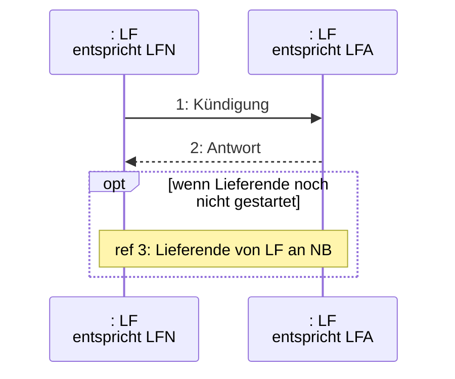

|Nr.:|Aktion|Frist|Hinweis/Bemerkung|
|-|-|-|-|
|1|Kündigung|--|--|
|2|Antwort|Unverzüglich, jedoch<br/><br/>- spätestens bis zum Ablauf des 1. WT nach Eingang der Kündigung, sofern der LFN zur Identifikation die MaLo-ID (oben Kapitel I. 6 Ziff. b)) übermittelt hat, ansonsten<br/><br/>- spätestens bis zum Ablauf des 3. WT nach Eingang der Kündigung.|Falls der LFA die Kündigung des LFN ablehnt, teilt er den Grund oder die Gründe für die Ablehnung mit.<br/><br/>Falls der LFA die Kündigung gegenüber dem LFN bestätigt, kann es sich um eine Bestätigung handeln, die<br/>a) ohne inhaltliche Änderung erteilt wird oder<br/>b) die mit Abänderungen erteilt wird.<br/><br/>Der LFA teilt dem LFN mit Bestätigung der Kündigung ferner den Vorjahresverbrauch des Letztverbrauchers mit.|
|3|ref Lieferende von LF an NB|--|--|


### 1.3 Antwort LFA bei Kündigung eines bereits wirksam gekündigten Vertrages

<u>Prozesssituation:</u>
Kündigung wurde bereits ausgesprochen (z. B. unmittelbar durch den Letztverbraucher), Liefervertrag endet dementsprechend zum Tag X (nachfolgend als „Vertragsende“ bezeichnet).

Seite 18 von 182

|Kündigung durch LFN...|Antwort LFA|Erläuterung|
|-|-|-|
|... auf denselben Termin|Bestätigung der Kündigung|--|
|...auf einen fixen Termin, der früher als das Vertragsende liegt|Fall 1:<br/>Vertragssituation lässt eine noch frühere Kündigung zu<br/>➔Kündigungsbestätigung für neuen (früheren) Kündigungstermin an LFN|Sollte der LFA für das bereits wirksam gekündigte Vertragsverhältnis aufgrund der Vertragslage ein noch früheres Vertragsende akzeptieren, so teilt er dies als Kündigungsbestätigung für diesen früheren Kündigungstermin mit.|
||Fall 2:<br/>Vertragssituation lässt keine frühere Kündigung zu<br/>➔Kündigungsablehnung an LFN, Hinweis auf Kündigungstermin aus der früheren wirksamen Kündigung|Wenn der LFA das noch frühere Vertragsende nicht akzeptiert, weist er darauf hin, dass das Vertragsverhältnis bereits zuvor wirksam gekündigt wurde und benennt das maßgebliche Vertragsende-Datum.|
|...auf einen fixen Termin, der später als das Vertragsende liegt|➔Ablehnung der Kündigung, Hinweis auf Kündigungstermin aus der früheren wirksamen Kündigung|Ein bereits wirksam gekündigtes Vertragsverhältnis kann nicht – auch nicht bei Zustimmung des LFA – durch eine schlichte Kündigung zu einem späteren Zeitpunkt wieder verlängert werden.|
|...auf den nächstmöglichen Kündigungstermin|Fall 1:<br/>Vertragssituation lässt eine noch frühere Kündigung zu<br/>➔Kündigungsbestätigung für neuen (früheren) Kündigungstermin an LFN|Sollte der LFA für das bereits wirksam gekündigte Vertragsverhältnis aufgrund der Vertragslage ein noch früheres Vertragsende akzeptieren, so teilt er dies als Kündigungsbestätigung für diesen früheren Kündigungstermin mit.|
||Fall 2:<br/>Vertragssituation lässt keine frühere Kündigung zu<br/>➔Kündigungsablehnung an LFN, Hinweis auf Kündigungstermin aus der früheren wirksamen Kündigung.|Wenn der LFA das noch frühere Vertragsende nicht akzeptiert, weist er darauf hin, dass das Vertragsverhältnis bereits zuvor wirksam gekündigt wurde und benennt das maßgebliche Vertragsende-Datum.|


# 2 Grundregeln zum Lieferende von LF an NB und Lieferbeginn

## 2.1 Allgemeines

Die Use-Cases „Lieferende von LF an NB“ und „Lieferbeginn“ sind inhaltlich eng miteinander verknüpft. Die Grundregeln für beide Prozesse werden daher an dieser Stelle gemeinsam dargestellt.

Für die Use-Cases „Lieferende von LF an NB“ und „Lieferbeginn“ gelten folgende Begriffsbestimmungen:

Seite 19 von 182

Unter dem <u>Anmeldedatum</u> ist im Folgenden das Datum des gewünschten Lieferbeginns zu verstehen, unter <u>Abmeldedatum</u> das des gewünschten Lieferendes. <u>Eingangsdatum</u> ist das Datum, an dem die Meldung über den Lieferbeginn oder das Lieferende beim NB eingeht.

An- und Abmeldedatum sowie Eingangsdatum können ein beliebiger Tag sein. Es kann sich dabei um ein untermonatliches Datum handeln.

Für die Bestimmung der Termine für Lieferende und Lieferbeginn gelten folgende Grundregeln <u>in der angegebenen Reihenfolge</u>:

1. Eingehende Meldungen sind stets unverzüglich zu bearbeiten, es sei denn, für die jeweiligen Bearbeitungsschritte sind in den Prozessen besondere Bearbeitungsfristen geregelt.
2. Für Marktlokationen, deren Energie auf Basis von Viertelstundenwerten bilanziert wird, können An- und Abmeldedatum nur nach dem Eingangsdatum liegen.
3. Für Marktlokationen, deren Messlokationen mit iMS ausgestattet sind, können unabhängig vom Bilanzierungsverfahren An- und Abmeldedatum nur nach dem Eingangsdatum liegen.
4. Für Marktlokationen, deren Energie auf Basis von Standardlastprofilen bilanziert wird und deren Messlokationen mit kME oder mME ausgestattet sind, sind auch rückwirkende An- und Abmeldungen zulässig, wenn nicht der Fall eines Lieferantenwechsels vorliegt (d. h. ein identischer Letztverbraucher wechselt an derselben Marktlokation von einem vertraglichen zu einem anderen vertraglichen LF.)

<u>Lieferantenwechsel</u> sind nur in die Zukunft gerichtet möglich.

Für <u>sonstige An- und Abmeldungen</u> gilt Folgendes:

a) Liegt das Eingangsdatum unter Einhaltung der vorgesehenen Vorlauffristen vor oder bis zu sechs Wochen nach An- oder Abmeldedatum, können Lieferbeginn oder Lieferende grundsätzlich zum An- oder Abmeldedatum realisiert werden.
b) Liegt das Eingangsdatum mehr als sechs Wochen nach An- oder Abmeldedatum, können Lieferbeginn oder Lieferende grundsätzlich nur für die Zukunft realisiert werden. Kann ein Lieferbeginn- oder Lieferendevorgang nur für die Zukunft realisiert werden, so sind die für Lieferantenwechselvorgänge in den Prozessen vorgesehenen Vorlauffristen einzuhalten.
c) Zuordnungslücken sind dadurch zu vermeiden, dass in die Zukunft wirkende An- und Abmeldungen zeitlich aufeinander abgestimmt werden.
d) Verbleibende Zuordnungslücken sind zu schließen, indem die Marktlokation zur Ersatz-/ Grundversorgung angemeldet wird.
e) Der NB stellt im Rahmen der Identifikation der Marktlokation sicher, dass Lieferanmeldungen mit dem Transaktionsgrund „Ein-/Auszug“ nur in Fällen stattfinden, in denen bisheriger und neuer Anschlussnutzer (AN) nicht identisch sind.

### 2.2 Konfliktszenarien bei der Anmeldung

Konflikte können auch dann entstehen, wenn für eine Marktlokation mehrere Anmeldungen beim NB vorliegen. Diese Konfliktszenarien sind nach den folgenden Grundregeln aufzulösen:

1. Im Zeitraum vom Eingang einer Lieferanmeldung beim NB bis zur fristgerechten Rückmeldung des NB an den anmeldenden LFN über die Bestätigung oder Ablehnung der Anmeldung (Prozess „Lieferbeginn“, Prozessschritt „Antwort auf Anmeldung“) werden nachfolgende weitere Anmeldungen, die sich auf dieselbe Marktlokation beziehen, vom NB unverzüglich (spätestens nach Abschluss der Identifikation am 1. WT (sofern für die Identifiaktion der Marktlokation einzig die MaLo-ID zu verwenden ist ) bzw. 3. WT nach Eingang) abgelehnt. Dabei teilt der NB mit,

Seite 20 von 182

- dass sich derzeit eine Anmeldung in Bearbeitung befindet,
- auf welchen Lieferbeginntermin die derzeit in Bearbeitung befindliche Anmeldung gerichtet ist sowie
- ab welchem Zeitpunkt der NB nach den vorgegebenen Fristläufen des Use-Cases „Lieferbeginn“ spätestens wieder Anmeldungen für diese Marktlokation entgegennimmt.

2. Im Rahmen der durch den NB durchzuführenden Prüfung, ob eine Abmeldeanfrage erforderlich ist, prüft der NB allein darauf, ob einem LFA die betreffende Marktlokation <u>zum Zeitpunkt des vom LFN begehrten Lieferbeginns</u> nach aktueller Datenlage zugewiesen ist bzw. zugewiesen sein wird. Der betroffene LFA wird erforderlichenfalls vom NB mit einer Abmeldeanfrage kontaktiert. Für die Entscheidung über den Erfolg der betreffenden Anmeldung spielt es dagegen grundsätzlich keine Rolle, ob zu einem zeitlich <u>nach</u> dem Anmeldedatum liegenden Zeitpunkt bereits eine bestätigte Anmeldung eines LF vorliegt. Wird die Anmeldung eines LF zu einem zukünftigen Zeitpunkt X bestätigt, so führt dies dazu, dass eventuell bereits bestätigte Lieferanmeldungen gegenüber sonstigen LF zu einem später als X liegenden Zeitpunkt gegenstandslos werden. Der NB informiert zeitgleich mit der Bestätigung gegenüber dem anmeldenden LF für den Lieferbeginntermin X alle LF mit Lieferbeginnterminen später X darüber, dass ihre Anmeldebestätigung durch die nun bestätigte Anmeldebestätigung gegenstandslos geworden ist. Liegt der Zeitpunkt der bereits bestätigten Lieferanmeldung dagegen zeitlich vor oder gleich X, so kommt es regulär zu einer Abmeldeanfrage im Rahmen des Use-Cases „Lieferbeginn“.

Seite 21 von 182

**Darstellung anhand einiger möglicher Szenarien**

<u>Szenario 1:</u>


<u>Erläuterung:</u>

Ursprünglich ist LF0 der Marktlokation zugeordnet. Beim NB geht eine Anmeldung des LFN<sub>1</sub> für den Lieferbeginntermin X ein. Der NB prüft, ob zu diesem Termin noch eine aktive Zuordnung eines LF vorliegt. Da dies vorliegend der Fall ist (hier wird unterstellt, dass LF0 noch kein Lieferende gemeldet hat), übermittelt NB an LF0 eine Abmeldeanfrage, auf die LF0 mit einer Abmeldung zum Zeitpunkt X (in Form einer Beantwortung der Abmeldeanfrage) reagiert. Damit liegen die Voraussetzungen zur Belieferung durch LFN<sub>1</sub> zum Zeitpunkt X vor. Der NB sendet noch eine Mitteilung über die Beendigung der Zuordnung zum Zeitpunkt X an LF0, da er eine Abmeldeanfrage an LF gesendet hat.

Später geht beim NB die Anmeldung des LFN<sub>2</sub> für den Zeitpunkt Y ein. Der NB prüft wiederum, ob nach aktueller Datenlage zu dem vom LFN<sub>2</sub> gewünschten Lieferbeginntermin ein LF zugeordnet ist bzw. sein wird. Dies ist LFN<sub>1</sub>. Der NB übermittelt an LFN<sub>1</sub> daraufhin eine Abmeldeanfrage. Hier wird unterstellt, dass LFN<sub>1</sub> auf die Abmeldeanfrage nicht reagiert. Es erfolgt daher nach Fristablauf die Mitteilung über die Beendigung der Zuordnung des LFN<sub>1</sub> zum Zeitpunkt Y, LFN<sub>2</sub> wird ab dem Zeitpunkt Y zur Belieferung zugeordnet.

Seite 22 von 182

<u>Szenario 2:</u>


<u>Erläuterung:</u>

Ursprünglich ist LF0 der Marktlokation zugeordnet. Beim NB geht eine Anmeldung des LFN<sub>1</sub> für den Lieferbeginntermin Zeitpunkt Y ein. Der NB prüft, ob zu diesem Datum noch eine aktive Zuordnung eines LF vorliegt. Da dies vorliegend der Fall ist (hier wird unterstellt, dass LF0 noch kein Lieferende gemeldet hat), übermittelt NB an LF0 eine Abmeldeanfrage, auf die LF0 mit einer Abmeldung zum Zeitpunkt Y (in Form einer Beantwortung der Abmeldeanfrage) reagiert. Damit liegen die Voraussetzungen zur Belieferung durch LFN<sub>1</sub> zum Zeitpunkt Y vor. Der NB sendet noch eine Mitteilung über die Beendigung der Zuordnung zum Zeitpunkt Y an LF0, da er eine Abmeldeanfrage an LF0 gesendet hat.

Später geht beim NB die Anmeldung des LFN<sub>2</sub> für den Lieferbeginntermin Zeitpunkt X ein. Der NB prüft wiederum, ob nach aktueller Datenlage zu dem vom LFN<sub>2</sub> gewünschten Lieferbeginntermin ein LF zugeordnet ist. Dies ist (noch) LF0. Der NB übermittelt an LF0 daraufhin eine Abmeldeanfrage. Hier wird unterstellt, dass LF0 auf die Abmeldeanfrage nicht reagiert. Es erfolgt daher nach Fristablauf die Mitteilung über die Beendigung der Zuordnung des LF0 zum Zeitpunkt X, LFN<sub>2</sub> wird ab dem Zeitpunkt X zur Belieferung zugeordnet.

Die bereits zuvor gegenüber LFN<sub>1</sub> bestätigte Anmeldung zum Zeitpunkt Y hat nach den Konfliktregeln für den Lieferbeginntermin Zeitpunkt X des LFN<sub>2</sub> keine Relevanz. Allerdings wird der NB den LFN<sub>1</sub> darüber informieren, dass nunmehr eine (überholende) Anmeldung des LFN<sub>2</sub> zum Zeitpunkt X bestätigt worden ist und die Anmeldung des LFN<sub>1</sub> damit gegenstandslos wird.

Seite 23 von 182

# 3 Prozesse zum Lieferende

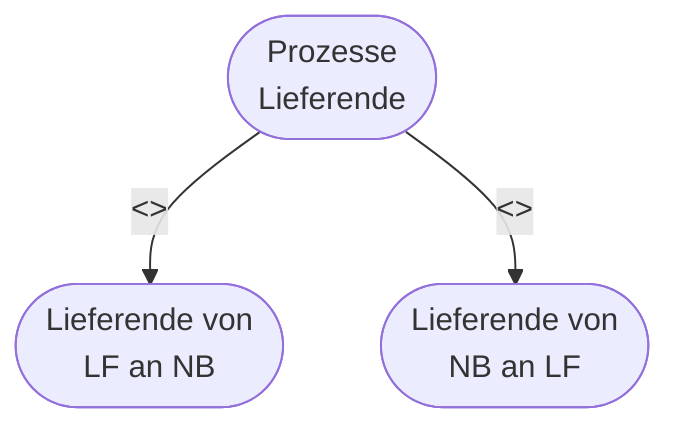

## 3.1 Use-Case: Lieferende von LF an NB

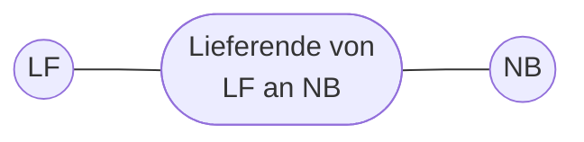

### 3.1.1 UC: Lieferende von LF an NB

|Use-Case-Name|Lieferende von LF an NB|
|-|-|
|Prozessziel|Der LF ist einer Marktlokation nicht mehr zugeordnet.|
|Use-Case-Beschreibung|Der LF meldet beim NB, aufgrund der Beendigung eines mit dem Letztverbraucher abgeschlossenen Energieliefervertrages, die Marktlokation des Letztverbrauchers von der Belieferung zum Abmeldedatum ab.<br/>Gründe können z. B. sein: Lieferantenwechsel, Auszug, Stilllegung der Marktlokation, Kündigung durch den LF etc..<br/>Dieser Prozess findet auch dann Anwendung, wenn der E/G für eine Marktlokation die Ersatzversorgung beenden will (z. B. Ablauf der Drei-Monats-Frist des § 38 Abs. 2 EnWG).|
|Rollen|\* LF<br/>\* NB|
|Vorbedingung|\* Beendigung eines Energieliefervertrags.|
|Nachbedingung im Erfolgsfall|\* Der NB verteilt im Falle einer Stilllegung die geänderten Stammdaten an der Marktlokation an die Berechtigten.<br/>\* Der NB beendet die Zuordnung des LF zur Marktlokation zum Abmeldedatum.|


Seite 24 von 182

* **Use-Case-Name**: Lieferende von LF an NB
* **Nachbedingung im Fehlerfall**: 
    * Der LF bleibt der Marktlokation zugeordnet.
* **Fehlerfälle**: 
    * Abmeldung des LF wurde abgelehnt.
* **Weitere Anforderungen**: 
    * Liegt beim NB keine Information über die Zuordnung der Marktlokation zu einem Nachfolge-LF für den Zeitraum nach dem Abmeldedatum vor, so ordnet der NB die Marktlokation ab diesem Zeitpunkt dem E/G zu, sofern ein gesetzlicher oder vertraglicher Anspruch dazu besteht. Dies gilt nicht, soweit der E/G selbst das Lieferende der Ersatzversorgung gemeldet hat (siehe Use-Case: Beginn der Ersatz-/Grundversorgung).
    * Ist eine Marktlokation infolge der Abmeldung künftig weder dem E/G noch einem sonstigen LF zugeordnet, kann eine Unterbrechung des Netzanschlusses nach Maßgabe der allgemeinen Vorschriften in Betracht kommen.

### 3.1.2 SD: Lieferende von LF an NB

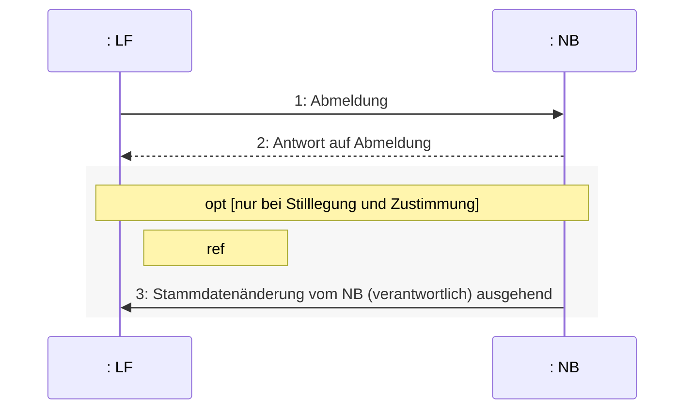

|Nr.|Aktion|Frist|Hinweis/Bemerkung|
|-|-|-|-|
|1|Abmeldung|Unverzüglich nach Vorliegen des Abmeldegrundes, jedoch im Fall des Lieferantenwechsels mindestens 6 WT vor dem Abmeldedatum.|--|
|2|Antwort auf Abmeldung|Unverzüglich, jedoch spätestens bis zum Ablauf des 3. WT nach Eingang der Abmeldung.|Der NB prüft die eingegangene Abmeldung.<br/>Im Fall des Lieferantenwechsels prüft er insbesondere die Einhaltung der Vorlauffrist bis zum Abmeldedatum.|


Seite 25 von 182

||||||Der NB bestätigt die Abmeldung zum Abmeldedatum oder sendet eine Ablehnung der Abmeldung aufgrund der vorangegangenen Prüfung.Der Grund der Ablehnung ist anzugeben.Als Grund bei Lieferantenwechselvorgängen kommt insbesondere in Betracht: Weniger als 6 WT zwischen Eingang der Abmeldung und Abmeldedatum.|
|-|-|-|-|-|-|
|3|ref Stammdatenänderung vom NB (verantwortlich) ausgehend|--|--|||


## 3.2 Use Case: Lieferende von NB an LF


### 3.2.1 UC: Lieferende von NB an LF

|Use-Case-Name|Lieferende von NB an LF|
|-|-|
|Prozessziel|Der LF ist der Marktlokation nicht mehr zugeordnet.|
|Use-Case-Beschreibung|Der NB meldet beim LF die Marktlokation zum Abmeldedatum ab.|
|Rollen|\* LF<br/>\* NB|
|Vorbedingung|\* Der LF ist der Marktlokation zugeordnet.<br/>Auslöser:<br/>\* Stilllegung der Marktlokation<br/>\* Der Use-Case „Deaktivierung einer Zuordnungsermächtigung des BKV beim NB“ wurde durchgeführt und für die betroffene Marktlokation liegt für den Zeitraum, der sich unmittelbar an die Deaktivierung anschließt, keine Zuordnung zu einem BK vor, für den eine aktive Zuordnungsermächtigung vorhanden ist.|
|Nachbedingung im Erfolgsfall|\* Der NB verteilt die geänderten Stammdaten an der Marktlokation an die Berechtigten.<br/>\* Der NB beendet die Zuordnung des LF zur Marktlokation zum Abmeldedatum.|
|Nachbedingung im Fehlerfall|\* Der LF bleibt der Marktlokation zugeordnet.|
|Fehlerfälle|\* Abmeldung des NB wurde abgelehnt.|
|Weitere Anforderungen|--|


Seite 26 von 182

### 3.2.2 SD: Lieferende von NB an LF

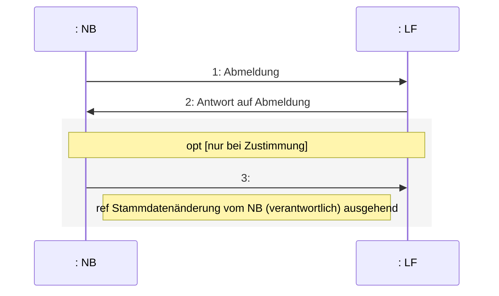

|Nr.|Aktion|Frist|Hinweis/Bemerkung|
|-|-|-|-|
|1|Abmeldung|Bei Abmeldung wegen Stilllegung einer Marktlokation gilt: Unverzüglich nach Vorliegen des Abmeldegrundes wegen Stilllegung.<br/>Bei Abmeldung wegen Deaktivierung der Zuordnungsermächtigung gilt: Unverzüglich, jedoch spätestens bis zum Ablauf des 1. WT nach Eingang der Deaktivierungsmeldung, jedoch, wenn die Deaktivierung ihre Gültigkeit weiter als einen Monat in die Zukunft hat, frühestens in dem Monat, in dem die Zuordnungsermächtigung endet, jedoch spätestens am 5. WT des Monats, in dem die Zuordnungsermächtigung endet.|Bei Abmeldung wegen Stilllegung einer Marktlokation gilt: Die Abmeldung ist auch an zukünftige LF mitzuteilen.|
|2|Antwort auf Abmeldung|Unverzüglich, jedoch spätestens bis zum Ablauf des 3. WT nach Eingang der Abmeldung.|Der LF prüft die eingegangene Abmeldung.<br/>Der LF bestätigt die Abmeldung zum Abmeldedatum oder sendet eine Ablehnung der Abmeldung.<br/>Der Grund der Ablehnung ist anzugeben.<br/>Bei Abmeldung wegen Deaktivierung der Zuordnungsermächtigung gilt: Verstreicht die Frist, ohne dass eine Antwort eingeht, gilt dies als Zustimmung. Nach Ablauf der Frist eingehende Antworten sind für den Fortlauf dieses Prozesses unerheblich.|


Seite 27 von 182

|Nr.|Aktion|Frist|Hinweis/Bemerkung|
|-|-|-|-|
|3|ref Stammdatenänderung vom NB<br/>(verantwortlich) ausgehend|--|--|


Seite 28 von 182

# 4 Use-Case: Lieferbeginn

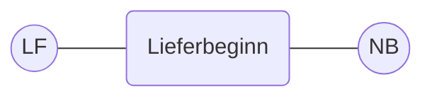

## 4.1 UC: Lieferbeginn

|Use-Case-Name|Lieferbeginn|
|-|-|
|Prozessziel|Der anmeldende LF ist einer Marktlokation zugeordnet.|
|Use-Case-Beschreibung|Ein LF meldet beim NB aufgrund eines mit dem Letztverbraucher zustande gekommenen Energieliefervertrages die Marktlokation des Letztverbrauchers zum Anmeldedatum zur Belieferung an. Gründe können z.B. sein: Lieferantenwechsel, Einzug, Inbetriebnahme der Marktlokation (Neuanlage) etc..<br/>Ein Lieferbeginn liegt auch vor, wenn der Letztverbraucher unmittelbar vor der Neubelieferung durch den E/G versorgt wurde. Zum Use-Case „Lieferbeginn“ gehört ferner auch die Wiederaufnahme der Belieferung an einer Marktlokation, bei der zuvor der NB den Netzanschluss oder die Anschlussnutzung unterbrochen hatte.|
|Rollen|\* LF<br/>\* NB|
|Vorbedingungen|\* Abschluss eines Energieliefervertrags.<br/>\* Eine Zuordnungsermächtigung nach den Prozessen der MaBiS für die vom LF genutzten BK beim NB liegt vor.|
|Nachbedingung im Erfolgsfall|\* Der NB verteilt die geänderten Stammdaten an der Marktlokation an die Berechtigten.<br/>\* Evtl. ist die Aktivierung von MaBiS-Zählpunkten für die Übermittlung von Summenzeitreihen nach MaBiS erforderlich.<br/>\* Etwa entstehende Zuordnungslücken zwischen dem Zuordnungsende des LFA und dem vom LFN gewünschten Anmeldedatum werden vom NB durch Zuordnung der Marktlokation zum E/G in Anwendung des Use-Case: Beginn der Ersatz-/Grundversorgung geschlossen.<br/>\* Bei unterjährigem Lieferbeginn und wenn die Marktlokation mit Arbeits- und Leistungspreis abgerechnet wird, übermittelt der NB die bisher gemessenen Arbeits- und Leistungswerte.<br/>\* Sofern die Marktlokation gesperrt ist, führt der NB den Use-Case „Wiederherstellung der Anschlussnutzung bei Lieferbeginn“ aus.<br/>\* Der NB versendet die Berechnungsformel an den LFN.|
|Nachbedingung im Fehlerfall|\* Der bisherige LF bleibt der Marktlokation zugeordnet.|


Seite 29 von 182

|\*\*Use-Case-Name\*\*|\*\*Lieferbeginn\*\*|
|-|-|
|Fehlerfälle|\* Anmeldung des LF wurde abgelehnt.|
|Weitere Anforderungen|--|


Seite 30 von 182

## 4.2 SD: Lieferbeginn

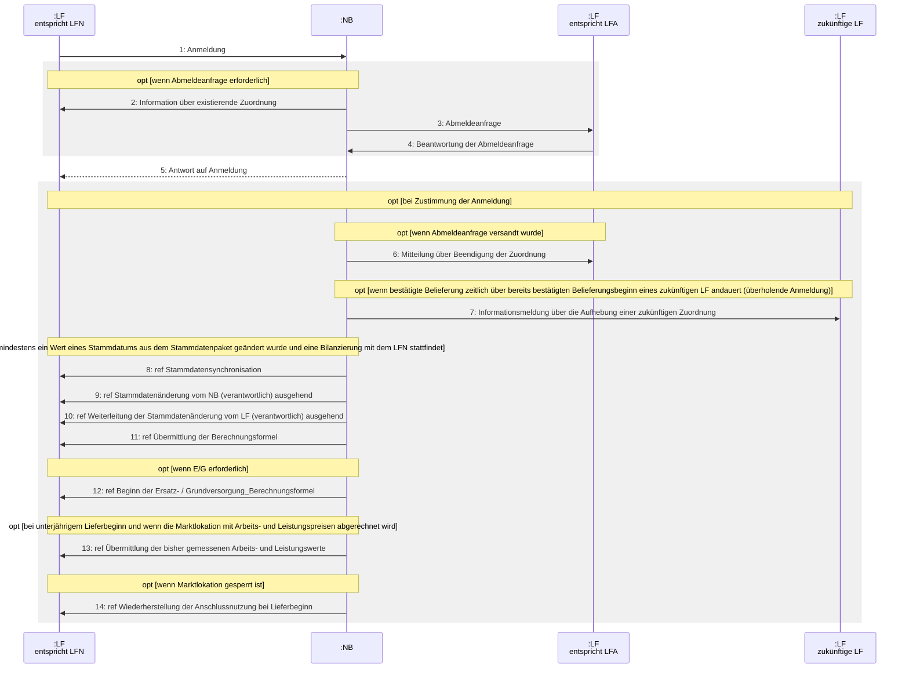

Seite 31 von 182

Hinweis für die folgenden Prozessschritte:

Fall 1: Der LF gibt an, dass zur Identifikation der Marktlokation einzig die MaLo-ID zu verwenden ist (siehe hierzu auch Kapitel I. 6 Ziff. bb).

Fall 2: Der LF gibt an, dass die Marktlokation anhand der von ihm angegebenen Informationen und somit nicht ausschließlich anhand der ggf. auch enthaltenen MaLo-ID zu erfolgen hat (siehe hierzu auch Kapitel I. 6 Ziff. cc).

|Nr.|Aktion|Frist|Hinweis/Bemerkung|
|-|-|-|-|
|1|Anmeldung|Unverzüglich nach Vorliegen des Anmeldegrundes.<br/><br/>Bei Anmeldungen anlässlich eines Lieferantenwechsels:<br/><br/>- mindestens 7 WT vor Aufnahme der Belieferung (Fall 1), ansonsten<br/><br/>- mindestens 10 WT vor Aufnahme der Belieferung (Fall 2).|Der LFN teilt in der Anmeldung u.a. mit, ob der Letztverbraucher ein „Haushaltskunde“ ist.<br/><br/>Der LFN teilt des Weiteren mit, ob die Anmeldung anlässlich eines Lieferantenwechsels oder anlässlich einer sonstigen Aufnahme der Belieferung (inklusive Neuanlage) der Marktlokation erfolgt.<br/><br/>Im Fall eines Lieferbeginns aufgrund Neuanlage gibt der LFN das vom Kunden mitgeteilte, voraussichtliche Anmeldedatum mit.<br/><br/>Im Rahmen der Anmeldung ist die Zuordnung der Marktlokation zu einem BK erforderlich.<br/><br/>Möchte der LFN für die turnusmäßige Ablesung der Marktlokation einen Ableseturnus vorgeben, der von „jährlich“ abweicht, so teilt er diesen mit. Der Ableseturnus gibt den Ablesezyklus (halbjährlich, vierteljährlich, monatlich) vor, nicht aber den jeweiligen Ablesezeitpunkt.<br/><br/>Der NB prüft die Anmeldung in vier Schritten:<br/><br/>1. Prüfung, ob im Fall des Lieferantenwechsels die Vorlauffrist bis zum Anmeldedatum eingehalten ist.<br/><br/>2. Prüfung, ob im Fall einer Neuanlage die erstmalige Identifikation möglich ist: Ist eine erstmalige Identifikation der Marktlokation unverzüglich nach Eingang der Anmeldung nicht möglich, darf keine Ablehnung wegen Nichtidentifikation in Prozessschritt 5 versendet werden. Der NB muss innerhalb der nächsten 60 WT nach Eingang der Anmeldung unverzüglich wiederholend prüfen, ob die Anmeldung einer vom NB neu angelegten Marktlokation zugeordnet werden kann (Identifizierung der Marktlokation erfolgt nach den Vorgaben in Kapitel I. 6 Ziff. cc, Unterpunkt 2). Ist dies nach Ablauf der Frist nicht gelungen lehnt der NB die Anmeldung wegen Nichtidentifikation in Prozessschritt 5 ab. Sofern eine Zuordnung gelungen ist,<br/><br/>\\\* ersetzt der NB das vom LF genannte voraussichtliche Anmeldedatum|


Seite 32 von 182

|Nr.|Aktion|Frist|Hinweis/Bemerkung||||
|-|-|-|-|-|-|-|
||||durch das Inbetriebnahmedatum der Marktlokation.<br/>\* erfolgen die hier nachfolgenden Prüfschritte.<br/>3. Prüfung aller sonstigen Voraussetzungen.<br/>Liegt eine der in den vorgenannten Schritten zu prüfenden Voraussetzungen nicht vor, so verfährt der NB unverzüglich weiter nach Prozessschritt 5 und lehnt die Anmeldung ab.<br/>4. Prüfung, ob die Versendung einer Abmeldeanfrage erforderlich ist.<br/>Ist die Marktlokation zum Anmeldedatum keinem LF zugeordnet oder liegt eine korrespondierende Abmeldung vor, so fährt der NB mit Prozessschritt 5 fort und stimmt der Anmeldung zu. Ist die Marktlokation zum Anmeldedatum noch einem LF (LFA) zugeordnet und liegt keine korrespondierende Abmeldung vor, so fährt der NB mit Prozessschritt 2 fort.||||
||||2|Information über existierende Zuordnung|Unverzüglich, jedoch spätestens bis zum Ablauf<br/>- des 1. WT nach Eingang der Anmeldung (Fall 1)<br/>- des 4. WT nach Eingang der Anmeldung (Fall 2)<br/>Im Falle eines Lieferbeginns aufgrund Neuanlage und eine erstmalige Identifikation der Marktlokation ist nicht möglich:<br/>Unverzüglich, jedoch spätestens bis zum Ablauf des 4. WT nach Zuordnung der Marktlokation (Fall 2).|Der NB informiert den LFN darüber, dass zum gewünschten Anmeldedatum noch ein LF (LFA) der Marktlokation zugeordnet ist und deshalb eine Abmeldeanfrage an den LFA gestellt wird.<br/>Hierbei teilt der NB dem LFN insbesondere die Identität des LFA mit.|
|3|Abmeldeanfrage|Unverzüglich, jedoch spätestens bis zum Ablauf<br/>- des 1. WT nach Eingang der Anmeldung (Fall 1)<br/>- des 4. WT nach Eingang der Anmeldung (Fall 2)|Der NB übersendet dem LFA eine Mitteilung über die vom LFN zum Anmeldedatum angemeldete Belieferung, verbunden mit der Anfrage, ob der LFA die Belieferung abmeldet.<br/>Dies gilt auch für den Fall, dass der LFN potentiell personenidentisch mit dem LFA ist .||||


Seite 33 von 182

|Nr.|Aktion|Frist|Hinweis/Bemerkung|||
|-|-|-|-|-|-|
|||Im Falle eines Lieferbeginns aufgrund Neuanlage und eine erstmalige Identifikation der Marktlokation ist nicht möglich:<br/>Unverzüglich, jedoch spätestens bis zum Ablauf des 4. WT nach Zuordnung der Marktlokation (Fall 2).||||
|||4|Beantwortung der Abmeldeanfrage|Unverzüglich, jedoch spätestens bis zum Ablauf des 3. WT nach Eingang der Abmeldeanfrage des NB.|Der LFA prüft die Vertragslage und entscheidet, ob er seine noch bestehende Zuordnung dergestalt abmeldet, dass der LFN zum gewünschten Anmeldedatum die Belieferung der Marktlokation aufnehmen kann.<br/><br/>Es sind folgende Situationen denkbar:<br/>\* Der LFA bestätigt wie gewünscht die Abmeldung zum Tag vor dem Anmeldetermin (Fall a) oder<br/>\* der LFA bestätigt die Abmeldung zu einem Abmeldedatum, das mehr als einen Tag vor dem gewünschten Anmeldedatum liegt (Fall b) oder<br/>\* der LFA widerspricht der Abmeldung und nennt keinen Abmeldetermin. Hierbei übermittelt der LFA eine Begründung für den Widerspruch.|
|5|Antwort auf Anmeldung|Unverzüglich, jedoch spätestens bis zum Ablauf<br/>- des 5. WT nach Eingang der Anmeldung (Fall 1)<br/>- des 8. WT nach Eingang der Anmeldung (Fall 2).<br/><br/>Im Falle eines Lieferbeginns aufgrund Neuanlage und eine erstmalige Identifikation der Marktlokation ist nicht möglich:<br/>Unverzüglich, jedoch spätestens bis zum Ablauf des 8. WT nach Zuordnung der Marktlokation (Fall 2).|Bestätigung der Anmeldung durch NB gegenüber LFN zum Anmeldedatum erfolgt, wenn eine der nachfolgend genannten Bedingungen erfüllt ist:<br/>\* Bestätigt der LFA die Abmeldeanfrage<br/>- zum Tag vor dem Anmeldedatum (Fall a) oder<br/>- zu einem noch früheren Datum (Fall b),<br/>so wird die Zuordnung des LFA zu dem von diesem bestätigten Abmeldedatum beendet.<br/><br/>Der NB beendet die Zuordnung des LFA zur Marktlokation<br/>- zu dem vom LFA in Prozessschritt 4 bestätigten Abmeldedatum (Fall a oder b) oder<br/>- im Fall der nicht fristgerechten Rückmeldung des LFA zu dem Tag vor dem Anmeldedatum des LFN<br/>mit Prozessschritt 6.<br/><br/>Ausnahme: Sofern der LFA im Fall b die Abmeldeanfrage mit einem Datum|||


Seite 34 von 182

|Nr.|Aktion|Frist|Hinweis/Bemerkung||||
|-|-|-|-|-|-|-|
||||bestätigt, zu dem die Fristen des Prozesses „Lieferende von LF an NB“ nicht eingehalten werden können, ist eine Terminverschiebung durch den NB erlaubt und im Prozessschritt 6 entsprechend zu kommunizieren.<br/><br/>Die Verschiebung des Abmeldedatums erfolgt so, dass eine lückenlose Zuordnung der Marktlokation zu LFA und LFN erfolgt. Sonstige etwaige aus Fall b resultierende Zuordnungslücken sind durch eine begrenzte Ersatzversorgung zu schließen.<br/>\* Es liegt bereits eine Abmeldung des LFA vor.<br/>\* Es ist zum Anmeldedatum der Marktlokation kein LF zugeordnet.<br/><br/>Die noch benötigten Stamm- und Netznutzungsvertragsdaten wie z. B. die Unterbrechbarkeit von Verbrauchseinrichtungen werden übermittelt. Der NB teilt dem LFN die Identität der derzeitigen MSB mit.<br/><br/>Ablehnung der Anmeldung durch NB gegenüber LFN zum Anmeldedatum erfolgt, wenn die nachfolgende Bedingung erfüllt ist:<br/><br/>Lehnt der LFA die Abmeldeanfrage ab und nennt kein Abmeldedatum, so bleibt die Marktlokation dem LFA zugeordnet und der NB lehnt die Anmeldung ab, wobei der NB die vom LFA gegebene Begründung dem LFN mitteilt.||||
||||6|Mitteilung über Beendigung der Zuordnung|Am selben Tag wie in Prozessschritt 5, wenn die Anmeldung bestätigt wurde.|Der NB informiert den LFA im Falle einer Abmeldeanfrage darüber, dass dessen Zuordnung zur Marktlokation beendet worden ist. Hierbei teilt er das Abmeldedatum sowie den Grund der Abmeldung mit.|
||||7|Information über die Aufhebung einer zukünftigen Zuordnung|Am selben Tag wie in Prozessschritt 5, wenn die Anmeldung bestätigt wurde.|--|
||||8|ref Stammdatensynchronisation|--|Hinweis: Die Stammdatensynchronisation wird nur gegenüber dem LFN durchgeführt.|
||||9|ref Stammdatenänderung vom NB (verantwortlich) ausgehend|--|--|
|10|ref Weiterleitung der Stammdatenänderung vom LF (verantwortlich) ausgehend|--|Muss synchron zu Schritt 9 erfolgen.||||
|11|ref Übermittlung der Berechnungsformel|--|Der NB übermittelt dem LFN die Berechnungsformel der Marktlokation.||||


Seite 35 von 182

|Nr.|Aktion|Frist|Hinweis/Bemerkung|
|-|-|-|-|
|12|ref Beginn der Ersatz- und Grundversorgung|--|--|
|13|ref Übermittlung der bisher gemessenen Arbeits- und Leistungswerte|--|--|
|14|ref Wiederherstellung der Anschlussnutzung bei Lieferbeginn|--|--|


# 5 Ersatz-/Grundversorgung

## 5.1 Allgemeines

Die folgende Grafik stellt die Reichweite der Ersatz- und Grundversorgungspflicht dar. Die Voraussetzungen und Rechtsfolgen ergeben sich aus Gesetz und Verordnungen.

Geltungsbereich der Ersatz- und Grundversorgungspflicht:

```description
Diagram showing the scope of basic and replacement supply obligations.
- Top level: "Niederspannungskunden¹" (Low voltage customers)
- Second level: "Haushaltskunden" gem. EnWG (Household customers according to EnWG)
- Three categories in boxes:
  1. Green box: "überwiegend privater Eigenverbrauch bzw. beruflicher/gewerblicher/landwirtschaftlicher Verbrauch < 10.000 kWh pro Jahr"
  2. Light green box: "Niederspannungskunden ausgenommen Haushaltskunden"
  3. Yellow box: "Mittelspannungskunden und höhere Spannungsebenen³"
- Arrows below indicate:
  - "gesetzl. Grundversorgungspflicht²" applies only to the first box (Household customers).
  - "gesetzl. Ersatzversorgungspflicht" applies to all three boxes.
```

<sup>1</sup> inkl. Umspannung zur Niederspannung
<sup>2</sup> Ausnahmen: fehlende wirtschaftliche Zumutbarkeit, Kunden mit Eigenerzeugung
<sup>3</sup> Gilt auch für Letztverbraucher im Höchstspannungsnetz die an das Netz des ÜNB angeschlossen sind

Die Marktlokationen von Haushaltskunden können sowohl in die Ersatz- als auch in die Grundversorgung fallen. Beide unterscheiden sich in Voraussetzungen und Rechtsfolgen.

Die Zuordnung von Marktlokationen zum E/G kann im Rahmen des Use-Cases „Beginn der Ersatz-/Grundversorgung“ untermonatlich und bei SLP-Marktlokationen, deren Messlokationen mit einer kME oder einer mME ausgestattet sind, bis zu sechs Wochen zzgl. 3 WT rückwirkend erfolgen (wie Use-Cases „Lieferende von LF an NB“ und „Lieferbeginn“).

Eine Zuordnung einer Marktlokation durch den NB zum E/G zum Zweck der Gewährleistung einer jederzeitigen Zuordnung einer Marktlokation gem. § 4 Abs. 3 StromNZV ist sowohl in die Zukunft als auch in die Vergangenheit, für Netznutzung und Bilanzierung, möglich.

Wie bei den anderen Prozessen werden in der Zwischenzeit gelieferte Strommengen bei SLP-Marktlokationen, deren Messlokationen mit einer kME, mME oder einem iMS ausgestattet sind, nach

Seite 36 von 182

dem Asynchronmodell zwischen Bilanzierung und Netznutzung für SLP-Marktlokationen im Rahmen der Mehr-/Mindermengenabrechnung verrechnet. Soweit die Ersatzversorgung einer Marktlokation wegen Ablaufs der Drei-Monatsfrist des § 38 Abs. 2 Satz 1 EnWG beendet wurde, kommt eine erneute Zuordnung der Marktlokation zum E/G über den Use-Case „Beginn der Ersatz-/Grundversorgung“ nicht in Betracht.

Für die Beendigung des Grundversorgungsverhältnisses gilt der Use-Case „Lieferende von LF an NB“.

Die folgenden Prozesse gelten auch für eine vereinbarte Fortsetzung der Ersatzversorgung (Ersatzfolgeversorgung). Sie gelten zudem für den Fall einer vertraglich vereinbarten Ersatzbelieferung entsprechend, sofern der Letztverbraucher dem NB vorab einen Ersatzbelieferer benannt hat. Eine solche Ersatzbelieferung kommt in der Regel für Marktlokationen von Letztverbrauchern in Betracht, für die keine gesetzliche Ersatzversorgung vorgesehen ist.

Der Use-Case „Beginn der Ersatz-/Grundversorgung“ ist für Marktlokationen von Haushaltskunden und Marktlokationen von sonstigen Letztverbrauchern zum Teil gesondert geregelt.

Die Anmeldung in die Grundversorgung findet nur statt, wenn der NB die Marktlokation in Abgrenzung zur Ersatzversorgung zuordnen muss, d. h., wenn ihm zunächst keine Anmeldung für die Marktlokation vorliegt. Soweit der E/G im Rahmen eines regulären Lieferverhältnisses die Marktlokation eines Letztverbrauchers beliefern will, ist der Use-Case „Lieferbeginn“ anzuwenden.

Liegt dem NB für eine Marktlokation sowohl eine Abmeldung als auch eine Anmeldung mit einem nach dem Abmeldedatum liegenden Anmeldedatum vor, ist die Lücke zwischen dem Abmeldedatum und dem Anmeldedatum durch eine befristete Anmeldung beim E/G zu schließen. Dies kann insbesondere aus der Versendung einer Abmeldeanfrage resultieren.

Eine während der Bearbeitung des Use-Case „Beginn der Ersatz-/Grundversorgung“ eingehende Anmeldung eines LF darf vom NB nicht mit der Begründung „Anmeldung in Bearbeitung" abgelehnt werden, sondern ist innerhalb der Fristen des Use-Case „Lieferbeginn" zu bearbeiten, während der Use-Case „Beginn der Ersatz-/Grundversorgung“ abzubrechen ist.

Ersatzversorgung liegt bei einem Energiebezug vor, der weder einer Lieferung noch einem bestimmten Energieliefervertrag zugeordnet werden kann. Grundversorgung entsteht durch einen Vertragsschluss, der auch konkludent erfolgen kann.

## 5.2 Use-Case: Beginn der Ersatz-/Grundversorgung


### 5.2.1 UC: Beginn der Ersatz-/Grundversorgung

|Use-Case-Name|Beginn der Ersatz-/Grundversorgung|
|-|-|
|Prozessziel|Der LF (E/G) ist einer Marktlokation zugeordnet.|
|Use-Case-Beschreibung|Der NB meldet eine Marktlokation beim LF (E/G) zur E/G an.<br/>Gründe können sein:<br/>\* Neuanschluss einer Marktlokation ohne Anmeldung eines LF.<br/>\* Abmeldung der Marktlokation aufgrund Kündigung des Energieliefervertrages ohne Folgebelieferung (Lieferende von LF an NB).|


Seite 37 von 182

|Use-Case-Name|\*\*Beginn der Ersatz-/Grundversorgung\*\*|
|-|-|
||\* Abmeldung der Marktlokation aufgrund Kündigung des Lieferantenrahmenvertrages.|
||\* Schließung des BK des bisherigen LF bzw. BKV.|
||\* Erlöschen der durch einen BKV gegenüber einem LF erteilten Zuordnungsermächtigung.|
||Dabei teilt er den Beginn der Belieferung (Zuordnung MaLo zu LF) und, sofern bereits bekannt, das Ende der Belieferung und ggf. Beginn und ggf. Ende der Bilanzierung (Zuordnung MaLo zu BK) mit. Sofern ihm bekannt ist, teilt er mit, ob der an der Marktlokation versorgte Letztverbraucher ein „Haushaltskunde“ ist. Der NB übermittelt zudem Namen und Adressen des ANN und des AN, sofern diese bekannt sind. Der NB teilt weiterhin die Identitäten der derzeitigen MSB mit.<br/><br/>Der LF (E/G) prüft u. a., ob die gemeldete Marktlokation, bezogen auf einen bestimmten Zeitraum, in die Grund- oder Ersatzversorgungspflicht fällt und teilt dem NB das Ergebnis der Prüfung mit.<br/><br/>Falls es zu einer Belieferung durch den E/G kommt, informiert der E/G gemäß StromGVV auch den Letztverbraucher über den Beginn und das voraussichtliche Ende der Ersatzversorgung bzw. über die Vertragsbedingungen der Grundversorgung.|
|Rollen|\* NB<br/>\* LF (E/G)|
|Vorbedingungen|\* Für die Marktlokation besteht eine gesetzliche Ersatzversorgungspflicht oder<br/>\* für die Marktlokation besteht eine gesetzliche Grundversorgungspflicht oder<br/>\* für die Marktlokation ist eine vertragliche Ersatzbelieferung zwischen Letztverbraucher und NB vereinbart und der Ersatzbelieferer ist dem NB durch den Letztverbraucher benannt worden.|
|Nachbedingung im Erfolgsfall|\* Der NB verteilt die geänderten Stammdaten an der Marktlokation an die Berechtigten.<br/>\* Der NB startet die Zuordnung des LF zur Marktlokation zum Anmeldedatum.<br/>\* Bei unterjähriger E/G und wenn die Marktlokation mit Arbeits- und Leistungspreis abgerechnet wird, übermittelt der NB die bisher gemessenen Arbeits- und Leistungswerte.<br/>\* Der NB versendet die Berechnungsformel an den E/G.|
|Nachbedingung im Fehlerfall|\* Der NB muss sicherstellen, dass die von der Marktlokation entnommene Energie einem BK zugeordnet ist.<br/>\* Der NB kann die Marktlokation vom Netz trennen.|
|Fehlerfälle|\* Beginn der Ersatz-/Grundversorgung wurde vom LF abgelehnt.|
|Weitere Anforderungen|\* Die Zuordnung der Marktlokation hat ggf. rückwirkend auf den vom E/G mitgeteilten Termin zu erfolgen. Meldet sich der E/G nicht fristgerecht, ordnet der NB die Marktlokation zu dem von ihm gemeldeten Termin dem E/G zu, sofern ein gesetzlicher od. vertraglicher Anspruch besteht.<br/>\* Bei Marktlokationen außerhalb der Niederspannung kommen eine Meldung an den Ersatzbelieferer (soweit vertraglich vereinbart) oder die Unterbrechung des Netzanschlusses in Betracht.|


Seite 38 von 182

### 5.2.2 SD: Beginn der Ersatz-/Grundversorgung

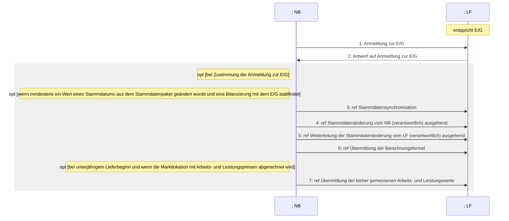

|Nr.|Aktion|Frist|Hinweis/Bemerkung|
|-|-|-|-|
|1|Anmeldung zur E/G|Unverzüglich oder gemäß den speziellen Fristen der anderen Prozesse.<br/>In Fällen einer Abmeldung der Marktlokation aufgrund Kündigung des Energieliefervertrages ohne Folgebelieferung frühestens 6 WT vor dem Abmeldedatum.|Der NB teilt dem E/G den Grund der Anmeldung mit. Folgende Gründe stehen mindestens zur Auswahl:<br/>\* Kündigung des Bilanzkreisvertrags des LFA,<br/>\* Kündigung des Netznutzungsvertrags des LFA,<br/>\* Neuanlage<br/>\* Ende der Belieferung durch den LFA ohne Folgebelieferung durch einen LFN, da<br/>\* aufgrund der prozessualen Lieferantenwechselfristen die|


Seite 39 von 182

|Nr.|Aktion|Frist|Hinweis/Bemerkung||
|-|-|-|-|-|
|||||Folgebelieferung durch den LFN zum Zuordnungszeitpunkt nicht möglich ist und erst später erfolgen kann oder<br/>\* keine Anmeldung für eine Folgebelieferung durch einen LFN vorliegt.|
|2|Antwort auf Anmeldung zur E/G|Unverzüglich, jedoch spätestens bis zum Ablauf des 2. WT nach Eingang der Anmeldung des NB.|Nimmt der E/G die Belieferung der Marktlokation auf und möchte er für die turnusmäßige Ablesung der Marktlokation einen Ableseturnus vorgeben, der von „jährlich“ abweicht, so teilt er diesen mit. Der Ableseturnus gibt den Ablesezyklus (halbjährlich, vierteljährlich, monatlich) vor, nicht aber den jeweiligen Ablesezeitpunkt.<br/>Der E/G teilt dem NB in seiner Antwort mit, ob der Kunde sich ab dem Zuordnungsdatum in Ersatzversorgung oder Grundversorgung befindet. Der Wechsel von der Ersatzversorgung in die Grundversorgung findet nach drei Monaten automatisch statt, sofern keine Folgebelieferung durch einen LFN angemeldet wurde. Die Angabe, ob sich der Kunde in einer Ersatzversorgung oder Grundversorgung befindet ist keine stammdatenänderungsrelevante Angabe, so das durch den Wechsel beim LF keine Stammdatenänderung an den NB und somit auch keine Stammdatensynchronisation durch den NB erfolgt.||
|3|ref Stammdatensynchronisation|--|Hinweis: Die Stammdatensynchronisation wird nur gegenüber dem E/G durchgeführt.||
|4|ref Stammdatenänderung vom NB (verantwortlich) ausgehend|--|--||
|5|ref Weiterleitung der Stammdatenänderung vom LF (verantwortlich) ausgehend|--|Muss synchron zu Schritt 4 erfolgen.||
|6|ref Übermittlung der Berechnungsformel|--|Der NB übermittelt dem E/G die Berechnungsformel der Marktlokation.||
|7|ref Übermittlung der bisher gemessenen Arbeits- und Leistungswerte|--|--||


Seite 40 von 182

# 6 Übermittlung der bisher gemessenen Arbeits- und Leistungswerte sowie des Lieferscheins zur Netznutzungsabrechnung

Die Übermittlung der bisher gemessenen Arbeits- und Leistungswerte sowie Lieferscheine werden ausschließlich für verbrauchende Marktlokationen erstellt.

## 6.1 Use-Case: Übermittlung der bisher gemessenen Arbeits- und Leistungswerte

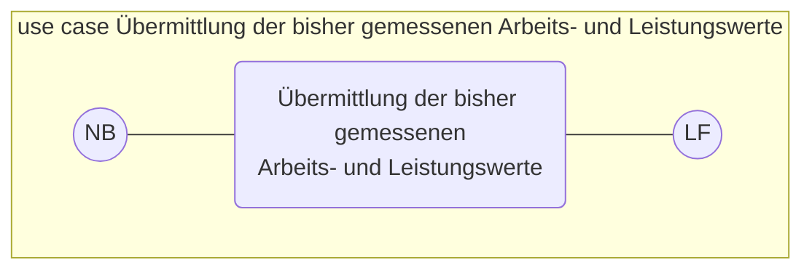

### 6.1.1 UC: Übermittlung der bisher gemessenen Arbeits- und Leistungswerte

|Use-Case-Name|Übermittlung der bisher gemessenen Arbeits- und Leistungswerte|
|-|-|
|Prozessziel|Dem LF liegen die bis zu seinem Lieferbeginn gemessenen Arbeitswerte und zwei höchsten Monatsmaximalleistungswerte der Marktlokation des laufenden Kalenderjahres vor.|
|Use-Case-Beschreibung|Der NB übermittelt nach Erreichen eines unterjährigen Lieferbeginns die bis zu dem unterjährigen Lieferbeginn gemessenen Arbeitswerte und zwei höchsten Monatsmaximalleistungswerte der Marktlokation des laufenden Kalenderjahres an den LF.<br/><br/>Hinweis: Ist der unterjährige Lieferbeginn bereits vor dem 2. Februar, wird nur ein Monatsmaximalleistungswert für den Januar übermittelt.|
|Rollen|\* NB<br/>\* LF|
|Vorbedingungen|\* Der LF ist Zahler der Netznutzung.<br/>\* Werte vom MSB liegen beim NB vor.<br/>\* Der unterjährige Lieferbeginntermin ist erreicht.<br/>\* Die Netznutzungsabrechnung erfolgt auf Basis von Arbeits- und Leistungspreis.|
|Nachbedingung im Erfolgsfall|\* Der Versand eines Lieferscheins ist möglich.|
|Nachbedingung im Fehlerfall|--|
|Fehlerfälle|--|
|Weitere Anforderungen|--|


Seite 41 von 182

### 6.1.2 SD: Übermittlung der bisher gemessenen Arbeits- und Leistungswerte

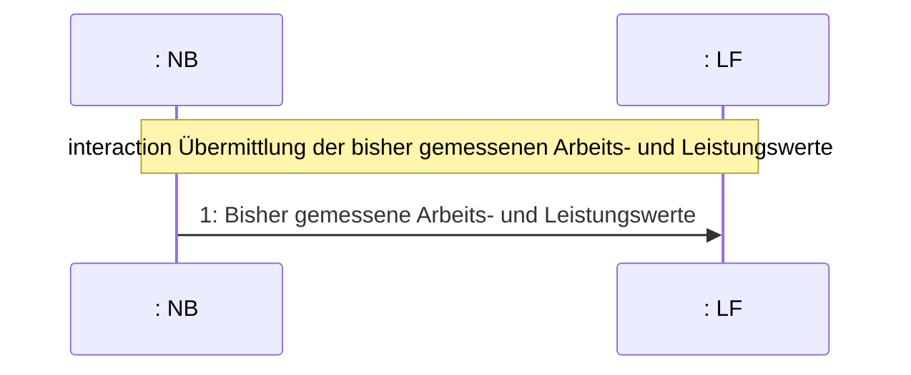

|Nr.:|Aktion|Frist|Hinweis/Bemerkung|
|-|-|-|-|
|1|Bisher gemessene Arbeits- und Leistungswerte|Unverzüglich, jedoch spätestens bis zum Ablauf des 10. WT des Folgemonats auf den unterjährigen Lieferbeginn, jedoch vor dem Versand des Lieferscheins.|Es muss sich um abrechnungsrelevante Werte (wahre Werte oder Ersatzwerte) handeln.|


### 6.2 Lieferschein für verbrauchende Marktlokationen

Der Lieferschein beinhaltet die Abrechnungsenergiemengen des Rechnungszeitraums der Netznutzungsrechnung und falls erforderlich, alle notwendigen Leistungswerte.

Werte der Marktlokation und aller zu ihrer Ermittlung notwendigen Messlokationen werden dem NB vom für die Marktlokation verantwortlichen MSB elektronisch mitgeteilt (siehe WiM, III Kapitel 2.6). Der NB berechnet vor dem Versand der Netznutzungsrechnung auf Basis dieser Werte die Abrechnungsenergiemenge(n) für den Abrechnungszeitraum. Im Fall von Pauschalanlagen ermittelt der NB die Abrechnungsenergiemenge rechnerisch. Die Abrechnungsenergiemenge und ggf. Leistungswerte werden auf Ebene der Marktlokation als Lieferschein vom NB an den LF übermittelt und ist/sind Grundlage für die Netznutzungsabrechnung. Der Versand des Lieferscheins auf Ebene der Marktlokation muss vor dem Versand der Netznutzungsrechnung erfolgen und die angegebenen Abrechnungsenergiemengen der Netznutzungsrechnung müssen in ihrer Höhe und über den Zeitraum mit den vorher auf Ebene der Marktlokation vom NB im Lieferschein übermittelten Abrechnungsenergiemengen übereinstimmen. Werden in der Netznutzungsrechnung auch Leistungswerte abgerechnet, so müssen sich diese auch aus dem/den zuvor vom NB im Lieferschein übermittelten Leistungswerten ergeben bzw. berechnen lassen.

Eine Zwischenablesung oder ein Austausch der Messeinrichtung stellt keinen Auslöser für eine Netznutzungsabrechnung dar und löst somit auch keinen Versand eines Lieferscheins aus. Die sich ergebenden Abrechnungsenergiemengen werden in einer Nachricht übermittelt.

In seltenen Fällen wird die Netznutzung für Marktlokationen aufgrund vertraglicher Vereinbarungen z. B. mit dem AN, abweichend der vorab beschriebenen Regelungen abgerechnet. In diesen Fällen ist eine Erstellung des Lieferscheins nicht auf Basis der Werte vom MSB möglich. Diese Marktlokationen sind im Rahmen des Stammdatenaustauschs zu kennzeichnen und die Erstellungslogik des Lieferscheins ist zwischen NB und LF bilateral auszutauschen.

Seite 42 von 182

## 6.3 Use-Case: Übermittlung des Lieferscheins zur Netznutzungsabrechnung

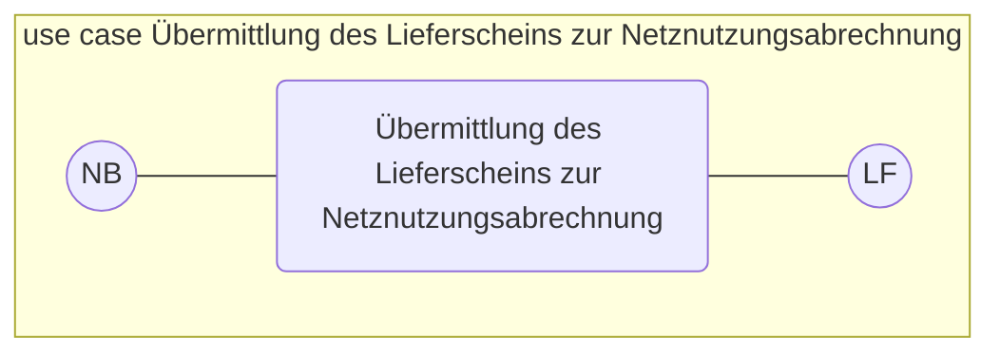

### 6.3.1 UC: Übermittlung des Lieferscheins zur Netznutzungsabrechnung

* **Use-Case-Name**: Übermittlung des Lieferscheins zur Netznutzungsabrechnung
* **Prozessziel**: Dem LF liegt der Lieferschein der Abrechnungsenergiemengen/Leistungswerte vor, welcher eine der Grundlagen für die Netznutzungsabrechnung bildet.
* **Use-Case-Beschreibung**: Vor dem Versand der Netznutzungsrechnung übermittelt der NB an den LF die zugrundeliegenden Werte der Netznutzungsrechnung auf Ebene der Marktlokation.
  Je nach Auslöser kann es sich dabei um einen turnusmäßigen oder ereignisgesteuerten Versand eines Lieferscheines handeln.
  Sollten sich für den Zeitraum, der von einem Lieferschein umfasst wird, für den Lieferschein relevante Werte ändern, ist der bereits versendete Lieferschein, der die entsprechende Abrechnungsenergiemenge/Leistungswert enthält, vom NB zu stornieren.
  Anschließend ist ein neuer Lieferschein mit korrigierter Abrechnungsenergiemenge und ggf. korrigierten Leistungswerten an den LF zu versenden. Ist nur die Abrechnungsenergiemenge oder der Leistungswert zu korrigieren, hat der neue Lieferschein die weiterhin richtige, nicht korrigierte Größe zu enthalten.
* **Rollen**:
  * NB
  * LF
* **Vorbedingungen**:
  * Der LF ist Zahler der Netznutzung.
  * Werte vom MSB liegen vor.
  * Die bisher gemessenen Arbeits- und Leistungswerte bei unterjährigem Lieferbeginn und wenn die Marktlokation mit Arbeits- und Leistungspreis abgerechnet wird, sind vom NB an den LF übermittelt.
  * Die Abrechnung der Netznutzung soll gestellt werden.
  * Sofern der Bedarf der Anwendung einer Zählzeitdefinition des NB mit Zählzeitenanwendungszweck „Netznutzung“ vorliegt, muss die Bestellung einer Parametrierung einer Zählzeitdefinition des NB mit dem Zählzeitenanwendungszwecke „Netznutzung“ fristgerecht und erfolgreich ausgeführt worden sein. Dies gilt nur, wenn die bestellte Parametrierung einer Zählzeitdefinition des NB mit dem Zählzeitenanwendungszwecke "Netznutzung" in den abrechnungsrelevanten Zeitraum des zu erstellenden Lieferscheines fällt.

  Auslöser sind unter anderem:
  * Das Ende des Abrechnungszeitraums ist erreicht oder
  * ein Lieferendeprozess wurde durchgeführt oder
  * eine Aufhebung der Belieferung wurde durchgeführt oder
  * eine Änderung des Zahlers der Netznutzung liegt vor oder

Seite 43 von 182

|Use-Case-Name|Übermittlung des Lieferscheins zur Netznutzungsabrechnung||
|-|-|-|
||\*|ein Netzbetreiberwechsel wurde durchgeführt oder|
||\*|der Wechsel zwischen dem Modell Grundpreis/Arbeitspreis und Arbeitspreis/Leistungspreis wurde vorgenommen.|
|Nachbedingung im Erfolgsfall|\*|Eine Netznutzungsrechnung kann gestellt werden.|
|Nachbedingung im Fehlerfall|\*|Ein Lieferschein muss erneut übermittelt werden.|
|Fehlerfälle|--||
|Weitere Anforderungen|--||


### 6.3.2 SD: Übermittlung des Lieferscheins zur Netznutzungsabrechnung

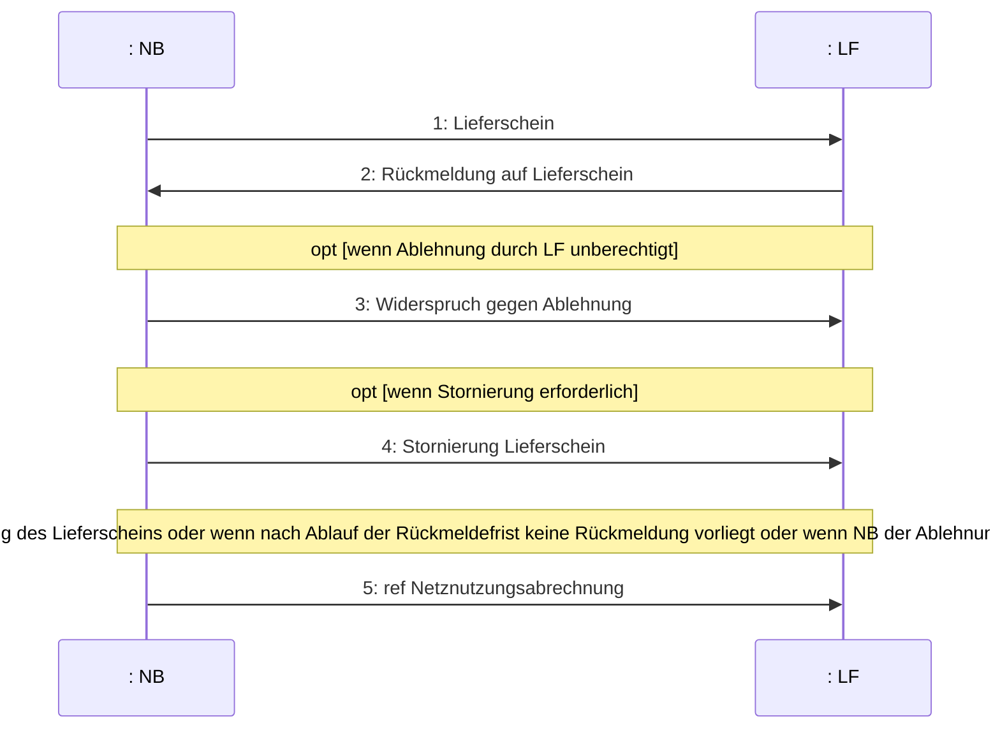

Seite 44 von 182

|Nr.|Aktion|Frist|Hinweis/Bemerkung|
|-|-|-|-|
|1|Lieferschein|Vor dem Versand der Netznutzungsrechnung.|--|
|2|Rückmeldung auf Lieferschein|Unverzüglich, spätestens bis zum Ablauf des 2. WT nach Eingang des Lieferscheins.|Der LF gibt eine Rückmeldung an den NB, ob er den Inhalt des Lieferscheins als korrekt ansieht. Bei Ablehnung hat er den Grund konkret zu benennen.|
|3|Widerspruch gegen Ablehnung|Unverzüglich nach Eingang der Ablehnung des Lieferscheins|Der NB prüft, ob die Ablehnung des Lieferscheins berechtigt ist.<br/>Der NB prüft die Ablehnung anhand des mitgeteilten Ablehnungsgrunds auf Berechtigung und nimmt bei Unklarheiten Kontakt mit dem LF auf.<br/>Im Fall, dass der NB feststellt, dass der ursprünglich vom LF reklamierte Lieferschein korrekt ist, teilt der NB dies dem LF mit. Der NB begründet die Richtigkeit der mitgeteilten Energiemenge und ggf. Leistungswerte und entkräftet die Ablehnungsgründe des LF.<br/>Da dadurch der im Prozessschritt 1 versendete Lieferschein weiterhin Bestand hat, ist kein neuer Lieferschein zu versenden.|
|4|Stornierung Lieferschein|Unverzüglich nach Kenntnisnahme von Fehlern.||
|5|ref. Netznutzungsabrechnung|--|--|


# 7 Use-Case: Netznutzungsabrechnung


## 7.1 UC: Netznutzungsabrechnung

|Use-Case-Name|Netznutzungsabrechnung|
|-|-|
|Prozessziel|Der NB ist informiert, dass der LF die Netznutzungsrechnung akzeptiert.|


Seite 45 von 182

|Use-Case-Name<br/>Use-Case-Beschreibung<br/>Rollen<br/>Vorbedingung<br/>Nachbedingung im Erfolgsfall<br/>Nachbedingung im Fehlerfall|Netznutzungsabrechnung<br/>Der Prozess beschreibt die Kommunikation zwischen NB und LF zur Abrechnung der Netznutzung und ggf. dem automatisierten Reklamationsfall. Eine Rechnungskorrektur umfasst immer eine Stornorechnung und eine neue Rechnung.Insbesondere in den nachfolgend genannten Fällen kann eine Jahresrechnung korrigiert oder ergänzt werden, ohne dass dies durch Stornierung erfolgt:\*<br/>\*<br/>\*<br/>\*<br/>--|Änderung der Konzessionsabgabe durch Einreichung eines Testates: Prüfung des Grenzpreisvergleichs nach KAV\*<br/>NB\*<br/>Die aktuellen Netznutzungsentgelte sind vom NB veröffentlicht und wurden im Rahmen des Use Cases „Übermittlung Preisblatt NB an LF“ in Preisblatt 1 an den LF übermittelt.\*<br/>Der LF wird die vom NB gestellte Netznutzungsrechnung bezahlen.|Korrektur der Netzentgelte Strom aufgrund individueller Vereinbarung für atypische und energieintensive Netznutzung nach StromNEV\*<br/>LF<br/>Die Zuordnung der vom LF angemeldeten Marktlokationen wurde vom NB bestätigt.\*|Korrektur der Netzentgelte Strom aufgrund individueller Vereinbarung für singuläre Netznutzung nach StromNEV\*Die Netznutzungsrechnung enthält nur Positionen, die - als Artikel-ID im Preisblatt 1 enthalten sind oder - als Zu-/Abschlag zu einer Artikel-ID des Preisblatts 1 des NB vorab im Rahmen der Stammdatenprozesse übermittelt wurden.\*|KWKG-Umlage\*Die für die Netznutzungsabrechnung notwendigen Informationen wurden über die Stammdatenprozesse übermittelt.\*|Offshore-Netzumlage.In diesen Fällen kann eine separate, entsprechend gekennzeichnete Rechnung gestellt werden, in der die für das Abrechnungsjahr zu viel oder zu wenig gezahlten Entgelte korrigiert und gemäß Testat, individueller Vereinbarung oder Nachweis erhoben werden. Diese Rechnung hat sich eindeutig auf die Jahresrechnung zu beziehen, deren Position bzw. Positionen sie korrigiert.Die Abrechnung der Netznutzung ist fällig (Turnus-, Abschlags- oder Schlussrechnung bzw. ereignisgesteuert).\*|Der Lieferschein wurde vorher übermittelt (außer bei Abschlagsrechnungen) und im Fall der Ablehnung mit konkretem Grund durch den LF wurde die Reklamation vom NB entkräftet.\*|Der LF ist Zahler der Netznutzung.|
|-|-|-|-|-|-|-|-|-|


<sup>3</sup> Gilt nicht für die Erteilung von Netznutzungsrechnungen in Bezug auf Lieferzeiträume vor dem 01.01.2023.

Seite 46 von 182

|Use-Case-Name|Netznutzungsabrechnung|
|-|-|
|Fehlerfälle|\* Die Netznutzungsrechnung enthält Positionen, die nicht<br/>◦ als Artikel-ID im Preisblatt 1 des NB enthalten sind3 oder<br/>◦ als Zu-/Abschlag zu einer Artikel-ID des Preisblatts 1 des NB vorab im Rahmen der Stammdatenprozesse übermittelt wurden3.<br/>\* Die für die Netznutzungsabrechnung notwendigen Informationen wurden nicht über die Stammdatenprozesse übermittelt.<br/>\* Die für die Netznutzungsabrechnung notwendigen Informationen wurden über die Stammdatenprozesse übermittelt, wurden jedoch in der Netznutzungsrechnung nicht entsprechend berücksichtigt.<br/>\* Die Abrechnungsenergiemengen/ Leistungswerte der Netznutzungsrechnung entsprechen nicht denen des Lieferscheins.<br/>\* Der in der Netznutzungsrechnung angegebene Preis einer Artikel-ID entspricht nicht dem im Preisblatt 1 des NB angegebenen Preis der entsprechenden Artikel-ID3.|
|Weitere Anforderungen|\* Der Fall einer reklamierten oder sich als falsch erweisenden Netznutzungsrechnung (Storno der ursprünglichen Rechnung wird ohne vorherige Reklamation des LF oder auf Grund einer vorherigen Reklamation des LF durchgeführt) stellt einen Teil des Regelprozesses dar und muss abgesehen von Klärungen vollumfänglich automatisch abgewickelt werden. Im Reklamationsfall kommt das sog. „Alles-oder-Nichts-Prinzip“ zur Anwendung, nach dem eine Rechnung entweder vollumfänglich als richtig akzeptiert oder vollumfänglich abgelehnt wird.<br/><br/>Im Fall einer sich falsch erweisenden Netznutzungsrechnung (Storno der ursprünglichen Rechnung wird ohne vorherige Reklamation des LF oder auf Grund einer vorherigen Reklamation des LF durchgeführt) ist in diesem Zusammenhang auch der korrespondierende Lieferschein zu stornieren und ein korrigierter Lieferschein vor dem Versand der neuen Rechnung an den LF zu übermitteln, sofern die Korrektur der Abrechnungsenergiemengen/Leistungswerte notwendig ist. Die im Konfliktfall abzuwickelnden Prozesse im Rahmen des Forderungsmanagements bzw. Mahnablaufs sind nicht dargestellt und sind bilateral zu lösen.<br/>\* Die Netznutzungsrechnung kann eindeutig über eine Referenz dem zuvor ausgetauschten Lieferschein zugeordnet werden.<br/>\* Die Schlussrechnung/ Jahresrechnung weist nachvollziehbar alle enthaltenen Abschlagsrechnungen der Abrechnungsperiode unter Bezeichnung der Rechnungsnummer aus.|


Seite 47 von 182

7.2 SD: Netznutzungsabrechnung

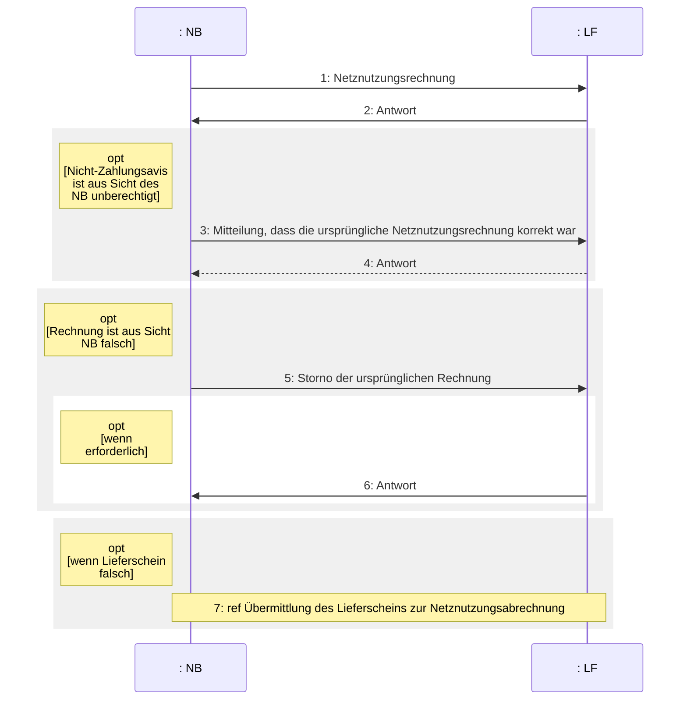

|Nr.:|Aktion|Frist|Hinweis/Bemerkung|
|-|-|-|-|
|1|Netznutzungsrechnung|Unverzüglich, frühestens nach ausdrücklicher oder aufgrund Fristablaufs erteilter Genehmigung des Lieferscheins oder nach Entkräftung der unberechtigten Reklamation des Lieferscheins durch den NB.|Das Zahlungsziel darf 10 WT nach Empfang der Rechnung nicht unterschreiten.<br/><br/>Vom LF geleistete Zahlungen werden in der Netznutzungsrechnung in Summe und nicht positionsbezogen in Abzug gebracht (dadurch kann sich auch eine Rückerstattung ergeben).<br/><br/>Der NB fasst im Falle mehrerer Rechnungen die Nachrichten zu einer Datei zusammen und versendet diese (entspricht Sammelanforderung mit marktlokationsbezogenen Einzelrechnungen) an den LF.<br/><br/>Bei einer korrigierten Netznutzungsrechnung:<br/>Der NB erstellt eine korrigierte Netznutzungsrechnung und sendet diese an den LF. Das Zahlungsziel darf 10 WT nach Empfang der Rechnung nicht unterschreiten.|


Seite 48 von 182

|Nr.:|Aktion|Frist|Hinweis/Bemerkung|
|-|-|-|-|
|2|Antwort|Spätestens zum Zahlungsziel in der Netznutzungsrechnung.|Der LF prüft die Rechnung und teilt dem NB das Ergebnis mit. Abweichungen zwischen Rechnung und Lieferschein führen zur Rechnungsablehnung. Bei Unklarheiten und/oder geringfügigen Abweichungen soll vor einer Zahlungsablehnung Kontakt mit dem NB aufgenommen werden.<br/><br/>\*\*Zahlungsavis:\*\* Der LF bestätigt die Zahlung der Netznutzungsrechnung in Form eines Zahlungsavises.<br/><br/>Die Bestätigung der Zahlung einzelner Rechnungen wird zusammengefasst. Eine Bestätigungsnachricht wird in einer Datei versendet. Im Falle der Bestätigung der Zahlung durch den LF veranlasst der LF parallel die Zahlung der Summe der akzeptierten Rechnungen an den NB.<br/><br/>\*\*Zahlungsablehnung:\*\* Der LF lehnt die Zahlung der Netznutzungsrechnung ab.<br/><br/>Eine Ablehnung der Zahlung wird durch den LF begründet. Die Ablehnung der Zahlung einzelner Rechnungen wird zu einer zusammengefasst. Eine Ablehnungsnachricht wird in einer Datei versendet.|
|3|Mitteilung, dass die ursprüngliche Netznutzungsrechnung korrekt war|Unverzüglich nach Eingang der Zahlungsablehnung.|Der NB prüft, ob die Zahlungsablehnung berechtigt ist.<br/><br/>Der NB prüft die Ablehnung anhand des mitgeteilten Ablehnungsgrunds auf Berechtigung und nimmt bei Unklarheiten Kontakt mit dem LF auf.<br/><br/>Im Fall, dass der NB feststellt, dass die ursprüngliche vom LF reklamierte Netznutzungsrechnung korrekt ist, teilt der NB dies dem LF mit. Der NB begründet die Richtigkeit der gestellten Netznutzungsrechnung und entkräftet die Ablehnungsgründe des LF.<br/><br/>Da dadurch die im Prozessschritt 1 versendete Netznutzungsrechnung weiterhin Bestand hat, ist keine neue Rechnung zu versenden.|
|4|Antwort|Spätestens zum Zahlungsziel in der Netznutzungsrechnung.|Der LF prüft die Rechnung und teilt dem NB das Ergebnis mit. Abweichungen zwischen Rechnung und Lieferschein führen zur Rechnungsablehnung. Bei Unklarheiten und/oder geringfügigen Abweichungen soll vor einer Zahlungsablehnung Kontakt mit dem NB aufgenommen werden.<br/><br/>\*\*Zahlungsavis:\*\* Der LF bestätigt die Zahlung der Netznutzungsrechnung in Form eines Zahlungsavises.|


Seite 49 von 182

|Nr.:|Aktion|Frist|Hinweis/Bemerkung||||
|-|-|-|-|-|-|-|
||||Die Bestätigung der Zahlung einzelner Rechnungen wird zusammengefasst. Eine Bestätigungsnachricht wird in einer Datei versendet. Im Falle der Bestätigung der Zahlung durch den LF veranlasst der LF parallel die Zahlung der Summe der akzeptierten Rechnungen an den NB.<br/><br/>Zahlungsablehnung: Der LF lehnt die Zahlung der Netznutzungsrechnung ab.<br/><br/>Eine Ablehnung der Zahlung wird durch den LF begründet. Die Ablehnung der Zahlung einzelner Rechnungen wird zu einer zusammengefasst. Eine Ablehnungsnachricht wird in einer Datei versendet.<br/><br/>Kommt es zu einer erneuten Ablehnung durch den LF, ist eine bilaterale Klärung notwendig. Hierbei ist das weitere Vorgehen im Rahmen der Netznutzungsabrechnung abzustimmen.||||
||||5|Storno der ursprünglichen Rechnung|Unverzüglich nach Feststellung des Stornierungsbedarfs.|Der NB stellt fest, dass die ursprüngliche Netznutzungsrechnung nicht korrekt war und sendet eine Stornierung der ursprünglichen Rechnung an den LF. Anschließend führt der NB die nötigen Korrekturen durch und erstellt eine neue Rechnung. Eine Rechnungskorrektur umfasst immer eine Stornorechnung und eine neue Rechnung.<br/><br/>Sofern die Zahlung der Rechnung vom LF bestätigt worden war (Schritt 2 oder Schritt 4), wird der gezahlte Betrag im Zahlungsverkehr berücksichtigt.<br/><br/>Sofern die Zahlung der Rechnung vom LF abgelehnt worden war (Schritt 2 oder Schritt 4), und der Ablehnungsgrund vom NB akzeptiert wurde, darf sich der LF den Stornobetrag nicht gutschreiben.|
||||6|Antwort|Unverzüglich nach Eingang der Stornierung, sofern in Schritt 2 oder Schritt 4 die Zahlung bestätigt wurde.|Hat der LF dem NB in Schritt 2 oder Schritt 4 die Zahlung der Netznutzungsrechnung in Form eines Zahlungsavises bestätigt und geht daraufhin eine Stornierung dieser Netznutzungsrechnung vom NB beim LF ein, muss der LF dem NB die Stornierung in einer Antwort bestätigen.|
||||7|ref. Übermittlung des Lieferscheins zur Netznutzungsabrechnung|--|Ist die Korrektur der Abrechnungsenergiemengen/Leistungswerte notwendig, ist zudem der korrespondierende Lieferschein zu stornieren und ein korrigierter Lieferschein vor dem Versand der neuen Rechnung an den LF zu übermitteln.|


Seite 50 von 182

# 8 Prozessbeschreibungen zu den Preisblättern des NB

## 8.1 Allgemeines

Das elektronische Preisblatt ermöglicht dem LF eine automatisierte und damit massengeschäftsfähige Rechnungsprüfung.

Der NB übermittelt zu diesem Zweck vorab und vollständig die auf den Preisblättern enthaltenen Informationen elektronisch an die LF.

Die Abrechnung des Messstellenbetriebes ist bei kME, wenn der Messstellenbetrieb vom gMSB durchgeführt wird, Bestandteil der Netznutzungsrechnung und der nachfolgende Prozess zum Preisblatt ist anzuwenden.

Für alle anderen Fälle wird auf die entsprechenden Prozesse zur Abgrenzung des Messstellenbetriebes in der WiM, Kapitel II.10. verwiesen.

## 8.2 Begriffsbestimmungen

<u>Elektronisches Preisblatt</u>

Ein elektronisches Preisblatt, im folgenden Preisblatt genannt, enthält die vom NB angebotenen Leistungen und die dazugehörigen Preise.

Um eine sachgerechte Darstellung der Leistungen und Preise zu gewährleisten, unterschiedliche Preiszyklen zu berücksichtigen und das auszuta uschende Datenvolumen zu minimieren, sind für nachfolgende Sachverhalte unterschiedliche Preisblätter zu bilden:

* Preisblatt 1 (Netznutzungspreisblatt für Marktlokationen)
* Preisblatt 2 (Preisblatt für separat bestellbare Einzelleistungen für Marktlokationen und Verzugskosten)
* Preisblatt 3 (Preisblatt für freiwillige Abrechnung sonstiger Leistungen )
* Preisblatt 4 (...)

Hinweis: Leistungen der Preisblätter 2 und 3 werden im nachfolgenden Dokument auch unter dem Begriff „sonstige Leistungen“ zusammengefasst.

<u>Gruppenartikel-ID und Artikel-ID</u>

Mit einer Artikel-ID wird die abzurechnende Leistung sachgerecht und eindeutig dargestellt. Die Eindeutigkeit wird durch eine Beschreibung anhand fachlicher und technischer Informationen im Preisblatt erreicht. Jeder Artikel-ID kann ein Preis zugeordnet werden.

Eine Gruppenartikel-ID fasst mehrere Artikel-ID zu einem übergreifenden Sachverhalt zusammen.

Seite 51 von 182

<u>Preis</u>

Jeder Artikel-ID ist für jeden Zeitpunkt im elektronischen Preisblatt genau ein Preis zuzuordnen. Ausgenommen hiervon sind z.B. individuelle Netzentgelte sowie Preisbestandteile, deren Höhe aufgrund gesetzlicher Vorgaben durch Dritte jährlich ermittelt und veröffentlicht werden. Diese Fälle sind gesondert im Preisblatt gekennzeichnet und es ist dort lediglich die Artikel-ID anzugeben und kein Preis. Im Rahmen der Netznutzungsrechnung bzw. Abrechnung einer sonstigen Leistung sind dann die Preise der jeweiligen Marktlokation anzugeben.

Alle Preise sind Nettopreise. Zu jeder Artikel-ID im elektronischen Preisblatt wird vorgebenen, ob der Preis in Euro oder Cent und mit welcher Maßeinheit (z. B. pro Tag, pro Auftrag, pro kWh) abzurechnen ist.

Ein Preis darf auch mit "0,00" angegeben werden.

<u>Preiskomponente</u>

Als Preiskomponente wird jede inhaltliche Information des Preisblatts als Sammelbegriff verstanden. Dies sind:

e) Gruppenartikel-ID
f) Artikel-ID
g) Preis

### 8.3 Rahmenbedingungen der Preisblätter

1. Neben der gesetzlichen Verpflichtung zur Veröffentlichung und Mitteilung des Preisblatts gemäß § 20 Abs. 1 EnWG und § 27 StromNEV muss der NB alle Preisblätter auf dem Wege des elektronischen Datenaustauschs im Sinne der vorliegenden Prozessbeschreibung übermitteln. Es sind dabei in den Preisblättern des NB nur die Artikel-ID anzugeben, die beim NB Anwendung finden. Möchte der NB zu einem Preisblatt keine einzige Artikel-ID anwenden (z.B. die unter Preisblatt 3 gelisteten Artikel-ID), so hat der NB dieses Preisblatt mit der Information „leeres Preisblatt“ im Sinne der vorliegenden Prozessbeschreibungen zu übermitteln.

2. Die Preisblätter sind eindeutig zu versionieren. Auf den Preisblättern sind die aktuelle Versionskennzeichnung, der Gültigkeitsbeginn und die Kennzeichnung der Vorgängerversion (sofern eine Vorgängerversion vorhanden ist) des Preisblatts anzugeben.

3. Die Gültigkeit eines Preisblatts endet mit der Übermittlung eines Preisblattes mit identischem Gültigkeitsbeginn und einer höheren Versionskennzeichnung oder mit dem Inkrafttreten eines Preisblatts mit einem späteren Gültigkeitsbeginn und einer höheren Versionskennzeichnung. Ein Preisblatt beginnt und endet immer zu 0:00 Uhr eines Kalendertages.

4. Das Preisblatt ist nach folgender Hierarchie aufgebaut:
   Preisblatt (1:n Gruppenartikel-ID) 1:n Artikel-ID 1:1 Preis.

Seite 52 von 182

5. Preiskomponenten, die nicht mit einer Artikel-ID im Preisblatt des NB angegeben sind, können nicht über den Use Case „Netznutzungsabrechnung“ bzw. den Use Case „Abrechnung einer sonstigen Leistung“ abgerechnet werden. Sie sind über den Stammdatenaustausch mitzuteilen und ggf. bilateral abzurechnen. Der NB kann nur in dem vorgegebenen Rahmen der Konzessionsabgaben bei Bedarf eigene Artikel-ID vergeben. Darüber hinaus kann kein Preisblatt durch eigene Artikel-ID o.ä. erweitert werden.

6. Jeder Preis muss im Preisblatt eindeutig hinsichtlich seiner Verwendung, anhand fachlicher und technischer Informationen, beschrieben sein.

7. Preise, die aufgrund gesetzlicher oder vertraglicher Vorgaben Monats- oder Jahrespreise (z.B. Jahresleistungspreis gem. § 19 Absatz 4 StromNEV etc.) sind, werden lediglich für das elektronische Preisblatt zur Abrechnung in der kleinsten Einheit ausgewiesen. So können z.B. bei untermonatlichen Lieferantenwechseln Preiskomponenten tagesscharf unabhängig von der Anzahl der Tage des jeweiligen Monats eindeutig ausgewiesen werden und es werden Clearingfälle reduziert. Der für Abrechnungszwecke optimierte Ausweis im elektronischen Preisblatt ändert nichts an der gesetzlich oder vertraglich vorgesehenen Bezugsgröße und führt zu keinen Mehr- oder Mindereinnahmen. Für die Umrechnung vom Ausweis vom elektronischen zum veröffentlichten Preisblatt gilt:
    * Preis pro Tag x 30 Tage = Preis pro Monat
    * Preis pro Monat x 12 Monate = Preis pro Jahr

8. Zu- und Abschläge einer Artikel-ID werden nicht in den Preisblättern abgebildet. Werden zu einzelnen Artikel-ID Zu- und/oder Abschläge (wie z.B. der Kommunalrabatt) erhoben, so werden diese individuell über den Stammdatenprozess bekanntgegeben. Zu- und Abschläge sind prozentual auszuweisen und der entsprechenden Artikel-ID zuzuordnen.

9. Für individuelle Netzentgelte (insbesondere atypische Netznutzung, intensive Netznutzung und individuell vereinbartes Entgelt für allein genutzte Betriebsmittel nach § 19 Abs. 2 und 3 StromNEV)) sind lediglich Artikel-ID im Preisblatt 1 anzugeben und keine Preise. Im Rahmen der Netznutzungsrechnung sind dann die Preise der jeweiligen Marktlokation anzugeben. Auch für Preisbestandteile, deren Höhe aufgrund gesetzlicher Vorgaben durch Dritte jährlich ermittelt und veröffentlicht werden (z. B. Offshore-Netzumlage nach § 17f. EnWG) und weitere diesbezüglich in einem Preisblatt gekennzeichnete Leistungen sind lediglich Artikel-ID im Preisblatt und keine Preise anzugeben. Im Rahmen der Netznutzungsrechnung bzw. Abrechnung einer sonstigen Leistung sind dann die Preise der jeweiligen Marktlokation anzugeben.

10. Im Rahmen der Netznutzungsabrechnung können nur Artikel-ID des Preisblatts 1 (Netznutzungspreisblatt für Marktlokationen) abgerechnet werden. Artikel-ID der Preisblätter 2 (Preisblatt für separat bestellbare Einzelleistungen für Marktlokationen und Verzugskosten) und 3 (Preisblatt für freiwillige Abrechnung sonstiger Leistungen) werden stets über den Use Case „Abrechnung einer sonstigen Leistung“ in Rechnung gestellt.

11. In den entsprechenden Stammdatenprozessen (Lieferbeginn, Ersatz-/Grundversorgung, Stammdatenänderungsprozesse) müssen die für die Marktlokation relevanten Gruppenartikel-ID bzw. Artikel-ID des Preisblatts 1 des NB für die Netznutzungsabrechnung vorab angegeben werden. Wenn eine Gruppen-ID vorhanden ist, muss diese in dem entsprechenden Stammdatenprozessen genannt werden, ansonsten wird direkt die Artikel-ID angegeben.

Seite 53 von 182

12. Die Abrechnung des Messstellenbetriebs umfasst insbesondere die für die Messeinrichtung, den Wandler sowie vorhandene Telekommunikationseinrichtungen zu entrichtenden Kosten. Folglich kann der NB diese Komponenten ausschließlich für kME über das Preisblatt 1 (Netznutzungspreisblatt für Marktlokationen) abrechnen. Der Wandler, die Telekommunikationseinrichtungen sowie Schaltgeräte werden über die jeweilige Artikel-ID gesondert abgerechnet. Für alle anderen Fälle wird auf die entsprechenden Prozesse zur Abgrenzung des Messstellenbetriebes in der WiM, Kapitel II.10. verwiesen.

13. Mit dem Preisblatt 3 für die freiwillige Abrechnung sonstiger Leistungen kann Blindstrom zwischen NB und LF massengeschäftstauglich abgerechnet werden. Diese Position wird eigentlich direkt zwischen NB und AN abgerechnet. Sofern der NB offen für eine Abrechnung über den LF ist, zeigt er das über eine Angabe im Preisblatt an. Falls auch der LF (freiwillig) die Abrechnung gegenüber den AN durchführen möchte, teilt er dies dem NB über die Stammdatenprozesse mit.

## 8.4 Use-Case: Übermittlung Preisblatt NB an LF

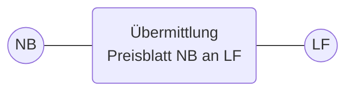

### 8.4.1 UC: Übermittlung Preisblatt NB an LF

|Use-Case Name|Übermittlung Preisblatt NB an LF|
|-|-|
|Prozessziel|Dem LF liegt das elektronische Preisblatt des NB vor.|
|Use-Case Beschreibung|Der NB übermittelt dem LF sein elektronisches Preisblatt, wenn dem LF das elektronische Preisblatt nicht vorliegt oder sich mindestens eine Preiskomponente des Preisblatts geändert hat.|
|Rollen|\* NB\<br/>\* LF|
|Vorbedingungen|\* Die EDIFACT-Kommunikation zwischen NB und LF ist aufgebaut.\<br/>\* Dem LF liegt das aktuelle oder aktualisierte Preisblatt des NB nicht vor.|
|Nachbedingung im Erfolgsfall|\* Die Abrechnung einer sonstigen Leistung kann erstellt werden oder\<br/>\* Die Netznutzungsrechnung kann erstellt werden.|
|Nachbedingung im Fehlerfall|\* In den Fehlerfällen erfolgt eine erneute Übermittlung des Preisblatts.|


Seite 54 von 182

|Use-Case Name|Übermittlung Preisblatt NB an LF|
|-|-|
|Fehlerfälle|\* Preisblatt enthält einen Fehler;<br/>\* Preisblatt wurde nicht in der aktuellen Version übermittelt;<br/>\* Preisblatt wurde nicht vollständig übermittelt;<br/>\* Preisblatt beginnt nicht um 0:00 Uhr eines Kalendertages.|
|Weitere Anforderungen|Hinweise:<br/>\* Erfolgt keine Korrektur der vorläufigen Netzentgelte eines Jahres (gültig ab 1. Januar des Folgejahres) werden diese ab dem 1. Januar des Folgejahres automatisch angewendet und es erfolgt kein erneuter Versand an den LF.<br/>\* Erfolgt eine Korrektur der vorläufigen Netzentgelte eines Jahres (gültig ab 1. Januar des Folgejahres), wird vom NB eine neue Version mit Gültigkeit zum 1. Januar des Folgejahres an den LF gesendet.<br/>\* Preisblätter sind auch an den Letztverbraucher in seiner Rolle als Lieferant zu übermitteln, wenn im Rahmen der Netznutzungsabrechnung (inkl. möglich anfallender Mahnkosten in diesem Zusammenhang) der Letztverbraucher selbst Netznutzer (= Netznutzer ohne All-Inklusiv-Vertrag) ist und in die Rolle des Lieferanten i. S. dieser Prozessbeschreibung tritt, soweit diese Regelungen sinngemäß auf ihn anwendbar sind.|


### 8.4.2 SD: Übermittlung Preisblatt NB an LF

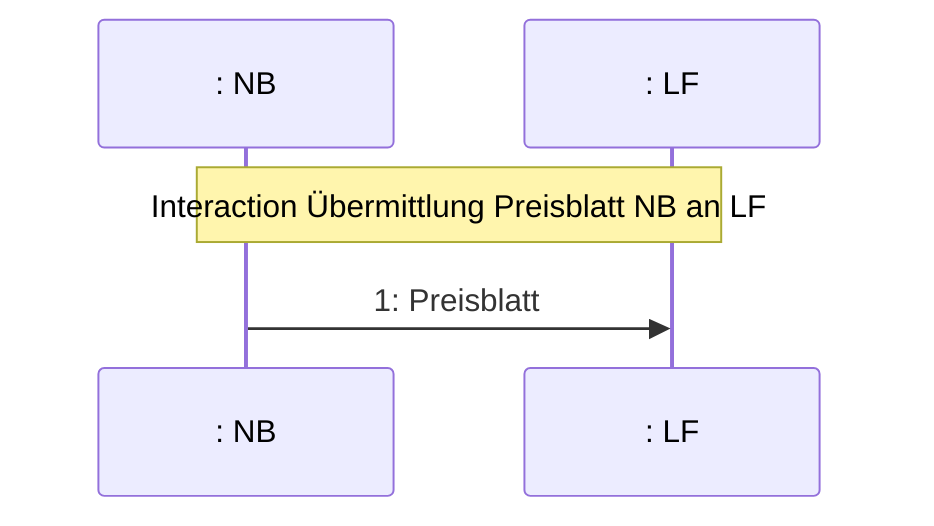

|Nr.|Aktion|Frist|Hinweis/Bemerkung|
|-|-|-|-|
|1|Preisblatt|Bei initialer Übermittlung: Unverzüglich, spätestens jedoch mit Ablauf des 3. WT, nachdem die EDIFACT-Kommunikation aufgebaut wurde.<br/><br/>Bei Übermittlung aufgrund einer Änderung:<br/><br/>Preisblatt 1:<br/><br/>Unverzüglich, spätestens jedoch parallel zur Veröffentlichung nach § 20 Abs. 1 EnWG<br/><br/>im Falle der Preisblätter 2 und 3:||


Seite 55 von 182

|Nr.|Aktion|Frist|Hinweis/Bemerkung|
|-|-|-|-|
|||Unverzüglich, spätestens jedoch 20 WT vor Inkrafttreten eines geänderten Preisblatts||


## 8.5 Use-Case: Abrechnung einer sonstigen Leistung


### 8.5.1 UC: Abrechnung einer sonstigen Leistung

|Use-Case-Name|Abrechnung einer sonstigen Leistung|
|-|-|
|Prozessziel|Der NB ist informiert, dass der LF die Rechnung der sonstigen Leistung akzeptiert.|
|Use-Case-Beschreibung|Der Prozess beschreibt die Kommunikation zwischen NB und LF zur Abrechnung einer sonstigen Leistung, die in den Preisblättern 2 bzw. 3 des NB enthalten ist und ggf. den automatisierten Reklamationsfall. Eine Rechnungskorrektur umfasst immer eine Stornorechnung und eine neue Rechnung.|
|Rollen|\* NB<br/>\* LF|
|Vorbedingung|\* Die aktuellen Entgelte für sonstige Leistungen (Preisblätter 2 und 3) wurden vom NB im Rahmen des Use Cases „Übermittlung Preisblatt NB an LF“ an den LF übermittelt.<br/>\* Eine sonstige Leistung ist mit Artikel-ID des elektronischen Preisblatts des NB (Preisblatt 2 bzw. 3) abbildbar.<br/>Auslöser:<br/>\* Eine sonstige Leistung wurde beauftragt über den UC „Unterbrechung der Anschlussnutzung (Sperren) auf Anweisung des LF“ oder<br/>\* es sind bei dem NB Verzugskosten entstanden oder<br/>\* der LF übernimmt freiwillig die Abrechnung der Artikel-ID Blindstrom gegenüber dem AN.|
|Nachbedingung im Erfolgsfall|\* Der LF wird die vom NB gestellte Rechnung der sonstigen Leistung bezahlen.|
|Nachbedingung im Fehlerfall|--|


Seite 56 von 182

|Use-Case-Name|Abrechnung einer sonstigen Leistung|||
|-|-|-|-|
|Fehlerfälle|\*|Die Rechnung enthält Positionen, die nicht als Artikel-ID im Preisblatt 2 oder 3 des NB enthalten sind .||
|Weitere Anforderungen|\*|Der Fall einer reklamierten oder sich als falsch erweisenden Rechnung der sonstigen Leistung (Storno der ursprünglichen Rechnung wird ohne vorherige Reklamation des LF oder auf Grund einer vorherigen Reklamation des LF durchgeführt) stellt einen Teil des Regelprozesses dar und muss abgesehen von Klärungen vollumfänglich automatisch abgewickelt werden. Im Reklamationsfall kommt das sog. „Alles-oder-Nichts-Prinzip“ zur Anwendung, nach dem eine Rechnung entweder vollumfänglich als richtig akzeptiert oder vollumfänglich abgelehnt wird. Die im Konfliktfall abzuwickelnden Prozesse im Rahmen des Forderungsmanagements bzw. Mahnablaufs sind nicht dargestellt und sind bilateral zu lösen.||
||\*|Eine Rechung im Rahmen der Unterbrechung und Wiederherstellung der Anschlussnutzung referenziert auf den zugrundliegenden Sperrauftrag.||
||\*|Über den Use Case „Abrechnung einer sonstigen Leistung“ können Verzugskosten,<br/>◦ die im Zusammenhang mit einer Netznutzungsrechnung entstanden sind,<br/>◦ als auch einer Rechnung einer sonstigen Leistung entstanden sind,<br/>in Rechnung gestellt werden. Eine eindeutige Referenz auf die zugrundeliegende Rechnung anzugeben.||
||\*|Ist der Letztverbraucher selbst Netznutzer (= Netznutzer ohne All-Inklusiv-Vertrag), so tritt er in die Rolle des Lieferanten i. S. dieser Prozessbeschreibung, soweit diese Regelungen sinngemäß auf ihn anwendbar sind.||


Seite 57 von 182

8.5.2 SD: Abrechnung einer sonstigen Leistung

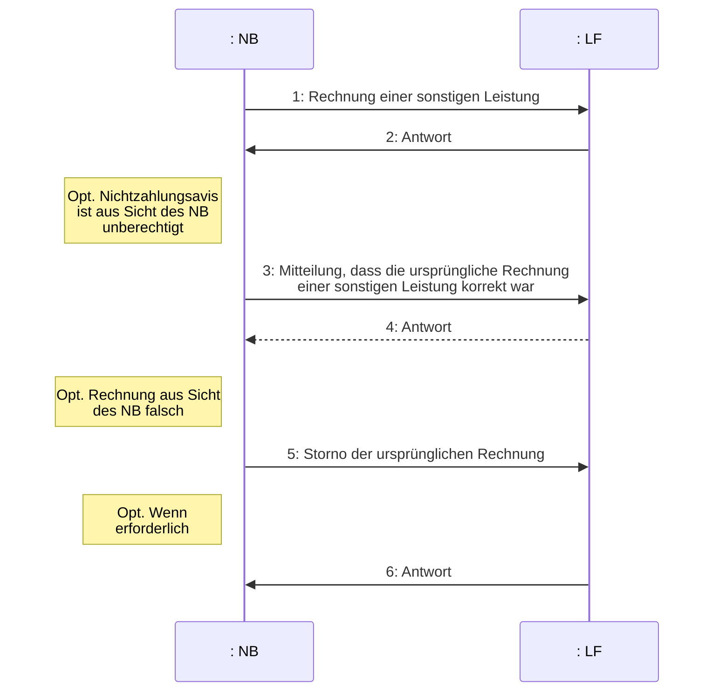

|Nr.:|Aktion|Frist|Hinweis/Bemerkung|
|-|-|-|-|
|1|Rechnung einer sonstigen Leistung|Unverzüglich nach Durchführung der sonstigen Leistung.|Das Zahlungsziel darf 10 WT nach Empfang der Rechnung nicht unterschreiten.<br/>Der NB fasst im Falle mehrerer Rechnungen die Nachrichten zu einer Datei zusammen und versendet diese (entspricht Sammelanforderung mit marktlokationsbezogenen Einzelrechnungen) an den LF.<br/>Bei einer korrigierten Rechnung einer sonstigen Leistung:<br/>Der NB erstellt eine korrigierte Rechnung einer sonstigen Leistung und sendet diese an den LF. Das Zahlungsziel darf 10 WT nach Empfang der Rechnung nicht unterschreiten.|
|2|Antwort|Spätestens zum Zahlungsziel in der Rechnung einer sonstigen Leistung.|Der LF prüft die Rechnung und teilt dem NB das Ergebnis mit. Bei Unklarheiten und/oder geringfügigen Abweichungen soll vor einer Zahlungsablehnung Kontakt mit dem NB aufgenommen werden.<br/>Zahlungsavis: Der LF bestätigt die Zahlung der Rechnung einer sonstigen Leistung in Form eines Zahlungsavises.<br/>Die Bestätigung der Zahlung einzelner Rechnungen wird zusammengefasst. Eine Bestätigungsnachricht wird in einer Datei versendet. Im Falle der Bestätigung der Zahlung durch|


Seite 58 von 182

|Nr.:|Aktion|Frist|Hinweis/Bemerkung||||
|-|-|-|-|-|-|-|
||||den LF veranlasst der LF parallel die Zahlung der Summe der akzeptierten Rechnungen an den NB.<br/><br/>Zahlungsablehnung: Der LF lehnt die Zahlung der Rechnung einer sonstigen Leistung ab.<br/><br/>Eine Ablehnung der Zahlung wird durch den LF begründet. Die Ablehnung der Zahlung einzelner Rechnungen wird zu einer zusammengefasst. Eine Ablehnungsnachricht wird in einer Datei versendet.||||
||||3|Mitteilung, dass die ursprüngliche Rechnung einer sonstigen Leistung korrekt war|Unverzüglich nach Eingang der Zahlungsablehnung.|Der NB prüft, ob die Zahlungsablehnung berechtigt ist.<br/><br/>Der NB prüft die Ablehnung anhand des mitgeteilten Ablehnungsgrunds auf Berechtigung und nimmt bei Unklarheiten Kontakt mit dem LF auf.<br/><br/>Im Fall, dass der NB feststellt, dass die ursprüngliche vom LF reklamierte Rechnung einer sonstigen Leistung korrekt ist, teilt der NB dies dem LF mit. Der NB begründet die Richtigkeit der gestellten Rechnung einer sonstigen Leistung und entkräftet die Ablehnungsgründe des LF.<br/><br/>Da dadurch, die im Prozessschritt 1 versendete Rechnung einer sonstigen Leistung weiterhin Bestand hat, ist keine neue Rechnung zu versenden.|
|4|Antwort|Spätestens zum Zahlungsziel in der Rechnung einer sonstigen Leistung.|Der LF prüft die Rechnung und teilt dem NB das Ergebnis mit. Bei Unklarheiten und/oder geringfügigen Abweichungen soll vor einer Zahlungsablehnung Kontakt mit dem NB aufgenommen werden.<br/><br/>Zahlungsavis: Der LF bestätigt die Zahlung der Rechnung einer sonstigen Leistung in Form eines Zahlungsavises.<br/><br/>Die Bestätigung der Zahlung einzelner Rechnungen wird zusammengefasst. Eine Bestätigungsnachricht wird in einer Datei versendet.<br/><br/>Im Falle der Bestätigung der Zahlung durch den LF veranlasst der LF parallel die Zahlung der Summe der akzeptierten Rechnungen an den NB.<br/><br/>Zahlungsablehnung: Der LF lehnt die Zahlung der Rechnung einer sonstigen Leistung ab.<br/><br/>Eine Ablehnung der Zahlung wird durch den LF begründet. Die Ablehnung der Zahlung einzelner Rechnungen wird zu einer zusammengefasst. Eine Ablehnungsnachricht wird in einer Datei versendet.<br/><br/>Kommt es zu einer erneuten Ablehnung durch den LF, ist eine bilaterale Klärung notwendig. Hierbei ist das weitere Vorgehen im Rahmen||||


Seite 59 von 182

|Nr.:|Aktion|Frist|Hinweis/Bemerkung|
|-|-|-|-|
||||der Abrechnung einer sonstigen Leistung abzustimmen.|
|5|Storno der ursprünglichen Rechnung|Unverzüglich nach Feststellung des Stornierungsbedarfs.|Der NB stellt fest, dass die ursprüngliche Netznutzungsrechnung nicht korrekt war und sendet eine Stornierung der ursprünglichen Rechnung an den LF. Anschließend führt der NB die nötigen Korrekturen durch und erstellt eine neue Rechnung. Eine Rechnungskorrektur umfasst immer eine Stornorechnung und eine neue Rechnung.<br/><br/>Sofern die Zahlung der Rechnung vom LF bestätigt worden war (Schritt 2 oder Schritt 4), wird der gezahlte Betrag im Zahlungsverkehr berücksichtigt.<br/><br/>Sofern die Zahlung der Rechnung vom LF abgelehnt worden war (Schritt 2 oder Schritt 4), und der Ablehnungsgrund vom NB akzeptiert wurde, darf sich der LF den Stornobetrag nicht gutschreiben.|
|6|Antwort|Unverzüglich nach Eingang der Stornierung, sofern in Schritt 2 oder Schritt 4 die Zahlung bestätigt wurde.|Hat der LF dem NB in Schritt 2 oder Schritt 4 die Zahlung der Rechnung einer sonstigen Leistung in Form eines Zahlungsavises bestätigt und geht daraufhin eine Stornierung dieser Rechnung einer sonstigen Leistung vom NB beim LF ein, muss der LF dem NB die Stornierung in einer Antwort bestätigen.|


Seite 60 von 182

# 9 Prozesse zur Unterbrechung/Wiederherstellung der Anschlussnutzung (Sperren/Entsperren)

```mermaid
graph TD
    Main((Unterbrechung und<br/>Wiederherstellung<br/>der<br/>Anschlussnutzung<br/>(Sperren/Entsperren)))
    
    Sperren((Unterbrechung der<br/>Anschlussnutzung<br/>(Sperren) auf<br/>Anweisung des LF))
    
    Entsperren((Wiederherstellung<br/>der<br/>Anschlussnutzung<br/>(Entsperren) auf<br/>Anweisung des LF))
    
    Lieferbeginn((Wiederherstellung der<br/>Anschlussnutzung bei<br/>Lieferbeginn<br/>--<br/>erweiterungspunkte<br/>Lieferbeginn bei gesperrter<br/>Marktlokation))
    
    Stornieren((Stornieren der<br/>Unterbrechung und<br/>Wiederherstellung der<br/>Anschlussnutzung auf<br/>Anweisung des LF<br/>--<br/>erweiterungspunkte<br/>bei Stornierung))

    Main -. "<<include>>" .-> Sperren
    Main -. "<<include>>" .-> Entsperren
    Main -. "<<extend>>" .-> Lieferbeginn
    Main -. "<<extend>>" .-> Stornieren
```

## 9.1 Use Case: Unterbrechung der Anschlussnutzung (Sperren) auf Anweisung des LF


### 9.1.1 UC : Unterbrechung der Anschlussnutzung (Sperren) auf Anweisung des LF

|Use-Case-Name|Unterbrechung der Anschlussnutzung (Sperren) auf Anweisung des LF|
|-|-|
|Prozessziel|Die Anschlussnutzung über die betroffene Marktlokation ist nicht mehr möglich.|
|Use-Case-Beschreibung|Der LF beauftragt den NB nach Maßgabe des zwischen LF und NB geschlossen Netznutzungsvertrags (Lieferantenrahmenvertrags) die Anschlussnutzung an der genannten Marktlokation des vom LF belieferten AN zu unterbrechen. Die Anzahl der Sperrversuche je Sperrauftrag richtet sich nach den allgemeinen Geschäftsbedingungen des NB.|


Seite 61 von 182

|Use-Case-Name|\*\*Unterbrechung der Anschlussnutzung (Sperren) auf Anweisung des LF\*\*||
|-|-|-|
||Der LF kündigt die Sperrung dem AN an. Der NB prüft, ob die notwendigen Voraussetzungen für eine Sperrung vorliegen und führt diese bei Vorliegen der Voraussetzungen durch. Sofern der MSB dem NB keine generelle Zustimmung für die Durchführung der Sperrung/Entsperrung erteilt hat, wird der MSB angefragt.<br/><br/>Der NB informiert den LF, ggf. den MSB und ggf. den ÜNB über das Sperrergebnis.||
||Rollen|\* LF<br/>\* NB<br/>\* MSB<br/>\* ÜNB|
|Vorbedingung|\* Die zu sperrende Marktlokation ist dem LF zugeordnet.<br/>\* Die Marktlokation ist nicht bereits gesperrt.<br/>\* Die zu sperrende Marktlokation befindet sich in der Niederspannung.<br/>\* Der Messstellenbetrieb wird an allen Messlokationen der zu sperrenden Marktlokation vom selben MSB durchgeführt; d.h. der MSB der Marktlokation ist der MSB der Messlokation(en).||
|Nachbedingung im Erfolgsfall|\* Die Marktlokation ist gesperrt.<br/>\* Die Abrechnung kann über den Use-Case „Abrechnung einer sonstigen Leistung" erfolgen. Auch die Kosten der Entsperrung werden dem LF berechnet, der die erfolgreiche Sperrung der Marktlokation beauftragt hat.||
|Nachbedingung im Fehlerfall|\* Der Sperrauftrag wurde ohne Erfolg beendet (Gründe: z. B. Marktlokation vor Ort nicht identifizierbar, Zugang zur Marktlokation nicht möglich, passive Zutrittsverweigerung oder aktive Zutrittsverweigerung).<br/>\* Der LF kann bei Bedarf den Use-Case „Unterbrechung der Anschlussnutzung (Sperren) auf Anweisung des LF“ ggf. unter Einbeziehung eines Gerichtsvollziehers erneut starten.||
|Fehlerfälle|\* Die Anschlussnutzung über die betroffene Marktlokation ist weiterhin möglich.||


Seite 62 von 182

|Use-Case-Name|\*\*Unterbrechung der Anschlussnutzung (Sperren) auf Anweisung des LF\*\*|
|-|-|
|Weitere Anforderungen|\* Eine Sperrung einer Marktlokation ist nicht mit einer Stilllegung gleichzusetzen. Der MSB muss im Falle einer Sperrung seinen Verpflichtungen weiter nachkommen, u.a. mit der Übermittlung von Werten an die Berechtigten. Dies bedeutet, dass der MSB für den Zeitraum der Sperrung, den Sperrzählerstand bzw. "Null-Verbrauchsersatzwerte" übermittelt bzw. anwendet.<br/>\* Eine gesperrte Marktlokation ist weiterhin Bestandteil in der Bilanzierung.<br/>\* Wenn die Sperrung der Marklokation unter der Mitwirkung des MSB durchgeführt wird, erfolgen diese Schritte bilateral außerhalb dieser Prozessstandardisierung.<br/>\* Die Stornierung eines Sperrauftrags ist im Use-Case „Stornieren der Unterbrechung und Wiederherstellung der Anschlussnutzung auf Anweisung des LF“ dargestellt. Bei einer erfolgreichen Stornierung eines Sperrauftrags wird der hier beschriebene Use-Case „Unterbrechung der Anschlussnutzung (Sperren) auf Anweisung des LF“ mit dem SD-Schritt "ref. Abrechnung einer sonstigen Leistung" fortgesetzt, um die bis dahin angefallenen Leistungen abrechnen zu können.<br/>\* Nach einer aktiven Zutrittsverweigerung erfolgt kein weiterer Sperrversuch innerhalb eines Sperrauftrags.<br/>\* Die Sperrung einer Marktlokation unter Einbeziehung eines Gerichtsvollziehers ist stets separat zu beauftragen.<br/>\* Sofern sich die betroffene Marktlokation nicht in der Niederspannung befindet und/oder der MSB der Marktlokation nicht gleichzeitig der MSB aller Messlokationen der Marktlokation ist, erfolgt die Kommunikation NON-EDIFACT.|


Seite 63 von 182

9.1.2 SD: Unterbrechung der Anschlussnutzung (Sperren) auf Anweisung des LF

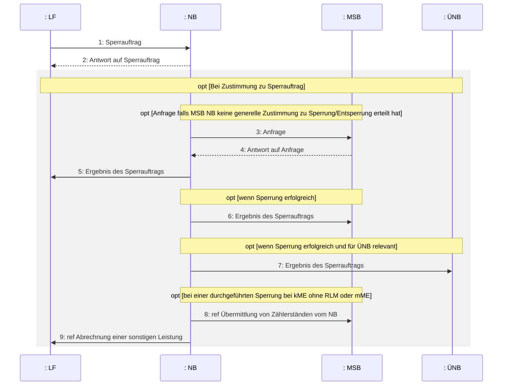

|Nr.:|Aktion|Frist|Hinweis/Bemerkung|
|-|-|-|-|
|1|Sperrauftrag|Auftrag ist nicht termingebunden:<br/><br/>Unverzüglich, spätestens jedoch 6 WT vor dem frühest möglichen Sperrtermin.<br/><br/>Auftrag ist termingebunden (der Gerichtsvollzieher gibt den Sperrtermin (Datum, Uhrzeit, Ort) vor):<br/><br/>Unverzüglich, spätestens jedoch 12 WT vor dem Sperrtermin.|Der LF beauftragt den NB mit der Sperrung der Anschlussnutzung einer Marktlokation und gibt den frühest möglichen Sperrtermin an. Die Sperrung der Marktlokation ist durch den NB spätestens innerhalb von 6 WT nach dem frühestmöglichen Sperrtermin durchzuführen.<br/><br/>Der LF teilt den frühest möglichen Sperrtermin dem AN bilateral fristgerecht mit.<br/><br/>Der LF teilt dem NB optional ergänzende Informationen zur Marklokation mit, die für die Durchführung einer Sperrung notwendig sind. Sofern der LF bei Widerspruch des AN kurzfristig eine qualifizierte Rücksprache ermöglichen möchte oder weitere Informationen z.B. zur Einbeziehung des Gerichtsvollziehers erforderlich sind, teilt er die dafür notwendigen Informationen (z.B.|


Seite 64 von 182

|Nr.:|Aktion|Frist|Hinweis/Bemerkung||
|-|-|-|-|-|
|||||Telefonnummer des LF, etc.) mit. Diese Informationen sind ggf. dem Monteur vor Ort zu übermitteln.|
|2|Antwort auf Sperrauftrag|Unverzüglich, spätestens jedoch innerhalb eines WT nach Eingang des Sperrauftrags.|Der NB prüft, ob die Marktlokation dem LF zugeordnet ist, ob die Marktlokation identifiziert werden kann und die Zusicherung der Berechtigung nach Netznutzungsvertrag vorliegt.<br/><br/>Im Falle einer Zustimmung legt der NB den Sperrtermin fest.<br/><br/>Sofern keine generelle Zustimmung des MSB zur Durchführung der Sperrung/Entsperrung durch den NB vorliegt, kann der Sperrtermin frühestens nach Eingang der Antwort des MSB stattfinden.<br/><br/>Im Falle einer Ablehnung endet der Prozess hier und der NB nennt die Gründe für die Ablehnung. Sofern der LF weiterhin eine Unterbrechung der Anschlussnutzung erreichen möchte, kann er den Prozess erneut starten.<br/><br/>Sofern ein Sperrauftrag Sachverhalte betrifft, die nicht über das elektronische Preisblatt pauschal abgebildet werden können (z.B. Einbindung Leitstelle wg. Schaltungen, Dachständersperrung), teilt der NB im Fall einer Zustimmung mit, dass die Sperr-/Entsperrkosten bilateral und nicht über den Use Case „Abrechnung einer sonstigen Leistung“ stattfindet. Sofern zu einem solchen Sachverhalt bereits eine mögliche, unverbindliche Preisinformation (z.B. Preisspanne) vom NB angegeben werden kann, kann diese in der Zustimmung in einem Freitextfeld an den LF übermittelt werden.||
|3|Anfrage|Unverzüglich, spätestens jedoch 3 WT vor dem Sperrtermin.|Sofern keine generelle Zustimmung des MSB zur Sperrung/Entsperrung durch den NB erteilt wurde, fragt der NB die Zustimmung des MSB zur Sperrung (und für eine spätere Entsperrung) durch den NB bzw. dessen Mitwirkung ab. Der NB teilt dem MSB den Zeitpunkt des Sperrversuchs mit.||
|4|Antwort auf Anfrage|Unverzüglich, spätestens jedoch innerhalb von 3 WT nach Eingang der Anfrage.|Der MSB kann der Anfrage des NB antworten mit:<br/>• „MSB hat Durchführung der Sperrung und Entsperrung durch NB zugestimmt“,<br/>• „MSB hat Durchführung der Sperrung und Entsperrung unter Mitwirkung des MSB zugestimmt“,<br/>wobei die Zustimmung der Durchführung für den Sperr- wie Entsperrvorgang gilt.||


Seite 65 von 182

|Nr.:|Aktion|Frist|Hinweis/Bemerkung||||
|-|-|-|-|-|-|-|
||||Hinweis: Im Fall „MSB hat Durchführung der Sperrung und Entsperrung unter Mitwirkung des MSB zugestimmt“ erfolgt die Kommunikation zur Durchführung der Sperrung durch den MSB nicht standardisiert (NON-EDIFACT) und wird in diesem SD nicht abgebildet. Die nachfolgenden Prozessschritte und deren Fristvorgaben sind jedoch auch in diesem Fall einzuhalten.<br/><br/>Der MSB kann die Anfrage des NB unter Angabe der Gründe ablehnen.||||
||||5|Ergebnis des Sperrauftrags|Unverzüglich, spätestens jedoch am folgenden WT nach Abschluss des Sperrauftrags.|Der NB führt bis zu zwei Sperrversuche innerhalb eines Sperrauftrags durch.<br/>Die Anzahl der Sperrversuche richtet sich nach den allgemeinen Geschäftsbedingungen des NB. Die Kosten für den Sperr-/Entsperrauftrag können dem Preisblatt 2 des NB entnommen werden.<br/>Ist eine Sperrung aus rechtlichen oder tatsächlichen Gründen nicht möglich, informiert der NB den LF hierüber unverzüglich. Als solcher Grund gilt insbesondere eine gerichtliche Verfügung, welche die Sperrung der Marktlokation untersagt.<br/>Ein weiterer Grund liegt auch vor, sofern der AN entgegen der Versicherung des LF im Vorwege Verhinderungsgründe einer Sperrung gegenüber dem NB glaubhaft geltend gemacht hat (z. B. Betrieb lebenserhaltender medizinischer Geräte). Der NB weist den LF in diesem Fall an, diese Verhinderungsgründe zu klären.<br/>Liegen nach der Klärung durch den LF die Verhinderungsgründe nicht mehr vor, ist der NB durch den LF bilateral darüber zu informieren. Sofern der LF weiterhin eine Unterbrechung der Anschlussnutzung erreichen möchte, kann er den Use-Case „Unterbrechung der Anschlussnutzung (Sperren) auf Anweisung des LF“ erneut starten.<br/>Der NB teilt dem LF nach Durchführung des Sperrauftrags mit, ob die Marktlokation gesperrt ist. Falls die Marktlokation nicht gesperrt wurde, teilt der NB dem LF die Gründe dafür mit.<br/>Das Datum der erfolgreichen Sperrung bzw. des Sperrversuchs ist jeweils mitzuteilen.<br/>Sofern es sich um ein Lokationsbündel handelt und eine bzw. mehrere Messlokationen einer Marktlokation nicht gesperrt|


Seite 66 von 182

|Nr.:|Aktion|Frist|Hinweis/Bemerkung||
|-|-|-|-|-|
|||||werden konnten, ist dies explizit mitzuteilen.<br/>Sofern der Sperrauftrag erfolglos war, kann der LF ggf. den Use-Case „Unterbrechung der Anschlussnutzung (Sperren) auf Anweisung des LF“ neu starten.|
|6|Ergebnis des Sperrauftrags|Parallel zu Prozessschritt 5.|Wenn Sperrung erfolgreich.||
|7|Ergebnis des Sperrauftrags|Parallel zu Prozessschritt 5.|Wenn Sperrung erfolgreich und für ÜNB relevant.||
|8|Ref. Übermittlung von Zählerständen vom NB|--|--||
|9|Ref. Abrechnung einer sonstigen Leistung|--|--||


## 9.2 Use-Case: Wiederherstellung der Anschlussnutzung (Entsperren) auf Anweisung des LF

```mermaid
graph LR
    LF((LF)) --- UC(Wiederherstellung der<br/>Anschlussnutzung<br/>(Entsperren) auf<br/>Anweisung des LF)
    UC --- NB((NB))
    UC --- MSB((MSB))
    UC --- UNB((ÜNB))
    
    subgraph "use case Wiederherstellung der Anschlussnutzung (Entsperren) auf Anweisung des LF"
    UC
    end
```

### 9.2.1 UC: Wiederherstellung der Anschlussnutzung (Entsperren) auf Anweisung des LF

**Use-Case-Name**: Wiederherstellung der Anschlussnutzung (Entsperren) auf Anweisung des LF

**Prozessziel**: Die Anschlussnutzung über die betroffene Marktlokation ist wieder möglich.

**Use-Case-Beschreibung**: Der LF beauftragt den NB nach Maßgabe des zwischen LF und NB geschlossenen Netznutzungsvertrags (Lieferantenrahmenvertrags) die Anschlussnutzung an der genannten Marktlokation des vom LF belieferten AN unverzüglich wiederherzustellen. Der NB überprüft die Gegebenheiten am Tag der Entsperrung vor Ort und führt ggf. mehrere Versuche durch, die Anschlussnutzung wiederherzustellen.

Seite 67 von 182

|Use-Case-Name|\*\*Wiederherstellung der Anschlussnutzung (Entsperren) auf Anweisung des LF\*\*||
|-|-|-|
||Der NB informiert den LF, ggf. den MSB und ggf. den ÜNB über das Ergebnis des Entsperrauftrags.||
||Rollen|\* LF<br/>\* NB<br/>\* MSB<br/>\* ÜNB|
|Vorbedingung|\* Die gesperrte Marktlokation ist dem LF zugeordnet.<br/>\* Die Anschlussnutzung ist mittels des Use-Case „Unterbrechung der Anschlussnutzung (Sperren) auf Anweisung des LF“ unterbrochen.<br/>\* Die Kosten der Entsperrung werden dem LF im Rahmen der Sperrung berechnet.||
|Nachbedingung im Erfolgsfall|\* Die Anschlussnutzung über die betroffene Marktlokation ist wieder möglich.||
|Nachbedingung im Fehlerfall|\* LF und NB klären das weitere Vorgehen bilateral, ggf. startet der LF den Use-Case „Wiederherstellung der Anschlussnutzung (Entsperren) auf Anweisung des LF“ erneut.||
|Fehlerfälle|\* Die Anschlussnutzung über die betroffene Marktlokation ist weiterhin nicht möglich.||
|Weitere Anforderungen|\* Die Wiederstellung der Anschlussnutzung bei einem Lieferbeginn (Einzug, Lieferantenwechsel) erfolgt über den Use-Case "Wiederherstellung der Anschlussnutzung bei Lieferbeginn".<br/>\* Inwieweit der MSB bei der Durchführung der Entsperrung mitwirkt, hängt davon ab, ob der MSB dem NB eine generelle Zustimmung zur Durchführung der Sperrung/Entsperrung erteilt hat und sofern diese nicht erteilt wurde, hängt dies vom Inhalt der Zustimmung aus Prozessschritt 4 „Antwort auf Anfrage“ des Use-Cases „Unterbrechung der Anschlussnutzung (Sperren) auf Anweisung des LF“ ab. Wenn die Entsperrung der Marktlokation unter Mitwirkung des MSB durchgeführt wird, erfolgen diese Schritte bilateral außerhalb dieser Prozessstandardisierung.<br/>\* Stornierungen eines Entsperrauftrags sind im Use-Case „Stornieren der Unterbrechung und Wiederherstellung der Anschlussnutzung auf Anweisung des LF“ dargestellt. Eine erfolgreiche Stornierung eines Entsperrauftrags beendet den hier beschriebenen Use-Case.||


Seite 68 von 182

### 9.2.2 SD: Wiederherstellung der Anschlussnutzung (Entsperren) auf Anweisung des LF

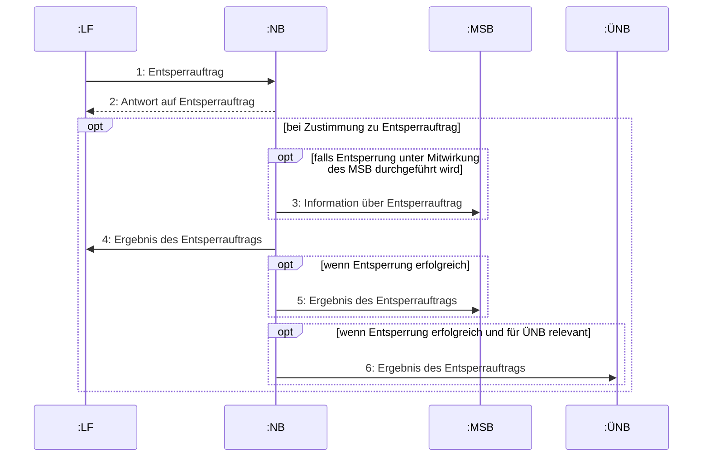

|Nr.:|Aktion|Frist|Hinweis/Bemerkung|
|-|-|-|-|
|1|Entsperrauftrag|Unverzüglich.|Der LF beauftragt den NB mit der Entsperrung der Anschlussnutzung einer Marktlokation. Der LF teilt dem NB weitere Informationen mit, die für die Durchführung einer Entsperrung notwendig sind. Diese Informationen sind ggf. dem Monteur vor Ort zu übermitteln.|
|2|Antwort auf Entsperrauftrag|Unverzüglich, spätestens jedoch innerhalb eines WT nach Eingang des Entsperrauftrags.|Im Falle einer Ablehnung teilt der NB dies dem LF unter der Angabe der Ablehnungsgründe mit und der Use-Case endet hier.|
|3|Information über Entsperrauftrag|Parallel zu Prozessschritt 2.|Im Fall einer Zustimmung in Prozessschritt 2: Sofern im Use-Case „Unterbrechung der Anschlussnutzung (Sperren) auf Anweisung des LF“ die Mitwirkung des MSB bei der Sperr-/ Entsperrung vereinbart wurde, wird der MSB entsprechend beteiligt.|
|4|Ergebnis des Entsperrauftrags|Unverzüglich, spätestens jedoch am folgenden WT nach|Falls erforderlich, unternimmt der NB mehrere Entsperrversuche und hinterlässt eine Kontaktmöglichkeit zur Terminabsprache. Ist eine Entsperrung aus|


Seite 69 von 182

|Nr.:|Aktion|Frist|Hinweis/Bemerkung|||
|-|-|-|-|-|-|
|||Abschluss des Entsperrauftrags.|rechtlichen oder tatsächlichen Gründen nicht möglich, informiert der NB den LF hierüber und stimmt mit ihm evtl. weitere Schritte ab.<br/><br/>Das Datum der erfolgreichen Entsperrung ist mitzuteilen.|||
|||5|Ergebnis des Entsperrauftrags|Parallel zu Prozessschritt 4.|Wenn Entsperrung erfolgreich.|
|6|Ergebnis des Entsperrauftrags|Parallel zu Prozessschritt 4.|Wenn Entsperrung erfolgreich und für ÜNB relevant.|||


## 9.3 Use Case: Stornieren der Unterbrechung und Wiederherstellung der Anschlussnutzung auf Anweisung des LF


### 9.3.1 UC: Stornieren der Unterbrechung und Wiederherstellung der Anschlussnutzung auf Anweisung des LF

|Use-Case-Name|Stornieren der Unterbrechung und Wiederherstellung der Anschlussnutzung auf Anweisung des LF|
|-|-|
|Prozessziel|Der LF storniert einen Auftrag zur Sperrung oder Entsperrung einer Marktlokation bevor dieser vom NB ausgeführt wurde.|
|Use-Case-Beschreibung|Der LF sendet<br/>\* eine Stornierung des Auftrags zur Sperrung (Fall a) oder<br/>\* eine Stornierung des Auftrags zur Entsperrung (Fall b)<br/>einer Marktlokation, so dass<br/>\* die Anschlussnutzung an der Marktlokation weiterhin möglich ist (erfolgreiche Stornierung von Fall a) bzw.<br/>\* die Marktlokation weiterhin gesperrt bleibt (erfolgreiche Stornierung von Fall b).|


Seite 70 von 182

|\*\*Use-Case-Name\*\*|\*\*Stornieren der Unterbrechung und Wiederherstellung der Anschlussnutzung auf Anweisung des LF\*\*|
|-|-|
||Sofern der MSB bereits eingebunden war, ist dieser ebenfalls zu informieren.|
|Rollen|\* NB\<br/>\* MSB\<br/>\* LF|
|Vorbedingung|\* Die betroffene Marktlokation ist dem LF zugeordnet.\<br/>\* Der LF hat den NB nach Maßgabe des zwischen LF und NB geschlossen Netznutzungsvertrags (Lieferantenrahmenvertrags) beauftragt, die Anschlussnutzung an der genannten Marktlokation des vom LF belieferten AN\<br/> \* zu unterbrechen (Fall a: Use-Case „Unterbrechung der Anschlussnutzung (Sperren) auf Anweisung des LF“) oder\<br/> \* zu entsperren (Fall b: Use-Case „Wiederherstellung der Anschlussnutzung (Entsperren) auf Anweisung des LF“).\<br/>\* Der Grund für den Sperrauftrag bzw. Entsperrauftrag ist entfallen, da z. B. der Kunde die Forderung des LF ausgeglichen hat oder der LF den Widerspruch des AN akzeptiert hat.\<br/>\* Die Unterbrechung der Anschlussnutzung (Fall a) oder Wiederherstellung der Anschlussnutzung (Fall b) über die betroffene Marktlokation ist bislang noch nicht erfolgt.|
|Nachbedingung im Erfolgsfall|\* Die Anschlussnutzung über die betroffene Marktlokation ist weiterhin möglich (erfolgreiche Stornierung von Fall a: Sperrauftrag wurde erfolgreich storniert) oder\<br/>\* die Marktlokation ist weiterhin gesperrt (erfolgreiche Stornierung von Fall b: Entsperrauftrag wurde erfolgreich storniert).|
|Nachbedingung im Fehlerfall|\* Bei erfolgloser Stornierung von Fall a:\<br/> \* Um die Sperrung der Marktlokation aufzuheben, startet der LF den Use-Case „Wiederherstellung der Anschlussnutzung (Entsperren) auf Anweisung des LF“ (Fall b).\<br/>\* Bei erfolgloser Stornierung von Fall b:\<br/> \* Für die Sperrung der Marktlokation, startet der LF den Use-Case „Unterbrechung der Anschlussnutzung (Sperren) auf Anweisung des LF“ (Fall a).|
|Fehlerfälle|--|
|Weitere Anforderungen|\* Die Stornierung eines Auftrags kann jederzeit durch den LF unabhängig des Status beim NB erfolgen, solange der Sperrauftrag bzw. Entsperrauftrag vom NB beim AN noch nicht durchgeführt wurde.\<br/>\* Bei einer erfolgreichen Stornierung eines Sperrauftrags wird der Use-Case „Unterbrechung der Anschlussnutzung (Sperren) auf Anweisung des LF“ mit dem SD-Schritt "ref. Abrechnung einer sonsti-|


Seite 71 von 182

|Use-Case-Name|Stornieren der Unterbrechung und Wiederherstellung der Anschlussnutzung auf Anweisung des LF|
|-|-|
||gen Leistung" fortgesetzt, um die bis dahin gegebenenfalls angefallenen Leistungen abrechnen zu können.|


### 9.3.2 SD: Stornieren der Unterbrechung und Wiederherstellung der Anschlussnutzung auf Anweisung des LF

```mermaid
sequenceDiagram
    participant LF as : LF
    participant NB as : NB
    participant MSB as : MSB

    LF->>NB: 1: Stornierung
    NB-->>LF: 2: Antwort auf Stornierung

    opt wenn Zustimmung und sofern MSB in den Informationsfluss eingebunden war
        NB->>MSB: 3: Weiterleitung der Stornierung
    end
```

|Nr.:|Aktion|Frist|Hinweis/Bemerkung|
|-|-|-|-|
|1.|Stornierung|Unverzüglich nach dem der Grund für den ursprünglichen Auftrag entfallen ist.|--|
|2.|Antwort auf Stornierung|Unverzüglich, spätestens jedoch ein WT nach Eingang der Stornierung.|Wenn der Sperrauftrag bzw. der Entsperrauftrag bereits durchgeführt wurde, ist die Stornierung abzulehnen.<br/>Dies gilt auch, wenn der Sperrauftrag bzw. der Entsperrauftrag bereits durchgeführt wurde, jedoch noch nicht über den<br/>\* Prozessschritt 5 „Ergebnis der Sperrung“ im Use-Case „Unterbrechung der Anschlussnutzung (Sperren) auf Anweisung des LF“ bzw.<br/>\* Prozessschritt 4 „Ergebnis Entsperrung“|


Seite 72 von 182

|Nr.:|Aktion|Frist|Hinweis/Bemerkung|
|-|-|-|-|
||||im Use-Case „Wiederherstellung der Anschlussnutzung (Entsperren) auf Anweisung des LF“|
||||an den LF kommuniziert wurde.|
|3.|Weiterleitung der Stornierung|Unverzüglich.|--|


## 9.4 Use Case: Wiederherstellung der Anschlussnutzung bei Lieferbeginn

```mermaid
use case diagram
    actor NB
    actor MSB
    actor ÜNB
    
    package "use case Wiederherstellung der Anschlussnutzung bei Lieferbeginn" {
        usecase UC1 as "Wiederherstellung
        der
        Anschlussnutzung
        bei Lieferbeginn
        --
        erweiterungspunkte
        Lieferbeginn bei
        gesperrter Marktlokation"
    }

    NB -- UC1
    UC1 -- MSB
    UC1 -- ÜNB
```

### 9.4.1 UC: Wiederherstellung der Anschlussnutzung bei Lieferbeginn

**Use-Case-Name**: Wiederherstellung der Anschlussnutzung bei Lieferbeginn

**Prozessziel**: Die Anschlussnutzung über die betroffene Marktlokation ist wieder möglich.

**Use-Case-Beschreibung**: Der NB stößt bei einer gesperrten Marktlokation die Wiederherstellung der Anschlussnutzung an. Der NB informiert ggf. den MSB und ggf. den ÜNB über das Ergebnis des Entsperrauftrags.

**Rollen**:
* NB
* MSB
* ÜNB

**Vorbedingung**:
* Im Fall der Zustimmung der Anmeldung im Rahmen des Use-Cases „Lieferbeginn“ stellt der NB fest, dass sich die Anmeldung auf eine gesperrte Marktlokation bezieht.

Seite 73 von 182

|Use-Case-Name|Wiederherstellung der Anschlussnutzung bei Lieferbeginn|
|-|-|
|Nachbedingung im Erfolgsfall|\* Die Anschlussnutzung über die betroffene Marktlokation ist wieder möglich.|
|Nachbedingung im Fehlerfall|\* Die Beteiligten klären das weitere Vorgehen bilateral.|
|Fehlerfälle|\* Die Anschlussnutzung über die betroffene Marktlokation ist weiterhin nicht möglich.|
|Weitere Anforderungen|\* Wenn die Entsperrung der Marktlokation unter Mitwirkung des MSB durchgeführt wird, erfolgen diese Schritte bilateral außerhalb dieser Prozessstandardisierung.|


### 9.4.2 SD: Wiederherstellung der Anschlussnutzung bei Lieferbeginn

```mermaid
sequenceDiagram
    participant NB as : NB
    participant MSB as : MSB
    participant UNB as : ÜNB

    rect rgb(240, 240, 240)
    Note over NB, MSB: opt [falls Entsperrung unter Mitwirkung des MSB durchgeführt wird]
    NB->>MSB: 1: Information über Entsperrauftrag
    end

    rect rgb(240, 240, 240)
    Note over NB, MSB: opt [wenn Entsperrung erfolgreich]
    MSB->>NB: 2: Ergebnis des Entsperrauftrags
    end

    rect rgb(240, 240, 240)
    Note over NB, UNB: opt [wenn Entsperrung erfolgreich und für ÜNB relevant]
    NB->>UNB: 3: Ergebnis des Entsperrauftrags
    end
```

|Nr.:|Aktion|Frist|Hinweis/Bemerkung|
|-|-|-|-|
|1|Information über Entsperrauftrag|Unverzüglich.|Entsperrung frühestens zum Datum des bestätigten Lieferbeginns. Hierzu werden die normalen Fristen des Use-Cases „Lieferbeginn“ angewendet. Bei einem Lieferantenwechsel ist die Anlage zum bestätigten Netznutzungsbeginn wieder in Betrieb zu nehmen,|


Seite 74 von 182

|Nr.:|Aktion|Frist|Hinweis/Bemerkung||||
|-|-|-|-|-|-|-|
||||sofern es sich um einen WT handelt, ansonsten am nächsten, dem bestätigten Netznutzungsbeginn folgenden WT.<br/>Bei einem Einzug ist die Anlage zum bestätigten Einzugstermin, jedoch nur in die Zukunft wieder in Betrieb zu nehmen.||||
||||2|Ergebnis des Entsperrauftrags|Unverzüglich, spätestens jedoch am folgenden WT nach Abschluss des Entsperrauftrags.|Wenn Entsperrung erfolgreich.|
|3|Ergebnis des Entsperrauftrags|Parallel zu Prozessschritt 2.|Wenn Entsperrung erfolgreich und für ÜNB relevant.||||


Seite 75 von 182

# III. Übergreifende Prozesse

Die Use-Cases im Kapitel „Übergreifende Prozesse“ sind für die Festlegungen GPKE, MPES und WiM Strom zu berücksichtigen.

Die Entscheidung, in welcher Prozessbeschreibung welcher der übergreifenden Prozesse aufgeführt wird, richtet sich danach, welche der Rollen, die für den jeweiligen Use-Case „wichtigste“ Rolle ist, wenn der NB nicht betrachtet wird. Dementsprechend sind alle übergreifenden Prozesse, bei denen dies für die Rolle LF gilt, in der GPKE enthalten. Alle übergreifenden Prozesse, bei denen dies für die Rolle MSB gilt, sind in der WiM Strom enthalten.

Dementsprechend hat die Rolle LF auch alle in der WiM Strom im Kapitel „Übergreifende Prozesse“ enthaltenen Prozesse einzuhalten, in denen die Rolle LF genannt ist.

## 1 Stammdatenaustausch

### 1.1 Allgemeines

Zu einer Markt- oder Messlokation können sich die Werte von Stammdaten bzw. die Beziehungen von Stammdaten zueinander, z. B. in einem Objekt, ändern. Die geänderten Informationen werden über die Stammdatenänderungsmeldungen den der Markt- bzw. Messlokation zugeordneten Marktteilnehmern elektronisch zur Verfügung gestellt, mit dem Ziel, dass alle einer Markt- bzw. Messlokation zugeordneten Unternehmen in ihrer jeweiligen Rolle zu jedem Zeitpunkt über die identischen Informationen zu der Markt- bzw. Messlokation verfügen.

Die Definitionen, für welches Stammdatum welche Rolle verantwortlich und welche Rolle berechtigt ist, muss der jeweiligen Spezifikation des EDI@Energy-Dokuments entnommen werden.

Werte bilanzierungsrelevanter Stammdaten können nur unter Einhaltung der vorgegebenen Frist geändert werden.

Werte nicht bilanzierungsrelevanter Stammdaten können sowohl in die Zukunft, als auch in die Vergangenheit geändert werden.

Werden Werte von Stammdaten in die Vergangenheit oder in die Zukunft geändert, sind alle Marktteilnehmer, die zum Zeitpunkt der Änderung der Markt- oder Messlokation zugeordnet waren, über diese Veränderung zu informieren. Ebenso sind alle Marktteilnehmer über diese Veränderung zu informieren, die nach dem Zeitpunkt, zu dem die Stammdatenänderung in Kraft tritt, dieser Markt- bzw. Messlokation zugeordnet sind. In den nachfolgenden Kapiteln zum Stammdatenaustausch ist mit „die aktuelle Rolle“ (z. B. der „aktuelle LF“ oder der „aktuelle MSB“) immer die Rolle gemeint, die zum Zeitpunkt zu dem die Änderung des Werts des Stammdatums erfolgt, der Markt- bzw. Messlokation zugeordnet ist. Es ist nicht die Rolle gemeint, die zum Zeitpunkt zu dem die Änderung versendet wird, der Markt- bzw. Messlokation zugeordnet ist.

Eine Stammdatenänderung wird verwendet

* für die Änderung der Werte von Stammdaten einer Marktlokation,
* für die Änderung der Werte von Stammdaten einer Messlokation,
* für die Änderung der Werte von Stammdaten für weitere eindeutig identifizierbare Rollen, Gebiete und Objekte sowie
* für die Änderung der Beziehungen zwischen Rollen, Gebieten und Objekten (z. B. zwischen Messlokation und Marktlokation).

Wird eine Stammdatenänderung gemäß Prozessbeschreibung von einem verantwortlichen Marktpartner übermittelt, werden die enthaltenen Werte der Stammdaten ab dem genannten Änderungsdatum bei den Berechtigten verwendet. Der Berechtigte hat eine Abgrenzung der zeitlichen Auswirkung vorzunehmen,

Seite 76 von 182

wenn in der Zukunft bereits ein Wechsel des Verantwortlichen vorliegt. Eine zeitliche Befristung einer Änderung, die vor dem Zeitpunkt endet, zu dem die Zuordnung des Verantwortlichen zur Markt- oder Messlokation endet, erfolgt durch eine weitere Stammdatenänderung mit dem Änderungsdatum, zu dem die Gültigkeit des vorgenannten Stammdatums enden soll.

## 1.2 Definitionen

Für jedes einzelne in der Marktkommunikation ausgetauschte Stammdatum gibt es genau einen Verantwortlichen und mindestens einen Berechtigten. Zudem gibt es einen Verteiler, der die Aufgabe hat, dafür zu sorgen, dass alle berechtigten Marktteilnehmer immer auf dem zeitgleichen, korrekten Stand der Werte der Stammdaten sind. Der Verteiler nimmt je nach Prozess auch die Funktion eines Verantwortlichen oder Berechtigten für ein Stammdatum ein. Nachfolgend werden diese drei Funktionen definiert, wobei aus Gründen der vereinfachten Formulierung davon ausgegangen wird, dass der Informationsaustausch immer über den Verteiler erfolgt, wohl wissend, dass es – wie voranstehend festgehalten – Stammdaten gibt, für die der Verteiler gleichzeitig der Verantwortliche ist:

**Berechtigter**

Ein berechtigter Marktpartner wird durch den Verteiler immer bei Änderung des Werts eines Stammdatums informiert. Kommt ein berechtigter Marktpartner an Informationen über geänderte Werte von Stammdaten, die er nicht vom für das Stammdatum Verantwortlichen über den Verteiler erhalten hat, so ist er verpflichtet, diese Informationen, d. h. die Werte, über den Verteiler dem für das Stammdatum Verantwortlichen zur Plausibilisierung mitzuteilen.

**Verantwortlicher**

Der Verantwortliche ist derjenige Marktpartner, der gemäß Stammdatenmodell der Letztentscheider über die Richtigkeit des Werts eines Stammdatums befindet.

Der für das Stammdatum verantwortliche Marktpartner ist verpflichtet bei Änderung des Werts des Stammdatums diesen Wert unverzüglich nach Bekanntwerden an den Verteiler zu senden. Zudem ist der Verantwortliche verpflichtet vom Berechtigten über den Verteiler an ihn gesendete Anfragen zu prüfen und fachlich zu beantworten. Unabhängig vom Prüfungsergebnis werden in der Antwort immer die korrekten Werte zu den angefragten Stammdaten, die zum ursprünglich mitgegebenen Änderungszeitpunkt der Nachricht Gültigkeit haben, übermittelt.

**Verteiler**

Der Verteiler ist verantwortlich, den Informationsaustausch zwischen den Berechtigten und dem Verantwortlichen sicher zu stellen.

Die Funktion des Verteilers liegt immer beim NB.

Der Verteiler ist für ein Stammdatum entweder auch Berechtigter oder auch Verantwortlicher.

## 1.3 Übersicht Use-Cases zum Stammdatenaustausch

Prozessual wird zwischen den Use-Cases „Stammdatenänderung“ und „Anfrage zur Stammdatenänderung“ unterschieden.

Seite 77 von 182

```mermaid
graph TD
    A(Stammdatenaustausch) --> B(Stammdatenänderung)
    A --> C(Anfrage zur Stammdatenänderung)
```

## 1.4 Use-Case: Stammdatenänderung

```mermaid
graph TD
    A(Stammdatenänderung) --> B(Stammdatenänderung vom NB<br/>verantwortlich ausgehend)
    A --> C(Stammdatensynchronisation)
    A --> D(Stammdatenänderung vom LF<br/>verantwortlich ausgehend)
    A --> E(Stammdatenänderung vom MSB<br/>verantwortlich ausgehend)
```

### 1.4.1 UC: Stammdatenänderung

Aus Vereinfachungsgründen erfolgt die Use-Case-Beschreibung nicht auf Basis von Rollen, sondern den voranstehend definierten Marktpartnern. In den Unterkapiteln werden den für die jeweilige Stammdatenart relevanten Rollen die Marktpartner zugewiesen, um die Prozesse interpretationsfrei darzustellen.

|Use-Case-Name|Stammdatenänderung|
|-|-|
|Prozessziel|Alle Rollen mit Verantwortung oder Berechtigung haben die gleichen Werte der Stammdaten vorliegen.|
|Use-Case-Beschreibung|Der Prozess beschreibt die Übermittlung von geänderten Werten von Stammdaten.<br/><br/>Der für die jeweiligen Stammdaten Verantwortliche übermittelt den geänderten Wert des Stammdatums an die Berechtigten, falls nötig unter Nutzung des Verteilers. Die Änderung des Werts des Stammdatums wird durch den Berechtigten bestätigt.|
|Rollen|\* NB<br/>\* MSB<br/>\* LF<br/>\* ÜNB<br/><br/>Je nach Situation sind die Rollen in den Funktionen Verantwortlicher, Berechtigter, Verteiler aktiv.|


Seite 78 von 182

|Use-Case-Name|Stammdatenänderung|
|-|-|
|Vorbedingung|\* Es besteht eine aktuelle oder zukünftig abgestimmte Zuordnung der Marktpartner in der jeweiligen Rolle zur Markt- bzw. Messlokation.<br/>\* Bei dem für ein Stammdatum Verantwortlichen liegt ein neuer Wert für das Stammdatum vor.<br/>\* Durch einen vorgelagerten Prozess liegt dem NB in der Funktion der Verteilung ein neuer Wert für das Stammdatum vor.|
|Nachbedingung im Erfolgsfall|Die geänderten Werte der Stammdaten liegen allen beteiligten Marktpartnern vor und sind abgestimmt.|
|Nachbedingung im Fehlerfall|Der NB, LF, ÜNB bzw. MSB muss in ein bilaterales Clearing einsteigen und ggf. den Prozess erneut anstoßen.|
|Fehlerfälle|\* Eine Rückmeldung auf eine Änderung liegt nicht fristgerecht vor.<br/>\* Die Rückmeldung/en ergeben den Rückschluss, dass die Daten nicht synchron im Markt vorliegen.|
|Weitere Anforderungen|In den nachfolgenden Sequenzdiagrammen werden immer alle Rollen genannt, auch wenn es im Einzelfall Stammdaten gibt, für die nicht alle der genannten Rollen berechtigt sind.<br/>Besonderheit „erzeugende Marktlokationen“:<br/>Der Stammdatenänderungsprozess ist z. B. für eine Änderung der Veräußerungsform bei gleichzeitiger Beibehaltung der LF-Zuordnung zur Marktlokation bzw. zur Tranche der Marktlokation zu verwenden, da es sich lediglich um eine bilanzierungsrelevante Änderung handelt. Für EEG-Marktlokationen bleiben die Fristigkeiten des § 21c EEG 2017 in jedem Fall unberührt.<br/>Abgrenzung:<br/>Änderung der Tranchengröße einer Marktlokation eines LF bzw. zwischen LF untereinander sind mit den Prozessen Lieferbeginn und Lieferende aus der MPES abzuwickeln.|


### 1.4.2 Use-Case Stammdatenänderung vom NB (verantwortlich) ausgehend


#### 1.4.2.1 UC: Stammdatenänderung vom NB (verantwortlich) ausgehend

|Use-Case-Name|Stammdatenänderung vom NB (verantwortlich) ausgehend|
|-|-|
|Prozessziel|Die Änderung der durch den NB verantworteten Werte der Stammdaten liegen dem MSB bzw. LF vor, sodass ein synchroner Datenstand für das geänderte Stammdatum ab dem Änderungsdatum besteht.|


Seite 79 von 182

|Use-Case-Name|Stammdatenänderung vom NB (verantwortlich) ausgehend|
|-|-|
|Use-Case-Beschreibung|Der NB sendet für die vom LF bzw. MSB benötigten Stammdaten, geänderte Werte an den LF bzw. MSB.<br/>Die Werte der Stammdaten werden zum genannten Änderungsdatum gültig.|
|Rollen|\* NB<br/>\* LF<br/>\* MSB|
|Vorbedingung|Eine Stammdatenänderung, welche ein für den LF bzw. MSB erforderliches Stammdatum darstellt, liegt unter anderem durch eine/den<br/>\* Wertänderung eines Stammdatums durch den NB (verantwortlich),<br/>\* GPKE Use-Case „Lieferbeginn“,<br/>\* GPKE Use-Case „Beginn Ersatz-/Grundversorgung”,<br/>\* GPKE Use-Case „Lieferende von NB an LF“,<br/>\* GPKE Use-Case „Lieferende von LF an NB“ (bei Stilllegungen),<br/>\* WiM Strom Use-Case „Beginn Messstellenbetrieb“,<br/>\* WiM Strom Use-Case „Ende Messstellenbetrieb“,<br/>\* MPES Use-Case „Lieferbeginn“ und<br/>\* MPES Use-Case „Lieferende von NB a LF“<br/>\* MPES Use-Case „Lieferende von LF an NB“<br/>beim NB vor.|
|Nachbedingung im Erfolgsfall|\* Der NB muss, wenn die Datenaggregation der Marktlokation an den ÜNB übergeht, den Use-Case „Information über die Zuordnung einer Marktlokation zur Datenaggregation durch den ÜNB“ durchführen. In diesem Fall muss der NB mit dem entsprechenden LF nicht zusätzlich den Use-Case „Stammdatensynchronisation“ durchführen.<br/>\* Der NB muss, wenn die Datenaggregation der Marktlokation durch den ÜNB erfolgt,<br/>- im Fall der Stilllegung den Use-Case „Information über die Beendigung der Zuordnung einer Marktlokation zur Datenaggregation durch den ÜNB“ anstoßen oder<br/>- im Fall, dass die Datenaggregation auf den NB übertragen wird, den Use-Case „Information über die Beendigung der Zuordnung einer Marktlokation zur Datenaggregation durch den ÜNB“ anstoßen.<br/>In diesen Fällen muss der NB mit dem entsprechenden LF nicht zusätzlich den Use-Case „Stammdatensynchronisation“ durchführen.<br/>\* Der NB muss, wenn ein Wert aus dem zu synchronisierenden Stammdatenpaket geändert wurde und der Use-Case „Stammdatensynchronisation“ nicht bereits im Vorprozess (Lieferbeginn (GPKE und MPES), Ersatz- und Grundversorgung) aufgerufen wurde, den Use-Case „Stammdatensynchronisation“ anstoßen.<br/>\* Durch die in diesem Use-Case durchgeführte Änderung kann es unter anderem dazu kommen, dass eine Wertübermittlung erforderlich ist. Hierzu wird der WiM Use-Case „Aufbereitung und Übermittlung von Werten vom MSB der Messlokation“ durchgeführt. Die Beauftragung der Werteübermittlung ergibt sich aus den Werten des entsprechenden Stammdatums. Es erfolgt keine weitere Beauftragung gegenüber dem MSB.<br/>\* Die Folgeprozesse setzen auf abgeglichenen und synchronen Daten ab dem Änderungsdatum auf.|
|Nachbedingung im Fehlerfall|\* Der NB muss in ein bilaterales Clearing mit den Beteiligten einsteigen und ggf. den Prozess erneut anstoßen.|


Seite 80 von 182

|Use-Case-Name|Stammdatenänderung vom NB (verantwortlich) ausgehend||
|-|-|-|
|Fehlerfälle|\*|Nach der Auswertung der Rückmeldung vom MSB bzw. LF durch den NB sind die Daten nicht synchron.|
|Weitere Anforderungen|\*|Dieser Use-Case ist insbesondere zu verwenden, wenn die Aggregationsverantwortung einer Marktlokation zwischen NB und ÜNB wechselt.|


### 1.4.2.2 SD: Stammdatenänderung vom NB (verantwortlich) ausgehend

```mermaid
sequenceDiagram
    participant NB as : NB <br/> (Verantwortlicher)
    participant LF as : LF <br/> (Berechtigter)
    participant MSB as : MSB <br/> (Berechtigter)

    rect rgb(240, 240, 240)
        Note over NB, MSB: interaction Stammdatenänderung vom NB (verantwortlich) ausgehend [ ]
        
        rect rgb(255, 255, 255)
            Note left of NB: par <br/> [Wenn Änderung für <br/> LF relevant]
            NB->>LF: 1: Änderung vom NB an LF
            LF->>NB: 2: Antwort auf Änderung vom NB an LF
            
            rect rgb(255, 255, 255)
                Note left of NB: opt <br/> [Bei Zustimmung des LF <br/> und wenn ein Wert der zu <br/> synchronisierenden <br/> Stammdaten sich ändert]
                Note over NB, LF: ref <br/> Stammdatensynchronisation
            end
        end

        rect rgb(255, 255, 255)
            Note left of NB: [Wenn Änderung für <br/> MSB relevant]
            NB->>MSB: 4: Änderung vom NB an MSB
            MSB->>NB: 5: Antwort auf Änderung vom NB an MSB
        end

        rect rgb(255, 255, 255)
            Note left of NB: [Wenn Änderung für <br/> ÜNB relevant und nicht bereits <br/> Stammdatensynchronisation <br/> durchgeführt]
            
            rect rgb(255, 255, 255)
                Note left of NB: alt <br/> [Aggregationsverantwortung <br/> der MaLo wird an den <br/> ÜNB übertragen]
                Note over NB, MSB: ref <br/> 6: Information über die Zuordnung einer Marktlokation zur Datenaggregation durch den ÜNB
                
                Note left of NB: [Wenn Aggregations- <br/> verantwortung der MaLo <br/> an NB übertragen wird oder <br/> bei Stilllegung]
                Note over NB, MSB: ref <br/> 7: Information über die Beendigung der Zuordnung einer Marktlokation zur Datenaggregation durch den ÜNB
                
                Note left of NB: [else]
                Note over NB: keine weiteren <br/> Schritte notwendig
            end
        end

        rect rgb(255, 255, 255)
            Note left of NB: opt <br/> [wenn durch Änderung <br/> Wertübermittlung <br/> erforderlich wird]
            Note over NB, MSB: ref <br/> 8: Aufbereitung und Übermittlung von Werten vom MSB der Messlokation
        end
    end
```

Seite 81 von 182

|Nr.|Aktion|Frist|Hinweis/Bemerkung|
|-|-|-|-|
|1|Änderung vom NB an LF|Bilanzierungsrelevante Änderungen:<br/><br/>Veränderungen sind jeweils nur zum Beginn eines Monats mit einer Frist von 10 WT möglich.<br/><br/>Sonstige Stammdaten:<br/><br/>sofort nach Kenntnisnahme.|Eine Übermittlung der Änderung an den LF erfolgt:<br/><br/>a) Sofern der aktuelle LF oder ein in der Zukunft zugeordneter LF an der Marktlokation für die Stammdaten berechtigt ist.<br/><br/>b) Sofern eine Änderung von Stammdaten einer Messlokation vorliegt, die eine Beziehung zu einer Marktlokation hat und der aktuelle LF oder ein in der Zukunft zugeordneter LF an der Marktlokation für die Stammdaten berechtigt ist.|
|2|Antwort auf Änderung vom NB an LF|Unverzüglich, jedoch spätestens bis zum Ablauf des 3. WT nach Eingang der Änderung vom NB an LF.|Verstreicht die Frist ohne dass eine Antwort eingeht, gilt dies als Zustimmung. Nach Ablauf der Frist eingehende Antworten sind für den Fortlauf dieses Prozesses unerheblich.|
|3|ref Stammdatensynchronisation|--|--|
|4|Änderung vom NB an MSB|Sofort nach Kenntnisnahme.|Eine Übermittlung der Änderung an den MSB erfolgt:<br/><br/>a) Sofern der MSB an der Messlokation für die Stammdaten berechtigt ist.<br/><br/>b) Sofern eine Änderung von Stammdaten einer Marktlokation vorliegt, die eine Beziehung zu einer Messlokation hat und der MSB an der Messlokation für die Stammdaten berechtigt ist.<br/><br/>c) Sofern eine Änderung für den gMSB relevant ist. Der MSB wird über die Stilllegung eines Lokationsbündels informiert, in dem der NB eine Stammdatenänderung zur Lokationsbündelstruktur mit Transaktionsgrund und Zeitangabe, die den Stilllegungstermin beinhaltet, an den MSB versendet.|
|5|Antwort auf Änderung vom NB an MSB|Unverzüglich, spätestens jedoch bis zum Ablauf des 3. WT nach Eingang der Änderung vom NB an MSB.|Verstreicht die Frist ohne dass eine Antwort eingeht, gilt dies als Zustimmung. Nach Ablauf der Frist eingehende Antworten sind für den Fortlauf dieses Prozesses unerheblich.|
|6|ref Information über die Zuordnung einer Marktlokation zur Datenaggregation durch den ÜNB|--|--|
|7|ref Information über die Beendigung der Zuordnung einer Marktlokation zur Datenaggregation durch den ÜNB|--|--|


Seite 82 von 182

|Nr.|Aktion|Frist|Hinweis/Bemerkung|
|-|-|-|-|
|8|ref Aufbereitung und Übermittlung von Werten vom MSB der Messlokation|--|--|


### 1.4.3 Use-Case: Stammdatenänderung vom LF (verantwortlich) ausgehend


#### 1.4.3.1 UC: Stammdatenänderung vom LF (verantwortlich) ausgehend

|Use-Case-Name|Stammdatenänderung vom LF (verantwortlich) ausgehend|
|-|-|
|Prozessziel|Die Änderung der durch den LF verantworteten Werte der Stammdaten liegen dem MSB bzw. NB vor, sodass ein synchroner Datenstand für das geänderte Stammdatum ab dem Änderungsdatum besteht.|
|Use-Case-Beschreibung|Der LF sendet die Änderung der Werte des durch ihn verantworteten Stammdatums an den NB, der dies je nach Berechtigung an den MSB weiterleitet. Eine beim NB oder MSB eingegangene Änderung ist vom NB bzw. MSB immer zu beantworten und wird bei Zustimmung oder bei Nichtantwort innerhalb der Frist übernommen.|
|Rollen|\* NB<br/>\* MSB<br/>\* LF|
|Vorbedingung|Eine Stammdatenänderung, welche ein für den NB bzw. MSB erforderliches Stammdatum darstellt, liegt unter anderem durch den<br/>\* LF (verantwortlich) beim LF vor (Prozessstart mit SD Stammdatenänderung vom LF (verantwortlich) ausgehend),<br/>Eine Stammdatenänderung welche ein für den MSB erforderliches Stammdatum darstellt, liegt unter anderem durch den<br/>\* GPKE Use-Case „Lieferbeginn“,<br/>\* GPKE Use-Case „Beginn Ersatz-/Grundversorgung“,<br/>\* MPES Use-Case „Lieferbeginn“ und<br/>\* MPES Use-Case „Lieferende von LF an NB“<br/>beim NB vor (Prozessstart mit SD Weiterleitung der Stammdatenänderung vom LF (verantwortlich) ausgehend).|
|Nachbedingung im Erfolgsfall|\* Der NB muss, wenn ein Wert aus dem zu synchronisierenden Stammdatenpaket geändert wurde und der Use-Case „Stammdatensynchronisation“ nicht bereits im Vorprozess (Lieferbeginn (GPKE und MPES), Ersatz- und Grundversorgung) aufgerufen wurde, den Use-Case „Stammdatensynchronisation“ anstoßen.|


Seite 83 von 182

|Use-Case-Name|Stammdatenänderung vom LF (verantwortlich) ausgehend|
|-|-|
||\* Durch die in diesem Use-Case durchgeführte Änderung kann es unter anderem dazu kommen, dass eine Wertübermittlung erforderlich ist. Hierzu wird der WiM Use-Case „Aufbereitung und Übermittlung von Werten vom MSB der Messlokation“ durchgeführt. Die Beauftragung der Werteübermittlung ergibt sich aus den Werten des entsprechenden Stammdatums. Es erfolgt keine weitere Beauftragung gegenüber dem MSB.|
||\* Die Folgeprozesse setzen auf abgeglichenen und synchronen Daten ab dem Änderungsdatum auf.|
|Nachbedingung im Fehlerfall|\* Der NB bzw. LF muss in ein bilaterales Clearing mit den Beteiligten einsteigen und ggf. den Prozess erneut anstoßen.|
|Fehlerfälle|\* Die Rückmeldung ergibt den Rückschluss, dass die Daten nicht synchron im Markt vorliegen.|
|Weitere Anforderungen|--|


### 1.4.3.2 SD: Stammdatenänderung vom LF (verantwortlich) ausgehend

```mermaid
sequenceDiagram
    participant LF as : LF <br/> (Verantwortlicher)
    participant NB as : NB <br/> (Verteiler)

    Note over LF, NB: interaction Stammdatenänderung vom LF (verantwortlich) ausgehend

    LF->>NB: 1: Änderung vom LF
    NB->>LF: 2: Antwort auf Änderung vom LF

    rect rgb(240, 240, 240)
        Note right of LF: alt
        alt bei Zustimmung
            Note over LF, NB: ref: Weiterleitung der Stammdatenänderung vom LF (verantwortlich) ausgehend
            Note right of NB: 3:
        else else
            Note over LF, NB: keine weiteren Schritte notwendig
        end
    end
```

Seite 84 von 182

|Nr.|Aktion|Frist|Hinweis/Bemerkung|
|-|-|-|-|
|1|Änderung vom LF|Bilanzierungsrelevante Änderungen: Veränderung jeweils nur zum Beginn eines Monats mit einer Frist von 10 WT möglich.<br/><br/>Sonstige Stammdaten: sofort nach Kenntnisnahme.|--|
|2|Antwort auf Änderung vom LF|Unverzüglich, jedoch spätestens bis zum Ablauf des 3. WT nach Eingang der Änderung vom LF.|Der NB als Verteiler antwortet bei Zustimmung dem verantwortlichen LF, dass er die Nachricht weitergeleitet hat.<br/><br/>Verstreicht die Frist ohne dass eine Antwort eingeht, gilt dies als Zustimmung. Nach Ablauf der Frist eingehende Antworten sind für den Fortlauf dieses Prozesses unerheblich.|
|3|ref Weiterleitung der Stammdatenänderung vom LF (verantwortlich) ausgehend|--|--|


### 1.4.3.3 SD: Weiterleitung der Stammdatenänderung vom LF (verantwortlich) ausgehend

```mermaid
sequenceDiagram
    participant NB as : NB<br/>Verteiler
    participant MSB as : MSB<br/>Berechtigter

    rect rgb(240, 240, 240)
        Note over NB, MSB: par [Wenn Änderung für MSB relevant]
        NB->>MSB: 1: Änderung vom LF (Weiterleitung an MSB)
        MSB->>NB: 2: Antwort auf Änderung vom LF
        
        Note over NB, MSB: [Wenn ein Wert der zu synchronisierenden Stammdaten sich ändert]
        NB->>NB: 3: ref Stammdatensynchronisation
    end

    rect rgb(240, 240, 240)
        Note over NB, MSB: opt [Wenn durch Änderung Wertübermittlung erforderlich wird]
        MSB->>NB: 4: ref Aufbereitung und Übermittlung von Werten vom MSB der Messlokation
    end
```

Seite 85 von 182

|Nr.|Aktion|Frist|Hinweis/Bemerkung|
|-|-|-|-|
|1|Änderung vom LF<br/>(Weiterleitung an<br/>MSB)|Unverzüglich nach Vorliegen eines geänderten Wertes eines Stammdatums, für das der MSB berechtigt ist.|Sendet der verantwortliche LF eine Stammdatenänderung, ist diese an den MSB weiter zu leiten:<br/>a) Sofern der MSB an der Messlokation für die Stammdaten berechtigt ist.<br/>b) Sofern eine Änderung von Stammdaten einer Marktlokation vorliegt, die eine Beziehung zu einer Messlokation hat und der MSB an der Messlokation für die Stammdaten berechtigt ist.<br/>c) Sofern eine Änderung für den gMSB relevant ist.|
|2|Antwort auf Änderung vom LF|Unverzüglich, jedoch spätestens bis zum Ablauf des 3. WT nach Eingang der Nachricht vom NB.|Die Antwort des berechtigten MSB wird entgegengenommen, wird aber nicht an den Verantwortlichen weitergegeben.<br/>Verstreicht die Frist ohne dass eine Antwort eingeht, gilt dies als Zustimmung. Nach Ablauf der Frist eingehende Antworten sind für den Fortlauf dieses Prozesses unerheblich.|
|3|ref Stammdatensynchronisation|--|--|
|4|ref Aufbereitung und Übermittlung von Werten vom MSB der Messlokation|--|--|


### 1.4.4 Use-Case: Stammdatenänderung vom MSB (verantwortlich) ausgehend


#### 1.4.4.1 UC: Stammdatenänderung vom MSB (verantwortlich) ausgehend

|Use-Case-Name|Stammdatenänderung vom MSB (verantwortlich) ausgehend|
|-|-|
|Prozessziel|Die Änderung der durch den MSB verantworteten Werte der Stammdaten liegen dem LF bzw. NB bzw. weiteren MSB (alle MSB des Lokationsbündels und ggf. gMSB, wenn nicht selbst Verantwortlicher) vor, sodass ein synchroner Datenstand für das geänderte Stammdatum ab dem Änderungsdatum besteht.|


Seite 86 von 182

|Use-Case-Name|\*\*Stammdatenänderung vom MSB (verantwortlich) ausgehend\*\*|
|-|-|
|Use-Case-Beschreibung|Der MSB sendet die Änderung der Werte des durch ihn verantworteten Stammdatums an den NB, der dies je nach Berechtigung an den LF und weiteren MSB weiterleitet. Eine beim NB, LF oder weiteren MSB eingegangenen Änderung ist vom NB bzw. LF bzw. weiteren MSB immer zu beantworten und wird bei Zustimmung oder bei Nichtantwort innerhalb der Frist übernommen.|
|Rollen|\* NB<br/>\* MSB<br/>\* LF|
|Vorbedingung|Eine Stammdatenänderung, welche ein für den NB, LF bzw. weiteren MSB erforderliches Stammdatum darstellt, liegt unter anderem durch den<br/>\* MSB (verantwortlich) beim MSB vor (Prozessstart mit SD Stammdatenänderung vom MSB (verantwortlich) ausgehend).<br/>Eine Stammdatenänderung, welche ein für den LF bzw. weiteren MSB erforderliches Stammdatum darstellt, liegt unter anderem durch den<br/>\* WiM Strom Use-Case „Beginn Messstellenbetrieb“,<br/>\* WiM Strom Use-Case „Ende Messstellenbetrieb“,<br/>beim NB vor (Prozessstart mit SD Weiterleitung der Stammdatenänderung vom MSB (verantwortlich) ausgehend).|
|Nachbedingung im Erfolgsfall|\* Der NB muss, wenn ein Wert aus dem zu synchronisierenden Stammdatenpaket geändert wurde, den Use-Case „Stammdaten-synchronisation“ anstoßen.<br/>\* Durch die in diesem Use-Case durchgeführte Änderung kann es unter anderem dazu kommen, dass eine Wertübermittlung erforderlich ist. Hierzu wird der WiM Use-Case „Aufbereitung und Übermittlung von Werten vom MSB der Messlokation“ durchgeführt. Die Beauftragung der Werteübermittlung ergibt sich aus den Werten des entsprechenden Stammdatums. Es erfolgt keine weitere Beauftragung gegenüber dem MSB.<br/>\* Die Folgeprozesse setzen auf abgeglichenen und synchronen Daten ab dem Änderungsdatum auf.|
|Nachbedingung im Fehlerfall|\* Der NB bzw. MSB muss in ein bilaterales Clearing mit den Berechtigten einsteigen und ggf. den Prozess erneut anstoßen.|
|Fehlerfälle|\* Die Rückmeldung ergibt den Rückschluss, dass die Daten nicht synchron im Markt vorliegen.|
|Weitere Anforderungen|--|


Seite 87 von 182

### 1.4.4.2 SD: Stammdatenänderung vom MSB (verantwortlich) ausgehend

```mermaid
sequenceDiagram
    participant MSB as : MSB<br/>(Verantwortlicher)
    participant NB as : NB<br/>(Verteiler)

    MSB->>NB: 1: Änderung vom MSB
    NB->>MSB: 2: Antwort auf Änderung vom MSB

    rect rgb(240, 240, 240)
        Note over MSB, NB: alt [bei Zustimmung]
        Note right of MSB: 3: ref Weiterleitung der Stammdatenänderung vom MSB (verantwortlich) ausgehend
        
        rect rgb(255, 255, 255)
            Note over MSB, NB: opt [wenn durch Änderung Wertübermittlung erforderlich wird]
            Note right of MSB: 4: ref Aufbereitung und Übermittlung von Werten vom MSB der Messlokation
        end
    end

    rect rgb(240, 240, 240)
        Note over MSB, NB: [else]
        Note right of MSB: keine weiteren Schritte notwendig
    end
```

||Nr.|Aktion|Frist|Hinweis/Bemerkung|
|-|-|-|-|-|
|1|Änderung vom MSB|Sofort nach Kenntnisnahme.|Der verantwortliche MSB einer Messlokation ist immer der MSB, der zum Zeitpunkt des Meldungsversands der Messlokation zugeordnet ist. Dabei gilt folgende Ausnahme: Findet an der Messlokation der Use-Case „Geräteübernahme“ statt, ist neben dem vorgenannten MSB (im Use-Case „Geräteübernahme“ als MSBA bezeichnet) auch der MSBN berechtigt für diese Messlokation Stammdatenänderungen zu versenden.||
|2|Antwort auf Änderung vom MSB|Unverzüglich, spätestens jedoch bis zum Ablauf des 3. WT nach Eingang der Änderung vom MSB.|Der NB als Verteiler antwortet bei Zustimmung dem verantwortlichen MSB, dass er die Nachricht weitergeleitet hat.<br/><br/>Verstreicht die Frist ohne dass eine Antwort eingeht, gilt dies als Zustimmung. Nach Ablauf der Frist eingehende Antworten sind für den Fortlauf dieses Prozesses unerheblich.||


Seite 88 von 182

|3|ref Weiterleitung der Stammdatenänderung vom MSB (verantwortlich) ausgehend|--|--|
|-|-|-|-|
|4|ref Aufbereitung und Übermittlung von Werten vom MSB der Messlokation|--|--|


### 1.4.4.3 SD: Weiterleitung der Stammdatenänderung vom MSB (verantwortlich) ausgehend

```mermaid
sequenceDiagram
    participant NB as : NB<br/>Verteiler
    participant LF as : LF<br/>Berechtigter
    participant MSB as : MSB<br/>weitere MSB als<br/>Berechtigter

    rect rgb(240, 240, 240)
        Note over NB, MSB: interaction [ Weiterleitung der Stammdatenänderung vom MSB (verantwortlich) ausgehend ]
        
        alt Wenn Änderung für LF relevant
            NB->>LF: 1: Änderung vom MSB (Weiterleitung an LF)
            LF-->>NB: 2: Antwort auf Änderung vom MSB
            
            opt Bei Zustimmung des LF und wenn ein Wert der zu synchronisierenden Stammdaten sich ändert
                Note over NB, LF: 3: ref Stammdatensynchronisation
            end
            
        else Wenn Änderung für weitere MSB relevant
            NB->>MSB: 4: Änderung vom MSB (Weiterleitung an weiteren MSB)
            MSB-->>NB: 5: Antwort auf Änderung vom MSB
            
        else else
            Note over NB: keine weiteren Schritte notwendig
        end

        opt wenn durch Änderung Wertübermittlung erforderlich wird
            Note over NB, MSB: 6: ref Aufbereitung und Übermittlung von Werten vom MSB der Messlokation
        end
    end
```

|Nr.|Aktion|Frist|Hinweis/Bemerkung|
|-|-|-|-|
|1|Änderung vom MSB (Weiterleitung an LF)|Unverzüglich nach Vorliegen eines geänderten Wertes eines Stammdatums, für das der LF berechtigt ist.|Sendet der verantwortliche MSB eine Stammdatenänderung, ist diese an den LF weiter zu leiten:<br/>a) Sofern der aktuelle LF oder die in der Zukunft zugeordneten LF an der Marktlokation für die Stammdaten berechtigt sind.<br/>b) Sofern eine Änderung von Stammdaten einer Messlokation vorliegt, die eine Beziehung zu einer Marktlokation hat und der aktuelle LF oder die in der Zukunft zugeordneten LF|


Seite 89 von 182

|Nr.|Aktion|Frist|Hinweis/Bemerkung|
|-|-|-|-|
||||an der Marktlokation für die Stammdaten berechtigt sind.|
|2|Antwort auf Änderung vom MSB|Unverzüglich, spätestens jedoch bis zum Ablauf des 3. WT nach Eingang der Nachricht des NB.|Die Antwort des berechtigten LF wird entgegengenommen, aber nicht an den Verantwortlichen weitergegeben.<br/><br/>Verstreicht die Frist ohne dass eine Antwort eingeht, gilt dies als Zustimmung. Nach Ablauf der Frist eingehende Antworten sind für den Fortlauf dieses Prozesses unerheblich.|
|3|ref Stammdatensynchronisation|--|--|
|4|Änderung vom MSB (Weiterleitung an weiteren MSB)|Unverzüglich nach Vorliegen eines geänderten Wertes eines Stammdatums, für das der MSB berechtigt ist.|Sendet der verantwortliche MSB eine Stammdatenänderung, ist diese an den weiteren MSB weiter zu leiten:<br/><br/>a) Sofern der MSB an der Messlokation für die Stammdaten berechtigt ist.<br/><br/>b) Sofern eine Änderung von Stammdaten einer Marktlokation vorliegt, die eine Beziehung zu einer Messlokation hat und der MSB an der Messlokation für die Stammdaten berechtigt ist.<br/><br/>c) Sofern eine Änderung für den gMSB relevant ist.|
|5|Antwort auf Änderung vom MSB|Unverzüglich, spätestens jedoch bis zum Ablauf des 3. WT nach Eingang der Nachricht des NB.|Die Antwort des berechtigten weiteren MSB wird entgegengenommen, wird aber nicht an den verantwortlichen MSB weitergegeben.<br/><br/>Verstreicht die Frist ohne dass eine Antwort eingeht, gilt dies als Zustimmung. Nach Ablauf der Frist eingehende Antworten sind für den Fortlauf dieses Prozesses unerheblich.|
|6|ref Aufbereitung und Übermittlung von Werten vom MSB der Messlokation|--|--|


Seite 90 von 182

# 1.5 Use-Case: Stammdatensynchronisation


## 1.5.1 UC: Stammdatensynchronisation

|Use-Case-Name|Stammdatensynchronisation|
|-|-|
|Prozessziel|Die Werte der Stammdaten einer Marktlokation sind ab dem genannten Zeitpunkt bei allen Beteiligten synchron.|
|Use-Case-Beschreibung|Der NB sendet die Werte aller bilanzierungsrelevanten Stammdaten sowie darüber hinaus die für den ÜNB prozessual erforderlichen Stammdaten, wie z. B. den MSB der Marktlokation, unabhängig davon, ob sich ein Wert geändert hat oder unverändert blieb, an den LF.<br/>Der LF prüft, ob die vom NB übermittelten Werte der Stammdaten zum angegebenen Änderungsdatum mit seinem im System vorliegenden Werte der Stammdaten übereinstimmen. Dieses Prüfergebnis je Stammdatum protokolliert der LF in der nachfolgenden Nachricht.<br/>Der LF entscheidet, abhängig von seiner Datenlage<br/>\* zur Aggregationsverantwortung oder<br/>\* ob es sich um eine Marktlokation mit Bilanzierung auf Basis von Viertelstundenwerten handelt oder<br/>\* bei einer Marktlokation mit Bilanzierung auf Basis von Viertelstundenwerten, die mit der Nachricht auf Bilanzierung auf Basis von Profilen umgestellt wird<br/>zum genannten Änderungsdatum, ob er die Nachricht an den ÜNB weiterleitet oder direkt dem NB sendet.<br/>Bei<br/>\* Aggregationsverantwortung beim ÜNB oder<br/>\* einer Marktlokation mit Bilanzierung auf Basis von Viertelstundenwerten<br/>sendet der LF die Nachricht, bestehend aus dem Stammdatenpaket des NB und seinem Prüfergebnis, an den ÜNB. Der ÜNB übernimmt die Werte der Stammdaten in sein System. Dieses Paket an Stammdaten wird zum genannten Änderungsdatum gültig und überschreibt vorher|


Seite 91 von 182

|Use-Case-Name|Stammdatensynchronisation|
|-|-|
||eingegangene Stammdatenänderungen mit einem weiter in der Zukunft liegenden Änderungsdatum. Der ÜNB gibt je Stammdatum eine Qualitätsrückmeldung an den NB mit, inklusive der vom LF erhaltenen Prüfergebnisse.\<br/>\<br/>\*\*Bei Aggregationsverantwortung beim ÜNB verfährt der ÜNB bei nicht verwendbaren Stammdaten wie folgt:\*\*\<br/>Der ÜNB übernimmt immer das gesamte Stammdatenpaket des NB und überschreibt die bisher hinterlegten Daten ab dem genannten Beginnzeitpunkt der Gültigkeit des Stammdatenpakets und gegebenenfalls befristet, wenn ein genannter Zeitpunkt für das Ende der Gültigkeit des Stammdatenpakets vorhanden ist, unter Berücksichtigung der Reihenfolge der bereits vorliegenden Stammdatensynchronisationsmeldungen. Der ÜNB baut anhand der verwendbaren Stammdaten die Zuordnung der Marktlokation zur BG-SZR (Kategorie B) und LF-SZR (Kategorie B) respektive BK-SZR (Kategorie B) auf, soweit die empfangenen Stammdaten dies zulassen und übermittelt an den NB eine entsprechende Qualitätsrückmeldung. Auch bei aus der Sicht des ÜNB nicht verwendbaren Stammdaten, verbleibt die Aggregationsverantwortung beim ÜNB und geht nicht auf den NB über.\<br/>\<br/>Folgende Sachverhalte können dazu führen, dass eine Zuordnung der Marktlokation zu entsprechenden Summenzeitreihen durch den ÜNB nicht möglich ist:\<br/>\* nicht verwendbare Stammdaten (z. B. Übermittlung eines zum genannten Änderungsdatum nicht gültigen BK),\<br/>\* ein zuvor gültiges Stammdatum wird ungültig (z. B. Beendigung des BK)\<br/>\<br/>Im Ergebnis kann dies bedeuten, dass:\<br/>• die bisherigen Zuordnungen unverändert bleiben,\<br/>• keine Zuordnungen mehr bestehen oder\<br/>• neue Zuordnungen aufgebaut werden.\<br/>\<br/>Um daraus resultierenden Konsequenzen zu verhindern, muss nach der Qualitätsrückmeldung des ÜNB an den NB, durch den NB unverzüglich ein Clearing der Stammdaten zwischen den Beteiligten gestartet werden. Kommt der NB im Rahmen des Clearings zu dem Ergebnis, dass ein Stammdatum angepasst werden muss, ist durch den NB die Übermittlung einer neuen, die korrigierten Stammdaten enthaltenden Nachricht notwendig. Erfolgt keine Bereinigung, führt es dazu, dass die Energiemenge der Marktlokation im Rahmen der DZÜ, DZR oder DBA berücksichtigt wird.|
|Rollen|\* NB\<br/>\* ÜNB\<br/>\* LF|
|Vorbedingung|Mindestens ein Wert eines Stammdatums aus dem Stammdatenpaket, wurde unter anderem aus einem der nachfolgend aufgeführten Ereignisse geändert:\<br/>\* Stammdatenänderung vom NB (verantwortlich) ausgehend,\<br/>\* Weiterleitung der Stammdatenänderung vom LF (verantwortlich) ausgehend,\<br/>\* Weiterleitung der Stammdatenänderung vom MSB (verantwortlich) ausgehend,\<br/>\* Anfrage zur Stammdatenänderung von LF an NB (verantwortlich),|


Seite 92 von 182

|Use-Case-Name|Stammdatensynchronisation|
|-|-|
||\* Anfrage zur Stammdatenänderung von MSB an NB (verantwortlich),|
||\* Anfrage zur Stammdatenänderung von NB an LF (verantwortlich),|
||\* Anfrage zur Stammdatenänderung von MSB an LF (verantwortlich),|
||\* Anfrage zur Stammdatenänderung von LF an MSB (verantwortlich),|
||\* Anfrage zur Stammdatenänderung von NB an MSB (verantwortlich),|
||\* Anfrage zur Stammdatenänderung von ÜNB,|
||\* Lieferbeginn (GPKE/ MPES),|
||\* Ersatz-/ Grundversorgung|
|Nachbedingung im Erfolgsfall|Die Folgeprozesse setzen auf abgeglichene synchrone Werte der Stammdaten ab dem Änderungsdatum auf.|
|Nachbedingung im Fehlerfall|Der NB muss ein Clearing mit den Berechtigten durchführen und ggf. den Prozess erneut anstoßen.<br/>Hinweis: Die in vorgelagerten Prozessen (z.B. durch den Prozess Lieferbeginn ausgelöste Stammdatenänderung vom NB (verantwortlich) ausgehend) ausgetauschten Werte der Stammdaten sind unabhängig vom Verlauf des Clearings bis zu dessen Abschluss auf jeden Fall gültig.|
|Fehlerfälle|\* Eine Rückmeldung vom LF bzw. Meldung vom ÜNB liegt beim NB nicht fristgerecht vor.|
||\* Die Werte der Stammdaten sind als nicht synchron gegenüber dem NB gemeldet worden.|
|Weitere Anforderungen|\* Wird die Stammdatensynchronisation aus dem Use-Case „Lieferbeginn“ heraus gestartet, wird die Synchronisation für die Rolle LF mit dem LFN vorgenommen.|
||\* Wird die Stammdatensynchronisation aus dem Use-Case „Ersatz-/ Grundversorgung“ heraus gestartet, wird die Synchronisation für die Rolle LF mit dem E/G vorgenommen.|
||\* Sofern bei \*\*Aggregationsverantwortung beim ÜNB\*\* der MSB zukünftig an den ÜNB Werte zum Zwecke der Bilanzierung übermitteln muss bzw. nicht mehr übermitteln darf, findet diese Information vom NB an den MSB mit Hilfe des Use-Cases „Use-Case: Bestellung Änderung Bilanzierungsverfahren vom NB“ statt.|


Seite 93 von 182

### 1.5.2 SD: Stammdatensynchronisation

```mermaid
sequenceDiagram
    participant NB as : NB
    participant LF as : LF
    participant UNB as : ÜNB

    NB->>LF: 1: Änderung
    
    alt bei Aggregationsverantwortung ÜNB oder Marktlokation mit Bilanzierung auf Basis von Viertelstundenwerten
        LF->>UNB: 2: Weiterleitung der Änderung
        UNB->>NB: 3: Weiterleitung der Änderung
    else else
        LF->>NB: 4: Antwort auf Änderung
    end
```

|Nr.|Aktion|Frist|Hinweis/Bemerkung|
|-|-|-|-|
|1|Änderung|Unverzüglich nach Durchführung des vorgelagerten Prozesses.|--|
|2|Weiterleitung der Änderung|Unverzüglich, spätestens jedoch bis zum Ablauf des 1. WT nach Eingang der Änderung.|--|
|3|Weiterleitung der Änderung|Unverzüglich, spätestens jedoch bis zum Ablauf des 1. WT nach Eingang der Weiterleitung durch den LF.|--|
|4|Antwort auf Änderung|Unverzüglich, spätestens jedoch bis zum Ablauf des 1. WT nach Eingang der Änderung.|--|


Seite 94 von 182

# 1.6 Use-Case: Anfrage zur Stammdatenänderung

```mermaid
graph TD
    Main((Anfrage zur Stammdatenänderung))
    
    UC1(Anfrage zur Stammdatenänderung von LF an NB verantwortlich)
    UC2(Anfrage zur Stammdatenänderung von MSB an NB verantwortlich)
    UC3(Anfrage zur Stammdatenänderung von ÜNB)
    UC4(Anfrage zur Stammdatenänderung von NB an LF verantwortlich)
    UC5(Anfrage zur Stammdatenänderung von MSB an LF verantwortlich)
    UC6(Anfrage zur Stammdatenänderung von LF an MSB verantwortlich)
    UC7(Anfrage zur Stammdatenänderung von NB an MSB verantwortlich)
    UC8(Anfrage zur Stammdatenänderung von MSB an MSB verantwortlich)

    Main --- UC1
    Main --- UC2
    Main --- UC3
    Main --- UC4
    Main --- UC5
    Main --- UC6
    Main --- UC7
    Main --- UC8
```

### 1.6.1 UC: Anfrage zur Stammdatenänderung

|Use-Case-Name|Anfrage zur Stammdatenänderung|
|-|-|
|Prozessziel|Alle Rollen mit Verantwortung oder Berechtigung haben die gleichen Stammdaten vorliegen.|
|Use-Case-Beschreibung|Der Prozess beschreibt die Übermittlungsprozesse von Stammdaten durch einen Berechtigten beim Verantwortlichen der Stammdaten.<br/><br/>Der Berechtigte übermittelt eine Anfrage zur Stammdatenänderung an den für die Stammdaten Verantwortlichen, ggf. über den Verteiler, wenn der Verteiler nicht der anfragende Berechtigte ist. Nach Prüfung durch den Verantwortlichen beantwortet dieser die Anfrage zur Stammdatenänderung, ggf. über den Verteiler, wenn der Verantwortliche nicht der Verteiler ist.|
|Rollen|\* NB<br/>\* MSB<br/>\* LF<br/>\* ÜNB<br/><br/>Je nach Situation sind die Rollen in den Funktionen Verantwortlicher, Berechtigter, Verteiler aktiv.|
|Vorbedingung|\* Es besteht eine aktuelle oder zukünftig abgestimmte Zuordnung zur Markt- oder Messlokation.<br/>\* Dem Berechtigten liegt für ein Stammdatum ein neuer Wert vor oder geht von einem Datenschiefstand zwischen den Berechtigten und dem Verantwortlichen aus.|
|Nachbedingung im Erfolgsfall|Die Anfrage zur Stammdatenänderung wurde beantwortet und die aktuellen Stammdaten liegen allen beteiligten Marktpartnern vor und sind abgestimmt.|
|Nachbedingung im Fehlerfall|Der NB, LF, ÜNB bzw. MSB muss ein Clearing mit den Berechtigten durchführen und ggf. den Prozess erneut anstoßen.|
|Fehlerfälle|\* Eine Rückmeldung auf eine Änderung liegt nicht fristgerecht vor.<br/>\* Die Rückmeldung/en ergeben den Rückschluss, dass die Daten nicht synchron im Markt vorliegen.|


Seite 95 von 182

|Use-Case-Name|Anfrage zur Stammdatenänderung|
|-|-|
|Weitere Anforderungen|--|


### 1.6.2 Use-Case: Anfrage zur Stammdatenänderung von LF an NB (verantwortlich)


#### 1.6.2.1 UC: Anfrage zur Stammdatenänderung von LF an NB (verantwortlich)

|Use-Case-Name|Anfrage zur Stammdatenänderung von LF an NB (verantwortlich)|
|-|-|
|Prozessziel|Die Anfrage zur Stammdatenänderung des LF an den NB ist beantwortet und es liegt ein synchroner Datenstand zwischen dem Verantwortlichen und den Berechtigten für das angefragte Stammdatum vor.|
|Use-Case-Beschreibung|Der LF übermittelt eine Anfrage zur Stammdatenänderung an den für das Stammdatum verantwortlichen NB. Nach Prüfung durch den NB beantwortet dieser die Anfrage zur Stammdatenänderung. Kommt es bei der Prüfung zu einer Änderung, die den weiteren Berechtigten nicht vorliegt, verteilt der NB diese Änderung an die für das Stammdatum Berechtigten. Eine beim MSB oder weiteren LF eingegangene Änderung ist vom MSB bzw. weiteren LF immer zu beantworten und wird bei Zustimmung oder bei Nichtantwort innerhalb der Frist übernommen.|
|Rollen|\* NB<br/>\* MSB<br/>\* LF|
|Vorbedingung|Dem LF liegt für ein Stammdatum ein neuer Wert vor oder geht von einem Datenschiefstand zwischen den Berechtigten und dem Verantwortlichen aus.|
|Nachbedingung im Erfolgsfall|\* Der NB muss, wenn die Datenaggregation der Marktlokation an den ÜNB übergeht, den Use-Case „Information über die Zuordnung einer Marktlokation zur Datenaggregation durch den ÜNB“ durchführen. In diesem Fall muss der NB mit dem entsprechenden LF nicht zusätzlich den Use-Case „Stammdatensynchronisation“ durchführen.<br/>\* Der NB muss, wenn die Datenaggregation der Marktlokation durch den ÜNB erfolgt,<br/>- im Fall der Stilllegung den Use-Case „Information über die Beendigung der Zuordnung einer Marktlokation zur Datenaggregation durch den ÜNB“ anstoßen oder|


Seite 96 von 182

|Use-Case-Name|\*\*Anfrage zur Stammdatenänderung von LF an NB (verantwortlich)\*\*|
|-|-|
||- im Fall, dass die Datenaggregation auf den NB übertragen wird, den Use-Case „Information über die Beendigung der Zuordnung einer Marktlokation zur Datenaggregation durch den ÜNB“ anstoßen.<br/>In diesen Fällen muss der NB mit dem entsprechenden LF nicht zusätzlich den Use-Case „Stammdatensynchronisation“ durchführen.|
||\* Der NB muss, wenn ein Wert aus dem zu synchronisierenden Stammdatenpaket geändert wurde, den Use-Case „Stammdatensynchronisation“ anstoßen.|
||\* Durch die in diesem Use-Case durchgeführte Änderung kann es unter anderem dazu kommen, dass eine Wertübermittlung erforderlich ist. Hierzu wird der WiM Use-Case „Aufbereitung und Übermittlung von Werten vom MSB der Messlokation“ durchgeführt. Die Beauftragung der Werteübermittlung ergibt sich aus den Werten des entsprechenden Stammdatums. Es erfolgt keine weitere Beauftragung gegenüber dem MSB.|
||\* Die Folgeprozesse setzen auf abgeglichenen und synchronen Daten ab dem Änderungsdatum auf.|
|Nachbedingung im Fehlerfall|Der NB muss ein Clearing mit den Berechtigten durchführen und ggf. den Prozess erneut anstoßen.|
|Fehlerfälle|\* Eine Rückmeldung vom NB liegt beim LF nicht fristgerecht vor.|
||\* Die Rückmeldung/en ergibt/ergeben den Rückschluss, dass die Daten nicht synchron im Markt vorliegen.|
|Weitere Anforderungen|--|


Seite 97 von 182

### 1.6.2.2 SD: Anfrage zur Stammdatenänderung von LF an NB (verantwortlich)

```mermaid
sequenceDiagram
    participant LF as :LF<br/>Berechtigter
    participant NB as :NB<br/>Verantwortlicher
    participant MSB as :MSB<br/>Berechtigter
    participant LF2 as :LF<br/>weiterere LF<br/>als Berechtigte

    LF->>NB: 1: Anfrage
    NB->>LF: 2: Antwort auf Anfrage

    rect rgb(255, 255, 255)
        Note over LF, NB: opt [Wenn ein Wert der zu synchronisierenden Stammdaten sich ändert]
        NB->>NB: 3: ref Stammdatensynchronisation
    end

    rect rgb(255, 255, 255)
        Note over LF, LF2: par
        
        rect rgb(255, 255, 255)
            Note over LF, MSB: [Wenn Änderung für MSB relevant]
            NB->>MSB: 4: Änderung
            MSB->>NB: 5: Antwort auf Änderung
        end

        rect rgb(255, 255, 255)
            Note over LF, LF2: [Wenn Änderung für weitere LF relevant]
            NB->>LF2: 6: Änderung
            LF2->>NB: 7: Antwort auf Änderung
        end

        rect rgb(255, 255, 255)
            Note over LF, NB: opt [Wenn ein Wert der zu synchronisierenden Stammdaten sich ändert]
            NB->>NB: 8: ref Stammdatensynchronisation
        end

        rect rgb(255, 255, 255)
            Note over LF, NB: [Wenn Änderung für ÜNB relevant und nicht bereits Stammdatensynchronisation durchgeführt]
            Note over LF, NB: alt
            
            rect rgb(255, 255, 255)
                Note over LF, NB: [Aggregationsverantwortung der MaLo wird an den ÜNB übertragen]
                NB->>NB: 9: ref Information über die Zuordnung einer Marktlokation zur Datenaggregation durch den ÜNB
            end
            
            rect rgb(255, 255, 255)
                Note over LF, NB: [Wenn Aggregationsverantwortung der MaLo an NB übertragen wird oder bei Stilllegung]
                NB->>NB: 10: ref Information über die Beendigung der Zuordnung einer Marktlokation zur Datenaggregation durch den ÜNB
            end
            
            rect rgb(255, 255, 255)
                Note over LF, NB: [else]
                Note over NB: keine weiteren Schritte notwendig
            end
        end
    end

    rect rgb(255, 255, 255)
        Note over LF, MSB: opt [Wenn durch Änderung Wertübermittlung erforderlich wird]
        MSB->>MSB: 11: ref Aufbereitung und Übermittlung von Werten vom MSB der Messlokation
    end
```

|Nr.|Aktion|Frist|Hinweis/Bemerkung|
|-|-|-|-|
|1|Anfrage|Bilanzierungsrelevante Anfragen:<br/>Veränderungen sind jeweils nur zum Beginn eines Monats mit einer Frist von 10 WT möglich.<br/>Sonstige Stammdaten: sofort nach Kenntnisnahme.|--|
|2|Antwort auf Anfrage|Unverzüglich, spätestens jedoch bis zum Ablauf des 10. WT nach Eingang der Anfrage des LF.|Nach Prüfung durch den verantwortlichen NB wird das fachliche Ergebnis der Anfrage in die Antwort an den anfragenden LF übernommen.|
|3|ref Stammdatensynchronisation|--|--|
|4|Änderung|Unverzüglich nach Änderung des Wertes eines|Darüber hinaus werden alle MSB per Stammdatenänderung über die Änderung informiert, wenn der NB als Verteiler davon|


Seite 98 von 182

|Nr.|Aktion|Frist|Hinweis/Bemerkung|||
|-|-|-|-|-|-|
|||Stammdatums beim NB aufgrund der Anfrage.|ausgehen muss, dass diese noch nicht den aktuellen Datenstand haben,<br/>a) Sofern der MSB an der Messlokation für die Stammdaten berechtigt ist.<br/>b) Sofern eine Änderung von Stammdaten einer Marktlokation vorliegt, die eine Beziehung zu einer Messlokation hat und der MSB an der Messlokation für die Stammdaten berechtigt ist.<br/>c) Sofern eine Änderung für den gMSB relevant ist.<br/>Der MSB wird über die Stilllegung eines Lokationsbündels informiert, in dem der NB eine Stammdatenänderung zur Lokationsbündelstruktur mit Transaktionsgrund und Zeitangabe, die den Stilllegungstermin beinhaltet, an den MSB versendet.|||
|||5|Antwort auf Änderung|Unverzüglich, spätestens jedoch bis zum Ablauf des 3. WT nach Eingang der Nachricht des NB.|Die Antwort des berechtigten MSB wird entgegengenommen, aber nicht an den anfragenden LF weitergegeben.<br/>Verstreicht die Frist ohne dass eine Antwort eingeht, gilt dies als Zustimmung. Nach Ablauf der Frist eingehende Antworten sind für den Fortlauf dieses Prozesses unerheblich.|
|6|Änderung|Unverzüglich nach Änderung des Wertes eines Stammdatums beim NB aufgrund der Anfrage.|Darüber hinaus werden alle LF per Stammdatenänderung über die Änderung informiert, wenn der NB als Verteiler davon ausgehen muss, dass diese noch nicht den aktuellen Datenstand haben,<br/>a) Sofern der aktuelle LF oder ein in der Zukunft zugeordneter LF an der Marktlokation für die Stammdaten berechtigt ist.<br/>b) Sofern eine Änderung von Stammdaten einer Messlokation vorliegt, die eine Beziehung zu einer Marktlokation hat und der aktuelle LF oder ein in der Zukunft zugeordneter LF an der Marktlokation für die Stammdaten berechtigt ist.|||
|7|Antwort auf Änderung|Unverzüglich, spätestens jedoch bis zum Ablauf des 3. WT nach Eingang der Nachricht des NB.|Die jeweilige Antwort des berechtigten LF wird entgegengenommen, aber nicht an den anfragenden LF weitergegeben.<br/>Verstreicht die Frist ohne dass eine Antwort eingeht, gilt dies als Zustimmung. Nach Ablauf der Frist eingehende Antworten sind für den Fortlauf dieses Prozesses unerheblich.|||
|8|ref Stammdatensynchronisation|--|--|||
|9|ref Information über die Zuordnung einer Marktlokation zur|--|--|||


Seite 99 von 182

|Nr.|Aktion|Frist|Hinweis/Bemerkung|
|-|-|-|-|
||Datenaggregation durch den ÜNB|||
|10|ref Information über die Beendigung der Zuordnung einer Marktlokation zur Datenaggregation durch den ÜNB|--|--|
|11|ref Aufbereitung und Übermittlung von Werten vom MSB der Messlokation|--|--|


### 1.6.3 Use-Case Anfrage zur Stammdatenänderung von MSB an NB (verantwortlich)


#### 1.6.3.1 UC: Anfrage zur Stammdatenänderung von MSB an NB (verantwortlich)

|Use-Case-Name|Anfrage zur Stammdatenänderung von MSB an NB (verantwortlich)|
|-|-|
|Prozessziel|Die Anfrage zur Stammdatenänderung des MSB an den NB ist beantwortet und es liegt ein synchroner Datenstand zwischen dem Verantwortlichen und den Berechtigten für das angefragte Stammdatum vor.|
|Use-Case-Beschreibung|Der MSB übermittelt eine Anfrage zur Stammdatenänderung an den für das Stammdatum verantwortlichen NB. Nach Prüfung durch den NB beantwortet dieser die Anfrage zur Stammdatenänderung. Kommt es bei der Prüfung zu einer Änderung, die den weiteren Berechtigten nicht vorliegt, verteilt der NB diese Änderung an die für das Stammdatum Berechtigten. Eine beim LF oder weiteren MSB eingegangene Änderung ist vom LF bzw. weiteren MSB immer zu beantworten und wird bei Zustimmung oder bei Nichtantwort innerhalb der Frist übernommen.|
|Rollen|\* NB<br/>\* MSB<br/>\* LF|
|Vorbedingung|Dem MSB liegt für ein Stammdatum ein neuer Wert vor oder geht von einem Datenschiefstand zwischen den Berechtigten und dem Verantwortlichen aus.|


Seite 100 von 182

|Use-Case-Name|Anfrage zur Stammdatenänderung von MSB an NB (verantwortlich)|
|-|-|
|Nachbedingung im Erfolgsfall|\* Der NB muss, wenn die Datenaggregation der Marktlokation an den ÜNB übergeht, den Use-Case „Information über die Zuordnung einer Marktlokation zur Datenaggregation durch den ÜNB“ durchführen. In diesem Fall muss der NB mit dem entsprechenden LF nicht zusätzlich den Use-Case „Stammdatensynchronisation“ durchführen.<br/>\* Der NB muss, wenn die Datenaggregation der Marktlokation durch den ÜNB erfolgt,<br/>\* im Fall der Stilllegung den Use-Case „Information über die Beendigung der Zuordnung einer Marktlokation zur Datenaggregation durch den ÜNB“ anstoßen oder<br/>\* im Fall, dass die Datenaggregation auf den NB übertragen wird, den Use-Case „Information über die Beendigung der Zuordnung einer Marktlokation zur Datenaggregation durch den ÜNB“ anstoßen.<br/>In diesen Fällen muss der NB mit dem entsprechenden LF nicht zusätzlich den Use-Case „Stammdatensynchronisation“ durchführen.<br/>\* Der NB muss, wenn ein Wert aus dem zu synchronisierenden Stammdatenpaket geändert wurde, den Use-Case „Stammdatensynchronisation“ anstoßen.<br/>\* Durch die in diesem Use-Case durchgeführte Änderung kann es unter anderem dazu kommen, dass eine Wertübermittlung erforderlich ist. Hierzu wird der WiM Use-Case „Aufbereitung und Übermittlung von Werten vom MSB der Messlokation“ durchgeführt. Die Beauftragung der Werteübermittlung ergibt sich aus den Werten des entsprechenden Stammdatums. Es erfolgt keine weitere Beauftragung gegenüber dem MSB.<br/>\* Die Folgeprozesse setzen auf abgeglichenen und synchronen Daten ab dem Änderungsdatum auf.|
|Nachbedingung im Fehlerfall|Der NB bzw. MSB muss ein Clearing mit den Berechtigten durchführen und ggf. den Prozess erneut anstoßen.|
|Fehlerfälle|\* Eine Rückmeldung vom NB liegt beim MSB nicht fristgerecht vor.<br/>\* Die Rückmeldung/en ergibt/ergeben den Rückschluss, dass die Daten nicht synchron im Markt vorliegen.|
|Weitere Anforderungen|--|


Seite 101 von 182

1.6.3.2 SD: Anfrage zur Stammdatenänderung von MSB an NB (verantwortlich)

```mermaid
sequenceDiagram
    participant MSB as : MSB (Berechtigter)
    participant NB as : NB (Verantwortlicher)
    participant LF as : LF (Berechtigter)
    participant MSB_B as : MSB (weitere MSB als Berechtigte)

    MSB->>NB: 1: Anfrage
    NB->>MSB: 2: Antwort auf Anfrage

    rect rgba(240, 240, 240, 0.5)
        Note over MSB, MSB_B: par [wenn Änderung für LF relevant]
        NB->>LF: 3: Änderung
        LF->>NB: 4: Antwort auf Änderung
        
        opt Wenn ein Wert der zu synchronisierenden Stammdaten sich ändert
            NB->>LF: 5: ref Stammdatensynchronisation
        end
    end

    rect rgba(240, 240, 240, 0.5)
        Note over MSB, MSB_B: [wenn Änderung für weitere MSB relevant]
        NB->>MSB_B: 6: Änderung
        MSB_B->>NB: 7: Antwort auf Änderung
    end

    rect rgba(240, 240, 240, 0.5)
        Note over MSB, MSB_B: [Wenn Änderung für ÜNB relevant und nicht bereits Stammdatensynchronisation durchgeführt]
        alt Aggregationsverantwortung der MaLo wird an den ÜNB übertragen
            NB->>NB: 8: ref Information über die Zuordnung einer Marktlokation zur Datenaggregation durch den ÜNB
        else wenn Aggregationsverantwortung der MaLo an NB übertragen wird oder bei Stilllegung
            NB->>NB: 9: ref Information über die Beendigung der Zuordnung einer Marktlokation zur Datenaggregation durch den ÜNB
        else else
            Note over NB: keine weiteren Schritte notwendig
        end
    end

    opt wenn durch Änderung Wertübermittlung erforderlich wird
        NB->>MSB_B: 10: ref Aufbereitung und Übermittlung von Werten vom MSB der Messlokation
    end

    opt wenn durch Änderung Wertübermittlung erforderlich wird
        NB->>MSB: 11: ref Aufbereitung und Übermittlung von Werten vom MSB der Messlokation
    end
```

|Nr.|Aktion|Frist|Hinweis/Bemerkung|
|-|-|-|-|
|1|Anfrage|--|--|
|2|Antwort auf Anfrage|Unverzüglich, spätestens jedoch bis zum Ablauf des 10. WT nach Eingang der Anfrage des MSB.|Nach Prüfung durch den verantwortlichen NB wird das fachliche Ergebnis der Anfrage in die Antwort an den anfragenden MSB übernommen.|
|3|Änderung|Unverzüglich nach Änderung des Wertes eines Stammdatums beim NB aufgrund der Anfrage.|Darüber hinaus werden alle LF per Stammdatenänderung über die Änderung informiert, wenn der NB als Verteiler davon ausgehen muss, dass diese noch nicht den aktuellen Datenstand haben,|


Seite 102 von 182

|Nr.|Aktion|Frist|Hinweis/Bemerkung||||
|-|-|-|-|-|-|-|
||||a) Sofern der aktuelle LF oder ein in der Zukunft zugeordneter LF an der Marktlokation für die Stammdaten berechtigt ist.<br/>b) Sofern eine Änderung von Stammdaten einer Messlokation vorliegt, die eine Beziehung zu einer Marktlokation hat und der aktuelle LF oder ein in der Zukunft zugeordneter LF an der Marktlokation für die Stammdaten berechtigt ist.||||
||||4|Antwort auf Änderung|Unverzüglich, spätestens jedoch bis zum Ablauf des 3. WT nach Eingang der Nachricht des NB.|Die jeweilige Antwort des berechtigten LF wird entgegengenommen, aber nicht an den anfragenden MSB weitergegeben.<br/>Verstreicht die Frist ohne dass eine Antwort eingeht, gilt dies als Zustimmung. Nach Ablauf der Frist eingehende Antworten sind für den Fortlauf dieses Prozesses unerheblich.|
|5|ref Stammdatensynchronisation|--|--||||
|6|Änderung|Unverzüglich nach Änderung des Wertes eines Stammdatums beim NB aufgrund der Anfrage.|Darüber hinaus werden alle MSB per Stammdatenänderung über die Änderung informiert, wenn der NB als Verteiler davon ausgehen muss, dass diese noch nicht den aktuellen Datenstand haben,<br/>a) Sofern der MSB an der Messlokation für die Stammdaten berechtigt ist.<br/>b) Sofern eine Änderung von Stammdaten einer Marktlokation vorliegt, die eine Beziehung zu einer Messlokation hat und der MSB an der Messlokation für die Stammdaten berechtigt ist.<br/>c) Sofern eine Änderung für den gMSB relevant ist.<br/>Der MSB wird über die Stilllegung eines Lokationsbündels informiert, in dem der NB eine Stammdatenänderung zur Lokationsbündelstruktur mit Transaktionsgrund und Zeitangabe, die den Stilllegungstermin beinhaltet, an den MSB versendet.||||
|7|Antwort auf Änderung|Unverzüglich, spätestens jedoch bis zum Ablauf des 3. WT nach Eingang der Nachricht des NB.|Die jeweilige Antwort des berechtigten MSB wird entgegengenommen, aber nicht an den anfragenden MSB weitergegeben.<br/>Verstreicht die Frist ohne dass eine Antwort eingeht, gilt dies als Zustimmung. Nach Ablauf der Frist eingehende Antworten sind für den Fortlauf dieses Prozesses unerheblich.||||
|8|ref Information über die Zuordnung einer Marktlokation zur Datenaggregation durch den ÜNB|--|--||||


Seite 103 von 182

|Nr.|Aktion|Frist|Hinweis/Bemerkung|
|-|-|-|-|
|9|ref Information über die Beendigung der Zuordnung einer Marktlokation zur Datenaggregation durch den ÜNB|--|--|
|10|ref Aufbereitung und Übermittlung von Werten vom MSB der Messlokation|--|--|
|11|ref Aufbereitung und Übermittlung von Werten vom MSB der Messlokation|--|--|


### 1.6.4 Use-Case: Anfrage zur Stammdatenänderung von ÜNB


#### 1.6.4.1 UC: Anfrage zur Stammdatenänderung von ÜNB

|Use-Case-Name<br/>Prozessziel<br/>Use-Case-Beschreibung<br/>Rollen|Anfrage zur Stammdatenänderung von ÜNB<br/>Die Anfrage zur Stammdatenänderung des ÜNB an den NB ist beantwortet und es liegt ein synchroner Datenstand zwischen dem NB und dem ÜNB für die erforderlichen Stammdaten vor.<br/>Der ÜNB übermittelt eine Anfrage zur Stammdatenänderung an den NB. Nach Prüfung durch den NB beantwortet dieser die Anfrage zur Stammdatenänderung. Kommt es bei der Prüfung zu einer Änderung, die den weiteren Berechtigten nicht vorliegt, verteilt der NB diese Änderung an die für das Stammdatum Berechtigten. Eine beim LF oder MSB eingegangene Änderung ist vom LF bzw. MSB immer zu beantworten und wird bei Zustimmung oder bei Nichtantwort innerhalb der Frist übernommen.Wenn der NB die Notwendigkeit sieht, ein vom LF verantwortetes Stammdatum anzufragen, stößt der NB den Use-Case „Anfrage zur Stammdatenänderung vom NB an LF (verantwortlich)“ an.<br/>\* NB\* ÜNB|Anfrage zur Stammdatenänderung von ÜNB<br/>Die Anfrage zur Stammdatenänderung des ÜNB an den NB ist beantwortet und es liegt ein synchroner Datenstand zwischen dem NB und dem ÜNB für die erforderlichen Stammdaten vor.<br/>Der ÜNB übermittelt eine Anfrage zur Stammdatenänderung an den NB. Nach Prüfung durch den NB beantwortet dieser die Anfrage zur Stammdatenänderung. Kommt es bei der Prüfung zu einer Änderung, die den weiteren Berechtigten nicht vorliegt, verteilt der NB diese Änderung an die für das Stammdatum Berechtigten. Eine beim LF oder MSB eingegangene Änderung ist vom LF bzw. MSB immer zu beantworten und wird bei Zustimmung oder bei Nichtantwort innerhalb der Frist übernommen.Wenn der NB die Notwendigkeit sieht, ein vom LF verantwortetes Stammdatum anzufragen, stößt der NB den Use-Case „Anfrage zur Stammdatenänderung vom NB an LF (verantwortlich)“ an.<br/>\* NB\* ÜNB|
|-|-|-|


Seite 104 von 182

|Use-Case-Name|Anfrage zur Stammdatenänderung von ÜNB||
|-|-|-|
||\* LF<br/>\* MSB||
||Vorbedingung|Dem ÜNB liegt für ein Stammdatum ein neuer Wert vor oder geht von einem Datenschiefstand zwischen den Berechtigten und dem Verantwortlichen aus.|
|Nachbedingung im Erfolgsfall|Die folgenden Prozesse setzen auf abgeglichenen und synchronen Daten ab dem Änderungsdatum auf. Außer es kommt bei der Prüfung des NB zu einer Änderung die dem berechtigten LF oder berechtigten MSB nicht vorliegt, dann verteilt der NB diese Änderung an die für das Stammdatum Berechtigten.||
|Nachbedingung im Fehlerfall|Der NB muss ein Clearing mit den Berechtigten durchführen und ggf. den Prozess erneut anstoßen.||
|Fehlerfälle|\* Eine Rückmeldung vom NB liegt über die Anfrage beim ÜNB nicht fristgerecht vor.<br/>\* Die Daten sind als nicht synchron gegenüber dem NB gemeldet worden.||
|Weitere Anforderungen|--||


Seite 105 von 182

1.6.4.2 SD: Anfrage zur Stammdatenänderung von ÜNB

```mermaid
sequenceDiagram
    participant ÜNB as : ÜNB
    participant NB as : NB
    participant LF as : LF
    participant MSB as : MSB

    Note over ÜNB, MSB: interaction Anfrage zur Stammdatenänderung von ÜNB

    ÜNB->>NB: 1: Anfrage
    NB->>ÜNB: 2: Antwort auf Anfrage

    opt Wenn NB die Notwendigkeit sieht ein vom LF verantwortetes Stammdatum anzufragen
        NB->>LF: 3: ref Anfrage zur Stammdatenänderung von NB an LF (verantwortlich)
    end

    par Wenn Änderung für LF relevant
        NB->>LF: 4: Änderung
        LF->>NB: 5: Antwort auf Änderung
        
        opt Wenn ein Wert der zu synchronisierenden Stammdaten sich ändert
            NB->>LF: 6: ref Stammdatensynchronisation
        end
    and Wenn Änderung für MSB relevant
        NB->>MSB: 7: Änderung
        MSB->>NB: 8: Antwort auf Änderung
    end

    opt Wenn Änderung für ÜNB relevant und nicht bereits Stammdatensynchronisation durchgeführt
        alt Aggregationsverantwortung der MaLo wird an den ÜNB übertragen
            NB->>ÜNB: 9: ref Information über die Zuordnung einer Marktlokation zur Datenaggregation durch den ÜNB
        else Wenn Aggregationsverantwortung der MaLo an NB übertragen wird oder bei Stilllegung
            NB->>ÜNB: 10: ref Information über die Beendigung der Zuordnung einer Marktlokation zur Datenaggregation durch den ÜNB
        else else
            Note over NB: keine weiteren Schritte notwendig
        end
    end

    opt Wenn durch Änderung Wertübermittlung erforderlich wird
        MSB->>NB: 11: ref Aufbereitung und Übermittlung von Werten vom MSB der Messlokation
    end
```

|Nr.|Aktion|Frist|Hinweis/Bemerkung|
|-|-|-|-|
|1|Anfrage|--|--|
|2|Antwort auf Anfrage|Unverzüglich, spätestens jedoch bis zum Ablauf des 1. WT nach Eingang der Anfrage des ÜNB.|Der NB beantwortet die Anfrage mit dem vollständigen Paket der ihm vorliegenden Stammdaten an den anfragenden ÜNB.|
|3|ref Anfrage zur Stammdatenänderung von NB an LF (verantwortlich)|--|--|


Seite 106 von 182

|Nr.|Aktion|Frist|Hinweis/Bemerkung|
|-|-|-|-|
|4|Änderung|Unverzüglich nach Änderung des Wertes eines Stammdatums beim NB aufgrund der Anfrage.|Darüber hinaus werden alle LF per Stammdatenänderung über die Änderung informiert, wenn der NB als Verteiler davon ausgehen muss, dass diese noch nicht den aktuellen Datenstand haben,<br/>a) Sofern der aktuelle LF oder ein in der Zukunft zugeordneter LF an der Marktlokation für die Stammdaten berechtigt ist.<br/>b) Sofern eine Änderung von Stammdaten einer Messlokation vorliegt, die eine Beziehung zu einer Marktlokation hat und der aktuelle LF oder ein in der Zukunft zugeordneter LF an der Marktlokation für die Stammdaten berechtigt ist.|
|5|Antwort auf Änderung|Unverzüglich, spätestens jedoch bis zum Ablauf des 3. WT nach Eingang der Nachricht des NB.|Die jeweilige Antwort des berechtigten LF wird entgegengenommen, aber nicht an den anfragenden MSB weitergegeben.<br/>Verstreicht die Frist ohne dass eine Antwort eingeht, gilt dies als Zustimmung. Nach Ablauf der Frist eingehende Antworten sind für den Fortlauf dieses Prozesses unerheblich.|
|6|ref Stammdatensynchronisation|--|--|
|7|Änderung|Unverzüglich nach Änderung des Wertes eines Stammdatums beim NB aufgrund der Anfrage.|Darüber hinaus werden alle MSB per Stammdatenänderung über die Änderung informiert, wenn der NB als Verteiler davon ausgehen muss, dass diese noch nicht den aktuellen Datenstand haben,<br/>a. Sofern der MSB an der Messlokation für die Stammdaten berechtigt ist.<br/>b. Sofern eine Änderung von Stammdaten einer Marktlokation vorliegt, die eine Beziehung zu einer Messlokation hat und der MSB an der Messlokation für die Stammdaten berechtigt ist.<br/>c. Sofern eine Änderung für den gMSB relevant ist.<br/>Der MSB wird über die Stilllegung eines Lokationsbündels informiert, in dem der NB eine Stammdatenänderung zur Lokationsbündelstruktur mit Transaktionsgrund und Zeitangabe, die den Stilllegungstermin beinhaltet, an den MSB versendet.|
|8|Antwort auf Änderung|Unverzüglich, spätestens jedoch bis zum Ablauf des 3. WT nach Eingang der Nachricht des NB.|Die jeweilige Antwort des berechtigten MSB wird entgegengenommen, aber nicht an den anfragenden MSB weitergegeben.<br/>Verstreicht die Frist ohne dass eine Antwort eingeht, gilt dies als Zustimmung. Nach Ablauf der Frist eingehende Antworten sind für den Fortlauf dieses Prozesses unerheblich.|


Seite 107 von 182

|Nr.|Aktion|Frist|Hinweis/Bemerkung|
|-|-|-|-|
|9|ref Information über die Zuordnung einer Marktlokation zur Datenaggregation durch den ÜNB|--|In diesem Fall muss der NB mit dem entsprechenden LF nicht zusätzlich den Use-Case „Stammdatensynchronisation“ durchführen.|
|10|ref Information über die Beendigung der Zuordnung einer Marktlokation zur Datenaggregation durch den ÜNB|--|In diesem Fall muss der NB mit dem entsprechenden LF nicht zusätzlich den Use-Case „Stammdatensynchronisation“ durchführen.|
|11|ref Aufbereitung und Übermittlung von Werten vom MSB der Messlokation|--|--|


### 1.6.5 Use-Case: Anfrage zur Stammdatenänderung von NB an LF (verantwortlich)

```mermaid
graph LR
    NB((NB)) --- UC(Anfrage zur<br/>Stammdatenänderung von NB<br/>an LF (verantwortlich))
    UC --- LF((LF))
    UC --- MSB((MSB))
    
    subgraph "use case Anfrage zur Stammdatenänderung von NB an LF (verantwortlich)"
    UC
    end
```

#### 1.6.5.1 UC: Anfrage zur Stammdatenänderung von NB an LF (verantwortlich)

|Use-Case-Name|Anfrage zur Stammdatenänderung von NB an LF (verantwortlich)|
|-|-|
|Prozessziel|Die Anfrage zur Stammdatenänderung des NB an den LF ist beantwortet und es liegt ein synchroner Datenstand zwischen dem Verantwortlichen und den Berechtigten für das angefragte Stammdatum vor.|
|Use-Case-Beschreibung|Der NB übermittelt eine Anfrage zur Stammdatenänderung an den für das Stammdatum verantwortlichen LF. Nach Prüfung durch den LF beantwortet dieser die Anfrage zur Stammdatenänderung. Der NB prüft die Antwort, kommt es bei der Prüfung zu einer Änderung, die den weiteren Berechtigten nicht vorliegt, verteilt der NB diese Änderung an die für das Stammdatum Berechtigten. Eine beim MSB eingegangene Änderung ist vom MSB immer zu beantworten und wird bei Zustimmung oder bei Nichtantwort innerhalb der Frist übernommen.|
|Rollen|\* NB<br/>\* MSB<br/>\* LF|
|Vorbedingung|Dem NB liegt für ein Stammdatum ein neuer Wert vor oder geht von einem Datenschiefstand zwischen den Berechtigten und dem Verantwortlichen aus.|


Seite 108 von 182

|Use-Case-Name|Anfrage zur Stammdatenänderung von NB an LF (verantwortlich)|
|-|-|
|Nachbedingung im Erfolgsfall|\* Der NB muss, wenn ein Wert aus dem zu synchronisierenden Stammdatenpaket geändert wurde, den Use-Case „Stammdatensynchronisation“ anstoßen.<br/>\* Durch die in diesem Use-Case durchgeführte Änderung kann es unter anderem dazu kommen, dass eine Wertübermittlung erforderlich ist. Hierzu wird der WiM Use-Case „Aufbereitung und Übermittlung von Werten vom MSB der Messlokation“ durchgeführt. Die Beauftragung der Werteübermittlung ergibt sich aus den Werten des entsprechenden Stammdatums. Es erfolgt keine weitere Beauftragung gegenüber dem MSB.<br/>\* Die Folgeprozesse setzen auf abgeglichenen und synchronen Daten ab dem Änderungsdatum auf.|
|Nachbedingung im Fehlerfall|Der NB muss ein Clearing mit den Berechtigten durchführen und ggf. den Prozess erneut anstoßen.|
|Fehlerfälle|\* Eine Rückmeldung vom LF liegt beim NB nicht fristgerecht vor.<br/>\* Die Rückmeldung ergibt den Rückschluss, dass die Daten nicht synchron im Markt vorliegen.|
|Weitere Anforderungen|--|


### 1.6.5.2 SD: Anfrage zur Stammdatenänderung von NB an LF (verantwortlich)

```mermaid
sequenceDiagram
    participant NB as : NB<br/>Berechtiger
    participant LF as : LF<br/>Verantwortlicher
    participant MSB as : MSB<br/>Berechtigter

    NB->>LF: 1: Anfrage
    LF-->>NB: 2: Antwort auf Anfrage

    opt Wenn ein Wert der zu synchronisierenden Stammdaten sich ändert
        NB->>NB: 3: ref Stammdatensynchronisation
    end

    opt Wenn Änderung für MSB relevant
        LF->>MSB: 4: Änderung
        MSB-->>LF: 5: Antwort auf Änderung
    end

    opt Wenn durch Änderung Wertübermittlung erforderlich wird
        MSB->>MSB: 6: ref Aufbereitung und Übermittlung von Werten vom MSB der Messlokation
    end
```

Seite 109 von 182

|Nr.|Aktion|Frist|Hinweis/Bemerkung|
|-|-|-|-|
|1|Anfrage|Bilanzierungsrelevante Anfragen:<br/>Veränderungen sind jeweils nur zum Beginn eines Monats mit einer Frist von 10 WT möglich.<br/>Sonstige Stammdaten: sofort nach Kenntnisnahme.|--|
|2|Antwort auf Anfrage|Unverzüglich, spätestens jedoch bis zum Ablauf des 10. WT nach Eingang der Anfrage des NB.|Nach Prüfung durch den verantwortlichen LF wird das fachliche Ergebnis der Anfrage in die Antwort an den anfragenden NB übernommen.|
|3|ref Stammdatensynchronisation|--|--|
|4|Änderung|Unverzüglich nach Änderung des Wertes eines Stammdatums beim NB aufgrund der Anfrage.|Der MSB wird per Stammdatenänderung über die Änderung informiert, wenn der NB als Verteiler davon ausgehen muss, dass dieser noch nicht den aktuellen Datenstand hat,<br/>a) Sofern der MSB an der Messlokation für die Stammdaten berechtigt ist.<br/>b) Sofern eine Änderung von Stammdaten einer Marktlokation vorliegt, die eine Beziehung zu einer Messlokation hat und der MSB an der Messlokation für die Stammdaten berechtigt ist.<br/>c) Sofern eine Änderung für den gMSB relevant ist.|
|5|Antwort auf Änderung|Unverzüglich, spätestens jedoch bis zum Ablauf des 3. WT nach Eingang der Nachricht des NB.|Die Antwort des berechtigten MSB wird entgegengenommen.<br/>Verstreicht die Frist ohne dass eine Antwort eingeht, gilt dies als Zustimmung. Nach Ablauf der Frist eingehende Antworten sind für den Fortlauf dieses Prozesses unerheblich.|
|6|ref Aufbereitung und Übermittlung von Werten vom MSB der Messlokation|||


Seite 110 von 182

1.6.6 Use-Case: Anfrage zur Stammdatenänderung von MSB an LF (verantwortlich)

```mermaid
graph LR
    MSB((MSB)) --- UC(Anfrage zur<br/>Stammdatenänderung von MSB<br/>an LF (verantwortlich))
    UC --- LF((LF))
    UC --- NB((NB))
```

### 1.6.6.1 UC: Anfrage zur Stammdatenänderung von MSB an LF (verantwortlich)

|Use-Case-Name|Anfrage zur Stammdatenänderung von MSB an LF (verantwortlich)|
|-|-|
|Prozessziel|Die Anfrage zur Stammdatenänderung des MSB an den LF ist beantwortet und es liegt ein synchroner Datenstand zwischen dem Verantwortlichen und den Berechtigten für das angefragte Stammdatum vor.|
|Use-Case-Beschreibung|Der MSB übermittelt eine Anfrage zur Stammdatenänderung an den NB. Der NB leitet die Anfrage an den für das Stammdatum verantwortlichen LF weiter. Nach Prüfung durch den LF beantwortet dieser die Anfrage zur Stammdatenänderung. Der NB leitet die Antwort an den MSB weiter. Der NB prüft die Antwort, kommt es bei der Prüfung zu einer Änderung die den weiteren Berechtigten nicht vorliegt, verteilt der NB diese Änderung an die für das Stammdatum Berechtigten. Eine beim weiteren MSB eingegangene Änderung ist vom weiteren MSB immer zu beantworten und wird bei Zustimmung oder bei Nichtantwort innerhalb der Frist übernommen.|
|Rollen|\* NB<br/>\* MSB<br/>\* LF|
|Vorbedingung|Dem MSB liegt für ein Stammdatum ein neuer Wert vor oder geht von einem Datenschiefstand zwischen den Berechtigten und dem Verantwortlichen aus.|
|Nachbedingung im Erfolgsfall|\* Der NB muss, wenn ein Wert aus dem zu synchronisierenden Stammdatenpaket geändert wurde, den Use-Case „Stammdatensynchronisation“ anstoßen.<br/>\* Durch die in diesem Use-Case durchgeführte Änderung kann es unter anderem dazu kommen, dass eine Wertübermittlung erforderlich ist. Hierzu wird der WiM Use-Case „Aufbereitung und Übermittlung von Werten vom MSB der Messlokation“ durchgeführt. Die Beauftragung der Werteübermittlung ergibt sich aus den Werten des entsprechenden Stammdatums. Es erfolgt keine weitere Beauftragung gegenüber dem MSB.<br/>\* Die Folgeprozesse setzen auf abgeglichenen und synchronen Daten ab dem Änderungsdatum auf.|
|Nachbedingung im Fehlerfall|Der NB muss ein Clearing mit LF und MSB durchführen und ggf. den Prozess erneut anstoßen.|
|Fehlerfälle|\* Eine Rückmeldung vom LF liegt beim NB nicht fristgerecht vor.<br/>\* Eine Rückmeldung vom NB liegt beim MSB nicht fristgerecht vor.|


Seite 111 von 182

|Use-Case-Name|\*\*Anfrage zur Stammdatenänderung von MSB an LF (verantwortlich)\*\*|
|-|-|
||\* Die Rückmeldung ergibt den Rückschluss, dass die Daten nicht synchron im Markt vorliegen.|
|Weitere Anforderungen|--|


Seite 112 von 182

1.6.6.2 SD: Anfrage zur Stammdatenänderung von MSB an LF (verantwortlich)

```mermaid
sequenceDiagram
    participant MSB1 as : MSB (Berechtigter)
    participant NB as : NB (Verteiler)
    participant LF as : LF (Verantwortlicher)
    participant MSB2 as : MSB (weitere MSB als Berechtigte)

    MSB1->>NB: 1: Anfrage
    NB->>LF: 2: Weiterleitung Anfrage
    LF-->>NB: 3: Antwort auf Weiterleitung Anfrage
    NB-->>MSB1: 4: Antwort auf Anfrage

    opt Wenn ein Wert der zu synchronisierenden Stammdaten sich ändert
        NB->>LF: 5: ref Stammdatensynchronisation
    end

    opt Wenn Änderung für weitere MSB relevant
        LF->>MSB2: 6: Änderung
        MSB2-->>LF: 7: Antwort auf Änderung
    end

    opt Wenn durch Änderung Wertübermittlung erforderlich wird
        LF->>MSB2: 8: ref Aufbereitung und Übermittlung von Werten vom MSB der Messlokation
    end

    opt Wenn durch Änderung Wertübermittlung erforderlich wird
        LF->>MSB1: 9: ref Aufbereitung und Übermittlung von Werten vom MSB der Messlokation
    end
```

|Nr.|Aktion|Frist|Hinweis/Bemerkung|
|-|-|-|-|
|1|Anfrage|--|--|
|2|Weiterleitung Anfrage|Unverzüglich, spätestens jedoch bis zum Ablauf des 1. WT nach Eingang der Anfrage des MSB.|Der fachliche Inhalt aus der Anfrage des anfragenden MSB wird in die Anfrage an den verantwortlichen LF übernommen.|
|3|Antwort auf Weiterleitung Anfrage|Unverzüglich, spätestens jedoch bis zum Ablauf des 8. WT nach Eingang der Nachricht des NB.|Nach Prüfung durch den verantwortlichen LF wird das fachliche Ergebnis der Anfrage in die Antwort an den verteilenden NB übernommen.|
|4|Antwort auf Anfrage|Unverzüglich, spätestens jedoch bis zum Ablauf des 10. WT nach Eingang der Anfrage des MSB.|Nach Prüfung durch den verantwortlichen LF wird das fachliche Ergebnis der Anfrage in die Antwort an den anfragenden MSB übernommen.|
|5|ref Stammdatensynchronisation|--|--|


Seite 113 von 182

|Nr.|Aktion|Frist|Hinweis/Bemerkung|
|-|-|-|-|
|6|Änderung|Unverzüglich nach Änderung des Wertes eines Stammdatums beim NB aufgrund der Anfrage.|Der MSB wird per Stammdatenänderung über die Änderung informiert, wenn der NB als Verteiler davon ausgehen muss, dass dieser noch nicht den aktuellen Datenstand hat,<br/>a) Sofern der MSB an der Messlokation für die Stammdaten berechtigt ist.<br/>b) Sofern eine Änderung von Stammdaten einer Marktlokation vorliegt, die eine Beziehung zu einer Messlokation hat und der MSB an der Messlokation für die Stammdaten berechtigt ist.<br/>c) Sofern eine Änderung für den gMSB relevant ist.|
|7|Antwort auf Änderung|Unverzüglich, spätestens jedoch bis zum Ablauf des 3. WT nach Eingang der Nachricht des NB.|Die jeweilige Antwort des berechtigten MSB wird entgegengenommen, aber nicht an den anfragenden MSB weitergegeben.<br/>Verstreicht die Frist ohne dass eine Antwort eingeht, gilt dies als Zustimmung. Nach Ablauf der Frist eingehende Antworten sind für den Fortlauf dieses Prozesses unerheblich.|
|8|ref Aufbereitung und Übermittlung von Werten vom MSB der Messlokation|||
|9|ref Aufbereitung und Übermittlung von Werten vom MSB der Messlokation|--|--|


Seite 114 von 182

### 1.6.7 Use-Case: Anfrage zur Stammdatenänderung von LF an MSB (verantwortlich)


#### 1.6.7.1 UC: Anfrage zur Stammdatenänderung von LF an MSB (verantwortlich)

|Use-Case-Name|Anfrage zur Stammdatenänderung von LF an MSB (verantwortlich)|
|-|-|
|Prozessziel|Die Anfrage zur Stammdatenänderung des LF an den MSB ist beantwortet und es liegt ein synchroner Datenstand zwischen dem Verantwortlichen und den Berechtigten für das angefragte Stammdatum vor.|
|Use-Case-Beschreibung|Der LF übermittelt eine Anfrage zur Stammdatenänderung an den NB. Der NB leitet die Anfrage an den für das Stammdatum verantwortlichen MSB weiter. Nach Prüfung durch den MSB beantwortet dieser die Anfrage zur Stammdatenänderung. Der NB leitet die Antwort an den LF weiter. Der NB prüft die Antwort, kommt es bei der Prüfung zu einer Änderung die den weiteren Berechtigten nicht vorliegt, verteilt der NB diese Änderung an die für das Stammdatum Berechtigten. Eine beim weiteren LF oder weiteren MSB eingegangene Änderung ist vom weiteren LF bzw. weiteren MSB immer zu beantworten und wird bei Zustimmung oder bei Nichtantwort innerhalb der Frist übernommen.|
|Rollen|\* NB<br/>\* MSB<br/>\* LF|
|Vorbedingung|Dem LF liegt für ein Stammdatum ein neuer Wert vor oder geht von einem Datenschiefstand zwischen den Berechtigten und dem Verantwortlichen aus.|
|Nachbedingung im Erfolgsfall|\* Der NB muss, wenn ein Wert aus dem zu synchronisierenden Stammdatenpaket geändert wurde, den Use-Case „Stammdatensynchronisation“ anstoßen.<br/>\* Durch die in diesem Use-Case durchgeführte Änderung kann es unter anderem dazu kommen, dass eine Wertübermittlung erforderlich ist. Hierzu wird der WiM Use-Case „Aufbereitung und Übermittlung von Werten vom MSB der Messlokation“ durchgeführt. Die Beauftragung der Werteübermittlung ergibt sich aus den Werten des entsprechenden Stammdatums. Es erfolgt keine weitere Beauftragung gegenüber dem MSB.<br/>\* Die Folgeprozesse setzen auf abgeglichenen und synchronen Daten ab dem Änderungsdatum auf.|


Seite 115 von 182

|Use-Case-Name|Anfrage zur Stammdatenänderung von LF an MSB (verantwortlich)|
|-|-|
|Nachbedingung im Fehlerfall|Der NB muss ein Clearing mit LF und MSB durchführen und ggf. den Prozess erneut anstoßen.|
|Fehlerfälle|\* Eine Rückmeldung vom verantwortlichen MSB liegt beim NB nicht fristgerecht vor.<br/>\* Eine Rückmeldung vom NB liegt beim LF nicht fristgerecht vor.<br/>\* Die Rückmeldung ergibt den Rückschluss, dass die Daten nicht synchron im Markt vorliegen.|
|Weitere Anforderungen|--|


### 1.6.7.2 SD: Anfrage zur Stammdatenänderung von LF an MSB (verantwortlich)

```mermaid
sequenceDiagram
    participant LF as :LF (Berechtigter)
    participant NB as :NB (Verteiler)
    participant MSB as :MSB (Verantwortlicher)
    participant LF_w as :LF (weitere LF als Berechtigte)
    participant MSB_w as :MSB (weitere MSB als Berechtigte)

    LF->>NB: 1: Anfrage
    NB->>MSB: 2: Weiterleitung Anfrage
    MSB-->>NB: 3: Antwort auf Weiterleitung Anfrage
    NB-->>LF: 4: Antwort auf Anfrage

    opt Wenn ein Wert der zu synchronisierenden Stammdaten sich ändert
        MSB->>NB: 5: [ref] Stammdatensynchronisation
    end

    par Wenn Änderung für weitere LF relevant
        NB->>LF_w: 6: Änderung
        LF_w-->>NB: 7: Antwort auf Änderung
        opt Bei Zustimmung und wenn ein Wert der zu synchronisierenden Stammdaten sich ändert
            NB->>LF_w: 8: [ref] Stammdatensynchronisation
        end
    and Wenn Änderung für weitere MSB relevant
        NB->>MSB_w: 9: Änderung
        MSB_w-->>NB: 10: Antwort auf Änderung
    end

    opt wenn durch Änderung Wertübermittlung erforderlich wird
        NB->>LF_w: 11: [ref] Aufbereitung und Übermittlung von Werten vom MSB der Messlokation
    end

    opt wenn durch Änderung Wertübermittlung erforderlich wird
        NB->>MSB_w: 12: [ref] Aufbereitung und Übermittlung von Werten vom MSB der Messlokation
    end
```

Seite 116 von 182

|Nr.|Aktion|Frist|Hinweis/Bemerkung|
|-|-|-|-|
|1|Anfrage|--|--|
|2|Weiterleitung Anfrage|Unverzüglich, spätestens jedoch bis zum Ablauf des 1. WT nach Eingang der Anfrage des LF.|Der fachliche Inhalt aus der Anfrage des anfragenden LF wird in die Anfrage an den verantwortlichen MSB übernommen.|
|3|Antwort auf Weiterleitung Anfrage|Unverzüglich, spätestens jedoch bis zum Ablauf des 8. WT nach Eingang der Nachricht des NB.|Nach Prüfung durch den verantwortlichen MSB wird das fachliche Ergebnis der Anfrage in die Antwort an den verteilenden NB übernommen.|
|4|Antwort auf Anfrage|Unverzüglich, spätestens jedoch bis zum Ablauf des 10. WT nach Eingang der Anfrage des LF.|Nach Prüfung durch den verantwortlichen MSB wird das fachliche Ergebnis der Anfrage in die Antwort an den anfragenden LF übernommen.|
|5|ref Stammdatensynchronisation|--|--|
|6|Änderung|Unverzüglich nach Änderung des Wertes eines Stammdatums beim NB aufgrund der Anfrage.|Darüber hinaus werden alle LF per Stammdatenänderung über die Änderung informiert, wenn der NB als Verteiler davon ausgehen muss, dass diese noch nicht den aktuellen Datenstand haben,<br/>a) Sofern der aktuelle LF oder ein in der Zukunft zugeordneter LF an der Marktlokation für die Stammdaten berechtigt ist.<br/>b) Sofern eine Änderung von Stammdaten einer Messlokation vorliegt, die eine Beziehung zu einer Marktlokation hat und der aktuelle LF oder ein in der Zukunft zugeordneter LF an der Marktlokation für die Stammdaten berechtigt ist.|
|7|Antwort auf Änderung|Unverzüglich, spätestens jedoch bis zum Ablauf des 3. WT nach Eingang der Nachricht des NB.|Die jeweilige Antwort des berechtigten LF wird entgegengenommen, aber nicht an den anfragenden LF weitergegeben.<br/>Verstreicht die Frist ohne dass eine Antwort eingeht, gilt dies als Zustimmung. Nach Ablauf der Frist eingehende Antworten sind für den Fortlauf dieses Prozesses unerheblich.|
|8|ref Stammdatensynchronisation|--|--|
|9|Änderung|Unverzüglich nach Änderung des Wertes eines Stammdatums beim NB aufgrund der Anfrage.|Der MSB wird per Stammdatenänderung über die Änderung informiert, wenn der NB als Verteiler davon ausgehen muss, dass dieser noch nicht den aktuellen Datenstand hat,<br/>a) Sofern der MSB an der Messlokation für die Stammdaten berechtigt ist.<br/>b) Sofern eine Änderung von Stammdaten einer Marktlokation vorliegt, die eine Beziehung zu einer Messlokation hat und der|


Seite 117 von 182

|Nr.|Aktion|Frist|Hinweis/Bemerkung||||
|-|-|-|-|-|-|-|
||||MSB an der Messlokation für die Stammdaten berechtigt ist.<br/>c) Sofern eine Änderung für den gMSB relevant ist.||||
||||10|Antwort auf Änderung|Unverzüglich, spätestens jedoch bis zum Ablauf des 3. WT nach Eingang der Nachricht des NB.|Die jeweilige Antwort des berechtigten MSB wird entgegengenommen, aber nicht an den anfragenden LF weitergegeben.<br/>Verstreicht die Frist ohne dass eine Antwort eingeht, gilt dies als Zustimmung. Nach Ablauf der Frist eingehende Antworten sind für den Fortlauf dieses Prozesses unerheblich.|
|11|ref Aufbereitung und Übermittlung von Werten vom MSB der Messlokation||||||
|12|ref Aufbereitung und Übermittlung von Werten vom MSB der Messlokation||||||


### 1.6.8 Use-Case: Anfrage zur Stammdatenänderung von NB an MSB (verantwortlich)


#### 1.6.8.1 UC: Anfrage zur Stammdatenänderung von NB an MSB (verantwortlich)

|Use-Case-Name|Anfrage zur Stammdatenänderung von NB an MSB (verantwortlich)|
|-|-|
|Prozessziel|Die Anfrage zur Stammdatenänderung des NB an den MSB ist beantwortet und es liegt ein synchroner Datenstand zwischen dem Verantwortlichen und den Berechtigten für das angefragte Stammdatum vor.|
|Use-Case-Beschreibung|Der NB übermittelt eine Anfrage zur Stammdatenänderung an den für das Stammdatum verantwortlichen MSB. Nach Prüfung durch den MSB beantwortet dieser die Anfrage zur Stammdatenänderung. Der NB prüft die Antwort, kommt es bei der Prüfung zu einer Änderung die den weiteren Berechtigten nicht vorliegt, verteilt der NB diese Änderung an die für das Stammdatum Berechtigten. Eine beim LF oder weiteren MSB eingegangene Änderung ist vom LF bzw. weiteren MSB immer zu beantworten und wird bei Zustimmung oder bei Nichtantwort innerhalb der Frist übernommen.|


Seite 118 von 182

|Use-Case-Name|Anfrage zur Stammdatenänderung von NB an MSB (verantwortlich)|
|-|-|
|Rollen|\* NB<br/>\* MSB<br/>\* LF|
|Vorbedingung|Dem NB liegt für ein Stammdatum ein neuer Wert vor oder geht von einem Datenschiefstand zwischen den Berechtigten und dem Verantwortlichen aus.|
|Nachbedingung im Erfolgsfall|\* Der NB muss, wenn ein Wert aus dem zu synchronisierenden Stammdatenpaket geändert wurde, den Use-Case „Stammdatensynchronisation“ anstoßen.<br/>\* Durch die in diesem Use-Case durchgeführte Änderung kann es unter anderem dazu kommen, dass eine Wertübermittlung erforderlich ist. Hierzu wird der WiM Use-Case „Aufbereitung und Übermittlung von Werten vom MSB der Messlokation“ durchgeführt. Die Beauftragung der Werteübermittlung ergibt sich aus den Werten des entsprechenden Stammdatums. Es erfolgt keine weitere Beauftragung gegenüber dem MSB.<br/>\* Die Folgeprozesse setzen auf abgeglichenen und synchronen Daten ab dem Änderungsdatum auf.|
|Nachbedingung im Fehlerfall|Der NB muss ein Clearing mit LF und MSB durchführen und ggf. den Prozess erneut anstoßen.|
|Fehlerfälle|\* Eine Rückmeldung vom MSB liegt beim NB nicht fristgerecht vor.<br/>\* Die Rückmeldung ergibt den Rückschluss, dass die Daten nicht synchron im Markt vorliegen.|
|Weitere Anforderungen|--|


Seite 119 von 182

### 1.6.8.2 SD: Anfrage zur Stammdatenänderung von NB an MSB (verantwortlich)

```mermaid
sequenceDiagram
    participant NB as :NB (Berechtigter)
    participant MSB_V as :MSB (Verantwortlicher)
    participant LF as :LF (Berechtigter)
    participant MSB_B as :MSB (weitere MSB als Berechtigte)

    NB->>MSB_V: 1: Anfrage
    MSB_V->>NB: 2: Antwort auf Anfrage

    rect rgb(240, 240, 240)
        Note over NB, MSB_B: par [Wenn Änderung für LF relevant]
        NB->>LF: 3: Änderung
        LF->>NB: 4: Antwort
        
        opt [Bei Zustimmung und wenn ein Wert der zu synchronisierenden Stammdaten sich ändert]
            Note over NB, MSB_V: 5: ref Stammdatensynchronisation
        end
    
        Note over NB, MSB_B: [Wenn Änderung für weitere MSB relevant]
        NB->>MSB_B: 6: Änderung
        MSB_B->>NB: 7: Antwort
    end

    opt [Wenn durch Änderung Wertübermittlung erforderlich wird]
        Note over MSB_V, MSB_B: 8: ref Aufbereitung und Übermittlung von Werten vom MSB der Messlokation
    end

    opt [Wenn durch Änderung Wertübermittlung erforderlich wird]
        Note over NB, MSB_V: 9: ref Aufbereitung und Übermittlung von Werten vom MSB der Messlokation
    end
```

|Nr.|Aktion|Frist|Hinweis/Bemerkung|
|-|-|-|-|
|1|Anfrage|--|--|
|2|Antwort auf Anfrage|Unverzüglich, spätestens jedoch bis zum Ablauf des 10. WT nach Eingang der Anfrage des NB.|Nach Prüfung durch den verantwortlichen MSB wird das fachliche Ergebnis der Anfrage in die Antwort an den anfragenden NB übernommen.|
|3|Änderung|Unverzüglich nach Änderung des Wertes eines Stammdatums beim NB aufgrund der Anfrage.|Darüber hinaus werden alle LF per Stammdatenänderung über die Änderung informiert, wenn der NB als Verteiler davon ausgehen muss, dass diese noch nicht den aktuellen Datenstand haben,<br/>a) Sofern der aktuelle LF oder ein in der Zukunft zugeordneter LF an der Marktlokation für die Stammdaten berechtigt ist.<br/>b) Sofern eine Änderung von Stammdaten einer Messlokation vorliegt, die eine Beziehung zu einer Marktlokation hat und der aktuelle LF oder ein in der Zukunft zugeordneter LF an|


Seite 120 von 182

|Nr.|Aktion|Frist|Hinweis/Bemerkung|
|-|-|-|-|
||||der Marktlokation für die Stammdaten berechtigt ist.|
|4|Antwort auf Änderung|Unverzüglich, spätestens jedoch bis zum Ablauf des 3. WT nach Eingang der Nachricht des NB.|Die jeweilige Antwort des berechtigten LF wird entgegengenommen.<br/><br/>Verstreicht die Frist ohne dass eine Antwort eingeht, gilt dies als Zustimmung. Nach Ablauf der Frist eingehende Antworten sind für den Fortlauf dieses Prozesses unerheblich.|
|5|ref Stammdatensynchronisation|--|--|
|6|Änderung|Unverzüglich nach Änderung des Wertes eines Stammdatums beim NB aufgrund der Anfrage.|Der MSB wird per Stammdatenänderung über die Änderung informiert, wenn der NB als Verteiler davon ausgehen muss, dass dieser noch nicht den aktuellen Datenstand hat,<br/><br/>a) Sofern der MSB an der Messlokation für die Stammdaten berechtigt ist.<br/><br/>b) Sofern eine Änderung von Stammdaten einer Marktlokation vorliegt, die eine Beziehung zu einer Messlokation hat und der MSB an der Messlokation für die Stammdaten berechtigt ist.<br/><br/>c) Sofern eine Änderung für den gMSB relevant ist.|
|7|Antwort auf Änderung|Unverzüglich, spätestens jedoch bis zum Ablauf des 3. WT nach Eingang der Nachricht des NB.|Die jeweilige Antwort des berechtigten MSB wird entgegengenommen.<br/><br/>Verstreicht die Frist ohne dass eine Antwort eingeht, gilt dies als Zustimmung. Nach Ablauf der Frist eingehende Antworten sind für den Fortlauf dieses Prozesses unerheblich.|
|8|ref Aufbereitung und Übermittlung von Werten vom MSB der Messlokation|--|--|
|9|ref Aufbereitung und Übermittlung von Werten vom MSB der Messlokation|--|--|


Seite 121 von 182

### 1.6.9 Use-Case: Anfrage zur Stammdatenänderung von MSB an MSB (verantwortlich)

```mermaid
graph LR
    MSB((MSB)) --- UC(Anfrage zur<br/>Stammdatenänderung von MSB<br/>an MSB (verantwortlich))
    UC --- NB((NB))
    UC --- LF((LF))
```

#### 1.6.9.1 UC: Anfrage zur Stammdatenänderung von MSB an MSB (verantwortlich)

|Use-Case-Name|Anfrage zur Stammdatenänderung von MSB an MSB (verantwortlich)|
|-|-|
|Prozessziel|Die Anfrage zur Stammdatenänderung des MSB an den verantwortlichen MSB ist beantwortet und es liegt ein synchroner Datenstand zwischen dem Verantwortlichen und den Berechtigten für das angefragte Stammdatum vor.|
|Use-Case-Beschreibung|Der MSB übermittelt eine Anfrage zur Stammdatenänderung an den NB. Der NB leitet die Anfrage an den für das Stammdatum verantwortlichen MSB weiter. Nach Prüfung durch den verantwortlichen MSB beantwortet dieser die Anfrage zur Stammdatenänderung. Der NB leitet die Antwort an den anfragenden MSB weiter. Der NB prüft die Antwort. Kommt es bei der Prüfung zu einer Änderung, die den weiteren Berechtigten nicht vorliegt, verteilt der NB diese Änderung an die für das Stammdatum Berechtigten. Eine beim LF oder weiteren MSB eingegangene Änderung ist vom LF bzw. weiteren MSB immer zu beantworten und wird bei Zustimmung oder bei Nichtantwort innerhalb der Frist übernommen.|
|Rollen|\* NB<br/>\* MSB<br/>\* LF|
|Vorbedingung|Dem anfragenden MSB liegt für ein Stammdatum ein neuer Wert vor oder er geht von einem Datenschiefstand zwischen den Berechtigten und dem Verantwortlichen aus.|
|Nachbedingung im Erfolgsfall|\* Der NB muss, wenn ein Wert aus dem zu synchronisierenden Stammdatenpaket geändert wurde, den Use-Case „Stammdatensynchronisation“ anstoßen.<br/>\* Durch die in diesem Use-Case durchgeführte Änderung kann es unter anderem dazu kommen, dass eine Wertübermittlung erforderlich ist. Hierzu wird der WiM Use-Case „Aufbereitung und Übermittlung von Werten vom MSB der Messlokation“ durchgeführt. Die Beauftra-|


Seite 122 von 182

|Use-Case-Name|Anfrage zur Stammdatenänderung von MSB an MSB (verantwortlich)||
|-|-|-|
||gung der Werteübermittlung ergibt sich aus den Werten des entsprechenden Stammdatums. Es erfolgt keine weitere Beauftragung gegenüber dem MSB.||
||\*|Die Folgeprozesse setzen auf abgeglichenen und synchronen Daten ab dem Änderungsdatum auf.|
|Nachbedingung im Fehlerfall|Der NB muss ein Clearing mit LF und MSB durchführen und ggf. den Prozess erneut anstoßen.||
|Fehlerfälle|\*|Eine Rückmeldung vom verantwortlichen MSB liegt beim NB nicht fristgerecht vor.|
||\*|Eine Rückmeldung vom NB liegt beim anfragenden MSB nicht fristgerecht vor.|
||\*|Die Rückmeldung ergibt den Rückschluss, dass die Daten nicht synchron im Markt vorliegen.|
|Weitere Anforderungen|--||


### 1.6.9.2 SD: Anfrage zur Stammdatenänderung von MSB an MSB (verantwortlich)

```mermaid
sequenceDiagram
    participant MSB_B as :MSB<br/>Berechtigter
    participant NB as :NB<br/>Verteiler
    participant MSB_V as :MSB<br/>Verantwortlicher
    participant LF as :LF<br/>Berechtigter
    participant MSB_W as :MSB<br/>* weitere MSB als<br/>Berechtigte

    MSB_B->>NB: 1: Anfrage
    NB->>MSB_V: 2: Weiterleitung Anfrage
    MSB_V-->>NB: 3: Antwort auf Weiterleitung Anfrage
    NB-->>MSB_B: 4: Antwort auf Anfrage

    rect rgb(240, 240, 240)
        Note over MSB_B, MSB_W: par [Wenn Änderung für LF relevant]
        MSB_V->>LF: 5: Änderung
        LF-->>MSB_V: 6: Antwort auf Änderung
    end

    rect rgb(240, 240, 240)
        Note over MSB_B, MSB_V: opt [Bei Zustimmung und wenn ein Wert der zu synchronisierenden Stammdaten sich ändert]
        MSB_V->>NB: 7: ref Stammdatensynchronisation
    end

    rect rgb(240, 240, 240)
        Note over MSB_B, MSB_W: [Wenn Änderung für weitere MSB relevant]
        MSB_V->>MSB_W: 8: Änderung
        MSB_W-->>MSB_V: 9: Antwort auf Änderung
    end

    rect rgb(240, 240, 240)
        Note over MSB_B, MSB_V: opt [Wenn durch Änderung Wertübermittlung erforderlich wird]
        MSB_V->>MSB_B: 10: ref Aufbereitung und Übermittlung von Werten vom MSB der Messlokation
    end

    rect rgb(240, 240, 240)
        Note over MSB_V, MSB_W: opt [Wenn durch Änderung Wertübermittlung erforderlich wird]
        MSB_V->>MSB_W: 11: ref Aufbereitung und Übermittlung von Werten vom MSB der Messlokation
    end
```

Seite 123 von 182

|Nr.|Aktion|Frist|Hinweis/Bemerkung|
|-|-|-|-|
|1|Anfrage|--|--|
|2|Weiterleitung Anfrage|Unverzüglich, spätestens jedoch bis zum Ablauf des 1. WT nach Eingang der Anfrage des MSB.|Der fachliche Inhalt aus der Anfrage des anfragenden MSB wird in die Anfrage an den verantwortlichen MSB übernommen.|
|3|Antwort auf Weiterleitung Anfrage|Unverzüglich, spätestens jedoch bis zum Ablauf des 8. WT nach Eingang der Nachricht des NB.|Nach Prüfung durch den verantwortlichen MSB wird das fachliche Ergebnis der Anfrage in die Antwort an den verteilenden NB übernommen.|
|4|Antwort auf Anfrage|Unverzüglich, spätestens jedoch bis zum Ablauf des 10. WT nach Eingang der Anfrage des MSB.|Nach Prüfung durch den verantwortlichen MSB wird das fachliche Ergebnis der Anfrage in die Antwort an den anfragenden MSB übernommen.|
|5|Änderung|Unverzüglich nach Änderung des Wertes eines Stammdatums beim NB aufgrund der Anfrage.|Darüber hinaus werden alle LF per Stammdatenänderung über die Änderung informiert, wenn der NB als Verteiler davon ausgehen muss, dass diese noch nicht den aktuellen Datenstand haben: a) Sofern der aktuelle LF oder ein in der Zukunft zugeordneter LF an der Marktlokation für die Stammdaten berechtigt ist. b) Sofern eine Änderung von Stammdaten einer Messlokation vorliegt, die eine Beziehung zu einer Marktlokation hat und der aktuelle LF oder ein in der Zukunft zugeordneter LF an der Marktlokation für die Stammdaten berechtigt ist.|
|6|Antwort auf Änderung|Unverzüglich, spätestens jedoch bis zum Ablauf des 3. WT nach Eingang der Nachricht des NB.|Die jeweilige Antwort des berechtigten LF wird entgegengenommen, aber nicht an den anfragenden MSB weitergegeben. Verstreicht die Frist ohne dass eine Antwort eingeht, gilt dies als Zustimmung. Nach Ablauf der Frist eingehende Antworten sind für den Fortlauf dieses Prozesses unerhebllich.|
|7|ref Stammdatensynchronisation|--|--|


Seite 124 von 182

|Nr.|Aktion|Frist|Hinweis/Bemerkung|
|-|-|-|-|
|8|Änderung|Unverzüglich nach Änderung des Wertes eines Stammdatums beim NB aufgrund der Anfrage.|Der MSB wird per Stammdatenänderung über die Änderung informiert, wenn der NB als Verteiler davon ausgehen muss, dass dieser noch nicht den aktuellen Datenstand hat:<br/>a) Sofern der MSB an der Messlokation für die Stammdaten berechtigt ist.<br/>b) Sofern eine Änderung von Stammdaten einer Marktlokation vorliegt, die eine Beziehung zu einer Messlokation hat und der MSB an der Messlokation für die Stammdaten berechtigt ist.<br/>c) Sofern eine Änderung für den gMSB relevant ist.|
|9|Antwort auf Änderung|Unverzüglich, spätestens jedoch bis zum Ablauf des 3. WT nach Eingang der Nachricht des NB.|Die jeweilige Antwort des berechtigten MSB wird entgegengenommen, aber nicht an den anfragenden MSB weitergegeben.<br/>Verstreicht die Frist ohne dass eine Antwort eingeht, gilt dies als Zustimmung. Nach Ablauf der Frist eingehende Antworten sind für den Fortlauf dieses Prozesses unerheblich.|
|10|ref Aufbereitung und Übermittlung von Werten vom MSB der Messlokation|--|--|
|11|ref Aufbereitung und Übermittlung von Werten vom MSB der Messlokation|--|--|


Seite 125 von 182

# 2 Use-Case: Information über die Zuordnung einer Marktlokation zur Datenaggregation durch den ÜNB


## 2.1 UC: Information über die Zuordnung einer Marktlokation zur Datenaggregation durch den ÜNB

|Use-Case-Name|Information über die Zuordnung einer Marktlokation zur Datenaggregation durch den ÜNB|
|-|-|
|Prozessziel|Dem ÜNB ist der Zeitpunkt, zu dem die Marktlokation in die ÜNB-Aggregation aufzunehmen ist sowie die erforderlichen Stammdaten, bekannt. Darüber hinaus liegt eine synchrone Datenhaltung im Markt vor.|
|Use-Case-Beschreibung|Der NB sendet die Übertragung der Aggregationsverantwortung inklusive der Werte aller bilanzierungsrelevanten Stammdaten sowie darüber hinaus die für den ÜNB prozessual erforderlichen Stammdaten, wie z. B. MSB der Marktlokation an den LF.<br/>Der LF prüft, ob die vom NB übermittelten Werte der Stammdaten zum angegebenen Änderungsdatum mit seinem im System vorliegenden Werte der Stammdaten übereinstimmen. Dieses Prüfergebnis je Stammdatum protokolliert der LF in der nachfolgenden Nachricht.<br/>Der LF entscheidet, abhängig von seiner Datenlage zur Aggregationsverantwortung zum genannten Änderungsdatum, ob er die Nachricht an den ÜNB weiterleitet oder direkt dem NB sendet.<br/>Bei Aggregationsverantwortung beim ÜNB sendet der LF die Nachricht, bestehend aus dem Stammdatenpaket des NB und seinem Prüfergebnis, an den ÜNB. Der ÜNB übernimmt die Werte der Stammdaten in sein System. Dieses Paket an Stammdaten wird zum genannten Änderungsdatum gültig. Der ÜNB gibt je Stammdatum eine Qualitätsrückmeldung an den NB mit, inklusive der vom LF erhaltenen Prüfergebnisse.<br/>Bei Aggregationsverantwortung beim ÜNB verfährt der ÜNB bei nicht verwendbaren Stammdaten wie folgt: Der ÜNB übernimmt immer das gesamte Stammdatenpaket des NB und überschreibt die bisher hinterlegten Daten ab dem genannten Beginnzeitpunkt der Gültigkeit des Stammdatenpakets und ggf. befristet, wenn ein genannter Zeitpunkt für das Ende der Gültigkeit des Stammdatenpakets vorhanden ist, unter Berücksichtigung der Reihenfolge der bereits vorliegenden Stammdatensynchronisationsmeldungen.<br/>Der ÜNB baut anhand der verwendbaren Stammdaten die Zuordnung der Marktlokation zur BG-SZR (Kategorie B) und LF-SZR (Ka-|


Seite 126 von 182

|Use-Case-Name|Information über die Zuordnung einer Marktlokation zur Datenaggregation durch den ÜNB||
|-|-|-|
||tegorie B) respektive BK-SZR (Kategorie B) auf, soweit die empfangenen Stammdaten dies zulassen und übermittelt an den NB eine entsprechende Qualitätsrückmeldung. Auch bei aus der Sicht des ÜNB nicht verwendbaren Stammdaten, geht die Aggregationsverantwortung an den ÜNB über und bleibt nicht beim NB.<br/><br/>Folgende Sachverhalte können dazu führen, dass eine Zuordnung der Marklokation zu entsprechenden Summenzeitreihen durch den ÜNB nicht möglich ist:<br/>\* nicht verwendbare Stammdaten (z. B. Übermittlung eines zum genannten Änderungsdatum nicht gültigen BK),<br/>\* ein zuvor gültiges Stammdatum wird ungültig (z. B. Beendigung des BK)<br/><br/>Im Ergebnis kann dies bedeuten, dass:<br/>• die bisherigen Zuordnungen unverändert bleiben,<br/>• keine Zuordnungen mehr bestehen oder<br/>• neue Zuordnungen aufgebaut werden.<br/><br/>Um daraus resultierenden Konsequenzen zu verhindern, muss nach der Qualitätsrückmeldung des ÜNB an den NB, durch den NB unverzüglich ein Clearing der Stammdaten zwischen den Beteiligten gestartet werden. Kommt der NB im Rahmen des Clearings zu dem Ergebnis, dass ein Stammdatum angepasst werden muss, ist durch den NB die Übermittlung einer neuen, die korrigierten Stammdaten enthaltenden Nachricht notwendig. Erfolgt keine Bereinigung, führt es dazu, dass die Energiemenge der Marktlokation im Rahmen der DZÜ, DZR oder DBA berücksichtigt wird.||
||Rollen|\* NB<br/>\* ÜNB<br/>\* LF|
|Vorbedingung|\* Der NB hat den Prozess „Stammdatenänderung NB (verantwortlich) ausgehend“ für die Änderung der Aggregationsverantwortung gegenüber LF und MSB durchgeführt.<br/>\* Die Aggregationsaufgabe ist für die betroffene Marktlokation an den ÜNB zu übertragen.||
|Nachbedingung im Erfolgsfall|\* Der NB nimmt die betroffene Marktlokation zum genannten Zeitpunkt aus seinem Bilanzierungslauf heraus.<br/>\* Der ÜNB nimmt die betroffene Marktlokation zum genannten Zeitpunkt in seinen Bilanzierungslauf auf.||
|Nachbedingung im Fehlerfall|Der NB muss ein Clearing mit LF und ÜNB durchführen und ggf. den Prozess erneut anstoßen.||
|Fehlerfälle|Eine Rückmeldung vom ÜNB liegt beim NB nicht fristgerecht vor.||
|Weitere Anforderungen|\* Ist auf Grund eines kurzfristigen LF-Wechsels (Lieferbeginn bzw. EoG) eine Terminkorrektur der Zuordnung einer Marktlokation zur Datenaggregation durch den ÜNB notwendig, ist mit dem LFN zum nächstmöglichen Termin die Übertragung der Aggregationsverantwortung der Marktlokation zum ÜNB fristgerecht mit Hilfe der Stammdatenänderung durchzuführen. Nach erfolgreicher Umstellung zum nächstmöglichen Termin, ist der Use-Case „Information über die Zuordnung einer Marktlokation zur Datenaggregation durch den ÜNB“ als Korrekturmeldung mit dem korrigierten Termin erneut durchzuführen. Somit beginnt der ÜNB mit dem in der Korrekturmeldung genannten Termin mit der Aggregation der Energiemengen der Marktlokation.||


Seite 127 von 182

|Use-Case-Name|Information über die Zuordnung einer Marktlokation zur Datenaggregation durch den ÜNB|
|-|-|
||\* Sofern der MSB zukünftig an den ÜNB Werte zum Zwecke der Bilanzierung übermitteln muss, findet diese Information vom NB an den MSB mit Hilfe des Use-Cases „Use-Case: Bestellung Änderung Bilanzierungsverfahren vom NB“ statt.|
## 2.2 SD: Information über die Zuordnung einer Marktlokation zur Datenaggregation durch den ÜNB

```mermaid
sequenceDiagram
    participant NB as : NB
    participant LF as : LF
    participant UNB as : ÜNB

    NB->>LF: 1: Information über die Zuordnung einer Marktlokation zur Datenaggregation durch den ÜNB
    
    alt bei Aggregationsverantwortung ÜNB
        LF->>UNB: 2: Weiterleiten der Information über die Zuordnung einer Marktlokation zur Datenaggregation durch den ÜNB
        UNB->>NB: 3: Prüfergebnis auf Information über die Zuordnung einer Marktlokation zur Datenaggregation durch den ÜNB
    else else
        LF->>NB: 4: Antwort auf Information über die Zuordnung einer Marktlokation zur Datenaggregation durch den ÜNB
    end
```

|Nr.|Aktion|Frist|Hinweis/Bemerkung|
|-|-|-|-|
|1|Information über die Zuordnung einer Marktlokation zur Datenaggregation durch den ÜNB|Unverzüglich, jedoch spätestens bis zum Ablauf des 1. WT nach Feststellung, dass eine Änderung der Aggregationsaufgabe einer Marktlokation zum ÜNB gegeben ist.||
|2|Weiterleiten der Information über die Zuordnung einer Marktlokation zur Datenaggregation durch den ÜNB|Unverzüglich, jedoch spätestens bis zum Ablauf des 1. WT nach Eingang der Information über die Zuordnung einer Marktlokation zur Datenaggregation durch den ÜNB.|Der LF überprüft, ob die vom NB übermittelten Werte mit den ihm vorliegenden Informationen übereinstimmen.|
|3|Prüfergebnis auf Information über die Zuordnung einer Marktlokation zur Datenaggregation durch den ÜNB|Unverzüglich, jedoch spätestens bis zum Ablauf des 1. WT nach Eingang der Information über die Zuordnung einer Marktlokation zur Datenaggregation durch den ÜNB.|Der ÜNB übernimmt die Daten der Nachricht zur Information über die Zuordnung einer Marktlokation zur Datenaggregation durch den ÜNB und beantwortet diese.|


Seite 128 von 182

|Nr.|Aktion|Frist|Hinweis/Bemerkung|
|-|-|-|-|
|4|Antwort auf Information über die Zuordnung einer Marktlokation zur Datenaggregation durch den ÜNB|Unverzüglich, jedoch spätestens bis zum Ablauf des 1. WT nach Eingang der Information über die Zuordnung einer Marktlokation zur Datenaggregation durch den ÜNB.|--|


# 3 Use-Case: Information über die Beendigung der Zuordnung einer Marktlokation zur Datenaggregation durch den ÜNB


## 3.1 UC: Information über die Beendigung der Zuordnung einer Marktlokation zur Datenaggregation durch den ÜNB

|Use-Case-Name|Information über die Beendigung der Zuordnung einer Marktlokation zur Datenaggregation durch den ÜNB|
|-|-|
|Prozessziel|Der ÜNB kennt die Marktlokation, für die er die Aggregationsverantwortung zur Bildung der entsprechenden Summenzeitreihe im Rahmen der Bilanzkreisabrechnung nicht mehr hat. (Weitere Details siehe MaBiS).|
|Use-Case-Beschreibung|Der NB sendet die Information über die Beendigung der Aggregationsverantwortung an den LF.<br/>Der LF entscheidet, abhängig von seiner Datenlage zur Aggregationsverantwortung zum genannten Änderungsdatum, ob er die Nachricht an den ÜNB weiterleitet oder direkt dem NB sendet.<br/>Bei Aggregationsverantwortung beim ÜNB sendet der LF die Nachricht an den ÜNB. Der ÜNB übernimmt das Beendigungsdatum in sein System. Der ÜNB gibt in seiner Antwort eine Qualitätsrückmeldung an den NB.|
|Rollen|\* NB<br/>\* ÜNB<br/>\* LF|


Seite 129 von 182

|Use-Case-Name|\*\*Information über die Beendigung der Zuordnung einer Marktlokation zur Datenaggregation durch den ÜNB\*\*|
|-|-|
|Vorbedingung|\* Der NB hat den Use-Case „Stammdatenänderung NB (verantwortlich) ausgehend“ für die Änderung der Aggregationsverantwortung gegenüber LF und MSB durchgeführt.<br/>\* Die Voraussetzungen für das Ende der Aggregationsaufgabe für die betroffene Marktlokation durch den ÜNB liegen vor.<br/><br/>Gründe für die Beendigung sind unter anderem:<br/>\* Stilllegung einer Marktlokation, welche durch den ÜNB aggregiert wird oder<br/>\* die Energiemenge der Marktlokation, wird nicht mehr vollständig mit Hilfe von Messlokationen ermittelt, die alle mit intelligenten Messsystemen (iMS) ausgestattet sind oder<br/>\* die Marktlokation, für die der ÜNB die Aggregationsverantwortung hat, wird über das Netz des NB in ein anderes Übertragungsnetz eingebunden.|
|Nachbedingung im Erfolgsfall|\* Der ÜNB nimmt die betroffene Marktlokation aus seiner Aggregationsverantwortung heraus und berücksichtigt diese Marktlokation ab dem genannten Datum nicht mehr bei der Bildung von Summenzeitreihen.<br/>\* Der NB kann die daraus veränderten Stammdaten an der Marktlokation an die Berechtigten verteilen.|
|Nachbedingung im Fehlerfall|Bilaterale Klärung zwischen NB und ÜNB.|
|Fehlerfälle|Eine Rückmeldung vom ÜNB liegt beim NB nicht fristgerecht vor.|
|Weitere Anforderungen|Sofern der MSB Werte an den ÜNB zum Zwecke der Bilanzierung übermittelt, wird dieser vom NB mit Hilfe des Use-Cases „Use-Case: Bestellung Änderung Bilanzierungsverfahren vom NB“ darüber informiert, dass der ÜNB zukünftig keine Werte mehr erhalten darf.|


Seite 130 von 182

## 3.2 SD: Information über die Beendigung der Zuordnung einer Marktlokation zur Datenaggregation durch den ÜNB

```mermaid
sequenceDiagram
    participant NB as : NB
    participant LF as : LF
    participant UENB as : ÜNB

    Note over NB, UENB: interaction Information über die Beendigung der Zuordnung einer Marktlokation zur Datenaggregation durch den ÜNB

    NB->>LF: 1: Information über die Beendigung der Zuordnung einer Marktlokation zur Datenaggregation durch den ÜNB
    
    alt bei Aggregationsverantwortung ÜNB
        LF->>UENB: 2: Weiterleitung der Information über die Beendigung der Zuordnung einer Marktlokation zur Datenaggregation durch den ÜNB
        UENB->>NB: 3: Prüfergebnis auf Information über die Beendigung der Zuordnung einer Marktlokation zur Datenaggregation durch den ÜNB
    else else
        LF->>NB: 4: Antwort auf Information über die Beendigung der Zuordnung einer Marktlokation zur Datenaggregation durch den ÜNB
    end
```

|Nr.|Aktion|Frist|Hinweis/Bemerkung|
|-|-|-|-|
|1|Information über die Beendigung der Zuordnung einer Marktlokation zur Datenaggregation durch den ÜNB|Unverzüglich, jedoch spätestens bis zum Ablauf des 1. WT nach Feststellung, dass die Aggregationsaufgabe einer Marktlokation beim ÜNB nicht mehr vorliegt.||
|2|Weiterleitung der Information über die Beendigung der Zuordnung einer Marktlokation zur Datenaggregation durch den ÜNB|Unverzüglich, jedoch spätestens bis zum Ablauf des 1. WT nach Eingang der Nachricht zur Information über die Beendigung der Zuordnung einer Marktlokation zur Datenaggregation durch den ÜNB.|--|
|3|Prüfergebnis auf Information über die Beendigung der Zuordnung einer Marktlokation zur Datenaggregation durch den ÜNB|Unverzüglich, jedoch spätestens bis zum Ablauf des 1. WT nach Eingang der Nachricht zur Information über die Beendigung der Zuordnung einer Marktlokation zur Datenaggregation durch den ÜNB.|Der ÜNB übernimmt die Daten zur Information über die Beendigung der Zuordnung einer Marktlokation zur Datenaggregation durch den ÜNB und beantwortet diese.|


Seite 131 von 182

|Nr.|Aktion|Frist|Hinweis/Bemerkung|
|-|-|-|-|
|4|Antwort auf Information über die Beendigung der Zuordnung einer Marktlokation zur Datenaggregation durch den ÜNB|Unverzüglich, jedoch spätestens bis zum Ablauf des 1. WT nach Eingang der Nachricht zur Information über die Beendigung der Zuordnung einer Marktlokation zur Datenaggregation durch den ÜNB.|--|


# 4 Prozesse zum Austausch von Konfigurationen und Parametrierungen

## 4.1 Änderung des Bilanzierungsverfahrens


### 4.1.1 Allgemeines zum Bilanzierungsverfahren

Bei verbrauchenden und erzeugenden Marktlokationen gilt:

* Marktlokationen, deren Messlokationen mit kME ohne RLM oder mit mME ausgestattet sind, werden anhand von Profilen bilanziert.
* Marktlokationen, deren Messlokationen mit kME mit RLM ausgestattet sind, werden in der Regel auf Basis von gemessenen Energiemengen bilanziert.

Bei verbrauchenden Marktlokationen, deren Messlokationen vollständig mit iMS ausgestattet sind, gilt:

(Hinweis: Aus Gründen der Vereinfachung wird ab hier im restlichen Kapitel 4.1 der Begriff „Marktlokation“ für „Marktlokationen, deren Messlokationen vollständig mit iMS ausgestattet sind“ verwendet)

* Gemäß MsbG erfolgt die Messwertübermittlung aus dem iMS für Letztverbraucher mit einem Jahresstromverbrauch von höchstens 10.000 kWh in Abhängigkeit vom gewählten Stromtarif. Ist für einen lastvariablen Stromtarif gemäß § 40 Abs. 5 EnWG die tägliche Übermittlung von Zählerstandsgängen erforderlich, erfolgt auch die Bilanzierung auf Basis der aus diesen Messwerten gebildeten Lastgängen.
* In diesen Fällen besteht, abgeleitet aus dem Stromtarif, indirekt ein Wahlrecht hinsichtlich des Bilanzierungsverfahrens und der dafür erforderlichen Messwerte. Dies kommuniziert der LF stellvertretend für den Letztverbraucher in den Prozessen.
* Bei AN mit einem Jahresstromverbrauch von über 10.000 kWh findet eine Erfassung mittels Zählerstandsgang und somit eine Bilanzierung auf Basis von Lastgängen statt.
* Bei

Seite 132 von 182

* verbrauchenden Marktlokationen, die vor Umbau auf iMS kME mit TLP-Verfahren waren und deren Verbrauch tagesparameterabhängig ist bzw. bei
* steuerbaren Verbrauchseinrichtungen nach § 14a EnWG

erfolgt die Bilanzierung auf Basis der aus diesen Messwerten gebildeten Lastgängen, sofern deren Messlokationen vollständig mit iMS ausgestattet sind.

Bei erzeugenden Marktlokationen, deren Messlokationen vollständig mit iMS ausgestattet sind, gilt:

Die Bilanzierung erfolgt auf Basis der aus diesen Messwerten gebildeten Lastgängen.

Es werden bei verbrauchenden Marktlokationen, deren Messlokationen vollständig mit iMS ausgestattet sind, folgende Fälle unterschieden:

* <u>Es besteht kein Wahlrecht hinsichtlich des Bilanzierungsverfahrens</u>
  Die Bilanzierung erfolgt auf Basis von Viertelstundenwerten. Hierfür wird der übermittelte Lastgang verwendet.
  Die Umstellung auf das Bilanzierungsverfahren erfolgt vom NB initial zum nächstmöglichen Zeitpunkt, ausgelöst durch den erstmaligen Gerätewechselprozess und entsprechend der aktuell gültigen Frist für bilanzierungsrelevante Stammdatenänderungen. Fristbeginn für diese Änderungen ist der Zeitpunkt, zu dem alle Messlokationen der Marktlokation mit einem iMS ausgestattet sind.
  Darüber hinaus erfolgt eine Umstellung des Bilanzierungsverfahrens durch den NB auf der Basis von Viertelstundenwerten, wenn das Wahlrecht hinsichtlich des Bilanzierungsverfahrens für die Marktlokation im laufenden Betrieb, bspw. durch ein geändertes Verbrauchsverhalten, erlischt und somit nicht mehr anhand von Profilen bilanziert werden darf.

* <u>Es besteht ein Wahlrecht hinsichtlich des Bilanzierungsverfahrens</u>
  Die Bilanzierung erfolgt standardmäßig anhand von Profilen.
  Das Wahlrecht hinsichtlich des Bilanzierungsverfahrens wird über einen Bestellprozess zur Änderung des Bilanzierungsverfahrens realisiert.

### 4.1.2 Prozess Änderung des Bilanzierungsverfahrens

Die Änderung des Bilanzierungsverfahrens kann durch den LF für Marktlokationen für die ein Wahlrecht hinsichtlich des Bilanzierungsverfahrens besteht oder durch den NB für Marktlokationen, für die kein Wahlrecht hinsichtlich des Bilanzierungsverfahrens besteht, ausgelöst werden.

Die Änderung des Bilanzierungsverfahrens, ausgelöst durch den LF, wird über einen Bestellprozess gegenüber dem NB realisiert.

Bei einem Lieferbeginnprozess wird das Bilanzierungsverfahren des vorherigen LF übernommen. Nach Abschluss des Lieferbeginnprozesses kann der LF für Marktlokationen, für die ein Wahlrecht hinsichtlich des Bilanzierungsverfahrens besteht, die Änderung des Bilanzierungsverfahrens beim NB, unter der Berücksichtigung der Fristen von bilanzierungsrelevanten Änderungen, bestellen.

Bei einer neuen Marktlokation (Neuanlage) gibt der NB aufgrund der Jahresverbrauchsprognose das Bilanzierungsverfahren vor. Zudem teilt der NB mit, ob ein Wahlrecht hinsichtlich des Bilanzierungsverfahrens besteht. Sofern die Prognose eine Bilanzierung mittels SLP zulässt, ist dies der Standard.

Für die Abbildung der vorstehenden Beschreibung zur Behandlung der iMS im Rahmen der Bilanzierung und Bilanzkreisabrechnung ist ein Stammdatum zwischen NB und LF auszutauschen, welches das Wahlrecht hinsichtlich des Bilanzierungsverfahrens ausdrückt. Dabei können nur zwei „Zustände“ vorkommen: „Wahlrecht vorhanden“ oder „kein Wahlrecht vorhanden“.

Für das Stammdatum, welches ausdrückt, ob eine Wahlrecht besteht ist der NB verantwortlich. Die Information an der Marktlokation wird ab Einbau des iMS an allen erforderlichen Messlokationen kommuniziert.

Seite 133 von 182

### 4.1.3 Use-Case: Bestellung Änderung Bilanzierungsverfahren vom LF

```mermaid
usecase Diagram
    LF((LF))
    NB((NB))
    MSB((MSB))
    
    LF -- (Bestellung Änderung Bilanzierungsverfahren vom LF)
    (Bestellung Änderung Bilanzierungsverfahren vom LF) -- NB
    (Bestellung Änderung Bilanzierungsverfahren vom LF) -- MSB
```

#### 4.1.3.1 UC: Bestellung Änderung Bilanzierungsverfahren vom LF

|Use-Case-Name|Bestellung Änderung Bilanzierungsverfahren vom LF|
|-|-|
|Prozessziel|Das Bilanzierungsverfahren für die Marktlokation wurde auf das vom LF bestellte Bilanzierungsverfahren geändert.|
|Use-Case-Beschreibung|Der LF bestellt beim NB die Änderung des Bilanzierungsverfahrens der Marktlokation. Nach Prüfung der Bestellung teilt der NB dem LF das Prüfergebnis mit.<br/>Hat der NB der Bestellung des LF zur Änderung zugestimmt, beauftragt der NB beim MSB der Marktlokation die erforderlichen Änderungen für alle Messlokationen der Marktlokation. Der MSB der Marktlokation prüft die Bestellung.<br/>Stimmt der MSB der Marktlokation der Änderung zu, führt dieser den Use-Case „Konfigurationsänderung zwischen MSB aufgrund Bilanzierungsverfahrensänderung“ für jede Messlokation der Marktlokation aus.<br/>Ist die Änderung aufgrund technischer oder anderer benannter Gründe nicht möglich, lehnt der MSB der Marktlokation die Bestellung gegenüber dem NB ab. Der NB informiert den LF über das Scheitern der Bestellung.|
|Rollen|\* LF<br/>\* NB<br/>\* MSB|
|Vorbedingung|\* Alle Messlokationen der Marktlokation sind mit iMS ausgestattet.<br/>\* Das Wahlrecht durch den LF für das Bilanzierungsverfahren liegt an der Marktlokation vor.<br/>Auslöser:<br/>\* Der LF hat den Bedarf einer Änderung des Bilanzierungsverfahrens.|
|Nachbedingung im Erfolgsfall|\* Der MSB der Marktlokation führt den Use-Case „Stammdatenänderung vom MSB (verantwortlich) ausgehend“ durch.|
|Nachbedingung im Fehlerfall|\* Der LF prüft, ob eine erneute Beauftragung zur Änderung erforderlich ist.<br/>\* Ggfs. bereits umkonfigurierte Messlokationen werden per Bestellung vom MSB der Marktlokation an den MSB der Messlokation in den Ursprungszustand zurückgeführt.|
|Fehlerfälle|\* Der LF hat kein Wahlrecht.<br/>\* Es liegen nicht alle Parameter oder falsche Parameter beim NB oder MSB für die Änderung vor.|
|Weitere Anforderungen|--|


Seite 134 von 182

4.1.3.2 SD: Bestellung Änderung Bilanzierungsverfahren vom LF

```mermaid
sequenceDiagram
    participant LF as :LF
    participant NB as :NB
    participant MSB as :MSB
    Note over MSB: entspricht MSB am<br/>Objekt Marktlokation

    LF->>NB: 1: Bestellung Änderung Bilanzierungsverfahren auf Ebene der Marktlokation
    NB->>LF: 2: Mitteilung zum weiteren Vorgehen zur Bestellung

    opt wenn Bestellung an MSB an der Marktlokation weitergeleitet werden soll
        NB->>MSB: 3: Weiterleitung Änderung Bilanzierungsverfahren auf Ebene der Marktlokation
        MSB->>NB: 4: Mitteilung zum weiteren Vorgehen zur Bestellung
        
        alt wenn Bestellung an MSB an der Marktlokation abgelehnt wurde oder Zustand bereits vorliegt
            NB->>LF: 5: Ablehnung der Bestellung auf Ebene der Marktlokation
        else else
            Note over NB, MSB: ref 6: Konfigurationsänderung zwischen MSB aufgrund Bilanzierungsverfahrensänderung
            alt wenn nicht alle Messlokationen parametriert werden konnten
                MSB->>NB: 7: Ablehnung der Bestellung auf Ebene der Marktlokation
                NB->>LF: 8: Weiterleiten der Ablehnung der Bestellung auf Ebene der Marktlokation
            else else
                Note over NB, MSB: ref 9: Stammdatenänderung vom MSB (verantwortlich) ausgehend
            end
        end
    end
```

|Nr.|Aktion|Frist|Hinweis/Bemerkung|
|-|-|-|-|
|1|Bestellung Änderung Bilanzierungsverfahren auf Ebene der Marktlokation|Mindestens mit einer Vorlauffrist von 18 WT vor dem geplanten Termin zur Änderung des Bilanzierungsverfahrens.|Die Bestellung wird beim NB mittels der Marktlokations-ID identifiziert.|
|2|Mitteilung zum weiteren Vorgehen zur Bestellung|Unverzüglich, jedoch spätestens 1 WT nach Eingang der Bestellung.|In der Mitteilung teilt der NB dem LF mit, dass er die Bestellung an den MSB der Marktlokation weitergeleitet hat, dass der bestellte Zustand bereits vorhanden ist oder lehnt die Bestellung unter Angabe eines Grundes ab.|
|3|Weiterleitung Änderung Bilanzierungsverfahren auf Ebene der Marktlokation|Parallel zu Schritt 2.|--|
|4|Mitteilung zum weiteren Vorgehen zur Bestellung|Unverzüglich, jedoch spätestens 1 WT nach Eingang der Bestellung aus Prozessschritt 3.|In der Mitteilung teilt der MSB der Marktlokation dem NB mit, dass er die Bestellung an den MSB der Messlokation weitergeleitet hat, dass der bestellte Zustand bereits vorhanden ist oder lehnt die Bestellung unter Angabe eines Grundes ab.|
|5|Ablehnung der Bestellung auf Ebene der Marktlokation|Unverzüglich, jedoch spätestens 1 WT nach Eingang der Ablehnung vom MSB an der Marktlokation.|In der Ablehnung teilt der NB dem LF mit, dass der bestellte Zustand bereits vorhanden ist oder lehnt die Bestellung unter Angabe eines Grundes ab.|


Seite 135 von 182

|Nr.|Aktion|Frist|Hinweis/Bemerkung|
|-|-|-|-|
|6|ref. Konfigurationsänderung zwischen MSB aufgrund Bilanzierungsverfahrensänderung|--|Der MSB der Marktlokation prüft die Bestellung. Sofern Messlokation(en) betroffen sind, für welche er nicht der MSB der Messlokation ist, so leitet er die Bestellung an den MSB der betroffenen Messlokation(en) weiter.|
|7|Ablehnung der Bestellung auf Ebene der Marktlokation|Unverzüglich, jedoch spätestens bis zum Ablauf des 4. WT nach Eingang der Bestellung aus Prozessschritt 3.|Sofern die Änderung nicht für alle Messlokationen möglich ist, wird die Bestellung unter Angabe des Grundes auf Ebene der Marktlokation abgelehnt.<br/>Wurde die Änderung für alle Messlokationen erfolgreich durchgeführt, veranlasst der MSB der Marktlokation unverzüglich die Stammdatenänderung gemäß Prozessschritt 9.|
|8|Weiterleiten der Ablehnung der Bestellung auf Ebene der Marktlokation|Unverzüglich, jedoch spätestens 1 WT nach Eingang der Ablehnung der Bestellung aus Prozessschritt 7.|--|
|9|Ref. Stammdatenänderung vom MSB (verantwortlich) ausgehend|--|--|


### 4.1.4 Use-Case: Bestellung Änderung Bilanzierungsverfahren vom NB


#### 4.1.4.1 UC: Bestellung Änderung Bilanzierungsverfahren vom NB

* **Use-Case-Name**: Bestellung Änderung Bilanzierungsverfahren vom NB
* **Prozessziel**: Das Bilanzierungsverfahren für die Marktlokation wurde auf das vom NB bestellte Bilanzierungsverfahren geändert.
* **Use-Case-Beschreibung**: Der NB bestellt beim MSB der Marktlokation die Änderung des Bilanzierungsverfahrens für alle Messlokationen der Marktlokation. Der MSB der Marktlokation prüft die Bestellung. Stimmt der MSB der Marktlokation der Änderung zu, führt dieser den Use-Case „Konfigurationsänderung zwischen MSB aufgrund Bilanzierungsverfahrensänderung“ für jede Messlokation der Marktlokation aus. Ist die Änderung aufgrund technischer oder anderer benannter Gründe nicht möglich, lehnt der MSB der Marktlokation die Bestellung gegenüber dem NB ab.
* **Rollen**: 
    * MSB
    * NB
* **Vorbedingung**: 
    * Alle Messlokationen der Marktlokation sind mit iMS ausgestattet.
    * **Auslöser**: Der NB hat den Bedarf einer Änderung des Bilanzierungsverfahrens.

Seite 136 von 182

|Use-Case-Name|Bestellung Änderung Bilanzierungsverfahren vom NB|
|-|-|
|Nachbedingung im Erfolgsfall|\* Der MSB der Marktlokation führt den Use-Case „Stammdatenänderung vom MSB (verantwortlich) ausgehend“ durch.|
|Nachbedingung im Fehlerfall|\* Der NB prüft, ob eine erneute Beauftragung zur Änderung erforderlich ist.\<br/>\* Ggfs. bereits umkonfigurierte Messlokationen werden per Bestellung vom MSB der Marktlokation an den MSB der Messlokation in den Ursprungszustand zurückgeführt.|
|Fehlerfälle|\* Es liegen nicht alle Parameter oder falsche Parameter beim MSB für die Änderung vor.|
|Weitere Anforderungen|\* Die Information vom NB an den MSB der Marktlokation, dass der MSB der Marktlokation zukünftig an den ÜNB Werte zum Zwecke der Bilanzierung übermitteln muss bzw. nicht mehr übermitteln darf, findet nicht über eine Stammdatenänderung statt. Diese Information muss vom NB an den MSB der Marktlokation mit Hilfe des hier beschriebenen Use-Cases erfolgen.|
### 4.1.4.2 SD: Bestellung Änderung Bilanzierungsverfahren vom NB

```mermaid
sequenceDiagram
    participant NB as : NB
    participant MSB as : MSB
    Note over MSB: entspricht MSB am Objekt<br/>Marktlokation

    NB->>MSB: 1: Bestellung Änderung Bilanzierungsverfahren auf Ebene der Marktlokation
    MSB->>NB: 2: Mitteilung zum weiteren Vorgehen zur Bestellung

    rect rgb(240, 240, 240)
        Note left of NB: opt [wenn Bestellung an MSB<br/>an der Messlokation weiter-<br/>geleitet werden soll]
        Note over NB, MSB: ref 3: Konfigurationsänderung zwischen MSB aufgrund Bilanzierungsverfahrensänderung
    end

    rect rgb(240, 240, 240)
        alt wenn nicht alle Messlokationen parametriert werden konnten
            MSB->>NB: 4: Ablehnung der Bestellung auf Ebene der Marktlokation
        else else
            Note over NB, MSB: ref 5: Stammdatenänderung vom MSB (verantwortlich) ausgehend
        end
    end
```

|Nr.|Aktion|Frist|Hinweis/Bemerkung|
|-|-|-|-|
|1|Bestellung Änderung Bilanzierungsverfahren auf Ebene der Marktlokation|Unverzüglich.|--|
|2|Mitteilung zum weiteren Vorgehen zur Bestellung|Unverzüglich, jedoch spätestens 1 WT nach|In der Mitteilung teilt der MSB der Marktlokation dem NB mit, dass er die Bestellung an den MSB der Messlokation weitergeleitet hat,|


Seite 137 von 182

|Nr.|Aktion|Frist|Hinweis/Bemerkung|||
|-|-|-|-|-|-|
|||Eingang der Bestellung aus Prozessschritt 1.|dass der bestellte Zustand bereits vorhanden ist oder lehnt die Bestellung unter Angabe eines Grundes ab.|||
|||3|ref. Konfigurationsänderung zwischen MSB aufgrund Bilanzierungsverfahrensänderung|--|Der MSB der Marktlokation prüft die Bestellung. Sofern Messlokation(en) betroffen sind, für welche er nicht der MSB der Messlokation ist, so leitet er die Bestellung an den MSB der betroffenen Messlokation(en) weiter.|
|4|Ablehnung der Bestellung auf Ebene der Marktlokation|Unverzüglich, jedoch spätestens bis zum Ablauf des 4. WT nach Eingang der Bestellung aus Prozessschritt 1.|Sofern die Änderung nicht für alle Messlokationen möglich ist, wird die Bestellung unter Angabe des Grundes auf Ebene der Marktlokation abgelehnt.<br/>Wurde die Änderung für alle Messlokationen erfolgreich durchgeführt, veranlasst der MSB der Marktlokation unverzüglich die Stammdatenänderung gemäß Prozessschritt 5.|||
|5|ref. Stammdatenänderung vom MSB (verantwortlich) ausgehend|--|--|||


### 4.1.5 Use-Case: Konfigurationsänderung zwischen MSB aufgrund Bilanzierungsverfahrensänderung

```mermaid
usecase Diagram
    actor MSB
    usecase "Konfigurationsänderung zwischen MSB aufgrund\nBilanzierungsverfahrensänderung" as UC1
    MSB -- UC1
```

#### 4.1.5.1 UC: Konfigurationsänderung zwischen MSB aufgrund Bilanzierungsverfahrensänderung

* **Use-Case-Name**: Konfigurationsänderung zwischen MSB aufgrund Bilanzierungsverfahrensänderung
* **Prozessziel**: Die vom MSB der Marktlokation gewünschte Änderung der Gerätekonfiguration aufgrund Bilanzierungsverfahrensänderung wurde vom MSB der Messlokation auf Ebene der Messlokation umgesetzt.
* **Use-Case-Beschreibung**: Der MSB der Marktlokation bestellt beim MSB der Messlokation die Änderung der Gerätekonfiguration auf Ebene der Messlokation aufgrund einer Bilanzierungsverfahrensänderung. Sofern dem MSB der Messlokation die Durchführung nicht möglich sein sollte, lehnt er die Bestellung ab.
* **Rollen**: MSB
* **Vorbedingung**: 
    * Alle Messlokationen der Marktlokation sind mit iMS ausgestattet.
    * Auslöser:
    * Der MSB der Marktlokation hat vom NB eine Bestellung einer Änderung des Bilanzierungsverfahrens auf Ebene der Marktlokation erhalten oder
    * Rückführung in den Ursprungszustand:
    * Der MSB der Marktlokation nimmt selbst eine Bestellung vor, falls von einem MSB der Messlokation die Ablehnung vorliegt und der MSB der

Seite 138 von 182

|Use-Case-Name|\*\*Konfigurationsänderung zwischen MSB aufgrund Bilanzierungsverfahrensänderung\*\*|
|-|-|
||Marktlokation die Bestellungen an die anderen MSB der Messlokationen senden muss.|
|Nachbedingung im Erfolgsfall|\* Der MSB der Messlokation führt den Use-Case „Stammdatenänderung vom MSB (verantwortlich) ausgehend“ durch.|
|Nachbedingung im Fehlerfall|\* Der MSB der Marktlokation prüft, ob eine erneute Beauftragung zur Änderung erforderlich ist.<br/>\* Ggfs. bereits umkonfigurierte Messlokationen werden per Bestellung vom MSB der Marktlokation an den MSB der Messlokation in den Ursprungszustand zurückgeführt.|
|Fehlerfälle|\* Es liegen nicht alle Parameter oder falsche Parameter beim MSB der Messlokation für die Konfiguration vor.<br/>\* Kein stabiler Verbindungsaufbau zur Konfiguration.|
|Weitere Anforderungen|--|


### 4.1.5.2 SD: Konfigurationsänderung zwischen MSB aufgrund Bilanzierungsverfahrensänderung

```mermaid
sequenceDiagram
    participant MSB_MaLo as : MSB<br/>entspricht MSB am<br/>Objekt Marktlokation
    participant MSB_MeLo as : MSB<br/>entspricht MSB am<br/>Objekt Messlokation

    MSB_MaLo->>MSB_MeLo: 1: Bestellung Änderung Gerätekonfiguration auf Ebene der Messlokation
    
    alt wenn Parametrierung auf Ebene der Messlokation nicht möglich ist
        MSB_MeLo->>MSB_MaLo: 2: Ablehnung der Bestellung auf Ebene der Messlokation
    else else
        Note over MSB_MeLo: ref 3: Stammdatenänderung vom MSB (verantwortlich) ausgehend
    end
```

|Nr.|Aktion|Frist|Hinweis/Bemerkung|
|-|-|-|-|
|1|Bestellung Änderung Gerätekonfiguration auf Ebene der Messlokation|Unverzüglich nach Kenntnisnahme, jedoch im Fall, dass die Bestellung durch den NB beauftragt wurde, spätestens 1 WT nach Eingang der Bestellung durch den NB.|--|
|2|Ablehnung der Bestellung auf Ebene der Messlokation|Unverzüglich, jedoch spätestens bis zum Ablauf des 3. WT nach Eingang der Bestellung aus Prozessschritt 1.|Der MSB der Messlokation muss unverzüglich nach Eingang der Bestellung prüfen, ob an der Messlokation grundsätzlich die Gerätekonfiguration möglich ist. Ist diese nicht möglich, lehnt der MSB der Messlokation die|


Seite 139 von 182

|Nr.|Aktion|Frist|Hinweis/Bemerkung||||
|-|-|-|-|-|-|-|
||||Bestellung unverzüglich ab. Ist diese grundsätzlich möglich, beginnt der MSB der Messlokation unverzüglich mit der Durchführung der Konfiguration an der Messlokation. Scheitert die Durchführung der Konfiguration, lehnt der MSB der Messlokation die Bestellung unverzüglich und in der genannten Frist ab. Wurde die Konfiguration erfolgreich durchgeführt, veranlasst der MSB der Messlokation unverzüglich die Stammdatenänderung gemäß Prozessschritt 3.||||
||||3|Ref. Stammdatenänderung vom MSB (verantwortlich) ausgehend|--|--|


## 4.2 Austausch von Zählzeitdefinitionen

```mermaid
graph TD
    UC_Main((Austausch von Zählzeitdefinitionen))
    
    UC1((Übermittlung der Übersicht der<br/>Zählzeitdefinitionen des NB<br/>durch den NB))
    UC2((Übermittlung der Übersicht der<br/>Zählzeitdefinitionen des LF<br/>durch den LF<br/>--<br/>erweiterungspunkte<br/>Wenn LF Zählzeitdefinitionen des LF<br/>verwendet))
    UC3((Übermittlung einer<br/>Zählzeitdefinition des NB<br/>durch den NB<br/>--<br/>erweiterungspunkte<br/>Wenn NB Zählzeitdefinitionen<br/>des NB verwendet))
    UC4((Übermittlung einer<br/>Zählzeitdefinition des LF<br/>durch den LF<br/>--<br/>erweiterungspunkte<br/>Wenn LF Zählzeitdefinitionen des<br/>LF verwendet))
    UC5((Reklamation einer<br/>Zählzeitdefinition des NB<br/>--<br/>erweiterungspunkte<br/>Wenn MSB oder LF einen Fehler in<br/>der Zählzeitdefinition des NB feststellt))
    UC6((Reklamation einer<br/>Zählzeitdefinition des LF<br/>vom MSB an LF<br/>--<br/>erweiterungspunkte<br/>Wenn MSB einen Fehler in der<br/>Zählzeitdefinition des LF feststellt))
    UC7((Bestellung Änderung<br/>Zählzeitdefinition des NB vom LF<br/>--<br/>erweiterungspunkte<br/>Wenn LF andere Zählzeitdefinition des<br/>NB wünscht))
    UC8((Bestellung Änderung<br/>Zählzeitdefinition des NB vom NB<br/>--<br/>erweiterungspunkte<br/>Wenn NB Änderung vornimmt))
    UC9((Bestellung Änderung<br/>Zählzeitdefinition des LF<br/>vom LF<br/>--<br/>erweiterungspunkte<br/>Wenn LF Änderung vornimmt))
    UC10((Konfigurationsänderung zwischen MSB aufgrund<br/>Zählzeitdefinitionsänderung<br/>--<br/>erweiterungspunkte<br/>Wenn MSB Änderung vornehmen muss))

    UC1 -- "<<include>>" --> UC_Main
    UC2 -- "<<extend>>" --> UC_Main
    UC3 -- "<<extend>>" --> UC_Main
    UC4 -- "<<extend>>" --> UC_Main
    UC5 -- "<<extend>>" --> UC_Main
    UC6 -- "<<extend>>" --> UC_Main
    UC7 -- "<<extend>>" --> UC_Main
    UC8 -- "<<extend>>" --> UC_Main
    UC9 -- "<<extend>>" --> UC_Main
    UC10 -- "<<extend>>" --> UC_Main
```

### 4.2.1 Use-Case: Übermittlung der Übersicht der Zählzeitdefinitionen des NB durch den NB

```mermaid
graph LR
    NB[NB] --- UC((Übermittlung der Übersicht der<br/>Zählzeitdefinitionen des NB durch den NB))
    UC --- LF[LF]
    UC --- MSB[MSB]
```

Seite 140 von 182

### 4.2.1.1 UC: Übermittlung der Übersicht der Zählzeitdefinitionen des NB durch den NB

|Use-Case-Name|\*\*Übermittlung der Übersicht der Zählzeitdefinitionen des NB durch den NB\*\*|
|-|-|
|Prozessziel|Die LF und MSB haben die aktuelle Übersicht der Zählzeitdefinitionen des NB vorliegen.|
|Use-Case-Beschreibung|Der NB versendet die Übersicht der Zählzeitdefinitionen des NB an alle LF und MSB. Die Übersicht der Zählzeitdefinitionen des NB enthält alle vom NB verwendeten Zählzeitdefinitionen des NB.<br/>Bei Änderung der Übersicht der Zählzeitdefinitionen des NB (z. B. Zählzeitdefinitionen des NB kommen hinzu oder entfallen) wird die aktualisierte Übersicht der Zählzeitdefinitionen des NB an alle LF und MSB versendet.|
|Rollen|\* NB<br/>\* LF<br/>\* MSB|
|Vorbedingungen|\* Die EDIFACT-Kommunikation zwischen NB und LF bzw. MSB ist aufgebaut.<br/>Auslöser:<br/>\* Dem LF bzw. MSB liegt die aktuelle Übersicht der Zählzeitdefinitionen des NB nicht vor.|
|Nachbedingung im Erfolgsfall|\* Der LF bzw. MSB kann die Übersicht der Zählzeitdefinitionen des NB nutzen und die später vom NB an den LF bzw. MSB übermittelten Zählzeitdefinitionen des NB zuordnen.|
|Nachbedingung im Fehlerfall|--|
|Fehlerfälle|--|
|Weitere Anforderungen|\* Verwendet der NB keine Zählzeitdefinitionen des NB, wird dies in der Übersicht der Zählzeitdefinitionen des NB mitgeteilt.<br/>\* Verwendet der NB Zählzeitdefinitionen des NB, die sich nicht im Rahmen des Use-Case „Übermittlung der Übersicht der Zählzeitdefinitionen des NB durch den NB“ übermitteln lassen, werden diese in der Übersicht der Zählzeitdefinitionen des NB als „nicht elektronisch übermittelbar“ gekennzeichnet.<br/>\* Verwendet der NB Hochlastzeitfenster zur Ermittlung des Leistungsmaximums bei atypischer Netznutzung (nach § 19 Absatz 2 Satz 1 StromNEV), werden diese in der Übersicht der Zählzeitdefinitionen des NB und im Use-Case „Übermittlung einer Zählzeitdefinition des NB durch den NB“ vom NB mitgeteilt.<br/>\* Die Übersicht der Zählzeitdefinitionen des NB durch den NB ist auch an den Letztverbraucher in seiner Rolle als Lieferant zu übermitteln, wenn im Rahmen der Netznutzungsabrechnung der Letztverbraucher in die Rolle des Lieferanten tritt, soweit diese Regelungen sinngemäß auf ihn anwendbar sind.|


Seite 141 von 182

**4.2.1.2 SD: Übermittlung der Übersicht der Zählzeitdefinitionen des NB durch den NB**

```mermaid
sequenceDiagram
    participant NB as : NB
    participant LF as : LF
    participant MSB as : MSB

    rect rgb(240, 240, 240)
        Note over NB, MSB: interaction Übermittlung der Übersicht der Zählzeitdefinitionen des NB durch den NB
        
        par wenn Übermittlung an LF notwendig
            NB->>LF: 1: Übersicht Zählzeitdefinitionen des NB
        and wenn Übermittlung an MSB notwendig
            NB->>MSB: 2: Übersicht Zählzeitdefinitionen des NB
        end
    end
```

|Nr.|Aktion|Frist|Hinweis/Bemerkung|
|-|-|-|-|
|1|Übersicht Zählzeitdefinitionen des NB|- Bei Aufbau der EDIFACT-Kommunikation:<br/>Unverzüglich, jedoch spätestens 1 WT nach dem Aufbau der EDIFACT-Kommunikation.<br/><br/>- Bei Änderung der Übersicht der Zählzeitdefinitionen des NB: Unverzüglich nach Änderung der Übersicht der Zählzeitdefinitionen des NB jedoch mindestens 2 WT vor Übermittlung einer neuen Zählzeitdefinition des NB.|--|
|2|Übersicht Zählzeitdefinitionen des NB|- Bei Aufbau der EDIFACT-Kommunikation:<br/>Unverzüglich, jedoch spätestens 1 WT nach dem Aufbau der EDIFACT-Kommunikation.<br/><br/>- Bei Änderung der Übersicht der Zählzeitdefinitionen des NB: Unverzüglich nach Änderung der Übersicht der Zählzeitdefinitionen des NB jedoch mindestens 2 WT vor Übermittlung einer neuen Zählzeitdefinition des NB.|--|


Seite 142 von 182

### 4.2.2 Use-Case: Übermittlung der Übersicht der Zählzeitdefinitionen des LF durch den LF


#### 4.2.2.1 UC: Übermittlung der Übersicht der Zählzeitdefinitionen des LF durch den LF

|Use-Case-Name|Übermittlung der Übersicht der Zählzeitdefinitionen des LF durch den LF|
|-|-|
|Prozessziel|Die MSB haben immer die aktuelle Übersicht der Zählzeitdefinitionen des LF vorliegen.|
|Use-Case-Beschreibung|Der LF versendet die Übersicht der Zählzeitdefinitionen des LF an alle MSB. Die Übersicht der Zählzeitdefinitionen des LF enthält alle vom LF verwendeten Zählzeitdefinitionen des LF.<br/>Bei Änderung der Übersicht der Zählzeitdefinitionen des LF (z. B. Zählzeitdefinitionen des LF kommen hinzu oder entfallen) wird die aktualisierte Übersicht der Zählzeitdefinitionen des LF an alle MSB versendet.|
|Rollen|\* LF<br/>\* MSB|
|Vorbedingungen|\* Die EDIFACT-Kommunikation zwischen LF und MSB ist aufgebaut.<br/>\* Der LF hat Zählzeitdefinitionen des LF definiert.<br/>Auslöser:<br/>\* Dem MSB liegt die aktuelle Übersicht der Zählzeitdefinitionen des LF nicht vor.|
|Nachbedingung im Erfolgsfall|\* Der MSB kann die Übersicht der Zählzeitdefinitionen des LF nutzen und die später vom LF an den MSB übermittelten Zählzeitdefinitionen des LF zuordnen.|
|Nachbedingung im Fehlerfall|--|
|Fehlerfälle|--|
|Weitere Anforderungen|\* Verwendet der LF Zählzeitdefinitionen des LF, die sich nicht im Rahmen des Use-Case „Übermittlung der Übersicht der Zählzeitdefinitionen des LF durch den LF“ übermitteln lassen, werden diese in der Übersicht der Zählzeitdefinitionen des LF als „nicht elektronisch übermittelbar“ gekennzeichnet.|


Seite 143 von 182

### 4.2.2.2 SD: Übermittlung der Übersicht der Zählzeitdefinitionen des LF durch den LF

```mermaid
sequenceDiagram
    participant LF as : LF
    participant MSB as : MSB
    Note over LF, MSB: interaction Übermittlung der Übersicht der Zählzeitdefinitionen des LF durch den LF
    LF->>MSB: 1: Übersicht Zählzeitdefinitionen des LF
```

|Nr.|Aktion|Frist|Hinweis/Bemerkung|
|-|-|-|-|
|1|Übersicht Zählzeitdefinitionen des LF|- Bei Aufbau der EDIFACT-Kommunikation:<br/>Unverzüglich, jedoch spätestens 1 WT nach dem Aufbau der EDIFACT-Kommunikation, sofern der LF zu diesem Zeitpunkt Zählzeitdefinitionen des LF definiert hat, ansonsten unverzüglich nachdem der LF Zählzeitdefinitionen des LF definiert hat, jedoch mindestens 2 WT vor Übermittlung einer Zählzeitdefinition des LF.<br/><br/>- Bei Änderung der Übersicht der Zählzeitdefinitionen des LF: Unverzüglich nach Änderung der Übersicht der Zählzeitdefinitionen des LF jedoch mindestens 2 WT vor Übermittlung einer neuen Zählzeitdefinition des LF.|--|


Seite 144 von 182

### 4.2.3 Use-Case: Übermittlung einer Zählzeitdefinition des NB durch den NB

```mermaid
usecaseDiagram
    actor "NB" as NB
    actor "LF" as LF
    actor "MSB" as MSB
    
    package "use case Übermittlung einer Zählzeitdefinition des NB durch den NB" {
        usecase UC1 as "Übermittlung einer Zählzeitdefinition des NB
        durch den NB
        --
        extension points
        Wenn NB Zählzeitdefinitionen des NB verwendet"
    }
    
    NB -- UC1
    UC1 -- LF
    UC1 -- MSB
```

#### 4.2.3.1 UC: Übermittlung einer Zählzeitdefinition des NB durch den NB

|Use-Case-Name|Übermittlung einer Zählzeitdefinition des NB durch den NB|
|-|-|
|Prozessziel|Die LF und MSB kennen die Zählzeitdefinitionen des NB.|
|Use-Case-Beschreibung|Alle LF und MSB erhalten immer die aktuellen Zählzeitdefinitionen des NB.<br/>Ändert sich eine Zählzeitdefinition des NB, wird diese an die LF und MSB erneut übermittelt.|
|Rollen|\* NB<br/>\* LF<br/>\* MSB|
|Vorbedingungen|Auslöser:<br/>\* Der NB hat mindestens eine Zählzeitdefinition des NB geändert oder<br/>\* die Übersicht der Zählzeitdefinitionen des NB hat sich geändert oder<br/>\* der NB hat für das Folgejahr Zählzeitdefinitionen des NB erstellt.|
|Nachbedingung im Erfolgsfall|\* Der LF kann eine durch den NB zugeordnete Zählzeitdefinition des NB einer Marktlokation nachvollziehen.<br/>\* Der LF kann den Use-Case „Bestellung Änderung Zählzeitdefinition des NB vom LF“ durchführen.<br/>\* Der NB kann den Use-Case „Bestellung Änderung Zählzeitdefinition des NB vom NB“ durchführen.<br/>\* Der NB kann dem MSB im WiM-Use-Case "Beginn Messstellenbetrieb" in Prozessschritt 2 im Rahmen der Mindestparameter für die Messlokation(en), Angaben zur Zählzeitdefinition des NB mit dem Zählzeitenanwendungszweck „Netznutzung“ mitteilen und der MSB kann diese anwenden.|
|Nachbedingung im Fehlerfall|--|
|Fehlerfälle|--|
|Weitere Anforderungen|\* Der NB übermittelt für jeden Zeitraum Zählzeitdefinitionen des NB mit der höchsten Versionsnummer.<br/>\* Für einen Zeitraum ist die Zählzeitdefinition des NB mit der höchsten Versionsnummer gültig.<br/>\* Bei der erstmaligen Versendung sind alle genutzten Zählzeitdefinitionen des NB in der jeweils gültigen Version zu versenden. Dies gilt auch, wenn diese auf die Folgejahre erstmalig ausgerollt werden.<br/>\* Die Zählzeitdefinition des NB ist immer für ein komplettes Kalenderjahr anzugeben. Bei Korrekturen ist nur die korrigierte Zählzeitdefinition des NB für das gesamte Kalenderjahr zu versenden.|


Seite 145 von 182

|Use-Case-Name|Übermittlung einer Zählzeitdefinition des NB durch den NB|
|-|-|
||\* Der NB übermittelt in einer Version zu jeder Zählzeitdefinition des NB, ob eine Zählzeitdefinition des NB vom LF bestellbar ist oder nicht mehr bestellbar ist, sofern diese Zählzeitdefinition des NB für eine zukünftige Parametrierung einer Zählzeitdefinition des NB nicht mehr in Frage kommt, jedoch noch an einzelnen Marktlokationen genutzt wird. Ist eine Zählzeitdefinition des NB nicht mehr bestellbar, kann diese durch den LF über den Use-Case „Bestellung Änderung Zählzeitdefinition des NB vom LF“ nicht mehr bestellt werden.|
||\* Hinweis: Wird dem MSB im Rahmen der Mindestparameter im WiM-Use-Case „Beginn Messstellenbetrieb“ eine Zählzeitdefinition des NB mitgeteilt, die der MSB vorab nicht im Rahmen des hier beschriebenen Use-Cases übermittelt bekommen hat, so ist die Energie in einem Register an der/den Messlokation(en) und zugehörigen Marktlokation für den Zählzeitenanwendungszweck „Netznutzung“ zu erfassen.|
||\* Eine Zählzeitdefinition des NB durch den NB ist auch an den Letztverbraucher in seiner Rolle als Lieferant zu übermitteln, wenn im Rahmen der Netznutzungsabrechnung der Letztverbraucher in die Rolle des Lieferanten tritt, soweit diese Regelungen sinngemäß auf ihn anwendbar sind.|


### 4.2.3.2 SD: Übermittlung einer Zählzeitdefinition des NB durch den NB

```mermaid
sequenceDiagram
    participant NB as : NB
    participant LF as : LF
    participant MSB as : MSB

    rect rgb(240, 240, 240)
        Note over NB, MSB: par
        
        Note over NB, LF: [wenn Übermittlung an LF notwendig]
        NB->>LF: 1: Zählzeitdefinition des NB
        
        Note over NB, MSB: [wenn Übermittlung an MSB notwendig]
        NB->>MSB: 2: Zählzeitdefinition des NB
    end
```

|Nr.|Aktion|Frist|Hinweis/Bemerkung|
|-|-|-|-|
|1|Zählzeitdefinition des NB|Bei der erstmaligen Übermittlung 2 WT nach Übermittlung der Übersicht der Zählzeitdefinitionen des NB, spätestens jedoch 5 WT nach Übermittlung der Übersicht der Zählzeitdefinitionen des|--|


Seite 146 von 182

|Nr.|Aktion|Frist|Hinweis/Bemerkung|||
|-|-|-|-|-|-|
|||NB, Übermittlung der versionierten Zählzeitdefinition des NB für das aktuelle Kalenderjahr.<br/>Erfolgt die erstmalige Übermittlung in den letzten 3 Monaten im Kalenderjahr, dann ist zusätzlich die Zählzeitdefinition des NB des Folgejahrs zu übermitteln.<br/>Mindestens 3 Monate vor Beginn des Kalenderjahres bzw. 3 Monate vor einer Änderung erfolgt eine erneute Übermittlung für das Folgejahr bzw. den Folgezeitraum bis Ende des Kalenderjahres.<br/><br/>Ausgenommen von diesen Fristen sind Zählzeitdefinitionen des NB, die als Korrektur gekennzeichnet sind. Diese sind, genauso wie nicht fristgerecht übermittelte Zählzeitdefinitionen des NB, unverzüglich nach Feststellung des Korrekturbedarfs bzw. Fehlens zu übermitteln.||||
|||2|Zählzeitdefinition des NB|Bei der erstmaligen Übermittlung 2 WT nach Übermittlung der Übersicht der Zählzeitdefinitionen des NB, spätestens jedoch 5 WT nach Übermittlung der Übersicht der Zählzeitdefinitionen des NB, Übermittlung der versionierten Zählzeitdefinition des NB für das aktuelle Kalenderjahr.<br/>Erfolgt die erstmalige Übermittlung in den letzten 3 Monaten im Kalenderjahr, dann ist zusätzlich die Zählzeitdefinition des NB des Folgejahrs zu übermitteln.<br/>Mindestens 3 Monate vor Beginn des Kalenderjahres bzw. 3 Monate vor einer Änderung erfolgt eine erneute Übermittlung für das Folgejahr bzw. den Folgezeitraum bis Ende des Kalenderjahres.<br/><br/>Ausgenommen von diesen Fristen sind Zählzeitdefinitionen des NB, die als Korrektur gekennzeichnet sind. Diese sind, genauso wie nicht fristgerecht übermittelte Zählzeitdefinitionen des NB, unverzüglich nach Feststellung des Korrekturbedarfs bzw. Fehlens zu übermitteln.|--|


Seite 147 von 182

### 4.2.4 Use-Case: Übermittlung einer Zählzeitdefinition des LF durch den LF

```mermaid
graph LR
    LF((LF)) --- UC
    subgraph "use case Übermittlung einer Zählzeitdefinition des LF durch den LF"
        UC(Übermittlung einer Zählzeitdefinition des LF<br/>durch den LF<br/>---<br/>erweiterungspunkte<br/>Wenn LF Zählzeitdefinitionen des LF verwendet)
    end
    UC --- MSB((MSB))
```

#### 4.2.4.1 UC: Übermittlung einer Zählzeitdefinition des LF durch den LF

|Use-Case-Name|Übermittlung einer Zählzeitdefinition des LF durch den LF|
|-|-|
|\*\*Prozessziel\*\*|Die MSB kennen die Zählzeitdefinitionen des LF.|
|\*\*Use-Case-Beschreibung\*\*|Alle MSB erhalten immer die aktuellen Zählzeitdefinitionen des LF. Ändert sich eine Zählzeitdefinition des LF, wird diese an die MSB erneut übermittelt.|
|\*\*Rollen\*\*|\* LF\<br/>\* MSB|
|\*\*Vorbedingungen\*\*|Auslöser:\<br/>\* Der LF hat mindestens eine Zählzeitdefinition des LF geändert oder\<br/>\* die Übersicht der Zählzeitdefinitionen des LF hat sich geändert oder\<br/>\* der LF hat für das Folgejahr Zählzeitdefinitionen des LF erstellt.|
|\*\*Nachbedingung im Erfolgsfall\*\*|\* Der LF kann den Use-Case „Bestellung Änderung Zählzeitdefinition des LF vom LF“ durchführen.|
|\*\*Nachbedingung im Fehlerfall\*\*|--|
|\*\*Fehlerfälle\*\*|--|
|\*\*Weitere Anforderungen\*\*|\* Der LF übermittelt für jeden Zeitraum Zählzeitdefinitionen des LF mit der höchsten Versionsnummer.\<br/>\* Für einen Zeitraum ist die Zählzeitdefinition des LF mit der höchsten Versionsnummer gültig.\<br/>\* Bei der erstmaligen Versendung sind alle genutzten Zählzeitdefinitionen des LF in der jeweils gültigen Version zu versenden. Dies gilt auch, wenn diese auf die Folgejahre erstmalig ausgerollt werden.\<br/>\* Die Zählzeitdefinition des LF ist immer für ein komplettes Kalenderjahr anzugeben. Bei Korrekturen ist nur die korrigierte Zählzeitdefinition des LF für das gesamte Kalenderjahr zu versenden.|


Seite 148 von 182

### 4.2.4.2 SD: Übermittlung einer Zählzeitdefinition des LF durch den LF

```mermaid
sequenceDiagram
    participant LF as : LF
    participant MSB as : MSB
    LF->>MSB: 1: Zählzeitdefinition des LF
```

|Nr.|Aktion|Frist|Hinweis/Bemerkung|
|-|-|-|-|
|1|Zählzeitdefinition des LF|Bei der erstmaligen Übermittlung 2 WT nach Übermittlung der Übersicht der Zählzeitdefinitionen des LF, spätestens jedoch 5 WT nach Übermittlung der Übersicht der Zählzeitdefinitionen des LF, Übermittlung der versionierten Zählzeitdefinition des LF für das aktuelle Kalenderjahr.<br/>Erfolgt die erstmalige Übermittlung in den letzten 3 Monaten im Kalenderjahr, dann ist zusätzlich die Zählzeitdefinition des LF des Folgejahrs zu übermitteln.<br/>Mindestens 3 Monate vor Beginn des Kalenderjahres bzw. 3 Monate vor einer Änderung erfolgt eine erneute Übermittlung für das Folgejahr bzw. den Folgezeitraum bis Ende des Kalenderjahres.<br/><br/>Ausgenommen von diesen Fristen sind Zählzeitdefinitionen des LF, die als Korrektur gekennzeichnet sind. Diese sind, genauso wie nicht fristgerecht übermittelte Zählzeitdefinitionen des LF, unverzüglich nach Feststellung des Korrekturbedarfs bzw. Fehlens zu übermitteln.|--|


Seite 149 von 182

### 4.2.5 Use-Case: Reklamation einer Zählzeitdefinition des NB

```mermaid
graph LR
    NB((NB)) --- UC
    UC(Reklamation einer Zählzeitdefinition<br/>des NB<br/><hr/>erweiterungspunkte<br/>Wenn MSB oder LF einen Fehler in der<br/>Zählzeitdefinition des NB feststellt)
    UC --- LF((LF))
    UC --- MSB((MSB))
```

#### 4.2.5.1 UC: Reklamation einer Zählzeitdefinition des NB

|Use-Case-Name|Reklamation einer Zählzeitdefinition des NB|
|-|-|
|Prozessziel|Der LF bzw. MSB hat eine unplausible oder fehlende Zählzeitdefinition des NB reklamiert.|
|Use-Case-Beschreibung|Der LF bzw. MSB stellt fest, dass ihm eine Zählzeitdefinition des NB nicht vorliegt bzw. ihm unplausibel erscheint. Er reklamiert dies beim NB. Dieser prüft die eingehende Reklamation und teilt mit, wenn die Reklamation unbegründet ist, dass die Zählzeitdefinition des NB Gültigkeit hat.|
|Rollen|\* NB<br/>\* LF<br/>\* MSB|
|Vorbedingungen|\* Dem LF bzw. MSB fehlt eine Zählzeitdefinition des NB oder<br/>\* dem LF bzw. MSB erscheint eine Zählzeitdefinition des NB unplausibel.|
|Nachbedingung im Erfolgsfall|\* Wenn eine reklamierte Zählzeitdefinition des NB zu korrigieren ist, ist der Use-Case „Übermittlung einer Zählzeitdefinition des NB durch den NB“ für die reklamierte Zählzeitdefinition des NB an alle LF und MSB, denen die zu korrigierende Zählzeitdefinition des NB übermittelt wurde, durchzuführen.<br/>\* Wenn eine reklamierte Zählzeitdefinition des NB nicht übermittelt wurde, ist der Use-Case „Übermittlung einer Zählzeitdefinition des NB durch den NB“ für die reklamierte Zählzeitdefinition des NB an alle LF und MSB, denen die Zählzeitdefinition des NB nicht übermittelt wurde, durchzuführen.|
|Nachbedingung im Fehlerfall|--|
|Fehlerfälle|--|
|Weitere Anforderungen|\* Eine Zählzeitdefinition des NB kann auch durch den Letztverbraucher in seiner Rolle als Lieferant vom LF an NB reklamiert werden, wenn im Rahmen der Netznutzungsabrechnung der Letztverbraucher in die Rolle des Lieferanten tritt, soweit diese Regelungen sinngemäß auf ihn anwendbar sind.|


Seite 150 von 182

### 4.2.5.2 SD: Reklamation einer Zählzeitdefinition des NB

```mermaid
sequenceDiagram
    participant LF as :LF
    participant MSB as :MSB

    rect rgb(240, 240, 240)
        Note over LF, MSB: interaction Reklamation einer Zählzeitdefinition des NB [ ]
        
        rect rgb(255, 255, 255)
            Note left of LF: par
            
            Note left of LF: [wenn LF reklamiert]
            LF->>LF: 1: ref Reklamation einer Zählzeitdefinition des NB vom LF an NB
            
            Note over LF, MSB: ---------------------------------------------------------------------------------------------------------------------------------
            
            Note left of LF: [wenn MSB reklamiert]
            MSB->>MSB: 2: ref Reklamation einer Zählzeitdefinition des NB vom MSB an NB
        end
    end
```

|Nr.|Aktion|Frist|Hinweis/Bemerkung|
|-|-|-|-|
|1|ref Reklamation einer Zählzeitdefinition des NB vom LF an NB|--|--|
|2|ref Reklamation einer Zählzeitdefinition des NB vom MSB an NB|--|--|


### 4.2.5.3 SD: Reklamation einer Zählzeitdefinition des NB vom LF an NB

```mermaid
sequenceDiagram
    participant LF as :LF
    participant NB as :NB

    rect rgb(240, 240, 240)
        Note over LF, NB: interaction Reklamation einer Zählzeitdefinition des NB vom LF an NB [ ]
        
        LF->>NB: 1: Reklamation einer Zählzeitdefinition des NB
        
        rect rgb(255, 255, 255)
            Note left of LF: alt
            
            Note left of LF: [wenn Reklamation unberechtigt]
            NB->>LF: 2: Ablehnung der Reklamation
            
            Note over LF, NB: ---------------------------------------------------------------------------------------------------------------------------------
            
            Note left of LF: [else]
            NB->>LF: 3: ref Übermittlung einer Zählzeitdefinition des NB durch den NB
        end
    end
```

|Nr.|Aktion|Frist|Hinweis/Bemerkung|
|-|-|-|-|
|1|Reklamation einer Zählzeitdefinition des NB|Bei Erhalt einer Zählzeitdefinition des NB:<br/>Unverzüglich, jedoch spätestens 2 WT|Wird eine Reklamation gesendet, ist die Zählzeitdefinition des NB weiterhin gültig solange keine mit einer höheren Version versendet wurde.|


Seite 151 von 182

||||nach Erhalt der Zählzeitdefinition des NB.Ansonsten: Unverzüglich nach Feststellung des Fehlens einer Zählzeitdefinition des NB.||
|-|-|-|-|-|
|2|Ablehnung der Reklamation|Unverzüglich, spätestens 1 WT nach Reklamation einer Zählzeitdefinition des NB.|--||
|3|ref Übermittlung einer Zählzeitdefinition des NB durch den NB|--|--||


### 4.2.5.4 SD: Reklamation einer Zählzeitdefinition des NB vom MSB an NB

```mermaid
sequenceDiagram
    participant MSB as : MSB
    participant NB as : NB
    
    MSB->>NB: 1: Reklamation einer Zählzeitdefinition des NB
    
    alt wenn Reklamation unberechtigt
        NB->>MSB: 2: Ablehnung der Reklamation
    else else
        Note over MSB, NB: 3: ref Übermittlung einer Zählzeitdefinition des NB durch den NB
    end
```

|Nr.|Aktion|Frist|Hinweis/Bemerkung|
|-|-|-|-|
|1|Reklamation einer Zählzeitdefinition des NB|Bei Erhalt einer Zählzeitdefinition des NB: Unverzüglich, jedoch spätestens 2 WT nach Erhalt der Zählzeitdefinition des NB.<br/><br/>Ansonsten: Unverzüglich nach Feststellung des Fehlens einer Zählzeitdefinition des NB.|Wird eine Reklamation gesendet, ist die Zählzeitdefinition des NB weiterhin gültig solange keine mit einer höheren Version versendet wurde.|


Seite 152 von 182

|2|Ablehnung der Reklamation|Unverzüglich, spätestens 1 WT nach Reklamation einer Zählzeitdefinition des NB.|--|
|-|-|-|-|
|3|ref Übermittlung einer Zählzeitdefinition des NB durch den NB|--|--|


### 4.2.6 Use-Case: Reklamation einer Zählzeitdefinition des LF vom MSB an LF


#### 4.2.6.1 UC: Reklamation einer Zählzeitdefinition des LF vom MSB an LF

|Use-Case-Name|Reklamation einer Zählzeitdefinition des LF vom MSB an LF|
|-|-|
|Prozessziel|Der MSB hat eine unplausible oder fehlende Zählzeitdefinition des LF reklamiert.|
|Use-Case-Beschreibung|Der MSB stellt fest, dass ihm eine Zählzeitdefinition des LF nicht vorliegt bzw. ihm unplausibel erscheint. Er reklamiert dies beim LF. Dieser prüft die eingehende Reklamation und teilt mit, wenn die Reklamation unbegründet ist, dass die Zählzeitdefinition des LF Gültigkeit hat.|
|Rollen|\* LF<br/>\* MSB|
|Vorbedingungen|\* Dem MSB fehlt eine Zählzeitdefinition des LF oder<br/>\* dem MSB erscheint eine Zählzeitdefinition des LF unplausibel.|
|Nachbedingung im Erfolgsfall|\* Wenn eine reklamierte Zählzeitdefinition des LF zu korrigieren ist, ist der Use-Case „Übermittlung einer Zählzeitdefinition des LF durch den LF“ für die reklamierte Zählzeitdefinition des LF an alle MSB, denen die zu korrigierende Zählzeitdefinition des LF übermittelt wurde, durchzuführen.<br/>\* Wenn eine reklamierte Zählzeitdefinition des LF nicht übermittelt wurde, ist der Use-Case „Übermittlung einer Zählzeitdefinition des LF durch den LF“ für die reklamierte Zählzeitdefinition des LF an alle MSB, denen die Zählzeitdefinition des LF nicht übermittelt wurde, durchzuführen.|
|Nachbedingung im Fehlerfall|--|
|Fehlerfälle|--|
|Weitere Anforderungen|--|


Seite 153 von 182

### 4.2.6.2 SD: Reklamation einer Zählzeitdefinition des LF vom MSB an LF

```mermaid
sequenceDiagram
    participant MSB as : MSB
    participant LF as : LF

    MSB->>LF: 1: Reklamation einer Zählzeitdefinition des LF
    
    rect rgb(255, 255, 255)
        note right of MSB: alt
        alt wenn Reklamation unberechtigt
            LF->>MSB: 2: Ablehnung der Reklamation
        else else
            Note over MSB, LF: ref Übermittlung einer Zählzeitdefinition des LF durch den LF
            LF-->>MSB: 3:
        end
    end
```

|Nr.|Aktion|Frist|Hinweis/Bemerkung|
|-|-|-|-|
|1|Reklamation einer Zählzeitdefinition des LF|Bei Erhalt einer Zählzeitdefinition des LF:<br/>Unverzüglich, jedoch spätestens 2 WT nach Erhalt der Zählzeitdefinition des LF.<br/><br/>Ansonsten: Unverzüglich nach Feststellung des Fehlens einer Zählzeitdefinition des LF.|Wird eine Reklamation gesendet, ist die Zählzeitdefinition des LF weiterhin gültig solange keine mit einer höheren Version versendet wurde.|
|2|Ablehnung der Reklamation|Unverzüglich, spätestens 1 WT nach Reklamation einer Zählzeitdefinition des LF.|--|
|3|ref Übermittlung einer Zählzeitdefinition des LF durch den LF|--|--|


Seite 154 von 182

4.2.7 Use-Case: Bestellung Änderung Zählzeitdefinition des NB vom LF

```mermaid
graph LR
    LF((LF)) --- UC
    UC((Bestellung Änderung<br/>Zählzeitdefinition des NB vom LF<br/>--<br/>erweiterungspunkte<br/>Wenn LF andere Zählzeitdefinition des<br/>NB wünscht))
    UC --- NB((NB))
    UC --- MSB((MSB))
```

### 4.2.7.1 UC: Bestellung Änderung Zählzeitdefinition des NB vom LF

|Use-Case-Name|Bestellung Änderung Zählzeitdefinition des NB vom LF|
|-|-|
|Prozessziel|Die vom LF gewünschte Zählzeitdefinition des NB wurden auf Ebene der Marktlokation und der dazugehörigen Ebene der Messlokation umgesetzt.|
|Use-Case-Beschreibung|Der LF übermittelt dem NB die Bestellung einer Zählzeitdefinition des NB auf Ebene der Marktlokation.<br/>Der NB teilt dem LF das weitere Vorgehen zur Bestellung mit und leitet die Bestellung ggf. an den MSB der Marktlokation weiter.<br/>Im Fall der Weiterleitung durch den NB an den MSB der Marktlokation, teilt der MSB der Marktlokation dem NB das weitere Vorgehen zur Bestellung mit und bestellt ggf. je Messlokation auf Ebene der Messlokation die Zählzeitdefinition des NB mit Hilfe des Use-Cases „Konfigurationsänderung zwischen MSB aufgrund Zählzeitdefinitionsänderung“.<br/>Wurde dem NB vom MSB der Marktlokation mitgeteilt, dass dieser die Bestellung ablehnt oder der bestellte Zustand bereits vorhanden ist, übermittelt der NB eine Ablehnung der Bestellung auf Ebene der Marktlokation an den LF.<br/>Ergibt sich aus dem Use-Case „Konfigurationsänderung zwischen MSB aufgrund Zählzeitdefinitionsänderung“, dass nicht alle Messlokationen erfolgreich parametriert werden konnten, übermittelt der MSB der Marktlokation eine Ablehnung der Bestellung auf Ebene der Marklokation an den NB. Der NB leitet die Ablehnung an den LF weiter.|
|Rollen|\* NB<br/>\* MSB<br/>\* LF|
|Vorbedingungen|\* Die vom LF gewünschte Zählzeitdefinition des NB ist im Use-Case „Übermittlung einer Zählzeitdefinition des NB durch den NB“ vom NB als „bestellbar“ gekennzeichnet worden".<br/>\* Die zum Umsetzungszeitpunkt vorhandene Gerätetechnik ermöglicht die Durchführung einer Parametrierung der Zählzeitdefinition des NB.<br/>Auslöser:<br/>\* Der LF möchte für den Zählzeitenanwendungszweck „Netznutzung“ die bisher vorhandene Parametrierung (dies schließt eine Eintariflogik mit ein) einer Marktlokation ändern.|
|Nachbedingung im Erfolgsfall|\* Ergibt sich aus dem Use-Case „Konfigurationsänderung zwischen MSB aufgrund Zählzeitdefinitionsänderung“, dass alle Messlokationen erfolgreich parametriert werden konnten, führt der MSB der Marktlokation den Use-Case „Stammdatenänderung vom MSB (verantwortlich) ausgehend“ durch.<br/>\* Durch die Änderung der Parametrierung der Zählzeitdefinition des NB an der Marktlokation, kann es unter anderem dazu kommen,|


Seite 155 von 182

|Use-Case-Name|Bestellung Änderung Zählzeitdefinition des NB vom LF|
|-|-|
||dass der NB bzw. LF Use-Cases zur Stammdatenänderung durchführen müssen.|
||\* Die Energie einer Marktlokation ist den Registern der Marktlokation lückenlos und ohne Überschneidung immer genau einem Register zugeordnet.|
||\* Der Lieferschein kann entsprechend erstellt werden.|
|Nachbedingung im Fehlerfall|\* Im Fall der Ablehnung bleibt die bisher vorhandene Parametrierung (dies schließt eine Eintariflogik mit ein) mit dem Zählzeitenanwendungszweck „Netznutzung“ bestehen.|
|Fehlerfälle|\* Es liegen nicht alle Parameter oder falsche Parameter beim NB oder MSB für die Konfiguration vor.|
||\* Kein stabiler Verbindungsaufbau zur Konfiguration bei einem iMS.|
|Weitere Anforderungen|\* Sofern die zum Umsetzungszeitpunkt vorhandene Gerätetechnik die Durchführung der gewünschten Zählzeitdefinition des NB nicht ermöglicht, ist die Änderung der Gerätetechnik nicht über diesen Use-Case zu bestellen. Eine entsprechende Änderung der Gerätetechnik kann im Rahmen eines Gerätewechsels bzw. über die WiM-Use-Cases zur Messlokationsänderung beauftragt werden.|
||\* Über diesen Prozess wird auch eine Zählzeitdefinition des NB, die an einer Marktlokation und deren Messlokationen parametriert wurde, abbestellt, um wieder auf eine Eintariflogik zurückzukehren.|
||\* Eine Parametrierung startet immer zu 00:00 Uhr.|


### 4.2.7.2 SD: Bestellung Änderung Zählzeitdefinition des NB vom LF

```mermaid
sequenceDiagram
    participant LF as :LF
    participant NB as :NB
    participant MSB as :MSB <br/> entspricht MSB am Objekt Marktlokation

    LF->>NB: 1: Bestellung einer Parametrierung einer Zählzeitdefinition des NB auf Ebene der Marktlokation
    NB->>LF: 2: Mitteilung zum weiteren Vorgehen zur Bestellung

    opt wenn Bestellung an MSB an der Marktlokation weitergeleitet werden soll
        NB->>MSB: 3: Weiterleitung der Bestellung einer Parametrierung einer Zählzeitdefinition des NB auf Ebene der Marktlokation
        MSB->>NB: 4: Mitteilung zum weiteren Vorgehen zur Bestellung
        
        alt wenn Bestellung an MSB an der Marktlokation abgelehnt wurde oder Zustand bereits vorliegt
            MSB->>NB: 5: Ablehnung der Bestellung auf Ebene der Marktlokation
        else else
            Note over MSB: ref: Konfigurationsänderung zwischen MSB aufgrund Zählzeitdefinitionsänderung
            MSB-->>NB: 6:
        end

        alt wenn nicht alle Messlokationen parametriert werden konnten
            MSB->>NB: 7: Ablehnung der Bestellung auf Ebene der Marktlokation
            NB->>LF: 8: Weiterleiten der Ablehnung der Bestellung auf Ebene der Marktlokation
        else else
            Note over MSB: ref: Stammdatenänderung vom MSB (verantwortlich) ausgehend
            MSB-->>NB: 9:
        end
    end
```

Seite 156 von 182

|Nr.|Aktion|Frist|Hinweis/Bemerkung|
|-|-|-|-|
|1|Bestellung einer Parametrierung einer Zählzeitdefinition des NB auf Ebene der Marktlokation|Unverzüglich.|Die Bestellung wird beim NB mittels der Marktlokations-ID identifiziert.|
|2|Mitteilung zum weiteren Vorgehen zur Bestellung|Unverzüglich, jedoch spätestens 1 WT nach Eingang der Bestellung.|In der Mitteilung teilt der NB dem LF mit, dass er die Bestellung an den MSB der Marktlokation weitergeleitet hat, dass der bestellte Zustand bereits vorhanden ist oder lehnt die Bestellung unter Angabe eines Grundes ab.|
|3|Weiterleitung der Bestellung einer Parametrierung einer Zählzeitdefinition des NB auf Ebene der Marktlokation|Parallel zu Schritt 2.|--|
|4|Mitteilung zum weiteren Vorgehen zur Bestellung|Unverzüglich, jedoch spätestens 1 WT nach Eingang der Bestellung aus Prozessschritt 3.|In der Mitteilung teilt der MSB der Marktlokation dem NB mit, dass er die Bestellung an den MSB der Messlokation weitergeleitet hat, dass der bestellte Zustand bereits vorhanden ist oder lehnt die Bestellung unter Angabe eines Grundes ab.|
|5|Ablehnung der Bestellung auf Ebene der Marktlokation|Unverzüglich, jedoch spätestens 1 WT nach Eingang der Ablehnung vom MSB an der Marktlokation.|In der Ablehnung teilt der NB dem LF mit, dass der bestellte Zustand bereits vorhanden ist oder lehnt die Bestellung unter Angabe eines Grundes ab.|
|6|Ref. Konfigurationsänderung zwischen MSB aufgrund Zählzeitdefinitionsänderung|--|Der MSB der Marktlokation prüft die Bestellung. Sofern Messlokation(en) betroffen sind, für welche er nicht der MSB der Messlokation ist, so leitet er die Bestellung an den MSB der betroffenen Messlokation(en) weiter.|
|7|Ablehnung der Bestellung auf Ebene der Marktlokation|Im Fall, dass alle Messlokationen der Marktlokation mit iMS ausgestattet sind, gilt:<br/>Unverzüglich, jedoch spätestens bis zum Ablauf des 4. WT nach Eingang der Bestellung aus Prozessschritt 3.<br/>Für alle anderen Fälle gilt:<br/>Unverzüglich, jedoch spätestens bis zum Ablauf des 31. WT nach Eingang der Bestellung aus Prozessschritt 3.|Sofern die Parametrierung der bestellten Zählzeitdefinition des NB nicht für alle Messlokationen möglich ist, wird die Bestellung unter Angabe des Grundes auf Ebene der Marktlokation abgelehnt.<br/>Wurde die Parametrierung der bestellten Zählzeitdefinition des NB für alle Messlokationen erfolgreich durchgeführt, veranlasst der MSB der Marktlokation unverzüglich die Stammdatenänderung gemäß Prozessschritt 9.|
|8|Weiterleiten der Ablehnung der Bestellung auf Ebene der Marktlokation|Unverzüglich, jedoch spätestens 1 WT nach Eingang der Ablehnung der Bestellung aus Prozessschritt 7.|--|


Seite 157 von 182

|Nr.|Aktion|Frist|Hinweis/Bemerkung|
|-|-|-|-|
|9|Ref. Stammdatenänderung vom MSB (verantwortlich) ausgehend|--|--|


### 4.2.8 Use-Case: Bestellung Änderung Zählzeitdefinition des NB vom NB


#### 4.2.8.1 UC: Bestellung Änderung Zählzeitdefinition des NB vom NB

|Use-Case-Name|Bestellung Änderung Zählzeitdefinition des NB vom NB|
|-|-|
|Prozessziel|Die vom NB gewünschte Zählzeitdefinition des NB wurden auf Ebene der Marktlokation und der dazugehörigen Ebene der Messlokation umgesetzt.|
|Use-Case-Beschreibung|Der NB übermittelt dem MSB der Marktlokation die Bestellung einer Zählzeitdefinition des NB auf Ebene der Marktlokation.<br/>Der MSB der Marktlokation teilt dem NB das weitere Vorgehen zur Bestellung mit und bestellt ggf. je Messlokation auf Ebene der Messlokation die Zählzeitdefinition des NB mit Hilfe des Use-Cases „Konfigurationsänderung zwischen MSB aufgrund Zählzeitdefinitionsänderung“.<br/>Ergibt sich aus dem Use-Case „Konfigurationsänderung zwischen MSB aufgrund Zählzeitdefinitionsänderung“, dass nicht alle Messlokationen erfolgreich parametriert werden konnten, übermittelt der MSB der Marktlokation eine Ablehnung der Bestellung auf Ebene der Marklokation an den NB.|
|Rollen|\* NB<br/>\* MSB|
|Vorbedingungen|\* Die zum Umsetzungszeitpunkt vorhandene Gerätetechnik ermöglicht die Durchführung einer Parametrierung der Zählzeitdefinition des NB.<br/>\* Die vom NB gewünschte Zählzeitdefinition des NB ist bestellbar.<br/>Auslöser:<br/>\* Der NB möchte für den Zählzeitenanwendungszweck „Netznutzung“ die bisher vorhandene Parametrierung (dies schließt eine Eintariflogik mit ein) einer Marktlokation ändern.|
|Nachbedingung im Erfolgsfall|\* Ergibt sich aus dem Use-Case „Konfigurationsänderung zwischen MSB aufgrund Zählzeitdefinitionsänderung“, dass alle Messlokationen erfolgreich parametriert werden konnten, führt der MSB der Marktlokation den Use-Case „Stammdatenänderung vom MSB (verantwortlich) ausgehend“ durch.<br/>\* Durch die Änderung der Zählzeitdefinitionen des NB an der Marktlokation, kann es unter anderem dazu kommen, dass der NB bzw. LF Use-Cases zur Stammdatenänderung durchführen müssen.<br/>\* Die Energie einer Marktlokation ist den Registern der Marktlokation lückenlos und ohne Überschneidung immer genau einem Register zugeordnet.<br/>\* Der Lieferschein kann entsprechend erstellt werden.|


Seite 158 von 182

|Use-Case-Name|Bestellung Änderung Zählzeitdefinition des NB vom NB|
|-|-|
|Nachbedingung im Fehlerfall|\* Im Fall der Ablehnung bleibt die bisher vorhandene Parametrierung (dies schließt eine Eintariflogik mit ein) mit dem Zählzeitenanwendungszweck „Netznutzung“ bestehen.|
|Fehlerfälle|\* Es liegen nicht alle Parameter oder falsche Parameter beim MSB für die Konfiguration vor.<br/>\* Kein stabiler Verbindungsaufbau zur Konfiguration bei einem iMS.|
|Weitere Anforderungen|\* Sofern die zum Umsetzungszeitpunkt vorhandene Gerätetechnik die Durchführung der gewünschten Zählzeitdefinition des NB nicht ermöglicht, ist die Änderung der Gerätetechnik nicht über diesen Use-Case zu bestellen. Eine entsprechende Änderung der Gerätetechnik kann im Rahmen eines Gerätewechsels bzw. über die WiM-Use-Cases zur Messlokationsänderung beauftragt werden.<br/>\* Über diesen Prozess wird auch eine Zählzeitdefinition des NB, die an einer Marktlokation und deren Messlokationen parametriert wurde, abbestellt, um wieder auf eine Eintariflogik zurückzukehren.<br/>\* Eine Parametrierung startet immer zu 00:00 Uhr.<br/>\* Eine Parametrierung einer Zählzeitdefinition des NB vom NB für den Zählzeitenanwendungszwecke „Netznutzung“ wird im WiM-Use-Case "Beginn Messstellenbetrieb" in Prozessschritt 2 im Rahmen der Mindestparameter für die Messlokation(en) vom NB dem MSB mitgeteilt. Im Rahmen der Mindestparametrierung ist keine Bestellung einer Parametrierung einer Zählzeitdefinition des NB vom NB notwendig.|


### 4.2.8.2 SD: Bestellung Änderung Zählzeitdefinition des NB vom NB

![Sequence Diagram: Bestellung Änderung Zählzeitdefinition des NB vom NB. The diagram shows interactions between NB and MSB. 1: Bestellung einer Parametrierung einer Zählzeitdefinition des NB auf Ebene der Marktlokation. 2: Mitteilung zum weiteren Vorgehen zur Bestellung. An optional block (opt) for forwarding to MSB at the measuring location includes a reference to 'Konfigurationsänderung zwischen MSB aufgrund Zählzeitdefinitionsänderung'. An alternative block (alt) handles cases where not all locations can be parameterized (4: Ablehnung) or successful processing (5: reference to 'Stammdatenänderung vom MSB (verantwortlich) ausgehend').](image)

|Nr.|Aktion|Frist|Hinweis/Bemerkung|
|-|-|-|-|
|1|Bestellung einer Parametrierung einer Zählzeitdefinition des NB auf Ebene der Marktlokation|Unverzüglich.|--|


Seite 159 von 182

|Nr.|Aktion|Frist|Hinweis/Bemerkung|
|-|-|-|-|
|2|Mitteilung zum weiteren Vorgehen zur Bestellung|Unverzüglich, jedoch spätestens 1 WT nach Eingang der Bestellung.|In der Mitteilung teilt der MSB der Marktlokation dem NB mit, dass er die Bestellung an den MSB der Messlokation weitergeleitet hat, dass der bestellte Zustand bereits vorhanden ist, oder lehnt die Bestellung unter Angabe eines Grundes ab.|
|3|Ref. Konfigurationsänderung zwischen MSB aufgrund Zählzeitdefinitionsänderung|--|Der MSB der Marktlokation prüft die Bestellung. Sofern Messlokation(en) betroffen sind, für welche er nicht der MSB der Messlokation ist, so leitet er die Bestellung an den MSB der betroffenen Messlokation(en) weiter.|
|4|Ablehnung der Bestellung auf Ebene der Marktlokation|Im Fall, dass alle Messlokationen der Marktlokation mit iMS ausgestattet sind, gilt:<br/>Unverzüglich, jedoch spätestens bis zum Ablauf des 4. WT nach Eingang der Bestellung aus Prozessschritt 1.<br/>Für alle anderen Fälle gilt:<br/>Unverzüglich, jedoch spätestens bis zum Ablauf des 31. WT nach Eingang der Bestellung aus Prozessschritt 1.|Sofern die Parametrierung der bestellten Zählzeitdefinition des NB nicht für alle Messlokationen möglich ist, wird die Bestellung unter Angabe des Grundes auf Ebene der Marktlokation abgelehnt.<br/>Wurde die Parametrierung der bestellten Zählzeitdefinition des NB für alle Messlokationen erfolgreich durchgeführt, veranlasst der MSB der Marktlokation unverzüglich die Stammdatenänderung gemäß Prozessschritt 5.|
|5|Ref. Stammdatenänderung vom MSB (verantwortlich) ausgehend|--|--|


### 4.2.9 Use-Case: Bestellung Änderung Zählzeitdefinition des LF vom LF


#### 4.2.9.1 UC: Bestellung Änderung Zählzeitdefinition des LF vom LF

**Use-Case-Name**: Bestellung Änderung Zählzeitdefinition des LF vom LF
**Prozessziel**: Die vom LF gewünschte Zählzeitdefinition des LF wurden auf Ebene der Marktlokation und der dazugehörigen Ebene der Messlokation umgesetzt.
**Use-Case-Beschreibung**: Der LF übermittelt dem MSB der Marktlokation die Bestellung einer Zählzeitdefinition des LF auf Ebene der Marktlokation.

Seite 160 von 182

|Use-Case-Name|\*\*Bestellung Änderung Zählzeitdefinition des LF vom LF\*\*|||
|-|-|-|-|
||Über diesen Prozess ist auch die vollständige Aufhebung der Parametrierung (dies schließt eine Eintariflogik mit ein) für den Zählzeitenanwendungszweck „Endkunde“ möglich. Dies ist z.B. dann der Fall, wenn der LF für den Zählzeitenanwendungszweck „Endkunde“ keine eigene Zählzeitdefinition des LF mehr nutzen möchte und für die Endkundenabrechnung wieder auf die Parametrierung mit dem Zählzeitenanwendungszweck „Netznutzung“ zurückkehren möchte. Der MSB der Marktlokation teilt dem LF das weitere Vorgehen zur Bestellung mit und bestellt ggf. je Messlokation auf Ebene der Messlokation die Zählzeitdefinition des LF mit Hilfe des Use-Cases „Konfigurationsänderung zwischen MSB aufgrund Zählzeitdefinitionsänderung“.<br/>Ergibt sich aus dem Use-Case „Konfigurationsänderung zwischen MSB aufgrund Zählzeitdefinitionsänderung“, dass nicht alle Messlokationen erfolgreich parametriert werden konnten, übermittelt der MSB der Marktlokation eine Ablehnung der Bestellung auf Ebene der Marktlokation an den LF, andernfalls bestätigt der MSB der Marktlokation die Bestellung des LF auf Ebene der Marktlokation.|||
||Rollen|\* LF<br/>\* MSB||
|Vorbedingungen|\* Alle Messlokationen der Marktlokation sind mit iMS ausgestattet.<br/>\* Sofern es sich um eine kostenpflichtige Zusatzleistung handelt: Der MSB bietet diese Zusatzleistung an.<br/>Auslöser:<br/>\* Der LF möchte für den Zählzeitenanwendungszweck „Endkunde“<br/>|- eine zur bisher vorhandenen Parametrierung (dies schließt eine Eintariflogik mit ein) mit Zählzeitenanwendungszweck „Netznutzung“, eine davon abweichende Zählzeitdefinition des LF bestellen oder<br/>|- die bisher vorhandene Parametrierung (dies schließt eine Eintariflogik mit ein) für den Zählzeitenanwendungszweck „Endkunde“ einer Marktlokation ändern.<br/>oder<br/>\* Der LF möchte in der Bestellung mitteilen, dass eine bereits umgesetzte Zählzeitdefinition des LF für den Zählzeitenanwendungszweck „Endkunde“ mit der Zählzeitdefinition des NB mit dem Zählzeitenanwendungszweck „Netznutzung“ abgebildet oder auf eine Eintariflogik zurückgekehrt werden soll.<br/>Dies ist z.B. dann der Fall, wenn der LF keine eigene Zählzeitdefinition des LF für den Zählzeitenanwendungszweck „Endkunde“ mehr nutzen möchte.|
|Nachbedingung im Erfolgsfall|\* Die Energie einer Marktlokation ist den Registern der Marktlokation lückenlos und ohne Überschneidung immer genau einem Register zugeordnet.|||
|Nachbedingung im Fehlerfall|\* Im Fall der Ablehnung bleibt die bisher vorhandene Parametrierung (dies schließt eine Eintariflogik mit ein) bestehen, sofern bereits eine Zählzeitdefinition des LF umgesetzt war. Sofern noch keine Zählzeitdefinition des LF umgesetzt war, gilt für den Zählzeitenanwendungszweck „Endkunde“ weiterhin die Zählzeitdefinition des NB mit dem Zählzeitenanwendungszweck „Netznutzung“.|||
|Fehlerfälle|\* Es liegen nicht alle Parameter oder falsche Parameter beim MSB für die Konfiguration vor.<br/>\* Kein stabiler Verbindungsaufbau zur Konfiguration bei einem iMS.|||
|Weitere Anforderungen|\* Sofern die zum Umsetzungszeitpunkt vorhandene Gerätetechnik die Durchführung der gewünschten Zählzeitdefinition des LF nicht ermöglicht, ist die Änderung der Gerätetechnik nicht über diesen Use-Case zu bestellen. Eine entsprechende Änderung der Gerätetechnik kann im Rahmen eines Gerätewechsels bzw. über die WiM-Use-Cases zur Messlokationsänderung beauftragt werden.|||


Seite 161 von 182

|Use-Case-Name|Bestellung Änderung Zählzeitdefinition des LF vom LF|
|-|-|
||\* Über diesen Prozess wird auch eine Zählzeitdefinition des LF, die an einer Marktlokation und deren Messlokationen parametriert wurde, abbestellt, um wieder auf eine Eintariflogik zurückzukehren.|
||\* Eine Parametrierung startet immer zu 00:00 Uhr.|
||\* Eine Zählzeitdefinition des LF für den Zählzeitenanwendungszweck „Endkunde“ kann im Falle eines Kunden <= 10.000 kWh nur bestellt werden, wenn eine Bilanzierung auf Basis von Viertelstundenwerten gewählt wurde.|


### 4.2.9.2 SD: Bestellung Änderung Zählzeitdefinition des LF vom LF


```mermaid
sequenceDiagram
    participant LF as : LF
    participant MSB as : MSB
    Note over MSB: entspricht MSB am<br/>Objekt Marktlokation
    
    LF->>MSB: 1: Bestellung einer Parametrierung einer Zählzeitdefinition des LF auf Ebene der Marktlokation
    MSB->>LF: 2: Mitteilung zum weiteren Vorgehen zur Bestellung
    
    opt wenn Bestellung an MSB an der Messlokation weitergeleitet werden soll
        Note over LF, MSB: ref 3: Konfigurationsänderung zwischen MSB aufgrund Zählzeitdefinitionsänderung
    end
    
    MSB->>LF: 4: Antwort auf die Bestellung auf Ebene der Marktlokation
```

|Nr.|Aktion|Frist|Hinweis/Bemerkung|
|-|-|-|-|
|1|Bestellung einer Parametrierung einer Zählzeitdefinition des LF auf Ebene der Marktlokation|Unverzüglich.|--|
|2|Mitteilung zum weiteren Vorgehen zur Bestellung|Unverzüglich, jedoch spätestens 1 WT nach Eingang der Bestellung.|In der Mitteilung teilt der MSB der Marktlokation dem LF mit, dass er die Bestellung an den MSB der Messlokation weitergeleitet hat, dass der bestellte Zustand bereits vorhanden ist, oder lehnt die Bestellung unter Angabe eines Grundes ab. Die Mitteilung, dass der bestellte Zustand bereits vorhanden ist, kann auch verwendet werden, wenn die bestellte Zählzeitdefinition des LF der Parametrierung mit dem Zählzeitenanwendungszweck „Netznutzung“ zum vorgesehenen Umsetzungszeitpunkt entspricht.|


Seite 162 von 182

|Nr.|Aktion|Frist|Hinweis/Bemerkung|
|-|-|-|-|
|3|Ref. Konfigurationsänderung zwischen MSB aufgrund Zählzeitdefinitionsänderung|--|Der MSB der Marktlokation prüft die Bestellung. Sofern Messlokation(en) betroffen sind, für welche er nicht der MSB der Messlokation ist, so leitet er die Bestellung an den MSB der betroffenen Messlokation(en) weiter.|
|4|Antwort auf die Bestellung auf Ebene der Marktlokation|Unverzüglich, jedoch spätestens bis zum Ablauf des 4. WT nach Eingang der Bestellung aus Prozessschritt 1.|Sofern die Parametrierung der bestellten Zählzeitdefinition des LF nicht für alle Messlokationen möglich ist, wird die Bestellung unter Angabe des Grundes auf Ebene der Marktlokation abgelehnt.<br/>Wurde die Parametrierung der bestellten Zählzeitdefinition des LF für alle Messlokationen erfolgreich durchgeführt, wird die Bestellung auf Ebene der Marktlokation bestätigt.|


### 4.2.10 Use-Case: Konfigurationsänderung zwischen MSB aufgrund Zählzeitdefinitionsänderung


#### 4.2.10.1 UC: Konfigurationsänderung zwischen MSB aufgrund Zählzeitdefinitionsänderung

**Use-Case-Name**: Konfigurationsänderung zwischen MSB aufgrund Zählzeitdefinitionsänderung
**Prozessziel**: Die vom MSB der Marktlokation gewünschte Zählzeitdefinition wurden auf Ebene der Messlokation für den aus der Übersicht der Zählzeitdefinitionen vom NB bzw. LF genannten Zählzeitenanwendungszweck umgesetzt.
**Use-Case-Beschreibung**: Der MSB der Marktlokation übermittelt dem MSB der Messlokation die Bestellung einer Zählzeitdefinition auf Ebene der Messlokation. Sofern dem MSB der Messlokation die Durchführung nicht möglich sein sollte, lehnt er die Bestellung ab.
**Rollen**: MSB
**Vorbedingungen**: 
* Der MSB der Marktlokation hat vom NB eine Bestellung einer Zählzeitdefinition des NB auf Ebene der Marktlokation erhalten
oder
* alle Messlokationen der Marktlokation sind mit iMS ausgestattet.
* Der MSB der Marktlokation hat vom LF eine Bestellung der Zählzeitdefinition des LF auf Ebene der Marktlokation erhalten
oder
* der MSB der Marktlokation nimmt selbst eine Bestellung einer Zählzeitdefinition des NB bzw. LF auf Ebene der Marktlokation vor.
**Nachbedingung im Erfolgsfall**: 
* Im Fall einer Parametrierung einer Zählzeitdefinition des NB: Der MSB der Messlokation führt den Use-Case „Stammdatenänderung vom MSB (verantwortlich) ausgehend“ durch.

Seite 163 von 182

|Use-Case-Name|Konfigurationsänderung zwischen MSB aufgrund Zählzeitdefinitionsänderung||
|-|-|-|
||\* Die Energie einer Messlokation ist den Registern der Messlokation lückenlos und ohne Überschneidung immer genau einem Register zugeordnet.||
||Nachbedingung im Fehlerfall|\* Bei einer Bestellung einer Parametrierung einer Zählzeitdefinition des NB vom LF: Im Fall der Ablehnung bleibt die bisher vorhandene Parametrierung (dies schließt eine Eintariflogik mit ein) mit dem Zählzeitenanwendungszweck „Netznutzung“ bestehen.|
|||\* Bei einer Bestellung einer Parametrierung einer Zählzeitdefinition des NB vom NB: Im Fall der Ablehnung bleibt die bisher vorhandene Parametrierung (dies schließt eine Eintariflogik mit ein) Zählzeitdefinition des NB bestehen.|
|||\* Bei einer Bestellung einer Parametrierung einer Zählzeitdefinition des LF vom LF: Im Fall der Ablehnung bleibt die bisher vorhandene Parametrierung (dies schließt eine Eintariflogik mit ein) bestehen, sofern bereits eine Zählzeitdefinition des LF umgesetzt war. Sofern nicht bereits eine Zählzeitdefinition des LF umgesetzt war, gilt für den Zählzeitenanwendungszweck „Endkunde“ weiterhin die Zählzeitdefinition des NB mit dem Zählzeitenanwendungszweck „Netznutzung“.|
|||\* Der MSB der Marktlokation nimmt selbst eine Bestellung einer Parametrierung einer Zählzeitdefinition des NB bzw. LF auf Ebene der Marktlokation vor. Im Fall der Ablehnung findet keine Weiterverarbeitung statt.|
|Fehlerfälle|\* Es liegen nicht alle Parameter oder falsche Parameter beim MSB der Messlokation für die Konfiguration vor.||
||\* Kein stabiler Verbindungsaufbau zur Konfiguration bei einem iMS.||
|Weitere Anforderungen|\* Sofern die zum Umsetzungszeitpunkt vorhandene Gerätetechnik die Durchführung der gewünschten Zählzeitdefinition nicht ermöglicht, ist die Änderung der Gerätetechnik nicht über diesen Use-Case zu bestellen. Eine entsprechende Änderung der Gerätetechnik kann im Rahmen eines Gerätewechsels beauftragt werden.||
||\* Über diesen Prozess wird auch eine Zählzeitdefinition, die an einer Messlokation parametriert wurde, abbestellt, um wieder auf eine Eintariflogik zurückzukehren.||
||\* Eine Parametrierung startet immer zu 00:00 Uhr.||


Seite 164 von 182

### 4.2.10.2 SD: Konfigurationsänderung zwischen MSB aufgrund Zählzeitdefinitionsänderung

```mermaid
sequenceDiagram
    participant MSB_MaLo as : MSB<br/>entspricht MSB am<br/>Objekt Marktlokation
    participant MSB_MeLo as : MSB<br/>entspricht MSB am Objekt<br/>Messlokation

    MSB_MaLo->>MSB_MeLo: 1: Bestellung einer Parametrierung einer Zählzeitdefinition auf Ebene der Messlokation
    
    alt wenn Parametrierung auf Ebene der Messlokation nicht möglich ist
        MSB_MeLo-->>MSB_MaLo: 2: Ablehnung der Bestellung auf Ebene der Messlokation
    else wenn Parametrierung einer Zählzeitdefinition des LF auf Ebene der Messlokation durchgeführt wurde
        MSB_MeLo-->>MSB_MaLo: 3: Bestätigung der Bestellung auf Ebene der Messlokation
    else else
        Note over MSB_MaLo, MSB_MeLo: ref Stammdatenänderung vom MSB (verantwortlich) ausgehend
        MSB_MeLo-->>MSB_MaLo: 4:
    end
```

|Nr.|Aktion|Frist|Hinweis/Bemerkung|
|-|-|-|-|
|1|Bestellung einer Parametrierung einer Zählzeitdefinition auf Ebene der Messlokation|Unverzüglich nach Kenntnisnahme, jedoch im Fall, dass die Bestellung durch den NB oder LF beauftragt wurde, spätestens 1 WT nach Eingang der Bestellung durch den NB bzw. LF.|--|
|2|Ablehnung der Bestellung auf Ebene der Messlokation|Bei allen Messlokationen der Marktlokationen, die mit einem iMS ausgestattet sind, gilt:<br/>Unverzüglich, jedoch spätestens bis zum Ablauf des 3. WT nach Eingang der Bestellung aus Prozessschritt 1.<br/>Für alle weiteren Messlokationen gilt:<br/>Unverzüglich, jedoch spätestens bis zum Ablauf des 30. WT nach Eingang der Bestellung aus Prozessschritt 1.|Der MSB der Messlokation muss unverzüglich nach Eingang der Bestellung prüfen, ob an der Messlokation grundsätzlich die Parametrierung möglich ist. Ist diese nicht möglich, lehnt der MSB der Messlokation die Bestellung unverzüglich ab. Ist diese grundsätzlich möglich, beginnt der MSB der Messlokation unverzüglich mit der Durchführung der Parametrierung an der Messlokation. Scheitert die Durchführung der Parametrierung, da z. B. die zählenden Geräte der Messlokation nicht erreicht wurden oder kein Zugang zur Messlokation gewährt wurde, lehnt der MSB der Messlokation die Bestellung unverzüglich und in der genannten Frist, ab. Wurde die Parametrierung erfolgreich durchgeführt,|


Seite 165 von 182

|Nr.|Aktion|Frist|Hinweis/Bemerkung||
|-|-|-|-|-|
||||\\\*|wird im Fall der Parametrierung einer Zählzeitdefinition des LF, die Bestellung auf Ebene der Messlokation bestätigt (Prozessschritt 3),|
||||\\\*|veranlasst der MSB der Messlokation, im Fall einer Parametrierung einer Zählzeitdefinition des NB, unverzüglich die Stammdatenänderung gemäß Prozessschritt 4.|
|3|Bestätigung der Bestellung auf Ebene der Messlokation|Unverzüglich, jedoch spätestens bis zum Ablauf des 3. WT nach Eingang der Bestellung aus Prozessschritt 1.|--||
|4|Ref. Stammdatenänderung vom MSB (verantwortlich) ausgehend|--|--||


## 4.3 Use-Case: Änderung Konzessionsabgabe


### 4.3.1 UC: Bestellung Änderung Konzessionsabgabe vom LF

**Use-Case-Name**: Bestellung Änderung Konzessionsabgabe vom LF
**Prozessziel**: Der NB hat die Konzessionsabgabe für die Marktlokation auf die gewünschte Konzessionsabgabe des LF geändert.
**Use-Case-Beschreibung**: Der LF übermittelt dem NB die Bestellung zur Änderung der Konzessionsabgabe für die Marktlokation. Der NB prüft die Bestellung. Ist die Änderung aufgrund technischer oder anderer benannter Gründe nicht möglich, lehnt der NB die Bestellung gegenüber dem LF ab.
**Rollen**:
* LF
* NB
**Vorbedingungen**:
* Der LF hat den Bedarf einer Änderung der Konzessionsabgabe.
* Im Fall der Bestellung einer Schwachlast-Konzessionsabgabe:
    - Die Gerätekonfiguration der Messlokationen einer Marktlokation zum Umsetzungszeitpunkt ist so vorhanden, dass die Energie in den Schwachlastzeiten separat erfasst wird, um die niedrige Konzessionsabgabe für diese Menge abrechnen zu können.
    - Es besteht ein Stromliefervertrag, der die Voraussetzungen zur Abrechnung der niedrigen Konzessionsabgabe an der Marktlokation erfüllt.

Seite 166 von 182

|Use-Case-Name|Bestellung Änderung Konzessionsabgabe vom LF|
|-|-|
||\* Im Fall einer Schwachlast-Konzessionsabgabe, für die die vertragliche Voraussetzung für die Schwachlast-Konzessionsabgabe zwischen LF und AN entfallen wird/ist, muss der LF eine Änderung der Konzessionsabgabe ungleich der Schwachlast-Konzessionsabgabe bestellen.|
|Nachbedingung im Erfolgsfall|\* Der NB führt den Use-Case „Stammdatenänderung vom NB (verantwortlich) ausgehend“ durch.\<br/>\* Die Konzessionsabgabe ist in der sich darauf beziehenden Netznutzungsrechnung vom NB abzurechnen, soweit es die Rahmenbedingungen ermöglichen.|
|Nachbedingung im Fehlerfall|\* Der LF prüft, ob eine erneute Beauftragung zur Änderung erforderlich ist.|
|Fehlerfälle|--|
|Weitere Anforderungen|\* Bei Änderung der Konzessionsabgabe in die Vergangenheit wird ggf. eine Rechnungskorrektur notwendig, wenn der Zeitraum einer Rechnung betroffen ist.\<br/>\* Die Änderung einer Konzessionsabgabe ist nicht über den Use-Case „Anfrage zur Stammdatenänderung von LF an NB (verantwortlich)“ zu bestellen.|
### 4.3.2 SD: Bestellung Änderung Konzessionsabgabe vom LF

```mermaid
sequenceDiagram
    participant LF as : LF
    participant NB as : NB

    Note over LF, NB: interaction : Bestellung Änderung Konzessionsabgabe vom LF

    LF->>NB: 1: Bestellung Änderung Konzessionsabgabe auf Ebene der Marktlokation
    
    rect rgb(245, 245, 245)
        Note right of LF: alt [bei Ablehnung]
        NB-->>LF: 2: Antwort Bestellung
    end

    rect rgb(245, 245, 245)
        Note right of LF: [else]
        Note over LF, NB: ref 3: Stammdatenänderung vom NB (verantwortlich) ausgehend
    end
```

|Nr.|Aktion|Frist|Hinweis/Bemerkung|
|-|-|-|-|
|1|Bestellung Änderung Konzessionsabgabe auf Ebene der Marktlokation|Unverzüglich.|Änderungen bzgl. der Konzessionsabgabe müssen unverzüglich nach Kenntnisnahme gemeldet werden. Dies kann auch rückwirkend erfolgen.|


Seite 167 von 182

|Nr.|Aktion|Frist|Hinweis/Bemerkung|
|-|-|-|-|
|2|Antwort Bestellung|Unverzüglich, jedoch spätestens bis zum Ablauf des 2. WT nach Eingang der Bestellung.|--|
|3|Ref. Stammdatenänderung vom NB (verantwortlich) ausgehend|--|--|


# 5 Use-Case: Geschäftsdatenanfrage

```mermaid
useCaseDiagram
    actor NB
    actor LF
    actor MSB
    usecase "Geschäftsdatenanfrage" as UC1
    NB -- UC1
    LF -- UC1
    MSB -- UC1
```


## 5.1 UC: Geschäftsdatenanfrage

|Use-Case-Name|Geschäftsdatenanfrage|
|-|-|
|Prozessziel|Der Anfragende hat die angefragten Geschäftsdaten erhalten.|
|Use-Case-Beschreibung|Der Prozess beschreibt die Anfrage von Stammdaten zu einer Markt- oder Messlokation zwischen dem NB und einem weiteren Marktpartner und die Anfrage von Werten (ausgenommen Reklamation von fehlenden oder unplausiblen Werten – siehe weitere Anforderungen) zu einer Markt- oder Messlokation bzw. Tranche zwischen dem MSB und einem weiteren Marktpartner.<br/><br/>Die Geschäftsdatenanfrage erfolgt an den NB bzw. MSB der Marktlokation, der zu dem Zeitraum, für den die Stammdaten bzw. Werte benötigt werden, der Marktlokation zugeordnet war.<br/><br/>Es können entweder Stammdaten für den Zeitpunkt der Anfrage oder Werte für einen Zeitpunkt oder einen Zeitraum angefragt werden. Der Anfragende stellt eine Geschäftsdatenanfrage an den NB bzw. MSB. Der NB bzw. MSB prüft die Anfrage.<br/><br/>Im Falle einer berechtigten Anfrage und einer erfolgreichen Identifikation der Markt- oder Messlokation übermittelt der NB bzw. MSB dem Anfragenden die angefragten Informationen.|


Seite 168 von 182

|Use-Case-Name|\*\*Geschäftsdatenanfrage\*\*||
|-|-|-|
||Andernfalls übersendet der NB bzw. MSB dem Anfragenden eine Ablehnung der Geschäftsdatenanfrage.<br/><br/>Der Datenaustausch im Rahmen der Geschäftsprozesse Lieferbeginn und Lieferende bleibt von der Möglichkeit, diese Daten über den Use-Case „Geschäftsdatenanfrage“ im Vorfeld des Lieferbeginns anzufragen, unberührt.||
||Der Prozess kann auch verwendet werden, wenn der Gas MSB beim Strom NB anfragen möchte, ob an einer Adresse bereits ein SMGW verbaut ist. Wenn ein SMGW verbaut ist, nennt der NB dem Gas-MSB den verantwortlichen MSB für das SMGW.||
||Rollen|\* NB<br/>\* MSB<br/>\* LF|
|Vorbedingung|\* Der Anfragende ist im gesamten angefragten Zeitraum bzw. zum Zeitpunkt der Anfrage der Markt- oder der Messlokation zugeordnet und somit berechtigt die angefragten Daten zu erhalten oder<br/>\* Ist der Anfragende der Markt- oder der Messlokation nicht im gesamten angefragten Zeitraum zugeordnet oder gesetzlich berechtigt, muss dem NB (abweichend von I.5.) eine gültige Vollmacht zum Erhalt der angefragten Informationen vom Anfragenden vorliegen.||
|Nachbedingung im Erfolgsfall|Der Anfragende hat die Daten erhalten und kann diese für die Folgeprozesse verwenden.||
|Nachbedingung im Fehlerfall|--||
|Fehlerfälle|\* Der Anfragende hat keine Berechtigung.<br/>\* Die Identifikation schlägt fehl.<br/>\* Die Daten liegen dem Angefragten nicht vor.||
|Weitere Anforderungen|\* Der NB kann in begründeten Einzelfällen den Nachweis der Berechtigung anfordern. Liegt die Situation beim NB, LF oder ÜNB vor, dass er unplausible oder fehlende Werte hat, sind diese über den Use-Case „Reklamation von Werten“ beim MSB zu reklamieren. Hierzu darf nicht die Geschäftsdatenanfrage verwendet werden, da diese nicht sicherstellt, dass im Markt ein einheitlicher Wertestand vorliegt.||


Seite 169 von 182

## 5.2 SD: Geschäftsdatenanfrage von LF

```mermaid
sequenceDiagram
    participant LF as : LF
    participant NB as : NB
    participant MSB as : MSB

    rect rgb(240, 240, 240)
        Note over LF, NB: opt [Möglichkeit Stammdaten anzufragen]
        LF->>NB: 1: Geschäftsdatenanfrage
        NB-->>LF: 2: Antwort
    end

    rect rgb(240, 240, 240)
        Note over LF, MSB: opt [Möglichkeit Werte anzufragen]
        LF->>MSB: 3: Geschäftsdatenanfrage
        MSB-->>LF: 4: Antwort
    end
```

|Nr.|Aktion|Frist|Hinweis/Bemerkung|
|-|-|-|-|
|1|Geschäftsdatenanfrage|--|Der LF hat die Möglichkeit Stammdaten anzufragen.<br/>Stammdaten werden auf Ebene der Marktlokation angefragt.|
|2|Antwort|Unverzüglich, jedoch spätestens bis zum Ablauf des 5. WT nach Eingang der Geschäftsdatenanfrage.|Ist der LF berechtigt und sind die angefragten Daten vorhanden, werden die vorhandenen Informationen übermittelt.|
|3|Geschäftsdatenanfrage|--|Der LF hat die Möglichkeit Werte anzufragen.<br/>Werte werden über die ID für die Ebene der Markt- oder Messlokation angefragt.|
|4|Antwort|Unverzüglich, jedoch spätestens bis zum Ablauf des 5. WT nach Eingang der Geschäftsdatenanfrage.|Ist der LF berechtigt und sind die angefragten Werte vorhanden, werden die vorhandenen Informationen übermittelt.|


Seite 170 von 182

## 5.3 SD: Geschäftsdatenanfrage von MSB an NB

```mermaid
sequenceDiagram
    participant MSB as : MSB
    participant NB as : NB
    MSB->>NB: 1: Geschäftsdatenanfrage
    NB-->>MSB: 2: Antwort
```

|Nr.|Aktion|Frist|Hinweis/Bemerkung|
|-|-|-|-|
|1|Geschäftsdatenanfrage|--|Der MSB hat die Möglichkeit, die Stammdaten der Messlokation anzufragen.|
|2|Antwort|Unverzüglich, jedoch spätestens bis zum Ablauf des 5. WT nach Eingang der Geschäftsdatenanfrage.|Ist der MSB berechtigt und sind die angefragten Daten vorhanden, werden die vorhandenen Informationen der Messlokation übermittelt.|


Seite 171 von 182

5.4 SD: Geschäftsdatenanfrage von NB an MSB

```mermaid
sequenceDiagram
    participant NB as : NB
    participant MSB as : MSB
    NB->>MSB: 1: Geschäftsdatenanfrage
    MSB-->>NB: 2: Antwort
```

|Nr.|Aktion|Frist|Hinweis/Bemerkung|
|-|-|-|-|
|1|Geschäftsdatenanfrage|--|Der NB hat die Möglichkeit Werte anzufragen.<br/>Werte werden über die ID für die Ebene der Markt- oder Messlokation angefragt.|
|2|Antwort|Unverzüglich, jedoch spätestens bis zum Ablauf des 5. WT nach Eingang der Geschäftsdatenanfrage.|Ist der NB berechtigt und sind die angefragten Werte vorhanden, werden die vorhandenen Informationen übermittelt.|


Seite 172 von 182

## 5.5 SD: Geschäftsdatenanfrage vom ÜNB

```mermaid
sequenceDiagram
    participant ÜNB as : ÜNB
    participant MSB as : MSB
    participant NB as : NB

    rect rgb(240, 240, 240)
    Note over ÜNB, MSB: opt [Möglichkeit Werte anzufragen]
    ÜNB->>MSB: 1: Geschäftsdatenanfrage
    MSB-->>ÜNB: 2: Antwort
    end

    rect rgb(240, 240, 240)
    Note over ÜNB, NB: opt [Möglichkeit Stammdaten anzufragen]
    ÜNB->>NB: 3: Geschäftsdatenanfrage
    NB-->>ÜNB: 4: Antwort
    end
```

|Nr.|Aktion|Frist|Hinweis/Bemerkung|
|-|-|-|-|
|1|Geschäftsdatenanfrage|--|Der ÜNB hat die Möglichkeit, die Werte der Marktlokation anzufragen.|
|2|Antwort|Unverzüglich, jedoch spätestens bis zum Ablauf des 5. WT nach Eingang der Geschäftsdatenanfrage.|Ist der ÜNB berechtigt und sind die angefragten Werte vorhanden, werden die vorhandenen Informationen übermittelt.|
|3|Geschäftsdatenanfrage|--|Der ÜNB hat die Möglichkeit, Stammdaten zu erzeugenden erneuerbaren Energie-Marktlokationen anzufragen.<br/>Stammdaten werden auf Ebene der Marktlokation angefragt.|
|4|Antwort|Unverzüglich, jedoch spätestens bis zum Ablauf des 5. WT nach Eingang der Geschäftsdatenanfrage.|Ist der ÜNB berechtigt und sind die angefragten Daten vorhanden, werden die vorhandenen Informationen übermittelt.|


Seite 173 von 182

# 6 Use Case: Initialübermittlung und Aktualisierung der Kommunikationsdaten

```mermaid
graph LR
    NB((NB)) --- UC
    LF((LF)) --- UC
    MSB((MSB)) --- UC
    subgraph "use case Initialübermittlung und Aktualisierung der Kommunikationsdaten"
        UC(Initialübermittlung<br/>und Aktualisierung<br/>der<br/>Kommunikations-<br/>daten)
    end
```

## 6.1 UC: Initialübermittlung und Aktualisierung der Kommunikationsdaten

|Use-Case Name|Initialübermittlung und Aktualisierung der Kommunikationsdaten|
|-|-|
|Prozessziel|Dem empfangenden Marktakteur liegen die gültigen Kommunikationsdaten des sendenden Marktakteurs vollständig vor.|
|Use-Case Beschreibung|Der sendende Marktakteur übermittelt alle Kommunikationsdaten an den empfangenden Marktakteur. Der Austausch der Kommunikationsdaten findet dabei zwischen folgenden Marktakteuren statt:<br/>\* NB und LF<br/>\* NB und MSB<br/>\* LF und LF<br/>\* LF und MSB|
|Rollen|\* NB<br/>\* LF<br/>\* MSB|
|Vorbedingung|Bei Initialübermittlung der Kommunikationsdaten:<br/><br/>Die EDIFACT-Kommunikation zwischen den Marktakteuren ist aufgebaut. Vor dem Aufbau der EDIFACT-Kommunikation findet eine Kontaktaufnahme bilateral statt.<br/>Bei Aktualisierung:<br/><br/>\* Eine Aktualisierung setzt einen initialen Austausch der Kommunikationsdaten voraus.<br/>\* Die Kommunikationsdaten des sendenden Marktakteurs ändern sich ganz oder teilweise.|
|Nachbedingung im Erfolgsfall|\* Für die weitere Geschäftsbeziehung und eventuelle Clearingfälle wird auf die Kommunikationsdaten zurückgegriffen.|
|Nachbedingung im Fehlerfall|\* In den Fehlerfällen wird der Use Case erneut gestartet und die Kommunikationsdaten übermittelt.|
|Fehlerfälle|\* die Kommunikationsdaten enthalten einen Fehler;<br/>\* die Kommunikationsdaten sind nicht aktuell;<br/>\* die Kommunikationsdaten wurden nicht vollständig übermittelt.|


Seite 174 von 182

|Use-Case Name|Initialübermittlung und Aktualisierung der Kommunikationsdaten|
|-|-|
|Weitere Anforderungen|\* Bei einer Aktualisierung werden alle Kommunikationsdaten des sendenden Marktakteurs an den empfangenden Marktakteur übermittelt.<br/>\* Die Kommunikationsdaten sind eindeutig zu versionieren. Es ist die aktuelle Versionskennzeichnung, der Gültigkeitsbeginn und die Kennzeichnung der Vorgängerversion anzugeben. Ausnahme: Bei der Initialbefüllung ist kein Gültigkeitsbeginn anzugeben, da die Kommunikationsdaten ab sofort gelten. Des weiteren ist bei der Initalbefüllung keine Vorgängerversion anzugeben.<br/>\* Die Gültigkeit von Kommunikationsdaten endet mit der Übermittlung der Kommunikationdaten mit identischem Gültigkeitsbeginn und einer höheren Versionskennzeichnung oder mit dem Inkrafttreten von Kommunikationsdaten mit einem späteren Gültigkeitsbeginn und einer höheren Versionskennzeichnung oder durch Übermittlung des Kennzeichens "inaktiv" für die Kommunikationsdaten. Kommunikationsdaten beginnen und enden immer zu 0:00 Uhr eines Kalendertages.<br/>\* Die erste Kontaktaufnahme zwischen den Marktakteuren, d.h. vor Aufbau einer EDIFACT-Beziehung, erfolgt bilateral.<br/>\* Ist der Letztverbraucher selbst Netznutzer (= Netznutzer ohne All-Inklusiv-Vertrag), so tritt er in die Rolle des Lieferanten i. S. dieser Prozessbeschreibung, soweit diese Regelungen sinngemäß auf ihn anwendbar sind.|


## 6.2 SD: Initialübermittlung und Aktualisierung der Kommunikationsdaten zwischen NB und LF

```mermaid
sequenceDiagram
    participant NB as : NB
    participant LF as : LF
    Note over NB, LF: Interaction Initialübermittlung und Aktualisierung der Kommunikationsdaten zwischen NB und LF
    NB->>LF: 1: Kommunikationsdaten
```

|Nr.|Aktion|Frist|Hinweis/Bemerkung|
|-|-|-|-|
|1|Kommunikationsdaten|Im Fall der Initialübermittlung unverzüglich nach Aufbau der EDIFACT-Kommunikation bzw.<br/><br/>bei einer Aktualisierung unverzüglich nach dem Auftreten des Bedarfs.|--|


Seite 175 von 182

## 6.3 SD: Initialübermittlung und Aktualisierung der Kommunikationsdaten zwischen LF und NB

```mermaid
sequenceDiagram
    participant LF as : LF
    participant NB as : NB
    LF->>NB: 1: Kommunikationsdaten
```

|Nr.|Aktion|Frist|Hinweis/Bemerkung|
|-|-|-|-|
|1|Kommunikationsdaten|Im Fall der Initialübermittlung unverzüglich nach Aufbau der EDIFACT-Kommunikation bzw.<br/><br/>bei einer Aktualisierung unverzüglich nach dem Auftreten des Bedarfs.|--|


## 6.4 SD: Initialübermittlung und Aktualisierung der Kommunikationsdaten zwischen NB und MSB

```mermaid
sequenceDiagram
    participant NB as : NB
    participant MSB as : MSB
    NB->>MSB: 1: Kommunikationsdaten
```

|Nr.|Aktion|Frist|Hinweis/Bemerkung|
|-|-|-|-|
|1|Kommunikationsdaten|Im Fall der Initialübermittlung unverzüglich nach Aufbau der EDIFACT-Kommunikation bzw.<br/><br/>bei einer Aktualisierung unverzüglich|--|


Seite 176 von 182

|Nr.|Aktion|Frist|Hinweis/Bemerkung|
|-|-|-|-|
|||nach dem Auftreten des Bedarfs.||


## 6.5 SD: Initialübermittlung und Aktualisierung der Kommunikationsdaten zwischen MSB und NB

```mermaid
sequenceDiagram
    participant MSB as : MSB
    participant NB as : NB
    MSB->>NB: 1: Kommunikationsdaten
```

|Nr.|Aktion|Frist|Hinweis/Bemerkung|
|-|-|-|-|
|1|Kommunikationsdaten|Im Fall der Initialübermittlung unverzüglich nach Aufbau der EDIFACT-Kommunikation bzw.<br/><br/>bei einer Aktualisierung unverzüglich nach dem Auftreten des Bedarfs.|--|


## 6.6 SD: Initialübermittlung und Aktualisierung der Kommunikationsdaten zwischen LF und LF

```mermaid
sequenceDiagram
    participant LF1 as : LF
    participant LF2 as : LF
    LF1->>LF2: 1: Kommunikationsdaten
```

|Nr.|Aktion|Frist|Hinweis/Bemerkung|
|-|-|-|-|
|1|Kommunikationsdaten|Im Fall der Initialübermittlung unverzüglich nach Aufbau|--|


Seite 177 von 182

|Nr.|Aktion|Frist|Hinweis/Bemerkung||
|-|-|-|-|-|
|||der EDIFACT-Kommunikation bzw.|||
|||||bei einer Aktualisierung unverzüglich nach dem Auftreten des Bedarfs.|


## 6.7 SD: Initialübermittlung und Aktualisierung der Kommunikationsdaten zwischen MSB und LF

```mermaid
sequenceDiagram
    participant MSB as : MSB
    participant LF as : LF
    MSB->>LF: 1: Kommunikationsdaten
```

|Nr.|Aktion|Frist|Hinweis/Bemerkung|
|-|-|-|-|
|1|Kommunikationsdaten|Im Fall der Initialübermittlung unverzüglich nach Aufbau der EDIFACT-Kommunikation bzw.<br/><br/>bei einer Aktualisierung unverzüglich nach dem Auftreten des Bedarfs.|--|


Seite 178 von 182

## 6.8 SD: Initialübermittlung und Aktualisierung der Kommunikationsdaten zwischen LF und MSB

```mermaid
sequenceDiagram
    participant LF as : LF
    participant MSB as : MSB
    LF->>MSB: 1: Kommunikationsdaten
```

|Nr.|Aktion|Frist|Hinweis/Bemerkung|
|-|-|-|-|
|1|Kommunikationsdaten|Im Fall der Initialübermittlung unverzüglich nach Aufbau der EDIFACT-Kommunikation bzw. bei einer Aktualisierung unverzüglich nach dem Auftreten des Bedarfs.|--|


# 7 Anhänge

## 7.1 Stornierung und Rückabwicklung

Es werden grundsätzlich zwei Fälle unterschieden:
* Stornierung und
* Rückabwicklung

|Stornierung|Rückabwicklung|
|-|-|
|Vorbedingung: auslösende Meldung wurde noch nicht beantwortet|Vorbedingung: Antwort auf auslösende Meldung wurde bereits versendet.|
|Stornierung wird elektronisch beantwortet|Manueller Prozess|
|Bei Akzeptanz der Stornierung keine Antwort auf Ursprungsnachricht|Nur bei Einverständnis der am Prozess beteiligten Marktpartner.|


Die Gültigkeit dieses Kapitels beschränkt sich auf die folgenden Use-Cases: Lieferbeginn (GPKE, MPES), Lieferende von LF an NB, Kündigung (GPKE, MPES, WiM) und Lieferende von NB an LF. Es gilt nicht für Messwerteübermittlungs- und Abrechnungsprozesse.

Seite 179 von 182

Darüber hinaus sind die weitergehenden Regelungen zum Thema Stornierung und Rückabwicklung der EDI@Energy-Spezifikation „Allgemeine Festlegungen“ in der jeweils gültigen Fassung zu berücksichtigen.

## 7.2 Darstellung von Asynchron- und Synchronmodell für die Bilanzierung und die Netznutzung einer Marktlokation

Im Folgenden wird zur Abwicklung der Marktlokationen das Asynchronmodell und das Synchronmodell vorgestellt.

Das asynchrone Verfahren zur Mengenzuordnung gilt nur für Marktlokationen, die nach dem Standardlastprofilverfahren bilanziert werden.

Die Abrechnung der Netznutzung bezieht sich auf das An- bzw. Abmeldedatum des LF.

## 7.3 Asynchronmodell

Für Marktlokationen, die nach dem SLP-Verfahren bilanziert werden, gilt:

* Netznutzungsbeginn und -ende können untermonatlich stattfinden.
* Bilanzierungsbeginn ist immer ein Monatserster.
* Bilanzierungsende ist immer ein Monatsletzter.
* Bilanzierungsbeginn darf nicht vor dem Netznutzungsbeginn liegen.
* Bilanzierungsende darf nicht vor dem Netznutzungsende liegen.
* eine Netznutzung ohne Bilanzierung ist für kurze Zeiträume möglich (z. B. kurze Zeiträume in der E/G).
* eine Bilanzierung ohne Netznutzung ist möglich (z. B. bei rückwirkender Neuzuordnung von Marktlokationen zu anderen LF).

Maßgeblich für Bilanzierungsbeginn und Bilanzierungsende ist
* für die Use-Cases „Lieferbeginn“ und „Lieferende von LF an NB“ der Zeitpunkt des Versands der Antwortnachricht vom NB an den LF.
* für die Use-Cases „Beginn der Ersatz-/Grundversorgung“ und „Lieferende von NB an LF“ der Zeitpunkt des Versands der Nachricht (Anmeldung bzw. Abmeldung) vom NB an den LF.

Ergänzende Hinweise zu den einzelnen Use-Cases:

a) Use-Case „Lieferbeginn“:
Für Anmeldungen, die bis einschließlich dem 3. WT vor dem Monatsletzten bestätigt werden, ist der Bilanzierungsbeginn frühestens der nächste Monatserste.
Für Anmeldungen, die nach dem 3. WT vor dem Monatsletzten bestätigt werden, ist der Bilanzierungsbeginn frühestens der übernächste Monatserste.

b) Use-Case „Lieferende von LF an NB“
Für Abmeldungen, die bis einschließlich dem 3. WT vor dem Monatsletzten bestätigt werden, ist das Bilanzierungsende frühestens der Monatsletzte des aktuellen Monats.
Für Abmeldungen, die nach dem 3. WT vor dem Monatsletzten bestätigt werden, ist das Bilanzierungsende frühestens der Monatsletzte des folgenden Monats.

c) Use-Case „Beginn der Ersatz-/Grundversorgung“:
Bei Anmeldungen zur E/G, die bis einschließlich dem 3. WT vor dem Monatsletzten versendet werden, ist der Bilanzierungsbeginn frühestens der nächste Monatserste.

Seite 180 von 182

Sofern der E/G nach dem 3. WT vor dem Monatsletzten antwortet, kann er den Bilanzierungsbeginn nicht korrigieren.

Bei Anmeldungen zur E/G, die nach dem 3. WT vor dem Monatsletzten versendet werden, ist der Bilanzierungsbeginn frühestens der übernächste Monatserste.

d) Use-Case „Lieferende von NB an LF“

Bei Abmeldungen vom NB an den LF die bis einschließlich dem 3. WT vor dem Monatsletzten versendet werden, ist das Bilanzierungsende frühestens der Monatsletzte des aktuellen Monats. Sofern der LF nach dem dem 3. WT vor dem Monatsletzten antwortet, kann er das Bilanzierungsende nicht korrigieren.

Bei Abmeldungen vom NB an den LF die nach dem 3. WT vor dem Monatsletzten versendet werden, ist das Bilanzierungsende frühestens der Monatsletzte des folgenden Monats.

Ergänzende Hinweise zum Vorgehen einer lückenlosen Zuordnung einer Marktlokation zu einem BK:

Das Netznutzungsende einer Abmeldung schließt zeitlich direkt und damit lückenlos an den Netznutzungsbeginn einer Anmeldung an. Das Bilanzierungsende der Abmeldung schließt jedoch zeitlich nicht direkt an den Bilanzierungsbeginn der Anmeldung an. Eine lückenlose Zuordnung einer Marktlokationen zu einem BK ist damit nicht mehr sichergestellt. Zur Sicherstellung einer lückenlosen Zuordnung einer Marktlokation zu einem BK, ist wie folgt vorzugehen:

a) Use-Case „Lieferbeginn“:

Der NB versendet dem LFN in der Antwort (hier Zustimmung) auf die Anmeldung als Bilanzierungsbeginn nicht den „realen Bilanzierungsbeginn“, sondern den Folgetag des Bilanzierungsendes der Abmeldung und als Jahresverbrauchsprognose den Wert „0“. Dementsprechend wird in der darauf folgenden Stammdatensynchronisation der „vorgezogene Bilanzierungsbeginn“ und die Jahresverbrauchsprognose mit dem Wert „0“ vom NB versendet.

Nachfolgend versendet der NB eine Stammdatenänderung zum „realen Bilanzierungsbeginn“ mit der ab diesem Zeitpunkt relevanten Jahresverbrauchsprognose. Nach Zustimmung des LF versendet der NB die entsprechende Stammdatensynchronisation.

b) Use-Case „Beginn der Ersatz-/Grundversorgung“:

Der NB versendet dem E/G in der Anmeldung als Bilanzierungsbeginn nicht den „realen Bilanzierungsbeginn“, sondern den Folgetag des Bilanzierungsendes der Abmeldung und als Jahresverbrauchsprognose den Wert „0“. Dementsprechend wird in der darauf folgenden Stammdatensynchronisation der „vorgezogene Bilanzierungsbeginn“ und die Jahresverbrauchsprognose mit dem Wert „0“ vom NB versendet.

Nachfolgend versendet der NB eine Stammdatenänderung zum „realen Bilanzierungsbeginn“ mit der ab diesem Zeitpunkt relevanten Jahresverbrauchsprognose. Nach Zustimmung des LF versendet der NB die entsprechende Stammdatensynchronisation.

Es können Zeiträume auftreten, in denen der Netznutzungszeitraum vom Bilanzierungszeitraum abweicht. Für diesen Sachverhalt sowie den Sachverhalt „vorgezogener Bilanzierungsbeginn“ mit 0-Wert-Jahresverbrauchsprognose, findet das Mehr-/Mindermengenmodell Anwendung.

## 7.4 Synchronmodell

Für Marktlokationen mit Bilanzierungsverfahren auf der Basis von Viertelstundenwerten gilt:

* Netznutzungsbeginn und -ende können untermonatlich stattfinden.

Seite 181 von 182

* Bilanzierungsbeginn ist immer gleich mit dem Netznutzungsbeginn.
* Bilanzierungsende ist immer gleich mit dem Netznutzungsende.

Für diese Marktlokationen wird die Bilanzierung nach dem Synchronmodell durchgeführt. An- und Abmeldungen der Netznutzung sind nur in die Zukunft möglich.

Bei Ein- bzw. Auszug gilt:

Der NB setzt den Netznutzungswechsel bei Ein- bzw. Auszug auf den zweiten, auf das Bestätigungsdatum folgenden WT fest es sei denn, Lieferbeginn oder Lieferende liegen weiter in der Zukunft. Bei Ein-/Auszügen ist daher ggf. eine Korrektur des An-/Abmeldedatum notwendig, wenn der LF bei Auszügen weniger als 4 WT in die Zukunft die Abmeldung zur Netznutzung sendet bzw. bei Einzügen weniger als 10 WT in die Zukunft die Anmeldung zur Netznutzung sendet.

<u>Beispiel 1a:</u> Eine Netznutzungsanmeldung (Einzug, Neuanlage) vom 23.01.2018 mit dem Netznutzungsbeginndatum zum 26.01.2018 wurde vom LFN an den NB gesendet; der NB antwortet dem LFN am 25.01.2018 mit Terminkorrektur mit dem Netznutzungsbeginn 27.01.2018 und Bilanzierungsbeginn 27.01.2018.

<u>Beispiel 1b:</u> Eine Netznutzungsanmeldung (Einzug, Neuanlage) vom 10.02.2018 mit dem Netznutzungsbeginndatum zum 13.02.2018 wurde vom LFN an den NB gesendet; der NB antwortet dem LFN am 22.02.2018 mit Terminkorrektur mit dem Netznutzungsbeginn 24.02.2018 und Bilanzierungsbeginn 24.02.2018.

<u>Beispiel 2a:</u> Eine Netznutzungsabmeldung (Auszug, Stilllegung) mit dem Netznutzungsendedatum zum 25.01.2018 wurde vom LFA an den NB am 23.01.2018 gesendet; der NB antwortet dem LFA am 25.01.2018 mit Terminkorrektur mit dem Netznutzungsende 26.01.2018 und Bilanzierungsende 26.01.2018.

<u>Beispiel 2b:</u> Eine Netznutzungsabmeldung (Auszug, Stilllegung) mit dem Netznutzungsendedatum zum 13.02.2018 wurde vom LFA an den NB am 10.02.2018 gesendet; der NB antwortet dem LFA am 15.02.2018 (bei Ausnutzung der Maximalfrist von 3 WT) mit Terminkorrektur mit dem Netznutzungsende 16.02.2018 und Bilanzierungsende 16.02.2018.

Seite 182 von 182