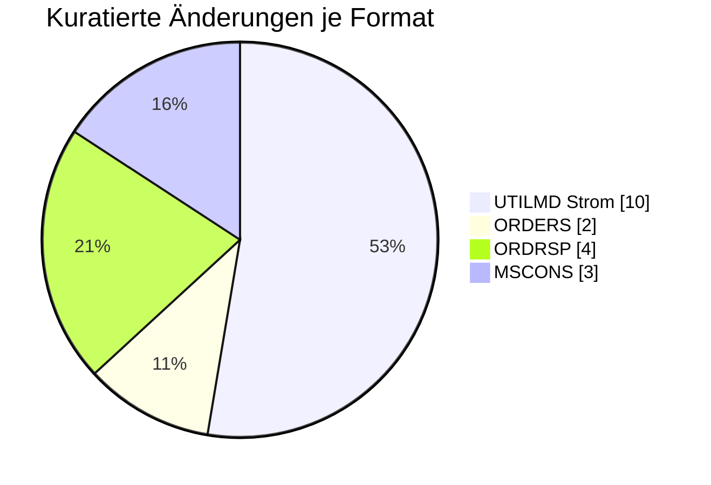

# 🟢 Lieferant — Formatumstellung 01.10.2026

← [Zurück zur Gesamtübersicht](../index.md)

:::info[Sicht für die Marktrolle Lieferant]
Alle Änderungen zum 01.10.2026, die für diese Rolle relevant sind — gebündelt über alle Formate. Von jeder Einzeländerung kommst du über die Format-Seite zur vollen Detailsicht. Strukturelle/globale Änderungen ohne Prüfi-Bezug stehen unter **Übergreifend**.
:::

<Columns>
<Column>
<Card title="Betroffene Formate" icon="material-two-tone-storefront">
**4**
</Card>
</Column>
<Column>
<Card title="Kuratierte Änderungen" icon="material-two-tone-fact-check">
**19**
</Card>
</Column>
</Columns>

---

## Prozessänderungen (BPMN 202604 → 202610)

:::note
**＋0 neu · −2 entfernt** (von 306 auf 304 BPMN-Prozesse)

Bereinigung obsoleter Anwendungsfälle (E_0205, P_17005) — minimale Änderungen.

**Entfernt:** `E_0205.bpmn`, `P_17005.bpmn`
:::

---

## Änderungen je Format

### UTILMD Strom (10) · [zur Format-Detailseite ↗](../formate/utilmd-strom.md)

<AccordionGroup>

<Accordion title="Änd-ID 27012 · SG4 Vorgangs- Identifikation FTX Bemerkung (Feld für allge…">

| Feld | Wert |
|---|---|
| **Ort** | SG4 Vorgangs- Identifikation FTX Bemerkung (Feld für allgemeine Hinweise)  PID  55003 55080 |
| **Prüfi(s)** | 55003, 55080 |
| **Rolle(n)** | LF, NB |
| **Status** | Genehmigt |

**Bisher:**
> - Bedingungen [23], [24], und [63] am FTX vorhanden - SG8 Bestandteil eines Produktpakets nicht vorhanden

**Neu:**
> - Bedingung [48] am FTX vorhanden - SG8 Bestandteil eines Produktpakets vorhanden

**Grund:** Wenn nicht alle zwingend notwendigen Anforderungen des LF erfüllt werden können sind die nicht möglichen Anforderungen im SG8 Bestandteil eines Produktpakets zu benennen.

</Accordion>

<Accordion title="Änd-ID 27000 · Kapitel 9.3.3 Änderung Daten der Marktlokation SG8 SEQ Pro…">

| Feld | Wert |
|---|---|
| **Ort** | Kapitel 9.3.3 Änderung Daten der Marktlokation SG8 SEQ Produkt-Daten der Marktlokation Anwendungsfall 55640, 55650, 55660 Änderung Daten der MaLo 55645, 55655, 55665 Rückmeldung/ Anfrage Daten der MaLo |
| **Prüfi(s)** | 55640, 55645, 55650, 55655, 55660, 55665 |
| **Rolle(n)** | LF, MSB, NB |
| **Status** | Genehmigt |

**Bisher:**
> SG8 vorhanden

**Neu:**
> SG8 nicht vorhanden (incl. aller Segmente in dieser SG8)

**Grund:** Diese SG8 war für Konfigurationsprodukte gedacht. Es gibt keine Konfigurationsprodukte auf Ebene der MaLo.

</Accordion>

<Accordion title="Änd-ID 26932 · Kapitel 9.2.3 Änderung Daten der Technischen Ressource mit…">

| Feld | Wert |
|---|---|
| **Ort** | Kapitel 9.2.3 Änderung Daten der Technischen Ressource mit neuen Anwendungsfällen : |
| **Prüfi(s)** | 55693, 55694 |
| **Rolle(n)** | LF, NB |
| **Status** | Genehmigt |

**Bisher:**
> Anwendungsfall: 55693 Beschreibung:  Änderung Daten der Technischen Ressource Kommunikation von: LF an NB  Anwendungsfall: 55694 Beschreibung:  Rückmeldung/Anfrage Daten der Technischen Ressource  Kommunikation von: NB an LF  nicht vorhanden

**Neu:**
> Anwendungsfall: 55693 Beschreibung:  Änderung Daten der Technischen Ressource  Kommunikation von: LF an NB  Anwendungsfall: 55694 Beschreibung:  Rückmeldung/Anfrage Daten der Technischen Ressource  Kommunikation von: NB an LF  vorhanden

**Grund:** Umsetzung Erklärung zur Fernsteuerbarkeit gemäß § 10b EEG 2023

</Accordion>

<Accordion title="Änd-ID 26804 · SG4 Vorgangs- Identifikation  SG6 Termine der Marktlokatio…">

| Feld | Wert |
|---|---|
| **Ort** | SG4 Vorgangs- Identifikation  SG6 Termine der Marktlokation  DTM Nächste Netznutzungsabrec hnung Anwendungsfall 55218 Abr.-Daten NNA |
| **Prüfi(s)** | 55218 |
| **Rolle(n)** | LF, NB |
| **Status** | Genehmigt |

**Bisher:**
> Muss [489] ∧ [531]  [489] Nur bei der ältestem Zeitraum welche mit SG6 RFF+Z49 (Verwendungszeitraum der Daten: Gültige Daten) beschrieben ist  [531] Hinweis: Es ist das Jahr anzugeben in dem die nächste Netznutzungsabrechnung erfolgt

**Neu:**
> Muss [2061] ∧ [531]  [531] Hinweis: Es ist das Jahr anzugeben in dem die nächste Netznutzungsabrechnung erfolgt. Diese Information ist zu der Zeitraum-ID anzugeben, welche SG6 RFF+Z49 (Verwendungszeitraum der Daten: Gültige Daten) beinhaltet und die nächste Netznutzungsabrechnung stattfindet.  [2061] Segment bzw. Segmentgruppe ist genau einmal je SG4 IDE (Vorgang) anzugeben

**Grund:** Die Angabe des Jahres, in welches die nächte Netznutzungsabrechnung stattfindet, kann nicht pauschal zu dem ältesten Zeitraum angegeben werden werden.

</Accordion>

<Accordion title="Änd-ID 26791 · Kapitel 9.1.6 Änderung der Daten der Technischen Ressource…">

| Feld | Wert |
|---|---|
| **Ort** | Kapitel 9.1.6 Änderung der Daten der Technischen Ressource SG8 SEQ Daten der Technischen Ressource SG10 CCI+Z63 / CAV Information zu weiteren technischen Einrichtungen Anwendungsfall 55617, 55629 Änderung Daten der TR 55623, 55635 Rückmeldung/ Anfrage Daten er TR |
| **Prüfi(s)** | 55617, 55623, 55629, 55635 |
| **Rolle(n)** | LF, MSB, NB |
| **Status** | Genehmigt |

**Bisher:**
> Segmente vorhanden

**Neu:**
> Segmente nicht vorhanden

**Grund:** Die Information zu weiteren technischen Einrichtungen musste bei jeder TR angegeben werden. Die Information wird zukünftig ohne Abhängigkeit zu anderen TR übertragen

</Accordion>

<Accordion title="Änd-ID 26787 · Kapitel 8.9 Abmeldung durch den LF an NB SG4 STS+7  Transa…">

| Feld | Wert |
|---|---|
| **Ort** | Kapitel 8.9 Abmeldung durch den LF an NB SG4 STS+7  Transaktionsgrund / Ergänzung / Transaktionsgrund  befristete Anmeldung Anwendungsfall 55004 Abmeldung |
| **Prüfi(s)** | 55004 |
| **Rolle(n)** | LF, NB |
| **Status** | Genehmigt |

**Bisher:**
> E01 = X  (Ein-Auszug (Umzug))  ZG9 = X (Aufhebung einer zukünftigen Zuordnung wegen Auszug des Kunden)  Weitere Codes mit X

**Neu:**
> E01 = X [18P0..1] (Ein-Auszug (Umzug))  ZG9 = X [18P0..1] (Aufhebung einer zukünftigen Zuordnung wegen Auszug des Kunden)  Weitere Codes mit X [1P0..1]   [18P] [480] Wenn SG4 STS+7++xxx+ZW4 (Transaktionsgrundergänzung Verbrauchende Marktlokation) vorhanden

**Grund:** Einschränkung der Codes auf verbrauchende Marktlokationen, da es bei erzeugenden Marktlokationen keinen "Umzug" gibt.

</Accordion>

<Accordion title="Änd-ID 26751 · SG12 Korrespondenzans chrift des Kunden des Netzbetreibers…">

| Feld | Wert |
|---|---|
| **Ort** | SG12 Korrespondenzans chrift des Kunden des Netzbetreibers Anwendungsfall 55168 Verpflichtungsanfr age/Aufforderung 55013 Anmeldung / Zuordnung EOG 55616 Änderung Daten der MaLo 55622 Rückmeldung/ Anfrage Daten der MaLo 55628 Änderung Daten der MaLo 55634 Rückmeldung/ Anfrage Daten der MaLo |
| **Prüfi(s)** | 55013, 55168, 55616, 55622, 55628, 55634 |
| **Rolle(n)** | LF, MSB, NB |
| **Status** | Genehmigt |

**Bisher:**
> SG12 Korrespondenzanschrift des Kunden des Netzbetreibers …

**Neu:**
> SG12 Korrespondenzanschrift des Kunden des Netzbetreibers … SG13  Kontaktdaten des Kunden  Soll [165] ∧ [181] CTA+IC COM Kommunikationsverbindung   [165] Wenn bekannt [181] Wenn der Versender datenschutzrechtliche Voraussetzungen geschaffen hat, um die Daten bereitstellen zu dürfen

**Grund:** Erweiterung der Korrespondenzanschrift des Kunden. Durch die Erweiterung wird dem Markt die Möglichkeit gegeben auch E-Mail und Telefonnummer des Kunden gegenseitig auszutauschen, sofern die datenschutzrechtliche Freigabe des Kunden vorliegt.

</Accordion>

<Accordion title="Änd-ID 26749 · SG12 Korrespondenzans chrift des Kunden des Lieferanten An…">

| Feld | Wert |
|---|---|
| **Ort** | SG12 Korrespondenzans chrift des Kunden des Lieferanten Anwendungsfall 55001 Anmeldung verb. MaLo 55600 Anmeldung neue verb. MaLo 55601 Anmeldung neue erz. MaLo 55013 Anmeldung/ Zuordnung EOG |
| **Prüfi(s)** | 55001, 55013, 55600, 55601 |
| **Rolle(n)** | LF, NB |
| **Status** | Genehmigt |

**Bisher:**
> SG12 Korrespondenzanschrift des Kunden des Lieferanten …

**Neu:**
> SG12 Korrespondenzanschrift des Kunden des Lieferanten … SG13  Kontaktdaten des Kunden  Soll [165] ∧ [181] CTA+IC COM Kommunikationsverbindung   [165] Wenn bekannt [181] Wenn der Versender datenschutzrechtliche Voraussetzungen geschaffen hat, um die Daten bereitstellen zu dürfen

**Grund:** Erweiterung der Korrespondenzanschrift des Kunden. Durch die Erweiterung wird dem Markt die Möglichkeit gegeben auch E-Mail und Telefonnummer des Kunden gegenseitig auszutauschen, sofern die datenschutzrechtliche Freigabe des Kunden vorliegt.

</Accordion>

<Accordion title="Änd-ID 26506 · SG8 Daten der Technischen Ressource Anwendungsfall 55617  …">

| Feld | Wert |
|---|---|
| **Ort** | SG8 Daten der Technischen Ressource Anwendungsfall 55617  Änderung Daten der TR 55623  Rückmeldung/ Anfrage Daten der TR |
| **Prüfi(s)** | 55617, 55623 |
| **Rolle(n)** | LF, NB |
| **Status** | Genehmigt |

**Bisher:**
> SG10 CCI+Z68 Vergütungsverpflichtung nach EEG bzw. KWKG   DE7037  ZH2 liegt vor ZH3 liegt nicht vor nicht vorhanden

**Neu:**
> SG10 CCI+Z68 Vergütungsverpflichtung nach EEG bzw. KWKG   DE7037  ZH2 liegt vor ZH3 liegt nicht vor vorhanden

**Grund:** Erweiterung um die Angabe, ob eine Technischen Ressoucen einer Marktlokation eine Vergütungsverpflichtung nach EEG bzw. KWKG hat.   Durch die Nutzung der Zeitscheiben in den Stammdaten kann diese für die vereinbarte Laufzeit übermittelt werden.

</Accordion>

<Accordion title="Änd-ID 26504 · SG8 Daten der Tranche Anwendungsfall 55078 Bestätigung Anm…">

| Feld | Wert |
|---|---|
| **Ort** | SG8 Daten der Tranche Anwendungsfall 55078 Bestätigung Anmeldung erz. |
| **Prüfi(s)** | 55078 |
| **Rolle(n)** | LF, NB |
| **Status** | Genehmigt |

**Bisher:**
> SG10 CCI+Z37 Basis zur Bildung der Tranchengröße DE7037 ZD1 Prozentual X ZD2 Aufteilungsfaktor auf Basis von Referenzenträger/installierter Leistung X

**Neu:**
> SG10 CCI+Z37 Basis zur Bildung der Tranchengröße DE7037 ZD1 Prozentual X ZD2 Aufteilungsfaktor auf Basis von Referenzenträger/installierter Leistung X

**Grund:** Erweiterung um die Angabe, das eine Tranche durch Nennung von Technischen Ressoucen einer Marktlokation abgegrenzt

</Accordion>

</AccordionGroup>

### ORDERS (2) · [zur Format-Detailseite ↗](../formate/orders.md)

<AccordionGroup>

<Accordion title="Änd-ID 26220 · Kapitel 4.1.2.2 Anfrage von Werten, Prüfidentifikator 1710…">

| Feld | Wert |
|---|---|
| **Ort** | Kapitel 4.1.2.2 Anfrage von Werten, Prüfidentifikator 17102 Anfrage von Werten |
| **Prüfi(s)** | 17102 |
| **Rolle(n)** | LF, MSB, NB |
| **Status** | Genehmigt |

**Bisher:**
> Bisheriger Inhalt

**Neu:**
> Aktualisierter Inhalt

**Grund:** Anpassung des Anwendungsfalls aufgrund der Einführung der WiM Gas 2.0. Der Anwendungsfall findet in der Sparte Gas keine Anwendung mehr zwischen NB und MSB, weshalb die Voraussetzungen und Codes überarbeitet wurden.

</Accordion>

<Accordion title="Änd-ID 21218 · Kapitel 4.8 Reklamation von Werten/Lastgängen, Prüfidentif…">

| Feld | Wert |
|---|---|
| **Ort** | Kapitel 4.8 Reklamation von Werten/Lastgängen, Prüfidentifikator 17113, Reklamation von Werten |
| **Prüfi(s)** | 17113 |
| **Rolle(n)** | LF, MSB, NB |
| **Status** | Genehmigt |

**Bisher:**
> Bisheriger Inhalt

**Neu:**
> Aktualisierter Inhalt

**Grund:** Anpassung des Anwendungsfalls aufgrund der Einführung der WiM Gas 2.0. Der Anwendungsfall findet nur noch in der Sparte Strom Anwendung, weshalb die spartenspezifischen Voraussetzungen und Codes vollständig überarbeitet wurden.

</Accordion>

</AccordionGroup>

### ORDRSP (4) · [zur Format-Detailseite ↗](../formate/ordrsp.md)

<AccordionGroup>

<Accordion title="Änd-ID 27214 · Kapitel 4.1.3 Ablehnung der Anfrage zur Übermittlung von W…">

| Feld | Wert |
|---|---|
| **Ort** | Kapitel 4.1.3 Ablehnung der Anfrage zur Übermittlung von Werten, Prüfidentifikator 19102, Ablehnung der Anfrage Werte |
| **Prüfi(s)** | 19102 |
| **Rolle(n)** | LF, MSB, NB |
| **Status** | Genehmigt |

**Bisher:**
> Bisheriger Inhalt

**Neu:**
> Aktualisierter Inhalt

**Grund:** Anpassung des Anwendungsfalls aufgrund der Einführung der WiM Gas 2.0. Der Anwendungsfall findet in der Sparte Gas keine Anwendung mehr zwischen MSB und NB, weshalb die Voraussetzungen und Codes überarbeitet wurden.

</Accordion>

<Accordion title="Änd-ID 27212 · Kapitel 4.12 Antwort Beauftragung Änderung der Technik der…">

| Feld | Wert |
|---|---|
| **Ort** | Kapitel 4.12 Antwort Beauftragung Änderung der Technik der Lokation (Messlokationsänderung), Prüfidentifikator 19005 Bestätigung Auftrag Änderung Technik, 19006 Ablehnung Auftrag Änderung Technik |
| **Prüfi(s)** | 19005, 19006 |
| **Rolle(n)** | LF, MSB, NB |
| **Status** | Genehmigt |

**Bisher:**
> Bisheriger Inhalt

**Neu:**
> Aktualisierter Inhalt

**Grund:** Anpassung der Anwendungsfälle aufgrund der Einführung der WiM Gas 2.0. Die Anwendungsfälle finden nur noch in der Sparte Strom Anwendung, weshalb die spartenspezifischen Voraussetzungen und Codes vollständig überarbeitet wurden.

</Accordion>

<Accordion title="Änd-ID 26214 · Kapitel 4.8 Ablehnung der Reklamation von Werten, Prüfiden…">

| Feld | Wert |
|---|---|
| **Ort** | Kapitel 4.8 Ablehnung der Reklamation von Werten, Prüfidentifikator 19114 Ablehnung Reklamation |
| **Prüfi(s)** | 19114 |
| **Rolle(n)** | LF, MSB, NB |
| **Status** | Genehmigt |

**Bisher:**
> Bisheriger Inhalt

**Neu:**
> Aktualisierter Inhalt

**Grund:** Anpassung des Anwendungsfalls aufgrund der Einführung der WiM Gas 2.0. Der Anwendungsfall findet nur noch in der Sparte Strom Anwendung, weshalb die spartenspezifischen Voraussetzungen und Codes vollständig überarbeitet wurden.

</Accordion>

<Accordion title="Änd-ID 26200 · Kapitel 4.5 Ablehnung der Reklamation einer Definition, Pr…">

| Feld | Wert |
|---|---|
| **Ort** | Kapitel 4.5 Ablehnung der Reklamation einer Definition, Prüfidentifikator 19123, Ablehnung Reklamation einer Definition |
| **Prüfi(s)** | 19123 |
| **Rolle(n)** | LF, MSB, NB |
| **Status** | Genehmigt |

**Bisher:**
> Bisheriger Inhalt

**Neu:**
> Aktualisierter Inhalt

**Grund:** Anpassung an die korrekte Notation (Nutzung von Paketen) in einzelnen Segmenten mit mehreren Codes.

</Accordion>

</AccordionGroup>

### MSCONS (3) · [zur Format-Detailseite ↗](../formate/mscons.md)

<AccordionGroup>

<Accordion title="Änd-ID 27164 · Kapitel 6.3.7 Anwendungsübersicht Energiemengen Strom, Prü…">

| Feld | Wert |
|---|---|
| **Ort** | Kapitel 6.3.7 Anwendungsübersicht Energiemengen Strom, Prüfidentifikator 13015 Arbeit Leistungsmax. Kalenderjahr vor Lieferbeginn, SG9 lfd. Position |
| **Prüfi(s)** | 13015 |
| **Rolle(n)** | LF, NB |
| **Status** | Genehmigt |

**Bisher:**
> Muss [2002] ∧ [502]  Bedingung:  [502] Hinweis: Einmal für die Energiemenge von Beginn des Kalenderjahres bis zum Lieferbeginn und bis zu zweimal für die zwei höchsten Monatsleistungswerte (wegen KAV) von Beginn des Kalenderjahres bis zum Lieferbeginn [2002] Segmentgruppe ist bis zu drei Mal je SG5 NAD+DP anzugeben

**Neu:**
> Muss [2002] ∧ [502]  Bedingung:  [502] Hinweis: Einmal für die Energiemenge von Beginn des Kalenderjahres bis zum Lieferbeginn und mindestens einmal und bis zu zweimal für die zwei höchsten Monatsleistungswerte (wegen KAV) von Beginn des Kalenderjahres bis zum Lieferbeginn [2002] Segmentgruppe ist mindestens zweimal und maximal dreimal je SG5 NAD+DP anzugeben

**Grund:** Die vorherige Definition der Bedingungen und des Hinweises ließ auch keine Angabe des LIN-Segments zu, daher die Präzisierung.

</Accordion>

<Accordion title="Änd-ID 26222 · Kapitel 6.4.3 Anwendungsübersicht Zählerstand und Energiem…">

| Feld | Wert |
|---|---|
| **Ort** | Kapitel 6.4.3 Anwendungsübersicht Zählerstand und Energiemengen Gas, Prüfidentifikator 13009 Energiemenge (Gas), SG9 lfd. Position |
| **Prüfi(s)** | 13009 |
| **Rolle(n)** | LF, MSB, NB |
| **Status** | Genehmigt |

**Bisher:**
> Muss ([2002] ∧ [151] ∧ [502]) ⊻ [152]  Bedingung:  [151] Wenn BGM+Z27 (Bewegungsdaten im Kalenderjahr vor Lieferbeginn) vorhanden. [152] Wenn BGM+7 (Prozessdatenbericht) vorhanden. [502] Hinweis: Einmal für die Energiemenge von Beginn des Kalenderjahres bis zum Lieferbeginn und bis zu zweimal für die zwei höchsten Monatsleistungswerte (wegen KAV) von Beginn des Kalenderjahres bis zum Lieferbeginn [2002] Segmentgruppe ist bis zu drei Mal je SG5 NAD+DP anzugeben

**Neu:**
> Muss ([2002] ∧ [151] ∧ [502]) ⊻ [152]  Bedingung:  [151] Wenn BGM+Z27 (Bewegungsdaten im Kalenderjahr vor Lieferbeginn) vorhanden. [152] Wenn BGM+7 (Prozessdatenbericht) vorhanden. [502] Hinweis: Einmal für die Energiemenge von Beginn des Kalenderjahres bis zum Lieferbeginn und mindestens einmal und bis zu zweimal für die zwei höchsten Monatsleistungswerte (wegen KAV) von Beginn des Kalenderjahres bis zum Lieferbeginn. [2002] Segmentgruppe ist mindestens zweimal und maximal dreimal je SG5 NAD+DP anzugeben

**Grund:** Die vorherige Definition der Bedingung ließ auch keine Angabe des LIN-Segments zu, daher die Präzisierung.

</Accordion>

<Accordion title="Änd-ID 26221 · Kapitel 10.3 Anwendungsübersicht Allokationsliste Gas / bi…">

| Feld | Wert |
|---|---|
| **Ort** | Kapitel 10.3 Anwendungsübersicht Allokationsliste Gas / bilanzierte Menge Strom/Gas, Prüfidentifikator 13014 marktlokationsscharfe bilanzierte Menge Strom / Gas (MMMA) |
| **Prüfi(s)** | 13014 |
| **Rolle(n)** | LF, NB |
| **Status** | Genehmigt |

**Bisher:**
> Bisheriger Inhalt

**Neu:**
> Aktualisierter Inhalt

**Grund:** Im Kapitel 6.3 der Anwendungshilfe "Einführungsszenario zum LFW24" bzw. im Kapitel 4.1 der Anwendungshilfe "Prozesse zur Ermittlung und Abrechnung von Mehr-/Mindermengen Strom und Gas" wird definiert, dass der ÜNB "die Übermittlung der bilanzierten Energiemenge für Marktlokationen, die auf Basis von Profilen bilanziert werden, an den NB für die Mehr-/Mindermengenabrechnung Strom" ab dem 01.10.2026 00:00 Uhr einstellt.  Daher wurden die Bedingungen im Anwendungsfall, die auf diese Kommunikation bezogen haben, angepasst.

</Accordion>

</AccordionGroup>

---

← [Gesamtübersicht](../index.md)
