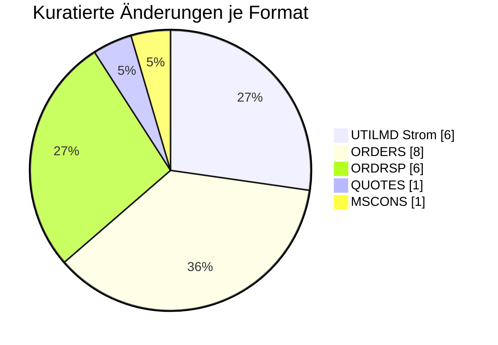

# 🟣 Messstellenbetreiber — Formatumstellung 01.10.2026

← [Zurück zur Gesamtübersicht](../index.md)

:::info[Sicht für die Marktrolle Messstellenbetreiber]
Alle Änderungen zum 01.10.2026, die für diese Rolle relevant sind — gebündelt über alle Formate. Von jeder Einzeländerung kommst du über die Format-Seite zur vollen Detailsicht. Strukturelle/globale Änderungen ohne Prüfi-Bezug stehen unter **Übergreifend**.
:::

<Columns>
<Column>
<Card title="Betroffene Formate" icon="material-two-tone-speed">
**5**
</Card>
</Column>
<Column>
<Card title="Kuratierte Änderungen" icon="material-two-tone-fact-check">
**22**
</Card>
</Column>
</Columns>

---

## Prozessänderungen (BPMN 202604 → 202610)

:::note
**＋1 neu · −0 entfernt** (von 221 auf 222 BPMN-Prozesse)

Neuer Prozess **I_44183** „Ende MSB / Stilllegung 4418“ (WiM-Gas-2.0-Stilllegung).

**Neu:** `I_44183.bpmn`
:::

---

## Änderungen je Format

### UTILMD Strom (6) · [zur Format-Detailseite ↗](../formate/utilmd-strom.md)

<AccordionGroup>

<Accordion title="Änd-ID 27065 · Kapitel Kapitel 10.4 Beendigung des Messstellenbetrie bs  …">

| Feld | Wert |
|---|---|
| **Ort** | Kapitel Kapitel 10.4 Beendigung des Messstellenbetrie bs   SG4 DTM+93 Ende zum Anwendungsfall Anwendungsfall 55052 Bestätigung Ende MSB |
| **Prüfi(s)** | 55052 |
| **Rolle(n)** | MSB, NB |
| **Status** | Genehmigt |

**Bisher:**
> DTM = Muss [11] ∧ [157] ∧ [313] Soll [326] ∧ [312]  [312] Wenn DTM+137 (Nachrichtendatum) im DE2380 < 202603312200?+00  [313] Wenn DTM+137 (Nachrichtendatum) im DE2380 ≥ 202603312200?+00  [326] Wenn die Marktlokation nicht stillgelegt wird  [157] Wenn SG4 STS+7++Z33+ZZB nicht vorhanden  [11] Wenn SG4 STS+7++ZG9/ZH1/ZH2 (Transaktionsgrund: Aufhebung einer zukünftigen Zuordnung wegen Auszug des Kunden / -wegen Stilllegung / -wegen aufgehobenem Vertragsverhältnis) nicht vorhanden

**Neu:**
> DTM = Muss [11] ∧ [157]  [157] Wenn SG4 STS+7++Z33+ZZB nicht vorhanden  [11] Wenn SG4 STS+7++ZG9/ZH1/ZH2 (Transaktionsgrund: Aufhebung einer zukünftigen Zuordnung wegen Auszug des Kunden / -wegen Stilllegung / -wegen aufgehobenem Vertragsverhältnis) nicht vorhanden

**Grund:** Die Zeitliche Einschränkung der Definitionen ist nicht mehr notwendig. Somit wurden die Bedingungen [312] und [313] entfernt.

</Accordion>

<Accordion title="Änd-ID 27000 · Kapitel 9.3.3 Änderung Daten der Marktlokation SG8 SEQ Pro…">

| Feld | Wert |
|---|---|
| **Ort** | Kapitel 9.3.3 Änderung Daten der Marktlokation SG8 SEQ Produkt-Daten der Marktlokation Anwendungsfall 55640, 55650, 55660 Änderung Daten der MaLo 55645, 55655, 55665 Rückmeldung/ Anfrage Daten der MaLo |
| **Prüfi(s)** | 55640, 55645, 55650, 55655, 55660, 55665 |
| **Rolle(n)** | LF, MSB, NB |
| **Status** | Genehmigt |

**Bisher:**
> SG8 vorhanden

**Neu:**
> SG8 nicht vorhanden (incl. aller Segmente in dieser SG8)

**Grund:** Diese SG8 war für Konfigurationsprodukte gedacht. Es gibt keine Konfigurationsprodukte auf Ebene der MaLo.

</Accordion>

<Accordion title="Änd-ID 26791 · Kapitel 9.1.6 Änderung der Daten der Technischen Ressource…">

| Feld | Wert |
|---|---|
| **Ort** | Kapitel 9.1.6 Änderung der Daten der Technischen Ressource SG8 SEQ Daten der Technischen Ressource SG10 CCI+Z63 / CAV Information zu weiteren technischen Einrichtungen Anwendungsfall 55617, 55629 Änderung Daten der TR 55623, 55635 Rückmeldung/ Anfrage Daten er TR |
| **Prüfi(s)** | 55617, 55623, 55629, 55635 |
| **Rolle(n)** | LF, MSB, NB |
| **Status** | Genehmigt |

**Bisher:**
> Segmente vorhanden

**Neu:**
> Segmente nicht vorhanden

**Grund:** Die Information zu weiteren technischen Einrichtungen musste bei jeder TR angegeben werden. Die Information wird zukünftig ohne Abhängigkeit zu anderen TR übertragen

</Accordion>

<Accordion title="Änd-ID 26751 · SG12 Korrespondenzans chrift des Kunden des Netzbetreibers…">

| Feld | Wert |
|---|---|
| **Ort** | SG12 Korrespondenzans chrift des Kunden des Netzbetreibers Anwendungsfall 55168 Verpflichtungsanfr age/Aufforderung 55013 Anmeldung / Zuordnung EOG 55616 Änderung Daten der MaLo 55622 Rückmeldung/ Anfrage Daten der MaLo 55628 Änderung Daten der MaLo 55634 Rückmeldung/ Anfrage Daten der MaLo |
| **Prüfi(s)** | 55013, 55168, 55616, 55622, 55628, 55634 |
| **Rolle(n)** | LF, MSB, NB |
| **Status** | Genehmigt |

**Bisher:**
> SG12 Korrespondenzanschrift des Kunden des Netzbetreibers …

**Neu:**
> SG12 Korrespondenzanschrift des Kunden des Netzbetreibers … SG13  Kontaktdaten des Kunden  Soll [165] ∧ [181] CTA+IC COM Kommunikationsverbindung   [165] Wenn bekannt [181] Wenn der Versender datenschutzrechtliche Voraussetzungen geschaffen hat, um die Daten bereitstellen zu dürfen

**Grund:** Erweiterung der Korrespondenzanschrift des Kunden. Durch die Erweiterung wird dem Markt die Möglichkeit gegeben auch E-Mail und Telefonnummer des Kunden gegenseitig auszutauschen, sofern die datenschutzrechtliche Freigabe des Kunden vorliegt.

</Accordion>

<Accordion title="Änd-ID 26750 · SG12 Korrespondenzans chrift des Kunden des Messstellenbet…">

| Feld | Wert |
|---|---|
| **Ort** | SG12 Korrespondenzans chrift des Kunden des Messstellenbetrei bers Anwendungsfall 55643 Änderung Daten der MeLo 55648 Rückmeldung/ Anfrage Daten der MeLo 55663 Änderung Daten der MeLo 55669 Rückmeldung/ Anfrage Daten der MeLo 55042 Anmeldung MSB 55043 Bestätigung Anmeldung MSB 55168 Verpflichtungsanfr |
| **Prüfi(s)** | 55042, 55043, 55168, 55643, 55648, 55663, 55669 |
| **Rolle(n)** | MSB, NB |
| **Status** | Genehmigt |

**Bisher:**
> SG12 Korrespondenzanschrift des Kunden des Messstellenbetreibers …

**Neu:**
> SG12 Kontaktdaten des Kunden des Messstellenbetreiber … SG13  Kontaktdaten des Kunden  Soll [165] ∧ [181] CTA+IC COM Kommunikationsverbindung   [165] Wenn bekannt [181] Wenn der Versender datenschutzrechtliche Voraussetzungen geschaffen hat, um die Daten bereitstellen zu dürfen

**Grund:** Erweiterung der Korrespondenzanschrift des Kunden. Durch die Erweiterung wird dem Markt die Möglichkeit gegeben auch E-Mail und Telefonnummer des Kunden gegenseitig auszutauschen, sofern die datenschutzrechtliche Freigabe des Kunden vorliegt.

</Accordion>

<Accordion title="Änd-ID 26505 · SG8 Daten der Technischen Ressource Anwendungsfall 55060 A…">

| Feld | Wert |
|---|---|
| **Ort** | SG8 Daten der Technischen Ressource Anwendungsfall 55060 Antwort GDA 55043 Bestätigung Anmeldung 55168 Verpflichtungsanfr age /Aufforderung 55169 Bestätigung Verpflichtungsanfr age |
| **Prüfi(s)** | 55043, 55060, 55168, 55169 |
| **Rolle(n)** | MSB, NB |
| **Status** | Genehmigt |

**Bisher:**
> RFF+Z20 Referenz auf die der Technischen Ressource zugeordneten Tranche  nicht vorhanden

**Neu:**
> RFF+Z20 Referenz auf die der Technischen Ressource zugeordneten Tranche  vorhanden

**Grund:** Erweiterung um die Angabe, welcher Tranche die Technischen Ressoucen einer Marktlokation zugeordnet wird.

</Accordion>

</AccordionGroup>

### ORDERS (8) · [zur Format-Detailseite ↗](../formate/orders.md)

<AccordionGroup>

<Accordion title="Änd-ID 27162 · Kapitel 4.17.1 Einrichtung der Konfigurationen aufgrund ei…">

| Feld | Wert |
|---|---|
| **Ort** | Kapitel 4.17.1 Einrichtung der Konfigurationen aufgrund einer Zuordnung eines LF von NB an MSB, Prüfidentifikator 17134, Einrichtung Konfiguration aufgrund Zuordnung LF von NB an MSB, SG29 Erforderliches Produkt der Tranche, SG30 CCI Basis zur Bildung der Tranchengröße, DE7037 |
| **Prüfi(s)** | 17134 |
| **Rolle(n)** | MSB, NB |
| **Status** | Genehmigt |

**Bisher:**
> ZD1 Prozentual X ZD2 Aufteilungsfaktor auf Basis von Referenzenträger/installierter Leistung X

**Neu:**
> ZD1 Prozentual X [594] ZC4 mittels Berechnungsformel X [595]  Bedingung:  [594] Hinweis: Wenn die Aufteilung der Tranche prozentual erfolgt. [595] Hinweis: Wenn die Aufteilung auf Basis eines Aufteilungsfaktors wie z.B. der installierten Leistung auf Basis der Technischen Ressourcen erfolgt. Da die Berechnungsformel (UTILTS) derzeit nur für eine Marktlokation und nicht für eine Tranche ausgetauscht werden kann, ist ein bilateraler Austausch der Berechnungsformel initiiert vom NB an den MSB, notwendig.

**Grund:** Wenn die Aufteilung nicht prozentual erfolgt, sondern auf Basis eines Aufteilungsfaktors wie z.B. der installierten Leistung oder auf Basis der Technischen Ressourcen, dann ist die Übermittlung einer Berechnungsformel notwendig. Da die Berechnungsformel (UTILTS) derzeit nur für eine Marktlokation und nicht für eine Tranche ausgetauscht werden kann, ist ein bilateraler Austausch, initiiert vom NB an den MSB, notwendig.

</Accordion>

<Accordion title="Änd-ID 26924 · Kapitel 4.4.5 Bestellung Änderung (NB an MSB), Prüfidentif…">

| Feld | Wert |
|---|---|
| **Ort** | Kapitel 4.4.5 Bestellung Änderung (NB an MSB), Prüfidentifikator 17121, Bestellung Änderung, SG29 LIN Erforderliches Produkt der Netzlokation, DE1082 Positionsnummer |
| **Prüfi(s)** | 17121 |
| **Rolle(n)** | MSB, NB |
| **Status** | Genehmigt |

**Bisher:**
> X [903]   Bedingung:  [903] Format: Möglicher Wert: 1

**Neu:**
> X [911]   Bedingung:  [911] Format: Mögliche Werte: 1 bis n, je Nachricht oder Segmentgruppe bei 1 beginnend und fortlaufend aufsteigend

**Grund:** Es gibt mehr als ein Produkt auf Ebene der Netzlokation. Die SG29 Erforderliches Produkt der Netzlokation erlaubt auch bereits heute eine Wiederholung, die Positionsnummer jedoch nicht so, dass eine unterschiedliche Positionsangabe möglich wäre.

</Accordion>

<Accordion title="Änd-ID 26220 · Kapitel 4.1.2.2 Anfrage von Werten, Prüfidentifikator 1710…">

| Feld | Wert |
|---|---|
| **Ort** | Kapitel 4.1.2.2 Anfrage von Werten, Prüfidentifikator 17102 Anfrage von Werten |
| **Prüfi(s)** | 17102 |
| **Rolle(n)** | LF, MSB, NB |
| **Status** | Genehmigt |

**Bisher:**
> Bisheriger Inhalt

**Neu:**
> Aktualisierter Inhalt

**Grund:** Anpassung des Anwendungsfalls aufgrund der Einführung der WiM Gas 2.0. Der Anwendungsfall findet in der Sparte Gas keine Anwendung mehr zwischen NB und MSB, weshalb die Voraussetzungen und Codes überarbeitet wurden.

</Accordion>

<Accordion title="Änd-ID 26197 · Kapitel 4.10 Ankündigung Gerätewechselabsicht, Prüfidentif…">

| Feld | Wert |
|---|---|
| **Ort** | Kapitel 4.10 Ankündigung Gerätewechselabsicht, Prüfidentifikator 17009, Ankündigung Gerätewechselabsicht |
| **Prüfi(s)** | 17009 |
| **Rolle(n)** | MSB |
| **Status** | Genehmigt |

**Bisher:**
> Bisheriger Inhalt

**Neu:**
> Aktualisierter Inhalt

**Grund:** Anpassung an die korrekte Notation (Nutzung von Paketen) in einzelnen Segmenten mit mehreren Codes.

</Accordion>

<Accordion title="Änd-ID 26155 · Kapitel 4.17.1 Einrichtung der Konfigurationen aufgrund ei…">

| Feld | Wert |
|---|---|
| **Ort** | Kapitel 4.17.1 Einrichtung der Konfigurationen aufgrund einer Zuordnung eines LF von NB an MSB, Prüfidentifikator 17134, Einrichtung Konfiguration aufgrund Zuordnung LF von NB an MSB |
| **Prüfi(s)** | 17134 |
| **Rolle(n)** | MSB, NB |
| **Status** | Genehmigt |

**Bisher:**
> Bisheriger Inhalt

**Neu:**
> Aktualisierter Inhalt

**Grund:** Überführung der Verwendungszwecke direkt an das jeweilige Produkt, um die zunehmende Anzahl an Verwendungszwecken je Marktrolle zu standardisieren.

</Accordion>

<Accordion title="Änd-ID 26154 · Kapitel 4.4.5 Bestellung Änderung (NB an MSB), Prüfidentif…">

| Feld | Wert |
|---|---|
| **Ort** | Kapitel 4.4.5 Bestellung Änderung (NB an MSB), Prüfidentifikator 17121, Bestellung Änderung |
| **Prüfi(s)** | 17121 |
| **Rolle(n)** | MSB, NB |
| **Status** | Genehmigt |

**Bisher:**
> Bisheriger Inhalt

**Neu:**
> Aktualisierter Inhalt

**Grund:** Überführung der Verwendungszwecke direkt an das jeweilige Produkt, um die zunehmende Anzahl an Verwendungszwecken je Marktrolle zu standardisieren.

</Accordion>

<Accordion title="Änd-ID 26122 · Kapitel 4.9.2 Bestellung Geräteübernahmeangebot, Prüfident…">

| Feld | Wert |
|---|---|
| **Ort** | Kapitel 4.9.2 Bestellung Geräteübernahmeangebot, Prüfidentifikator 17001, Bestellung Geräteübernahmeangebot |
| **Prüfi(s)** | 17001 |
| **Rolle(n)** | MSB |
| **Status** | Genehmigt |

**Bisher:**
> Bisheriger Inhalt

**Neu:**
> Aktualisierter Inhalt

**Grund:** Aufnahme der Informationen für den automatisierten GWA-Wechsel mit Geräteübernahme. Details siehe VDE FNN Hinweis "Prozessbeschreibung eines GWA-Wechsels im Rahmen eines MSB-Wechsels mit Geräteübernahme gemäß WiM Strom".

</Accordion>

<Accordion title="Änd-ID 21218 · Kapitel 4.8 Reklamation von Werten/Lastgängen, Prüfidentif…">

| Feld | Wert |
|---|---|
| **Ort** | Kapitel 4.8 Reklamation von Werten/Lastgängen, Prüfidentifikator 17113, Reklamation von Werten |
| **Prüfi(s)** | 17113 |
| **Rolle(n)** | LF, MSB, NB |
| **Status** | Genehmigt |

**Bisher:**
> Bisheriger Inhalt

**Neu:**
> Aktualisierter Inhalt

**Grund:** Anpassung des Anwendungsfalls aufgrund der Einführung der WiM Gas 2.0. Der Anwendungsfall findet nur noch in der Sparte Strom Anwendung, weshalb die spartenspezifischen Voraussetzungen und Codes vollständig überarbeitet wurden.

</Accordion>

</AccordionGroup>

### ORDRSP (6) · [zur Format-Detailseite ↗](../formate/ordrsp.md)

<AccordionGroup>

<Accordion title="Änd-ID 27214 · Kapitel 4.1.3 Ablehnung der Anfrage zur Übermittlung von W…">

| Feld | Wert |
|---|---|
| **Ort** | Kapitel 4.1.3 Ablehnung der Anfrage zur Übermittlung von Werten, Prüfidentifikator 19102, Ablehnung der Anfrage Werte |
| **Prüfi(s)** | 19102 |
| **Rolle(n)** | LF, MSB, NB |
| **Status** | Genehmigt |

**Bisher:**
> Bisheriger Inhalt

**Neu:**
> Aktualisierter Inhalt

**Grund:** Anpassung des Anwendungsfalls aufgrund der Einführung der WiM Gas 2.0. Der Anwendungsfall findet in der Sparte Gas keine Anwendung mehr zwischen MSB und NB, weshalb die Voraussetzungen und Codes überarbeitet wurden.

</Accordion>

<Accordion title="Änd-ID 27212 · Kapitel 4.12 Antwort Beauftragung Änderung der Technik der…">

| Feld | Wert |
|---|---|
| **Ort** | Kapitel 4.12 Antwort Beauftragung Änderung der Technik der Lokation (Messlokationsänderung), Prüfidentifikator 19005 Bestätigung Auftrag Änderung Technik, 19006 Ablehnung Auftrag Änderung Technik |
| **Prüfi(s)** | 19005, 19006 |
| **Rolle(n)** | LF, MSB, NB |
| **Status** | Genehmigt |

**Bisher:**
> Bisheriger Inhalt

**Neu:**
> Aktualisierter Inhalt

**Grund:** Anpassung der Anwendungsfälle aufgrund der Einführung der WiM Gas 2.0. Die Anwendungsfälle finden nur noch in der Sparte Strom Anwendung, weshalb die spartenspezifischen Voraussetzungen und Codes vollständig überarbeitet wurden.

</Accordion>

<Accordion title="Änd-ID 26214 · Kapitel 4.8 Ablehnung der Reklamation von Werten, Prüfiden…">

| Feld | Wert |
|---|---|
| **Ort** | Kapitel 4.8 Ablehnung der Reklamation von Werten, Prüfidentifikator 19114 Ablehnung Reklamation |
| **Prüfi(s)** | 19114 |
| **Rolle(n)** | LF, MSB, NB |
| **Status** | Genehmigt |

**Bisher:**
> Bisheriger Inhalt

**Neu:**
> Aktualisierter Inhalt

**Grund:** Anpassung des Anwendungsfalls aufgrund der Einführung der WiM Gas 2.0. Der Anwendungsfall findet nur noch in der Sparte Strom Anwendung, weshalb die spartenspezifischen Voraussetzungen und Codes vollständig überarbeitet wurden.

</Accordion>

<Accordion title="Änd-ID 26201 · Kapitel 4.10 Antwort Gerätewechselabsicht, Prüfidentifikat…">

| Feld | Wert |
|---|---|
| **Ort** | Kapitel 4.10 Antwort Gerätewechselabsicht, Prüfidentifikator 19015, 19016 Bestätigung, Ablehnung Gerätewechselabsicht |
| **Prüfi(s)** | 19015, 19016 |
| **Rolle(n)** | MSB |
| **Status** | Genehmigt |

**Bisher:**
> Bisheriger Inhalt

**Neu:**
> Aktualisierter Inhalt

**Grund:** Anpassung an die korrekte Notation (Nutzung von Paketen) in einzelnen Segmenten mit mehreren Codes.

</Accordion>

<Accordion title="Änd-ID 26200 · Kapitel 4.5 Ablehnung der Reklamation einer Definition, Pr…">

| Feld | Wert |
|---|---|
| **Ort** | Kapitel 4.5 Ablehnung der Reklamation einer Definition, Prüfidentifikator 19123, Ablehnung Reklamation einer Definition |
| **Prüfi(s)** | 19123 |
| **Rolle(n)** | LF, MSB, NB |
| **Status** | Genehmigt |

**Bisher:**
> Bisheriger Inhalt

**Neu:**
> Aktualisierter Inhalt

**Grund:** Anpassung an die korrekte Notation (Nutzung von Paketen) in einzelnen Segmenten mit mehreren Codes.

</Accordion>

<Accordion title="Änd-ID 26123 · Kapitel 4.9.2 Antwort Bestellung Geräteübernahmeangebot, B…">

| Feld | Wert |
|---|---|
| **Ort** | Kapitel 4.9.2 Antwort Bestellung Geräteübernahmeangebot, Bestätigung Bestellung, 19001 |
| **Prüfi(s)** | 19001 |
| **Rolle(n)** | MSB |
| **Status** | Genehmigt |

**Bisher:**
> Bisheriger Inhalt

**Neu:**
> Aktualisierter Inhalt

**Grund:** Aufnahme der Informationen für den automatisierten GWA-Wechsel mit Geräteübernahme. Details siehe VDE FNN Hinweis "Prozessbeschreibung eines GWA-Wechsels im Rahmen eines MSB-Wechsels mit Geräteübernahme gemäß WiM Strom".

</Accordion>

</AccordionGroup>

### QUOTES (1) · [zur Format-Detailseite ↗](../formate/quotes.md)

<AccordionGroup>

<Accordion title="Änd-ID 26119 · Kapitel 4.1.2 Geräteübernahmeangebot, Angebot Geräteüberna…">

| Feld | Wert |
|---|---|
| **Ort** | Kapitel 4.1.2 Geräteübernahmeangebot, Angebot Geräteübernahme, 15001 |
| **Prüfi(s)** | 15001 |
| **Rolle(n)** | MSB |
| **Status** | Genehmigt |

**Bisher:**
> Bisheriger Inhalt

**Neu:**
> Aktualisierter Inhalt

**Grund:** Aufnahme der Informationen für den automatisierten GWA-Wechsel mit Geräteübernahme. Details siehe VDE FNN Hinweis "Prozessbeschreibung eines GWA-Wechsels im Rahmen eines MSB-Wechsels mit Geräteübernahme gemäß WiM Strom".  Zusätzlich: Anpassung an die korrekte Notation (Nutzung von Paketen) in einzelnen Segmenten mit mehreren Codes.

</Accordion>

</AccordionGroup>

### MSCONS (1) · [zur Format-Detailseite ↗](../formate/mscons.md)

<AccordionGroup>

<Accordion title="Änd-ID 26222 · Kapitel 6.4.3 Anwendungsübersicht Zählerstand und Energiem…">

| Feld | Wert |
|---|---|
| **Ort** | Kapitel 6.4.3 Anwendungsübersicht Zählerstand und Energiemengen Gas, Prüfidentifikator 13009 Energiemenge (Gas), SG9 lfd. Position |
| **Prüfi(s)** | 13009 |
| **Rolle(n)** | LF, MSB, NB |
| **Status** | Genehmigt |

**Bisher:**
> Muss ([2002] ∧ [151] ∧ [502]) ⊻ [152]  Bedingung:  [151] Wenn BGM+Z27 (Bewegungsdaten im Kalenderjahr vor Lieferbeginn) vorhanden. [152] Wenn BGM+7 (Prozessdatenbericht) vorhanden. [502] Hinweis: Einmal für die Energiemenge von Beginn des Kalenderjahres bis zum Lieferbeginn und bis zu zweimal für die zwei höchsten Monatsleistungswerte (wegen KAV) von Beginn des Kalenderjahres bis zum Lieferbeginn [2002] Segmentgruppe ist bis zu drei Mal je SG5 NAD+DP anzugeben

**Neu:**
> Muss ([2002] ∧ [151] ∧ [502]) ⊻ [152]  Bedingung:  [151] Wenn BGM+Z27 (Bewegungsdaten im Kalenderjahr vor Lieferbeginn) vorhanden. [152] Wenn BGM+7 (Prozessdatenbericht) vorhanden. [502] Hinweis: Einmal für die Energiemenge von Beginn des Kalenderjahres bis zum Lieferbeginn und mindestens einmal und bis zu zweimal für die zwei höchsten Monatsleistungswerte (wegen KAV) von Beginn des Kalenderjahres bis zum Lieferbeginn. [2002] Segmentgruppe ist mindestens zweimal und maximal dreimal je SG5 NAD+DP anzugeben

**Grund:** Die vorherige Definition der Bedingung ließ auch keine Angabe des LIN-Segments zu, daher die Präzisierung.

</Accordion>

</AccordionGroup>

---

← [Gesamtübersicht](../index.md)
