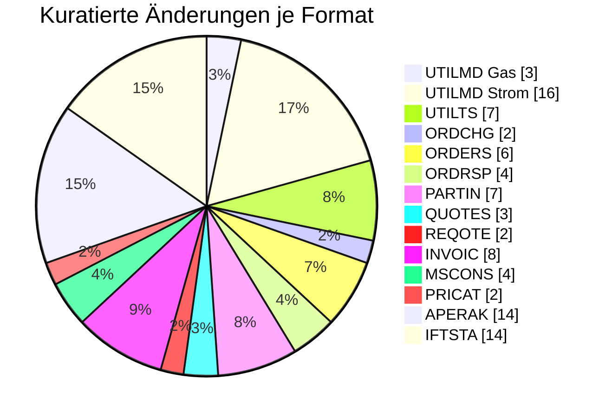

# ⚪ Übergreifend — Formatumstellung 01.10.2026

← [Zurück zur Gesamtübersicht](../index.md)

:::info[Sicht für die Marktrolle Übergreifend]
Alle Änderungen zum 01.10.2026, die für diese Rolle relevant sind — gebündelt über alle Formate. Von jeder Einzeländerung kommst du über die Format-Seite zur vollen Detailsicht. Hier stehen die struktur-/formatweiten Änderungen ohne eindeutigen Prüfi-Bezug.
:::

<Columns>
<Column>
<Card title="Betroffene Formate" icon="material-two-tone-public">
**14**
</Card>
</Column>
<Column>
<Card title="Kuratierte Änderungen" icon="material-two-tone-fact-check">
**92**
</Card>
</Column>
</Columns>

---

## Änderungen je Format

### UTILMD Gas (3) · [zur Format-Detailseite ↗](../formate/utilmd-gas.md)

<AccordionGroup>

<Accordion title="Änd-ID 27067 · SG6 RFF+Z13 Prüfidentifikator DE1154">

| Feld | Wert |
|---|---|
| **Ort** | SG6 RFF+Z13 Prüfidentifikator DE1154 |
| **Prüfi(s)** | – |
| **Rolle(n)** | Übergreifend |
| **Status** | Genehmigt |

**Bisher:**
> 44183 WiM / Ende MSB vom NB nicht vorhanden  44170 WiM Gas / Ablehnung Verpflichtungsanfrage[ vorhanden

**Neu:**
> 44183 WiM / Ende MSB vom NB vorhanden  44170 WiM Gas / Ablehnung Verpflichtungsanfrage[ nicht vorhanden

**Grund:** Anwendungsfall neu aufgenommen wegen WiM Gas 2.0, UC: Ende Messstellenbetrieb vom NB an MSB. bzw. Anwendungsfall entfernt, da nicht verwendet

</Accordion>

<Accordion title="Änd-ID 27022 · SG2 MP-ID Absender  SG3 Kontaktinformatio nen Anwendungsfa…">

| Feld | Wert |
|---|---|
| **Ort** | SG2 MP-ID Absender  SG3 Kontaktinformatio nen Anwendungsfall Alle Anwendungsfälle |
| **Prüfi(s)** | – |
| **Rolle(n)** | Übergreifend |
| **Status** | Genehmigt |

**Bisher:**
> CTA-Segment "Ansprechpartner" und COM- Segment "Kommunikationsverbindung" vorhanden

**Neu:**
> CTA-Segment "Ansprechpartner" und COM- Segment "Kommunikationsverbindung" nicht vorhanden

**Grund:** Umsetzung des Konsultationsergebnisses des Konzepts „zur Nutzung der Kontaktinformationen des Senders in den EDI@Energy Nachrichtentypen“

</Accordion>

<Accordion title="Änd-ID 26874 · DTM+155 Start des Abrechnungsjahrs bei Marktlokationen mit…">

| Feld | Wert |
|---|---|
| **Ort** | DTM+155 Start des Abrechnungsjahrs bei Marktlokationen mit Jahresleistungspre is  Kapitel 4.1.4 Tabelle der Verantwortlichen |
| **Prüfi(s)** | – |
| **Rolle(n)** | Übergreifend |
| **Status** | Genehmigt |

**Bisher:**
> DTM vorhanden

**Neu:**
> DTM gelöscht

**Grund:** Gem. den Lieferantenrahmenvertrage s entspricht das Abrechnungsjahr dem Kalenderjahr.

</Accordion>

</AccordionGroup>

### UTILMD Strom (16) · [zur Format-Detailseite ↗](../formate/utilmd-strom.md)

<AccordionGroup>

<Accordion title="Änd-ID 27066 · Kapitel 3 Übersicht der Pakete in der">

| Feld | Wert |
|---|---|
| **Ort** | Kapitel 3 Übersicht der Pakete in der |
| **Prüfi(s)** | – |
| **Rolle(n)** | Übergreifend |
| **Status** | Genehmigt |

**Bisher:**
> [79] ∧ [313] [79] Wenn SG4 STS+7+++Z33 (Auszug wegen

**Neu:**
> [79] [79] Wenn SG4 STS+7+++Z33 (Auszug wegen

**Grund:** Die zeitliche Einschränkung der Definitionen ist nicht

</Accordion>

<Accordion title="Änd-ID 27064 · Anwendungsfall Diverse Anwendungfälle">

| Feld | Wert |
|---|---|
| **Ort** | Anwendungsfall Diverse Anwendungfälle |
| **Prüfi(s)** | – |
| **Rolle(n)** | Übergreifend |
| **Status** | Genehmigt |

**Bisher:**
> Bedingung [313] vorhanden   [313] Wenn DTM+137 (Nachrichtendatum) im DE2380 ≥ 202603312200?+00

**Neu:**
> Bedingung [313] nicht vorhanden

**Grund:** Die Zeitliche Einschränkung der Definitionen ist nicht mehr notwendig. Somit wurden die Bedingungen [313] entfernt

</Accordion>

<Accordion title="Änd-ID 27023 · SG2 MP-ID Absender  SG3 Kontaktinformatio nen Anwendungsfa…">

| Feld | Wert |
|---|---|
| **Ort** | SG2 MP-ID Absender  SG3 Kontaktinformatio nen Anwendungsfall Alle Anwendungsfälle |
| **Prüfi(s)** | – |
| **Rolle(n)** | Übergreifend |
| **Status** | Genehmigt |

**Bisher:**
> CTA-Segment "Ansprechpartner" und COM- Segment "Kommunikationsverbindung" vorhanden

**Neu:**
> CTA-Segment "Ansprechpartner" und COM- Segment "Kommunikationsverbindung" nicht vorhanden

**Grund:** Umsetzung des Konsultationsergebnisses des Konzepts „zur Nutzung der Kontaktinformationen des Senders in den EDI@Energy Nachrichtentypen“

</Accordion>

<Accordion title="Änd-ID 26985 · Diverse Anwendungsfälle im Anwendungshandb uch">

| Feld | Wert |
|---|---|
| **Ort** | Diverse Anwendungsfälle im Anwendungshandb uch |
| **Prüfi(s)** | – |
| **Rolle(n)** | Übergreifend |
| **Status** | Genehmigt |

**Bisher:**
> [555] Die Anwendungsfälle für die Durchführung der BDEW-Anwendungshilfe „Marktprozesse Netzbetreiberwechsel Sparte Strom“ sind ab dem 01.08.2025 für Netzbetreiberwechsel ab dem 01.01.2026 zu verwenden   vorhanden

**Neu:**
> [555] Die Anwendungsfälle für die Durchführung der BDEW-Anwendungshilfe „Marktprozesse Netzbetreiberwechsel Sparte Strom“ sind ab dem 01.08.2025 für Netzbetreiberwechsel ab dem 01.01.2026 zu verwenden   nicht vorhanden

**Grund:** Dieser Hinweis war an Anwendungsfällen vorhanden, welche im NB- Wechsel genutzt wurden um die zeitliche Einschränkung zu dokumentieren. Diese werden nun nicht mehr benötigt

</Accordion>

<Accordion title="Änd-ID 26815 · Kapitel 10.2 Anmeldung des Messstellenbetrie bs  - SG6 DTM…">

| Feld | Wert |
|---|---|
| **Ort** | Kapitel 10.2 Anmeldung des Messstellenbetrie bs  - SG6 DTM Turnusablesung |
| **Prüfi(s)** | – |
| **Rolle(n)** | Übergreifend |
| **Status** | Genehmigt |

**Bisher:**
> Muss [86] ...

**Neu:**
> Muss ...

**Grund:** in den analogen PI (z.B. 55660) zur Änderung der Malo ist keine Bilanzierungsinformation vorhanden. Daher kann dort nicht der Ablesetermin auf

</Accordion>

<Accordion title="Änd-ID 26799 · SG4 Vorgangs- Identifikation   SG8 Produkt-Daten der Steue…">

| Feld | Wert |
|---|---|
| **Ort** | SG4 Vorgangs- Identifikation   SG8 Produkt-Daten der Steuerbaren Ressource  PIA Produkt-Daten der Steuerbaren Ressource  Diverse Anwendungsfälle |
| **Prüfi(s)** | – |
| **Rolle(n)** | Übergreifend |
| **Status** | Genehmigt |

**Bisher:**
> SG8 PIA Muss

**Neu:**
> SG8 PIA Muss [81]  [81] Wenn in derselben SG8 SEQ+Z61 (Produkt-Daten der Steuerbaren Ressource) das SG10 CCI+11 (Details zum Produkt der Steuerbaren Ressource) nicht vorhanden

**Grund:** An einer Steuerbaren Ressource muss nicht zwingend ein Produkt (Schaltzeitdefinition oder Leistungskurvendefinition) vorhanden sein. Daher wird das neue Segment aufgenommen

</Accordion>

<Accordion title="Änd-ID 26798 · SG4 Vorgangs- Identifikation  SG8 Produkt-Daten der Steuer…">

| Feld | Wert |
|---|---|
| **Ort** | SG4 Vorgangs- Identifikation  SG8 Produkt-Daten der Steuerbaren Ressource  Diverse Anwendungsfälle |
| **Prüfi(s)** | – |
| **Rolle(n)** | Übergreifend |
| **Status** | Genehmigt |

**Bisher:**
> nicht vorhanden

**Neu:**
> SG10 Muss [80]  CCI Muss   11 Produkt X  ZF6 kein Produkt zugeordnet   [80] Wenn in derselben SG8 SEQ+Z61 (Produkt-Daten der Steuerbaren Ressource)

**Grund:** An einer Steuerbaren Ressource muss nicht zwingend ein Produkt (Schaltzeitdefinition oder Leistungskurvendefinition) vorhanden sein. Daher wird das neue Segment aufgenommen

</Accordion>

<Accordion title="Änd-ID 26792 · SG8 SEQ+ZH6/ZH7/ ZH8 Daten der">

| Feld | Wert |
|---|---|
| **Ort** | SG8 SEQ+ZH6/ZH7/ ZH8 Daten der |
| **Prüfi(s)** | – |
| **Rolle(n)** | Übergreifend |
| **Status** | Genehmigt |

**Bisher:**
> Segmente nicht vorhanden

**Neu:**
> Segmente vorhanden

**Grund:** Die Information zu technischen Einrichtungen musste bei jeder TR

</Accordion>

<Accordion title="Änd-ID 26788 · Kapitel 8.11 Meldung über bestehende Zuordnung, Beendigung…">

| Feld | Wert |
|---|---|
| **Ort** | Kapitel 8.11 Meldung über bestehende Zuordnung, Beendigung der Zuordnung und Aufhebung einer zukünftigen Zuordnung SG4 STS+7  Transaktionsgrund |
| **Prüfi(s)** | – |
| **Rolle(n)** | Übergreifend |
| **Status** | Genehmigt |

**Bisher:**
> ZG9 = X  Weitere Codes mit X  (Aufhebung einer zukünftigen Zuordnung wegen Auszug des Kunden)

**Neu:**
> ZG9 = X [18P0..1] (Aufhebung einer zukünftigen Zuordnung wegen Auszug des Kunden)  Weitere Codes mit X [1P0..1]   [18P] [480] Wenn SG4 STS+7++xxx+ZW4 (Transaktionsgrundergänzung Verbrauchende Marktlokation) vorhanden

**Grund:** Einschränkung der Codes auf verbrauchende Marktlokationen, da es bei erzeugenden Marktlokationen keinen "Umzug" gibt.

</Accordion>

<Accordion title="Änd-ID 26768 · SG8 SEQ OBIS-Daten der Zähleinrichtung / Smartmeter- Gatew…">

| Feld | Wert |
|---|---|
| **Ort** | SG8 SEQ OBIS-Daten der Zähleinrichtung / Smartmeter- Gateway SG10 CCI+Z10 Schwachlastfähigk eit |
| **Prüfi(s)** | – |
| **Rolle(n)** | Übergreifend |
| **Status** | Genehmigt |

**Bisher:**
> Segment Schwachlastfähigkeit vorhanden

**Neu:**
> Segment Schwachlastfähigkeit nicht vorhanden

**Grund:** Die Schwachlastfähigkeit war für die Einführungsphase der Zählzeiten redundant in den Zählzeiten und an den OBIS-Daten vorhanden. Da die Einführungsphase der Zählzeiten nun abgeschlossen sein sollte, wird die Information "Schwachlastfähigkeit" an den OBIS-Daten entfernt

</Accordion>

<Accordion title="Änd-ID 26690 · Kapitel 5.4.3 SG6 Verwendungszeitra um der Daten">

| Feld | Wert |
|---|---|
| **Ort** | Kapitel 5.4.3 SG6 Verwendungszeitra um der Daten |
| **Prüfi(s)** | – |
| **Rolle(n)** | Übergreifend |
| **Status** | Genehmigt |

**Bisher:**
> [...] • Z53 „Keine Daten“ Für NB, LF und MSB als empfangende Berechtigte gilt: Es werden vom Verantwortlichen keine Daten für den beschriebenen Zeitraum bereitgestellt, da keine Berechtigung für den Empfänger während dieses Zeitraums vorliegt Für den ÜNB als empfangenden Berechtigten gilt: Es werden vom Verantwortlichen keine Daten für den beschriebenen Zeitraum bereitgestellt, da entweder für diesen Zeitraum keine Daten vorliegen oder der ÜNB nicht berechtigt ist die Werte dieser Daten für diesen Zeitraum zu kennen. [...] Z55 „Keine Daten erwartet“ Vom Berechtigten werden keine Daten für den beschriebenen Zeitraum erwartet […]

**Neu:**
> [...] • Z53 „Keine Daten“ Für NB, LF und MSB als empfangende Berechtigte gilt: Es werden vom Verantwortlichen keine Daten für den beschriebenen Zeitraum bereitgestellt, da keine Berechtigung für den Empfänger während dieses Zeitraums vorliegt. Für den ÜNB als empfangenden Berechtigten gilt: Es werden vom Verantwortlichen keine Daten für den beschriebenen Zeitraum bereitgestellt, da entweder für diesen Zeitraum keine Daten vorliegen oder der ÜNB nicht berechtigt ist die Werte dieser Daten für diesen Zeitraum zu kennen. Über diesen Code kann auch ausgesagt werden, dass in diesem Zeitraum der Verantwortliche nicht dem Objekt zugeordnet ist und er somit für diesen Zeitraum keine Daten zur Verfügung stellen darf/kann. [...] Z55 „Keine Daten erwartet“ Vom Berechtigten werden keine Daten für den beschriebenen Zeitraum erwartet. Dies ist z. B. dann der Fall, wenn er in dem Zeitraum dem Objekt nicht zugeordnet ist, für das der Verantwortliche Daten an die Berechtigten zu senden hat, oder dass der Verantwortliche in diesem Zeitraum dem Objekt nicht zugeordnet ist und er somit nicht über Werte verfügen kann, die er verteilen könnte. […]

**Grund:** Präzisierung der Nutzung dieses Codes

</Accordion>

<Accordion title="Änd-ID 26507 · Kapitel 5.4.6 Tabelle der Verantwortlichen und der zugehör…">

| Feld | Wert |
|---|---|
| **Ort** | Kapitel 5.4.6 Tabelle der Verantwortlichen und der zugehörigen Berechtigten SG8 Daten der Technischen Ressource |
| **Prüfi(s)** | – |
| **Rolle(n)** | Übergreifend |
| **Status** | Genehmigt |

**Bisher:**
> SG10 CCI+Z68 Vergütungsverpflichtung nach EEG bzw. KWKG DE7037  nicht vorhanden

**Neu:**
> SG10 CCI+Z68 Vergütungsverpflichtung nach EEG bzw. KWKG DE7037 vorhanden

**Grund:** Erweiterung um die Angabe, ob eine Technische Ressource einer Marktlokation eine Vergütungsverpflichtung nach EEG bzw. KWKG hat.   Durch die Nutzung der Zeitscheiben in den Stammdaten kann diese für die vereinbarte Laufzeit übermittelt werden.

</Accordion>

<Accordion title="Änd-ID 26144 · SG8 OBIS-Daten der Netzlokation OBIS-Daten der Marktlokati…">

| Feld | Wert |
|---|---|
| **Ort** | SG8 OBIS-Daten der Netzlokation OBIS-Daten der Marktlokation OBIS-Daten der Tranche |
| **Prüfi(s)** | – |
| **Rolle(n)** | Übergreifend |
| **Status** | Genehmigt |

**Bisher:**
> SG10 Produkt-Daten für Netzbetreiber, Lieferant, Übertragungsnetzbetreiber relevant incl. der notwendigen Pakete [39P] - [47P] vorhanden  Verwendungszwecke im PIA  nicht vorhanden

**Neu:**
> SG10 Produkt-Daten für Netzbetreiber, Lieferant, Übertragungsnetzbetreiber relevant incl. der notwendigen Pakete [39P] - [47P] nicht vorhanden  Verwendungszwecke im PIA  vorhanden

**Grund:** Umbau der PIA-Struktur, um optimierte mehrere Verwendungszwecke mit unterschiedlichen OBIS- Kennzahlen übermitteln zu können

</Accordion>

<Accordion title="Änd-ID 26132 · SG8 Daten der Technischen Ressource SG8 Daten der Messloka…">

| Feld | Wert |
|---|---|
| **Ort** | SG8 Daten der Technischen Ressource SG8 Daten der Messlokation |
| **Prüfi(s)** | – |
| **Rolle(n)** | Übergreifend |
| **Status** | Genehmigt |

**Bisher:**
> RFF+Z34 Referenz auf die ID der vorgelagerten Messlokation  RFF+Z16 Referenz auf die der Technischen Ressource zugeordneten Marktlokation   RFF+Z16 Referenz auf die der Messlokation zugeordneten Marktlokation   vorhanden

**Neu:**
> RFF+Z34 Referenz auf die ID der vorgelagerten Messlokation  RFF+Z16 Referenz auf die der Technischen Ressource zugeordneten Marktlokation   RFF+Z16 Referenz auf die der Messlokation zugeordneten Marktlokation   nicht vorhanden

**Grund:** Wie im Hinweis "[668] Hinweis: Dieses Segment wird nach Abschluss der Einführung der Lokationsbündelstruktur zum 01.10.2025 aus der UTILMD entfernt" angekündigt, werden die Segmente entfernt.

</Accordion>

<Accordion title="Änd-ID 25438 · SG8 SEQ+Z01/Z98 Daten der Marktlokation SG10 CCI+++ZB3 /">

| Feld | Wert |
|---|---|
| **Ort** | SG8 SEQ+Z01/Z98 Daten der Marktlokation SG10 CCI+++ZB3 / |
| **Prüfi(s)** | – |
| **Rolle(n)** | Übergreifend |
| **Status** | Genehmigt |

**Bisher:**
> Nicht vorhanden

**Neu:**
> Vorhanden

**Grund:** Die Messtechnische Einordnung wurde in der Anmeldung zur E/G informativ aufgenommen,

</Accordion>

<Accordion title="Änd-ID 25365 · SG4 Vorgangs- Identifikation SG8 OBIS-Daten der Netzlokati…">

| Feld | Wert |
|---|---|
| **Ort** | SG4 Vorgangs- Identifikation SG8 OBIS-Daten der Netzlokation |
| **Prüfi(s)** | – |
| **Rolle(n)** | Übergreifend |
| **Status** | Genehmigt |

**Bisher:**
> SG10 Details zu den OBIS-Daten der Netzlokation incl. Anpassung an den Bedingungen innerhalb der SG8 nicht vorhanden

**Neu:**
> SG10 Details zu den OBIS-Daten der Netzlokation incl. Anpassung an den Bedingungen innerhalb der SG8 vorhanden

**Grund:** An einer Netzlokation, die im Markt kommuniziert wird, muss nicht zwingend Blindarbeit bzw. -leistung erfasst (bzw. für diese erfasst) werden. Daher muss die Möglichkeit

</Accordion>

</AccordionGroup>

### UTILTS (7) · [zur Format-Detailseite ↗](../formate/utilts.md)

<AccordionGroup>

<Accordion title="Änd-ID 26970 · Anwendungsfälle 25004 Übermittlung Übersicht Zählzeitdefin…">

| Feld | Wert |
|---|---|
| **Ort** | Anwendungsfälle 25004 Übermittlung Übersicht Zählzeitdefinitionen  25005 Übermittlung einer ausgerollten Zählzeitdefinition |
| **Prüfi(s)** | – |
| **Rolle(n)** | Übergreifend |
| **Status** | Genehmigt |

**Bisher:**
> CTA-Segment "Ansprechpartner" und COM- Segment "Kommunikationsverbindung" vorhanden

**Neu:**
> CTA-Segment "Ansprechpartner" und COM- Segment "Kommunikationsverbindung" nicht vorhanden

**Grund:** Umsetzung des Konsultationsergebnisses des Konzepts „zur Nutzung der Kontaktinformationen des Senders in den EDI@Energy Nachrichtentypen“

</Accordion>

<Accordion title="Änd-ID 26185 · Kapitel 3 Übersicht">

| Feld | Wert |
|---|---|
| **Ort** | Kapitel 3 Übersicht |
| **Prüfi(s)** | – |
| **Rolle(n)** | Übergreifend |
| **Status** | Genehmigt |

**Bisher:**
> Pakete [4P], [5P], [6P], [7P], [8P], [9P], [10P]

**Neu:**
> Pakete [4P], [5P], [6P], [7P], [8P], [9P], [10P]

**Grund:** Einführung neuer Pakete (siehe

</Accordion>

<Accordion title="Änd-ID 26184 · Anwendungsfall 25005 Übermittlung einer ausgerollten Zählz…">

| Feld | Wert |
|---|---|
| **Ort** | Anwendungsfall 25005 Übermittlung einer ausgerollten Zählzeitdefinition  SG5 Vorgang SG8 Zählzeitdefinition DTM Zählzeitänderungszei tpunkt DE2379 |
| **Prüfi(s)** | – |
| **Rolle(n)** | Übergreifend |
| **Status** | Genehmigt |

**Bisher:**
> 303 X [50] ∧ [528] 401 X [50] ∧ [527]  [50] In jedem DE2379 dieses DTM-Segments innerhalb eines IDE+24 (Vorgangs) muss der gleiche Code angegeben werden [527] Hinweis: Dieser Code ist anzugeben, wenn es sich um eine einmalig zu übermittelnde Definition handelt [528] Hinweis: Dieser Code ist anzugeben, wenn es sich um eine jährlich zu übermittelnde Definition handelt

**Neu:**
> 303 X [9P0..1] 401 X [10P0..1]

**Grund:** Umbau auf Pakete.

</Accordion>

<Accordion title="Änd-ID 26183 · Anwendungsfall 25009 Übermittlung einer ausgerollten Leist…">

| Feld | Wert |
|---|---|
| **Ort** | Anwendungsfall 25009 Übermittlung einer ausgerollten Leistungskurvendisku ssion  SG5 Vorgang SG8 |
| **Prüfi(s)** | – |
| **Rolle(n)** | Übergreifend |
| **Status** | Genehmigt |

**Bisher:**
> 303 X [50] ∧ [528] 401 X [50] ∧ [527]  [50] In jedem DE2379 dieses DTM-Segments innerhalb eines IDE+24 (Vorgangs) muss der gleiche Code angegeben werden [527] Hinweis: Dieser Code ist anzugeben, wenn es sich um eine einmalig zu übermittelnde

**Neu:**
> 303 X [9P0..1] 401 X [10P0..1]

**Grund:** Umbau auf Pakete.

</Accordion>

<Accordion title="Änd-ID 26182 · Anwendungsfall 25008 Übermittlung einer ausgerollten Schal…">

| Feld | Wert |
|---|---|
| **Ort** | Anwendungsfall 25008 Übermittlung einer ausgerollten Schaltzeitdefinition  SG5 Vorgang SG8 Schaltzeitdefinition DTM Schaltzeitänderungsz eitpunkt DE2379 |
| **Prüfi(s)** | – |
| **Rolle(n)** | Übergreifend |
| **Status** | Genehmigt |

**Bisher:**
> 303 X [50] ∧ [528] 401 X [50] ∧ [527]  [50] In jedem DE2379 dieses DTM-Segments innerhalb eines IDE+24 (Vorgangs) muss der gleiche Code angegeben werden [527] Hinweis: Dieser Code ist anzugeben, wenn es sich um eine einmalig zu übermittelnde Definition handelt [528] Hinweis: Dieser Code ist anzugeben, wenn es sich um eine jährlich zu übermittelnde Definition handelt

**Neu:**
> 303 X [9P0..1] 401 X [10P0..1]

**Grund:** Umbau auf Pakete.

</Accordion>

<Accordion title="Änd-ID 26181 · Anwendungsfall">

| Feld | Wert |
|---|---|
| **Ort** | Anwendungsfall |
| **Prüfi(s)** | – |
| **Rolle(n)** | Übergreifend |
| **Status** | Genehmigt |

**Bisher:**
> Z69 X [11] ⊻ [15]

**Neu:**
> Z69 X [4P0..1]

**Grund:** Umbau auf Pakete.

</Accordion>

<Accordion title="Änd-ID 26180 · Anwendungsfälle 25001 Berechnungsformel 25010 Antwort auf …">

| Feld | Wert |
|---|---|
| **Ort** | Anwendungsfälle 25001 Berechnungsformel 25010 Antwort auf Berechnungsformel  SG2 MP-ID Absender   SG3 |
| **Prüfi(s)** | – |
| **Rolle(n)** | Übergreifend |
| **Status** | Genehmigt |

**Bisher:**
> X (([939][53]) ∨ ([940][54])) ∧ [530]  [53] Wenn im DE3155 in demselben COM der Code EM vorhanden ist [54] Wenn im DE3155 in demselben COM der Code TE / FX / AJ / AL vorhanden ist [530] Hinweis: Es darf nur eine Information im DE3148 übermittelt werden [939] Format: Die Zeichenkette muss die Zeichen

**Neu:**
> X (([939][53]) ⊻ ([940][54])) ∧ [530]  [53] Wenn im DE3155 in demselben COM der Code EM vorhanden ist [54] Wenn im DE3155 in demselben COM der Code TE / FX / AJ / AL vorhanden ist [530] Hinweis: Es darf nur eine Information im DE3148 übermittelt werden [939] Format: Die Zeichenkette muss die Zeichen

**Grund:** Einbau des XODER Operator zur korrekten Abgrenzung der Bedingungen.

</Accordion>

</AccordionGroup>

### ORDCHG (2) · [zur Format-Detailseite ↗](../formate/ordchg.md)

<AccordionGroup>

<Accordion title="Änd-ID 26141 · Kapitel 3 Übersicht der Pakete in der ORDCHG">

| Feld | Wert |
|---|---|
| **Ort** | Kapitel 3 Übersicht der Pakete in der ORDCHG |
| **Prüfi(s)** | – |
| **Rolle(n)** | Übergreifend |
| **Status** | Genehmigt |

**Bisher:**
> vorhanden

**Neu:**
> nicht vorhanden

**Grund:** Da in der ORDCHG keine Pakete mehr genutzt werden, wird das Kapitel gelöscht.

</Accordion>

<Accordion title="Änd-ID 26118 · Alle Anwendungsübersichten, SG3 MP-ID Absender">

| Feld | Wert |
|---|---|
| **Ort** | Alle Anwendungsübersichten, SG3 MP-ID Absender |
| **Prüfi(s)** | – |
| **Rolle(n)** | Übergreifend |
| **Status** | Genehmigt |

**Bisher:**
> SG6 Kontaktinformationen  vorhanden

**Neu:**
> SG6 Kontaktinformationen  nicht vorhanden

**Grund:** Umsetzung des Konsultationsergebnisses des Konzepts „zur Nutzung der Kontaktinformationen des Senders in den EDI@Energy Nachrichtentypen“.

</Accordion>

</AccordionGroup>

### ORDERS (6) · [zur Format-Detailseite ↗](../formate/orders.md)

<AccordionGroup>

<Accordion title="Änd-ID 27241 · Kapitel 4.2.2 Anforderung der bilanzierten Menge, Prüfiden…">

| Feld | Wert |
|---|---|
| **Ort** | Kapitel 4.2.2 Anforderung der bilanzierten Menge, Prüfidentifikator 17114, Anforderung bilanzierten Menge |
| **Prüfi(s)** | 17114 |
| **Rolle(n)** | Übergreifend |
| **Status** | Genehmigt |

**Bisher:**
> Anwendungsfall vorhanden

**Neu:**
> Anwendungsfall nicht vorhanden

**Grund:** Im Kapitel 6.3 der Anwendungshilfe "Einführungsszenario zum LFW24" bzw. im Kapitel 4.1 der Anwendungshilfe "Prozesse zur Ermittlung und Abrechnung von Mehr-/Mindermengen Strom und Gas" wird definiert, dass der ÜNB "die Übermittlung der bilanzierten Energiemenge für Marktlokationen, die auf Basis von Profilen bilanziert werden, an den NB für die Mehr-/Mindermengenabrechnung Strom" ab dem 01.10.2026 00:00 Uhr einstellt.

</Accordion>

<Accordion title="Änd-ID 26219 · Kapitel 4.1.2 Anfrage zur Übermittlung von Werten inkl. Un…">

| Feld | Wert |
|---|---|
| **Ort** | Kapitel 4.1.2 Anfrage zur Übermittlung von Werten inkl. Unterkapitel, Tabelle |
| **Prüfi(s)** | – |
| **Rolle(n)** | Übergreifend |
| **Status** | Genehmigt |

**Bisher:**
> Bisheriger Inhalt

**Neu:**
> Aktualisierter Inhalt

**Grund:** Anpassung des Anwendungsfalls aufgrund der Einführung der WiM Gas 2.0. Der Anwendungsfall findet in der Sparte Gas keine Anwendung mehr zwischen NB und MSB, weshalb die Übersicht überarbeitet wurde.

</Accordion>

<Accordion title="Änd-ID 26216 · Kapitel 4.12.1 Änderung der Technik der Lokation (Messloka…">

| Feld | Wert |
|---|---|
| **Ort** | Kapitel 4.12.1 Änderung der Technik der Lokation (Messlokationsänderung) – Gas, Prüfidentifikator 17003 Beauftragung, Änderung Technik |
| **Prüfi(s)** | 17003 |
| **Rolle(n)** | Übergreifend |
| **Status** | Genehmigt |

**Bisher:**
> Vorhanden

**Neu:**
> Nicht vorhanden

**Grund:** Anpassung aufgrund der Einführung der WiM Gas 2.0. Der Anwendungsfall ist in der WiM Gas 2.0 nicht mehr vorhanden, weshalb er auch aus dem AHB entfernt wird.

</Accordion>

<Accordion title="Änd-ID 26198 · Alle Anwendungsübersichten mit einem „Muss“ in SG5 Ansprec…">

| Feld | Wert |
|---|---|
| **Ort** | Alle Anwendungsübersichten mit einem „Muss“ in SG5 Ansprechpartner bzw. Kontaktdaten des Kunden, COM DE3148 |
| **Prüfi(s)** | – |
| **Rolle(n)** | Übergreifend |
| **Status** | Genehmigt |

**Bisher:**
> X (([939] [147]) ∨ ([940] [148])) ∧ [567]  [147] Wenn im DE3155 in demselben COM der Code EM vorhanden ist. [148] Wenn im DE3155 in demselben COM der Code TE / FX / AJ / AL vorhanden ist. [567] Hinweis: Es darf nur eine Information im DE3148 übermittelt werden [939] Format: Die Zeichenkette muss die Zeichen @ und . enthalten [940] Format: Die Zeichenkette muss mit dem Zeichen + beginnen und danach dürfen nur noch Ziffern folgen

**Neu:**
> X (([939] [147]) ⊻ ([940] [148])) ∧ [567]  [147] Wenn im DE3155 in demselben COM der Code EM vorhanden ist. [148] Wenn im DE3155 in demselben COM der Code TE / FX / AJ / AL vorhanden ist. [567] Hinweis: Es darf nur eine Information im DE3148 übermittelt werden [939] Format: Die Zeichenkette muss die Zeichen @ und . enthalten [940] Format: Die Zeichenkette muss mit dem Zeichen + beginnen und danach dürfen nur noch Ziffern folgen

**Grund:** Einbau des XODER Operator zur korrekten Abgrenzung der Bedingungen.

</Accordion>

<Accordion title="Änd-ID 26157 · Kapitel 3 Übersicht der Pakete in der ORDERS">

| Feld | Wert |
|---|---|
| **Ort** | Kapitel 3 Übersicht der Pakete in der ORDERS |
| **Prüfi(s)** | – |
| **Rolle(n)** | Übergreifend |
| **Status** | Genehmigt |

**Bisher:**
> Bisheriger Inhalt

**Neu:**
> Aktualisierter Inhalt

**Grund:** Aufgrund der Überführung der Verwendungszwecke direkt an das jeweilige Produkt, um die zunehmende Anzahl an Verwendungszwecken je Marktrolle zu standardisieren, wurden ebenso die Übersicht der Pakete aktualisiert.   Zusätzlich: Erweiterung der Pakete aufgrund der Nutzung in Anwendungsfällen.

</Accordion>

<Accordion title="Änd-ID 26142 · Alle Anwendungsübersichten mit einem „Kann“ in SG5 Ansprec…">

| Feld | Wert |
|---|---|
| **Ort** | Alle Anwendungsübersichten mit einem „Kann“ in SG5 Ansprechpartner |
| **Prüfi(s)** | – |
| **Rolle(n)** | Übergreifend |
| **Status** | Genehmigt |

**Bisher:**
> SG5 Ansprechpartner inkl. Untersegmente  vorhanden

**Neu:**
> SG5 Ansprechpartner inkl. Untersegmente  nicht vorhanden

**Grund:** Umsetzung des Konsultationsergebnisses des Konzepts „zur Nutzung der Kontaktinformationen des Senders in den EDI@Energy Nachrichtentypen“.

</Accordion>

</AccordionGroup>

### ORDRSP (4) · [zur Format-Detailseite ↗](../formate/ordrsp.md)

<AccordionGroup>

<Accordion title="Änd-ID 27244 · Kapitel 4.2.2 Ablehnung der Anforderung der bilanzierten M…">

| Feld | Wert |
|---|---|
| **Ort** | Kapitel 4.2.2 Ablehnung der Anforderung der bilanzierten Menge, Prüfidentifikator 19115, Ablehnung der Anforderung bilanzierten Menge |
| **Prüfi(s)** | 19115 |
| **Rolle(n)** | Übergreifend |
| **Status** | Genehmigt |

**Bisher:**
> Vorhanden

**Neu:**
> Nicht vorhanden

**Grund:** Im Kapitel 6.3 der Anwendungshilfe "Einführungsszenario zum LFW24" bzw. im Kapitel 4.1 der Anwendungshilfe "Prozesse zur Ermittlung und Abrechnung von Mehr-/Mindermengen Strom und Gas" wird definiert, dass der ÜNB "die Übermittlung der bilanzierten Energiemenge für Marktlokationen, die auf Basis von Profilen bilanziert werden, an den NB für die Mehr-/Mindermengenabrechnung Strom" ab dem 01.10.2026 00:00 Uhr einstellt.

</Accordion>

<Accordion title="Änd-ID 26199 · Kapitel 3 Übersicht der Pakete in der ORDRSP">

| Feld | Wert |
|---|---|
| **Ort** | Kapitel 3 Übersicht der Pakete in der ORDRSP |
| **Prüfi(s)** | – |
| **Rolle(n)** | Übergreifend |
| **Status** | Genehmigt |

**Bisher:**
> Bisheriger Inhalt

**Neu:**
> Aktualisierter Inhalt

**Grund:** Erweiterung der Pakete aufgrund der Nutzung in Anwendungsfällen.

</Accordion>

<Accordion title="Änd-ID 26198 · Alle Anwendungsübersichten mit einem „Muss“ in SG6 Ansprec…">

| Feld | Wert |
|---|---|
| **Ort** | Alle Anwendungsübersichten mit einem „Muss“ in SG6 Ansprechpartner, COM DE3148 |
| **Prüfi(s)** | – |
| **Rolle(n)** | Übergreifend |
| **Status** | Genehmigt |

**Bisher:**
> X (([939] [50]) ∨ ([940] [51])) ∧ [540]  [50] Wenn im DE3155 in demselben COM der Code EM vorhanden ist. [51] Wenn im DE3155 in demselben COM der Code TE / FX / AJ / AL vorhanden ist. [540] Hinweis: Es darf nur eine Information im DE3148 übermittelt werden [939] Format: Die Zeichenkette muss die Zeichen @ und . enthalten [940] Format: Die Zeichenkette muss mit dem Zeichen + beginnen und danach dürfen nur noch Ziffern folgen

**Neu:**
> X (([939] [50]) ⊻ ([940] [51])) ∧ [540]  [50] Wenn im DE3155 in demselben COM der Code EM vorhanden ist. [51] Wenn im DE3155 in demselben COM der Code TE / FX / AJ / AL vorhanden ist. [540] Hinweis: Es darf nur eine Information im DE3148 übermittelt werden [939] Format: Die Zeichenkette muss die Zeichen @ und . enthalten [940] Format: Die Zeichenkette muss mit dem Zeichen + beginnen und danach dürfen nur noch Ziffern folgen

**Grund:** Einbau des XODER Operator zur korrekten Abgrenzung der Bedingungen.

</Accordion>

<Accordion title="Änd-ID 26144 · Alle Anwendungsübersichten mit einem „Kann“ in SG6 Ansprec…">

| Feld | Wert |
|---|---|
| **Ort** | Alle Anwendungsübersichten mit einem „Kann“ in SG6 Ansprechpartner |
| **Prüfi(s)** | – |
| **Rolle(n)** | Übergreifend |
| **Status** | Genehmigt |

**Bisher:**
> SG6 Ansprechpartner inkl. Untersegmente  vorhanden

**Neu:**
> SG6 Ansprechpartner inkl. Untersegmente  nicht vorhanden

**Grund:** Umsetzung des Konsultationsergebnisses des Konzepts „zur Nutzung der Kontaktinformationen des Senders in den EDI@Energy Nachrichtentypen“.

</Accordion>

</AccordionGroup>

### PARTIN (7) · [zur Format-Detailseite ↗](../formate/partin.md)

<AccordionGroup>

<Accordion title="Änd-ID 26969 · SG2 MP-ID Absender  SG3 Kontaktinformatione n  Alle Anwend…">

| Feld | Wert |
|---|---|
| **Ort** | SG2 MP-ID Absender  SG3 Kontaktinformatione n  Alle Anwendungsfälle |
| **Prüfi(s)** | – |
| **Rolle(n)** | Übergreifend |
| **Status** | Genehmigt |

**Bisher:**
> CTA-Segment "Ansprechpartner" und COM- Segment "Kommunikationsverbindung" vorhanden

**Neu:**
> CTA-Segment "Ansprechpartner" und COM- Segment "Kommunikationsverbindung" nicht vorhanden

**Grund:** Umsetzung des Konsultationsergebnisses des Konzepts „zur Nutzung der Kontaktinformationen des Senders in den EDI@Energy Nachrichtentypen“

</Accordion>

<Accordion title="Änd-ID 26842 · SG4 Unternehmensinfor mationen  SG6 Steuernummer, Umsatzst…">

| Feld | Wert |
|---|---|
| **Ort** | SG4 Unternehmensinfor mationen  SG6 Steuernummer, Umsatzsteuernumm er  RFF Steuernummer, Umsatzsteuernumm er  Anwendungsfall 37006 Kommunikationsdate n des ESA Strom |
| **Prüfi(s)** | – |
| **Rolle(n)** | Übergreifend |
| **Status** | Genehmigt |

**Bisher:**
> SG6 Muss

**Neu:**
> SG6 Muss [504] ∧ [509]  [504] Hinweis: Es ist mindestens die Umsatzsteuer- bzw. Steuernummer zu nennen, die in der INVOIC genutzt wird.  [509] Hinweis: Falls die Umsatzsteuer- bzw. Steuernummer in einem bilateral ausgetauschten Dokument (z.B. Wiederverkäufernachweis eines LF) ausgetauscht wurde, ist zwingend diese ohne Veränderungen (z.B. Umrechnung auf die bundeseinheitliche Steuernummer) zu nutzen.

**Grund:** In der PARTIN ist die Umsatzsteuer- bzw. Steuernummer zu übermitteln, welche vorher in einem möglichen bilateral ausgetauschten Dokument genannt wurde. Eine Transformation auf eine bundeseinheitliche Steuernummer soll nicht erfolgen.

</Accordion>

<Accordion title="Änd-ID 26841 · SG4 Unternehmensinfor mationen  SG6 Steuernummer, Umsatzst…">

| Feld | Wert |
|---|---|
| **Ort** | SG4 Unternehmensinfor mationen  SG6 Steuernummer, Umsatzsteuernumm er  RFF Steuernummer, Umsatzsteuernumm er  Anwendungsfälle 37000 Kommunikationsdate n des LF Strom 37001 Kommunikationsdate n des NB Strom 37002 Kommunikationsdate |
| **Prüfi(s)** | – |
| **Rolle(n)** | Übergreifend |
| **Status** | Genehmigt |

**Bisher:**
> SG6 Muss [504]  [504] Hinweis: Es ist mindestens die Umsatzsteuer- bzw. Steuernummer zu nennen, die in der INVOIC genutzt wird.

**Neu:**
> SG6 Muss [504] ∧ [509]  [504] Hinweis: Es ist mindestens die Umsatzsteuer- bzw. Steuernummer zu nennen, die in der INVOIC genutzt wird.  [509] Hinweis: Falls die Umsatzsteuer- bzw. Steuernummer in einem bilateral ausgetauschten Dokument (z.B. Wiederverkäufernachweis eines LF) ausgetauscht wurde, ist zwingend diese ohne Veränderungen (z.B. Umrechnung auf die bundeseinheitliche Steuernummer) zu nutzen.

**Grund:** In der PARTIN ist die Umsatzsteuer- bzw. Steuernummer zu übermitteln, welche vorher in einem möglichen bilateral ausgetauschten Dokument genannt wurde. Eine Transformation auf eine bundeseinheitliche Steuernummer soll nicht erfolgen.

</Accordion>

<Accordion title="Änd-ID 26233 · SG4 Ansprechpartner MMMA Prozesse  Anwendungsfall 37005 Ko…">

| Feld | Wert |
|---|---|
| **Ort** | SG4 Ansprechpartner MMMA Prozesse  Anwendungsfall 37005 Kommunikationsdate |
| **Prüfi(s)** | – |
| **Rolle(n)** | Übergreifend |
| **Status** | Genehmigt |

**Bisher:**
> Muss [10] ∧ [25]  [10] Wenn BGM DE1373 = 11 (Dokument nicht verfügbar) nicht vorhanden [25] Wenn MP-ID in SG2 NAD+MR (Nachrichtenempfänger) in der Rolle NB

**Neu:**
> Muss [10]  ∧ [25] ∧ [51]   [10] Wenn BGM DE1373 = 11 (Dokument nicht verfügbar) nicht vorhanden [25] Wenn MP-ID in SG2 NAD+MR (Nachrichtenempfänger) in der Rolle NB

**Grund:** Der ÜNB nimmt ab dem 01. 10.2026 00:00 Uhr nicht mehr an den Prozessen zur MMMA teil. Um ggf. Rechnungskorrekturen oder andere Informationen

</Accordion>

<Accordion title="Änd-ID 26232 · SG4 Ansprechpartner MMMA Prozesse  Anwendungsfall 37001 Ko…">

| Feld | Wert |
|---|---|
| **Ort** | SG4 Ansprechpartner MMMA Prozesse  Anwendungsfall 37001 Kommunikationsdate n des NB |
| **Prüfi(s)** | – |
| **Rolle(n)** | Übergreifend |
| **Status** | Genehmigt |

**Bisher:**
> Muss [10] ∧ [20]  [10] Wenn BGM DE1373 = 11 (Dokument nicht verfügbar) nicht vorhanden [20] Wenn MP-ID in SG2 NAD+MR (Nachrichtenempfänger) in der Rolle LF/MSB/ ÜNB

**Neu:**
> Muss [10] ∧ ([18] ⊻ ([35] ∧ [51]))  [10] Wenn BGM DE1373 = 11 (Dokument nicht verfügbar) nicht vorhanden [18] Wenn MP-ID in SG2 NAD+MR (Nachrichtenempfänger) in der Rolle LF/MSB [35] Wenn MP-ID in SG2 NAD+MR (Nachrichtenempfänger) in der Rolle ÜNB [51] Wenn DTM+137 (Nachrichtendatum) im DE2380 ≤ 202812312300?+00

**Grund:** Der ÜNB nimmt ab dem 01. 10.2026 00:00 Uhr nicht mehr an den Prozessen zur MMMA teil. Um ggf. Rechnungskorrekturen oder andere Informationen auszutauschen, werden die Ansprechpartner der Marktrollen NB und ÜNB bis zum 01.01.2029 00:00 Uhr ausgetauscht.

</Accordion>

<Accordion title="Änd-ID 26231 · 4.1 Übersichtstabelle der Sparte Strom">

| Feld | Wert |
|---|---|
| **Ort** | 4.1 Übersichtstabelle der Sparte Strom |
| **Prüfi(s)** | – |
| **Rolle(n)** | Übergreifend |
| **Status** | Genehmigt |

**Bisher:**
> Tabelleneintrag 1: Absender: NB Empfänger: ÜNB […] Name und Anschrift der Ansprechpartner […] MMMA-Prozesse "X" […]  Tabelleneintrag 2: Absender: ÜNB Empfänger: NB […] Name und Anschrift der Ansprechpartner […] MMMA-Prozesse "X"

**Neu:**
> Tabelleneintrag 1: Absender: NB Empfänger: ÜNB  […] Name und Anschrift der Ansprechpartner […] MMMA-Prozesse "X (Fußnote 1)" […]  Tabelleneintrag 2: Absender: ÜNB Empfänger: NB […] Name und Anschrift der Ansprechpartner […] MMMA-Prozesse "X (Fußnote 1)"

**Grund:** Der ÜNB nimmt ab dem 01. 10.2026 00:00 Uhr nicht mehr an den Prozessen zur MMMA teil. Um ggf. Rechnungskorrekturen oder andere Informationen auszutauschen, werden die Ansprechpartner der Marktrollen NB und ÜNB bis zum 01.01.2029 00:00 Uhr ausgetauscht.

</Accordion>

<Accordion title="Änd-ID 26179 · Alle Anwendungsfälle  Alle SG7 Kontaktinformatione n  COM …">

| Feld | Wert |
|---|---|
| **Ort** | Alle Anwendungsfälle  Alle SG7 Kontaktinformatione n  COM Kommunikationsverb indung  DE3148 |
| **Prüfi(s)** | – |
| **Rolle(n)** | Übergreifend |
| **Status** | Genehmigt |

**Bisher:**
> X (([939][6]) ∨ ([940][8])) ∧ [502]  [6] wenn im DE3155 im demselben COM der Code EM vorhanden ist [8] wenn im DE3155 im demselben COM der Code TE / FX vorhanden ist [502] Hinweis: Es darf nur eine Information im DE3148 übermittelt werden [939] Format: Die Zeichenkette muss die Zeichen @ und . enthalten [940] Format: Die Zeichenkette muss mit dem Zeichen + beginnen und danach dürfen nur noch Ziffern folgen

**Neu:**
> X (([939][6]) ⊻ ([940][8])) ∧ [502]  [6] wenn im DE3155 im demselben COM der Code EM vorhanden ist [8] wenn im DE3155 im demselben COM der Code TE / FX vorhanden ist [502] Hinweis: Es darf nur eine Information im DE3148 übermittelt werden [939] Format: Die Zeichenkette muss die Zeichen @ und . enthalten [940] Format: Die Zeichenkette muss mit dem Zeichen + beginnen und danach dürfen nur noch Ziffern folgen

**Grund:** Einbau des XODER Operator zur korrekten Abgrenzung der Bedingungen.

</Accordion>

</AccordionGroup>

### QUOTES (3) · [zur Format-Detailseite ↗](../formate/quotes.md)

<AccordionGroup>

<Accordion title="Änd-ID 26195 · Kapitel 3 Übersicht der Pakete in der QUOTES">

| Feld | Wert |
|---|---|
| **Ort** | Kapitel 3 Übersicht der Pakete in der QUOTES |
| **Prüfi(s)** | – |
| **Rolle(n)** | Übergreifend |
| **Status** | Genehmigt |

**Bisher:**
> Bisheriger Inhalt

**Neu:**
> Aktualisierter Inhalt

**Grund:** Erweiterung der Pakete aufgrund der Nutzung in Anwendungsfällen.

</Accordion>

<Accordion title="Änd-ID 26194 · Alle Anwendungsübersichten mit einem „Muss“ in SG14 Anspre…">

| Feld | Wert |
|---|---|
| **Ort** | Alle Anwendungsübersichten mit einem „Muss“ in SG14 Ansprechpartner, COM DE3148 |
| **Prüfi(s)** | – |
| **Rolle(n)** | Übergreifend |
| **Status** | Genehmigt |

**Bisher:**
> X (([939] [72]) ∨ ([940] [73])) ∧ [516]  [72] Wenn im DE3155 in demselben COM der Code EM vorhanden ist. [73] Wenn im DE3155 in demselben COM der Code TE / FX / AJ / AL vorhanden ist. [516] Hinweis: Es darf nur eine Information im DE3148 übermittelt werden [939] Format: Die Zeichenkette muss die Zeichen @ und . enthalten [940] Format: Die Zeichenkette muss mit dem Zeichen + beginnen und danach dürfen nur noch Ziffern folgen

**Neu:**
> X (([939] [72]) ⊻ ([940] [73])) ∧ [516]  [72] Wenn im DE3155 in demselben COM der Code EM vorhanden ist. [73] Wenn im DE3155 in demselben COM der Code TE / FX / AJ / AL vorhanden ist. [516] Hinweis: Es darf nur eine Information im DE3148 übermittelt werden [939] Format: Die Zeichenkette muss die Zeichen @ und . enthalten [940] Format: Die Zeichenkette muss mit dem Zeichen + beginnen und danach dürfen nur noch Ziffern folgen

**Grund:** Einbau des XODER Operator zur korrekten Abgrenzung der Bedingungen.

</Accordion>

<Accordion title="Änd-ID 26146 · Alle Anwendungsübersichten mit einem „Kann“ in SG14 Anspre…">

| Feld | Wert |
|---|---|
| **Ort** | Alle Anwendungsübersichten mit einem „Kann“ in SG14 Ansprechpartner |
| **Prüfi(s)** | – |
| **Rolle(n)** | Übergreifend |
| **Status** | Genehmigt |

**Bisher:**
> SG5 Ansprechpartner inkl. Untersegmente  vorhanden

**Neu:**
> SG5 Ansprechpartner inkl. Untersegmente  nicht vorhanden

**Grund:** Umsetzung des Konsultationsergebnisses des Konzepts „zur Nutzung der Kontaktinformationen des Senders in den EDI@Energy Nachrichtentypen“.

</Accordion>

</AccordionGroup>

### REQOTE (2) · [zur Format-Detailseite ↗](../formate/requote.md)

<AccordionGroup>

<Accordion title="Änd-ID 26193 · Alle Anwendungsübersichten mit einem „Muss“ in SG14 Anspre…">

| Feld | Wert |
|---|---|
| **Ort** | Alle Anwendungsübersichten mit einem „Muss“ in SG14 Ansprechpartner, COM DE3148 |
| **Prüfi(s)** | – |
| **Rolle(n)** | Übergreifend |
| **Status** | Genehmigt |

**Bisher:**
> X (([939] [39]) ∨ ([940] [40])) ∧ [514]  [39] Wenn im DE3155 in demselben COM der Code EM vorhanden ist. [40] Wenn im DE3155 in demselben COM der Code TE / FX / AJ / AL vorhanden ist. [514] Hinweis: Es darf nur eine Information im DE3148 übermittelt werden [939] Format: Die Zeichenkette muss die Zeichen @ und . enthalten [940] Format: Die Zeichenkette muss mit dem Zeichen + beginnen und danach dürfen nur noch Ziffern folgen

**Neu:**
> X (([939] [39]) ⊻ ([940] [40])) ∧ [514]  [39] Wenn im DE3155 in demselben COM der Code EM vorhanden ist. [40] Wenn im DE3155 in demselben COM der Code TE / FX / AJ / AL vorhanden ist. [514] Hinweis: Es darf nur eine Information im DE3148 übermittelt werden [939] Format: Die Zeichenkette muss die Zeichen @ und . enthalten [940] Format: Die Zeichenkette muss mit dem Zeichen + beginnen und danach dürfen nur noch Ziffern folgen

**Grund:** Einbau des XODER Operator zur korrekten Abgrenzung der Bedingungen.

</Accordion>

<Accordion title="Änd-ID 26147 · Kapitel 4.5 Anfrage Änderung der Technik der Lokation, SG1…">

| Feld | Wert |
|---|---|
| **Ort** | Kapitel 4.5 Anfrage Änderung der Technik der Lokation, SG14 Ansprechpartner |
| **Prüfi(s)** | – |
| **Rolle(n)** | Übergreifend |
| **Status** | Genehmigt |

**Bisher:**
> SG14 Ansprechpartner inkl. Untersegmente  vorhanden

**Neu:**
> SG14 Ansprechpartner inkl. Untersegmente  nicht vorhanden

**Grund:** Umsetzung des Konsultationsergebnisses des Konzepts „zur Nutzung der Kontaktinformationen des Senders in den EDI@Energy Nachrichtentypen“.

</Accordion>

</AccordionGroup>

### INVOIC (8) · [zur Format-Detailseite ↗](../formate/invoic.md)

<AccordionGroup>

<Accordion title="Änd-ID 26873 · DTM Nachrichtendatum DE2380 Anwendungsfall Kapazitätsrechn…">

| Feld | Wert |
|---|---|
| **Ort** | DTM Nachrichtendatum DE2380 Anwendungsfall Kapazitätsrechnung, dem der PID 31010 zugeordnet ist |
| **Prüfi(s)** | – |
| **Rolle(n)** | Übergreifend |
| **Status** | Genehmigt |

**Bisher:**
> X [931]  [931] Format: ZZZ = +00

**Neu:**
> X [931] ∧ [90]  [90] Der Wert muss < 01.01.2027 00:00 Uhr gesetzlicher deutscher Zeit sein [931] Format: ZZZ = +00

**Grund:** Da dieser Anwendungsfall keine INVOIC im Sinne des Umsatzsteuergesetzes darstellt, ist er somit nicht vor den Zwang auf E-Rechnung umstellen zu müssen geschützt.

</Accordion>

<Accordion title="Änd-ID 26872 · Anwendungsfall Kapazitätsrechnung, dem der PID 31010 zugeo…">

| Feld | Wert |
|---|---|
| **Ort** | Anwendungsfall Kapazitätsrechnung, dem der PID 31010 zugeordnet ist |
| **Prüfi(s)** | – |
| **Rolle(n)** | Übergreifend |
| **Status** | Genehmigt |

**Bisher:**
> 3.1.4 Kapazitätsrechnung

**Neu:**
> 3.1.4 Kapazitätsrechnung   Dieser Anwendungsfall darf nur bis zum Ablauf des 31.12.2026 angewendet werden. Alle ab dem 01.01.2027 gestellten Kapazitätsrechnungen müssen mittels der sogenannten E-Rechnung gestellt werden.

**Grund:** Da dieser Anwendungsfall keine INVOIC im Sinne des Umsatzsteuergesetzes darstellt, ist er somit nicht vor den Zwang auf E-Rechnung umstellen zu müssen geschützt.

</Accordion>

<Accordion title="Änd-ID 26844 · SG2 Empfänger  SG3 Steuernummer, Umsatzsteuernummer  RFF S…">

| Feld | Wert |
|---|---|
| **Ort** | SG2 Empfänger  SG3 Steuernummer, Umsatzsteuernummer  RFF Steuernummer, Umsatzsteuernummer Anwendungsfall 31001 Abschlagsrechnung 31002 NN-Rechnung 31003 WiM-Rechnung 31009 MSB-Rechnung 31004 Stornorechnung 31005 MMM-Rechnung 31006 MMM-selbst ausgest. Rechnung 31007 Aggreg. MMM-Rechnung 31008 Aggrag. MMM-selbst. Ausgest. Rechnung 31010 Kapazitätsrechnung 31011 Rechnung Sonstige Leistung |
| **Prüfi(s)** | – |
| **Rolle(n)** | Übergreifend |
| **Status** | Genehmigt |

**Bisher:**
> SG3 Muss [5] Soll [4]  [4] Wenn Steuerschuldnerschaft des Leistungsempfängers vorliegt  [5] Wenn NAD+MR DE3207 <> „DE“           bzw. bei PID 31006 und 31008 SG3 Muss

**Neu:**
> SG3 Muss [5] ∧ [527] Soll [4] ∧ [527]  [4] Wenn Steuerschuldnerschaft des Leistungsempfängers vorliegt  [5] Wenn NAD+MR DE3207 <> „DE“  [527] Hinweis: Es ist die Umsatzsteuer- bzw. Steuernummer anzugeben, die vorher per PARTIN ausgetauscht wurde.         bzw. bei PID 31006 und 31008 SG3 Muss [527] [527] Hinweis: Es ist die Umsatzsteuer- bzw. Steuernummer anzugeben, die vorher per PARTIN ausgetauscht wurde.

**Grund:** Vereinheitlichung der Vorgabe, welche Steuernummer in der Rechnung zu nennen ist.

</Accordion>

<Accordion title="Änd-ID 26843 · SG2 Absender  SG3 Steuernummer, Umsatzsteuernummer  RFF St…">

| Feld | Wert |
|---|---|
| **Ort** | SG2 Absender  SG3 Steuernummer, Umsatzsteuernummer  RFF Steuernummer, Umsatzsteuernummer Anwendungsfall 31001 Abschlagsrechnung 31002 NN-Rechnung 31003 WiM-Rechnung 31009 MSB-Rechnung 31004 Stornorechnung 31005 MMM-Rechnung 31006 MMM-selbst ausgest. Rechnung 31007 Aggreg. MMM-Rechnung 31008 Aggrag. MMM-selbst. Ausgest. Rechnung 31010 Kapazitätsrechnung 31011 Rechnung Sonstige Leistung |
| **Prüfi(s)** | – |
| **Rolle(n)** | Übergreifend |
| **Status** | Genehmigt |

**Bisher:**
> SG3 Muss

**Neu:**
> SG3 Muss [527]  [527] Hinweis: Es ist die Umsatzsteuer- bzw. Steuernummer anzugeben, die vorher per PARTIN ausgetauscht wurde.

**Grund:** Vereinheitlichung der Vorgabe, welche Steuernummer in der Rechnung zu nennen ist.

</Accordion>

<Accordion title="Änd-ID 26818 · Positionsdaten LIN DE1082 Anwendungsfall Abschlagsrechnung…">

| Feld | Wert |
|---|---|
| **Ort** | Positionsdaten LIN DE1082 Anwendungsfall Abschlagsrechnung, dem der PID 31001 zugeordnet ist |
| **Prüfi(s)** | – |
| **Rolle(n)** | Übergreifend |
| **Status** | Genehmigt |

**Bisher:**
> X [911]  [911] Format: Mögliche Werte: 1 bis n, je Nachricht oder Segmentgruppe bei 1 beginnend und fortlaufend aufsteigend

**Neu:**
> X [903]  [903] Format: Möglicher Wert: 1

**Grund:** Präzisierung: Eine Abschlagsrechnung kann und muss genau eine Positionszeile enthalten.

</Accordion>

<Accordion title="Änd-ID 26817 · SG26 Positionsdaten  Anwendungsfall Abschlagsrechnung, dem…">

| Feld | Wert |
|---|---|
| **Ort** | SG26 Positionsdaten  Anwendungsfall Abschlagsrechnung, dem der PID 31001 zugeordnet ist |
| **Prüfi(s)** | – |
| **Rolle(n)** | Übergreifend |
| **Status** | Genehmigt |

**Bisher:**
> Muss

**Neu:**
> Muss [2000]   [2000] Segmentgruppe ist genau einmal anzugeben.

**Grund:** Präzisierung: Eine Abschlagsrechnung kann und muss genau eine Positionszeile enthalten.

</Accordion>

<Accordion title="Änd-ID 26192 · Alle Anwendungsfälle SG5 Ansprechpartner Kommunikationsver…">

| Feld | Wert |
|---|---|
| **Ort** | Alle Anwendungsfälle SG5 Ansprechpartner Kommunikationsverbindung COM DE3148 |
| **Prüfi(s)** | – |
| **Rolle(n)** | Übergreifend |
| **Status** | Genehmigt |

**Bisher:**
> X (([939][74]) ∨ ([940][75])) ∧ [524]

**Neu:**
> X (([939][74]) ⊻ ([940][75])) ∧ [524]

**Grund:** Fehlerkorrektur, XOR statt OR verwendet

</Accordion>

<Accordion title="Änd-ID 26137 · Kapitel 2     Übersicht der Pakete in der INVOIC">

| Feld | Wert |
|---|---|
| **Ort** | Kapitel 2     Übersicht der Pakete in der INVOIC |
| **Prüfi(s)** | – |
| **Rolle(n)** | Übergreifend |
| **Status** | Genehmigt |

**Bisher:**
> [2P] und [3P] enthalten

**Neu:**
> gelöscht

**Grund:** Die Pakete [2P] und [3P] sind in keinem Anwendungsfall im Einsatz und können daher auch in der Übersichtstabelle gelöscht werden.

</Accordion>

</AccordionGroup>

### MSCONS (4) · [zur Format-Detailseite ↗](../formate/mscons.md)

<AccordionGroup>

<Accordion title="Änd-ID 27248 · Kapitel 10.2 Übertragung marktlokationsscharfe bilanzierte…">

| Feld | Wert |
|---|---|
| **Ort** | Kapitel 10.2 Übertragung marktlokationsscharfe bilanzierte Menge Strom/Gas, Tabelle Zeile: Kommunikation von ÜNB an NB |
| **Prüfi(s)** | – |
| **Rolle(n)** | Übergreifend |
| **Status** | Genehmigt |

**Bisher:**
> Zeile vorhanden

**Neu:**
> Zeile nicht vorhanden

**Grund:** Im Kapitel 6.3 der Anwendungshilfe "Einführungsszenario zum LFW24" bzw. im Kapitel 4.1 der Anwendungshilfe "Prozesse zur Ermittlung und Abrechnung von Mehr-/Mindermengen Strom und Gas" wird definiert, dass der ÜNB "die Übermittlung der bilanzierten Energiemenge für Marktlokationen, die auf Basis von Profilen bilanziert werden, an den NB für die Mehr-/Mindermengenabrechnung Strom" ab dem 01.10.2026 00:00 Uhr einstellt.

</Accordion>

<Accordion title="Änd-ID 26849 · Alle Anwendungsübersichten">

| Feld | Wert |
|---|---|
| **Ort** | Alle Anwendungsübersichten |
| **Prüfi(s)** | – |
| **Rolle(n)** | Übergreifend |
| **Status** | Genehmigt |

**Bisher:**
> UNB Nutzdaten Kopfsegment, DE0035  1 Übertragungsdatei ist ein Test

**Neu:**
> UNB Nutzdaten Kopfsegment, DE0035  1 Übertragungsdatei ist ein Test S [155]  Bedingung: [155] Wenn Übertragungsdatei zu Testzwecken ausgetauscht wird.

**Grund:** Vereinheitlichung mit MIG.

</Accordion>

<Accordion title="Änd-ID 26140 · Kapitel 2 Übersicht der Pakete in der MSCONS">

| Feld | Wert |
|---|---|
| **Ort** | Kapitel 2 Übersicht der Pakete in der MSCONS |
| **Prüfi(s)** | – |
| **Rolle(n)** | Übergreifend |
| **Status** | Genehmigt |

**Bisher:**
> Bisheriger Inhalt

**Neu:**
> Aktualisierter Inhalt

**Grund:** Nicht mehr genutzte Pakete in der MSCONS wurden aus der Übersicht entfernt.

</Accordion>

<Accordion title="Änd-ID 26112 · Alle Anwendungsübersichten, SG2 MP-ID Absender">

| Feld | Wert |
|---|---|
| **Ort** | Alle Anwendungsübersichten, SG2 MP-ID Absender |
| **Prüfi(s)** | – |
| **Rolle(n)** | Übergreifend |
| **Status** | Genehmigt |

**Bisher:**
> SG4 Kontaktinformationen  vorhanden

**Neu:**
> SG4 Kontaktinformationen  nicht vorhanden

**Grund:** Umsetzung des Konsultationsergebnisses des Konzepts „zur Nutzung der Kontaktinformationen des Senders in den EDI@Energy Nachrichtentypen“.

</Accordion>

</AccordionGroup>

### PRICAT (2) · [zur Format-Detailseite ↗](../formate/pricat.md)

<AccordionGroup>

<Accordion title="Änd-ID 26945 · SG2 Sender-ID">

| Feld | Wert |
|---|---|
| **Ort** | SG2 Sender-ID |
| **Prüfi(s)** | – |
| **Rolle(n)** | Übergreifend |
| **Status** | Genehmigt |

**Bisher:**
> SG4 CTA-COM vorhanden

**Neu:**
> SG4 CTA-COM nicht vorhanden

**Grund:** Umsetzung des Konsultationsergebnisses des Konzepts „zur Nutzung der Kontaktinformationen des Senders in den EDI@Energy Nachrichtentypen“.

</Accordion>

<Accordion title="Änd-ID 26131 · ">

| Feld | Wert |
|---|---|
| **Ort** | – |
| **Prüfi(s)** | – |
| **Rolle(n)** | Übergreifend |
| **Status** | Genehmigt |

**Bisher:**
> Kapitel "Übersicht der Pakete in der PRICAT" vorhanden

**Neu:**
> Kapitel "Übersicht der Pakete in der PRICAT" nicht vorhanden

**Grund:** Konsequenz aus Änderung mit der ID 26945: Das Paket [1P] wurde nur im COM-Segment verwendet. Da dieses Segment gelöscht wird und keine weiteren Pakete in der PRICAT verwendet werden, kann dieses Kapitel entfallen.

</Accordion>

</AccordionGroup>

### APERAK (14) · [zur Format-Detailseite ↗](../formate/aperak.md)

<AccordionGroup>

<Accordion title="Änd-ID 27309 · 4.3 Fehlercodes in ERC-Segment einer APERAK-Nachricht">

| Feld | Wert |
|---|---|
| **Ort** | 4.3 Fehlercodes in ERC-Segment einer APERAK-Nachricht |
| **Prüfi(s)** | – |
| **Rolle(n)** | Übergreifend |
| **Status** | Genehmigt |

**Bisher:**
> Zeile mit Code: Z18:  Spalte "Erläuterung": […] Nutzungseinschränkung: […] 4. Die Prüfungen, die zur Anwendung dieses Codes führen, sind nicht anzuwenden, wenn eine UTILTS empfangen wird, bei der SG5 DTM+157 Gültigkeit, Beginndatum Gültigkeitsdatum mit einem Zeitpunkt gefüllt ist, der vor der Zuordnung des LF zu der Marktlokation liegt bzw. der vor der Zuordnung des MSB zu einer dem Lokationsbündel zugehörigen Messlokation liegt, der auch die Marktlokation angehört, die in der UTILTS genannt wird. Damit gilt diese Gültigkeitseinschränkung auch für den MSB der Marktlokation, da er auch der MSB mindestens einer Messlokation des Lokationsbündels ist. Hinweis: Liegt bei einer empfangenen UTILTS der in SG5 DTM+157 Gültigkeit, Beginndatum enthaltene Zeitpunkt nach dem Zeitpunkt, zu dem die oben beschriebene Zuordnung des LF zu der Marktlokation beendet wurde bzw. die oben beschriebene Zuordnung des MSB zur Messlokation des Lokationsbündels beendet wurde, kann dieser Code gesendet werden. 5. Die Prüfungen, die zur Anwendung dieses Codes führen sind nicht anzuwenden, wenn eine MSCONS mit dem BGM+Z27, NAD+MR in der Rolle LF und NAD+MS in der Rolle NB empfangen

**Neu:**
> Zeile mit Code: Z18:  Spalte "Erläuterung": […] Nutzungseinschränkung: […] 4. Die Prüfungen, die zur Anwendung dieses Codes führen sind nicht anzuwenden, wenn eine MSCONS mit dem BGM+Z27, NAD+MR in der Rolle LF und NAD+MS in der Rolle NB empfangen wird. [...]

**Grund:** Die Bedingung der vierten Nutzungseinschränkung wird seit der Umstellung der Berechnungsformel auf Zeitscheiben nur noch von UTILTS-Anwendungsfällen erfüllt, für die weder eine Zuordnung zu einem Objekt noch zu einem Geschäftsvorfall erfolgt. Somit wird diese Bedingung nie erfüllt. Sie ist daher überflüssig und kann entfernt werden. Eine Korrektur im APERAK AHB 1.0 ist daher nicht zwingend nötig.

</Accordion>

<Accordion title="Änd-ID 27308 · 4.3 Fehlercodes in ERC-Segment einer APERAK-Nachricht">

| Feld | Wert |
|---|---|
| **Ort** | 4.3 Fehlercodes in ERC-Segment einer APERAK-Nachricht |
| **Prüfi(s)** | – |
| **Rolle(n)** | Übergreifend |
| **Status** | Genehmigt |

**Bisher:**
> Zeile mit Code: Z17:  Spalte "Erläuterung": […] Nutzungseinschränkung: […] 3. Die Prüfungen, die zur Anwendung dieses Codes führen, sind nicht anzuwenden, wenn eine UTILTS empfangen wird, bei der SG5 DTM+157 Gültigkeit, Beginndatum mit einem Datum gefüllt ist, das vor der Zuordnung des NB zu der Marktlokation liegt. Hinweis: Liegt bei einer empfangenen UTILTS das in SG5 DTM+157 Gültigkeit, Beginndatum enthaltene Datum nach dem Zeitpunkt, zu dem die Zuordnung des NB zu der Marktlokation beendet wurde, kann dieser Code gesendet werden.   4. Die Prüfungen, die zur Anwendung dieses

**Neu:**
> Zeile mit Code: Z17:  Spalte "Erläuterung": […] Nutzungseinschränkung: […] 3. Die Prüfungen, die zur Anwendung dieses Codes führen, sind nicht anzuwenden, wenn eine REQOTE mit dem BGM+Z57, NAD+MR in der Rolle MSB und NAD+MS in der Rolle ESA empfangen wird, oder wenn eine REQOTE mit dem BGM+Z93, NAD+MR in der Rolle MSB und NAD+MS in der Rolle LF empfangen wird. [...]

**Grund:** Die Bedingung der dritten Nutzungseinschränkung wird seit der Umstellung der Berechnungsformel auf Zeitscheiben nur noch von UTILTS-Anwendungsfällen erfüllt, für die weder eine Zuordnung zu einem Objekt noch zu einem Geschäftsvorfall erfolgt. Somit wird diese Bedingung nie erfüllt. Sie ist daher überflüssig und kann entfernt werden. Eine Korrektur im APERAK AHB 1.0 ist daher nicht zwingend nötig.

</Accordion>

<Accordion title="Änd-ID 27274 · Kapitel "Einsatz der APERAK-Nachricht"">

| Feld | Wert |
|---|---|
| **Ort** | Kapitel "Einsatz der APERAK-Nachricht" |
| **Prüfi(s)** | – |
| **Rolle(n)** | Übergreifend |
| **Status** | Genehmigt |

**Bisher:**
> › In der Ausprägung „Anerkennungsmeldung“ (DE1001 = 312 „Anerkennungsmeldung“) informiert die APERAK den Absender eines Geschäftsvorfalls, dass dieser Geschäftsvorfall keine Fehler enthält, er somit diesen Geschäftsvorfall anerkennt und er diesen Geschäftsvorfall in die weitere Verarbeitung überführt.

**Neu:**
> › In der Ausprägung „Anerkennungsmeldung“ (DE1001 = 312 „Anerkennungsmeldung“) informiert die APERAK den Absender eines Geschäftsvorfalls, dass dieser Geschäftsvorfall keine Fehler enthält, er somit diesen Geschäftsvorfall anerkennt und er diesen Geschäftsvorfall in die weitere Verarbeitung überführt. Hinweis: Erst in dieser weiteren Verarbeitung kann geprüft werden, ob der empfangene Geschäftsvorfall innerhalb oder außerhalb der für ihn geltenden Frist empfangen wurde.

**Grund:** Präzisierung

</Accordion>

<Accordion title="Änd-ID 27063 · Kapitel "APERAK Anerkennungsmeldu ng"">

| Feld | Wert |
|---|---|
| **Ort** | Kapitel "APERAK Anerkennungsmeldu ng" |
| **Prüfi(s)** | – |
| **Rolle(n)** | Übergreifend |
| **Status** | Genehmigt |

**Bisher:**
> Soll dem Absender eines Geschäftsvorfalls mitgeteilt werden, dass dieser keinen Verarbeitbarkeitsfehler enthält, erfolgt dies mittels einer APERAK der Ausprägung „Anerkennungsmeldung“. Es wird für jeden Geschäftsvorfall einer Übertragungsdatei, der

**Neu:**
> Soll dem Absender eines Geschäftsvorfalls mitgeteilt werden, dass dieser keinen Verarbeitbarkeitsfehler enthält, erfolgt dies mittels einer APERAK der Ausprägung „Anerkennungsmeldung“. Es wird für jeden Geschäftsvorfall einer Übertragungsdatei, der

**Grund:** Präzisierung:  Aufgrund des gelöschten Satzes interpretierten Marktteilnehmer, dass sie für Geschäftsvorfälle, welche z. B. außerhalb der First eingehen,

</Accordion>

<Accordion title="Änd-ID 26943 · SG3 MP-ID Absender">

| Feld | Wert |
|---|---|
| **Ort** | SG3 MP-ID Absender |
| **Prüfi(s)** | – |
| **Rolle(n)** | Übergreifend |
| **Status** | Genehmigt |

**Bisher:**
> CTA-Segment "Ansprechpartner" und COM- Segment "Kommunikationsverbindung" vorhanden

**Neu:**
> CTA-Segment "Ansprechpartner" und COM- Segment "Kommunikationsverbindung" nicht vorhanden

**Grund:** Umsetzung des Konsultationsergebnisses des Konzepts „zur Nutzung der Kontaktinformationen des Senders in den EDI@Energy Nachrichtentypen“

</Accordion>

<Accordion title="Änd-ID 26169 · Kapitel "Fristen zur Übermittlung der APERAK" des Kapitels…">

| Feld | Wert |
|---|---|
| **Ort** | Kapitel "Fristen zur Übermittlung der APERAK" des Kapitels "Regeln zum Einsatz der APERAK in der Sparte Strom" |
| **Prüfi(s)** | – |
| **Rolle(n)** | Übergreifend |
| **Status** | Genehmigt |

**Bisher:**
> Das Ergebnis der Verarbeitbarkeitsprüfung aller in einer Übertragungsdatei enthaltenen Geschäftsvorfälle hat der Empfänger der Übertragungsdatei dem Absender unverzüglich, jedoch spätestens bis zum nächsten Werktag 12 Uhr gesetzlicher deutscher Zeit nach Eingang der Übertragungsdatei, per APERAK mitzuteilen.

**Neu:**
> Das Ergebnis der Verarbeitbarkeitsprüfung aller in einer Übertragungsdatei enthaltenen Geschäftsvorfälle hat der Empfänger der Übertragungsdatei dem Absender unverzüglich, jedoch spätestens bis zum nächsten Werktag 12 Uhr gesetzlicher deutscher Zeit nach Eingang der Übertragungsdatei, per APERAK mitzuteilen, wobei er sicherzustellen hat, dass zu jedem Geschäftsvorfall, der in der Übertragungsdatei enthalten ist, entweder eine

**Grund:** Ergänzung, da es Marktteilnehmer gibt, die meinen nicht durch die Vorgaben legitimierte, Interpretationen zum APERAK-Einsatz in der Sparte leben zu können.

</Accordion>

<Accordion title="Änd-ID 26167 · Kapitel "Regeln zum Einsatz der APERAK in der Sparte Strom…">

| Feld | Wert |
|---|---|
| **Ort** | Kapitel "Regeln zum Einsatz der APERAK in der Sparte Strom" |
| **Prüfi(s)** | – |
| **Rolle(n)** | Übergreifend |
| **Status** | Genehmigt |

**Bisher:**
> › Die APERAK informiert den Absender eines Geschäftsvorfalls, dass die Prüfung der Inhalte dieses Geschäftsvorfalls zu einem Fehler geführt hat, oder dass dieser Geschäftsvorfall keine Fehler enthält, er somit diesen Geschäftsvorfall anerkennt und er diesen Geschäftsvorfall in die weitere Verarbeitung überführt.

**Neu:**
> › Die APERAK informiert den Absender eines Geschäftsvorfalls, dass die Prüfung der Inhalte dieses Geschäftsvorfalls zu einem Fehler geführt hat, oder dass dieser Geschäftsvorfall keine Fehler enthält, er somit diesen Geschäftsvorfall anerkennt und er diesen Geschäftsvorfall in die weitere Verarbeitung(Fußnote) überführt.  Fußnote: Bereits die Prüfung, ob ein Geschäftsvorfall fristgerecht eingetroffen ist, stellt eine Verarbeitung dieses Geschäftsvorfalls nach erfolgter Verarbeitbarkeitsprüfung dar.

**Grund:** Ergänzung, da es Marktteilnehmer gibt, die meinen nicht durch die Vorgaben legitimierte, Interpretationen zum APERAK-Einsatz in der Sparte leben zu können.

</Accordion>

<Accordion title="Änd-ID 26164 · Kapitel "Zuordnungsprüfung "">

| Feld | Wert |
|---|---|
| **Ort** | Kapitel "Zuordnungsprüfung " |
| **Prüfi(s)** | – |
| **Rolle(n)** | Übergreifend |
| **Status** | Genehmigt |

**Bisher:**
> Außerdem existiert die Möglichkeit, dass es sich um einen Geschäftsvorfall eines Prozessschritts handelt, der keiner Zuordnungsprüfung im Rahmen der Verarbeitbarkeitsprüfung unterzogen wird. In der Verarbeitbarkeitsprüfung entfällt für diese die Zuordnungsprüfung. Diese Ge-schäftsvorfälle sind im EDI@Energy-Dokument „Anwendungsübersicht der Prüfidentifikatoren“ daran zu erkennen, dass in jeder der drei Spalten › „Zuordnung zu einem Objekt“, › „Zuordnung zu einem Geschäftsvorfall“ und › „Erweiterte Zuordnung“ des entsprechenden Anwendungsfalls die zwei Zeichen „--“ stehen.

**Neu:**
> *(kein Text-Diff in der Historie hinterlegt)*

**Grund:** Aussage ist im Kapitel "Zuordnungsprüfung eines Geschäftsvorfalls" enthalten

</Accordion>

<Accordion title="Änd-ID 26163 · Kapitel "Zuordnungsprüfung "">

| Feld | Wert |
|---|---|
| **Ort** | Kapitel "Zuordnungsprüfung " |
| **Prüfi(s)** | – |
| **Rolle(n)** | Übergreifend |
| **Status** | Genehmigt |

**Bisher:**
> Der Empfänger eines Geschäftsvorfalls hat im Rahmen der Zuordnungsprüfung zu prüfen, ob diese Zuordnung möglich ist. Die folgenden Kapitel beschreiben, wie die Zuordnung zu [...]

**Neu:**
> Der Empfänger eines Geschäftsvorfalls hat im Rahmen der als Teil der Verarbeitbarkeitsprüfung durchgeführten Zuordnungsprüfung zu prüfen, ob diese Zuordnung möglich ist. Die folgenden Kapitel beschreiben, wie die Zuordnung im Rahmen der Verarbeitbarkeitsprüfung zu [...]

**Grund:** Präzisierende Ergänzung

</Accordion>

<Accordion title="Änd-ID 26162 · Kapitel "Zuordnungsprüfung "">

| Feld | Wert |
|---|---|
| **Ort** | Kapitel "Zuordnungsprüfung " |
| **Prüfi(s)** | – |
| **Rolle(n)** | Übergreifend |
| **Status** | Genehmigt |

**Bisher:**
> [...] beginnt.  Der Empfänger [...]

**Neu:**
> [...] beginnt. Hinweis: Ist die Spalte „Stelle der Zuordnungsprüfung“ mit „E“ oder „--“(Fußnote) gefüllt, so ist es nicht zulässig einen derartigen Geschäftsvorfall im Rahmen der Verarbeitbarkeitsprüfung einer Zuordnungsprüfung zu unterziehen. Im Rahmen der Verarbeitbarkeitsprüfung darf ein derartiger Geschäftsvorfall nur der AHB-Prüfung unterzogen werden. Übersteht er diese, so ist der Geschäftsvorfall verarbeitbar, was bedeutet, dass in der Sparte Strom für diesen eine Anerkennungsmeldung zu versenden ist. Alle weiteren Informationen, wie zu verfahren ist,

**Grund:** Anpassung aufgrund der entsprechenden Präzisierungen und Ergänzungen im EDI@Energy-Dokument "Anwendungsübersicht der Prüfidentifikatoren"

</Accordion>

<Accordion title="Änd-ID 26161 · Kapitel "Zuordnungsprüfung "">

| Feld | Wert |
|---|---|
| **Ort** | Kapitel "Zuordnungsprüfung " |
| **Prüfi(s)** | – |
| **Rolle(n)** | Übergreifend |
| **Status** | Genehmigt |

**Bisher:**
> Nur mit den darin genannten Inhalten des Geschäftsvorfalls darf der Empfänger die Zuordnung vornehmen und nur diese Informationen darf er im Rahmen seiner Zuordnungsprüfung nutzen. Nur wenn mit diesen Informationen die Zuordnung des Geschäftsvorfalls scheitert, kann und muss er dies unter Nutzung des passenden Codes dem Absender melden. Die Codes, über die Zuordnungsfehler gemeldet werden können, sind in der Tabelle des Kapitels „Fehlercodes in ERC-Segment einer APERAK-Nachricht“ daran zu erkennen, dass der Text der Spalte „Art“ mit den zwei Buchstaben „ZO“ beginnt.

**Neu:**
> Nur mit den darin genannten Inhalten des Geschäftsvorfalls darf der Empfänger die Zuordnung vornehmen und nur dann darf er diese Informationen im Rahmen seiner als Bestandteil der Verarbeitbarkeitsprüfung durchgeführten Zuordnungsprüfung nutzen, wenn im EDI@Energy-Dokument „Anwendungsübersicht der Prüfidentifikatoren“ in der Tabelle „Prüfidentifikator zu Prozessschritt / API Webservice zu Prozessschritt“ die Spalte „Stelle der Zuordnungsprüfung“ mit „V“ gefüllt ist. Nur wenn mit diesen Informationen die Zuordnung des Geschäftsvorfalls scheitert, kann und muss er dies unter Nutzung des passenden Codes dem Absender mit der APERAK / Zuordnungsfehler melden, so dies nicht durch eine Nutzungsein¬schränkung des entsprechenden Codes für diesen Geschäftsvorfall ausgeschlossen ist. Die Codes, über die Zuordnungsfehler gemeldet werden können, sind in der Tabelle des Kapitels „Fehlercodes in ERC-Segment einer APERAK-Nachricht“ daran zu erkennen, dass der Text der Spalte „Art“ mit den zwei Buchstaben „ZO“ beginnt.

**Grund:** Anpassung aufgrund der entsprechenden Präzisierungen und Ergänzungen im EDI@Energy-Dokument "Anwendungsübersicht der Prüfidentifikatoren"

</Accordion>

<Accordion title="Änd-ID 26160 · Kapitel "Einsatz der APERAK-Nachricht"">

| Feld | Wert |
|---|---|
| **Ort** | Kapitel "Einsatz der APERAK-Nachricht" |
| **Prüfi(s)** | – |
| **Rolle(n)** | Übergreifend |
| **Status** | Genehmigt |

**Bisher:**
> › Wird im Rahmen der Prüfung ein Fehler festgestellt, so wird nur der betroffene Geschäftsvorfall der Übertragungsdatei abgelehnt. Es erfolgt keine Weiterverarbeitung des Geschäftsvorfalls beim Empfänger der Übertragungsdatei und damit auch keine Antwort aus dem Geschäftsprozess auf diesen Geschäftsvorfall.

**Neu:**
> › Wird im Rahmen der Prüfung ein Fehler festgestellt, so wird nur der betroffene Geschäftsvorfall der Übertragungsdatei abgelehnt. Es erfolgt keine Weiterverarbeitung des fehlerhaften Geschäftsvorfalls beim Empfänger der Übertragungsdatei und damit auch keine Antwort aus dem Geschäftsprozess auf diesen Geschäftsvorfall.

**Grund:** Präzisierung

</Accordion>

<Accordion title="Änd-ID 26159 · Kapitel "Verantwortlichkeite n und Rahmenbedingungen bei d…">

| Feld | Wert |
|---|---|
| **Ort** | Kapitel "Verantwortlichkeite n und Rahmenbedingungen bei der Kommunikation zwischen Absender und Empfänger" |
| **Prüfi(s)** | – |
| **Rolle(n)** | Übergreifend |
| **Status** | Genehmigt |

**Bisher:**
> › In den Prozessen der Sparte Strom wird ihm die weitere Verarbeitung explizit durch Übersendung der Anerkennungsmeldung per APERAK mitgeteilt. Er kann nur von einer ordnungsgemäßen Verarbeitung der Geschäftsvorfälle seiner Übertragungsdatei ausgehen, für die er eine Anerkennungsmeldung erhält

**Neu:**
> › In den Prozessen der Sparte Strom wird ihm die weitere Verarbeitung explizit durch Übersendung der Anerkennungsmeldung per APERAK mitgeteilt. Er kann nur von einer ordnungsgemäßen Verarbeitung der Geschäftsvorfälle seiner Übertragungsdatei ausgehen, für die er eine Anerkennungsmeldung erhält. Hinweis: Auch das Feststellen, dass ein Geschäftsvorfall nicht fristgerecht eintraf, stellt eine Verarbeitung des Geschäftsvorfalls im Sinne der Verwendung dieses Begriffs in diesem Dokument dar, da das Feststellen einer Fristverletzung nach der Verarbeitbarkeitsfehlerprüfung stattfindet.

**Grund:** Ergänzung, da es Marktteilnehmer gibt, die meinen nicht durch die Vorgaben legitimierte, Interpretationen zum APERAK-Einsatz in der Sparte leben zu können.

</Accordion>

<Accordion title="Änd-ID 26102 · Kapitel 3 Tabellarische Darstellung">

| Feld | Wert |
|---|---|
| **Ort** | Kapitel 3 Tabellarische Darstellung |
| **Prüfi(s)** | – |
| **Rolle(n)** | Übergreifend |
| **Status** | Genehmigt |

**Bisher:**
> 3 Tabellarische Darstellung Das Kapitel enthält die tabellarischen Darstellungen des Nachrichtentyps APERAK. Aus Gründen der besseren Lesbarkeit beginnt jeder Abschnitt dieses Kapitels mit einer neuen Seite. 3.1 Übersicht der Pakete in der APERAK […] 3.2 Tabellarische Darstellung der APERAK […]

**Neu:**
> 3 Tabellarische Darstellung der APERAK […]

**Grund:** Die Umsetzung des Konsultationsergebnisses des Konzepts „zur Nutzung der Kontaktinformationen des Senders in den EDI@Energy Nachrichtentypen“ führte dazu, dass das COM-Segment entfernt wurde, welches das einzige Segment in der APERAK war, in dem Pakete benötigt wurden.

</Accordion>

</AccordionGroup>

### IFTSTA (14) · [zur Format-Detailseite ↗](../formate/iftsta.md)

<AccordionGroup>

<Accordion title="Änd-ID 27201 · Kapitel "Bearbeitungsstands meldung"  Anwendungsfall "Bear…">

| Feld | Wert |
|---|---|
| **Ort** | Kapitel "Bearbeitungsstands meldung"  Anwendungsfall "Bearbeitungsstands meldung", dem der PID 21047 zugeordnet ist |
| **Prüfi(s)** | – |
| **Rolle(n)** | Übergreifend |
| **Status** | Genehmigt |

**Bisher:**
> Zeile "Kommunikation von": LF an MSB / NB / ÜNB [...]

**Neu:**
> Zeile "Kommunikation von": LF an MSB / NB [...]

**Grund:** Den Fall, dass dieser Anwendungsfall vom LF an den ÜNB gesendet wird gibt es nicht mehr.

</Accordion>

<Accordion title="Änd-ID 27168 · SG14 CNI-LOC-SG15 SG15 MSB- Wechselstatus SG17 Messstellen…">

| Feld | Wert |
|---|---|
| **Ort** | SG14 CNI-LOC-SG15 SG15 MSB- Wechselstatus SG17 Messstellenbetreiber an der Messlokation NAD Messstellenbetreiber an der Messlokation DE3055  Anwendungsfall "Statusmeldung", dem der PID 21018 zugeordnet ist |
| **Prüfi(s)** | – |
| **Rolle(n)** | Übergreifend |
| **Status** | Genehmigt |

**Bisher:**
> 9 GS1 X 293 DE, BDEW (Bundesverband der Energie- und Wasserwirtschaft e.V.) X 332 DE, DVGW Service & Consult GmbH X

**Neu:**
> 9 GS1 X 293 DE, BDEW (Bundesverband der Energie- und Wasserwirtschaft e.V.) X

**Grund:** Der Anwendungsfall wird in der Sparte Gas nicht mehr benötigt, daher kann der Code 332 entfernt werden.

</Accordion>

<Accordion title="Änd-ID 27167 · SG14 CNI-LOC-SG15 SG15 MSB- Wechselstatus DTM Datum/ Uhrze…">

| Feld | Wert |
|---|---|
| **Ort** | SG14 CNI-LOC-SG15 SG15 MSB- Wechselstatus DTM Datum/ Uhrzeit/Zeitspanne DE2380  Anwendungsfall "Statusmeldung", dem der PID 21018 zugeordnet ist |
| **Prüfi(s)** | – |
| **Rolle(n)** | Übergreifend |
| **Status** | Genehmigt |

**Bisher:**
> X [UB3] ∧ [522]  [522] Hinweis: Zeitpunkt, ab dem der gMSB den Messstellenbetrieb übernimmt

**Neu:**
> X [UB1] ∧ [522]  [522] Hinweis: Zeitpunkt, ab dem der gMSB den Messstellenbetrieb übernimmt

**Grund:** Der Anwendungsfall wird in der Sparte Gas nicht mehr benötigt, daher kann von UB3 auf UB1 präzisiert werden.

</Accordion>

<Accordion title="Änd-ID 27062 · Anwendungsfall „Statusmeldung“, dem der PID 21018 zugeordn…">

| Feld | Wert |
|---|---|
| **Ort** | Anwendungsfall „Statusmeldung“, dem der PID 21018 zugeordnet ist |
| **Prüfi(s)** | – |
| **Rolle(n)** | Übergreifend |
| **Status** | Genehmigt |

**Bisher:**
> Anwendungsfall ist für die Sparten Gas und Strom ausgeprägt

**Neu:**
> Anwendungsfall ist für die Sparte Strom ausgeprägt

**Grund:** Dieser Anwendungsfall wird gemäß Anwendungshilfe – Wechselprozesse im Messwesen für die Sparte Gas (WiM Gas 2.0) in der Sparte Gas nicht mehr benötigt.

</Accordion>

<Accordion title="Änd-ID 27061 · Kapitel mit den Anwendungsfall "Informationsmeldu ng“, dem…">

| Feld | Wert |
|---|---|
| **Ort** | Kapitel mit den Anwendungsfall "Informationsmeldu ng“, dem der PID 21015 zugeordnet ist |
| **Prüfi(s)** | – |
| **Rolle(n)** | Übergreifend |
| **Status** | Genehmigt |

**Bisher:**
> Kapitel vorhanden

**Neu:**
> Kapitel nicht vorhanden

**Grund:** Dieser Anwendungsfall wird gemäß Anwendungshilfe – Wechselprozesse im Messwesen für die Sparte Gas (WiM Gas 2.0) nicht mehr benötigt.

</Accordion>

<Accordion title="Änd-ID 26944 · SG1 MP-ID Absender">

| Feld | Wert |
|---|---|
| **Ort** | SG1 MP-ID Absender |
| **Prüfi(s)** | – |
| **Rolle(n)** | Übergreifend |
| **Status** | Genehmigt |

**Bisher:**
> SG2 Ansprechpartner vorhanden

**Neu:**
> SG2 Ansprechpartner nicht vorhanden

**Grund:** Umsetzung des Konsultationsergebnisses des Konzepts „zur Nutzung der Kontaktinformationen des Senders in den EDI@Energy Nachrichtentypen“

</Accordion>

<Accordion title="Änd-ID 26176 · SG1 MP-ID Absender NAD MP-ID Absender 3039  Anwendungsfall…">

| Feld | Wert |
|---|---|
| **Ort** | SG1 MP-ID Absender NAD MP-ID Absender 3039  Anwendungsfall "Gerätestatus" vom MSB an MSB, dem der PID 21036 zugeordnet ist |
| **Prüfi(s)** | – |
| **Rolle(n)** | Übergreifend |
| **Status** | Genehmigt |

**Bisher:**
> X [27]  [27] Nur MP-ID aus Sparte Strom

**Neu:**
> X

**Grund:** Anwendungsfall wird auch in der Sparte Gas benötigt

</Accordion>

<Accordion title="Änd-ID 26175 · SG14 CNI-LOC-SG15 SG15 MSB-">

| Feld | Wert |
|---|---|
| **Ort** | SG14 CNI-LOC-SG15 SG15 MSB- |
| **Prüfi(s)** | – |
| **Rolle(n)** | Übergreifend |
| **Status** | Genehmigt |

**Bisher:**
> DE9031 mit: ZI1 Wechsel auf iMS

**Neu:**
> DE9013 nicht vorhanden

**Grund:** Zum Zeitpunkt des Versand eines IFTSTA-Geschäftsvorfalls

</Accordion>

<Accordion title="Änd-ID 26174 · SG1 MP-ID Absender NAD MP-ID Absender DE3055  Anwendungsfa…">

| Feld | Wert |
|---|---|
| **Ort** | SG1 MP-ID Absender NAD MP-ID Absender DE3055  Anwendungsfall "Gerätestatus" vom MSB an MSB, dem der PID 21036 zugeordnet ist |
| **Prüfi(s)** | – |
| **Rolle(n)** | Übergreifend |
| **Status** | Genehmigt |

**Bisher:**
> 9 GS1 X 293 DE, BDEW (Bundesverband der Energie- und Wasserwirtschaft e.V.)     X

**Neu:**
> 9 GS1 X 293 DE, BDEW (Bundesverband der Energie- und Wasserwirtschaft e.V.)     X 332 DE, DVGW Service & Consult GmbH X

**Grund:** Anwendungsfall wird auch in der Sparte Gas benötigt

</Accordion>

<Accordion title="Änd-ID 26173 · SG1 MP-ID Empfänger NAD MP-ID Empfänger DE3055  Anwendungs…">

| Feld | Wert |
|---|---|
| **Ort** | SG1 MP-ID Empfänger NAD MP-ID Empfänger DE3055  Anwendungsfall "Gerätestatus" vom MSB an MSB, dem der PID 21036 zugeordnet ist |
| **Prüfi(s)** | – |
| **Rolle(n)** | Übergreifend |
| **Status** | Genehmigt |

**Bisher:**
> 9 GS1 X 293 DE, BDEW (Bundesverband der Energie- und Wasserwirtschaft e.V.)     X

**Neu:**
> 9 GS1 X 293 DE, BDEW (Bundesverband der Energie- und Wasserwirtschaft e.V.)     X 332 DE, DVGW Service & Consult GmbH X

**Grund:** Anwendungsfall wird auch in der Sparte Gas benötigt

</Accordion>

<Accordion title="Änd-ID 26172 · Kapitel "Mitteilung über erfolgten Geräteausbau (ausschlie…">

| Feld | Wert |
|---|---|
| **Ort** | Kapitel "Mitteilung über erfolgten Geräteausbau (ausschließlich in der Sparte Strom)" |
| **Prüfi(s)** | – |
| **Rolle(n)** | Übergreifend |
| **Status** | Genehmigt |

**Bisher:**
> Text der Überschrift: Mitteilung über erfolgten Geräteausbau (ausschließlich in der Sparte Strom)

**Neu:**
> Text der Überschrift: Mitteilung über erfolgten Geräteausbau

**Grund:** Dieser Anwendungsfall wird auch in der Sparte Gas benötigt.

</Accordion>

<Accordion title="Änd-ID 26171 · SG1 MP-ID Empfänger NAD MP-ID Empfänger 3039  Anwendungsfa…">

| Feld | Wert |
|---|---|
| **Ort** | SG1 MP-ID Empfänger NAD MP-ID Empfänger 3039  Anwendungsfall "Gerätestatus" vom MSB an MSB, dem |
| **Prüfi(s)** | – |
| **Rolle(n)** | Übergreifend |
| **Status** | Genehmigt |

**Bisher:**
> X [27]  [27] Nur MP-ID aus Sparte Strom

**Neu:**
> X

**Grund:** Anwendungsfall wird auch in der Sparte Gas benötigt

</Accordion>

<Accordion title="Änd-ID 26170 · SG14 CNI-LOC-SG15 SG15 Status des Umbaus der">

| Feld | Wert |
|---|---|
| **Ort** | SG14 CNI-LOC-SG15 SG15 Status des Umbaus der |
| **Prüfi(s)** | – |
| **Rolle(n)** | Übergreifend |
| **Status** | Genehmigt |

**Bisher:**
> X [153]   [153] Wenn in diesem STS DE1131 = E_0286

**Neu:**
> X [153] ∧ [538]  [153] Wenn in diesem STS DE1131 = E_0286

**Grund:** Präzisierung

</Accordion>

<Accordion title="Änd-ID 26114 · Kapitel "Übermittlung des Messstellenumbaust atus"">

| Feld | Wert |
|---|---|
| **Ort** | Kapitel "Übermittlung des Messstellenumbaust atus" |
| **Prüfi(s)** | – |
| **Rolle(n)** | Übergreifend |
| **Status** | Genehmigt |

**Bisher:**
> Tabelle mit den vier Anwendungsfällen: Statusmeldung von MSB an LF, dem der PID 21024 zugeordnet ist, Statusmeldung vom MSB an LF, dem der PID 21025 zugeordnet ist, Statusmeldung vom MSB an NB, dem der PID21026 zugeordnet ist, Statusmeldung von MSB an NB / MSB, dem der PID 21027 zugeordnet ist.

**Neu:**
> Tabelle mit den zwei Anwendungsfällen: Statusmeldung vom MSB an LF, dem der PID 21025 zugeordnet ist, Statusmeldung von MSB an NB / MSB, dem der PID 21027 zugeordnet ist.

**Grund:** Diese beiden Anwendungsfälle Statusmeldung von MSB an LF, dem der PID 21024 zugeordnet ist und Statusmeldung vom MSB an NB, dem der PID 21026 zugeordnet ist, werden nicht mehr benötigt.

</Accordion>

</AccordionGroup>

---

← [Gesamtübersicht](../index.md)
