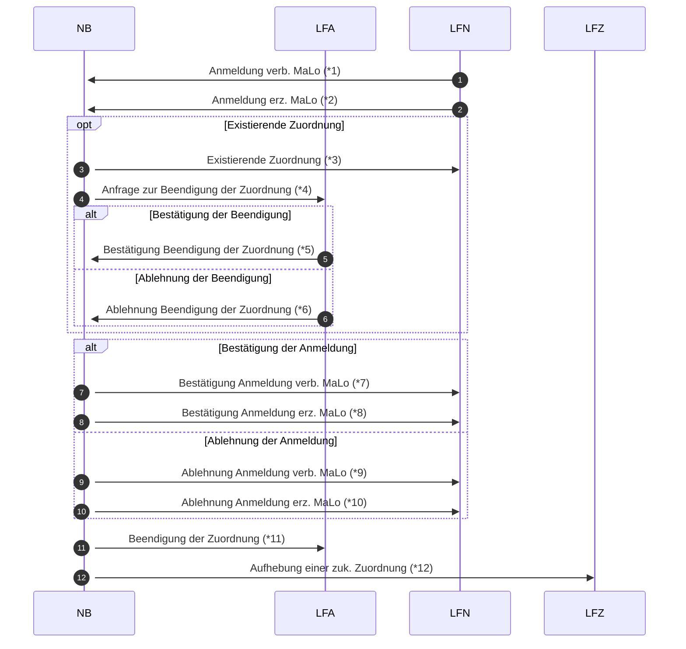

# Abmeldeanfrage NB -> LFA (Rolle NB)

*1 Prüfi: 55001
*2 Prüfi: 55077
*3 Prüfi: 55036
*4 Prüfi: 55010
*5 Prüfi: 55011
*6 Prüfi: 55012
*7 Prüfi: 55002
*8 Prüfi: 55078
*9 Prüfi: 55003
*10 Prüfi: 55080
*11 Prüfi: 55037
*12 Prüfi: 55038

