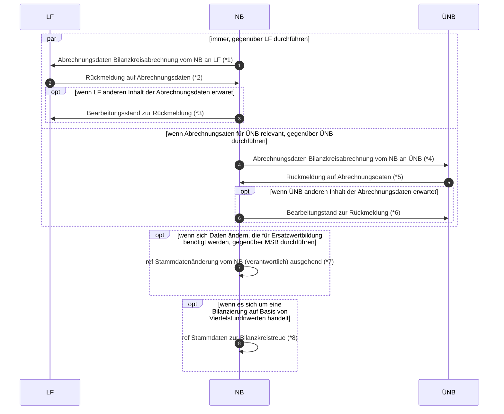

# Abrechnungsdaten Bilanzkreisabrechnung (Rolle LF)

*1 Prüfi: 55126, 55672
*2 Prüfi: 55156, 55673
*3 Prüfi: 21047
*4 Prüfi: 55613, 55674
*5 Prüfi: 55614, 55675
*6 Prüfi: 21047
*7 Prüfi: 55627, 
*8 Prüfi: 55670, 55628, 55629, 55630, 55632, 55173
