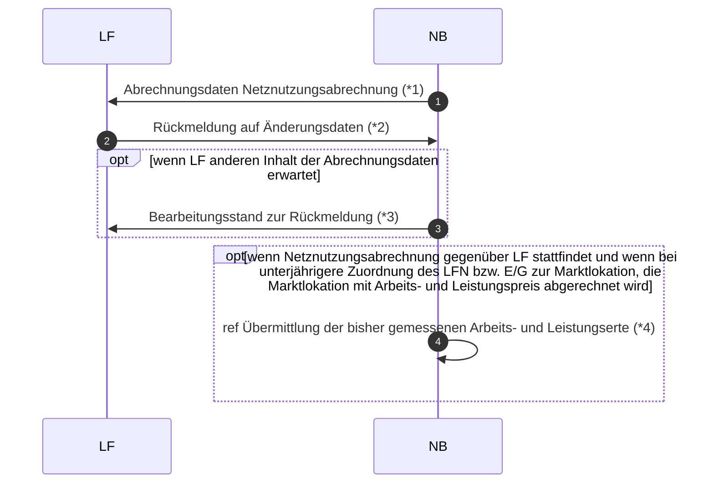

# Abrechnungsdaten Netznutzungsabrechnung (Rolle LF)

```mermaid
sequenceDiagram
  autonumber
  
  participant LF as LF
  participant NB as NB  
 
 NB ->> LF: Abrechnungsdaten Netznutzungsabrechnung (*1)
 LF ->> NB : Rückmeldung auf Änderungsdaten (*2)
 
 opt wenn LF anderen Inhalt der Abrechnungsdaten erwartet
    NB ->> LF: Bearbeitungsstand zur Rückmeldung (*3)    
 end
 
 opt wenn Netznutzungsabrechnung gegenüber LF stattfindet und wenn bei unterjährigere Zuordnung des LFN bzw. E/G zur Marktlokation, die Marktlokation mit Arbeits- und Leistungspreis abgerechnet wird
    NB ->> NB: ref Übermittlung der bisher gemessenen Arbeits- und Leistungserte (*4)    
 end 
 
```

*1 Prüfi: 55218
*2 Prüfi: 55220
*3 Prüfi: 21047
*4 Prüfi: 13015

