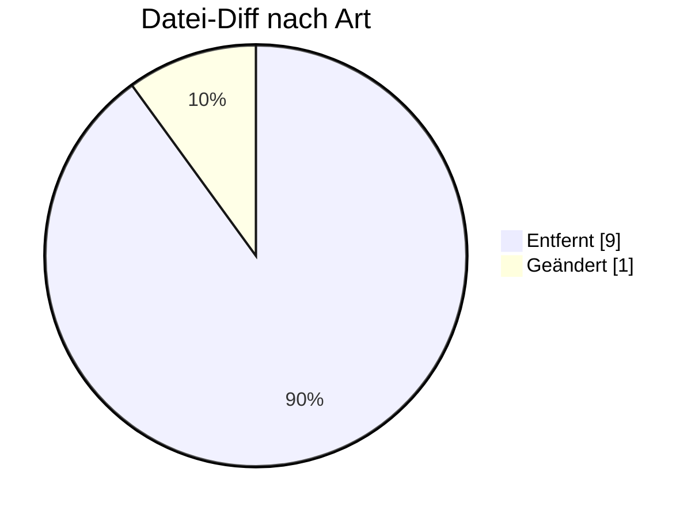

# APERAK — Formatumstellung 01.10.2026

← [Zurück zur Gesamtübersicht](../index.md)

**Anwendungsfehler-Rückmeldung** · `AHB 1.0 → 1.1 · MIG 2.2`

<Columns>
<Column>
<Card title="Kuratierte Änderungen" icon="material-two-tone-rule">
**14** aus der BDEW-Änderungshistorie
</Card>
</Column>
<Column>
<Card title="Datei-Diff" icon="material-two-tone-difference">
**10** Einzeländerungen (AHB/MIG)
</Card>
</Column>
</Columns>

:::tip[Kurzfazit (das Wichtigste auf einen Blick)]
- **Fristprüfung = Verarbeitung:** auch bei verspäteten Nachrichten zwingend eine APERAK senden.
- **− Kontaktinfos:** CTA+COM aus SG3 (MP-ID Absender) gestrichen.
- **Präzisierungen** Zuordnungsprüfung / Einsatz der APERAK.
:::

:::warning[Auswirkungen aufs Backend]
- **Fristprüfung = Verarbeitung:** auch bei verspäteten Nachrichten APERAK senden.
- **CTA+COM aus SG3 (Absender) entfernt:** Generierung anpassen.
:::

---

## Änderungen nach Marktrolle

:::note[Navigation]
Jede Rolle ist ein eigener Block; klappe die gewünschte Einzeländerung auf, um Bisher/Neu/Grund zu sehen. Eine Änderung kann mehreren Rollen zugeordnet sein (Mehrfachnennung).
:::

### ⚪ Übergreifend (14)

<AccordionGroup>

<Accordion title="Änd-ID 27309 · 4.3 Fehlercodes in ERC-Segment einer APERAK-Nachricht">

| Feld | Wert |
|---|---|
| **Ort** | 4.3 Fehlercodes in ERC-Segment einer APERAK-Nachricht |
| **Prüfi(s)** | – |
| **Rolle(n)** | Übergreifend |
| **Status** | Genehmigt |

**Bisher:**
> Zeile mit Code: Z18:  Spalte "Erläuterung": […] Nutzungseinschränkung: […] 4. Die Prüfungen, die zur Anwendung dieses Codes führen, sind nicht anzuwenden, wenn eine UTILTS empfangen wird, bei der SG5 DTM+157 Gültigkeit, Beginndatum Gültigkeitsdatum mit einem Zeitpunkt gefüllt ist, der vor der Zuordnung des LF zu der Marktlokation liegt bzw. der vor der Zuordnung des MSB zu einer dem Lokationsbündel zugehörigen Messlokation liegt, der auch die Marktlokation angehört, die in der UTILTS genannt wird. Damit gilt diese Gültigkeitseinschränkung auch für den MSB der Marktlokation, da er auch der MSB mindestens einer Messlokation des Lokationsbündels ist. Hinweis: Liegt bei einer empfangenen UTILTS der in SG5 DTM+157 Gültigkeit, Beginndatum enthaltene Zeitpunkt nach dem Zeitpunkt, zu dem die oben beschriebene Zuordnung des LF zu der Marktlokation beendet wurde bzw. die oben beschriebene Zuordnung des MSB zur Messlokation des Lokationsbündels beendet wurde, kann dieser Code gesendet werden. 5. Die Prüfungen, die zur Anwendung dieses Codes führen sind nicht anzuwenden, wenn eine MSCONS mit dem BGM+Z27, NAD+MR in der Rolle LF und NAD+MS in der Rolle NB empfangen

**Neu:**
> Zeile mit Code: Z18:  Spalte "Erläuterung": […] Nutzungseinschränkung: […] 4. Die Prüfungen, die zur Anwendung dieses Codes führen sind nicht anzuwenden, wenn eine MSCONS mit dem BGM+Z27, NAD+MR in der Rolle LF und NAD+MS in der Rolle NB empfangen wird. [...]

**Grund:** Die Bedingung der vierten Nutzungseinschränkung wird seit der Umstellung der Berechnungsformel auf Zeitscheiben nur noch von UTILTS-Anwendungsfällen erfüllt, für die weder eine Zuordnung zu einem Objekt noch zu einem Geschäftsvorfall erfolgt. Somit wird diese Bedingung nie erfüllt. Sie ist daher überflüssig und kann entfernt werden. Eine Korrektur im APERAK AHB 1.0 ist daher nicht zwingend nötig.

</Accordion>

<Accordion title="Änd-ID 27308 · 4.3 Fehlercodes in ERC-Segment einer APERAK-Nachricht">

| Feld | Wert |
|---|---|
| **Ort** | 4.3 Fehlercodes in ERC-Segment einer APERAK-Nachricht |
| **Prüfi(s)** | – |
| **Rolle(n)** | Übergreifend |
| **Status** | Genehmigt |

**Bisher:**
> Zeile mit Code: Z17:  Spalte "Erläuterung": […] Nutzungseinschränkung: […] 3. Die Prüfungen, die zur Anwendung dieses Codes führen, sind nicht anzuwenden, wenn eine UTILTS empfangen wird, bei der SG5 DTM+157 Gültigkeit, Beginndatum mit einem Datum gefüllt ist, das vor der Zuordnung des NB zu der Marktlokation liegt. Hinweis: Liegt bei einer empfangenen UTILTS das in SG5 DTM+157 Gültigkeit, Beginndatum enthaltene Datum nach dem Zeitpunkt, zu dem die Zuordnung des NB zu der Marktlokation beendet wurde, kann dieser Code gesendet werden.   4. Die Prüfungen, die zur Anwendung dieses

**Neu:**
> Zeile mit Code: Z17:  Spalte "Erläuterung": […] Nutzungseinschränkung: […] 3. Die Prüfungen, die zur Anwendung dieses Codes führen, sind nicht anzuwenden, wenn eine REQOTE mit dem BGM+Z57, NAD+MR in der Rolle MSB und NAD+MS in der Rolle ESA empfangen wird, oder wenn eine REQOTE mit dem BGM+Z93, NAD+MR in der Rolle MSB und NAD+MS in der Rolle LF empfangen wird. [...]

**Grund:** Die Bedingung der dritten Nutzungseinschränkung wird seit der Umstellung der Berechnungsformel auf Zeitscheiben nur noch von UTILTS-Anwendungsfällen erfüllt, für die weder eine Zuordnung zu einem Objekt noch zu einem Geschäftsvorfall erfolgt. Somit wird diese Bedingung nie erfüllt. Sie ist daher überflüssig und kann entfernt werden. Eine Korrektur im APERAK AHB 1.0 ist daher nicht zwingend nötig.

</Accordion>

<Accordion title="Änd-ID 27274 · Kapitel "Einsatz der APERAK-Nachricht"">

| Feld | Wert |
|---|---|
| **Ort** | Kapitel "Einsatz der APERAK-Nachricht" |
| **Prüfi(s)** | – |
| **Rolle(n)** | Übergreifend |
| **Status** | Genehmigt |

**Bisher:**
> › In der Ausprägung „Anerkennungsmeldung“ (DE1001 = 312 „Anerkennungsmeldung“) informiert die APERAK den Absender eines Geschäftsvorfalls, dass dieser Geschäftsvorfall keine Fehler enthält, er somit diesen Geschäftsvorfall anerkennt und er diesen Geschäftsvorfall in die weitere Verarbeitung überführt.

**Neu:**
> › In der Ausprägung „Anerkennungsmeldung“ (DE1001 = 312 „Anerkennungsmeldung“) informiert die APERAK den Absender eines Geschäftsvorfalls, dass dieser Geschäftsvorfall keine Fehler enthält, er somit diesen Geschäftsvorfall anerkennt und er diesen Geschäftsvorfall in die weitere Verarbeitung überführt. Hinweis: Erst in dieser weiteren Verarbeitung kann geprüft werden, ob der empfangene Geschäftsvorfall innerhalb oder außerhalb der für ihn geltenden Frist empfangen wurde.

**Grund:** Präzisierung

</Accordion>

<Accordion title="Änd-ID 27063 · Kapitel "APERAK Anerkennungsmeldu ng"">

| Feld | Wert |
|---|---|
| **Ort** | Kapitel "APERAK Anerkennungsmeldu ng" |
| **Prüfi(s)** | – |
| **Rolle(n)** | Übergreifend |
| **Status** | Genehmigt |

**Bisher:**
> Soll dem Absender eines Geschäftsvorfalls mitgeteilt werden, dass dieser keinen Verarbeitbarkeitsfehler enthält, erfolgt dies mittels einer APERAK der Ausprägung „Anerkennungsmeldung“. Es wird für jeden Geschäftsvorfall einer Übertragungsdatei, der

**Neu:**
> Soll dem Absender eines Geschäftsvorfalls mitgeteilt werden, dass dieser keinen Verarbeitbarkeitsfehler enthält, erfolgt dies mittels einer APERAK der Ausprägung „Anerkennungsmeldung“. Es wird für jeden Geschäftsvorfall einer Übertragungsdatei, der

**Grund:** Präzisierung:  Aufgrund des gelöschten Satzes interpretierten Marktteilnehmer, dass sie für Geschäftsvorfälle, welche z. B. außerhalb der First eingehen,

</Accordion>

<Accordion title="Änd-ID 26943 · SG3 MP-ID Absender">

| Feld | Wert |
|---|---|
| **Ort** | SG3 MP-ID Absender |
| **Prüfi(s)** | – |
| **Rolle(n)** | Übergreifend |
| **Status** | Genehmigt |

**Bisher:**
> CTA-Segment "Ansprechpartner" und COM- Segment "Kommunikationsverbindung" vorhanden

**Neu:**
> CTA-Segment "Ansprechpartner" und COM- Segment "Kommunikationsverbindung" nicht vorhanden

**Grund:** Umsetzung des Konsultationsergebnisses des Konzepts „zur Nutzung der Kontaktinformationen des Senders in den EDI@Energy Nachrichtentypen“

</Accordion>

<Accordion title="Änd-ID 26169 · Kapitel "Fristen zur Übermittlung der APERAK" des Kapitels…">

| Feld | Wert |
|---|---|
| **Ort** | Kapitel "Fristen zur Übermittlung der APERAK" des Kapitels "Regeln zum Einsatz der APERAK in der Sparte Strom" |
| **Prüfi(s)** | – |
| **Rolle(n)** | Übergreifend |
| **Status** | Genehmigt |

**Bisher:**
> Das Ergebnis der Verarbeitbarkeitsprüfung aller in einer Übertragungsdatei enthaltenen Geschäftsvorfälle hat der Empfänger der Übertragungsdatei dem Absender unverzüglich, jedoch spätestens bis zum nächsten Werktag 12 Uhr gesetzlicher deutscher Zeit nach Eingang der Übertragungsdatei, per APERAK mitzuteilen.

**Neu:**
> Das Ergebnis der Verarbeitbarkeitsprüfung aller in einer Übertragungsdatei enthaltenen Geschäftsvorfälle hat der Empfänger der Übertragungsdatei dem Absender unverzüglich, jedoch spätestens bis zum nächsten Werktag 12 Uhr gesetzlicher deutscher Zeit nach Eingang der Übertragungsdatei, per APERAK mitzuteilen, wobei er sicherzustellen hat, dass zu jedem Geschäftsvorfall, der in der Übertragungsdatei enthalten ist, entweder eine

**Grund:** Ergänzung, da es Marktteilnehmer gibt, die meinen nicht durch die Vorgaben legitimierte, Interpretationen zum APERAK-Einsatz in der Sparte leben zu können.

</Accordion>

<Accordion title="Änd-ID 26167 · Kapitel "Regeln zum Einsatz der APERAK in der Sparte Strom…">

| Feld | Wert |
|---|---|
| **Ort** | Kapitel "Regeln zum Einsatz der APERAK in der Sparte Strom" |
| **Prüfi(s)** | – |
| **Rolle(n)** | Übergreifend |
| **Status** | Genehmigt |

**Bisher:**
> › Die APERAK informiert den Absender eines Geschäftsvorfalls, dass die Prüfung der Inhalte dieses Geschäftsvorfalls zu einem Fehler geführt hat, oder dass dieser Geschäftsvorfall keine Fehler enthält, er somit diesen Geschäftsvorfall anerkennt und er diesen Geschäftsvorfall in die weitere Verarbeitung überführt.

**Neu:**
> › Die APERAK informiert den Absender eines Geschäftsvorfalls, dass die Prüfung der Inhalte dieses Geschäftsvorfalls zu einem Fehler geführt hat, oder dass dieser Geschäftsvorfall keine Fehler enthält, er somit diesen Geschäftsvorfall anerkennt und er diesen Geschäftsvorfall in die weitere Verarbeitung(Fußnote) überführt.  Fußnote: Bereits die Prüfung, ob ein Geschäftsvorfall fristgerecht eingetroffen ist, stellt eine Verarbeitung dieses Geschäftsvorfalls nach erfolgter Verarbeitbarkeitsprüfung dar.

**Grund:** Ergänzung, da es Marktteilnehmer gibt, die meinen nicht durch die Vorgaben legitimierte, Interpretationen zum APERAK-Einsatz in der Sparte leben zu können.

</Accordion>

<Accordion title="Änd-ID 26164 · Kapitel "Zuordnungsprüfung "">

| Feld | Wert |
|---|---|
| **Ort** | Kapitel "Zuordnungsprüfung " |
| **Prüfi(s)** | – |
| **Rolle(n)** | Übergreifend |
| **Status** | Genehmigt |

**Bisher:**
> Außerdem existiert die Möglichkeit, dass es sich um einen Geschäftsvorfall eines Prozessschritts handelt, der keiner Zuordnungsprüfung im Rahmen der Verarbeitbarkeitsprüfung unterzogen wird. In der Verarbeitbarkeitsprüfung entfällt für diese die Zuordnungsprüfung. Diese Ge-schäftsvorfälle sind im EDI@Energy-Dokument „Anwendungsübersicht der Prüfidentifikatoren“ daran zu erkennen, dass in jeder der drei Spalten › „Zuordnung zu einem Objekt“, › „Zuordnung zu einem Geschäftsvorfall“ und › „Erweiterte Zuordnung“ des entsprechenden Anwendungsfalls die zwei Zeichen „--“ stehen.

**Neu:**
> *(kein Text-Diff in der Historie hinterlegt)*

**Grund:** Aussage ist im Kapitel "Zuordnungsprüfung eines Geschäftsvorfalls" enthalten

</Accordion>

<Accordion title="Änd-ID 26163 · Kapitel "Zuordnungsprüfung "">

| Feld | Wert |
|---|---|
| **Ort** | Kapitel "Zuordnungsprüfung " |
| **Prüfi(s)** | – |
| **Rolle(n)** | Übergreifend |
| **Status** | Genehmigt |

**Bisher:**
> Der Empfänger eines Geschäftsvorfalls hat im Rahmen der Zuordnungsprüfung zu prüfen, ob diese Zuordnung möglich ist. Die folgenden Kapitel beschreiben, wie die Zuordnung zu [...]

**Neu:**
> Der Empfänger eines Geschäftsvorfalls hat im Rahmen der als Teil der Verarbeitbarkeitsprüfung durchgeführten Zuordnungsprüfung zu prüfen, ob diese Zuordnung möglich ist. Die folgenden Kapitel beschreiben, wie die Zuordnung im Rahmen der Verarbeitbarkeitsprüfung zu [...]

**Grund:** Präzisierende Ergänzung

</Accordion>

<Accordion title="Änd-ID 26162 · Kapitel "Zuordnungsprüfung "">

| Feld | Wert |
|---|---|
| **Ort** | Kapitel "Zuordnungsprüfung " |
| **Prüfi(s)** | – |
| **Rolle(n)** | Übergreifend |
| **Status** | Genehmigt |

**Bisher:**
> [...] beginnt.  Der Empfänger [...]

**Neu:**
> [...] beginnt. Hinweis: Ist die Spalte „Stelle der Zuordnungsprüfung“ mit „E“ oder „--“(Fußnote) gefüllt, so ist es nicht zulässig einen derartigen Geschäftsvorfall im Rahmen der Verarbeitbarkeitsprüfung einer Zuordnungsprüfung zu unterziehen. Im Rahmen der Verarbeitbarkeitsprüfung darf ein derartiger Geschäftsvorfall nur der AHB-Prüfung unterzogen werden. Übersteht er diese, so ist der Geschäftsvorfall verarbeitbar, was bedeutet, dass in der Sparte Strom für diesen eine Anerkennungsmeldung zu versenden ist. Alle weiteren Informationen, wie zu verfahren ist,

**Grund:** Anpassung aufgrund der entsprechenden Präzisierungen und Ergänzungen im EDI@Energy-Dokument "Anwendungsübersicht der Prüfidentifikatoren"

</Accordion>

<Accordion title="Änd-ID 26161 · Kapitel "Zuordnungsprüfung "">

| Feld | Wert |
|---|---|
| **Ort** | Kapitel "Zuordnungsprüfung " |
| **Prüfi(s)** | – |
| **Rolle(n)** | Übergreifend |
| **Status** | Genehmigt |

**Bisher:**
> Nur mit den darin genannten Inhalten des Geschäftsvorfalls darf der Empfänger die Zuordnung vornehmen und nur diese Informationen darf er im Rahmen seiner Zuordnungsprüfung nutzen. Nur wenn mit diesen Informationen die Zuordnung des Geschäftsvorfalls scheitert, kann und muss er dies unter Nutzung des passenden Codes dem Absender melden. Die Codes, über die Zuordnungsfehler gemeldet werden können, sind in der Tabelle des Kapitels „Fehlercodes in ERC-Segment einer APERAK-Nachricht“ daran zu erkennen, dass der Text der Spalte „Art“ mit den zwei Buchstaben „ZO“ beginnt.

**Neu:**
> Nur mit den darin genannten Inhalten des Geschäftsvorfalls darf der Empfänger die Zuordnung vornehmen und nur dann darf er diese Informationen im Rahmen seiner als Bestandteil der Verarbeitbarkeitsprüfung durchgeführten Zuordnungsprüfung nutzen, wenn im EDI@Energy-Dokument „Anwendungsübersicht der Prüfidentifikatoren“ in der Tabelle „Prüfidentifikator zu Prozessschritt / API Webservice zu Prozessschritt“ die Spalte „Stelle der Zuordnungsprüfung“ mit „V“ gefüllt ist. Nur wenn mit diesen Informationen die Zuordnung des Geschäftsvorfalls scheitert, kann und muss er dies unter Nutzung des passenden Codes dem Absender mit der APERAK / Zuordnungsfehler melden, so dies nicht durch eine Nutzungsein¬schränkung des entsprechenden Codes für diesen Geschäftsvorfall ausgeschlossen ist. Die Codes, über die Zuordnungsfehler gemeldet werden können, sind in der Tabelle des Kapitels „Fehlercodes in ERC-Segment einer APERAK-Nachricht“ daran zu erkennen, dass der Text der Spalte „Art“ mit den zwei Buchstaben „ZO“ beginnt.

**Grund:** Anpassung aufgrund der entsprechenden Präzisierungen und Ergänzungen im EDI@Energy-Dokument "Anwendungsübersicht der Prüfidentifikatoren"

</Accordion>

<Accordion title="Änd-ID 26160 · Kapitel "Einsatz der APERAK-Nachricht"">

| Feld | Wert |
|---|---|
| **Ort** | Kapitel "Einsatz der APERAK-Nachricht" |
| **Prüfi(s)** | – |
| **Rolle(n)** | Übergreifend |
| **Status** | Genehmigt |

**Bisher:**
> › Wird im Rahmen der Prüfung ein Fehler festgestellt, so wird nur der betroffene Geschäftsvorfall der Übertragungsdatei abgelehnt. Es erfolgt keine Weiterverarbeitung des Geschäftsvorfalls beim Empfänger der Übertragungsdatei und damit auch keine Antwort aus dem Geschäftsprozess auf diesen Geschäftsvorfall.

**Neu:**
> › Wird im Rahmen der Prüfung ein Fehler festgestellt, so wird nur der betroffene Geschäftsvorfall der Übertragungsdatei abgelehnt. Es erfolgt keine Weiterverarbeitung des fehlerhaften Geschäftsvorfalls beim Empfänger der Übertragungsdatei und damit auch keine Antwort aus dem Geschäftsprozess auf diesen Geschäftsvorfall.

**Grund:** Präzisierung

</Accordion>

<Accordion title="Änd-ID 26159 · Kapitel "Verantwortlichkeite n und Rahmenbedingungen bei d…">

| Feld | Wert |
|---|---|
| **Ort** | Kapitel "Verantwortlichkeite n und Rahmenbedingungen bei der Kommunikation zwischen Absender und Empfänger" |
| **Prüfi(s)** | – |
| **Rolle(n)** | Übergreifend |
| **Status** | Genehmigt |

**Bisher:**
> › In den Prozessen der Sparte Strom wird ihm die weitere Verarbeitung explizit durch Übersendung der Anerkennungsmeldung per APERAK mitgeteilt. Er kann nur von einer ordnungsgemäßen Verarbeitung der Geschäftsvorfälle seiner Übertragungsdatei ausgehen, für die er eine Anerkennungsmeldung erhält

**Neu:**
> › In den Prozessen der Sparte Strom wird ihm die weitere Verarbeitung explizit durch Übersendung der Anerkennungsmeldung per APERAK mitgeteilt. Er kann nur von einer ordnungsgemäßen Verarbeitung der Geschäftsvorfälle seiner Übertragungsdatei ausgehen, für die er eine Anerkennungsmeldung erhält. Hinweis: Auch das Feststellen, dass ein Geschäftsvorfall nicht fristgerecht eintraf, stellt eine Verarbeitung des Geschäftsvorfalls im Sinne der Verwendung dieses Begriffs in diesem Dokument dar, da das Feststellen einer Fristverletzung nach der Verarbeitbarkeitsfehlerprüfung stattfindet.

**Grund:** Ergänzung, da es Marktteilnehmer gibt, die meinen nicht durch die Vorgaben legitimierte, Interpretationen zum APERAK-Einsatz in der Sparte leben zu können.

</Accordion>

<Accordion title="Änd-ID 26102 · Kapitel 3 Tabellarische Darstellung">

| Feld | Wert |
|---|---|
| **Ort** | Kapitel 3 Tabellarische Darstellung |
| **Prüfi(s)** | – |
| **Rolle(n)** | Übergreifend |
| **Status** | Genehmigt |

**Bisher:**
> 3 Tabellarische Darstellung Das Kapitel enthält die tabellarischen Darstellungen des Nachrichtentyps APERAK. Aus Gründen der besseren Lesbarkeit beginnt jeder Abschnitt dieses Kapitels mit einer neuen Seite. 3.1 Übersicht der Pakete in der APERAK […] 3.2 Tabellarische Darstellung der APERAK […]

**Neu:**
> 3 Tabellarische Darstellung der APERAK […]

**Grund:** Die Umsetzung des Konsultationsergebnisses des Konzepts „zur Nutzung der Kontaktinformationen des Senders in den EDI@Energy Nachrichtentypen“ führte dazu, dass das COM-Segment entfernt wurde, welches das einzige Segment in der APERAK war, in dem Pakete benötigt wurden.

</Accordion>

</AccordionGroup>

---

### 🔬 Echter Datei-Diff (AHB/MIG · Stand 202604 → 202610)

<AccordionGroup>
:::info[10 Einzeländerungen auf Segment-/Bedingungsebene]
**＋ 0** hinzugefügt · **− 9** entfernt · **~ 1** geändert. Diese granulare Ebene ergänzt die kuratierte BDEW-Historie — Auszug unten.
:::
</AccordionGroup>

---

← [Gesamtübersicht](../index.md)
