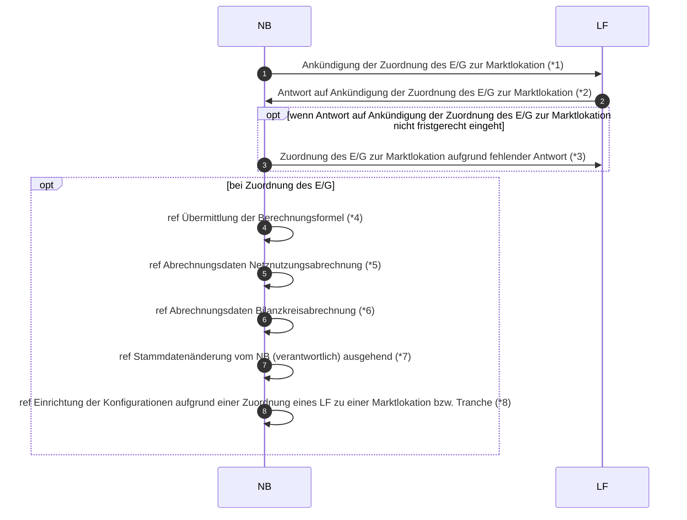

# Beginn der Ersatz-/Grundversorgung (Rolle NB)

*1 Prüfi: 55013
*2 Prüfi: 55014, 55015
*3 Prüfi: 55013
*4 Prüfi: 25001
*5 Prüfi: 55218
*6 Prüfi: 55126
*7 Prüfi: 55615, 55620, 55175, 55225, 55616, 55617, 55618, 55619, 55691
*8 Prüfi: 17134

