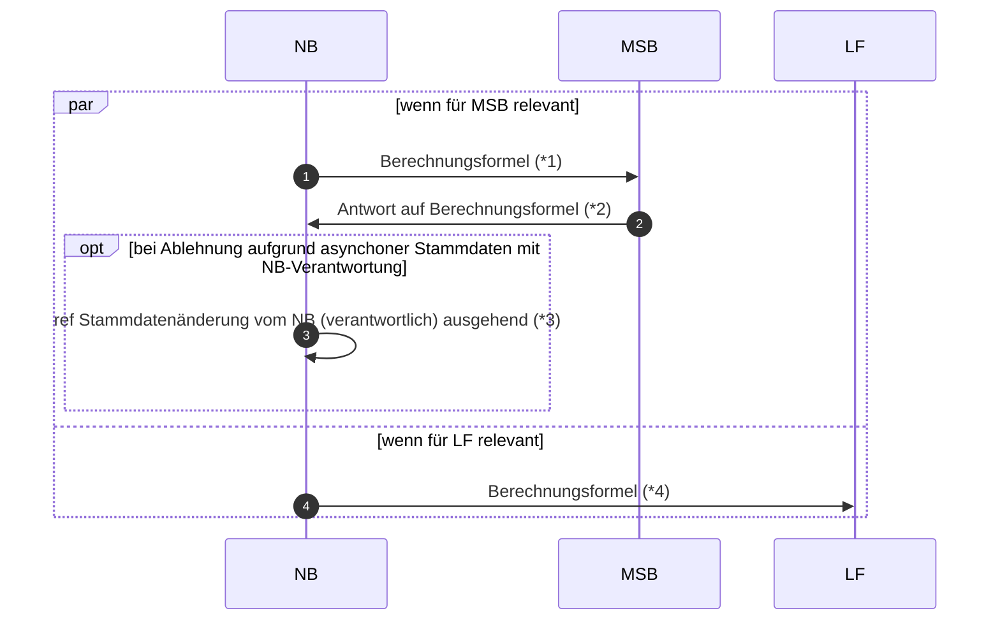

# Berechnungsformel (Rolle NB)

```mermaid
sequenceDiagram
  autonumber
  
  participant NB as NB  
  participant MSB as MSB
  participant LF as LF
  
 
 par wenn für MSB relevant
  NB ->> MSB: Berechnungsformel (*1)
  MSB ->> NB : Antwort auf Berechnungsformel (*2)

  opt bei Ablehnung aufgrund asynchoner Stammdaten mit NB-Verantwortung
    NB ->> NB: ref Stammdatenänderung vom NB (verantwortlich) ausgehend (*3)    
  end
  
  and wenn für LF relevant
  NB->> LF: Berechnungsformel (*4)
end

```

*1 Prüfi: 25001
*2 Prüfi: 25010
*3 Prüfi: 55627, 55628, 55629, 55630, 55632, 55173
*4 Prüfi: 25001
