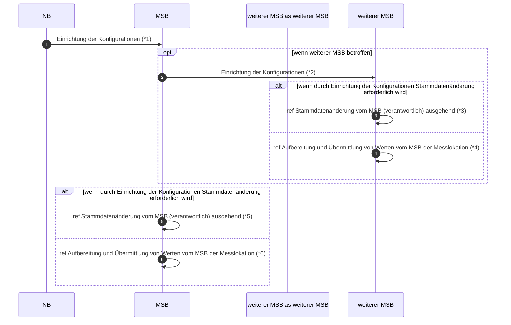

# Einrichtung der Konfiguration aufgrund einer Zuordnung eines LF zu einer Marktlokation oder Tranche (Rolle NB)

*1 Prüfi: 17134
*2 Prüfi: 17135
*3 Prüfi: 55659, 55553, 55660, 55661, 55662, 55663, 
*4 Prüfi: 13017, 13018
*5 Prüfi: 55557, 55553, 55639, 55640, 55641, 55642, 55643, 55653
*6 Prüfi: 21047
*7 Prüfi: 13017, 13018

