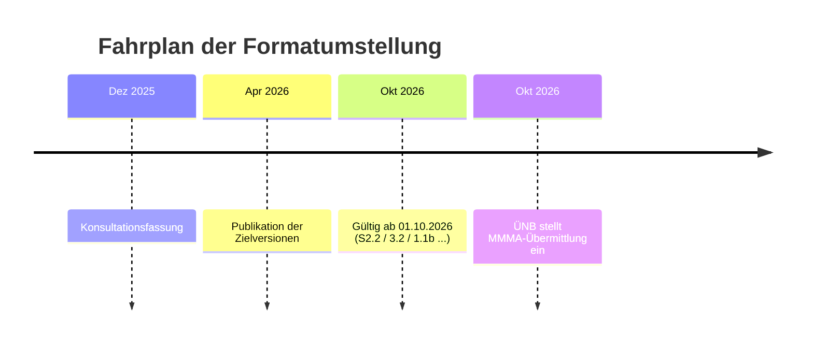
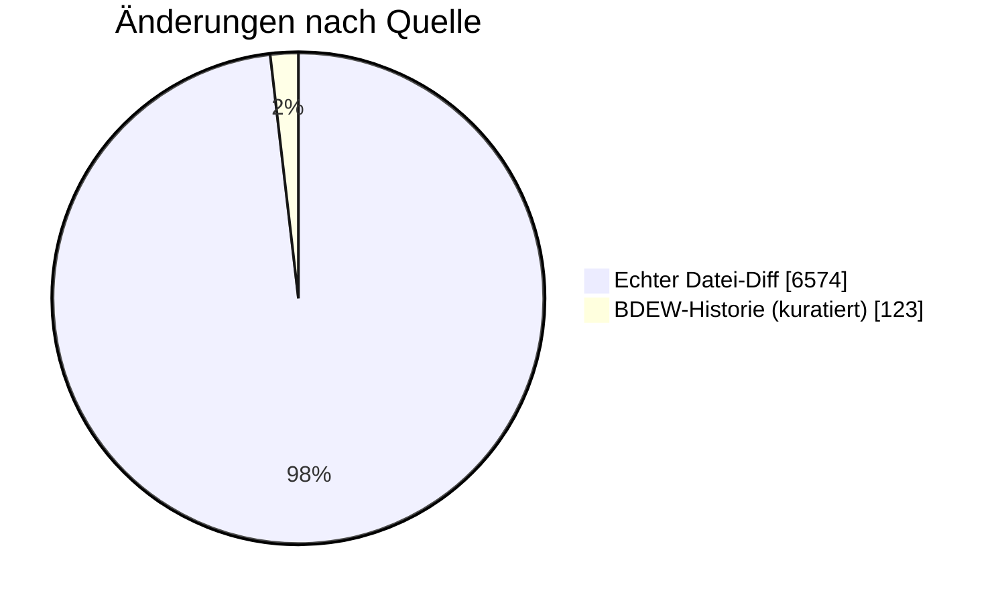
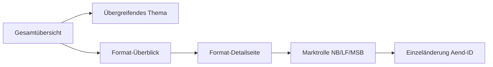

# Formatwechsel 10/2026 — Was kommt zum 01.10.2026?

:::info[Stichtag 01.10.2026]
Diese Dokumentation bündelt die BDEW-Formatumstellung mit Gültigkeit **ab 01.10.2026** (Zielversionen u. a. UTILMD S2.2 / G1.2, MSCONS 3.2, ORDERS 1.1b, ORDRSP 1.1b). Publikation der Versionen war 01.04.2026; **gültig** werden sie zum 01.10.2026. Einstieg auf Themen-/Format-Ebene, von hier **Absprung in jede Einzeländerung**.
:::

<Columns>
<Column>
<Card title="14 Formate" icon="material-two-tone-category">
mit Änderungen zum 01.10.2026
</Card>
</Column>
<Column>
<Card title="123 kuratierte Änderungen" icon="material-two-tone-fact-check">
aus der BDEW-Änderungshistorie
</Card>
</Column>
</Columns>

<Columns>
<Column>
<Card title="6574 Datei-Änderungen" icon="material-two-tone-difference">
echter AHB/MIG-Diff (Segment-/Bedingungsebene)
</Card>
</Column>
<Column>
<Card title="Prozesse" icon="material-two-tone-account-tree">
NB −12 · LF −2 · MSB +1 (BPMN)
</Card>
</Column>
</Columns>

---

## Allgemeine Infos

<Columns>
<Column>
<Card title="Allgemeine Festlegungen (AF)" icon="material-two-tone-gavel">
- **Zeichensatz (UNOC):** DE0020 im UNB strikt limitiert — nur A-Z, Ä/Ü/Ö, 0-9 und ausgewählte Sonderzeichen.
- **Dateibenennung XML:** `Unavailability_MarketDocument` nutzt nun das `end`- statt `start`-Attribut der Time-Period.
- **Begrifflichkeiten:** „Formatdefinition“ → „Formatbedingung“. Neuer Status **„Anpassung“** für außerordentliche Veröffentlichungen.
</Card>
</Column>
<Column>
<Card title="API-Guidelines & Webservice" icon="material-two-tone-api">
- **GitHub-Veröffentlichung:** alle API-Webdienste zentral auf GitHub unter `EDI@Energy`; Konsultationsbeiträge (Issues) direkt dort.
- **Retries (Idempotenz):** `initialTransactionId` nur bei Retry mitsenden, beim initialen Aufruf weglassen.
- **Leere Arrays & Null:** required-Array darf `[]` sein (sofern kein `minItems`); `null`-Objekte in Listen verboten.
</Card>
</Column>
</Columns>

<Columns>
<Column>
<Card title="Prüfidentifikatoren (PID)" icon="material-two-tone-tag">
- **＋ Neue Spalten:** „Stelle der Zuordnungsprüfung“ und „EBD-Code / Code Codeliste“.
- **＋ EZ-10:** neue erweiterte Zuordnungslogik — Bestellungen (z. B. LF) vor MSB-Zuordnung möglich (bei RFF+Z41).
</Card>
</Column>
<Column>
<Card title="APERAK-Handling & AS4" icon="material-two-tone-security">
- **Fristprüfung = Verarbeitung:** auch bei verspäteten Nachrichten zwingend eine APERAK senden.
- **Krypto-Updates:** BSI TR-03116-4 (Juli 2025), TR-02102-4 für SSH (Januar 2026).
- **AS4-Migration abgeschlossen:** Kapitel „Wechsel des Übertragungsweges“ gestrichen.
</Card>
</Column>
</Columns>

---

## Übergreifende Themen

:::note
Themen, die **mehrere Formate** gleichzeitig betreffen — typischerweise mit der größten Backend-Wirkung.
:::

:::warning[Wegfall Kontaktinfos (Sender)]
**Betroffen:** APERAK · MSCONS · ORDERS · ORDRSP · UTILMD · PRICAT · IFTSTA · PARTIN · QUOTES · REQOTE · ORDCHG · UTILTS

CTA- und COM-Segment in der MP-ID-Absender-Gruppe (SG2/SG3/SG4) **ersatzlos gestrichen**. Umsetzung des Konsultationsergebnisses „Nutzung der Kontaktinformationen des Senders“.

**Änd-IDs:** 26943, 26944, 26198, 26969, 26945, 26146, 26147, 27022/27023, 26112, 26118, 26179, 26970

**🔧 Backend:** Sender-Kontaktsegmente nicht mehr befüllen — Generierungslogik in **allen** betroffenen Formaten anpassen.
:::

:::caution[Ausstieg ÜNB aus der MMMA]
**Betroffen:** ORDERS · ORDRSP · MSCONS · PARTIN · EBDs

ÜNB stellt **ab 01.10.2026** die Übermittlung der bilanzierten Energiemenge für Profil-MaLo an den NB ein. Prüfidentifikatoren **17114** und **19115** entfallen.

**Änd-IDs:** 27248, 27241, 27244, 26231, 70344

**🔧 Backend:** Sende-/Empfangslogik für MMMA (Mehr-/Mindermengen Strom) fristgerecht zum 01.10.2026 abschalten.
:::

:::info[Bereinigung WiM Gas 2.0]
**Betroffen:** ORDERS · ORDRSP · UTILMD Gas

Diverse Anwendungsfälle und Produkte (z. B. 17003 Änderung Technik) in der Sparte Gas **entfallen**, da sie in WiM Gas 2.0 nicht mehr existieren.

**Änd-IDs:** 26216, 27212, 27067

**🔧 Backend:** Spartenspezifische Prozesslogik & Code-Listen (Gas) überarbeiten.
:::

:::info[GWA-Wechsel (Geräteübernahme)]
**Betroffen:** ORDERS · ORDRSP · QUOTES

Neue **Pflichtsegmente** für den automatisierten GWA-Wechsel: IP-Adressen, Zertifikate, WakeUp-Ports, SIM, IMSI im Rahmen des MSB-Wechsels.

**Änd-IDs:** 26122, 26123, 26119

**🔧 Backend:** Datenmodell/Mapping um die neuen technischen Pflichtfelder erweitern (VDE-FNN-Hinweis WiM Strom).
:::

:::note[XODER-Korrektur (∨ → ⊻)]
**Betroffen:** INVOIC · ORDERS · ORDRSP · PARTIN · QUOTES · REQOTE · UTILTS

In den COM-/Ansprechpartner-Bedingungen wird das ODER (∨) durch das **exklusive ODER (⊻)** ersetzt — saubere Abgrenzung (E-Mail **oder** Telefon, nicht beides).

**Änd-IDs:** 26192, 26198, 26179, 26194, 26193, 26180

**🔧 Backend:** Validierungslogik der COM-Bedingungen (DE3148/DE3155) auf XODER umstellen.
:::

:::note[Paket-Umbau]
**Betroffen:** ORDCHG · PRICAT (entfernt) · ORDERS · ORDRSP · QUOTES · UTILTS (umgebaut/erweitert)

Pakete werden in ORDCHG und PRICAT **vollständig entfernt**, in anderen Formaten auf die korrekte Notation umgebaut bzw. erweitert (u. a. Verwendungszwecke direkt am Produkt).

**Änd-IDs:** 26141, 26131, 26157, 26199, 26195, 26185

**🔧 Backend:** Paket-Referenzen im Mapping prüfen; Produkt-↔-Verwendungszweck-Struktur anpassen.
:::

---

## Formate im Überblick

:::note
Pro Format ein Kurzfazit — Klick auf die Karte führt zur Detailseite mit den Einzeländerungen je Marktrolle.
:::

### Stammdaten

<Columns>
<Column>
<Card title="UTILMD Strom" icon="material-two-tone-bolt" href="formate/utilmd-strom.md">
`AHB S2.1 → S2.2 · MIG S2.2` · **29** kuratiert · **3075** Datei-Diff

- **Pflicht:** LOC Zeitraum-ID zwingend (z. B. LOC+Z18).
- **＋ Neu:** SG10 Vergütungsverpflichtung nach EEG/KWKG.
- **＋ SG4:** ZZD (Übergangsversorgung) neu ab 01.04.2026; C556 ZZB/ZZC (Stilllegung inkl./exkl. MaLo).
</Card>
</Column>
<Column>
<Card title="UTILMD Gas" icon="material-two-tone-local-fire-department" href="formate/utilmd-gas.md">
`AHB G1.1 → G1.2 · MIG G1.2` · **3** kuratiert · **1082** Datei-Diff

- **− Wegfall:** DTM Start Abrechnungsjahr (= Kalenderjahr) gelöscht.
- **＋ Transaktionsgrund:** ZZD (Übergangsversorgung).
- **＋ Prüfidentifikator:** 44183 (WiM: Ende MSB vom NB).
</Card>
</Column>
</Columns>

<Columns>
<Column>
<Card title="UTILTS" icon="material-two-tone-functions" href="formate/utilts.md">
`AHB 1.0 → 1.1 · MIG 1.1` · **7** kuratiert · **74** Datei-Diff

- **Limitierung:** NB darf max. 9 Zeitscheiben je Vorgang übermitteln.
- **Logik-Regel:** DTM+Z26 in jüngster Zeitscheibe nicht vorhanden → Gültigkeit ∞.
- **Umbau auf Pakete** + XODER-Korrektur in mehreren Anwendungsfällen.
</Card>
</Column>
</Columns>

### Bestellwesen

<Columns>
<Column>
<Card title="ORDERS" icon="material-two-tone-receipt-long" href="formate/orders.md">
`AHB 1.1a → 1.1b · MIG 1.4c` · **14** kuratiert · **750** Datei-Diff

- **Umbenennung:** SG2 heißt nun Liefer- bzw. Bezugsort.
- **＋ GWA-Wechsel:** SG29 FTX+Z29–Z32 (IP, Zertifikate, WakeUp, APN).
- **＋ Tranche:** Berechnungsformel ZC4 integriert; Positionsnummer 1..n.
</Card>
</Column>
<Column>
<Card title="ORDRSP" icon="material-two-tone-reply" href="formate/ordrsp.md">
`AHB 1.1a → 1.1b · MIG 1.4c` · **10** kuratiert · **460** Datei-Diff

- **Logik-Fix:** XOR (⊻) bei SG6 Ansprechpartner (EM oder TE).
- **− SG6:** Kontaktinformationen (Sender) entfernt.
- **＋ GWA-Wechsel:** SG27 FTX+Z33 (APN-Zugriffsparameter).
</Card>
</Column>
</Columns>

<Columns>
<Column>
<Card title="ORDCHG" icon="material-two-tone-edit-note" href="formate/ordchg.md">
`AHB 1.0a → 1.1 · MIG 1.2` · **2** kuratiert · **47** Datei-Diff

- **− Pakete:** keine Pakete mehr (Kapitel gelöscht).
- **− SG3 Absender:** Kontaktinformationen entfernt.
- Keine weiteren strukturellen Änderungen.
</Card>
</Column>
</Columns>

### Angebote & Marktpartner

<Columns>
<Column>
<Card title="QUOTES" icon="material-two-tone-request-quote" href="formate/quotes.md">
`AHB 1.1 → 1.1a · MIG 1.3c` · **4** kuratiert · **61** Datei-Diff

- **Status:** SG14 von R (Required) auf D (Dependent).
- **＋ GWA-Wechsel:** SG27/SG28 erweitert — Firmware, Hersteller-Typ, SIM-Nr., IMSI, TK-Provider, IP-Version.
- **Pakete** erweitert + XODER-Korrektur.
</Card>
</Column>
<Column>
<Card title="REQOTE" icon="material-two-tone-quiz" href="formate/requote.md">
`AHB 1.1 → 1.2 · MIG 1.2` · **2** kuratiert · **6** Datei-Diff

- **− Wegfall:** SG14 (Ansprechpartner) entfernt.
- **Logik-Korrektur:** XOR für Kommunikationsverbindung (wie ORDERS/ORDRSP).
</Card>
</Column>
</Columns>

<Columns>
<Column>
<Card title="PARTIN" icon="material-two-tone-contacts" href="formate/partin.md">
`AHB 1.0f → 1.1 · MIG 1.1` · **7** kuratiert · **193** Datei-Diff

- **Telefon:** im SG7 COM wird zwingend TE gefordert.
- **Steuernummer/USt-Nr.** in SG4/SG6 vereinheitlicht.
- **ÜNB (MMMA):** Ansprechpartner NB↔ÜNB befristet bis 01.01.2029 (23:00 UTC).
</Card>
</Column>
</Columns>

### Abrechnung, Preise & Werte

<Columns>
<Column>
<Card title="INVOIC" icon="material-two-tone-description" href="formate/invoic.md">
`AHB 1.0a → 1.0b · MIG 1.0b` · **8** kuratiert · **12** Datei-Diff

- **Abschlagsrechnung:** PID 31001 MUSS exakt eine Positionszeile enthalten.
- **Steuernummer:** USt-Nr. in SG3 muss der per PARTIN ausgetauschten entsprechen.
- **E-Rechnung:** Kapazitätsrechnung (PID 31010) gilt nicht als INVOIC i. S. d. UStG.
</Card>
</Column>
<Column>
<Card title="PRICAT" icon="material-two-tone-sell" href="formate/pricat.md">
`AHB 2.0f → 2.1 · MIG 2.1` · **2** kuratiert · **50** Datei-Diff

- **− Pakete:** keine Pakete mehr in der PRICAT.
- **Preisblatt Technik:** Z94 nur noch Freitext (Code F) als IMD.
- **＋ Neuer Code:** KWH für Preisstaffeln bei Lokationstechnik.
</Card>
</Column>
</Columns>

<Columns>
<Column>
<Card title="MSCONS" icon="material-two-tone-insights" href="formate/mscons.md">
`AHB 3.1g → 3.2 · MIG 2.5` · **7** kuratiert · **339** Datei-Diff

- **UNB Test-Flag:** DE0035 = 1 bei Testzwecken (Vereinheitlichung mit MIG).
- **KAV:** Leistungswerte genauer (mind. 1×, bis 2×).
- **− Wegfall:** bilanzierte Menge ÜNB→NB entfällt (ab 01.10.2026).
</Card>
</Column>
</Columns>

### Status & Rückmeldungen

<Columns>
<Column>
<Card title="IFTSTA" icon="material-two-tone-local-shipping" href="formate/iftsta.md">
`AHB 2.0h → 2.1 · MIG 2.1` · **14** kuratiert · **415** Datei-Diff

- **− 21026/21027:** WiM-Statusmeldung MSB↔NB endgültig gelöscht.
- **＋ Sparte Gas:** diverse Anwendungsfälle nun auch für Gas.
- **− SG1 Absender:** Kontaktinformationen entfernt; restliche Änderungen redaktionell.
</Card>
</Column>
<Column>
<Card title="APERAK" icon="material-two-tone-rule" href="formate/aperak.md">
`AHB 1.0 → 1.1 · MIG 2.2` · **14** kuratiert · **10** Datei-Diff

- **Fristprüfung = Verarbeitung:** auch bei verspäteten Nachrichten zwingend eine APERAK senden.
- **− Kontaktinfos:** CTA+COM aus SG3 (MP-ID Absender) gestrichen.
- **Präzisierungen** Zuordnungsprüfung / Einsatz der APERAK.
</Card>
</Column>
</Columns>

---

## Entscheidungsbäume (EBD) & allgemeine Regeln

| EBD / Bereich | Änderung | Impact |
|---|---|---|
| Allg. Festlegungen | Rundungsregeln (Kap. 2.18.3): keine kaufmännische Rundung mehr — nur noch „Abschneiden“. | Exaktere Datenübertragung |
| E_0615 (Anmeldung) | Neuer PS 30: Wurden Fristen zur Anmeldung eingehalten? (Nein → A03) | Schärfere Fristenkontrolle |
| E_0615 (Anmeldung) | Übergangsversorgung (§38a EnWG): Neuer PS 492 (Leistung = 0?) | ab 01.04.2026, Mittel-/Hochspannung |
| E_0443 / E_3004 | Spartenübergreifend: NB Strom prüft MSB Gas. Neuer PS 40: Adresse bekannt? | Schärfere Adressprüfung |
| E_0270 (Rechnung) | Artikel-ID Scheitern: 9991000003030-01 zulässig in PS 300 | Pauschalen für Scheitern |
| E_0506 (Storno) | Neuer PS 16: Handelt es sich um eine Rechnung von Verzugskosten? | Ident. PS wie Initialrechnung |

---

## Prozessänderungen (BPMN 202604 → 202610)

<Columns>
<Column>
<Card title="🔵 Netzbetreiber" icon="material-two-tone-schema">
**＋2 neu · −14 entfernt** (von 304 auf 292)

Prozessstraffung (Zusammenführung kombinierter Prozesse), Bereinigung WiM-Gas-2.0-Produkte (P_44xxx, G_005x) und neue TR-Rückmeldung **P_55694** (Fernsteuerbarkeit).
</Card>
</Column>
<Column>
<Card title="🟢 Lieferant" icon="material-two-tone-schema">
**＋0 neu · −2 entfernt** (von 306 auf 304)

Bereinigung obsoleter Anwendungsfälle (E_0205, P_17005) — minimale Änderungen.
</Card>
</Column>
<Column>
<Card title="🟣 Messstellenbetreiber" icon="material-two-tone-schema">
**＋1 neu · −0 entfernt** (von 221 auf 222)

Neuer Prozess **I_44183** „Ende MSB / Stilllegung 4418“ (WiM-Gas-2.0-Stilllegung).
</Card>
</Column>
</Columns>

---

## Pro Marktrolle einsteigen

:::note
Alternativer Einstieg: alle für eine Rolle relevanten Änderungen formatübergreifend — inkl. Prozessänderungen je Rolle.
:::

<Columns>
<Column>
<Card title="🔵 Netzbetreiber" icon="material-two-tone-hub" href="rollen/netzbetreiber.md">
**26** Änderungen · **4** Formate
</Card>
</Column>
<Column>
<Card title="🟢 Lieferant" icon="material-two-tone-storefront" href="rollen/lieferant.md">
**19** Änderungen · **4** Formate
</Card>
</Column>
</Columns>

<Columns>
<Column>
<Card title="🟣 Messstellenbetreiber" icon="material-two-tone-speed" href="rollen/messstellenbetreiber.md">
**22** Änderungen · **5** Formate
</Card>
</Column>
<Column>
<Card title="⚪ Übergreifend" icon="material-two-tone-public" href="rollen/uebergreifend.md">
**92** Änderungen · **14** Formate
</Card>
</Column>
</Columns>

---

## Marktrollen-Matrix

:::tip[Format × Rolle]
Anzahl kuratierter Änderungen je Format und Rolle. „·“ = keine rollenspezifische Zuordnung (strukturelle/globale Änderungen laufen unter **Übergreifend**). Spaltenkopf führt zur Rollen-Seite, Zeilenkopf zur Format-Seite.
:::

| Format | [🔵 NB](rollen/netzbetreiber.md) | [🟢 LF](rollen/lieferant.md) | [🟣 MSB](rollen/messstellenbetreiber.md) | [⚪ Übergreifend](rollen/uebergreifend.md) |
|---|---|---|---|---|
| [UTILMD Gas](formate/utilmd-gas.md) | · | · | · | 3 |
| [UTILMD Strom](formate/utilmd-strom.md) | 13 | 10 | 6 | 16 |
| [UTILTS](formate/utilts.md) | · | · | · | 7 |
| [ORDCHG](formate/ordchg.md) | · | · | · | 2 |
| [ORDERS](formate/orders.md) | 6 | 2 | 8 | 6 |
| [ORDRSP](formate/ordrsp.md) | 4 | 4 | 6 | 4 |
| [PARTIN](formate/partin.md) | · | · | · | 7 |
| [QUOTES](formate/quotes.md) | · | · | 1 | 3 |
| [REQOTE](formate/requote.md) | · | · | · | 2 |
| [INVOIC](formate/invoic.md) | · | · | · | 8 |
| [MSCONS](formate/mscons.md) | 3 | 3 | 1 | 4 |
| [PRICAT](formate/pricat.md) | · | · | · | 2 |
| [APERAK](formate/aperak.md) | · | · | · | 14 |
| [IFTSTA](formate/iftsta.md) | · | · | · | 14 |

---

## Methodik & Quellen

:::note[Methodik]
**Kuratiert:** Delta der Änd-IDs zwischen AHB-Stand 202610 und 202604 (nur in 202610 NEU). **Datei-Diff:** dokumentbasierter Vergleich der geparsten AHB/MIG (Tool `maco-changelog-docdiff`, Herkunft *dokument*/*beide*). **Rollen-Join:** Prüfidentifikator → `kommunikation_v/a` (Sender/Empfänger). **Prozesse:** BPMN-Bestandsvergleich der Repos NB/LF/MSB. Querschnitt & Kurzfazite nach CONUTI MaKo-Spickzettel 10/2026.
:::

- BDEW AHB/MIG-Versionen Stand 202610 (gültig ab 01.10.2026) vs. 202604
- CONUTI MaKo-Spickzettel „Formatwechsel 10/2026“ (Stand analysierter Dokumente: 01.04.2026)
- Veröffentlichung über EDI@Energy / BNetzA-Mitteilungen / BDEW-MaKo-Plattform
