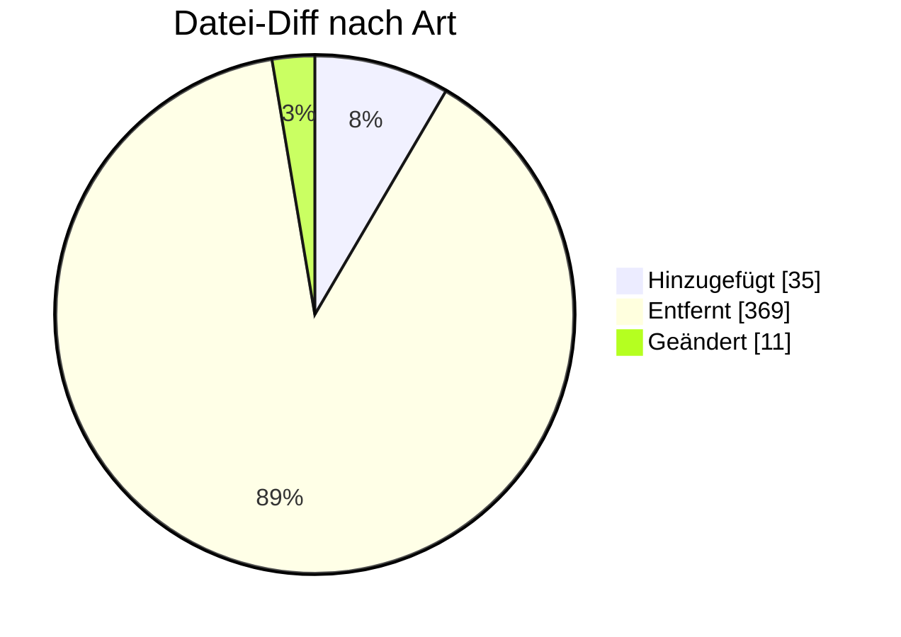

# IFTSTA — Formatumstellung 01.10.2026

← [Zurück zur Gesamtübersicht](../index.md)

**Statusmeldung** · `AHB 2.0h → 2.1 · MIG 2.1`

<Columns>
<Column>
<Card title="Kuratierte Änderungen" icon="material-two-tone-local-shipping">
**14** aus der BDEW-Änderungshistorie
</Card>
</Column>
<Column>
<Card title="Datei-Diff" icon="material-two-tone-difference">
**415** Einzeländerungen (AHB/MIG)
</Card>
</Column>
</Columns>

:::tip[Kurzfazit (das Wichtigste auf einen Blick)]
- **− 21026/21027:** WiM-Statusmeldung MSB↔NB endgültig gelöscht.
- **＋ Sparte Gas:** diverse Anwendungsfälle nun auch für Gas.
- **− SG1 Absender:** Kontaktinformationen entfernt; restliche Änderungen redaktionell.
:::

:::warning[Auswirkungen aufs Backend]
- **Codes 21026/21027 (WiM MSB↔NB) gelöscht:** Statusmeldungslogik anpassen.
- **Gas-Anwendungsfälle ergänzt; Sender-Kontakt (SG1) entfernt.**
:::

---

## Änderungen nach Marktrolle

:::note[Navigation]
Jede Rolle ist ein eigener Block; klappe die gewünschte Einzeländerung auf, um Bisher/Neu/Grund zu sehen. Eine Änderung kann mehreren Rollen zugeordnet sein (Mehrfachnennung).
:::

### ⚪ Übergreifend (14)

<AccordionGroup>

<Accordion title="Änd-ID 27201 · Kapitel "Bearbeitungsstands meldung"  Anwendungsfall "Bear…">

| Feld | Wert |
|---|---|
| **Ort** | Kapitel "Bearbeitungsstands meldung"  Anwendungsfall "Bearbeitungsstands meldung", dem der PID 21047 zugeordnet ist |
| **Prüfi(s)** | – |
| **Rolle(n)** | Übergreifend |
| **Status** | Genehmigt |

**Bisher:**
> Zeile "Kommunikation von": LF an MSB / NB / ÜNB [...]

**Neu:**
> Zeile "Kommunikation von": LF an MSB / NB [...]

**Grund:** Den Fall, dass dieser Anwendungsfall vom LF an den ÜNB gesendet wird gibt es nicht mehr.

</Accordion>

<Accordion title="Änd-ID 27168 · SG14 CNI-LOC-SG15 SG15 MSB- Wechselstatus SG17 Messstellen…">

| Feld | Wert |
|---|---|
| **Ort** | SG14 CNI-LOC-SG15 SG15 MSB- Wechselstatus SG17 Messstellenbetreiber an der Messlokation NAD Messstellenbetreiber an der Messlokation DE3055  Anwendungsfall "Statusmeldung", dem der PID 21018 zugeordnet ist |
| **Prüfi(s)** | – |
| **Rolle(n)** | Übergreifend |
| **Status** | Genehmigt |

**Bisher:**
> 9 GS1 X 293 DE, BDEW (Bundesverband der Energie- und Wasserwirtschaft e.V.) X 332 DE, DVGW Service & Consult GmbH X

**Neu:**
> 9 GS1 X 293 DE, BDEW (Bundesverband der Energie- und Wasserwirtschaft e.V.) X

**Grund:** Der Anwendungsfall wird in der Sparte Gas nicht mehr benötigt, daher kann der Code 332 entfernt werden.

</Accordion>

<Accordion title="Änd-ID 27167 · SG14 CNI-LOC-SG15 SG15 MSB- Wechselstatus DTM Datum/ Uhrze…">

| Feld | Wert |
|---|---|
| **Ort** | SG14 CNI-LOC-SG15 SG15 MSB- Wechselstatus DTM Datum/ Uhrzeit/Zeitspanne DE2380  Anwendungsfall "Statusmeldung", dem der PID 21018 zugeordnet ist |
| **Prüfi(s)** | – |
| **Rolle(n)** | Übergreifend |
| **Status** | Genehmigt |

**Bisher:**
> X [UB3] ∧ [522]  [522] Hinweis: Zeitpunkt, ab dem der gMSB den Messstellenbetrieb übernimmt

**Neu:**
> X [UB1] ∧ [522]  [522] Hinweis: Zeitpunkt, ab dem der gMSB den Messstellenbetrieb übernimmt

**Grund:** Der Anwendungsfall wird in der Sparte Gas nicht mehr benötigt, daher kann von UB3 auf UB1 präzisiert werden.

</Accordion>

<Accordion title="Änd-ID 27062 · Anwendungsfall „Statusmeldung“, dem der PID 21018 zugeordn…">

| Feld | Wert |
|---|---|
| **Ort** | Anwendungsfall „Statusmeldung“, dem der PID 21018 zugeordnet ist |
| **Prüfi(s)** | – |
| **Rolle(n)** | Übergreifend |
| **Status** | Genehmigt |

**Bisher:**
> Anwendungsfall ist für die Sparten Gas und Strom ausgeprägt

**Neu:**
> Anwendungsfall ist für die Sparte Strom ausgeprägt

**Grund:** Dieser Anwendungsfall wird gemäß Anwendungshilfe – Wechselprozesse im Messwesen für die Sparte Gas (WiM Gas 2.0) in der Sparte Gas nicht mehr benötigt.

</Accordion>

<Accordion title="Änd-ID 27061 · Kapitel mit den Anwendungsfall "Informationsmeldu ng“, dem…">

| Feld | Wert |
|---|---|
| **Ort** | Kapitel mit den Anwendungsfall "Informationsmeldu ng“, dem der PID 21015 zugeordnet ist |
| **Prüfi(s)** | – |
| **Rolle(n)** | Übergreifend |
| **Status** | Genehmigt |

**Bisher:**
> Kapitel vorhanden

**Neu:**
> Kapitel nicht vorhanden

**Grund:** Dieser Anwendungsfall wird gemäß Anwendungshilfe – Wechselprozesse im Messwesen für die Sparte Gas (WiM Gas 2.0) nicht mehr benötigt.

</Accordion>

<Accordion title="Änd-ID 26944 · SG1 MP-ID Absender">

| Feld | Wert |
|---|---|
| **Ort** | SG1 MP-ID Absender |
| **Prüfi(s)** | – |
| **Rolle(n)** | Übergreifend |
| **Status** | Genehmigt |

**Bisher:**
> SG2 Ansprechpartner vorhanden

**Neu:**
> SG2 Ansprechpartner nicht vorhanden

**Grund:** Umsetzung des Konsultationsergebnisses des Konzepts „zur Nutzung der Kontaktinformationen des Senders in den EDI@Energy Nachrichtentypen“

</Accordion>

<Accordion title="Änd-ID 26176 · SG1 MP-ID Absender NAD MP-ID Absender 3039  Anwendungsfall…">

| Feld | Wert |
|---|---|
| **Ort** | SG1 MP-ID Absender NAD MP-ID Absender 3039  Anwendungsfall "Gerätestatus" vom MSB an MSB, dem der PID 21036 zugeordnet ist |
| **Prüfi(s)** | – |
| **Rolle(n)** | Übergreifend |
| **Status** | Genehmigt |

**Bisher:**
> X [27]  [27] Nur MP-ID aus Sparte Strom

**Neu:**
> X

**Grund:** Anwendungsfall wird auch in der Sparte Gas benötigt

</Accordion>

<Accordion title="Änd-ID 26175 · SG14 CNI-LOC-SG15 SG15 MSB-">

| Feld | Wert |
|---|---|
| **Ort** | SG14 CNI-LOC-SG15 SG15 MSB- |
| **Prüfi(s)** | – |
| **Rolle(n)** | Übergreifend |
| **Status** | Genehmigt |

**Bisher:**
> DE9031 mit: ZI1 Wechsel auf iMS

**Neu:**
> DE9013 nicht vorhanden

**Grund:** Zum Zeitpunkt des Versand eines IFTSTA-Geschäftsvorfalls

</Accordion>

<Accordion title="Änd-ID 26174 · SG1 MP-ID Absender NAD MP-ID Absender DE3055  Anwendungsfa…">

| Feld | Wert |
|---|---|
| **Ort** | SG1 MP-ID Absender NAD MP-ID Absender DE3055  Anwendungsfall "Gerätestatus" vom MSB an MSB, dem der PID 21036 zugeordnet ist |
| **Prüfi(s)** | – |
| **Rolle(n)** | Übergreifend |
| **Status** | Genehmigt |

**Bisher:**
> 9 GS1 X 293 DE, BDEW (Bundesverband der Energie- und Wasserwirtschaft e.V.)     X

**Neu:**
> 9 GS1 X 293 DE, BDEW (Bundesverband der Energie- und Wasserwirtschaft e.V.)     X 332 DE, DVGW Service & Consult GmbH X

**Grund:** Anwendungsfall wird auch in der Sparte Gas benötigt

</Accordion>

<Accordion title="Änd-ID 26173 · SG1 MP-ID Empfänger NAD MP-ID Empfänger DE3055  Anwendungs…">

| Feld | Wert |
|---|---|
| **Ort** | SG1 MP-ID Empfänger NAD MP-ID Empfänger DE3055  Anwendungsfall "Gerätestatus" vom MSB an MSB, dem der PID 21036 zugeordnet ist |
| **Prüfi(s)** | – |
| **Rolle(n)** | Übergreifend |
| **Status** | Genehmigt |

**Bisher:**
> 9 GS1 X 293 DE, BDEW (Bundesverband der Energie- und Wasserwirtschaft e.V.)     X

**Neu:**
> 9 GS1 X 293 DE, BDEW (Bundesverband der Energie- und Wasserwirtschaft e.V.)     X 332 DE, DVGW Service & Consult GmbH X

**Grund:** Anwendungsfall wird auch in der Sparte Gas benötigt

</Accordion>

<Accordion title="Änd-ID 26172 · Kapitel "Mitteilung über erfolgten Geräteausbau (ausschlie…">

| Feld | Wert |
|---|---|
| **Ort** | Kapitel "Mitteilung über erfolgten Geräteausbau (ausschließlich in der Sparte Strom)" |
| **Prüfi(s)** | – |
| **Rolle(n)** | Übergreifend |
| **Status** | Genehmigt |

**Bisher:**
> Text der Überschrift: Mitteilung über erfolgten Geräteausbau (ausschließlich in der Sparte Strom)

**Neu:**
> Text der Überschrift: Mitteilung über erfolgten Geräteausbau

**Grund:** Dieser Anwendungsfall wird auch in der Sparte Gas benötigt.

</Accordion>

<Accordion title="Änd-ID 26171 · SG1 MP-ID Empfänger NAD MP-ID Empfänger 3039  Anwendungsfa…">

| Feld | Wert |
|---|---|
| **Ort** | SG1 MP-ID Empfänger NAD MP-ID Empfänger 3039  Anwendungsfall "Gerätestatus" vom MSB an MSB, dem |
| **Prüfi(s)** | – |
| **Rolle(n)** | Übergreifend |
| **Status** | Genehmigt |

**Bisher:**
> X [27]  [27] Nur MP-ID aus Sparte Strom

**Neu:**
> X

**Grund:** Anwendungsfall wird auch in der Sparte Gas benötigt

</Accordion>

<Accordion title="Änd-ID 26170 · SG14 CNI-LOC-SG15 SG15 Status des Umbaus der">

| Feld | Wert |
|---|---|
| **Ort** | SG14 CNI-LOC-SG15 SG15 Status des Umbaus der |
| **Prüfi(s)** | – |
| **Rolle(n)** | Übergreifend |
| **Status** | Genehmigt |

**Bisher:**
> X [153]   [153] Wenn in diesem STS DE1131 = E_0286

**Neu:**
> X [153] ∧ [538]  [153] Wenn in diesem STS DE1131 = E_0286

**Grund:** Präzisierung

</Accordion>

<Accordion title="Änd-ID 26114 · Kapitel "Übermittlung des Messstellenumbaust atus"">

| Feld | Wert |
|---|---|
| **Ort** | Kapitel "Übermittlung des Messstellenumbaust atus" |
| **Prüfi(s)** | – |
| **Rolle(n)** | Übergreifend |
| **Status** | Genehmigt |

**Bisher:**
> Tabelle mit den vier Anwendungsfällen: Statusmeldung von MSB an LF, dem der PID 21024 zugeordnet ist, Statusmeldung vom MSB an LF, dem der PID 21025 zugeordnet ist, Statusmeldung vom MSB an NB, dem der PID21026 zugeordnet ist, Statusmeldung von MSB an NB / MSB, dem der PID 21027 zugeordnet ist.

**Neu:**
> Tabelle mit den zwei Anwendungsfällen: Statusmeldung vom MSB an LF, dem der PID 21025 zugeordnet ist, Statusmeldung von MSB an NB / MSB, dem der PID 21027 zugeordnet ist.

**Grund:** Diese beiden Anwendungsfälle Statusmeldung von MSB an LF, dem der PID 21024 zugeordnet ist und Statusmeldung vom MSB an NB, dem der PID 21026 zugeordnet ist, werden nicht mehr benötigt.

</Accordion>

</AccordionGroup>

---

### 🔬 Echter Datei-Diff (AHB/MIG · Stand 202604 → 202610)

<AccordionGroup>
:::info[415 Einzeländerungen auf Segment-/Bedingungsebene]
**＋ 35** hinzugefügt · **− 369** entfernt · **~ 11** geändert. Diese granulare Ebene ergänzt die kuratierte BDEW-Historie — Auszug unten.
:::

<Accordion title="Top-Prüfidentifikatoren nach Anzahl Datei-Änderungen">

| Prüfi | Datei-Änderungen |
|---|---|
| 21018 | 16 |
| 21025 | 15 |
| 21036 | 14 |
| 21007 | 14 |
| 21027 | 14 |
| 21033 | 13 |
| 21000 | 12 |
| 21001 | 12 |

</Accordion>

<Accordion title="Bestätigte Highlights (Historie + Datei-Diff)">

- **modified** (PID 21018) · `SG1 NAD 3039 MP-ID` — _X [27]

[27] Nur MP-ID aus Sparte Strom_ → _X_
- **modified** (PID 21036) · `SG1 NAD 3039 MP-ID` — _X [27]

[27] Nur MP-ID aus Sparte Strom_ → _X_
- **− Prüfi entfernt** (PID 21015) · `Prüfidentifikator 21015` — _21015_ → __
- **− Prüfi entfernt** (PID 21024) · `Prüfidentifikator 21024` — _21024_ → __
- **− Prüfi entfernt** (PID 21026) · `Prüfidentifikator 21026` — _21026_ → __

</Accordion>
</AccordionGroup>

---

← [Gesamtübersicht](../index.md)
