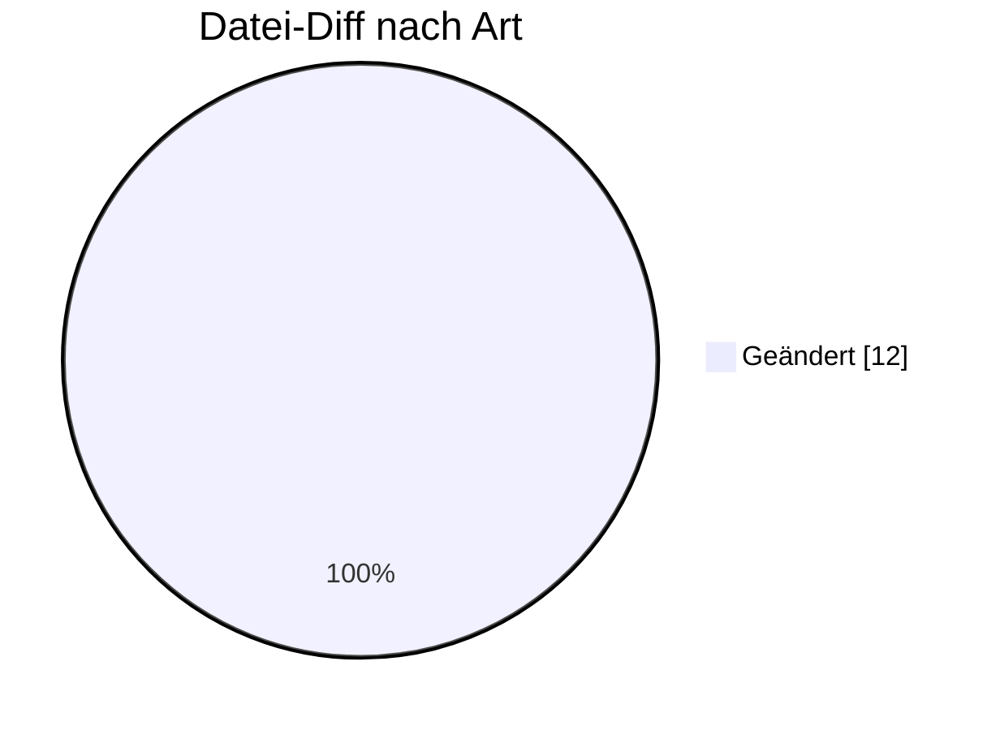

# INVOIC — Formatumstellung 01.10.2026

← [Zurück zur Gesamtübersicht](../index.md)

**Rechnung** · `AHB 1.0a → 1.0b · MIG 1.0b`

<Columns>
<Column>
<Card title="Kuratierte Änderungen" icon="material-two-tone-description">
**8** aus der BDEW-Änderungshistorie
</Card>
</Column>
<Column>
<Card title="Datei-Diff" icon="material-two-tone-difference">
**12** Einzeländerungen (AHB/MIG)
</Card>
</Column>
</Columns>

:::tip[Kurzfazit (das Wichtigste auf einen Blick)]
- **Abschlagsrechnung:** PID 31001 MUSS exakt eine Positionszeile enthalten.
- **Steuernummer:** USt-Nr. in SG3 muss der per PARTIN ausgetauschten entsprechen.
- **E-Rechnung:** Kapazitätsrechnung (PID 31010) gilt nicht als INVOIC i. S. d. UStG.
- **− Pakete [2P]/[3P]** entfernt; XODER-Korrektur.
:::

:::warning[Auswirkungen aufs Backend]
- **Abschlagsrechnung PID 31001 = genau 1 Positionszeile:** Validierung.
- **USt-Nr. SG3 = PARTIN-Wert:** Konsistenzprüfung.
- **Kapazitätsrechnung (31010) ≠ INVOIC i. S. d. UStG:** Prozesslogik.
- **Pakete [2P]/[3P] entfernt; XODER.**
:::

---

## Änderungen nach Marktrolle

:::note[Navigation]
Jede Rolle ist ein eigener Block; klappe die gewünschte Einzeländerung auf, um Bisher/Neu/Grund zu sehen. Eine Änderung kann mehreren Rollen zugeordnet sein (Mehrfachnennung).
:::

### ⚪ Übergreifend (8)

<AccordionGroup>

<Accordion title="Änd-ID 26873 · DTM Nachrichtendatum DE2380 Anwendungsfall Kapazitätsrechn…">

| Feld | Wert |
|---|---|
| **Ort** | DTM Nachrichtendatum DE2380 Anwendungsfall Kapazitätsrechnung, dem der PID 31010 zugeordnet ist |
| **Prüfi(s)** | – |
| **Rolle(n)** | Übergreifend |
| **Status** | Genehmigt |

**Bisher:**
> X [931]  [931] Format: ZZZ = +00

**Neu:**
> X [931] ∧ [90]  [90] Der Wert muss < 01.01.2027 00:00 Uhr gesetzlicher deutscher Zeit sein [931] Format: ZZZ = +00

**Grund:** Da dieser Anwendungsfall keine INVOIC im Sinne des Umsatzsteuergesetzes darstellt, ist er somit nicht vor den Zwang auf E-Rechnung umstellen zu müssen geschützt.

</Accordion>

<Accordion title="Änd-ID 26872 · Anwendungsfall Kapazitätsrechnung, dem der PID 31010 zugeo…">

| Feld | Wert |
|---|---|
| **Ort** | Anwendungsfall Kapazitätsrechnung, dem der PID 31010 zugeordnet ist |
| **Prüfi(s)** | – |
| **Rolle(n)** | Übergreifend |
| **Status** | Genehmigt |

**Bisher:**
> 3.1.4 Kapazitätsrechnung

**Neu:**
> 3.1.4 Kapazitätsrechnung   Dieser Anwendungsfall darf nur bis zum Ablauf des 31.12.2026 angewendet werden. Alle ab dem 01.01.2027 gestellten Kapazitätsrechnungen müssen mittels der sogenannten E-Rechnung gestellt werden.

**Grund:** Da dieser Anwendungsfall keine INVOIC im Sinne des Umsatzsteuergesetzes darstellt, ist er somit nicht vor den Zwang auf E-Rechnung umstellen zu müssen geschützt.

</Accordion>

<Accordion title="Änd-ID 26844 · SG2 Empfänger  SG3 Steuernummer, Umsatzsteuernummer  RFF S…">

| Feld | Wert |
|---|---|
| **Ort** | SG2 Empfänger  SG3 Steuernummer, Umsatzsteuernummer  RFF Steuernummer, Umsatzsteuernummer Anwendungsfall 31001 Abschlagsrechnung 31002 NN-Rechnung 31003 WiM-Rechnung 31009 MSB-Rechnung 31004 Stornorechnung 31005 MMM-Rechnung 31006 MMM-selbst ausgest. Rechnung 31007 Aggreg. MMM-Rechnung 31008 Aggrag. MMM-selbst. Ausgest. Rechnung 31010 Kapazitätsrechnung 31011 Rechnung Sonstige Leistung |
| **Prüfi(s)** | – |
| **Rolle(n)** | Übergreifend |
| **Status** | Genehmigt |

**Bisher:**
> SG3 Muss [5] Soll [4]  [4] Wenn Steuerschuldnerschaft des Leistungsempfängers vorliegt  [5] Wenn NAD+MR DE3207 <> „DE“           bzw. bei PID 31006 und 31008 SG3 Muss

**Neu:**
> SG3 Muss [5] ∧ [527] Soll [4] ∧ [527]  [4] Wenn Steuerschuldnerschaft des Leistungsempfängers vorliegt  [5] Wenn NAD+MR DE3207 <> „DE“  [527] Hinweis: Es ist die Umsatzsteuer- bzw. Steuernummer anzugeben, die vorher per PARTIN ausgetauscht wurde.         bzw. bei PID 31006 und 31008 SG3 Muss [527] [527] Hinweis: Es ist die Umsatzsteuer- bzw. Steuernummer anzugeben, die vorher per PARTIN ausgetauscht wurde.

**Grund:** Vereinheitlichung der Vorgabe, welche Steuernummer in der Rechnung zu nennen ist.

</Accordion>

<Accordion title="Änd-ID 26843 · SG2 Absender  SG3 Steuernummer, Umsatzsteuernummer  RFF St…">

| Feld | Wert |
|---|---|
| **Ort** | SG2 Absender  SG3 Steuernummer, Umsatzsteuernummer  RFF Steuernummer, Umsatzsteuernummer Anwendungsfall 31001 Abschlagsrechnung 31002 NN-Rechnung 31003 WiM-Rechnung 31009 MSB-Rechnung 31004 Stornorechnung 31005 MMM-Rechnung 31006 MMM-selbst ausgest. Rechnung 31007 Aggreg. MMM-Rechnung 31008 Aggrag. MMM-selbst. Ausgest. Rechnung 31010 Kapazitätsrechnung 31011 Rechnung Sonstige Leistung |
| **Prüfi(s)** | – |
| **Rolle(n)** | Übergreifend |
| **Status** | Genehmigt |

**Bisher:**
> SG3 Muss

**Neu:**
> SG3 Muss [527]  [527] Hinweis: Es ist die Umsatzsteuer- bzw. Steuernummer anzugeben, die vorher per PARTIN ausgetauscht wurde.

**Grund:** Vereinheitlichung der Vorgabe, welche Steuernummer in der Rechnung zu nennen ist.

</Accordion>

<Accordion title="Änd-ID 26818 · Positionsdaten LIN DE1082 Anwendungsfall Abschlagsrechnung…">

| Feld | Wert |
|---|---|
| **Ort** | Positionsdaten LIN DE1082 Anwendungsfall Abschlagsrechnung, dem der PID 31001 zugeordnet ist |
| **Prüfi(s)** | – |
| **Rolle(n)** | Übergreifend |
| **Status** | Genehmigt |

**Bisher:**
> X [911]  [911] Format: Mögliche Werte: 1 bis n, je Nachricht oder Segmentgruppe bei 1 beginnend und fortlaufend aufsteigend

**Neu:**
> X [903]  [903] Format: Möglicher Wert: 1

**Grund:** Präzisierung: Eine Abschlagsrechnung kann und muss genau eine Positionszeile enthalten.

</Accordion>

<Accordion title="Änd-ID 26817 · SG26 Positionsdaten  Anwendungsfall Abschlagsrechnung, dem…">

| Feld | Wert |
|---|---|
| **Ort** | SG26 Positionsdaten  Anwendungsfall Abschlagsrechnung, dem der PID 31001 zugeordnet ist |
| **Prüfi(s)** | – |
| **Rolle(n)** | Übergreifend |
| **Status** | Genehmigt |

**Bisher:**
> Muss

**Neu:**
> Muss [2000]   [2000] Segmentgruppe ist genau einmal anzugeben.

**Grund:** Präzisierung: Eine Abschlagsrechnung kann und muss genau eine Positionszeile enthalten.

</Accordion>

<Accordion title="Änd-ID 26192 · Alle Anwendungsfälle SG5 Ansprechpartner Kommunikationsver…">

| Feld | Wert |
|---|---|
| **Ort** | Alle Anwendungsfälle SG5 Ansprechpartner Kommunikationsverbindung COM DE3148 |
| **Prüfi(s)** | – |
| **Rolle(n)** | Übergreifend |
| **Status** | Genehmigt |

**Bisher:**
> X (([939][74]) ∨ ([940][75])) ∧ [524]

**Neu:**
> X (([939][74]) ⊻ ([940][75])) ∧ [524]

**Grund:** Fehlerkorrektur, XOR statt OR verwendet

</Accordion>

<Accordion title="Änd-ID 26137 · Kapitel 2     Übersicht der Pakete in der INVOIC">

| Feld | Wert |
|---|---|
| **Ort** | Kapitel 2     Übersicht der Pakete in der INVOIC |
| **Prüfi(s)** | – |
| **Rolle(n)** | Übergreifend |
| **Status** | Genehmigt |

**Bisher:**
> [2P] und [3P] enthalten

**Neu:**
> gelöscht

**Grund:** Die Pakete [2P] und [3P] sind in keinem Anwendungsfall im Einsatz und können daher auch in der Übersichtstabelle gelöscht werden.

</Accordion>

</AccordionGroup>

---

### 🔬 Echter Datei-Diff (AHB/MIG · Stand 202604 → 202610)

<AccordionGroup>
:::info[12 Einzeländerungen auf Segment-/Bedingungsebene]
**＋ 0** hinzugefügt · **− 0** entfernt · **~ 12** geändert. Diese granulare Ebene ergänzt die kuratierte BDEW-Historie — Auszug unten.
:::

<Accordion title="Top-Prüfidentifikatoren nach Anzahl Datei-Änderungen">

| Prüfi | Datei-Änderungen |
|---|---|
| 31001 | 2 |
| 31002 | 1 |
| 31003 | 1 |
| 31004 | 1 |
| 31005 | 1 |
| 31006 | 1 |
| 31007 | 1 |
| 31008 | 1 |

</Accordion>
</AccordionGroup>

---

← [Gesamtübersicht](../index.md)
