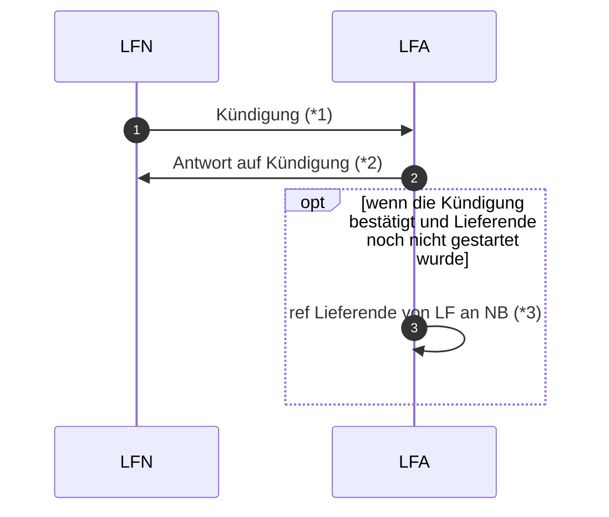

# Kündigung LFN

```mermaid
sequenceDiagram
autonumber

  participant LFN
  participant LFA
 
  LFN ->> LFA: Kündigung (*1)
  
  LFA ->> LFN: Antwort auf Kündigung (*2)
  
  opt wenn die Kündigung bestätigt und Lieferende noch nicht gestartet wurde
      
      LFA ->> LFA : ref Lieferende von LF an NB (*3)
      
  end
  

```

*1 Prüfi: 55016
*2 Prüfi: 55018, 55017
*3 Prüfi: 55004
