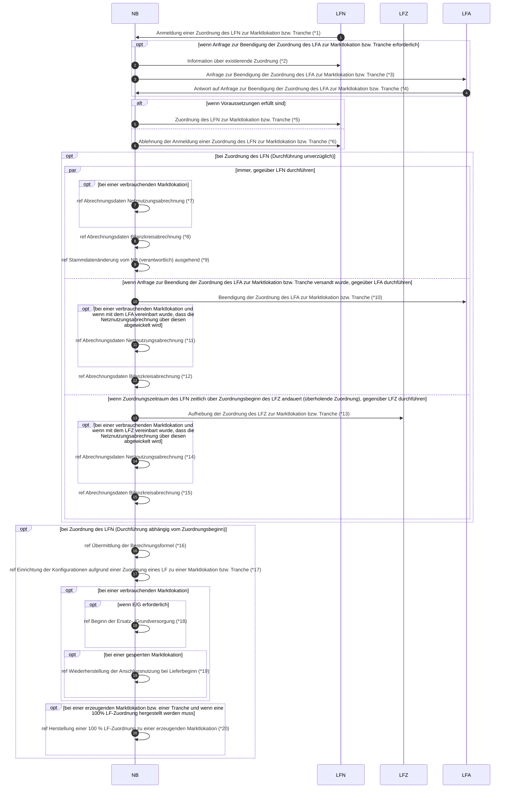

# Lieferbeginn (Rolle NB)

*1 Prüfi: 55001
*2 Prüfi: 55036
*3 Prüfi: 55010
*4 Prüfi: 55011
*5 Prüfi: 55002
*6 Prüfi: 55003
*7 Prüfi: 55218
*8 Prüfi: 55126
*9 Prüfi: 55615, 55620, 55175, 55225, 55616, 55617, 55618, 55619, 55691
*10 Prüfi: 55037
*11 Prüfi: 55218
*12 Prüfi: 55126
*13 Prüfi: 55038
*14 Prüfi: 55218
*15 Prüfi: 55126
*16 Prüfi: 25001
*17 Prüfi: 17134
*18 Prüfi: 55013
*19 Prüfi: 21040, 21039
*20 Prüfi: 55607
