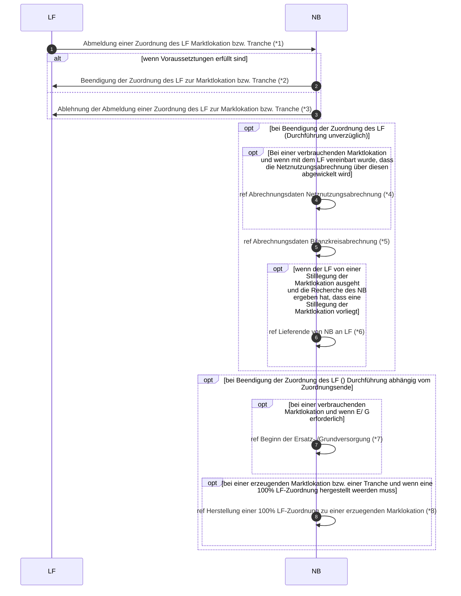

# Lieferende LF -> NB (Rolle LF)

```mermaid
sequenceDiagram
  autonumber
  
  participant LF as LF
  participant NB as NB
  
LF ->> NB: Abmeldung einer Zuordnung des LF Marktlokation bzw. Tranche (*1) 

alt wenn Voraussetztungen erfüllt sind
NB ->> LF: Beendigung der Zuordnung des LF zur Marktlokation bzw. Tranche (*2)
else
NB ->> LF: Ablehnung der Abmeldung einer Zuordnung des LF zur Marklokation bzw. Tranche (*3)
end
 
opt bei Beendigung der Zuordnung des LF (Durchführung unverzüglich)

    opt Bei einer verbrauchenden Marktlokation und wenn mit dem LF vereinbart wurde, dass die Netznutzungsabrechnung über diesen abgewickelt wird
    NB ->> NB: ref Abrechnungsdaten Netznutzungsabrechnung (*4)
    end
    
    NB ->> NB: ref Abrechnungsdaten Bilanzkreisabrechnung (*5)
    
        opt wenn der LF von einer Stilllegung der Marktlokation ausgeht und die Recherche des NB ergeben hat, dass eine Stilllegung der Marktlokation vorliegt
        NB ->> NB: ref Lieferende von NB an LF (*6)
        end
end

opt bei Beendigung der Zuordnung des LF () Durchführung abhängig vom Zuordnungsende

    opt bei einer verbrauchenden Marktlokation und wenn E/ G erforderlich
    NB ->> NB: ref Beginn der Ersatz- /Grundversorgung (*7)
    end
    
    opt bei einer erzeugenden Marktlokation bzw. einer Tranche und wenn eine 100% LF-Zuordnung hergestellt weerden muss
    NB ->> NB: ref Herstellung einer 100% LF-Zuordnung zu einer erzuegenden Marklokation (*8)
    end
end

```

*1 Prüfi: 55004
*2 Prüfi: 55037
*3 Prüfi: 55006
*4 Prüfi: 55218
*5 Prüfi: 55126
*6 Prüfi: 55007
*7 Prüfi: 55013
*8 Prüfi: 55607
