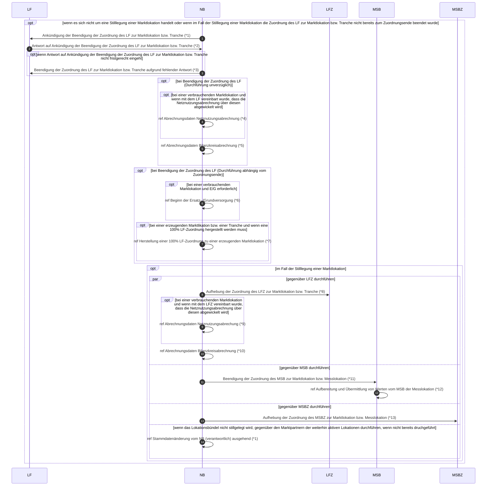

# Lieferende NB -> LF (Rolle LF)

*1 Prüfi: 55007
*2 Prüfi: 55008, 55009
*3 Prüfi: 55037
*4 Prüfi: 55218
*5 Prüfi: 55126
*6 Prüfi: 55013
*7 Prüfi: 55607
*8 Prüfi: 55038
*9 Prüfi: 55218
*10 Prüfi: 55126
*11 Prüfi: 55611
*12 Prüfi: 13017, 13018
*13 Prüfi: 55611
*8 Prüfi: 55615, 55627, 55616, 55628, 55619, 55617, 55629, 55618, 55630, 55620, 55632, 55225, 55175, 55173
