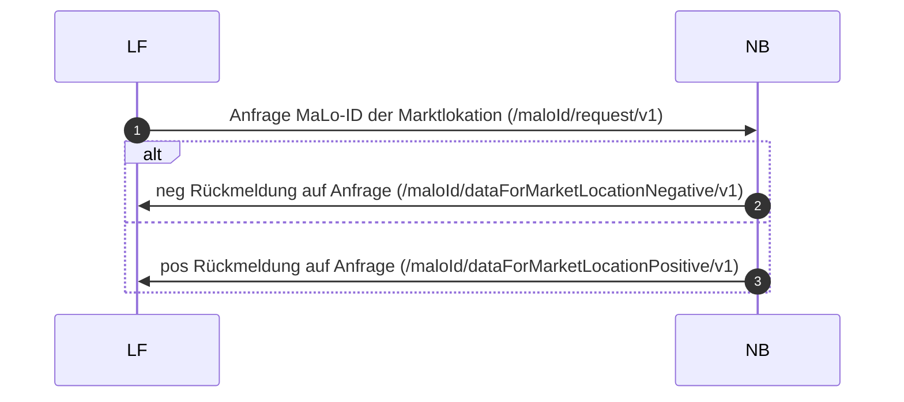

# Malo-Ident (Rolle LF)

```mermaid
sequenceDiagram
autonumber
  participant LF as LF
  participant NB as NB

  LF ->> NB: Anfrage MaLo-ID der Marktlokation (/maloId/request/v1)
  alt
  NB ->> LF: neg Rückmeldung auf Anfrage (/maloId/dataForMarketLocationNegative/v1)
  else
  NB ->> LF: pos Rückmeldung auf Anfrage (/maloId/dataForMarketLocationPositive/v1)
  end

```
