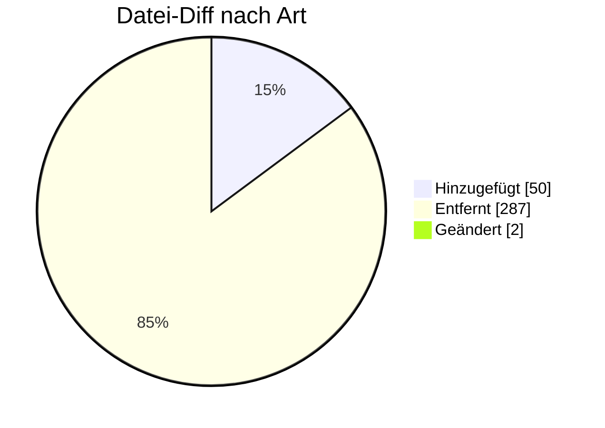

# MSCONS — Formatumstellung 01.10.2026

← [Zurück zur Gesamtübersicht](../index.md)

**Messwerte / Zählerstände / Lastgänge** · `AHB 3.1g → 3.2 · MIG 2.5`

<Columns>
<Column>
<Card title="Kuratierte Änderungen" icon="material-two-tone-insights">
**7** aus der BDEW-Änderungshistorie
</Card>
</Column>
<Column>
<Card title="Datei-Diff" icon="material-two-tone-difference">
**339** Einzeländerungen (AHB/MIG)
</Card>
</Column>
</Columns>

:::tip[Kurzfazit (das Wichtigste auf einen Blick)]
- **UNB Test-Flag:** DE0035 = 1 bei Testzwecken (Vereinheitlichung mit MIG).
- **KAV:** Leistungswerte genauer (mind. 1×, bis 2×).
- **− Wegfall:** bilanzierte Menge ÜNB→NB entfällt (ab 01.10.2026).
- **− SG2 Absender:** Kontaktinformationen entfernt.
:::

:::warning[Auswirkungen aufs Backend]
- **UNB Test-Flag DE0035:** Testkennzeichen-Handling.
- **SG9-Kardinalität (mind. 2, max. 3) + LIN:** Generierung/Validierung.
- **ÜNB-MMMA (13014) ab 01.10.2026:** Sende-/Empfangslogik abschalten.
- **Sender-Kontakt (SG2) entfernt; Paket-Übersicht bereinigt.**
:::

---

## Änderungen nach Marktrolle

:::note[Navigation]
Jede Rolle ist ein eigener Block; klappe die gewünschte Einzeländerung auf, um Bisher/Neu/Grund zu sehen. Eine Änderung kann mehreren Rollen zugeordnet sein (Mehrfachnennung).
:::

### 🔵 Netzbetreiber (3)

<AccordionGroup>

<Accordion title="Änd-ID 27164 · Kapitel 6.3.7 Anwendungsübersicht Energiemengen Strom, Prü…">

| Feld | Wert |
|---|---|
| **Ort** | Kapitel 6.3.7 Anwendungsübersicht Energiemengen Strom, Prüfidentifikator 13015 Arbeit Leistungsmax. Kalenderjahr vor Lieferbeginn, SG9 lfd. Position |
| **Prüfi(s)** | 13015 |
| **Rolle(n)** | LF, NB |
| **Status** | Genehmigt |

**Bisher:**
> Muss [2002] ∧ [502]  Bedingung:  [502] Hinweis: Einmal für die Energiemenge von Beginn des Kalenderjahres bis zum Lieferbeginn und bis zu zweimal für die zwei höchsten Monatsleistungswerte (wegen KAV) von Beginn des Kalenderjahres bis zum Lieferbeginn [2002] Segmentgruppe ist bis zu drei Mal je SG5 NAD+DP anzugeben

**Neu:**
> Muss [2002] ∧ [502]  Bedingung:  [502] Hinweis: Einmal für die Energiemenge von Beginn des Kalenderjahres bis zum Lieferbeginn und mindestens einmal und bis zu zweimal für die zwei höchsten Monatsleistungswerte (wegen KAV) von Beginn des Kalenderjahres bis zum Lieferbeginn [2002] Segmentgruppe ist mindestens zweimal und maximal dreimal je SG5 NAD+DP anzugeben

**Grund:** Die vorherige Definition der Bedingungen und des Hinweises ließ auch keine Angabe des LIN-Segments zu, daher die Präzisierung.

</Accordion>

<Accordion title="Änd-ID 26222 · Kapitel 6.4.3 Anwendungsübersicht Zählerstand und Energiem…">

| Feld | Wert |
|---|---|
| **Ort** | Kapitel 6.4.3 Anwendungsübersicht Zählerstand und Energiemengen Gas, Prüfidentifikator 13009 Energiemenge (Gas), SG9 lfd. Position |
| **Prüfi(s)** | 13009 |
| **Rolle(n)** | LF, MSB, NB |
| **Status** | Genehmigt |

**Bisher:**
> Muss ([2002] ∧ [151] ∧ [502]) ⊻ [152]  Bedingung:  [151] Wenn BGM+Z27 (Bewegungsdaten im Kalenderjahr vor Lieferbeginn) vorhanden. [152] Wenn BGM+7 (Prozessdatenbericht) vorhanden. [502] Hinweis: Einmal für die Energiemenge von Beginn des Kalenderjahres bis zum Lieferbeginn und bis zu zweimal für die zwei höchsten Monatsleistungswerte (wegen KAV) von Beginn des Kalenderjahres bis zum Lieferbeginn [2002] Segmentgruppe ist bis zu drei Mal je SG5 NAD+DP anzugeben

**Neu:**
> Muss ([2002] ∧ [151] ∧ [502]) ⊻ [152]  Bedingung:  [151] Wenn BGM+Z27 (Bewegungsdaten im Kalenderjahr vor Lieferbeginn) vorhanden. [152] Wenn BGM+7 (Prozessdatenbericht) vorhanden. [502] Hinweis: Einmal für die Energiemenge von Beginn des Kalenderjahres bis zum Lieferbeginn und mindestens einmal und bis zu zweimal für die zwei höchsten Monatsleistungswerte (wegen KAV) von Beginn des Kalenderjahres bis zum Lieferbeginn. [2002] Segmentgruppe ist mindestens zweimal und maximal dreimal je SG5 NAD+DP anzugeben

**Grund:** Die vorherige Definition der Bedingung ließ auch keine Angabe des LIN-Segments zu, daher die Präzisierung.

</Accordion>

<Accordion title="Änd-ID 26221 · Kapitel 10.3 Anwendungsübersicht Allokationsliste Gas / bi…">

| Feld | Wert |
|---|---|
| **Ort** | Kapitel 10.3 Anwendungsübersicht Allokationsliste Gas / bilanzierte Menge Strom/Gas, Prüfidentifikator 13014 marktlokationsscharfe bilanzierte Menge Strom / Gas (MMMA) |
| **Prüfi(s)** | 13014 |
| **Rolle(n)** | LF, NB |
| **Status** | Genehmigt |

**Bisher:**
> Bisheriger Inhalt

**Neu:**
> Aktualisierter Inhalt

**Grund:** Im Kapitel 6.3 der Anwendungshilfe "Einführungsszenario zum LFW24" bzw. im Kapitel 4.1 der Anwendungshilfe "Prozesse zur Ermittlung und Abrechnung von Mehr-/Mindermengen Strom und Gas" wird definiert, dass der ÜNB "die Übermittlung der bilanzierten Energiemenge für Marktlokationen, die auf Basis von Profilen bilanziert werden, an den NB für die Mehr-/Mindermengenabrechnung Strom" ab dem 01.10.2026 00:00 Uhr einstellt.  Daher wurden die Bedingungen im Anwendungsfall, die auf diese Kommunikation bezogen haben, angepasst.

</Accordion>

</AccordionGroup>

### 🟢 Lieferant (3)

<AccordionGroup>

<Accordion title="Änd-ID 27164 · Kapitel 6.3.7 Anwendungsübersicht Energiemengen Strom, Prü…">

| Feld | Wert |
|---|---|
| **Ort** | Kapitel 6.3.7 Anwendungsübersicht Energiemengen Strom, Prüfidentifikator 13015 Arbeit Leistungsmax. Kalenderjahr vor Lieferbeginn, SG9 lfd. Position |
| **Prüfi(s)** | 13015 |
| **Rolle(n)** | LF, NB |
| **Status** | Genehmigt |

**Bisher:**
> Muss [2002] ∧ [502]  Bedingung:  [502] Hinweis: Einmal für die Energiemenge von Beginn des Kalenderjahres bis zum Lieferbeginn und bis zu zweimal für die zwei höchsten Monatsleistungswerte (wegen KAV) von Beginn des Kalenderjahres bis zum Lieferbeginn [2002] Segmentgruppe ist bis zu drei Mal je SG5 NAD+DP anzugeben

**Neu:**
> Muss [2002] ∧ [502]  Bedingung:  [502] Hinweis: Einmal für die Energiemenge von Beginn des Kalenderjahres bis zum Lieferbeginn und mindestens einmal und bis zu zweimal für die zwei höchsten Monatsleistungswerte (wegen KAV) von Beginn des Kalenderjahres bis zum Lieferbeginn [2002] Segmentgruppe ist mindestens zweimal und maximal dreimal je SG5 NAD+DP anzugeben

**Grund:** Die vorherige Definition der Bedingungen und des Hinweises ließ auch keine Angabe des LIN-Segments zu, daher die Präzisierung.

</Accordion>

<Accordion title="Änd-ID 26222 · Kapitel 6.4.3 Anwendungsübersicht Zählerstand und Energiem…">

| Feld | Wert |
|---|---|
| **Ort** | Kapitel 6.4.3 Anwendungsübersicht Zählerstand und Energiemengen Gas, Prüfidentifikator 13009 Energiemenge (Gas), SG9 lfd. Position |
| **Prüfi(s)** | 13009 |
| **Rolle(n)** | LF, MSB, NB |
| **Status** | Genehmigt |

**Bisher:**
> Muss ([2002] ∧ [151] ∧ [502]) ⊻ [152]  Bedingung:  [151] Wenn BGM+Z27 (Bewegungsdaten im Kalenderjahr vor Lieferbeginn) vorhanden. [152] Wenn BGM+7 (Prozessdatenbericht) vorhanden. [502] Hinweis: Einmal für die Energiemenge von Beginn des Kalenderjahres bis zum Lieferbeginn und bis zu zweimal für die zwei höchsten Monatsleistungswerte (wegen KAV) von Beginn des Kalenderjahres bis zum Lieferbeginn [2002] Segmentgruppe ist bis zu drei Mal je SG5 NAD+DP anzugeben

**Neu:**
> Muss ([2002] ∧ [151] ∧ [502]) ⊻ [152]  Bedingung:  [151] Wenn BGM+Z27 (Bewegungsdaten im Kalenderjahr vor Lieferbeginn) vorhanden. [152] Wenn BGM+7 (Prozessdatenbericht) vorhanden. [502] Hinweis: Einmal für die Energiemenge von Beginn des Kalenderjahres bis zum Lieferbeginn und mindestens einmal und bis zu zweimal für die zwei höchsten Monatsleistungswerte (wegen KAV) von Beginn des Kalenderjahres bis zum Lieferbeginn. [2002] Segmentgruppe ist mindestens zweimal und maximal dreimal je SG5 NAD+DP anzugeben

**Grund:** Die vorherige Definition der Bedingung ließ auch keine Angabe des LIN-Segments zu, daher die Präzisierung.

</Accordion>

<Accordion title="Änd-ID 26221 · Kapitel 10.3 Anwendungsübersicht Allokationsliste Gas / bi…">

| Feld | Wert |
|---|---|
| **Ort** | Kapitel 10.3 Anwendungsübersicht Allokationsliste Gas / bilanzierte Menge Strom/Gas, Prüfidentifikator 13014 marktlokationsscharfe bilanzierte Menge Strom / Gas (MMMA) |
| **Prüfi(s)** | 13014 |
| **Rolle(n)** | LF, NB |
| **Status** | Genehmigt |

**Bisher:**
> Bisheriger Inhalt

**Neu:**
> Aktualisierter Inhalt

**Grund:** Im Kapitel 6.3 der Anwendungshilfe "Einführungsszenario zum LFW24" bzw. im Kapitel 4.1 der Anwendungshilfe "Prozesse zur Ermittlung und Abrechnung von Mehr-/Mindermengen Strom und Gas" wird definiert, dass der ÜNB "die Übermittlung der bilanzierten Energiemenge für Marktlokationen, die auf Basis von Profilen bilanziert werden, an den NB für die Mehr-/Mindermengenabrechnung Strom" ab dem 01.10.2026 00:00 Uhr einstellt.  Daher wurden die Bedingungen im Anwendungsfall, die auf diese Kommunikation bezogen haben, angepasst.

</Accordion>

</AccordionGroup>

### 🟣 Messstellenbetreiber (1)

<AccordionGroup>

<Accordion title="Änd-ID 26222 · Kapitel 6.4.3 Anwendungsübersicht Zählerstand und Energiem…">

| Feld | Wert |
|---|---|
| **Ort** | Kapitel 6.4.3 Anwendungsübersicht Zählerstand und Energiemengen Gas, Prüfidentifikator 13009 Energiemenge (Gas), SG9 lfd. Position |
| **Prüfi(s)** | 13009 |
| **Rolle(n)** | LF, MSB, NB |
| **Status** | Genehmigt |

**Bisher:**
> Muss ([2002] ∧ [151] ∧ [502]) ⊻ [152]  Bedingung:  [151] Wenn BGM+Z27 (Bewegungsdaten im Kalenderjahr vor Lieferbeginn) vorhanden. [152] Wenn BGM+7 (Prozessdatenbericht) vorhanden. [502] Hinweis: Einmal für die Energiemenge von Beginn des Kalenderjahres bis zum Lieferbeginn und bis zu zweimal für die zwei höchsten Monatsleistungswerte (wegen KAV) von Beginn des Kalenderjahres bis zum Lieferbeginn [2002] Segmentgruppe ist bis zu drei Mal je SG5 NAD+DP anzugeben

**Neu:**
> Muss ([2002] ∧ [151] ∧ [502]) ⊻ [152]  Bedingung:  [151] Wenn BGM+Z27 (Bewegungsdaten im Kalenderjahr vor Lieferbeginn) vorhanden. [152] Wenn BGM+7 (Prozessdatenbericht) vorhanden. [502] Hinweis: Einmal für die Energiemenge von Beginn des Kalenderjahres bis zum Lieferbeginn und mindestens einmal und bis zu zweimal für die zwei höchsten Monatsleistungswerte (wegen KAV) von Beginn des Kalenderjahres bis zum Lieferbeginn. [2002] Segmentgruppe ist mindestens zweimal und maximal dreimal je SG5 NAD+DP anzugeben

**Grund:** Die vorherige Definition der Bedingung ließ auch keine Angabe des LIN-Segments zu, daher die Präzisierung.

</Accordion>

</AccordionGroup>

### ⚪ Übergreifend (4)

<AccordionGroup>

<Accordion title="Änd-ID 27248 · Kapitel 10.2 Übertragung marktlokationsscharfe bilanzierte…">

| Feld | Wert |
|---|---|
| **Ort** | Kapitel 10.2 Übertragung marktlokationsscharfe bilanzierte Menge Strom/Gas, Tabelle Zeile: Kommunikation von ÜNB an NB |
| **Prüfi(s)** | – |
| **Rolle(n)** | Übergreifend |
| **Status** | Genehmigt |

**Bisher:**
> Zeile vorhanden

**Neu:**
> Zeile nicht vorhanden

**Grund:** Im Kapitel 6.3 der Anwendungshilfe "Einführungsszenario zum LFW24" bzw. im Kapitel 4.1 der Anwendungshilfe "Prozesse zur Ermittlung und Abrechnung von Mehr-/Mindermengen Strom und Gas" wird definiert, dass der ÜNB "die Übermittlung der bilanzierten Energiemenge für Marktlokationen, die auf Basis von Profilen bilanziert werden, an den NB für die Mehr-/Mindermengenabrechnung Strom" ab dem 01.10.2026 00:00 Uhr einstellt.

</Accordion>

<Accordion title="Änd-ID 26849 · Alle Anwendungsübersichten">

| Feld | Wert |
|---|---|
| **Ort** | Alle Anwendungsübersichten |
| **Prüfi(s)** | – |
| **Rolle(n)** | Übergreifend |
| **Status** | Genehmigt |

**Bisher:**
> UNB Nutzdaten Kopfsegment, DE0035  1 Übertragungsdatei ist ein Test

**Neu:**
> UNB Nutzdaten Kopfsegment, DE0035  1 Übertragungsdatei ist ein Test S [155]  Bedingung: [155] Wenn Übertragungsdatei zu Testzwecken ausgetauscht wird.

**Grund:** Vereinheitlichung mit MIG.

</Accordion>

<Accordion title="Änd-ID 26140 · Kapitel 2 Übersicht der Pakete in der MSCONS">

| Feld | Wert |
|---|---|
| **Ort** | Kapitel 2 Übersicht der Pakete in der MSCONS |
| **Prüfi(s)** | – |
| **Rolle(n)** | Übergreifend |
| **Status** | Genehmigt |

**Bisher:**
> Bisheriger Inhalt

**Neu:**
> Aktualisierter Inhalt

**Grund:** Nicht mehr genutzte Pakete in der MSCONS wurden aus der Übersicht entfernt.

</Accordion>

<Accordion title="Änd-ID 26112 · Alle Anwendungsübersichten, SG2 MP-ID Absender">

| Feld | Wert |
|---|---|
| **Ort** | Alle Anwendungsübersichten, SG2 MP-ID Absender |
| **Prüfi(s)** | – |
| **Rolle(n)** | Übergreifend |
| **Status** | Genehmigt |

**Bisher:**
> SG4 Kontaktinformationen  vorhanden

**Neu:**
> SG4 Kontaktinformationen  nicht vorhanden

**Grund:** Umsetzung des Konsultationsergebnisses des Konzepts „zur Nutzung der Kontaktinformationen des Senders in den EDI@Energy Nachrichtentypen“.

</Accordion>

</AccordionGroup>

---

### 🔬 Echter Datei-Diff (AHB/MIG · Stand 202604 → 202610)

<AccordionGroup>
:::info[339 Einzeländerungen auf Segment-/Bedingungsebene]
**＋ 50** hinzugefügt · **− 287** entfernt · **~ 2** geändert. Diese granulare Ebene ergänzt die kuratierte BDEW-Historie — Auszug unten.
:::

<Accordion title="Top-Prüfidentifikatoren nach Anzahl Datei-Änderungen">

| Prüfi | Datei-Änderungen |
|---|---|
| 13014 | 15 |
| 13002 | 13 |
| 13003 | 13 |
| 13005 | 13 |
| 13006 | 13 |
| 13007 | 13 |
| 13008 | 13 |
| 13009 | 13 |

</Accordion>
</AccordionGroup>

---

← [Gesamtübersicht](../index.md)
