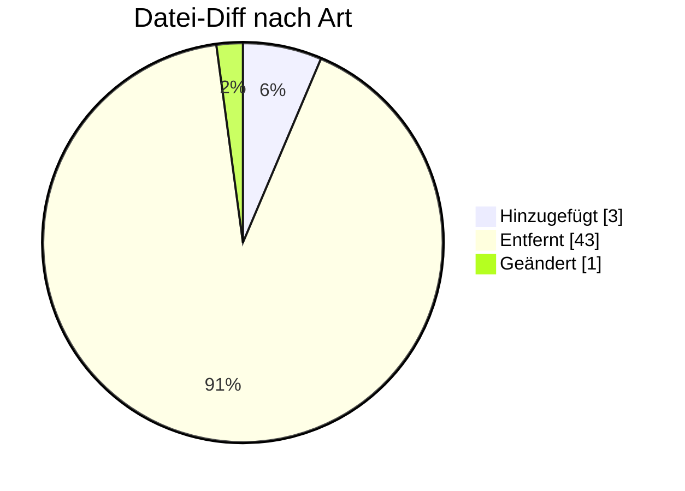

# ORDCHG — Formatumstellung 01.10.2026

← [Zurück zur Gesamtübersicht](../index.md)

**Bestelländerung** · `AHB 1.0a → 1.1 · MIG 1.2`

<Columns>
<Column>
<Card title="Kuratierte Änderungen" icon="material-two-tone-edit-note">
**2** aus der BDEW-Änderungshistorie
</Card>
</Column>
<Column>
<Card title="Datei-Diff" icon="material-two-tone-difference">
**47** Einzeländerungen (AHB/MIG)
</Card>
</Column>
</Columns>

:::tip[Kurzfazit (das Wichtigste auf einen Blick)]
- **− Pakete:** keine Pakete mehr (Kapitel gelöscht).
- **− SG3 Absender:** Kontaktinformationen entfernt.
- Keine weiteren strukturellen Änderungen.
:::

:::warning[Auswirkungen aufs Backend]
- **Pakete vollständig entfernt:** Paket-Referenzen aus Mapping entfernen.
- **SG3 Absender-Kontakt entfernt:** Generierung anpassen.
:::

---

## Änderungen nach Marktrolle

:::note[Navigation]
Jede Rolle ist ein eigener Block; klappe die gewünschte Einzeländerung auf, um Bisher/Neu/Grund zu sehen. Eine Änderung kann mehreren Rollen zugeordnet sein (Mehrfachnennung).
:::

### ⚪ Übergreifend (2)

<AccordionGroup>

<Accordion title="Änd-ID 26141 · Kapitel 3 Übersicht der Pakete in der ORDCHG">

| Feld | Wert |
|---|---|
| **Ort** | Kapitel 3 Übersicht der Pakete in der ORDCHG |
| **Prüfi(s)** | – |
| **Rolle(n)** | Übergreifend |
| **Status** | Genehmigt |

**Bisher:**
> vorhanden

**Neu:**
> nicht vorhanden

**Grund:** Da in der ORDCHG keine Pakete mehr genutzt werden, wird das Kapitel gelöscht.

</Accordion>

<Accordion title="Änd-ID 26118 · Alle Anwendungsübersichten, SG3 MP-ID Absender">

| Feld | Wert |
|---|---|
| **Ort** | Alle Anwendungsübersichten, SG3 MP-ID Absender |
| **Prüfi(s)** | – |
| **Rolle(n)** | Übergreifend |
| **Status** | Genehmigt |

**Bisher:**
> SG6 Kontaktinformationen  vorhanden

**Neu:**
> SG6 Kontaktinformationen  nicht vorhanden

**Grund:** Umsetzung des Konsultationsergebnisses des Konzepts „zur Nutzung der Kontaktinformationen des Senders in den EDI@Energy Nachrichtentypen“.

</Accordion>

</AccordionGroup>

---

### 🔬 Echter Datei-Diff (AHB/MIG · Stand 202604 → 202610)

<AccordionGroup>
:::info[47 Einzeländerungen auf Segment-/Bedingungsebene]
**＋ 3** hinzugefügt · **− 43** entfernt · **~ 1** geändert. Diese granulare Ebene ergänzt die kuratierte BDEW-Historie — Auszug unten.
:::

<Accordion title="Top-Prüfidentifikatoren nach Anzahl Datei-Änderungen">

| Prüfi | Datei-Änderungen |
|---|---|
| 39000 | 12 |
| 39001 | 12 |
| 39002 | 12 |

</Accordion>
</AccordionGroup>

---

← [Gesamtübersicht](../index.md)
