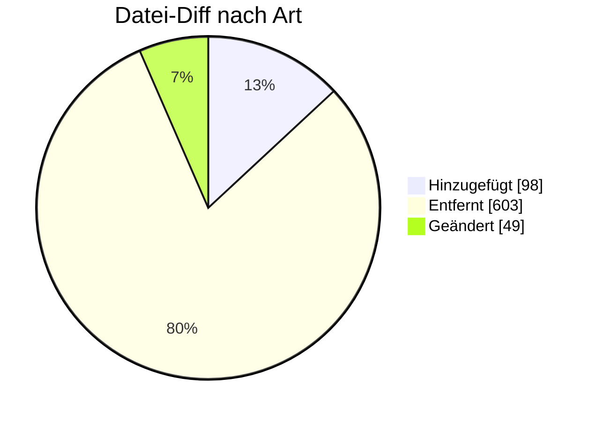

# ORDERS — Formatumstellung 01.10.2026

← [Zurück zur Gesamtübersicht](../index.md)

**Bestellung (z. B. Messdienstleistung)** · `AHB 1.1a → 1.1b · MIG 1.4c`

<Columns>
<Column>
<Card title="Kuratierte Änderungen" icon="material-two-tone-receipt-long">
**14** aus der BDEW-Änderungshistorie
</Card>
</Column>
<Column>
<Card title="Datei-Diff" icon="material-two-tone-difference">
**750** Einzeländerungen (AHB/MIG)
</Card>
</Column>
</Columns>

:::tip[Kurzfazit (das Wichtigste auf einen Blick)]
- **Umbenennung:** SG2 heißt nun Liefer- bzw. Bezugsort.
- **＋ GWA-Wechsel:** SG29 FTX+Z29–Z32 (IP, Zertifikate, WakeUp, APN).
- **＋ Tranche:** Berechnungsformel ZC4 integriert; Positionsnummer 1..n.
- **− WiM Gas 2.0:** G_0062–G_0066, G_0082 entfallen.
- **PIA-Umbau:** Verwendungszwecke direkt an Produkt.
:::

:::warning[Auswirkungen aufs Backend]
- **GWA-Wechsel (SG29 FTX+Z29–Z32):** neue technische Pflichtfelder.
- **Tranche-Berechnungsformel ZC4 (bilateral UTILTS NB→MSB):** Prozess ergänzen.
- **Positionsnummer 1..n; Verwendungszwecke ans Produkt:** Mapping umbauen.
- **WiM Gas 2.0 & ÜNB-MMMA (17114):** Spartenlogik anpassen / Anwendungsfall abschalten.
:::

---

## Änderungen nach Marktrolle

:::note[Navigation]
Jede Rolle ist ein eigener Block; klappe die gewünschte Einzeländerung auf, um Bisher/Neu/Grund zu sehen. Eine Änderung kann mehreren Rollen zugeordnet sein (Mehrfachnennung).
:::

### 🔵 Netzbetreiber (6)

<AccordionGroup>

<Accordion title="Änd-ID 27162 · Kapitel 4.17.1 Einrichtung der Konfigurationen aufgrund ei…">

| Feld | Wert |
|---|---|
| **Ort** | Kapitel 4.17.1 Einrichtung der Konfigurationen aufgrund einer Zuordnung eines LF von NB an MSB, Prüfidentifikator 17134, Einrichtung Konfiguration aufgrund Zuordnung LF von NB an MSB, SG29 Erforderliches Produkt der Tranche, SG30 CCI Basis zur Bildung der Tranchengröße, DE7037 |
| **Prüfi(s)** | 17134 |
| **Rolle(n)** | MSB, NB |
| **Status** | Genehmigt |

**Bisher:**
> ZD1 Prozentual X ZD2 Aufteilungsfaktor auf Basis von Referenzenträger/installierter Leistung X

**Neu:**
> ZD1 Prozentual X [594] ZC4 mittels Berechnungsformel X [595]  Bedingung:  [594] Hinweis: Wenn die Aufteilung der Tranche prozentual erfolgt. [595] Hinweis: Wenn die Aufteilung auf Basis eines Aufteilungsfaktors wie z.B. der installierten Leistung auf Basis der Technischen Ressourcen erfolgt. Da die Berechnungsformel (UTILTS) derzeit nur für eine Marktlokation und nicht für eine Tranche ausgetauscht werden kann, ist ein bilateraler Austausch der Berechnungsformel initiiert vom NB an den MSB, notwendig.

**Grund:** Wenn die Aufteilung nicht prozentual erfolgt, sondern auf Basis eines Aufteilungsfaktors wie z.B. der installierten Leistung oder auf Basis der Technischen Ressourcen, dann ist die Übermittlung einer Berechnungsformel notwendig. Da die Berechnungsformel (UTILTS) derzeit nur für eine Marktlokation und nicht für eine Tranche ausgetauscht werden kann, ist ein bilateraler Austausch, initiiert vom NB an den MSB, notwendig.

</Accordion>

<Accordion title="Änd-ID 26924 · Kapitel 4.4.5 Bestellung Änderung (NB an MSB), Prüfidentif…">

| Feld | Wert |
|---|---|
| **Ort** | Kapitel 4.4.5 Bestellung Änderung (NB an MSB), Prüfidentifikator 17121, Bestellung Änderung, SG29 LIN Erforderliches Produkt der Netzlokation, DE1082 Positionsnummer |
| **Prüfi(s)** | 17121 |
| **Rolle(n)** | MSB, NB |
| **Status** | Genehmigt |

**Bisher:**
> X [903]   Bedingung:  [903] Format: Möglicher Wert: 1

**Neu:**
> X [911]   Bedingung:  [911] Format: Mögliche Werte: 1 bis n, je Nachricht oder Segmentgruppe bei 1 beginnend und fortlaufend aufsteigend

**Grund:** Es gibt mehr als ein Produkt auf Ebene der Netzlokation. Die SG29 Erforderliches Produkt der Netzlokation erlaubt auch bereits heute eine Wiederholung, die Positionsnummer jedoch nicht so, dass eine unterschiedliche Positionsangabe möglich wäre.

</Accordion>

<Accordion title="Änd-ID 26220 · Kapitel 4.1.2.2 Anfrage von Werten, Prüfidentifikator 1710…">

| Feld | Wert |
|---|---|
| **Ort** | Kapitel 4.1.2.2 Anfrage von Werten, Prüfidentifikator 17102 Anfrage von Werten |
| **Prüfi(s)** | 17102 |
| **Rolle(n)** | LF, MSB, NB |
| **Status** | Genehmigt |

**Bisher:**
> Bisheriger Inhalt

**Neu:**
> Aktualisierter Inhalt

**Grund:** Anpassung des Anwendungsfalls aufgrund der Einführung der WiM Gas 2.0. Der Anwendungsfall findet in der Sparte Gas keine Anwendung mehr zwischen NB und MSB, weshalb die Voraussetzungen und Codes überarbeitet wurden.

</Accordion>

<Accordion title="Änd-ID 26155 · Kapitel 4.17.1 Einrichtung der Konfigurationen aufgrund ei…">

| Feld | Wert |
|---|---|
| **Ort** | Kapitel 4.17.1 Einrichtung der Konfigurationen aufgrund einer Zuordnung eines LF von NB an MSB, Prüfidentifikator 17134, Einrichtung Konfiguration aufgrund Zuordnung LF von NB an MSB |
| **Prüfi(s)** | 17134 |
| **Rolle(n)** | MSB, NB |
| **Status** | Genehmigt |

**Bisher:**
> Bisheriger Inhalt

**Neu:**
> Aktualisierter Inhalt

**Grund:** Überführung der Verwendungszwecke direkt an das jeweilige Produkt, um die zunehmende Anzahl an Verwendungszwecken je Marktrolle zu standardisieren.

</Accordion>

<Accordion title="Änd-ID 26154 · Kapitel 4.4.5 Bestellung Änderung (NB an MSB), Prüfidentif…">

| Feld | Wert |
|---|---|
| **Ort** | Kapitel 4.4.5 Bestellung Änderung (NB an MSB), Prüfidentifikator 17121, Bestellung Änderung |
| **Prüfi(s)** | 17121 |
| **Rolle(n)** | MSB, NB |
| **Status** | Genehmigt |

**Bisher:**
> Bisheriger Inhalt

**Neu:**
> Aktualisierter Inhalt

**Grund:** Überführung der Verwendungszwecke direkt an das jeweilige Produkt, um die zunehmende Anzahl an Verwendungszwecken je Marktrolle zu standardisieren.

</Accordion>

<Accordion title="Änd-ID 21218 · Kapitel 4.8 Reklamation von Werten/Lastgängen, Prüfidentif…">

| Feld | Wert |
|---|---|
| **Ort** | Kapitel 4.8 Reklamation von Werten/Lastgängen, Prüfidentifikator 17113, Reklamation von Werten |
| **Prüfi(s)** | 17113 |
| **Rolle(n)** | LF, MSB, NB |
| **Status** | Genehmigt |

**Bisher:**
> Bisheriger Inhalt

**Neu:**
> Aktualisierter Inhalt

**Grund:** Anpassung des Anwendungsfalls aufgrund der Einführung der WiM Gas 2.0. Der Anwendungsfall findet nur noch in der Sparte Strom Anwendung, weshalb die spartenspezifischen Voraussetzungen und Codes vollständig überarbeitet wurden.

</Accordion>

</AccordionGroup>

### 🟢 Lieferant (2)

<AccordionGroup>

<Accordion title="Änd-ID 26220 · Kapitel 4.1.2.2 Anfrage von Werten, Prüfidentifikator 1710…">

| Feld | Wert |
|---|---|
| **Ort** | Kapitel 4.1.2.2 Anfrage von Werten, Prüfidentifikator 17102 Anfrage von Werten |
| **Prüfi(s)** | 17102 |
| **Rolle(n)** | LF, MSB, NB |
| **Status** | Genehmigt |

**Bisher:**
> Bisheriger Inhalt

**Neu:**
> Aktualisierter Inhalt

**Grund:** Anpassung des Anwendungsfalls aufgrund der Einführung der WiM Gas 2.0. Der Anwendungsfall findet in der Sparte Gas keine Anwendung mehr zwischen NB und MSB, weshalb die Voraussetzungen und Codes überarbeitet wurden.

</Accordion>

<Accordion title="Änd-ID 21218 · Kapitel 4.8 Reklamation von Werten/Lastgängen, Prüfidentif…">

| Feld | Wert |
|---|---|
| **Ort** | Kapitel 4.8 Reklamation von Werten/Lastgängen, Prüfidentifikator 17113, Reklamation von Werten |
| **Prüfi(s)** | 17113 |
| **Rolle(n)** | LF, MSB, NB |
| **Status** | Genehmigt |

**Bisher:**
> Bisheriger Inhalt

**Neu:**
> Aktualisierter Inhalt

**Grund:** Anpassung des Anwendungsfalls aufgrund der Einführung der WiM Gas 2.0. Der Anwendungsfall findet nur noch in der Sparte Strom Anwendung, weshalb die spartenspezifischen Voraussetzungen und Codes vollständig überarbeitet wurden.

</Accordion>

</AccordionGroup>

### 🟣 Messstellenbetreiber (8)

<AccordionGroup>

<Accordion title="Änd-ID 27162 · Kapitel 4.17.1 Einrichtung der Konfigurationen aufgrund ei…">

| Feld | Wert |
|---|---|
| **Ort** | Kapitel 4.17.1 Einrichtung der Konfigurationen aufgrund einer Zuordnung eines LF von NB an MSB, Prüfidentifikator 17134, Einrichtung Konfiguration aufgrund Zuordnung LF von NB an MSB, SG29 Erforderliches Produkt der Tranche, SG30 CCI Basis zur Bildung der Tranchengröße, DE7037 |
| **Prüfi(s)** | 17134 |
| **Rolle(n)** | MSB, NB |
| **Status** | Genehmigt |

**Bisher:**
> ZD1 Prozentual X ZD2 Aufteilungsfaktor auf Basis von Referenzenträger/installierter Leistung X

**Neu:**
> ZD1 Prozentual X [594] ZC4 mittels Berechnungsformel X [595]  Bedingung:  [594] Hinweis: Wenn die Aufteilung der Tranche prozentual erfolgt. [595] Hinweis: Wenn die Aufteilung auf Basis eines Aufteilungsfaktors wie z.B. der installierten Leistung auf Basis der Technischen Ressourcen erfolgt. Da die Berechnungsformel (UTILTS) derzeit nur für eine Marktlokation und nicht für eine Tranche ausgetauscht werden kann, ist ein bilateraler Austausch der Berechnungsformel initiiert vom NB an den MSB, notwendig.

**Grund:** Wenn die Aufteilung nicht prozentual erfolgt, sondern auf Basis eines Aufteilungsfaktors wie z.B. der installierten Leistung oder auf Basis der Technischen Ressourcen, dann ist die Übermittlung einer Berechnungsformel notwendig. Da die Berechnungsformel (UTILTS) derzeit nur für eine Marktlokation und nicht für eine Tranche ausgetauscht werden kann, ist ein bilateraler Austausch, initiiert vom NB an den MSB, notwendig.

</Accordion>

<Accordion title="Änd-ID 26924 · Kapitel 4.4.5 Bestellung Änderung (NB an MSB), Prüfidentif…">

| Feld | Wert |
|---|---|
| **Ort** | Kapitel 4.4.5 Bestellung Änderung (NB an MSB), Prüfidentifikator 17121, Bestellung Änderung, SG29 LIN Erforderliches Produkt der Netzlokation, DE1082 Positionsnummer |
| **Prüfi(s)** | 17121 |
| **Rolle(n)** | MSB, NB |
| **Status** | Genehmigt |

**Bisher:**
> X [903]   Bedingung:  [903] Format: Möglicher Wert: 1

**Neu:**
> X [911]   Bedingung:  [911] Format: Mögliche Werte: 1 bis n, je Nachricht oder Segmentgruppe bei 1 beginnend und fortlaufend aufsteigend

**Grund:** Es gibt mehr als ein Produkt auf Ebene der Netzlokation. Die SG29 Erforderliches Produkt der Netzlokation erlaubt auch bereits heute eine Wiederholung, die Positionsnummer jedoch nicht so, dass eine unterschiedliche Positionsangabe möglich wäre.

</Accordion>

<Accordion title="Änd-ID 26220 · Kapitel 4.1.2.2 Anfrage von Werten, Prüfidentifikator 1710…">

| Feld | Wert |
|---|---|
| **Ort** | Kapitel 4.1.2.2 Anfrage von Werten, Prüfidentifikator 17102 Anfrage von Werten |
| **Prüfi(s)** | 17102 |
| **Rolle(n)** | LF, MSB, NB |
| **Status** | Genehmigt |

**Bisher:**
> Bisheriger Inhalt

**Neu:**
> Aktualisierter Inhalt

**Grund:** Anpassung des Anwendungsfalls aufgrund der Einführung der WiM Gas 2.0. Der Anwendungsfall findet in der Sparte Gas keine Anwendung mehr zwischen NB und MSB, weshalb die Voraussetzungen und Codes überarbeitet wurden.

</Accordion>

<Accordion title="Änd-ID 26197 · Kapitel 4.10 Ankündigung Gerätewechselabsicht, Prüfidentif…">

| Feld | Wert |
|---|---|
| **Ort** | Kapitel 4.10 Ankündigung Gerätewechselabsicht, Prüfidentifikator 17009, Ankündigung Gerätewechselabsicht |
| **Prüfi(s)** | 17009 |
| **Rolle(n)** | MSB |
| **Status** | Genehmigt |

**Bisher:**
> Bisheriger Inhalt

**Neu:**
> Aktualisierter Inhalt

**Grund:** Anpassung an die korrekte Notation (Nutzung von Paketen) in einzelnen Segmenten mit mehreren Codes.

</Accordion>

<Accordion title="Änd-ID 26155 · Kapitel 4.17.1 Einrichtung der Konfigurationen aufgrund ei…">

| Feld | Wert |
|---|---|
| **Ort** | Kapitel 4.17.1 Einrichtung der Konfigurationen aufgrund einer Zuordnung eines LF von NB an MSB, Prüfidentifikator 17134, Einrichtung Konfiguration aufgrund Zuordnung LF von NB an MSB |
| **Prüfi(s)** | 17134 |
| **Rolle(n)** | MSB, NB |
| **Status** | Genehmigt |

**Bisher:**
> Bisheriger Inhalt

**Neu:**
> Aktualisierter Inhalt

**Grund:** Überführung der Verwendungszwecke direkt an das jeweilige Produkt, um die zunehmende Anzahl an Verwendungszwecken je Marktrolle zu standardisieren.

</Accordion>

<Accordion title="Änd-ID 26154 · Kapitel 4.4.5 Bestellung Änderung (NB an MSB), Prüfidentif…">

| Feld | Wert |
|---|---|
| **Ort** | Kapitel 4.4.5 Bestellung Änderung (NB an MSB), Prüfidentifikator 17121, Bestellung Änderung |
| **Prüfi(s)** | 17121 |
| **Rolle(n)** | MSB, NB |
| **Status** | Genehmigt |

**Bisher:**
> Bisheriger Inhalt

**Neu:**
> Aktualisierter Inhalt

**Grund:** Überführung der Verwendungszwecke direkt an das jeweilige Produkt, um die zunehmende Anzahl an Verwendungszwecken je Marktrolle zu standardisieren.

</Accordion>

<Accordion title="Änd-ID 26122 · Kapitel 4.9.2 Bestellung Geräteübernahmeangebot, Prüfident…">

| Feld | Wert |
|---|---|
| **Ort** | Kapitel 4.9.2 Bestellung Geräteübernahmeangebot, Prüfidentifikator 17001, Bestellung Geräteübernahmeangebot |
| **Prüfi(s)** | 17001 |
| **Rolle(n)** | MSB |
| **Status** | Genehmigt |

**Bisher:**
> Bisheriger Inhalt

**Neu:**
> Aktualisierter Inhalt

**Grund:** Aufnahme der Informationen für den automatisierten GWA-Wechsel mit Geräteübernahme. Details siehe VDE FNN Hinweis "Prozessbeschreibung eines GWA-Wechsels im Rahmen eines MSB-Wechsels mit Geräteübernahme gemäß WiM Strom".

</Accordion>

<Accordion title="Änd-ID 21218 · Kapitel 4.8 Reklamation von Werten/Lastgängen, Prüfidentif…">

| Feld | Wert |
|---|---|
| **Ort** | Kapitel 4.8 Reklamation von Werten/Lastgängen, Prüfidentifikator 17113, Reklamation von Werten |
| **Prüfi(s)** | 17113 |
| **Rolle(n)** | LF, MSB, NB |
| **Status** | Genehmigt |

**Bisher:**
> Bisheriger Inhalt

**Neu:**
> Aktualisierter Inhalt

**Grund:** Anpassung des Anwendungsfalls aufgrund der Einführung der WiM Gas 2.0. Der Anwendungsfall findet nur noch in der Sparte Strom Anwendung, weshalb die spartenspezifischen Voraussetzungen und Codes vollständig überarbeitet wurden.

</Accordion>

</AccordionGroup>

### ⚪ Übergreifend (6)

<AccordionGroup>

<Accordion title="Änd-ID 27241 · Kapitel 4.2.2 Anforderung der bilanzierten Menge, Prüfiden…">

| Feld | Wert |
|---|---|
| **Ort** | Kapitel 4.2.2 Anforderung der bilanzierten Menge, Prüfidentifikator 17114, Anforderung bilanzierten Menge |
| **Prüfi(s)** | 17114 |
| **Rolle(n)** | Übergreifend |
| **Status** | Genehmigt |

**Bisher:**
> Anwendungsfall vorhanden

**Neu:**
> Anwendungsfall nicht vorhanden

**Grund:** Im Kapitel 6.3 der Anwendungshilfe "Einführungsszenario zum LFW24" bzw. im Kapitel 4.1 der Anwendungshilfe "Prozesse zur Ermittlung und Abrechnung von Mehr-/Mindermengen Strom und Gas" wird definiert, dass der ÜNB "die Übermittlung der bilanzierten Energiemenge für Marktlokationen, die auf Basis von Profilen bilanziert werden, an den NB für die Mehr-/Mindermengenabrechnung Strom" ab dem 01.10.2026 00:00 Uhr einstellt.

</Accordion>

<Accordion title="Änd-ID 26219 · Kapitel 4.1.2 Anfrage zur Übermittlung von Werten inkl. Un…">

| Feld | Wert |
|---|---|
| **Ort** | Kapitel 4.1.2 Anfrage zur Übermittlung von Werten inkl. Unterkapitel, Tabelle |
| **Prüfi(s)** | – |
| **Rolle(n)** | Übergreifend |
| **Status** | Genehmigt |

**Bisher:**
> Bisheriger Inhalt

**Neu:**
> Aktualisierter Inhalt

**Grund:** Anpassung des Anwendungsfalls aufgrund der Einführung der WiM Gas 2.0. Der Anwendungsfall findet in der Sparte Gas keine Anwendung mehr zwischen NB und MSB, weshalb die Übersicht überarbeitet wurde.

</Accordion>

<Accordion title="Änd-ID 26216 · Kapitel 4.12.1 Änderung der Technik der Lokation (Messloka…">

| Feld | Wert |
|---|---|
| **Ort** | Kapitel 4.12.1 Änderung der Technik der Lokation (Messlokationsänderung) – Gas, Prüfidentifikator 17003 Beauftragung, Änderung Technik |
| **Prüfi(s)** | 17003 |
| **Rolle(n)** | Übergreifend |
| **Status** | Genehmigt |

**Bisher:**
> Vorhanden

**Neu:**
> Nicht vorhanden

**Grund:** Anpassung aufgrund der Einführung der WiM Gas 2.0. Der Anwendungsfall ist in der WiM Gas 2.0 nicht mehr vorhanden, weshalb er auch aus dem AHB entfernt wird.

</Accordion>

<Accordion title="Änd-ID 26198 · Alle Anwendungsübersichten mit einem „Muss“ in SG5 Ansprec…">

| Feld | Wert |
|---|---|
| **Ort** | Alle Anwendungsübersichten mit einem „Muss“ in SG5 Ansprechpartner bzw. Kontaktdaten des Kunden, COM DE3148 |
| **Prüfi(s)** | – |
| **Rolle(n)** | Übergreifend |
| **Status** | Genehmigt |

**Bisher:**
> X (([939] [147]) ∨ ([940] [148])) ∧ [567]  [147] Wenn im DE3155 in demselben COM der Code EM vorhanden ist. [148] Wenn im DE3155 in demselben COM der Code TE / FX / AJ / AL vorhanden ist. [567] Hinweis: Es darf nur eine Information im DE3148 übermittelt werden [939] Format: Die Zeichenkette muss die Zeichen @ und . enthalten [940] Format: Die Zeichenkette muss mit dem Zeichen + beginnen und danach dürfen nur noch Ziffern folgen

**Neu:**
> X (([939] [147]) ⊻ ([940] [148])) ∧ [567]  [147] Wenn im DE3155 in demselben COM der Code EM vorhanden ist. [148] Wenn im DE3155 in demselben COM der Code TE / FX / AJ / AL vorhanden ist. [567] Hinweis: Es darf nur eine Information im DE3148 übermittelt werden [939] Format: Die Zeichenkette muss die Zeichen @ und . enthalten [940] Format: Die Zeichenkette muss mit dem Zeichen + beginnen und danach dürfen nur noch Ziffern folgen

**Grund:** Einbau des XODER Operator zur korrekten Abgrenzung der Bedingungen.

</Accordion>

<Accordion title="Änd-ID 26157 · Kapitel 3 Übersicht der Pakete in der ORDERS">

| Feld | Wert |
|---|---|
| **Ort** | Kapitel 3 Übersicht der Pakete in der ORDERS |
| **Prüfi(s)** | – |
| **Rolle(n)** | Übergreifend |
| **Status** | Genehmigt |

**Bisher:**
> Bisheriger Inhalt

**Neu:**
> Aktualisierter Inhalt

**Grund:** Aufgrund der Überführung der Verwendungszwecke direkt an das jeweilige Produkt, um die zunehmende Anzahl an Verwendungszwecken je Marktrolle zu standardisieren, wurden ebenso die Übersicht der Pakete aktualisiert.   Zusätzlich: Erweiterung der Pakete aufgrund der Nutzung in Anwendungsfällen.

</Accordion>

<Accordion title="Änd-ID 26142 · Alle Anwendungsübersichten mit einem „Kann“ in SG5 Ansprec…">

| Feld | Wert |
|---|---|
| **Ort** | Alle Anwendungsübersichten mit einem „Kann“ in SG5 Ansprechpartner |
| **Prüfi(s)** | – |
| **Rolle(n)** | Übergreifend |
| **Status** | Genehmigt |

**Bisher:**
> SG5 Ansprechpartner inkl. Untersegmente  vorhanden

**Neu:**
> SG5 Ansprechpartner inkl. Untersegmente  nicht vorhanden

**Grund:** Umsetzung des Konsultationsergebnisses des Konzepts „zur Nutzung der Kontaktinformationen des Senders in den EDI@Energy Nachrichtentypen“.

</Accordion>

</AccordionGroup>

---

### 🔬 Echter Datei-Diff (AHB/MIG · Stand 202604 → 202610)

<AccordionGroup>
:::info[750 Einzeländerungen auf Segment-/Bedingungsebene]
**＋ 98** hinzugefügt · **− 603** entfernt · **~ 49** geändert. Diese granulare Ebene ergänzt die kuratierte BDEW-Historie — Auszug unten.
:::

<Accordion title="Top-Prüfidentifikatoren nach Anzahl Datei-Änderungen">

| Prüfi | Datei-Änderungen |
|---|---|
| 17134 | 28 |
| 17121 | 26 |
| 17009 | 19 |
| 17102 | 16 |
| 17112 | 16 |
| 17002 | 12 |
| 17004 | 12 |
| 17005 | 12 |

</Accordion>

<Accordion title="Bestätigte Highlights (Historie + Datei-Diff)">

- **modified** · `SG1 RFF 1154 Prüfidentifikator` — _[…]
17003 Beauftragung zur Änderung der
…_ → _[...]_
- **modified** · `SG2 Marktlokation, Messlokation, Tranche bzw. Ressource` — _Marktlokation, Messlokation, Tranche bzw…_ → _Liefer- bzw. Bezugsort_
- **modified** · `SG2 LOC Meldepunkt` — _Hier wird die ID der Marktlokation oder …_ → _--_
- **modified** · `SG29 PIA Erforderliches Produkt der Netzlokation` — _bisheriger Inhalt_ → _aktualisierter Inhalt_
- **modified** · `SG29 PIA Erforderliches Produkt der Tranche` — _SG30 Messprodukt für Netzbetreiber relev…_ → _SG30 Messprodukt für Netzbetreiber relev…_
- **modified** · `SG29 PIA 7140 Produkt-/Leistungsnummer` — _bisheriger Inhalt_ → _aktualisierter Inhalt_
- **modified** · `SG29 PIA 7140 Produkt-/Leistungsnummer` — _bisheriger Inhalt_ → _aktualisierter Inhalt_
- **− Prüfi entfernt** (PID 17003) · `Prüfidentifikator 17003` — _17003_ → __
- **− Prüfi entfernt** (PID 17114) · `Prüfidentifikator 17114` — _17114_ → __

</Accordion>
</AccordionGroup>

---

← [Gesamtübersicht](../index.md)
