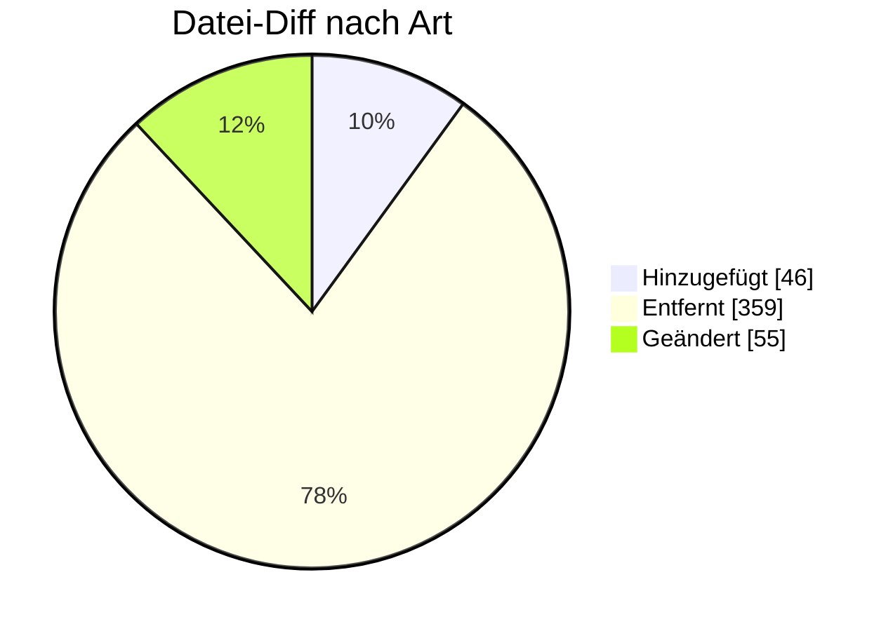

# ORDRSP — Formatumstellung 01.10.2026

← [Zurück zur Gesamtübersicht](../index.md)

**Bestellantwort / -bestätigung** · `AHB 1.1a → 1.1b · MIG 1.4c`

<Columns>
<Column>
<Card title="Kuratierte Änderungen" icon="material-two-tone-reply">
**10** aus der BDEW-Änderungshistorie
</Card>
</Column>
<Column>
<Card title="Datei-Diff" icon="material-two-tone-difference">
**460** Einzeländerungen (AHB/MIG)
</Card>
</Column>
</Columns>

:::tip[Kurzfazit (das Wichtigste auf einen Blick)]
- **Logik-Fix:** XOR (⊻) bei SG6 Ansprechpartner (EM oder TE).
- **− SG6:** Kontaktinformationen (Sender) entfernt.
- **＋ GWA-Wechsel:** SG27 FTX+Z33 (APN-Zugriffsparameter).
- **− WiM Gas 2.0:** Anwendungsfälle nur noch Strom.
:::

:::warning[Auswirkungen aufs Backend]
- **GWA-Wechsel (SG27 FTX+Z33):** APN-Zugriffsparameter.
- **XODER bei SG6 Ansprechpartner; Sender-Kontakt entfernt.**
- **WiM Gas 2.0 (nur Strom) & ÜNB-MMMA (19115):** anpassen/abschalten.
- **Paket-Notation (19123, 26201, 26123):** Mapping prüfen.
:::

---

## Änderungen nach Marktrolle

:::note[Navigation]
Jede Rolle ist ein eigener Block; klappe die gewünschte Einzeländerung auf, um Bisher/Neu/Grund zu sehen. Eine Änderung kann mehreren Rollen zugeordnet sein (Mehrfachnennung).
:::

### 🔵 Netzbetreiber (4)

<AccordionGroup>

<Accordion title="Änd-ID 27214 · Kapitel 4.1.3 Ablehnung der Anfrage zur Übermittlung von W…">

| Feld | Wert |
|---|---|
| **Ort** | Kapitel 4.1.3 Ablehnung der Anfrage zur Übermittlung von Werten, Prüfidentifikator 19102, Ablehnung der Anfrage Werte |
| **Prüfi(s)** | 19102 |
| **Rolle(n)** | LF, MSB, NB |
| **Status** | Genehmigt |

**Bisher:**
> Bisheriger Inhalt

**Neu:**
> Aktualisierter Inhalt

**Grund:** Anpassung des Anwendungsfalls aufgrund der Einführung der WiM Gas 2.0. Der Anwendungsfall findet in der Sparte Gas keine Anwendung mehr zwischen MSB und NB, weshalb die Voraussetzungen und Codes überarbeitet wurden.

</Accordion>

<Accordion title="Änd-ID 27212 · Kapitel 4.12 Antwort Beauftragung Änderung der Technik der…">

| Feld | Wert |
|---|---|
| **Ort** | Kapitel 4.12 Antwort Beauftragung Änderung der Technik der Lokation (Messlokationsänderung), Prüfidentifikator 19005 Bestätigung Auftrag Änderung Technik, 19006 Ablehnung Auftrag Änderung Technik |
| **Prüfi(s)** | 19005, 19006 |
| **Rolle(n)** | LF, MSB, NB |
| **Status** | Genehmigt |

**Bisher:**
> Bisheriger Inhalt

**Neu:**
> Aktualisierter Inhalt

**Grund:** Anpassung der Anwendungsfälle aufgrund der Einführung der WiM Gas 2.0. Die Anwendungsfälle finden nur noch in der Sparte Strom Anwendung, weshalb die spartenspezifischen Voraussetzungen und Codes vollständig überarbeitet wurden.

</Accordion>

<Accordion title="Änd-ID 26214 · Kapitel 4.8 Ablehnung der Reklamation von Werten, Prüfiden…">

| Feld | Wert |
|---|---|
| **Ort** | Kapitel 4.8 Ablehnung der Reklamation von Werten, Prüfidentifikator 19114 Ablehnung Reklamation |
| **Prüfi(s)** | 19114 |
| **Rolle(n)** | LF, MSB, NB |
| **Status** | Genehmigt |

**Bisher:**
> Bisheriger Inhalt

**Neu:**
> Aktualisierter Inhalt

**Grund:** Anpassung des Anwendungsfalls aufgrund der Einführung der WiM Gas 2.0. Der Anwendungsfall findet nur noch in der Sparte Strom Anwendung, weshalb die spartenspezifischen Voraussetzungen und Codes vollständig überarbeitet wurden.

</Accordion>

<Accordion title="Änd-ID 26200 · Kapitel 4.5 Ablehnung der Reklamation einer Definition, Pr…">

| Feld | Wert |
|---|---|
| **Ort** | Kapitel 4.5 Ablehnung der Reklamation einer Definition, Prüfidentifikator 19123, Ablehnung Reklamation einer Definition |
| **Prüfi(s)** | 19123 |
| **Rolle(n)** | LF, MSB, NB |
| **Status** | Genehmigt |

**Bisher:**
> Bisheriger Inhalt

**Neu:**
> Aktualisierter Inhalt

**Grund:** Anpassung an die korrekte Notation (Nutzung von Paketen) in einzelnen Segmenten mit mehreren Codes.

</Accordion>

</AccordionGroup>

### 🟢 Lieferant (4)

<AccordionGroup>

<Accordion title="Änd-ID 27214 · Kapitel 4.1.3 Ablehnung der Anfrage zur Übermittlung von W…">

| Feld | Wert |
|---|---|
| **Ort** | Kapitel 4.1.3 Ablehnung der Anfrage zur Übermittlung von Werten, Prüfidentifikator 19102, Ablehnung der Anfrage Werte |
| **Prüfi(s)** | 19102 |
| **Rolle(n)** | LF, MSB, NB |
| **Status** | Genehmigt |

**Bisher:**
> Bisheriger Inhalt

**Neu:**
> Aktualisierter Inhalt

**Grund:** Anpassung des Anwendungsfalls aufgrund der Einführung der WiM Gas 2.0. Der Anwendungsfall findet in der Sparte Gas keine Anwendung mehr zwischen MSB und NB, weshalb die Voraussetzungen und Codes überarbeitet wurden.

</Accordion>

<Accordion title="Änd-ID 27212 · Kapitel 4.12 Antwort Beauftragung Änderung der Technik der…">

| Feld | Wert |
|---|---|
| **Ort** | Kapitel 4.12 Antwort Beauftragung Änderung der Technik der Lokation (Messlokationsänderung), Prüfidentifikator 19005 Bestätigung Auftrag Änderung Technik, 19006 Ablehnung Auftrag Änderung Technik |
| **Prüfi(s)** | 19005, 19006 |
| **Rolle(n)** | LF, MSB, NB |
| **Status** | Genehmigt |

**Bisher:**
> Bisheriger Inhalt

**Neu:**
> Aktualisierter Inhalt

**Grund:** Anpassung der Anwendungsfälle aufgrund der Einführung der WiM Gas 2.0. Die Anwendungsfälle finden nur noch in der Sparte Strom Anwendung, weshalb die spartenspezifischen Voraussetzungen und Codes vollständig überarbeitet wurden.

</Accordion>

<Accordion title="Änd-ID 26214 · Kapitel 4.8 Ablehnung der Reklamation von Werten, Prüfiden…">

| Feld | Wert |
|---|---|
| **Ort** | Kapitel 4.8 Ablehnung der Reklamation von Werten, Prüfidentifikator 19114 Ablehnung Reklamation |
| **Prüfi(s)** | 19114 |
| **Rolle(n)** | LF, MSB, NB |
| **Status** | Genehmigt |

**Bisher:**
> Bisheriger Inhalt

**Neu:**
> Aktualisierter Inhalt

**Grund:** Anpassung des Anwendungsfalls aufgrund der Einführung der WiM Gas 2.0. Der Anwendungsfall findet nur noch in der Sparte Strom Anwendung, weshalb die spartenspezifischen Voraussetzungen und Codes vollständig überarbeitet wurden.

</Accordion>

<Accordion title="Änd-ID 26200 · Kapitel 4.5 Ablehnung der Reklamation einer Definition, Pr…">

| Feld | Wert |
|---|---|
| **Ort** | Kapitel 4.5 Ablehnung der Reklamation einer Definition, Prüfidentifikator 19123, Ablehnung Reklamation einer Definition |
| **Prüfi(s)** | 19123 |
| **Rolle(n)** | LF, MSB, NB |
| **Status** | Genehmigt |

**Bisher:**
> Bisheriger Inhalt

**Neu:**
> Aktualisierter Inhalt

**Grund:** Anpassung an die korrekte Notation (Nutzung von Paketen) in einzelnen Segmenten mit mehreren Codes.

</Accordion>

</AccordionGroup>

### 🟣 Messstellenbetreiber (6)

<AccordionGroup>

<Accordion title="Änd-ID 27214 · Kapitel 4.1.3 Ablehnung der Anfrage zur Übermittlung von W…">

| Feld | Wert |
|---|---|
| **Ort** | Kapitel 4.1.3 Ablehnung der Anfrage zur Übermittlung von Werten, Prüfidentifikator 19102, Ablehnung der Anfrage Werte |
| **Prüfi(s)** | 19102 |
| **Rolle(n)** | LF, MSB, NB |
| **Status** | Genehmigt |

**Bisher:**
> Bisheriger Inhalt

**Neu:**
> Aktualisierter Inhalt

**Grund:** Anpassung des Anwendungsfalls aufgrund der Einführung der WiM Gas 2.0. Der Anwendungsfall findet in der Sparte Gas keine Anwendung mehr zwischen MSB und NB, weshalb die Voraussetzungen und Codes überarbeitet wurden.

</Accordion>

<Accordion title="Änd-ID 27212 · Kapitel 4.12 Antwort Beauftragung Änderung der Technik der…">

| Feld | Wert |
|---|---|
| **Ort** | Kapitel 4.12 Antwort Beauftragung Änderung der Technik der Lokation (Messlokationsänderung), Prüfidentifikator 19005 Bestätigung Auftrag Änderung Technik, 19006 Ablehnung Auftrag Änderung Technik |
| **Prüfi(s)** | 19005, 19006 |
| **Rolle(n)** | LF, MSB, NB |
| **Status** | Genehmigt |

**Bisher:**
> Bisheriger Inhalt

**Neu:**
> Aktualisierter Inhalt

**Grund:** Anpassung der Anwendungsfälle aufgrund der Einführung der WiM Gas 2.0. Die Anwendungsfälle finden nur noch in der Sparte Strom Anwendung, weshalb die spartenspezifischen Voraussetzungen und Codes vollständig überarbeitet wurden.

</Accordion>

<Accordion title="Änd-ID 26214 · Kapitel 4.8 Ablehnung der Reklamation von Werten, Prüfiden…">

| Feld | Wert |
|---|---|
| **Ort** | Kapitel 4.8 Ablehnung der Reklamation von Werten, Prüfidentifikator 19114 Ablehnung Reklamation |
| **Prüfi(s)** | 19114 |
| **Rolle(n)** | LF, MSB, NB |
| **Status** | Genehmigt |

**Bisher:**
> Bisheriger Inhalt

**Neu:**
> Aktualisierter Inhalt

**Grund:** Anpassung des Anwendungsfalls aufgrund der Einführung der WiM Gas 2.0. Der Anwendungsfall findet nur noch in der Sparte Strom Anwendung, weshalb die spartenspezifischen Voraussetzungen und Codes vollständig überarbeitet wurden.

</Accordion>

<Accordion title="Änd-ID 26201 · Kapitel 4.10 Antwort Gerätewechselabsicht, Prüfidentifikat…">

| Feld | Wert |
|---|---|
| **Ort** | Kapitel 4.10 Antwort Gerätewechselabsicht, Prüfidentifikator 19015, 19016 Bestätigung, Ablehnung Gerätewechselabsicht |
| **Prüfi(s)** | 19015, 19016 |
| **Rolle(n)** | MSB |
| **Status** | Genehmigt |

**Bisher:**
> Bisheriger Inhalt

**Neu:**
> Aktualisierter Inhalt

**Grund:** Anpassung an die korrekte Notation (Nutzung von Paketen) in einzelnen Segmenten mit mehreren Codes.

</Accordion>

<Accordion title="Änd-ID 26200 · Kapitel 4.5 Ablehnung der Reklamation einer Definition, Pr…">

| Feld | Wert |
|---|---|
| **Ort** | Kapitel 4.5 Ablehnung der Reklamation einer Definition, Prüfidentifikator 19123, Ablehnung Reklamation einer Definition |
| **Prüfi(s)** | 19123 |
| **Rolle(n)** | LF, MSB, NB |
| **Status** | Genehmigt |

**Bisher:**
> Bisheriger Inhalt

**Neu:**
> Aktualisierter Inhalt

**Grund:** Anpassung an die korrekte Notation (Nutzung von Paketen) in einzelnen Segmenten mit mehreren Codes.

</Accordion>

<Accordion title="Änd-ID 26123 · Kapitel 4.9.2 Antwort Bestellung Geräteübernahmeangebot, B…">

| Feld | Wert |
|---|---|
| **Ort** | Kapitel 4.9.2 Antwort Bestellung Geräteübernahmeangebot, Bestätigung Bestellung, 19001 |
| **Prüfi(s)** | 19001 |
| **Rolle(n)** | MSB |
| **Status** | Genehmigt |

**Bisher:**
> Bisheriger Inhalt

**Neu:**
> Aktualisierter Inhalt

**Grund:** Aufnahme der Informationen für den automatisierten GWA-Wechsel mit Geräteübernahme. Details siehe VDE FNN Hinweis "Prozessbeschreibung eines GWA-Wechsels im Rahmen eines MSB-Wechsels mit Geräteübernahme gemäß WiM Strom".

</Accordion>

</AccordionGroup>

### ⚪ Übergreifend (4)

<AccordionGroup>

<Accordion title="Änd-ID 27244 · Kapitel 4.2.2 Ablehnung der Anforderung der bilanzierten M…">

| Feld | Wert |
|---|---|
| **Ort** | Kapitel 4.2.2 Ablehnung der Anforderung der bilanzierten Menge, Prüfidentifikator 19115, Ablehnung der Anforderung bilanzierten Menge |
| **Prüfi(s)** | 19115 |
| **Rolle(n)** | Übergreifend |
| **Status** | Genehmigt |

**Bisher:**
> Vorhanden

**Neu:**
> Nicht vorhanden

**Grund:** Im Kapitel 6.3 der Anwendungshilfe "Einführungsszenario zum LFW24" bzw. im Kapitel 4.1 der Anwendungshilfe "Prozesse zur Ermittlung und Abrechnung von Mehr-/Mindermengen Strom und Gas" wird definiert, dass der ÜNB "die Übermittlung der bilanzierten Energiemenge für Marktlokationen, die auf Basis von Profilen bilanziert werden, an den NB für die Mehr-/Mindermengenabrechnung Strom" ab dem 01.10.2026 00:00 Uhr einstellt.

</Accordion>

<Accordion title="Änd-ID 26199 · Kapitel 3 Übersicht der Pakete in der ORDRSP">

| Feld | Wert |
|---|---|
| **Ort** | Kapitel 3 Übersicht der Pakete in der ORDRSP |
| **Prüfi(s)** | – |
| **Rolle(n)** | Übergreifend |
| **Status** | Genehmigt |

**Bisher:**
> Bisheriger Inhalt

**Neu:**
> Aktualisierter Inhalt

**Grund:** Erweiterung der Pakete aufgrund der Nutzung in Anwendungsfällen.

</Accordion>

<Accordion title="Änd-ID 26198 · Alle Anwendungsübersichten mit einem „Muss“ in SG6 Ansprec…">

| Feld | Wert |
|---|---|
| **Ort** | Alle Anwendungsübersichten mit einem „Muss“ in SG6 Ansprechpartner, COM DE3148 |
| **Prüfi(s)** | – |
| **Rolle(n)** | Übergreifend |
| **Status** | Genehmigt |

**Bisher:**
> X (([939] [50]) ∨ ([940] [51])) ∧ [540]  [50] Wenn im DE3155 in demselben COM der Code EM vorhanden ist. [51] Wenn im DE3155 in demselben COM der Code TE / FX / AJ / AL vorhanden ist. [540] Hinweis: Es darf nur eine Information im DE3148 übermittelt werden [939] Format: Die Zeichenkette muss die Zeichen @ und . enthalten [940] Format: Die Zeichenkette muss mit dem Zeichen + beginnen und danach dürfen nur noch Ziffern folgen

**Neu:**
> X (([939] [50]) ⊻ ([940] [51])) ∧ [540]  [50] Wenn im DE3155 in demselben COM der Code EM vorhanden ist. [51] Wenn im DE3155 in demselben COM der Code TE / FX / AJ / AL vorhanden ist. [540] Hinweis: Es darf nur eine Information im DE3148 übermittelt werden [939] Format: Die Zeichenkette muss die Zeichen @ und . enthalten [940] Format: Die Zeichenkette muss mit dem Zeichen + beginnen und danach dürfen nur noch Ziffern folgen

**Grund:** Einbau des XODER Operator zur korrekten Abgrenzung der Bedingungen.

</Accordion>

<Accordion title="Änd-ID 26144 · Alle Anwendungsübersichten mit einem „Kann“ in SG6 Ansprec…">

| Feld | Wert |
|---|---|
| **Ort** | Alle Anwendungsübersichten mit einem „Kann“ in SG6 Ansprechpartner |
| **Prüfi(s)** | – |
| **Rolle(n)** | Übergreifend |
| **Status** | Genehmigt |

**Bisher:**
> SG6 Ansprechpartner inkl. Untersegmente  vorhanden

**Neu:**
> SG6 Ansprechpartner inkl. Untersegmente  nicht vorhanden

**Grund:** Umsetzung des Konsultationsergebnisses des Konzepts „zur Nutzung der Kontaktinformationen des Senders in den EDI@Energy Nachrichtentypen“.

</Accordion>

</AccordionGroup>

---

### 🔬 Echter Datei-Diff (AHB/MIG · Stand 202604 → 202610)

<AccordionGroup>
:::info[460 Einzeländerungen auf Segment-/Bedingungsebene]
**＋ 46** hinzugefügt · **− 359** entfernt · **~ 55** geändert. Diese granulare Ebene ergänzt die kuratierte BDEW-Historie — Auszug unten.
:::

<Accordion title="Top-Prüfidentifikatoren nach Anzahl Datei-Änderungen">

| Prüfi | Datei-Änderungen |
|---|---|
| 19123 | 20 |
| 19015 | 16 |
| 19016 | 16 |
| 19102 | 15 |
| 19127 | 14 |
| 19005 | 13 |
| 19006 | 13 |
| 19003 | 12 |

</Accordion>

<Accordion title="Bestätigte Highlights (Historie + Datei-Diff)">

- **modified** · `SG1 RFF 1154 Prüfidentifikator` — _[…]
19115 Ablehnung Anforderung bilanzie…_ → _[...]_
- **− Prüfi entfernt** (PID 19115) · `Prüfidentifikator 19115` — _19115_ → __

</Accordion>
</AccordionGroup>

---

← [Gesamtübersicht](../index.md)
