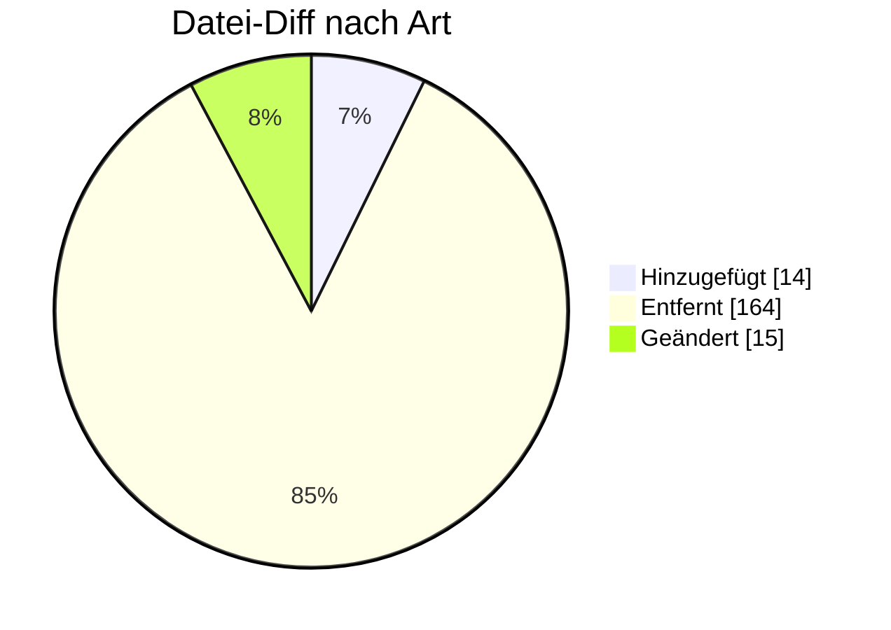

# PARTIN — Formatumstellung 01.10.2026

← [Zurück zur Gesamtübersicht](../index.md)

**Stammdatenaustausch Marktpartner** · `AHB 1.0f → 1.1 · MIG 1.1`

<Columns>
<Column>
<Card title="Kuratierte Änderungen" icon="material-two-tone-contacts">
**7** aus der BDEW-Änderungshistorie
</Card>
</Column>
<Column>
<Card title="Datei-Diff" icon="material-two-tone-difference">
**193** Einzeländerungen (AHB/MIG)
</Card>
</Column>
</Columns>

:::tip[Kurzfazit (das Wichtigste auf einen Blick)]
- **Telefon:** im SG7 COM wird zwingend TE gefordert.
- **Steuernummer/USt-Nr.** in SG4/SG6 vereinheitlicht.
- **ÜNB (MMMA):** Ansprechpartner NB↔ÜNB befristet bis 01.01.2029 (23:00 UTC).
:::

:::warning[Auswirkungen aufs Backend]
- **Telefon (SG7 COM TE) zwingend:** Datenbereitstellung sicherstellen.
- **USt-Nr./Steuernummer vereinheitlicht:** Konsistenz zu INVOIC herstellen.
- **ÜNB-MMMA-Sonderregel (befristet bis 01.01.2029):** abbilden; XODER.
:::

---

## Änderungen nach Marktrolle

:::note[Navigation]
Jede Rolle ist ein eigener Block; klappe die gewünschte Einzeländerung auf, um Bisher/Neu/Grund zu sehen. Eine Änderung kann mehreren Rollen zugeordnet sein (Mehrfachnennung).
:::

### ⚪ Übergreifend (7)

<AccordionGroup>

<Accordion title="Änd-ID 26969 · SG2 MP-ID Absender  SG3 Kontaktinformatione n  Alle Anwend…">

| Feld | Wert |
|---|---|
| **Ort** | SG2 MP-ID Absender  SG3 Kontaktinformatione n  Alle Anwendungsfälle |
| **Prüfi(s)** | – |
| **Rolle(n)** | Übergreifend |
| **Status** | Genehmigt |

**Bisher:**
> CTA-Segment "Ansprechpartner" und COM- Segment "Kommunikationsverbindung" vorhanden

**Neu:**
> CTA-Segment "Ansprechpartner" und COM- Segment "Kommunikationsverbindung" nicht vorhanden

**Grund:** Umsetzung des Konsultationsergebnisses des Konzepts „zur Nutzung der Kontaktinformationen des Senders in den EDI@Energy Nachrichtentypen“

</Accordion>

<Accordion title="Änd-ID 26842 · SG4 Unternehmensinfor mationen  SG6 Steuernummer, Umsatzst…">

| Feld | Wert |
|---|---|
| **Ort** | SG4 Unternehmensinfor mationen  SG6 Steuernummer, Umsatzsteuernumm er  RFF Steuernummer, Umsatzsteuernumm er  Anwendungsfall 37006 Kommunikationsdate n des ESA Strom |
| **Prüfi(s)** | – |
| **Rolle(n)** | Übergreifend |
| **Status** | Genehmigt |

**Bisher:**
> SG6 Muss

**Neu:**
> SG6 Muss [504] ∧ [509]  [504] Hinweis: Es ist mindestens die Umsatzsteuer- bzw. Steuernummer zu nennen, die in der INVOIC genutzt wird.  [509] Hinweis: Falls die Umsatzsteuer- bzw. Steuernummer in einem bilateral ausgetauschten Dokument (z.B. Wiederverkäufernachweis eines LF) ausgetauscht wurde, ist zwingend diese ohne Veränderungen (z.B. Umrechnung auf die bundeseinheitliche Steuernummer) zu nutzen.

**Grund:** In der PARTIN ist die Umsatzsteuer- bzw. Steuernummer zu übermitteln, welche vorher in einem möglichen bilateral ausgetauschten Dokument genannt wurde. Eine Transformation auf eine bundeseinheitliche Steuernummer soll nicht erfolgen.

</Accordion>

<Accordion title="Änd-ID 26841 · SG4 Unternehmensinfor mationen  SG6 Steuernummer, Umsatzst…">

| Feld | Wert |
|---|---|
| **Ort** | SG4 Unternehmensinfor mationen  SG6 Steuernummer, Umsatzsteuernumm er  RFF Steuernummer, Umsatzsteuernumm er  Anwendungsfälle 37000 Kommunikationsdate n des LF Strom 37001 Kommunikationsdate n des NB Strom 37002 Kommunikationsdate |
| **Prüfi(s)** | – |
| **Rolle(n)** | Übergreifend |
| **Status** | Genehmigt |

**Bisher:**
> SG6 Muss [504]  [504] Hinweis: Es ist mindestens die Umsatzsteuer- bzw. Steuernummer zu nennen, die in der INVOIC genutzt wird.

**Neu:**
> SG6 Muss [504] ∧ [509]  [504] Hinweis: Es ist mindestens die Umsatzsteuer- bzw. Steuernummer zu nennen, die in der INVOIC genutzt wird.  [509] Hinweis: Falls die Umsatzsteuer- bzw. Steuernummer in einem bilateral ausgetauschten Dokument (z.B. Wiederverkäufernachweis eines LF) ausgetauscht wurde, ist zwingend diese ohne Veränderungen (z.B. Umrechnung auf die bundeseinheitliche Steuernummer) zu nutzen.

**Grund:** In der PARTIN ist die Umsatzsteuer- bzw. Steuernummer zu übermitteln, welche vorher in einem möglichen bilateral ausgetauschten Dokument genannt wurde. Eine Transformation auf eine bundeseinheitliche Steuernummer soll nicht erfolgen.

</Accordion>

<Accordion title="Änd-ID 26233 · SG4 Ansprechpartner MMMA Prozesse  Anwendungsfall 37005 Ko…">

| Feld | Wert |
|---|---|
| **Ort** | SG4 Ansprechpartner MMMA Prozesse  Anwendungsfall 37005 Kommunikationsdate |
| **Prüfi(s)** | – |
| **Rolle(n)** | Übergreifend |
| **Status** | Genehmigt |

**Bisher:**
> Muss [10] ∧ [25]  [10] Wenn BGM DE1373 = 11 (Dokument nicht verfügbar) nicht vorhanden [25] Wenn MP-ID in SG2 NAD+MR (Nachrichtenempfänger) in der Rolle NB

**Neu:**
> Muss [10]  ∧ [25] ∧ [51]   [10] Wenn BGM DE1373 = 11 (Dokument nicht verfügbar) nicht vorhanden [25] Wenn MP-ID in SG2 NAD+MR (Nachrichtenempfänger) in der Rolle NB

**Grund:** Der ÜNB nimmt ab dem 01. 10.2026 00:00 Uhr nicht mehr an den Prozessen zur MMMA teil. Um ggf. Rechnungskorrekturen oder andere Informationen

</Accordion>

<Accordion title="Änd-ID 26232 · SG4 Ansprechpartner MMMA Prozesse  Anwendungsfall 37001 Ko…">

| Feld | Wert |
|---|---|
| **Ort** | SG4 Ansprechpartner MMMA Prozesse  Anwendungsfall 37001 Kommunikationsdate n des NB |
| **Prüfi(s)** | – |
| **Rolle(n)** | Übergreifend |
| **Status** | Genehmigt |

**Bisher:**
> Muss [10] ∧ [20]  [10] Wenn BGM DE1373 = 11 (Dokument nicht verfügbar) nicht vorhanden [20] Wenn MP-ID in SG2 NAD+MR (Nachrichtenempfänger) in der Rolle LF/MSB/ ÜNB

**Neu:**
> Muss [10] ∧ ([18] ⊻ ([35] ∧ [51]))  [10] Wenn BGM DE1373 = 11 (Dokument nicht verfügbar) nicht vorhanden [18] Wenn MP-ID in SG2 NAD+MR (Nachrichtenempfänger) in der Rolle LF/MSB [35] Wenn MP-ID in SG2 NAD+MR (Nachrichtenempfänger) in der Rolle ÜNB [51] Wenn DTM+137 (Nachrichtendatum) im DE2380 ≤ 202812312300?+00

**Grund:** Der ÜNB nimmt ab dem 01. 10.2026 00:00 Uhr nicht mehr an den Prozessen zur MMMA teil. Um ggf. Rechnungskorrekturen oder andere Informationen auszutauschen, werden die Ansprechpartner der Marktrollen NB und ÜNB bis zum 01.01.2029 00:00 Uhr ausgetauscht.

</Accordion>

<Accordion title="Änd-ID 26231 · 4.1 Übersichtstabelle der Sparte Strom">

| Feld | Wert |
|---|---|
| **Ort** | 4.1 Übersichtstabelle der Sparte Strom |
| **Prüfi(s)** | – |
| **Rolle(n)** | Übergreifend |
| **Status** | Genehmigt |

**Bisher:**
> Tabelleneintrag 1: Absender: NB Empfänger: ÜNB […] Name und Anschrift der Ansprechpartner […] MMMA-Prozesse "X" […]  Tabelleneintrag 2: Absender: ÜNB Empfänger: NB […] Name und Anschrift der Ansprechpartner […] MMMA-Prozesse "X"

**Neu:**
> Tabelleneintrag 1: Absender: NB Empfänger: ÜNB  […] Name und Anschrift der Ansprechpartner […] MMMA-Prozesse "X (Fußnote 1)" […]  Tabelleneintrag 2: Absender: ÜNB Empfänger: NB […] Name und Anschrift der Ansprechpartner […] MMMA-Prozesse "X (Fußnote 1)"

**Grund:** Der ÜNB nimmt ab dem 01. 10.2026 00:00 Uhr nicht mehr an den Prozessen zur MMMA teil. Um ggf. Rechnungskorrekturen oder andere Informationen auszutauschen, werden die Ansprechpartner der Marktrollen NB und ÜNB bis zum 01.01.2029 00:00 Uhr ausgetauscht.

</Accordion>

<Accordion title="Änd-ID 26179 · Alle Anwendungsfälle  Alle SG7 Kontaktinformatione n  COM …">

| Feld | Wert |
|---|---|
| **Ort** | Alle Anwendungsfälle  Alle SG7 Kontaktinformatione n  COM Kommunikationsverb indung  DE3148 |
| **Prüfi(s)** | – |
| **Rolle(n)** | Übergreifend |
| **Status** | Genehmigt |

**Bisher:**
> X (([939][6]) ∨ ([940][8])) ∧ [502]  [6] wenn im DE3155 im demselben COM der Code EM vorhanden ist [8] wenn im DE3155 im demselben COM der Code TE / FX vorhanden ist [502] Hinweis: Es darf nur eine Information im DE3148 übermittelt werden [939] Format: Die Zeichenkette muss die Zeichen @ und . enthalten [940] Format: Die Zeichenkette muss mit dem Zeichen + beginnen und danach dürfen nur noch Ziffern folgen

**Neu:**
> X (([939][6]) ⊻ ([940][8])) ∧ [502]  [6] wenn im DE3155 im demselben COM der Code EM vorhanden ist [8] wenn im DE3155 im demselben COM der Code TE / FX vorhanden ist [502] Hinweis: Es darf nur eine Information im DE3148 übermittelt werden [939] Format: Die Zeichenkette muss die Zeichen @ und . enthalten [940] Format: Die Zeichenkette muss mit dem Zeichen + beginnen und danach dürfen nur noch Ziffern folgen

**Grund:** Einbau des XODER Operator zur korrekten Abgrenzung der Bedingungen.

</Accordion>

</AccordionGroup>

---

### 🔬 Echter Datei-Diff (AHB/MIG · Stand 202604 → 202610)

<AccordionGroup>
:::info[193 Einzeländerungen auf Segment-/Bedingungsebene]
**＋ 14** hinzugefügt · **− 164** entfernt · **~ 15** geändert. Diese granulare Ebene ergänzt die kuratierte BDEW-Historie — Auszug unten.
:::

<Accordion title="Top-Prüfidentifikatoren nach Anzahl Datei-Änderungen">

| Prüfi | Datei-Änderungen |
|---|---|
| 37000 | 13 |
| 37001 | 13 |
| 37002 | 13 |
| 37003 | 13 |
| 37004 | 13 |
| 37005 | 13 |
| 37006 | 13 |
| 37008 | 13 |

</Accordion>
</AccordionGroup>

---

← [Gesamtübersicht](../index.md)
