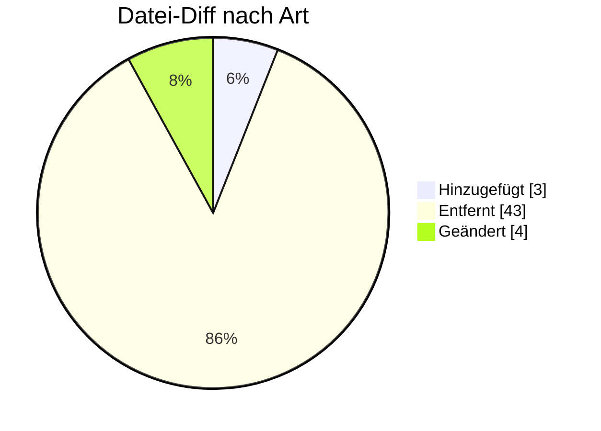

# PRICAT — Formatumstellung 01.10.2026

← [Zurück zur Gesamtübersicht](../index.md)

**Preisblatt / Preiskatalog** · `AHB 2.0f → 2.1 · MIG 2.1`

<Columns>
<Column>
<Card title="Kuratierte Änderungen" icon="material-two-tone-sell">
**2** aus der BDEW-Änderungshistorie
</Card>
</Column>
<Column>
<Card title="Datei-Diff" icon="material-two-tone-difference">
**50** Einzeländerungen (AHB/MIG)
</Card>
</Column>
</Columns>

:::tip[Kurzfazit (das Wichtigste auf einen Blick)]
- **− Pakete:** keine Pakete mehr in der PRICAT.
- **Preisblatt Technik:** Z94 nur noch Freitext (Code F) als IMD.
- **＋ Neuer Code:** KWH für Preisstaffeln bei Lokationstechnik.
:::

:::warning[Auswirkungen aufs Backend]
- **Pakete entfernt:** Mapping bereinigen.
- **Z94 nur noch Freitext (Code F) als IMD; neuer Code KWH:** Preislogik anpassen.
:::

---

## Änderungen nach Marktrolle

:::note[Navigation]
Jede Rolle ist ein eigener Block; klappe die gewünschte Einzeländerung auf, um Bisher/Neu/Grund zu sehen. Eine Änderung kann mehreren Rollen zugeordnet sein (Mehrfachnennung).
:::

### ⚪ Übergreifend (2)

<AccordionGroup>

<Accordion title="Änd-ID 26945 · SG2 Sender-ID">

| Feld | Wert |
|---|---|
| **Ort** | SG2 Sender-ID |
| **Prüfi(s)** | – |
| **Rolle(n)** | Übergreifend |
| **Status** | Genehmigt |

**Bisher:**
> SG4 CTA-COM vorhanden

**Neu:**
> SG4 CTA-COM nicht vorhanden

**Grund:** Umsetzung des Konsultationsergebnisses des Konzepts „zur Nutzung der Kontaktinformationen des Senders in den EDI@Energy Nachrichtentypen“.

</Accordion>

<Accordion title="Änd-ID 26131 · ">

| Feld | Wert |
|---|---|
| **Ort** | – |
| **Prüfi(s)** | – |
| **Rolle(n)** | Übergreifend |
| **Status** | Genehmigt |

**Bisher:**
> Kapitel "Übersicht der Pakete in der PRICAT" vorhanden

**Neu:**
> Kapitel "Übersicht der Pakete in der PRICAT" nicht vorhanden

**Grund:** Konsequenz aus Änderung mit der ID 26945: Das Paket [1P] wurde nur im COM-Segment verwendet. Da dieses Segment gelöscht wird und keine weiteren Pakete in der PRICAT verwendet werden, kann dieses Kapitel entfallen.

</Accordion>

</AccordionGroup>

---

### 🔬 Echter Datei-Diff (AHB/MIG · Stand 202604 → 202610)

<AccordionGroup>
:::info[50 Einzeländerungen auf Segment-/Bedingungsebene]
**＋ 3** hinzugefügt · **− 43** entfernt · **~ 4** geändert. Diese granulare Ebene ergänzt die kuratierte BDEW-Historie — Auszug unten.
:::

<Accordion title="Top-Prüfidentifikatoren nach Anzahl Datei-Änderungen">

| Prüfi | Datei-Änderungen |
|---|---|
| 27002 | 15 |
| 27001 | 12 |
| 27003 | 12 |

</Accordion>
</AccordionGroup>

---

← [Gesamtübersicht](../index.md)
