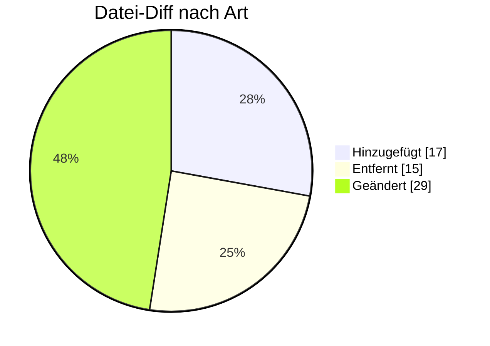

# QUOTES — Formatumstellung 01.10.2026

← [Zurück zur Gesamtübersicht](../index.md)

**Angebot** · `AHB 1.1 → 1.1a · MIG 1.3c`

<Columns>
<Column>
<Card title="Kuratierte Änderungen" icon="material-two-tone-request-quote">
**4** aus der BDEW-Änderungshistorie
</Card>
</Column>
<Column>
<Card title="Datei-Diff" icon="material-two-tone-difference">
**61** Einzeländerungen (AHB/MIG)
</Card>
</Column>
</Columns>

:::tip[Kurzfazit (das Wichtigste auf einen Blick)]
- **Status:** SG14 von R (Required) auf D (Dependent).
- **＋ GWA-Wechsel:** SG27/SG28 erweitert — Firmware, Hersteller-Typ, SIM-Nr., IMSI, TK-Provider, IP-Version.
- **Pakete** erweitert + XODER-Korrektur.
:::

:::warning[Auswirkungen aufs Backend]
- **SG14 Status R→D:** Pflichtgrad-Logik anpassen.
- **GWA-Wechsel (SG27/SG28):** Firmware, SIM, IMSI, TK-Provider, IP-Version abbilden.
- **Pakete erweitert + XODER:** Mapping/Validierung.
:::

---

## Änderungen nach Marktrolle

:::note[Navigation]
Jede Rolle ist ein eigener Block; klappe die gewünschte Einzeländerung auf, um Bisher/Neu/Grund zu sehen. Eine Änderung kann mehreren Rollen zugeordnet sein (Mehrfachnennung).
:::

### 🟣 Messstellenbetreiber (1)

<AccordionGroup>

<Accordion title="Änd-ID 26119 · Kapitel 4.1.2 Geräteübernahmeangebot, Angebot Geräteüberna…">

| Feld | Wert |
|---|---|
| **Ort** | Kapitel 4.1.2 Geräteübernahmeangebot, Angebot Geräteübernahme, 15001 |
| **Prüfi(s)** | 15001 |
| **Rolle(n)** | MSB |
| **Status** | Genehmigt |

**Bisher:**
> Bisheriger Inhalt

**Neu:**
> Aktualisierter Inhalt

**Grund:** Aufnahme der Informationen für den automatisierten GWA-Wechsel mit Geräteübernahme. Details siehe VDE FNN Hinweis "Prozessbeschreibung eines GWA-Wechsels im Rahmen eines MSB-Wechsels mit Geräteübernahme gemäß WiM Strom".  Zusätzlich: Anpassung an die korrekte Notation (Nutzung von Paketen) in einzelnen Segmenten mit mehreren Codes.

</Accordion>

</AccordionGroup>

### ⚪ Übergreifend (3)

<AccordionGroup>

<Accordion title="Änd-ID 26195 · Kapitel 3 Übersicht der Pakete in der QUOTES">

| Feld | Wert |
|---|---|
| **Ort** | Kapitel 3 Übersicht der Pakete in der QUOTES |
| **Prüfi(s)** | – |
| **Rolle(n)** | Übergreifend |
| **Status** | Genehmigt |

**Bisher:**
> Bisheriger Inhalt

**Neu:**
> Aktualisierter Inhalt

**Grund:** Erweiterung der Pakete aufgrund der Nutzung in Anwendungsfällen.

</Accordion>

<Accordion title="Änd-ID 26194 · Alle Anwendungsübersichten mit einem „Muss“ in SG14 Anspre…">

| Feld | Wert |
|---|---|
| **Ort** | Alle Anwendungsübersichten mit einem „Muss“ in SG14 Ansprechpartner, COM DE3148 |
| **Prüfi(s)** | – |
| **Rolle(n)** | Übergreifend |
| **Status** | Genehmigt |

**Bisher:**
> X (([939] [72]) ∨ ([940] [73])) ∧ [516]  [72] Wenn im DE3155 in demselben COM der Code EM vorhanden ist. [73] Wenn im DE3155 in demselben COM der Code TE / FX / AJ / AL vorhanden ist. [516] Hinweis: Es darf nur eine Information im DE3148 übermittelt werden [939] Format: Die Zeichenkette muss die Zeichen @ und . enthalten [940] Format: Die Zeichenkette muss mit dem Zeichen + beginnen und danach dürfen nur noch Ziffern folgen

**Neu:**
> X (([939] [72]) ⊻ ([940] [73])) ∧ [516]  [72] Wenn im DE3155 in demselben COM der Code EM vorhanden ist. [73] Wenn im DE3155 in demselben COM der Code TE / FX / AJ / AL vorhanden ist. [516] Hinweis: Es darf nur eine Information im DE3148 übermittelt werden [939] Format: Die Zeichenkette muss die Zeichen @ und . enthalten [940] Format: Die Zeichenkette muss mit dem Zeichen + beginnen und danach dürfen nur noch Ziffern folgen

**Grund:** Einbau des XODER Operator zur korrekten Abgrenzung der Bedingungen.

</Accordion>

<Accordion title="Änd-ID 26146 · Alle Anwendungsübersichten mit einem „Kann“ in SG14 Anspre…">

| Feld | Wert |
|---|---|
| **Ort** | Alle Anwendungsübersichten mit einem „Kann“ in SG14 Ansprechpartner |
| **Prüfi(s)** | – |
| **Rolle(n)** | Übergreifend |
| **Status** | Genehmigt |

**Bisher:**
> SG5 Ansprechpartner inkl. Untersegmente  vorhanden

**Neu:**
> SG5 Ansprechpartner inkl. Untersegmente  nicht vorhanden

**Grund:** Umsetzung des Konsultationsergebnisses des Konzepts „zur Nutzung der Kontaktinformationen des Senders in den EDI@Energy Nachrichtentypen“.

</Accordion>

</AccordionGroup>

---

### 🔬 Echter Datei-Diff (AHB/MIG · Stand 202604 → 202610)

<AccordionGroup>
:::info[61 Einzeländerungen auf Segment-/Bedingungsebene]
**＋ 17** hinzugefügt · **− 15** entfernt · **~ 29** geändert. Diese granulare Ebene ergänzt die kuratierte BDEW-Historie — Auszug unten.
:::

<Accordion title="Top-Prüfidentifikatoren nach Anzahl Datei-Änderungen">

| Prüfi | Datei-Änderungen |
|---|---|
| 15001 | 33 |
| 15005 | 12 |
| 15002 | 3 |
| 15003 | 3 |
| 15004 | 3 |

</Accordion>
</AccordionGroup>

---

← [Gesamtübersicht](../index.md)
