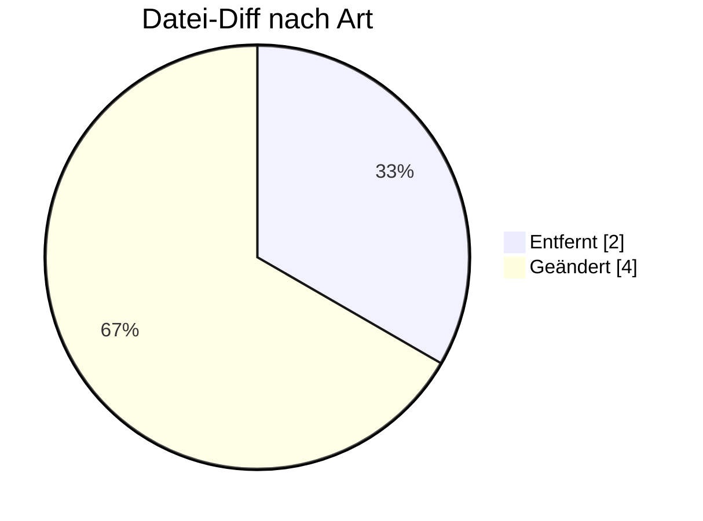

# REQOTE — Formatumstellung 01.10.2026

← [Zurück zur Gesamtübersicht](../index.md)

**Anfrage Vertrag/Angebot** · `AHB 1.1 → 1.2 · MIG 1.2`

<Columns>
<Column>
<Card title="Kuratierte Änderungen" icon="material-two-tone-quiz">
**2** aus der BDEW-Änderungshistorie
</Card>
</Column>
<Column>
<Card title="Datei-Diff" icon="material-two-tone-difference">
**6** Einzeländerungen (AHB/MIG)
</Card>
</Column>
</Columns>

:::tip[Kurzfazit (das Wichtigste auf einen Blick)]
- **− Wegfall:** SG14 (Ansprechpartner) entfernt.
- **Logik-Korrektur:** XOR für Kommunikationsverbindung (wie ORDERS/ORDRSP).
:::

:::warning[Auswirkungen aufs Backend]
- **SG14 Ansprechpartner entfernt:** Generierung anpassen.
- **XODER-Korrektur Kommunikationsverbindung.**
:::

---

## Änderungen nach Marktrolle

:::note[Navigation]
Jede Rolle ist ein eigener Block; klappe die gewünschte Einzeländerung auf, um Bisher/Neu/Grund zu sehen. Eine Änderung kann mehreren Rollen zugeordnet sein (Mehrfachnennung).
:::

### ⚪ Übergreifend (2)

<AccordionGroup>

<Accordion title="Änd-ID 26193 · Alle Anwendungsübersichten mit einem „Muss“ in SG14 Anspre…">

| Feld | Wert |
|---|---|
| **Ort** | Alle Anwendungsübersichten mit einem „Muss“ in SG14 Ansprechpartner, COM DE3148 |
| **Prüfi(s)** | – |
| **Rolle(n)** | Übergreifend |
| **Status** | Genehmigt |

**Bisher:**
> X (([939] [39]) ∨ ([940] [40])) ∧ [514]  [39] Wenn im DE3155 in demselben COM der Code EM vorhanden ist. [40] Wenn im DE3155 in demselben COM der Code TE / FX / AJ / AL vorhanden ist. [514] Hinweis: Es darf nur eine Information im DE3148 übermittelt werden [939] Format: Die Zeichenkette muss die Zeichen @ und . enthalten [940] Format: Die Zeichenkette muss mit dem Zeichen + beginnen und danach dürfen nur noch Ziffern folgen

**Neu:**
> X (([939] [39]) ⊻ ([940] [40])) ∧ [514]  [39] Wenn im DE3155 in demselben COM der Code EM vorhanden ist. [40] Wenn im DE3155 in demselben COM der Code TE / FX / AJ / AL vorhanden ist. [514] Hinweis: Es darf nur eine Information im DE3148 übermittelt werden [939] Format: Die Zeichenkette muss die Zeichen @ und . enthalten [940] Format: Die Zeichenkette muss mit dem Zeichen + beginnen und danach dürfen nur noch Ziffern folgen

**Grund:** Einbau des XODER Operator zur korrekten Abgrenzung der Bedingungen.

</Accordion>

<Accordion title="Änd-ID 26147 · Kapitel 4.5 Anfrage Änderung der Technik der Lokation, SG1…">

| Feld | Wert |
|---|---|
| **Ort** | Kapitel 4.5 Anfrage Änderung der Technik der Lokation, SG14 Ansprechpartner |
| **Prüfi(s)** | – |
| **Rolle(n)** | Übergreifend |
| **Status** | Genehmigt |

**Bisher:**
> SG14 Ansprechpartner inkl. Untersegmente  vorhanden

**Neu:**
> SG14 Ansprechpartner inkl. Untersegmente  nicht vorhanden

**Grund:** Umsetzung des Konsultationsergebnisses des Konzepts „zur Nutzung der Kontaktinformationen des Senders in den EDI@Energy Nachrichtentypen“.

</Accordion>

</AccordionGroup>

---

### 🔬 Echter Datei-Diff (AHB/MIG · Stand 202604 → 202610)

<AccordionGroup>
:::info[6 Einzeländerungen auf Segment-/Bedingungsebene]
**＋ 0** hinzugefügt · **− 2** entfernt · **~ 4** geändert. Diese granulare Ebene ergänzt die kuratierte BDEW-Historie — Auszug unten.
:::

<Accordion title="Top-Prüfidentifikatoren nach Anzahl Datei-Änderungen">

| Prüfi | Datei-Änderungen |
|---|---|
| 35005 | 2 |
| 35001 | 1 |
| 35002 | 1 |
| 35003 | 1 |
| 35004 | 1 |

</Accordion>
</AccordionGroup>

---

← [Gesamtübersicht](../index.md)
