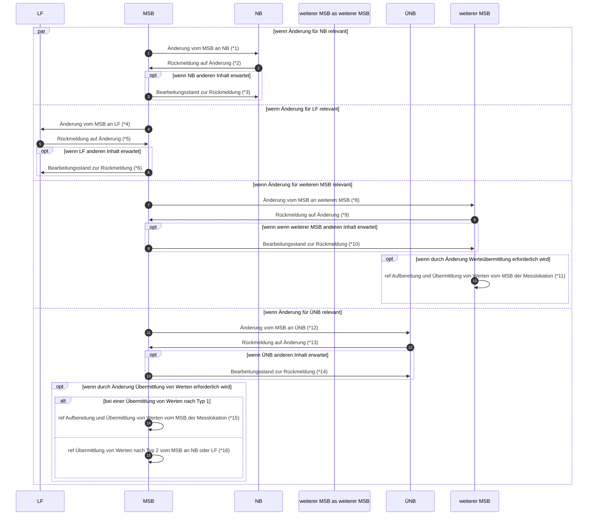

# Stammdatenänderung vom MSB (verantwortlich) (Rolle LF)

*1 Prüfi: 55639, 55640, 55642, 55641, 55643, 55557
*2 Prüfi: 55644, 55645, 55647, 55646, 55648, 55559
*3 Prüfi: 21047
*4 Prüfi: 55649, 55650, 55652, 55651, 55653
*5 Prüfi: 55654, 55655, 55657, 55656, 55658
*6 Prüfi: 21047
*7 Prüfi: 13017, 13018
*8 Prüfi: 55659, 55660, 55662, 55661, 55663
*9 Prüfi: 55664, 55665, 55667, 55666, 55669
*10 Prüfi: 21047
*11 Prüfi: 13017, 13018
*12 Prüfi: 55684, 55686
*13 Prüfi: 55685, 55687
*14 Prüfi: 21047
*15 Prüfi: 13017, 13018
*16 Prüfi: 13027
