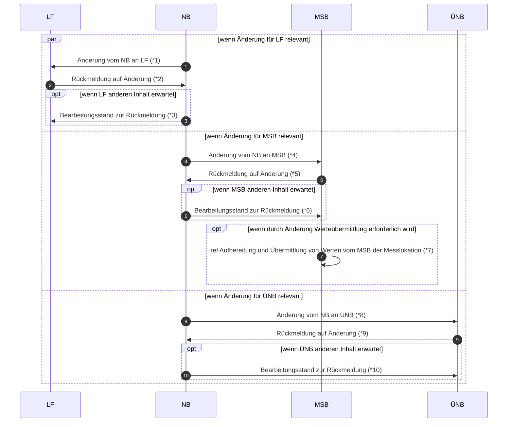

# Stammdatenänderung vom Netzbetreiber (verantwortlich) (Rolle LF)

*1 Prüfi: 55615, 55616, 55619, 55617, 55618, 55620, 55225, 55175
*2 Prüfi: 55621, 55622, 55625, 55623, 55624, 55626, 55227, 55180
*3 Prüfi: 21047
*4 Prüfi: 55627, 55628, 55629, 55630, 55632, 55173
*5 Prüfi: 55633, 55634, 55635, 55636, 55638, 55177
*6 Prüfi: 21047
*7 Prüfi: 13017, 13018
*8 Prüfi: 55688
*9 Prüfi: 55689
*10 Prüfi: 21047

