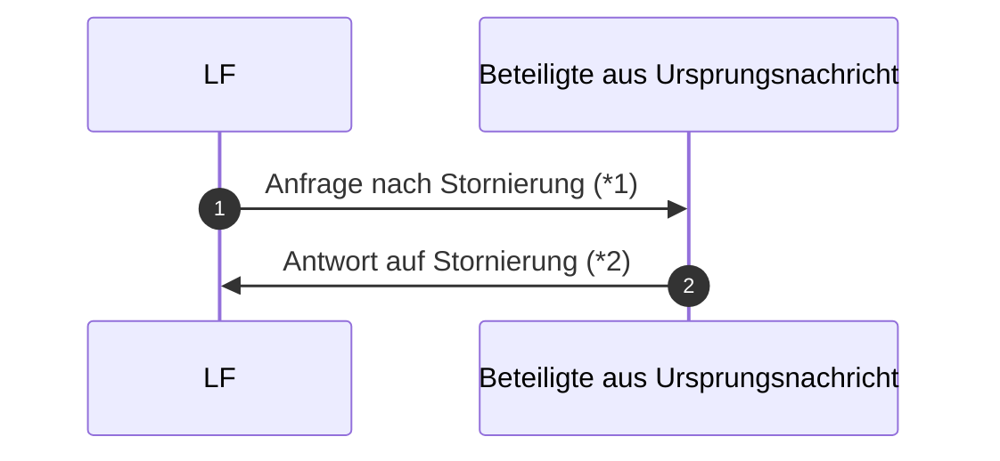

# Anfrage nach Stornierung

```mermaid
sequenceDiagram
autonumber

  participant LF
  participant Beteiligte aus Ursprungsnachricht
 
  LF ->> Beteiligte aus Ursprungsnachricht: Anfrage nach Stornierung (*1)
  
  Beteiligte aus Ursprungsnachricht ->> LF: Antwort auf Stornierung (*2)
  
```

*1 Prüfi: 55022
*2 Prüfi: 55023, 55024
