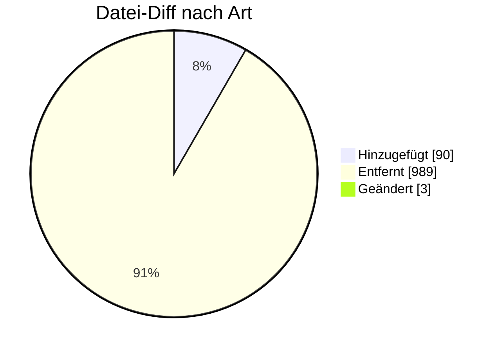

# UTILMD Gas — Formatumstellung 01.10.2026

← [Zurück zur Gesamtübersicht](../index.md)

**Stammdaten Gas** · `AHB G1.1 → G1.2 · MIG G1.2`

<Columns>
<Column>
<Card title="Kuratierte Änderungen" icon="material-two-tone-local-fire-department">
**3** aus der BDEW-Änderungshistorie
</Card>
</Column>
<Column>
<Card title="Datei-Diff" icon="material-two-tone-difference">
**1082** Einzeländerungen (AHB/MIG)
</Card>
</Column>
</Columns>

:::tip[Kurzfazit (das Wichtigste auf einen Blick)]
- **− Wegfall:** DTM Start Abrechnungsjahr (= Kalenderjahr) gelöscht.
- **＋ Transaktionsgrund:** ZZD (Übergangsversorgung).
- **＋ Prüfidentifikator:** 44183 (WiM: Ende MSB vom NB).
- **− Bereinigung:** alte Codes G_0018, G_0032 entfernt.
:::

:::warning[Auswirkungen aufs Backend]
- **Neuer PID 44183 (Ende MSB vom NB):** WiM-Gas-2.0-Prozess abbilden.
- **Transaktionsgrund ZZD (Übergangsversorgung):** unterstützen.
- **Wegfall DTM Start Abrechnungsjahr & alte Codes:** Generierung anpassen.
:::

---

## Änderungen nach Marktrolle

:::note[Navigation]
Jede Rolle ist ein eigener Block; klappe die gewünschte Einzeländerung auf, um Bisher/Neu/Grund zu sehen. Eine Änderung kann mehreren Rollen zugeordnet sein (Mehrfachnennung).
:::

### ⚪ Übergreifend (3)

<AccordionGroup>

<Accordion title="Änd-ID 27067 · SG6 RFF+Z13 Prüfidentifikator DE1154">

| Feld | Wert |
|---|---|
| **Ort** | SG6 RFF+Z13 Prüfidentifikator DE1154 |
| **Prüfi(s)** | – |
| **Rolle(n)** | Übergreifend |
| **Status** | Genehmigt |

**Bisher:**
> 44183 WiM / Ende MSB vom NB nicht vorhanden  44170 WiM Gas / Ablehnung Verpflichtungsanfrage[ vorhanden

**Neu:**
> 44183 WiM / Ende MSB vom NB vorhanden  44170 WiM Gas / Ablehnung Verpflichtungsanfrage[ nicht vorhanden

**Grund:** Anwendungsfall neu aufgenommen wegen WiM Gas 2.0, UC: Ende Messstellenbetrieb vom NB an MSB. bzw. Anwendungsfall entfernt, da nicht verwendet

</Accordion>

<Accordion title="Änd-ID 27022 · SG2 MP-ID Absender  SG3 Kontaktinformatio nen Anwendungsfa…">

| Feld | Wert |
|---|---|
| **Ort** | SG2 MP-ID Absender  SG3 Kontaktinformatio nen Anwendungsfall Alle Anwendungsfälle |
| **Prüfi(s)** | – |
| **Rolle(n)** | Übergreifend |
| **Status** | Genehmigt |

**Bisher:**
> CTA-Segment "Ansprechpartner" und COM- Segment "Kommunikationsverbindung" vorhanden

**Neu:**
> CTA-Segment "Ansprechpartner" und COM- Segment "Kommunikationsverbindung" nicht vorhanden

**Grund:** Umsetzung des Konsultationsergebnisses des Konzepts „zur Nutzung der Kontaktinformationen des Senders in den EDI@Energy Nachrichtentypen“

</Accordion>

<Accordion title="Änd-ID 26874 · DTM+155 Start des Abrechnungsjahrs bei Marktlokationen mit…">

| Feld | Wert |
|---|---|
| **Ort** | DTM+155 Start des Abrechnungsjahrs bei Marktlokationen mit Jahresleistungspre is  Kapitel 4.1.4 Tabelle der Verantwortlichen |
| **Prüfi(s)** | – |
| **Rolle(n)** | Übergreifend |
| **Status** | Genehmigt |

**Bisher:**
> DTM vorhanden

**Neu:**
> DTM gelöscht

**Grund:** Gem. den Lieferantenrahmenvertrage s entspricht das Abrechnungsjahr dem Kalenderjahr.

</Accordion>

</AccordionGroup>

---

### 🔬 Echter Datei-Diff (AHB/MIG · Stand 202604 → 202610)

<AccordionGroup>
:::info[1082 Einzeländerungen auf Segment-/Bedingungsebene]
**＋ 90** hinzugefügt · **− 989** entfernt · **~ 3** geändert. Diese granulare Ebene ergänzt die kuratierte BDEW-Historie — Auszug unten.
:::

<Accordion title="Top-Prüfidentifikatoren nach Anzahl Datei-Änderungen">

| Prüfi | Datei-Änderungen |
|---|---|
| 44002 | 14 |
| 44013 | 14 |
| 44014 | 14 |
| 44035 | 14 |
| 44112 | 14 |
| 44139 | 14 |
| 44142 | 14 |
| 44018 | 13 |

</Accordion>

<Accordion title="Bestätigte Highlights (Historie + Datei-Diff)">

- **− Prüfi entfernt** (PID 44110) · `Prüfidentifikator 44110` — _44110_ → __
- **− Prüfi entfernt** (PID 44129) · `Prüfidentifikator 44129` — _44129_ → __
- **− Prüfi entfernt** (PID 44130) · `Prüfidentifikator 44130` — _44130_ → __
- **− Prüfi entfernt** (PID 44132) · `Prüfidentifikator 44132` — _44132_ → __
- **− Prüfi entfernt** (PID 44170) · `Prüfidentifikator 44170` — _44170_ → __
- **− Prüfi entfernt** (PID 44172) · `Prüfidentifikator 44172` — _44172_ → __
- **＋ Prüfi neu** (PID 44183) · `Prüfidentifikator 44183` — __ → _44183_

</Accordion>
</AccordionGroup>

---

← [Gesamtübersicht](../index.md)
