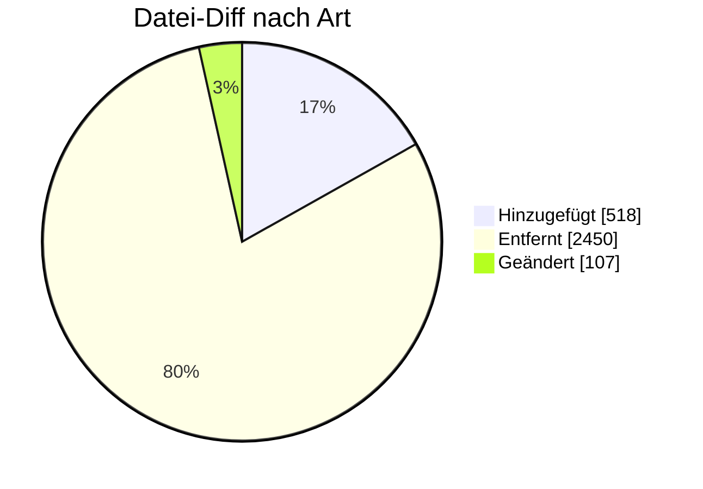

# UTILMD Strom — Formatumstellung 01.10.2026

← [Zurück zur Gesamtübersicht](../index.md)

**Stammdaten, An-/Abmeldung, GPKE, WiM (Strom)** · `AHB S2.1 → S2.2 · MIG S2.2`

<Columns>
<Column>
<Card title="Kuratierte Änderungen" icon="material-two-tone-bolt">
**29** aus der BDEW-Änderungshistorie
</Card>
</Column>
<Column>
<Card title="Datei-Diff" icon="material-two-tone-difference">
**3075** Einzeländerungen (AHB/MIG)
</Card>
</Column>
</Columns>

:::tip[Kurzfazit (das Wichtigste auf einen Blick)]
- **Pflicht:** LOC Zeitraum-ID zwingend (z. B. LOC+Z18).
- **＋ Neu:** SG10 Vergütungsverpflichtung nach EEG/KWKG.
- **＋ SG4:** ZZD (Übergangsversorgung) neu ab 01.04.2026; C556 ZZB/ZZC (Stilllegung inkl./exkl. MaLo).
- **− Wegfall:** RFF+Z34 / RFF+Z16 (Lokationsbündelstruktur).
- **Umbau:** PIA-Struktur — Verwendungszwecke direkt am Produkt; Schwachlastfähigkeit an OBIS entfernt.
:::

:::warning[Auswirkungen aufs Backend]
- **SG13 Kontaktdaten Kunde (neu):** E-Mail/Telefon inkl. Einwilligungs-Flag [181] bereitstellen.
- **PIA-/OBIS-Umbau (26144):** Mapping & Parsing der Produktdaten anpassen, Validierungsbundles aktualisieren.
- **Fernsteuerbarkeit §10b EEG (55693/55694):** neue Anwendungsfälle abbilden.
- **Tranche ↔ TR (ZH1, RFF+Z20), EEG/KWKG-Vergütung (CCI+Z68):** Datenmodell erweitern.
- **Entfernte Legacy-Segmente (RFF Lokationsbündelstruktur):** nicht mehr senden.
:::

---

## Änderungen nach Marktrolle

:::note[Navigation]
Jede Rolle ist ein eigener Block; klappe die gewünschte Einzeländerung auf, um Bisher/Neu/Grund zu sehen. Eine Änderung kann mehreren Rollen zugeordnet sein (Mehrfachnennung).
:::

### 🔵 Netzbetreiber (13)

<AccordionGroup>

<Accordion title="Änd-ID 27065 · Kapitel Kapitel 10.4 Beendigung des Messstellenbetrie bs  …">

| Feld | Wert |
|---|---|
| **Ort** | Kapitel Kapitel 10.4 Beendigung des Messstellenbetrie bs   SG4 DTM+93 Ende zum Anwendungsfall Anwendungsfall 55052 Bestätigung Ende MSB |
| **Prüfi(s)** | 55052 |
| **Rolle(n)** | MSB, NB |
| **Status** | Genehmigt |

**Bisher:**
> DTM = Muss [11] ∧ [157] ∧ [313] Soll [326] ∧ [312]  [312] Wenn DTM+137 (Nachrichtendatum) im DE2380 < 202603312200?+00  [313] Wenn DTM+137 (Nachrichtendatum) im DE2380 ≥ 202603312200?+00  [326] Wenn die Marktlokation nicht stillgelegt wird  [157] Wenn SG4 STS+7++Z33+ZZB nicht vorhanden  [11] Wenn SG4 STS+7++ZG9/ZH1/ZH2 (Transaktionsgrund: Aufhebung einer zukünftigen Zuordnung wegen Auszug des Kunden / -wegen Stilllegung / -wegen aufgehobenem Vertragsverhältnis) nicht vorhanden

**Neu:**
> DTM = Muss [11] ∧ [157]  [157] Wenn SG4 STS+7++Z33+ZZB nicht vorhanden  [11] Wenn SG4 STS+7++ZG9/ZH1/ZH2 (Transaktionsgrund: Aufhebung einer zukünftigen Zuordnung wegen Auszug des Kunden / -wegen Stilllegung / -wegen aufgehobenem Vertragsverhältnis) nicht vorhanden

**Grund:** Die Zeitliche Einschränkung der Definitionen ist nicht mehr notwendig. Somit wurden die Bedingungen [312] und [313] entfernt.

</Accordion>

<Accordion title="Änd-ID 27012 · SG4 Vorgangs- Identifikation FTX Bemerkung (Feld für allge…">

| Feld | Wert |
|---|---|
| **Ort** | SG4 Vorgangs- Identifikation FTX Bemerkung (Feld für allgemeine Hinweise)  PID  55003 55080 |
| **Prüfi(s)** | 55003, 55080 |
| **Rolle(n)** | LF, NB |
| **Status** | Genehmigt |

**Bisher:**
> - Bedingungen [23], [24], und [63] am FTX vorhanden - SG8 Bestandteil eines Produktpakets nicht vorhanden

**Neu:**
> - Bedingung [48] am FTX vorhanden - SG8 Bestandteil eines Produktpakets vorhanden

**Grund:** Wenn nicht alle zwingend notwendigen Anforderungen des LF erfüllt werden können sind die nicht möglichen Anforderungen im SG8 Bestandteil eines Produktpakets zu benennen.

</Accordion>

<Accordion title="Änd-ID 27000 · Kapitel 9.3.3 Änderung Daten der Marktlokation SG8 SEQ Pro…">

| Feld | Wert |
|---|---|
| **Ort** | Kapitel 9.3.3 Änderung Daten der Marktlokation SG8 SEQ Produkt-Daten der Marktlokation Anwendungsfall 55640, 55650, 55660 Änderung Daten der MaLo 55645, 55655, 55665 Rückmeldung/ Anfrage Daten der MaLo |
| **Prüfi(s)** | 55640, 55645, 55650, 55655, 55660, 55665 |
| **Rolle(n)** | LF, MSB, NB |
| **Status** | Genehmigt |

**Bisher:**
> SG8 vorhanden

**Neu:**
> SG8 nicht vorhanden (incl. aller Segmente in dieser SG8)

**Grund:** Diese SG8 war für Konfigurationsprodukte gedacht. Es gibt keine Konfigurationsprodukte auf Ebene der MaLo.

</Accordion>

<Accordion title="Änd-ID 26932 · Kapitel 9.2.3 Änderung Daten der Technischen Ressource mit…">

| Feld | Wert |
|---|---|
| **Ort** | Kapitel 9.2.3 Änderung Daten der Technischen Ressource mit neuen Anwendungsfällen : |
| **Prüfi(s)** | 55693, 55694 |
| **Rolle(n)** | LF, NB |
| **Status** | Genehmigt |

**Bisher:**
> Anwendungsfall: 55693 Beschreibung:  Änderung Daten der Technischen Ressource Kommunikation von: LF an NB  Anwendungsfall: 55694 Beschreibung:  Rückmeldung/Anfrage Daten der Technischen Ressource  Kommunikation von: NB an LF  nicht vorhanden

**Neu:**
> Anwendungsfall: 55693 Beschreibung:  Änderung Daten der Technischen Ressource  Kommunikation von: LF an NB  Anwendungsfall: 55694 Beschreibung:  Rückmeldung/Anfrage Daten der Technischen Ressource  Kommunikation von: NB an LF  vorhanden

**Grund:** Umsetzung Erklärung zur Fernsteuerbarkeit gemäß § 10b EEG 2023

</Accordion>

<Accordion title="Änd-ID 26804 · SG4 Vorgangs- Identifikation  SG6 Termine der Marktlokatio…">

| Feld | Wert |
|---|---|
| **Ort** | SG4 Vorgangs- Identifikation  SG6 Termine der Marktlokation  DTM Nächste Netznutzungsabrec hnung Anwendungsfall 55218 Abr.-Daten NNA |
| **Prüfi(s)** | 55218 |
| **Rolle(n)** | LF, NB |
| **Status** | Genehmigt |

**Bisher:**
> Muss [489] ∧ [531]  [489] Nur bei der ältestem Zeitraum welche mit SG6 RFF+Z49 (Verwendungszeitraum der Daten: Gültige Daten) beschrieben ist  [531] Hinweis: Es ist das Jahr anzugeben in dem die nächste Netznutzungsabrechnung erfolgt

**Neu:**
> Muss [2061] ∧ [531]  [531] Hinweis: Es ist das Jahr anzugeben in dem die nächste Netznutzungsabrechnung erfolgt. Diese Information ist zu der Zeitraum-ID anzugeben, welche SG6 RFF+Z49 (Verwendungszeitraum der Daten: Gültige Daten) beinhaltet und die nächste Netznutzungsabrechnung stattfindet.  [2061] Segment bzw. Segmentgruppe ist genau einmal je SG4 IDE (Vorgang) anzugeben

**Grund:** Die Angabe des Jahres, in welches die nächte Netznutzungsabrechnung stattfindet, kann nicht pauschal zu dem ältesten Zeitraum angegeben werden werden.

</Accordion>

<Accordion title="Änd-ID 26791 · Kapitel 9.1.6 Änderung der Daten der Technischen Ressource…">

| Feld | Wert |
|---|---|
| **Ort** | Kapitel 9.1.6 Änderung der Daten der Technischen Ressource SG8 SEQ Daten der Technischen Ressource SG10 CCI+Z63 / CAV Information zu weiteren technischen Einrichtungen Anwendungsfall 55617, 55629 Änderung Daten der TR 55623, 55635 Rückmeldung/ Anfrage Daten er TR |
| **Prüfi(s)** | 55617, 55623, 55629, 55635 |
| **Rolle(n)** | LF, MSB, NB |
| **Status** | Genehmigt |

**Bisher:**
> Segmente vorhanden

**Neu:**
> Segmente nicht vorhanden

**Grund:** Die Information zu weiteren technischen Einrichtungen musste bei jeder TR angegeben werden. Die Information wird zukünftig ohne Abhängigkeit zu anderen TR übertragen

</Accordion>

<Accordion title="Änd-ID 26787 · Kapitel 8.9 Abmeldung durch den LF an NB SG4 STS+7  Transa…">

| Feld | Wert |
|---|---|
| **Ort** | Kapitel 8.9 Abmeldung durch den LF an NB SG4 STS+7  Transaktionsgrund / Ergänzung / Transaktionsgrund  befristete Anmeldung Anwendungsfall 55004 Abmeldung |
| **Prüfi(s)** | 55004 |
| **Rolle(n)** | LF, NB |
| **Status** | Genehmigt |

**Bisher:**
> E01 = X  (Ein-Auszug (Umzug))  ZG9 = X (Aufhebung einer zukünftigen Zuordnung wegen Auszug des Kunden)  Weitere Codes mit X

**Neu:**
> E01 = X [18P0..1] (Ein-Auszug (Umzug))  ZG9 = X [18P0..1] (Aufhebung einer zukünftigen Zuordnung wegen Auszug des Kunden)  Weitere Codes mit X [1P0..1]   [18P] [480] Wenn SG4 STS+7++xxx+ZW4 (Transaktionsgrundergänzung Verbrauchende Marktlokation) vorhanden

**Grund:** Einschränkung der Codes auf verbrauchende Marktlokationen, da es bei erzeugenden Marktlokationen keinen "Umzug" gibt.

</Accordion>

<Accordion title="Änd-ID 26751 · SG12 Korrespondenzans chrift des Kunden des Netzbetreibers…">

| Feld | Wert |
|---|---|
| **Ort** | SG12 Korrespondenzans chrift des Kunden des Netzbetreibers Anwendungsfall 55168 Verpflichtungsanfr age/Aufforderung 55013 Anmeldung / Zuordnung EOG 55616 Änderung Daten der MaLo 55622 Rückmeldung/ Anfrage Daten der MaLo 55628 Änderung Daten der MaLo 55634 Rückmeldung/ Anfrage Daten der MaLo |
| **Prüfi(s)** | 55013, 55168, 55616, 55622, 55628, 55634 |
| **Rolle(n)** | LF, MSB, NB |
| **Status** | Genehmigt |

**Bisher:**
> SG12 Korrespondenzanschrift des Kunden des Netzbetreibers …

**Neu:**
> SG12 Korrespondenzanschrift des Kunden des Netzbetreibers … SG13  Kontaktdaten des Kunden  Soll [165] ∧ [181] CTA+IC COM Kommunikationsverbindung   [165] Wenn bekannt [181] Wenn der Versender datenschutzrechtliche Voraussetzungen geschaffen hat, um die Daten bereitstellen zu dürfen

**Grund:** Erweiterung der Korrespondenzanschrift des Kunden. Durch die Erweiterung wird dem Markt die Möglichkeit gegeben auch E-Mail und Telefonnummer des Kunden gegenseitig auszutauschen, sofern die datenschutzrechtliche Freigabe des Kunden vorliegt.

</Accordion>

<Accordion title="Änd-ID 26750 · SG12 Korrespondenzans chrift des Kunden des Messstellenbet…">

| Feld | Wert |
|---|---|
| **Ort** | SG12 Korrespondenzans chrift des Kunden des Messstellenbetrei bers Anwendungsfall 55643 Änderung Daten der MeLo 55648 Rückmeldung/ Anfrage Daten der MeLo 55663 Änderung Daten der MeLo 55669 Rückmeldung/ Anfrage Daten der MeLo 55042 Anmeldung MSB 55043 Bestätigung Anmeldung MSB 55168 Verpflichtungsanfr |
| **Prüfi(s)** | 55042, 55043, 55168, 55643, 55648, 55663, 55669 |
| **Rolle(n)** | MSB, NB |
| **Status** | Genehmigt |

**Bisher:**
> SG12 Korrespondenzanschrift des Kunden des Messstellenbetreibers …

**Neu:**
> SG12 Kontaktdaten des Kunden des Messstellenbetreiber … SG13  Kontaktdaten des Kunden  Soll [165] ∧ [181] CTA+IC COM Kommunikationsverbindung   [165] Wenn bekannt [181] Wenn der Versender datenschutzrechtliche Voraussetzungen geschaffen hat, um die Daten bereitstellen zu dürfen

**Grund:** Erweiterung der Korrespondenzanschrift des Kunden. Durch die Erweiterung wird dem Markt die Möglichkeit gegeben auch E-Mail und Telefonnummer des Kunden gegenseitig auszutauschen, sofern die datenschutzrechtliche Freigabe des Kunden vorliegt.

</Accordion>

<Accordion title="Änd-ID 26749 · SG12 Korrespondenzans chrift des Kunden des Lieferanten An…">

| Feld | Wert |
|---|---|
| **Ort** | SG12 Korrespondenzans chrift des Kunden des Lieferanten Anwendungsfall 55001 Anmeldung verb. MaLo 55600 Anmeldung neue verb. MaLo 55601 Anmeldung neue erz. MaLo 55013 Anmeldung/ Zuordnung EOG |
| **Prüfi(s)** | 55001, 55013, 55600, 55601 |
| **Rolle(n)** | LF, NB |
| **Status** | Genehmigt |

**Bisher:**
> SG12 Korrespondenzanschrift des Kunden des Lieferanten …

**Neu:**
> SG12 Korrespondenzanschrift des Kunden des Lieferanten … SG13  Kontaktdaten des Kunden  Soll [165] ∧ [181] CTA+IC COM Kommunikationsverbindung   [165] Wenn bekannt [181] Wenn der Versender datenschutzrechtliche Voraussetzungen geschaffen hat, um die Daten bereitstellen zu dürfen

**Grund:** Erweiterung der Korrespondenzanschrift des Kunden. Durch die Erweiterung wird dem Markt die Möglichkeit gegeben auch E-Mail und Telefonnummer des Kunden gegenseitig auszutauschen, sofern die datenschutzrechtliche Freigabe des Kunden vorliegt.

</Accordion>

<Accordion title="Änd-ID 26506 · SG8 Daten der Technischen Ressource Anwendungsfall 55617  …">

| Feld | Wert |
|---|---|
| **Ort** | SG8 Daten der Technischen Ressource Anwendungsfall 55617  Änderung Daten der TR 55623  Rückmeldung/ Anfrage Daten der TR |
| **Prüfi(s)** | 55617, 55623 |
| **Rolle(n)** | LF, NB |
| **Status** | Genehmigt |

**Bisher:**
> SG10 CCI+Z68 Vergütungsverpflichtung nach EEG bzw. KWKG   DE7037  ZH2 liegt vor ZH3 liegt nicht vor nicht vorhanden

**Neu:**
> SG10 CCI+Z68 Vergütungsverpflichtung nach EEG bzw. KWKG   DE7037  ZH2 liegt vor ZH3 liegt nicht vor vorhanden

**Grund:** Erweiterung um die Angabe, ob eine Technischen Ressoucen einer Marktlokation eine Vergütungsverpflichtung nach EEG bzw. KWKG hat.   Durch die Nutzung der Zeitscheiben in den Stammdaten kann diese für die vereinbarte Laufzeit übermittelt werden.

</Accordion>

<Accordion title="Änd-ID 26505 · SG8 Daten der Technischen Ressource Anwendungsfall 55060 A…">

| Feld | Wert |
|---|---|
| **Ort** | SG8 Daten der Technischen Ressource Anwendungsfall 55060 Antwort GDA 55043 Bestätigung Anmeldung 55168 Verpflichtungsanfr age /Aufforderung 55169 Bestätigung Verpflichtungsanfr age |
| **Prüfi(s)** | 55043, 55060, 55168, 55169 |
| **Rolle(n)** | MSB, NB |
| **Status** | Genehmigt |

**Bisher:**
> RFF+Z20 Referenz auf die der Technischen Ressource zugeordneten Tranche  nicht vorhanden

**Neu:**
> RFF+Z20 Referenz auf die der Technischen Ressource zugeordneten Tranche  vorhanden

**Grund:** Erweiterung um die Angabe, welcher Tranche die Technischen Ressoucen einer Marktlokation zugeordnet wird.

</Accordion>

<Accordion title="Änd-ID 26504 · SG8 Daten der Tranche Anwendungsfall 55078 Bestätigung Anm…">

| Feld | Wert |
|---|---|
| **Ort** | SG8 Daten der Tranche Anwendungsfall 55078 Bestätigung Anmeldung erz. |
| **Prüfi(s)** | 55078 |
| **Rolle(n)** | LF, NB |
| **Status** | Genehmigt |

**Bisher:**
> SG10 CCI+Z37 Basis zur Bildung der Tranchengröße DE7037 ZD1 Prozentual X ZD2 Aufteilungsfaktor auf Basis von Referenzenträger/installierter Leistung X

**Neu:**
> SG10 CCI+Z37 Basis zur Bildung der Tranchengröße DE7037 ZD1 Prozentual X ZD2 Aufteilungsfaktor auf Basis von Referenzenträger/installierter Leistung X

**Grund:** Erweiterung um die Angabe, das eine Tranche durch Nennung von Technischen Ressoucen einer Marktlokation abgegrenzt

</Accordion>

</AccordionGroup>

### 🟢 Lieferant (10)

<AccordionGroup>

<Accordion title="Änd-ID 27012 · SG4 Vorgangs- Identifikation FTX Bemerkung (Feld für allge…">

| Feld | Wert |
|---|---|
| **Ort** | SG4 Vorgangs- Identifikation FTX Bemerkung (Feld für allgemeine Hinweise)  PID  55003 55080 |
| **Prüfi(s)** | 55003, 55080 |
| **Rolle(n)** | LF, NB |
| **Status** | Genehmigt |

**Bisher:**
> - Bedingungen [23], [24], und [63] am FTX vorhanden - SG8 Bestandteil eines Produktpakets nicht vorhanden

**Neu:**
> - Bedingung [48] am FTX vorhanden - SG8 Bestandteil eines Produktpakets vorhanden

**Grund:** Wenn nicht alle zwingend notwendigen Anforderungen des LF erfüllt werden können sind die nicht möglichen Anforderungen im SG8 Bestandteil eines Produktpakets zu benennen.

</Accordion>

<Accordion title="Änd-ID 27000 · Kapitel 9.3.3 Änderung Daten der Marktlokation SG8 SEQ Pro…">

| Feld | Wert |
|---|---|
| **Ort** | Kapitel 9.3.3 Änderung Daten der Marktlokation SG8 SEQ Produkt-Daten der Marktlokation Anwendungsfall 55640, 55650, 55660 Änderung Daten der MaLo 55645, 55655, 55665 Rückmeldung/ Anfrage Daten der MaLo |
| **Prüfi(s)** | 55640, 55645, 55650, 55655, 55660, 55665 |
| **Rolle(n)** | LF, MSB, NB |
| **Status** | Genehmigt |

**Bisher:**
> SG8 vorhanden

**Neu:**
> SG8 nicht vorhanden (incl. aller Segmente in dieser SG8)

**Grund:** Diese SG8 war für Konfigurationsprodukte gedacht. Es gibt keine Konfigurationsprodukte auf Ebene der MaLo.

</Accordion>

<Accordion title="Änd-ID 26932 · Kapitel 9.2.3 Änderung Daten der Technischen Ressource mit…">

| Feld | Wert |
|---|---|
| **Ort** | Kapitel 9.2.3 Änderung Daten der Technischen Ressource mit neuen Anwendungsfällen : |
| **Prüfi(s)** | 55693, 55694 |
| **Rolle(n)** | LF, NB |
| **Status** | Genehmigt |

**Bisher:**
> Anwendungsfall: 55693 Beschreibung:  Änderung Daten der Technischen Ressource Kommunikation von: LF an NB  Anwendungsfall: 55694 Beschreibung:  Rückmeldung/Anfrage Daten der Technischen Ressource  Kommunikation von: NB an LF  nicht vorhanden

**Neu:**
> Anwendungsfall: 55693 Beschreibung:  Änderung Daten der Technischen Ressource  Kommunikation von: LF an NB  Anwendungsfall: 55694 Beschreibung:  Rückmeldung/Anfrage Daten der Technischen Ressource  Kommunikation von: NB an LF  vorhanden

**Grund:** Umsetzung Erklärung zur Fernsteuerbarkeit gemäß § 10b EEG 2023

</Accordion>

<Accordion title="Änd-ID 26804 · SG4 Vorgangs- Identifikation  SG6 Termine der Marktlokatio…">

| Feld | Wert |
|---|---|
| **Ort** | SG4 Vorgangs- Identifikation  SG6 Termine der Marktlokation  DTM Nächste Netznutzungsabrec hnung Anwendungsfall 55218 Abr.-Daten NNA |
| **Prüfi(s)** | 55218 |
| **Rolle(n)** | LF, NB |
| **Status** | Genehmigt |

**Bisher:**
> Muss [489] ∧ [531]  [489] Nur bei der ältestem Zeitraum welche mit SG6 RFF+Z49 (Verwendungszeitraum der Daten: Gültige Daten) beschrieben ist  [531] Hinweis: Es ist das Jahr anzugeben in dem die nächste Netznutzungsabrechnung erfolgt

**Neu:**
> Muss [2061] ∧ [531]  [531] Hinweis: Es ist das Jahr anzugeben in dem die nächste Netznutzungsabrechnung erfolgt. Diese Information ist zu der Zeitraum-ID anzugeben, welche SG6 RFF+Z49 (Verwendungszeitraum der Daten: Gültige Daten) beinhaltet und die nächste Netznutzungsabrechnung stattfindet.  [2061] Segment bzw. Segmentgruppe ist genau einmal je SG4 IDE (Vorgang) anzugeben

**Grund:** Die Angabe des Jahres, in welches die nächte Netznutzungsabrechnung stattfindet, kann nicht pauschal zu dem ältesten Zeitraum angegeben werden werden.

</Accordion>

<Accordion title="Änd-ID 26791 · Kapitel 9.1.6 Änderung der Daten der Technischen Ressource…">

| Feld | Wert |
|---|---|
| **Ort** | Kapitel 9.1.6 Änderung der Daten der Technischen Ressource SG8 SEQ Daten der Technischen Ressource SG10 CCI+Z63 / CAV Information zu weiteren technischen Einrichtungen Anwendungsfall 55617, 55629 Änderung Daten der TR 55623, 55635 Rückmeldung/ Anfrage Daten er TR |
| **Prüfi(s)** | 55617, 55623, 55629, 55635 |
| **Rolle(n)** | LF, MSB, NB |
| **Status** | Genehmigt |

**Bisher:**
> Segmente vorhanden

**Neu:**
> Segmente nicht vorhanden

**Grund:** Die Information zu weiteren technischen Einrichtungen musste bei jeder TR angegeben werden. Die Information wird zukünftig ohne Abhängigkeit zu anderen TR übertragen

</Accordion>

<Accordion title="Änd-ID 26787 · Kapitel 8.9 Abmeldung durch den LF an NB SG4 STS+7  Transa…">

| Feld | Wert |
|---|---|
| **Ort** | Kapitel 8.9 Abmeldung durch den LF an NB SG4 STS+7  Transaktionsgrund / Ergänzung / Transaktionsgrund  befristete Anmeldung Anwendungsfall 55004 Abmeldung |
| **Prüfi(s)** | 55004 |
| **Rolle(n)** | LF, NB |
| **Status** | Genehmigt |

**Bisher:**
> E01 = X  (Ein-Auszug (Umzug))  ZG9 = X (Aufhebung einer zukünftigen Zuordnung wegen Auszug des Kunden)  Weitere Codes mit X

**Neu:**
> E01 = X [18P0..1] (Ein-Auszug (Umzug))  ZG9 = X [18P0..1] (Aufhebung einer zukünftigen Zuordnung wegen Auszug des Kunden)  Weitere Codes mit X [1P0..1]   [18P] [480] Wenn SG4 STS+7++xxx+ZW4 (Transaktionsgrundergänzung Verbrauchende Marktlokation) vorhanden

**Grund:** Einschränkung der Codes auf verbrauchende Marktlokationen, da es bei erzeugenden Marktlokationen keinen "Umzug" gibt.

</Accordion>

<Accordion title="Änd-ID 26751 · SG12 Korrespondenzans chrift des Kunden des Netzbetreibers…">

| Feld | Wert |
|---|---|
| **Ort** | SG12 Korrespondenzans chrift des Kunden des Netzbetreibers Anwendungsfall 55168 Verpflichtungsanfr age/Aufforderung 55013 Anmeldung / Zuordnung EOG 55616 Änderung Daten der MaLo 55622 Rückmeldung/ Anfrage Daten der MaLo 55628 Änderung Daten der MaLo 55634 Rückmeldung/ Anfrage Daten der MaLo |
| **Prüfi(s)** | 55013, 55168, 55616, 55622, 55628, 55634 |
| **Rolle(n)** | LF, MSB, NB |
| **Status** | Genehmigt |

**Bisher:**
> SG12 Korrespondenzanschrift des Kunden des Netzbetreibers …

**Neu:**
> SG12 Korrespondenzanschrift des Kunden des Netzbetreibers … SG13  Kontaktdaten des Kunden  Soll [165] ∧ [181] CTA+IC COM Kommunikationsverbindung   [165] Wenn bekannt [181] Wenn der Versender datenschutzrechtliche Voraussetzungen geschaffen hat, um die Daten bereitstellen zu dürfen

**Grund:** Erweiterung der Korrespondenzanschrift des Kunden. Durch die Erweiterung wird dem Markt die Möglichkeit gegeben auch E-Mail und Telefonnummer des Kunden gegenseitig auszutauschen, sofern die datenschutzrechtliche Freigabe des Kunden vorliegt.

</Accordion>

<Accordion title="Änd-ID 26749 · SG12 Korrespondenzans chrift des Kunden des Lieferanten An…">

| Feld | Wert |
|---|---|
| **Ort** | SG12 Korrespondenzans chrift des Kunden des Lieferanten Anwendungsfall 55001 Anmeldung verb. MaLo 55600 Anmeldung neue verb. MaLo 55601 Anmeldung neue erz. MaLo 55013 Anmeldung/ Zuordnung EOG |
| **Prüfi(s)** | 55001, 55013, 55600, 55601 |
| **Rolle(n)** | LF, NB |
| **Status** | Genehmigt |

**Bisher:**
> SG12 Korrespondenzanschrift des Kunden des Lieferanten …

**Neu:**
> SG12 Korrespondenzanschrift des Kunden des Lieferanten … SG13  Kontaktdaten des Kunden  Soll [165] ∧ [181] CTA+IC COM Kommunikationsverbindung   [165] Wenn bekannt [181] Wenn der Versender datenschutzrechtliche Voraussetzungen geschaffen hat, um die Daten bereitstellen zu dürfen

**Grund:** Erweiterung der Korrespondenzanschrift des Kunden. Durch die Erweiterung wird dem Markt die Möglichkeit gegeben auch E-Mail und Telefonnummer des Kunden gegenseitig auszutauschen, sofern die datenschutzrechtliche Freigabe des Kunden vorliegt.

</Accordion>

<Accordion title="Änd-ID 26506 · SG8 Daten der Technischen Ressource Anwendungsfall 55617  …">

| Feld | Wert |
|---|---|
| **Ort** | SG8 Daten der Technischen Ressource Anwendungsfall 55617  Änderung Daten der TR 55623  Rückmeldung/ Anfrage Daten der TR |
| **Prüfi(s)** | 55617, 55623 |
| **Rolle(n)** | LF, NB |
| **Status** | Genehmigt |

**Bisher:**
> SG10 CCI+Z68 Vergütungsverpflichtung nach EEG bzw. KWKG   DE7037  ZH2 liegt vor ZH3 liegt nicht vor nicht vorhanden

**Neu:**
> SG10 CCI+Z68 Vergütungsverpflichtung nach EEG bzw. KWKG   DE7037  ZH2 liegt vor ZH3 liegt nicht vor vorhanden

**Grund:** Erweiterung um die Angabe, ob eine Technischen Ressoucen einer Marktlokation eine Vergütungsverpflichtung nach EEG bzw. KWKG hat.   Durch die Nutzung der Zeitscheiben in den Stammdaten kann diese für die vereinbarte Laufzeit übermittelt werden.

</Accordion>

<Accordion title="Änd-ID 26504 · SG8 Daten der Tranche Anwendungsfall 55078 Bestätigung Anm…">

| Feld | Wert |
|---|---|
| **Ort** | SG8 Daten der Tranche Anwendungsfall 55078 Bestätigung Anmeldung erz. |
| **Prüfi(s)** | 55078 |
| **Rolle(n)** | LF, NB |
| **Status** | Genehmigt |

**Bisher:**
> SG10 CCI+Z37 Basis zur Bildung der Tranchengröße DE7037 ZD1 Prozentual X ZD2 Aufteilungsfaktor auf Basis von Referenzenträger/installierter Leistung X

**Neu:**
> SG10 CCI+Z37 Basis zur Bildung der Tranchengröße DE7037 ZD1 Prozentual X ZD2 Aufteilungsfaktor auf Basis von Referenzenträger/installierter Leistung X

**Grund:** Erweiterung um die Angabe, das eine Tranche durch Nennung von Technischen Ressoucen einer Marktlokation abgegrenzt

</Accordion>

</AccordionGroup>

### 🟣 Messstellenbetreiber (6)

<AccordionGroup>

<Accordion title="Änd-ID 27065 · Kapitel Kapitel 10.4 Beendigung des Messstellenbetrie bs  …">

| Feld | Wert |
|---|---|
| **Ort** | Kapitel Kapitel 10.4 Beendigung des Messstellenbetrie bs   SG4 DTM+93 Ende zum Anwendungsfall Anwendungsfall 55052 Bestätigung Ende MSB |
| **Prüfi(s)** | 55052 |
| **Rolle(n)** | MSB, NB |
| **Status** | Genehmigt |

**Bisher:**
> DTM = Muss [11] ∧ [157] ∧ [313] Soll [326] ∧ [312]  [312] Wenn DTM+137 (Nachrichtendatum) im DE2380 < 202603312200?+00  [313] Wenn DTM+137 (Nachrichtendatum) im DE2380 ≥ 202603312200?+00  [326] Wenn die Marktlokation nicht stillgelegt wird  [157] Wenn SG4 STS+7++Z33+ZZB nicht vorhanden  [11] Wenn SG4 STS+7++ZG9/ZH1/ZH2 (Transaktionsgrund: Aufhebung einer zukünftigen Zuordnung wegen Auszug des Kunden / -wegen Stilllegung / -wegen aufgehobenem Vertragsverhältnis) nicht vorhanden

**Neu:**
> DTM = Muss [11] ∧ [157]  [157] Wenn SG4 STS+7++Z33+ZZB nicht vorhanden  [11] Wenn SG4 STS+7++ZG9/ZH1/ZH2 (Transaktionsgrund: Aufhebung einer zukünftigen Zuordnung wegen Auszug des Kunden / -wegen Stilllegung / -wegen aufgehobenem Vertragsverhältnis) nicht vorhanden

**Grund:** Die Zeitliche Einschränkung der Definitionen ist nicht mehr notwendig. Somit wurden die Bedingungen [312] und [313] entfernt.

</Accordion>

<Accordion title="Änd-ID 27000 · Kapitel 9.3.3 Änderung Daten der Marktlokation SG8 SEQ Pro…">

| Feld | Wert |
|---|---|
| **Ort** | Kapitel 9.3.3 Änderung Daten der Marktlokation SG8 SEQ Produkt-Daten der Marktlokation Anwendungsfall 55640, 55650, 55660 Änderung Daten der MaLo 55645, 55655, 55665 Rückmeldung/ Anfrage Daten der MaLo |
| **Prüfi(s)** | 55640, 55645, 55650, 55655, 55660, 55665 |
| **Rolle(n)** | LF, MSB, NB |
| **Status** | Genehmigt |

**Bisher:**
> SG8 vorhanden

**Neu:**
> SG8 nicht vorhanden (incl. aller Segmente in dieser SG8)

**Grund:** Diese SG8 war für Konfigurationsprodukte gedacht. Es gibt keine Konfigurationsprodukte auf Ebene der MaLo.

</Accordion>

<Accordion title="Änd-ID 26791 · Kapitel 9.1.6 Änderung der Daten der Technischen Ressource…">

| Feld | Wert |
|---|---|
| **Ort** | Kapitel 9.1.6 Änderung der Daten der Technischen Ressource SG8 SEQ Daten der Technischen Ressource SG10 CCI+Z63 / CAV Information zu weiteren technischen Einrichtungen Anwendungsfall 55617, 55629 Änderung Daten der TR 55623, 55635 Rückmeldung/ Anfrage Daten er TR |
| **Prüfi(s)** | 55617, 55623, 55629, 55635 |
| **Rolle(n)** | LF, MSB, NB |
| **Status** | Genehmigt |

**Bisher:**
> Segmente vorhanden

**Neu:**
> Segmente nicht vorhanden

**Grund:** Die Information zu weiteren technischen Einrichtungen musste bei jeder TR angegeben werden. Die Information wird zukünftig ohne Abhängigkeit zu anderen TR übertragen

</Accordion>

<Accordion title="Änd-ID 26751 · SG12 Korrespondenzans chrift des Kunden des Netzbetreibers…">

| Feld | Wert |
|---|---|
| **Ort** | SG12 Korrespondenzans chrift des Kunden des Netzbetreibers Anwendungsfall 55168 Verpflichtungsanfr age/Aufforderung 55013 Anmeldung / Zuordnung EOG 55616 Änderung Daten der MaLo 55622 Rückmeldung/ Anfrage Daten der MaLo 55628 Änderung Daten der MaLo 55634 Rückmeldung/ Anfrage Daten der MaLo |
| **Prüfi(s)** | 55013, 55168, 55616, 55622, 55628, 55634 |
| **Rolle(n)** | LF, MSB, NB |
| **Status** | Genehmigt |

**Bisher:**
> SG12 Korrespondenzanschrift des Kunden des Netzbetreibers …

**Neu:**
> SG12 Korrespondenzanschrift des Kunden des Netzbetreibers … SG13  Kontaktdaten des Kunden  Soll [165] ∧ [181] CTA+IC COM Kommunikationsverbindung   [165] Wenn bekannt [181] Wenn der Versender datenschutzrechtliche Voraussetzungen geschaffen hat, um die Daten bereitstellen zu dürfen

**Grund:** Erweiterung der Korrespondenzanschrift des Kunden. Durch die Erweiterung wird dem Markt die Möglichkeit gegeben auch E-Mail und Telefonnummer des Kunden gegenseitig auszutauschen, sofern die datenschutzrechtliche Freigabe des Kunden vorliegt.

</Accordion>

<Accordion title="Änd-ID 26750 · SG12 Korrespondenzans chrift des Kunden des Messstellenbet…">

| Feld | Wert |
|---|---|
| **Ort** | SG12 Korrespondenzans chrift des Kunden des Messstellenbetrei bers Anwendungsfall 55643 Änderung Daten der MeLo 55648 Rückmeldung/ Anfrage Daten der MeLo 55663 Änderung Daten der MeLo 55669 Rückmeldung/ Anfrage Daten der MeLo 55042 Anmeldung MSB 55043 Bestätigung Anmeldung MSB 55168 Verpflichtungsanfr |
| **Prüfi(s)** | 55042, 55043, 55168, 55643, 55648, 55663, 55669 |
| **Rolle(n)** | MSB, NB |
| **Status** | Genehmigt |

**Bisher:**
> SG12 Korrespondenzanschrift des Kunden des Messstellenbetreibers …

**Neu:**
> SG12 Kontaktdaten des Kunden des Messstellenbetreiber … SG13  Kontaktdaten des Kunden  Soll [165] ∧ [181] CTA+IC COM Kommunikationsverbindung   [165] Wenn bekannt [181] Wenn der Versender datenschutzrechtliche Voraussetzungen geschaffen hat, um die Daten bereitstellen zu dürfen

**Grund:** Erweiterung der Korrespondenzanschrift des Kunden. Durch die Erweiterung wird dem Markt die Möglichkeit gegeben auch E-Mail und Telefonnummer des Kunden gegenseitig auszutauschen, sofern die datenschutzrechtliche Freigabe des Kunden vorliegt.

</Accordion>

<Accordion title="Änd-ID 26505 · SG8 Daten der Technischen Ressource Anwendungsfall 55060 A…">

| Feld | Wert |
|---|---|
| **Ort** | SG8 Daten der Technischen Ressource Anwendungsfall 55060 Antwort GDA 55043 Bestätigung Anmeldung 55168 Verpflichtungsanfr age /Aufforderung 55169 Bestätigung Verpflichtungsanfr age |
| **Prüfi(s)** | 55043, 55060, 55168, 55169 |
| **Rolle(n)** | MSB, NB |
| **Status** | Genehmigt |

**Bisher:**
> RFF+Z20 Referenz auf die der Technischen Ressource zugeordneten Tranche  nicht vorhanden

**Neu:**
> RFF+Z20 Referenz auf die der Technischen Ressource zugeordneten Tranche  vorhanden

**Grund:** Erweiterung um die Angabe, welcher Tranche die Technischen Ressoucen einer Marktlokation zugeordnet wird.

</Accordion>

</AccordionGroup>

### ⚪ Übergreifend (16)

<AccordionGroup>

<Accordion title="Änd-ID 27066 · Kapitel 3 Übersicht der Pakete in der">

| Feld | Wert |
|---|---|
| **Ort** | Kapitel 3 Übersicht der Pakete in der |
| **Prüfi(s)** | – |
| **Rolle(n)** | Übergreifend |
| **Status** | Genehmigt |

**Bisher:**
> [79] ∧ [313] [79] Wenn SG4 STS+7+++Z33 (Auszug wegen

**Neu:**
> [79] [79] Wenn SG4 STS+7+++Z33 (Auszug wegen

**Grund:** Die zeitliche Einschränkung der Definitionen ist nicht

</Accordion>

<Accordion title="Änd-ID 27064 · Anwendungsfall Diverse Anwendungfälle">

| Feld | Wert |
|---|---|
| **Ort** | Anwendungsfall Diverse Anwendungfälle |
| **Prüfi(s)** | – |
| **Rolle(n)** | Übergreifend |
| **Status** | Genehmigt |

**Bisher:**
> Bedingung [313] vorhanden   [313] Wenn DTM+137 (Nachrichtendatum) im DE2380 ≥ 202603312200?+00

**Neu:**
> Bedingung [313] nicht vorhanden

**Grund:** Die Zeitliche Einschränkung der Definitionen ist nicht mehr notwendig. Somit wurden die Bedingungen [313] entfernt

</Accordion>

<Accordion title="Änd-ID 27023 · SG2 MP-ID Absender  SG3 Kontaktinformatio nen Anwendungsfa…">

| Feld | Wert |
|---|---|
| **Ort** | SG2 MP-ID Absender  SG3 Kontaktinformatio nen Anwendungsfall Alle Anwendungsfälle |
| **Prüfi(s)** | – |
| **Rolle(n)** | Übergreifend |
| **Status** | Genehmigt |

**Bisher:**
> CTA-Segment "Ansprechpartner" und COM- Segment "Kommunikationsverbindung" vorhanden

**Neu:**
> CTA-Segment "Ansprechpartner" und COM- Segment "Kommunikationsverbindung" nicht vorhanden

**Grund:** Umsetzung des Konsultationsergebnisses des Konzepts „zur Nutzung der Kontaktinformationen des Senders in den EDI@Energy Nachrichtentypen“

</Accordion>

<Accordion title="Änd-ID 26985 · Diverse Anwendungsfälle im Anwendungshandb uch">

| Feld | Wert |
|---|---|
| **Ort** | Diverse Anwendungsfälle im Anwendungshandb uch |
| **Prüfi(s)** | – |
| **Rolle(n)** | Übergreifend |
| **Status** | Genehmigt |

**Bisher:**
> [555] Die Anwendungsfälle für die Durchführung der BDEW-Anwendungshilfe „Marktprozesse Netzbetreiberwechsel Sparte Strom“ sind ab dem 01.08.2025 für Netzbetreiberwechsel ab dem 01.01.2026 zu verwenden   vorhanden

**Neu:**
> [555] Die Anwendungsfälle für die Durchführung der BDEW-Anwendungshilfe „Marktprozesse Netzbetreiberwechsel Sparte Strom“ sind ab dem 01.08.2025 für Netzbetreiberwechsel ab dem 01.01.2026 zu verwenden   nicht vorhanden

**Grund:** Dieser Hinweis war an Anwendungsfällen vorhanden, welche im NB- Wechsel genutzt wurden um die zeitliche Einschränkung zu dokumentieren. Diese werden nun nicht mehr benötigt

</Accordion>

<Accordion title="Änd-ID 26815 · Kapitel 10.2 Anmeldung des Messstellenbetrie bs  - SG6 DTM…">

| Feld | Wert |
|---|---|
| **Ort** | Kapitel 10.2 Anmeldung des Messstellenbetrie bs  - SG6 DTM Turnusablesung |
| **Prüfi(s)** | – |
| **Rolle(n)** | Übergreifend |
| **Status** | Genehmigt |

**Bisher:**
> Muss [86] ...

**Neu:**
> Muss ...

**Grund:** in den analogen PI (z.B. 55660) zur Änderung der Malo ist keine Bilanzierungsinformation vorhanden. Daher kann dort nicht der Ablesetermin auf

</Accordion>

<Accordion title="Änd-ID 26799 · SG4 Vorgangs- Identifikation   SG8 Produkt-Daten der Steue…">

| Feld | Wert |
|---|---|
| **Ort** | SG4 Vorgangs- Identifikation   SG8 Produkt-Daten der Steuerbaren Ressource  PIA Produkt-Daten der Steuerbaren Ressource  Diverse Anwendungsfälle |
| **Prüfi(s)** | – |
| **Rolle(n)** | Übergreifend |
| **Status** | Genehmigt |

**Bisher:**
> SG8 PIA Muss

**Neu:**
> SG8 PIA Muss [81]  [81] Wenn in derselben SG8 SEQ+Z61 (Produkt-Daten der Steuerbaren Ressource) das SG10 CCI+11 (Details zum Produkt der Steuerbaren Ressource) nicht vorhanden

**Grund:** An einer Steuerbaren Ressource muss nicht zwingend ein Produkt (Schaltzeitdefinition oder Leistungskurvendefinition) vorhanden sein. Daher wird das neue Segment aufgenommen

</Accordion>

<Accordion title="Änd-ID 26798 · SG4 Vorgangs- Identifikation  SG8 Produkt-Daten der Steuer…">

| Feld | Wert |
|---|---|
| **Ort** | SG4 Vorgangs- Identifikation  SG8 Produkt-Daten der Steuerbaren Ressource  Diverse Anwendungsfälle |
| **Prüfi(s)** | – |
| **Rolle(n)** | Übergreifend |
| **Status** | Genehmigt |

**Bisher:**
> nicht vorhanden

**Neu:**
> SG10 Muss [80]  CCI Muss   11 Produkt X  ZF6 kein Produkt zugeordnet   [80] Wenn in derselben SG8 SEQ+Z61 (Produkt-Daten der Steuerbaren Ressource)

**Grund:** An einer Steuerbaren Ressource muss nicht zwingend ein Produkt (Schaltzeitdefinition oder Leistungskurvendefinition) vorhanden sein. Daher wird das neue Segment aufgenommen

</Accordion>

<Accordion title="Änd-ID 26792 · SG8 SEQ+ZH6/ZH7/ ZH8 Daten der">

| Feld | Wert |
|---|---|
| **Ort** | SG8 SEQ+ZH6/ZH7/ ZH8 Daten der |
| **Prüfi(s)** | – |
| **Rolle(n)** | Übergreifend |
| **Status** | Genehmigt |

**Bisher:**
> Segmente nicht vorhanden

**Neu:**
> Segmente vorhanden

**Grund:** Die Information zu technischen Einrichtungen musste bei jeder TR

</Accordion>

<Accordion title="Änd-ID 26788 · Kapitel 8.11 Meldung über bestehende Zuordnung, Beendigung…">

| Feld | Wert |
|---|---|
| **Ort** | Kapitel 8.11 Meldung über bestehende Zuordnung, Beendigung der Zuordnung und Aufhebung einer zukünftigen Zuordnung SG4 STS+7  Transaktionsgrund |
| **Prüfi(s)** | – |
| **Rolle(n)** | Übergreifend |
| **Status** | Genehmigt |

**Bisher:**
> ZG9 = X  Weitere Codes mit X  (Aufhebung einer zukünftigen Zuordnung wegen Auszug des Kunden)

**Neu:**
> ZG9 = X [18P0..1] (Aufhebung einer zukünftigen Zuordnung wegen Auszug des Kunden)  Weitere Codes mit X [1P0..1]   [18P] [480] Wenn SG4 STS+7++xxx+ZW4 (Transaktionsgrundergänzung Verbrauchende Marktlokation) vorhanden

**Grund:** Einschränkung der Codes auf verbrauchende Marktlokationen, da es bei erzeugenden Marktlokationen keinen "Umzug" gibt.

</Accordion>

<Accordion title="Änd-ID 26768 · SG8 SEQ OBIS-Daten der Zähleinrichtung / Smartmeter- Gatew…">

| Feld | Wert |
|---|---|
| **Ort** | SG8 SEQ OBIS-Daten der Zähleinrichtung / Smartmeter- Gateway SG10 CCI+Z10 Schwachlastfähigk eit |
| **Prüfi(s)** | – |
| **Rolle(n)** | Übergreifend |
| **Status** | Genehmigt |

**Bisher:**
> Segment Schwachlastfähigkeit vorhanden

**Neu:**
> Segment Schwachlastfähigkeit nicht vorhanden

**Grund:** Die Schwachlastfähigkeit war für die Einführungsphase der Zählzeiten redundant in den Zählzeiten und an den OBIS-Daten vorhanden. Da die Einführungsphase der Zählzeiten nun abgeschlossen sein sollte, wird die Information "Schwachlastfähigkeit" an den OBIS-Daten entfernt

</Accordion>

<Accordion title="Änd-ID 26690 · Kapitel 5.4.3 SG6 Verwendungszeitra um der Daten">

| Feld | Wert |
|---|---|
| **Ort** | Kapitel 5.4.3 SG6 Verwendungszeitra um der Daten |
| **Prüfi(s)** | – |
| **Rolle(n)** | Übergreifend |
| **Status** | Genehmigt |

**Bisher:**
> [...] • Z53 „Keine Daten“ Für NB, LF und MSB als empfangende Berechtigte gilt: Es werden vom Verantwortlichen keine Daten für den beschriebenen Zeitraum bereitgestellt, da keine Berechtigung für den Empfänger während dieses Zeitraums vorliegt Für den ÜNB als empfangenden Berechtigten gilt: Es werden vom Verantwortlichen keine Daten für den beschriebenen Zeitraum bereitgestellt, da entweder für diesen Zeitraum keine Daten vorliegen oder der ÜNB nicht berechtigt ist die Werte dieser Daten für diesen Zeitraum zu kennen. [...] Z55 „Keine Daten erwartet“ Vom Berechtigten werden keine Daten für den beschriebenen Zeitraum erwartet […]

**Neu:**
> [...] • Z53 „Keine Daten“ Für NB, LF und MSB als empfangende Berechtigte gilt: Es werden vom Verantwortlichen keine Daten für den beschriebenen Zeitraum bereitgestellt, da keine Berechtigung für den Empfänger während dieses Zeitraums vorliegt. Für den ÜNB als empfangenden Berechtigten gilt: Es werden vom Verantwortlichen keine Daten für den beschriebenen Zeitraum bereitgestellt, da entweder für diesen Zeitraum keine Daten vorliegen oder der ÜNB nicht berechtigt ist die Werte dieser Daten für diesen Zeitraum zu kennen. Über diesen Code kann auch ausgesagt werden, dass in diesem Zeitraum der Verantwortliche nicht dem Objekt zugeordnet ist und er somit für diesen Zeitraum keine Daten zur Verfügung stellen darf/kann. [...] Z55 „Keine Daten erwartet“ Vom Berechtigten werden keine Daten für den beschriebenen Zeitraum erwartet. Dies ist z. B. dann der Fall, wenn er in dem Zeitraum dem Objekt nicht zugeordnet ist, für das der Verantwortliche Daten an die Berechtigten zu senden hat, oder dass der Verantwortliche in diesem Zeitraum dem Objekt nicht zugeordnet ist und er somit nicht über Werte verfügen kann, die er verteilen könnte. […]

**Grund:** Präzisierung der Nutzung dieses Codes

</Accordion>

<Accordion title="Änd-ID 26507 · Kapitel 5.4.6 Tabelle der Verantwortlichen und der zugehör…">

| Feld | Wert |
|---|---|
| **Ort** | Kapitel 5.4.6 Tabelle der Verantwortlichen und der zugehörigen Berechtigten SG8 Daten der Technischen Ressource |
| **Prüfi(s)** | – |
| **Rolle(n)** | Übergreifend |
| **Status** | Genehmigt |

**Bisher:**
> SG10 CCI+Z68 Vergütungsverpflichtung nach EEG bzw. KWKG DE7037  nicht vorhanden

**Neu:**
> SG10 CCI+Z68 Vergütungsverpflichtung nach EEG bzw. KWKG DE7037 vorhanden

**Grund:** Erweiterung um die Angabe, ob eine Technische Ressource einer Marktlokation eine Vergütungsverpflichtung nach EEG bzw. KWKG hat.   Durch die Nutzung der Zeitscheiben in den Stammdaten kann diese für die vereinbarte Laufzeit übermittelt werden.

</Accordion>

<Accordion title="Änd-ID 26144 · SG8 OBIS-Daten der Netzlokation OBIS-Daten der Marktlokati…">

| Feld | Wert |
|---|---|
| **Ort** | SG8 OBIS-Daten der Netzlokation OBIS-Daten der Marktlokation OBIS-Daten der Tranche |
| **Prüfi(s)** | – |
| **Rolle(n)** | Übergreifend |
| **Status** | Genehmigt |

**Bisher:**
> SG10 Produkt-Daten für Netzbetreiber, Lieferant, Übertragungsnetzbetreiber relevant incl. der notwendigen Pakete [39P] - [47P] vorhanden  Verwendungszwecke im PIA  nicht vorhanden

**Neu:**
> SG10 Produkt-Daten für Netzbetreiber, Lieferant, Übertragungsnetzbetreiber relevant incl. der notwendigen Pakete [39P] - [47P] nicht vorhanden  Verwendungszwecke im PIA  vorhanden

**Grund:** Umbau der PIA-Struktur, um optimierte mehrere Verwendungszwecke mit unterschiedlichen OBIS- Kennzahlen übermitteln zu können

</Accordion>

<Accordion title="Änd-ID 26132 · SG8 Daten der Technischen Ressource SG8 Daten der Messloka…">

| Feld | Wert |
|---|---|
| **Ort** | SG8 Daten der Technischen Ressource SG8 Daten der Messlokation |
| **Prüfi(s)** | – |
| **Rolle(n)** | Übergreifend |
| **Status** | Genehmigt |

**Bisher:**
> RFF+Z34 Referenz auf die ID der vorgelagerten Messlokation  RFF+Z16 Referenz auf die der Technischen Ressource zugeordneten Marktlokation   RFF+Z16 Referenz auf die der Messlokation zugeordneten Marktlokation   vorhanden

**Neu:**
> RFF+Z34 Referenz auf die ID der vorgelagerten Messlokation  RFF+Z16 Referenz auf die der Technischen Ressource zugeordneten Marktlokation   RFF+Z16 Referenz auf die der Messlokation zugeordneten Marktlokation   nicht vorhanden

**Grund:** Wie im Hinweis "[668] Hinweis: Dieses Segment wird nach Abschluss der Einführung der Lokationsbündelstruktur zum 01.10.2025 aus der UTILMD entfernt" angekündigt, werden die Segmente entfernt.

</Accordion>

<Accordion title="Änd-ID 25438 · SG8 SEQ+Z01/Z98 Daten der Marktlokation SG10 CCI+++ZB3 /">

| Feld | Wert |
|---|---|
| **Ort** | SG8 SEQ+Z01/Z98 Daten der Marktlokation SG10 CCI+++ZB3 / |
| **Prüfi(s)** | – |
| **Rolle(n)** | Übergreifend |
| **Status** | Genehmigt |

**Bisher:**
> Nicht vorhanden

**Neu:**
> Vorhanden

**Grund:** Die Messtechnische Einordnung wurde in der Anmeldung zur E/G informativ aufgenommen,

</Accordion>

<Accordion title="Änd-ID 25365 · SG4 Vorgangs- Identifikation SG8 OBIS-Daten der Netzlokati…">

| Feld | Wert |
|---|---|
| **Ort** | SG4 Vorgangs- Identifikation SG8 OBIS-Daten der Netzlokation |
| **Prüfi(s)** | – |
| **Rolle(n)** | Übergreifend |
| **Status** | Genehmigt |

**Bisher:**
> SG10 Details zu den OBIS-Daten der Netzlokation incl. Anpassung an den Bedingungen innerhalb der SG8 nicht vorhanden

**Neu:**
> SG10 Details zu den OBIS-Daten der Netzlokation incl. Anpassung an den Bedingungen innerhalb der SG8 vorhanden

**Grund:** An einer Netzlokation, die im Markt kommuniziert wird, muss nicht zwingend Blindarbeit bzw. -leistung erfasst (bzw. für diese erfasst) werden. Daher muss die Möglichkeit

</Accordion>

</AccordionGroup>

---

### 🔬 Echter Datei-Diff (AHB/MIG · Stand 202604 → 202610)

<AccordionGroup>
:::info[3075 Einzeländerungen auf Segment-/Bedingungsebene]
**＋ 518** hinzugefügt · **− 2450** entfernt · **~ 107** geändert. Diese granulare Ebene ergänzt die kuratierte BDEW-Historie — Auszug unten.
:::

<Accordion title="Top-Prüfidentifikatoren nach Anzahl Datei-Änderungen">

| Prüfi | Datei-Änderungen |
|---|---|
| 55622 | 47 |
| 55616 | 45 |
| 55665 | 33 |
| 55660 | 32 |
| 55043 | 29 |
| 55168 | 29 |
| 55169 | 29 |
| 55645 | 29 |

</Accordion>

<Accordion title="Bestätigte Highlights (Historie + Datei-Diff)">

- **＋ Prüfi neu** (PID 55693) · `Prüfidentifikator 55693` — __ → _55693_
- **＋ Prüfi neu** (PID 55694) · `Prüfidentifikator 55694` — __ → _55694_

</Accordion>
</AccordionGroup>

---

← [Gesamtübersicht](../index.md)
