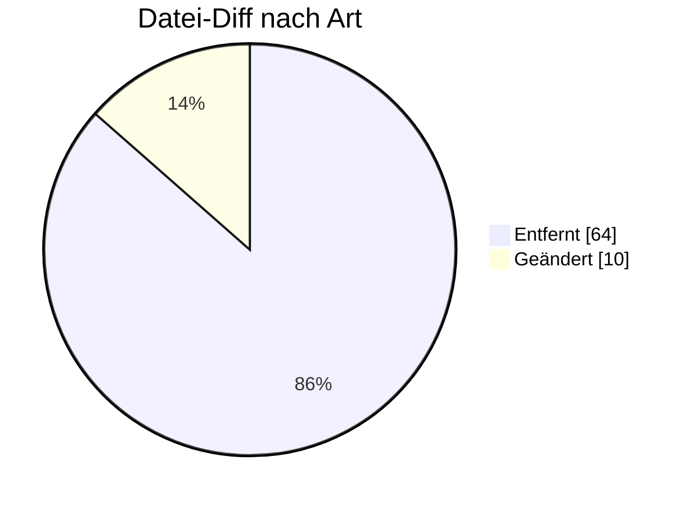

# UTILTS — Formatumstellung 01.10.2026

← [Zurück zur Gesamtübersicht](../index.md)

**Berechnungsformel / Zeitreihen** · `AHB 1.0 → 1.1 · MIG 1.1`

<Columns>
<Column>
<Card title="Kuratierte Änderungen" icon="material-two-tone-functions">
**7** aus der BDEW-Änderungshistorie
</Card>
</Column>
<Column>
<Card title="Datei-Diff" icon="material-two-tone-difference">
**74** Einzeländerungen (AHB/MIG)
</Card>
</Column>
</Columns>

:::tip[Kurzfazit (das Wichtigste auf einen Blick)]
- **Limitierung:** NB darf max. 9 Zeitscheiben je Vorgang übermitteln.
- **Logik-Regel:** DTM+Z26 in jüngster Zeitscheibe nicht vorhanden → Gültigkeit ∞.
- **Umbau auf Pakete** + XODER-Korrektur in mehreren Anwendungsfällen.
:::

:::warning[Auswirkungen aufs Backend]
- **Max. 9 Zeitscheiben je Vorgang:** Generierung/Validierung begrenzen.
- **DTM+Z26-Logik (Gültigkeit ∞):** Sonderregel implementieren.
- **Umbau auf Pakete + XODER:** Mapping/Validierung anpassen.
:::

---

## Änderungen nach Marktrolle

:::note[Navigation]
Jede Rolle ist ein eigener Block; klappe die gewünschte Einzeländerung auf, um Bisher/Neu/Grund zu sehen. Eine Änderung kann mehreren Rollen zugeordnet sein (Mehrfachnennung).
:::

### ⚪ Übergreifend (7)

<AccordionGroup>

<Accordion title="Änd-ID 26970 · Anwendungsfälle 25004 Übermittlung Übersicht Zählzeitdefin…">

| Feld | Wert |
|---|---|
| **Ort** | Anwendungsfälle 25004 Übermittlung Übersicht Zählzeitdefinitionen  25005 Übermittlung einer ausgerollten Zählzeitdefinition |
| **Prüfi(s)** | – |
| **Rolle(n)** | Übergreifend |
| **Status** | Genehmigt |

**Bisher:**
> CTA-Segment "Ansprechpartner" und COM- Segment "Kommunikationsverbindung" vorhanden

**Neu:**
> CTA-Segment "Ansprechpartner" und COM- Segment "Kommunikationsverbindung" nicht vorhanden

**Grund:** Umsetzung des Konsultationsergebnisses des Konzepts „zur Nutzung der Kontaktinformationen des Senders in den EDI@Energy Nachrichtentypen“

</Accordion>

<Accordion title="Änd-ID 26185 · Kapitel 3 Übersicht">

| Feld | Wert |
|---|---|
| **Ort** | Kapitel 3 Übersicht |
| **Prüfi(s)** | – |
| **Rolle(n)** | Übergreifend |
| **Status** | Genehmigt |

**Bisher:**
> Pakete [4P], [5P], [6P], [7P], [8P], [9P], [10P]

**Neu:**
> Pakete [4P], [5P], [6P], [7P], [8P], [9P], [10P]

**Grund:** Einführung neuer Pakete (siehe

</Accordion>

<Accordion title="Änd-ID 26184 · Anwendungsfall 25005 Übermittlung einer ausgerollten Zählz…">

| Feld | Wert |
|---|---|
| **Ort** | Anwendungsfall 25005 Übermittlung einer ausgerollten Zählzeitdefinition  SG5 Vorgang SG8 Zählzeitdefinition DTM Zählzeitänderungszei tpunkt DE2379 |
| **Prüfi(s)** | – |
| **Rolle(n)** | Übergreifend |
| **Status** | Genehmigt |

**Bisher:**
> 303 X [50] ∧ [528] 401 X [50] ∧ [527]  [50] In jedem DE2379 dieses DTM-Segments innerhalb eines IDE+24 (Vorgangs) muss der gleiche Code angegeben werden [527] Hinweis: Dieser Code ist anzugeben, wenn es sich um eine einmalig zu übermittelnde Definition handelt [528] Hinweis: Dieser Code ist anzugeben, wenn es sich um eine jährlich zu übermittelnde Definition handelt

**Neu:**
> 303 X [9P0..1] 401 X [10P0..1]

**Grund:** Umbau auf Pakete.

</Accordion>

<Accordion title="Änd-ID 26183 · Anwendungsfall 25009 Übermittlung einer ausgerollten Leist…">

| Feld | Wert |
|---|---|
| **Ort** | Anwendungsfall 25009 Übermittlung einer ausgerollten Leistungskurvendisku ssion  SG5 Vorgang SG8 |
| **Prüfi(s)** | – |
| **Rolle(n)** | Übergreifend |
| **Status** | Genehmigt |

**Bisher:**
> 303 X [50] ∧ [528] 401 X [50] ∧ [527]  [50] In jedem DE2379 dieses DTM-Segments innerhalb eines IDE+24 (Vorgangs) muss der gleiche Code angegeben werden [527] Hinweis: Dieser Code ist anzugeben, wenn es sich um eine einmalig zu übermittelnde

**Neu:**
> 303 X [9P0..1] 401 X [10P0..1]

**Grund:** Umbau auf Pakete.

</Accordion>

<Accordion title="Änd-ID 26182 · Anwendungsfall 25008 Übermittlung einer ausgerollten Schal…">

| Feld | Wert |
|---|---|
| **Ort** | Anwendungsfall 25008 Übermittlung einer ausgerollten Schaltzeitdefinition  SG5 Vorgang SG8 Schaltzeitdefinition DTM Schaltzeitänderungsz eitpunkt DE2379 |
| **Prüfi(s)** | – |
| **Rolle(n)** | Übergreifend |
| **Status** | Genehmigt |

**Bisher:**
> 303 X [50] ∧ [528] 401 X [50] ∧ [527]  [50] In jedem DE2379 dieses DTM-Segments innerhalb eines IDE+24 (Vorgangs) muss der gleiche Code angegeben werden [527] Hinweis: Dieser Code ist anzugeben, wenn es sich um eine einmalig zu übermittelnde Definition handelt [528] Hinweis: Dieser Code ist anzugeben, wenn es sich um eine jährlich zu übermittelnde Definition handelt

**Neu:**
> 303 X [9P0..1] 401 X [10P0..1]

**Grund:** Umbau auf Pakete.

</Accordion>

<Accordion title="Änd-ID 26181 · Anwendungsfall">

| Feld | Wert |
|---|---|
| **Ort** | Anwendungsfall |
| **Prüfi(s)** | – |
| **Rolle(n)** | Übergreifend |
| **Status** | Genehmigt |

**Bisher:**
> Z69 X [11] ⊻ [15]

**Neu:**
> Z69 X [4P0..1]

**Grund:** Umbau auf Pakete.

</Accordion>

<Accordion title="Änd-ID 26180 · Anwendungsfälle 25001 Berechnungsformel 25010 Antwort auf …">

| Feld | Wert |
|---|---|
| **Ort** | Anwendungsfälle 25001 Berechnungsformel 25010 Antwort auf Berechnungsformel  SG2 MP-ID Absender   SG3 |
| **Prüfi(s)** | – |
| **Rolle(n)** | Übergreifend |
| **Status** | Genehmigt |

**Bisher:**
> X (([939][53]) ∨ ([940][54])) ∧ [530]  [53] Wenn im DE3155 in demselben COM der Code EM vorhanden ist [54] Wenn im DE3155 in demselben COM der Code TE / FX / AJ / AL vorhanden ist [530] Hinweis: Es darf nur eine Information im DE3148 übermittelt werden [939] Format: Die Zeichenkette muss die Zeichen

**Neu:**
> X (([939][53]) ⊻ ([940][54])) ∧ [530]  [53] Wenn im DE3155 in demselben COM der Code EM vorhanden ist [54] Wenn im DE3155 in demselben COM der Code TE / FX / AJ / AL vorhanden ist [530] Hinweis: Es darf nur eine Information im DE3148 übermittelt werden [939] Format: Die Zeichenkette muss die Zeichen

**Grund:** Einbau des XODER Operator zur korrekten Abgrenzung der Bedingungen.

</Accordion>

</AccordionGroup>

---

### 🔬 Echter Datei-Diff (AHB/MIG · Stand 202604 → 202610)

<AccordionGroup>
:::info[74 Einzeländerungen auf Segment-/Bedingungsebene]
**＋ 0** hinzugefügt · **− 64** entfernt · **~ 10** geändert. Diese granulare Ebene ergänzt die kuratierte BDEW-Historie — Auszug unten.
:::

<Accordion title="Top-Prüfidentifikatoren nach Anzahl Datei-Änderungen">

| Prüfi | Datei-Änderungen |
|---|---|
| 25005 | 12 |
| 25008 | 12 |
| 25009 | 12 |
| 25004 | 10 |
| 25006 | 10 |
| 25007 | 10 |
| 25001 | 7 |
| 25010 | 1 |

</Accordion>
</AccordionGroup>

---

← [Gesamtübersicht](../index.md)
