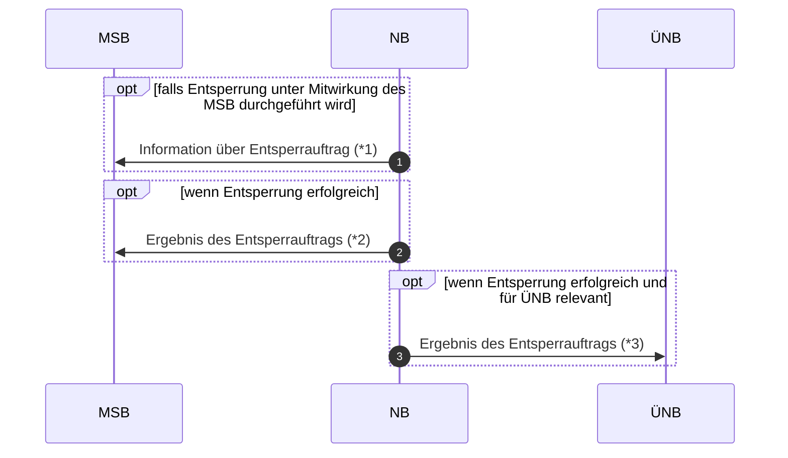

# Wiederherstellung der Anschlussnutzung bei Lieferbeginn (Rolle MSB)

```mermaid
sequenceDiagram
  autonumber
  
 
  participant MSB as MSB
  participant NB as NB
  participant ÜNB as ÜNB
  
  opt falls Entsperrung unter Mitwirkung des MSB durchgeführt wird
      
      NB ->> MSB : Information über Entsperrauftrag (*1)
      
  end
  
  opt wenn Entsperrung erfolgreich
      
      NB ->> MSB : Ergebnis des Entsperrauftrags (*2)
  end
  
  opt wenn Entsperrung erfolgreich und für ÜNB relevant
  
      NB ->> ÜNB : Ergebnis des Entsperrauftrags (*3)
      
  end
 
 
```

*1 Prüfi: 21040
*2 Prüfi: 21039
*3 Prüfi: 21039

