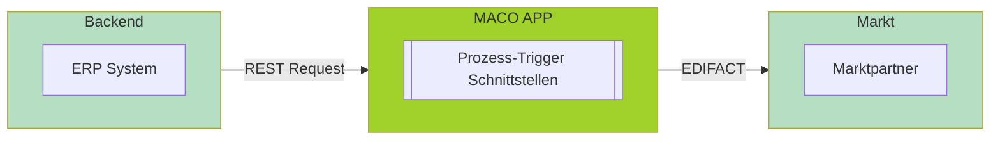
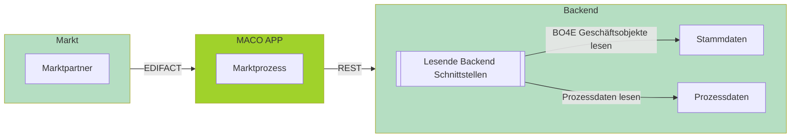
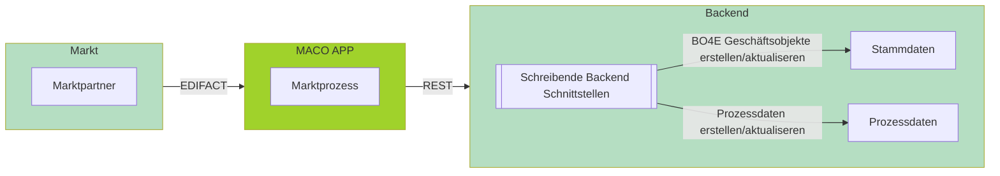

# Übersicht

# 🦈 Schnittstellen Dokumentation

### Willkommen an Bord!

Diese Dokumentation ist Ihr Kompass durch die Welt der MACO APP-Schnittstellen. Klar strukturiert nach Funktion und Marktrolle, finden Sie hier schnell und gezielt die passende API. 

---

## 🚀 Prozess-Trigger Schnittstellen
Schnittstellen der MACO APP, um **Prozesse aus dem Backend anzustoßen**.

<Card title=""> 

<Steps>
  <Step>Das ERP-System ruft die Trigger-API der MACO APP via REST auf.</Step>
  <Step>Die MACO APP verarbeitet den Auftrag und erzeugt eine EDIFACT Nachricht.</Step>
  <Step>Die Nachricht wird an den Marktpartner übermittelt.</Step>
</Steps>

</Card>    

<CardGroup cols={2}>
  <Card title="Netzbetreiber" href="https://doc.macoapp.de/trigger-nb.md" icon="material-two-tone-ev_station">
    Zu den Prozesstriggern für die Marktrolle Netzbetreiber.
  </Card>
  <Card title="Lieferant" href="https://doc.macoapp.de/trigger-lf.md" icon="material-two-tone-account_balance">
    Zu den Prozesstriggern für die Marktrolle Lieferant.
  </Card>
</CardGroup>  

---

## 📥 Lesende Backend Schnittstellen 
ERP-Schnittstellen, die von der MACO APP genutzt werden, um Geschäftsobjekte im BO4E-Format und Prozessdaten abzufragen.

<Card title="">   

    

<Steps>
  <Step>Der Marktpartner sendet eine Nachricht an die MACO APP.</Step>
  <Step>Die MACO APP ruft BO4E-Daten vom Backend via REST/RFC ab.</Step>
  <Step>Die BO4E-Daten werden zur weiteren Verarbeitung genutzt.</Step>
</Steps>

</Card>  

<CardGroup cols={2}>
  <Card title="Stammdaten lesen" href="https://doc.macoapp.de/lesen.md" icon="material-two-tone-person_search">
    Liest BO4E-Objekte zur Verarbeitung von Marktprozessen oder Versand von Antwortnachrichten.
  </Card>
  <Card title="Prozessdaten lesen" href="https://doc.macoapp.de/prozessdaten-lesen-backend-3187758f0.md" icon="material-two-tone-description">
    Liest Proezssdaten zur Verarbeitung von Marktprozessen
  </Card>
</CardGroup>

---

## 📤 Schreibende Backend Schnittstellen
Erwartete Backend-APIs zur **Verbuchung von Marktdaten**.

<Card title="">   

    

<Steps>
  <Step>Der Marktpartner sendet eine Nachricht an die MACO APP.</Step>
  <Step>Die MACO APP verarbeitet die Nachricht und führt EBD-Prüfung durch.</Step>
  <Step>MACO ruft die Backend-API zum Verbuchen der Daten auf.</Step>
</Steps>

</Card> 

<CardGroup cols={3}>
  <Card title="Netzbetreiber" href="https://doc.macoapp.de/prozessdaten-nb-backend-3187931f0.md" icon="material-two-tone-ev_station">
    Zu den schreibenden Backend Schnittstellen für die Marktrolle Netzbetreiber.
  </Card>
  <Card title="Lieferant" href="https://doc.macoapp.de/prozessdaten-lf-backend-3036640f0.md" icon="material-two-tone-account_balance">
    Zu den schreibenden Backend Schnittstellen für die Marktrolle Lieferant.
  </Card>
  <Card title="Messstellenbetreiber" href="https://doc.macoapp.de/prozessdaten-msb-backend-3188572f0.md" icon="material-two-tone-electric_meter">
    Zu den schreibenden Backend Schnittstellen für die Marktrolle Messstellenbetreiber.
  </Card>    
</CardGroup>  

