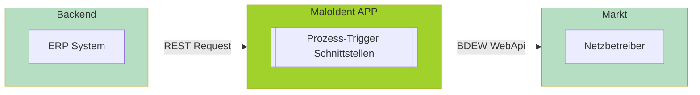
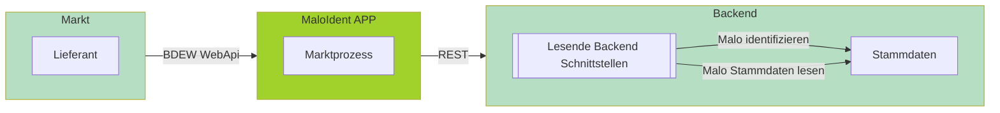
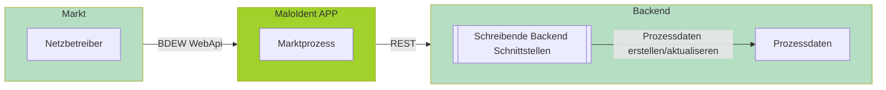

# Übersicht

# 🦈 MaloIdent APP API Dokumentation

Herzlich willkommen! Diese Dokumentation bietet Ihnen einen übersichtlichen Einstieg in die wichtigsten Schnittstellen der MaloIdent Lösungen. Alle APIs sind nach Funktion und Marktrolle gegliedert.

---

## 🚀 Prozess-Trigger Schnittstellen Lieferant
Schnittstellen der MaloIdent APP, um **Prozesse aus dem Backend anzustoßen**.

<Card title=""> 

<Steps>
  <Step>Das ERP-System ruft die Trigger-API der MACO APP via REST auf.</Step>
  <Step>Die MaloIdent APP verarbeitet den Auftrag und erzeugt einen BDEW WebApi Request.</Step>
  <Step>Die Nachricht wird an den Marktpartner übermittelt.</Step>
</Steps>

</Card>    

<CardGroup cols={1}>
  <Card title="Lieferant" href="https://doc.macoapp.de/maloident-anfrage-ausl%C3%B6sen-15144286e0.md" icon="material-two-tone-account_balance">
    Zu den Prozesstriggern für die Marktrolle Lieferant.
  </Card>
</CardGroup>  

---

## 📤 Lesende Backend Schnittstellen Netzbetreiber
ERP-Schnittstellen, die von der MaloIdent APP genutzt werden, um Geschäftsobjekte im BO4E-Format und Malo Identifikation abzufragen.

<Card title="">   

    

<Steps>
  <Step>Der Marktpartner sendet eine Nachricht an die MaloIdent APP.</Step>
  <Step>Die MaloIdent APP ruft die Malo Identifizierung vom Backend via REST ab.</Step>
  <Step>Die Daten werden zur EBD Verarbeitung und Antwort genutzt.</Step>
</Steps>

</Card>  

<CardGroup cols={2}>
  <Card title="Malo identifizieren" href="https://doc.macoapp.de/identifizierung-der-malo-15144292e0.md" icon="material-two-tone-description">
    Liest Proezssdaten zur Verarbeitung von Marktprozessen
  </Card>
  <Card title="Malo Stammdaten lesen" href="https://doc.macoapp.de/stammdaten-der-identifiz-malo-15144303e0.md" icon="material-two-tone-person_search">
    Liest BO4E-Objekte zur Verarbeitung von Marktprozessen oder Versand von Antwortnachrichten.
  </Card>    
</CardGroup>

---

## 📥 Schreibende Backend Schnittstellen Lieferant
Erwartete Backend-APIs zur **Verbuchung der MaloIdent Antwort**.

<Card title="">   

    

<Steps>
  <Step>Der Marktpartner sendet eine Nachricht an die MaloIdent APP.</Step>
  <Step>Die MaloIdent APP verarbeitet die Nachricht.</Step>
  <Step>MaloIdent APP ruft die Backend-API zum Verbuchen der Daten auf.</Step>
</Steps>

</Card> 

<CardGroup cols={1}>
  <Card title="Lieferant" href="https://doc.macoapp.de/prozessdaten-aktualisieren-15144289e0.md" icon="material-two-tone-account_balance">
    Zu den schreibenden Backend Schnittstellen für die Marktrolle Lieferant.
  </Card>  
</CardGroup>  

